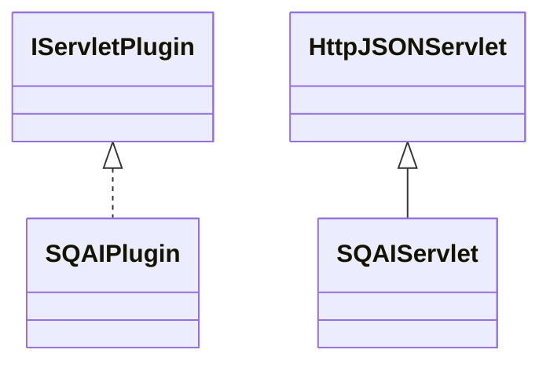

# ServletSQAI.jar

[Group index](README.md) | [All archives](../README.md)

## Scope and provenance

- **Donor:** `SQX_145_REFERENCE_ROOT/internal/plugins/ServletSQAI/ServletSQAI.jar`.
- **SHA-256:** `545ec37398014a9bec74760dd6f4b1886f5c1b30c7e2fb63c50d2e27df5a382b`; accessed 2026-10-06; captured `2026-10-06T18:54:51.906614+00:00`.
- **Classes:** 2 raw entries; 2 unique entry names. Duplicate occurrence indices are zero-based.
- **Inspection:** read-only ZIP hashing and class-file structural parsing; signatures/descriptors, modifiers, hierarchy and references only. Bytecode bodies are hashed, not published.
- **Allocation:** proposed `FEAT-AGENTIC-SERVLET-SQAI`, P19; [roadmap](../../dev/sqx-full-application-roadmap.md). Domain README registration remains required.
- **Repository:** `01067f00031428613c6394064ca1bcadc1ba00ee`; review state unreviewed. Download label 145-dev1; installed build/activation and runtime equivalence unverified.
- **Limit:** every class/member is inventoried; declaration coverage does not establish consumed calls, defaults, formulas, failure semantics or algorithm parity.
- **Archive/resource index:** [236.json](../../dev/evidence/sqx145/archives/145/236.json).

## Complete member declarations

Member shards contain exact JVM names/descriptors, access flags, generic signatures, throws types, declared fields/methods, superclass/interfaces and referenced class names. All classes, nested/synthetic members and overloads are retained. Code length/hash is structural evidence, not a normalized algorithm comparison.

- [001.json](../../dev/evidence/sqx145/members/236/001.json) — SHA-256 `21b7bf33befb4091f2b65e7c4d10f4e81c2c5c95a8477483a732369ff245cd3b`.

## Focused structural diagram

Up to twelve non-nested classes; arrows show declared inheritance/interfaces only. External type names are not evidence of an available body or an executed dependency.

## Class inventory

| Archive entry | Occurrence | Class SHA-256 | Fields | Methods |
| --- | ---: | --- | ---: | ---: |
| `com/strategyquant/plugin/Servlet/impl/SQAI/SQAIPlugin.class` | 0 | `845a85304ce72f01a22ec00684cb4dd1ec033a88cea53bab335eb37e7ff3e2e8` | 1 | 6 |
| `com/strategyquant/plugin/Servlet/impl/SQAI/SQAIServlet.class` | 0 | `ec89be66c541da3ce04f846a833bf53a0c7df760aa5725cb61147c48e487bb25` | 2 | 24 |
