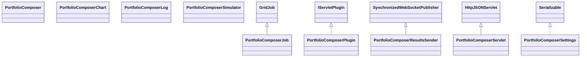

# PortfolioComposer.jar

[Group index](README.md) | [All archives](../README.md)

## Scope and provenance

- **Donor:** `SQX_145_REFERENCE_ROOT/internal/plugins/PortfolioComposer/PortfolioComposer.jar`.
- **SHA-256:** `46998223c28fb3ddce99dcf44bb5009fef53a8c7df0d09889a455b4aac0a1e16`; accessed 2026-10-06; captured `2026-10-06T18:54:51.906614+00:00`.
- **Classes:** 15 raw entries; 15 unique entry names. Duplicate occurrence indices are zero-based.
- **Inspection:** read-only ZIP hashing and class-file structural parsing; signatures/descriptors, modifiers, hierarchy and references only. Bytecode bodies are hashed, not published.
- **Allocation:** proposed `FEAT-PORTFOLIO-PORTFOLIO-COMPOSER`, P12; [roadmap](../../dev/sqx-full-application-roadmap.md). Domain README registration remains required.
- **Repository:** `01067f00031428613c6394064ca1bcadc1ba00ee`; review state unreviewed. Download label 145-dev1; installed build/activation and runtime equivalence unverified.
- **Limit:** every class/member is inventoried; declaration coverage does not establish consumed calls, defaults, formulas, failure semantics or algorithm parity.
- **Archive/resource index:** [194.json](../../dev/evidence/sqx145/archives/145/194.json).

## Complete member declarations

Member shards contain exact JVM names/descriptors, access flags, generic signatures, throws types, declared fields/methods, superclass/interfaces and referenced class names. All classes, nested/synthetic members and overloads are retained. Code length/hash is structural evidence, not a normalized algorithm comparison.

- [001.json](../../dev/evidence/sqx145/members/194/001.json) — SHA-256 `b92dc11717ac02ed926637651a391b260ceb8170dd813b62c3457093b056dec7`.

## Focused structural diagram

Up to twelve non-nested classes; arrows show declared inheritance/interfaces only. External type names are not evidence of an available body or an executed dependency.

## Class inventory

| Archive entry | Occurrence | Class SHA-256 | Fields | Methods |
| --- | ---: | --- | ---: | ---: |
| `com/strategyquant/plugin/Portfolio/impl/Composer/PortfolioComposer$1.class` | 0 | `6ad46ad8e48f0dab87de700f12725650474339c9d157b67257c88e20c441e2f0` | 0 | 0 |
| `com/strategyquant/plugin/Portfolio/impl/Composer/PortfolioComposer$DailyLog.class` | 0 | `ee4194b8a321d48ff698ab7c3b328417c632dd5c2868c40804cea2f129305880` | 3 | 6 |
| `com/strategyquant/plugin/Portfolio/impl/Composer/PortfolioComposer.class` | 0 | `3fc074e30999df7908513aac001159773615a2f21539bca0279740d4e0ed562c` | 3 | 19 |
| `com/strategyquant/plugin/Portfolio/impl/Composer/PortfolioComposerChart.class` | 0 | `362da9cc04bda59ab7bf1dac4d0784abc836ad6542e92f158fb8203cbd858bc8` | 13 | 2 |
| `com/strategyquant/plugin/Portfolio/impl/Composer/PortfolioComposerJob.class` | 0 | `14d956027d2d5dafd6dd4c5ae90de5de8e84442e189b908ab950f303d38ded1e` | 6 | 5 |
| `com/strategyquant/plugin/Portfolio/impl/Composer/PortfolioComposerLog.class` | 0 | `99c5df769af53de4e2816d09278dce2146b6f79c6cbcf657ca5386d9cc89a409` | 2 | 6 |
| `com/strategyquant/plugin/Portfolio/impl/Composer/PortfolioComposerPlugin.class` | 0 | `ea5fdbbf064773e5f301e9ccef8067d8bd9d9f9dc9ecd09eeefcae405a663260` | 1 | 5 |
| `com/strategyquant/plugin/Portfolio/impl/Composer/PortfolioComposerResultsSender.class` | 0 | `1f16df78d428e6e48ac96a3395f9d40e0194cb3f155b4b8ceb2c7fd5ec1a06f2` | 3 | 6 |
| `com/strategyquant/plugin/Portfolio/impl/Composer/PortfolioComposerServlet$1.class` | 0 | `898efa502bad5c84f7e8d0c5cb7ad5971b27b777d7ded79bcecb10a327105d30` | 4 | 2 |
| `com/strategyquant/plugin/Portfolio/impl/Composer/PortfolioComposerServlet$2.class` | 0 | `831d0ca998b1243884c0e20c33369acd9b99d27cf073efc1e98b3abce55e212e` | 2 | 2 |
| `com/strategyquant/plugin/Portfolio/impl/Composer/PortfolioComposerServlet.class` | 0 | `c8dde65e442f20eafa97ae4183d71d5d00e0df724a3a56c8b3cbd60d87edc7ee` | 5 | 16 |
| `com/strategyquant/plugin/Portfolio/impl/Composer/PortfolioComposerSettings$PortfolioSelectionType.class` | 0 | `89953a595cd31dfaf065f96475afce6a8f0e6b0a03c07ae49f27d23540d9ad96` | 6 | 5 |
| `com/strategyquant/plugin/Portfolio/impl/Composer/PortfolioComposerSettings.class` | 0 | `dd2c0b05d71ac90ad492b6b47fd7e829ea5bd6eca4cdfe3877bfdc218e3822c7` | 12 | 3 |
| `com/strategyquant/plugin/Portfolio/impl/Composer/PortfolioComposerSimulator$1.class` | 0 | `699b0ab1f22fd7c04ed2a2d05b69e00b98da7540da6d6d6d5b4a19fde4de9a16` | 2 | 5 |
| `com/strategyquant/plugin/Portfolio/impl/Composer/PortfolioComposerSimulator.class` | 0 | `4b1b820ebe404228662986e3c529b39943b4a32f97a4bd0ffdc5a060b3ef4bf4` | 10 | 16 |
