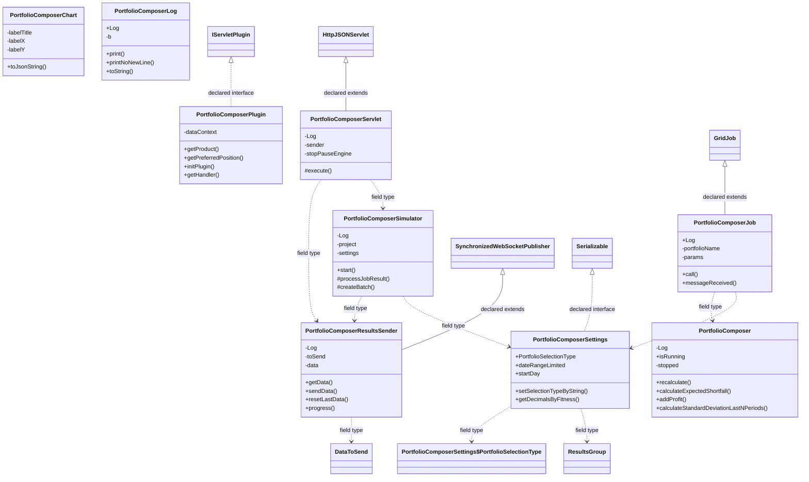

# PortfolioComposer.jar

[Workspace/group index](README.md)  |  [All workspaces](../README.md)

## Scope and provenance

- Artifact: `SQX_REFERENCE_ROOT/internal/plugins/PortfolioComposer/PortfolioComposer.jar`.
- SHA-256: `f16ea1e94a8f7d134e103372d96cd96f60d8dedfe5970d02413fedc393766cc9`.
- Inspected: 2026-10-05; generation timestamp `2026-10-05T19:04:16.344170+00:00`.
- Archive class entries: **15**; non-nested: **9**; nested/anonymous: **6**.
- Inspection: ZIP entry/manifest enumeration and `javap -p` declarations for every listed class.
- Repository source HEAD: `8a92c705183a6702eaf62037ccb202ed028aa899`; review state: generated, pending owner review.
- Installed SQX build number is unverified. No method bodies are reproduced.
- Confidence: high for declared structure; workspace ownership inferred except where registration evidence is separately stated. Runtime reachability, call order, formulas and parity remain unverified.

The `PortfolioComposer` folder is a navigation/research grouping, not an exclusive backend owner. Shared consumers may use this JAR.

Target mapping: no verified owning HaruQuantAI feature/requirement/decision IDs are assigned by this document. Register or resolve ownership through the normal repository plan before implementation.

## Diagram reading guide

`Parent <|-- Child` means declared inheritance; `Interface <|.. Class` means declared implementation. Interface extension uses the inheritance arrow. `A ..> B : field type` is a declared type dependency, not composition, object ownership or a runtime call. External nodes are referenced types, not fabricated local implementations. Selected fields/method names aid navigation: `+` is public, `#` protected and `-` private. Diagram method names omit parameter/return types and collapse overloads; use the exact inspected declarations below before implementing an API.

Detailed graphs include non-nested classes in package-sized groups of at most 12. Nested/anonymous classes are inventoried and their declarations/relationships are retained below, but omitted from overview graphs. Relationships not drawn for readability remain in the complete declaration-relationship table. Constructors, synthetic bridges and overloads may be collapsed in diagram member lists only. Standard `java.lang.Object` inheritance is omitted from diagrams.

## UML class diagrams

### 1. `com.strategyquant.plugin.Portfolio.impl.Composer`



| Diagram identifier | Exact type | Location |
| --- | --- | --- |
| `C729a56512564` | [`com.strategyquant.gridlib.client.GridJob`](../Shared/SQGridLib2.md) | referenced external type |
| `C1d5e678ca95d` | `com.strategyquant.plugin.Portfolio.impl.Composer.PortfolioComposer` (this JAR) | this diagram |
| `Cf5ca20765253` | `com.strategyquant.plugin.Portfolio.impl.Composer.PortfolioComposerChart` (this JAR) | this diagram |
| `C3aef75c94bd9` | `com.strategyquant.plugin.Portfolio.impl.Composer.PortfolioComposerJob` (this JAR) | this diagram |
| `C200232e49f41` | `com.strategyquant.plugin.Portfolio.impl.Composer.PortfolioComposerLog` (this JAR) | this diagram |
| `Cb1cd0056a6a3` | `com.strategyquant.plugin.Portfolio.impl.Composer.PortfolioComposerPlugin` (this JAR) | this diagram |
| `C60109c48aa18` | `com.strategyquant.plugin.Portfolio.impl.Composer.PortfolioComposerResultsSender` (this JAR) | this diagram |
| `Cf6952ee30820` | `com.strategyquant.plugin.Portfolio.impl.Composer.PortfolioComposerServlet` (this JAR) | this diagram |
| `C037411d27176` | `com.strategyquant.plugin.Portfolio.impl.Composer.PortfolioComposerSettings` (this JAR) | this diagram |
| `Cd3911c384f74` | `com.strategyquant.plugin.Portfolio.impl.Composer.PortfolioComposerSettings$PortfolioSelectionType` (this JAR) | another group in this JAR |
| `Ccea5fce5ea5a` | `com.strategyquant.plugin.Portfolio.impl.Composer.PortfolioComposerSimulator` (this JAR) | this diagram |
| `C81fcbc41b716` | [`com.strategyquant.tradinglib.ResultsGroup`](../Shared/SQTradingLib.md) | referenced external type |
| `C6128eed56b6d` | [`com.strategyquant.tradinglib.project.websocket.DataToSend`](../Shared/SQTradingLib.md) | referenced external type |
| `Ce87cf9854aad` | [`com.strategyquant.tradinglib.project.websocket.SynchronizedWebSocketPublisher`](../Shared/SQTradingLib.md) | referenced external type |
| `C249b5c671b1a` | [`com.strategyquant.tradinglib.servlet.IServletPlugin`](../Shared/SQTradingLib.md) | referenced external type |
| `C8900f90ae594` | [`com.strategyquant.webguilib.servlet.HttpJSONServlet`](../Shared/SQWebGUILib.md) | referenced external type |
| `C210d9b760f82` | `java.io.Serializable` (not resolved in scoped archives) | referenced external type |

## Complete class inventory

| Fully qualified class | Kind | Entry |
| --- | --- | --- |
| `com.strategyquant.plugin.Portfolio.impl.Composer.PortfolioComposer` | class | non-nested |
| `com.strategyquant.plugin.Portfolio.impl.Composer.PortfolioComposer$1` | class | nested/anonymous |
| `com.strategyquant.plugin.Portfolio.impl.Composer.PortfolioComposer$DailyLog` | class | nested/anonymous |
| `com.strategyquant.plugin.Portfolio.impl.Composer.PortfolioComposerChart` | class | non-nested |
| `com.strategyquant.plugin.Portfolio.impl.Composer.PortfolioComposerJob` | class | non-nested |
| `com.strategyquant.plugin.Portfolio.impl.Composer.PortfolioComposerLog` | class | non-nested |
| `com.strategyquant.plugin.Portfolio.impl.Composer.PortfolioComposerPlugin` | class | non-nested |
| `com.strategyquant.plugin.Portfolio.impl.Composer.PortfolioComposerResultsSender` | class | non-nested |
| `com.strategyquant.plugin.Portfolio.impl.Composer.PortfolioComposerServlet` | class | non-nested |
| `com.strategyquant.plugin.Portfolio.impl.Composer.PortfolioComposerServlet$1` | class | nested/anonymous |
| `com.strategyquant.plugin.Portfolio.impl.Composer.PortfolioComposerServlet$2` | class | nested/anonymous |
| `com.strategyquant.plugin.Portfolio.impl.Composer.PortfolioComposerSettings` | class | non-nested |
| `com.strategyquant.plugin.Portfolio.impl.Composer.PortfolioComposerSettings$PortfolioSelectionType` | class | nested/anonymous |
| `com.strategyquant.plugin.Portfolio.impl.Composer.PortfolioComposerSimulator` | class | non-nested |
| `com.strategyquant.plugin.Portfolio.impl.Composer.PortfolioComposerSimulator$1` | class | nested/anonymous |

## Declared relationships and evidence locations

Every row is supported by the named class declaration/member in `javap -p`, inside the artifact recorded above. Signature dependencies may include return, parameter, generic-argument and throws types; they do not imply execution.

| Declaring class | Referenced type | Relationship | Narrow inspection location |
| --- | --- | --- | --- |
| `com.strategyquant.plugin.Portfolio.impl.Composer.PortfolioComposer` | `org.slf4j.Logger` (not resolved in scoped archives) | type dependency | `com.strategyquant.plugin.Portfolio.impl.Composer.PortfolioComposer` / field declaration: `private static final org.slf4j.Logger Log;` |
| `com.strategyquant.plugin.Portfolio.impl.Composer.PortfolioComposer` | [`com.strategyquant.tradinglib.ResultsGroup`](../Shared/SQTradingLib.md) | type dependency | `com.strategyquant.plugin.Portfolio.impl.Composer.PortfolioComposer` / method signature: `public com.strategyquant.tradinglib.ResultsGroup recalculate(java.lang.String, com.strategyquant.plugin.Portfolio.impl.Composer.PortfolioComposerSettings, java.lang.Double[]) throws java.lang.Exception;`<br>`private void updateMM(com.strategyquant.tradinglib.ResultsGroup, double);`<br>`private void updateHodlResults(com.strategyquant.tradinglib.ResultsGroup, it.unimi.dsi.fastutil.objects.ObjectArrayList<java.lang.String>) throws java.lang.Exception;`<br>`private com.strategyquant.datalib.InstrumentInfo getInstrumentInfo(com.strategyquant.tradinglib.ResultsGroup, com.strategyquant.tradinglib.Order) throws java.lang.Exception;`<br>`private double calculateUsedMargin(it.unimi.dsi.fastutil.longs.Long2ObjectAVLTreeMap<it.unimi.dsi.fastutil.objects.ObjectArrayList<com.strategyquant.tradinglib.Order>>, it.unimi.dsi.fastutil.objects.Object2ObjectOpenHashMap<java.lang.String, com.strategyquant.tradinglib.ResultsGroup>) throws java.lang.Exception;`<br>`private void printOpenTrades(it.unimi.dsi.fastutil.longs.Long2ObjectAVLTreeMap<it.unimi.dsi.fastutil.objects.ObjectArrayList<com.strategyquant.tradinglib.Order>>, com.strategyquant.plugin.Portfolio.impl.Composer.PortfolioComposer$DailyLog, it.unimi.dsi.fastutil.objects.Object2ObjectOpenHashMap<java.lang.String, com.strategyquant.tradinglib.ResultsGroup>, int) throws java.lang.Exception;` |
| `com.strategyquant.plugin.Portfolio.impl.Composer.PortfolioComposer` | `java.lang.String` (not resolved in scoped archives) | type dependency | `com.strategyquant.plugin.Portfolio.impl.Composer.PortfolioComposer` / method signature: `public com.strategyquant.tradinglib.ResultsGroup recalculate(java.lang.String, com.strategyquant.plugin.Portfolio.impl.Composer.PortfolioComposerSettings, java.lang.Double[]) throws java.lang.Exception;`<br>`public static void addProfit(it.unimi.dsi.fastutil.longs.Long2ObjectAVLTreeMap<java.util.Map<java.lang.String, java.lang.Double>>, it.unimi.dsi.fastutil.longs.Long2ObjectAVLTreeMap<java.util.Map<java.lang.String, java.lang.Double>>, it.unimi.dsi.fastutil.longs.Long2ObjectAVLTreeMap<java.util.Map<java.lang.String, java.lang.Double>>, long, java.lang.String, double, double);`<br>`public static double calculateStandardDeviationLastNPeriods(it.unimi.dsi.fastutil.longs.Long2ObjectAVLTreeMap<java.util.Map<java.lang.String, java.lang.Double>>, java.lang.String, int);`<br>`public static double getAverageProfitPercentage(it.unimi.dsi.fastutil.longs.Long2ObjectAVLTreeMap<java.util.Map<java.lang.String, java.lang.Double>>, java.lang.String, int);`<br>`public static double getLastMarginUsed(it.unimi.dsi.fastutil.longs.Long2ObjectAVLTreeMap<java.util.Map<java.lang.String, java.lang.Double>>, java.lang.String);`<br>`public static double getAverageMarginUsed(it.unimi.dsi.fastutil.longs.Long2ObjectAVLTreeMap<java.util.Map<java.lang.String, java.lang.Double>>, java.lang.String);`<br>`public static double getCorrelation(it.unimi.dsi.fastutil.longs.Long2ObjectAVLTreeMap<java.util.Map<java.lang.String, java.lang.Double>>, java.lang.String, java.lang.String);`<br>`private void updateHodlResults(com.strategyquant.tradinglib.ResultsGroup, it.unimi.dsi.fastutil.objects.ObjectArrayList<java.lang.String>) throws java.lang.Exception;`<br>`private double calculateUsedMargin(it.unimi.dsi.fastutil.longs.Long2ObjectAVLTreeMap<it.unimi.dsi.fastutil.objects.ObjectArrayList<com.strategyquant.tradinglib.Order>>, it.unimi.dsi.fastutil.objects.Object2ObjectOpenHashMap<java.lang.String, com.strategyquant.tradinglib.ResultsGroup>) throws java.lang.Exception;`<br>`private void printOpenTrades(it.unimi.dsi.fastutil.longs.Long2ObjectAVLTreeMap<it.unimi.dsi.fastutil.objects.ObjectArrayList<com.strategyquant.tradinglib.Order>>, com.strategyquant.plugin.Portfolio.impl.Composer.PortfolioComposer$DailyLog, it.unimi.dsi.fastutil.objects.Object2ObjectOpenHashMap<java.lang.String, com.strategyquant.tradinglib.ResultsGroup>, int) throws java.lang.Exception;` |
| `com.strategyquant.plugin.Portfolio.impl.Composer.PortfolioComposer` | `com.strategyquant.plugin.Portfolio.impl.Composer.PortfolioComposerSettings` (this JAR) | type dependency | `com.strategyquant.plugin.Portfolio.impl.Composer.PortfolioComposer` / method signature: `public com.strategyquant.tradinglib.ResultsGroup recalculate(java.lang.String, com.strategyquant.plugin.Portfolio.impl.Composer.PortfolioComposerSettings, java.lang.Double[]) throws java.lang.Exception;` |
| `com.strategyquant.plugin.Portfolio.impl.Composer.PortfolioComposer` | `java.lang.Double` (not resolved in scoped archives) | type dependency | `com.strategyquant.plugin.Portfolio.impl.Composer.PortfolioComposer` / method signature: `public com.strategyquant.tradinglib.ResultsGroup recalculate(java.lang.String, com.strategyquant.plugin.Portfolio.impl.Composer.PortfolioComposerSettings, java.lang.Double[]) throws java.lang.Exception;`<br>`public static void addProfit(it.unimi.dsi.fastutil.longs.Long2ObjectAVLTreeMap<java.util.Map<java.lang.String, java.lang.Double>>, it.unimi.dsi.fastutil.longs.Long2ObjectAVLTreeMap<java.util.Map<java.lang.String, java.lang.Double>>, it.unimi.dsi.fastutil.longs.Long2ObjectAVLTreeMap<java.util.Map<java.lang.String, java.lang.Double>>, long, java.lang.String, double, double);`<br>`public static double calculateStandardDeviationLastNPeriods(it.unimi.dsi.fastutil.longs.Long2ObjectAVLTreeMap<java.util.Map<java.lang.String, java.lang.Double>>, java.lang.String, int);`<br>`public static double getAverageProfitPercentage(it.unimi.dsi.fastutil.longs.Long2ObjectAVLTreeMap<java.util.Map<java.lang.String, java.lang.Double>>, java.lang.String, int);`<br>`public static double getLastMarginUsed(it.unimi.dsi.fastutil.longs.Long2ObjectAVLTreeMap<java.util.Map<java.lang.String, java.lang.Double>>, java.lang.String);`<br>`public static double getAverageMarginUsed(it.unimi.dsi.fastutil.longs.Long2ObjectAVLTreeMap<java.util.Map<java.lang.String, java.lang.Double>>, java.lang.String);`<br>`public static double getCorrelation(it.unimi.dsi.fastutil.longs.Long2ObjectAVLTreeMap<java.util.Map<java.lang.String, java.lang.Double>>, java.lang.String, java.lang.String);` |
| `com.strategyquant.plugin.Portfolio.impl.Composer.PortfolioComposer` | `java.lang.Exception` (not resolved in scoped archives) | type dependency | `com.strategyquant.plugin.Portfolio.impl.Composer.PortfolioComposer` / method signature: `public com.strategyquant.tradinglib.ResultsGroup recalculate(java.lang.String, com.strategyquant.plugin.Portfolio.impl.Composer.PortfolioComposerSettings, java.lang.Double[]) throws java.lang.Exception;`<br>`private void updateHodlResults(com.strategyquant.tradinglib.ResultsGroup, it.unimi.dsi.fastutil.objects.ObjectArrayList<java.lang.String>) throws java.lang.Exception;`<br>`private void modifyHodlOrder(com.strategyquant.tradinglib.Order, long, long) throws java.lang.Exception;`<br>`private com.strategyquant.datalib.InstrumentInfo getInstrumentInfo(com.strategyquant.tradinglib.ResultsGroup, com.strategyquant.tradinglib.Order) throws java.lang.Exception;`<br>`private double calculateUsedMargin(it.unimi.dsi.fastutil.longs.Long2ObjectAVLTreeMap<it.unimi.dsi.fastutil.objects.ObjectArrayList<com.strategyquant.tradinglib.Order>>, it.unimi.dsi.fastutil.objects.Object2ObjectOpenHashMap<java.lang.String, com.strategyquant.tradinglib.ResultsGroup>) throws java.lang.Exception;`<br>`private void printOpenTrades(it.unimi.dsi.fastutil.longs.Long2ObjectAVLTreeMap<it.unimi.dsi.fastutil.objects.ObjectArrayList<com.strategyquant.tradinglib.Order>>, com.strategyquant.plugin.Portfolio.impl.Composer.PortfolioComposer$DailyLog, it.unimi.dsi.fastutil.objects.Object2ObjectOpenHashMap<java.lang.String, com.strategyquant.tradinglib.ResultsGroup>, int) throws java.lang.Exception;` |
| `com.strategyquant.plugin.Portfolio.impl.Composer.PortfolioComposer` | `it.unimi.dsi.fastutil.longs.Long2ObjectAVLTreeMap` (not resolved in scoped archives) | type dependency | `com.strategyquant.plugin.Portfolio.impl.Composer.PortfolioComposer` / method signature: `public static void addProfit(it.unimi.dsi.fastutil.longs.Long2ObjectAVLTreeMap<java.util.Map<java.lang.String, java.lang.Double>>, it.unimi.dsi.fastutil.longs.Long2ObjectAVLTreeMap<java.util.Map<java.lang.String, java.lang.Double>>, it.unimi.dsi.fastutil.longs.Long2ObjectAVLTreeMap<java.util.Map<java.lang.String, java.lang.Double>>, long, java.lang.String, double, double);`<br>`public static double calculateStandardDeviationLastNPeriods(it.unimi.dsi.fastutil.longs.Long2ObjectAVLTreeMap<java.util.Map<java.lang.String, java.lang.Double>>, java.lang.String, int);`<br>`public static double getAverageProfitPercentage(it.unimi.dsi.fastutil.longs.Long2ObjectAVLTreeMap<java.util.Map<java.lang.String, java.lang.Double>>, java.lang.String, int);`<br>`public static double getLastMarginUsed(it.unimi.dsi.fastutil.longs.Long2ObjectAVLTreeMap<java.util.Map<java.lang.String, java.lang.Double>>, java.lang.String);`<br>`public static double getAverageMarginUsed(it.unimi.dsi.fastutil.longs.Long2ObjectAVLTreeMap<java.util.Map<java.lang.String, java.lang.Double>>, java.lang.String);`<br>`public static double getCorrelation(it.unimi.dsi.fastutil.longs.Long2ObjectAVLTreeMap<java.util.Map<java.lang.String, java.lang.Double>>, java.lang.String, java.lang.String);`<br>`private double calculateUsedMargin(it.unimi.dsi.fastutil.longs.Long2ObjectAVLTreeMap<it.unimi.dsi.fastutil.objects.ObjectArrayList<com.strategyquant.tradinglib.Order>>, it.unimi.dsi.fastutil.objects.Object2ObjectOpenHashMap<java.lang.String, com.strategyquant.tradinglib.ResultsGroup>) throws java.lang.Exception;`<br>`private void printOpenTrades(it.unimi.dsi.fastutil.longs.Long2ObjectAVLTreeMap<it.unimi.dsi.fastutil.objects.ObjectArrayList<com.strategyquant.tradinglib.Order>>, com.strategyquant.plugin.Portfolio.impl.Composer.PortfolioComposer$DailyLog, it.unimi.dsi.fastutil.objects.Object2ObjectOpenHashMap<java.lang.String, com.strategyquant.tradinglib.ResultsGroup>, int) throws java.lang.Exception;` |
| `com.strategyquant.plugin.Portfolio.impl.Composer.PortfolioComposer` | `java.util.Map` (not resolved in scoped archives) | type dependency | `com.strategyquant.plugin.Portfolio.impl.Composer.PortfolioComposer` / method signature: `public static void addProfit(it.unimi.dsi.fastutil.longs.Long2ObjectAVLTreeMap<java.util.Map<java.lang.String, java.lang.Double>>, it.unimi.dsi.fastutil.longs.Long2ObjectAVLTreeMap<java.util.Map<java.lang.String, java.lang.Double>>, it.unimi.dsi.fastutil.longs.Long2ObjectAVLTreeMap<java.util.Map<java.lang.String, java.lang.Double>>, long, java.lang.String, double, double);`<br>`public static double calculateStandardDeviationLastNPeriods(it.unimi.dsi.fastutil.longs.Long2ObjectAVLTreeMap<java.util.Map<java.lang.String, java.lang.Double>>, java.lang.String, int);`<br>`public static double getAverageProfitPercentage(it.unimi.dsi.fastutil.longs.Long2ObjectAVLTreeMap<java.util.Map<java.lang.String, java.lang.Double>>, java.lang.String, int);`<br>`public static double getLastMarginUsed(it.unimi.dsi.fastutil.longs.Long2ObjectAVLTreeMap<java.util.Map<java.lang.String, java.lang.Double>>, java.lang.String);`<br>`public static double getAverageMarginUsed(it.unimi.dsi.fastutil.longs.Long2ObjectAVLTreeMap<java.util.Map<java.lang.String, java.lang.Double>>, java.lang.String);`<br>`public static double getCorrelation(it.unimi.dsi.fastutil.longs.Long2ObjectAVLTreeMap<java.util.Map<java.lang.String, java.lang.Double>>, java.lang.String, java.lang.String);` |
| `com.strategyquant.plugin.Portfolio.impl.Composer.PortfolioComposer` | `it.unimi.dsi.fastutil.objects.ObjectArrayList` (not resolved in scoped archives) | type dependency | `com.strategyquant.plugin.Portfolio.impl.Composer.PortfolioComposer` / method signature: `private void updateHodlResults(com.strategyquant.tradinglib.ResultsGroup, it.unimi.dsi.fastutil.objects.ObjectArrayList<java.lang.String>) throws java.lang.Exception;`<br>`private double calculateUsedMargin(it.unimi.dsi.fastutil.longs.Long2ObjectAVLTreeMap<it.unimi.dsi.fastutil.objects.ObjectArrayList<com.strategyquant.tradinglib.Order>>, it.unimi.dsi.fastutil.objects.Object2ObjectOpenHashMap<java.lang.String, com.strategyquant.tradinglib.ResultsGroup>) throws java.lang.Exception;`<br>`private void printOpenTrades(it.unimi.dsi.fastutil.longs.Long2ObjectAVLTreeMap<it.unimi.dsi.fastutil.objects.ObjectArrayList<com.strategyquant.tradinglib.Order>>, com.strategyquant.plugin.Portfolio.impl.Composer.PortfolioComposer$DailyLog, it.unimi.dsi.fastutil.objects.Object2ObjectOpenHashMap<java.lang.String, com.strategyquant.tradinglib.ResultsGroup>, int) throws java.lang.Exception;` |
| `com.strategyquant.plugin.Portfolio.impl.Composer.PortfolioComposer` | [`com.strategyquant.tradinglib.Order`](../Shared/SQTradingLib.md) | type dependency | `com.strategyquant.plugin.Portfolio.impl.Composer.PortfolioComposer` / method signature: `private void modifyHodlOrder(com.strategyquant.tradinglib.Order, long, long) throws java.lang.Exception;`<br>`private com.strategyquant.datalib.InstrumentInfo getInstrumentInfo(com.strategyquant.tradinglib.ResultsGroup, com.strategyquant.tradinglib.Order) throws java.lang.Exception;`<br>`private double calculateUsedMargin(it.unimi.dsi.fastutil.longs.Long2ObjectAVLTreeMap<it.unimi.dsi.fastutil.objects.ObjectArrayList<com.strategyquant.tradinglib.Order>>, it.unimi.dsi.fastutil.objects.Object2ObjectOpenHashMap<java.lang.String, com.strategyquant.tradinglib.ResultsGroup>) throws java.lang.Exception;`<br>`private void printOpenTrades(it.unimi.dsi.fastutil.longs.Long2ObjectAVLTreeMap<it.unimi.dsi.fastutil.objects.ObjectArrayList<com.strategyquant.tradinglib.Order>>, com.strategyquant.plugin.Portfolio.impl.Composer.PortfolioComposer$DailyLog, it.unimi.dsi.fastutil.objects.Object2ObjectOpenHashMap<java.lang.String, com.strategyquant.tradinglib.ResultsGroup>, int) throws java.lang.Exception;` |
| `com.strategyquant.plugin.Portfolio.impl.Composer.PortfolioComposer` | [`com.strategyquant.datalib.InstrumentInfo`](../Shared/SQDataLib.md) | type dependency | `com.strategyquant.plugin.Portfolio.impl.Composer.PortfolioComposer` / method signature: `private double calculateMargin(float, double, com.strategyquant.datalib.InstrumentInfo);`<br>`private com.strategyquant.datalib.InstrumentInfo getInstrumentInfo(com.strategyquant.tradinglib.ResultsGroup, com.strategyquant.tradinglib.Order) throws java.lang.Exception;` |
| `com.strategyquant.plugin.Portfolio.impl.Composer.PortfolioComposer` | `it.unimi.dsi.fastutil.objects.Object2ObjectOpenHashMap` (not resolved in scoped archives) | type dependency | `com.strategyquant.plugin.Portfolio.impl.Composer.PortfolioComposer` / method signature: `private double calculateUsedMargin(it.unimi.dsi.fastutil.longs.Long2ObjectAVLTreeMap<it.unimi.dsi.fastutil.objects.ObjectArrayList<com.strategyquant.tradinglib.Order>>, it.unimi.dsi.fastutil.objects.Object2ObjectOpenHashMap<java.lang.String, com.strategyquant.tradinglib.ResultsGroup>) throws java.lang.Exception;`<br>`private void printOpenTrades(it.unimi.dsi.fastutil.longs.Long2ObjectAVLTreeMap<it.unimi.dsi.fastutil.objects.ObjectArrayList<com.strategyquant.tradinglib.Order>>, com.strategyquant.plugin.Portfolio.impl.Composer.PortfolioComposer$DailyLog, it.unimi.dsi.fastutil.objects.Object2ObjectOpenHashMap<java.lang.String, com.strategyquant.tradinglib.ResultsGroup>, int) throws java.lang.Exception;` |
| `com.strategyquant.plugin.Portfolio.impl.Composer.PortfolioComposer` | `com.strategyquant.plugin.Portfolio.impl.Composer.PortfolioComposer$DailyLog` (this JAR) | type dependency | `com.strategyquant.plugin.Portfolio.impl.Composer.PortfolioComposer` / method signature: `private void printOpenTrades(it.unimi.dsi.fastutil.longs.Long2ObjectAVLTreeMap<it.unimi.dsi.fastutil.objects.ObjectArrayList<com.strategyquant.tradinglib.Order>>, com.strategyquant.plugin.Portfolio.impl.Composer.PortfolioComposer$DailyLog, it.unimi.dsi.fastutil.objects.Object2ObjectOpenHashMap<java.lang.String, com.strategyquant.tradinglib.ResultsGroup>, int) throws java.lang.Exception;` |
| `com.strategyquant.plugin.Portfolio.impl.Composer.PortfolioComposer` | `java.lang.Long` (not resolved in scoped archives) | type dependency | `com.strategyquant.plugin.Portfolio.impl.Composer.PortfolioComposer` / method signature: `private static int lambda$getLastMarginUsed$0(java.lang.Long, java.lang.Long);` |
| `com.strategyquant.plugin.Portfolio.impl.Composer.PortfolioComposer$DailyLog` | `java.lang.StringBuilder` (not resolved in scoped archives) | type dependency | `com.strategyquant.plugin.Portfolio.impl.Composer.PortfolioComposer$DailyLog` / field declaration: `private java.lang.StringBuilder b;` |
| `com.strategyquant.plugin.Portfolio.impl.Composer.PortfolioComposer$DailyLog` | `com.strategyquant.plugin.Portfolio.impl.Composer.PortfolioComposer` (this JAR) | type dependency | `com.strategyquant.plugin.Portfolio.impl.Composer.PortfolioComposer$DailyLog` / field declaration: `final com.strategyquant.plugin.Portfolio.impl.Composer.PortfolioComposer this$0;` |
| `com.strategyquant.plugin.Portfolio.impl.Composer.PortfolioComposer$DailyLog` | `com.strategyquant.plugin.Portfolio.impl.Composer.PortfolioComposer` (this JAR) | type dependency | `com.strategyquant.plugin.Portfolio.impl.Composer.PortfolioComposer$DailyLog` / method signature: `private com.strategyquant.plugin.Portfolio.impl.Composer.PortfolioComposer$DailyLog(com.strategyquant.plugin.Portfolio.impl.Composer.PortfolioComposer);`<br>`com.strategyquant.plugin.Portfolio.impl.Composer.PortfolioComposer$DailyLog(com.strategyquant.plugin.Portfolio.impl.Composer.PortfolioComposer, com.strategyquant.plugin.Portfolio.impl.Composer.PortfolioComposer$1);` |
| `com.strategyquant.plugin.Portfolio.impl.Composer.PortfolioComposer$DailyLog` | `java.lang.String` (not resolved in scoped archives) | type dependency | `com.strategyquant.plugin.Portfolio.impl.Composer.PortfolioComposer$DailyLog` / method signature: `public void print(java.lang.String);`<br>`public java.lang.String toString();` |
| `com.strategyquant.plugin.Portfolio.impl.Composer.PortfolioComposer$DailyLog` | `com.strategyquant.plugin.Portfolio.impl.Composer.PortfolioComposer$1` (this JAR) | type dependency | `com.strategyquant.plugin.Portfolio.impl.Composer.PortfolioComposer$DailyLog` / method signature: `com.strategyquant.plugin.Portfolio.impl.Composer.PortfolioComposer$DailyLog(com.strategyquant.plugin.Portfolio.impl.Composer.PortfolioComposer, com.strategyquant.plugin.Portfolio.impl.Composer.PortfolioComposer$1);` |
| `com.strategyquant.plugin.Portfolio.impl.Composer.PortfolioComposerChart` | `java.lang.String` (not resolved in scoped archives) | type dependency | `com.strategyquant.plugin.Portfolio.impl.Composer.PortfolioComposerChart` / field declaration: `java.lang.String labelTitle;`<br>`java.lang.String labelX;`<br>`java.lang.String labelY;`<br>`java.lang.String labelMinimumRiskPortfolio;`<br>`java.lang.String labelOptimalPortfolio;`<br>`java.lang.String[] weights;` |
| `com.strategyquant.plugin.Portfolio.impl.Composer.PortfolioComposerChart` | `java.lang.String` (not resolved in scoped archives) | type dependency | `com.strategyquant.plugin.Portfolio.impl.Composer.PortfolioComposerChart` / method signature: `public java.lang.String toJsonString();` |
| `com.strategyquant.plugin.Portfolio.impl.Composer.PortfolioComposerJob` | [`com.strategyquant.gridlib.client.GridJob`](../Shared/SQGridLib2.md) | extends | `com.strategyquant.plugin.Portfolio.impl.Composer.PortfolioComposerJob` / class declaration: `public class com.strategyquant.plugin.Portfolio.impl.Composer.PortfolioComposerJob extends com.strategyquant.gridlib.client.GridJob<com.strategyquant.tradinglib.ResultsGroup>` |
| `com.strategyquant.plugin.Portfolio.impl.Composer.PortfolioComposerJob` | `org.slf4j.Logger` (not resolved in scoped archives) | type dependency | `com.strategyquant.plugin.Portfolio.impl.Composer.PortfolioComposerJob` / field declaration: `public static final org.slf4j.Logger Log;` |
| `com.strategyquant.plugin.Portfolio.impl.Composer.PortfolioComposerJob` | `java.lang.String` (not resolved in scoped archives) | type dependency | `com.strategyquant.plugin.Portfolio.impl.Composer.PortfolioComposerJob` / field declaration: `private java.lang.String portfolioName;`<br>`private java.util.Map<java.lang.String, java.io.Serializable> params;` |
| `com.strategyquant.plugin.Portfolio.impl.Composer.PortfolioComposerJob` | `java.lang.String` (not resolved in scoped archives) | type dependency | `com.strategyquant.plugin.Portfolio.impl.Composer.PortfolioComposerJob` / method signature: `public com.strategyquant.plugin.Portfolio.impl.Composer.PortfolioComposerJob(java.lang.String, java.util.Map<java.lang.String, java.io.Serializable>) throws java.lang.Exception;` |
| `com.strategyquant.plugin.Portfolio.impl.Composer.PortfolioComposerJob` | `java.util.Map` (not resolved in scoped archives) | type dependency | `com.strategyquant.plugin.Portfolio.impl.Composer.PortfolioComposerJob` / field declaration: `private java.util.Map<java.lang.String, java.io.Serializable> params;` |
| `com.strategyquant.plugin.Portfolio.impl.Composer.PortfolioComposerJob` | `java.util.Map` (not resolved in scoped archives) | type dependency | `com.strategyquant.plugin.Portfolio.impl.Composer.PortfolioComposerJob` / method signature: `public com.strategyquant.plugin.Portfolio.impl.Composer.PortfolioComposerJob(java.lang.String, java.util.Map<java.lang.String, java.io.Serializable>) throws java.lang.Exception;` |
| `com.strategyquant.plugin.Portfolio.impl.Composer.PortfolioComposerJob` | `java.io.Serializable` (not resolved in scoped archives) | type dependency | `com.strategyquant.plugin.Portfolio.impl.Composer.PortfolioComposerJob` / field declaration: `private java.util.Map<java.lang.String, java.io.Serializable> params;` |
| `com.strategyquant.plugin.Portfolio.impl.Composer.PortfolioComposerJob` | `java.io.Serializable` (not resolved in scoped archives) | type dependency | `com.strategyquant.plugin.Portfolio.impl.Composer.PortfolioComposerJob` / method signature: `public com.strategyquant.plugin.Portfolio.impl.Composer.PortfolioComposerJob(java.lang.String, java.util.Map<java.lang.String, java.io.Serializable>) throws java.lang.Exception;` |
| `com.strategyquant.plugin.Portfolio.impl.Composer.PortfolioComposerJob` | `com.strategyquant.plugin.Portfolio.impl.Composer.PortfolioComposer` (this JAR) | type dependency | `com.strategyquant.plugin.Portfolio.impl.Composer.PortfolioComposerJob` / field declaration: `private com.strategyquant.plugin.Portfolio.impl.Composer.PortfolioComposer composer;` |
| `com.strategyquant.plugin.Portfolio.impl.Composer.PortfolioComposerJob` | `com.strategyquant.plugin.Portfolio.impl.Composer.PortfolioComposerSettings` (this JAR) | type dependency | `com.strategyquant.plugin.Portfolio.impl.Composer.PortfolioComposerJob` / field declaration: `private com.strategyquant.plugin.Portfolio.impl.Composer.PortfolioComposerSettings settings;` |
| `com.strategyquant.plugin.Portfolio.impl.Composer.PortfolioComposerJob` | `java.lang.Double` (not resolved in scoped archives) | type dependency | `com.strategyquant.plugin.Portfolio.impl.Composer.PortfolioComposerJob` / field declaration: `private java.lang.Double[] weights;` |
| `com.strategyquant.plugin.Portfolio.impl.Composer.PortfolioComposerJob` | `java.lang.Exception` (not resolved in scoped archives) | type dependency | `com.strategyquant.plugin.Portfolio.impl.Composer.PortfolioComposerJob` / method signature: `public com.strategyquant.plugin.Portfolio.impl.Composer.PortfolioComposerJob(java.lang.String, java.util.Map<java.lang.String, java.io.Serializable>) throws java.lang.Exception;`<br>`public com.strategyquant.tradinglib.ResultsGroup call() throws java.lang.Exception;`<br>`public java.lang.Object call() throws java.lang.Exception;` |
| `com.strategyquant.plugin.Portfolio.impl.Composer.PortfolioComposerJob` | [`com.strategyquant.tradinglib.ResultsGroup`](../Shared/SQTradingLib.md) | type dependency | `com.strategyquant.plugin.Portfolio.impl.Composer.PortfolioComposerJob` / method signature: `public com.strategyquant.tradinglib.ResultsGroup call() throws java.lang.Exception;` |
| `com.strategyquant.plugin.Portfolio.impl.Composer.PortfolioComposerJob` | [`com.strategyquant.gridlib.client.GridMessage`](../Shared/SQGridLib2.md) | type dependency | `com.strategyquant.plugin.Portfolio.impl.Composer.PortfolioComposerJob` / method signature: `public void messageReceived(com.strategyquant.gridlib.client.GridMessage);` |
| `com.strategyquant.plugin.Portfolio.impl.Composer.PortfolioComposerJob` | `java.lang.Object` (not resolved in scoped archives) | type dependency | `com.strategyquant.plugin.Portfolio.impl.Composer.PortfolioComposerJob` / method signature: `public java.lang.Object call() throws java.lang.Exception;` |
| `com.strategyquant.plugin.Portfolio.impl.Composer.PortfolioComposerLog` | `org.slf4j.Logger` (not resolved in scoped archives) | type dependency | `com.strategyquant.plugin.Portfolio.impl.Composer.PortfolioComposerLog` / field declaration: `public static final org.slf4j.Logger Log;` |
| `com.strategyquant.plugin.Portfolio.impl.Composer.PortfolioComposerLog` | `java.lang.StringBuilder` (not resolved in scoped archives) | type dependency | `com.strategyquant.plugin.Portfolio.impl.Composer.PortfolioComposerLog` / field declaration: `private java.lang.StringBuilder b;` |
| `com.strategyquant.plugin.Portfolio.impl.Composer.PortfolioComposerLog` | `java.lang.String` (not resolved in scoped archives) | type dependency | `com.strategyquant.plugin.Portfolio.impl.Composer.PortfolioComposerLog` / method signature: `public com.strategyquant.plugin.Portfolio.impl.Composer.PortfolioComposerLog(java.lang.String, com.strategyquant.plugin.Portfolio.impl.Composer.PortfolioComposerSettings);`<br>`private java.lang.String getStrategies(com.strategyquant.plugin.Portfolio.impl.Composer.PortfolioComposerSettings);`<br>`public void print(java.lang.String);`<br>`public void printNoNewLine(java.lang.String);`<br>`public java.lang.String toString();` |
| `com.strategyquant.plugin.Portfolio.impl.Composer.PortfolioComposerLog` | `com.strategyquant.plugin.Portfolio.impl.Composer.PortfolioComposerSettings` (this JAR) | type dependency | `com.strategyquant.plugin.Portfolio.impl.Composer.PortfolioComposerLog` / method signature: `public com.strategyquant.plugin.Portfolio.impl.Composer.PortfolioComposerLog(java.lang.String, com.strategyquant.plugin.Portfolio.impl.Composer.PortfolioComposerSettings);`<br>`private java.lang.String getStrategies(com.strategyquant.plugin.Portfolio.impl.Composer.PortfolioComposerSettings);` |
| `com.strategyquant.plugin.Portfolio.impl.Composer.PortfolioComposerPlugin` | [`com.strategyquant.tradinglib.servlet.IServletPlugin`](../Shared/SQTradingLib.md) | implements | `com.strategyquant.plugin.Portfolio.impl.Composer.PortfolioComposerPlugin` / class declaration: `public class com.strategyquant.plugin.Portfolio.impl.Composer.PortfolioComposerPlugin implements com.strategyquant.tradinglib.servlet.IServletPlugin` |
| `com.strategyquant.plugin.Portfolio.impl.Composer.PortfolioComposerPlugin` | `org.eclipse.jetty.servlet.ServletContextHandler` (not resolved in scoped archives) | type dependency | `com.strategyquant.plugin.Portfolio.impl.Composer.PortfolioComposerPlugin` / field declaration: `private org.eclipse.jetty.servlet.ServletContextHandler dataContext;` |
| `com.strategyquant.plugin.Portfolio.impl.Composer.PortfolioComposerPlugin` | `java.lang.String` (not resolved in scoped archives) | type dependency | `com.strategyquant.plugin.Portfolio.impl.Composer.PortfolioComposerPlugin` / method signature: `public java.lang.String getProduct();` |
| `com.strategyquant.plugin.Portfolio.impl.Composer.PortfolioComposerPlugin` | `java.lang.Exception` (not resolved in scoped archives) | type dependency | `com.strategyquant.plugin.Portfolio.impl.Composer.PortfolioComposerPlugin` / method signature: `public void initPlugin() throws java.lang.Exception;` |
| `com.strategyquant.plugin.Portfolio.impl.Composer.PortfolioComposerPlugin` | `org.eclipse.jetty.server.Handler` (not resolved in scoped archives) | type dependency | `com.strategyquant.plugin.Portfolio.impl.Composer.PortfolioComposerPlugin` / method signature: `public org.eclipse.jetty.server.Handler getHandler();` |
| `com.strategyquant.plugin.Portfolio.impl.Composer.PortfolioComposerResultsSender` | [`com.strategyquant.tradinglib.project.websocket.SynchronizedWebSocketPublisher`](../Shared/SQTradingLib.md) | extends | `com.strategyquant.plugin.Portfolio.impl.Composer.PortfolioComposerResultsSender` / class declaration: `public class com.strategyquant.plugin.Portfolio.impl.Composer.PortfolioComposerResultsSender extends com.strategyquant.tradinglib.project.websocket.SynchronizedWebSocketPublisher` |
| `com.strategyquant.plugin.Portfolio.impl.Composer.PortfolioComposerResultsSender` | `org.slf4j.Logger` (not resolved in scoped archives) | type dependency | `com.strategyquant.plugin.Portfolio.impl.Composer.PortfolioComposerResultsSender` / field declaration: `private static final org.slf4j.Logger Log;` |
| `com.strategyquant.plugin.Portfolio.impl.Composer.PortfolioComposerResultsSender` | [`com.strategyquant.tradinglib.project.websocket.DataToSend`](../Shared/SQTradingLib.md) | type dependency | `com.strategyquant.plugin.Portfolio.impl.Composer.PortfolioComposerResultsSender` / field declaration: `private com.strategyquant.tradinglib.project.websocket.DataToSend toSend;` |
| `com.strategyquant.plugin.Portfolio.impl.Composer.PortfolioComposerResultsSender` | [`com.strategyquant.tradinglib.project.websocket.DataToSend`](../Shared/SQTradingLib.md) | type dependency | `com.strategyquant.plugin.Portfolio.impl.Composer.PortfolioComposerResultsSender` / method signature: `public com.strategyquant.tradinglib.project.websocket.DataToSend getData();` |
| `com.strategyquant.plugin.Portfolio.impl.Composer.PortfolioComposerResultsSender` | `org.json.JSONObject` (not resolved in scoped archives) | type dependency | `com.strategyquant.plugin.Portfolio.impl.Composer.PortfolioComposerResultsSender` / field declaration: `private org.json.JSONObject data;` |
| `com.strategyquant.plugin.Portfolio.impl.Composer.PortfolioComposerResultsSender` | `org.json.JSONObject` (not resolved in scoped archives) | type dependency | `com.strategyquant.plugin.Portfolio.impl.Composer.PortfolioComposerResultsSender` / method signature: `public void sendData(org.json.JSONObject);` |
| `com.strategyquant.plugin.Portfolio.impl.Composer.PortfolioComposerResultsSender` | `java.lang.String` (not resolved in scoped archives) | type dependency | `com.strategyquant.plugin.Portfolio.impl.Composer.PortfolioComposerResultsSender` / method signature: `public void progress(int, java.lang.String);` |
| `com.strategyquant.plugin.Portfolio.impl.Composer.PortfolioComposerServlet` | [`com.strategyquant.webguilib.servlet.HttpJSONServlet`](../Shared/SQWebGUILib.md) | extends | `com.strategyquant.plugin.Portfolio.impl.Composer.PortfolioComposerServlet` / class declaration: `public class com.strategyquant.plugin.Portfolio.impl.Composer.PortfolioComposerServlet extends com.strategyquant.webguilib.servlet.HttpJSONServlet` |
| `com.strategyquant.plugin.Portfolio.impl.Composer.PortfolioComposerServlet` | `org.slf4j.Logger` (not resolved in scoped archives) | type dependency | `com.strategyquant.plugin.Portfolio.impl.Composer.PortfolioComposerServlet` / field declaration: `private static final org.slf4j.Logger Log;` |
| `com.strategyquant.plugin.Portfolio.impl.Composer.PortfolioComposerServlet` | `org.slf4j.Logger` (not resolved in scoped archives) | type dependency | `com.strategyquant.plugin.Portfolio.impl.Composer.PortfolioComposerServlet` / method signature: `static org.slf4j.Logger access$400();` |
| `com.strategyquant.plugin.Portfolio.impl.Composer.PortfolioComposerServlet` | `com.strategyquant.plugin.Portfolio.impl.Composer.PortfolioComposerResultsSender` (this JAR) | type dependency | `com.strategyquant.plugin.Portfolio.impl.Composer.PortfolioComposerServlet` / field declaration: `private com.strategyquant.plugin.Portfolio.impl.Composer.PortfolioComposerResultsSender sender;` |
| `com.strategyquant.plugin.Portfolio.impl.Composer.PortfolioComposerServlet` | `com.strategyquant.plugin.Portfolio.impl.Composer.PortfolioComposerResultsSender` (this JAR) | type dependency | `com.strategyquant.plugin.Portfolio.impl.Composer.PortfolioComposerServlet` / method signature: `static com.strategyquant.plugin.Portfolio.impl.Composer.PortfolioComposerResultsSender access$000(com.strategyquant.plugin.Portfolio.impl.Composer.PortfolioComposerServlet);` |
| `com.strategyquant.plugin.Portfolio.impl.Composer.PortfolioComposerServlet` | [`com.strategyquant.tradinglib.project.StopPauseEngine`](../Shared/SQTradingLib.md) | type dependency | `com.strategyquant.plugin.Portfolio.impl.Composer.PortfolioComposerServlet` / field declaration: `private com.strategyquant.tradinglib.project.StopPauseEngine stopPauseEngine;` |
| `com.strategyquant.plugin.Portfolio.impl.Composer.PortfolioComposerServlet` | [`com.strategyquant.tradinglib.project.StopPauseEngine`](../Shared/SQTradingLib.md) | type dependency | `com.strategyquant.plugin.Portfolio.impl.Composer.PortfolioComposerServlet` / method signature: `static com.strategyquant.tradinglib.project.StopPauseEngine access$100(com.strategyquant.plugin.Portfolio.impl.Composer.PortfolioComposerServlet);` |
| `com.strategyquant.plugin.Portfolio.impl.Composer.PortfolioComposerServlet` | `com.strategyquant.plugin.Portfolio.impl.Composer.PortfolioComposerSimulator` (this JAR) | type dependency | `com.strategyquant.plugin.Portfolio.impl.Composer.PortfolioComposerServlet` / field declaration: `private com.strategyquant.plugin.Portfolio.impl.Composer.PortfolioComposerSimulator simulator;` |
| `com.strategyquant.plugin.Portfolio.impl.Composer.PortfolioComposerServlet` | `com.strategyquant.plugin.Portfolio.impl.Composer.PortfolioComposerSimulator` (this JAR) | type dependency | `com.strategyquant.plugin.Portfolio.impl.Composer.PortfolioComposerServlet` / method signature: `static com.strategyquant.plugin.Portfolio.impl.Composer.PortfolioComposerSimulator access$200(com.strategyquant.plugin.Portfolio.impl.Composer.PortfolioComposerServlet);` |
| `com.strategyquant.plugin.Portfolio.impl.Composer.PortfolioComposerServlet` | [`com.strategyquant.tradinglib.project.ProgressEngine`](../Shared/SQTradingLib.md) | type dependency | `com.strategyquant.plugin.Portfolio.impl.Composer.PortfolioComposerServlet` / field declaration: `private com.strategyquant.tradinglib.project.ProgressEngine progressEngine;` |
| `com.strategyquant.plugin.Portfolio.impl.Composer.PortfolioComposerServlet` | `java.lang.String` (not resolved in scoped archives) | type dependency | `com.strategyquant.plugin.Portfolio.impl.Composer.PortfolioComposerServlet` / method signature: `protected java.lang.String execute(java.lang.String, java.util.Map<java.lang.String, java.lang.String[]>, java.lang.String) throws java.lang.Exception;`<br>`private java.lang.String onAddBuyHoldStrategy(java.util.Map<java.lang.String, java.lang.String[]>) throws java.lang.Exception;`<br>`private java.lang.String onRemoveReports(java.util.Map<java.lang.String, java.lang.String[]>);`<br>`private java.lang.String onRemoveAllReports(java.util.Map<java.lang.String, java.lang.String[]>);`<br>`private java.lang.String onLoadGridData(java.util.Map<java.lang.String, java.lang.String[]>) throws java.lang.Exception;`<br>`private java.lang.String onRecompute(java.util.Map<java.lang.String, java.lang.String[]>) throws java.lang.Exception;`<br>`private java.lang.String onLoadFiles(java.util.Map<java.lang.String, java.lang.String[]>) throws java.lang.Exception;`<br>`private void loadFiles(java.lang.String[]);`<br>`private java.lang.String onStop(java.util.Map<java.lang.String, java.lang.String[]>) throws java.lang.Exception;`<br>`static void access$300(com.strategyquant.plugin.Portfolio.impl.Composer.PortfolioComposerServlet, java.lang.String[]);` |
| `com.strategyquant.plugin.Portfolio.impl.Composer.PortfolioComposerServlet` | `java.util.Map` (not resolved in scoped archives) | type dependency | `com.strategyquant.plugin.Portfolio.impl.Composer.PortfolioComposerServlet` / method signature: `protected java.lang.String execute(java.lang.String, java.util.Map<java.lang.String, java.lang.String[]>, java.lang.String) throws java.lang.Exception;`<br>`private java.lang.String onAddBuyHoldStrategy(java.util.Map<java.lang.String, java.lang.String[]>) throws java.lang.Exception;`<br>`private java.lang.String onRemoveReports(java.util.Map<java.lang.String, java.lang.String[]>);`<br>`private java.lang.String onRemoveAllReports(java.util.Map<java.lang.String, java.lang.String[]>);`<br>`private java.lang.String onLoadGridData(java.util.Map<java.lang.String, java.lang.String[]>) throws java.lang.Exception;`<br>`private java.lang.String onRecompute(java.util.Map<java.lang.String, java.lang.String[]>) throws java.lang.Exception;`<br>`private java.lang.String onLoadFiles(java.util.Map<java.lang.String, java.lang.String[]>) throws java.lang.Exception;`<br>`private java.lang.String onStop(java.util.Map<java.lang.String, java.lang.String[]>) throws java.lang.Exception;` |
| `com.strategyquant.plugin.Portfolio.impl.Composer.PortfolioComposerServlet` | `java.lang.Exception` (not resolved in scoped archives) | type dependency | `com.strategyquant.plugin.Portfolio.impl.Composer.PortfolioComposerServlet` / method signature: `protected java.lang.String execute(java.lang.String, java.util.Map<java.lang.String, java.lang.String[]>, java.lang.String) throws java.lang.Exception;`<br>`private java.lang.String onAddBuyHoldStrategy(java.util.Map<java.lang.String, java.lang.String[]>) throws java.lang.Exception;`<br>`private java.lang.String onLoadGridData(java.util.Map<java.lang.String, java.lang.String[]>) throws java.lang.Exception;`<br>`private java.lang.String onRecompute(java.util.Map<java.lang.String, java.lang.String[]>) throws java.lang.Exception;`<br>`private java.lang.String onLoadFiles(java.util.Map<java.lang.String, java.lang.String[]>) throws java.lang.Exception;`<br>`private java.lang.String onStop(java.util.Map<java.lang.String, java.lang.String[]>) throws java.lang.Exception;` |
| `com.strategyquant.plugin.Portfolio.impl.Composer.PortfolioComposerServlet$1` | `java.lang.Thread` (not resolved in scoped archives) | extends | `com.strategyquant.plugin.Portfolio.impl.Composer.PortfolioComposerServlet$1` / class declaration: `class com.strategyquant.plugin.Portfolio.impl.Composer.PortfolioComposerServlet$1 extends java.lang.Thread` |
| `com.strategyquant.plugin.Portfolio.impl.Composer.PortfolioComposerServlet$1` | [`com.strategyquant.tradinglib.project.SQProject`](../Shared/SQTradingLib.md) | type dependency | `com.strategyquant.plugin.Portfolio.impl.Composer.PortfolioComposerServlet$1` / field declaration: `final com.strategyquant.tradinglib.project.SQProject val$project;` |
| `com.strategyquant.plugin.Portfolio.impl.Composer.PortfolioComposerServlet$1` | [`com.strategyquant.tradinglib.project.SQProject`](../Shared/SQTradingLib.md) | type dependency | `com.strategyquant.plugin.Portfolio.impl.Composer.PortfolioComposerServlet$1` / method signature: `com.strategyquant.plugin.Portfolio.impl.Composer.PortfolioComposerServlet$1(com.strategyquant.plugin.Portfolio.impl.Composer.PortfolioComposerServlet, com.strategyquant.tradinglib.project.SQProject, com.strategyquant.plugin.Portfolio.impl.Composer.PortfolioComposerSettings, boolean);` |
| `com.strategyquant.plugin.Portfolio.impl.Composer.PortfolioComposerServlet$1` | `com.strategyquant.plugin.Portfolio.impl.Composer.PortfolioComposerSettings` (this JAR) | type dependency | `com.strategyquant.plugin.Portfolio.impl.Composer.PortfolioComposerServlet$1` / field declaration: `final com.strategyquant.plugin.Portfolio.impl.Composer.PortfolioComposerSettings val$settings;` |
| `com.strategyquant.plugin.Portfolio.impl.Composer.PortfolioComposerServlet$1` | `com.strategyquant.plugin.Portfolio.impl.Composer.PortfolioComposerSettings` (this JAR) | type dependency | `com.strategyquant.plugin.Portfolio.impl.Composer.PortfolioComposerServlet$1` / method signature: `com.strategyquant.plugin.Portfolio.impl.Composer.PortfolioComposerServlet$1(com.strategyquant.plugin.Portfolio.impl.Composer.PortfolioComposerServlet, com.strategyquant.tradinglib.project.SQProject, com.strategyquant.plugin.Portfolio.impl.Composer.PortfolioComposerSettings, boolean);` |
| `com.strategyquant.plugin.Portfolio.impl.Composer.PortfolioComposerServlet$1` | `com.strategyquant.plugin.Portfolio.impl.Composer.PortfolioComposerServlet` (this JAR) | type dependency | `com.strategyquant.plugin.Portfolio.impl.Composer.PortfolioComposerServlet$1` / field declaration: `final com.strategyquant.plugin.Portfolio.impl.Composer.PortfolioComposerServlet this$0;` |
| `com.strategyquant.plugin.Portfolio.impl.Composer.PortfolioComposerServlet$1` | `com.strategyquant.plugin.Portfolio.impl.Composer.PortfolioComposerServlet` (this JAR) | type dependency | `com.strategyquant.plugin.Portfolio.impl.Composer.PortfolioComposerServlet$1` / method signature: `com.strategyquant.plugin.Portfolio.impl.Composer.PortfolioComposerServlet$1(com.strategyquant.plugin.Portfolio.impl.Composer.PortfolioComposerServlet, com.strategyquant.tradinglib.project.SQProject, com.strategyquant.plugin.Portfolio.impl.Composer.PortfolioComposerSettings, boolean);` |
| `com.strategyquant.plugin.Portfolio.impl.Composer.PortfolioComposerServlet$2` | `java.lang.Thread` (not resolved in scoped archives) | extends | `com.strategyquant.plugin.Portfolio.impl.Composer.PortfolioComposerServlet$2` / class declaration: `class com.strategyquant.plugin.Portfolio.impl.Composer.PortfolioComposerServlet$2 extends java.lang.Thread` |
| `com.strategyquant.plugin.Portfolio.impl.Composer.PortfolioComposerServlet$2` | `java.lang.String` (not resolved in scoped archives) | type dependency | `com.strategyquant.plugin.Portfolio.impl.Composer.PortfolioComposerServlet$2` / field declaration: `final java.lang.String[] val$paths;` |
| `com.strategyquant.plugin.Portfolio.impl.Composer.PortfolioComposerServlet$2` | `java.lang.String` (not resolved in scoped archives) | type dependency | `com.strategyquant.plugin.Portfolio.impl.Composer.PortfolioComposerServlet$2` / method signature: `com.strategyquant.plugin.Portfolio.impl.Composer.PortfolioComposerServlet$2(com.strategyquant.plugin.Portfolio.impl.Composer.PortfolioComposerServlet, java.lang.String[]);` |
| `com.strategyquant.plugin.Portfolio.impl.Composer.PortfolioComposerServlet$2` | `com.strategyquant.plugin.Portfolio.impl.Composer.PortfolioComposerServlet` (this JAR) | type dependency | `com.strategyquant.plugin.Portfolio.impl.Composer.PortfolioComposerServlet$2` / field declaration: `final com.strategyquant.plugin.Portfolio.impl.Composer.PortfolioComposerServlet this$0;` |
| `com.strategyquant.plugin.Portfolio.impl.Composer.PortfolioComposerServlet$2` | `com.strategyquant.plugin.Portfolio.impl.Composer.PortfolioComposerServlet` (this JAR) | type dependency | `com.strategyquant.plugin.Portfolio.impl.Composer.PortfolioComposerServlet$2` / method signature: `com.strategyquant.plugin.Portfolio.impl.Composer.PortfolioComposerServlet$2(com.strategyquant.plugin.Portfolio.impl.Composer.PortfolioComposerServlet, java.lang.String[]);` |
| `com.strategyquant.plugin.Portfolio.impl.Composer.PortfolioComposerSettings` | `java.io.Serializable` (not resolved in scoped archives) | implements | `com.strategyquant.plugin.Portfolio.impl.Composer.PortfolioComposerSettings` / class declaration: `public class com.strategyquant.plugin.Portfolio.impl.Composer.PortfolioComposerSettings implements java.io.Serializable` |
| `com.strategyquant.plugin.Portfolio.impl.Composer.PortfolioComposerSettings` | `com.strategyquant.plugin.Portfolio.impl.Composer.PortfolioComposerSettings$PortfolioSelectionType` (this JAR) | type dependency | `com.strategyquant.plugin.Portfolio.impl.Composer.PortfolioComposerSettings` / field declaration: `public com.strategyquant.plugin.Portfolio.impl.Composer.PortfolioComposerSettings$PortfolioSelectionType PortfolioSelectionType;` |
| `com.strategyquant.plugin.Portfolio.impl.Composer.PortfolioComposerSettings` | `java.util.ArrayList` (not resolved in scoped archives) | type dependency | `com.strategyquant.plugin.Portfolio.impl.Composer.PortfolioComposerSettings` / field declaration: `public java.util.ArrayList<com.strategyquant.tradinglib.ResultsGroup> strategies;`<br>`public java.util.ArrayList<java.lang.Double> weights;` |
| `com.strategyquant.plugin.Portfolio.impl.Composer.PortfolioComposerSettings` | [`com.strategyquant.tradinglib.ResultsGroup`](../Shared/SQTradingLib.md) | type dependency | `com.strategyquant.plugin.Portfolio.impl.Composer.PortfolioComposerSettings` / field declaration: `public java.util.ArrayList<com.strategyquant.tradinglib.ResultsGroup> strategies;` |
| `com.strategyquant.plugin.Portfolio.impl.Composer.PortfolioComposerSettings` | `java.lang.Double` (not resolved in scoped archives) | type dependency | `com.strategyquant.plugin.Portfolio.impl.Composer.PortfolioComposerSettings` / field declaration: `public java.util.ArrayList<java.lang.Double> weights;` |
| `com.strategyquant.plugin.Portfolio.impl.Composer.PortfolioComposerSettings` | `java.lang.String` (not resolved in scoped archives) | type dependency | `com.strategyquant.plugin.Portfolio.impl.Composer.PortfolioComposerSettings` / method signature: `public void setSelectionTypeByString(java.lang.String) throws java.lang.Exception;` |
| `com.strategyquant.plugin.Portfolio.impl.Composer.PortfolioComposerSettings` | `java.lang.Exception` (not resolved in scoped archives) | type dependency | `com.strategyquant.plugin.Portfolio.impl.Composer.PortfolioComposerSettings` / method signature: `public void setSelectionTypeByString(java.lang.String) throws java.lang.Exception;` |
| `com.strategyquant.plugin.Portfolio.impl.Composer.PortfolioComposerSettings$PortfolioSelectionType` | `java.lang.Enum` (not resolved in scoped archives) | extends | `com.strategyquant.plugin.Portfolio.impl.Composer.PortfolioComposerSettings$PortfolioSelectionType` / class declaration: `public final class com.strategyquant.plugin.Portfolio.impl.Composer.PortfolioComposerSettings$PortfolioSelectionType extends java.lang.Enum<com.strategyquant.plugin.Portfolio.impl.Composer.PortfolioComposerSettings$PortfolioSelectionType>` |
| `com.strategyquant.plugin.Portfolio.impl.Composer.PortfolioComposerSettings$PortfolioSelectionType` | `java.lang.String` (not resolved in scoped archives) | type dependency | `com.strategyquant.plugin.Portfolio.impl.Composer.PortfolioComposerSettings$PortfolioSelectionType` / method signature: `public static com.strategyquant.plugin.Portfolio.impl.Composer.PortfolioComposerSettings$PortfolioSelectionType valueOf(java.lang.String);` |
| `com.strategyquant.plugin.Portfolio.impl.Composer.PortfolioComposerSimulator` | `org.slf4j.Logger` (not resolved in scoped archives) | type dependency | `com.strategyquant.plugin.Portfolio.impl.Composer.PortfolioComposerSimulator` / field declaration: `private static final org.slf4j.Logger Log;` |
| `com.strategyquant.plugin.Portfolio.impl.Composer.PortfolioComposerSimulator` | [`com.strategyquant.tradinglib.project.SQProject`](../Shared/SQTradingLib.md) | type dependency | `com.strategyquant.plugin.Portfolio.impl.Composer.PortfolioComposerSimulator` / field declaration: `private com.strategyquant.tradinglib.project.SQProject project;` |
| `com.strategyquant.plugin.Portfolio.impl.Composer.PortfolioComposerSimulator` | [`com.strategyquant.tradinglib.project.SQProject`](../Shared/SQTradingLib.md) | type dependency | `com.strategyquant.plugin.Portfolio.impl.Composer.PortfolioComposerSimulator` / method signature: `public void start(com.strategyquant.tradinglib.project.SQProject, com.strategyquant.plugin.Portfolio.impl.Composer.PortfolioComposerSettings, com.strategyquant.plugin.Portfolio.impl.Composer.PortfolioComposerResultsSender, com.strategyquant.tradinglib.project.StopPauseEngine, boolean);` |
| `com.strategyquant.plugin.Portfolio.impl.Composer.PortfolioComposerSimulator` | `com.strategyquant.plugin.Portfolio.impl.Composer.PortfolioComposerSettings` (this JAR) | type dependency | `com.strategyquant.plugin.Portfolio.impl.Composer.PortfolioComposerSimulator` / field declaration: `private com.strategyquant.plugin.Portfolio.impl.Composer.PortfolioComposerSettings settings;` |
| `com.strategyquant.plugin.Portfolio.impl.Composer.PortfolioComposerSimulator` | `com.strategyquant.plugin.Portfolio.impl.Composer.PortfolioComposerSettings` (this JAR) | type dependency | `com.strategyquant.plugin.Portfolio.impl.Composer.PortfolioComposerSimulator` / method signature: `public void start(com.strategyquant.tradinglib.project.SQProject, com.strategyquant.plugin.Portfolio.impl.Composer.PortfolioComposerSettings, com.strategyquant.plugin.Portfolio.impl.Composer.PortfolioComposerResultsSender, com.strategyquant.tradinglib.project.StopPauseEngine, boolean);` |
| `com.strategyquant.plugin.Portfolio.impl.Composer.PortfolioComposerSimulator` | `com.strategyquant.plugin.Portfolio.impl.Composer.PortfolioComposerResultsSender` (this JAR) | type dependency | `com.strategyquant.plugin.Portfolio.impl.Composer.PortfolioComposerSimulator` / field declaration: `private com.strategyquant.plugin.Portfolio.impl.Composer.PortfolioComposerResultsSender sender;` |
| `com.strategyquant.plugin.Portfolio.impl.Composer.PortfolioComposerSimulator` | `com.strategyquant.plugin.Portfolio.impl.Composer.PortfolioComposerResultsSender` (this JAR) | type dependency | `com.strategyquant.plugin.Portfolio.impl.Composer.PortfolioComposerSimulator` / method signature: `public void start(com.strategyquant.tradinglib.project.SQProject, com.strategyquant.plugin.Portfolio.impl.Composer.PortfolioComposerSettings, com.strategyquant.plugin.Portfolio.impl.Composer.PortfolioComposerResultsSender, com.strategyquant.tradinglib.project.StopPauseEngine, boolean);` |
| `com.strategyquant.plugin.Portfolio.impl.Composer.PortfolioComposerSimulator` | [`com.strategyquant.tradinglib.project.StopPauseEngine`](../Shared/SQTradingLib.md) | type dependency | `com.strategyquant.plugin.Portfolio.impl.Composer.PortfolioComposerSimulator` / field declaration: `private com.strategyquant.tradinglib.project.StopPauseEngine stopPauseEngine;` |
| `com.strategyquant.plugin.Portfolio.impl.Composer.PortfolioComposerSimulator` | [`com.strategyquant.tradinglib.project.StopPauseEngine`](../Shared/SQTradingLib.md) | type dependency | `com.strategyquant.plugin.Portfolio.impl.Composer.PortfolioComposerSimulator` / method signature: `public void start(com.strategyquant.tradinglib.project.SQProject, com.strategyquant.plugin.Portfolio.impl.Composer.PortfolioComposerSettings, com.strategyquant.plugin.Portfolio.impl.Composer.PortfolioComposerResultsSender, com.strategyquant.tradinglib.project.StopPauseEngine, boolean);` |
| `com.strategyquant.plugin.Portfolio.impl.Composer.PortfolioComposerSimulator` | `java.util.ArrayList` (not resolved in scoped archives) | type dependency | `com.strategyquant.plugin.Portfolio.impl.Composer.PortfolioComposerSimulator` / field declaration: `public java.util.ArrayList<java.lang.Double[]> weightCombinations;` |
| `com.strategyquant.plugin.Portfolio.impl.Composer.PortfolioComposerSimulator` | `java.util.ArrayList` (not resolved in scoped archives) | type dependency | `com.strategyquant.plugin.Portfolio.impl.Composer.PortfolioComposerSimulator` / method signature: `private java.util.ArrayList<java.lang.Double[]> calculateWeightCombinations();`<br>`private java.util.ArrayList<com.strategyquant.tradinglib.ResultsGroup> runOnGrid(boolean) throws java.lang.Exception;`<br>`private com.strategyquant.tradinglib.ResultsGroup selectOptimalPortfolio(java.util.ArrayList<com.strategyquant.tradinglib.ResultsGroup>);`<br>`protected void processJobResult(com.strategyquant.tradinglib.ResultsGroup, com.strategyquant.gridlib.client.JobDetails, java.util.ArrayList<com.strategyquant.tradinglib.ResultsGroup>);`<br>`protected java.util.ArrayList<com.strategyquant.plugin.Portfolio.impl.Composer.PortfolioComposerJob> createBatch(int, com.strategyquant.gridlib.client.GridClient, long) throws java.lang.Exception;` |
| `com.strategyquant.plugin.Portfolio.impl.Composer.PortfolioComposerSimulator` | `java.lang.Double` (not resolved in scoped archives) | type dependency | `com.strategyquant.plugin.Portfolio.impl.Composer.PortfolioComposerSimulator` / field declaration: `public java.util.ArrayList<java.lang.Double[]> weightCombinations;` |
| `com.strategyquant.plugin.Portfolio.impl.Composer.PortfolioComposerSimulator` | `java.lang.Double` (not resolved in scoped archives) | type dependency | `com.strategyquant.plugin.Portfolio.impl.Composer.PortfolioComposerSimulator` / method signature: `private java.util.ArrayList<java.lang.Double[]> calculateWeightCombinations();` |
| `com.strategyquant.plugin.Portfolio.impl.Composer.PortfolioComposerSimulator` | [`com.strategyquant.tradinglib.ResultsGroup`](../Shared/SQTradingLib.md) | type dependency | `com.strategyquant.plugin.Portfolio.impl.Composer.PortfolioComposerSimulator` / method signature: `private java.util.ArrayList<com.strategyquant.tradinglib.ResultsGroup> runOnGrid(boolean) throws java.lang.Exception;`<br>`private com.strategyquant.tradinglib.ResultsGroup selectOptimalPortfolio(java.util.ArrayList<com.strategyquant.tradinglib.ResultsGroup>);`<br>`protected void processJobResult(com.strategyquant.tradinglib.ResultsGroup, com.strategyquant.gridlib.client.JobDetails, java.util.ArrayList<com.strategyquant.tradinglib.ResultsGroup>);`<br>`private void addBestPortfolioToDatabank(com.strategyquant.tradinglib.ResultsGroup) throws java.lang.Exception;`<br>`private void updateUI(com.strategyquant.tradinglib.ResultsGroup);`<br>`private void updateUI(com.strategyquant.tradinglib.ResultsGroup, java.lang.String);` |
| `com.strategyquant.plugin.Portfolio.impl.Composer.PortfolioComposerSimulator` | `java.lang.Exception` (not resolved in scoped archives) | type dependency | `com.strategyquant.plugin.Portfolio.impl.Composer.PortfolioComposerSimulator` / method signature: `private java.util.ArrayList<com.strategyquant.tradinglib.ResultsGroup> runOnGrid(boolean) throws java.lang.Exception;`<br>`protected java.util.ArrayList<com.strategyquant.plugin.Portfolio.impl.Composer.PortfolioComposerJob> createBatch(int, com.strategyquant.gridlib.client.GridClient, long) throws java.lang.Exception;`<br>`private void addBestPortfolioToDatabank(com.strategyquant.tradinglib.ResultsGroup) throws java.lang.Exception;` |
| `com.strategyquant.plugin.Portfolio.impl.Composer.PortfolioComposerSimulator` | [`com.strategyquant.gridlib.client.JobDetails`](../Shared/SQGridLib2.md) | type dependency | `com.strategyquant.plugin.Portfolio.impl.Composer.PortfolioComposerSimulator` / method signature: `protected void processJobResult(com.strategyquant.tradinglib.ResultsGroup, com.strategyquant.gridlib.client.JobDetails, java.util.ArrayList<com.strategyquant.tradinglib.ResultsGroup>);` |
| `com.strategyquant.plugin.Portfolio.impl.Composer.PortfolioComposerSimulator` | `com.strategyquant.plugin.Portfolio.impl.Composer.PortfolioComposerJob` (this JAR) | type dependency | `com.strategyquant.plugin.Portfolio.impl.Composer.PortfolioComposerSimulator` / method signature: `protected java.util.ArrayList<com.strategyquant.plugin.Portfolio.impl.Composer.PortfolioComposerJob> createBatch(int, com.strategyquant.gridlib.client.GridClient, long) throws java.lang.Exception;` |
| `com.strategyquant.plugin.Portfolio.impl.Composer.PortfolioComposerSimulator` | [`com.strategyquant.gridlib.client.GridClient`](../Shared/SQGridLib2.md) | type dependency | `com.strategyquant.plugin.Portfolio.impl.Composer.PortfolioComposerSimulator` / method signature: `protected java.util.ArrayList<com.strategyquant.plugin.Portfolio.impl.Composer.PortfolioComposerJob> createBatch(int, com.strategyquant.gridlib.client.GridClient, long) throws java.lang.Exception;` |
| `com.strategyquant.plugin.Portfolio.impl.Composer.PortfolioComposerSimulator` | `java.util.Map` (not resolved in scoped archives) | type dependency | `com.strategyquant.plugin.Portfolio.impl.Composer.PortfolioComposerSimulator` / method signature: `private java.util.Map<java.lang.String, java.io.Serializable> getJobParams(int, java.lang.String);` |
| `com.strategyquant.plugin.Portfolio.impl.Composer.PortfolioComposerSimulator` | `java.lang.String` (not resolved in scoped archives) | type dependency | `com.strategyquant.plugin.Portfolio.impl.Composer.PortfolioComposerSimulator` / method signature: `private java.util.Map<java.lang.String, java.io.Serializable> getJobParams(int, java.lang.String);`<br>`private void updateUIProgress(int, java.lang.String);`<br>`private void updateUI(java.lang.String);`<br>`private void updateUI(com.strategyquant.tradinglib.ResultsGroup, java.lang.String);` |
| `com.strategyquant.plugin.Portfolio.impl.Composer.PortfolioComposerSimulator` | `java.io.Serializable` (not resolved in scoped archives) | type dependency | `com.strategyquant.plugin.Portfolio.impl.Composer.PortfolioComposerSimulator` / method signature: `private java.util.Map<java.lang.String, java.io.Serializable> getJobParams(int, java.lang.String);` |
| `com.strategyquant.plugin.Portfolio.impl.Composer.PortfolioComposerSimulator$1` | [`com.strategyquant.tradinglib.simplegrid.SimpleGridEngine`](../Shared/SQTradingLib.md) | extends | `com.strategyquant.plugin.Portfolio.impl.Composer.PortfolioComposerSimulator$1` / class declaration: `class com.strategyquant.plugin.Portfolio.impl.Composer.PortfolioComposerSimulator$1 extends com.strategyquant.tradinglib.simplegrid.SimpleGridEngine<com.strategyquant.plugin.Portfolio.impl.Composer.PortfolioComposerJob, com.strategyquant.tradinglib.ResultsGroup>` |
| `com.strategyquant.plugin.Portfolio.impl.Composer.PortfolioComposerSimulator$1` | `java.util.ArrayList` (not resolved in scoped archives) | type dependency | `com.strategyquant.plugin.Portfolio.impl.Composer.PortfolioComposerSimulator$1` / field declaration: `final java.util.ArrayList val$simulationResults;` |
| `com.strategyquant.plugin.Portfolio.impl.Composer.PortfolioComposerSimulator$1` | `java.util.ArrayList` (not resolved in scoped archives) | type dependency | `com.strategyquant.plugin.Portfolio.impl.Composer.PortfolioComposerSimulator$1` / method signature: `com.strategyquant.plugin.Portfolio.impl.Composer.PortfolioComposerSimulator$1(com.strategyquant.plugin.Portfolio.impl.Composer.PortfolioComposerSimulator, com.strategyquant.tradinglib.project.StopPauseEngine, com.strategyquant.gridlib.client.GridJob, boolean, java.util.ArrayList) throws java.lang.Exception;`<br>`protected java.util.ArrayList<com.strategyquant.plugin.Portfolio.impl.Composer.PortfolioComposerJob> createJobsBatch(int, com.strategyquant.gridlib.client.GridClient) throws java.lang.Exception;` |
| `com.strategyquant.plugin.Portfolio.impl.Composer.PortfolioComposerSimulator$1` | `com.strategyquant.plugin.Portfolio.impl.Composer.PortfolioComposerSimulator` (this JAR) | type dependency | `com.strategyquant.plugin.Portfolio.impl.Composer.PortfolioComposerSimulator$1` / field declaration: `final com.strategyquant.plugin.Portfolio.impl.Composer.PortfolioComposerSimulator this$0;` |
| `com.strategyquant.plugin.Portfolio.impl.Composer.PortfolioComposerSimulator$1` | `com.strategyquant.plugin.Portfolio.impl.Composer.PortfolioComposerSimulator` (this JAR) | type dependency | `com.strategyquant.plugin.Portfolio.impl.Composer.PortfolioComposerSimulator$1` / method signature: `com.strategyquant.plugin.Portfolio.impl.Composer.PortfolioComposerSimulator$1(com.strategyquant.plugin.Portfolio.impl.Composer.PortfolioComposerSimulator, com.strategyquant.tradinglib.project.StopPauseEngine, com.strategyquant.gridlib.client.GridJob, boolean, java.util.ArrayList) throws java.lang.Exception;` |
| `com.strategyquant.plugin.Portfolio.impl.Composer.PortfolioComposerSimulator$1` | [`com.strategyquant.tradinglib.project.StopPauseEngine`](../Shared/SQTradingLib.md) | type dependency | `com.strategyquant.plugin.Portfolio.impl.Composer.PortfolioComposerSimulator$1` / method signature: `com.strategyquant.plugin.Portfolio.impl.Composer.PortfolioComposerSimulator$1(com.strategyquant.plugin.Portfolio.impl.Composer.PortfolioComposerSimulator, com.strategyquant.tradinglib.project.StopPauseEngine, com.strategyquant.gridlib.client.GridJob, boolean, java.util.ArrayList) throws java.lang.Exception;` |
| `com.strategyquant.plugin.Portfolio.impl.Composer.PortfolioComposerSimulator$1` | [`com.strategyquant.gridlib.client.GridJob`](../Shared/SQGridLib2.md) | type dependency | `com.strategyquant.plugin.Portfolio.impl.Composer.PortfolioComposerSimulator$1` / method signature: `com.strategyquant.plugin.Portfolio.impl.Composer.PortfolioComposerSimulator$1(com.strategyquant.plugin.Portfolio.impl.Composer.PortfolioComposerSimulator, com.strategyquant.tradinglib.project.StopPauseEngine, com.strategyquant.gridlib.client.GridJob, boolean, java.util.ArrayList) throws java.lang.Exception;` |
| `com.strategyquant.plugin.Portfolio.impl.Composer.PortfolioComposerSimulator$1` | `java.lang.Exception` (not resolved in scoped archives) | type dependency | `com.strategyquant.plugin.Portfolio.impl.Composer.PortfolioComposerSimulator$1` / method signature: `com.strategyquant.plugin.Portfolio.impl.Composer.PortfolioComposerSimulator$1(com.strategyquant.plugin.Portfolio.impl.Composer.PortfolioComposerSimulator, com.strategyquant.tradinglib.project.StopPauseEngine, com.strategyquant.gridlib.client.GridJob, boolean, java.util.ArrayList) throws java.lang.Exception;`<br>`protected java.util.ArrayList<com.strategyquant.plugin.Portfolio.impl.Composer.PortfolioComposerJob> createJobsBatch(int, com.strategyquant.gridlib.client.GridClient) throws java.lang.Exception;`<br>`protected void processResult(com.strategyquant.tradinglib.ResultsGroup, com.strategyquant.gridlib.client.JobDetails) throws java.lang.Exception;`<br>`protected void onError(java.lang.String, java.lang.Exception);`<br>`protected void processResult(java.io.Serializable, com.strategyquant.gridlib.client.JobDetails) throws java.lang.Exception;` |
| `com.strategyquant.plugin.Portfolio.impl.Composer.PortfolioComposerSimulator$1` | `com.strategyquant.plugin.Portfolio.impl.Composer.PortfolioComposerJob` (this JAR) | type dependency | `com.strategyquant.plugin.Portfolio.impl.Composer.PortfolioComposerSimulator$1` / method signature: `protected java.util.ArrayList<com.strategyquant.plugin.Portfolio.impl.Composer.PortfolioComposerJob> createJobsBatch(int, com.strategyquant.gridlib.client.GridClient) throws java.lang.Exception;` |
| `com.strategyquant.plugin.Portfolio.impl.Composer.PortfolioComposerSimulator$1` | [`com.strategyquant.gridlib.client.GridClient`](../Shared/SQGridLib2.md) | type dependency | `com.strategyquant.plugin.Portfolio.impl.Composer.PortfolioComposerSimulator$1` / method signature: `protected java.util.ArrayList<com.strategyquant.plugin.Portfolio.impl.Composer.PortfolioComposerJob> createJobsBatch(int, com.strategyquant.gridlib.client.GridClient) throws java.lang.Exception;` |
| `com.strategyquant.plugin.Portfolio.impl.Composer.PortfolioComposerSimulator$1` | [`com.strategyquant.tradinglib.ResultsGroup`](../Shared/SQTradingLib.md) | type dependency | `com.strategyquant.plugin.Portfolio.impl.Composer.PortfolioComposerSimulator$1` / method signature: `protected void processResult(com.strategyquant.tradinglib.ResultsGroup, com.strategyquant.gridlib.client.JobDetails) throws java.lang.Exception;` |
| `com.strategyquant.plugin.Portfolio.impl.Composer.PortfolioComposerSimulator$1` | [`com.strategyquant.gridlib.client.JobDetails`](../Shared/SQGridLib2.md) | type dependency | `com.strategyquant.plugin.Portfolio.impl.Composer.PortfolioComposerSimulator$1` / method signature: `protected void processResult(com.strategyquant.tradinglib.ResultsGroup, com.strategyquant.gridlib.client.JobDetails) throws java.lang.Exception;`<br>`protected void processResult(java.io.Serializable, com.strategyquant.gridlib.client.JobDetails) throws java.lang.Exception;` |
| `com.strategyquant.plugin.Portfolio.impl.Composer.PortfolioComposerSimulator$1` | `java.lang.String` (not resolved in scoped archives) | type dependency | `com.strategyquant.plugin.Portfolio.impl.Composer.PortfolioComposerSimulator$1` / method signature: `protected void onError(java.lang.String, java.lang.Exception);` |
| `com.strategyquant.plugin.Portfolio.impl.Composer.PortfolioComposerSimulator$1` | `java.io.Serializable` (not resolved in scoped archives) | type dependency | `com.strategyquant.plugin.Portfolio.impl.Composer.PortfolioComposerSimulator$1` / method signature: `protected void processResult(java.io.Serializable, com.strategyquant.gridlib.client.JobDetails) throws java.lang.Exception;` |

## Inspected declaration reference

These are structural API/member declarations, not proprietary implementation bodies. Private members and nested classes are retained to make diagram omissions explicit; declarations do not prove behavior.

<details>
<summary>com.strategyquant.plugin.Portfolio.impl.Composer.PortfolioComposer</summary>

```text
public class com.strategyquant.plugin.Portfolio.impl.Composer.PortfolioComposer
    private static final org.slf4j.Logger Log;
    public boolean isRunning;
    private boolean stopped;
    public com.strategyquant.plugin.Portfolio.impl.Composer.PortfolioComposer();
    public com.strategyquant.tradinglib.ResultsGroup recalculate(java.lang.String, com.strategyquant.plugin.Portfolio.impl.Composer.PortfolioComposerSettings, java.lang.Double[]) throws java.lang.Exception;
    public static double calculateExpectedShortfall(double, double, double);
    public static void addProfit(it.unimi.dsi.fastutil.longs.Long2ObjectAVLTreeMap<java.util.Map<java.lang.String, java.lang.Double>>, it.unimi.dsi.fastutil.longs.Long2ObjectAVLTreeMap<java.util.Map<java.lang.String, java.lang.Double>>, it.unimi.dsi.fastutil.longs.Long2ObjectAVLTreeMap<java.util.Map<java.lang.String, java.lang.Double>>, long, java.lang.String, double, double);
    public static double calculateStandardDeviationLastNPeriods(it.unimi.dsi.fastutil.longs.Long2ObjectAVLTreeMap<java.util.Map<java.lang.String, java.lang.Double>>, java.lang.String, int);
    public static double getAverageProfitPercentage(it.unimi.dsi.fastutil.longs.Long2ObjectAVLTreeMap<java.util.Map<java.lang.String, java.lang.Double>>, java.lang.String, int);
    public static double getLastMarginUsed(it.unimi.dsi.fastutil.longs.Long2ObjectAVLTreeMap<java.util.Map<java.lang.String, java.lang.Double>>, java.lang.String);
    public static double getAverageMarginUsed(it.unimi.dsi.fastutil.longs.Long2ObjectAVLTreeMap<java.util.Map<java.lang.String, java.lang.Double>>, java.lang.String);
    public static double getCorrelation(it.unimi.dsi.fastutil.longs.Long2ObjectAVLTreeMap<java.util.Map<java.lang.String, java.lang.Double>>, java.lang.String, java.lang.String);
    private void updateMM(com.strategyquant.tradinglib.ResultsGroup, double);
    private void updateHodlResults(com.strategyquant.tradinglib.ResultsGroup, it.unimi.dsi.fastutil.objects.ObjectArrayList<java.lang.String>) throws java.lang.Exception;
    private void modifyHodlOrder(com.strategyquant.tradinglib.Order, long, long) throws java.lang.Exception;
    private double calculateMargin(float, double, com.strategyquant.datalib.InstrumentInfo);
    private com.strategyquant.datalib.InstrumentInfo getInstrumentInfo(com.strategyquant.tradinglib.ResultsGroup, com.strategyquant.tradinglib.Order) throws java.lang.Exception;
    private double calculateUsedMargin(it.unimi.dsi.fastutil.longs.Long2ObjectAVLTreeMap<it.unimi.dsi.fastutil.objects.ObjectArrayList<com.strategyquant.tradinglib.Order>>, it.unimi.dsi.fastutil.objects.Object2ObjectOpenHashMap<java.lang.String, com.strategyquant.tradinglib.ResultsGroup>) throws java.lang.Exception;
    private void printOpenTrades(it.unimi.dsi.fastutil.longs.Long2ObjectAVLTreeMap<it.unimi.dsi.fastutil.objects.ObjectArrayList<com.strategyquant.tradinglib.Order>>, com.strategyquant.plugin.Portfolio.impl.Composer.PortfolioComposer$DailyLog, it.unimi.dsi.fastutil.objects.Object2ObjectOpenHashMap<java.lang.String, com.strategyquant.tradinglib.ResultsGroup>, int) throws java.lang.Exception;
    public void stop();
    private static int lambda$getLastMarginUsed$0(java.lang.Long, java.lang.Long);
```

</details>

<details>
<summary>com.strategyquant.plugin.Portfolio.impl.Composer.PortfolioComposer$1</summary>

```text
class com.strategyquant.plugin.Portfolio.impl.Composer.PortfolioComposer$1
```

</details>

<details>
<summary>com.strategyquant.plugin.Portfolio.impl.Composer.PortfolioComposer$DailyLog</summary>

```text
class com.strategyquant.plugin.Portfolio.impl.Composer.PortfolioComposer$DailyLog
    public boolean tradesModified;
    private java.lang.StringBuilder b;
    final com.strategyquant.plugin.Portfolio.impl.Composer.PortfolioComposer this$0;
    private com.strategyquant.plugin.Portfolio.impl.Composer.PortfolioComposer$DailyLog(com.strategyquant.plugin.Portfolio.impl.Composer.PortfolioComposer);
    public void print(java.lang.String);
    public void tradesModified();
    public void reset();
    public java.lang.String toString();
    com.strategyquant.plugin.Portfolio.impl.Composer.PortfolioComposer$DailyLog(com.strategyquant.plugin.Portfolio.impl.Composer.PortfolioComposer, com.strategyquant.plugin.Portfolio.impl.Composer.PortfolioComposer$1);
```

</details>

<details>
<summary>com.strategyquant.plugin.Portfolio.impl.Composer.PortfolioComposerChart</summary>

```text
public class com.strategyquant.plugin.Portfolio.impl.Composer.PortfolioComposerChart
    java.lang.String labelTitle;
    java.lang.String labelX;
    java.lang.String labelY;
    java.lang.String labelMinimumRiskPortfolio;
    java.lang.String labelOptimalPortfolio;
    double[] x;
    double[] y;
    java.lang.String[] weights;
    double bestX;
    double bestY;
    double MinimumRiskPortofolioX;
    double MinimumRiskPortofolioY;
    int decimals;
    public com.strategyquant.plugin.Portfolio.impl.Composer.PortfolioComposerChart(int);
    public java.lang.String toJsonString();
```

</details>

<details>
<summary>com.strategyquant.plugin.Portfolio.impl.Composer.PortfolioComposerJob</summary>

```text
public class com.strategyquant.plugin.Portfolio.impl.Composer.PortfolioComposerJob extends com.strategyquant.gridlib.client.GridJob<com.strategyquant.tradinglib.ResultsGroup>
    public static final org.slf4j.Logger Log;
    private java.lang.String portfolioName;
    private java.util.Map<java.lang.String, java.io.Serializable> params;
    private com.strategyquant.plugin.Portfolio.impl.Composer.PortfolioComposer composer;
    private com.strategyquant.plugin.Portfolio.impl.Composer.PortfolioComposerSettings settings;
    private java.lang.Double[] weights;
    public com.strategyquant.plugin.Portfolio.impl.Composer.PortfolioComposerJob(java.lang.String, java.util.Map<java.lang.String, java.io.Serializable>) throws java.lang.Exception;
    public com.strategyquant.tradinglib.ResultsGroup call() throws java.lang.Exception;
    public void messageReceived(com.strategyquant.gridlib.client.GridMessage);
    public java.lang.Object call() throws java.lang.Exception;
```

</details>

<details>
<summary>com.strategyquant.plugin.Portfolio.impl.Composer.PortfolioComposerLog</summary>

```text
public class com.strategyquant.plugin.Portfolio.impl.Composer.PortfolioComposerLog
    public static final org.slf4j.Logger Log;
    private java.lang.StringBuilder b;
    public com.strategyquant.plugin.Portfolio.impl.Composer.PortfolioComposerLog(java.lang.String, com.strategyquant.plugin.Portfolio.impl.Composer.PortfolioComposerSettings);
    private java.lang.String getStrategies(com.strategyquant.plugin.Portfolio.impl.Composer.PortfolioComposerSettings);
    public void print(java.lang.String);
    public void printNoNewLine(java.lang.String);
    public java.lang.String toString();
```

</details>

<details>
<summary>com.strategyquant.plugin.Portfolio.impl.Composer.PortfolioComposerPlugin</summary>

```text
public class com.strategyquant.plugin.Portfolio.impl.Composer.PortfolioComposerPlugin implements com.strategyquant.tradinglib.servlet.IServletPlugin
    private org.eclipse.jetty.servlet.ServletContextHandler dataContext;
    public com.strategyquant.plugin.Portfolio.impl.Composer.PortfolioComposerPlugin();
    public java.lang.String getProduct();
    public int getPreferredPosition();
    public void initPlugin() throws java.lang.Exception;
    public org.eclipse.jetty.server.Handler getHandler();
```

</details>

<details>
<summary>com.strategyquant.plugin.Portfolio.impl.Composer.PortfolioComposerResultsSender</summary>

```text
public class com.strategyquant.plugin.Portfolio.impl.Composer.PortfolioComposerResultsSender extends com.strategyquant.tradinglib.project.websocket.SynchronizedWebSocketPublisher
    private static final org.slf4j.Logger Log;
    private com.strategyquant.tradinglib.project.websocket.DataToSend toSend;
    private org.json.JSONObject data;
    public com.strategyquant.plugin.Portfolio.impl.Composer.PortfolioComposerResultsSender();
    public com.strategyquant.tradinglib.project.websocket.DataToSend getData();
    public void sendData(org.json.JSONObject);
    public void resetLastData();
    public void progress(int, java.lang.String);
```

</details>

<details>
<summary>com.strategyquant.plugin.Portfolio.impl.Composer.PortfolioComposerServlet</summary>

```text
public class com.strategyquant.plugin.Portfolio.impl.Composer.PortfolioComposerServlet extends com.strategyquant.webguilib.servlet.HttpJSONServlet
    private static final org.slf4j.Logger Log;
    private com.strategyquant.plugin.Portfolio.impl.Composer.PortfolioComposerResultsSender sender;
    private com.strategyquant.tradinglib.project.StopPauseEngine stopPauseEngine;
    private com.strategyquant.plugin.Portfolio.impl.Composer.PortfolioComposerSimulator simulator;
    private com.strategyquant.tradinglib.project.ProgressEngine progressEngine;
    public com.strategyquant.plugin.Portfolio.impl.Composer.PortfolioComposerServlet();
    protected java.lang.String execute(java.lang.String, java.util.Map<java.lang.String, java.lang.String[]>, java.lang.String) throws java.lang.Exception;
    private java.lang.String onAddBuyHoldStrategy(java.util.Map<java.lang.String, java.lang.String[]>) throws java.lang.Exception;
    private java.lang.String onRemoveReports(java.util.Map<java.lang.String, java.lang.String[]>);
    private java.lang.String onRemoveAllReports(java.util.Map<java.lang.String, java.lang.String[]>);
    private java.lang.String onLoadGridData(java.util.Map<java.lang.String, java.lang.String[]>) throws java.lang.Exception;
    private java.lang.String onRecompute(java.util.Map<java.lang.String, java.lang.String[]>) throws java.lang.Exception;
    private java.lang.String onLoadFiles(java.util.Map<java.lang.String, java.lang.String[]>) throws java.lang.Exception;
    private void loadFiles(java.lang.String[]);
    private java.lang.String onStop(java.util.Map<java.lang.String, java.lang.String[]>) throws java.lang.Exception;
    static com.strategyquant.plugin.Portfolio.impl.Composer.PortfolioComposerResultsSender access$000(com.strategyquant.plugin.Portfolio.impl.Composer.PortfolioComposerServlet);
    static com.strategyquant.tradinglib.project.StopPauseEngine access$100(com.strategyquant.plugin.Portfolio.impl.Composer.PortfolioComposerServlet);
    static com.strategyquant.plugin.Portfolio.impl.Composer.PortfolioComposerSimulator access$200(com.strategyquant.plugin.Portfolio.impl.Composer.PortfolioComposerServlet);
    static void access$300(com.strategyquant.plugin.Portfolio.impl.Composer.PortfolioComposerServlet, java.lang.String[]);
    static org.slf4j.Logger access$400();
```

</details>

<details>
<summary>com.strategyquant.plugin.Portfolio.impl.Composer.PortfolioComposerServlet$1</summary>

```text
class com.strategyquant.plugin.Portfolio.impl.Composer.PortfolioComposerServlet$1 extends java.lang.Thread
    final com.strategyquant.tradinglib.project.SQProject val$project;
    final com.strategyquant.plugin.Portfolio.impl.Composer.PortfolioComposerSettings val$settings;
    final boolean val$autocomputation;
    final com.strategyquant.plugin.Portfolio.impl.Composer.PortfolioComposerServlet this$0;
    com.strategyquant.plugin.Portfolio.impl.Composer.PortfolioComposerServlet$1(com.strategyquant.plugin.Portfolio.impl.Composer.PortfolioComposerServlet, com.strategyquant.tradinglib.project.SQProject, com.strategyquant.plugin.Portfolio.impl.Composer.PortfolioComposerSettings, boolean);
    public void run();
```

</details>

<details>
<summary>com.strategyquant.plugin.Portfolio.impl.Composer.PortfolioComposerServlet$2</summary>

```text
class com.strategyquant.plugin.Portfolio.impl.Composer.PortfolioComposerServlet$2 extends java.lang.Thread
    final java.lang.String[] val$paths;
    final com.strategyquant.plugin.Portfolio.impl.Composer.PortfolioComposerServlet this$0;
    com.strategyquant.plugin.Portfolio.impl.Composer.PortfolioComposerServlet$2(com.strategyquant.plugin.Portfolio.impl.Composer.PortfolioComposerServlet, java.lang.String[]);
    public void run();
```

</details>

<details>
<summary>com.strategyquant.plugin.Portfolio.impl.Composer.PortfolioComposerSettings</summary>

```text
public class com.strategyquant.plugin.Portfolio.impl.Composer.PortfolioComposerSettings implements java.io.Serializable
    public com.strategyquant.plugin.Portfolio.impl.Composer.PortfolioComposerSettings$PortfolioSelectionType PortfolioSelectionType;
    public boolean dateRangeLimited;
    public long startDay;
    public long endDay;
    public double initialCapital;
    public int leverage;
    public int decimals;
    public int maxSimulations;
    public double confidenceLevel;
    public double RiskFreeRate;
    public java.util.ArrayList<com.strategyquant.tradinglib.ResultsGroup> strategies;
    public java.util.ArrayList<java.lang.Double> weights;
    public com.strategyquant.plugin.Portfolio.impl.Composer.PortfolioComposerSettings();
    public void setSelectionTypeByString(java.lang.String) throws java.lang.Exception;
    public int getDecimalsByFitness();
```

</details>

<details>
<summary>com.strategyquant.plugin.Portfolio.impl.Composer.PortfolioComposerSettings$PortfolioSelectionType</summary>

```text
public final class com.strategyquant.plugin.Portfolio.impl.Composer.PortfolioComposerSettings$PortfolioSelectionType extends java.lang.Enum<com.strategyquant.plugin.Portfolio.impl.Composer.PortfolioComposerSettings$PortfolioSelectionType>
    public static final com.strategyquant.plugin.Portfolio.impl.Composer.PortfolioComposerSettings$PortfolioSelectionType SharpeRatio;
    public static final com.strategyquant.plugin.Portfolio.impl.Composer.PortfolioComposerSettings$PortfolioSelectionType ReturnDrawdownRatio;
    public static final com.strategyquant.plugin.Portfolio.impl.Composer.PortfolioComposerSettings$PortfolioSelectionType CAGRMaxDrawdownRatio;
    public static final com.strategyquant.plugin.Portfolio.impl.Composer.PortfolioComposerSettings$PortfolioSelectionType CAGRMeanDrawdownRatio;
    public static final com.strategyquant.plugin.Portfolio.impl.Composer.PortfolioComposerSettings$PortfolioSelectionType NetProfit;
    private static final com.strategyquant.plugin.Portfolio.impl.Composer.PortfolioComposerSettings$PortfolioSelectionType[] $VALUES;
    public static com.strategyquant.plugin.Portfolio.impl.Composer.PortfolioComposerSettings$PortfolioSelectionType[] values();
    public static com.strategyquant.plugin.Portfolio.impl.Composer.PortfolioComposerSettings$PortfolioSelectionType valueOf(java.lang.String);
    private com.strategyquant.plugin.Portfolio.impl.Composer.PortfolioComposerSettings$PortfolioSelectionType();
    private static com.strategyquant.plugin.Portfolio.impl.Composer.PortfolioComposerSettings$PortfolioSelectionType[] $values();
```

</details>

<details>
<summary>com.strategyquant.plugin.Portfolio.impl.Composer.PortfolioComposerSimulator</summary>

```text
public class com.strategyquant.plugin.Portfolio.impl.Composer.PortfolioComposerSimulator
    private static final org.slf4j.Logger Log;
    private com.strategyquant.tradinglib.project.SQProject project;
    private com.strategyquant.plugin.Portfolio.impl.Composer.PortfolioComposerSettings settings;
    private com.strategyquant.plugin.Portfolio.impl.Composer.PortfolioComposerResultsSender sender;
    private boolean autocomputation;
    private int numberOfSimulations;
    private double jobCounter;
    private int lastIndex;
    private com.strategyquant.tradinglib.project.StopPauseEngine stopPauseEngine;
    public java.util.ArrayList<java.lang.Double[]> weightCombinations;
    public com.strategyquant.plugin.Portfolio.impl.Composer.PortfolioComposerSimulator();
    public void start(com.strategyquant.tradinglib.project.SQProject, com.strategyquant.plugin.Portfolio.impl.Composer.PortfolioComposerSettings, com.strategyquant.plugin.Portfolio.impl.Composer.PortfolioComposerResultsSender, com.strategyquant.tradinglib.project.StopPauseEngine, boolean);
    private void _start();
    private java.util.ArrayList<java.lang.Double[]> calculateWeightCombinations();
    private java.util.ArrayList<com.strategyquant.tradinglib.ResultsGroup> runOnGrid(boolean) throws java.lang.Exception;
    private com.strategyquant.tradinglib.ResultsGroup selectOptimalPortfolio(java.util.ArrayList<com.strategyquant.tradinglib.ResultsGroup>);
    protected void processJobResult(com.strategyquant.tradinglib.ResultsGroup, com.strategyquant.gridlib.client.JobDetails, java.util.ArrayList<com.strategyquant.tradinglib.ResultsGroup>);
    protected java.util.ArrayList<com.strategyquant.plugin.Portfolio.impl.Composer.PortfolioComposerJob> createBatch(int, com.strategyquant.gridlib.client.GridClient, long) throws java.lang.Exception;
    private java.util.Map<java.lang.String, java.io.Serializable> getJobParams(int, java.lang.String);
    private void addBestPortfolioToDatabank(com.strategyquant.tradinglib.ResultsGroup) throws java.lang.Exception;
    private void updateUIProgress(int, java.lang.String);
    private void updateUI(java.lang.String);
    private void updateUI(com.strategyquant.tradinglib.ResultsGroup);
    private void updateUI(com.strategyquant.tradinglib.ResultsGroup, java.lang.String);
    static int access$000(com.strategyquant.plugin.Portfolio.impl.Composer.PortfolioComposerSimulator);
```

</details>

<details>
<summary>com.strategyquant.plugin.Portfolio.impl.Composer.PortfolioComposerSimulator$1</summary>

```text
class com.strategyquant.plugin.Portfolio.impl.Composer.PortfolioComposerSimulator$1 extends com.strategyquant.tradinglib.simplegrid.SimpleGridEngine<com.strategyquant.plugin.Portfolio.impl.Composer.PortfolioComposerJob, com.strategyquant.tradinglib.ResultsGroup>
    final java.util.ArrayList val$simulationResults;
    final com.strategyquant.plugin.Portfolio.impl.Composer.PortfolioComposerSimulator this$0;
    com.strategyquant.plugin.Portfolio.impl.Composer.PortfolioComposerSimulator$1(com.strategyquant.plugin.Portfolio.impl.Composer.PortfolioComposerSimulator, com.strategyquant.tradinglib.project.StopPauseEngine, com.strategyquant.gridlib.client.GridJob, boolean, java.util.ArrayList) throws java.lang.Exception;
    protected java.util.ArrayList<com.strategyquant.plugin.Portfolio.impl.Composer.PortfolioComposerJob> createJobsBatch(int, com.strategyquant.gridlib.client.GridClient) throws java.lang.Exception;
    protected void processResult(com.strategyquant.tradinglib.ResultsGroup, com.strategyquant.gridlib.client.JobDetails) throws java.lang.Exception;
    protected void onError(java.lang.String, java.lang.Exception);
    protected void processResult(java.io.Serializable, com.strategyquant.gridlib.client.JobDetails) throws java.lang.Exception;
```

</details>

## Validation and unresolved gaps

Archive hash and complete class inventory were checked against the inspected local artifact. Declaration extraction accounts for every inventoried class. Documentation/link/diagram structural verification is recorded in the master index and task walkthrough; no SQX runtime validation was performed.

The canonical reimplementation ledger/schema are absent, so no evidence IDs or validation-passed ledger claims are created. This is a donor structural reference. Exact behavior, default values, failure semantics, algorithms, runtime calls and target architectural choices require separate research. No aggregation/composition or cardinalities are inferred.
