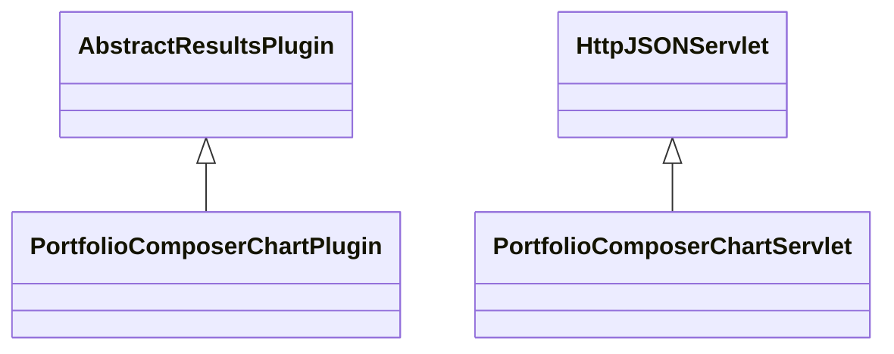

# ResultsPortfolioComposerChart.jar

[Group index](README.md) | [All archives](../README.md)

## Scope and provenance

- **Donor:** `SQX_145_REFERENCE_ROOT/internal/plugins/ResultsPortfolioComposerChart/ResultsPortfolioComposerChart.jar`.
- **SHA-256:** `afa95f108dad3dcc89b5e556cefcde238df462e5ed95e682d5f9bc9eb28b7592`; accessed 2026-10-06; captured `2026-10-06T18:54:51.906614+00:00`.
- **Classes:** 2 raw entries; 2 unique entry names. Duplicate occurrence indices are zero-based.
- **Inspection:** read-only ZIP hashing and class-file structural parsing; signatures/descriptors, modifiers, hierarchy and references only. Bytecode bodies are hashed, not published.
- **Allocation:** proposed `FEAT-PORTFOLIO-RESULTS-PORTFOLIO-COMPOSER-CHART`, P12; [roadmap](../../dev/sqx-full-application-roadmap.md). Domain README registration remains required.
- **Repository:** `01067f00031428613c6394064ca1bcadc1ba00ee`; review state unreviewed. Download label 145-dev1; installed build/activation and runtime equivalence unverified.
- **Limit:** every class/member is inventoried; declaration coverage does not establish consumed calls, defaults, formulas, failure semantics or algorithm parity.
- **Archive/resource index:** [208.json](../../dev/evidence/sqx145/archives/145/208.json).

## Complete member declarations

Member shards contain exact JVM names/descriptors, access flags, generic signatures, throws types, declared fields/methods, superclass/interfaces and referenced class names. All classes, nested/synthetic members and overloads are retained. Code length/hash is structural evidence, not a normalized algorithm comparison.

- [001.json](../../dev/evidence/sqx145/members/208/001.json) — SHA-256 `bad9ebe961b63c9dac17b14b5ac6ac7b969e5ed851a1e4efd22397a04d184006`.

## Focused structural diagram

Up to twelve non-nested classes; arrows show declared inheritance/interfaces only. External type names are not evidence of an available body or an executed dependency.

## Class inventory

| Archive entry | Occurrence | Class SHA-256 | Fields | Methods |
| --- | ---: | --- | ---: | ---: |
| `com/strategyquant/plugin/Results/impl/PortfolioComposerChart/PortfolioComposerChartPlugin.class` | 0 | `94e955c9186f3dcd58eab1785472714e0a6412a150bad048b99fbacf45b12854` | 2 | 8 |
| `com/strategyquant/plugin/Results/impl/PortfolioComposerChart/PortfolioComposerChartServlet.class` | 0 | `6db2b1bd6fb7235724dc2aa4aa6a2840595946ddd6aed0d80378880a53ddcc98` | 4 | 4 |
