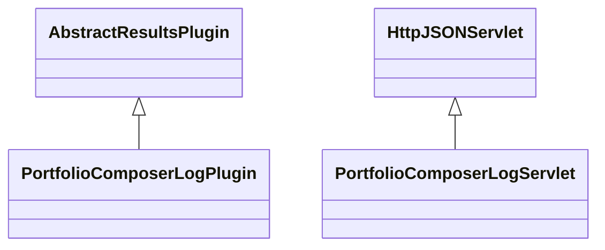

# ResultsPortfolioComposerLog.jar

[Group index](README.md) | [All archives](../README.md)

## Scope and provenance

- **Donor:** `SQX_145_REFERENCE_ROOT/internal/plugins/ResultsPortfolioComposerLog/ResultsPortfolioComposerLog.jar`.
- **SHA-256:** `4653f9610a2df1b77fc164a9cb14ca21461ef3c58ebefdef570da9eb2bbcc043`; accessed 2026-10-06; captured `2026-10-06T18:54:51.906614+00:00`.
- **Classes:** 2 raw entries; 2 unique entry names. Duplicate occurrence indices are zero-based.
- **Inspection:** read-only ZIP hashing and class-file structural parsing; signatures/descriptors, modifiers, hierarchy and references only. Bytecode bodies are hashed, not published.
- **Allocation:** proposed `FEAT-PORTFOLIO-RESULTS-PORTFOLIO-COMPOSER-LOG`, P12; [roadmap](../../dev/sqx-full-application-roadmap.md). Domain README registration remains required.
- **Repository:** `01067f00031428613c6394064ca1bcadc1ba00ee`; review state unreviewed. Download label 145-dev1; installed build/activation and runtime equivalence unverified.
- **Limit:** every class/member is inventoried; declaration coverage does not establish consumed calls, defaults, formulas, failure semantics or algorithm parity.
- **Archive/resource index:** [209.json](../../dev/evidence/sqx145/archives/145/209.json).

## Complete member declarations

Member shards contain exact JVM names/descriptors, access flags, generic signatures, throws types, declared fields/methods, superclass/interfaces and referenced class names. All classes, nested/synthetic members and overloads are retained. Code length/hash is structural evidence, not a normalized algorithm comparison.

- [001.json](../../dev/evidence/sqx145/members/209/001.json) — SHA-256 `c822b1ffaa198c280d38c10fb93632b2e404aed0013b85b8c5ae943c6ffb8d97`.

## Focused structural diagram

Up to twelve non-nested classes; arrows show declared inheritance/interfaces only. External type names are not evidence of an available body or an executed dependency.

## Class inventory

| Archive entry | Occurrence | Class SHA-256 | Fields | Methods |
| --- | ---: | --- | ---: | ---: |
| `com/strategyquant/plugin/Results/impl/PortfolioComposerLog/PortfolioComposerLogPlugin.class` | 0 | `d5557df9573f70dc8fe8695ef9a47f1bb338c351b4553a5d895b0c60054d8ef5` | 2 | 8 |
| `com/strategyquant/plugin/Results/impl/PortfolioComposerLog/PortfolioComposerLogServlet.class` | 0 | `7ddf5378341097a25d2414310d1f2821414dfa5cbacfe60c3a82246e8dea6307` | 4 | 4 |
