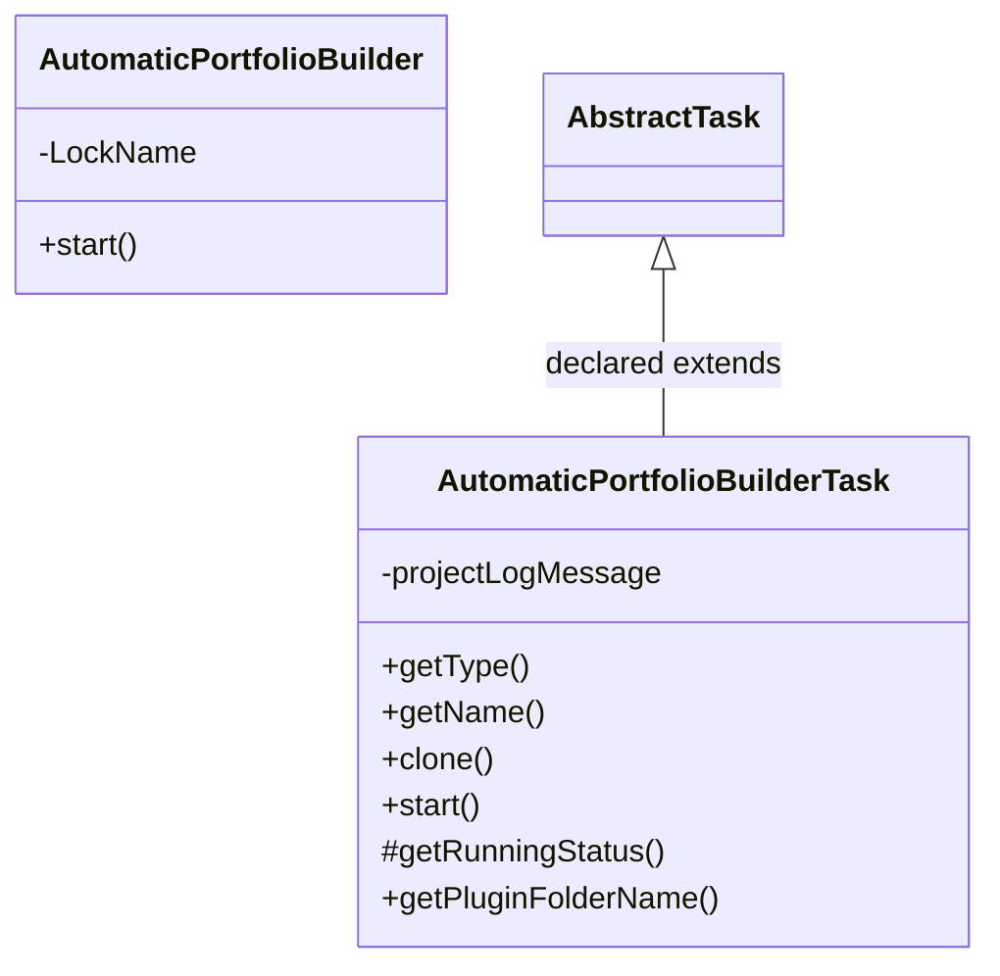
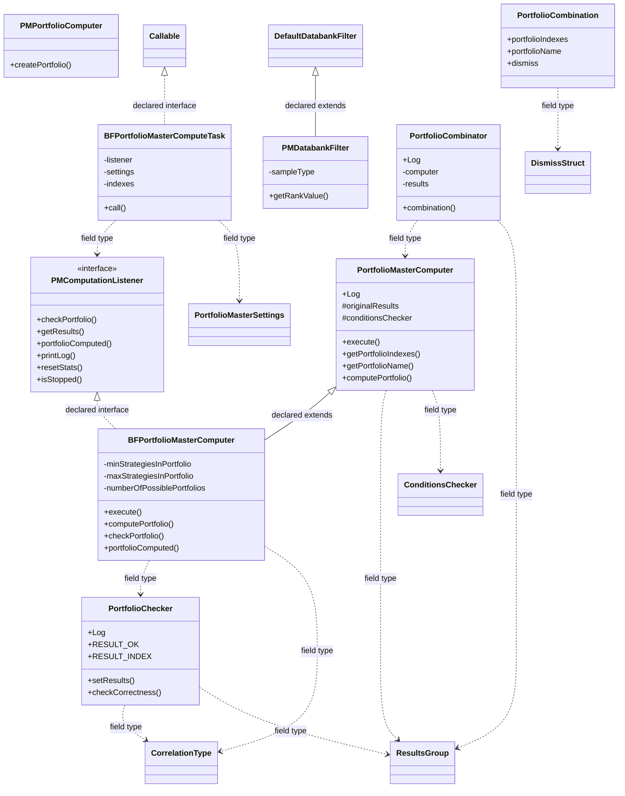
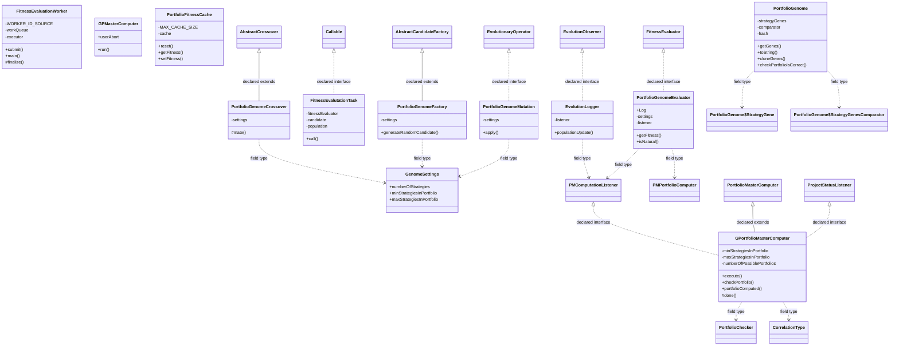
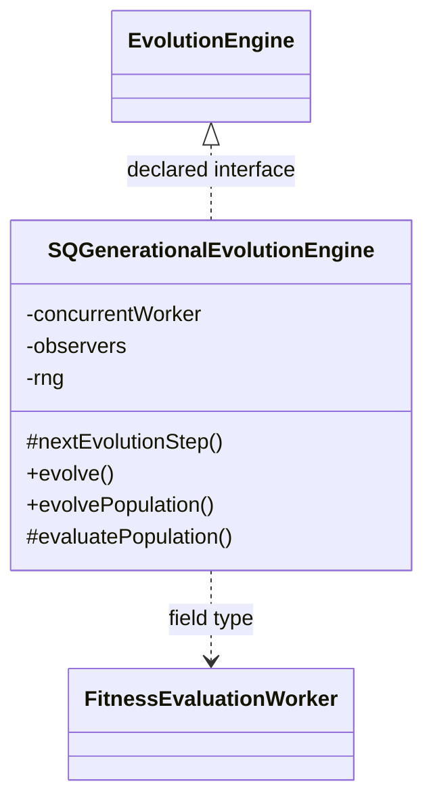

# TaskAutomaticPortfolioBuilder.jar

[Workspace/group index](README.md)  |  [All workspaces](../README.md)

## Scope and provenance

- Artifact: `SQX_REFERENCE_ROOT/internal/plugins/TaskAutomaticPortfolioBuilder/TaskAutomaticPortfolioBuilder.jar`.
- SHA-256: `450ba385bf39bba43abaf92faa06dec7f30d2a8aca1daffb03ce4c24fae4a2d6`.
- Inspected: 2026-10-05; generation timestamp `2026-10-05T19:04:16.344170+00:00`.
- Archive class entries: **27**; non-nested: **24**; nested/anonymous: **3**.
- Inspection: ZIP entry/manifest enumeration and `javap -p` declarations for every listed class.
- Repository source HEAD: `8a92c705183a6702eaf62037ccb202ed028aa899`; review state: generated, pending owner review.
- Installed SQX build number is unverified. No method bodies are reproduced.
- Confidence: high for declared structure; workspace ownership inferred except where registration evidence is separately stated. Runtime reachability, call order, formulas and parity remain unverified.

The `PortfolioMaster` folder is a navigation/research grouping, not an exclusive backend owner. Shared consumers may use this JAR.

Target mapping: no verified owning HaruQuantAI feature/requirement/decision IDs are assigned by this document. Register or resolve ownership through the normal repository plan before implementation.

## Diagram reading guide

`Parent <|-- Child` means declared inheritance; `Interface <|.. Class` means declared implementation. Interface extension uses the inheritance arrow. `A ..> B : field type` is a declared type dependency, not composition, object ownership or a runtime call. External nodes are referenced types, not fabricated local implementations. Selected fields/method names aid navigation: `+` is public, `#` protected and `-` private. Diagram method names omit parameter/return types and collapse overloads; use the exact inspected declarations below before implementing an API.

Detailed graphs include non-nested classes in package-sized groups of at most 12. Nested/anonymous classes are inventoried and their declarations/relationships are retained below, but omitted from overview graphs. Relationships not drawn for readability remain in the complete declaration-relationship table. Constructors, synthetic bridges and overloads may be collapsed in diagram member lists only. Standard `java.lang.Object` inheritance is omitted from diagrams.

## UML class diagrams

### 1. `com.strategyquant.plugin.Task.impl.AutomaticPortfolioBuilder`



| Diagram identifier | Exact type | Location |
| --- | --- | --- |
| `Cb912e17f5f94` | `com.strategyquant.plugin.Task.impl.AutomaticPortfolioBuilder.AutomaticPortfolioBuilder` (this JAR) | this diagram |
| `Cd64db7f86e5e` | `com.strategyquant.plugin.Task.impl.AutomaticPortfolioBuilder.AutomaticPortfolioBuilderTask` (this JAR) | this diagram |
| `Ce44d386802cb` | [`com.strategyquant.tradinglib.taskImpl.AbstractTask`](../Shared/SQTradingLib.md) | referenced external type |

### 2. `com.strategyquant.plugin.Task.impl.AutomaticPortfolioBuilder.bruteForce`



| Diagram identifier | Exact type | Location |
| --- | --- | --- |
| `C32c3b4f95736` | `com.strategyquant.plugin.Task.impl.AutomaticPortfolioBuilder.bruteForce.BFPortfolioMasterComputeTask` (this JAR) | this diagram |
| `Cc61fb313d8f8` | `com.strategyquant.plugin.Task.impl.AutomaticPortfolioBuilder.bruteForce.BFPortfolioMasterComputer` (this JAR) | this diagram |
| `Cb7a3d0b622f0` | `com.strategyquant.plugin.Task.impl.AutomaticPortfolioBuilder.bruteForce.PMComputationListener` (this JAR) | this diagram |
| `C1ed229676ec2` | `com.strategyquant.plugin.Task.impl.AutomaticPortfolioBuilder.bruteForce.PMDatabankFilter` (this JAR) | this diagram |
| `C286bacb7e4d9` | `com.strategyquant.plugin.Task.impl.AutomaticPortfolioBuilder.bruteForce.PMPortfolioComputer` (this JAR) | this diagram |
| `C58590978118b` | `com.strategyquant.plugin.Task.impl.AutomaticPortfolioBuilder.bruteForce.PortfolioChecker` (this JAR) | this diagram |
| `C3cabd5845c2e` | `com.strategyquant.plugin.Task.impl.AutomaticPortfolioBuilder.bruteForce.PortfolioCombination` (this JAR) | this diagram |
| `C467a9af58f78` | `com.strategyquant.plugin.Task.impl.AutomaticPortfolioBuilder.bruteForce.PortfolioCombinator` (this JAR) | this diagram |
| `C12df46392fc4` | `com.strategyquant.plugin.Task.impl.AutomaticPortfolioBuilder.bruteForce.PortfolioMasterComputer` (this JAR) | this diagram |
| `C6668765fd615` | [`com.strategyquant.tradinglib.CorrelationType`](../Shared/SQTradingLib.md) | referenced external type |
| `C81fcbc41b716` | [`com.strategyquant.tradinglib.ResultsGroup`](../Shared/SQTradingLib.md) | referenced external type |
| `Ce7e1597aada5` | [`com.strategyquant.tradinglib.conditions.ConditionsChecker`](../Shared/SQTradingLib.md) | referenced external type |
| `C9b5862acfbba` | [`com.strategyquant.tradinglib.conditions.DismissStruct`](../Shared/SQTradingLib.md) | referenced external type |
| `C7fd7b3bbf26b` | [`com.strategyquant.tradinglib.databank.DefaultDatabankFilter`](../Shared/SQTradingLib.md) | referenced external type |
| `Ca59a192ef8ff` | [`com.strategyquant.tradinglib.portfolioMaster.PortfolioMasterSettings`](../Shared/SQTradingLib.md) | referenced external type |
| `C59e430b99b4f` | `java.util.concurrent.Callable` (not resolved in scoped archives) | referenced external type |

### 3. `com.strategyquant.plugin.Task.impl.AutomaticPortfolioBuilder.genetic` - group 1



| Diagram identifier | Exact type | Location |
| --- | --- | --- |
| `Cb7a3d0b622f0` | `com.strategyquant.plugin.Task.impl.AutomaticPortfolioBuilder.bruteForce.PMComputationListener` (this JAR) | another group in this JAR |
| `C286bacb7e4d9` | `com.strategyquant.plugin.Task.impl.AutomaticPortfolioBuilder.bruteForce.PMPortfolioComputer` (this JAR) | another group in this JAR |
| `C58590978118b` | `com.strategyquant.plugin.Task.impl.AutomaticPortfolioBuilder.bruteForce.PortfolioChecker` (this JAR) | another group in this JAR |
| `C12df46392fc4` | `com.strategyquant.plugin.Task.impl.AutomaticPortfolioBuilder.bruteForce.PortfolioMasterComputer` (this JAR) | another group in this JAR |
| `Cca2eaf707504` | `com.strategyquant.plugin.Task.impl.AutomaticPortfolioBuilder.genetic.EvolutionLogger` (this JAR) | this diagram |
| `Cc314f45879b1` | `com.strategyquant.plugin.Task.impl.AutomaticPortfolioBuilder.genetic.FitnessEvaluationWorker` (this JAR) | this diagram |
| `Cbc4b2a45523d` | `com.strategyquant.plugin.Task.impl.AutomaticPortfolioBuilder.genetic.FitnessEvalutationTask` (this JAR) | this diagram |
| `C6c7a3b854f66` | `com.strategyquant.plugin.Task.impl.AutomaticPortfolioBuilder.genetic.GPMasterComputer` (this JAR) | this diagram |
| `C03066e02e4b7` | `com.strategyquant.plugin.Task.impl.AutomaticPortfolioBuilder.genetic.GPortfolioMasterComputer` (this JAR) | this diagram |
| `C47798c73fab6` | `com.strategyquant.plugin.Task.impl.AutomaticPortfolioBuilder.genetic.GenomeSettings` (this JAR) | this diagram |
| `Cffcb4cae5eb3` | `com.strategyquant.plugin.Task.impl.AutomaticPortfolioBuilder.genetic.PortfolioFitnessCache` (this JAR) | this diagram |
| `C798e70469260` | `com.strategyquant.plugin.Task.impl.AutomaticPortfolioBuilder.genetic.PortfolioGenome` (this JAR) | this diagram |
| `C08adb675de26` | `com.strategyquant.plugin.Task.impl.AutomaticPortfolioBuilder.genetic.PortfolioGenome$StrategyGene` (this JAR) | another group in this JAR |
| `Cc412373bb362` | `com.strategyquant.plugin.Task.impl.AutomaticPortfolioBuilder.genetic.PortfolioGenome$StrategyGenesComparator` (this JAR) | another group in this JAR |
| `C8e33278d43a1` | `com.strategyquant.plugin.Task.impl.AutomaticPortfolioBuilder.genetic.PortfolioGenomeCrossover` (this JAR) | this diagram |
| `Cc152137f846d` | `com.strategyquant.plugin.Task.impl.AutomaticPortfolioBuilder.genetic.PortfolioGenomeEvaluator` (this JAR) | this diagram |
| `Cc8a02fb6d2af` | `com.strategyquant.plugin.Task.impl.AutomaticPortfolioBuilder.genetic.PortfolioGenomeFactory` (this JAR) | this diagram |
| `C67ee4e3c1277` | `com.strategyquant.plugin.Task.impl.AutomaticPortfolioBuilder.genetic.PortfolioGenomeMutation` (this JAR) | this diagram |
| `C6668765fd615` | [`com.strategyquant.tradinglib.CorrelationType`](../Shared/SQTradingLib.md) | referenced external type |
| `C0e319839f39f` | [`com.strategyquant.tradinglib.project.ProjectStatusListener`](../Shared/SQTradingLib.md) | referenced external type |
| `C59e430b99b4f` | `java.util.concurrent.Callable` (not resolved in scoped archives) | referenced external type |
| `C8f51b6ec4f59` | `org.uncommons.watchmaker.framework.EvolutionObserver` (not resolved in scoped archives) | referenced external type |
| `Cf2fdcc31dfaa` | `org.uncommons.watchmaker.framework.EvolutionaryOperator` (not resolved in scoped archives) | referenced external type |
| `C15304a45f2dd` | `org.uncommons.watchmaker.framework.FitnessEvaluator` (not resolved in scoped archives) | referenced external type |
| `C818a55c601ed` | `org.uncommons.watchmaker.framework.factories.AbstractCandidateFactory` (not resolved in scoped archives) | referenced external type |
| `C0bf70953e422` | `org.uncommons.watchmaker.framework.operators.AbstractCrossover` (not resolved in scoped archives) | referenced external type |

### 4. `com.strategyquant.plugin.Task.impl.AutomaticPortfolioBuilder.genetic` - group 2



| Diagram identifier | Exact type | Location |
| --- | --- | --- |
| `Cc314f45879b1` | `com.strategyquant.plugin.Task.impl.AutomaticPortfolioBuilder.genetic.FitnessEvaluationWorker` (this JAR) | another group in this JAR |
| `Cbbceee2908e7` | `com.strategyquant.plugin.Task.impl.AutomaticPortfolioBuilder.genetic.SQGenerationalEvolutionEngine` (this JAR) | this diagram |
| `C974507e2595c` | `org.uncommons.watchmaker.framework.EvolutionEngine` (not resolved in scoped archives) | referenced external type |

## Complete class inventory

| Fully qualified class | Kind | Entry |
| --- | --- | --- |
| `com.strategyquant.plugin.Task.impl.AutomaticPortfolioBuilder.AutomaticPortfolioBuilder` | class | non-nested |
| `com.strategyquant.plugin.Task.impl.AutomaticPortfolioBuilder.AutomaticPortfolioBuilderTask` | class | non-nested |
| `com.strategyquant.plugin.Task.impl.AutomaticPortfolioBuilder.bruteForce.BFPortfolioMasterComputeTask` | class | non-nested |
| `com.strategyquant.plugin.Task.impl.AutomaticPortfolioBuilder.bruteForce.BFPortfolioMasterComputer` | class | non-nested |
| `com.strategyquant.plugin.Task.impl.AutomaticPortfolioBuilder.bruteForce.PMComputationListener` | interface | non-nested |
| `com.strategyquant.plugin.Task.impl.AutomaticPortfolioBuilder.bruteForce.PMDatabankFilter` | class | non-nested |
| `com.strategyquant.plugin.Task.impl.AutomaticPortfolioBuilder.bruteForce.PMPortfolioComputer` | class | non-nested |
| `com.strategyquant.plugin.Task.impl.AutomaticPortfolioBuilder.bruteForce.PortfolioChecker` | class | non-nested |
| `com.strategyquant.plugin.Task.impl.AutomaticPortfolioBuilder.bruteForce.PortfolioCombination` | class | non-nested |
| `com.strategyquant.plugin.Task.impl.AutomaticPortfolioBuilder.bruteForce.PortfolioCombinator` | class | non-nested |
| `com.strategyquant.plugin.Task.impl.AutomaticPortfolioBuilder.bruteForce.PortfolioMasterComputer` | class | non-nested |
| `com.strategyquant.plugin.Task.impl.AutomaticPortfolioBuilder.bruteForce.PortfolioMasterComputer$1` | class | nested/anonymous |
| `com.strategyquant.plugin.Task.impl.AutomaticPortfolioBuilder.genetic.EvolutionLogger` | class | non-nested |
| `com.strategyquant.plugin.Task.impl.AutomaticPortfolioBuilder.genetic.FitnessEvaluationWorker` | class | non-nested |
| `com.strategyquant.plugin.Task.impl.AutomaticPortfolioBuilder.genetic.FitnessEvalutationTask` | class | non-nested |
| `com.strategyquant.plugin.Task.impl.AutomaticPortfolioBuilder.genetic.GPMasterComputer` | class | non-nested |
| `com.strategyquant.plugin.Task.impl.AutomaticPortfolioBuilder.genetic.GPortfolioMasterComputer` | class | non-nested |
| `com.strategyquant.plugin.Task.impl.AutomaticPortfolioBuilder.genetic.GenomeSettings` | class | non-nested |
| `com.strategyquant.plugin.Task.impl.AutomaticPortfolioBuilder.genetic.PortfolioFitnessCache` | class | non-nested |
| `com.strategyquant.plugin.Task.impl.AutomaticPortfolioBuilder.genetic.PortfolioGenome` | class | non-nested |
| `com.strategyquant.plugin.Task.impl.AutomaticPortfolioBuilder.genetic.PortfolioGenome$StrategyGene` | class | nested/anonymous |
| `com.strategyquant.plugin.Task.impl.AutomaticPortfolioBuilder.genetic.PortfolioGenome$StrategyGenesComparator` | class | nested/anonymous |
| `com.strategyquant.plugin.Task.impl.AutomaticPortfolioBuilder.genetic.PortfolioGenomeCrossover` | class | non-nested |
| `com.strategyquant.plugin.Task.impl.AutomaticPortfolioBuilder.genetic.PortfolioGenomeEvaluator` | class | non-nested |
| `com.strategyquant.plugin.Task.impl.AutomaticPortfolioBuilder.genetic.PortfolioGenomeFactory` | class | non-nested |
| `com.strategyquant.plugin.Task.impl.AutomaticPortfolioBuilder.genetic.PortfolioGenomeMutation` | class | non-nested |
| `com.strategyquant.plugin.Task.impl.AutomaticPortfolioBuilder.genetic.SQGenerationalEvolutionEngine` | class | non-nested |

## Declared relationships and evidence locations

Every row is supported by the named class declaration/member in `javap -p`, inside the artifact recorded above. Signature dependencies may include return, parameter, generic-argument and throws types; they do not imply execution.

| Declaring class | Referenced type | Relationship | Narrow inspection location |
| --- | --- | --- | --- |
| `com.strategyquant.plugin.Task.impl.AutomaticPortfolioBuilder.AutomaticPortfolioBuilder` | `java.lang.String` (not resolved in scoped archives) | type dependency | `com.strategyquant.plugin.Task.impl.AutomaticPortfolioBuilder.AutomaticPortfolioBuilder` / field declaration: `private static final java.lang.String LockName;` |
| `com.strategyquant.plugin.Task.impl.AutomaticPortfolioBuilder.AutomaticPortfolioBuilder` | `java.lang.String` (not resolved in scoped archives) | type dependency | `com.strategyquant.plugin.Task.impl.AutomaticPortfolioBuilder.AutomaticPortfolioBuilder` / method signature: `private java.util.ArrayList<com.strategyquant.tradinglib.ResultsGroup> getClonedStrategies(java.util.ArrayList<java.lang.String>, com.strategyquant.tradinglib.Databank) throws java.lang.Exception;`<br>`private static void addParam(org.jdom2.Element, java.lang.String, java.lang.String, java.lang.String);` |
| `com.strategyquant.plugin.Task.impl.AutomaticPortfolioBuilder.AutomaticPortfolioBuilder` | [`com.strategyquant.tradinglib.project.SQProject`](../Shared/SQTradingLib.md) | type dependency | `com.strategyquant.plugin.Task.impl.AutomaticPortfolioBuilder.AutomaticPortfolioBuilder` / method signature: `public void start(com.strategyquant.tradinglib.project.SQProject, com.strategyquant.tradinglib.project.ProgressEngine, com.strategyquant.tradinglib.portfolioMaster.PortfolioMasterSettings) throws java.lang.Exception;` |
| `com.strategyquant.plugin.Task.impl.AutomaticPortfolioBuilder.AutomaticPortfolioBuilder` | [`com.strategyquant.tradinglib.project.ProgressEngine`](../Shared/SQTradingLib.md) | type dependency | `com.strategyquant.plugin.Task.impl.AutomaticPortfolioBuilder.AutomaticPortfolioBuilder` / method signature: `public void start(com.strategyquant.tradinglib.project.SQProject, com.strategyquant.tradinglib.project.ProgressEngine, com.strategyquant.tradinglib.portfolioMaster.PortfolioMasterSettings) throws java.lang.Exception;` |
| `com.strategyquant.plugin.Task.impl.AutomaticPortfolioBuilder.AutomaticPortfolioBuilder` | [`com.strategyquant.tradinglib.portfolioMaster.PortfolioMasterSettings`](../Shared/SQTradingLib.md) | type dependency | `com.strategyquant.plugin.Task.impl.AutomaticPortfolioBuilder.AutomaticPortfolioBuilder` / method signature: `public void start(com.strategyquant.tradinglib.project.SQProject, com.strategyquant.tradinglib.project.ProgressEngine, com.strategyquant.tradinglib.portfolioMaster.PortfolioMasterSettings) throws java.lang.Exception;` |
| `com.strategyquant.plugin.Task.impl.AutomaticPortfolioBuilder.AutomaticPortfolioBuilder` | `java.lang.Exception` (not resolved in scoped archives) | type dependency | `com.strategyquant.plugin.Task.impl.AutomaticPortfolioBuilder.AutomaticPortfolioBuilder` / method signature: `public void start(com.strategyquant.tradinglib.project.SQProject, com.strategyquant.tradinglib.project.ProgressEngine, com.strategyquant.tradinglib.portfolioMaster.PortfolioMasterSettings) throws java.lang.Exception;`<br>`private java.util.ArrayList<com.strategyquant.tradinglib.ResultsGroup> getClonedStrategies(java.util.ArrayList<java.lang.String>, com.strategyquant.tradinglib.Databank) throws java.lang.Exception;` |
| `com.strategyquant.plugin.Task.impl.AutomaticPortfolioBuilder.AutomaticPortfolioBuilder` | `java.util.ArrayList` (not resolved in scoped archives) | type dependency | `com.strategyquant.plugin.Task.impl.AutomaticPortfolioBuilder.AutomaticPortfolioBuilder` / method signature: `private java.util.ArrayList<com.strategyquant.tradinglib.ResultsGroup> getClonedStrategies(java.util.ArrayList<java.lang.String>, com.strategyquant.tradinglib.Databank) throws java.lang.Exception;` |
| `com.strategyquant.plugin.Task.impl.AutomaticPortfolioBuilder.AutomaticPortfolioBuilder` | [`com.strategyquant.tradinglib.ResultsGroup`](../Shared/SQTradingLib.md) | type dependency | `com.strategyquant.plugin.Task.impl.AutomaticPortfolioBuilder.AutomaticPortfolioBuilder` / method signature: `private java.util.ArrayList<com.strategyquant.tradinglib.ResultsGroup> getClonedStrategies(java.util.ArrayList<java.lang.String>, com.strategyquant.tradinglib.Databank) throws java.lang.Exception;` |
| `com.strategyquant.plugin.Task.impl.AutomaticPortfolioBuilder.AutomaticPortfolioBuilder` | [`com.strategyquant.tradinglib.Databank`](../Shared/SQTradingLib.md) | type dependency | `com.strategyquant.plugin.Task.impl.AutomaticPortfolioBuilder.AutomaticPortfolioBuilder` / method signature: `private java.util.ArrayList<com.strategyquant.tradinglib.ResultsGroup> getClonedStrategies(java.util.ArrayList<java.lang.String>, com.strategyquant.tradinglib.Databank) throws java.lang.Exception;` |
| `com.strategyquant.plugin.Task.impl.AutomaticPortfolioBuilder.AutomaticPortfolioBuilder` | `org.jdom2.Element` (not resolved in scoped archives) | type dependency | `com.strategyquant.plugin.Task.impl.AutomaticPortfolioBuilder.AutomaticPortfolioBuilder` / method signature: `private static void addParam(org.jdom2.Element, java.lang.String, java.lang.String, java.lang.String);` |
| `com.strategyquant.plugin.Task.impl.AutomaticPortfolioBuilder.AutomaticPortfolioBuilderTask` | [`com.strategyquant.tradinglib.taskImpl.AbstractTask`](../Shared/SQTradingLib.md) | extends | `com.strategyquant.plugin.Task.impl.AutomaticPortfolioBuilder.AutomaticPortfolioBuilderTask` / class declaration: `public class com.strategyquant.plugin.Task.impl.AutomaticPortfolioBuilder.AutomaticPortfolioBuilderTask extends com.strategyquant.tradinglib.taskImpl.AbstractTask` |
| `com.strategyquant.plugin.Task.impl.AutomaticPortfolioBuilder.AutomaticPortfolioBuilderTask` | `java.lang.String` (not resolved in scoped archives) | type dependency | `com.strategyquant.plugin.Task.impl.AutomaticPortfolioBuilder.AutomaticPortfolioBuilderTask` / field declaration: `private java.lang.String projectLogMessage;` |
| `com.strategyquant.plugin.Task.impl.AutomaticPortfolioBuilder.AutomaticPortfolioBuilderTask` | `java.lang.String` (not resolved in scoped archives) | type dependency | `com.strategyquant.plugin.Task.impl.AutomaticPortfolioBuilder.AutomaticPortfolioBuilderTask` / method signature: `public com.strategyquant.plugin.Task.impl.AutomaticPortfolioBuilder.AutomaticPortfolioBuilderTask(java.lang.String, com.strategyquant.tradinglib.project.ProgressEngine) throws java.lang.Exception;`<br>`public java.lang.String getType();`<br>`public java.lang.String getName();`<br>`public com.strategyquant.tradinglib.taskImpl.ISQTask clone(java.lang.String, com.strategyquant.tradinglib.project.ProgressEngine) throws java.lang.Exception;`<br>`private void printToLog(java.lang.String);`<br>`private void printToBothLogs(java.lang.String);`<br>`public java.lang.String getPluginFolderName();`<br>`public java.lang.String[] getSettings();` |
| `com.strategyquant.plugin.Task.impl.AutomaticPortfolioBuilder.AutomaticPortfolioBuilderTask` | `java.lang.Exception` (not resolved in scoped archives) | type dependency | `com.strategyquant.plugin.Task.impl.AutomaticPortfolioBuilder.AutomaticPortfolioBuilderTask` / method signature: `public com.strategyquant.plugin.Task.impl.AutomaticPortfolioBuilder.AutomaticPortfolioBuilderTask() throws java.lang.Exception;`<br>`public com.strategyquant.plugin.Task.impl.AutomaticPortfolioBuilder.AutomaticPortfolioBuilderTask(java.lang.String, com.strategyquant.tradinglib.project.ProgressEngine) throws java.lang.Exception;`<br>`public com.strategyquant.tradinglib.taskImpl.ISQTask clone(java.lang.String, com.strategyquant.tradinglib.project.ProgressEngine) throws java.lang.Exception;`<br>`public void start() throws java.lang.Exception;` |
| `com.strategyquant.plugin.Task.impl.AutomaticPortfolioBuilder.AutomaticPortfolioBuilderTask` | [`com.strategyquant.tradinglib.project.ProgressEngine`](../Shared/SQTradingLib.md) | type dependency | `com.strategyquant.plugin.Task.impl.AutomaticPortfolioBuilder.AutomaticPortfolioBuilderTask` / method signature: `public com.strategyquant.plugin.Task.impl.AutomaticPortfolioBuilder.AutomaticPortfolioBuilderTask(java.lang.String, com.strategyquant.tradinglib.project.ProgressEngine) throws java.lang.Exception;`<br>`public com.strategyquant.tradinglib.taskImpl.ISQTask clone(java.lang.String, com.strategyquant.tradinglib.project.ProgressEngine) throws java.lang.Exception;` |
| `com.strategyquant.plugin.Task.impl.AutomaticPortfolioBuilder.AutomaticPortfolioBuilderTask` | [`com.strategyquant.tradinglib.taskImpl.ISQTask`](../Shared/SQTradingLib.md) | type dependency | `com.strategyquant.plugin.Task.impl.AutomaticPortfolioBuilder.AutomaticPortfolioBuilderTask` / method signature: `public com.strategyquant.tradinglib.taskImpl.ISQTask clone(java.lang.String, com.strategyquant.tradinglib.project.ProgressEngine) throws java.lang.Exception;` |
| `com.strategyquant.plugin.Task.impl.AutomaticPortfolioBuilder.AutomaticPortfolioBuilderTask` | [`com.strategyquant.tradinglib.Databank`](../Shared/SQTradingLib.md) | type dependency | `com.strategyquant.plugin.Task.impl.AutomaticPortfolioBuilder.AutomaticPortfolioBuilderTask` / method signature: `protected com.strategyquant.tradinglib.Databank[] getUsedDatabanks();`<br>`protected com.strategyquant.tradinglib.Databank getOutputDatabank();` |
| `com.strategyquant.plugin.Task.impl.AutomaticPortfolioBuilder.AutomaticPortfolioBuilderTask` | [`com.strategyquant.tradinglib.project.ProjectGlobalLog`](../Shared/SQTradingLib.md) | type dependency | `com.strategyquant.plugin.Task.impl.AutomaticPortfolioBuilder.AutomaticPortfolioBuilderTask` / method signature: `public void logTaskFinished(com.strategyquant.tradinglib.project.ProjectGlobalLog);` |
| `com.strategyquant.plugin.Task.impl.AutomaticPortfolioBuilder.bruteForce.BFPortfolioMasterComputeTask` | `java.util.concurrent.Callable` (not resolved in scoped archives) | implements | `com.strategyquant.plugin.Task.impl.AutomaticPortfolioBuilder.bruteForce.BFPortfolioMasterComputeTask` / class declaration: `public class com.strategyquant.plugin.Task.impl.AutomaticPortfolioBuilder.bruteForce.BFPortfolioMasterComputeTask implements java.util.concurrent.Callable<com.strategyquant.tradinglib.backtestrunner.BacktestResult>` |
| `com.strategyquant.plugin.Task.impl.AutomaticPortfolioBuilder.bruteForce.BFPortfolioMasterComputeTask` | `com.strategyquant.plugin.Task.impl.AutomaticPortfolioBuilder.bruteForce.PMComputationListener` (this JAR) | type dependency | `com.strategyquant.plugin.Task.impl.AutomaticPortfolioBuilder.bruteForce.BFPortfolioMasterComputeTask` / field declaration: `private com.strategyquant.plugin.Task.impl.AutomaticPortfolioBuilder.bruteForce.PMComputationListener listener;` |
| `com.strategyquant.plugin.Task.impl.AutomaticPortfolioBuilder.bruteForce.BFPortfolioMasterComputeTask` | `com.strategyquant.plugin.Task.impl.AutomaticPortfolioBuilder.bruteForce.PMComputationListener` (this JAR) | type dependency | `com.strategyquant.plugin.Task.impl.AutomaticPortfolioBuilder.bruteForce.BFPortfolioMasterComputeTask` / method signature: `public com.strategyquant.plugin.Task.impl.AutomaticPortfolioBuilder.bruteForce.BFPortfolioMasterComputeTask(int[], com.strategyquant.plugin.Task.impl.AutomaticPortfolioBuilder.bruteForce.PMComputationListener, com.strategyquant.tradinglib.portfolioMaster.PortfolioMasterSettings);` |
| `com.strategyquant.plugin.Task.impl.AutomaticPortfolioBuilder.bruteForce.BFPortfolioMasterComputeTask` | [`com.strategyquant.tradinglib.portfolioMaster.PortfolioMasterSettings`](../Shared/SQTradingLib.md) | type dependency | `com.strategyquant.plugin.Task.impl.AutomaticPortfolioBuilder.bruteForce.BFPortfolioMasterComputeTask` / field declaration: `private com.strategyquant.tradinglib.portfolioMaster.PortfolioMasterSettings settings;` |
| `com.strategyquant.plugin.Task.impl.AutomaticPortfolioBuilder.bruteForce.BFPortfolioMasterComputeTask` | [`com.strategyquant.tradinglib.portfolioMaster.PortfolioMasterSettings`](../Shared/SQTradingLib.md) | type dependency | `com.strategyquant.plugin.Task.impl.AutomaticPortfolioBuilder.bruteForce.BFPortfolioMasterComputeTask` / method signature: `public com.strategyquant.plugin.Task.impl.AutomaticPortfolioBuilder.bruteForce.BFPortfolioMasterComputeTask(int[], com.strategyquant.plugin.Task.impl.AutomaticPortfolioBuilder.bruteForce.PMComputationListener, com.strategyquant.tradinglib.portfolioMaster.PortfolioMasterSettings);` |
| `com.strategyquant.plugin.Task.impl.AutomaticPortfolioBuilder.bruteForce.BFPortfolioMasterComputeTask` | [`com.strategyquant.tradinglib.backtestrunner.BacktestResult`](../Shared/SQTradingLib.md) | type dependency | `com.strategyquant.plugin.Task.impl.AutomaticPortfolioBuilder.bruteForce.BFPortfolioMasterComputeTask` / method signature: `public com.strategyquant.tradinglib.backtestrunner.BacktestResult call() throws java.lang.Exception;` |
| `com.strategyquant.plugin.Task.impl.AutomaticPortfolioBuilder.bruteForce.BFPortfolioMasterComputeTask` | `java.lang.Exception` (not resolved in scoped archives) | type dependency | `com.strategyquant.plugin.Task.impl.AutomaticPortfolioBuilder.bruteForce.BFPortfolioMasterComputeTask` / method signature: `public com.strategyquant.tradinglib.backtestrunner.BacktestResult call() throws java.lang.Exception;`<br>`public java.lang.Object call() throws java.lang.Exception;` |
| `com.strategyquant.plugin.Task.impl.AutomaticPortfolioBuilder.bruteForce.BFPortfolioMasterComputeTask` | `java.lang.Object` (not resolved in scoped archives) | type dependency | `com.strategyquant.plugin.Task.impl.AutomaticPortfolioBuilder.bruteForce.BFPortfolioMasterComputeTask` / method signature: `public java.lang.Object call() throws java.lang.Exception;` |
| `com.strategyquant.plugin.Task.impl.AutomaticPortfolioBuilder.bruteForce.BFPortfolioMasterComputer` | `com.strategyquant.plugin.Task.impl.AutomaticPortfolioBuilder.bruteForce.PortfolioMasterComputer` (this JAR) | extends | `com.strategyquant.plugin.Task.impl.AutomaticPortfolioBuilder.bruteForce.BFPortfolioMasterComputer` / class declaration: `public class com.strategyquant.plugin.Task.impl.AutomaticPortfolioBuilder.bruteForce.BFPortfolioMasterComputer extends com.strategyquant.plugin.Task.impl.AutomaticPortfolioBuilder.bruteForce.PortfolioMasterComputer implements com.strategyquant.plugin.Task.impl.AutomaticPortfolioBuilder.bruteForce.PMComputationListener` |
| `com.strategyquant.plugin.Task.impl.AutomaticPortfolioBuilder.bruteForce.BFPortfolioMasterComputer` | `com.strategyquant.plugin.Task.impl.AutomaticPortfolioBuilder.bruteForce.PMComputationListener` (this JAR) | implements | `com.strategyquant.plugin.Task.impl.AutomaticPortfolioBuilder.bruteForce.BFPortfolioMasterComputer` / class declaration: `public class com.strategyquant.plugin.Task.impl.AutomaticPortfolioBuilder.bruteForce.BFPortfolioMasterComputer extends com.strategyquant.plugin.Task.impl.AutomaticPortfolioBuilder.bruteForce.PortfolioMasterComputer implements com.strategyquant.plugin.Task.impl.AutomaticPortfolioBuilder.bruteForce.PMComputationListener` |
| `com.strategyquant.plugin.Task.impl.AutomaticPortfolioBuilder.bruteForce.BFPortfolioMasterComputer` | `java.math.BigInteger` (not resolved in scoped archives) | type dependency | `com.strategyquant.plugin.Task.impl.AutomaticPortfolioBuilder.bruteForce.BFPortfolioMasterComputer` / field declaration: `private java.math.BigInteger numberOfPossiblePortfolios;` |
| `com.strategyquant.plugin.Task.impl.AutomaticPortfolioBuilder.bruteForce.BFPortfolioMasterComputer` | [`com.strategyquant.tradinglib.CorrelationType`](../Shared/SQTradingLib.md) | type dependency | `com.strategyquant.plugin.Task.impl.AutomaticPortfolioBuilder.bruteForce.BFPortfolioMasterComputer` / field declaration: `private com.strategyquant.tradinglib.CorrelationType type;` |
| `com.strategyquant.plugin.Task.impl.AutomaticPortfolioBuilder.bruteForce.BFPortfolioMasterComputer` | [`com.strategyquant.tradinglib.portfolioMaster.PortfolioMasterFitness`](../Shared/SQTradingLib.md) | type dependency | `com.strategyquant.plugin.Task.impl.AutomaticPortfolioBuilder.bruteForce.BFPortfolioMasterComputer` / field declaration: `private com.strategyquant.tradinglib.portfolioMaster.PortfolioMasterFitness fitnessFunction;` |
| `com.strategyquant.plugin.Task.impl.AutomaticPortfolioBuilder.bruteForce.BFPortfolioMasterComputer` | `com.strategyquant.plugin.Task.impl.AutomaticPortfolioBuilder.bruteForce.PortfolioChecker` (this JAR) | type dependency | `com.strategyquant.plugin.Task.impl.AutomaticPortfolioBuilder.bruteForce.BFPortfolioMasterComputer` / field declaration: `private com.strategyquant.plugin.Task.impl.AutomaticPortfolioBuilder.bruteForce.PortfolioChecker portfolioChecker;` |
| `com.strategyquant.plugin.Task.impl.AutomaticPortfolioBuilder.bruteForce.BFPortfolioMasterComputer` | `java.util.concurrent.ExecutorService` (not resolved in scoped archives) | type dependency | `com.strategyquant.plugin.Task.impl.AutomaticPortfolioBuilder.bruteForce.BFPortfolioMasterComputer` / field declaration: `private java.util.concurrent.ExecutorService executor;` |
| `com.strategyquant.plugin.Task.impl.AutomaticPortfolioBuilder.bruteForce.BFPortfolioMasterComputer` | `java.util.List` (not resolved in scoped archives) | type dependency | `com.strategyquant.plugin.Task.impl.AutomaticPortfolioBuilder.bruteForce.BFPortfolioMasterComputer` / field declaration: `private java.util.List<java.util.concurrent.Future<com.strategyquant.tradinglib.backtestrunner.BacktestResult>> futureList;` |
| `com.strategyquant.plugin.Task.impl.AutomaticPortfolioBuilder.bruteForce.BFPortfolioMasterComputer` | `java.util.concurrent.Future` (not resolved in scoped archives) | type dependency | `com.strategyquant.plugin.Task.impl.AutomaticPortfolioBuilder.bruteForce.BFPortfolioMasterComputer` / field declaration: `private java.util.List<java.util.concurrent.Future<com.strategyquant.tradinglib.backtestrunner.BacktestResult>> futureList;` |
| `com.strategyquant.plugin.Task.impl.AutomaticPortfolioBuilder.bruteForce.BFPortfolioMasterComputer` | [`com.strategyquant.tradinglib.backtestrunner.BacktestResult`](../Shared/SQTradingLib.md) | type dependency | `com.strategyquant.plugin.Task.impl.AutomaticPortfolioBuilder.bruteForce.BFPortfolioMasterComputer` / field declaration: `private java.util.List<java.util.concurrent.Future<com.strategyquant.tradinglib.backtestrunner.BacktestResult>> futureList;`<br>`private com.strategyquant.tradinglib.backtestrunner.BacktestResult portfolioResult;` |
| `com.strategyquant.plugin.Task.impl.AutomaticPortfolioBuilder.bruteForce.BFPortfolioMasterComputer` | [`com.strategyquant.tradinglib.backtestrunner.BacktestResult`](../Shared/SQTradingLib.md) | type dependency | `com.strategyquant.plugin.Task.impl.AutomaticPortfolioBuilder.bruteForce.BFPortfolioMasterComputer` / method signature: `public synchronized void portfolioComputed(com.strategyquant.tradinglib.backtestrunner.BacktestResult) throws java.lang.Exception;` |
| `com.strategyquant.plugin.Task.impl.AutomaticPortfolioBuilder.bruteForce.BFPortfolioMasterComputer` | `java.util.ArrayList` (not resolved in scoped archives) | type dependency | `com.strategyquant.plugin.Task.impl.AutomaticPortfolioBuilder.bruteForce.BFPortfolioMasterComputer` / method signature: `public com.strategyquant.plugin.Task.impl.AutomaticPortfolioBuilder.bruteForce.BFPortfolioMasterComputer(java.util.ArrayList<com.strategyquant.tradinglib.ResultsGroup>, com.strategyquant.tradinglib.project.SQProject, com.strategyquant.tradinglib.project.ProgressEngine, com.strategyquant.tradinglib.portfolioMaster.PortfolioMasterSettings) throws java.lang.Exception;` |
| `com.strategyquant.plugin.Task.impl.AutomaticPortfolioBuilder.bruteForce.BFPortfolioMasterComputer` | [`com.strategyquant.tradinglib.ResultsGroup`](../Shared/SQTradingLib.md) | type dependency | `com.strategyquant.plugin.Task.impl.AutomaticPortfolioBuilder.bruteForce.BFPortfolioMasterComputer` / method signature: `public com.strategyquant.plugin.Task.impl.AutomaticPortfolioBuilder.bruteForce.BFPortfolioMasterComputer(java.util.ArrayList<com.strategyquant.tradinglib.ResultsGroup>, com.strategyquant.tradinglib.project.SQProject, com.strategyquant.tradinglib.project.ProgressEngine, com.strategyquant.tradinglib.portfolioMaster.PortfolioMasterSettings) throws java.lang.Exception;` |
| `com.strategyquant.plugin.Task.impl.AutomaticPortfolioBuilder.bruteForce.BFPortfolioMasterComputer` | [`com.strategyquant.tradinglib.project.SQProject`](../Shared/SQTradingLib.md) | type dependency | `com.strategyquant.plugin.Task.impl.AutomaticPortfolioBuilder.bruteForce.BFPortfolioMasterComputer` / method signature: `public com.strategyquant.plugin.Task.impl.AutomaticPortfolioBuilder.bruteForce.BFPortfolioMasterComputer(java.util.ArrayList<com.strategyquant.tradinglib.ResultsGroup>, com.strategyquant.tradinglib.project.SQProject, com.strategyquant.tradinglib.project.ProgressEngine, com.strategyquant.tradinglib.portfolioMaster.PortfolioMasterSettings) throws java.lang.Exception;` |
| `com.strategyquant.plugin.Task.impl.AutomaticPortfolioBuilder.bruteForce.BFPortfolioMasterComputer` | [`com.strategyquant.tradinglib.project.ProgressEngine`](../Shared/SQTradingLib.md) | type dependency | `com.strategyquant.plugin.Task.impl.AutomaticPortfolioBuilder.bruteForce.BFPortfolioMasterComputer` / method signature: `public com.strategyquant.plugin.Task.impl.AutomaticPortfolioBuilder.bruteForce.BFPortfolioMasterComputer(java.util.ArrayList<com.strategyquant.tradinglib.ResultsGroup>, com.strategyquant.tradinglib.project.SQProject, com.strategyquant.tradinglib.project.ProgressEngine, com.strategyquant.tradinglib.portfolioMaster.PortfolioMasterSettings) throws java.lang.Exception;` |
| `com.strategyquant.plugin.Task.impl.AutomaticPortfolioBuilder.bruteForce.BFPortfolioMasterComputer` | [`com.strategyquant.tradinglib.portfolioMaster.PortfolioMasterSettings`](../Shared/SQTradingLib.md) | type dependency | `com.strategyquant.plugin.Task.impl.AutomaticPortfolioBuilder.bruteForce.BFPortfolioMasterComputer` / method signature: `public com.strategyquant.plugin.Task.impl.AutomaticPortfolioBuilder.bruteForce.BFPortfolioMasterComputer(java.util.ArrayList<com.strategyquant.tradinglib.ResultsGroup>, com.strategyquant.tradinglib.project.SQProject, com.strategyquant.tradinglib.project.ProgressEngine, com.strategyquant.tradinglib.portfolioMaster.PortfolioMasterSettings) throws java.lang.Exception;` |
| `com.strategyquant.plugin.Task.impl.AutomaticPortfolioBuilder.bruteForce.BFPortfolioMasterComputer` | `java.lang.Exception` (not resolved in scoped archives) | type dependency | `com.strategyquant.plugin.Task.impl.AutomaticPortfolioBuilder.bruteForce.BFPortfolioMasterComputer` / method signature: `public com.strategyquant.plugin.Task.impl.AutomaticPortfolioBuilder.bruteForce.BFPortfolioMasterComputer(java.util.ArrayList<com.strategyquant.tradinglib.ResultsGroup>, com.strategyquant.tradinglib.project.SQProject, com.strategyquant.tradinglib.project.ProgressEngine, com.strategyquant.tradinglib.portfolioMaster.PortfolioMasterSettings) throws java.lang.Exception;`<br>`public void execute() throws java.lang.Exception;`<br>`private void deinit() throws java.lang.Exception;`<br>`public void computePortfolio(int[]) throws java.lang.Exception;`<br>`private void _compute() throws java.lang.Exception;`<br>`public synchronized com.strategyquant.plugin.Task.impl.AutomaticPortfolioBuilder.bruteForce.PortfolioCombination checkPortfolio(int[]) throws java.lang.Exception;`<br>`public synchronized void portfolioComputed(com.strategyquant.tradinglib.backtestrunner.BacktestResult) throws java.lang.Exception;` |
| `com.strategyquant.plugin.Task.impl.AutomaticPortfolioBuilder.bruteForce.BFPortfolioMasterComputer` | `com.strategyquant.plugin.Task.impl.AutomaticPortfolioBuilder.bruteForce.PortfolioCombination` (this JAR) | type dependency | `com.strategyquant.plugin.Task.impl.AutomaticPortfolioBuilder.bruteForce.BFPortfolioMasterComputer` / method signature: `public synchronized com.strategyquant.plugin.Task.impl.AutomaticPortfolioBuilder.bruteForce.PortfolioCombination checkPortfolio(int[]) throws java.lang.Exception;` |
| `com.strategyquant.plugin.Task.impl.AutomaticPortfolioBuilder.bruteForce.BFPortfolioMasterComputer` | `java.lang.String` (not resolved in scoped archives) | type dependency | `com.strategyquant.plugin.Task.impl.AutomaticPortfolioBuilder.bruteForce.BFPortfolioMasterComputer` / method signature: `public synchronized void printLog(java.lang.String);` |
| `com.strategyquant.plugin.Task.impl.AutomaticPortfolioBuilder.bruteForce.PMComputationListener` | `com.strategyquant.plugin.Task.impl.AutomaticPortfolioBuilder.bruteForce.PortfolioCombination` (this JAR) | type dependency | `com.strategyquant.plugin.Task.impl.AutomaticPortfolioBuilder.bruteForce.PMComputationListener` / method signature: `public abstract com.strategyquant.plugin.Task.impl.AutomaticPortfolioBuilder.bruteForce.PortfolioCombination checkPortfolio(int[]) throws java.lang.Exception;` |
| `com.strategyquant.plugin.Task.impl.AutomaticPortfolioBuilder.bruteForce.PMComputationListener` | `java.lang.Exception` (not resolved in scoped archives) | type dependency | `com.strategyquant.plugin.Task.impl.AutomaticPortfolioBuilder.bruteForce.PMComputationListener` / method signature: `public abstract com.strategyquant.plugin.Task.impl.AutomaticPortfolioBuilder.bruteForce.PortfolioCombination checkPortfolio(int[]) throws java.lang.Exception;`<br>`public abstract java.util.ArrayList<com.strategyquant.tradinglib.ResultsGroup> getResults(int[]) throws java.lang.Exception;`<br>`public abstract void portfolioComputed(com.strategyquant.tradinglib.backtestrunner.BacktestResult) throws java.lang.Exception;` |
| `com.strategyquant.plugin.Task.impl.AutomaticPortfolioBuilder.bruteForce.PMComputationListener` | `java.util.ArrayList` (not resolved in scoped archives) | type dependency | `com.strategyquant.plugin.Task.impl.AutomaticPortfolioBuilder.bruteForce.PMComputationListener` / method signature: `public abstract java.util.ArrayList<com.strategyquant.tradinglib.ResultsGroup> getResults(int[]) throws java.lang.Exception;` |
| `com.strategyquant.plugin.Task.impl.AutomaticPortfolioBuilder.bruteForce.PMComputationListener` | [`com.strategyquant.tradinglib.ResultsGroup`](../Shared/SQTradingLib.md) | type dependency | `com.strategyquant.plugin.Task.impl.AutomaticPortfolioBuilder.bruteForce.PMComputationListener` / method signature: `public abstract java.util.ArrayList<com.strategyquant.tradinglib.ResultsGroup> getResults(int[]) throws java.lang.Exception;` |
| `com.strategyquant.plugin.Task.impl.AutomaticPortfolioBuilder.bruteForce.PMComputationListener` | [`com.strategyquant.tradinglib.backtestrunner.BacktestResult`](../Shared/SQTradingLib.md) | type dependency | `com.strategyquant.plugin.Task.impl.AutomaticPortfolioBuilder.bruteForce.PMComputationListener` / method signature: `public abstract void portfolioComputed(com.strategyquant.tradinglib.backtestrunner.BacktestResult) throws java.lang.Exception;` |
| `com.strategyquant.plugin.Task.impl.AutomaticPortfolioBuilder.bruteForce.PMComputationListener` | `java.lang.String` (not resolved in scoped archives) | type dependency | `com.strategyquant.plugin.Task.impl.AutomaticPortfolioBuilder.bruteForce.PMComputationListener` / method signature: `public abstract void printLog(java.lang.String);` |
| `com.strategyquant.plugin.Task.impl.AutomaticPortfolioBuilder.bruteForce.PMDatabankFilter` | [`com.strategyquant.tradinglib.databank.DefaultDatabankFilter`](../Shared/SQTradingLib.md) | extends | `com.strategyquant.plugin.Task.impl.AutomaticPortfolioBuilder.bruteForce.PMDatabankFilter` / class declaration: `public class com.strategyquant.plugin.Task.impl.AutomaticPortfolioBuilder.bruteForce.PMDatabankFilter extends com.strategyquant.tradinglib.databank.DefaultDatabankFilter` |
| `com.strategyquant.plugin.Task.impl.AutomaticPortfolioBuilder.bruteForce.PMDatabankFilter` | [`com.strategyquant.tradinglib.ResultsGroup`](../Shared/SQTradingLib.md) | type dependency | `com.strategyquant.plugin.Task.impl.AutomaticPortfolioBuilder.bruteForce.PMDatabankFilter` / method signature: `public double getRankValue(com.strategyquant.tradinglib.ResultsGroup);` |
| `com.strategyquant.plugin.Task.impl.AutomaticPortfolioBuilder.bruteForce.PMPortfolioComputer` | [`com.strategyquant.tradinglib.ResultsGroup`](../Shared/SQTradingLib.md) | type dependency | `com.strategyquant.plugin.Task.impl.AutomaticPortfolioBuilder.bruteForce.PMPortfolioComputer` / method signature: `public com.strategyquant.tradinglib.ResultsGroup createPortfolio(java.util.ArrayList<com.strategyquant.tradinglib.ResultsGroup>, java.lang.String, com.strategyquant.tradinglib.portfolioMaster.PortfolioMasterSettings) throws java.lang.Exception;` |
| `com.strategyquant.plugin.Task.impl.AutomaticPortfolioBuilder.bruteForce.PMPortfolioComputer` | `java.util.ArrayList` (not resolved in scoped archives) | type dependency | `com.strategyquant.plugin.Task.impl.AutomaticPortfolioBuilder.bruteForce.PMPortfolioComputer` / method signature: `public com.strategyquant.tradinglib.ResultsGroup createPortfolio(java.util.ArrayList<com.strategyquant.tradinglib.ResultsGroup>, java.lang.String, com.strategyquant.tradinglib.portfolioMaster.PortfolioMasterSettings) throws java.lang.Exception;` |
| `com.strategyquant.plugin.Task.impl.AutomaticPortfolioBuilder.bruteForce.PMPortfolioComputer` | `java.lang.String` (not resolved in scoped archives) | type dependency | `com.strategyquant.plugin.Task.impl.AutomaticPortfolioBuilder.bruteForce.PMPortfolioComputer` / method signature: `public com.strategyquant.tradinglib.ResultsGroup createPortfolio(java.util.ArrayList<com.strategyquant.tradinglib.ResultsGroup>, java.lang.String, com.strategyquant.tradinglib.portfolioMaster.PortfolioMasterSettings) throws java.lang.Exception;` |
| `com.strategyquant.plugin.Task.impl.AutomaticPortfolioBuilder.bruteForce.PMPortfolioComputer` | [`com.strategyquant.tradinglib.portfolioMaster.PortfolioMasterSettings`](../Shared/SQTradingLib.md) | type dependency | `com.strategyquant.plugin.Task.impl.AutomaticPortfolioBuilder.bruteForce.PMPortfolioComputer` / method signature: `public com.strategyquant.tradinglib.ResultsGroup createPortfolio(java.util.ArrayList<com.strategyquant.tradinglib.ResultsGroup>, java.lang.String, com.strategyquant.tradinglib.portfolioMaster.PortfolioMasterSettings) throws java.lang.Exception;` |
| `com.strategyquant.plugin.Task.impl.AutomaticPortfolioBuilder.bruteForce.PMPortfolioComputer` | `java.lang.Exception` (not resolved in scoped archives) | type dependency | `com.strategyquant.plugin.Task.impl.AutomaticPortfolioBuilder.bruteForce.PMPortfolioComputer` / method signature: `public com.strategyquant.tradinglib.ResultsGroup createPortfolio(java.util.ArrayList<com.strategyquant.tradinglib.ResultsGroup>, java.lang.String, com.strategyquant.tradinglib.portfolioMaster.PortfolioMasterSettings) throws java.lang.Exception;` |
| `com.strategyquant.plugin.Task.impl.AutomaticPortfolioBuilder.bruteForce.PortfolioChecker` | `org.slf4j.Logger` (not resolved in scoped archives) | type dependency | `com.strategyquant.plugin.Task.impl.AutomaticPortfolioBuilder.bruteForce.PortfolioChecker` / field declaration: `public static final org.slf4j.Logger Log;` |
| `com.strategyquant.plugin.Task.impl.AutomaticPortfolioBuilder.bruteForce.PortfolioChecker` | `java.lang.String` (not resolved in scoped archives) | type dependency | `com.strategyquant.plugin.Task.impl.AutomaticPortfolioBuilder.bruteForce.PortfolioChecker` / field declaration: `public static final java.lang.String RESULT_OK;`<br>`public static final java.lang.String RESULT_INDEX;`<br>`private java.util.HashMap<java.lang.String, java.lang.Double> correlationsMap;` |
| `com.strategyquant.plugin.Task.impl.AutomaticPortfolioBuilder.bruteForce.PortfolioChecker` | `java.lang.String` (not resolved in scoped archives) | type dependency | `com.strategyquant.plugin.Task.impl.AutomaticPortfolioBuilder.bruteForce.PortfolioChecker` / method signature: `public synchronized com.strategyquant.tradinglib.conditions.DismissStruct checkCorrectness(int[], java.lang.String);`<br>`private synchronized java.lang.String checkCorrelation(java.util.List<com.strategyquant.tradinglib.ResultsGroup>);`<br>`private synchronized java.lang.String key(com.strategyquant.tradinglib.ResultsGroup, com.strategyquant.tradinglib.ResultsGroup);`<br>`private synchronized java.lang.String printCombination(com.strategyquant.tradinglib.ResultsGroup, com.strategyquant.tradinglib.ResultsGroup);` |
| `com.strategyquant.plugin.Task.impl.AutomaticPortfolioBuilder.bruteForce.PortfolioChecker` | [`com.strategyquant.tradinglib.CorrelationType`](../Shared/SQTradingLib.md) | type dependency | `com.strategyquant.plugin.Task.impl.AutomaticPortfolioBuilder.bruteForce.PortfolioChecker` / field declaration: `private com.strategyquant.tradinglib.CorrelationType correlationType;` |
| `com.strategyquant.plugin.Task.impl.AutomaticPortfolioBuilder.bruteForce.PortfolioChecker` | [`com.strategyquant.tradinglib.CorrelationType`](../Shared/SQTradingLib.md) | type dependency | `com.strategyquant.plugin.Task.impl.AutomaticPortfolioBuilder.bruteForce.PortfolioChecker` / method signature: `public com.strategyquant.plugin.Task.impl.AutomaticPortfolioBuilder.bruteForce.PortfolioChecker(int, com.strategyquant.tradinglib.CorrelationType, double, boolean, boolean, int, com.strategyquant.tradinglib.portfolioMaster.PortfolioMasterSettings);` |
| `com.strategyquant.plugin.Task.impl.AutomaticPortfolioBuilder.bruteForce.PortfolioChecker` | [`com.strategyquant.tradinglib.portfolioMaster.PortfolioMasterSettings`](../Shared/SQTradingLib.md) | type dependency | `com.strategyquant.plugin.Task.impl.AutomaticPortfolioBuilder.bruteForce.PortfolioChecker` / field declaration: `private com.strategyquant.tradinglib.portfolioMaster.PortfolioMasterSettings settings;` |
| `com.strategyquant.plugin.Task.impl.AutomaticPortfolioBuilder.bruteForce.PortfolioChecker` | [`com.strategyquant.tradinglib.portfolioMaster.PortfolioMasterSettings`](../Shared/SQTradingLib.md) | type dependency | `com.strategyquant.plugin.Task.impl.AutomaticPortfolioBuilder.bruteForce.PortfolioChecker` / method signature: `public com.strategyquant.plugin.Task.impl.AutomaticPortfolioBuilder.bruteForce.PortfolioChecker(int, com.strategyquant.tradinglib.CorrelationType, double, boolean, boolean, int, com.strategyquant.tradinglib.portfolioMaster.PortfolioMasterSettings);` |
| `com.strategyquant.plugin.Task.impl.AutomaticPortfolioBuilder.bruteForce.PortfolioChecker` | [`com.strategyquant.tradinglib.correlation.CorrelationComputer`](../Shared/SQTradingLib.md) | type dependency | `com.strategyquant.plugin.Task.impl.AutomaticPortfolioBuilder.bruteForce.PortfolioChecker` / field declaration: `private com.strategyquant.tradinglib.correlation.CorrelationComputer correlationComputer;` |
| `com.strategyquant.plugin.Task.impl.AutomaticPortfolioBuilder.bruteForce.PortfolioChecker` | `java.util.HashMap` (not resolved in scoped archives) | type dependency | `com.strategyquant.plugin.Task.impl.AutomaticPortfolioBuilder.bruteForce.PortfolioChecker` / field declaration: `private java.util.HashMap<java.lang.String, java.lang.Double> correlationsMap;` |
| `com.strategyquant.plugin.Task.impl.AutomaticPortfolioBuilder.bruteForce.PortfolioChecker` | `java.lang.Double` (not resolved in scoped archives) | type dependency | `com.strategyquant.plugin.Task.impl.AutomaticPortfolioBuilder.bruteForce.PortfolioChecker` / field declaration: `private java.util.HashMap<java.lang.String, java.lang.Double> correlationsMap;` |
| `com.strategyquant.plugin.Task.impl.AutomaticPortfolioBuilder.bruteForce.PortfolioChecker` | `java.util.List` (not resolved in scoped archives) | type dependency | `com.strategyquant.plugin.Task.impl.AutomaticPortfolioBuilder.bruteForce.PortfolioChecker` / field declaration: `private java.util.List<com.strategyquant.tradinglib.ResultsGroup> results;` |
| `com.strategyquant.plugin.Task.impl.AutomaticPortfolioBuilder.bruteForce.PortfolioChecker` | `java.util.List` (not resolved in scoped archives) | type dependency | `com.strategyquant.plugin.Task.impl.AutomaticPortfolioBuilder.bruteForce.PortfolioChecker` / method signature: `public synchronized void setResults(java.util.List<com.strategyquant.tradinglib.ResultsGroup>);`<br>`private synchronized boolean checkMaxFromSector(java.util.List<com.strategyquant.tradinglib.ResultsGroup>);`<br>`private synchronized java.lang.String checkCorrelation(java.util.List<com.strategyquant.tradinglib.ResultsGroup>);` |
| `com.strategyquant.plugin.Task.impl.AutomaticPortfolioBuilder.bruteForce.PortfolioChecker` | [`com.strategyquant.tradinglib.ResultsGroup`](../Shared/SQTradingLib.md) | type dependency | `com.strategyquant.plugin.Task.impl.AutomaticPortfolioBuilder.bruteForce.PortfolioChecker` / field declaration: `private java.util.List<com.strategyquant.tradinglib.ResultsGroup> results;` |
| `com.strategyquant.plugin.Task.impl.AutomaticPortfolioBuilder.bruteForce.PortfolioChecker` | [`com.strategyquant.tradinglib.ResultsGroup`](../Shared/SQTradingLib.md) | type dependency | `com.strategyquant.plugin.Task.impl.AutomaticPortfolioBuilder.bruteForce.PortfolioChecker` / method signature: `public synchronized void setResults(java.util.List<com.strategyquant.tradinglib.ResultsGroup>);`<br>`private synchronized boolean checkMaxFromSector(java.util.List<com.strategyquant.tradinglib.ResultsGroup>);`<br>`private synchronized java.lang.String checkCorrelation(java.util.List<com.strategyquant.tradinglib.ResultsGroup>);`<br>`private synchronized double computeCorrelation(com.strategyquant.tradinglib.ResultsGroup, com.strategyquant.tradinglib.ResultsGroup);`<br>`private synchronized java.lang.String key(com.strategyquant.tradinglib.ResultsGroup, com.strategyquant.tradinglib.ResultsGroup);`<br>`private synchronized java.lang.String printCombination(com.strategyquant.tradinglib.ResultsGroup, com.strategyquant.tradinglib.ResultsGroup);` |
| `com.strategyquant.plugin.Task.impl.AutomaticPortfolioBuilder.bruteForce.PortfolioChecker` | [`com.strategyquant.tradinglib.conditions.DismissStruct`](../Shared/SQTradingLib.md) | type dependency | `com.strategyquant.plugin.Task.impl.AutomaticPortfolioBuilder.bruteForce.PortfolioChecker` / method signature: `public synchronized com.strategyquant.tradinglib.conditions.DismissStruct checkCorrectness(int[], java.lang.String);` |
| `com.strategyquant.plugin.Task.impl.AutomaticPortfolioBuilder.bruteForce.PortfolioCombination` | `java.lang.String` (not resolved in scoped archives) | type dependency | `com.strategyquant.plugin.Task.impl.AutomaticPortfolioBuilder.bruteForce.PortfolioCombination` / field declaration: `public java.lang.String portfolioIndexes;`<br>`public java.lang.String portfolioName;` |
| `com.strategyquant.plugin.Task.impl.AutomaticPortfolioBuilder.bruteForce.PortfolioCombination` | [`com.strategyquant.tradinglib.conditions.DismissStruct`](../Shared/SQTradingLib.md) | type dependency | `com.strategyquant.plugin.Task.impl.AutomaticPortfolioBuilder.bruteForce.PortfolioCombination` / field declaration: `public com.strategyquant.tradinglib.conditions.DismissStruct dismiss;` |
| `com.strategyquant.plugin.Task.impl.AutomaticPortfolioBuilder.bruteForce.PortfolioCombinator` | `org.slf4j.Logger` (not resolved in scoped archives) | type dependency | `com.strategyquant.plugin.Task.impl.AutomaticPortfolioBuilder.bruteForce.PortfolioCombinator` / field declaration: `public static final org.slf4j.Logger Log;` |
| `com.strategyquant.plugin.Task.impl.AutomaticPortfolioBuilder.bruteForce.PortfolioCombinator` | `com.strategyquant.plugin.Task.impl.AutomaticPortfolioBuilder.bruteForce.PortfolioMasterComputer` (this JAR) | type dependency | `com.strategyquant.plugin.Task.impl.AutomaticPortfolioBuilder.bruteForce.PortfolioCombinator` / field declaration: `com.strategyquant.plugin.Task.impl.AutomaticPortfolioBuilder.bruteForce.PortfolioMasterComputer computer;` |
| `com.strategyquant.plugin.Task.impl.AutomaticPortfolioBuilder.bruteForce.PortfolioCombinator` | `com.strategyquant.plugin.Task.impl.AutomaticPortfolioBuilder.bruteForce.PortfolioMasterComputer` (this JAR) | type dependency | `com.strategyquant.plugin.Task.impl.AutomaticPortfolioBuilder.bruteForce.PortfolioCombinator` / method signature: `public com.strategyquant.plugin.Task.impl.AutomaticPortfolioBuilder.bruteForce.PortfolioCombinator(com.strategyquant.plugin.Task.impl.AutomaticPortfolioBuilder.bruteForce.PortfolioMasterComputer, java.util.List<com.strategyquant.tradinglib.ResultsGroup>);` |
| `com.strategyquant.plugin.Task.impl.AutomaticPortfolioBuilder.bruteForce.PortfolioCombinator` | `java.util.List` (not resolved in scoped archives) | type dependency | `com.strategyquant.plugin.Task.impl.AutomaticPortfolioBuilder.bruteForce.PortfolioCombinator` / field declaration: `java.util.List<com.strategyquant.tradinglib.ResultsGroup> results;` |
| `com.strategyquant.plugin.Task.impl.AutomaticPortfolioBuilder.bruteForce.PortfolioCombinator` | `java.util.List` (not resolved in scoped archives) | type dependency | `com.strategyquant.plugin.Task.impl.AutomaticPortfolioBuilder.bruteForce.PortfolioCombinator` / method signature: `public com.strategyquant.plugin.Task.impl.AutomaticPortfolioBuilder.bruteForce.PortfolioCombinator(com.strategyquant.plugin.Task.impl.AutomaticPortfolioBuilder.bruteForce.PortfolioMasterComputer, java.util.List<com.strategyquant.tradinglib.ResultsGroup>);` |
| `com.strategyquant.plugin.Task.impl.AutomaticPortfolioBuilder.bruteForce.PortfolioCombinator` | [`com.strategyquant.tradinglib.ResultsGroup`](../Shared/SQTradingLib.md) | type dependency | `com.strategyquant.plugin.Task.impl.AutomaticPortfolioBuilder.bruteForce.PortfolioCombinator` / field declaration: `java.util.List<com.strategyquant.tradinglib.ResultsGroup> results;` |
| `com.strategyquant.plugin.Task.impl.AutomaticPortfolioBuilder.bruteForce.PortfolioCombinator` | [`com.strategyquant.tradinglib.ResultsGroup`](../Shared/SQTradingLib.md) | type dependency | `com.strategyquant.plugin.Task.impl.AutomaticPortfolioBuilder.bruteForce.PortfolioCombinator` / method signature: `public com.strategyquant.plugin.Task.impl.AutomaticPortfolioBuilder.bruteForce.PortfolioCombinator(com.strategyquant.plugin.Task.impl.AutomaticPortfolioBuilder.bruteForce.PortfolioMasterComputer, java.util.List<com.strategyquant.tradinglib.ResultsGroup>);` |
| `com.strategyquant.plugin.Task.impl.AutomaticPortfolioBuilder.bruteForce.PortfolioCombinator` | `java.lang.Exception` (not resolved in scoped archives) | type dependency | `com.strategyquant.plugin.Task.impl.AutomaticPortfolioBuilder.bruteForce.PortfolioCombinator` / method signature: `public void combination(int) throws java.lang.Exception;` |
| `com.strategyquant.plugin.Task.impl.AutomaticPortfolioBuilder.bruteForce.PortfolioMasterComputer` | `org.slf4j.Logger` (not resolved in scoped archives) | type dependency | `com.strategyquant.plugin.Task.impl.AutomaticPortfolioBuilder.bruteForce.PortfolioMasterComputer` / field declaration: `public static final org.slf4j.Logger Log;` |
| `com.strategyquant.plugin.Task.impl.AutomaticPortfolioBuilder.bruteForce.PortfolioMasterComputer` | `java.util.ArrayList` (not resolved in scoped archives) | type dependency | `com.strategyquant.plugin.Task.impl.AutomaticPortfolioBuilder.bruteForce.PortfolioMasterComputer` / field declaration: `protected java.util.ArrayList<com.strategyquant.tradinglib.ResultsGroup> originalResults;` |
| `com.strategyquant.plugin.Task.impl.AutomaticPortfolioBuilder.bruteForce.PortfolioMasterComputer` | `java.util.ArrayList` (not resolved in scoped archives) | type dependency | `com.strategyquant.plugin.Task.impl.AutomaticPortfolioBuilder.bruteForce.PortfolioMasterComputer` / method signature: `public synchronized java.util.ArrayList<com.strategyquant.tradinglib.ResultsGroup> getResults(int[]) throws java.lang.Exception;`<br>`public void limitDataRange(java.util.ArrayList<com.strategyquant.tradinglib.ResultsGroup>, long, long) throws java.lang.Exception;`<br>`public void setSampleParts(java.util.ArrayList<com.strategyquant.tradinglib.ResultsGroup>) throws java.lang.Exception;` |
| `com.strategyquant.plugin.Task.impl.AutomaticPortfolioBuilder.bruteForce.PortfolioMasterComputer` | [`com.strategyquant.tradinglib.ResultsGroup`](../Shared/SQTradingLib.md) | type dependency | `com.strategyquant.plugin.Task.impl.AutomaticPortfolioBuilder.bruteForce.PortfolioMasterComputer` / field declaration: `protected java.util.ArrayList<com.strategyquant.tradinglib.ResultsGroup> originalResults;` |
| `com.strategyquant.plugin.Task.impl.AutomaticPortfolioBuilder.bruteForce.PortfolioMasterComputer` | [`com.strategyquant.tradinglib.ResultsGroup`](../Shared/SQTradingLib.md) | type dependency | `com.strategyquant.plugin.Task.impl.AutomaticPortfolioBuilder.bruteForce.PortfolioMasterComputer` / method signature: `public synchronized java.util.ArrayList<com.strategyquant.tradinglib.ResultsGroup> getResults(int[]) throws java.lang.Exception;`<br>`protected synchronized com.strategyquant.tradinglib.conditions.DismissStruct checkCustomConditions(com.strategyquant.tradinglib.ResultsGroup);`<br>`public void limitDataRange(java.util.ArrayList<com.strategyquant.tradinglib.ResultsGroup>, long, long) throws java.lang.Exception;`<br>`public void setSampleParts(java.util.ArrayList<com.strategyquant.tradinglib.ResultsGroup>) throws java.lang.Exception;`<br>`private void setSampleParts(com.strategyquant.tradinglib.ResultsGroup, long) throws java.lang.Exception;` |
| `com.strategyquant.plugin.Task.impl.AutomaticPortfolioBuilder.bruteForce.PortfolioMasterComputer` | [`com.strategyquant.tradinglib.conditions.ConditionsChecker`](../Shared/SQTradingLib.md) | type dependency | `com.strategyquant.plugin.Task.impl.AutomaticPortfolioBuilder.bruteForce.PortfolioMasterComputer` / field declaration: `protected com.strategyquant.tradinglib.conditions.ConditionsChecker conditionsChecker;` |
| `com.strategyquant.plugin.Task.impl.AutomaticPortfolioBuilder.bruteForce.PortfolioMasterComputer` | [`com.strategyquant.tradinglib.portfolioMaster.PortfolioMasterSettings`](../Shared/SQTradingLib.md) | type dependency | `com.strategyquant.plugin.Task.impl.AutomaticPortfolioBuilder.bruteForce.PortfolioMasterComputer` / field declaration: `protected com.strategyquant.tradinglib.portfolioMaster.PortfolioMasterSettings settings;` |
| `com.strategyquant.plugin.Task.impl.AutomaticPortfolioBuilder.bruteForce.PortfolioMasterComputer` | [`com.strategyquant.tradinglib.project.ProgressEngine`](../Shared/SQTradingLib.md) | type dependency | `com.strategyquant.plugin.Task.impl.AutomaticPortfolioBuilder.bruteForce.PortfolioMasterComputer` / field declaration: `protected com.strategyquant.tradinglib.project.ProgressEngine progressEngine;` |
| `com.strategyquant.plugin.Task.impl.AutomaticPortfolioBuilder.bruteForce.PortfolioMasterComputer` | [`com.strategyquant.tradinglib.project.SQProject`](../Shared/SQTradingLib.md) | type dependency | `com.strategyquant.plugin.Task.impl.AutomaticPortfolioBuilder.bruteForce.PortfolioMasterComputer` / field declaration: `protected com.strategyquant.tradinglib.project.SQProject project;` |
| `com.strategyquant.plugin.Task.impl.AutomaticPortfolioBuilder.bruteForce.PortfolioMasterComputer` | `java.lang.Exception` (not resolved in scoped archives) | type dependency | `com.strategyquant.plugin.Task.impl.AutomaticPortfolioBuilder.bruteForce.PortfolioMasterComputer` / method signature: `public abstract void execute() throws java.lang.Exception;`<br>`public abstract void computePortfolio(int[]) throws java.lang.Exception;`<br>`public synchronized java.util.ArrayList<com.strategyquant.tradinglib.ResultsGroup> getResults(int[]) throws java.lang.Exception;`<br>`public void beforeStart() throws java.lang.Exception;`<br>`private void limitMaxStrategiesInDatabank() throws java.lang.Exception;`<br>`public void limitDataRange(java.util.ArrayList<com.strategyquant.tradinglib.ResultsGroup>, long, long) throws java.lang.Exception;`<br>`public void setSampleParts(java.util.ArrayList<com.strategyquant.tradinglib.ResultsGroup>) throws java.lang.Exception;`<br>`private void setSampleParts(com.strategyquant.tradinglib.ResultsGroup, long) throws java.lang.Exception;` |
| `com.strategyquant.plugin.Task.impl.AutomaticPortfolioBuilder.bruteForce.PortfolioMasterComputer` | `java.lang.String` (not resolved in scoped archives) | type dependency | `com.strategyquant.plugin.Task.impl.AutomaticPortfolioBuilder.bruteForce.PortfolioMasterComputer` / method signature: `private java.lang.String indexesToString(int[]);`<br>`public java.lang.String getPortfolioIndexes(int[]);`<br>`public java.lang.String getPortfolioName(int);` |
| `com.strategyquant.plugin.Task.impl.AutomaticPortfolioBuilder.bruteForce.PortfolioMasterComputer` | [`com.strategyquant.tradinglib.conditions.DismissStruct`](../Shared/SQTradingLib.md) | type dependency | `com.strategyquant.plugin.Task.impl.AutomaticPortfolioBuilder.bruteForce.PortfolioMasterComputer` / method signature: `protected synchronized com.strategyquant.tradinglib.conditions.DismissStruct checkCustomConditions(com.strategyquant.tradinglib.ResultsGroup);` |
| `com.strategyquant.plugin.Task.impl.AutomaticPortfolioBuilder.bruteForce.PortfolioMasterComputer$1` | [`com.strategyquant.tradinglib.databank.IProgressListener`](../Shared/SQTradingLib.md) | implements | `com.strategyquant.plugin.Task.impl.AutomaticPortfolioBuilder.bruteForce.PortfolioMasterComputer$1` / class declaration: `class com.strategyquant.plugin.Task.impl.AutomaticPortfolioBuilder.bruteForce.PortfolioMasterComputer$1 implements com.strategyquant.tradinglib.databank.IProgressListener` |
| `com.strategyquant.plugin.Task.impl.AutomaticPortfolioBuilder.bruteForce.PortfolioMasterComputer$1` | `com.strategyquant.plugin.Task.impl.AutomaticPortfolioBuilder.bruteForce.PortfolioMasterComputer` (this JAR) | type dependency | `com.strategyquant.plugin.Task.impl.AutomaticPortfolioBuilder.bruteForce.PortfolioMasterComputer$1` / field declaration: `final com.strategyquant.plugin.Task.impl.AutomaticPortfolioBuilder.bruteForce.PortfolioMasterComputer this$0;` |
| `com.strategyquant.plugin.Task.impl.AutomaticPortfolioBuilder.bruteForce.PortfolioMasterComputer$1` | `com.strategyquant.plugin.Task.impl.AutomaticPortfolioBuilder.bruteForce.PortfolioMasterComputer` (this JAR) | type dependency | `com.strategyquant.plugin.Task.impl.AutomaticPortfolioBuilder.bruteForce.PortfolioMasterComputer$1` / method signature: `com.strategyquant.plugin.Task.impl.AutomaticPortfolioBuilder.bruteForce.PortfolioMasterComputer$1(com.strategyquant.plugin.Task.impl.AutomaticPortfolioBuilder.bruteForce.PortfolioMasterComputer);` |
| `com.strategyquant.plugin.Task.impl.AutomaticPortfolioBuilder.bruteForce.PortfolioMasterComputer$1` | `java.lang.String` (not resolved in scoped archives) | type dependency | `com.strategyquant.plugin.Task.impl.AutomaticPortfolioBuilder.bruteForce.PortfolioMasterComputer$1` / method signature: `public void onError(double, java.lang.String);` |
| `com.strategyquant.plugin.Task.impl.AutomaticPortfolioBuilder.genetic.EvolutionLogger` | `org.uncommons.watchmaker.framework.EvolutionObserver` (not resolved in scoped archives) | implements | `com.strategyquant.plugin.Task.impl.AutomaticPortfolioBuilder.genetic.EvolutionLogger` / class declaration: `public class com.strategyquant.plugin.Task.impl.AutomaticPortfolioBuilder.genetic.EvolutionLogger implements org.uncommons.watchmaker.framework.EvolutionObserver<com.strategyquant.plugin.Task.impl.AutomaticPortfolioBuilder.genetic.PortfolioGenome>` |
| `com.strategyquant.plugin.Task.impl.AutomaticPortfolioBuilder.genetic.EvolutionLogger` | `com.strategyquant.plugin.Task.impl.AutomaticPortfolioBuilder.bruteForce.PMComputationListener` (this JAR) | type dependency | `com.strategyquant.plugin.Task.impl.AutomaticPortfolioBuilder.genetic.EvolutionLogger` / field declaration: `private com.strategyquant.plugin.Task.impl.AutomaticPortfolioBuilder.bruteForce.PMComputationListener listener;` |
| `com.strategyquant.plugin.Task.impl.AutomaticPortfolioBuilder.genetic.EvolutionLogger` | `com.strategyquant.plugin.Task.impl.AutomaticPortfolioBuilder.bruteForce.PMComputationListener` (this JAR) | type dependency | `com.strategyquant.plugin.Task.impl.AutomaticPortfolioBuilder.genetic.EvolutionLogger` / method signature: `public com.strategyquant.plugin.Task.impl.AutomaticPortfolioBuilder.genetic.EvolutionLogger(com.strategyquant.plugin.Task.impl.AutomaticPortfolioBuilder.bruteForce.PMComputationListener);` |
| `com.strategyquant.plugin.Task.impl.AutomaticPortfolioBuilder.genetic.EvolutionLogger` | `org.uncommons.watchmaker.framework.PopulationData` (not resolved in scoped archives) | type dependency | `com.strategyquant.plugin.Task.impl.AutomaticPortfolioBuilder.genetic.EvolutionLogger` / method signature: `public void populationUpdate(org.uncommons.watchmaker.framework.PopulationData<? extends com.strategyquant.plugin.Task.impl.AutomaticPortfolioBuilder.genetic.PortfolioGenome>);` |
| `com.strategyquant.plugin.Task.impl.AutomaticPortfolioBuilder.genetic.EvolutionLogger` | `com.strategyquant.plugin.Task.impl.AutomaticPortfolioBuilder.genetic.PortfolioGenome` (this JAR) | type dependency | `com.strategyquant.plugin.Task.impl.AutomaticPortfolioBuilder.genetic.EvolutionLogger` / method signature: `public void populationUpdate(org.uncommons.watchmaker.framework.PopulationData<? extends com.strategyquant.plugin.Task.impl.AutomaticPortfolioBuilder.genetic.PortfolioGenome>);` |
| `com.strategyquant.plugin.Task.impl.AutomaticPortfolioBuilder.genetic.FitnessEvaluationWorker` | `org.uncommons.util.id.IDSource` (not resolved in scoped archives) | type dependency | `com.strategyquant.plugin.Task.impl.AutomaticPortfolioBuilder.genetic.FitnessEvaluationWorker` / field declaration: `private static final org.uncommons.util.id.IDSource<java.lang.String> WORKER_ID_SOURCE;` |
| `com.strategyquant.plugin.Task.impl.AutomaticPortfolioBuilder.genetic.FitnessEvaluationWorker` | `java.lang.String` (not resolved in scoped archives) | type dependency | `com.strategyquant.plugin.Task.impl.AutomaticPortfolioBuilder.genetic.FitnessEvaluationWorker` / field declaration: `private static final org.uncommons.util.id.IDSource<java.lang.String> WORKER_ID_SOURCE;` |
| `com.strategyquant.plugin.Task.impl.AutomaticPortfolioBuilder.genetic.FitnessEvaluationWorker` | `java.lang.String` (not resolved in scoped archives) | type dependency | `com.strategyquant.plugin.Task.impl.AutomaticPortfolioBuilder.genetic.FitnessEvaluationWorker` / method signature: `public static void main(java.lang.String[]);` |
| `com.strategyquant.plugin.Task.impl.AutomaticPortfolioBuilder.genetic.FitnessEvaluationWorker` | `java.util.concurrent.LinkedBlockingQueue` (not resolved in scoped archives) | type dependency | `com.strategyquant.plugin.Task.impl.AutomaticPortfolioBuilder.genetic.FitnessEvaluationWorker` / field declaration: `private final java.util.concurrent.LinkedBlockingQueue<java.lang.Runnable> workQueue;` |
| `com.strategyquant.plugin.Task.impl.AutomaticPortfolioBuilder.genetic.FitnessEvaluationWorker` | `java.lang.Runnable` (not resolved in scoped archives) | type dependency | `com.strategyquant.plugin.Task.impl.AutomaticPortfolioBuilder.genetic.FitnessEvaluationWorker` / field declaration: `private final java.util.concurrent.LinkedBlockingQueue<java.lang.Runnable> workQueue;` |
| `com.strategyquant.plugin.Task.impl.AutomaticPortfolioBuilder.genetic.FitnessEvaluationWorker` | `java.util.concurrent.ThreadPoolExecutor` (not resolved in scoped archives) | type dependency | `com.strategyquant.plugin.Task.impl.AutomaticPortfolioBuilder.genetic.FitnessEvaluationWorker` / field declaration: `private final java.util.concurrent.ThreadPoolExecutor executor;` |
| `com.strategyquant.plugin.Task.impl.AutomaticPortfolioBuilder.genetic.FitnessEvaluationWorker` | `java.util.concurrent.Future` (not resolved in scoped archives) | type dependency | `com.strategyquant.plugin.Task.impl.AutomaticPortfolioBuilder.genetic.FitnessEvaluationWorker` / method signature: `public <T> java.util.concurrent.Future<org.uncommons.watchmaker.framework.EvaluatedCandidate<T>> submit(com.strategyquant.plugin.Task.impl.AutomaticPortfolioBuilder.genetic.FitnessEvalutationTask<T>);` |
| `com.strategyquant.plugin.Task.impl.AutomaticPortfolioBuilder.genetic.FitnessEvaluationWorker` | `org.uncommons.watchmaker.framework.EvaluatedCandidate` (not resolved in scoped archives) | type dependency | `com.strategyquant.plugin.Task.impl.AutomaticPortfolioBuilder.genetic.FitnessEvaluationWorker` / method signature: `public <T> java.util.concurrent.Future<org.uncommons.watchmaker.framework.EvaluatedCandidate<T>> submit(com.strategyquant.plugin.Task.impl.AutomaticPortfolioBuilder.genetic.FitnessEvalutationTask<T>);` |
| `com.strategyquant.plugin.Task.impl.AutomaticPortfolioBuilder.genetic.FitnessEvaluationWorker` | `com.strategyquant.plugin.Task.impl.AutomaticPortfolioBuilder.genetic.FitnessEvalutationTask` (this JAR) | type dependency | `com.strategyquant.plugin.Task.impl.AutomaticPortfolioBuilder.genetic.FitnessEvaluationWorker` / method signature: `public <T> java.util.concurrent.Future<org.uncommons.watchmaker.framework.EvaluatedCandidate<T>> submit(com.strategyquant.plugin.Task.impl.AutomaticPortfolioBuilder.genetic.FitnessEvalutationTask<T>);` |
| `com.strategyquant.plugin.Task.impl.AutomaticPortfolioBuilder.genetic.FitnessEvaluationWorker` | `java.lang.Throwable` (not resolved in scoped archives) | type dependency | `com.strategyquant.plugin.Task.impl.AutomaticPortfolioBuilder.genetic.FitnessEvaluationWorker` / method signature: `protected void finalize() throws java.lang.Throwable;` |
| `com.strategyquant.plugin.Task.impl.AutomaticPortfolioBuilder.genetic.FitnessEvalutationTask` | `java.util.concurrent.Callable` (not resolved in scoped archives) | implements | `com.strategyquant.plugin.Task.impl.AutomaticPortfolioBuilder.genetic.FitnessEvalutationTask` / class declaration: `class com.strategyquant.plugin.Task.impl.AutomaticPortfolioBuilder.genetic.FitnessEvalutationTask<T> implements java.util.concurrent.Callable<org.uncommons.watchmaker.framework.EvaluatedCandidate<T>>` |
| `com.strategyquant.plugin.Task.impl.AutomaticPortfolioBuilder.genetic.FitnessEvalutationTask` | `org.uncommons.watchmaker.framework.FitnessEvaluator` (not resolved in scoped archives) | type dependency | `com.strategyquant.plugin.Task.impl.AutomaticPortfolioBuilder.genetic.FitnessEvalutationTask` / field declaration: `private final org.uncommons.watchmaker.framework.FitnessEvaluator<? super T> fitnessEvaluator;` |
| `com.strategyquant.plugin.Task.impl.AutomaticPortfolioBuilder.genetic.FitnessEvalutationTask` | `org.uncommons.watchmaker.framework.FitnessEvaluator` (not resolved in scoped archives) | type dependency | `com.strategyquant.plugin.Task.impl.AutomaticPortfolioBuilder.genetic.FitnessEvalutationTask` / method signature: `com.strategyquant.plugin.Task.impl.AutomaticPortfolioBuilder.genetic.FitnessEvalutationTask(org.uncommons.watchmaker.framework.FitnessEvaluator<? super T>, T, java.util.List<T>);` |
| `com.strategyquant.plugin.Task.impl.AutomaticPortfolioBuilder.genetic.FitnessEvalutationTask` | `java.util.List` (not resolved in scoped archives) | type dependency | `com.strategyquant.plugin.Task.impl.AutomaticPortfolioBuilder.genetic.FitnessEvalutationTask` / field declaration: `private final java.util.List<T> population;` |
| `com.strategyquant.plugin.Task.impl.AutomaticPortfolioBuilder.genetic.FitnessEvalutationTask` | `java.util.List` (not resolved in scoped archives) | type dependency | `com.strategyquant.plugin.Task.impl.AutomaticPortfolioBuilder.genetic.FitnessEvalutationTask` / method signature: `com.strategyquant.plugin.Task.impl.AutomaticPortfolioBuilder.genetic.FitnessEvalutationTask(org.uncommons.watchmaker.framework.FitnessEvaluator<? super T>, T, java.util.List<T>);` |
| `com.strategyquant.plugin.Task.impl.AutomaticPortfolioBuilder.genetic.FitnessEvalutationTask` | `org.uncommons.watchmaker.framework.EvaluatedCandidate` (not resolved in scoped archives) | type dependency | `com.strategyquant.plugin.Task.impl.AutomaticPortfolioBuilder.genetic.FitnessEvalutationTask` / method signature: `public org.uncommons.watchmaker.framework.EvaluatedCandidate<T> call();` |
| `com.strategyquant.plugin.Task.impl.AutomaticPortfolioBuilder.genetic.FitnessEvalutationTask` | `java.lang.Object` (not resolved in scoped archives) | type dependency | `com.strategyquant.plugin.Task.impl.AutomaticPortfolioBuilder.genetic.FitnessEvalutationTask` / method signature: `public java.lang.Object call() throws java.lang.Exception;` |
| `com.strategyquant.plugin.Task.impl.AutomaticPortfolioBuilder.genetic.FitnessEvalutationTask` | `java.lang.Exception` (not resolved in scoped archives) | type dependency | `com.strategyquant.plugin.Task.impl.AutomaticPortfolioBuilder.genetic.FitnessEvalutationTask` / method signature: `public java.lang.Object call() throws java.lang.Exception;` |
| `com.strategyquant.plugin.Task.impl.AutomaticPortfolioBuilder.genetic.GPMasterComputer` | `org.uncommons.watchmaker.framework.termination.UserAbort` (not resolved in scoped archives) | type dependency | `com.strategyquant.plugin.Task.impl.AutomaticPortfolioBuilder.genetic.GPMasterComputer` / field declaration: `public static org.uncommons.watchmaker.framework.termination.UserAbort userAbort;` |
| `com.strategyquant.plugin.Task.impl.AutomaticPortfolioBuilder.genetic.GPMasterComputer` | `com.strategyquant.plugin.Task.impl.AutomaticPortfolioBuilder.bruteForce.PMComputationListener` (this JAR) | type dependency | `com.strategyquant.plugin.Task.impl.AutomaticPortfolioBuilder.genetic.GPMasterComputer` / method signature: `public static void run(com.strategyquant.plugin.Task.impl.AutomaticPortfolioBuilder.bruteForce.PMComputationListener, com.strategyquant.tradinglib.portfolioMaster.PortfolioMasterFitness, int, int, int, com.strategyquant.tradinglib.portfolioMaster.PortfolioMasterSettings);` |
| `com.strategyquant.plugin.Task.impl.AutomaticPortfolioBuilder.genetic.GPMasterComputer` | [`com.strategyquant.tradinglib.portfolioMaster.PortfolioMasterFitness`](../Shared/SQTradingLib.md) | type dependency | `com.strategyquant.plugin.Task.impl.AutomaticPortfolioBuilder.genetic.GPMasterComputer` / method signature: `public static void run(com.strategyquant.plugin.Task.impl.AutomaticPortfolioBuilder.bruteForce.PMComputationListener, com.strategyquant.tradinglib.portfolioMaster.PortfolioMasterFitness, int, int, int, com.strategyquant.tradinglib.portfolioMaster.PortfolioMasterSettings);` |
| `com.strategyquant.plugin.Task.impl.AutomaticPortfolioBuilder.genetic.GPMasterComputer` | [`com.strategyquant.tradinglib.portfolioMaster.PortfolioMasterSettings`](../Shared/SQTradingLib.md) | type dependency | `com.strategyquant.plugin.Task.impl.AutomaticPortfolioBuilder.genetic.GPMasterComputer` / method signature: `public static void run(com.strategyquant.plugin.Task.impl.AutomaticPortfolioBuilder.bruteForce.PMComputationListener, com.strategyquant.tradinglib.portfolioMaster.PortfolioMasterFitness, int, int, int, com.strategyquant.tradinglib.portfolioMaster.PortfolioMasterSettings);` |
| `com.strategyquant.plugin.Task.impl.AutomaticPortfolioBuilder.genetic.GPortfolioMasterComputer` | `com.strategyquant.plugin.Task.impl.AutomaticPortfolioBuilder.bruteForce.PortfolioMasterComputer` (this JAR) | extends | `com.strategyquant.plugin.Task.impl.AutomaticPortfolioBuilder.genetic.GPortfolioMasterComputer` / class declaration: `public class com.strategyquant.plugin.Task.impl.AutomaticPortfolioBuilder.genetic.GPortfolioMasterComputer extends com.strategyquant.plugin.Task.impl.AutomaticPortfolioBuilder.bruteForce.PortfolioMasterComputer implements com.strategyquant.plugin.Task.impl.AutomaticPortfolioBuilder.bruteForce.PMComputationListener,com.strategyquant.tradinglib.project.ProjectStatusListener` |
| `com.strategyquant.plugin.Task.impl.AutomaticPortfolioBuilder.genetic.GPortfolioMasterComputer` | `com.strategyquant.plugin.Task.impl.AutomaticPortfolioBuilder.bruteForce.PMComputationListener` (this JAR) | implements | `com.strategyquant.plugin.Task.impl.AutomaticPortfolioBuilder.genetic.GPortfolioMasterComputer` / class declaration: `public class com.strategyquant.plugin.Task.impl.AutomaticPortfolioBuilder.genetic.GPortfolioMasterComputer extends com.strategyquant.plugin.Task.impl.AutomaticPortfolioBuilder.bruteForce.PortfolioMasterComputer implements com.strategyquant.plugin.Task.impl.AutomaticPortfolioBuilder.bruteForce.PMComputationListener,com.strategyquant.tradinglib.project.ProjectStatusListener` |
| `com.strategyquant.plugin.Task.impl.AutomaticPortfolioBuilder.genetic.GPortfolioMasterComputer` | [`com.strategyquant.tradinglib.project.ProjectStatusListener`](../Shared/SQTradingLib.md) | implements | `com.strategyquant.plugin.Task.impl.AutomaticPortfolioBuilder.genetic.GPortfolioMasterComputer` / class declaration: `public class com.strategyquant.plugin.Task.impl.AutomaticPortfolioBuilder.genetic.GPortfolioMasterComputer extends com.strategyquant.plugin.Task.impl.AutomaticPortfolioBuilder.bruteForce.PortfolioMasterComputer implements com.strategyquant.plugin.Task.impl.AutomaticPortfolioBuilder.bruteForce.PMComputationListener,com.strategyquant.tradinglib.project.ProjectStatusListener` |
| `com.strategyquant.plugin.Task.impl.AutomaticPortfolioBuilder.genetic.GPortfolioMasterComputer` | `java.math.BigInteger` (not resolved in scoped archives) | type dependency | `com.strategyquant.plugin.Task.impl.AutomaticPortfolioBuilder.genetic.GPortfolioMasterComputer` / field declaration: `private java.math.BigInteger numberOfPossiblePortfolios;` |
| `com.strategyquant.plugin.Task.impl.AutomaticPortfolioBuilder.genetic.GPortfolioMasterComputer` | [`com.strategyquant.tradinglib.CorrelationType`](../Shared/SQTradingLib.md) | type dependency | `com.strategyquant.plugin.Task.impl.AutomaticPortfolioBuilder.genetic.GPortfolioMasterComputer` / field declaration: `private com.strategyquant.tradinglib.CorrelationType type;` |
| `com.strategyquant.plugin.Task.impl.AutomaticPortfolioBuilder.genetic.GPortfolioMasterComputer` | [`com.strategyquant.tradinglib.portfolioMaster.PortfolioMasterFitness`](../Shared/SQTradingLib.md) | type dependency | `com.strategyquant.plugin.Task.impl.AutomaticPortfolioBuilder.genetic.GPortfolioMasterComputer` / field declaration: `private com.strategyquant.tradinglib.portfolioMaster.PortfolioMasterFitness fitnessFunction;` |
| `com.strategyquant.plugin.Task.impl.AutomaticPortfolioBuilder.genetic.GPortfolioMasterComputer` | `com.strategyquant.plugin.Task.impl.AutomaticPortfolioBuilder.bruteForce.PortfolioChecker` (this JAR) | type dependency | `com.strategyquant.plugin.Task.impl.AutomaticPortfolioBuilder.genetic.GPortfolioMasterComputer` / field declaration: `private com.strategyquant.plugin.Task.impl.AutomaticPortfolioBuilder.bruteForce.PortfolioChecker portfolioChecker;` |
| `com.strategyquant.plugin.Task.impl.AutomaticPortfolioBuilder.genetic.GPortfolioMasterComputer` | `java.util.ArrayList` (not resolved in scoped archives) | type dependency | `com.strategyquant.plugin.Task.impl.AutomaticPortfolioBuilder.genetic.GPortfolioMasterComputer` / method signature: `public com.strategyquant.plugin.Task.impl.AutomaticPortfolioBuilder.genetic.GPortfolioMasterComputer(java.util.ArrayList<com.strategyquant.tradinglib.ResultsGroup>, com.strategyquant.tradinglib.project.SQProject, com.strategyquant.tradinglib.project.ProgressEngine, com.strategyquant.tradinglib.portfolioMaster.PortfolioMasterSettings) throws java.lang.Exception;` |
| `com.strategyquant.plugin.Task.impl.AutomaticPortfolioBuilder.genetic.GPortfolioMasterComputer` | [`com.strategyquant.tradinglib.ResultsGroup`](../Shared/SQTradingLib.md) | type dependency | `com.strategyquant.plugin.Task.impl.AutomaticPortfolioBuilder.genetic.GPortfolioMasterComputer` / method signature: `public com.strategyquant.plugin.Task.impl.AutomaticPortfolioBuilder.genetic.GPortfolioMasterComputer(java.util.ArrayList<com.strategyquant.tradinglib.ResultsGroup>, com.strategyquant.tradinglib.project.SQProject, com.strategyquant.tradinglib.project.ProgressEngine, com.strategyquant.tradinglib.portfolioMaster.PortfolioMasterSettings) throws java.lang.Exception;` |
| `com.strategyquant.plugin.Task.impl.AutomaticPortfolioBuilder.genetic.GPortfolioMasterComputer` | [`com.strategyquant.tradinglib.project.SQProject`](../Shared/SQTradingLib.md) | type dependency | `com.strategyquant.plugin.Task.impl.AutomaticPortfolioBuilder.genetic.GPortfolioMasterComputer` / method signature: `public com.strategyquant.plugin.Task.impl.AutomaticPortfolioBuilder.genetic.GPortfolioMasterComputer(java.util.ArrayList<com.strategyquant.tradinglib.ResultsGroup>, com.strategyquant.tradinglib.project.SQProject, com.strategyquant.tradinglib.project.ProgressEngine, com.strategyquant.tradinglib.portfolioMaster.PortfolioMasterSettings) throws java.lang.Exception;` |
| `com.strategyquant.plugin.Task.impl.AutomaticPortfolioBuilder.genetic.GPortfolioMasterComputer` | [`com.strategyquant.tradinglib.project.ProgressEngine`](../Shared/SQTradingLib.md) | type dependency | `com.strategyquant.plugin.Task.impl.AutomaticPortfolioBuilder.genetic.GPortfolioMasterComputer` / method signature: `public com.strategyquant.plugin.Task.impl.AutomaticPortfolioBuilder.genetic.GPortfolioMasterComputer(java.util.ArrayList<com.strategyquant.tradinglib.ResultsGroup>, com.strategyquant.tradinglib.project.SQProject, com.strategyquant.tradinglib.project.ProgressEngine, com.strategyquant.tradinglib.portfolioMaster.PortfolioMasterSettings) throws java.lang.Exception;` |
| `com.strategyquant.plugin.Task.impl.AutomaticPortfolioBuilder.genetic.GPortfolioMasterComputer` | [`com.strategyquant.tradinglib.portfolioMaster.PortfolioMasterSettings`](../Shared/SQTradingLib.md) | type dependency | `com.strategyquant.plugin.Task.impl.AutomaticPortfolioBuilder.genetic.GPortfolioMasterComputer` / method signature: `public com.strategyquant.plugin.Task.impl.AutomaticPortfolioBuilder.genetic.GPortfolioMasterComputer(java.util.ArrayList<com.strategyquant.tradinglib.ResultsGroup>, com.strategyquant.tradinglib.project.SQProject, com.strategyquant.tradinglib.project.ProgressEngine, com.strategyquant.tradinglib.portfolioMaster.PortfolioMasterSettings) throws java.lang.Exception;` |
| `com.strategyquant.plugin.Task.impl.AutomaticPortfolioBuilder.genetic.GPortfolioMasterComputer` | `java.lang.Exception` (not resolved in scoped archives) | type dependency | `com.strategyquant.plugin.Task.impl.AutomaticPortfolioBuilder.genetic.GPortfolioMasterComputer` / method signature: `public com.strategyquant.plugin.Task.impl.AutomaticPortfolioBuilder.genetic.GPortfolioMasterComputer(java.util.ArrayList<com.strategyquant.tradinglib.ResultsGroup>, com.strategyquant.tradinglib.project.SQProject, com.strategyquant.tradinglib.project.ProgressEngine, com.strategyquant.tradinglib.portfolioMaster.PortfolioMasterSettings) throws java.lang.Exception;`<br>`public void execute() throws java.lang.Exception;`<br>`public synchronized com.strategyquant.plugin.Task.impl.AutomaticPortfolioBuilder.bruteForce.PortfolioCombination checkPortfolio(int[]) throws java.lang.Exception;`<br>`public synchronized void portfolioComputed(com.strategyquant.tradinglib.backtestrunner.BacktestResult) throws java.lang.Exception;` |
| `com.strategyquant.plugin.Task.impl.AutomaticPortfolioBuilder.genetic.GPortfolioMasterComputer` | `com.strategyquant.plugin.Task.impl.AutomaticPortfolioBuilder.bruteForce.PortfolioCombination` (this JAR) | type dependency | `com.strategyquant.plugin.Task.impl.AutomaticPortfolioBuilder.genetic.GPortfolioMasterComputer` / method signature: `public synchronized com.strategyquant.plugin.Task.impl.AutomaticPortfolioBuilder.bruteForce.PortfolioCombination checkPortfolio(int[]) throws java.lang.Exception;` |
| `com.strategyquant.plugin.Task.impl.AutomaticPortfolioBuilder.genetic.GPortfolioMasterComputer` | [`com.strategyquant.tradinglib.backtestrunner.BacktestResult`](../Shared/SQTradingLib.md) | type dependency | `com.strategyquant.plugin.Task.impl.AutomaticPortfolioBuilder.genetic.GPortfolioMasterComputer` / method signature: `public synchronized void portfolioComputed(com.strategyquant.tradinglib.backtestrunner.BacktestResult) throws java.lang.Exception;` |
| `com.strategyquant.plugin.Task.impl.AutomaticPortfolioBuilder.genetic.GPortfolioMasterComputer` | `java.lang.String` (not resolved in scoped archives) | type dependency | `com.strategyquant.plugin.Task.impl.AutomaticPortfolioBuilder.genetic.GPortfolioMasterComputer` / method signature: `public synchronized void printLog(java.lang.String);` |
| `com.strategyquant.plugin.Task.impl.AutomaticPortfolioBuilder.genetic.GenomeSettings` | `java.util.Random` (not resolved in scoped archives) | type dependency | `com.strategyquant.plugin.Task.impl.AutomaticPortfolioBuilder.genetic.GenomeSettings` / field declaration: `public java.util.Random rng;` |
| `com.strategyquant.plugin.Task.impl.AutomaticPortfolioBuilder.genetic.GenomeSettings` | `org.uncommons.maths.random.Probability` (not resolved in scoped archives) | type dependency | `com.strategyquant.plugin.Task.impl.AutomaticPortfolioBuilder.genetic.GenomeSettings` / field declaration: `public org.uncommons.maths.random.Probability crossoverProbability;`<br>`public org.uncommons.maths.random.Probability mutationProbability;`<br>`public org.uncommons.maths.random.Probability mutationResizeProbability;` |
| `com.strategyquant.plugin.Task.impl.AutomaticPortfolioBuilder.genetic.GenomeSettings` | `org.uncommons.watchmaker.framework.termination.UserAbort` (not resolved in scoped archives) | type dependency | `com.strategyquant.plugin.Task.impl.AutomaticPortfolioBuilder.genetic.GenomeSettings` / field declaration: `public org.uncommons.watchmaker.framework.termination.UserAbort userAbort;` |
| `com.strategyquant.plugin.Task.impl.AutomaticPortfolioBuilder.genetic.PortfolioFitnessCache` | `java.util.HashMap` (not resolved in scoped archives) | type dependency | `com.strategyquant.plugin.Task.impl.AutomaticPortfolioBuilder.genetic.PortfolioFitnessCache` / field declaration: `private java.util.HashMap<java.lang.Integer, java.lang.Double> cache;` |
| `com.strategyquant.plugin.Task.impl.AutomaticPortfolioBuilder.genetic.PortfolioFitnessCache` | `java.lang.Integer` (not resolved in scoped archives) | type dependency | `com.strategyquant.plugin.Task.impl.AutomaticPortfolioBuilder.genetic.PortfolioFitnessCache` / field declaration: `private java.util.HashMap<java.lang.Integer, java.lang.Double> cache;` |
| `com.strategyquant.plugin.Task.impl.AutomaticPortfolioBuilder.genetic.PortfolioFitnessCache` | `java.lang.Double` (not resolved in scoped archives) | type dependency | `com.strategyquant.plugin.Task.impl.AutomaticPortfolioBuilder.genetic.PortfolioFitnessCache` / field declaration: `private java.util.HashMap<java.lang.Integer, java.lang.Double> cache;` |
| `com.strategyquant.plugin.Task.impl.AutomaticPortfolioBuilder.genetic.PortfolioGenome` | `com.strategyquant.plugin.Task.impl.AutomaticPortfolioBuilder.genetic.PortfolioGenome$StrategyGene` (this JAR) | type dependency | `com.strategyquant.plugin.Task.impl.AutomaticPortfolioBuilder.genetic.PortfolioGenome` / field declaration: `private final com.strategyquant.plugin.Task.impl.AutomaticPortfolioBuilder.genetic.PortfolioGenome$StrategyGene[] strategyGenes;` |
| `com.strategyquant.plugin.Task.impl.AutomaticPortfolioBuilder.genetic.PortfolioGenome` | `com.strategyquant.plugin.Task.impl.AutomaticPortfolioBuilder.genetic.PortfolioGenome$StrategyGene` (this JAR) | type dependency | `com.strategyquant.plugin.Task.impl.AutomaticPortfolioBuilder.genetic.PortfolioGenome` / method signature: `public com.strategyquant.plugin.Task.impl.AutomaticPortfolioBuilder.genetic.PortfolioGenome(com.strategyquant.plugin.Task.impl.AutomaticPortfolioBuilder.genetic.PortfolioGenome$StrategyGene[]);`<br>`public com.strategyquant.plugin.Task.impl.AutomaticPortfolioBuilder.genetic.PortfolioGenome$StrategyGene[] getGenes();`<br>`public com.strategyquant.plugin.Task.impl.AutomaticPortfolioBuilder.genetic.PortfolioGenome$StrategyGene[] cloneGenes();`<br>`public static com.strategyquant.plugin.Task.impl.AutomaticPortfolioBuilder.genetic.PortfolioGenome$StrategyGene[] cloneGenes(com.strategyquant.plugin.Task.impl.AutomaticPortfolioBuilder.genetic.PortfolioGenome$StrategyGene[]);`<br>`public static boolean checkPortfolioIsCorrect(com.strategyquant.plugin.Task.impl.AutomaticPortfolioBuilder.genetic.PortfolioGenome$StrategyGene[]);`<br>`public static int findXthAvailableGeneNumber(int, com.strategyquant.plugin.Task.impl.AutomaticPortfolioBuilder.genetic.PortfolioGenome$StrategyGene[], int, int);`<br>`private static boolean containsNumber(com.strategyquant.plugin.Task.impl.AutomaticPortfolioBuilder.genetic.PortfolioGenome$StrategyGene[], int, int);` |
| `com.strategyquant.plugin.Task.impl.AutomaticPortfolioBuilder.genetic.PortfolioGenome` | `com.strategyquant.plugin.Task.impl.AutomaticPortfolioBuilder.genetic.PortfolioGenome$StrategyGenesComparator` (this JAR) | type dependency | `com.strategyquant.plugin.Task.impl.AutomaticPortfolioBuilder.genetic.PortfolioGenome` / field declaration: `private final com.strategyquant.plugin.Task.impl.AutomaticPortfolioBuilder.genetic.PortfolioGenome$StrategyGenesComparator comparator;` |
| `com.strategyquant.plugin.Task.impl.AutomaticPortfolioBuilder.genetic.PortfolioGenome` | `java.lang.String` (not resolved in scoped archives) | type dependency | `com.strategyquant.plugin.Task.impl.AutomaticPortfolioBuilder.genetic.PortfolioGenome` / method signature: `public java.lang.String toString();` |
| `com.strategyquant.plugin.Task.impl.AutomaticPortfolioBuilder.genetic.PortfolioGenome$StrategyGene` | `java.lang.String` (not resolved in scoped archives) | type dependency | `com.strategyquant.plugin.Task.impl.AutomaticPortfolioBuilder.genetic.PortfolioGenome$StrategyGene` / field declaration: `private final java.lang.String name;` |
| `com.strategyquant.plugin.Task.impl.AutomaticPortfolioBuilder.genetic.PortfolioGenome$StrategyGene` | `java.lang.String` (not resolved in scoped archives) | type dependency | `com.strategyquant.plugin.Task.impl.AutomaticPortfolioBuilder.genetic.PortfolioGenome$StrategyGene` / method signature: `public com.strategyquant.plugin.Task.impl.AutomaticPortfolioBuilder.genetic.PortfolioGenome$StrategyGene(int, java.lang.String);`<br>`public java.lang.String getName();` |
| `com.strategyquant.plugin.Task.impl.AutomaticPortfolioBuilder.genetic.PortfolioGenome$StrategyGene` | `java.lang.Object` (not resolved in scoped archives) | type dependency | `com.strategyquant.plugin.Task.impl.AutomaticPortfolioBuilder.genetic.PortfolioGenome$StrategyGene` / method signature: `public java.lang.Object clone() throws java.lang.CloneNotSupportedException;` |
| `com.strategyquant.plugin.Task.impl.AutomaticPortfolioBuilder.genetic.PortfolioGenome$StrategyGene` | `java.lang.CloneNotSupportedException` (not resolved in scoped archives) | type dependency | `com.strategyquant.plugin.Task.impl.AutomaticPortfolioBuilder.genetic.PortfolioGenome$StrategyGene` / method signature: `public java.lang.Object clone() throws java.lang.CloneNotSupportedException;` |
| `com.strategyquant.plugin.Task.impl.AutomaticPortfolioBuilder.genetic.PortfolioGenome$StrategyGenesComparator` | `java.util.Comparator` (not resolved in scoped archives) | implements | `com.strategyquant.plugin.Task.impl.AutomaticPortfolioBuilder.genetic.PortfolioGenome$StrategyGenesComparator` / class declaration: `class com.strategyquant.plugin.Task.impl.AutomaticPortfolioBuilder.genetic.PortfolioGenome$StrategyGenesComparator implements java.util.Comparator<com.strategyquant.plugin.Task.impl.AutomaticPortfolioBuilder.genetic.PortfolioGenome$StrategyGene>` |
| `com.strategyquant.plugin.Task.impl.AutomaticPortfolioBuilder.genetic.PortfolioGenome$StrategyGenesComparator` | `com.strategyquant.plugin.Task.impl.AutomaticPortfolioBuilder.genetic.PortfolioGenome` (this JAR) | type dependency | `com.strategyquant.plugin.Task.impl.AutomaticPortfolioBuilder.genetic.PortfolioGenome$StrategyGenesComparator` / field declaration: `final com.strategyquant.plugin.Task.impl.AutomaticPortfolioBuilder.genetic.PortfolioGenome this$0;` |
| `com.strategyquant.plugin.Task.impl.AutomaticPortfolioBuilder.genetic.PortfolioGenome$StrategyGenesComparator` | `com.strategyquant.plugin.Task.impl.AutomaticPortfolioBuilder.genetic.PortfolioGenome` (this JAR) | type dependency | `com.strategyquant.plugin.Task.impl.AutomaticPortfolioBuilder.genetic.PortfolioGenome$StrategyGenesComparator` / method signature: `com.strategyquant.plugin.Task.impl.AutomaticPortfolioBuilder.genetic.PortfolioGenome$StrategyGenesComparator(com.strategyquant.plugin.Task.impl.AutomaticPortfolioBuilder.genetic.PortfolioGenome);` |
| `com.strategyquant.plugin.Task.impl.AutomaticPortfolioBuilder.genetic.PortfolioGenome$StrategyGenesComparator` | `com.strategyquant.plugin.Task.impl.AutomaticPortfolioBuilder.genetic.PortfolioGenome$StrategyGene` (this JAR) | type dependency | `com.strategyquant.plugin.Task.impl.AutomaticPortfolioBuilder.genetic.PortfolioGenome$StrategyGenesComparator` / method signature: `public int compare(com.strategyquant.plugin.Task.impl.AutomaticPortfolioBuilder.genetic.PortfolioGenome$StrategyGene, com.strategyquant.plugin.Task.impl.AutomaticPortfolioBuilder.genetic.PortfolioGenome$StrategyGene);` |
| `com.strategyquant.plugin.Task.impl.AutomaticPortfolioBuilder.genetic.PortfolioGenome$StrategyGenesComparator` | `java.lang.Object` (not resolved in scoped archives) | type dependency | `com.strategyquant.plugin.Task.impl.AutomaticPortfolioBuilder.genetic.PortfolioGenome$StrategyGenesComparator` / method signature: `public int compare(java.lang.Object, java.lang.Object);` |
| `com.strategyquant.plugin.Task.impl.AutomaticPortfolioBuilder.genetic.PortfolioGenomeCrossover` | `org.uncommons.watchmaker.framework.operators.AbstractCrossover` (not resolved in scoped archives) | extends | `com.strategyquant.plugin.Task.impl.AutomaticPortfolioBuilder.genetic.PortfolioGenomeCrossover` / class declaration: `public class com.strategyquant.plugin.Task.impl.AutomaticPortfolioBuilder.genetic.PortfolioGenomeCrossover extends org.uncommons.watchmaker.framework.operators.AbstractCrossover<com.strategyquant.plugin.Task.impl.AutomaticPortfolioBuilder.genetic.PortfolioGenome>` |
| `com.strategyquant.plugin.Task.impl.AutomaticPortfolioBuilder.genetic.PortfolioGenomeCrossover` | `com.strategyquant.plugin.Task.impl.AutomaticPortfolioBuilder.genetic.GenomeSettings` (this JAR) | type dependency | `com.strategyquant.plugin.Task.impl.AutomaticPortfolioBuilder.genetic.PortfolioGenomeCrossover` / field declaration: `private com.strategyquant.plugin.Task.impl.AutomaticPortfolioBuilder.genetic.GenomeSettings settings;` |
| `com.strategyquant.plugin.Task.impl.AutomaticPortfolioBuilder.genetic.PortfolioGenomeCrossover` | `com.strategyquant.plugin.Task.impl.AutomaticPortfolioBuilder.genetic.GenomeSettings` (this JAR) | type dependency | `com.strategyquant.plugin.Task.impl.AutomaticPortfolioBuilder.genetic.PortfolioGenomeCrossover` / method signature: `public com.strategyquant.plugin.Task.impl.AutomaticPortfolioBuilder.genetic.PortfolioGenomeCrossover(com.strategyquant.plugin.Task.impl.AutomaticPortfolioBuilder.genetic.GenomeSettings);` |
| `com.strategyquant.plugin.Task.impl.AutomaticPortfolioBuilder.genetic.PortfolioGenomeCrossover` | `java.util.List` (not resolved in scoped archives) | type dependency | `com.strategyquant.plugin.Task.impl.AutomaticPortfolioBuilder.genetic.PortfolioGenomeCrossover` / method signature: `protected java.util.List<com.strategyquant.plugin.Task.impl.AutomaticPortfolioBuilder.genetic.PortfolioGenome> mate(com.strategyquant.plugin.Task.impl.AutomaticPortfolioBuilder.genetic.PortfolioGenome, com.strategyquant.plugin.Task.impl.AutomaticPortfolioBuilder.genetic.PortfolioGenome, int, java.util.Random);`<br>`private java.util.List<com.strategyquant.plugin.Task.impl.AutomaticPortfolioBuilder.genetic.PortfolioGenome> mateOnce(com.strategyquant.plugin.Task.impl.AutomaticPortfolioBuilder.genetic.PortfolioGenome, com.strategyquant.plugin.Task.impl.AutomaticPortfolioBuilder.genetic.PortfolioGenome, int, java.util.Random);`<br>`protected java.util.List mate(java.lang.Object, java.lang.Object, int, java.util.Random);` |
| `com.strategyquant.plugin.Task.impl.AutomaticPortfolioBuilder.genetic.PortfolioGenomeCrossover` | `com.strategyquant.plugin.Task.impl.AutomaticPortfolioBuilder.genetic.PortfolioGenome` (this JAR) | type dependency | `com.strategyquant.plugin.Task.impl.AutomaticPortfolioBuilder.genetic.PortfolioGenomeCrossover` / method signature: `protected java.util.List<com.strategyquant.plugin.Task.impl.AutomaticPortfolioBuilder.genetic.PortfolioGenome> mate(com.strategyquant.plugin.Task.impl.AutomaticPortfolioBuilder.genetic.PortfolioGenome, com.strategyquant.plugin.Task.impl.AutomaticPortfolioBuilder.genetic.PortfolioGenome, int, java.util.Random);`<br>`private java.util.List<com.strategyquant.plugin.Task.impl.AutomaticPortfolioBuilder.genetic.PortfolioGenome> mateOnce(com.strategyquant.plugin.Task.impl.AutomaticPortfolioBuilder.genetic.PortfolioGenome, com.strategyquant.plugin.Task.impl.AutomaticPortfolioBuilder.genetic.PortfolioGenome, int, java.util.Random);`<br>`private com.strategyquant.plugin.Task.impl.AutomaticPortfolioBuilder.genetic.PortfolioGenome$StrategyGene[] copyParent(com.strategyquant.plugin.Task.impl.AutomaticPortfolioBuilder.genetic.PortfolioGenome);` |
| `com.strategyquant.plugin.Task.impl.AutomaticPortfolioBuilder.genetic.PortfolioGenomeCrossover` | `java.util.Random` (not resolved in scoped archives) | type dependency | `com.strategyquant.plugin.Task.impl.AutomaticPortfolioBuilder.genetic.PortfolioGenomeCrossover` / method signature: `protected java.util.List<com.strategyquant.plugin.Task.impl.AutomaticPortfolioBuilder.genetic.PortfolioGenome> mate(com.strategyquant.plugin.Task.impl.AutomaticPortfolioBuilder.genetic.PortfolioGenome, com.strategyquant.plugin.Task.impl.AutomaticPortfolioBuilder.genetic.PortfolioGenome, int, java.util.Random);`<br>`private java.util.List<com.strategyquant.plugin.Task.impl.AutomaticPortfolioBuilder.genetic.PortfolioGenome> mateOnce(com.strategyquant.plugin.Task.impl.AutomaticPortfolioBuilder.genetic.PortfolioGenome, com.strategyquant.plugin.Task.impl.AutomaticPortfolioBuilder.genetic.PortfolioGenome, int, java.util.Random);`<br>`protected java.util.List mate(java.lang.Object, java.lang.Object, int, java.util.Random);` |
| `com.strategyquant.plugin.Task.impl.AutomaticPortfolioBuilder.genetic.PortfolioGenomeCrossover` | `com.strategyquant.plugin.Task.impl.AutomaticPortfolioBuilder.genetic.PortfolioGenome$StrategyGene` (this JAR) | type dependency | `com.strategyquant.plugin.Task.impl.AutomaticPortfolioBuilder.genetic.PortfolioGenomeCrossover` / method signature: `private com.strategyquant.plugin.Task.impl.AutomaticPortfolioBuilder.genetic.PortfolioGenome$StrategyGene[] fixGenome(com.strategyquant.plugin.Task.impl.AutomaticPortfolioBuilder.genetic.PortfolioGenome$StrategyGene[]);`<br>`private void copyGenes(com.strategyquant.plugin.Task.impl.AutomaticPortfolioBuilder.genetic.PortfolioGenome$StrategyGene[], com.strategyquant.plugin.Task.impl.AutomaticPortfolioBuilder.genetic.PortfolioGenome$StrategyGene[], int, int);`<br>`private com.strategyquant.plugin.Task.impl.AutomaticPortfolioBuilder.genetic.PortfolioGenome$StrategyGene[] copyParent(com.strategyquant.plugin.Task.impl.AutomaticPortfolioBuilder.genetic.PortfolioGenome);` |
| `com.strategyquant.plugin.Task.impl.AutomaticPortfolioBuilder.genetic.PortfolioGenomeCrossover` | `java.lang.Object` (not resolved in scoped archives) | type dependency | `com.strategyquant.plugin.Task.impl.AutomaticPortfolioBuilder.genetic.PortfolioGenomeCrossover` / method signature: `protected java.util.List mate(java.lang.Object, java.lang.Object, int, java.util.Random);` |
| `com.strategyquant.plugin.Task.impl.AutomaticPortfolioBuilder.genetic.PortfolioGenomeEvaluator` | `org.uncommons.watchmaker.framework.FitnessEvaluator` (not resolved in scoped archives) | implements | `com.strategyquant.plugin.Task.impl.AutomaticPortfolioBuilder.genetic.PortfolioGenomeEvaluator` / class declaration: `public class com.strategyquant.plugin.Task.impl.AutomaticPortfolioBuilder.genetic.PortfolioGenomeEvaluator implements org.uncommons.watchmaker.framework.FitnessEvaluator<com.strategyquant.plugin.Task.impl.AutomaticPortfolioBuilder.genetic.PortfolioGenome>` |
| `com.strategyquant.plugin.Task.impl.AutomaticPortfolioBuilder.genetic.PortfolioGenomeEvaluator` | `org.slf4j.Logger` (not resolved in scoped archives) | type dependency | `com.strategyquant.plugin.Task.impl.AutomaticPortfolioBuilder.genetic.PortfolioGenomeEvaluator` / field declaration: `public static final org.slf4j.Logger Log;` |
| `com.strategyquant.plugin.Task.impl.AutomaticPortfolioBuilder.genetic.PortfolioGenomeEvaluator` | `com.strategyquant.plugin.Task.impl.AutomaticPortfolioBuilder.genetic.GenomeSettings` (this JAR) | type dependency | `com.strategyquant.plugin.Task.impl.AutomaticPortfolioBuilder.genetic.PortfolioGenomeEvaluator` / field declaration: `private com.strategyquant.plugin.Task.impl.AutomaticPortfolioBuilder.genetic.GenomeSettings settings;` |
| `com.strategyquant.plugin.Task.impl.AutomaticPortfolioBuilder.genetic.PortfolioGenomeEvaluator` | `com.strategyquant.plugin.Task.impl.AutomaticPortfolioBuilder.genetic.GenomeSettings` (this JAR) | type dependency | `com.strategyquant.plugin.Task.impl.AutomaticPortfolioBuilder.genetic.PortfolioGenomeEvaluator` / method signature: `public com.strategyquant.plugin.Task.impl.AutomaticPortfolioBuilder.genetic.PortfolioGenomeEvaluator(com.strategyquant.plugin.Task.impl.AutomaticPortfolioBuilder.genetic.GenomeSettings, com.strategyquant.plugin.Task.impl.AutomaticPortfolioBuilder.bruteForce.PMComputationListener, com.strategyquant.tradinglib.portfolioMaster.PortfolioMasterSettings);` |
| `com.strategyquant.plugin.Task.impl.AutomaticPortfolioBuilder.genetic.PortfolioGenomeEvaluator` | `com.strategyquant.plugin.Task.impl.AutomaticPortfolioBuilder.bruteForce.PMComputationListener` (this JAR) | type dependency | `com.strategyquant.plugin.Task.impl.AutomaticPortfolioBuilder.genetic.PortfolioGenomeEvaluator` / field declaration: `private com.strategyquant.plugin.Task.impl.AutomaticPortfolioBuilder.bruteForce.PMComputationListener listener;` |
| `com.strategyquant.plugin.Task.impl.AutomaticPortfolioBuilder.genetic.PortfolioGenomeEvaluator` | `com.strategyquant.plugin.Task.impl.AutomaticPortfolioBuilder.bruteForce.PMComputationListener` (this JAR) | type dependency | `com.strategyquant.plugin.Task.impl.AutomaticPortfolioBuilder.genetic.PortfolioGenomeEvaluator` / method signature: `public com.strategyquant.plugin.Task.impl.AutomaticPortfolioBuilder.genetic.PortfolioGenomeEvaluator(com.strategyquant.plugin.Task.impl.AutomaticPortfolioBuilder.genetic.GenomeSettings, com.strategyquant.plugin.Task.impl.AutomaticPortfolioBuilder.bruteForce.PMComputationListener, com.strategyquant.tradinglib.portfolioMaster.PortfolioMasterSettings);` |
| `com.strategyquant.plugin.Task.impl.AutomaticPortfolioBuilder.genetic.PortfolioGenomeEvaluator` | `com.strategyquant.plugin.Task.impl.AutomaticPortfolioBuilder.bruteForce.PMPortfolioComputer` (this JAR) | type dependency | `com.strategyquant.plugin.Task.impl.AutomaticPortfolioBuilder.genetic.PortfolioGenomeEvaluator` / field declaration: `private com.strategyquant.plugin.Task.impl.AutomaticPortfolioBuilder.bruteForce.PMPortfolioComputer portfolioComputer;` |
| `com.strategyquant.plugin.Task.impl.AutomaticPortfolioBuilder.genetic.PortfolioGenomeEvaluator` | `com.strategyquant.plugin.Task.impl.AutomaticPortfolioBuilder.genetic.PortfolioFitnessCache` (this JAR) | type dependency | `com.strategyquant.plugin.Task.impl.AutomaticPortfolioBuilder.genetic.PortfolioGenomeEvaluator` / field declaration: `private static com.strategyquant.plugin.Task.impl.AutomaticPortfolioBuilder.genetic.PortfolioFitnessCache fitnessCache;` |
| `com.strategyquant.plugin.Task.impl.AutomaticPortfolioBuilder.genetic.PortfolioGenomeEvaluator` | [`com.strategyquant.tradinglib.portfolioMaster.PortfolioMasterSettings`](../Shared/SQTradingLib.md) | type dependency | `com.strategyquant.plugin.Task.impl.AutomaticPortfolioBuilder.genetic.PortfolioGenomeEvaluator` / field declaration: `private com.strategyquant.tradinglib.portfolioMaster.PortfolioMasterSettings pmSettings;` |
| `com.strategyquant.plugin.Task.impl.AutomaticPortfolioBuilder.genetic.PortfolioGenomeEvaluator` | [`com.strategyquant.tradinglib.portfolioMaster.PortfolioMasterSettings`](../Shared/SQTradingLib.md) | type dependency | `com.strategyquant.plugin.Task.impl.AutomaticPortfolioBuilder.genetic.PortfolioGenomeEvaluator` / method signature: `public com.strategyquant.plugin.Task.impl.AutomaticPortfolioBuilder.genetic.PortfolioGenomeEvaluator(com.strategyquant.plugin.Task.impl.AutomaticPortfolioBuilder.genetic.GenomeSettings, com.strategyquant.plugin.Task.impl.AutomaticPortfolioBuilder.bruteForce.PMComputationListener, com.strategyquant.tradinglib.portfolioMaster.PortfolioMasterSettings);` |
| `com.strategyquant.plugin.Task.impl.AutomaticPortfolioBuilder.genetic.PortfolioGenomeEvaluator` | `com.strategyquant.plugin.Task.impl.AutomaticPortfolioBuilder.genetic.PortfolioGenome` (this JAR) | type dependency | `com.strategyquant.plugin.Task.impl.AutomaticPortfolioBuilder.genetic.PortfolioGenomeEvaluator` / method signature: `public double getFitness(com.strategyquant.plugin.Task.impl.AutomaticPortfolioBuilder.genetic.PortfolioGenome, java.util.List<? extends com.strategyquant.plugin.Task.impl.AutomaticPortfolioBuilder.genetic.PortfolioGenome>);` |
| `com.strategyquant.plugin.Task.impl.AutomaticPortfolioBuilder.genetic.PortfolioGenomeEvaluator` | `java.util.List` (not resolved in scoped archives) | type dependency | `com.strategyquant.plugin.Task.impl.AutomaticPortfolioBuilder.genetic.PortfolioGenomeEvaluator` / method signature: `public double getFitness(com.strategyquant.plugin.Task.impl.AutomaticPortfolioBuilder.genetic.PortfolioGenome, java.util.List<? extends com.strategyquant.plugin.Task.impl.AutomaticPortfolioBuilder.genetic.PortfolioGenome>);`<br>`public double getFitness(java.lang.Object, java.util.List);` |
| `com.strategyquant.plugin.Task.impl.AutomaticPortfolioBuilder.genetic.PortfolioGenomeEvaluator` | `java.lang.Object` (not resolved in scoped archives) | type dependency | `com.strategyquant.plugin.Task.impl.AutomaticPortfolioBuilder.genetic.PortfolioGenomeEvaluator` / method signature: `public double getFitness(java.lang.Object, java.util.List);` |
| `com.strategyquant.plugin.Task.impl.AutomaticPortfolioBuilder.genetic.PortfolioGenomeFactory` | `org.uncommons.watchmaker.framework.factories.AbstractCandidateFactory` (not resolved in scoped archives) | extends | `com.strategyquant.plugin.Task.impl.AutomaticPortfolioBuilder.genetic.PortfolioGenomeFactory` / class declaration: `public class com.strategyquant.plugin.Task.impl.AutomaticPortfolioBuilder.genetic.PortfolioGenomeFactory extends org.uncommons.watchmaker.framework.factories.AbstractCandidateFactory<com.strategyquant.plugin.Task.impl.AutomaticPortfolioBuilder.genetic.PortfolioGenome>` |
| `com.strategyquant.plugin.Task.impl.AutomaticPortfolioBuilder.genetic.PortfolioGenomeFactory` | `com.strategyquant.plugin.Task.impl.AutomaticPortfolioBuilder.genetic.GenomeSettings` (this JAR) | type dependency | `com.strategyquant.plugin.Task.impl.AutomaticPortfolioBuilder.genetic.PortfolioGenomeFactory` / field declaration: `private com.strategyquant.plugin.Task.impl.AutomaticPortfolioBuilder.genetic.GenomeSettings settings;` |
| `com.strategyquant.plugin.Task.impl.AutomaticPortfolioBuilder.genetic.PortfolioGenomeFactory` | `com.strategyquant.plugin.Task.impl.AutomaticPortfolioBuilder.genetic.GenomeSettings` (this JAR) | type dependency | `com.strategyquant.plugin.Task.impl.AutomaticPortfolioBuilder.genetic.PortfolioGenomeFactory` / method signature: `public com.strategyquant.plugin.Task.impl.AutomaticPortfolioBuilder.genetic.PortfolioGenomeFactory(com.strategyquant.plugin.Task.impl.AutomaticPortfolioBuilder.genetic.GenomeSettings);` |
| `com.strategyquant.plugin.Task.impl.AutomaticPortfolioBuilder.genetic.PortfolioGenomeFactory` | `com.strategyquant.plugin.Task.impl.AutomaticPortfolioBuilder.genetic.PortfolioGenome` (this JAR) | type dependency | `com.strategyquant.plugin.Task.impl.AutomaticPortfolioBuilder.genetic.PortfolioGenomeFactory` / method signature: `public com.strategyquant.plugin.Task.impl.AutomaticPortfolioBuilder.genetic.PortfolioGenome generateRandomCandidate(java.util.Random);` |
| `com.strategyquant.plugin.Task.impl.AutomaticPortfolioBuilder.genetic.PortfolioGenomeFactory` | `java.util.Random` (not resolved in scoped archives) | type dependency | `com.strategyquant.plugin.Task.impl.AutomaticPortfolioBuilder.genetic.PortfolioGenomeFactory` / method signature: `public com.strategyquant.plugin.Task.impl.AutomaticPortfolioBuilder.genetic.PortfolioGenome generateRandomCandidate(java.util.Random);`<br>`public java.lang.Object generateRandomCandidate(java.util.Random);` |
| `com.strategyquant.plugin.Task.impl.AutomaticPortfolioBuilder.genetic.PortfolioGenomeFactory` | `com.strategyquant.plugin.Task.impl.AutomaticPortfolioBuilder.genetic.PortfolioGenome$StrategyGene` (this JAR) | type dependency | `com.strategyquant.plugin.Task.impl.AutomaticPortfolioBuilder.genetic.PortfolioGenomeFactory` / method signature: `private void generatePortfolio(com.strategyquant.plugin.Task.impl.AutomaticPortfolioBuilder.genetic.PortfolioGenome$StrategyGene[]);` |
| `com.strategyquant.plugin.Task.impl.AutomaticPortfolioBuilder.genetic.PortfolioGenomeFactory` | `java.lang.Object` (not resolved in scoped archives) | type dependency | `com.strategyquant.plugin.Task.impl.AutomaticPortfolioBuilder.genetic.PortfolioGenomeFactory` / method signature: `public java.lang.Object generateRandomCandidate(java.util.Random);` |
| `com.strategyquant.plugin.Task.impl.AutomaticPortfolioBuilder.genetic.PortfolioGenomeMutation` | `org.uncommons.watchmaker.framework.EvolutionaryOperator` (not resolved in scoped archives) | implements | `com.strategyquant.plugin.Task.impl.AutomaticPortfolioBuilder.genetic.PortfolioGenomeMutation` / class declaration: `public class com.strategyquant.plugin.Task.impl.AutomaticPortfolioBuilder.genetic.PortfolioGenomeMutation implements org.uncommons.watchmaker.framework.EvolutionaryOperator<com.strategyquant.plugin.Task.impl.AutomaticPortfolioBuilder.genetic.PortfolioGenome>` |
| `com.strategyquant.plugin.Task.impl.AutomaticPortfolioBuilder.genetic.PortfolioGenomeMutation` | `com.strategyquant.plugin.Task.impl.AutomaticPortfolioBuilder.genetic.GenomeSettings` (this JAR) | type dependency | `com.strategyquant.plugin.Task.impl.AutomaticPortfolioBuilder.genetic.PortfolioGenomeMutation` / field declaration: `private com.strategyquant.plugin.Task.impl.AutomaticPortfolioBuilder.genetic.GenomeSettings settings;` |
| `com.strategyquant.plugin.Task.impl.AutomaticPortfolioBuilder.genetic.PortfolioGenomeMutation` | `com.strategyquant.plugin.Task.impl.AutomaticPortfolioBuilder.genetic.GenomeSettings` (this JAR) | type dependency | `com.strategyquant.plugin.Task.impl.AutomaticPortfolioBuilder.genetic.PortfolioGenomeMutation` / method signature: `public com.strategyquant.plugin.Task.impl.AutomaticPortfolioBuilder.genetic.PortfolioGenomeMutation(com.strategyquant.plugin.Task.impl.AutomaticPortfolioBuilder.genetic.GenomeSettings);` |
| `com.strategyquant.plugin.Task.impl.AutomaticPortfolioBuilder.genetic.PortfolioGenomeMutation` | `java.util.List` (not resolved in scoped archives) | type dependency | `com.strategyquant.plugin.Task.impl.AutomaticPortfolioBuilder.genetic.PortfolioGenomeMutation` / method signature: `public java.util.List<com.strategyquant.plugin.Task.impl.AutomaticPortfolioBuilder.genetic.PortfolioGenome> apply(java.util.List<com.strategyquant.plugin.Task.impl.AutomaticPortfolioBuilder.genetic.PortfolioGenome>, java.util.Random);` |
| `com.strategyquant.plugin.Task.impl.AutomaticPortfolioBuilder.genetic.PortfolioGenomeMutation` | `com.strategyquant.plugin.Task.impl.AutomaticPortfolioBuilder.genetic.PortfolioGenome` (this JAR) | type dependency | `com.strategyquant.plugin.Task.impl.AutomaticPortfolioBuilder.genetic.PortfolioGenomeMutation` / method signature: `public java.util.List<com.strategyquant.plugin.Task.impl.AutomaticPortfolioBuilder.genetic.PortfolioGenome> apply(java.util.List<com.strategyquant.plugin.Task.impl.AutomaticPortfolioBuilder.genetic.PortfolioGenome>, java.util.Random);`<br>`private com.strategyquant.plugin.Task.impl.AutomaticPortfolioBuilder.genetic.PortfolioGenome mutate(com.strategyquant.plugin.Task.impl.AutomaticPortfolioBuilder.genetic.PortfolioGenome, java.util.Random);` |
| `com.strategyquant.plugin.Task.impl.AutomaticPortfolioBuilder.genetic.PortfolioGenomeMutation` | `java.util.Random` (not resolved in scoped archives) | type dependency | `com.strategyquant.plugin.Task.impl.AutomaticPortfolioBuilder.genetic.PortfolioGenomeMutation` / method signature: `public java.util.List<com.strategyquant.plugin.Task.impl.AutomaticPortfolioBuilder.genetic.PortfolioGenome> apply(java.util.List<com.strategyquant.plugin.Task.impl.AutomaticPortfolioBuilder.genetic.PortfolioGenome>, java.util.Random);`<br>`private com.strategyquant.plugin.Task.impl.AutomaticPortfolioBuilder.genetic.PortfolioGenome mutate(com.strategyquant.plugin.Task.impl.AutomaticPortfolioBuilder.genetic.PortfolioGenome, java.util.Random);`<br>`private com.strategyquant.plugin.Task.impl.AutomaticPortfolioBuilder.genetic.PortfolioGenome$StrategyGene[] addGene(com.strategyquant.plugin.Task.impl.AutomaticPortfolioBuilder.genetic.PortfolioGenome$StrategyGene[], java.util.Random);` |
| `com.strategyquant.plugin.Task.impl.AutomaticPortfolioBuilder.genetic.PortfolioGenomeMutation` | `com.strategyquant.plugin.Task.impl.AutomaticPortfolioBuilder.genetic.PortfolioGenome$StrategyGene` (this JAR) | type dependency | `com.strategyquant.plugin.Task.impl.AutomaticPortfolioBuilder.genetic.PortfolioGenomeMutation` / method signature: `private com.strategyquant.plugin.Task.impl.AutomaticPortfolioBuilder.genetic.PortfolioGenome$StrategyGene[] addGene(com.strategyquant.plugin.Task.impl.AutomaticPortfolioBuilder.genetic.PortfolioGenome$StrategyGene[], java.util.Random);`<br>`private com.strategyquant.plugin.Task.impl.AutomaticPortfolioBuilder.genetic.PortfolioGenome$StrategyGene[] removeGene(com.strategyquant.plugin.Task.impl.AutomaticPortfolioBuilder.genetic.PortfolioGenome$StrategyGene[], int);`<br>`private com.strategyquant.plugin.Task.impl.AutomaticPortfolioBuilder.genetic.PortfolioGenome$StrategyGene mutateGene(int, com.strategyquant.plugin.Task.impl.AutomaticPortfolioBuilder.genetic.PortfolioGenome$StrategyGene[]);` |
| `com.strategyquant.plugin.Task.impl.AutomaticPortfolioBuilder.genetic.SQGenerationalEvolutionEngine` | `org.uncommons.watchmaker.framework.EvolutionEngine` (not resolved in scoped archives) | implements | `com.strategyquant.plugin.Task.impl.AutomaticPortfolioBuilder.genetic.SQGenerationalEvolutionEngine` / class declaration: `public class com.strategyquant.plugin.Task.impl.AutomaticPortfolioBuilder.genetic.SQGenerationalEvolutionEngine<T> implements org.uncommons.watchmaker.framework.EvolutionEngine<T>` |
| `com.strategyquant.plugin.Task.impl.AutomaticPortfolioBuilder.genetic.SQGenerationalEvolutionEngine` | `com.strategyquant.plugin.Task.impl.AutomaticPortfolioBuilder.genetic.FitnessEvaluationWorker` (this JAR) | type dependency | `com.strategyquant.plugin.Task.impl.AutomaticPortfolioBuilder.genetic.SQGenerationalEvolutionEngine` / field declaration: `private static com.strategyquant.plugin.Task.impl.AutomaticPortfolioBuilder.genetic.FitnessEvaluationWorker concurrentWorker;` |
| `com.strategyquant.plugin.Task.impl.AutomaticPortfolioBuilder.genetic.SQGenerationalEvolutionEngine` | `com.strategyquant.plugin.Task.impl.AutomaticPortfolioBuilder.genetic.FitnessEvaluationWorker` (this JAR) | type dependency | `com.strategyquant.plugin.Task.impl.AutomaticPortfolioBuilder.genetic.SQGenerationalEvolutionEngine` / method signature: `private static synchronized com.strategyquant.plugin.Task.impl.AutomaticPortfolioBuilder.genetic.FitnessEvaluationWorker getSharedWorker();` |
| `com.strategyquant.plugin.Task.impl.AutomaticPortfolioBuilder.genetic.SQGenerationalEvolutionEngine` | `java.util.Set` (not resolved in scoped archives) | type dependency | `com.strategyquant.plugin.Task.impl.AutomaticPortfolioBuilder.genetic.SQGenerationalEvolutionEngine` / field declaration: `private final java.util.Set<org.uncommons.watchmaker.framework.EvolutionObserver<? super T>> observers;` |
| `com.strategyquant.plugin.Task.impl.AutomaticPortfolioBuilder.genetic.SQGenerationalEvolutionEngine` | `org.uncommons.watchmaker.framework.EvolutionObserver` (not resolved in scoped archives) | type dependency | `com.strategyquant.plugin.Task.impl.AutomaticPortfolioBuilder.genetic.SQGenerationalEvolutionEngine` / field declaration: `private final java.util.Set<org.uncommons.watchmaker.framework.EvolutionObserver<? super T>> observers;` |
| `com.strategyquant.plugin.Task.impl.AutomaticPortfolioBuilder.genetic.SQGenerationalEvolutionEngine` | `org.uncommons.watchmaker.framework.EvolutionObserver` (not resolved in scoped archives) | type dependency | `com.strategyquant.plugin.Task.impl.AutomaticPortfolioBuilder.genetic.SQGenerationalEvolutionEngine` / method signature: `public void addEvolutionObserver(org.uncommons.watchmaker.framework.EvolutionObserver<? super T>);`<br>`public void removeEvolutionObserver(org.uncommons.watchmaker.framework.EvolutionObserver<? super T>);` |
| `com.strategyquant.plugin.Task.impl.AutomaticPortfolioBuilder.genetic.SQGenerationalEvolutionEngine` | `java.util.Random` (not resolved in scoped archives) | type dependency | `com.strategyquant.plugin.Task.impl.AutomaticPortfolioBuilder.genetic.SQGenerationalEvolutionEngine` / field declaration: `private final java.util.Random rng;` |
| `com.strategyquant.plugin.Task.impl.AutomaticPortfolioBuilder.genetic.SQGenerationalEvolutionEngine` | `java.util.Random` (not resolved in scoped archives) | type dependency | `com.strategyquant.plugin.Task.impl.AutomaticPortfolioBuilder.genetic.SQGenerationalEvolutionEngine` / method signature: `public com.strategyquant.plugin.Task.impl.AutomaticPortfolioBuilder.genetic.SQGenerationalEvolutionEngine(org.uncommons.watchmaker.framework.CandidateFactory<T>, org.uncommons.watchmaker.framework.EvolutionaryOperator<T>, org.uncommons.watchmaker.framework.FitnessEvaluator<? super T>, org.uncommons.watchmaker.framework.SelectionStrategy<? super T>, java.util.Random, org.uncommons.watchmaker.framework.termination.UserAbort);`<br>`protected java.util.List<org.uncommons.watchmaker.framework.EvaluatedCandidate<T>> nextEvolutionStep(java.util.List<org.uncommons.watchmaker.framework.EvaluatedCandidate<T>>, int, java.util.Random);` |
| `com.strategyquant.plugin.Task.impl.AutomaticPortfolioBuilder.genetic.SQGenerationalEvolutionEngine` | `org.uncommons.watchmaker.framework.CandidateFactory` (not resolved in scoped archives) | type dependency | `com.strategyquant.plugin.Task.impl.AutomaticPortfolioBuilder.genetic.SQGenerationalEvolutionEngine` / field declaration: `private final org.uncommons.watchmaker.framework.CandidateFactory<T> candidateFactory;` |
| `com.strategyquant.plugin.Task.impl.AutomaticPortfolioBuilder.genetic.SQGenerationalEvolutionEngine` | `org.uncommons.watchmaker.framework.CandidateFactory` (not resolved in scoped archives) | type dependency | `com.strategyquant.plugin.Task.impl.AutomaticPortfolioBuilder.genetic.SQGenerationalEvolutionEngine` / method signature: `public com.strategyquant.plugin.Task.impl.AutomaticPortfolioBuilder.genetic.SQGenerationalEvolutionEngine(org.uncommons.watchmaker.framework.CandidateFactory<T>, org.uncommons.watchmaker.framework.EvolutionaryOperator<T>, org.uncommons.watchmaker.framework.FitnessEvaluator<? super T>, org.uncommons.watchmaker.framework.SelectionStrategy<? super T>, java.util.Random, org.uncommons.watchmaker.framework.termination.UserAbort);` |
| `com.strategyquant.plugin.Task.impl.AutomaticPortfolioBuilder.genetic.SQGenerationalEvolutionEngine` | `java.util.List` (not resolved in scoped archives) | type dependency | `com.strategyquant.plugin.Task.impl.AutomaticPortfolioBuilder.genetic.SQGenerationalEvolutionEngine` / field declaration: `private java.util.List<org.uncommons.watchmaker.framework.TerminationCondition> satisfiedTerminationConditions;` |
| `com.strategyquant.plugin.Task.impl.AutomaticPortfolioBuilder.genetic.SQGenerationalEvolutionEngine` | `java.util.List` (not resolved in scoped archives) | type dependency | `com.strategyquant.plugin.Task.impl.AutomaticPortfolioBuilder.genetic.SQGenerationalEvolutionEngine` / method signature: `protected java.util.List<org.uncommons.watchmaker.framework.EvaluatedCandidate<T>> nextEvolutionStep(java.util.List<org.uncommons.watchmaker.framework.EvaluatedCandidate<T>>, int, java.util.Random);`<br>`public java.util.List<org.uncommons.watchmaker.framework.EvaluatedCandidate<T>> evolvePopulation(int, int, org.uncommons.watchmaker.framework.TerminationCondition...);`<br>`public java.util.List<org.uncommons.watchmaker.framework.EvaluatedCandidate<T>> evolvePopulation(int, int, java.util.Collection<T>, org.uncommons.watchmaker.framework.TerminationCondition...);`<br>`protected java.util.List<org.uncommons.watchmaker.framework.EvaluatedCandidate<T>> evaluatePopulation(java.util.List<T>);`<br>`private void cancelResults(java.util.List<java.util.concurrent.Future<org.uncommons.watchmaker.framework.EvaluatedCandidate<T>>>);`<br>`public java.util.List<org.uncommons.watchmaker.framework.TerminationCondition> getSatisfiedTerminationConditions();` |
| `com.strategyquant.plugin.Task.impl.AutomaticPortfolioBuilder.genetic.SQGenerationalEvolutionEngine` | `org.uncommons.watchmaker.framework.TerminationCondition` (not resolved in scoped archives) | type dependency | `com.strategyquant.plugin.Task.impl.AutomaticPortfolioBuilder.genetic.SQGenerationalEvolutionEngine` / field declaration: `private java.util.List<org.uncommons.watchmaker.framework.TerminationCondition> satisfiedTerminationConditions;` |
| `com.strategyquant.plugin.Task.impl.AutomaticPortfolioBuilder.genetic.SQGenerationalEvolutionEngine` | `org.uncommons.watchmaker.framework.TerminationCondition` (not resolved in scoped archives) | type dependency | `com.strategyquant.plugin.Task.impl.AutomaticPortfolioBuilder.genetic.SQGenerationalEvolutionEngine` / method signature: `public T evolve(int, int, org.uncommons.watchmaker.framework.TerminationCondition...);`<br>`public T evolve(int, int, java.util.Collection<T>, org.uncommons.watchmaker.framework.TerminationCondition...);`<br>`public java.util.List<org.uncommons.watchmaker.framework.EvaluatedCandidate<T>> evolvePopulation(int, int, org.uncommons.watchmaker.framework.TerminationCondition...);`<br>`public java.util.List<org.uncommons.watchmaker.framework.EvaluatedCandidate<T>> evolvePopulation(int, int, java.util.Collection<T>, org.uncommons.watchmaker.framework.TerminationCondition...);`<br>`public java.util.List<org.uncommons.watchmaker.framework.TerminationCondition> getSatisfiedTerminationConditions();` |
| `com.strategyquant.plugin.Task.impl.AutomaticPortfolioBuilder.genetic.SQGenerationalEvolutionEngine` | `org.uncommons.watchmaker.framework.EvolutionaryOperator` (not resolved in scoped archives) | type dependency | `com.strategyquant.plugin.Task.impl.AutomaticPortfolioBuilder.genetic.SQGenerationalEvolutionEngine` / field declaration: `private final org.uncommons.watchmaker.framework.EvolutionaryOperator<T> evolutionScheme;` |
| `com.strategyquant.plugin.Task.impl.AutomaticPortfolioBuilder.genetic.SQGenerationalEvolutionEngine` | `org.uncommons.watchmaker.framework.EvolutionaryOperator` (not resolved in scoped archives) | type dependency | `com.strategyquant.plugin.Task.impl.AutomaticPortfolioBuilder.genetic.SQGenerationalEvolutionEngine` / method signature: `public com.strategyquant.plugin.Task.impl.AutomaticPortfolioBuilder.genetic.SQGenerationalEvolutionEngine(org.uncommons.watchmaker.framework.CandidateFactory<T>, org.uncommons.watchmaker.framework.EvolutionaryOperator<T>, org.uncommons.watchmaker.framework.FitnessEvaluator<? super T>, org.uncommons.watchmaker.framework.SelectionStrategy<? super T>, java.util.Random, org.uncommons.watchmaker.framework.termination.UserAbort);` |
| `com.strategyquant.plugin.Task.impl.AutomaticPortfolioBuilder.genetic.SQGenerationalEvolutionEngine` | `org.uncommons.watchmaker.framework.FitnessEvaluator` (not resolved in scoped archives) | type dependency | `com.strategyquant.plugin.Task.impl.AutomaticPortfolioBuilder.genetic.SQGenerationalEvolutionEngine` / field declaration: `private final org.uncommons.watchmaker.framework.FitnessEvaluator<? super T> fitnessEvaluator;` |
| `com.strategyquant.plugin.Task.impl.AutomaticPortfolioBuilder.genetic.SQGenerationalEvolutionEngine` | `org.uncommons.watchmaker.framework.FitnessEvaluator` (not resolved in scoped archives) | type dependency | `com.strategyquant.plugin.Task.impl.AutomaticPortfolioBuilder.genetic.SQGenerationalEvolutionEngine` / method signature: `public com.strategyquant.plugin.Task.impl.AutomaticPortfolioBuilder.genetic.SQGenerationalEvolutionEngine(org.uncommons.watchmaker.framework.CandidateFactory<T>, org.uncommons.watchmaker.framework.EvolutionaryOperator<T>, org.uncommons.watchmaker.framework.FitnessEvaluator<? super T>, org.uncommons.watchmaker.framework.SelectionStrategy<? super T>, java.util.Random, org.uncommons.watchmaker.framework.termination.UserAbort);` |
| `com.strategyquant.plugin.Task.impl.AutomaticPortfolioBuilder.genetic.SQGenerationalEvolutionEngine` | `org.uncommons.watchmaker.framework.SelectionStrategy` (not resolved in scoped archives) | type dependency | `com.strategyquant.plugin.Task.impl.AutomaticPortfolioBuilder.genetic.SQGenerationalEvolutionEngine` / field declaration: `private final org.uncommons.watchmaker.framework.SelectionStrategy<? super T> selectionStrategy;` |
| `com.strategyquant.plugin.Task.impl.AutomaticPortfolioBuilder.genetic.SQGenerationalEvolutionEngine` | `org.uncommons.watchmaker.framework.SelectionStrategy` (not resolved in scoped archives) | type dependency | `com.strategyquant.plugin.Task.impl.AutomaticPortfolioBuilder.genetic.SQGenerationalEvolutionEngine` / method signature: `public com.strategyquant.plugin.Task.impl.AutomaticPortfolioBuilder.genetic.SQGenerationalEvolutionEngine(org.uncommons.watchmaker.framework.CandidateFactory<T>, org.uncommons.watchmaker.framework.EvolutionaryOperator<T>, org.uncommons.watchmaker.framework.FitnessEvaluator<? super T>, org.uncommons.watchmaker.framework.SelectionStrategy<? super T>, java.util.Random, org.uncommons.watchmaker.framework.termination.UserAbort);` |
| `com.strategyquant.plugin.Task.impl.AutomaticPortfolioBuilder.genetic.SQGenerationalEvolutionEngine` | `org.uncommons.watchmaker.framework.termination.UserAbort` (not resolved in scoped archives) | type dependency | `com.strategyquant.plugin.Task.impl.AutomaticPortfolioBuilder.genetic.SQGenerationalEvolutionEngine` / field declaration: `private org.uncommons.watchmaker.framework.termination.UserAbort userAbort;` |
| `com.strategyquant.plugin.Task.impl.AutomaticPortfolioBuilder.genetic.SQGenerationalEvolutionEngine` | `org.uncommons.watchmaker.framework.termination.UserAbort` (not resolved in scoped archives) | type dependency | `com.strategyquant.plugin.Task.impl.AutomaticPortfolioBuilder.genetic.SQGenerationalEvolutionEngine` / method signature: `public com.strategyquant.plugin.Task.impl.AutomaticPortfolioBuilder.genetic.SQGenerationalEvolutionEngine(org.uncommons.watchmaker.framework.CandidateFactory<T>, org.uncommons.watchmaker.framework.EvolutionaryOperator<T>, org.uncommons.watchmaker.framework.FitnessEvaluator<? super T>, org.uncommons.watchmaker.framework.SelectionStrategy<? super T>, java.util.Random, org.uncommons.watchmaker.framework.termination.UserAbort);` |
| `com.strategyquant.plugin.Task.impl.AutomaticPortfolioBuilder.genetic.SQGenerationalEvolutionEngine` | `org.uncommons.watchmaker.framework.EvaluatedCandidate` (not resolved in scoped archives) | type dependency | `com.strategyquant.plugin.Task.impl.AutomaticPortfolioBuilder.genetic.SQGenerationalEvolutionEngine` / method signature: `protected java.util.List<org.uncommons.watchmaker.framework.EvaluatedCandidate<T>> nextEvolutionStep(java.util.List<org.uncommons.watchmaker.framework.EvaluatedCandidate<T>>, int, java.util.Random);`<br>`public java.util.List<org.uncommons.watchmaker.framework.EvaluatedCandidate<T>> evolvePopulation(int, int, org.uncommons.watchmaker.framework.TerminationCondition...);`<br>`public java.util.List<org.uncommons.watchmaker.framework.EvaluatedCandidate<T>> evolvePopulation(int, int, java.util.Collection<T>, org.uncommons.watchmaker.framework.TerminationCondition...);`<br>`protected java.util.List<org.uncommons.watchmaker.framework.EvaluatedCandidate<T>> evaluatePopulation(java.util.List<T>);`<br>`private void cancelResults(java.util.List<java.util.concurrent.Future<org.uncommons.watchmaker.framework.EvaluatedCandidate<T>>>);` |
| `com.strategyquant.plugin.Task.impl.AutomaticPortfolioBuilder.genetic.SQGenerationalEvolutionEngine` | `java.util.Collection` (not resolved in scoped archives) | type dependency | `com.strategyquant.plugin.Task.impl.AutomaticPortfolioBuilder.genetic.SQGenerationalEvolutionEngine` / method signature: `public T evolve(int, int, java.util.Collection<T>, org.uncommons.watchmaker.framework.TerminationCondition...);`<br>`public java.util.List<org.uncommons.watchmaker.framework.EvaluatedCandidate<T>> evolvePopulation(int, int, java.util.Collection<T>, org.uncommons.watchmaker.framework.TerminationCondition...);` |
| `com.strategyquant.plugin.Task.impl.AutomaticPortfolioBuilder.genetic.SQGenerationalEvolutionEngine` | `java.util.concurrent.Future` (not resolved in scoped archives) | type dependency | `com.strategyquant.plugin.Task.impl.AutomaticPortfolioBuilder.genetic.SQGenerationalEvolutionEngine` / method signature: `private void cancelResults(java.util.List<java.util.concurrent.Future<org.uncommons.watchmaker.framework.EvaluatedCandidate<T>>>);` |
| `com.strategyquant.plugin.Task.impl.AutomaticPortfolioBuilder.genetic.SQGenerationalEvolutionEngine` | `org.uncommons.watchmaker.framework.PopulationData` (not resolved in scoped archives) | type dependency | `com.strategyquant.plugin.Task.impl.AutomaticPortfolioBuilder.genetic.SQGenerationalEvolutionEngine` / method signature: `private void notifyPopulationChange(org.uncommons.watchmaker.framework.PopulationData<T>);` |

## Inspected declaration reference

These are structural API/member declarations, not proprietary implementation bodies. Private members and nested classes are retained to make diagram omissions explicit; declarations do not prove behavior.

<details>
<summary>com.strategyquant.plugin.Task.impl.AutomaticPortfolioBuilder.AutomaticPortfolioBuilder</summary>

```text
public class com.strategyquant.plugin.Task.impl.AutomaticPortfolioBuilder.AutomaticPortfolioBuilder
    private static final java.lang.String LockName;
    public com.strategyquant.plugin.Task.impl.AutomaticPortfolioBuilder.AutomaticPortfolioBuilder();
    public void start(com.strategyquant.tradinglib.project.SQProject, com.strategyquant.tradinglib.project.ProgressEngine, com.strategyquant.tradinglib.portfolioMaster.PortfolioMasterSettings) throws java.lang.Exception;
    private java.util.ArrayList<com.strategyquant.tradinglib.ResultsGroup> getClonedStrategies(java.util.ArrayList<java.lang.String>, com.strategyquant.tradinglib.Databank) throws java.lang.Exception;
    private static void addParam(org.jdom2.Element, java.lang.String, java.lang.String, java.lang.String);
```

</details>

<details>
<summary>com.strategyquant.plugin.Task.impl.AutomaticPortfolioBuilder.AutomaticPortfolioBuilderTask</summary>

```text
public class com.strategyquant.plugin.Task.impl.AutomaticPortfolioBuilder.AutomaticPortfolioBuilderTask extends com.strategyquant.tradinglib.taskImpl.AbstractTask
    private java.lang.String projectLogMessage;
    public com.strategyquant.plugin.Task.impl.AutomaticPortfolioBuilder.AutomaticPortfolioBuilderTask() throws java.lang.Exception;
    public com.strategyquant.plugin.Task.impl.AutomaticPortfolioBuilder.AutomaticPortfolioBuilderTask(java.lang.String, com.strategyquant.tradinglib.project.ProgressEngine) throws java.lang.Exception;
    public java.lang.String getType();
    public java.lang.String getName();
    public com.strategyquant.tradinglib.taskImpl.ISQTask clone(java.lang.String, com.strategyquant.tradinglib.project.ProgressEngine) throws java.lang.Exception;
    public void start() throws java.lang.Exception;
    private void printToLog(java.lang.String);
    private void printToBothLogs(java.lang.String);
    protected int getRunningStatus();
    public java.lang.String getPluginFolderName();
    public int getPreferredPosition();
    public java.lang.String[] getSettings();
    protected com.strategyquant.tradinglib.Databank[] getUsedDatabanks();
    protected com.strategyquant.tradinglib.Databank getOutputDatabank();
    public void logTaskFinished(com.strategyquant.tradinglib.project.ProjectGlobalLog);
```

</details>

<details>
<summary>com.strategyquant.plugin.Task.impl.AutomaticPortfolioBuilder.bruteForce.BFPortfolioMasterComputeTask</summary>

```text
public class com.strategyquant.plugin.Task.impl.AutomaticPortfolioBuilder.bruteForce.BFPortfolioMasterComputeTask implements java.util.concurrent.Callable<com.strategyquant.tradinglib.backtestrunner.BacktestResult>
    private com.strategyquant.plugin.Task.impl.AutomaticPortfolioBuilder.bruteForce.PMComputationListener listener;
    private com.strategyquant.tradinglib.portfolioMaster.PortfolioMasterSettings settings;
    private int[] indexes;
    public com.strategyquant.plugin.Task.impl.AutomaticPortfolioBuilder.bruteForce.BFPortfolioMasterComputeTask(int[], com.strategyquant.plugin.Task.impl.AutomaticPortfolioBuilder.bruteForce.PMComputationListener, com.strategyquant.tradinglib.portfolioMaster.PortfolioMasterSettings);
    public com.strategyquant.tradinglib.backtestrunner.BacktestResult call() throws java.lang.Exception;
    public java.lang.Object call() throws java.lang.Exception;
```

</details>

<details>
<summary>com.strategyquant.plugin.Task.impl.AutomaticPortfolioBuilder.bruteForce.BFPortfolioMasterComputer</summary>

```text
public class com.strategyquant.plugin.Task.impl.AutomaticPortfolioBuilder.bruteForce.BFPortfolioMasterComputer extends com.strategyquant.plugin.Task.impl.AutomaticPortfolioBuilder.bruteForce.PortfolioMasterComputer implements com.strategyquant.plugin.Task.impl.AutomaticPortfolioBuilder.bruteForce.PMComputationListener
    private int minStrategiesInPortfolio;
    private int maxStrategiesInPortfolio;
    private java.math.BigInteger numberOfPossiblePortfolios;
    private long startTime;
    private long genStartTime;
    private int period;
    private com.strategyquant.tradinglib.CorrelationType type;
    private double maxCorrelation;
    private boolean allowNegativeCorrelation;
    private boolean addEmptyPeriods;
    private com.strategyquant.tradinglib.portfolioMaster.PortfolioMasterFitness fitnessFunction;
    private int maxFromSector;
    private com.strategyquant.plugin.Task.impl.AutomaticPortfolioBuilder.bruteForce.PortfolioChecker portfolioChecker;
    private int numberOfProcessors;
    private java.util.concurrent.ExecutorService executor;
    private java.util.List<java.util.concurrent.Future<com.strategyquant.tradinglib.backtestrunner.BacktestResult>> futureList;
    private com.strategyquant.tradinglib.backtestrunner.BacktestResult portfolioResult;
    public com.strategyquant.plugin.Task.impl.AutomaticPortfolioBuilder.bruteForce.BFPortfolioMasterComputer(java.util.ArrayList<com.strategyquant.tradinglib.ResultsGroup>, com.strategyquant.tradinglib.project.SQProject, com.strategyquant.tradinglib.project.ProgressEngine, com.strategyquant.tradinglib.portfolioMaster.PortfolioMasterSettings) throws java.lang.Exception;
    public void execute() throws java.lang.Exception;
    private void deinit() throws java.lang.Exception;
    public void computePortfolio(int[]) throws java.lang.Exception;
    private void _compute() throws java.lang.Exception;
    public synchronized com.strategyquant.plugin.Task.impl.AutomaticPortfolioBuilder.bruteForce.PortfolioCombination checkPortfolio(int[]) throws java.lang.Exception;
    public synchronized void portfolioComputed(com.strategyquant.tradinglib.backtestrunner.BacktestResult) throws java.lang.Exception;
    protected void done();
    public synchronized void printLog(java.lang.String);
    public void resetStats();
    public boolean isStopped();
```

</details>

<details>
<summary>com.strategyquant.plugin.Task.impl.AutomaticPortfolioBuilder.bruteForce.PMComputationListener</summary>

```text
public interface com.strategyquant.plugin.Task.impl.AutomaticPortfolioBuilder.bruteForce.PMComputationListener
    public abstract com.strategyquant.plugin.Task.impl.AutomaticPortfolioBuilder.bruteForce.PortfolioCombination checkPortfolio(int[]) throws java.lang.Exception;
    public abstract java.util.ArrayList<com.strategyquant.tradinglib.ResultsGroup> getResults(int[]) throws java.lang.Exception;
    public abstract void portfolioComputed(com.strategyquant.tradinglib.backtestrunner.BacktestResult) throws java.lang.Exception;
    public abstract void printLog(java.lang.String);
    public abstract void resetStats();
    public abstract boolean isStopped();
```

</details>

<details>
<summary>com.strategyquant.plugin.Task.impl.AutomaticPortfolioBuilder.bruteForce.PMDatabankFilter</summary>

```text
public class com.strategyquant.plugin.Task.impl.AutomaticPortfolioBuilder.bruteForce.PMDatabankFilter extends com.strategyquant.tradinglib.databank.DefaultDatabankFilter
    private byte sampleType;
    public com.strategyquant.plugin.Task.impl.AutomaticPortfolioBuilder.bruteForce.PMDatabankFilter(int, boolean, byte);
    public double getRankValue(com.strategyquant.tradinglib.ResultsGroup);
```

</details>

<details>
<summary>com.strategyquant.plugin.Task.impl.AutomaticPortfolioBuilder.bruteForce.PMPortfolioComputer</summary>

```text
public class com.strategyquant.plugin.Task.impl.AutomaticPortfolioBuilder.bruteForce.PMPortfolioComputer
    public com.strategyquant.plugin.Task.impl.AutomaticPortfolioBuilder.bruteForce.PMPortfolioComputer();
    public com.strategyquant.tradinglib.ResultsGroup createPortfolio(java.util.ArrayList<com.strategyquant.tradinglib.ResultsGroup>, java.lang.String, com.strategyquant.tradinglib.portfolioMaster.PortfolioMasterSettings) throws java.lang.Exception;
```

</details>

<details>
<summary>com.strategyquant.plugin.Task.impl.AutomaticPortfolioBuilder.bruteForce.PortfolioChecker</summary>

```text
public class com.strategyquant.plugin.Task.impl.AutomaticPortfolioBuilder.bruteForce.PortfolioChecker
    public static final org.slf4j.Logger Log;
    public static final java.lang.String RESULT_OK;
    public static final java.lang.String RESULT_INDEX;
    private int correlationPeriod;
    private com.strategyquant.tradinglib.CorrelationType correlationType;
    private double maxCorrelation;
    private boolean allowNegativeCorrelation;
    private boolean addEmptyPeriods;
    private int maxFromSector;
    private com.strategyquant.tradinglib.portfolioMaster.PortfolioMasterSettings settings;
    private com.strategyquant.tradinglib.correlation.CorrelationComputer correlationComputer;
    private java.util.HashMap<java.lang.String, java.lang.Double> correlationsMap;
    private java.util.List<com.strategyquant.tradinglib.ResultsGroup> results;
    public com.strategyquant.plugin.Task.impl.AutomaticPortfolioBuilder.bruteForce.PortfolioChecker(int, com.strategyquant.tradinglib.CorrelationType, double, boolean, boolean, int, com.strategyquant.tradinglib.portfolioMaster.PortfolioMasterSettings);
    public synchronized void setResults(java.util.List<com.strategyquant.tradinglib.ResultsGroup>);
    public synchronized com.strategyquant.tradinglib.conditions.DismissStruct checkCorrectness(int[], java.lang.String);
    private synchronized boolean checkMaxFromSector(java.util.List<com.strategyquant.tradinglib.ResultsGroup>);
    private synchronized java.lang.String checkCorrelation(java.util.List<com.strategyquant.tradinglib.ResultsGroup>);
    private synchronized double computeCorrelation(com.strategyquant.tradinglib.ResultsGroup, com.strategyquant.tradinglib.ResultsGroup);
    private synchronized java.lang.String key(com.strategyquant.tradinglib.ResultsGroup, com.strategyquant.tradinglib.ResultsGroup);
    private synchronized java.lang.String printCombination(com.strategyquant.tradinglib.ResultsGroup, com.strategyquant.tradinglib.ResultsGroup);
```

</details>

<details>
<summary>com.strategyquant.plugin.Task.impl.AutomaticPortfolioBuilder.bruteForce.PortfolioCombination</summary>

```text
public class com.strategyquant.plugin.Task.impl.AutomaticPortfolioBuilder.bruteForce.PortfolioCombination
    public java.lang.String portfolioIndexes;
    public java.lang.String portfolioName;
    public com.strategyquant.tradinglib.conditions.DismissStruct dismiss;
    public com.strategyquant.plugin.Task.impl.AutomaticPortfolioBuilder.bruteForce.PortfolioCombination();
```

</details>

<details>
<summary>com.strategyquant.plugin.Task.impl.AutomaticPortfolioBuilder.bruteForce.PortfolioCombinator</summary>

```text
public class com.strategyquant.plugin.Task.impl.AutomaticPortfolioBuilder.bruteForce.PortfolioCombinator
    public static final org.slf4j.Logger Log;
    com.strategyquant.plugin.Task.impl.AutomaticPortfolioBuilder.bruteForce.PortfolioMasterComputer computer;
    java.util.List<com.strategyquant.tradinglib.ResultsGroup> results;
    public com.strategyquant.plugin.Task.impl.AutomaticPortfolioBuilder.bruteForce.PortfolioCombinator(com.strategyquant.plugin.Task.impl.AutomaticPortfolioBuilder.bruteForce.PortfolioMasterComputer, java.util.List<com.strategyquant.tradinglib.ResultsGroup>);
    public void combination(int) throws java.lang.Exception;
    private int[] cloneCombination(int[]);
```

</details>

<details>
<summary>com.strategyquant.plugin.Task.impl.AutomaticPortfolioBuilder.bruteForce.PortfolioMasterComputer</summary>

```text
public abstract class com.strategyquant.plugin.Task.impl.AutomaticPortfolioBuilder.bruteForce.PortfolioMasterComputer
    public static final org.slf4j.Logger Log;
    protected java.util.ArrayList<com.strategyquant.tradinglib.ResultsGroup> originalResults;
    protected com.strategyquant.tradinglib.conditions.ConditionsChecker conditionsChecker;
    protected com.strategyquant.tradinglib.portfolioMaster.PortfolioMasterSettings settings;
    protected com.strategyquant.tradinglib.project.ProgressEngine progressEngine;
    protected com.strategyquant.tradinglib.project.SQProject project;
    protected int portfolioIndex;
    public com.strategyquant.plugin.Task.impl.AutomaticPortfolioBuilder.bruteForce.PortfolioMasterComputer();
    public abstract void execute() throws java.lang.Exception;
    private java.lang.String indexesToString(int[]);
    public java.lang.String getPortfolioIndexes(int[]);
    public java.lang.String getPortfolioName(int);
    public abstract void computePortfolio(int[]) throws java.lang.Exception;
    public synchronized java.util.ArrayList<com.strategyquant.tradinglib.ResultsGroup> getResults(int[]) throws java.lang.Exception;
    public void beforeStart() throws java.lang.Exception;
    private void limitMaxStrategiesInDatabank() throws java.lang.Exception;
    protected synchronized com.strategyquant.tradinglib.conditions.DismissStruct checkCustomConditions(com.strategyquant.tradinglib.ResultsGroup);
    public void limitDataRange(java.util.ArrayList<com.strategyquant.tradinglib.ResultsGroup>, long, long) throws java.lang.Exception;
    public void setSampleParts(java.util.ArrayList<com.strategyquant.tradinglib.ResultsGroup>) throws java.lang.Exception;
    private void setSampleParts(com.strategyquant.tradinglib.ResultsGroup, long) throws java.lang.Exception;
    protected abstract boolean isStopped();
```

</details>

<details>
<summary>com.strategyquant.plugin.Task.impl.AutomaticPortfolioBuilder.bruteForce.PortfolioMasterComputer$1</summary>

```text
class com.strategyquant.plugin.Task.impl.AutomaticPortfolioBuilder.bruteForce.PortfolioMasterComputer$1 implements com.strategyquant.tradinglib.databank.IProgressListener
    final com.strategyquant.plugin.Task.impl.AutomaticPortfolioBuilder.bruteForce.PortfolioMasterComputer this$0;
    com.strategyquant.plugin.Task.impl.AutomaticPortfolioBuilder.bruteForce.PortfolioMasterComputer$1(com.strategyquant.plugin.Task.impl.AutomaticPortfolioBuilder.bruteForce.PortfolioMasterComputer);
    public void onProgress(double);
    public void onError(double, java.lang.String);
    public void onDone();
```

</details>

<details>
<summary>com.strategyquant.plugin.Task.impl.AutomaticPortfolioBuilder.genetic.EvolutionLogger</summary>

```text
public class com.strategyquant.plugin.Task.impl.AutomaticPortfolioBuilder.genetic.EvolutionLogger implements org.uncommons.watchmaker.framework.EvolutionObserver<com.strategyquant.plugin.Task.impl.AutomaticPortfolioBuilder.genetic.PortfolioGenome>
    private com.strategyquant.plugin.Task.impl.AutomaticPortfolioBuilder.bruteForce.PMComputationListener listener;
    public com.strategyquant.plugin.Task.impl.AutomaticPortfolioBuilder.genetic.EvolutionLogger(com.strategyquant.plugin.Task.impl.AutomaticPortfolioBuilder.bruteForce.PMComputationListener);
    public void populationUpdate(org.uncommons.watchmaker.framework.PopulationData<? extends com.strategyquant.plugin.Task.impl.AutomaticPortfolioBuilder.genetic.PortfolioGenome>);
```

</details>

<details>
<summary>com.strategyquant.plugin.Task.impl.AutomaticPortfolioBuilder.genetic.FitnessEvaluationWorker</summary>

```text
public class com.strategyquant.plugin.Task.impl.AutomaticPortfolioBuilder.genetic.FitnessEvaluationWorker
    private static final org.uncommons.util.id.IDSource<java.lang.String> WORKER_ID_SOURCE;
    private final java.util.concurrent.LinkedBlockingQueue<java.lang.Runnable> workQueue;
    private final java.util.concurrent.ThreadPoolExecutor executor;
    com.strategyquant.plugin.Task.impl.AutomaticPortfolioBuilder.genetic.FitnessEvaluationWorker();
    private com.strategyquant.plugin.Task.impl.AutomaticPortfolioBuilder.genetic.FitnessEvaluationWorker(boolean);
    public <T> java.util.concurrent.Future<org.uncommons.watchmaker.framework.EvaluatedCandidate<T>> submit(com.strategyquant.plugin.Task.impl.AutomaticPortfolioBuilder.genetic.FitnessEvalutationTask<T>);
    public static void main(java.lang.String[]);
    protected void finalize() throws java.lang.Throwable;
```

</details>

<details>
<summary>com.strategyquant.plugin.Task.impl.AutomaticPortfolioBuilder.genetic.FitnessEvalutationTask</summary>

```text
class com.strategyquant.plugin.Task.impl.AutomaticPortfolioBuilder.genetic.FitnessEvalutationTask<T> implements java.util.concurrent.Callable<org.uncommons.watchmaker.framework.EvaluatedCandidate<T>>
    private final org.uncommons.watchmaker.framework.FitnessEvaluator<? super T> fitnessEvaluator;
    private final T candidate;
    private final java.util.List<T> population;
    com.strategyquant.plugin.Task.impl.AutomaticPortfolioBuilder.genetic.FitnessEvalutationTask(org.uncommons.watchmaker.framework.FitnessEvaluator<? super T>, T, java.util.List<T>);
    public org.uncommons.watchmaker.framework.EvaluatedCandidate<T> call();
    public java.lang.Object call() throws java.lang.Exception;
```

</details>

<details>
<summary>com.strategyquant.plugin.Task.impl.AutomaticPortfolioBuilder.genetic.GPMasterComputer</summary>

```text
public class com.strategyquant.plugin.Task.impl.AutomaticPortfolioBuilder.genetic.GPMasterComputer
    public static org.uncommons.watchmaker.framework.termination.UserAbort userAbort;
    public com.strategyquant.plugin.Task.impl.AutomaticPortfolioBuilder.genetic.GPMasterComputer();
    public static void run(com.strategyquant.plugin.Task.impl.AutomaticPortfolioBuilder.bruteForce.PMComputationListener, com.strategyquant.tradinglib.portfolioMaster.PortfolioMasterFitness, int, int, int, com.strategyquant.tradinglib.portfolioMaster.PortfolioMasterSettings);
```

</details>

<details>
<summary>com.strategyquant.plugin.Task.impl.AutomaticPortfolioBuilder.genetic.GPortfolioMasterComputer</summary>

```text
public class com.strategyquant.plugin.Task.impl.AutomaticPortfolioBuilder.genetic.GPortfolioMasterComputer extends com.strategyquant.plugin.Task.impl.AutomaticPortfolioBuilder.bruteForce.PortfolioMasterComputer implements com.strategyquant.plugin.Task.impl.AutomaticPortfolioBuilder.bruteForce.PMComputationListener,com.strategyquant.tradinglib.project.ProjectStatusListener
    private int minStrategiesInPortfolio;
    private int maxStrategiesInPortfolio;
    private java.math.BigInteger numberOfPossiblePortfolios;
    private long startTime;
    private long genStartTime;
    private int period;
    private com.strategyquant.tradinglib.CorrelationType type;
    private double maxCorrelation;
    private boolean allowNegativeCorrelation;
    private boolean addEmptyPeriods;
    private com.strategyquant.tradinglib.portfolioMaster.PortfolioMasterFitness fitnessFunction;
    private int maxFromSector;
    private com.strategyquant.plugin.Task.impl.AutomaticPortfolioBuilder.bruteForce.PortfolioChecker portfolioChecker;
    public com.strategyquant.plugin.Task.impl.AutomaticPortfolioBuilder.genetic.GPortfolioMasterComputer(java.util.ArrayList<com.strategyquant.tradinglib.ResultsGroup>, com.strategyquant.tradinglib.project.SQProject, com.strategyquant.tradinglib.project.ProgressEngine, com.strategyquant.tradinglib.portfolioMaster.PortfolioMasterSettings) throws java.lang.Exception;
    public void execute() throws java.lang.Exception;
    public synchronized com.strategyquant.plugin.Task.impl.AutomaticPortfolioBuilder.bruteForce.PortfolioCombination checkPortfolio(int[]) throws java.lang.Exception;
    public synchronized void portfolioComputed(com.strategyquant.tradinglib.backtestrunner.BacktestResult) throws java.lang.Exception;
    protected void done();
    public boolean isStopped();
    public synchronized void printLog(java.lang.String);
    public void resetStats();
    public void computePortfolio(int[]);
    public void projectStatusChanged(int);
```

</details>

<details>
<summary>com.strategyquant.plugin.Task.impl.AutomaticPortfolioBuilder.genetic.GenomeSettings</summary>

```text
public class com.strategyquant.plugin.Task.impl.AutomaticPortfolioBuilder.genetic.GenomeSettings
    public int numberOfStrategies;
    public int minStrategiesInPortfolio;
    public int maxStrategiesInPortfolio;
    public java.util.Random rng;
    public int crossoverPoints;
    public org.uncommons.maths.random.Probability crossoverProbability;
    public int mutationPoints;
    public org.uncommons.maths.random.Probability mutationProbability;
    public org.uncommons.maths.random.Probability mutationResizeProbability;
    public boolean fitnessMaximize;
    public int populationSize;
    public int elitism;
    public boolean singleThreaded;
    public org.uncommons.watchmaker.framework.termination.UserAbort userAbort;
    public int islands;
    public double IsPct;
    public boolean reverseSample;
    public com.strategyquant.plugin.Task.impl.AutomaticPortfolioBuilder.genetic.GenomeSettings();
```

</details>

<details>
<summary>com.strategyquant.plugin.Task.impl.AutomaticPortfolioBuilder.genetic.PortfolioFitnessCache</summary>

```text
public class com.strategyquant.plugin.Task.impl.AutomaticPortfolioBuilder.genetic.PortfolioFitnessCache
    private static final int MAX_CACHE_SIZE;
    private java.util.HashMap<java.lang.Integer, java.lang.Double> cache;
    public com.strategyquant.plugin.Task.impl.AutomaticPortfolioBuilder.genetic.PortfolioFitnessCache();
    public void reset();
    public synchronized double getFitness(int);
    public synchronized void setFitness(int, double);
```

</details>

<details>
<summary>com.strategyquant.plugin.Task.impl.AutomaticPortfolioBuilder.genetic.PortfolioGenome</summary>

```text
public class com.strategyquant.plugin.Task.impl.AutomaticPortfolioBuilder.genetic.PortfolioGenome
    private final com.strategyquant.plugin.Task.impl.AutomaticPortfolioBuilder.genetic.PortfolioGenome$StrategyGene[] strategyGenes;
    private final com.strategyquant.plugin.Task.impl.AutomaticPortfolioBuilder.genetic.PortfolioGenome$StrategyGenesComparator comparator;
    private final int hash;
    private int generation;
    private double fitness;
    public com.strategyquant.plugin.Task.impl.AutomaticPortfolioBuilder.genetic.PortfolioGenome(com.strategyquant.plugin.Task.impl.AutomaticPortfolioBuilder.genetic.PortfolioGenome$StrategyGene[]);
    private int computeHash();
    public com.strategyquant.plugin.Task.impl.AutomaticPortfolioBuilder.genetic.PortfolioGenome$StrategyGene[] getGenes();
    public java.lang.String toString();
    public com.strategyquant.plugin.Task.impl.AutomaticPortfolioBuilder.genetic.PortfolioGenome$StrategyGene[] cloneGenes();
    public static com.strategyquant.plugin.Task.impl.AutomaticPortfolioBuilder.genetic.PortfolioGenome$StrategyGene[] cloneGenes(com.strategyquant.plugin.Task.impl.AutomaticPortfolioBuilder.genetic.PortfolioGenome$StrategyGene[]);
    public static boolean checkPortfolioIsCorrect(com.strategyquant.plugin.Task.impl.AutomaticPortfolioBuilder.genetic.PortfolioGenome$StrategyGene[]);
    public int getHash();
    public void setGeneration(int);
    public void setFitness(double);
    public int getGeneration();
    public double getFitness();
    public static int findXthAvailableGeneNumber(int, com.strategyquant.plugin.Task.impl.AutomaticPortfolioBuilder.genetic.PortfolioGenome$StrategyGene[], int, int);
    private static boolean containsNumber(com.strategyquant.plugin.Task.impl.AutomaticPortfolioBuilder.genetic.PortfolioGenome$StrategyGene[], int, int);
    public int[] getIndexes();
```

</details>

<details>
<summary>com.strategyquant.plugin.Task.impl.AutomaticPortfolioBuilder.genetic.PortfolioGenome$StrategyGene</summary>

```text
public final class com.strategyquant.plugin.Task.impl.AutomaticPortfolioBuilder.genetic.PortfolioGenome$StrategyGene
    private final int number;
    private final java.lang.String name;
    public com.strategyquant.plugin.Task.impl.AutomaticPortfolioBuilder.genetic.PortfolioGenome$StrategyGene(int, java.lang.String);
    public com.strategyquant.plugin.Task.impl.AutomaticPortfolioBuilder.genetic.PortfolioGenome$StrategyGene(int);
    public int getNumber();
    public java.lang.String getName();
    public com.strategyquant.plugin.Task.impl.AutomaticPortfolioBuilder.genetic.PortfolioGenome$StrategyGene clone();
    public java.lang.Object clone() throws java.lang.CloneNotSupportedException;
    static int access$000(com.strategyquant.plugin.Task.impl.AutomaticPortfolioBuilder.genetic.PortfolioGenome$StrategyGene);
```

</details>

<details>
<summary>com.strategyquant.plugin.Task.impl.AutomaticPortfolioBuilder.genetic.PortfolioGenome$StrategyGenesComparator</summary>

```text
class com.strategyquant.plugin.Task.impl.AutomaticPortfolioBuilder.genetic.PortfolioGenome$StrategyGenesComparator implements java.util.Comparator<com.strategyquant.plugin.Task.impl.AutomaticPortfolioBuilder.genetic.PortfolioGenome$StrategyGene>
    final com.strategyquant.plugin.Task.impl.AutomaticPortfolioBuilder.genetic.PortfolioGenome this$0;
    com.strategyquant.plugin.Task.impl.AutomaticPortfolioBuilder.genetic.PortfolioGenome$StrategyGenesComparator(com.strategyquant.plugin.Task.impl.AutomaticPortfolioBuilder.genetic.PortfolioGenome);
    public int compare(com.strategyquant.plugin.Task.impl.AutomaticPortfolioBuilder.genetic.PortfolioGenome$StrategyGene, com.strategyquant.plugin.Task.impl.AutomaticPortfolioBuilder.genetic.PortfolioGenome$StrategyGene);
    public int compare(java.lang.Object, java.lang.Object);
```

</details>

<details>
<summary>com.strategyquant.plugin.Task.impl.AutomaticPortfolioBuilder.genetic.PortfolioGenomeCrossover</summary>

```text
public class com.strategyquant.plugin.Task.impl.AutomaticPortfolioBuilder.genetic.PortfolioGenomeCrossover extends org.uncommons.watchmaker.framework.operators.AbstractCrossover<com.strategyquant.plugin.Task.impl.AutomaticPortfolioBuilder.genetic.PortfolioGenome>
    private com.strategyquant.plugin.Task.impl.AutomaticPortfolioBuilder.genetic.GenomeSettings settings;
    public com.strategyquant.plugin.Task.impl.AutomaticPortfolioBuilder.genetic.PortfolioGenomeCrossover(com.strategyquant.plugin.Task.impl.AutomaticPortfolioBuilder.genetic.GenomeSettings);
    protected java.util.List<com.strategyquant.plugin.Task.impl.AutomaticPortfolioBuilder.genetic.PortfolioGenome> mate(com.strategyquant.plugin.Task.impl.AutomaticPortfolioBuilder.genetic.PortfolioGenome, com.strategyquant.plugin.Task.impl.AutomaticPortfolioBuilder.genetic.PortfolioGenome, int, java.util.Random);
    private java.util.List<com.strategyquant.plugin.Task.impl.AutomaticPortfolioBuilder.genetic.PortfolioGenome> mateOnce(com.strategyquant.plugin.Task.impl.AutomaticPortfolioBuilder.genetic.PortfolioGenome, com.strategyquant.plugin.Task.impl.AutomaticPortfolioBuilder.genetic.PortfolioGenome, int, java.util.Random);
    private com.strategyquant.plugin.Task.impl.AutomaticPortfolioBuilder.genetic.PortfolioGenome$StrategyGene[] fixGenome(com.strategyquant.plugin.Task.impl.AutomaticPortfolioBuilder.genetic.PortfolioGenome$StrategyGene[]);
    private void copyGenes(com.strategyquant.plugin.Task.impl.AutomaticPortfolioBuilder.genetic.PortfolioGenome$StrategyGene[], com.strategyquant.plugin.Task.impl.AutomaticPortfolioBuilder.genetic.PortfolioGenome$StrategyGene[], int, int);
    private com.strategyquant.plugin.Task.impl.AutomaticPortfolioBuilder.genetic.PortfolioGenome$StrategyGene[] copyParent(com.strategyquant.plugin.Task.impl.AutomaticPortfolioBuilder.genetic.PortfolioGenome);
    protected java.util.List mate(java.lang.Object, java.lang.Object, int, java.util.Random);
```

</details>

<details>
<summary>com.strategyquant.plugin.Task.impl.AutomaticPortfolioBuilder.genetic.PortfolioGenomeEvaluator</summary>

```text
public class com.strategyquant.plugin.Task.impl.AutomaticPortfolioBuilder.genetic.PortfolioGenomeEvaluator implements org.uncommons.watchmaker.framework.FitnessEvaluator<com.strategyquant.plugin.Task.impl.AutomaticPortfolioBuilder.genetic.PortfolioGenome>
    public static final org.slf4j.Logger Log;
    private com.strategyquant.plugin.Task.impl.AutomaticPortfolioBuilder.genetic.GenomeSettings settings;
    private com.strategyquant.plugin.Task.impl.AutomaticPortfolioBuilder.bruteForce.PMComputationListener listener;
    private com.strategyquant.plugin.Task.impl.AutomaticPortfolioBuilder.bruteForce.PMPortfolioComputer portfolioComputer;
    private static com.strategyquant.plugin.Task.impl.AutomaticPortfolioBuilder.genetic.PortfolioFitnessCache fitnessCache;
    private com.strategyquant.tradinglib.portfolioMaster.PortfolioMasterSettings pmSettings;
    public com.strategyquant.plugin.Task.impl.AutomaticPortfolioBuilder.genetic.PortfolioGenomeEvaluator(com.strategyquant.plugin.Task.impl.AutomaticPortfolioBuilder.genetic.GenomeSettings, com.strategyquant.plugin.Task.impl.AutomaticPortfolioBuilder.bruteForce.PMComputationListener, com.strategyquant.tradinglib.portfolioMaster.PortfolioMasterSettings);
    public double getFitness(com.strategyquant.plugin.Task.impl.AutomaticPortfolioBuilder.genetic.PortfolioGenome, java.util.List<? extends com.strategyquant.plugin.Task.impl.AutomaticPortfolioBuilder.genetic.PortfolioGenome>);
    public boolean isNatural();
    public double getFitness(java.lang.Object, java.util.List);
```

</details>

<details>
<summary>com.strategyquant.plugin.Task.impl.AutomaticPortfolioBuilder.genetic.PortfolioGenomeFactory</summary>

```text
public class com.strategyquant.plugin.Task.impl.AutomaticPortfolioBuilder.genetic.PortfolioGenomeFactory extends org.uncommons.watchmaker.framework.factories.AbstractCandidateFactory<com.strategyquant.plugin.Task.impl.AutomaticPortfolioBuilder.genetic.PortfolioGenome>
    private com.strategyquant.plugin.Task.impl.AutomaticPortfolioBuilder.genetic.GenomeSettings settings;
    public com.strategyquant.plugin.Task.impl.AutomaticPortfolioBuilder.genetic.PortfolioGenomeFactory(com.strategyquant.plugin.Task.impl.AutomaticPortfolioBuilder.genetic.GenomeSettings);
    public com.strategyquant.plugin.Task.impl.AutomaticPortfolioBuilder.genetic.PortfolioGenome generateRandomCandidate(java.util.Random);
    private void generatePortfolio(com.strategyquant.plugin.Task.impl.AutomaticPortfolioBuilder.genetic.PortfolioGenome$StrategyGene[]);
    public java.lang.Object generateRandomCandidate(java.util.Random);
```

</details>

<details>
<summary>com.strategyquant.plugin.Task.impl.AutomaticPortfolioBuilder.genetic.PortfolioGenomeMutation</summary>

```text
public class com.strategyquant.plugin.Task.impl.AutomaticPortfolioBuilder.genetic.PortfolioGenomeMutation implements org.uncommons.watchmaker.framework.EvolutionaryOperator<com.strategyquant.plugin.Task.impl.AutomaticPortfolioBuilder.genetic.PortfolioGenome>
    private com.strategyquant.plugin.Task.impl.AutomaticPortfolioBuilder.genetic.GenomeSettings settings;
    public com.strategyquant.plugin.Task.impl.AutomaticPortfolioBuilder.genetic.PortfolioGenomeMutation(com.strategyquant.plugin.Task.impl.AutomaticPortfolioBuilder.genetic.GenomeSettings);
    public java.util.List<com.strategyquant.plugin.Task.impl.AutomaticPortfolioBuilder.genetic.PortfolioGenome> apply(java.util.List<com.strategyquant.plugin.Task.impl.AutomaticPortfolioBuilder.genetic.PortfolioGenome>, java.util.Random);
    private com.strategyquant.plugin.Task.impl.AutomaticPortfolioBuilder.genetic.PortfolioGenome mutate(com.strategyquant.plugin.Task.impl.AutomaticPortfolioBuilder.genetic.PortfolioGenome, java.util.Random);
    private com.strategyquant.plugin.Task.impl.AutomaticPortfolioBuilder.genetic.PortfolioGenome$StrategyGene[] addGene(com.strategyquant.plugin.Task.impl.AutomaticPortfolioBuilder.genetic.PortfolioGenome$StrategyGene[], java.util.Random);
    private com.strategyquant.plugin.Task.impl.AutomaticPortfolioBuilder.genetic.PortfolioGenome$StrategyGene[] removeGene(com.strategyquant.plugin.Task.impl.AutomaticPortfolioBuilder.genetic.PortfolioGenome$StrategyGene[], int);
    private com.strategyquant.plugin.Task.impl.AutomaticPortfolioBuilder.genetic.PortfolioGenome$StrategyGene mutateGene(int, com.strategyquant.plugin.Task.impl.AutomaticPortfolioBuilder.genetic.PortfolioGenome$StrategyGene[]);
```

</details>

<details>
<summary>com.strategyquant.plugin.Task.impl.AutomaticPortfolioBuilder.genetic.SQGenerationalEvolutionEngine</summary>

```text
public class com.strategyquant.plugin.Task.impl.AutomaticPortfolioBuilder.genetic.SQGenerationalEvolutionEngine<T> implements org.uncommons.watchmaker.framework.EvolutionEngine<T>
    private static com.strategyquant.plugin.Task.impl.AutomaticPortfolioBuilder.genetic.FitnessEvaluationWorker concurrentWorker;
    private final java.util.Set<org.uncommons.watchmaker.framework.EvolutionObserver<? super T>> observers;
    private final java.util.Random rng;
    private final org.uncommons.watchmaker.framework.CandidateFactory<T> candidateFactory;
    private volatile boolean singleThreaded;
    private java.util.List<org.uncommons.watchmaker.framework.TerminationCondition> satisfiedTerminationConditions;
    private final org.uncommons.watchmaker.framework.EvolutionaryOperator<T> evolutionScheme;
    private final org.uncommons.watchmaker.framework.FitnessEvaluator<? super T> fitnessEvaluator;
    private final org.uncommons.watchmaker.framework.SelectionStrategy<? super T> selectionStrategy;
    private org.uncommons.watchmaker.framework.termination.UserAbort userAbort;
    public com.strategyquant.plugin.Task.impl.AutomaticPortfolioBuilder.genetic.SQGenerationalEvolutionEngine(org.uncommons.watchmaker.framework.CandidateFactory<T>, org.uncommons.watchmaker.framework.EvolutionaryOperator<T>, org.uncommons.watchmaker.framework.FitnessEvaluator<? super T>, org.uncommons.watchmaker.framework.SelectionStrategy<? super T>, java.util.Random, org.uncommons.watchmaker.framework.termination.UserAbort);
    protected java.util.List<org.uncommons.watchmaker.framework.EvaluatedCandidate<T>> nextEvolutionStep(java.util.List<org.uncommons.watchmaker.framework.EvaluatedCandidate<T>>, int, java.util.Random);
    public T evolve(int, int, org.uncommons.watchmaker.framework.TerminationCondition...);
    public T evolve(int, int, java.util.Collection<T>, org.uncommons.watchmaker.framework.TerminationCondition...);
    public java.util.List<org.uncommons.watchmaker.framework.EvaluatedCandidate<T>> evolvePopulation(int, int, org.uncommons.watchmaker.framework.TerminationCondition...);
    public java.util.List<org.uncommons.watchmaker.framework.EvaluatedCandidate<T>> evolvePopulation(int, int, java.util.Collection<T>, org.uncommons.watchmaker.framework.TerminationCondition...);
    protected java.util.List<org.uncommons.watchmaker.framework.EvaluatedCandidate<T>> evaluatePopulation(java.util.List<T>);
    private void cancelResults(java.util.List<java.util.concurrent.Future<org.uncommons.watchmaker.framework.EvaluatedCandidate<T>>>);
    public java.util.List<org.uncommons.watchmaker.framework.TerminationCondition> getSatisfiedTerminationConditions();
    public void addEvolutionObserver(org.uncommons.watchmaker.framework.EvolutionObserver<? super T>);
    public void removeEvolutionObserver(org.uncommons.watchmaker.framework.EvolutionObserver<? super T>);
    private void notifyPopulationChange(org.uncommons.watchmaker.framework.PopulationData<T>);
    public void setSingleThreaded(boolean);
    private static synchronized com.strategyquant.plugin.Task.impl.AutomaticPortfolioBuilder.genetic.FitnessEvaluationWorker getSharedWorker();
```

</details>

## Validation and unresolved gaps

Archive hash and complete class inventory were checked against the inspected local artifact. Declaration extraction accounts for every inventoried class. Documentation/link/diagram structural verification is recorded in the master index and task walkthrough; no SQX runtime validation was performed.

The canonical reimplementation ledger/schema are absent, so no evidence IDs or validation-passed ledger claims are created. This is a donor structural reference. Exact behavior, default values, failure semantics, algorithms, runtime calls and target architectural choices require separate research. No aggregation/composition or cardinalities are inferred.
