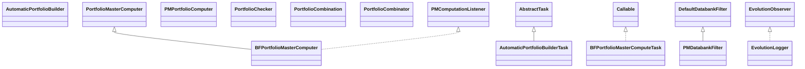

# TaskAutomaticPortfolioBuilder.jar

[Group index](README.md) | [All archives](../README.md)

## Scope and provenance

- **Donor:** `SQX_145_REFERENCE_ROOT/internal/plugins/TaskAutomaticPortfolioBuilder/TaskAutomaticPortfolioBuilder.jar`.
- **SHA-256:** `63a15c31d3c44356a360c32c988b22e30b8c8ddfe581a9bc7ac62050e887e8ce`; accessed 2026-10-06; captured `2026-10-06T18:54:51.906614+00:00`.
- **Classes:** 27 raw entries; 27 unique entry names. Duplicate occurrence indices are zero-based.
- **Inspection:** read-only ZIP hashing and class-file structural parsing; signatures/descriptors, modifiers, hierarchy and references only. Bytecode bodies are hashed, not published.
- **Allocation:** proposed `FEAT-PORTFOLIO-TASK-AUTOMATIC-PORTFOLIO-BUILDER`, P12; [roadmap](../../dev/sqx-full-application-roadmap.md). Domain README registration remains required.
- **Repository:** `01067f00031428613c6394064ca1bcadc1ba00ee`; review state unreviewed. Download label 145-dev1; installed build/activation and runtime equivalence unverified.
- **Limit:** every class/member is inventoried; declaration coverage does not establish consumed calls, defaults, formulas, failure semantics or algorithm parity.
- **Archive/resource index:** [268.json](../../dev/evidence/sqx145/archives/145/268.json).

## Complete member declarations

Member shards contain exact JVM names/descriptors, access flags, generic signatures, throws types, declared fields/methods, superclass/interfaces and referenced class names. All classes, nested/synthetic members and overloads are retained. Code length/hash is structural evidence, not a normalized algorithm comparison.

- [001.json](../../dev/evidence/sqx145/members/268/001.json) — SHA-256 `7b1f7ae4bc9e8e876f0d5c86b0e3774d0dd7b0c3ac19605021772182c742a4f6`.

## Focused structural diagram

Up to twelve non-nested classes; arrows show declared inheritance/interfaces only. External type names are not evidence of an available body or an executed dependency.

## Class inventory

| Archive entry | Occurrence | Class SHA-256 | Fields | Methods |
| --- | ---: | --- | ---: | ---: |
| `com/strategyquant/plugin/Task/impl/AutomaticPortfolioBuilder/AutomaticPortfolioBuilder.class` | 0 | `9831510756e8232bf5193b0100ff49ae8549e50eaef22e9cc58da3d8d29b8653` | 1 | 4 |
| `com/strategyquant/plugin/Task/impl/AutomaticPortfolioBuilder/AutomaticPortfolioBuilderTask.class` | 0 | `c2b5c0ce1d62fe2e059344aff4ac50443d36123a6027c0c89fb983184c4259b9` | 1 | 15 |
| `com/strategyquant/plugin/Task/impl/AutomaticPortfolioBuilder/bruteForce/BFPortfolioMasterComputeTask.class` | 0 | `610c8e00f3953ab3141c5f42565f167dfe5e82819a0f7e35570c986a8a529067` | 3 | 3 |
| `com/strategyquant/plugin/Task/impl/AutomaticPortfolioBuilder/bruteForce/BFPortfolioMasterComputer.class` | 0 | `57826be5a6e0d68548a4ba2b2c1da2dd80d1005f751b028a460c56c622bd831e` | 17 | 11 |
| `com/strategyquant/plugin/Task/impl/AutomaticPortfolioBuilder/bruteForce/PMComputationListener.class` | 0 | `a3c1a8c12321c3216763554300158f8fc6aeb405385ee399806452bd6e0fddcc` | 0 | 6 |
| `com/strategyquant/plugin/Task/impl/AutomaticPortfolioBuilder/bruteForce/PMDatabankFilter.class` | 0 | `5b515e2a6ec5ba3d9d837f277e8002bb707021b7d985218090baa71501b54702` | 1 | 2 |
| `com/strategyquant/plugin/Task/impl/AutomaticPortfolioBuilder/bruteForce/PMPortfolioComputer.class` | 0 | `185d5ea7314493e303dd06d8188ffb8a7f2142b7ab7a3799c3d803ad09b87d78` | 0 | 2 |
| `com/strategyquant/plugin/Task/impl/AutomaticPortfolioBuilder/bruteForce/PortfolioChecker.class` | 0 | `60049f2d5f86f11adfe80cd8d0179b2060a26fb45b15b7efb47a2365bd72c541` | 13 | 9 |
| `com/strategyquant/plugin/Task/impl/AutomaticPortfolioBuilder/bruteForce/PortfolioCombination.class` | 0 | `bb223e9ba005178c600ba3ef37400fd1904b076d06d74499b57b663001b37bb0` | 3 | 1 |
| `com/strategyquant/plugin/Task/impl/AutomaticPortfolioBuilder/bruteForce/PortfolioCombinator.class` | 0 | `8d89f7907fce71a1d0c0d3e93fe43588cd3af2f2172affd49346cca376131f01` | 3 | 4 |
| `com/strategyquant/plugin/Task/impl/AutomaticPortfolioBuilder/bruteForce/PortfolioMasterComputer$1.class` | 0 | `df7f77ab6ad98b12bb5867e90e2ab3801e76d44238c7e789a28db477aeb2ad64` | 1 | 4 |
| `com/strategyquant/plugin/Task/impl/AutomaticPortfolioBuilder/bruteForce/PortfolioMasterComputer.class` | 0 | `e3777a18cfbcc8e66f0254ad603b6a6be5c8d474bfd9a4e59ec7d4fc39b75f5a` | 7 | 15 |
| `com/strategyquant/plugin/Task/impl/AutomaticPortfolioBuilder/genetic/EvolutionLogger.class` | 0 | `0faa8ddbc7f0e5089f1366bdcd0b54b28904330efa853d2773f4fb8fab451ab4` | 1 | 2 |
| `com/strategyquant/plugin/Task/impl/AutomaticPortfolioBuilder/genetic/FitnessEvaluationWorker.class` | 0 | `617bd07aafc5bffb84a40e89438bc68a5666802bf35d6845bad207516f417c6c` | 3 | 6 |
| `com/strategyquant/plugin/Task/impl/AutomaticPortfolioBuilder/genetic/FitnessEvalutationTask.class` | 0 | `113e1f6b4230368cd4b46a38a758a43c386877fdbb003437e9c54d7c45e4b17f` | 3 | 3 |
| `com/strategyquant/plugin/Task/impl/AutomaticPortfolioBuilder/genetic/GPMasterComputer.class` | 0 | `862faf0340ee60a21299feb15a4abc5e658377bf814466dddd952c594692ab51` | 1 | 3 |
| `com/strategyquant/plugin/Task/impl/AutomaticPortfolioBuilder/genetic/GPortfolioMasterComputer.class` | 0 | `4201a9f1482ed45e0eb410290ecdb5a3b764cda6083c47262fbc1e46d36a3d6d` | 13 | 10 |
| `com/strategyquant/plugin/Task/impl/AutomaticPortfolioBuilder/genetic/GenomeSettings.class` | 0 | `7e5baeb68736535aaa4657f30dc74adb60f7a013338d0e83d2411fdb338b2aa1` | 17 | 1 |
| `com/strategyquant/plugin/Task/impl/AutomaticPortfolioBuilder/genetic/PortfolioFitnessCache.class` | 0 | `47529a22c100746c3f2e89be1def5fb5f6465be127b7cdc80ef4548323e0b38f` | 2 | 4 |
| `com/strategyquant/plugin/Task/impl/AutomaticPortfolioBuilder/genetic/PortfolioGenome$StrategyGene.class` | 0 | `f4fedb93f5bd457c96e5c54b7d2cf39bead55c2adaf7910b8aceef6ffdf97677` | 2 | 7 |
| `com/strategyquant/plugin/Task/impl/AutomaticPortfolioBuilder/genetic/PortfolioGenome$StrategyGenesComparator.class` | 0 | `a9415309992925670550b63d40aac87ddf40d30a0bac30b45ebaa8dca8b63da6` | 1 | 3 |
| `com/strategyquant/plugin/Task/impl/AutomaticPortfolioBuilder/genetic/PortfolioGenome.class` | 0 | `908b229e96a2be927d13674177ec896c1ed7be0e0f2f268bdf23dbc1ce3494bc` | 5 | 15 |
| `com/strategyquant/plugin/Task/impl/AutomaticPortfolioBuilder/genetic/PortfolioGenomeCrossover.class` | 0 | `1a478d8ca3b201cd5839f7c020b90eb8a45a9179be76fb2b7f75197e9e12f67b` | 1 | 7 |
| `com/strategyquant/plugin/Task/impl/AutomaticPortfolioBuilder/genetic/PortfolioGenomeEvaluator.class` | 0 | `3d9601bc13ad2ae23c0495638c9a7ab395eebfef90d8db32e6d7ae638d578582` | 6 | 5 |
| `com/strategyquant/plugin/Task/impl/AutomaticPortfolioBuilder/genetic/PortfolioGenomeFactory.class` | 0 | `16a55c27c7be0d67464a94eb434d4fe047de96a54d52b7ae2045a2b2d7b76171` | 1 | 4 |
| `com/strategyquant/plugin/Task/impl/AutomaticPortfolioBuilder/genetic/PortfolioGenomeMutation.class` | 0 | `0ad9e072c7d044efcd2f14a95c19eba148a5ed884f597d341328d6d1a6c0ab6c` | 1 | 6 |
| `com/strategyquant/plugin/Task/impl/AutomaticPortfolioBuilder/genetic/SQGenerationalEvolutionEngine.class` | 0 | `394ab526dedde39d7f7f62c0794b249097bfe05c42522de2e75bf859e965dbab` | 10 | 15 |
