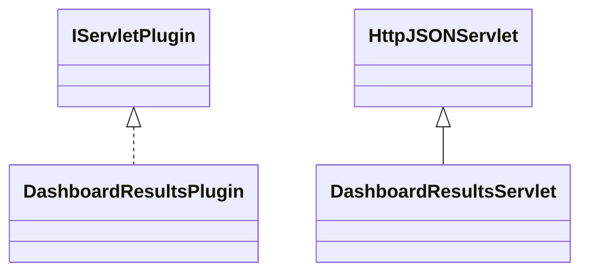

# DashboardResults.jar

[Group index](README.md) | [All archives](../README.md)

## Scope and provenance

- **Donor:** `SQX_145_REFERENCE_ROOT/internal/plugins/DashboardResults/DashboardResults.jar`.
- **SHA-256:** `b2d127ddb067181677a79498cc6fb77f14b43397fe4b044d0626fb8f636ddde0`; accessed 2026-10-06; captured `2026-10-06T18:54:51.906614+00:00`.
- **Classes:** 2 raw entries; 2 unique entry names. Duplicate occurrence indices are zero-based.
- **Inspection:** read-only ZIP hashing and class-file structural parsing; signatures/descriptors, modifiers, hierarchy and references only. Bytecode bodies are hashed, not published.
- **Allocation:** proposed `FEAT-BUILDER-DASHBOARD-RESULTS`, P09; [roadmap](../../dev/sqx-full-application-roadmap.md). Domain README registration remains required.
- **Repository:** `01067f00031428613c6394064ca1bcadc1ba00ee`; review state unreviewed. Download label 145-dev1; installed build/activation and runtime equivalence unverified.
- **Limit:** every class/member is inventoried; declaration coverage does not establish consumed calls, defaults, formulas, failure semantics or algorithm parity.
- **Archive/resource index:** [162.json](../../dev/evidence/sqx145/archives/145/162.json).

## Complete member declarations

Member shards contain exact JVM names/descriptors, access flags, generic signatures, throws types, declared fields/methods, superclass/interfaces and referenced class names. All classes, nested/synthetic members and overloads are retained. Code length/hash is structural evidence, not a normalized algorithm comparison.

- [001.json](../../dev/evidence/sqx145/members/162/001.json) — SHA-256 `8a2fc111b4a1821e42288f6f6c5f2d344d204b8fb9088a29d8c13793bb129aee`.

## Focused structural diagram

Up to twelve non-nested classes; arrows show declared inheritance/interfaces only. External type names are not evidence of an available body or an executed dependency.

## Class inventory

| Archive entry | Occurrence | Class SHA-256 | Fields | Methods |
| --- | ---: | --- | ---: | ---: |
| `com/strategyquant/plugin/Dashboard/impl/Results/DashboardResultsPlugin.class` | 0 | `063f2c107f135f00e6eb305062584d2373deb7e6ccb748b9736bda1f0910b245` | 1 | 5 |
| `com/strategyquant/plugin/Dashboard/impl/Results/DashboardResultsServlet.class` | 0 | `6f8a9bbaea1616bd44a4712c8c58ade2653713f4217b3bef8fadd324f756ce3b` | 1 | 5 |
