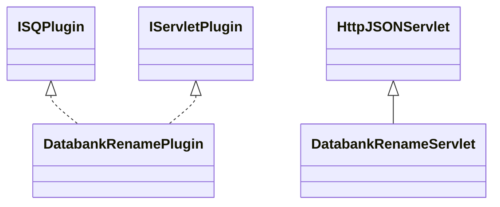

# DatabankRename.jar

[Group index](README.md) | [All archives](../README.md)

## Scope and provenance

- **Donor:** `SQX_145_REFERENCE_ROOT/internal/plugins/DatabankRename/DatabankRename.jar`.
- **SHA-256:** `599ccf09cfdbdd4eb4e56c8aef81b2a6dfebe73743a0106e92abde7c77a1dffa`; accessed 2026-10-06; captured `2026-10-06T18:54:51.906614+00:00`.
- **Classes:** 2 raw entries; 2 unique entry names. Duplicate occurrence indices are zero-based.
- **Inspection:** read-only ZIP hashing and class-file structural parsing; signatures/descriptors, modifiers, hierarchy and references only. Bytecode bodies are hashed, not published.
- **Allocation:** proposed `FEAT-RESULTS-DATABANK-RENAME`, P08; [roadmap](../../dev/sqx-full-application-roadmap.md). Domain README registration remains required.
- **Repository:** `01067f00031428613c6394064ca1bcadc1ba00ee`; review state unreviewed. Download label 145-dev1; installed build/activation and runtime equivalence unverified.
- **Limit:** every class/member is inventoried; declaration coverage does not establish consumed calls, defaults, formulas, failure semantics or algorithm parity.
- **Archive/resource index:** [164.json](../../dev/evidence/sqx145/archives/145/164.json).

## Complete member declarations

Member shards contain exact JVM names/descriptors, access flags, generic signatures, throws types, declared fields/methods, superclass/interfaces and referenced class names. All classes, nested/synthetic members and overloads are retained. Code length/hash is structural evidence, not a normalized algorithm comparison.

- [001.json](../../dev/evidence/sqx145/members/164/001.json) — SHA-256 `e0908cff42add5aa69cfa2ec89227f7b3f6967c4b4ba19fc20656262d26975d2`.

## Focused structural diagram

Up to twelve non-nested classes; arrows show declared inheritance/interfaces only. External type names are not evidence of an available body or an executed dependency.

## Class inventory

| Archive entry | Occurrence | Class SHA-256 | Fields | Methods |
| --- | ---: | --- | ---: | ---: |
| `com/strategyquant/plugin/Databank/impl/Rename/DatabankRenamePlugin.class` | 0 | `cebaed075f47eef7de9ca9eafa48b6dad2b6463b126b654f03aeb798f54448b3` | 3 | 6 |
| `com/strategyquant/plugin/Databank/impl/Rename/DatabankRenameServlet.class` | 0 | `af6c01f27a18c605e26abe4fad524686b0a0896a2c9aeb3a4b2cece292874827` | 1 | 4 |
