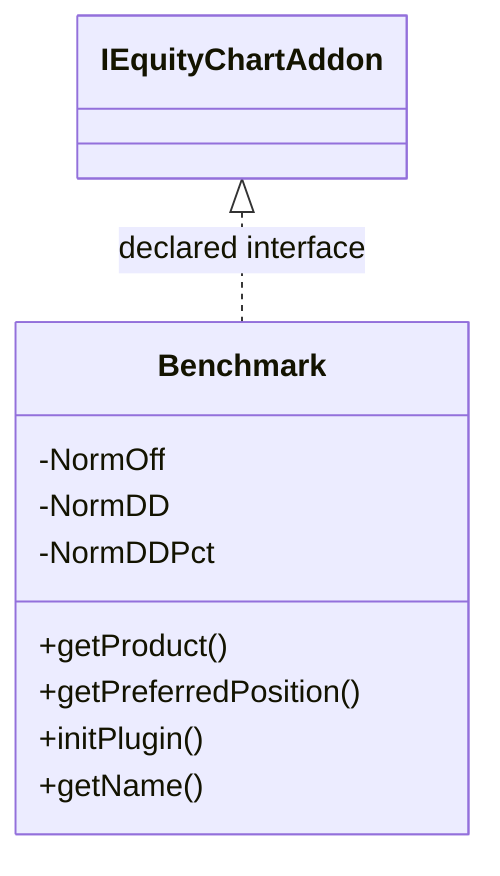

# EquityChartBenchmark.jar

[Workspace/group index](README.md)  |  [All workspaces](../README.md)

## Scope and provenance

- Artifact: `SQX_REFERENCE_ROOT/internal/plugins/EquityChartBenchmark/EquityChartBenchmark.jar`.
- SHA-256: `d04a9b53951cf574b7bb0bf58bc0b9c39820fca334f55cf7f429d541dd1a8877`.
- Inspected: 2026-10-05; generation timestamp `2026-10-05T19:04:16.344170+00:00`.
- Archive class entries: **3**; non-nested: **1**; nested/anonymous: **2**.
- Inspection: ZIP entry/manifest enumeration and `javap -p` declarations for every listed class.
- Repository source HEAD: `8a92c705183a6702eaf62037ccb202ed028aa899`; review state: generated, pending owner review.
- Installed SQX build number is unverified. No method bodies are reproduced.
- Confidence: high for declared structure; workspace ownership inferred except where registration evidence is separately stated. Runtime reachability, call order, formulas and parity remain unverified.

The `Results` folder is a navigation/research grouping, not an exclusive backend owner. Shared consumers may use this JAR.

Target mapping: no verified owning HaruQuantAI feature/requirement/decision IDs are assigned by this document. Register or resolve ownership through the normal repository plan before implementation.

## Diagram reading guide

`Parent <|-- Child` means declared inheritance; `Interface <|.. Class` means declared implementation. Interface extension uses the inheritance arrow. `A ..> B : field type` is a declared type dependency, not composition, object ownership or a runtime call. External nodes are referenced types, not fabricated local implementations. Selected fields/method names aid navigation: `+` is public, `#` protected and `-` private. Diagram method names omit parameter/return types and collapse overloads; use the exact inspected declarations below before implementing an API.

Detailed graphs include non-nested classes in package-sized groups of at most 12. Nested/anonymous classes are inventoried and their declarations/relationships are retained below, but omitted from overview graphs. Relationships not drawn for readability remain in the complete declaration-relationship table. Constructors, synthetic bridges and overloads may be collapsed in diagram member lists only. Standard `java.lang.Object` inheritance is omitted from diagrams.

## UML class diagrams

### 1. `com.strategyquant.plugin.EquityChart.impl.Benchmark`



| Diagram identifier | Exact type | Location |
| --- | --- | --- |
| `Ca3a40ba7ea2e` | `com.strategyquant.plugin.EquityChart.impl.Benchmark.Benchmark` (this JAR) | this diagram |
| `C192f9089a204` | [`com.strategyquant.tradinglib.equitychartnew.addons.IEquityChartAddon`](../Shared/SQTradingLib.md) | referenced external type |

## Complete class inventory

| Fully qualified class | Kind | Entry |
| --- | --- | --- |
| `com.strategyquant.plugin.EquityChart.impl.Benchmark.Benchmark` | class | non-nested |
| `com.strategyquant.plugin.EquityChart.impl.Benchmark.Benchmark$1` | class | nested/anonymous |
| `com.strategyquant.plugin.EquityChart.impl.Benchmark.Benchmark$NormalizedData` | class | nested/anonymous |

## Declared relationships and evidence locations

Every row is supported by the named class declaration/member in `javap -p`, inside the artifact recorded above. Signature dependencies may include return, parameter, generic-argument and throws types; they do not imply execution.

| Declaring class | Referenced type | Relationship | Narrow inspection location |
| --- | --- | --- | --- |
| `com.strategyquant.plugin.EquityChart.impl.Benchmark.Benchmark` | [`com.strategyquant.tradinglib.equitychartnew.addons.IEquityChartAddon`](../Shared/SQTradingLib.md) | implements | `com.strategyquant.plugin.EquityChart.impl.Benchmark.Benchmark` / class declaration: `public class com.strategyquant.plugin.EquityChart.impl.Benchmark.Benchmark implements com.strategyquant.tradinglib.equitychartnew.addons.IEquityChartAddon` |
| `com.strategyquant.plugin.EquityChart.impl.Benchmark.Benchmark` | `java.lang.String` (not resolved in scoped archives) | type dependency | `com.strategyquant.plugin.EquityChart.impl.Benchmark.Benchmark` / field declaration: `private static final java.lang.String NormOff;`<br>`private static final java.lang.String NormDD;`<br>`private static final java.lang.String NormDDPct;`<br>`private static final java.lang.String NormMM;`<br>`private static final java.lang.String NormExposure;` |
| `com.strategyquant.plugin.EquityChart.impl.Benchmark.Benchmark` | `java.lang.String` (not resolved in scoped archives) | type dependency | `com.strategyquant.plugin.EquityChart.impl.Benchmark.Benchmark` / method signature: `public java.lang.String getProduct();`<br>`public java.lang.String getName();`<br>`public void print(com.strategyquant.tradinglib.equitychart.EquityChart, com.strategyquant.tradinglib.ResultsGroup, java.lang.String, com.strategyquant.tradinglib.OrdersList, java.util.Map<java.lang.String, java.lang.String[]>, java.lang.String) throws java.lang.Exception;`<br>`private void printLine(com.strategyquant.tradinglib.equitychart.EquityChart, java.lang.String, java.lang.String, int, double, double, double, double, double, boolean);` |
| `com.strategyquant.plugin.EquityChart.impl.Benchmark.Benchmark` | `org.slf4j.Logger` (not resolved in scoped archives) | type dependency | `com.strategyquant.plugin.EquityChart.impl.Benchmark.Benchmark` / field declaration: `private static final org.slf4j.Logger Log;` |
| `com.strategyquant.plugin.EquityChart.impl.Benchmark.Benchmark` | `org.slf4j.Logger` (not resolved in scoped archives) | type dependency | `com.strategyquant.plugin.EquityChart.impl.Benchmark.Benchmark` / method signature: `static org.slf4j.Logger access$100();` |
| `com.strategyquant.plugin.EquityChart.impl.Benchmark.Benchmark` | `java.lang.Exception` (not resolved in scoped archives) | type dependency | `com.strategyquant.plugin.EquityChart.impl.Benchmark.Benchmark` / method signature: `public void initPlugin() throws java.lang.Exception;`<br>`public void print(com.strategyquant.tradinglib.equitychart.EquityChart, com.strategyquant.tradinglib.ResultsGroup, java.lang.String, com.strategyquant.tradinglib.OrdersList, java.util.Map<java.lang.String, java.lang.String[]>, java.lang.String) throws java.lang.Exception;`<br>`private com.strategyquant.plugin.EquityChart.impl.Benchmark.Benchmark$NormalizedData computeNormalizedByPctDD(double, com.strategyquant.plugin.EquityChart.impl.Benchmark.Benchmark$NormalizedData, it.unimi.dsi.fastutil.objects.ObjectArrayList<com.strategyquant.tradinglib.charts.linechart.series.XYValue>, com.strategyquant.tradinglib.ResultsGroup, com.strategyquant.datalib.DataInfo, double) throws java.lang.Exception;`<br>`private com.strategyquant.plugin.EquityChart.impl.Benchmark.Benchmark$NormalizedData normalizeByExposure(it.unimi.dsi.fastutil.objects.ObjectArrayList<com.strategyquant.tradinglib.charts.linechart.series.XYValue>, com.strategyquant.tradinglib.ResultsGroup, com.strategyquant.tradinglib.MoneyManagementMethod, com.strategyquant.datalib.DataInfo, double, double, double) throws java.lang.Exception;` |
| `com.strategyquant.plugin.EquityChart.impl.Benchmark.Benchmark` | [`com.strategyquant.tradinglib.equitychart.EquityChart`](../Shared/SQTradingLib.md) | type dependency | `com.strategyquant.plugin.EquityChart.impl.Benchmark.Benchmark` / method signature: `public void print(com.strategyquant.tradinglib.equitychart.EquityChart, com.strategyquant.tradinglib.ResultsGroup, java.lang.String, com.strategyquant.tradinglib.OrdersList, java.util.Map<java.lang.String, java.lang.String[]>, java.lang.String) throws java.lang.Exception;`<br>`private void printHeader(com.strategyquant.tradinglib.equitychart.EquityChart, boolean);`<br>`private void printLine(com.strategyquant.tradinglib.equitychart.EquityChart, java.lang.String, java.lang.String, int, double, double, double, double, double, boolean);`<br>`private double calculateCorrelationStrategySPY(com.strategyquant.tradinglib.equitychart.EquityChart, it.unimi.dsi.fastutil.longs.Long2DoubleAVLTreeMap);` |
| `com.strategyquant.plugin.EquityChart.impl.Benchmark.Benchmark` | [`com.strategyquant.tradinglib.ResultsGroup`](../Shared/SQTradingLib.md) | type dependency | `com.strategyquant.plugin.EquityChart.impl.Benchmark.Benchmark` / method signature: `public void print(com.strategyquant.tradinglib.equitychart.EquityChart, com.strategyquant.tradinglib.ResultsGroup, java.lang.String, com.strategyquant.tradinglib.OrdersList, java.util.Map<java.lang.String, java.lang.String[]>, java.lang.String) throws java.lang.Exception;`<br>`private com.strategyquant.plugin.EquityChart.impl.Benchmark.Benchmark$NormalizedData computeNormalizedByPctDD(double, com.strategyquant.plugin.EquityChart.impl.Benchmark.Benchmark$NormalizedData, it.unimi.dsi.fastutil.objects.ObjectArrayList<com.strategyquant.tradinglib.charts.linechart.series.XYValue>, com.strategyquant.tradinglib.ResultsGroup, com.strategyquant.datalib.DataInfo, double) throws java.lang.Exception;`<br>`private com.strategyquant.plugin.EquityChart.impl.Benchmark.Benchmark$NormalizedData normalizeByExposure(it.unimi.dsi.fastutil.objects.ObjectArrayList<com.strategyquant.tradinglib.charts.linechart.series.XYValue>, com.strategyquant.tradinglib.ResultsGroup, com.strategyquant.tradinglib.MoneyManagementMethod, com.strategyquant.datalib.DataInfo, double, double, double) throws java.lang.Exception;` |
| `com.strategyquant.plugin.EquityChart.impl.Benchmark.Benchmark` | [`com.strategyquant.tradinglib.OrdersList`](../Shared/SQTradingLib.md) | type dependency | `com.strategyquant.plugin.EquityChart.impl.Benchmark.Benchmark` / method signature: `public void print(com.strategyquant.tradinglib.equitychart.EquityChart, com.strategyquant.tradinglib.ResultsGroup, java.lang.String, com.strategyquant.tradinglib.OrdersList, java.util.Map<java.lang.String, java.lang.String[]>, java.lang.String) throws java.lang.Exception;` |
| `com.strategyquant.plugin.EquityChart.impl.Benchmark.Benchmark` | `java.util.Map` (not resolved in scoped archives) | type dependency | `com.strategyquant.plugin.EquityChart.impl.Benchmark.Benchmark` / method signature: `public void print(com.strategyquant.tradinglib.equitychart.EquityChart, com.strategyquant.tradinglib.ResultsGroup, java.lang.String, com.strategyquant.tradinglib.OrdersList, java.util.Map<java.lang.String, java.lang.String[]>, java.lang.String) throws java.lang.Exception;` |
| `com.strategyquant.plugin.EquityChart.impl.Benchmark.Benchmark` | `com.strategyquant.plugin.EquityChart.impl.Benchmark.Benchmark$NormalizedData` (this JAR) | type dependency | `com.strategyquant.plugin.EquityChart.impl.Benchmark.Benchmark` / method signature: `private com.strategyquant.plugin.EquityChart.impl.Benchmark.Benchmark$NormalizedData computeNormalizedByPctDD(double, com.strategyquant.plugin.EquityChart.impl.Benchmark.Benchmark$NormalizedData, it.unimi.dsi.fastutil.objects.ObjectArrayList<com.strategyquant.tradinglib.charts.linechart.series.XYValue>, com.strategyquant.tradinglib.ResultsGroup, com.strategyquant.datalib.DataInfo, double) throws java.lang.Exception;`<br>`private com.strategyquant.plugin.EquityChart.impl.Benchmark.Benchmark$NormalizedData normalizeByExposure(it.unimi.dsi.fastutil.objects.ObjectArrayList<com.strategyquant.tradinglib.charts.linechart.series.XYValue>, com.strategyquant.tradinglib.ResultsGroup, com.strategyquant.tradinglib.MoneyManagementMethod, com.strategyquant.datalib.DataInfo, double, double, double) throws java.lang.Exception;` |
| `com.strategyquant.plugin.EquityChart.impl.Benchmark.Benchmark` | `it.unimi.dsi.fastutil.objects.ObjectArrayList` (not resolved in scoped archives) | type dependency | `com.strategyquant.plugin.EquityChart.impl.Benchmark.Benchmark` / method signature: `private com.strategyquant.plugin.EquityChart.impl.Benchmark.Benchmark$NormalizedData computeNormalizedByPctDD(double, com.strategyquant.plugin.EquityChart.impl.Benchmark.Benchmark$NormalizedData, it.unimi.dsi.fastutil.objects.ObjectArrayList<com.strategyquant.tradinglib.charts.linechart.series.XYValue>, com.strategyquant.tradinglib.ResultsGroup, com.strategyquant.datalib.DataInfo, double) throws java.lang.Exception;`<br>`private com.strategyquant.plugin.EquityChart.impl.Benchmark.Benchmark$NormalizedData normalizeByExposure(it.unimi.dsi.fastutil.objects.ObjectArrayList<com.strategyquant.tradinglib.charts.linechart.series.XYValue>, com.strategyquant.tradinglib.ResultsGroup, com.strategyquant.tradinglib.MoneyManagementMethod, com.strategyquant.datalib.DataInfo, double, double, double) throws java.lang.Exception;`<br>`private void fillDatasetValues(com.strategyquant.tradinglib.equitychart.ChartDataset, it.unimi.dsi.fastutil.objects.ObjectArrayList<com.strategyquant.tradinglib.charts.linechart.series.XYValue>, it.unimi.dsi.fastutil.longs.Long2DoubleAVLTreeMap);` |
| `com.strategyquant.plugin.EquityChart.impl.Benchmark.Benchmark` | [`com.strategyquant.tradinglib.charts.linechart.series.XYValue`](../Shared/SQTradingLib.md) | type dependency | `com.strategyquant.plugin.EquityChart.impl.Benchmark.Benchmark` / method signature: `private com.strategyquant.plugin.EquityChart.impl.Benchmark.Benchmark$NormalizedData computeNormalizedByPctDD(double, com.strategyquant.plugin.EquityChart.impl.Benchmark.Benchmark$NormalizedData, it.unimi.dsi.fastutil.objects.ObjectArrayList<com.strategyquant.tradinglib.charts.linechart.series.XYValue>, com.strategyquant.tradinglib.ResultsGroup, com.strategyquant.datalib.DataInfo, double) throws java.lang.Exception;`<br>`private com.strategyquant.plugin.EquityChart.impl.Benchmark.Benchmark$NormalizedData normalizeByExposure(it.unimi.dsi.fastutil.objects.ObjectArrayList<com.strategyquant.tradinglib.charts.linechart.series.XYValue>, com.strategyquant.tradinglib.ResultsGroup, com.strategyquant.tradinglib.MoneyManagementMethod, com.strategyquant.datalib.DataInfo, double, double, double) throws java.lang.Exception;`<br>`private void fillDatasetValues(com.strategyquant.tradinglib.equitychart.ChartDataset, it.unimi.dsi.fastutil.objects.ObjectArrayList<com.strategyquant.tradinglib.charts.linechart.series.XYValue>, it.unimi.dsi.fastutil.longs.Long2DoubleAVLTreeMap);` |
| `com.strategyquant.plugin.EquityChart.impl.Benchmark.Benchmark` | [`com.strategyquant.datalib.DataInfo`](../Shared/SQDataLib.md) | type dependency | `com.strategyquant.plugin.EquityChart.impl.Benchmark.Benchmark` / method signature: `private com.strategyquant.plugin.EquityChart.impl.Benchmark.Benchmark$NormalizedData computeNormalizedByPctDD(double, com.strategyquant.plugin.EquityChart.impl.Benchmark.Benchmark$NormalizedData, it.unimi.dsi.fastutil.objects.ObjectArrayList<com.strategyquant.tradinglib.charts.linechart.series.XYValue>, com.strategyquant.tradinglib.ResultsGroup, com.strategyquant.datalib.DataInfo, double) throws java.lang.Exception;`<br>`private com.strategyquant.plugin.EquityChart.impl.Benchmark.Benchmark$NormalizedData normalizeByExposure(it.unimi.dsi.fastutil.objects.ObjectArrayList<com.strategyquant.tradinglib.charts.linechart.series.XYValue>, com.strategyquant.tradinglib.ResultsGroup, com.strategyquant.tradinglib.MoneyManagementMethod, com.strategyquant.datalib.DataInfo, double, double, double) throws java.lang.Exception;` |
| `com.strategyquant.plugin.EquityChart.impl.Benchmark.Benchmark` | [`com.strategyquant.tradinglib.MoneyManagementMethod`](../Shared/SQTradingLib.md) | type dependency | `com.strategyquant.plugin.EquityChart.impl.Benchmark.Benchmark` / method signature: `private com.strategyquant.plugin.EquityChart.impl.Benchmark.Benchmark$NormalizedData normalizeByExposure(it.unimi.dsi.fastutil.objects.ObjectArrayList<com.strategyquant.tradinglib.charts.linechart.series.XYValue>, com.strategyquant.tradinglib.ResultsGroup, com.strategyquant.tradinglib.MoneyManagementMethod, com.strategyquant.datalib.DataInfo, double, double, double) throws java.lang.Exception;` |
| `com.strategyquant.plugin.EquityChart.impl.Benchmark.Benchmark` | [`com.strategyquant.tradinglib.equitychart.ChartDataset`](../Shared/SQTradingLib.md) | type dependency | `com.strategyquant.plugin.EquityChart.impl.Benchmark.Benchmark` / method signature: `private void fillDatasetValues(com.strategyquant.tradinglib.equitychart.ChartDataset, it.unimi.dsi.fastutil.objects.ObjectArrayList<com.strategyquant.tradinglib.charts.linechart.series.XYValue>, it.unimi.dsi.fastutil.longs.Long2DoubleAVLTreeMap);` |
| `com.strategyquant.plugin.EquityChart.impl.Benchmark.Benchmark` | `it.unimi.dsi.fastutil.longs.Long2DoubleAVLTreeMap` (not resolved in scoped archives) | type dependency | `com.strategyquant.plugin.EquityChart.impl.Benchmark.Benchmark` / method signature: `private void fillDatasetValues(com.strategyquant.tradinglib.equitychart.ChartDataset, it.unimi.dsi.fastutil.objects.ObjectArrayList<com.strategyquant.tradinglib.charts.linechart.series.XYValue>, it.unimi.dsi.fastutil.longs.Long2DoubleAVLTreeMap);`<br>`private double calculateCorrelationStrategySPY(com.strategyquant.tradinglib.equitychart.EquityChart, it.unimi.dsi.fastutil.longs.Long2DoubleAVLTreeMap);` |
| `com.strategyquant.plugin.EquityChart.impl.Benchmark.Benchmark$NormalizedData` | `it.unimi.dsi.fastutil.longs.Long2DoubleAVLTreeMap` (not resolved in scoped archives) | type dependency | `com.strategyquant.plugin.EquityChart.impl.Benchmark.Benchmark$NormalizedData` / field declaration: `public it.unimi.dsi.fastutil.longs.Long2DoubleAVLTreeMap equityMap;`<br>`public it.unimi.dsi.fastutil.longs.Long2DoubleAVLTreeMap ddMapMoney;`<br>`public it.unimi.dsi.fastutil.longs.Long2DoubleAVLTreeMap ddMapPct;`<br>`public it.unimi.dsi.fastutil.longs.Long2DoubleAVLTreeMap ddMapPips;` |
| `com.strategyquant.plugin.EquityChart.impl.Benchmark.Benchmark$NormalizedData` | [`com.strategyquant.tradinglib.OrdersList`](../Shared/SQTradingLib.md) | type dependency | `com.strategyquant.plugin.EquityChart.impl.Benchmark.Benchmark$NormalizedData` / field declaration: `public com.strategyquant.tradinglib.OrdersList ordersList;` |
| `com.strategyquant.plugin.EquityChart.impl.Benchmark.Benchmark$NormalizedData` | `com.strategyquant.plugin.EquityChart.impl.Benchmark.Benchmark` (this JAR) | type dependency | `com.strategyquant.plugin.EquityChart.impl.Benchmark.Benchmark$NormalizedData` / field declaration: `final com.strategyquant.plugin.EquityChart.impl.Benchmark.Benchmark this$0;` |
| `com.strategyquant.plugin.EquityChart.impl.Benchmark.Benchmark$NormalizedData` | `com.strategyquant.plugin.EquityChart.impl.Benchmark.Benchmark` (this JAR) | type dependency | `com.strategyquant.plugin.EquityChart.impl.Benchmark.Benchmark$NormalizedData` / method signature: `private com.strategyquant.plugin.EquityChart.impl.Benchmark.Benchmark$NormalizedData(com.strategyquant.plugin.EquityChart.impl.Benchmark.Benchmark);`<br>`com.strategyquant.plugin.EquityChart.impl.Benchmark.Benchmark$NormalizedData(com.strategyquant.plugin.EquityChart.impl.Benchmark.Benchmark, com.strategyquant.plugin.EquityChart.impl.Benchmark.Benchmark$1);` |
| `com.strategyquant.plugin.EquityChart.impl.Benchmark.Benchmark$NormalizedData` | [`com.strategyquant.tradinglib.SQStats`](../Shared/SQTradingLib.md) | type dependency | `com.strategyquant.plugin.EquityChart.impl.Benchmark.Benchmark$NormalizedData` / method signature: `public com.strategyquant.tradinglib.SQStats calculateStats(com.strategyquant.tradinglib.ResultsGroup, org.jdom2.Element, byte, byte, byte) throws java.lang.Exception;` |
| `com.strategyquant.plugin.EquityChart.impl.Benchmark.Benchmark$NormalizedData` | [`com.strategyquant.tradinglib.ResultsGroup`](../Shared/SQTradingLib.md) | type dependency | `com.strategyquant.plugin.EquityChart.impl.Benchmark.Benchmark$NormalizedData` / method signature: `public com.strategyquant.tradinglib.SQStats calculateStats(com.strategyquant.tradinglib.ResultsGroup, org.jdom2.Element, byte, byte, byte) throws java.lang.Exception;` |
| `com.strategyquant.plugin.EquityChart.impl.Benchmark.Benchmark$NormalizedData` | `org.jdom2.Element` (not resolved in scoped archives) | type dependency | `com.strategyquant.plugin.EquityChart.impl.Benchmark.Benchmark$NormalizedData` / method signature: `public com.strategyquant.tradinglib.SQStats calculateStats(com.strategyquant.tradinglib.ResultsGroup, org.jdom2.Element, byte, byte, byte) throws java.lang.Exception;` |
| `com.strategyquant.plugin.EquityChart.impl.Benchmark.Benchmark$NormalizedData` | `java.lang.Exception` (not resolved in scoped archives) | type dependency | `com.strategyquant.plugin.EquityChart.impl.Benchmark.Benchmark$NormalizedData` / method signature: `public com.strategyquant.tradinglib.SQStats calculateStats(com.strategyquant.tradinglib.ResultsGroup, org.jdom2.Element, byte, byte, byte) throws java.lang.Exception;` |
| `com.strategyquant.plugin.EquityChart.impl.Benchmark.Benchmark$NormalizedData` | `com.strategyquant.plugin.EquityChart.impl.Benchmark.Benchmark$1` (this JAR) | type dependency | `com.strategyquant.plugin.EquityChart.impl.Benchmark.Benchmark$NormalizedData` / method signature: `com.strategyquant.plugin.EquityChart.impl.Benchmark.Benchmark$NormalizedData(com.strategyquant.plugin.EquityChart.impl.Benchmark.Benchmark, com.strategyquant.plugin.EquityChart.impl.Benchmark.Benchmark$1);` |

## Inspected declaration reference

These are structural API/member declarations, not proprietary implementation bodies. Private members and nested classes are retained to make diagram omissions explicit; declarations do not prove behavior.

<details>
<summary>com.strategyquant.plugin.EquityChart.impl.Benchmark.Benchmark</summary>

```text
public class com.strategyquant.plugin.EquityChart.impl.Benchmark.Benchmark implements com.strategyquant.tradinglib.equitychartnew.addons.IEquityChartAddon
    private static final java.lang.String NormOff;
    private static final java.lang.String NormDD;
    private static final java.lang.String NormDDPct;
    private static final java.lang.String NormMM;
    private static final java.lang.String NormExposure;
    private static final org.slf4j.Logger Log;
    public com.strategyquant.plugin.EquityChart.impl.Benchmark.Benchmark();
    public java.lang.String getProduct();
    public int getPreferredPosition();
    public void initPlugin() throws java.lang.Exception;
    public java.lang.String getName();
    public void print(com.strategyquant.tradinglib.equitychart.EquityChart, com.strategyquant.tradinglib.ResultsGroup, java.lang.String, com.strategyquant.tradinglib.OrdersList, java.util.Map<java.lang.String, java.lang.String[]>, java.lang.String) throws java.lang.Exception;
    private com.strategyquant.plugin.EquityChart.impl.Benchmark.Benchmark$NormalizedData computeNormalizedByPctDD(double, com.strategyquant.plugin.EquityChart.impl.Benchmark.Benchmark$NormalizedData, it.unimi.dsi.fastutil.objects.ObjectArrayList<com.strategyquant.tradinglib.charts.linechart.series.XYValue>, com.strategyquant.tradinglib.ResultsGroup, com.strategyquant.datalib.DataInfo, double) throws java.lang.Exception;
    private com.strategyquant.plugin.EquityChart.impl.Benchmark.Benchmark$NormalizedData normalizeByExposure(it.unimi.dsi.fastutil.objects.ObjectArrayList<com.strategyquant.tradinglib.charts.linechart.series.XYValue>, com.strategyquant.tradinglib.ResultsGroup, com.strategyquant.tradinglib.MoneyManagementMethod, com.strategyquant.datalib.DataInfo, double, double, double) throws java.lang.Exception;
    private void printHeader(com.strategyquant.tradinglib.equitychart.EquityChart, boolean);
    private void printLine(com.strategyquant.tradinglib.equitychart.EquityChart, java.lang.String, java.lang.String, int, double, double, double, double, double, boolean);
    private void fillDatasetValues(com.strategyquant.tradinglib.equitychart.ChartDataset, it.unimi.dsi.fastutil.objects.ObjectArrayList<com.strategyquant.tradinglib.charts.linechart.series.XYValue>, it.unimi.dsi.fastutil.longs.Long2DoubleAVLTreeMap);
    private double calculateCorrelationStrategySPY(com.strategyquant.tradinglib.equitychart.EquityChart, it.unimi.dsi.fastutil.longs.Long2DoubleAVLTreeMap);
    private double specialSubtraction(double, double);
    private double getPercentageDD(double, double);
    static org.slf4j.Logger access$100();
```

</details>

<details>
<summary>com.strategyquant.plugin.EquityChart.impl.Benchmark.Benchmark$1</summary>

```text
class com.strategyquant.plugin.EquityChart.impl.Benchmark.Benchmark$1
```

</details>

<details>
<summary>com.strategyquant.plugin.EquityChart.impl.Benchmark.Benchmark$NormalizedData</summary>

```text
class com.strategyquant.plugin.EquityChart.impl.Benchmark.Benchmark$NormalizedData
    public it.unimi.dsi.fastutil.longs.Long2DoubleAVLTreeMap equityMap;
    public double equitySPY;
    public double dd;
    public double ddPct;
    public com.strategyquant.tradinglib.OrdersList ordersList;
    public double initBuyAmount;
    public it.unimi.dsi.fastutil.longs.Long2DoubleAVLTreeMap ddMapMoney;
    public it.unimi.dsi.fastutil.longs.Long2DoubleAVLTreeMap ddMapPct;
    public it.unimi.dsi.fastutil.longs.Long2DoubleAVLTreeMap ddMapPips;
    final com.strategyquant.plugin.EquityChart.impl.Benchmark.Benchmark this$0;
    private com.strategyquant.plugin.EquityChart.impl.Benchmark.Benchmark$NormalizedData(com.strategyquant.plugin.EquityChart.impl.Benchmark.Benchmark);
    public com.strategyquant.tradinglib.SQStats calculateStats(com.strategyquant.tradinglib.ResultsGroup, org.jdom2.Element, byte, byte, byte) throws java.lang.Exception;
    com.strategyquant.plugin.EquityChart.impl.Benchmark.Benchmark$NormalizedData(com.strategyquant.plugin.EquityChart.impl.Benchmark.Benchmark, com.strategyquant.plugin.EquityChart.impl.Benchmark.Benchmark$1);
```

</details>

## Validation and unresolved gaps

Archive hash and complete class inventory were checked against the inspected local artifact. Declaration extraction accounts for every inventoried class. Documentation/link/diagram structural verification is recorded in the master index and task walkthrough; no SQX runtime validation was performed.

The canonical reimplementation ledger/schema are absent, so no evidence IDs or validation-passed ledger claims are created. This is a donor structural reference. Exact behavior, default values, failure semantics, algorithms, runtime calls and target architectural choices require separate research. No aggregation/composition or cardinalities are inferred.
