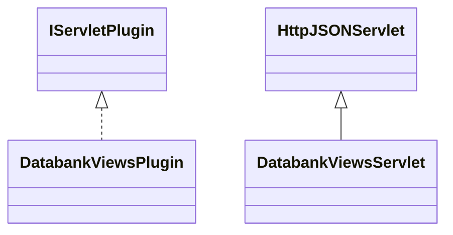

# ResultsDatabankViews.jar

[Group index](README.md) | [All archives](../README.md)

## Scope and provenance

- **Donor:** `SQX_145_REFERENCE_ROOT/internal/plugins/ResultsDatabankViews/ResultsDatabankViews.jar`.
- **SHA-256:** `9417855649b74f0f06bd6756e06094edc6672442de5f49db062c9ec849cc56e1`; accessed 2026-10-06; captured `2026-10-06T18:54:51.906614+00:00`.
- **Classes:** 2 raw entries; 2 unique entry names. Duplicate occurrence indices are zero-based.
- **Inspection:** read-only ZIP hashing and class-file structural parsing; signatures/descriptors, modifiers, hierarchy and references only. Bytecode bodies are hashed, not published.
- **Allocation:** proposed `FEAT-RESULTS-RESULTS-DATABANK-VIEWS`, P08; [roadmap](../../dev/sqx-full-application-roadmap.md). Domain README registration remains required.
- **Repository:** `01067f00031428613c6394064ca1bcadc1ba00ee`; review state unreviewed. Download label 145-dev1; installed build/activation and runtime equivalence unverified.
- **Limit:** every class/member is inventoried; declaration coverage does not establish consumed calls, defaults, formulas, failure semantics or algorithm parity.
- **Archive/resource index:** [202.json](../../dev/evidence/sqx145/archives/145/202.json).

## Complete member declarations

Member shards contain exact JVM names/descriptors, access flags, generic signatures, throws types, declared fields/methods, superclass/interfaces and referenced class names. All classes, nested/synthetic members and overloads are retained. Code length/hash is structural evidence, not a normalized algorithm comparison.

- [001.json](../../dev/evidence/sqx145/members/202/001.json) — SHA-256 `4a63454ef10a2bf2b6a337a07064bd1d91995ebef472ae8b93ed4b5264847468`.

## Focused structural diagram

Up to twelve non-nested classes; arrows show declared inheritance/interfaces only. External type names are not evidence of an available body or an executed dependency.

## Class inventory

| Archive entry | Occurrence | Class SHA-256 | Fields | Methods |
| --- | ---: | --- | ---: | ---: |
| `com/strategyquant/plugin/Results/impl/DatabankViews/DatabankViewsPlugin.class` | 0 | `10edeed168a95971d09111f59dacb6f69bc9455e31156adfb0d59247e41cf661` | 1 | 5 |
| `com/strategyquant/plugin/Results/impl/DatabankViews/DatabankViewsServlet.class` | 0 | `2b0e79c8a7e9b14044673f43e0c611a0c22f48a585cec25982d669a2862918a0` | 1 | 11 |
