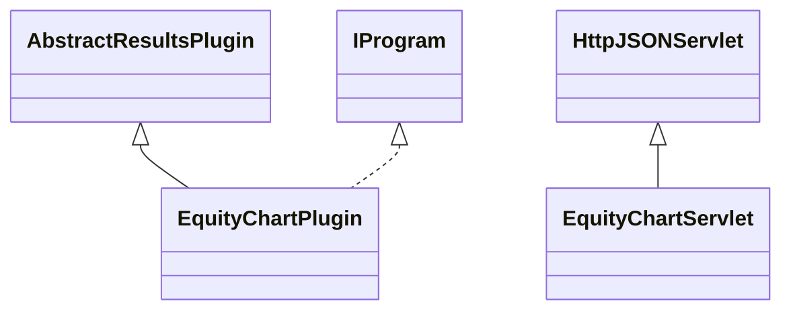

# ResultsEquityChart.jar

[Group index](README.md) | [All archives](../README.md)

## Scope and provenance

- **Donor:** `SQX_145_REFERENCE_ROOT/internal/plugins/ResultsEquityChart/ResultsEquityChart.jar`.
- **SHA-256:** `070932946751314323159f9a5a84d499b1b66924907a093d582f0ce9a7812c54`; accessed 2026-10-06; captured `2026-10-06T18:54:51.906614+00:00`.
- **Classes:** 2 raw entries; 2 unique entry names. Duplicate occurrence indices are zero-based.
- **Inspection:** read-only ZIP hashing and class-file structural parsing; signatures/descriptors, modifiers, hierarchy and references only. Bytecode bodies are hashed, not published.
- **Allocation:** proposed `FEAT-RESULTS-RESULTS-EQUITY-CHART`, P08; [roadmap](../../dev/sqx-full-application-roadmap.md). Domain README registration remains required.
- **Repository:** `01067f00031428613c6394064ca1bcadc1ba00ee`; review state unreviewed. Download label 145-dev1; installed build/activation and runtime equivalence unverified.
- **Limit:** every class/member is inventoried; declaration coverage does not establish consumed calls, defaults, formulas, failure semantics or algorithm parity.
- **Archive/resource index:** [203.json](../../dev/evidence/sqx145/archives/145/203.json).

## Complete member declarations

Member shards contain exact JVM names/descriptors, access flags, generic signatures, throws types, declared fields/methods, superclass/interfaces and referenced class names. All classes, nested/synthetic members and overloads are retained. Code length/hash is structural evidence, not a normalized algorithm comparison.

- [001.json](../../dev/evidence/sqx145/members/203/001.json) — SHA-256 `8f30626915c655566bd0ab66b98cb96baa8ec1c4ee29d57b36b38331a08ccce4`.

## Focused structural diagram

Up to twelve non-nested classes; arrows show declared inheritance/interfaces only. External type names are not evidence of an available body or an executed dependency.

## Class inventory

| Archive entry | Occurrence | Class SHA-256 | Fields | Methods |
| --- | ---: | --- | ---: | ---: |
| `com/strategyquant/plugin/Results/impl/EquityChart/EquityChartPlugin.class` | 0 | `9839dc45170d510e8ef66db9a0ba8fb678e945734d3b85da80e56fe3573d01ce` | 2 | 10 |
| `com/strategyquant/plugin/Results/impl/EquityChart/EquityChartServlet.class` | 0 | `25b1882bc4b13f1eb4d6a3cd68e80b3dbf433c76fe04a22123e07b3bcef14d1d` | 18 | 9 |
