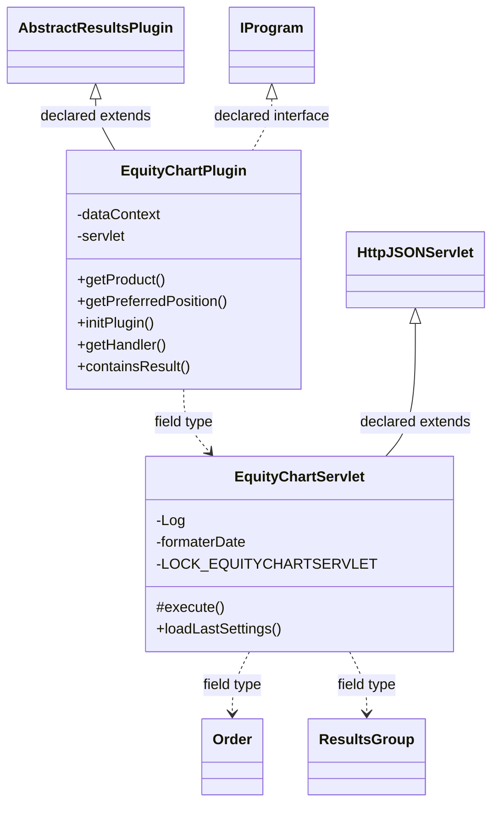

# ResultsEquityChart.jar

[Workspace/group index](README.md)  |  [All workspaces](../README.md)

## Scope and provenance

- Artifact: `SQX_REFERENCE_ROOT/internal/plugins/ResultsEquityChart/ResultsEquityChart.jar`.
- SHA-256: `d13f1ffdd75ec94f33d7c383b5a8239f3f1a28700b4aed2303041cbd936e4645`.
- Inspected: 2026-10-05; generation timestamp `2026-10-05T19:04:16.344170+00:00`.
- Archive class entries: **2**; non-nested: **2**; nested/anonymous: **0**.
- Inspection: ZIP entry/manifest enumeration and `javap -p` declarations for every listed class.
- Repository source HEAD: `8a92c705183a6702eaf62037ccb202ed028aa899`; review state: generated, pending owner review.
- Installed SQX build number is unverified. No method bodies are reproduced.
- Confidence: high for declared structure; workspace ownership inferred except where registration evidence is separately stated. Runtime reachability, call order, formulas and parity remain unverified.

The `Results` folder is a navigation/research grouping, not an exclusive backend owner. Shared consumers may use this JAR.

Target mapping: no verified owning HaruQuantAI feature/requirement/decision IDs are assigned by this document. Register or resolve ownership through the normal repository plan before implementation.

## Diagram reading guide

`Parent <|-- Child` means declared inheritance; `Interface <|.. Class` means declared implementation. Interface extension uses the inheritance arrow. `A ..> B : field type` is a declared type dependency, not composition, object ownership or a runtime call. External nodes are referenced types, not fabricated local implementations. Selected fields/method names aid navigation: `+` is public, `#` protected and `-` private. Diagram method names omit parameter/return types and collapse overloads; use the exact inspected declarations below before implementing an API.

Detailed graphs include non-nested classes in package-sized groups of at most 12. Nested/anonymous classes are inventoried and their declarations/relationships are retained below, but omitted from overview graphs. Relationships not drawn for readability remain in the complete declaration-relationship table. Constructors, synthetic bridges and overloads may be collapsed in diagram member lists only. Standard `java.lang.Object` inheritance is omitted from diagrams.

## UML class diagrams

### 1. `com.strategyquant.plugin.Results.impl.EquityChart`



| Diagram identifier | Exact type | Location |
| --- | --- | --- |
| `C62d2e0fc02ae` | `com.strategyquant.plugin.Results.impl.EquityChart.EquityChartPlugin` (this JAR) | this diagram |
| `C330096fd16c1` | `com.strategyquant.plugin.Results.impl.EquityChart.EquityChartServlet` (this JAR) | this diagram |
| `C1b6b4448b67b` | [`com.strategyquant.pluginlib.program.IProgram`](../Shared/SQPluginLib.md) | referenced external type |
| `C5edd3fc0ac53` | [`com.strategyquant.tradinglib.Order`](../Shared/SQTradingLib.md) | referenced external type |
| `C81fcbc41b716` | [`com.strategyquant.tradinglib.ResultsGroup`](../Shared/SQTradingLib.md) | referenced external type |
| `C180e0c3f58c3` | [`com.strategyquant.tradinglib.results.AbstractResultsPlugin`](../Shared/SQTradingLib.md) | referenced external type |
| `C8900f90ae594` | [`com.strategyquant.webguilib.servlet.HttpJSONServlet`](../Shared/SQWebGUILib.md) | referenced external type |

## Complete class inventory

| Fully qualified class | Kind | Entry |
| --- | --- | --- |
| `com.strategyquant.plugin.Results.impl.EquityChart.EquityChartPlugin` | class | non-nested |
| `com.strategyquant.plugin.Results.impl.EquityChart.EquityChartServlet` | class | non-nested |

## Declared relationships and evidence locations

Every row is supported by the named class declaration/member in `javap -p`, inside the artifact recorded above. Signature dependencies may include return, parameter, generic-argument and throws types; they do not imply execution.

| Declaring class | Referenced type | Relationship | Narrow inspection location |
| --- | --- | --- | --- |
| `com.strategyquant.plugin.Results.impl.EquityChart.EquityChartPlugin` | [`com.strategyquant.tradinglib.results.AbstractResultsPlugin`](../Shared/SQTradingLib.md) | extends | `com.strategyquant.plugin.Results.impl.EquityChart.EquityChartPlugin` / class declaration: `public class com.strategyquant.plugin.Results.impl.EquityChart.EquityChartPlugin extends com.strategyquant.tradinglib.results.AbstractResultsPlugin implements com.strategyquant.pluginlib.program.IProgram` |
| `com.strategyquant.plugin.Results.impl.EquityChart.EquityChartPlugin` | [`com.strategyquant.pluginlib.program.IProgram`](../Shared/SQPluginLib.md) | implements | `com.strategyquant.plugin.Results.impl.EquityChart.EquityChartPlugin` / class declaration: `public class com.strategyquant.plugin.Results.impl.EquityChart.EquityChartPlugin extends com.strategyquant.tradinglib.results.AbstractResultsPlugin implements com.strategyquant.pluginlib.program.IProgram` |
| `com.strategyquant.plugin.Results.impl.EquityChart.EquityChartPlugin` | `org.eclipse.jetty.servlet.ServletContextHandler` (not resolved in scoped archives) | type dependency | `com.strategyquant.plugin.Results.impl.EquityChart.EquityChartPlugin` / field declaration: `private org.eclipse.jetty.servlet.ServletContextHandler dataContext;` |
| `com.strategyquant.plugin.Results.impl.EquityChart.EquityChartPlugin` | `org.eclipse.jetty.servlet.ServletContextHandler` (not resolved in scoped archives) | type dependency | `com.strategyquant.plugin.Results.impl.EquityChart.EquityChartPlugin` / method signature: `private void addCrossOrigin(org.eclipse.jetty.servlet.ServletContextHandler);` |
| `com.strategyquant.plugin.Results.impl.EquityChart.EquityChartPlugin` | `com.strategyquant.plugin.Results.impl.EquityChart.EquityChartServlet` (this JAR) | type dependency | `com.strategyquant.plugin.Results.impl.EquityChart.EquityChartPlugin` / field declaration: `private com.strategyquant.plugin.Results.impl.EquityChart.EquityChartServlet servlet;` |
| `com.strategyquant.plugin.Results.impl.EquityChart.EquityChartPlugin` | `java.lang.String` (not resolved in scoped archives) | type dependency | `com.strategyquant.plugin.Results.impl.EquityChart.EquityChartPlugin` / method signature: `public java.lang.String getProduct();`<br>`public java.lang.String getKey();`<br>`public java.lang.Object call(java.lang.String, java.lang.Object...) throws java.lang.Exception;` |
| `com.strategyquant.plugin.Results.impl.EquityChart.EquityChartPlugin` | `java.lang.Exception` (not resolved in scoped archives) | type dependency | `com.strategyquant.plugin.Results.impl.EquityChart.EquityChartPlugin` / method signature: `public void initPlugin() throws java.lang.Exception;`<br>`public org.json.JSONObject getInitializationData() throws java.lang.Exception;`<br>`public java.lang.Object call(java.lang.String, java.lang.Object...) throws java.lang.Exception;` |
| `com.strategyquant.plugin.Results.impl.EquityChart.EquityChartPlugin` | `org.eclipse.jetty.server.Handler` (not resolved in scoped archives) | type dependency | `com.strategyquant.plugin.Results.impl.EquityChart.EquityChartPlugin` / method signature: `public org.eclipse.jetty.server.Handler getHandler();` |
| `com.strategyquant.plugin.Results.impl.EquityChart.EquityChartPlugin` | [`com.strategyquant.tradinglib.ResultsGroup`](../Shared/SQTradingLib.md) | type dependency | `com.strategyquant.plugin.Results.impl.EquityChart.EquityChartPlugin` / method signature: `public boolean containsResult(com.strategyquant.tradinglib.ResultsGroup);` |
| `com.strategyquant.plugin.Results.impl.EquityChart.EquityChartPlugin` | `org.json.JSONObject` (not resolved in scoped archives) | type dependency | `com.strategyquant.plugin.Results.impl.EquityChart.EquityChartPlugin` / method signature: `public org.json.JSONObject getInitializationData() throws java.lang.Exception;` |
| `com.strategyquant.plugin.Results.impl.EquityChart.EquityChartPlugin` | `java.lang.Object` (not resolved in scoped archives) | type dependency | `com.strategyquant.plugin.Results.impl.EquityChart.EquityChartPlugin` / method signature: `public java.lang.Object call(java.lang.String, java.lang.Object...) throws java.lang.Exception;` |
| `com.strategyquant.plugin.Results.impl.EquityChart.EquityChartServlet` | [`com.strategyquant.webguilib.servlet.HttpJSONServlet`](../Shared/SQWebGUILib.md) | extends | `com.strategyquant.plugin.Results.impl.EquityChart.EquityChartServlet` / class declaration: `public class com.strategyquant.plugin.Results.impl.EquityChart.EquityChartServlet extends com.strategyquant.webguilib.servlet.HttpJSONServlet` |
| `com.strategyquant.plugin.Results.impl.EquityChart.EquityChartServlet` | `org.slf4j.Logger` (not resolved in scoped archives) | type dependency | `com.strategyquant.plugin.Results.impl.EquityChart.EquityChartServlet` / field declaration: `private static final org.slf4j.Logger Log;` |
| `com.strategyquant.plugin.Results.impl.EquityChart.EquityChartServlet` | `org.joda.time.format.DateTimeFormatter` (not resolved in scoped archives) | type dependency | `com.strategyquant.plugin.Results.impl.EquityChart.EquityChartServlet` / field declaration: `private static final org.joda.time.format.DateTimeFormatter formaterDate;` |
| `com.strategyquant.plugin.Results.impl.EquityChart.EquityChartServlet` | `java.lang.String` (not resolved in scoped archives) | type dependency | `com.strategyquant.plugin.Results.impl.EquityChart.EquityChartServlet` / field declaration: `private static final java.lang.String LOCK_EQUITYCHARTSERVLET;`<br>`private static final java.lang.String SettingKey;` |
| `com.strategyquant.plugin.Results.impl.EquityChart.EquityChartServlet` | `java.lang.String` (not resolved in scoped archives) | type dependency | `com.strategyquant.plugin.Results.impl.EquityChart.EquityChartServlet` / method signature: `protected java.lang.String execute(java.lang.String, java.util.Map<java.lang.String, java.lang.String[]>, java.lang.String) throws java.lang.Exception;`<br>`private synchronized java.lang.String onPrint(java.util.Map<java.lang.String, java.lang.String[]>) throws java.lang.Exception;`<br>`private void saveLastSettings(java.lang.String, byte, byte, byte, byte, java.lang.String, java.lang.Boolean, java.lang.Boolean, java.lang.String, java.lang.Boolean, java.lang.Boolean, java.lang.Boolean, java.lang.String, java.lang.String);`<br>`private boolean isWFResult(com.strategyquant.tradinglib.ResultsGroup, java.lang.String) throws java.lang.Exception;`<br>`private long parseLong(java.lang.String);`<br>`private long parseTime(java.lang.String);` |
| `com.strategyquant.plugin.Results.impl.EquityChart.EquityChartServlet` | [`com.strategyquant.tradinglib.equitychart.EquityChart`](../Shared/SQTradingLib.md) | type dependency | `com.strategyquant.plugin.Results.impl.EquityChart.EquityChartServlet` / field declaration: `private com.strategyquant.tradinglib.equitychart.EquityChart chart;` |
| `com.strategyquant.plugin.Results.impl.EquityChart.EquityChartServlet` | [`com.strategyquant.tradinglib.equitychart.Periods`](../Shared/SQTradingLib.md) | type dependency | `com.strategyquant.plugin.Results.impl.EquityChart.EquityChartServlet` / field declaration: `private com.strategyquant.tradinglib.equitychart.Periods periods;` |
| `com.strategyquant.plugin.Results.impl.EquityChart.EquityChartServlet` | [`com.strategyquant.tradinglib.equitychart.YearMarkers`](../Shared/SQTradingLib.md) | type dependency | `com.strategyquant.plugin.Results.impl.EquityChart.EquityChartServlet` / field declaration: `private com.strategyquant.tradinglib.equitychart.YearMarkers yearMarkers;` |
| `com.strategyquant.plugin.Results.impl.EquityChart.EquityChartServlet` | [`com.strategyquant.tradinglib.equitychart.SampleMarkers`](../Shared/SQTradingLib.md) | type dependency | `com.strategyquant.plugin.Results.impl.EquityChart.EquityChartServlet` / field declaration: `private com.strategyquant.tradinglib.equitychart.SampleMarkers sampleMarkers;` |
| `com.strategyquant.plugin.Results.impl.EquityChart.EquityChartServlet` | [`com.strategyquant.tradinglib.equitychart.TrendLines`](../Shared/SQTradingLib.md) | type dependency | `com.strategyquant.plugin.Results.impl.EquityChart.EquityChartServlet` / field declaration: `private com.strategyquant.tradinglib.equitychart.TrendLines trendLines;` |
| `com.strategyquant.plugin.Results.impl.EquityChart.EquityChartServlet` | [`com.strategyquant.tradinglib.equitychart.Points`](../Shared/SQTradingLib.md) | type dependency | `com.strategyquant.plugin.Results.impl.EquityChart.EquityChartServlet` / field declaration: `private com.strategyquant.tradinglib.equitychart.Points points;` |
| `com.strategyquant.plugin.Results.impl.EquityChart.EquityChartServlet` | [`com.strategyquant.tradinglib.equitychart.Stagnation`](../Shared/SQTradingLib.md) | type dependency | `com.strategyquant.plugin.Results.impl.EquityChart.EquityChartServlet` / field declaration: `private com.strategyquant.tradinglib.equitychart.Stagnation stagnation;` |
| `com.strategyquant.plugin.Results.impl.EquityChart.EquityChartServlet` | [`com.strategyquant.tradinglib.equitychart.MaxNewHighDuration`](../Shared/SQTradingLib.md) | type dependency | `com.strategyquant.plugin.Results.impl.EquityChart.EquityChartServlet` / field declaration: `private com.strategyquant.tradinglib.equitychart.MaxNewHighDuration maxNewHighDuration;` |
| `com.strategyquant.plugin.Results.impl.EquityChart.EquityChartServlet` | [`com.strategyquant.tradinglib.equitychart.WalkForward`](../Shared/SQTradingLib.md) | type dependency | `com.strategyquant.plugin.Results.impl.EquityChart.EquityChartServlet` / field declaration: `private com.strategyquant.tradinglib.equitychart.WalkForward walkForward;` |
| `com.strategyquant.plugin.Results.impl.EquityChart.EquityChartServlet` | [`com.strategyquant.tradinglib.equitychart.Equity`](../Shared/SQTradingLib.md) | type dependency | `com.strategyquant.plugin.Results.impl.EquityChart.EquityChartServlet` / field declaration: `private com.strategyquant.tradinglib.equitychart.Equity equity;` |
| `com.strategyquant.plugin.Results.impl.EquityChart.EquityChartServlet` | [`com.strategyquant.tradinglib.results.IResultsGroupProvider`](../Shared/SQTradingLib.md) | type dependency | `com.strategyquant.plugin.Results.impl.EquityChart.EquityChartServlet` / field declaration: `private com.strategyquant.tradinglib.results.IResultsGroupProvider rgProvider;` |
| `com.strategyquant.plugin.Results.impl.EquityChart.EquityChartServlet` | [`com.strategyquant.tradinglib.results.IResultsGroupProvider`](../Shared/SQTradingLib.md) | type dependency | `com.strategyquant.plugin.Results.impl.EquityChart.EquityChartServlet` / method signature: `public com.strategyquant.plugin.Results.impl.EquityChart.EquityChartServlet(com.strategyquant.tradinglib.results.IResultsGroupProvider);` |
| `com.strategyquant.plugin.Results.impl.EquityChart.EquityChartServlet` | `java.util.Comparator` (not resolved in scoped archives) | type dependency | `com.strategyquant.plugin.Results.impl.EquityChart.EquityChartServlet` / field declaration: `private final java.util.Comparator<com.strategyquant.tradinglib.Order> comparatorByCloseTime;`<br>`private final java.util.Comparator<com.strategyquant.tradinglib.Order> comparatorByOpenTime;` |
| `com.strategyquant.plugin.Results.impl.EquityChart.EquityChartServlet` | [`com.strategyquant.tradinglib.Order`](../Shared/SQTradingLib.md) | type dependency | `com.strategyquant.plugin.Results.impl.EquityChart.EquityChartServlet` / field declaration: `private final java.util.Comparator<com.strategyquant.tradinglib.Order> comparatorByCloseTime;`<br>`private final java.util.Comparator<com.strategyquant.tradinglib.Order> comparatorByOpenTime;` |
| `com.strategyquant.plugin.Results.impl.EquityChart.EquityChartServlet` | [`com.strategyquant.tradinglib.ResultsGroup`](../Shared/SQTradingLib.md) | type dependency | `com.strategyquant.plugin.Results.impl.EquityChart.EquityChartServlet` / field declaration: `public com.strategyquant.tradinglib.ResultsGroup rg;` |
| `com.strategyquant.plugin.Results.impl.EquityChart.EquityChartServlet` | [`com.strategyquant.tradinglib.ResultsGroup`](../Shared/SQTradingLib.md) | type dependency | `com.strategyquant.plugin.Results.impl.EquityChart.EquityChartServlet` / method signature: `private boolean isWFResult(com.strategyquant.tradinglib.ResultsGroup, java.lang.String) throws java.lang.Exception;` |
| `com.strategyquant.plugin.Results.impl.EquityChart.EquityChartServlet` | `java.util.Map` (not resolved in scoped archives) | type dependency | `com.strategyquant.plugin.Results.impl.EquityChart.EquityChartServlet` / method signature: `protected java.lang.String execute(java.lang.String, java.util.Map<java.lang.String, java.lang.String[]>, java.lang.String) throws java.lang.Exception;`<br>`private synchronized java.lang.String onPrint(java.util.Map<java.lang.String, java.lang.String[]>) throws java.lang.Exception;` |
| `com.strategyquant.plugin.Results.impl.EquityChart.EquityChartServlet` | `java.lang.Exception` (not resolved in scoped archives) | type dependency | `com.strategyquant.plugin.Results.impl.EquityChart.EquityChartServlet` / method signature: `protected java.lang.String execute(java.lang.String, java.util.Map<java.lang.String, java.lang.String[]>, java.lang.String) throws java.lang.Exception;`<br>`public org.json.JSONObject loadLastSettings() throws java.lang.Exception;`<br>`private synchronized java.lang.String onPrint(java.util.Map<java.lang.String, java.lang.String[]>) throws java.lang.Exception;`<br>`private boolean isWFResult(com.strategyquant.tradinglib.ResultsGroup, java.lang.String) throws java.lang.Exception;` |
| `com.strategyquant.plugin.Results.impl.EquityChart.EquityChartServlet` | `org.json.JSONObject` (not resolved in scoped archives) | type dependency | `com.strategyquant.plugin.Results.impl.EquityChart.EquityChartServlet` / method signature: `public org.json.JSONObject loadLastSettings() throws java.lang.Exception;` |
| `com.strategyquant.plugin.Results.impl.EquityChart.EquityChartServlet` | `java.lang.Boolean` (not resolved in scoped archives) | type dependency | `com.strategyquant.plugin.Results.impl.EquityChart.EquityChartServlet` / method signature: `private void saveLastSettings(java.lang.String, byte, byte, byte, byte, java.lang.String, java.lang.Boolean, java.lang.Boolean, java.lang.String, java.lang.Boolean, java.lang.Boolean, java.lang.Boolean, java.lang.String, java.lang.String);` |

## Inspected declaration reference

These are structural API/member declarations, not proprietary implementation bodies. Private members and nested classes are retained to make diagram omissions explicit; declarations do not prove behavior.

<details>
<summary>com.strategyquant.plugin.Results.impl.EquityChart.EquityChartPlugin</summary>

```text
public class com.strategyquant.plugin.Results.impl.EquityChart.EquityChartPlugin extends com.strategyquant.tradinglib.results.AbstractResultsPlugin implements com.strategyquant.pluginlib.program.IProgram
    private org.eclipse.jetty.servlet.ServletContextHandler dataContext;
    private com.strategyquant.plugin.Results.impl.EquityChart.EquityChartServlet servlet;
    public com.strategyquant.plugin.Results.impl.EquityChart.EquityChartPlugin();
    public java.lang.String getProduct();
    public int getPreferredPosition();
    public void initPlugin() throws java.lang.Exception;
    public org.eclipse.jetty.server.Handler getHandler();
    private void addCrossOrigin(org.eclipse.jetty.servlet.ServletContextHandler);
    public boolean containsResult(com.strategyquant.tradinglib.ResultsGroup);
    public java.lang.String getKey();
    public org.json.JSONObject getInitializationData() throws java.lang.Exception;
    public java.lang.Object call(java.lang.String, java.lang.Object...) throws java.lang.Exception;
```

</details>

<details>
<summary>com.strategyquant.plugin.Results.impl.EquityChart.EquityChartServlet</summary>

```text
public class com.strategyquant.plugin.Results.impl.EquityChart.EquityChartServlet extends com.strategyquant.webguilib.servlet.HttpJSONServlet
    private static final org.slf4j.Logger Log;
    private static final org.joda.time.format.DateTimeFormatter formaterDate;
    private static final java.lang.String LOCK_EQUITYCHARTSERVLET;
    private com.strategyquant.tradinglib.equitychart.EquityChart chart;
    private com.strategyquant.tradinglib.equitychart.Periods periods;
    private com.strategyquant.tradinglib.equitychart.YearMarkers yearMarkers;
    private com.strategyquant.tradinglib.equitychart.SampleMarkers sampleMarkers;
    private com.strategyquant.tradinglib.equitychart.TrendLines trendLines;
    private com.strategyquant.tradinglib.equitychart.Points points;
    private com.strategyquant.tradinglib.equitychart.Stagnation stagnation;
    private com.strategyquant.tradinglib.equitychart.MaxNewHighDuration maxNewHighDuration;
    private com.strategyquant.tradinglib.equitychart.WalkForward walkForward;
    private com.strategyquant.tradinglib.equitychart.Equity equity;
    private com.strategyquant.tradinglib.results.IResultsGroupProvider rgProvider;
    private final java.util.Comparator<com.strategyquant.tradinglib.Order> comparatorByCloseTime;
    private final java.util.Comparator<com.strategyquant.tradinglib.Order> comparatorByOpenTime;
    private static final java.lang.String SettingKey;
    public com.strategyquant.tradinglib.ResultsGroup rg;
    public com.strategyquant.plugin.Results.impl.EquityChart.EquityChartServlet(com.strategyquant.tradinglib.results.IResultsGroupProvider);
    protected java.lang.String execute(java.lang.String, java.util.Map<java.lang.String, java.lang.String[]>, java.lang.String) throws java.lang.Exception;
    public org.json.JSONObject loadLastSettings() throws java.lang.Exception;
    private synchronized java.lang.String onPrint(java.util.Map<java.lang.String, java.lang.String[]>) throws java.lang.Exception;
    private void saveLastSettings(java.lang.String, byte, byte, byte, byte, java.lang.String, java.lang.Boolean, java.lang.Boolean, java.lang.String, java.lang.Boolean, java.lang.Boolean, java.lang.Boolean, java.lang.String, java.lang.String);
    private boolean isWFResult(com.strategyquant.tradinglib.ResultsGroup, java.lang.String) throws java.lang.Exception;
    private long parseLong(java.lang.String);
    private long parseTime(java.lang.String);
```

</details>

## Validation and unresolved gaps

Archive hash and complete class inventory were checked against the inspected local artifact. Declaration extraction accounts for every inventoried class. Documentation/link/diagram structural verification is recorded in the master index and task walkthrough; no SQX runtime validation was performed.

The canonical reimplementation ledger/schema are absent, so no evidence IDs or validation-passed ledger claims are created. This is a donor structural reference. Exact behavior, default values, failure semantics, algorithms, runtime calls and target architectural choices require separate research. No aggregation/composition or cardinalities are inferred.
