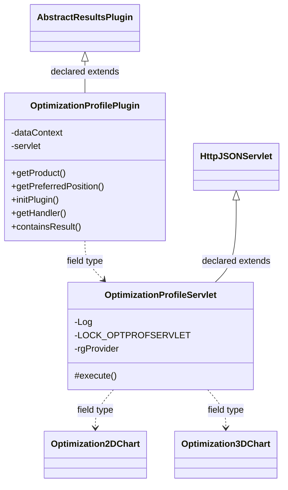
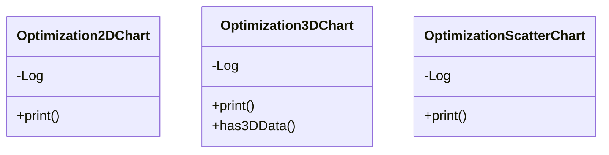
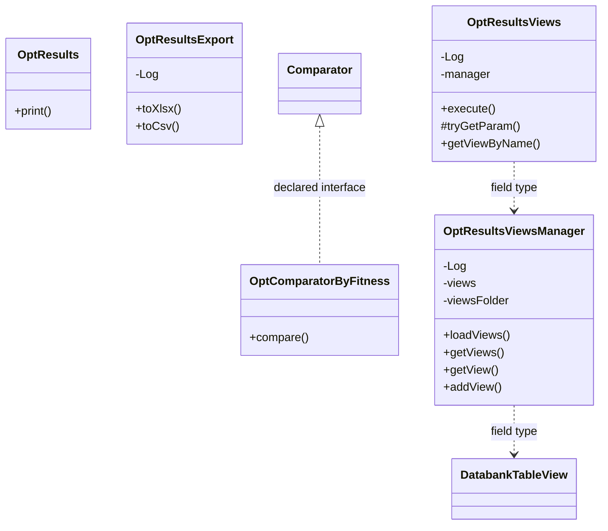

# ResultsOptimizationProfile.jar

[Workspace/group index](README.md)  |  [All workspaces](../README.md)

## Scope and provenance

- Artifact: `SQX_REFERENCE_ROOT/internal/plugins/ResultsOptimizationProfile/ResultsOptimizationProfile.jar`.
- SHA-256: `f3fbf5808631df75cf45cdac71080efb9b1c05dfb5d0d800b4fd56a56cd4c62f`.
- Inspected: 2026-10-05; generation timestamp `2026-10-05T19:04:16.344170+00:00`.
- Archive class entries: **12**; non-nested: **10**; nested/anonymous: **2**.
- Inspection: ZIP entry/manifest enumeration and `javap -p` declarations for every listed class.
- Repository source HEAD: `8a92c705183a6702eaf62037ccb202ed028aa899`; review state: generated, pending owner review.
- Installed SQX build number is unverified. No method bodies are reproduced.
- Confidence: high for declared structure; workspace ownership inferred except where registration evidence is separately stated. Runtime reachability, call order, formulas and parity remain unverified.

The `Results` folder is a navigation/research grouping, not an exclusive backend owner. Shared consumers may use this JAR.

Target mapping: no verified owning HaruQuantAI feature/requirement/decision IDs are assigned by this document. Register or resolve ownership through the normal repository plan before implementation.

## Diagram reading guide

`Parent <|-- Child` means declared inheritance; `Interface <|.. Class` means declared implementation. Interface extension uses the inheritance arrow. `A ..> B : field type` is a declared type dependency, not composition, object ownership or a runtime call. External nodes are referenced types, not fabricated local implementations. Selected fields/method names aid navigation: `+` is public, `#` protected and `-` private. Diagram method names omit parameter/return types and collapse overloads; use the exact inspected declarations below before implementing an API.

Detailed graphs include non-nested classes in package-sized groups of at most 12. Nested/anonymous classes are inventoried and their declarations/relationships are retained below, but omitted from overview graphs. Relationships not drawn for readability remain in the complete declaration-relationship table. Constructors, synthetic bridges and overloads may be collapsed in diagram member lists only. Standard `java.lang.Object` inheritance is omitted from diagrams.

## UML class diagrams

### 1. `com.strategyquant.plugin.Results.impl.OptimizationProfile`



| Diagram identifier | Exact type | Location |
| --- | --- | --- |
| `Cf706de53acfb` | `com.strategyquant.plugin.Results.impl.OptimizationProfile.OptimizationProfilePlugin` (this JAR) | this diagram |
| `C9f71304ed5cb` | `com.strategyquant.plugin.Results.impl.OptimizationProfile.OptimizationProfileServlet` (this JAR) | this diagram |
| `C518a4e93f8a1` | `com.strategyquant.plugin.Results.impl.OptimizationProfile.charts.Optimization2DChart` (this JAR) | another group in this JAR |
| `C4824a9cccc01` | `com.strategyquant.plugin.Results.impl.OptimizationProfile.charts.Optimization3DChart` (this JAR) | another group in this JAR |
| `C180e0c3f58c3` | [`com.strategyquant.tradinglib.results.AbstractResultsPlugin`](../Shared/SQTradingLib.md) | referenced external type |
| `C8900f90ae594` | [`com.strategyquant.webguilib.servlet.HttpJSONServlet`](../Shared/SQWebGUILib.md) | referenced external type |

### 2. `com.strategyquant.plugin.Results.impl.OptimizationProfile.charts`



| Diagram identifier | Exact type | Location |
| --- | --- | --- |
| `C518a4e93f8a1` | `com.strategyquant.plugin.Results.impl.OptimizationProfile.charts.Optimization2DChart` (this JAR) | this diagram |
| `C4824a9cccc01` | `com.strategyquant.plugin.Results.impl.OptimizationProfile.charts.Optimization3DChart` (this JAR) | this diagram |
| `Cf2cb3a3b94cb` | `com.strategyquant.plugin.Results.impl.OptimizationProfile.charts.OptimizationScatterChart` (this JAR) | this diagram |

### 3. `com.strategyquant.plugin.Results.impl.OptimizationProfile.results`



| Diagram identifier | Exact type | Location |
| --- | --- | --- |
| `C9f998d6dc58d` | `com.strategyquant.plugin.Results.impl.OptimizationProfile.results.OptComparatorByFitness` (this JAR) | this diagram |
| `Caed32a63e90d` | `com.strategyquant.plugin.Results.impl.OptimizationProfile.results.OptResults` (this JAR) | this diagram |
| `C83f9733d7e6b` | `com.strategyquant.plugin.Results.impl.OptimizationProfile.results.OptResultsExport` (this JAR) | this diagram |
| `C4104904c15c3` | `com.strategyquant.plugin.Results.impl.OptimizationProfile.results.OptResultsViews` (this JAR) | this diagram |
| `C4a1ada7faa35` | `com.strategyquant.plugin.Results.impl.OptimizationProfile.results.OptResultsViewsManager` (this JAR) | this diagram |
| `Cba8587482cc6` | [`com.strategyquant.tradinglib.databank.DatabankTableView`](../Shared/SQTradingLib.md) | referenced external type |
| `C702c79b2d89c` | `java.util.Comparator` (not resolved in scoped archives) | referenced external type |

## Complete class inventory

| Fully qualified class | Kind | Entry |
| --- | --- | --- |
| `com.strategyquant.plugin.Results.impl.OptimizationProfile.OptimizationProfilePlugin` | class | non-nested |
| `com.strategyquant.plugin.Results.impl.OptimizationProfile.OptimizationProfileServlet` | class | non-nested |
| `com.strategyquant.plugin.Results.impl.OptimizationProfile.charts.Optimization2DChart` | class | non-nested |
| `com.strategyquant.plugin.Results.impl.OptimizationProfile.charts.Optimization3DChart` | class | non-nested |
| `com.strategyquant.plugin.Results.impl.OptimizationProfile.charts.Optimization3DChart$1` | class | nested/anonymous |
| `com.strategyquant.plugin.Results.impl.OptimizationProfile.charts.Optimization3DChart$Group` | class | nested/anonymous |
| `com.strategyquant.plugin.Results.impl.OptimizationProfile.charts.OptimizationScatterChart` | class | non-nested |
| `com.strategyquant.plugin.Results.impl.OptimizationProfile.results.OptComparatorByFitness` | class | non-nested |
| `com.strategyquant.plugin.Results.impl.OptimizationProfile.results.OptResults` | class | non-nested |
| `com.strategyquant.plugin.Results.impl.OptimizationProfile.results.OptResultsExport` | class | non-nested |
| `com.strategyquant.plugin.Results.impl.OptimizationProfile.results.OptResultsViews` | class | non-nested |
| `com.strategyquant.plugin.Results.impl.OptimizationProfile.results.OptResultsViewsManager` | class | non-nested |

## Declared relationships and evidence locations

Every row is supported by the named class declaration/member in `javap -p`, inside the artifact recorded above. Signature dependencies may include return, parameter, generic-argument and throws types; they do not imply execution.

| Declaring class | Referenced type | Relationship | Narrow inspection location |
| --- | --- | --- | --- |
| `com.strategyquant.plugin.Results.impl.OptimizationProfile.OptimizationProfilePlugin` | [`com.strategyquant.tradinglib.results.AbstractResultsPlugin`](../Shared/SQTradingLib.md) | extends | `com.strategyquant.plugin.Results.impl.OptimizationProfile.OptimizationProfilePlugin` / class declaration: `public class com.strategyquant.plugin.Results.impl.OptimizationProfile.OptimizationProfilePlugin extends com.strategyquant.tradinglib.results.AbstractResultsPlugin` |
| `com.strategyquant.plugin.Results.impl.OptimizationProfile.OptimizationProfilePlugin` | `org.eclipse.jetty.servlet.ServletContextHandler` (not resolved in scoped archives) | type dependency | `com.strategyquant.plugin.Results.impl.OptimizationProfile.OptimizationProfilePlugin` / field declaration: `private org.eclipse.jetty.servlet.ServletContextHandler dataContext;` |
| `com.strategyquant.plugin.Results.impl.OptimizationProfile.OptimizationProfilePlugin` | `com.strategyquant.plugin.Results.impl.OptimizationProfile.OptimizationProfileServlet` (this JAR) | type dependency | `com.strategyquant.plugin.Results.impl.OptimizationProfile.OptimizationProfilePlugin` / field declaration: `private com.strategyquant.plugin.Results.impl.OptimizationProfile.OptimizationProfileServlet servlet;` |
| `com.strategyquant.plugin.Results.impl.OptimizationProfile.OptimizationProfilePlugin` | `java.lang.String` (not resolved in scoped archives) | type dependency | `com.strategyquant.plugin.Results.impl.OptimizationProfile.OptimizationProfilePlugin` / method signature: `public java.lang.String getProduct();`<br>`public java.lang.String getKey();` |
| `com.strategyquant.plugin.Results.impl.OptimizationProfile.OptimizationProfilePlugin` | `java.lang.Exception` (not resolved in scoped archives) | type dependency | `com.strategyquant.plugin.Results.impl.OptimizationProfile.OptimizationProfilePlugin` / method signature: `public void initPlugin() throws java.lang.Exception;`<br>`public boolean containsResult(com.strategyquant.tradinglib.ResultsGroup) throws java.lang.Exception;`<br>`public org.json.JSONObject getInitializationData() throws java.lang.Exception;` |
| `com.strategyquant.plugin.Results.impl.OptimizationProfile.OptimizationProfilePlugin` | `org.eclipse.jetty.server.Handler` (not resolved in scoped archives) | type dependency | `com.strategyquant.plugin.Results.impl.OptimizationProfile.OptimizationProfilePlugin` / method signature: `public org.eclipse.jetty.server.Handler getHandler();` |
| `com.strategyquant.plugin.Results.impl.OptimizationProfile.OptimizationProfilePlugin` | [`com.strategyquant.tradinglib.ResultsGroup`](../Shared/SQTradingLib.md) | type dependency | `com.strategyquant.plugin.Results.impl.OptimizationProfile.OptimizationProfilePlugin` / method signature: `public boolean containsResult(com.strategyquant.tradinglib.ResultsGroup) throws java.lang.Exception;` |
| `com.strategyquant.plugin.Results.impl.OptimizationProfile.OptimizationProfilePlugin` | `org.json.JSONObject` (not resolved in scoped archives) | type dependency | `com.strategyquant.plugin.Results.impl.OptimizationProfile.OptimizationProfilePlugin` / method signature: `public org.json.JSONObject getInitializationData() throws java.lang.Exception;` |
| `com.strategyquant.plugin.Results.impl.OptimizationProfile.OptimizationProfileServlet` | [`com.strategyquant.webguilib.servlet.HttpJSONServlet`](../Shared/SQWebGUILib.md) | extends | `com.strategyquant.plugin.Results.impl.OptimizationProfile.OptimizationProfileServlet` / class declaration: `public class com.strategyquant.plugin.Results.impl.OptimizationProfile.OptimizationProfileServlet extends com.strategyquant.webguilib.servlet.HttpJSONServlet` |
| `com.strategyquant.plugin.Results.impl.OptimizationProfile.OptimizationProfileServlet` | `org.slf4j.Logger` (not resolved in scoped archives) | type dependency | `com.strategyquant.plugin.Results.impl.OptimizationProfile.OptimizationProfileServlet` / field declaration: `private static final org.slf4j.Logger Log;` |
| `com.strategyquant.plugin.Results.impl.OptimizationProfile.OptimizationProfileServlet` | `java.lang.String` (not resolved in scoped archives) | type dependency | `com.strategyquant.plugin.Results.impl.OptimizationProfile.OptimizationProfileServlet` / field declaration: `private static final java.lang.String LOCK_OPTPROFSERVLET;` |
| `com.strategyquant.plugin.Results.impl.OptimizationProfile.OptimizationProfileServlet` | `java.lang.String` (not resolved in scoped archives) | type dependency | `com.strategyquant.plugin.Results.impl.OptimizationProfile.OptimizationProfileServlet` / method signature: `protected java.lang.String execute(java.lang.String, java.util.Map<java.lang.String, java.lang.String[]>, java.lang.String) throws java.lang.Exception;`<br>`private java.lang.String onPrint(java.util.Map<java.lang.String, java.lang.String[]>) throws java.lang.Exception;`<br>`private java.lang.String onGetAvailableParams(java.util.Map<java.lang.String, java.lang.String[]>) throws java.lang.Exception;`<br>`private java.lang.String onPrintChart(java.util.Map<java.lang.String, java.lang.String[]>) throws java.lang.Exception;`<br>`private java.lang.String onPrintResults(java.util.Map<java.lang.String, java.lang.String[]>) throws java.lang.Exception;`<br>`private java.lang.String onExport(java.util.Map<java.lang.String, java.lang.String[]>) throws java.lang.Exception;` |
| `com.strategyquant.plugin.Results.impl.OptimizationProfile.OptimizationProfileServlet` | [`com.strategyquant.tradinglib.results.IResultsGroupProvider`](../Shared/SQTradingLib.md) | type dependency | `com.strategyquant.plugin.Results.impl.OptimizationProfile.OptimizationProfileServlet` / field declaration: `private com.strategyquant.tradinglib.results.IResultsGroupProvider rgProvider;` |
| `com.strategyquant.plugin.Results.impl.OptimizationProfile.OptimizationProfileServlet` | [`com.strategyquant.tradinglib.results.IResultsGroupProvider`](../Shared/SQTradingLib.md) | type dependency | `com.strategyquant.plugin.Results.impl.OptimizationProfile.OptimizationProfileServlet` / method signature: `public com.strategyquant.plugin.Results.impl.OptimizationProfile.OptimizationProfileServlet(com.strategyquant.tradinglib.results.IResultsGroupProvider);` |
| `com.strategyquant.plugin.Results.impl.OptimizationProfile.OptimizationProfileServlet` | `org.json.JSONArray` (not resolved in scoped archives) | type dependency | `com.strategyquant.plugin.Results.impl.OptimizationProfile.OptimizationProfileServlet` / field declaration: `private org.json.JSONArray columnValues;` |
| `com.strategyquant.plugin.Results.impl.OptimizationProfile.OptimizationProfileServlet` | `org.json.JSONArray` (not resolved in scoped archives) | type dependency | `com.strategyquant.plugin.Results.impl.OptimizationProfile.OptimizationProfileServlet` / method signature: `private synchronized org.json.JSONArray getColumnValues();` |
| `com.strategyquant.plugin.Results.impl.OptimizationProfile.OptimizationProfileServlet` | `com.strategyquant.plugin.Results.impl.OptimizationProfile.charts.Optimization3DChart` (this JAR) | type dependency | `com.strategyquant.plugin.Results.impl.OptimizationProfile.OptimizationProfileServlet` / field declaration: `private com.strategyquant.plugin.Results.impl.OptimizationProfile.charts.Optimization3DChart optimization3d;` |
| `com.strategyquant.plugin.Results.impl.OptimizationProfile.OptimizationProfileServlet` | `com.strategyquant.plugin.Results.impl.OptimizationProfile.charts.Optimization2DChart` (this JAR) | type dependency | `com.strategyquant.plugin.Results.impl.OptimizationProfile.OptimizationProfileServlet` / field declaration: `private com.strategyquant.plugin.Results.impl.OptimizationProfile.charts.Optimization2DChart optimization2d;` |
| `com.strategyquant.plugin.Results.impl.OptimizationProfile.OptimizationProfileServlet` | `com.strategyquant.plugin.Results.impl.OptimizationProfile.charts.OptimizationScatterChart` (this JAR) | type dependency | `com.strategyquant.plugin.Results.impl.OptimizationProfile.OptimizationProfileServlet` / field declaration: `private com.strategyquant.plugin.Results.impl.OptimizationProfile.charts.OptimizationScatterChart optimizationScatter;` |
| `com.strategyquant.plugin.Results.impl.OptimizationProfile.OptimizationProfileServlet` | `com.strategyquant.plugin.Results.impl.OptimizationProfile.results.OptResultsViews` (this JAR) | type dependency | `com.strategyquant.plugin.Results.impl.OptimizationProfile.OptimizationProfileServlet` / field declaration: `private com.strategyquant.plugin.Results.impl.OptimizationProfile.results.OptResultsViews resultsViews;` |
| `com.strategyquant.plugin.Results.impl.OptimizationProfile.OptimizationProfileServlet` | `com.strategyquant.plugin.Results.impl.OptimizationProfile.results.OptResults` (this JAR) | type dependency | `com.strategyquant.plugin.Results.impl.OptimizationProfile.OptimizationProfileServlet` / field declaration: `private com.strategyquant.plugin.Results.impl.OptimizationProfile.results.OptResults results;` |
| `com.strategyquant.plugin.Results.impl.OptimizationProfile.OptimizationProfileServlet` | `java.util.Map` (not resolved in scoped archives) | type dependency | `com.strategyquant.plugin.Results.impl.OptimizationProfile.OptimizationProfileServlet` / method signature: `protected java.lang.String execute(java.lang.String, java.util.Map<java.lang.String, java.lang.String[]>, java.lang.String) throws java.lang.Exception;`<br>`private java.lang.String onPrint(java.util.Map<java.lang.String, java.lang.String[]>) throws java.lang.Exception;`<br>`private java.lang.String onGetAvailableParams(java.util.Map<java.lang.String, java.lang.String[]>) throws java.lang.Exception;`<br>`private java.lang.String onPrintChart(java.util.Map<java.lang.String, java.lang.String[]>) throws java.lang.Exception;`<br>`private java.lang.String onPrintResults(java.util.Map<java.lang.String, java.lang.String[]>) throws java.lang.Exception;`<br>`private java.lang.String onExport(java.util.Map<java.lang.String, java.lang.String[]>) throws java.lang.Exception;` |
| `com.strategyquant.plugin.Results.impl.OptimizationProfile.OptimizationProfileServlet` | `java.lang.Exception` (not resolved in scoped archives) | type dependency | `com.strategyquant.plugin.Results.impl.OptimizationProfile.OptimizationProfileServlet` / method signature: `protected java.lang.String execute(java.lang.String, java.util.Map<java.lang.String, java.lang.String[]>, java.lang.String) throws java.lang.Exception;`<br>`private java.lang.String onPrint(java.util.Map<java.lang.String, java.lang.String[]>) throws java.lang.Exception;`<br>`private java.lang.String onGetAvailableParams(java.util.Map<java.lang.String, java.lang.String[]>) throws java.lang.Exception;`<br>`private java.lang.String onPrintChart(java.util.Map<java.lang.String, java.lang.String[]>) throws java.lang.Exception;`<br>`private java.lang.String onPrintResults(java.util.Map<java.lang.String, java.lang.String[]>) throws java.lang.Exception;`<br>`private java.lang.String onExport(java.util.Map<java.lang.String, java.lang.String[]>) throws java.lang.Exception;` |
| `com.strategyquant.plugin.Results.impl.OptimizationProfile.charts.Optimization2DChart` | `org.slf4j.Logger` (not resolved in scoped archives) | type dependency | `com.strategyquant.plugin.Results.impl.OptimizationProfile.charts.Optimization2DChart` / field declaration: `private static final org.slf4j.Logger Log;` |
| `com.strategyquant.plugin.Results.impl.OptimizationProfile.charts.Optimization2DChart` | `org.json.JSONObject` (not resolved in scoped archives) | type dependency | `com.strategyquant.plugin.Results.impl.OptimizationProfile.charts.Optimization2DChart` / method signature: `public org.json.JSONObject print(com.strategyquant.tradinglib.ResultsGroup, java.lang.String, java.lang.String) throws java.lang.Exception;` |
| `com.strategyquant.plugin.Results.impl.OptimizationProfile.charts.Optimization2DChart` | [`com.strategyquant.tradinglib.ResultsGroup`](../Shared/SQTradingLib.md) | type dependency | `com.strategyquant.plugin.Results.impl.OptimizationProfile.charts.Optimization2DChart` / method signature: `public org.json.JSONObject print(com.strategyquant.tradinglib.ResultsGroup, java.lang.String, java.lang.String) throws java.lang.Exception;` |
| `com.strategyquant.plugin.Results.impl.OptimizationProfile.charts.Optimization2DChart` | `java.lang.String` (not resolved in scoped archives) | type dependency | `com.strategyquant.plugin.Results.impl.OptimizationProfile.charts.Optimization2DChart` / method signature: `public org.json.JSONObject print(com.strategyquant.tradinglib.ResultsGroup, java.lang.String, java.lang.String) throws java.lang.Exception;` |
| `com.strategyquant.plugin.Results.impl.OptimizationProfile.charts.Optimization2DChart` | `java.lang.Exception` (not resolved in scoped archives) | type dependency | `com.strategyquant.plugin.Results.impl.OptimizationProfile.charts.Optimization2DChart` / method signature: `public org.json.JSONObject print(com.strategyquant.tradinglib.ResultsGroup, java.lang.String, java.lang.String) throws java.lang.Exception;` |
| `com.strategyquant.plugin.Results.impl.OptimizationProfile.charts.Optimization3DChart` | `org.slf4j.Logger` (not resolved in scoped archives) | type dependency | `com.strategyquant.plugin.Results.impl.OptimizationProfile.charts.Optimization3DChart` / field declaration: `private static final org.slf4j.Logger Log;` |
| `com.strategyquant.plugin.Results.impl.OptimizationProfile.charts.Optimization3DChart` | `org.json.JSONObject` (not resolved in scoped archives) | type dependency | `com.strategyquant.plugin.Results.impl.OptimizationProfile.charts.Optimization3DChart` / method signature: `public org.json.JSONObject print(com.strategyquant.tradinglib.ResultsGroup, java.lang.String, java.lang.String, java.lang.String, java.lang.String) throws java.lang.Exception;` |
| `com.strategyquant.plugin.Results.impl.OptimizationProfile.charts.Optimization3DChart` | [`com.strategyquant.tradinglib.ResultsGroup`](../Shared/SQTradingLib.md) | type dependency | `com.strategyquant.plugin.Results.impl.OptimizationProfile.charts.Optimization3DChart` / method signature: `public org.json.JSONObject print(com.strategyquant.tradinglib.ResultsGroup, java.lang.String, java.lang.String, java.lang.String, java.lang.String) throws java.lang.Exception;`<br>`public boolean has3DData(com.strategyquant.tradinglib.ResultsGroup);` |
| `com.strategyquant.plugin.Results.impl.OptimizationProfile.charts.Optimization3DChart` | `java.lang.String` (not resolved in scoped archives) | type dependency | `com.strategyquant.plugin.Results.impl.OptimizationProfile.charts.Optimization3DChart` / method signature: `public org.json.JSONObject print(com.strategyquant.tradinglib.ResultsGroup, java.lang.String, java.lang.String, java.lang.String, java.lang.String) throws java.lang.Exception;` |
| `com.strategyquant.plugin.Results.impl.OptimizationProfile.charts.Optimization3DChart` | `java.lang.Exception` (not resolved in scoped archives) | type dependency | `com.strategyquant.plugin.Results.impl.OptimizationProfile.charts.Optimization3DChart` / method signature: `public org.json.JSONObject print(com.strategyquant.tradinglib.ResultsGroup, java.lang.String, java.lang.String, java.lang.String, java.lang.String) throws java.lang.Exception;` |
| `com.strategyquant.plugin.Results.impl.OptimizationProfile.charts.Optimization3DChart$Group` | `java.lang.String` (not resolved in scoped archives) | type dependency | `com.strategyquant.plugin.Results.impl.OptimizationProfile.charts.Optimization3DChart$Group` / field declaration: `public java.lang.String[] params;` |
| `com.strategyquant.plugin.Results.impl.OptimizationProfile.charts.Optimization3DChart$Group` | `java.lang.String` (not resolved in scoped archives) | type dependency | `com.strategyquant.plugin.Results.impl.OptimizationProfile.charts.Optimization3DChart$Group` / method signature: `public void add(java.lang.Double, java.lang.String);` |
| `com.strategyquant.plugin.Results.impl.OptimizationProfile.charts.Optimization3DChart$Group` | `com.strategyquant.plugin.Results.impl.OptimizationProfile.charts.Optimization3DChart` (this JAR) | type dependency | `com.strategyquant.plugin.Results.impl.OptimizationProfile.charts.Optimization3DChart$Group` / field declaration: `final com.strategyquant.plugin.Results.impl.OptimizationProfile.charts.Optimization3DChart this$0;` |
| `com.strategyquant.plugin.Results.impl.OptimizationProfile.charts.Optimization3DChart$Group` | `com.strategyquant.plugin.Results.impl.OptimizationProfile.charts.Optimization3DChart` (this JAR) | type dependency | `com.strategyquant.plugin.Results.impl.OptimizationProfile.charts.Optimization3DChart$Group` / method signature: `private com.strategyquant.plugin.Results.impl.OptimizationProfile.charts.Optimization3DChart$Group(com.strategyquant.plugin.Results.impl.OptimizationProfile.charts.Optimization3DChart);`<br>`com.strategyquant.plugin.Results.impl.OptimizationProfile.charts.Optimization3DChart$Group(com.strategyquant.plugin.Results.impl.OptimizationProfile.charts.Optimization3DChart, com.strategyquant.plugin.Results.impl.OptimizationProfile.charts.Optimization3DChart$1);` |
| `com.strategyquant.plugin.Results.impl.OptimizationProfile.charts.Optimization3DChart$Group` | `java.lang.Double` (not resolved in scoped archives) | type dependency | `com.strategyquant.plugin.Results.impl.OptimizationProfile.charts.Optimization3DChart$Group` / method signature: `public void add(java.lang.Double, java.lang.String);` |
| `com.strategyquant.plugin.Results.impl.OptimizationProfile.charts.Optimization3DChart$Group` | `com.strategyquant.plugin.Results.impl.OptimizationProfile.charts.Optimization3DChart$1` (this JAR) | type dependency | `com.strategyquant.plugin.Results.impl.OptimizationProfile.charts.Optimization3DChart$Group` / method signature: `com.strategyquant.plugin.Results.impl.OptimizationProfile.charts.Optimization3DChart$Group(com.strategyquant.plugin.Results.impl.OptimizationProfile.charts.Optimization3DChart, com.strategyquant.plugin.Results.impl.OptimizationProfile.charts.Optimization3DChart$1);` |
| `com.strategyquant.plugin.Results.impl.OptimizationProfile.charts.OptimizationScatterChart` | `org.slf4j.Logger` (not resolved in scoped archives) | type dependency | `com.strategyquant.plugin.Results.impl.OptimizationProfile.charts.OptimizationScatterChart` / field declaration: `private static final org.slf4j.Logger Log;` |
| `com.strategyquant.plugin.Results.impl.OptimizationProfile.charts.OptimizationScatterChart` | `org.json.JSONObject` (not resolved in scoped archives) | type dependency | `com.strategyquant.plugin.Results.impl.OptimizationProfile.charts.OptimizationScatterChart` / method signature: `public org.json.JSONObject print(com.strategyquant.tradinglib.ResultsGroup, java.lang.String) throws java.lang.Exception;` |
| `com.strategyquant.plugin.Results.impl.OptimizationProfile.charts.OptimizationScatterChart` | [`com.strategyquant.tradinglib.ResultsGroup`](../Shared/SQTradingLib.md) | type dependency | `com.strategyquant.plugin.Results.impl.OptimizationProfile.charts.OptimizationScatterChart` / method signature: `public org.json.JSONObject print(com.strategyquant.tradinglib.ResultsGroup, java.lang.String) throws java.lang.Exception;` |
| `com.strategyquant.plugin.Results.impl.OptimizationProfile.charts.OptimizationScatterChart` | `java.lang.String` (not resolved in scoped archives) | type dependency | `com.strategyquant.plugin.Results.impl.OptimizationProfile.charts.OptimizationScatterChart` / method signature: `public org.json.JSONObject print(com.strategyquant.tradinglib.ResultsGroup, java.lang.String) throws java.lang.Exception;` |
| `com.strategyquant.plugin.Results.impl.OptimizationProfile.charts.OptimizationScatterChart` | `java.lang.Exception` (not resolved in scoped archives) | type dependency | `com.strategyquant.plugin.Results.impl.OptimizationProfile.charts.OptimizationScatterChart` / method signature: `public org.json.JSONObject print(com.strategyquant.tradinglib.ResultsGroup, java.lang.String) throws java.lang.Exception;` |
| `com.strategyquant.plugin.Results.impl.OptimizationProfile.results.OptComparatorByFitness` | `java.util.Comparator` (not resolved in scoped archives) | implements | `com.strategyquant.plugin.Results.impl.OptimizationProfile.results.OptComparatorByFitness` / class declaration: `public class com.strategyquant.plugin.Results.impl.OptimizationProfile.results.OptComparatorByFitness implements java.util.Comparator<com.strategyquant.tradinglib.optimization.OptimizationTestResult>` |
| `com.strategyquant.plugin.Results.impl.OptimizationProfile.results.OptComparatorByFitness` | [`com.strategyquant.tradinglib.optimization.OptimizationTestResult`](../Shared/SQTradingLib.md) | type dependency | `com.strategyquant.plugin.Results.impl.OptimizationProfile.results.OptComparatorByFitness` / method signature: `public int compare(com.strategyquant.tradinglib.optimization.OptimizationTestResult, com.strategyquant.tradinglib.optimization.OptimizationTestResult);` |
| `com.strategyquant.plugin.Results.impl.OptimizationProfile.results.OptComparatorByFitness` | `java.lang.Object` (not resolved in scoped archives) | type dependency | `com.strategyquant.plugin.Results.impl.OptimizationProfile.results.OptComparatorByFitness` / method signature: `public int compare(java.lang.Object, java.lang.Object);` |
| `com.strategyquant.plugin.Results.impl.OptimizationProfile.results.OptResults` | `org.json.JSONArray` (not resolved in scoped archives) | type dependency | `com.strategyquant.plugin.Results.impl.OptimizationProfile.results.OptResults` / method signature: `public org.json.JSONArray print(com.strategyquant.tradinglib.ResultsGroup, java.lang.String, java.lang.String, java.lang.String, java.lang.String, java.lang.String, com.strategyquant.tradinglib.databank.DatabankTableView);` |
| `com.strategyquant.plugin.Results.impl.OptimizationProfile.results.OptResults` | [`com.strategyquant.tradinglib.ResultsGroup`](../Shared/SQTradingLib.md) | type dependency | `com.strategyquant.plugin.Results.impl.OptimizationProfile.results.OptResults` / method signature: `public org.json.JSONArray print(com.strategyquant.tradinglib.ResultsGroup, java.lang.String, java.lang.String, java.lang.String, java.lang.String, java.lang.String, com.strategyquant.tradinglib.databank.DatabankTableView);` |
| `com.strategyquant.plugin.Results.impl.OptimizationProfile.results.OptResults` | `java.lang.String` (not resolved in scoped archives) | type dependency | `com.strategyquant.plugin.Results.impl.OptimizationProfile.results.OptResults` / method signature: `public org.json.JSONArray print(com.strategyquant.tradinglib.ResultsGroup, java.lang.String, java.lang.String, java.lang.String, java.lang.String, java.lang.String, com.strategyquant.tradinglib.databank.DatabankTableView);`<br>`private org.json.JSONObject printRow(com.strategyquant.tradinglib.optimization.OptimizationTestResult, com.strategyquant.tradinglib.databank.DatabankTableView, int, java.lang.String, java.lang.String, java.lang.String);` |
| `com.strategyquant.plugin.Results.impl.OptimizationProfile.results.OptResults` | [`com.strategyquant.tradinglib.databank.DatabankTableView`](../Shared/SQTradingLib.md) | type dependency | `com.strategyquant.plugin.Results.impl.OptimizationProfile.results.OptResults` / method signature: `public org.json.JSONArray print(com.strategyquant.tradinglib.ResultsGroup, java.lang.String, java.lang.String, java.lang.String, java.lang.String, java.lang.String, com.strategyquant.tradinglib.databank.DatabankTableView);`<br>`private org.json.JSONObject printRow(com.strategyquant.tradinglib.optimization.OptimizationTestResult, com.strategyquant.tradinglib.databank.DatabankTableView, int, java.lang.String, java.lang.String, java.lang.String);` |
| `com.strategyquant.plugin.Results.impl.OptimizationProfile.results.OptResults` | `org.json.JSONObject` (not resolved in scoped archives) | type dependency | `com.strategyquant.plugin.Results.impl.OptimizationProfile.results.OptResults` / method signature: `private org.json.JSONObject printRow(com.strategyquant.tradinglib.optimization.OptimizationTestResult, com.strategyquant.tradinglib.databank.DatabankTableView, int, java.lang.String, java.lang.String, java.lang.String);` |
| `com.strategyquant.plugin.Results.impl.OptimizationProfile.results.OptResults` | [`com.strategyquant.tradinglib.optimization.OptimizationTestResult`](../Shared/SQTradingLib.md) | type dependency | `com.strategyquant.plugin.Results.impl.OptimizationProfile.results.OptResults` / method signature: `private org.json.JSONObject printRow(com.strategyquant.tradinglib.optimization.OptimizationTestResult, com.strategyquant.tradinglib.databank.DatabankTableView, int, java.lang.String, java.lang.String, java.lang.String);` |
| `com.strategyquant.plugin.Results.impl.OptimizationProfile.results.OptResultsExport` | `org.slf4j.Logger` (not resolved in scoped archives) | type dependency | `com.strategyquant.plugin.Results.impl.OptimizationProfile.results.OptResultsExport` / field declaration: `private static final org.slf4j.Logger Log;` |
| `com.strategyquant.plugin.Results.impl.OptimizationProfile.results.OptResultsExport` | `java.lang.String` (not resolved in scoped archives) | type dependency | `com.strategyquant.plugin.Results.impl.OptimizationProfile.results.OptResultsExport` / method signature: `public void toXlsx(java.lang.String, boolean, com.strategyquant.tradinglib.ResultsGroup, java.lang.String, java.lang.String, java.lang.String, java.lang.String, java.lang.String, com.strategyquant.tradinglib.databank.DatabankTableView);`<br>`public void toCsv(java.lang.String, boolean, com.strategyquant.tradinglib.ResultsGroup, java.lang.String, java.lang.String, java.lang.String, java.lang.String, java.lang.String, com.strategyquant.tradinglib.databank.DatabankTableView);`<br>`private java.lang.String formatValue(com.strategyquant.tradinglib.databank.DatabankTableColumnEntry, java.lang.String, boolean);` |
| `com.strategyquant.plugin.Results.impl.OptimizationProfile.results.OptResultsExport` | [`com.strategyquant.tradinglib.ResultsGroup`](../Shared/SQTradingLib.md) | type dependency | `com.strategyquant.plugin.Results.impl.OptimizationProfile.results.OptResultsExport` / method signature: `public void toXlsx(java.lang.String, boolean, com.strategyquant.tradinglib.ResultsGroup, java.lang.String, java.lang.String, java.lang.String, java.lang.String, java.lang.String, com.strategyquant.tradinglib.databank.DatabankTableView);`<br>`public void toCsv(java.lang.String, boolean, com.strategyquant.tradinglib.ResultsGroup, java.lang.String, java.lang.String, java.lang.String, java.lang.String, java.lang.String, com.strategyquant.tradinglib.databank.DatabankTableView);` |
| `com.strategyquant.plugin.Results.impl.OptimizationProfile.results.OptResultsExport` | [`com.strategyquant.tradinglib.databank.DatabankTableView`](../Shared/SQTradingLib.md) | type dependency | `com.strategyquant.plugin.Results.impl.OptimizationProfile.results.OptResultsExport` / method signature: `public void toXlsx(java.lang.String, boolean, com.strategyquant.tradinglib.ResultsGroup, java.lang.String, java.lang.String, java.lang.String, java.lang.String, java.lang.String, com.strategyquant.tradinglib.databank.DatabankTableView);`<br>`public void toCsv(java.lang.String, boolean, com.strategyquant.tradinglib.ResultsGroup, java.lang.String, java.lang.String, java.lang.String, java.lang.String, java.lang.String, com.strategyquant.tradinglib.databank.DatabankTableView);` |
| `com.strategyquant.plugin.Results.impl.OptimizationProfile.results.OptResultsExport` | [`com.strategyquant.tradinglib.databank.DatabankTableColumnEntry`](../Shared/SQTradingLib.md) | type dependency | `com.strategyquant.plugin.Results.impl.OptimizationProfile.results.OptResultsExport` / method signature: `private java.lang.String formatValue(com.strategyquant.tradinglib.databank.DatabankTableColumnEntry, java.lang.String, boolean);` |
| `com.strategyquant.plugin.Results.impl.OptimizationProfile.results.OptResultsViews` | `org.slf4j.Logger` (not resolved in scoped archives) | type dependency | `com.strategyquant.plugin.Results.impl.OptimizationProfile.results.OptResultsViews` / field declaration: `private static final org.slf4j.Logger Log;` |
| `com.strategyquant.plugin.Results.impl.OptimizationProfile.results.OptResultsViews` | `com.strategyquant.plugin.Results.impl.OptimizationProfile.results.OptResultsViewsManager` (this JAR) | type dependency | `com.strategyquant.plugin.Results.impl.OptimizationProfile.results.OptResultsViews` / field declaration: `private com.strategyquant.plugin.Results.impl.OptimizationProfile.results.OptResultsViewsManager manager;` |
| `com.strategyquant.plugin.Results.impl.OptimizationProfile.results.OptResultsViews` | `java.lang.String` (not resolved in scoped archives) | type dependency | `com.strategyquant.plugin.Results.impl.OptimizationProfile.results.OptResultsViews` / method signature: `public com.strategyquant.plugin.Results.impl.OptimizationProfile.results.OptResultsViews(java.lang.String);`<br>`public java.lang.String execute(java.lang.String, java.util.Map<java.lang.String, java.lang.String[]>, java.lang.String) throws java.lang.Exception;`<br>`private java.lang.String onGetColumns();`<br>`private java.lang.String onGetViews() throws java.lang.Exception;`<br>`private java.lang.String onAddView(java.util.Map<java.lang.String, java.lang.String[]>) throws java.lang.Exception;`<br>`private java.lang.String onUpdateView(java.util.Map<java.lang.String, java.lang.String[]>) throws java.lang.Exception;`<br>`private java.lang.String onRemoveView(java.util.Map<java.lang.String, java.lang.String[]>) throws java.lang.Exception;`<br>`protected java.lang.String[] tryGetParam(java.util.Map<java.lang.String, java.lang.String[]>, java.lang.String) throws java.lang.Exception;`<br>`public com.strategyquant.tradinglib.databank.DatabankTableView getViewByName(java.lang.String) throws java.lang.Exception;` |
| `com.strategyquant.plugin.Results.impl.OptimizationProfile.results.OptResultsViews` | `java.util.Map` (not resolved in scoped archives) | type dependency | `com.strategyquant.plugin.Results.impl.OptimizationProfile.results.OptResultsViews` / method signature: `public java.lang.String execute(java.lang.String, java.util.Map<java.lang.String, java.lang.String[]>, java.lang.String) throws java.lang.Exception;`<br>`private java.lang.String onAddView(java.util.Map<java.lang.String, java.lang.String[]>) throws java.lang.Exception;`<br>`private java.lang.String onUpdateView(java.util.Map<java.lang.String, java.lang.String[]>) throws java.lang.Exception;`<br>`private java.lang.String onRemoveView(java.util.Map<java.lang.String, java.lang.String[]>) throws java.lang.Exception;`<br>`protected java.lang.String[] tryGetParam(java.util.Map<java.lang.String, java.lang.String[]>, java.lang.String) throws java.lang.Exception;` |
| `com.strategyquant.plugin.Results.impl.OptimizationProfile.results.OptResultsViews` | `java.lang.Exception` (not resolved in scoped archives) | type dependency | `com.strategyquant.plugin.Results.impl.OptimizationProfile.results.OptResultsViews` / method signature: `public java.lang.String execute(java.lang.String, java.util.Map<java.lang.String, java.lang.String[]>, java.lang.String) throws java.lang.Exception;`<br>`private java.lang.String onGetViews() throws java.lang.Exception;`<br>`private java.lang.String onAddView(java.util.Map<java.lang.String, java.lang.String[]>) throws java.lang.Exception;`<br>`private java.lang.String onUpdateView(java.util.Map<java.lang.String, java.lang.String[]>) throws java.lang.Exception;`<br>`private java.lang.String onRemoveView(java.util.Map<java.lang.String, java.lang.String[]>) throws java.lang.Exception;`<br>`protected java.lang.String[] tryGetParam(java.util.Map<java.lang.String, java.lang.String[]>, java.lang.String) throws java.lang.Exception;`<br>`public com.strategyquant.tradinglib.databank.DatabankTableView getViewByName(java.lang.String) throws java.lang.Exception;` |
| `com.strategyquant.plugin.Results.impl.OptimizationProfile.results.OptResultsViews` | [`com.strategyquant.tradinglib.databank.DatabankTableView`](../Shared/SQTradingLib.md) | type dependency | `com.strategyquant.plugin.Results.impl.OptimizationProfile.results.OptResultsViews` / method signature: `public com.strategyquant.tradinglib.databank.DatabankTableView getViewByName(java.lang.String) throws java.lang.Exception;` |
| `com.strategyquant.plugin.Results.impl.OptimizationProfile.results.OptResultsViewsManager` | `org.slf4j.Logger` (not resolved in scoped archives) | type dependency | `com.strategyquant.plugin.Results.impl.OptimizationProfile.results.OptResultsViewsManager` / field declaration: `private static final org.slf4j.Logger Log;` |
| `com.strategyquant.plugin.Results.impl.OptimizationProfile.results.OptResultsViewsManager` | `java.util.HashMap` (not resolved in scoped archives) | type dependency | `com.strategyquant.plugin.Results.impl.OptimizationProfile.results.OptResultsViewsManager` / field declaration: `private java.util.HashMap<java.lang.String, com.strategyquant.tradinglib.databank.DatabankTableView> views;` |
| `com.strategyquant.plugin.Results.impl.OptimizationProfile.results.OptResultsViewsManager` | `java.util.HashMap` (not resolved in scoped archives) | type dependency | `com.strategyquant.plugin.Results.impl.OptimizationProfile.results.OptResultsViewsManager` / method signature: `public java.util.HashMap<java.lang.String, com.strategyquant.tradinglib.databank.DatabankTableView> getViews();` |
| `com.strategyquant.plugin.Results.impl.OptimizationProfile.results.OptResultsViewsManager` | `java.lang.String` (not resolved in scoped archives) | type dependency | `com.strategyquant.plugin.Results.impl.OptimizationProfile.results.OptResultsViewsManager` / field declaration: `private java.util.HashMap<java.lang.String, com.strategyquant.tradinglib.databank.DatabankTableView> views;`<br>`private final java.lang.String viewsFolder;`<br>`private final java.lang.String fileExtension;`<br>`public static final java.lang.String SettingsKey;` |
| `com.strategyquant.plugin.Results.impl.OptimizationProfile.results.OptResultsViewsManager` | `java.lang.String` (not resolved in scoped archives) | type dependency | `com.strategyquant.plugin.Results.impl.OptimizationProfile.results.OptResultsViewsManager` / method signature: `public com.strategyquant.plugin.Results.impl.OptimizationProfile.results.OptResultsViewsManager(java.lang.String);`<br>`public java.util.HashMap<java.lang.String, com.strategyquant.tradinglib.databank.DatabankTableView> getViews();`<br>`public com.strategyquant.tradinglib.databank.DatabankTableView getView(java.lang.String) throws java.lang.Exception;`<br>`public void addView(java.lang.String) throws java.lang.Exception;`<br>`private void _addView(java.lang.String, boolean) throws java.lang.Exception;`<br>`public com.strategyquant.tradinglib.databank.DatabankTableView updateView(java.lang.String) throws java.lang.Exception;`<br>`public void removeView(java.lang.String) throws java.lang.Exception;`<br>`private com.strategyquant.tradinglib.databank.DatabankTableView getTableView(java.lang.String) throws java.lang.Exception;`<br>`private java.lang.String getViewFilePath(java.lang.String);` |
| `com.strategyquant.plugin.Results.impl.OptimizationProfile.results.OptResultsViewsManager` | [`com.strategyquant.tradinglib.databank.DatabankTableView`](../Shared/SQTradingLib.md) | type dependency | `com.strategyquant.plugin.Results.impl.OptimizationProfile.results.OptResultsViewsManager` / field declaration: `private java.util.HashMap<java.lang.String, com.strategyquant.tradinglib.databank.DatabankTableView> views;` |
| `com.strategyquant.plugin.Results.impl.OptimizationProfile.results.OptResultsViewsManager` | [`com.strategyquant.tradinglib.databank.DatabankTableView`](../Shared/SQTradingLib.md) | type dependency | `com.strategyquant.plugin.Results.impl.OptimizationProfile.results.OptResultsViewsManager` / method signature: `public java.util.HashMap<java.lang.String, com.strategyquant.tradinglib.databank.DatabankTableView> getViews();`<br>`public com.strategyquant.tradinglib.databank.DatabankTableView getView(java.lang.String) throws java.lang.Exception;`<br>`public com.strategyquant.tradinglib.databank.DatabankTableView updateView(java.lang.String) throws java.lang.Exception;`<br>`public com.strategyquant.tradinglib.databank.DatabankTableView createDefaultView();`<br>`private com.strategyquant.tradinglib.databank.DatabankTableView getTableView(java.lang.String) throws java.lang.Exception;`<br>`public com.strategyquant.tradinglib.databank.DatabankTableView getSelectedView();` |
| `com.strategyquant.plugin.Results.impl.OptimizationProfile.results.OptResultsViewsManager` | `java.lang.Exception` (not resolved in scoped archives) | type dependency | `com.strategyquant.plugin.Results.impl.OptimizationProfile.results.OptResultsViewsManager` / method signature: `public com.strategyquant.tradinglib.databank.DatabankTableView getView(java.lang.String) throws java.lang.Exception;`<br>`public void addView(java.lang.String) throws java.lang.Exception;`<br>`private void _addView(java.lang.String, boolean) throws java.lang.Exception;`<br>`public com.strategyquant.tradinglib.databank.DatabankTableView updateView(java.lang.String) throws java.lang.Exception;`<br>`public void removeView(java.lang.String) throws java.lang.Exception;`<br>`private com.strategyquant.tradinglib.databank.DatabankTableView getTableView(java.lang.String) throws java.lang.Exception;` |

## Inspected declaration reference

These are structural API/member declarations, not proprietary implementation bodies. Private members and nested classes are retained to make diagram omissions explicit; declarations do not prove behavior.

<details>
<summary>com.strategyquant.plugin.Results.impl.OptimizationProfile.OptimizationProfilePlugin</summary>

```text
public class com.strategyquant.plugin.Results.impl.OptimizationProfile.OptimizationProfilePlugin extends com.strategyquant.tradinglib.results.AbstractResultsPlugin
    private org.eclipse.jetty.servlet.ServletContextHandler dataContext;
    private com.strategyquant.plugin.Results.impl.OptimizationProfile.OptimizationProfileServlet servlet;
    public com.strategyquant.plugin.Results.impl.OptimizationProfile.OptimizationProfilePlugin();
    public java.lang.String getProduct();
    public int getPreferredPosition();
    public void initPlugin() throws java.lang.Exception;
    public org.eclipse.jetty.server.Handler getHandler();
    public boolean containsResult(com.strategyquant.tradinglib.ResultsGroup) throws java.lang.Exception;
    public java.lang.String getKey();
    public org.json.JSONObject getInitializationData() throws java.lang.Exception;
```

</details>

<details>
<summary>com.strategyquant.plugin.Results.impl.OptimizationProfile.OptimizationProfileServlet</summary>

```text
public class com.strategyquant.plugin.Results.impl.OptimizationProfile.OptimizationProfileServlet extends com.strategyquant.webguilib.servlet.HttpJSONServlet
    private static final org.slf4j.Logger Log;
    private static final java.lang.String LOCK_OPTPROFSERVLET;
    private com.strategyquant.tradinglib.results.IResultsGroupProvider rgProvider;
    private org.json.JSONArray columnValues;
    private com.strategyquant.plugin.Results.impl.OptimizationProfile.charts.Optimization3DChart optimization3d;
    private com.strategyquant.plugin.Results.impl.OptimizationProfile.charts.Optimization2DChart optimization2d;
    private com.strategyquant.plugin.Results.impl.OptimizationProfile.charts.OptimizationScatterChart optimizationScatter;
    private com.strategyquant.plugin.Results.impl.OptimizationProfile.results.OptResultsViews resultsViews;
    private com.strategyquant.plugin.Results.impl.OptimizationProfile.results.OptResults results;
    public com.strategyquant.plugin.Results.impl.OptimizationProfile.OptimizationProfileServlet(com.strategyquant.tradinglib.results.IResultsGroupProvider);
    protected java.lang.String execute(java.lang.String, java.util.Map<java.lang.String, java.lang.String[]>, java.lang.String) throws java.lang.Exception;
    private java.lang.String onPrint(java.util.Map<java.lang.String, java.lang.String[]>) throws java.lang.Exception;
    private java.lang.String onGetAvailableParams(java.util.Map<java.lang.String, java.lang.String[]>) throws java.lang.Exception;
    private synchronized org.json.JSONArray getColumnValues();
    private java.lang.String onPrintChart(java.util.Map<java.lang.String, java.lang.String[]>) throws java.lang.Exception;
    private java.lang.String onPrintResults(java.util.Map<java.lang.String, java.lang.String[]>) throws java.lang.Exception;
    private java.lang.String onExport(java.util.Map<java.lang.String, java.lang.String[]>) throws java.lang.Exception;
```

</details>

<details>
<summary>com.strategyquant.plugin.Results.impl.OptimizationProfile.charts.Optimization2DChart</summary>

```text
public class com.strategyquant.plugin.Results.impl.OptimizationProfile.charts.Optimization2DChart
    private static final org.slf4j.Logger Log;
    public com.strategyquant.plugin.Results.impl.OptimizationProfile.charts.Optimization2DChart();
    public org.json.JSONObject print(com.strategyquant.tradinglib.ResultsGroup, java.lang.String, java.lang.String) throws java.lang.Exception;
```

</details>

<details>
<summary>com.strategyquant.plugin.Results.impl.OptimizationProfile.charts.Optimization3DChart</summary>

```text
public class com.strategyquant.plugin.Results.impl.OptimizationProfile.charts.Optimization3DChart
    private static final org.slf4j.Logger Log;
    public com.strategyquant.plugin.Results.impl.OptimizationProfile.charts.Optimization3DChart();
    public org.json.JSONObject print(com.strategyquant.tradinglib.ResultsGroup, java.lang.String, java.lang.String, java.lang.String, java.lang.String) throws java.lang.Exception;
    public boolean has3DData(com.strategyquant.tradinglib.ResultsGroup);
```

</details>

<details>
<summary>com.strategyquant.plugin.Results.impl.OptimizationProfile.charts.Optimization3DChart$1</summary>

```text
class com.strategyquant.plugin.Results.impl.OptimizationProfile.charts.Optimization3DChart$1
```

</details>

<details>
<summary>com.strategyquant.plugin.Results.impl.OptimizationProfile.charts.Optimization3DChart$Group</summary>

```text
class com.strategyquant.plugin.Results.impl.OptimizationProfile.charts.Optimization3DChart$Group
    private static final int COUNT;
    public double[] zvalues;
    public java.lang.String[] params;
    private int index;
    final com.strategyquant.plugin.Results.impl.OptimizationProfile.charts.Optimization3DChart this$0;
    private com.strategyquant.plugin.Results.impl.OptimizationProfile.charts.Optimization3DChart$Group(com.strategyquant.plugin.Results.impl.OptimizationProfile.charts.Optimization3DChart);
    public void add(java.lang.Double, java.lang.String);
    public int getMaxIndex();
    public int getMinIndex();
    public int size();
    com.strategyquant.plugin.Results.impl.OptimizationProfile.charts.Optimization3DChart$Group(com.strategyquant.plugin.Results.impl.OptimizationProfile.charts.Optimization3DChart, com.strategyquant.plugin.Results.impl.OptimizationProfile.charts.Optimization3DChart$1);
```

</details>

<details>
<summary>com.strategyquant.plugin.Results.impl.OptimizationProfile.charts.OptimizationScatterChart</summary>

```text
public class com.strategyquant.plugin.Results.impl.OptimizationProfile.charts.OptimizationScatterChart
    private static final org.slf4j.Logger Log;
    public com.strategyquant.plugin.Results.impl.OptimizationProfile.charts.OptimizationScatterChart();
    public org.json.JSONObject print(com.strategyquant.tradinglib.ResultsGroup, java.lang.String) throws java.lang.Exception;
```

</details>

<details>
<summary>com.strategyquant.plugin.Results.impl.OptimizationProfile.results.OptComparatorByFitness</summary>

```text
public class com.strategyquant.plugin.Results.impl.OptimizationProfile.results.OptComparatorByFitness implements java.util.Comparator<com.strategyquant.tradinglib.optimization.OptimizationTestResult>
    public com.strategyquant.plugin.Results.impl.OptimizationProfile.results.OptComparatorByFitness();
    public int compare(com.strategyquant.tradinglib.optimization.OptimizationTestResult, com.strategyquant.tradinglib.optimization.OptimizationTestResult);
    public int compare(java.lang.Object, java.lang.Object);
```

</details>

<details>
<summary>com.strategyquant.plugin.Results.impl.OptimizationProfile.results.OptResults</summary>

```text
public class com.strategyquant.plugin.Results.impl.OptimizationProfile.results.OptResults
    public com.strategyquant.plugin.Results.impl.OptimizationProfile.results.OptResults();
    public org.json.JSONArray print(com.strategyquant.tradinglib.ResultsGroup, java.lang.String, java.lang.String, java.lang.String, java.lang.String, java.lang.String, com.strategyquant.tradinglib.databank.DatabankTableView);
    private org.json.JSONObject printRow(com.strategyquant.tradinglib.optimization.OptimizationTestResult, com.strategyquant.tradinglib.databank.DatabankTableView, int, java.lang.String, java.lang.String, java.lang.String);
```

</details>

<details>
<summary>com.strategyquant.plugin.Results.impl.OptimizationProfile.results.OptResultsExport</summary>

```text
public class com.strategyquant.plugin.Results.impl.OptimizationProfile.results.OptResultsExport
    private static final org.slf4j.Logger Log;
    public com.strategyquant.plugin.Results.impl.OptimizationProfile.results.OptResultsExport();
    public void toXlsx(java.lang.String, boolean, com.strategyquant.tradinglib.ResultsGroup, java.lang.String, java.lang.String, java.lang.String, java.lang.String, java.lang.String, com.strategyquant.tradinglib.databank.DatabankTableView);
    public void toCsv(java.lang.String, boolean, com.strategyquant.tradinglib.ResultsGroup, java.lang.String, java.lang.String, java.lang.String, java.lang.String, java.lang.String, com.strategyquant.tradinglib.databank.DatabankTableView);
    private java.lang.String formatValue(com.strategyquant.tradinglib.databank.DatabankTableColumnEntry, java.lang.String, boolean);
```

</details>

<details>
<summary>com.strategyquant.plugin.Results.impl.OptimizationProfile.results.OptResultsViews</summary>

```text
public class com.strategyquant.plugin.Results.impl.OptimizationProfile.results.OptResultsViews
    private static final org.slf4j.Logger Log;
    private com.strategyquant.plugin.Results.impl.OptimizationProfile.results.OptResultsViewsManager manager;
    public com.strategyquant.plugin.Results.impl.OptimizationProfile.results.OptResultsViews(java.lang.String);
    public java.lang.String execute(java.lang.String, java.util.Map<java.lang.String, java.lang.String[]>, java.lang.String) throws java.lang.Exception;
    private java.lang.String onGetColumns();
    private java.lang.String onGetViews() throws java.lang.Exception;
    private java.lang.String onAddView(java.util.Map<java.lang.String, java.lang.String[]>) throws java.lang.Exception;
    private java.lang.String onUpdateView(java.util.Map<java.lang.String, java.lang.String[]>) throws java.lang.Exception;
    private java.lang.String onRemoveView(java.util.Map<java.lang.String, java.lang.String[]>) throws java.lang.Exception;
    protected java.lang.String[] tryGetParam(java.util.Map<java.lang.String, java.lang.String[]>, java.lang.String) throws java.lang.Exception;
    public com.strategyquant.tradinglib.databank.DatabankTableView getViewByName(java.lang.String) throws java.lang.Exception;
```

</details>

<details>
<summary>com.strategyquant.plugin.Results.impl.OptimizationProfile.results.OptResultsViewsManager</summary>

```text
public class com.strategyquant.plugin.Results.impl.OptimizationProfile.results.OptResultsViewsManager
    private static final org.slf4j.Logger Log;
    private java.util.HashMap<java.lang.String, com.strategyquant.tradinglib.databank.DatabankTableView> views;
    private final java.lang.String viewsFolder;
    private final java.lang.String fileExtension;
    public static final java.lang.String SettingsKey;
    public com.strategyquant.plugin.Results.impl.OptimizationProfile.results.OptResultsViewsManager(java.lang.String);
    public void loadViews();
    public java.util.HashMap<java.lang.String, com.strategyquant.tradinglib.databank.DatabankTableView> getViews();
    public com.strategyquant.tradinglib.databank.DatabankTableView getView(java.lang.String) throws java.lang.Exception;
    public void addView(java.lang.String) throws java.lang.Exception;
    private void _addView(java.lang.String, boolean) throws java.lang.Exception;
    public com.strategyquant.tradinglib.databank.DatabankTableView updateView(java.lang.String) throws java.lang.Exception;
    public void removeView(java.lang.String) throws java.lang.Exception;
    public com.strategyquant.tradinglib.databank.DatabankTableView createDefaultView();
    private com.strategyquant.tradinglib.databank.DatabankTableView getTableView(java.lang.String) throws java.lang.Exception;
    private java.lang.String getViewFilePath(java.lang.String);
    public com.strategyquant.tradinglib.databank.DatabankTableView getSelectedView();
```

</details>

## Validation and unresolved gaps

Archive hash and complete class inventory were checked against the inspected local artifact. Declaration extraction accounts for every inventoried class. Documentation/link/diagram structural verification is recorded in the master index and task walkthrough; no SQX runtime validation was performed.

The canonical reimplementation ledger/schema are absent, so no evidence IDs or validation-passed ledger claims are created. This is a donor structural reference. Exact behavior, default values, failure semantics, algorithms, runtime calls and target architectural choices require separate research. No aggregation/composition or cardinalities are inferred.
