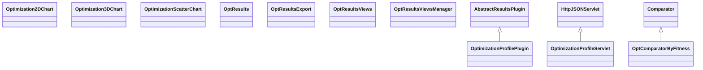

# ResultsOptimizationProfile.jar

[Group index](README.md) | [All archives](../README.md)

## Scope and provenance

- **Donor:** `SQX_145_REFERENCE_ROOT/internal/plugins/ResultsOptimizationProfile/ResultsOptimizationProfile.jar`.
- **SHA-256:** `03f223f91b4aa45a3172fa39d409194f91741df7ac045d1625c9dbdb5c68fc0d`; accessed 2026-10-06; captured `2026-10-06T18:54:51.906614+00:00`.
- **Classes:** 12 raw entries; 12 unique entry names. Duplicate occurrence indices are zero-based.
- **Inspection:** read-only ZIP hashing and class-file structural parsing; signatures/descriptors, modifiers, hierarchy and references only. Bytecode bodies are hashed, not published.
- **Allocation:** proposed `FEAT-OPTIMIZER-RESULTS-OPTIMIZATION-PROFILE`, P10; [roadmap](../../dev/sqx-full-application-roadmap.md). Domain README registration remains required.
- **Repository:** `01067f00031428613c6394064ca1bcadc1ba00ee`; review state unreviewed. Download label 145-dev1; installed build/activation and runtime equivalence unverified.
- **Limit:** every class/member is inventoried; declaration coverage does not establish consumed calls, defaults, formulas, failure semantics or algorithm parity.
- **Archive/resource index:** [205.json](../../dev/evidence/sqx145/archives/145/205.json).

## Complete member declarations

Member shards contain exact JVM names/descriptors, access flags, generic signatures, throws types, declared fields/methods, superclass/interfaces and referenced class names. All classes, nested/synthetic members and overloads are retained. Code length/hash is structural evidence, not a normalized algorithm comparison.

- [001.json](../../dev/evidence/sqx145/members/205/001.json) — SHA-256 `bc778aef860356d7db1b7a9ac52b45067a052808f6d2d45c5a37c540029710da`.

## Focused structural diagram

Up to twelve non-nested classes; arrows show declared inheritance/interfaces only. External type names are not evidence of an available body or an executed dependency.

## Class inventory

| Archive entry | Occurrence | Class SHA-256 | Fields | Methods |
| --- | ---: | --- | ---: | ---: |
| `com/strategyquant/plugin/Results/impl/OptimizationProfile/OptimizationProfilePlugin.class` | 0 | `23d3bf9c8a83984b2a2ebadea7d63ad6b8bb01b26ecd3b07b12a3827978fcee3` | 2 | 8 |
| `com/strategyquant/plugin/Results/impl/OptimizationProfile/OptimizationProfileServlet.class` | 0 | `09792daa1bd284c93a31d0dbe88168da1548ae060d11a65b370dbb21a2031b49` | 9 | 9 |
| `com/strategyquant/plugin/Results/impl/OptimizationProfile/charts/Optimization2DChart.class` | 0 | `d72098007c64ad1c5fc606728b3084af665028a36324b60effbedf554fac7b52` | 1 | 3 |
| `com/strategyquant/plugin/Results/impl/OptimizationProfile/charts/Optimization3DChart$1.class` | 0 | `617639c27154e5a6e451f264568376a8e826b7c2aff9dfd8d5785fe82049b0b3` | 0 | 0 |
| `com/strategyquant/plugin/Results/impl/OptimizationProfile/charts/Optimization3DChart$Group.class` | 0 | `fac0e6e17f610c68cabc345abd9e0b219b7c0279ddd75a6c3a9c3ca8a5d18906` | 5 | 6 |
| `com/strategyquant/plugin/Results/impl/OptimizationProfile/charts/Optimization3DChart.class` | 0 | `1161c627a524c70324324a1957e0c0b484f3422412d1b9d8f9ff6d42b1241fd9` | 1 | 4 |
| `com/strategyquant/plugin/Results/impl/OptimizationProfile/charts/OptimizationScatterChart.class` | 0 | `8872cbd60e6470f3e3bc0f7eaa64f556abec75919f69d00d402a11b386e70c23` | 1 | 3 |
| `com/strategyquant/plugin/Results/impl/OptimizationProfile/results/OptComparatorByFitness.class` | 0 | `b3649ebd9f9def3e34cbd306b0514e661cd14aed82b5fa3492a999e6460c7edc` | 0 | 3 |
| `com/strategyquant/plugin/Results/impl/OptimizationProfile/results/OptResults.class` | 0 | `0fa787cd803a255e00d7e20b6825d3cc1b0c2b4a9cea7458e490494b66174540` | 0 | 3 |
| `com/strategyquant/plugin/Results/impl/OptimizationProfile/results/OptResultsExport.class` | 0 | `36acd06f6edb151e1fd64c3ade638edaf1ec5c08f0209899a0bd152ebe9f652e` | 1 | 5 |
| `com/strategyquant/plugin/Results/impl/OptimizationProfile/results/OptResultsViews.class` | 0 | `8a9f8e78ae444c52cdc31ebbe7a8d2570473989643a0a41706c89b0c8fee7a83` | 2 | 10 |
| `com/strategyquant/plugin/Results/impl/OptimizationProfile/results/OptResultsViewsManager.class` | 0 | `710bfc57d843baf8e4250330a3ddccdd55a5e059e2e35b73614b4976a1258635` | 5 | 13 |
