# ResultsPortfolioCorrelation.jar

[Group index](README.md) | [All archives](../README.md)

## Scope and provenance

- **Donor:** `SQX_145_REFERENCE_ROOT/internal/plugins/ResultsPortfolioCorrelation/ResultsPortfolioCorrelation.jar`.
- **SHA-256:** `cb2351d4e02219f853d36abb08ffbacb19b71fbd7c730cf5105273fa359e40f5`; accessed 2026-10-06; captured `2026-10-06T18:54:51.906614+00:00`.
- **Classes:** 13 raw entries; 13 unique entry names. Duplicate occurrence indices are zero-based.
- **Inspection:** read-only ZIP hashing and class-file structural parsing; signatures/descriptors, modifiers, hierarchy and references only. Bytecode bodies are hashed, not published.
- **Allocation:** proposed `FEAT-PORTFOLIO-RESULTS-PORTFOLIO-CORRELATION`, P12; [roadmap](../../dev/sqx-full-application-roadmap.md). Domain README registration remains required.
- **Repository:** `01067f00031428613c6394064ca1bcadc1ba00ee`; review state unreviewed. Download label 145-dev1; installed build/activation and runtime equivalence unverified.
- **Limit:** every class/member is inventoried; declaration coverage does not establish consumed calls, defaults, formulas, failure semantics or algorithm parity.
- **Archive/resource index:** [210.json](../../dev/evidence/sqx145/archives/145/210.json).

## Complete member declarations

Member shards contain exact JVM names/descriptors, access flags, generic signatures, throws types, declared fields/methods, superclass/interfaces and referenced class names. All classes, nested/synthetic members and overloads are retained. Code length/hash is structural evidence, not a normalized algorithm comparison.

- [001.json](../../dev/evidence/sqx145/members/210/001.json) — SHA-256 `cfda45f9100604fc2cad30065bcd27ab87fbeaae015eb55c004c54e539e827aa`.

## Focused structural diagram

Up to twelve non-nested classes; arrows show declared inheritance/interfaces only. External type names are not evidence of an available body or an executed dependency.

```mermaid
classDiagram
    class C0["PortfolioCorrelationInterruptException"]
    class C1["PortfolioCorrelationPlugin"]
    class C2["PortfolioCorrelationResultsSender"]
    class C3["PortfolioCorrelationServlet"]
    class C4["CorrelationComputerTask"]
    class C5["CorrelationResult"]
    class C6["PortfolioCorrelationComputer"]
    class C7["OverlappingResult"]
    class C8["OverlappingTrade"]
    class C9["OverlappingTrades"]
    class C10["OverlappingTradesComputer"]
    class C11["OverlappingTradesTask"]
    class E0["Exception"]
    E0 <|-- C0
    class E1["AbstractResultsPlugin"]
    E1 <|-- C1
    class E2["SynchronizedWebSocketPublisher"]
    E2 <|-- C2
    class E3["HttpJSONServlet"]
    E3 <|-- C3
    class E4["Callable"]
    E4 <|.. C4
    E4 <|.. C11
```

## Class inventory

| Archive entry | Occurrence | Class SHA-256 | Fields | Methods |
| --- | ---: | --- | ---: | ---: |
| `com/strategyquant/plugin/Results/impl/PortfolioCorrelation/PortfolioCorrelationInterruptException.class` | 0 | `51866d640e818b4b8d6d3819042812d3eb54dfd168aaf3118e4ec152372da77e` | 0 | 1 |
| `com/strategyquant/plugin/Results/impl/PortfolioCorrelation/PortfolioCorrelationPlugin.class` | 0 | `4501f7e40f638abef65c4a2028169d804906392c832d244b7c66e244eed6d565` | 2 | 8 |
| `com/strategyquant/plugin/Results/impl/PortfolioCorrelation/PortfolioCorrelationResultsSender.class` | 0 | `17065a9ba1ad892baff21874d30b784bf4c3ddf5c92e3f3547d9ee922f6708a5` | 3 | 6 |
| `com/strategyquant/plugin/Results/impl/PortfolioCorrelation/PortfolioCorrelationServlet$1.class` | 0 | `2f749ce5b123c37248cd55a6b6e584a46defd3bcdf4d544e529d1c52100cd070` | 6 | 2 |
| `com/strategyquant/plugin/Results/impl/PortfolioCorrelation/PortfolioCorrelationServlet.class` | 0 | `ed5f9646c248812a961c2e9d681e91a47556b6085ea487938c7be06a16720e85` | 7 | 13 |
| `com/strategyquant/plugin/Results/impl/PortfolioCorrelation/correlation/CorrelationComputerTask.class` | 0 | `a90d8d3461a9b27ba1e458795f51986ef6d9a667ba6672d20898ddfc380fd34a` | 12 | 5 |
| `com/strategyquant/plugin/Results/impl/PortfolioCorrelation/correlation/CorrelationResult.class` | 0 | `6d6a746b2308d56f71f2268b44ab55e26cd02f6567f94d64a929db480a8ea1ad` | 3 | 1 |
| `com/strategyquant/plugin/Results/impl/PortfolioCorrelation/correlation/PortfolioCorrelationComputer.class` | 0 | `7e26869e874b099f46f4a3f2782c759313625040df2c174d898cf5266bce0bdf` | 10 | 15 |
| `com/strategyquant/plugin/Results/impl/PortfolioCorrelation/overlappingTrades/OverlappingResult.class` | 0 | `71bc1986b0ccbd8f2563252aaf7a0c5eaf2a19c6adaf74d12955e04bf72ce272` | 5 | 1 |
| `com/strategyquant/plugin/Results/impl/PortfolioCorrelation/overlappingTrades/OverlappingTrade.class` | 0 | `5774cc8b6436950d8b6846c71876b6fcf2b1fdf7bf69521c99bbc8bf63463fd7` | 5 | 1 |
| `com/strategyquant/plugin/Results/impl/PortfolioCorrelation/overlappingTrades/OverlappingTrades.class` | 0 | `bf17ddb2c7cfc5a2bc1d7f88097d6f2f8ea124c0de25e4553930e7b3c80f830e` | 0 | 2 |
| `com/strategyquant/plugin/Results/impl/PortfolioCorrelation/overlappingTrades/OverlappingTradesComputer.class` | 0 | `8e5ff4744cdc4a93bcb488fa4c79e82a4d77dff6aca2fd1dae376ac03e52a386` | 3 | 8 |
| `com/strategyquant/plugin/Results/impl/PortfolioCorrelation/overlappingTrades/OverlappingTradesTask.class` | 0 | `98dfaa1d5381fcad91b8939607a8f7e4842dc05c40eaebc6dfbc22de87b99762` | 7 | 5 |
