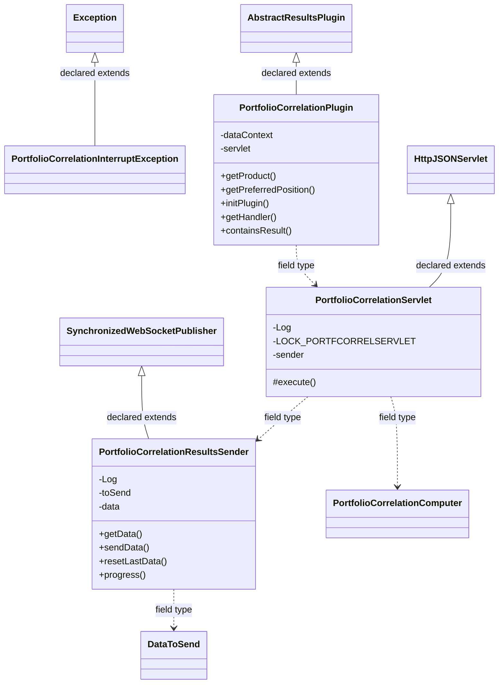
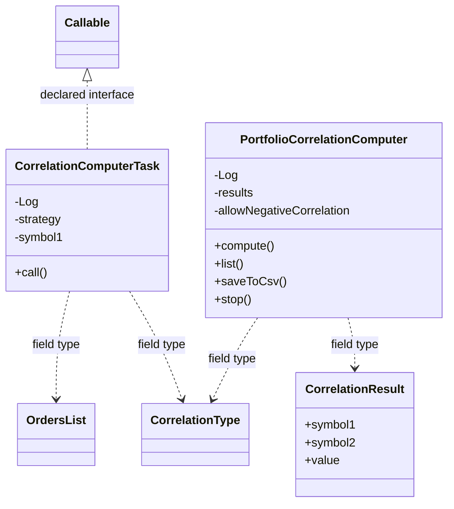
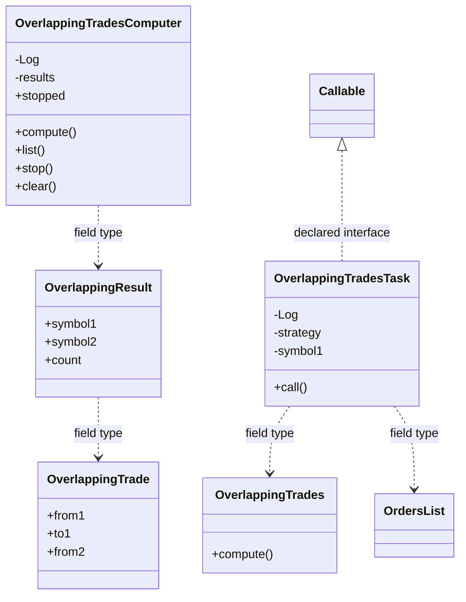

# ResultsPortfolioCorrelation.jar

[Workspace/group index](README.md)  |  [All workspaces](../README.md)

## Scope and provenance

- Artifact: `SQX_REFERENCE_ROOT/internal/plugins/ResultsPortfolioCorrelation/ResultsPortfolioCorrelation.jar`.
- SHA-256: `8cc910853b04b570650a4805917d30b8319c87c7b44cb9f23988e04564e1116b`.
- Inspected: 2026-10-05; generation timestamp `2026-10-05T19:04:16.344170+00:00`.
- Archive class entries: **13**; non-nested: **12**; nested/anonymous: **1**.
- Inspection: ZIP entry/manifest enumeration and `javap -p` declarations for every listed class.
- Repository source HEAD: `8a92c705183a6702eaf62037ccb202ed028aa899`; review state: generated, pending owner review.
- Installed SQX build number is unverified. No method bodies are reproduced.
- Confidence: high for declared structure; workspace ownership inferred except where registration evidence is separately stated. Runtime reachability, call order, formulas and parity remain unverified.

The `Results` folder is a navigation/research grouping, not an exclusive backend owner. Shared consumers may use this JAR.

Target mapping: no verified owning HaruQuantAI feature/requirement/decision IDs are assigned by this document. Register or resolve ownership through the normal repository plan before implementation.

## Diagram reading guide

`Parent <|-- Child` means declared inheritance; `Interface <|.. Class` means declared implementation. Interface extension uses the inheritance arrow. `A ..> B : field type` is a declared type dependency, not composition, object ownership or a runtime call. External nodes are referenced types, not fabricated local implementations. Selected fields/method names aid navigation: `+` is public, `#` protected and `-` private. Diagram method names omit parameter/return types and collapse overloads; use the exact inspected declarations below before implementing an API.

Detailed graphs include non-nested classes in package-sized groups of at most 12. Nested/anonymous classes are inventoried and their declarations/relationships are retained below, but omitted from overview graphs. Relationships not drawn for readability remain in the complete declaration-relationship table. Constructors, synthetic bridges and overloads may be collapsed in diagram member lists only. Standard `java.lang.Object` inheritance is omitted from diagrams.

## UML class diagrams

### 1. `com.strategyquant.plugin.Results.impl.PortfolioCorrelation`



| Diagram identifier | Exact type | Location |
| --- | --- | --- |
| `C81f2f5daaa0c` | `com.strategyquant.plugin.Results.impl.PortfolioCorrelation.PortfolioCorrelationInterruptException` (this JAR) | this diagram |
| `C3c3831fa180e` | `com.strategyquant.plugin.Results.impl.PortfolioCorrelation.PortfolioCorrelationPlugin` (this JAR) | this diagram |
| `Cf21c05c543f3` | `com.strategyquant.plugin.Results.impl.PortfolioCorrelation.PortfolioCorrelationResultsSender` (this JAR) | this diagram |
| `C00af609914fd` | `com.strategyquant.plugin.Results.impl.PortfolioCorrelation.PortfolioCorrelationServlet` (this JAR) | this diagram |
| `C7ae88390024c` | `com.strategyquant.plugin.Results.impl.PortfolioCorrelation.correlation.PortfolioCorrelationComputer` (this JAR) | another group in this JAR |
| `C6128eed56b6d` | [`com.strategyquant.tradinglib.project.websocket.DataToSend`](../Shared/SQTradingLib.md) | referenced external type |
| `Ce87cf9854aad` | [`com.strategyquant.tradinglib.project.websocket.SynchronizedWebSocketPublisher`](../Shared/SQTradingLib.md) | referenced external type |
| `C180e0c3f58c3` | [`com.strategyquant.tradinglib.results.AbstractResultsPlugin`](../Shared/SQTradingLib.md) | referenced external type |
| `C8900f90ae594` | [`com.strategyquant.webguilib.servlet.HttpJSONServlet`](../Shared/SQWebGUILib.md) | referenced external type |
| `C4bc2cd7a4e9d` | `java.lang.Exception` (not resolved in scoped archives) | referenced external type |

### 2. `com.strategyquant.plugin.Results.impl.PortfolioCorrelation.correlation`



| Diagram identifier | Exact type | Location |
| --- | --- | --- |
| `C1b518d45ffa4` | `com.strategyquant.plugin.Results.impl.PortfolioCorrelation.correlation.CorrelationComputerTask` (this JAR) | this diagram |
| `Cdfa7a5d037a6` | `com.strategyquant.plugin.Results.impl.PortfolioCorrelation.correlation.CorrelationResult` (this JAR) | this diagram |
| `C7ae88390024c` | `com.strategyquant.plugin.Results.impl.PortfolioCorrelation.correlation.PortfolioCorrelationComputer` (this JAR) | this diagram |
| `C6668765fd615` | [`com.strategyquant.tradinglib.CorrelationType`](../Shared/SQTradingLib.md) | referenced external type |
| `C9c24371a456a` | [`com.strategyquant.tradinglib.OrdersList`](../Shared/SQTradingLib.md) | referenced external type |
| `C59e430b99b4f` | `java.util.concurrent.Callable` (not resolved in scoped archives) | referenced external type |

### 3. `com.strategyquant.plugin.Results.impl.PortfolioCorrelation.overlappingTrades`



| Diagram identifier | Exact type | Location |
| --- | --- | --- |
| `C5e0d98d36868` | `com.strategyquant.plugin.Results.impl.PortfolioCorrelation.overlappingTrades.OverlappingResult` (this JAR) | this diagram |
| `Cf66e70a4cace` | `com.strategyquant.plugin.Results.impl.PortfolioCorrelation.overlappingTrades.OverlappingTrade` (this JAR) | this diagram |
| `C13fa712ecc88` | `com.strategyquant.plugin.Results.impl.PortfolioCorrelation.overlappingTrades.OverlappingTrades` (this JAR) | this diagram |
| `Cb88be2139abf` | `com.strategyquant.plugin.Results.impl.PortfolioCorrelation.overlappingTrades.OverlappingTradesComputer` (this JAR) | this diagram |
| `Cf40cb20ee03b` | `com.strategyquant.plugin.Results.impl.PortfolioCorrelation.overlappingTrades.OverlappingTradesTask` (this JAR) | this diagram |
| `C9c24371a456a` | [`com.strategyquant.tradinglib.OrdersList`](../Shared/SQTradingLib.md) | referenced external type |
| `C59e430b99b4f` | `java.util.concurrent.Callable` (not resolved in scoped archives) | referenced external type |

## Complete class inventory

| Fully qualified class | Kind | Entry |
| --- | --- | --- |
| `com.strategyquant.plugin.Results.impl.PortfolioCorrelation.PortfolioCorrelationInterruptException` | class | non-nested |
| `com.strategyquant.plugin.Results.impl.PortfolioCorrelation.PortfolioCorrelationPlugin` | class | non-nested |
| `com.strategyquant.plugin.Results.impl.PortfolioCorrelation.PortfolioCorrelationResultsSender` | class | non-nested |
| `com.strategyquant.plugin.Results.impl.PortfolioCorrelation.PortfolioCorrelationServlet` | class | non-nested |
| `com.strategyquant.plugin.Results.impl.PortfolioCorrelation.PortfolioCorrelationServlet$1` | class | nested/anonymous |
| `com.strategyquant.plugin.Results.impl.PortfolioCorrelation.correlation.CorrelationComputerTask` | class | non-nested |
| `com.strategyquant.plugin.Results.impl.PortfolioCorrelation.correlation.CorrelationResult` | class | non-nested |
| `com.strategyquant.plugin.Results.impl.PortfolioCorrelation.correlation.PortfolioCorrelationComputer` | class | non-nested |
| `com.strategyquant.plugin.Results.impl.PortfolioCorrelation.overlappingTrades.OverlappingResult` | class | non-nested |
| `com.strategyquant.plugin.Results.impl.PortfolioCorrelation.overlappingTrades.OverlappingTrade` | class | non-nested |
| `com.strategyquant.plugin.Results.impl.PortfolioCorrelation.overlappingTrades.OverlappingTrades` | class | non-nested |
| `com.strategyquant.plugin.Results.impl.PortfolioCorrelation.overlappingTrades.OverlappingTradesComputer` | class | non-nested |
| `com.strategyquant.plugin.Results.impl.PortfolioCorrelation.overlappingTrades.OverlappingTradesTask` | class | non-nested |

## Declared relationships and evidence locations

Every row is supported by the named class declaration/member in `javap -p`, inside the artifact recorded above. Signature dependencies may include return, parameter, generic-argument and throws types; they do not imply execution.

| Declaring class | Referenced type | Relationship | Narrow inspection location |
| --- | --- | --- | --- |
| `com.strategyquant.plugin.Results.impl.PortfolioCorrelation.PortfolioCorrelationInterruptException` | `java.lang.Exception` (not resolved in scoped archives) | extends | `com.strategyquant.plugin.Results.impl.PortfolioCorrelation.PortfolioCorrelationInterruptException` / class declaration: `public class com.strategyquant.plugin.Results.impl.PortfolioCorrelation.PortfolioCorrelationInterruptException extends java.lang.Exception` |
| `com.strategyquant.plugin.Results.impl.PortfolioCorrelation.PortfolioCorrelationPlugin` | [`com.strategyquant.tradinglib.results.AbstractResultsPlugin`](../Shared/SQTradingLib.md) | extends | `com.strategyquant.plugin.Results.impl.PortfolioCorrelation.PortfolioCorrelationPlugin` / class declaration: `public class com.strategyquant.plugin.Results.impl.PortfolioCorrelation.PortfolioCorrelationPlugin extends com.strategyquant.tradinglib.results.AbstractResultsPlugin` |
| `com.strategyquant.plugin.Results.impl.PortfolioCorrelation.PortfolioCorrelationPlugin` | `org.eclipse.jetty.servlet.ServletContextHandler` (not resolved in scoped archives) | type dependency | `com.strategyquant.plugin.Results.impl.PortfolioCorrelation.PortfolioCorrelationPlugin` / field declaration: `private org.eclipse.jetty.servlet.ServletContextHandler dataContext;` |
| `com.strategyquant.plugin.Results.impl.PortfolioCorrelation.PortfolioCorrelationPlugin` | `com.strategyquant.plugin.Results.impl.PortfolioCorrelation.PortfolioCorrelationServlet` (this JAR) | type dependency | `com.strategyquant.plugin.Results.impl.PortfolioCorrelation.PortfolioCorrelationPlugin` / field declaration: `private com.strategyquant.plugin.Results.impl.PortfolioCorrelation.PortfolioCorrelationServlet servlet;` |
| `com.strategyquant.plugin.Results.impl.PortfolioCorrelation.PortfolioCorrelationPlugin` | `java.lang.String` (not resolved in scoped archives) | type dependency | `com.strategyquant.plugin.Results.impl.PortfolioCorrelation.PortfolioCorrelationPlugin` / method signature: `public java.lang.String getProduct();`<br>`public java.lang.String getKey();` |
| `com.strategyquant.plugin.Results.impl.PortfolioCorrelation.PortfolioCorrelationPlugin` | `java.lang.Exception` (not resolved in scoped archives) | type dependency | `com.strategyquant.plugin.Results.impl.PortfolioCorrelation.PortfolioCorrelationPlugin` / method signature: `public void initPlugin() throws java.lang.Exception;`<br>`public boolean containsResult(com.strategyquant.tradinglib.ResultsGroup) throws java.lang.Exception;`<br>`public org.json.JSONObject getInitializationData() throws java.lang.Exception;` |
| `com.strategyquant.plugin.Results.impl.PortfolioCorrelation.PortfolioCorrelationPlugin` | `org.eclipse.jetty.server.Handler` (not resolved in scoped archives) | type dependency | `com.strategyquant.plugin.Results.impl.PortfolioCorrelation.PortfolioCorrelationPlugin` / method signature: `public org.eclipse.jetty.server.Handler getHandler();` |
| `com.strategyquant.plugin.Results.impl.PortfolioCorrelation.PortfolioCorrelationPlugin` | [`com.strategyquant.tradinglib.ResultsGroup`](../Shared/SQTradingLib.md) | type dependency | `com.strategyquant.plugin.Results.impl.PortfolioCorrelation.PortfolioCorrelationPlugin` / method signature: `public boolean containsResult(com.strategyquant.tradinglib.ResultsGroup) throws java.lang.Exception;` |
| `com.strategyquant.plugin.Results.impl.PortfolioCorrelation.PortfolioCorrelationPlugin` | `org.json.JSONObject` (not resolved in scoped archives) | type dependency | `com.strategyquant.plugin.Results.impl.PortfolioCorrelation.PortfolioCorrelationPlugin` / method signature: `public org.json.JSONObject getInitializationData() throws java.lang.Exception;` |
| `com.strategyquant.plugin.Results.impl.PortfolioCorrelation.PortfolioCorrelationResultsSender` | [`com.strategyquant.tradinglib.project.websocket.SynchronizedWebSocketPublisher`](../Shared/SQTradingLib.md) | extends | `com.strategyquant.plugin.Results.impl.PortfolioCorrelation.PortfolioCorrelationResultsSender` / class declaration: `public class com.strategyquant.plugin.Results.impl.PortfolioCorrelation.PortfolioCorrelationResultsSender extends com.strategyquant.tradinglib.project.websocket.SynchronizedWebSocketPublisher` |
| `com.strategyquant.plugin.Results.impl.PortfolioCorrelation.PortfolioCorrelationResultsSender` | `org.slf4j.Logger` (not resolved in scoped archives) | type dependency | `com.strategyquant.plugin.Results.impl.PortfolioCorrelation.PortfolioCorrelationResultsSender` / field declaration: `private static final org.slf4j.Logger Log;` |
| `com.strategyquant.plugin.Results.impl.PortfolioCorrelation.PortfolioCorrelationResultsSender` | [`com.strategyquant.tradinglib.project.websocket.DataToSend`](../Shared/SQTradingLib.md) | type dependency | `com.strategyquant.plugin.Results.impl.PortfolioCorrelation.PortfolioCorrelationResultsSender` / field declaration: `private com.strategyquant.tradinglib.project.websocket.DataToSend toSend;` |
| `com.strategyquant.plugin.Results.impl.PortfolioCorrelation.PortfolioCorrelationResultsSender` | [`com.strategyquant.tradinglib.project.websocket.DataToSend`](../Shared/SQTradingLib.md) | type dependency | `com.strategyquant.plugin.Results.impl.PortfolioCorrelation.PortfolioCorrelationResultsSender` / method signature: `public com.strategyquant.tradinglib.project.websocket.DataToSend getData();` |
| `com.strategyquant.plugin.Results.impl.PortfolioCorrelation.PortfolioCorrelationResultsSender` | `org.json.JSONObject` (not resolved in scoped archives) | type dependency | `com.strategyquant.plugin.Results.impl.PortfolioCorrelation.PortfolioCorrelationResultsSender` / field declaration: `private org.json.JSONObject data;` |
| `com.strategyquant.plugin.Results.impl.PortfolioCorrelation.PortfolioCorrelationResultsSender` | `org.json.JSONObject` (not resolved in scoped archives) | type dependency | `com.strategyquant.plugin.Results.impl.PortfolioCorrelation.PortfolioCorrelationResultsSender` / method signature: `public void sendData(org.json.JSONObject);` |
| `com.strategyquant.plugin.Results.impl.PortfolioCorrelation.PortfolioCorrelationServlet` | [`com.strategyquant.webguilib.servlet.HttpJSONServlet`](../Shared/SQWebGUILib.md) | extends | `com.strategyquant.plugin.Results.impl.PortfolioCorrelation.PortfolioCorrelationServlet` / class declaration: `public class com.strategyquant.plugin.Results.impl.PortfolioCorrelation.PortfolioCorrelationServlet extends com.strategyquant.webguilib.servlet.HttpJSONServlet` |
| `com.strategyquant.plugin.Results.impl.PortfolioCorrelation.PortfolioCorrelationServlet` | `org.slf4j.Logger` (not resolved in scoped archives) | type dependency | `com.strategyquant.plugin.Results.impl.PortfolioCorrelation.PortfolioCorrelationServlet` / field declaration: `private static final org.slf4j.Logger Log;` |
| `com.strategyquant.plugin.Results.impl.PortfolioCorrelation.PortfolioCorrelationServlet` | `org.slf4j.Logger` (not resolved in scoped archives) | type dependency | `com.strategyquant.plugin.Results.impl.PortfolioCorrelation.PortfolioCorrelationServlet` / method signature: `static org.slf4j.Logger access$400();` |
| `com.strategyquant.plugin.Results.impl.PortfolioCorrelation.PortfolioCorrelationServlet` | `java.lang.String` (not resolved in scoped archives) | type dependency | `com.strategyquant.plugin.Results.impl.PortfolioCorrelation.PortfolioCorrelationServlet` / field declaration: `private static final java.lang.String LOCK_PORTFCORRELSERVLET;` |
| `com.strategyquant.plugin.Results.impl.PortfolioCorrelation.PortfolioCorrelationServlet` | `java.lang.String` (not resolved in scoped archives) | type dependency | `com.strategyquant.plugin.Results.impl.PortfolioCorrelation.PortfolioCorrelationServlet` / method signature: `protected java.lang.String execute(java.lang.String, java.util.Map<java.lang.String, java.lang.String[]>, java.lang.String) throws java.lang.Exception;`<br>`private java.lang.String onCorrelation(java.util.Map<java.lang.String, java.lang.String[]>);`<br>`private java.lang.String onCorrelationSave(java.util.Map<java.lang.String, java.lang.String[]>) throws java.lang.Exception;`<br>`private java.lang.String onOverlapping(java.util.Map<java.lang.String, java.lang.String[]>);`<br>`private java.lang.String onCompute(java.util.Map<java.lang.String, java.lang.String[]>) throws java.lang.Exception;`<br>`private java.lang.String onStop(java.util.Map<java.lang.String, java.lang.String[]>) throws java.lang.Exception;` |
| `com.strategyquant.plugin.Results.impl.PortfolioCorrelation.PortfolioCorrelationServlet` | `com.strategyquant.plugin.Results.impl.PortfolioCorrelation.PortfolioCorrelationResultsSender` (this JAR) | type dependency | `com.strategyquant.plugin.Results.impl.PortfolioCorrelation.PortfolioCorrelationServlet` / field declaration: `private com.strategyquant.plugin.Results.impl.PortfolioCorrelation.PortfolioCorrelationResultsSender sender;` |
| `com.strategyquant.plugin.Results.impl.PortfolioCorrelation.PortfolioCorrelationServlet` | `com.strategyquant.plugin.Results.impl.PortfolioCorrelation.PortfolioCorrelationResultsSender` (this JAR) | type dependency | `com.strategyquant.plugin.Results.impl.PortfolioCorrelation.PortfolioCorrelationServlet` / method signature: `static com.strategyquant.plugin.Results.impl.PortfolioCorrelation.PortfolioCorrelationResultsSender access$100(com.strategyquant.plugin.Results.impl.PortfolioCorrelation.PortfolioCorrelationServlet);` |
| `com.strategyquant.plugin.Results.impl.PortfolioCorrelation.PortfolioCorrelationServlet` | `com.strategyquant.plugin.Results.impl.PortfolioCorrelation.correlation.PortfolioCorrelationComputer` (this JAR) | type dependency | `com.strategyquant.plugin.Results.impl.PortfolioCorrelation.PortfolioCorrelationServlet` / field declaration: `private com.strategyquant.plugin.Results.impl.PortfolioCorrelation.correlation.PortfolioCorrelationComputer correlationComputer;` |
| `com.strategyquant.plugin.Results.impl.PortfolioCorrelation.PortfolioCorrelationServlet` | `com.strategyquant.plugin.Results.impl.PortfolioCorrelation.correlation.PortfolioCorrelationComputer` (this JAR) | type dependency | `com.strategyquant.plugin.Results.impl.PortfolioCorrelation.PortfolioCorrelationServlet` / method signature: `static com.strategyquant.plugin.Results.impl.PortfolioCorrelation.correlation.PortfolioCorrelationComputer access$200(com.strategyquant.plugin.Results.impl.PortfolioCorrelation.PortfolioCorrelationServlet);` |
| `com.strategyquant.plugin.Results.impl.PortfolioCorrelation.PortfolioCorrelationServlet` | `com.strategyquant.plugin.Results.impl.PortfolioCorrelation.overlappingTrades.OverlappingTradesComputer` (this JAR) | type dependency | `com.strategyquant.plugin.Results.impl.PortfolioCorrelation.PortfolioCorrelationServlet` / field declaration: `private com.strategyquant.plugin.Results.impl.PortfolioCorrelation.overlappingTrades.OverlappingTradesComputer overlappingTradesComputer;` |
| `com.strategyquant.plugin.Results.impl.PortfolioCorrelation.PortfolioCorrelationServlet` | `com.strategyquant.plugin.Results.impl.PortfolioCorrelation.overlappingTrades.OverlappingTradesComputer` (this JAR) | type dependency | `com.strategyquant.plugin.Results.impl.PortfolioCorrelation.PortfolioCorrelationServlet` / method signature: `static com.strategyquant.plugin.Results.impl.PortfolioCorrelation.overlappingTrades.OverlappingTradesComputer access$300(com.strategyquant.plugin.Results.impl.PortfolioCorrelation.PortfolioCorrelationServlet);` |
| `com.strategyquant.plugin.Results.impl.PortfolioCorrelation.PortfolioCorrelationServlet` | [`com.strategyquant.tradinglib.results.IResultsGroupProvider`](../Shared/SQTradingLib.md) | type dependency | `com.strategyquant.plugin.Results.impl.PortfolioCorrelation.PortfolioCorrelationServlet` / field declaration: `private static com.strategyquant.tradinglib.results.IResultsGroupProvider rgProvider;` |
| `com.strategyquant.plugin.Results.impl.PortfolioCorrelation.PortfolioCorrelationServlet` | [`com.strategyquant.tradinglib.results.IResultsGroupProvider`](../Shared/SQTradingLib.md) | type dependency | `com.strategyquant.plugin.Results.impl.PortfolioCorrelation.PortfolioCorrelationServlet` / method signature: `public com.strategyquant.plugin.Results.impl.PortfolioCorrelation.PortfolioCorrelationServlet(com.strategyquant.tradinglib.results.IResultsGroupProvider);` |
| `com.strategyquant.plugin.Results.impl.PortfolioCorrelation.PortfolioCorrelationServlet` | `java.util.Map` (not resolved in scoped archives) | type dependency | `com.strategyquant.plugin.Results.impl.PortfolioCorrelation.PortfolioCorrelationServlet` / method signature: `protected java.lang.String execute(java.lang.String, java.util.Map<java.lang.String, java.lang.String[]>, java.lang.String) throws java.lang.Exception;`<br>`private java.lang.String onCorrelation(java.util.Map<java.lang.String, java.lang.String[]>);`<br>`private java.lang.String onCorrelationSave(java.util.Map<java.lang.String, java.lang.String[]>) throws java.lang.Exception;`<br>`private java.lang.String onOverlapping(java.util.Map<java.lang.String, java.lang.String[]>);`<br>`private java.lang.String onCompute(java.util.Map<java.lang.String, java.lang.String[]>) throws java.lang.Exception;`<br>`private java.lang.String onStop(java.util.Map<java.lang.String, java.lang.String[]>) throws java.lang.Exception;` |
| `com.strategyquant.plugin.Results.impl.PortfolioCorrelation.PortfolioCorrelationServlet` | `java.lang.Exception` (not resolved in scoped archives) | type dependency | `com.strategyquant.plugin.Results.impl.PortfolioCorrelation.PortfolioCorrelationServlet` / method signature: `protected java.lang.String execute(java.lang.String, java.util.Map<java.lang.String, java.lang.String[]>, java.lang.String) throws java.lang.Exception;`<br>`private java.lang.String onCorrelationSave(java.util.Map<java.lang.String, java.lang.String[]>) throws java.lang.Exception;`<br>`private java.lang.String onCompute(java.util.Map<java.lang.String, java.lang.String[]>) throws java.lang.Exception;`<br>`private java.lang.String onStop(java.util.Map<java.lang.String, java.lang.String[]>) throws java.lang.Exception;` |
| `com.strategyquant.plugin.Results.impl.PortfolioCorrelation.PortfolioCorrelationServlet$1` | `java.lang.Thread` (not resolved in scoped archives) | extends | `com.strategyquant.plugin.Results.impl.PortfolioCorrelation.PortfolioCorrelationServlet$1` / class declaration: `class com.strategyquant.plugin.Results.impl.PortfolioCorrelation.PortfolioCorrelationServlet$1 extends java.lang.Thread` |
| `com.strategyquant.plugin.Results.impl.PortfolioCorrelation.PortfolioCorrelationServlet$1` | [`com.strategyquant.tradinglib.ResultsGroup`](../Shared/SQTradingLib.md) | type dependency | `com.strategyquant.plugin.Results.impl.PortfolioCorrelation.PortfolioCorrelationServlet$1` / field declaration: `final com.strategyquant.tradinglib.ResultsGroup val$rg;` |
| `com.strategyquant.plugin.Results.impl.PortfolioCorrelation.PortfolioCorrelationServlet$1` | [`com.strategyquant.tradinglib.ResultsGroup`](../Shared/SQTradingLib.md) | type dependency | `com.strategyquant.plugin.Results.impl.PortfolioCorrelation.PortfolioCorrelationServlet$1` / method signature: `com.strategyquant.plugin.Results.impl.PortfolioCorrelation.PortfolioCorrelationServlet$1(com.strategyquant.plugin.Results.impl.PortfolioCorrelation.PortfolioCorrelationServlet, com.strategyquant.tradinglib.ResultsGroup, int, com.strategyquant.tradinglib.CorrelationType, java.lang.Boolean, java.lang.Boolean);` |
| `com.strategyquant.plugin.Results.impl.PortfolioCorrelation.PortfolioCorrelationServlet$1` | [`com.strategyquant.tradinglib.CorrelationType`](../Shared/SQTradingLib.md) | type dependency | `com.strategyquant.plugin.Results.impl.PortfolioCorrelation.PortfolioCorrelationServlet$1` / field declaration: `final com.strategyquant.tradinglib.CorrelationType val$type;` |
| `com.strategyquant.plugin.Results.impl.PortfolioCorrelation.PortfolioCorrelationServlet$1` | [`com.strategyquant.tradinglib.CorrelationType`](../Shared/SQTradingLib.md) | type dependency | `com.strategyquant.plugin.Results.impl.PortfolioCorrelation.PortfolioCorrelationServlet$1` / method signature: `com.strategyquant.plugin.Results.impl.PortfolioCorrelation.PortfolioCorrelationServlet$1(com.strategyquant.plugin.Results.impl.PortfolioCorrelation.PortfolioCorrelationServlet, com.strategyquant.tradinglib.ResultsGroup, int, com.strategyquant.tradinglib.CorrelationType, java.lang.Boolean, java.lang.Boolean);` |
| `com.strategyquant.plugin.Results.impl.PortfolioCorrelation.PortfolioCorrelationServlet$1` | `java.lang.Boolean` (not resolved in scoped archives) | type dependency | `com.strategyquant.plugin.Results.impl.PortfolioCorrelation.PortfolioCorrelationServlet$1` / field declaration: `final java.lang.Boolean val$_allowNegativeCorrelation;`<br>`final java.lang.Boolean val$_addEmptyPeriods;` |
| `com.strategyquant.plugin.Results.impl.PortfolioCorrelation.PortfolioCorrelationServlet$1` | `java.lang.Boolean` (not resolved in scoped archives) | type dependency | `com.strategyquant.plugin.Results.impl.PortfolioCorrelation.PortfolioCorrelationServlet$1` / method signature: `com.strategyquant.plugin.Results.impl.PortfolioCorrelation.PortfolioCorrelationServlet$1(com.strategyquant.plugin.Results.impl.PortfolioCorrelation.PortfolioCorrelationServlet, com.strategyquant.tradinglib.ResultsGroup, int, com.strategyquant.tradinglib.CorrelationType, java.lang.Boolean, java.lang.Boolean);` |
| `com.strategyquant.plugin.Results.impl.PortfolioCorrelation.PortfolioCorrelationServlet$1` | `com.strategyquant.plugin.Results.impl.PortfolioCorrelation.PortfolioCorrelationServlet` (this JAR) | type dependency | `com.strategyquant.plugin.Results.impl.PortfolioCorrelation.PortfolioCorrelationServlet$1` / field declaration: `final com.strategyquant.plugin.Results.impl.PortfolioCorrelation.PortfolioCorrelationServlet this$0;` |
| `com.strategyquant.plugin.Results.impl.PortfolioCorrelation.PortfolioCorrelationServlet$1` | `com.strategyquant.plugin.Results.impl.PortfolioCorrelation.PortfolioCorrelationServlet` (this JAR) | type dependency | `com.strategyquant.plugin.Results.impl.PortfolioCorrelation.PortfolioCorrelationServlet$1` / method signature: `com.strategyquant.plugin.Results.impl.PortfolioCorrelation.PortfolioCorrelationServlet$1(com.strategyquant.plugin.Results.impl.PortfolioCorrelation.PortfolioCorrelationServlet, com.strategyquant.tradinglib.ResultsGroup, int, com.strategyquant.tradinglib.CorrelationType, java.lang.Boolean, java.lang.Boolean);` |
| `com.strategyquant.plugin.Results.impl.PortfolioCorrelation.correlation.CorrelationComputerTask` | `java.util.concurrent.Callable` (not resolved in scoped archives) | implements | `com.strategyquant.plugin.Results.impl.PortfolioCorrelation.correlation.CorrelationComputerTask` / class declaration: `public class com.strategyquant.plugin.Results.impl.PortfolioCorrelation.correlation.CorrelationComputerTask implements java.util.concurrent.Callable<com.strategyquant.plugin.Results.impl.PortfolioCorrelation.correlation.CorrelationResult>` |
| `com.strategyquant.plugin.Results.impl.PortfolioCorrelation.correlation.CorrelationComputerTask` | `org.slf4j.Logger` (not resolved in scoped archives) | type dependency | `com.strategyquant.plugin.Results.impl.PortfolioCorrelation.correlation.CorrelationComputerTask` / field declaration: `private static final org.slf4j.Logger Log;` |
| `com.strategyquant.plugin.Results.impl.PortfolioCorrelation.correlation.CorrelationComputerTask` | [`com.strategyquant.tradinglib.ResultsGroup`](../Shared/SQTradingLib.md) | type dependency | `com.strategyquant.plugin.Results.impl.PortfolioCorrelation.correlation.CorrelationComputerTask` / field declaration: `private com.strategyquant.tradinglib.ResultsGroup strategy;` |
| `com.strategyquant.plugin.Results.impl.PortfolioCorrelation.correlation.CorrelationComputerTask` | [`com.strategyquant.tradinglib.ResultsGroup`](../Shared/SQTradingLib.md) | type dependency | `com.strategyquant.plugin.Results.impl.PortfolioCorrelation.correlation.CorrelationComputerTask` / method signature: `public com.strategyquant.plugin.Results.impl.PortfolioCorrelation.correlation.CorrelationComputerTask(com.strategyquant.tradinglib.ResultsGroup, java.lang.String, java.lang.String, int, com.strategyquant.tradinglib.CorrelationType, boolean, boolean, com.strategyquant.tradinglib.correlation.CorrelationPeriods);` |
| `com.strategyquant.plugin.Results.impl.PortfolioCorrelation.correlation.CorrelationComputerTask` | `java.lang.String` (not resolved in scoped archives) | type dependency | `com.strategyquant.plugin.Results.impl.PortfolioCorrelation.correlation.CorrelationComputerTask` / field declaration: `private java.lang.String symbol1;`<br>`private java.lang.String symbol2;` |
| `com.strategyquant.plugin.Results.impl.PortfolioCorrelation.correlation.CorrelationComputerTask` | `java.lang.String` (not resolved in scoped archives) | type dependency | `com.strategyquant.plugin.Results.impl.PortfolioCorrelation.correlation.CorrelationComputerTask` / method signature: `public com.strategyquant.plugin.Results.impl.PortfolioCorrelation.correlation.CorrelationComputerTask(com.strategyquant.tradinglib.ResultsGroup, java.lang.String, java.lang.String, int, com.strategyquant.tradinglib.CorrelationType, boolean, boolean, com.strategyquant.tradinglib.correlation.CorrelationPeriods);` |
| `com.strategyquant.plugin.Results.impl.PortfolioCorrelation.correlation.CorrelationComputerTask` | [`com.strategyquant.tradinglib.CorrelationType`](../Shared/SQTradingLib.md) | type dependency | `com.strategyquant.plugin.Results.impl.PortfolioCorrelation.correlation.CorrelationComputerTask` / field declaration: `private com.strategyquant.tradinglib.CorrelationType type;` |
| `com.strategyquant.plugin.Results.impl.PortfolioCorrelation.correlation.CorrelationComputerTask` | [`com.strategyquant.tradinglib.CorrelationType`](../Shared/SQTradingLib.md) | type dependency | `com.strategyquant.plugin.Results.impl.PortfolioCorrelation.correlation.CorrelationComputerTask` / method signature: `public com.strategyquant.plugin.Results.impl.PortfolioCorrelation.correlation.CorrelationComputerTask(com.strategyquant.tradinglib.ResultsGroup, java.lang.String, java.lang.String, int, com.strategyquant.tradinglib.CorrelationType, boolean, boolean, com.strategyquant.tradinglib.correlation.CorrelationPeriods);` |
| `com.strategyquant.plugin.Results.impl.PortfolioCorrelation.correlation.CorrelationComputerTask` | [`com.strategyquant.tradinglib.correlation.CorrelationComputer`](../Shared/SQTradingLib.md) | type dependency | `com.strategyquant.plugin.Results.impl.PortfolioCorrelation.correlation.CorrelationComputerTask` / field declaration: `private com.strategyquant.tradinglib.correlation.CorrelationComputer computer;` |
| `com.strategyquant.plugin.Results.impl.PortfolioCorrelation.correlation.CorrelationComputerTask` | [`com.strategyquant.tradinglib.OrdersList`](../Shared/SQTradingLib.md) | type dependency | `com.strategyquant.plugin.Results.impl.PortfolioCorrelation.correlation.CorrelationComputerTask` / field declaration: `private com.strategyquant.tradinglib.OrdersList orders1;`<br>`private com.strategyquant.tradinglib.OrdersList orders2;` |
| `com.strategyquant.plugin.Results.impl.PortfolioCorrelation.correlation.CorrelationComputerTask` | [`com.strategyquant.tradinglib.correlation.CorrelationPeriods`](../Shared/SQTradingLib.md) | type dependency | `com.strategyquant.plugin.Results.impl.PortfolioCorrelation.correlation.CorrelationComputerTask` / field declaration: `private com.strategyquant.tradinglib.correlation.CorrelationPeriods periods;` |
| `com.strategyquant.plugin.Results.impl.PortfolioCorrelation.correlation.CorrelationComputerTask` | [`com.strategyquant.tradinglib.correlation.CorrelationPeriods`](../Shared/SQTradingLib.md) | type dependency | `com.strategyquant.plugin.Results.impl.PortfolioCorrelation.correlation.CorrelationComputerTask` / method signature: `public com.strategyquant.plugin.Results.impl.PortfolioCorrelation.correlation.CorrelationComputerTask(com.strategyquant.tradinglib.ResultsGroup, java.lang.String, java.lang.String, int, com.strategyquant.tradinglib.CorrelationType, boolean, boolean, com.strategyquant.tradinglib.correlation.CorrelationPeriods);` |
| `com.strategyquant.plugin.Results.impl.PortfolioCorrelation.correlation.CorrelationComputerTask` | `com.strategyquant.plugin.Results.impl.PortfolioCorrelation.correlation.CorrelationResult` (this JAR) | type dependency | `com.strategyquant.plugin.Results.impl.PortfolioCorrelation.correlation.CorrelationComputerTask` / method signature: `public com.strategyquant.plugin.Results.impl.PortfolioCorrelation.correlation.CorrelationResult call() throws java.lang.Exception;` |
| `com.strategyquant.plugin.Results.impl.PortfolioCorrelation.correlation.CorrelationComputerTask` | `java.lang.Exception` (not resolved in scoped archives) | type dependency | `com.strategyquant.plugin.Results.impl.PortfolioCorrelation.correlation.CorrelationComputerTask` / method signature: `public com.strategyquant.plugin.Results.impl.PortfolioCorrelation.correlation.CorrelationResult call() throws java.lang.Exception;`<br>`private void createOrdersFromStrategy() throws java.lang.Exception;`<br>`public java.lang.Object call() throws java.lang.Exception;` |
| `com.strategyquant.plugin.Results.impl.PortfolioCorrelation.correlation.CorrelationComputerTask` | `java.lang.Object` (not resolved in scoped archives) | type dependency | `com.strategyquant.plugin.Results.impl.PortfolioCorrelation.correlation.CorrelationComputerTask` / method signature: `public java.lang.Object call() throws java.lang.Exception;` |
| `com.strategyquant.plugin.Results.impl.PortfolioCorrelation.correlation.CorrelationResult` | `java.lang.String` (not resolved in scoped archives) | type dependency | `com.strategyquant.plugin.Results.impl.PortfolioCorrelation.correlation.CorrelationResult` / field declaration: `public java.lang.String symbol1;`<br>`public java.lang.String symbol2;` |
| `com.strategyquant.plugin.Results.impl.PortfolioCorrelation.correlation.CorrelationResult` | `java.lang.String` (not resolved in scoped archives) | type dependency | `com.strategyquant.plugin.Results.impl.PortfolioCorrelation.correlation.CorrelationResult` / method signature: `public com.strategyquant.plugin.Results.impl.PortfolioCorrelation.correlation.CorrelationResult(java.lang.String, java.lang.String);` |
| `com.strategyquant.plugin.Results.impl.PortfolioCorrelation.correlation.PortfolioCorrelationComputer` | `org.slf4j.Logger` (not resolved in scoped archives) | type dependency | `com.strategyquant.plugin.Results.impl.PortfolioCorrelation.correlation.PortfolioCorrelationComputer` / field declaration: `private static final org.slf4j.Logger Log;` |
| `com.strategyquant.plugin.Results.impl.PortfolioCorrelation.correlation.PortfolioCorrelationComputer` | `java.util.HashMap` (not resolved in scoped archives) | type dependency | `com.strategyquant.plugin.Results.impl.PortfolioCorrelation.correlation.PortfolioCorrelationComputer` / field declaration: `private java.util.HashMap<java.lang.String, com.strategyquant.plugin.Results.impl.PortfolioCorrelation.correlation.CorrelationResult> results;` |
| `com.strategyquant.plugin.Results.impl.PortfolioCorrelation.correlation.PortfolioCorrelationComputer` | `java.lang.String` (not resolved in scoped archives) | type dependency | `com.strategyquant.plugin.Results.impl.PortfolioCorrelation.correlation.PortfolioCorrelationComputer` / field declaration: `private java.util.HashMap<java.lang.String, com.strategyquant.plugin.Results.impl.PortfolioCorrelation.correlation.CorrelationResult> results;`<br>`private java.util.List<java.lang.String> symbolList;` |
| `com.strategyquant.plugin.Results.impl.PortfolioCorrelation.correlation.PortfolioCorrelationComputer` | `java.lang.String` (not resolved in scoped archives) | type dependency | `com.strategyquant.plugin.Results.impl.PortfolioCorrelation.correlation.PortfolioCorrelationComputer` / method signature: `private com.strategyquant.tradinglib.OrdersList createOrdersFromStrategy(com.strategyquant.tradinglib.ResultsGroup, java.lang.String) throws java.lang.Exception;`<br>`private java.lang.String key(java.lang.String, java.lang.String);`<br>`public java.lang.String list(java.lang.String, java.lang.String, int, int);`<br>`public void saveToCsv(java.lang.String) throws java.lang.Exception;`<br>`private java.lang.String getColor(double);`<br>`private java.lang.String getTextColor(double);`<br>`private java.lang.String getColor2(double);` |
| `com.strategyquant.plugin.Results.impl.PortfolioCorrelation.correlation.PortfolioCorrelationComputer` | `com.strategyquant.plugin.Results.impl.PortfolioCorrelation.correlation.CorrelationResult` (this JAR) | type dependency | `com.strategyquant.plugin.Results.impl.PortfolioCorrelation.correlation.PortfolioCorrelationComputer` / field declaration: `private java.util.HashMap<java.lang.String, com.strategyquant.plugin.Results.impl.PortfolioCorrelation.correlation.CorrelationResult> results;` |
| `com.strategyquant.plugin.Results.impl.PortfolioCorrelation.correlation.PortfolioCorrelationComputer` | [`com.strategyquant.tradinglib.CustomCellFormat`](../Shared/SQTradingLib.md) | type dependency | `com.strategyquant.plugin.Results.impl.PortfolioCorrelation.correlation.PortfolioCorrelationComputer` / field declaration: `private com.strategyquant.tradinglib.CustomCellFormat cellFormat;` |
| `com.strategyquant.plugin.Results.impl.PortfolioCorrelation.correlation.PortfolioCorrelationComputer` | [`com.strategyquant.tradinglib.CorrelationType`](../Shared/SQTradingLib.md) | type dependency | `com.strategyquant.plugin.Results.impl.PortfolioCorrelation.correlation.PortfolioCorrelationComputer` / field declaration: `private com.strategyquant.tradinglib.CorrelationType type;` |
| `com.strategyquant.plugin.Results.impl.PortfolioCorrelation.correlation.PortfolioCorrelationComputer` | [`com.strategyquant.tradinglib.CorrelationType`](../Shared/SQTradingLib.md) | type dependency | `com.strategyquant.plugin.Results.impl.PortfolioCorrelation.correlation.PortfolioCorrelationComputer` / method signature: `public org.json.JSONObject compute(com.strategyquant.tradinglib.ResultsGroup, int, com.strategyquant.tradinglib.CorrelationType, boolean, boolean, com.strategyquant.plugin.Results.impl.PortfolioCorrelation.PortfolioCorrelationResultsSender) throws java.lang.Exception;`<br>`private org.json.JSONObject printResults(int, com.strategyquant.tradinglib.CorrelationType) throws java.lang.Exception;` |
| `com.strategyquant.plugin.Results.impl.PortfolioCorrelation.correlation.PortfolioCorrelationComputer` | `java.util.List` (not resolved in scoped archives) | type dependency | `com.strategyquant.plugin.Results.impl.PortfolioCorrelation.correlation.PortfolioCorrelationComputer` / field declaration: `private java.util.List<java.lang.String> symbolList;` |
| `com.strategyquant.plugin.Results.impl.PortfolioCorrelation.correlation.PortfolioCorrelationComputer` | [`com.strategyquant.tradinglib.correlation.CorrelationPeriods`](../Shared/SQTradingLib.md) | type dependency | `com.strategyquant.plugin.Results.impl.PortfolioCorrelation.correlation.PortfolioCorrelationComputer` / field declaration: `private com.strategyquant.tradinglib.correlation.CorrelationPeriods periods;` |
| `com.strategyquant.plugin.Results.impl.PortfolioCorrelation.correlation.PortfolioCorrelationComputer` | [`com.strategyquant.tradinglib.correlation.CorrelationPeriods`](../Shared/SQTradingLib.md) | type dependency | `com.strategyquant.plugin.Results.impl.PortfolioCorrelation.correlation.PortfolioCorrelationComputer` / method signature: `private com.strategyquant.tradinglib.correlation.CorrelationPeriods precomputePeriods(com.strategyquant.tradinglib.ResultsGroup) throws java.lang.Exception;` |
| `com.strategyquant.plugin.Results.impl.PortfolioCorrelation.correlation.PortfolioCorrelationComputer` | `org.json.JSONObject` (not resolved in scoped archives) | type dependency | `com.strategyquant.plugin.Results.impl.PortfolioCorrelation.correlation.PortfolioCorrelationComputer` / method signature: `public org.json.JSONObject compute(com.strategyquant.tradinglib.ResultsGroup, int, com.strategyquant.tradinglib.CorrelationType, boolean, boolean, com.strategyquant.plugin.Results.impl.PortfolioCorrelation.PortfolioCorrelationResultsSender) throws java.lang.Exception;`<br>`private org.json.JSONObject printResults(int, com.strategyquant.tradinglib.CorrelationType) throws java.lang.Exception;` |
| `com.strategyquant.plugin.Results.impl.PortfolioCorrelation.correlation.PortfolioCorrelationComputer` | [`com.strategyquant.tradinglib.ResultsGroup`](../Shared/SQTradingLib.md) | type dependency | `com.strategyquant.plugin.Results.impl.PortfolioCorrelation.correlation.PortfolioCorrelationComputer` / method signature: `public org.json.JSONObject compute(com.strategyquant.tradinglib.ResultsGroup, int, com.strategyquant.tradinglib.CorrelationType, boolean, boolean, com.strategyquant.plugin.Results.impl.PortfolioCorrelation.PortfolioCorrelationResultsSender) throws java.lang.Exception;`<br>`private com.strategyquant.tradinglib.correlation.CorrelationPeriods precomputePeriods(com.strategyquant.tradinglib.ResultsGroup) throws java.lang.Exception;`<br>`private com.strategyquant.tradinglib.OrdersList createOrdersFromStrategy(com.strategyquant.tradinglib.ResultsGroup, java.lang.String) throws java.lang.Exception;` |
| `com.strategyquant.plugin.Results.impl.PortfolioCorrelation.correlation.PortfolioCorrelationComputer` | `com.strategyquant.plugin.Results.impl.PortfolioCorrelation.PortfolioCorrelationResultsSender` (this JAR) | type dependency | `com.strategyquant.plugin.Results.impl.PortfolioCorrelation.correlation.PortfolioCorrelationComputer` / method signature: `public org.json.JSONObject compute(com.strategyquant.tradinglib.ResultsGroup, int, com.strategyquant.tradinglib.CorrelationType, boolean, boolean, com.strategyquant.plugin.Results.impl.PortfolioCorrelation.PortfolioCorrelationResultsSender) throws java.lang.Exception;` |
| `com.strategyquant.plugin.Results.impl.PortfolioCorrelation.correlation.PortfolioCorrelationComputer` | `java.lang.Exception` (not resolved in scoped archives) | type dependency | `com.strategyquant.plugin.Results.impl.PortfolioCorrelation.correlation.PortfolioCorrelationComputer` / method signature: `public org.json.JSONObject compute(com.strategyquant.tradinglib.ResultsGroup, int, com.strategyquant.tradinglib.CorrelationType, boolean, boolean, com.strategyquant.plugin.Results.impl.PortfolioCorrelation.PortfolioCorrelationResultsSender) throws java.lang.Exception;`<br>`private com.strategyquant.tradinglib.correlation.CorrelationPeriods precomputePeriods(com.strategyquant.tradinglib.ResultsGroup) throws java.lang.Exception;`<br>`private com.strategyquant.tradinglib.OrdersList createOrdersFromStrategy(com.strategyquant.tradinglib.ResultsGroup, java.lang.String) throws java.lang.Exception;`<br>`private org.json.JSONObject printResults(int, com.strategyquant.tradinglib.CorrelationType) throws java.lang.Exception;`<br>`public void saveToCsv(java.lang.String) throws java.lang.Exception;` |
| `com.strategyquant.plugin.Results.impl.PortfolioCorrelation.correlation.PortfolioCorrelationComputer` | [`com.strategyquant.tradinglib.OrdersList`](../Shared/SQTradingLib.md) | type dependency | `com.strategyquant.plugin.Results.impl.PortfolioCorrelation.correlation.PortfolioCorrelationComputer` / method signature: `private com.strategyquant.tradinglib.OrdersList createOrdersFromStrategy(com.strategyquant.tradinglib.ResultsGroup, java.lang.String) throws java.lang.Exception;` |
| `com.strategyquant.plugin.Results.impl.PortfolioCorrelation.correlation.PortfolioCorrelationComputer` | `com.strategyquant.lib.TimePeriods` (not resolved in scoped archives) | type dependency | `com.strategyquant.plugin.Results.impl.PortfolioCorrelation.correlation.PortfolioCorrelationComputer` / method signature: `private void filterEmptyPeriods(com.strategyquant.lib.TimePeriods, com.strategyquant.lib.TimePeriods, com.strategyquant.lib.TimePeriods, com.strategyquant.lib.TimePeriods);` |
| `com.strategyquant.plugin.Results.impl.PortfolioCorrelation.overlappingTrades.OverlappingResult` | `java.lang.String` (not resolved in scoped archives) | type dependency | `com.strategyquant.plugin.Results.impl.PortfolioCorrelation.overlappingTrades.OverlappingResult` / field declaration: `public java.lang.String symbol1;`<br>`public java.lang.String symbol2;` |
| `com.strategyquant.plugin.Results.impl.PortfolioCorrelation.overlappingTrades.OverlappingResult` | `java.lang.String` (not resolved in scoped archives) | type dependency | `com.strategyquant.plugin.Results.impl.PortfolioCorrelation.overlappingTrades.OverlappingResult` / method signature: `public com.strategyquant.plugin.Results.impl.PortfolioCorrelation.overlappingTrades.OverlappingResult(java.lang.String, java.lang.String);` |
| `com.strategyquant.plugin.Results.impl.PortfolioCorrelation.overlappingTrades.OverlappingResult` | `java.util.ArrayList` (not resolved in scoped archives) | type dependency | `com.strategyquant.plugin.Results.impl.PortfolioCorrelation.overlappingTrades.OverlappingResult` / field declaration: `public java.util.ArrayList<com.strategyquant.plugin.Results.impl.PortfolioCorrelation.overlappingTrades.OverlappingTrade> data;` |
| `com.strategyquant.plugin.Results.impl.PortfolioCorrelation.overlappingTrades.OverlappingResult` | `com.strategyquant.plugin.Results.impl.PortfolioCorrelation.overlappingTrades.OverlappingTrade` (this JAR) | type dependency | `com.strategyquant.plugin.Results.impl.PortfolioCorrelation.overlappingTrades.OverlappingResult` / field declaration: `public java.util.ArrayList<com.strategyquant.plugin.Results.impl.PortfolioCorrelation.overlappingTrades.OverlappingTrade> data;` |
| `com.strategyquant.plugin.Results.impl.PortfolioCorrelation.overlappingTrades.OverlappingTrade` | `java.lang.String` (not resolved in scoped archives) | type dependency | `com.strategyquant.plugin.Results.impl.PortfolioCorrelation.overlappingTrades.OverlappingTrade` / field declaration: `public java.lang.String time;` |
| `com.strategyquant.plugin.Results.impl.PortfolioCorrelation.overlappingTrades.OverlappingTrade` | `java.lang.String` (not resolved in scoped archives) | type dependency | `com.strategyquant.plugin.Results.impl.PortfolioCorrelation.overlappingTrades.OverlappingTrade` / method signature: `public com.strategyquant.plugin.Results.impl.PortfolioCorrelation.overlappingTrades.OverlappingTrade(long, long, long, long, java.lang.String);` |
| `com.strategyquant.plugin.Results.impl.PortfolioCorrelation.overlappingTrades.OverlappingTrades` | `com.strategyquant.plugin.Results.impl.PortfolioCorrelation.overlappingTrades.OverlappingResult` (this JAR) | type dependency | `com.strategyquant.plugin.Results.impl.PortfolioCorrelation.overlappingTrades.OverlappingTrades` / method signature: `public com.strategyquant.plugin.Results.impl.PortfolioCorrelation.overlappingTrades.OverlappingResult compute(com.strategyquant.tradinglib.ResultsGroup, java.lang.String, java.lang.String, com.strategyquant.tradinglib.OrdersList, com.strategyquant.tradinglib.OrdersList) throws java.lang.Exception;` |
| `com.strategyquant.plugin.Results.impl.PortfolioCorrelation.overlappingTrades.OverlappingTrades` | [`com.strategyquant.tradinglib.ResultsGroup`](../Shared/SQTradingLib.md) | type dependency | `com.strategyquant.plugin.Results.impl.PortfolioCorrelation.overlappingTrades.OverlappingTrades` / method signature: `public com.strategyquant.plugin.Results.impl.PortfolioCorrelation.overlappingTrades.OverlappingResult compute(com.strategyquant.tradinglib.ResultsGroup, java.lang.String, java.lang.String, com.strategyquant.tradinglib.OrdersList, com.strategyquant.tradinglib.OrdersList) throws java.lang.Exception;` |
| `com.strategyquant.plugin.Results.impl.PortfolioCorrelation.overlappingTrades.OverlappingTrades` | `java.lang.String` (not resolved in scoped archives) | type dependency | `com.strategyquant.plugin.Results.impl.PortfolioCorrelation.overlappingTrades.OverlappingTrades` / method signature: `public com.strategyquant.plugin.Results.impl.PortfolioCorrelation.overlappingTrades.OverlappingResult compute(com.strategyquant.tradinglib.ResultsGroup, java.lang.String, java.lang.String, com.strategyquant.tradinglib.OrdersList, com.strategyquant.tradinglib.OrdersList) throws java.lang.Exception;` |
| `com.strategyquant.plugin.Results.impl.PortfolioCorrelation.overlappingTrades.OverlappingTrades` | [`com.strategyquant.tradinglib.OrdersList`](../Shared/SQTradingLib.md) | type dependency | `com.strategyquant.plugin.Results.impl.PortfolioCorrelation.overlappingTrades.OverlappingTrades` / method signature: `public com.strategyquant.plugin.Results.impl.PortfolioCorrelation.overlappingTrades.OverlappingResult compute(com.strategyquant.tradinglib.ResultsGroup, java.lang.String, java.lang.String, com.strategyquant.tradinglib.OrdersList, com.strategyquant.tradinglib.OrdersList) throws java.lang.Exception;` |
| `com.strategyquant.plugin.Results.impl.PortfolioCorrelation.overlappingTrades.OverlappingTrades` | `java.lang.Exception` (not resolved in scoped archives) | type dependency | `com.strategyquant.plugin.Results.impl.PortfolioCorrelation.overlappingTrades.OverlappingTrades` / method signature: `public com.strategyquant.plugin.Results.impl.PortfolioCorrelation.overlappingTrades.OverlappingResult compute(com.strategyquant.tradinglib.ResultsGroup, java.lang.String, java.lang.String, com.strategyquant.tradinglib.OrdersList, com.strategyquant.tradinglib.OrdersList) throws java.lang.Exception;` |
| `com.strategyquant.plugin.Results.impl.PortfolioCorrelation.overlappingTrades.OverlappingTradesComputer` | `org.slf4j.Logger` (not resolved in scoped archives) | type dependency | `com.strategyquant.plugin.Results.impl.PortfolioCorrelation.overlappingTrades.OverlappingTradesComputer` / field declaration: `private static final org.slf4j.Logger Log;` |
| `com.strategyquant.plugin.Results.impl.PortfolioCorrelation.overlappingTrades.OverlappingTradesComputer` | `java.util.HashMap` (not resolved in scoped archives) | type dependency | `com.strategyquant.plugin.Results.impl.PortfolioCorrelation.overlappingTrades.OverlappingTradesComputer` / field declaration: `private java.util.HashMap<java.lang.String, com.strategyquant.plugin.Results.impl.PortfolioCorrelation.overlappingTrades.OverlappingResult> results;` |
| `com.strategyquant.plugin.Results.impl.PortfolioCorrelation.overlappingTrades.OverlappingTradesComputer` | `java.lang.String` (not resolved in scoped archives) | type dependency | `com.strategyquant.plugin.Results.impl.PortfolioCorrelation.overlappingTrades.OverlappingTradesComputer` / field declaration: `private java.util.HashMap<java.lang.String, com.strategyquant.plugin.Results.impl.PortfolioCorrelation.overlappingTrades.OverlappingResult> results;` |
| `com.strategyquant.plugin.Results.impl.PortfolioCorrelation.overlappingTrades.OverlappingTradesComputer` | `java.lang.String` (not resolved in scoped archives) | type dependency | `com.strategyquant.plugin.Results.impl.PortfolioCorrelation.overlappingTrades.OverlappingTradesComputer` / method signature: `private org.json.JSONObject printResults(java.util.List<java.lang.String>);`<br>`private java.lang.String key(java.lang.String, java.lang.String);`<br>`public java.lang.String list(java.lang.String, java.lang.String, int, int);` |
| `com.strategyquant.plugin.Results.impl.PortfolioCorrelation.overlappingTrades.OverlappingTradesComputer` | `com.strategyquant.plugin.Results.impl.PortfolioCorrelation.overlappingTrades.OverlappingResult` (this JAR) | type dependency | `com.strategyquant.plugin.Results.impl.PortfolioCorrelation.overlappingTrades.OverlappingTradesComputer` / field declaration: `private java.util.HashMap<java.lang.String, com.strategyquant.plugin.Results.impl.PortfolioCorrelation.overlappingTrades.OverlappingResult> results;` |
| `com.strategyquant.plugin.Results.impl.PortfolioCorrelation.overlappingTrades.OverlappingTradesComputer` | `org.json.JSONObject` (not resolved in scoped archives) | type dependency | `com.strategyquant.plugin.Results.impl.PortfolioCorrelation.overlappingTrades.OverlappingTradesComputer` / method signature: `public org.json.JSONObject compute(com.strategyquant.tradinglib.ResultsGroup, com.strategyquant.plugin.Results.impl.PortfolioCorrelation.PortfolioCorrelationResultsSender) throws java.lang.Exception;`<br>`private org.json.JSONObject printResults(java.util.List<java.lang.String>);` |
| `com.strategyquant.plugin.Results.impl.PortfolioCorrelation.overlappingTrades.OverlappingTradesComputer` | [`com.strategyquant.tradinglib.ResultsGroup`](../Shared/SQTradingLib.md) | type dependency | `com.strategyquant.plugin.Results.impl.PortfolioCorrelation.overlappingTrades.OverlappingTradesComputer` / method signature: `public org.json.JSONObject compute(com.strategyquant.tradinglib.ResultsGroup, com.strategyquant.plugin.Results.impl.PortfolioCorrelation.PortfolioCorrelationResultsSender) throws java.lang.Exception;` |
| `com.strategyquant.plugin.Results.impl.PortfolioCorrelation.overlappingTrades.OverlappingTradesComputer` | `com.strategyquant.plugin.Results.impl.PortfolioCorrelation.PortfolioCorrelationResultsSender` (this JAR) | type dependency | `com.strategyquant.plugin.Results.impl.PortfolioCorrelation.overlappingTrades.OverlappingTradesComputer` / method signature: `public org.json.JSONObject compute(com.strategyquant.tradinglib.ResultsGroup, com.strategyquant.plugin.Results.impl.PortfolioCorrelation.PortfolioCorrelationResultsSender) throws java.lang.Exception;` |
| `com.strategyquant.plugin.Results.impl.PortfolioCorrelation.overlappingTrades.OverlappingTradesComputer` | `java.lang.Exception` (not resolved in scoped archives) | type dependency | `com.strategyquant.plugin.Results.impl.PortfolioCorrelation.overlappingTrades.OverlappingTradesComputer` / method signature: `public org.json.JSONObject compute(com.strategyquant.tradinglib.ResultsGroup, com.strategyquant.plugin.Results.impl.PortfolioCorrelation.PortfolioCorrelationResultsSender) throws java.lang.Exception;` |
| `com.strategyquant.plugin.Results.impl.PortfolioCorrelation.overlappingTrades.OverlappingTradesComputer` | `java.util.List` (not resolved in scoped archives) | type dependency | `com.strategyquant.plugin.Results.impl.PortfolioCorrelation.overlappingTrades.OverlappingTradesComputer` / method signature: `private org.json.JSONObject printResults(java.util.List<java.lang.String>);` |
| `com.strategyquant.plugin.Results.impl.PortfolioCorrelation.overlappingTrades.OverlappingTradesTask` | `java.util.concurrent.Callable` (not resolved in scoped archives) | implements | `com.strategyquant.plugin.Results.impl.PortfolioCorrelation.overlappingTrades.OverlappingTradesTask` / class declaration: `public class com.strategyquant.plugin.Results.impl.PortfolioCorrelation.overlappingTrades.OverlappingTradesTask implements java.util.concurrent.Callable<com.strategyquant.plugin.Results.impl.PortfolioCorrelation.overlappingTrades.OverlappingResult>` |
| `com.strategyquant.plugin.Results.impl.PortfolioCorrelation.overlappingTrades.OverlappingTradesTask` | `org.slf4j.Logger` (not resolved in scoped archives) | type dependency | `com.strategyquant.plugin.Results.impl.PortfolioCorrelation.overlappingTrades.OverlappingTradesTask` / field declaration: `private static final org.slf4j.Logger Log;` |
| `com.strategyquant.plugin.Results.impl.PortfolioCorrelation.overlappingTrades.OverlappingTradesTask` | [`com.strategyquant.tradinglib.ResultsGroup`](../Shared/SQTradingLib.md) | type dependency | `com.strategyquant.plugin.Results.impl.PortfolioCorrelation.overlappingTrades.OverlappingTradesTask` / field declaration: `private com.strategyquant.tradinglib.ResultsGroup strategy;` |
| `com.strategyquant.plugin.Results.impl.PortfolioCorrelation.overlappingTrades.OverlappingTradesTask` | [`com.strategyquant.tradinglib.ResultsGroup`](../Shared/SQTradingLib.md) | type dependency | `com.strategyquant.plugin.Results.impl.PortfolioCorrelation.overlappingTrades.OverlappingTradesTask` / method signature: `public com.strategyquant.plugin.Results.impl.PortfolioCorrelation.overlappingTrades.OverlappingTradesTask(java.lang.String, java.lang.String, com.strategyquant.tradinglib.ResultsGroup);` |
| `com.strategyquant.plugin.Results.impl.PortfolioCorrelation.overlappingTrades.OverlappingTradesTask` | `java.lang.String` (not resolved in scoped archives) | type dependency | `com.strategyquant.plugin.Results.impl.PortfolioCorrelation.overlappingTrades.OverlappingTradesTask` / field declaration: `private java.lang.String symbol1;`<br>`private java.lang.String symbol2;` |
| `com.strategyquant.plugin.Results.impl.PortfolioCorrelation.overlappingTrades.OverlappingTradesTask` | `java.lang.String` (not resolved in scoped archives) | type dependency | `com.strategyquant.plugin.Results.impl.PortfolioCorrelation.overlappingTrades.OverlappingTradesTask` / method signature: `public com.strategyquant.plugin.Results.impl.PortfolioCorrelation.overlappingTrades.OverlappingTradesTask(java.lang.String, java.lang.String, com.strategyquant.tradinglib.ResultsGroup);` |
| `com.strategyquant.plugin.Results.impl.PortfolioCorrelation.overlappingTrades.OverlappingTradesTask` | `com.strategyquant.plugin.Results.impl.PortfolioCorrelation.overlappingTrades.OverlappingTrades` (this JAR) | type dependency | `com.strategyquant.plugin.Results.impl.PortfolioCorrelation.overlappingTrades.OverlappingTradesTask` / field declaration: `private com.strategyquant.plugin.Results.impl.PortfolioCorrelation.overlappingTrades.OverlappingTrades computer;` |
| `com.strategyquant.plugin.Results.impl.PortfolioCorrelation.overlappingTrades.OverlappingTradesTask` | [`com.strategyquant.tradinglib.OrdersList`](../Shared/SQTradingLib.md) | type dependency | `com.strategyquant.plugin.Results.impl.PortfolioCorrelation.overlappingTrades.OverlappingTradesTask` / field declaration: `private com.strategyquant.tradinglib.OrdersList orders1;`<br>`private com.strategyquant.tradinglib.OrdersList orders2;` |
| `com.strategyquant.plugin.Results.impl.PortfolioCorrelation.overlappingTrades.OverlappingTradesTask` | `com.strategyquant.plugin.Results.impl.PortfolioCorrelation.overlappingTrades.OverlappingResult` (this JAR) | type dependency | `com.strategyquant.plugin.Results.impl.PortfolioCorrelation.overlappingTrades.OverlappingTradesTask` / method signature: `public com.strategyquant.plugin.Results.impl.PortfolioCorrelation.overlappingTrades.OverlappingResult call() throws java.lang.Exception;` |
| `com.strategyquant.plugin.Results.impl.PortfolioCorrelation.overlappingTrades.OverlappingTradesTask` | `java.lang.Exception` (not resolved in scoped archives) | type dependency | `com.strategyquant.plugin.Results.impl.PortfolioCorrelation.overlappingTrades.OverlappingTradesTask` / method signature: `public com.strategyquant.plugin.Results.impl.PortfolioCorrelation.overlappingTrades.OverlappingResult call() throws java.lang.Exception;`<br>`private void createOrdersFromStrategy() throws java.lang.Exception;`<br>`public java.lang.Object call() throws java.lang.Exception;` |
| `com.strategyquant.plugin.Results.impl.PortfolioCorrelation.overlappingTrades.OverlappingTradesTask` | `java.lang.Object` (not resolved in scoped archives) | type dependency | `com.strategyquant.plugin.Results.impl.PortfolioCorrelation.overlappingTrades.OverlappingTradesTask` / method signature: `public java.lang.Object call() throws java.lang.Exception;` |

## Inspected declaration reference

These are structural API/member declarations, not proprietary implementation bodies. Private members and nested classes are retained to make diagram omissions explicit; declarations do not prove behavior.

<details>
<summary>com.strategyquant.plugin.Results.impl.PortfolioCorrelation.PortfolioCorrelationInterruptException</summary>

```text
public class com.strategyquant.plugin.Results.impl.PortfolioCorrelation.PortfolioCorrelationInterruptException extends java.lang.Exception
    public com.strategyquant.plugin.Results.impl.PortfolioCorrelation.PortfolioCorrelationInterruptException();
```

</details>

<details>
<summary>com.strategyquant.plugin.Results.impl.PortfolioCorrelation.PortfolioCorrelationPlugin</summary>

```text
public class com.strategyquant.plugin.Results.impl.PortfolioCorrelation.PortfolioCorrelationPlugin extends com.strategyquant.tradinglib.results.AbstractResultsPlugin
    private org.eclipse.jetty.servlet.ServletContextHandler dataContext;
    private com.strategyquant.plugin.Results.impl.PortfolioCorrelation.PortfolioCorrelationServlet servlet;
    public com.strategyquant.plugin.Results.impl.PortfolioCorrelation.PortfolioCorrelationPlugin();
    public java.lang.String getProduct();
    public int getPreferredPosition();
    public void initPlugin() throws java.lang.Exception;
    public org.eclipse.jetty.server.Handler getHandler();
    public boolean containsResult(com.strategyquant.tradinglib.ResultsGroup) throws java.lang.Exception;
    public java.lang.String getKey();
    public org.json.JSONObject getInitializationData() throws java.lang.Exception;
```

</details>

<details>
<summary>com.strategyquant.plugin.Results.impl.PortfolioCorrelation.PortfolioCorrelationResultsSender</summary>

```text
public class com.strategyquant.plugin.Results.impl.PortfolioCorrelation.PortfolioCorrelationResultsSender extends com.strategyquant.tradinglib.project.websocket.SynchronizedWebSocketPublisher
    private static final org.slf4j.Logger Log;
    private com.strategyquant.tradinglib.project.websocket.DataToSend toSend;
    private org.json.JSONObject data;
    public com.strategyquant.plugin.Results.impl.PortfolioCorrelation.PortfolioCorrelationResultsSender();
    public com.strategyquant.tradinglib.project.websocket.DataToSend getData();
    public void sendData(org.json.JSONObject);
    public void resetLastData();
    public void progress(int);
```

</details>

<details>
<summary>com.strategyquant.plugin.Results.impl.PortfolioCorrelation.PortfolioCorrelationServlet</summary>

```text
public class com.strategyquant.plugin.Results.impl.PortfolioCorrelation.PortfolioCorrelationServlet extends com.strategyquant.webguilib.servlet.HttpJSONServlet
    private static final org.slf4j.Logger Log;
    private static final java.lang.String LOCK_PORTFCORRELSERVLET;
    private com.strategyquant.plugin.Results.impl.PortfolioCorrelation.PortfolioCorrelationResultsSender sender;
    private com.strategyquant.plugin.Results.impl.PortfolioCorrelation.correlation.PortfolioCorrelationComputer correlationComputer;
    private com.strategyquant.plugin.Results.impl.PortfolioCorrelation.overlappingTrades.OverlappingTradesComputer overlappingTradesComputer;
    private static com.strategyquant.tradinglib.results.IResultsGroupProvider rgProvider;
    private boolean running;
    public com.strategyquant.plugin.Results.impl.PortfolioCorrelation.PortfolioCorrelationServlet(com.strategyquant.tradinglib.results.IResultsGroupProvider);
    protected java.lang.String execute(java.lang.String, java.util.Map<java.lang.String, java.lang.String[]>, java.lang.String) throws java.lang.Exception;
    private java.lang.String onCorrelation(java.util.Map<java.lang.String, java.lang.String[]>);
    private java.lang.String onCorrelationSave(java.util.Map<java.lang.String, java.lang.String[]>) throws java.lang.Exception;
    private java.lang.String onOverlapping(java.util.Map<java.lang.String, java.lang.String[]>);
    private java.lang.String onCompute(java.util.Map<java.lang.String, java.lang.String[]>) throws java.lang.Exception;
    private java.lang.String onStop(java.util.Map<java.lang.String, java.lang.String[]>) throws java.lang.Exception;
    static boolean access$002(com.strategyquant.plugin.Results.impl.PortfolioCorrelation.PortfolioCorrelationServlet, boolean);
    static com.strategyquant.plugin.Results.impl.PortfolioCorrelation.PortfolioCorrelationResultsSender access$100(com.strategyquant.plugin.Results.impl.PortfolioCorrelation.PortfolioCorrelationServlet);
    static com.strategyquant.plugin.Results.impl.PortfolioCorrelation.correlation.PortfolioCorrelationComputer access$200(com.strategyquant.plugin.Results.impl.PortfolioCorrelation.PortfolioCorrelationServlet);
    static com.strategyquant.plugin.Results.impl.PortfolioCorrelation.overlappingTrades.OverlappingTradesComputer access$300(com.strategyquant.plugin.Results.impl.PortfolioCorrelation.PortfolioCorrelationServlet);
    static org.slf4j.Logger access$400();
```

</details>

<details>
<summary>com.strategyquant.plugin.Results.impl.PortfolioCorrelation.PortfolioCorrelationServlet$1</summary>

```text
class com.strategyquant.plugin.Results.impl.PortfolioCorrelation.PortfolioCorrelationServlet$1 extends java.lang.Thread
    final com.strategyquant.tradinglib.ResultsGroup val$rg;
    final int val$_period;
    final com.strategyquant.tradinglib.CorrelationType val$type;
    final java.lang.Boolean val$_allowNegativeCorrelation;
    final java.lang.Boolean val$_addEmptyPeriods;
    final com.strategyquant.plugin.Results.impl.PortfolioCorrelation.PortfolioCorrelationServlet this$0;
    com.strategyquant.plugin.Results.impl.PortfolioCorrelation.PortfolioCorrelationServlet$1(com.strategyquant.plugin.Results.impl.PortfolioCorrelation.PortfolioCorrelationServlet, com.strategyquant.tradinglib.ResultsGroup, int, com.strategyquant.tradinglib.CorrelationType, java.lang.Boolean, java.lang.Boolean);
    public void run();
```

</details>

<details>
<summary>com.strategyquant.plugin.Results.impl.PortfolioCorrelation.correlation.CorrelationComputerTask</summary>

```text
public class com.strategyquant.plugin.Results.impl.PortfolioCorrelation.correlation.CorrelationComputerTask implements java.util.concurrent.Callable<com.strategyquant.plugin.Results.impl.PortfolioCorrelation.correlation.CorrelationResult>
    private static final org.slf4j.Logger Log;
    private com.strategyquant.tradinglib.ResultsGroup strategy;
    private java.lang.String symbol1;
    private java.lang.String symbol2;
    private int period;
    private com.strategyquant.tradinglib.CorrelationType type;
    private boolean allowNegativeCorrelation;
    private boolean addEmptyPeriods;
    private com.strategyquant.tradinglib.correlation.CorrelationComputer computer;
    private com.strategyquant.tradinglib.OrdersList orders1;
    private com.strategyquant.tradinglib.OrdersList orders2;
    private com.strategyquant.tradinglib.correlation.CorrelationPeriods periods;
    public com.strategyquant.plugin.Results.impl.PortfolioCorrelation.correlation.CorrelationComputerTask(com.strategyquant.tradinglib.ResultsGroup, java.lang.String, java.lang.String, int, com.strategyquant.tradinglib.CorrelationType, boolean, boolean, com.strategyquant.tradinglib.correlation.CorrelationPeriods);
    public com.strategyquant.plugin.Results.impl.PortfolioCorrelation.correlation.CorrelationResult call() throws java.lang.Exception;
    private void createOrdersFromStrategy() throws java.lang.Exception;
    public java.lang.Object call() throws java.lang.Exception;
```

</details>

<details>
<summary>com.strategyquant.plugin.Results.impl.PortfolioCorrelation.correlation.CorrelationResult</summary>

```text
public class com.strategyquant.plugin.Results.impl.PortfolioCorrelation.correlation.CorrelationResult
    public java.lang.String symbol1;
    public java.lang.String symbol2;
    public double value;
    public com.strategyquant.plugin.Results.impl.PortfolioCorrelation.correlation.CorrelationResult(java.lang.String, java.lang.String);
```

</details>

<details>
<summary>com.strategyquant.plugin.Results.impl.PortfolioCorrelation.correlation.PortfolioCorrelationComputer</summary>

```text
public class com.strategyquant.plugin.Results.impl.PortfolioCorrelation.correlation.PortfolioCorrelationComputer
    private static final org.slf4j.Logger Log;
    private java.util.HashMap<java.lang.String, com.strategyquant.plugin.Results.impl.PortfolioCorrelation.correlation.CorrelationResult> results;
    private boolean allowNegativeCorrelation;
    boolean addEmptyPeriods;
    private com.strategyquant.tradinglib.CustomCellFormat cellFormat;
    private com.strategyquant.tradinglib.CorrelationType type;
    private int period;
    private java.util.List<java.lang.String> symbolList;
    private com.strategyquant.tradinglib.correlation.CorrelationPeriods periods;
    public boolean stopped;
    public com.strategyquant.plugin.Results.impl.PortfolioCorrelation.correlation.PortfolioCorrelationComputer();
    public org.json.JSONObject compute(com.strategyquant.tradinglib.ResultsGroup, int, com.strategyquant.tradinglib.CorrelationType, boolean, boolean, com.strategyquant.plugin.Results.impl.PortfolioCorrelation.PortfolioCorrelationResultsSender) throws java.lang.Exception;
    private com.strategyquant.tradinglib.correlation.CorrelationPeriods precomputePeriods(com.strategyquant.tradinglib.ResultsGroup) throws java.lang.Exception;
    private com.strategyquant.tradinglib.OrdersList createOrdersFromStrategy(com.strategyquant.tradinglib.ResultsGroup, java.lang.String) throws java.lang.Exception;
    private org.json.JSONObject printResults(int, com.strategyquant.tradinglib.CorrelationType) throws java.lang.Exception;
    private java.lang.String key(java.lang.String, java.lang.String);
    public java.lang.String list(java.lang.String, java.lang.String, int, int);
    private void filterEmptyPeriods(com.strategyquant.lib.TimePeriods, com.strategyquant.lib.TimePeriods, com.strategyquant.lib.TimePeriods, com.strategyquant.lib.TimePeriods);
    public void saveToCsv(java.lang.String) throws java.lang.Exception;
    private java.lang.String getColor(double);
    private java.lang.String getTextColor(double);
    private java.lang.String getColor2(double);
    public void stop();
    public void clear();
```

</details>

<details>
<summary>com.strategyquant.plugin.Results.impl.PortfolioCorrelation.overlappingTrades.OverlappingResult</summary>

```text
public class com.strategyquant.plugin.Results.impl.PortfolioCorrelation.overlappingTrades.OverlappingResult
    public java.lang.String symbol1;
    public java.lang.String symbol2;
    public int count;
    public java.util.ArrayList<com.strategyquant.plugin.Results.impl.PortfolioCorrelation.overlappingTrades.OverlappingTrade> data;
    public boolean selected;
    public com.strategyquant.plugin.Results.impl.PortfolioCorrelation.overlappingTrades.OverlappingResult(java.lang.String, java.lang.String);
```

</details>

<details>
<summary>com.strategyquant.plugin.Results.impl.PortfolioCorrelation.overlappingTrades.OverlappingTrade</summary>

```text
public class com.strategyquant.plugin.Results.impl.PortfolioCorrelation.overlappingTrades.OverlappingTrade
    public long from1;
    public long to1;
    public long from2;
    public long to2;
    public java.lang.String time;
    public com.strategyquant.plugin.Results.impl.PortfolioCorrelation.overlappingTrades.OverlappingTrade(long, long, long, long, java.lang.String);
```

</details>

<details>
<summary>com.strategyquant.plugin.Results.impl.PortfolioCorrelation.overlappingTrades.OverlappingTrades</summary>

```text
public class com.strategyquant.plugin.Results.impl.PortfolioCorrelation.overlappingTrades.OverlappingTrades
    public com.strategyquant.plugin.Results.impl.PortfolioCorrelation.overlappingTrades.OverlappingTrades();
    public com.strategyquant.plugin.Results.impl.PortfolioCorrelation.overlappingTrades.OverlappingResult compute(com.strategyquant.tradinglib.ResultsGroup, java.lang.String, java.lang.String, com.strategyquant.tradinglib.OrdersList, com.strategyquant.tradinglib.OrdersList) throws java.lang.Exception;
```

</details>

<details>
<summary>com.strategyquant.plugin.Results.impl.PortfolioCorrelation.overlappingTrades.OverlappingTradesComputer</summary>

```text
public class com.strategyquant.plugin.Results.impl.PortfolioCorrelation.overlappingTrades.OverlappingTradesComputer
    private static final org.slf4j.Logger Log;
    private java.util.HashMap<java.lang.String, com.strategyquant.plugin.Results.impl.PortfolioCorrelation.overlappingTrades.OverlappingResult> results;
    public boolean stopped;
    public com.strategyquant.plugin.Results.impl.PortfolioCorrelation.overlappingTrades.OverlappingTradesComputer();
    public org.json.JSONObject compute(com.strategyquant.tradinglib.ResultsGroup, com.strategyquant.plugin.Results.impl.PortfolioCorrelation.PortfolioCorrelationResultsSender) throws java.lang.Exception;
    private org.json.JSONObject printResults(java.util.List<java.lang.String>);
    private java.lang.String key(java.lang.String, java.lang.String);
    public java.lang.String list(java.lang.String, java.lang.String, int, int);
    public void stop();
    public void clear();
```

</details>

<details>
<summary>com.strategyquant.plugin.Results.impl.PortfolioCorrelation.overlappingTrades.OverlappingTradesTask</summary>

```text
public class com.strategyquant.plugin.Results.impl.PortfolioCorrelation.overlappingTrades.OverlappingTradesTask implements java.util.concurrent.Callable<com.strategyquant.plugin.Results.impl.PortfolioCorrelation.overlappingTrades.OverlappingResult>
    private static final org.slf4j.Logger Log;
    private com.strategyquant.tradinglib.ResultsGroup strategy;
    private java.lang.String symbol1;
    private java.lang.String symbol2;
    private com.strategyquant.plugin.Results.impl.PortfolioCorrelation.overlappingTrades.OverlappingTrades computer;
    private com.strategyquant.tradinglib.OrdersList orders1;
    private com.strategyquant.tradinglib.OrdersList orders2;
    public com.strategyquant.plugin.Results.impl.PortfolioCorrelation.overlappingTrades.OverlappingTradesTask(java.lang.String, java.lang.String, com.strategyquant.tradinglib.ResultsGroup);
    public com.strategyquant.plugin.Results.impl.PortfolioCorrelation.overlappingTrades.OverlappingResult call() throws java.lang.Exception;
    private void createOrdersFromStrategy() throws java.lang.Exception;
    public java.lang.Object call() throws java.lang.Exception;
```

</details>

## Validation and unresolved gaps

Archive hash and complete class inventory were checked against the inspected local artifact. Declaration extraction accounts for every inventoried class. Documentation/link/diagram structural verification is recorded in the master index and task walkthrough; no SQX runtime validation was performed.

The canonical reimplementation ledger/schema are absent, so no evidence IDs or validation-passed ledger claims are created. This is a donor structural reference. Exact behavior, default values, failure semantics, algorithms, runtime calls and target architectural choices require separate research. No aggregation/composition or cardinalities are inferred.
