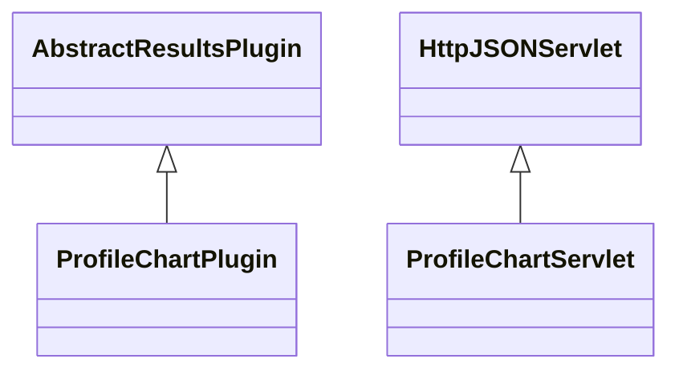

# ResultsProfileChart.jar

[Group index](README.md) | [All archives](../README.md)

## Scope and provenance

- **Donor:** `SQX_145_REFERENCE_ROOT/internal/plugins/ResultsProfileChart/ResultsProfileChart.jar`.
- **SHA-256:** `e68533b22cc2d8d670723f4ffd023cfe2099a44e75abb81ae8e209350ddd9b0f`; accessed 2026-10-06; captured `2026-10-06T18:54:51.906614+00:00`.
- **Classes:** 2 raw entries; 2 unique entry names. Duplicate occurrence indices are zero-based.
- **Inspection:** read-only ZIP hashing and class-file structural parsing; signatures/descriptors, modifiers, hierarchy and references only. Bytecode bodies are hashed, not published.
- **Allocation:** proposed `FEAT-OPTIMIZER-RESULTS-PROFILE-CHART`, P10; [roadmap](../../dev/sqx-full-application-roadmap.md). Domain README registration remains required.
- **Repository:** `01067f00031428613c6394064ca1bcadc1ba00ee`; review state unreviewed. Download label 145-dev1; installed build/activation and runtime equivalence unverified.
- **Limit:** every class/member is inventoried; declaration coverage does not establish consumed calls, defaults, formulas, failure semantics or algorithm parity.
- **Archive/resource index:** [211.json](../../dev/evidence/sqx145/archives/145/211.json).

## Complete member declarations

Member shards contain exact JVM names/descriptors, access flags, generic signatures, throws types, declared fields/methods, superclass/interfaces and referenced class names. All classes, nested/synthetic members and overloads are retained. Code length/hash is structural evidence, not a normalized algorithm comparison.

- [001.json](../../dev/evidence/sqx145/members/211/001.json) — SHA-256 `dce0f77e8f1f5dda0c478526aa4f28cf9a8fa08b218b4b7dd4bbb91b9bec3514`.

## Focused structural diagram

Up to twelve non-nested classes; arrows show declared inheritance/interfaces only. External type names are not evidence of an available body or an executed dependency.

## Class inventory

| Archive entry | Occurrence | Class SHA-256 | Fields | Methods |
| --- | ---: | --- | ---: | ---: |
| `com/strategyquant/plugin/Results/impl/ProfileChart/ProfileChartPlugin.class` | 0 | `29bab6ade279b75a158d5d9743bc4fd2161f1c3480945c99ffb6e182daa3d7b8` | 1 | 8 |
| `com/strategyquant/plugin/Results/impl/ProfileChart/ProfileChartServlet.class` | 0 | `30aee32fadf133bd305bfdc770705e866ceebfa826f73a83b93794206247c31b` | 3 | 8 |
