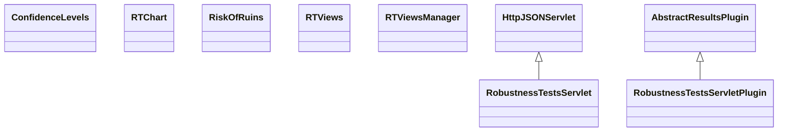

# ResultsRobustnessTests.jar

[Group index](README.md) | [All archives](../README.md)

## Scope and provenance

- **Donor:** `SQX_145_REFERENCE_ROOT/internal/plugins/ResultsRobustnessTests/ResultsRobustnessTests.jar`.
- **SHA-256:** `c82ecb7d211e28b40b5e635ddde834bf09f67f54514b85d5997bf97e2f5aad4f`; accessed 2026-10-06; captured `2026-10-06T18:54:51.906614+00:00`.
- **Classes:** 7 raw entries; 7 unique entry names. Duplicate occurrence indices are zero-based.
- **Inspection:** read-only ZIP hashing and class-file structural parsing; signatures/descriptors, modifiers, hierarchy and references only. Bytecode bodies are hashed, not published.
- **Allocation:** proposed `FEAT-ROBUSTNESS-RESULTS-ROBUSTNESS-TESTS`, P11; [roadmap](../../dev/sqx-full-application-roadmap.md). Domain README registration remains required.
- **Repository:** `01067f00031428613c6394064ca1bcadc1ba00ee`; review state unreviewed. Download label 145-dev1; installed build/activation and runtime equivalence unverified.
- **Limit:** every class/member is inventoried; declaration coverage does not establish consumed calls, defaults, formulas, failure semantics or algorithm parity.
- **Archive/resource index:** [212.json](../../dev/evidence/sqx145/archives/145/212.json).

## Complete member declarations

Member shards contain exact JVM names/descriptors, access flags, generic signatures, throws types, declared fields/methods, superclass/interfaces and referenced class names. All classes, nested/synthetic members and overloads are retained. Code length/hash is structural evidence, not a normalized algorithm comparison.

- [001.json](../../dev/evidence/sqx145/members/212/001.json) — SHA-256 `acfd1066643d63b457c4d5267afab792877ac1e2a523ccbdeab111db827b07f0`.

## Focused structural diagram

Up to twelve non-nested classes; arrows show declared inheritance/interfaces only. External type names are not evidence of an available body or an executed dependency.

## Class inventory

| Archive entry | Occurrence | Class SHA-256 | Fields | Methods |
| --- | ---: | --- | ---: | ---: |
| `com/strategyquant/plugin/Results/impl/RobustnessTests/ConfidenceLevels.class` | 0 | `9da86a745177e0ecc30a77d5daa6e6d7bbc5aa208ae4fa0b132b8eb2395654ba` | 1 | 4 |
| `com/strategyquant/plugin/Results/impl/RobustnessTests/RTChart.class` | 0 | `da06adfff72a1da918a0287cab57e4196444053c1e126229a5bec7728a9134da` | 1 | 4 |
| `com/strategyquant/plugin/Results/impl/RobustnessTests/RiskOfRuins.class` | 0 | `59807e943212d15dfd0556d05c192870aa0d1520af2c271da89bafafc0f622ca` | 1 | 4 |
| `com/strategyquant/plugin/Results/impl/RobustnessTests/RobustnessTestsServlet.class` | 0 | `59abb6fbb1a6ab143180d8e3159372b40e3629ee9f7f2e27644725d9e1dba901` | 8 | 7 |
| `com/strategyquant/plugin/Results/impl/RobustnessTests/RobustnessTestsServletPlugin.class` | 0 | `a4c952e045b29c499de9852bcb5c252cdaaab4ff6bf528a3da9e10c8e7a8c9c4` | 2 | 8 |
| `com/strategyquant/plugin/Results/impl/RobustnessTests/views/RTViews.class` | 0 | `c19ee7be63dfb499b60f9387821f5d0b54ae7e220db77c938b80fee1e6710d40` | 3 | 10 |
| `com/strategyquant/plugin/Results/impl/RobustnessTests/views/RTViewsManager.class` | 0 | `f5ec50799d8f596ba8e196088e58b484fb30140ab87bd6f0528a52f0fcf5a875` | 5 | 13 |
