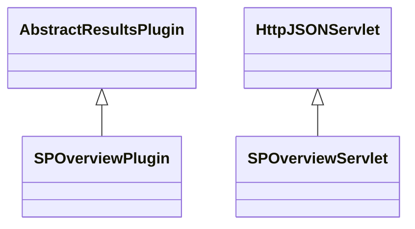

# ResultsSPOverview.jar

[Group index](README.md) | [All archives](../README.md)

## Scope and provenance

- **Donor:** `SQX_145_REFERENCE_ROOT/internal/plugins/ResultsSPOverview/ResultsSPOverview.jar`.
- **SHA-256:** `73a05e6d594be525c4068892f3fdea77929b2740dba3338c4e212360e98067a9`; accessed 2026-10-06; captured `2026-10-06T18:54:51.906614+00:00`.
- **Classes:** 5 raw entries; 5 unique entry names. Duplicate occurrence indices are zero-based.
- **Inspection:** read-only ZIP hashing and class-file structural parsing; signatures/descriptors, modifiers, hierarchy and references only. Bytecode bodies are hashed, not published.
- **Allocation:** proposed `FEAT-RESULTS-RESULTS-SP-OVERVIEW`, P08; [roadmap](../../dev/sqx-full-application-roadmap.md). Domain README registration remains required.
- **Repository:** `01067f00031428613c6394064ca1bcadc1ba00ee`; review state unreviewed. Download label 145-dev1; installed build/activation and runtime equivalence unverified.
- **Limit:** every class/member is inventoried; declaration coverage does not establish consumed calls, defaults, formulas, failure semantics or algorithm parity.
- **Archive/resource index:** [215.json](../../dev/evidence/sqx145/archives/145/215.json).

## Complete member declarations

Member shards contain exact JVM names/descriptors, access flags, generic signatures, throws types, declared fields/methods, superclass/interfaces and referenced class names. All classes, nested/synthetic members and overloads are retained. Code length/hash is structural evidence, not a normalized algorithm comparison.

- [001.json](../../dev/evidence/sqx145/members/215/001.json) — SHA-256 `d05d38c301acaf3c9593cf7ec0d71b0decc3936d7bf4262ffef8df4bca66e995`.

## Focused structural diagram

Up to twelve non-nested classes; arrows show declared inheritance/interfaces only. External type names are not evidence of an available body or an executed dependency.

## Class inventory

| Archive entry | Occurrence | Class SHA-256 | Fields | Methods |
| --- | ---: | --- | ---: | ---: |
| `com/strategyquant/plugin/Results/impl/SPOverview/SPOverviewPlugin.class` | 0 | `c2f33620aaa0cdc4ec1d3f4429bf1656c5b31033fee0a4a85e8400f9da2dc340` | 2 | 8 |
| `com/strategyquant/plugin/Results/impl/SPOverview/SPOverviewServlet$SPStock.class` | 0 | `cd957738c9438789a41f0db844cdf37d518513803bcad767cbd0e159730a173d` | 5 | 1 |
| `com/strategyquant/plugin/Results/impl/SPOverview/SPOverviewServlet$StockComparatorByPL.class` | 0 | `326c849c8c7857f0bb8c9c861f499c9afe82f052dc24ab43751f8bd3843d5e2e` | 1 | 3 |
| `com/strategyquant/plugin/Results/impl/SPOverview/SPOverviewServlet$StockComparatorByVolume.class` | 0 | `63722913967dc828de96d0006a56109747def8d60f52ace7d7921813ea4e23bf` | 1 | 3 |
| `com/strategyquant/plugin/Results/impl/SPOverview/SPOverviewServlet.class` | 0 | `a2e39e842b2879e27ebc95c25d042d4ed6c60322af03d12af9580418f51b2f9c` | 4 | 6 |
