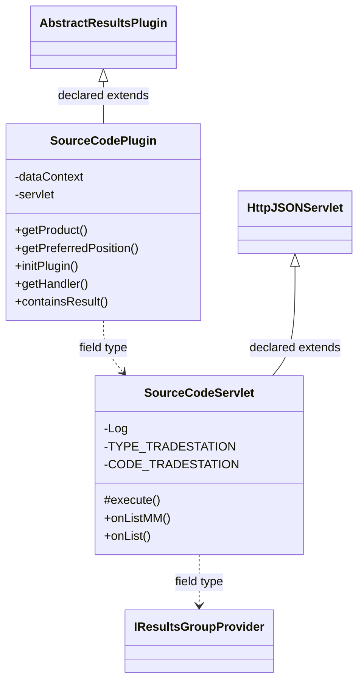

# ResultsSourceCode.jar

[Workspace/group index](README.md)  |  [All workspaces](../README.md)

## Scope and provenance

- Artifact: `SQX_REFERENCE_ROOT/internal/plugins/ResultsSourceCode/ResultsSourceCode.jar`.
- SHA-256: `fdab52cc9a0e0c535b881ee56b58771e71bab86385d78a32a8346fc868b39794`.
- Inspected: 2026-10-05; generation timestamp `2026-10-05T19:04:16.344170+00:00`.
- Archive class entries: **2**; non-nested: **2**; nested/anonymous: **0**.
- Inspection: ZIP entry/manifest enumeration and `javap -p` declarations for every listed class.
- Repository source HEAD: `8a92c705183a6702eaf62037ccb202ed028aa899`; review state: generated, pending owner review.
- Installed SQX build number is unverified. No method bodies are reproduced.
- Confidence: high for declared structure; workspace ownership inferred except where registration evidence is separately stated. Runtime reachability, call order, formulas and parity remain unverified.

The `Results` folder is a navigation/research grouping, not an exclusive backend owner. Shared consumers may use this JAR.

Target mapping: no verified owning HaruQuantAI feature/requirement/decision IDs are assigned by this document. Register or resolve ownership through the normal repository plan before implementation.

## Diagram reading guide

`Parent <|-- Child` means declared inheritance; `Interface <|.. Class` means declared implementation. Interface extension uses the inheritance arrow. `A ..> B : field type` is a declared type dependency, not composition, object ownership or a runtime call. External nodes are referenced types, not fabricated local implementations. Selected fields/method names aid navigation: `+` is public, `#` protected and `-` private. Diagram method names omit parameter/return types and collapse overloads; use the exact inspected declarations below before implementing an API.

Detailed graphs include non-nested classes in package-sized groups of at most 12. Nested/anonymous classes are inventoried and their declarations/relationships are retained below, but omitted from overview graphs. Relationships not drawn for readability remain in the complete declaration-relationship table. Constructors, synthetic bridges and overloads may be collapsed in diagram member lists only. Standard `java.lang.Object` inheritance is omitted from diagrams.

## UML class diagrams

### 1. `com.strategyquant.plugin.Results.impl.SourceCode`



| Diagram identifier | Exact type | Location |
| --- | --- | --- |
| `C47531549a8f0` | `com.strategyquant.plugin.Results.impl.SourceCode.SourceCodePlugin` (this JAR) | this diagram |
| `C5d6d1dfffca8` | `com.strategyquant.plugin.Results.impl.SourceCode.SourceCodeServlet` (this JAR) | this diagram |
| `C180e0c3f58c3` | [`com.strategyquant.tradinglib.results.AbstractResultsPlugin`](../Shared/SQTradingLib.md) | referenced external type |
| `C9ceba9ba4bac` | [`com.strategyquant.tradinglib.results.IResultsGroupProvider`](../Shared/SQTradingLib.md) | referenced external type |
| `C8900f90ae594` | [`com.strategyquant.webguilib.servlet.HttpJSONServlet`](../Shared/SQWebGUILib.md) | referenced external type |

## Complete class inventory

| Fully qualified class | Kind | Entry |
| --- | --- | --- |
| `com.strategyquant.plugin.Results.impl.SourceCode.SourceCodePlugin` | class | non-nested |
| `com.strategyquant.plugin.Results.impl.SourceCode.SourceCodeServlet` | class | non-nested |

## Declared relationships and evidence locations

Every row is supported by the named class declaration/member in `javap -p`, inside the artifact recorded above. Signature dependencies may include return, parameter, generic-argument and throws types; they do not imply execution.

| Declaring class | Referenced type | Relationship | Narrow inspection location |
| --- | --- | --- | --- |
| `com.strategyquant.plugin.Results.impl.SourceCode.SourceCodePlugin` | [`com.strategyquant.tradinglib.results.AbstractResultsPlugin`](../Shared/SQTradingLib.md) | extends | `com.strategyquant.plugin.Results.impl.SourceCode.SourceCodePlugin` / class declaration: `public class com.strategyquant.plugin.Results.impl.SourceCode.SourceCodePlugin extends com.strategyquant.tradinglib.results.AbstractResultsPlugin` |
| `com.strategyquant.plugin.Results.impl.SourceCode.SourceCodePlugin` | `org.eclipse.jetty.servlet.ServletContextHandler` (not resolved in scoped archives) | type dependency | `com.strategyquant.plugin.Results.impl.SourceCode.SourceCodePlugin` / field declaration: `private org.eclipse.jetty.servlet.ServletContextHandler dataContext;` |
| `com.strategyquant.plugin.Results.impl.SourceCode.SourceCodePlugin` | `com.strategyquant.plugin.Results.impl.SourceCode.SourceCodeServlet` (this JAR) | type dependency | `com.strategyquant.plugin.Results.impl.SourceCode.SourceCodePlugin` / field declaration: `private com.strategyquant.plugin.Results.impl.SourceCode.SourceCodeServlet servlet;` |
| `com.strategyquant.plugin.Results.impl.SourceCode.SourceCodePlugin` | `java.lang.String` (not resolved in scoped archives) | type dependency | `com.strategyquant.plugin.Results.impl.SourceCode.SourceCodePlugin` / method signature: `public java.lang.String getProduct();`<br>`public java.lang.String getKey();` |
| `com.strategyquant.plugin.Results.impl.SourceCode.SourceCodePlugin` | `java.lang.Exception` (not resolved in scoped archives) | type dependency | `com.strategyquant.plugin.Results.impl.SourceCode.SourceCodePlugin` / method signature: `public void initPlugin() throws java.lang.Exception;`<br>`public org.json.JSONObject getInitializationData() throws java.lang.Exception;` |
| `com.strategyquant.plugin.Results.impl.SourceCode.SourceCodePlugin` | `org.eclipse.jetty.server.Handler` (not resolved in scoped archives) | type dependency | `com.strategyquant.plugin.Results.impl.SourceCode.SourceCodePlugin` / method signature: `public org.eclipse.jetty.server.Handler getHandler();` |
| `com.strategyquant.plugin.Results.impl.SourceCode.SourceCodePlugin` | [`com.strategyquant.tradinglib.ResultsGroup`](../Shared/SQTradingLib.md) | type dependency | `com.strategyquant.plugin.Results.impl.SourceCode.SourceCodePlugin` / method signature: `public boolean containsResult(com.strategyquant.tradinglib.ResultsGroup);` |
| `com.strategyquant.plugin.Results.impl.SourceCode.SourceCodePlugin` | `org.json.JSONObject` (not resolved in scoped archives) | type dependency | `com.strategyquant.plugin.Results.impl.SourceCode.SourceCodePlugin` / method signature: `public org.json.JSONObject getInitializationData() throws java.lang.Exception;` |
| `com.strategyquant.plugin.Results.impl.SourceCode.SourceCodeServlet` | [`com.strategyquant.webguilib.servlet.HttpJSONServlet`](../Shared/SQWebGUILib.md) | extends | `com.strategyquant.plugin.Results.impl.SourceCode.SourceCodeServlet` / class declaration: `public class com.strategyquant.plugin.Results.impl.SourceCode.SourceCodeServlet extends com.strategyquant.webguilib.servlet.HttpJSONServlet` |
| `com.strategyquant.plugin.Results.impl.SourceCode.SourceCodeServlet` | `org.slf4j.Logger` (not resolved in scoped archives) | type dependency | `com.strategyquant.plugin.Results.impl.SourceCode.SourceCodeServlet` / field declaration: `private static final org.slf4j.Logger Log;` |
| `com.strategyquant.plugin.Results.impl.SourceCode.SourceCodeServlet` | `java.lang.String` (not resolved in scoped archives) | type dependency | `com.strategyquant.plugin.Results.impl.SourceCode.SourceCodeServlet` / field declaration: `private static final java.lang.String TYPE_TRADESTATION;`<br>`private static final java.lang.String CODE_TRADESTATION;`<br>`private static final java.lang.String CODE_MULTICHARTS;`<br>`private static final java.lang.String TYPE_PSEUDO_CODE;`<br>`private static final java.lang.String LOCK_SOURCESERVLET;` |
| `com.strategyquant.plugin.Results.impl.SourceCode.SourceCodeServlet` | `java.lang.String` (not resolved in scoped archives) | type dependency | `com.strategyquant.plugin.Results.impl.SourceCode.SourceCodeServlet` / method signature: `protected java.lang.String execute(java.lang.String, java.util.Map<java.lang.String, java.lang.String[]>, java.lang.String) throws java.lang.Exception;`<br>`private java.lang.String onPrint(java.util.Map<java.lang.String, java.lang.String[]>) throws java.lang.Exception;`<br>`private java.lang.String[] getSourceCode(java.util.Map<java.lang.String, java.lang.String[]>, boolean) throws java.lang.Exception;`<br>`private java.util.ArrayList<java.lang.String> getInputsToVarsFromLadder(com.strategyquant.tradinglib.ResultsGroup);`<br>`private org.jdom2.Element getStrategyElement(java.util.Map<java.lang.String, java.lang.String[]>) throws java.lang.Exception;`<br>`private boolean checkMMAllowed(org.jdom2.Element, java.lang.String) throws java.lang.Exception;`<br>`private java.lang.String getCodeType(java.lang.String);`<br>`private java.lang.String fixMissingBlockText(java.lang.String, java.lang.String);`<br>`private com.strategyquant.lib.ValuesMap getParametrizationSettings(java.util.Map<java.lang.String, java.lang.String[]>);`<br>`private boolean getBool(java.util.Map<java.lang.String, java.lang.String[]>, java.lang.String);`<br>`private java.lang.String onGetDataPath(java.util.Map<java.lang.String, java.lang.String[]>) throws java.lang.Exception;`<br>`private java.lang.String onSaveMTPaths(java.util.Map<java.lang.String, java.lang.String[]>) throws java.lang.Exception;`<br>`private java.lang.String onSaveEA(java.util.Map<java.lang.String, java.lang.String[]>) throws java.lang.Exception;` |
| `com.strategyquant.plugin.Results.impl.SourceCode.SourceCodeServlet` | [`com.strategyquant.tradinglib.results.IResultsGroupProvider`](../Shared/SQTradingLib.md) | type dependency | `com.strategyquant.plugin.Results.impl.SourceCode.SourceCodeServlet` / field declaration: `private static com.strategyquant.tradinglib.results.IResultsGroupProvider rgProvider;` |
| `com.strategyquant.plugin.Results.impl.SourceCode.SourceCodeServlet` | [`com.strategyquant.tradinglib.results.IResultsGroupProvider`](../Shared/SQTradingLib.md) | type dependency | `com.strategyquant.plugin.Results.impl.SourceCode.SourceCodeServlet` / method signature: `public com.strategyquant.plugin.Results.impl.SourceCode.SourceCodeServlet(com.strategyquant.tradinglib.results.IResultsGroupProvider);` |
| `com.strategyquant.plugin.Results.impl.SourceCode.SourceCodeServlet` | `java.util.Map` (not resolved in scoped archives) | type dependency | `com.strategyquant.plugin.Results.impl.SourceCode.SourceCodeServlet` / method signature: `protected java.lang.String execute(java.lang.String, java.util.Map<java.lang.String, java.lang.String[]>, java.lang.String) throws java.lang.Exception;`<br>`private java.lang.String onPrint(java.util.Map<java.lang.String, java.lang.String[]>) throws java.lang.Exception;`<br>`private java.lang.String[] getSourceCode(java.util.Map<java.lang.String, java.lang.String[]>, boolean) throws java.lang.Exception;`<br>`private org.jdom2.Element getStrategyElement(java.util.Map<java.lang.String, java.lang.String[]>) throws java.lang.Exception;`<br>`private com.strategyquant.lib.ValuesMap getParametrizationSettings(java.util.Map<java.lang.String, java.lang.String[]>);`<br>`private boolean getBool(java.util.Map<java.lang.String, java.lang.String[]>, java.lang.String);`<br>`private java.lang.String onGetDataPath(java.util.Map<java.lang.String, java.lang.String[]>) throws java.lang.Exception;`<br>`private java.lang.String onSaveMTPaths(java.util.Map<java.lang.String, java.lang.String[]>) throws java.lang.Exception;`<br>`private java.lang.String onSaveEA(java.util.Map<java.lang.String, java.lang.String[]>) throws java.lang.Exception;` |
| `com.strategyquant.plugin.Results.impl.SourceCode.SourceCodeServlet` | `java.lang.Exception` (not resolved in scoped archives) | type dependency | `com.strategyquant.plugin.Results.impl.SourceCode.SourceCodeServlet` / method signature: `protected java.lang.String execute(java.lang.String, java.util.Map<java.lang.String, java.lang.String[]>, java.lang.String) throws java.lang.Exception;`<br>`public synchronized org.json.JSONArray onList() throws java.lang.Exception;`<br>`private java.lang.String onPrint(java.util.Map<java.lang.String, java.lang.String[]>) throws java.lang.Exception;`<br>`private java.lang.String[] getSourceCode(java.util.Map<java.lang.String, java.lang.String[]>, boolean) throws java.lang.Exception;`<br>`private org.jdom2.Element getStrategyElement(java.util.Map<java.lang.String, java.lang.String[]>) throws java.lang.Exception;`<br>`private boolean checkMMAllowed(org.jdom2.Element, java.lang.String) throws java.lang.Exception;`<br>`private java.lang.String onGetDataPath(java.util.Map<java.lang.String, java.lang.String[]>) throws java.lang.Exception;`<br>`private java.lang.String onSaveMTPaths(java.util.Map<java.lang.String, java.lang.String[]>) throws java.lang.Exception;`<br>`private java.lang.String onSaveEA(java.util.Map<java.lang.String, java.lang.String[]>) throws java.lang.Exception;` |
| `com.strategyquant.plugin.Results.impl.SourceCode.SourceCodeServlet` | `org.json.JSONArray` (not resolved in scoped archives) | type dependency | `com.strategyquant.plugin.Results.impl.SourceCode.SourceCodeServlet` / method signature: `public org.json.JSONArray onListMM();`<br>`public synchronized org.json.JSONArray onList() throws java.lang.Exception;` |
| `com.strategyquant.plugin.Results.impl.SourceCode.SourceCodeServlet` | `java.util.ArrayList` (not resolved in scoped archives) | type dependency | `com.strategyquant.plugin.Results.impl.SourceCode.SourceCodeServlet` / method signature: `private java.util.ArrayList<java.lang.String> getInputsToVarsFromLadder(com.strategyquant.tradinglib.ResultsGroup);` |
| `com.strategyquant.plugin.Results.impl.SourceCode.SourceCodeServlet` | [`com.strategyquant.tradinglib.ResultsGroup`](../Shared/SQTradingLib.md) | type dependency | `com.strategyquant.plugin.Results.impl.SourceCode.SourceCodeServlet` / method signature: `private java.util.ArrayList<java.lang.String> getInputsToVarsFromLadder(com.strategyquant.tradinglib.ResultsGroup);` |
| `com.strategyquant.plugin.Results.impl.SourceCode.SourceCodeServlet` | `java.lang.StringBuilder` (not resolved in scoped archives) | type dependency | `com.strategyquant.plugin.Results.impl.SourceCode.SourceCodeServlet` / method signature: `private void createLadderEntry(java.lang.StringBuilder, com.strategyquant.tradinglib.WalkForwardPeriod);` |
| `com.strategyquant.plugin.Results.impl.SourceCode.SourceCodeServlet` | [`com.strategyquant.tradinglib.WalkForwardPeriod`](../Shared/SQTradingLib.md) | type dependency | `com.strategyquant.plugin.Results.impl.SourceCode.SourceCodeServlet` / method signature: `private void createLadderEntry(java.lang.StringBuilder, com.strategyquant.tradinglib.WalkForwardPeriod);` |
| `com.strategyquant.plugin.Results.impl.SourceCode.SourceCodeServlet` | `org.jdom2.Element` (not resolved in scoped archives) | type dependency | `com.strategyquant.plugin.Results.impl.SourceCode.SourceCodeServlet` / method signature: `private org.jdom2.Element getStrategyElement(java.util.Map<java.lang.String, java.lang.String[]>) throws java.lang.Exception;`<br>`private boolean checkMMAllowed(org.jdom2.Element, java.lang.String) throws java.lang.Exception;`<br>`private boolean recognizeMergedResult(org.jdom2.Element);`<br>`private boolean containsDuplicateEntries(org.jdom2.Element);` |
| `com.strategyquant.plugin.Results.impl.SourceCode.SourceCodeServlet` | `com.strategyquant.lib.ValuesMap` (not resolved in scoped archives) | type dependency | `com.strategyquant.plugin.Results.impl.SourceCode.SourceCodeServlet` / method signature: `private com.strategyquant.lib.ValuesMap getParametrizationSettings(java.util.Map<java.lang.String, java.lang.String[]>);` |

## Inspected declaration reference

These are structural API/member declarations, not proprietary implementation bodies. Private members and nested classes are retained to make diagram omissions explicit; declarations do not prove behavior.

<details>
<summary>com.strategyquant.plugin.Results.impl.SourceCode.SourceCodePlugin</summary>

```text
public class com.strategyquant.plugin.Results.impl.SourceCode.SourceCodePlugin extends com.strategyquant.tradinglib.results.AbstractResultsPlugin
    private org.eclipse.jetty.servlet.ServletContextHandler dataContext;
    private com.strategyquant.plugin.Results.impl.SourceCode.SourceCodeServlet servlet;
    public com.strategyquant.plugin.Results.impl.SourceCode.SourceCodePlugin();
    public java.lang.String getProduct();
    public int getPreferredPosition();
    public void initPlugin() throws java.lang.Exception;
    public org.eclipse.jetty.server.Handler getHandler();
    public boolean containsResult(com.strategyquant.tradinglib.ResultsGroup);
    public java.lang.String getKey();
    public org.json.JSONObject getInitializationData() throws java.lang.Exception;
```

</details>

<details>
<summary>com.strategyquant.plugin.Results.impl.SourceCode.SourceCodeServlet</summary>

```text
public class com.strategyquant.plugin.Results.impl.SourceCode.SourceCodeServlet extends com.strategyquant.webguilib.servlet.HttpJSONServlet
    private static final org.slf4j.Logger Log;
    private static final java.lang.String TYPE_TRADESTATION;
    private static final java.lang.String CODE_TRADESTATION;
    private static final java.lang.String CODE_MULTICHARTS;
    private static final java.lang.String TYPE_PSEUDO_CODE;
    private static final java.lang.String LOCK_SOURCESERVLET;
    private static com.strategyquant.tradinglib.results.IResultsGroupProvider rgProvider;
    public com.strategyquant.plugin.Results.impl.SourceCode.SourceCodeServlet(com.strategyquant.tradinglib.results.IResultsGroupProvider);
    protected java.lang.String execute(java.lang.String, java.util.Map<java.lang.String, java.lang.String[]>, java.lang.String) throws java.lang.Exception;
    public org.json.JSONArray onListMM();
    public synchronized org.json.JSONArray onList() throws java.lang.Exception;
    private java.lang.String onPrint(java.util.Map<java.lang.String, java.lang.String[]>) throws java.lang.Exception;
    private java.lang.String[] getSourceCode(java.util.Map<java.lang.String, java.lang.String[]>, boolean) throws java.lang.Exception;
    private java.util.ArrayList<java.lang.String> getInputsToVarsFromLadder(com.strategyquant.tradinglib.ResultsGroup);
    private void createLadderEntry(java.lang.StringBuilder, com.strategyquant.tradinglib.WalkForwardPeriod);
    private org.jdom2.Element getStrategyElement(java.util.Map<java.lang.String, java.lang.String[]>) throws java.lang.Exception;
    private boolean checkMMAllowed(org.jdom2.Element, java.lang.String) throws java.lang.Exception;
    private java.lang.String getCodeType(java.lang.String);
    private java.lang.String fixMissingBlockText(java.lang.String, java.lang.String);
    private boolean recognizeMergedResult(org.jdom2.Element);
    private com.strategyquant.lib.ValuesMap getParametrizationSettings(java.util.Map<java.lang.String, java.lang.String[]>);
    private boolean getBool(java.util.Map<java.lang.String, java.lang.String[]>, java.lang.String);
    private java.lang.String onGetDataPath(java.util.Map<java.lang.String, java.lang.String[]>) throws java.lang.Exception;
    private java.lang.String onSaveMTPaths(java.util.Map<java.lang.String, java.lang.String[]>) throws java.lang.Exception;
    private java.lang.String onSaveEA(java.util.Map<java.lang.String, java.lang.String[]>) throws java.lang.Exception;
    private boolean containsDuplicateEntries(org.jdom2.Element);
```

</details>

## Validation and unresolved gaps

Archive hash and complete class inventory were checked against the inspected local artifact. Declaration extraction accounts for every inventoried class. Documentation/link/diagram structural verification is recorded in the master index and task walkthrough; no SQX runtime validation was performed.

The canonical reimplementation ledger/schema are absent, so no evidence IDs or validation-passed ledger claims are created. This is a donor structural reference. Exact behavior, default values, failure semantics, algorithms, runtime calls and target architectural choices require separate research. No aggregation/composition or cardinalities are inferred.
