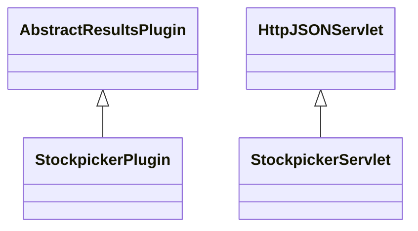

# ResultsStockpicker.jar

[Group index](README.md) | [All archives](../README.md)

## Scope and provenance

- **Donor:** `SQX_145_REFERENCE_ROOT/internal/plugins/ResultsStockpicker/ResultsStockpicker.jar`.
- **SHA-256:** `a9843a8f740d52f657db40d2df28255e65c5dcb8577ba4f410002e29e84f55b5`; accessed 2026-10-06; captured `2026-10-06T18:54:51.906614+00:00`.
- **Classes:** 2 raw entries; 2 unique entry names. Duplicate occurrence indices are zero-based.
- **Inspection:** read-only ZIP hashing and class-file structural parsing; signatures/descriptors, modifiers, hierarchy and references only. Bytecode bodies are hashed, not published.
- **Allocation:** proposed `FEAT-RESULTS-RESULTS-STOCKPICKER`, P08; [roadmap](../../dev/sqx-full-application-roadmap.md). Domain README registration remains required.
- **Repository:** `01067f00031428613c6394064ca1bcadc1ba00ee`; review state unreviewed. Download label 145-dev1; installed build/activation and runtime equivalence unverified.
- **Limit:** every class/member is inventoried; declaration coverage does not establish consumed calls, defaults, formulas, failure semantics or algorithm parity.
- **Archive/resource index:** [216.json](../../dev/evidence/sqx145/archives/145/216.json).

## Complete member declarations

Member shards contain exact JVM names/descriptors, access flags, generic signatures, throws types, declared fields/methods, superclass/interfaces and referenced class names. All classes, nested/synthetic members and overloads are retained. Code length/hash is structural evidence, not a normalized algorithm comparison.

- [001.json](../../dev/evidence/sqx145/members/216/001.json) — SHA-256 `d8e82d497a14ba2291abbdd6a80f362c3f10921c46596ea7122c4cc2eedcf0c5`.

## Focused structural diagram

Up to twelve non-nested classes; arrows show declared inheritance/interfaces only. External type names are not evidence of an available body or an executed dependency.

## Class inventory

| Archive entry | Occurrence | Class SHA-256 | Fields | Methods |
| --- | ---: | --- | ---: | ---: |
| `com/strategyquant/plugin/Results/impl/Stockpicker/StockpickerPlugin.class` | 0 | `4b0a0e6d02a5419fd0f3c99454b6264eae315f2f7fd4581eaa6023c96eb010e1` | 2 | 8 |
| `com/strategyquant/plugin/Results/impl/Stockpicker/StockpickerServlet.class` | 0 | `657ba340848c2fdf7451b9fcba39e8445230879561ee8342b0a43aba59820d86` | 4 | 4 |
