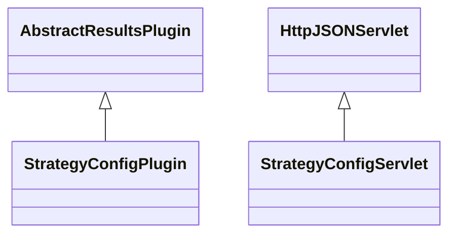

# ResultsStrategyConfig.jar

[Group index](README.md) | [All archives](../README.md)

## Scope and provenance

- **Donor:** `SQX_145_REFERENCE_ROOT/internal/plugins/ResultsStrategyConfig/ResultsStrategyConfig.jar`.
- **SHA-256:** `2b2ffee19ff286f637a317db951feb515d473e4ede01057b83ea8db705c8876f`; accessed 2026-10-06; captured `2026-10-06T18:54:51.906614+00:00`.
- **Classes:** 2 raw entries; 2 unique entry names. Duplicate occurrence indices are zero-based.
- **Inspection:** read-only ZIP hashing and class-file structural parsing; signatures/descriptors, modifiers, hierarchy and references only. Bytecode bodies are hashed, not published.
- **Allocation:** proposed `FEAT-RESULTS-RESULTS-STRATEGY-CONFIG`, P08; [roadmap](../../dev/sqx-full-application-roadmap.md). Domain README registration remains required.
- **Repository:** `01067f00031428613c6394064ca1bcadc1ba00ee`; review state unreviewed. Download label 145-dev1; installed build/activation and runtime equivalence unverified.
- **Limit:** every class/member is inventoried; declaration coverage does not establish consumed calls, defaults, formulas, failure semantics or algorithm parity.
- **Archive/resource index:** [217.json](../../dev/evidence/sqx145/archives/145/217.json).

## Complete member declarations

Member shards contain exact JVM names/descriptors, access flags, generic signatures, throws types, declared fields/methods, superclass/interfaces and referenced class names. All classes, nested/synthetic members and overloads are retained. Code length/hash is structural evidence, not a normalized algorithm comparison.

- [001.json](../../dev/evidence/sqx145/members/217/001.json) — SHA-256 `591f5f35498fbc68b9e94054c45e81ba00ea16843fd35b35ba2f0f9a80da86cb`.

## Focused structural diagram

Up to twelve non-nested classes; arrows show declared inheritance/interfaces only. External type names are not evidence of an available body or an executed dependency.

## Class inventory

| Archive entry | Occurrence | Class SHA-256 | Fields | Methods |
| --- | ---: | --- | ---: | ---: |
| `com/strategyquant/plugin/Results/impl/StrategyConfig/StrategyConfigPlugin.class` | 0 | `88c297aa6a4cad123043d3a8b4afe74e406ee2d2f694c399165a2b251dc32a8f` | 2 | 8 |
| `com/strategyquant/plugin/Results/impl/StrategyConfig/StrategyConfigServlet.class` | 0 | `e4f3260a867b7a2950dfd838d814423ae4685041ba26ea6b34fca3f7f8600854` | 4 | 5 |
