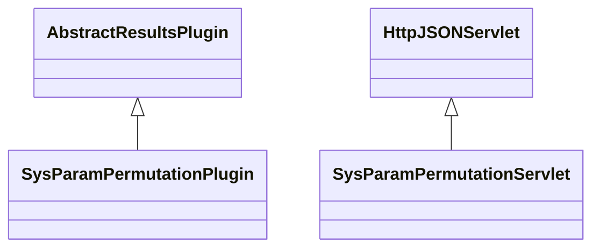

# ResultsSysParamPermutation.jar

[Group index](README.md) | [All archives](../README.md)

## Scope and provenance

- **Donor:** `SQX_145_REFERENCE_ROOT/internal/plugins/ResultsSysParamPermutation/ResultsSysParamPermutation.jar`.
- **SHA-256:** `a93d9519154a9761ea6226b14b7997c2e75418bb9c9cf899d11d5e077549fc8c`; accessed 2026-10-06; captured `2026-10-06T18:54:51.906614+00:00`.
- **Classes:** 2 raw entries; 2 unique entry names. Duplicate occurrence indices are zero-based.
- **Inspection:** read-only ZIP hashing and class-file structural parsing; signatures/descriptors, modifiers, hierarchy and references only. Bytecode bodies are hashed, not published.
- **Allocation:** proposed `FEAT-OPTIMIZER-RESULTS-SYS-PARAM-PERMUTATION`, P10; [roadmap](../../dev/sqx-full-application-roadmap.md). Domain README registration remains required.
- **Repository:** `01067f00031428613c6394064ca1bcadc1ba00ee`; review state unreviewed. Download label 145-dev1; installed build/activation and runtime equivalence unverified.
- **Limit:** every class/member is inventoried; declaration coverage does not establish consumed calls, defaults, formulas, failure semantics or algorithm parity.
- **Archive/resource index:** [218.json](../../dev/evidence/sqx145/archives/145/218.json).

## Complete member declarations

Member shards contain exact JVM names/descriptors, access flags, generic signatures, throws types, declared fields/methods, superclass/interfaces and referenced class names. All classes, nested/synthetic members and overloads are retained. Code length/hash is structural evidence, not a normalized algorithm comparison.

- [001.json](../../dev/evidence/sqx145/members/218/001.json) — SHA-256 `5f7845225ef88c53051716f37c199a51ac7eac05bc8f1f27fdf26c64ec167278`.

## Focused structural diagram

Up to twelve non-nested classes; arrows show declared inheritance/interfaces only. External type names are not evidence of an available body or an executed dependency.

## Class inventory

| Archive entry | Occurrence | Class SHA-256 | Fields | Methods |
| --- | ---: | --- | ---: | ---: |
| `com/strategyquant/plugin/Results/impl/SysParamPermutation/SysParamPermutationPlugin.class` | 0 | `3446bff7b58d8dc9a24f381a32eceee8f5a22795cb55bdb1b07e3c04fce46241` | 2 | 8 |
| `com/strategyquant/plugin/Results/impl/SysParamPermutation/SysParamPermutationServlet.class` | 0 | `be27944535791da7576e8f0e97c58ca6b708b56afe507d8691d443cbbdcb9f49` | 3 | 6 |
