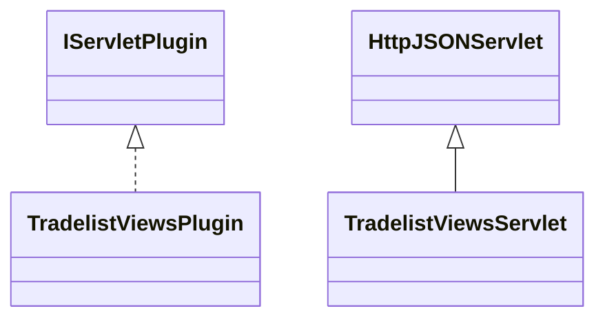

# ResultsTradelistViews.jar

[Group index](README.md) | [All archives](../README.md)

## Scope and provenance

- **Donor:** `SQX_145_REFERENCE_ROOT/internal/plugins/ResultsTradelistViews/ResultsTradelistViews.jar`.
- **SHA-256:** `f2ffc14b248085148f5c7d8cd69baf41d82ac6d7ee55e8e77bd752ab34e4029e`; accessed 2026-10-06; captured `2026-10-06T18:54:51.906614+00:00`.
- **Classes:** 2 raw entries; 2 unique entry names. Duplicate occurrence indices are zero-based.
- **Inspection:** read-only ZIP hashing and class-file structural parsing; signatures/descriptors, modifiers, hierarchy and references only. Bytecode bodies are hashed, not published.
- **Allocation:** proposed `FEAT-RESULTS-RESULTS-TRADELIST-VIEWS`, P08; [roadmap](../../dev/sqx-full-application-roadmap.md). Domain README registration remains required.
- **Repository:** `01067f00031428613c6394064ca1bcadc1ba00ee`; review state unreviewed. Download label 145-dev1; installed build/activation and runtime equivalence unverified.
- **Limit:** every class/member is inventoried; declaration coverage does not establish consumed calls, defaults, formulas, failure semantics or algorithm parity.
- **Archive/resource index:** [221.json](../../dev/evidence/sqx145/archives/145/221.json).

## Complete member declarations

Member shards contain exact JVM names/descriptors, access flags, generic signatures, throws types, declared fields/methods, superclass/interfaces and referenced class names. All classes, nested/synthetic members and overloads are retained. Code length/hash is structural evidence, not a normalized algorithm comparison.

- [001.json](../../dev/evidence/sqx145/members/221/001.json) — SHA-256 `3d995f56cda5291de53535661a5246b765c8dfda4254e5aa504c2e745369cc87`.

## Focused structural diagram

Up to twelve non-nested classes; arrows show declared inheritance/interfaces only. External type names are not evidence of an available body or an executed dependency.

## Class inventory

| Archive entry | Occurrence | Class SHA-256 | Fields | Methods |
| --- | ---: | --- | ---: | ---: |
| `com/strategyquant/plugin/Results/impl/TradelistViews/TradelistViewsPlugin.class` | 0 | `da22bcb2d70490f30d2b70dd8661df033fb37100fb7dfd3048d86e8c3946cec9` | 1 | 5 |
| `com/strategyquant/plugin/Results/impl/TradelistViews/TradelistViewsServlet.class` | 0 | `7821216b00cb3d457ff9c5e08cee05eae7db5b6eed103142a1a5b76ae5dbabd2` | 1 | 11 |
