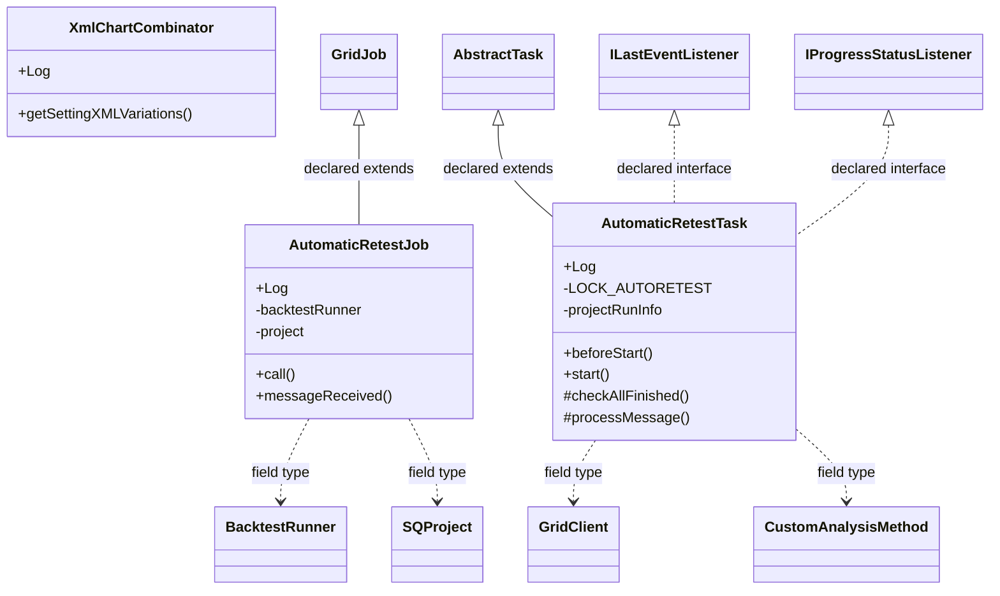

# TaskAutomaticRetest.jar

[Workspace/group index](README.md)  |  [All workspaces](../README.md)

## Scope and provenance

- Artifact: `SQX_REFERENCE_ROOT/internal/plugins/TaskAutomaticRetest/TaskAutomaticRetest.jar`.
- SHA-256: `55b8703b11756d6bb17a27464d96d35e78f4f7513b299a63d4c11027bdda5db8`.
- Inspected: 2026-10-05; generation timestamp `2026-10-05T19:04:16.344170+00:00`.
- Archive class entries: **6**; non-nested: **3**; nested/anonymous: **3**.
- Inspection: ZIP entry/manifest enumeration and `javap -p` declarations for every listed class.
- Repository source HEAD: `8a92c705183a6702eaf62037ccb202ed028aa899`; review state: generated, pending owner review.
- Installed SQX build number is unverified. No method bodies are reproduced.
- Confidence: high for declared structure; workspace ownership inferred except where registration evidence is separately stated. Runtime reachability, call order, formulas and parity remain unverified.

The `Retester` folder is a navigation/research grouping, not an exclusive backend owner. Shared consumers may use this JAR.

Target mapping: no verified owning HaruQuantAI feature/requirement/decision IDs are assigned by this document. Register or resolve ownership through the normal repository plan before implementation.

## Diagram reading guide

`Parent <|-- Child` means declared inheritance; `Interface <|.. Class` means declared implementation. Interface extension uses the inheritance arrow. `A ..> B : field type` is a declared type dependency, not composition, object ownership or a runtime call. External nodes are referenced types, not fabricated local implementations. Selected fields/method names aid navigation: `+` is public, `#` protected and `-` private. Diagram method names omit parameter/return types and collapse overloads; use the exact inspected declarations below before implementing an API.

Detailed graphs include non-nested classes in package-sized groups of at most 12. Nested/anonymous classes are inventoried and their declarations/relationships are retained below, but omitted from overview graphs. Relationships not drawn for readability remain in the complete declaration-relationship table. Constructors, synthetic bridges and overloads may be collapsed in diagram member lists only. Standard `java.lang.Object` inheritance is omitted from diagrams.

## UML class diagrams

### 1. `com.strategyquant.plugin.Task.impl.AutomaticRetest`



| Diagram identifier | Exact type | Location |
| --- | --- | --- |
| `C2d5349dc1f49` | [`com.strategyquant.gridlib.client.GridClient`](../Shared/SQGridLib2.md) | referenced external type |
| `C729a56512564` | [`com.strategyquant.gridlib.client.GridJob`](../Shared/SQGridLib2.md) | referenced external type |
| `Cb85852081c6b` | `com.strategyquant.plugin.Task.impl.AutomaticRetest.AutomaticRetestJob` (this JAR) | this diagram |
| `Ce544c890bc40` | `com.strategyquant.plugin.Task.impl.AutomaticRetest.AutomaticRetestTask` (this JAR) | this diagram |
| `Cedf03d07d0e1` | `com.strategyquant.plugin.Task.impl.AutomaticRetest.XmlChartCombinator` (this JAR) | this diagram |
| `C4e0104799ec7` | [`com.strategyquant.tradinglib.CustomAnalysisMethod`](../Shared/SQTradingLib.md) | referenced external type |
| `C044e39d2df83` | [`com.strategyquant.tradinglib.backtestrunner.BacktestRunner`](../Shared/SQTradingLib.md) | referenced external type |
| `C1295ffcc9568` | [`com.strategyquant.tradinglib.project.ILastEventListener`](../Shared/SQTradingLib.md) | referenced external type |
| `C7126b816a5a1` | [`com.strategyquant.tradinglib.project.IProgressStatusListener`](../Shared/SQTradingLib.md) | referenced external type |
| `C8241bc919d95` | [`com.strategyquant.tradinglib.project.SQProject`](../Shared/SQTradingLib.md) | referenced external type |
| `Ce44d386802cb` | [`com.strategyquant.tradinglib.taskImpl.AbstractTask`](../Shared/SQTradingLib.md) | referenced external type |

## Complete class inventory

| Fully qualified class | Kind | Entry |
| --- | --- | --- |
| `com.strategyquant.plugin.Task.impl.AutomaticRetest.AutomaticRetestJob` | class | non-nested |
| `com.strategyquant.plugin.Task.impl.AutomaticRetest.AutomaticRetestTask` | class | non-nested |
| `com.strategyquant.plugin.Task.impl.AutomaticRetest.AutomaticRetestTask$1` | class | nested/anonymous |
| `com.strategyquant.plugin.Task.impl.AutomaticRetest.AutomaticRetestTask$2` | class | nested/anonymous |
| `com.strategyquant.plugin.Task.impl.AutomaticRetest.XmlChartCombinator` | class | non-nested |
| `com.strategyquant.plugin.Task.impl.AutomaticRetest.XmlChartCombinator$Variation` | class | nested/anonymous |

## Declared relationships and evidence locations

Every row is supported by the named class declaration/member in `javap -p`, inside the artifact recorded above. Signature dependencies may include return, parameter, generic-argument and throws types; they do not imply execution.

| Declaring class | Referenced type | Relationship | Narrow inspection location |
| --- | --- | --- | --- |
| `com.strategyquant.plugin.Task.impl.AutomaticRetest.AutomaticRetestJob` | [`com.strategyquant.gridlib.client.GridJob`](../Shared/SQGridLib2.md) | extends | `com.strategyquant.plugin.Task.impl.AutomaticRetest.AutomaticRetestJob` / class declaration: `public class com.strategyquant.plugin.Task.impl.AutomaticRetest.AutomaticRetestJob extends com.strategyquant.gridlib.client.GridJob<com.strategyquant.tradinglib.backtestrunner.BacktestResult>` |
| `com.strategyquant.plugin.Task.impl.AutomaticRetest.AutomaticRetestJob` | `org.slf4j.Logger` (not resolved in scoped archives) | type dependency | `com.strategyquant.plugin.Task.impl.AutomaticRetest.AutomaticRetestJob` / field declaration: `public static final org.slf4j.Logger Log;` |
| `com.strategyquant.plugin.Task.impl.AutomaticRetest.AutomaticRetestJob` | [`com.strategyquant.tradinglib.backtestrunner.BacktestRunner`](../Shared/SQTradingLib.md) | type dependency | `com.strategyquant.plugin.Task.impl.AutomaticRetest.AutomaticRetestJob` / field declaration: `private com.strategyquant.tradinglib.backtestrunner.BacktestRunner backtestRunner;` |
| `com.strategyquant.plugin.Task.impl.AutomaticRetest.AutomaticRetestJob` | [`com.strategyquant.tradinglib.project.SQProject`](../Shared/SQTradingLib.md) | type dependency | `com.strategyquant.plugin.Task.impl.AutomaticRetest.AutomaticRetestJob` / field declaration: `private com.strategyquant.tradinglib.project.SQProject project;` |
| `com.strategyquant.plugin.Task.impl.AutomaticRetest.AutomaticRetestJob` | `java.lang.String` (not resolved in scoped archives) | type dependency | `com.strategyquant.plugin.Task.impl.AutomaticRetest.AutomaticRetestJob` / field declaration: `private java.lang.String strategyName;`<br>`private java.util.Map<java.lang.String, java.io.Serializable> params;` |
| `com.strategyquant.plugin.Task.impl.AutomaticRetest.AutomaticRetestJob` | `java.lang.String` (not resolved in scoped archives) | type dependency | `com.strategyquant.plugin.Task.impl.AutomaticRetest.AutomaticRetestJob` / method signature: `public com.strategyquant.plugin.Task.impl.AutomaticRetest.AutomaticRetestJob(java.lang.String, java.util.Map<java.lang.String, java.io.Serializable>, com.strategyquant.tradinglib.project.StopPauseEngine, com.strategyquant.tradinglib.project.ILastEventListener) throws java.lang.Exception;`<br>`private void initializeBacktestData(java.util.Map<java.lang.String, java.io.Serializable>) throws java.lang.Exception;` |
| `com.strategyquant.plugin.Task.impl.AutomaticRetest.AutomaticRetestJob` | `java.util.Map` (not resolved in scoped archives) | type dependency | `com.strategyquant.plugin.Task.impl.AutomaticRetest.AutomaticRetestJob` / field declaration: `private java.util.Map<java.lang.String, java.io.Serializable> params;` |
| `com.strategyquant.plugin.Task.impl.AutomaticRetest.AutomaticRetestJob` | `java.util.Map` (not resolved in scoped archives) | type dependency | `com.strategyquant.plugin.Task.impl.AutomaticRetest.AutomaticRetestJob` / method signature: `public com.strategyquant.plugin.Task.impl.AutomaticRetest.AutomaticRetestJob(java.lang.String, java.util.Map<java.lang.String, java.io.Serializable>, com.strategyquant.tradinglib.project.StopPauseEngine, com.strategyquant.tradinglib.project.ILastEventListener) throws java.lang.Exception;`<br>`private void initializeBacktestData(java.util.Map<java.lang.String, java.io.Serializable>) throws java.lang.Exception;` |
| `com.strategyquant.plugin.Task.impl.AutomaticRetest.AutomaticRetestJob` | `java.io.Serializable` (not resolved in scoped archives) | type dependency | `com.strategyquant.plugin.Task.impl.AutomaticRetest.AutomaticRetestJob` / field declaration: `private java.util.Map<java.lang.String, java.io.Serializable> params;` |
| `com.strategyquant.plugin.Task.impl.AutomaticRetest.AutomaticRetestJob` | `java.io.Serializable` (not resolved in scoped archives) | type dependency | `com.strategyquant.plugin.Task.impl.AutomaticRetest.AutomaticRetestJob` / method signature: `public com.strategyquant.plugin.Task.impl.AutomaticRetest.AutomaticRetestJob(java.lang.String, java.util.Map<java.lang.String, java.io.Serializable>, com.strategyquant.tradinglib.project.StopPauseEngine, com.strategyquant.tradinglib.project.ILastEventListener) throws java.lang.Exception;`<br>`private void initializeBacktestData(java.util.Map<java.lang.String, java.io.Serializable>) throws java.lang.Exception;` |
| `com.strategyquant.plugin.Task.impl.AutomaticRetest.AutomaticRetestJob` | [`com.strategyquant.tradinglib.project.StopPauseEngine`](../Shared/SQTradingLib.md) | type dependency | `com.strategyquant.plugin.Task.impl.AutomaticRetest.AutomaticRetestJob` / method signature: `public com.strategyquant.plugin.Task.impl.AutomaticRetest.AutomaticRetestJob(java.lang.String, java.util.Map<java.lang.String, java.io.Serializable>, com.strategyquant.tradinglib.project.StopPauseEngine, com.strategyquant.tradinglib.project.ILastEventListener) throws java.lang.Exception;` |
| `com.strategyquant.plugin.Task.impl.AutomaticRetest.AutomaticRetestJob` | [`com.strategyquant.tradinglib.project.ILastEventListener`](../Shared/SQTradingLib.md) | type dependency | `com.strategyquant.plugin.Task.impl.AutomaticRetest.AutomaticRetestJob` / method signature: `public com.strategyquant.plugin.Task.impl.AutomaticRetest.AutomaticRetestJob(java.lang.String, java.util.Map<java.lang.String, java.io.Serializable>, com.strategyquant.tradinglib.project.StopPauseEngine, com.strategyquant.tradinglib.project.ILastEventListener) throws java.lang.Exception;` |
| `com.strategyquant.plugin.Task.impl.AutomaticRetest.AutomaticRetestJob` | `java.lang.Exception` (not resolved in scoped archives) | type dependency | `com.strategyquant.plugin.Task.impl.AutomaticRetest.AutomaticRetestJob` / method signature: `public com.strategyquant.plugin.Task.impl.AutomaticRetest.AutomaticRetestJob(java.lang.String, java.util.Map<java.lang.String, java.io.Serializable>, com.strategyquant.tradinglib.project.StopPauseEngine, com.strategyquant.tradinglib.project.ILastEventListener) throws java.lang.Exception;`<br>`private void initializeBacktestData(java.util.Map<java.lang.String, java.io.Serializable>) throws java.lang.Exception;`<br>`public com.strategyquant.tradinglib.backtestrunner.BacktestResult call() throws java.lang.Exception;`<br>`public java.lang.Object call() throws java.lang.Exception;` |
| `com.strategyquant.plugin.Task.impl.AutomaticRetest.AutomaticRetestJob` | [`com.strategyquant.tradinglib.backtestrunner.BacktestResult`](../Shared/SQTradingLib.md) | type dependency | `com.strategyquant.plugin.Task.impl.AutomaticRetest.AutomaticRetestJob` / method signature: `public com.strategyquant.tradinglib.backtestrunner.BacktestResult call() throws java.lang.Exception;` |
| `com.strategyquant.plugin.Task.impl.AutomaticRetest.AutomaticRetestJob` | [`com.strategyquant.gridlib.client.GridMessage`](../Shared/SQGridLib2.md) | type dependency | `com.strategyquant.plugin.Task.impl.AutomaticRetest.AutomaticRetestJob` / method signature: `public void messageReceived(com.strategyquant.gridlib.client.GridMessage);` |
| `com.strategyquant.plugin.Task.impl.AutomaticRetest.AutomaticRetestJob` | `java.lang.Object` (not resolved in scoped archives) | type dependency | `com.strategyquant.plugin.Task.impl.AutomaticRetest.AutomaticRetestJob` / method signature: `public java.lang.Object call() throws java.lang.Exception;` |
| `com.strategyquant.plugin.Task.impl.AutomaticRetest.AutomaticRetestTask` | [`com.strategyquant.tradinglib.taskImpl.AbstractTask`](../Shared/SQTradingLib.md) | extends | `com.strategyquant.plugin.Task.impl.AutomaticRetest.AutomaticRetestTask` / class declaration: `public class com.strategyquant.plugin.Task.impl.AutomaticRetest.AutomaticRetestTask extends com.strategyquant.tradinglib.taskImpl.AbstractTask implements com.strategyquant.tradinglib.project.ILastEventListener,com.strategyquant.tradinglib.project.IProgressStatusListener` |
| `com.strategyquant.plugin.Task.impl.AutomaticRetest.AutomaticRetestTask` | [`com.strategyquant.tradinglib.project.ILastEventListener`](../Shared/SQTradingLib.md) | implements | `com.strategyquant.plugin.Task.impl.AutomaticRetest.AutomaticRetestTask` / class declaration: `public class com.strategyquant.plugin.Task.impl.AutomaticRetest.AutomaticRetestTask extends com.strategyquant.tradinglib.taskImpl.AbstractTask implements com.strategyquant.tradinglib.project.ILastEventListener,com.strategyquant.tradinglib.project.IProgressStatusListener` |
| `com.strategyquant.plugin.Task.impl.AutomaticRetest.AutomaticRetestTask` | [`com.strategyquant.tradinglib.project.IProgressStatusListener`](../Shared/SQTradingLib.md) | implements | `com.strategyquant.plugin.Task.impl.AutomaticRetest.AutomaticRetestTask` / class declaration: `public class com.strategyquant.plugin.Task.impl.AutomaticRetest.AutomaticRetestTask extends com.strategyquant.tradinglib.taskImpl.AbstractTask implements com.strategyquant.tradinglib.project.ILastEventListener,com.strategyquant.tradinglib.project.IProgressStatusListener` |
| `com.strategyquant.plugin.Task.impl.AutomaticRetest.AutomaticRetestTask` | `org.slf4j.Logger` (not resolved in scoped archives) | type dependency | `com.strategyquant.plugin.Task.impl.AutomaticRetest.AutomaticRetestTask` / field declaration: `public static final org.slf4j.Logger Log;` |
| `com.strategyquant.plugin.Task.impl.AutomaticRetest.AutomaticRetestTask` | `java.lang.String` (not resolved in scoped archives) | type dependency | `com.strategyquant.plugin.Task.impl.AutomaticRetest.AutomaticRetestTask` / field declaration: `private static final java.lang.String LOCK_AUTORETEST;`<br>`private java.util.ArrayList<java.lang.String> databankRecordKeys;`<br>`private java.lang.String jobGroupID;`<br>`private java.lang.String caInputArgs;` |
| `com.strategyquant.plugin.Task.impl.AutomaticRetest.AutomaticRetestTask` | `java.lang.String` (not resolved in scoped archives) | type dependency | `com.strategyquant.plugin.Task.impl.AutomaticRetest.AutomaticRetestTask` / method signature: `public com.strategyquant.plugin.Task.impl.AutomaticRetest.AutomaticRetestTask(java.lang.String, com.strategyquant.tradinglib.project.ProgressEngine) throws java.lang.Exception;`<br>`private java.util.List<java.util.Map<java.lang.String, java.io.Serializable>> getParams(com.strategyquant.tradinglib.ResultsGroup) throws java.lang.Exception;`<br>`private boolean shouldReadSettings(java.lang.String);`<br>`private void printNewStrategyToLog(com.strategyquant.gridlib.client.JobDetails, java.lang.String, java.lang.String, com.strategyquant.tradinglib.backtestrunner.DurationStats);`<br>`public java.lang.String getType();`<br>`public java.lang.String getPluginFolderName();`<br>`public java.lang.String getName();`<br>`public com.strategyquant.tradinglib.taskImpl.ISQTask clone(java.lang.String, com.strategyquant.tradinglib.project.ProgressEngine) throws java.lang.Exception;`<br>`public java.lang.String[] getSettings();`<br>`public void setLastEvent(java.lang.String);` |
| `com.strategyquant.plugin.Task.impl.AutomaticRetest.AutomaticRetestTask` | [`com.strategyquant.tradinglib.ProjectRunInfo`](../Shared/SQTradingLib.md) | type dependency | `com.strategyquant.plugin.Task.impl.AutomaticRetest.AutomaticRetestTask` / field declaration: `private com.strategyquant.tradinglib.ProjectRunInfo projectRunInfo;` |
| `com.strategyquant.plugin.Task.impl.AutomaticRetest.AutomaticRetestTask` | [`com.strategyquant.tradinglib.Databank`](../Shared/SQTradingLib.md) | type dependency | `com.strategyquant.plugin.Task.impl.AutomaticRetest.AutomaticRetestTask` / field declaration: `private com.strategyquant.tradinglib.Databank inputDatabank;`<br>`private com.strategyquant.tradinglib.Databank outputDatabank;` |
| `com.strategyquant.plugin.Task.impl.AutomaticRetest.AutomaticRetestTask` | [`com.strategyquant.tradinglib.Databank`](../Shared/SQTradingLib.md) | type dependency | `com.strategyquant.plugin.Task.impl.AutomaticRetest.AutomaticRetestTask` / method signature: `protected com.strategyquant.tradinglib.Databank[] getUsedDatabanks();`<br>`protected com.strategyquant.tradinglib.Databank getOutputDatabank();` |
| `com.strategyquant.plugin.Task.impl.AutomaticRetest.AutomaticRetestTask` | `java.util.ArrayList` (not resolved in scoped archives) | type dependency | `com.strategyquant.plugin.Task.impl.AutomaticRetest.AutomaticRetestTask` / field declaration: `private java.util.ArrayList<java.lang.String> databankRecordKeys;`<br>`private java.util.ArrayList<com.strategyquant.tradinglib.task.settings.ISettingTabPlugin> settingsPlugins;`<br>`private java.util.ArrayList<com.strategyquant.tradinglib.crosscheck.ICrossCheck> crossChecks;` |
| `com.strategyquant.plugin.Task.impl.AutomaticRetest.AutomaticRetestTask` | `java.util.concurrent.atomic.AtomicInteger` (not resolved in scoped archives) | type dependency | `com.strategyquant.plugin.Task.impl.AutomaticRetest.AutomaticRetestTask` / field declaration: `private java.util.concurrent.atomic.AtomicInteger lastFinishedIndex;` |
| `com.strategyquant.plugin.Task.impl.AutomaticRetest.AutomaticRetestTask` | [`com.strategyquant.gridlib.client.GridClient`](../Shared/SQGridLib2.md) | type dependency | `com.strategyquant.plugin.Task.impl.AutomaticRetest.AutomaticRetestTask` / field declaration: `private com.strategyquant.gridlib.client.GridClient gridClient;` |
| `com.strategyquant.plugin.Task.impl.AutomaticRetest.AutomaticRetestTask` | [`com.strategyquant.tradinglib.exception.TaskErrorInfo`](../Shared/SQTradingLib.md) | type dependency | `com.strategyquant.plugin.Task.impl.AutomaticRetest.AutomaticRetestTask` / field declaration: `private com.strategyquant.tradinglib.exception.TaskErrorInfo taskErrorInfo;` |
| `com.strategyquant.plugin.Task.impl.AutomaticRetest.AutomaticRetestTask` | `java.util.Timer` (not resolved in scoped archives) | type dependency | `com.strategyquant.plugin.Task.impl.AutomaticRetest.AutomaticRetestTask` / field declaration: `private java.util.Timer jobsCreationTimer;` |
| `com.strategyquant.plugin.Task.impl.AutomaticRetest.AutomaticRetestTask` | [`com.strategyquant.tradinglib.task.settings.TaskSettingsData`](../Shared/SQTradingLib.md) | type dependency | `com.strategyquant.plugin.Task.impl.AutomaticRetest.AutomaticRetestTask` / field declaration: `private com.strategyquant.tradinglib.task.settings.TaskSettingsData strategyData;` |
| `com.strategyquant.plugin.Task.impl.AutomaticRetest.AutomaticRetestTask` | [`com.strategyquant.tradinglib.task.settings.ISettingTabPlugin`](../Shared/SQTradingLib.md) | type dependency | `com.strategyquant.plugin.Task.impl.AutomaticRetest.AutomaticRetestTask` / field declaration: `private java.util.ArrayList<com.strategyquant.tradinglib.task.settings.ISettingTabPlugin> settingsPlugins;` |
| `com.strategyquant.plugin.Task.impl.AutomaticRetest.AutomaticRetestTask` | [`com.strategyquant.tradinglib.crosscheck.ICrossCheck`](../Shared/SQTradingLib.md) | type dependency | `com.strategyquant.plugin.Task.impl.AutomaticRetest.AutomaticRetestTask` / field declaration: `private java.util.ArrayList<com.strategyquant.tradinglib.crosscheck.ICrossCheck> crossChecks;` |
| `com.strategyquant.plugin.Task.impl.AutomaticRetest.AutomaticRetestTask` | [`com.strategyquant.tradinglib.CustomAnalysisMethod`](../Shared/SQTradingLib.md) | type dependency | `com.strategyquant.plugin.Task.impl.AutomaticRetest.AutomaticRetestTask` / field declaration: `private com.strategyquant.tradinglib.CustomAnalysisMethod caMethod;` |
| `com.strategyquant.plugin.Task.impl.AutomaticRetest.AutomaticRetestTask` | `java.lang.Exception` (not resolved in scoped archives) | type dependency | `com.strategyquant.plugin.Task.impl.AutomaticRetest.AutomaticRetestTask` / method signature: `public com.strategyquant.plugin.Task.impl.AutomaticRetest.AutomaticRetestTask() throws java.lang.Exception;`<br>`public com.strategyquant.plugin.Task.impl.AutomaticRetest.AutomaticRetestTask(java.lang.String, com.strategyquant.tradinglib.project.ProgressEngine) throws java.lang.Exception;`<br>`public boolean beforeStart() throws java.lang.Exception;`<br>`private void initParams() throws org.jdom2.JDOMException, java.io.IOException, java.lang.Exception;`<br>`private void computeOptimalBatchSize() throws java.lang.Exception;`<br>`public void start() throws java.lang.Exception;`<br>`private synchronized void submitNextJob() throws java.lang.Exception;`<br>`private synchronized void createSerialJobs() throws java.lang.Exception;`<br>`private synchronized boolean createNewBatch(int) throws java.lang.Exception;`<br>`private java.util.List<java.util.Map<java.lang.String, java.io.Serializable>> getParams(com.strategyquant.tradinglib.ResultsGroup) throws java.lang.Exception;`<br>`public com.strategyquant.tradinglib.taskImpl.ISQTask clone(java.lang.String, com.strategyquant.tradinglib.project.ProgressEngine) throws java.lang.Exception;`<br>`static boolean access$100(com.strategyquant.plugin.Task.impl.AutomaticRetest.AutomaticRetestTask, int) throws java.lang.Exception;` |
| `com.strategyquant.plugin.Task.impl.AutomaticRetest.AutomaticRetestTask` | [`com.strategyquant.tradinglib.project.ProgressEngine`](../Shared/SQTradingLib.md) | type dependency | `com.strategyquant.plugin.Task.impl.AutomaticRetest.AutomaticRetestTask` / method signature: `public com.strategyquant.plugin.Task.impl.AutomaticRetest.AutomaticRetestTask(java.lang.String, com.strategyquant.tradinglib.project.ProgressEngine) throws java.lang.Exception;`<br>`public com.strategyquant.tradinglib.taskImpl.ISQTask clone(java.lang.String, com.strategyquant.tradinglib.project.ProgressEngine) throws java.lang.Exception;` |
| `com.strategyquant.plugin.Task.impl.AutomaticRetest.AutomaticRetestTask` | `org.jdom2.JDOMException` (not resolved in scoped archives) | type dependency | `com.strategyquant.plugin.Task.impl.AutomaticRetest.AutomaticRetestTask` / method signature: `private void initParams() throws org.jdom2.JDOMException, java.io.IOException, java.lang.Exception;` |
| `com.strategyquant.plugin.Task.impl.AutomaticRetest.AutomaticRetestTask` | `java.io.IOException` (not resolved in scoped archives) | type dependency | `com.strategyquant.plugin.Task.impl.AutomaticRetest.AutomaticRetestTask` / method signature: `private void initParams() throws org.jdom2.JDOMException, java.io.IOException, java.lang.Exception;` |
| `com.strategyquant.plugin.Task.impl.AutomaticRetest.AutomaticRetestTask` | `java.util.List` (not resolved in scoped archives) | type dependency | `com.strategyquant.plugin.Task.impl.AutomaticRetest.AutomaticRetestTask` / method signature: `private java.util.List<java.util.Map<java.lang.String, java.io.Serializable>> getParams(com.strategyquant.tradinglib.ResultsGroup) throws java.lang.Exception;` |
| `com.strategyquant.plugin.Task.impl.AutomaticRetest.AutomaticRetestTask` | `java.util.Map` (not resolved in scoped archives) | type dependency | `com.strategyquant.plugin.Task.impl.AutomaticRetest.AutomaticRetestTask` / method signature: `private java.util.List<java.util.Map<java.lang.String, java.io.Serializable>> getParams(com.strategyquant.tradinglib.ResultsGroup) throws java.lang.Exception;` |
| `com.strategyquant.plugin.Task.impl.AutomaticRetest.AutomaticRetestTask` | `java.io.Serializable` (not resolved in scoped archives) | type dependency | `com.strategyquant.plugin.Task.impl.AutomaticRetest.AutomaticRetestTask` / method signature: `private java.util.List<java.util.Map<java.lang.String, java.io.Serializable>> getParams(com.strategyquant.tradinglib.ResultsGroup) throws java.lang.Exception;` |
| `com.strategyquant.plugin.Task.impl.AutomaticRetest.AutomaticRetestTask` | [`com.strategyquant.tradinglib.ResultsGroup`](../Shared/SQTradingLib.md) | type dependency | `com.strategyquant.plugin.Task.impl.AutomaticRetest.AutomaticRetestTask` / method signature: `private java.util.List<java.util.Map<java.lang.String, java.io.Serializable>> getParams(com.strategyquant.tradinglib.ResultsGroup) throws java.lang.Exception;` |
| `com.strategyquant.plugin.Task.impl.AutomaticRetest.AutomaticRetestTask` | [`com.strategyquant.gridlib.client.GridMessage`](../Shared/SQGridLib2.md) | type dependency | `com.strategyquant.plugin.Task.impl.AutomaticRetest.AutomaticRetestTask` / method signature: `protected void processMessage(com.strategyquant.gridlib.client.GridMessage);` |
| `com.strategyquant.plugin.Task.impl.AutomaticRetest.AutomaticRetestTask` | [`com.strategyquant.gridlib.client.JobDetails`](../Shared/SQGridLib2.md) | type dependency | `com.strategyquant.plugin.Task.impl.AutomaticRetest.AutomaticRetestTask` / method signature: `private void printNewStrategyToLog(com.strategyquant.gridlib.client.JobDetails, java.lang.String, java.lang.String, com.strategyquant.tradinglib.backtestrunner.DurationStats);` |
| `com.strategyquant.plugin.Task.impl.AutomaticRetest.AutomaticRetestTask` | [`com.strategyquant.tradinglib.backtestrunner.DurationStats`](../Shared/SQTradingLib.md) | type dependency | `com.strategyquant.plugin.Task.impl.AutomaticRetest.AutomaticRetestTask` / method signature: `private void printNewStrategyToLog(com.strategyquant.gridlib.client.JobDetails, java.lang.String, java.lang.String, com.strategyquant.tradinglib.backtestrunner.DurationStats);` |
| `com.strategyquant.plugin.Task.impl.AutomaticRetest.AutomaticRetestTask` | [`com.strategyquant.tradinglib.taskImpl.ISQTask`](../Shared/SQTradingLib.md) | type dependency | `com.strategyquant.plugin.Task.impl.AutomaticRetest.AutomaticRetestTask` / method signature: `public com.strategyquant.tradinglib.taskImpl.ISQTask clone(java.lang.String, com.strategyquant.tradinglib.project.ProgressEngine) throws java.lang.Exception;` |
| `com.strategyquant.plugin.Task.impl.AutomaticRetest.AutomaticRetestTask` | [`com.strategyquant.tradinglib.project.ProjectGlobalLog`](../Shared/SQTradingLib.md) | type dependency | `com.strategyquant.plugin.Task.impl.AutomaticRetest.AutomaticRetestTask` / method signature: `public void logTaskFinished(com.strategyquant.tradinglib.project.ProjectGlobalLog);` |
| `com.strategyquant.plugin.Task.impl.AutomaticRetest.AutomaticRetestTask$1` | [`com.strategyquant.gridlib.client.IGridMessageListener`](../Shared/SQGridLib2.md) | implements | `com.strategyquant.plugin.Task.impl.AutomaticRetest.AutomaticRetestTask$1` / class declaration: `class com.strategyquant.plugin.Task.impl.AutomaticRetest.AutomaticRetestTask$1 implements com.strategyquant.gridlib.client.IGridMessageListener` |
| `com.strategyquant.plugin.Task.impl.AutomaticRetest.AutomaticRetestTask$1` | `com.strategyquant.plugin.Task.impl.AutomaticRetest.AutomaticRetestTask` (this JAR) | type dependency | `com.strategyquant.plugin.Task.impl.AutomaticRetest.AutomaticRetestTask$1` / field declaration: `final com.strategyquant.plugin.Task.impl.AutomaticRetest.AutomaticRetestTask this$0;` |
| `com.strategyquant.plugin.Task.impl.AutomaticRetest.AutomaticRetestTask$1` | `com.strategyquant.plugin.Task.impl.AutomaticRetest.AutomaticRetestTask` (this JAR) | type dependency | `com.strategyquant.plugin.Task.impl.AutomaticRetest.AutomaticRetestTask$1` / method signature: `com.strategyquant.plugin.Task.impl.AutomaticRetest.AutomaticRetestTask$1(com.strategyquant.plugin.Task.impl.AutomaticRetest.AutomaticRetestTask);` |
| `com.strategyquant.plugin.Task.impl.AutomaticRetest.AutomaticRetestTask$1` | [`com.strategyquant.gridlib.client.GridMessage`](../Shared/SQGridLib2.md) | type dependency | `com.strategyquant.plugin.Task.impl.AutomaticRetest.AutomaticRetestTask$1` / method signature: `public void messageReceived(com.strategyquant.gridlib.client.GridMessage);` |
| `com.strategyquant.plugin.Task.impl.AutomaticRetest.AutomaticRetestTask$2` | `java.util.TimerTask` (not resolved in scoped archives) | extends | `com.strategyquant.plugin.Task.impl.AutomaticRetest.AutomaticRetestTask$2` / class declaration: `class com.strategyquant.plugin.Task.impl.AutomaticRetest.AutomaticRetestTask$2 extends java.util.TimerTask` |
| `com.strategyquant.plugin.Task.impl.AutomaticRetest.AutomaticRetestTask$2` | `com.strategyquant.plugin.Task.impl.AutomaticRetest.AutomaticRetestTask` (this JAR) | type dependency | `com.strategyquant.plugin.Task.impl.AutomaticRetest.AutomaticRetestTask$2` / field declaration: `final com.strategyquant.plugin.Task.impl.AutomaticRetest.AutomaticRetestTask this$0;` |
| `com.strategyquant.plugin.Task.impl.AutomaticRetest.AutomaticRetestTask$2` | `com.strategyquant.plugin.Task.impl.AutomaticRetest.AutomaticRetestTask` (this JAR) | type dependency | `com.strategyquant.plugin.Task.impl.AutomaticRetest.AutomaticRetestTask$2` / method signature: `com.strategyquant.plugin.Task.impl.AutomaticRetest.AutomaticRetestTask$2(com.strategyquant.plugin.Task.impl.AutomaticRetest.AutomaticRetestTask);` |
| `com.strategyquant.plugin.Task.impl.AutomaticRetest.XmlChartCombinator` | `org.slf4j.Logger` (not resolved in scoped archives) | type dependency | `com.strategyquant.plugin.Task.impl.AutomaticRetest.XmlChartCombinator` / field declaration: `public static final org.slf4j.Logger Log;` |
| `com.strategyquant.plugin.Task.impl.AutomaticRetest.XmlChartCombinator` | `java.util.List` (not resolved in scoped archives) | type dependency | `com.strategyquant.plugin.Task.impl.AutomaticRetest.XmlChartCombinator` / method signature: `private java.util.List<com.strategyquant.plugin.Task.impl.AutomaticRetest.XmlChartCombinator$Variation> getVariations(java.lang.String, java.lang.String);`<br>`private <T> java.util.List<java.util.List<T>> getCartesian(java.util.List<java.util.List<T>>);`<br>`public java.util.List<org.jdom2.Element> getSettingXMLVariations(org.jdom2.Element, org.jdom2.Element) throws java.lang.Exception;` |
| `com.strategyquant.plugin.Task.impl.AutomaticRetest.XmlChartCombinator` | `com.strategyquant.plugin.Task.impl.AutomaticRetest.XmlChartCombinator$Variation` (this JAR) | type dependency | `com.strategyquant.plugin.Task.impl.AutomaticRetest.XmlChartCombinator` / method signature: `private java.util.List<com.strategyquant.plugin.Task.impl.AutomaticRetest.XmlChartCombinator$Variation> getVariations(java.lang.String, java.lang.String);` |
| `com.strategyquant.plugin.Task.impl.AutomaticRetest.XmlChartCombinator` | `java.lang.String` (not resolved in scoped archives) | type dependency | `com.strategyquant.plugin.Task.impl.AutomaticRetest.XmlChartCombinator` / method signature: `private java.util.List<com.strategyquant.plugin.Task.impl.AutomaticRetest.XmlChartCombinator$Variation> getVariations(java.lang.String, java.lang.String);`<br>`private java.lang.String[] transformStockGroups(java.lang.String[]);`<br>`private java.lang.String getMainSymbol(org.jdom2.Element);` |
| `com.strategyquant.plugin.Task.impl.AutomaticRetest.XmlChartCombinator` | `org.jdom2.Element` (not resolved in scoped archives) | type dependency | `com.strategyquant.plugin.Task.impl.AutomaticRetest.XmlChartCombinator` / method signature: `private java.lang.String getMainSymbol(org.jdom2.Element);`<br>`public java.util.List<org.jdom2.Element> getSettingXMLVariations(org.jdom2.Element, org.jdom2.Element) throws java.lang.Exception;` |
| `com.strategyquant.plugin.Task.impl.AutomaticRetest.XmlChartCombinator` | `java.lang.Exception` (not resolved in scoped archives) | type dependency | `com.strategyquant.plugin.Task.impl.AutomaticRetest.XmlChartCombinator` / method signature: `public java.util.List<org.jdom2.Element> getSettingXMLVariations(org.jdom2.Element, org.jdom2.Element) throws java.lang.Exception;` |
| `com.strategyquant.plugin.Task.impl.AutomaticRetest.XmlChartCombinator$Variation` | `java.lang.String` (not resolved in scoped archives) | type dependency | `com.strategyquant.plugin.Task.impl.AutomaticRetest.XmlChartCombinator$Variation` / field declaration: `java.lang.String symbol;`<br>`java.lang.String timeframe;` |
| `com.strategyquant.plugin.Task.impl.AutomaticRetest.XmlChartCombinator$Variation` | `java.lang.String` (not resolved in scoped archives) | type dependency | `com.strategyquant.plugin.Task.impl.AutomaticRetest.XmlChartCombinator$Variation` / method signature: `public com.strategyquant.plugin.Task.impl.AutomaticRetest.XmlChartCombinator$Variation(java.lang.String, java.lang.String);` |

## Inspected declaration reference

These are structural API/member declarations, not proprietary implementation bodies. Private members and nested classes are retained to make diagram omissions explicit; declarations do not prove behavior.

<details>
<summary>com.strategyquant.plugin.Task.impl.AutomaticRetest.AutomaticRetestJob</summary>

```text
public class com.strategyquant.plugin.Task.impl.AutomaticRetest.AutomaticRetestJob extends com.strategyquant.gridlib.client.GridJob<com.strategyquant.tradinglib.backtestrunner.BacktestResult>
    public static final org.slf4j.Logger Log;
    private com.strategyquant.tradinglib.backtestrunner.BacktestRunner backtestRunner;
    private com.strategyquant.tradinglib.project.SQProject project;
    private java.lang.String strategyName;
    private java.util.Map<java.lang.String, java.io.Serializable> params;
    public com.strategyquant.plugin.Task.impl.AutomaticRetest.AutomaticRetestJob(java.lang.String, java.util.Map<java.lang.String, java.io.Serializable>, com.strategyquant.tradinglib.project.StopPauseEngine, com.strategyquant.tradinglib.project.ILastEventListener) throws java.lang.Exception;
    private void initializeBacktestData(java.util.Map<java.lang.String, java.io.Serializable>) throws java.lang.Exception;
    public com.strategyquant.tradinglib.backtestrunner.BacktestResult call() throws java.lang.Exception;
    public void messageReceived(com.strategyquant.gridlib.client.GridMessage);
    public java.lang.Object call() throws java.lang.Exception;
```

</details>

<details>
<summary>com.strategyquant.plugin.Task.impl.AutomaticRetest.AutomaticRetestTask</summary>

```text
public class com.strategyquant.plugin.Task.impl.AutomaticRetest.AutomaticRetestTask extends com.strategyquant.tradinglib.taskImpl.AbstractTask implements com.strategyquant.tradinglib.project.ILastEventListener,com.strategyquant.tradinglib.project.IProgressStatusListener
    public static final org.slf4j.Logger Log;
    private static final java.lang.String LOCK_AUTORETEST;
    private com.strategyquant.tradinglib.ProjectRunInfo projectRunInfo;
    private com.strategyquant.tradinglib.Databank inputDatabank;
    private com.strategyquant.tradinglib.Databank outputDatabank;
    private java.util.ArrayList<java.lang.String> databankRecordKeys;
    private int lastProcessedIndex;
    private java.util.concurrent.atomic.AtomicInteger lastFinishedIndex;
    private com.strategyquant.gridlib.client.GridClient gridClient;
    private java.lang.String jobGroupID;
    private long jobCount;
    private com.strategyquant.tradinglib.exception.TaskErrorInfo taskErrorInfo;
    private int retestBatchSize;
    private int originalRetestBatchSize;
    private boolean singleThreadedOptimizations;
    private long projectStartTime;
    private boolean deleteFailedStrategies;
    private boolean forceRunCrossChecks;
    private java.util.Timer jobsCreationTimer;
    private com.strategyquant.tradinglib.task.settings.TaskSettingsData strategyData;
    private java.util.ArrayList<com.strategyquant.tradinglib.task.settings.ISettingTabPlugin> settingsPlugins;
    private boolean useCrossChecks;
    private boolean evaluateAllCrossChecks;
    private java.util.ArrayList<com.strategyquant.tradinglib.crosscheck.ICrossCheck> crossChecks;
    private int backtestMode;
    private boolean createsSubJobs;
    private boolean warningsBadStrategies;
    private com.strategyquant.tradinglib.CustomAnalysisMethod caMethod;
    private java.lang.String caInputArgs;
    private boolean caFilter;
    private int combinations;
    public com.strategyquant.plugin.Task.impl.AutomaticRetest.AutomaticRetestTask() throws java.lang.Exception;
    public com.strategyquant.plugin.Task.impl.AutomaticRetest.AutomaticRetestTask(java.lang.String, com.strategyquant.tradinglib.project.ProgressEngine) throws java.lang.Exception;
    public boolean beforeStart() throws java.lang.Exception;
    private void recognizeCustomAnalysisMethod();
    private void initParams() throws org.jdom2.JDOMException, java.io.IOException, java.lang.Exception;
    private void recognizeBacktestMode();
    private void computeOptimalBatchSize() throws java.lang.Exception;
    public void start() throws java.lang.Exception;
    protected void checkAllFinished();
    private synchronized void submitNextJob() throws java.lang.Exception;
    private synchronized void createSerialJobs() throws java.lang.Exception;
    private synchronized boolean createNewBatch(int) throws java.lang.Exception;
    private java.util.List<java.util.Map<java.lang.String, java.io.Serializable>> getParams(com.strategyquant.tradinglib.ResultsGroup) throws java.lang.Exception;
    private boolean shouldReadSettings(java.lang.String);
    private void retestFinished();
    protected void processMessage(com.strategyquant.gridlib.client.GridMessage);
    private void printNewStrategyToLog(com.strategyquant.gridlib.client.JobDetails, java.lang.String, java.lang.String, com.strategyquant.tradinglib.backtestrunner.DurationStats);
    public java.lang.String getType();
    public java.lang.String getPluginFolderName();
    public java.lang.String getName();
    public com.strategyquant.tradinglib.taskImpl.ISQTask clone(java.lang.String, com.strategyquant.tradinglib.project.ProgressEngine) throws java.lang.Exception;
    public int getPreferredPosition();
    public java.lang.String[] getSettings();
    protected int getRunningStatus();
    protected com.strategyquant.tradinglib.Databank[] getUsedDatabanks();
    protected com.strategyquant.tradinglib.Databank getOutputDatabank();
    public void logTaskFinished(com.strategyquant.tradinglib.project.ProjectGlobalLog);
    public void setLastEvent(java.lang.String);
    public void onStatusChanged(int);
    protected void progressStatusChanged(int);
    static int access$000(com.strategyquant.plugin.Task.impl.AutomaticRetest.AutomaticRetestTask);
    static boolean access$100(com.strategyquant.plugin.Task.impl.AutomaticRetest.AutomaticRetestTask, int) throws java.lang.Exception;
```

</details>

<details>
<summary>com.strategyquant.plugin.Task.impl.AutomaticRetest.AutomaticRetestTask$1</summary>

```text
class com.strategyquant.plugin.Task.impl.AutomaticRetest.AutomaticRetestTask$1 implements com.strategyquant.gridlib.client.IGridMessageListener
    final com.strategyquant.plugin.Task.impl.AutomaticRetest.AutomaticRetestTask this$0;
    com.strategyquant.plugin.Task.impl.AutomaticRetest.AutomaticRetestTask$1(com.strategyquant.plugin.Task.impl.AutomaticRetest.AutomaticRetestTask);
    public void messageReceived(com.strategyquant.gridlib.client.GridMessage);
```

</details>

<details>
<summary>com.strategyquant.plugin.Task.impl.AutomaticRetest.AutomaticRetestTask$2</summary>

```text
class com.strategyquant.plugin.Task.impl.AutomaticRetest.AutomaticRetestTask$2 extends java.util.TimerTask
    final com.strategyquant.plugin.Task.impl.AutomaticRetest.AutomaticRetestTask this$0;
    com.strategyquant.plugin.Task.impl.AutomaticRetest.AutomaticRetestTask$2(com.strategyquant.plugin.Task.impl.AutomaticRetest.AutomaticRetestTask);
    public void run();
```

</details>

<details>
<summary>com.strategyquant.plugin.Task.impl.AutomaticRetest.XmlChartCombinator</summary>

```text
public class com.strategyquant.plugin.Task.impl.AutomaticRetest.XmlChartCombinator
    public static final org.slf4j.Logger Log;
    public com.strategyquant.plugin.Task.impl.AutomaticRetest.XmlChartCombinator();
    private java.util.List<com.strategyquant.plugin.Task.impl.AutomaticRetest.XmlChartCombinator$Variation> getVariations(java.lang.String, java.lang.String);
    private java.lang.String[] transformStockGroups(java.lang.String[]);
    private <T> java.util.List<java.util.List<T>> getCartesian(java.util.List<java.util.List<T>>);
    private java.lang.String getMainSymbol(org.jdom2.Element);
    public java.util.List<org.jdom2.Element> getSettingXMLVariations(org.jdom2.Element, org.jdom2.Element) throws java.lang.Exception;
```

</details>

<details>
<summary>com.strategyquant.plugin.Task.impl.AutomaticRetest.XmlChartCombinator$Variation</summary>

```text
class com.strategyquant.plugin.Task.impl.AutomaticRetest.XmlChartCombinator$Variation
    java.lang.String symbol;
    java.lang.String timeframe;
    public com.strategyquant.plugin.Task.impl.AutomaticRetest.XmlChartCombinator$Variation(java.lang.String, java.lang.String);
```

</details>

## Validation and unresolved gaps

Archive hash and complete class inventory were checked against the inspected local artifact. Declaration extraction accounts for every inventoried class. Documentation/link/diagram structural verification is recorded in the master index and task walkthrough; no SQX runtime validation was performed.

The canonical reimplementation ledger/schema are absent, so no evidence IDs or validation-passed ledger claims are created. This is a donor structural reference. Exact behavior, default values, failure semantics, algorithms, runtime calls and target architectural choices require separate research. No aggregation/composition or cardinalities are inferred.
