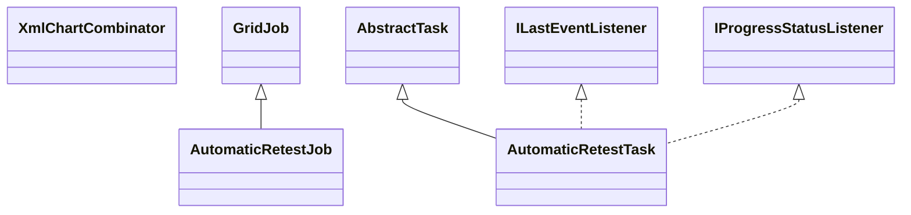

# TaskAutomaticRetest.jar

[Group index](README.md) | [All archives](../README.md)

## Scope and provenance

- **Donor:** `SQX_145_REFERENCE_ROOT/internal/plugins/TaskAutomaticRetest/TaskAutomaticRetest.jar`.
- **SHA-256:** `be3c69292d3dd949a7324a7527d105ea1320c7b02493ee6be00b1cc013ac73b1`; accessed 2026-10-06; captured `2026-10-06T18:54:51.906614+00:00`.
- **Classes:** 6 raw entries; 6 unique entry names. Duplicate occurrence indices are zero-based.
- **Inspection:** read-only ZIP hashing and class-file structural parsing; signatures/descriptors, modifiers, hierarchy and references only. Bytecode bodies are hashed, not published.
- **Allocation:** proposed `FEAT-ROBUSTNESS-TASK-AUTOMATIC-RETEST`, P11; [roadmap](../../dev/sqx-full-application-roadmap.md). Domain README registration remains required.
- **Repository:** `01067f00031428613c6394064ca1bcadc1ba00ee`; review state unreviewed. Download label 145-dev1; installed build/activation and runtime equivalence unverified.
- **Limit:** every class/member is inventoried; declaration coverage does not establish consumed calls, defaults, formulas, failure semantics or algorithm parity.
- **Archive/resource index:** [269.json](../../dev/evidence/sqx145/archives/145/269.json).

## Complete member declarations

Member shards contain exact JVM names/descriptors, access flags, generic signatures, throws types, declared fields/methods, superclass/interfaces and referenced class names. All classes, nested/synthetic members and overloads are retained. Code length/hash is structural evidence, not a normalized algorithm comparison.

- [001.json](../../dev/evidence/sqx145/members/269/001.json) — SHA-256 `92e3a2e0de9345bce20a30fa65b32a011e663c084f71e2c9ba5d32d9996be8b4`.

## Focused structural diagram

Up to twelve non-nested classes; arrows show declared inheritance/interfaces only. External type names are not evidence of an available body or an executed dependency.

## Class inventory

| Archive entry | Occurrence | Class SHA-256 | Fields | Methods |
| --- | ---: | --- | ---: | ---: |
| `com/strategyquant/plugin/Task/impl/AutomaticRetest/AutomaticRetestJob.class` | 0 | `27cedbb6d1908f510803c1ab6794e1ac98e10f649e4f49c1fb6ac22b4697ca89` | 5 | 6 |
| `com/strategyquant/plugin/Task/impl/AutomaticRetest/AutomaticRetestTask$1.class` | 0 | `398015d0b44d4a48c790c9bc10486110b43ca3bcc15577bf6a7e0939ca13fed3` | 1 | 2 |
| `com/strategyquant/plugin/Task/impl/AutomaticRetest/AutomaticRetestTask$2.class` | 0 | `fede7ff3b8184b04701242822b8816698bccd6a3d7c3f891fc9663652376e30b` | 1 | 2 |
| `com/strategyquant/plugin/Task/impl/AutomaticRetest/AutomaticRetestTask.class` | 0 | `3a1c0202d0d129722ec5070111800a02f56b7b9655d0bf2060875f047be6c3a9` | 31 | 33 |
| `com/strategyquant/plugin/Task/impl/AutomaticRetest/XmlChartCombinator$Variation.class` | 0 | `1bf19ac9ebade81942473ef5f63c7b55d31a8cdd82cd786272769add67d86622` | 2 | 1 |
| `com/strategyquant/plugin/Task/impl/AutomaticRetest/XmlChartCombinator.class` | 0 | `75b13c86f60a02cfeab471106ec40c50db37db70fc5c720a593d4334efa49490` | 1 | 7 |
