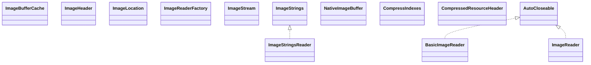

# jrt-fs.jar

[Group index](README.md) | [All archives](../README.md)

## Scope and provenance

- **Donor:** `SQX_145_REFERENCE_ROOT/j64/lib/jrt-fs.jar`.
- **SHA-256:** `085f7db20ffb6e9f836fc7ffddc85be80ab36adb5eb1debe728913562416a342`; accessed 2026-10-06; captured `2026-10-06T18:54:51.906614+00:00`.
- **Classes:** 57 raw entries; 57 unique entry names. Duplicate occurrence indices are zero-based.
- **Inspection:** read-only ZIP hashing and class-file structural parsing; signatures/descriptors, modifiers, hierarchy and references only. Bytecode bodies are hashed, not published.
- **Allocation:** proposed `FEAT-HOST-JRT-FS`, P00; [roadmap](../../dev/sqx-full-application-roadmap.md). Domain README registration remains required.
- **Repository:** `01067f00031428613c6394064ca1bcadc1ba00ee`; review state unreviewed. Download label 145-dev1; installed build/activation and runtime equivalence unverified.
- **Limit:** every class/member is inventoried; declaration coverage does not establish consumed calls, defaults, formulas, failure semantics or algorithm parity.
- **Archive/resource index:** [289.json](../../dev/evidence/sqx145/archives/145/289.json).

## Complete member declarations

Member shards contain exact JVM names/descriptors, access flags, generic signatures, throws types, declared fields/methods, superclass/interfaces and referenced class names. All classes, nested/synthetic members and overloads are retained. Code length/hash is structural evidence, not a normalized algorithm comparison.

- [001.json](../../dev/evidence/sqx145/members/289/001.json) — SHA-256 `e8b985abd3dd99cca0604c9927715f77f94c6355854a389adc5c92a26052919b`.

## Focused structural diagram

Up to twelve non-nested classes; arrows show declared inheritance/interfaces only. External type names are not evidence of an available body or an executed dependency.

## Class inventory

| Archive entry | Occurrence | Class SHA-256 | Fields | Methods |
| --- | ---: | --- | ---: | ---: |
| `jdk/internal/jimage/BasicImageReader$1.class` | 0 | `1aefb9bbb5457fc76112625c9d6cd170e38acbc24a89e1c3ca2687e142691e29` | 3 | 3 |
| `jdk/internal/jimage/BasicImageReader$2.class` | 0 | `b9c6b34549f9c502607d6cdf9078e0721ed41deb146aec4ee0d04cbc659f9048` | 1 | 3 |
| `jdk/internal/jimage/BasicImageReader.class` | 0 | `05e53cd7c95213c31d08f3fde18e69ca2ac38f50a562550450ec1c818f001b5a` | 16 | 36 |
| `jdk/internal/jimage/ImageBufferCache$1.class` | 0 | `2e8574a13236f2c455c003ed0ee29a9d68408ab2577077f1d0bad20dd391bc1d` | 0 | 3 |
| `jdk/internal/jimage/ImageBufferCache$2.class` | 0 | `a79cf24da21fe93835d484176b2d0d19c78accca93c3a62a20840edeb16e8374` | 0 | 3 |
| `jdk/internal/jimage/ImageBufferCache.class` | 0 | `1a43abd380a44779e120b38b4840679f04cbac30ed66bd45c4e605c0858f95d9` | 4 | 9 |
| `jdk/internal/jimage/ImageHeader.class` | 0 | `6920172d9bfde5d8579a4a5d1bf59f07dad961d78f7ab2d18d3afbec30e1e8f0` | 12 | 21 |
| `jdk/internal/jimage/ImageLocation.class` | 0 | `25e9d7704b722e95f69721b6d1c896f37295fbe822dcbb3e773d7b5bfa4db18b` | 11 | 27 |
| `jdk/internal/jimage/ImageReader$1.class` | 0 | `add085edfb225d29f25e8546da3a52002b1cdc4e42032f2f59da17d9ca7eb946` | 0 | 0 |
| `jdk/internal/jimage/ImageReader$Directory.class` | 0 | `84b518f976066b937dc0d5b9af9f9d2a1533cece6fb6e55b56c9face7598761e` | 2 | 7 |
| `jdk/internal/jimage/ImageReader$LinkNode.class` | 0 | `a987db60e958479704e0d7fb28367793852d78bc0485dfc9246b5cf9deba3ece` | 1 | 5 |
| `jdk/internal/jimage/ImageReader$Node.class` | 0 | `3d3d6fc65da1bfe43702576a903a0464ab1d51ab2236974a7c9239b1259b7bed` | 7 | 30 |
| `jdk/internal/jimage/ImageReader$Resource.class` | 0 | `f3804e7d1bccc13cf890d2462c269302aaae111525291957b48845471f8e413c` | 1 | 9 |
| `jdk/internal/jimage/ImageReader$SharedImageReader$LocationVisitor.class` | 0 | `1894cb8ca80d0f1f47664f27926904be9336b917a761c33aba6d0b89c636da59` | 0 | 1 |
| `jdk/internal/jimage/ImageReader$SharedImageReader.class` | 0 | `a5322c669eb5efd7044ad78a95451bb82d43112e1c30f02a5098aeef2d8c45ea` | 9 | 27 |
| `jdk/internal/jimage/ImageReader.class` | 0 | `5af6ecd9d57ab5a0143ae5242759e6afd275a9774f62a99bbe982bfdfb12439d` | 2 | 30 |
| `jdk/internal/jimage/ImageReaderFactory$1.class` | 0 | `34aa6b3776df720d03140fdc84aeb820aa9555344fa443509a59b3878e7a0dc0` | 0 | 3 |
| `jdk/internal/jimage/ImageReaderFactory.class` | 0 | `57f1659b1c91f0e35fc9b40bde3e1f22b6d3230043c5daaa2fedccbc63e15dde` | 4 | 4 |
| `jdk/internal/jimage/ImageStream.class` | 0 | `faf620f2475593b5b4bdd2e99e0239e7618b204e30999ad175b1143e5e928286` | 1 | 31 |
| `jdk/internal/jimage/ImageStrings.class` | 0 | `6fdf96f15984a7e3e5280f14f4b06b3d2856d6db73603232d0b22dfaa5bb108b` | 0 | 3 |
| `jdk/internal/jimage/ImageStringsReader.class` | 0 | `b7ab8b1c2db668e43b6c24cf4fc5ed6481e036069bbb904cbf00f6195d106555` | 3 | 21 |
| `jdk/internal/jimage/NativeImageBuffer$1.class` | 0 | `db8a9d7a84d2d4f784f6513bbc72cf2b84cfe27bfb58578f068b17a9a10a5e6c` | 0 | 3 |
| `jdk/internal/jimage/NativeImageBuffer.class` | 0 | `dbd71ebc2f1d6b1726993398be23f0ca21008fc3bb57d7873d0deb4308bfcd94` | 0 | 3 |
| `jdk/internal/jimage/decompressor/CompressIndexes.class` | 0 | `bfee428feb16d8a9a31941906e483a252b6ee7deec3417b30601b8912f29935c` | 3 | 8 |
| `jdk/internal/jimage/decompressor/CompressedResourceHeader.class` | 0 | `54494b420212b017eb81bf7da4172f6c22abc099db35bc9796ac6743e5c50bf2` | 11 | 8 |
| `jdk/internal/jimage/decompressor/Decompressor.class` | 0 | `62a2b577cfca0044f70bbc66c2f0db9e614809d468343332b4ff23703ace2a1a` | 1 | 2 |
| `jdk/internal/jimage/decompressor/ResourceDecompressor$StringsProvider.class` | 0 | `8c518f1dc348881216b00dc35a55e808b990a707e50eba4c896045bc95284a77` | 0 | 1 |
| `jdk/internal/jimage/decompressor/ResourceDecompressor.class` | 0 | `350e4f04ce5fc94ef9316a33ddd9f707d0923da9b64bbd252feec3ac92831fdd` | 0 | 2 |
| `jdk/internal/jimage/decompressor/ResourceDecompressorFactory.class` | 0 | `685daa98422b334b7ebaa2205344a075edd629e201c9e89b067fa9d5b02f6b5c` | 1 | 3 |
| `jdk/internal/jimage/decompressor/ResourceDecompressorRepository.class` | 0 | `6d00a10fdf6767be57a436d786aa56fb5bcf7bf5e66c2a356decfa49b5d8a383` | 1 | 4 |
| `jdk/internal/jimage/decompressor/SignatureParser$1.class` | 0 | `3a434392689ae6d5cb03fc9985de607ae85116cb6f31caf6d81124176621507a` | 0 | 0 |
| `jdk/internal/jimage/decompressor/SignatureParser$ParseResult.class` | 0 | `ee2ce698dfd8a85896282ef5a5cdce228415c81d3ffdce337c897939b29595e0` | 2 | 2 |
| `jdk/internal/jimage/decompressor/SignatureParser.class` | 0 | `e7cbaa614c0722c311221526c77b94986e8b7a5cd66eee616686ffd35e004a41` | 0 | 3 |
| `jdk/internal/jimage/decompressor/StringSharingDecompressor.class` | 0 | `d7a30b8fded16bd67260224a194fa5eb3a4e3aa839501e49529efeeb3ff8e7e0` | 19 | 10 |
| `jdk/internal/jimage/decompressor/StringSharingDecompressorFactory.class` | 0 | `91425b458e4450605f114a7475786db7e9418ac8805e9328005d7fe162cc7d3e` | 1 | 2 |
| `jdk/internal/jimage/decompressor/ZipDecompressor.class` | 0 | `6396b5b5ce25de3af50cac8a14e5deee38fd84c169fe9d25a4e5bfe11308e7ba` | 0 | 4 |
| `jdk/internal/jimage/decompressor/ZipDecompressorFactory.class` | 0 | `1056b639f5fb0e3e8f7d32032bf10ec3f211b2974ac6b132aa06e5fca357e3df` | 1 | 2 |
| `jdk/internal/jrtfs/ExplodedImage$PathNode.class` | 0 | `e2bc18d469f550dde8701a4e22798d7d629f4bcf1868d1454b7440c16687376a` | 4 | 10 |
| `jdk/internal/jrtfs/ExplodedImage.class` | 0 | `2658b2ad3deb4b5d3e6788b77797c006bf8c2382924adc21e85dad4d7c3ac8a4` | 7 | 15 |
| `jdk/internal/jrtfs/JrtDirectoryStream$1.class` | 0 | `46c687339e5b421d4daa951ea40fd485a46cf460c014c2b7a0f5fcae84e7c4ce` | 1 | 4 |
| `jdk/internal/jrtfs/JrtDirectoryStream.class` | 0 | `fe655311a30b794e4639326d6819766d2b074f65b0cd06148503f4e2a404ead9` | 4 | 5 |
| `jdk/internal/jrtfs/JrtFileAttributeView$AttrID.class` | 0 | `751022e58f1d34333339604d275f57a2381bbdc953f9a37934cc44f1a12b1553` | 12 | 5 |
| `jdk/internal/jrtfs/JrtFileAttributeView.class` | 0 | `5ac971519846f7da5a55140ab87411fc6fb98d89e70833dd3478ab0cf9809d95` | 3 | 10 |
| `jdk/internal/jrtfs/JrtFileAttributes.class` | 0 | `c6af504c8608da778f89f4b53d0948162b065c00789dcfad9976496acf6a3b2d` | 1 | 13 |
| `jdk/internal/jrtfs/JrtFileStore.class` | 0 | `72d0e536e13cb401b86305446fe8d5391b7ed14a6bf422ccf3f44da69f35a95a` | 1 | 11 |
| `jdk/internal/jrtfs/JrtFileSystem$1.class` | 0 | `412434132c65a856302db8622f09a3662db43624c1da606018168d1b06c5d63b` | 4 | 9 |
| `jdk/internal/jrtfs/JrtFileSystem.class` | 0 | `2cb1ae6593d652c66a0c7e08108d66aaf73adfe0c1595de31191e32c08f6740e` | 6 | 47 |
| `jdk/internal/jrtfs/JrtFileSystemProvider$1.class` | 0 | `3c6bfa9174b2a763a22a2c18cceb6432c2d7b00839db89b8802d5244e63eb5bc` | 1 | 3 |
| `jdk/internal/jrtfs/JrtFileSystemProvider$JrtFsLoader.class` | 0 | `01362538a71179f9a0e0acbf167b28dd17d8dbefd0e109004a9dac99bab8865c` | 0 | 2 |
| `jdk/internal/jrtfs/JrtFileSystemProvider.class` | 0 | `6e91de56a9f0254674687f9fbe6fbdea3deb985af9dd84881bf6f486dac05cac` | 2 | 30 |
| `jdk/internal/jrtfs/JrtPath$1.class` | 0 | `001d595404705dfc745e148725ab951efc6b0229bc0106209213422c03a3882d` | 2 | 5 |
| `jdk/internal/jrtfs/JrtPath$2.class` | 0 | `808b190afd846b33f8b793370381ce53ad658aa2ad232aafb1f4f5cc9ea2891e` | 1 | 1 |
| `jdk/internal/jrtfs/JrtPath.class` | 0 | `21576d7f93f00269ea888d3000919a3d1148e74a7677f6637b0b48bda2c88612` | 24 | 81 |
| `jdk/internal/jrtfs/JrtUtils.class` | 0 | `988e164a0967c2fdcc3ffeec60d838f4f9ddc69645a7338b3e25823973500d3b` | 3 | 5 |
| `jdk/internal/jrtfs/SystemImage$1.class` | 0 | `8e183dd7ce7a884b463e633c373fb24e7ad1131e3f2f63ace2c86fe97eef5d99` | 1 | 4 |
| `jdk/internal/jrtfs/SystemImage$2.class` | 0 | `87940c51e6e50972f78c976206503e5f2ed31db13a1dca17b8b29b739bb6b9ac` | 0 | 3 |
| `jdk/internal/jrtfs/SystemImage.class` | 0 | `52cc1ba2443bacbd206b35fc835896bbb88945a4054671811e29cbe1b0e9758b` | 4 | 7 |
