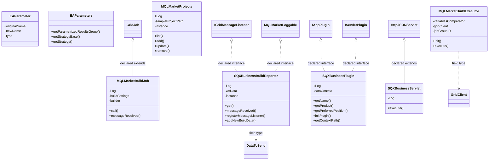

# AppSQXBusiness.jar

[Workspace/group index](README.md)  |  [All workspaces](../README.md)

## Scope and provenance

- Artifact: `SQX_REFERENCE_ROOT/internal/plugins/AppSQXBusiness/AppSQXBusiness.jar`.
- SHA-256: `1629d659fc78cb2553b16103616b4fd321f12e5096f0c6f50ab18f8c4f0c2530`.
- Inspected: 2026-10-05; generation timestamp `2026-10-05T19:04:16.344170+00:00`.
- Archive class entries: **10**; non-nested: **8**; nested/anonymous: **2**.
- Inspection: ZIP entry/manifest enumeration and `javap -p` declarations for every listed class.
- Repository source HEAD: `8a92c705183a6702eaf62037ccb202ed028aa899`; review state: generated, pending owner review.
- Installed SQX build number is unverified. No method bodies are reproduced.
- Confidence: high for declared structure; workspace ownership inferred except where registration evidence is separately stated. Runtime reachability, call order, formulas and parity remain unverified.

The `SQXBusiness` folder is a navigation/research grouping, not an exclusive backend owner. Shared consumers may use this JAR.

Target mapping: no verified owning HaruQuantAI feature/requirement/decision IDs are assigned by this document. Register or resolve ownership through the normal repository plan before implementation.

## Diagram reading guide

`Parent <|-- Child` means declared inheritance; `Interface <|.. Class` means declared implementation. Interface extension uses the inheritance arrow. `A ..> B : field type` is a declared type dependency, not composition, object ownership or a runtime call. External nodes are referenced types, not fabricated local implementations. Selected fields/method names aid navigation: `+` is public, `#` protected and `-` private. Diagram method names omit parameter/return types and collapse overloads; use the exact inspected declarations below before implementing an API.

Detailed graphs include non-nested classes in package-sized groups of at most 12. Nested/anonymous classes are inventoried and their declarations/relationships are retained below, but omitted from overview graphs. Relationships not drawn for readability remain in the complete declaration-relationship table. Constructors, synthetic bridges and overloads may be collapsed in diagram member lists only. Standard `java.lang.Object` inheritance is omitted from diagrams.

## UML class diagrams

### 1. `com.strategyquant.plugin.App.impl.SQXBusiness`



| Diagram identifier | Exact type | Location |
| --- | --- | --- |
| `C2d5349dc1f49` | [`com.strategyquant.gridlib.client.GridClient`](../Shared/SQGridLib2.md) | referenced external type |
| `C729a56512564` | [`com.strategyquant.gridlib.client.GridJob`](../Shared/SQGridLib2.md) | referenced external type |
| `C8470fa154fcb` | [`com.strategyquant.gridlib.client.IGridMessageListener`](../Shared/SQGridLib2.md) | referenced external type |
| `C99590a979c84` | `com.strategyquant.lib.sqxbusiness.MQLMarketLoggable` (not resolved in scoped archives) | referenced external type |
| `C90abec2c96ef` | `com.strategyquant.plugin.App.impl.SQXBusiness.EAParameter` (this JAR) | this diagram |
| `Cbbca45d67ab5` | `com.strategyquant.plugin.App.impl.SQXBusiness.EAParameters` (this JAR) | this diagram |
| `C84cb4ea075c9` | `com.strategyquant.plugin.App.impl.SQXBusiness.MQLMarketBuildExecutor` (this JAR) | this diagram |
| `C0c388467bc30` | `com.strategyquant.plugin.App.impl.SQXBusiness.MQLMarketBuildJob` (this JAR) | this diagram |
| `C4ccecde6ce03` | `com.strategyquant.plugin.App.impl.SQXBusiness.MQLMarketProjects` (this JAR) | this diagram |
| `C388f542c378d` | `com.strategyquant.plugin.App.impl.SQXBusiness.SQXBusinessBuildReporter` (this JAR) | this diagram |
| `C10426ba0804c` | `com.strategyquant.plugin.App.impl.SQXBusiness.SQXBusinessPlugin` (this JAR) | this diagram |
| `C581eab494cdc` | `com.strategyquant.plugin.App.impl.SQXBusiness.SQXBusinessServlet` (this JAR) | this diagram |
| `C71ae2af47347` | [`com.strategyquant.tradinglib.plugindef.app.IAppPlugin`](../Shared/SQTradingLib.md) | referenced external type |
| `C6128eed56b6d` | [`com.strategyquant.tradinglib.project.websocket.DataToSend`](../Shared/SQTradingLib.md) | referenced external type |
| `C249b5c671b1a` | [`com.strategyquant.tradinglib.servlet.IServletPlugin`](../Shared/SQTradingLib.md) | referenced external type |
| `C8900f90ae594` | [`com.strategyquant.webguilib.servlet.HttpJSONServlet`](../Shared/SQWebGUILib.md) | referenced external type |

## Complete class inventory

| Fully qualified class | Kind | Entry |
| --- | --- | --- |
| `com.strategyquant.plugin.App.impl.SQXBusiness.EAParameter` | class | non-nested |
| `com.strategyquant.plugin.App.impl.SQXBusiness.EAParameters` | class | non-nested |
| `com.strategyquant.plugin.App.impl.SQXBusiness.MQLMarketBuildExecutor` | class | non-nested |
| `com.strategyquant.plugin.App.impl.SQXBusiness.MQLMarketBuildExecutor$1` | class | nested/anonymous |
| `com.strategyquant.plugin.App.impl.SQXBusiness.MQLMarketBuildJob` | class | non-nested |
| `com.strategyquant.plugin.App.impl.SQXBusiness.MQLMarketProjects` | class | non-nested |
| `com.strategyquant.plugin.App.impl.SQXBusiness.SQXBusinessBuildReporter` | class | non-nested |
| `com.strategyquant.plugin.App.impl.SQXBusiness.SQXBusinessBuildReporter$1` | class | nested/anonymous |
| `com.strategyquant.plugin.App.impl.SQXBusiness.SQXBusinessPlugin` | class | non-nested |
| `com.strategyquant.plugin.App.impl.SQXBusiness.SQXBusinessServlet` | class | non-nested |

## Declared relationships and evidence locations

Every row is supported by the named class declaration/member in `javap -p`, inside the artifact recorded above. Signature dependencies may include return, parameter, generic-argument and throws types; they do not imply execution.

| Declaring class | Referenced type | Relationship | Narrow inspection location |
| --- | --- | --- | --- |
| `com.strategyquant.plugin.App.impl.SQXBusiness.EAParameter` | `java.lang.String` (not resolved in scoped archives) | type dependency | `com.strategyquant.plugin.App.impl.SQXBusiness.EAParameter` / field declaration: `public java.lang.String originalName;`<br>`public java.lang.String newName;`<br>`public java.lang.String type;`<br>`public java.lang.String value;` |
| `com.strategyquant.plugin.App.impl.SQXBusiness.EAParameter` | `org.jdom2.Element` (not resolved in scoped archives) | type dependency | `com.strategyquant.plugin.App.impl.SQXBusiness.EAParameter` / method signature: `public com.strategyquant.plugin.App.impl.SQXBusiness.EAParameter(org.jdom2.Element);` |
| `com.strategyquant.plugin.App.impl.SQXBusiness.EAParameters` | [`com.strategyquant.tradinglib.ResultsGroup`](../Shared/SQTradingLib.md) | type dependency | `com.strategyquant.plugin.App.impl.SQXBusiness.EAParameters` / method signature: `public static com.strategyquant.tradinglib.ResultsGroup getParametrizedResultsGroup(org.jdom2.Element) throws java.lang.Exception;`<br>`public static com.strategyquant.tradinglib.ResultsGroup getStrategy(org.jdom2.Element) throws java.lang.Exception;` |
| `com.strategyquant.plugin.App.impl.SQXBusiness.EAParameters` | `org.jdom2.Element` (not resolved in scoped archives) | type dependency | `com.strategyquant.plugin.App.impl.SQXBusiness.EAParameters` / method signature: `public static com.strategyquant.tradinglib.ResultsGroup getParametrizedResultsGroup(org.jdom2.Element) throws java.lang.Exception;`<br>`public static com.strategyquant.tradinglib.StrategyBase getStrategyBase(org.jdom2.Element) throws java.lang.Exception;`<br>`public static com.strategyquant.tradinglib.ResultsGroup getStrategy(org.jdom2.Element) throws java.lang.Exception;` |
| `com.strategyquant.plugin.App.impl.SQXBusiness.EAParameters` | `java.lang.Exception` (not resolved in scoped archives) | type dependency | `com.strategyquant.plugin.App.impl.SQXBusiness.EAParameters` / method signature: `public static com.strategyquant.tradinglib.ResultsGroup getParametrizedResultsGroup(org.jdom2.Element) throws java.lang.Exception;`<br>`public static com.strategyquant.tradinglib.StrategyBase getStrategyBase(org.jdom2.Element) throws java.lang.Exception;`<br>`public static com.strategyquant.tradinglib.ResultsGroup getStrategy(org.jdom2.Element) throws java.lang.Exception;` |
| `com.strategyquant.plugin.App.impl.SQXBusiness.EAParameters` | [`com.strategyquant.tradinglib.StrategyBase`](../Shared/SQTradingLib.md) | type dependency | `com.strategyquant.plugin.App.impl.SQXBusiness.EAParameters` / method signature: `public static com.strategyquant.tradinglib.StrategyBase getStrategyBase(org.jdom2.Element) throws java.lang.Exception;` |
| `com.strategyquant.plugin.App.impl.SQXBusiness.MQLMarketBuildExecutor` | `java.util.Comparator` (not resolved in scoped archives) | type dependency | `com.strategyquant.plugin.App.impl.SQXBusiness.MQLMarketBuildExecutor` / field declaration: `private static final java.util.Comparator<org.jdom2.Element> variablesComparator;` |
| `com.strategyquant.plugin.App.impl.SQXBusiness.MQLMarketBuildExecutor` | `org.jdom2.Element` (not resolved in scoped archives) | type dependency | `com.strategyquant.plugin.App.impl.SQXBusiness.MQLMarketBuildExecutor` / field declaration: `private static final java.util.Comparator<org.jdom2.Element> variablesComparator;` |
| `com.strategyquant.plugin.App.impl.SQXBusiness.MQLMarketBuildExecutor` | `org.jdom2.Element` (not resolved in scoped archives) | type dependency | `com.strategyquant.plugin.App.impl.SQXBusiness.MQLMarketBuildExecutor` / method signature: `public static void execute(java.lang.String, org.jdom2.Element, java.lang.String, java.lang.String) throws java.lang.Exception;`<br>`private static java.util.List<com.strategyquant.plugin.App.impl.SQXBusiness.MQLMarketBuildJob> prepareJobs(java.lang.String, org.jdom2.Element, java.lang.String, java.lang.String) throws java.lang.Exception;`<br>`private static void tryAddJobs(java.util.List<com.strategyquant.plugin.App.impl.SQXBusiness.MQLMarketBuildJob>, java.lang.String, java.lang.String, org.jdom2.Element, com.strategyquant.lib.sqxbusiness.MQLMarketBuildSettings, java.lang.String) throws java.lang.Exception;`<br>`private static org.jdom2.Element getStrategyXML(org.jdom2.Element) throws java.lang.Exception;`<br>`private static java.util.HashMap<java.lang.String, com.strategyquant.plugin.App.impl.SQXBusiness.EAParameter> getEAParameters(org.jdom2.Element) throws java.lang.Exception;` |
| `com.strategyquant.plugin.App.impl.SQXBusiness.MQLMarketBuildExecutor` | [`com.strategyquant.gridlib.client.GridClient`](../Shared/SQGridLib2.md) | type dependency | `com.strategyquant.plugin.App.impl.SQXBusiness.MQLMarketBuildExecutor` / field declaration: `private static com.strategyquant.gridlib.client.GridClient gridClient;` |
| `com.strategyquant.plugin.App.impl.SQXBusiness.MQLMarketBuildExecutor` | `java.lang.String` (not resolved in scoped archives) | type dependency | `com.strategyquant.plugin.App.impl.SQXBusiness.MQLMarketBuildExecutor` / field declaration: `private static java.lang.String jobGroupID;` |
| `com.strategyquant.plugin.App.impl.SQXBusiness.MQLMarketBuildExecutor` | `java.lang.String` (not resolved in scoped archives) | type dependency | `com.strategyquant.plugin.App.impl.SQXBusiness.MQLMarketBuildExecutor` / method signature: `public static void execute(java.lang.String, org.jdom2.Element, java.lang.String, java.lang.String) throws java.lang.Exception;`<br>`private static java.util.List<com.strategyquant.plugin.App.impl.SQXBusiness.MQLMarketBuildJob> prepareJobs(java.lang.String, org.jdom2.Element, java.lang.String, java.lang.String) throws java.lang.Exception;`<br>`private static void tryAddJobs(java.util.List<com.strategyquant.plugin.App.impl.SQXBusiness.MQLMarketBuildJob>, java.lang.String, java.lang.String, org.jdom2.Element, com.strategyquant.lib.sqxbusiness.MQLMarketBuildSettings, java.lang.String) throws java.lang.Exception;`<br>`private static java.util.HashMap<java.lang.String, com.strategyquant.plugin.App.impl.SQXBusiness.EAParameter> getEAParameters(org.jdom2.Element) throws java.lang.Exception;` |
| `com.strategyquant.plugin.App.impl.SQXBusiness.MQLMarketBuildExecutor` | `java.lang.Exception` (not resolved in scoped archives) | type dependency | `com.strategyquant.plugin.App.impl.SQXBusiness.MQLMarketBuildExecutor` / method signature: `public static void execute(java.lang.String, org.jdom2.Element, java.lang.String, java.lang.String) throws java.lang.Exception;`<br>`private static java.util.List<com.strategyquant.plugin.App.impl.SQXBusiness.MQLMarketBuildJob> prepareJobs(java.lang.String, org.jdom2.Element, java.lang.String, java.lang.String) throws java.lang.Exception;`<br>`private static void tryAddJobs(java.util.List<com.strategyquant.plugin.App.impl.SQXBusiness.MQLMarketBuildJob>, java.lang.String, java.lang.String, org.jdom2.Element, com.strategyquant.lib.sqxbusiness.MQLMarketBuildSettings, java.lang.String) throws java.lang.Exception;`<br>`private static org.jdom2.Element getStrategyXML(org.jdom2.Element) throws java.lang.Exception;`<br>`private static java.util.HashMap<java.lang.String, com.strategyquant.plugin.App.impl.SQXBusiness.EAParameter> getEAParameters(org.jdom2.Element) throws java.lang.Exception;` |
| `com.strategyquant.plugin.App.impl.SQXBusiness.MQLMarketBuildExecutor` | `java.util.List` (not resolved in scoped archives) | type dependency | `com.strategyquant.plugin.App.impl.SQXBusiness.MQLMarketBuildExecutor` / method signature: `private static java.util.List<com.strategyquant.plugin.App.impl.SQXBusiness.MQLMarketBuildJob> prepareJobs(java.lang.String, org.jdom2.Element, java.lang.String, java.lang.String) throws java.lang.Exception;`<br>`private static void tryAddJobs(java.util.List<com.strategyquant.plugin.App.impl.SQXBusiness.MQLMarketBuildJob>, java.lang.String, java.lang.String, org.jdom2.Element, com.strategyquant.lib.sqxbusiness.MQLMarketBuildSettings, java.lang.String) throws java.lang.Exception;` |
| `com.strategyquant.plugin.App.impl.SQXBusiness.MQLMarketBuildExecutor` | `com.strategyquant.plugin.App.impl.SQXBusiness.MQLMarketBuildJob` (this JAR) | type dependency | `com.strategyquant.plugin.App.impl.SQXBusiness.MQLMarketBuildExecutor` / method signature: `private static java.util.List<com.strategyquant.plugin.App.impl.SQXBusiness.MQLMarketBuildJob> prepareJobs(java.lang.String, org.jdom2.Element, java.lang.String, java.lang.String) throws java.lang.Exception;`<br>`private static void tryAddJobs(java.util.List<com.strategyquant.plugin.App.impl.SQXBusiness.MQLMarketBuildJob>, java.lang.String, java.lang.String, org.jdom2.Element, com.strategyquant.lib.sqxbusiness.MQLMarketBuildSettings, java.lang.String) throws java.lang.Exception;` |
| `com.strategyquant.plugin.App.impl.SQXBusiness.MQLMarketBuildExecutor` | `com.strategyquant.lib.sqxbusiness.MQLMarketBuildSettings` (not resolved in scoped archives) | type dependency | `com.strategyquant.plugin.App.impl.SQXBusiness.MQLMarketBuildExecutor` / method signature: `private static void tryAddJobs(java.util.List<com.strategyquant.plugin.App.impl.SQXBusiness.MQLMarketBuildJob>, java.lang.String, java.lang.String, org.jdom2.Element, com.strategyquant.lib.sqxbusiness.MQLMarketBuildSettings, java.lang.String) throws java.lang.Exception;` |
| `com.strategyquant.plugin.App.impl.SQXBusiness.MQLMarketBuildExecutor` | `java.util.HashMap` (not resolved in scoped archives) | type dependency | `com.strategyquant.plugin.App.impl.SQXBusiness.MQLMarketBuildExecutor` / method signature: `private static java.util.HashMap<java.lang.String, com.strategyquant.plugin.App.impl.SQXBusiness.EAParameter> getEAParameters(org.jdom2.Element) throws java.lang.Exception;` |
| `com.strategyquant.plugin.App.impl.SQXBusiness.MQLMarketBuildExecutor` | `com.strategyquant.plugin.App.impl.SQXBusiness.EAParameter` (this JAR) | type dependency | `com.strategyquant.plugin.App.impl.SQXBusiness.MQLMarketBuildExecutor` / method signature: `private static java.util.HashMap<java.lang.String, com.strategyquant.plugin.App.impl.SQXBusiness.EAParameter> getEAParameters(org.jdom2.Element) throws java.lang.Exception;` |
| `com.strategyquant.plugin.App.impl.SQXBusiness.MQLMarketBuildExecutor$1` | `java.util.Comparator` (not resolved in scoped archives) | implements | `com.strategyquant.plugin.App.impl.SQXBusiness.MQLMarketBuildExecutor$1` / class declaration: `class com.strategyquant.plugin.App.impl.SQXBusiness.MQLMarketBuildExecutor$1 implements java.util.Comparator<org.jdom2.Element>` |
| `com.strategyquant.plugin.App.impl.SQXBusiness.MQLMarketBuildExecutor$1` | `org.jdom2.Element` (not resolved in scoped archives) | type dependency | `com.strategyquant.plugin.App.impl.SQXBusiness.MQLMarketBuildExecutor$1` / method signature: `public int compare(org.jdom2.Element, org.jdom2.Element);` |
| `com.strategyquant.plugin.App.impl.SQXBusiness.MQLMarketBuildExecutor$1` | `java.lang.Object` (not resolved in scoped archives) | type dependency | `com.strategyquant.plugin.App.impl.SQXBusiness.MQLMarketBuildExecutor$1` / method signature: `public int compare(java.lang.Object, java.lang.Object);` |
| `com.strategyquant.plugin.App.impl.SQXBusiness.MQLMarketBuildJob` | [`com.strategyquant.gridlib.client.GridJob`](../Shared/SQGridLib2.md) | extends | `com.strategyquant.plugin.App.impl.SQXBusiness.MQLMarketBuildJob` / class declaration: `public class com.strategyquant.plugin.App.impl.SQXBusiness.MQLMarketBuildJob extends com.strategyquant.gridlib.client.GridJob<com.strategyquant.lib.sqxbusiness.MQLMarketBuildResult>` |
| `com.strategyquant.plugin.App.impl.SQXBusiness.MQLMarketBuildJob` | `org.slf4j.Logger` (not resolved in scoped archives) | type dependency | `com.strategyquant.plugin.App.impl.SQXBusiness.MQLMarketBuildJob` / field declaration: `private static final org.slf4j.Logger Log;` |
| `com.strategyquant.plugin.App.impl.SQXBusiness.MQLMarketBuildJob` | `com.strategyquant.lib.sqxbusiness.MQLMarketBuildSettings` (not resolved in scoped archives) | type dependency | `com.strategyquant.plugin.App.impl.SQXBusiness.MQLMarketBuildJob` / field declaration: `private com.strategyquant.lib.sqxbusiness.MQLMarketBuildSettings buildSettings;` |
| `com.strategyquant.plugin.App.impl.SQXBusiness.MQLMarketBuildJob` | `com.strategyquant.lib.sqxbusiness.MQLMarketBuilder` (not resolved in scoped archives) | type dependency | `com.strategyquant.plugin.App.impl.SQXBusiness.MQLMarketBuildJob` / field declaration: `private com.strategyquant.lib.sqxbusiness.MQLMarketBuilder builder;` |
| `com.strategyquant.plugin.App.impl.SQXBusiness.MQLMarketBuildJob` | `java.lang.String` (not resolved in scoped archives) | type dependency | `com.strategyquant.plugin.App.impl.SQXBusiness.MQLMarketBuildJob` / method signature: `public com.strategyquant.plugin.App.impl.SQXBusiness.MQLMarketBuildJob(java.lang.String, int, java.util.Map<java.lang.String, java.io.Serializable>);` |
| `com.strategyquant.plugin.App.impl.SQXBusiness.MQLMarketBuildJob` | `java.util.Map` (not resolved in scoped archives) | type dependency | `com.strategyquant.plugin.App.impl.SQXBusiness.MQLMarketBuildJob` / method signature: `public com.strategyquant.plugin.App.impl.SQXBusiness.MQLMarketBuildJob(java.lang.String, int, java.util.Map<java.lang.String, java.io.Serializable>);` |
| `com.strategyquant.plugin.App.impl.SQXBusiness.MQLMarketBuildJob` | `java.io.Serializable` (not resolved in scoped archives) | type dependency | `com.strategyquant.plugin.App.impl.SQXBusiness.MQLMarketBuildJob` / method signature: `public com.strategyquant.plugin.App.impl.SQXBusiness.MQLMarketBuildJob(java.lang.String, int, java.util.Map<java.lang.String, java.io.Serializable>);` |
| `com.strategyquant.plugin.App.impl.SQXBusiness.MQLMarketBuildJob` | `com.strategyquant.lib.sqxbusiness.MQLMarketBuildResult` (not resolved in scoped archives) | type dependency | `com.strategyquant.plugin.App.impl.SQXBusiness.MQLMarketBuildJob` / method signature: `public com.strategyquant.lib.sqxbusiness.MQLMarketBuildResult call() throws java.lang.Exception;` |
| `com.strategyquant.plugin.App.impl.SQXBusiness.MQLMarketBuildJob` | `java.lang.Exception` (not resolved in scoped archives) | type dependency | `com.strategyquant.plugin.App.impl.SQXBusiness.MQLMarketBuildJob` / method signature: `public com.strategyquant.lib.sqxbusiness.MQLMarketBuildResult call() throws java.lang.Exception;`<br>`public java.lang.Object call() throws java.lang.Exception;` |
| `com.strategyquant.plugin.App.impl.SQXBusiness.MQLMarketBuildJob` | [`com.strategyquant.gridlib.client.GridMessage`](../Shared/SQGridLib2.md) | type dependency | `com.strategyquant.plugin.App.impl.SQXBusiness.MQLMarketBuildJob` / method signature: `public void messageReceived(com.strategyquant.gridlib.client.GridMessage);` |
| `com.strategyquant.plugin.App.impl.SQXBusiness.MQLMarketBuildJob` | `java.lang.Object` (not resolved in scoped archives) | type dependency | `com.strategyquant.plugin.App.impl.SQXBusiness.MQLMarketBuildJob` / method signature: `public java.lang.Object call() throws java.lang.Exception;` |
| `com.strategyquant.plugin.App.impl.SQXBusiness.MQLMarketProjects` | `org.slf4j.Logger` (not resolved in scoped archives) | type dependency | `com.strategyquant.plugin.App.impl.SQXBusiness.MQLMarketProjects` / field declaration: `public static final org.slf4j.Logger Log;` |
| `com.strategyquant.plugin.App.impl.SQXBusiness.MQLMarketProjects` | `java.lang.String` (not resolved in scoped archives) | type dependency | `com.strategyquant.plugin.App.impl.SQXBusiness.MQLMarketProjects` / field declaration: `private static final java.lang.String sampleProjectPath;`<br>`private java.util.LinkedHashMap<java.lang.String, org.jdom2.Element> projects;` |
| `com.strategyquant.plugin.App.impl.SQXBusiness.MQLMarketProjects` | `java.lang.String` (not resolved in scoped archives) | type dependency | `com.strategyquant.plugin.App.impl.SQXBusiness.MQLMarketProjects` / method signature: `public static java.util.LinkedHashMap<java.lang.String, org.jdom2.Element> list();`<br>`public static void add(java.lang.String, org.jdom2.Element) throws java.lang.Exception;`<br>`public static void update(java.lang.String, org.jdom2.Element, java.lang.String) throws java.lang.Exception;`<br>`public static void remove(java.lang.String);` |
| `com.strategyquant.plugin.App.impl.SQXBusiness.MQLMarketProjects` | `java.util.LinkedHashMap` (not resolved in scoped archives) | type dependency | `com.strategyquant.plugin.App.impl.SQXBusiness.MQLMarketProjects` / field declaration: `private java.util.LinkedHashMap<java.lang.String, org.jdom2.Element> projects;` |
| `com.strategyquant.plugin.App.impl.SQXBusiness.MQLMarketProjects` | `java.util.LinkedHashMap` (not resolved in scoped archives) | type dependency | `com.strategyquant.plugin.App.impl.SQXBusiness.MQLMarketProjects` / method signature: `public static java.util.LinkedHashMap<java.lang.String, org.jdom2.Element> list();` |
| `com.strategyquant.plugin.App.impl.SQXBusiness.MQLMarketProjects` | `org.jdom2.Element` (not resolved in scoped archives) | type dependency | `com.strategyquant.plugin.App.impl.SQXBusiness.MQLMarketProjects` / field declaration: `private java.util.LinkedHashMap<java.lang.String, org.jdom2.Element> projects;` |
| `com.strategyquant.plugin.App.impl.SQXBusiness.MQLMarketProjects` | `org.jdom2.Element` (not resolved in scoped archives) | type dependency | `com.strategyquant.plugin.App.impl.SQXBusiness.MQLMarketProjects` / method signature: `public static java.util.LinkedHashMap<java.lang.String, org.jdom2.Element> list();`<br>`public static void add(java.lang.String, org.jdom2.Element) throws java.lang.Exception;`<br>`public static void update(java.lang.String, org.jdom2.Element, java.lang.String) throws java.lang.Exception;` |
| `com.strategyquant.plugin.App.impl.SQXBusiness.MQLMarketProjects` | `java.lang.Exception` (not resolved in scoped archives) | type dependency | `com.strategyquant.plugin.App.impl.SQXBusiness.MQLMarketProjects` / method signature: `public static void add(java.lang.String, org.jdom2.Element) throws java.lang.Exception;`<br>`public static void update(java.lang.String, org.jdom2.Element, java.lang.String) throws java.lang.Exception;` |
| `com.strategyquant.plugin.App.impl.SQXBusiness.SQXBusinessBuildReporter` | [`com.strategyquant.gridlib.client.IGridMessageListener`](../Shared/SQGridLib2.md) | implements | `com.strategyquant.plugin.App.impl.SQXBusiness.SQXBusinessBuildReporter` / class declaration: `public class com.strategyquant.plugin.App.impl.SQXBusiness.SQXBusinessBuildReporter implements com.strategyquant.gridlib.client.IGridMessageListener,com.strategyquant.lib.sqxbusiness.MQLMarketLoggable` |
| `com.strategyquant.plugin.App.impl.SQXBusiness.SQXBusinessBuildReporter` | `com.strategyquant.lib.sqxbusiness.MQLMarketLoggable` (not resolved in scoped archives) | implements | `com.strategyquant.plugin.App.impl.SQXBusiness.SQXBusinessBuildReporter` / class declaration: `public class com.strategyquant.plugin.App.impl.SQXBusiness.SQXBusinessBuildReporter implements com.strategyquant.gridlib.client.IGridMessageListener,com.strategyquant.lib.sqxbusiness.MQLMarketLoggable` |
| `com.strategyquant.plugin.App.impl.SQXBusiness.SQXBusinessBuildReporter` | `org.slf4j.Logger` (not resolved in scoped archives) | type dependency | `com.strategyquant.plugin.App.impl.SQXBusiness.SQXBusinessBuildReporter` / field declaration: `private static final org.slf4j.Logger Log;` |
| `com.strategyquant.plugin.App.impl.SQXBusiness.SQXBusinessBuildReporter` | [`com.strategyquant.tradinglib.project.websocket.DataToSend`](../Shared/SQTradingLib.md) | type dependency | `com.strategyquant.plugin.App.impl.SQXBusiness.SQXBusinessBuildReporter` / field declaration: `private static final com.strategyquant.tradinglib.project.websocket.DataToSend wsData;` |
| `com.strategyquant.plugin.App.impl.SQXBusiness.SQXBusinessBuildReporter` | `java.util.ArrayList` (not resolved in scoped archives) | type dependency | `com.strategyquant.plugin.App.impl.SQXBusiness.SQXBusinessBuildReporter` / field declaration: `private static java.util.ArrayList<java.lang.String> allGroupIDs;` |
| `com.strategyquant.plugin.App.impl.SQXBusiness.SQXBusinessBuildReporter` | `java.lang.String` (not resolved in scoped archives) | type dependency | `com.strategyquant.plugin.App.impl.SQXBusiness.SQXBusinessBuildReporter` / field declaration: `private static java.util.ArrayList<java.lang.String> allGroupIDs;`<br>`private static java.util.HashMap<java.lang.String, java.util.HashMap<java.lang.String, com.strategyquant.lib.sqxbusiness.BuildData>> allBuilds;` |
| `com.strategyquant.plugin.App.impl.SQXBusiness.SQXBusinessBuildReporter` | `java.lang.String` (not resolved in scoped archives) | type dependency | `com.strategyquant.plugin.App.impl.SQXBusiness.SQXBusinessBuildReporter` / method signature: `public static void registerMessageListener(java.lang.String);`<br>`public static void addNewBuildData(java.lang.String, java.lang.String, java.lang.String, java.lang.String, boolean);`<br>`public static void printToLog(java.lang.String, java.lang.String);`<br>`public static void clearLog(java.lang.String);`<br>`public static void setStatus(java.lang.String, int);`<br>`private static com.strategyquant.lib.sqxbusiness.BuildData getBuildData(java.lang.String);`<br>`public void _printToLog(java.lang.String, java.lang.String);` |
| `com.strategyquant.plugin.App.impl.SQXBusiness.SQXBusinessBuildReporter` | `java.util.HashMap` (not resolved in scoped archives) | type dependency | `com.strategyquant.plugin.App.impl.SQXBusiness.SQXBusinessBuildReporter` / field declaration: `private static java.util.HashMap<java.lang.String, java.util.HashMap<java.lang.String, com.strategyquant.lib.sqxbusiness.BuildData>> allBuilds;` |
| `com.strategyquant.plugin.App.impl.SQXBusiness.SQXBusinessBuildReporter` | `com.strategyquant.lib.sqxbusiness.BuildData` (not resolved in scoped archives) | type dependency | `com.strategyquant.plugin.App.impl.SQXBusiness.SQXBusinessBuildReporter` / field declaration: `private static java.util.HashMap<java.lang.String, java.util.HashMap<java.lang.String, com.strategyquant.lib.sqxbusiness.BuildData>> allBuilds;` |
| `com.strategyquant.plugin.App.impl.SQXBusiness.SQXBusinessBuildReporter` | `com.strategyquant.lib.sqxbusiness.BuildData` (not resolved in scoped archives) | type dependency | `com.strategyquant.plugin.App.impl.SQXBusiness.SQXBusinessBuildReporter` / method signature: `private static com.strategyquant.lib.sqxbusiness.BuildData getBuildData(java.lang.String);` |
| `com.strategyquant.plugin.App.impl.SQXBusiness.SQXBusinessBuildReporter` | `java.util.concurrent.locks.StampedLock` (not resolved in scoped archives) | type dependency | `com.strategyquant.plugin.App.impl.SQXBusiness.SQXBusinessBuildReporter` / field declaration: `private static java.util.concurrent.locks.StampedLock groupIDsLock;`<br>`private static java.util.concurrent.locks.StampedLock buildsLock;` |
| `com.strategyquant.plugin.App.impl.SQXBusiness.SQXBusinessBuildReporter` | [`com.strategyquant.gridlib.client.GridMessage`](../Shared/SQGridLib2.md) | type dependency | `com.strategyquant.plugin.App.impl.SQXBusiness.SQXBusinessBuildReporter` / method signature: `public void messageReceived(com.strategyquant.gridlib.client.GridMessage);` |
| `com.strategyquant.plugin.App.impl.SQXBusiness.SQXBusinessBuildReporter` | `org.json.JSONArray` (not resolved in scoped archives) | type dependency | `com.strategyquant.plugin.App.impl.SQXBusiness.SQXBusinessBuildReporter` / method signature: `private static org.json.JSONArray getBuildReports();` |
| `com.strategyquant.plugin.App.impl.SQXBusiness.SQXBusinessBuildReporter$1` | `java.lang.Thread` (not resolved in scoped archives) | extends | `com.strategyquant.plugin.App.impl.SQXBusiness.SQXBusinessBuildReporter$1` / class declaration: `class com.strategyquant.plugin.App.impl.SQXBusiness.SQXBusinessBuildReporter$1 extends java.lang.Thread` |
| `com.strategyquant.plugin.App.impl.SQXBusiness.SQXBusinessBuildReporter$1` | `com.strategyquant.plugin.App.impl.SQXBusiness.SQXBusinessBuildReporter` (this JAR) | type dependency | `com.strategyquant.plugin.App.impl.SQXBusiness.SQXBusinessBuildReporter$1` / field declaration: `final com.strategyquant.plugin.App.impl.SQXBusiness.SQXBusinessBuildReporter this$0;` |
| `com.strategyquant.plugin.App.impl.SQXBusiness.SQXBusinessBuildReporter$1` | `com.strategyquant.plugin.App.impl.SQXBusiness.SQXBusinessBuildReporter` (this JAR) | type dependency | `com.strategyquant.plugin.App.impl.SQXBusiness.SQXBusinessBuildReporter$1` / method signature: `com.strategyquant.plugin.App.impl.SQXBusiness.SQXBusinessBuildReporter$1(com.strategyquant.plugin.App.impl.SQXBusiness.SQXBusinessBuildReporter);` |
| `com.strategyquant.plugin.App.impl.SQXBusiness.SQXBusinessPlugin` | [`com.strategyquant.tradinglib.plugindef.app.IAppPlugin`](../Shared/SQTradingLib.md) | implements | `com.strategyquant.plugin.App.impl.SQXBusiness.SQXBusinessPlugin` / class declaration: `public class com.strategyquant.plugin.App.impl.SQXBusiness.SQXBusinessPlugin implements com.strategyquant.tradinglib.plugindef.app.IAppPlugin,com.strategyquant.tradinglib.servlet.IServletPlugin` |
| `com.strategyquant.plugin.App.impl.SQXBusiness.SQXBusinessPlugin` | [`com.strategyquant.tradinglib.servlet.IServletPlugin`](../Shared/SQTradingLib.md) | implements | `com.strategyquant.plugin.App.impl.SQXBusiness.SQXBusinessPlugin` / class declaration: `public class com.strategyquant.plugin.App.impl.SQXBusiness.SQXBusinessPlugin implements com.strategyquant.tradinglib.plugindef.app.IAppPlugin,com.strategyquant.tradinglib.servlet.IServletPlugin` |
| `com.strategyquant.plugin.App.impl.SQXBusiness.SQXBusinessPlugin` | `org.slf4j.Logger` (not resolved in scoped archives) | type dependency | `com.strategyquant.plugin.App.impl.SQXBusiness.SQXBusinessPlugin` / field declaration: `public static final org.slf4j.Logger Log;` |
| `com.strategyquant.plugin.App.impl.SQXBusiness.SQXBusinessPlugin` | `org.eclipse.jetty.servlet.ServletContextHandler` (not resolved in scoped archives) | type dependency | `com.strategyquant.plugin.App.impl.SQXBusiness.SQXBusinessPlugin` / field declaration: `private org.eclipse.jetty.servlet.ServletContextHandler dataContext;` |
| `com.strategyquant.plugin.App.impl.SQXBusiness.SQXBusinessPlugin` | `java.lang.String` (not resolved in scoped archives) | type dependency | `com.strategyquant.plugin.App.impl.SQXBusiness.SQXBusinessPlugin` / method signature: `public java.lang.String getName();`<br>`public java.lang.String getProduct();`<br>`public java.lang.String getContextPath();`<br>`public java.lang.String getAppCode();`<br>`public java.lang.String getTooltip();`<br>`public java.lang.String getProject();`<br>`public java.lang.String getDefaultTaskType();`<br>`public java.lang.String getDefaultTaskName();` |
| `com.strategyquant.plugin.App.impl.SQXBusiness.SQXBusinessPlugin` | `java.lang.Exception` (not resolved in scoped archives) | type dependency | `com.strategyquant.plugin.App.impl.SQXBusiness.SQXBusinessPlugin` / method signature: `public void initPlugin() throws java.lang.Exception;` |
| `com.strategyquant.plugin.App.impl.SQXBusiness.SQXBusinessPlugin` | `org.eclipse.jetty.server.Handler` (not resolved in scoped archives) | type dependency | `com.strategyquant.plugin.App.impl.SQXBusiness.SQXBusinessPlugin` / method signature: `public org.eclipse.jetty.server.Handler getHandler();` |
| `com.strategyquant.plugin.App.impl.SQXBusiness.SQXBusinessServlet` | [`com.strategyquant.webguilib.servlet.HttpJSONServlet`](../Shared/SQWebGUILib.md) | extends | `com.strategyquant.plugin.App.impl.SQXBusiness.SQXBusinessServlet` / class declaration: `public class com.strategyquant.plugin.App.impl.SQXBusiness.SQXBusinessServlet extends com.strategyquant.webguilib.servlet.HttpJSONServlet` |
| `com.strategyquant.plugin.App.impl.SQXBusiness.SQXBusinessServlet` | `org.slf4j.Logger` (not resolved in scoped archives) | type dependency | `com.strategyquant.plugin.App.impl.SQXBusiness.SQXBusinessServlet` / field declaration: `private static final org.slf4j.Logger Log;` |
| `com.strategyquant.plugin.App.impl.SQXBusiness.SQXBusinessServlet` | `java.lang.String` (not resolved in scoped archives) | type dependency | `com.strategyquant.plugin.App.impl.SQXBusiness.SQXBusinessServlet` / method signature: `protected java.lang.String execute(java.lang.String, java.util.Map<java.lang.String, java.lang.String[]>, java.lang.String) throws java.lang.Exception;`<br>`private java.lang.String onCheckFileExists(java.util.Map<java.lang.String, java.lang.String[]>) throws java.lang.Exception;`<br>`private java.lang.String onLoadMainSettings();`<br>`private java.lang.String onSaveMainSettings(java.util.Map<java.lang.String, java.lang.String[]>) throws java.lang.Exception;`<br>`private java.lang.String onListProjects();`<br>`private java.lang.String onAddProject(java.util.Map<java.lang.String, java.lang.String[]>) throws java.lang.Exception;`<br>`private java.lang.String onUpdateProject(java.util.Map<java.lang.String, java.lang.String[]>) throws java.lang.Exception;`<br>`private java.lang.String onRemoveProject(java.util.Map<java.lang.String, java.lang.String[]>) throws java.lang.Exception;`<br>`private java.lang.String onUploadStrategyFile(java.util.Map<java.lang.String, java.lang.String[]>) throws java.lang.Exception;`<br>`private java.lang.String onUploadLogo(java.util.Map<java.lang.String, java.lang.String[]>) throws java.lang.Exception;`<br>`private java.lang.String onUploadResource(java.util.Map<java.lang.String, java.lang.String[]>) throws java.lang.Exception;`<br>`private java.lang.String onDeleteResource(java.util.Map<java.lang.String, java.lang.String[]>) throws java.lang.Exception;`<br>`private java.lang.String onLoadParameters(java.util.Map<java.lang.String, java.lang.String[]>) throws java.lang.Exception;`<br>`private java.lang.String onLoadEAOptions(java.util.Map<java.lang.String, java.lang.String[]>) throws java.lang.Exception;`<br>`private org.json.JSONArray loadEAOptions(java.lang.String) throws java.lang.Exception;`<br>`private java.lang.String onBuild(java.util.Map<java.lang.String, java.lang.String[]>) throws java.lang.Exception;`<br>`private java.lang.String onClearLog(java.util.Map<java.lang.String, java.lang.String[]>) throws java.lang.Exception;`<br>`private java.lang.String onStop(java.util.Map<java.lang.String, java.lang.String[]>) throws java.lang.Exception;`<br>`private java.lang.String onPause(java.util.Map<java.lang.String, java.lang.String[]>) throws java.lang.Exception;`<br>`private java.lang.String onResume(java.util.Map<java.lang.String, java.lang.String[]>) throws java.lang.Exception;` |
| `com.strategyquant.plugin.App.impl.SQXBusiness.SQXBusinessServlet` | `java.util.Map` (not resolved in scoped archives) | type dependency | `com.strategyquant.plugin.App.impl.SQXBusiness.SQXBusinessServlet` / method signature: `protected java.lang.String execute(java.lang.String, java.util.Map<java.lang.String, java.lang.String[]>, java.lang.String) throws java.lang.Exception;`<br>`private java.lang.String onCheckFileExists(java.util.Map<java.lang.String, java.lang.String[]>) throws java.lang.Exception;`<br>`private java.lang.String onSaveMainSettings(java.util.Map<java.lang.String, java.lang.String[]>) throws java.lang.Exception;`<br>`private java.lang.String onAddProject(java.util.Map<java.lang.String, java.lang.String[]>) throws java.lang.Exception;`<br>`private java.lang.String onUpdateProject(java.util.Map<java.lang.String, java.lang.String[]>) throws java.lang.Exception;`<br>`private java.lang.String onRemoveProject(java.util.Map<java.lang.String, java.lang.String[]>) throws java.lang.Exception;`<br>`private java.lang.String onUploadStrategyFile(java.util.Map<java.lang.String, java.lang.String[]>) throws java.lang.Exception;`<br>`private java.lang.String onUploadLogo(java.util.Map<java.lang.String, java.lang.String[]>) throws java.lang.Exception;`<br>`private java.lang.String onUploadResource(java.util.Map<java.lang.String, java.lang.String[]>) throws java.lang.Exception;`<br>`private java.lang.String onDeleteResource(java.util.Map<java.lang.String, java.lang.String[]>) throws java.lang.Exception;`<br>`private java.lang.String onLoadParameters(java.util.Map<java.lang.String, java.lang.String[]>) throws java.lang.Exception;`<br>`private java.lang.String onLoadEAOptions(java.util.Map<java.lang.String, java.lang.String[]>) throws java.lang.Exception;`<br>`private java.lang.String onBuild(java.util.Map<java.lang.String, java.lang.String[]>) throws java.lang.Exception;`<br>`private java.lang.String onClearLog(java.util.Map<java.lang.String, java.lang.String[]>) throws java.lang.Exception;`<br>`private java.lang.String onStop(java.util.Map<java.lang.String, java.lang.String[]>) throws java.lang.Exception;`<br>`private java.lang.String onPause(java.util.Map<java.lang.String, java.lang.String[]>) throws java.lang.Exception;`<br>`private java.lang.String onResume(java.util.Map<java.lang.String, java.lang.String[]>) throws java.lang.Exception;` |
| `com.strategyquant.plugin.App.impl.SQXBusiness.SQXBusinessServlet` | `java.lang.Exception` (not resolved in scoped archives) | type dependency | `com.strategyquant.plugin.App.impl.SQXBusiness.SQXBusinessServlet` / method signature: `protected java.lang.String execute(java.lang.String, java.util.Map<java.lang.String, java.lang.String[]>, java.lang.String) throws java.lang.Exception;`<br>`private java.lang.String onCheckFileExists(java.util.Map<java.lang.String, java.lang.String[]>) throws java.lang.Exception;`<br>`private java.lang.String onSaveMainSettings(java.util.Map<java.lang.String, java.lang.String[]>) throws java.lang.Exception;`<br>`private java.lang.String onAddProject(java.util.Map<java.lang.String, java.lang.String[]>) throws java.lang.Exception;`<br>`private java.lang.String onUpdateProject(java.util.Map<java.lang.String, java.lang.String[]>) throws java.lang.Exception;`<br>`private java.lang.String onRemoveProject(java.util.Map<java.lang.String, java.lang.String[]>) throws java.lang.Exception;`<br>`private java.lang.String onUploadStrategyFile(java.util.Map<java.lang.String, java.lang.String[]>) throws java.lang.Exception;`<br>`private java.lang.String onUploadLogo(java.util.Map<java.lang.String, java.lang.String[]>) throws java.lang.Exception;`<br>`private java.lang.String onUploadResource(java.util.Map<java.lang.String, java.lang.String[]>) throws java.lang.Exception;`<br>`private java.lang.String onDeleteResource(java.util.Map<java.lang.String, java.lang.String[]>) throws java.lang.Exception;`<br>`private java.lang.String onLoadParameters(java.util.Map<java.lang.String, java.lang.String[]>) throws java.lang.Exception;`<br>`private java.lang.String onLoadEAOptions(java.util.Map<java.lang.String, java.lang.String[]>) throws java.lang.Exception;`<br>`private org.json.JSONArray loadEAOptions(java.lang.String) throws java.lang.Exception;`<br>`private java.lang.String onBuild(java.util.Map<java.lang.String, java.lang.String[]>) throws java.lang.Exception;`<br>`private java.lang.String onClearLog(java.util.Map<java.lang.String, java.lang.String[]>) throws java.lang.Exception;`<br>`private java.lang.String onStop(java.util.Map<java.lang.String, java.lang.String[]>) throws java.lang.Exception;`<br>`private java.lang.String onPause(java.util.Map<java.lang.String, java.lang.String[]>) throws java.lang.Exception;`<br>`private java.lang.String onResume(java.util.Map<java.lang.String, java.lang.String[]>) throws java.lang.Exception;` |
| `com.strategyquant.plugin.App.impl.SQXBusiness.SQXBusinessServlet` | `org.json.JSONArray` (not resolved in scoped archives) | type dependency | `com.strategyquant.plugin.App.impl.SQXBusiness.SQXBusinessServlet` / method signature: `private org.json.JSONArray loadEAOptions(java.lang.String) throws java.lang.Exception;` |

## Inspected declaration reference

These are structural API/member declarations, not proprietary implementation bodies. Private members and nested classes are retained to make diagram omissions explicit; declarations do not prove behavior.

<details>
<summary>com.strategyquant.plugin.App.impl.SQXBusiness.EAParameter</summary>

```text
public class com.strategyquant.plugin.App.impl.SQXBusiness.EAParameter
    public java.lang.String originalName;
    public java.lang.String newName;
    public java.lang.String type;
    public java.lang.String value;
    public boolean isCategory;
    public int position;
    public com.strategyquant.plugin.App.impl.SQXBusiness.EAParameter(org.jdom2.Element);
```

</details>

<details>
<summary>com.strategyquant.plugin.App.impl.SQXBusiness.EAParameters</summary>

```text
public class com.strategyquant.plugin.App.impl.SQXBusiness.EAParameters
    public com.strategyquant.plugin.App.impl.SQXBusiness.EAParameters();
    public static com.strategyquant.tradinglib.ResultsGroup getParametrizedResultsGroup(org.jdom2.Element) throws java.lang.Exception;
    public static com.strategyquant.tradinglib.StrategyBase getStrategyBase(org.jdom2.Element) throws java.lang.Exception;
    public static com.strategyquant.tradinglib.ResultsGroup getStrategy(org.jdom2.Element) throws java.lang.Exception;
```

</details>

<details>
<summary>com.strategyquant.plugin.App.impl.SQXBusiness.MQLMarketBuildExecutor</summary>

```text
public class com.strategyquant.plugin.App.impl.SQXBusiness.MQLMarketBuildExecutor
    private static final java.util.Comparator<org.jdom2.Element> variablesComparator;
    private static com.strategyquant.gridlib.client.GridClient gridClient;
    private static java.lang.String jobGroupID;
    public com.strategyquant.plugin.App.impl.SQXBusiness.MQLMarketBuildExecutor();
    public static void init();
    public static void execute(java.lang.String, org.jdom2.Element, java.lang.String, java.lang.String) throws java.lang.Exception;
    private static java.util.List<com.strategyquant.plugin.App.impl.SQXBusiness.MQLMarketBuildJob> prepareJobs(java.lang.String, org.jdom2.Element, java.lang.String, java.lang.String) throws java.lang.Exception;
    private static void tryAddJobs(java.util.List<com.strategyquant.plugin.App.impl.SQXBusiness.MQLMarketBuildJob>, java.lang.String, java.lang.String, org.jdom2.Element, com.strategyquant.lib.sqxbusiness.MQLMarketBuildSettings, java.lang.String) throws java.lang.Exception;
    private static org.jdom2.Element getStrategyXML(org.jdom2.Element) throws java.lang.Exception;
    private static java.util.HashMap<java.lang.String, com.strategyquant.plugin.App.impl.SQXBusiness.EAParameter> getEAParameters(org.jdom2.Element) throws java.lang.Exception;
```

</details>

<details>
<summary>com.strategyquant.plugin.App.impl.SQXBusiness.MQLMarketBuildExecutor$1</summary>

```text
class com.strategyquant.plugin.App.impl.SQXBusiness.MQLMarketBuildExecutor$1 implements java.util.Comparator<org.jdom2.Element>
    com.strategyquant.plugin.App.impl.SQXBusiness.MQLMarketBuildExecutor$1();
    public int compare(org.jdom2.Element, org.jdom2.Element);
    public int compare(java.lang.Object, java.lang.Object);
```

</details>

<details>
<summary>com.strategyquant.plugin.App.impl.SQXBusiness.MQLMarketBuildJob</summary>

```text
public class com.strategyquant.plugin.App.impl.SQXBusiness.MQLMarketBuildJob extends com.strategyquant.gridlib.client.GridJob<com.strategyquant.lib.sqxbusiness.MQLMarketBuildResult>
    private static final org.slf4j.Logger Log;
    private com.strategyquant.lib.sqxbusiness.MQLMarketBuildSettings buildSettings;
    private com.strategyquant.lib.sqxbusiness.MQLMarketBuilder builder;
    public com.strategyquant.plugin.App.impl.SQXBusiness.MQLMarketBuildJob(java.lang.String, int, java.util.Map<java.lang.String, java.io.Serializable>);
    public com.strategyquant.lib.sqxbusiness.MQLMarketBuildResult call() throws java.lang.Exception;
    public void messageReceived(com.strategyquant.gridlib.client.GridMessage);
    public java.lang.Object call() throws java.lang.Exception;
```

</details>

<details>
<summary>com.strategyquant.plugin.App.impl.SQXBusiness.MQLMarketProjects</summary>

```text
public class com.strategyquant.plugin.App.impl.SQXBusiness.MQLMarketProjects
    public static final org.slf4j.Logger Log;
    private static final java.lang.String sampleProjectPath;
    private static com.strategyquant.plugin.App.impl.SQXBusiness.MQLMarketProjects instance;
    private java.util.LinkedHashMap<java.lang.String, org.jdom2.Element> projects;
    private com.strategyquant.plugin.App.impl.SQXBusiness.MQLMarketProjects();
    private static com.strategyquant.plugin.App.impl.SQXBusiness.MQLMarketProjects get();
    public static java.util.LinkedHashMap<java.lang.String, org.jdom2.Element> list();
    public static void add(java.lang.String, org.jdom2.Element) throws java.lang.Exception;
    public static void update(java.lang.String, org.jdom2.Element, java.lang.String) throws java.lang.Exception;
    public static void remove(java.lang.String);
    private void loadProjects();
```

</details>

<details>
<summary>com.strategyquant.plugin.App.impl.SQXBusiness.SQXBusinessBuildReporter</summary>

```text
public class com.strategyquant.plugin.App.impl.SQXBusiness.SQXBusinessBuildReporter implements com.strategyquant.gridlib.client.IGridMessageListener,com.strategyquant.lib.sqxbusiness.MQLMarketLoggable
    private static final org.slf4j.Logger Log;
    private static final com.strategyquant.tradinglib.project.websocket.DataToSend wsData;
    private static com.strategyquant.plugin.App.impl.SQXBusiness.SQXBusinessBuildReporter instance;
    private static java.util.ArrayList<java.lang.String> allGroupIDs;
    private static java.util.HashMap<java.lang.String, java.util.HashMap<java.lang.String, com.strategyquant.lib.sqxbusiness.BuildData>> allBuilds;
    private static java.util.concurrent.locks.StampedLock groupIDsLock;
    private static java.util.concurrent.locks.StampedLock buildsLock;
    private com.strategyquant.plugin.App.impl.SQXBusiness.SQXBusinessBuildReporter();
    public static com.strategyquant.plugin.App.impl.SQXBusiness.SQXBusinessBuildReporter get();
    public void messageReceived(com.strategyquant.gridlib.client.GridMessage);
    public static void registerMessageListener(java.lang.String);
    public static void addNewBuildData(java.lang.String, java.lang.String, java.lang.String, java.lang.String, boolean);
    public static void printToLog(java.lang.String, java.lang.String);
    public static void clearLog(java.lang.String);
    public static void setStatus(java.lang.String, int);
    private static org.json.JSONArray getBuildReports();
    private static com.strategyquant.lib.sqxbusiness.BuildData getBuildData(java.lang.String);
    private void sendWSUpdates();
    public void _printToLog(java.lang.String, java.lang.String);
    static void access$000(com.strategyquant.plugin.App.impl.SQXBusiness.SQXBusinessBuildReporter);
```

</details>

<details>
<summary>com.strategyquant.plugin.App.impl.SQXBusiness.SQXBusinessBuildReporter$1</summary>

```text
class com.strategyquant.plugin.App.impl.SQXBusiness.SQXBusinessBuildReporter$1 extends java.lang.Thread
    final com.strategyquant.plugin.App.impl.SQXBusiness.SQXBusinessBuildReporter this$0;
    com.strategyquant.plugin.App.impl.SQXBusiness.SQXBusinessBuildReporter$1(com.strategyquant.plugin.App.impl.SQXBusiness.SQXBusinessBuildReporter);
    public void run();
```

</details>

<details>
<summary>com.strategyquant.plugin.App.impl.SQXBusiness.SQXBusinessPlugin</summary>

```text
public class com.strategyquant.plugin.App.impl.SQXBusiness.SQXBusinessPlugin implements com.strategyquant.tradinglib.plugindef.app.IAppPlugin,com.strategyquant.tradinglib.servlet.IServletPlugin
    public static final org.slf4j.Logger Log;
    private org.eclipse.jetty.servlet.ServletContextHandler dataContext;
    public com.strategyquant.plugin.App.impl.SQXBusiness.SQXBusinessPlugin();
    public java.lang.String getName();
    public java.lang.String getProduct();
    public int getPreferredPosition();
    public void initPlugin() throws java.lang.Exception;
    public java.lang.String getContextPath();
    public java.lang.String getAppCode();
    public java.lang.String getTooltip();
    public java.lang.String getProject();
    public java.lang.String getDefaultTaskType();
    public java.lang.String getDefaultTaskName();
    public org.eclipse.jetty.server.Handler getHandler();
```

</details>

<details>
<summary>com.strategyquant.plugin.App.impl.SQXBusiness.SQXBusinessServlet</summary>

```text
public class com.strategyquant.plugin.App.impl.SQXBusiness.SQXBusinessServlet extends com.strategyquant.webguilib.servlet.HttpJSONServlet
    private static final org.slf4j.Logger Log;
    public com.strategyquant.plugin.App.impl.SQXBusiness.SQXBusinessServlet();
    protected java.lang.String execute(java.lang.String, java.util.Map<java.lang.String, java.lang.String[]>, java.lang.String) throws java.lang.Exception;
    private java.lang.String onCheckFileExists(java.util.Map<java.lang.String, java.lang.String[]>) throws java.lang.Exception;
    private java.lang.String onLoadMainSettings();
    private java.lang.String onSaveMainSettings(java.util.Map<java.lang.String, java.lang.String[]>) throws java.lang.Exception;
    private java.lang.String onListProjects();
    private java.lang.String onAddProject(java.util.Map<java.lang.String, java.lang.String[]>) throws java.lang.Exception;
    private java.lang.String onUpdateProject(java.util.Map<java.lang.String, java.lang.String[]>) throws java.lang.Exception;
    private java.lang.String onRemoveProject(java.util.Map<java.lang.String, java.lang.String[]>) throws java.lang.Exception;
    private java.lang.String onUploadStrategyFile(java.util.Map<java.lang.String, java.lang.String[]>) throws java.lang.Exception;
    private java.lang.String onUploadLogo(java.util.Map<java.lang.String, java.lang.String[]>) throws java.lang.Exception;
    private java.lang.String onUploadResource(java.util.Map<java.lang.String, java.lang.String[]>) throws java.lang.Exception;
    private java.lang.String onDeleteResource(java.util.Map<java.lang.String, java.lang.String[]>) throws java.lang.Exception;
    private java.lang.String onLoadParameters(java.util.Map<java.lang.String, java.lang.String[]>) throws java.lang.Exception;
    private java.lang.String onLoadEAOptions(java.util.Map<java.lang.String, java.lang.String[]>) throws java.lang.Exception;
    private org.json.JSONArray loadEAOptions(java.lang.String) throws java.lang.Exception;
    private java.lang.String onBuild(java.util.Map<java.lang.String, java.lang.String[]>) throws java.lang.Exception;
    private java.lang.String onClearLog(java.util.Map<java.lang.String, java.lang.String[]>) throws java.lang.Exception;
    private java.lang.String onStop(java.util.Map<java.lang.String, java.lang.String[]>) throws java.lang.Exception;
    private java.lang.String onPause(java.util.Map<java.lang.String, java.lang.String[]>) throws java.lang.Exception;
    private java.lang.String onResume(java.util.Map<java.lang.String, java.lang.String[]>) throws java.lang.Exception;
```

</details>

## Validation and unresolved gaps

Archive hash and complete class inventory were checked against the inspected local artifact. Declaration extraction accounts for every inventoried class. Documentation/link/diagram structural verification is recorded in the master index and task walkthrough; no SQX runtime validation was performed.

The canonical reimplementation ledger/schema are absent, so no evidence IDs or validation-passed ledger claims are created. This is a donor structural reference. Exact behavior, default values, failure semantics, algorithms, runtime calls and target architectural choices require separate research. No aggregation/composition or cardinalities are inferred.
