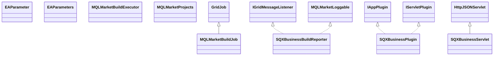

# AppSQXBusiness.jar

[Group index](README.md) | [All archives](../README.md)

## Scope and provenance

- **Donor:** `SQX_145_REFERENCE_ROOT/internal/plugins/AppSQXBusiness/AppSQXBusiness.jar`.
- **SHA-256:** `c5d8346793a02923de19a4dbe7d146e21772af3f2d8bb29460d636be16892373`; accessed 2026-10-06; captured `2026-10-06T18:54:51.906614+00:00`.
- **Classes:** 10 raw entries; 10 unique entry names. Duplicate occurrence indices are zero-based.
- **Inspection:** read-only ZIP hashing and class-file structural parsing; signatures/descriptors, modifiers, hierarchy and references only. Bytecode bodies are hashed, not published.
- **Allocation:** proposed `FEAT-PRODUCT-APP-SQX-BUSINESS`, P17; [roadmap](../../dev/sqx-full-application-roadmap.md). Domain README registration remains required.
- **Repository:** `01067f00031428613c6394064ca1bcadc1ba00ee`; review state unreviewed. Download label 145-dev1; installed build/activation and runtime equivalence unverified.
- **Limit:** every class/member is inventoried; declaration coverage does not establish consumed calls, defaults, formulas, failure semantics or algorithm parity.
- **Archive/resource index:** [137.json](../../dev/evidence/sqx145/archives/145/137.json).

## Complete member declarations

Member shards contain exact JVM names/descriptors, access flags, generic signatures, throws types, declared fields/methods, superclass/interfaces and referenced class names. All classes, nested/synthetic members and overloads are retained. Code length/hash is structural evidence, not a normalized algorithm comparison.

- [001.json](../../dev/evidence/sqx145/members/137/001.json) — SHA-256 `406eceae68cb8977e6fbfcfa55d797be13cb40b6947b6e577e3fc78dfd02c326`.

## Focused structural diagram

Up to twelve non-nested classes; arrows show declared inheritance/interfaces only. External type names are not evidence of an available body or an executed dependency.

## Class inventory

| Archive entry | Occurrence | Class SHA-256 | Fields | Methods |
| --- | ---: | --- | ---: | ---: |
| `com/strategyquant/plugin/App/impl/SQXBusiness/EAParameter.class` | 0 | `e989aa1ad8ace0e6149b15a72c48d73b88473c071e7b75c9f7450c7875ea511e` | 6 | 1 |
| `com/strategyquant/plugin/App/impl/SQXBusiness/EAParameters.class` | 0 | `bfd722ad42b5ccd8753c18a3bbed2d1e05b027ffcfc013f895dbd28f4d1aba0d` | 0 | 4 |
| `com/strategyquant/plugin/App/impl/SQXBusiness/MQLMarketBuildExecutor$1.class` | 0 | `a43db3169b335d0c23b38a22d998d3c0d6c7560b54b3bb604ebcba694a77a9b1` | 0 | 3 |
| `com/strategyquant/plugin/App/impl/SQXBusiness/MQLMarketBuildExecutor.class` | 0 | `aef8c818b3914768344b2bc14f577f331eecf11958bbbbde2fcb7162d7cfbab6` | 3 | 8 |
| `com/strategyquant/plugin/App/impl/SQXBusiness/MQLMarketBuildJob.class` | 0 | `aae76e1e80071fe4708f78d6da36592a73b9a95c9460566ad6b8b387e8f7f85e` | 3 | 5 |
| `com/strategyquant/plugin/App/impl/SQXBusiness/MQLMarketProjects.class` | 0 | `b12c00fd3531ab5278d4fa8662370b1a22cc49301a587452fdb31c00eb78b713` | 4 | 8 |
| `com/strategyquant/plugin/App/impl/SQXBusiness/SQXBusinessBuildReporter$1.class` | 0 | `d1372b32d5f5772fd89ec36dbe022045048624b571e96c19b6578f3957e7b6f6` | 1 | 2 |
| `com/strategyquant/plugin/App/impl/SQXBusiness/SQXBusinessBuildReporter.class` | 0 | `5a697364405f7847211c27e1403465942841d6d6bc174c1f0287d999b889413a` | 7 | 14 |
| `com/strategyquant/plugin/App/impl/SQXBusiness/SQXBusinessPlugin.class` | 0 | `64c9ea783c9113e5784f9016e91c51a3af02db5d8a48fed91b6a2ed67d1eb081` | 2 | 13 |
| `com/strategyquant/plugin/App/impl/SQXBusiness/SQXBusinessServlet.class` | 0 | `3732f9d659730b92e1c5e0acc11f08e7b9527fb4bfaa73596c22a1f572dd6d33` | 1 | 22 |
