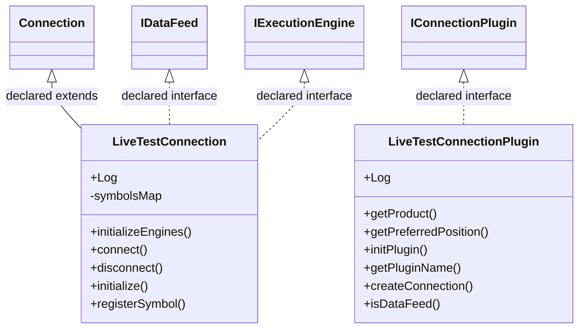

# ConnectionLiveTest.jar

[Workspace/group index](README.md)  |  [All workspaces](../README.md)

## Scope and provenance

- Artifact: `SQX_REFERENCE_ROOT/internal/plugins/ConnectionLiveTest/ConnectionLiveTest.jar`.
- SHA-256: `0b91dd781b045416678bf1ad771cf67746b4ce0bc66cf479e77dd6fa854253eb`.
- Inspected: 2026-10-05; generation timestamp `2026-10-05T19:04:16.344170+00:00`.
- Archive class entries: **3**; non-nested: **2**; nested/anonymous: **1**.
- Inspection: ZIP entry/manifest enumeration and `javap -p` declarations for every listed class.
- Repository source HEAD: `8a92c705183a6702eaf62037ccb202ed028aa899`; review state: generated, pending owner review.
- Installed SQX build number is unverified. No method bodies are reproduced.
- Confidence: high for declared structure; workspace ownership inferred except where registration evidence is separately stated. Runtime reachability, call order, formulas and parity remain unverified.

Shared component: a single canonical document is linked from relevant workspace indexes. Its presence here does not establish which workspaces load it at runtime.

Target mapping: no verified owning HaruQuantAI feature/requirement/decision IDs are assigned by this document. Register or resolve ownership through the normal repository plan before implementation.

## Diagram reading guide

`Parent <|-- Child` means declared inheritance; `Interface <|.. Class` means declared implementation. Interface extension uses the inheritance arrow. `A ..> B : field type` is a declared type dependency, not composition, object ownership or a runtime call. External nodes are referenced types, not fabricated local implementations. Selected fields/method names aid navigation: `+` is public, `#` protected and `-` private. Diagram method names omit parameter/return types and collapse overloads; use the exact inspected declarations below before implementing an API.

Detailed graphs include non-nested classes in package-sized groups of at most 12. Nested/anonymous classes are inventoried and their declarations/relationships are retained below, but omitted from overview graphs. Relationships not drawn for readability remain in the complete declaration-relationship table. Constructors, synthetic bridges and overloads may be collapsed in diagram member lists only. Standard `java.lang.Object` inheritance is omitted from diagrams.

## UML class diagrams

### 1. `com.strategyquant.plugin.Connection.impl.LiveTest`



| Diagram identifier | Exact type | Location |
| --- | --- | --- |
| `C00526a626f19` | `com.strategyquant.plugin.Connection.impl.LiveTest.LiveTestConnection` (this JAR) | this diagram |
| `Cf523e48016c8` | `com.strategyquant.plugin.Connection.impl.LiveTest.LiveTestConnectionPlugin` (this JAR) | this diagram |
| `C58cb707ce0e7` | [`com.strategyquant.tradinglib.connection.Connection`](SQTradingLib.md) | referenced external type |
| `C5910a33a788a` | [`com.strategyquant.tradinglib.connection.IDataFeed`](SQTradingLib.md) | referenced external type |
| `Cb388a7528cc5` | [`com.strategyquant.tradinglib.execution.IExecutionEngine`](SQTradingLib.md) | referenced external type |
| `Cfedf35ca3c10` | [`com.strategyquant.tradinglib.plugindef.connection.IConnectionPlugin`](SQTradingLib.md) | referenced external type |

## Complete class inventory

| Fully qualified class | Kind | Entry |
| --- | --- | --- |
| `com.strategyquant.plugin.Connection.impl.LiveTest.LiveTestConnection` | class | non-nested |
| `com.strategyquant.plugin.Connection.impl.LiveTest.LiveTestConnection$1` | class | nested/anonymous |
| `com.strategyquant.plugin.Connection.impl.LiveTest.LiveTestConnectionPlugin` | class | non-nested |

## Declared relationships and evidence locations

Every row is supported by the named class declaration/member in `javap -p`, inside the artifact recorded above. Signature dependencies may include return, parameter, generic-argument and throws types; they do not imply execution.

| Declaring class | Referenced type | Relationship | Narrow inspection location |
| --- | --- | --- | --- |
| `com.strategyquant.plugin.Connection.impl.LiveTest.LiveTestConnection` | [`com.strategyquant.tradinglib.connection.Connection`](SQTradingLib.md) | extends | `com.strategyquant.plugin.Connection.impl.LiveTest.LiveTestConnection` / class declaration: `public class com.strategyquant.plugin.Connection.impl.LiveTest.LiveTestConnection extends com.strategyquant.tradinglib.connection.Connection implements com.strategyquant.tradinglib.connection.IDataFeed,com.strategyquant.tradinglib.execution.IExecutionEngine` |
| `com.strategyquant.plugin.Connection.impl.LiveTest.LiveTestConnection` | [`com.strategyquant.tradinglib.connection.IDataFeed`](SQTradingLib.md) | implements | `com.strategyquant.plugin.Connection.impl.LiveTest.LiveTestConnection` / class declaration: `public class com.strategyquant.plugin.Connection.impl.LiveTest.LiveTestConnection extends com.strategyquant.tradinglib.connection.Connection implements com.strategyquant.tradinglib.connection.IDataFeed,com.strategyquant.tradinglib.execution.IExecutionEngine` |
| `com.strategyquant.plugin.Connection.impl.LiveTest.LiveTestConnection` | [`com.strategyquant.tradinglib.execution.IExecutionEngine`](SQTradingLib.md) | implements | `com.strategyquant.plugin.Connection.impl.LiveTest.LiveTestConnection` / class declaration: `public class com.strategyquant.plugin.Connection.impl.LiveTest.LiveTestConnection extends com.strategyquant.tradinglib.connection.Connection implements com.strategyquant.tradinglib.connection.IDataFeed,com.strategyquant.tradinglib.execution.IExecutionEngine` |
| `com.strategyquant.plugin.Connection.impl.LiveTest.LiveTestConnection` | `org.slf4j.Logger` (not resolved in scoped archives) | type dependency | `com.strategyquant.plugin.Connection.impl.LiveTest.LiveTestConnection` / field declaration: `public static final org.slf4j.Logger Log;` |
| `com.strategyquant.plugin.Connection.impl.LiveTest.LiveTestConnection` | `java.util.HashMap` (not resolved in scoped archives) | type dependency | `com.strategyquant.plugin.Connection.impl.LiveTest.LiveTestConnection` / field declaration: `private java.util.HashMap<java.lang.String, java.lang.Integer> symbolsMap;` |
| `com.strategyquant.plugin.Connection.impl.LiveTest.LiveTestConnection` | `java.lang.String` (not resolved in scoped archives) | type dependency | `com.strategyquant.plugin.Connection.impl.LiveTest.LiveTestConnection` / field declaration: `private java.util.HashMap<java.lang.String, java.lang.Integer> symbolsMap;` |
| `com.strategyquant.plugin.Connection.impl.LiveTest.LiveTestConnection` | `java.lang.String` (not resolved in scoped archives) | type dependency | `com.strategyquant.plugin.Connection.impl.LiveTest.LiveTestConnection` / method signature: `public com.strategyquant.plugin.Connection.impl.LiveTest.LiveTestConnection(com.strategyquant.tradinglib.plugindef.connection.IConnectionPlugin, com.strategyquant.tradinglib.connection.ConnectionManager, java.lang.String, com.strategyquant.lib.ValuesMap) throws java.lang.Exception;`<br>`public void registerSymbol(java.lang.String);`<br>`public boolean checkSymbolIsSupported(java.lang.String);`<br>`public java.lang.String getStatus();`<br>`public java.lang.String getMainCurrency();` |
| `com.strategyquant.plugin.Connection.impl.LiveTest.LiveTestConnection` | `java.lang.Integer` (not resolved in scoped archives) | type dependency | `com.strategyquant.plugin.Connection.impl.LiveTest.LiveTestConnection` / field declaration: `private java.util.HashMap<java.lang.String, java.lang.Integer> symbolsMap;` |
| `com.strategyquant.plugin.Connection.impl.LiveTest.LiveTestConnection` | [`com.strategyquant.tradinglib.plugindef.connection.IConnectionPlugin`](SQTradingLib.md) | type dependency | `com.strategyquant.plugin.Connection.impl.LiveTest.LiveTestConnection` / method signature: `public com.strategyquant.plugin.Connection.impl.LiveTest.LiveTestConnection(com.strategyquant.tradinglib.plugindef.connection.IConnectionPlugin, com.strategyquant.tradinglib.connection.ConnectionManager, java.lang.String, com.strategyquant.lib.ValuesMap) throws java.lang.Exception;` |
| `com.strategyquant.plugin.Connection.impl.LiveTest.LiveTestConnection` | [`com.strategyquant.tradinglib.connection.ConnectionManager`](SQTradingLib.md) | type dependency | `com.strategyquant.plugin.Connection.impl.LiveTest.LiveTestConnection` / method signature: `public com.strategyquant.plugin.Connection.impl.LiveTest.LiveTestConnection(com.strategyquant.tradinglib.plugindef.connection.IConnectionPlugin, com.strategyquant.tradinglib.connection.ConnectionManager, java.lang.String, com.strategyquant.lib.ValuesMap) throws java.lang.Exception;` |
| `com.strategyquant.plugin.Connection.impl.LiveTest.LiveTestConnection` | `com.strategyquant.lib.ValuesMap` (not resolved in scoped archives) | type dependency | `com.strategyquant.plugin.Connection.impl.LiveTest.LiveTestConnection` / method signature: `public com.strategyquant.plugin.Connection.impl.LiveTest.LiveTestConnection(com.strategyquant.tradinglib.plugindef.connection.IConnectionPlugin, com.strategyquant.tradinglib.connection.ConnectionManager, java.lang.String, com.strategyquant.lib.ValuesMap) throws java.lang.Exception;` |
| `com.strategyquant.plugin.Connection.impl.LiveTest.LiveTestConnection` | `java.lang.Exception` (not resolved in scoped archives) | type dependency | `com.strategyquant.plugin.Connection.impl.LiveTest.LiveTestConnection` / method signature: `public com.strategyquant.plugin.Connection.impl.LiveTest.LiveTestConnection(com.strategyquant.tradinglib.plugindef.connection.IConnectionPlugin, com.strategyquant.tradinglib.connection.ConnectionManager, java.lang.String, com.strategyquant.lib.ValuesMap) throws java.lang.Exception;`<br>`public void connect() throws java.lang.Exception;`<br>`public void disconnect() throws java.lang.Exception;` |
| `com.strategyquant.plugin.Connection.impl.LiveTest.LiveTestConnection` | [`com.strategyquant.tradinglib.connection.HistoryData`](SQTradingLib.md) | type dependency | `com.strategyquant.plugin.Connection.impl.LiveTest.LiveTestConnection` / method signature: `public com.strategyquant.tradinglib.connection.HistoryData getHistoryData(com.strategyquant.datalib.ChartDef, int, long, long);` |
| `com.strategyquant.plugin.Connection.impl.LiveTest.LiveTestConnection` | [`com.strategyquant.datalib.ChartDef`](SQDataLib.md) | type dependency | `com.strategyquant.plugin.Connection.impl.LiveTest.LiveTestConnection` / method signature: `public com.strategyquant.tradinglib.connection.HistoryData getHistoryData(com.strategyquant.datalib.ChartDef, int, long, long);` |
| `com.strategyquant.plugin.Connection.impl.LiveTest.LiveTestConnection` | [`com.strategyquant.tradinglib.ILiveOrder`](SQTradingLib.md) | type dependency | `com.strategyquant.plugin.Connection.impl.LiveTest.LiveTestConnection` / method signature: `public com.strategyquant.tradinglib.ILiveOrder orderOpen(com.strategyquant.tradinglib.StrategyBase, com.strategyquant.tradinglib.ILiveOrder, int, com.strategyquant.tradinglib.event.ITradingEventListener);`<br>`public com.strategyquant.tradinglib.ILiveOrder orderClose(com.strategyquant.tradinglib.StrategyBase, com.strategyquant.tradinglib.ILiveOrder, byte, int, com.strategyquant.tradinglib.event.ITradingEventListener);`<br>`public com.strategyquant.tradinglib.ILiveOrder orderModify(com.strategyquant.tradinglib.StrategyBase, com.strategyquant.tradinglib.ILiveOrder, int, com.strategyquant.tradinglib.event.ITradingEventListener);`<br>`public com.strategyquant.tradinglib.ILiveOrder getOpenOrder(int, boolean);` |
| `com.strategyquant.plugin.Connection.impl.LiveTest.LiveTestConnection` | [`com.strategyquant.tradinglib.StrategyBase`](SQTradingLib.md) | type dependency | `com.strategyquant.plugin.Connection.impl.LiveTest.LiveTestConnection` / method signature: `public com.strategyquant.tradinglib.ILiveOrder orderOpen(com.strategyquant.tradinglib.StrategyBase, com.strategyquant.tradinglib.ILiveOrder, int, com.strategyquant.tradinglib.event.ITradingEventListener);`<br>`public com.strategyquant.tradinglib.ILiveOrder orderClose(com.strategyquant.tradinglib.StrategyBase, com.strategyquant.tradinglib.ILiveOrder, byte, int, com.strategyquant.tradinglib.event.ITradingEventListener);`<br>`public com.strategyquant.tradinglib.ILiveOrder orderModify(com.strategyquant.tradinglib.StrategyBase, com.strategyquant.tradinglib.ILiveOrder, int, com.strategyquant.tradinglib.event.ITradingEventListener);`<br>`public void evaluateActionListeners(int, com.strategyquant.tradinglib.StrategyBase);` |
| `com.strategyquant.plugin.Connection.impl.LiveTest.LiveTestConnection` | [`com.strategyquant.tradinglib.event.ITradingEventListener`](SQTradingLib.md) | type dependency | `com.strategyquant.plugin.Connection.impl.LiveTest.LiveTestConnection` / method signature: `public com.strategyquant.tradinglib.ILiveOrder orderOpen(com.strategyquant.tradinglib.StrategyBase, com.strategyquant.tradinglib.ILiveOrder, int, com.strategyquant.tradinglib.event.ITradingEventListener);`<br>`public com.strategyquant.tradinglib.ILiveOrder orderClose(com.strategyquant.tradinglib.StrategyBase, com.strategyquant.tradinglib.ILiveOrder, byte, int, com.strategyquant.tradinglib.event.ITradingEventListener);`<br>`public com.strategyquant.tradinglib.ILiveOrder orderModify(com.strategyquant.tradinglib.StrategyBase, com.strategyquant.tradinglib.ILiveOrder, int, com.strategyquant.tradinglib.event.ITradingEventListener);` |
| `com.strategyquant.plugin.Connection.impl.LiveTest.LiveTestConnection` | [`com.strategyquant.tradinglib.OrdersList`](SQTradingLib.md) | type dependency | `com.strategyquant.plugin.Connection.impl.LiveTest.LiveTestConnection` / method signature: `public com.strategyquant.tradinglib.OrdersList getHistoryOrders();` |
| `com.strategyquant.plugin.Connection.impl.LiveTest.LiveTestConnection` | [`com.strategyquant.datalib.TickEvent`](SQDataLib.md) | type dependency | `com.strategyquant.plugin.Connection.impl.LiveTest.LiveTestConnection` / method signature: `public com.strategyquant.datalib.TickEvent getTickData();` |
| `com.strategyquant.plugin.Connection.impl.LiveTest.LiveTestConnection` | [`com.strategyquant.tradinglib.Order`](SQTradingLib.md) | type dependency | `com.strategyquant.plugin.Connection.impl.LiveTest.LiveTestConnection` / method signature: `public com.strategyquant.tradinglib.Order getHistoryOrder(int);` |
| `com.strategyquant.plugin.Connection.impl.LiveTest.LiveTestConnection` | `it.unimi.dsi.fastutil.longs.Long2FloatRBTreeMap` (not resolved in scoped archives) | type dependency | `com.strategyquant.plugin.Connection.impl.LiveTest.LiveTestConnection` / method signature: `public it.unimi.dsi.fastutil.longs.Long2FloatRBTreeMap getWorstDailyEquity();` |
| `com.strategyquant.plugin.Connection.impl.LiveTest.LiveTestConnection` | [`com.strategyquant.tradinglib.strategy.LiveOrderObj`](SQTradingLib.md) | type dependency | `com.strategyquant.plugin.Connection.impl.LiveTest.LiveTestConnection` / method signature: `public void reuseOpenOrder(com.strategyquant.tradinglib.strategy.LiveOrderObj);` |
| `com.strategyquant.plugin.Connection.impl.LiveTest.LiveTestConnection$1` | `java.lang.Thread` (not resolved in scoped archives) | extends | `com.strategyquant.plugin.Connection.impl.LiveTest.LiveTestConnection$1` / class declaration: `class com.strategyquant.plugin.Connection.impl.LiveTest.LiveTestConnection$1 extends java.lang.Thread` |
| `com.strategyquant.plugin.Connection.impl.LiveTest.LiveTestConnection$1` | [`com.strategyquant.datalib.TickEvent`](SQDataLib.md) | type dependency | `com.strategyquant.plugin.Connection.impl.LiveTest.LiveTestConnection$1` / field declaration: `final com.strategyquant.datalib.TickEvent val$tick;` |
| `com.strategyquant.plugin.Connection.impl.LiveTest.LiveTestConnection$1` | [`com.strategyquant.datalib.TickEvent`](SQDataLib.md) | type dependency | `com.strategyquant.plugin.Connection.impl.LiveTest.LiveTestConnection$1` / method signature: `com.strategyquant.plugin.Connection.impl.LiveTest.LiveTestConnection$1(com.strategyquant.plugin.Connection.impl.LiveTest.LiveTestConnection, long, com.strategyquant.datalib.TickEvent, int, com.strategyquant.datalib.data.IDataBuffer);` |
| `com.strategyquant.plugin.Connection.impl.LiveTest.LiveTestConnection$1` | [`com.strategyquant.datalib.data.IDataBuffer`](SQDataLib.md) | type dependency | `com.strategyquant.plugin.Connection.impl.LiveTest.LiveTestConnection$1` / field declaration: `final com.strategyquant.datalib.data.IDataBuffer val$dataBuffer;` |
| `com.strategyquant.plugin.Connection.impl.LiveTest.LiveTestConnection$1` | [`com.strategyquant.datalib.data.IDataBuffer`](SQDataLib.md) | type dependency | `com.strategyquant.plugin.Connection.impl.LiveTest.LiveTestConnection$1` / method signature: `com.strategyquant.plugin.Connection.impl.LiveTest.LiveTestConnection$1(com.strategyquant.plugin.Connection.impl.LiveTest.LiveTestConnection, long, com.strategyquant.datalib.TickEvent, int, com.strategyquant.datalib.data.IDataBuffer);` |
| `com.strategyquant.plugin.Connection.impl.LiveTest.LiveTestConnection$1` | `com.strategyquant.plugin.Connection.impl.LiveTest.LiveTestConnection` (this JAR) | type dependency | `com.strategyquant.plugin.Connection.impl.LiveTest.LiveTestConnection$1` / field declaration: `final com.strategyquant.plugin.Connection.impl.LiveTest.LiveTestConnection this$0;` |
| `com.strategyquant.plugin.Connection.impl.LiveTest.LiveTestConnection$1` | `com.strategyquant.plugin.Connection.impl.LiveTest.LiveTestConnection` (this JAR) | type dependency | `com.strategyquant.plugin.Connection.impl.LiveTest.LiveTestConnection$1` / method signature: `com.strategyquant.plugin.Connection.impl.LiveTest.LiveTestConnection$1(com.strategyquant.plugin.Connection.impl.LiveTest.LiveTestConnection, long, com.strategyquant.datalib.TickEvent, int, com.strategyquant.datalib.data.IDataBuffer);` |
| `com.strategyquant.plugin.Connection.impl.LiveTest.LiveTestConnectionPlugin` | [`com.strategyquant.tradinglib.plugindef.connection.IConnectionPlugin`](SQTradingLib.md) | implements | `com.strategyquant.plugin.Connection.impl.LiveTest.LiveTestConnectionPlugin` / class declaration: `public class com.strategyquant.plugin.Connection.impl.LiveTest.LiveTestConnectionPlugin implements com.strategyquant.tradinglib.plugindef.connection.IConnectionPlugin` |
| `com.strategyquant.plugin.Connection.impl.LiveTest.LiveTestConnectionPlugin` | `org.slf4j.Logger` (not resolved in scoped archives) | type dependency | `com.strategyquant.plugin.Connection.impl.LiveTest.LiveTestConnectionPlugin` / field declaration: `public static final org.slf4j.Logger Log;` |
| `com.strategyquant.plugin.Connection.impl.LiveTest.LiveTestConnectionPlugin` | `java.lang.String` (not resolved in scoped archives) | type dependency | `com.strategyquant.plugin.Connection.impl.LiveTest.LiveTestConnectionPlugin` / method signature: `public java.lang.String getProduct();`<br>`public java.lang.String getPluginName();`<br>`public com.strategyquant.tradinglib.connection.Connection createConnection(com.strategyquant.tradinglib.connection.ConnectionManager, java.lang.String, com.strategyquant.lib.ValuesMap) throws java.lang.Exception;` |
| `com.strategyquant.plugin.Connection.impl.LiveTest.LiveTestConnectionPlugin` | [`com.strategyquant.tradinglib.connection.Connection`](SQTradingLib.md) | type dependency | `com.strategyquant.plugin.Connection.impl.LiveTest.LiveTestConnectionPlugin` / method signature: `public com.strategyquant.tradinglib.connection.Connection createConnection(com.strategyquant.tradinglib.connection.ConnectionManager, java.lang.String, com.strategyquant.lib.ValuesMap) throws java.lang.Exception;` |
| `com.strategyquant.plugin.Connection.impl.LiveTest.LiveTestConnectionPlugin` | [`com.strategyquant.tradinglib.connection.ConnectionManager`](SQTradingLib.md) | type dependency | `com.strategyquant.plugin.Connection.impl.LiveTest.LiveTestConnectionPlugin` / method signature: `public com.strategyquant.tradinglib.connection.Connection createConnection(com.strategyquant.tradinglib.connection.ConnectionManager, java.lang.String, com.strategyquant.lib.ValuesMap) throws java.lang.Exception;` |
| `com.strategyquant.plugin.Connection.impl.LiveTest.LiveTestConnectionPlugin` | `com.strategyquant.lib.ValuesMap` (not resolved in scoped archives) | type dependency | `com.strategyquant.plugin.Connection.impl.LiveTest.LiveTestConnectionPlugin` / method signature: `public com.strategyquant.tradinglib.connection.Connection createConnection(com.strategyquant.tradinglib.connection.ConnectionManager, java.lang.String, com.strategyquant.lib.ValuesMap) throws java.lang.Exception;` |
| `com.strategyquant.plugin.Connection.impl.LiveTest.LiveTestConnectionPlugin` | `java.lang.Exception` (not resolved in scoped archives) | type dependency | `com.strategyquant.plugin.Connection.impl.LiveTest.LiveTestConnectionPlugin` / method signature: `public com.strategyquant.tradinglib.connection.Connection createConnection(com.strategyquant.tradinglib.connection.ConnectionManager, java.lang.String, com.strategyquant.lib.ValuesMap) throws java.lang.Exception;` |

## Inspected declaration reference

These are structural API/member declarations, not proprietary implementation bodies. Private members and nested classes are retained to make diagram omissions explicit; declarations do not prove behavior.

<details>
<summary>com.strategyquant.plugin.Connection.impl.LiveTest.LiveTestConnection</summary>

```text
public class com.strategyquant.plugin.Connection.impl.LiveTest.LiveTestConnection extends com.strategyquant.tradinglib.connection.Connection implements com.strategyquant.tradinglib.connection.IDataFeed,com.strategyquant.tradinglib.execution.IExecutionEngine
    public static final org.slf4j.Logger Log;
    private java.util.HashMap<java.lang.String, java.lang.Integer> symbolsMap;
    public com.strategyquant.plugin.Connection.impl.LiveTest.LiveTestConnection(com.strategyquant.tradinglib.plugindef.connection.IConnectionPlugin, com.strategyquant.tradinglib.connection.ConnectionManager, java.lang.String, com.strategyquant.lib.ValuesMap) throws java.lang.Exception;
    public void initializeEngines();
    public void connect() throws java.lang.Exception;
    public void disconnect() throws java.lang.Exception;
    public void initialize();
    public void registerSymbol(java.lang.String);
    public boolean checkSymbolIsSupported(java.lang.String);
    private void startSendingTestData(int);
    public boolean isConnected();
    public java.lang.String getStatus();
    public com.strategyquant.tradinglib.connection.HistoryData getHistoryData(com.strategyquant.datalib.ChartDef, int, long, long);
    public com.strategyquant.tradinglib.ILiveOrder orderOpen(com.strategyquant.tradinglib.StrategyBase, com.strategyquant.tradinglib.ILiveOrder, int, com.strategyquant.tradinglib.event.ITradingEventListener);
    public com.strategyquant.tradinglib.ILiveOrder orderClose(com.strategyquant.tradinglib.StrategyBase, com.strategyquant.tradinglib.ILiveOrder, byte, int, com.strategyquant.tradinglib.event.ITradingEventListener);
    public com.strategyquant.tradinglib.ILiveOrder orderModify(com.strategyquant.tradinglib.StrategyBase, com.strategyquant.tradinglib.ILiveOrder, int, com.strategyquant.tradinglib.event.ITradingEventListener);
    public int getOpenOrdersCount(boolean);
    public double getAccountBalance();
    public double getTotalPL();
    public java.lang.String getMainCurrency();
    public com.strategyquant.tradinglib.OrdersList getHistoryOrders();
    public com.strategyquant.tradinglib.ILiveOrder getOpenOrder(int, boolean);
    public double getAccountEquity();
    public double getInitialBalance();
    public com.strategyquant.datalib.TickEvent getTickData();
    public int getHistoryOrdersCount();
    public com.strategyquant.tradinglib.Order getHistoryOrder(int);
    public boolean fillAtRealAskBidPrice();
    public it.unimi.dsi.fastutil.longs.Long2FloatRBTreeMap getWorstDailyEquity();
    public int getAmbiguousTrades();
    public void reuseOpenOrder(com.strategyquant.tradinglib.strategy.LiveOrderObj);
    public void evaluateActionListeners(int, com.strategyquant.tradinglib.StrategyBase);
    public boolean supportsDuplicateTrades();
    public boolean IsMarketOpen();
```

</details>

<details>
<summary>com.strategyquant.plugin.Connection.impl.LiveTest.LiveTestConnection$1</summary>

```text
class com.strategyquant.plugin.Connection.impl.LiveTest.LiveTestConnection$1 extends java.lang.Thread
    private int count;
    final long val$currentTime;
    final com.strategyquant.datalib.TickEvent val$tick;
    final int val$symbolHash;
    final com.strategyquant.datalib.data.IDataBuffer val$dataBuffer;
    final com.strategyquant.plugin.Connection.impl.LiveTest.LiveTestConnection this$0;
    com.strategyquant.plugin.Connection.impl.LiveTest.LiveTestConnection$1(com.strategyquant.plugin.Connection.impl.LiveTest.LiveTestConnection, long, com.strategyquant.datalib.TickEvent, int, com.strategyquant.datalib.data.IDataBuffer);
    public void run();
```

</details>

<details>
<summary>com.strategyquant.plugin.Connection.impl.LiveTest.LiveTestConnectionPlugin</summary>

```text
public class com.strategyquant.plugin.Connection.impl.LiveTest.LiveTestConnectionPlugin implements com.strategyquant.tradinglib.plugindef.connection.IConnectionPlugin
    public static final org.slf4j.Logger Log;
    public com.strategyquant.plugin.Connection.impl.LiveTest.LiveTestConnectionPlugin();
    public java.lang.String getProduct();
    public int getPreferredPosition();
    public void initPlugin();
    public java.lang.String getPluginName();
    public com.strategyquant.tradinglib.connection.Connection createConnection(com.strategyquant.tradinglib.connection.ConnectionManager, java.lang.String, com.strategyquant.lib.ValuesMap) throws java.lang.Exception;
    public boolean isDataFeed();
    public boolean isExecutionEngine();
```

</details>

## Validation and unresolved gaps

Archive hash and complete class inventory were checked against the inspected local artifact. Declaration extraction accounts for every inventoried class. Documentation/link/diagram structural verification is recorded in the master index and task walkthrough; no SQX runtime validation was performed.

The canonical reimplementation ledger/schema are absent, so no evidence IDs or validation-passed ledger claims are created. This is a donor structural reference. Exact behavior, default values, failure semantics, algorithms, runtime calls and target architectural choices require separate research. No aggregation/composition or cardinalities are inferred.
