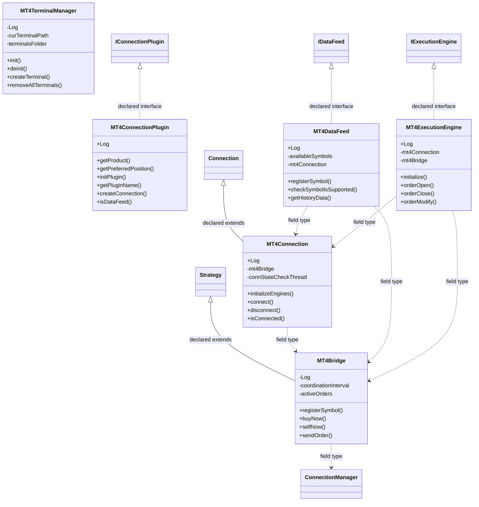

# ConnectionMT4.jar

[Workspace/group index](README.md)  |  [All workspaces](../README.md)

## Scope and provenance

- Artifact: `SQX_REFERENCE_ROOT/internal/plugins/ConnectionMT4/ConnectionMT4.jar`.
- SHA-256: `fdf875eaf15af4256ff2d74f823e9745addd64d40838ad8d1436eb2dc4cf126c`.
- Inspected: 2026-10-05; generation timestamp `2026-10-05T19:04:16.344170+00:00`.
- Archive class entries: **7**; non-nested: **6**; nested/anonymous: **1**.
- Inspection: ZIP entry/manifest enumeration and `javap -p` declarations for every listed class.
- Repository source HEAD: `8a92c705183a6702eaf62037ccb202ed028aa899`; review state: generated, pending owner review.
- Installed SQX build number is unverified. No method bodies are reproduced.
- Confidence: high for declared structure; workspace ownership inferred except where registration evidence is separately stated. Runtime reachability, call order, formulas and parity remain unverified.

Shared component: a single canonical document is linked from relevant workspace indexes. Its presence here does not establish which workspaces load it at runtime.

Target mapping: no verified owning HaruQuantAI feature/requirement/decision IDs are assigned by this document. Register or resolve ownership through the normal repository plan before implementation.

## Diagram reading guide

`Parent <|-- Child` means declared inheritance; `Interface <|.. Class` means declared implementation. Interface extension uses the inheritance arrow. `A ..> B : field type` is a declared type dependency, not composition, object ownership or a runtime call. External nodes are referenced types, not fabricated local implementations. Selected fields/method names aid navigation: `+` is public, `#` protected and `-` private. Diagram method names omit parameter/return types and collapse overloads; use the exact inspected declarations below before implementing an API.

Detailed graphs include non-nested classes in package-sized groups of at most 12. Nested/anonymous classes are inventoried and their declarations/relationships are retained below, but omitted from overview graphs. Relationships not drawn for readability remain in the complete declaration-relationship table. Constructors, synthetic bridges and overloads may be collapsed in diagram member lists only. Standard `java.lang.Object` inheritance is omitted from diagrams.

## UML class diagrams

### 1. `com.strategyquant.plugin.Connection.impl.MT4`



| Diagram identifier | Exact type | Location |
| --- | --- | --- |
| `C49edddb39032` | `com.jfx.strategy.Strategy` (not resolved in scoped archives) | referenced external type |
| `C164e67f39db5` | `com.strategyquant.plugin.Connection.impl.MT4.MT4Bridge` (this JAR) | this diagram |
| `C36684a7b0928` | `com.strategyquant.plugin.Connection.impl.MT4.MT4Connection` (this JAR) | this diagram |
| `C64f2f1b9b39f` | `com.strategyquant.plugin.Connection.impl.MT4.MT4ConnectionPlugin` (this JAR) | this diagram |
| `Cf439f91e8c04` | `com.strategyquant.plugin.Connection.impl.MT4.MT4DataFeed` (this JAR) | this diagram |
| `Cb450fc774336` | `com.strategyquant.plugin.Connection.impl.MT4.MT4ExecutionEngine` (this JAR) | this diagram |
| `C4a6354902529` | `com.strategyquant.plugin.Connection.impl.MT4.MT4TerminalManager` (this JAR) | this diagram |
| `C58cb707ce0e7` | [`com.strategyquant.tradinglib.connection.Connection`](SQTradingLib.md) | referenced external type |
| `C001b68001ef7` | [`com.strategyquant.tradinglib.connection.ConnectionManager`](SQTradingLib.md) | referenced external type |
| `C5910a33a788a` | [`com.strategyquant.tradinglib.connection.IDataFeed`](SQTradingLib.md) | referenced external type |
| `Cb388a7528cc5` | [`com.strategyquant.tradinglib.execution.IExecutionEngine`](SQTradingLib.md) | referenced external type |
| `Cfedf35ca3c10` | [`com.strategyquant.tradinglib.plugindef.connection.IConnectionPlugin`](SQTradingLib.md) | referenced external type |

## Complete class inventory

| Fully qualified class | Kind | Entry |
| --- | --- | --- |
| `com.strategyquant.plugin.Connection.impl.MT4.MT4Bridge` | class | non-nested |
| `com.strategyquant.plugin.Connection.impl.MT4.MT4Connection` | class | non-nested |
| `com.strategyquant.plugin.Connection.impl.MT4.MT4Connection$1` | class | nested/anonymous |
| `com.strategyquant.plugin.Connection.impl.MT4.MT4ConnectionPlugin` | class | non-nested |
| `com.strategyquant.plugin.Connection.impl.MT4.MT4DataFeed` | class | non-nested |
| `com.strategyquant.plugin.Connection.impl.MT4.MT4ExecutionEngine` | class | non-nested |
| `com.strategyquant.plugin.Connection.impl.MT4.MT4TerminalManager` | class | non-nested |

## Declared relationships and evidence locations

Every row is supported by the named class declaration/member in `javap -p`, inside the artifact recorded above. Signature dependencies may include return, parameter, generic-argument and throws types; they do not imply execution.

| Declaring class | Referenced type | Relationship | Narrow inspection location |
| --- | --- | --- | --- |
| `com.strategyquant.plugin.Connection.impl.MT4.MT4Bridge` | `com.jfx.strategy.Strategy` (not resolved in scoped archives) | extends | `com.strategyquant.plugin.Connection.impl.MT4.MT4Bridge` / class declaration: `public class com.strategyquant.plugin.Connection.impl.MT4.MT4Bridge extends com.jfx.strategy.Strategy` |
| `com.strategyquant.plugin.Connection.impl.MT4.MT4Bridge` | `org.slf4j.Logger` (not resolved in scoped archives) | type dependency | `com.strategyquant.plugin.Connection.impl.MT4.MT4Bridge` / field declaration: `private static final org.slf4j.Logger Log;` |
| `com.strategyquant.plugin.Connection.impl.MT4.MT4Bridge` | `java.util.ArrayList` (not resolved in scoped archives) | type dependency | `com.strategyquant.plugin.Connection.impl.MT4.MT4Bridge` / field declaration: `private java.util.ArrayList<java.lang.Long> activeOrders;`<br>`private java.util.ArrayList<java.lang.Boolean> orderClosed;` |
| `com.strategyquant.plugin.Connection.impl.MT4.MT4Bridge` | `java.lang.Long` (not resolved in scoped archives) | type dependency | `com.strategyquant.plugin.Connection.impl.MT4.MT4Bridge` / field declaration: `private java.util.ArrayList<java.lang.Long> activeOrders;` |
| `com.strategyquant.plugin.Connection.impl.MT4.MT4Bridge` | `java.lang.Boolean` (not resolved in scoped archives) | type dependency | `com.strategyquant.plugin.Connection.impl.MT4.MT4Bridge` / field declaration: `private java.util.ArrayList<java.lang.Boolean> orderClosed;` |
| `com.strategyquant.plugin.Connection.impl.MT4.MT4Bridge` | `java.util.HashMap` (not resolved in scoped archives) | type dependency | `com.strategyquant.plugin.Connection.impl.MT4.MT4Bridge` / field declaration: `private java.util.HashMap<java.lang.String, java.lang.Integer> activeSymbols;` |
| `com.strategyquant.plugin.Connection.impl.MT4.MT4Bridge` | `java.lang.String` (not resolved in scoped archives) | type dependency | `com.strategyquant.plugin.Connection.impl.MT4.MT4Bridge` / field declaration: `private java.util.HashMap<java.lang.String, java.lang.Integer> activeSymbols;`<br>`private java.lang.String connectionName;`<br>`private java.lang.String status;` |
| `com.strategyquant.plugin.Connection.impl.MT4.MT4Bridge` | `java.lang.String` (not resolved in scoped archives) | type dependency | `com.strategyquant.plugin.Connection.impl.MT4.MT4Bridge` / method signature: `public com.strategyquant.plugin.Connection.impl.MT4.MT4Bridge(com.strategyquant.tradinglib.connection.ConnectionManager, java.lang.String, int);`<br>`public void registerSymbol(java.lang.String) throws java.lang.Exception;`<br>`public long buyNow(java.lang.String, double) throws java.lang.Exception;`<br>`public long sellNow(java.lang.String, double) throws java.lang.Exception;`<br>`public long sendOrder(java.lang.String, com.jfx.TradeOperation, double, int, int, int, java.lang.String, int, java.util.Date) throws java.lang.Exception;`<br>`public long sendOrder(java.lang.String, com.jfx.TradeOperation, double, int, double, double, java.lang.String, int, java.util.Date) throws java.lang.Exception;`<br>`public void getHistoryBars(java.lang.String, int);`<br>`public void init(java.lang.String, int, com.jfx.strategy.StrategyRunner);`<br>`public synchronized void connect(java.lang.String, int, com.jfx.Broker, java.lang.String, java.lang.String, java.lang.String, boolean) throws com.jfx.strategy.NJ4XInvalidUserNameOrPasswordException, com.jfx.strategy.NJ4XMaxNumberOfTerminalsExceededException, com.jfx.strategy.NJ4XNoConnectionToServerException, java.io.IOException;`<br>`private void fireOrderAddEvent(long, java.lang.String, java.lang.String, double, double);`<br>`private void fireOrderChangedEvent(long, java.lang.String, double, double);`<br>`public java.lang.String getConnectionState();`<br>`public java.lang.String getStatus();`<br>`public void setStatus(java.lang.String);` |
| `com.strategyquant.plugin.Connection.impl.MT4.MT4Bridge` | `java.lang.Integer` (not resolved in scoped archives) | type dependency | `com.strategyquant.plugin.Connection.impl.MT4.MT4Bridge` / field declaration: `private java.util.HashMap<java.lang.String, java.lang.Integer> activeSymbols;` |
| `com.strategyquant.plugin.Connection.impl.MT4.MT4Bridge` | [`com.strategyquant.tradinglib.connection.ConnectionManager`](SQTradingLib.md) | type dependency | `com.strategyquant.plugin.Connection.impl.MT4.MT4Bridge` / field declaration: `private com.strategyquant.tradinglib.connection.ConnectionManager connectionManager;` |
| `com.strategyquant.plugin.Connection.impl.MT4.MT4Bridge` | [`com.strategyquant.tradinglib.connection.ConnectionManager`](SQTradingLib.md) | type dependency | `com.strategyquant.plugin.Connection.impl.MT4.MT4Bridge` / method signature: `public com.strategyquant.plugin.Connection.impl.MT4.MT4Bridge(com.strategyquant.tradinglib.connection.ConnectionManager, java.lang.String, int);` |
| `com.strategyquant.plugin.Connection.impl.MT4.MT4Bridge` | `java.lang.Exception` (not resolved in scoped archives) | type dependency | `com.strategyquant.plugin.Connection.impl.MT4.MT4Bridge` / method signature: `public void registerSymbol(java.lang.String) throws java.lang.Exception;`<br>`public long buyNow(java.lang.String, double) throws java.lang.Exception;`<br>`public long sellNow(java.lang.String, double) throws java.lang.Exception;`<br>`public long sendOrder(java.lang.String, com.jfx.TradeOperation, double, int, int, int, java.lang.String, int, java.util.Date) throws java.lang.Exception;`<br>`public long sendOrder(java.lang.String, com.jfx.TradeOperation, double, int, double, double, java.lang.String, int, java.util.Date) throws java.lang.Exception;`<br>`public void closeOrder(long) throws java.lang.Exception;`<br>`public void modifyOrder(long, double, double, double, java.util.Date) throws java.lang.Exception;`<br>`public void dumpActiveOrders() throws java.lang.Exception;`<br>`private void fireConnectionErrorEvent(java.lang.Exception);` |
| `com.strategyquant.plugin.Connection.impl.MT4.MT4Bridge` | `com.jfx.TradeOperation` (not resolved in scoped archives) | type dependency | `com.strategyquant.plugin.Connection.impl.MT4.MT4Bridge` / method signature: `public long sendOrder(java.lang.String, com.jfx.TradeOperation, double, int, int, int, java.lang.String, int, java.util.Date) throws java.lang.Exception;`<br>`public long sendOrder(java.lang.String, com.jfx.TradeOperation, double, int, double, double, java.lang.String, int, java.util.Date) throws java.lang.Exception;` |
| `com.strategyquant.plugin.Connection.impl.MT4.MT4Bridge` | `java.util.Date` (not resolved in scoped archives) | type dependency | `com.strategyquant.plugin.Connection.impl.MT4.MT4Bridge` / method signature: `public long sendOrder(java.lang.String, com.jfx.TradeOperation, double, int, int, int, java.lang.String, int, java.util.Date) throws java.lang.Exception;`<br>`public long sendOrder(java.lang.String, com.jfx.TradeOperation, double, int, double, double, java.lang.String, int, java.util.Date) throws java.lang.Exception;`<br>`public void modifyOrder(long, double, double, double, java.util.Date) throws java.lang.Exception;` |
| `com.strategyquant.plugin.Connection.impl.MT4.MT4Bridge` | `com.jfx.strategy.StrategyRunner` (not resolved in scoped archives) | type dependency | `com.strategyquant.plugin.Connection.impl.MT4.MT4Bridge` / method signature: `public void init(java.lang.String, int, com.jfx.strategy.StrategyRunner);` |
| `com.strategyquant.plugin.Connection.impl.MT4.MT4Bridge` | `com.jfx.Broker` (not resolved in scoped archives) | type dependency | `com.strategyquant.plugin.Connection.impl.MT4.MT4Bridge` / method signature: `public synchronized void connect(java.lang.String, int, com.jfx.Broker, java.lang.String, java.lang.String, java.lang.String, boolean) throws com.jfx.strategy.NJ4XInvalidUserNameOrPasswordException, com.jfx.strategy.NJ4XMaxNumberOfTerminalsExceededException, com.jfx.strategy.NJ4XNoConnectionToServerException, java.io.IOException;` |
| `com.strategyquant.plugin.Connection.impl.MT4.MT4Bridge` | `com.jfx.strategy.NJ4XInvalidUserNameOrPasswordException` (not resolved in scoped archives) | type dependency | `com.strategyquant.plugin.Connection.impl.MT4.MT4Bridge` / method signature: `public synchronized void connect(java.lang.String, int, com.jfx.Broker, java.lang.String, java.lang.String, java.lang.String, boolean) throws com.jfx.strategy.NJ4XInvalidUserNameOrPasswordException, com.jfx.strategy.NJ4XMaxNumberOfTerminalsExceededException, com.jfx.strategy.NJ4XNoConnectionToServerException, java.io.IOException;` |
| `com.strategyquant.plugin.Connection.impl.MT4.MT4Bridge` | `com.jfx.strategy.NJ4XMaxNumberOfTerminalsExceededException` (not resolved in scoped archives) | type dependency | `com.strategyquant.plugin.Connection.impl.MT4.MT4Bridge` / method signature: `public synchronized void connect(java.lang.String, int, com.jfx.Broker, java.lang.String, java.lang.String, java.lang.String, boolean) throws com.jfx.strategy.NJ4XInvalidUserNameOrPasswordException, com.jfx.strategy.NJ4XMaxNumberOfTerminalsExceededException, com.jfx.strategy.NJ4XNoConnectionToServerException, java.io.IOException;` |
| `com.strategyquant.plugin.Connection.impl.MT4.MT4Bridge` | `com.jfx.strategy.NJ4XNoConnectionToServerException` (not resolved in scoped archives) | type dependency | `com.strategyquant.plugin.Connection.impl.MT4.MT4Bridge` / method signature: `public synchronized void connect(java.lang.String, int, com.jfx.Broker, java.lang.String, java.lang.String, java.lang.String, boolean) throws com.jfx.strategy.NJ4XInvalidUserNameOrPasswordException, com.jfx.strategy.NJ4XMaxNumberOfTerminalsExceededException, com.jfx.strategy.NJ4XNoConnectionToServerException, java.io.IOException;` |
| `com.strategyquant.plugin.Connection.impl.MT4.MT4Bridge` | `java.io.IOException` (not resolved in scoped archives) | type dependency | `com.strategyquant.plugin.Connection.impl.MT4.MT4Bridge` / method signature: `public synchronized void connect(java.lang.String, int, com.jfx.Broker, java.lang.String, java.lang.String, java.lang.String, boolean) throws com.jfx.strategy.NJ4XInvalidUserNameOrPasswordException, com.jfx.strategy.NJ4XMaxNumberOfTerminalsExceededException, com.jfx.strategy.NJ4XNoConnectionToServerException, java.io.IOException;`<br>`public void disconnect() throws java.io.IOException;` |
| `com.strategyquant.plugin.Connection.impl.MT4.MT4Connection` | [`com.strategyquant.tradinglib.connection.Connection`](SQTradingLib.md) | extends | `com.strategyquant.plugin.Connection.impl.MT4.MT4Connection` / class declaration: `public class com.strategyquant.plugin.Connection.impl.MT4.MT4Connection extends com.strategyquant.tradinglib.connection.Connection` |
| `com.strategyquant.plugin.Connection.impl.MT4.MT4Connection` | `org.slf4j.Logger` (not resolved in scoped archives) | type dependency | `com.strategyquant.plugin.Connection.impl.MT4.MT4Connection` / field declaration: `public static final org.slf4j.Logger Log;` |
| `com.strategyquant.plugin.Connection.impl.MT4.MT4Connection` | `com.strategyquant.plugin.Connection.impl.MT4.MT4Bridge` (this JAR) | type dependency | `com.strategyquant.plugin.Connection.impl.MT4.MT4Connection` / field declaration: `private com.strategyquant.plugin.Connection.impl.MT4.MT4Bridge mt4Bridge;` |
| `com.strategyquant.plugin.Connection.impl.MT4.MT4Connection` | `com.strategyquant.plugin.Connection.impl.MT4.MT4Bridge` (this JAR) | type dependency | `com.strategyquant.plugin.Connection.impl.MT4.MT4Connection` / method signature: `static com.strategyquant.plugin.Connection.impl.MT4.MT4Bridge access$100(com.strategyquant.plugin.Connection.impl.MT4.MT4Connection);` |
| `com.strategyquant.plugin.Connection.impl.MT4.MT4Connection` | `java.lang.Thread` (not resolved in scoped archives) | type dependency | `com.strategyquant.plugin.Connection.impl.MT4.MT4Connection` / field declaration: `private java.lang.Thread connStateCheckThread;` |
| `com.strategyquant.plugin.Connection.impl.MT4.MT4Connection` | [`com.strategyquant.tradinglib.plugindef.connection.IConnectionPlugin`](SQTradingLib.md) | type dependency | `com.strategyquant.plugin.Connection.impl.MT4.MT4Connection` / method signature: `public com.strategyquant.plugin.Connection.impl.MT4.MT4Connection(com.strategyquant.tradinglib.plugindef.connection.IConnectionPlugin, com.strategyquant.tradinglib.connection.ConnectionManager, java.lang.String, com.strategyquant.lib.ValuesMap) throws java.lang.Exception;` |
| `com.strategyquant.plugin.Connection.impl.MT4.MT4Connection` | [`com.strategyquant.tradinglib.connection.ConnectionManager`](SQTradingLib.md) | type dependency | `com.strategyquant.plugin.Connection.impl.MT4.MT4Connection` / method signature: `public com.strategyquant.plugin.Connection.impl.MT4.MT4Connection(com.strategyquant.tradinglib.plugindef.connection.IConnectionPlugin, com.strategyquant.tradinglib.connection.ConnectionManager, java.lang.String, com.strategyquant.lib.ValuesMap) throws java.lang.Exception;`<br>`private void checkConnection(com.strategyquant.tradinglib.connection.ConnectionManager, com.strategyquant.lib.ValuesMap) throws java.lang.Exception;` |
| `com.strategyquant.plugin.Connection.impl.MT4.MT4Connection` | `java.lang.String` (not resolved in scoped archives) | type dependency | `com.strategyquant.plugin.Connection.impl.MT4.MT4Connection` / method signature: `public com.strategyquant.plugin.Connection.impl.MT4.MT4Connection(com.strategyquant.tradinglib.plugindef.connection.IConnectionPlugin, com.strategyquant.tradinglib.connection.ConnectionManager, java.lang.String, com.strategyquant.lib.ValuesMap) throws java.lang.Exception;`<br>`public java.lang.String getStatus();`<br>`public long buyNow(java.lang.String, double) throws java.lang.Exception;`<br>`public long sellNow(java.lang.String, double) throws java.lang.Exception;`<br>`public long sendOrder(java.lang.String, java.lang.String, double, int, int, int, java.lang.String, int, java.util.Date) throws java.lang.Exception;`<br>`public long sendOrder(java.lang.String, java.lang.String, double, int, double, double, java.lang.String, int, java.util.Date) throws java.lang.Exception;`<br>`public java.lang.String getConnectionName();` |
| `com.strategyquant.plugin.Connection.impl.MT4.MT4Connection` | `com.strategyquant.lib.ValuesMap` (not resolved in scoped archives) | type dependency | `com.strategyquant.plugin.Connection.impl.MT4.MT4Connection` / method signature: `public com.strategyquant.plugin.Connection.impl.MT4.MT4Connection(com.strategyquant.tradinglib.plugindef.connection.IConnectionPlugin, com.strategyquant.tradinglib.connection.ConnectionManager, java.lang.String, com.strategyquant.lib.ValuesMap) throws java.lang.Exception;`<br>`private void checkConnection(com.strategyquant.tradinglib.connection.ConnectionManager, com.strategyquant.lib.ValuesMap) throws java.lang.Exception;` |
| `com.strategyquant.plugin.Connection.impl.MT4.MT4Connection` | `java.lang.Exception` (not resolved in scoped archives) | type dependency | `com.strategyquant.plugin.Connection.impl.MT4.MT4Connection` / method signature: `public com.strategyquant.plugin.Connection.impl.MT4.MT4Connection(com.strategyquant.tradinglib.plugindef.connection.IConnectionPlugin, com.strategyquant.tradinglib.connection.ConnectionManager, java.lang.String, com.strategyquant.lib.ValuesMap) throws java.lang.Exception;`<br>`private void checkConnection(com.strategyquant.tradinglib.connection.ConnectionManager, com.strategyquant.lib.ValuesMap) throws java.lang.Exception;`<br>`public void connect() throws java.lang.Exception;`<br>`public void disconnect() throws java.lang.Exception;`<br>`public long buyNow(java.lang.String, double) throws java.lang.Exception;`<br>`public long sellNow(java.lang.String, double) throws java.lang.Exception;`<br>`public long sendOrder(java.lang.String, java.lang.String, double, int, int, int, java.lang.String, int, java.util.Date) throws java.lang.Exception;`<br>`public long sendOrder(java.lang.String, java.lang.String, double, int, double, double, java.lang.String, int, java.util.Date) throws java.lang.Exception;`<br>`public void modifyOrder(long, double, double, double, java.util.Date) throws java.lang.Exception;`<br>`public void closeOrder(long) throws java.lang.Exception;` |
| `com.strategyquant.plugin.Connection.impl.MT4.MT4Connection` | `java.util.Date` (not resolved in scoped archives) | type dependency | `com.strategyquant.plugin.Connection.impl.MT4.MT4Connection` / method signature: `public long sendOrder(java.lang.String, java.lang.String, double, int, int, int, java.lang.String, int, java.util.Date) throws java.lang.Exception;`<br>`public long sendOrder(java.lang.String, java.lang.String, double, int, double, double, java.lang.String, int, java.util.Date) throws java.lang.Exception;`<br>`public void modifyOrder(long, double, double, double, java.util.Date) throws java.lang.Exception;` |
| `com.strategyquant.plugin.Connection.impl.MT4.MT4Connection$1` | `java.lang.Thread` (not resolved in scoped archives) | extends | `com.strategyquant.plugin.Connection.impl.MT4.MT4Connection$1` / class declaration: `class com.strategyquant.plugin.Connection.impl.MT4.MT4Connection$1 extends java.lang.Thread` |
| `com.strategyquant.plugin.Connection.impl.MT4.MT4Connection$1` | `com.strategyquant.plugin.Connection.impl.MT4.MT4Connection` (this JAR) | type dependency | `com.strategyquant.plugin.Connection.impl.MT4.MT4Connection$1` / field declaration: `final com.strategyquant.plugin.Connection.impl.MT4.MT4Connection this$0;` |
| `com.strategyquant.plugin.Connection.impl.MT4.MT4Connection$1` | `com.strategyquant.plugin.Connection.impl.MT4.MT4Connection` (this JAR) | type dependency | `com.strategyquant.plugin.Connection.impl.MT4.MT4Connection$1` / method signature: `com.strategyquant.plugin.Connection.impl.MT4.MT4Connection$1(com.strategyquant.plugin.Connection.impl.MT4.MT4Connection);` |
| `com.strategyquant.plugin.Connection.impl.MT4.MT4ConnectionPlugin` | [`com.strategyquant.tradinglib.plugindef.connection.IConnectionPlugin`](SQTradingLib.md) | implements | `com.strategyquant.plugin.Connection.impl.MT4.MT4ConnectionPlugin` / class declaration: `public class com.strategyquant.plugin.Connection.impl.MT4.MT4ConnectionPlugin implements com.strategyquant.tradinglib.plugindef.connection.IConnectionPlugin` |
| `com.strategyquant.plugin.Connection.impl.MT4.MT4ConnectionPlugin` | `org.slf4j.Logger` (not resolved in scoped archives) | type dependency | `com.strategyquant.plugin.Connection.impl.MT4.MT4ConnectionPlugin` / field declaration: `public static final org.slf4j.Logger Log;` |
| `com.strategyquant.plugin.Connection.impl.MT4.MT4ConnectionPlugin` | `java.lang.String` (not resolved in scoped archives) | type dependency | `com.strategyquant.plugin.Connection.impl.MT4.MT4ConnectionPlugin` / method signature: `public java.lang.String getProduct();`<br>`public java.lang.String getPluginName();`<br>`public com.strategyquant.tradinglib.connection.Connection createConnection(com.strategyquant.tradinglib.connection.ConnectionManager, java.lang.String, com.strategyquant.lib.ValuesMap) throws java.lang.Exception;` |
| `com.strategyquant.plugin.Connection.impl.MT4.MT4ConnectionPlugin` | `java.lang.Exception` (not resolved in scoped archives) | type dependency | `com.strategyquant.plugin.Connection.impl.MT4.MT4ConnectionPlugin` / method signature: `public void initPlugin() throws java.lang.Exception;`<br>`public com.strategyquant.tradinglib.connection.Connection createConnection(com.strategyquant.tradinglib.connection.ConnectionManager, java.lang.String, com.strategyquant.lib.ValuesMap) throws java.lang.Exception;` |
| `com.strategyquant.plugin.Connection.impl.MT4.MT4ConnectionPlugin` | [`com.strategyquant.tradinglib.connection.Connection`](SQTradingLib.md) | type dependency | `com.strategyquant.plugin.Connection.impl.MT4.MT4ConnectionPlugin` / method signature: `public com.strategyquant.tradinglib.connection.Connection createConnection(com.strategyquant.tradinglib.connection.ConnectionManager, java.lang.String, com.strategyquant.lib.ValuesMap) throws java.lang.Exception;` |
| `com.strategyquant.plugin.Connection.impl.MT4.MT4ConnectionPlugin` | [`com.strategyquant.tradinglib.connection.ConnectionManager`](SQTradingLib.md) | type dependency | `com.strategyquant.plugin.Connection.impl.MT4.MT4ConnectionPlugin` / method signature: `public com.strategyquant.tradinglib.connection.Connection createConnection(com.strategyquant.tradinglib.connection.ConnectionManager, java.lang.String, com.strategyquant.lib.ValuesMap) throws java.lang.Exception;` |
| `com.strategyquant.plugin.Connection.impl.MT4.MT4ConnectionPlugin` | `com.strategyquant.lib.ValuesMap` (not resolved in scoped archives) | type dependency | `com.strategyquant.plugin.Connection.impl.MT4.MT4ConnectionPlugin` / method signature: `public com.strategyquant.tradinglib.connection.Connection createConnection(com.strategyquant.tradinglib.connection.ConnectionManager, java.lang.String, com.strategyquant.lib.ValuesMap) throws java.lang.Exception;` |
| `com.strategyquant.plugin.Connection.impl.MT4.MT4DataFeed` | [`com.strategyquant.tradinglib.connection.IDataFeed`](SQTradingLib.md) | implements | `com.strategyquant.plugin.Connection.impl.MT4.MT4DataFeed` / class declaration: `public class com.strategyquant.plugin.Connection.impl.MT4.MT4DataFeed implements com.strategyquant.tradinglib.connection.IDataFeed` |
| `com.strategyquant.plugin.Connection.impl.MT4.MT4DataFeed` | `org.slf4j.Logger` (not resolved in scoped archives) | type dependency | `com.strategyquant.plugin.Connection.impl.MT4.MT4DataFeed` / field declaration: `public static final org.slf4j.Logger Log;` |
| `com.strategyquant.plugin.Connection.impl.MT4.MT4DataFeed` | `java.util.ArrayList` (not resolved in scoped archives) | type dependency | `com.strategyquant.plugin.Connection.impl.MT4.MT4DataFeed` / field declaration: `private java.util.ArrayList<java.lang.String> availableSymbols;` |
| `com.strategyquant.plugin.Connection.impl.MT4.MT4DataFeed` | `java.lang.String` (not resolved in scoped archives) | type dependency | `com.strategyquant.plugin.Connection.impl.MT4.MT4DataFeed` / field declaration: `private java.util.ArrayList<java.lang.String> availableSymbols;` |
| `com.strategyquant.plugin.Connection.impl.MT4.MT4DataFeed` | `java.lang.String` (not resolved in scoped archives) | type dependency | `com.strategyquant.plugin.Connection.impl.MT4.MT4DataFeed` / method signature: `public void registerSymbol(java.lang.String) throws java.lang.Exception;`<br>`public boolean checkSymbolIsSupported(java.lang.String);` |
| `com.strategyquant.plugin.Connection.impl.MT4.MT4DataFeed` | `com.strategyquant.plugin.Connection.impl.MT4.MT4Connection` (this JAR) | type dependency | `com.strategyquant.plugin.Connection.impl.MT4.MT4DataFeed` / field declaration: `private com.strategyquant.plugin.Connection.impl.MT4.MT4Connection mt4Connection;` |
| `com.strategyquant.plugin.Connection.impl.MT4.MT4DataFeed` | `com.strategyquant.plugin.Connection.impl.MT4.MT4Connection` (this JAR) | type dependency | `com.strategyquant.plugin.Connection.impl.MT4.MT4DataFeed` / method signature: `public com.strategyquant.plugin.Connection.impl.MT4.MT4DataFeed(com.strategyquant.plugin.Connection.impl.MT4.MT4Connection, com.strategyquant.plugin.Connection.impl.MT4.MT4Bridge);` |
| `com.strategyquant.plugin.Connection.impl.MT4.MT4DataFeed` | `com.strategyquant.plugin.Connection.impl.MT4.MT4Bridge` (this JAR) | type dependency | `com.strategyquant.plugin.Connection.impl.MT4.MT4DataFeed` / field declaration: `private com.strategyquant.plugin.Connection.impl.MT4.MT4Bridge mt4Bridge;` |
| `com.strategyquant.plugin.Connection.impl.MT4.MT4DataFeed` | `com.strategyquant.plugin.Connection.impl.MT4.MT4Bridge` (this JAR) | type dependency | `com.strategyquant.plugin.Connection.impl.MT4.MT4DataFeed` / method signature: `public com.strategyquant.plugin.Connection.impl.MT4.MT4DataFeed(com.strategyquant.plugin.Connection.impl.MT4.MT4Connection, com.strategyquant.plugin.Connection.impl.MT4.MT4Bridge);` |
| `com.strategyquant.plugin.Connection.impl.MT4.MT4DataFeed` | `java.lang.Exception` (not resolved in scoped archives) | type dependency | `com.strategyquant.plugin.Connection.impl.MT4.MT4DataFeed` / method signature: `public void registerSymbol(java.lang.String) throws java.lang.Exception;` |
| `com.strategyquant.plugin.Connection.impl.MT4.MT4DataFeed` | [`com.strategyquant.tradinglib.connection.HistoryData`](SQTradingLib.md) | type dependency | `com.strategyquant.plugin.Connection.impl.MT4.MT4DataFeed` / method signature: `public com.strategyquant.tradinglib.connection.HistoryData getHistoryData(com.strategyquant.datalib.ChartDef, int, long, long);` |
| `com.strategyquant.plugin.Connection.impl.MT4.MT4DataFeed` | [`com.strategyquant.datalib.ChartDef`](SQDataLib.md) | type dependency | `com.strategyquant.plugin.Connection.impl.MT4.MT4DataFeed` / method signature: `public com.strategyquant.tradinglib.connection.HistoryData getHistoryData(com.strategyquant.datalib.ChartDef, int, long, long);` |
| `com.strategyquant.plugin.Connection.impl.MT4.MT4ExecutionEngine` | [`com.strategyquant.tradinglib.execution.IExecutionEngine`](SQTradingLib.md) | implements | `com.strategyquant.plugin.Connection.impl.MT4.MT4ExecutionEngine` / class declaration: `public class com.strategyquant.plugin.Connection.impl.MT4.MT4ExecutionEngine implements com.strategyquant.tradinglib.execution.IExecutionEngine` |
| `com.strategyquant.plugin.Connection.impl.MT4.MT4ExecutionEngine` | `org.slf4j.Logger` (not resolved in scoped archives) | type dependency | `com.strategyquant.plugin.Connection.impl.MT4.MT4ExecutionEngine` / field declaration: `public static final org.slf4j.Logger Log;` |
| `com.strategyquant.plugin.Connection.impl.MT4.MT4ExecutionEngine` | `com.strategyquant.plugin.Connection.impl.MT4.MT4Connection` (this JAR) | type dependency | `com.strategyquant.plugin.Connection.impl.MT4.MT4ExecutionEngine` / field declaration: `private com.strategyquant.plugin.Connection.impl.MT4.MT4Connection mt4Connection;` |
| `com.strategyquant.plugin.Connection.impl.MT4.MT4ExecutionEngine` | `com.strategyquant.plugin.Connection.impl.MT4.MT4Connection` (this JAR) | type dependency | `com.strategyquant.plugin.Connection.impl.MT4.MT4ExecutionEngine` / method signature: `public com.strategyquant.plugin.Connection.impl.MT4.MT4ExecutionEngine(com.strategyquant.plugin.Connection.impl.MT4.MT4Connection, com.strategyquant.plugin.Connection.impl.MT4.MT4Bridge);` |
| `com.strategyquant.plugin.Connection.impl.MT4.MT4ExecutionEngine` | `com.strategyquant.plugin.Connection.impl.MT4.MT4Bridge` (this JAR) | type dependency | `com.strategyquant.plugin.Connection.impl.MT4.MT4ExecutionEngine` / field declaration: `private com.strategyquant.plugin.Connection.impl.MT4.MT4Bridge mt4Bridge;` |
| `com.strategyquant.plugin.Connection.impl.MT4.MT4ExecutionEngine` | `com.strategyquant.plugin.Connection.impl.MT4.MT4Bridge` (this JAR) | type dependency | `com.strategyquant.plugin.Connection.impl.MT4.MT4ExecutionEngine` / method signature: `public com.strategyquant.plugin.Connection.impl.MT4.MT4ExecutionEngine(com.strategyquant.plugin.Connection.impl.MT4.MT4Connection, com.strategyquant.plugin.Connection.impl.MT4.MT4Bridge);` |
| `com.strategyquant.plugin.Connection.impl.MT4.MT4ExecutionEngine` | [`com.strategyquant.tradinglib.event.TradingEventsArray`](SQTradingLib.md) | type dependency | `com.strategyquant.plugin.Connection.impl.MT4.MT4ExecutionEngine` / field declaration: `private com.strategyquant.tradinglib.event.TradingEventsArray tradingEventsArray;` |
| `com.strategyquant.plugin.Connection.impl.MT4.MT4ExecutionEngine` | [`com.strategyquant.tradinglib.ILiveOrder`](SQTradingLib.md) | type dependency | `com.strategyquant.plugin.Connection.impl.MT4.MT4ExecutionEngine` / method signature: `public com.strategyquant.tradinglib.ILiveOrder orderOpen(com.strategyquant.tradinglib.StrategyBase, com.strategyquant.tradinglib.ILiveOrder, int, com.strategyquant.tradinglib.event.ITradingEventListener);`<br>`public com.strategyquant.tradinglib.ILiveOrder orderClose(com.strategyquant.tradinglib.StrategyBase, com.strategyquant.tradinglib.ILiveOrder, byte, int, com.strategyquant.tradinglib.event.ITradingEventListener);`<br>`public com.strategyquant.tradinglib.ILiveOrder orderModify(com.strategyquant.tradinglib.StrategyBase, com.strategyquant.tradinglib.ILiveOrder, int, com.strategyquant.tradinglib.event.ITradingEventListener);`<br>`private void sendEvent(com.strategyquant.tradinglib.StrategyBase, com.strategyquant.tradinglib.event.ITradingEventListener, int, com.strategyquant.tradinglib.ILiveOrder);`<br>`public com.strategyquant.tradinglib.ILiveOrder getOpenOrder(int, boolean);` |
| `com.strategyquant.plugin.Connection.impl.MT4.MT4ExecutionEngine` | [`com.strategyquant.tradinglib.StrategyBase`](SQTradingLib.md) | type dependency | `com.strategyquant.plugin.Connection.impl.MT4.MT4ExecutionEngine` / method signature: `public com.strategyquant.tradinglib.ILiveOrder orderOpen(com.strategyquant.tradinglib.StrategyBase, com.strategyquant.tradinglib.ILiveOrder, int, com.strategyquant.tradinglib.event.ITradingEventListener);`<br>`public com.strategyquant.tradinglib.ILiveOrder orderClose(com.strategyquant.tradinglib.StrategyBase, com.strategyquant.tradinglib.ILiveOrder, byte, int, com.strategyquant.tradinglib.event.ITradingEventListener);`<br>`public com.strategyquant.tradinglib.ILiveOrder orderModify(com.strategyquant.tradinglib.StrategyBase, com.strategyquant.tradinglib.ILiveOrder, int, com.strategyquant.tradinglib.event.ITradingEventListener);`<br>`private void sendEvent(com.strategyquant.tradinglib.StrategyBase, com.strategyquant.tradinglib.event.ITradingEventListener, int, com.strategyquant.tradinglib.ILiveOrder);`<br>`public void evaluateActionListeners(int, com.strategyquant.tradinglib.StrategyBase);` |
| `com.strategyquant.plugin.Connection.impl.MT4.MT4ExecutionEngine` | [`com.strategyquant.tradinglib.event.ITradingEventListener`](SQTradingLib.md) | type dependency | `com.strategyquant.plugin.Connection.impl.MT4.MT4ExecutionEngine` / method signature: `public com.strategyquant.tradinglib.ILiveOrder orderOpen(com.strategyquant.tradinglib.StrategyBase, com.strategyquant.tradinglib.ILiveOrder, int, com.strategyquant.tradinglib.event.ITradingEventListener);`<br>`public com.strategyquant.tradinglib.ILiveOrder orderClose(com.strategyquant.tradinglib.StrategyBase, com.strategyquant.tradinglib.ILiveOrder, byte, int, com.strategyquant.tradinglib.event.ITradingEventListener);`<br>`public com.strategyquant.tradinglib.ILiveOrder orderModify(com.strategyquant.tradinglib.StrategyBase, com.strategyquant.tradinglib.ILiveOrder, int, com.strategyquant.tradinglib.event.ITradingEventListener);`<br>`private void sendEvent(com.strategyquant.tradinglib.StrategyBase, com.strategyquant.tradinglib.event.ITradingEventListener, int, com.strategyquant.tradinglib.ILiveOrder);` |
| `com.strategyquant.plugin.Connection.impl.MT4.MT4ExecutionEngine` | `java.lang.String` (not resolved in scoped archives) | type dependency | `com.strategyquant.plugin.Connection.impl.MT4.MT4ExecutionEngine` / method signature: `public java.lang.String getMainCurrency();` |
| `com.strategyquant.plugin.Connection.impl.MT4.MT4ExecutionEngine` | [`com.strategyquant.tradinglib.OrdersList`](SQTradingLib.md) | type dependency | `com.strategyquant.plugin.Connection.impl.MT4.MT4ExecutionEngine` / method signature: `public com.strategyquant.tradinglib.OrdersList getHistoryOrders();` |
| `com.strategyquant.plugin.Connection.impl.MT4.MT4ExecutionEngine` | [`com.strategyquant.datalib.TickEvent`](SQDataLib.md) | type dependency | `com.strategyquant.plugin.Connection.impl.MT4.MT4ExecutionEngine` / method signature: `public com.strategyquant.datalib.TickEvent getTickData();` |
| `com.strategyquant.plugin.Connection.impl.MT4.MT4ExecutionEngine` | [`com.strategyquant.tradinglib.Order`](SQTradingLib.md) | type dependency | `com.strategyquant.plugin.Connection.impl.MT4.MT4ExecutionEngine` / method signature: `public com.strategyquant.tradinglib.Order getHistoryOrder(int);` |
| `com.strategyquant.plugin.Connection.impl.MT4.MT4ExecutionEngine` | `it.unimi.dsi.fastutil.longs.Long2FloatRBTreeMap` (not resolved in scoped archives) | type dependency | `com.strategyquant.plugin.Connection.impl.MT4.MT4ExecutionEngine` / method signature: `public it.unimi.dsi.fastutil.longs.Long2FloatRBTreeMap getWorstDailyEquity();` |
| `com.strategyquant.plugin.Connection.impl.MT4.MT4ExecutionEngine` | [`com.strategyquant.tradinglib.strategy.LiveOrderObj`](SQTradingLib.md) | type dependency | `com.strategyquant.plugin.Connection.impl.MT4.MT4ExecutionEngine` / method signature: `public void reuseOpenOrder(com.strategyquant.tradinglib.strategy.LiveOrderObj);` |
| `com.strategyquant.plugin.Connection.impl.MT4.MT4TerminalManager` | `org.slf4j.Logger` (not resolved in scoped archives) | type dependency | `com.strategyquant.plugin.Connection.impl.MT4.MT4TerminalManager` / field declaration: `private static final org.slf4j.Logger Log;` |
| `com.strategyquant.plugin.Connection.impl.MT4.MT4TerminalManager` | `java.lang.String` (not resolved in scoped archives) | type dependency | `com.strategyquant.plugin.Connection.impl.MT4.MT4TerminalManager` / field declaration: `private static java.lang.String curTerminalPath;`<br>`private static java.lang.String terminalsFolder;`<br>`private static java.lang.String zipPath;`<br>`private static final java.lang.String host;`<br>`private static java.util.HashMap<java.lang.String, java.lang.Integer> terminalPIDs;` |
| `com.strategyquant.plugin.Connection.impl.MT4.MT4TerminalManager` | `java.lang.String` (not resolved in scoped archives) | type dependency | `com.strategyquant.plugin.Connection.impl.MT4.MT4TerminalManager` / method signature: `public static void createTerminal(java.lang.String, java.lang.String, java.lang.String, java.lang.String, com.jfx.strategy.Strategy, boolean, boolean, boolean) throws java.lang.Exception;`<br>`private static void createTerminalFolderFromZip(java.lang.String, java.lang.String, java.lang.String) throws java.lang.Exception;`<br>`private static void startMetaTrader(java.lang.String, boolean, boolean);`<br>`private static void createMTInitFile(java.lang.String, java.lang.String, java.lang.String) throws java.lang.Exception;`<br>`private static void createEASetFile(java.lang.String, int, java.lang.String) throws java.lang.Exception;`<br>`public static void removeTerminal(java.lang.String) throws java.lang.Exception;`<br>`private static boolean terminalExists(java.lang.String);`<br>`public static int getTerminalPID(java.lang.String);`<br>`public static boolean killTerminalProcess(java.lang.String);` |
| `com.strategyquant.plugin.Connection.impl.MT4.MT4TerminalManager` | `java.util.HashMap` (not resolved in scoped archives) | type dependency | `com.strategyquant.plugin.Connection.impl.MT4.MT4TerminalManager` / field declaration: `private static java.util.HashMap<java.lang.String, java.lang.Integer> terminalPIDs;` |
| `com.strategyquant.plugin.Connection.impl.MT4.MT4TerminalManager` | `java.lang.Integer` (not resolved in scoped archives) | type dependency | `com.strategyquant.plugin.Connection.impl.MT4.MT4TerminalManager` / field declaration: `private static java.util.HashMap<java.lang.String, java.lang.Integer> terminalPIDs;` |
| `com.strategyquant.plugin.Connection.impl.MT4.MT4TerminalManager` | `java.lang.Exception` (not resolved in scoped archives) | type dependency | `com.strategyquant.plugin.Connection.impl.MT4.MT4TerminalManager` / method signature: `public static void init() throws java.lang.Exception;`<br>`public static void deinit() throws java.lang.Exception;`<br>`public static void createTerminal(java.lang.String, java.lang.String, java.lang.String, java.lang.String, com.jfx.strategy.Strategy, boolean, boolean, boolean) throws java.lang.Exception;`<br>`private static void createTerminalFolderFromZip(java.lang.String, java.lang.String, java.lang.String) throws java.lang.Exception;`<br>`private static void createMTInitFile(java.lang.String, java.lang.String, java.lang.String) throws java.lang.Exception;`<br>`private static void createEASetFile(java.lang.String, int, java.lang.String) throws java.lang.Exception;`<br>`public static void removeAllTerminals() throws java.lang.Exception;`<br>`public static void removeTerminal(java.lang.String) throws java.lang.Exception;` |
| `com.strategyquant.plugin.Connection.impl.MT4.MT4TerminalManager` | `com.jfx.strategy.Strategy` (not resolved in scoped archives) | type dependency | `com.strategyquant.plugin.Connection.impl.MT4.MT4TerminalManager` / method signature: `public static void createTerminal(java.lang.String, java.lang.String, java.lang.String, java.lang.String, com.jfx.strategy.Strategy, boolean, boolean, boolean) throws java.lang.Exception;` |
| `com.strategyquant.plugin.Connection.impl.MT4.MT4TerminalManager` | `java.io.File` (not resolved in scoped archives) | type dependency | `com.strategyquant.plugin.Connection.impl.MT4.MT4TerminalManager` / method signature: `private static boolean deleteDirectory(java.io.File);` |

## Inspected declaration reference

These are structural API/member declarations, not proprietary implementation bodies. Private members and nested classes are retained to make diagram omissions explicit; declarations do not prove behavior.

<details>
<summary>com.strategyquant.plugin.Connection.impl.MT4.MT4Bridge</summary>

```text
public class com.strategyquant.plugin.Connection.impl.MT4.MT4Bridge extends com.jfx.strategy.Strategy
    private static final org.slf4j.Logger Log;
    private final int coordinationInterval;
    private java.util.ArrayList<java.lang.Long> activeOrders;
    private java.util.ArrayList<java.lang.Boolean> orderClosed;
    private java.util.HashMap<java.lang.String, java.lang.Integer> activeSymbols;
    private com.strategyquant.tradinglib.connection.ConnectionManager connectionManager;
    private java.lang.String connectionName;
    private int connectionHash;
    private double PL;
    private double balance;
    private int openOrders;
    private java.lang.String status;
    private boolean disconnectBridge;
    private boolean coordinationCalled;
    public com.strategyquant.plugin.Connection.impl.MT4.MT4Bridge(com.strategyquant.tradinglib.connection.ConnectionManager, java.lang.String, int);
    public void registerSymbol(java.lang.String) throws java.lang.Exception;
    public long buyNow(java.lang.String, double) throws java.lang.Exception;
    public long sellNow(java.lang.String, double) throws java.lang.Exception;
    public long sendOrder(java.lang.String, com.jfx.TradeOperation, double, int, int, int, java.lang.String, int, java.util.Date) throws java.lang.Exception;
    public long sendOrder(java.lang.String, com.jfx.TradeOperation, double, int, double, double, java.lang.String, int, java.util.Date) throws java.lang.Exception;
    public void closeOrder(long) throws java.lang.Exception;
    public void modifyOrder(long, double, double, double, java.util.Date) throws java.lang.Exception;
    public void addActiveOrders();
    public void dumpActiveOrders() throws java.lang.Exception;
    private void updateOrdersInfo();
    public void getHistoryBars(java.lang.String, int);
    public void init(java.lang.String, int, com.jfx.strategy.StrategyRunner);
    public void deinit();
    public void coordinate();
    public synchronized void connect(java.lang.String, int, com.jfx.Broker, java.lang.String, java.lang.String, java.lang.String, boolean) throws com.jfx.strategy.NJ4XInvalidUserNameOrPasswordException, com.jfx.strategy.NJ4XMaxNumberOfTerminalsExceededException, com.jfx.strategy.NJ4XNoConnectionToServerException, java.io.IOException;
    public void disconnectBridge();
    public void disconnect() throws java.io.IOException;
    public long coordinationIntervalMillis();
    public boolean isConnected();
    public boolean isDisconnectedByUser();
    private void firePLChangedEvent();
    private void fireAccountBalanceChangedEvent();
    private void fireOpenOrdersChangedEvent();
    private void fireOrderAddEvent(long, java.lang.String, java.lang.String, double, double);
    private void fireOrderClosedEvent(long);
    private void fireOrderChangedEvent(long, java.lang.String, double, double);
    private void fireStateChangedEvent();
    private void fireConnectionErrorEvent(java.lang.Exception);
    public java.lang.String getConnectionState();
    public int getOpenOrdersCount();
    public double getTotalPL();
    public double getAccountBalance();
    public java.lang.String getStatus();
    public void setStatus(java.lang.String);
```

</details>

<details>
<summary>com.strategyquant.plugin.Connection.impl.MT4.MT4Connection</summary>

```text
public class com.strategyquant.plugin.Connection.impl.MT4.MT4Connection extends com.strategyquant.tradinglib.connection.Connection
    public static final org.slf4j.Logger Log;
    private com.strategyquant.plugin.Connection.impl.MT4.MT4Bridge mt4Bridge;
    private java.lang.Thread connStateCheckThread;
    private boolean endConnStateCheck;
    public com.strategyquant.plugin.Connection.impl.MT4.MT4Connection(com.strategyquant.tradinglib.plugindef.connection.IConnectionPlugin, com.strategyquant.tradinglib.connection.ConnectionManager, java.lang.String, com.strategyquant.lib.ValuesMap) throws java.lang.Exception;
    public void initializeEngines();
    private void checkConnection(com.strategyquant.tradinglib.connection.ConnectionManager, com.strategyquant.lib.ValuesMap) throws java.lang.Exception;
    public void connect() throws java.lang.Exception;
    private void startConnectionStateCheck();
    public void disconnect() throws java.lang.Exception;
    public boolean isConnected();
    public java.lang.String getStatus();
    public long buyNow(java.lang.String, double) throws java.lang.Exception;
    public long sellNow(java.lang.String, double) throws java.lang.Exception;
    public long sendOrder(java.lang.String, java.lang.String, double, int, int, int, java.lang.String, int, java.util.Date) throws java.lang.Exception;
    public long sendOrder(java.lang.String, java.lang.String, double, int, double, double, java.lang.String, int, java.util.Date) throws java.lang.Exception;
    public void modifyOrder(long, double, double, double, java.util.Date) throws java.lang.Exception;
    public void closeOrder(long) throws java.lang.Exception;
    public java.lang.String getConnectionName();
    static boolean access$000(com.strategyquant.plugin.Connection.impl.MT4.MT4Connection);
    static com.strategyquant.plugin.Connection.impl.MT4.MT4Bridge access$100(com.strategyquant.plugin.Connection.impl.MT4.MT4Connection);
```

</details>

<details>
<summary>com.strategyquant.plugin.Connection.impl.MT4.MT4Connection$1</summary>

```text
class com.strategyquant.plugin.Connection.impl.MT4.MT4Connection$1 extends java.lang.Thread
    final com.strategyquant.plugin.Connection.impl.MT4.MT4Connection this$0;
    com.strategyquant.plugin.Connection.impl.MT4.MT4Connection$1(com.strategyquant.plugin.Connection.impl.MT4.MT4Connection);
    public void run();
```

</details>

<details>
<summary>com.strategyquant.plugin.Connection.impl.MT4.MT4ConnectionPlugin</summary>

```text
public class com.strategyquant.plugin.Connection.impl.MT4.MT4ConnectionPlugin implements com.strategyquant.tradinglib.plugindef.connection.IConnectionPlugin
    public static final org.slf4j.Logger Log;
    public com.strategyquant.plugin.Connection.impl.MT4.MT4ConnectionPlugin();
    public java.lang.String getProduct();
    public int getPreferredPosition();
    public void initPlugin() throws java.lang.Exception;
    public java.lang.String getPluginName();
    public com.strategyquant.tradinglib.connection.Connection createConnection(com.strategyquant.tradinglib.connection.ConnectionManager, java.lang.String, com.strategyquant.lib.ValuesMap) throws java.lang.Exception;
    public boolean isDataFeed();
    public boolean isExecutionEngine();
```

</details>

<details>
<summary>com.strategyquant.plugin.Connection.impl.MT4.MT4DataFeed</summary>

```text
public class com.strategyquant.plugin.Connection.impl.MT4.MT4DataFeed implements com.strategyquant.tradinglib.connection.IDataFeed
    public static final org.slf4j.Logger Log;
    private java.util.ArrayList<java.lang.String> availableSymbols;
    private com.strategyquant.plugin.Connection.impl.MT4.MT4Connection mt4Connection;
    private com.strategyquant.plugin.Connection.impl.MT4.MT4Bridge mt4Bridge;
    public com.strategyquant.plugin.Connection.impl.MT4.MT4DataFeed(com.strategyquant.plugin.Connection.impl.MT4.MT4Connection, com.strategyquant.plugin.Connection.impl.MT4.MT4Bridge);
    public void registerSymbol(java.lang.String) throws java.lang.Exception;
    public boolean checkSymbolIsSupported(java.lang.String);
    public com.strategyquant.tradinglib.connection.HistoryData getHistoryData(com.strategyquant.datalib.ChartDef, int, long, long);
    private void loadAvailableSymbols();
```

</details>

<details>
<summary>com.strategyquant.plugin.Connection.impl.MT4.MT4ExecutionEngine</summary>

```text
public class com.strategyquant.plugin.Connection.impl.MT4.MT4ExecutionEngine implements com.strategyquant.tradinglib.execution.IExecutionEngine
    public static final org.slf4j.Logger Log;
    private com.strategyquant.plugin.Connection.impl.MT4.MT4Connection mt4Connection;
    private com.strategyquant.plugin.Connection.impl.MT4.MT4Bridge mt4Bridge;
    private com.strategyquant.tradinglib.event.TradingEventsArray tradingEventsArray;
    public com.strategyquant.plugin.Connection.impl.MT4.MT4ExecutionEngine(com.strategyquant.plugin.Connection.impl.MT4.MT4Connection, com.strategyquant.plugin.Connection.impl.MT4.MT4Bridge);
    public void initialize();
    public com.strategyquant.tradinglib.ILiveOrder orderOpen(com.strategyquant.tradinglib.StrategyBase, com.strategyquant.tradinglib.ILiveOrder, int, com.strategyquant.tradinglib.event.ITradingEventListener);
    public com.strategyquant.tradinglib.ILiveOrder orderClose(com.strategyquant.tradinglib.StrategyBase, com.strategyquant.tradinglib.ILiveOrder, byte, int, com.strategyquant.tradinglib.event.ITradingEventListener);
    public com.strategyquant.tradinglib.ILiveOrder orderModify(com.strategyquant.tradinglib.StrategyBase, com.strategyquant.tradinglib.ILiveOrder, int, com.strategyquant.tradinglib.event.ITradingEventListener);
    private void sendEvent(com.strategyquant.tradinglib.StrategyBase, com.strategyquant.tradinglib.event.ITradingEventListener, int, com.strategyquant.tradinglib.ILiveOrder);
    public int getOpenOrdersCount(boolean);
    public double getAccountBalance();
    public double getAccountEquity();
    public double getTotalPL();
    public java.lang.String getMainCurrency();
    public com.strategyquant.tradinglib.OrdersList getHistoryOrders();
    public com.strategyquant.tradinglib.ILiveOrder getOpenOrder(int, boolean);
    public double getInitialBalance();
    public com.strategyquant.datalib.TickEvent getTickData();
    public int getHistoryOrdersCount();
    public com.strategyquant.tradinglib.Order getHistoryOrder(int);
    public boolean fillAtRealAskBidPrice();
    public it.unimi.dsi.fastutil.longs.Long2FloatRBTreeMap getWorstDailyEquity();
    public int getAmbiguousTrades();
    public void reuseOpenOrder(com.strategyquant.tradinglib.strategy.LiveOrderObj);
    public void evaluateActionListeners(int, com.strategyquant.tradinglib.StrategyBase);
    public boolean supportsDuplicateTrades();
    public boolean IsMarketOpen();
```

</details>

<details>
<summary>com.strategyquant.plugin.Connection.impl.MT4.MT4TerminalManager</summary>

```text
public class com.strategyquant.plugin.Connection.impl.MT4.MT4TerminalManager
    private static final org.slf4j.Logger Log;
    private static java.lang.String curTerminalPath;
    private static java.lang.String terminalsFolder;
    private static java.lang.String zipPath;
    private static final java.lang.String host;
    private static final int port;
    private static java.util.HashMap<java.lang.String, java.lang.Integer> terminalPIDs;
    public com.strategyquant.plugin.Connection.impl.MT4.MT4TerminalManager();
    public static void init() throws java.lang.Exception;
    public static void deinit() throws java.lang.Exception;
    public static void createTerminal(java.lang.String, java.lang.String, java.lang.String, java.lang.String, com.jfx.strategy.Strategy, boolean, boolean, boolean) throws java.lang.Exception;
    private static void createTerminalFolderFromZip(java.lang.String, java.lang.String, java.lang.String) throws java.lang.Exception;
    private static void startMetaTrader(java.lang.String, boolean, boolean);
    private static void createMTInitFile(java.lang.String, java.lang.String, java.lang.String) throws java.lang.Exception;
    private static void createEASetFile(java.lang.String, int, java.lang.String) throws java.lang.Exception;
    public static void removeAllTerminals() throws java.lang.Exception;
    public static void removeTerminal(java.lang.String) throws java.lang.Exception;
    private static boolean terminalExists(java.lang.String);
    private static boolean deleteDirectory(java.io.File);
    public static int getTerminalPID(java.lang.String);
    public static boolean killTerminalProcess(java.lang.String);
```

</details>

## Validation and unresolved gaps

Archive hash and complete class inventory were checked against the inspected local artifact. Declaration extraction accounts for every inventoried class. Documentation/link/diagram structural verification is recorded in the master index and task walkthrough; no SQX runtime validation was performed.

The canonical reimplementation ledger/schema are absent, so no evidence IDs or validation-passed ledger claims are created. This is a donor structural reference. Exact behavior, default values, failure semantics, algorithms, runtime calls and target architectural choices require separate research. No aggregation/composition or cardinalities are inferred.
