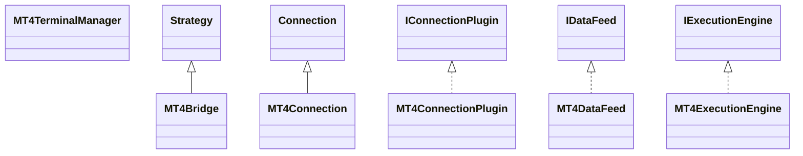

# ConnectionMT4.jar

[Group index](README.md) | [All archives](../README.md)

## Scope and provenance

- **Donor:** `SQX_145_REFERENCE_ROOT/internal/plugins/ConnectionMT4/ConnectionMT4.jar`.
- **SHA-256:** `e197dc620cdeb9bccc53742aa8c3aa6a3a9bc41aea320f3e95eb3b052e503d7d`; accessed 2026-10-06; captured `2026-10-06T18:54:51.906614+00:00`.
- **Classes:** 7 raw entries; 7 unique entry names. Duplicate occurrence indices are zero-based.
- **Inspection:** read-only ZIP hashing and class-file structural parsing; signatures/descriptors, modifiers, hierarchy and references only. Bytecode bodies are hashed, not published.
- **Allocation:** proposed `FEAT-CONNECTION-CONNECTION-MT4`, P16; [roadmap](../../dev/sqx-full-application-roadmap.md). Domain README registration remains required.
- **Repository:** `01067f00031428613c6394064ca1bcadc1ba00ee`; review state unreviewed. Download label 145-dev1; installed build/activation and runtime equivalence unverified.
- **Limit:** every class/member is inventoried; declaration coverage does not establish consumed calls, defaults, formulas, failure semantics or algorithm parity.
- **Archive/resource index:** [145.json](../../dev/evidence/sqx145/archives/145/145.json).

## Complete member declarations

Member shards contain exact JVM names/descriptors, access flags, generic signatures, throws types, declared fields/methods, superclass/interfaces and referenced class names. All classes, nested/synthetic members and overloads are retained. Code length/hash is structural evidence, not a normalized algorithm comparison.

- [001.json](../../dev/evidence/sqx145/members/145/001.json) — SHA-256 `a683c7a6e6c2091ecdb5a77a97ab20d7c4f4b89a2c0f86dc68648acc255db5af`.

## Focused structural diagram

Up to twelve non-nested classes; arrows show declared inheritance/interfaces only. External type names are not evidence of an available body or an executed dependency.

## Class inventory

| Archive entry | Occurrence | Class SHA-256 | Fields | Methods |
| --- | ---: | --- | ---: | ---: |
| `com/strategyquant/plugin/Connection/impl/MT4/MT4Bridge.class` | 0 | `2e4ca5a995a1289182449cf3e6582ff5c2d99bdd552df852a7ff8c951493342c` | 14 | 36 |
| `com/strategyquant/plugin/Connection/impl/MT4/MT4Connection$1.class` | 0 | `68b504dcbdaa50ea44ea9ff9fdd0db8c0d4dea3fd6942bb7f84f240eae918494` | 1 | 2 |
| `com/strategyquant/plugin/Connection/impl/MT4/MT4Connection.class` | 0 | `33aca15343911716b373872306b7f985322ce6ace7ff4e6880d34768a7059b30` | 4 | 18 |
| `com/strategyquant/plugin/Connection/impl/MT4/MT4ConnectionPlugin.class` | 0 | `5db4a84c516ab15bec920e33038751ae31b7aa71979b1756ef664934a53efade` | 1 | 9 |
| `com/strategyquant/plugin/Connection/impl/MT4/MT4DataFeed.class` | 0 | `ed243e16f3a63cfb9da535164446917e6eff9e6e8ddb982299b370c951621f5e` | 4 | 6 |
| `com/strategyquant/plugin/Connection/impl/MT4/MT4ExecutionEngine.class` | 0 | `b7efeb2e8935cca7cbabe87f2b87ae87c7072072b98d142a19b16e88719a04fb` | 4 | 25 |
| `com/strategyquant/plugin/Connection/impl/MT4/MT4TerminalManager.class` | 0 | `314e2022010038ae942ba66bf8b0d1bd999bea1a22c0c1e0e14a2ba7f3125ee8` | 7 | 15 |
