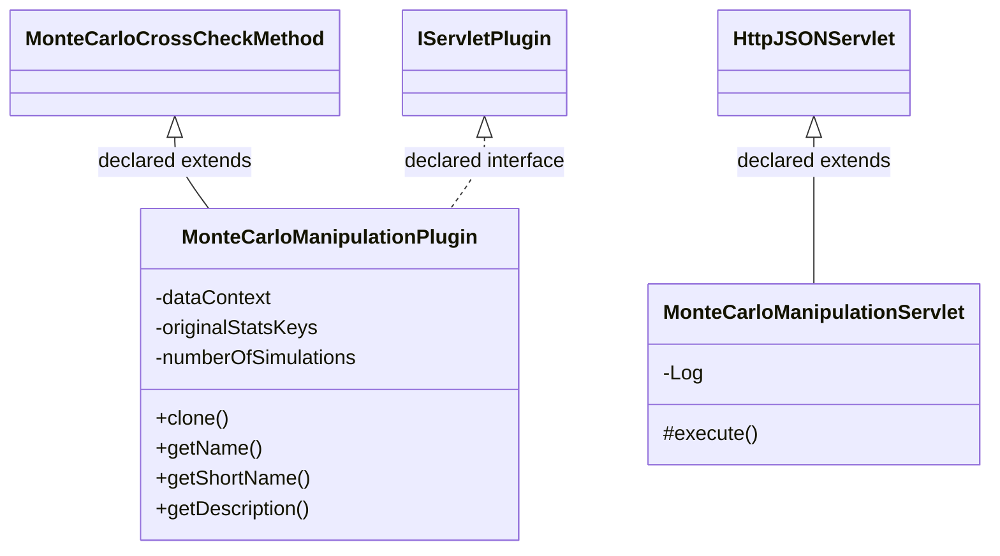

# CrossCheckMonteCarloManipulation.jar

[Workspace/group index](README.md)  |  [All workspaces](../README.md)

## Scope and provenance

- Artifact: `SQX_REFERENCE_ROOT/internal/plugins/CrossCheckMonteCarloManipulation/CrossCheckMonteCarloManipulation.jar`.
- SHA-256: `90124230d9193aca301b0bd01e80d7954664977d79795e7c211418995b409155`.
- Inspected: 2026-10-05; generation timestamp `2026-10-05T19:04:16.344170+00:00`.
- Archive class entries: **2**; non-nested: **2**; nested/anonymous: **0**.
- Inspection: ZIP entry/manifest enumeration and `javap -p` declarations for every listed class.
- Repository source HEAD: `8a92c705183a6702eaf62037ccb202ed028aa899`; review state: generated, pending owner review.
- Installed SQX build number is unverified. No method bodies are reproduced.
- Confidence: high for declared structure; workspace ownership inferred except where registration evidence is separately stated. Runtime reachability, call order, formulas and parity remain unverified.

Shared component: a single canonical document is linked from relevant workspace indexes. Its presence here does not establish which workspaces load it at runtime.

Target mapping: no verified owning HaruQuantAI feature/requirement/decision IDs are assigned by this document. Register or resolve ownership through the normal repository plan before implementation.

## Diagram reading guide

`Parent <|-- Child` means declared inheritance; `Interface <|.. Class` means declared implementation. Interface extension uses the inheritance arrow. `A ..> B : field type` is a declared type dependency, not composition, object ownership or a runtime call. External nodes are referenced types, not fabricated local implementations. Selected fields/method names aid navigation: `+` is public, `#` protected and `-` private. Diagram method names omit parameter/return types and collapse overloads; use the exact inspected declarations below before implementing an API.

Detailed graphs include non-nested classes in package-sized groups of at most 12. Nested/anonymous classes are inventoried and their declarations/relationships are retained below, but omitted from overview graphs. Relationships not drawn for readability remain in the complete declaration-relationship table. Constructors, synthetic bridges and overloads may be collapsed in diagram member lists only. Standard `java.lang.Object` inheritance is omitted from diagrams.

## UML class diagrams

### 1. `com.strategyquant.plugin.CrossCheck.impl.MonteCarloManipulation`



| Diagram identifier | Exact type | Location |
| --- | --- | --- |
| `C07dd0115681b` | `com.strategyquant.plugin.CrossCheck.impl.MonteCarloManipulation.MonteCarloManipulationPlugin` (this JAR) | this diagram |
| `C899ab5e59975` | `com.strategyquant.plugin.CrossCheck.impl.MonteCarloManipulation.MonteCarloManipulationServlet` (this JAR) | this diagram |
| `C5b0583b7f4e7` | [`com.strategyquant.tradinglib.crosscheck.MonteCarloCrossCheckMethod`](SQTradingLib.md) | referenced external type |
| `C249b5c671b1a` | [`com.strategyquant.tradinglib.servlet.IServletPlugin`](SQTradingLib.md) | referenced external type |
| `C8900f90ae594` | [`com.strategyquant.webguilib.servlet.HttpJSONServlet`](SQWebGUILib.md) | referenced external type |

## Complete class inventory

| Fully qualified class | Kind | Entry |
| --- | --- | --- |
| `com.strategyquant.plugin.CrossCheck.impl.MonteCarloManipulation.MonteCarloManipulationPlugin` | class | non-nested |
| `com.strategyquant.plugin.CrossCheck.impl.MonteCarloManipulation.MonteCarloManipulationServlet` | class | non-nested |

## Declared relationships and evidence locations

Every row is supported by the named class declaration/member in `javap -p`, inside the artifact recorded above. Signature dependencies may include return, parameter, generic-argument and throws types; they do not imply execution.

| Declaring class | Referenced type | Relationship | Narrow inspection location |
| --- | --- | --- | --- |
| `com.strategyquant.plugin.CrossCheck.impl.MonteCarloManipulation.MonteCarloManipulationPlugin` | [`com.strategyquant.tradinglib.crosscheck.MonteCarloCrossCheckMethod`](SQTradingLib.md) | extends | `com.strategyquant.plugin.CrossCheck.impl.MonteCarloManipulation.MonteCarloManipulationPlugin` / class declaration: `public class com.strategyquant.plugin.CrossCheck.impl.MonteCarloManipulation.MonteCarloManipulationPlugin extends com.strategyquant.tradinglib.crosscheck.MonteCarloCrossCheckMethod implements com.strategyquant.tradinglib.servlet.IServletPlugin` |
| `com.strategyquant.plugin.CrossCheck.impl.MonteCarloManipulation.MonteCarloManipulationPlugin` | [`com.strategyquant.tradinglib.servlet.IServletPlugin`](SQTradingLib.md) | implements | `com.strategyquant.plugin.CrossCheck.impl.MonteCarloManipulation.MonteCarloManipulationPlugin` / class declaration: `public class com.strategyquant.plugin.CrossCheck.impl.MonteCarloManipulation.MonteCarloManipulationPlugin extends com.strategyquant.tradinglib.crosscheck.MonteCarloCrossCheckMethod implements com.strategyquant.tradinglib.servlet.IServletPlugin` |
| `com.strategyquant.plugin.CrossCheck.impl.MonteCarloManipulation.MonteCarloManipulationPlugin` | `org.eclipse.jetty.servlet.ServletContextHandler` (not resolved in scoped archives) | type dependency | `com.strategyquant.plugin.CrossCheck.impl.MonteCarloManipulation.MonteCarloManipulationPlugin` / field declaration: `private org.eclipse.jetty.servlet.ServletContextHandler dataContext;` |
| `com.strategyquant.plugin.CrossCheck.impl.MonteCarloManipulation.MonteCarloManipulationPlugin` | [`com.strategyquant.tradinglib.crosscheck.ICrossCheck`](SQTradingLib.md) | type dependency | `com.strategyquant.plugin.CrossCheck.impl.MonteCarloManipulation.MonteCarloManipulationPlugin` / method signature: `public com.strategyquant.tradinglib.crosscheck.ICrossCheck clone(com.strategyquant.lib.SettingsMap);` |
| `com.strategyquant.plugin.CrossCheck.impl.MonteCarloManipulation.MonteCarloManipulationPlugin` | `com.strategyquant.lib.SettingsMap` (not resolved in scoped archives) | type dependency | `com.strategyquant.plugin.CrossCheck.impl.MonteCarloManipulation.MonteCarloManipulationPlugin` / method signature: `public com.strategyquant.tradinglib.crosscheck.ICrossCheck clone(com.strategyquant.lib.SettingsMap);` |
| `com.strategyquant.plugin.CrossCheck.impl.MonteCarloManipulation.MonteCarloManipulationPlugin` | `java.lang.String` (not resolved in scoped archives) | type dependency | `com.strategyquant.plugin.CrossCheck.impl.MonteCarloManipulation.MonteCarloManipulationPlugin` / method signature: `public java.lang.String getName();`<br>`public java.lang.String getShortName();`<br>`public java.lang.String getDescription();`<br>`public java.lang.String getSettingName();`<br>`public boolean runTest(com.strategyquant.tradinglib.ResultsGroup, int, double, com.strategyquant.gridlib.client.GridJob, boolean, com.strategyquant.tradinglib.project.ILastEventListener, java.lang.String) throws java.lang.Exception;`<br>`public java.lang.String printSettings(org.jdom2.Element) throws java.lang.Exception;`<br>`public java.lang.String printWeightedGoals() throws java.lang.Exception;`<br>`public double getMetricValue(com.strategyquant.tradinglib.ResultsGroup, byte, byte, java.lang.String) throws java.lang.Exception;` |
| `com.strategyquant.plugin.CrossCheck.impl.MonteCarloManipulation.MonteCarloManipulationPlugin` | `org.eclipse.jetty.server.Handler` (not resolved in scoped archives) | type dependency | `com.strategyquant.plugin.CrossCheck.impl.MonteCarloManipulation.MonteCarloManipulationPlugin` / method signature: `public org.eclipse.jetty.server.Handler getHandler();` |
| `com.strategyquant.plugin.CrossCheck.impl.MonteCarloManipulation.MonteCarloManipulationPlugin` | `org.jdom2.Element` (not resolved in scoped archives) | type dependency | `com.strategyquant.plugin.CrossCheck.impl.MonteCarloManipulation.MonteCarloManipulationPlugin` / method signature: `public void fixSettings(org.jdom2.Element);`<br>`public void readSettings(org.jdom2.Element, com.strategyquant.tradinglib.task.settings.TaskSettingsData) throws java.lang.Exception;`<br>`public java.lang.String printSettings(org.jdom2.Element) throws java.lang.Exception;` |
| `com.strategyquant.plugin.CrossCheck.impl.MonteCarloManipulation.MonteCarloManipulationPlugin` | [`com.strategyquant.tradinglib.task.settings.TaskSettingsData`](SQTradingLib.md) | type dependency | `com.strategyquant.plugin.CrossCheck.impl.MonteCarloManipulation.MonteCarloManipulationPlugin` / method signature: `public void readSettings(org.jdom2.Element, com.strategyquant.tradinglib.task.settings.TaskSettingsData) throws java.lang.Exception;` |
| `com.strategyquant.plugin.CrossCheck.impl.MonteCarloManipulation.MonteCarloManipulationPlugin` | `java.lang.Exception` (not resolved in scoped archives) | type dependency | `com.strategyquant.plugin.CrossCheck.impl.MonteCarloManipulation.MonteCarloManipulationPlugin` / method signature: `public void readSettings(org.jdom2.Element, com.strategyquant.tradinglib.task.settings.TaskSettingsData) throws java.lang.Exception;`<br>`public boolean runTest(com.strategyquant.tradinglib.ResultsGroup, int, double, com.strategyquant.gridlib.client.GridJob, boolean, com.strategyquant.tradinglib.project.ILastEventListener, java.lang.String) throws java.lang.Exception;`<br>`public java.lang.String printSettings(org.jdom2.Element) throws java.lang.Exception;`<br>`public java.lang.String printWeightedGoals() throws java.lang.Exception;`<br>`public double getMetricValue(com.strategyquant.tradinglib.ResultsGroup, byte, byte, java.lang.String) throws java.lang.Exception;` |
| `com.strategyquant.plugin.CrossCheck.impl.MonteCarloManipulation.MonteCarloManipulationPlugin` | [`com.strategyquant.tradinglib.ResultsGroup`](SQTradingLib.md) | type dependency | `com.strategyquant.plugin.CrossCheck.impl.MonteCarloManipulation.MonteCarloManipulationPlugin` / method signature: `public boolean runTest(com.strategyquant.tradinglib.ResultsGroup, int, double, com.strategyquant.gridlib.client.GridJob, boolean, com.strategyquant.tradinglib.project.ILastEventListener, java.lang.String) throws java.lang.Exception;`<br>`public double getMetricValue(com.strategyquant.tradinglib.ResultsGroup, byte, byte, java.lang.String) throws java.lang.Exception;` |
| `com.strategyquant.plugin.CrossCheck.impl.MonteCarloManipulation.MonteCarloManipulationPlugin` | [`com.strategyquant.gridlib.client.GridJob`](SQGridLib2.md) | type dependency | `com.strategyquant.plugin.CrossCheck.impl.MonteCarloManipulation.MonteCarloManipulationPlugin` / method signature: `public boolean runTest(com.strategyquant.tradinglib.ResultsGroup, int, double, com.strategyquant.gridlib.client.GridJob, boolean, com.strategyquant.tradinglib.project.ILastEventListener, java.lang.String) throws java.lang.Exception;` |
| `com.strategyquant.plugin.CrossCheck.impl.MonteCarloManipulation.MonteCarloManipulationPlugin` | [`com.strategyquant.tradinglib.project.ILastEventListener`](SQTradingLib.md) | type dependency | `com.strategyquant.plugin.CrossCheck.impl.MonteCarloManipulation.MonteCarloManipulationPlugin` / method signature: `public boolean runTest(com.strategyquant.tradinglib.ResultsGroup, int, double, com.strategyquant.gridlib.client.GridJob, boolean, com.strategyquant.tradinglib.project.ILastEventListener, java.lang.String) throws java.lang.Exception;` |
| `com.strategyquant.plugin.CrossCheck.impl.MonteCarloManipulation.MonteCarloManipulationPlugin` | [`com.strategyquant.tradinglib.OrdersList`](SQTradingLib.md) | type dependency | `com.strategyquant.plugin.CrossCheck.impl.MonteCarloManipulation.MonteCarloManipulationPlugin` / method signature: `private void initializeSimulatedOrders(com.strategyquant.tradinglib.OrdersList, com.strategyquant.tradinglib.OrdersList);` |
| `com.strategyquant.plugin.CrossCheck.impl.MonteCarloManipulation.MonteCarloManipulationPlugin` | [`com.strategyquant.tradinglib.engine.ChartSetups`](SQTradingLib.md) | type dependency | `com.strategyquant.plugin.CrossCheck.impl.MonteCarloManipulation.MonteCarloManipulationPlugin` / method signature: `public com.strategyquant.tradinglib.engine.ChartSetups getChartSetups(com.strategyquant.tradinglib.ChartSetup);` |
| `com.strategyquant.plugin.CrossCheck.impl.MonteCarloManipulation.MonteCarloManipulationPlugin` | [`com.strategyquant.tradinglib.ChartSetup`](SQTradingLib.md) | type dependency | `com.strategyquant.plugin.CrossCheck.impl.MonteCarloManipulation.MonteCarloManipulationPlugin` / method signature: `public com.strategyquant.tradinglib.engine.ChartSetups getChartSetups(com.strategyquant.tradinglib.ChartSetup);` |
| `com.strategyquant.plugin.CrossCheck.impl.MonteCarloManipulation.MonteCarloManipulationPlugin` | `java.util.ArrayList` (not resolved in scoped archives) | type dependency | `com.strategyquant.plugin.CrossCheck.impl.MonteCarloManipulation.MonteCarloManipulationPlugin` / method signature: `public java.util.ArrayList<com.strategyquant.tradinglib.optimization.MetricForFitness> getMetricsForFitness();` |
| `com.strategyquant.plugin.CrossCheck.impl.MonteCarloManipulation.MonteCarloManipulationPlugin` | [`com.strategyquant.tradinglib.optimization.MetricForFitness`](SQTradingLib.md) | type dependency | `com.strategyquant.plugin.CrossCheck.impl.MonteCarloManipulation.MonteCarloManipulationPlugin` / method signature: `public java.util.ArrayList<com.strategyquant.tradinglib.optimization.MetricForFitness> getMetricsForFitness();` |
| `com.strategyquant.plugin.CrossCheck.impl.MonteCarloManipulation.MonteCarloManipulationServlet` | [`com.strategyquant.webguilib.servlet.HttpJSONServlet`](SQWebGUILib.md) | extends | `com.strategyquant.plugin.CrossCheck.impl.MonteCarloManipulation.MonteCarloManipulationServlet` / class declaration: `public class com.strategyquant.plugin.CrossCheck.impl.MonteCarloManipulation.MonteCarloManipulationServlet extends com.strategyquant.webguilib.servlet.HttpJSONServlet` |
| `com.strategyquant.plugin.CrossCheck.impl.MonteCarloManipulation.MonteCarloManipulationServlet` | `org.slf4j.Logger` (not resolved in scoped archives) | type dependency | `com.strategyquant.plugin.CrossCheck.impl.MonteCarloManipulation.MonteCarloManipulationServlet` / field declaration: `private static final org.slf4j.Logger Log;` |
| `com.strategyquant.plugin.CrossCheck.impl.MonteCarloManipulation.MonteCarloManipulationServlet` | `java.lang.String` (not resolved in scoped archives) | type dependency | `com.strategyquant.plugin.CrossCheck.impl.MonteCarloManipulation.MonteCarloManipulationServlet` / method signature: `protected java.lang.String execute(java.lang.String, java.util.Map<java.lang.String, java.lang.String[]>, java.lang.String) throws java.lang.Exception;`<br>`private java.lang.String onList(java.util.Map<java.lang.String, java.lang.String[]>) throws java.lang.Exception;`<br>`private java.lang.String onFitnessGetConfidenceLevels() throws java.lang.Exception;`<br>`private java.lang.String onFitnessList() throws java.lang.Exception;` |
| `com.strategyquant.plugin.CrossCheck.impl.MonteCarloManipulation.MonteCarloManipulationServlet` | `java.util.Map` (not resolved in scoped archives) | type dependency | `com.strategyquant.plugin.CrossCheck.impl.MonteCarloManipulation.MonteCarloManipulationServlet` / method signature: `protected java.lang.String execute(java.lang.String, java.util.Map<java.lang.String, java.lang.String[]>, java.lang.String) throws java.lang.Exception;`<br>`private java.lang.String onList(java.util.Map<java.lang.String, java.lang.String[]>) throws java.lang.Exception;` |
| `com.strategyquant.plugin.CrossCheck.impl.MonteCarloManipulation.MonteCarloManipulationServlet` | `java.lang.Exception` (not resolved in scoped archives) | type dependency | `com.strategyquant.plugin.CrossCheck.impl.MonteCarloManipulation.MonteCarloManipulationServlet` / method signature: `protected java.lang.String execute(java.lang.String, java.util.Map<java.lang.String, java.lang.String[]>, java.lang.String) throws java.lang.Exception;`<br>`private java.lang.String onList(java.util.Map<java.lang.String, java.lang.String[]>) throws java.lang.Exception;`<br>`private java.lang.String onFitnessGetConfidenceLevels() throws java.lang.Exception;`<br>`private java.lang.String onFitnessList() throws java.lang.Exception;` |

## Inspected declaration reference

These are structural API/member declarations, not proprietary implementation bodies. Private members and nested classes are retained to make diagram omissions explicit; declarations do not prove behavior.

<details>
<summary>com.strategyquant.plugin.CrossCheck.impl.MonteCarloManipulation.MonteCarloManipulationPlugin</summary>

```text
public class com.strategyquant.plugin.CrossCheck.impl.MonteCarloManipulation.MonteCarloManipulationPlugin extends com.strategyquant.tradinglib.crosscheck.MonteCarloCrossCheckMethod implements com.strategyquant.tradinglib.servlet.IServletPlugin
    private org.eclipse.jetty.servlet.ServletContextHandler dataContext;
    private final int[] originalStatsKeys;
    private int numberOfSimulations;
    private boolean useFullSample;
    public com.strategyquant.plugin.CrossCheck.impl.MonteCarloManipulation.MonteCarloManipulationPlugin();
    public com.strategyquant.tradinglib.crosscheck.ICrossCheck clone(com.strategyquant.lib.SettingsMap);
    public java.lang.String getName();
    public java.lang.String getShortName();
    public java.lang.String getDescription();
    public java.lang.String getSettingName();
    public int getType();
    public int getPreferredPosition();
    public org.eclipse.jetty.server.Handler getHandler();
    public void fixSettings(org.jdom2.Element);
    public void readSettings(org.jdom2.Element, com.strategyquant.tradinglib.task.settings.TaskSettingsData) throws java.lang.Exception;
    public boolean runTest(com.strategyquant.tradinglib.ResultsGroup, int, double, com.strategyquant.gridlib.client.GridJob, boolean, com.strategyquant.tradinglib.project.ILastEventListener, java.lang.String) throws java.lang.Exception;
    private void initializeSimulatedOrders(com.strategyquant.tradinglib.OrdersList, com.strategyquant.tradinglib.OrdersList);
    public int getNumberOfSimulations();
    public boolean doesRetest();
    public boolean doesForEverySetup();
    public com.strategyquant.tradinglib.engine.ChartSetups getChartSetups(com.strategyquant.tradinglib.ChartSetup);
    public java.lang.String printSettings(org.jdom2.Element) throws java.lang.Exception;
    public java.lang.String printWeightedGoals() throws java.lang.Exception;
    public java.util.ArrayList<com.strategyquant.tradinglib.optimization.MetricForFitness> getMetricsForFitness();
    public double getMetricValue(com.strategyquant.tradinglib.ResultsGroup, byte, byte, java.lang.String) throws java.lang.Exception;
    public int getBadStrategyReason();
```

</details>

<details>
<summary>com.strategyquant.plugin.CrossCheck.impl.MonteCarloManipulation.MonteCarloManipulationServlet</summary>

```text
public class com.strategyquant.plugin.CrossCheck.impl.MonteCarloManipulation.MonteCarloManipulationServlet extends com.strategyquant.webguilib.servlet.HttpJSONServlet
    private static final org.slf4j.Logger Log;
    public com.strategyquant.plugin.CrossCheck.impl.MonteCarloManipulation.MonteCarloManipulationServlet();
    protected java.lang.String execute(java.lang.String, java.util.Map<java.lang.String, java.lang.String[]>, java.lang.String) throws java.lang.Exception;
    private java.lang.String onList(java.util.Map<java.lang.String, java.lang.String[]>) throws java.lang.Exception;
    private java.lang.String onFitnessGetConfidenceLevels() throws java.lang.Exception;
    private java.lang.String onFitnessList() throws java.lang.Exception;
```

</details>

## Validation and unresolved gaps

Archive hash and complete class inventory were checked against the inspected local artifact. Declaration extraction accounts for every inventoried class. Documentation/link/diagram structural verification is recorded in the master index and task walkthrough; no SQX runtime validation was performed.

The canonical reimplementation ledger/schema are absent, so no evidence IDs or validation-passed ledger claims are created. This is a donor structural reference. Exact behavior, default values, failure semantics, algorithms, runtime calls and target architectural choices require separate research. No aggregation/composition or cardinalities are inferred.
