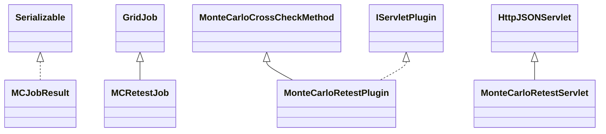

# CrossCheckMonteCarloRetest.jar

[Group index](README.md) | [All archives](../README.md)

## Scope and provenance

- **Donor:** `SQX_145_REFERENCE_ROOT/internal/plugins/CrossCheckMonteCarloRetest/CrossCheckMonteCarloRetest.jar`.
- **SHA-256:** `e2f5937574171309bcfb4dc9ada19eff0195f767383e614187b06a71a941c43b`; accessed 2026-10-06; captured `2026-10-06T18:54:51.906614+00:00`.
- **Classes:** 7 raw entries; 7 unique entry names. Duplicate occurrence indices are zero-based.
- **Inspection:** read-only ZIP hashing and class-file structural parsing; signatures/descriptors, modifiers, hierarchy and references only. Bytecode bodies are hashed, not published.
- **Allocation:** proposed `FEAT-ROBUSTNESS-CROSS-CHECK-MONTE-CARLO-RETEST`, P11; [roadmap](../../dev/sqx-full-application-roadmap.md). Domain README registration remains required.
- **Repository:** `01067f00031428613c6394064ca1bcadc1ba00ee`; review state unreviewed. Download label 145-dev1; installed build/activation and runtime equivalence unverified.
- **Limit:** every class/member is inventoried; declaration coverage does not establish consumed calls, defaults, formulas, failure semantics or algorithm parity.
- **Archive/resource index:** [148.json](../../dev/evidence/sqx145/archives/145/148.json).

## Complete member declarations

Member shards contain exact JVM names/descriptors, access flags, generic signatures, throws types, declared fields/methods, superclass/interfaces and referenced class names. All classes, nested/synthetic members and overloads are retained. Code length/hash is structural evidence, not a normalized algorithm comparison.

- [001.json](../../dev/evidence/sqx145/members/148/001.json) — SHA-256 `b9bcc2e0ce3deb9b8077540ee0428692068ce190bb487f06f6d3f564bf6e4ba2`.

## Focused structural diagram

Up to twelve non-nested classes; arrows show declared inheritance/interfaces only. External type names are not evidence of an available body or an executed dependency.

## Class inventory

| Archive entry | Occurrence | Class SHA-256 | Fields | Methods |
| --- | ---: | --- | ---: | ---: |
| `com/strategyquant/plugin/CrossCheck/impl/MonteCarloRetest/MCJobResult.class` | 0 | `851c5007b29a91a93f7cd35ceec8b361f0491a8687604e68a1caeea15fb0ee74` | 4 | 4 |
| `com/strategyquant/plugin/CrossCheck/impl/MonteCarloRetest/MCRetestJob$1.class` | 0 | `9625da3fdb24f1b9b81dd3a7c65f7d127e3e6084bd915ae0bfbf8d285dcf28ad` | 1 | 3 |
| `com/strategyquant/plugin/CrossCheck/impl/MonteCarloRetest/MCRetestJob$2.class` | 0 | `aadd9f2254f3f0308f62118c4aae26c4c36b5532e67880542278315bddcec675` | 3 | 4 |
| `com/strategyquant/plugin/CrossCheck/impl/MonteCarloRetest/MCRetestJob.class` | 0 | `20ed06c55319a2481b3592ce19fae44e14dcdbbf80ba2eb1fe7de022eecc042d` | 12 | 9 |
| `com/strategyquant/plugin/CrossCheck/impl/MonteCarloRetest/MonteCarloRetestPlugin$1.class` | 0 | `2179241078a49bc3be495996df029a6f2b3351f2670d53ca6c376ebea6a1c52b` | 11 | 5 |
| `com/strategyquant/plugin/CrossCheck/impl/MonteCarloRetest/MonteCarloRetestPlugin.class` | 0 | `99a486f00fb9bc3ade973d63692a99cb942778ee1db1a2e70dc0ffa105e90a45` | 5 | 28 |
| `com/strategyquant/plugin/CrossCheck/impl/MonteCarloRetest/MonteCarloRetestServlet.class` | 0 | `7ff5dd1d58b849a475c760a74d33f0a20c03d3d7a703d067039abbfbd1bc30f4` | 1 | 6 |
