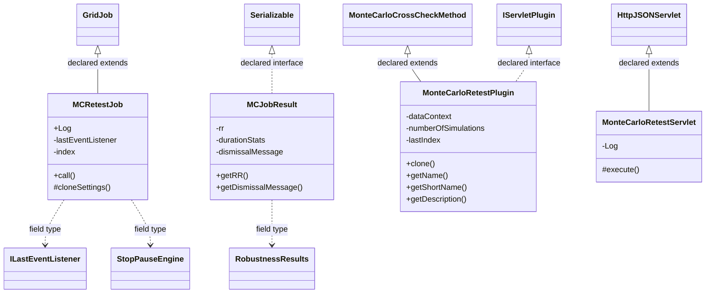

# CrossCheckMonteCarloRetest.jar

[Workspace/group index](README.md)  |  [All workspaces](../README.md)

## Scope and provenance

- Artifact: `SQX_REFERENCE_ROOT/internal/plugins/CrossCheckMonteCarloRetest/CrossCheckMonteCarloRetest.jar`.
- SHA-256: `94fa7d1ee09ca5daa6031e4c3149b0cfb46aa36938df0e1d792423eccaa500ca`.
- Inspected: 2026-10-05; generation timestamp `2026-10-05T19:04:16.344170+00:00`.
- Archive class entries: **7**; non-nested: **4**; nested/anonymous: **3**.
- Inspection: ZIP entry/manifest enumeration and `javap -p` declarations for every listed class.
- Repository source HEAD: `8a92c705183a6702eaf62037ccb202ed028aa899`; review state: generated, pending owner review.
- Installed SQX build number is unverified. No method bodies are reproduced.
- Confidence: high for declared structure; workspace ownership inferred except where registration evidence is separately stated. Runtime reachability, call order, formulas and parity remain unverified.

Shared component: a single canonical document is linked from relevant workspace indexes. Its presence here does not establish which workspaces load it at runtime.

Target mapping: no verified owning HaruQuantAI feature/requirement/decision IDs are assigned by this document. Register or resolve ownership through the normal repository plan before implementation.

## Diagram reading guide

`Parent <|-- Child` means declared inheritance; `Interface <|.. Class` means declared implementation. Interface extension uses the inheritance arrow. `A ..> B : field type` is a declared type dependency, not composition, object ownership or a runtime call. External nodes are referenced types, not fabricated local implementations. Selected fields/method names aid navigation: `+` is public, `#` protected and `-` private. Diagram method names omit parameter/return types and collapse overloads; use the exact inspected declarations below before implementing an API.

Detailed graphs include non-nested classes in package-sized groups of at most 12. Nested/anonymous classes are inventoried and their declarations/relationships are retained below, but omitted from overview graphs. Relationships not drawn for readability remain in the complete declaration-relationship table. Constructors, synthetic bridges and overloads may be collapsed in diagram member lists only. Standard `java.lang.Object` inheritance is omitted from diagrams.

## UML class diagrams

### 1. `com.strategyquant.plugin.CrossCheck.impl.MonteCarloRetest`



| Diagram identifier | Exact type | Location |
| --- | --- | --- |
| `C729a56512564` | [`com.strategyquant.gridlib.client.GridJob`](SQGridLib2.md) | referenced external type |
| `C629c45c54b0d` | `com.strategyquant.plugin.CrossCheck.impl.MonteCarloRetest.MCJobResult` (this JAR) | this diagram |
| `Cfa1035c84945` | `com.strategyquant.plugin.CrossCheck.impl.MonteCarloRetest.MCRetestJob` (this JAR) | this diagram |
| `Cdd9bf802ca9b` | `com.strategyquant.plugin.CrossCheck.impl.MonteCarloRetest.MonteCarloRetestPlugin` (this JAR) | this diagram |
| `C6b84fba37b5b` | `com.strategyquant.plugin.CrossCheck.impl.MonteCarloRetest.MonteCarloRetestServlet` (this JAR) | this diagram |
| `C5b0583b7f4e7` | [`com.strategyquant.tradinglib.crosscheck.MonteCarloCrossCheckMethod`](SQTradingLib.md) | referenced external type |
| `C1295ffcc9568` | [`com.strategyquant.tradinglib.project.ILastEventListener`](SQTradingLib.md) | referenced external type |
| `C61deb3a40141` | [`com.strategyquant.tradinglib.project.StopPauseEngine`](SQTradingLib.md) | referenced external type |
| `C7c3caf98e4ef` | [`com.strategyquant.tradinglib.robustnesstests.RobustnessResults`](SQTradingLib.md) | referenced external type |
| `C249b5c671b1a` | [`com.strategyquant.tradinglib.servlet.IServletPlugin`](SQTradingLib.md) | referenced external type |
| `C8900f90ae594` | [`com.strategyquant.webguilib.servlet.HttpJSONServlet`](SQWebGUILib.md) | referenced external type |
| `C210d9b760f82` | `java.io.Serializable` (not resolved in scoped archives) | referenced external type |

## Complete class inventory

| Fully qualified class | Kind | Entry |
| --- | --- | --- |
| `com.strategyquant.plugin.CrossCheck.impl.MonteCarloRetest.MCJobResult` | class | non-nested |
| `com.strategyquant.plugin.CrossCheck.impl.MonteCarloRetest.MCRetestJob` | class | non-nested |
| `com.strategyquant.plugin.CrossCheck.impl.MonteCarloRetest.MCRetestJob$1` | class | nested/anonymous |
| `com.strategyquant.plugin.CrossCheck.impl.MonteCarloRetest.MCRetestJob$2` | class | nested/anonymous |
| `com.strategyquant.plugin.CrossCheck.impl.MonteCarloRetest.MonteCarloRetestPlugin` | class | non-nested |
| `com.strategyquant.plugin.CrossCheck.impl.MonteCarloRetest.MonteCarloRetestPlugin$1` | class | nested/anonymous |
| `com.strategyquant.plugin.CrossCheck.impl.MonteCarloRetest.MonteCarloRetestServlet` | class | non-nested |

## Declared relationships and evidence locations

Every row is supported by the named class declaration/member in `javap -p`, inside the artifact recorded above. Signature dependencies may include return, parameter, generic-argument and throws types; they do not imply execution.

| Declaring class | Referenced type | Relationship | Narrow inspection location |
| --- | --- | --- | --- |
| `com.strategyquant.plugin.CrossCheck.impl.MonteCarloRetest.MCJobResult` | `java.io.Serializable` (not resolved in scoped archives) | implements | `com.strategyquant.plugin.CrossCheck.impl.MonteCarloRetest.MCJobResult` / class declaration: `public class com.strategyquant.plugin.CrossCheck.impl.MonteCarloRetest.MCJobResult implements java.io.Serializable` |
| `com.strategyquant.plugin.CrossCheck.impl.MonteCarloRetest.MCJobResult` | [`com.strategyquant.tradinglib.robustnesstests.RobustnessResults`](SQTradingLib.md) | type dependency | `com.strategyquant.plugin.CrossCheck.impl.MonteCarloRetest.MCJobResult` / field declaration: `private com.strategyquant.tradinglib.robustnesstests.RobustnessResults rr;` |
| `com.strategyquant.plugin.CrossCheck.impl.MonteCarloRetest.MCJobResult` | [`com.strategyquant.tradinglib.robustnesstests.RobustnessResults`](SQTradingLib.md) | type dependency | `com.strategyquant.plugin.CrossCheck.impl.MonteCarloRetest.MCJobResult` / method signature: `public com.strategyquant.plugin.CrossCheck.impl.MonteCarloRetest.MCJobResult(com.strategyquant.tradinglib.robustnesstests.RobustnessResults, com.strategyquant.tradinglib.backtestrunner.DurationStats);`<br>`public com.strategyquant.tradinglib.robustnesstests.RobustnessResults getRR();` |
| `com.strategyquant.plugin.CrossCheck.impl.MonteCarloRetest.MCJobResult` | `java.lang.Object` (not resolved in scoped archives) | type dependency | `com.strategyquant.plugin.CrossCheck.impl.MonteCarloRetest.MCJobResult` / field declaration: `private java.lang.Object durationStats;` |
| `com.strategyquant.plugin.CrossCheck.impl.MonteCarloRetest.MCJobResult` | `java.lang.String` (not resolved in scoped archives) | type dependency | `com.strategyquant.plugin.CrossCheck.impl.MonteCarloRetest.MCJobResult` / field declaration: `private java.lang.String dismissalMessage;` |
| `com.strategyquant.plugin.CrossCheck.impl.MonteCarloRetest.MCJobResult` | `java.lang.String` (not resolved in scoped archives) | type dependency | `com.strategyquant.plugin.CrossCheck.impl.MonteCarloRetest.MCJobResult` / method signature: `public com.strategyquant.plugin.CrossCheck.impl.MonteCarloRetest.MCJobResult(java.lang.String, int, com.strategyquant.tradinglib.backtestrunner.DurationStats);`<br>`public java.lang.String getDismissalMessage();` |
| `com.strategyquant.plugin.CrossCheck.impl.MonteCarloRetest.MCJobResult` | [`com.strategyquant.tradinglib.backtestrunner.DurationStats`](SQTradingLib.md) | type dependency | `com.strategyquant.plugin.CrossCheck.impl.MonteCarloRetest.MCJobResult` / method signature: `public com.strategyquant.plugin.CrossCheck.impl.MonteCarloRetest.MCJobResult(com.strategyquant.tradinglib.robustnesstests.RobustnessResults, com.strategyquant.tradinglib.backtestrunner.DurationStats);`<br>`public com.strategyquant.plugin.CrossCheck.impl.MonteCarloRetest.MCJobResult(java.lang.String, int, com.strategyquant.tradinglib.backtestrunner.DurationStats);` |
| `com.strategyquant.plugin.CrossCheck.impl.MonteCarloRetest.MCRetestJob` | [`com.strategyquant.gridlib.client.GridJob`](SQGridLib2.md) | extends | `com.strategyquant.plugin.CrossCheck.impl.MonteCarloRetest.MCRetestJob` / class declaration: `public class com.strategyquant.plugin.CrossCheck.impl.MonteCarloRetest.MCRetestJob extends com.strategyquant.gridlib.client.GridJob<com.strategyquant.plugin.CrossCheck.impl.MonteCarloRetest.MCJobResult>` |
| `com.strategyquant.plugin.CrossCheck.impl.MonteCarloRetest.MCRetestJob` | `org.slf4j.Logger` (not resolved in scoped archives) | type dependency | `com.strategyquant.plugin.CrossCheck.impl.MonteCarloRetest.MCRetestJob` / field declaration: `public static final org.slf4j.Logger Log;` |
| `com.strategyquant.plugin.CrossCheck.impl.MonteCarloRetest.MCRetestJob` | [`com.strategyquant.tradinglib.project.ILastEventListener`](SQTradingLib.md) | type dependency | `com.strategyquant.plugin.CrossCheck.impl.MonteCarloRetest.MCRetestJob` / field declaration: `private com.strategyquant.tradinglib.project.ILastEventListener lastEventListener;` |
| `com.strategyquant.plugin.CrossCheck.impl.MonteCarloRetest.MCRetestJob` | [`com.strategyquant.tradinglib.project.ILastEventListener`](SQTradingLib.md) | type dependency | `com.strategyquant.plugin.CrossCheck.impl.MonteCarloRetest.MCRetestJob` / method signature: `public com.strategyquant.plugin.CrossCheck.impl.MonteCarloRetest.MCRetestJob(long, java.lang.String, java.lang.String, java.util.Map<java.lang.String, java.io.Serializable>, com.strategyquant.tradinglib.project.StopPauseEngine, com.strategyquant.tradinglib.project.ILastEventListener, int, double, com.strategyquant.tradinglib.results.SymbolsMap);` |
| `com.strategyquant.plugin.CrossCheck.impl.MonteCarloRetest.MCRetestJob` | `java.lang.String` (not resolved in scoped archives) | type dependency | `com.strategyquant.plugin.CrossCheck.impl.MonteCarloRetest.MCRetestJob` / field declaration: `private java.lang.String strategyName;` |
| `com.strategyquant.plugin.CrossCheck.impl.MonteCarloRetest.MCRetestJob` | `java.lang.String` (not resolved in scoped archives) | type dependency | `com.strategyquant.plugin.CrossCheck.impl.MonteCarloRetest.MCRetestJob` / method signature: `public com.strategyquant.plugin.CrossCheck.impl.MonteCarloRetest.MCRetestJob(long, java.lang.String, java.lang.String, java.util.Map<java.lang.String, java.io.Serializable>, com.strategyquant.tradinglib.project.StopPauseEngine, com.strategyquant.tradinglib.project.ILastEventListener, int, double, com.strategyquant.tradinglib.results.SymbolsMap);`<br>`private java.lang.Object cloneValue(java.lang.String, java.lang.Object) throws java.lang.CloneNotSupportedException;` |
| `com.strategyquant.plugin.CrossCheck.impl.MonteCarloRetest.MCRetestJob` | [`com.strategyquant.tradinglib.project.StopPauseEngine`](SQTradingLib.md) | type dependency | `com.strategyquant.plugin.CrossCheck.impl.MonteCarloRetest.MCRetestJob` / field declaration: `private com.strategyquant.tradinglib.project.StopPauseEngine parentStopPauseEngine;` |
| `com.strategyquant.plugin.CrossCheck.impl.MonteCarloRetest.MCRetestJob` | [`com.strategyquant.tradinglib.project.StopPauseEngine`](SQTradingLib.md) | type dependency | `com.strategyquant.plugin.CrossCheck.impl.MonteCarloRetest.MCRetestJob` / method signature: `public com.strategyquant.plugin.CrossCheck.impl.MonteCarloRetest.MCRetestJob(long, java.lang.String, java.lang.String, java.util.Map<java.lang.String, java.io.Serializable>, com.strategyquant.tradinglib.project.StopPauseEngine, com.strategyquant.tradinglib.project.ILastEventListener, int, double, com.strategyquant.tradinglib.results.SymbolsMap);` |
| `com.strategyquant.plugin.CrossCheck.impl.MonteCarloRetest.MCRetestJob` | `com.strategyquant.lib.SettingsMap` (not resolved in scoped archives) | type dependency | `com.strategyquant.plugin.CrossCheck.impl.MonteCarloRetest.MCRetestJob` / field declaration: `private com.strategyquant.lib.SettingsMap resultSettings;`<br>`private com.strategyquant.lib.SettingsMap mcSettings;` |
| `com.strategyquant.plugin.CrossCheck.impl.MonteCarloRetest.MCRetestJob` | `com.strategyquant.lib.SettingsMap` (not resolved in scoped archives) | type dependency | `com.strategyquant.plugin.CrossCheck.impl.MonteCarloRetest.MCRetestJob` / method signature: `private com.strategyquant.tradinglib.OrdersList filterInSampleOnly(com.strategyquant.tradinglib.OrdersList, com.strategyquant.lib.SettingsMap);`<br>`protected com.strategyquant.lib.SettingsMap cloneSettings(com.strategyquant.lib.SettingsMap) throws java.lang.CloneNotSupportedException;` |
| `com.strategyquant.plugin.CrossCheck.impl.MonteCarloRetest.MCRetestJob` | [`com.strategyquant.tradinglib.results.SymbolsMap`](SQTradingLib.md) | type dependency | `com.strategyquant.plugin.CrossCheck.impl.MonteCarloRetest.MCRetestJob` / field declaration: `private com.strategyquant.tradinglib.results.SymbolsMap symbolsMap;` |
| `com.strategyquant.plugin.CrossCheck.impl.MonteCarloRetest.MCRetestJob` | [`com.strategyquant.tradinglib.results.SymbolsMap`](SQTradingLib.md) | type dependency | `com.strategyquant.plugin.CrossCheck.impl.MonteCarloRetest.MCRetestJob` / method signature: `public com.strategyquant.plugin.CrossCheck.impl.MonteCarloRetest.MCRetestJob(long, java.lang.String, java.lang.String, java.util.Map<java.lang.String, java.io.Serializable>, com.strategyquant.tradinglib.project.StopPauseEngine, com.strategyquant.tradinglib.project.ILastEventListener, int, double, com.strategyquant.tradinglib.results.SymbolsMap);` |
| `com.strategyquant.plugin.CrossCheck.impl.MonteCarloRetest.MCRetestJob` | `java.util.Map` (not resolved in scoped archives) | type dependency | `com.strategyquant.plugin.CrossCheck.impl.MonteCarloRetest.MCRetestJob` / method signature: `public com.strategyquant.plugin.CrossCheck.impl.MonteCarloRetest.MCRetestJob(long, java.lang.String, java.lang.String, java.util.Map<java.lang.String, java.io.Serializable>, com.strategyquant.tradinglib.project.StopPauseEngine, com.strategyquant.tradinglib.project.ILastEventListener, int, double, com.strategyquant.tradinglib.results.SymbolsMap);` |
| `com.strategyquant.plugin.CrossCheck.impl.MonteCarloRetest.MCRetestJob` | `java.io.Serializable` (not resolved in scoped archives) | type dependency | `com.strategyquant.plugin.CrossCheck.impl.MonteCarloRetest.MCRetestJob` / method signature: `public com.strategyquant.plugin.CrossCheck.impl.MonteCarloRetest.MCRetestJob(long, java.lang.String, java.lang.String, java.util.Map<java.lang.String, java.io.Serializable>, com.strategyquant.tradinglib.project.StopPauseEngine, com.strategyquant.tradinglib.project.ILastEventListener, int, double, com.strategyquant.tradinglib.results.SymbolsMap);` |
| `com.strategyquant.plugin.CrossCheck.impl.MonteCarloRetest.MCRetestJob` | `com.strategyquant.plugin.CrossCheck.impl.MonteCarloRetest.MCJobResult` (this JAR) | type dependency | `com.strategyquant.plugin.CrossCheck.impl.MonteCarloRetest.MCRetestJob` / method signature: `public com.strategyquant.plugin.CrossCheck.impl.MonteCarloRetest.MCJobResult call() throws java.lang.Exception;` |
| `com.strategyquant.plugin.CrossCheck.impl.MonteCarloRetest.MCRetestJob` | `java.lang.Exception` (not resolved in scoped archives) | type dependency | `com.strategyquant.plugin.CrossCheck.impl.MonteCarloRetest.MCRetestJob` / method signature: `public com.strategyquant.plugin.CrossCheck.impl.MonteCarloRetest.MCJobResult call() throws java.lang.Exception;`<br>`public java.lang.Object call() throws java.lang.Exception;` |
| `com.strategyquant.plugin.CrossCheck.impl.MonteCarloRetest.MCRetestJob` | [`com.strategyquant.tradinglib.ChartSetup`](SQTradingLib.md) | type dependency | `com.strategyquant.plugin.CrossCheck.impl.MonteCarloRetest.MCRetestJob` / method signature: `private boolean isRandomizeHistoryUsed(com.strategyquant.tradinglib.ChartSetup, java.util.ArrayList<com.strategyquant.tradinglib.MonteCarloRetest>);` |
| `com.strategyquant.plugin.CrossCheck.impl.MonteCarloRetest.MCRetestJob` | `java.util.ArrayList` (not resolved in scoped archives) | type dependency | `com.strategyquant.plugin.CrossCheck.impl.MonteCarloRetest.MCRetestJob` / method signature: `private boolean isRandomizeHistoryUsed(com.strategyquant.tradinglib.ChartSetup, java.util.ArrayList<com.strategyquant.tradinglib.MonteCarloRetest>);` |
| `com.strategyquant.plugin.CrossCheck.impl.MonteCarloRetest.MCRetestJob` | [`com.strategyquant.tradinglib.MonteCarloRetest`](SQTradingLib.md) | type dependency | `com.strategyquant.plugin.CrossCheck.impl.MonteCarloRetest.MCRetestJob` / method signature: `private boolean isRandomizeHistoryUsed(com.strategyquant.tradinglib.ChartSetup, java.util.ArrayList<com.strategyquant.tradinglib.MonteCarloRetest>);` |
| `com.strategyquant.plugin.CrossCheck.impl.MonteCarloRetest.MCRetestJob` | [`com.strategyquant.tradinglib.OrdersList`](SQTradingLib.md) | type dependency | `com.strategyquant.plugin.CrossCheck.impl.MonteCarloRetest.MCRetestJob` / method signature: `private com.strategyquant.tradinglib.OrdersList filterInSampleOnly(com.strategyquant.tradinglib.OrdersList, com.strategyquant.lib.SettingsMap);` |
| `com.strategyquant.plugin.CrossCheck.impl.MonteCarloRetest.MCRetestJob` | `java.lang.CloneNotSupportedException` (not resolved in scoped archives) | type dependency | `com.strategyquant.plugin.CrossCheck.impl.MonteCarloRetest.MCRetestJob` / method signature: `protected com.strategyquant.lib.SettingsMap cloneSettings(com.strategyquant.lib.SettingsMap) throws java.lang.CloneNotSupportedException;`<br>`private java.lang.Object cloneValue(java.lang.String, java.lang.Object) throws java.lang.CloneNotSupportedException;` |
| `com.strategyquant.plugin.CrossCheck.impl.MonteCarloRetest.MCRetestJob` | `java.lang.Object` (not resolved in scoped archives) | type dependency | `com.strategyquant.plugin.CrossCheck.impl.MonteCarloRetest.MCRetestJob` / method signature: `private java.lang.Object cloneValue(java.lang.String, java.lang.Object) throws java.lang.CloneNotSupportedException;`<br>`public java.lang.Object call() throws java.lang.Exception;` |
| `com.strategyquant.plugin.CrossCheck.impl.MonteCarloRetest.MCRetestJob$1` | [`com.strategyquant.tradinglib.backtestrunner.IBacktestProgressListener`](SQTradingLib.md) | implements | `com.strategyquant.plugin.CrossCheck.impl.MonteCarloRetest.MCRetestJob$1` / class declaration: `class com.strategyquant.plugin.CrossCheck.impl.MonteCarloRetest.MCRetestJob$1 implements com.strategyquant.tradinglib.backtestrunner.IBacktestProgressListener` |
| `com.strategyquant.plugin.CrossCheck.impl.MonteCarloRetest.MCRetestJob$1` | `com.strategyquant.plugin.CrossCheck.impl.MonteCarloRetest.MCRetestJob` (this JAR) | type dependency | `com.strategyquant.plugin.CrossCheck.impl.MonteCarloRetest.MCRetestJob$1` / field declaration: `final com.strategyquant.plugin.CrossCheck.impl.MonteCarloRetest.MCRetestJob this$0;` |
| `com.strategyquant.plugin.CrossCheck.impl.MonteCarloRetest.MCRetestJob$1` | `com.strategyquant.plugin.CrossCheck.impl.MonteCarloRetest.MCRetestJob` (this JAR) | type dependency | `com.strategyquant.plugin.CrossCheck.impl.MonteCarloRetest.MCRetestJob$1` / method signature: `com.strategyquant.plugin.CrossCheck.impl.MonteCarloRetest.MCRetestJob$1(com.strategyquant.plugin.CrossCheck.impl.MonteCarloRetest.MCRetestJob);` |
| `com.strategyquant.plugin.CrossCheck.impl.MonteCarloRetest.MCRetestJob$2` | [`com.strategyquant.tradinglib.robustnesstests.DataModifierCallback`](SQTradingLib.md) | implements | `com.strategyquant.plugin.CrossCheck.impl.MonteCarloRetest.MCRetestJob$2` / class declaration: `class com.strategyquant.plugin.CrossCheck.impl.MonteCarloRetest.MCRetestJob$2 implements com.strategyquant.tradinglib.robustnesstests.DataModifierCallback` |
| `com.strategyquant.plugin.CrossCheck.impl.MonteCarloRetest.MCRetestJob$2` | [`com.strategyquant.tradinglib.MonteCarloRetest`](SQTradingLib.md) | type dependency | `com.strategyquant.plugin.CrossCheck.impl.MonteCarloRetest.MCRetestJob$2` / field declaration: `final com.strategyquant.tradinglib.MonteCarloRetest val$method;` |
| `com.strategyquant.plugin.CrossCheck.impl.MonteCarloRetest.MCRetestJob$2` | `com.strategyquant.lib.IRandomGenerator` (not resolved in scoped archives) | type dependency | `com.strategyquant.plugin.CrossCheck.impl.MonteCarloRetest.MCRetestJob$2` / field declaration: `final com.strategyquant.lib.IRandomGenerator val$rng;` |
| `com.strategyquant.plugin.CrossCheck.impl.MonteCarloRetest.MCRetestJob$2` | `com.strategyquant.plugin.CrossCheck.impl.MonteCarloRetest.MCRetestJob` (this JAR) | type dependency | `com.strategyquant.plugin.CrossCheck.impl.MonteCarloRetest.MCRetestJob$2` / field declaration: `final com.strategyquant.plugin.CrossCheck.impl.MonteCarloRetest.MCRetestJob this$0;` |
| `com.strategyquant.plugin.CrossCheck.impl.MonteCarloRetest.MCRetestJob$2` | [`com.strategyquant.datalib.TickEvent`](SQDataLib.md) | type dependency | `com.strategyquant.plugin.CrossCheck.impl.MonteCarloRetest.MCRetestJob$2` / method signature: `public void modifyData(com.strategyquant.datalib.TickEvent);`<br>`public void modifyData(com.strategyquant.datalib.TickEvent, double);` |
| `com.strategyquant.plugin.CrossCheck.impl.MonteCarloRetest.MCRetestJob$2` | [`com.strategyquant.datalib.data.io.VersatileData`](SQDataLib.md) | type dependency | `com.strategyquant.plugin.CrossCheck.impl.MonteCarloRetest.MCRetestJob$2` / method signature: `public void modifyOHLCData(com.strategyquant.datalib.data.io.VersatileData);` |
| `com.strategyquant.plugin.CrossCheck.impl.MonteCarloRetest.MonteCarloRetestPlugin` | [`com.strategyquant.tradinglib.crosscheck.MonteCarloCrossCheckMethod`](SQTradingLib.md) | extends | `com.strategyquant.plugin.CrossCheck.impl.MonteCarloRetest.MonteCarloRetestPlugin` / class declaration: `public class com.strategyquant.plugin.CrossCheck.impl.MonteCarloRetest.MonteCarloRetestPlugin extends com.strategyquant.tradinglib.crosscheck.MonteCarloCrossCheckMethod implements com.strategyquant.tradinglib.servlet.IServletPlugin` |
| `com.strategyquant.plugin.CrossCheck.impl.MonteCarloRetest.MonteCarloRetestPlugin` | [`com.strategyquant.tradinglib.servlet.IServletPlugin`](SQTradingLib.md) | implements | `com.strategyquant.plugin.CrossCheck.impl.MonteCarloRetest.MonteCarloRetestPlugin` / class declaration: `public class com.strategyquant.plugin.CrossCheck.impl.MonteCarloRetest.MonteCarloRetestPlugin extends com.strategyquant.tradinglib.crosscheck.MonteCarloCrossCheckMethod implements com.strategyquant.tradinglib.servlet.IServletPlugin` |
| `com.strategyquant.plugin.CrossCheck.impl.MonteCarloRetest.MonteCarloRetestPlugin` | `org.eclipse.jetty.servlet.ServletContextHandler` (not resolved in scoped archives) | type dependency | `com.strategyquant.plugin.CrossCheck.impl.MonteCarloRetest.MonteCarloRetestPlugin` / field declaration: `private org.eclipse.jetty.servlet.ServletContextHandler dataContext;` |
| `com.strategyquant.plugin.CrossCheck.impl.MonteCarloRetest.MonteCarloRetestPlugin` | [`com.strategyquant.tradinglib.crosscheck.ICrossCheck`](SQTradingLib.md) | type dependency | `com.strategyquant.plugin.CrossCheck.impl.MonteCarloRetest.MonteCarloRetestPlugin` / method signature: `public com.strategyquant.tradinglib.crosscheck.ICrossCheck clone(com.strategyquant.lib.SettingsMap);` |
| `com.strategyquant.plugin.CrossCheck.impl.MonteCarloRetest.MonteCarloRetestPlugin` | `com.strategyquant.lib.SettingsMap` (not resolved in scoped archives) | type dependency | `com.strategyquant.plugin.CrossCheck.impl.MonteCarloRetest.MonteCarloRetestPlugin` / method signature: `public com.strategyquant.tradinglib.crosscheck.ICrossCheck clone(com.strategyquant.lib.SettingsMap);`<br>`private java.util.ArrayList<com.strategyquant.tradinglib.robustnesstests.RobustnessResults> runOnGrid(com.strategyquant.lib.SettingsMap, int, com.strategyquant.tradinglib.Result, com.strategyquant.tradinglib.results.SymbolsMap, double, java.lang.String, com.strategyquant.gridlib.client.GridJob, com.strategyquant.tradinglib.project.ILastEventListener, boolean, boolean, int) throws java.lang.Exception;`<br>`protected java.util.ArrayList<com.strategyquant.plugin.CrossCheck.impl.MonteCarloRetest.MCRetestJob> createBatch(java.lang.String, int, com.strategyquant.gridlib.client.GridClient, long, com.strategyquant.lib.SettingsMap, com.strategyquant.lib.SettingsMap, com.strategyquant.tradinglib.project.ILastEventListener, int, double, com.strategyquant.tradinglib.results.SymbolsMap, boolean, int) throws java.lang.Exception;`<br>`private static java.util.Map<java.lang.String, java.io.Serializable> getJobSettings(com.strategyquant.lib.SettingsMap, com.strategyquant.lib.SettingsMap, boolean, int);`<br>`static com.strategyquant.lib.SettingsMap access$100(com.strategyquant.plugin.CrossCheck.impl.MonteCarloRetest.MonteCarloRetestPlugin);` |
| `com.strategyquant.plugin.CrossCheck.impl.MonteCarloRetest.MonteCarloRetestPlugin` | `java.lang.String` (not resolved in scoped archives) | type dependency | `com.strategyquant.plugin.CrossCheck.impl.MonteCarloRetest.MonteCarloRetestPlugin` / method signature: `public java.lang.String getName();`<br>`public java.lang.String getShortName();`<br>`public java.lang.String getDescription();`<br>`public java.lang.String getSettingName();`<br>`public boolean runTest(com.strategyquant.tradinglib.ResultsGroup, int, double, com.strategyquant.gridlib.client.GridJob, boolean, com.strategyquant.tradinglib.project.ILastEventListener, java.lang.String) throws java.lang.Exception;`<br>`private java.util.ArrayList<com.strategyquant.tradinglib.robustnesstests.RobustnessResults> runOnGrid(com.strategyquant.lib.SettingsMap, int, com.strategyquant.tradinglib.Result, com.strategyquant.tradinglib.results.SymbolsMap, double, java.lang.String, com.strategyquant.gridlib.client.GridJob, com.strategyquant.tradinglib.project.ILastEventListener, boolean, boolean, int) throws java.lang.Exception;`<br>`protected java.util.ArrayList<com.strategyquant.plugin.CrossCheck.impl.MonteCarloRetest.MCRetestJob> createBatch(java.lang.String, int, com.strategyquant.gridlib.client.GridClient, long, com.strategyquant.lib.SettingsMap, com.strategyquant.lib.SettingsMap, com.strategyquant.tradinglib.project.ILastEventListener, int, double, com.strategyquant.tradinglib.results.SymbolsMap, boolean, int) throws java.lang.Exception;`<br>`private static java.util.Map<java.lang.String, java.io.Serializable> getJobSettings(com.strategyquant.lib.SettingsMap, com.strategyquant.lib.SettingsMap, boolean, int);`<br>`public java.lang.String printSettings(org.jdom2.Element) throws java.lang.Exception;`<br>`public java.lang.String printWeightedGoals() throws java.lang.Exception;`<br>`public double getMetricValue(com.strategyquant.tradinglib.ResultsGroup, byte, byte, java.lang.String) throws java.lang.Exception;` |
| `com.strategyquant.plugin.CrossCheck.impl.MonteCarloRetest.MonteCarloRetestPlugin` | `org.eclipse.jetty.server.Handler` (not resolved in scoped archives) | type dependency | `com.strategyquant.plugin.CrossCheck.impl.MonteCarloRetest.MonteCarloRetestPlugin` / method signature: `public org.eclipse.jetty.server.Handler getHandler();` |
| `com.strategyquant.plugin.CrossCheck.impl.MonteCarloRetest.MonteCarloRetestPlugin` | `org.jdom2.Element` (not resolved in scoped archives) | type dependency | `com.strategyquant.plugin.CrossCheck.impl.MonteCarloRetest.MonteCarloRetestPlugin` / method signature: `public void fixSettings(org.jdom2.Element);`<br>`public void readSettings(org.jdom2.Element, com.strategyquant.tradinglib.task.settings.TaskSettingsData) throws java.lang.Exception;`<br>`public java.lang.String printSettings(org.jdom2.Element) throws java.lang.Exception;` |
| `com.strategyquant.plugin.CrossCheck.impl.MonteCarloRetest.MonteCarloRetestPlugin` | [`com.strategyquant.tradinglib.task.settings.TaskSettingsData`](SQTradingLib.md) | type dependency | `com.strategyquant.plugin.CrossCheck.impl.MonteCarloRetest.MonteCarloRetestPlugin` / method signature: `public void readSettings(org.jdom2.Element, com.strategyquant.tradinglib.task.settings.TaskSettingsData) throws java.lang.Exception;` |
| `com.strategyquant.plugin.CrossCheck.impl.MonteCarloRetest.MonteCarloRetestPlugin` | `java.lang.Exception` (not resolved in scoped archives) | type dependency | `com.strategyquant.plugin.CrossCheck.impl.MonteCarloRetest.MonteCarloRetestPlugin` / method signature: `public void readSettings(org.jdom2.Element, com.strategyquant.tradinglib.task.settings.TaskSettingsData) throws java.lang.Exception;`<br>`public boolean runTest(com.strategyquant.tradinglib.ResultsGroup, int, double, com.strategyquant.gridlib.client.GridJob, boolean, com.strategyquant.tradinglib.project.ILastEventListener, java.lang.String) throws java.lang.Exception;`<br>`private java.util.ArrayList<com.strategyquant.tradinglib.robustnesstests.RobustnessResults> runOnGrid(com.strategyquant.lib.SettingsMap, int, com.strategyquant.tradinglib.Result, com.strategyquant.tradinglib.results.SymbolsMap, double, java.lang.String, com.strategyquant.gridlib.client.GridJob, com.strategyquant.tradinglib.project.ILastEventListener, boolean, boolean, int) throws java.lang.Exception;`<br>`protected java.util.ArrayList<com.strategyquant.plugin.CrossCheck.impl.MonteCarloRetest.MCRetestJob> createBatch(java.lang.String, int, com.strategyquant.gridlib.client.GridClient, long, com.strategyquant.lib.SettingsMap, com.strategyquant.lib.SettingsMap, com.strategyquant.tradinglib.project.ILastEventListener, int, double, com.strategyquant.tradinglib.results.SymbolsMap, boolean, int) throws java.lang.Exception;`<br>`public java.lang.String printSettings(org.jdom2.Element) throws java.lang.Exception;`<br>`public java.lang.String printWeightedGoals() throws java.lang.Exception;`<br>`public double getMetricValue(com.strategyquant.tradinglib.ResultsGroup, byte, byte, java.lang.String) throws java.lang.Exception;` |
| `com.strategyquant.plugin.CrossCheck.impl.MonteCarloRetest.MonteCarloRetestPlugin` | [`com.strategyquant.tradinglib.ResultsGroup`](SQTradingLib.md) | type dependency | `com.strategyquant.plugin.CrossCheck.impl.MonteCarloRetest.MonteCarloRetestPlugin` / method signature: `public boolean runTest(com.strategyquant.tradinglib.ResultsGroup, int, double, com.strategyquant.gridlib.client.GridJob, boolean, com.strategyquant.tradinglib.project.ILastEventListener, java.lang.String) throws java.lang.Exception;`<br>`public double getMetricValue(com.strategyquant.tradinglib.ResultsGroup, byte, byte, java.lang.String) throws java.lang.Exception;` |
| `com.strategyquant.plugin.CrossCheck.impl.MonteCarloRetest.MonteCarloRetestPlugin` | [`com.strategyquant.gridlib.client.GridJob`](SQGridLib2.md) | type dependency | `com.strategyquant.plugin.CrossCheck.impl.MonteCarloRetest.MonteCarloRetestPlugin` / method signature: `public boolean runTest(com.strategyquant.tradinglib.ResultsGroup, int, double, com.strategyquant.gridlib.client.GridJob, boolean, com.strategyquant.tradinglib.project.ILastEventListener, java.lang.String) throws java.lang.Exception;`<br>`private java.util.ArrayList<com.strategyquant.tradinglib.robustnesstests.RobustnessResults> runOnGrid(com.strategyquant.lib.SettingsMap, int, com.strategyquant.tradinglib.Result, com.strategyquant.tradinglib.results.SymbolsMap, double, java.lang.String, com.strategyquant.gridlib.client.GridJob, com.strategyquant.tradinglib.project.ILastEventListener, boolean, boolean, int) throws java.lang.Exception;` |
| `com.strategyquant.plugin.CrossCheck.impl.MonteCarloRetest.MonteCarloRetestPlugin` | [`com.strategyquant.tradinglib.project.ILastEventListener`](SQTradingLib.md) | type dependency | `com.strategyquant.plugin.CrossCheck.impl.MonteCarloRetest.MonteCarloRetestPlugin` / method signature: `public boolean runTest(com.strategyquant.tradinglib.ResultsGroup, int, double, com.strategyquant.gridlib.client.GridJob, boolean, com.strategyquant.tradinglib.project.ILastEventListener, java.lang.String) throws java.lang.Exception;`<br>`private java.util.ArrayList<com.strategyquant.tradinglib.robustnesstests.RobustnessResults> runOnGrid(com.strategyquant.lib.SettingsMap, int, com.strategyquant.tradinglib.Result, com.strategyquant.tradinglib.results.SymbolsMap, double, java.lang.String, com.strategyquant.gridlib.client.GridJob, com.strategyquant.tradinglib.project.ILastEventListener, boolean, boolean, int) throws java.lang.Exception;`<br>`protected java.util.ArrayList<com.strategyquant.plugin.CrossCheck.impl.MonteCarloRetest.MCRetestJob> createBatch(java.lang.String, int, com.strategyquant.gridlib.client.GridClient, long, com.strategyquant.lib.SettingsMap, com.strategyquant.lib.SettingsMap, com.strategyquant.tradinglib.project.ILastEventListener, int, double, com.strategyquant.tradinglib.results.SymbolsMap, boolean, int) throws java.lang.Exception;` |
| `com.strategyquant.plugin.CrossCheck.impl.MonteCarloRetest.MonteCarloRetestPlugin` | `java.util.ArrayList` (not resolved in scoped archives) | type dependency | `com.strategyquant.plugin.CrossCheck.impl.MonteCarloRetest.MonteCarloRetestPlugin` / method signature: `private java.util.ArrayList<com.strategyquant.tradinglib.robustnesstests.RobustnessResults> runOnGrid(com.strategyquant.lib.SettingsMap, int, com.strategyquant.tradinglib.Result, com.strategyquant.tradinglib.results.SymbolsMap, double, java.lang.String, com.strategyquant.gridlib.client.GridJob, com.strategyquant.tradinglib.project.ILastEventListener, boolean, boolean, int) throws java.lang.Exception;`<br>`protected void processMCResult(com.strategyquant.plugin.CrossCheck.impl.MonteCarloRetest.MCJobResult, com.strategyquant.gridlib.client.JobDetails, java.util.ArrayList<com.strategyquant.tradinglib.robustnesstests.RobustnessResults>, com.strategyquant.tradinglib.Result);`<br>`protected java.util.ArrayList<com.strategyquant.plugin.CrossCheck.impl.MonteCarloRetest.MCRetestJob> createBatch(java.lang.String, int, com.strategyquant.gridlib.client.GridClient, long, com.strategyquant.lib.SettingsMap, com.strategyquant.lib.SettingsMap, com.strategyquant.tradinglib.project.ILastEventListener, int, double, com.strategyquant.tradinglib.results.SymbolsMap, boolean, int) throws java.lang.Exception;`<br>`public java.util.ArrayList<com.strategyquant.tradinglib.optimization.MetricForFitness> getMetricsForFitness();` |
| `com.strategyquant.plugin.CrossCheck.impl.MonteCarloRetest.MonteCarloRetestPlugin` | [`com.strategyquant.tradinglib.robustnesstests.RobustnessResults`](SQTradingLib.md) | type dependency | `com.strategyquant.plugin.CrossCheck.impl.MonteCarloRetest.MonteCarloRetestPlugin` / method signature: `private java.util.ArrayList<com.strategyquant.tradinglib.robustnesstests.RobustnessResults> runOnGrid(com.strategyquant.lib.SettingsMap, int, com.strategyquant.tradinglib.Result, com.strategyquant.tradinglib.results.SymbolsMap, double, java.lang.String, com.strategyquant.gridlib.client.GridJob, com.strategyquant.tradinglib.project.ILastEventListener, boolean, boolean, int) throws java.lang.Exception;`<br>`protected void processMCResult(com.strategyquant.plugin.CrossCheck.impl.MonteCarloRetest.MCJobResult, com.strategyquant.gridlib.client.JobDetails, java.util.ArrayList<com.strategyquant.tradinglib.robustnesstests.RobustnessResults>, com.strategyquant.tradinglib.Result);` |
| `com.strategyquant.plugin.CrossCheck.impl.MonteCarloRetest.MonteCarloRetestPlugin` | [`com.strategyquant.tradinglib.Result`](SQTradingLib.md) | type dependency | `com.strategyquant.plugin.CrossCheck.impl.MonteCarloRetest.MonteCarloRetestPlugin` / method signature: `private java.util.ArrayList<com.strategyquant.tradinglib.robustnesstests.RobustnessResults> runOnGrid(com.strategyquant.lib.SettingsMap, int, com.strategyquant.tradinglib.Result, com.strategyquant.tradinglib.results.SymbolsMap, double, java.lang.String, com.strategyquant.gridlib.client.GridJob, com.strategyquant.tradinglib.project.ILastEventListener, boolean, boolean, int) throws java.lang.Exception;`<br>`protected void processMCResult(com.strategyquant.plugin.CrossCheck.impl.MonteCarloRetest.MCJobResult, com.strategyquant.gridlib.client.JobDetails, java.util.ArrayList<com.strategyquant.tradinglib.robustnesstests.RobustnessResults>, com.strategyquant.tradinglib.Result);` |
| `com.strategyquant.plugin.CrossCheck.impl.MonteCarloRetest.MonteCarloRetestPlugin` | [`com.strategyquant.tradinglib.results.SymbolsMap`](SQTradingLib.md) | type dependency | `com.strategyquant.plugin.CrossCheck.impl.MonteCarloRetest.MonteCarloRetestPlugin` / method signature: `private java.util.ArrayList<com.strategyquant.tradinglib.robustnesstests.RobustnessResults> runOnGrid(com.strategyquant.lib.SettingsMap, int, com.strategyquant.tradinglib.Result, com.strategyquant.tradinglib.results.SymbolsMap, double, java.lang.String, com.strategyquant.gridlib.client.GridJob, com.strategyquant.tradinglib.project.ILastEventListener, boolean, boolean, int) throws java.lang.Exception;`<br>`protected java.util.ArrayList<com.strategyquant.plugin.CrossCheck.impl.MonteCarloRetest.MCRetestJob> createBatch(java.lang.String, int, com.strategyquant.gridlib.client.GridClient, long, com.strategyquant.lib.SettingsMap, com.strategyquant.lib.SettingsMap, com.strategyquant.tradinglib.project.ILastEventListener, int, double, com.strategyquant.tradinglib.results.SymbolsMap, boolean, int) throws java.lang.Exception;` |
| `com.strategyquant.plugin.CrossCheck.impl.MonteCarloRetest.MonteCarloRetestPlugin` | `com.strategyquant.plugin.CrossCheck.impl.MonteCarloRetest.MCJobResult` (this JAR) | type dependency | `com.strategyquant.plugin.CrossCheck.impl.MonteCarloRetest.MonteCarloRetestPlugin` / method signature: `protected void processMCResult(com.strategyquant.plugin.CrossCheck.impl.MonteCarloRetest.MCJobResult, com.strategyquant.gridlib.client.JobDetails, java.util.ArrayList<com.strategyquant.tradinglib.robustnesstests.RobustnessResults>, com.strategyquant.tradinglib.Result);` |
| `com.strategyquant.plugin.CrossCheck.impl.MonteCarloRetest.MonteCarloRetestPlugin` | [`com.strategyquant.gridlib.client.JobDetails`](SQGridLib2.md) | type dependency | `com.strategyquant.plugin.CrossCheck.impl.MonteCarloRetest.MonteCarloRetestPlugin` / method signature: `protected void processMCResult(com.strategyquant.plugin.CrossCheck.impl.MonteCarloRetest.MCJobResult, com.strategyquant.gridlib.client.JobDetails, java.util.ArrayList<com.strategyquant.tradinglib.robustnesstests.RobustnessResults>, com.strategyquant.tradinglib.Result);` |
| `com.strategyquant.plugin.CrossCheck.impl.MonteCarloRetest.MonteCarloRetestPlugin` | `com.strategyquant.plugin.CrossCheck.impl.MonteCarloRetest.MCRetestJob` (this JAR) | type dependency | `com.strategyquant.plugin.CrossCheck.impl.MonteCarloRetest.MonteCarloRetestPlugin` / method signature: `protected java.util.ArrayList<com.strategyquant.plugin.CrossCheck.impl.MonteCarloRetest.MCRetestJob> createBatch(java.lang.String, int, com.strategyquant.gridlib.client.GridClient, long, com.strategyquant.lib.SettingsMap, com.strategyquant.lib.SettingsMap, com.strategyquant.tradinglib.project.ILastEventListener, int, double, com.strategyquant.tradinglib.results.SymbolsMap, boolean, int) throws java.lang.Exception;` |
| `com.strategyquant.plugin.CrossCheck.impl.MonteCarloRetest.MonteCarloRetestPlugin` | [`com.strategyquant.gridlib.client.GridClient`](SQGridLib2.md) | type dependency | `com.strategyquant.plugin.CrossCheck.impl.MonteCarloRetest.MonteCarloRetestPlugin` / method signature: `protected java.util.ArrayList<com.strategyquant.plugin.CrossCheck.impl.MonteCarloRetest.MCRetestJob> createBatch(java.lang.String, int, com.strategyquant.gridlib.client.GridClient, long, com.strategyquant.lib.SettingsMap, com.strategyquant.lib.SettingsMap, com.strategyquant.tradinglib.project.ILastEventListener, int, double, com.strategyquant.tradinglib.results.SymbolsMap, boolean, int) throws java.lang.Exception;` |
| `com.strategyquant.plugin.CrossCheck.impl.MonteCarloRetest.MonteCarloRetestPlugin` | `java.util.Map` (not resolved in scoped archives) | type dependency | `com.strategyquant.plugin.CrossCheck.impl.MonteCarloRetest.MonteCarloRetestPlugin` / method signature: `private static java.util.Map<java.lang.String, java.io.Serializable> getJobSettings(com.strategyquant.lib.SettingsMap, com.strategyquant.lib.SettingsMap, boolean, int);` |
| `com.strategyquant.plugin.CrossCheck.impl.MonteCarloRetest.MonteCarloRetestPlugin` | `java.io.Serializable` (not resolved in scoped archives) | type dependency | `com.strategyquant.plugin.CrossCheck.impl.MonteCarloRetest.MonteCarloRetestPlugin` / method signature: `private static java.util.Map<java.lang.String, java.io.Serializable> getJobSettings(com.strategyquant.lib.SettingsMap, com.strategyquant.lib.SettingsMap, boolean, int);` |
| `com.strategyquant.plugin.CrossCheck.impl.MonteCarloRetest.MonteCarloRetestPlugin` | [`com.strategyquant.tradinglib.engine.ChartSetups`](SQTradingLib.md) | type dependency | `com.strategyquant.plugin.CrossCheck.impl.MonteCarloRetest.MonteCarloRetestPlugin` / method signature: `public com.strategyquant.tradinglib.engine.ChartSetups getChartSetups(com.strategyquant.tradinglib.ChartSetup);` |
| `com.strategyquant.plugin.CrossCheck.impl.MonteCarloRetest.MonteCarloRetestPlugin` | [`com.strategyquant.tradinglib.ChartSetup`](SQTradingLib.md) | type dependency | `com.strategyquant.plugin.CrossCheck.impl.MonteCarloRetest.MonteCarloRetestPlugin` / method signature: `public com.strategyquant.tradinglib.engine.ChartSetups getChartSetups(com.strategyquant.tradinglib.ChartSetup);` |
| `com.strategyquant.plugin.CrossCheck.impl.MonteCarloRetest.MonteCarloRetestPlugin` | [`com.strategyquant.tradinglib.optimization.MetricForFitness`](SQTradingLib.md) | type dependency | `com.strategyquant.plugin.CrossCheck.impl.MonteCarloRetest.MonteCarloRetestPlugin` / method signature: `public java.util.ArrayList<com.strategyquant.tradinglib.optimization.MetricForFitness> getMetricsForFitness();` |
| `com.strategyquant.plugin.CrossCheck.impl.MonteCarloRetest.MonteCarloRetestPlugin$1` | [`com.strategyquant.tradinglib.simplegrid.SimpleGridEngine`](SQTradingLib.md) | extends | `com.strategyquant.plugin.CrossCheck.impl.MonteCarloRetest.MonteCarloRetestPlugin$1` / class declaration: `class com.strategyquant.plugin.CrossCheck.impl.MonteCarloRetest.MonteCarloRetestPlugin$1 extends com.strategyquant.tradinglib.simplegrid.SimpleGridEngine<com.strategyquant.plugin.CrossCheck.impl.MonteCarloRetest.MCRetestJob, com.strategyquant.plugin.CrossCheck.impl.MonteCarloRetest.MCJobResult>` |
| `com.strategyquant.plugin.CrossCheck.impl.MonteCarloRetest.MonteCarloRetestPlugin$1` | `java.lang.String` (not resolved in scoped archives) | type dependency | `com.strategyquant.plugin.CrossCheck.impl.MonteCarloRetest.MonteCarloRetestPlugin$1` / field declaration: `final java.lang.String val$strategyName;` |
| `com.strategyquant.plugin.CrossCheck.impl.MonteCarloRetest.MonteCarloRetestPlugin$1` | `java.lang.String` (not resolved in scoped archives) | type dependency | `com.strategyquant.plugin.CrossCheck.impl.MonteCarloRetest.MonteCarloRetestPlugin$1` / method signature: `com.strategyquant.plugin.CrossCheck.impl.MonteCarloRetest.MonteCarloRetestPlugin$1(com.strategyquant.plugin.CrossCheck.impl.MonteCarloRetest.MonteCarloRetestPlugin, com.strategyquant.tradinglib.project.StopPauseEngine, com.strategyquant.gridlib.client.GridJob, boolean, java.lang.String, com.strategyquant.lib.SettingsMap, com.strategyquant.tradinglib.project.ILastEventListener, int, double, com.strategyquant.tradinglib.results.SymbolsMap, boolean, int, java.util.ArrayList, com.strategyquant.tradinglib.Result) throws java.lang.Exception;`<br>`protected void onError(java.lang.String, java.lang.Exception);` |
| `com.strategyquant.plugin.CrossCheck.impl.MonteCarloRetest.MonteCarloRetestPlugin$1` | `com.strategyquant.lib.SettingsMap` (not resolved in scoped archives) | type dependency | `com.strategyquant.plugin.CrossCheck.impl.MonteCarloRetest.MonteCarloRetestPlugin$1` / field declaration: `final com.strategyquant.lib.SettingsMap val$resultSettings;` |
| `com.strategyquant.plugin.CrossCheck.impl.MonteCarloRetest.MonteCarloRetestPlugin$1` | `com.strategyquant.lib.SettingsMap` (not resolved in scoped archives) | type dependency | `com.strategyquant.plugin.CrossCheck.impl.MonteCarloRetest.MonteCarloRetestPlugin$1` / method signature: `com.strategyquant.plugin.CrossCheck.impl.MonteCarloRetest.MonteCarloRetestPlugin$1(com.strategyquant.plugin.CrossCheck.impl.MonteCarloRetest.MonteCarloRetestPlugin, com.strategyquant.tradinglib.project.StopPauseEngine, com.strategyquant.gridlib.client.GridJob, boolean, java.lang.String, com.strategyquant.lib.SettingsMap, com.strategyquant.tradinglib.project.ILastEventListener, int, double, com.strategyquant.tradinglib.results.SymbolsMap, boolean, int, java.util.ArrayList, com.strategyquant.tradinglib.Result) throws java.lang.Exception;` |
| `com.strategyquant.plugin.CrossCheck.impl.MonteCarloRetest.MonteCarloRetestPlugin$1` | [`com.strategyquant.tradinglib.project.ILastEventListener`](SQTradingLib.md) | type dependency | `com.strategyquant.plugin.CrossCheck.impl.MonteCarloRetest.MonteCarloRetestPlugin$1` / field declaration: `final com.strategyquant.tradinglib.project.ILastEventListener val$lastEventListener;` |
| `com.strategyquant.plugin.CrossCheck.impl.MonteCarloRetest.MonteCarloRetestPlugin$1` | [`com.strategyquant.tradinglib.project.ILastEventListener`](SQTradingLib.md) | type dependency | `com.strategyquant.plugin.CrossCheck.impl.MonteCarloRetest.MonteCarloRetestPlugin$1` / method signature: `com.strategyquant.plugin.CrossCheck.impl.MonteCarloRetest.MonteCarloRetestPlugin$1(com.strategyquant.plugin.CrossCheck.impl.MonteCarloRetest.MonteCarloRetestPlugin, com.strategyquant.tradinglib.project.StopPauseEngine, com.strategyquant.gridlib.client.GridJob, boolean, java.lang.String, com.strategyquant.lib.SettingsMap, com.strategyquant.tradinglib.project.ILastEventListener, int, double, com.strategyquant.tradinglib.results.SymbolsMap, boolean, int, java.util.ArrayList, com.strategyquant.tradinglib.Result) throws java.lang.Exception;` |
| `com.strategyquant.plugin.CrossCheck.impl.MonteCarloRetest.MonteCarloRetestPlugin$1` | [`com.strategyquant.tradinglib.results.SymbolsMap`](SQTradingLib.md) | type dependency | `com.strategyquant.plugin.CrossCheck.impl.MonteCarloRetest.MonteCarloRetestPlugin$1` / field declaration: `final com.strategyquant.tradinglib.results.SymbolsMap val$symbolsMap;` |
| `com.strategyquant.plugin.CrossCheck.impl.MonteCarloRetest.MonteCarloRetestPlugin$1` | [`com.strategyquant.tradinglib.results.SymbolsMap`](SQTradingLib.md) | type dependency | `com.strategyquant.plugin.CrossCheck.impl.MonteCarloRetest.MonteCarloRetestPlugin$1` / method signature: `com.strategyquant.plugin.CrossCheck.impl.MonteCarloRetest.MonteCarloRetestPlugin$1(com.strategyquant.plugin.CrossCheck.impl.MonteCarloRetest.MonteCarloRetestPlugin, com.strategyquant.tradinglib.project.StopPauseEngine, com.strategyquant.gridlib.client.GridJob, boolean, java.lang.String, com.strategyquant.lib.SettingsMap, com.strategyquant.tradinglib.project.ILastEventListener, int, double, com.strategyquant.tradinglib.results.SymbolsMap, boolean, int, java.util.ArrayList, com.strategyquant.tradinglib.Result) throws java.lang.Exception;` |
| `com.strategyquant.plugin.CrossCheck.impl.MonteCarloRetest.MonteCarloRetestPlugin$1` | `java.util.ArrayList` (not resolved in scoped archives) | type dependency | `com.strategyquant.plugin.CrossCheck.impl.MonteCarloRetest.MonteCarloRetestPlugin$1` / field declaration: `final java.util.ArrayList val$simulationResults;` |
| `com.strategyquant.plugin.CrossCheck.impl.MonteCarloRetest.MonteCarloRetestPlugin$1` | `java.util.ArrayList` (not resolved in scoped archives) | type dependency | `com.strategyquant.plugin.CrossCheck.impl.MonteCarloRetest.MonteCarloRetestPlugin$1` / method signature: `com.strategyquant.plugin.CrossCheck.impl.MonteCarloRetest.MonteCarloRetestPlugin$1(com.strategyquant.plugin.CrossCheck.impl.MonteCarloRetest.MonteCarloRetestPlugin, com.strategyquant.tradinglib.project.StopPauseEngine, com.strategyquant.gridlib.client.GridJob, boolean, java.lang.String, com.strategyquant.lib.SettingsMap, com.strategyquant.tradinglib.project.ILastEventListener, int, double, com.strategyquant.tradinglib.results.SymbolsMap, boolean, int, java.util.ArrayList, com.strategyquant.tradinglib.Result) throws java.lang.Exception;`<br>`protected java.util.ArrayList<com.strategyquant.plugin.CrossCheck.impl.MonteCarloRetest.MCRetestJob> createJobsBatch(int, com.strategyquant.gridlib.client.GridClient) throws java.lang.Exception;` |
| `com.strategyquant.plugin.CrossCheck.impl.MonteCarloRetest.MonteCarloRetestPlugin$1` | [`com.strategyquant.tradinglib.Result`](SQTradingLib.md) | type dependency | `com.strategyquant.plugin.CrossCheck.impl.MonteCarloRetest.MonteCarloRetestPlugin$1` / field declaration: `final com.strategyquant.tradinglib.Result val$result;` |
| `com.strategyquant.plugin.CrossCheck.impl.MonteCarloRetest.MonteCarloRetestPlugin$1` | [`com.strategyquant.tradinglib.Result`](SQTradingLib.md) | type dependency | `com.strategyquant.plugin.CrossCheck.impl.MonteCarloRetest.MonteCarloRetestPlugin$1` / method signature: `com.strategyquant.plugin.CrossCheck.impl.MonteCarloRetest.MonteCarloRetestPlugin$1(com.strategyquant.plugin.CrossCheck.impl.MonteCarloRetest.MonteCarloRetestPlugin, com.strategyquant.tradinglib.project.StopPauseEngine, com.strategyquant.gridlib.client.GridJob, boolean, java.lang.String, com.strategyquant.lib.SettingsMap, com.strategyquant.tradinglib.project.ILastEventListener, int, double, com.strategyquant.tradinglib.results.SymbolsMap, boolean, int, java.util.ArrayList, com.strategyquant.tradinglib.Result) throws java.lang.Exception;` |
| `com.strategyquant.plugin.CrossCheck.impl.MonteCarloRetest.MonteCarloRetestPlugin$1` | `com.strategyquant.plugin.CrossCheck.impl.MonteCarloRetest.MonteCarloRetestPlugin` (this JAR) | type dependency | `com.strategyquant.plugin.CrossCheck.impl.MonteCarloRetest.MonteCarloRetestPlugin$1` / field declaration: `final com.strategyquant.plugin.CrossCheck.impl.MonteCarloRetest.MonteCarloRetestPlugin this$0;` |
| `com.strategyquant.plugin.CrossCheck.impl.MonteCarloRetest.MonteCarloRetestPlugin$1` | `com.strategyquant.plugin.CrossCheck.impl.MonteCarloRetest.MonteCarloRetestPlugin` (this JAR) | type dependency | `com.strategyquant.plugin.CrossCheck.impl.MonteCarloRetest.MonteCarloRetestPlugin$1` / method signature: `com.strategyquant.plugin.CrossCheck.impl.MonteCarloRetest.MonteCarloRetestPlugin$1(com.strategyquant.plugin.CrossCheck.impl.MonteCarloRetest.MonteCarloRetestPlugin, com.strategyquant.tradinglib.project.StopPauseEngine, com.strategyquant.gridlib.client.GridJob, boolean, java.lang.String, com.strategyquant.lib.SettingsMap, com.strategyquant.tradinglib.project.ILastEventListener, int, double, com.strategyquant.tradinglib.results.SymbolsMap, boolean, int, java.util.ArrayList, com.strategyquant.tradinglib.Result) throws java.lang.Exception;` |
| `com.strategyquant.plugin.CrossCheck.impl.MonteCarloRetest.MonteCarloRetestPlugin$1` | [`com.strategyquant.tradinglib.project.StopPauseEngine`](SQTradingLib.md) | type dependency | `com.strategyquant.plugin.CrossCheck.impl.MonteCarloRetest.MonteCarloRetestPlugin$1` / method signature: `com.strategyquant.plugin.CrossCheck.impl.MonteCarloRetest.MonteCarloRetestPlugin$1(com.strategyquant.plugin.CrossCheck.impl.MonteCarloRetest.MonteCarloRetestPlugin, com.strategyquant.tradinglib.project.StopPauseEngine, com.strategyquant.gridlib.client.GridJob, boolean, java.lang.String, com.strategyquant.lib.SettingsMap, com.strategyquant.tradinglib.project.ILastEventListener, int, double, com.strategyquant.tradinglib.results.SymbolsMap, boolean, int, java.util.ArrayList, com.strategyquant.tradinglib.Result) throws java.lang.Exception;` |
| `com.strategyquant.plugin.CrossCheck.impl.MonteCarloRetest.MonteCarloRetestPlugin$1` | [`com.strategyquant.gridlib.client.GridJob`](SQGridLib2.md) | type dependency | `com.strategyquant.plugin.CrossCheck.impl.MonteCarloRetest.MonteCarloRetestPlugin$1` / method signature: `com.strategyquant.plugin.CrossCheck.impl.MonteCarloRetest.MonteCarloRetestPlugin$1(com.strategyquant.plugin.CrossCheck.impl.MonteCarloRetest.MonteCarloRetestPlugin, com.strategyquant.tradinglib.project.StopPauseEngine, com.strategyquant.gridlib.client.GridJob, boolean, java.lang.String, com.strategyquant.lib.SettingsMap, com.strategyquant.tradinglib.project.ILastEventListener, int, double, com.strategyquant.tradinglib.results.SymbolsMap, boolean, int, java.util.ArrayList, com.strategyquant.tradinglib.Result) throws java.lang.Exception;` |
| `com.strategyquant.plugin.CrossCheck.impl.MonteCarloRetest.MonteCarloRetestPlugin$1` | `java.lang.Exception` (not resolved in scoped archives) | type dependency | `com.strategyquant.plugin.CrossCheck.impl.MonteCarloRetest.MonteCarloRetestPlugin$1` / method signature: `com.strategyquant.plugin.CrossCheck.impl.MonteCarloRetest.MonteCarloRetestPlugin$1(com.strategyquant.plugin.CrossCheck.impl.MonteCarloRetest.MonteCarloRetestPlugin, com.strategyquant.tradinglib.project.StopPauseEngine, com.strategyquant.gridlib.client.GridJob, boolean, java.lang.String, com.strategyquant.lib.SettingsMap, com.strategyquant.tradinglib.project.ILastEventListener, int, double, com.strategyquant.tradinglib.results.SymbolsMap, boolean, int, java.util.ArrayList, com.strategyquant.tradinglib.Result) throws java.lang.Exception;`<br>`protected java.util.ArrayList<com.strategyquant.plugin.CrossCheck.impl.MonteCarloRetest.MCRetestJob> createJobsBatch(int, com.strategyquant.gridlib.client.GridClient) throws java.lang.Exception;`<br>`protected void processResult(com.strategyquant.plugin.CrossCheck.impl.MonteCarloRetest.MCJobResult, com.strategyquant.gridlib.client.JobDetails) throws java.lang.Exception;`<br>`protected void onError(java.lang.String, java.lang.Exception);`<br>`protected void processResult(java.io.Serializable, com.strategyquant.gridlib.client.JobDetails) throws java.lang.Exception;` |
| `com.strategyquant.plugin.CrossCheck.impl.MonteCarloRetest.MonteCarloRetestPlugin$1` | `com.strategyquant.plugin.CrossCheck.impl.MonteCarloRetest.MCRetestJob` (this JAR) | type dependency | `com.strategyquant.plugin.CrossCheck.impl.MonteCarloRetest.MonteCarloRetestPlugin$1` / method signature: `protected java.util.ArrayList<com.strategyquant.plugin.CrossCheck.impl.MonteCarloRetest.MCRetestJob> createJobsBatch(int, com.strategyquant.gridlib.client.GridClient) throws java.lang.Exception;` |
| `com.strategyquant.plugin.CrossCheck.impl.MonteCarloRetest.MonteCarloRetestPlugin$1` | [`com.strategyquant.gridlib.client.GridClient`](SQGridLib2.md) | type dependency | `com.strategyquant.plugin.CrossCheck.impl.MonteCarloRetest.MonteCarloRetestPlugin$1` / method signature: `protected java.util.ArrayList<com.strategyquant.plugin.CrossCheck.impl.MonteCarloRetest.MCRetestJob> createJobsBatch(int, com.strategyquant.gridlib.client.GridClient) throws java.lang.Exception;` |
| `com.strategyquant.plugin.CrossCheck.impl.MonteCarloRetest.MonteCarloRetestPlugin$1` | `com.strategyquant.plugin.CrossCheck.impl.MonteCarloRetest.MCJobResult` (this JAR) | type dependency | `com.strategyquant.plugin.CrossCheck.impl.MonteCarloRetest.MonteCarloRetestPlugin$1` / method signature: `protected void processResult(com.strategyquant.plugin.CrossCheck.impl.MonteCarloRetest.MCJobResult, com.strategyquant.gridlib.client.JobDetails) throws java.lang.Exception;` |
| `com.strategyquant.plugin.CrossCheck.impl.MonteCarloRetest.MonteCarloRetestPlugin$1` | [`com.strategyquant.gridlib.client.JobDetails`](SQGridLib2.md) | type dependency | `com.strategyquant.plugin.CrossCheck.impl.MonteCarloRetest.MonteCarloRetestPlugin$1` / method signature: `protected void processResult(com.strategyquant.plugin.CrossCheck.impl.MonteCarloRetest.MCJobResult, com.strategyquant.gridlib.client.JobDetails) throws java.lang.Exception;`<br>`protected void processResult(java.io.Serializable, com.strategyquant.gridlib.client.JobDetails) throws java.lang.Exception;` |
| `com.strategyquant.plugin.CrossCheck.impl.MonteCarloRetest.MonteCarloRetestPlugin$1` | `java.io.Serializable` (not resolved in scoped archives) | type dependency | `com.strategyquant.plugin.CrossCheck.impl.MonteCarloRetest.MonteCarloRetestPlugin$1` / method signature: `protected void processResult(java.io.Serializable, com.strategyquant.gridlib.client.JobDetails) throws java.lang.Exception;` |
| `com.strategyquant.plugin.CrossCheck.impl.MonteCarloRetest.MonteCarloRetestServlet` | [`com.strategyquant.webguilib.servlet.HttpJSONServlet`](SQWebGUILib.md) | extends | `com.strategyquant.plugin.CrossCheck.impl.MonteCarloRetest.MonteCarloRetestServlet` / class declaration: `public class com.strategyquant.plugin.CrossCheck.impl.MonteCarloRetest.MonteCarloRetestServlet extends com.strategyquant.webguilib.servlet.HttpJSONServlet` |
| `com.strategyquant.plugin.CrossCheck.impl.MonteCarloRetest.MonteCarloRetestServlet` | `org.slf4j.Logger` (not resolved in scoped archives) | type dependency | `com.strategyquant.plugin.CrossCheck.impl.MonteCarloRetest.MonteCarloRetestServlet` / field declaration: `private static final org.slf4j.Logger Log;` |
| `com.strategyquant.plugin.CrossCheck.impl.MonteCarloRetest.MonteCarloRetestServlet` | `java.lang.String` (not resolved in scoped archives) | type dependency | `com.strategyquant.plugin.CrossCheck.impl.MonteCarloRetest.MonteCarloRetestServlet` / method signature: `protected java.lang.String execute(java.lang.String, java.util.Map<java.lang.String, java.lang.String[]>, java.lang.String) throws java.lang.Exception;`<br>`private java.lang.String onList() throws java.lang.Exception;`<br>`private java.lang.String onFitnessGetConfidenceLevels() throws java.lang.Exception;`<br>`private java.lang.String onFitnessList() throws java.lang.Exception;` |
| `com.strategyquant.plugin.CrossCheck.impl.MonteCarloRetest.MonteCarloRetestServlet` | `java.util.Map` (not resolved in scoped archives) | type dependency | `com.strategyquant.plugin.CrossCheck.impl.MonteCarloRetest.MonteCarloRetestServlet` / method signature: `protected java.lang.String execute(java.lang.String, java.util.Map<java.lang.String, java.lang.String[]>, java.lang.String) throws java.lang.Exception;` |
| `com.strategyquant.plugin.CrossCheck.impl.MonteCarloRetest.MonteCarloRetestServlet` | `java.lang.Exception` (not resolved in scoped archives) | type dependency | `com.strategyquant.plugin.CrossCheck.impl.MonteCarloRetest.MonteCarloRetestServlet` / method signature: `protected java.lang.String execute(java.lang.String, java.util.Map<java.lang.String, java.lang.String[]>, java.lang.String) throws java.lang.Exception;`<br>`private java.lang.String onList() throws java.lang.Exception;`<br>`private java.lang.String onFitnessGetConfidenceLevels() throws java.lang.Exception;`<br>`private java.lang.String onFitnessList() throws java.lang.Exception;` |

## Inspected declaration reference

These are structural API/member declarations, not proprietary implementation bodies. Private members and nested classes are retained to make diagram omissions explicit; declarations do not prove behavior.

<details>
<summary>com.strategyquant.plugin.CrossCheck.impl.MonteCarloRetest.MCJobResult</summary>

```text
public class com.strategyquant.plugin.CrossCheck.impl.MonteCarloRetest.MCJobResult implements java.io.Serializable
    private com.strategyquant.tradinglib.robustnesstests.RobustnessResults rr;
    private java.lang.Object durationStats;
    private java.lang.String dismissalMessage;
    private int dismissalReason;
    public com.strategyquant.plugin.CrossCheck.impl.MonteCarloRetest.MCJobResult(com.strategyquant.tradinglib.robustnesstests.RobustnessResults, com.strategyquant.tradinglib.backtestrunner.DurationStats);
    public com.strategyquant.plugin.CrossCheck.impl.MonteCarloRetest.MCJobResult(java.lang.String, int, com.strategyquant.tradinglib.backtestrunner.DurationStats);
    public com.strategyquant.tradinglib.robustnesstests.RobustnessResults getRR();
    public java.lang.String getDismissalMessage();
```

</details>

<details>
<summary>com.strategyquant.plugin.CrossCheck.impl.MonteCarloRetest.MCRetestJob</summary>

```text
public class com.strategyquant.plugin.CrossCheck.impl.MonteCarloRetest.MCRetestJob extends com.strategyquant.gridlib.client.GridJob<com.strategyquant.plugin.CrossCheck.impl.MonteCarloRetest.MCJobResult>
    public static final org.slf4j.Logger Log;
    private com.strategyquant.tradinglib.project.ILastEventListener lastEventListener;
    private long index;
    private java.lang.String strategyName;
    private com.strategyquant.tradinglib.project.StopPauseEngine parentStopPauseEngine;
    private com.strategyquant.lib.SettingsMap resultSettings;
    private com.strategyquant.lib.SettingsMap mcSettings;
    private int mainBacktestPrecision;
    private double globalATR;
    private com.strategyquant.tradinglib.results.SymbolsMap symbolsMap;
    private boolean useFullSample;
    private int backtestPrecision;
    public com.strategyquant.plugin.CrossCheck.impl.MonteCarloRetest.MCRetestJob(long, java.lang.String, java.lang.String, java.util.Map<java.lang.String, java.io.Serializable>, com.strategyquant.tradinglib.project.StopPauseEngine, com.strategyquant.tradinglib.project.ILastEventListener, int, double, com.strategyquant.tradinglib.results.SymbolsMap);
    public com.strategyquant.plugin.CrossCheck.impl.MonteCarloRetest.MCJobResult call() throws java.lang.Exception;
    private boolean isRandomizeHistoryUsed(com.strategyquant.tradinglib.ChartSetup, java.util.ArrayList<com.strategyquant.tradinglib.MonteCarloRetest>);
    private com.strategyquant.tradinglib.OrdersList filterInSampleOnly(com.strategyquant.tradinglib.OrdersList, com.strategyquant.lib.SettingsMap);
    protected com.strategyquant.lib.SettingsMap cloneSettings(com.strategyquant.lib.SettingsMap) throws java.lang.CloneNotSupportedException;
    private java.lang.Object cloneValue(java.lang.String, java.lang.Object) throws java.lang.CloneNotSupportedException;
    public java.lang.Object call() throws java.lang.Exception;
    static double access$000(com.strategyquant.plugin.CrossCheck.impl.MonteCarloRetest.MCRetestJob);
```

</details>

<details>
<summary>com.strategyquant.plugin.CrossCheck.impl.MonteCarloRetest.MCRetestJob$1</summary>

```text
class com.strategyquant.plugin.CrossCheck.impl.MonteCarloRetest.MCRetestJob$1 implements com.strategyquant.tradinglib.backtestrunner.IBacktestProgressListener
    final com.strategyquant.plugin.CrossCheck.impl.MonteCarloRetest.MCRetestJob this$0;
    com.strategyquant.plugin.CrossCheck.impl.MonteCarloRetest.MCRetestJob$1(com.strategyquant.plugin.CrossCheck.impl.MonteCarloRetest.MCRetestJob);
    public void setProgress(int);
    public void increaseProgressStep();
```

</details>

<details>
<summary>com.strategyquant.plugin.CrossCheck.impl.MonteCarloRetest.MCRetestJob$2</summary>

```text
class com.strategyquant.plugin.CrossCheck.impl.MonteCarloRetest.MCRetestJob$2 implements com.strategyquant.tradinglib.robustnesstests.DataModifierCallback
    final com.strategyquant.tradinglib.MonteCarloRetest val$method;
    final com.strategyquant.lib.IRandomGenerator val$rng;
    final com.strategyquant.plugin.CrossCheck.impl.MonteCarloRetest.MCRetestJob this$0;
    com.strategyquant.plugin.CrossCheck.impl.MonteCarloRetest.MCRetestJob$2();
    public void modifyData(com.strategyquant.datalib.TickEvent);
    public void modifyOHLCData(com.strategyquant.datalib.data.io.VersatileData);
    public void modifyData(com.strategyquant.datalib.TickEvent, double);
```

</details>

<details>
<summary>com.strategyquant.plugin.CrossCheck.impl.MonteCarloRetest.MonteCarloRetestPlugin</summary>

```text
public class com.strategyquant.plugin.CrossCheck.impl.MonteCarloRetest.MonteCarloRetestPlugin extends com.strategyquant.tradinglib.crosscheck.MonteCarloCrossCheckMethod implements com.strategyquant.tradinglib.servlet.IServletPlugin
    private org.eclipse.jetty.servlet.ServletContextHandler dataContext;
    private int numberOfSimulations;
    private int lastIndex;
    private boolean useFullSample;
    private int backtestPrecision;
    public com.strategyquant.plugin.CrossCheck.impl.MonteCarloRetest.MonteCarloRetestPlugin();
    public com.strategyquant.tradinglib.crosscheck.ICrossCheck clone(com.strategyquant.lib.SettingsMap);
    public java.lang.String getName();
    public java.lang.String getShortName();
    public java.lang.String getDescription();
    public java.lang.String getSettingName();
    public int getType();
    public int getPreferredPosition();
    public org.eclipse.jetty.server.Handler getHandler();
    public int getNumberOfSimulations();
    public boolean doesRetest();
    public boolean doesForEverySetup();
    public void fixSettings(org.jdom2.Element);
    public void readSettings(org.jdom2.Element, com.strategyquant.tradinglib.task.settings.TaskSettingsData) throws java.lang.Exception;
    public boolean runTest(com.strategyquant.tradinglib.ResultsGroup, int, double, com.strategyquant.gridlib.client.GridJob, boolean, com.strategyquant.tradinglib.project.ILastEventListener, java.lang.String) throws java.lang.Exception;
    private java.util.ArrayList<com.strategyquant.tradinglib.robustnesstests.RobustnessResults> runOnGrid(com.strategyquant.lib.SettingsMap, int, com.strategyquant.tradinglib.Result, com.strategyquant.tradinglib.results.SymbolsMap, double, java.lang.String, com.strategyquant.gridlib.client.GridJob, com.strategyquant.tradinglib.project.ILastEventListener, boolean, boolean, int) throws java.lang.Exception;
    protected void processMCResult(com.strategyquant.plugin.CrossCheck.impl.MonteCarloRetest.MCJobResult, com.strategyquant.gridlib.client.JobDetails, java.util.ArrayList<com.strategyquant.tradinglib.robustnesstests.RobustnessResults>, com.strategyquant.tradinglib.Result);
    protected java.util.ArrayList<com.strategyquant.plugin.CrossCheck.impl.MonteCarloRetest.MCRetestJob> createBatch(java.lang.String, int, com.strategyquant.gridlib.client.GridClient, long, com.strategyquant.lib.SettingsMap, com.strategyquant.lib.SettingsMap, com.strategyquant.tradinglib.project.ILastEventListener, int, double, com.strategyquant.tradinglib.results.SymbolsMap, boolean, int) throws java.lang.Exception;
    private static java.util.Map<java.lang.String, java.io.Serializable> getJobSettings(com.strategyquant.lib.SettingsMap, com.strategyquant.lib.SettingsMap, boolean, int);
    public com.strategyquant.tradinglib.engine.ChartSetups getChartSetups(com.strategyquant.tradinglib.ChartSetup);
    public java.lang.String printSettings(org.jdom2.Element) throws java.lang.Exception;
    public java.lang.String printWeightedGoals() throws java.lang.Exception;
    public java.util.ArrayList<com.strategyquant.tradinglib.optimization.MetricForFitness> getMetricsForFitness();
    public double getMetricValue(com.strategyquant.tradinglib.ResultsGroup, byte, byte, java.lang.String) throws java.lang.Exception;
    public int getBadStrategyReason();
    public boolean doesCreateSubjobs();
    static int access$000(com.strategyquant.plugin.CrossCheck.impl.MonteCarloRetest.MonteCarloRetestPlugin);
    static com.strategyquant.lib.SettingsMap access$100(com.strategyquant.plugin.CrossCheck.impl.MonteCarloRetest.MonteCarloRetestPlugin);
```

</details>

<details>
<summary>com.strategyquant.plugin.CrossCheck.impl.MonteCarloRetest.MonteCarloRetestPlugin$1</summary>

```text
class com.strategyquant.plugin.CrossCheck.impl.MonteCarloRetest.MonteCarloRetestPlugin$1 extends com.strategyquant.tradinglib.simplegrid.SimpleGridEngine<com.strategyquant.plugin.CrossCheck.impl.MonteCarloRetest.MCRetestJob, com.strategyquant.plugin.CrossCheck.impl.MonteCarloRetest.MCJobResult>
    final java.lang.String val$strategyName;
    final com.strategyquant.lib.SettingsMap val$resultSettings;
    final com.strategyquant.tradinglib.project.ILastEventListener val$lastEventListener;
    final int val$mainBacktestPrecision;
    final double val$globalATR;
    final com.strategyquant.tradinglib.results.SymbolsMap val$symbolsMap;
    final boolean val$useFullSample;
    final int val$backtestPrecision;
    final java.util.ArrayList val$simulationResults;
    final com.strategyquant.tradinglib.Result val$result;
    final com.strategyquant.plugin.CrossCheck.impl.MonteCarloRetest.MonteCarloRetestPlugin this$0;
    com.strategyquant.plugin.CrossCheck.impl.MonteCarloRetest.MonteCarloRetestPlugin$1(com.strategyquant.plugin.CrossCheck.impl.MonteCarloRetest.MonteCarloRetestPlugin, com.strategyquant.tradinglib.project.StopPauseEngine, com.strategyquant.gridlib.client.GridJob, boolean, java.lang.String, com.strategyquant.lib.SettingsMap, com.strategyquant.tradinglib.project.ILastEventListener, int, double, com.strategyquant.tradinglib.results.SymbolsMap, boolean, int, java.util.ArrayList, com.strategyquant.tradinglib.Result) throws java.lang.Exception;
    protected java.util.ArrayList<com.strategyquant.plugin.CrossCheck.impl.MonteCarloRetest.MCRetestJob> createJobsBatch(int, com.strategyquant.gridlib.client.GridClient) throws java.lang.Exception;
    protected void processResult(com.strategyquant.plugin.CrossCheck.impl.MonteCarloRetest.MCJobResult, com.strategyquant.gridlib.client.JobDetails) throws java.lang.Exception;
    protected void onError(java.lang.String, java.lang.Exception);
    protected void processResult(java.io.Serializable, com.strategyquant.gridlib.client.JobDetails) throws java.lang.Exception;
```

</details>

<details>
<summary>com.strategyquant.plugin.CrossCheck.impl.MonteCarloRetest.MonteCarloRetestServlet</summary>

```text
public class com.strategyquant.plugin.CrossCheck.impl.MonteCarloRetest.MonteCarloRetestServlet extends com.strategyquant.webguilib.servlet.HttpJSONServlet
    private static final org.slf4j.Logger Log;
    public com.strategyquant.plugin.CrossCheck.impl.MonteCarloRetest.MonteCarloRetestServlet();
    protected java.lang.String execute(java.lang.String, java.util.Map<java.lang.String, java.lang.String[]>, java.lang.String) throws java.lang.Exception;
    private java.lang.String onList() throws java.lang.Exception;
    private java.lang.String onFitnessGetConfidenceLevels() throws java.lang.Exception;
    private java.lang.String onFitnessList() throws java.lang.Exception;
```

</details>

## Validation and unresolved gaps

Archive hash and complete class inventory were checked against the inspected local artifact. Declaration extraction accounts for every inventoried class. Documentation/link/diagram structural verification is recorded in the master index and task walkthrough; no SQX runtime validation was performed.

The canonical reimplementation ledger/schema are absent, so no evidence IDs or validation-passed ledger claims are created. This is a donor structural reference. Exact behavior, default values, failure semantics, algorithms, runtime calls and target architectural choices require separate research. No aggregation/composition or cardinalities are inferred.
