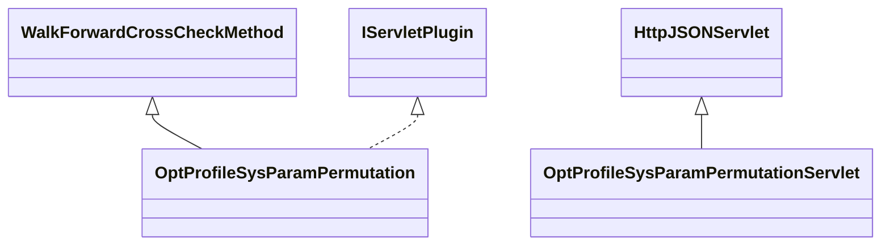

# CrossCheckOptProfileSysParamPermutation.jar

[Group index](README.md) | [All archives](../README.md)

## Scope and provenance

- **Donor:** `SQX_145_REFERENCE_ROOT/internal/plugins/CrossCheckOptProfileSysParamPermutation/CrossCheckOptProfileSysParamPermutation.jar`.
- **SHA-256:** `c4e99b61351649ea64d8ea64d88a719336b0a249edd7ae3d28a34b097080d6da`; accessed 2026-10-06; captured `2026-10-06T18:54:51.906614+00:00`.
- **Classes:** 2 raw entries; 2 unique entry names. Duplicate occurrence indices are zero-based.
- **Inspection:** read-only ZIP hashing and class-file structural parsing; signatures/descriptors, modifiers, hierarchy and references only. Bytecode bodies are hashed, not published.
- **Allocation:** proposed `FEAT-ROBUSTNESS-CROSS-CHECK-OPT-PROFILE-SYS-PARAM-PERMUTATION`, P11; [roadmap](../../dev/sqx-full-application-roadmap.md). Domain README registration remains required.
- **Repository:** `01067f00031428613c6394064ca1bcadc1ba00ee`; review state unreviewed. Download label 145-dev1; installed build/activation and runtime equivalence unverified.
- **Limit:** every class/member is inventoried; declaration coverage does not establish consumed calls, defaults, formulas, failure semantics or algorithm parity.
- **Archive/resource index:** [149.json](../../dev/evidence/sqx145/archives/145/149.json).

## Complete member declarations

Member shards contain exact JVM names/descriptors, access flags, generic signatures, throws types, declared fields/methods, superclass/interfaces and referenced class names. All classes, nested/synthetic members and overloads are retained. Code length/hash is structural evidence, not a normalized algorithm comparison.

- [001.json](../../dev/evidence/sqx145/members/149/001.json) — SHA-256 `149cf4e86be6bc54d4497db8b63c83c9b22d91acc925227d55f69b646ad5eb97`.

## Focused structural diagram

Up to twelve non-nested classes; arrows show declared inheritance/interfaces only. External type names are not evidence of an available body or an executed dependency.

## Class inventory

| Archive entry | Occurrence | Class SHA-256 | Fields | Methods |
| --- | ---: | --- | ---: | ---: |
| `com/strategyquant/plugin/CrossCheck/impl/OptProfileSysParamPermutation/OptProfileSysParamPermutation.class` | 0 | `0908225cb7a24231ae1c3d1be9b183816c11083396e204bf6e4827415dd37d58` | 7 | 27 |
| `com/strategyquant/plugin/CrossCheck/impl/OptProfileSysParamPermutation/OptProfileSysParamPermutationServlet.class` | 0 | `b7343493848041ce7b79dbaf419385e0d0b892cfba10ccd1e8757f2af8adf1ca` | 1 | 4 |
