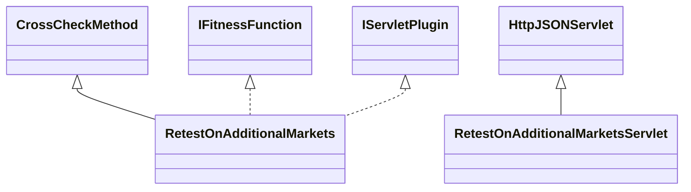

# CrossCheckRetestOnAdditionalMarkets.jar

[Group index](README.md) | [All archives](../README.md)

## Scope and provenance

- **Donor:** `SQX_145_REFERENCE_ROOT/internal/plugins/CrossCheckRetestOnAdditionalMarkets/CrossCheckRetestOnAdditionalMarkets.jar`.
- **SHA-256:** `d351ae03bb2e4c695dcb4a3abb3ca223a8777ae850deb2572c8eb30934d4ddaa`; accessed 2026-10-06; captured `2026-10-06T18:54:51.906614+00:00`.
- **Classes:** 4 raw entries; 4 unique entry names. Duplicate occurrence indices are zero-based.
- **Inspection:** read-only ZIP hashing and class-file structural parsing; signatures/descriptors, modifiers, hierarchy and references only. Bytecode bodies are hashed, not published.
- **Allocation:** proposed `FEAT-ROBUSTNESS-CROSS-CHECK-RETEST-ON-ADDITIONAL-MARKETS`, P11; [roadmap](../../dev/sqx-full-application-roadmap.md). Domain README registration remains required.
- **Repository:** `01067f00031428613c6394064ca1bcadc1ba00ee`; review state unreviewed. Download label 145-dev1; installed build/activation and runtime equivalence unverified.
- **Limit:** every class/member is inventoried; declaration coverage does not establish consumed calls, defaults, formulas, failure semantics or algorithm parity.
- **Archive/resource index:** [150.json](../../dev/evidence/sqx145/archives/145/150.json).

## Complete member declarations

Member shards contain exact JVM names/descriptors, access flags, generic signatures, throws types, declared fields/methods, superclass/interfaces and referenced class names. All classes, nested/synthetic members and overloads are retained. Code length/hash is structural evidence, not a normalized algorithm comparison.

- [001.json](../../dev/evidence/sqx145/members/150/001.json) — SHA-256 `ff945e82af11262a420fff13379d8f66a85201b242ae932c568e1290e1477a3a`.

## Focused structural diagram

Up to twelve non-nested classes; arrows show declared inheritance/interfaces only. External type names are not evidence of an available body or an executed dependency.

## Class inventory

| Archive entry | Occurrence | Class SHA-256 | Fields | Methods |
| --- | ---: | --- | ---: | ---: |
| `com/strategyquant/plugin/CrossCheck/impl/RetestOnAdditionalMarkets/RetestOnAdditionalMarkets$1.class` | 0 | `6eedd81f5d75ec19274d5c00635a545274ee9dbe987bc3ff1a31008377d12eaa` | 1 | 3 |
| `com/strategyquant/plugin/CrossCheck/impl/RetestOnAdditionalMarkets/RetestOnAdditionalMarkets$Goal.class` | 0 | `af9442732f23ac14072775e96a61044b1313f3640ed7f70fabe21d80e3027908` | 6 | 2 |
| `com/strategyquant/plugin/CrossCheck/impl/RetestOnAdditionalMarkets/RetestOnAdditionalMarkets.class` | 0 | `e7a2e950a115ad635adbb2072582b8f769ea38adffb5e3cea92b1d4a57e43612` | 11 | 47 |
| `com/strategyquant/plugin/CrossCheck/impl/RetestOnAdditionalMarkets/RetestOnAdditionalMarketsServlet.class` | 0 | `b2e5b4ad8e0f5e2da3a49af9cbbcdf88e45381a8bb1b384abd1a65b238e2bfc6` | 1 | 4 |
