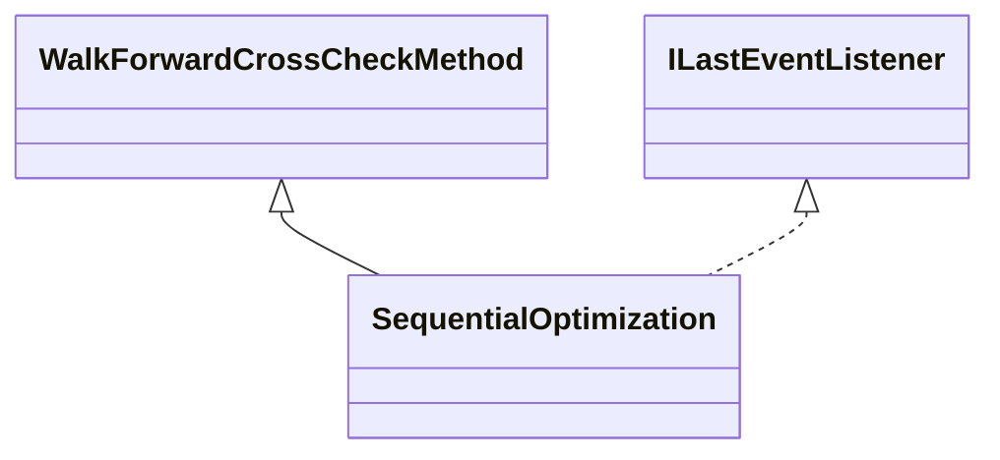

# CrossCheckSequentialOptimization.jar

[Group index](README.md) | [All archives](../README.md)

## Scope and provenance

- **Donor:** `SQX_145_REFERENCE_ROOT/internal/plugins/CrossCheckSequentialOptimization/CrossCheckSequentialOptimization.jar`.
- **SHA-256:** `d1b45af45898fbb7c875b9b670a5d423eac1386ad13953be08c7dabcfc93cec0`; accessed 2026-10-06; captured `2026-10-06T18:54:51.906614+00:00`.
- **Classes:** 2 raw entries; 2 unique entry names. Duplicate occurrence indices are zero-based.
- **Inspection:** read-only ZIP hashing and class-file structural parsing; signatures/descriptors, modifiers, hierarchy and references only. Bytecode bodies are hashed, not published.
- **Allocation:** proposed `FEAT-ROBUSTNESS-CROSS-CHECK-SEQUENTIAL-OPTIMIZATION`, P11; [roadmap](../../dev/sqx-full-application-roadmap.md). Domain README registration remains required.
- **Repository:** `01067f00031428613c6394064ca1bcadc1ba00ee`; review state unreviewed. Download label 145-dev1; installed build/activation and runtime equivalence unverified.
- **Limit:** every class/member is inventoried; declaration coverage does not establish consumed calls, defaults, formulas, failure semantics or algorithm parity.
- **Archive/resource index:** [152.json](../../dev/evidence/sqx145/archives/145/152.json).

## Complete member declarations

Member shards contain exact JVM names/descriptors, access flags, generic signatures, throws types, declared fields/methods, superclass/interfaces and referenced class names. All classes, nested/synthetic members and overloads are retained. Code length/hash is structural evidence, not a normalized algorithm comparison.

- [001.json](../../dev/evidence/sqx145/members/152/001.json) — SHA-256 `6400da690b0cf9d7ef434d813d14c6be0b5469c7cf33c3e5513bafd9f5051c19`.

## Focused structural diagram

Up to twelve non-nested classes; arrows show declared inheritance/interfaces only. External type names are not evidence of an available body or an executed dependency.

## Class inventory

| Archive entry | Occurrence | Class SHA-256 | Fields | Methods |
| --- | ---: | --- | ---: | ---: |
| `com/strategyquant/plugin/CrossCheck/impl/SequentialOptimization/SequentialOptimization$1.class` | 0 | `a54ae8077f1879e01f5e2405b015a93364ad58bd395e8f12d3fd813e356bd05b` | 3 | 2 |
| `com/strategyquant/plugin/CrossCheck/impl/SequentialOptimization/SequentialOptimization.class` | 0 | `e1f218fbaa3080b0efa10d8f040dfbc6a23152fecf8535aaad096bcd643b58e0` | 3 | 28 |
