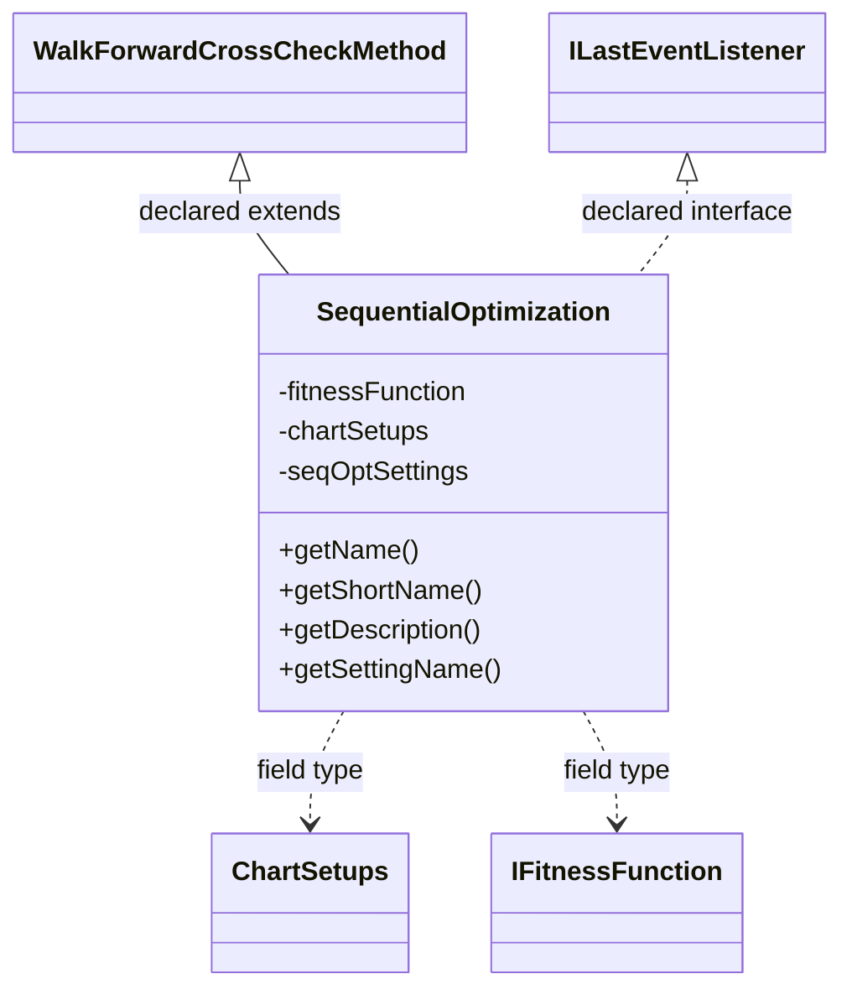

# CrossCheckSequentialOptimization.jar

[Workspace/group index](README.md)  |  [All workspaces](../README.md)

## Scope and provenance

- Artifact: `SQX_REFERENCE_ROOT/internal/plugins/CrossCheckSequentialOptimization/CrossCheckSequentialOptimization.jar`.
- SHA-256: `8afb96fe06d9378832563bab6068636ef807cf0c32122949191271c1a2548537`.
- Inspected: 2026-10-05; generation timestamp `2026-10-05T19:04:16.344170+00:00`.
- Archive class entries: **2**; non-nested: **1**; nested/anonymous: **1**.
- Inspection: ZIP entry/manifest enumeration and `javap -p` declarations for every listed class.
- Repository source HEAD: `8a92c705183a6702eaf62037ccb202ed028aa899`; review state: generated, pending owner review.
- Installed SQX build number is unverified. No method bodies are reproduced.
- Confidence: high for declared structure; workspace ownership inferred except where registration evidence is separately stated. Runtime reachability, call order, formulas and parity remain unverified.

Shared component: a single canonical document is linked from relevant workspace indexes. Its presence here does not establish which workspaces load it at runtime.

Target mapping: no verified owning HaruQuantAI feature/requirement/decision IDs are assigned by this document. Register or resolve ownership through the normal repository plan before implementation.

## Diagram reading guide

`Parent <|-- Child` means declared inheritance; `Interface <|.. Class` means declared implementation. Interface extension uses the inheritance arrow. `A ..> B : field type` is a declared type dependency, not composition, object ownership or a runtime call. External nodes are referenced types, not fabricated local implementations. Selected fields/method names aid navigation: `+` is public, `#` protected and `-` private. Diagram method names omit parameter/return types and collapse overloads; use the exact inspected declarations below before implementing an API.

Detailed graphs include non-nested classes in package-sized groups of at most 12. Nested/anonymous classes are inventoried and their declarations/relationships are retained below, but omitted from overview graphs. Relationships not drawn for readability remain in the complete declaration-relationship table. Constructors, synthetic bridges and overloads may be collapsed in diagram member lists only. Standard `java.lang.Object` inheritance is omitted from diagrams.

## UML class diagrams

### 1. `com.strategyquant.plugin.CrossCheck.impl.SequentialOptimization`



| Diagram identifier | Exact type | Location |
| --- | --- | --- |
| `Cd4d230eb0688` | `com.strategyquant.plugin.CrossCheck.impl.SequentialOptimization.SequentialOptimization` (this JAR) | this diagram |
| `C04861b02b3ff` | [`com.strategyquant.tradinglib.crosscheck.WalkForwardCrossCheckMethod`](SQTradingLib.md) | referenced external type |
| `C55f0a4ad5297` | [`com.strategyquant.tradinglib.engine.ChartSetups`](SQTradingLib.md) | referenced external type |
| `C76653c322567` | [`com.strategyquant.tradinglib.fitnessfunction.IFitnessFunction`](SQTradingLib.md) | referenced external type |
| `C1295ffcc9568` | [`com.strategyquant.tradinglib.project.ILastEventListener`](SQTradingLib.md) | referenced external type |

## Complete class inventory

| Fully qualified class | Kind | Entry |
| --- | --- | --- |
| `com.strategyquant.plugin.CrossCheck.impl.SequentialOptimization.SequentialOptimization` | class | non-nested |
| `com.strategyquant.plugin.CrossCheck.impl.SequentialOptimization.SequentialOptimization$1` | class | nested/anonymous |

## Declared relationships and evidence locations

Every row is supported by the named class declaration/member in `javap -p`, inside the artifact recorded above. Signature dependencies may include return, parameter, generic-argument and throws types; they do not imply execution.

| Declaring class | Referenced type | Relationship | Narrow inspection location |
| --- | --- | --- | --- |
| `com.strategyquant.plugin.CrossCheck.impl.SequentialOptimization.SequentialOptimization` | [`com.strategyquant.tradinglib.crosscheck.WalkForwardCrossCheckMethod`](SQTradingLib.md) | extends | `com.strategyquant.plugin.CrossCheck.impl.SequentialOptimization.SequentialOptimization` / class declaration: `public class com.strategyquant.plugin.CrossCheck.impl.SequentialOptimization.SequentialOptimization extends com.strategyquant.tradinglib.crosscheck.WalkForwardCrossCheckMethod implements com.strategyquant.tradinglib.project.ILastEventListener` |
| `com.strategyquant.plugin.CrossCheck.impl.SequentialOptimization.SequentialOptimization` | [`com.strategyquant.tradinglib.project.ILastEventListener`](SQTradingLib.md) | implements | `com.strategyquant.plugin.CrossCheck.impl.SequentialOptimization.SequentialOptimization` / class declaration: `public class com.strategyquant.plugin.CrossCheck.impl.SequentialOptimization.SequentialOptimization extends com.strategyquant.tradinglib.crosscheck.WalkForwardCrossCheckMethod implements com.strategyquant.tradinglib.project.ILastEventListener` |
| `com.strategyquant.plugin.CrossCheck.impl.SequentialOptimization.SequentialOptimization` | [`com.strategyquant.tradinglib.fitnessfunction.IFitnessFunction`](SQTradingLib.md) | type dependency | `com.strategyquant.plugin.CrossCheck.impl.SequentialOptimization.SequentialOptimization` / field declaration: `private com.strategyquant.tradinglib.fitnessfunction.IFitnessFunction fitnessFunction;` |
| `com.strategyquant.plugin.CrossCheck.impl.SequentialOptimization.SequentialOptimization` | [`com.strategyquant.tradinglib.engine.ChartSetups`](SQTradingLib.md) | type dependency | `com.strategyquant.plugin.CrossCheck.impl.SequentialOptimization.SequentialOptimization` / field declaration: `private com.strategyquant.tradinglib.engine.ChartSetups chartSetups;` |
| `com.strategyquant.plugin.CrossCheck.impl.SequentialOptimization.SequentialOptimization` | [`com.strategyquant.tradinglib.engine.ChartSetups`](SQTradingLib.md) | type dependency | `com.strategyquant.plugin.CrossCheck.impl.SequentialOptimization.SequentialOptimization` / method signature: `public com.strategyquant.tradinglib.engine.ChartSetups getChartSetups(com.strategyquant.tradinglib.ChartSetup);` |
| `com.strategyquant.plugin.CrossCheck.impl.SequentialOptimization.SequentialOptimization` | [`com.strategyquant.tradinglib.optimization.SequentialOptimizationSettings`](SQTradingLib.md) | type dependency | `com.strategyquant.plugin.CrossCheck.impl.SequentialOptimization.SequentialOptimization` / field declaration: `private com.strategyquant.tradinglib.optimization.SequentialOptimizationSettings seqOptSettings;` |
| `com.strategyquant.plugin.CrossCheck.impl.SequentialOptimization.SequentialOptimization` | [`com.strategyquant.tradinglib.optimization.SequentialOptimizationSettings`](SQTradingLib.md) | type dependency | `com.strategyquant.plugin.CrossCheck.impl.SequentialOptimization.SequentialOptimization` / method signature: `static com.strategyquant.tradinglib.optimization.SequentialOptimizationSettings access$000(com.strategyquant.plugin.CrossCheck.impl.SequentialOptimization.SequentialOptimization);` |
| `com.strategyquant.plugin.CrossCheck.impl.SequentialOptimization.SequentialOptimization` | `java.lang.String` (not resolved in scoped archives) | type dependency | `com.strategyquant.plugin.CrossCheck.impl.SequentialOptimization.SequentialOptimization` / method signature: `public java.lang.String getName();`<br>`public java.lang.String getShortName();`<br>`public java.lang.String getDescription();`<br>`public java.lang.String getSettingName();`<br>`public boolean runTest(com.strategyquant.tradinglib.ResultsGroup, int, double, com.strategyquant.gridlib.client.GridJob, boolean, com.strategyquant.tradinglib.project.ILastEventListener, java.lang.String) throws java.lang.Exception;`<br>`public java.lang.String getColumnTitleTemplate();`<br>`public double getStatsValue(com.strategyquant.tradinglib.ResultsGroup, java.lang.String, org.jdom2.Element, java.lang.Object...) throws java.lang.Exception;`<br>`public boolean hasStatsValue(com.strategyquant.tradinglib.ResultsGroup, java.lang.String, org.jdom2.Element, java.lang.Object...) throws java.lang.Exception;`<br>`public java.lang.String printSettings(org.jdom2.Element) throws java.lang.Exception;`<br>`public void setLastEvent(java.lang.String);`<br>`protected com.strategyquant.lib.SettingsMap prepareSettings(java.lang.String, com.strategyquant.lib.SettingsMap, org.jdom2.Element, boolean) throws java.lang.Exception;` |
| `com.strategyquant.plugin.CrossCheck.impl.SequentialOptimization.SequentialOptimization` | `org.jdom2.Element` (not resolved in scoped archives) | type dependency | `com.strategyquant.plugin.CrossCheck.impl.SequentialOptimization.SequentialOptimization` / method signature: `public void fixSettings(org.jdom2.Element);`<br>`public void readSettings(org.jdom2.Element, com.strategyquant.tradinglib.task.settings.TaskSettingsData) throws java.lang.Exception;`<br>`public double getStatsValue(com.strategyquant.tradinglib.ResultsGroup, java.lang.String, org.jdom2.Element, java.lang.Object...) throws java.lang.Exception;`<br>`public boolean hasStatsValue(com.strategyquant.tradinglib.ResultsGroup, java.lang.String, org.jdom2.Element, java.lang.Object...) throws java.lang.Exception;`<br>`public java.lang.String printSettings(org.jdom2.Element) throws java.lang.Exception;`<br>`protected com.strategyquant.lib.SettingsMap prepareSettings(java.lang.String, com.strategyquant.lib.SettingsMap, org.jdom2.Element, boolean) throws java.lang.Exception;` |
| `com.strategyquant.plugin.CrossCheck.impl.SequentialOptimization.SequentialOptimization` | [`com.strategyquant.tradinglib.task.settings.TaskSettingsData`](SQTradingLib.md) | type dependency | `com.strategyquant.plugin.CrossCheck.impl.SequentialOptimization.SequentialOptimization` / method signature: `public void readSettings(org.jdom2.Element, com.strategyquant.tradinglib.task.settings.TaskSettingsData) throws java.lang.Exception;` |
| `com.strategyquant.plugin.CrossCheck.impl.SequentialOptimization.SequentialOptimization` | `java.lang.Exception` (not resolved in scoped archives) | type dependency | `com.strategyquant.plugin.CrossCheck.impl.SequentialOptimization.SequentialOptimization` / method signature: `public void readSettings(org.jdom2.Element, com.strategyquant.tradinglib.task.settings.TaskSettingsData) throws java.lang.Exception;`<br>`public boolean runTest(com.strategyquant.tradinglib.ResultsGroup, int, double, com.strategyquant.gridlib.client.GridJob, boolean, com.strategyquant.tradinglib.project.ILastEventListener, java.lang.String) throws java.lang.Exception;`<br>`public double getStatsValue(com.strategyquant.tradinglib.ResultsGroup, java.lang.String, org.jdom2.Element, java.lang.Object...) throws java.lang.Exception;`<br>`public boolean hasStatsValue(com.strategyquant.tradinglib.ResultsGroup, java.lang.String, org.jdom2.Element, java.lang.Object...) throws java.lang.Exception;`<br>`public java.lang.String printSettings(org.jdom2.Element) throws java.lang.Exception;`<br>`public void saveDataToFile(com.strategyquant.tradinglib.ResultsGroup, java.util.jar.JarOutputStream) throws java.lang.Exception;`<br>`public void loadDataFromFile(com.strategyquant.tradinglib.ResultsGroup, java.util.jar.JarFile) throws java.lang.Exception;`<br>`protected com.strategyquant.lib.SettingsMap prepareSettings(java.lang.String, com.strategyquant.lib.SettingsMap, org.jdom2.Element, boolean) throws java.lang.Exception;` |
| `com.strategyquant.plugin.CrossCheck.impl.SequentialOptimization.SequentialOptimization` | [`com.strategyquant.tradinglib.ResultsGroup`](SQTradingLib.md) | type dependency | `com.strategyquant.plugin.CrossCheck.impl.SequentialOptimization.SequentialOptimization` / method signature: `public boolean runTest(com.strategyquant.tradinglib.ResultsGroup, int, double, com.strategyquant.gridlib.client.GridJob, boolean, com.strategyquant.tradinglib.project.ILastEventListener, java.lang.String) throws java.lang.Exception;`<br>`protected boolean checkConditions(com.strategyquant.tradinglib.ResultsGroup, int);`<br>`public double getStatsValue(com.strategyquant.tradinglib.ResultsGroup, java.lang.String, org.jdom2.Element, java.lang.Object...) throws java.lang.Exception;`<br>`public boolean hasStatsValue(com.strategyquant.tradinglib.ResultsGroup, java.lang.String, org.jdom2.Element, java.lang.Object...) throws java.lang.Exception;`<br>`public void saveDataToFile(com.strategyquant.tradinglib.ResultsGroup, java.util.jar.JarOutputStream) throws java.lang.Exception;`<br>`public void loadDataFromFile(com.strategyquant.tradinglib.ResultsGroup, java.util.jar.JarFile) throws java.lang.Exception;` |
| `com.strategyquant.plugin.CrossCheck.impl.SequentialOptimization.SequentialOptimization` | [`com.strategyquant.gridlib.client.GridJob`](SQGridLib2.md) | type dependency | `com.strategyquant.plugin.CrossCheck.impl.SequentialOptimization.SequentialOptimization` / method signature: `public boolean runTest(com.strategyquant.tradinglib.ResultsGroup, int, double, com.strategyquant.gridlib.client.GridJob, boolean, com.strategyquant.tradinglib.project.ILastEventListener, java.lang.String) throws java.lang.Exception;` |
| `com.strategyquant.plugin.CrossCheck.impl.SequentialOptimization.SequentialOptimization` | [`com.strategyquant.tradinglib.project.ILastEventListener`](SQTradingLib.md) | type dependency | `com.strategyquant.plugin.CrossCheck.impl.SequentialOptimization.SequentialOptimization` / method signature: `public boolean runTest(com.strategyquant.tradinglib.ResultsGroup, int, double, com.strategyquant.gridlib.client.GridJob, boolean, com.strategyquant.tradinglib.project.ILastEventListener, java.lang.String) throws java.lang.Exception;` |
| `com.strategyquant.plugin.CrossCheck.impl.SequentialOptimization.SequentialOptimization` | `java.lang.Object` (not resolved in scoped archives) | type dependency | `com.strategyquant.plugin.CrossCheck.impl.SequentialOptimization.SequentialOptimization` / method signature: `public double getStatsValue(com.strategyquant.tradinglib.ResultsGroup, java.lang.String, org.jdom2.Element, java.lang.Object...) throws java.lang.Exception;`<br>`public boolean hasStatsValue(com.strategyquant.tradinglib.ResultsGroup, java.lang.String, org.jdom2.Element, java.lang.Object...) throws java.lang.Exception;` |
| `com.strategyquant.plugin.CrossCheck.impl.SequentialOptimization.SequentialOptimization` | [`com.strategyquant.tradinglib.ChartSetup`](SQTradingLib.md) | type dependency | `com.strategyquant.plugin.CrossCheck.impl.SequentialOptimization.SequentialOptimization` / method signature: `public com.strategyquant.tradinglib.engine.ChartSetups getChartSetups(com.strategyquant.tradinglib.ChartSetup);` |
| `com.strategyquant.plugin.CrossCheck.impl.SequentialOptimization.SequentialOptimization` | [`com.strategyquant.tradinglib.crosscheck.ICrossCheck`](SQTradingLib.md) | type dependency | `com.strategyquant.plugin.CrossCheck.impl.SequentialOptimization.SequentialOptimization` / method signature: `public com.strategyquant.tradinglib.crosscheck.ICrossCheck clone(com.strategyquant.lib.SettingsMap);` |
| `com.strategyquant.plugin.CrossCheck.impl.SequentialOptimization.SequentialOptimization` | `com.strategyquant.lib.SettingsMap` (not resolved in scoped archives) | type dependency | `com.strategyquant.plugin.CrossCheck.impl.SequentialOptimization.SequentialOptimization` / method signature: `public com.strategyquant.tradinglib.crosscheck.ICrossCheck clone(com.strategyquant.lib.SettingsMap);`<br>`protected com.strategyquant.lib.SettingsMap prepareSettings(java.lang.String, com.strategyquant.lib.SettingsMap, org.jdom2.Element, boolean) throws java.lang.Exception;` |
| `com.strategyquant.plugin.CrossCheck.impl.SequentialOptimization.SequentialOptimization` | `java.util.jar.JarOutputStream` (not resolved in scoped archives) | type dependency | `com.strategyquant.plugin.CrossCheck.impl.SequentialOptimization.SequentialOptimization` / method signature: `public void saveDataToFile(com.strategyquant.tradinglib.ResultsGroup, java.util.jar.JarOutputStream) throws java.lang.Exception;` |
| `com.strategyquant.plugin.CrossCheck.impl.SequentialOptimization.SequentialOptimization` | `java.util.jar.JarFile` (not resolved in scoped archives) | type dependency | `com.strategyquant.plugin.CrossCheck.impl.SequentialOptimization.SequentialOptimization` / method signature: `public void loadDataFromFile(com.strategyquant.tradinglib.ResultsGroup, java.util.jar.JarFile) throws java.lang.Exception;` |
| `com.strategyquant.plugin.CrossCheck.impl.SequentialOptimization.SequentialOptimization$1` | [`com.strategyquant.tradinglib.optimization.ISequentialOptimizationCompleteListener`](SQTradingLib.md) | implements | `com.strategyquant.plugin.CrossCheck.impl.SequentialOptimization.SequentialOptimization$1` / class declaration: `class com.strategyquant.plugin.CrossCheck.impl.SequentialOptimization.SequentialOptimization$1 implements com.strategyquant.tradinglib.optimization.ISequentialOptimizationCompleteListener` |
| `com.strategyquant.plugin.CrossCheck.impl.SequentialOptimization.SequentialOptimization$1` | [`com.strategyquant.tradinglib.ResultsGroup`](SQTradingLib.md) | type dependency | `com.strategyquant.plugin.CrossCheck.impl.SequentialOptimization.SequentialOptimization$1` / field declaration: `final com.strategyquant.tradinglib.ResultsGroup val$rg;` |
| `com.strategyquant.plugin.CrossCheck.impl.SequentialOptimization.SequentialOptimization$1` | [`com.strategyquant.tradinglib.ResultsGroup`](SQTradingLib.md) | type dependency | `com.strategyquant.plugin.CrossCheck.impl.SequentialOptimization.SequentialOptimization$1` / method signature: `public void onFinish(boolean, com.strategyquant.tradinglib.StrategyBase, com.strategyquant.tradinglib.robustnesstests.SequentialOptimizationResults, com.strategyquant.tradinglib.ResultsGroup);` |
| `com.strategyquant.plugin.CrossCheck.impl.SequentialOptimization.SequentialOptimization$1` | `com.strategyquant.plugin.CrossCheck.impl.SequentialOptimization.SequentialOptimization` (this JAR) | type dependency | `com.strategyquant.plugin.CrossCheck.impl.SequentialOptimization.SequentialOptimization$1` / field declaration: `final com.strategyquant.plugin.CrossCheck.impl.SequentialOptimization.SequentialOptimization this$0;` |
| `com.strategyquant.plugin.CrossCheck.impl.SequentialOptimization.SequentialOptimization$1` | [`com.strategyquant.tradinglib.StrategyBase`](SQTradingLib.md) | type dependency | `com.strategyquant.plugin.CrossCheck.impl.SequentialOptimization.SequentialOptimization$1` / method signature: `public void onFinish(boolean, com.strategyquant.tradinglib.StrategyBase, com.strategyquant.tradinglib.robustnesstests.SequentialOptimizationResults, com.strategyquant.tradinglib.ResultsGroup);` |
| `com.strategyquant.plugin.CrossCheck.impl.SequentialOptimization.SequentialOptimization$1` | [`com.strategyquant.tradinglib.robustnesstests.SequentialOptimizationResults`](SQTradingLib.md) | type dependency | `com.strategyquant.plugin.CrossCheck.impl.SequentialOptimization.SequentialOptimization$1` / method signature: `public void onFinish(boolean, com.strategyquant.tradinglib.StrategyBase, com.strategyquant.tradinglib.robustnesstests.SequentialOptimizationResults, com.strategyquant.tradinglib.ResultsGroup);` |

## Inspected declaration reference

These are structural API/member declarations, not proprietary implementation bodies. Private members and nested classes are retained to make diagram omissions explicit; declarations do not prove behavior.

<details>
<summary>com.strategyquant.plugin.CrossCheck.impl.SequentialOptimization.SequentialOptimization</summary>

```text
public class com.strategyquant.plugin.CrossCheck.impl.SequentialOptimization.SequentialOptimization extends com.strategyquant.tradinglib.crosscheck.WalkForwardCrossCheckMethod implements com.strategyquant.tradinglib.project.ILastEventListener
    private com.strategyquant.tradinglib.fitnessfunction.IFitnessFunction fitnessFunction;
    private com.strategyquant.tradinglib.engine.ChartSetups chartSetups;
    private com.strategyquant.tradinglib.optimization.SequentialOptimizationSettings seqOptSettings;
    public com.strategyquant.plugin.CrossCheck.impl.SequentialOptimization.SequentialOptimization();
    public java.lang.String getName();
    public java.lang.String getShortName();
    public java.lang.String getDescription();
    public java.lang.String getSettingName();
    public int getType();
    public int getPreferredPosition();
    public int getNumberOfSimulations();
    public boolean doesRetest();
    public boolean doesForEverySetup();
    public void fixSettings(org.jdom2.Element);
    public void readSettings(org.jdom2.Element, com.strategyquant.tradinglib.task.settings.TaskSettingsData) throws java.lang.Exception;
    public boolean runTest(com.strategyquant.tradinglib.ResultsGroup, int, double, com.strategyquant.gridlib.client.GridJob, boolean, com.strategyquant.tradinglib.project.ILastEventListener, java.lang.String) throws java.lang.Exception;
    protected boolean checkConditions(com.strategyquant.tradinglib.ResultsGroup, int);
    public java.lang.String getColumnTitleTemplate();
    public double getStatsValue(com.strategyquant.tradinglib.ResultsGroup, java.lang.String, org.jdom2.Element, java.lang.Object...) throws java.lang.Exception;
    public boolean hasStatsValue(com.strategyquant.tradinglib.ResultsGroup, java.lang.String, org.jdom2.Element, java.lang.Object...) throws java.lang.Exception;
    public com.strategyquant.tradinglib.engine.ChartSetups getChartSetups(com.strategyquant.tradinglib.ChartSetup);
    public com.strategyquant.tradinglib.crosscheck.ICrossCheck clone(com.strategyquant.lib.SettingsMap);
    public java.lang.String printSettings(org.jdom2.Element) throws java.lang.Exception;
    public void saveDataToFile(com.strategyquant.tradinglib.ResultsGroup, java.util.jar.JarOutputStream) throws java.lang.Exception;
    public void loadDataFromFile(com.strategyquant.tradinglib.ResultsGroup, java.util.jar.JarFile) throws java.lang.Exception;
    public int getBadStrategyReason();
    public boolean doesCreateSubjobs();
    public void setLastEvent(java.lang.String);
    protected com.strategyquant.lib.SettingsMap prepareSettings(java.lang.String, com.strategyquant.lib.SettingsMap, org.jdom2.Element, boolean) throws java.lang.Exception;
    public boolean disabledForSpecialTrial();
    static com.strategyquant.tradinglib.optimization.SequentialOptimizationSettings access$000(com.strategyquant.plugin.CrossCheck.impl.SequentialOptimization.SequentialOptimization);
```

</details>

<details>
<summary>com.strategyquant.plugin.CrossCheck.impl.SequentialOptimization.SequentialOptimization$1</summary>

```text
class com.strategyquant.plugin.CrossCheck.impl.SequentialOptimization.SequentialOptimization$1 implements com.strategyquant.tradinglib.optimization.ISequentialOptimizationCompleteListener
    final com.strategyquant.tradinglib.ResultsGroup val$rg;
    final double val$mainResultFitness;
    final com.strategyquant.plugin.CrossCheck.impl.SequentialOptimization.SequentialOptimization this$0;
    com.strategyquant.plugin.CrossCheck.impl.SequentialOptimization.SequentialOptimization$1();
    public void onFinish(boolean, com.strategyquant.tradinglib.StrategyBase, com.strategyquant.tradinglib.robustnesstests.SequentialOptimizationResults, com.strategyquant.tradinglib.ResultsGroup);
```

</details>

## Validation and unresolved gaps

Archive hash and complete class inventory were checked against the inspected local artifact. Declaration extraction accounts for every inventoried class. Documentation/link/diagram structural verification is recorded in the master index and task walkthrough; no SQX runtime validation was performed.

The canonical reimplementation ledger/schema are absent, so no evidence IDs or validation-passed ledger claims are created. This is a donor structural reference. Exact behavior, default values, failure semantics, algorithms, runtime calls and target architectural choices require separate research. No aggregation/composition or cardinalities are inferred.
