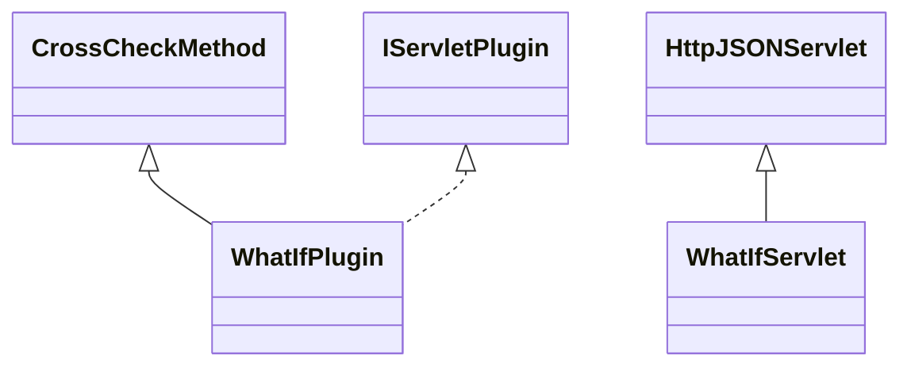

# CrossCheckWhatIf.jar

[Group index](README.md) | [All archives](../README.md)

## Scope and provenance

- **Donor:** `SQX_145_REFERENCE_ROOT/internal/plugins/CrossCheckWhatIf/CrossCheckWhatIf.jar`.
- **SHA-256:** `21b7eef300135c7899bd4d235582a036ba9a9b0ad436d6fa3de533fddc1d1820`; accessed 2026-10-06; captured `2026-10-06T18:54:51.906614+00:00`.
- **Classes:** 2 raw entries; 2 unique entry names. Duplicate occurrence indices are zero-based.
- **Inspection:** read-only ZIP hashing and class-file structural parsing; signatures/descriptors, modifiers, hierarchy and references only. Bytecode bodies are hashed, not published.
- **Allocation:** proposed `FEAT-ROBUSTNESS-CROSS-CHECK-WHAT-IF`, P11; [roadmap](../../dev/sqx-full-application-roadmap.md). Domain README registration remains required.
- **Repository:** `01067f00031428613c6394064ca1bcadc1ba00ee`; review state unreviewed. Download label 145-dev1; installed build/activation and runtime equivalence unverified.
- **Limit:** every class/member is inventoried; declaration coverage does not establish consumed calls, defaults, formulas, failure semantics or algorithm parity.
- **Archive/resource index:** [155.json](../../dev/evidence/sqx145/archives/145/155.json).

## Complete member declarations

Member shards contain exact JVM names/descriptors, access flags, generic signatures, throws types, declared fields/methods, superclass/interfaces and referenced class names. All classes, nested/synthetic members and overloads are retained. Code length/hash is structural evidence, not a normalized algorithm comparison.

- [001.json](../../dev/evidence/sqx145/members/155/001.json) — SHA-256 `15bf8f1122893779fe0a385a2d494d46b2f7fe3577cd9f2211fe366eaef9cc10`.

## Focused structural diagram

Up to twelve non-nested classes; arrows show declared inheritance/interfaces only. External type names are not evidence of an available body or an executed dependency.

## Class inventory

| Archive entry | Occurrence | Class SHA-256 | Fields | Methods |
| --- | ---: | --- | ---: | ---: |
| `com/strategyquant/plugin/CrossCheck/impl/WhatIf/WhatIfPlugin.class` | 0 | `8062463971bd6f64ffb2d0b3df41ce7a8d7a5bfe376559daa35b5b67e484d184` | 1 | 25 |
| `com/strategyquant/plugin/CrossCheck/impl/WhatIf/WhatIfServlet.class` | 0 | `a0386cfed0f5e291f7df5ebacd01e51f548ee43b32c7c8603d81e17b12693a03` | 1 | 4 |
