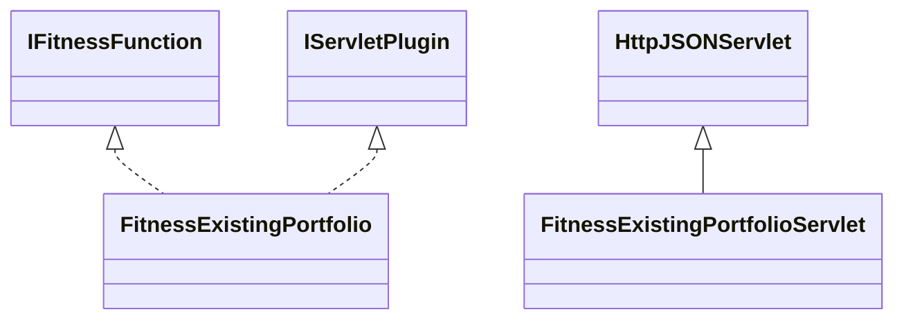

# FitnessMethodExistingPortfolio.jar

[Group index](README.md) | [All archives](../README.md)

## Scope and provenance

- **Donor:** `SQX_145_REFERENCE_ROOT/internal/plugins/FitnessMethodExistingPortfolio/FitnessMethodExistingPortfolio.jar`.
- **SHA-256:** `f9bb50732b5da16ec971304e37e05db9429e457bf83e6e1041d9eab7ce484350`; accessed 2026-10-06; captured `2026-10-06T18:54:51.906614+00:00`.
- **Classes:** 4 raw entries; 4 unique entry names. Duplicate occurrence indices are zero-based.
- **Inspection:** read-only ZIP hashing and class-file structural parsing; signatures/descriptors, modifiers, hierarchy and references only. Bytecode bodies are hashed, not published.
- **Allocation:** proposed `FEAT-PORTFOLIO-FITNESS-METHOD-EXISTING-PORTFOLIO`, P12; [roadmap](../../dev/sqx-full-application-roadmap.md). Domain README registration remains required.
- **Repository:** `01067f00031428613c6394064ca1bcadc1ba00ee`; review state unreviewed. Download label 145-dev1; installed build/activation and runtime equivalence unverified.
- **Limit:** every class/member is inventoried; declaration coverage does not establish consumed calls, defaults, formulas, failure semantics or algorithm parity.
- **Archive/resource index:** [188.json](../../dev/evidence/sqx145/archives/145/188.json).

## Complete member declarations

Member shards contain exact JVM names/descriptors, access flags, generic signatures, throws types, declared fields/methods, superclass/interfaces and referenced class names. All classes, nested/synthetic members and overloads are retained. Code length/hash is structural evidence, not a normalized algorithm comparison.

- [001.json](../../dev/evidence/sqx145/members/188/001.json) — SHA-256 `deb67f57c850c172441bc0137b7296d2112659ab077ba4842eaf0abfa7f1b913`.

## Focused structural diagram

Up to twelve non-nested classes; arrows show declared inheritance/interfaces only. External type names are not evidence of an available body or an executed dependency.

## Class inventory

| Archive entry | Occurrence | Class SHA-256 | Fields | Methods |
| --- | ---: | --- | ---: | ---: |
| `com/strategyquant/plugin/FitnessMethod/impl/ExistingPortfolio/FitnessExistingPortfolio$1.class` | 0 | `a22db42af6f2f62568f04e17b3be5b05b54da5a45e5fc46830f6faf073ec3f12` | 0 | 0 |
| `com/strategyquant/plugin/FitnessMethod/impl/ExistingPortfolio/FitnessExistingPortfolio$Goal.class` | 0 | `16068125b01e2a3d5fc3b342929912bbeab9c79602f9363c0ede2183f46cb359` | 6 | 2 |
| `com/strategyquant/plugin/FitnessMethod/impl/ExistingPortfolio/FitnessExistingPortfolio.class` | 0 | `8dd9e06bf878b811cf3b83a2dafd114169239e5b2180351909cc51e485f4df4d` | 4 | 23 |
| `com/strategyquant/plugin/FitnessMethod/impl/ExistingPortfolio/FitnessExistingPortfolioServlet.class` | 0 | `814456cf93e58468ccef628bb84474d2adf9387a2fcc07b93c364ea7e53cc6be` | 1 | 4 |
