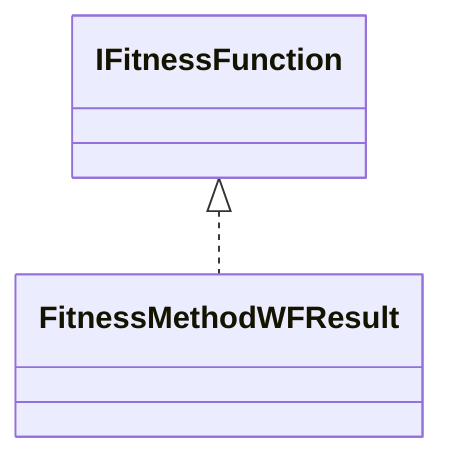

# FitnessMethodWFResult.jar

[Group index](README.md) | [All archives](../README.md)

## Scope and provenance

- **Donor:** `SQX_145_REFERENCE_ROOT/internal/plugins/FitnessMethodWFResult/FitnessMethodWFResult.jar`.
- **SHA-256:** `9d652f7e6ef5d6631969668b6d2c50efa4244504eca0ab3d452e341e7c33546f`; accessed 2026-10-06; captured `2026-10-06T18:54:51.906614+00:00`.
- **Classes:** 3 raw entries; 3 unique entry names. Duplicate occurrence indices are zero-based.
- **Inspection:** read-only ZIP hashing and class-file structural parsing; signatures/descriptors, modifiers, hierarchy and references only. Bytecode bodies are hashed, not published.
- **Allocation:** proposed `FEAT-OPTIMIZER-FITNESS-METHOD-WF-RESULT`, P10; [roadmap](../../dev/sqx-full-application-roadmap.md). Domain README registration remains required.
- **Repository:** `01067f00031428613c6394064ca1bcadc1ba00ee`; review state unreviewed. Download label 145-dev1; installed build/activation and runtime equivalence unverified.
- **Limit:** every class/member is inventoried; declaration coverage does not establish consumed calls, defaults, formulas, failure semantics or algorithm parity.
- **Archive/resource index:** [190.json](../../dev/evidence/sqx145/archives/145/190.json).

## Complete member declarations

Member shards contain exact JVM names/descriptors, access flags, generic signatures, throws types, declared fields/methods, superclass/interfaces and referenced class names. All classes, nested/synthetic members and overloads are retained. Code length/hash is structural evidence, not a normalized algorithm comparison.

- [001.json](../../dev/evidence/sqx145/members/190/001.json) — SHA-256 `0cf6895d4e04c43583102a6b3a6bb4fc36581e775cb758ba64c92af010f63357`.

## Focused structural diagram

Up to twelve non-nested classes; arrows show declared inheritance/interfaces only. External type names are not evidence of an available body or an executed dependency.

## Class inventory

| Archive entry | Occurrence | Class SHA-256 | Fields | Methods |
| --- | ---: | --- | ---: | ---: |
| `com/strategyquant/plugin/FitnessMethod/impl/WFResult/FitnessMethodWFResult$1.class` | 0 | `ec057bd32c56448b112b0459568bc931bbece557401f834163484f17d6b0a235` | 0 | 0 |
| `com/strategyquant/plugin/FitnessMethod/impl/WFResult/FitnessMethodWFResult$Goal.class` | 0 | `1c43fef45c3476850bde894395ad8025661e36ce6bbac6d57278315b5435fd6a` | 6 | 2 |
| `com/strategyquant/plugin/FitnessMethod/impl/WFResult/FitnessMethodWFResult.class` | 0 | `e6bc23056c31fc9109d33df1c41b0fe84b7362a7540a1db43f8d5930c44c555a` | 4 | 22 |
