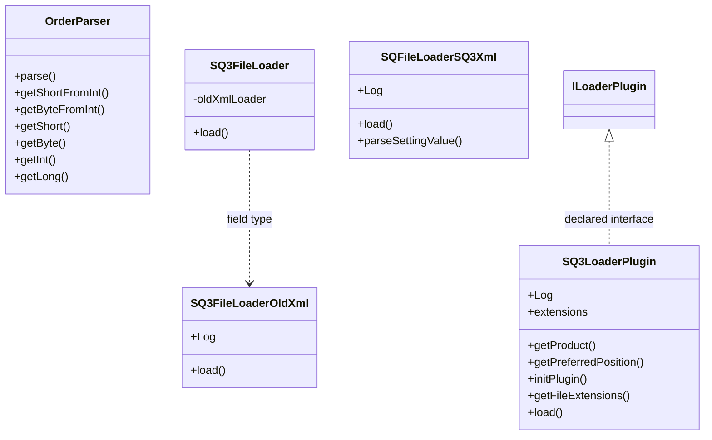

# LoaderSQ3.jar

[Workspace/group index](README.md)  |  [All workspaces](../README.md)

## Scope and provenance

- Artifact: `SQX_REFERENCE_ROOT/internal/plugins/LoaderSQ3/LoaderSQ3.jar`.
- SHA-256: `ea5d85eda47ef76feb832232af9ca8581d9be8860385b59bf45478b6ed6c7da8`.
- Inspected: 2026-10-05; generation timestamp `2026-10-05T19:04:16.344170+00:00`.
- Archive class entries: **5**; non-nested: **5**; nested/anonymous: **0**.
- Inspection: ZIP entry/manifest enumeration and `javap -p` declarations for every listed class.
- Repository source HEAD: `8a92c705183a6702eaf62037ccb202ed028aa899`; review state: generated, pending owner review.
- Installed SQX build number is unverified. No method bodies are reproduced.
- Confidence: high for declared structure; workspace ownership inferred except where registration evidence is separately stated. Runtime reachability, call order, formulas and parity remain unverified.

Shared component: a single canonical document is linked from relevant workspace indexes. Its presence here does not establish which workspaces load it at runtime.

Target mapping: no verified owning HaruQuantAI feature/requirement/decision IDs are assigned by this document. Register or resolve ownership through the normal repository plan before implementation.

## Diagram reading guide

`Parent <|-- Child` means declared inheritance; `Interface <|.. Class` means declared implementation. Interface extension uses the inheritance arrow. `A ..> B : field type` is a declared type dependency, not composition, object ownership or a runtime call. External nodes are referenced types, not fabricated local implementations. Selected fields/method names aid navigation: `+` is public, `#` protected and `-` private. Diagram method names omit parameter/return types and collapse overloads; use the exact inspected declarations below before implementing an API.

Detailed graphs include non-nested classes in package-sized groups of at most 12. Nested/anonymous classes are inventoried and their declarations/relationships are retained below, but omitted from overview graphs. Relationships not drawn for readability remain in the complete declaration-relationship table. Constructors, synthetic bridges and overloads may be collapsed in diagram member lists only. Standard `java.lang.Object` inheritance is omitted from diagrams.

## UML class diagrams

### 1. `com.strategyquant.plugin.Loader.impl.SQ3`



| Diagram identifier | Exact type | Location |
| --- | --- | --- |
| `C521f08e17499` | `com.strategyquant.plugin.Loader.impl.SQ3.OrderParser` (this JAR) | this diagram |
| `C1fb5aee3a6d3` | `com.strategyquant.plugin.Loader.impl.SQ3.SQ3FileLoader` (this JAR) | this diagram |
| `C620881ea2a74` | `com.strategyquant.plugin.Loader.impl.SQ3.SQ3FileLoaderOldXml` (this JAR) | this diagram |
| `C8444cc5c154a` | `com.strategyquant.plugin.Loader.impl.SQ3.SQ3LoaderPlugin` (this JAR) | this diagram |
| `C53242d0e860a` | `com.strategyquant.plugin.Loader.impl.SQ3.SQFileLoaderSQ3Xml` (this JAR) | this diagram |
| `Cdee1d566d0b0` | [`com.strategyquant.tradinglib.results.file.ILoaderPlugin`](SQTradingLib.md) | referenced external type |

## Complete class inventory

| Fully qualified class | Kind | Entry |
| --- | --- | --- |
| `com.strategyquant.plugin.Loader.impl.SQ3.OrderParser` | class | non-nested |
| `com.strategyquant.plugin.Loader.impl.SQ3.SQ3FileLoader` | class | non-nested |
| `com.strategyquant.plugin.Loader.impl.SQ3.SQ3FileLoaderOldXml` | class | non-nested |
| `com.strategyquant.plugin.Loader.impl.SQ3.SQ3LoaderPlugin` | class | non-nested |
| `com.strategyquant.plugin.Loader.impl.SQ3.SQFileLoaderSQ3Xml` | class | non-nested |

## Declared relationships and evidence locations

Every row is supported by the named class declaration/member in `javap -p`, inside the artifact recorded above. Signature dependencies may include return, parameter, generic-argument and throws types; they do not imply execution.

| Declaring class | Referenced type | Relationship | Narrow inspection location |
| --- | --- | --- | --- |
| `com.strategyquant.plugin.Loader.impl.SQ3.OrderParser` | [`com.strategyquant.tradinglib.Order`](SQTradingLib.md) | type dependency | `com.strategyquant.plugin.Loader.impl.SQ3.OrderParser` / method signature: `public static com.strategyquant.tradinglib.Order parse(org.jdom2.Element, java.lang.String);` |
| `com.strategyquant.plugin.Loader.impl.SQ3.OrderParser` | `org.jdom2.Element` (not resolved in scoped archives) | type dependency | `com.strategyquant.plugin.Loader.impl.SQ3.OrderParser` / method signature: `public static com.strategyquant.tradinglib.Order parse(org.jdom2.Element, java.lang.String);`<br>`public static short getShortFromInt(org.jdom2.Element, java.lang.String, int);`<br>`public static byte getByteFromInt(org.jdom2.Element, java.lang.String, int);`<br>`public static short getShort(org.jdom2.Element, java.lang.String, int);`<br>`public static byte getByte(org.jdom2.Element, java.lang.String, int);`<br>`public static int getInt(org.jdom2.Element, java.lang.String, int);`<br>`public static long getLong(org.jdom2.Element, java.lang.String, int);`<br>`public static float getFloat(org.jdom2.Element, java.lang.String, float);`<br>`public static double getDouble(org.jdom2.Element, java.lang.String, float);`<br>`public static boolean getBool(org.jdom2.Element, java.lang.String, boolean);` |
| `com.strategyquant.plugin.Loader.impl.SQ3.OrderParser` | `java.lang.String` (not resolved in scoped archives) | type dependency | `com.strategyquant.plugin.Loader.impl.SQ3.OrderParser` / method signature: `public static com.strategyquant.tradinglib.Order parse(org.jdom2.Element, java.lang.String);`<br>`public static short getShortFromInt(org.jdom2.Element, java.lang.String, int);`<br>`public static byte getByteFromInt(org.jdom2.Element, java.lang.String, int);`<br>`public static short getShort(org.jdom2.Element, java.lang.String, int);`<br>`public static byte getByte(org.jdom2.Element, java.lang.String, int);`<br>`public static int getInt(org.jdom2.Element, java.lang.String, int);`<br>`public static long getLong(org.jdom2.Element, java.lang.String, int);`<br>`public static float getFloat(org.jdom2.Element, java.lang.String, float);`<br>`public static double getDouble(org.jdom2.Element, java.lang.String, float);`<br>`public static boolean getBool(org.jdom2.Element, java.lang.String, boolean);` |
| `com.strategyquant.plugin.Loader.impl.SQ3.SQ3FileLoader` | `com.strategyquant.plugin.Loader.impl.SQ3.SQ3FileLoaderOldXml` (this JAR) | type dependency | `com.strategyquant.plugin.Loader.impl.SQ3.SQ3FileLoader` / field declaration: `private com.strategyquant.plugin.Loader.impl.SQ3.SQ3FileLoaderOldXml oldXmlLoader;` |
| `com.strategyquant.plugin.Loader.impl.SQ3.SQ3FileLoader` | [`com.strategyquant.tradinglib.ResultsGroup`](SQTradingLib.md) | type dependency | `com.strategyquant.plugin.Loader.impl.SQ3.SQ3FileLoader` / method signature: `public com.strategyquant.tradinglib.ResultsGroup load(java.lang.String, boolean, java.lang.String) throws java.lang.Exception;` |
| `com.strategyquant.plugin.Loader.impl.SQ3.SQ3FileLoader` | `java.lang.String` (not resolved in scoped archives) | type dependency | `com.strategyquant.plugin.Loader.impl.SQ3.SQ3FileLoader` / method signature: `public com.strategyquant.tradinglib.ResultsGroup load(java.lang.String, boolean, java.lang.String) throws java.lang.Exception;` |
| `com.strategyquant.plugin.Loader.impl.SQ3.SQ3FileLoader` | `java.lang.Exception` (not resolved in scoped archives) | type dependency | `com.strategyquant.plugin.Loader.impl.SQ3.SQ3FileLoader` / method signature: `public com.strategyquant.tradinglib.ResultsGroup load(java.lang.String, boolean, java.lang.String) throws java.lang.Exception;` |
| `com.strategyquant.plugin.Loader.impl.SQ3.SQ3FileLoaderOldXml` | `org.slf4j.Logger` (not resolved in scoped archives) | type dependency | `com.strategyquant.plugin.Loader.impl.SQ3.SQ3FileLoaderOldXml` / field declaration: `public static final org.slf4j.Logger Log;` |
| `com.strategyquant.plugin.Loader.impl.SQ3.SQ3FileLoaderOldXml` | [`com.strategyquant.tradinglib.ResultsGroup`](SQTradingLib.md) | type dependency | `com.strategyquant.plugin.Loader.impl.SQ3.SQ3FileLoaderOldXml` / method signature: `public com.strategyquant.tradinglib.ResultsGroup load(java.lang.String, boolean, java.lang.String) throws java.lang.Exception;` |
| `com.strategyquant.plugin.Loader.impl.SQ3.SQ3FileLoaderOldXml` | `java.lang.String` (not resolved in scoped archives) | type dependency | `com.strategyquant.plugin.Loader.impl.SQ3.SQ3FileLoaderOldXml` / method signature: `public com.strategyquant.tradinglib.ResultsGroup load(java.lang.String, boolean, java.lang.String) throws java.lang.Exception;` |
| `com.strategyquant.plugin.Loader.impl.SQ3.SQ3FileLoaderOldXml` | `java.lang.Exception` (not resolved in scoped archives) | type dependency | `com.strategyquant.plugin.Loader.impl.SQ3.SQ3FileLoaderOldXml` / method signature: `public com.strategyquant.tradinglib.ResultsGroup load(java.lang.String, boolean, java.lang.String) throws java.lang.Exception;` |
| `com.strategyquant.plugin.Loader.impl.SQ3.SQ3LoaderPlugin` | [`com.strategyquant.tradinglib.results.file.ILoaderPlugin`](SQTradingLib.md) | implements | `com.strategyquant.plugin.Loader.impl.SQ3.SQ3LoaderPlugin` / class declaration: `public class com.strategyquant.plugin.Loader.impl.SQ3.SQ3LoaderPlugin implements com.strategyquant.tradinglib.results.file.ILoaderPlugin` |
| `com.strategyquant.plugin.Loader.impl.SQ3.SQ3LoaderPlugin` | `org.slf4j.Logger` (not resolved in scoped archives) | type dependency | `com.strategyquant.plugin.Loader.impl.SQ3.SQ3LoaderPlugin` / field declaration: `public static final org.slf4j.Logger Log;` |
| `com.strategyquant.plugin.Loader.impl.SQ3.SQ3LoaderPlugin` | `java.lang.String` (not resolved in scoped archives) | type dependency | `com.strategyquant.plugin.Loader.impl.SQ3.SQ3LoaderPlugin` / field declaration: `public static final java.lang.String[] extensions;` |
| `com.strategyquant.plugin.Loader.impl.SQ3.SQ3LoaderPlugin` | `java.lang.String` (not resolved in scoped archives) | type dependency | `com.strategyquant.plugin.Loader.impl.SQ3.SQ3LoaderPlugin` / method signature: `public java.lang.String getProduct();`<br>`public java.lang.String[] getFileExtensions();`<br>`public com.strategyquant.tradinglib.ResultsGroup load(java.lang.String, boolean, java.lang.String, java.lang.String) throws java.lang.Exception;` |
| `com.strategyquant.plugin.Loader.impl.SQ3.SQ3LoaderPlugin` | `java.lang.Exception` (not resolved in scoped archives) | type dependency | `com.strategyquant.plugin.Loader.impl.SQ3.SQ3LoaderPlugin` / method signature: `public void initPlugin() throws java.lang.Exception;`<br>`public com.strategyquant.tradinglib.ResultsGroup load(java.lang.String, boolean, java.lang.String, java.lang.String) throws java.lang.Exception;`<br>`public com.strategyquant.tradinglib.ResultsGroup finishLoad(com.strategyquant.tradinglib.ResultsGroup) throws java.lang.Exception;` |
| `com.strategyquant.plugin.Loader.impl.SQ3.SQ3LoaderPlugin` | [`com.strategyquant.tradinglib.ResultsGroup`](SQTradingLib.md) | type dependency | `com.strategyquant.plugin.Loader.impl.SQ3.SQ3LoaderPlugin` / method signature: `public com.strategyquant.tradinglib.ResultsGroup load(java.lang.String, boolean, java.lang.String, java.lang.String) throws java.lang.Exception;`<br>`public com.strategyquant.tradinglib.ResultsGroup finishLoad(com.strategyquant.tradinglib.ResultsGroup) throws java.lang.Exception;` |
| `com.strategyquant.plugin.Loader.impl.SQ3.SQFileLoaderSQ3Xml` | `org.slf4j.Logger` (not resolved in scoped archives) | type dependency | `com.strategyquant.plugin.Loader.impl.SQ3.SQFileLoaderSQ3Xml` / field declaration: `public static final org.slf4j.Logger Log;` |
| `com.strategyquant.plugin.Loader.impl.SQ3.SQFileLoaderSQ3Xml` | [`com.strategyquant.tradinglib.ResultsGroup`](SQTradingLib.md) | type dependency | `com.strategyquant.plugin.Loader.impl.SQ3.SQFileLoaderSQ3Xml` / method signature: `public void load(com.strategyquant.tradinglib.ResultsGroup, org.jdom2.Element, boolean, java.lang.String) throws java.lang.Exception;`<br>`private void buildLastSettingsXml(com.strategyquant.tradinglib.ResultsGroup, com.strategyquant.lib.SettingsMap);`<br>`private void addOrdersAndSetup(com.strategyquant.tradinglib.ResultsGroup, org.jdom2.Element, java.lang.String, java.lang.String, boolean, java.lang.String) throws java.lang.Exception;` |
| `com.strategyquant.plugin.Loader.impl.SQ3.SQFileLoaderSQ3Xml` | `org.jdom2.Element` (not resolved in scoped archives) | type dependency | `com.strategyquant.plugin.Loader.impl.SQ3.SQFileLoaderSQ3Xml` / method signature: `public void load(com.strategyquant.tradinglib.ResultsGroup, org.jdom2.Element, boolean, java.lang.String) throws java.lang.Exception;`<br>`private void addOrdersAndSetup(com.strategyquant.tradinglib.ResultsGroup, org.jdom2.Element, java.lang.String, java.lang.String, boolean, java.lang.String) throws java.lang.Exception;`<br>`private static com.strategyquant.lib.SettingsMap parseAdSettings(org.jdom2.Element);`<br>`private static com.strategyquant.lib.SettingsMap parseSettings(org.jdom2.Element);`<br>`private static void parseParameters(com.strategyquant.lib.SettingsMap, org.jdom2.Element);` |
| `com.strategyquant.plugin.Loader.impl.SQ3.SQFileLoaderSQ3Xml` | `java.lang.String` (not resolved in scoped archives) | type dependency | `com.strategyquant.plugin.Loader.impl.SQ3.SQFileLoaderSQ3Xml` / method signature: `public void load(com.strategyquant.tradinglib.ResultsGroup, org.jdom2.Element, boolean, java.lang.String) throws java.lang.Exception;`<br>`private void addOrdersAndSetup(com.strategyquant.tradinglib.ResultsGroup, org.jdom2.Element, java.lang.String, java.lang.String, boolean, java.lang.String) throws java.lang.Exception;`<br>`public static java.lang.String parseSettingValue(java.lang.String, java.lang.String);` |
| `com.strategyquant.plugin.Loader.impl.SQ3.SQFileLoaderSQ3Xml` | `java.lang.Exception` (not resolved in scoped archives) | type dependency | `com.strategyquant.plugin.Loader.impl.SQ3.SQFileLoaderSQ3Xml` / method signature: `public void load(com.strategyquant.tradinglib.ResultsGroup, org.jdom2.Element, boolean, java.lang.String) throws java.lang.Exception;`<br>`private void addOrdersAndSetup(com.strategyquant.tradinglib.ResultsGroup, org.jdom2.Element, java.lang.String, java.lang.String, boolean, java.lang.String) throws java.lang.Exception;` |
| `com.strategyquant.plugin.Loader.impl.SQ3.SQFileLoaderSQ3Xml` | `com.strategyquant.lib.SettingsMap` (not resolved in scoped archives) | type dependency | `com.strategyquant.plugin.Loader.impl.SQ3.SQFileLoaderSQ3Xml` / method signature: `private void buildLastSettingsXml(com.strategyquant.tradinglib.ResultsGroup, com.strategyquant.lib.SettingsMap);`<br>`private static com.strategyquant.lib.SettingsMap parseAdSettings(org.jdom2.Element);`<br>`private static com.strategyquant.lib.SettingsMap parseSettings(org.jdom2.Element);`<br>`private static void parseParameters(com.strategyquant.lib.SettingsMap, org.jdom2.Element);` |

## Inspected declaration reference

These are structural API/member declarations, not proprietary implementation bodies. Private members and nested classes are retained to make diagram omissions explicit; declarations do not prove behavior.

<details>
<summary>com.strategyquant.plugin.Loader.impl.SQ3.OrderParser</summary>

```text
public class com.strategyquant.plugin.Loader.impl.SQ3.OrderParser
    public com.strategyquant.plugin.Loader.impl.SQ3.OrderParser();
    public static com.strategyquant.tradinglib.Order parse(org.jdom2.Element, java.lang.String);
    private static byte setSampleType(boolean, boolean);
    public static short getShortFromInt(org.jdom2.Element, java.lang.String, int);
    public static byte getByteFromInt(org.jdom2.Element, java.lang.String, int);
    public static short getShort(org.jdom2.Element, java.lang.String, int);
    public static byte getByte(org.jdom2.Element, java.lang.String, int);
    public static int getInt(org.jdom2.Element, java.lang.String, int);
    public static long getLong(org.jdom2.Element, java.lang.String, int);
    public static float getFloat(org.jdom2.Element, java.lang.String, float);
    public static double getDouble(org.jdom2.Element, java.lang.String, float);
    public static boolean getBool(org.jdom2.Element, java.lang.String, boolean);
```

</details>

<details>
<summary>com.strategyquant.plugin.Loader.impl.SQ3.SQ3FileLoader</summary>

```text
public class com.strategyquant.plugin.Loader.impl.SQ3.SQ3FileLoader
    private com.strategyquant.plugin.Loader.impl.SQ3.SQ3FileLoaderOldXml oldXmlLoader;
    public com.strategyquant.plugin.Loader.impl.SQ3.SQ3FileLoader();
    public com.strategyquant.tradinglib.ResultsGroup load(java.lang.String, boolean, java.lang.String) throws java.lang.Exception;
```

</details>

<details>
<summary>com.strategyquant.plugin.Loader.impl.SQ3.SQ3FileLoaderOldXml</summary>

```text
public class com.strategyquant.plugin.Loader.impl.SQ3.SQ3FileLoaderOldXml
    public static final org.slf4j.Logger Log;
    public com.strategyquant.plugin.Loader.impl.SQ3.SQ3FileLoaderOldXml();
    public com.strategyquant.tradinglib.ResultsGroup load(java.lang.String, boolean, java.lang.String) throws java.lang.Exception;
```

</details>

<details>
<summary>com.strategyquant.plugin.Loader.impl.SQ3.SQ3LoaderPlugin</summary>

```text
public class com.strategyquant.plugin.Loader.impl.SQ3.SQ3LoaderPlugin implements com.strategyquant.tradinglib.results.file.ILoaderPlugin
    public static final org.slf4j.Logger Log;
    public static final java.lang.String[] extensions;
    public com.strategyquant.plugin.Loader.impl.SQ3.SQ3LoaderPlugin();
    public java.lang.String getProduct();
    public int getPreferredPosition();
    public void initPlugin() throws java.lang.Exception;
    public java.lang.String[] getFileExtensions();
    public com.strategyquant.tradinglib.ResultsGroup load(java.lang.String, boolean, java.lang.String, java.lang.String) throws java.lang.Exception;
    public com.strategyquant.tradinglib.ResultsGroup finishLoad(com.strategyquant.tradinglib.ResultsGroup) throws java.lang.Exception;
```

</details>

<details>
<summary>com.strategyquant.plugin.Loader.impl.SQ3.SQFileLoaderSQ3Xml</summary>

```text
class com.strategyquant.plugin.Loader.impl.SQ3.SQFileLoaderSQ3Xml
    public static final org.slf4j.Logger Log;
    com.strategyquant.plugin.Loader.impl.SQ3.SQFileLoaderSQ3Xml();
    public void load(com.strategyquant.tradinglib.ResultsGroup, org.jdom2.Element, boolean, java.lang.String) throws java.lang.Exception;
    private void buildLastSettingsXml(com.strategyquant.tradinglib.ResultsGroup, com.strategyquant.lib.SettingsMap);
    private void addOrdersAndSetup(com.strategyquant.tradinglib.ResultsGroup, org.jdom2.Element, java.lang.String, java.lang.String, boolean, java.lang.String) throws java.lang.Exception;
    private static com.strategyquant.lib.SettingsMap parseAdSettings(org.jdom2.Element);
    private static com.strategyquant.lib.SettingsMap parseSettings(org.jdom2.Element);
    private static void parseParameters(com.strategyquant.lib.SettingsMap, org.jdom2.Element);
    public static java.lang.String parseSettingValue(java.lang.String, java.lang.String);
```

</details>

## Validation and unresolved gaps

Archive hash and complete class inventory were checked against the inspected local artifact. Declaration extraction accounts for every inventoried class. Documentation/link/diagram structural verification is recorded in the master index and task walkthrough; no SQX runtime validation was performed.

The canonical reimplementation ledger/schema are absent, so no evidence IDs or validation-passed ledger claims are created. This is a donor structural reference. Exact behavior, default values, failure semantics, algorithms, runtime calls and target architectural choices require separate research. No aggregation/composition or cardinalities are inferred.
