# SQDataLib.jar

[Workspace/group index](README.md)  |  [All workspaces](../README.md)

## Scope and provenance

- Artifact: `SQX_REFERENCE_ROOT/internal/libs/SQDataLib.jar`.
- SHA-256: `8bf892b35becda5070dc153f4a5fed955d9d724c78686ebb354776fd3a408829`.
- Inspected: 2026-10-05; generation timestamp `2026-10-05T19:04:16.344170+00:00`.
- Archive class entries: **195**; non-nested: **178**; nested/anonymous: **17**.
- Inspection: ZIP entry/manifest enumeration and `javap -p` declarations for every listed class.
- Repository source HEAD: `8a92c705183a6702eaf62037ccb202ed028aa899`; review state: generated, pending owner review.
- Installed SQX build number is unverified. No method bodies are reproduced.
- Confidence: high for declared structure; workspace ownership inferred except where registration evidence is separately stated. Runtime reachability, call order, formulas and parity remain unverified.

Shared component: a single canonical document is linked from relevant workspace indexes. Its presence here does not establish which workspaces load it at runtime.

Target mapping: no verified owning HaruQuantAI feature/requirement/decision IDs are assigned by this document. Register or resolve ownership through the normal repository plan before implementation.

## Diagram reading guide

`Parent <|-- Child` means declared inheritance; `Interface <|.. Class` means declared implementation. Interface extension uses the inheritance arrow. `A ..> B : field type` is a declared type dependency, not composition, object ownership or a runtime call. External nodes are referenced types, not fabricated local implementations. Selected fields/method names aid navigation: `+` is public, `#` protected and `-` private. Diagram method names omit parameter/return types and collapse overloads; use the exact inspected declarations below before implementing an API.

Detailed graphs include non-nested classes in package-sized groups of at most 12. Nested/anonymous classes are inventoried and their declarations/relationships are retained below, but omitted from overview graphs. Relationships not drawn for readability remain in the complete declaration-relationship table. Constructors, synthetic bridges and overloads may be collapsed in diagram member lists only. Standard `java.lang.Object` inheritance is omitted from diagrams.

## UML class diagrams

### 1. `com.strategyquant.datalib`

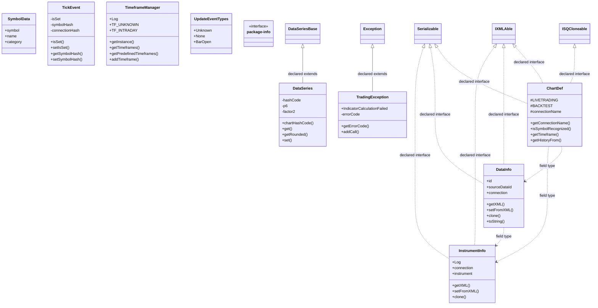

| Diagram identifier | Exact type | Location |
| --- | --- | --- |
| `Cd994a64faafc` | `com.strategyquant.datalib.ChartDef` (this JAR) | this diagram |
| `C507ddf99c601` | `com.strategyquant.datalib.DataInfo` (this JAR) | this diagram |
| `C968f9c287a76` | `com.strategyquant.datalib.DataSeries` (this JAR) | this diagram |
| `Ceb8b827f79bc` | `com.strategyquant.datalib.InstrumentInfo` (this JAR) | this diagram |
| `Cd6aa451b44cb` | `com.strategyquant.datalib.SymbolData` (this JAR) | this diagram |
| `Cd386a24e5c3b` | `com.strategyquant.datalib.TickEvent` (this JAR) | this diagram |
| `C2906febbd036` | `com.strategyquant.datalib.TimeframeManager` (this JAR) | this diagram |
| `Cb218b12bb0c9` | `com.strategyquant.datalib.TradingException` (this JAR) | this diagram |
| `Cd7881d398711` | `com.strategyquant.datalib.UpdateEventTypes` (this JAR) | this diagram |
| `Cfb95bd1f2c64` | `com.strategyquant.datalib.dataseries.DataSeriesBase` (this JAR) | another group in this JAR |
| `C81e3ebee1a33` | `com.strategyquant.datalib.package-info` (this JAR) | this diagram |
| `C04837263807c` | `com.strategyquant.lib.settings.IXMLAble` (not resolved in scoped archives) | referenced external type |
| `Cac836f7e20d9` | `com.strategyquant.lib.utils.ISQCloneable` (not resolved in scoped archives) | referenced external type |
| `C210d9b760f82` | `java.io.Serializable` (not resolved in scoped archives) | referenced external type |
| `C4bc2cd7a4e9d` | `java.lang.Exception` (not resolved in scoped archives) | referenced external type |

### 2. `com.strategyquant.datalib.bartype`

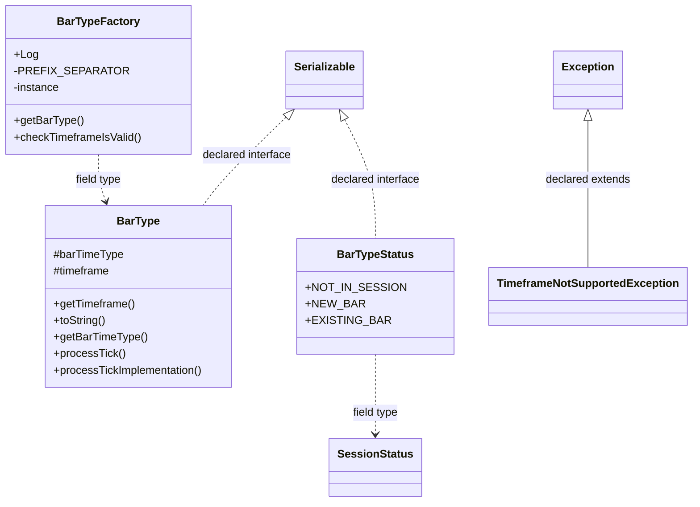

| Diagram identifier | Exact type | Location |
| --- | --- | --- |
| `C67cb1f997b97` | `com.strategyquant.datalib.bartype.BarType` (this JAR) | this diagram |
| `C38a45515c1b6` | `com.strategyquant.datalib.bartype.BarTypeFactory` (this JAR) | this diagram |
| `Ce17579c643fb` | `com.strategyquant.datalib.bartype.BarTypeStatus` (this JAR) | this diagram |
| `C24041ce01b57` | `com.strategyquant.datalib.bartype.TimeframeNotSupportedException` (this JAR) | this diagram |
| `Cf6fbb9af3061` | `com.strategyquant.datalib.session.SessionStatus` (this JAR) | another group in this JAR |
| `C210d9b760f82` | `java.io.Serializable` (not resolved in scoped archives) | referenced external type |
| `C4bc2cd7a4e9d` | `java.lang.Exception` (not resolved in scoped archives) | referenced external type |

### 3. `com.strategyquant.datalib.bartype.impl`

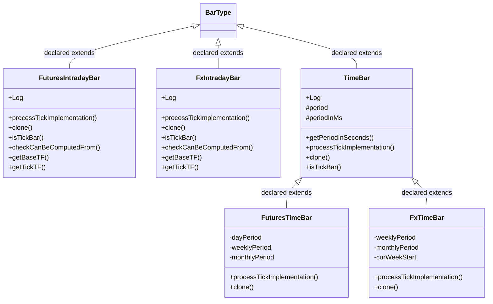

| Diagram identifier | Exact type | Location |
| --- | --- | --- |
| `C67cb1f997b97` | `com.strategyquant.datalib.bartype.BarType` (this JAR) | another group in this JAR |
| `C48dcd23dd88b` | `com.strategyquant.datalib.bartype.impl.FuturesIntradayBar` (this JAR) | this diagram |
| `Cf2d901c18581` | `com.strategyquant.datalib.bartype.impl.FuturesTimeBar` (this JAR) | this diagram |
| `Ca5ae2f4f4d84` | `com.strategyquant.datalib.bartype.impl.FxIntradayBar` (this JAR) | this diagram |
| `C616d89385e12` | `com.strategyquant.datalib.bartype.impl.FxTimeBar` (this JAR) | this diagram |
| `C358ebc371154` | `com.strategyquant.datalib.bartype.impl.TimeBar` (this JAR) | this diagram |

### 4. `com.strategyquant.datalib.basket`

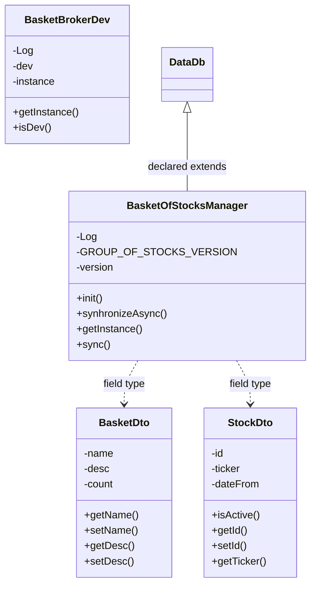

| Diagram identifier | Exact type | Location |
| --- | --- | --- |
| `C10c5e5e5b290` | `com.strategyquant.datalib.basket.BasketBrokerDev` (this JAR) | this diagram |
| `C0a1fd2e7544c` | `com.strategyquant.datalib.basket.BasketDto` (this JAR) | this diagram |
| `Ca58ab764670b` | `com.strategyquant.datalib.basket.BasketOfStocksManager` (this JAR) | this diagram |
| `Ce0cb23611851` | `com.strategyquant.datalib.basket.StockDto` (this JAR) | this diagram |
| `C92f7aa5e83d3` | `com.strategyquant.datalib.data.DataDb` (this JAR) | another group in this JAR |

### 5. `com.strategyquant.datalib.broker`

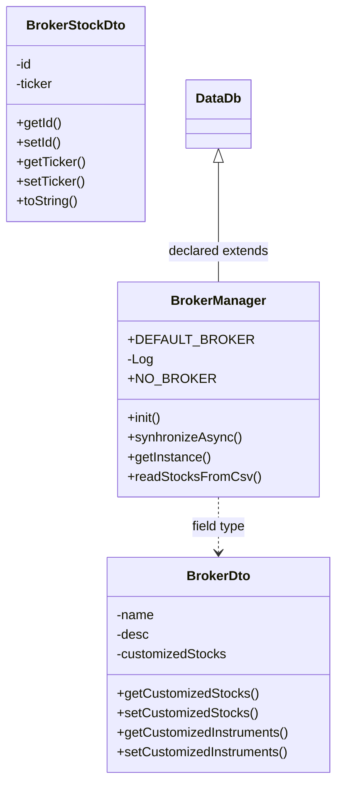

| Diagram identifier | Exact type | Location |
| --- | --- | --- |
| `C51dd9a0c44e8` | `com.strategyquant.datalib.broker.BrokerDto` (this JAR) | this diagram |
| `C7020b9929051` | `com.strategyquant.datalib.broker.BrokerManager` (this JAR) | this diagram |
| `Cd915fb0b66dd` | `com.strategyquant.datalib.broker.BrokerStockDto` (this JAR) | this diagram |
| `C92f7aa5e83d3` | `com.strategyquant.datalib.data.DataDb` (this JAR) | another group in this JAR |

### 6. `com.strategyquant.datalib.consts`

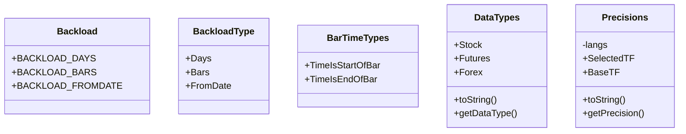

| Diagram identifier | Exact type | Location |
| --- | --- | --- |
| `Cc5dc613a9084` | `com.strategyquant.datalib.consts.Backload` (this JAR) | this diagram |
| `C8042be59c067` | `com.strategyquant.datalib.consts.BackloadType` (this JAR) | this diagram |
| `Cf08564ef3407` | `com.strategyquant.datalib.consts.BarTimeTypes` (this JAR) | this diagram |
| `Ca0ef65a5e866` | `com.strategyquant.datalib.consts.DataTypes` (this JAR) | this diagram |
| `Cd0ce2e64f5e9` | `com.strategyquant.datalib.consts.Precisions` (this JAR) | this diagram |

### 7. `com.strategyquant.datalib.customData`

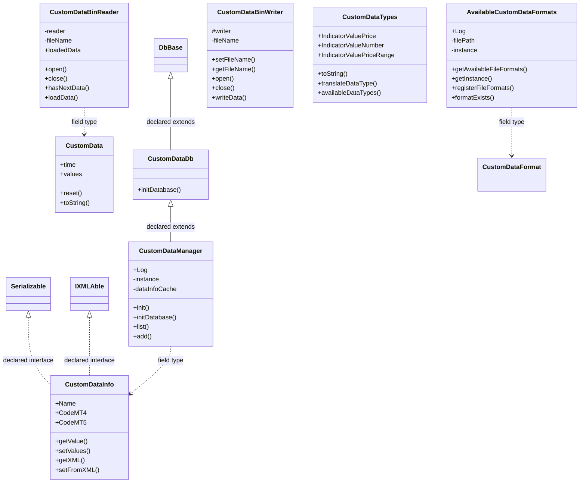

| Diagram identifier | Exact type | Location |
| --- | --- | --- |
| `C7ee15ed38a74` | `com.strategyquant.datalib.customData.AvailableCustomDataFormats` (this JAR) | this diagram |
| `C82154e4e3034` | `com.strategyquant.datalib.customData.CustomData` (this JAR) | this diagram |
| `C660ac7110ad9` | `com.strategyquant.datalib.customData.CustomDataBinReader` (this JAR) | this diagram |
| `Cae6a89b967b0` | `com.strategyquant.datalib.customData.CustomDataBinWriter` (this JAR) | this diagram |
| `C61a00db4128d` | `com.strategyquant.datalib.customData.CustomDataDb` (this JAR) | this diagram |
| `Cf849f7783b12` | `com.strategyquant.datalib.customData.CustomDataInfo` (this JAR) | this diagram |
| `C7a0d6bb96873` | `com.strategyquant.datalib.customData.CustomDataManager` (this JAR) | this diagram |
| `C5d9ef973bec0` | `com.strategyquant.datalib.customData.CustomDataTypes` (this JAR) | this diagram |
| `C45cdb1f980db` | `com.strategyquant.datalib.data.imports.CustomDataFormat` (this JAR) | another group in this JAR |
| `C0232d7b8bc0f` | `com.strategyquant.lib.db.DbBase` (not resolved in scoped archives) | referenced external type |
| `C04837263807c` | `com.strategyquant.lib.settings.IXMLAble` (not resolved in scoped archives) | referenced external type |
| `C210d9b760f82` | `java.io.Serializable` (not resolved in scoped archives) | referenced external type |

### 8. `com.strategyquant.datalib.customData.ct`

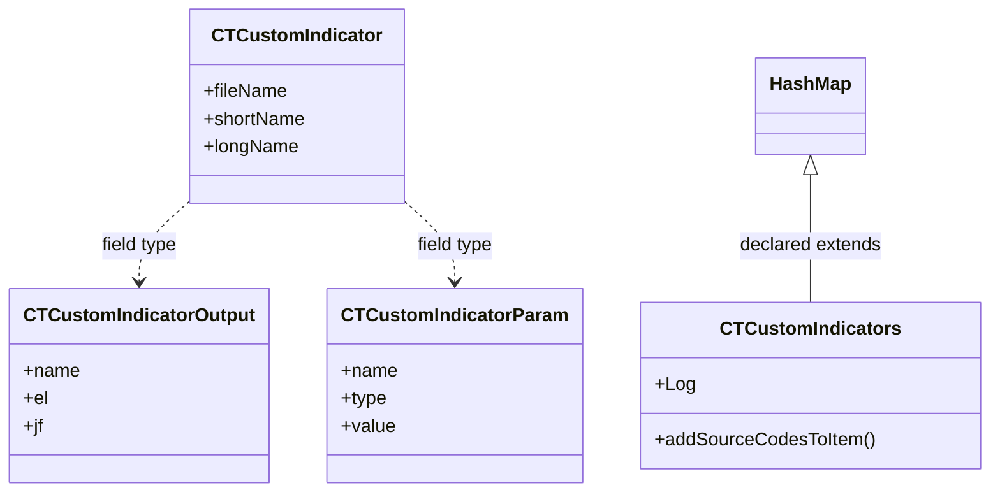

| Diagram identifier | Exact type | Location |
| --- | --- | --- |
| `Cccb605570e25` | `com.strategyquant.datalib.customData.ct.CTCustomIndicator` (this JAR) | this diagram |
| `C621792285a62` | `com.strategyquant.datalib.customData.ct.CTCustomIndicatorOutput` (this JAR) | this diagram |
| `C30fdfe1b9ddb` | `com.strategyquant.datalib.customData.ct.CTCustomIndicatorParam` (this JAR) | this diagram |
| `C351c2f559021` | `com.strategyquant.datalib.customData.ct.CTCustomIndicators` (this JAR) | this diagram |
| `Ce78be4e4395c` | `java.util.HashMap` (not resolved in scoped archives) | referenced external type |

### 9. `com.strategyquant.datalib.darwinex`

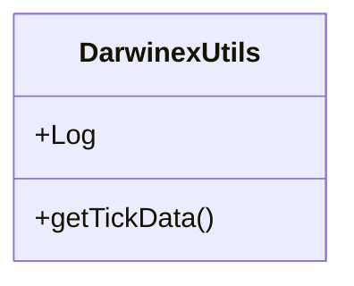

| Diagram identifier | Exact type | Location |
| --- | --- | --- |
| `C96c28df1017a` | `com.strategyquant.datalib.darwinex.DarwinexUtils` (this JAR) | this diagram |

### 10. `com.strategyquant.datalib.data` - group 1

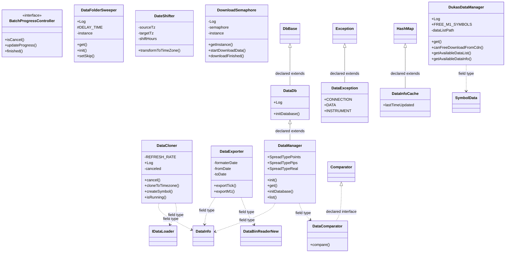

| Diagram identifier | Exact type | Location |
| --- | --- | --- |
| `C507ddf99c601` | `com.strategyquant.datalib.DataInfo` (this JAR) | another group in this JAR |
| `Cd6aa451b44cb` | `com.strategyquant.datalib.SymbolData` (this JAR) | another group in this JAR |
| `Cc388afd48fe7` | `com.strategyquant.datalib.data.BatchProgressController` (this JAR) | this diagram |
| `Cfbb49f22ef79` | `com.strategyquant.datalib.data.DataCloner` (this JAR) | this diagram |
| `C7e6ea2de27bb` | `com.strategyquant.datalib.data.DataComparator` (this JAR) | this diagram |
| `C92f7aa5e83d3` | `com.strategyquant.datalib.data.DataDb` (this JAR) | this diagram |
| `Cd66f84afa41f` | `com.strategyquant.datalib.data.DataException` (this JAR) | this diagram |
| `C36f8a7389cd9` | `com.strategyquant.datalib.data.DataExporter` (this JAR) | this diagram |
| `Cf23bc2a2c546` | `com.strategyquant.datalib.data.DataFolderSweeper` (this JAR) | this diagram |
| `C4792d9227ae2` | `com.strategyquant.datalib.data.DataInfoCache` (this JAR) | this diagram |
| `Cdf7e1cd19834` | `com.strategyquant.datalib.data.DataManager` (this JAR) | this diagram |
| `C16b72a10ecda` | `com.strategyquant.datalib.data.DateShifter` (this JAR) | this diagram |
| `C104d9a306a91` | `com.strategyquant.datalib.data.DownloadSemaphore` (this JAR) | this diagram |
| `C70ca20dad542` | `com.strategyquant.datalib.data.DukasDataManager` (this JAR) | this diagram |
| `C4a20966fbd2f` | `com.strategyquant.datalib.data.io.IDataLoader` (this JAR) | another group in this JAR |
| `C78c37fb94cdd` | `com.strategyquant.datalib.data.io.newDataFormat.DataBinReaderNew` (this JAR) | another group in this JAR |
| `C0232d7b8bc0f` | `com.strategyquant.lib.db.DbBase` (not resolved in scoped archives) | referenced external type |
| `C4bc2cd7a4e9d` | `java.lang.Exception` (not resolved in scoped archives) | referenced external type |
| `C702c79b2d89c` | `java.util.Comparator` (not resolved in scoped archives) | referenced external type |
| `Ce78be4e4395c` | `java.util.HashMap` (not resolved in scoped archives) | referenced external type |

### 11. `com.strategyquant.datalib.data` - group 2

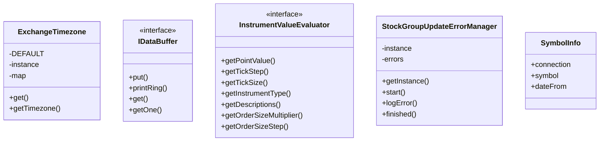

| Diagram identifier | Exact type | Location |
| --- | --- | --- |
| `C49fbda36046c` | `com.strategyquant.datalib.data.ExchangeTimezone` (this JAR) | this diagram |
| `C8d2d93196736` | `com.strategyquant.datalib.data.IDataBuffer` (this JAR) | this diagram |
| `Cf297fcb19840` | `com.strategyquant.datalib.data.InstrumentValueEvaluator` (this JAR) | this diagram |
| `Cf2790b319e32` | `com.strategyquant.datalib.data.StockGroupUpdateErrorManager` (this JAR) | this diagram |
| `C7e382cc0f3c4` | `com.strategyquant.datalib.data.SymbolInfo` (this JAR) | this diagram |

### 12. `com.strategyquant.datalib.data.impl`

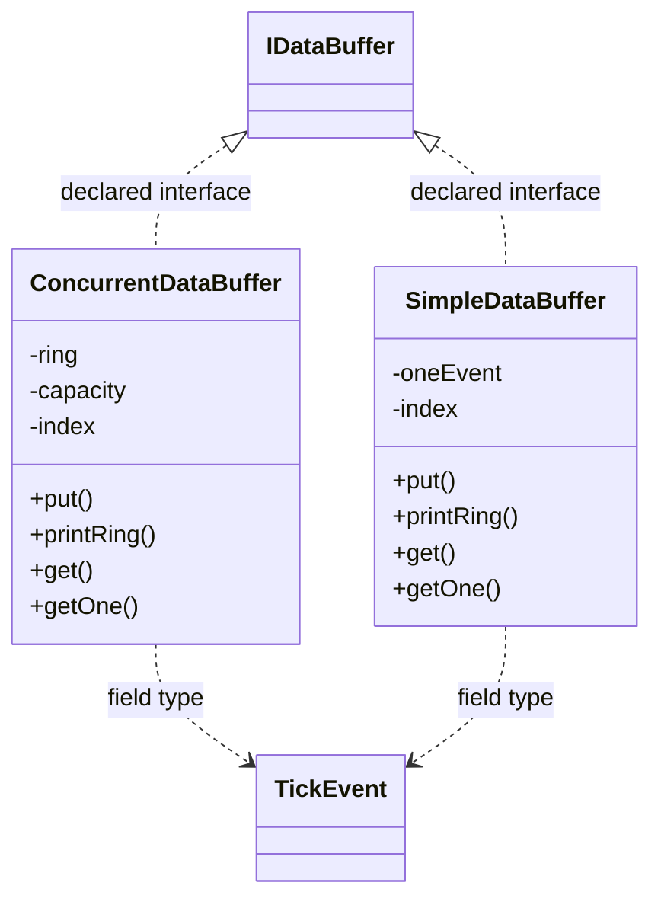

| Diagram identifier | Exact type | Location |
| --- | --- | --- |
| `Cd386a24e5c3b` | `com.strategyquant.datalib.TickEvent` (this JAR) | another group in this JAR |
| `C8d2d93196736` | `com.strategyquant.datalib.data.IDataBuffer` (this JAR) | another group in this JAR |
| `Cfc258406828d` | `com.strategyquant.datalib.data.impl.ConcurrentDataBuffer` (this JAR) | this diagram |
| `Cbcab24d8f76d` | `com.strategyquant.datalib.data.impl.SimpleDataBuffer` (this JAR) | this diagram |

### 13. `com.strategyquant.datalib.data.imports`

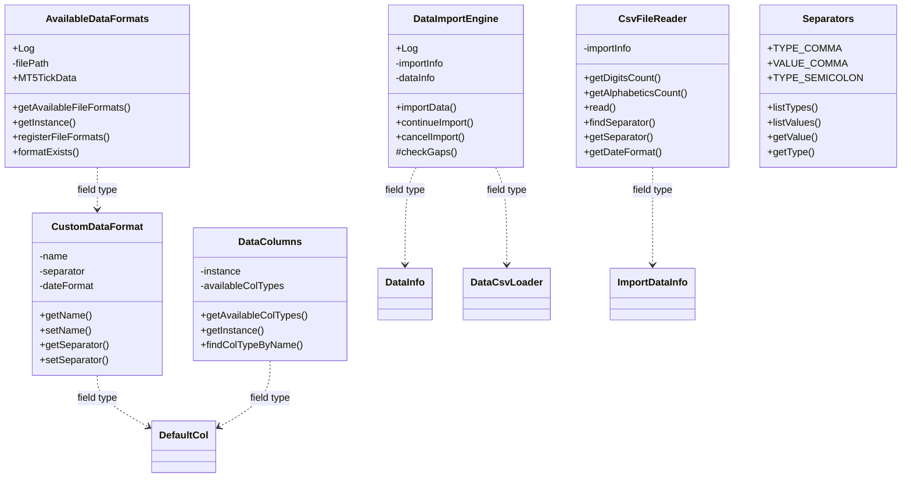

| Diagram identifier | Exact type | Location |
| --- | --- | --- |
| `C507ddf99c601` | `com.strategyquant.datalib.DataInfo` (this JAR) | another group in this JAR |
| `C50efb595dc6f` | `com.strategyquant.datalib.data.imports.AvailableDataFormats` (this JAR) | this diagram |
| `C4eb814f452ed` | `com.strategyquant.datalib.data.imports.CsvFileReader` (this JAR) | this diagram |
| `C45cdb1f980db` | `com.strategyquant.datalib.data.imports.CustomDataFormat` (this JAR) | this diagram |
| `Cce3069a0e89c` | `com.strategyquant.datalib.data.imports.DataColumns` (this JAR) | this diagram |
| `C8be276e2b5ac` | `com.strategyquant.datalib.data.imports.DataImportEngine` (this JAR) | this diagram |
| `Cc73947cad842` | `com.strategyquant.datalib.data.imports.Separators` (this JAR) | this diagram |
| `C7cf31f197b65` | `com.strategyquant.datalib.data.io.DataCsvLoader` (this JAR) | another group in this JAR |
| `C1241a9ebc3a6` | `com.strategyquant.datalib.data.io.ImportDataInfo` (this JAR) | another group in this JAR |
| `Cbc694dd32f71` | `com.strategyquant.datalib.data.io.columns.DefaultCol` (this JAR) | another group in this JAR |

### 14. `com.strategyquant.datalib.data.io` - group 1

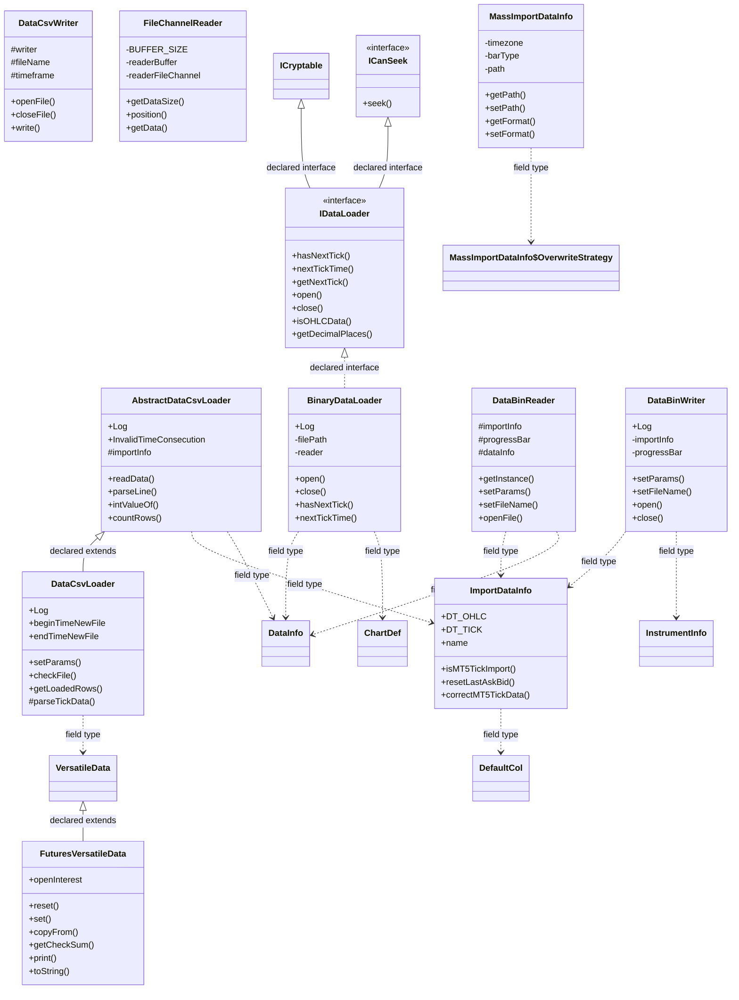

| Diagram identifier | Exact type | Location |
| --- | --- | --- |
| `Cd994a64faafc` | `com.strategyquant.datalib.ChartDef` (this JAR) | another group in this JAR |
| `C507ddf99c601` | `com.strategyquant.datalib.DataInfo` (this JAR) | another group in this JAR |
| `Ceb8b827f79bc` | `com.strategyquant.datalib.InstrumentInfo` (this JAR) | another group in this JAR |
| `C555f2ebba2b8` | `com.strategyquant.datalib.data.io.AbstractDataCsvLoader` (this JAR) | this diagram |
| `Ca669d5c767ba` | `com.strategyquant.datalib.data.io.BinaryDataLoader` (this JAR) | this diagram |
| `C9ab9d064ffd6` | `com.strategyquant.datalib.data.io.DataBinReader` (this JAR) | this diagram |
| `Cfc421a8d13c1` | `com.strategyquant.datalib.data.io.DataBinWriter` (this JAR) | this diagram |
| `C7cf31f197b65` | `com.strategyquant.datalib.data.io.DataCsvLoader` (this JAR) | this diagram |
| `Cafd0749c98b1` | `com.strategyquant.datalib.data.io.DataCsvWriter` (this JAR) | this diagram |
| `C67a2057254a8` | `com.strategyquant.datalib.data.io.FileChannelReader` (this JAR) | this diagram |
| `Cc51edb89859b` | `com.strategyquant.datalib.data.io.FuturesVersatileData` (this JAR) | this diagram |
| `C07f1c891f920` | `com.strategyquant.datalib.data.io.ICanSeek` (this JAR) | this diagram |
| `C4a20966fbd2f` | `com.strategyquant.datalib.data.io.IDataLoader` (this JAR) | this diagram |
| `C1241a9ebc3a6` | `com.strategyquant.datalib.data.io.ImportDataInfo` (this JAR) | this diagram |
| `C6eb76fb85891` | `com.strategyquant.datalib.data.io.MassImportDataInfo` (this JAR) | this diagram |
| `C51485e50b272` | `com.strategyquant.datalib.data.io.MassImportDataInfo$OverwriteStrategy` (this JAR) | another group in this JAR |
| `C1e542c6fc61c` | `com.strategyquant.datalib.data.io.VersatileData` (this JAR) | another group in this JAR |
| `Cbc694dd32f71` | `com.strategyquant.datalib.data.io.columns.DefaultCol` (this JAR) | another group in this JAR |
| `C150c3a6f93d9` | `com.strategyquant.lib.historyData.ICryptable` (not resolved in scoped archives) | referenced external type |

### 15. `com.strategyquant.datalib.data.io` - group 2

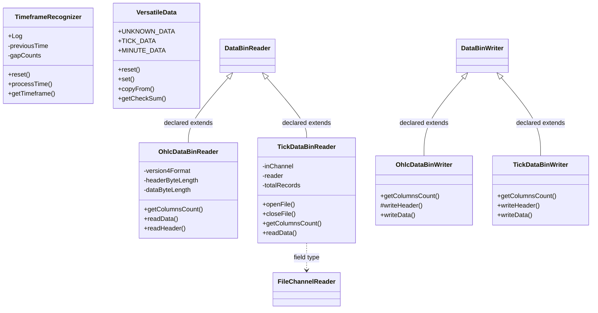

| Diagram identifier | Exact type | Location |
| --- | --- | --- |
| `C9ab9d064ffd6` | `com.strategyquant.datalib.data.io.DataBinReader` (this JAR) | another group in this JAR |
| `Cfc421a8d13c1` | `com.strategyquant.datalib.data.io.DataBinWriter` (this JAR) | another group in this JAR |
| `C67a2057254a8` | `com.strategyquant.datalib.data.io.FileChannelReader` (this JAR) | another group in this JAR |
| `C5017ab240043` | `com.strategyquant.datalib.data.io.OhlcDataBinReader` (this JAR) | this diagram |
| `C6084b5333c47` | `com.strategyquant.datalib.data.io.OhlcDataBinWriter` (this JAR) | this diagram |
| `C9b20b986e69a` | `com.strategyquant.datalib.data.io.TickDataBinReader` (this JAR) | this diagram |
| `Ca422cb908ac6` | `com.strategyquant.datalib.data.io.TickDataBinWriter` (this JAR) | this diagram |
| `C003e8b4cb132` | `com.strategyquant.datalib.data.io.TimeframeRecognizer` (this JAR) | this diagram |
| `C1e542c6fc61c` | `com.strategyquant.datalib.data.io.VersatileData` (this JAR) | this diagram |

### 16. `com.strategyquant.datalib.data.io.columns` - group 1

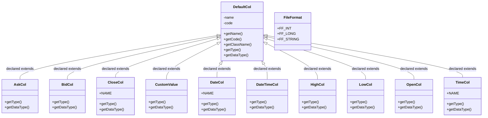

| Diagram identifier | Exact type | Location |
| --- | --- | --- |
| `C5e31f992a63e` | `com.strategyquant.datalib.data.io.columns.AskCol` (this JAR) | this diagram |
| `C9e5449f6caf1` | `com.strategyquant.datalib.data.io.columns.BidCol` (this JAR) | this diagram |
| `C257b50fdef3f` | `com.strategyquant.datalib.data.io.columns.CloseCol` (this JAR) | this diagram |
| `Cb85db12dadbd` | `com.strategyquant.datalib.data.io.columns.CustomValue` (this JAR) | this diagram |
| `C5f9ce37b2c99` | `com.strategyquant.datalib.data.io.columns.DateCol` (this JAR) | this diagram |
| `C6a68f2888f3c` | `com.strategyquant.datalib.data.io.columns.DateTimeCol` (this JAR) | this diagram |
| `Cbc694dd32f71` | `com.strategyquant.datalib.data.io.columns.DefaultCol` (this JAR) | this diagram |
| `C9a7cdf9a9d17` | `com.strategyquant.datalib.data.io.columns.FileFormat` (this JAR) | this diagram |
| `C5a286cf286bd` | `com.strategyquant.datalib.data.io.columns.HighCol` (this JAR) | this diagram |
| `Cb776343725dd` | `com.strategyquant.datalib.data.io.columns.LowCol` (this JAR) | this diagram |
| `C666a9d95cddb` | `com.strategyquant.datalib.data.io.columns.OpenCol` (this JAR) | this diagram |
| `C9d3cbc13a9d5` | `com.strategyquant.datalib.data.io.columns.TimeCol` (this JAR) | this diagram |

### 17. `com.strategyquant.datalib.data.io.columns` - group 2

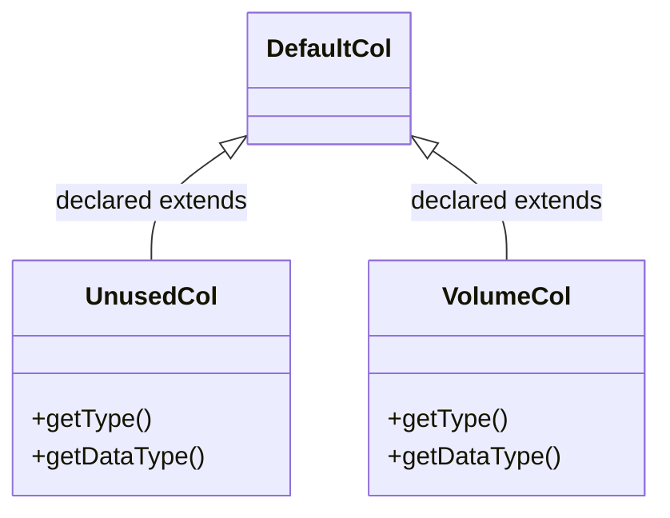

| Diagram identifier | Exact type | Location |
| --- | --- | --- |
| `Cbc694dd32f71` | `com.strategyquant.datalib.data.io.columns.DefaultCol` (this JAR) | another group in this JAR |
| `C80b029f492c9` | `com.strategyquant.datalib.data.io.columns.UnusedCol` (this JAR) | this diagram |
| `C0499190553b8` | `com.strategyquant.datalib.data.io.columns.VolumeCol` (this JAR) | this diagram |

### 18. `com.strategyquant.datalib.data.io.newDataFormat` - group 1

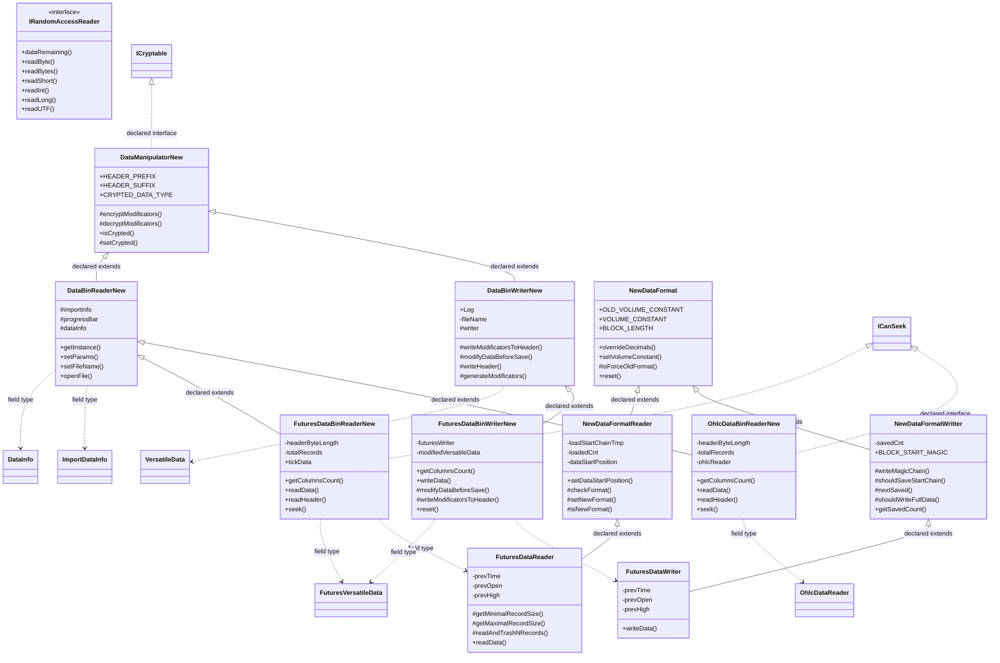

| Diagram identifier | Exact type | Location |
| --- | --- | --- |
| `C507ddf99c601` | `com.strategyquant.datalib.DataInfo` (this JAR) | another group in this JAR |
| `Cc51edb89859b` | `com.strategyquant.datalib.data.io.FuturesVersatileData` (this JAR) | another group in this JAR |
| `C07f1c891f920` | `com.strategyquant.datalib.data.io.ICanSeek` (this JAR) | another group in this JAR |
| `C1241a9ebc3a6` | `com.strategyquant.datalib.data.io.ImportDataInfo` (this JAR) | another group in this JAR |
| `C1e542c6fc61c` | `com.strategyquant.datalib.data.io.VersatileData` (this JAR) | another group in this JAR |
| `C78c37fb94cdd` | `com.strategyquant.datalib.data.io.newDataFormat.DataBinReaderNew` (this JAR) | this diagram |
| `C988691ef2599` | `com.strategyquant.datalib.data.io.newDataFormat.DataBinWriterNew` (this JAR) | this diagram |
| `Ce626d96412fd` | `com.strategyquant.datalib.data.io.newDataFormat.DataManipulatorNew` (this JAR) | this diagram |
| `Cf004a607dfad` | `com.strategyquant.datalib.data.io.newDataFormat.FuturesDataBinReaderNew` (this JAR) | this diagram |
| `C0e677e192ac3` | `com.strategyquant.datalib.data.io.newDataFormat.FuturesDataBinWriterNew` (this JAR) | this diagram |
| `C8c459e37be26` | `com.strategyquant.datalib.data.io.newDataFormat.FuturesDataReader` (this JAR) | this diagram |
| `Ce645757f5060` | `com.strategyquant.datalib.data.io.newDataFormat.FuturesDataWriter` (this JAR) | this diagram |
| `C040250ede9c6` | `com.strategyquant.datalib.data.io.newDataFormat.IRandomAccessReader` (this JAR) | this diagram |
| `C1c9980977d8a` | `com.strategyquant.datalib.data.io.newDataFormat.NewDataFormat` (this JAR) | this diagram |
| `Cd1145fa175f7` | `com.strategyquant.datalib.data.io.newDataFormat.NewDataFormatReader` (this JAR) | this diagram |
| `C6102629b2fe7` | `com.strategyquant.datalib.data.io.newDataFormat.NewDataFormatWritter` (this JAR) | this diagram |
| `C614fb0abb27b` | `com.strategyquant.datalib.data.io.newDataFormat.OhlcDataBinReaderNew` (this JAR) | this diagram |
| `C10a128b7140b` | `com.strategyquant.datalib.data.io.newDataFormat.OhlcDataReader` (this JAR) | another group in this JAR |
| `C150c3a6f93d9` | `com.strategyquant.lib.historyData.ICryptable` (not resolved in scoped archives) | referenced external type |

### 19. `com.strategyquant.datalib.data.io.newDataFormat` - group 2

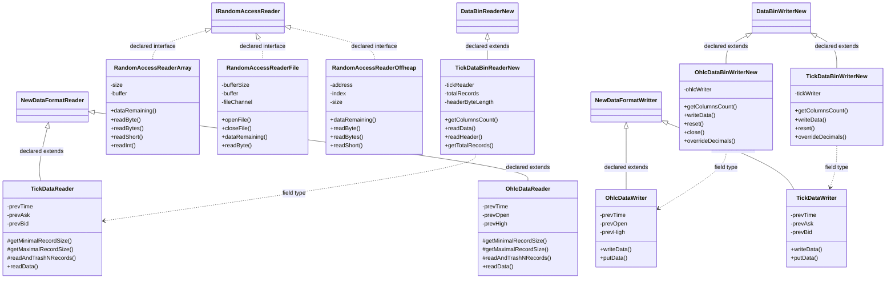

| Diagram identifier | Exact type | Location |
| --- | --- | --- |
| `C78c37fb94cdd` | `com.strategyquant.datalib.data.io.newDataFormat.DataBinReaderNew` (this JAR) | another group in this JAR |
| `C988691ef2599` | `com.strategyquant.datalib.data.io.newDataFormat.DataBinWriterNew` (this JAR) | another group in this JAR |
| `C040250ede9c6` | `com.strategyquant.datalib.data.io.newDataFormat.IRandomAccessReader` (this JAR) | another group in this JAR |
| `Cd1145fa175f7` | `com.strategyquant.datalib.data.io.newDataFormat.NewDataFormatReader` (this JAR) | another group in this JAR |
| `C6102629b2fe7` | `com.strategyquant.datalib.data.io.newDataFormat.NewDataFormatWritter` (this JAR) | another group in this JAR |
| `C249d4f8f6ba0` | `com.strategyquant.datalib.data.io.newDataFormat.OhlcDataBinWriterNew` (this JAR) | this diagram |
| `C10a128b7140b` | `com.strategyquant.datalib.data.io.newDataFormat.OhlcDataReader` (this JAR) | this diagram |
| `C5b872c0045e7` | `com.strategyquant.datalib.data.io.newDataFormat.OhlcDataWriter` (this JAR) | this diagram |
| `C04c8e9ee9cc8` | `com.strategyquant.datalib.data.io.newDataFormat.RandomAccessReaderArray` (this JAR) | this diagram |
| `C09516b6b5cbc` | `com.strategyquant.datalib.data.io.newDataFormat.RandomAccessReaderFile` (this JAR) | this diagram |
| `C551e17cf8308` | `com.strategyquant.datalib.data.io.newDataFormat.RandomAccessReaderOffheap` (this JAR) | this diagram |
| `Cb9b1a8c79609` | `com.strategyquant.datalib.data.io.newDataFormat.TickDataBinReaderNew` (this JAR) | this diagram |
| `Cd56c55ed6de5` | `com.strategyquant.datalib.data.io.newDataFormat.TickDataBinWriterNew` (this JAR) | this diagram |
| `C70c91e39e775` | `com.strategyquant.datalib.data.io.newDataFormat.TickDataReader` (this JAR) | this diagram |
| `Cfe7ab9af5264` | `com.strategyquant.datalib.data.io.newDataFormat.TickDataWriter` (this JAR) | this diagram |

### 20. `com.strategyquant.datalib.dataseries` - group 1

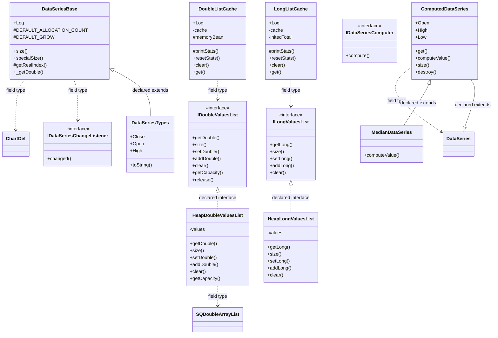

| Diagram identifier | Exact type | Location |
| --- | --- | --- |
| `Cd994a64faafc` | `com.strategyquant.datalib.ChartDef` (this JAR) | another group in this JAR |
| `C968f9c287a76` | `com.strategyquant.datalib.DataSeries` (this JAR) | another group in this JAR |
| `C955f0fd7c654` | `com.strategyquant.datalib.dataseries.ComputedDataSeries` (this JAR) | this diagram |
| `Cfb95bd1f2c64` | `com.strategyquant.datalib.dataseries.DataSeriesBase` (this JAR) | this diagram |
| `C283c5b3dc422` | `com.strategyquant.datalib.dataseries.DataSeriesTypes` (this JAR) | this diagram |
| `Cf65ee90541a4` | `com.strategyquant.datalib.dataseries.DoubleListCache` (this JAR) | this diagram |
| `C772784eef671` | `com.strategyquant.datalib.dataseries.HeapDoubleValuesList` (this JAR) | this diagram |
| `C8f8ce4505c80` | `com.strategyquant.datalib.dataseries.HeapLongValuesList` (this JAR) | this diagram |
| `Cf6f4f5d7d39d` | `com.strategyquant.datalib.dataseries.IDataSeriesChangeListener` (this JAR) | this diagram |
| `Ce66471fcac02` | `com.strategyquant.datalib.dataseries.IDataSeriesComputer` (this JAR) | this diagram |
| `C54d2dcaada60` | `com.strategyquant.datalib.dataseries.IDoubleValuesList` (this JAR) | this diagram |
| `C45236fbc743e` | `com.strategyquant.datalib.dataseries.ILongValuesList` (this JAR) | this diagram |
| `Ce4dc2e9c49ce` | `com.strategyquant.datalib.dataseries.LongListCache` (this JAR) | this diagram |
| `Cd833280021e1` | `com.strategyquant.datalib.dataseries.MedianDataSeries` (this JAR) | this diagram |
| `C16cf1e6548c1` | `com.strategyquant.datalib.dataseries.SQDoubleArrayList` (this JAR) | another group in this JAR |

### 21. `com.strategyquant.datalib.dataseries` - group 2

```mermaid
classDiagram
    class C8176310f71ce["PreparedDataSeries"] {
        +Log
        -currentRealIndex
        -currentValue
        +addChangeListener()
        +get()
        +set()
        #computePotentialMissingValues()
    }
    class C916b759c7a67["PreparedTimeDataSeries"] {
        -currentRealIndex
        -currentValue
        +addChangeListener()
        +get()
        +set()
        +addValues()
        +add()
    }
    class C16cf1e6548c1["SQDoubleArrayList"] {
        +Log
        +DEFAULT_CAPACITY
        -EMPTY
        +add()
        +getDouble()
        +set()
        +ensureCapacity()
    }
    class C61073e14fca0["TimeDataSeries"] {
        +get()
        +set()
        +addValues()
        +add()
    }
    class C70fddfdf539c["TimeDataSeriesBase"] {
        #longValues
        #checkValuesInitialized()
        #_getLong()
        #_setLong()
        +addLongValues()
        #_addLong()
        +destroy()
    }
    class Cde21bf6c36ac["TypicalDataSeries"] {
        +computeValue()
    }
    class C20675c2ea66e["WeightedDataSeries"] {
        +computeValue()
    }
    class C968f9c287a76["DataSeries"]
    class C955f0fd7c654["ComputedDataSeries"]
    class Cfb95bd1f2c64["DataSeriesBase"]
    class C45236fbc743e["ILongValuesList"]
    C968f9c287a76 <|-- C8176310f71ce : declared extends
    C61073e14fca0 <|-- C916b759c7a67 : declared extends
    C70fddfdf539c <|-- C61073e14fca0 : declared extends
    Cfb95bd1f2c64 <|-- C70fddfdf539c : declared extends
    C70fddfdf539c ..> C45236fbc743e : field type
    C955f0fd7c654 <|-- Cde21bf6c36ac : declared extends
    C955f0fd7c654 <|-- C20675c2ea66e : declared extends
```

| Diagram identifier | Exact type | Location |
| --- | --- | --- |
| `C968f9c287a76` | `com.strategyquant.datalib.DataSeries` (this JAR) | another group in this JAR |
| `C955f0fd7c654` | `com.strategyquant.datalib.dataseries.ComputedDataSeries` (this JAR) | another group in this JAR |
| `Cfb95bd1f2c64` | `com.strategyquant.datalib.dataseries.DataSeriesBase` (this JAR) | another group in this JAR |
| `C45236fbc743e` | `com.strategyquant.datalib.dataseries.ILongValuesList` (this JAR) | another group in this JAR |
| `C8176310f71ce` | `com.strategyquant.datalib.dataseries.PreparedDataSeries` (this JAR) | this diagram |
| `C916b759c7a67` | `com.strategyquant.datalib.dataseries.PreparedTimeDataSeries` (this JAR) | this diagram |
| `C16cf1e6548c1` | `com.strategyquant.datalib.dataseries.SQDoubleArrayList` (this JAR) | this diagram |
| `C61073e14fca0` | `com.strategyquant.datalib.dataseries.TimeDataSeries` (this JAR) | this diagram |
| `C70fddfdf539c` | `com.strategyquant.datalib.dataseries.TimeDataSeriesBase` (this JAR) | this diagram |
| `Cde21bf6c36ac` | `com.strategyquant.datalib.dataseries.TypicalDataSeries` (this JAR) | this diagram |
| `C20675c2ea66e` | `com.strategyquant.datalib.dataseries.WeightedDataSeries` (this JAR) | this diagram |

### 22. `com.strategyquant.datalib.historyData`

```mermaid
classDiagram
    class C3a33e73330b9["AbstractHistoryDataDao"] {
        +Log
        -SQL_GET_ALL_MARKETS
        -SQL_GET_ALL_TICKERS
        +createIndexes()
        +getAliasesForAlias()
        +getAliasesMapForAlias()
        +getChangeDate()
    }
    class C1402774e6b0d["FuturesHistoryDataDao"] {
        +BMF_ID
        -SQL_GET_ALL_BR_TICKERS
        -MONTH_LETTERS
        +getAllMarkets()
        +createIndexes()
        +getCommodity()
        +getTickers()
    }
    class C8dbeb0e114ca["StockHistoryDataDao"] {
        +getTickerRenamed()
    }
    class Ce14814e02e52["TickerFilterDto"] {
        -names
        -marketId
        -searchInTicker
        +getMarketId()
        +setMarketId()
        +getNames()
        +setNames()
    }
    class Ceebe5c91d6f1["TickerRenameInfo"] {
        -tickerFrom
        -tickerTo
        -date
        +getTickerFrom()
        +setTickerFrom()
        +getTickerTo()
        +setTickerTo()
    }
    C3a33e73330b9 <|-- C1402774e6b0d : declared extends
    C3a33e73330b9 <|-- C8dbeb0e114ca : declared extends
```

| Diagram identifier | Exact type | Location |
| --- | --- | --- |
| `C3a33e73330b9` | `com.strategyquant.datalib.historyData.AbstractHistoryDataDao` (this JAR) | this diagram |
| `C1402774e6b0d` | `com.strategyquant.datalib.historyData.FuturesHistoryDataDao` (this JAR) | this diagram |
| `C8dbeb0e114ca` | `com.strategyquant.datalib.historyData.StockHistoryDataDao` (this JAR) | this diagram |
| `Ce14814e02e52` | `com.strategyquant.datalib.historyData.TickerFilterDto` (this JAR) | this diagram |
| `Ceebe5c91d6f1` | `com.strategyquant.datalib.historyData.TickerRenameInfo` (this JAR) | this diagram |

### 23. `com.strategyquant.datalib.historyData.dto`

```mermaid
classDiagram
    class C3f6737112808["AliasDto"] {
        -alias
        -original
        +getAlias()
        +setAlias()
        +getOriginal()
        +setOriginal()
    }
    class Cdd77b6219c95["CommodityDto"] {
        -id
        -code
        -name
        +getId()
        +setId()
        +getCode()
        +setCode()
    }
    class Cbdf969509bfc["TickerDto"] {
        -eod
        -id
        -name
        +getId()
        +setId()
        +getName()
        +setName()
    }
    class C676900ccba60["TickerKind"] {
        <<enumeration>>
        +FUTURES
        +STOCK
        -id
        +values()
        +valueOf()
        +getId()
        +tryEvalTickerFromName()
    }
    class C68f8466c8cb8["Enum"]
    C68f8466c8cb8 <|-- C676900ccba60 : declared extends
```

| Diagram identifier | Exact type | Location |
| --- | --- | --- |
| `C3f6737112808` | `com.strategyquant.datalib.historyData.dto.AliasDto` (this JAR) | this diagram |
| `Cdd77b6219c95` | `com.strategyquant.datalib.historyData.dto.CommodityDto` (this JAR) | this diagram |
| `Cbdf969509bfc` | `com.strategyquant.datalib.historyData.dto.TickerDto` (this JAR) | this diagram |
| `C676900ccba60` | `com.strategyquant.datalib.historyData.dto.TickerKind` (this JAR) | this diagram |
| `C68f8466c8cb8` | `java.lang.Enum` (not resolved in scoped archives) | referenced external type |

### 24. `com.strategyquant.datalib.indicators`

```mermaid
classDiagram
    class Cf5c766cc579e["CustomIndicatorFileImporter"] {
        -parent
        +load()
    }
    class C563a6533072f["SCustomIndicator"] {
        +fileName
        +shortName
        +longName
        +toString()
    }
    class Cdd7d6e41f865["SCustomIndicatorFileParser"] {
        +parse()
    }
    class Cdef109f86594["SParameter"] {
        +name
        +type
        +value
        +toString()
    }
    class Cbe78539f40cb["SParametersParser"] {
        -input
        +type
        +list
        +parse()
    }
    class C5e0404c742ca["SParametersParser$InputParameter"]
    C563a6533072f ..> Cdef109f86594 : field type
    Cbe78539f40cb ..> C5e0404c742ca : field type
```

| Diagram identifier | Exact type | Location |
| --- | --- | --- |
| `Cf5c766cc579e` | `com.strategyquant.datalib.indicators.CustomIndicatorFileImporter` (this JAR) | this diagram |
| `C563a6533072f` | `com.strategyquant.datalib.indicators.SCustomIndicator` (this JAR) | this diagram |
| `Cdd7d6e41f865` | `com.strategyquant.datalib.indicators.SCustomIndicatorFileParser` (this JAR) | this diagram |
| `Cdef109f86594` | `com.strategyquant.datalib.indicators.SParameter` (this JAR) | this diagram |
| `Cbe78539f40cb` | `com.strategyquant.datalib.indicators.SParametersParser` (this JAR) | this diagram |
| `C5e0404c742ca` | `com.strategyquant.datalib.indicators.SParametersParser$InputParameter` (this JAR) | another group in this JAR |

### 25. `com.strategyquant.datalib.instrument`

```mermaid
classDiagram
    class C1daeea30df47["AliasManager"] {
        -Log
        -filePath
        -lineDelimiter
        +getAliases()
        +getAlias()
        +checkAliasExists()
        +getAliasInstrument()
    }
    class C441b5ed24e61["InstrumentAlias"] {
        +alias
        +instrument
        +description
    }
    class C34f60f0118c1["InstrumentManager"] {
        -instance
        -exchangesFilePath
        -countriesFilePath
        +init()
        +initDatabase()
        +getInstrumentInfo()
        +checkInstrumentExists()
    }
    class C92f7aa5e83d3["DataDb"]
    class C421bcf130f56["InstrumentManager$InstrumentCache"]
    C1daeea30df47 ..> C441b5ed24e61 : field type
    C92f7aa5e83d3 <|-- C34f60f0118c1 : declared extends
    C34f60f0118c1 ..> C421bcf130f56 : field type
```

| Diagram identifier | Exact type | Location |
| --- | --- | --- |
| `C92f7aa5e83d3` | `com.strategyquant.datalib.data.DataDb` (this JAR) | another group in this JAR |
| `C1daeea30df47` | `com.strategyquant.datalib.instrument.AliasManager` (this JAR) | this diagram |
| `C441b5ed24e61` | `com.strategyquant.datalib.instrument.InstrumentAlias` (this JAR) | this diagram |
| `C34f60f0118c1` | `com.strategyquant.datalib.instrument.InstrumentManager` (this JAR) | this diagram |
| `C421bcf130f56` | `com.strategyquant.datalib.instrument.InstrumentManager$InstrumentCache` (this JAR) | another group in this JAR |

### 26. `com.strategyquant.datalib.instrument.imports`

```mermaid
classDiagram
    class Cb772cd3af985["YahooInstruments"] {
        +Log
        +checkData()
        +importData()
    }
```

| Diagram identifier | Exact type | Location |
| --- | --- | --- |
| `Cb772cd3af985` | `com.strategyquant.datalib.instrument.imports.YahooInstruments` (this JAR) | this diagram |

### 27. `com.strategyquant.datalib.metatrader4`

```mermaid
classDiagram
    class Cbec306f9e591["MT4Utils"] {
        -Log
        -IGNORE_FOLDER_SET
        +getDataFolder()
        +getTerminalHash()
        +getDataFolderFile()
        +getServerNames()
        +main()
    }
    class C7c6626ad9ab7["Mt4Properties"] {
        -values
        -PropertiesPath
        +toJSON()
        +findBySymbol()
    }
    class C5d40c0df28e0["Mt4SymbolProperties"] {
        -values
        +getStrValue()
        +exists()
        +getIntValue()
        +getDoubleValue()
        +put()
        +parse()
    }
    C7c6626ad9ab7 ..> C5d40c0df28e0 : field type
```

| Diagram identifier | Exact type | Location |
| --- | --- | --- |
| `Cbec306f9e591` | `com.strategyquant.datalib.metatrader4.MT4Utils` (this JAR) | this diagram |
| `C7c6626ad9ab7` | `com.strategyquant.datalib.metatrader4.Mt4Properties` (this JAR) | this diagram |
| `C5d40c0df28e0` | `com.strategyquant.datalib.metatrader4.Mt4SymbolProperties` (this JAR) | this diagram |

### 28. `com.strategyquant.datalib.session`

```mermaid
classDiagram
    class Cc0e718d02788["MonthlyRangeCalculator"] {
        +getSessionStartTime()
        +getSessionEndTime()
    }
    class Cde03fb1902c5["Session"] {
        +Log
        +WEEK_MILLIS
        +NoSession
        +getSessionName()
        +getElements()
        +checkTimeIsInSession()
        +clone()
    }
    class C3772677f4bb2["SessionComparator"] {
        +compare()
    }
    class C2d0a59bb2b49["SessionElement"] {
        -dayFrom
        -timeFrom
        -dayTo
        +getDayFrom()
        +getDayFromStr()
        +getDayTo()
        +getDayToStr()
    }
    class C3eb7261e5ab7["SessionException"] {
    }
    class C175bc7704d4f["SessionManager"] {
        -instance
        -sessionCache
        -sessionList
        +init()
        +initDatabase()
        +getSessions()
        +addSession()
    }
    class Cc725ab6f69f0["SessionNoSession"] {
        +checkTimeIsInSession()
    }
    class Cf6fbb9af3061["SessionStatus"] {
        +isInSession
        +sessionStartTime
        +sessionEndTime
    }
    class C92f7aa5e83d3["DataDb"]
    class C04837263807c["IXMLAble"]
    class C210d9b760f82["Serializable"]
    class C4bc2cd7a4e9d["Exception"]
    class C702c79b2d89c["Comparator"]
    C210d9b760f82 <|.. Cde03fb1902c5 : declared interface
    C04837263807c <|.. Cde03fb1902c5 : declared interface
    Cde03fb1902c5 ..> C2d0a59bb2b49 : field type
    Cde03fb1902c5 ..> Cf6fbb9af3061 : field type
    C702c79b2d89c <|.. C3772677f4bb2 : declared interface
    C210d9b760f82 <|.. C2d0a59bb2b49 : declared interface
    C4bc2cd7a4e9d <|-- C3eb7261e5ab7 : declared extends
    C92f7aa5e83d3 <|-- C175bc7704d4f : declared extends
    C175bc7704d4f ..> Cde03fb1902c5 : field type
    C175bc7704d4f ..> C3772677f4bb2 : field type
    Cde03fb1902c5 <|-- Cc725ab6f69f0 : declared extends
    C210d9b760f82 <|.. Cf6fbb9af3061 : declared interface
```

| Diagram identifier | Exact type | Location |
| --- | --- | --- |
| `C92f7aa5e83d3` | `com.strategyquant.datalib.data.DataDb` (this JAR) | another group in this JAR |
| `Cc0e718d02788` | `com.strategyquant.datalib.session.MonthlyRangeCalculator` (this JAR) | this diagram |
| `Cde03fb1902c5` | `com.strategyquant.datalib.session.Session` (this JAR) | this diagram |
| `C3772677f4bb2` | `com.strategyquant.datalib.session.SessionComparator` (this JAR) | this diagram |
| `C2d0a59bb2b49` | `com.strategyquant.datalib.session.SessionElement` (this JAR) | this diagram |
| `C3eb7261e5ab7` | `com.strategyquant.datalib.session.SessionException` (this JAR) | this diagram |
| `C175bc7704d4f` | `com.strategyquant.datalib.session.SessionManager` (this JAR) | this diagram |
| `Cc725ab6f69f0` | `com.strategyquant.datalib.session.SessionNoSession` (this JAR) | this diagram |
| `Cf6fbb9af3061` | `com.strategyquant.datalib.session.SessionStatus` (this JAR) | this diagram |
| `C04837263807c` | `com.strategyquant.lib.settings.IXMLAble` (not resolved in scoped archives) | referenced external type |
| `C210d9b760f82` | `java.io.Serializable` (not resolved in scoped archives) | referenced external type |
| `C4bc2cd7a4e9d` | `java.lang.Exception` (not resolved in scoped archives) | referenced external type |
| `C702c79b2d89c` | `java.util.Comparator` (not resolved in scoped archives) | referenced external type |

### 29. `com.strategyquant.datalib.ticksimulator`

```mermaid
classDiagram
    class Cc28eaa12ef8b["DefaultTickSimulator"] {
        -data
        -step
        -spreadsMap
        +init()
        +getNextTick()
        +setSymbolsSpread()
    }
    class C290c9da498f1["ITickSimulator"] {
        <<interface>>
        +init()
        +getNextTick()
        +setSymbolsSpread()
    }
    class C9476746fbb89["SpreadsMap"] {
        -map
        -lastUsedSpreadHashKey
        -lastUsedSpread
        +getSpread()
        +containsKey()
    }
    class C4e71b535404d["TSTickSimulator"] {
        -data
        -step
        -spreadsMap
        +init()
        +getNextTick()
        +setSymbolsSpread()
    }
    class C1e542c6fc61c["VersatileData"]
    C290c9da498f1 <|.. Cc28eaa12ef8b : declared interface
    Cc28eaa12ef8b ..> C1e542c6fc61c : field type
    Cc28eaa12ef8b ..> C9476746fbb89 : field type
    C290c9da498f1 <|.. C4e71b535404d : declared interface
    C4e71b535404d ..> C1e542c6fc61c : field type
    C4e71b535404d ..> C9476746fbb89 : field type
```

| Diagram identifier | Exact type | Location |
| --- | --- | --- |
| `C1e542c6fc61c` | `com.strategyquant.datalib.data.io.VersatileData` (this JAR) | another group in this JAR |
| `Cc28eaa12ef8b` | `com.strategyquant.datalib.ticksimulator.DefaultTickSimulator` (this JAR) | this diagram |
| `C290c9da498f1` | `com.strategyquant.datalib.ticksimulator.ITickSimulator` (this JAR) | this diagram |
| `C9476746fbb89` | `com.strategyquant.datalib.ticksimulator.SpreadsMap` (this JAR) | this diagram |
| `C4e71b535404d` | `com.strategyquant.datalib.ticksimulator.TSTickSimulator` (this JAR) | this diagram |

### 30. `com.strategyquant.datalib.timeframe`

```mermaid
classDiagram
    class C59b8b61410fc["TimeframesComparator"] {
        +compare()
        +getSecondsCount()
    }
    class C702c79b2d89c["Comparator"]
    C702c79b2d89c <|.. C59b8b61410fc : declared interface
```

| Diagram identifier | Exact type | Location |
| --- | --- | --- |
| `C59b8b61410fc` | `com.strategyquant.datalib.timeframe.TimeframesComparator` (this JAR) | this diagram |
| `C702c79b2d89c` | `java.util.Comparator` (not resolved in scoped archives) | referenced external type |

### 31. `com.strategyquant.datalib.timezone`

```mermaid
classDiagram
    class Cc49011964e5b["Timezone"] {
        +DEFAULT
        -name
        -id
        +toString()
        +getId()
        +getName()
        +print()
    }
    class C5b6b156c8b02["Timezones"] {
        +Log
        -path
        -instance
        +getTimezones()
        +findByKey()
    }
    C5b6b156c8b02 ..> Cc49011964e5b : field type
```

| Diagram identifier | Exact type | Location |
| --- | --- | --- |
| `Cc49011964e5b` | `com.strategyquant.datalib.timezone.Timezone` (this JAR) | this diagram |
| `C5b6b156c8b02` | `com.strategyquant.datalib.timezone.Timezones` (this JAR) | this diagram |

## Complete class inventory

| Fully qualified class | Kind | Entry |
| --- | --- | --- |
| `com.strategyquant.datalib.ChartDef` | class | non-nested |
| `com.strategyquant.datalib.DataInfo` | class | non-nested |
| `com.strategyquant.datalib.DataSeries` | class | non-nested |
| `com.strategyquant.datalib.InstrumentInfo` | class | non-nested |
| `com.strategyquant.datalib.SymbolData` | class | non-nested |
| `com.strategyquant.datalib.TickEvent` | class | non-nested |
| `com.strategyquant.datalib.TimeframeManager` | class | non-nested |
| `com.strategyquant.datalib.TradingException` | class | non-nested |
| `com.strategyquant.datalib.UpdateEventTypes` | class | non-nested |
| `com.strategyquant.datalib.bartype.BarType` | class | non-nested |
| `com.strategyquant.datalib.bartype.BarTypeFactory` | class | non-nested |
| `com.strategyquant.datalib.bartype.BarTypeStatus` | class | non-nested |
| `com.strategyquant.datalib.bartype.TimeframeNotSupportedException` | class | non-nested |
| `com.strategyquant.datalib.bartype.impl.FuturesIntradayBar` | class | non-nested |
| `com.strategyquant.datalib.bartype.impl.FuturesTimeBar` | class | non-nested |
| `com.strategyquant.datalib.bartype.impl.FxIntradayBar` | class | non-nested |
| `com.strategyquant.datalib.bartype.impl.FxTimeBar` | class | non-nested |
| `com.strategyquant.datalib.bartype.impl.TimeBar` | class | non-nested |
| `com.strategyquant.datalib.basket.BasketBrokerDev` | class | non-nested |
| `com.strategyquant.datalib.basket.BasketDto` | class | non-nested |
| `com.strategyquant.datalib.basket.BasketOfStocksManager` | class | non-nested |
| `com.strategyquant.datalib.basket.BasketOfStocksManager$1` | class | nested/anonymous |
| `com.strategyquant.datalib.basket.BasketOfStocksManager$MinMax` | class | nested/anonymous |
| `com.strategyquant.datalib.basket.StockDto` | class | non-nested |
| `com.strategyquant.datalib.broker.BrokerDto` | class | non-nested |
| `com.strategyquant.datalib.broker.BrokerManager` | class | non-nested |
| `com.strategyquant.datalib.broker.BrokerManager$1` | class | nested/anonymous |
| `com.strategyquant.datalib.broker.BrokerStockDto` | class | non-nested |
| `com.strategyquant.datalib.consts.Backload` | class | non-nested |
| `com.strategyquant.datalib.consts.BackloadType` | class | non-nested |
| `com.strategyquant.datalib.consts.BarTimeTypes` | class | non-nested |
| `com.strategyquant.datalib.consts.DataTypes` | class | non-nested |
| `com.strategyquant.datalib.consts.Precisions` | class | non-nested |
| `com.strategyquant.datalib.customData.AvailableCustomDataFormats` | class | non-nested |
| `com.strategyquant.datalib.customData.CustomData` | class | non-nested |
| `com.strategyquant.datalib.customData.CustomDataBinReader` | class | non-nested |
| `com.strategyquant.datalib.customData.CustomDataBinWriter` | class | non-nested |
| `com.strategyquant.datalib.customData.CustomDataDb` | class | non-nested |
| `com.strategyquant.datalib.customData.CustomDataInfo` | class | non-nested |
| `com.strategyquant.datalib.customData.CustomDataManager` | class | non-nested |
| `com.strategyquant.datalib.customData.CustomDataTypes` | class | non-nested |
| `com.strategyquant.datalib.customData.ct.CTCustomIndicator` | class | non-nested |
| `com.strategyquant.datalib.customData.ct.CTCustomIndicatorOutput` | class | non-nested |
| `com.strategyquant.datalib.customData.ct.CTCustomIndicatorParam` | class | non-nested |
| `com.strategyquant.datalib.customData.ct.CTCustomIndicators` | class | non-nested |
| `com.strategyquant.datalib.darwinex.DarwinexUtils` | class | non-nested |
| `com.strategyquant.datalib.data.BatchProgressController` | interface | non-nested |
| `com.strategyquant.datalib.data.DataCloner` | class | non-nested |
| `com.strategyquant.datalib.data.DataComparator` | class | non-nested |
| `com.strategyquant.datalib.data.DataDb` | class | non-nested |
| `com.strategyquant.datalib.data.DataException` | class | non-nested |
| `com.strategyquant.datalib.data.DataExporter` | class | non-nested |
| `com.strategyquant.datalib.data.DataFolderSweeper` | class | non-nested |
| `com.strategyquant.datalib.data.DataFolderSweeper$1` | class | nested/anonymous |
| `com.strategyquant.datalib.data.DataFolderSweeper$2` | class | nested/anonymous |
| `com.strategyquant.datalib.data.DataInfoCache` | class | non-nested |
| `com.strategyquant.datalib.data.DataManager` | class | non-nested |
| `com.strategyquant.datalib.data.DateShifter` | class | non-nested |
| `com.strategyquant.datalib.data.DownloadSemaphore` | class | non-nested |
| `com.strategyquant.datalib.data.DukasDataManager` | class | non-nested |
| `com.strategyquant.datalib.data.ExchangeTimezone` | class | non-nested |
| `com.strategyquant.datalib.data.IDataBuffer` | interface | non-nested |
| `com.strategyquant.datalib.data.InstrumentValueEvaluator` | interface | non-nested |
| `com.strategyquant.datalib.data.StockGroupUpdateErrorManager` | class | non-nested |
| `com.strategyquant.datalib.data.SymbolInfo` | class | non-nested |
| `com.strategyquant.datalib.data.impl.ConcurrentDataBuffer` | class | non-nested |
| `com.strategyquant.datalib.data.impl.SimpleDataBuffer` | class | non-nested |
| `com.strategyquant.datalib.data.imports.AvailableDataFormats` | class | non-nested |
| `com.strategyquant.datalib.data.imports.AvailableDataFormats$1` | class | nested/anonymous |
| `com.strategyquant.datalib.data.imports.CsvFileReader` | class | non-nested |
| `com.strategyquant.datalib.data.imports.CustomDataFormat` | class | non-nested |
| `com.strategyquant.datalib.data.imports.DataColumns` | class | non-nested |
| `com.strategyquant.datalib.data.imports.DataImportEngine` | class | non-nested |
| `com.strategyquant.datalib.data.imports.DataImportEngine$1` | class | nested/anonymous |
| `com.strategyquant.datalib.data.imports.DataImportEngine$2` | class | nested/anonymous |
| `com.strategyquant.datalib.data.imports.Separators` | class | non-nested |
| `com.strategyquant.datalib.data.io.AbstractDataCsvLoader` | class | non-nested |
| `com.strategyquant.datalib.data.io.BinaryDataLoader` | class | non-nested |
| `com.strategyquant.datalib.data.io.DataBinReader` | class | non-nested |
| `com.strategyquant.datalib.data.io.DataBinWriter` | class | non-nested |
| `com.strategyquant.datalib.data.io.DataCsvLoader` | class | non-nested |
| `com.strategyquant.datalib.data.io.DataCsvWriter` | class | non-nested |
| `com.strategyquant.datalib.data.io.FileChannelReader` | class | non-nested |
| `com.strategyquant.datalib.data.io.FuturesVersatileData` | class | non-nested |
| `com.strategyquant.datalib.data.io.ICanSeek` | interface | non-nested |
| `com.strategyquant.datalib.data.io.IDataLoader` | interface | non-nested |
| `com.strategyquant.datalib.data.io.ImportDataInfo` | class | non-nested |
| `com.strategyquant.datalib.data.io.MassImportDataInfo` | class | non-nested |
| `com.strategyquant.datalib.data.io.MassImportDataInfo$OverwriteStrategy` | class | nested/anonymous |
| `com.strategyquant.datalib.data.io.OhlcDataBinReader` | class | non-nested |
| `com.strategyquant.datalib.data.io.OhlcDataBinWriter` | class | non-nested |
| `com.strategyquant.datalib.data.io.TickDataBinReader` | class | non-nested |
| `com.strategyquant.datalib.data.io.TickDataBinWriter` | class | non-nested |
| `com.strategyquant.datalib.data.io.TimeframeRecognizer` | class | non-nested |
| `com.strategyquant.datalib.data.io.VersatileData` | class | non-nested |
| `com.strategyquant.datalib.data.io.columns.AskCol` | class | non-nested |
| `com.strategyquant.datalib.data.io.columns.BidCol` | class | non-nested |
| `com.strategyquant.datalib.data.io.columns.CloseCol` | class | non-nested |
| `com.strategyquant.datalib.data.io.columns.CustomValue` | class | non-nested |
| `com.strategyquant.datalib.data.io.columns.DateCol` | class | non-nested |
| `com.strategyquant.datalib.data.io.columns.DateTimeCol` | class | non-nested |
| `com.strategyquant.datalib.data.io.columns.DefaultCol` | class | non-nested |
| `com.strategyquant.datalib.data.io.columns.FileFormat` | class | non-nested |
| `com.strategyquant.datalib.data.io.columns.HighCol` | class | non-nested |
| `com.strategyquant.datalib.data.io.columns.LowCol` | class | non-nested |
| `com.strategyquant.datalib.data.io.columns.OpenCol` | class | non-nested |
| `com.strategyquant.datalib.data.io.columns.TimeCol` | class | non-nested |
| `com.strategyquant.datalib.data.io.columns.UnusedCol` | class | non-nested |
| `com.strategyquant.datalib.data.io.columns.VolumeCol` | class | non-nested |
| `com.strategyquant.datalib.data.io.newDataFormat.DataBinReaderNew` | class | non-nested |
| `com.strategyquant.datalib.data.io.newDataFormat.DataBinWriterNew` | class | non-nested |
| `com.strategyquant.datalib.data.io.newDataFormat.DataManipulatorNew` | class | non-nested |
| `com.strategyquant.datalib.data.io.newDataFormat.FuturesDataBinReaderNew` | class | non-nested |
| `com.strategyquant.datalib.data.io.newDataFormat.FuturesDataBinWriterNew` | class | non-nested |
| `com.strategyquant.datalib.data.io.newDataFormat.FuturesDataReader` | class | non-nested |
| `com.strategyquant.datalib.data.io.newDataFormat.FuturesDataWriter` | class | non-nested |
| `com.strategyquant.datalib.data.io.newDataFormat.IRandomAccessReader` | interface | non-nested |
| `com.strategyquant.datalib.data.io.newDataFormat.NewDataFormat` | class | non-nested |
| `com.strategyquant.datalib.data.io.newDataFormat.NewDataFormatReader` | class | non-nested |
| `com.strategyquant.datalib.data.io.newDataFormat.NewDataFormatWritter` | class | non-nested |
| `com.strategyquant.datalib.data.io.newDataFormat.OhlcDataBinReaderNew` | class | non-nested |
| `com.strategyquant.datalib.data.io.newDataFormat.OhlcDataBinWriterNew` | class | non-nested |
| `com.strategyquant.datalib.data.io.newDataFormat.OhlcDataReader` | class | non-nested |
| `com.strategyquant.datalib.data.io.newDataFormat.OhlcDataWriter` | class | non-nested |
| `com.strategyquant.datalib.data.io.newDataFormat.RandomAccessReaderArray` | class | non-nested |
| `com.strategyquant.datalib.data.io.newDataFormat.RandomAccessReaderFile` | class | non-nested |
| `com.strategyquant.datalib.data.io.newDataFormat.RandomAccessReaderOffheap` | class | non-nested |
| `com.strategyquant.datalib.data.io.newDataFormat.TickDataBinReaderNew` | class | non-nested |
| `com.strategyquant.datalib.data.io.newDataFormat.TickDataBinWriterNew` | class | non-nested |
| `com.strategyquant.datalib.data.io.newDataFormat.TickDataReader` | class | non-nested |
| `com.strategyquant.datalib.data.io.newDataFormat.TickDataWriter` | class | non-nested |
| `com.strategyquant.datalib.dataseries.ComputedDataSeries` | class | non-nested |
| `com.strategyquant.datalib.dataseries.DataSeriesBase` | class | non-nested |
| `com.strategyquant.datalib.dataseries.DataSeriesTypes` | class | non-nested |
| `com.strategyquant.datalib.dataseries.DoubleListCache` | class | non-nested |
| `com.strategyquant.datalib.dataseries.DoubleListCache$1` | class | nested/anonymous |
| `com.strategyquant.datalib.dataseries.HeapDoubleValuesList` | class | non-nested |
| `com.strategyquant.datalib.dataseries.HeapLongValuesList` | class | non-nested |
| `com.strategyquant.datalib.dataseries.IDataSeriesChangeListener` | interface | non-nested |
| `com.strategyquant.datalib.dataseries.IDataSeriesComputer` | interface | non-nested |
| `com.strategyquant.datalib.dataseries.IDoubleValuesList` | interface | non-nested |
| `com.strategyquant.datalib.dataseries.ILongValuesList` | interface | non-nested |
| `com.strategyquant.datalib.dataseries.LongListCache` | class | non-nested |
| `com.strategyquant.datalib.dataseries.LongListCache$1` | class | nested/anonymous |
| `com.strategyquant.datalib.dataseries.MedianDataSeries` | class | non-nested |
| `com.strategyquant.datalib.dataseries.PreparedDataSeries` | class | non-nested |
| `com.strategyquant.datalib.dataseries.PreparedTimeDataSeries` | class | non-nested |
| `com.strategyquant.datalib.dataseries.SQDoubleArrayList` | class | non-nested |
| `com.strategyquant.datalib.dataseries.TimeDataSeries` | class | non-nested |
| `com.strategyquant.datalib.dataseries.TimeDataSeriesBase` | class | non-nested |
| `com.strategyquant.datalib.dataseries.TypicalDataSeries` | class | non-nested |
| `com.strategyquant.datalib.dataseries.WeightedDataSeries` | class | non-nested |
| `com.strategyquant.datalib.historyData.AbstractHistoryDataDao` | class | non-nested |
| `com.strategyquant.datalib.historyData.FuturesHistoryDataDao` | class | non-nested |
| `com.strategyquant.datalib.historyData.StockHistoryDataDao` | class | non-nested |
| `com.strategyquant.datalib.historyData.StockHistoryDataDao$1` | class | nested/anonymous |
| `com.strategyquant.datalib.historyData.TickerFilterDto` | class | non-nested |
| `com.strategyquant.datalib.historyData.TickerRenameInfo` | class | non-nested |
| `com.strategyquant.datalib.historyData.dto.AliasDto` | class | non-nested |
| `com.strategyquant.datalib.historyData.dto.CommodityDto` | class | non-nested |
| `com.strategyquant.datalib.historyData.dto.TickerDto` | class | non-nested |
| `com.strategyquant.datalib.historyData.dto.TickerKind` | class | non-nested |
| `com.strategyquant.datalib.indicators.CustomIndicatorFileImporter` | class | non-nested |
| `com.strategyquant.datalib.indicators.SCustomIndicator` | class | non-nested |
| `com.strategyquant.datalib.indicators.SCustomIndicatorFileParser` | class | non-nested |
| `com.strategyquant.datalib.indicators.SParameter` | class | non-nested |
| `com.strategyquant.datalib.indicators.SParametersParser` | class | non-nested |
| `com.strategyquant.datalib.indicators.SParametersParser$InputParameter` | class | nested/anonymous |
| `com.strategyquant.datalib.instrument.AliasManager` | class | non-nested |
| `com.strategyquant.datalib.instrument.InstrumentAlias` | class | non-nested |
| `com.strategyquant.datalib.instrument.InstrumentManager` | class | non-nested |
| `com.strategyquant.datalib.instrument.InstrumentManager$1` | class | nested/anonymous |
| `com.strategyquant.datalib.instrument.InstrumentManager$InstrumentCache` | class | nested/anonymous |
| `com.strategyquant.datalib.instrument.imports.YahooInstruments` | class | non-nested |
| `com.strategyquant.datalib.metatrader4.MT4Utils` | class | non-nested |
| `com.strategyquant.datalib.metatrader4.MT4Utils$1` | class | nested/anonymous |
| `com.strategyquant.datalib.metatrader4.MT4Utils$MetaTraderLocation` | class | nested/anonymous |
| `com.strategyquant.datalib.metatrader4.Mt4Properties` | class | non-nested |
| `com.strategyquant.datalib.metatrader4.Mt4SymbolProperties` | class | non-nested |
| `com.strategyquant.datalib.package-info` | interface | non-nested |
| `com.strategyquant.datalib.session.MonthlyRangeCalculator` | class | non-nested |
| `com.strategyquant.datalib.session.Session` | class | non-nested |
| `com.strategyquant.datalib.session.SessionComparator` | class | non-nested |
| `com.strategyquant.datalib.session.SessionElement` | class | non-nested |
| `com.strategyquant.datalib.session.SessionException` | class | non-nested |
| `com.strategyquant.datalib.session.SessionManager` | class | non-nested |
| `com.strategyquant.datalib.session.SessionNoSession` | class | non-nested |
| `com.strategyquant.datalib.session.SessionStatus` | class | non-nested |
| `com.strategyquant.datalib.ticksimulator.DefaultTickSimulator` | class | non-nested |
| `com.strategyquant.datalib.ticksimulator.ITickSimulator` | interface | non-nested |
| `com.strategyquant.datalib.ticksimulator.SpreadsMap` | class | non-nested |
| `com.strategyquant.datalib.ticksimulator.TSTickSimulator` | class | non-nested |
| `com.strategyquant.datalib.timeframe.TimeframesComparator` | class | non-nested |
| `com.strategyquant.datalib.timezone.Timezone` | class | non-nested |
| `com.strategyquant.datalib.timezone.Timezones` | class | non-nested |

## Declared relationships and evidence locations

Every row is supported by the named class declaration/member in `javap -p`, inside the artifact recorded above. Signature dependencies may include return, parameter, generic-argument and throws types; they do not imply execution.

| Declaring class | Referenced type | Relationship | Narrow inspection location |
| --- | --- | --- | --- |
| `com.strategyquant.datalib.ChartDef` | `com.strategyquant.lib.settings.IXMLAble` (not resolved in scoped archives) | implements | `com.strategyquant.datalib.ChartDef` / class declaration: `public class com.strategyquant.datalib.ChartDef implements com.strategyquant.lib.settings.IXMLAble, com.strategyquant.lib.utils.ISQCloneable<com.strategyquant.datalib.ChartDef>, java.io.Serializable` |
| `com.strategyquant.datalib.ChartDef` | `com.strategyquant.lib.utils.ISQCloneable` (not resolved in scoped archives) | implements | `com.strategyquant.datalib.ChartDef` / class declaration: `public class com.strategyquant.datalib.ChartDef implements com.strategyquant.lib.settings.IXMLAble, com.strategyquant.lib.utils.ISQCloneable<com.strategyquant.datalib.ChartDef>, java.io.Serializable` |
| `com.strategyquant.datalib.ChartDef` | `java.io.Serializable` (not resolved in scoped archives) | implements | `com.strategyquant.datalib.ChartDef` / class declaration: `public class com.strategyquant.datalib.ChartDef implements com.strategyquant.lib.settings.IXMLAble, com.strategyquant.lib.utils.ISQCloneable<com.strategyquant.datalib.ChartDef>, java.io.Serializable` |
| `com.strategyquant.datalib.ChartDef` | `java.lang.String` (not resolved in scoped archives) | type dependency | `com.strategyquant.datalib.ChartDef` / field declaration: `protected java.lang.String connectionName;`<br>`protected java.lang.String symbol;`<br>`protected java.lang.String instrument;`<br>`protected java.lang.String timeframe;`<br>`protected java.lang.String session;` |
| `com.strategyquant.datalib.ChartDef` | `java.lang.String` (not resolved in scoped archives) | type dependency | `com.strategyquant.datalib.ChartDef` / method signature: `public com.strategyquant.datalib.ChartDef(java.lang.String, java.lang.String, java.lang.String, int, long, java.lang.String) throws com.strategyquant.datalib.data.DataException;`<br>`public com.strategyquant.datalib.ChartDef(java.lang.String, java.lang.String, java.lang.String, long, long, double, java.lang.String) throws com.strategyquant.datalib.data.DataException;`<br>`public com.strategyquant.datalib.ChartDef(com.strategyquant.datalib.ChartDef, java.lang.String) throws com.strategyquant.datalib.data.DataException;`<br>`public java.lang.String getConnectionName();`<br>`public java.lang.String getTimeframe();`<br>`public void setSymbol(java.lang.String);`<br>`public java.lang.String getSymbol();`<br>`public java.lang.String getSession();`<br>`public java.lang.String getInstrument();`<br>`public com.strategyquant.datalib.ChartDef getClone(java.lang.String);`<br>`public java.lang.String getChartsHash();`<br>`private java.lang.String getSessionStr(java.lang.String);`<br>`public void setSession(java.lang.String);` |
| `com.strategyquant.datalib.ChartDef` | `com.strategyquant.datalib.DataInfo` (this JAR) | type dependency | `com.strategyquant.datalib.ChartDef` / field declaration: `protected com.strategyquant.datalib.DataInfo dataInfo;` |
| `com.strategyquant.datalib.ChartDef` | `com.strategyquant.datalib.InstrumentInfo` (this JAR) | type dependency | `com.strategyquant.datalib.ChartDef` / field declaration: `private com.strategyquant.datalib.InstrumentInfo instrumentInfo;` |
| `com.strategyquant.datalib.ChartDef` | `com.strategyquant.datalib.InstrumentInfo` (this JAR) | type dependency | `com.strategyquant.datalib.ChartDef` / method signature: `public com.strategyquant.datalib.InstrumentInfo getSymbolInfo();`<br>`public com.strategyquant.datalib.InstrumentInfo getInstrumentInfo();` |
| `com.strategyquant.datalib.ChartDef` | `com.strategyquant.datalib.data.DataException` (this JAR) | type dependency | `com.strategyquant.datalib.ChartDef` / method signature: `public com.strategyquant.datalib.ChartDef(java.lang.String, java.lang.String, java.lang.String, int, long, java.lang.String) throws com.strategyquant.datalib.data.DataException;`<br>`public com.strategyquant.datalib.ChartDef(java.lang.String, java.lang.String, java.lang.String, long, long, double, java.lang.String) throws com.strategyquant.datalib.data.DataException;`<br>`public com.strategyquant.datalib.ChartDef(com.strategyquant.datalib.ChartDef) throws com.strategyquant.datalib.data.DataException;`<br>`public com.strategyquant.datalib.ChartDef(com.strategyquant.datalib.ChartDef, java.lang.String) throws com.strategyquant.datalib.data.DataException;`<br>`public boolean canBeComputedFrom(com.strategyquant.datalib.ChartDef) throws com.strategyquant.datalib.data.DataException;`<br>`public boolean isSmallerThan(com.strategyquant.datalib.ChartDef) throws com.strategyquant.datalib.data.DataException;` |
| `com.strategyquant.datalib.ChartDef` | `org.jdom2.Element` (not resolved in scoped archives) | type dependency | `com.strategyquant.datalib.ChartDef` / method signature: `public org.jdom2.Element getXML();`<br>`public void setFromXML(org.jdom2.Element);` |
| `com.strategyquant.datalib.ChartDef` | `java.lang.Object` (not resolved in scoped archives) | type dependency | `com.strategyquant.datalib.ChartDef` / method signature: `public java.lang.Object getClone() throws java.lang.Exception;` |
| `com.strategyquant.datalib.ChartDef` | `java.lang.Exception` (not resolved in scoped archives) | type dependency | `com.strategyquant.datalib.ChartDef` / method signature: `public java.lang.Object getClone() throws java.lang.Exception;` |
| `com.strategyquant.datalib.DataInfo` | `com.strategyquant.lib.settings.IXMLAble` (not resolved in scoped archives) | implements | `com.strategyquant.datalib.DataInfo` / class declaration: `public class com.strategyquant.datalib.DataInfo implements com.strategyquant.lib.settings.IXMLAble,java.io.Serializable` |
| `com.strategyquant.datalib.DataInfo` | `java.io.Serializable` (not resolved in scoped archives) | implements | `com.strategyquant.datalib.DataInfo` / class declaration: `public class com.strategyquant.datalib.DataInfo implements com.strategyquant.lib.settings.IXMLAble,java.io.Serializable` |
| `com.strategyquant.datalib.DataInfo` | `java.lang.String` (not resolved in scoped archives) | type dependency | `com.strategyquant.datalib.DataInfo` / field declaration: `public java.lang.String connection;`<br>`public java.lang.String symbol;`<br>`public java.lang.String originalSymbol;`<br>`public java.lang.String instrument;`<br>`public java.lang.String timeframe;`<br>`public java.lang.String filename;`<br>`public java.lang.String timezone;`<br>`public java.lang.String uSymbol;`<br>`public java.lang.String uSymbolName;`<br>`public java.lang.String dateFromStr;`<br>`public java.lang.String dateToStr;` |
| `com.strategyquant.datalib.DataInfo` | `java.lang.String` (not resolved in scoped archives) | type dependency | `com.strategyquant.datalib.DataInfo` / method signature: `public java.lang.String toString();` |
| `com.strategyquant.datalib.DataInfo` | `com.strategyquant.datalib.InstrumentInfo` (this JAR) | type dependency | `com.strategyquant.datalib.DataInfo` / field declaration: `public com.strategyquant.datalib.InstrumentInfo symbolInfo;` |
| `com.strategyquant.datalib.DataInfo` | `org.jdom2.Element` (not resolved in scoped archives) | type dependency | `com.strategyquant.datalib.DataInfo` / method signature: `public org.jdom2.Element getXML();`<br>`public void setFromXML(org.jdom2.Element);` |
| `com.strategyquant.datalib.DataInfo` | `java.lang.Object` (not resolved in scoped archives) | type dependency | `com.strategyquant.datalib.DataInfo` / method signature: `public java.lang.Object clone() throws java.lang.CloneNotSupportedException;` |
| `com.strategyquant.datalib.DataInfo` | `java.lang.CloneNotSupportedException` (not resolved in scoped archives) | type dependency | `com.strategyquant.datalib.DataInfo` / method signature: `public java.lang.Object clone() throws java.lang.CloneNotSupportedException;` |
| `com.strategyquant.datalib.DataSeries` | `com.strategyquant.datalib.dataseries.DataSeriesBase` (this JAR) | extends | `com.strategyquant.datalib.DataSeries` / class declaration: `public class com.strategyquant.datalib.DataSeries extends com.strategyquant.datalib.dataseries.DataSeriesBase` |
| `com.strategyquant.datalib.DataSeries` | `java.lang.String` (not resolved in scoped archives) | type dependency | `com.strategyquant.datalib.DataSeries` / method signature: `public com.strategyquant.datalib.DataSeries(java.lang.String, int);`<br>`public com.strategyquant.datalib.DataSeries(java.lang.String, int, com.strategyquant.datalib.ChartDef);`<br>`public com.strategyquant.datalib.DataSeries(java.lang.String);` |
| `com.strategyquant.datalib.DataSeries` | `com.strategyquant.datalib.ChartDef` (this JAR) | type dependency | `com.strategyquant.datalib.DataSeries` / method signature: `public com.strategyquant.datalib.DataSeries(java.lang.String, int, com.strategyquant.datalib.ChartDef);` |
| `com.strategyquant.datalib.DataSeries` | `com.strategyquant.datalib.TradingException` (this JAR) | type dependency | `com.strategyquant.datalib.DataSeries` / method signature: `public double get(int) throws com.strategyquant.datalib.TradingException;`<br>`public double getRounded(int) throws com.strategyquant.datalib.TradingException;`<br>`public double getRounded(int, int) throws com.strategyquant.datalib.TradingException;`<br>`public void set(int, double) throws com.strategyquant.datalib.TradingException;`<br>`public void set(int, double, boolean) throws com.strategyquant.datalib.TradingException;`<br>`public void set(double) throws com.strategyquant.datalib.TradingException;`<br>`public void addValues(int) throws com.strategyquant.datalib.TradingException;`<br>`public void add(double) throws com.strategyquant.datalib.TradingException;` |
| `com.strategyquant.datalib.InstrumentInfo` | `com.strategyquant.lib.settings.IXMLAble` (not resolved in scoped archives) | implements | `com.strategyquant.datalib.InstrumentInfo` / class declaration: `public class com.strategyquant.datalib.InstrumentInfo implements com.strategyquant.lib.settings.IXMLAble,java.io.Serializable` |
| `com.strategyquant.datalib.InstrumentInfo` | `java.io.Serializable` (not resolved in scoped archives) | implements | `com.strategyquant.datalib.InstrumentInfo` / class declaration: `public class com.strategyquant.datalib.InstrumentInfo implements com.strategyquant.lib.settings.IXMLAble,java.io.Serializable` |
| `com.strategyquant.datalib.InstrumentInfo` | `org.slf4j.Logger` (not resolved in scoped archives) | type dependency | `com.strategyquant.datalib.InstrumentInfo` / field declaration: `public static final org.slf4j.Logger Log;` |
| `com.strategyquant.datalib.InstrumentInfo` | `java.lang.String` (not resolved in scoped archives) | type dependency | `com.strategyquant.datalib.InstrumentInfo` / field declaration: `public java.lang.String connection;`<br>`public java.lang.String instrument;`<br>`public java.lang.String description;`<br>`public java.lang.String filename;`<br>`public java.lang.String timeframe;`<br>`public java.lang.String alias;`<br>`public java.lang.String exchange;`<br>`public java.lang.String country;`<br>`public java.lang.String sector;`<br>`public java.lang.String commissions;`<br>`public java.lang.String swap;` |
| `com.strategyquant.datalib.InstrumentInfo` | `java.lang.String` (not resolved in scoped archives) | type dependency | `com.strategyquant.datalib.InstrumentInfo` / method signature: `private java.lang.String internIfNotNull(java.lang.String);` |
| `com.strategyquant.datalib.InstrumentInfo` | `org.jdom2.Element` (not resolved in scoped archives) | type dependency | `com.strategyquant.datalib.InstrumentInfo` / method signature: `public com.strategyquant.datalib.InstrumentInfo(org.jdom2.Element);`<br>`public org.jdom2.Element getXML();`<br>`public void setFromXML(org.jdom2.Element);` |
| `com.strategyquant.datalib.InstrumentInfo` | `java.lang.Object` (not resolved in scoped archives) | type dependency | `com.strategyquant.datalib.InstrumentInfo` / method signature: `public java.lang.Object clone() throws java.lang.CloneNotSupportedException;` |
| `com.strategyquant.datalib.InstrumentInfo` | `java.lang.CloneNotSupportedException` (not resolved in scoped archives) | type dependency | `com.strategyquant.datalib.InstrumentInfo` / method signature: `public java.lang.Object clone() throws java.lang.CloneNotSupportedException;` |
| `com.strategyquant.datalib.SymbolData` | `java.lang.String` (not resolved in scoped archives) | type dependency | `com.strategyquant.datalib.SymbolData` / field declaration: `public java.lang.String symbol;`<br>`public java.lang.String name;`<br>`public java.lang.String category;`<br>`public java.lang.String subcategory;` |
| `com.strategyquant.datalib.TickEvent` | `java.lang.String` (not resolved in scoped archives) | type dependency | `com.strategyquant.datalib.TickEvent` / method signature: `public java.lang.String toString();` |
| `com.strategyquant.datalib.TimeframeManager` | `org.slf4j.Logger` (not resolved in scoped archives) | type dependency | `com.strategyquant.datalib.TimeframeManager` / field declaration: `public static final org.slf4j.Logger Log;` |
| `com.strategyquant.datalib.TimeframeManager` | `java.lang.String` (not resolved in scoped archives) | type dependency | `com.strategyquant.datalib.TimeframeManager` / field declaration: `public static final java.lang.String TF_UNKNOWN;`<br>`public static final java.lang.String TF_INTRADAY;`<br>`public static final java.lang.String TF_TICK;`<br>`public static final java.lang.String TF_M1;`<br>`public static final java.lang.String TF_M3;`<br>`public static final java.lang.String TF_M5;`<br>`public static final java.lang.String TF_M15;`<br>`public static final java.lang.String TF_M30;`<br>`public static final java.lang.String TF_H1;`<br>`public static final java.lang.String TF_H2;`<br>`public static final java.lang.String TF_H3;`<br>`public static final java.lang.String TF_H4;`<br>`public static final java.lang.String TF_H6;`<br>`public static final java.lang.String TF_H8;`<br>`public static final java.lang.String TF_H12;`<br>`public static final java.lang.String TF_D1;`<br>`public static final java.lang.String TF_WEEKLY;`<br>`public static final java.lang.String TF_MONTHLY;`<br>`public static java.lang.String filePath;`<br>`private static final java.lang.String delimiter;`<br>`private java.util.ArrayList<java.lang.String> defaultTimeframes;`<br>`private java.util.ArrayList<java.lang.String> customTimeframes;` |
| `com.strategyquant.datalib.TimeframeManager` | `java.lang.String` (not resolved in scoped archives) | type dependency | `com.strategyquant.datalib.TimeframeManager` / method signature: `private boolean isValid(java.lang.String);`<br>`public static java.util.ArrayList<java.lang.String> getTimeframes();`<br>`public static java.util.ArrayList<java.lang.String> getPredefinedTimeframes();`<br>`public static void addTimeframe(java.lang.String) throws java.lang.Exception;`<br>`public static java.lang.String translateSQ3TFToString(int);`<br>`public static int translateToMTConstant(java.lang.String);`<br>`public static java.lang.String M(int);`<br>`public static long getMillis(java.lang.String) throws com.strategyquant.datalib.TradingException;`<br>`public static boolean isTimeFrameLessThen(java.lang.String, java.lang.String) throws com.strategyquant.datalib.TradingException;`<br>`public static long getTFHash(java.lang.String) throws com.strategyquant.datalib.TradingException;`<br>`public static java.lang.String getTFName(long);`<br>`public static boolean TFExists(java.lang.String);`<br>`private java.util.ArrayList<java.lang.String> _getTimeframes();`<br>`private void _addTimeframe(java.lang.String) throws java.lang.Exception;` |
| `com.strategyquant.datalib.TimeframeManager` | `java.util.ArrayList` (not resolved in scoped archives) | type dependency | `com.strategyquant.datalib.TimeframeManager` / field declaration: `private java.util.ArrayList<java.lang.String> defaultTimeframes;`<br>`private java.util.ArrayList<java.lang.String> customTimeframes;` |
| `com.strategyquant.datalib.TimeframeManager` | `java.util.ArrayList` (not resolved in scoped archives) | type dependency | `com.strategyquant.datalib.TimeframeManager` / method signature: `public static java.util.ArrayList<java.lang.String> getTimeframes();`<br>`public static java.util.ArrayList<java.lang.String> getPredefinedTimeframes();`<br>`private java.util.ArrayList<java.lang.String> _getTimeframes();` |
| `com.strategyquant.datalib.TimeframeManager` | `java.lang.Exception` (not resolved in scoped archives) | type dependency | `com.strategyquant.datalib.TimeframeManager` / method signature: `public static void addTimeframe(java.lang.String) throws java.lang.Exception;`<br>`private void _addTimeframe(java.lang.String) throws java.lang.Exception;` |
| `com.strategyquant.datalib.TimeframeManager` | `com.strategyquant.datalib.TradingException` (this JAR) | type dependency | `com.strategyquant.datalib.TimeframeManager` / method signature: `public static long getMillis(java.lang.String) throws com.strategyquant.datalib.TradingException;`<br>`public static boolean isTimeFrameLessThen(java.lang.String, java.lang.String) throws com.strategyquant.datalib.TradingException;`<br>`public static long getTFHash(java.lang.String) throws com.strategyquant.datalib.TradingException;` |
| `com.strategyquant.datalib.TradingException` | `java.lang.Exception` (not resolved in scoped archives) | extends | `com.strategyquant.datalib.TradingException` / class declaration: `public class com.strategyquant.datalib.TradingException extends java.lang.Exception` |
| `com.strategyquant.datalib.TradingException` | `java.lang.String` (not resolved in scoped archives) | type dependency | `com.strategyquant.datalib.TradingException` / method signature: `public com.strategyquant.datalib.TradingException(java.lang.String);`<br>`public com.strategyquant.datalib.TradingException(java.lang.String, int);`<br>`public com.strategyquant.datalib.TradingException(java.lang.String, java.lang.Exception);`<br>`public com.strategyquant.datalib.TradingException addCall(java.lang.String);` |
| `com.strategyquant.datalib.TradingException` | `java.lang.Exception` (not resolved in scoped archives) | type dependency | `com.strategyquant.datalib.TradingException` / method signature: `public com.strategyquant.datalib.TradingException(java.lang.Exception);`<br>`public com.strategyquant.datalib.TradingException(java.lang.String, java.lang.Exception);` |
| `com.strategyquant.datalib.bartype.BarType` | `java.io.Serializable` (not resolved in scoped archives) | implements | `com.strategyquant.datalib.bartype.BarType` / class declaration: `public abstract class com.strategyquant.datalib.bartype.BarType implements java.io.Serializable` |
| `com.strategyquant.datalib.bartype.BarType` | `java.lang.String` (not resolved in scoped archives) | type dependency | `com.strategyquant.datalib.bartype.BarType` / field declaration: `protected final java.lang.String timeframe;` |
| `com.strategyquant.datalib.bartype.BarType` | `java.lang.String` (not resolved in scoped archives) | type dependency | `com.strategyquant.datalib.bartype.BarType` / method signature: `public com.strategyquant.datalib.bartype.BarType(int, java.lang.String);`<br>`public java.lang.String getTimeframe();`<br>`public java.lang.String toString(java.lang.String);`<br>`public abstract com.strategyquant.datalib.bartype.BarType clone(java.lang.String);`<br>`public abstract java.lang.String checkCanBeComputedFrom(java.lang.String) throws com.strategyquant.datalib.data.DataException;`<br>`public abstract java.lang.String getBaseTF();`<br>`public abstract java.lang.String getTickTF();`<br>`public abstract boolean checkTimeframeIsSupported(java.lang.String);`<br>`public java.lang.String toStr();` |
| `com.strategyquant.datalib.bartype.BarType` | `com.strategyquant.datalib.TickEvent` (this JAR) | type dependency | `com.strategyquant.datalib.bartype.BarType` / method signature: `public void processTick(com.strategyquant.datalib.TickEvent, com.strategyquant.datalib.bartype.BarTypeStatus, int) throws com.strategyquant.datalib.data.DataException;`<br>`public abstract void processTickImplementation(com.strategyquant.datalib.TickEvent, com.strategyquant.datalib.bartype.BarTypeStatus, int) throws com.strategyquant.datalib.data.DataException;` |
| `com.strategyquant.datalib.bartype.BarType` | `com.strategyquant.datalib.bartype.BarTypeStatus` (this JAR) | type dependency | `com.strategyquant.datalib.bartype.BarType` / method signature: `public void processTick(com.strategyquant.datalib.TickEvent, com.strategyquant.datalib.bartype.BarTypeStatus, int) throws com.strategyquant.datalib.data.DataException;`<br>`public abstract void processTickImplementation(com.strategyquant.datalib.TickEvent, com.strategyquant.datalib.bartype.BarTypeStatus, int) throws com.strategyquant.datalib.data.DataException;` |
| `com.strategyquant.datalib.bartype.BarType` | `com.strategyquant.datalib.data.DataException` (this JAR) | type dependency | `com.strategyquant.datalib.bartype.BarType` / method signature: `public void processTick(com.strategyquant.datalib.TickEvent, com.strategyquant.datalib.bartype.BarTypeStatus, int) throws com.strategyquant.datalib.data.DataException;`<br>`public abstract void processTickImplementation(com.strategyquant.datalib.TickEvent, com.strategyquant.datalib.bartype.BarTypeStatus, int) throws com.strategyquant.datalib.data.DataException;`<br>`public abstract java.lang.String checkCanBeComputedFrom(java.lang.String) throws com.strategyquant.datalib.data.DataException;` |
| `com.strategyquant.datalib.bartype.BarType` | `java.lang.Object` (not resolved in scoped archives) | type dependency | `com.strategyquant.datalib.bartype.BarType` / method signature: `public java.lang.Object clone() throws java.lang.CloneNotSupportedException;` |
| `com.strategyquant.datalib.bartype.BarType` | `java.lang.CloneNotSupportedException` (not resolved in scoped archives) | type dependency | `com.strategyquant.datalib.bartype.BarType` / method signature: `public java.lang.Object clone() throws java.lang.CloneNotSupportedException;` |
| `com.strategyquant.datalib.bartype.BarTypeFactory` | `org.slf4j.Logger` (not resolved in scoped archives) | type dependency | `com.strategyquant.datalib.bartype.BarTypeFactory` / field declaration: `public static final org.slf4j.Logger Log;` |
| `com.strategyquant.datalib.bartype.BarTypeFactory` | `java.lang.String` (not resolved in scoped archives) | type dependency | `com.strategyquant.datalib.bartype.BarTypeFactory` / field declaration: `private static final java.lang.String PREFIX_SEPARATOR;` |
| `com.strategyquant.datalib.bartype.BarTypeFactory` | `java.lang.String` (not resolved in scoped archives) | type dependency | `com.strategyquant.datalib.bartype.BarTypeFactory` / method signature: `public static com.strategyquant.datalib.bartype.BarType getBarType(java.lang.String, int) throws com.strategyquant.datalib.data.DataException;`<br>`private com.strategyquant.datalib.bartype.BarType _getBarType(java.lang.String, int) throws com.strategyquant.datalib.data.DataException;`<br>`private long getUniqueHash(java.lang.String, int) throws com.strategyquant.datalib.data.DataException;`<br>`private static boolean isTimePeriod(java.lang.String);`<br>`public static void checkTimeframeIsValid(java.lang.String) throws com.strategyquant.datalib.data.DataException;` |
| `com.strategyquant.datalib.bartype.BarTypeFactory` | `java.util.ArrayList` (not resolved in scoped archives) | type dependency | `com.strategyquant.datalib.bartype.BarTypeFactory` / field declaration: `private java.util.ArrayList<com.strategyquant.datalib.bartype.BarType> registeredBarTypes;` |
| `com.strategyquant.datalib.bartype.BarTypeFactory` | `com.strategyquant.datalib.bartype.BarType` (this JAR) | type dependency | `com.strategyquant.datalib.bartype.BarTypeFactory` / field declaration: `private java.util.ArrayList<com.strategyquant.datalib.bartype.BarType> registeredBarTypes;`<br>`private it.unimi.dsi.fastutil.longs.Long2ObjectOpenHashMap<com.strategyquant.datalib.bartype.BarType> createdBarTypes;` |
| `com.strategyquant.datalib.bartype.BarTypeFactory` | `com.strategyquant.datalib.bartype.BarType` (this JAR) | type dependency | `com.strategyquant.datalib.bartype.BarTypeFactory` / method signature: `private void addBarType(com.strategyquant.datalib.bartype.BarType);`<br>`public static com.strategyquant.datalib.bartype.BarType getBarType(java.lang.String, int) throws com.strategyquant.datalib.data.DataException;`<br>`private com.strategyquant.datalib.bartype.BarType _getBarType(java.lang.String, int) throws com.strategyquant.datalib.data.DataException;` |
| `com.strategyquant.datalib.bartype.BarTypeFactory` | `it.unimi.dsi.fastutil.longs.Long2ObjectOpenHashMap` (not resolved in scoped archives) | type dependency | `com.strategyquant.datalib.bartype.BarTypeFactory` / field declaration: `private it.unimi.dsi.fastutil.longs.Long2ObjectOpenHashMap<com.strategyquant.datalib.bartype.BarType> createdBarTypes;` |
| `com.strategyquant.datalib.bartype.BarTypeFactory` | `com.strategyquant.datalib.data.DataException` (this JAR) | type dependency | `com.strategyquant.datalib.bartype.BarTypeFactory` / method signature: `public static com.strategyquant.datalib.bartype.BarType getBarType(java.lang.String, int) throws com.strategyquant.datalib.data.DataException;`<br>`private com.strategyquant.datalib.bartype.BarType _getBarType(java.lang.String, int) throws com.strategyquant.datalib.data.DataException;`<br>`private long getUniqueHash(java.lang.String, int) throws com.strategyquant.datalib.data.DataException;`<br>`public static void checkTimeframeIsValid(java.lang.String) throws com.strategyquant.datalib.data.DataException;` |
| `com.strategyquant.datalib.bartype.BarTypeStatus` | `java.io.Serializable` (not resolved in scoped archives) | implements | `com.strategyquant.datalib.bartype.BarTypeStatus` / class declaration: `public class com.strategyquant.datalib.bartype.BarTypeStatus implements java.io.Serializable` |
| `com.strategyquant.datalib.bartype.BarTypeStatus` | `com.strategyquant.datalib.session.SessionStatus` (this JAR) | type dependency | `com.strategyquant.datalib.bartype.BarTypeStatus` / field declaration: `public com.strategyquant.datalib.session.SessionStatus sessionStatus;` |
| `com.strategyquant.datalib.bartype.TimeframeNotSupportedException` | `java.lang.Exception` (not resolved in scoped archives) | extends | `com.strategyquant.datalib.bartype.TimeframeNotSupportedException` / class declaration: `public class com.strategyquant.datalib.bartype.TimeframeNotSupportedException extends java.lang.Exception` |
| `com.strategyquant.datalib.bartype.TimeframeNotSupportedException` | `java.lang.String` (not resolved in scoped archives) | type dependency | `com.strategyquant.datalib.bartype.TimeframeNotSupportedException` / method signature: `public com.strategyquant.datalib.bartype.TimeframeNotSupportedException(java.lang.String);` |
| `com.strategyquant.datalib.bartype.impl.FuturesIntradayBar` | `com.strategyquant.datalib.bartype.BarType` (this JAR) | extends | `com.strategyquant.datalib.bartype.impl.FuturesIntradayBar` / class declaration: `public class com.strategyquant.datalib.bartype.impl.FuturesIntradayBar extends com.strategyquant.datalib.bartype.BarType` |
| `com.strategyquant.datalib.bartype.impl.FuturesIntradayBar` | `org.slf4j.Logger` (not resolved in scoped archives) | type dependency | `com.strategyquant.datalib.bartype.impl.FuturesIntradayBar` / field declaration: `public static final org.slf4j.Logger Log;` |
| `com.strategyquant.datalib.bartype.impl.FuturesIntradayBar` | `com.strategyquant.datalib.TickEvent` (this JAR) | type dependency | `com.strategyquant.datalib.bartype.impl.FuturesIntradayBar` / method signature: `public void processTickImplementation(com.strategyquant.datalib.TickEvent, com.strategyquant.datalib.bartype.BarTypeStatus, int) throws com.strategyquant.datalib.data.DataException;` |
| `com.strategyquant.datalib.bartype.impl.FuturesIntradayBar` | `com.strategyquant.datalib.bartype.BarTypeStatus` (this JAR) | type dependency | `com.strategyquant.datalib.bartype.impl.FuturesIntradayBar` / method signature: `public void processTickImplementation(com.strategyquant.datalib.TickEvent, com.strategyquant.datalib.bartype.BarTypeStatus, int) throws com.strategyquant.datalib.data.DataException;` |
| `com.strategyquant.datalib.bartype.impl.FuturesIntradayBar` | `com.strategyquant.datalib.data.DataException` (this JAR) | type dependency | `com.strategyquant.datalib.bartype.impl.FuturesIntradayBar` / method signature: `public void processTickImplementation(com.strategyquant.datalib.TickEvent, com.strategyquant.datalib.bartype.BarTypeStatus, int) throws com.strategyquant.datalib.data.DataException;`<br>`public java.lang.String checkCanBeComputedFrom(java.lang.String) throws com.strategyquant.datalib.data.DataException;` |
| `com.strategyquant.datalib.bartype.impl.FuturesIntradayBar` | `com.strategyquant.datalib.bartype.BarType` (this JAR) | type dependency | `com.strategyquant.datalib.bartype.impl.FuturesIntradayBar` / method signature: `public com.strategyquant.datalib.bartype.BarType clone(java.lang.String);`<br>`public com.strategyquant.datalib.bartype.BarType clone();` |
| `com.strategyquant.datalib.bartype.impl.FuturesIntradayBar` | `java.lang.String` (not resolved in scoped archives) | type dependency | `com.strategyquant.datalib.bartype.impl.FuturesIntradayBar` / method signature: `public com.strategyquant.datalib.bartype.BarType clone(java.lang.String);`<br>`public java.lang.String checkCanBeComputedFrom(java.lang.String) throws com.strategyquant.datalib.data.DataException;`<br>`public java.lang.String getBaseTF();`<br>`public java.lang.String getTickTF();`<br>`public boolean checkTimeframeIsSupported(java.lang.String);` |
| `com.strategyquant.datalib.bartype.impl.FuturesIntradayBar` | `java.lang.Object` (not resolved in scoped archives) | type dependency | `com.strategyquant.datalib.bartype.impl.FuturesIntradayBar` / method signature: `public java.lang.Object clone() throws java.lang.CloneNotSupportedException;` |
| `com.strategyquant.datalib.bartype.impl.FuturesIntradayBar` | `java.lang.CloneNotSupportedException` (not resolved in scoped archives) | type dependency | `com.strategyquant.datalib.bartype.impl.FuturesIntradayBar` / method signature: `public java.lang.Object clone() throws java.lang.CloneNotSupportedException;` |
| `com.strategyquant.datalib.bartype.impl.FuturesTimeBar` | `com.strategyquant.datalib.bartype.impl.TimeBar` (this JAR) | extends | `com.strategyquant.datalib.bartype.impl.FuturesTimeBar` / class declaration: `public class com.strategyquant.datalib.bartype.impl.FuturesTimeBar extends com.strategyquant.datalib.bartype.impl.TimeBar` |
| `com.strategyquant.datalib.bartype.impl.FuturesTimeBar` | `java.lang.String` (not resolved in scoped archives) | type dependency | `com.strategyquant.datalib.bartype.impl.FuturesTimeBar` / method signature: `public com.strategyquant.datalib.bartype.impl.FuturesTimeBar(java.lang.String) throws com.strategyquant.datalib.bartype.TimeframeNotSupportedException;`<br>`public com.strategyquant.datalib.bartype.BarType clone(java.lang.String);` |
| `com.strategyquant.datalib.bartype.impl.FuturesTimeBar` | `com.strategyquant.datalib.bartype.TimeframeNotSupportedException` (this JAR) | type dependency | `com.strategyquant.datalib.bartype.impl.FuturesTimeBar` / method signature: `public com.strategyquant.datalib.bartype.impl.FuturesTimeBar(java.lang.String) throws com.strategyquant.datalib.bartype.TimeframeNotSupportedException;` |
| `com.strategyquant.datalib.bartype.impl.FuturesTimeBar` | `com.strategyquant.datalib.TickEvent` (this JAR) | type dependency | `com.strategyquant.datalib.bartype.impl.FuturesTimeBar` / method signature: `public void processTickImplementation(com.strategyquant.datalib.TickEvent, com.strategyquant.datalib.bartype.BarTypeStatus, int) throws com.strategyquant.datalib.data.DataException;` |
| `com.strategyquant.datalib.bartype.impl.FuturesTimeBar` | `com.strategyquant.datalib.bartype.BarTypeStatus` (this JAR) | type dependency | `com.strategyquant.datalib.bartype.impl.FuturesTimeBar` / method signature: `public void processTickImplementation(com.strategyquant.datalib.TickEvent, com.strategyquant.datalib.bartype.BarTypeStatus, int) throws com.strategyquant.datalib.data.DataException;` |
| `com.strategyquant.datalib.bartype.impl.FuturesTimeBar` | `com.strategyquant.datalib.data.DataException` (this JAR) | type dependency | `com.strategyquant.datalib.bartype.impl.FuturesTimeBar` / method signature: `public void processTickImplementation(com.strategyquant.datalib.TickEvent, com.strategyquant.datalib.bartype.BarTypeStatus, int) throws com.strategyquant.datalib.data.DataException;`<br>`long getCorrectBarTime(long, long, long) throws com.strategyquant.datalib.data.DataException;`<br>`private long getCorrectBarTimeStandard(long, long, long) throws com.strategyquant.datalib.data.DataException;`<br>`private long getCorrectBarTimeMultiday(long, long, long) throws com.strategyquant.datalib.data.DataException;` |
| `com.strategyquant.datalib.bartype.impl.FuturesTimeBar` | `com.strategyquant.datalib.bartype.BarType` (this JAR) | type dependency | `com.strategyquant.datalib.bartype.impl.FuturesTimeBar` / method signature: `public com.strategyquant.datalib.bartype.BarType clone(java.lang.String);`<br>`public com.strategyquant.datalib.bartype.BarType clone();` |
| `com.strategyquant.datalib.bartype.impl.FuturesTimeBar` | `java.lang.Object` (not resolved in scoped archives) | type dependency | `com.strategyquant.datalib.bartype.impl.FuturesTimeBar` / method signature: `public java.lang.Object clone() throws java.lang.CloneNotSupportedException;` |
| `com.strategyquant.datalib.bartype.impl.FuturesTimeBar` | `java.lang.CloneNotSupportedException` (not resolved in scoped archives) | type dependency | `com.strategyquant.datalib.bartype.impl.FuturesTimeBar` / method signature: `public java.lang.Object clone() throws java.lang.CloneNotSupportedException;` |
| `com.strategyquant.datalib.bartype.impl.FxIntradayBar` | `com.strategyquant.datalib.bartype.BarType` (this JAR) | extends | `com.strategyquant.datalib.bartype.impl.FxIntradayBar` / class declaration: `public class com.strategyquant.datalib.bartype.impl.FxIntradayBar extends com.strategyquant.datalib.bartype.BarType` |
| `com.strategyquant.datalib.bartype.impl.FxIntradayBar` | `org.slf4j.Logger` (not resolved in scoped archives) | type dependency | `com.strategyquant.datalib.bartype.impl.FxIntradayBar` / field declaration: `public static final org.slf4j.Logger Log;` |
| `com.strategyquant.datalib.bartype.impl.FxIntradayBar` | `com.strategyquant.datalib.TickEvent` (this JAR) | type dependency | `com.strategyquant.datalib.bartype.impl.FxIntradayBar` / method signature: `public void processTickImplementation(com.strategyquant.datalib.TickEvent, com.strategyquant.datalib.bartype.BarTypeStatus, int) throws com.strategyquant.datalib.data.DataException;` |
| `com.strategyquant.datalib.bartype.impl.FxIntradayBar` | `com.strategyquant.datalib.bartype.BarTypeStatus` (this JAR) | type dependency | `com.strategyquant.datalib.bartype.impl.FxIntradayBar` / method signature: `public void processTickImplementation(com.strategyquant.datalib.TickEvent, com.strategyquant.datalib.bartype.BarTypeStatus, int) throws com.strategyquant.datalib.data.DataException;` |
| `com.strategyquant.datalib.bartype.impl.FxIntradayBar` | `com.strategyquant.datalib.data.DataException` (this JAR) | type dependency | `com.strategyquant.datalib.bartype.impl.FxIntradayBar` / method signature: `public void processTickImplementation(com.strategyquant.datalib.TickEvent, com.strategyquant.datalib.bartype.BarTypeStatus, int) throws com.strategyquant.datalib.data.DataException;`<br>`public java.lang.String checkCanBeComputedFrom(java.lang.String) throws com.strategyquant.datalib.data.DataException;` |
| `com.strategyquant.datalib.bartype.impl.FxIntradayBar` | `com.strategyquant.datalib.bartype.BarType` (this JAR) | type dependency | `com.strategyquant.datalib.bartype.impl.FxIntradayBar` / method signature: `public com.strategyquant.datalib.bartype.BarType clone(java.lang.String);`<br>`public com.strategyquant.datalib.bartype.BarType clone();` |
| `com.strategyquant.datalib.bartype.impl.FxIntradayBar` | `java.lang.String` (not resolved in scoped archives) | type dependency | `com.strategyquant.datalib.bartype.impl.FxIntradayBar` / method signature: `public com.strategyquant.datalib.bartype.BarType clone(java.lang.String);`<br>`public java.lang.String checkCanBeComputedFrom(java.lang.String) throws com.strategyquant.datalib.data.DataException;`<br>`public java.lang.String getBaseTF();`<br>`public java.lang.String getTickTF();`<br>`public boolean checkTimeframeIsSupported(java.lang.String);` |
| `com.strategyquant.datalib.bartype.impl.FxIntradayBar` | `java.lang.Object` (not resolved in scoped archives) | type dependency | `com.strategyquant.datalib.bartype.impl.FxIntradayBar` / method signature: `public java.lang.Object clone() throws java.lang.CloneNotSupportedException;` |
| `com.strategyquant.datalib.bartype.impl.FxIntradayBar` | `java.lang.CloneNotSupportedException` (not resolved in scoped archives) | type dependency | `com.strategyquant.datalib.bartype.impl.FxIntradayBar` / method signature: `public java.lang.Object clone() throws java.lang.CloneNotSupportedException;` |
| `com.strategyquant.datalib.bartype.impl.FxTimeBar` | `com.strategyquant.datalib.bartype.impl.TimeBar` (this JAR) | extends | `com.strategyquant.datalib.bartype.impl.FxTimeBar` / class declaration: `public class com.strategyquant.datalib.bartype.impl.FxTimeBar extends com.strategyquant.datalib.bartype.impl.TimeBar` |
| `com.strategyquant.datalib.bartype.impl.FxTimeBar` | `java.lang.String` (not resolved in scoped archives) | type dependency | `com.strategyquant.datalib.bartype.impl.FxTimeBar` / method signature: `public com.strategyquant.datalib.bartype.impl.FxTimeBar(java.lang.String) throws com.strategyquant.datalib.bartype.TimeframeNotSupportedException;`<br>`public com.strategyquant.datalib.bartype.BarType clone(java.lang.String);` |
| `com.strategyquant.datalib.bartype.impl.FxTimeBar` | `com.strategyquant.datalib.bartype.TimeframeNotSupportedException` (this JAR) | type dependency | `com.strategyquant.datalib.bartype.impl.FxTimeBar` / method signature: `public com.strategyquant.datalib.bartype.impl.FxTimeBar(java.lang.String) throws com.strategyquant.datalib.bartype.TimeframeNotSupportedException;` |
| `com.strategyquant.datalib.bartype.impl.FxTimeBar` | `com.strategyquant.datalib.TickEvent` (this JAR) | type dependency | `com.strategyquant.datalib.bartype.impl.FxTimeBar` / method signature: `public void processTickImplementation(com.strategyquant.datalib.TickEvent, com.strategyquant.datalib.bartype.BarTypeStatus, int) throws com.strategyquant.datalib.data.DataException;` |
| `com.strategyquant.datalib.bartype.impl.FxTimeBar` | `com.strategyquant.datalib.bartype.BarTypeStatus` (this JAR) | type dependency | `com.strategyquant.datalib.bartype.impl.FxTimeBar` / method signature: `public void processTickImplementation(com.strategyquant.datalib.TickEvent, com.strategyquant.datalib.bartype.BarTypeStatus, int) throws com.strategyquant.datalib.data.DataException;` |
| `com.strategyquant.datalib.bartype.impl.FxTimeBar` | `com.strategyquant.datalib.data.DataException` (this JAR) | type dependency | `com.strategyquant.datalib.bartype.impl.FxTimeBar` / method signature: `public void processTickImplementation(com.strategyquant.datalib.TickEvent, com.strategyquant.datalib.bartype.BarTypeStatus, int) throws com.strategyquant.datalib.data.DataException;`<br>`long getCorrectBarTime(long, long) throws com.strategyquant.datalib.data.DataException;` |
| `com.strategyquant.datalib.bartype.impl.FxTimeBar` | `com.strategyquant.datalib.bartype.BarType` (this JAR) | type dependency | `com.strategyquant.datalib.bartype.impl.FxTimeBar` / method signature: `public com.strategyquant.datalib.bartype.BarType clone(java.lang.String);`<br>`public com.strategyquant.datalib.bartype.BarType clone();` |
| `com.strategyquant.datalib.bartype.impl.FxTimeBar` | `java.lang.Object` (not resolved in scoped archives) | type dependency | `com.strategyquant.datalib.bartype.impl.FxTimeBar` / method signature: `public java.lang.Object clone() throws java.lang.CloneNotSupportedException;` |
| `com.strategyquant.datalib.bartype.impl.FxTimeBar` | `java.lang.CloneNotSupportedException` (not resolved in scoped archives) | type dependency | `com.strategyquant.datalib.bartype.impl.FxTimeBar` / method signature: `public java.lang.Object clone() throws java.lang.CloneNotSupportedException;` |
| `com.strategyquant.datalib.bartype.impl.TimeBar` | `com.strategyquant.datalib.bartype.BarType` (this JAR) | extends | `com.strategyquant.datalib.bartype.impl.TimeBar` / class declaration: `public class com.strategyquant.datalib.bartype.impl.TimeBar extends com.strategyquant.datalib.bartype.BarType` |
| `com.strategyquant.datalib.bartype.impl.TimeBar` | `org.slf4j.Logger` (not resolved in scoped archives) | type dependency | `com.strategyquant.datalib.bartype.impl.TimeBar` / field declaration: `public static final org.slf4j.Logger Log;` |
| `com.strategyquant.datalib.bartype.impl.TimeBar` | `java.lang.String` (not resolved in scoped archives) | type dependency | `com.strategyquant.datalib.bartype.impl.TimeBar` / method signature: `public com.strategyquant.datalib.bartype.impl.TimeBar(java.lang.String) throws com.strategyquant.datalib.bartype.TimeframeNotSupportedException;`<br>`com.strategyquant.datalib.bartype.impl.TimeBar(int, java.lang.String) throws com.strategyquant.datalib.bartype.TimeframeNotSupportedException;`<br>`public long getPeriodInSeconds(java.lang.String, boolean) throws com.strategyquant.datalib.bartype.TimeframeNotSupportedException;`<br>`public com.strategyquant.datalib.bartype.BarType clone(java.lang.String);`<br>`public java.lang.String checkCanBeComputedFrom(java.lang.String) throws com.strategyquant.datalib.data.DataException;`<br>`public java.lang.String getBaseTF();`<br>`public java.lang.String getTickTF();`<br>`public boolean checkTimeframeIsSupported(java.lang.String);` |
| `com.strategyquant.datalib.bartype.impl.TimeBar` | `com.strategyquant.datalib.bartype.TimeframeNotSupportedException` (this JAR) | type dependency | `com.strategyquant.datalib.bartype.impl.TimeBar` / method signature: `public com.strategyquant.datalib.bartype.impl.TimeBar(java.lang.String) throws com.strategyquant.datalib.bartype.TimeframeNotSupportedException;`<br>`com.strategyquant.datalib.bartype.impl.TimeBar(int, java.lang.String) throws com.strategyquant.datalib.bartype.TimeframeNotSupportedException;`<br>`public long getPeriodInSeconds(java.lang.String, boolean) throws com.strategyquant.datalib.bartype.TimeframeNotSupportedException;` |
| `com.strategyquant.datalib.bartype.impl.TimeBar` | `com.strategyquant.datalib.TickEvent` (this JAR) | type dependency | `com.strategyquant.datalib.bartype.impl.TimeBar` / method signature: `public void processTickImplementation(com.strategyquant.datalib.TickEvent, com.strategyquant.datalib.bartype.BarTypeStatus, int) throws com.strategyquant.datalib.data.DataException;` |
| `com.strategyquant.datalib.bartype.impl.TimeBar` | `com.strategyquant.datalib.bartype.BarTypeStatus` (this JAR) | type dependency | `com.strategyquant.datalib.bartype.impl.TimeBar` / method signature: `public void processTickImplementation(com.strategyquant.datalib.TickEvent, com.strategyquant.datalib.bartype.BarTypeStatus, int) throws com.strategyquant.datalib.data.DataException;` |
| `com.strategyquant.datalib.bartype.impl.TimeBar` | `com.strategyquant.datalib.data.DataException` (this JAR) | type dependency | `com.strategyquant.datalib.bartype.impl.TimeBar` / method signature: `public void processTickImplementation(com.strategyquant.datalib.TickEvent, com.strategyquant.datalib.bartype.BarTypeStatus, int) throws com.strategyquant.datalib.data.DataException;`<br>`public java.lang.String checkCanBeComputedFrom(java.lang.String) throws com.strategyquant.datalib.data.DataException;` |
| `com.strategyquant.datalib.bartype.impl.TimeBar` | `com.strategyquant.datalib.bartype.BarType` (this JAR) | type dependency | `com.strategyquant.datalib.bartype.impl.TimeBar` / method signature: `public com.strategyquant.datalib.bartype.BarType clone(java.lang.String);`<br>`public com.strategyquant.datalib.bartype.BarType clone();` |
| `com.strategyquant.datalib.bartype.impl.TimeBar` | `java.lang.Object` (not resolved in scoped archives) | type dependency | `com.strategyquant.datalib.bartype.impl.TimeBar` / method signature: `public java.lang.Object clone() throws java.lang.CloneNotSupportedException;` |
| `com.strategyquant.datalib.bartype.impl.TimeBar` | `java.lang.CloneNotSupportedException` (not resolved in scoped archives) | type dependency | `com.strategyquant.datalib.bartype.impl.TimeBar` / method signature: `public java.lang.Object clone() throws java.lang.CloneNotSupportedException;` |
| `com.strategyquant.datalib.basket.BasketBrokerDev` | `org.slf4j.Logger` (not resolved in scoped archives) | type dependency | `com.strategyquant.datalib.basket.BasketBrokerDev` / field declaration: `private static final org.slf4j.Logger Log;` |
| `com.strategyquant.datalib.basket.BasketDto` | `java.lang.String` (not resolved in scoped archives) | type dependency | `com.strategyquant.datalib.basket.BasketDto` / field declaration: `private java.lang.String name;`<br>`private java.lang.String desc;` |
| `com.strategyquant.datalib.basket.BasketDto` | `java.lang.String` (not resolved in scoped archives) | type dependency | `com.strategyquant.datalib.basket.BasketDto` / method signature: `public java.lang.String getName();`<br>`public void setName(java.lang.String);`<br>`public java.lang.String getDesc();`<br>`public void setDesc(java.lang.String);` |
| `com.strategyquant.datalib.basket.BasketDto` | `java.lang.Integer` (not resolved in scoped archives) | type dependency | `com.strategyquant.datalib.basket.BasketDto` / field declaration: `private java.lang.Integer id;` |
| `com.strategyquant.datalib.basket.BasketDto` | `java.lang.Integer` (not resolved in scoped archives) | type dependency | `com.strategyquant.datalib.basket.BasketDto` / method signature: `public java.lang.Integer getId();`<br>`public void setId(java.lang.Integer);` |
| `com.strategyquant.datalib.basket.BasketOfStocksManager` | `com.strategyquant.datalib.data.DataDb` (this JAR) | extends | `com.strategyquant.datalib.basket.BasketOfStocksManager` / class declaration: `public class com.strategyquant.datalib.basket.BasketOfStocksManager extends com.strategyquant.datalib.data.DataDb` |
| `com.strategyquant.datalib.basket.BasketOfStocksManager` | `org.slf4j.Logger` (not resolved in scoped archives) | type dependency | `com.strategyquant.datalib.basket.BasketOfStocksManager` / field declaration: `private static final org.slf4j.Logger Log;` |
| `com.strategyquant.datalib.basket.BasketOfStocksManager` | `org.slf4j.Logger` (not resolved in scoped archives) | type dependency | `com.strategyquant.datalib.basket.BasketOfStocksManager` / method signature: `static org.slf4j.Logger access$100();` |
| `com.strategyquant.datalib.basket.BasketOfStocksManager` | `java.lang.String` (not resolved in scoped archives) | type dependency | `com.strategyquant.datalib.basket.BasketOfStocksManager` / field declaration: `private static final java.lang.String GROUP_OF_STOCKS_VERSION;`<br>`private static final java.lang.String version;`<br>`public static final java.lang.String LimitedGroupName;`<br>`private static final java.lang.String insertBasketSQL;`<br>`private static final java.lang.String updateBasketSQL;`<br>`private static final java.lang.String insertStockSql;`<br>`private java.util.Map<java.lang.String, com.strategyquant.datalib.basket.StockDto> quickStockMap;`<br>`private java.util.Map<java.lang.String, java.util.Set<java.lang.Integer>> groupsForStocks;`<br>`private java.lang.String url;`<br>`private java.lang.String version_url;` |
| `com.strategyquant.datalib.basket.BasketOfStocksManager` | `java.lang.String` (not resolved in scoped archives) | type dependency | `com.strategyquant.datalib.basket.BasketOfStocksManager` / method signature: `public static void init(java.lang.String) throws java.lang.Exception;`<br>`private com.strategyquant.datalib.basket.BasketOfStocksManager(java.lang.String);`<br>`private void saveLatestVersion(java.lang.String) throws java.io.IOException;`<br>`private java.util.Map<java.lang.String, java.lang.String> unzip(byte[]) throws java.io.IOException;`<br>`private java.lang.String getCurrentDownloadedVersion() throws java.io.IOException;`<br>`private java.lang.String getNewAvailableVersion() throws java.io.IOException;`<br>`private byte[] download(java.lang.String) throws java.io.IOException;`<br>`public java.util.List<com.strategyquant.datalib.basket.StockDto> readStocksFromCsv(java.lang.String, java.lang.String) throws java.lang.Exception;`<br>`private long parseDate(java.lang.String);`<br>`public void importFromCsv(java.lang.String, java.lang.Integer, java.lang.String) throws java.lang.Exception;`<br>`public void importFromCsv(java.lang.String, java.lang.Integer, java.lang.String, java.lang.String) throws java.lang.Exception;`<br>`public java.util.List<com.strategyquant.datalib.basket.StockDto> updateStocksFromStr(java.lang.String, java.lang.Integer, java.lang.String) throws java.lang.Exception;`<br>`public com.strategyquant.datalib.basket.BasketDto getBasket(java.lang.String);`<br>`public java.util.Set<java.lang.Integer> getGroupsForStock(java.lang.String);`<br>`public java.util.Set<java.lang.String> updateGroupsOfSymbols();`<br>`private java.util.Map<java.lang.String, com.strategyquant.datalib.DataInfo> getDataInfosMap();`<br>`private java.lang.String[] getAllSymbolsArray();`<br>`public java.util.List<com.strategyquant.datalib.basket.StockDto> getStocks(int, java.util.List<java.lang.String>);`<br>`private java.util.Map<java.lang.String, com.strategyquant.datalib.basket.BasketDto> getSystemGroupsByName();`<br>`public com.strategyquant.datalib.basket.BasketDto getSystemBasket(java.lang.String);`<br>`public com.strategyquant.datalib.basket.BasketDto createCustomGroup(java.lang.String, int, java.lang.String, boolean, java.lang.String) throws java.lang.Exception;`<br>`public static int getNumberOfSymbolsInGroup(java.util.Set<java.lang.String>, com.strategyquant.datalib.basket.BasketDto);`<br>`public static int getDownloaded(java.util.Map<java.lang.String, com.strategyquant.datalib.DataInfo>, java.lang.Integer);`<br>`private static java.lang.String lambda$getAllSymbolsArray$1(com.strategyquant.datalib.DataInfo);` |
| `com.strategyquant.datalib.basket.BasketOfStocksManager` | `java.util.Map` (not resolved in scoped archives) | type dependency | `com.strategyquant.datalib.basket.BasketOfStocksManager` / field declaration: `private java.util.Map<java.lang.String, com.strategyquant.datalib.basket.StockDto> quickStockMap;`<br>`private java.util.Map<java.lang.String, java.util.Set<java.lang.Integer>> groupsForStocks;`<br>`private java.util.Map<java.lang.Integer, java.util.List<com.strategyquant.datalib.basket.StockDto>> stocksOfGroup;`<br>`private java.util.Map<java.lang.Integer, java.util.List<com.strategyquant.datalib.basket.StockDto>> customStocksOfGroup;` |
| `com.strategyquant.datalib.basket.BasketOfStocksManager` | `java.util.Map` (not resolved in scoped archives) | type dependency | `com.strategyquant.datalib.basket.BasketOfStocksManager` / method signature: `private java.util.Map<java.lang.String, java.lang.String> unzip(byte[]) throws java.io.IOException;`<br>`private java.util.Map<java.lang.String, com.strategyquant.datalib.DataInfo> getDataInfosMap();`<br>`private java.util.Map<java.lang.String, com.strategyquant.datalib.basket.BasketDto> getSystemGroupsByName();`<br>`public static int getDownloaded(java.util.Map<java.lang.String, com.strategyquant.datalib.DataInfo>, java.lang.Integer);` |
| `com.strategyquant.datalib.basket.BasketOfStocksManager` | `com.strategyquant.datalib.basket.StockDto` (this JAR) | type dependency | `com.strategyquant.datalib.basket.BasketOfStocksManager` / field declaration: `private java.util.Map<java.lang.String, com.strategyquant.datalib.basket.StockDto> quickStockMap;`<br>`private java.util.Map<java.lang.Integer, java.util.List<com.strategyquant.datalib.basket.StockDto>> stocksOfGroup;`<br>`private java.util.Map<java.lang.Integer, java.util.List<com.strategyquant.datalib.basket.StockDto>> customStocksOfGroup;` |
| `com.strategyquant.datalib.basket.BasketOfStocksManager` | `com.strategyquant.datalib.basket.StockDto` (this JAR) | type dependency | `com.strategyquant.datalib.basket.BasketOfStocksManager` / method signature: `public java.util.List<com.strategyquant.datalib.basket.StockDto> readStocksFromCsv(java.lang.String, java.lang.String) throws java.lang.Exception;`<br>`public java.util.List<com.strategyquant.datalib.basket.StockDto> updateStocksFromStr(java.lang.String, java.lang.Integer, java.lang.String) throws java.lang.Exception;`<br>`public void saveCustomStocks(int, java.util.List<com.strategyquant.datalib.basket.StockDto>);`<br>`public void saveStocks(int, java.util.List<com.strategyquant.datalib.basket.StockDto>);`<br>`public java.util.List<com.strategyquant.datalib.basket.StockDto> getStocks(int);`<br>`public java.util.List<com.strategyquant.datalib.basket.StockDto> getStocks(int, java.util.List<java.lang.String>);`<br>`private com.strategyquant.datalib.basket.StockDto toStockDto(java.sql.ResultSet) throws java.sql.SQLException;`<br>`private static boolean lambda$updateCount$0(com.strategyquant.datalib.basket.StockDto);` |
| `com.strategyquant.datalib.basket.BasketOfStocksManager` | `java.util.Set` (not resolved in scoped archives) | type dependency | `com.strategyquant.datalib.basket.BasketOfStocksManager` / field declaration: `private java.util.Map<java.lang.String, java.util.Set<java.lang.Integer>> groupsForStocks;` |
| `com.strategyquant.datalib.basket.BasketOfStocksManager` | `java.util.Set` (not resolved in scoped archives) | type dependency | `com.strategyquant.datalib.basket.BasketOfStocksManager` / method signature: `public java.util.Set<java.lang.Integer> getGroupsForStock(java.lang.String);`<br>`public java.util.Set<java.lang.String> updateGroupsOfSymbols();`<br>`public static int getNumberOfSymbolsInGroup(java.util.Set<java.lang.String>, com.strategyquant.datalib.basket.BasketDto);` |
| `com.strategyquant.datalib.basket.BasketOfStocksManager` | `java.lang.Integer` (not resolved in scoped archives) | type dependency | `com.strategyquant.datalib.basket.BasketOfStocksManager` / field declaration: `private java.util.Map<java.lang.String, java.util.Set<java.lang.Integer>> groupsForStocks;`<br>`private java.util.Map<java.lang.Integer, java.util.List<com.strategyquant.datalib.basket.StockDto>> stocksOfGroup;`<br>`private java.util.LinkedHashMap<java.lang.Integer, com.strategyquant.datalib.basket.BasketDto> groupsMap;`<br>`private java.util.Map<java.lang.Integer, java.util.List<com.strategyquant.datalib.basket.StockDto>> customStocksOfGroup;`<br>`private java.util.LinkedHashMap<java.lang.Integer, com.strategyquant.datalib.basket.BasketDto> customGroupsMap;` |
| `com.strategyquant.datalib.basket.BasketOfStocksManager` | `java.lang.Integer` (not resolved in scoped archives) | type dependency | `com.strategyquant.datalib.basket.BasketOfStocksManager` / method signature: `public void importFromCsv(java.lang.String, java.lang.Integer, java.lang.String) throws java.lang.Exception;`<br>`public void importFromCsv(java.lang.String, java.lang.Integer, java.lang.String, java.lang.String) throws java.lang.Exception;`<br>`public java.util.List<com.strategyquant.datalib.basket.StockDto> updateStocksFromStr(java.lang.String, java.lang.Integer, java.lang.String) throws java.lang.Exception;`<br>`public java.util.Set<java.lang.Integer> getGroupsForStock(java.lang.String);`<br>`public void updateGroupRange(java.lang.Integer);`<br>`public com.strategyquant.datalib.basket.BasketDto getBasket(java.lang.Integer);`<br>`public static int getDownloaded(java.util.Map<java.lang.String, com.strategyquant.datalib.DataInfo>, java.lang.Integer);` |
| `com.strategyquant.datalib.basket.BasketOfStocksManager` | `java.util.List` (not resolved in scoped archives) | type dependency | `com.strategyquant.datalib.basket.BasketOfStocksManager` / field declaration: `private java.util.Map<java.lang.Integer, java.util.List<com.strategyquant.datalib.basket.StockDto>> stocksOfGroup;`<br>`private java.util.Map<java.lang.Integer, java.util.List<com.strategyquant.datalib.basket.StockDto>> customStocksOfGroup;` |
| `com.strategyquant.datalib.basket.BasketOfStocksManager` | `java.util.List` (not resolved in scoped archives) | type dependency | `com.strategyquant.datalib.basket.BasketOfStocksManager` / method signature: `public java.util.List<com.strategyquant.datalib.basket.StockDto> readStocksFromCsv(java.lang.String, java.lang.String) throws java.lang.Exception;`<br>`public java.util.List<com.strategyquant.datalib.basket.StockDto> updateStocksFromStr(java.lang.String, java.lang.Integer, java.lang.String) throws java.lang.Exception;`<br>`public void saveCustomStocks(int, java.util.List<com.strategyquant.datalib.basket.StockDto>);`<br>`public void saveStocks(int, java.util.List<com.strategyquant.datalib.basket.StockDto>);`<br>`public java.util.List<com.strategyquant.datalib.basket.StockDto> getStocks(int);`<br>`public java.util.List<com.strategyquant.datalib.basket.StockDto> getStocks(int, java.util.List<java.lang.String>);`<br>`public synchronized java.util.List<com.strategyquant.datalib.basket.BasketDto> getGroups();` |
| `com.strategyquant.datalib.basket.BasketOfStocksManager` | `java.util.LinkedHashMap` (not resolved in scoped archives) | type dependency | `com.strategyquant.datalib.basket.BasketOfStocksManager` / field declaration: `private java.util.LinkedHashMap<java.lang.Integer, com.strategyquant.datalib.basket.BasketDto> groupsMap;`<br>`private java.util.LinkedHashMap<java.lang.Integer, com.strategyquant.datalib.basket.BasketDto> customGroupsMap;` |
| `com.strategyquant.datalib.basket.BasketOfStocksManager` | `com.strategyquant.datalib.basket.BasketDto` (this JAR) | type dependency | `com.strategyquant.datalib.basket.BasketOfStocksManager` / field declaration: `private java.util.LinkedHashMap<java.lang.Integer, com.strategyquant.datalib.basket.BasketDto> groupsMap;`<br>`private java.util.LinkedHashMap<java.lang.Integer, com.strategyquant.datalib.basket.BasketDto> customGroupsMap;` |
| `com.strategyquant.datalib.basket.BasketOfStocksManager` | `com.strategyquant.datalib.basket.BasketDto` (this JAR) | type dependency | `com.strategyquant.datalib.basket.BasketOfStocksManager` / method signature: `private void updateCount(com.strategyquant.datalib.basket.BasketDto);`<br>`public synchronized void saveGroup(com.strategyquant.datalib.basket.BasketDto) throws java.lang.Exception;`<br>`public com.strategyquant.datalib.basket.BasketDto getBasket(java.lang.String);`<br>`public synchronized com.strategyquant.datalib.basket.BasketDto deleteGroup(int) throws java.lang.Exception;`<br>`private java.util.Map<java.lang.String, com.strategyquant.datalib.basket.BasketDto> getSystemGroupsByName();`<br>`public synchronized java.util.List<com.strategyquant.datalib.basket.BasketDto> getGroups();`<br>`public com.strategyquant.datalib.basket.BasketDto getSystemBasket(java.lang.String);`<br>`public com.strategyquant.datalib.basket.BasketDto getBasket(java.lang.Integer);`<br>`private com.strategyquant.datalib.basket.BasketDto toGroupDto(java.sql.ResultSet) throws java.sql.SQLException;`<br>`public com.strategyquant.datalib.basket.BasketDto createCustomGroup(java.lang.String, int, java.lang.String, boolean, java.lang.String) throws java.lang.Exception;`<br>`public static int getNumberOfSymbolsInGroup(java.util.Set<java.lang.String>, com.strategyquant.datalib.basket.BasketDto);`<br>`private static com.strategyquant.datalib.basket.BasketDto lambda$getSystemGroupsByName$3(com.strategyquant.datalib.basket.BasketDto);`<br>`private static boolean lambda$getSystemGroupsByName$2(com.strategyquant.datalib.basket.BasketDto);` |
| `com.strategyquant.datalib.basket.BasketOfStocksManager` | `java.lang.Exception` (not resolved in scoped archives) | type dependency | `com.strategyquant.datalib.basket.BasketOfStocksManager` / method signature: `public static void init(java.lang.String) throws java.lang.Exception;`<br>`public void sync(java.lang.Runnable) throws java.lang.Exception;`<br>`public java.util.List<com.strategyquant.datalib.basket.StockDto> readStocksFromCsv(java.lang.String, java.lang.String) throws java.lang.Exception;`<br>`public void importFromCsv(java.lang.String, java.lang.Integer, java.lang.String) throws java.lang.Exception;`<br>`public void importFromCsv(java.lang.String, java.lang.Integer, java.lang.String, java.lang.String) throws java.lang.Exception;`<br>`public java.util.List<com.strategyquant.datalib.basket.StockDto> updateStocksFromStr(java.lang.String, java.lang.Integer, java.lang.String) throws java.lang.Exception;`<br>`public synchronized void saveGroup(com.strategyquant.datalib.basket.BasketDto) throws java.lang.Exception;`<br>`public synchronized com.strategyquant.datalib.basket.BasketDto deleteGroup(int) throws java.lang.Exception;`<br>`public com.strategyquant.datalib.basket.BasketDto createCustomGroup(java.lang.String, int, java.lang.String, boolean, java.lang.String) throws java.lang.Exception;` |
| `com.strategyquant.datalib.basket.BasketOfStocksManager` | `java.lang.Runnable` (not resolved in scoped archives) | type dependency | `com.strategyquant.datalib.basket.BasketOfStocksManager` / method signature: `public void synhronizeAsync(java.lang.Runnable);`<br>`public void sync(java.lang.Runnable) throws java.lang.Exception;` |
| `com.strategyquant.datalib.basket.BasketOfStocksManager` | `java.io.IOException` (not resolved in scoped archives) | type dependency | `com.strategyquant.datalib.basket.BasketOfStocksManager` / method signature: `private void saveLatestVersion(java.lang.String) throws java.io.IOException;`<br>`private java.util.Map<java.lang.String, java.lang.String> unzip(byte[]) throws java.io.IOException;`<br>`private java.lang.String getCurrentDownloadedVersion() throws java.io.IOException;`<br>`private java.lang.String getNewAvailableVersion() throws java.io.IOException;`<br>`private byte[] download(java.lang.String) throws java.io.IOException;` |
| `com.strategyquant.datalib.basket.BasketOfStocksManager` | `com.strategyquant.datalib.DataInfo` (this JAR) | type dependency | `com.strategyquant.datalib.basket.BasketOfStocksManager` / method signature: `private java.util.Map<java.lang.String, com.strategyquant.datalib.DataInfo> getDataInfosMap();`<br>`public static int getDownloaded(java.util.Map<java.lang.String, com.strategyquant.datalib.DataInfo>, java.lang.Integer);`<br>`private static java.lang.String lambda$getAllSymbolsArray$1(com.strategyquant.datalib.DataInfo);` |
| `com.strategyquant.datalib.basket.BasketOfStocksManager` | `java.sql.ResultSet` (not resolved in scoped archives) | type dependency | `com.strategyquant.datalib.basket.BasketOfStocksManager` / method signature: `private com.strategyquant.datalib.basket.BasketDto toGroupDto(java.sql.ResultSet) throws java.sql.SQLException;`<br>`private com.strategyquant.datalib.basket.StockDto toStockDto(java.sql.ResultSet) throws java.sql.SQLException;` |
| `com.strategyquant.datalib.basket.BasketOfStocksManager` | `java.sql.SQLException` (not resolved in scoped archives) | type dependency | `com.strategyquant.datalib.basket.BasketOfStocksManager` / method signature: `private com.strategyquant.datalib.basket.BasketDto toGroupDto(java.sql.ResultSet) throws java.sql.SQLException;`<br>`private com.strategyquant.datalib.basket.StockDto toStockDto(java.sql.ResultSet) throws java.sql.SQLException;` |
| `com.strategyquant.datalib.basket.BasketOfStocksManager$1` | `java.lang.Runnable` (not resolved in scoped archives) | implements | `com.strategyquant.datalib.basket.BasketOfStocksManager$1` / class declaration: `class com.strategyquant.datalib.basket.BasketOfStocksManager$1 implements java.lang.Runnable` |
| `com.strategyquant.datalib.basket.BasketOfStocksManager$1` | `java.lang.Runnable` (not resolved in scoped archives) | type dependency | `com.strategyquant.datalib.basket.BasketOfStocksManager$1` / field declaration: `final java.lang.Runnable val$callback;` |
| `com.strategyquant.datalib.basket.BasketOfStocksManager$1` | `com.strategyquant.datalib.basket.BasketOfStocksManager` (this JAR) | type dependency | `com.strategyquant.datalib.basket.BasketOfStocksManager$1` / field declaration: `final com.strategyquant.datalib.basket.BasketOfStocksManager this$0;` |
| `com.strategyquant.datalib.basket.BasketOfStocksManager$MinMax` | `com.strategyquant.datalib.basket.BasketOfStocksManager` (this JAR) | type dependency | `com.strategyquant.datalib.basket.BasketOfStocksManager$MinMax` / field declaration: `final com.strategyquant.datalib.basket.BasketOfStocksManager this$0;` |
| `com.strategyquant.datalib.basket.BasketOfStocksManager$MinMax` | `com.strategyquant.datalib.basket.BasketOfStocksManager` (this JAR) | type dependency | `com.strategyquant.datalib.basket.BasketOfStocksManager$MinMax` / method signature: `private com.strategyquant.datalib.basket.BasketOfStocksManager$MinMax(com.strategyquant.datalib.basket.BasketOfStocksManager);`<br>`com.strategyquant.datalib.basket.BasketOfStocksManager$MinMax(com.strategyquant.datalib.basket.BasketOfStocksManager, com.strategyquant.datalib.basket.BasketOfStocksManager$1);` |
| `com.strategyquant.datalib.basket.BasketOfStocksManager$MinMax` | `com.strategyquant.datalib.basket.BasketOfStocksManager$1` (this JAR) | type dependency | `com.strategyquant.datalib.basket.BasketOfStocksManager$MinMax` / method signature: `com.strategyquant.datalib.basket.BasketOfStocksManager$MinMax(com.strategyquant.datalib.basket.BasketOfStocksManager, com.strategyquant.datalib.basket.BasketOfStocksManager$1);` |
| `com.strategyquant.datalib.basket.StockDto` | `java.lang.Integer` (not resolved in scoped archives) | type dependency | `com.strategyquant.datalib.basket.StockDto` / field declaration: `private java.lang.Integer id;` |
| `com.strategyquant.datalib.basket.StockDto` | `java.lang.Integer` (not resolved in scoped archives) | type dependency | `com.strategyquant.datalib.basket.StockDto` / method signature: `public java.lang.Integer getId();`<br>`public void setId(java.lang.Integer);` |
| `com.strategyquant.datalib.basket.StockDto` | `java.lang.String` (not resolved in scoped archives) | type dependency | `com.strategyquant.datalib.basket.StockDto` / field declaration: `private java.lang.String ticker;` |
| `com.strategyquant.datalib.basket.StockDto` | `java.lang.String` (not resolved in scoped archives) | type dependency | `com.strategyquant.datalib.basket.StockDto` / method signature: `public java.lang.String getTicker();`<br>`public void setTicker(java.lang.String);`<br>`public java.lang.String toString();` |
| `com.strategyquant.datalib.basket.StockDto` | `java.lang.Long` (not resolved in scoped archives) | type dependency | `com.strategyquant.datalib.basket.StockDto` / field declaration: `private java.lang.Long dateFrom;`<br>`private java.lang.Long dateTo;` |
| `com.strategyquant.datalib.basket.StockDto` | `java.lang.Long` (not resolved in scoped archives) | type dependency | `com.strategyquant.datalib.basket.StockDto` / method signature: `public java.lang.Long getDateFrom();`<br>`public void setDateFrom(java.lang.Long);`<br>`public java.lang.Long getDateTo();`<br>`public void setDateTo(java.lang.Long);` |
| `com.strategyquant.datalib.broker.BrokerDto` | `java.lang.String` (not resolved in scoped archives) | type dependency | `com.strategyquant.datalib.broker.BrokerDto` / field declaration: `private java.lang.String name;`<br>`private java.lang.String desc;`<br>`private java.lang.String mtTimezone;`<br>`private java.lang.String postfix;` |
| `com.strategyquant.datalib.broker.BrokerDto` | `java.lang.String` (not resolved in scoped archives) | type dependency | `com.strategyquant.datalib.broker.BrokerDto` / method signature: `public java.lang.String getMtTimezone();`<br>`public void setMtTimezone(java.lang.String);`<br>`public java.lang.String getPostfix();`<br>`public void setPostfix(java.lang.String);`<br>`public java.lang.String getName();`<br>`public void setName(java.lang.String);`<br>`public java.lang.String getDesc();`<br>`public void setDesc(java.lang.String);` |
| `com.strategyquant.datalib.broker.BrokerDto` | `java.lang.Integer` (not resolved in scoped archives) | type dependency | `com.strategyquant.datalib.broker.BrokerDto` / field declaration: `private java.lang.Integer id;` |
| `com.strategyquant.datalib.broker.BrokerDto` | `java.lang.Integer` (not resolved in scoped archives) | type dependency | `com.strategyquant.datalib.broker.BrokerDto` / method signature: `public java.lang.Integer getId();`<br>`public void setId(java.lang.Integer);` |
| `com.strategyquant.datalib.broker.BrokerManager` | `com.strategyquant.datalib.data.DataDb` (this JAR) | extends | `com.strategyquant.datalib.broker.BrokerManager` / class declaration: `public class com.strategyquant.datalib.broker.BrokerManager extends com.strategyquant.datalib.data.DataDb` |
| `com.strategyquant.datalib.broker.BrokerManager` | `java.lang.String` (not resolved in scoped archives) | type dependency | `com.strategyquant.datalib.broker.BrokerManager` / field declaration: `public static final java.lang.String DEFAULT_BROKER;`<br>`public static final java.lang.String NO_BROKER;`<br>`private static final java.lang.String BROKERS_VERSION;`<br>`private static final java.lang.String version;`<br>`private static final java.lang.String insertBrokerSQL;`<br>`private static final java.lang.String updateBrokerSQL;`<br>`private static final java.lang.String insertStockSql;`<br>`private java.util.Map<java.lang.Integer, java.util.List<java.lang.String>> stocksOfBroker;`<br>`private static java.lang.String url;`<br>`private static java.lang.String version_url;` |
| `com.strategyquant.datalib.broker.BrokerManager` | `java.lang.String` (not resolved in scoped archives) | type dependency | `com.strategyquant.datalib.broker.BrokerManager` / method signature: `public static void init(java.lang.String) throws java.lang.Exception;`<br>`private com.strategyquant.datalib.broker.BrokerManager(java.lang.String);`<br>`private java.util.List<com.strategyquant.datalib.broker.BrokerDto> parse(java.lang.String);`<br>`private void saveLatestVersion(java.lang.String) throws java.io.IOException;`<br>`private java.lang.String getCurrentDownloadedVersion() throws java.io.IOException;`<br>`private java.lang.String getNewAvailableVersion() throws java.io.IOException;`<br>`private byte[] download(java.lang.String) throws java.io.IOException;`<br>`public java.util.List<com.strategyquant.datalib.broker.BrokerStockDto> readStocksFromCsv(java.lang.String, java.lang.String) throws java.lang.Exception;`<br>`private long parseDate(java.lang.String);`<br>`public void importFromCsv(java.lang.String, java.lang.Integer, java.lang.String) throws java.lang.Exception;`<br>`public java.util.List<com.strategyquant.datalib.broker.BrokerStockDto> updateStocksFromStr(java.lang.String, java.lang.Integer, java.lang.String) throws java.lang.Exception;`<br>`public com.strategyquant.datalib.broker.BrokerDto getBroker(java.lang.String);`<br>`public java.util.List<java.lang.String> getStocks(int);`<br>`private java.util.Map<java.lang.String, com.strategyquant.datalib.broker.BrokerDto> getSystemBrokersByName();`<br>`public com.strategyquant.datalib.broker.BrokerDto getSystemBroker(java.lang.String);`<br>`public java.lang.String getBrokerName(int);`<br>`public java.lang.String getBrokerDependantName(java.lang.String, int);`<br>`public boolean checkBrokerExists(java.lang.String);` |
| `com.strategyquant.datalib.broker.BrokerManager` | `org.slf4j.Logger` (not resolved in scoped archives) | type dependency | `com.strategyquant.datalib.broker.BrokerManager` / field declaration: `private static final org.slf4j.Logger Log;` |
| `com.strategyquant.datalib.broker.BrokerManager` | `org.slf4j.Logger` (not resolved in scoped archives) | type dependency | `com.strategyquant.datalib.broker.BrokerManager` / method signature: `static org.slf4j.Logger access$200();` |
| `com.strategyquant.datalib.broker.BrokerManager` | `java.util.LinkedHashMap` (not resolved in scoped archives) | type dependency | `com.strategyquant.datalib.broker.BrokerManager` / field declaration: `private java.util.LinkedHashMap<java.lang.Integer, com.strategyquant.datalib.broker.BrokerDto> brokerMap;` |
| `com.strategyquant.datalib.broker.BrokerManager` | `java.lang.Integer` (not resolved in scoped archives) | type dependency | `com.strategyquant.datalib.broker.BrokerManager` / field declaration: `private java.util.LinkedHashMap<java.lang.Integer, com.strategyquant.datalib.broker.BrokerDto> brokerMap;`<br>`private java.util.Map<java.lang.Integer, java.util.List<java.lang.String>> stocksOfBroker;` |
| `com.strategyquant.datalib.broker.BrokerManager` | `java.lang.Integer` (not resolved in scoped archives) | type dependency | `com.strategyquant.datalib.broker.BrokerManager` / method signature: `public void importFromCsv(java.lang.String, java.lang.Integer, java.lang.String) throws java.lang.Exception;`<br>`public java.util.List<com.strategyquant.datalib.broker.BrokerStockDto> updateStocksFromStr(java.lang.String, java.lang.Integer, java.lang.String) throws java.lang.Exception;`<br>`public synchronized com.strategyquant.datalib.broker.BrokerDto getBroker(java.lang.Integer);` |
| `com.strategyquant.datalib.broker.BrokerManager` | `com.strategyquant.datalib.broker.BrokerDto` (this JAR) | type dependency | `com.strategyquant.datalib.broker.BrokerManager` / field declaration: `private java.util.LinkedHashMap<java.lang.Integer, com.strategyquant.datalib.broker.BrokerDto> brokerMap;` |
| `com.strategyquant.datalib.broker.BrokerManager` | `com.strategyquant.datalib.broker.BrokerDto` (this JAR) | type dependency | `com.strategyquant.datalib.broker.BrokerManager` / method signature: `private java.util.List<com.strategyquant.datalib.broker.BrokerDto> parse(java.lang.String);`<br>`public com.strategyquant.datalib.broker.BrokerDto getBroker(java.lang.String);`<br>`public synchronized void saveBroker(com.strategyquant.datalib.broker.BrokerDto) throws java.lang.Exception;`<br>`public synchronized com.strategyquant.datalib.broker.BrokerDto deleteBroker(int, boolean) throws java.lang.Exception;`<br>`private java.util.Map<java.lang.String, com.strategyquant.datalib.broker.BrokerDto> getSystemBrokersByName();`<br>`public synchronized java.util.List<com.strategyquant.datalib.broker.BrokerDto> getAllBrokers();`<br>`public com.strategyquant.datalib.broker.BrokerDto getSystemBroker(java.lang.String);`<br>`public synchronized com.strategyquant.datalib.broker.BrokerDto getBroker(java.lang.Integer);`<br>`public com.strategyquant.datalib.broker.BrokerDto getDefaultBroker();`<br>`private com.strategyquant.datalib.broker.BrokerDto toBrokerDto(java.sql.ResultSet) throws java.sql.SQLException;`<br>`private static com.strategyquant.datalib.broker.BrokerDto lambda$getSystemBrokersByName$1(com.strategyquant.datalib.broker.BrokerDto);`<br>`private static boolean lambda$getSystemBrokersByName$0(com.strategyquant.datalib.broker.BrokerDto);` |
| `com.strategyquant.datalib.broker.BrokerManager` | `java.util.Map` (not resolved in scoped archives) | type dependency | `com.strategyquant.datalib.broker.BrokerManager` / field declaration: `private java.util.Map<java.lang.Integer, java.util.List<java.lang.String>> stocksOfBroker;` |
| `com.strategyquant.datalib.broker.BrokerManager` | `java.util.Map` (not resolved in scoped archives) | type dependency | `com.strategyquant.datalib.broker.BrokerManager` / method signature: `private java.util.Map<java.lang.String, com.strategyquant.datalib.broker.BrokerDto> getSystemBrokersByName();` |
| `com.strategyquant.datalib.broker.BrokerManager` | `java.util.List` (not resolved in scoped archives) | type dependency | `com.strategyquant.datalib.broker.BrokerManager` / field declaration: `private java.util.Map<java.lang.Integer, java.util.List<java.lang.String>> stocksOfBroker;` |
| `com.strategyquant.datalib.broker.BrokerManager` | `java.util.List` (not resolved in scoped archives) | type dependency | `com.strategyquant.datalib.broker.BrokerManager` / method signature: `private java.util.List<com.strategyquant.datalib.broker.BrokerDto> parse(java.lang.String);`<br>`public java.util.List<com.strategyquant.datalib.broker.BrokerStockDto> readStocksFromCsv(java.lang.String, java.lang.String) throws java.lang.Exception;`<br>`public java.util.List<com.strategyquant.datalib.broker.BrokerStockDto> updateStocksFromStr(java.lang.String, java.lang.Integer, java.lang.String) throws java.lang.Exception;`<br>`public void saveStocks(int, java.util.List<com.strategyquant.datalib.broker.BrokerStockDto>);`<br>`public java.util.List<java.lang.String> getStocks(int);`<br>`public synchronized java.util.List<com.strategyquant.datalib.broker.BrokerDto> getAllBrokers();` |
| `com.strategyquant.datalib.broker.BrokerManager` | `java.lang.Exception` (not resolved in scoped archives) | type dependency | `com.strategyquant.datalib.broker.BrokerManager` / method signature: `public static void init(java.lang.String) throws java.lang.Exception;`<br>`private void sync(java.lang.Runnable) throws java.lang.Exception;`<br>`public java.util.List<com.strategyquant.datalib.broker.BrokerStockDto> readStocksFromCsv(java.lang.String, java.lang.String) throws java.lang.Exception;`<br>`public void importFromCsv(java.lang.String, java.lang.Integer, java.lang.String) throws java.lang.Exception;`<br>`public java.util.List<com.strategyquant.datalib.broker.BrokerStockDto> updateStocksFromStr(java.lang.String, java.lang.Integer, java.lang.String) throws java.lang.Exception;`<br>`public synchronized void saveBroker(com.strategyquant.datalib.broker.BrokerDto) throws java.lang.Exception;`<br>`public synchronized com.strategyquant.datalib.broker.BrokerDto deleteBroker(int, boolean) throws java.lang.Exception;`<br>`static void access$100(com.strategyquant.datalib.broker.BrokerManager, java.lang.Runnable) throws java.lang.Exception;` |
| `com.strategyquant.datalib.broker.BrokerManager` | `java.lang.Runnable` (not resolved in scoped archives) | type dependency | `com.strategyquant.datalib.broker.BrokerManager` / method signature: `public void synhronizeAsync(java.lang.Runnable);`<br>`private void sync(java.lang.Runnable) throws java.lang.Exception;`<br>`static void access$100(com.strategyquant.datalib.broker.BrokerManager, java.lang.Runnable) throws java.lang.Exception;` |
| `com.strategyquant.datalib.broker.BrokerManager` | `java.io.IOException` (not resolved in scoped archives) | type dependency | `com.strategyquant.datalib.broker.BrokerManager` / method signature: `private void saveLatestVersion(java.lang.String) throws java.io.IOException;`<br>`private com.strategyquant.lib.utils.Pair unzip(byte[]) throws java.io.IOException;`<br>`private java.lang.String getCurrentDownloadedVersion() throws java.io.IOException;`<br>`private java.lang.String getNewAvailableVersion() throws java.io.IOException;`<br>`private byte[] download(java.lang.String) throws java.io.IOException;` |
| `com.strategyquant.datalib.broker.BrokerManager` | `com.strategyquant.lib.utils.Pair` (not resolved in scoped archives) | type dependency | `com.strategyquant.datalib.broker.BrokerManager` / method signature: `private com.strategyquant.lib.utils.Pair unzip(byte[]) throws java.io.IOException;` |
| `com.strategyquant.datalib.broker.BrokerManager` | `com.strategyquant.datalib.broker.BrokerStockDto` (this JAR) | type dependency | `com.strategyquant.datalib.broker.BrokerManager` / method signature: `public java.util.List<com.strategyquant.datalib.broker.BrokerStockDto> readStocksFromCsv(java.lang.String, java.lang.String) throws java.lang.Exception;`<br>`public java.util.List<com.strategyquant.datalib.broker.BrokerStockDto> updateStocksFromStr(java.lang.String, java.lang.Integer, java.lang.String) throws java.lang.Exception;`<br>`public void saveStocks(int, java.util.List<com.strategyquant.datalib.broker.BrokerStockDto>);`<br>`private com.strategyquant.datalib.broker.BrokerStockDto toStockDto(java.sql.ResultSet) throws java.sql.SQLException;` |
| `com.strategyquant.datalib.broker.BrokerManager` | `java.sql.SQLException` (not resolved in scoped archives) | type dependency | `com.strategyquant.datalib.broker.BrokerManager` / method signature: `public boolean isUsedByMt(int) throws java.sql.SQLException;`<br>`private com.strategyquant.datalib.broker.BrokerDto toBrokerDto(java.sql.ResultSet) throws java.sql.SQLException;`<br>`private com.strategyquant.datalib.broker.BrokerStockDto toStockDto(java.sql.ResultSet) throws java.sql.SQLException;` |
| `com.strategyquant.datalib.broker.BrokerManager` | `java.sql.ResultSet` (not resolved in scoped archives) | type dependency | `com.strategyquant.datalib.broker.BrokerManager` / method signature: `private com.strategyquant.datalib.broker.BrokerDto toBrokerDto(java.sql.ResultSet) throws java.sql.SQLException;`<br>`private com.strategyquant.datalib.broker.BrokerStockDto toStockDto(java.sql.ResultSet) throws java.sql.SQLException;` |
| `com.strategyquant.datalib.broker.BrokerManager$1` | `java.lang.Runnable` (not resolved in scoped archives) | implements | `com.strategyquant.datalib.broker.BrokerManager$1` / class declaration: `class com.strategyquant.datalib.broker.BrokerManager$1 implements java.lang.Runnable` |
| `com.strategyquant.datalib.broker.BrokerManager$1` | `java.lang.Runnable` (not resolved in scoped archives) | type dependency | `com.strategyquant.datalib.broker.BrokerManager$1` / field declaration: `final java.lang.Runnable val$callback;` |
| `com.strategyquant.datalib.broker.BrokerManager$1` | `com.strategyquant.datalib.broker.BrokerManager` (this JAR) | type dependency | `com.strategyquant.datalib.broker.BrokerManager$1` / field declaration: `final com.strategyquant.datalib.broker.BrokerManager this$0;` |
| `com.strategyquant.datalib.broker.BrokerStockDto` | `java.lang.Integer` (not resolved in scoped archives) | type dependency | `com.strategyquant.datalib.broker.BrokerStockDto` / field declaration: `private java.lang.Integer id;` |
| `com.strategyquant.datalib.broker.BrokerStockDto` | `java.lang.Integer` (not resolved in scoped archives) | type dependency | `com.strategyquant.datalib.broker.BrokerStockDto` / method signature: `public java.lang.Integer getId();`<br>`public void setId(java.lang.Integer);` |
| `com.strategyquant.datalib.broker.BrokerStockDto` | `java.lang.String` (not resolved in scoped archives) | type dependency | `com.strategyquant.datalib.broker.BrokerStockDto` / field declaration: `private java.lang.String ticker;` |
| `com.strategyquant.datalib.broker.BrokerStockDto` | `java.lang.String` (not resolved in scoped archives) | type dependency | `com.strategyquant.datalib.broker.BrokerStockDto` / method signature: `public java.lang.String getTicker();`<br>`public void setTicker(java.lang.String);`<br>`public java.lang.String toString();` |
| `com.strategyquant.datalib.consts.DataTypes` | `java.lang.String` (not resolved in scoped archives) | type dependency | `com.strategyquant.datalib.consts.DataTypes` / field declaration: `public static final java.lang.String DATATYPE_STOCK;`<br>`public static final java.lang.String DATATYPE_FUTURES;`<br>`public static final java.lang.String DATATYPE_FOREX;`<br>`public static final java.lang.String DATATYPE_CFDS;`<br>`public static final java.lang.String DATATYPE_ETF;`<br>`public static final java.lang.String DATATYPE_INDEX;`<br>`public static final java.lang.String DATATYPE_CRYPTO;`<br>`public static final java.lang.String DATATYPE_BOND;` |
| `com.strategyquant.datalib.consts.DataTypes` | `java.lang.String` (not resolved in scoped archives) | type dependency | `com.strategyquant.datalib.consts.DataTypes` / method signature: `public static java.lang.String toString(int);`<br>`public static byte getDataType(java.lang.String) throws java.lang.Exception;` |
| `com.strategyquant.datalib.consts.DataTypes` | `java.lang.Exception` (not resolved in scoped archives) | type dependency | `com.strategyquant.datalib.consts.DataTypes` / method signature: `public static byte getDataType(java.lang.String) throws java.lang.Exception;` |
| `com.strategyquant.datalib.consts.Precisions` | `java.lang.String` (not resolved in scoped archives) | type dependency | `com.strategyquant.datalib.consts.Precisions` / field declaration: `private java.lang.String[] langs;`<br>`public static final java.lang.String PRECISION_SELECTED_TF;`<br>`public static final java.lang.String PRECISION_BASE_TF;`<br>`public static final java.lang.String PRECISION_TICK_CUSTOM_SPREADS;`<br>`public static final java.lang.String PRECISION_TICK_REAL_SPREADS;`<br>`public static final java.lang.String PRECISION_OPEN_PRICES;` |
| `com.strategyquant.datalib.consts.Precisions` | `java.lang.String` (not resolved in scoped archives) | type dependency | `com.strategyquant.datalib.consts.Precisions` / method signature: `public static java.lang.String toString(int);`<br>`public static int getPrecision(java.lang.String) throws java.lang.Exception;` |
| `com.strategyquant.datalib.consts.Precisions` | `java.lang.Exception` (not resolved in scoped archives) | type dependency | `com.strategyquant.datalib.consts.Precisions` / method signature: `public static int getPrecision(java.lang.String) throws java.lang.Exception;`<br>`public static int getPrecision(int) throws java.lang.Exception;` |
| `com.strategyquant.datalib.customData.AvailableCustomDataFormats` | `org.slf4j.Logger` (not resolved in scoped archives) | type dependency | `com.strategyquant.datalib.customData.AvailableCustomDataFormats` / field declaration: `public static final org.slf4j.Logger Log;` |
| `com.strategyquant.datalib.customData.AvailableCustomDataFormats` | `java.lang.String` (not resolved in scoped archives) | type dependency | `com.strategyquant.datalib.customData.AvailableCustomDataFormats` / field declaration: `private static final java.lang.String filePath;` |
| `com.strategyquant.datalib.customData.AvailableCustomDataFormats` | `java.lang.String` (not resolved in scoped archives) | type dependency | `com.strategyquant.datalib.customData.AvailableCustomDataFormats` / method signature: `public boolean formatExists(java.lang.String);`<br>`public void deleteDataFormat(java.lang.String);`<br>`private void remove(java.lang.String, boolean);`<br>`public com.strategyquant.datalib.data.imports.CustomDataFormat findFileFormatByName(java.lang.String);` |
| `com.strategyquant.datalib.customData.AvailableCustomDataFormats` | `java.util.ArrayList` (not resolved in scoped archives) | type dependency | `com.strategyquant.datalib.customData.AvailableCustomDataFormats` / field declaration: `protected java.util.ArrayList<com.strategyquant.datalib.data.imports.CustomDataFormat> availableFileFormats;` |
| `com.strategyquant.datalib.customData.AvailableCustomDataFormats` | `java.util.ArrayList` (not resolved in scoped archives) | type dependency | `com.strategyquant.datalib.customData.AvailableCustomDataFormats` / method signature: `public java.util.ArrayList<com.strategyquant.datalib.data.imports.CustomDataFormat> getAvailableFileFormats();` |
| `com.strategyquant.datalib.customData.AvailableCustomDataFormats` | `com.strategyquant.datalib.data.imports.CustomDataFormat` (this JAR) | type dependency | `com.strategyquant.datalib.customData.AvailableCustomDataFormats` / field declaration: `protected java.util.ArrayList<com.strategyquant.datalib.data.imports.CustomDataFormat> availableFileFormats;` |
| `com.strategyquant.datalib.customData.AvailableCustomDataFormats` | `com.strategyquant.datalib.data.imports.CustomDataFormat` (this JAR) | type dependency | `com.strategyquant.datalib.customData.AvailableCustomDataFormats` / method signature: `public java.util.ArrayList<com.strategyquant.datalib.data.imports.CustomDataFormat> getAvailableFileFormats();`<br>`public void addDataFormat(com.strategyquant.datalib.data.imports.CustomDataFormat);`<br>`public void updateDataFormat(com.strategyquant.datalib.data.imports.CustomDataFormat);`<br>`public com.strategyquant.datalib.data.imports.CustomDataFormat findFileFormatByName(java.lang.String);` |
| `com.strategyquant.datalib.customData.CustomData` | `java.lang.String` (not resolved in scoped archives) | type dependency | `com.strategyquant.datalib.customData.CustomData` / method signature: `public java.lang.String toString();` |
| `com.strategyquant.datalib.customData.CustomDataBinReader` | `java.io.DataInputStream` (not resolved in scoped archives) | type dependency | `com.strategyquant.datalib.customData.CustomDataBinReader` / field declaration: `java.io.DataInputStream reader;` |
| `com.strategyquant.datalib.customData.CustomDataBinReader` | `java.lang.String` (not resolved in scoped archives) | type dependency | `com.strategyquant.datalib.customData.CustomDataBinReader` / field declaration: `private java.lang.String fileName;` |
| `com.strategyquant.datalib.customData.CustomDataBinReader` | `com.strategyquant.datalib.customData.CustomData` (this JAR) | type dependency | `com.strategyquant.datalib.customData.CustomDataBinReader` / field declaration: `public com.strategyquant.datalib.customData.CustomData loadedData;` |
| `com.strategyquant.datalib.customData.CustomDataBinReader` | `com.strategyquant.datalib.customData.CustomDataInfo` (this JAR) | type dependency | `com.strategyquant.datalib.customData.CustomDataBinReader` / method signature: `public com.strategyquant.datalib.customData.CustomDataBinReader(com.strategyquant.datalib.customData.CustomDataInfo);` |
| `com.strategyquant.datalib.customData.CustomDataBinReader` | `java.lang.Exception` (not resolved in scoped archives) | type dependency | `com.strategyquant.datalib.customData.CustomDataBinReader` / method signature: `public void open() throws java.lang.Exception;`<br>`public void close() throws java.lang.Exception;`<br>`public boolean hasNextData() throws java.lang.Exception;`<br>`public void loadData() throws java.lang.Exception;` |
| `com.strategyquant.datalib.customData.CustomDataBinWriter` | `java.io.DataOutputStream` (not resolved in scoped archives) | type dependency | `com.strategyquant.datalib.customData.CustomDataBinWriter` / field declaration: `protected java.io.DataOutputStream writer;` |
| `com.strategyquant.datalib.customData.CustomDataBinWriter` | `java.lang.String` (not resolved in scoped archives) | type dependency | `com.strategyquant.datalib.customData.CustomDataBinWriter` / field declaration: `private java.lang.String fileName;` |
| `com.strategyquant.datalib.customData.CustomDataBinWriter` | `java.lang.String` (not resolved in scoped archives) | type dependency | `com.strategyquant.datalib.customData.CustomDataBinWriter` / method signature: `public void setFileName(java.lang.String);`<br>`public java.lang.String getFileName();` |
| `com.strategyquant.datalib.customData.CustomDataBinWriter` | `java.lang.Exception` (not resolved in scoped archives) | type dependency | `com.strategyquant.datalib.customData.CustomDataBinWriter` / method signature: `public void open() throws java.lang.Exception;`<br>`public void close() throws java.lang.Exception;`<br>`public void writeData(com.strategyquant.datalib.customData.CustomData) throws java.lang.Exception;` |
| `com.strategyquant.datalib.customData.CustomDataBinWriter` | `com.strategyquant.datalib.customData.CustomData` (this JAR) | type dependency | `com.strategyquant.datalib.customData.CustomDataBinWriter` / method signature: `public void writeData(com.strategyquant.datalib.customData.CustomData) throws java.lang.Exception;` |
| `com.strategyquant.datalib.customData.CustomDataDb` | `com.strategyquant.lib.db.DbBase` (not resolved in scoped archives) | extends | `com.strategyquant.datalib.customData.CustomDataDb` / class declaration: `public abstract class com.strategyquant.datalib.customData.CustomDataDb extends com.strategyquant.lib.db.DbBase` |
| `com.strategyquant.datalib.customData.CustomDataDb` | `java.lang.String` (not resolved in scoped archives) | type dependency | `com.strategyquant.datalib.customData.CustomDataDb` / method signature: `public com.strategyquant.datalib.customData.CustomDataDb(java.lang.String);` |
| `com.strategyquant.datalib.customData.CustomDataInfo` | `java.io.Serializable` (not resolved in scoped archives) | implements | `com.strategyquant.datalib.customData.CustomDataInfo` / class declaration: `public class com.strategyquant.datalib.customData.CustomDataInfo implements java.io.Serializable,com.strategyquant.lib.settings.IXMLAble` |
| `com.strategyquant.datalib.customData.CustomDataInfo` | `com.strategyquant.lib.settings.IXMLAble` (not resolved in scoped archives) | implements | `com.strategyquant.datalib.customData.CustomDataInfo` / class declaration: `public class com.strategyquant.datalib.customData.CustomDataInfo implements java.io.Serializable,com.strategyquant.lib.settings.IXMLAble` |
| `com.strategyquant.datalib.customData.CustomDataInfo` | `java.lang.String` (not resolved in scoped archives) | type dependency | `com.strategyquant.datalib.customData.CustomDataInfo` / field declaration: `public static final java.lang.String Name;`<br>`public static final java.lang.String CodeMT4;`<br>`public static final java.lang.String CodeMT5;`<br>`public static final java.lang.String CodeEL;`<br>`public java.lang.String name;`<br>`public java.lang.String timeframe;`<br>`public java.lang.String filename;` |
| `com.strategyquant.datalib.customData.CustomDataInfo` | `java.lang.String` (not resolved in scoped archives) | type dependency | `com.strategyquant.datalib.customData.CustomDataInfo` / method signature: `public java.lang.String getValue(int, java.lang.String) throws java.lang.Exception;`<br>`public void setValues(java.lang.String);` |
| `com.strategyquant.datalib.customData.CustomDataInfo` | `org.json.JSONArray` (not resolved in scoped archives) | type dependency | `com.strategyquant.datalib.customData.CustomDataInfo` / field declaration: `public org.json.JSONArray valuesObject;` |
| `com.strategyquant.datalib.customData.CustomDataInfo` | `java.lang.Exception` (not resolved in scoped archives) | type dependency | `com.strategyquant.datalib.customData.CustomDataInfo` / method signature: `public java.lang.String getValue(int, java.lang.String) throws java.lang.Exception;`<br>`public void setFromXML(org.jdom2.Element) throws java.lang.Exception;` |
| `com.strategyquant.datalib.customData.CustomDataInfo` | `org.jdom2.Element` (not resolved in scoped archives) | type dependency | `com.strategyquant.datalib.customData.CustomDataInfo` / method signature: `public org.jdom2.Element getXML();`<br>`public void setFromXML(org.jdom2.Element) throws java.lang.Exception;` |
| `com.strategyquant.datalib.customData.CustomDataManager` | `com.strategyquant.datalib.customData.CustomDataDb` (this JAR) | extends | `com.strategyquant.datalib.customData.CustomDataManager` / class declaration: `public class com.strategyquant.datalib.customData.CustomDataManager extends com.strategyquant.datalib.customData.CustomDataDb` |
| `com.strategyquant.datalib.customData.CustomDataManager` | `org.slf4j.Logger` (not resolved in scoped archives) | type dependency | `com.strategyquant.datalib.customData.CustomDataManager` / field declaration: `public static final org.slf4j.Logger Log;` |
| `com.strategyquant.datalib.customData.CustomDataManager` | `java.util.HashMap` (not resolved in scoped archives) | type dependency | `com.strategyquant.datalib.customData.CustomDataManager` / field declaration: `private java.util.HashMap<java.lang.String, com.strategyquant.datalib.customData.CustomDataInfo> dataInfoCache;` |
| `com.strategyquant.datalib.customData.CustomDataManager` | `java.lang.String` (not resolved in scoped archives) | type dependency | `com.strategyquant.datalib.customData.CustomDataManager` / field declaration: `private java.util.HashMap<java.lang.String, com.strategyquant.datalib.customData.CustomDataInfo> dataInfoCache;` |
| `com.strategyquant.datalib.customData.CustomDataManager` | `java.lang.String` (not resolved in scoped archives) | type dependency | `com.strategyquant.datalib.customData.CustomDataManager` / method signature: `public static void init(java.lang.String) throws java.lang.Exception;`<br>`private com.strategyquant.datalib.customData.CustomDataManager(java.lang.String);`<br>`public static void add(java.lang.String, java.lang.String, int) throws java.lang.Exception;`<br>`public static void update(java.lang.String, java.lang.String, java.lang.String, int) throws java.lang.Exception;`<br>`public static void updateData(java.lang.String, long, long, int, java.lang.String) throws java.lang.Exception;`<br>`public static boolean checkDataExists(java.lang.String);`<br>`public static com.strategyquant.datalib.customData.CustomDataInfo getDataInfo(java.lang.String);`<br>`public static void delete(java.lang.String);`<br>`private void _delete(java.lang.String);`<br>`public static void clear(java.lang.String) throws java.lang.Exception;`<br>`public static void removeDataFile(java.lang.String);`<br>`public void _add(java.lang.String, java.lang.String, int) throws java.lang.Exception;`<br>`public static java.lang.String createCDataValues(int, com.strategyquant.datalib.customData.CustomDataInfo) throws java.lang.Exception;`<br>`public void _update(java.lang.String, java.lang.String, java.lang.String, int) throws java.lang.Exception;`<br>`public void _updateData(java.lang.String, long, long, int, java.lang.String) throws java.lang.Exception;`<br>`private boolean _checkDataExists(java.lang.String);`<br>`private boolean _checkDataExists(java.sql.Connection, java.lang.String);`<br>`private synchronized com.strategyquant.datalib.customData.CustomDataInfo _getDataInfo(java.lang.String);`<br>`private com.strategyquant.datalib.customData.CustomDataInfo getRecordFromCache(java.lang.String);`<br>`public static java.lang.String getDataFileName(java.lang.String);`<br>`private java.lang.String _getDataFileName(java.lang.String);`<br>`public static java.lang.String fixFilename(java.lang.String);`<br>`public static java.lang.String getCDataIndyId(java.lang.String);`<br>`private void _addSourceCodesToItem(org.jdom2.Element, java.lang.String);` |
| `com.strategyquant.datalib.customData.CustomDataManager` | `com.strategyquant.datalib.customData.CustomDataInfo` (this JAR) | type dependency | `com.strategyquant.datalib.customData.CustomDataManager` / field declaration: `private java.util.HashMap<java.lang.String, com.strategyquant.datalib.customData.CustomDataInfo> dataInfoCache;` |
| `com.strategyquant.datalib.customData.CustomDataManager` | `com.strategyquant.datalib.customData.CustomDataInfo` (this JAR) | type dependency | `com.strategyquant.datalib.customData.CustomDataManager` / method signature: `public static java.util.Collection<com.strategyquant.datalib.customData.CustomDataInfo> list() throws java.lang.Exception;`<br>`public static void add(com.strategyquant.datalib.customData.CustomDataInfo) throws java.lang.Exception;`<br>`public static void update(com.strategyquant.datalib.customData.CustomDataInfo) throws java.lang.Exception;`<br>`public static com.strategyquant.datalib.customData.CustomDataInfo getDataInfo(java.lang.String);`<br>`private synchronized java.util.Collection<com.strategyquant.datalib.customData.CustomDataInfo> _list() throws java.lang.Exception;`<br>`public static java.lang.String createCDataValues(int, com.strategyquant.datalib.customData.CustomDataInfo) throws java.lang.Exception;`<br>`private synchronized com.strategyquant.datalib.customData.CustomDataInfo _getDataInfo(java.lang.String);`<br>`private com.strategyquant.datalib.customData.CustomDataInfo getRecordFromCache(java.lang.String);` |
| `com.strategyquant.datalib.customData.CustomDataManager` | `java.lang.Exception` (not resolved in scoped archives) | type dependency | `com.strategyquant.datalib.customData.CustomDataManager` / method signature: `public static void init(java.lang.String) throws java.lang.Exception;`<br>`public static java.util.Collection<com.strategyquant.datalib.customData.CustomDataInfo> list() throws java.lang.Exception;`<br>`public static void add(com.strategyquant.datalib.customData.CustomDataInfo) throws java.lang.Exception;`<br>`public static void add(java.lang.String, java.lang.String, int) throws java.lang.Exception;`<br>`public static void update(com.strategyquant.datalib.customData.CustomDataInfo) throws java.lang.Exception;`<br>`public static void update(java.lang.String, java.lang.String, java.lang.String, int) throws java.lang.Exception;`<br>`public static void updateData(java.lang.String, long, long, int, java.lang.String) throws java.lang.Exception;`<br>`public static void clear(java.lang.String) throws java.lang.Exception;`<br>`private synchronized java.util.Collection<com.strategyquant.datalib.customData.CustomDataInfo> _list() throws java.lang.Exception;`<br>`public void _add(java.lang.String, java.lang.String, int) throws java.lang.Exception;`<br>`public static java.lang.String createCDataValues(int, com.strategyquant.datalib.customData.CustomDataInfo) throws java.lang.Exception;`<br>`public void _update(java.lang.String, java.lang.String, java.lang.String, int) throws java.lang.Exception;`<br>`public void _updateData(java.lang.String, long, long, int, java.lang.String) throws java.lang.Exception;`<br>`public static void addCDataIndySourceCodes(org.jdom2.Element) throws java.lang.Exception;`<br>`private void _addCDataIndySourceCodes(org.jdom2.Element, com.strategyquant.datalib.customData.ct.CTCustomIndicators) throws java.lang.Exception;`<br>`public static void add(com.strategyquant.datalib.indicators.SCustomIndicator) throws java.lang.Exception;` |
| `com.strategyquant.datalib.customData.CustomDataManager` | `java.util.Collection` (not resolved in scoped archives) | type dependency | `com.strategyquant.datalib.customData.CustomDataManager` / method signature: `public static java.util.Collection<com.strategyquant.datalib.customData.CustomDataInfo> list() throws java.lang.Exception;`<br>`private synchronized java.util.Collection<com.strategyquant.datalib.customData.CustomDataInfo> _list() throws java.lang.Exception;` |
| `com.strategyquant.datalib.customData.CustomDataManager` | `java.sql.Connection` (not resolved in scoped archives) | type dependency | `com.strategyquant.datalib.customData.CustomDataManager` / method signature: `private boolean _checkDataExists(java.sql.Connection, java.lang.String);` |
| `com.strategyquant.datalib.customData.CustomDataManager` | `org.jdom2.Element` (not resolved in scoped archives) | type dependency | `com.strategyquant.datalib.customData.CustomDataManager` / method signature: `public static void addCDataIndySourceCodes(org.jdom2.Element) throws java.lang.Exception;`<br>`private void _addCDataIndySourceCodes(org.jdom2.Element, com.strategyquant.datalib.customData.ct.CTCustomIndicators) throws java.lang.Exception;`<br>`private void _addSourceCodesToItem(org.jdom2.Element, java.lang.String);` |
| `com.strategyquant.datalib.customData.CustomDataManager` | `com.strategyquant.datalib.customData.ct.CTCustomIndicators` (this JAR) | type dependency | `com.strategyquant.datalib.customData.CustomDataManager` / method signature: `private void _addCDataIndySourceCodes(org.jdom2.Element, com.strategyquant.datalib.customData.ct.CTCustomIndicators) throws java.lang.Exception;` |
| `com.strategyquant.datalib.customData.CustomDataManager` | `com.strategyquant.datalib.indicators.SCustomIndicator` (this JAR) | type dependency | `com.strategyquant.datalib.customData.CustomDataManager` / method signature: `public static void add(com.strategyquant.datalib.indicators.SCustomIndicator) throws java.lang.Exception;` |
| `com.strategyquant.datalib.customData.CustomDataTypes` | `java.lang.String` (not resolved in scoped archives) | type dependency | `com.strategyquant.datalib.customData.CustomDataTypes` / field declaration: `public static final java.lang.String IndicatorValuePriceKey;`<br>`public static final java.lang.String IndicatorValueNumberKey;`<br>`public static final java.lang.String IndicatorValuePriceRangeKey;`<br>`public static final java.lang.String SignalValueBooleanKey;`<br>`public static final java.lang.String SignalValueActionKey;`<br>`public static final java.lang.String IndicatorValuePriceName;`<br>`public static final java.lang.String IndicatorValueNumberName;`<br>`public static final java.lang.String IndicatorValuePriceRangeName;`<br>`public static final java.lang.String SignalValueBooleanName;` |
| `com.strategyquant.datalib.customData.CustomDataTypes` | `java.lang.String` (not resolved in scoped archives) | type dependency | `com.strategyquant.datalib.customData.CustomDataTypes` / method signature: `public static java.lang.String toString(byte);`<br>`public static java.lang.String translateDataType(byte) throws java.lang.Exception;` |
| `com.strategyquant.datalib.customData.CustomDataTypes` | `java.lang.Exception` (not resolved in scoped archives) | type dependency | `com.strategyquant.datalib.customData.CustomDataTypes` / method signature: `public static java.lang.String translateDataType(byte) throws java.lang.Exception;` |
| `com.strategyquant.datalib.customData.CustomDataTypes` | `java.util.List` (not resolved in scoped archives) | type dependency | `com.strategyquant.datalib.customData.CustomDataTypes` / method signature: `public static java.util.List<java.lang.Byte> availableDataTypes();` |
| `com.strategyquant.datalib.customData.CustomDataTypes` | `java.lang.Byte` (not resolved in scoped archives) | type dependency | `com.strategyquant.datalib.customData.CustomDataTypes` / method signature: `public static java.util.List<java.lang.Byte> availableDataTypes();` |
| `com.strategyquant.datalib.customData.ct.CTCustomIndicator` | `java.lang.String` (not resolved in scoped archives) | type dependency | `com.strategyquant.datalib.customData.ct.CTCustomIndicator` / field declaration: `public java.lang.String fileName;`<br>`public java.lang.String shortName;`<br>`public java.lang.String longName;`<br>`public java.lang.String returnType;`<br>`public java.util.Map<java.lang.String, com.strategyquant.datalib.customData.ct.CTCustomIndicatorOutput> outputs;` |
| `com.strategyquant.datalib.customData.ct.CTCustomIndicator` | `java.util.List` (not resolved in scoped archives) | type dependency | `com.strategyquant.datalib.customData.ct.CTCustomIndicator` / field declaration: `public java.util.List<com.strategyquant.datalib.customData.ct.CTCustomIndicatorParam> params;` |
| `com.strategyquant.datalib.customData.ct.CTCustomIndicator` | `com.strategyquant.datalib.customData.ct.CTCustomIndicatorParam` (this JAR) | type dependency | `com.strategyquant.datalib.customData.ct.CTCustomIndicator` / field declaration: `public java.util.List<com.strategyquant.datalib.customData.ct.CTCustomIndicatorParam> params;` |
| `com.strategyquant.datalib.customData.ct.CTCustomIndicator` | `java.util.Map` (not resolved in scoped archives) | type dependency | `com.strategyquant.datalib.customData.ct.CTCustomIndicator` / field declaration: `public java.util.Map<java.lang.String, com.strategyquant.datalib.customData.ct.CTCustomIndicatorOutput> outputs;` |
| `com.strategyquant.datalib.customData.ct.CTCustomIndicator` | `com.strategyquant.datalib.customData.ct.CTCustomIndicatorOutput` (this JAR) | type dependency | `com.strategyquant.datalib.customData.ct.CTCustomIndicator` / field declaration: `public java.util.Map<java.lang.String, com.strategyquant.datalib.customData.ct.CTCustomIndicatorOutput> outputs;` |
| `com.strategyquant.datalib.customData.ct.CTCustomIndicator` | `org.jdom2.Element` (not resolved in scoped archives) | type dependency | `com.strategyquant.datalib.customData.ct.CTCustomIndicator` / method signature: `public com.strategyquant.datalib.customData.ct.CTCustomIndicator(org.jdom2.Element) throws java.lang.Exception;` |
| `com.strategyquant.datalib.customData.ct.CTCustomIndicator` | `java.lang.Exception` (not resolved in scoped archives) | type dependency | `com.strategyquant.datalib.customData.ct.CTCustomIndicator` / method signature: `public com.strategyquant.datalib.customData.ct.CTCustomIndicator(org.jdom2.Element) throws java.lang.Exception;` |
| `com.strategyquant.datalib.customData.ct.CTCustomIndicatorOutput` | `java.lang.String` (not resolved in scoped archives) | type dependency | `com.strategyquant.datalib.customData.ct.CTCustomIndicatorOutput` / field declaration: `public java.lang.String name;`<br>`public java.lang.String el;`<br>`public java.lang.String jf;`<br>`public java.lang.String mt4;`<br>`public java.lang.String mt5;` |
| `com.strategyquant.datalib.customData.ct.CTCustomIndicatorOutput` | `org.jdom2.Element` (not resolved in scoped archives) | type dependency | `com.strategyquant.datalib.customData.ct.CTCustomIndicatorOutput` / method signature: `public com.strategyquant.datalib.customData.ct.CTCustomIndicatorOutput(org.jdom2.Element) throws java.lang.Exception;` |
| `com.strategyquant.datalib.customData.ct.CTCustomIndicatorOutput` | `java.lang.Exception` (not resolved in scoped archives) | type dependency | `com.strategyquant.datalib.customData.ct.CTCustomIndicatorOutput` / method signature: `public com.strategyquant.datalib.customData.ct.CTCustomIndicatorOutput(org.jdom2.Element) throws java.lang.Exception;` |
| `com.strategyquant.datalib.customData.ct.CTCustomIndicatorParam` | `java.lang.String` (not resolved in scoped archives) | type dependency | `com.strategyquant.datalib.customData.ct.CTCustomIndicatorParam` / field declaration: `public java.lang.String name;`<br>`public java.lang.String type;`<br>`public java.lang.String value;` |
| `com.strategyquant.datalib.customData.ct.CTCustomIndicatorParam` | `org.jdom2.Element` (not resolved in scoped archives) | type dependency | `com.strategyquant.datalib.customData.ct.CTCustomIndicatorParam` / method signature: `public com.strategyquant.datalib.customData.ct.CTCustomIndicatorParam(org.jdom2.Element) throws java.lang.Exception;` |
| `com.strategyquant.datalib.customData.ct.CTCustomIndicatorParam` | `java.lang.Exception` (not resolved in scoped archives) | type dependency | `com.strategyquant.datalib.customData.ct.CTCustomIndicatorParam` / method signature: `public com.strategyquant.datalib.customData.ct.CTCustomIndicatorParam(org.jdom2.Element) throws java.lang.Exception;` |
| `com.strategyquant.datalib.customData.ct.CTCustomIndicators` | `java.util.HashMap` (not resolved in scoped archives) | extends | `com.strategyquant.datalib.customData.ct.CTCustomIndicators` / class declaration: `public class com.strategyquant.datalib.customData.ct.CTCustomIndicators extends java.util.HashMap<java.lang.String, com.strategyquant.datalib.customData.ct.CTCustomIndicator>` |
| `com.strategyquant.datalib.customData.ct.CTCustomIndicators` | `org.slf4j.Logger` (not resolved in scoped archives) | type dependency | `com.strategyquant.datalib.customData.ct.CTCustomIndicators` / field declaration: `public static final org.slf4j.Logger Log;` |
| `com.strategyquant.datalib.customData.ct.CTCustomIndicators` | `org.jdom2.Element` (not resolved in scoped archives) | type dependency | `com.strategyquant.datalib.customData.ct.CTCustomIndicators` / method signature: `public com.strategyquant.datalib.customData.ct.CTCustomIndicators(org.jdom2.Element) throws java.lang.Exception;`<br>`public void addSourceCodesToItem(org.jdom2.Element, java.lang.String) throws java.lang.Exception;` |
| `com.strategyquant.datalib.customData.ct.CTCustomIndicators` | `java.lang.Exception` (not resolved in scoped archives) | type dependency | `com.strategyquant.datalib.customData.ct.CTCustomIndicators` / method signature: `public com.strategyquant.datalib.customData.ct.CTCustomIndicators(org.jdom2.Element) throws java.lang.Exception;`<br>`public void addSourceCodesToItem(org.jdom2.Element, java.lang.String) throws java.lang.Exception;` |
| `com.strategyquant.datalib.customData.ct.CTCustomIndicators` | `java.lang.String` (not resolved in scoped archives) | type dependency | `com.strategyquant.datalib.customData.ct.CTCustomIndicators` / method signature: `public void addSourceCodesToItem(org.jdom2.Element, java.lang.String) throws java.lang.Exception;` |
| `com.strategyquant.datalib.darwinex.DarwinexUtils` | `org.slf4j.Logger` (not resolved in scoped archives) | type dependency | `com.strategyquant.datalib.darwinex.DarwinexUtils` / field declaration: `public static final org.slf4j.Logger Log;` |
| `com.strategyquant.datalib.darwinex.DarwinexUtils` | `java.io.File` (not resolved in scoped archives) | type dependency | `com.strategyquant.datalib.darwinex.DarwinexUtils` / method signature: `public static void getTickData(java.io.File, it.unimi.dsi.fastutil.longs.Long2ObjectAVLTreeMap<com.strategyquant.datalib.data.io.VersatileData>, boolean) throws java.lang.Exception;` |
| `com.strategyquant.datalib.darwinex.DarwinexUtils` | `it.unimi.dsi.fastutil.longs.Long2ObjectAVLTreeMap` (not resolved in scoped archives) | type dependency | `com.strategyquant.datalib.darwinex.DarwinexUtils` / method signature: `public static void getTickData(java.io.File, it.unimi.dsi.fastutil.longs.Long2ObjectAVLTreeMap<com.strategyquant.datalib.data.io.VersatileData>, boolean) throws java.lang.Exception;` |
| `com.strategyquant.datalib.darwinex.DarwinexUtils` | `com.strategyquant.datalib.data.io.VersatileData` (this JAR) | type dependency | `com.strategyquant.datalib.darwinex.DarwinexUtils` / method signature: `public static void getTickData(java.io.File, it.unimi.dsi.fastutil.longs.Long2ObjectAVLTreeMap<com.strategyquant.datalib.data.io.VersatileData>, boolean) throws java.lang.Exception;` |
| `com.strategyquant.datalib.darwinex.DarwinexUtils` | `java.lang.Exception` (not resolved in scoped archives) | type dependency | `com.strategyquant.datalib.darwinex.DarwinexUtils` / method signature: `public static void getTickData(java.io.File, it.unimi.dsi.fastutil.longs.Long2ObjectAVLTreeMap<com.strategyquant.datalib.data.io.VersatileData>, boolean) throws java.lang.Exception;` |
| `com.strategyquant.datalib.data.BatchProgressController` | `java.lang.String` (not resolved in scoped archives) | type dependency | `com.strategyquant.datalib.data.BatchProgressController` / method signature: `public abstract void updateProgress(int, int, java.lang.String) throws java.lang.Exception;` |
| `com.strategyquant.datalib.data.BatchProgressController` | `java.lang.Exception` (not resolved in scoped archives) | type dependency | `com.strategyquant.datalib.data.BatchProgressController` / method signature: `public abstract void updateProgress(int, int, java.lang.String) throws java.lang.Exception;` |
| `com.strategyquant.datalib.data.DataCloner` | `org.slf4j.Logger` (not resolved in scoped archives) | type dependency | `com.strategyquant.datalib.data.DataCloner` / field declaration: `public static final org.slf4j.Logger Log;` |
| `com.strategyquant.datalib.data.DataCloner` | `com.strategyquant.lib.utils.IProgressListener` (not resolved in scoped archives) | type dependency | `com.strategyquant.datalib.data.DataCloner` / field declaration: `private com.strategyquant.lib.utils.IProgressListener listener;` |
| `com.strategyquant.datalib.data.DataCloner` | `com.strategyquant.lib.utils.IProgressListener` (not resolved in scoped archives) | type dependency | `com.strategyquant.datalib.data.DataCloner` / method signature: `public void cloneToTimezone(java.lang.String, java.lang.String, java.lang.String, int, boolean, com.strategyquant.datalib.historyData.dto.TickerDto, com.strategyquant.lib.utils.IProgressListener);` |
| `com.strategyquant.datalib.data.DataCloner` | `com.strategyquant.datalib.historyData.dto.TickerDto` (this JAR) | type dependency | `com.strategyquant.datalib.data.DataCloner` / field declaration: `private com.strategyquant.datalib.historyData.dto.TickerDto ticker;` |
| `com.strategyquant.datalib.data.DataCloner` | `com.strategyquant.datalib.historyData.dto.TickerDto` (this JAR) | type dependency | `com.strategyquant.datalib.data.DataCloner` / method signature: `public void cloneToTimezone(java.lang.String, java.lang.String, java.lang.String, int, boolean, com.strategyquant.datalib.historyData.dto.TickerDto, com.strategyquant.lib.utils.IProgressListener);` |
| `com.strategyquant.datalib.data.DataCloner` | `com.strategyquant.datalib.DataInfo` (this JAR) | type dependency | `com.strategyquant.datalib.data.DataCloner` / field declaration: `private com.strategyquant.datalib.DataInfo sourceSymbolInfo;`<br>`private com.strategyquant.datalib.DataInfo targetSymbolInfo;` |
| `com.strategyquant.datalib.data.DataCloner` | `com.strategyquant.datalib.DataInfo` (this JAR) | type dependency | `com.strategyquant.datalib.data.DataCloner` / method signature: `public void createSymbol(java.lang.String, com.strategyquant.datalib.DataInfo) throws java.lang.Exception;` |
| `com.strategyquant.datalib.data.DataCloner` | `org.joda.time.DateTimeZone` (not resolved in scoped archives) | type dependency | `com.strategyquant.datalib.data.DataCloner` / field declaration: `private org.joda.time.DateTimeZone sourceTz;`<br>`private org.joda.time.DateTimeZone targetTz;` |
| `com.strategyquant.datalib.data.DataCloner` | `com.strategyquant.datalib.data.io.IDataLoader` (this JAR) | type dependency | `com.strategyquant.datalib.data.DataCloner` / field declaration: `private com.strategyquant.datalib.data.io.IDataLoader loader;` |
| `com.strategyquant.datalib.data.DataCloner` | `com.strategyquant.datalib.data.io.newDataFormat.DataBinWriterNew` (this JAR) | type dependency | `com.strategyquant.datalib.data.DataCloner` / field declaration: `private com.strategyquant.datalib.data.io.newDataFormat.DataBinWriterNew writer;` |
| `com.strategyquant.datalib.data.DataCloner` | `java.lang.String` (not resolved in scoped archives) | type dependency | `com.strategyquant.datalib.data.DataCloner` / method signature: `public void cloneToTimezone(java.lang.String, java.lang.String, java.lang.String, int, boolean, com.strategyquant.datalib.historyData.dto.TickerDto, com.strategyquant.lib.utils.IProgressListener);`<br>`private void prepareClone(java.lang.String) throws com.strategyquant.datalib.data.DataException, java.lang.Exception;`<br>`public void createSymbol(java.lang.String, com.strategyquant.datalib.DataInfo) throws java.lang.Exception;` |
| `com.strategyquant.datalib.data.DataCloner` | `java.lang.Exception` (not resolved in scoped archives) | type dependency | `com.strategyquant.datalib.data.DataCloner` / method signature: `private void cloneData() throws java.lang.Exception;`<br>`private void prepareClone(java.lang.String) throws com.strategyquant.datalib.data.DataException, java.lang.Exception;`<br>`private void performCloneFile() throws java.lang.Exception, java.lang.InterruptedException;`<br>`public void createSymbol(java.lang.String, com.strategyquant.datalib.DataInfo) throws java.lang.Exception;` |
| `com.strategyquant.datalib.data.DataCloner` | `com.strategyquant.datalib.data.DataException` (this JAR) | type dependency | `com.strategyquant.datalib.data.DataCloner` / method signature: `private void prepareClone(java.lang.String) throws com.strategyquant.datalib.data.DataException, java.lang.Exception;` |
| `com.strategyquant.datalib.data.DataCloner` | `java.lang.InterruptedException` (not resolved in scoped archives) | type dependency | `com.strategyquant.datalib.data.DataCloner` / method signature: `private void performCloneFile() throws java.lang.Exception, java.lang.InterruptedException;`<br>`private void checkPaused() throws java.lang.InterruptedException;` |
| `com.strategyquant.datalib.data.DataComparator` | `java.util.Comparator` (not resolved in scoped archives) | implements | `com.strategyquant.datalib.data.DataComparator` / class declaration: `public class com.strategyquant.datalib.data.DataComparator implements java.util.Comparator<com.strategyquant.datalib.DataInfo>` |
| `com.strategyquant.datalib.data.DataComparator` | `com.strategyquant.datalib.DataInfo` (this JAR) | type dependency | `com.strategyquant.datalib.data.DataComparator` / method signature: `public int compare(com.strategyquant.datalib.DataInfo, com.strategyquant.datalib.DataInfo);` |
| `com.strategyquant.datalib.data.DataComparator` | `java.lang.Object` (not resolved in scoped archives) | type dependency | `com.strategyquant.datalib.data.DataComparator` / method signature: `public int compare(java.lang.Object, java.lang.Object);` |
| `com.strategyquant.datalib.data.DataDb` | `com.strategyquant.lib.db.DbBase` (not resolved in scoped archives) | extends | `com.strategyquant.datalib.data.DataDb` / class declaration: `public abstract class com.strategyquant.datalib.data.DataDb extends com.strategyquant.lib.db.DbBase` |
| `com.strategyquant.datalib.data.DataDb` | `org.slf4j.Logger` (not resolved in scoped archives) | type dependency | `com.strategyquant.datalib.data.DataDb` / field declaration: `public static final org.slf4j.Logger Log;` |
| `com.strategyquant.datalib.data.DataDb` | `java.lang.String` (not resolved in scoped archives) | type dependency | `com.strategyquant.datalib.data.DataDb` / method signature: `public com.strategyquant.datalib.data.DataDb(java.lang.String);` |
| `com.strategyquant.datalib.data.DataException` | `java.lang.Exception` (not resolved in scoped archives) | extends | `com.strategyquant.datalib.data.DataException` / class declaration: `public class com.strategyquant.datalib.data.DataException extends java.lang.Exception` |
| `com.strategyquant.datalib.data.DataException` | `java.lang.String` (not resolved in scoped archives) | type dependency | `com.strategyquant.datalib.data.DataException` / method signature: `public com.strategyquant.datalib.data.DataException(int, java.lang.String);` |
| `com.strategyquant.datalib.data.DataExporter` | `org.joda.time.format.DateTimeFormatter` (not resolved in scoped archives) | type dependency | `com.strategyquant.datalib.data.DataExporter` / field declaration: `private static final org.joda.time.format.DateTimeFormatter formaterDate;` |
| `com.strategyquant.datalib.data.DataExporter` | `com.strategyquant.datalib.data.io.newDataFormat.DataBinReaderNew` (this JAR) | type dependency | `com.strategyquant.datalib.data.DataExporter` / field declaration: `private com.strategyquant.datalib.data.io.newDataFormat.DataBinReaderNew reader;` |
| `com.strategyquant.datalib.data.DataExporter` | `java.lang.String` (not resolved in scoped archives) | type dependency | `com.strategyquant.datalib.data.DataExporter` / field declaration: `private java.lang.String folder;`<br>`private java.lang.String symbol;`<br>`private java.lang.String tmpFolder;` |
| `com.strategyquant.datalib.data.DataExporter` | `java.lang.String` (not resolved in scoped archives) | type dependency | `com.strategyquant.datalib.data.DataExporter` / method signature: `public void exportTick(java.lang.String, long, long, java.lang.String) throws java.lang.Exception;`<br>`public void exportM1(java.lang.String, long, long, java.lang.String) throws java.lang.Exception;`<br>`private com.strategyquant.datalib.data.io.newDataFormat.DataBinWriterNew prepareWriter(java.lang.String, int) throws java.lang.Exception;`<br>`private void prepareReader(java.lang.String, java.lang.String) throws java.lang.Exception;` |
| `com.strategyquant.datalib.data.DataExporter` | `com.strategyquant.datalib.DataInfo` (this JAR) | type dependency | `com.strategyquant.datalib.data.DataExporter` / field declaration: `private com.strategyquant.datalib.DataInfo info;` |
| `com.strategyquant.datalib.data.DataExporter` | `java.lang.Exception` (not resolved in scoped archives) | type dependency | `com.strategyquant.datalib.data.DataExporter` / method signature: `public void exportTick(java.lang.String, long, long, java.lang.String) throws java.lang.Exception;`<br>`public void exportM1(java.lang.String, long, long, java.lang.String) throws java.lang.Exception;`<br>`private void performExport() throws java.lang.Exception;`<br>`private void close(com.strategyquant.datalib.data.io.newDataFormat.DataBinWriterNew) throws java.lang.Exception;`<br>`private com.strategyquant.datalib.data.io.newDataFormat.DataBinWriterNew prepareWriter(java.lang.String, int) throws java.lang.Exception;`<br>`private void prepareReader(java.lang.String, java.lang.String) throws java.lang.Exception;` |
| `com.strategyquant.datalib.data.DataExporter` | `java.io.File` (not resolved in scoped archives) | type dependency | `com.strategyquant.datalib.data.DataExporter` / method signature: `private void deleteFolder(java.io.File);` |
| `com.strategyquant.datalib.data.DataExporter` | `com.strategyquant.datalib.data.io.newDataFormat.DataBinWriterNew` (this JAR) | type dependency | `com.strategyquant.datalib.data.DataExporter` / method signature: `private void close(com.strategyquant.datalib.data.io.newDataFormat.DataBinWriterNew) throws java.lang.Exception;`<br>`private com.strategyquant.datalib.data.io.newDataFormat.DataBinWriterNew prepareWriter(java.lang.String, int) throws java.lang.Exception;` |
| `com.strategyquant.datalib.data.DataFolderSweeper` | `org.slf4j.Logger` (not resolved in scoped archives) | type dependency | `com.strategyquant.datalib.data.DataFolderSweeper` / field declaration: `public static final org.slf4j.Logger Log;` |
| `com.strategyquant.datalib.data.DataFolderSweeper` | `java.lang.Thread` (not resolved in scoped archives) | type dependency | `com.strategyquant.datalib.data.DataFolderSweeper` / field declaration: `private java.lang.Thread cleanerThread;` |
| `com.strategyquant.datalib.data.DataFolderSweeper` | `java.util.ArrayList` (not resolved in scoped archives) | type dependency | `com.strategyquant.datalib.data.DataFolderSweeper` / method signature: `private void removeUnusedData(java.util.ArrayList<com.strategyquant.datalib.DataInfo>);`<br>`private void removeCopyFiles(java.lang.String, java.util.ArrayList<com.strategyquant.datalib.DataInfo>) throws java.io.IOException;`<br>`static void access$000(com.strategyquant.datalib.data.DataFolderSweeper, java.util.ArrayList);`<br>`static void access$100(com.strategyquant.datalib.data.DataFolderSweeper, java.lang.String, java.util.ArrayList) throws java.io.IOException;` |
| `com.strategyquant.datalib.data.DataFolderSweeper` | `com.strategyquant.datalib.DataInfo` (this JAR) | type dependency | `com.strategyquant.datalib.data.DataFolderSweeper` / method signature: `private void removeUnusedData(java.util.ArrayList<com.strategyquant.datalib.DataInfo>);`<br>`private void removeUnusedInFolder(java.io.File, java.util.Map<java.lang.String, com.strategyquant.datalib.DataInfo>, java.util.Map<java.lang.String, com.strategyquant.datalib.DataInfo>, java.util.Map<java.lang.String, com.strategyquant.datalib.DataInfo>);`<br>`private boolean removeUnusedInFolder(java.io.File, java.util.Map<java.lang.String, com.strategyquant.datalib.DataInfo>);`<br>`private void removeCopyFiles(java.lang.String, java.util.ArrayList<com.strategyquant.datalib.DataInfo>) throws java.io.IOException;`<br>`private static boolean lambda$removeUnusedData$6(com.strategyquant.datalib.DataInfo);`<br>`private static boolean lambda$removeUnusedData$3(com.strategyquant.datalib.DataInfo);`<br>`private static com.strategyquant.datalib.DataInfo lambda$removeUnusedData$2(com.strategyquant.datalib.DataInfo);`<br>`private static java.lang.String lambda$removeUnusedData$1(com.strategyquant.datalib.DataInfo);`<br>`private static boolean lambda$removeUnusedData$0(com.strategyquant.datalib.DataInfo);` |
| `com.strategyquant.datalib.data.DataFolderSweeper` | `java.io.File` (not resolved in scoped archives) | type dependency | `com.strategyquant.datalib.data.DataFolderSweeper` / method signature: `private void removeUnusedInFolder(java.io.File, java.util.Map<java.lang.String, com.strategyquant.datalib.DataInfo>, java.util.Map<java.lang.String, com.strategyquant.datalib.DataInfo>, java.util.Map<java.lang.String, com.strategyquant.datalib.DataInfo>);`<br>`private boolean removeUnusedInFolder(java.io.File, java.util.Map<java.lang.String, com.strategyquant.datalib.DataInfo>);`<br>`private void deleteFolder(java.io.File);` |
| `com.strategyquant.datalib.data.DataFolderSweeper` | `java.util.Map` (not resolved in scoped archives) | type dependency | `com.strategyquant.datalib.data.DataFolderSweeper` / method signature: `private void removeUnusedInFolder(java.io.File, java.util.Map<java.lang.String, com.strategyquant.datalib.DataInfo>, java.util.Map<java.lang.String, com.strategyquant.datalib.DataInfo>, java.util.Map<java.lang.String, com.strategyquant.datalib.DataInfo>);`<br>`private boolean removeUnusedInFolder(java.io.File, java.util.Map<java.lang.String, com.strategyquant.datalib.DataInfo>);` |
| `com.strategyquant.datalib.data.DataFolderSweeper` | `java.lang.String` (not resolved in scoped archives) | type dependency | `com.strategyquant.datalib.data.DataFolderSweeper` / method signature: `private void removeUnusedInFolder(java.io.File, java.util.Map<java.lang.String, com.strategyquant.datalib.DataInfo>, java.util.Map<java.lang.String, com.strategyquant.datalib.DataInfo>, java.util.Map<java.lang.String, com.strategyquant.datalib.DataInfo>);`<br>`private boolean removeUnusedInFolder(java.io.File, java.util.Map<java.lang.String, com.strategyquant.datalib.DataInfo>);`<br>`private void removeCopyFiles(java.lang.String, java.util.ArrayList<com.strategyquant.datalib.DataInfo>) throws java.io.IOException;`<br>`private static java.lang.String lambda$removeUnusedData$1(com.strategyquant.datalib.DataInfo);`<br>`static void access$100(com.strategyquant.datalib.data.DataFolderSweeper, java.lang.String, java.util.ArrayList) throws java.io.IOException;` |
| `com.strategyquant.datalib.data.DataFolderSweeper` | `java.io.IOException` (not resolved in scoped archives) | type dependency | `com.strategyquant.datalib.data.DataFolderSweeper` / method signature: `private void removeCopyFiles(java.lang.String, java.util.ArrayList<com.strategyquant.datalib.DataInfo>) throws java.io.IOException;`<br>`static void access$100(com.strategyquant.datalib.data.DataFolderSweeper, java.lang.String, java.util.ArrayList) throws java.io.IOException;` |
| `com.strategyquant.datalib.data.DataFolderSweeper$1` | `java.lang.Runnable` (not resolved in scoped archives) | implements | `com.strategyquant.datalib.data.DataFolderSweeper$1` / class declaration: `class com.strategyquant.datalib.data.DataFolderSweeper$1 implements java.lang.Runnable` |
| `com.strategyquant.datalib.data.DataFolderSweeper$1` | `com.strategyquant.datalib.data.DataFolderSweeper` (this JAR) | type dependency | `com.strategyquant.datalib.data.DataFolderSweeper$1` / field declaration: `final com.strategyquant.datalib.data.DataFolderSweeper this$0;` |
| `com.strategyquant.datalib.data.DataFolderSweeper$1` | `com.strategyquant.datalib.data.DataFolderSweeper` (this JAR) | type dependency | `com.strategyquant.datalib.data.DataFolderSweeper$1` / method signature: `com.strategyquant.datalib.data.DataFolderSweeper$1(com.strategyquant.datalib.data.DataFolderSweeper);` |
| `com.strategyquant.datalib.data.DataFolderSweeper$2` | `java.io.FileFilter` (not resolved in scoped archives) | implements | `com.strategyquant.datalib.data.DataFolderSweeper$2` / class declaration: `class com.strategyquant.datalib.data.DataFolderSweeper$2 implements java.io.FileFilter` |
| `com.strategyquant.datalib.data.DataFolderSweeper$2` | `com.strategyquant.datalib.data.DataFolderSweeper` (this JAR) | type dependency | `com.strategyquant.datalib.data.DataFolderSweeper$2` / field declaration: `final com.strategyquant.datalib.data.DataFolderSweeper this$0;` |
| `com.strategyquant.datalib.data.DataFolderSweeper$2` | `com.strategyquant.datalib.data.DataFolderSweeper` (this JAR) | type dependency | `com.strategyquant.datalib.data.DataFolderSweeper$2` / method signature: `com.strategyquant.datalib.data.DataFolderSweeper$2(com.strategyquant.datalib.data.DataFolderSweeper);` |
| `com.strategyquant.datalib.data.DataFolderSweeper$2` | `java.io.File` (not resolved in scoped archives) | type dependency | `com.strategyquant.datalib.data.DataFolderSweeper$2` / method signature: `public boolean accept(java.io.File);` |
| `com.strategyquant.datalib.data.DataInfoCache` | `java.util.HashMap` (not resolved in scoped archives) | extends | `com.strategyquant.datalib.data.DataInfoCache` / class declaration: `public class com.strategyquant.datalib.data.DataInfoCache extends java.util.HashMap<java.lang.String, com.strategyquant.datalib.DataInfo>` |
| `com.strategyquant.datalib.data.DataManager` | `com.strategyquant.datalib.data.DataDb` (this JAR) | extends | `com.strategyquant.datalib.data.DataManager` / class declaration: `public class com.strategyquant.datalib.data.DataManager extends com.strategyquant.datalib.data.DataDb` |
| `com.strategyquant.datalib.data.DataManager` | `java.lang.String` (not resolved in scoped archives) | type dependency | `com.strategyquant.datalib.data.DataManager` / field declaration: `public static final java.lang.String SpreadTypePoints;`<br>`public static final java.lang.String SpreadTypePips;`<br>`public static final java.lang.String SpreadTypeReal;`<br>`public static final java.lang.String FUTURES_FOLDER;`<br>`public static final java.lang.String EQUITY_FOLDER;`<br>`private java.util.HashMap<java.lang.String, com.strategyquant.datalib.DataInfo> dataInfoCache;`<br>`private java.util.HashMap<java.lang.String, java.lang.Boolean> connectionCache;`<br>`private java.util.HashMap<java.lang.String, com.strategyquant.datalib.DataInfo> customDataInfoCache;` |
| `com.strategyquant.datalib.data.DataManager` | `java.lang.String` (not resolved in scoped archives) | type dependency | `com.strategyquant.datalib.data.DataManager` / method signature: `public static void init(java.lang.String) throws java.lang.Exception;`<br>`private com.strategyquant.datalib.data.DataManager(java.lang.String);`<br>`private void moveDataFromBaseFolder(java.lang.String);`<br>`private void moveFileFromBaseFolder(java.lang.String, java.io.File) throws java.lang.Exception;`<br>`public static com.strategyquant.datalib.DataInfo getDataInfo(java.lang.String, java.lang.String);`<br>`public static com.strategyquant.datalib.DataInfo getDataInfo(java.lang.String, java.lang.String, boolean);`<br>`public static com.strategyquant.datalib.DataInfo getDataInfo(java.lang.String, int);`<br>`public static boolean checkDataExists(java.lang.String, java.lang.String);`<br>`public static void addData(java.lang.String, java.lang.String, java.lang.String, int, int) throws java.lang.Exception;`<br>`public static void addData(java.lang.String, java.lang.String, java.lang.String, int, int, int, int) throws java.lang.Exception;`<br>`public static void addData(java.lang.String, java.lang.String, java.lang.String, int, int, java.lang.String, java.lang.String, int, int) throws java.lang.Exception;`<br>`public static void addData(java.lang.String, java.lang.String, java.lang.String, int, int, java.lang.String, java.lang.String) throws java.lang.Exception;`<br>`public static void addDataInBatch(java.lang.String, java.util.List<com.strategyquant.datalib.DataInfo>, com.strategyquant.datalib.data.BatchProgressController) throws java.lang.Exception;`<br>`public static boolean checkConnectionExists(java.lang.String);`<br>`public static java.util.ArrayList<java.lang.String> getSymbolsForInstrument(java.lang.String) throws java.lang.Exception;`<br>`public static void clearData(java.lang.String, java.lang.String);`<br>`public static void clearDataInBatch(java.lang.String, java.lang.String);`<br>`public static void deleteData(java.lang.String, java.lang.String);`<br>`public static void deleteForGroup(java.lang.String, java.lang.String, int);`<br>`private void _deleteForGroup(java.lang.String, java.lang.String, int);`<br>`public static void deleteDataInBatch(java.lang.String[], java.lang.String[], com.strategyquant.datalib.data.BatchProgressController) throws java.lang.ClassNotFoundException;`<br>`public static void updateInstrument(java.lang.String, java.lang.String, java.lang.String);`<br>`public static void updateInstrumentSwap(java.lang.String, java.lang.String, java.lang.String, java.lang.String);`<br>`public static void updateSecondsRecords(java.lang.String, java.lang.String, long);`<br>`public static void updateData(java.lang.String, java.lang.String, long, long, int, long, int, java.lang.String, java.lang.String);`<br>`public static void updateDataInBatch(java.lang.String, java.lang.String, long, long, int, long, int, java.lang.String, java.lang.String);`<br>`public static void updateData(java.lang.String, java.lang.String, long, long, int, long, int, java.lang.String, java.lang.String, int, boolean);`<br>`public static void updateDataInBatch(java.lang.String, java.lang.String, long, long, int, long, int, java.lang.String, java.lang.String, int, boolean);`<br>`public static void updateTimeframe(java.lang.String, java.lang.String, java.lang.String);`<br>`public static void updateBroker(java.lang.String, java.lang.String, int);`<br>`public static void renameData(java.lang.String, java.lang.String, java.lang.String);`<br>`public static java.lang.String renameUnderlayingData(java.lang.String, java.lang.String, java.lang.String);`<br>`public static void showData(java.lang.String, java.lang.String, boolean);`<br>`public static void updateUnderlyingSymbolName(java.lang.String, java.lang.String, java.lang.String);`<br>`public static java.lang.String getDataFileName(java.lang.String, java.lang.String, java.lang.String, java.lang.String);`<br>`public static java.lang.String getUnadjustedDataFileName(java.lang.String, java.lang.String, java.lang.String, java.lang.String);`<br>`public static java.lang.String getDataFileName(java.lang.String, java.lang.String, java.lang.String, java.lang.String, com.strategyquant.datalib.DataInfo);`<br>`public static java.lang.String getUnadjustedDataFileName(java.lang.String, java.lang.String, java.lang.String, java.lang.String, com.strategyquant.datalib.DataInfo);`<br>`private java.lang.String _getDataFileName(java.lang.String, java.lang.String, java.lang.String, java.lang.String);`<br>`private java.lang.String _getUnadjustedDataFileName(java.lang.String, java.lang.String, java.lang.String, java.lang.String);`<br>`private java.lang.String _getDataFileName(java.lang.String, java.lang.String, java.lang.String, java.lang.String, com.strategyquant.datalib.DataInfo);`<br>`private java.lang.String _getUnadjustedDataFileName(java.lang.String, java.lang.String, java.lang.String, java.lang.String, com.strategyquant.datalib.DataInfo);`<br>`public static java.lang.String fixFilename(java.lang.String);`<br>`public boolean _isFilenameValid(java.lang.String);`<br>`public void _updateInstrumentSwap(java.lang.String, java.lang.String, java.lang.String, java.lang.String);`<br>`public void _updateInstrument(java.lang.String, java.lang.String, java.lang.String);`<br>`public void _updateSecondsRecords(java.lang.String, java.lang.String, long);`<br>`private com.strategyquant.datalib.DataInfo getRecordFromCache(java.lang.String, java.lang.String);`<br>`private void updateCachedDataList(com.strategyquant.datalib.DataInfo, java.lang.String);`<br>`public void removeRecordFromCacheForInstrument(java.lang.String);`<br>`private synchronized void _updateDataInBatch(java.lang.String, java.lang.String, long, long, int, long, int, java.lang.String, java.lang.String, int, boolean);`<br>`public void _updateData(java.lang.String, java.lang.String, long, long, int, long, int, java.lang.String, java.lang.String, int, boolean);`<br>`private void _updateBroker(java.lang.String, java.lang.String, int);`<br>`private void _updateTimeframe(java.lang.String, java.lang.String, java.lang.String);`<br>`private void _updateTimezone(java.lang.String, java.lang.String, java.lang.String);`<br>`private void _clearHistoryFolder(java.lang.String, java.lang.String);`<br>`public synchronized void _renameData(java.lang.String, java.lang.String, java.lang.String);`<br>`public synchronized java.lang.String _renameUnderlayingData(java.lang.String, java.lang.String, java.lang.String);`<br>`private java.lang.String getCacheKey(java.lang.String, java.lang.String);`<br>`private synchronized void _deleteData(java.lang.String, java.lang.String);`<br>`private synchronized void _deleteDataInBatch(java.lang.String[], java.lang.String[], com.strategyquant.datalib.data.BatchProgressController) throws java.lang.ClassNotFoundException;`<br>`public static boolean isLimited(java.lang.String);`<br>`private synchronized boolean _checkConnectionExists(java.lang.String);`<br>`private synchronized com.strategyquant.datalib.DataInfo _getDataInfo(java.lang.String, java.lang.String);`<br>`private synchronized com.strategyquant.datalib.DataInfo _getDataInfo(java.lang.String, int);`<br>`private synchronized boolean _checkDataExists(java.lang.String, java.lang.String);`<br>`private boolean _checkDataExists(java.sql.Connection, java.lang.String, java.lang.String);`<br>`public void _addDataInBatch(java.lang.String, java.util.List<com.strategyquant.datalib.DataInfo>, com.strategyquant.datalib.data.BatchProgressController) throws java.lang.Exception;`<br>`private void checkSymbolValid(java.lang.String, int) throws java.lang.Exception;`<br>`public void _addData(java.lang.String, java.lang.String, java.lang.String, int, int, java.lang.String, java.lang.String, int, int) throws java.lang.Exception;`<br>`public java.util.ArrayList<java.lang.String> _getSymbolsForInstrument(java.lang.String) throws java.lang.Exception;`<br>`public static void renameDataFiles(java.lang.String, java.lang.String, java.lang.String) throws java.lang.Exception;`<br>`public static void removeDataFiles(java.lang.String, java.lang.String);`<br>`public static void removeDataFilesWithFolder(java.lang.String, java.lang.String);`<br>`public static java.lang.String getSymbolFolderName(java.lang.String, java.lang.String, java.lang.String);`<br>`public static java.lang.String getSymbolFolderName(java.lang.String, java.lang.String, java.lang.String, com.strategyquant.datalib.DataInfo);`<br>`private boolean _dataFileExists(java.lang.String);`<br>`java.lang.String _getTimeframeToLoad(java.lang.String, java.lang.String, int) throws java.lang.Exception;`<br>`private com.strategyquant.datalib.data.io.IDataLoader _getSimpleDataLoader(java.lang.String);`<br>`void _computeData(java.lang.String, com.strategyquant.datalib.DataInfo, java.lang.String) throws java.lang.Exception;`<br>`void _computeData(java.lang.String, com.strategyquant.datalib.DataInfo, java.lang.String, com.strategyquant.lib.IStopPauseStatus) throws java.lang.Exception;`<br>`private com.strategyquant.datalib.data.io.newDataFormat.DataBinWriterNew _getTargetWriter(com.strategyquant.datalib.bartype.BarType, java.lang.String, com.strategyquant.datalib.DataInfo, java.lang.String, boolean);`<br>`private com.strategyquant.datalib.data.io.BinaryDataLoader _getSourceLoader(com.strategyquant.datalib.DataInfo, java.lang.String) throws com.strategyquant.datalib.data.DataException;`<br>`public static void exportTick(java.lang.String, long, long, java.lang.String) throws java.lang.Exception;`<br>`public static void exportM1(java.lang.String, long, long, java.lang.String) throws java.lang.Exception;`<br>`private void updateUnderlyingSymbol(java.lang.String, java.lang.String, java.lang.String);`<br>`private void _updateUnderlyingSymbolName(java.lang.String, java.lang.String, java.lang.String);`<br>`private void _showData(java.lang.String, java.lang.String, boolean);`<br>`public static java.lang.String generateName(java.lang.String);`<br>`public static java.lang.String getTempFileName(java.lang.String);`<br>`public static boolean createGroupAlias(java.lang.String, int) throws java.lang.Exception;`<br>`public static boolean isGroupAlias(java.lang.String);`<br>`public static void deleteGroupAlias(int, java.lang.String);`<br>`public static com.strategyquant.lib.HistoryOHLCData getHistoryData(java.lang.String, java.lang.String, long, long, java.lang.String) throws com.strategyquant.lib.HistoryDataNotAvailableExeption;`<br>`private synchronized com.strategyquant.lib.HistoryOHLCData _getHistoryData(java.lang.String, java.lang.String, long, long, java.lang.String) throws com.strategyquant.lib.HistoryDataNotAvailableExeption;`<br>`public static com.strategyquant.datalib.DataInfo addCustomData(java.lang.String, java.lang.String, int, java.lang.String) throws java.lang.Exception;`<br>`public static void cleanHigherTFFiles(java.lang.String);` |
| `com.strategyquant.datalib.data.DataManager` | `org.slf4j.Logger` (not resolved in scoped archives) | type dependency | `com.strategyquant.datalib.data.DataManager` / field declaration: `public static final org.slf4j.Logger Log;` |
| `com.strategyquant.datalib.data.DataManager` | `java.util.ArrayList` (not resolved in scoped archives) | type dependency | `com.strategyquant.datalib.data.DataManager` / field declaration: `private java.util.ArrayList<com.strategyquant.datalib.DataInfo> cachedDataList;` |
| `com.strategyquant.datalib.data.DataManager` | `java.util.ArrayList` (not resolved in scoped archives) | type dependency | `com.strategyquant.datalib.data.DataManager` / method signature: `public static java.util.ArrayList<com.strategyquant.datalib.DataInfo> list() throws java.lang.Exception;`<br>`public static java.util.ArrayList<com.strategyquant.datalib.DataInfo> listSafe() throws java.lang.Exception;`<br>`public static java.util.ArrayList<com.strategyquant.datalib.DataInfo> listForSource(int) throws java.lang.Exception;`<br>`public static java.util.ArrayList<com.strategyquant.datalib.DataInfo> listCloned(int) throws java.lang.Exception;`<br>`public static java.util.ArrayList<java.lang.String> getSymbolsForInstrument(java.lang.String) throws java.lang.Exception;`<br>`private synchronized java.util.ArrayList<com.strategyquant.datalib.DataInfo> _listSafe() throws java.lang.Exception;`<br>`private synchronized java.util.ArrayList<com.strategyquant.datalib.DataInfo> _list() throws java.lang.Exception;`<br>`private synchronized java.util.ArrayList<com.strategyquant.datalib.DataInfo> _listForSource(int) throws java.lang.Exception;`<br>`private synchronized java.util.ArrayList<com.strategyquant.datalib.DataInfo> _listCloned(int) throws java.lang.Exception;`<br>`public java.util.ArrayList<java.lang.String> _getSymbolsForInstrument(java.lang.String) throws java.lang.Exception;` |
| `com.strategyquant.datalib.data.DataManager` | `com.strategyquant.datalib.DataInfo` (this JAR) | type dependency | `com.strategyquant.datalib.data.DataManager` / field declaration: `private java.util.ArrayList<com.strategyquant.datalib.DataInfo> cachedDataList;`<br>`private java.util.HashMap<java.lang.String, com.strategyquant.datalib.DataInfo> dataInfoCache;`<br>`private java.util.HashMap<java.lang.String, com.strategyquant.datalib.DataInfo> customDataInfoCache;` |
| `com.strategyquant.datalib.data.DataManager` | `com.strategyquant.datalib.DataInfo` (this JAR) | type dependency | `com.strategyquant.datalib.data.DataManager` / method signature: `public static java.util.ArrayList<com.strategyquant.datalib.DataInfo> list() throws java.lang.Exception;`<br>`public static java.util.ArrayList<com.strategyquant.datalib.DataInfo> listSafe() throws java.lang.Exception;`<br>`public static java.util.ArrayList<com.strategyquant.datalib.DataInfo> listForSource(int) throws java.lang.Exception;`<br>`public static java.util.ArrayList<com.strategyquant.datalib.DataInfo> listCloned(int) throws java.lang.Exception;`<br>`public static com.strategyquant.datalib.DataInfo getDataInfo(java.lang.String, java.lang.String);`<br>`public static com.strategyquant.datalib.DataInfo getDataInfo(java.lang.String, java.lang.String, boolean);`<br>`public static com.strategyquant.datalib.DataInfo getDataInfo(java.lang.String, int);`<br>`public static void addDataInBatch(java.lang.String, java.util.List<com.strategyquant.datalib.DataInfo>, com.strategyquant.datalib.data.BatchProgressController) throws java.lang.Exception;`<br>`public static java.lang.String getDataFileName(java.lang.String, java.lang.String, java.lang.String, java.lang.String, com.strategyquant.datalib.DataInfo);`<br>`public static java.lang.String getUnadjustedDataFileName(java.lang.String, java.lang.String, java.lang.String, java.lang.String, com.strategyquant.datalib.DataInfo);`<br>`private synchronized java.util.ArrayList<com.strategyquant.datalib.DataInfo> _listSafe() throws java.lang.Exception;`<br>`private synchronized java.util.ArrayList<com.strategyquant.datalib.DataInfo> _list() throws java.lang.Exception;`<br>`private synchronized java.util.ArrayList<com.strategyquant.datalib.DataInfo> _listForSource(int) throws java.lang.Exception;`<br>`private synchronized java.util.ArrayList<com.strategyquant.datalib.DataInfo> _listCloned(int) throws java.lang.Exception;`<br>`private java.lang.String _getDataFileName(java.lang.String, java.lang.String, java.lang.String, java.lang.String, com.strategyquant.datalib.DataInfo);`<br>`private java.lang.String _getUnadjustedDataFileName(java.lang.String, java.lang.String, java.lang.String, java.lang.String, com.strategyquant.datalib.DataInfo);`<br>`private com.strategyquant.datalib.DataInfo getRecordFromCache(java.lang.String, java.lang.String);`<br>`private void updateCachedDataList(com.strategyquant.datalib.DataInfo);`<br>`private void updateCachedDataList(com.strategyquant.datalib.DataInfo, java.lang.String);`<br>`private synchronized com.strategyquant.datalib.DataInfo _getDataInfo(java.lang.String, java.lang.String);`<br>`private com.strategyquant.datalib.DataInfo _dbResultSetToDataInfo(java.sql.ResultSet) throws java.lang.Exception;`<br>`private long getFileHash(com.strategyquant.datalib.DataInfo);`<br>`private synchronized com.strategyquant.datalib.DataInfo _getDataInfo(java.lang.String, int);`<br>`public void _addDataInBatch(java.lang.String, java.util.List<com.strategyquant.datalib.DataInfo>, com.strategyquant.datalib.data.BatchProgressController) throws java.lang.Exception;`<br>`public static java.lang.String getSymbolFolderName(java.lang.String, java.lang.String, java.lang.String, com.strategyquant.datalib.DataInfo);`<br>`void _computeData(java.lang.String, com.strategyquant.datalib.DataInfo, java.lang.String) throws java.lang.Exception;`<br>`void _computeData(java.lang.String, com.strategyquant.datalib.DataInfo, java.lang.String, com.strategyquant.lib.IStopPauseStatus) throws java.lang.Exception;`<br>`private com.strategyquant.datalib.data.io.newDataFormat.DataBinWriterNew _getTargetWriter(com.strategyquant.datalib.bartype.BarType, java.lang.String, com.strategyquant.datalib.DataInfo, java.lang.String, boolean);`<br>`private com.strategyquant.datalib.data.io.BinaryDataLoader _getSourceLoader(com.strategyquant.datalib.DataInfo, java.lang.String) throws com.strategyquant.datalib.data.DataException;`<br>`public static void updateSecondsRecords(com.strategyquant.datalib.DataInfo) throws java.lang.Exception;`<br>`public static com.strategyquant.datalib.DataInfo addCustomData(java.lang.String, java.lang.String, int, java.lang.String) throws java.lang.Exception;` |
| `com.strategyquant.datalib.data.DataManager` | `java.util.HashMap` (not resolved in scoped archives) | type dependency | `com.strategyquant.datalib.data.DataManager` / field declaration: `private java.util.HashMap<java.lang.String, com.strategyquant.datalib.DataInfo> dataInfoCache;`<br>`private java.util.HashMap<java.lang.String, java.lang.Boolean> connectionCache;`<br>`private java.util.HashMap<java.lang.String, com.strategyquant.datalib.DataInfo> customDataInfoCache;` |
| `com.strategyquant.datalib.data.DataManager` | `java.lang.Boolean` (not resolved in scoped archives) | type dependency | `com.strategyquant.datalib.data.DataManager` / field declaration: `private java.util.HashMap<java.lang.String, java.lang.Boolean> connectionCache;` |
| `com.strategyquant.datalib.data.DataManager` | `com.strategyquant.datalib.data.DataComparator` (this JAR) | type dependency | `com.strategyquant.datalib.data.DataManager` / field declaration: `private com.strategyquant.datalib.data.DataComparator dataComparator;` |
| `com.strategyquant.datalib.data.DataManager` | `com.strategyquant.datalib.data.DataInfoCache` (this JAR) | type dependency | `com.strategyquant.datalib.data.DataManager` / field declaration: `private com.strategyquant.datalib.data.DataInfoCache dataInfoCacheAll;` |
| `com.strategyquant.datalib.data.DataManager` | `java.util.List` (not resolved in scoped archives) | type dependency | `com.strategyquant.datalib.data.DataManager` / field declaration: `private java.util.List<com.strategyquant.datalib.data.SymbolInfo> updatedInfos;` |
| `com.strategyquant.datalib.data.DataManager` | `java.util.List` (not resolved in scoped archives) | type dependency | `com.strategyquant.datalib.data.DataManager` / method signature: `public static void addDataInBatch(java.lang.String, java.util.List<com.strategyquant.datalib.DataInfo>, com.strategyquant.datalib.data.BatchProgressController) throws java.lang.Exception;`<br>`public void _addDataInBatch(java.lang.String, java.util.List<com.strategyquant.datalib.DataInfo>, com.strategyquant.datalib.data.BatchProgressController) throws java.lang.Exception;`<br>`private void _fillHistoryData(com.strategyquant.lib.HistoryOHLCData, java.util.List<com.strategyquant.datalib.data.io.VersatileData>);`<br>`private java.util.List<com.strategyquant.datalib.data.io.VersatileData> _loadHistoryData(com.strategyquant.datalib.data.io.IDataLoader, long, long) throws java.lang.Exception;` |
| `com.strategyquant.datalib.data.DataManager` | `com.strategyquant.datalib.data.SymbolInfo` (this JAR) | type dependency | `com.strategyquant.datalib.data.DataManager` / field declaration: `private java.util.List<com.strategyquant.datalib.data.SymbolInfo> updatedInfos;` |
| `com.strategyquant.datalib.data.DataManager` | `java.lang.Exception` (not resolved in scoped archives) | type dependency | `com.strategyquant.datalib.data.DataManager` / method signature: `public static void init(java.lang.String) throws java.lang.Exception;`<br>`private void moveFileFromBaseFolder(java.lang.String, java.io.File) throws java.lang.Exception;`<br>`public static java.util.ArrayList<com.strategyquant.datalib.DataInfo> list() throws java.lang.Exception;`<br>`public static java.util.ArrayList<com.strategyquant.datalib.DataInfo> listSafe() throws java.lang.Exception;`<br>`public static java.util.ArrayList<com.strategyquant.datalib.DataInfo> listForSource(int) throws java.lang.Exception;`<br>`public static java.util.ArrayList<com.strategyquant.datalib.DataInfo> listCloned(int) throws java.lang.Exception;`<br>`public static void addData(java.lang.String, java.lang.String, java.lang.String, int, int) throws java.lang.Exception;`<br>`public static void addData(java.lang.String, java.lang.String, java.lang.String, int, int, int, int) throws java.lang.Exception;`<br>`public static void addData(java.lang.String, java.lang.String, java.lang.String, int, int, java.lang.String, java.lang.String, int, int) throws java.lang.Exception;`<br>`public static void addData(java.lang.String, java.lang.String, java.lang.String, int, int, java.lang.String, java.lang.String) throws java.lang.Exception;`<br>`public static void addDataInBatch(java.lang.String, java.util.List<com.strategyquant.datalib.DataInfo>, com.strategyquant.datalib.data.BatchProgressController) throws java.lang.Exception;`<br>`public static java.util.ArrayList<java.lang.String> getSymbolsForInstrument(java.lang.String) throws java.lang.Exception;`<br>`public static synchronized com.strategyquant.datalib.data.io.IDataLoader getDataLoader(com.strategyquant.datalib.ChartDef, int, com.strategyquant.lib.IStopPauseStatus) throws java.lang.Exception;`<br>`public static synchronized com.strategyquant.datalib.data.io.IDataLoader getDataLoader(com.strategyquant.datalib.ChartDef, int) throws java.lang.Exception;`<br>`private synchronized java.util.ArrayList<com.strategyquant.datalib.DataInfo> _listSafe() throws java.lang.Exception;`<br>`private synchronized java.util.ArrayList<com.strategyquant.datalib.DataInfo> _list() throws java.lang.Exception;`<br>`private synchronized java.util.ArrayList<com.strategyquant.datalib.DataInfo> _listForSource(int) throws java.lang.Exception;`<br>`private synchronized java.util.ArrayList<com.strategyquant.datalib.DataInfo> _listCloned(int) throws java.lang.Exception;`<br>`private com.strategyquant.datalib.DataInfo _dbResultSetToDataInfo(java.sql.ResultSet) throws java.lang.Exception;`<br>`public synchronized void refreshDataInfoCache() throws java.lang.Exception;`<br>`public void _addDataInBatch(java.lang.String, java.util.List<com.strategyquant.datalib.DataInfo>, com.strategyquant.datalib.data.BatchProgressController) throws java.lang.Exception;`<br>`private void checkSymbolValid(java.lang.String, int) throws java.lang.Exception;`<br>`public void _addData(java.lang.String, java.lang.String, java.lang.String, int, int, java.lang.String, java.lang.String, int, int) throws java.lang.Exception;`<br>`public java.util.ArrayList<java.lang.String> _getSymbolsForInstrument(java.lang.String) throws java.lang.Exception;`<br>`public com.strategyquant.datalib.data.io.IDataLoader _getDataLoader(com.strategyquant.datalib.ChartDef, int, com.strategyquant.lib.IStopPauseStatus) throws java.lang.Exception;`<br>`public static void renameDataFiles(java.lang.String, java.lang.String, java.lang.String) throws java.lang.Exception;`<br>`java.lang.String _getTimeframeToLoad(java.lang.String, java.lang.String, int) throws java.lang.Exception;`<br>`void _computeData(java.lang.String, com.strategyquant.datalib.DataInfo, java.lang.String) throws java.lang.Exception;`<br>`void _computeData(java.lang.String, com.strategyquant.datalib.DataInfo, java.lang.String, com.strategyquant.lib.IStopPauseStatus) throws java.lang.Exception;`<br>`private boolean processOHLCDataTarget(com.strategyquant.datalib.data.io.BinaryDataLoader, com.strategyquant.datalib.data.io.newDataFormat.DataBinWriterNew, com.strategyquant.datalib.bartype.BarType, com.strategyquant.datalib.session.Session, com.strategyquant.lib.IStopPauseStatus) throws java.lang.Exception;`<br>`private void writeData(com.strategyquant.datalib.data.io.newDataFormat.DataBinWriterNew, com.strategyquant.datalib.data.io.VersatileData) throws java.lang.Exception;`<br>`private boolean processTickDataTarget(com.strategyquant.datalib.data.io.BinaryDataLoader, com.strategyquant.datalib.data.io.newDataFormat.DataBinWriterNew, com.strategyquant.datalib.bartype.BarType, com.strategyquant.datalib.session.Session, com.strategyquant.lib.IStopPauseStatus) throws java.io.IOException, java.lang.Exception;`<br>`public static void exportTick(java.lang.String, long, long, java.lang.String) throws java.lang.Exception;`<br>`public static void exportM1(java.lang.String, long, long, java.lang.String) throws java.lang.Exception;`<br>`public static void updateSecondsRecords(com.strategyquant.datalib.DataInfo) throws java.lang.Exception;`<br>`public static void checkDataExport(com.strategyquant.lib.historyData.ICryptable, int) throws java.lang.Exception;`<br>`public static boolean createGroupAlias(java.lang.String, int) throws java.lang.Exception;`<br>`private java.util.List<com.strategyquant.datalib.data.io.VersatileData> _loadHistoryData(com.strategyquant.datalib.data.io.IDataLoader, long, long) throws java.lang.Exception;`<br>`public static com.strategyquant.datalib.DataInfo addCustomData(java.lang.String, java.lang.String, int, java.lang.String) throws java.lang.Exception;` |
| `com.strategyquant.datalib.data.DataManager` | `java.io.File` (not resolved in scoped archives) | type dependency | `com.strategyquant.datalib.data.DataManager` / method signature: `private void moveFileFromBaseFolder(java.lang.String, java.io.File) throws java.lang.Exception;`<br>`private static void deleteFolderExcept(java.io.File, java.io.File...);` |
| `com.strategyquant.datalib.data.DataManager` | `com.strategyquant.datalib.data.BatchProgressController` (this JAR) | type dependency | `com.strategyquant.datalib.data.DataManager` / method signature: `public static void addDataInBatch(java.lang.String, java.util.List<com.strategyquant.datalib.DataInfo>, com.strategyquant.datalib.data.BatchProgressController) throws java.lang.Exception;`<br>`public static void deleteDataInBatch(java.lang.String[], java.lang.String[], com.strategyquant.datalib.data.BatchProgressController) throws java.lang.ClassNotFoundException;`<br>`private synchronized void _deleteDataInBatch(java.lang.String[], java.lang.String[], com.strategyquant.datalib.data.BatchProgressController) throws java.lang.ClassNotFoundException;`<br>`public void _addDataInBatch(java.lang.String, java.util.List<com.strategyquant.datalib.DataInfo>, com.strategyquant.datalib.data.BatchProgressController) throws java.lang.Exception;` |
| `com.strategyquant.datalib.data.DataManager` | `java.lang.ClassNotFoundException` (not resolved in scoped archives) | type dependency | `com.strategyquant.datalib.data.DataManager` / method signature: `public static void deleteDataInBatch(java.lang.String[], java.lang.String[], com.strategyquant.datalib.data.BatchProgressController) throws java.lang.ClassNotFoundException;`<br>`private synchronized void _deleteDataInBatch(java.lang.String[], java.lang.String[], com.strategyquant.datalib.data.BatchProgressController) throws java.lang.ClassNotFoundException;` |
| `com.strategyquant.datalib.data.DataManager` | `com.strategyquant.datalib.data.io.IDataLoader` (this JAR) | type dependency | `com.strategyquant.datalib.data.DataManager` / method signature: `public static synchronized com.strategyquant.datalib.data.io.IDataLoader getDataLoader(com.strategyquant.datalib.ChartDef, int, com.strategyquant.lib.IStopPauseStatus) throws java.lang.Exception;`<br>`public static synchronized com.strategyquant.datalib.data.io.IDataLoader getDataLoader(com.strategyquant.datalib.ChartDef, int) throws java.lang.Exception;`<br>`public com.strategyquant.datalib.data.io.IDataLoader _getDataLoader(com.strategyquant.datalib.ChartDef, int, com.strategyquant.lib.IStopPauseStatus) throws java.lang.Exception;`<br>`private com.strategyquant.datalib.data.io.IDataLoader _getSimpleDataLoader(java.lang.String);`<br>`private java.util.List<com.strategyquant.datalib.data.io.VersatileData> _loadHistoryData(com.strategyquant.datalib.data.io.IDataLoader, long, long) throws java.lang.Exception;` |
| `com.strategyquant.datalib.data.DataManager` | `com.strategyquant.datalib.ChartDef` (this JAR) | type dependency | `com.strategyquant.datalib.data.DataManager` / method signature: `public static synchronized com.strategyquant.datalib.data.io.IDataLoader getDataLoader(com.strategyquant.datalib.ChartDef, int, com.strategyquant.lib.IStopPauseStatus) throws java.lang.Exception;`<br>`public static synchronized com.strategyquant.datalib.data.io.IDataLoader getDataLoader(com.strategyquant.datalib.ChartDef, int) throws java.lang.Exception;`<br>`public com.strategyquant.datalib.data.io.IDataLoader _getDataLoader(com.strategyquant.datalib.ChartDef, int, com.strategyquant.lib.IStopPauseStatus) throws java.lang.Exception;` |
| `com.strategyquant.datalib.data.DataManager` | `com.strategyquant.lib.IStopPauseStatus` (not resolved in scoped archives) | type dependency | `com.strategyquant.datalib.data.DataManager` / method signature: `public static synchronized com.strategyquant.datalib.data.io.IDataLoader getDataLoader(com.strategyquant.datalib.ChartDef, int, com.strategyquant.lib.IStopPauseStatus) throws java.lang.Exception;`<br>`public com.strategyquant.datalib.data.io.IDataLoader _getDataLoader(com.strategyquant.datalib.ChartDef, int, com.strategyquant.lib.IStopPauseStatus) throws java.lang.Exception;`<br>`void _computeData(java.lang.String, com.strategyquant.datalib.DataInfo, java.lang.String, com.strategyquant.lib.IStopPauseStatus) throws java.lang.Exception;`<br>`private boolean processOHLCDataTarget(com.strategyquant.datalib.data.io.BinaryDataLoader, com.strategyquant.datalib.data.io.newDataFormat.DataBinWriterNew, com.strategyquant.datalib.bartype.BarType, com.strategyquant.datalib.session.Session, com.strategyquant.lib.IStopPauseStatus) throws java.lang.Exception;`<br>`private boolean processTickDataTarget(com.strategyquant.datalib.data.io.BinaryDataLoader, com.strategyquant.datalib.data.io.newDataFormat.DataBinWriterNew, com.strategyquant.datalib.bartype.BarType, com.strategyquant.datalib.session.Session, com.strategyquant.lib.IStopPauseStatus) throws java.io.IOException, java.lang.Exception;` |
| `com.strategyquant.datalib.data.DataManager` | `java.sql.ResultSet` (not resolved in scoped archives) | type dependency | `com.strategyquant.datalib.data.DataManager` / method signature: `private com.strategyquant.datalib.DataInfo _dbResultSetToDataInfo(java.sql.ResultSet) throws java.lang.Exception;` |
| `com.strategyquant.datalib.data.DataManager` | `java.sql.Connection` (not resolved in scoped archives) | type dependency | `com.strategyquant.datalib.data.DataManager` / method signature: `private boolean _checkDataExists(java.sql.Connection, java.lang.String, java.lang.String);` |
| `com.strategyquant.datalib.data.DataManager` | `com.strategyquant.datalib.data.io.BinaryDataLoader` (this JAR) | type dependency | `com.strategyquant.datalib.data.DataManager` / method signature: `private boolean processOHLCDataTarget(com.strategyquant.datalib.data.io.BinaryDataLoader, com.strategyquant.datalib.data.io.newDataFormat.DataBinWriterNew, com.strategyquant.datalib.bartype.BarType, com.strategyquant.datalib.session.Session, com.strategyquant.lib.IStopPauseStatus) throws java.lang.Exception;`<br>`private boolean processTickDataTarget(com.strategyquant.datalib.data.io.BinaryDataLoader, com.strategyquant.datalib.data.io.newDataFormat.DataBinWriterNew, com.strategyquant.datalib.bartype.BarType, com.strategyquant.datalib.session.Session, com.strategyquant.lib.IStopPauseStatus) throws java.io.IOException, java.lang.Exception;`<br>`private com.strategyquant.datalib.data.io.BinaryDataLoader _getSourceLoader(com.strategyquant.datalib.DataInfo, java.lang.String) throws com.strategyquant.datalib.data.DataException;` |
| `com.strategyquant.datalib.data.DataManager` | `com.strategyquant.datalib.data.io.newDataFormat.DataBinWriterNew` (this JAR) | type dependency | `com.strategyquant.datalib.data.DataManager` / method signature: `private boolean processOHLCDataTarget(com.strategyquant.datalib.data.io.BinaryDataLoader, com.strategyquant.datalib.data.io.newDataFormat.DataBinWriterNew, com.strategyquant.datalib.bartype.BarType, com.strategyquant.datalib.session.Session, com.strategyquant.lib.IStopPauseStatus) throws java.lang.Exception;`<br>`private void writeData(com.strategyquant.datalib.data.io.newDataFormat.DataBinWriterNew, com.strategyquant.datalib.data.io.VersatileData) throws java.lang.Exception;`<br>`private boolean processTickDataTarget(com.strategyquant.datalib.data.io.BinaryDataLoader, com.strategyquant.datalib.data.io.newDataFormat.DataBinWriterNew, com.strategyquant.datalib.bartype.BarType, com.strategyquant.datalib.session.Session, com.strategyquant.lib.IStopPauseStatus) throws java.io.IOException, java.lang.Exception;`<br>`private com.strategyquant.datalib.data.io.newDataFormat.DataBinWriterNew _getTargetWriter(com.strategyquant.datalib.bartype.BarType, java.lang.String, com.strategyquant.datalib.DataInfo, java.lang.String, boolean);` |
| `com.strategyquant.datalib.data.DataManager` | `com.strategyquant.datalib.bartype.BarType` (this JAR) | type dependency | `com.strategyquant.datalib.data.DataManager` / method signature: `private boolean processOHLCDataTarget(com.strategyquant.datalib.data.io.BinaryDataLoader, com.strategyquant.datalib.data.io.newDataFormat.DataBinWriterNew, com.strategyquant.datalib.bartype.BarType, com.strategyquant.datalib.session.Session, com.strategyquant.lib.IStopPauseStatus) throws java.lang.Exception;`<br>`private boolean processTickDataTarget(com.strategyquant.datalib.data.io.BinaryDataLoader, com.strategyquant.datalib.data.io.newDataFormat.DataBinWriterNew, com.strategyquant.datalib.bartype.BarType, com.strategyquant.datalib.session.Session, com.strategyquant.lib.IStopPauseStatus) throws java.io.IOException, java.lang.Exception;`<br>`private com.strategyquant.datalib.data.io.newDataFormat.DataBinWriterNew _getTargetWriter(com.strategyquant.datalib.bartype.BarType, java.lang.String, com.strategyquant.datalib.DataInfo, java.lang.String, boolean);` |
| `com.strategyquant.datalib.data.DataManager` | `com.strategyquant.datalib.session.Session` (this JAR) | type dependency | `com.strategyquant.datalib.data.DataManager` / method signature: `private boolean processOHLCDataTarget(com.strategyquant.datalib.data.io.BinaryDataLoader, com.strategyquant.datalib.data.io.newDataFormat.DataBinWriterNew, com.strategyquant.datalib.bartype.BarType, com.strategyquant.datalib.session.Session, com.strategyquant.lib.IStopPauseStatus) throws java.lang.Exception;`<br>`private boolean processTickDataTarget(com.strategyquant.datalib.data.io.BinaryDataLoader, com.strategyquant.datalib.data.io.newDataFormat.DataBinWriterNew, com.strategyquant.datalib.bartype.BarType, com.strategyquant.datalib.session.Session, com.strategyquant.lib.IStopPauseStatus) throws java.io.IOException, java.lang.Exception;` |
| `com.strategyquant.datalib.data.DataManager` | `com.strategyquant.datalib.data.io.VersatileData` (this JAR) | type dependency | `com.strategyquant.datalib.data.DataManager` / method signature: `private void writeData(com.strategyquant.datalib.data.io.newDataFormat.DataBinWriterNew, com.strategyquant.datalib.data.io.VersatileData) throws java.lang.Exception;`<br>`private void updateBarData(com.strategyquant.datalib.data.io.VersatileData, double, double);`<br>`private void initBarData(com.strategyquant.datalib.data.io.VersatileData, long, double, double);`<br>`private void _fillHistoryData(com.strategyquant.lib.HistoryOHLCData, java.util.List<com.strategyquant.datalib.data.io.VersatileData>);`<br>`private java.util.List<com.strategyquant.datalib.data.io.VersatileData> _loadHistoryData(com.strategyquant.datalib.data.io.IDataLoader, long, long) throws java.lang.Exception;` |
| `com.strategyquant.datalib.data.DataManager` | `java.io.IOException` (not resolved in scoped archives) | type dependency | `com.strategyquant.datalib.data.DataManager` / method signature: `private boolean processTickDataTarget(com.strategyquant.datalib.data.io.BinaryDataLoader, com.strategyquant.datalib.data.io.newDataFormat.DataBinWriterNew, com.strategyquant.datalib.bartype.BarType, com.strategyquant.datalib.session.Session, com.strategyquant.lib.IStopPauseStatus) throws java.io.IOException, java.lang.Exception;` |
| `com.strategyquant.datalib.data.DataManager` | `com.strategyquant.datalib.data.DataException` (this JAR) | type dependency | `com.strategyquant.datalib.data.DataManager` / method signature: `private com.strategyquant.datalib.data.io.BinaryDataLoader _getSourceLoader(com.strategyquant.datalib.DataInfo, java.lang.String) throws com.strategyquant.datalib.data.DataException;` |
| `com.strategyquant.datalib.data.DataManager` | `com.strategyquant.lib.historyData.ICryptable` (not resolved in scoped archives) | type dependency | `com.strategyquant.datalib.data.DataManager` / method signature: `public static void checkDataExport(com.strategyquant.lib.historyData.ICryptable, int) throws java.lang.Exception;` |
| `com.strategyquant.datalib.data.DataManager` | `com.strategyquant.lib.HistoryOHLCData` (not resolved in scoped archives) | type dependency | `com.strategyquant.datalib.data.DataManager` / method signature: `public static com.strategyquant.lib.HistoryOHLCData getHistoryData(java.lang.String, java.lang.String, long, long, java.lang.String) throws com.strategyquant.lib.HistoryDataNotAvailableExeption;`<br>`private synchronized com.strategyquant.lib.HistoryOHLCData _getHistoryData(java.lang.String, java.lang.String, long, long, java.lang.String) throws com.strategyquant.lib.HistoryDataNotAvailableExeption;`<br>`private void _fillHistoryData(com.strategyquant.lib.HistoryOHLCData, java.util.List<com.strategyquant.datalib.data.io.VersatileData>);` |
| `com.strategyquant.datalib.data.DataManager` | `com.strategyquant.lib.HistoryDataNotAvailableExeption` (not resolved in scoped archives) | type dependency | `com.strategyquant.datalib.data.DataManager` / method signature: `public static com.strategyquant.lib.HistoryOHLCData getHistoryData(java.lang.String, java.lang.String, long, long, java.lang.String) throws com.strategyquant.lib.HistoryDataNotAvailableExeption;`<br>`private synchronized com.strategyquant.lib.HistoryOHLCData _getHistoryData(java.lang.String, java.lang.String, long, long, java.lang.String) throws com.strategyquant.lib.HistoryDataNotAvailableExeption;` |
| `com.strategyquant.datalib.data.DateShifter` | `org.joda.time.DateTimeZone` (not resolved in scoped archives) | type dependency | `com.strategyquant.datalib.data.DateShifter` / field declaration: `private final org.joda.time.DateTimeZone sourceTz;`<br>`private final org.joda.time.DateTimeZone targetTz;` |
| `com.strategyquant.datalib.data.DateShifter` | `java.lang.String` (not resolved in scoped archives) | type dependency | `com.strategyquant.datalib.data.DateShifter` / method signature: `public com.strategyquant.datalib.data.DateShifter(java.lang.String, java.lang.String);` |
| `com.strategyquant.datalib.data.DateShifter` | `com.strategyquant.datalib.data.io.VersatileData` (this JAR) | type dependency | `com.strategyquant.datalib.data.DateShifter` / method signature: `public void transformToTimeZone(com.strategyquant.datalib.data.io.VersatileData);` |
| `com.strategyquant.datalib.data.DownloadSemaphore` | `org.slf4j.Logger` (not resolved in scoped archives) | type dependency | `com.strategyquant.datalib.data.DownloadSemaphore` / field declaration: `private static final org.slf4j.Logger Log;` |
| `com.strategyquant.datalib.data.DownloadSemaphore` | `java.util.concurrent.Semaphore` (not resolved in scoped archives) | type dependency | `com.strategyquant.datalib.data.DownloadSemaphore` / field declaration: `private java.util.concurrent.Semaphore semaphore;` |
| `com.strategyquant.datalib.data.DownloadSemaphore` | `java.lang.InterruptedException` (not resolved in scoped archives) | type dependency | `com.strategyquant.datalib.data.DownloadSemaphore` / method signature: `public boolean startDownloadData(int) throws java.lang.InterruptedException;` |
| `com.strategyquant.datalib.data.DukasDataManager` | `org.slf4j.Logger` (not resolved in scoped archives) | type dependency | `com.strategyquant.datalib.data.DukasDataManager` / field declaration: `public static final org.slf4j.Logger Log;` |
| `com.strategyquant.datalib.data.DukasDataManager` | `java.util.Set` (not resolved in scoped archives) | type dependency | `com.strategyquant.datalib.data.DukasDataManager` / field declaration: `public static java.util.Set<java.lang.String> FREE_M1_SYMBOLS;` |
| `com.strategyquant.datalib.data.DukasDataManager` | `java.lang.String` (not resolved in scoped archives) | type dependency | `com.strategyquant.datalib.data.DukasDataManager` / field declaration: `public static java.util.Set<java.lang.String> FREE_M1_SYMBOLS;`<br>`private static final java.lang.String dataListPath;`<br>`private static final java.lang.String dataListLineDelimiter;`<br>`private static final java.lang.String dataListValueDelimiter;`<br>`private static final java.lang.String dataListDateFormat;`<br>`private java.util.Map<java.lang.String, com.strategyquant.datalib.SymbolData> availableDataMap;` |
| `com.strategyquant.datalib.data.DukasDataManager` | `java.lang.String` (not resolved in scoped archives) | type dependency | `com.strategyquant.datalib.data.DukasDataManager` / method signature: `public com.strategyquant.datalib.SymbolData getAvailableDataInfo(java.lang.String);`<br>`public java.lang.String addData(com.strategyquant.datalib.historyData.dto.TickerDto, java.lang.String, java.lang.String, com.strategyquant.datalib.historyData.dto.TickerKind, java.lang.String, byte, double, double, double, int) throws java.lang.Exception;`<br>`public java.lang.String addData(java.lang.String, java.lang.String, int, java.lang.String) throws java.lang.Exception;`<br>`public void addBatch(java.util.List<com.strategyquant.datalib.DataInfo>, java.util.Map<java.lang.String, com.strategyquant.datalib.historyData.dto.TickerDto>, com.strategyquant.datalib.data.InstrumentValueEvaluator, com.strategyquant.datalib.data.BatchProgressController) throws java.lang.Exception;`<br>`private static java.lang.String lambda$addBatch$2(com.strategyquant.datalib.DataInfo);`<br>`private static java.lang.String lambda$addBatch$0(com.strategyquant.datalib.InstrumentInfo);` |
| `com.strategyquant.datalib.data.DukasDataManager` | `java.util.ArrayList` (not resolved in scoped archives) | type dependency | `com.strategyquant.datalib.data.DukasDataManager` / field declaration: `private java.util.ArrayList<com.strategyquant.datalib.SymbolData> availableData;` |
| `com.strategyquant.datalib.data.DukasDataManager` | `java.util.ArrayList` (not resolved in scoped archives) | type dependency | `com.strategyquant.datalib.data.DukasDataManager` / method signature: `public java.util.ArrayList<com.strategyquant.datalib.SymbolData> getAvailableDataList();` |
| `com.strategyquant.datalib.data.DukasDataManager` | `com.strategyquant.datalib.SymbolData` (this JAR) | type dependency | `com.strategyquant.datalib.data.DukasDataManager` / field declaration: `private java.util.ArrayList<com.strategyquant.datalib.SymbolData> availableData;`<br>`private java.util.Map<java.lang.String, com.strategyquant.datalib.SymbolData> availableDataMap;` |
| `com.strategyquant.datalib.data.DukasDataManager` | `com.strategyquant.datalib.SymbolData` (this JAR) | type dependency | `com.strategyquant.datalib.data.DukasDataManager` / method signature: `public java.util.ArrayList<com.strategyquant.datalib.SymbolData> getAvailableDataList();`<br>`public com.strategyquant.datalib.SymbolData getAvailableDataInfo(java.lang.String);` |
| `com.strategyquant.datalib.data.DukasDataManager` | `java.util.Map` (not resolved in scoped archives) | type dependency | `com.strategyquant.datalib.data.DukasDataManager` / field declaration: `private java.util.Map<java.lang.String, com.strategyquant.datalib.SymbolData> availableDataMap;` |
| `com.strategyquant.datalib.data.DukasDataManager` | `java.util.Map` (not resolved in scoped archives) | type dependency | `com.strategyquant.datalib.data.DukasDataManager` / method signature: `public void addBatch(java.util.List<com.strategyquant.datalib.DataInfo>, java.util.Map<java.lang.String, com.strategyquant.datalib.historyData.dto.TickerDto>, com.strategyquant.datalib.data.InstrumentValueEvaluator, com.strategyquant.datalib.data.BatchProgressController) throws java.lang.Exception;` |
| `com.strategyquant.datalib.data.DukasDataManager` | `java.util.concurrent.locks.ReentrantLock` (not resolved in scoped archives) | type dependency | `com.strategyquant.datalib.data.DukasDataManager` / field declaration: `private static java.util.concurrent.locks.ReentrantLock lock;` |
| `com.strategyquant.datalib.data.DukasDataManager` | `com.strategyquant.datalib.DataInfo` (this JAR) | type dependency | `com.strategyquant.datalib.data.DukasDataManager` / method signature: `public boolean canFreeDownloadFromCdn(com.strategyquant.datalib.DataInfo);`<br>`public void addBatch(java.util.List<com.strategyquant.datalib.DataInfo>, java.util.Map<java.lang.String, com.strategyquant.datalib.historyData.dto.TickerDto>, com.strategyquant.datalib.data.InstrumentValueEvaluator, com.strategyquant.datalib.data.BatchProgressController) throws java.lang.Exception;`<br>`private static java.lang.String lambda$addBatch$2(com.strategyquant.datalib.DataInfo);` |
| `com.strategyquant.datalib.data.DukasDataManager` | `com.strategyquant.datalib.historyData.dto.TickerDto` (this JAR) | type dependency | `com.strategyquant.datalib.data.DukasDataManager` / method signature: `public java.lang.String addData(com.strategyquant.datalib.historyData.dto.TickerDto, java.lang.String, java.lang.String, com.strategyquant.datalib.historyData.dto.TickerKind, java.lang.String, byte, double, double, double, int) throws java.lang.Exception;`<br>`public void addBatch(java.util.List<com.strategyquant.datalib.DataInfo>, java.util.Map<java.lang.String, com.strategyquant.datalib.historyData.dto.TickerDto>, com.strategyquant.datalib.data.InstrumentValueEvaluator, com.strategyquant.datalib.data.BatchProgressController) throws java.lang.Exception;` |
| `com.strategyquant.datalib.data.DukasDataManager` | `com.strategyquant.datalib.historyData.dto.TickerKind` (this JAR) | type dependency | `com.strategyquant.datalib.data.DukasDataManager` / method signature: `public java.lang.String addData(com.strategyquant.datalib.historyData.dto.TickerDto, java.lang.String, java.lang.String, com.strategyquant.datalib.historyData.dto.TickerKind, java.lang.String, byte, double, double, double, int) throws java.lang.Exception;` |
| `com.strategyquant.datalib.data.DukasDataManager` | `java.lang.Exception` (not resolved in scoped archives) | type dependency | `com.strategyquant.datalib.data.DukasDataManager` / method signature: `public java.lang.String addData(com.strategyquant.datalib.historyData.dto.TickerDto, java.lang.String, java.lang.String, com.strategyquant.datalib.historyData.dto.TickerKind, java.lang.String, byte, double, double, double, int) throws java.lang.Exception;`<br>`public java.lang.String addData(java.lang.String, java.lang.String, int, java.lang.String) throws java.lang.Exception;`<br>`public void addBatch(java.util.List<com.strategyquant.datalib.DataInfo>, java.util.Map<java.lang.String, com.strategyquant.datalib.historyData.dto.TickerDto>, com.strategyquant.datalib.data.InstrumentValueEvaluator, com.strategyquant.datalib.data.BatchProgressController) throws java.lang.Exception;` |
| `com.strategyquant.datalib.data.DukasDataManager` | `java.math.BigDecimal` (not resolved in scoped archives) | type dependency | `com.strategyquant.datalib.data.DukasDataManager` / method signature: `private double getTickerValue(java.math.BigDecimal);` |
| `com.strategyquant.datalib.data.DukasDataManager` | `java.util.List` (not resolved in scoped archives) | type dependency | `com.strategyquant.datalib.data.DukasDataManager` / method signature: `public void addBatch(java.util.List<com.strategyquant.datalib.DataInfo>, java.util.Map<java.lang.String, com.strategyquant.datalib.historyData.dto.TickerDto>, com.strategyquant.datalib.data.InstrumentValueEvaluator, com.strategyquant.datalib.data.BatchProgressController) throws java.lang.Exception;` |
| `com.strategyquant.datalib.data.DukasDataManager` | `com.strategyquant.datalib.data.InstrumentValueEvaluator` (this JAR) | type dependency | `com.strategyquant.datalib.data.DukasDataManager` / method signature: `public void addBatch(java.util.List<com.strategyquant.datalib.DataInfo>, java.util.Map<java.lang.String, com.strategyquant.datalib.historyData.dto.TickerDto>, com.strategyquant.datalib.data.InstrumentValueEvaluator, com.strategyquant.datalib.data.BatchProgressController) throws java.lang.Exception;` |
| `com.strategyquant.datalib.data.DukasDataManager` | `com.strategyquant.datalib.data.BatchProgressController` (this JAR) | type dependency | `com.strategyquant.datalib.data.DukasDataManager` / method signature: `public void addBatch(java.util.List<com.strategyquant.datalib.DataInfo>, java.util.Map<java.lang.String, com.strategyquant.datalib.historyData.dto.TickerDto>, com.strategyquant.datalib.data.InstrumentValueEvaluator, com.strategyquant.datalib.data.BatchProgressController) throws java.lang.Exception;` |
| `com.strategyquant.datalib.data.DukasDataManager` | `com.strategyquant.datalib.InstrumentInfo` (this JAR) | type dependency | `com.strategyquant.datalib.data.DukasDataManager` / method signature: `private boolean matchInstrument(com.strategyquant.datalib.InstrumentInfo, double, double, double, double, int);`<br>`private static com.strategyquant.datalib.InstrumentInfo lambda$addBatch$1(com.strategyquant.datalib.InstrumentInfo);`<br>`private static java.lang.String lambda$addBatch$0(com.strategyquant.datalib.InstrumentInfo);` |
| `com.strategyquant.datalib.data.ExchangeTimezone` | `java.lang.String` (not resolved in scoped archives) | type dependency | `com.strategyquant.datalib.data.ExchangeTimezone` / field declaration: `private static final java.lang.String DEFAULT;`<br>`private java.util.Map<java.lang.String, java.lang.String> map;` |
| `com.strategyquant.datalib.data.ExchangeTimezone` | `java.lang.String` (not resolved in scoped archives) | type dependency | `com.strategyquant.datalib.data.ExchangeTimezone` / method signature: `public java.lang.String getTimezone(java.lang.String);` |
| `com.strategyquant.datalib.data.ExchangeTimezone` | `java.util.Map` (not resolved in scoped archives) | type dependency | `com.strategyquant.datalib.data.ExchangeTimezone` / field declaration: `private java.util.Map<java.lang.String, java.lang.String> map;` |
| `com.strategyquant.datalib.data.IDataBuffer` | `com.strategyquant.datalib.TickEvent` (this JAR) | type dependency | `com.strategyquant.datalib.data.IDataBuffer` / method signature: `public abstract void put(com.strategyquant.datalib.TickEvent);`<br>`public abstract long get(long, com.strategyquant.datalib.TickEvent[]);`<br>`public abstract long getOne(long, com.strategyquant.datalib.TickEvent);` |
| `com.strategyquant.datalib.data.InstrumentValueEvaluator` | `com.strategyquant.datalib.historyData.dto.TickerDto` (this JAR) | type dependency | `com.strategyquant.datalib.data.InstrumentValueEvaluator` / method signature: `public abstract double getPointValue(com.strategyquant.datalib.historyData.dto.TickerDto);`<br>`public abstract double getTickStep(com.strategyquant.datalib.historyData.dto.TickerDto);`<br>`public abstract double getTickSize(com.strategyquant.datalib.historyData.dto.TickerDto);`<br>`public abstract byte getInstrumentType(com.strategyquant.datalib.historyData.dto.TickerDto);`<br>`public abstract java.lang.String getDescriptions(com.strategyquant.datalib.historyData.dto.TickerDto);`<br>`public abstract double getOrderSizeMultiplier(com.strategyquant.datalib.historyData.dto.TickerDto);`<br>`public abstract double getOrderSizeStep(com.strategyquant.datalib.historyData.dto.TickerDto);` |
| `com.strategyquant.datalib.data.InstrumentValueEvaluator` | `java.lang.String` (not resolved in scoped archives) | type dependency | `com.strategyquant.datalib.data.InstrumentValueEvaluator` / method signature: `public abstract java.lang.String getDescriptions(com.strategyquant.datalib.historyData.dto.TickerDto);` |
| `com.strategyquant.datalib.data.StockGroupUpdateErrorManager` | `java.util.Map` (not resolved in scoped archives) | type dependency | `com.strategyquant.datalib.data.StockGroupUpdateErrorManager` / field declaration: `private java.util.Map<java.lang.String, java.lang.String> errors;` |
| `com.strategyquant.datalib.data.StockGroupUpdateErrorManager` | `java.util.Map` (not resolved in scoped archives) | type dependency | `com.strategyquant.datalib.data.StockGroupUpdateErrorManager` / method signature: `public synchronized java.util.Map<java.lang.String, java.lang.String> finished();` |
| `com.strategyquant.datalib.data.StockGroupUpdateErrorManager` | `java.lang.String` (not resolved in scoped archives) | type dependency | `com.strategyquant.datalib.data.StockGroupUpdateErrorManager` / field declaration: `private java.util.Map<java.lang.String, java.lang.String> errors;` |
| `com.strategyquant.datalib.data.StockGroupUpdateErrorManager` | `java.lang.String` (not resolved in scoped archives) | type dependency | `com.strategyquant.datalib.data.StockGroupUpdateErrorManager` / method signature: `public synchronized void logError(java.lang.String, java.lang.String);`<br>`public synchronized java.util.Map<java.lang.String, java.lang.String> finished();` |
| `com.strategyquant.datalib.data.SymbolInfo` | `java.lang.String` (not resolved in scoped archives) | type dependency | `com.strategyquant.datalib.data.SymbolInfo` / field declaration: `public java.lang.String connection;`<br>`public java.lang.String symbol;`<br>`public java.lang.String timeframe;`<br>`public java.lang.String timezone;` |
| `com.strategyquant.datalib.data.impl.ConcurrentDataBuffer` | `com.strategyquant.datalib.data.IDataBuffer` (this JAR) | implements | `com.strategyquant.datalib.data.impl.ConcurrentDataBuffer` / class declaration: `public class com.strategyquant.datalib.data.impl.ConcurrentDataBuffer implements com.strategyquant.datalib.data.IDataBuffer` |
| `com.strategyquant.datalib.data.impl.ConcurrentDataBuffer` | `com.strategyquant.datalib.TickEvent` (this JAR) | type dependency | `com.strategyquant.datalib.data.impl.ConcurrentDataBuffer` / field declaration: `private com.strategyquant.datalib.TickEvent[] ring;` |
| `com.strategyquant.datalib.data.impl.ConcurrentDataBuffer` | `com.strategyquant.datalib.TickEvent` (this JAR) | type dependency | `com.strategyquant.datalib.data.impl.ConcurrentDataBuffer` / method signature: `public void put(com.strategyquant.datalib.TickEvent);`<br>`public long get(long, com.strategyquant.datalib.TickEvent[]);`<br>`private long _get(long, com.strategyquant.datalib.TickEvent[]);`<br>`public long getOne(long, com.strategyquant.datalib.TickEvent);`<br>`private long _getOne(long, com.strategyquant.datalib.TickEvent);` |
| `com.strategyquant.datalib.data.impl.ConcurrentDataBuffer` | `java.util.concurrent.locks.StampedLock` (not resolved in scoped archives) | type dependency | `com.strategyquant.datalib.data.impl.ConcurrentDataBuffer` / field declaration: `java.util.concurrent.locks.StampedLock stampedLock;` |
| `com.strategyquant.datalib.data.impl.SimpleDataBuffer` | `com.strategyquant.datalib.data.IDataBuffer` (this JAR) | implements | `com.strategyquant.datalib.data.impl.SimpleDataBuffer` / class declaration: `public class com.strategyquant.datalib.data.impl.SimpleDataBuffer implements com.strategyquant.datalib.data.IDataBuffer` |
| `com.strategyquant.datalib.data.impl.SimpleDataBuffer` | `com.strategyquant.datalib.TickEvent` (this JAR) | type dependency | `com.strategyquant.datalib.data.impl.SimpleDataBuffer` / field declaration: `private com.strategyquant.datalib.TickEvent oneEvent;` |
| `com.strategyquant.datalib.data.impl.SimpleDataBuffer` | `com.strategyquant.datalib.TickEvent` (this JAR) | type dependency | `com.strategyquant.datalib.data.impl.SimpleDataBuffer` / method signature: `public void put(com.strategyquant.datalib.TickEvent);`<br>`public long get(long, com.strategyquant.datalib.TickEvent[]);`<br>`public long getOne(long, com.strategyquant.datalib.TickEvent);` |
| `com.strategyquant.datalib.data.imports.AvailableDataFormats` | `org.slf4j.Logger` (not resolved in scoped archives) | type dependency | `com.strategyquant.datalib.data.imports.AvailableDataFormats` / field declaration: `public static final org.slf4j.Logger Log;` |
| `com.strategyquant.datalib.data.imports.AvailableDataFormats` | `java.lang.String` (not resolved in scoped archives) | type dependency | `com.strategyquant.datalib.data.imports.AvailableDataFormats` / field declaration: `private static final java.lang.String filePath;`<br>`public static final java.lang.String MT5TickData;` |
| `com.strategyquant.datalib.data.imports.AvailableDataFormats` | `java.lang.String` (not resolved in scoped archives) | type dependency | `com.strategyquant.datalib.data.imports.AvailableDataFormats` / method signature: `public boolean formatExists(java.lang.String);`<br>`public void deleteDataFormat(java.lang.String);`<br>`private void remove(java.lang.String, boolean);`<br>`public com.strategyquant.datalib.data.imports.CustomDataFormat findFileFormatByName(java.lang.String);` |
| `com.strategyquant.datalib.data.imports.AvailableDataFormats` | `java.util.ArrayList` (not resolved in scoped archives) | type dependency | `com.strategyquant.datalib.data.imports.AvailableDataFormats` / field declaration: `protected java.util.ArrayList<com.strategyquant.datalib.data.imports.CustomDataFormat> availableFileFormats;` |
| `com.strategyquant.datalib.data.imports.AvailableDataFormats` | `java.util.ArrayList` (not resolved in scoped archives) | type dependency | `com.strategyquant.datalib.data.imports.AvailableDataFormats` / method signature: `public java.util.ArrayList<com.strategyquant.datalib.data.imports.CustomDataFormat> getAvailableFileFormats();` |
| `com.strategyquant.datalib.data.imports.AvailableDataFormats` | `com.strategyquant.datalib.data.imports.CustomDataFormat` (this JAR) | type dependency | `com.strategyquant.datalib.data.imports.AvailableDataFormats` / field declaration: `protected java.util.ArrayList<com.strategyquant.datalib.data.imports.CustomDataFormat> availableFileFormats;` |
| `com.strategyquant.datalib.data.imports.AvailableDataFormats` | `com.strategyquant.datalib.data.imports.CustomDataFormat` (this JAR) | type dependency | `com.strategyquant.datalib.data.imports.AvailableDataFormats` / method signature: `public java.util.ArrayList<com.strategyquant.datalib.data.imports.CustomDataFormat> getAvailableFileFormats();`<br>`private void sortByOrderAndName(java.util.List<com.strategyquant.datalib.data.imports.CustomDataFormat>);`<br>`public void addDataFormat(com.strategyquant.datalib.data.imports.CustomDataFormat);`<br>`public void updateDataFormat(com.strategyquant.datalib.data.imports.CustomDataFormat);`<br>`public com.strategyquant.datalib.data.imports.CustomDataFormat findFileFormatByName(java.lang.String);` |
| `com.strategyquant.datalib.data.imports.AvailableDataFormats` | `java.util.List` (not resolved in scoped archives) | type dependency | `com.strategyquant.datalib.data.imports.AvailableDataFormats` / method signature: `private void sortByOrderAndName(java.util.List<com.strategyquant.datalib.data.imports.CustomDataFormat>);` |
| `com.strategyquant.datalib.data.imports.AvailableDataFormats$1` | `java.util.Comparator` (not resolved in scoped archives) | implements | `com.strategyquant.datalib.data.imports.AvailableDataFormats$1` / class declaration: `class com.strategyquant.datalib.data.imports.AvailableDataFormats$1 implements java.util.Comparator<com.strategyquant.datalib.data.imports.CustomDataFormat>` |
| `com.strategyquant.datalib.data.imports.AvailableDataFormats$1` | `com.strategyquant.datalib.data.imports.AvailableDataFormats` (this JAR) | type dependency | `com.strategyquant.datalib.data.imports.AvailableDataFormats$1` / field declaration: `final com.strategyquant.datalib.data.imports.AvailableDataFormats this$0;` |
| `com.strategyquant.datalib.data.imports.AvailableDataFormats$1` | `com.strategyquant.datalib.data.imports.AvailableDataFormats` (this JAR) | type dependency | `com.strategyquant.datalib.data.imports.AvailableDataFormats$1` / method signature: `com.strategyquant.datalib.data.imports.AvailableDataFormats$1(com.strategyquant.datalib.data.imports.AvailableDataFormats);` |
| `com.strategyquant.datalib.data.imports.AvailableDataFormats$1` | `com.strategyquant.datalib.data.imports.CustomDataFormat` (this JAR) | type dependency | `com.strategyquant.datalib.data.imports.AvailableDataFormats$1` / method signature: `public int compare(com.strategyquant.datalib.data.imports.CustomDataFormat, com.strategyquant.datalib.data.imports.CustomDataFormat);` |
| `com.strategyquant.datalib.data.imports.AvailableDataFormats$1` | `java.lang.Object` (not resolved in scoped archives) | type dependency | `com.strategyquant.datalib.data.imports.AvailableDataFormats$1` / method signature: `public int compare(java.lang.Object, java.lang.Object);` |
| `com.strategyquant.datalib.data.imports.CsvFileReader` | `com.strategyquant.datalib.data.io.ImportDataInfo` (this JAR) | type dependency | `com.strategyquant.datalib.data.imports.CsvFileReader` / field declaration: `private com.strategyquant.datalib.data.io.ImportDataInfo importInfo;` |
| `com.strategyquant.datalib.data.imports.CsvFileReader` | `com.strategyquant.datalib.data.io.ImportDataInfo` (this JAR) | type dependency | `com.strategyquant.datalib.data.imports.CsvFileReader` / method signature: `public com.strategyquant.datalib.data.imports.CsvFileReader(com.strategyquant.datalib.data.io.ImportDataInfo);` |
| `com.strategyquant.datalib.data.imports.CsvFileReader` | `java.lang.String` (not resolved in scoped archives) | type dependency | `com.strategyquant.datalib.data.imports.CsvFileReader` / method signature: `public int getDigitsCount(java.lang.String);`<br>`public int getAlphabeticsCount(java.lang.String);`<br>`public java.lang.String[][] read(java.lang.Boolean) throws java.lang.Exception;`<br>`public static java.lang.String findSeparator(java.lang.String[], int) throws java.lang.Exception;`<br>`public java.lang.String getSeparator();`<br>`public java.lang.String getDateFormat();` |
| `com.strategyquant.datalib.data.imports.CsvFileReader` | `java.lang.Boolean` (not resolved in scoped archives) | type dependency | `com.strategyquant.datalib.data.imports.CsvFileReader` / method signature: `public java.lang.String[][] read(java.lang.Boolean) throws java.lang.Exception;` |
| `com.strategyquant.datalib.data.imports.CsvFileReader` | `java.lang.Exception` (not resolved in scoped archives) | type dependency | `com.strategyquant.datalib.data.imports.CsvFileReader` / method signature: `public java.lang.String[][] read(java.lang.Boolean) throws java.lang.Exception;`<br>`public static java.lang.String findSeparator(java.lang.String[], int) throws java.lang.Exception;` |
| `com.strategyquant.datalib.data.imports.CustomDataFormat` | `java.lang.String` (not resolved in scoped archives) | type dependency | `com.strategyquant.datalib.data.imports.CustomDataFormat` / field declaration: `private java.lang.String name;`<br>`private java.lang.String separator;`<br>`private java.lang.String dateFormat;`<br>`private java.lang.String timeFormat;` |
| `com.strategyquant.datalib.data.imports.CustomDataFormat` | `java.lang.String` (not resolved in scoped archives) | type dependency | `com.strategyquant.datalib.data.imports.CustomDataFormat` / method signature: `public com.strategyquant.datalib.data.imports.CustomDataFormat(java.lang.String);`<br>`public com.strategyquant.datalib.data.imports.CustomDataFormat(java.lang.String, java.lang.String, java.lang.String, int, int);`<br>`public com.strategyquant.datalib.data.imports.CustomDataFormat(java.lang.String, java.lang.String, java.lang.String, int, int, java.util.HashMap<java.lang.Integer, com.strategyquant.datalib.data.io.columns.DefaultCol>);`<br>`public java.lang.String getName();`<br>`public void setName(java.lang.String);`<br>`public java.lang.String getSeparator();`<br>`public void setSeparator(java.lang.String);`<br>`public java.lang.String getDateFormat();`<br>`public void setDateFormat(java.lang.String);`<br>`public java.lang.String getTimeFormat();`<br>`public void setTimeFormat(java.lang.String);`<br>`public java.lang.String toString();`<br>`public java.lang.String columTypesToString();` |
| `com.strategyquant.datalib.data.imports.CustomDataFormat` | `java.util.HashMap` (not resolved in scoped archives) | type dependency | `com.strategyquant.datalib.data.imports.CustomDataFormat` / field declaration: `private java.util.HashMap<java.lang.Integer, com.strategyquant.datalib.data.io.columns.DefaultCol> columns;` |
| `com.strategyquant.datalib.data.imports.CustomDataFormat` | `java.util.HashMap` (not resolved in scoped archives) | type dependency | `com.strategyquant.datalib.data.imports.CustomDataFormat` / method signature: `public com.strategyquant.datalib.data.imports.CustomDataFormat(java.lang.String, java.lang.String, java.lang.String, int, int, java.util.HashMap<java.lang.Integer, com.strategyquant.datalib.data.io.columns.DefaultCol>);`<br>`public java.util.HashMap<java.lang.Integer, com.strategyquant.datalib.data.io.columns.DefaultCol> getColumns();`<br>`public void setColumns(java.util.HashMap<java.lang.Integer, com.strategyquant.datalib.data.io.columns.DefaultCol>);` |
| `com.strategyquant.datalib.data.imports.CustomDataFormat` | `java.lang.Integer` (not resolved in scoped archives) | type dependency | `com.strategyquant.datalib.data.imports.CustomDataFormat` / field declaration: `private java.util.HashMap<java.lang.Integer, com.strategyquant.datalib.data.io.columns.DefaultCol> columns;` |
| `com.strategyquant.datalib.data.imports.CustomDataFormat` | `java.lang.Integer` (not resolved in scoped archives) | type dependency | `com.strategyquant.datalib.data.imports.CustomDataFormat` / method signature: `public com.strategyquant.datalib.data.imports.CustomDataFormat(java.lang.String, java.lang.String, java.lang.String, int, int, java.util.HashMap<java.lang.Integer, com.strategyquant.datalib.data.io.columns.DefaultCol>);`<br>`public java.util.HashMap<java.lang.Integer, com.strategyquant.datalib.data.io.columns.DefaultCol> getColumns();`<br>`public void setColumns(java.util.HashMap<java.lang.Integer, com.strategyquant.datalib.data.io.columns.DefaultCol>);` |
| `com.strategyquant.datalib.data.imports.CustomDataFormat` | `com.strategyquant.datalib.data.io.columns.DefaultCol` (this JAR) | type dependency | `com.strategyquant.datalib.data.imports.CustomDataFormat` / field declaration: `private java.util.HashMap<java.lang.Integer, com.strategyquant.datalib.data.io.columns.DefaultCol> columns;` |
| `com.strategyquant.datalib.data.imports.CustomDataFormat` | `com.strategyquant.datalib.data.io.columns.DefaultCol` (this JAR) | type dependency | `com.strategyquant.datalib.data.imports.CustomDataFormat` / method signature: `public com.strategyquant.datalib.data.imports.CustomDataFormat(java.lang.String, java.lang.String, java.lang.String, int, int, java.util.HashMap<java.lang.Integer, com.strategyquant.datalib.data.io.columns.DefaultCol>);`<br>`public java.util.HashMap<java.lang.Integer, com.strategyquant.datalib.data.io.columns.DefaultCol> getColumns();`<br>`public void setColumns(java.util.HashMap<java.lang.Integer, com.strategyquant.datalib.data.io.columns.DefaultCol>);` |
| `com.strategyquant.datalib.data.imports.DataColumns` | `java.util.ArrayList` (not resolved in scoped archives) | type dependency | `com.strategyquant.datalib.data.imports.DataColumns` / field declaration: `private java.util.ArrayList<com.strategyquant.datalib.data.io.columns.DefaultCol> availableColTypes;` |
| `com.strategyquant.datalib.data.imports.DataColumns` | `java.util.ArrayList` (not resolved in scoped archives) | type dependency | `com.strategyquant.datalib.data.imports.DataColumns` / method signature: `public java.util.ArrayList<com.strategyquant.datalib.data.io.columns.DefaultCol> getAvailableColTypes();` |
| `com.strategyquant.datalib.data.imports.DataColumns` | `com.strategyquant.datalib.data.io.columns.DefaultCol` (this JAR) | type dependency | `com.strategyquant.datalib.data.imports.DataColumns` / field declaration: `private java.util.ArrayList<com.strategyquant.datalib.data.io.columns.DefaultCol> availableColTypes;` |
| `com.strategyquant.datalib.data.imports.DataColumns` | `com.strategyquant.datalib.data.io.columns.DefaultCol` (this JAR) | type dependency | `com.strategyquant.datalib.data.imports.DataColumns` / method signature: `public java.util.ArrayList<com.strategyquant.datalib.data.io.columns.DefaultCol> getAvailableColTypes();`<br>`public com.strategyquant.datalib.data.io.columns.DefaultCol findColTypeByName(java.lang.String);` |
| `com.strategyquant.datalib.data.imports.DataColumns` | `java.lang.String` (not resolved in scoped archives) | type dependency | `com.strategyquant.datalib.data.imports.DataColumns` / method signature: `public com.strategyquant.datalib.data.io.columns.DefaultCol findColTypeByName(java.lang.String);` |
| `com.strategyquant.datalib.data.imports.DataImportEngine` | `org.slf4j.Logger` (not resolved in scoped archives) | type dependency | `com.strategyquant.datalib.data.imports.DataImportEngine` / field declaration: `public static final org.slf4j.Logger Log;` |
| `com.strategyquant.datalib.data.imports.DataImportEngine` | `com.strategyquant.datalib.data.io.ImportDataInfo` (this JAR) | type dependency | `com.strategyquant.datalib.data.imports.DataImportEngine` / field declaration: `private com.strategyquant.datalib.data.io.ImportDataInfo importInfo;` |
| `com.strategyquant.datalib.data.imports.DataImportEngine` | `com.strategyquant.datalib.data.io.ImportDataInfo` (this JAR) | type dependency | `com.strategyquant.datalib.data.imports.DataImportEngine` / method signature: `public static void importData(java.lang.String, java.lang.String, java.lang.String, com.strategyquant.datalib.data.io.ImportDataInfo, com.strategyquant.lib.utils.IProgressListener) throws java.lang.Exception;`<br>`static com.strategyquant.datalib.data.io.ImportDataInfo access$400(com.strategyquant.datalib.data.imports.DataImportEngine);` |
| `com.strategyquant.datalib.data.imports.DataImportEngine` | `com.strategyquant.datalib.DataInfo` (this JAR) | type dependency | `com.strategyquant.datalib.data.imports.DataImportEngine` / field declaration: `private com.strategyquant.datalib.DataInfo dataInfo;` |
| `com.strategyquant.datalib.data.imports.DataImportEngine` | `com.strategyquant.datalib.DataInfo` (this JAR) | type dependency | `com.strategyquant.datalib.data.imports.DataImportEngine` / method signature: `static com.strategyquant.datalib.DataInfo access$500(com.strategyquant.datalib.data.imports.DataImportEngine);` |
| `com.strategyquant.datalib.data.imports.DataImportEngine` | `org.joda.time.DateTimeZone` (not resolved in scoped archives) | type dependency | `com.strategyquant.datalib.data.imports.DataImportEngine` / field declaration: `private org.joda.time.DateTimeZone timeZone;` |
| `com.strategyquant.datalib.data.imports.DataImportEngine` | `com.strategyquant.datalib.data.io.DataCsvLoader` (this JAR) | type dependency | `com.strategyquant.datalib.data.imports.DataImportEngine` / field declaration: `private com.strategyquant.datalib.data.io.DataCsvLoader csvLoader;` |
| `com.strategyquant.datalib.data.imports.DataImportEngine` | `com.strategyquant.datalib.data.io.DataCsvLoader` (this JAR) | type dependency | `com.strategyquant.datalib.data.imports.DataImportEngine` / method signature: `static com.strategyquant.datalib.data.io.DataCsvLoader access$802(com.strategyquant.datalib.data.imports.DataImportEngine, com.strategyquant.datalib.data.io.DataCsvLoader);`<br>`static com.strategyquant.datalib.data.io.DataCsvLoader access$800(com.strategyquant.datalib.data.imports.DataImportEngine);` |
| `com.strategyquant.datalib.data.imports.DataImportEngine` | `java.lang.Thread` (not resolved in scoped archives) | type dependency | `com.strategyquant.datalib.data.imports.DataImportEngine` / field declaration: `private java.lang.Thread importThread;` |
| `com.strategyquant.datalib.data.imports.DataImportEngine` | `com.strategyquant.lib.utils.IProgressListener` (not resolved in scoped archives) | type dependency | `com.strategyquant.datalib.data.imports.DataImportEngine` / field declaration: `private com.strategyquant.lib.utils.IProgressListener listener;` |
| `com.strategyquant.datalib.data.imports.DataImportEngine` | `com.strategyquant.lib.utils.IProgressListener` (not resolved in scoped archives) | type dependency | `com.strategyquant.datalib.data.imports.DataImportEngine` / method signature: `public static void importData(java.lang.String, java.lang.String, java.lang.String, com.strategyquant.datalib.data.io.ImportDataInfo, com.strategyquant.lib.utils.IProgressListener) throws java.lang.Exception;`<br>`static com.strategyquant.lib.utils.IProgressListener access$100(com.strategyquant.datalib.data.imports.DataImportEngine);` |
| `com.strategyquant.datalib.data.imports.DataImportEngine` | `java.lang.String` (not resolved in scoped archives) | type dependency | `com.strategyquant.datalib.data.imports.DataImportEngine` / method signature: `public static void importData(java.lang.String, java.lang.String, java.lang.String, com.strategyquant.datalib.data.io.ImportDataInfo, com.strategyquant.lib.utils.IProgressListener) throws java.lang.Exception;`<br>`private void cancel(com.strategyquant.datalib.data.io.newDataFormat.DataBinWriterNew, java.lang.String) throws java.lang.Exception;`<br>`public static com.strategyquant.datalib.data.imports.CustomDataFormat getFileFormat(java.lang.String, java.util.ArrayList<com.strategyquant.datalib.data.imports.CustomDataFormat>, com.strategyquant.datalib.data.imports.CustomDataFormat) throws java.lang.Exception;`<br>`static void access$700(com.strategyquant.datalib.data.imports.DataImportEngine, com.strategyquant.datalib.data.io.newDataFormat.DataBinWriterNew, java.lang.String) throws java.lang.Exception;` |
| `com.strategyquant.datalib.data.imports.DataImportEngine` | `java.lang.Exception` (not resolved in scoped archives) | type dependency | `com.strategyquant.datalib.data.imports.DataImportEngine` / method signature: `public static void importData(java.lang.String, java.lang.String, java.lang.String, com.strategyquant.datalib.data.io.ImportDataInfo, com.strategyquant.lib.utils.IProgressListener) throws java.lang.Exception;`<br>`private void importDataFile() throws java.lang.Exception;`<br>`private void cancel(com.strategyquant.datalib.data.io.newDataFormat.DataBinWriterNew, java.lang.String) throws java.lang.Exception;`<br>`private void checkDataFile() throws java.lang.Exception;`<br>`protected void checkGaps() throws java.lang.Exception;`<br>`private void checkTimeframe() throws java.lang.Exception;`<br>`public static com.strategyquant.datalib.data.imports.CustomDataFormat getFileFormat(java.lang.String, java.util.ArrayList<com.strategyquant.datalib.data.imports.CustomDataFormat>, com.strategyquant.datalib.data.imports.CustomDataFormat) throws java.lang.Exception;`<br>`static void access$300(com.strategyquant.datalib.data.imports.DataImportEngine) throws java.lang.Exception;`<br>`static void access$700(com.strategyquant.datalib.data.imports.DataImportEngine, com.strategyquant.datalib.data.io.newDataFormat.DataBinWriterNew, java.lang.String) throws java.lang.Exception;` |
| `com.strategyquant.datalib.data.imports.DataImportEngine` | `com.strategyquant.datalib.data.io.newDataFormat.DataBinWriterNew` (this JAR) | type dependency | `com.strategyquant.datalib.data.imports.DataImportEngine` / method signature: `private void cancel(com.strategyquant.datalib.data.io.newDataFormat.DataBinWriterNew, java.lang.String) throws java.lang.Exception;`<br>`static void access$700(com.strategyquant.datalib.data.imports.DataImportEngine, com.strategyquant.datalib.data.io.newDataFormat.DataBinWriterNew, java.lang.String) throws java.lang.Exception;` |
| `com.strategyquant.datalib.data.imports.DataImportEngine` | `com.strategyquant.datalib.data.imports.CustomDataFormat` (this JAR) | type dependency | `com.strategyquant.datalib.data.imports.DataImportEngine` / method signature: `public static com.strategyquant.datalib.data.imports.CustomDataFormat getFileFormat(java.lang.String, java.util.ArrayList<com.strategyquant.datalib.data.imports.CustomDataFormat>, com.strategyquant.datalib.data.imports.CustomDataFormat) throws java.lang.Exception;` |
| `com.strategyquant.datalib.data.imports.DataImportEngine` | `java.util.ArrayList` (not resolved in scoped archives) | type dependency | `com.strategyquant.datalib.data.imports.DataImportEngine` / method signature: `public static com.strategyquant.datalib.data.imports.CustomDataFormat getFileFormat(java.lang.String, java.util.ArrayList<com.strategyquant.datalib.data.imports.CustomDataFormat>, com.strategyquant.datalib.data.imports.CustomDataFormat) throws java.lang.Exception;` |
| `com.strategyquant.datalib.data.imports.DataImportEngine` | `java.lang.InterruptedException` (not resolved in scoped archives) | type dependency | `com.strategyquant.datalib.data.imports.DataImportEngine` / method signature: `public static void waitUntilFinished() throws java.lang.InterruptedException;` |
| `com.strategyquant.datalib.data.imports.DataImportEngine` | `com.strategyquant.datalib.data.io.VersatileData` (this JAR) | type dependency | `com.strategyquant.datalib.data.imports.DataImportEngine` / method signature: `private void convertToOriginalTimezone(com.strategyquant.datalib.data.io.VersatileData);`<br>`static void access$900(com.strategyquant.datalib.data.imports.DataImportEngine, com.strategyquant.datalib.data.io.VersatileData);` |
| `com.strategyquant.datalib.data.imports.DataImportEngine$1` | `java.lang.Thread` (not resolved in scoped archives) | extends | `com.strategyquant.datalib.data.imports.DataImportEngine$1` / class declaration: `class com.strategyquant.datalib.data.imports.DataImportEngine$1 extends java.lang.Thread` |
| `com.strategyquant.datalib.data.imports.DataImportEngine$1` | `com.strategyquant.datalib.data.imports.DataImportEngine` (this JAR) | type dependency | `com.strategyquant.datalib.data.imports.DataImportEngine$1` / field declaration: `final com.strategyquant.datalib.data.imports.DataImportEngine this$0;` |
| `com.strategyquant.datalib.data.imports.DataImportEngine$1` | `com.strategyquant.datalib.data.imports.DataImportEngine` (this JAR) | type dependency | `com.strategyquant.datalib.data.imports.DataImportEngine$1` / method signature: `com.strategyquant.datalib.data.imports.DataImportEngine$1(com.strategyquant.datalib.data.imports.DataImportEngine);` |
| `com.strategyquant.datalib.data.imports.DataImportEngine$2` | `java.util.Comparator` (not resolved in scoped archives) | implements | `com.strategyquant.datalib.data.imports.DataImportEngine$2` / class declaration: `class com.strategyquant.datalib.data.imports.DataImportEngine$2 implements java.util.Comparator<com.strategyquant.datalib.data.imports.CustomDataFormat>` |
| `com.strategyquant.datalib.data.imports.DataImportEngine$2` | `com.strategyquant.datalib.data.imports.CustomDataFormat` (this JAR) | type dependency | `com.strategyquant.datalib.data.imports.DataImportEngine$2` / method signature: `public int compare(com.strategyquant.datalib.data.imports.CustomDataFormat, com.strategyquant.datalib.data.imports.CustomDataFormat);` |
| `com.strategyquant.datalib.data.imports.DataImportEngine$2` | `java.lang.Object` (not resolved in scoped archives) | type dependency | `com.strategyquant.datalib.data.imports.DataImportEngine$2` / method signature: `public int compare(java.lang.Object, java.lang.Object);` |
| `com.strategyquant.datalib.data.imports.Separators` | `java.lang.String` (not resolved in scoped archives) | type dependency | `com.strategyquant.datalib.data.imports.Separators` / field declaration: `public static final java.lang.String TYPE_COMMA;`<br>`public static final java.lang.String VALUE_COMMA;`<br>`public static final java.lang.String TYPE_SEMICOLON;`<br>`public static final java.lang.String VALUE_SEMICOLON;`<br>`public static final java.lang.String TYPE_TAB;`<br>`public static final java.lang.String VALUE_TAB;`<br>`public static final java.lang.String TYPE_SPACE;`<br>`public static final java.lang.String VALUE_SPACE;`<br>`private static final java.lang.String[] types;`<br>`private static final java.lang.String[] values;` |
| `com.strategyquant.datalib.data.imports.Separators` | `java.lang.String` (not resolved in scoped archives) | type dependency | `com.strategyquant.datalib.data.imports.Separators` / method signature: `public static java.lang.String[] listTypes();`<br>`public static java.lang.String[] listValues();`<br>`public static java.lang.String getValue(java.lang.String);`<br>`public static java.lang.String getType(java.lang.String);` |
| `com.strategyquant.datalib.data.imports.Separators` | `org.json.JSONArray` (not resolved in scoped archives) | type dependency | `com.strategyquant.datalib.data.imports.Separators` / method signature: `public static org.json.JSONArray toJSON();` |
| `com.strategyquant.datalib.data.io.AbstractDataCsvLoader` | `org.slf4j.Logger` (not resolved in scoped archives) | type dependency | `com.strategyquant.datalib.data.io.AbstractDataCsvLoader` / field declaration: `public static final org.slf4j.Logger Log;` |
| `com.strategyquant.datalib.data.io.AbstractDataCsvLoader` | `java.lang.String` (not resolved in scoped archives) | type dependency | `com.strategyquant.datalib.data.io.AbstractDataCsvLoader` / field declaration: `public static final java.lang.String InvalidTimeConsecution;`<br>`protected java.lang.String fileName;` |
| `com.strategyquant.datalib.data.io.AbstractDataCsvLoader` | `java.lang.String` (not resolved in scoped archives) | type dependency | `com.strategyquant.datalib.data.io.AbstractDataCsvLoader` / method signature: `public java.lang.Object[] parseLine(java.lang.String[], com.strategyquant.datalib.data.io.ImportDataInfo) throws java.lang.Exception;`<br>`public static int intValueOf(java.lang.String);`<br>`private static double parseDoubleSpecial(java.lang.String) throws java.lang.Exception;`<br>`private long parseTime(java.lang.String, java.lang.String[], com.strategyquant.datalib.data.io.ImportDataInfo) throws java.lang.Exception;`<br>`private long parseLongTime(java.lang.String, java.lang.String) throws java.lang.Exception;`<br>`public int countRows(java.lang.String);`<br>`protected java.lang.String readLine() throws java.lang.Exception;`<br>`public java.lang.String recognizeTimeframe();` |
| `com.strategyquant.datalib.data.io.AbstractDataCsvLoader` | `com.strategyquant.datalib.data.io.ImportDataInfo` (this JAR) | type dependency | `com.strategyquant.datalib.data.io.AbstractDataCsvLoader` / field declaration: `protected com.strategyquant.datalib.data.io.ImportDataInfo importInfo;` |
| `com.strategyquant.datalib.data.io.AbstractDataCsvLoader` | `com.strategyquant.datalib.data.io.ImportDataInfo` (this JAR) | type dependency | `com.strategyquant.datalib.data.io.AbstractDataCsvLoader` / method signature: `public java.lang.Object[] parseLine(java.lang.String[], com.strategyquant.datalib.data.io.ImportDataInfo) throws java.lang.Exception;`<br>`private long parseTime(java.lang.String, java.lang.String[], com.strategyquant.datalib.data.io.ImportDataInfo) throws java.lang.Exception;`<br>`private void initializeDateFormat(com.strategyquant.datalib.data.io.ImportDataInfo);` |
| `com.strategyquant.datalib.data.io.AbstractDataCsvLoader` | `javax.swing.JProgressBar` (not resolved in scoped archives) | type dependency | `com.strategyquant.datalib.data.io.AbstractDataCsvLoader` / field declaration: `protected javax.swing.JProgressBar progressBar;` |
| `com.strategyquant.datalib.data.io.AbstractDataCsvLoader` | `com.strategyquant.datalib.DataInfo` (this JAR) | type dependency | `com.strategyquant.datalib.data.io.AbstractDataCsvLoader` / field declaration: `protected com.strategyquant.datalib.DataInfo dataInfo;` |
| `com.strategyquant.datalib.data.io.AbstractDataCsvLoader` | `java.text.SimpleDateFormat` (not resolved in scoped archives) | type dependency | `com.strategyquant.datalib.data.io.AbstractDataCsvLoader` / field declaration: `protected java.text.SimpleDateFormat df;` |
| `com.strategyquant.datalib.data.io.AbstractDataCsvLoader` | `com.strategyquant.lib.utils.IProgressListener` (not resolved in scoped archives) | type dependency | `com.strategyquant.datalib.data.io.AbstractDataCsvLoader` / field declaration: `protected com.strategyquant.lib.utils.IProgressListener listener;` |
| `com.strategyquant.datalib.data.io.AbstractDataCsvLoader` | `java.io.BufferedReader` (not resolved in scoped archives) | type dependency | `com.strategyquant.datalib.data.io.AbstractDataCsvLoader` / field declaration: `protected java.io.BufferedReader reader;` |
| `com.strategyquant.datalib.data.io.AbstractDataCsvLoader` | `com.strategyquant.datalib.data.io.TimeframeRecognizer` (this JAR) | type dependency | `com.strategyquant.datalib.data.io.AbstractDataCsvLoader` / field declaration: `protected com.strategyquant.datalib.data.io.TimeframeRecognizer tfRecognizer;` |
| `com.strategyquant.datalib.data.io.AbstractDataCsvLoader` | `java.lang.Exception` (not resolved in scoped archives) | type dependency | `com.strategyquant.datalib.data.io.AbstractDataCsvLoader` / method signature: `public abstract boolean readData() throws java.lang.Exception;`<br>`public java.lang.Object[] parseLine(java.lang.String[], com.strategyquant.datalib.data.io.ImportDataInfo) throws java.lang.Exception;`<br>`private static double parseDoubleSpecial(java.lang.String) throws java.lang.Exception;`<br>`private long parseTime(java.lang.String, java.lang.String[], com.strategyquant.datalib.data.io.ImportDataInfo) throws java.lang.Exception;`<br>`private long parseLongTime(java.lang.String, java.lang.String) throws java.lang.Exception;`<br>`public void openFile() throws java.lang.Exception;`<br>`public void close() throws java.lang.Exception;`<br>`protected java.lang.String readLine() throws java.lang.Exception;` |
| `com.strategyquant.datalib.data.io.AbstractDataCsvLoader` | `java.lang.Object` (not resolved in scoped archives) | type dependency | `com.strategyquant.datalib.data.io.AbstractDataCsvLoader` / method signature: `public java.lang.Object[] parseLine(java.lang.String[], com.strategyquant.datalib.data.io.ImportDataInfo) throws java.lang.Exception;` |
| `com.strategyquant.datalib.data.io.AbstractDataCsvLoader` | `java.lang.InterruptedException` (not resolved in scoped archives) | type dependency | `com.strategyquant.datalib.data.io.AbstractDataCsvLoader` / method signature: `protected void checkPaused() throws java.lang.InterruptedException;` |
| `com.strategyquant.datalib.data.io.BinaryDataLoader` | `com.strategyquant.datalib.data.io.IDataLoader` (this JAR) | implements | `com.strategyquant.datalib.data.io.BinaryDataLoader` / class declaration: `public class com.strategyquant.datalib.data.io.BinaryDataLoader implements com.strategyquant.datalib.data.io.IDataLoader` |
| `com.strategyquant.datalib.data.io.BinaryDataLoader` | `org.slf4j.Logger` (not resolved in scoped archives) | type dependency | `com.strategyquant.datalib.data.io.BinaryDataLoader` / field declaration: `public static final org.slf4j.Logger Log;` |
| `com.strategyquant.datalib.data.io.BinaryDataLoader` | `java.lang.String` (not resolved in scoped archives) | type dependency | `com.strategyquant.datalib.data.io.BinaryDataLoader` / field declaration: `private java.lang.String filePath;` |
| `com.strategyquant.datalib.data.io.BinaryDataLoader` | `java.lang.String` (not resolved in scoped archives) | type dependency | `com.strategyquant.datalib.data.io.BinaryDataLoader` / method signature: `public com.strategyquant.datalib.data.io.BinaryDataLoader(java.lang.String, com.strategyquant.datalib.ChartDef, int, com.strategyquant.datalib.DataInfo);`<br>`public java.lang.String getDataFilePath();` |
| `com.strategyquant.datalib.data.io.BinaryDataLoader` | `com.strategyquant.datalib.data.io.newDataFormat.DataBinReaderNew` (this JAR) | type dependency | `com.strategyquant.datalib.data.io.BinaryDataLoader` / field declaration: `private com.strategyquant.datalib.data.io.newDataFormat.DataBinReaderNew reader;` |
| `com.strategyquant.datalib.data.io.BinaryDataLoader` | `com.strategyquant.datalib.ChartDef` (this JAR) | type dependency | `com.strategyquant.datalib.data.io.BinaryDataLoader` / field declaration: `private com.strategyquant.datalib.ChartDef chartDef;` |
| `com.strategyquant.datalib.data.io.BinaryDataLoader` | `com.strategyquant.datalib.ChartDef` (this JAR) | type dependency | `com.strategyquant.datalib.data.io.BinaryDataLoader` / method signature: `public com.strategyquant.datalib.data.io.BinaryDataLoader(java.lang.String, com.strategyquant.datalib.ChartDef, int, com.strategyquant.datalib.DataInfo);` |
| `com.strategyquant.datalib.data.io.BinaryDataLoader` | `com.strategyquant.datalib.DataInfo` (this JAR) | type dependency | `com.strategyquant.datalib.data.io.BinaryDataLoader` / field declaration: `private com.strategyquant.datalib.DataInfo dataInfo;` |
| `com.strategyquant.datalib.data.io.BinaryDataLoader` | `com.strategyquant.datalib.DataInfo` (this JAR) | type dependency | `com.strategyquant.datalib.data.io.BinaryDataLoader` / method signature: `public com.strategyquant.datalib.data.io.BinaryDataLoader(java.lang.String, com.strategyquant.datalib.ChartDef, int, com.strategyquant.datalib.DataInfo);` |
| `com.strategyquant.datalib.data.io.BinaryDataLoader` | `java.lang.Exception` (not resolved in scoped archives) | type dependency | `com.strategyquant.datalib.data.io.BinaryDataLoader` / method signature: `public void open() throws java.lang.Exception;`<br>`private void loadLinesUntilFromDate() throws java.lang.Exception;`<br>`public void close() throws java.lang.Exception;`<br>`public boolean hasNextTick() throws java.lang.Exception;`<br>`public long nextTickTime() throws java.lang.Exception;`<br>`public void getNextTick(com.strategyquant.datalib.data.io.VersatileData) throws java.lang.Exception;`<br>`public void seek(int) throws java.lang.Exception;`<br>`public long getTotalRecords() throws java.lang.Exception;` |
| `com.strategyquant.datalib.data.io.BinaryDataLoader` | `com.strategyquant.datalib.data.io.VersatileData` (this JAR) | type dependency | `com.strategyquant.datalib.data.io.BinaryDataLoader` / method signature: `public void getNextTick(com.strategyquant.datalib.data.io.VersatileData) throws java.lang.Exception;` |
| `com.strategyquant.datalib.data.io.DataBinReader` | `com.strategyquant.datalib.data.io.ImportDataInfo` (this JAR) | type dependency | `com.strategyquant.datalib.data.io.DataBinReader` / field declaration: `protected com.strategyquant.datalib.data.io.ImportDataInfo importInfo;` |
| `com.strategyquant.datalib.data.io.DataBinReader` | `com.strategyquant.datalib.data.io.ImportDataInfo` (this JAR) | type dependency | `com.strategyquant.datalib.data.io.DataBinReader` / method signature: `public void setParams(com.strategyquant.datalib.data.io.ImportDataInfo, com.strategyquant.datalib.DataInfo, javax.swing.JProgressBar);` |
| `com.strategyquant.datalib.data.io.DataBinReader` | `javax.swing.JProgressBar` (not resolved in scoped archives) | type dependency | `com.strategyquant.datalib.data.io.DataBinReader` / field declaration: `protected javax.swing.JProgressBar progressBar;` |
| `com.strategyquant.datalib.data.io.DataBinReader` | `javax.swing.JProgressBar` (not resolved in scoped archives) | type dependency | `com.strategyquant.datalib.data.io.DataBinReader` / method signature: `public void setParams(com.strategyquant.datalib.data.io.ImportDataInfo, com.strategyquant.datalib.DataInfo, javax.swing.JProgressBar);` |
| `com.strategyquant.datalib.data.io.DataBinReader` | `com.strategyquant.datalib.DataInfo` (this JAR) | type dependency | `com.strategyquant.datalib.data.io.DataBinReader` / field declaration: `protected com.strategyquant.datalib.DataInfo dataInfo;` |
| `com.strategyquant.datalib.data.io.DataBinReader` | `com.strategyquant.datalib.DataInfo` (this JAR) | type dependency | `com.strategyquant.datalib.data.io.DataBinReader` / method signature: `public void setParams(com.strategyquant.datalib.data.io.ImportDataInfo, com.strategyquant.datalib.DataInfo, javax.swing.JProgressBar);` |
| `com.strategyquant.datalib.data.io.DataBinReader` | `java.lang.String` (not resolved in scoped archives) | type dependency | `com.strategyquant.datalib.data.io.DataBinReader` / field declaration: `protected java.lang.String fileName;` |
| `com.strategyquant.datalib.data.io.DataBinReader` | `java.lang.String` (not resolved in scoped archives) | type dependency | `com.strategyquant.datalib.data.io.DataBinReader` / method signature: `public void setFileName(java.lang.String);` |
| `com.strategyquant.datalib.data.io.DataBinReader` | `java.io.DataInputStream` (not resolved in scoped archives) | type dependency | `com.strategyquant.datalib.data.io.DataBinReader` / field declaration: `protected java.io.DataInputStream reader;` |
| `com.strategyquant.datalib.data.io.DataBinReader` | `com.strategyquant.datalib.data.io.VersatileData` (this JAR) | type dependency | `com.strategyquant.datalib.data.io.DataBinReader` / field declaration: `public final com.strategyquant.datalib.data.io.VersatileData tickData;` |
| `com.strategyquant.datalib.data.io.DataBinReader` | `java.lang.Exception` (not resolved in scoped archives) | type dependency | `com.strategyquant.datalib.data.io.DataBinReader` / method signature: `public void openFile() throws java.lang.Exception;`<br>`public void closeFile() throws java.lang.Exception;`<br>`public abstract void readHeader() throws java.lang.Exception;`<br>`public abstract boolean readData() throws java.lang.Exception;` |
| `com.strategyquant.datalib.data.io.DataBinWriter` | `org.slf4j.Logger` (not resolved in scoped archives) | type dependency | `com.strategyquant.datalib.data.io.DataBinWriter` / field declaration: `public static final org.slf4j.Logger Log;` |
| `com.strategyquant.datalib.data.io.DataBinWriter` | `com.strategyquant.datalib.data.io.ImportDataInfo` (this JAR) | type dependency | `com.strategyquant.datalib.data.io.DataBinWriter` / field declaration: `private com.strategyquant.datalib.data.io.ImportDataInfo importInfo;` |
| `com.strategyquant.datalib.data.io.DataBinWriter` | `com.strategyquant.datalib.data.io.ImportDataInfo` (this JAR) | type dependency | `com.strategyquant.datalib.data.io.DataBinWriter` / method signature: `public void setParams(com.strategyquant.datalib.data.io.ImportDataInfo, com.strategyquant.datalib.InstrumentInfo, javax.swing.JProgressBar);` |
| `com.strategyquant.datalib.data.io.DataBinWriter` | `javax.swing.JProgressBar` (not resolved in scoped archives) | type dependency | `com.strategyquant.datalib.data.io.DataBinWriter` / field declaration: `private javax.swing.JProgressBar progressBar;` |
| `com.strategyquant.datalib.data.io.DataBinWriter` | `javax.swing.JProgressBar` (not resolved in scoped archives) | type dependency | `com.strategyquant.datalib.data.io.DataBinWriter` / method signature: `public void setParams(com.strategyquant.datalib.data.io.ImportDataInfo, com.strategyquant.datalib.InstrumentInfo, javax.swing.JProgressBar);` |
| `com.strategyquant.datalib.data.io.DataBinWriter` | `com.strategyquant.datalib.InstrumentInfo` (this JAR) | type dependency | `com.strategyquant.datalib.data.io.DataBinWriter` / field declaration: `private com.strategyquant.datalib.InstrumentInfo symbolInfo;` |
| `com.strategyquant.datalib.data.io.DataBinWriter` | `com.strategyquant.datalib.InstrumentInfo` (this JAR) | type dependency | `com.strategyquant.datalib.data.io.DataBinWriter` / method signature: `public void setParams(com.strategyquant.datalib.data.io.ImportDataInfo, com.strategyquant.datalib.InstrumentInfo, javax.swing.JProgressBar);`<br>`public static com.strategyquant.datalib.data.io.DataBinWriter getInstance(int, java.lang.String, com.strategyquant.datalib.InstrumentInfo);` |
| `com.strategyquant.datalib.data.io.DataBinWriter` | `java.lang.String` (not resolved in scoped archives) | type dependency | `com.strategyquant.datalib.data.io.DataBinWriter` / field declaration: `private java.lang.String fileName;`<br>`private java.lang.String dataPath;` |
| `com.strategyquant.datalib.data.io.DataBinWriter` | `java.lang.String` (not resolved in scoped archives) | type dependency | `com.strategyquant.datalib.data.io.DataBinWriter` / method signature: `public com.strategyquant.datalib.data.io.DataBinWriter(java.lang.String);`<br>`public void setFileName(java.lang.String);`<br>`public static com.strategyquant.datalib.data.io.DataBinWriter getInstance(int, java.lang.String, com.strategyquant.datalib.InstrumentInfo);`<br>`public void renameTempFile(java.lang.String) throws java.lang.Exception;` |
| `com.strategyquant.datalib.data.io.DataBinWriter` | `java.io.DataOutputStream` (not resolved in scoped archives) | type dependency | `com.strategyquant.datalib.data.io.DataBinWriter` / field declaration: `protected java.io.DataOutputStream writer;` |
| `com.strategyquant.datalib.data.io.DataBinWriter` | `java.lang.Exception` (not resolved in scoped archives) | type dependency | `com.strategyquant.datalib.data.io.DataBinWriter` / method signature: `public void open() throws java.lang.Exception;`<br>`public void close() throws java.lang.Exception;`<br>`public void renameTempFile(java.lang.String) throws java.lang.Exception;`<br>`protected abstract void writeHeader() throws java.lang.Exception;`<br>`public abstract void writeData(com.strategyquant.datalib.data.io.VersatileData) throws java.lang.Exception;` |
| `com.strategyquant.datalib.data.io.DataBinWriter` | `com.strategyquant.datalib.data.io.VersatileData` (this JAR) | type dependency | `com.strategyquant.datalib.data.io.DataBinWriter` / method signature: `public abstract void writeData(com.strategyquant.datalib.data.io.VersatileData) throws java.lang.Exception;` |
| `com.strategyquant.datalib.data.io.DataCsvLoader` | `com.strategyquant.datalib.data.io.AbstractDataCsvLoader` (this JAR) | extends | `com.strategyquant.datalib.data.io.DataCsvLoader` / class declaration: `public class com.strategyquant.datalib.data.io.DataCsvLoader extends com.strategyquant.datalib.data.io.AbstractDataCsvLoader` |
| `com.strategyquant.datalib.data.io.DataCsvLoader` | `org.slf4j.Logger` (not resolved in scoped archives) | type dependency | `com.strategyquant.datalib.data.io.DataCsvLoader` / field declaration: `public static final org.slf4j.Logger Log;` |
| `com.strategyquant.datalib.data.io.DataCsvLoader` | `com.strategyquant.datalib.data.io.VersatileData` (this JAR) | type dependency | `com.strategyquant.datalib.data.io.DataCsvLoader` / field declaration: `public final com.strategyquant.datalib.data.io.VersatileData tickData;` |
| `com.strategyquant.datalib.data.io.DataCsvLoader` | `java.lang.String` (not resolved in scoped archives) | type dependency | `com.strategyquant.datalib.data.io.DataCsvLoader` / field declaration: `private java.lang.String currentLine;` |
| `com.strategyquant.datalib.data.io.DataCsvLoader` | `java.lang.String` (not resolved in scoped archives) | type dependency | `com.strategyquant.datalib.data.io.DataCsvLoader` / method signature: `public java.lang.String getCurrentLine();` |
| `com.strategyquant.datalib.data.io.DataCsvLoader` | `com.strategyquant.datalib.data.io.ImportDataInfo` (this JAR) | type dependency | `com.strategyquant.datalib.data.io.DataCsvLoader` / method signature: `public void setParams(com.strategyquant.datalib.data.io.ImportDataInfo, com.strategyquant.datalib.DataInfo, javax.swing.JProgressBar);`<br>`public com.strategyquant.datalib.data.io.ImportDataInfo checkFile(com.strategyquant.lib.utils.IProgressListener) throws java.lang.Exception;`<br>`private com.strategyquant.datalib.data.io.ImportDataInfo reverseFile(com.strategyquant.datalib.data.io.ImportDataInfo) throws java.lang.Exception;` |
| `com.strategyquant.datalib.data.io.DataCsvLoader` | `com.strategyquant.datalib.DataInfo` (this JAR) | type dependency | `com.strategyquant.datalib.data.io.DataCsvLoader` / method signature: `public void setParams(com.strategyquant.datalib.data.io.ImportDataInfo, com.strategyquant.datalib.DataInfo, javax.swing.JProgressBar);` |
| `com.strategyquant.datalib.data.io.DataCsvLoader` | `javax.swing.JProgressBar` (not resolved in scoped archives) | type dependency | `com.strategyquant.datalib.data.io.DataCsvLoader` / method signature: `public void setParams(com.strategyquant.datalib.data.io.ImportDataInfo, com.strategyquant.datalib.DataInfo, javax.swing.JProgressBar);` |
| `com.strategyquant.datalib.data.io.DataCsvLoader` | `com.strategyquant.lib.utils.IProgressListener` (not resolved in scoped archives) | type dependency | `com.strategyquant.datalib.data.io.DataCsvLoader` / method signature: `public com.strategyquant.datalib.data.io.ImportDataInfo checkFile(com.strategyquant.lib.utils.IProgressListener) throws java.lang.Exception;` |
| `com.strategyquant.datalib.data.io.DataCsvLoader` | `java.lang.Exception` (not resolved in scoped archives) | type dependency | `com.strategyquant.datalib.data.io.DataCsvLoader` / method signature: `public com.strategyquant.datalib.data.io.ImportDataInfo checkFile(com.strategyquant.lib.utils.IProgressListener) throws java.lang.Exception;`<br>`private com.strategyquant.datalib.data.io.ImportDataInfo reverseFile(com.strategyquant.datalib.data.io.ImportDataInfo) throws java.lang.Exception;`<br>`protected void parseTickData(java.lang.Object[]) throws java.lang.Exception;`<br>`public boolean readData() throws java.lang.Exception;`<br>`public void openFile() throws java.lang.Exception;` |
| `com.strategyquant.datalib.data.io.DataCsvLoader` | `java.lang.Object` (not resolved in scoped archives) | type dependency | `com.strategyquant.datalib.data.io.DataCsvLoader` / method signature: `protected void parseTickData(java.lang.Object[]) throws java.lang.Exception;` |
| `com.strategyquant.datalib.data.io.DataCsvWriter` | `java.io.PrintWriter` (not resolved in scoped archives) | type dependency | `com.strategyquant.datalib.data.io.DataCsvWriter` / field declaration: `protected java.io.PrintWriter writer;` |
| `com.strategyquant.datalib.data.io.DataCsvWriter` | `java.lang.String` (not resolved in scoped archives) | type dependency | `com.strategyquant.datalib.data.io.DataCsvWriter` / field declaration: `protected java.lang.String fileName;`<br>`protected java.lang.String timeframe;` |
| `com.strategyquant.datalib.data.io.DataCsvWriter` | `java.lang.String` (not resolved in scoped archives) | type dependency | `com.strategyquant.datalib.data.io.DataCsvWriter` / method signature: `public com.strategyquant.datalib.data.io.DataCsvWriter(java.lang.String, java.lang.String);` |
| `com.strategyquant.datalib.data.io.DataCsvWriter` | `java.lang.Exception` (not resolved in scoped archives) | type dependency | `com.strategyquant.datalib.data.io.DataCsvWriter` / method signature: `public void openFile() throws java.lang.Exception;` |
| `com.strategyquant.datalib.data.io.DataCsvWriter` | `com.strategyquant.datalib.data.io.VersatileData` (this JAR) | type dependency | `com.strategyquant.datalib.data.io.DataCsvWriter` / method signature: `public void write(com.strategyquant.datalib.data.io.VersatileData) throws java.io.IOException;`<br>`private void writeOHLCData(com.strategyquant.datalib.data.io.VersatileData);`<br>`private void writeTickData(com.strategyquant.datalib.data.io.VersatileData);` |
| `com.strategyquant.datalib.data.io.DataCsvWriter` | `java.io.IOException` (not resolved in scoped archives) | type dependency | `com.strategyquant.datalib.data.io.DataCsvWriter` / method signature: `public void write(com.strategyquant.datalib.data.io.VersatileData) throws java.io.IOException;` |
| `com.strategyquant.datalib.data.io.FileChannelReader` | `java.nio.ByteBuffer` (not resolved in scoped archives) | type dependency | `com.strategyquant.datalib.data.io.FileChannelReader` / field declaration: `private java.nio.ByteBuffer readerBuffer;` |
| `com.strategyquant.datalib.data.io.FileChannelReader` | `java.nio.channels.FileChannel` (not resolved in scoped archives) | type dependency | `com.strategyquant.datalib.data.io.FileChannelReader` / field declaration: `private java.nio.channels.FileChannel readerFileChannel;` |
| `com.strategyquant.datalib.data.io.FileChannelReader` | `java.nio.channels.FileChannel` (not resolved in scoped archives) | type dependency | `com.strategyquant.datalib.data.io.FileChannelReader` / method signature: `public com.strategyquant.datalib.data.io.FileChannelReader(java.nio.channels.FileChannel, int);` |
| `com.strategyquant.datalib.data.io.FileChannelReader` | `java.io.IOException` (not resolved in scoped archives) | type dependency | `com.strategyquant.datalib.data.io.FileChannelReader` / method signature: `private void ensureData(int) throws java.io.IOException;`<br>`public long position() throws java.io.IOException;`<br>`public void position(long) throws java.io.IOException;`<br>`public com.strategyquant.datalib.data.io.VersatileData getData(com.strategyquant.datalib.data.io.VersatileData) throws java.io.IOException;` |
| `com.strategyquant.datalib.data.io.FileChannelReader` | `com.strategyquant.datalib.data.io.VersatileData` (this JAR) | type dependency | `com.strategyquant.datalib.data.io.FileChannelReader` / method signature: `public com.strategyquant.datalib.data.io.VersatileData getData(com.strategyquant.datalib.data.io.VersatileData) throws java.io.IOException;` |
| `com.strategyquant.datalib.data.io.FuturesVersatileData` | `com.strategyquant.datalib.data.io.VersatileData` (this JAR) | extends | `com.strategyquant.datalib.data.io.FuturesVersatileData` / class declaration: `public class com.strategyquant.datalib.data.io.FuturesVersatileData extends com.strategyquant.datalib.data.io.VersatileData` |
| `com.strategyquant.datalib.data.io.FuturesVersatileData` | `java.lang.String` (not resolved in scoped archives) | type dependency | `com.strategyquant.datalib.data.io.FuturesVersatileData` / method signature: `public java.lang.String print();`<br>`public java.lang.String toString();` |
| `com.strategyquant.datalib.data.io.ICanSeek` | `java.lang.Exception` (not resolved in scoped archives) | type dependency | `com.strategyquant.datalib.data.io.ICanSeek` / method signature: `public abstract void seek(int) throws java.lang.Exception;` |
| `com.strategyquant.datalib.data.io.IDataLoader` | `com.strategyquant.datalib.data.io.ICanSeek` (this JAR) | extends interface | `com.strategyquant.datalib.data.io.IDataLoader` / class declaration: `public interface com.strategyquant.datalib.data.io.IDataLoader extends com.strategyquant.datalib.data.io.ICanSeek,com.strategyquant.lib.historyData.ICryptable` |
| `com.strategyquant.datalib.data.io.IDataLoader` | `com.strategyquant.lib.historyData.ICryptable` (not resolved in scoped archives) | extends interface | `com.strategyquant.datalib.data.io.IDataLoader` / class declaration: `public interface com.strategyquant.datalib.data.io.IDataLoader extends com.strategyquant.datalib.data.io.ICanSeek,com.strategyquant.lib.historyData.ICryptable` |
| `com.strategyquant.datalib.data.io.IDataLoader` | `java.lang.Exception` (not resolved in scoped archives) | type dependency | `com.strategyquant.datalib.data.io.IDataLoader` / method signature: `public abstract boolean hasNextTick() throws java.lang.Exception;`<br>`public abstract long nextTickTime() throws java.lang.Exception;`<br>`public abstract void getNextTick(com.strategyquant.datalib.data.io.VersatileData) throws java.lang.Exception;`<br>`public abstract void open() throws java.lang.Exception;`<br>`public abstract void close() throws java.lang.Exception;`<br>`public abstract long getTotalRecords() throws java.lang.Exception;` |
| `com.strategyquant.datalib.data.io.IDataLoader` | `com.strategyquant.datalib.data.io.VersatileData` (this JAR) | type dependency | `com.strategyquant.datalib.data.io.IDataLoader` / method signature: `public abstract void getNextTick(com.strategyquant.datalib.data.io.VersatileData) throws java.lang.Exception;` |
| `com.strategyquant.datalib.data.io.IDataLoader` | `java.lang.String` (not resolved in scoped archives) | type dependency | `com.strategyquant.datalib.data.io.IDataLoader` / method signature: `public abstract java.lang.String getDataFilePath();` |
| `com.strategyquant.datalib.data.io.ImportDataInfo` | `java.lang.String` (not resolved in scoped archives) | type dependency | `com.strategyquant.datalib.data.io.ImportDataInfo` / field declaration: `public java.lang.String name;`<br>`public java.lang.String filePath;`<br>`public java.lang.String separator;`<br>`public java.lang.String dateFormat;`<br>`public java.lang.String timeFormat;`<br>`public java.lang.String uniqImportString;`<br>`public java.lang.String timeframe;`<br>`public java.lang.String timezone;`<br>`private java.lang.String lastAsk;`<br>`private java.lang.String lastBid;` |
| `com.strategyquant.datalib.data.io.ImportDataInfo` | `java.lang.String` (not resolved in scoped archives) | type dependency | `com.strategyquant.datalib.data.io.ImportDataInfo` / method signature: `public java.lang.String[] correctMT5TickData(java.lang.String[]);` |
| `com.strategyquant.datalib.data.io.ImportDataInfo` | `java.util.ArrayList` (not resolved in scoped archives) | type dependency | `com.strategyquant.datalib.data.io.ImportDataInfo` / field declaration: `public java.util.ArrayList<com.strategyquant.datalib.data.io.columns.DefaultCol> columnTypes;` |
| `com.strategyquant.datalib.data.io.ImportDataInfo` | `com.strategyquant.datalib.data.io.columns.DefaultCol` (this JAR) | type dependency | `com.strategyquant.datalib.data.io.ImportDataInfo` / field declaration: `public java.util.ArrayList<com.strategyquant.datalib.data.io.columns.DefaultCol> columnTypes;` |
| `com.strategyquant.datalib.data.io.MassImportDataInfo` | `java.lang.String` (not resolved in scoped archives) | type dependency | `com.strategyquant.datalib.data.io.MassImportDataInfo` / field declaration: `private java.lang.String timezone;`<br>`private java.lang.String path;`<br>`private java.lang.String format;`<br>`private java.lang.String instrument;`<br>`private java.lang.String connection;`<br>`private java.lang.String postfix;`<br>`private java.lang.String dateFormat;`<br>`private java.lang.String timeframe;` |
| `com.strategyquant.datalib.data.io.MassImportDataInfo` | `java.lang.String` (not resolved in scoped archives) | type dependency | `com.strategyquant.datalib.data.io.MassImportDataInfo` / method signature: `public java.lang.String getPath();`<br>`public void setPath(java.lang.String);`<br>`public java.lang.String getFormat();`<br>`public void setFormat(java.lang.String);`<br>`public java.lang.String getInstrument();`<br>`public void setInstrument(java.lang.String);`<br>`public java.lang.String getTimezone();`<br>`public void setTimezone(java.lang.String);`<br>`public java.lang.String getConnection();`<br>`public void setConnection(java.lang.String);`<br>`public java.lang.String getPostfix();`<br>`public void setPostfix(java.lang.String);`<br>`public java.lang.String getDateFormat();`<br>`public void setDateFormat(java.lang.String);`<br>`public java.lang.String getTimeframe();`<br>`public void setTimeframe(java.lang.String);` |
| `com.strategyquant.datalib.data.io.MassImportDataInfo` | `com.strategyquant.datalib.data.io.MassImportDataInfo$OverwriteStrategy` (this JAR) | type dependency | `com.strategyquant.datalib.data.io.MassImportDataInfo` / field declaration: `private com.strategyquant.datalib.data.io.MassImportDataInfo$OverwriteStrategy overwriteStrategy;` |
| `com.strategyquant.datalib.data.io.MassImportDataInfo` | `com.strategyquant.datalib.data.io.MassImportDataInfo$OverwriteStrategy` (this JAR) | type dependency | `com.strategyquant.datalib.data.io.MassImportDataInfo` / method signature: `public com.strategyquant.datalib.data.io.MassImportDataInfo$OverwriteStrategy getOverwriteStrategy();`<br>`public void setOverwriteStrategy(com.strategyquant.datalib.data.io.MassImportDataInfo$OverwriteStrategy);` |
| `com.strategyquant.datalib.data.io.MassImportDataInfo$OverwriteStrategy` | `java.lang.Enum` (not resolved in scoped archives) | extends | `com.strategyquant.datalib.data.io.MassImportDataInfo$OverwriteStrategy` / class declaration: `public final class com.strategyquant.datalib.data.io.MassImportDataInfo$OverwriteStrategy extends java.lang.Enum<com.strategyquant.datalib.data.io.MassImportDataInfo$OverwriteStrategy>` |
| `com.strategyquant.datalib.data.io.MassImportDataInfo$OverwriteStrategy` | `java.lang.String` (not resolved in scoped archives) | type dependency | `com.strategyquant.datalib.data.io.MassImportDataInfo$OverwriteStrategy` / method signature: `public static com.strategyquant.datalib.data.io.MassImportDataInfo$OverwriteStrategy valueOf(java.lang.String);` |
| `com.strategyquant.datalib.data.io.OhlcDataBinReader` | `com.strategyquant.datalib.data.io.DataBinReader` (this JAR) | extends | `com.strategyquant.datalib.data.io.OhlcDataBinReader` / class declaration: `public class com.strategyquant.datalib.data.io.OhlcDataBinReader extends com.strategyquant.datalib.data.io.DataBinReader` |
| `com.strategyquant.datalib.data.io.OhlcDataBinReader` | `java.lang.Exception` (not resolved in scoped archives) | type dependency | `com.strategyquant.datalib.data.io.OhlcDataBinReader` / method signature: `public boolean readData() throws java.lang.Exception;`<br>`public void readHeader() throws java.lang.Exception;` |
| `com.strategyquant.datalib.data.io.OhlcDataBinWriter` | `com.strategyquant.datalib.data.io.DataBinWriter` (this JAR) | extends | `com.strategyquant.datalib.data.io.OhlcDataBinWriter` / class declaration: `public class com.strategyquant.datalib.data.io.OhlcDataBinWriter extends com.strategyquant.datalib.data.io.DataBinWriter` |
| `com.strategyquant.datalib.data.io.OhlcDataBinWriter` | `java.lang.String` (not resolved in scoped archives) | type dependency | `com.strategyquant.datalib.data.io.OhlcDataBinWriter` / method signature: `public com.strategyquant.datalib.data.io.OhlcDataBinWriter(java.lang.String);`<br>`public com.strategyquant.datalib.data.io.OhlcDataBinWriter(java.lang.String, com.strategyquant.datalib.InstrumentInfo, java.lang.String);` |
| `com.strategyquant.datalib.data.io.OhlcDataBinWriter` | `com.strategyquant.datalib.InstrumentInfo` (this JAR) | type dependency | `com.strategyquant.datalib.data.io.OhlcDataBinWriter` / method signature: `public com.strategyquant.datalib.data.io.OhlcDataBinWriter(java.lang.String, com.strategyquant.datalib.InstrumentInfo, java.lang.String);` |
| `com.strategyquant.datalib.data.io.OhlcDataBinWriter` | `java.lang.Exception` (not resolved in scoped archives) | type dependency | `com.strategyquant.datalib.data.io.OhlcDataBinWriter` / method signature: `protected void writeHeader() throws java.lang.Exception;` |
| `com.strategyquant.datalib.data.io.OhlcDataBinWriter` | `com.strategyquant.datalib.data.io.VersatileData` (this JAR) | type dependency | `com.strategyquant.datalib.data.io.OhlcDataBinWriter` / method signature: `public void writeData(com.strategyquant.datalib.data.io.VersatileData) throws java.io.IOException;` |
| `com.strategyquant.datalib.data.io.OhlcDataBinWriter` | `java.io.IOException` (not resolved in scoped archives) | type dependency | `com.strategyquant.datalib.data.io.OhlcDataBinWriter` / method signature: `public void writeData(com.strategyquant.datalib.data.io.VersatileData) throws java.io.IOException;`<br>`private void write(long, double, double, double, double, double) throws java.io.IOException;` |
| `com.strategyquant.datalib.data.io.TickDataBinReader` | `com.strategyquant.datalib.data.io.DataBinReader` (this JAR) | extends | `com.strategyquant.datalib.data.io.TickDataBinReader` / class declaration: `public class com.strategyquant.datalib.data.io.TickDataBinReader extends com.strategyquant.datalib.data.io.DataBinReader` |
| `com.strategyquant.datalib.data.io.TickDataBinReader` | `java.nio.channels.FileChannel` (not resolved in scoped archives) | type dependency | `com.strategyquant.datalib.data.io.TickDataBinReader` / field declaration: `private java.nio.channels.FileChannel inChannel;` |
| `com.strategyquant.datalib.data.io.TickDataBinReader` | `com.strategyquant.datalib.data.io.FileChannelReader` (this JAR) | type dependency | `com.strategyquant.datalib.data.io.TickDataBinReader` / field declaration: `private com.strategyquant.datalib.data.io.FileChannelReader reader;` |
| `com.strategyquant.datalib.data.io.TickDataBinReader` | `java.lang.Exception` (not resolved in scoped archives) | type dependency | `com.strategyquant.datalib.data.io.TickDataBinReader` / method signature: `public void openFile() throws java.lang.Exception;`<br>`public void closeFile() throws java.lang.Exception;`<br>`public boolean readData() throws java.lang.Exception;`<br>`public void readHeader() throws java.lang.Exception;` |
| `com.strategyquant.datalib.data.io.TickDataBinWriter` | `com.strategyquant.datalib.data.io.DataBinWriter` (this JAR) | extends | `com.strategyquant.datalib.data.io.TickDataBinWriter` / class declaration: `public class com.strategyquant.datalib.data.io.TickDataBinWriter extends com.strategyquant.datalib.data.io.DataBinWriter` |
| `com.strategyquant.datalib.data.io.TickDataBinWriter` | `java.lang.String` (not resolved in scoped archives) | type dependency | `com.strategyquant.datalib.data.io.TickDataBinWriter` / method signature: `public com.strategyquant.datalib.data.io.TickDataBinWriter(java.lang.String);` |
| `com.strategyquant.datalib.data.io.TickDataBinWriter` | `java.lang.Exception` (not resolved in scoped archives) | type dependency | `com.strategyquant.datalib.data.io.TickDataBinWriter` / method signature: `public void writeHeader() throws java.lang.Exception;` |
| `com.strategyquant.datalib.data.io.TickDataBinWriter` | `com.strategyquant.datalib.data.io.VersatileData` (this JAR) | type dependency | `com.strategyquant.datalib.data.io.TickDataBinWriter` / method signature: `public void writeData(com.strategyquant.datalib.data.io.VersatileData) throws java.io.IOException;` |
| `com.strategyquant.datalib.data.io.TickDataBinWriter` | `java.io.IOException` (not resolved in scoped archives) | type dependency | `com.strategyquant.datalib.data.io.TickDataBinWriter` / method signature: `public void writeData(com.strategyquant.datalib.data.io.VersatileData) throws java.io.IOException;` |
| `com.strategyquant.datalib.data.io.TimeframeRecognizer` | `org.slf4j.Logger` (not resolved in scoped archives) | type dependency | `com.strategyquant.datalib.data.io.TimeframeRecognizer` / field declaration: `public static final org.slf4j.Logger Log;` |
| `com.strategyquant.datalib.data.io.TimeframeRecognizer` | `java.util.HashMap` (not resolved in scoped archives) | type dependency | `com.strategyquant.datalib.data.io.TimeframeRecognizer` / field declaration: `private java.util.HashMap<java.lang.Long, java.lang.Integer> gapCounts;` |
| `com.strategyquant.datalib.data.io.TimeframeRecognizer` | `java.lang.Long` (not resolved in scoped archives) | type dependency | `com.strategyquant.datalib.data.io.TimeframeRecognizer` / field declaration: `private java.util.HashMap<java.lang.Long, java.lang.Integer> gapCounts;` |
| `com.strategyquant.datalib.data.io.TimeframeRecognizer` | `java.lang.Integer` (not resolved in scoped archives) | type dependency | `com.strategyquant.datalib.data.io.TimeframeRecognizer` / field declaration: `private java.util.HashMap<java.lang.Long, java.lang.Integer> gapCounts;` |
| `com.strategyquant.datalib.data.io.TimeframeRecognizer` | `java.lang.String` (not resolved in scoped archives) | type dependency | `com.strategyquant.datalib.data.io.TimeframeRecognizer` / method signature: `public java.lang.String getTimeframe();` |
| `com.strategyquant.datalib.data.io.VersatileData` | `java.lang.String` (not resolved in scoped archives) | type dependency | `com.strategyquant.datalib.data.io.VersatileData` / method signature: `public java.lang.String print();` |
| `com.strategyquant.datalib.data.io.columns.AskCol` | `com.strategyquant.datalib.data.io.columns.DefaultCol` (this JAR) | extends | `com.strategyquant.datalib.data.io.columns.AskCol` / class declaration: `public class com.strategyquant.datalib.data.io.columns.AskCol extends com.strategyquant.datalib.data.io.columns.DefaultCol` |
| `com.strategyquant.datalib.data.io.columns.BidCol` | `com.strategyquant.datalib.data.io.columns.DefaultCol` (this JAR) | extends | `com.strategyquant.datalib.data.io.columns.BidCol` / class declaration: `public class com.strategyquant.datalib.data.io.columns.BidCol extends com.strategyquant.datalib.data.io.columns.DefaultCol` |
| `com.strategyquant.datalib.data.io.columns.CloseCol` | `com.strategyquant.datalib.data.io.columns.DefaultCol` (this JAR) | extends | `com.strategyquant.datalib.data.io.columns.CloseCol` / class declaration: `public class com.strategyquant.datalib.data.io.columns.CloseCol extends com.strategyquant.datalib.data.io.columns.DefaultCol` |
| `com.strategyquant.datalib.data.io.columns.CloseCol` | `java.lang.String` (not resolved in scoped archives) | type dependency | `com.strategyquant.datalib.data.io.columns.CloseCol` / field declaration: `public static final java.lang.String NAME;` |
| `com.strategyquant.datalib.data.io.columns.CustomValue` | `com.strategyquant.datalib.data.io.columns.DefaultCol` (this JAR) | extends | `com.strategyquant.datalib.data.io.columns.CustomValue` / class declaration: `public class com.strategyquant.datalib.data.io.columns.CustomValue extends com.strategyquant.datalib.data.io.columns.DefaultCol` |
| `com.strategyquant.datalib.data.io.columns.DateCol` | `com.strategyquant.datalib.data.io.columns.DefaultCol` (this JAR) | extends | `com.strategyquant.datalib.data.io.columns.DateCol` / class declaration: `public class com.strategyquant.datalib.data.io.columns.DateCol extends com.strategyquant.datalib.data.io.columns.DefaultCol` |
| `com.strategyquant.datalib.data.io.columns.DateCol` | `java.lang.String` (not resolved in scoped archives) | type dependency | `com.strategyquant.datalib.data.io.columns.DateCol` / field declaration: `public static final java.lang.String NAME;` |
| `com.strategyquant.datalib.data.io.columns.DateTimeCol` | `com.strategyquant.datalib.data.io.columns.DefaultCol` (this JAR) | extends | `com.strategyquant.datalib.data.io.columns.DateTimeCol` / class declaration: `public class com.strategyquant.datalib.data.io.columns.DateTimeCol extends com.strategyquant.datalib.data.io.columns.DefaultCol` |
| `com.strategyquant.datalib.data.io.columns.DefaultCol` | `java.lang.String` (not resolved in scoped archives) | type dependency | `com.strategyquant.datalib.data.io.columns.DefaultCol` / field declaration: `private java.lang.String name;`<br>`private java.lang.String code;` |
| `com.strategyquant.datalib.data.io.columns.DefaultCol` | `java.lang.String` (not resolved in scoped archives) | type dependency | `com.strategyquant.datalib.data.io.columns.DefaultCol` / method signature: `public com.strategyquant.datalib.data.io.columns.DefaultCol(java.lang.String, java.lang.String);`<br>`public java.lang.String getName();`<br>`public java.lang.String getCode();`<br>`public java.lang.String getClassName();` |
| `com.strategyquant.datalib.data.io.columns.HighCol` | `com.strategyquant.datalib.data.io.columns.DefaultCol` (this JAR) | extends | `com.strategyquant.datalib.data.io.columns.HighCol` / class declaration: `public class com.strategyquant.datalib.data.io.columns.HighCol extends com.strategyquant.datalib.data.io.columns.DefaultCol` |
| `com.strategyquant.datalib.data.io.columns.LowCol` | `com.strategyquant.datalib.data.io.columns.DefaultCol` (this JAR) | extends | `com.strategyquant.datalib.data.io.columns.LowCol` / class declaration: `public class com.strategyquant.datalib.data.io.columns.LowCol extends com.strategyquant.datalib.data.io.columns.DefaultCol` |
| `com.strategyquant.datalib.data.io.columns.OpenCol` | `com.strategyquant.datalib.data.io.columns.DefaultCol` (this JAR) | extends | `com.strategyquant.datalib.data.io.columns.OpenCol` / class declaration: `public class com.strategyquant.datalib.data.io.columns.OpenCol extends com.strategyquant.datalib.data.io.columns.DefaultCol` |
| `com.strategyquant.datalib.data.io.columns.TimeCol` | `com.strategyquant.datalib.data.io.columns.DefaultCol` (this JAR) | extends | `com.strategyquant.datalib.data.io.columns.TimeCol` / class declaration: `public class com.strategyquant.datalib.data.io.columns.TimeCol extends com.strategyquant.datalib.data.io.columns.DefaultCol` |
| `com.strategyquant.datalib.data.io.columns.TimeCol` | `java.lang.String` (not resolved in scoped archives) | type dependency | `com.strategyquant.datalib.data.io.columns.TimeCol` / field declaration: `public static final java.lang.String NAME;` |
| `com.strategyquant.datalib.data.io.columns.UnusedCol` | `com.strategyquant.datalib.data.io.columns.DefaultCol` (this JAR) | extends | `com.strategyquant.datalib.data.io.columns.UnusedCol` / class declaration: `public class com.strategyquant.datalib.data.io.columns.UnusedCol extends com.strategyquant.datalib.data.io.columns.DefaultCol` |
| `com.strategyquant.datalib.data.io.columns.VolumeCol` | `com.strategyquant.datalib.data.io.columns.DefaultCol` (this JAR) | extends | `com.strategyquant.datalib.data.io.columns.VolumeCol` / class declaration: `public class com.strategyquant.datalib.data.io.columns.VolumeCol extends com.strategyquant.datalib.data.io.columns.DefaultCol` |
| `com.strategyquant.datalib.data.io.newDataFormat.DataBinReaderNew` | `com.strategyquant.datalib.data.io.newDataFormat.DataManipulatorNew` (this JAR) | extends | `com.strategyquant.datalib.data.io.newDataFormat.DataBinReaderNew` / class declaration: `public abstract class com.strategyquant.datalib.data.io.newDataFormat.DataBinReaderNew extends com.strategyquant.datalib.data.io.newDataFormat.DataManipulatorNew` |
| `com.strategyquant.datalib.data.io.newDataFormat.DataBinReaderNew` | `com.strategyquant.datalib.data.io.ImportDataInfo` (this JAR) | type dependency | `com.strategyquant.datalib.data.io.newDataFormat.DataBinReaderNew` / field declaration: `protected com.strategyquant.datalib.data.io.ImportDataInfo importInfo;` |
| `com.strategyquant.datalib.data.io.newDataFormat.DataBinReaderNew` | `com.strategyquant.datalib.data.io.ImportDataInfo` (this JAR) | type dependency | `com.strategyquant.datalib.data.io.newDataFormat.DataBinReaderNew` / method signature: `public void setParams(com.strategyquant.datalib.data.io.ImportDataInfo, com.strategyquant.datalib.DataInfo, javax.swing.JProgressBar);` |
| `com.strategyquant.datalib.data.io.newDataFormat.DataBinReaderNew` | `javax.swing.JProgressBar` (not resolved in scoped archives) | type dependency | `com.strategyquant.datalib.data.io.newDataFormat.DataBinReaderNew` / field declaration: `protected javax.swing.JProgressBar progressBar;` |
| `com.strategyquant.datalib.data.io.newDataFormat.DataBinReaderNew` | `javax.swing.JProgressBar` (not resolved in scoped archives) | type dependency | `com.strategyquant.datalib.data.io.newDataFormat.DataBinReaderNew` / method signature: `public void setParams(com.strategyquant.datalib.data.io.ImportDataInfo, com.strategyquant.datalib.DataInfo, javax.swing.JProgressBar);` |
| `com.strategyquant.datalib.data.io.newDataFormat.DataBinReaderNew` | `com.strategyquant.datalib.DataInfo` (this JAR) | type dependency | `com.strategyquant.datalib.data.io.newDataFormat.DataBinReaderNew` / field declaration: `protected com.strategyquant.datalib.DataInfo dataInfo;` |
| `com.strategyquant.datalib.data.io.newDataFormat.DataBinReaderNew` | `com.strategyquant.datalib.DataInfo` (this JAR) | type dependency | `com.strategyquant.datalib.data.io.newDataFormat.DataBinReaderNew` / method signature: `public void setParams(com.strategyquant.datalib.data.io.ImportDataInfo, com.strategyquant.datalib.DataInfo, javax.swing.JProgressBar);` |
| `com.strategyquant.datalib.data.io.newDataFormat.DataBinReaderNew` | `java.lang.String` (not resolved in scoped archives) | type dependency | `com.strategyquant.datalib.data.io.newDataFormat.DataBinReaderNew` / field declaration: `protected java.lang.String fileName;` |
| `com.strategyquant.datalib.data.io.newDataFormat.DataBinReaderNew` | `java.lang.String` (not resolved in scoped archives) | type dependency | `com.strategyquant.datalib.data.io.newDataFormat.DataBinReaderNew` / method signature: `public void setFileName(java.lang.String);` |
| `com.strategyquant.datalib.data.io.newDataFormat.DataBinReaderNew` | `com.strategyquant.datalib.data.io.newDataFormat.IRandomAccessReader` (this JAR) | type dependency | `com.strategyquant.datalib.data.io.newDataFormat.DataBinReaderNew` / field declaration: `protected com.strategyquant.datalib.data.io.newDataFormat.IRandomAccessReader reader;` |
| `com.strategyquant.datalib.data.io.newDataFormat.DataBinReaderNew` | `com.strategyquant.datalib.data.io.VersatileData` (this JAR) | type dependency | `com.strategyquant.datalib.data.io.newDataFormat.DataBinReaderNew` / field declaration: `public final com.strategyquant.datalib.data.io.VersatileData tickData;` |
| `com.strategyquant.datalib.data.io.newDataFormat.DataBinReaderNew` | `com.strategyquant.datalib.data.io.VersatileData` (this JAR) | type dependency | `com.strategyquant.datalib.data.io.newDataFormat.DataBinReaderNew` / method signature: `protected void fixData(com.strategyquant.datalib.data.io.VersatileData, boolean);` |
| `com.strategyquant.datalib.data.io.newDataFormat.DataBinReaderNew` | `com.strategyquant.datalib.InstrumentInfo` (this JAR) | type dependency | `com.strategyquant.datalib.data.io.newDataFormat.DataBinReaderNew` / method signature: `public static com.strategyquant.datalib.data.io.newDataFormat.DataBinReaderNew getInstance(int, com.strategyquant.datalib.InstrumentInfo);` |
| `com.strategyquant.datalib.data.io.newDataFormat.DataBinReaderNew` | `java.lang.Exception` (not resolved in scoped archives) | type dependency | `com.strategyquant.datalib.data.io.newDataFormat.DataBinReaderNew` / method signature: `public void openFile() throws java.lang.Exception;`<br>`public void setData(byte[]) throws java.lang.Exception;`<br>`protected int readModificators() throws java.lang.Exception;`<br>`public void closeFile() throws java.lang.Exception;`<br>`public abstract void readHeader() throws java.lang.Exception;`<br>`public abstract boolean readData() throws java.lang.Exception;`<br>`public abstract void seek(int) throws java.lang.Exception;`<br>`public abstract long getTotalRecords() throws java.lang.Exception;` |
| `com.strategyquant.datalib.data.io.newDataFormat.DataBinWriterNew` | `com.strategyquant.datalib.data.io.newDataFormat.DataManipulatorNew` (this JAR) | extends | `com.strategyquant.datalib.data.io.newDataFormat.DataBinWriterNew` / class declaration: `public abstract class com.strategyquant.datalib.data.io.newDataFormat.DataBinWriterNew extends com.strategyquant.datalib.data.io.newDataFormat.DataManipulatorNew` |
| `com.strategyquant.datalib.data.io.newDataFormat.DataBinWriterNew` | `org.slf4j.Logger` (not resolved in scoped archives) | type dependency | `com.strategyquant.datalib.data.io.newDataFormat.DataBinWriterNew` / field declaration: `public static final org.slf4j.Logger Log;` |
| `com.strategyquant.datalib.data.io.newDataFormat.DataBinWriterNew` | `java.lang.String` (not resolved in scoped archives) | type dependency | `com.strategyquant.datalib.data.io.newDataFormat.DataBinWriterNew` / field declaration: `private java.lang.String fileName;`<br>`private java.lang.String dataPath;` |
| `com.strategyquant.datalib.data.io.newDataFormat.DataBinWriterNew` | `java.lang.String` (not resolved in scoped archives) | type dependency | `com.strategyquant.datalib.data.io.newDataFormat.DataBinWriterNew` / method signature: `public com.strategyquant.datalib.data.io.newDataFormat.DataBinWriterNew(java.lang.String);`<br>`public static com.strategyquant.datalib.data.io.newDataFormat.DataBinWriterNew getInstance(int, java.lang.String, com.strategyquant.datalib.InstrumentInfo);`<br>`public static com.strategyquant.datalib.data.io.newDataFormat.DataBinWriterNew getCryptedInstance(int, java.lang.String, com.strategyquant.datalib.InstrumentInfo);`<br>`public void setFileName(java.lang.String);`<br>`public java.lang.String getFileName();`<br>`public void renameTempFile(java.lang.String) throws java.lang.Exception;` |
| `com.strategyquant.datalib.data.io.newDataFormat.DataBinWriterNew` | `java.io.DataOutputStream` (not resolved in scoped archives) | type dependency | `com.strategyquant.datalib.data.io.newDataFormat.DataBinWriterNew` / field declaration: `protected java.io.DataOutputStream writer;` |
| `com.strategyquant.datalib.data.io.newDataFormat.DataBinWriterNew` | `com.strategyquant.datalib.data.io.VersatileData` (this JAR) | type dependency | `com.strategyquant.datalib.data.io.newDataFormat.DataBinWriterNew` / field declaration: `private com.strategyquant.datalib.data.io.VersatileData modifiedVersatileData;` |
| `com.strategyquant.datalib.data.io.newDataFormat.DataBinWriterNew` | `com.strategyquant.datalib.data.io.VersatileData` (this JAR) | type dependency | `com.strategyquant.datalib.data.io.newDataFormat.DataBinWriterNew` / method signature: `protected com.strategyquant.datalib.data.io.VersatileData modifyDataBeforeSave(com.strategyquant.datalib.data.io.VersatileData, boolean);`<br>`public abstract void writeData(com.strategyquant.datalib.data.io.VersatileData) throws java.lang.Exception;` |
| `com.strategyquant.datalib.data.io.newDataFormat.DataBinWriterNew` | `java.lang.Exception` (not resolved in scoped archives) | type dependency | `com.strategyquant.datalib.data.io.newDataFormat.DataBinWriterNew` / method signature: `protected void writeModificatorsToHeader() throws java.lang.Exception;`<br>`protected void writeHeader() throws java.lang.Exception;`<br>`public void open() throws java.lang.Exception;`<br>`public void close() throws java.lang.Exception;`<br>`public void renameTempFile(java.lang.String) throws java.lang.Exception;`<br>`public abstract void writeData(com.strategyquant.datalib.data.io.VersatileData) throws java.lang.Exception;` |
| `com.strategyquant.datalib.data.io.newDataFormat.DataBinWriterNew` | `com.strategyquant.datalib.InstrumentInfo` (this JAR) | type dependency | `com.strategyquant.datalib.data.io.newDataFormat.DataBinWriterNew` / method signature: `public static com.strategyquant.datalib.data.io.newDataFormat.DataBinWriterNew getInstance(int, java.lang.String, com.strategyquant.datalib.InstrumentInfo);`<br>`public static com.strategyquant.datalib.data.io.newDataFormat.DataBinWriterNew getCryptedInstance(int, java.lang.String, com.strategyquant.datalib.InstrumentInfo);` |
| `com.strategyquant.datalib.data.io.newDataFormat.DataManipulatorNew` | `com.strategyquant.lib.historyData.ICryptable` (not resolved in scoped archives) | implements | `com.strategyquant.datalib.data.io.newDataFormat.DataManipulatorNew` / class declaration: `public abstract class com.strategyquant.datalib.data.io.newDataFormat.DataManipulatorNew implements com.strategyquant.lib.historyData.ICryptable` |
| `com.strategyquant.datalib.data.io.newDataFormat.DataManipulatorNew` | `java.lang.String` (not resolved in scoped archives) | type dependency | `com.strategyquant.datalib.data.io.newDataFormat.DataManipulatorNew` / field declaration: `public static final java.lang.String HEADER_PREFIX;`<br>`public static final java.lang.String HEADER_SUFFIX;`<br>`public static final java.lang.String CRYPTED_DATA_TYPE;`<br>`public static final java.lang.String DATA_TYPE;`<br>`public static final java.lang.String SUPPORTED_OLD_VERSION;`<br>`public static final java.lang.String VERSION;`<br>`private java.lang.String password;` |
| `com.strategyquant.datalib.data.io.newDataFormat.DataManipulatorNew` | `java.lang.String` (not resolved in scoped archives) | type dependency | `com.strategyquant.datalib.data.io.newDataFormat.DataManipulatorNew` / method signature: `private java.lang.String getPassword();`<br>`public void setPassword(java.lang.String);` |
| `com.strategyquant.datalib.data.io.newDataFormat.DataManipulatorNew` | `com.strategyquant.lib.crypting.AESCrypterDecrypter` (not resolved in scoped archives) | type dependency | `com.strategyquant.datalib.data.io.newDataFormat.DataManipulatorNew` / field declaration: `private com.strategyquant.lib.crypting.AESCrypterDecrypter crypterDecrypter;` |
| `com.strategyquant.datalib.data.io.newDataFormat.DataManipulatorNew` | `java.lang.Exception` (not resolved in scoped archives) | type dependency | `com.strategyquant.datalib.data.io.newDataFormat.DataManipulatorNew` / method signature: `protected byte[] encryptModificators(byte[]) throws java.lang.Exception;`<br>`protected byte[] decryptModificators(byte[]) throws java.lang.Exception;` |
| `com.strategyquant.datalib.data.io.newDataFormat.DataManipulatorNew` | `com.strategyquant.datalib.InstrumentInfo` (this JAR) | type dependency | `com.strategyquant.datalib.data.io.newDataFormat.DataManipulatorNew` / method signature: `public static void setDecimals(com.strategyquant.datalib.InstrumentInfo, com.strategyquant.datalib.data.io.newDataFormat.DataManipulatorNew);` |
| `com.strategyquant.datalib.data.io.newDataFormat.DataManipulatorNew` | `java.security.InvalidKeyException` (not resolved in scoped archives) | type dependency | `com.strategyquant.datalib.data.io.newDataFormat.DataManipulatorNew` / method signature: `private void ensureCrypterDecrypter() throws java.security.InvalidKeyException, java.security.NoSuchAlgorithmException, java.io.UnsupportedEncodingException, java.security.spec.InvalidKeySpecException, javax.crypto.NoSuchPaddingException, java.security.spec.InvalidParameterSpecException, java.security.InvalidAlgorithmParameterException;` |
| `com.strategyquant.datalib.data.io.newDataFormat.DataManipulatorNew` | `java.security.NoSuchAlgorithmException` (not resolved in scoped archives) | type dependency | `com.strategyquant.datalib.data.io.newDataFormat.DataManipulatorNew` / method signature: `private void ensureCrypterDecrypter() throws java.security.InvalidKeyException, java.security.NoSuchAlgorithmException, java.io.UnsupportedEncodingException, java.security.spec.InvalidKeySpecException, javax.crypto.NoSuchPaddingException, java.security.spec.InvalidParameterSpecException, java.security.InvalidAlgorithmParameterException;` |
| `com.strategyquant.datalib.data.io.newDataFormat.DataManipulatorNew` | `java.io.UnsupportedEncodingException` (not resolved in scoped archives) | type dependency | `com.strategyquant.datalib.data.io.newDataFormat.DataManipulatorNew` / method signature: `private void ensureCrypterDecrypter() throws java.security.InvalidKeyException, java.security.NoSuchAlgorithmException, java.io.UnsupportedEncodingException, java.security.spec.InvalidKeySpecException, javax.crypto.NoSuchPaddingException, java.security.spec.InvalidParameterSpecException, java.security.InvalidAlgorithmParameterException;` |
| `com.strategyquant.datalib.data.io.newDataFormat.DataManipulatorNew` | `java.security.spec.InvalidKeySpecException` (not resolved in scoped archives) | type dependency | `com.strategyquant.datalib.data.io.newDataFormat.DataManipulatorNew` / method signature: `private void ensureCrypterDecrypter() throws java.security.InvalidKeyException, java.security.NoSuchAlgorithmException, java.io.UnsupportedEncodingException, java.security.spec.InvalidKeySpecException, javax.crypto.NoSuchPaddingException, java.security.spec.InvalidParameterSpecException, java.security.InvalidAlgorithmParameterException;` |
| `com.strategyquant.datalib.data.io.newDataFormat.DataManipulatorNew` | `javax.crypto.NoSuchPaddingException` (not resolved in scoped archives) | type dependency | `com.strategyquant.datalib.data.io.newDataFormat.DataManipulatorNew` / method signature: `private void ensureCrypterDecrypter() throws java.security.InvalidKeyException, java.security.NoSuchAlgorithmException, java.io.UnsupportedEncodingException, java.security.spec.InvalidKeySpecException, javax.crypto.NoSuchPaddingException, java.security.spec.InvalidParameterSpecException, java.security.InvalidAlgorithmParameterException;` |
| `com.strategyquant.datalib.data.io.newDataFormat.DataManipulatorNew` | `java.security.spec.InvalidParameterSpecException` (not resolved in scoped archives) | type dependency | `com.strategyquant.datalib.data.io.newDataFormat.DataManipulatorNew` / method signature: `private void ensureCrypterDecrypter() throws java.security.InvalidKeyException, java.security.NoSuchAlgorithmException, java.io.UnsupportedEncodingException, java.security.spec.InvalidKeySpecException, javax.crypto.NoSuchPaddingException, java.security.spec.InvalidParameterSpecException, java.security.InvalidAlgorithmParameterException;` |
| `com.strategyquant.datalib.data.io.newDataFormat.DataManipulatorNew` | `java.security.InvalidAlgorithmParameterException` (not resolved in scoped archives) | type dependency | `com.strategyquant.datalib.data.io.newDataFormat.DataManipulatorNew` / method signature: `private void ensureCrypterDecrypter() throws java.security.InvalidKeyException, java.security.NoSuchAlgorithmException, java.io.UnsupportedEncodingException, java.security.spec.InvalidKeySpecException, javax.crypto.NoSuchPaddingException, java.security.spec.InvalidParameterSpecException, java.security.InvalidAlgorithmParameterException;` |
| `com.strategyquant.datalib.data.io.newDataFormat.FuturesDataBinReaderNew` | `com.strategyquant.datalib.data.io.newDataFormat.DataBinReaderNew` (this JAR) | extends | `com.strategyquant.datalib.data.io.newDataFormat.FuturesDataBinReaderNew` / class declaration: `public class com.strategyquant.datalib.data.io.newDataFormat.FuturesDataBinReaderNew extends com.strategyquant.datalib.data.io.newDataFormat.DataBinReaderNew implements com.strategyquant.datalib.data.io.ICanSeek` |
| `com.strategyquant.datalib.data.io.newDataFormat.FuturesDataBinReaderNew` | `com.strategyquant.datalib.data.io.ICanSeek` (this JAR) | implements | `com.strategyquant.datalib.data.io.newDataFormat.FuturesDataBinReaderNew` / class declaration: `public class com.strategyquant.datalib.data.io.newDataFormat.FuturesDataBinReaderNew extends com.strategyquant.datalib.data.io.newDataFormat.DataBinReaderNew implements com.strategyquant.datalib.data.io.ICanSeek` |
| `com.strategyquant.datalib.data.io.newDataFormat.FuturesDataBinReaderNew` | `com.strategyquant.datalib.data.io.FuturesVersatileData` (this JAR) | type dependency | `com.strategyquant.datalib.data.io.newDataFormat.FuturesDataBinReaderNew` / field declaration: `public final com.strategyquant.datalib.data.io.FuturesVersatileData tickData;` |
| `com.strategyquant.datalib.data.io.newDataFormat.FuturesDataBinReaderNew` | `com.strategyquant.datalib.data.io.newDataFormat.FuturesDataReader` (this JAR) | type dependency | `com.strategyquant.datalib.data.io.newDataFormat.FuturesDataBinReaderNew` / field declaration: `private com.strategyquant.datalib.data.io.newDataFormat.FuturesDataReader futuresReader;` |
| `com.strategyquant.datalib.data.io.newDataFormat.FuturesDataBinReaderNew` | `java.lang.Exception` (not resolved in scoped archives) | type dependency | `com.strategyquant.datalib.data.io.newDataFormat.FuturesDataBinReaderNew` / method signature: `public boolean readData() throws java.lang.Exception;`<br>`public void readHeader() throws java.lang.Exception;`<br>`public void seek(int) throws java.lang.Exception;`<br>`public long getTotalRecords() throws java.lang.Exception;`<br>`private void countTotalRecords() throws java.lang.Exception;` |
| `com.strategyquant.datalib.data.io.newDataFormat.FuturesDataBinWriterNew` | `com.strategyquant.datalib.data.io.newDataFormat.DataBinWriterNew` (this JAR) | extends | `com.strategyquant.datalib.data.io.newDataFormat.FuturesDataBinWriterNew` / class declaration: `public class com.strategyquant.datalib.data.io.newDataFormat.FuturesDataBinWriterNew extends com.strategyquant.datalib.data.io.newDataFormat.DataBinWriterNew` |
| `com.strategyquant.datalib.data.io.newDataFormat.FuturesDataBinWriterNew` | `com.strategyquant.datalib.data.io.newDataFormat.FuturesDataWriter` (this JAR) | type dependency | `com.strategyquant.datalib.data.io.newDataFormat.FuturesDataBinWriterNew` / field declaration: `private com.strategyquant.datalib.data.io.newDataFormat.FuturesDataWriter futuresWriter;` |
| `com.strategyquant.datalib.data.io.newDataFormat.FuturesDataBinWriterNew` | `com.strategyquant.datalib.data.io.FuturesVersatileData` (this JAR) | type dependency | `com.strategyquant.datalib.data.io.newDataFormat.FuturesDataBinWriterNew` / field declaration: `private com.strategyquant.datalib.data.io.FuturesVersatileData modifiedVersatileData;` |
| `com.strategyquant.datalib.data.io.newDataFormat.FuturesDataBinWriterNew` | `com.strategyquant.datalib.data.io.FuturesVersatileData` (this JAR) | type dependency | `com.strategyquant.datalib.data.io.newDataFormat.FuturesDataBinWriterNew` / method signature: `protected com.strategyquant.datalib.data.io.FuturesVersatileData modifyDataBeforeSave(com.strategyquant.datalib.data.io.FuturesVersatileData, boolean);` |
| `com.strategyquant.datalib.data.io.newDataFormat.FuturesDataBinWriterNew` | `java.lang.String` (not resolved in scoped archives) | type dependency | `com.strategyquant.datalib.data.io.newDataFormat.FuturesDataBinWriterNew` / method signature: `public com.strategyquant.datalib.data.io.newDataFormat.FuturesDataBinWriterNew(java.lang.String);` |
| `com.strategyquant.datalib.data.io.newDataFormat.FuturesDataBinWriterNew` | `com.strategyquant.datalib.data.io.VersatileData` (this JAR) | type dependency | `com.strategyquant.datalib.data.io.newDataFormat.FuturesDataBinWriterNew` / method signature: `public void writeData(com.strategyquant.datalib.data.io.VersatileData) throws java.lang.Exception;` |
| `com.strategyquant.datalib.data.io.newDataFormat.FuturesDataBinWriterNew` | `java.lang.Exception` (not resolved in scoped archives) | type dependency | `com.strategyquant.datalib.data.io.newDataFormat.FuturesDataBinWriterNew` / method signature: `public void writeData(com.strategyquant.datalib.data.io.VersatileData) throws java.lang.Exception;`<br>`protected void writeModificatorsToHeader() throws java.lang.Exception;`<br>`public void close() throws java.lang.Exception;` |
| `com.strategyquant.datalib.data.io.newDataFormat.FuturesDataBinWriterNew` | `java.io.IOException` (not resolved in scoped archives) | type dependency | `com.strategyquant.datalib.data.io.newDataFormat.FuturesDataBinWriterNew` / method signature: `private void updateCountInHeader() throws java.io.IOException;` |
| `com.strategyquant.datalib.data.io.newDataFormat.FuturesDataReader` | `com.strategyquant.datalib.data.io.newDataFormat.NewDataFormatReader` (this JAR) | extends | `com.strategyquant.datalib.data.io.newDataFormat.FuturesDataReader` / class declaration: `public class com.strategyquant.datalib.data.io.newDataFormat.FuturesDataReader extends com.strategyquant.datalib.data.io.newDataFormat.NewDataFormatReader` |
| `com.strategyquant.datalib.data.io.newDataFormat.FuturesDataReader` | `com.strategyquant.datalib.data.io.newDataFormat.IRandomAccessReader` (this JAR) | type dependency | `com.strategyquant.datalib.data.io.newDataFormat.FuturesDataReader` / method signature: `protected void readAndTrashNRecords(long, com.strategyquant.datalib.data.io.newDataFormat.IRandomAccessReader) throws java.lang.Exception;`<br>`public void readData(com.strategyquant.datalib.data.io.newDataFormat.IRandomAccessReader, com.strategyquant.datalib.data.io.FuturesVersatileData) throws java.lang.Exception;`<br>`private long getTime(com.strategyquant.datalib.data.io.newDataFormat.IRandomAccessReader, int, int) throws java.lang.Exception;`<br>`private double getOpen(com.strategyquant.datalib.data.io.newDataFormat.IRandomAccessReader, int, int) throws java.lang.Exception;`<br>`private double getHigh(com.strategyquant.datalib.data.io.newDataFormat.IRandomAccessReader, int, int) throws java.lang.Exception;`<br>`private double getLow(com.strategyquant.datalib.data.io.newDataFormat.IRandomAccessReader, int, int) throws java.lang.Exception;`<br>`private double getClose(com.strategyquant.datalib.data.io.newDataFormat.IRandomAccessReader, int, int) throws java.lang.Exception;`<br>`private double getVolume(com.strategyquant.datalib.data.io.newDataFormat.IRandomAccessReader, int, int) throws java.lang.Exception;`<br>`private double getOpenInterest(com.strategyquant.datalib.data.io.newDataFormat.IRandomAccessReader, int, int) throws java.lang.Exception;` |
| `com.strategyquant.datalib.data.io.newDataFormat.FuturesDataReader` | `java.lang.Exception` (not resolved in scoped archives) | type dependency | `com.strategyquant.datalib.data.io.newDataFormat.FuturesDataReader` / method signature: `protected void readAndTrashNRecords(long, com.strategyquant.datalib.data.io.newDataFormat.IRandomAccessReader) throws java.lang.Exception;`<br>`public void readData(com.strategyquant.datalib.data.io.newDataFormat.IRandomAccessReader, com.strategyquant.datalib.data.io.FuturesVersatileData) throws java.lang.Exception;`<br>`private long getTime(com.strategyquant.datalib.data.io.newDataFormat.IRandomAccessReader, int, int) throws java.lang.Exception;`<br>`private double getOpen(com.strategyquant.datalib.data.io.newDataFormat.IRandomAccessReader, int, int) throws java.lang.Exception;`<br>`private double getHigh(com.strategyquant.datalib.data.io.newDataFormat.IRandomAccessReader, int, int) throws java.lang.Exception;`<br>`private double getLow(com.strategyquant.datalib.data.io.newDataFormat.IRandomAccessReader, int, int) throws java.lang.Exception;`<br>`private double getClose(com.strategyquant.datalib.data.io.newDataFormat.IRandomAccessReader, int, int) throws java.lang.Exception;`<br>`private double getVolume(com.strategyquant.datalib.data.io.newDataFormat.IRandomAccessReader, int, int) throws java.lang.Exception;`<br>`private double getOpenInterest(com.strategyquant.datalib.data.io.newDataFormat.IRandomAccessReader, int, int) throws java.lang.Exception;` |
| `com.strategyquant.datalib.data.io.newDataFormat.FuturesDataReader` | `com.strategyquant.datalib.data.io.FuturesVersatileData` (this JAR) | type dependency | `com.strategyquant.datalib.data.io.newDataFormat.FuturesDataReader` / method signature: `public void readData(com.strategyquant.datalib.data.io.newDataFormat.IRandomAccessReader, com.strategyquant.datalib.data.io.FuturesVersatileData) throws java.lang.Exception;` |
| `com.strategyquant.datalib.data.io.newDataFormat.FuturesDataWriter` | `com.strategyquant.datalib.data.io.newDataFormat.NewDataFormatWritter` (this JAR) | extends | `com.strategyquant.datalib.data.io.newDataFormat.FuturesDataWriter` / class declaration: `public class com.strategyquant.datalib.data.io.newDataFormat.FuturesDataWriter extends com.strategyquant.datalib.data.io.newDataFormat.NewDataFormatWritter` |
| `com.strategyquant.datalib.data.io.newDataFormat.FuturesDataWriter` | `java.io.DataOutputStream` (not resolved in scoped archives) | type dependency | `com.strategyquant.datalib.data.io.newDataFormat.FuturesDataWriter` / method signature: `public void writeData(java.io.DataOutputStream, com.strategyquant.datalib.data.io.FuturesVersatileData) throws java.lang.Exception;` |
| `com.strategyquant.datalib.data.io.newDataFormat.FuturesDataWriter` | `com.strategyquant.datalib.data.io.FuturesVersatileData` (this JAR) | type dependency | `com.strategyquant.datalib.data.io.newDataFormat.FuturesDataWriter` / method signature: `public void writeData(java.io.DataOutputStream, com.strategyquant.datalib.data.io.FuturesVersatileData) throws java.lang.Exception;` |
| `com.strategyquant.datalib.data.io.newDataFormat.FuturesDataWriter` | `java.lang.Exception` (not resolved in scoped archives) | type dependency | `com.strategyquant.datalib.data.io.newDataFormat.FuturesDataWriter` / method signature: `public void writeData(java.io.DataOutputStream, com.strategyquant.datalib.data.io.FuturesVersatileData) throws java.lang.Exception;` |
| `com.strategyquant.datalib.data.io.newDataFormat.IRandomAccessReader` | `java.io.IOException` (not resolved in scoped archives) | type dependency | `com.strategyquant.datalib.data.io.newDataFormat.IRandomAccessReader` / method signature: `public abstract byte readByte() throws java.io.IOException;`<br>`public abstract void readBytes(byte[]) throws java.io.IOException;`<br>`public abstract short readShort() throws java.io.IOException;`<br>`public abstract int readInt() throws java.io.IOException;`<br>`public abstract long readLong() throws java.io.IOException;`<br>`public abstract java.lang.String readUTF() throws java.io.IOException;`<br>`public abstract double readDouble() throws java.io.IOException;`<br>`public abstract float readFloat() throws java.io.IOException;`<br>`public abstract void seek(long) throws java.io.IOException;`<br>`public abstract long getPosition() throws java.io.IOException;`<br>`public abstract long getLength() throws java.io.IOException;` |
| `com.strategyquant.datalib.data.io.newDataFormat.IRandomAccessReader` | `java.lang.String` (not resolved in scoped archives) | type dependency | `com.strategyquant.datalib.data.io.newDataFormat.IRandomAccessReader` / method signature: `public abstract java.lang.String readUTF() throws java.io.IOException;` |
| `com.strategyquant.datalib.data.io.newDataFormat.NewDataFormat` | `java.lang.Exception` (not resolved in scoped archives) | type dependency | `com.strategyquant.datalib.data.io.newDataFormat.NewDataFormat` / method signature: `protected byte[] getConfigBytes(int[], int[]) throws java.lang.Exception;`<br>`protected void writeValue(java.io.DataOutputStream, long, int) throws java.lang.Exception;`<br>`protected final long getValue(com.strategyquant.datalib.data.io.newDataFormat.IRandomAccessReader, int) throws java.lang.Exception;` |
| `com.strategyquant.datalib.data.io.newDataFormat.NewDataFormat` | `java.io.DataOutputStream` (not resolved in scoped archives) | type dependency | `com.strategyquant.datalib.data.io.newDataFormat.NewDataFormat` / method signature: `protected void writeValue(java.io.DataOutputStream, long, int) throws java.lang.Exception;` |
| `com.strategyquant.datalib.data.io.newDataFormat.NewDataFormat` | `com.strategyquant.datalib.data.io.newDataFormat.IRandomAccessReader` (this JAR) | type dependency | `com.strategyquant.datalib.data.io.newDataFormat.NewDataFormat` / method signature: `protected final long getValue(com.strategyquant.datalib.data.io.newDataFormat.IRandomAccessReader, int) throws java.lang.Exception;` |
| `com.strategyquant.datalib.data.io.newDataFormat.NewDataFormatReader` | `com.strategyquant.datalib.data.io.newDataFormat.NewDataFormat` (this JAR) | extends | `com.strategyquant.datalib.data.io.newDataFormat.NewDataFormatReader` / class declaration: `public abstract class com.strategyquant.datalib.data.io.newDataFormat.NewDataFormatReader extends com.strategyquant.datalib.data.io.newDataFormat.NewDataFormat` |
| `com.strategyquant.datalib.data.io.newDataFormat.NewDataFormatReader` | `com.strategyquant.datalib.data.io.newDataFormat.IRandomAccessReader` (this JAR) | type dependency | `com.strategyquant.datalib.data.io.newDataFormat.NewDataFormatReader` / method signature: `protected void checkFormat(com.strategyquant.datalib.data.io.newDataFormat.IRandomAccessReader) throws java.io.IOException;`<br>`public void seek(com.strategyquant.datalib.data.io.newDataFormat.IRandomAccessReader, long) throws java.lang.Exception;`<br>`protected int readMagicChain(com.strategyquant.datalib.data.io.newDataFormat.IRandomAccessReader, boolean) throws java.io.IOException;`<br>`private long gotoChain(com.strategyquant.datalib.data.io.newDataFormat.IRandomAccessReader, int) throws java.io.IOException;`<br>`private long findNextChain(com.strategyquant.datalib.data.io.newDataFormat.IRandomAccessReader, long, long) throws java.io.IOException;`<br>`private int getBlockIndex(com.strategyquant.datalib.data.io.newDataFormat.IRandomAccessReader, long) throws java.io.IOException;`<br>`protected void readAndTrashNRecords(long, com.strategyquant.datalib.data.io.newDataFormat.IRandomAccessReader) throws java.lang.Exception;` |
| `com.strategyquant.datalib.data.io.newDataFormat.NewDataFormatReader` | `java.io.IOException` (not resolved in scoped archives) | type dependency | `com.strategyquant.datalib.data.io.newDataFormat.NewDataFormatReader` / method signature: `protected void checkFormat(com.strategyquant.datalib.data.io.newDataFormat.IRandomAccessReader) throws java.io.IOException;`<br>`protected int readMagicChain(com.strategyquant.datalib.data.io.newDataFormat.IRandomAccessReader, boolean) throws java.io.IOException;`<br>`private long gotoChain(com.strategyquant.datalib.data.io.newDataFormat.IRandomAccessReader, int) throws java.io.IOException;`<br>`private long findNextChain(com.strategyquant.datalib.data.io.newDataFormat.IRandomAccessReader, long, long) throws java.io.IOException;`<br>`private int getBlockIndex(com.strategyquant.datalib.data.io.newDataFormat.IRandomAccessReader, long) throws java.io.IOException;` |
| `com.strategyquant.datalib.data.io.newDataFormat.NewDataFormatReader` | `java.lang.Exception` (not resolved in scoped archives) | type dependency | `com.strategyquant.datalib.data.io.newDataFormat.NewDataFormatReader` / method signature: `public void seek(com.strategyquant.datalib.data.io.newDataFormat.IRandomAccessReader, long) throws java.lang.Exception;`<br>`protected void readAndTrashNRecords(long, com.strategyquant.datalib.data.io.newDataFormat.IRandomAccessReader) throws java.lang.Exception;` |
| `com.strategyquant.datalib.data.io.newDataFormat.NewDataFormatWritter` | `com.strategyquant.datalib.data.io.newDataFormat.NewDataFormat` (this JAR) | extends | `com.strategyquant.datalib.data.io.newDataFormat.NewDataFormatWritter` / class declaration: `public abstract class com.strategyquant.datalib.data.io.newDataFormat.NewDataFormatWritter extends com.strategyquant.datalib.data.io.newDataFormat.NewDataFormat` |
| `com.strategyquant.datalib.data.io.newDataFormat.NewDataFormatWritter` | `java.io.DataOutputStream` (not resolved in scoped archives) | type dependency | `com.strategyquant.datalib.data.io.newDataFormat.NewDataFormatWritter` / method signature: `protected void writeMagicChain(java.io.DataOutputStream) throws java.io.IOException;` |
| `com.strategyquant.datalib.data.io.newDataFormat.NewDataFormatWritter` | `java.io.IOException` (not resolved in scoped archives) | type dependency | `com.strategyquant.datalib.data.io.newDataFormat.NewDataFormatWritter` / method signature: `protected void writeMagicChain(java.io.DataOutputStream) throws java.io.IOException;` |
| `com.strategyquant.datalib.data.io.newDataFormat.NewDataFormatWritter` | `java.nio.ByteBuffer` (not resolved in scoped archives) | type dependency | `com.strategyquant.datalib.data.io.newDataFormat.NewDataFormatWritter` / method signature: `protected void writeMagicChain(java.nio.ByteBuffer);` |
| `com.strategyquant.datalib.data.io.newDataFormat.NewDataFormatWritter` | `com.strategyquant.datalib.data.io.newDataFormat.RandomAccessReaderOffheap` (this JAR) | type dependency | `com.strategyquant.datalib.data.io.newDataFormat.NewDataFormatWritter` / method signature: `protected void writeMagicChain(com.strategyquant.datalib.data.io.newDataFormat.RandomAccessReaderOffheap);` |
| `com.strategyquant.datalib.data.io.newDataFormat.OhlcDataBinReaderNew` | `com.strategyquant.datalib.data.io.newDataFormat.DataBinReaderNew` (this JAR) | extends | `com.strategyquant.datalib.data.io.newDataFormat.OhlcDataBinReaderNew` / class declaration: `public class com.strategyquant.datalib.data.io.newDataFormat.OhlcDataBinReaderNew extends com.strategyquant.datalib.data.io.newDataFormat.DataBinReaderNew implements com.strategyquant.datalib.data.io.ICanSeek` |
| `com.strategyquant.datalib.data.io.newDataFormat.OhlcDataBinReaderNew` | `com.strategyquant.datalib.data.io.ICanSeek` (this JAR) | implements | `com.strategyquant.datalib.data.io.newDataFormat.OhlcDataBinReaderNew` / class declaration: `public class com.strategyquant.datalib.data.io.newDataFormat.OhlcDataBinReaderNew extends com.strategyquant.datalib.data.io.newDataFormat.DataBinReaderNew implements com.strategyquant.datalib.data.io.ICanSeek` |
| `com.strategyquant.datalib.data.io.newDataFormat.OhlcDataBinReaderNew` | `com.strategyquant.datalib.data.io.newDataFormat.OhlcDataReader` (this JAR) | type dependency | `com.strategyquant.datalib.data.io.newDataFormat.OhlcDataBinReaderNew` / field declaration: `private com.strategyquant.datalib.data.io.newDataFormat.OhlcDataReader ohlcReader;` |
| `com.strategyquant.datalib.data.io.newDataFormat.OhlcDataBinReaderNew` | `java.lang.Exception` (not resolved in scoped archives) | type dependency | `com.strategyquant.datalib.data.io.newDataFormat.OhlcDataBinReaderNew` / method signature: `public boolean readData() throws java.lang.Exception;`<br>`public void readHeader() throws java.lang.Exception;`<br>`public void seek(int) throws java.lang.Exception;`<br>`public long getTotalRecords() throws java.lang.Exception;`<br>`private void countTotalRecords() throws java.lang.Exception;` |
| `com.strategyquant.datalib.data.io.newDataFormat.OhlcDataBinWriterNew` | `com.strategyquant.datalib.data.io.newDataFormat.DataBinWriterNew` (this JAR) | extends | `com.strategyquant.datalib.data.io.newDataFormat.OhlcDataBinWriterNew` / class declaration: `public class com.strategyquant.datalib.data.io.newDataFormat.OhlcDataBinWriterNew extends com.strategyquant.datalib.data.io.newDataFormat.DataBinWriterNew` |
| `com.strategyquant.datalib.data.io.newDataFormat.OhlcDataBinWriterNew` | `com.strategyquant.datalib.data.io.newDataFormat.OhlcDataWriter` (this JAR) | type dependency | `com.strategyquant.datalib.data.io.newDataFormat.OhlcDataBinWriterNew` / field declaration: `private com.strategyquant.datalib.data.io.newDataFormat.OhlcDataWriter ohlcWriter;` |
| `com.strategyquant.datalib.data.io.newDataFormat.OhlcDataBinWriterNew` | `java.lang.String` (not resolved in scoped archives) | type dependency | `com.strategyquant.datalib.data.io.newDataFormat.OhlcDataBinWriterNew` / method signature: `com.strategyquant.datalib.data.io.newDataFormat.OhlcDataBinWriterNew(java.lang.String);` |
| `com.strategyquant.datalib.data.io.newDataFormat.OhlcDataBinWriterNew` | `com.strategyquant.datalib.data.io.VersatileData` (this JAR) | type dependency | `com.strategyquant.datalib.data.io.newDataFormat.OhlcDataBinWriterNew` / method signature: `public void writeData(com.strategyquant.datalib.data.io.VersatileData) throws java.lang.Exception;` |
| `com.strategyquant.datalib.data.io.newDataFormat.OhlcDataBinWriterNew` | `java.lang.Exception` (not resolved in scoped archives) | type dependency | `com.strategyquant.datalib.data.io.newDataFormat.OhlcDataBinWriterNew` / method signature: `public void writeData(com.strategyquant.datalib.data.io.VersatileData) throws java.lang.Exception;`<br>`public void close() throws java.lang.Exception;` |
| `com.strategyquant.datalib.data.io.newDataFormat.OhlcDataBinWriterNew` | `java.io.IOException` (not resolved in scoped archives) | type dependency | `com.strategyquant.datalib.data.io.newDataFormat.OhlcDataBinWriterNew` / method signature: `private void updateCountInHeader() throws java.io.IOException;` |
| `com.strategyquant.datalib.data.io.newDataFormat.OhlcDataReader` | `com.strategyquant.datalib.data.io.newDataFormat.NewDataFormatReader` (this JAR) | extends | `com.strategyquant.datalib.data.io.newDataFormat.OhlcDataReader` / class declaration: `public class com.strategyquant.datalib.data.io.newDataFormat.OhlcDataReader extends com.strategyquant.datalib.data.io.newDataFormat.NewDataFormatReader` |
| `com.strategyquant.datalib.data.io.newDataFormat.OhlcDataReader` | `com.strategyquant.datalib.data.io.newDataFormat.IRandomAccessReader` (this JAR) | type dependency | `com.strategyquant.datalib.data.io.newDataFormat.OhlcDataReader` / method signature: `protected void readAndTrashNRecords(long, com.strategyquant.datalib.data.io.newDataFormat.IRandomAccessReader) throws java.lang.Exception;`<br>`public void readData(com.strategyquant.datalib.data.io.newDataFormat.IRandomAccessReader, com.strategyquant.datalib.data.io.VersatileData) throws java.lang.Exception;`<br>`private long getTime(com.strategyquant.datalib.data.io.newDataFormat.IRandomAccessReader, int, int) throws java.lang.Exception;`<br>`private double getOpen(com.strategyquant.datalib.data.io.newDataFormat.IRandomAccessReader, int, int) throws java.lang.Exception;`<br>`private double getHigh(com.strategyquant.datalib.data.io.newDataFormat.IRandomAccessReader, int, int) throws java.lang.Exception;`<br>`private double getLow(com.strategyquant.datalib.data.io.newDataFormat.IRandomAccessReader, int, int) throws java.lang.Exception;`<br>`private double getClose(com.strategyquant.datalib.data.io.newDataFormat.IRandomAccessReader, int, int) throws java.lang.Exception;`<br>`private double getVolume(com.strategyquant.datalib.data.io.newDataFormat.IRandomAccessReader, int, int) throws java.lang.Exception;` |
| `com.strategyquant.datalib.data.io.newDataFormat.OhlcDataReader` | `java.lang.Exception` (not resolved in scoped archives) | type dependency | `com.strategyquant.datalib.data.io.newDataFormat.OhlcDataReader` / method signature: `protected void readAndTrashNRecords(long, com.strategyquant.datalib.data.io.newDataFormat.IRandomAccessReader) throws java.lang.Exception;`<br>`public void readData(com.strategyquant.datalib.data.io.newDataFormat.IRandomAccessReader, com.strategyquant.datalib.data.io.VersatileData) throws java.lang.Exception;`<br>`private long getTime(com.strategyquant.datalib.data.io.newDataFormat.IRandomAccessReader, int, int) throws java.lang.Exception;`<br>`private double getOpen(com.strategyquant.datalib.data.io.newDataFormat.IRandomAccessReader, int, int) throws java.lang.Exception;`<br>`private double getHigh(com.strategyquant.datalib.data.io.newDataFormat.IRandomAccessReader, int, int) throws java.lang.Exception;`<br>`private double getLow(com.strategyquant.datalib.data.io.newDataFormat.IRandomAccessReader, int, int) throws java.lang.Exception;`<br>`private double getClose(com.strategyquant.datalib.data.io.newDataFormat.IRandomAccessReader, int, int) throws java.lang.Exception;`<br>`private double getVolume(com.strategyquant.datalib.data.io.newDataFormat.IRandomAccessReader, int, int) throws java.lang.Exception;` |
| `com.strategyquant.datalib.data.io.newDataFormat.OhlcDataReader` | `com.strategyquant.datalib.data.io.VersatileData` (this JAR) | type dependency | `com.strategyquant.datalib.data.io.newDataFormat.OhlcDataReader` / method signature: `public void readData(com.strategyquant.datalib.data.io.newDataFormat.IRandomAccessReader, com.strategyquant.datalib.data.io.VersatileData) throws java.lang.Exception;` |
| `com.strategyquant.datalib.data.io.newDataFormat.OhlcDataWriter` | `com.strategyquant.datalib.data.io.newDataFormat.NewDataFormatWritter` (this JAR) | extends | `com.strategyquant.datalib.data.io.newDataFormat.OhlcDataWriter` / class declaration: `public class com.strategyquant.datalib.data.io.newDataFormat.OhlcDataWriter extends com.strategyquant.datalib.data.io.newDataFormat.NewDataFormatWritter` |
| `com.strategyquant.datalib.data.io.newDataFormat.OhlcDataWriter` | `java.io.DataOutputStream` (not resolved in scoped archives) | type dependency | `com.strategyquant.datalib.data.io.newDataFormat.OhlcDataWriter` / method signature: `public void writeData(java.io.DataOutputStream, com.strategyquant.datalib.data.io.VersatileData) throws java.lang.Exception;` |
| `com.strategyquant.datalib.data.io.newDataFormat.OhlcDataWriter` | `com.strategyquant.datalib.data.io.VersatileData` (this JAR) | type dependency | `com.strategyquant.datalib.data.io.newDataFormat.OhlcDataWriter` / method signature: `public void writeData(java.io.DataOutputStream, com.strategyquant.datalib.data.io.VersatileData) throws java.lang.Exception;`<br>`public void putData(java.nio.ByteBuffer, com.strategyquant.datalib.data.io.VersatileData) throws java.lang.Exception;`<br>`public void putData(com.strategyquant.datalib.data.io.newDataFormat.RandomAccessReaderOffheap, com.strategyquant.datalib.data.io.VersatileData) throws java.lang.Exception;` |
| `com.strategyquant.datalib.data.io.newDataFormat.OhlcDataWriter` | `java.lang.Exception` (not resolved in scoped archives) | type dependency | `com.strategyquant.datalib.data.io.newDataFormat.OhlcDataWriter` / method signature: `public void writeData(java.io.DataOutputStream, com.strategyquant.datalib.data.io.VersatileData) throws java.lang.Exception;`<br>`public void putData(java.nio.ByteBuffer, com.strategyquant.datalib.data.io.VersatileData) throws java.lang.Exception;`<br>`public void putData(com.strategyquant.datalib.data.io.newDataFormat.RandomAccessReaderOffheap, com.strategyquant.datalib.data.io.VersatileData) throws java.lang.Exception;`<br>`private void putValue(com.strategyquant.datalib.data.io.newDataFormat.RandomAccessReaderOffheap, long, int) throws java.lang.Exception;`<br>`private void putValue(java.nio.ByteBuffer, long, int) throws java.lang.Exception;` |
| `com.strategyquant.datalib.data.io.newDataFormat.OhlcDataWriter` | `java.nio.ByteBuffer` (not resolved in scoped archives) | type dependency | `com.strategyquant.datalib.data.io.newDataFormat.OhlcDataWriter` / method signature: `public void putData(java.nio.ByteBuffer, com.strategyquant.datalib.data.io.VersatileData) throws java.lang.Exception;`<br>`private void putValue(java.nio.ByteBuffer, long, int) throws java.lang.Exception;` |
| `com.strategyquant.datalib.data.io.newDataFormat.OhlcDataWriter` | `com.strategyquant.datalib.data.io.newDataFormat.RandomAccessReaderOffheap` (this JAR) | type dependency | `com.strategyquant.datalib.data.io.newDataFormat.OhlcDataWriter` / method signature: `public void putData(com.strategyquant.datalib.data.io.newDataFormat.RandomAccessReaderOffheap, com.strategyquant.datalib.data.io.VersatileData) throws java.lang.Exception;`<br>`private void putValue(com.strategyquant.datalib.data.io.newDataFormat.RandomAccessReaderOffheap, long, int) throws java.lang.Exception;` |
| `com.strategyquant.datalib.data.io.newDataFormat.RandomAccessReaderArray` | `com.strategyquant.datalib.data.io.newDataFormat.IRandomAccessReader` (this JAR) | implements | `com.strategyquant.datalib.data.io.newDataFormat.RandomAccessReaderArray` / class declaration: `public class com.strategyquant.datalib.data.io.newDataFormat.RandomAccessReaderArray implements com.strategyquant.datalib.data.io.newDataFormat.IRandomAccessReader` |
| `com.strategyquant.datalib.data.io.newDataFormat.RandomAccessReaderArray` | `java.nio.ByteBuffer` (not resolved in scoped archives) | type dependency | `com.strategyquant.datalib.data.io.newDataFormat.RandomAccessReaderArray` / field declaration: `private java.nio.ByteBuffer buffer;` |
| `com.strategyquant.datalib.data.io.newDataFormat.RandomAccessReaderArray` | `java.io.IOException` (not resolved in scoped archives) | type dependency | `com.strategyquant.datalib.data.io.newDataFormat.RandomAccessReaderArray` / method signature: `public byte readByte() throws java.io.IOException;`<br>`public void readBytes(byte[]) throws java.io.IOException;`<br>`public short readShort() throws java.io.IOException;`<br>`public int readInt() throws java.io.IOException;`<br>`public long readLong() throws java.io.IOException;`<br>`public java.lang.String readUTF() throws java.io.IOException;`<br>`public double readDouble() throws java.io.IOException;`<br>`public float readFloat() throws java.io.IOException;`<br>`public void seek(long) throws java.io.IOException;`<br>`public long getPosition() throws java.io.IOException;`<br>`public long getLength() throws java.io.IOException;` |
| `com.strategyquant.datalib.data.io.newDataFormat.RandomAccessReaderArray` | `java.lang.String` (not resolved in scoped archives) | type dependency | `com.strategyquant.datalib.data.io.newDataFormat.RandomAccessReaderArray` / method signature: `public java.lang.String readUTF() throws java.io.IOException;` |
| `com.strategyquant.datalib.data.io.newDataFormat.RandomAccessReaderFile` | `com.strategyquant.datalib.data.io.newDataFormat.IRandomAccessReader` (this JAR) | implements | `com.strategyquant.datalib.data.io.newDataFormat.RandomAccessReaderFile` / class declaration: `public class com.strategyquant.datalib.data.io.newDataFormat.RandomAccessReaderFile implements com.strategyquant.datalib.data.io.newDataFormat.IRandomAccessReader` |
| `com.strategyquant.datalib.data.io.newDataFormat.RandomAccessReaderFile` | `java.nio.ByteBuffer` (not resolved in scoped archives) | type dependency | `com.strategyquant.datalib.data.io.newDataFormat.RandomAccessReaderFile` / field declaration: `private java.nio.ByteBuffer buffer;` |
| `com.strategyquant.datalib.data.io.newDataFormat.RandomAccessReaderFile` | `java.nio.channels.FileChannel` (not resolved in scoped archives) | type dependency | `com.strategyquant.datalib.data.io.newDataFormat.RandomAccessReaderFile` / field declaration: `private java.nio.channels.FileChannel fileChannel;` |
| `com.strategyquant.datalib.data.io.newDataFormat.RandomAccessReaderFile` | `java.io.RandomAccessFile` (not resolved in scoped archives) | type dependency | `com.strategyquant.datalib.data.io.newDataFormat.RandomAccessReaderFile` / field declaration: `private java.io.RandomAccessFile file;` |
| `com.strategyquant.datalib.data.io.newDataFormat.RandomAccessReaderFile` | `java.lang.String` (not resolved in scoped archives) | type dependency | `com.strategyquant.datalib.data.io.newDataFormat.RandomAccessReaderFile` / field declaration: `private java.lang.String filePath;` |
| `com.strategyquant.datalib.data.io.newDataFormat.RandomAccessReaderFile` | `java.lang.String` (not resolved in scoped archives) | type dependency | `com.strategyquant.datalib.data.io.newDataFormat.RandomAccessReaderFile` / method signature: `public com.strategyquant.datalib.data.io.newDataFormat.RandomAccessReaderFile(java.lang.String) throws java.lang.Exception;`<br>`public java.lang.String readUTF() throws java.io.IOException;` |
| `com.strategyquant.datalib.data.io.newDataFormat.RandomAccessReaderFile` | `java.lang.Exception` (not resolved in scoped archives) | type dependency | `com.strategyquant.datalib.data.io.newDataFormat.RandomAccessReaderFile` / method signature: `public com.strategyquant.datalib.data.io.newDataFormat.RandomAccessReaderFile(java.lang.String) throws java.lang.Exception;` |
| `com.strategyquant.datalib.data.io.newDataFormat.RandomAccessReaderFile` | `java.io.IOException` (not resolved in scoped archives) | type dependency | `com.strategyquant.datalib.data.io.newDataFormat.RandomAccessReaderFile` / method signature: `public void openFile() throws java.io.IOException;`<br>`public void closeFile() throws java.io.IOException;`<br>`private void ensureData(int, boolean) throws java.io.IOException;`<br>`public byte readByte() throws java.io.IOException;`<br>`public void readBytes(byte[]) throws java.io.IOException;`<br>`public short readShort() throws java.io.IOException;`<br>`public int readInt() throws java.io.IOException;`<br>`public long readLong() throws java.io.IOException;`<br>`public double readDouble() throws java.io.IOException;`<br>`public java.lang.String readUTF() throws java.io.IOException;`<br>`public float readFloat() throws java.io.IOException;`<br>`public void seek(long) throws java.io.IOException;`<br>`public long getLength() throws java.io.IOException;`<br>`public long getPosition() throws java.io.IOException;` |
| `com.strategyquant.datalib.data.io.newDataFormat.RandomAccessReaderOffheap` | `com.strategyquant.datalib.data.io.newDataFormat.IRandomAccessReader` (this JAR) | implements | `com.strategyquant.datalib.data.io.newDataFormat.RandomAccessReaderOffheap` / class declaration: `public class com.strategyquant.datalib.data.io.newDataFormat.RandomAccessReaderOffheap implements com.strategyquant.datalib.data.io.newDataFormat.IRandomAccessReader` |
| `com.strategyquant.datalib.data.io.newDataFormat.RandomAccessReaderOffheap` | `java.lang.Exception` (not resolved in scoped archives) | type dependency | `com.strategyquant.datalib.data.io.newDataFormat.RandomAccessReaderOffheap` / method signature: `public com.strategyquant.datalib.data.io.newDataFormat.RandomAccessReaderOffheap(long, long) throws java.lang.Exception;` |
| `com.strategyquant.datalib.data.io.newDataFormat.RandomAccessReaderOffheap` | `java.io.IOException` (not resolved in scoped archives) | type dependency | `com.strategyquant.datalib.data.io.newDataFormat.RandomAccessReaderOffheap` / method signature: `public final byte readByte() throws java.io.IOException;`<br>`public final void readBytes(byte[]) throws java.io.IOException;`<br>`public final short readShort() throws java.io.IOException;`<br>`public final int readInt() throws java.io.IOException;`<br>`public final long readLong() throws java.io.IOException;`<br>`public final java.lang.String readUTF() throws java.io.IOException;`<br>`public double readDouble() throws java.io.IOException;`<br>`public float readFloat() throws java.io.IOException;`<br>`public void seek(long) throws java.io.IOException;`<br>`public long getLength() throws java.io.IOException;`<br>`public long getPosition() throws java.io.IOException;` |
| `com.strategyquant.datalib.data.io.newDataFormat.RandomAccessReaderOffheap` | `java.lang.String` (not resolved in scoped archives) | type dependency | `com.strategyquant.datalib.data.io.newDataFormat.RandomAccessReaderOffheap` / method signature: `public final java.lang.String readUTF() throws java.io.IOException;` |
| `com.strategyquant.datalib.data.io.newDataFormat.TickDataBinReaderNew` | `com.strategyquant.datalib.data.io.newDataFormat.DataBinReaderNew` (this JAR) | extends | `com.strategyquant.datalib.data.io.newDataFormat.TickDataBinReaderNew` / class declaration: `public class com.strategyquant.datalib.data.io.newDataFormat.TickDataBinReaderNew extends com.strategyquant.datalib.data.io.newDataFormat.DataBinReaderNew` |
| `com.strategyquant.datalib.data.io.newDataFormat.TickDataBinReaderNew` | `com.strategyquant.datalib.data.io.newDataFormat.TickDataReader` (this JAR) | type dependency | `com.strategyquant.datalib.data.io.newDataFormat.TickDataBinReaderNew` / field declaration: `private com.strategyquant.datalib.data.io.newDataFormat.TickDataReader tickReader;` |
| `com.strategyquant.datalib.data.io.newDataFormat.TickDataBinReaderNew` | `java.lang.Exception` (not resolved in scoped archives) | type dependency | `com.strategyquant.datalib.data.io.newDataFormat.TickDataBinReaderNew` / method signature: `public boolean readData() throws java.lang.Exception;`<br>`public void readHeader() throws java.lang.Exception;`<br>`public long getTotalRecords() throws java.lang.Exception;`<br>`public void seek(int) throws java.lang.Exception;` |
| `com.strategyquant.datalib.data.io.newDataFormat.TickDataBinWriterNew` | `com.strategyquant.datalib.data.io.newDataFormat.DataBinWriterNew` (this JAR) | extends | `com.strategyquant.datalib.data.io.newDataFormat.TickDataBinWriterNew` / class declaration: `public class com.strategyquant.datalib.data.io.newDataFormat.TickDataBinWriterNew extends com.strategyquant.datalib.data.io.newDataFormat.DataBinWriterNew` |
| `com.strategyquant.datalib.data.io.newDataFormat.TickDataBinWriterNew` | `com.strategyquant.datalib.data.io.newDataFormat.TickDataWriter` (this JAR) | type dependency | `com.strategyquant.datalib.data.io.newDataFormat.TickDataBinWriterNew` / field declaration: `com.strategyquant.datalib.data.io.newDataFormat.TickDataWriter tickWriter;` |
| `com.strategyquant.datalib.data.io.newDataFormat.TickDataBinWriterNew` | `java.lang.String` (not resolved in scoped archives) | type dependency | `com.strategyquant.datalib.data.io.newDataFormat.TickDataBinWriterNew` / method signature: `com.strategyquant.datalib.data.io.newDataFormat.TickDataBinWriterNew(java.lang.String);` |
| `com.strategyquant.datalib.data.io.newDataFormat.TickDataBinWriterNew` | `com.strategyquant.datalib.data.io.VersatileData` (this JAR) | type dependency | `com.strategyquant.datalib.data.io.newDataFormat.TickDataBinWriterNew` / method signature: `public void writeData(com.strategyquant.datalib.data.io.VersatileData) throws java.lang.Exception;` |
| `com.strategyquant.datalib.data.io.newDataFormat.TickDataBinWriterNew` | `java.lang.Exception` (not resolved in scoped archives) | type dependency | `com.strategyquant.datalib.data.io.newDataFormat.TickDataBinWriterNew` / method signature: `public void writeData(com.strategyquant.datalib.data.io.VersatileData) throws java.lang.Exception;` |
| `com.strategyquant.datalib.data.io.newDataFormat.TickDataReader` | `com.strategyquant.datalib.data.io.newDataFormat.NewDataFormatReader` (this JAR) | extends | `com.strategyquant.datalib.data.io.newDataFormat.TickDataReader` / class declaration: `public class com.strategyquant.datalib.data.io.newDataFormat.TickDataReader extends com.strategyquant.datalib.data.io.newDataFormat.NewDataFormatReader` |
| `com.strategyquant.datalib.data.io.newDataFormat.TickDataReader` | `com.strategyquant.datalib.data.io.newDataFormat.IRandomAccessReader` (this JAR) | type dependency | `com.strategyquant.datalib.data.io.newDataFormat.TickDataReader` / method signature: `protected void readAndTrashNRecords(long, com.strategyquant.datalib.data.io.newDataFormat.IRandomAccessReader) throws java.lang.Exception;`<br>`public void readData(com.strategyquant.datalib.data.io.newDataFormat.IRandomAccessReader, com.strategyquant.datalib.data.io.VersatileData) throws java.lang.Exception;`<br>`private long getTime(com.strategyquant.datalib.data.io.newDataFormat.IRandomAccessReader, int, int) throws java.lang.Exception;`<br>`private double getAsk(com.strategyquant.datalib.data.io.newDataFormat.IRandomAccessReader, int, int) throws java.lang.Exception;`<br>`private double getBid(com.strategyquant.datalib.data.io.newDataFormat.IRandomAccessReader, int, int) throws java.lang.Exception;`<br>`private double getVolume(com.strategyquant.datalib.data.io.newDataFormat.IRandomAccessReader, int, int) throws java.lang.Exception;` |
| `com.strategyquant.datalib.data.io.newDataFormat.TickDataReader` | `java.lang.Exception` (not resolved in scoped archives) | type dependency | `com.strategyquant.datalib.data.io.newDataFormat.TickDataReader` / method signature: `protected void readAndTrashNRecords(long, com.strategyquant.datalib.data.io.newDataFormat.IRandomAccessReader) throws java.lang.Exception;`<br>`public void readData(com.strategyquant.datalib.data.io.newDataFormat.IRandomAccessReader, com.strategyquant.datalib.data.io.VersatileData) throws java.lang.Exception;`<br>`private long getTime(com.strategyquant.datalib.data.io.newDataFormat.IRandomAccessReader, int, int) throws java.lang.Exception;`<br>`private double getAsk(com.strategyquant.datalib.data.io.newDataFormat.IRandomAccessReader, int, int) throws java.lang.Exception;`<br>`private double getBid(com.strategyquant.datalib.data.io.newDataFormat.IRandomAccessReader, int, int) throws java.lang.Exception;`<br>`private double getVolume(com.strategyquant.datalib.data.io.newDataFormat.IRandomAccessReader, int, int) throws java.lang.Exception;` |
| `com.strategyquant.datalib.data.io.newDataFormat.TickDataReader` | `com.strategyquant.datalib.data.io.VersatileData` (this JAR) | type dependency | `com.strategyquant.datalib.data.io.newDataFormat.TickDataReader` / method signature: `public void readData(com.strategyquant.datalib.data.io.newDataFormat.IRandomAccessReader, com.strategyquant.datalib.data.io.VersatileData) throws java.lang.Exception;` |
| `com.strategyquant.datalib.data.io.newDataFormat.TickDataWriter` | `com.strategyquant.datalib.data.io.newDataFormat.NewDataFormatWritter` (this JAR) | extends | `com.strategyquant.datalib.data.io.newDataFormat.TickDataWriter` / class declaration: `public class com.strategyquant.datalib.data.io.newDataFormat.TickDataWriter extends com.strategyquant.datalib.data.io.newDataFormat.NewDataFormatWritter` |
| `com.strategyquant.datalib.data.io.newDataFormat.TickDataWriter` | `java.io.DataOutputStream` (not resolved in scoped archives) | type dependency | `com.strategyquant.datalib.data.io.newDataFormat.TickDataWriter` / method signature: `public void writeData(java.io.DataOutputStream, com.strategyquant.datalib.data.io.VersatileData) throws java.lang.Exception;` |
| `com.strategyquant.datalib.data.io.newDataFormat.TickDataWriter` | `com.strategyquant.datalib.data.io.VersatileData` (this JAR) | type dependency | `com.strategyquant.datalib.data.io.newDataFormat.TickDataWriter` / method signature: `public void writeData(java.io.DataOutputStream, com.strategyquant.datalib.data.io.VersatileData) throws java.lang.Exception;`<br>`public void putData(java.nio.ByteBuffer, com.strategyquant.datalib.data.io.VersatileData) throws java.lang.Exception;`<br>`public void putData(com.strategyquant.datalib.data.io.newDataFormat.RandomAccessReaderOffheap, com.strategyquant.datalib.data.io.VersatileData) throws java.lang.Exception;` |
| `com.strategyquant.datalib.data.io.newDataFormat.TickDataWriter` | `java.lang.Exception` (not resolved in scoped archives) | type dependency | `com.strategyquant.datalib.data.io.newDataFormat.TickDataWriter` / method signature: `public void writeData(java.io.DataOutputStream, com.strategyquant.datalib.data.io.VersatileData) throws java.lang.Exception;`<br>`public void putData(java.nio.ByteBuffer, com.strategyquant.datalib.data.io.VersatileData) throws java.lang.Exception;`<br>`public void putData(com.strategyquant.datalib.data.io.newDataFormat.RandomAccessReaderOffheap, com.strategyquant.datalib.data.io.VersatileData) throws java.lang.Exception;`<br>`private void putValue(com.strategyquant.datalib.data.io.newDataFormat.RandomAccessReaderOffheap, long, int) throws java.lang.Exception;`<br>`private void putValue(java.nio.ByteBuffer, long, int) throws java.lang.Exception;` |
| `com.strategyquant.datalib.data.io.newDataFormat.TickDataWriter` | `java.nio.ByteBuffer` (not resolved in scoped archives) | type dependency | `com.strategyquant.datalib.data.io.newDataFormat.TickDataWriter` / method signature: `public void putData(java.nio.ByteBuffer, com.strategyquant.datalib.data.io.VersatileData) throws java.lang.Exception;`<br>`private void putValue(java.nio.ByteBuffer, long, int) throws java.lang.Exception;` |
| `com.strategyquant.datalib.data.io.newDataFormat.TickDataWriter` | `com.strategyquant.datalib.data.io.newDataFormat.RandomAccessReaderOffheap` (this JAR) | type dependency | `com.strategyquant.datalib.data.io.newDataFormat.TickDataWriter` / method signature: `public void putData(com.strategyquant.datalib.data.io.newDataFormat.RandomAccessReaderOffheap, com.strategyquant.datalib.data.io.VersatileData) throws java.lang.Exception;`<br>`private void putValue(com.strategyquant.datalib.data.io.newDataFormat.RandomAccessReaderOffheap, long, int) throws java.lang.Exception;` |
| `com.strategyquant.datalib.dataseries.ComputedDataSeries` | `com.strategyquant.datalib.DataSeries` (this JAR) | extends | `com.strategyquant.datalib.dataseries.ComputedDataSeries` / class declaration: `public abstract class com.strategyquant.datalib.dataseries.ComputedDataSeries extends com.strategyquant.datalib.DataSeries` |
| `com.strategyquant.datalib.dataseries.ComputedDataSeries` | `com.strategyquant.datalib.DataSeries` (this JAR) | type dependency | `com.strategyquant.datalib.dataseries.ComputedDataSeries` / field declaration: `public com.strategyquant.datalib.DataSeries Open;`<br>`public com.strategyquant.datalib.DataSeries High;`<br>`public com.strategyquant.datalib.DataSeries Low;`<br>`public com.strategyquant.datalib.DataSeries Close;`<br>`public com.strategyquant.datalib.DataSeries Volume;` |
| `com.strategyquant.datalib.dataseries.ComputedDataSeries` | `com.strategyquant.datalib.DataSeries` (this JAR) | type dependency | `com.strategyquant.datalib.dataseries.ComputedDataSeries` / method signature: `public com.strategyquant.datalib.dataseries.ComputedDataSeries(com.strategyquant.datalib.DataSeries, com.strategyquant.datalib.DataSeries, com.strategyquant.datalib.DataSeries, com.strategyquant.datalib.DataSeries, com.strategyquant.datalib.DataSeries);` |
| `com.strategyquant.datalib.dataseries.ComputedDataSeries` | `com.strategyquant.datalib.TradingException` (this JAR) | type dependency | `com.strategyquant.datalib.dataseries.ComputedDataSeries` / method signature: `public double get(int) throws com.strategyquant.datalib.TradingException;`<br>`public abstract double computeValue(int) throws com.strategyquant.datalib.TradingException;` |
| `com.strategyquant.datalib.dataseries.DataSeriesBase` | `org.slf4j.Logger` (not resolved in scoped archives) | type dependency | `com.strategyquant.datalib.dataseries.DataSeriesBase` / field declaration: `public static final org.slf4j.Logger Log;` |
| `com.strategyquant.datalib.dataseries.DataSeriesBase` | `com.strategyquant.datalib.dataseries.IDoubleValuesList` (this JAR) | type dependency | `com.strategyquant.datalib.dataseries.DataSeriesBase` / field declaration: `protected com.strategyquant.datalib.dataseries.IDoubleValuesList doubleValues;` |
| `com.strategyquant.datalib.dataseries.DataSeriesBase` | `com.strategyquant.datalib.dataseries.IDataSeriesChangeListener` (this JAR) | type dependency | `com.strategyquant.datalib.dataseries.DataSeriesBase` / field declaration: `protected com.strategyquant.datalib.dataseries.IDataSeriesChangeListener[] onTickChangeListeners;`<br>`protected com.strategyquant.datalib.dataseries.IDataSeriesChangeListener[] onBarChangeListeners;` |
| `com.strategyquant.datalib.dataseries.DataSeriesBase` | `com.strategyquant.datalib.dataseries.IDataSeriesChangeListener` (this JAR) | type dependency | `com.strategyquant.datalib.dataseries.DataSeriesBase` / method signature: `public void addChangeListener(int, com.strategyquant.datalib.dataseries.IDataSeriesChangeListener);` |
| `com.strategyquant.datalib.dataseries.DataSeriesBase` | `java.lang.String` (not resolved in scoped archives) | type dependency | `com.strategyquant.datalib.dataseries.DataSeriesBase` / field declaration: `protected java.lang.String dataSeriesName;`<br>`private java.lang.String lineName;`<br>`protected java.lang.String lineColor;`<br>`private java.lang.String chartType;` |
| `com.strategyquant.datalib.dataseries.DataSeriesBase` | `java.lang.String` (not resolved in scoped archives) | type dependency | `com.strategyquant.datalib.dataseries.DataSeriesBase` / method signature: `public com.strategyquant.datalib.dataseries.DataSeriesBase(int, java.lang.String);`<br>`public com.strategyquant.datalib.dataseries.DataSeriesBase(int, java.lang.String, com.strategyquant.datalib.ChartDef);`<br>`public void setName(java.lang.String);`<br>`public void setName(java.lang.String, com.strategyquant.datalib.ChartDef);`<br>`public java.lang.String getName();`<br>`public void setLineName(java.lang.String);`<br>`public java.lang.String getLineName();`<br>`public void setColor(java.lang.String);`<br>`public java.lang.String getColor();`<br>`public java.lang.String Symbol();`<br>`public java.lang.String getChartType();`<br>`public void setChartType(java.lang.String);` |
| `com.strategyquant.datalib.dataseries.DataSeriesBase` | `com.strategyquant.datalib.dataseries.IDataSeriesComputer` (this JAR) | type dependency | `com.strategyquant.datalib.dataseries.DataSeriesBase` / field declaration: `protected com.strategyquant.datalib.dataseries.IDataSeriesComputer linkedDataComputer;` |
| `com.strategyquant.datalib.dataseries.DataSeriesBase` | `com.strategyquant.datalib.dataseries.IDataSeriesComputer` (this JAR) | type dependency | `com.strategyquant.datalib.dataseries.DataSeriesBase` / method signature: `public void setDataComputer(com.strategyquant.datalib.dataseries.IDataSeriesComputer);` |
| `com.strategyquant.datalib.dataseries.DataSeriesBase` | `com.strategyquant.datalib.ChartDef` (this JAR) | type dependency | `com.strategyquant.datalib.dataseries.DataSeriesBase` / field declaration: `private com.strategyquant.datalib.ChartDef chartDef;` |
| `com.strategyquant.datalib.dataseries.DataSeriesBase` | `com.strategyquant.datalib.ChartDef` (this JAR) | type dependency | `com.strategyquant.datalib.dataseries.DataSeriesBase` / method signature: `public com.strategyquant.datalib.dataseries.DataSeriesBase(int, java.lang.String, com.strategyquant.datalib.ChartDef);`<br>`public void setName(java.lang.String, com.strategyquant.datalib.ChartDef);` |
| `com.strategyquant.datalib.dataseries.DataSeriesBase` | `com.strategyquant.datalib.TradingException` (this JAR) | type dependency | `com.strategyquant.datalib.dataseries.DataSeriesBase` / method signature: `protected int getRealIndex(int) throws com.strategyquant.datalib.TradingException;`<br>`public double _getDouble(int) throws com.strategyquant.datalib.TradingException;`<br>`protected void computePotentialMissingValues(int) throws com.strategyquant.datalib.TradingException;`<br>`protected void computePotentialMissingValuesOldVersion(int) throws com.strategyquant.datalib.TradingException;`<br>`protected void _setDouble(int, double, boolean) throws com.strategyquant.datalib.TradingException;`<br>`public void addDoubleValues(int, double) throws com.strategyquant.datalib.TradingException;`<br>`public void addLongValues(int, long) throws com.strategyquant.datalib.TradingException;`<br>`protected void _addDouble(double) throws com.strategyquant.datalib.TradingException;`<br>`protected void _addLong(long) throws com.strategyquant.datalib.TradingException;`<br>`protected void callOnTickChangeListeners(int, int) throws com.strategyquant.datalib.TradingException;`<br>`protected void callOnBarChangeListeners(int, int) throws com.strategyquant.datalib.TradingException;`<br>`public void callDataChangeListeners() throws com.strategyquant.datalib.TradingException;` |
| `com.strategyquant.datalib.dataseries.DataSeriesBase` | `com.strategyquant.datalib.InstrumentInfo` (this JAR) | type dependency | `com.strategyquant.datalib.dataseries.DataSeriesBase` / method signature: `public com.strategyquant.datalib.InstrumentInfo getInstrumentInfo();` |
| `com.strategyquant.datalib.dataseries.DataSeriesTypes` | `com.strategyquant.datalib.dataseries.DataSeriesBase` (this JAR) | extends | `com.strategyquant.datalib.dataseries.DataSeriesTypes` / class declaration: `public class com.strategyquant.datalib.dataseries.DataSeriesTypes extends com.strategyquant.datalib.dataseries.DataSeriesBase` |
| `com.strategyquant.datalib.dataseries.DataSeriesTypes` | `java.lang.String` (not resolved in scoped archives) | type dependency | `com.strategyquant.datalib.dataseries.DataSeriesTypes` / method signature: `public static java.lang.String toString(int);` |
| `com.strategyquant.datalib.dataseries.DoubleListCache` | `org.slf4j.Logger` (not resolved in scoped archives) | type dependency | `com.strategyquant.datalib.dataseries.DoubleListCache` / field declaration: `public static final org.slf4j.Logger Log;` |
| `com.strategyquant.datalib.dataseries.DoubleListCache` | `it.unimi.dsi.fastutil.objects.ObjectArrayList` (not resolved in scoped archives) | type dependency | `com.strategyquant.datalib.dataseries.DoubleListCache` / field declaration: `private static final it.unimi.dsi.fastutil.objects.ObjectArrayList<com.strategyquant.datalib.dataseries.IDoubleValuesList> cache;` |
| `com.strategyquant.datalib.dataseries.DoubleListCache` | `com.strategyquant.datalib.dataseries.IDoubleValuesList` (this JAR) | type dependency | `com.strategyquant.datalib.dataseries.DoubleListCache` / field declaration: `private static final it.unimi.dsi.fastutil.objects.ObjectArrayList<com.strategyquant.datalib.dataseries.IDoubleValuesList> cache;` |
| `com.strategyquant.datalib.dataseries.DoubleListCache` | `com.strategyquant.datalib.dataseries.IDoubleValuesList` (this JAR) | type dependency | `com.strategyquant.datalib.dataseries.DoubleListCache` / method signature: `public static void clear(com.strategyquant.datalib.dataseries.IDoubleValuesList);`<br>`public static com.strategyquant.datalib.dataseries.IDoubleValuesList get(int);`<br>`private static com.strategyquant.datalib.dataseries.IDoubleValuesList getFromCache();` |
| `com.strategyquant.datalib.dataseries.DoubleListCache` | `java.lang.management.MemoryMXBean` (not resolved in scoped archives) | type dependency | `com.strategyquant.datalib.dataseries.DoubleListCache` / field declaration: `protected static final java.lang.management.MemoryMXBean memoryBean;` |
| `com.strategyquant.datalib.dataseries.DoubleListCache` | `java.util.concurrent.atomic.AtomicInteger` (not resolved in scoped archives) | type dependency | `com.strategyquant.datalib.dataseries.DoubleListCache` / field declaration: `private static final java.util.concurrent.atomic.AtomicInteger objectsWaitingForAllocation;` |
| `com.strategyquant.datalib.dataseries.DoubleListCache` | `com.strategyquant.lib.random.MersenneTwisterRng` (not resolved in scoped archives) | type dependency | `com.strategyquant.datalib.dataseries.DoubleListCache` / field declaration: `private static final com.strategyquant.lib.random.MersenneTwisterRng rng;` |
| `com.strategyquant.datalib.dataseries.DoubleListCache$1` | `java.util.TimerTask` (not resolved in scoped archives) | extends | `com.strategyquant.datalib.dataseries.DoubleListCache$1` / class declaration: `class com.strategyquant.datalib.dataseries.DoubleListCache$1 extends java.util.TimerTask` |
| `com.strategyquant.datalib.dataseries.DoubleListCache$1` | `com.strategyquant.datalib.dataseries.DoubleListCache` (this JAR) | type dependency | `com.strategyquant.datalib.dataseries.DoubleListCache$1` / field declaration: `final com.strategyquant.datalib.dataseries.DoubleListCache this$0;` |
| `com.strategyquant.datalib.dataseries.DoubleListCache$1` | `com.strategyquant.datalib.dataseries.DoubleListCache` (this JAR) | type dependency | `com.strategyquant.datalib.dataseries.DoubleListCache$1` / method signature: `com.strategyquant.datalib.dataseries.DoubleListCache$1(com.strategyquant.datalib.dataseries.DoubleListCache);` |
| `com.strategyquant.datalib.dataseries.HeapDoubleValuesList` | `com.strategyquant.datalib.dataseries.IDoubleValuesList` (this JAR) | implements | `com.strategyquant.datalib.dataseries.HeapDoubleValuesList` / class declaration: `public class com.strategyquant.datalib.dataseries.HeapDoubleValuesList implements com.strategyquant.datalib.dataseries.IDoubleValuesList` |
| `com.strategyquant.datalib.dataseries.HeapDoubleValuesList` | `com.strategyquant.datalib.dataseries.SQDoubleArrayList` (this JAR) | type dependency | `com.strategyquant.datalib.dataseries.HeapDoubleValuesList` / field declaration: `private com.strategyquant.datalib.dataseries.SQDoubleArrayList values;` |
| `com.strategyquant.datalib.dataseries.HeapLongValuesList` | `com.strategyquant.datalib.dataseries.ILongValuesList` (this JAR) | implements | `com.strategyquant.datalib.dataseries.HeapLongValuesList` / class declaration: `public class com.strategyquant.datalib.dataseries.HeapLongValuesList implements com.strategyquant.datalib.dataseries.ILongValuesList` |
| `com.strategyquant.datalib.dataseries.HeapLongValuesList` | `it.unimi.dsi.fastutil.longs.LongArrayList` (not resolved in scoped archives) | type dependency | `com.strategyquant.datalib.dataseries.HeapLongValuesList` / field declaration: `private it.unimi.dsi.fastutil.longs.LongArrayList values;` |
| `com.strategyquant.datalib.dataseries.IDataSeriesChangeListener` | `com.strategyquant.datalib.TradingException` (this JAR) | type dependency | `com.strategyquant.datalib.dataseries.IDataSeriesChangeListener` / method signature: `public abstract void changed(int, int) throws com.strategyquant.datalib.TradingException;` |
| `com.strategyquant.datalib.dataseries.IDataSeriesComputer` | `com.strategyquant.datalib.TradingException` (this JAR) | type dependency | `com.strategyquant.datalib.dataseries.IDataSeriesComputer` / method signature: `public abstract void compute(int, int) throws com.strategyquant.datalib.TradingException;` |
| `com.strategyquant.datalib.dataseries.LongListCache` | `org.slf4j.Logger` (not resolved in scoped archives) | type dependency | `com.strategyquant.datalib.dataseries.LongListCache` / field declaration: `public static final org.slf4j.Logger Log;` |
| `com.strategyquant.datalib.dataseries.LongListCache` | `com.strategyquant.datalib.dataseries.ILongValuesList` (this JAR) | type dependency | `com.strategyquant.datalib.dataseries.LongListCache` / field declaration: `private static final com.strategyquant.datalib.dataseries.ILongValuesList[] cache;` |
| `com.strategyquant.datalib.dataseries.LongListCache` | `com.strategyquant.datalib.dataseries.ILongValuesList` (this JAR) | type dependency | `com.strategyquant.datalib.dataseries.LongListCache` / method signature: `public static void clear(com.strategyquant.datalib.dataseries.ILongValuesList);`<br>`public static com.strategyquant.datalib.dataseries.ILongValuesList get(int);` |
| `com.strategyquant.datalib.dataseries.LongListCache$1` | `java.util.TimerTask` (not resolved in scoped archives) | extends | `com.strategyquant.datalib.dataseries.LongListCache$1` / class declaration: `class com.strategyquant.datalib.dataseries.LongListCache$1 extends java.util.TimerTask` |
| `com.strategyquant.datalib.dataseries.LongListCache$1` | `com.strategyquant.datalib.dataseries.LongListCache` (this JAR) | type dependency | `com.strategyquant.datalib.dataseries.LongListCache$1` / field declaration: `final com.strategyquant.datalib.dataseries.LongListCache this$0;` |
| `com.strategyquant.datalib.dataseries.LongListCache$1` | `com.strategyquant.datalib.dataseries.LongListCache` (this JAR) | type dependency | `com.strategyquant.datalib.dataseries.LongListCache$1` / method signature: `com.strategyquant.datalib.dataseries.LongListCache$1(com.strategyquant.datalib.dataseries.LongListCache);` |
| `com.strategyquant.datalib.dataseries.MedianDataSeries` | `com.strategyquant.datalib.dataseries.ComputedDataSeries` (this JAR) | extends | `com.strategyquant.datalib.dataseries.MedianDataSeries` / class declaration: `public class com.strategyquant.datalib.dataseries.MedianDataSeries extends com.strategyquant.datalib.dataseries.ComputedDataSeries` |
| `com.strategyquant.datalib.dataseries.MedianDataSeries` | `com.strategyquant.datalib.DataSeries` (this JAR) | type dependency | `com.strategyquant.datalib.dataseries.MedianDataSeries` / method signature: `public com.strategyquant.datalib.dataseries.MedianDataSeries(com.strategyquant.datalib.DataSeries, com.strategyquant.datalib.DataSeries, com.strategyquant.datalib.DataSeries, com.strategyquant.datalib.DataSeries, com.strategyquant.datalib.DataSeries);` |
| `com.strategyquant.datalib.dataseries.MedianDataSeries` | `com.strategyquant.datalib.TradingException` (this JAR) | type dependency | `com.strategyquant.datalib.dataseries.MedianDataSeries` / method signature: `public double computeValue(int) throws com.strategyquant.datalib.TradingException;` |
| `com.strategyquant.datalib.dataseries.PreparedDataSeries` | `com.strategyquant.datalib.DataSeries` (this JAR) | extends | `com.strategyquant.datalib.dataseries.PreparedDataSeries` / class declaration: `public class com.strategyquant.datalib.dataseries.PreparedDataSeries extends com.strategyquant.datalib.DataSeries` |
| `com.strategyquant.datalib.dataseries.PreparedDataSeries` | `org.slf4j.Logger` (not resolved in scoped archives) | type dependency | `com.strategyquant.datalib.dataseries.PreparedDataSeries` / field declaration: `public static final org.slf4j.Logger Log;` |
| `com.strategyquant.datalib.dataseries.PreparedDataSeries` | `com.strategyquant.datalib.DataSeries` (this JAR) | type dependency | `com.strategyquant.datalib.dataseries.PreparedDataSeries` / method signature: `public com.strategyquant.datalib.dataseries.PreparedDataSeries(com.strategyquant.datalib.DataSeries, int);` |
| `com.strategyquant.datalib.dataseries.PreparedDataSeries` | `com.strategyquant.datalib.dataseries.IDataSeriesChangeListener` (this JAR) | type dependency | `com.strategyquant.datalib.dataseries.PreparedDataSeries` / method signature: `public void addChangeListener(int, com.strategyquant.datalib.dataseries.IDataSeriesChangeListener);` |
| `com.strategyquant.datalib.dataseries.PreparedDataSeries` | `com.strategyquant.datalib.TradingException` (this JAR) | type dependency | `com.strategyquant.datalib.dataseries.PreparedDataSeries` / method signature: `public double get(int) throws com.strategyquant.datalib.TradingException;`<br>`public void set(int, double) throws com.strategyquant.datalib.TradingException;`<br>`public void set(int, double, boolean) throws com.strategyquant.datalib.TradingException;`<br>`protected void computePotentialMissingValues(int) throws com.strategyquant.datalib.TradingException;`<br>`public void set(double) throws com.strategyquant.datalib.TradingException;`<br>`public void callDataChangeListeners() throws com.strategyquant.datalib.TradingException;`<br>`public void addValues(int) throws com.strategyquant.datalib.TradingException;`<br>`public void add(double) throws com.strategyquant.datalib.TradingException;` |
| `com.strategyquant.datalib.dataseries.PreparedDataSeries` | `java.lang.Exception` (not resolved in scoped archives) | type dependency | `com.strategyquant.datalib.dataseries.PreparedDataSeries` / method signature: `public void addValuesBefore(int) throws java.lang.Exception;`<br>`public void addValuesBefore(int, double) throws java.lang.Exception;` |
| `com.strategyquant.datalib.dataseries.PreparedTimeDataSeries` | `com.strategyquant.datalib.dataseries.TimeDataSeries` (this JAR) | extends | `com.strategyquant.datalib.dataseries.PreparedTimeDataSeries` / class declaration: `public class com.strategyquant.datalib.dataseries.PreparedTimeDataSeries extends com.strategyquant.datalib.dataseries.TimeDataSeries` |
| `com.strategyquant.datalib.dataseries.PreparedTimeDataSeries` | `com.strategyquant.datalib.dataseries.TimeDataSeries` (this JAR) | type dependency | `com.strategyquant.datalib.dataseries.PreparedTimeDataSeries` / method signature: `public com.strategyquant.datalib.dataseries.PreparedTimeDataSeries(com.strategyquant.datalib.dataseries.TimeDataSeries, int);` |
| `com.strategyquant.datalib.dataseries.PreparedTimeDataSeries` | `com.strategyquant.datalib.dataseries.IDataSeriesChangeListener` (this JAR) | type dependency | `com.strategyquant.datalib.dataseries.PreparedTimeDataSeries` / method signature: `public void addChangeListener(int, com.strategyquant.datalib.dataseries.IDataSeriesChangeListener);` |
| `com.strategyquant.datalib.dataseries.PreparedTimeDataSeries` | `com.strategyquant.datalib.TradingException` (this JAR) | type dependency | `com.strategyquant.datalib.dataseries.PreparedTimeDataSeries` / method signature: `public long get(int) throws com.strategyquant.datalib.TradingException;`<br>`public void set(int, long) throws com.strategyquant.datalib.TradingException;`<br>`public void set(int, long, boolean) throws com.strategyquant.datalib.TradingException;`<br>`public void set(long) throws com.strategyquant.datalib.TradingException;`<br>`public void addValues(int) throws com.strategyquant.datalib.TradingException;`<br>`public void add(long) throws com.strategyquant.datalib.TradingException;` |
| `com.strategyquant.datalib.dataseries.PreparedTimeDataSeries` | `java.lang.Exception` (not resolved in scoped archives) | type dependency | `com.strategyquant.datalib.dataseries.PreparedTimeDataSeries` / method signature: `public void addValuesBefore(int) throws java.lang.Exception;`<br>`public void addValuesBefore(int, long) throws java.lang.Exception;` |
| `com.strategyquant.datalib.dataseries.SQDoubleArrayList` | `org.slf4j.Logger` (not resolved in scoped archives) | type dependency | `com.strategyquant.datalib.dataseries.SQDoubleArrayList` / field declaration: `public static final org.slf4j.Logger Log;` |
| `com.strategyquant.datalib.dataseries.SQDoubleArrayList` | `java.lang.Object` (not resolved in scoped archives) | type dependency | `com.strategyquant.datalib.dataseries.SQDoubleArrayList` / field declaration: `private static final java.lang.Object EMPTY;` |
| `com.strategyquant.datalib.dataseries.TimeDataSeries` | `com.strategyquant.datalib.dataseries.TimeDataSeriesBase` (this JAR) | extends | `com.strategyquant.datalib.dataseries.TimeDataSeries` / class declaration: `public class com.strategyquant.datalib.dataseries.TimeDataSeries extends com.strategyquant.datalib.dataseries.TimeDataSeriesBase` |
| `com.strategyquant.datalib.dataseries.TimeDataSeries` | `java.lang.String` (not resolved in scoped archives) | type dependency | `com.strategyquant.datalib.dataseries.TimeDataSeries` / method signature: `public com.strategyquant.datalib.dataseries.TimeDataSeries(java.lang.String, int);`<br>`public com.strategyquant.datalib.dataseries.TimeDataSeries(java.lang.String, int, com.strategyquant.datalib.ChartDef);`<br>`public com.strategyquant.datalib.dataseries.TimeDataSeries(java.lang.String);` |
| `com.strategyquant.datalib.dataseries.TimeDataSeries` | `com.strategyquant.datalib.ChartDef` (this JAR) | type dependency | `com.strategyquant.datalib.dataseries.TimeDataSeries` / method signature: `public com.strategyquant.datalib.dataseries.TimeDataSeries(java.lang.String, int, com.strategyquant.datalib.ChartDef);` |
| `com.strategyquant.datalib.dataseries.TimeDataSeries` | `com.strategyquant.datalib.TradingException` (this JAR) | type dependency | `com.strategyquant.datalib.dataseries.TimeDataSeries` / method signature: `public long get(int) throws com.strategyquant.datalib.TradingException;`<br>`public void set(int, long) throws com.strategyquant.datalib.TradingException;`<br>`public void addValues(int) throws com.strategyquant.datalib.TradingException;`<br>`public void add(long) throws com.strategyquant.datalib.TradingException;` |
| `com.strategyquant.datalib.dataseries.TimeDataSeriesBase` | `com.strategyquant.datalib.dataseries.DataSeriesBase` (this JAR) | extends | `com.strategyquant.datalib.dataseries.TimeDataSeriesBase` / class declaration: `public abstract class com.strategyquant.datalib.dataseries.TimeDataSeriesBase extends com.strategyquant.datalib.dataseries.DataSeriesBase` |
| `com.strategyquant.datalib.dataseries.TimeDataSeriesBase` | `com.strategyquant.datalib.dataseries.ILongValuesList` (this JAR) | type dependency | `com.strategyquant.datalib.dataseries.TimeDataSeriesBase` / field declaration: `protected com.strategyquant.datalib.dataseries.ILongValuesList longValues;` |
| `com.strategyquant.datalib.dataseries.TimeDataSeriesBase` | `java.lang.String` (not resolved in scoped archives) | type dependency | `com.strategyquant.datalib.dataseries.TimeDataSeriesBase` / method signature: `public com.strategyquant.datalib.dataseries.TimeDataSeriesBase(int, java.lang.String);`<br>`public com.strategyquant.datalib.dataseries.TimeDataSeriesBase(int, java.lang.String, com.strategyquant.datalib.ChartDef);`<br>`public com.strategyquant.datalib.dataseries.TimeDataSeriesBase(int, int, java.lang.String);` |
| `com.strategyquant.datalib.dataseries.TimeDataSeriesBase` | `com.strategyquant.datalib.ChartDef` (this JAR) | type dependency | `com.strategyquant.datalib.dataseries.TimeDataSeriesBase` / method signature: `public com.strategyquant.datalib.dataseries.TimeDataSeriesBase(int, java.lang.String, com.strategyquant.datalib.ChartDef);` |
| `com.strategyquant.datalib.dataseries.TimeDataSeriesBase` | `com.strategyquant.datalib.TradingException` (this JAR) | type dependency | `com.strategyquant.datalib.dataseries.TimeDataSeriesBase` / method signature: `protected long _getLong(int) throws com.strategyquant.datalib.TradingException;`<br>`protected void _setLong(int, long) throws com.strategyquant.datalib.TradingException;`<br>`public void addLongValues(int, long) throws com.strategyquant.datalib.TradingException;`<br>`protected void _addLong(long) throws com.strategyquant.datalib.TradingException;` |
| `com.strategyquant.datalib.dataseries.TypicalDataSeries` | `com.strategyquant.datalib.dataseries.ComputedDataSeries` (this JAR) | extends | `com.strategyquant.datalib.dataseries.TypicalDataSeries` / class declaration: `public class com.strategyquant.datalib.dataseries.TypicalDataSeries extends com.strategyquant.datalib.dataseries.ComputedDataSeries` |
| `com.strategyquant.datalib.dataseries.TypicalDataSeries` | `com.strategyquant.datalib.DataSeries` (this JAR) | type dependency | `com.strategyquant.datalib.dataseries.TypicalDataSeries` / method signature: `public com.strategyquant.datalib.dataseries.TypicalDataSeries(com.strategyquant.datalib.DataSeries, com.strategyquant.datalib.DataSeries, com.strategyquant.datalib.DataSeries, com.strategyquant.datalib.DataSeries, com.strategyquant.datalib.DataSeries);` |
| `com.strategyquant.datalib.dataseries.TypicalDataSeries` | `com.strategyquant.datalib.TradingException` (this JAR) | type dependency | `com.strategyquant.datalib.dataseries.TypicalDataSeries` / method signature: `public double computeValue(int) throws com.strategyquant.datalib.TradingException;` |
| `com.strategyquant.datalib.dataseries.WeightedDataSeries` | `com.strategyquant.datalib.dataseries.ComputedDataSeries` (this JAR) | extends | `com.strategyquant.datalib.dataseries.WeightedDataSeries` / class declaration: `public class com.strategyquant.datalib.dataseries.WeightedDataSeries extends com.strategyquant.datalib.dataseries.ComputedDataSeries` |
| `com.strategyquant.datalib.dataseries.WeightedDataSeries` | `com.strategyquant.datalib.DataSeries` (this JAR) | type dependency | `com.strategyquant.datalib.dataseries.WeightedDataSeries` / method signature: `public com.strategyquant.datalib.dataseries.WeightedDataSeries(com.strategyquant.datalib.DataSeries, com.strategyquant.datalib.DataSeries, com.strategyquant.datalib.DataSeries, com.strategyquant.datalib.DataSeries, com.strategyquant.datalib.DataSeries);` |
| `com.strategyquant.datalib.dataseries.WeightedDataSeries` | `com.strategyquant.datalib.TradingException` (this JAR) | type dependency | `com.strategyquant.datalib.dataseries.WeightedDataSeries` / method signature: `public double computeValue(int) throws com.strategyquant.datalib.TradingException;` |
| `com.strategyquant.datalib.historyData.AbstractHistoryDataDao` | `org.slf4j.Logger` (not resolved in scoped archives) | type dependency | `com.strategyquant.datalib.historyData.AbstractHistoryDataDao` / field declaration: `public static final org.slf4j.Logger Log;` |
| `com.strategyquant.datalib.historyData.AbstractHistoryDataDao` | `java.lang.String` (not resolved in scoped archives) | type dependency | `com.strategyquant.datalib.historyData.AbstractHistoryDataDao` / field declaration: `private static final java.lang.String SQL_GET_ALL_MARKETS;`<br>`private static final java.lang.String SQL_GET_ALL_TICKERS;`<br>`private java.util.Map<java.lang.String, java.lang.String> tickersExchnageMap;` |
| `com.strategyquant.datalib.historyData.AbstractHistoryDataDao` | `java.lang.String` (not resolved in scoped archives) | type dependency | `com.strategyquant.datalib.historyData.AbstractHistoryDataDao` / method signature: `public com.strategyquant.datalib.historyData.AbstractHistoryDataDao(java.lang.String, java.lang.String, java.lang.String);`<br>`public java.util.List<com.strategyquant.datalib.historyData.dto.AliasDto> getAliasesForAlias(java.util.Collection<java.lang.String>) throws java.sql.SQLException;`<br>`public java.util.Map<java.lang.String, java.lang.String> getAliasesMapForAlias(java.util.Collection<java.lang.String>) throws java.sql.SQLException;`<br>`public java.sql.Date getChangeDate(java.lang.String);`<br>`public java.util.Map<java.lang.String, java.sql.Date> getChangeDate();`<br>`protected void createForeignKey(java.lang.String) throws java.sql.SQLException;`<br>`protected void createIndex(java.lang.String) throws java.sql.SQLException;`<br>`private void sqlCommand(java.lang.String) throws java.sql.SQLException;`<br>`protected java.lang.String getTickerSql(java.lang.String, com.strategyquant.datalib.historyData.TickerFilterDto, java.util.Set<java.lang.String>) throws java.sql.SQLException;`<br>`protected java.lang.String getInStatement(java.lang.String, java.lang.String[], boolean);`<br>`protected java.lang.String getInStatement(java.lang.String, java.util.Collection<java.lang.String>, boolean);`<br>`public com.strategyquant.datalib.historyData.dto.TickerDto getTicker(java.lang.String, java.lang.String) throws java.sql.SQLException;`<br>`public com.strategyquant.datalib.historyData.dto.TickerDto getTicker(java.lang.String) throws java.sql.SQLException;`<br>`public com.strategyquant.datalib.historyData.dto.TickerDto getTicker(java.lang.String, java.lang.Long) throws java.sql.SQLException;`<br>`public final java.util.List<com.strategyquant.datalib.historyData.dto.TickerDto> getTickers(java.lang.String, com.strategyquant.datalib.historyData.TickerFilterDto) throws java.sql.SQLException;`<br>`protected void modifyTickers(java.util.List<com.strategyquant.datalib.historyData.dto.TickerDto>, java.util.Map<java.lang.String, java.lang.String>) throws java.sql.SQLException;`<br>`public synchronized java.lang.String getExchangeForTicker(java.lang.String) throws java.sql.SQLException;` |
| `com.strategyquant.datalib.historyData.AbstractHistoryDataDao` | `org.h2.jdbcx.JdbcConnectionPool` (not resolved in scoped archives) | type dependency | `com.strategyquant.datalib.historyData.AbstractHistoryDataDao` / field declaration: `private org.h2.jdbcx.JdbcConnectionPool pool;` |
| `com.strategyquant.datalib.historyData.AbstractHistoryDataDao` | `java.util.Map` (not resolved in scoped archives) | type dependency | `com.strategyquant.datalib.historyData.AbstractHistoryDataDao` / field declaration: `private java.util.Map<java.lang.String, java.lang.String> tickersExchnageMap;` |
| `com.strategyquant.datalib.historyData.AbstractHistoryDataDao` | `java.util.Map` (not resolved in scoped archives) | type dependency | `com.strategyquant.datalib.historyData.AbstractHistoryDataDao` / method signature: `public java.util.Map<java.lang.String, java.lang.String> getAliasesMapForAlias(java.util.Collection<java.lang.String>) throws java.sql.SQLException;`<br>`public java.util.Map<java.lang.String, java.sql.Date> getChangeDate();`<br>`protected void modifyTickers(java.util.List<com.strategyquant.datalib.historyData.dto.TickerDto>, java.util.Map<java.lang.String, java.lang.String>) throws java.sql.SQLException;` |
| `com.strategyquant.datalib.historyData.AbstractHistoryDataDao` | `java.sql.SQLException` (not resolved in scoped archives) | type dependency | `com.strategyquant.datalib.historyData.AbstractHistoryDataDao` / method signature: `public void createIndexes() throws java.sql.SQLException;`<br>`public java.util.List<com.strategyquant.datalib.historyData.dto.AliasDto> getAliasesForAlias(java.util.Collection<java.lang.String>) throws java.sql.SQLException;`<br>`public java.util.Map<java.lang.String, java.lang.String> getAliasesMapForAlias(java.util.Collection<java.lang.String>) throws java.sql.SQLException;`<br>`protected void createForeignKey(java.lang.String) throws java.sql.SQLException;`<br>`protected void createIndex(java.lang.String) throws java.sql.SQLException;`<br>`private void sqlCommand(java.lang.String) throws java.sql.SQLException;`<br>`protected java.sql.Connection getConnection() throws java.sql.SQLException;`<br>`public java.util.List<com.strategyquant.model.IdName> getAllMarkets() throws java.sql.SQLException;`<br>`protected java.lang.String getTickerSql(java.lang.String, com.strategyquant.datalib.historyData.TickerFilterDto, java.util.Set<java.lang.String>) throws java.sql.SQLException;`<br>`private com.strategyquant.datalib.historyData.dto.TickerDto getTicker(java.sql.ResultSet) throws java.sql.SQLException;`<br>`public com.strategyquant.datalib.historyData.dto.TickerDto getTicker(java.lang.String, java.lang.String) throws java.sql.SQLException;`<br>`public com.strategyquant.datalib.historyData.dto.TickerDto getTicker(java.lang.String) throws java.sql.SQLException;`<br>`public com.strategyquant.datalib.historyData.dto.TickerDto getTicker(java.lang.String, java.lang.Long) throws java.sql.SQLException;`<br>`public com.strategyquant.datalib.historyData.dto.TickerDto getTicker(java.lang.Long) throws java.sql.SQLException;`<br>`public final java.util.List<com.strategyquant.datalib.historyData.dto.TickerDto> getTickers(java.lang.String, com.strategyquant.datalib.historyData.TickerFilterDto) throws java.sql.SQLException;`<br>`public java.util.List<com.strategyquant.datalib.historyData.dto.TickerDto> getTickers(com.strategyquant.datalib.historyData.TickerFilterDto) throws java.sql.SQLException;`<br>`protected void modifyTickers(java.util.List<com.strategyquant.datalib.historyData.dto.TickerDto>, java.util.Map<java.lang.String, java.lang.String>) throws java.sql.SQLException;`<br>`public synchronized java.lang.String getExchangeForTicker(java.lang.String) throws java.sql.SQLException;` |
| `com.strategyquant.datalib.historyData.AbstractHistoryDataDao` | `java.util.List` (not resolved in scoped archives) | type dependency | `com.strategyquant.datalib.historyData.AbstractHistoryDataDao` / method signature: `public java.util.List<com.strategyquant.datalib.historyData.dto.AliasDto> getAliasesForAlias(java.util.Collection<java.lang.String>) throws java.sql.SQLException;`<br>`public java.util.List<com.strategyquant.model.IdName> getAllMarkets() throws java.sql.SQLException;`<br>`public final java.util.List<com.strategyquant.datalib.historyData.dto.TickerDto> getTickers(java.lang.String, com.strategyquant.datalib.historyData.TickerFilterDto) throws java.sql.SQLException;`<br>`public java.util.List<com.strategyquant.datalib.historyData.dto.TickerDto> getTickers(com.strategyquant.datalib.historyData.TickerFilterDto) throws java.sql.SQLException;`<br>`protected void modifyTickers(java.util.List<com.strategyquant.datalib.historyData.dto.TickerDto>, java.util.Map<java.lang.String, java.lang.String>) throws java.sql.SQLException;` |
| `com.strategyquant.datalib.historyData.AbstractHistoryDataDao` | `com.strategyquant.datalib.historyData.dto.AliasDto` (this JAR) | type dependency | `com.strategyquant.datalib.historyData.AbstractHistoryDataDao` / method signature: `public java.util.List<com.strategyquant.datalib.historyData.dto.AliasDto> getAliasesForAlias(java.util.Collection<java.lang.String>) throws java.sql.SQLException;` |
| `com.strategyquant.datalib.historyData.AbstractHistoryDataDao` | `java.util.Collection` (not resolved in scoped archives) | type dependency | `com.strategyquant.datalib.historyData.AbstractHistoryDataDao` / method signature: `public java.util.List<com.strategyquant.datalib.historyData.dto.AliasDto> getAliasesForAlias(java.util.Collection<java.lang.String>) throws java.sql.SQLException;`<br>`public java.util.Map<java.lang.String, java.lang.String> getAliasesMapForAlias(java.util.Collection<java.lang.String>) throws java.sql.SQLException;`<br>`protected java.lang.String getInStatement(java.lang.String, java.util.Collection<java.lang.String>, boolean);` |
| `com.strategyquant.datalib.historyData.AbstractHistoryDataDao` | `java.sql.Date` (not resolved in scoped archives) | type dependency | `com.strategyquant.datalib.historyData.AbstractHistoryDataDao` / method signature: `public java.sql.Date getChangeDate(java.lang.String);`<br>`public java.util.Map<java.lang.String, java.sql.Date> getChangeDate();` |
| `com.strategyquant.datalib.historyData.AbstractHistoryDataDao` | `java.sql.Connection` (not resolved in scoped archives) | type dependency | `com.strategyquant.datalib.historyData.AbstractHistoryDataDao` / method signature: `protected java.sql.Connection getConnection() throws java.sql.SQLException;` |
| `com.strategyquant.datalib.historyData.AbstractHistoryDataDao` | `com.strategyquant.model.IdName` (not resolved in scoped archives) | type dependency | `com.strategyquant.datalib.historyData.AbstractHistoryDataDao` / method signature: `public java.util.List<com.strategyquant.model.IdName> getAllMarkets() throws java.sql.SQLException;` |
| `com.strategyquant.datalib.historyData.AbstractHistoryDataDao` | `com.strategyquant.datalib.historyData.TickerFilterDto` (this JAR) | type dependency | `com.strategyquant.datalib.historyData.AbstractHistoryDataDao` / method signature: `protected java.lang.String getTickerSql(java.lang.String, com.strategyquant.datalib.historyData.TickerFilterDto, java.util.Set<java.lang.String>) throws java.sql.SQLException;`<br>`protected void appendTickersSql(java.lang.StringBuilder, com.strategyquant.datalib.historyData.TickerFilterDto);`<br>`public final java.util.List<com.strategyquant.datalib.historyData.dto.TickerDto> getTickers(java.lang.String, com.strategyquant.datalib.historyData.TickerFilterDto) throws java.sql.SQLException;`<br>`public java.util.List<com.strategyquant.datalib.historyData.dto.TickerDto> getTickers(com.strategyquant.datalib.historyData.TickerFilterDto) throws java.sql.SQLException;` |
| `com.strategyquant.datalib.historyData.AbstractHistoryDataDao` | `java.util.Set` (not resolved in scoped archives) | type dependency | `com.strategyquant.datalib.historyData.AbstractHistoryDataDao` / method signature: `protected java.lang.String getTickerSql(java.lang.String, com.strategyquant.datalib.historyData.TickerFilterDto, java.util.Set<java.lang.String>) throws java.sql.SQLException;` |
| `com.strategyquant.datalib.historyData.AbstractHistoryDataDao` | `java.lang.StringBuilder` (not resolved in scoped archives) | type dependency | `com.strategyquant.datalib.historyData.AbstractHistoryDataDao` / method signature: `protected void appendTickersSql(java.lang.StringBuilder, com.strategyquant.datalib.historyData.TickerFilterDto);` |
| `com.strategyquant.datalib.historyData.AbstractHistoryDataDao` | `com.strategyquant.datalib.historyData.dto.TickerDto` (this JAR) | type dependency | `com.strategyquant.datalib.historyData.AbstractHistoryDataDao` / method signature: `private com.strategyquant.datalib.historyData.dto.TickerDto getTicker(java.sql.ResultSet) throws java.sql.SQLException;`<br>`public com.strategyquant.datalib.historyData.dto.TickerDto getTicker(java.lang.String, java.lang.String) throws java.sql.SQLException;`<br>`public com.strategyquant.datalib.historyData.dto.TickerDto getTicker(java.lang.String) throws java.sql.SQLException;`<br>`public com.strategyquant.datalib.historyData.dto.TickerDto getTicker(java.lang.String, java.lang.Long) throws java.sql.SQLException;`<br>`public com.strategyquant.datalib.historyData.dto.TickerDto getTicker(java.lang.Long) throws java.sql.SQLException;`<br>`public final java.util.List<com.strategyquant.datalib.historyData.dto.TickerDto> getTickers(java.lang.String, com.strategyquant.datalib.historyData.TickerFilterDto) throws java.sql.SQLException;`<br>`public java.util.List<com.strategyquant.datalib.historyData.dto.TickerDto> getTickers(com.strategyquant.datalib.historyData.TickerFilterDto) throws java.sql.SQLException;`<br>`protected void updateNameByTimeframe(com.strategyquant.datalib.historyData.dto.TickerDto);`<br>`protected void modifyTickers(java.util.List<com.strategyquant.datalib.historyData.dto.TickerDto>, java.util.Map<java.lang.String, java.lang.String>) throws java.sql.SQLException;`<br>`private void lambda$getExchangeForTicker$0(com.strategyquant.datalib.historyData.dto.TickerDto);` |
| `com.strategyquant.datalib.historyData.AbstractHistoryDataDao` | `java.sql.ResultSet` (not resolved in scoped archives) | type dependency | `com.strategyquant.datalib.historyData.AbstractHistoryDataDao` / method signature: `private com.strategyquant.datalib.historyData.dto.TickerDto getTicker(java.sql.ResultSet) throws java.sql.SQLException;` |
| `com.strategyquant.datalib.historyData.AbstractHistoryDataDao` | `java.lang.Long` (not resolved in scoped archives) | type dependency | `com.strategyquant.datalib.historyData.AbstractHistoryDataDao` / method signature: `public com.strategyquant.datalib.historyData.dto.TickerDto getTicker(java.lang.String, java.lang.Long) throws java.sql.SQLException;`<br>`public com.strategyquant.datalib.historyData.dto.TickerDto getTicker(java.lang.Long) throws java.sql.SQLException;` |
| `com.strategyquant.datalib.historyData.FuturesHistoryDataDao` | `com.strategyquant.datalib.historyData.AbstractHistoryDataDao` (this JAR) | extends | `com.strategyquant.datalib.historyData.FuturesHistoryDataDao` / class declaration: `public class com.strategyquant.datalib.historyData.FuturesHistoryDataDao extends com.strategyquant.datalib.historyData.AbstractHistoryDataDao` |
| `com.strategyquant.datalib.historyData.FuturesHistoryDataDao` | `java.lang.Long` (not resolved in scoped archives) | type dependency | `com.strategyquant.datalib.historyData.FuturesHistoryDataDao` / field declaration: `public static final java.lang.Long BMF_ID;` |
| `com.strategyquant.datalib.historyData.FuturesHistoryDataDao` | `java.lang.Long` (not resolved in scoped archives) | type dependency | `com.strategyquant.datalib.historyData.FuturesHistoryDataDao` / method signature: `public com.strategyquant.datalib.historyData.dto.CommodityDto getCommodity(java.lang.Long) throws java.sql.SQLException;`<br>`public com.strategyquant.datalib.historyData.dto.TickerDto getTicker(java.lang.Long) throws java.sql.SQLException;`<br>`private void updateAliases(com.strategyquant.datalib.historyData.dto.TickerDto, java.util.Map<java.lang.String, java.lang.String>, java.util.Map<java.lang.Long, java.lang.String>);`<br>`public java.util.List<com.strategyquant.datalib.historyData.dto.CommodityDto> getCommodities(java.util.Set<java.lang.Long>) throws java.sql.SQLException;`<br>`private java.lang.String getCommodityStatement(java.util.Set<java.lang.Long>) throws java.sql.SQLException;` |
| `com.strategyquant.datalib.historyData.FuturesHistoryDataDao` | `java.lang.String` (not resolved in scoped archives) | type dependency | `com.strategyquant.datalib.historyData.FuturesHistoryDataDao` / field declaration: `private static final java.lang.String SQL_GET_ALL_BR_TICKERS;`<br>`private static final java.util.Map<java.lang.String, java.lang.String> MONTH_LETTERS;`<br>`private static final java.util.Set<java.lang.String> BR_SYMBOLS;` |
| `com.strategyquant.datalib.historyData.FuturesHistoryDataDao` | `java.lang.String` (not resolved in scoped archives) | type dependency | `com.strategyquant.datalib.historyData.FuturesHistoryDataDao` / method signature: `public com.strategyquant.datalib.historyData.FuturesHistoryDataDao(java.lang.String);`<br>`public com.strategyquant.datalib.historyData.dto.TickerDto getTicker(java.lang.String) throws java.sql.SQLException;`<br>`protected void modifyTickers(java.util.List<com.strategyquant.datalib.historyData.dto.TickerDto>, java.util.Map<java.lang.String, java.lang.String>) throws java.sql.SQLException;`<br>`private void updateAliases(com.strategyquant.datalib.historyData.dto.TickerDto, java.util.Map<java.lang.String, java.lang.String>, java.util.Map<java.lang.Long, java.lang.String>);`<br>`public com.strategyquant.datalib.historyData.dto.CommodityDto getCommodityForFuture(java.lang.String) throws java.sql.SQLException;`<br>`public java.util.List<com.strategyquant.datalib.historyData.dto.CommodityDto> getCommoditiesForFutures(java.lang.String[]) throws java.sql.SQLException;`<br>`private java.lang.String getCommodityStatement(java.util.Set<java.lang.Long>) throws java.sql.SQLException;`<br>`private java.lang.String getCommodityStatement(java.lang.String, java.lang.String[]) throws java.sql.SQLException;` |
| `com.strategyquant.datalib.historyData.FuturesHistoryDataDao` | `java.util.Map` (not resolved in scoped archives) | type dependency | `com.strategyquant.datalib.historyData.FuturesHistoryDataDao` / field declaration: `private static final java.util.Map<java.lang.String, java.lang.String> MONTH_LETTERS;` |
| `com.strategyquant.datalib.historyData.FuturesHistoryDataDao` | `java.util.Map` (not resolved in scoped archives) | type dependency | `com.strategyquant.datalib.historyData.FuturesHistoryDataDao` / method signature: `protected void modifyTickers(java.util.List<com.strategyquant.datalib.historyData.dto.TickerDto>, java.util.Map<java.lang.String, java.lang.String>) throws java.sql.SQLException;`<br>`private void updateAliases(com.strategyquant.datalib.historyData.dto.TickerDto, java.util.Map<java.lang.String, java.lang.String>, java.util.Map<java.lang.Long, java.lang.String>);` |
| `com.strategyquant.datalib.historyData.FuturesHistoryDataDao` | `java.util.Set` (not resolved in scoped archives) | type dependency | `com.strategyquant.datalib.historyData.FuturesHistoryDataDao` / field declaration: `private static final java.util.Set<java.lang.String> BR_SYMBOLS;` |
| `com.strategyquant.datalib.historyData.FuturesHistoryDataDao` | `java.util.Set` (not resolved in scoped archives) | type dependency | `com.strategyquant.datalib.historyData.FuturesHistoryDataDao` / method signature: `public java.util.List<com.strategyquant.datalib.historyData.dto.CommodityDto> getCommodities(java.util.Set<java.lang.Long>) throws java.sql.SQLException;`<br>`private java.lang.String getCommodityStatement(java.util.Set<java.lang.Long>) throws java.sql.SQLException;` |
| `com.strategyquant.datalib.historyData.FuturesHistoryDataDao` | `java.util.List` (not resolved in scoped archives) | type dependency | `com.strategyquant.datalib.historyData.FuturesHistoryDataDao` / method signature: `public java.util.List<com.strategyquant.model.IdName> getAllMarkets() throws java.sql.SQLException;`<br>`public java.util.List<com.strategyquant.datalib.historyData.dto.TickerDto> getTickers(com.strategyquant.datalib.historyData.TickerFilterDto) throws java.sql.SQLException;`<br>`private java.util.List<com.strategyquant.datalib.historyData.dto.TickerDto> filterMainBr(java.util.List<com.strategyquant.datalib.historyData.dto.TickerDto>);`<br>`protected void modifyTickers(java.util.List<com.strategyquant.datalib.historyData.dto.TickerDto>, java.util.Map<java.lang.String, java.lang.String>) throws java.sql.SQLException;`<br>`public java.util.List<com.strategyquant.datalib.historyData.dto.CommodityDto> getCommoditiesForFutures(java.lang.String[]) throws java.sql.SQLException;`<br>`public java.util.List<com.strategyquant.datalib.historyData.dto.CommodityDto> getCommodities(java.util.Set<java.lang.Long>) throws java.sql.SQLException;` |
| `com.strategyquant.datalib.historyData.FuturesHistoryDataDao` | `com.strategyquant.model.IdName` (not resolved in scoped archives) | type dependency | `com.strategyquant.datalib.historyData.FuturesHistoryDataDao` / method signature: `public java.util.List<com.strategyquant.model.IdName> getAllMarkets() throws java.sql.SQLException;` |
| `com.strategyquant.datalib.historyData.FuturesHistoryDataDao` | `java.sql.SQLException` (not resolved in scoped archives) | type dependency | `com.strategyquant.datalib.historyData.FuturesHistoryDataDao` / method signature: `public java.util.List<com.strategyquant.model.IdName> getAllMarkets() throws java.sql.SQLException;`<br>`public void createIndexes() throws java.sql.SQLException;`<br>`public com.strategyquant.datalib.historyData.dto.CommodityDto getCommodity(java.lang.Long) throws java.sql.SQLException;`<br>`public java.util.List<com.strategyquant.datalib.historyData.dto.TickerDto> getTickers(com.strategyquant.datalib.historyData.TickerFilterDto) throws java.sql.SQLException;`<br>`public com.strategyquant.datalib.historyData.dto.TickerDto getTicker(java.lang.Long) throws java.sql.SQLException;`<br>`public com.strategyquant.datalib.historyData.dto.TickerDto getTicker(java.lang.String) throws java.sql.SQLException;`<br>`protected void modifyTickers(java.util.List<com.strategyquant.datalib.historyData.dto.TickerDto>, java.util.Map<java.lang.String, java.lang.String>) throws java.sql.SQLException;`<br>`public com.strategyquant.datalib.historyData.dto.CommodityDto getCommodityForFuture(java.lang.String) throws java.sql.SQLException;`<br>`private com.strategyquant.datalib.historyData.dto.CommodityDto getCommodity(java.sql.ResultSet) throws java.sql.SQLException;`<br>`public java.util.List<com.strategyquant.datalib.historyData.dto.CommodityDto> getCommoditiesForFutures(java.lang.String[]) throws java.sql.SQLException;`<br>`public java.util.List<com.strategyquant.datalib.historyData.dto.CommodityDto> getCommodities(java.util.Set<java.lang.Long>) throws java.sql.SQLException;`<br>`private java.lang.String getCommodityStatement(java.util.Set<java.lang.Long>) throws java.sql.SQLException;`<br>`private java.lang.String getCommodityStatement(java.lang.String, java.lang.String[]) throws java.sql.SQLException;` |
| `com.strategyquant.datalib.historyData.FuturesHistoryDataDao` | `com.strategyquant.datalib.historyData.dto.CommodityDto` (this JAR) | type dependency | `com.strategyquant.datalib.historyData.FuturesHistoryDataDao` / method signature: `public com.strategyquant.datalib.historyData.dto.CommodityDto getCommodity(java.lang.Long) throws java.sql.SQLException;`<br>`public com.strategyquant.datalib.historyData.dto.CommodityDto getCommodityForFuture(java.lang.String) throws java.sql.SQLException;`<br>`private com.strategyquant.datalib.historyData.dto.CommodityDto getCommodity(java.sql.ResultSet) throws java.sql.SQLException;`<br>`public java.util.List<com.strategyquant.datalib.historyData.dto.CommodityDto> getCommoditiesForFutures(java.lang.String[]) throws java.sql.SQLException;`<br>`public java.util.List<com.strategyquant.datalib.historyData.dto.CommodityDto> getCommodities(java.util.Set<java.lang.Long>) throws java.sql.SQLException;` |
| `com.strategyquant.datalib.historyData.FuturesHistoryDataDao` | `com.strategyquant.datalib.historyData.dto.TickerDto` (this JAR) | type dependency | `com.strategyquant.datalib.historyData.FuturesHistoryDataDao` / method signature: `public java.util.List<com.strategyquant.datalib.historyData.dto.TickerDto> getTickers(com.strategyquant.datalib.historyData.TickerFilterDto) throws java.sql.SQLException;`<br>`private java.util.List<com.strategyquant.datalib.historyData.dto.TickerDto> filterMainBr(java.util.List<com.strategyquant.datalib.historyData.dto.TickerDto>);`<br>`public com.strategyquant.datalib.historyData.dto.TickerDto getTicker(java.lang.Long) throws java.sql.SQLException;`<br>`public com.strategyquant.datalib.historyData.dto.TickerDto getTicker(java.lang.String) throws java.sql.SQLException;`<br>`protected void modifyTickers(java.util.List<com.strategyquant.datalib.historyData.dto.TickerDto>, java.util.Map<java.lang.String, java.lang.String>) throws java.sql.SQLException;`<br>`private void updateAliases(com.strategyquant.datalib.historyData.dto.TickerDto, java.util.Map<java.lang.String, java.lang.String>, java.util.Map<java.lang.Long, java.lang.String>);`<br>`private void updateFundamentalName(com.strategyquant.datalib.historyData.dto.TickerDto);` |
| `com.strategyquant.datalib.historyData.FuturesHistoryDataDao` | `com.strategyquant.datalib.historyData.TickerFilterDto` (this JAR) | type dependency | `com.strategyquant.datalib.historyData.FuturesHistoryDataDao` / method signature: `public java.util.List<com.strategyquant.datalib.historyData.dto.TickerDto> getTickers(com.strategyquant.datalib.historyData.TickerFilterDto) throws java.sql.SQLException;`<br>`protected void appendTickersSql(java.lang.StringBuilder, com.strategyquant.datalib.historyData.TickerFilterDto);` |
| `com.strategyquant.datalib.historyData.FuturesHistoryDataDao` | `java.lang.StringBuilder` (not resolved in scoped archives) | type dependency | `com.strategyquant.datalib.historyData.FuturesHistoryDataDao` / method signature: `protected void appendTickersSql(java.lang.StringBuilder, com.strategyquant.datalib.historyData.TickerFilterDto);` |
| `com.strategyquant.datalib.historyData.FuturesHistoryDataDao` | `java.sql.ResultSet` (not resolved in scoped archives) | type dependency | `com.strategyquant.datalib.historyData.FuturesHistoryDataDao` / method signature: `private com.strategyquant.datalib.historyData.dto.CommodityDto getCommodity(java.sql.ResultSet) throws java.sql.SQLException;` |
| `com.strategyquant.datalib.historyData.StockHistoryDataDao` | `com.strategyquant.datalib.historyData.AbstractHistoryDataDao` (this JAR) | extends | `com.strategyquant.datalib.historyData.StockHistoryDataDao` / class declaration: `public class com.strategyquant.datalib.historyData.StockHistoryDataDao extends com.strategyquant.datalib.historyData.AbstractHistoryDataDao` |
| `com.strategyquant.datalib.historyData.StockHistoryDataDao` | `java.lang.String` (not resolved in scoped archives) | type dependency | `com.strategyquant.datalib.historyData.StockHistoryDataDao` / method signature: `public com.strategyquant.datalib.historyData.StockHistoryDataDao(java.lang.String);`<br>`public java.util.Map<java.lang.String, java.util.List<com.strategyquant.datalib.historyData.TickerRenameInfo>> getTickerRenamed();` |
| `com.strategyquant.datalib.historyData.StockHistoryDataDao` | `java.util.Map` (not resolved in scoped archives) | type dependency | `com.strategyquant.datalib.historyData.StockHistoryDataDao` / method signature: `public java.util.Map<java.lang.String, java.util.List<com.strategyquant.datalib.historyData.TickerRenameInfo>> getTickerRenamed();` |
| `com.strategyquant.datalib.historyData.StockHistoryDataDao` | `java.util.List` (not resolved in scoped archives) | type dependency | `com.strategyquant.datalib.historyData.StockHistoryDataDao` / method signature: `public java.util.Map<java.lang.String, java.util.List<com.strategyquant.datalib.historyData.TickerRenameInfo>> getTickerRenamed();`<br>`private void lambda$getTickerRenamed$0(java.util.List);` |
| `com.strategyquant.datalib.historyData.StockHistoryDataDao` | `com.strategyquant.datalib.historyData.TickerRenameInfo` (this JAR) | type dependency | `com.strategyquant.datalib.historyData.StockHistoryDataDao` / method signature: `public java.util.Map<java.lang.String, java.util.List<com.strategyquant.datalib.historyData.TickerRenameInfo>> getTickerRenamed();` |
| `com.strategyquant.datalib.historyData.StockHistoryDataDao$1` | `java.util.Comparator` (not resolved in scoped archives) | implements | `com.strategyquant.datalib.historyData.StockHistoryDataDao$1` / class declaration: `class com.strategyquant.datalib.historyData.StockHistoryDataDao$1 implements java.util.Comparator<com.strategyquant.datalib.historyData.TickerRenameInfo>` |
| `com.strategyquant.datalib.historyData.StockHistoryDataDao$1` | `com.strategyquant.datalib.historyData.StockHistoryDataDao` (this JAR) | type dependency | `com.strategyquant.datalib.historyData.StockHistoryDataDao$1` / field declaration: `final com.strategyquant.datalib.historyData.StockHistoryDataDao this$0;` |
| `com.strategyquant.datalib.historyData.StockHistoryDataDao$1` | `com.strategyquant.datalib.historyData.StockHistoryDataDao` (this JAR) | type dependency | `com.strategyquant.datalib.historyData.StockHistoryDataDao$1` / method signature: `com.strategyquant.datalib.historyData.StockHistoryDataDao$1(com.strategyquant.datalib.historyData.StockHistoryDataDao);` |
| `com.strategyquant.datalib.historyData.StockHistoryDataDao$1` | `com.strategyquant.datalib.historyData.TickerRenameInfo` (this JAR) | type dependency | `com.strategyquant.datalib.historyData.StockHistoryDataDao$1` / method signature: `public int compare(com.strategyquant.datalib.historyData.TickerRenameInfo, com.strategyquant.datalib.historyData.TickerRenameInfo);` |
| `com.strategyquant.datalib.historyData.StockHistoryDataDao$1` | `java.lang.Object` (not resolved in scoped archives) | type dependency | `com.strategyquant.datalib.historyData.StockHistoryDataDao$1` / method signature: `public int compare(java.lang.Object, java.lang.Object);` |
| `com.strategyquant.datalib.historyData.TickerFilterDto` | `java.lang.String` (not resolved in scoped archives) | type dependency | `com.strategyquant.datalib.historyData.TickerFilterDto` / field declaration: `private java.lang.String[] names;` |
| `com.strategyquant.datalib.historyData.TickerFilterDto` | `java.lang.String` (not resolved in scoped archives) | type dependency | `com.strategyquant.datalib.historyData.TickerFilterDto` / method signature: `public java.lang.String[] getNames();`<br>`public void setNames(java.lang.String[]);` |
| `com.strategyquant.datalib.historyData.TickerFilterDto` | `java.lang.Long` (not resolved in scoped archives) | type dependency | `com.strategyquant.datalib.historyData.TickerFilterDto` / field declaration: `private java.lang.Long marketId;` |
| `com.strategyquant.datalib.historyData.TickerFilterDto` | `java.lang.Long` (not resolved in scoped archives) | type dependency | `com.strategyquant.datalib.historyData.TickerFilterDto` / method signature: `public java.lang.Long getMarketId();`<br>`public void setMarketId(java.lang.Long);` |
| `com.strategyquant.datalib.historyData.TickerRenameInfo` | `java.lang.String` (not resolved in scoped archives) | type dependency | `com.strategyquant.datalib.historyData.TickerRenameInfo` / field declaration: `private java.lang.String tickerFrom;`<br>`private java.lang.String tickerTo;` |
| `com.strategyquant.datalib.historyData.TickerRenameInfo` | `java.lang.String` (not resolved in scoped archives) | type dependency | `com.strategyquant.datalib.historyData.TickerRenameInfo` / method signature: `public java.lang.String getTickerFrom();`<br>`public void setTickerFrom(java.lang.String);`<br>`public java.lang.String getTickerTo();`<br>`public void setTickerTo(java.lang.String);`<br>`public java.lang.String toString();` |
| `com.strategyquant.datalib.historyData.TickerRenameInfo` | `java.lang.Long` (not resolved in scoped archives) | type dependency | `com.strategyquant.datalib.historyData.TickerRenameInfo` / field declaration: `private java.lang.Long date;` |
| `com.strategyquant.datalib.historyData.TickerRenameInfo` | `java.lang.Long` (not resolved in scoped archives) | type dependency | `com.strategyquant.datalib.historyData.TickerRenameInfo` / method signature: `public java.lang.Long getDate();`<br>`public void setDate(java.lang.Long);` |
| `com.strategyquant.datalib.historyData.dto.AliasDto` | `java.lang.String` (not resolved in scoped archives) | type dependency | `com.strategyquant.datalib.historyData.dto.AliasDto` / field declaration: `private java.lang.String alias;`<br>`private java.lang.String original;` |
| `com.strategyquant.datalib.historyData.dto.AliasDto` | `java.lang.String` (not resolved in scoped archives) | type dependency | `com.strategyquant.datalib.historyData.dto.AliasDto` / method signature: `public java.lang.String getAlias();`<br>`public void setAlias(java.lang.String);`<br>`public java.lang.String getOriginal();`<br>`public void setOriginal(java.lang.String);` |
| `com.strategyquant.datalib.historyData.dto.CommodityDto` | `java.lang.Long` (not resolved in scoped archives) | type dependency | `com.strategyquant.datalib.historyData.dto.CommodityDto` / field declaration: `private java.lang.Long id;` |
| `com.strategyquant.datalib.historyData.dto.CommodityDto` | `java.lang.Long` (not resolved in scoped archives) | type dependency | `com.strategyquant.datalib.historyData.dto.CommodityDto` / method signature: `public java.lang.Long getId();`<br>`public void setId(java.lang.Long);` |
| `com.strategyquant.datalib.historyData.dto.CommodityDto` | `java.lang.String` (not resolved in scoped archives) | type dependency | `com.strategyquant.datalib.historyData.dto.CommodityDto` / field declaration: `private java.lang.String code;`<br>`private java.lang.String name;` |
| `com.strategyquant.datalib.historyData.dto.CommodityDto` | `java.lang.String` (not resolved in scoped archives) | type dependency | `com.strategyquant.datalib.historyData.dto.CommodityDto` / method signature: `public java.lang.String getCode();`<br>`public void setCode(java.lang.String);`<br>`public java.lang.String getName();`<br>`public void setName(java.lang.String);` |
| `com.strategyquant.datalib.historyData.dto.CommodityDto` | `java.math.BigDecimal` (not resolved in scoped archives) | type dependency | `com.strategyquant.datalib.historyData.dto.CommodityDto` / field declaration: `private java.math.BigDecimal commision;`<br>`private java.math.BigDecimal defaultSpread;`<br>`private java.math.BigDecimal pointValue;`<br>`private java.math.BigDecimal tickStep;`<br>`private java.math.BigDecimal tickSize;`<br>`private java.math.BigDecimal orderSizeMulti;`<br>`private java.math.BigDecimal orderSizeStep;` |
| `com.strategyquant.datalib.historyData.dto.CommodityDto` | `java.math.BigDecimal` (not resolved in scoped archives) | type dependency | `com.strategyquant.datalib.historyData.dto.CommodityDto` / method signature: `public java.math.BigDecimal getCommision();`<br>`public void setCommision(java.math.BigDecimal);`<br>`public java.math.BigDecimal getDefaultSpread();`<br>`public void setDefaultSpread(java.math.BigDecimal);`<br>`public java.math.BigDecimal getPointValue();`<br>`public void setPointValue(java.math.BigDecimal);`<br>`public java.math.BigDecimal getTickStep();`<br>`public void setTickStep(java.math.BigDecimal);`<br>`public java.math.BigDecimal getTickSize();`<br>`public void setTickSize(java.math.BigDecimal);`<br>`public java.math.BigDecimal getOrderSizeMulti();`<br>`public void setOrderSizeMulti(java.math.BigDecimal);`<br>`public java.math.BigDecimal getOrderSizeStep();`<br>`public void setOrderSizeStep(java.math.BigDecimal);` |
| `com.strategyquant.datalib.historyData.dto.TickerDto` | `java.lang.Long` (not resolved in scoped archives) | type dependency | `com.strategyquant.datalib.historyData.dto.TickerDto` / field declaration: `private java.lang.Long id;`<br>`private java.lang.Long marketId;`<br>`private java.lang.Long commodityId;`<br>`private java.lang.Long aliasTickerId;` |
| `com.strategyquant.datalib.historyData.dto.TickerDto` | `java.lang.Long` (not resolved in scoped archives) | type dependency | `com.strategyquant.datalib.historyData.dto.TickerDto` / method signature: `public java.lang.Long getId();`<br>`public void setId(java.lang.Long);`<br>`public java.lang.Long getMarketId();`<br>`public void setMarketId(java.lang.Long);`<br>`public java.lang.Long getCommodityId();`<br>`public void setCommodityId(java.lang.Long);`<br>`public java.lang.Long getAliasTickerId();`<br>`public void setAliasTickerId(java.lang.Long);` |
| `com.strategyquant.datalib.historyData.dto.TickerDto` | `java.lang.String` (not resolved in scoped archives) | type dependency | `com.strategyquant.datalib.historyData.dto.TickerDto` / field declaration: `private java.lang.String name;`<br>`private java.lang.String ticker;`<br>`private java.lang.String marketName;`<br>`private java.lang.String type;` |
| `com.strategyquant.datalib.historyData.dto.TickerDto` | `java.lang.String` (not resolved in scoped archives) | type dependency | `com.strategyquant.datalib.historyData.dto.TickerDto` / method signature: `public java.lang.String getName();`<br>`public void setName(java.lang.String);`<br>`public java.lang.String getTicker();`<br>`public void setTicker(java.lang.String);`<br>`public java.lang.String getMarketName();`<br>`public void setMarketName(java.lang.String);`<br>`public java.lang.String getType();`<br>`public void setType(java.lang.String);` |
| `com.strategyquant.datalib.historyData.dto.TickerDto` | `java.sql.Date` (not resolved in scoped archives) | type dependency | `com.strategyquant.datalib.historyData.dto.TickerDto` / field declaration: `private java.sql.Date dateFrom;`<br>`private java.sql.Date dateTo;` |
| `com.strategyquant.datalib.historyData.dto.TickerDto` | `java.sql.Date` (not resolved in scoped archives) | type dependency | `com.strategyquant.datalib.historyData.dto.TickerDto` / method signature: `public java.sql.Date getDateFrom();`<br>`public void setDateFrom(java.sql.Date);`<br>`public java.sql.Date getDateTo();`<br>`public void setDateTo(java.sql.Date);` |
| `com.strategyquant.datalib.historyData.dto.TickerKind` | `java.lang.Enum` (not resolved in scoped archives) | extends | `com.strategyquant.datalib.historyData.dto.TickerKind` / class declaration: `public final class com.strategyquant.datalib.historyData.dto.TickerKind extends java.lang.Enum<com.strategyquant.datalib.historyData.dto.TickerKind>` |
| `com.strategyquant.datalib.historyData.dto.TickerKind` | `java.lang.Long` (not resolved in scoped archives) | type dependency | `com.strategyquant.datalib.historyData.dto.TickerKind` / field declaration: `private java.lang.Long id;` |
| `com.strategyquant.datalib.historyData.dto.TickerKind` | `java.lang.Long` (not resolved in scoped archives) | type dependency | `com.strategyquant.datalib.historyData.dto.TickerKind` / method signature: `private com.strategyquant.datalib.historyData.dto.TickerKind(java.lang.Long, java.lang.String);`<br>`public java.lang.Long getId();`<br>`public static com.strategyquant.datalib.historyData.dto.TickerKind forId(java.lang.Long);` |
| `com.strategyquant.datalib.historyData.dto.TickerKind` | `java.lang.String` (not resolved in scoped archives) | type dependency | `com.strategyquant.datalib.historyData.dto.TickerKind` / field declaration: `private java.lang.String forDownload;` |
| `com.strategyquant.datalib.historyData.dto.TickerKind` | `java.lang.String` (not resolved in scoped archives) | type dependency | `com.strategyquant.datalib.historyData.dto.TickerKind` / method signature: `public static com.strategyquant.datalib.historyData.dto.TickerKind valueOf(java.lang.String);`<br>`private com.strategyquant.datalib.historyData.dto.TickerKind(java.lang.Long, java.lang.String);`<br>`public static com.strategyquant.datalib.historyData.dto.TickerKind tryEvalTickerFromName(java.lang.String);`<br>`public java.lang.String forDownload();` |
| `com.strategyquant.datalib.indicators.CustomIndicatorFileImporter` | `java.awt.Component` (not resolved in scoped archives) | type dependency | `com.strategyquant.datalib.indicators.CustomIndicatorFileImporter` / field declaration: `private java.awt.Component parent;` |
| `com.strategyquant.datalib.indicators.CustomIndicatorFileImporter` | `java.awt.Component` (not resolved in scoped archives) | type dependency | `com.strategyquant.datalib.indicators.CustomIndicatorFileImporter` / method signature: `public com.strategyquant.datalib.indicators.CustomIndicatorFileImporter(java.awt.Component);` |
| `com.strategyquant.datalib.indicators.CustomIndicatorFileImporter` | `java.lang.String` (not resolved in scoped archives) | type dependency | `com.strategyquant.datalib.indicators.CustomIndicatorFileImporter` / method signature: `public java.lang.String load(java.io.File);` |
| `com.strategyquant.datalib.indicators.CustomIndicatorFileImporter` | `java.io.File` (not resolved in scoped archives) | type dependency | `com.strategyquant.datalib.indicators.CustomIndicatorFileImporter` / method signature: `public java.lang.String load(java.io.File);` |
| `com.strategyquant.datalib.indicators.CustomIndicatorFileImporter` | `org.jdom2.Element` (not resolved in scoped archives) | type dependency | `com.strategyquant.datalib.indicators.CustomIndicatorFileImporter` / method signature: `private org.jdom2.Element getCustomIndicatorNode(com.strategyquant.datalib.indicators.SCustomIndicator) throws java.lang.Exception;` |
| `com.strategyquant.datalib.indicators.CustomIndicatorFileImporter` | `com.strategyquant.datalib.indicators.SCustomIndicator` (this JAR) | type dependency | `com.strategyquant.datalib.indicators.CustomIndicatorFileImporter` / method signature: `private org.jdom2.Element getCustomIndicatorNode(com.strategyquant.datalib.indicators.SCustomIndicator) throws java.lang.Exception;` |
| `com.strategyquant.datalib.indicators.CustomIndicatorFileImporter` | `java.lang.Exception` (not resolved in scoped archives) | type dependency | `com.strategyquant.datalib.indicators.CustomIndicatorFileImporter` / method signature: `private org.jdom2.Element getCustomIndicatorNode(com.strategyquant.datalib.indicators.SCustomIndicator) throws java.lang.Exception;` |
| `com.strategyquant.datalib.indicators.SCustomIndicator` | `java.lang.String` (not resolved in scoped archives) | type dependency | `com.strategyquant.datalib.indicators.SCustomIndicator` / field declaration: `public java.lang.String fileName;`<br>`public java.lang.String shortName;`<br>`public java.lang.String longName;`<br>`public java.util.ArrayList<java.lang.String> outputList;` |
| `com.strategyquant.datalib.indicators.SCustomIndicator` | `java.lang.String` (not resolved in scoped archives) | type dependency | `com.strategyquant.datalib.indicators.SCustomIndicator` / method signature: `public java.lang.String toString();` |
| `com.strategyquant.datalib.indicators.SCustomIndicator` | `java.util.ArrayList` (not resolved in scoped archives) | type dependency | `com.strategyquant.datalib.indicators.SCustomIndicator` / field declaration: `public java.util.ArrayList<com.strategyquant.datalib.indicators.SParameter> parameterList;`<br>`public java.util.ArrayList<java.lang.String> outputList;` |
| `com.strategyquant.datalib.indicators.SCustomIndicator` | `com.strategyquant.datalib.indicators.SParameter` (this JAR) | type dependency | `com.strategyquant.datalib.indicators.SCustomIndicator` / field declaration: `public java.util.ArrayList<com.strategyquant.datalib.indicators.SParameter> parameterList;` |
| `com.strategyquant.datalib.indicators.SCustomIndicatorFileParser` | `com.strategyquant.datalib.indicators.SCustomIndicator` (this JAR) | type dependency | `com.strategyquant.datalib.indicators.SCustomIndicatorFileParser` / method signature: `public static com.strategyquant.datalib.indicators.SCustomIndicator parse(java.io.File) throws java.lang.Exception;` |
| `com.strategyquant.datalib.indicators.SCustomIndicatorFileParser` | `java.io.File` (not resolved in scoped archives) | type dependency | `com.strategyquant.datalib.indicators.SCustomIndicatorFileParser` / method signature: `public static com.strategyquant.datalib.indicators.SCustomIndicator parse(java.io.File) throws java.lang.Exception;` |
| `com.strategyquant.datalib.indicators.SCustomIndicatorFileParser` | `java.lang.Exception` (not resolved in scoped archives) | type dependency | `com.strategyquant.datalib.indicators.SCustomIndicatorFileParser` / method signature: `public static com.strategyquant.datalib.indicators.SCustomIndicator parse(java.io.File) throws java.lang.Exception;` |
| `com.strategyquant.datalib.indicators.SParameter` | `java.lang.String` (not resolved in scoped archives) | type dependency | `com.strategyquant.datalib.indicators.SParameter` / field declaration: `public java.lang.String name;`<br>`public java.lang.String type;`<br>`public java.lang.String value;` |
| `com.strategyquant.datalib.indicators.SParameter` | `java.lang.String` (not resolved in scoped archives) | type dependency | `com.strategyquant.datalib.indicators.SParameter` / method signature: `public com.strategyquant.datalib.indicators.SParameter(java.lang.String, java.lang.String, java.lang.String, int);`<br>`public java.lang.String toString();` |
| `com.strategyquant.datalib.indicators.SParametersParser` | `java.lang.String` (not resolved in scoped archives) | type dependency | `com.strategyquant.datalib.indicators.SParametersParser` / field declaration: `private java.lang.String input;`<br>`public java.lang.String type;` |
| `com.strategyquant.datalib.indicators.SParametersParser` | `java.lang.String` (not resolved in scoped archives) | type dependency | `com.strategyquant.datalib.indicators.SParametersParser` / method signature: `public com.strategyquant.datalib.indicators.SParametersParser(java.lang.String);`<br>`private void parseValues(java.lang.String);` |
| `com.strategyquant.datalib.indicators.SParametersParser` | `java.util.ArrayList` (not resolved in scoped archives) | type dependency | `com.strategyquant.datalib.indicators.SParametersParser` / field declaration: `public java.util.ArrayList<com.strategyquant.datalib.indicators.SParametersParser$InputParameter> list;` |
| `com.strategyquant.datalib.indicators.SParametersParser` | `com.strategyquant.datalib.indicators.SParametersParser$InputParameter` (this JAR) | type dependency | `com.strategyquant.datalib.indicators.SParametersParser` / field declaration: `public java.util.ArrayList<com.strategyquant.datalib.indicators.SParametersParser$InputParameter> list;` |
| `com.strategyquant.datalib.indicators.SParametersParser` | `java.lang.Exception` (not resolved in scoped archives) | type dependency | `com.strategyquant.datalib.indicators.SParametersParser` / method signature: `public void parse() throws java.lang.Exception;` |
| `com.strategyquant.datalib.indicators.SParametersParser$InputParameter` | `java.lang.String` (not resolved in scoped archives) | type dependency | `com.strategyquant.datalib.indicators.SParametersParser$InputParameter` / field declaration: `public java.lang.String name;`<br>`public java.lang.String value;` |
| `com.strategyquant.datalib.indicators.SParametersParser$InputParameter` | `java.lang.String` (not resolved in scoped archives) | type dependency | `com.strategyquant.datalib.indicators.SParametersParser$InputParameter` / method signature: `public com.strategyquant.datalib.indicators.SParametersParser$InputParameter(com.strategyquant.datalib.indicators.SParametersParser, java.lang.String, java.lang.String);` |
| `com.strategyquant.datalib.indicators.SParametersParser$InputParameter` | `com.strategyquant.datalib.indicators.SParametersParser` (this JAR) | type dependency | `com.strategyquant.datalib.indicators.SParametersParser$InputParameter` / field declaration: `final com.strategyquant.datalib.indicators.SParametersParser this$0;` |
| `com.strategyquant.datalib.indicators.SParametersParser$InputParameter` | `com.strategyquant.datalib.indicators.SParametersParser` (this JAR) | type dependency | `com.strategyquant.datalib.indicators.SParametersParser$InputParameter` / method signature: `public com.strategyquant.datalib.indicators.SParametersParser$InputParameter(com.strategyquant.datalib.indicators.SParametersParser, java.lang.String, java.lang.String);` |
| `com.strategyquant.datalib.instrument.AliasManager` | `org.slf4j.Logger` (not resolved in scoped archives) | type dependency | `com.strategyquant.datalib.instrument.AliasManager` / field declaration: `private static final org.slf4j.Logger Log;` |
| `com.strategyquant.datalib.instrument.AliasManager` | `java.lang.String` (not resolved in scoped archives) | type dependency | `com.strategyquant.datalib.instrument.AliasManager` / field declaration: `private static final java.lang.String filePath;`<br>`private static final java.lang.String lineDelimiter;`<br>`private static final java.lang.String valueDelimiter;` |
| `com.strategyquant.datalib.instrument.AliasManager` | `java.lang.String` (not resolved in scoped archives) | type dependency | `com.strategyquant.datalib.instrument.AliasManager` / method signature: `public static com.strategyquant.datalib.instrument.InstrumentAlias getAlias(java.lang.String);`<br>`public static boolean checkAliasExists(java.lang.String);`<br>`public static java.lang.String getAliasInstrument(java.lang.String);`<br>`public static java.util.ArrayList<com.strategyquant.datalib.instrument.InstrumentAlias> listInstrumentAliases(java.lang.String);`<br>`public static void removeInstrumentAliases(java.lang.String);`<br>`public static void addAlias(java.lang.String, java.lang.String, java.lang.String) throws com.strategyquant.datalib.data.DataException;`<br>`public static void updateAlias(java.lang.String, java.lang.String, java.lang.String) throws com.strategyquant.datalib.data.DataException;`<br>`public static void removeAlias(java.lang.String) throws com.strategyquant.datalib.data.DataException;` |
| `com.strategyquant.datalib.instrument.AliasManager` | `java.util.ArrayList` (not resolved in scoped archives) | type dependency | `com.strategyquant.datalib.instrument.AliasManager` / field declaration: `private java.util.ArrayList<com.strategyquant.datalib.instrument.InstrumentAlias> aliases;` |
| `com.strategyquant.datalib.instrument.AliasManager` | `java.util.ArrayList` (not resolved in scoped archives) | type dependency | `com.strategyquant.datalib.instrument.AliasManager` / method signature: `public static java.util.ArrayList<com.strategyquant.datalib.instrument.InstrumentAlias> getAliases();`<br>`public static java.util.ArrayList<com.strategyquant.datalib.instrument.InstrumentAlias> listInstrumentAliases(java.lang.String);` |
| `com.strategyquant.datalib.instrument.AliasManager` | `com.strategyquant.datalib.instrument.InstrumentAlias` (this JAR) | type dependency | `com.strategyquant.datalib.instrument.AliasManager` / field declaration: `private java.util.ArrayList<com.strategyquant.datalib.instrument.InstrumentAlias> aliases;` |
| `com.strategyquant.datalib.instrument.AliasManager` | `com.strategyquant.datalib.instrument.InstrumentAlias` (this JAR) | type dependency | `com.strategyquant.datalib.instrument.AliasManager` / method signature: `public static java.util.ArrayList<com.strategyquant.datalib.instrument.InstrumentAlias> getAliases();`<br>`public static com.strategyquant.datalib.instrument.InstrumentAlias getAlias(java.lang.String);`<br>`public static java.util.ArrayList<com.strategyquant.datalib.instrument.InstrumentAlias> listInstrumentAliases(java.lang.String);` |
| `com.strategyquant.datalib.instrument.AliasManager` | `com.strategyquant.datalib.data.DataException` (this JAR) | type dependency | `com.strategyquant.datalib.instrument.AliasManager` / method signature: `public static void addAlias(java.lang.String, java.lang.String, java.lang.String) throws com.strategyquant.datalib.data.DataException;`<br>`public static void updateAlias(java.lang.String, java.lang.String, java.lang.String) throws com.strategyquant.datalib.data.DataException;`<br>`public static void removeAlias(java.lang.String) throws com.strategyquant.datalib.data.DataException;` |
| `com.strategyquant.datalib.instrument.AliasManager` | `java.io.File` (not resolved in scoped archives) | type dependency | `com.strategyquant.datalib.instrument.AliasManager` / method signature: `private static void tryCreateFile(java.io.File);` |
| `com.strategyquant.datalib.instrument.InstrumentAlias` | `java.lang.String` (not resolved in scoped archives) | type dependency | `com.strategyquant.datalib.instrument.InstrumentAlias` / field declaration: `public java.lang.String alias;`<br>`public java.lang.String instrument;`<br>`public java.lang.String description;` |
| `com.strategyquant.datalib.instrument.InstrumentAlias` | `java.lang.String` (not resolved in scoped archives) | type dependency | `com.strategyquant.datalib.instrument.InstrumentAlias` / method signature: `public com.strategyquant.datalib.instrument.InstrumentAlias(java.lang.String, java.lang.String, java.lang.String);` |
| `com.strategyquant.datalib.instrument.InstrumentManager` | `com.strategyquant.datalib.data.DataDb` (this JAR) | extends | `com.strategyquant.datalib.instrument.InstrumentManager` / class declaration: `public class com.strategyquant.datalib.instrument.InstrumentManager extends com.strategyquant.datalib.data.DataDb` |
| `com.strategyquant.datalib.instrument.InstrumentManager` | `java.lang.String` (not resolved in scoped archives) | type dependency | `com.strategyquant.datalib.instrument.InstrumentManager` / field declaration: `private static final java.lang.String exchangesFilePath;`<br>`private static final java.lang.String countriesFilePath;`<br>`private static final java.lang.String sectorsFilePath;`<br>`private static final java.lang.String delimiter;`<br>`public static final java.lang.String defaultCommissionsMethod;`<br>`private java.util.ArrayList<java.lang.String> exchanges;`<br>`private java.util.ArrayList<java.lang.String> countries;`<br>`private java.util.ArrayList<java.lang.String> sectors;` |
| `com.strategyquant.datalib.instrument.InstrumentManager` | `java.lang.String` (not resolved in scoped archives) | type dependency | `com.strategyquant.datalib.instrument.InstrumentManager` / method signature: `public static void init(java.lang.String) throws java.lang.Exception;`<br>`private com.strategyquant.datalib.instrument.InstrumentManager(java.lang.String);`<br>`public static com.strategyquant.datalib.InstrumentInfo getInstrumentInfo(java.lang.String) throws com.strategyquant.datalib.data.DataException;`<br>`public static boolean checkInstrumentExists(java.lang.String);`<br>`public static boolean checkInstrumentExists(java.lang.String, boolean);`<br>`public static boolean checkAliasExists(java.lang.String);`<br>`public static void addInstrument(java.lang.String, java.lang.String, double, double, double, double, double, java.lang.String, byte) throws java.lang.Exception;`<br>`public static void addInstrument(java.lang.String, java.lang.String, double, double, double, double, double, java.lang.String, byte, java.lang.String, java.lang.String, java.lang.String, java.lang.String, double, double) throws java.lang.Exception;`<br>`public static void addInstrument(java.lang.String, int, java.lang.String, double, double, double, double, double, double, java.lang.String, byte, java.lang.String, java.lang.String, java.lang.String, java.lang.String, double, double) throws java.lang.Exception;`<br>`public static void updateInstrument(java.lang.String, java.lang.String, double, double, double, double, double, double, java.lang.String, byte, java.lang.String, java.lang.String, java.lang.String, java.lang.String, double, double) throws java.lang.Exception;`<br>`public static void removeInstrument(java.lang.String) throws java.lang.Exception;`<br>`public static void addAlias(java.lang.String, java.lang.String, java.lang.String) throws com.strategyquant.datalib.data.DataException;`<br>`public static void updateAlias(java.lang.String, java.lang.String, java.lang.String) throws java.lang.Exception;`<br>`public static void updateDataType(java.lang.String, byte) throws java.lang.Exception;`<br>`private void _updateDataType(java.lang.String, byte) throws java.lang.Exception;`<br>`public static void removeAlias(java.lang.String) throws java.lang.Exception;`<br>`public static java.util.ArrayList<com.strategyquant.datalib.instrument.InstrumentAlias> listInstrumentAliases(java.lang.String) throws com.strategyquant.datalib.data.DataException;`<br>`public static void removeInstrumentAliases(java.lang.String) throws com.strategyquant.datalib.data.DataException;`<br>`public static boolean trySaveExchange(java.lang.String) throws com.strategyquant.datalib.data.DataException;`<br>`public static boolean trySaveCountry(java.lang.String) throws com.strategyquant.datalib.data.DataException;`<br>`public static boolean trySaveSector(java.lang.String) throws com.strategyquant.datalib.data.DataException;`<br>`public static java.util.ArrayList<java.lang.String> getExchanges();`<br>`public static java.util.ArrayList<java.lang.String> getCountries();`<br>`public static java.util.ArrayList<java.lang.String> getSectors();`<br>`private void _addInstrument(java.lang.String, int, java.lang.String, double, double, double, double, double, double, java.lang.String, byte, java.lang.String, java.lang.String, java.lang.String, java.lang.String, double, double) throws java.lang.Exception;`<br>`private void _updateInstrument(java.lang.String, java.lang.String, double, double, double, double, double, double, java.lang.String, byte, java.lang.String, java.lang.String, java.lang.String, java.lang.String, double, double) throws java.lang.Exception;`<br>`private void _removeInstrument(java.lang.String) throws java.lang.Exception;`<br>`public com.strategyquant.datalib.InstrumentInfo _getInstrumentInfo(java.lang.String) throws com.strategyquant.datalib.data.DataException;`<br>`private boolean _checkInstrumentExists(java.lang.String, boolean);`<br>`private boolean _checkInstrumentExists(java.sql.Connection, java.lang.String);`<br>`private void _addAlias(java.lang.String, java.lang.String, java.lang.String) throws com.strategyquant.datalib.data.DataException;`<br>`private void _updateAlias(java.lang.String, java.lang.String, java.lang.String) throws com.strategyquant.datalib.data.DataException;`<br>`private boolean _trySaveExchange(java.lang.String);`<br>`private boolean _trySaveCountry(java.lang.String);`<br>`private boolean _trySaveSector(java.lang.String);`<br>`public static com.strategyquant.datalib.InstrumentInfo findClosestInstrument(java.lang.String) throws com.strategyquant.datalib.data.DataException;`<br>`private com.strategyquant.datalib.InstrumentInfo _findClosestInstrument(java.lang.String) throws com.strategyquant.datalib.data.DataException;` |
| `com.strategyquant.datalib.instrument.InstrumentManager` | `java.util.ArrayList` (not resolved in scoped archives) | type dependency | `com.strategyquant.datalib.instrument.InstrumentManager` / field declaration: `private java.util.ArrayList<java.lang.String> exchanges;`<br>`private java.util.ArrayList<java.lang.String> countries;`<br>`private java.util.ArrayList<java.lang.String> sectors;` |
| `com.strategyquant.datalib.instrument.InstrumentManager` | `java.util.ArrayList` (not resolved in scoped archives) | type dependency | `com.strategyquant.datalib.instrument.InstrumentManager` / method signature: `public static java.util.ArrayList<com.strategyquant.datalib.InstrumentInfo> list() throws com.strategyquant.datalib.data.DataException;`<br>`public static java.util.ArrayList<com.strategyquant.datalib.instrument.InstrumentAlias> listAliases() throws com.strategyquant.datalib.data.DataException;`<br>`public static java.util.ArrayList<com.strategyquant.datalib.instrument.InstrumentAlias> listInstrumentAliases(java.lang.String) throws com.strategyquant.datalib.data.DataException;`<br>`public static java.util.ArrayList<java.lang.String> getExchanges();`<br>`public static java.util.ArrayList<java.lang.String> getCountries();`<br>`public static java.util.ArrayList<java.lang.String> getSectors();`<br>`private java.util.ArrayList<com.strategyquant.datalib.InstrumentInfo> _list() throws com.strategyquant.datalib.data.DataException;` |
| `com.strategyquant.datalib.instrument.InstrumentManager` | `com.strategyquant.datalib.instrument.InstrumentManager$InstrumentCache` (this JAR) | type dependency | `com.strategyquant.datalib.instrument.InstrumentManager` / field declaration: `private com.strategyquant.datalib.instrument.InstrumentManager$InstrumentCache instrumentCache;` |
| `com.strategyquant.datalib.instrument.InstrumentManager` | `java.lang.Exception` (not resolved in scoped archives) | type dependency | `com.strategyquant.datalib.instrument.InstrumentManager` / method signature: `public static void init(java.lang.String) throws java.lang.Exception;`<br>`public static void addInstrumentInBatch(java.util.List<com.strategyquant.datalib.InstrumentInfo>) throws java.lang.Exception;`<br>`public static void addInstrument(java.lang.String, java.lang.String, double, double, double, double, double, java.lang.String, byte) throws java.lang.Exception;`<br>`public static void addInstrument(java.lang.String, java.lang.String, double, double, double, double, double, java.lang.String, byte, java.lang.String, java.lang.String, java.lang.String, java.lang.String, double, double) throws java.lang.Exception;`<br>`public static void addInstrument(java.lang.String, int, java.lang.String, double, double, double, double, double, double, java.lang.String, byte, java.lang.String, java.lang.String, java.lang.String, java.lang.String, double, double) throws java.lang.Exception;`<br>`public static void addInstrument(com.strategyquant.datalib.InstrumentInfo) throws java.lang.Exception;`<br>`public static void updateInstrument(com.strategyquant.datalib.InstrumentInfo) throws java.lang.Exception;`<br>`public static void updateInstrument(java.lang.String, java.lang.String, double, double, double, double, double, double, java.lang.String, byte, java.lang.String, java.lang.String, java.lang.String, java.lang.String, double, double) throws java.lang.Exception;`<br>`public static void removeInstrument(java.lang.String) throws java.lang.Exception;`<br>`public static void updateAlias(java.lang.String, java.lang.String, java.lang.String) throws java.lang.Exception;`<br>`public static void updateDataType(java.lang.String, byte) throws java.lang.Exception;`<br>`private void _updateDataType(java.lang.String, byte) throws java.lang.Exception;`<br>`public static void removeAlias(java.lang.String) throws java.lang.Exception;`<br>`private void _addInstrumentInBatch(java.util.List<com.strategyquant.datalib.InstrumentInfo>) throws java.lang.Exception;`<br>`private void _addInstrument(java.lang.String, int, java.lang.String, double, double, double, double, double, double, java.lang.String, byte, java.lang.String, java.lang.String, java.lang.String, java.lang.String, double, double) throws java.lang.Exception;`<br>`private void _updateInstrument(java.lang.String, java.lang.String, double, double, double, double, double, double, java.lang.String, byte, java.lang.String, java.lang.String, java.lang.String, java.lang.String, double, double) throws java.lang.Exception;`<br>`private void _removeInstrument(java.lang.String) throws java.lang.Exception;` |
| `com.strategyquant.datalib.instrument.InstrumentManager` | `com.strategyquant.datalib.InstrumentInfo` (this JAR) | type dependency | `com.strategyquant.datalib.instrument.InstrumentManager` / method signature: `public static com.strategyquant.datalib.InstrumentInfo getInstrumentInfo(java.lang.String) throws com.strategyquant.datalib.data.DataException;`<br>`public static void addInstrumentInBatch(java.util.List<com.strategyquant.datalib.InstrumentInfo>) throws java.lang.Exception;`<br>`public static void addInstrument(com.strategyquant.datalib.InstrumentInfo) throws java.lang.Exception;`<br>`public static void updateInstrument(com.strategyquant.datalib.InstrumentInfo) throws java.lang.Exception;`<br>`public static java.util.ArrayList<com.strategyquant.datalib.InstrumentInfo> list() throws com.strategyquant.datalib.data.DataException;`<br>`private java.util.ArrayList<com.strategyquant.datalib.InstrumentInfo> _list() throws com.strategyquant.datalib.data.DataException;`<br>`private void _addInstrumentInBatch(java.util.List<com.strategyquant.datalib.InstrumentInfo>) throws java.lang.Exception;`<br>`public com.strategyquant.datalib.InstrumentInfo _getInstrumentInfo(java.lang.String) throws com.strategyquant.datalib.data.DataException;`<br>`public static com.strategyquant.datalib.InstrumentInfo findClosestInstrument(java.lang.String) throws com.strategyquant.datalib.data.DataException;`<br>`private com.strategyquant.datalib.InstrumentInfo _findClosestInstrument(java.lang.String) throws com.strategyquant.datalib.data.DataException;` |
| `com.strategyquant.datalib.instrument.InstrumentManager` | `com.strategyquant.datalib.data.DataException` (this JAR) | type dependency | `com.strategyquant.datalib.instrument.InstrumentManager` / method signature: `public static com.strategyquant.datalib.InstrumentInfo getInstrumentInfo(java.lang.String) throws com.strategyquant.datalib.data.DataException;`<br>`public static void addAlias(java.lang.String, java.lang.String, java.lang.String) throws com.strategyquant.datalib.data.DataException;`<br>`public static java.util.ArrayList<com.strategyquant.datalib.InstrumentInfo> list() throws com.strategyquant.datalib.data.DataException;`<br>`public static java.util.ArrayList<com.strategyquant.datalib.instrument.InstrumentAlias> listAliases() throws com.strategyquant.datalib.data.DataException;`<br>`public static java.util.ArrayList<com.strategyquant.datalib.instrument.InstrumentAlias> listInstrumentAliases(java.lang.String) throws com.strategyquant.datalib.data.DataException;`<br>`public static void removeInstrumentAliases(java.lang.String) throws com.strategyquant.datalib.data.DataException;`<br>`public static boolean trySaveExchange(java.lang.String) throws com.strategyquant.datalib.data.DataException;`<br>`public static boolean trySaveCountry(java.lang.String) throws com.strategyquant.datalib.data.DataException;`<br>`public static boolean trySaveSector(java.lang.String) throws com.strategyquant.datalib.data.DataException;`<br>`private java.util.ArrayList<com.strategyquant.datalib.InstrumentInfo> _list() throws com.strategyquant.datalib.data.DataException;`<br>`public com.strategyquant.datalib.InstrumentInfo _getInstrumentInfo(java.lang.String) throws com.strategyquant.datalib.data.DataException;`<br>`private void _addAlias(java.lang.String, java.lang.String, java.lang.String) throws com.strategyquant.datalib.data.DataException;`<br>`private void _updateAlias(java.lang.String, java.lang.String, java.lang.String) throws com.strategyquant.datalib.data.DataException;`<br>`public static com.strategyquant.datalib.InstrumentInfo findClosestInstrument(java.lang.String) throws com.strategyquant.datalib.data.DataException;`<br>`private com.strategyquant.datalib.InstrumentInfo _findClosestInstrument(java.lang.String) throws com.strategyquant.datalib.data.DataException;` |
| `com.strategyquant.datalib.instrument.InstrumentManager` | `java.util.List` (not resolved in scoped archives) | type dependency | `com.strategyquant.datalib.instrument.InstrumentManager` / method signature: `public static void addInstrumentInBatch(java.util.List<com.strategyquant.datalib.InstrumentInfo>) throws java.lang.Exception;`<br>`private void _addInstrumentInBatch(java.util.List<com.strategyquant.datalib.InstrumentInfo>) throws java.lang.Exception;` |
| `com.strategyquant.datalib.instrument.InstrumentManager` | `com.strategyquant.datalib.instrument.InstrumentAlias` (this JAR) | type dependency | `com.strategyquant.datalib.instrument.InstrumentManager` / method signature: `public static java.util.ArrayList<com.strategyquant.datalib.instrument.InstrumentAlias> listAliases() throws com.strategyquant.datalib.data.DataException;`<br>`public static java.util.ArrayList<com.strategyquant.datalib.instrument.InstrumentAlias> listInstrumentAliases(java.lang.String) throws com.strategyquant.datalib.data.DataException;` |
| `com.strategyquant.datalib.instrument.InstrumentManager` | `java.sql.Connection` (not resolved in scoped archives) | type dependency | `com.strategyquant.datalib.instrument.InstrumentManager` / method signature: `private boolean _checkInstrumentExists(java.sql.Connection, java.lang.String);` |
| `com.strategyquant.datalib.instrument.InstrumentManager$InstrumentCache` | `java.util.HashMap` (not resolved in scoped archives) | type dependency | `com.strategyquant.datalib.instrument.InstrumentManager$InstrumentCache` / field declaration: `private java.util.HashMap<java.lang.String, com.strategyquant.datalib.InstrumentInfo> instrumentInfoCache;` |
| `com.strategyquant.datalib.instrument.InstrumentManager$InstrumentCache` | `java.lang.String` (not resolved in scoped archives) | type dependency | `com.strategyquant.datalib.instrument.InstrumentManager$InstrumentCache` / field declaration: `private java.util.HashMap<java.lang.String, com.strategyquant.datalib.InstrumentInfo> instrumentInfoCache;` |
| `com.strategyquant.datalib.instrument.InstrumentManager$InstrumentCache` | `java.lang.String` (not resolved in scoped archives) | type dependency | `com.strategyquant.datalib.instrument.InstrumentManager$InstrumentCache` / method signature: `public synchronized com.strategyquant.datalib.InstrumentInfo get(java.lang.String) throws com.strategyquant.datalib.data.DataException;`<br>`public boolean contains(java.lang.String) throws com.strategyquant.datalib.data.DataException;`<br>`public synchronized com.strategyquant.datalib.InstrumentInfo remove(java.lang.String) throws com.strategyquant.datalib.data.DataException;`<br>`public synchronized void store(java.lang.String, java.lang.Integer, java.lang.String, double, double, double, double, double, double, java.lang.String, byte, java.lang.String, java.lang.String, java.lang.String, java.lang.String, double, double) throws com.strategyquant.datalib.data.DataException;` |
| `com.strategyquant.datalib.instrument.InstrumentManager$InstrumentCache` | `com.strategyquant.datalib.InstrumentInfo` (this JAR) | type dependency | `com.strategyquant.datalib.instrument.InstrumentManager$InstrumentCache` / field declaration: `private java.util.HashMap<java.lang.String, com.strategyquant.datalib.InstrumentInfo> instrumentInfoCache;` |
| `com.strategyquant.datalib.instrument.InstrumentManager$InstrumentCache` | `com.strategyquant.datalib.InstrumentInfo` (this JAR) | type dependency | `com.strategyquant.datalib.instrument.InstrumentManager$InstrumentCache` / method signature: `public synchronized com.strategyquant.datalib.InstrumentInfo get(java.lang.String) throws com.strategyquant.datalib.data.DataException;`<br>`public synchronized com.strategyquant.datalib.InstrumentInfo remove(java.lang.String) throws com.strategyquant.datalib.data.DataException;`<br>`public synchronized com.strategyquant.datalib.InstrumentInfo store(com.strategyquant.datalib.InstrumentInfo) throws com.strategyquant.datalib.data.DataException;`<br>`public synchronized java.util.ArrayList<com.strategyquant.datalib.InstrumentInfo> list() throws com.strategyquant.datalib.data.DataException;`<br>`private static int lambda$list$0(com.strategyquant.datalib.InstrumentInfo, com.strategyquant.datalib.InstrumentInfo);` |
| `com.strategyquant.datalib.instrument.InstrumentManager$InstrumentCache` | `com.strategyquant.datalib.instrument.InstrumentManager` (this JAR) | type dependency | `com.strategyquant.datalib.instrument.InstrumentManager$InstrumentCache` / field declaration: `final com.strategyquant.datalib.instrument.InstrumentManager this$0;` |
| `com.strategyquant.datalib.instrument.InstrumentManager$InstrumentCache` | `com.strategyquant.datalib.instrument.InstrumentManager` (this JAR) | type dependency | `com.strategyquant.datalib.instrument.InstrumentManager$InstrumentCache` / method signature: `private com.strategyquant.datalib.instrument.InstrumentManager$InstrumentCache(com.strategyquant.datalib.instrument.InstrumentManager);`<br>`com.strategyquant.datalib.instrument.InstrumentManager$InstrumentCache(com.strategyquant.datalib.instrument.InstrumentManager, com.strategyquant.datalib.instrument.InstrumentManager$1);` |
| `com.strategyquant.datalib.instrument.InstrumentManager$InstrumentCache` | `com.strategyquant.datalib.data.DataException` (this JAR) | type dependency | `com.strategyquant.datalib.instrument.InstrumentManager$InstrumentCache` / method signature: `private synchronized void ensureCache() throws com.strategyquant.datalib.data.DataException;`<br>`public synchronized com.strategyquant.datalib.InstrumentInfo get(java.lang.String) throws com.strategyquant.datalib.data.DataException;`<br>`public boolean contains(java.lang.String) throws com.strategyquant.datalib.data.DataException;`<br>`public synchronized com.strategyquant.datalib.InstrumentInfo remove(java.lang.String) throws com.strategyquant.datalib.data.DataException;`<br>`public synchronized void store(java.lang.String, java.lang.Integer, java.lang.String, double, double, double, double, double, double, java.lang.String, byte, java.lang.String, java.lang.String, java.lang.String, java.lang.String, double, double) throws com.strategyquant.datalib.data.DataException;`<br>`public synchronized com.strategyquant.datalib.InstrumentInfo store(com.strategyquant.datalib.InstrumentInfo) throws com.strategyquant.datalib.data.DataException;`<br>`public synchronized java.util.ArrayList<com.strategyquant.datalib.InstrumentInfo> list() throws com.strategyquant.datalib.data.DataException;` |
| `com.strategyquant.datalib.instrument.InstrumentManager$InstrumentCache` | `java.lang.Integer` (not resolved in scoped archives) | type dependency | `com.strategyquant.datalib.instrument.InstrumentManager$InstrumentCache` / method signature: `public synchronized void store(java.lang.String, java.lang.Integer, java.lang.String, double, double, double, double, double, double, java.lang.String, byte, java.lang.String, java.lang.String, java.lang.String, java.lang.String, double, double) throws com.strategyquant.datalib.data.DataException;` |
| `com.strategyquant.datalib.instrument.InstrumentManager$InstrumentCache` | `java.util.ArrayList` (not resolved in scoped archives) | type dependency | `com.strategyquant.datalib.instrument.InstrumentManager$InstrumentCache` / method signature: `public synchronized java.util.ArrayList<com.strategyquant.datalib.InstrumentInfo> list() throws com.strategyquant.datalib.data.DataException;` |
| `com.strategyquant.datalib.instrument.InstrumentManager$InstrumentCache` | `com.strategyquant.datalib.instrument.InstrumentManager$1` (this JAR) | type dependency | `com.strategyquant.datalib.instrument.InstrumentManager$InstrumentCache` / method signature: `com.strategyquant.datalib.instrument.InstrumentManager$InstrumentCache(com.strategyquant.datalib.instrument.InstrumentManager, com.strategyquant.datalib.instrument.InstrumentManager$1);` |
| `com.strategyquant.datalib.instrument.imports.YahooInstruments` | `org.slf4j.Logger` (not resolved in scoped archives) | type dependency | `com.strategyquant.datalib.instrument.imports.YahooInstruments` / field declaration: `public static final org.slf4j.Logger Log;` |
| `com.strategyquant.datalib.instrument.imports.YahooInstruments` | `java.lang.String` (not resolved in scoped archives) | type dependency | `com.strategyquant.datalib.instrument.imports.YahooInstruments` / method signature: `public void checkData(java.lang.String) throws java.lang.Exception;`<br>`public void importData(byte, java.lang.String) throws java.lang.Exception;` |
| `com.strategyquant.datalib.instrument.imports.YahooInstruments` | `java.lang.Exception` (not resolved in scoped archives) | type dependency | `com.strategyquant.datalib.instrument.imports.YahooInstruments` / method signature: `public void checkData(java.lang.String) throws java.lang.Exception;`<br>`public void importData(byte, java.lang.String) throws java.lang.Exception;` |
| `com.strategyquant.datalib.metatrader4.MT4Utils` | `org.slf4j.Logger` (not resolved in scoped archives) | type dependency | `com.strategyquant.datalib.metatrader4.MT4Utils` / field declaration: `private static final org.slf4j.Logger Log;` |
| `com.strategyquant.datalib.metatrader4.MT4Utils` | `java.util.Set` (not resolved in scoped archives) | type dependency | `com.strategyquant.datalib.metatrader4.MT4Utils` / field declaration: `private static final java.util.Set<java.lang.String> IGNORE_FOLDER_SET;` |
| `com.strategyquant.datalib.metatrader4.MT4Utils` | `java.lang.String` (not resolved in scoped archives) | type dependency | `com.strategyquant.datalib.metatrader4.MT4Utils` / field declaration: `private static final java.util.Set<java.lang.String> IGNORE_FOLDER_SET;` |
| `com.strategyquant.datalib.metatrader4.MT4Utils` | `java.lang.String` (not resolved in scoped archives) | type dependency | `com.strategyquant.datalib.metatrader4.MT4Utils` / method signature: `public static final com.strategyquant.datalib.metatrader4.MT4Utils$MetaTraderLocation getDataFolder(java.lang.String);`<br>`public static java.lang.String getTerminalHash(java.lang.String);`<br>`public static java.lang.String[] getServerNames(java.lang.String);`<br>`private static java.lang.String readOriginFile(java.io.File);`<br>`public static void main(java.lang.String[]);` |
| `com.strategyquant.datalib.metatrader4.MT4Utils` | `com.strategyquant.datalib.metatrader4.MT4Utils$MetaTraderLocation` (this JAR) | type dependency | `com.strategyquant.datalib.metatrader4.MT4Utils` / method signature: `public static final com.strategyquant.datalib.metatrader4.MT4Utils$MetaTraderLocation getDataFolder(java.lang.String);` |
| `com.strategyquant.datalib.metatrader4.MT4Utils` | `java.io.File` (not resolved in scoped archives) | type dependency | `com.strategyquant.datalib.metatrader4.MT4Utils` / method signature: `public static java.io.File getDataFolderFile();`<br>`private static java.lang.String readOriginFile(java.io.File);` |
| `com.strategyquant.datalib.metatrader4.MT4Utils$1` | `java.io.FilenameFilter` (not resolved in scoped archives) | implements | `com.strategyquant.datalib.metatrader4.MT4Utils$1` / class declaration: `class com.strategyquant.datalib.metatrader4.MT4Utils$1 implements java.io.FilenameFilter` |
| `com.strategyquant.datalib.metatrader4.MT4Utils$1` | `java.io.File` (not resolved in scoped archives) | type dependency | `com.strategyquant.datalib.metatrader4.MT4Utils$1` / method signature: `public boolean accept(java.io.File, java.lang.String);` |
| `com.strategyquant.datalib.metatrader4.MT4Utils$1` | `java.lang.String` (not resolved in scoped archives) | type dependency | `com.strategyquant.datalib.metatrader4.MT4Utils$1` / method signature: `public boolean accept(java.io.File, java.lang.String);` |
| `com.strategyquant.datalib.metatrader4.MT4Utils$MetaTraderLocation` | `java.lang.String` (not resolved in scoped archives) | type dependency | `com.strategyquant.datalib.metatrader4.MT4Utils$MetaTraderLocation` / field declaration: `private java.lang.String dataFolder;`<br>`private java.lang.String[] serverNames;` |
| `com.strategyquant.datalib.metatrader4.MT4Utils$MetaTraderLocation` | `java.lang.String` (not resolved in scoped archives) | type dependency | `com.strategyquant.datalib.metatrader4.MT4Utils$MetaTraderLocation` / method signature: `public com.strategyquant.datalib.metatrader4.MT4Utils$MetaTraderLocation(java.lang.String, java.lang.String[]);`<br>`public java.lang.String getDataFolder();`<br>`public java.lang.String[] getServerNames();` |
| `com.strategyquant.datalib.metatrader4.Mt4Properties` | `java.util.Map` (not resolved in scoped archives) | type dependency | `com.strategyquant.datalib.metatrader4.Mt4Properties` / field declaration: `private java.util.Map<java.lang.String, com.strategyquant.datalib.metatrader4.Mt4SymbolProperties> values;` |
| `com.strategyquant.datalib.metatrader4.Mt4Properties` | `java.lang.String` (not resolved in scoped archives) | type dependency | `com.strategyquant.datalib.metatrader4.Mt4Properties` / field declaration: `private java.util.Map<java.lang.String, com.strategyquant.datalib.metatrader4.Mt4SymbolProperties> values;`<br>`private static final java.lang.String PropertiesPath;` |
| `com.strategyquant.datalib.metatrader4.Mt4Properties` | `java.lang.String` (not resolved in scoped archives) | type dependency | `com.strategyquant.datalib.metatrader4.Mt4Properties` / method signature: `public com.strategyquant.datalib.metatrader4.Mt4Properties(java.lang.String) throws java.io.IOException;`<br>`private void readPropetiesFileCommon(java.lang.String) throws java.io.IOException;`<br>`private void readPropertiesFileIgnoreInvalidCharacters(java.lang.String) throws java.io.IOException;`<br>`private void storeLine(java.lang.String);`<br>`public java.lang.String findBySymbol(java.lang.String) throws java.lang.Exception;`<br>`private void lambda$readPropetiesFileCommon$0(java.lang.String);` |
| `com.strategyquant.datalib.metatrader4.Mt4Properties` | `com.strategyquant.datalib.metatrader4.Mt4SymbolProperties` (this JAR) | type dependency | `com.strategyquant.datalib.metatrader4.Mt4Properties` / field declaration: `private java.util.Map<java.lang.String, com.strategyquant.datalib.metatrader4.Mt4SymbolProperties> values;` |
| `com.strategyquant.datalib.metatrader4.Mt4Properties` | `java.io.IOException` (not resolved in scoped archives) | type dependency | `com.strategyquant.datalib.metatrader4.Mt4Properties` / method signature: `public com.strategyquant.datalib.metatrader4.Mt4Properties() throws java.io.IOException;`<br>`public com.strategyquant.datalib.metatrader4.Mt4Properties(java.lang.String) throws java.io.IOException;`<br>`private void readPropetiesFileCommon(java.lang.String) throws java.io.IOException;`<br>`private void readPropertiesFileIgnoreInvalidCharacters(java.lang.String) throws java.io.IOException;` |
| `com.strategyquant.datalib.metatrader4.Mt4Properties` | `org.json.JSONArray` (not resolved in scoped archives) | type dependency | `com.strategyquant.datalib.metatrader4.Mt4Properties` / method signature: `public org.json.JSONArray toJSON();` |
| `com.strategyquant.datalib.metatrader4.Mt4Properties` | `java.lang.Exception` (not resolved in scoped archives) | type dependency | `com.strategyquant.datalib.metatrader4.Mt4Properties` / method signature: `public java.lang.String findBySymbol(java.lang.String) throws java.lang.Exception;` |
| `com.strategyquant.datalib.metatrader4.Mt4SymbolProperties` | `java.util.Map` (not resolved in scoped archives) | type dependency | `com.strategyquant.datalib.metatrader4.Mt4SymbolProperties` / field declaration: `private java.util.Map<java.lang.String, java.lang.String> values;` |
| `com.strategyquant.datalib.metatrader4.Mt4SymbolProperties` | `java.lang.String` (not resolved in scoped archives) | type dependency | `com.strategyquant.datalib.metatrader4.Mt4SymbolProperties` / field declaration: `private java.util.Map<java.lang.String, java.lang.String> values;` |
| `com.strategyquant.datalib.metatrader4.Mt4SymbolProperties` | `java.lang.String` (not resolved in scoped archives) | type dependency | `com.strategyquant.datalib.metatrader4.Mt4SymbolProperties` / method signature: `public java.lang.String getStrValue(java.lang.String);`<br>`public boolean exists(java.lang.String);`<br>`public int getIntValue(java.lang.String);`<br>`public double getDoubleValue(java.lang.String);`<br>`public void put(java.lang.String, java.lang.String);`<br>`public void parse(java.lang.String);`<br>`public java.lang.String toString();` |
| `com.strategyquant.datalib.metatrader4.Mt4SymbolProperties` | `org.json.JSONArray` (not resolved in scoped archives) | type dependency | `com.strategyquant.datalib.metatrader4.Mt4SymbolProperties` / method signature: `public org.json.JSONArray toJSON();` |
| `com.strategyquant.datalib.session.Session` | `java.io.Serializable` (not resolved in scoped archives) | implements | `com.strategyquant.datalib.session.Session` / class declaration: `public class com.strategyquant.datalib.session.Session implements java.io.Serializable,com.strategyquant.lib.settings.IXMLAble` |
| `com.strategyquant.datalib.session.Session` | `com.strategyquant.lib.settings.IXMLAble` (not resolved in scoped archives) | implements | `com.strategyquant.datalib.session.Session` / class declaration: `public class com.strategyquant.datalib.session.Session implements java.io.Serializable,com.strategyquant.lib.settings.IXMLAble` |
| `com.strategyquant.datalib.session.Session` | `org.slf4j.Logger` (not resolved in scoped archives) | type dependency | `com.strategyquant.datalib.session.Session` / field declaration: `public static final org.slf4j.Logger Log;` |
| `com.strategyquant.datalib.session.Session` | `java.lang.String` (not resolved in scoped archives) | type dependency | `com.strategyquant.datalib.session.Session` / field declaration: `public static final java.lang.String NoSession;`<br>`public static final java.lang.String Forex_247;`<br>`public static final java.lang.String Forex_245;`<br>`public static final java.lang.String US_Index_Futures;`<br>`public static final java.lang.String US_Stocks;`<br>`private java.lang.String sessionName;` |
| `com.strategyquant.datalib.session.Session` | `java.lang.String` (not resolved in scoped archives) | type dependency | `com.strategyquant.datalib.session.Session` / method signature: `public com.strategyquant.datalib.session.Session(java.lang.String, java.util.ArrayList<com.strategyquant.datalib.session.SessionElement>);`<br>`public java.lang.String getSessionName();`<br>`public void checkTimeIsInSession(long, com.strategyquant.datalib.session.SessionStatus, java.lang.String);`<br>`public java.lang.String toText();` |
| `com.strategyquant.datalib.session.Session` | `java.util.ArrayList` (not resolved in scoped archives) | type dependency | `com.strategyquant.datalib.session.Session` / field declaration: `private java.util.ArrayList<com.strategyquant.datalib.session.SessionElement> sessionElements;` |
| `com.strategyquant.datalib.session.Session` | `java.util.ArrayList` (not resolved in scoped archives) | type dependency | `com.strategyquant.datalib.session.Session` / method signature: `public com.strategyquant.datalib.session.Session(java.lang.String, java.util.ArrayList<com.strategyquant.datalib.session.SessionElement>);`<br>`public java.util.ArrayList<com.strategyquant.datalib.session.SessionElement> getElements();`<br>`public java.util.ArrayList<com.strategyquant.datalib.session.SessionElement> cloneElements();` |
| `com.strategyquant.datalib.session.Session` | `com.strategyquant.datalib.session.SessionElement` (this JAR) | type dependency | `com.strategyquant.datalib.session.Session` / field declaration: `private java.util.ArrayList<com.strategyquant.datalib.session.SessionElement> sessionElements;` |
| `com.strategyquant.datalib.session.Session` | `com.strategyquant.datalib.session.SessionElement` (this JAR) | type dependency | `com.strategyquant.datalib.session.Session` / method signature: `public com.strategyquant.datalib.session.Session(java.lang.String, java.util.ArrayList<com.strategyquant.datalib.session.SessionElement>);`<br>`public java.util.ArrayList<com.strategyquant.datalib.session.SessionElement> getElements();`<br>`private com.strategyquant.datalib.session.SessionElement findStartElement(int);`<br>`private com.strategyquant.datalib.session.SessionElement findEndElement(int);`<br>`public java.util.ArrayList<com.strategyquant.datalib.session.SessionElement> cloneElements();` |
| `com.strategyquant.datalib.session.Session` | `com.strategyquant.datalib.session.SessionStatus` (this JAR) | type dependency | `com.strategyquant.datalib.session.Session` / field declaration: `private com.strategyquant.datalib.session.SessionStatus lastSessionStatus;` |
| `com.strategyquant.datalib.session.Session` | `com.strategyquant.datalib.session.SessionStatus` (this JAR) | type dependency | `com.strategyquant.datalib.session.Session` / method signature: `public void checkTimeIsInSession(long, com.strategyquant.datalib.session.SessionStatus, java.lang.String);` |
| `com.strategyquant.datalib.session.Session` | `com.strategyquant.datalib.data.io.VersatileData` (this JAR) | type dependency | `com.strategyquant.datalib.session.Session` / method signature: `public void fixD1DataTime(com.strategyquant.datalib.data.io.VersatileData);` |
| `com.strategyquant.datalib.session.Session` | `com.strategyquant.datalib.TickEvent` (this JAR) | type dependency | `com.strategyquant.datalib.session.Session` / method signature: `public void fixD1DataTime(com.strategyquant.datalib.TickEvent);` |
| `com.strategyquant.datalib.session.Session` | `org.jdom2.Element` (not resolved in scoped archives) | type dependency | `com.strategyquant.datalib.session.Session` / method signature: `public org.jdom2.Element getXML();`<br>`public void setFromXML(org.jdom2.Element) throws java.lang.Exception;` |
| `com.strategyquant.datalib.session.Session` | `java.lang.Exception` (not resolved in scoped archives) | type dependency | `com.strategyquant.datalib.session.Session` / method signature: `public void setFromXML(org.jdom2.Element) throws java.lang.Exception;` |
| `com.strategyquant.datalib.session.Session` | `java.lang.Object` (not resolved in scoped archives) | type dependency | `com.strategyquant.datalib.session.Session` / method signature: `public java.lang.Object clone() throws java.lang.CloneNotSupportedException;` |
| `com.strategyquant.datalib.session.Session` | `java.lang.CloneNotSupportedException` (not resolved in scoped archives) | type dependency | `com.strategyquant.datalib.session.Session` / method signature: `public java.lang.Object clone() throws java.lang.CloneNotSupportedException;` |
| `com.strategyquant.datalib.session.SessionComparator` | `java.util.Comparator` (not resolved in scoped archives) | implements | `com.strategyquant.datalib.session.SessionComparator` / class declaration: `public class com.strategyquant.datalib.session.SessionComparator implements java.util.Comparator<com.strategyquant.datalib.session.Session>` |
| `com.strategyquant.datalib.session.SessionComparator` | `com.strategyquant.datalib.session.Session` (this JAR) | type dependency | `com.strategyquant.datalib.session.SessionComparator` / method signature: `public int compare(com.strategyquant.datalib.session.Session, com.strategyquant.datalib.session.Session);` |
| `com.strategyquant.datalib.session.SessionComparator` | `java.lang.Object` (not resolved in scoped archives) | type dependency | `com.strategyquant.datalib.session.SessionComparator` / method signature: `public int compare(java.lang.Object, java.lang.Object);` |
| `com.strategyquant.datalib.session.SessionElement` | `java.io.Serializable` (not resolved in scoped archives) | implements | `com.strategyquant.datalib.session.SessionElement` / class declaration: `public class com.strategyquant.datalib.session.SessionElement implements java.io.Serializable` |
| `com.strategyquant.datalib.session.SessionElement` | `java.lang.String` (not resolved in scoped archives) | type dependency | `com.strategyquant.datalib.session.SessionElement` / method signature: `public com.strategyquant.datalib.session.SessionElement(java.lang.String, java.lang.String, java.lang.String, java.lang.String, boolean) throws java.lang.Exception;`<br>`public java.lang.String getDayFromStr() throws java.lang.Exception;`<br>`public java.lang.String getDayToStr() throws java.lang.Exception;`<br>`public java.lang.String getTimeFromStr();`<br>`public java.lang.String getTimeToStr();`<br>`private static int getDayInt(java.lang.String) throws java.lang.Exception;`<br>`public static int getTimeInt(java.lang.String) throws java.text.ParseException;`<br>`private static java.lang.String getDayStr(int) throws java.lang.Exception;`<br>`private static java.lang.String getTimeStr(int);` |
| `com.strategyquant.datalib.session.SessionElement` | `java.lang.Exception` (not resolved in scoped archives) | type dependency | `com.strategyquant.datalib.session.SessionElement` / method signature: `public com.strategyquant.datalib.session.SessionElement(java.lang.String, java.lang.String, java.lang.String, java.lang.String, boolean) throws java.lang.Exception;`<br>`public java.lang.String getDayFromStr() throws java.lang.Exception;`<br>`public java.lang.String getDayToStr() throws java.lang.Exception;`<br>`private static int getDayInt(java.lang.String) throws java.lang.Exception;`<br>`private static java.lang.String getDayStr(int) throws java.lang.Exception;` |
| `com.strategyquant.datalib.session.SessionElement` | `java.text.ParseException` (not resolved in scoped archives) | type dependency | `com.strategyquant.datalib.session.SessionElement` / method signature: `public static int getTimeInt(java.lang.String) throws java.text.ParseException;` |
| `com.strategyquant.datalib.session.SessionElement` | `com.strategyquant.datalib.data.io.VersatileData` (this JAR) | type dependency | `com.strategyquant.datalib.session.SessionElement` / method signature: `public void fixD1DataTime(com.strategyquant.datalib.data.io.VersatileData);` |
| `com.strategyquant.datalib.session.SessionElement` | `com.strategyquant.datalib.TickEvent` (this JAR) | type dependency | `com.strategyquant.datalib.session.SessionElement` / method signature: `public void fixD1DataTime(com.strategyquant.datalib.TickEvent);` |
| `com.strategyquant.datalib.session.SessionElement` | `java.lang.Object` (not resolved in scoped archives) | type dependency | `com.strategyquant.datalib.session.SessionElement` / method signature: `public java.lang.Object clone() throws java.lang.CloneNotSupportedException;` |
| `com.strategyquant.datalib.session.SessionElement` | `java.lang.CloneNotSupportedException` (not resolved in scoped archives) | type dependency | `com.strategyquant.datalib.session.SessionElement` / method signature: `public java.lang.Object clone() throws java.lang.CloneNotSupportedException;` |
| `com.strategyquant.datalib.session.SessionException` | `java.lang.Exception` (not resolved in scoped archives) | extends | `com.strategyquant.datalib.session.SessionException` / class declaration: `public class com.strategyquant.datalib.session.SessionException extends java.lang.Exception` |
| `com.strategyquant.datalib.session.SessionException` | `java.lang.String` (not resolved in scoped archives) | type dependency | `com.strategyquant.datalib.session.SessionException` / method signature: `public com.strategyquant.datalib.session.SessionException(java.lang.String);` |
| `com.strategyquant.datalib.session.SessionManager` | `com.strategyquant.datalib.data.DataDb` (this JAR) | extends | `com.strategyquant.datalib.session.SessionManager` / class declaration: `public class com.strategyquant.datalib.session.SessionManager extends com.strategyquant.datalib.data.DataDb` |
| `com.strategyquant.datalib.session.SessionManager` | `java.util.HashMap` (not resolved in scoped archives) | type dependency | `com.strategyquant.datalib.session.SessionManager` / field declaration: `private java.util.HashMap<java.lang.String, com.strategyquant.datalib.session.Session> sessionCache;` |
| `com.strategyquant.datalib.session.SessionManager` | `java.lang.String` (not resolved in scoped archives) | type dependency | `com.strategyquant.datalib.session.SessionManager` / field declaration: `private java.util.HashMap<java.lang.String, com.strategyquant.datalib.session.Session> sessionCache;` |
| `com.strategyquant.datalib.session.SessionManager` | `java.lang.String` (not resolved in scoped archives) | type dependency | `com.strategyquant.datalib.session.SessionManager` / method signature: `public static void init(java.lang.String) throws java.lang.Exception;`<br>`private com.strategyquant.datalib.session.SessionManager(java.lang.String);`<br>`public static com.strategyquant.datalib.session.Session getSession(java.lang.String);`<br>`public static boolean checkSessionExists(java.lang.String);`<br>`public static void removeSession(java.lang.String) throws com.strategyquant.datalib.session.SessionException;`<br>`public static void updateSession(java.lang.String, java.util.ArrayList<com.strategyquant.datalib.session.SessionElement>) throws com.strategyquant.datalib.session.SessionException;`<br>`private static void deleteOldDataFiles(java.lang.String, java.io.File);`<br>`private static void tryDeleteFile(java.io.File, java.lang.String);`<br>`private void createElements(java.lang.String, java.util.ArrayList<com.strategyquant.datalib.session.SessionElement>, java.sql.Statement) throws java.sql.SQLException;`<br>`private boolean _checkSessionExists(java.lang.String);`<br>`private boolean _checkSessionExists(java.sql.Connection, java.lang.String);`<br>`private com.strategyquant.datalib.session.Session _getSession(java.lang.String);`<br>`private java.util.ArrayList<com.strategyquant.datalib.session.SessionElement> _getSessionElements(java.sql.Connection, java.lang.String) throws com.strategyquant.datalib.session.SessionException;`<br>`private void _removeSession(java.lang.String) throws com.strategyquant.datalib.session.SessionException;`<br>`private void _updateSession(java.lang.String, java.util.ArrayList<com.strategyquant.datalib.session.SessionElement>) throws com.strategyquant.datalib.session.SessionException;` |
| `com.strategyquant.datalib.session.SessionManager` | `com.strategyquant.datalib.session.Session` (this JAR) | type dependency | `com.strategyquant.datalib.session.SessionManager` / field declaration: `private java.util.HashMap<java.lang.String, com.strategyquant.datalib.session.Session> sessionCache;`<br>`private java.util.ArrayList<com.strategyquant.datalib.session.Session> sessionList;`<br>`private com.strategyquant.datalib.session.Session sessionNoSession;` |
| `com.strategyquant.datalib.session.SessionManager` | `com.strategyquant.datalib.session.Session` (this JAR) | type dependency | `com.strategyquant.datalib.session.SessionManager` / method signature: `public static synchronized java.util.ArrayList<com.strategyquant.datalib.session.Session> getSessions();`<br>`public static void addSession(com.strategyquant.datalib.session.Session) throws com.strategyquant.datalib.session.SessionException;`<br>`public static com.strategyquant.datalib.session.Session getSession(java.lang.String);`<br>`public static void updateSession(com.strategyquant.datalib.session.Session) throws com.strategyquant.datalib.session.SessionException;`<br>`private java.util.ArrayList<com.strategyquant.datalib.session.Session> _getSessions();`<br>`private void _addSession(com.strategyquant.datalib.session.Session) throws com.strategyquant.datalib.session.SessionException;`<br>`private com.strategyquant.datalib.session.Session _getSession(java.lang.String);` |
| `com.strategyquant.datalib.session.SessionManager` | `java.util.ArrayList` (not resolved in scoped archives) | type dependency | `com.strategyquant.datalib.session.SessionManager` / field declaration: `private java.util.ArrayList<com.strategyquant.datalib.session.Session> sessionList;` |
| `com.strategyquant.datalib.session.SessionManager` | `java.util.ArrayList` (not resolved in scoped archives) | type dependency | `com.strategyquant.datalib.session.SessionManager` / method signature: `public static synchronized java.util.ArrayList<com.strategyquant.datalib.session.Session> getSessions();`<br>`public static void updateSession(java.lang.String, java.util.ArrayList<com.strategyquant.datalib.session.SessionElement>) throws com.strategyquant.datalib.session.SessionException;`<br>`private java.util.ArrayList<com.strategyquant.datalib.session.Session> _getSessions();`<br>`private void createElements(java.lang.String, java.util.ArrayList<com.strategyquant.datalib.session.SessionElement>, java.sql.Statement) throws java.sql.SQLException;`<br>`private java.util.ArrayList<com.strategyquant.datalib.session.SessionElement> _getSessionElements(java.sql.Connection, java.lang.String) throws com.strategyquant.datalib.session.SessionException;`<br>`private void _updateSession(java.lang.String, java.util.ArrayList<com.strategyquant.datalib.session.SessionElement>) throws com.strategyquant.datalib.session.SessionException;` |
| `com.strategyquant.datalib.session.SessionManager` | `com.strategyquant.datalib.session.SessionComparator` (this JAR) | type dependency | `com.strategyquant.datalib.session.SessionManager` / field declaration: `private com.strategyquant.datalib.session.SessionComparator sessionComparator;` |
| `com.strategyquant.datalib.session.SessionManager` | `java.lang.Exception` (not resolved in scoped archives) | type dependency | `com.strategyquant.datalib.session.SessionManager` / method signature: `public static void init(java.lang.String) throws java.lang.Exception;` |
| `com.strategyquant.datalib.session.SessionManager` | `com.strategyquant.datalib.session.SessionException` (this JAR) | type dependency | `com.strategyquant.datalib.session.SessionManager` / method signature: `public static void addSession(com.strategyquant.datalib.session.Session) throws com.strategyquant.datalib.session.SessionException;`<br>`public static void removeSession(java.lang.String) throws com.strategyquant.datalib.session.SessionException;`<br>`public static void updateSession(com.strategyquant.datalib.session.Session) throws com.strategyquant.datalib.session.SessionException;`<br>`public static void updateSession(java.lang.String, java.util.ArrayList<com.strategyquant.datalib.session.SessionElement>) throws com.strategyquant.datalib.session.SessionException;`<br>`private void _addSession(com.strategyquant.datalib.session.Session) throws com.strategyquant.datalib.session.SessionException;`<br>`private java.util.ArrayList<com.strategyquant.datalib.session.SessionElement> _getSessionElements(java.sql.Connection, java.lang.String) throws com.strategyquant.datalib.session.SessionException;`<br>`private void _removeSession(java.lang.String) throws com.strategyquant.datalib.session.SessionException;`<br>`private void _updateSession(java.lang.String, java.util.ArrayList<com.strategyquant.datalib.session.SessionElement>) throws com.strategyquant.datalib.session.SessionException;` |
| `com.strategyquant.datalib.session.SessionManager` | `com.strategyquant.datalib.session.SessionElement` (this JAR) | type dependency | `com.strategyquant.datalib.session.SessionManager` / method signature: `public static void updateSession(java.lang.String, java.util.ArrayList<com.strategyquant.datalib.session.SessionElement>) throws com.strategyquant.datalib.session.SessionException;`<br>`private void createElements(java.lang.String, java.util.ArrayList<com.strategyquant.datalib.session.SessionElement>, java.sql.Statement) throws java.sql.SQLException;`<br>`private java.util.ArrayList<com.strategyquant.datalib.session.SessionElement> _getSessionElements(java.sql.Connection, java.lang.String) throws com.strategyquant.datalib.session.SessionException;`<br>`private void _updateSession(java.lang.String, java.util.ArrayList<com.strategyquant.datalib.session.SessionElement>) throws com.strategyquant.datalib.session.SessionException;` |
| `com.strategyquant.datalib.session.SessionManager` | `java.io.File` (not resolved in scoped archives) | type dependency | `com.strategyquant.datalib.session.SessionManager` / method signature: `private static void deleteOldDataFiles(java.lang.String, java.io.File);`<br>`private static void tryDeleteFile(java.io.File, java.lang.String);` |
| `com.strategyquant.datalib.session.SessionManager` | `java.sql.Statement` (not resolved in scoped archives) | type dependency | `com.strategyquant.datalib.session.SessionManager` / method signature: `private void createElements(java.lang.String, java.util.ArrayList<com.strategyquant.datalib.session.SessionElement>, java.sql.Statement) throws java.sql.SQLException;` |
| `com.strategyquant.datalib.session.SessionManager` | `java.sql.SQLException` (not resolved in scoped archives) | type dependency | `com.strategyquant.datalib.session.SessionManager` / method signature: `private void createElements(java.lang.String, java.util.ArrayList<com.strategyquant.datalib.session.SessionElement>, java.sql.Statement) throws java.sql.SQLException;` |
| `com.strategyquant.datalib.session.SessionManager` | `java.sql.Connection` (not resolved in scoped archives) | type dependency | `com.strategyquant.datalib.session.SessionManager` / method signature: `private boolean _checkSessionExists(java.sql.Connection, java.lang.String);`<br>`private java.util.ArrayList<com.strategyquant.datalib.session.SessionElement> _getSessionElements(java.sql.Connection, java.lang.String) throws com.strategyquant.datalib.session.SessionException;` |
| `com.strategyquant.datalib.session.SessionNoSession` | `com.strategyquant.datalib.session.Session` (this JAR) | extends | `com.strategyquant.datalib.session.SessionNoSession` / class declaration: `public class com.strategyquant.datalib.session.SessionNoSession extends com.strategyquant.datalib.session.Session` |
| `com.strategyquant.datalib.session.SessionNoSession` | `com.strategyquant.datalib.session.SessionStatus` (this JAR) | type dependency | `com.strategyquant.datalib.session.SessionNoSession` / method signature: `public void checkTimeIsInSession(long, com.strategyquant.datalib.session.SessionStatus);` |
| `com.strategyquant.datalib.session.SessionStatus` | `java.io.Serializable` (not resolved in scoped archives) | implements | `com.strategyquant.datalib.session.SessionStatus` / class declaration: `public class com.strategyquant.datalib.session.SessionStatus implements java.io.Serializable` |
| `com.strategyquant.datalib.ticksimulator.DefaultTickSimulator` | `com.strategyquant.datalib.ticksimulator.ITickSimulator` (this JAR) | implements | `com.strategyquant.datalib.ticksimulator.DefaultTickSimulator` / class declaration: `public class com.strategyquant.datalib.ticksimulator.DefaultTickSimulator implements com.strategyquant.datalib.ticksimulator.ITickSimulator` |
| `com.strategyquant.datalib.ticksimulator.DefaultTickSimulator` | `com.strategyquant.datalib.data.io.VersatileData` (this JAR) | type dependency | `com.strategyquant.datalib.ticksimulator.DefaultTickSimulator` / field declaration: `private com.strategyquant.datalib.data.io.VersatileData data;` |
| `com.strategyquant.datalib.ticksimulator.DefaultTickSimulator` | `com.strategyquant.datalib.data.io.VersatileData` (this JAR) | type dependency | `com.strategyquant.datalib.ticksimulator.DefaultTickSimulator` / method signature: `public void init(com.strategyquant.datalib.data.io.VersatileData);` |
| `com.strategyquant.datalib.ticksimulator.DefaultTickSimulator` | `com.strategyquant.datalib.ticksimulator.SpreadsMap` (this JAR) | type dependency | `com.strategyquant.datalib.ticksimulator.DefaultTickSimulator` / field declaration: `private com.strategyquant.datalib.ticksimulator.SpreadsMap spreadsMap;` |
| `com.strategyquant.datalib.ticksimulator.DefaultTickSimulator` | `com.strategyquant.datalib.ticksimulator.SpreadsMap` (this JAR) | type dependency | `com.strategyquant.datalib.ticksimulator.DefaultTickSimulator` / method signature: `public void setSymbolsSpread(com.strategyquant.datalib.ticksimulator.SpreadsMap);` |
| `com.strategyquant.datalib.ticksimulator.DefaultTickSimulator` | `com.strategyquant.datalib.TickEvent` (this JAR) | type dependency | `com.strategyquant.datalib.ticksimulator.DefaultTickSimulator` / method signature: `public boolean getNextTick(com.strategyquant.datalib.TickEvent);` |
| `com.strategyquant.datalib.ticksimulator.ITickSimulator` | `com.strategyquant.datalib.data.io.VersatileData` (this JAR) | type dependency | `com.strategyquant.datalib.ticksimulator.ITickSimulator` / method signature: `public abstract void init(com.strategyquant.datalib.data.io.VersatileData);` |
| `com.strategyquant.datalib.ticksimulator.ITickSimulator` | `com.strategyquant.datalib.TickEvent` (this JAR) | type dependency | `com.strategyquant.datalib.ticksimulator.ITickSimulator` / method signature: `public abstract boolean getNextTick(com.strategyquant.datalib.TickEvent);` |
| `com.strategyquant.datalib.ticksimulator.ITickSimulator` | `com.strategyquant.datalib.ticksimulator.SpreadsMap` (this JAR) | type dependency | `com.strategyquant.datalib.ticksimulator.ITickSimulator` / method signature: `public abstract void setSymbolsSpread(com.strategyquant.datalib.ticksimulator.SpreadsMap);` |
| `com.strategyquant.datalib.ticksimulator.SpreadsMap` | `it.unimi.dsi.fastutil.ints.Int2DoubleOpenHashMap` (not resolved in scoped archives) | type dependency | `com.strategyquant.datalib.ticksimulator.SpreadsMap` / field declaration: `it.unimi.dsi.fastutil.ints.Int2DoubleOpenHashMap map;` |
| `com.strategyquant.datalib.ticksimulator.SpreadsMap` | `java.util.ArrayList` (not resolved in scoped archives) | type dependency | `com.strategyquant.datalib.ticksimulator.SpreadsMap` / method signature: `public com.strategyquant.datalib.ticksimulator.SpreadsMap(java.util.ArrayList<com.strategyquant.datalib.ChartDef>);` |
| `com.strategyquant.datalib.ticksimulator.SpreadsMap` | `com.strategyquant.datalib.ChartDef` (this JAR) | type dependency | `com.strategyquant.datalib.ticksimulator.SpreadsMap` / method signature: `public com.strategyquant.datalib.ticksimulator.SpreadsMap(java.util.ArrayList<com.strategyquant.datalib.ChartDef>);` |
| `com.strategyquant.datalib.ticksimulator.TSTickSimulator` | `com.strategyquant.datalib.ticksimulator.ITickSimulator` (this JAR) | implements | `com.strategyquant.datalib.ticksimulator.TSTickSimulator` / class declaration: `public class com.strategyquant.datalib.ticksimulator.TSTickSimulator implements com.strategyquant.datalib.ticksimulator.ITickSimulator` |
| `com.strategyquant.datalib.ticksimulator.TSTickSimulator` | `com.strategyquant.datalib.data.io.VersatileData` (this JAR) | type dependency | `com.strategyquant.datalib.ticksimulator.TSTickSimulator` / field declaration: `private com.strategyquant.datalib.data.io.VersatileData data;` |
| `com.strategyquant.datalib.ticksimulator.TSTickSimulator` | `com.strategyquant.datalib.data.io.VersatileData` (this JAR) | type dependency | `com.strategyquant.datalib.ticksimulator.TSTickSimulator` / method signature: `public void init(com.strategyquant.datalib.data.io.VersatileData);` |
| `com.strategyquant.datalib.ticksimulator.TSTickSimulator` | `com.strategyquant.datalib.ticksimulator.SpreadsMap` (this JAR) | type dependency | `com.strategyquant.datalib.ticksimulator.TSTickSimulator` / field declaration: `private com.strategyquant.datalib.ticksimulator.SpreadsMap spreadsMap;` |
| `com.strategyquant.datalib.ticksimulator.TSTickSimulator` | `com.strategyquant.datalib.ticksimulator.SpreadsMap` (this JAR) | type dependency | `com.strategyquant.datalib.ticksimulator.TSTickSimulator` / method signature: `public void setSymbolsSpread(com.strategyquant.datalib.ticksimulator.SpreadsMap);` |
| `com.strategyquant.datalib.ticksimulator.TSTickSimulator` | `com.strategyquant.datalib.TickEvent` (this JAR) | type dependency | `com.strategyquant.datalib.ticksimulator.TSTickSimulator` / method signature: `public boolean getNextTick(com.strategyquant.datalib.TickEvent);` |
| `com.strategyquant.datalib.timeframe.TimeframesComparator` | `java.util.Comparator` (not resolved in scoped archives) | implements | `com.strategyquant.datalib.timeframe.TimeframesComparator` / class declaration: `public class com.strategyquant.datalib.timeframe.TimeframesComparator implements java.util.Comparator<java.lang.String>` |
| `com.strategyquant.datalib.timeframe.TimeframesComparator` | `java.lang.String` (not resolved in scoped archives) | type dependency | `com.strategyquant.datalib.timeframe.TimeframesComparator` / method signature: `public int compare(java.lang.String, java.lang.String);`<br>`public static int getSecondsCount(java.lang.String);` |
| `com.strategyquant.datalib.timeframe.TimeframesComparator` | `java.lang.Object` (not resolved in scoped archives) | type dependency | `com.strategyquant.datalib.timeframe.TimeframesComparator` / method signature: `public int compare(java.lang.Object, java.lang.Object);` |
| `com.strategyquant.datalib.timezone.Timezone` | `java.lang.String` (not resolved in scoped archives) | type dependency | `com.strategyquant.datalib.timezone.Timezone` / field declaration: `public static final java.lang.String DEFAULT;`<br>`private java.lang.String name;`<br>`private java.lang.String id;` |
| `com.strategyquant.datalib.timezone.Timezone` | `java.lang.String` (not resolved in scoped archives) | type dependency | `com.strategyquant.datalib.timezone.Timezone` / method signature: `public com.strategyquant.datalib.timezone.Timezone(java.lang.String, java.lang.String);`<br>`public java.lang.String toString();`<br>`public java.lang.String getId();`<br>`public java.lang.String getName();`<br>`public static java.lang.String print(java.lang.String, int, boolean);`<br>`public java.lang.String printShortName();`<br>`public static java.lang.String shiftHours(java.lang.String, int);`<br>`public static java.lang.String parseId(java.lang.String);` |
| `com.strategyquant.datalib.timezone.Timezones` | `org.slf4j.Logger` (not resolved in scoped archives) | type dependency | `com.strategyquant.datalib.timezone.Timezones` / field declaration: `public static final org.slf4j.Logger Log;` |
| `com.strategyquant.datalib.timezone.Timezones` | `java.lang.String` (not resolved in scoped archives) | type dependency | `com.strategyquant.datalib.timezone.Timezones` / field declaration: `private static final java.lang.String path;` |
| `com.strategyquant.datalib.timezone.Timezones` | `java.lang.String` (not resolved in scoped archives) | type dependency | `com.strategyquant.datalib.timezone.Timezones` / method signature: `public static com.strategyquant.datalib.timezone.Timezone findByKey(java.lang.String);` |
| `com.strategyquant.datalib.timezone.Timezones` | `java.util.ArrayList` (not resolved in scoped archives) | type dependency | `com.strategyquant.datalib.timezone.Timezones` / field declaration: `private java.util.ArrayList<com.strategyquant.datalib.timezone.Timezone> timezones;` |
| `com.strategyquant.datalib.timezone.Timezones` | `java.util.ArrayList` (not resolved in scoped archives) | type dependency | `com.strategyquant.datalib.timezone.Timezones` / method signature: `public static java.util.ArrayList<com.strategyquant.datalib.timezone.Timezone> getTimezones();` |
| `com.strategyquant.datalib.timezone.Timezones` | `com.strategyquant.datalib.timezone.Timezone` (this JAR) | type dependency | `com.strategyquant.datalib.timezone.Timezones` / field declaration: `private java.util.ArrayList<com.strategyquant.datalib.timezone.Timezone> timezones;` |
| `com.strategyquant.datalib.timezone.Timezones` | `com.strategyquant.datalib.timezone.Timezone` (this JAR) | type dependency | `com.strategyquant.datalib.timezone.Timezones` / method signature: `public static java.util.ArrayList<com.strategyquant.datalib.timezone.Timezone> getTimezones();`<br>`public static com.strategyquant.datalib.timezone.Timezone findByKey(java.lang.String);` |

## Inspected declaration reference

These are structural API/member declarations, not proprietary implementation bodies. Private members and nested classes are retained to make diagram omissions explicit; declarations do not prove behavior.

<details>
<summary>com.strategyquant.datalib.ChartDef</summary>

```text
public class com.strategyquant.datalib.ChartDef implements com.strategyquant.lib.settings.IXMLAble, com.strategyquant.lib.utils.ISQCloneable<com.strategyquant.datalib.ChartDef>, java.io.Serializable
    protected static final int LIVETRADING;
    protected static final int BACKTEST;
    protected java.lang.String connectionName;
    protected int connectionNameHash;
    protected java.lang.String symbol;
    protected int symbolHash;
    protected java.lang.String instrument;
    protected java.lang.String timeframe;
    protected long historyFrom;
    protected long historyTo;
    protected double spread;
    protected boolean registered;
    protected java.lang.String session;
    protected com.strategyquant.datalib.DataInfo dataInfo;
    protected int type;
    protected long loadedHistoryFrom;
    private int backloadType;
    private long backloadNumber;
    private com.strategyquant.datalib.InstrumentInfo instrumentInfo;
    private double minDistance;
    private boolean realSpread;
    public com.strategyquant.datalib.ChartDef();
    public com.strategyquant.datalib.ChartDef(java.lang.String, java.lang.String, java.lang.String, int, long, java.lang.String) throws com.strategyquant.datalib.data.DataException;
    public com.strategyquant.datalib.ChartDef(java.lang.String, java.lang.String, java.lang.String, long, long, double, java.lang.String) throws com.strategyquant.datalib.data.DataException;
    public com.strategyquant.datalib.ChartDef(com.strategyquant.datalib.ChartDef) throws com.strategyquant.datalib.data.DataException;
    public com.strategyquant.datalib.ChartDef(com.strategyquant.datalib.ChartDef, java.lang.String) throws com.strategyquant.datalib.data.DataException;
    public java.lang.String getConnectionName();
    public boolean isSymbolRecognized();
    public java.lang.String getTimeframe();
    public long getHistoryFrom();
    public void setHistoryFrom(long);
    public long getHistoryTo();
    public void setHistoryTo(long);
    public double getSpread();
    public void setSpread(double);
    public int getConnectionHash();
    public void setSymbol(java.lang.String);
    public java.lang.String getSymbol();
    public int getSymbolHash();
    public boolean isRegistered();
    public java.lang.String getSession();
    public void setRegistered();
    public com.strategyquant.datalib.InstrumentInfo getSymbolInfo();
    public java.lang.String getInstrument();
    public boolean isBacktestDataDef();
    public void setLoadedHistoryFrom(long);
    public long getLoadedHistoryFrom();
    public boolean isSameConnectionSymbol(com.strategyquant.datalib.ChartDef);
    public int getBackloadType();
    public long getBackloadNumber();
    public org.jdom2.Element getXML();
    public void setFromXML(org.jdom2.Element);
    public int getBarTimeType();
    public com.strategyquant.datalib.InstrumentInfo getInstrumentInfo();
    public void setMinDistance(double);
    public double getMinDistance();
    public com.strategyquant.datalib.ChartDef getClone();
    public com.strategyquant.datalib.ChartDef getClone(long, long);
    public com.strategyquant.datalib.ChartDef getClone(java.lang.String);
    public java.lang.String getChartsHash();
    private long getDataFileHash();
    private java.lang.String getSessionStr(java.lang.String);
    public boolean canBeComputedFrom(com.strategyquant.datalib.ChartDef) throws com.strategyquant.datalib.data.DataException;
    public void modifySpread(double);
    public void setRealSpread(boolean);
    public boolean isSmallerThan(com.strategyquant.datalib.ChartDef) throws com.strategyquant.datalib.data.DataException;
    public void setSession(java.lang.String);
    public java.lang.Object getClone() throws java.lang.Exception;
```

</details>

<details>
<summary>com.strategyquant.datalib.DataInfo</summary>

```text
public class com.strategyquant.datalib.DataInfo implements com.strategyquant.lib.settings.IXMLAble,java.io.Serializable
    public int id;
    public int sourceDataId;
    public java.lang.String connection;
    public java.lang.String symbol;
    public java.lang.String originalSymbol;
    public java.lang.String instrument;
    public java.lang.String timeframe;
    public java.lang.String filename;
    public long dateFrom;
    public long dateTo;
    public int rows;
    public long secondsRecords;
    public int totalDays;
    public int barTimeType;
    public com.strategyquant.datalib.InstrumentInfo symbolInfo;
    public int decimals;
    public java.lang.String timezone;
    public int source;
    public java.lang.String uSymbol;
    public java.lang.String uSymbolName;
    public boolean removeWeekends;
    public boolean show;
    public java.lang.String dateFromStr;
    public java.lang.String dateToStr;
    public int basketId;
    public int brokerId;
    public long fileHash;
    public com.strategyquant.datalib.DataInfo();
    public org.jdom2.Element getXML();
    public void setFromXML(org.jdom2.Element);
    public com.strategyquant.datalib.DataInfo clone();
    public java.lang.String toString();
    public java.lang.Object clone() throws java.lang.CloneNotSupportedException;
```

</details>

<details>
<summary>com.strategyquant.datalib.DataSeries</summary>

```text
public class com.strategyquant.datalib.DataSeries extends com.strategyquant.datalib.dataseries.DataSeriesBase
    private int hashCode;
    static final double p6;
    static final double factor2;
    public com.strategyquant.datalib.DataSeries();
    public com.strategyquant.datalib.DataSeries(int);
    public com.strategyquant.datalib.DataSeries(java.lang.String, int);
    public com.strategyquant.datalib.DataSeries(java.lang.String, int, com.strategyquant.datalib.ChartDef);
    public com.strategyquant.datalib.DataSeries(int, int);
    public com.strategyquant.datalib.DataSeries(java.lang.String);
    public int chartHashCode();
    public double get(int) throws com.strategyquant.datalib.TradingException;
    public double getRounded(int) throws com.strategyquant.datalib.TradingException;
    public double getRounded(int, int) throws com.strategyquant.datalib.TradingException;
    public void set(int, double) throws com.strategyquant.datalib.TradingException;
    public void set(int, double, boolean) throws com.strategyquant.datalib.TradingException;
    public void set(double) throws com.strategyquant.datalib.TradingException;
    public void addValues(int) throws com.strategyquant.datalib.TradingException;
    public void add(double) throws com.strategyquant.datalib.TradingException;
```

</details>

<details>
<summary>com.strategyquant.datalib.InstrumentInfo</summary>

```text
public class com.strategyquant.datalib.InstrumentInfo implements com.strategyquant.lib.settings.IXMLAble,java.io.Serializable
    public static final org.slf4j.Logger Log;
    public java.lang.String connection;
    public java.lang.String instrument;
    public int broker;
    public java.lang.String description;
    public double tickSize;
    public double tickStep;
    public double tickValueInMoney;
    public java.lang.String filename;
    public long dateFrom;
    public long dateTo;
    public int rows;
    public int totalDays;
    public double defaultSpread;
    public double defaultSlippage;
    public double minDistance;
    public int decimals;
    public java.lang.String timeframe;
    public double pointValue;
    public int dataType;
    public boolean recognizedFromOrders;
    public java.lang.String alias;
    public java.lang.String exchange;
    public java.lang.String country;
    public java.lang.String sector;
    public java.lang.String commissions;
    public java.lang.String swap;
    public double orderSizeMultiplier;
    public double orderSizeStep;
    public com.strategyquant.datalib.InstrumentInfo();
    public com.strategyquant.datalib.InstrumentInfo(org.jdom2.Element);
    public org.jdom2.Element getXML();
    public void setFromXML(org.jdom2.Element);
    private java.lang.String internIfNotNull(java.lang.String);
    public com.strategyquant.datalib.InstrumentInfo clone();
    public java.lang.Object clone() throws java.lang.CloneNotSupportedException;
```

</details>

<details>
<summary>com.strategyquant.datalib.SymbolData</summary>

```text
public class com.strategyquant.datalib.SymbolData
    public java.lang.String symbol;
    public java.lang.String name;
    public java.lang.String category;
    public java.lang.String subcategory;
    public long dateFrom;
    public long dateFromM1;
    public int decimals;
    public double tickValue;
    public double tickSize;
    public double tickStep;
    public double defaultSpread;
    public double defaultSlippage;
    public byte instrumentType;
    public com.strategyquant.datalib.SymbolData();
```

</details>

<details>
<summary>com.strategyquant.datalib.TickEvent</summary>

```text
public class com.strategyquant.datalib.TickEvent
    private boolean isSet;
    private int symbolHash;
    private int connectionHash;
    private long time;
    private double ask;
    private double bid;
    private double volume;
    private long sessionStartTime;
    private long sessionEndTime;
    private boolean barOpen;
    private boolean barClose;
    public com.strategyquant.datalib.TickEvent();
    public boolean isSet();
    public void setIsSet(boolean);
    public final int getSymbolHash();
    public void setSymbolHash(int);
    public long getSessionStartTime();
    public void setSessionStartTime(long);
    public long getSessionEndTime();
    public void setSessionEndTime(long);
    public final int getConnectionHash();
    public void setConnectionHash(int);
    public double getAsk();
    public void setAsk(double);
    public double getBid();
    public void setBid(double);
    public double getVolume();
    public void copyValues(com.strategyquant.datalib.TickEvent);
    public long getTime();
    public void setTime(long);
    public void setVolume(double);
    public void set(long, int, int, double, double, double, long, long, boolean, boolean);
    public void set(long, int, int, double, double, double, long, boolean, boolean);
    public void set(com.strategyquant.datalib.TickEvent);
    public boolean isBarOpen();
    public boolean isBarClose();
    public java.lang.String toString();
```

</details>

<details>
<summary>com.strategyquant.datalib.TimeframeManager</summary>

```text
public class com.strategyquant.datalib.TimeframeManager
    public static final org.slf4j.Logger Log;
    public static final java.lang.String TF_UNKNOWN;
    public static final java.lang.String TF_INTRADAY;
    public static final int TF_INT_UNKNOWN;
    public static final java.lang.String TF_TICK;
    public static final java.lang.String TF_M1;
    public static final java.lang.String TF_M3;
    public static final java.lang.String TF_M5;
    public static final java.lang.String TF_M15;
    public static final java.lang.String TF_M30;
    public static final java.lang.String TF_H1;
    public static final java.lang.String TF_H2;
    public static final java.lang.String TF_H3;
    public static final java.lang.String TF_H4;
    public static final java.lang.String TF_H6;
    public static final java.lang.String TF_H8;
    public static final java.lang.String TF_H12;
    public static final java.lang.String TF_D1;
    public static final java.lang.String TF_WEEKLY;
    public static final java.lang.String TF_MONTHLY;
    private static final long MINUTE_MILLIS;
    private static final long HOUR_MILLIS;
    private static final long DAY_MILLIS;
    private static final long WEEK_MILLIS;
    private static final long MONTH_MILLIS;
    public static final int PRECISION_SELECTED_TF;
    public static final int PRECISION_BASE_TF;
    public static java.lang.String filePath;
    private static final java.lang.String delimiter;
    private java.util.ArrayList<java.lang.String> defaultTimeframes;
    private java.util.ArrayList<java.lang.String> customTimeframes;
    private static com.strategyquant.datalib.TimeframeManager instance;
    public static synchronized com.strategyquant.datalib.TimeframeManager getInstance();
    private com.strategyquant.datalib.TimeframeManager();
    private boolean isValid(java.lang.String);
    public static java.util.ArrayList<java.lang.String> getTimeframes();
    public static java.util.ArrayList<java.lang.String> getPredefinedTimeframes();
    public static void addTimeframe(java.lang.String) throws java.lang.Exception;
    public static java.lang.String translateSQ3TFToString(int);
    public static int translateToMTConstant(java.lang.String);
    public static java.lang.String M(int);
    public static long getMillis(java.lang.String) throws com.strategyquant.datalib.TradingException;
    public static boolean isTimeFrameLessThen(java.lang.String, java.lang.String) throws com.strategyquant.datalib.TradingException;
    public static long getTFHash(java.lang.String) throws com.strategyquant.datalib.TradingException;
    public static java.lang.String getTFName(long);
    public static boolean TFExists(java.lang.String);
    private java.util.ArrayList<java.lang.String> _getTimeframes();
    private void _addTimeframe(java.lang.String) throws java.lang.Exception;
```

</details>

<details>
<summary>com.strategyquant.datalib.TradingException</summary>

```text
public class com.strategyquant.datalib.TradingException extends java.lang.Exception
    public static final int IndicatorCalculationFailed;
    private int errorCode;
    public com.strategyquant.datalib.TradingException();
    public com.strategyquant.datalib.TradingException(java.lang.String);
    public com.strategyquant.datalib.TradingException(java.lang.String, int);
    public int getErrorCode();
    public com.strategyquant.datalib.TradingException(java.lang.Exception);
    public com.strategyquant.datalib.TradingException(java.lang.String, java.lang.Exception);
    public com.strategyquant.datalib.TradingException addCall(java.lang.String);
```

</details>

<details>
<summary>com.strategyquant.datalib.UpdateEventTypes</summary>

```text
public class com.strategyquant.datalib.UpdateEventTypes
    public static final int Unknown;
    public static final int None;
    public static final int BarOpen;
    public static final int BarClose;
    public static final int BarTick;
    public static final int Multiple;
    public static final int BarTickWithCloseTick;
    public static final int OrderFilled;
    public com.strategyquant.datalib.UpdateEventTypes();
```

</details>

<details>
<summary>com.strategyquant.datalib.bartype.BarType</summary>

```text
public abstract class com.strategyquant.datalib.bartype.BarType implements java.io.Serializable
    protected int barTimeType;
    protected final java.lang.String timeframe;
    public com.strategyquant.datalib.bartype.BarType(int, java.lang.String);
    public java.lang.String getTimeframe();
    public java.lang.String toString(java.lang.String);
    public int getBarTimeType();
    public void processTick(com.strategyquant.datalib.TickEvent, com.strategyquant.datalib.bartype.BarTypeStatus, int) throws com.strategyquant.datalib.data.DataException;
    public abstract void processTickImplementation(com.strategyquant.datalib.TickEvent, com.strategyquant.datalib.bartype.BarTypeStatus, int) throws com.strategyquant.datalib.data.DataException;
    public abstract com.strategyquant.datalib.bartype.BarType clone(java.lang.String);
    public abstract com.strategyquant.datalib.bartype.BarType clone();
    public abstract boolean isTickBar();
    public abstract java.lang.String checkCanBeComputedFrom(java.lang.String) throws com.strategyquant.datalib.data.DataException;
    public abstract java.lang.String getBaseTF();
    public abstract java.lang.String getTickTF();
    public abstract long estimateStartDate(int, long);
    public abstract boolean checkTimeframeIsSupported(java.lang.String);
    public java.lang.String toStr();
    public abstract int getPeriodInMS();
    public java.lang.Object clone() throws java.lang.CloneNotSupportedException;
```

</details>

<details>
<summary>com.strategyquant.datalib.bartype.BarTypeFactory</summary>

```text
public class com.strategyquant.datalib.bartype.BarTypeFactory
    public static final org.slf4j.Logger Log;
    private static final java.lang.String PREFIX_SEPARATOR;
    private static com.strategyquant.datalib.bartype.BarTypeFactory instance;
    private java.util.ArrayList<com.strategyquant.datalib.bartype.BarType> registeredBarTypes;
    private it.unimi.dsi.fastutil.longs.Long2ObjectOpenHashMap<com.strategyquant.datalib.bartype.BarType> createdBarTypes;
    private com.strategyquant.datalib.bartype.BarTypeFactory();
    private void addBarType(com.strategyquant.datalib.bartype.BarType);
    private static com.strategyquant.datalib.bartype.BarTypeFactory get();
    public static com.strategyquant.datalib.bartype.BarType getBarType(java.lang.String, int) throws com.strategyquant.datalib.data.DataException;
    private com.strategyquant.datalib.bartype.BarType _getBarType(java.lang.String, int) throws com.strategyquant.datalib.data.DataException;
    private long getUniqueHash(java.lang.String, int) throws com.strategyquant.datalib.data.DataException;
    private static boolean isTimePeriod(java.lang.String);
    public static void checkTimeframeIsValid(java.lang.String) throws com.strategyquant.datalib.data.DataException;
```

</details>

<details>
<summary>com.strategyquant.datalib.bartype.BarTypeStatus</summary>

```text
public class com.strategyquant.datalib.bartype.BarTypeStatus implements java.io.Serializable
    public static final int NOT_IN_SESSION;
    public static final int NEW_BAR;
    public static final int EXISTING_BAR;
    public int status;
    public long barTime;
    public com.strategyquant.datalib.session.SessionStatus sessionStatus;
    public boolean convertingToHigherTF;
    public com.strategyquant.datalib.bartype.BarTypeStatus();
```

</details>

<details>
<summary>com.strategyquant.datalib.bartype.TimeframeNotSupportedException</summary>

```text
public class com.strategyquant.datalib.bartype.TimeframeNotSupportedException extends java.lang.Exception
    public com.strategyquant.datalib.bartype.TimeframeNotSupportedException(java.lang.String);
```

</details>

<details>
<summary>com.strategyquant.datalib.bartype.impl.FuturesIntradayBar</summary>

```text
public class com.strategyquant.datalib.bartype.impl.FuturesIntradayBar extends com.strategyquant.datalib.bartype.BarType
    public static final org.slf4j.Logger Log;
    public com.strategyquant.datalib.bartype.impl.FuturesIntradayBar();
    public void processTickImplementation(com.strategyquant.datalib.TickEvent, com.strategyquant.datalib.bartype.BarTypeStatus, int) throws com.strategyquant.datalib.data.DataException;
    public com.strategyquant.datalib.bartype.BarType clone(java.lang.String);
    public com.strategyquant.datalib.bartype.BarType clone();
    public boolean isTickBar();
    public java.lang.String checkCanBeComputedFrom(java.lang.String) throws com.strategyquant.datalib.data.DataException;
    public java.lang.String getBaseTF();
    public java.lang.String getTickTF();
    public long estimateStartDate(int, long);
    public boolean checkTimeframeIsSupported(java.lang.String);
    public int getPeriodInMS();
    public java.lang.Object clone() throws java.lang.CloneNotSupportedException;
```

</details>

<details>
<summary>com.strategyquant.datalib.bartype.impl.FuturesTimeBar</summary>

```text
public class com.strategyquant.datalib.bartype.impl.FuturesTimeBar extends com.strategyquant.datalib.bartype.impl.TimeBar
    private final long dayPeriod;
    private final long weeklyPeriod;
    private final long monthlyPeriod;
    private long curWeekEnd;
    private long nextWeekEnd;
    private long curMonthEnd;
    private long nextMonthEnd;
    public boolean MetaTraderEngineUsed;
    public boolean LoadAsIs;
    public com.strategyquant.datalib.bartype.impl.FuturesTimeBar(java.lang.String) throws com.strategyquant.datalib.bartype.TimeframeNotSupportedException;
    public void processTickImplementation(com.strategyquant.datalib.TickEvent, com.strategyquant.datalib.bartype.BarTypeStatus, int) throws com.strategyquant.datalib.data.DataException;
    long getCorrectBarTime(long, long, long) throws com.strategyquant.datalib.data.DataException;
    private long getCorrectBarTimeStandard(long, long, long) throws com.strategyquant.datalib.data.DataException;
    private long getCorrectBarTimeMultiday(long, long, long) throws com.strategyquant.datalib.data.DataException;
    private void updateWeekStartTimes(long, long, long);
    private void updateMonthStartTimes(long, long, long);
    public com.strategyquant.datalib.bartype.BarType clone(java.lang.String);
    public com.strategyquant.datalib.bartype.BarType clone();
    public java.lang.Object clone() throws java.lang.CloneNotSupportedException;
```

</details>

<details>
<summary>com.strategyquant.datalib.bartype.impl.FxIntradayBar</summary>

```text
public class com.strategyquant.datalib.bartype.impl.FxIntradayBar extends com.strategyquant.datalib.bartype.BarType
    public static final org.slf4j.Logger Log;
    public com.strategyquant.datalib.bartype.impl.FxIntradayBar();
    public void processTickImplementation(com.strategyquant.datalib.TickEvent, com.strategyquant.datalib.bartype.BarTypeStatus, int) throws com.strategyquant.datalib.data.DataException;
    public com.strategyquant.datalib.bartype.BarType clone(java.lang.String);
    public com.strategyquant.datalib.bartype.BarType clone();
    public boolean isTickBar();
    public java.lang.String checkCanBeComputedFrom(java.lang.String) throws com.strategyquant.datalib.data.DataException;
    public java.lang.String getBaseTF();
    public java.lang.String getTickTF();
    public long estimateStartDate(int, long);
    public boolean checkTimeframeIsSupported(java.lang.String);
    public int getPeriodInMS();
    public java.lang.Object clone() throws java.lang.CloneNotSupportedException;
```

</details>

<details>
<summary>com.strategyquant.datalib.bartype.impl.FxTimeBar</summary>

```text
public class com.strategyquant.datalib.bartype.impl.FxTimeBar extends com.strategyquant.datalib.bartype.impl.TimeBar
    private final long weeklyPeriod;
    private final long monthlyPeriod;
    private long curWeekStart;
    private long nextWeekStart;
    private long curMonthStart;
    private long nextMonthStart;
    public com.strategyquant.datalib.bartype.impl.FxTimeBar(java.lang.String) throws com.strategyquant.datalib.bartype.TimeframeNotSupportedException;
    public void processTickImplementation(com.strategyquant.datalib.TickEvent, com.strategyquant.datalib.bartype.BarTypeStatus, int) throws com.strategyquant.datalib.data.DataException;
    long getCorrectBarTime(long, long) throws com.strategyquant.datalib.data.DataException;
    private void updateWeekStartTimes(long);
    private void updateMonthStartTimes(long);
    public com.strategyquant.datalib.bartype.BarType clone(java.lang.String);
    public com.strategyquant.datalib.bartype.BarType clone();
    public java.lang.Object clone() throws java.lang.CloneNotSupportedException;
```

</details>

<details>
<summary>com.strategyquant.datalib.bartype.impl.TimeBar</summary>

```text
public class com.strategyquant.datalib.bartype.impl.TimeBar extends com.strategyquant.datalib.bartype.BarType
    public static final org.slf4j.Logger Log;
    protected final long period;
    protected long periodInMs;
    protected int basePeriodInMs;
    protected long currentBarTime;
    public com.strategyquant.datalib.bartype.impl.TimeBar(java.lang.String) throws com.strategyquant.datalib.bartype.TimeframeNotSupportedException;
    com.strategyquant.datalib.bartype.impl.TimeBar(int, java.lang.String) throws com.strategyquant.datalib.bartype.TimeframeNotSupportedException;
    public long getPeriodInSeconds(java.lang.String, boolean) throws com.strategyquant.datalib.bartype.TimeframeNotSupportedException;
    public void processTickImplementation(com.strategyquant.datalib.TickEvent, com.strategyquant.datalib.bartype.BarTypeStatus, int) throws com.strategyquant.datalib.data.DataException;
    public com.strategyquant.datalib.bartype.BarType clone(java.lang.String);
    public com.strategyquant.datalib.bartype.BarType clone();
    public boolean isTickBar();
    public java.lang.String checkCanBeComputedFrom(java.lang.String) throws com.strategyquant.datalib.data.DataException;
    public long getPeriod();
    public java.lang.String getBaseTF();
    public java.lang.String getTickTF();
    public long estimateStartDate(int, long);
    public boolean checkTimeframeIsSupported(java.lang.String);
    protected long getCorrectSessionStartTime(long);
    public int getPeriodInMS();
    public java.lang.Object clone() throws java.lang.CloneNotSupportedException;
```

</details>

<details>
<summary>com.strategyquant.datalib.basket.BasketBrokerDev</summary>

```text
public class com.strategyquant.datalib.basket.BasketBrokerDev
    private static final org.slf4j.Logger Log;
    private boolean dev;
    private static com.strategyquant.datalib.basket.BasketBrokerDev instance;
    public static com.strategyquant.datalib.basket.BasketBrokerDev getInstance();
    private com.strategyquant.datalib.basket.BasketBrokerDev();
    public boolean isDev();
```

</details>

<details>
<summary>com.strategyquant.datalib.basket.BasketDto</summary>

```text
public class com.strategyquant.datalib.basket.BasketDto
    private java.lang.String name;
    private java.lang.String desc;
    private int count;
    private int total;
    private java.lang.Integer id;
    private boolean system;
    public com.strategyquant.datalib.basket.BasketDto();
    public java.lang.String getName();
    public void setName(java.lang.String);
    public java.lang.String getDesc();
    public void setDesc(java.lang.String);
    public int getCount();
    public void setCount(int);
    public java.lang.Integer getId();
    public void setId(java.lang.Integer);
    public boolean isSystem();
    public void setSystem(boolean);
    public int getTotal();
    public void setTotal(int);
    public boolean isDefault();
```

</details>

<details>
<summary>com.strategyquant.datalib.basket.BasketOfStocksManager</summary>

```text
public class com.strategyquant.datalib.basket.BasketOfStocksManager extends com.strategyquant.datalib.data.DataDb
    private static final org.slf4j.Logger Log;
    private static final java.lang.String GROUP_OF_STOCKS_VERSION;
    private static final java.lang.String version;
    public static final java.lang.String LimitedGroupName;
    private static com.strategyquant.datalib.basket.BasketOfStocksManager instance;
    private static final java.lang.String insertBasketSQL;
    private static final java.lang.String updateBasketSQL;
    private static final java.lang.String insertStockSql;
    private java.util.Map<java.lang.String, com.strategyquant.datalib.basket.StockDto> quickStockMap;
    private java.util.Map<java.lang.String, java.util.Set<java.lang.Integer>> groupsForStocks;
    private java.util.Map<java.lang.Integer, java.util.List<com.strategyquant.datalib.basket.StockDto>> stocksOfGroup;
    private java.util.LinkedHashMap<java.lang.Integer, com.strategyquant.datalib.basket.BasketDto> groupsMap;
    private java.util.Map<java.lang.Integer, java.util.List<com.strategyquant.datalib.basket.StockDto>> customStocksOfGroup;
    private java.util.LinkedHashMap<java.lang.Integer, com.strategyquant.datalib.basket.BasketDto> customGroupsMap;
    private java.lang.String url;
    private java.lang.String version_url;
    private boolean devel;
    public static void init(java.lang.String) throws java.lang.Exception;
    private void checkDevelMode();
    public void synhronizeAsync(java.lang.Runnable);
    private com.strategyquant.datalib.basket.BasketOfStocksManager(java.lang.String);
    public static com.strategyquant.datalib.basket.BasketOfStocksManager getInstance();
    public void sync(java.lang.Runnable) throws java.lang.Exception;
    private void saveLatestVersion(java.lang.String) throws java.io.IOException;
    private java.util.Map<java.lang.String, java.lang.String> unzip(byte[]) throws java.io.IOException;
    private java.lang.String getCurrentDownloadedVersion() throws java.io.IOException;
    private java.lang.String getNewAvailableVersion() throws java.io.IOException;
    private byte[] download(java.lang.String) throws java.io.IOException;
    public java.util.List<com.strategyquant.datalib.basket.StockDto> readStocksFromCsv(java.lang.String, java.lang.String) throws java.lang.Exception;
    private long parseDate(java.lang.String);
    public void importFromCsv(java.lang.String, java.lang.Integer, java.lang.String) throws java.lang.Exception;
    public void importFromCsv(java.lang.String, java.lang.Integer, java.lang.String, java.lang.String) throws java.lang.Exception;
    public java.util.List<com.strategyquant.datalib.basket.StockDto> updateStocksFromStr(java.lang.String, java.lang.Integer, java.lang.String) throws java.lang.Exception;
    private void updateCount(com.strategyquant.datalib.basket.BasketDto);
    public void initDatabase();
    public synchronized void saveGroup(com.strategyquant.datalib.basket.BasketDto) throws java.lang.Exception;
    public com.strategyquant.datalib.basket.BasketDto getBasket(java.lang.String);
    public java.util.Set<java.lang.Integer> getGroupsForStock(java.lang.String);
    public java.util.Set<java.lang.String> updateGroupsOfSymbols();
    private java.util.Map<java.lang.String, com.strategyquant.datalib.DataInfo> getDataInfosMap();
    private java.lang.String[] getAllSymbolsArray();
    public void updateGroupRange(java.lang.Integer);
    public void saveCustomStocks(int, java.util.List<com.strategyquant.datalib.basket.StockDto>);
    public void saveStocks(int, java.util.List<com.strategyquant.datalib.basket.StockDto>);
    public java.util.List<com.strategyquant.datalib.basket.StockDto> getStocks(int);
    public java.util.List<com.strategyquant.datalib.basket.StockDto> getStocks(int, java.util.List<java.lang.String>);
    public synchronized com.strategyquant.datalib.basket.BasketDto deleteGroup(int) throws java.lang.Exception;
    private java.util.Map<java.lang.String, com.strategyquant.datalib.basket.BasketDto> getSystemGroupsByName();
    private synchronized void performLoadGroups();
    public synchronized java.util.List<com.strategyquant.datalib.basket.BasketDto> getGroups();
    public com.strategyquant.datalib.basket.BasketDto getSystemBasket(java.lang.String);
    public com.strategyquant.datalib.basket.BasketDto getBasket(java.lang.Integer);
    private com.strategyquant.datalib.basket.BasketDto toGroupDto(java.sql.ResultSet) throws java.sql.SQLException;
    private com.strategyquant.datalib.basket.StockDto toStockDto(java.sql.ResultSet) throws java.sql.SQLException;
    private void checkDataAliases();
    public com.strategyquant.datalib.basket.BasketDto createCustomGroup(java.lang.String, int, java.lang.String, boolean, java.lang.String) throws java.lang.Exception;
    public static int getNumberOfSymbolsInGroup(java.util.Set<java.lang.String>, com.strategyquant.datalib.basket.BasketDto);
    public static int getDownloaded(java.util.Map<java.lang.String, com.strategyquant.datalib.DataInfo>, java.lang.Integer);
    public static boolean isReadyForUse(int, int);
    private static com.strategyquant.datalib.basket.BasketDto lambda$getSystemGroupsByName$3(com.strategyquant.datalib.basket.BasketDto);
    private static boolean lambda$getSystemGroupsByName$2(com.strategyquant.datalib.basket.BasketDto);
    private static java.lang.String lambda$getAllSymbolsArray$1(com.strategyquant.datalib.DataInfo);
    private static boolean lambda$updateCount$0(com.strategyquant.datalib.basket.StockDto);
    static com.strategyquant.datalib.basket.BasketOfStocksManager access$000();
    static org.slf4j.Logger access$100();
```

</details>

<details>
<summary>com.strategyquant.datalib.basket.BasketOfStocksManager$1</summary>

```text
class com.strategyquant.datalib.basket.BasketOfStocksManager$1 implements java.lang.Runnable
    final java.lang.Runnable val$callback;
    final com.strategyquant.datalib.basket.BasketOfStocksManager this$0;
    com.strategyquant.datalib.basket.BasketOfStocksManager$1();
    public void run();
```

</details>

<details>
<summary>com.strategyquant.datalib.basket.BasketOfStocksManager$MinMax</summary>

```text
class com.strategyquant.datalib.basket.BasketOfStocksManager$MinMax
    public long min;
    public long max;
    final com.strategyquant.datalib.basket.BasketOfStocksManager this$0;
    private com.strategyquant.datalib.basket.BasketOfStocksManager$MinMax(com.strategyquant.datalib.basket.BasketOfStocksManager);
    com.strategyquant.datalib.basket.BasketOfStocksManager$MinMax(com.strategyquant.datalib.basket.BasketOfStocksManager, com.strategyquant.datalib.basket.BasketOfStocksManager$1);
```

</details>

<details>
<summary>com.strategyquant.datalib.basket.StockDto</summary>

```text
public class com.strategyquant.datalib.basket.StockDto
    private java.lang.Integer id;
    private java.lang.String ticker;
    private java.lang.Long dateFrom;
    private java.lang.Long dateTo;
    public static final long TimeNotDefined;
    public com.strategyquant.datalib.basket.StockDto();
    public boolean isActive();
    public java.lang.Integer getId();
    public void setId(java.lang.Integer);
    public java.lang.String getTicker();
    public void setTicker(java.lang.String);
    public java.lang.Long getDateFrom();
    public void setDateFrom(java.lang.Long);
    public java.lang.Long getDateTo();
    public void setDateTo(java.lang.Long);
    public java.lang.String toString();
```

</details>

<details>
<summary>com.strategyquant.datalib.broker.BrokerDto</summary>

```text
public class com.strategyquant.datalib.broker.BrokerDto
    private java.lang.String name;
    private java.lang.String desc;
    private int customizedStocks;
    private int customizedInstruments;
    private int customizedSessions;
    private java.lang.Integer id;
    private boolean system;
    private boolean mtUse;
    private java.lang.String mtTimezone;
    private java.lang.String postfix;
    private boolean stockPickerUse;
    public com.strategyquant.datalib.broker.BrokerDto();
    public int getCustomizedStocks();
    public void setCustomizedStocks(int);
    public int getCustomizedInstruments();
    public void setCustomizedInstruments(int);
    public boolean isMtUse();
    public void setMtUse(boolean);
    public java.lang.String getMtTimezone();
    public void setMtTimezone(java.lang.String);
    public java.lang.String getPostfix();
    public void setPostfix(java.lang.String);
    public boolean isStockPickerUse();
    public void setStockPickerUse(boolean);
    public java.lang.String getName();
    public void setName(java.lang.String);
    public java.lang.String getDesc();
    public void setDesc(java.lang.String);
    public java.lang.Integer getId();
    public void setId(java.lang.Integer);
    public boolean isSystem();
    public void setSystem(boolean);
    public int getCustomizedSessions();
    public void setCustomizedSessions(int);
```

</details>

<details>
<summary>com.strategyquant.datalib.broker.BrokerManager</summary>

```text
public class com.strategyquant.datalib.broker.BrokerManager extends com.strategyquant.datalib.data.DataDb
    public static final java.lang.String DEFAULT_BROKER;
    private static final org.slf4j.Logger Log;
    public static final java.lang.String NO_BROKER;
    private static final java.lang.String BROKERS_VERSION;
    private static final java.lang.String version;
    private static final java.lang.String insertBrokerSQL;
    private static final java.lang.String updateBrokerSQL;
    private static final java.lang.String insertStockSql;
    private java.util.LinkedHashMap<java.lang.Integer, com.strategyquant.datalib.broker.BrokerDto> brokerMap;
    private java.util.Map<java.lang.Integer, java.util.List<java.lang.String>> stocksOfBroker;
    private static com.strategyquant.datalib.broker.BrokerManager instance;
    private static java.lang.String url;
    private static java.lang.String version_url;
    public static void init(java.lang.String) throws java.lang.Exception;
    public void synhronizeAsync(java.lang.Runnable);
    private com.strategyquant.datalib.broker.BrokerManager(java.lang.String);
    public static com.strategyquant.datalib.broker.BrokerManager getInstance();
    private void sync(java.lang.Runnable) throws java.lang.Exception;
    private java.util.List<com.strategyquant.datalib.broker.BrokerDto> parse(java.lang.String);
    private void saveLatestVersion(java.lang.String) throws java.io.IOException;
    private com.strategyquant.lib.utils.Pair unzip(byte[]) throws java.io.IOException;
    private java.lang.String getCurrentDownloadedVersion() throws java.io.IOException;
    private java.lang.String getNewAvailableVersion() throws java.io.IOException;
    private byte[] download(java.lang.String) throws java.io.IOException;
    public java.util.List<com.strategyquant.datalib.broker.BrokerStockDto> readStocksFromCsv(java.lang.String, java.lang.String) throws java.lang.Exception;
    private long parseDate(java.lang.String);
    public void importFromCsv(java.lang.String, java.lang.Integer, java.lang.String) throws java.lang.Exception;
    public java.util.List<com.strategyquant.datalib.broker.BrokerStockDto> updateStocksFromStr(java.lang.String, java.lang.Integer, java.lang.String) throws java.lang.Exception;
    public void initDatabase();
    public com.strategyquant.datalib.broker.BrokerDto getBroker(java.lang.String);
    public synchronized void saveBroker(com.strategyquant.datalib.broker.BrokerDto) throws java.lang.Exception;
    public void saveStocks(int, java.util.List<com.strategyquant.datalib.broker.BrokerStockDto>);
    public java.util.List<java.lang.String> getStocks(int);
    public synchronized com.strategyquant.datalib.broker.BrokerDto deleteBroker(int, boolean) throws java.lang.Exception;
    public boolean isUsedByMt(int) throws java.sql.SQLException;
    private java.util.Map<java.lang.String, com.strategyquant.datalib.broker.BrokerDto> getSystemBrokersByName();
    public void refresh();
    private synchronized void performLoadBrokers();
    public synchronized java.util.List<com.strategyquant.datalib.broker.BrokerDto> getAllBrokers();
    public com.strategyquant.datalib.broker.BrokerDto getSystemBroker(java.lang.String);
    public synchronized com.strategyquant.datalib.broker.BrokerDto getBroker(java.lang.Integer);
    public com.strategyquant.datalib.broker.BrokerDto getDefaultBroker();
    public java.lang.String getBrokerName(int);
    private com.strategyquant.datalib.broker.BrokerDto toBrokerDto(java.sql.ResultSet) throws java.sql.SQLException;
    private com.strategyquant.datalib.broker.BrokerStockDto toStockDto(java.sql.ResultSet) throws java.sql.SQLException;
    public java.lang.String getBrokerDependantName(java.lang.String, int);
    public boolean checkBrokerExists(java.lang.String);
    private static com.strategyquant.datalib.broker.BrokerDto lambda$getSystemBrokersByName$1(com.strategyquant.datalib.broker.BrokerDto);
    private static boolean lambda$getSystemBrokersByName$0(com.strategyquant.datalib.broker.BrokerDto);
    static com.strategyquant.datalib.broker.BrokerManager access$000();
    static void access$100(com.strategyquant.datalib.broker.BrokerManager, java.lang.Runnable) throws java.lang.Exception;
    static org.slf4j.Logger access$200();
```

</details>

<details>
<summary>com.strategyquant.datalib.broker.BrokerManager$1</summary>

```text
class com.strategyquant.datalib.broker.BrokerManager$1 implements java.lang.Runnable
    final java.lang.Runnable val$callback;
    final com.strategyquant.datalib.broker.BrokerManager this$0;
    com.strategyquant.datalib.broker.BrokerManager$1();
    public void run();
```

</details>

<details>
<summary>com.strategyquant.datalib.broker.BrokerStockDto</summary>

```text
public class com.strategyquant.datalib.broker.BrokerStockDto
    private java.lang.Integer id;
    private java.lang.String ticker;
    public com.strategyquant.datalib.broker.BrokerStockDto();
    public java.lang.Integer getId();
    public void setId(java.lang.Integer);
    public java.lang.String getTicker();
    public void setTicker(java.lang.String);
    public java.lang.String toString();
```

</details>

<details>
<summary>com.strategyquant.datalib.consts.Backload</summary>

```text
public class com.strategyquant.datalib.consts.Backload
    public static final int BACKLOAD_DAYS;
    public static final int BACKLOAD_BARS;
    public static final int BACKLOAD_FROMDATE;
    public com.strategyquant.datalib.consts.Backload();
```

</details>

<details>
<summary>com.strategyquant.datalib.consts.BackloadType</summary>

```text
public class com.strategyquant.datalib.consts.BackloadType
    public static final int Days;
    public static final int Bars;
    public static final int FromDate;
    public com.strategyquant.datalib.consts.BackloadType();
```

</details>

<details>
<summary>com.strategyquant.datalib.consts.BarTimeTypes</summary>

```text
public class com.strategyquant.datalib.consts.BarTimeTypes
    public static final int TimeIsStartOfBar;
    public static final int TimeIsEndOfBar;
    public com.strategyquant.datalib.consts.BarTimeTypes();
```

</details>

<details>
<summary>com.strategyquant.datalib.consts.DataTypes</summary>

```text
public class com.strategyquant.datalib.consts.DataTypes
    public static final byte Stock;
    public static final byte Futures;
    public static final byte Forex;
    public static final byte CFDs;
    public static final byte ETF;
    public static final byte Index;
    public static final byte Crypto;
    public static final byte Bond;
    public static final java.lang.String DATATYPE_STOCK;
    public static final java.lang.String DATATYPE_FUTURES;
    public static final java.lang.String DATATYPE_FOREX;
    public static final java.lang.String DATATYPE_CFDS;
    public static final java.lang.String DATATYPE_ETF;
    public static final java.lang.String DATATYPE_INDEX;
    public static final java.lang.String DATATYPE_CRYPTO;
    public static final java.lang.String DATATYPE_BOND;
    public com.strategyquant.datalib.consts.DataTypes();
    public static java.lang.String toString(int);
    public static byte getDataType(java.lang.String) throws java.lang.Exception;
```

</details>

<details>
<summary>com.strategyquant.datalib.consts.Precisions</summary>

```text
public class com.strategyquant.datalib.consts.Precisions
    private java.lang.String[] langs;
    public static final int SelectedTF;
    public static final int BaseTF;
    public static final int TickCustomSpread;
    public static final int TickRealSpread;
    public static final int OpenPrices;
    public static final java.lang.String PRECISION_SELECTED_TF;
    public static final java.lang.String PRECISION_BASE_TF;
    public static final java.lang.String PRECISION_TICK_CUSTOM_SPREADS;
    public static final java.lang.String PRECISION_TICK_REAL_SPREADS;
    public static final java.lang.String PRECISION_OPEN_PRICES;
    public com.strategyquant.datalib.consts.Precisions();
    public static java.lang.String toString(int);
    public static int getPrecision(java.lang.String) throws java.lang.Exception;
    public static int getPrecision(int) throws java.lang.Exception;
```

</details>

<details>
<summary>com.strategyquant.datalib.customData.AvailableCustomDataFormats</summary>

```text
public class com.strategyquant.datalib.customData.AvailableCustomDataFormats
    public static final org.slf4j.Logger Log;
    private static final java.lang.String filePath;
    private static com.strategyquant.datalib.customData.AvailableCustomDataFormats instance;
    protected java.util.ArrayList<com.strategyquant.datalib.data.imports.CustomDataFormat> availableFileFormats;
    private com.strategyquant.datalib.customData.AvailableCustomDataFormats();
    public java.util.ArrayList<com.strategyquant.datalib.data.imports.CustomDataFormat> getAvailableFileFormats();
    public static com.strategyquant.datalib.customData.AvailableCustomDataFormats getInstance();
    public void registerFileFormats();
    public boolean formatExists(java.lang.String);
    private void loadPredefinedFileFormats();
    private void loadCustomFileFormats();
    public void addDataFormat(com.strategyquant.datalib.data.imports.CustomDataFormat);
    public void deleteDataFormat(java.lang.String);
    private void remove(java.lang.String, boolean);
    public void updateDataFormat(com.strategyquant.datalib.data.imports.CustomDataFormat);
    private void saveFormats();
    public com.strategyquant.datalib.data.imports.CustomDataFormat findFileFormatByName(java.lang.String);
```

</details>

<details>
<summary>com.strategyquant.datalib.customData.CustomData</summary>

```text
public class com.strategyquant.datalib.customData.CustomData
    public long time;
    public double[] values;
    public com.strategyquant.datalib.customData.CustomData(int);
    public void reset();
    public java.lang.String toString();
```

</details>

<details>
<summary>com.strategyquant.datalib.customData.CustomDataBinReader</summary>

```text
public class com.strategyquant.datalib.customData.CustomDataBinReader
    java.io.DataInputStream reader;
    private java.lang.String fileName;
    public com.strategyquant.datalib.customData.CustomData loadedData;
    public com.strategyquant.datalib.customData.CustomDataBinReader(com.strategyquant.datalib.customData.CustomDataInfo);
    public void open() throws java.lang.Exception;
    public void close() throws java.lang.Exception;
    public boolean hasNextData() throws java.lang.Exception;
    public void loadData() throws java.lang.Exception;
```

</details>

<details>
<summary>com.strategyquant.datalib.customData.CustomDataBinWriter</summary>

```text
public class com.strategyquant.datalib.customData.CustomDataBinWriter
    protected java.io.DataOutputStream writer;
    private java.lang.String fileName;
    public com.strategyquant.datalib.customData.CustomDataBinWriter();
    public void setFileName(java.lang.String);
    public java.lang.String getFileName();
    public void open() throws java.lang.Exception;
    public void close() throws java.lang.Exception;
    public void writeData(com.strategyquant.datalib.customData.CustomData) throws java.lang.Exception;
```

</details>

<details>
<summary>com.strategyquant.datalib.customData.CustomDataDb</summary>

```text
public abstract class com.strategyquant.datalib.customData.CustomDataDb extends com.strategyquant.lib.db.DbBase
    public com.strategyquant.datalib.customData.CustomDataDb(java.lang.String);
    public abstract void initDatabase();
```

</details>

<details>
<summary>com.strategyquant.datalib.customData.CustomDataInfo</summary>

```text
public class com.strategyquant.datalib.customData.CustomDataInfo implements java.io.Serializable,com.strategyquant.lib.settings.IXMLAble
    public static final java.lang.String Name;
    public static final java.lang.String CodeMT4;
    public static final java.lang.String CodeMT5;
    public static final java.lang.String CodeEL;
    public int id;
    public java.lang.String name;
    public int dataType;
    public int values;
    public org.json.JSONArray valuesObject;
    public java.lang.String timeframe;
    public java.lang.String filename;
    public long dateFrom;
    public long dateTo;
    public int rows;
    public int totalDays;
    public com.strategyquant.datalib.customData.CustomDataInfo();
    public java.lang.String getValue(int, java.lang.String) throws java.lang.Exception;
    public void setValues(java.lang.String);
    public org.jdom2.Element getXML();
    public void setFromXML(org.jdom2.Element) throws java.lang.Exception;
```

</details>

<details>
<summary>com.strategyquant.datalib.customData.CustomDataManager</summary>

```text
public class com.strategyquant.datalib.customData.CustomDataManager extends com.strategyquant.datalib.customData.CustomDataDb
    public static final org.slf4j.Logger Log;
    private static com.strategyquant.datalib.customData.CustomDataManager instance;
    private java.util.HashMap<java.lang.String, com.strategyquant.datalib.customData.CustomDataInfo> dataInfoCache;
    public static void init(java.lang.String) throws java.lang.Exception;
    private com.strategyquant.datalib.customData.CustomDataManager(java.lang.String);
    static com.strategyquant.datalib.customData.CustomDataManager get();
    public void initDatabase();
    public static java.util.Collection<com.strategyquant.datalib.customData.CustomDataInfo> list() throws java.lang.Exception;
    public static void add(com.strategyquant.datalib.customData.CustomDataInfo) throws java.lang.Exception;
    public static void add(java.lang.String, java.lang.String, int) throws java.lang.Exception;
    public static void update(com.strategyquant.datalib.customData.CustomDataInfo) throws java.lang.Exception;
    public static void update(java.lang.String, java.lang.String, java.lang.String, int) throws java.lang.Exception;
    public static void updateData(java.lang.String, long, long, int, java.lang.String) throws java.lang.Exception;
    public static boolean checkDataExists(java.lang.String);
    public static com.strategyquant.datalib.customData.CustomDataInfo getDataInfo(java.lang.String);
    public static void delete(java.lang.String);
    private void _delete(java.lang.String);
    public static void clear(java.lang.String) throws java.lang.Exception;
    public static void removeDataFile(java.lang.String);
    private synchronized java.util.Collection<com.strategyquant.datalib.customData.CustomDataInfo> _list() throws java.lang.Exception;
    public void _add(java.lang.String, java.lang.String, int) throws java.lang.Exception;
    public static void updateConfigFile();
    private void _updateConfigFileLock();
    private void _updateConfigFile();
    public static boolean configFileExists();
    public static java.lang.String createCDataValues(int, com.strategyquant.datalib.customData.CustomDataInfo) throws java.lang.Exception;
    public void _update(java.lang.String, java.lang.String, java.lang.String, int) throws java.lang.Exception;
    public void _updateData(java.lang.String, long, long, int, java.lang.String) throws java.lang.Exception;
    private boolean _checkDataExists(java.lang.String);
    private boolean _checkDataExists(java.sql.Connection, java.lang.String);
    private synchronized com.strategyquant.datalib.customData.CustomDataInfo _getDataInfo(java.lang.String);
    private com.strategyquant.datalib.customData.CustomDataInfo getRecordFromCache(java.lang.String);
    public static java.lang.String getDataFileName(java.lang.String);
    private java.lang.String _getDataFileName(java.lang.String);
    public static java.lang.String fixFilename(java.lang.String);
    public static void addCDataIndySourceCodes(org.jdom2.Element) throws java.lang.Exception;
    private void _addCDataIndySourceCodes(org.jdom2.Element, com.strategyquant.datalib.customData.ct.CTCustomIndicators) throws java.lang.Exception;
    public static java.lang.String getCDataIndyId(java.lang.String);
    private void _addSourceCodesToItem(org.jdom2.Element, java.lang.String);
    public static void add(com.strategyquant.datalib.indicators.SCustomIndicator) throws java.lang.Exception;
    public static void checkData();
```

</details>

<details>
<summary>com.strategyquant.datalib.customData.CustomDataTypes</summary>

```text
public class com.strategyquant.datalib.customData.CustomDataTypes
    public static final byte IndicatorValuePrice;
    public static final byte IndicatorValueNumber;
    public static final byte IndicatorValuePriceRange;
    public static final byte SignalValueBoolean;
    public static final byte SignalValueAction;
    public static final java.lang.String IndicatorValuePriceKey;
    public static final java.lang.String IndicatorValueNumberKey;
    public static final java.lang.String IndicatorValuePriceRangeKey;
    public static final java.lang.String SignalValueBooleanKey;
    public static final java.lang.String SignalValueActionKey;
    public static final java.lang.String IndicatorValuePriceName;
    public static final java.lang.String IndicatorValueNumberName;
    public static final java.lang.String IndicatorValuePriceRangeName;
    public static final java.lang.String SignalValueBooleanName;
    public com.strategyquant.datalib.customData.CustomDataTypes();
    public static java.lang.String toString(byte);
    public static java.lang.String translateDataType(byte) throws java.lang.Exception;
    public static java.util.List<java.lang.Byte> availableDataTypes();
```

</details>

<details>
<summary>com.strategyquant.datalib.customData.ct.CTCustomIndicator</summary>

```text
public class com.strategyquant.datalib.customData.ct.CTCustomIndicator
    public java.lang.String fileName;
    public java.lang.String shortName;
    public java.lang.String longName;
    public java.lang.String returnType;
    public java.util.List<com.strategyquant.datalib.customData.ct.CTCustomIndicatorParam> params;
    public java.util.Map<java.lang.String, com.strategyquant.datalib.customData.ct.CTCustomIndicatorOutput> outputs;
    public com.strategyquant.datalib.customData.ct.CTCustomIndicator(org.jdom2.Element) throws java.lang.Exception;
```

</details>

<details>
<summary>com.strategyquant.datalib.customData.ct.CTCustomIndicatorOutput</summary>

```text
public class com.strategyquant.datalib.customData.ct.CTCustomIndicatorOutput
    public java.lang.String name;
    public java.lang.String el;
    public java.lang.String jf;
    public java.lang.String mt4;
    public java.lang.String mt5;
    public com.strategyquant.datalib.customData.ct.CTCustomIndicatorOutput(org.jdom2.Element) throws java.lang.Exception;
```

</details>

<details>
<summary>com.strategyquant.datalib.customData.ct.CTCustomIndicatorParam</summary>

```text
public class com.strategyquant.datalib.customData.ct.CTCustomIndicatorParam
    public java.lang.String name;
    public java.lang.String type;
    public java.lang.String value;
    public com.strategyquant.datalib.customData.ct.CTCustomIndicatorParam(org.jdom2.Element) throws java.lang.Exception;
```

</details>

<details>
<summary>com.strategyquant.datalib.customData.ct.CTCustomIndicators</summary>

```text
public class com.strategyquant.datalib.customData.ct.CTCustomIndicators extends java.util.HashMap<java.lang.String, com.strategyquant.datalib.customData.ct.CTCustomIndicator>
    public static final org.slf4j.Logger Log;
    public com.strategyquant.datalib.customData.ct.CTCustomIndicators(org.jdom2.Element) throws java.lang.Exception;
    public void addSourceCodesToItem(org.jdom2.Element, java.lang.String) throws java.lang.Exception;
```

</details>

<details>
<summary>com.strategyquant.datalib.darwinex.DarwinexUtils</summary>

```text
public class com.strategyquant.datalib.darwinex.DarwinexUtils
    public static final org.slf4j.Logger Log;
    public com.strategyquant.datalib.darwinex.DarwinexUtils();
    public static void getTickData(java.io.File, it.unimi.dsi.fastutil.longs.Long2ObjectAVLTreeMap<com.strategyquant.datalib.data.io.VersatileData>, boolean) throws java.lang.Exception;
```

</details>

<details>
<summary>com.strategyquant.datalib.data.BatchProgressController</summary>

```text
public interface com.strategyquant.datalib.data.BatchProgressController
    public abstract boolean isCancel();
    public abstract void updateProgress(int, int, java.lang.String) throws java.lang.Exception;
    public abstract void finished();
```

</details>

<details>
<summary>com.strategyquant.datalib.data.DataCloner</summary>

```text
public class com.strategyquant.datalib.data.DataCloner
    private static final int REFRESH_RATE;
    public static final org.slf4j.Logger Log;
    private volatile boolean canceled;
    private boolean cloneRunning;
    private volatile boolean paused;
    private com.strategyquant.lib.utils.IProgressListener listener;
    private com.strategyquant.datalib.historyData.dto.TickerDto ticker;
    private com.strategyquant.datalib.DataInfo sourceSymbolInfo;
    private com.strategyquant.datalib.DataInfo targetSymbolInfo;
    private int shiftHours;
    private boolean removeWeekends;
    private long dateFrom;
    private long dateTo;
    private int rows;
    private long secondsRecords;
    private org.joda.time.DateTimeZone sourceTz;
    private org.joda.time.DateTimeZone targetTz;
    private com.strategyquant.datalib.data.io.IDataLoader loader;
    private com.strategyquant.datalib.data.io.newDataFormat.DataBinWriterNew writer;
    public com.strategyquant.datalib.data.DataCloner();
    public void cancel();
    public void cloneToTimezone(java.lang.String, java.lang.String, java.lang.String, int, boolean, com.strategyquant.datalib.historyData.dto.TickerDto, com.strategyquant.lib.utils.IProgressListener);
    private void cloneData() throws java.lang.Exception;
    private void prepareClone(java.lang.String) throws com.strategyquant.datalib.data.DataException, java.lang.Exception;
    private void performCloneFile() throws java.lang.Exception, java.lang.InterruptedException;
    public void createSymbol(java.lang.String, com.strategyquant.datalib.DataInfo) throws java.lang.Exception;
    public boolean isRunning();
    public void pause();
    public void restart();
    private void checkPaused() throws java.lang.InterruptedException;
```

</details>

<details>
<summary>com.strategyquant.datalib.data.DataComparator</summary>

```text
public class com.strategyquant.datalib.data.DataComparator implements java.util.Comparator<com.strategyquant.datalib.DataInfo>
    public com.strategyquant.datalib.data.DataComparator();
    public int compare(com.strategyquant.datalib.DataInfo, com.strategyquant.datalib.DataInfo);
    public int compare(java.lang.Object, java.lang.Object);
```

</details>

<details>
<summary>com.strategyquant.datalib.data.DataDb</summary>

```text
public abstract class com.strategyquant.datalib.data.DataDb extends com.strategyquant.lib.db.DbBase
    public static final org.slf4j.Logger Log;
    public com.strategyquant.datalib.data.DataDb(java.lang.String);
    public abstract void initDatabase();
```

</details>

<details>
<summary>com.strategyquant.datalib.data.DataException</summary>

```text
public class com.strategyquant.datalib.data.DataException extends java.lang.Exception
    public static final int CONNECTION;
    public static final int DATA;
    public static final int INSTRUMENT;
    public static final int BARTYPE;
    public static final int SERIES;
    public static final int TIMEFRAME;
    private int type;
    public com.strategyquant.datalib.data.DataException(int, java.lang.String);
```

</details>

<details>
<summary>com.strategyquant.datalib.data.DataExporter</summary>

```text
public class com.strategyquant.datalib.data.DataExporter
    private static final org.joda.time.format.DateTimeFormatter formaterDate;
    private long fromDate;
    private long toDate;
    private com.strategyquant.datalib.data.io.newDataFormat.DataBinReaderNew reader;
    private java.lang.String folder;
    private java.lang.String symbol;
    private int dateType;
    private com.strategyquant.datalib.DataInfo info;
    private java.lang.String tmpFolder;
    public com.strategyquant.datalib.data.DataExporter();
    public void exportTick(java.lang.String, long, long, java.lang.String) throws java.lang.Exception;
    public void exportM1(java.lang.String, long, long, java.lang.String) throws java.lang.Exception;
    private void performExport() throws java.lang.Exception;
    private void deleteFolder(java.io.File);
    private void close(com.strategyquant.datalib.data.io.newDataFormat.DataBinWriterNew) throws java.lang.Exception;
    private com.strategyquant.datalib.data.io.newDataFormat.DataBinWriterNew prepareWriter(java.lang.String, int) throws java.lang.Exception;
    private void prepareReader(java.lang.String, java.lang.String) throws java.lang.Exception;
```

</details>

<details>
<summary>com.strategyquant.datalib.data.DataFolderSweeper</summary>

```text
public class com.strategyquant.datalib.data.DataFolderSweeper
    public static final org.slf4j.Logger Log;
    protected static final long DELAY_TIME;
    private static com.strategyquant.datalib.data.DataFolderSweeper instance;
    private java.lang.Thread cleanerThread;
    private boolean skip;
    public static com.strategyquant.datalib.data.DataFolderSweeper get();
    private com.strategyquant.datalib.data.DataFolderSweeper();
    public synchronized void init();
    public void setSkip(boolean);
    private void removeUnusedData(java.util.ArrayList<com.strategyquant.datalib.DataInfo>);
    private void removeUnusedInFolder(java.io.File, java.util.Map<java.lang.String, com.strategyquant.datalib.DataInfo>, java.util.Map<java.lang.String, com.strategyquant.datalib.DataInfo>, java.util.Map<java.lang.String, com.strategyquant.datalib.DataInfo>);
    private boolean removeUnusedInFolder(java.io.File, java.util.Map<java.lang.String, com.strategyquant.datalib.DataInfo>);
    private void deleteFolder(java.io.File);
    private void removeCopyFiles(java.lang.String, java.util.ArrayList<com.strategyquant.datalib.DataInfo>) throws java.io.IOException;
    private static boolean lambda$removeUnusedData$6(com.strategyquant.datalib.DataInfo);
    private static boolean lambda$removeUnusedData$3(com.strategyquant.datalib.DataInfo);
    private static com.strategyquant.datalib.DataInfo lambda$removeUnusedData$2(com.strategyquant.datalib.DataInfo);
    private static java.lang.String lambda$removeUnusedData$1(com.strategyquant.datalib.DataInfo);
    private static boolean lambda$removeUnusedData$0(com.strategyquant.datalib.DataInfo);
    static void access$000(com.strategyquant.datalib.data.DataFolderSweeper, java.util.ArrayList);
    static void access$100(com.strategyquant.datalib.data.DataFolderSweeper, java.lang.String, java.util.ArrayList) throws java.io.IOException;
```

</details>

<details>
<summary>com.strategyquant.datalib.data.DataFolderSweeper$1</summary>

```text
class com.strategyquant.datalib.data.DataFolderSweeper$1 implements java.lang.Runnable
    final com.strategyquant.datalib.data.DataFolderSweeper this$0;
    com.strategyquant.datalib.data.DataFolderSweeper$1(com.strategyquant.datalib.data.DataFolderSweeper);
    public void run();
```

</details>

<details>
<summary>com.strategyquant.datalib.data.DataFolderSweeper$2</summary>

```text
class com.strategyquant.datalib.data.DataFolderSweeper$2 implements java.io.FileFilter
    final com.strategyquant.datalib.data.DataFolderSweeper this$0;
    com.strategyquant.datalib.data.DataFolderSweeper$2(com.strategyquant.datalib.data.DataFolderSweeper);
    public boolean accept(java.io.File);
```

</details>

<details>
<summary>com.strategyquant.datalib.data.DataInfoCache</summary>

```text
public class com.strategyquant.datalib.data.DataInfoCache extends java.util.HashMap<java.lang.String, com.strategyquant.datalib.DataInfo>
    public long lastTimeUpdated;
    public com.strategyquant.datalib.data.DataInfoCache();
```

</details>

<details>
<summary>com.strategyquant.datalib.data.DataManager</summary>

```text
public class com.strategyquant.datalib.data.DataManager extends com.strategyquant.datalib.data.DataDb
    public static final java.lang.String SpreadTypePoints;
    public static final java.lang.String SpreadTypePips;
    public static final java.lang.String SpreadTypeReal;
    private static final int BATCH_SIZE;
    public static final java.lang.String FUTURES_FOLDER;
    public static final java.lang.String EQUITY_FOLDER;
    public static final org.slf4j.Logger Log;
    private static com.strategyquant.datalib.data.DataManager instance;
    private java.util.ArrayList<com.strategyquant.datalib.DataInfo> cachedDataList;
    private java.util.HashMap<java.lang.String, com.strategyquant.datalib.DataInfo> dataInfoCache;
    private java.util.HashMap<java.lang.String, java.lang.Boolean> connectionCache;
    private com.strategyquant.datalib.data.DataComparator dataComparator;
    private com.strategyquant.datalib.data.DataInfoCache dataInfoCacheAll;
    private long dataLastTimeUpdated;
    private java.util.List<com.strategyquant.datalib.data.SymbolInfo> updatedInfos;
    private java.util.HashMap<java.lang.String, com.strategyquant.datalib.DataInfo> customDataInfoCache;
    public static void init(java.lang.String) throws java.lang.Exception;
    private com.strategyquant.datalib.data.DataManager(java.lang.String);
    public static com.strategyquant.datalib.data.DataManager get();
    public void initDatabase();
    private static void checkSymbolFiles();
    private void moveDataFromBaseFolder(java.lang.String);
    private void moveFileFromBaseFolder(java.lang.String, java.io.File) throws java.lang.Exception;
    private static void deleteFolderExcept(java.io.File, java.io.File...);
    public static java.util.ArrayList<com.strategyquant.datalib.DataInfo> list() throws java.lang.Exception;
    public static java.util.ArrayList<com.strategyquant.datalib.DataInfo> listSafe() throws java.lang.Exception;
    public static java.util.ArrayList<com.strategyquant.datalib.DataInfo> listForSource(int) throws java.lang.Exception;
    public static java.util.ArrayList<com.strategyquant.datalib.DataInfo> listCloned(int) throws java.lang.Exception;
    public static com.strategyquant.datalib.DataInfo getDataInfo(java.lang.String, java.lang.String);
    public static com.strategyquant.datalib.DataInfo getDataInfo(java.lang.String, java.lang.String, boolean);
    public static com.strategyquant.datalib.DataInfo getDataInfo(java.lang.String, int);
    public static boolean checkDataExists(java.lang.String, java.lang.String);
    public static void addData(java.lang.String, java.lang.String, java.lang.String, int, int) throws java.lang.Exception;
    public static void addData(java.lang.String, java.lang.String, java.lang.String, int, int, int, int) throws java.lang.Exception;
    public static void addData(java.lang.String, java.lang.String, java.lang.String, int, int, java.lang.String, java.lang.String, int, int) throws java.lang.Exception;
    public static void addData(java.lang.String, java.lang.String, java.lang.String, int, int, java.lang.String, java.lang.String) throws java.lang.Exception;
    public static void addDataInBatch(java.lang.String, java.util.List<com.strategyquant.datalib.DataInfo>, com.strategyquant.datalib.data.BatchProgressController) throws java.lang.Exception;
    public static boolean checkConnectionExists(java.lang.String);
    public static java.util.ArrayList<java.lang.String> getSymbolsForInstrument(java.lang.String) throws java.lang.Exception;
    public static void clearData(java.lang.String, java.lang.String);
    public static void clearDataInBatch(java.lang.String, java.lang.String);
    public static void deleteData(java.lang.String, java.lang.String);
    public static void deleteForGroup(java.lang.String, java.lang.String, int);
    private void _deleteForGroup(java.lang.String, java.lang.String, int);
    public static void deleteDataInBatch(java.lang.String[], java.lang.String[], com.strategyquant.datalib.data.BatchProgressController) throws java.lang.ClassNotFoundException;
    public static void updateInstrument(java.lang.String, java.lang.String, java.lang.String);
    public static void updateInstrumentSwap(java.lang.String, java.lang.String, java.lang.String, java.lang.String);
    public static void updateSecondsRecords(java.lang.String, java.lang.String, long);
    public static void updateData(java.lang.String, java.lang.String, long, long, int, long, int, java.lang.String, java.lang.String);
    public static void updateDataInBatch(java.lang.String, java.lang.String, long, long, int, long, int, java.lang.String, java.lang.String);
    public static void updateData(java.lang.String, java.lang.String, long, long, int, long, int, java.lang.String, java.lang.String, int, boolean);
    public static void updateDataInBatch(java.lang.String, java.lang.String, long, long, int, long, int, java.lang.String, java.lang.String, int, boolean);
    public static void flushUpdatedData();
    public static void updateTimeframe(java.lang.String, java.lang.String, java.lang.String);
    public static void updateBroker(java.lang.String, java.lang.String, int);
    public static void renameData(java.lang.String, java.lang.String, java.lang.String);
    public static java.lang.String renameUnderlayingData(java.lang.String, java.lang.String, java.lang.String);
    public static void showData(java.lang.String, java.lang.String, boolean);
    public static void updateUnderlyingSymbolName(java.lang.String, java.lang.String, java.lang.String);
    public static java.lang.String getDataFileName(java.lang.String, java.lang.String, java.lang.String, java.lang.String);
    public static java.lang.String getUnadjustedDataFileName(java.lang.String, java.lang.String, java.lang.String, java.lang.String);
    public static java.lang.String getDataFileName(java.lang.String, java.lang.String, java.lang.String, java.lang.String, com.strategyquant.datalib.DataInfo);
    public static java.lang.String getUnadjustedDataFileName(java.lang.String, java.lang.String, java.lang.String, java.lang.String, com.strategyquant.datalib.DataInfo);
    public static synchronized com.strategyquant.datalib.data.io.IDataLoader getDataLoader(com.strategyquant.datalib.ChartDef, int, com.strategyquant.lib.IStopPauseStatus) throws java.lang.Exception;
    public static synchronized com.strategyquant.datalib.data.io.IDataLoader getDataLoader(com.strategyquant.datalib.ChartDef, int) throws java.lang.Exception;
    private synchronized java.util.ArrayList<com.strategyquant.datalib.DataInfo> _listSafe() throws java.lang.Exception;
    private synchronized java.util.ArrayList<com.strategyquant.datalib.DataInfo> _list() throws java.lang.Exception;
    private synchronized java.util.ArrayList<com.strategyquant.datalib.DataInfo> _listForSource(int) throws java.lang.Exception;
    private synchronized java.util.ArrayList<com.strategyquant.datalib.DataInfo> _listCloned(int) throws java.lang.Exception;
    private java.lang.String _getDataFileName(java.lang.String, java.lang.String, java.lang.String, java.lang.String);
    private java.lang.String _getUnadjustedDataFileName(java.lang.String, java.lang.String, java.lang.String, java.lang.String);
    private java.lang.String _getDataFileName(java.lang.String, java.lang.String, java.lang.String, java.lang.String, com.strategyquant.datalib.DataInfo);
    private java.lang.String _getUnadjustedDataFileName(java.lang.String, java.lang.String, java.lang.String, java.lang.String, com.strategyquant.datalib.DataInfo);
    public static java.lang.String fixFilename(java.lang.String);
    public boolean _isFilenameValid(java.lang.String);
    public void _updateInstrumentSwap(java.lang.String, java.lang.String, java.lang.String, java.lang.String);
    public void _updateInstrument(java.lang.String, java.lang.String, java.lang.String);
    public void _updateSecondsRecords(java.lang.String, java.lang.String, long);
    private com.strategyquant.datalib.DataInfo getRecordFromCache(java.lang.String, java.lang.String);
    private void updateCachedDataList(com.strategyquant.datalib.DataInfo);
    private void updateCachedDataList(com.strategyquant.datalib.DataInfo, java.lang.String);
    public void removeRecordFromCacheForInstrument(java.lang.String);
    private synchronized void _updateDataInBatch(java.lang.String, java.lang.String, long, long, int, long, int, java.lang.String, java.lang.String, int, boolean);
    private synchronized void _flushUpdatedData();
    public void _updateData(java.lang.String, java.lang.String, long, long, int, long, int, java.lang.String, java.lang.String, int, boolean);
    private void _updateBroker(java.lang.String, java.lang.String, int);
    private void _updateTimeframe(java.lang.String, java.lang.String, java.lang.String);
    private void _updateTimezone(java.lang.String, java.lang.String, java.lang.String);
    private void _clearHistoryFolder(java.lang.String, java.lang.String);
    public synchronized void _renameData(java.lang.String, java.lang.String, java.lang.String);
    public synchronized java.lang.String _renameUnderlayingData(java.lang.String, java.lang.String, java.lang.String);
    private java.lang.String getCacheKey(java.lang.String, java.lang.String);
    private synchronized void _deleteData(java.lang.String, java.lang.String);
    private synchronized void _deleteDataInBatch(java.lang.String[], java.lang.String[], com.strategyquant.datalib.data.BatchProgressController) throws java.lang.ClassNotFoundException;
    public static boolean isLimited(java.lang.String);
    private synchronized boolean _checkConnectionExists(java.lang.String);
    private synchronized com.strategyquant.datalib.DataInfo _getDataInfo(java.lang.String, java.lang.String);
    private com.strategyquant.datalib.DataInfo _dbResultSetToDataInfo(java.sql.ResultSet) throws java.lang.Exception;
    private long getFileHash(com.strategyquant.datalib.DataInfo);
    public synchronized void refreshDataInfoCache() throws java.lang.Exception;
    private synchronized com.strategyquant.datalib.DataInfo _getDataInfo(java.lang.String, int);
    private synchronized boolean _checkDataExists(java.lang.String, java.lang.String);
    private boolean _checkDataExists(java.sql.Connection, java.lang.String, java.lang.String);
    public void _addDataInBatch(java.lang.String, java.util.List<com.strategyquant.datalib.DataInfo>, com.strategyquant.datalib.data.BatchProgressController) throws java.lang.Exception;
    private void checkSymbolValid(java.lang.String, int) throws java.lang.Exception;
    public void _addData(java.lang.String, java.lang.String, java.lang.String, int, int, java.lang.String, java.lang.String, int, int) throws java.lang.Exception;
    public java.util.ArrayList<java.lang.String> _getSymbolsForInstrument(java.lang.String) throws java.lang.Exception;
    public com.strategyquant.datalib.data.io.IDataLoader _getDataLoader(com.strategyquant.datalib.ChartDef, int, com.strategyquant.lib.IStopPauseStatus) throws java.lang.Exception;
    public static void renameDataFiles(java.lang.String, java.lang.String, java.lang.String) throws java.lang.Exception;
    public static void removeDataFiles(java.lang.String, java.lang.String);
    public static void removeDataFilesWithFolder(java.lang.String, java.lang.String);
    public static java.lang.String getSymbolFolderName(java.lang.String, java.lang.String, java.lang.String);
    public static java.lang.String getSymbolFolderName(java.lang.String, java.lang.String, java.lang.String, com.strategyquant.datalib.DataInfo);
    private boolean _dataFileExists(java.lang.String);
    java.lang.String _getTimeframeToLoad(java.lang.String, java.lang.String, int) throws java.lang.Exception;
    private com.strategyquant.datalib.data.io.IDataLoader _getSimpleDataLoader(java.lang.String);
    void _computeData(java.lang.String, com.strategyquant.datalib.DataInfo, java.lang.String) throws java.lang.Exception;
    void _computeData(java.lang.String, com.strategyquant.datalib.DataInfo, java.lang.String, com.strategyquant.lib.IStopPauseStatus) throws java.lang.Exception;
    private boolean processOHLCDataTarget(com.strategyquant.datalib.data.io.BinaryDataLoader, com.strategyquant.datalib.data.io.newDataFormat.DataBinWriterNew, com.strategyquant.datalib.bartype.BarType, com.strategyquant.datalib.session.Session, com.strategyquant.lib.IStopPauseStatus) throws java.lang.Exception;
    private void writeData(com.strategyquant.datalib.data.io.newDataFormat.DataBinWriterNew, com.strategyquant.datalib.data.io.VersatileData) throws java.lang.Exception;
    private void updateBarData(com.strategyquant.datalib.data.io.VersatileData, double, double);
    private void initBarData(com.strategyquant.datalib.data.io.VersatileData, long, double, double);
    private boolean processTickDataTarget(com.strategyquant.datalib.data.io.BinaryDataLoader, com.strategyquant.datalib.data.io.newDataFormat.DataBinWriterNew, com.strategyquant.datalib.bartype.BarType, com.strategyquant.datalib.session.Session, com.strategyquant.lib.IStopPauseStatus) throws java.io.IOException, java.lang.Exception;
    private com.strategyquant.datalib.data.io.newDataFormat.DataBinWriterNew _getTargetWriter(com.strategyquant.datalib.bartype.BarType, java.lang.String, com.strategyquant.datalib.DataInfo, java.lang.String, boolean);
    private com.strategyquant.datalib.data.io.BinaryDataLoader _getSourceLoader(com.strategyquant.datalib.DataInfo, java.lang.String) throws com.strategyquant.datalib.data.DataException;
    public static void exportTick(java.lang.String, long, long, java.lang.String) throws java.lang.Exception;
    public static void exportM1(java.lang.String, long, long, java.lang.String) throws java.lang.Exception;
    private void updateUnderlyingSymbol(java.lang.String, java.lang.String, java.lang.String);
    private void _updateUnderlyingSymbolName(java.lang.String, java.lang.String, java.lang.String);
    private void _showData(java.lang.String, java.lang.String, boolean);
    public static void checkData();
    public static void updateSecondsRecords(com.strategyquant.datalib.DataInfo) throws java.lang.Exception;
    public static void checkDataExport(com.strategyquant.lib.historyData.ICryptable, int) throws java.lang.Exception;
    public static java.lang.String generateName(java.lang.String);
    public static java.lang.String getTempFileName(java.lang.String);
    public static boolean createGroupAlias(java.lang.String, int) throws java.lang.Exception;
    public static boolean isGroupAlias(java.lang.String);
    public static void deleteGroupAlias(int, java.lang.String);
    public static com.strategyquant.lib.HistoryOHLCData getHistoryData(java.lang.String, java.lang.String, long, long, java.lang.String) throws com.strategyquant.lib.HistoryDataNotAvailableExeption;
    private synchronized com.strategyquant.lib.HistoryOHLCData _getHistoryData(java.lang.String, java.lang.String, long, long, java.lang.String) throws com.strategyquant.lib.HistoryDataNotAvailableExeption;
    private void _fillHistoryData(com.strategyquant.lib.HistoryOHLCData, java.util.List<com.strategyquant.datalib.data.io.VersatileData>);
    private java.util.List<com.strategyquant.datalib.data.io.VersatileData> _loadHistoryData(com.strategyquant.datalib.data.io.IDataLoader, long, long) throws java.lang.Exception;
    public static com.strategyquant.datalib.DataInfo addCustomData(java.lang.String, java.lang.String, int, java.lang.String) throws java.lang.Exception;
    public static void cleanHigherTFFiles(java.lang.String);
```

</details>

<details>
<summary>com.strategyquant.datalib.data.DateShifter</summary>

```text
public class com.strategyquant.datalib.data.DateShifter
    private final org.joda.time.DateTimeZone sourceTz;
    private final org.joda.time.DateTimeZone targetTz;
    private int shiftHours;
    public com.strategyquant.datalib.data.DateShifter(java.lang.String, java.lang.String);
    public void transformToTimeZone(com.strategyquant.datalib.data.io.VersatileData);
```

</details>

<details>
<summary>com.strategyquant.datalib.data.DownloadSemaphore</summary>

```text
public class com.strategyquant.datalib.data.DownloadSemaphore
    private static final org.slf4j.Logger Log;
    private java.util.concurrent.Semaphore semaphore;
    private static final com.strategyquant.datalib.data.DownloadSemaphore instance;
    public com.strategyquant.datalib.data.DownloadSemaphore();
    public static com.strategyquant.datalib.data.DownloadSemaphore getInstance();
    public boolean startDownloadData(int) throws java.lang.InterruptedException;
    public void downloadFinished();
```

</details>

<details>
<summary>com.strategyquant.datalib.data.DukasDataManager</summary>

```text
public class com.strategyquant.datalib.data.DukasDataManager
    public static final org.slf4j.Logger Log;
    public static java.util.Set<java.lang.String> FREE_M1_SYMBOLS;
    private static final java.lang.String dataListPath;
    private static final java.lang.String dataListLineDelimiter;
    private static final java.lang.String dataListValueDelimiter;
    private static final java.lang.String dataListDateFormat;
    private java.util.ArrayList<com.strategyquant.datalib.SymbolData> availableData;
    private java.util.Map<java.lang.String, com.strategyquant.datalib.SymbolData> availableDataMap;
    private static java.util.concurrent.locks.ReentrantLock lock;
    private static com.strategyquant.datalib.data.DukasDataManager instance;
    public static synchronized com.strategyquant.datalib.data.DukasDataManager get();
    private com.strategyquant.datalib.data.DukasDataManager();
    public boolean canFreeDownloadFromCdn(com.strategyquant.datalib.DataInfo);
    private void loadSettings();
    private void loadAvailableData();
    public java.util.ArrayList<com.strategyquant.datalib.SymbolData> getAvailableDataList();
    public com.strategyquant.datalib.SymbolData getAvailableDataInfo(java.lang.String);
    public java.lang.String addData(com.strategyquant.datalib.historyData.dto.TickerDto, java.lang.String, java.lang.String, com.strategyquant.datalib.historyData.dto.TickerKind, java.lang.String, byte, double, double, double, int) throws java.lang.Exception;
    private double getTickerValue(java.math.BigDecimal);
    public java.lang.String addData(java.lang.String, java.lang.String, int, java.lang.String) throws java.lang.Exception;
    public void addBatch(java.util.List<com.strategyquant.datalib.DataInfo>, java.util.Map<java.lang.String, com.strategyquant.datalib.historyData.dto.TickerDto>, com.strategyquant.datalib.data.InstrumentValueEvaluator, com.strategyquant.datalib.data.BatchProgressController) throws java.lang.Exception;
    private boolean matchInstrument(com.strategyquant.datalib.InstrumentInfo, double, double, double, double, int);
    private static java.lang.String lambda$addBatch$2(com.strategyquant.datalib.DataInfo);
    private static com.strategyquant.datalib.InstrumentInfo lambda$addBatch$1(com.strategyquant.datalib.InstrumentInfo);
    private static java.lang.String lambda$addBatch$0(com.strategyquant.datalib.InstrumentInfo);
```

</details>

<details>
<summary>com.strategyquant.datalib.data.ExchangeTimezone</summary>

```text
public class com.strategyquant.datalib.data.ExchangeTimezone
    private static final java.lang.String DEFAULT;
    private static com.strategyquant.datalib.data.ExchangeTimezone instance;
    private java.util.Map<java.lang.String, java.lang.String> map;
    public static com.strategyquant.datalib.data.ExchangeTimezone get();
    private com.strategyquant.datalib.data.ExchangeTimezone();
    public java.lang.String getTimezone(java.lang.String);
```

</details>

<details>
<summary>com.strategyquant.datalib.data.IDataBuffer</summary>

```text
public interface com.strategyquant.datalib.data.IDataBuffer
    public abstract void put(com.strategyquant.datalib.TickEvent);
    public abstract void printRing();
    public abstract long get(long, com.strategyquant.datalib.TickEvent[]);
    public abstract long getOne(long, com.strategyquant.datalib.TickEvent);
```

</details>

<details>
<summary>com.strategyquant.datalib.data.InstrumentValueEvaluator</summary>

```text
public interface com.strategyquant.datalib.data.InstrumentValueEvaluator
    public abstract double getPointValue(com.strategyquant.datalib.historyData.dto.TickerDto);
    public abstract double getTickStep(com.strategyquant.datalib.historyData.dto.TickerDto);
    public abstract double getTickSize(com.strategyquant.datalib.historyData.dto.TickerDto);
    public abstract byte getInstrumentType(com.strategyquant.datalib.historyData.dto.TickerDto);
    public abstract java.lang.String getDescriptions(com.strategyquant.datalib.historyData.dto.TickerDto);
    public abstract double getOrderSizeMultiplier(com.strategyquant.datalib.historyData.dto.TickerDto);
    public abstract double getOrderSizeStep(com.strategyquant.datalib.historyData.dto.TickerDto);
```

</details>

<details>
<summary>com.strategyquant.datalib.data.StockGroupUpdateErrorManager</summary>

```text
public class com.strategyquant.datalib.data.StockGroupUpdateErrorManager
    private static final com.strategyquant.datalib.data.StockGroupUpdateErrorManager instance;
    private java.util.Map<java.lang.String, java.lang.String> errors;
    public com.strategyquant.datalib.data.StockGroupUpdateErrorManager();
    public static com.strategyquant.datalib.data.StockGroupUpdateErrorManager getInstance();
    public synchronized void start();
    public synchronized void logError(java.lang.String, java.lang.String);
    public synchronized java.util.Map<java.lang.String, java.lang.String> finished();
```

</details>

<details>
<summary>com.strategyquant.datalib.data.SymbolInfo</summary>

```text
public class com.strategyquant.datalib.data.SymbolInfo
    public java.lang.String connection;
    public java.lang.String symbol;
    public long dateFrom;
    public long dateTo;
    public int rows;
    public long secondsRecords;
    public int barType;
    public java.lang.String timeframe;
    public java.lang.String timezone;
    public int sourceDataId;
    public boolean removeWeekends;
    public com.strategyquant.datalib.data.SymbolInfo();
```

</details>

<details>
<summary>com.strategyquant.datalib.data.impl.ConcurrentDataBuffer</summary>

```text
public class com.strategyquant.datalib.data.impl.ConcurrentDataBuffer implements com.strategyquant.datalib.data.IDataBuffer
    private com.strategyquant.datalib.TickEvent[] ring;
    private int capacity;
    private long index;
    java.util.concurrent.locks.StampedLock stampedLock;
    public com.strategyquant.datalib.data.impl.ConcurrentDataBuffer(int);
    public void put(com.strategyquant.datalib.TickEvent);
    public void printRing();
    public long get(long, com.strategyquant.datalib.TickEvent[]);
    private long _get(long, com.strategyquant.datalib.TickEvent[]);
    public long getOne(long, com.strategyquant.datalib.TickEvent);
    private long _getOne(long, com.strategyquant.datalib.TickEvent);
```

</details>

<details>
<summary>com.strategyquant.datalib.data.impl.SimpleDataBuffer</summary>

```text
public class com.strategyquant.datalib.data.impl.SimpleDataBuffer implements com.strategyquant.datalib.data.IDataBuffer
    private com.strategyquant.datalib.TickEvent oneEvent;
    private long index;
    public com.strategyquant.datalib.data.impl.SimpleDataBuffer();
    public void put(com.strategyquant.datalib.TickEvent);
    public void printRing();
    public long get(long, com.strategyquant.datalib.TickEvent[]);
    public long getOne(long, com.strategyquant.datalib.TickEvent);
```

</details>

<details>
<summary>com.strategyquant.datalib.data.imports.AvailableDataFormats</summary>

```text
public class com.strategyquant.datalib.data.imports.AvailableDataFormats
    public static final org.slf4j.Logger Log;
    private static final java.lang.String filePath;
    public static final java.lang.String MT5TickData;
    private static com.strategyquant.datalib.data.imports.AvailableDataFormats instance;
    protected java.util.ArrayList<com.strategyquant.datalib.data.imports.CustomDataFormat> availableFileFormats;
    private com.strategyquant.datalib.data.imports.AvailableDataFormats();
    public java.util.ArrayList<com.strategyquant.datalib.data.imports.CustomDataFormat> getAvailableFileFormats();
    public static com.strategyquant.datalib.data.imports.AvailableDataFormats getInstance();
    public void registerFileFormats();
    public boolean formatExists(java.lang.String);
    private void loadPredefinedFileFormats();
    private void loadCustomFileFormats();
    private void sortByOrderAndName(java.util.List<com.strategyquant.datalib.data.imports.CustomDataFormat>);
    public void addDataFormat(com.strategyquant.datalib.data.imports.CustomDataFormat);
    public void deleteDataFormat(java.lang.String);
    private void remove(java.lang.String, boolean);
    public void updateDataFormat(com.strategyquant.datalib.data.imports.CustomDataFormat);
    private void saveFormats();
    public com.strategyquant.datalib.data.imports.CustomDataFormat findFileFormatByName(java.lang.String);
```

</details>

<details>
<summary>com.strategyquant.datalib.data.imports.AvailableDataFormats$1</summary>

```text
class com.strategyquant.datalib.data.imports.AvailableDataFormats$1 implements java.util.Comparator<com.strategyquant.datalib.data.imports.CustomDataFormat>
    final com.strategyquant.datalib.data.imports.AvailableDataFormats this$0;
    com.strategyquant.datalib.data.imports.AvailableDataFormats$1(com.strategyquant.datalib.data.imports.AvailableDataFormats);
    public int compare(com.strategyquant.datalib.data.imports.CustomDataFormat, com.strategyquant.datalib.data.imports.CustomDataFormat);
    public int compare(java.lang.Object, java.lang.Object);
```

</details>

<details>
<summary>com.strategyquant.datalib.data.imports.CsvFileReader</summary>

```text
public class com.strategyquant.datalib.data.imports.CsvFileReader
    private com.strategyquant.datalib.data.io.ImportDataInfo importInfo;
    public com.strategyquant.datalib.data.imports.CsvFileReader(com.strategyquant.datalib.data.io.ImportDataInfo);
    public int getDigitsCount(java.lang.String);
    public int getAlphabeticsCount(java.lang.String);
    public java.lang.String[][] read(java.lang.Boolean) throws java.lang.Exception;
    public static java.lang.String findSeparator(java.lang.String[], int) throws java.lang.Exception;
    public java.lang.String getSeparator();
    public java.lang.String getDateFormat();
```

</details>

<details>
<summary>com.strategyquant.datalib.data.imports.CustomDataFormat</summary>

```text
public class com.strategyquant.datalib.data.imports.CustomDataFormat
    private java.lang.String name;
    private java.lang.String separator;
    private java.lang.String dateFormat;
    private java.lang.String timeFormat;
    private int skipRows;
    private int skipColumns;
    private boolean predefined;
    private java.util.HashMap<java.lang.Integer, com.strategyquant.datalib.data.io.columns.DefaultCol> columns;
    private int order;
    public com.strategyquant.datalib.data.imports.CustomDataFormat();
    public com.strategyquant.datalib.data.imports.CustomDataFormat(java.lang.String);
    public com.strategyquant.datalib.data.imports.CustomDataFormat(java.lang.String, java.lang.String, java.lang.String, int, int);
    public com.strategyquant.datalib.data.imports.CustomDataFormat(java.lang.String, java.lang.String, java.lang.String, int, int, java.util.HashMap<java.lang.Integer, com.strategyquant.datalib.data.io.columns.DefaultCol>);
    public java.lang.String getName();
    public void setName(java.lang.String);
    public java.lang.String getSeparator();
    public void setSeparator(java.lang.String);
    public java.lang.String getDateFormat();
    public void setDateFormat(java.lang.String);
    public java.lang.String getTimeFormat();
    public void setTimeFormat(java.lang.String);
    public int getSkipRows();
    public void setSkipRows(int);
    public int getSkipColumns();
    public void setSkipColumns(int);
    public java.util.HashMap<java.lang.Integer, com.strategyquant.datalib.data.io.columns.DefaultCol> getColumns();
    public void setColumns(java.util.HashMap<java.lang.Integer, com.strategyquant.datalib.data.io.columns.DefaultCol>);
    public boolean isPredefined();
    public void setPredefined(boolean);
    public int getOrder();
    public void setOrder(int);
    public java.lang.String toString();
    public java.lang.String columTypesToString();
```

</details>

<details>
<summary>com.strategyquant.datalib.data.imports.DataColumns</summary>

```text
public class com.strategyquant.datalib.data.imports.DataColumns
    private static com.strategyquant.datalib.data.imports.DataColumns instance;
    private java.util.ArrayList<com.strategyquant.datalib.data.io.columns.DefaultCol> availableColTypes;
    private com.strategyquant.datalib.data.imports.DataColumns();
    public java.util.ArrayList<com.strategyquant.datalib.data.io.columns.DefaultCol> getAvailableColTypes();
    public static com.strategyquant.datalib.data.imports.DataColumns getInstance();
    private void initAvailableColTypes();
    public com.strategyquant.datalib.data.io.columns.DefaultCol findColTypeByName(java.lang.String);
```

</details>

<details>
<summary>com.strategyquant.datalib.data.imports.DataImportEngine</summary>

```text
public class com.strategyquant.datalib.data.imports.DataImportEngine
    public static final org.slf4j.Logger Log;
    private com.strategyquant.datalib.data.io.ImportDataInfo importInfo;
    private com.strategyquant.datalib.DataInfo dataInfo;
    private org.joda.time.DateTimeZone timeZone;
    private com.strategyquant.datalib.data.io.DataCsvLoader csvLoader;
    private static com.strategyquant.datalib.data.imports.DataImportEngine instance;
    private boolean confirmed;
    private boolean canceled;
    private volatile boolean importRunning;
    private int rows;
    private java.lang.Thread importThread;
    private com.strategyquant.lib.utils.IProgressListener listener;
    public com.strategyquant.datalib.data.imports.DataImportEngine();
    public static void importData(java.lang.String, java.lang.String, java.lang.String, com.strategyquant.datalib.data.io.ImportDataInfo, com.strategyquant.lib.utils.IProgressListener) throws java.lang.Exception;
    public static void continueImport();
    public static void cancelImport();
    private void importDataFile() throws java.lang.Exception;
    private void cancel(com.strategyquant.datalib.data.io.newDataFormat.DataBinWriterNew, java.lang.String) throws java.lang.Exception;
    private void checkDataFile() throws java.lang.Exception;
    protected void checkGaps() throws java.lang.Exception;
    private void checkTimeframe() throws java.lang.Exception;
    private boolean importFormatContainsBid();
    public static com.strategyquant.datalib.data.imports.CustomDataFormat getFileFormat(java.lang.String, java.util.ArrayList<com.strategyquant.datalib.data.imports.CustomDataFormat>, com.strategyquant.datalib.data.imports.CustomDataFormat) throws java.lang.Exception;
    public static void waitUntilFinished() throws java.lang.InterruptedException;
    public static int getRowsCount();
    private void convertToOriginalTimezone(com.strategyquant.datalib.data.io.VersatileData);
    static boolean access$002(com.strategyquant.datalib.data.imports.DataImportEngine, boolean);
    static com.strategyquant.lib.utils.IProgressListener access$100(com.strategyquant.datalib.data.imports.DataImportEngine);
    static com.strategyquant.datalib.data.imports.DataImportEngine access$200();
    static void access$300(com.strategyquant.datalib.data.imports.DataImportEngine) throws java.lang.Exception;
    static com.strategyquant.datalib.data.io.ImportDataInfo access$400(com.strategyquant.datalib.data.imports.DataImportEngine);
    static com.strategyquant.datalib.DataInfo access$500(com.strategyquant.datalib.data.imports.DataImportEngine);
    static boolean access$600(com.strategyquant.datalib.data.imports.DataImportEngine);
    static void access$700(com.strategyquant.datalib.data.imports.DataImportEngine, com.strategyquant.datalib.data.io.newDataFormat.DataBinWriterNew, java.lang.String) throws java.lang.Exception;
    static com.strategyquant.datalib.data.io.DataCsvLoader access$802(com.strategyquant.datalib.data.imports.DataImportEngine, com.strategyquant.datalib.data.io.DataCsvLoader);
    static com.strategyquant.datalib.data.io.DataCsvLoader access$800(com.strategyquant.datalib.data.imports.DataImportEngine);
    static void access$900(com.strategyquant.datalib.data.imports.DataImportEngine, com.strategyquant.datalib.data.io.VersatileData);
    static int access$1008(com.strategyquant.datalib.data.imports.DataImportEngine);
```

</details>

<details>
<summary>com.strategyquant.datalib.data.imports.DataImportEngine$1</summary>

```text
class com.strategyquant.datalib.data.imports.DataImportEngine$1 extends java.lang.Thread
    final com.strategyquant.datalib.data.imports.DataImportEngine this$0;
    com.strategyquant.datalib.data.imports.DataImportEngine$1(com.strategyquant.datalib.data.imports.DataImportEngine);
    public void run();
```

</details>

<details>
<summary>com.strategyquant.datalib.data.imports.DataImportEngine$2</summary>

```text
class com.strategyquant.datalib.data.imports.DataImportEngine$2 implements java.util.Comparator<com.strategyquant.datalib.data.imports.CustomDataFormat>
    com.strategyquant.datalib.data.imports.DataImportEngine$2();
    public int compare(com.strategyquant.datalib.data.imports.CustomDataFormat, com.strategyquant.datalib.data.imports.CustomDataFormat);
    public int compare(java.lang.Object, java.lang.Object);
```

</details>

<details>
<summary>com.strategyquant.datalib.data.imports.Separators</summary>

```text
public class com.strategyquant.datalib.data.imports.Separators
    public static final java.lang.String TYPE_COMMA;
    public static final java.lang.String VALUE_COMMA;
    public static final java.lang.String TYPE_SEMICOLON;
    public static final java.lang.String VALUE_SEMICOLON;
    public static final java.lang.String TYPE_TAB;
    public static final java.lang.String VALUE_TAB;
    public static final java.lang.String TYPE_SPACE;
    public static final java.lang.String VALUE_SPACE;
    private static final java.lang.String[] types;
    private static final java.lang.String[] values;
    public com.strategyquant.datalib.data.imports.Separators();
    public static java.lang.String[] listTypes();
    public static java.lang.String[] listValues();
    public static java.lang.String getValue(java.lang.String);
    public static java.lang.String getType(java.lang.String);
    public static org.json.JSONArray toJSON();
```

</details>

<details>
<summary>com.strategyquant.datalib.data.io.AbstractDataCsvLoader</summary>

```text
public abstract class com.strategyquant.datalib.data.io.AbstractDataCsvLoader
    public static final org.slf4j.Logger Log;
    public static final java.lang.String InvalidTimeConsecution;
    protected com.strategyquant.datalib.data.io.ImportDataInfo importInfo;
    protected javax.swing.JProgressBar progressBar;
    protected com.strategyquant.datalib.DataInfo dataInfo;
    protected java.lang.String fileName;
    protected java.text.SimpleDateFormat df;
    protected int timeColumn;
    protected boolean isTimeCol;
    protected volatile boolean cancel;
    protected volatile boolean paused;
    protected com.strategyquant.lib.utils.IProgressListener listener;
    protected java.io.BufferedReader reader;
    protected int rows;
    public int loadedRows;
    protected com.strategyquant.datalib.data.io.TimeframeRecognizer tfRecognizer;
    protected long previousTime;
    protected double progressPercent;
    public com.strategyquant.datalib.data.io.AbstractDataCsvLoader();
    public abstract boolean readData() throws java.lang.Exception;
    public java.lang.Object[] parseLine(java.lang.String[], com.strategyquant.datalib.data.io.ImportDataInfo) throws java.lang.Exception;
    public static int intValueOf(java.lang.String);
    private static double parseDoubleSpecial(java.lang.String) throws java.lang.Exception;
    private long parseTime(java.lang.String, java.lang.String[], com.strategyquant.datalib.data.io.ImportDataInfo) throws java.lang.Exception;
    private long parseLongTime(java.lang.String, java.lang.String) throws java.lang.Exception;
    private void initializeDateFormat(com.strategyquant.datalib.data.io.ImportDataInfo);
    public int countRows(java.lang.String);
    public void openFile() throws java.lang.Exception;
    public void close() throws java.lang.Exception;
    protected java.lang.String readLine() throws java.lang.Exception;
    public void cancel();
    public java.lang.String recognizeTimeframe();
    public void pause();
    public void restart();
    protected void checkPaused() throws java.lang.InterruptedException;
```

</details>

<details>
<summary>com.strategyquant.datalib.data.io.BinaryDataLoader</summary>

```text
public class com.strategyquant.datalib.data.io.BinaryDataLoader implements com.strategyquant.datalib.data.io.IDataLoader
    public static final org.slf4j.Logger Log;
    private java.lang.String filePath;
    private com.strategyquant.datalib.data.io.newDataFormat.DataBinReaderNew reader;
    private boolean eof;
    private int dataType;
    private int connectionHash;
    private int symbolHash;
    private com.strategyquant.datalib.ChartDef chartDef;
    private boolean dataInBuffer;
    private int specialId;
    private long dateFrom;
    private com.strategyquant.datalib.DataInfo dataInfo;
    public com.strategyquant.datalib.data.io.BinaryDataLoader(java.lang.String, com.strategyquant.datalib.ChartDef, int, com.strategyquant.datalib.DataInfo);
    public void open() throws java.lang.Exception;
    private void loadLinesUntilFromDate() throws java.lang.Exception;
    public void close() throws java.lang.Exception;
    public boolean hasNextTick() throws java.lang.Exception;
    public long nextTickTime() throws java.lang.Exception;
    public void getNextTick(com.strategyquant.datalib.data.io.VersatileData) throws java.lang.Exception;
    public boolean isOHLCData();
    public long getDateFrom();
    public int getDecimalPlaces();
    public void seek(int) throws java.lang.Exception;
    public long getTotalRecords() throws java.lang.Exception;
    public java.lang.String getDataFilePath();
    public boolean isCrypted();
```

</details>

<details>
<summary>com.strategyquant.datalib.data.io.DataBinReader</summary>

```text
public abstract class com.strategyquant.datalib.data.io.DataBinReader
    protected com.strategyquant.datalib.data.io.ImportDataInfo importInfo;
    protected javax.swing.JProgressBar progressBar;
    protected com.strategyquant.datalib.DataInfo dataInfo;
    protected java.lang.String fileName;
    protected java.io.DataInputStream reader;
    public final com.strategyquant.datalib.data.io.VersatileData tickData;
    public com.strategyquant.datalib.data.io.DataBinReader();
    public static com.strategyquant.datalib.data.io.DataBinReader getInstance(int, int);
    public void setParams(com.strategyquant.datalib.data.io.ImportDataInfo, com.strategyquant.datalib.DataInfo, javax.swing.JProgressBar);
    public void setFileName(java.lang.String);
    public void openFile() throws java.lang.Exception;
    public void closeFile() throws java.lang.Exception;
    public boolean isDataCorrect();
    public abstract void readHeader() throws java.lang.Exception;
    public abstract int getColumnsCount();
    public abstract boolean readData() throws java.lang.Exception;
```

</details>

<details>
<summary>com.strategyquant.datalib.data.io.DataBinWriter</summary>

```text
public abstract class com.strategyquant.datalib.data.io.DataBinWriter
    public static final org.slf4j.Logger Log;
    private com.strategyquant.datalib.data.io.ImportDataInfo importInfo;
    private javax.swing.JProgressBar progressBar;
    private com.strategyquant.datalib.InstrumentInfo symbolInfo;
    private java.lang.String fileName;
    protected java.io.DataOutputStream writer;
    private java.lang.String dataPath;
    public com.strategyquant.datalib.data.io.DataBinWriter(java.lang.String);
    public void setParams(com.strategyquant.datalib.data.io.ImportDataInfo, com.strategyquant.datalib.InstrumentInfo, javax.swing.JProgressBar);
    public void setFileName(java.lang.String);
    public void open() throws java.lang.Exception;
    public void close() throws java.lang.Exception;
    public static com.strategyquant.datalib.data.io.DataBinWriter getInstance(int, java.lang.String, com.strategyquant.datalib.InstrumentInfo);
    public void renameTempFile(java.lang.String) throws java.lang.Exception;
    protected abstract void writeHeader() throws java.lang.Exception;
    public abstract void writeData(com.strategyquant.datalib.data.io.VersatileData) throws java.lang.Exception;
    public abstract int getColumnsCount();
```

</details>

<details>
<summary>com.strategyquant.datalib.data.io.DataCsvLoader</summary>

```text
public class com.strategyquant.datalib.data.io.DataCsvLoader extends com.strategyquant.datalib.data.io.AbstractDataCsvLoader
    public static final org.slf4j.Logger Log;
    public long beginTimeNewFile;
    public long endTimeNewFile;
    private double averagePriceValue;
    public final com.strategyquant.datalib.data.io.VersatileData tickData;
    private java.lang.String currentLine;
    public com.strategyquant.datalib.data.io.DataCsvLoader();
    public void setParams(com.strategyquant.datalib.data.io.ImportDataInfo, com.strategyquant.datalib.DataInfo, javax.swing.JProgressBar);
    public com.strategyquant.datalib.data.io.ImportDataInfo checkFile(com.strategyquant.lib.utils.IProgressListener) throws java.lang.Exception;
    private com.strategyquant.datalib.data.io.ImportDataInfo reverseFile(com.strategyquant.datalib.data.io.ImportDataInfo) throws java.lang.Exception;
    public int getLoadedRows();
    protected void parseTickData(java.lang.Object[]) throws java.lang.Exception;
    public boolean readData() throws java.lang.Exception;
    public void openFile() throws java.lang.Exception;
    private void computeAveragePriceValue();
    public boolean isDataCorrect();
    public int getIndicatorsCount();
    public static void reset();
    public java.lang.String getCurrentLine();
    public double getAveragePriceValue();
```

</details>

<details>
<summary>com.strategyquant.datalib.data.io.DataCsvWriter</summary>

```text
public class com.strategyquant.datalib.data.io.DataCsvWriter
    protected java.io.PrintWriter writer;
    protected java.lang.String fileName;
    protected java.lang.String timeframe;
    public com.strategyquant.datalib.data.io.DataCsvWriter(java.lang.String, java.lang.String);
    public void openFile() throws java.lang.Exception;
    public void closeFile();
    public void write(com.strategyquant.datalib.data.io.VersatileData) throws java.io.IOException;
    private void writeOHLCData(com.strategyquant.datalib.data.io.VersatileData);
    private void writeTickData(com.strategyquant.datalib.data.io.VersatileData);
```

</details>

<details>
<summary>com.strategyquant.datalib.data.io.FileChannelReader</summary>

```text
public class com.strategyquant.datalib.data.io.FileChannelReader
    private static final int BUFFER_SIZE;
    private java.nio.ByteBuffer readerBuffer;
    private java.nio.channels.FileChannel readerFileChannel;
    private int dataSize;
    public com.strategyquant.datalib.data.io.FileChannelReader(java.nio.channels.FileChannel, int);
    public static int getDataSize();
    private void ensureData(int) throws java.io.IOException;
    public long position() throws java.io.IOException;
    public void position(long) throws java.io.IOException;
    public com.strategyquant.datalib.data.io.VersatileData getData(com.strategyquant.datalib.data.io.VersatileData) throws java.io.IOException;
```

</details>

<details>
<summary>com.strategyquant.datalib.data.io.FuturesVersatileData</summary>

```text
public class com.strategyquant.datalib.data.io.FuturesVersatileData extends com.strategyquant.datalib.data.io.VersatileData
    public double openInterest;
    public com.strategyquant.datalib.data.io.FuturesVersatileData();
    public void reset();
    public void set(int, long, int, int, double, double, double, double, double, double);
    public void copyFrom(com.strategyquant.datalib.data.io.FuturesVersatileData);
    public int getCheckSum();
    public java.lang.String print();
    public java.lang.String toString();
```

</details>

<details>
<summary>com.strategyquant.datalib.data.io.ICanSeek</summary>

```text
public interface com.strategyquant.datalib.data.io.ICanSeek
    public abstract void seek(int) throws java.lang.Exception;
```

</details>

<details>
<summary>com.strategyquant.datalib.data.io.IDataLoader</summary>

```text
public interface com.strategyquant.datalib.data.io.IDataLoader extends com.strategyquant.datalib.data.io.ICanSeek,com.strategyquant.lib.historyData.ICryptable
    public abstract boolean hasNextTick() throws java.lang.Exception;
    public abstract long nextTickTime() throws java.lang.Exception;
    public abstract void getNextTick(com.strategyquant.datalib.data.io.VersatileData) throws java.lang.Exception;
    public abstract void open() throws java.lang.Exception;
    public abstract void close() throws java.lang.Exception;
    public abstract boolean isOHLCData();
    public abstract int getDecimalPlaces();
    public abstract long getDateFrom();
    public abstract long getTotalRecords() throws java.lang.Exception;
    public abstract java.lang.String getDataFilePath();
    public abstract boolean isCrypted();
```

</details>

<details>
<summary>com.strategyquant.datalib.data.io.ImportDataInfo</summary>

```text
public class com.strategyquant.datalib.data.io.ImportDataInfo
    public static final int DT_OHLC;
    public static final int DT_TICK;
    public java.lang.String name;
    public java.lang.String filePath;
    public java.lang.String separator;
    public int skipRows;
    public int skipCols;
    public java.lang.String dateFormat;
    public java.lang.String timeFormat;
    public int rowCount;
    public java.lang.String uniqImportString;
    public java.util.ArrayList<com.strategyquant.datalib.data.io.columns.DefaultCol> columnTypes;
    public int dataType;
    public java.lang.String timeframe;
    public int importFileRows;
    public long beginTimeNewFile;
    public long endTimeNewFile;
    public boolean reversedFile;
    public boolean hasTwoVolumes;
    public int errorHandling;
    public java.lang.String timezone;
    private java.lang.String lastAsk;
    private java.lang.String lastBid;
    public com.strategyquant.datalib.data.io.ImportDataInfo();
    public boolean isMT5TickImport();
    public void resetLastAskBid();
    public java.lang.String[] correctMT5TickData(java.lang.String[]);
```

</details>

<details>
<summary>com.strategyquant.datalib.data.io.MassImportDataInfo</summary>

```text
public class com.strategyquant.datalib.data.io.MassImportDataInfo
    private java.lang.String timezone;
    private int barType;
    private java.lang.String path;
    private java.lang.String format;
    private com.strategyquant.datalib.data.io.MassImportDataInfo$OverwriteStrategy overwriteStrategy;
    private java.lang.String instrument;
    private java.lang.String connection;
    private java.lang.String postfix;
    private java.lang.String dateFormat;
    private boolean createStockGroup;
    private java.lang.String timeframe;
    public com.strategyquant.datalib.data.io.MassImportDataInfo();
    public java.lang.String getPath();
    public void setPath(java.lang.String);
    public java.lang.String getFormat();
    public void setFormat(java.lang.String);
    public com.strategyquant.datalib.data.io.MassImportDataInfo$OverwriteStrategy getOverwriteStrategy();
    public void setOverwriteStrategy(com.strategyquant.datalib.data.io.MassImportDataInfo$OverwriteStrategy);
    public int getBarType();
    public void setBarType(int);
    public java.lang.String getInstrument();
    public void setInstrument(java.lang.String);
    public java.lang.String getTimezone();
    public void setTimezone(java.lang.String);
    public java.lang.String getConnection();
    public void setConnection(java.lang.String);
    public java.lang.String getPostfix();
    public void setPostfix(java.lang.String);
    public boolean isCreateStockGroup();
    public void setCreateStockGroup(boolean);
    public java.lang.String getDateFormat();
    public void setDateFormat(java.lang.String);
    public java.lang.String getTimeframe();
    public void setTimeframe(java.lang.String);
```

</details>

<details>
<summary>com.strategyquant.datalib.data.io.MassImportDataInfo$OverwriteStrategy</summary>

```text
public final class com.strategyquant.datalib.data.io.MassImportDataInfo$OverwriteStrategy extends java.lang.Enum<com.strategyquant.datalib.data.io.MassImportDataInfo$OverwriteStrategy>
    public static final com.strategyquant.datalib.data.io.MassImportDataInfo$OverwriteStrategy overwrite;
    public static final com.strategyquant.datalib.data.io.MassImportDataInfo$OverwriteStrategy skip;
    public static final com.strategyquant.datalib.data.io.MassImportDataInfo$OverwriteStrategy create;
    private static final com.strategyquant.datalib.data.io.MassImportDataInfo$OverwriteStrategy[] $VALUES;
    public static com.strategyquant.datalib.data.io.MassImportDataInfo$OverwriteStrategy[] values();
    public static com.strategyquant.datalib.data.io.MassImportDataInfo$OverwriteStrategy valueOf(java.lang.String);
    private com.strategyquant.datalib.data.io.MassImportDataInfo$OverwriteStrategy();
    private static com.strategyquant.datalib.data.io.MassImportDataInfo$OverwriteStrategy[] $values();
```

</details>

<details>
<summary>com.strategyquant.datalib.data.io.OhlcDataBinReader</summary>

```text
public class com.strategyquant.datalib.data.io.OhlcDataBinReader extends com.strategyquant.datalib.data.io.DataBinReader
    private boolean version4Format;
    private int headerByteLength;
    private int dataByteLength;
    public com.strategyquant.datalib.data.io.OhlcDataBinReader();
    public int getColumnsCount();
    public boolean readData() throws java.lang.Exception;
    public void readHeader() throws java.lang.Exception;
```

</details>

<details>
<summary>com.strategyquant.datalib.data.io.OhlcDataBinWriter</summary>

```text
public class com.strategyquant.datalib.data.io.OhlcDataBinWriter extends com.strategyquant.datalib.data.io.DataBinWriter
    public com.strategyquant.datalib.data.io.OhlcDataBinWriter(java.lang.String);
    public com.strategyquant.datalib.data.io.OhlcDataBinWriter(java.lang.String, com.strategyquant.datalib.InstrumentInfo, java.lang.String);
    public int getColumnsCount();
    protected void writeHeader() throws java.lang.Exception;
    public void writeData(com.strategyquant.datalib.data.io.VersatileData) throws java.io.IOException;
    private void write(long, double, double, double, double, double) throws java.io.IOException;
```

</details>

<details>
<summary>com.strategyquant.datalib.data.io.TickDataBinReader</summary>

```text
public class com.strategyquant.datalib.data.io.TickDataBinReader extends com.strategyquant.datalib.data.io.DataBinReader
    private java.nio.channels.FileChannel inChannel;
    private com.strategyquant.datalib.data.io.FileChannelReader reader;
    private long totalRecords;
    private long currentRecord;
    public com.strategyquant.datalib.data.io.TickDataBinReader();
    public void openFile() throws java.lang.Exception;
    public void closeFile() throws java.lang.Exception;
    public int getColumnsCount();
    public boolean readData() throws java.lang.Exception;
    public void readHeader() throws java.lang.Exception;
```

</details>

<details>
<summary>com.strategyquant.datalib.data.io.TickDataBinWriter</summary>

```text
public class com.strategyquant.datalib.data.io.TickDataBinWriter extends com.strategyquant.datalib.data.io.DataBinWriter
    public com.strategyquant.datalib.data.io.TickDataBinWriter(java.lang.String);
    public int getColumnsCount();
    public void writeHeader() throws java.lang.Exception;
    public void writeData(com.strategyquant.datalib.data.io.VersatileData) throws java.io.IOException;
```

</details>

<details>
<summary>com.strategyquant.datalib.data.io.TimeframeRecognizer</summary>

```text
public class com.strategyquant.datalib.data.io.TimeframeRecognizer
    public static final org.slf4j.Logger Log;
    private long previousTime;
    private java.util.HashMap<java.lang.Long, java.lang.Integer> gapCounts;
    public com.strategyquant.datalib.data.io.TimeframeRecognizer();
    public void reset();
    public void processTime(long);
    public java.lang.String getTimeframe();
    private long getAverageGapBetweenLines();
```

</details>

<details>
<summary>com.strategyquant.datalib.data.io.VersatileData</summary>

```text
public class com.strategyquant.datalib.data.io.VersatileData
    public static final int UNKNOWN_DATA;
    public static final int TICK_DATA;
    public static final int MINUTE_DATA;
    public static final int DT_VOLUME;
    public static final int DT_ASK;
    public static final int DT_BID;
    public static final int DT_OPEN;
    public static final int DT_HIGH;
    public static final int DT_LOW;
    public static final int DT_CLOSE;
    public static final int DT_INDICATOR_VALUE;
    public static final int DT_TIME;
    public static final int DT_UNUSED;
    public static final int DT_CUSTOM_VALUE;
    public static final int ASK;
    public static final int BID;
    public static final long TimeNotDefined;
    public long time;
    public double ask;
    public double bid;
    public double open;
    public double high;
    public double low;
    public double close;
    public double volume;
    public double spread;
    public int type;
    public int symbolHash;
    public int connectionHash;
    public long sessionStartTime;
    public com.strategyquant.datalib.data.io.VersatileData();
    public void reset();
    public void set(int, long, int, int, double, double, double, double, double);
    public void set(int, long, int, int, double, double, double);
    public void copyFrom(com.strategyquant.datalib.data.io.VersatileData);
    public int getCheckSum();
    public java.lang.String print();
```

</details>

<details>
<summary>com.strategyquant.datalib.data.io.columns.AskCol</summary>

```text
public class com.strategyquant.datalib.data.io.columns.AskCol extends com.strategyquant.datalib.data.io.columns.DefaultCol
    public com.strategyquant.datalib.data.io.columns.AskCol();
    public int getType();
    public int getDataType();
```

</details>

<details>
<summary>com.strategyquant.datalib.data.io.columns.BidCol</summary>

```text
public class com.strategyquant.datalib.data.io.columns.BidCol extends com.strategyquant.datalib.data.io.columns.DefaultCol
    public com.strategyquant.datalib.data.io.columns.BidCol();
    public int getType();
    public int getDataType();
```

</details>

<details>
<summary>com.strategyquant.datalib.data.io.columns.CloseCol</summary>

```text
public class com.strategyquant.datalib.data.io.columns.CloseCol extends com.strategyquant.datalib.data.io.columns.DefaultCol
    public static final java.lang.String NAME;
    public com.strategyquant.datalib.data.io.columns.CloseCol();
    public int getType();
    public int getDataType();
```

</details>

<details>
<summary>com.strategyquant.datalib.data.io.columns.CustomValue</summary>

```text
public class com.strategyquant.datalib.data.io.columns.CustomValue extends com.strategyquant.datalib.data.io.columns.DefaultCol
    public com.strategyquant.datalib.data.io.columns.CustomValue(int);
    public int getType();
    public int getDataType();
```

</details>

<details>
<summary>com.strategyquant.datalib.data.io.columns.DateCol</summary>

```text
public class com.strategyquant.datalib.data.io.columns.DateCol extends com.strategyquant.datalib.data.io.columns.DefaultCol
    public static final java.lang.String NAME;
    public com.strategyquant.datalib.data.io.columns.DateCol();
    public int getType();
    public int getDataType();
```

</details>

<details>
<summary>com.strategyquant.datalib.data.io.columns.DateTimeCol</summary>

```text
public class com.strategyquant.datalib.data.io.columns.DateTimeCol extends com.strategyquant.datalib.data.io.columns.DefaultCol
    public com.strategyquant.datalib.data.io.columns.DateTimeCol();
    public int getType();
    public int getDataType();
```

</details>

<details>
<summary>com.strategyquant.datalib.data.io.columns.DefaultCol</summary>

```text
public abstract class com.strategyquant.datalib.data.io.columns.DefaultCol
    private java.lang.String name;
    private java.lang.String code;
    public com.strategyquant.datalib.data.io.columns.DefaultCol(java.lang.String, java.lang.String);
    public java.lang.String getName();
    public java.lang.String getCode();
    public java.lang.String getClassName();
    public abstract int getType();
    public abstract int getDataType();
```

</details>

<details>
<summary>com.strategyquant.datalib.data.io.columns.FileFormat</summary>

```text
public class com.strategyquant.datalib.data.io.columns.FileFormat
    public static final int FF_INT;
    public static final int FF_LONG;
    public static final int FF_STRING;
    public static final int FF_DOUBLE;
    public static final int FF_DATE;
    public static final int FF_TIME;
    public static final int FF_UNUSED;
    public static final int FF_INT_OR_DOUBLE;
    public static final int FF_DATETIME;
    public com.strategyquant.datalib.data.io.columns.FileFormat();
```

</details>

<details>
<summary>com.strategyquant.datalib.data.io.columns.HighCol</summary>

```text
public class com.strategyquant.datalib.data.io.columns.HighCol extends com.strategyquant.datalib.data.io.columns.DefaultCol
    public com.strategyquant.datalib.data.io.columns.HighCol();
    public int getType();
    public int getDataType();
```

</details>

<details>
<summary>com.strategyquant.datalib.data.io.columns.LowCol</summary>

```text
public class com.strategyquant.datalib.data.io.columns.LowCol extends com.strategyquant.datalib.data.io.columns.DefaultCol
    public com.strategyquant.datalib.data.io.columns.LowCol();
    public int getType();
    public int getDataType();
```

</details>

<details>
<summary>com.strategyquant.datalib.data.io.columns.OpenCol</summary>

```text
public class com.strategyquant.datalib.data.io.columns.OpenCol extends com.strategyquant.datalib.data.io.columns.DefaultCol
    public com.strategyquant.datalib.data.io.columns.OpenCol();
    public int getType();
    public int getDataType();
```

</details>

<details>
<summary>com.strategyquant.datalib.data.io.columns.TimeCol</summary>

```text
public class com.strategyquant.datalib.data.io.columns.TimeCol extends com.strategyquant.datalib.data.io.columns.DefaultCol
    public static final java.lang.String NAME;
    public com.strategyquant.datalib.data.io.columns.TimeCol();
    public int getType();
    public int getDataType();
```

</details>

<details>
<summary>com.strategyquant.datalib.data.io.columns.UnusedCol</summary>

```text
public class com.strategyquant.datalib.data.io.columns.UnusedCol extends com.strategyquant.datalib.data.io.columns.DefaultCol
    public com.strategyquant.datalib.data.io.columns.UnusedCol();
    public int getType();
    public int getDataType();
```

</details>

<details>
<summary>com.strategyquant.datalib.data.io.columns.VolumeCol</summary>

```text
public class com.strategyquant.datalib.data.io.columns.VolumeCol extends com.strategyquant.datalib.data.io.columns.DefaultCol
    public com.strategyquant.datalib.data.io.columns.VolumeCol();
    public int getType();
    public int getDataType();
```

</details>

<details>
<summary>com.strategyquant.datalib.data.io.newDataFormat.DataBinReaderNew</summary>

```text
public abstract class com.strategyquant.datalib.data.io.newDataFormat.DataBinReaderNew extends com.strategyquant.datalib.data.io.newDataFormat.DataManipulatorNew
    protected com.strategyquant.datalib.data.io.ImportDataInfo importInfo;
    protected javax.swing.JProgressBar progressBar;
    protected com.strategyquant.datalib.DataInfo dataInfo;
    protected java.lang.String fileName;
    protected com.strategyquant.datalib.data.io.newDataFormat.IRandomAccessReader reader;
    public final com.strategyquant.datalib.data.io.VersatileData tickData;
    private byte[] modificators;
    private int timeModificator;
    public com.strategyquant.datalib.data.io.newDataFormat.DataBinReaderNew();
    public static com.strategyquant.datalib.data.io.newDataFormat.DataBinReaderNew getInstance(int, com.strategyquant.datalib.InstrumentInfo);
    public void setParams(com.strategyquant.datalib.data.io.ImportDataInfo, com.strategyquant.datalib.DataInfo, javax.swing.JProgressBar);
    public void setFileName(java.lang.String);
    public void openFile() throws java.lang.Exception;
    public void setData(byte[]) throws java.lang.Exception;
    protected int readModificators() throws java.lang.Exception;
    protected void fixData(com.strategyquant.datalib.data.io.VersatileData, boolean);
    public void closeFile() throws java.lang.Exception;
    public boolean isDataCorrect();
    public boolean dataRemaining();
    public abstract void readHeader() throws java.lang.Exception;
    public abstract int getColumnsCount();
    public abstract boolean readData() throws java.lang.Exception;
    public abstract void seek(int) throws java.lang.Exception;
    public abstract long getTotalRecords() throws java.lang.Exception;
```

</details>

<details>
<summary>com.strategyquant.datalib.data.io.newDataFormat.DataBinWriterNew</summary>

```text
public abstract class com.strategyquant.datalib.data.io.newDataFormat.DataBinWriterNew extends com.strategyquant.datalib.data.io.newDataFormat.DataManipulatorNew
    public static final org.slf4j.Logger Log;
    private java.lang.String fileName;
    protected java.io.DataOutputStream writer;
    private java.lang.String dataPath;
    protected byte[] modificators;
    private com.strategyquant.datalib.data.io.VersatileData modifiedVersatileData;
    protected int timeModificator;
    public com.strategyquant.datalib.data.io.newDataFormat.DataBinWriterNew(java.lang.String);
    protected void writeModificatorsToHeader() throws java.lang.Exception;
    protected com.strategyquant.datalib.data.io.VersatileData modifyDataBeforeSave(com.strategyquant.datalib.data.io.VersatileData, boolean);
    protected void writeHeader() throws java.lang.Exception;
    protected byte[] generateModificators();
    public static com.strategyquant.datalib.data.io.newDataFormat.DataBinWriterNew getInstance(int, java.lang.String, com.strategyquant.datalib.InstrumentInfo);
    public static com.strategyquant.datalib.data.io.newDataFormat.DataBinWriterNew getCryptedInstance(int, java.lang.String, com.strategyquant.datalib.InstrumentInfo);
    public void setFileName(java.lang.String);
    public java.lang.String getFileName();
    public void open() throws java.lang.Exception;
    public void close() throws java.lang.Exception;
    public void renameTempFile(java.lang.String) throws java.lang.Exception;
    public abstract void writeData(com.strategyquant.datalib.data.io.VersatileData) throws java.lang.Exception;
    public abstract int getColumnsCount();
    public abstract void reset();
```

</details>

<details>
<summary>com.strategyquant.datalib.data.io.newDataFormat.DataManipulatorNew</summary>

```text
public abstract class com.strategyquant.datalib.data.io.newDataFormat.DataManipulatorNew implements com.strategyquant.lib.historyData.ICryptable
    public static final java.lang.String HEADER_PREFIX;
    public static final java.lang.String HEADER_SUFFIX;
    public static final java.lang.String CRYPTED_DATA_TYPE;
    public static final java.lang.String DATA_TYPE;
    public static final java.lang.String SUPPORTED_OLD_VERSION;
    public static final java.lang.String VERSION;
    private com.strategyquant.lib.crypting.AESCrypterDecrypter crypterDecrypter;
    private boolean crypted;
    private java.lang.String password;
    public com.strategyquant.datalib.data.io.newDataFormat.DataManipulatorNew();
    protected byte[] encryptModificators(byte[]) throws java.lang.Exception;
    protected byte[] decryptModificators(byte[]) throws java.lang.Exception;
    public boolean isCrypted();
    protected void setCrypted(boolean);
    public static void setDecimals(com.strategyquant.datalib.InstrumentInfo, com.strategyquant.datalib.data.io.newDataFormat.DataManipulatorNew);
    private void ensureCrypterDecrypter() throws java.security.InvalidKeyException, java.security.NoSuchAlgorithmException, java.io.UnsupportedEncodingException, java.security.spec.InvalidKeySpecException, javax.crypto.NoSuchPaddingException, java.security.spec.InvalidParameterSpecException, java.security.InvalidAlgorithmParameterException;
    private java.lang.String getPassword();
    public void setPassword(java.lang.String);
    public abstract void overrideDecimals(int);
```

</details>

<details>
<summary>com.strategyquant.datalib.data.io.newDataFormat.FuturesDataBinReaderNew</summary>

```text
public class com.strategyquant.datalib.data.io.newDataFormat.FuturesDataBinReaderNew extends com.strategyquant.datalib.data.io.newDataFormat.DataBinReaderNew implements com.strategyquant.datalib.data.io.ICanSeek
    private int headerByteLength;
    private long totalRecords;
    public final com.strategyquant.datalib.data.io.FuturesVersatileData tickData;
    private com.strategyquant.datalib.data.io.newDataFormat.FuturesDataReader futuresReader;
    public com.strategyquant.datalib.data.io.newDataFormat.FuturesDataBinReaderNew();
    public int getColumnsCount();
    public boolean readData() throws java.lang.Exception;
    public void readHeader() throws java.lang.Exception;
    public void seek(int) throws java.lang.Exception;
    public long getTotalRecords() throws java.lang.Exception;
    private void countTotalRecords() throws java.lang.Exception;
    public void overrideDecimals(int);
```

</details>

<details>
<summary>com.strategyquant.datalib.data.io.newDataFormat.FuturesDataBinWriterNew</summary>

```text
public class com.strategyquant.datalib.data.io.newDataFormat.FuturesDataBinWriterNew extends com.strategyquant.datalib.data.io.newDataFormat.DataBinWriterNew
    private com.strategyquant.datalib.data.io.newDataFormat.FuturesDataWriter futuresWriter;
    private com.strategyquant.datalib.data.io.FuturesVersatileData modifiedVersatileData;
    public com.strategyquant.datalib.data.io.newDataFormat.FuturesDataBinWriterNew(java.lang.String);
    public int getColumnsCount();
    public void writeData(com.strategyquant.datalib.data.io.VersatileData) throws java.lang.Exception;
    protected com.strategyquant.datalib.data.io.FuturesVersatileData modifyDataBeforeSave(com.strategyquant.datalib.data.io.FuturesVersatileData, boolean);
    protected void writeModificatorsToHeader() throws java.lang.Exception;
    public void reset();
    public void close() throws java.lang.Exception;
    private void updateCountInHeader() throws java.io.IOException;
    public void overrideDecimals(int);
```

</details>

<details>
<summary>com.strategyquant.datalib.data.io.newDataFormat.FuturesDataReader</summary>

```text
public class com.strategyquant.datalib.data.io.newDataFormat.FuturesDataReader extends com.strategyquant.datalib.data.io.newDataFormat.NewDataFormatReader
    private long prevTime;
    private long prevOpen;
    private long prevHigh;
    private long prevLow;
    private long prevClose;
    private long prevVolume;
    private long prevOpenInterest;
    private byte[] configBytes;
    public com.strategyquant.datalib.data.io.newDataFormat.FuturesDataReader();
    public com.strategyquant.datalib.data.io.newDataFormat.FuturesDataReader(boolean);
    protected int getMinimalRecordSize();
    protected int getMaximalRecordSize();
    protected void readAndTrashNRecords(long, com.strategyquant.datalib.data.io.newDataFormat.IRandomAccessReader) throws java.lang.Exception;
    public void readData(com.strategyquant.datalib.data.io.newDataFormat.IRandomAccessReader, com.strategyquant.datalib.data.io.FuturesVersatileData) throws java.lang.Exception;
    private long getTime(com.strategyquant.datalib.data.io.newDataFormat.IRandomAccessReader, int, int) throws java.lang.Exception;
    private double getOpen(com.strategyquant.datalib.data.io.newDataFormat.IRandomAccessReader, int, int) throws java.lang.Exception;
    private double getHigh(com.strategyquant.datalib.data.io.newDataFormat.IRandomAccessReader, int, int) throws java.lang.Exception;
    private double getLow(com.strategyquant.datalib.data.io.newDataFormat.IRandomAccessReader, int, int) throws java.lang.Exception;
    private double getClose(com.strategyquant.datalib.data.io.newDataFormat.IRandomAccessReader, int, int) throws java.lang.Exception;
    private double getVolume(com.strategyquant.datalib.data.io.newDataFormat.IRandomAccessReader, int, int) throws java.lang.Exception;
    private double getOpenInterest(com.strategyquant.datalib.data.io.newDataFormat.IRandomAccessReader, int, int) throws java.lang.Exception;
```

</details>

<details>
<summary>com.strategyquant.datalib.data.io.newDataFormat.FuturesDataWriter</summary>

```text
public class com.strategyquant.datalib.data.io.newDataFormat.FuturesDataWriter extends com.strategyquant.datalib.data.io.newDataFormat.NewDataFormatWritter
    private long prevTime;
    private long prevOpen;
    private long prevHigh;
    private long prevLow;
    private long prevClose;
    private long prevVolume;
    private long prevOpenInterest;
    public com.strategyquant.datalib.data.io.newDataFormat.FuturesDataWriter();
    public com.strategyquant.datalib.data.io.newDataFormat.FuturesDataWriter(boolean);
    public void writeData(java.io.DataOutputStream, com.strategyquant.datalib.data.io.FuturesVersatileData) throws java.lang.Exception;
```

</details>

<details>
<summary>com.strategyquant.datalib.data.io.newDataFormat.IRandomAccessReader</summary>

```text
public interface com.strategyquant.datalib.data.io.newDataFormat.IRandomAccessReader
    public abstract boolean dataRemaining();
    public abstract byte readByte() throws java.io.IOException;
    public abstract void readBytes(byte[]) throws java.io.IOException;
    public abstract short readShort() throws java.io.IOException;
    public abstract int readInt() throws java.io.IOException;
    public abstract long readLong() throws java.io.IOException;
    public abstract java.lang.String readUTF() throws java.io.IOException;
    public abstract double readDouble() throws java.io.IOException;
    public abstract float readFloat() throws java.io.IOException;
    public abstract void seek(long) throws java.io.IOException;
    public abstract long getPosition() throws java.io.IOException;
    public abstract long getLength() throws java.io.IOException;
```

</details>

<details>
<summary>com.strategyquant.datalib.data.io.newDataFormat.NewDataFormat</summary>

```text
public class com.strategyquant.datalib.data.io.newDataFormat.NewDataFormat
    public static final double OLD_VOLUME_CONSTANT;
    public static final double VOLUME_CONSTANT;
    public static final int BLOCK_LENGTH;
    protected static final int MAGIC_SIZE;
    public static final int BYTE;
    public static final int SHORT;
    public static final int INT;
    public static final int LONG;
    public static final int MINUS;
    public static final int PLUS;
    public static final int ASIS;
    protected boolean start;
    protected double decimalsConstant;
    protected double volumeConstant;
    private int decimals;
    private boolean forceOldFormat;
    public com.strategyquant.datalib.data.io.newDataFormat.NewDataFormat(boolean);
    public void overrideDecimals(int);
    public void setVolumeConstant(double);
    protected boolean isForceOldFormat();
    public void reset();
    public static int getDataType(long);
    public static int getLogicType(long);
    public static void printBits(byte);
    protected byte[] getConfigBytes(int[], int[]) throws java.lang.Exception;
    protected void writeValue(java.io.DataOutputStream, long, int) throws java.lang.Exception;
    protected final long getValue(com.strategyquant.datalib.data.io.newDataFormat.IRandomAccessReader, int) throws java.lang.Exception;
    protected int getBitValue(byte[], int);
    public int getDecimals();
```

</details>

<details>
<summary>com.strategyquant.datalib.data.io.newDataFormat.NewDataFormatReader</summary>

```text
public abstract class com.strategyquant.datalib.data.io.newDataFormat.NewDataFormatReader extends com.strategyquant.datalib.data.io.newDataFormat.NewDataFormat
    private byte[] loadStartChainTmp;
    private long loadedCnt;
    private long dataStartPosition;
    private boolean newFormat;
    public com.strategyquant.datalib.data.io.newDataFormat.NewDataFormatReader(boolean);
    public void setDataStartPosition(long);
    protected void checkFormat(com.strategyquant.datalib.data.io.newDataFormat.IRandomAccessReader) throws java.io.IOException;
    protected void setNewFormat(boolean);
    protected boolean isNewFormat();
    public void seek(com.strategyquant.datalib.data.io.newDataFormat.IRandomAccessReader, long) throws java.lang.Exception;
    protected boolean shouldLoadStartChain();
    protected void nextLoaded();
    protected int readMagicChain(com.strategyquant.datalib.data.io.newDataFormat.IRandomAccessReader, boolean) throws java.io.IOException;
    private long gotoChain(com.strategyquant.datalib.data.io.newDataFormat.IRandomAccessReader, int) throws java.io.IOException;
    private int getMinimalChainSize();
    private int getMaximalChainSize();
    protected int getMinimalRecordSize();
    protected int getMaximalRecordSize();
    private long findNextChain(com.strategyquant.datalib.data.io.newDataFormat.IRandomAccessReader, long, long) throws java.io.IOException;
    private int getBlockIndex(com.strategyquant.datalib.data.io.newDataFormat.IRandomAccessReader, long) throws java.io.IOException;
    protected void readAndTrashNRecords(long, com.strategyquant.datalib.data.io.newDataFormat.IRandomAccessReader) throws java.lang.Exception;
```

</details>

<details>
<summary>com.strategyquant.datalib.data.io.newDataFormat.NewDataFormatWritter</summary>

```text
public abstract class com.strategyquant.datalib.data.io.newDataFormat.NewDataFormatWritter extends com.strategyquant.datalib.data.io.newDataFormat.NewDataFormat
    private long savedCnt;
    public static final byte[] BLOCK_START_MAGIC;
    public com.strategyquant.datalib.data.io.newDataFormat.NewDataFormatWritter(boolean);
    protected void writeMagicChain(java.io.DataOutputStream) throws java.io.IOException;
    protected void writeMagicChain(java.nio.ByteBuffer);
    protected void writeMagicChain(com.strategyquant.datalib.data.io.newDataFormat.RandomAccessReaderOffheap);
    protected boolean shouldSaveStartChain();
    protected void nextSaved();
    protected boolean shouldWriteFullData();
    public long getSavedCount();
```

</details>

<details>
<summary>com.strategyquant.datalib.data.io.newDataFormat.OhlcDataBinReaderNew</summary>

```text
public class com.strategyquant.datalib.data.io.newDataFormat.OhlcDataBinReaderNew extends com.strategyquant.datalib.data.io.newDataFormat.DataBinReaderNew implements com.strategyquant.datalib.data.io.ICanSeek
    private int headerByteLength;
    private long totalRecords;
    private com.strategyquant.datalib.data.io.newDataFormat.OhlcDataReader ohlcReader;
    com.strategyquant.datalib.data.io.newDataFormat.OhlcDataBinReaderNew();
    public int getColumnsCount();
    public boolean readData() throws java.lang.Exception;
    public void readHeader() throws java.lang.Exception;
    public void seek(int) throws java.lang.Exception;
    public long getTotalRecords() throws java.lang.Exception;
    private void countTotalRecords() throws java.lang.Exception;
    public void overrideDecimals(int);
```

</details>

<details>
<summary>com.strategyquant.datalib.data.io.newDataFormat.OhlcDataBinWriterNew</summary>

```text
public class com.strategyquant.datalib.data.io.newDataFormat.OhlcDataBinWriterNew extends com.strategyquant.datalib.data.io.newDataFormat.DataBinWriterNew
    private com.strategyquant.datalib.data.io.newDataFormat.OhlcDataWriter ohlcWriter;
    com.strategyquant.datalib.data.io.newDataFormat.OhlcDataBinWriterNew(java.lang.String);
    public int getColumnsCount();
    public void writeData(com.strategyquant.datalib.data.io.VersatileData) throws java.lang.Exception;
    public void reset();
    public void close() throws java.lang.Exception;
    private void updateCountInHeader() throws java.io.IOException;
    public void overrideDecimals(int);
```

</details>

<details>
<summary>com.strategyquant.datalib.data.io.newDataFormat.OhlcDataReader</summary>

```text
public class com.strategyquant.datalib.data.io.newDataFormat.OhlcDataReader extends com.strategyquant.datalib.data.io.newDataFormat.NewDataFormatReader
    private long prevTime;
    private long prevOpen;
    private long prevHigh;
    private long prevLow;
    private long prevClose;
    private long prevVolume;
    private byte[] configBytes;
    public com.strategyquant.datalib.data.io.newDataFormat.OhlcDataReader();
    public com.strategyquant.datalib.data.io.newDataFormat.OhlcDataReader(boolean);
    protected int getMinimalRecordSize();
    protected int getMaximalRecordSize();
    protected void readAndTrashNRecords(long, com.strategyquant.datalib.data.io.newDataFormat.IRandomAccessReader) throws java.lang.Exception;
    public void readData(com.strategyquant.datalib.data.io.newDataFormat.IRandomAccessReader, com.strategyquant.datalib.data.io.VersatileData) throws java.lang.Exception;
    private long getTime(com.strategyquant.datalib.data.io.newDataFormat.IRandomAccessReader, int, int) throws java.lang.Exception;
    private double getOpen(com.strategyquant.datalib.data.io.newDataFormat.IRandomAccessReader, int, int) throws java.lang.Exception;
    private double getHigh(com.strategyquant.datalib.data.io.newDataFormat.IRandomAccessReader, int, int) throws java.lang.Exception;
    private double getLow(com.strategyquant.datalib.data.io.newDataFormat.IRandomAccessReader, int, int) throws java.lang.Exception;
    private double getClose(com.strategyquant.datalib.data.io.newDataFormat.IRandomAccessReader, int, int) throws java.lang.Exception;
    private double getVolume(com.strategyquant.datalib.data.io.newDataFormat.IRandomAccessReader, int, int) throws java.lang.Exception;
```

</details>

<details>
<summary>com.strategyquant.datalib.data.io.newDataFormat.OhlcDataWriter</summary>

```text
public class com.strategyquant.datalib.data.io.newDataFormat.OhlcDataWriter extends com.strategyquant.datalib.data.io.newDataFormat.NewDataFormatWritter
    private long prevTime;
    private long prevOpen;
    private long prevHigh;
    private long prevLow;
    private long prevClose;
    private long prevVolume;
    public com.strategyquant.datalib.data.io.newDataFormat.OhlcDataWriter();
    public com.strategyquant.datalib.data.io.newDataFormat.OhlcDataWriter(boolean);
    public void writeData(java.io.DataOutputStream, com.strategyquant.datalib.data.io.VersatileData) throws java.lang.Exception;
    public void putData(java.nio.ByteBuffer, com.strategyquant.datalib.data.io.VersatileData) throws java.lang.Exception;
    public void putData(com.strategyquant.datalib.data.io.newDataFormat.RandomAccessReaderOffheap, com.strategyquant.datalib.data.io.VersatileData) throws java.lang.Exception;
    private void putValue(com.strategyquant.datalib.data.io.newDataFormat.RandomAccessReaderOffheap, long, int) throws java.lang.Exception;
    private void putValue(java.nio.ByteBuffer, long, int) throws java.lang.Exception;
```

</details>

<details>
<summary>com.strategyquant.datalib.data.io.newDataFormat.RandomAccessReaderArray</summary>

```text
public class com.strategyquant.datalib.data.io.newDataFormat.RandomAccessReaderArray implements com.strategyquant.datalib.data.io.newDataFormat.IRandomAccessReader
    private long size;
    private java.nio.ByteBuffer buffer;
    public com.strategyquant.datalib.data.io.newDataFormat.RandomAccessReaderArray(byte[]);
    public boolean dataRemaining();
    public byte readByte() throws java.io.IOException;
    public void readBytes(byte[]) throws java.io.IOException;
    public short readShort() throws java.io.IOException;
    public int readInt() throws java.io.IOException;
    public long readLong() throws java.io.IOException;
    public java.lang.String readUTF() throws java.io.IOException;
    public double readDouble() throws java.io.IOException;
    public float readFloat() throws java.io.IOException;
    public void seek(long) throws java.io.IOException;
    public long getPosition() throws java.io.IOException;
    public long getLength() throws java.io.IOException;
```

</details>

<details>
<summary>com.strategyquant.datalib.data.io.newDataFormat.RandomAccessReaderFile</summary>

```text
public class com.strategyquant.datalib.data.io.newDataFormat.RandomAccessReaderFile implements com.strategyquant.datalib.data.io.newDataFormat.IRandomAccessReader
    private int bufferSize;
    private java.nio.ByteBuffer buffer;
    private java.nio.channels.FileChannel fileChannel;
    private java.io.RandomAccessFile file;
    private java.lang.String filePath;
    private long index;
    public com.strategyquant.datalib.data.io.newDataFormat.RandomAccessReaderFile(java.lang.String) throws java.lang.Exception;
    public void openFile() throws java.io.IOException;
    public void closeFile() throws java.io.IOException;
    private void ensureData(int, boolean) throws java.io.IOException;
    public boolean dataRemaining();
    public byte readByte() throws java.io.IOException;
    public void readBytes(byte[]) throws java.io.IOException;
    public short readShort() throws java.io.IOException;
    public int readInt() throws java.io.IOException;
    public long readLong() throws java.io.IOException;
    public double readDouble() throws java.io.IOException;
    public java.lang.String readUTF() throws java.io.IOException;
    public float readFloat() throws java.io.IOException;
    public void seek(long) throws java.io.IOException;
    public long getLength() throws java.io.IOException;
    public long getPosition() throws java.io.IOException;
```

</details>

<details>
<summary>com.strategyquant.datalib.data.io.newDataFormat.RandomAccessReaderOffheap</summary>

```text
public class com.strategyquant.datalib.data.io.newDataFormat.RandomAccessReaderOffheap implements com.strategyquant.datalib.data.io.newDataFormat.IRandomAccessReader
    private long address;
    private long index;
    private long size;
    public com.strategyquant.datalib.data.io.newDataFormat.RandomAccessReaderOffheap(long, long) throws java.lang.Exception;
    public final boolean dataRemaining();
    public final byte readByte() throws java.io.IOException;
    public final void readBytes(byte[]) throws java.io.IOException;
    public final short readShort() throws java.io.IOException;
    public final int readInt() throws java.io.IOException;
    public final long readLong() throws java.io.IOException;
    public final java.lang.String readUTF() throws java.io.IOException;
    public final void put(byte);
    public final void putLong(long);
    public final void put(byte[]);
    public final void putInt(int);
    public final void putShort(short);
    public void checkOffHeap();
    public double readDouble() throws java.io.IOException;
    public float readFloat() throws java.io.IOException;
    public void seek(long) throws java.io.IOException;
    public long getLength() throws java.io.IOException;
    public long getPosition() throws java.io.IOException;
```

</details>

<details>
<summary>com.strategyquant.datalib.data.io.newDataFormat.TickDataBinReaderNew</summary>

```text
public class com.strategyquant.datalib.data.io.newDataFormat.TickDataBinReaderNew extends com.strategyquant.datalib.data.io.newDataFormat.DataBinReaderNew
    private com.strategyquant.datalib.data.io.newDataFormat.TickDataReader tickReader;
    private long totalRecords;
    private int headerByteLength;
    com.strategyquant.datalib.data.io.newDataFormat.TickDataBinReaderNew();
    public int getColumnsCount();
    public boolean readData() throws java.lang.Exception;
    public void readHeader() throws java.lang.Exception;
    public long getTotalRecords() throws java.lang.Exception;
    public void seek(int) throws java.lang.Exception;
    public void overrideDecimals(int);
```

</details>

<details>
<summary>com.strategyquant.datalib.data.io.newDataFormat.TickDataBinWriterNew</summary>

```text
public class com.strategyquant.datalib.data.io.newDataFormat.TickDataBinWriterNew extends com.strategyquant.datalib.data.io.newDataFormat.DataBinWriterNew
    com.strategyquant.datalib.data.io.newDataFormat.TickDataWriter tickWriter;
    com.strategyquant.datalib.data.io.newDataFormat.TickDataBinWriterNew(java.lang.String);
    public int getColumnsCount();
    public void writeData(com.strategyquant.datalib.data.io.VersatileData) throws java.lang.Exception;
    public void reset();
    public void overrideDecimals(int);
```

</details>

<details>
<summary>com.strategyquant.datalib.data.io.newDataFormat.TickDataReader</summary>

```text
public class com.strategyquant.datalib.data.io.newDataFormat.TickDataReader extends com.strategyquant.datalib.data.io.newDataFormat.NewDataFormatReader
    private long prevTime;
    private long prevAsk;
    private long prevBid;
    private long prevVolume;
    private byte[] configBytes;
    public com.strategyquant.datalib.data.io.newDataFormat.TickDataReader();
    public com.strategyquant.datalib.data.io.newDataFormat.TickDataReader(boolean);
    protected int getMinimalRecordSize();
    protected int getMaximalRecordSize();
    protected void readAndTrashNRecords(long, com.strategyquant.datalib.data.io.newDataFormat.IRandomAccessReader) throws java.lang.Exception;
    public void readData(com.strategyquant.datalib.data.io.newDataFormat.IRandomAccessReader, com.strategyquant.datalib.data.io.VersatileData) throws java.lang.Exception;
    private long getTime(com.strategyquant.datalib.data.io.newDataFormat.IRandomAccessReader, int, int) throws java.lang.Exception;
    private double getAsk(com.strategyquant.datalib.data.io.newDataFormat.IRandomAccessReader, int, int) throws java.lang.Exception;
    private double getBid(com.strategyquant.datalib.data.io.newDataFormat.IRandomAccessReader, int, int) throws java.lang.Exception;
    private double getVolume(com.strategyquant.datalib.data.io.newDataFormat.IRandomAccessReader, int, int) throws java.lang.Exception;
```

</details>

<details>
<summary>com.strategyquant.datalib.data.io.newDataFormat.TickDataWriter</summary>

```text
public class com.strategyquant.datalib.data.io.newDataFormat.TickDataWriter extends com.strategyquant.datalib.data.io.newDataFormat.NewDataFormatWritter
    private long prevTime;
    private long prevAsk;
    private long prevBid;
    private long prevVolume;
    int[] logicTypes;
    int[] dataTypes;
    public com.strategyquant.datalib.data.io.newDataFormat.TickDataWriter(boolean);
    public com.strategyquant.datalib.data.io.newDataFormat.TickDataWriter();
    public void writeData(java.io.DataOutputStream, com.strategyquant.datalib.data.io.VersatileData) throws java.lang.Exception;
    private void fillDataTypes(int, int, int, int);
    private void fillLogicTypes(int, int, int, int);
    public void putData(java.nio.ByteBuffer, com.strategyquant.datalib.data.io.VersatileData) throws java.lang.Exception;
    public void putData(com.strategyquant.datalib.data.io.newDataFormat.RandomAccessReaderOffheap, com.strategyquant.datalib.data.io.VersatileData) throws java.lang.Exception;
    private void putValue(com.strategyquant.datalib.data.io.newDataFormat.RandomAccessReaderOffheap, long, int) throws java.lang.Exception;
    private void putValue(java.nio.ByteBuffer, long, int) throws java.lang.Exception;
```

</details>

<details>
<summary>com.strategyquant.datalib.dataseries.ComputedDataSeries</summary>

```text
public abstract class com.strategyquant.datalib.dataseries.ComputedDataSeries extends com.strategyquant.datalib.DataSeries
    public com.strategyquant.datalib.DataSeries Open;
    public com.strategyquant.datalib.DataSeries High;
    public com.strategyquant.datalib.DataSeries Low;
    public com.strategyquant.datalib.DataSeries Close;
    public com.strategyquant.datalib.DataSeries Volume;
    public com.strategyquant.datalib.dataseries.ComputedDataSeries(com.strategyquant.datalib.DataSeries, com.strategyquant.datalib.DataSeries, com.strategyquant.datalib.DataSeries, com.strategyquant.datalib.DataSeries, com.strategyquant.datalib.DataSeries);
    public double get(int) throws com.strategyquant.datalib.TradingException;
    public abstract double computeValue(int) throws com.strategyquant.datalib.TradingException;
    public int size();
    public void destroy();
```

</details>

<details>
<summary>com.strategyquant.datalib.dataseries.DataSeriesBase</summary>

```text
public abstract class com.strategyquant.datalib.dataseries.DataSeriesBase
    public static final org.slf4j.Logger Log;
    protected static final int DEFAULT_ALLOCATION_COUNT;
    protected static final int DEFAULT_GROW;
    protected com.strategyquant.datalib.dataseries.IDoubleValuesList doubleValues;
    protected com.strategyquant.datalib.dataseries.IDataSeriesChangeListener[] onTickChangeListeners;
    protected com.strategyquant.datalib.dataseries.IDataSeriesChangeListener[] onBarChangeListeners;
    protected java.lang.String dataSeriesName;
    protected int shift;
    protected com.strategyquant.datalib.dataseries.IDataSeriesComputer linkedDataComputer;
    protected int computedUntil;
    private java.lang.String lineName;
    protected int allocationSize;
    protected int growStep;
    protected java.lang.String lineColor;
    private com.strategyquant.datalib.ChartDef chartDef;
    private int indyStartingBar;
    private boolean showInChart;
    private boolean showZeroValues;
    private java.lang.String chartType;
    public com.strategyquant.datalib.dataseries.DataSeriesBase();
    public com.strategyquant.datalib.dataseries.DataSeriesBase(int);
    public com.strategyquant.datalib.dataseries.DataSeriesBase(int, java.lang.String);
    public com.strategyquant.datalib.dataseries.DataSeriesBase(int, java.lang.String, com.strategyquant.datalib.ChartDef);
    public com.strategyquant.datalib.dataseries.DataSeriesBase(int, int);
    private com.strategyquant.datalib.dataseries.DataSeriesBase(int, int, int);
    public int size();
    public int specialSize();
    protected int getRealIndex(int) throws com.strategyquant.datalib.TradingException;
    public double _getDouble(int) throws com.strategyquant.datalib.TradingException;
    protected void computePotentialMissingValues(int) throws com.strategyquant.datalib.TradingException;
    protected void computePotentialMissingValuesOldVersion(int) throws com.strategyquant.datalib.TradingException;
    protected boolean hasLinkedDataComputer();
    protected void _setDouble(int, double, boolean) throws com.strategyquant.datalib.TradingException;
    protected void _writeDoubleToOffheap(int, double);
    public void _writeDoubleToOffheapRealIndex(int, double);
    public void addDoubleValues(int, double) throws com.strategyquant.datalib.TradingException;
    public void addLongValues(int, long) throws com.strategyquant.datalib.TradingException;
    protected void _addDouble(double) throws com.strategyquant.datalib.TradingException;
    protected void _addLong(long) throws com.strategyquant.datalib.TradingException;
    public void addChangeListener(int, com.strategyquant.datalib.dataseries.IDataSeriesChangeListener);
    protected void callOnTickChangeListeners(int, int) throws com.strategyquant.datalib.TradingException;
    protected void callOnBarChangeListeners(int, int) throws com.strategyquant.datalib.TradingException;
    public void setShift(int);
    public int getShift();
    public void setDataComputer(com.strategyquant.datalib.dataseries.IDataSeriesComputer);
    public void setComputedUntil(int);
    public void updateComputedUntil(int);
    public int getComputedUntilIndex();
    public void setName(java.lang.String);
    public void setName(java.lang.String, com.strategyquant.datalib.ChartDef);
    public java.lang.String getName();
    public void callDataChangeListeners() throws com.strategyquant.datalib.TradingException;
    public void destroy();
    public void setLineName(java.lang.String);
    public java.lang.String getLineName();
    public void setColor(java.lang.String);
    public java.lang.String getColor();
    public com.strategyquant.datalib.InstrumentInfo getInstrumentInfo();
    public java.lang.String Symbol();
    public int getIndyStartingBar();
    public void setIndyStartingBar(int);
    public boolean isShowInChart();
    public void setShowInChart(boolean);
    public boolean isShowZeroValues();
    public void setShowZeroValues(boolean);
    public java.lang.String getChartType();
    public void setChartType(java.lang.String);
```

</details>

<details>
<summary>com.strategyquant.datalib.dataseries.DataSeriesTypes</summary>

```text
public class com.strategyquant.datalib.dataseries.DataSeriesTypes extends com.strategyquant.datalib.dataseries.DataSeriesBase
    public static final int Close;
    public static final int Open;
    public static final int High;
    public static final int Low;
    public static final int Median;
    public static final int Typical;
    public static final int Weighted;
    public static final int Volume;
    public com.strategyquant.datalib.dataseries.DataSeriesTypes();
    public static java.lang.String toString(int);
```

</details>

<details>
<summary>com.strategyquant.datalib.dataseries.DoubleListCache</summary>

```text
public class com.strategyquant.datalib.dataseries.DoubleListCache
    public static final org.slf4j.Logger Log;
    private static final it.unimi.dsi.fastutil.objects.ObjectArrayList<com.strategyquant.datalib.dataseries.IDoubleValuesList> cache;
    protected static final java.lang.management.MemoryMXBean memoryBean;
    protected static final int MEGABYTE;
    private static boolean tooBigCacheMemory;
    private static boolean tooMuchMemoryUsed;
    private static long lastUsedTime;
    private static long lastClearedTime;
    private static int maxCacheSize;
    private static long totalGet;
    private static long totalClear;
    private static long totalAllocated;
    private static long totalDeallocated;
    private static long totalGetFromCache;
    private static long totalReturnedToCache;
    private static long maxElementsInCache;
    private static int totalObjectsCreated;
    private static final java.util.concurrent.atomic.AtomicInteger objectsWaitingForAllocation;
    private static final com.strategyquant.lib.random.MersenneTwisterRng rng;
    private static long maxJavaMemory;
    private static int timerCount;
    public com.strategyquant.datalib.dataseries.DoubleListCache();
    protected static void printStats();
    public static void resetStats();
    public static void clear(com.strategyquant.datalib.dataseries.IDoubleValuesList);
    public static com.strategyquant.datalib.dataseries.IDoubleValuesList get(int);
    private static com.strategyquant.datalib.dataseries.IDoubleValuesList getFromCache();
    public static int getWaitingForAllocationObjects();
```

</details>

<details>
<summary>com.strategyquant.datalib.dataseries.DoubleListCache$1</summary>

```text
class com.strategyquant.datalib.dataseries.DoubleListCache$1 extends java.util.TimerTask
    final com.strategyquant.datalib.dataseries.DoubleListCache this$0;
    com.strategyquant.datalib.dataseries.DoubleListCache$1(com.strategyquant.datalib.dataseries.DoubleListCache);
    public void run();
```

</details>

<details>
<summary>com.strategyquant.datalib.dataseries.HeapDoubleValuesList</summary>

```text
public class com.strategyquant.datalib.dataseries.HeapDoubleValuesList implements com.strategyquant.datalib.dataseries.IDoubleValuesList
    private com.strategyquant.datalib.dataseries.SQDoubleArrayList values;
    public com.strategyquant.datalib.dataseries.HeapDoubleValuesList(int);
    public double getDouble(int);
    public int size();
    public void setDouble(int, double);
    public void addDouble(double);
    public void clear();
    public long getCapacity();
    public void release();
    public void addDoubleValues(int, double);
```

</details>

<details>
<summary>com.strategyquant.datalib.dataseries.HeapLongValuesList</summary>

```text
public class com.strategyquant.datalib.dataseries.HeapLongValuesList implements com.strategyquant.datalib.dataseries.ILongValuesList
    private it.unimi.dsi.fastutil.longs.LongArrayList values;
    public com.strategyquant.datalib.dataseries.HeapLongValuesList(int);
    public long getLong(int);
    public int size();
    public void setLong(int, long);
    public void addLong(long);
    public void clear();
```

</details>

<details>
<summary>com.strategyquant.datalib.dataseries.IDataSeriesChangeListener</summary>

```text
public interface com.strategyquant.datalib.dataseries.IDataSeriesChangeListener
    public abstract void changed(int, int) throws com.strategyquant.datalib.TradingException;
```

</details>

<details>
<summary>com.strategyquant.datalib.dataseries.IDataSeriesComputer</summary>

```text
public interface com.strategyquant.datalib.dataseries.IDataSeriesComputer
    public abstract void compute(int, int) throws com.strategyquant.datalib.TradingException;
```

</details>

<details>
<summary>com.strategyquant.datalib.dataseries.IDoubleValuesList</summary>

```text
public interface com.strategyquant.datalib.dataseries.IDoubleValuesList
    public abstract double getDouble(int);
    public abstract int size();
    public abstract void setDouble(int, double);
    public abstract void addDouble(double);
    public abstract void clear();
    public abstract long getCapacity();
    public abstract void release();
    public abstract void addDoubleValues(int, double);
```

</details>

<details>
<summary>com.strategyquant.datalib.dataseries.ILongValuesList</summary>

```text
public interface com.strategyquant.datalib.dataseries.ILongValuesList
    public abstract long getLong(int);
    public abstract int size();
    public abstract void setLong(int, long);
    public abstract void addLong(long);
    public abstract void clear();
```

</details>

<details>
<summary>com.strategyquant.datalib.dataseries.LongListCache</summary>

```text
public class com.strategyquant.datalib.dataseries.LongListCache
    public static final org.slf4j.Logger Log;
    private static final com.strategyquant.datalib.dataseries.ILongValuesList[] cache;
    private static int initedTotal;
    private static int fromCache;
    private static int clearedTotal;
    private static int clearedToCache;
    private static int maxInCache;
    private static int notSavedToCache;
    public com.strategyquant.datalib.dataseries.LongListCache();
    protected static void printStats();
    private static int computeInCache();
    public static void resetStats();
    public static void clear(com.strategyquant.datalib.dataseries.ILongValuesList);
    public static com.strategyquant.datalib.dataseries.ILongValuesList get(int);
```

</details>

<details>
<summary>com.strategyquant.datalib.dataseries.LongListCache$1</summary>

```text
class com.strategyquant.datalib.dataseries.LongListCache$1 extends java.util.TimerTask
    final com.strategyquant.datalib.dataseries.LongListCache this$0;
    com.strategyquant.datalib.dataseries.LongListCache$1(com.strategyquant.datalib.dataseries.LongListCache);
    public void run();
```

</details>

<details>
<summary>com.strategyquant.datalib.dataseries.MedianDataSeries</summary>

```text
public class com.strategyquant.datalib.dataseries.MedianDataSeries extends com.strategyquant.datalib.dataseries.ComputedDataSeries
    public com.strategyquant.datalib.dataseries.MedianDataSeries(com.strategyquant.datalib.DataSeries, com.strategyquant.datalib.DataSeries, com.strategyquant.datalib.DataSeries, com.strategyquant.datalib.DataSeries, com.strategyquant.datalib.DataSeries);
    public double computeValue(int) throws com.strategyquant.datalib.TradingException;
```

</details>

<details>
<summary>com.strategyquant.datalib.dataseries.PreparedDataSeries</summary>

```text
public class com.strategyquant.datalib.dataseries.PreparedDataSeries extends com.strategyquant.datalib.DataSeries
    public static final org.slf4j.Logger Log;
    private int currentRealIndex;
    private double currentValue;
    public com.strategyquant.datalib.dataseries.PreparedDataSeries(com.strategyquant.datalib.DataSeries, int);
    public void addChangeListener(int, com.strategyquant.datalib.dataseries.IDataSeriesChangeListener);
    public double get(int) throws com.strategyquant.datalib.TradingException;
    public void set(int, double) throws com.strategyquant.datalib.TradingException;
    public void set(int, double, boolean) throws com.strategyquant.datalib.TradingException;
    protected void computePotentialMissingValues(int) throws com.strategyquant.datalib.TradingException;
    public void set(double) throws com.strategyquant.datalib.TradingException;
    public void callDataChangeListeners() throws com.strategyquant.datalib.TradingException;
    public void addValues(int) throws com.strategyquant.datalib.TradingException;
    public void add(double) throws com.strategyquant.datalib.TradingException;
    public void addValuesBefore(int) throws java.lang.Exception;
    public void addValuesBefore(int, double) throws java.lang.Exception;
    public void destroy();
```

</details>

<details>
<summary>com.strategyquant.datalib.dataseries.PreparedTimeDataSeries</summary>

```text
public class com.strategyquant.datalib.dataseries.PreparedTimeDataSeries extends com.strategyquant.datalib.dataseries.TimeDataSeries
    private int currentRealIndex;
    private long currentValue;
    public com.strategyquant.datalib.dataseries.PreparedTimeDataSeries(com.strategyquant.datalib.dataseries.TimeDataSeries, int);
    public void addChangeListener(int, com.strategyquant.datalib.dataseries.IDataSeriesChangeListener);
    public long get(int) throws com.strategyquant.datalib.TradingException;
    public void set(int, long) throws com.strategyquant.datalib.TradingException;
    public void set(int, long, boolean) throws com.strategyquant.datalib.TradingException;
    public void set(long) throws com.strategyquant.datalib.TradingException;
    public void addValues(int) throws com.strategyquant.datalib.TradingException;
    public void add(long) throws com.strategyquant.datalib.TradingException;
    public void addValuesBefore(int) throws java.lang.Exception;
    public void addValuesBefore(int, long) throws java.lang.Exception;
    public void destroy();
```

</details>

<details>
<summary>com.strategyquant.datalib.dataseries.SQDoubleArrayList</summary>

```text
public class com.strategyquant.datalib.dataseries.SQDoubleArrayList
    public static final org.slf4j.Logger Log;
    public static final int DEFAULT_CAPACITY;
    private static final java.lang.Object EMPTY;
    public double[] buffer;
    public int elementsCount;
    static final boolean $assertionsDisabled;
    public com.strategyquant.datalib.dataseries.SQDoubleArrayList();
    public com.strategyquant.datalib.dataseries.SQDoubleArrayList(int);
    public void add(double);
    public double getDouble(int);
    public double set(int, double);
    public void ensureCapacity(int);
    protected void ensureBufferSpace(int);
    public void clear();
    public void release();
    public long getCapacity();
    public void addValues(int, double);
```

</details>

<details>
<summary>com.strategyquant.datalib.dataseries.TimeDataSeries</summary>

```text
public class com.strategyquant.datalib.dataseries.TimeDataSeries extends com.strategyquant.datalib.dataseries.TimeDataSeriesBase
    public com.strategyquant.datalib.dataseries.TimeDataSeries();
    public com.strategyquant.datalib.dataseries.TimeDataSeries(int);
    public com.strategyquant.datalib.dataseries.TimeDataSeries(java.lang.String, int);
    public com.strategyquant.datalib.dataseries.TimeDataSeries(java.lang.String, int, com.strategyquant.datalib.ChartDef);
    public com.strategyquant.datalib.dataseries.TimeDataSeries(int, int);
    public com.strategyquant.datalib.dataseries.TimeDataSeries(java.lang.String);
    public long get(int) throws com.strategyquant.datalib.TradingException;
    public void set(int, long) throws com.strategyquant.datalib.TradingException;
    public void addValues(int) throws com.strategyquant.datalib.TradingException;
    public void add(long) throws com.strategyquant.datalib.TradingException;
```

</details>

<details>
<summary>com.strategyquant.datalib.dataseries.TimeDataSeriesBase</summary>

```text
public abstract class com.strategyquant.datalib.dataseries.TimeDataSeriesBase extends com.strategyquant.datalib.dataseries.DataSeriesBase
    protected com.strategyquant.datalib.dataseries.ILongValuesList longValues;
    public com.strategyquant.datalib.dataseries.TimeDataSeriesBase();
    public com.strategyquant.datalib.dataseries.TimeDataSeriesBase(int);
    public com.strategyquant.datalib.dataseries.TimeDataSeriesBase(int, java.lang.String);
    public com.strategyquant.datalib.dataseries.TimeDataSeriesBase(int, java.lang.String, com.strategyquant.datalib.ChartDef);
    public com.strategyquant.datalib.dataseries.TimeDataSeriesBase(int, int);
    public com.strategyquant.datalib.dataseries.TimeDataSeriesBase(int, int, java.lang.String);
    protected synchronized void checkValuesInitialized();
    protected long _getLong(int) throws com.strategyquant.datalib.TradingException;
    protected void _setLong(int, long) throws com.strategyquant.datalib.TradingException;
    public void addLongValues(int, long) throws com.strategyquant.datalib.TradingException;
    protected void _addLong(long) throws com.strategyquant.datalib.TradingException;
    public void destroy();
    public int size();
    public int specialSize();
    public long getDateBarsFromDate(long, int);
    protected int getDFIndexEffective(long);
    protected int getDFIndexSlow(long);
```

</details>

<details>
<summary>com.strategyquant.datalib.dataseries.TypicalDataSeries</summary>

```text
public class com.strategyquant.datalib.dataseries.TypicalDataSeries extends com.strategyquant.datalib.dataseries.ComputedDataSeries
    public com.strategyquant.datalib.dataseries.TypicalDataSeries(com.strategyquant.datalib.DataSeries, com.strategyquant.datalib.DataSeries, com.strategyquant.datalib.DataSeries, com.strategyquant.datalib.DataSeries, com.strategyquant.datalib.DataSeries);
    public double computeValue(int) throws com.strategyquant.datalib.TradingException;
```

</details>

<details>
<summary>com.strategyquant.datalib.dataseries.WeightedDataSeries</summary>

```text
public class com.strategyquant.datalib.dataseries.WeightedDataSeries extends com.strategyquant.datalib.dataseries.ComputedDataSeries
    public com.strategyquant.datalib.dataseries.WeightedDataSeries(com.strategyquant.datalib.DataSeries, com.strategyquant.datalib.DataSeries, com.strategyquant.datalib.DataSeries, com.strategyquant.datalib.DataSeries, com.strategyquant.datalib.DataSeries);
    public double computeValue(int) throws com.strategyquant.datalib.TradingException;
```

</details>

<details>
<summary>com.strategyquant.datalib.historyData.AbstractHistoryDataDao</summary>

```text
public abstract class com.strategyquant.datalib.historyData.AbstractHistoryDataDao
    public static final org.slf4j.Logger Log;
    private static final java.lang.String SQL_GET_ALL_MARKETS;
    private static final java.lang.String SQL_GET_ALL_TICKERS;
    private org.h2.jdbcx.JdbcConnectionPool pool;
    private java.util.Map<java.lang.String, java.lang.String> tickersExchnageMap;
    public com.strategyquant.datalib.historyData.AbstractHistoryDataDao(java.lang.String, java.lang.String, java.lang.String);
    public void createIndexes() throws java.sql.SQLException;
    public java.util.List<com.strategyquant.datalib.historyData.dto.AliasDto> getAliasesForAlias(java.util.Collection<java.lang.String>) throws java.sql.SQLException;
    public java.util.Map<java.lang.String, java.lang.String> getAliasesMapForAlias(java.util.Collection<java.lang.String>) throws java.sql.SQLException;
    public java.sql.Date getChangeDate(java.lang.String);
    public java.util.Map<java.lang.String, java.sql.Date> getChangeDate();
    public void dispose();
    protected void createForeignKey(java.lang.String) throws java.sql.SQLException;
    protected void createIndex(java.lang.String) throws java.sql.SQLException;
    private void sqlCommand(java.lang.String) throws java.sql.SQLException;
    protected java.sql.Connection getConnection() throws java.sql.SQLException;
    public java.util.List<com.strategyquant.model.IdName> getAllMarkets() throws java.sql.SQLException;
    protected java.lang.String getTickerSql(java.lang.String, com.strategyquant.datalib.historyData.TickerFilterDto, java.util.Set<java.lang.String>) throws java.sql.SQLException;
    protected void appendTickersSql(java.lang.StringBuilder, com.strategyquant.datalib.historyData.TickerFilterDto);
    protected java.lang.String getInStatement(java.lang.String, java.lang.String[], boolean);
    protected java.lang.String getInStatement(java.lang.String, java.util.Collection<java.lang.String>, boolean);
    private com.strategyquant.datalib.historyData.dto.TickerDto getTicker(java.sql.ResultSet) throws java.sql.SQLException;
    public com.strategyquant.datalib.historyData.dto.TickerDto getTicker(java.lang.String, java.lang.String) throws java.sql.SQLException;
    public com.strategyquant.datalib.historyData.dto.TickerDto getTicker(java.lang.String) throws java.sql.SQLException;
    public com.strategyquant.datalib.historyData.dto.TickerDto getTicker(java.lang.String, java.lang.Long) throws java.sql.SQLException;
    public com.strategyquant.datalib.historyData.dto.TickerDto getTicker(java.lang.Long) throws java.sql.SQLException;
    public final java.util.List<com.strategyquant.datalib.historyData.dto.TickerDto> getTickers(java.lang.String, com.strategyquant.datalib.historyData.TickerFilterDto) throws java.sql.SQLException;
    public java.util.List<com.strategyquant.datalib.historyData.dto.TickerDto> getTickers(com.strategyquant.datalib.historyData.TickerFilterDto) throws java.sql.SQLException;
    protected void updateNameByTimeframe(com.strategyquant.datalib.historyData.dto.TickerDto);
    protected void modifyTickers(java.util.List<com.strategyquant.datalib.historyData.dto.TickerDto>, java.util.Map<java.lang.String, java.lang.String>) throws java.sql.SQLException;
    public synchronized java.lang.String getExchangeForTicker(java.lang.String) throws java.sql.SQLException;
    private void lambda$getExchangeForTicker$0(com.strategyquant.datalib.historyData.dto.TickerDto);
```

</details>

<details>
<summary>com.strategyquant.datalib.historyData.FuturesHistoryDataDao</summary>

```text
public class com.strategyquant.datalib.historyData.FuturesHistoryDataDao extends com.strategyquant.datalib.historyData.AbstractHistoryDataDao
    public static final java.lang.Long BMF_ID;
    private static final java.lang.String SQL_GET_ALL_BR_TICKERS;
    private static final java.util.Map<java.lang.String, java.lang.String> MONTH_LETTERS;
    private static final java.util.Set<java.lang.String> BR_SYMBOLS;
    public com.strategyquant.datalib.historyData.FuturesHistoryDataDao(java.lang.String);
    public java.util.List<com.strategyquant.model.IdName> getAllMarkets() throws java.sql.SQLException;
    public void createIndexes() throws java.sql.SQLException;
    public com.strategyquant.datalib.historyData.dto.CommodityDto getCommodity(java.lang.Long) throws java.sql.SQLException;
    public java.util.List<com.strategyquant.datalib.historyData.dto.TickerDto> getTickers(com.strategyquant.datalib.historyData.TickerFilterDto) throws java.sql.SQLException;
    private java.util.List<com.strategyquant.datalib.historyData.dto.TickerDto> filterMainBr(java.util.List<com.strategyquant.datalib.historyData.dto.TickerDto>);
    public com.strategyquant.datalib.historyData.dto.TickerDto getTicker(java.lang.Long) throws java.sql.SQLException;
    public com.strategyquant.datalib.historyData.dto.TickerDto getTicker(java.lang.String) throws java.sql.SQLException;
    protected void modifyTickers(java.util.List<com.strategyquant.datalib.historyData.dto.TickerDto>, java.util.Map<java.lang.String, java.lang.String>) throws java.sql.SQLException;
    private void updateAliases(com.strategyquant.datalib.historyData.dto.TickerDto, java.util.Map<java.lang.String, java.lang.String>, java.util.Map<java.lang.Long, java.lang.String>);
    protected void appendTickersSql(java.lang.StringBuilder, com.strategyquant.datalib.historyData.TickerFilterDto);
    private void updateFundamentalName(com.strategyquant.datalib.historyData.dto.TickerDto);
    public com.strategyquant.datalib.historyData.dto.CommodityDto getCommodityForFuture(java.lang.String) throws java.sql.SQLException;
    private com.strategyquant.datalib.historyData.dto.CommodityDto getCommodity(java.sql.ResultSet) throws java.sql.SQLException;
    public java.util.List<com.strategyquant.datalib.historyData.dto.CommodityDto> getCommoditiesForFutures(java.lang.String[]) throws java.sql.SQLException;
    public java.util.List<com.strategyquant.datalib.historyData.dto.CommodityDto> getCommodities(java.util.Set<java.lang.Long>) throws java.sql.SQLException;
    private java.lang.String getCommodityStatement(java.util.Set<java.lang.Long>) throws java.sql.SQLException;
    private java.lang.String getCommodityStatement(java.lang.String, java.lang.String[]) throws java.sql.SQLException;
```

</details>

<details>
<summary>com.strategyquant.datalib.historyData.StockHistoryDataDao</summary>

```text
public class com.strategyquant.datalib.historyData.StockHistoryDataDao extends com.strategyquant.datalib.historyData.AbstractHistoryDataDao
    public com.strategyquant.datalib.historyData.StockHistoryDataDao(java.lang.String);
    public java.util.Map<java.lang.String, java.util.List<com.strategyquant.datalib.historyData.TickerRenameInfo>> getTickerRenamed();
    private void lambda$getTickerRenamed$0(java.util.List);
```

</details>

<details>
<summary>com.strategyquant.datalib.historyData.StockHistoryDataDao$1</summary>

```text
class com.strategyquant.datalib.historyData.StockHistoryDataDao$1 implements java.util.Comparator<com.strategyquant.datalib.historyData.TickerRenameInfo>
    final com.strategyquant.datalib.historyData.StockHistoryDataDao this$0;
    com.strategyquant.datalib.historyData.StockHistoryDataDao$1(com.strategyquant.datalib.historyData.StockHistoryDataDao);
    public int compare(com.strategyquant.datalib.historyData.TickerRenameInfo, com.strategyquant.datalib.historyData.TickerRenameInfo);
    public int compare(java.lang.Object, java.lang.Object);
```

</details>

<details>
<summary>com.strategyquant.datalib.historyData.TickerFilterDto</summary>

```text
public class com.strategyquant.datalib.historyData.TickerFilterDto
    private java.lang.String[] names;
    private java.lang.Long marketId;
    private boolean searchInTicker;
    private boolean searchInName;
    private boolean exactMatch;
    private boolean onlyContFutures;
    public com.strategyquant.datalib.historyData.TickerFilterDto();
    public java.lang.Long getMarketId();
    public void setMarketId(java.lang.Long);
    public java.lang.String[] getNames();
    public void setNames(java.lang.String[]);
    public boolean isSearchInTicker();
    public void setSearchInTicker(boolean);
    public boolean isSearchInName();
    public void setSearchInName(boolean);
    public boolean isOnlyContFutures();
    public void setOnlyContFutures(boolean);
    public boolean isExactMatch();
    public void setExactMatch(boolean);
```

</details>

<details>
<summary>com.strategyquant.datalib.historyData.TickerRenameInfo</summary>

```text
public class com.strategyquant.datalib.historyData.TickerRenameInfo
    private java.lang.String tickerFrom;
    private java.lang.String tickerTo;
    private java.lang.Long date;
    public com.strategyquant.datalib.historyData.TickerRenameInfo();
    public java.lang.String getTickerFrom();
    public void setTickerFrom(java.lang.String);
    public java.lang.String getTickerTo();
    public void setTickerTo(java.lang.String);
    public java.lang.Long getDate();
    public void setDate(java.lang.Long);
    public java.lang.String toString();
```

</details>

<details>
<summary>com.strategyquant.datalib.historyData.dto.AliasDto</summary>

```text
public class com.strategyquant.datalib.historyData.dto.AliasDto
    private java.lang.String alias;
    private java.lang.String original;
    public com.strategyquant.datalib.historyData.dto.AliasDto();
    public java.lang.String getAlias();
    public void setAlias(java.lang.String);
    public java.lang.String getOriginal();
    public void setOriginal(java.lang.String);
```

</details>

<details>
<summary>com.strategyquant.datalib.historyData.dto.CommodityDto</summary>

```text
public class com.strategyquant.datalib.historyData.dto.CommodityDto
    private java.lang.Long id;
    private java.lang.String code;
    private java.lang.String name;
    private java.math.BigDecimal commision;
    private java.math.BigDecimal defaultSpread;
    private java.math.BigDecimal pointValue;
    private java.math.BigDecimal tickStep;
    private java.math.BigDecimal tickSize;
    private java.math.BigDecimal orderSizeMulti;
    private java.math.BigDecimal orderSizeStep;
    public com.strategyquant.datalib.historyData.dto.CommodityDto();
    public java.lang.Long getId();
    public void setId(java.lang.Long);
    public java.lang.String getCode();
    public void setCode(java.lang.String);
    public java.math.BigDecimal getCommision();
    public void setCommision(java.math.BigDecimal);
    public java.math.BigDecimal getDefaultSpread();
    public void setDefaultSpread(java.math.BigDecimal);
    public java.math.BigDecimal getPointValue();
    public void setPointValue(java.math.BigDecimal);
    public java.math.BigDecimal getTickStep();
    public void setTickStep(java.math.BigDecimal);
    public java.math.BigDecimal getTickSize();
    public void setTickSize(java.math.BigDecimal);
    public java.lang.String getName();
    public void setName(java.lang.String);
    public java.math.BigDecimal getOrderSizeMulti();
    public void setOrderSizeMulti(java.math.BigDecimal);
    public java.math.BigDecimal getOrderSizeStep();
    public void setOrderSizeStep(java.math.BigDecimal);
```

</details>

<details>
<summary>com.strategyquant.datalib.historyData.dto.TickerDto</summary>

```text
public class com.strategyquant.datalib.historyData.dto.TickerDto
    private boolean eod;
    private java.lang.Long id;
    private java.lang.String name;
    private java.lang.String ticker;
    private java.lang.Long marketId;
    private java.lang.String marketName;
    private java.sql.Date dateFrom;
    private java.sql.Date dateTo;
    private java.lang.String type;
    private java.lang.Long commodityId;
    private java.lang.Long aliasTickerId;
    public com.strategyquant.datalib.historyData.dto.TickerDto();
    public java.lang.Long getId();
    public void setId(java.lang.Long);
    public java.lang.String getName();
    public void setName(java.lang.String);
    public java.lang.String getTicker();
    public void setTicker(java.lang.String);
    public java.lang.Long getMarketId();
    public void setMarketId(java.lang.Long);
    public java.lang.String getMarketName();
    public void setMarketName(java.lang.String);
    public boolean isEod();
    public void setEod(boolean);
    public java.sql.Date getDateFrom();
    public void setDateFrom(java.sql.Date);
    public java.sql.Date getDateTo();
    public void setDateTo(java.sql.Date);
    public java.lang.String getType();
    public void setType(java.lang.String);
    public java.lang.Long getCommodityId();
    public void setCommodityId(java.lang.Long);
    public java.lang.Long getAliasTickerId();
    public void setAliasTickerId(java.lang.Long);
```

</details>

<details>
<summary>com.strategyquant.datalib.historyData.dto.TickerKind</summary>

```text
public final class com.strategyquant.datalib.historyData.dto.TickerKind extends java.lang.Enum<com.strategyquant.datalib.historyData.dto.TickerKind>
    public static final com.strategyquant.datalib.historyData.dto.TickerKind FUTURES;
    public static final com.strategyquant.datalib.historyData.dto.TickerKind STOCK;
    private java.lang.Long id;
    private java.lang.String forDownload;
    private static final com.strategyquant.datalib.historyData.dto.TickerKind[] $VALUES;
    public static com.strategyquant.datalib.historyData.dto.TickerKind[] values();
    public static com.strategyquant.datalib.historyData.dto.TickerKind valueOf(java.lang.String);
    private com.strategyquant.datalib.historyData.dto.TickerKind(java.lang.Long, java.lang.String);
    public java.lang.Long getId();
    public static com.strategyquant.datalib.historyData.dto.TickerKind tryEvalTickerFromName(java.lang.String);
    public static com.strategyquant.datalib.historyData.dto.TickerKind forId(java.lang.Long);
    public java.lang.String forDownload();
    private static com.strategyquant.datalib.historyData.dto.TickerKind[] $values();
```

</details>

<details>
<summary>com.strategyquant.datalib.indicators.CustomIndicatorFileImporter</summary>

```text
public class com.strategyquant.datalib.indicators.CustomIndicatorFileImporter
    private java.awt.Component parent;
    public com.strategyquant.datalib.indicators.CustomIndicatorFileImporter(java.awt.Component);
    public java.lang.String load(java.io.File);
    private org.jdom2.Element getCustomIndicatorNode(com.strategyquant.datalib.indicators.SCustomIndicator) throws java.lang.Exception;
```

</details>

<details>
<summary>com.strategyquant.datalib.indicators.SCustomIndicator</summary>

```text
public class com.strategyquant.datalib.indicators.SCustomIndicator
    public java.lang.String fileName;
    public java.lang.String shortName;
    public java.lang.String longName;
    public int returnType;
    public java.util.ArrayList<com.strategyquant.datalib.indicators.SParameter> parameterList;
    public java.util.ArrayList<java.lang.String> outputList;
    public com.strategyquant.datalib.indicators.SCustomIndicator();
    public java.lang.String toString();
```

</details>

<details>
<summary>com.strategyquant.datalib.indicators.SCustomIndicatorFileParser</summary>

```text
public class com.strategyquant.datalib.indicators.SCustomIndicatorFileParser
    public com.strategyquant.datalib.indicators.SCustomIndicatorFileParser();
    public static com.strategyquant.datalib.indicators.SCustomIndicator parse(java.io.File) throws java.lang.Exception;
```

</details>

<details>
<summary>com.strategyquant.datalib.indicators.SParameter</summary>

```text
public class com.strategyquant.datalib.indicators.SParameter
    public java.lang.String name;
    public java.lang.String type;
    public java.lang.String value;
    public int index;
    public com.strategyquant.datalib.indicators.SParameter(java.lang.String, java.lang.String, java.lang.String, int);
    private void adjustParameterData();
    public java.lang.String toString();
```

</details>

<details>
<summary>com.strategyquant.datalib.indicators.SParametersParser</summary>

```text
public class com.strategyquant.datalib.indicators.SParametersParser
    private java.lang.String input;
    public java.lang.String type;
    public java.util.ArrayList<com.strategyquant.datalib.indicators.SParametersParser$InputParameter> list;
    private static final int STATE_READ_NAME;
    private static final int STATE_WAIT_READ_NEW_VALUE;
    private static final int STATE_READ_VALUE;
    private static final int STATE_READ_STRING_VALUE;
    public com.strategyquant.datalib.indicators.SParametersParser(java.lang.String);
    public void parse() throws java.lang.Exception;
    private void parseValues(java.lang.String);
```

</details>

<details>
<summary>com.strategyquant.datalib.indicators.SParametersParser$InputParameter</summary>

```text
public class com.strategyquant.datalib.indicators.SParametersParser$InputParameter
    public java.lang.String name;
    public java.lang.String value;
    final com.strategyquant.datalib.indicators.SParametersParser this$0;
    public com.strategyquant.datalib.indicators.SParametersParser$InputParameter(com.strategyquant.datalib.indicators.SParametersParser, java.lang.String, java.lang.String);
```

</details>

<details>
<summary>com.strategyquant.datalib.instrument.AliasManager</summary>

```text
public class com.strategyquant.datalib.instrument.AliasManager
    private static final org.slf4j.Logger Log;
    private static final java.lang.String filePath;
    private static final java.lang.String lineDelimiter;
    private static final java.lang.String valueDelimiter;
    private static com.strategyquant.datalib.instrument.AliasManager instance;
    private java.util.ArrayList<com.strategyquant.datalib.instrument.InstrumentAlias> aliases;
    private com.strategyquant.datalib.instrument.AliasManager();
    private static synchronized com.strategyquant.datalib.instrument.AliasManager get();
    public static java.util.ArrayList<com.strategyquant.datalib.instrument.InstrumentAlias> getAliases();
    public static com.strategyquant.datalib.instrument.InstrumentAlias getAlias(java.lang.String);
    public static boolean checkAliasExists(java.lang.String);
    public static java.lang.String getAliasInstrument(java.lang.String);
    public static java.util.ArrayList<com.strategyquant.datalib.instrument.InstrumentAlias> listInstrumentAliases(java.lang.String);
    public static void removeInstrumentAliases(java.lang.String);
    public static void addAlias(java.lang.String, java.lang.String, java.lang.String) throws com.strategyquant.datalib.data.DataException;
    public static void updateAlias(java.lang.String, java.lang.String, java.lang.String) throws com.strategyquant.datalib.data.DataException;
    public static void removeAlias(java.lang.String) throws com.strategyquant.datalib.data.DataException;
    private void load();
    private static void save();
    private static void tryCreateFile(java.io.File);
```

</details>

<details>
<summary>com.strategyquant.datalib.instrument.InstrumentAlias</summary>

```text
public class com.strategyquant.datalib.instrument.InstrumentAlias
    public java.lang.String alias;
    public java.lang.String instrument;
    public java.lang.String description;
    public com.strategyquant.datalib.instrument.InstrumentAlias();
    public com.strategyquant.datalib.instrument.InstrumentAlias(java.lang.String, java.lang.String, java.lang.String);
```

</details>

<details>
<summary>com.strategyquant.datalib.instrument.InstrumentManager</summary>

```text
public class com.strategyquant.datalib.instrument.InstrumentManager extends com.strategyquant.datalib.data.DataDb
    private static com.strategyquant.datalib.instrument.InstrumentManager instance;
    private static final java.lang.String exchangesFilePath;
    private static final java.lang.String countriesFilePath;
    private static final java.lang.String sectorsFilePath;
    private static final java.lang.String delimiter;
    public static final java.lang.String defaultCommissionsMethod;
    private java.util.ArrayList<java.lang.String> exchanges;
    private java.util.ArrayList<java.lang.String> countries;
    private java.util.ArrayList<java.lang.String> sectors;
    private com.strategyquant.datalib.instrument.InstrumentManager$InstrumentCache instrumentCache;
    public static void init(java.lang.String) throws java.lang.Exception;
    private com.strategyquant.datalib.instrument.InstrumentManager(java.lang.String);
    private static com.strategyquant.datalib.instrument.InstrumentManager get();
    public void initDatabase();
    public static com.strategyquant.datalib.InstrumentInfo getInstrumentInfo(java.lang.String) throws com.strategyquant.datalib.data.DataException;
    public static boolean checkInstrumentExists(java.lang.String);
    public static boolean checkInstrumentExists(java.lang.String, boolean);
    public static boolean checkAliasExists(java.lang.String);
    public static void addInstrumentInBatch(java.util.List<com.strategyquant.datalib.InstrumentInfo>) throws java.lang.Exception;
    public static void addInstrument(java.lang.String, java.lang.String, double, double, double, double, double, java.lang.String, byte) throws java.lang.Exception;
    public static void addInstrument(java.lang.String, java.lang.String, double, double, double, double, double, java.lang.String, byte, java.lang.String, java.lang.String, java.lang.String, java.lang.String, double, double) throws java.lang.Exception;
    public static void addInstrument(java.lang.String, int, java.lang.String, double, double, double, double, double, double, java.lang.String, byte, java.lang.String, java.lang.String, java.lang.String, java.lang.String, double, double) throws java.lang.Exception;
    public static void addInstrument(com.strategyquant.datalib.InstrumentInfo) throws java.lang.Exception;
    public static void updateInstrument(com.strategyquant.datalib.InstrumentInfo) throws java.lang.Exception;
    public static void updateInstrument(java.lang.String, java.lang.String, double, double, double, double, double, double, java.lang.String, byte, java.lang.String, java.lang.String, java.lang.String, java.lang.String, double, double) throws java.lang.Exception;
    public static void removeInstrument(java.lang.String) throws java.lang.Exception;
    public static void addAlias(java.lang.String, java.lang.String, java.lang.String) throws com.strategyquant.datalib.data.DataException;
    public static void updateAlias(java.lang.String, java.lang.String, java.lang.String) throws java.lang.Exception;
    public static void updateDataType(java.lang.String, byte) throws java.lang.Exception;
    private void _updateDataType(java.lang.String, byte) throws java.lang.Exception;
    public static void removeAlias(java.lang.String) throws java.lang.Exception;
    public static java.util.ArrayList<com.strategyquant.datalib.InstrumentInfo> list() throws com.strategyquant.datalib.data.DataException;
    public static java.util.ArrayList<com.strategyquant.datalib.instrument.InstrumentAlias> listAliases() throws com.strategyquant.datalib.data.DataException;
    public static java.util.ArrayList<com.strategyquant.datalib.instrument.InstrumentAlias> listInstrumentAliases(java.lang.String) throws com.strategyquant.datalib.data.DataException;
    public static void removeInstrumentAliases(java.lang.String) throws com.strategyquant.datalib.data.DataException;
    public static boolean trySaveExchange(java.lang.String) throws com.strategyquant.datalib.data.DataException;
    public static boolean trySaveCountry(java.lang.String) throws com.strategyquant.datalib.data.DataException;
    public static boolean trySaveSector(java.lang.String) throws com.strategyquant.datalib.data.DataException;
    public static java.util.ArrayList<java.lang.String> getExchanges();
    public static java.util.ArrayList<java.lang.String> getCountries();
    public static java.util.ArrayList<java.lang.String> getSectors();
    private java.util.ArrayList<com.strategyquant.datalib.InstrumentInfo> _list() throws com.strategyquant.datalib.data.DataException;
    private void _addInstrumentInBatch(java.util.List<com.strategyquant.datalib.InstrumentInfo>) throws java.lang.Exception;
    private void _addInstrument(java.lang.String, int, java.lang.String, double, double, double, double, double, double, java.lang.String, byte, java.lang.String, java.lang.String, java.lang.String, java.lang.String, double, double) throws java.lang.Exception;
    private void _updateInstrument(java.lang.String, java.lang.String, double, double, double, double, double, double, java.lang.String, byte, java.lang.String, java.lang.String, java.lang.String, java.lang.String, double, double) throws java.lang.Exception;
    private void _removeInstrument(java.lang.String) throws java.lang.Exception;
    public com.strategyquant.datalib.InstrumentInfo _getInstrumentInfo(java.lang.String) throws com.strategyquant.datalib.data.DataException;
    private boolean _checkInstrumentExists(java.lang.String, boolean);
    private boolean _checkInstrumentExists(java.sql.Connection, java.lang.String);
    private void _addAlias(java.lang.String, java.lang.String, java.lang.String) throws com.strategyquant.datalib.data.DataException;
    private void _updateAlias(java.lang.String, java.lang.String, java.lang.String) throws com.strategyquant.datalib.data.DataException;
    private boolean _trySaveExchange(java.lang.String);
    private boolean _trySaveCountry(java.lang.String);
    private boolean _trySaveSector(java.lang.String);
    public static com.strategyquant.datalib.InstrumentInfo findClosestInstrument(java.lang.String) throws com.strategyquant.datalib.data.DataException;
    private com.strategyquant.datalib.InstrumentInfo _findClosestInstrument(java.lang.String) throws com.strategyquant.datalib.data.DataException;
```

</details>

<details>
<summary>com.strategyquant.datalib.instrument.InstrumentManager$1</summary>

```text
class com.strategyquant.datalib.instrument.InstrumentManager$1
```

</details>

<details>
<summary>com.strategyquant.datalib.instrument.InstrumentManager$InstrumentCache</summary>

```text
class com.strategyquant.datalib.instrument.InstrumentManager$InstrumentCache
    private java.util.HashMap<java.lang.String, com.strategyquant.datalib.InstrumentInfo> instrumentInfoCache;
    private boolean cacheReady;
    final com.strategyquant.datalib.instrument.InstrumentManager this$0;
    private com.strategyquant.datalib.instrument.InstrumentManager$InstrumentCache(com.strategyquant.datalib.instrument.InstrumentManager);
    private synchronized void ensureCache() throws com.strategyquant.datalib.data.DataException;
    public synchronized com.strategyquant.datalib.InstrumentInfo get(java.lang.String) throws com.strategyquant.datalib.data.DataException;
    public boolean contains(java.lang.String) throws com.strategyquant.datalib.data.DataException;
    public synchronized com.strategyquant.datalib.InstrumentInfo remove(java.lang.String) throws com.strategyquant.datalib.data.DataException;
    public synchronized void store(java.lang.String, java.lang.Integer, java.lang.String, double, double, double, double, double, double, java.lang.String, byte, java.lang.String, java.lang.String, java.lang.String, java.lang.String, double, double) throws com.strategyquant.datalib.data.DataException;
    public synchronized com.strategyquant.datalib.InstrumentInfo store(com.strategyquant.datalib.InstrumentInfo) throws com.strategyquant.datalib.data.DataException;
    public synchronized java.util.ArrayList<com.strategyquant.datalib.InstrumentInfo> list() throws com.strategyquant.datalib.data.DataException;
    private static int lambda$list$0(com.strategyquant.datalib.InstrumentInfo, com.strategyquant.datalib.InstrumentInfo);
    com.strategyquant.datalib.instrument.InstrumentManager$InstrumentCache(com.strategyquant.datalib.instrument.InstrumentManager, com.strategyquant.datalib.instrument.InstrumentManager$1);
```

</details>

<details>
<summary>com.strategyquant.datalib.instrument.imports.YahooInstruments</summary>

```text
public class com.strategyquant.datalib.instrument.imports.YahooInstruments
    public static final org.slf4j.Logger Log;
    public com.strategyquant.datalib.instrument.imports.YahooInstruments();
    public void checkData(java.lang.String) throws java.lang.Exception;
    public void importData(byte, java.lang.String) throws java.lang.Exception;
```

</details>

<details>
<summary>com.strategyquant.datalib.metatrader4.MT4Utils</summary>

```text
public class com.strategyquant.datalib.metatrader4.MT4Utils
    private static final org.slf4j.Logger Log;
    private static final java.util.Set<java.lang.String> IGNORE_FOLDER_SET;
    public com.strategyquant.datalib.metatrader4.MT4Utils();
    public static final com.strategyquant.datalib.metatrader4.MT4Utils$MetaTraderLocation getDataFolder(java.lang.String);
    public static java.lang.String getTerminalHash(java.lang.String);
    public static java.io.File getDataFolderFile();
    public static java.lang.String[] getServerNames(java.lang.String);
    private static java.lang.String readOriginFile(java.io.File);
    public static void main(java.lang.String[]);
```

</details>

<details>
<summary>com.strategyquant.datalib.metatrader4.MT4Utils$1</summary>

```text
class com.strategyquant.datalib.metatrader4.MT4Utils$1 implements java.io.FilenameFilter
    com.strategyquant.datalib.metatrader4.MT4Utils$1();
    public boolean accept(java.io.File, java.lang.String);
```

</details>

<details>
<summary>com.strategyquant.datalib.metatrader4.MT4Utils$MetaTraderLocation</summary>

```text
public class com.strategyquant.datalib.metatrader4.MT4Utils$MetaTraderLocation
    private java.lang.String dataFolder;
    private java.lang.String[] serverNames;
    public com.strategyquant.datalib.metatrader4.MT4Utils$MetaTraderLocation(java.lang.String, java.lang.String[]);
    public java.lang.String getDataFolder();
    public java.lang.String[] getServerNames();
```

</details>

<details>
<summary>com.strategyquant.datalib.metatrader4.Mt4Properties</summary>

```text
public class com.strategyquant.datalib.metatrader4.Mt4Properties
    private java.util.Map<java.lang.String, com.strategyquant.datalib.metatrader4.Mt4SymbolProperties> values;
    private static final java.lang.String PropertiesPath;
    public com.strategyquant.datalib.metatrader4.Mt4Properties() throws java.io.IOException;
    public com.strategyquant.datalib.metatrader4.Mt4Properties(java.lang.String) throws java.io.IOException;
    private void readPropetiesFileCommon(java.lang.String) throws java.io.IOException;
    private void readPropertiesFileIgnoreInvalidCharacters(java.lang.String) throws java.io.IOException;
    private void storeLine(java.lang.String);
    public org.json.JSONArray toJSON();
    public java.lang.String findBySymbol(java.lang.String) throws java.lang.Exception;
    private void lambda$readPropetiesFileCommon$0(java.lang.String);
```

</details>

<details>
<summary>com.strategyquant.datalib.metatrader4.Mt4SymbolProperties</summary>

```text
public class com.strategyquant.datalib.metatrader4.Mt4SymbolProperties
    private java.util.Map<java.lang.String, java.lang.String> values;
    public com.strategyquant.datalib.metatrader4.Mt4SymbolProperties();
    public java.lang.String getStrValue(java.lang.String);
    public boolean exists(java.lang.String);
    public int getIntValue(java.lang.String);
    public double getDoubleValue(java.lang.String);
    public void put(java.lang.String, java.lang.String);
    public void parse(java.lang.String);
    private void checkParams();
    public org.json.JSONArray toJSON();
    public java.lang.String toString();
```

</details>

<details>
<summary>com.strategyquant.datalib.package-info</summary>

```text
interface com.strategyquant.datalib.package-info
```

</details>

<details>
<summary>com.strategyquant.datalib.session.MonthlyRangeCalculator</summary>

```text
public class com.strategyquant.datalib.session.MonthlyRangeCalculator
    public com.strategyquant.datalib.session.MonthlyRangeCalculator();
    public static long getSessionStartTime(long, long, long);
    public static long getSessionEndTime(long, long, long);
    private static long findFirstUsableDay(long, int, int);
    private static long findLastUsableDay(long, int, int);
    private static boolean dayIsInSession(int, int, int);
```

</details>

<details>
<summary>com.strategyquant.datalib.session.Session</summary>

```text
public class com.strategyquant.datalib.session.Session implements java.io.Serializable,com.strategyquant.lib.settings.IXMLAble
    public static final org.slf4j.Logger Log;
    public static final long WEEK_MILLIS;
    public static final java.lang.String NoSession;
    public static final java.lang.String Forex_247;
    public static final java.lang.String Forex_245;
    public static final java.lang.String US_Index_Futures;
    public static final java.lang.String US_Stocks;
    private java.lang.String sessionName;
    private int broker;
    private java.util.ArrayList<com.strategyquant.datalib.session.SessionElement> sessionElements;
    private long lastTimeChecked;
    private com.strategyquant.datalib.session.SessionStatus lastSessionStatus;
    public com.strategyquant.datalib.session.Session();
    public com.strategyquant.datalib.session.Session(java.lang.String, java.util.ArrayList<com.strategyquant.datalib.session.SessionElement>);
    public java.lang.String getSessionName();
    public java.util.ArrayList<com.strategyquant.datalib.session.SessionElement> getElements();
    public void checkTimeIsInSession(long, com.strategyquant.datalib.session.SessionStatus, java.lang.String);
    private com.strategyquant.datalib.session.SessionElement findStartElement(int);
    private com.strategyquant.datalib.session.SessionElement findEndElement(int);
    public com.strategyquant.datalib.session.Session clone();
    public void clearSessionTempData();
    public java.util.ArrayList<com.strategyquant.datalib.session.SessionElement> cloneElements();
    public void fixD1DataTime(com.strategyquant.datalib.data.io.VersatileData);
    public void fixD1DataTime(com.strategyquant.datalib.TickEvent);
    public org.jdom2.Element getXML();
    public void setFromXML(org.jdom2.Element) throws java.lang.Exception;
    public java.lang.String toText();
    public int getBroker();
    public void setBroker(int);
    public java.lang.Object clone() throws java.lang.CloneNotSupportedException;
```

</details>

<details>
<summary>com.strategyquant.datalib.session.SessionComparator</summary>

```text
public class com.strategyquant.datalib.session.SessionComparator implements java.util.Comparator<com.strategyquant.datalib.session.Session>
    public com.strategyquant.datalib.session.SessionComparator();
    public int compare(com.strategyquant.datalib.session.Session, com.strategyquant.datalib.session.Session);
    public int compare(java.lang.Object, java.lang.Object);
```

</details>

<details>
<summary>com.strategyquant.datalib.session.SessionElement</summary>

```text
public class com.strategyquant.datalib.session.SessionElement implements java.io.Serializable
    private int dayFrom;
    private int timeFrom;
    private int dayTo;
    private int timeTo;
    private int hourFrom;
    private int minuteFrom;
    private boolean eod;
    private int hourTo;
    private int minuteTo;
    private long computedRangeFrom;
    private long computedRangeTo;
    public com.strategyquant.datalib.session.SessionElement(int, int, int, int, boolean);
    public com.strategyquant.datalib.session.SessionElement(java.lang.String, java.lang.String, java.lang.String, java.lang.String, boolean) throws java.lang.Exception;
    public int getDayFrom();
    public java.lang.String getDayFromStr() throws java.lang.Exception;
    public int getDayTo();
    public java.lang.String getDayToStr() throws java.lang.Exception;
    public int getTimeFrom();
    public java.lang.String getTimeFromStr();
    public int getTimeTo();
    public java.lang.String getTimeToStr();
    public boolean isEOD();
    public void setEod(boolean);
    public boolean includesDay(int);
    public boolean includesTime(long);
    private void computeRangesForNextPeriod(long);
    public long getStartTime();
    public long getEndTime();
    public void clearSessionTempData();
    private static int getDayInt(java.lang.String) throws java.lang.Exception;
    public static int getTimeInt(java.lang.String) throws java.text.ParseException;
    private static java.lang.String getDayStr(int) throws java.lang.Exception;
    private static java.lang.String getTimeStr(int);
    public com.strategyquant.datalib.session.SessionElement clone();
    public void fixD1DataTime(com.strategyquant.datalib.data.io.VersatileData);
    public void fixD1DataTime(com.strategyquant.datalib.TickEvent);
    public java.lang.Object clone() throws java.lang.CloneNotSupportedException;
```

</details>

<details>
<summary>com.strategyquant.datalib.session.SessionException</summary>

```text
public class com.strategyquant.datalib.session.SessionException extends java.lang.Exception
    public com.strategyquant.datalib.session.SessionException(java.lang.String);
```

</details>

<details>
<summary>com.strategyquant.datalib.session.SessionManager</summary>

```text
public class com.strategyquant.datalib.session.SessionManager extends com.strategyquant.datalib.data.DataDb
    private static com.strategyquant.datalib.session.SessionManager instance;
    private java.util.HashMap<java.lang.String, com.strategyquant.datalib.session.Session> sessionCache;
    private java.util.ArrayList<com.strategyquant.datalib.session.Session> sessionList;
    private boolean cacheEmpty;
    private com.strategyquant.datalib.session.Session sessionNoSession;
    private com.strategyquant.datalib.session.SessionComparator sessionComparator;
    public static void init(java.lang.String) throws java.lang.Exception;
    private com.strategyquant.datalib.session.SessionManager(java.lang.String);
    private static com.strategyquant.datalib.session.SessionManager get();
    public void initDatabase();
    private void addInitialRecords();
    public static synchronized java.util.ArrayList<com.strategyquant.datalib.session.Session> getSessions();
    public static void addSession(com.strategyquant.datalib.session.Session) throws com.strategyquant.datalib.session.SessionException;
    public static com.strategyquant.datalib.session.Session getSession(java.lang.String);
    public static boolean checkSessionExists(java.lang.String);
    public static void removeSession(java.lang.String) throws com.strategyquant.datalib.session.SessionException;
    public static void updateSession(com.strategyquant.datalib.session.Session) throws com.strategyquant.datalib.session.SessionException;
    public static void updateSession(java.lang.String, java.util.ArrayList<com.strategyquant.datalib.session.SessionElement>) throws com.strategyquant.datalib.session.SessionException;
    private static void deleteOldDataFiles(java.lang.String, java.io.File);
    private static void tryDeleteFile(java.io.File, java.lang.String);
    private java.util.ArrayList<com.strategyquant.datalib.session.Session> _getSessions();
    private void _addSession(com.strategyquant.datalib.session.Session) throws com.strategyquant.datalib.session.SessionException;
    private void createElements(java.lang.String, java.util.ArrayList<com.strategyquant.datalib.session.SessionElement>, java.sql.Statement) throws java.sql.SQLException;
    private boolean _checkSessionExists(java.lang.String);
    private boolean _checkSessionExists(java.sql.Connection, java.lang.String);
    private com.strategyquant.datalib.session.Session _getSession(java.lang.String);
    private java.util.ArrayList<com.strategyquant.datalib.session.SessionElement> _getSessionElements(java.sql.Connection, java.lang.String) throws com.strategyquant.datalib.session.SessionException;
    private void _clearCache();
    private void _removeSession(java.lang.String) throws com.strategyquant.datalib.session.SessionException;
    private void _updateSession(java.lang.String, java.util.ArrayList<com.strategyquant.datalib.session.SessionElement>) throws com.strategyquant.datalib.session.SessionException;
```

</details>

<details>
<summary>com.strategyquant.datalib.session.SessionNoSession</summary>

```text
public class com.strategyquant.datalib.session.SessionNoSession extends com.strategyquant.datalib.session.Session
    com.strategyquant.datalib.session.SessionNoSession();
    public void checkTimeIsInSession(long, com.strategyquant.datalib.session.SessionStatus);
```

</details>

<details>
<summary>com.strategyquant.datalib.session.SessionStatus</summary>

```text
public class com.strategyquant.datalib.session.SessionStatus implements java.io.Serializable
    public boolean isInSession;
    public long sessionStartTime;
    public long sessionEndTime;
    public com.strategyquant.datalib.session.SessionStatus();
```

</details>

<details>
<summary>com.strategyquant.datalib.ticksimulator.DefaultTickSimulator</summary>

```text
public class com.strategyquant.datalib.ticksimulator.DefaultTickSimulator implements com.strategyquant.datalib.ticksimulator.ITickSimulator
    private com.strategyquant.datalib.data.io.VersatileData data;
    private int step;
    private com.strategyquant.datalib.ticksimulator.SpreadsMap spreadsMap;
    private int lastSpreadHash;
    private double lastSpread;
    private double avgTickVolume;
    private double volume;
    private boolean growingCandle;
    private double spread;
    public com.strategyquant.datalib.ticksimulator.DefaultTickSimulator();
    public void init(com.strategyquant.datalib.data.io.VersatileData);
    public boolean getNextTick(com.strategyquant.datalib.TickEvent);
    private double getSpread(int, int);
    public void setSymbolsSpread(com.strategyquant.datalib.ticksimulator.SpreadsMap);
    private boolean isLastTick();
```

</details>

<details>
<summary>com.strategyquant.datalib.ticksimulator.ITickSimulator</summary>

```text
public interface com.strategyquant.datalib.ticksimulator.ITickSimulator
    public abstract void init(com.strategyquant.datalib.data.io.VersatileData);
    public abstract boolean getNextTick(com.strategyquant.datalib.TickEvent);
    public abstract void setSymbolsSpread(com.strategyquant.datalib.ticksimulator.SpreadsMap);
```

</details>

<details>
<summary>com.strategyquant.datalib.ticksimulator.SpreadsMap</summary>

```text
public class com.strategyquant.datalib.ticksimulator.SpreadsMap
    it.unimi.dsi.fastutil.ints.Int2DoubleOpenHashMap map;
    private int lastUsedSpreadHashKey;
    private double lastUsedSpread;
    public com.strategyquant.datalib.ticksimulator.SpreadsMap(java.util.ArrayList<com.strategyquant.datalib.ChartDef>);
    public double getSpread(int);
    public boolean containsKey(int);
```

</details>

<details>
<summary>com.strategyquant.datalib.ticksimulator.TSTickSimulator</summary>

```text
public class com.strategyquant.datalib.ticksimulator.TSTickSimulator implements com.strategyquant.datalib.ticksimulator.ITickSimulator
    private com.strategyquant.datalib.data.io.VersatileData data;
    private int step;
    private com.strategyquant.datalib.ticksimulator.SpreadsMap spreadsMap;
    private int lastSpreadHash;
    private double lastSpread;
    private double avgTickVolume;
    private double volume;
    private boolean lowFirst;
    private double spread;
    public com.strategyquant.datalib.ticksimulator.TSTickSimulator();
    public void init(com.strategyquant.datalib.data.io.VersatileData);
    public boolean getNextTick(com.strategyquant.datalib.TickEvent);
    private double getSpread(int, int);
    public void setSymbolsSpread(com.strategyquant.datalib.ticksimulator.SpreadsMap);
```

</details>

<details>
<summary>com.strategyquant.datalib.timeframe.TimeframesComparator</summary>

```text
public class com.strategyquant.datalib.timeframe.TimeframesComparator implements java.util.Comparator<java.lang.String>
    public com.strategyquant.datalib.timeframe.TimeframesComparator();
    public int compare(java.lang.String, java.lang.String);
    public static int getSecondsCount(java.lang.String);
    public int compare(java.lang.Object, java.lang.Object);
```

</details>

<details>
<summary>com.strategyquant.datalib.timezone.Timezone</summary>

```text
public class com.strategyquant.datalib.timezone.Timezone
    public static final java.lang.String DEFAULT;
    private java.lang.String name;
    private java.lang.String id;
    public boolean dst;
    public com.strategyquant.datalib.timezone.Timezone(java.lang.String, java.lang.String);
    public java.lang.String toString();
    public java.lang.String getId();
    public java.lang.String getName();
    public static java.lang.String print(java.lang.String, int, boolean);
    public java.lang.String printShortName();
    public static java.lang.String shiftHours(java.lang.String, int);
    public static java.lang.String parseId(java.lang.String);
```

</details>

<details>
<summary>com.strategyquant.datalib.timezone.Timezones</summary>

```text
public class com.strategyquant.datalib.timezone.Timezones
    public static final org.slf4j.Logger Log;
    private static final java.lang.String path;
    private static com.strategyquant.datalib.timezone.Timezones instance;
    private java.util.ArrayList<com.strategyquant.datalib.timezone.Timezone> timezones;
    private com.strategyquant.datalib.timezone.Timezones();
    private static com.strategyquant.datalib.timezone.Timezones get();
    public static java.util.ArrayList<com.strategyquant.datalib.timezone.Timezone> getTimezones();
    private void loadTimezones();
    public static com.strategyquant.datalib.timezone.Timezone findByKey(java.lang.String);
```

</details>

## Validation and unresolved gaps

Archive hash and complete class inventory were checked against the inspected local artifact. Declaration extraction accounts for every inventoried class. Documentation/link/diagram structural verification is recorded in the master index and task walkthrough; no SQX runtime validation was performed.

The canonical reimplementation ledger/schema are absent, so no evidence IDs or validation-passed ledger claims are created. This is a donor structural reference. Exact behavior, default values, failure semantics, algorithms, runtime calls and target architectural choices require separate research. No aggregation/composition or cardinalities are inferred.
