# SQGridLib2.jar

[Workspace/group index](README.md)  |  [All workspaces](../README.md)

## Scope and provenance

- Artifact: `SQX_REFERENCE_ROOT/internal/libs/SQGridLib2.jar`.
- SHA-256: `dd1851fada0ebe511c16fd422472d938465b0d3a971a5718d4448ee9c4183673`.
- Inspected: 2026-10-05; generation timestamp `2026-10-05T19:04:16.344170+00:00`.
- Archive class entries: **81**; non-nested: **57**; nested/anonymous: **24**.
- Inspection: ZIP entry/manifest enumeration and `javap -p` declarations for every listed class.
- Repository source HEAD: `8a92c705183a6702eaf62037ccb202ed028aa899`; review state: generated, pending owner review.
- Installed SQX build number is unverified. No method bodies are reproduced.
- Confidence: high for declared structure; workspace ownership inferred except where registration evidence is separately stated. Runtime reachability, call order, formulas and parity remain unverified.

Shared component: a single canonical document is linked from relevant workspace indexes. Its presence here does not establish which workspaces load it at runtime.

Target mapping: no verified owning HaruQuantAI feature/requirement/decision IDs are assigned by this document. Register or resolve ownership through the normal repository plan before implementation.

## Diagram reading guide

`Parent <|-- Child` means declared inheritance; `Interface <|.. Class` means declared implementation. Interface extension uses the inheritance arrow. `A ..> B : field type` is a declared type dependency, not composition, object ownership or a runtime call. External nodes are referenced types, not fabricated local implementations. Selected fields/method names aid navigation: `+` is public, `#` protected and `-` private. Diagram method names omit parameter/return types and collapse overloads; use the exact inspected declarations below before implementing an API.

Detailed graphs include non-nested classes in package-sized groups of at most 12. Nested/anonymous classes are inventoried and their declarations/relationships are retained below, but omitted from overview graphs. Relationships not drawn for readability remain in the complete declaration-relationship table. Constructors, synthetic bridges and overloads may be collapsed in diagram member lists only. Standard `java.lang.Object` inheritance is omitted from diagrams.

## UML class diagrams

### 1. `com.strategyquant.gridlib`

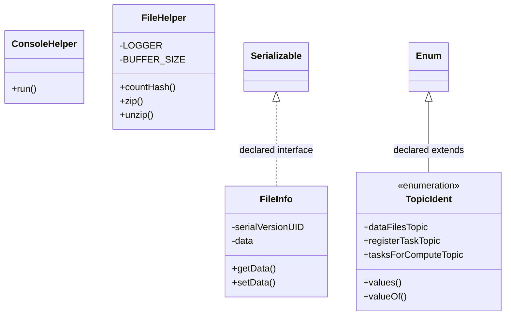

| Diagram identifier | Exact type | Location |
| --- | --- | --- |
| `Cf19884b75da5` | `com.strategyquant.gridlib.ConsoleHelper` (this JAR) | this diagram |
| `C25cb9ea619dc` | `com.strategyquant.gridlib.FileHelper` (this JAR) | this diagram |
| `C2bda638cb526` | `com.strategyquant.gridlib.FileInfo` (this JAR) | this diagram |
| `C46f18eeb6666` | `com.strategyquant.gridlib.TopicIdent` (this JAR) | this diagram |
| `C210d9b760f82` | `java.io.Serializable` (not resolved in scoped archives) | referenced external type |
| `C68f8466c8cb8` | `java.lang.Enum` (not resolved in scoped archives) | referenced external type |

### 2. `com.strategyquant.gridlib.classLoader`

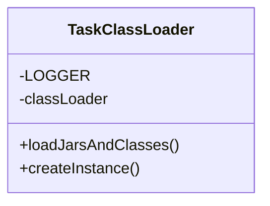

| Diagram identifier | Exact type | Location |
| --- | --- | --- |
| `C2b2b100e3553` | `com.strategyquant.gridlib.classLoader.TaskClassLoader` (this JAR) | this diagram |

### 3. `com.strategyquant.gridlib.client`

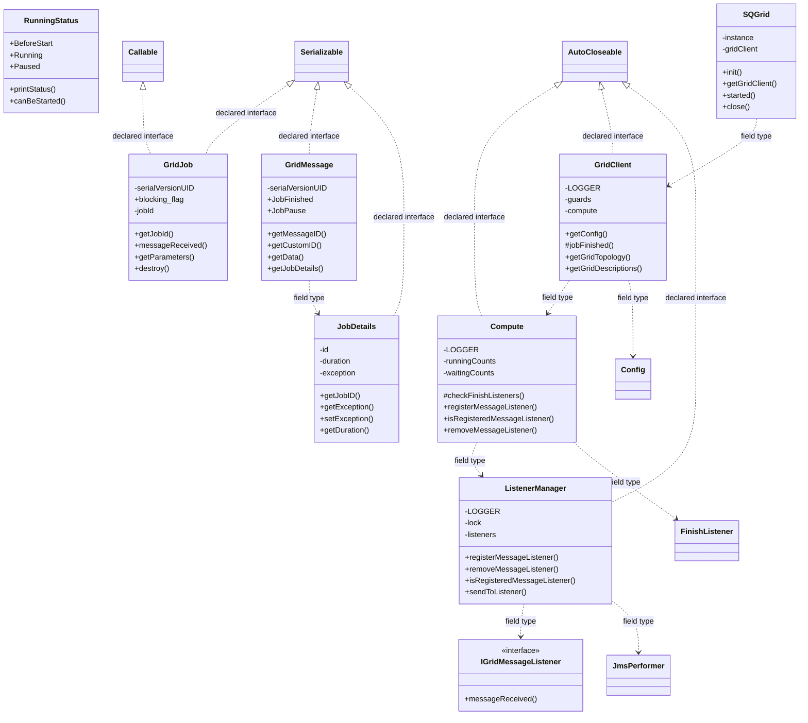

| Diagram identifier | Exact type | Location |
| --- | --- | --- |
| `Cedde32262fec` | `com.strategyquant.gridlib.client.Compute` (this JAR) | this diagram |
| `C2d5349dc1f49` | `com.strategyquant.gridlib.client.GridClient` (this JAR) | this diagram |
| `C729a56512564` | `com.strategyquant.gridlib.client.GridJob` (this JAR) | this diagram |
| `C69763ab95731` | `com.strategyquant.gridlib.client.GridMessage` (this JAR) | this diagram |
| `C8470fa154fcb` | `com.strategyquant.gridlib.client.IGridMessageListener` (this JAR) | this diagram |
| `C84341391f323` | `com.strategyquant.gridlib.client.JobDetails` (this JAR) | this diagram |
| `C4f142bee6d97` | `com.strategyquant.gridlib.client.ListenerManager` (this JAR) | this diagram |
| `C2609f380b033` | `com.strategyquant.gridlib.client.RunningStatus` (this JAR) | this diagram |
| `C4afa2911eaf6` | `com.strategyquant.gridlib.client.SQGrid` (this JAR) | this diagram |
| `Ca9c361315c9a` | `com.strategyquant.gridlib.compute.performer.FinishListener` (this JAR) | another group in this JAR |
| `Cdd753eaa3ef0` | `com.strategyquant.gridlib.config.Config` (this JAR) | another group in this JAR |
| `Ce905d3451110` | `com.strategyquant.gridlib.message.JmsPerformer` (this JAR) | another group in this JAR |
| `C210d9b760f82` | `java.io.Serializable` (not resolved in scoped archives) | referenced external type |
| `C20e570abbd70` | `java.lang.AutoCloseable` (not resolved in scoped archives) | referenced external type |
| `C59e430b99b4f` | `java.util.concurrent.Callable` (not resolved in scoped archives) | referenced external type |

### 4. `com.strategyquant.gridlib.compute`

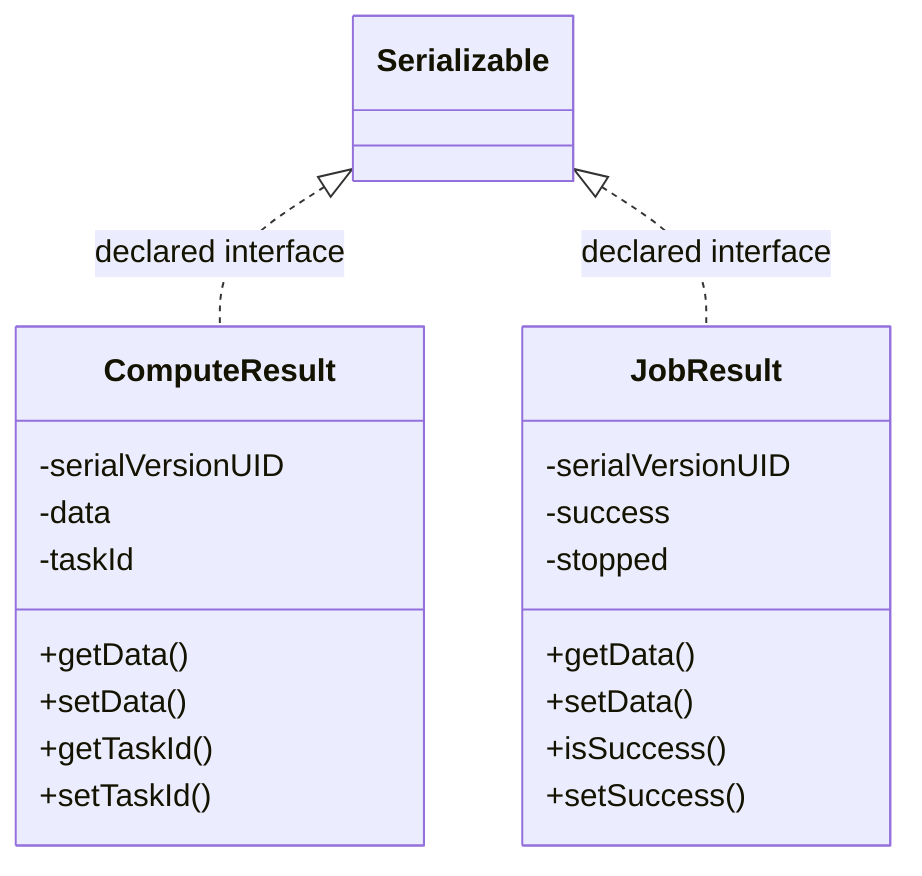

| Diagram identifier | Exact type | Location |
| --- | --- | --- |
| `C57eb5c066e0d` | `com.strategyquant.gridlib.compute.ComputeResult` (this JAR) | this diagram |
| `C9cadcb6b5c11` | `com.strategyquant.gridlib.compute.JobResult` (this JAR) | this diagram |
| `C210d9b760f82` | `java.io.Serializable` (not resolved in scoped archives) | referenced external type |

### 5. `com.strategyquant.gridlib.compute.common`

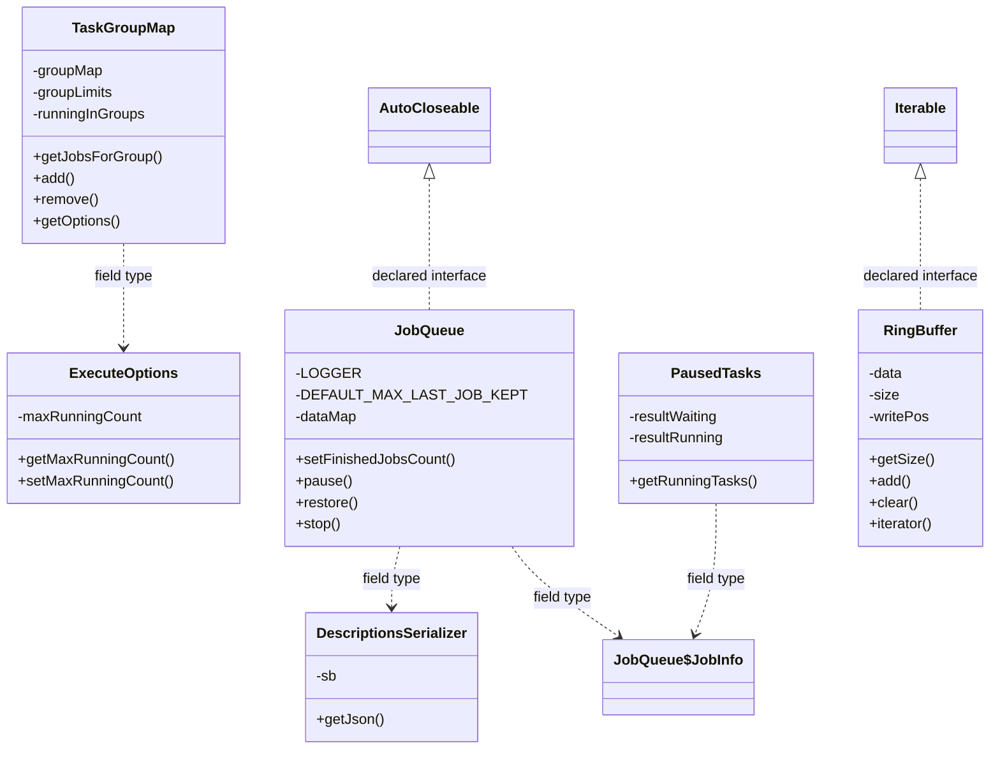

| Diagram identifier | Exact type | Location |
| --- | --- | --- |
| `C2580c70f5da8` | `com.strategyquant.gridlib.compute.common.DescriptionsSerializer` (this JAR) | this diagram |
| `Cbecd304a20b9` | `com.strategyquant.gridlib.compute.common.ExecuteOptions` (this JAR) | this diagram |
| `Cbf6abdcb39b8` | `com.strategyquant.gridlib.compute.common.JobQueue` (this JAR) | this diagram |
| `C167128f0cc53` | `com.strategyquant.gridlib.compute.common.JobQueue$JobInfo` (this JAR) | another group in this JAR |
| `C4df8f43666a2` | `com.strategyquant.gridlib.compute.common.PausedTasks` (this JAR) | this diagram |
| `C67620005296b` | `com.strategyquant.gridlib.compute.common.RingBuffer` (this JAR) | this diagram |
| `C8da3e471a91e` | `com.strategyquant.gridlib.compute.common.TaskGroupMap` (this JAR) | this diagram |
| `C20e570abbd70` | `java.lang.AutoCloseable` (not resolved in scoped archives) | referenced external type |
| `C61c8ef67997c` | `java.lang.Iterable` (not resolved in scoped archives) | referenced external type |

### 6. `com.strategyquant.gridlib.compute.performer`

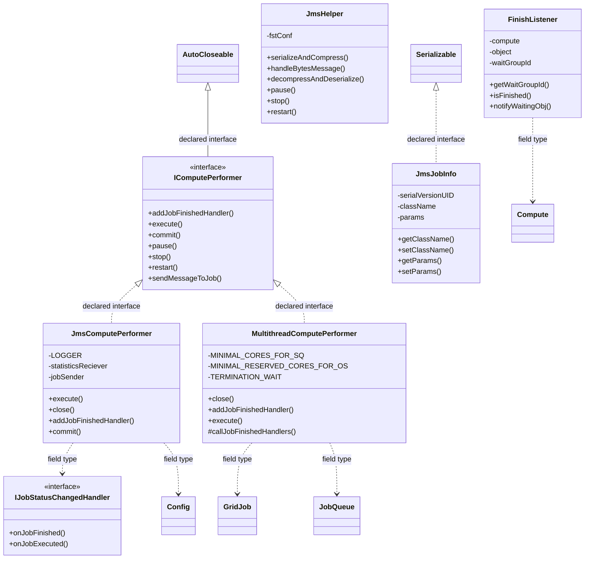

| Diagram identifier | Exact type | Location |
| --- | --- | --- |
| `Cedde32262fec` | `com.strategyquant.gridlib.client.Compute` (this JAR) | another group in this JAR |
| `C729a56512564` | `com.strategyquant.gridlib.client.GridJob` (this JAR) | another group in this JAR |
| `Cbf6abdcb39b8` | `com.strategyquant.gridlib.compute.common.JobQueue` (this JAR) | another group in this JAR |
| `Ca9c361315c9a` | `com.strategyquant.gridlib.compute.performer.FinishListener` (this JAR) | this diagram |
| `C292ef8b18808` | `com.strategyquant.gridlib.compute.performer.IComputePerformer` (this JAR) | this diagram |
| `Cc6f3c310e588` | `com.strategyquant.gridlib.compute.performer.IJobStatusChangedHandler` (this JAR) | this diagram |
| `Cb1572d6aeb9f` | `com.strategyquant.gridlib.compute.performer.JmsComputePerformer` (this JAR) | this diagram |
| `C11f719c50b24` | `com.strategyquant.gridlib.compute.performer.JmsHelper` (this JAR) | this diagram |
| `C4e992367bddc` | `com.strategyquant.gridlib.compute.performer.JmsJobInfo` (this JAR) | this diagram |
| `C651db1fdb81a` | `com.strategyquant.gridlib.compute.performer.MultithreadComputePerformer` (this JAR) | this diagram |
| `Cdd753eaa3ef0` | `com.strategyquant.gridlib.config.Config` (this JAR) | another group in this JAR |
| `C210d9b760f82` | `java.io.Serializable` (not resolved in scoped archives) | referenced external type |
| `C20e570abbd70` | `java.lang.AutoCloseable` (not resolved in scoped archives) | referenced external type |

### 7. `com.strategyquant.gridlib.concurrent`

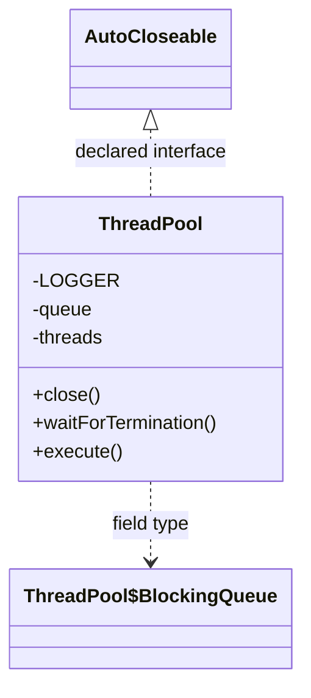

| Diagram identifier | Exact type | Location |
| --- | --- | --- |
| `C36824a7e84a7` | `com.strategyquant.gridlib.concurrent.ThreadPool` (this JAR) | this diagram |
| `Cafe5c92af9ad` | `com.strategyquant.gridlib.concurrent.ThreadPool$BlockingQueue` (this JAR) | another group in this JAR |
| `C20e570abbd70` | `java.lang.AutoCloseable` (not resolved in scoped archives) | referenced external type |

### 8. `com.strategyquant.gridlib.config`

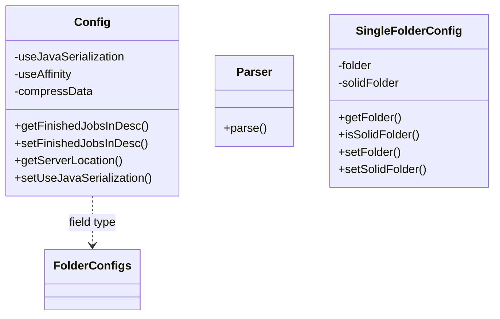

| Diagram identifier | Exact type | Location |
| --- | --- | --- |
| `Cdd753eaa3ef0` | `com.strategyquant.gridlib.config.Config` (this JAR) | this diagram |
| `Cde97a37c8c9c` | `com.strategyquant.gridlib.config.Parser` (this JAR) | this diagram |
| `Cad48b925caa5` | `com.strategyquant.gridlib.config.SingleFolderConfig` (this JAR) | this diagram |
| `C34093c9f69da` | `com.strategyquant.gridlib.message.sync.FolderConfigs` (this JAR) | another group in this JAR |

### 9. `com.strategyquant.gridlib.message`

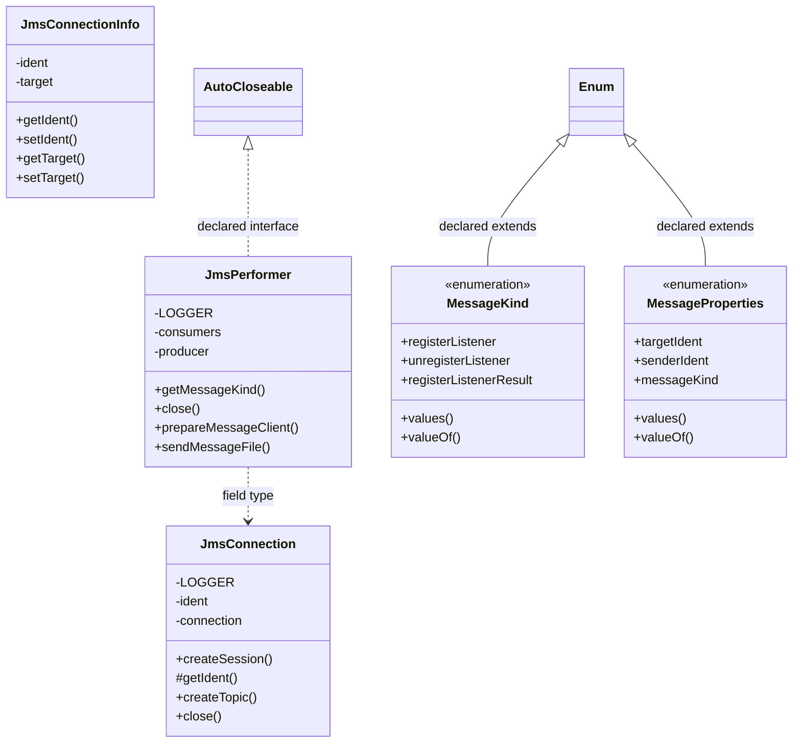

| Diagram identifier | Exact type | Location |
| --- | --- | --- |
| `C8e4fa3616040` | `com.strategyquant.gridlib.message.JmsConnection` (this JAR) | this diagram |
| `C7598d3558142` | `com.strategyquant.gridlib.message.JmsConnectionInfo` (this JAR) | this diagram |
| `Ce905d3451110` | `com.strategyquant.gridlib.message.JmsPerformer` (this JAR) | this diagram |
| `C9a1a7e8a9f7d` | `com.strategyquant.gridlib.message.MessageKind` (this JAR) | this diagram |
| `C8263cb471e26` | `com.strategyquant.gridlib.message.MessageProperties` (this JAR) | this diagram |
| `C20e570abbd70` | `java.lang.AutoCloseable` (not resolved in scoped archives) | referenced external type |
| `C68f8466c8cb8` | `java.lang.Enum` (not resolved in scoped archives) | referenced external type |

### 10. `com.strategyquant.gridlib.message.sync`

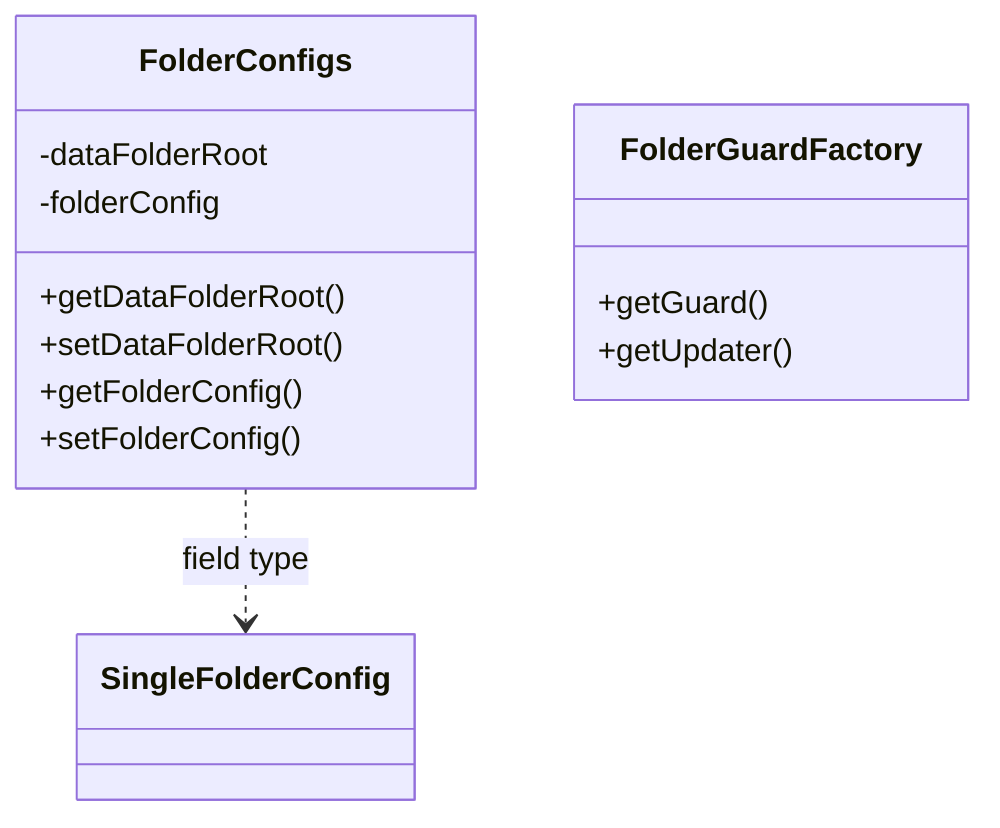

| Diagram identifier | Exact type | Location |
| --- | --- | --- |
| `Cad48b925caa5` | `com.strategyquant.gridlib.config.SingleFolderConfig` (this JAR) | another group in this JAR |
| `C34093c9f69da` | `com.strategyquant.gridlib.message.sync.FolderConfigs` (this JAR) | this diagram |
| `C2414752b92fc` | `com.strategyquant.gridlib.message.sync.FolderGuardFactory` (this JAR) | this diagram |

### 11. `com.strategyquant.gridlib.stat`

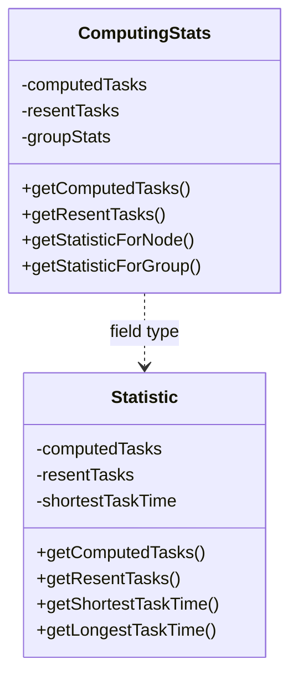

| Diagram identifier | Exact type | Location |
| --- | --- | --- |
| `Ce6ad7b642c09` | `com.strategyquant.gridlib.stat.ComputingStats` (this JAR) | this diagram |
| `C224142c71567` | `com.strategyquant.gridlib.stat.Statistic` (this JAR) | this diagram |

### 12. `com.strategyquant.gridlib.sync.guard`

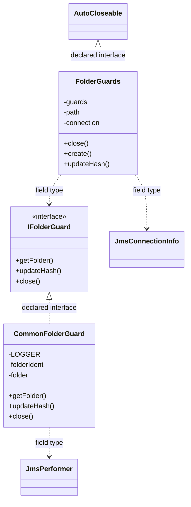

| Diagram identifier | Exact type | Location |
| --- | --- | --- |
| `C7598d3558142` | `com.strategyquant.gridlib.message.JmsConnectionInfo` (this JAR) | another group in this JAR |
| `Ce905d3451110` | `com.strategyquant.gridlib.message.JmsPerformer` (this JAR) | another group in this JAR |
| `Cbf4491fc0a8c` | `com.strategyquant.gridlib.sync.guard.CommonFolderGuard` (this JAR) | this diagram |
| `Cb9ffa6aca768` | `com.strategyquant.gridlib.sync.guard.FolderGuards` (this JAR) | this diagram |
| `C94cd7bccf114` | `com.strategyquant.gridlib.sync.guard.IFolderGuard` (this JAR) | this diagram |
| `C20e570abbd70` | `java.lang.AutoCloseable` (not resolved in scoped archives) | referenced external type |

### 13. `com.strategyquant.gridlib.sync.updater`

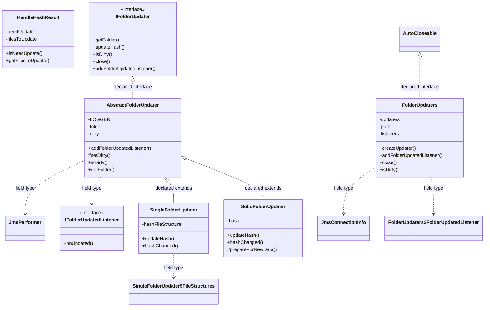

| Diagram identifier | Exact type | Location |
| --- | --- | --- |
| `C7598d3558142` | `com.strategyquant.gridlib.message.JmsConnectionInfo` (this JAR) | another group in this JAR |
| `Ce905d3451110` | `com.strategyquant.gridlib.message.JmsPerformer` (this JAR) | another group in this JAR |
| `Ca0f03c19dbda` | `com.strategyquant.gridlib.sync.updater.AbstractFolderUpdater` (this JAR) | this diagram |
| `C0385dc77f751` | `com.strategyquant.gridlib.sync.updater.FolderUpdaters` (this JAR) | this diagram |
| `Cf0d6038908f5` | `com.strategyquant.gridlib.sync.updater.FolderUpdaters$FolderUpdatedListener` (this JAR) | another group in this JAR |
| `C6b336b704cb9` | `com.strategyquant.gridlib.sync.updater.HandleHashResult` (this JAR) | this diagram |
| `C8cbdf99f4a6d` | `com.strategyquant.gridlib.sync.updater.IFolderUpdatedListener` (this JAR) | this diagram |
| `C9e450544e38b` | `com.strategyquant.gridlib.sync.updater.IFolderUpdater` (this JAR) | this diagram |
| `Cf0e6754ad256` | `com.strategyquant.gridlib.sync.updater.SingleFolderUpdater` (this JAR) | this diagram |
| `Cbbbb2df8fd94` | `com.strategyquant.gridlib.sync.updater.SingleFolderUpdater$FileStructures` (this JAR) | another group in this JAR |
| `C21f5e309b19d` | `com.strategyquant.gridlib.sync.updater.SolidFolderUpdater` (this JAR) | this diagram |
| `C20e570abbd70` | `java.lang.AutoCloseable` (not resolved in scoped archives) | referenced external type |

### 14. `com.strategyquant.gridlib.topology`

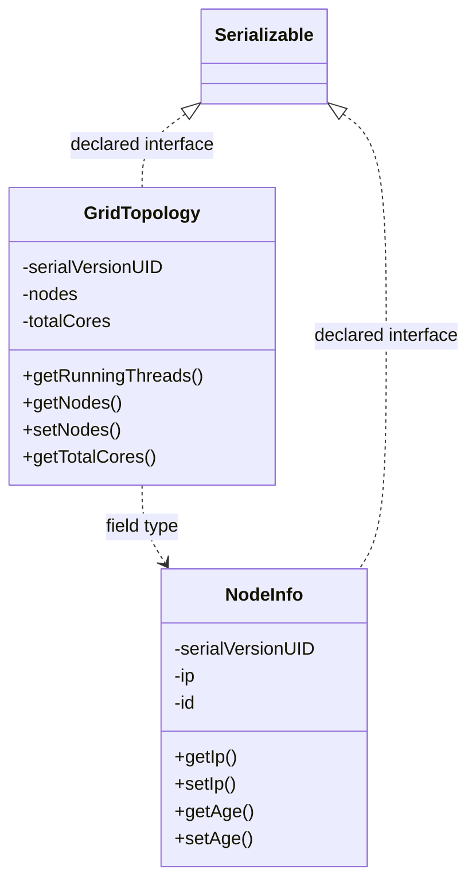

| Diagram identifier | Exact type | Location |
| --- | --- | --- |
| `Cbb62e6e61026` | `com.strategyquant.gridlib.topology.GridTopology` (this JAR) | this diagram |
| `C66c8e473d12e` | `com.strategyquant.gridlib.topology.NodeInfo` (this JAR) | this diagram |
| `C210d9b760f82` | `java.io.Serializable` (not resolved in scoped archives) | referenced external type |

### 15. `com.strategyquant.gridlib.utils`

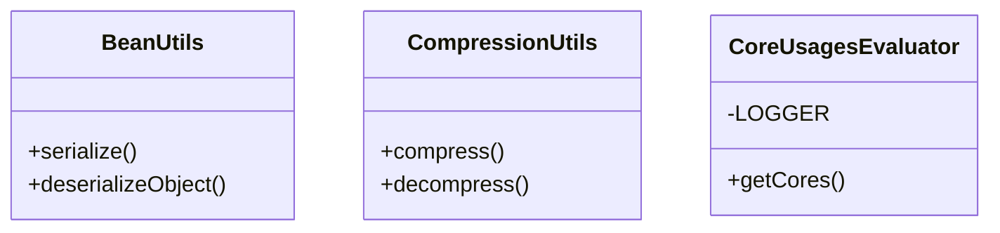

| Diagram identifier | Exact type | Location |
| --- | --- | --- |
| `Cf5c44d515c2c` | `com.strategyquant.gridlib.utils.BeanUtils` (this JAR) | this diagram |
| `C6f446b473b1b` | `com.strategyquant.gridlib.utils.CompressionUtils` (this JAR) | this diagram |
| `C623d7ba632c1` | `com.strategyquant.gridlib.utils.CoreUsagesEvaluator` (this JAR) | this diagram |

## Complete class inventory

| Fully qualified class | Kind | Entry |
| --- | --- | --- |
| `com.strategyquant.gridlib.ConsoleHelper` | class | non-nested |
| `com.strategyquant.gridlib.ConsoleHelper$KeyHandler` | interface | nested/anonymous |
| `com.strategyquant.gridlib.FileHelper` | class | non-nested |
| `com.strategyquant.gridlib.FileInfo` | class | non-nested |
| `com.strategyquant.gridlib.TopicIdent` | class | non-nested |
| `com.strategyquant.gridlib.classLoader.TaskClassLoader` | class | non-nested |
| `com.strategyquant.gridlib.client.Compute` | class | non-nested |
| `com.strategyquant.gridlib.client.Compute$1` | class | nested/anonymous |
| `com.strategyquant.gridlib.client.Compute$2` | class | nested/anonymous |
| `com.strategyquant.gridlib.client.GridClient` | class | non-nested |
| `com.strategyquant.gridlib.client.GridJob` | class | non-nested |
| `com.strategyquant.gridlib.client.GridMessage` | class | non-nested |
| `com.strategyquant.gridlib.client.IGridMessageListener` | interface | non-nested |
| `com.strategyquant.gridlib.client.JobDetails` | class | non-nested |
| `com.strategyquant.gridlib.client.ListenerManager` | class | non-nested |
| `com.strategyquant.gridlib.client.ListenerManager$1` | class | nested/anonymous |
| `com.strategyquant.gridlib.client.RunningStatus` | class | non-nested |
| `com.strategyquant.gridlib.client.SQGrid` | class | non-nested |
| `com.strategyquant.gridlib.compute.ComputeResult` | class | non-nested |
| `com.strategyquant.gridlib.compute.JobResult` | class | non-nested |
| `com.strategyquant.gridlib.compute.common.DescriptionsSerializer` | class | non-nested |
| `com.strategyquant.gridlib.compute.common.DescriptionsSerializer$1` | class | nested/anonymous |
| `com.strategyquant.gridlib.compute.common.DescriptionsSerializer$SerializedPart` | class | nested/anonymous |
| `com.strategyquant.gridlib.compute.common.ExecuteOptions` | class | non-nested |
| `com.strategyquant.gridlib.compute.common.JobQueue` | class | non-nested |
| `com.strategyquant.gridlib.compute.common.JobQueue$JobInfo` | class | nested/anonymous |
| `com.strategyquant.gridlib.compute.common.JobQueue$TimeEvaluator` | interface | nested/anonymous |
| `com.strategyquant.gridlib.compute.common.PausedTasks` | class | non-nested |
| `com.strategyquant.gridlib.compute.common.RingBuffer` | class | non-nested |
| `com.strategyquant.gridlib.compute.common.RingBuffer$IteratorImpl` | class | nested/anonymous |
| `com.strategyquant.gridlib.compute.common.TaskGroupMap` | class | non-nested |
| `com.strategyquant.gridlib.compute.performer.FinishListener` | class | non-nested |
| `com.strategyquant.gridlib.compute.performer.IComputePerformer` | interface | non-nested |
| `com.strategyquant.gridlib.compute.performer.IJobStatusChangedHandler` | interface | non-nested |
| `com.strategyquant.gridlib.compute.performer.JmsComputePerformer` | class | non-nested |
| `com.strategyquant.gridlib.compute.performer.JmsComputePerformer$1` | class | nested/anonymous |
| `com.strategyquant.gridlib.compute.performer.JmsComputePerformer$2` | class | nested/anonymous |
| `com.strategyquant.gridlib.compute.performer.JmsHelper` | class | non-nested |
| `com.strategyquant.gridlib.compute.performer.JmsJobInfo` | class | non-nested |
| `com.strategyquant.gridlib.compute.performer.MultithreadComputePerformer` | class | non-nested |
| `com.strategyquant.gridlib.compute.performer.MultithreadComputePerformer$1` | class | nested/anonymous |
| `com.strategyquant.gridlib.concurrent.ThreadPool` | class | non-nested |
| `com.strategyquant.gridlib.concurrent.ThreadPool$BlockingQueue` | class | nested/anonymous |
| `com.strategyquant.gridlib.concurrent.ThreadPool$TaskExecutor` | class | nested/anonymous |
| `com.strategyquant.gridlib.config.Config` | class | non-nested |
| `com.strategyquant.gridlib.config.Parser` | class | non-nested |
| `com.strategyquant.gridlib.config.SingleFolderConfig` | class | non-nested |
| `com.strategyquant.gridlib.message.JmsConnection` | class | non-nested |
| `com.strategyquant.gridlib.message.JmsConnectionInfo` | class | non-nested |
| `com.strategyquant.gridlib.message.JmsPerformer` | class | non-nested |
| `com.strategyquant.gridlib.message.MessageKind` | class | non-nested |
| `com.strategyquant.gridlib.message.MessageProperties` | class | non-nested |
| `com.strategyquant.gridlib.message.sync.FolderConfigs` | class | non-nested |
| `com.strategyquant.gridlib.message.sync.FolderGuardFactory` | class | non-nested |
| `com.strategyquant.gridlib.stat.ComputingStats` | class | non-nested |
| `com.strategyquant.gridlib.stat.Statistic` | class | non-nested |
| `com.strategyquant.gridlib.sync.guard.CommonFolderGuard` | class | non-nested |
| `com.strategyquant.gridlib.sync.guard.CommonFolderGuard$1` | class | nested/anonymous |
| `com.strategyquant.gridlib.sync.guard.CommonFolderGuard$2` | class | nested/anonymous |
| `com.strategyquant.gridlib.sync.guard.FolderGuards` | class | non-nested |
| `com.strategyquant.gridlib.sync.guard.IFolderGuard` | interface | non-nested |
| `com.strategyquant.gridlib.sync.updater.AbstractFolderUpdater` | class | non-nested |
| `com.strategyquant.gridlib.sync.updater.AbstractFolderUpdater$1` | class | nested/anonymous |
| `com.strategyquant.gridlib.sync.updater.AbstractFolderUpdater$2` | class | nested/anonymous |
| `com.strategyquant.gridlib.sync.updater.FolderUpdaters` | class | non-nested |
| `com.strategyquant.gridlib.sync.updater.FolderUpdaters$1` | class | nested/anonymous |
| `com.strategyquant.gridlib.sync.updater.FolderUpdaters$FolderUpdatedListener` | class | nested/anonymous |
| `com.strategyquant.gridlib.sync.updater.HandleHashResult` | class | non-nested |
| `com.strategyquant.gridlib.sync.updater.IFolderUpdatedListener` | interface | non-nested |
| `com.strategyquant.gridlib.sync.updater.IFolderUpdater` | interface | non-nested |
| `com.strategyquant.gridlib.sync.updater.SingleFolderUpdater` | class | non-nested |
| `com.strategyquant.gridlib.sync.updater.SingleFolderUpdater$1` | class | nested/anonymous |
| `com.strategyquant.gridlib.sync.updater.SingleFolderUpdater$FileStructureComparator` | class | nested/anonymous |
| `com.strategyquant.gridlib.sync.updater.SingleFolderUpdater$FileStructureCompareResult` | class | nested/anonymous |
| `com.strategyquant.gridlib.sync.updater.SingleFolderUpdater$FileStructures` | class | nested/anonymous |
| `com.strategyquant.gridlib.sync.updater.SolidFolderUpdater` | class | non-nested |
| `com.strategyquant.gridlib.topology.GridTopology` | class | non-nested |
| `com.strategyquant.gridlib.topology.NodeInfo` | class | non-nested |
| `com.strategyquant.gridlib.utils.BeanUtils` | class | non-nested |
| `com.strategyquant.gridlib.utils.CompressionUtils` | class | non-nested |
| `com.strategyquant.gridlib.utils.CoreUsagesEvaluator` | class | non-nested |

## Declared relationships and evidence locations

Every row is supported by the named class declaration/member in `javap -p`, inside the artifact recorded above. Signature dependencies may include return, parameter, generic-argument and throws types; they do not imply execution.

| Declaring class | Referenced type | Relationship | Narrow inspection location |
| --- | --- | --- | --- |
| `com.strategyquant.gridlib.ConsoleHelper` | `com.strategyquant.gridlib.ConsoleHelper$KeyHandler` (this JAR) | type dependency | `com.strategyquant.gridlib.ConsoleHelper` / method signature: `public void run(com.strategyquant.gridlib.ConsoleHelper$KeyHandler) throws java.lang.Exception;` |
| `com.strategyquant.gridlib.ConsoleHelper` | `java.lang.Exception` (not resolved in scoped archives) | type dependency | `com.strategyquant.gridlib.ConsoleHelper` / method signature: `public void run(com.strategyquant.gridlib.ConsoleHelper$KeyHandler) throws java.lang.Exception;` |
| `com.strategyquant.gridlib.ConsoleHelper$KeyHandler` | `java.lang.Exception` (not resolved in scoped archives) | type dependency | `com.strategyquant.gridlib.ConsoleHelper$KeyHandler` / method signature: `public abstract void handle(char) throws java.lang.Exception;` |
| `com.strategyquant.gridlib.FileHelper` | `org.slf4j.Logger` (not resolved in scoped archives) | type dependency | `com.strategyquant.gridlib.FileHelper` / field declaration: `private static final org.slf4j.Logger LOGGER;` |
| `com.strategyquant.gridlib.FileHelper` | `java.lang.String` (not resolved in scoped archives) | type dependency | `com.strategyquant.gridlib.FileHelper` / method signature: `private static void generateFileList(java.lang.String, java.io.File, java.util.List<java.lang.String>);`<br>`private static java.lang.String generateZipEntry(java.lang.String, java.lang.String);`<br>`public static java.lang.String countHash(java.lang.String) throws java.io.IOException;`<br>`private static java.util.List<java.lang.String> getPaths(java.lang.String);`<br>`private static void fillPaths(java.util.List<java.lang.String>, java.lang.String);`<br>`public static java.lang.String countHash(java.io.File) throws java.io.IOException;`<br>`public static java.io.File zip(java.lang.String) throws java.io.IOException;`<br>`public static java.io.File zip(java.lang.String, java.util.List<java.lang.String>) throws java.io.IOException;`<br>`public static void unzip(java.lang.String, java.io.File);` |
| `com.strategyquant.gridlib.FileHelper` | `java.io.File` (not resolved in scoped archives) | type dependency | `com.strategyquant.gridlib.FileHelper` / method signature: `private static void generateFileList(java.lang.String, java.io.File, java.util.List<java.lang.String>);`<br>`public static java.lang.String countHash(java.io.File) throws java.io.IOException;`<br>`public static java.io.File zip(java.lang.String) throws java.io.IOException;`<br>`public static java.io.File zip(java.lang.String, java.util.List<java.lang.String>) throws java.io.IOException;`<br>`public static void unzip(java.lang.String, java.io.File);` |
| `com.strategyquant.gridlib.FileHelper` | `java.util.List` (not resolved in scoped archives) | type dependency | `com.strategyquant.gridlib.FileHelper` / method signature: `private static void generateFileList(java.lang.String, java.io.File, java.util.List<java.lang.String>);`<br>`private static java.util.List<java.lang.String> getPaths(java.lang.String);`<br>`private static void fillPaths(java.util.List<java.lang.String>, java.lang.String);`<br>`public static java.io.File zip(java.lang.String, java.util.List<java.lang.String>) throws java.io.IOException;` |
| `com.strategyquant.gridlib.FileHelper` | `java.io.IOException` (not resolved in scoped archives) | type dependency | `com.strategyquant.gridlib.FileHelper` / method signature: `public static java.lang.String countHash(java.lang.String) throws java.io.IOException;`<br>`public static java.lang.String countHash(java.io.File) throws java.io.IOException;`<br>`public static java.io.File zip(java.lang.String) throws java.io.IOException;`<br>`public static java.io.File zip(java.lang.String, java.util.List<java.lang.String>) throws java.io.IOException;` |
| `com.strategyquant.gridlib.FileInfo` | `java.io.Serializable` (not resolved in scoped archives) | implements | `com.strategyquant.gridlib.FileInfo` / class declaration: `public class com.strategyquant.gridlib.FileInfo implements java.io.Serializable` |
| `com.strategyquant.gridlib.TopicIdent` | `java.lang.Enum` (not resolved in scoped archives) | extends | `com.strategyquant.gridlib.TopicIdent` / class declaration: `public final class com.strategyquant.gridlib.TopicIdent extends java.lang.Enum<com.strategyquant.gridlib.TopicIdent>` |
| `com.strategyquant.gridlib.TopicIdent` | `java.lang.String` (not resolved in scoped archives) | type dependency | `com.strategyquant.gridlib.TopicIdent` / method signature: `public static com.strategyquant.gridlib.TopicIdent valueOf(java.lang.String);` |
| `com.strategyquant.gridlib.classLoader.TaskClassLoader` | `org.slf4j.Logger` (not resolved in scoped archives) | type dependency | `com.strategyquant.gridlib.classLoader.TaskClassLoader` / field declaration: `private static final org.slf4j.Logger LOGGER;` |
| `com.strategyquant.gridlib.classLoader.TaskClassLoader` | `java.lang.ClassLoader` (not resolved in scoped archives) | type dependency | `com.strategyquant.gridlib.classLoader.TaskClassLoader` / field declaration: `private java.lang.ClassLoader classLoader;` |
| `com.strategyquant.gridlib.classLoader.TaskClassLoader` | `java.lang.String` (not resolved in scoped archives) | type dependency | `com.strategyquant.gridlib.classLoader.TaskClassLoader` / method signature: `public void loadJarsAndClasses(java.lang.String...);`<br>`private java.util.List<java.net.URL> getUrls(java.lang.String...);`<br>`public <T> T createInstance(java.lang.String, com.strategyquant.gridlib.compute.performer.JmsJobInfo) throws java.lang.ClassNotFoundException, java.lang.InstantiationException, java.lang.IllegalAccessException, java.lang.IllegalArgumentException, java.lang.reflect.InvocationTargetException, java.lang.NoSuchMethodException, java.lang.SecurityException;` |
| `com.strategyquant.gridlib.classLoader.TaskClassLoader` | `java.util.List` (not resolved in scoped archives) | type dependency | `com.strategyquant.gridlib.classLoader.TaskClassLoader` / method signature: `private void addFileUrl(java.util.List<java.net.URL>, java.io.File);`<br>`private java.util.List<java.net.URL> getUrl(java.io.File);`<br>`private java.util.List<java.net.URL> getUrls(java.lang.String...);` |
| `com.strategyquant.gridlib.classLoader.TaskClassLoader` | `java.net.URL` (not resolved in scoped archives) | type dependency | `com.strategyquant.gridlib.classLoader.TaskClassLoader` / method signature: `private void addFileUrl(java.util.List<java.net.URL>, java.io.File);`<br>`private java.util.List<java.net.URL> getUrl(java.io.File);`<br>`private java.util.List<java.net.URL> getUrls(java.lang.String...);` |
| `com.strategyquant.gridlib.classLoader.TaskClassLoader` | `java.io.File` (not resolved in scoped archives) | type dependency | `com.strategyquant.gridlib.classLoader.TaskClassLoader` / method signature: `private void addFileUrl(java.util.List<java.net.URL>, java.io.File);`<br>`private java.util.List<java.net.URL> getUrl(java.io.File);` |
| `com.strategyquant.gridlib.classLoader.TaskClassLoader` | `com.strategyquant.gridlib.compute.performer.JmsJobInfo` (this JAR) | type dependency | `com.strategyquant.gridlib.classLoader.TaskClassLoader` / method signature: `public <T> T createInstance(java.lang.String, com.strategyquant.gridlib.compute.performer.JmsJobInfo) throws java.lang.ClassNotFoundException, java.lang.InstantiationException, java.lang.IllegalAccessException, java.lang.IllegalArgumentException, java.lang.reflect.InvocationTargetException, java.lang.NoSuchMethodException, java.lang.SecurityException;` |
| `com.strategyquant.gridlib.classLoader.TaskClassLoader` | `java.lang.ClassNotFoundException` (not resolved in scoped archives) | type dependency | `com.strategyquant.gridlib.classLoader.TaskClassLoader` / method signature: `public <T> T createInstance(java.lang.String, com.strategyquant.gridlib.compute.performer.JmsJobInfo) throws java.lang.ClassNotFoundException, java.lang.InstantiationException, java.lang.IllegalAccessException, java.lang.IllegalArgumentException, java.lang.reflect.InvocationTargetException, java.lang.NoSuchMethodException, java.lang.SecurityException;` |
| `com.strategyquant.gridlib.classLoader.TaskClassLoader` | `java.lang.InstantiationException` (not resolved in scoped archives) | type dependency | `com.strategyquant.gridlib.classLoader.TaskClassLoader` / method signature: `public <T> T createInstance(java.lang.String, com.strategyquant.gridlib.compute.performer.JmsJobInfo) throws java.lang.ClassNotFoundException, java.lang.InstantiationException, java.lang.IllegalAccessException, java.lang.IllegalArgumentException, java.lang.reflect.InvocationTargetException, java.lang.NoSuchMethodException, java.lang.SecurityException;` |
| `com.strategyquant.gridlib.classLoader.TaskClassLoader` | `java.lang.IllegalAccessException` (not resolved in scoped archives) | type dependency | `com.strategyquant.gridlib.classLoader.TaskClassLoader` / method signature: `public <T> T createInstance(java.lang.String, com.strategyquant.gridlib.compute.performer.JmsJobInfo) throws java.lang.ClassNotFoundException, java.lang.InstantiationException, java.lang.IllegalAccessException, java.lang.IllegalArgumentException, java.lang.reflect.InvocationTargetException, java.lang.NoSuchMethodException, java.lang.SecurityException;` |
| `com.strategyquant.gridlib.classLoader.TaskClassLoader` | `java.lang.IllegalArgumentException` (not resolved in scoped archives) | type dependency | `com.strategyquant.gridlib.classLoader.TaskClassLoader` / method signature: `public <T> T createInstance(java.lang.String, com.strategyquant.gridlib.compute.performer.JmsJobInfo) throws java.lang.ClassNotFoundException, java.lang.InstantiationException, java.lang.IllegalAccessException, java.lang.IllegalArgumentException, java.lang.reflect.InvocationTargetException, java.lang.NoSuchMethodException, java.lang.SecurityException;` |
| `com.strategyquant.gridlib.classLoader.TaskClassLoader` | `java.lang.reflect.InvocationTargetException` (not resolved in scoped archives) | type dependency | `com.strategyquant.gridlib.classLoader.TaskClassLoader` / method signature: `public <T> T createInstance(java.lang.String, com.strategyquant.gridlib.compute.performer.JmsJobInfo) throws java.lang.ClassNotFoundException, java.lang.InstantiationException, java.lang.IllegalAccessException, java.lang.IllegalArgumentException, java.lang.reflect.InvocationTargetException, java.lang.NoSuchMethodException, java.lang.SecurityException;` |
| `com.strategyquant.gridlib.classLoader.TaskClassLoader` | `java.lang.NoSuchMethodException` (not resolved in scoped archives) | type dependency | `com.strategyquant.gridlib.classLoader.TaskClassLoader` / method signature: `public <T> T createInstance(java.lang.String, com.strategyquant.gridlib.compute.performer.JmsJobInfo) throws java.lang.ClassNotFoundException, java.lang.InstantiationException, java.lang.IllegalAccessException, java.lang.IllegalArgumentException, java.lang.reflect.InvocationTargetException, java.lang.NoSuchMethodException, java.lang.SecurityException;` |
| `com.strategyquant.gridlib.classLoader.TaskClassLoader` | `java.lang.SecurityException` (not resolved in scoped archives) | type dependency | `com.strategyquant.gridlib.classLoader.TaskClassLoader` / method signature: `public <T> T createInstance(java.lang.String, com.strategyquant.gridlib.compute.performer.JmsJobInfo) throws java.lang.ClassNotFoundException, java.lang.InstantiationException, java.lang.IllegalAccessException, java.lang.IllegalArgumentException, java.lang.reflect.InvocationTargetException, java.lang.NoSuchMethodException, java.lang.SecurityException;` |
| `com.strategyquant.gridlib.client.Compute` | `java.lang.AutoCloseable` (not resolved in scoped archives) | implements | `com.strategyquant.gridlib.client.Compute` / class declaration: `public class com.strategyquant.gridlib.client.Compute implements java.lang.AutoCloseable` |
| `com.strategyquant.gridlib.client.Compute` | `org.slf4j.Logger` (not resolved in scoped archives) | type dependency | `com.strategyquant.gridlib.client.Compute` / field declaration: `private static final org.slf4j.Logger LOGGER;` |
| `com.strategyquant.gridlib.client.Compute` | `org.slf4j.Logger` (not resolved in scoped archives) | type dependency | `com.strategyquant.gridlib.client.Compute` / method signature: `static org.slf4j.Logger access$000();` |
| `com.strategyquant.gridlib.client.Compute` | `java.util.Map` (not resolved in scoped archives) | type dependency | `com.strategyquant.gridlib.client.Compute` / field declaration: `private java.util.Map<java.lang.Integer, java.util.concurrent.atomic.AtomicLong> runningCounts;`<br>`private java.util.Map<java.lang.Integer, java.util.concurrent.atomic.AtomicLong> waitingCounts;`<br>`private java.util.Map<java.lang.Integer, java.util.concurrent.atomic.AtomicLong> runningUndeliveredCounts;` |
| `com.strategyquant.gridlib.client.Compute` | `java.util.Map` (not resolved in scoped archives) | type dependency | `com.strategyquant.gridlib.client.Compute` / method signature: `private void incrementJobsCounter(java.lang.String, java.util.Map<java.lang.Integer, java.util.concurrent.atomic.AtomicLong>);`<br>`private void decrementJobCounter(java.lang.String, java.util.Map<java.lang.Integer, java.util.concurrent.atomic.AtomicLong>);`<br>`public long getCount(java.lang.String, java.util.Map<java.lang.Integer, java.util.concurrent.atomic.AtomicLong>);` |
| `com.strategyquant.gridlib.client.Compute` | `java.lang.Integer` (not resolved in scoped archives) | type dependency | `com.strategyquant.gridlib.client.Compute` / field declaration: `private java.util.Map<java.lang.Integer, java.util.concurrent.atomic.AtomicLong> runningCounts;`<br>`private java.util.Map<java.lang.Integer, java.util.concurrent.atomic.AtomicLong> waitingCounts;`<br>`private java.util.Map<java.lang.Integer, java.util.concurrent.atomic.AtomicLong> runningUndeliveredCounts;` |
| `com.strategyquant.gridlib.client.Compute` | `java.lang.Integer` (not resolved in scoped archives) | type dependency | `com.strategyquant.gridlib.client.Compute` / method signature: `private void incrementJobsCounter(java.lang.String, java.util.Map<java.lang.Integer, java.util.concurrent.atomic.AtomicLong>);`<br>`private void decrementJobCounter(java.lang.String, java.util.Map<java.lang.Integer, java.util.concurrent.atomic.AtomicLong>);`<br>`public long getCount(java.lang.String, java.util.Map<java.lang.Integer, java.util.concurrent.atomic.AtomicLong>);` |
| `com.strategyquant.gridlib.client.Compute` | `java.util.concurrent.atomic.AtomicLong` (not resolved in scoped archives) | type dependency | `com.strategyquant.gridlib.client.Compute` / field declaration: `private java.util.Map<java.lang.Integer, java.util.concurrent.atomic.AtomicLong> runningCounts;`<br>`private java.util.Map<java.lang.Integer, java.util.concurrent.atomic.AtomicLong> waitingCounts;`<br>`private java.util.Map<java.lang.Integer, java.util.concurrent.atomic.AtomicLong> runningUndeliveredCounts;` |
| `com.strategyquant.gridlib.client.Compute` | `java.util.concurrent.atomic.AtomicLong` (not resolved in scoped archives) | type dependency | `com.strategyquant.gridlib.client.Compute` / method signature: `private void incrementJobsCounter(java.lang.String, java.util.Map<java.lang.Integer, java.util.concurrent.atomic.AtomicLong>);`<br>`private void decrementJobCounter(java.lang.String, java.util.Map<java.lang.Integer, java.util.concurrent.atomic.AtomicLong>);`<br>`public long getCount(java.lang.String, java.util.Map<java.lang.Integer, java.util.concurrent.atomic.AtomicLong>);` |
| `com.strategyquant.gridlib.client.Compute` | `com.strategyquant.gridlib.compute.performer.JmsComputePerformer` (this JAR) | type dependency | `com.strategyquant.gridlib.client.Compute` / field declaration: `private com.strategyquant.gridlib.compute.performer.JmsComputePerformer jmsPerformer;` |
| `com.strategyquant.gridlib.client.Compute` | `com.strategyquant.gridlib.compute.performer.MultithreadComputePerformer` (this JAR) | type dependency | `com.strategyquant.gridlib.client.Compute` / field declaration: `private com.strategyquant.gridlib.compute.performer.MultithreadComputePerformer localPerformer;` |
| `com.strategyquant.gridlib.client.Compute` | `com.strategyquant.gridlib.config.Config` (this JAR) | type dependency | `com.strategyquant.gridlib.client.Compute` / field declaration: `private final com.strategyquant.gridlib.config.Config config;` |
| `com.strategyquant.gridlib.client.Compute` | `com.strategyquant.gridlib.config.Config` (this JAR) | type dependency | `com.strategyquant.gridlib.client.Compute` / method signature: `public com.strategyquant.gridlib.client.Compute(com.strategyquant.gridlib.message.JmsConnectionInfo, com.strategyquant.gridlib.config.Config, boolean) throws javax.jms.JMSException;` |
| `com.strategyquant.gridlib.client.Compute` | `com.strategyquant.gridlib.client.ListenerManager` (this JAR) | type dependency | `com.strategyquant.gridlib.client.Compute` / field declaration: `private com.strategyquant.gridlib.client.ListenerManager listenerManager;` |
| `com.strategyquant.gridlib.client.Compute` | `java.util.List` (not resolved in scoped archives) | type dependency | `com.strategyquant.gridlib.client.Compute` / field declaration: `private java.util.List<com.strategyquant.gridlib.compute.performer.FinishListener> finishListeners;` |
| `com.strategyquant.gridlib.client.Compute` | `java.util.List` (not resolved in scoped archives) | type dependency | `com.strategyquant.gridlib.client.Compute` / method signature: `public void execute(java.lang.String, java.util.List<? extends com.strategyquant.gridlib.client.GridJob<?>>, com.strategyquant.gridlib.compute.common.ExecuteOptions) throws java.lang.Exception;` |
| `com.strategyquant.gridlib.client.Compute` | `com.strategyquant.gridlib.compute.performer.FinishListener` (this JAR) | type dependency | `com.strategyquant.gridlib.client.Compute` / field declaration: `private java.util.List<com.strategyquant.gridlib.compute.performer.FinishListener> finishListeners;` |
| `com.strategyquant.gridlib.client.Compute` | `java.lang.String` (not resolved in scoped archives) | type dependency | `com.strategyquant.gridlib.client.Compute` / field declaration: `private volatile java.lang.String justStoppingJobGroupID;` |
| `com.strategyquant.gridlib.client.Compute` | `java.lang.String` (not resolved in scoped archives) | type dependency | `com.strategyquant.gridlib.client.Compute` / method signature: `public void registerMessageListener(java.lang.String, com.strategyquant.gridlib.client.IGridMessageListener);`<br>`public boolean isRegisteredMessageListener(java.lang.String);`<br>`public void removeMessageListener(java.lang.String);`<br>`public boolean sendMessageToJob(java.lang.String, java.lang.String, com.strategyquant.gridlib.client.GridMessage);`<br>`public boolean sendMessageToListener(java.lang.String, com.strategyquant.gridlib.client.GridMessage);`<br>`private void jobExecuted(java.lang.String, java.lang.String);`<br>`protected void jobFinished(java.lang.String, java.lang.String, com.strategyquant.gridlib.compute.JobResult<?>);`<br>`public void execute(java.lang.String, java.util.List<? extends com.strategyquant.gridlib.client.GridJob<?>>, com.strategyquant.gridlib.compute.common.ExecuteOptions) throws java.lang.Exception;`<br>`private void incrementJobsCounter(java.lang.String, java.util.Map<java.lang.Integer, java.util.concurrent.atomic.AtomicLong>);`<br>`private void decrementJobCounter(java.lang.String, java.util.Map<java.lang.Integer, java.util.concurrent.atomic.AtomicLong>);`<br>`public void pause(java.lang.String);`<br>`public void stop(java.lang.String);`<br>`public void restart(java.lang.String);`<br>`public long getRunningJobsCount(java.lang.String);`<br>`public long getExecutedUndeliveredJobsCount(java.lang.String);`<br>`public long getWaitingJobsCount(java.lang.String);`<br>`public long getCount(java.lang.String, java.util.Map<java.lang.Integer, java.util.concurrent.atomic.AtomicLong>);`<br>`public java.lang.String getGridDescriptions();`<br>`public void setProgress(java.lang.String, java.lang.String, int);`<br>`public void setJobWaiting(java.lang.String, java.lang.String, boolean);`<br>`public void waitForFinish(java.lang.Object, java.lang.String, java.lang.String, java.lang.String) throws java.lang.InterruptedException;`<br>`public void setGroupRestrictions(java.lang.String, int);`<br>`public void stop(java.lang.String, java.lang.String);`<br>`public void pause(java.lang.String, java.lang.String);`<br>`public void restart(java.lang.String, java.lang.String);`<br>`static void access$100(com.strategyquant.gridlib.client.Compute, java.lang.String, java.lang.String);` |
| `com.strategyquant.gridlib.client.Compute` | `com.strategyquant.gridlib.message.JmsConnectionInfo` (this JAR) | type dependency | `com.strategyquant.gridlib.client.Compute` / method signature: `public com.strategyquant.gridlib.client.Compute(com.strategyquant.gridlib.message.JmsConnectionInfo, com.strategyquant.gridlib.config.Config, boolean) throws javax.jms.JMSException;`<br>`private void createPerformers(com.strategyquant.gridlib.message.JmsConnectionInfo);` |
| `com.strategyquant.gridlib.client.Compute` | `javax.jms.JMSException` (not resolved in scoped archives) | type dependency | `com.strategyquant.gridlib.client.Compute` / method signature: `public com.strategyquant.gridlib.client.Compute(com.strategyquant.gridlib.message.JmsConnectionInfo, com.strategyquant.gridlib.config.Config, boolean) throws javax.jms.JMSException;` |
| `com.strategyquant.gridlib.client.Compute` | `com.strategyquant.gridlib.client.IGridMessageListener` (this JAR) | type dependency | `com.strategyquant.gridlib.client.Compute` / method signature: `public void registerMessageListener(java.lang.String, com.strategyquant.gridlib.client.IGridMessageListener);` |
| `com.strategyquant.gridlib.client.Compute` | `com.strategyquant.gridlib.client.GridMessage` (this JAR) | type dependency | `com.strategyquant.gridlib.client.Compute` / method signature: `public boolean sendMessageToJob(java.lang.String, java.lang.String, com.strategyquant.gridlib.client.GridMessage);`<br>`public boolean sendMessageToListener(java.lang.String, com.strategyquant.gridlib.client.GridMessage);` |
| `com.strategyquant.gridlib.client.Compute` | `com.strategyquant.gridlib.compute.performer.IComputePerformer` (this JAR) | type dependency | `com.strategyquant.gridlib.client.Compute` / method signature: `private void prepareComputePerformer(com.strategyquant.gridlib.compute.performer.IComputePerformer);`<br>`public com.strategyquant.gridlib.compute.performer.IComputePerformer getPerformer();` |
| `com.strategyquant.gridlib.client.Compute` | `com.strategyquant.gridlib.compute.JobResult` (this JAR) | type dependency | `com.strategyquant.gridlib.client.Compute` / method signature: `protected void jobFinished(java.lang.String, java.lang.String, com.strategyquant.gridlib.compute.JobResult<?>);` |
| `com.strategyquant.gridlib.client.Compute` | `com.strategyquant.gridlib.client.GridJob` (this JAR) | type dependency | `com.strategyquant.gridlib.client.Compute` / method signature: `public void execute(java.lang.String, java.util.List<? extends com.strategyquant.gridlib.client.GridJob<?>>, com.strategyquant.gridlib.compute.common.ExecuteOptions) throws java.lang.Exception;` |
| `com.strategyquant.gridlib.client.Compute` | `com.strategyquant.gridlib.compute.common.ExecuteOptions` (this JAR) | type dependency | `com.strategyquant.gridlib.client.Compute` / method signature: `public void execute(java.lang.String, java.util.List<? extends com.strategyquant.gridlib.client.GridJob<?>>, com.strategyquant.gridlib.compute.common.ExecuteOptions) throws java.lang.Exception;` |
| `com.strategyquant.gridlib.client.Compute` | `java.lang.Exception` (not resolved in scoped archives) | type dependency | `com.strategyquant.gridlib.client.Compute` / method signature: `public void execute(java.lang.String, java.util.List<? extends com.strategyquant.gridlib.client.GridJob<?>>, com.strategyquant.gridlib.compute.common.ExecuteOptions) throws java.lang.Exception;`<br>`public void close() throws java.lang.Exception;` |
| `com.strategyquant.gridlib.client.Compute` | `com.strategyquant.gridlib.topology.GridTopology` (this JAR) | type dependency | `com.strategyquant.gridlib.client.Compute` / method signature: `public com.strategyquant.gridlib.topology.GridTopology getGridTopology();` |
| `com.strategyquant.gridlib.client.Compute` | `java.lang.InterruptedException` (not resolved in scoped archives) | type dependency | `com.strategyquant.gridlib.client.Compute` / method signature: `public void waitForAllTaskFinished() throws java.lang.InterruptedException;`<br>`public void waitForFinish(java.lang.Object, java.lang.String, java.lang.String, java.lang.String) throws java.lang.InterruptedException;` |
| `com.strategyquant.gridlib.client.Compute` | `java.lang.Object` (not resolved in scoped archives) | type dependency | `com.strategyquant.gridlib.client.Compute` / method signature: `public void waitForFinish(java.lang.Object, java.lang.String, java.lang.String, java.lang.String) throws java.lang.InterruptedException;` |
| `com.strategyquant.gridlib.client.Compute$1` | `java.util.TimerTask` (not resolved in scoped archives) | extends | `com.strategyquant.gridlib.client.Compute$1` / class declaration: `class com.strategyquant.gridlib.client.Compute$1 extends java.util.TimerTask` |
| `com.strategyquant.gridlib.client.Compute$1` | `com.strategyquant.gridlib.client.Compute` (this JAR) | type dependency | `com.strategyquant.gridlib.client.Compute$1` / field declaration: `final com.strategyquant.gridlib.client.Compute this$0;` |
| `com.strategyquant.gridlib.client.Compute$1` | `com.strategyquant.gridlib.client.Compute` (this JAR) | type dependency | `com.strategyquant.gridlib.client.Compute$1` / method signature: `com.strategyquant.gridlib.client.Compute$1(com.strategyquant.gridlib.client.Compute);` |
| `com.strategyquant.gridlib.client.Compute$2` | `com.strategyquant.gridlib.compute.performer.IJobStatusChangedHandler` (this JAR) | implements | `com.strategyquant.gridlib.client.Compute$2` / class declaration: `class com.strategyquant.gridlib.client.Compute$2 implements com.strategyquant.gridlib.compute.performer.IJobStatusChangedHandler` |
| `com.strategyquant.gridlib.client.Compute$2` | `com.strategyquant.gridlib.client.Compute` (this JAR) | type dependency | `com.strategyquant.gridlib.client.Compute$2` / field declaration: `final com.strategyquant.gridlib.client.Compute this$0;` |
| `com.strategyquant.gridlib.client.Compute$2` | `com.strategyquant.gridlib.client.Compute` (this JAR) | type dependency | `com.strategyquant.gridlib.client.Compute$2` / method signature: `com.strategyquant.gridlib.client.Compute$2(com.strategyquant.gridlib.client.Compute);` |
| `com.strategyquant.gridlib.client.Compute$2` | `java.lang.String` (not resolved in scoped archives) | type dependency | `com.strategyquant.gridlib.client.Compute$2` / method signature: `public void onJobFinished(java.lang.String, java.lang.String, com.strategyquant.gridlib.compute.JobResult<java.io.Serializable>);`<br>`public void onJobExecuted(java.lang.String, java.lang.String);` |
| `com.strategyquant.gridlib.client.Compute$2` | `com.strategyquant.gridlib.compute.JobResult` (this JAR) | type dependency | `com.strategyquant.gridlib.client.Compute$2` / method signature: `public void onJobFinished(java.lang.String, java.lang.String, com.strategyquant.gridlib.compute.JobResult<java.io.Serializable>);` |
| `com.strategyquant.gridlib.client.Compute$2` | `java.io.Serializable` (not resolved in scoped archives) | type dependency | `com.strategyquant.gridlib.client.Compute$2` / method signature: `public void onJobFinished(java.lang.String, java.lang.String, com.strategyquant.gridlib.compute.JobResult<java.io.Serializable>);` |
| `com.strategyquant.gridlib.client.GridClient` | `java.lang.AutoCloseable` (not resolved in scoped archives) | implements | `com.strategyquant.gridlib.client.GridClient` / class declaration: `public class com.strategyquant.gridlib.client.GridClient implements java.lang.AutoCloseable` |
| `com.strategyquant.gridlib.client.GridClient` | `org.slf4j.Logger` (not resolved in scoped archives) | type dependency | `com.strategyquant.gridlib.client.GridClient` / field declaration: `private static final org.slf4j.Logger LOGGER;` |
| `com.strategyquant.gridlib.client.GridClient` | `com.strategyquant.gridlib.sync.guard.FolderGuards` (this JAR) | type dependency | `com.strategyquant.gridlib.client.GridClient` / field declaration: `private com.strategyquant.gridlib.sync.guard.FolderGuards guards;` |
| `com.strategyquant.gridlib.client.GridClient` | `com.strategyquant.gridlib.client.Compute` (this JAR) | type dependency | `com.strategyquant.gridlib.client.GridClient` / field declaration: `private com.strategyquant.gridlib.client.Compute compute;` |
| `com.strategyquant.gridlib.client.GridClient` | `com.strategyquant.gridlib.client.Compute` (this JAR) | type dependency | `com.strategyquant.gridlib.client.GridClient` / method signature: `protected com.strategyquant.gridlib.client.Compute getCompute();` |
| `com.strategyquant.gridlib.client.GridClient` | `com.strategyquant.gridlib.config.Config` (this JAR) | type dependency | `com.strategyquant.gridlib.client.GridClient` / field declaration: `private com.strategyquant.gridlib.config.Config config;` |
| `com.strategyquant.gridlib.client.GridClient` | `com.strategyquant.gridlib.config.Config` (this JAR) | type dependency | `com.strategyquant.gridlib.client.GridClient` / method signature: `protected com.strategyquant.gridlib.client.GridClient(com.strategyquant.gridlib.config.Config, boolean) throws javax.jms.JMSException, java.io.IOException;`<br>`public com.strategyquant.gridlib.client.GridClient(com.strategyquant.gridlib.config.Config) throws javax.jms.JMSException, java.io.IOException;`<br>`public com.strategyquant.gridlib.config.Config getConfig();` |
| `com.strategyquant.gridlib.client.GridClient` | `javax.jms.JMSException` (not resolved in scoped archives) | type dependency | `com.strategyquant.gridlib.client.GridClient` / method signature: `protected com.strategyquant.gridlib.client.GridClient(com.strategyquant.gridlib.config.Config, boolean) throws javax.jms.JMSException, java.io.IOException;`<br>`public com.strategyquant.gridlib.client.GridClient(com.strategyquant.gridlib.config.Config) throws javax.jms.JMSException, java.io.IOException;`<br>`private void prepareGuards() throws java.io.IOException, javax.jms.JMSException;`<br>`public void dataChanged() throws javax.jms.JMSException, java.io.IOException;` |
| `com.strategyquant.gridlib.client.GridClient` | `java.io.IOException` (not resolved in scoped archives) | type dependency | `com.strategyquant.gridlib.client.GridClient` / method signature: `protected com.strategyquant.gridlib.client.GridClient(com.strategyquant.gridlib.config.Config, boolean) throws javax.jms.JMSException, java.io.IOException;`<br>`public com.strategyquant.gridlib.client.GridClient(com.strategyquant.gridlib.config.Config) throws javax.jms.JMSException, java.io.IOException;`<br>`private void prepareGuards() throws java.io.IOException, javax.jms.JMSException;`<br>`public void dataChanged() throws javax.jms.JMSException, java.io.IOException;` |
| `com.strategyquant.gridlib.client.GridClient` | `java.lang.String` (not resolved in scoped archives) | type dependency | `com.strategyquant.gridlib.client.GridClient` / method signature: `protected void jobFinished(java.lang.String, java.lang.String, com.strategyquant.gridlib.compute.JobResult<?>);`<br>`public java.lang.String getGridDescriptions();`<br>`public void executeOnGrid(java.lang.String, java.util.List<? extends com.strategyquant.gridlib.client.GridJob<?>>) throws java.lang.Exception;`<br>`public void executeOnGrid(java.lang.String, com.strategyquant.gridlib.client.GridJob<?>) throws java.lang.Exception;`<br>`public void executeOnGrid(java.lang.String, java.util.List<? extends com.strategyquant.gridlib.client.GridJob<?>>, com.strategyquant.gridlib.compute.common.ExecuteOptions) throws java.lang.Exception;`<br>`public long countRunningJobs(java.lang.String, boolean);`<br>`public long countRunningJobs(java.lang.String);`<br>`public long countWaitingJobs(java.lang.String);`<br>`public long countAllJobs(java.lang.String, boolean);`<br>`public long countAllJobs(java.lang.String);`<br>`public void pause(java.lang.String);`<br>`public void restart(java.lang.String);`<br>`public void stop(java.lang.String);`<br>`public void stop(java.lang.String, java.lang.String);`<br>`public void pause(java.lang.String, java.lang.String);`<br>`public void restart(java.lang.String, java.lang.String);`<br>`public void registerMessageListener(java.lang.String, com.strategyquant.gridlib.client.IGridMessageListener);`<br>`public boolean isRegisteredMessageListener(java.lang.String);`<br>`public void removeMessageListener(java.lang.String);`<br>`public boolean sendMessage(java.lang.String, java.lang.String, com.strategyquant.gridlib.client.GridMessage) throws java.lang.Exception;`<br>`public void sendProgress(java.lang.String, java.lang.String, int);`<br>`public void waitForFinish(java.lang.Object, java.lang.String, java.lang.String, java.lang.String) throws java.lang.InterruptedException;`<br>`public void setGroupRestrictions(java.lang.String, int);` |
| `com.strategyquant.gridlib.client.GridClient` | `com.strategyquant.gridlib.compute.JobResult` (this JAR) | type dependency | `com.strategyquant.gridlib.client.GridClient` / method signature: `protected void jobFinished(java.lang.String, java.lang.String, com.strategyquant.gridlib.compute.JobResult<?>);` |
| `com.strategyquant.gridlib.client.GridClient` | `com.strategyquant.gridlib.topology.GridTopology` (this JAR) | type dependency | `com.strategyquant.gridlib.client.GridClient` / method signature: `public com.strategyquant.gridlib.topology.GridTopology getGridTopology();` |
| `com.strategyquant.gridlib.client.GridClient` | `java.lang.Exception` (not resolved in scoped archives) | type dependency | `com.strategyquant.gridlib.client.GridClient` / method signature: `public void close() throws java.lang.Exception;`<br>`public void executeOnGrid(java.lang.String, java.util.List<? extends com.strategyquant.gridlib.client.GridJob<?>>) throws java.lang.Exception;`<br>`public void executeOnGrid(java.lang.String, com.strategyquant.gridlib.client.GridJob<?>) throws java.lang.Exception;`<br>`public void executeOnGrid(java.lang.String, java.util.List<? extends com.strategyquant.gridlib.client.GridJob<?>>, com.strategyquant.gridlib.compute.common.ExecuteOptions) throws java.lang.Exception;`<br>`public boolean sendMessage(java.lang.String, java.lang.String, com.strategyquant.gridlib.client.GridMessage) throws java.lang.Exception;` |
| `com.strategyquant.gridlib.client.GridClient` | `java.util.List` (not resolved in scoped archives) | type dependency | `com.strategyquant.gridlib.client.GridClient` / method signature: `public void executeOnGrid(java.lang.String, java.util.List<? extends com.strategyquant.gridlib.client.GridJob<?>>) throws java.lang.Exception;`<br>`public void executeOnGrid(java.lang.String, java.util.List<? extends com.strategyquant.gridlib.client.GridJob<?>>, com.strategyquant.gridlib.compute.common.ExecuteOptions) throws java.lang.Exception;` |
| `com.strategyquant.gridlib.client.GridClient` | `com.strategyquant.gridlib.client.GridJob` (this JAR) | type dependency | `com.strategyquant.gridlib.client.GridClient` / method signature: `public void executeOnGrid(java.lang.String, java.util.List<? extends com.strategyquant.gridlib.client.GridJob<?>>) throws java.lang.Exception;`<br>`public void executeOnGrid(java.lang.String, com.strategyquant.gridlib.client.GridJob<?>) throws java.lang.Exception;`<br>`public void executeOnGrid(java.lang.String, java.util.List<? extends com.strategyquant.gridlib.client.GridJob<?>>, com.strategyquant.gridlib.compute.common.ExecuteOptions) throws java.lang.Exception;` |
| `com.strategyquant.gridlib.client.GridClient` | `com.strategyquant.gridlib.compute.common.ExecuteOptions` (this JAR) | type dependency | `com.strategyquant.gridlib.client.GridClient` / method signature: `public void executeOnGrid(java.lang.String, java.util.List<? extends com.strategyquant.gridlib.client.GridJob<?>>, com.strategyquant.gridlib.compute.common.ExecuteOptions) throws java.lang.Exception;` |
| `com.strategyquant.gridlib.client.GridClient` | `com.strategyquant.gridlib.client.IGridMessageListener` (this JAR) | type dependency | `com.strategyquant.gridlib.client.GridClient` / method signature: `public void registerMessageListener(java.lang.String, com.strategyquant.gridlib.client.IGridMessageListener);` |
| `com.strategyquant.gridlib.client.GridClient` | `com.strategyquant.gridlib.client.GridMessage` (this JAR) | type dependency | `com.strategyquant.gridlib.client.GridClient` / method signature: `public boolean sendMessage(java.lang.String, java.lang.String, com.strategyquant.gridlib.client.GridMessage) throws java.lang.Exception;` |
| `com.strategyquant.gridlib.client.GridClient` | `java.lang.Object` (not resolved in scoped archives) | type dependency | `com.strategyquant.gridlib.client.GridClient` / method signature: `public void waitForFinish(java.lang.Object, java.lang.String, java.lang.String, java.lang.String) throws java.lang.InterruptedException;` |
| `com.strategyquant.gridlib.client.GridClient` | `java.lang.InterruptedException` (not resolved in scoped archives) | type dependency | `com.strategyquant.gridlib.client.GridClient` / method signature: `public void waitForFinish(java.lang.Object, java.lang.String, java.lang.String, java.lang.String) throws java.lang.InterruptedException;`<br>`public void waitForAllTaskFinished() throws java.lang.InterruptedException;` |
| `com.strategyquant.gridlib.client.GridJob` | `java.util.concurrent.Callable` (not resolved in scoped archives) | implements | `com.strategyquant.gridlib.client.GridJob` / class declaration: `public abstract class com.strategyquant.gridlib.client.GridJob<T> implements java.util.concurrent.Callable<T>, java.io.Serializable` |
| `com.strategyquant.gridlib.client.GridJob` | `java.io.Serializable` (not resolved in scoped archives) | implements | `com.strategyquant.gridlib.client.GridJob` / class declaration: `public abstract class com.strategyquant.gridlib.client.GridJob<T> implements java.util.concurrent.Callable<T>, java.io.Serializable` |
| `com.strategyquant.gridlib.client.GridJob` | `java.lang.String` (not resolved in scoped archives) | type dependency | `com.strategyquant.gridlib.client.GridJob` / field declaration: `private java.lang.String jobId;`<br>`private java.util.Map<java.lang.String, java.io.Serializable> parameters;`<br>`private java.lang.String jobGroupId;` |
| `com.strategyquant.gridlib.client.GridJob` | `java.lang.String` (not resolved in scoped archives) | type dependency | `com.strategyquant.gridlib.client.GridJob` / method signature: `public com.strategyquant.gridlib.client.GridJob(java.lang.String, int, java.util.Map<java.lang.String, java.io.Serializable>);`<br>`public java.lang.String getJobId();`<br>`public java.util.Map<java.lang.String, java.io.Serializable> getParameters();`<br>`public java.lang.String getJobGroupId();`<br>`public void setJobGroupId(java.lang.String);` |
| `com.strategyquant.gridlib.client.GridJob` | `java.util.Map` (not resolved in scoped archives) | type dependency | `com.strategyquant.gridlib.client.GridJob` / field declaration: `private java.util.Map<java.lang.String, java.io.Serializable> parameters;` |
| `com.strategyquant.gridlib.client.GridJob` | `java.util.Map` (not resolved in scoped archives) | type dependency | `com.strategyquant.gridlib.client.GridJob` / method signature: `public com.strategyquant.gridlib.client.GridJob(java.lang.String, int, java.util.Map<java.lang.String, java.io.Serializable>);`<br>`public java.util.Map<java.lang.String, java.io.Serializable> getParameters();` |
| `com.strategyquant.gridlib.client.GridJob` | `java.io.Serializable` (not resolved in scoped archives) | type dependency | `com.strategyquant.gridlib.client.GridJob` / field declaration: `private java.util.Map<java.lang.String, java.io.Serializable> parameters;` |
| `com.strategyquant.gridlib.client.GridJob` | `java.io.Serializable` (not resolved in scoped archives) | type dependency | `com.strategyquant.gridlib.client.GridJob` / method signature: `public com.strategyquant.gridlib.client.GridJob(java.lang.String, int, java.util.Map<java.lang.String, java.io.Serializable>);`<br>`public java.util.Map<java.lang.String, java.io.Serializable> getParameters();` |
| `com.strategyquant.gridlib.client.GridJob` | `com.strategyquant.gridlib.client.GridMessage` (this JAR) | type dependency | `com.strategyquant.gridlib.client.GridJob` / method signature: `public void messageReceived(com.strategyquant.gridlib.client.GridMessage);` |
| `com.strategyquant.gridlib.client.GridMessage` | `java.io.Serializable` (not resolved in scoped archives) | implements | `com.strategyquant.gridlib.client.GridMessage` / class declaration: `public class com.strategyquant.gridlib.client.GridMessage implements java.io.Serializable` |
| `com.strategyquant.gridlib.client.GridMessage` | `java.lang.String` (not resolved in scoped archives) | type dependency | `com.strategyquant.gridlib.client.GridMessage` / field declaration: `private java.lang.String customID;` |
| `com.strategyquant.gridlib.client.GridMessage` | `java.lang.String` (not resolved in scoped archives) | type dependency | `com.strategyquant.gridlib.client.GridMessage` / method signature: `public com.strategyquant.gridlib.client.GridMessage(int, java.lang.String);`<br>`public com.strategyquant.gridlib.client.GridMessage(int, java.lang.String, java.io.Serializable);`<br>`public java.lang.String getCustomID();` |
| `com.strategyquant.gridlib.client.GridMessage` | `java.io.Serializable` (not resolved in scoped archives) | type dependency | `com.strategyquant.gridlib.client.GridMessage` / field declaration: `private java.io.Serializable data;` |
| `com.strategyquant.gridlib.client.GridMessage` | `java.io.Serializable` (not resolved in scoped archives) | type dependency | `com.strategyquant.gridlib.client.GridMessage` / method signature: `public com.strategyquant.gridlib.client.GridMessage(int, java.lang.String, java.io.Serializable);`<br>`public java.io.Serializable getData();` |
| `com.strategyquant.gridlib.client.GridMessage` | `com.strategyquant.gridlib.client.JobDetails` (this JAR) | type dependency | `com.strategyquant.gridlib.client.GridMessage` / field declaration: `private com.strategyquant.gridlib.client.JobDetails jobDetails;` |
| `com.strategyquant.gridlib.client.GridMessage` | `com.strategyquant.gridlib.client.JobDetails` (this JAR) | type dependency | `com.strategyquant.gridlib.client.GridMessage` / method signature: `public com.strategyquant.gridlib.client.JobDetails getJobDetails();`<br>`public void setJobDetails(com.strategyquant.gridlib.client.JobDetails);` |
| `com.strategyquant.gridlib.client.IGridMessageListener` | `com.strategyquant.gridlib.client.GridMessage` (this JAR) | type dependency | `com.strategyquant.gridlib.client.IGridMessageListener` / method signature: `public abstract void messageReceived(com.strategyquant.gridlib.client.GridMessage);` |
| `com.strategyquant.gridlib.client.JobDetails` | `java.io.Serializable` (not resolved in scoped archives) | implements | `com.strategyquant.gridlib.client.JobDetails` / class declaration: `public class com.strategyquant.gridlib.client.JobDetails implements java.io.Serializable` |
| `com.strategyquant.gridlib.client.JobDetails` | `java.lang.String` (not resolved in scoped archives) | type dependency | `com.strategyquant.gridlib.client.JobDetails` / field declaration: `private java.lang.String id;`<br>`private java.lang.String exception;` |
| `com.strategyquant.gridlib.client.JobDetails` | `java.lang.String` (not resolved in scoped archives) | type dependency | `com.strategyquant.gridlib.client.JobDetails` / method signature: `public com.strategyquant.gridlib.client.JobDetails(java.lang.String);`<br>`public java.lang.String getJobID();`<br>`public java.lang.String getException();`<br>`public void setException(java.lang.String);` |
| `com.strategyquant.gridlib.client.ListenerManager` | `java.lang.AutoCloseable` (not resolved in scoped archives) | implements | `com.strategyquant.gridlib.client.ListenerManager` / class declaration: `public class com.strategyquant.gridlib.client.ListenerManager implements java.lang.AutoCloseable` |
| `com.strategyquant.gridlib.client.ListenerManager` | `org.slf4j.Logger` (not resolved in scoped archives) | type dependency | `com.strategyquant.gridlib.client.ListenerManager` / field declaration: `private static final org.slf4j.Logger LOGGER;` |
| `com.strategyquant.gridlib.client.ListenerManager` | `org.slf4j.Logger` (not resolved in scoped archives) | type dependency | `com.strategyquant.gridlib.client.ListenerManager` / method signature: `static org.slf4j.Logger access$100();` |
| `com.strategyquant.gridlib.client.ListenerManager` | `java.util.concurrent.locks.ReentrantReadWriteLock` (not resolved in scoped archives) | type dependency | `com.strategyquant.gridlib.client.ListenerManager` / field declaration: `private java.util.concurrent.locks.ReentrantReadWriteLock lock;` |
| `com.strategyquant.gridlib.client.ListenerManager` | `java.util.Map` (not resolved in scoped archives) | type dependency | `com.strategyquant.gridlib.client.ListenerManager` / field declaration: `private java.util.Map<java.lang.String, com.strategyquant.gridlib.client.IGridMessageListener> listeners;` |
| `com.strategyquant.gridlib.client.ListenerManager` | `java.lang.String` (not resolved in scoped archives) | type dependency | `com.strategyquant.gridlib.client.ListenerManager` / field declaration: `private java.util.Map<java.lang.String, com.strategyquant.gridlib.client.IGridMessageListener> listeners;`<br>`private java.util.concurrent.ConcurrentMap<java.lang.String, java.lang.Boolean> resultMap;` |
| `com.strategyquant.gridlib.client.ListenerManager` | `java.lang.String` (not resolved in scoped archives) | type dependency | `com.strategyquant.gridlib.client.ListenerManager` / method signature: `public void registerMessageListener(java.lang.String, com.strategyquant.gridlib.client.IGridMessageListener);`<br>`public void removeMessageListener(java.lang.String);`<br>`public boolean isRegisteredMessageListener(java.lang.String);`<br>`public boolean sendToListener(java.lang.String, com.strategyquant.gridlib.client.GridMessage);` |
| `com.strategyquant.gridlib.client.ListenerManager` | `com.strategyquant.gridlib.client.IGridMessageListener` (this JAR) | type dependency | `com.strategyquant.gridlib.client.ListenerManager` / field declaration: `private java.util.Map<java.lang.String, com.strategyquant.gridlib.client.IGridMessageListener> listeners;` |
| `com.strategyquant.gridlib.client.ListenerManager` | `com.strategyquant.gridlib.client.IGridMessageListener` (this JAR) | type dependency | `com.strategyquant.gridlib.client.ListenerManager` / method signature: `public void registerMessageListener(java.lang.String, com.strategyquant.gridlib.client.IGridMessageListener);` |
| `com.strategyquant.gridlib.client.ListenerManager` | `com.strategyquant.gridlib.message.JmsPerformer` (this JAR) | type dependency | `com.strategyquant.gridlib.client.ListenerManager` / field declaration: `private com.strategyquant.gridlib.message.JmsPerformer sender;`<br>`private com.strategyquant.gridlib.message.JmsPerformer reciever;` |
| `com.strategyquant.gridlib.client.ListenerManager` | `java.util.concurrent.ConcurrentMap` (not resolved in scoped archives) | type dependency | `com.strategyquant.gridlib.client.ListenerManager` / field declaration: `private java.util.concurrent.ConcurrentMap<java.lang.String, java.lang.Boolean> resultMap;` |
| `com.strategyquant.gridlib.client.ListenerManager` | `java.util.concurrent.ConcurrentMap` (not resolved in scoped archives) | type dependency | `com.strategyquant.gridlib.client.ListenerManager` / method signature: `static java.util.concurrent.ConcurrentMap access$000(com.strategyquant.gridlib.client.ListenerManager);` |
| `com.strategyquant.gridlib.client.ListenerManager` | `java.lang.Boolean` (not resolved in scoped archives) | type dependency | `com.strategyquant.gridlib.client.ListenerManager` / field declaration: `private java.util.concurrent.ConcurrentMap<java.lang.String, java.lang.Boolean> resultMap;` |
| `com.strategyquant.gridlib.client.ListenerManager` | `com.strategyquant.gridlib.message.JmsConnectionInfo` (this JAR) | type dependency | `com.strategyquant.gridlib.client.ListenerManager` / method signature: `public com.strategyquant.gridlib.client.ListenerManager(com.strategyquant.gridlib.message.JmsConnectionInfo, boolean) throws javax.jms.JMSException;`<br>`private void prepareListener(com.strategyquant.gridlib.message.JmsConnectionInfo) throws javax.jms.JMSException;` |
| `com.strategyquant.gridlib.client.ListenerManager` | `javax.jms.JMSException` (not resolved in scoped archives) | type dependency | `com.strategyquant.gridlib.client.ListenerManager` / method signature: `public com.strategyquant.gridlib.client.ListenerManager(com.strategyquant.gridlib.message.JmsConnectionInfo, boolean) throws javax.jms.JMSException;`<br>`private void prepareListener(com.strategyquant.gridlib.message.JmsConnectionInfo) throws javax.jms.JMSException;` |
| `com.strategyquant.gridlib.client.ListenerManager` | `com.strategyquant.gridlib.client.GridMessage` (this JAR) | type dependency | `com.strategyquant.gridlib.client.ListenerManager` / method signature: `public boolean sendToListener(java.lang.String, com.strategyquant.gridlib.client.GridMessage);` |
| `com.strategyquant.gridlib.client.ListenerManager` | `java.lang.Exception` (not resolved in scoped archives) | type dependency | `com.strategyquant.gridlib.client.ListenerManager` / method signature: `public void close() throws java.lang.Exception;` |
| `com.strategyquant.gridlib.client.ListenerManager$1` | `javax.jms.MessageListener` (not resolved in scoped archives) | implements | `com.strategyquant.gridlib.client.ListenerManager$1` / class declaration: `class com.strategyquant.gridlib.client.ListenerManager$1 implements javax.jms.MessageListener` |
| `com.strategyquant.gridlib.client.ListenerManager$1` | `com.strategyquant.gridlib.client.ListenerManager` (this JAR) | type dependency | `com.strategyquant.gridlib.client.ListenerManager$1` / field declaration: `final com.strategyquant.gridlib.client.ListenerManager this$0;` |
| `com.strategyquant.gridlib.client.ListenerManager$1` | `com.strategyquant.gridlib.client.ListenerManager` (this JAR) | type dependency | `com.strategyquant.gridlib.client.ListenerManager$1` / method signature: `com.strategyquant.gridlib.client.ListenerManager$1(com.strategyquant.gridlib.client.ListenerManager);` |
| `com.strategyquant.gridlib.client.ListenerManager$1` | `javax.jms.Message` (not resolved in scoped archives) | type dependency | `com.strategyquant.gridlib.client.ListenerManager$1` / method signature: `public void onMessage(javax.jms.Message);` |
| `com.strategyquant.gridlib.client.RunningStatus` | `java.lang.String` (not resolved in scoped archives) | type dependency | `com.strategyquant.gridlib.client.RunningStatus` / method signature: `public static java.lang.String printStatus(int);` |
| `com.strategyquant.gridlib.client.SQGrid` | `com.strategyquant.gridlib.client.GridClient` (this JAR) | type dependency | `com.strategyquant.gridlib.client.SQGrid` / field declaration: `private com.strategyquant.gridlib.client.GridClient gridClient;` |
| `com.strategyquant.gridlib.client.SQGrid` | `com.strategyquant.gridlib.client.GridClient` (this JAR) | type dependency | `com.strategyquant.gridlib.client.SQGrid` / method signature: `public static void init(com.strategyquant.gridlib.client.GridClient) throws java.lang.Exception;`<br>`private com.strategyquant.gridlib.client.SQGrid(com.strategyquant.gridlib.client.GridClient) throws javax.jms.JMSException, java.io.IOException;`<br>`public static com.strategyquant.gridlib.client.GridClient getGridClient();` |
| `com.strategyquant.gridlib.client.SQGrid` | `com.strategyquant.gridlib.config.Config` (this JAR) | type dependency | `com.strategyquant.gridlib.client.SQGrid` / method signature: `public static void init(com.strategyquant.gridlib.config.Config) throws java.lang.Exception;` |
| `com.strategyquant.gridlib.client.SQGrid` | `java.lang.Exception` (not resolved in scoped archives) | type dependency | `com.strategyquant.gridlib.client.SQGrid` / method signature: `public static void init(com.strategyquant.gridlib.config.Config) throws java.lang.Exception;`<br>`public static void init(com.strategyquant.gridlib.client.GridClient) throws java.lang.Exception;`<br>`public static void close() throws java.lang.Exception;` |
| `com.strategyquant.gridlib.client.SQGrid` | `javax.jms.JMSException` (not resolved in scoped archives) | type dependency | `com.strategyquant.gridlib.client.SQGrid` / method signature: `private com.strategyquant.gridlib.client.SQGrid(com.strategyquant.gridlib.client.GridClient) throws javax.jms.JMSException, java.io.IOException;` |
| `com.strategyquant.gridlib.client.SQGrid` | `java.io.IOException` (not resolved in scoped archives) | type dependency | `com.strategyquant.gridlib.client.SQGrid` / method signature: `private com.strategyquant.gridlib.client.SQGrid(com.strategyquant.gridlib.client.GridClient) throws javax.jms.JMSException, java.io.IOException;` |
| `com.strategyquant.gridlib.compute.ComputeResult` | `java.io.Serializable` (not resolved in scoped archives) | implements | `com.strategyquant.gridlib.compute.ComputeResult` / class declaration: `public class com.strategyquant.gridlib.compute.ComputeResult<T extends java.io.Serializable> implements java.io.Serializable` |
| `com.strategyquant.gridlib.compute.ComputeResult` | `java.lang.String` (not resolved in scoped archives) | type dependency | `com.strategyquant.gridlib.compute.ComputeResult` / field declaration: `private java.lang.String taskId;` |
| `com.strategyquant.gridlib.compute.ComputeResult` | `java.lang.String` (not resolved in scoped archives) | type dependency | `com.strategyquant.gridlib.compute.ComputeResult` / method signature: `public com.strategyquant.gridlib.compute.ComputeResult(T, java.lang.String);`<br>`public java.lang.String getTaskId();`<br>`public void setTaskId(java.lang.String);` |
| `com.strategyquant.gridlib.compute.JobResult` | `java.io.Serializable` (not resolved in scoped archives) | implements | `com.strategyquant.gridlib.compute.JobResult` / class declaration: `public class com.strategyquant.gridlib.compute.JobResult<T extends java.io.Serializable> implements java.io.Serializable` |
| `com.strategyquant.gridlib.compute.JobResult` | `java.lang.String` (not resolved in scoped archives) | type dependency | `com.strategyquant.gridlib.compute.JobResult` / field declaration: `private java.lang.String errorMessage;` |
| `com.strategyquant.gridlib.compute.JobResult` | `java.lang.String` (not resolved in scoped archives) | type dependency | `com.strategyquant.gridlib.compute.JobResult` / method signature: `public java.lang.String getErrorMessage();`<br>`public void setErrorMessage(java.lang.String);` |
| `com.strategyquant.gridlib.compute.common.DescriptionsSerializer` | `java.lang.StringBuilder` (not resolved in scoped archives) | type dependency | `com.strategyquant.gridlib.compute.common.DescriptionsSerializer` / field declaration: `private java.lang.StringBuilder sb;` |
| `com.strategyquant.gridlib.compute.common.DescriptionsSerializer` | `java.lang.String` (not resolved in scoped archives) | type dependency | `com.strategyquant.gridlib.compute.common.DescriptionsSerializer` / method signature: `public java.lang.String getJson(java.util.Map<java.lang.Integer, java.util.LinkedHashSet<java.lang.Integer>>, java.util.Collection<java.lang.Integer>, java.util.Map<java.lang.Integer, com.strategyquant.gridlib.compute.common.JobQueue$JobInfo<?>>, com.strategyquant.gridlib.compute.common.RingBuffer<com.strategyquant.gridlib.compute.common.JobQueue$JobInfo<?>>);`<br>`private void addFinishedJobs(java.lang.String, com.strategyquant.gridlib.compute.common.RingBuffer<com.strategyquant.gridlib.compute.common.JobQueue$JobInfo<?>>);`<br>`private void addJobs(java.lang.String, com.strategyquant.gridlib.compute.common.DescriptionsSerializer$SerializedPart, java.util.Collection<java.lang.Integer>, java.util.Map<java.lang.Integer, com.strategyquant.gridlib.compute.common.JobQueue$JobInfo<?>>);`<br>`private void addAttrOnly(java.lang.String);`<br>`private void addAttribute(java.lang.String, java.lang.String);`<br>`private void addAttribute(java.lang.String, boolean);`<br>`private void addAttribute(java.lang.String, long);`<br>`private void addAttribute(java.lang.String, int);` |
| `com.strategyquant.gridlib.compute.common.DescriptionsSerializer` | `java.util.Map` (not resolved in scoped archives) | type dependency | `com.strategyquant.gridlib.compute.common.DescriptionsSerializer` / method signature: `public java.lang.String getJson(java.util.Map<java.lang.Integer, java.util.LinkedHashSet<java.lang.Integer>>, java.util.Collection<java.lang.Integer>, java.util.Map<java.lang.Integer, com.strategyquant.gridlib.compute.common.JobQueue$JobInfo<?>>, com.strategyquant.gridlib.compute.common.RingBuffer<com.strategyquant.gridlib.compute.common.JobQueue$JobInfo<?>>);`<br>`private java.util.List<java.lang.Integer> getRunning(java.util.Collection<java.lang.Integer>, java.util.Map<java.lang.Integer, com.strategyquant.gridlib.compute.common.JobQueue$JobInfo<?>>);`<br>`private java.util.List<java.lang.Integer> getWaiting(java.util.Collection<java.lang.Integer>, java.util.Map<java.lang.Integer, java.util.LinkedHashSet<java.lang.Integer>>, java.util.Map<java.lang.Integer, com.strategyquant.gridlib.compute.common.JobQueue$JobInfo<?>>);`<br>`private void addJobs(java.lang.String, com.strategyquant.gridlib.compute.common.DescriptionsSerializer$SerializedPart, java.util.Collection<java.lang.Integer>, java.util.Map<java.lang.Integer, com.strategyquant.gridlib.compute.common.JobQueue$JobInfo<?>>);` |
| `com.strategyquant.gridlib.compute.common.DescriptionsSerializer` | `java.lang.Integer` (not resolved in scoped archives) | type dependency | `com.strategyquant.gridlib.compute.common.DescriptionsSerializer` / method signature: `public java.lang.String getJson(java.util.Map<java.lang.Integer, java.util.LinkedHashSet<java.lang.Integer>>, java.util.Collection<java.lang.Integer>, java.util.Map<java.lang.Integer, com.strategyquant.gridlib.compute.common.JobQueue$JobInfo<?>>, com.strategyquant.gridlib.compute.common.RingBuffer<com.strategyquant.gridlib.compute.common.JobQueue$JobInfo<?>>);`<br>`private java.util.List<java.lang.Integer> getRunning(java.util.Collection<java.lang.Integer>, java.util.Map<java.lang.Integer, com.strategyquant.gridlib.compute.common.JobQueue$JobInfo<?>>);`<br>`private java.util.List<java.lang.Integer> getWaiting(java.util.Collection<java.lang.Integer>, java.util.Map<java.lang.Integer, java.util.LinkedHashSet<java.lang.Integer>>, java.util.Map<java.lang.Integer, com.strategyquant.gridlib.compute.common.JobQueue$JobInfo<?>>);`<br>`private void addJobs(java.lang.String, com.strategyquant.gridlib.compute.common.DescriptionsSerializer$SerializedPart, java.util.Collection<java.lang.Integer>, java.util.Map<java.lang.Integer, com.strategyquant.gridlib.compute.common.JobQueue$JobInfo<?>>);` |
| `com.strategyquant.gridlib.compute.common.DescriptionsSerializer` | `java.util.LinkedHashSet` (not resolved in scoped archives) | type dependency | `com.strategyquant.gridlib.compute.common.DescriptionsSerializer` / method signature: `public java.lang.String getJson(java.util.Map<java.lang.Integer, java.util.LinkedHashSet<java.lang.Integer>>, java.util.Collection<java.lang.Integer>, java.util.Map<java.lang.Integer, com.strategyquant.gridlib.compute.common.JobQueue$JobInfo<?>>, com.strategyquant.gridlib.compute.common.RingBuffer<com.strategyquant.gridlib.compute.common.JobQueue$JobInfo<?>>);`<br>`private java.util.List<java.lang.Integer> getWaiting(java.util.Collection<java.lang.Integer>, java.util.Map<java.lang.Integer, java.util.LinkedHashSet<java.lang.Integer>>, java.util.Map<java.lang.Integer, com.strategyquant.gridlib.compute.common.JobQueue$JobInfo<?>>);` |
| `com.strategyquant.gridlib.compute.common.DescriptionsSerializer` | `java.util.Collection` (not resolved in scoped archives) | type dependency | `com.strategyquant.gridlib.compute.common.DescriptionsSerializer` / method signature: `public java.lang.String getJson(java.util.Map<java.lang.Integer, java.util.LinkedHashSet<java.lang.Integer>>, java.util.Collection<java.lang.Integer>, java.util.Map<java.lang.Integer, com.strategyquant.gridlib.compute.common.JobQueue$JobInfo<?>>, com.strategyquant.gridlib.compute.common.RingBuffer<com.strategyquant.gridlib.compute.common.JobQueue$JobInfo<?>>);`<br>`private java.util.List<java.lang.Integer> getRunning(java.util.Collection<java.lang.Integer>, java.util.Map<java.lang.Integer, com.strategyquant.gridlib.compute.common.JobQueue$JobInfo<?>>);`<br>`private java.util.List<java.lang.Integer> getWaiting(java.util.Collection<java.lang.Integer>, java.util.Map<java.lang.Integer, java.util.LinkedHashSet<java.lang.Integer>>, java.util.Map<java.lang.Integer, com.strategyquant.gridlib.compute.common.JobQueue$JobInfo<?>>);`<br>`private void addJobs(java.lang.String, com.strategyquant.gridlib.compute.common.DescriptionsSerializer$SerializedPart, java.util.Collection<java.lang.Integer>, java.util.Map<java.lang.Integer, com.strategyquant.gridlib.compute.common.JobQueue$JobInfo<?>>);` |
| `com.strategyquant.gridlib.compute.common.DescriptionsSerializer` | `com.strategyquant.gridlib.compute.common.JobQueue$JobInfo` (this JAR) | type dependency | `com.strategyquant.gridlib.compute.common.DescriptionsSerializer` / method signature: `public java.lang.String getJson(java.util.Map<java.lang.Integer, java.util.LinkedHashSet<java.lang.Integer>>, java.util.Collection<java.lang.Integer>, java.util.Map<java.lang.Integer, com.strategyquant.gridlib.compute.common.JobQueue$JobInfo<?>>, com.strategyquant.gridlib.compute.common.RingBuffer<com.strategyquant.gridlib.compute.common.JobQueue$JobInfo<?>>);`<br>`private java.util.List<java.lang.Integer> getRunning(java.util.Collection<java.lang.Integer>, java.util.Map<java.lang.Integer, com.strategyquant.gridlib.compute.common.JobQueue$JobInfo<?>>);`<br>`private java.util.List<java.lang.Integer> getWaiting(java.util.Collection<java.lang.Integer>, java.util.Map<java.lang.Integer, java.util.LinkedHashSet<java.lang.Integer>>, java.util.Map<java.lang.Integer, com.strategyquant.gridlib.compute.common.JobQueue$JobInfo<?>>);`<br>`private void addFinishedJobs(java.lang.String, com.strategyquant.gridlib.compute.common.RingBuffer<com.strategyquant.gridlib.compute.common.JobQueue$JobInfo<?>>);`<br>`private void addCommonsJobsInfo(com.strategyquant.gridlib.compute.common.JobQueue$JobInfo<?>);`<br>`private void addJobs(java.lang.String, com.strategyquant.gridlib.compute.common.DescriptionsSerializer$SerializedPart, java.util.Collection<java.lang.Integer>, java.util.Map<java.lang.Integer, com.strategyquant.gridlib.compute.common.JobQueue$JobInfo<?>>);` |
| `com.strategyquant.gridlib.compute.common.DescriptionsSerializer` | `com.strategyquant.gridlib.compute.common.RingBuffer` (this JAR) | type dependency | `com.strategyquant.gridlib.compute.common.DescriptionsSerializer` / method signature: `public java.lang.String getJson(java.util.Map<java.lang.Integer, java.util.LinkedHashSet<java.lang.Integer>>, java.util.Collection<java.lang.Integer>, java.util.Map<java.lang.Integer, com.strategyquant.gridlib.compute.common.JobQueue$JobInfo<?>>, com.strategyquant.gridlib.compute.common.RingBuffer<com.strategyquant.gridlib.compute.common.JobQueue$JobInfo<?>>);`<br>`private void addFinishedJobs(java.lang.String, com.strategyquant.gridlib.compute.common.RingBuffer<com.strategyquant.gridlib.compute.common.JobQueue$JobInfo<?>>);` |
| `com.strategyquant.gridlib.compute.common.DescriptionsSerializer` | `java.util.List` (not resolved in scoped archives) | type dependency | `com.strategyquant.gridlib.compute.common.DescriptionsSerializer` / method signature: `private java.util.List<java.lang.Integer> getRunning(java.util.Collection<java.lang.Integer>, java.util.Map<java.lang.Integer, com.strategyquant.gridlib.compute.common.JobQueue$JobInfo<?>>);`<br>`private java.util.List<java.lang.Integer> getWaiting(java.util.Collection<java.lang.Integer>, java.util.Map<java.lang.Integer, java.util.LinkedHashSet<java.lang.Integer>>, java.util.Map<java.lang.Integer, com.strategyquant.gridlib.compute.common.JobQueue$JobInfo<?>>);` |
| `com.strategyquant.gridlib.compute.common.DescriptionsSerializer` | `com.strategyquant.gridlib.compute.common.DescriptionsSerializer$SerializedPart` (this JAR) | type dependency | `com.strategyquant.gridlib.compute.common.DescriptionsSerializer` / method signature: `private void addJobs(java.lang.String, com.strategyquant.gridlib.compute.common.DescriptionsSerializer$SerializedPart, java.util.Collection<java.lang.Integer>, java.util.Map<java.lang.Integer, com.strategyquant.gridlib.compute.common.JobQueue$JobInfo<?>>);` |
| `com.strategyquant.gridlib.compute.common.DescriptionsSerializer$1` | `java.util.Comparator` (not resolved in scoped archives) | implements | `com.strategyquant.gridlib.compute.common.DescriptionsSerializer$1` / class declaration: `class com.strategyquant.gridlib.compute.common.DescriptionsSerializer$1 implements java.util.Comparator<com.strategyquant.gridlib.compute.common.JobQueue$JobInfo>` |
| `com.strategyquant.gridlib.compute.common.DescriptionsSerializer$1` | `com.strategyquant.gridlib.compute.common.DescriptionsSerializer` (this JAR) | type dependency | `com.strategyquant.gridlib.compute.common.DescriptionsSerializer$1` / field declaration: `final com.strategyquant.gridlib.compute.common.DescriptionsSerializer this$0;` |
| `com.strategyquant.gridlib.compute.common.DescriptionsSerializer$1` | `com.strategyquant.gridlib.compute.common.DescriptionsSerializer` (this JAR) | type dependency | `com.strategyquant.gridlib.compute.common.DescriptionsSerializer$1` / method signature: `com.strategyquant.gridlib.compute.common.DescriptionsSerializer$1(com.strategyquant.gridlib.compute.common.DescriptionsSerializer);` |
| `com.strategyquant.gridlib.compute.common.DescriptionsSerializer$1` | `com.strategyquant.gridlib.compute.common.JobQueue$JobInfo` (this JAR) | type dependency | `com.strategyquant.gridlib.compute.common.DescriptionsSerializer$1` / method signature: `public int compare(com.strategyquant.gridlib.compute.common.JobQueue$JobInfo, com.strategyquant.gridlib.compute.common.JobQueue$JobInfo);` |
| `com.strategyquant.gridlib.compute.common.DescriptionsSerializer$1` | `java.lang.Object` (not resolved in scoped archives) | type dependency | `com.strategyquant.gridlib.compute.common.DescriptionsSerializer$1` / method signature: `public int compare(java.lang.Object, java.lang.Object);` |
| `com.strategyquant.gridlib.compute.common.DescriptionsSerializer$SerializedPart` | `java.lang.Enum` (not resolved in scoped archives) | extends | `com.strategyquant.gridlib.compute.common.DescriptionsSerializer$SerializedPart` / class declaration: `final class com.strategyquant.gridlib.compute.common.DescriptionsSerializer$SerializedPart extends java.lang.Enum<com.strategyquant.gridlib.compute.common.DescriptionsSerializer$SerializedPart>` |
| `com.strategyquant.gridlib.compute.common.DescriptionsSerializer$SerializedPart` | `java.lang.String` (not resolved in scoped archives) | type dependency | `com.strategyquant.gridlib.compute.common.DescriptionsSerializer$SerializedPart` / method signature: `public static com.strategyquant.gridlib.compute.common.DescriptionsSerializer$SerializedPart valueOf(java.lang.String);` |
| `com.strategyquant.gridlib.compute.common.JobQueue` | `java.lang.AutoCloseable` (not resolved in scoped archives) | implements | `com.strategyquant.gridlib.compute.common.JobQueue` / class declaration: `public class com.strategyquant.gridlib.compute.common.JobQueue<T extends java.io.Serializable> implements java.lang.AutoCloseable` |
| `com.strategyquant.gridlib.compute.common.JobQueue` | `org.slf4j.Logger` (not resolved in scoped archives) | type dependency | `com.strategyquant.gridlib.compute.common.JobQueue` / field declaration: `private static final org.slf4j.Logger LOGGER;` |
| `com.strategyquant.gridlib.compute.common.JobQueue` | `java.util.Map` (not resolved in scoped archives) | type dependency | `com.strategyquant.gridlib.compute.common.JobQueue` / field declaration: `private java.util.Map<java.lang.Integer, com.strategyquant.gridlib.compute.common.JobQueue$JobInfo<T>> dataMap;`<br>`private java.util.Map<java.lang.Integer, java.util.LinkedHashSet<java.lang.Integer>> queueOfTaskForExecute;` |
| `com.strategyquant.gridlib.compute.common.JobQueue` | `java.lang.Integer` (not resolved in scoped archives) | type dependency | `com.strategyquant.gridlib.compute.common.JobQueue` / field declaration: `private java.util.Map<java.lang.Integer, com.strategyquant.gridlib.compute.common.JobQueue$JobInfo<T>> dataMap;`<br>`private java.util.Map<java.lang.Integer, java.util.LinkedHashSet<java.lang.Integer>> queueOfTaskForExecute;`<br>`private java.util.Set<java.lang.Integer> pausedTasks;`<br>`private java.util.LinkedHashSet<java.lang.Integer> notConfirmedRunningTasks;` |
| `com.strategyquant.gridlib.compute.common.JobQueue` | `java.lang.Integer` (not resolved in scoped archives) | type dependency | `com.strategyquant.gridlib.compute.common.JobQueue` / method signature: `private com.strategyquant.gridlib.compute.common.JobQueue$JobInfo<T> searchForTask(java.util.Collection<java.lang.Integer>);` |
| `com.strategyquant.gridlib.compute.common.JobQueue` | `com.strategyquant.gridlib.compute.common.JobQueue$JobInfo` (this JAR) | type dependency | `com.strategyquant.gridlib.compute.common.JobQueue` / field declaration: `private java.util.Map<java.lang.Integer, com.strategyquant.gridlib.compute.common.JobQueue$JobInfo<T>> dataMap;`<br>`private com.strategyquant.gridlib.compute.common.RingBuffer<com.strategyquant.gridlib.compute.common.JobQueue$JobInfo<T>> finishedDataMap;` |
| `com.strategyquant.gridlib.compute.common.JobQueue` | `com.strategyquant.gridlib.compute.common.JobQueue$JobInfo` (this JAR) | type dependency | `com.strategyquant.gridlib.compute.common.JobQueue` / method signature: `public com.strategyquant.gridlib.compute.common.JobQueue$JobInfo<T> pause(java.lang.String, java.lang.String);`<br>`public java.util.List<com.strategyquant.gridlib.compute.common.JobQueue$JobInfo<T>> restore(java.lang.String);`<br>`public com.strategyquant.gridlib.compute.common.JobQueue$JobInfo<T> restore(java.lang.String, java.lang.String);`<br>`public java.util.Set<com.strategyquant.gridlib.compute.common.JobQueue$JobInfo<T>> stop(java.lang.String);`<br>`public com.strategyquant.gridlib.compute.common.JobQueue$JobInfo<T> stop(java.lang.String, java.lang.String);`<br>`public com.strategyquant.gridlib.compute.common.JobQueue$JobInfo<T> tryToTakeNotFinishedTask(com.strategyquant.gridlib.compute.common.JobQueue$TimeEvaluator);`<br>`public com.strategyquant.gridlib.compute.common.JobQueue$JobInfo<T> getNext(boolean, boolean);`<br>`private boolean canExecuteTaskDueGroupLimitation(com.strategyquant.gridlib.compute.common.JobQueue$JobInfo<T>);`<br>`private com.strategyquant.gridlib.compute.common.JobQueue$JobInfo<T> getSuitableJob(java.lang.Boolean);`<br>`private com.strategyquant.gridlib.compute.common.JobQueue$JobInfo<T> searchForTask(java.util.Collection<java.lang.Integer>);`<br>`public com.strategyquant.gridlib.compute.common.JobQueue$JobInfo<T> getJobInfo(java.lang.String, java.lang.String);`<br>`public java.util.Set<com.strategyquant.gridlib.compute.common.JobQueue$JobInfo<T>> getRunningTasks();`<br>`public com.strategyquant.gridlib.compute.common.JobQueue$JobInfo<?> setJobWaiting(java.lang.String, java.lang.String, boolean);` |
| `com.strategyquant.gridlib.compute.common.JobQueue` | `com.strategyquant.gridlib.compute.common.RingBuffer` (this JAR) | type dependency | `com.strategyquant.gridlib.compute.common.JobQueue` / field declaration: `private com.strategyquant.gridlib.compute.common.RingBuffer<com.strategyquant.gridlib.compute.common.JobQueue$JobInfo<T>> finishedDataMap;` |
| `com.strategyquant.gridlib.compute.common.JobQueue` | `java.util.LinkedHashSet` (not resolved in scoped archives) | type dependency | `com.strategyquant.gridlib.compute.common.JobQueue` / field declaration: `private java.util.Map<java.lang.Integer, java.util.LinkedHashSet<java.lang.Integer>> queueOfTaskForExecute;`<br>`private java.util.LinkedHashSet<java.lang.Integer> notConfirmedRunningTasks;` |
| `com.strategyquant.gridlib.compute.common.JobQueue` | `com.strategyquant.gridlib.compute.common.TaskGroupMap` (this JAR) | type dependency | `com.strategyquant.gridlib.compute.common.JobQueue` / field declaration: `private com.strategyquant.gridlib.compute.common.TaskGroupMap groupMap;` |
| `com.strategyquant.gridlib.compute.common.JobQueue` | `java.util.Set` (not resolved in scoped archives) | type dependency | `com.strategyquant.gridlib.compute.common.JobQueue` / field declaration: `private java.util.Set<java.lang.Integer> pausedTasks;` |
| `com.strategyquant.gridlib.compute.common.JobQueue` | `java.util.Set` (not resolved in scoped archives) | type dependency | `com.strategyquant.gridlib.compute.common.JobQueue` / method signature: `public java.util.Set<com.strategyquant.gridlib.compute.common.JobQueue$JobInfo<T>> stop(java.lang.String);`<br>`public java.util.Set<com.strategyquant.gridlib.compute.common.JobQueue$JobInfo<T>> getRunningTasks();` |
| `com.strategyquant.gridlib.compute.common.JobQueue` | `java.lang.Object` (not resolved in scoped archives) | type dependency | `com.strategyquant.gridlib.compute.common.JobQueue` / field declaration: `private java.lang.Object lock;` |
| `com.strategyquant.gridlib.compute.common.JobQueue` | `com.strategyquant.gridlib.compute.common.DescriptionsSerializer` (this JAR) | type dependency | `com.strategyquant.gridlib.compute.common.JobQueue` / field declaration: `private com.strategyquant.gridlib.compute.common.DescriptionsSerializer serializer;` |
| `com.strategyquant.gridlib.compute.common.JobQueue` | `java.lang.String` (not resolved in scoped archives) | type dependency | `com.strategyquant.gridlib.compute.common.JobQueue` / method signature: `private int getJobIdentHash(java.lang.String, java.lang.String);`<br>`public com.strategyquant.gridlib.compute.common.PausedTasks<T> pause(java.lang.String);`<br>`public com.strategyquant.gridlib.compute.common.JobQueue$JobInfo<T> pause(java.lang.String, java.lang.String);`<br>`public java.util.List<com.strategyquant.gridlib.compute.common.JobQueue$JobInfo<T>> restore(java.lang.String);`<br>`public com.strategyquant.gridlib.compute.common.JobQueue$JobInfo<T> restore(java.lang.String, java.lang.String);`<br>`public java.util.Set<com.strategyquant.gridlib.compute.common.JobQueue$JobInfo<T>> stop(java.lang.String);`<br>`public com.strategyquant.gridlib.compute.common.JobQueue$JobInfo<T> stop(java.lang.String, java.lang.String);`<br>`public void add(java.lang.String, java.lang.String, int, boolean, T, com.strategyquant.gridlib.compute.common.ExecuteOptions);`<br>`public void updateProgress(java.lang.String, java.lang.String, int);`<br>`public void computing(java.lang.String, java.lang.String);`<br>`public long computed(java.lang.String, java.lang.String, boolean, java.lang.String);`<br>`public com.strategyquant.gridlib.compute.common.JobQueue$JobInfo<T> getJobInfo(java.lang.String, java.lang.String);`<br>`public java.lang.String getJsonDescriptions();`<br>`public void setGroupRestrictions(java.lang.String, int);`<br>`public com.strategyquant.gridlib.compute.common.JobQueue$JobInfo<?> setJobWaiting(java.lang.String, java.lang.String, boolean);` |
| `com.strategyquant.gridlib.compute.common.JobQueue` | `com.strategyquant.gridlib.compute.common.PausedTasks` (this JAR) | type dependency | `com.strategyquant.gridlib.compute.common.JobQueue` / method signature: `public com.strategyquant.gridlib.compute.common.PausedTasks<T> pause(java.lang.String);` |
| `com.strategyquant.gridlib.compute.common.JobQueue` | `java.util.List` (not resolved in scoped archives) | type dependency | `com.strategyquant.gridlib.compute.common.JobQueue` / method signature: `public java.util.List<com.strategyquant.gridlib.compute.common.JobQueue$JobInfo<T>> restore(java.lang.String);` |
| `com.strategyquant.gridlib.compute.common.JobQueue` | `com.strategyquant.gridlib.compute.common.JobQueue$TimeEvaluator` (this JAR) | type dependency | `com.strategyquant.gridlib.compute.common.JobQueue` / method signature: `public com.strategyquant.gridlib.compute.common.JobQueue$JobInfo<T> tryToTakeNotFinishedTask(com.strategyquant.gridlib.compute.common.JobQueue$TimeEvaluator);` |
| `com.strategyquant.gridlib.compute.common.JobQueue` | `com.strategyquant.gridlib.compute.common.ExecuteOptions` (this JAR) | type dependency | `com.strategyquant.gridlib.compute.common.JobQueue` / method signature: `public void add(java.lang.String, java.lang.String, int, boolean, T, com.strategyquant.gridlib.compute.common.ExecuteOptions);` |
| `com.strategyquant.gridlib.compute.common.JobQueue` | `java.lang.Boolean` (not resolved in scoped archives) | type dependency | `com.strategyquant.gridlib.compute.common.JobQueue` / method signature: `private com.strategyquant.gridlib.compute.common.JobQueue$JobInfo<T> getSuitableJob(java.lang.Boolean);` |
| `com.strategyquant.gridlib.compute.common.JobQueue` | `java.util.Collection` (not resolved in scoped archives) | type dependency | `com.strategyquant.gridlib.compute.common.JobQueue` / method signature: `private com.strategyquant.gridlib.compute.common.JobQueue$JobInfo<T> searchForTask(java.util.Collection<java.lang.Integer>);` |
| `com.strategyquant.gridlib.compute.common.JobQueue$JobInfo` | `java.io.Serializable` (not resolved in scoped archives) | implements | `com.strategyquant.gridlib.compute.common.JobQueue$JobInfo` / class declaration: `public class com.strategyquant.gridlib.compute.common.JobQueue$JobInfo<T extends java.io.Serializable> implements java.io.Serializable` |
| `com.strategyquant.gridlib.compute.common.JobQueue$JobInfo` | `java.lang.String` (not resolved in scoped archives) | type dependency | `com.strategyquant.gridlib.compute.common.JobQueue$JobInfo` / field declaration: `private java.lang.String id;`<br>`private java.lang.String jobGroupId;`<br>`private java.lang.String message;` |
| `com.strategyquant.gridlib.compute.common.JobQueue$JobInfo` | `java.lang.String` (not resolved in scoped archives) | type dependency | `com.strategyquant.gridlib.compute.common.JobQueue$JobInfo` / method signature: `public java.lang.String getMessage();`<br>`public java.lang.String getJobGroupId();`<br>`public java.lang.String getId();`<br>`public java.lang.String toString();`<br>`static java.lang.String access$302(com.strategyquant.gridlib.compute.common.JobQueue$JobInfo, java.lang.String);`<br>`static java.lang.String access$500(com.strategyquant.gridlib.compute.common.JobQueue$JobInfo);`<br>`static java.lang.String access$702(com.strategyquant.gridlib.compute.common.JobQueue$JobInfo, java.lang.String);`<br>`static java.lang.String access$502(com.strategyquant.gridlib.compute.common.JobQueue$JobInfo, java.lang.String);` |
| `com.strategyquant.gridlib.compute.common.JobQueue$JobInfo` | `java.io.Serializable` (not resolved in scoped archives) | type dependency | `com.strategyquant.gridlib.compute.common.JobQueue$JobInfo` / method signature: `static java.io.Serializable access$602(com.strategyquant.gridlib.compute.common.JobQueue$JobInfo, java.io.Serializable);` |
| `com.strategyquant.gridlib.compute.common.JobQueue$TimeEvaluator` | `java.lang.String` (not resolved in scoped archives) | type dependency | `com.strategyquant.gridlib.compute.common.JobQueue$TimeEvaluator` / method signature: `public abstract long getTimeForWaitForTask(java.lang.String);` |
| `com.strategyquant.gridlib.compute.common.PausedTasks` | `java.util.List` (not resolved in scoped archives) | type dependency | `com.strategyquant.gridlib.compute.common.PausedTasks` / field declaration: `private java.util.List<com.strategyquant.gridlib.compute.common.JobQueue$JobInfo<T>> resultWaiting;`<br>`private java.util.List<com.strategyquant.gridlib.compute.common.JobQueue$JobInfo<T>> resultRunning;` |
| `com.strategyquant.gridlib.compute.common.PausedTasks` | `java.util.List` (not resolved in scoped archives) | type dependency | `com.strategyquant.gridlib.compute.common.PausedTasks` / method signature: `public com.strategyquant.gridlib.compute.common.PausedTasks(java.util.List<com.strategyquant.gridlib.compute.common.JobQueue$JobInfo<T>>, java.util.List<com.strategyquant.gridlib.compute.common.JobQueue$JobInfo<T>>);`<br>`public java.util.List<com.strategyquant.gridlib.compute.common.JobQueue$JobInfo<T>> getRunningTasks();` |
| `com.strategyquant.gridlib.compute.common.PausedTasks` | `com.strategyquant.gridlib.compute.common.JobQueue$JobInfo` (this JAR) | type dependency | `com.strategyquant.gridlib.compute.common.PausedTasks` / field declaration: `private java.util.List<com.strategyquant.gridlib.compute.common.JobQueue$JobInfo<T>> resultWaiting;`<br>`private java.util.List<com.strategyquant.gridlib.compute.common.JobQueue$JobInfo<T>> resultRunning;` |
| `com.strategyquant.gridlib.compute.common.PausedTasks` | `com.strategyquant.gridlib.compute.common.JobQueue$JobInfo` (this JAR) | type dependency | `com.strategyquant.gridlib.compute.common.PausedTasks` / method signature: `public com.strategyquant.gridlib.compute.common.PausedTasks(java.util.List<com.strategyquant.gridlib.compute.common.JobQueue$JobInfo<T>>, java.util.List<com.strategyquant.gridlib.compute.common.JobQueue$JobInfo<T>>);`<br>`public java.util.List<com.strategyquant.gridlib.compute.common.JobQueue$JobInfo<T>> getRunningTasks();` |
| `com.strategyquant.gridlib.compute.common.RingBuffer` | `java.lang.Iterable` (not resolved in scoped archives) | implements | `com.strategyquant.gridlib.compute.common.RingBuffer` / class declaration: `public class com.strategyquant.gridlib.compute.common.RingBuffer<T> implements java.lang.Iterable<T>` |
| `com.strategyquant.gridlib.compute.common.RingBuffer` | `java.util.Iterator` (not resolved in scoped archives) | type dependency | `com.strategyquant.gridlib.compute.common.RingBuffer` / method signature: `public java.util.Iterator<T> iterator();` |
| `com.strategyquant.gridlib.compute.common.RingBuffer` | `java.lang.Object` (not resolved in scoped archives) | type dependency | `com.strategyquant.gridlib.compute.common.RingBuffer` / method signature: `static java.lang.Object[] access$000(com.strategyquant.gridlib.compute.common.RingBuffer);` |
| `com.strategyquant.gridlib.compute.common.RingBuffer$IteratorImpl` | `java.util.Iterator` (not resolved in scoped archives) | implements | `com.strategyquant.gridlib.compute.common.RingBuffer$IteratorImpl` / class declaration: `class com.strategyquant.gridlib.compute.common.RingBuffer$IteratorImpl implements java.util.Iterator<T>` |
| `com.strategyquant.gridlib.compute.common.RingBuffer$IteratorImpl` | `com.strategyquant.gridlib.compute.common.RingBuffer` (this JAR) | type dependency | `com.strategyquant.gridlib.compute.common.RingBuffer$IteratorImpl` / field declaration: `final com.strategyquant.gridlib.compute.common.RingBuffer this$0;` |
| `com.strategyquant.gridlib.compute.common.RingBuffer$IteratorImpl` | `com.strategyquant.gridlib.compute.common.RingBuffer` (this JAR) | type dependency | `com.strategyquant.gridlib.compute.common.RingBuffer$IteratorImpl` / method signature: `public com.strategyquant.gridlib.compute.common.RingBuffer$IteratorImpl(com.strategyquant.gridlib.compute.common.RingBuffer, int);` |
| `com.strategyquant.gridlib.compute.common.TaskGroupMap` | `java.util.Map` (not resolved in scoped archives) | type dependency | `com.strategyquant.gridlib.compute.common.TaskGroupMap` / field declaration: `private java.util.Map<java.lang.Integer, java.util.Set<java.lang.String>> groupMap;`<br>`private java.util.Map<java.lang.Integer, com.strategyquant.gridlib.compute.common.ExecuteOptions> groupLimits;`<br>`private java.util.Map<java.lang.Integer, java.lang.Integer> runningInGroups;` |
| `com.strategyquant.gridlib.compute.common.TaskGroupMap` | `java.lang.Integer` (not resolved in scoped archives) | type dependency | `com.strategyquant.gridlib.compute.common.TaskGroupMap` / field declaration: `private java.util.Map<java.lang.Integer, java.util.Set<java.lang.String>> groupMap;`<br>`private java.util.Map<java.lang.Integer, com.strategyquant.gridlib.compute.common.ExecuteOptions> groupLimits;`<br>`private java.util.Map<java.lang.Integer, java.lang.Integer> runningInGroups;` |
| `com.strategyquant.gridlib.compute.common.TaskGroupMap` | `java.util.Set` (not resolved in scoped archives) | type dependency | `com.strategyquant.gridlib.compute.common.TaskGroupMap` / field declaration: `private java.util.Map<java.lang.Integer, java.util.Set<java.lang.String>> groupMap;` |
| `com.strategyquant.gridlib.compute.common.TaskGroupMap` | `java.util.Set` (not resolved in scoped archives) | type dependency | `com.strategyquant.gridlib.compute.common.TaskGroupMap` / method signature: `public java.util.Set<java.lang.String> getJobsForGroup(java.lang.String);` |
| `com.strategyquant.gridlib.compute.common.TaskGroupMap` | `java.lang.String` (not resolved in scoped archives) | type dependency | `com.strategyquant.gridlib.compute.common.TaskGroupMap` / field declaration: `private java.util.Map<java.lang.Integer, java.util.Set<java.lang.String>> groupMap;` |
| `com.strategyquant.gridlib.compute.common.TaskGroupMap` | `java.lang.String` (not resolved in scoped archives) | type dependency | `com.strategyquant.gridlib.compute.common.TaskGroupMap` / method signature: `public java.util.Set<java.lang.String> getJobsForGroup(java.lang.String);`<br>`public void add(java.lang.String, java.lang.String, com.strategyquant.gridlib.compute.common.ExecuteOptions);`<br>`public boolean remove(java.lang.String, java.lang.String);`<br>`public com.strategyquant.gridlib.compute.common.ExecuteOptions getOptions(java.lang.String);`<br>`private void removeGroup(java.lang.String);`<br>`public int getRunningCount(java.lang.String);`<br>`public void executed(java.lang.String);`<br>`public void finished(java.lang.String);`<br>`public boolean hasTasks(java.lang.String);` |
| `com.strategyquant.gridlib.compute.common.TaskGroupMap` | `com.strategyquant.gridlib.compute.common.ExecuteOptions` (this JAR) | type dependency | `com.strategyquant.gridlib.compute.common.TaskGroupMap` / field declaration: `private java.util.Map<java.lang.Integer, com.strategyquant.gridlib.compute.common.ExecuteOptions> groupLimits;` |
| `com.strategyquant.gridlib.compute.common.TaskGroupMap` | `com.strategyquant.gridlib.compute.common.ExecuteOptions` (this JAR) | type dependency | `com.strategyquant.gridlib.compute.common.TaskGroupMap` / method signature: `public void add(java.lang.String, java.lang.String, com.strategyquant.gridlib.compute.common.ExecuteOptions);`<br>`public com.strategyquant.gridlib.compute.common.ExecuteOptions getOptions(java.lang.String);` |
| `com.strategyquant.gridlib.compute.performer.FinishListener` | `com.strategyquant.gridlib.client.Compute` (this JAR) | type dependency | `com.strategyquant.gridlib.compute.performer.FinishListener` / field declaration: `private com.strategyquant.gridlib.client.Compute compute;` |
| `com.strategyquant.gridlib.compute.performer.FinishListener` | `com.strategyquant.gridlib.client.Compute` (this JAR) | type dependency | `com.strategyquant.gridlib.compute.performer.FinishListener` / method signature: `public com.strategyquant.gridlib.compute.performer.FinishListener(com.strategyquant.gridlib.client.Compute, java.lang.Object, java.lang.String);` |
| `com.strategyquant.gridlib.compute.performer.FinishListener` | `java.lang.Object` (not resolved in scoped archives) | type dependency | `com.strategyquant.gridlib.compute.performer.FinishListener` / field declaration: `private java.lang.Object object;` |
| `com.strategyquant.gridlib.compute.performer.FinishListener` | `java.lang.Object` (not resolved in scoped archives) | type dependency | `com.strategyquant.gridlib.compute.performer.FinishListener` / method signature: `public com.strategyquant.gridlib.compute.performer.FinishListener(com.strategyquant.gridlib.client.Compute, java.lang.Object, java.lang.String);` |
| `com.strategyquant.gridlib.compute.performer.FinishListener` | `java.lang.String` (not resolved in scoped archives) | type dependency | `com.strategyquant.gridlib.compute.performer.FinishListener` / field declaration: `private java.lang.String waitGroupId;` |
| `com.strategyquant.gridlib.compute.performer.FinishListener` | `java.lang.String` (not resolved in scoped archives) | type dependency | `com.strategyquant.gridlib.compute.performer.FinishListener` / method signature: `public com.strategyquant.gridlib.compute.performer.FinishListener(com.strategyquant.gridlib.client.Compute, java.lang.Object, java.lang.String);`<br>`public java.lang.String getWaitGroupId();` |
| `com.strategyquant.gridlib.compute.performer.IComputePerformer` | `java.lang.AutoCloseable` (not resolved in scoped archives) | extends interface | `com.strategyquant.gridlib.compute.performer.IComputePerformer` / class declaration: `public interface com.strategyquant.gridlib.compute.performer.IComputePerformer extends java.lang.AutoCloseable` |
| `com.strategyquant.gridlib.compute.performer.IComputePerformer` | `com.strategyquant.gridlib.compute.performer.IJobStatusChangedHandler` (this JAR) | type dependency | `com.strategyquant.gridlib.compute.performer.IComputePerformer` / method signature: `public abstract void addJobFinishedHandler(com.strategyquant.gridlib.compute.performer.IJobStatusChangedHandler);` |
| `com.strategyquant.gridlib.compute.performer.IComputePerformer` | `com.strategyquant.gridlib.client.GridJob` (this JAR) | type dependency | `com.strategyquant.gridlib.compute.performer.IComputePerformer` / method signature: `public abstract void execute(com.strategyquant.gridlib.client.GridJob<?>, java.lang.String, com.strategyquant.gridlib.compute.common.ExecuteOptions) throws java.lang.Exception;` |
| `com.strategyquant.gridlib.compute.performer.IComputePerformer` | `java.lang.String` (not resolved in scoped archives) | type dependency | `com.strategyquant.gridlib.compute.performer.IComputePerformer` / method signature: `public abstract void execute(com.strategyquant.gridlib.client.GridJob<?>, java.lang.String, com.strategyquant.gridlib.compute.common.ExecuteOptions) throws java.lang.Exception;`<br>`public abstract void pause(java.lang.String) throws java.lang.Exception;`<br>`public abstract void pause(java.lang.String, java.lang.String) throws java.lang.Exception;`<br>`public abstract void stop(java.lang.String) throws java.lang.Exception;`<br>`public abstract void stop(java.lang.String, java.lang.String) throws java.lang.Exception;`<br>`public abstract void restart(java.lang.String) throws java.lang.Exception;`<br>`public abstract void restart(java.lang.String, java.lang.String) throws java.lang.Exception;`<br>`public abstract boolean sendMessageToJob(java.lang.String, java.lang.String, com.strategyquant.gridlib.client.GridMessage) throws java.lang.Exception;`<br>`public abstract java.lang.String getGridDescriptions();`<br>`public abstract void setProgress(java.lang.String, java.lang.String, int);`<br>`public abstract void setGroupRestrictions(java.lang.String, int);`<br>`public abstract void setJobWaiting(java.lang.String, java.lang.String, boolean);` |
| `com.strategyquant.gridlib.compute.performer.IComputePerformer` | `com.strategyquant.gridlib.compute.common.ExecuteOptions` (this JAR) | type dependency | `com.strategyquant.gridlib.compute.performer.IComputePerformer` / method signature: `public abstract void execute(com.strategyquant.gridlib.client.GridJob<?>, java.lang.String, com.strategyquant.gridlib.compute.common.ExecuteOptions) throws java.lang.Exception;` |
| `com.strategyquant.gridlib.compute.performer.IComputePerformer` | `java.lang.Exception` (not resolved in scoped archives) | type dependency | `com.strategyquant.gridlib.compute.performer.IComputePerformer` / method signature: `public abstract void execute(com.strategyquant.gridlib.client.GridJob<?>, java.lang.String, com.strategyquant.gridlib.compute.common.ExecuteOptions) throws java.lang.Exception;`<br>`public abstract void commit() throws java.lang.Exception;`<br>`public abstract void pause(java.lang.String) throws java.lang.Exception;`<br>`public abstract void pause(java.lang.String, java.lang.String) throws java.lang.Exception;`<br>`public abstract void stop(java.lang.String) throws java.lang.Exception;`<br>`public abstract void stop(java.lang.String, java.lang.String) throws java.lang.Exception;`<br>`public abstract void restart(java.lang.String) throws java.lang.Exception;`<br>`public abstract void restart(java.lang.String, java.lang.String) throws java.lang.Exception;`<br>`public abstract boolean sendMessageToJob(java.lang.String, java.lang.String, com.strategyquant.gridlib.client.GridMessage) throws java.lang.Exception;` |
| `com.strategyquant.gridlib.compute.performer.IComputePerformer` | `com.strategyquant.gridlib.client.GridMessage` (this JAR) | type dependency | `com.strategyquant.gridlib.compute.performer.IComputePerformer` / method signature: `public abstract boolean sendMessageToJob(java.lang.String, java.lang.String, com.strategyquant.gridlib.client.GridMessage) throws java.lang.Exception;` |
| `com.strategyquant.gridlib.compute.performer.IComputePerformer` | `com.strategyquant.gridlib.topology.GridTopology` (this JAR) | type dependency | `com.strategyquant.gridlib.compute.performer.IComputePerformer` / method signature: `public abstract com.strategyquant.gridlib.topology.GridTopology getGridTopology();` |
| `com.strategyquant.gridlib.compute.performer.IJobStatusChangedHandler` | `java.lang.String` (not resolved in scoped archives) | type dependency | `com.strategyquant.gridlib.compute.performer.IJobStatusChangedHandler` / method signature: `public abstract void onJobFinished(java.lang.String, java.lang.String, com.strategyquant.gridlib.compute.JobResult<java.io.Serializable>);`<br>`public abstract void onJobExecuted(java.lang.String, java.lang.String);` |
| `com.strategyquant.gridlib.compute.performer.IJobStatusChangedHandler` | `com.strategyquant.gridlib.compute.JobResult` (this JAR) | type dependency | `com.strategyquant.gridlib.compute.performer.IJobStatusChangedHandler` / method signature: `public abstract void onJobFinished(java.lang.String, java.lang.String, com.strategyquant.gridlib.compute.JobResult<java.io.Serializable>);` |
| `com.strategyquant.gridlib.compute.performer.IJobStatusChangedHandler` | `java.io.Serializable` (not resolved in scoped archives) | type dependency | `com.strategyquant.gridlib.compute.performer.IJobStatusChangedHandler` / method signature: `public abstract void onJobFinished(java.lang.String, java.lang.String, com.strategyquant.gridlib.compute.JobResult<java.io.Serializable>);` |
| `com.strategyquant.gridlib.compute.performer.JmsComputePerformer` | `com.strategyquant.gridlib.compute.performer.IComputePerformer` (this JAR) | implements | `com.strategyquant.gridlib.compute.performer.JmsComputePerformer` / class declaration: `public class com.strategyquant.gridlib.compute.performer.JmsComputePerformer implements com.strategyquant.gridlib.compute.performer.IComputePerformer` |
| `com.strategyquant.gridlib.compute.performer.JmsComputePerformer` | `org.slf4j.Logger` (not resolved in scoped archives) | type dependency | `com.strategyquant.gridlib.compute.performer.JmsComputePerformer` / field declaration: `private static final org.slf4j.Logger LOGGER;` |
| `com.strategyquant.gridlib.compute.performer.JmsComputePerformer` | `org.slf4j.Logger` (not resolved in scoped archives) | type dependency | `com.strategyquant.gridlib.compute.performer.JmsComputePerformer` / method signature: `static org.slf4j.Logger access$100();` |
| `com.strategyquant.gridlib.compute.performer.JmsComputePerformer` | `com.strategyquant.gridlib.message.JmsPerformer` (this JAR) | type dependency | `com.strategyquant.gridlib.compute.performer.JmsComputePerformer` / field declaration: `private com.strategyquant.gridlib.message.JmsPerformer statisticsReciever;`<br>`private com.strategyquant.gridlib.message.JmsPerformer jobSender;`<br>`private com.strategyquant.gridlib.message.JmsPerformer messageSender;`<br>`private com.strategyquant.gridlib.message.JmsPerformer reciever;` |
| `com.strategyquant.gridlib.compute.performer.JmsComputePerformer` | `java.util.List` (not resolved in scoped archives) | type dependency | `com.strategyquant.gridlib.compute.performer.JmsComputePerformer` / field declaration: `private java.util.List<com.strategyquant.gridlib.compute.performer.IJobStatusChangedHandler> handlers;` |
| `com.strategyquant.gridlib.compute.performer.JmsComputePerformer` | `com.strategyquant.gridlib.compute.performer.IJobStatusChangedHandler` (this JAR) | type dependency | `com.strategyquant.gridlib.compute.performer.JmsComputePerformer` / field declaration: `private java.util.List<com.strategyquant.gridlib.compute.performer.IJobStatusChangedHandler> handlers;` |
| `com.strategyquant.gridlib.compute.performer.JmsComputePerformer` | `com.strategyquant.gridlib.compute.performer.IJobStatusChangedHandler` (this JAR) | type dependency | `com.strategyquant.gridlib.compute.performer.JmsComputePerformer` / method signature: `public void addJobFinishedHandler(com.strategyquant.gridlib.compute.performer.IJobStatusChangedHandler);` |
| `com.strategyquant.gridlib.compute.performer.JmsComputePerformer` | `com.strategyquant.gridlib.config.Config` (this JAR) | type dependency | `com.strategyquant.gridlib.compute.performer.JmsComputePerformer` / field declaration: `private com.strategyquant.gridlib.config.Config config;` |
| `com.strategyquant.gridlib.compute.performer.JmsComputePerformer` | `com.strategyquant.gridlib.config.Config` (this JAR) | type dependency | `com.strategyquant.gridlib.compute.performer.JmsComputePerformer` / method signature: `public com.strategyquant.gridlib.compute.performer.JmsComputePerformer(com.strategyquant.gridlib.message.JmsConnectionInfo, com.strategyquant.gridlib.config.Config) throws javax.jms.JMSException;` |
| `com.strategyquant.gridlib.compute.performer.JmsComputePerformer` | `com.strategyquant.gridlib.topology.GridTopology` (this JAR) | type dependency | `com.strategyquant.gridlib.compute.performer.JmsComputePerformer` / field declaration: `private com.strategyquant.gridlib.topology.GridTopology gridTopology;` |
| `com.strategyquant.gridlib.compute.performer.JmsComputePerformer` | `com.strategyquant.gridlib.topology.GridTopology` (this JAR) | type dependency | `com.strategyquant.gridlib.compute.performer.JmsComputePerformer` / method signature: `public com.strategyquant.gridlib.topology.GridTopology getGridTopology();`<br>`static com.strategyquant.gridlib.topology.GridTopology access$202(com.strategyquant.gridlib.compute.performer.JmsComputePerformer, com.strategyquant.gridlib.topology.GridTopology);`<br>`static com.strategyquant.gridlib.topology.GridTopology access$200(com.strategyquant.gridlib.compute.performer.JmsComputePerformer);` |
| `com.strategyquant.gridlib.compute.performer.JmsComputePerformer` | `java.lang.String` (not resolved in scoped archives) | type dependency | `com.strategyquant.gridlib.compute.performer.JmsComputePerformer` / field declaration: `protected java.lang.String serverTarget;` |
| `com.strategyquant.gridlib.compute.performer.JmsComputePerformer` | `java.lang.String` (not resolved in scoped archives) | type dependency | `com.strategyquant.gridlib.compute.performer.JmsComputePerformer` / method signature: `public void execute(com.strategyquant.gridlib.client.GridJob<?>, java.lang.String, com.strategyquant.gridlib.compute.common.ExecuteOptions) throws javax.jms.JMSException, java.io.IOException;`<br>`private void callHandler(java.lang.String, java.lang.String, com.strategyquant.gridlib.compute.JobResult<java.io.Serializable>);`<br>`public void pause(java.lang.String) throws javax.jms.JMSException;`<br>`public void stop(java.lang.String) throws javax.jms.JMSException;`<br>`public void restart(java.lang.String) throws javax.jms.JMSException;`<br>`public boolean sendMessageToJob(java.lang.String, java.lang.String, com.strategyquant.gridlib.client.GridMessage) throws javax.jms.JMSException, java.io.IOException;`<br>`public java.lang.String getGridDescriptions();`<br>`public void setProgress(java.lang.String, java.lang.String, int);`<br>`public void setGroupRestrictions(java.lang.String, int);`<br>`public void setJobWaiting(java.lang.String, java.lang.String, boolean);`<br>`public void pause(java.lang.String, java.lang.String) throws java.lang.Exception;`<br>`public void stop(java.lang.String, java.lang.String) throws java.lang.Exception;`<br>`public void restart(java.lang.String, java.lang.String) throws java.lang.Exception;` |
| `com.strategyquant.gridlib.compute.performer.JmsComputePerformer` | `com.strategyquant.gridlib.message.JmsConnectionInfo` (this JAR) | type dependency | `com.strategyquant.gridlib.compute.performer.JmsComputePerformer` / method signature: `public com.strategyquant.gridlib.compute.performer.JmsComputePerformer(com.strategyquant.gridlib.message.JmsConnectionInfo, com.strategyquant.gridlib.config.Config) throws javax.jms.JMSException;` |
| `com.strategyquant.gridlib.compute.performer.JmsComputePerformer` | `javax.jms.JMSException` (not resolved in scoped archives) | type dependency | `com.strategyquant.gridlib.compute.performer.JmsComputePerformer` / method signature: `public com.strategyquant.gridlib.compute.performer.JmsComputePerformer(com.strategyquant.gridlib.message.JmsConnectionInfo, com.strategyquant.gridlib.config.Config) throws javax.jms.JMSException;`<br>`private void initListeners() throws javax.jms.JMSException;`<br>`public void execute(com.strategyquant.gridlib.client.GridJob<?>, java.lang.String, com.strategyquant.gridlib.compute.common.ExecuteOptions) throws javax.jms.JMSException, java.io.IOException;`<br>`private void handleTaskComputedMessage(javax.jms.Message) throws javax.jms.JMSException, java.lang.InterruptedException, java.io.IOException, java.lang.ClassNotFoundException, java.util.zip.DataFormatException;`<br>`public void close() throws javax.jms.JMSException;`<br>`public void commit() throws javax.jms.JMSException;`<br>`public void pause(java.lang.String) throws javax.jms.JMSException;`<br>`public void stop(java.lang.String) throws javax.jms.JMSException;`<br>`public void restart(java.lang.String) throws javax.jms.JMSException;`<br>`public boolean sendMessageToJob(java.lang.String, java.lang.String, com.strategyquant.gridlib.client.GridMessage) throws javax.jms.JMSException, java.io.IOException;`<br>`static void access$000(com.strategyquant.gridlib.compute.performer.JmsComputePerformer, javax.jms.Message) throws javax.jms.JMSException, java.lang.InterruptedException, java.io.IOException, java.lang.ClassNotFoundException, java.util.zip.DataFormatException;` |
| `com.strategyquant.gridlib.compute.performer.JmsComputePerformer` | `com.strategyquant.gridlib.client.GridJob` (this JAR) | type dependency | `com.strategyquant.gridlib.compute.performer.JmsComputePerformer` / method signature: `public void execute(com.strategyquant.gridlib.client.GridJob<?>, java.lang.String, com.strategyquant.gridlib.compute.common.ExecuteOptions) throws javax.jms.JMSException, java.io.IOException;` |
| `com.strategyquant.gridlib.compute.performer.JmsComputePerformer` | `com.strategyquant.gridlib.compute.common.ExecuteOptions` (this JAR) | type dependency | `com.strategyquant.gridlib.compute.performer.JmsComputePerformer` / method signature: `public void execute(com.strategyquant.gridlib.client.GridJob<?>, java.lang.String, com.strategyquant.gridlib.compute.common.ExecuteOptions) throws javax.jms.JMSException, java.io.IOException;` |
| `com.strategyquant.gridlib.compute.performer.JmsComputePerformer` | `java.io.IOException` (not resolved in scoped archives) | type dependency | `com.strategyquant.gridlib.compute.performer.JmsComputePerformer` / method signature: `public void execute(com.strategyquant.gridlib.client.GridJob<?>, java.lang.String, com.strategyquant.gridlib.compute.common.ExecuteOptions) throws javax.jms.JMSException, java.io.IOException;`<br>`private void handleTaskComputedMessage(javax.jms.Message) throws javax.jms.JMSException, java.lang.InterruptedException, java.io.IOException, java.lang.ClassNotFoundException, java.util.zip.DataFormatException;`<br>`public boolean sendMessageToJob(java.lang.String, java.lang.String, com.strategyquant.gridlib.client.GridMessage) throws javax.jms.JMSException, java.io.IOException;`<br>`static void access$000(com.strategyquant.gridlib.compute.performer.JmsComputePerformer, javax.jms.Message) throws javax.jms.JMSException, java.lang.InterruptedException, java.io.IOException, java.lang.ClassNotFoundException, java.util.zip.DataFormatException;` |
| `com.strategyquant.gridlib.compute.performer.JmsComputePerformer` | `javax.jms.Message` (not resolved in scoped archives) | type dependency | `com.strategyquant.gridlib.compute.performer.JmsComputePerformer` / method signature: `private void handleTaskComputedMessage(javax.jms.Message) throws javax.jms.JMSException, java.lang.InterruptedException, java.io.IOException, java.lang.ClassNotFoundException, java.util.zip.DataFormatException;`<br>`static void access$000(com.strategyquant.gridlib.compute.performer.JmsComputePerformer, javax.jms.Message) throws javax.jms.JMSException, java.lang.InterruptedException, java.io.IOException, java.lang.ClassNotFoundException, java.util.zip.DataFormatException;` |
| `com.strategyquant.gridlib.compute.performer.JmsComputePerformer` | `java.lang.InterruptedException` (not resolved in scoped archives) | type dependency | `com.strategyquant.gridlib.compute.performer.JmsComputePerformer` / method signature: `private void handleTaskComputedMessage(javax.jms.Message) throws javax.jms.JMSException, java.lang.InterruptedException, java.io.IOException, java.lang.ClassNotFoundException, java.util.zip.DataFormatException;`<br>`static void access$000(com.strategyquant.gridlib.compute.performer.JmsComputePerformer, javax.jms.Message) throws javax.jms.JMSException, java.lang.InterruptedException, java.io.IOException, java.lang.ClassNotFoundException, java.util.zip.DataFormatException;` |
| `com.strategyquant.gridlib.compute.performer.JmsComputePerformer` | `java.lang.ClassNotFoundException` (not resolved in scoped archives) | type dependency | `com.strategyquant.gridlib.compute.performer.JmsComputePerformer` / method signature: `private void handleTaskComputedMessage(javax.jms.Message) throws javax.jms.JMSException, java.lang.InterruptedException, java.io.IOException, java.lang.ClassNotFoundException, java.util.zip.DataFormatException;`<br>`static void access$000(com.strategyquant.gridlib.compute.performer.JmsComputePerformer, javax.jms.Message) throws javax.jms.JMSException, java.lang.InterruptedException, java.io.IOException, java.lang.ClassNotFoundException, java.util.zip.DataFormatException;` |
| `com.strategyquant.gridlib.compute.performer.JmsComputePerformer` | `java.util.zip.DataFormatException` (not resolved in scoped archives) | type dependency | `com.strategyquant.gridlib.compute.performer.JmsComputePerformer` / method signature: `private void handleTaskComputedMessage(javax.jms.Message) throws javax.jms.JMSException, java.lang.InterruptedException, java.io.IOException, java.lang.ClassNotFoundException, java.util.zip.DataFormatException;`<br>`static void access$000(com.strategyquant.gridlib.compute.performer.JmsComputePerformer, javax.jms.Message) throws javax.jms.JMSException, java.lang.InterruptedException, java.io.IOException, java.lang.ClassNotFoundException, java.util.zip.DataFormatException;` |
| `com.strategyquant.gridlib.compute.performer.JmsComputePerformer` | `com.strategyquant.gridlib.compute.JobResult` (this JAR) | type dependency | `com.strategyquant.gridlib.compute.performer.JmsComputePerformer` / method signature: `private void callHandler(java.lang.String, java.lang.String, com.strategyquant.gridlib.compute.JobResult<java.io.Serializable>);` |
| `com.strategyquant.gridlib.compute.performer.JmsComputePerformer` | `java.io.Serializable` (not resolved in scoped archives) | type dependency | `com.strategyquant.gridlib.compute.performer.JmsComputePerformer` / method signature: `private void callHandler(java.lang.String, java.lang.String, com.strategyquant.gridlib.compute.JobResult<java.io.Serializable>);` |
| `com.strategyquant.gridlib.compute.performer.JmsComputePerformer` | `com.strategyquant.gridlib.client.GridMessage` (this JAR) | type dependency | `com.strategyquant.gridlib.compute.performer.JmsComputePerformer` / method signature: `public boolean sendMessageToJob(java.lang.String, java.lang.String, com.strategyquant.gridlib.client.GridMessage) throws javax.jms.JMSException, java.io.IOException;` |
| `com.strategyquant.gridlib.compute.performer.JmsComputePerformer` | `java.lang.Exception` (not resolved in scoped archives) | type dependency | `com.strategyquant.gridlib.compute.performer.JmsComputePerformer` / method signature: `public void pause(java.lang.String, java.lang.String) throws java.lang.Exception;`<br>`public void stop(java.lang.String, java.lang.String) throws java.lang.Exception;`<br>`public void restart(java.lang.String, java.lang.String) throws java.lang.Exception;` |
| `com.strategyquant.gridlib.compute.performer.JmsComputePerformer$1` | `javax.jms.MessageListener` (not resolved in scoped archives) | implements | `com.strategyquant.gridlib.compute.performer.JmsComputePerformer$1` / class declaration: `class com.strategyquant.gridlib.compute.performer.JmsComputePerformer$1 implements javax.jms.MessageListener` |
| `com.strategyquant.gridlib.compute.performer.JmsComputePerformer$1` | `com.strategyquant.gridlib.compute.performer.JmsComputePerformer` (this JAR) | type dependency | `com.strategyquant.gridlib.compute.performer.JmsComputePerformer$1` / field declaration: `final com.strategyquant.gridlib.compute.performer.JmsComputePerformer this$0;` |
| `com.strategyquant.gridlib.compute.performer.JmsComputePerformer$1` | `com.strategyquant.gridlib.compute.performer.JmsComputePerformer` (this JAR) | type dependency | `com.strategyquant.gridlib.compute.performer.JmsComputePerformer$1` / method signature: `com.strategyquant.gridlib.compute.performer.JmsComputePerformer$1(com.strategyquant.gridlib.compute.performer.JmsComputePerformer);` |
| `com.strategyquant.gridlib.compute.performer.JmsComputePerformer$1` | `javax.jms.Message` (not resolved in scoped archives) | type dependency | `com.strategyquant.gridlib.compute.performer.JmsComputePerformer$1` / method signature: `public void onMessage(javax.jms.Message);` |
| `com.strategyquant.gridlib.compute.performer.JmsComputePerformer$2` | `javax.jms.MessageListener` (not resolved in scoped archives) | implements | `com.strategyquant.gridlib.compute.performer.JmsComputePerformer$2` / class declaration: `class com.strategyquant.gridlib.compute.performer.JmsComputePerformer$2 implements javax.jms.MessageListener` |
| `com.strategyquant.gridlib.compute.performer.JmsComputePerformer$2` | `com.strategyquant.gridlib.compute.performer.JmsComputePerformer` (this JAR) | type dependency | `com.strategyquant.gridlib.compute.performer.JmsComputePerformer$2` / field declaration: `final com.strategyquant.gridlib.compute.performer.JmsComputePerformer this$0;` |
| `com.strategyquant.gridlib.compute.performer.JmsComputePerformer$2` | `com.strategyquant.gridlib.compute.performer.JmsComputePerformer` (this JAR) | type dependency | `com.strategyquant.gridlib.compute.performer.JmsComputePerformer$2` / method signature: `com.strategyquant.gridlib.compute.performer.JmsComputePerformer$2(com.strategyquant.gridlib.compute.performer.JmsComputePerformer);` |
| `com.strategyquant.gridlib.compute.performer.JmsComputePerformer$2` | `javax.jms.Message` (not resolved in scoped archives) | type dependency | `com.strategyquant.gridlib.compute.performer.JmsComputePerformer$2` / method signature: `public void onMessage(javax.jms.Message);` |
| `com.strategyquant.gridlib.compute.performer.JmsHelper` | `org.nustaq.serialization.FSTConfiguration` (not resolved in scoped archives) | type dependency | `com.strategyquant.gridlib.compute.performer.JmsHelper` / field declaration: `private static final org.nustaq.serialization.FSTConfiguration fstConf;` |
| `com.strategyquant.gridlib.compute.performer.JmsHelper` | `java.io.Serializable` (not resolved in scoped archives) | type dependency | `com.strategyquant.gridlib.compute.performer.JmsHelper` / method signature: `public static byte[] serializeAndCompress(java.io.Serializable, boolean, boolean) throws java.io.IOException;`<br>`public static java.io.Serializable handleBytesMessage(javax.jms.Message, boolean, boolean) throws java.io.IOException, javax.jms.JMSException, java.lang.ClassNotFoundException, java.util.zip.DataFormatException;`<br>`public static java.io.Serializable decompressAndDeserialize(byte[], boolean, boolean) throws java.lang.ClassNotFoundException, java.io.IOException, java.util.zip.DataFormatException;` |
| `com.strategyquant.gridlib.compute.performer.JmsHelper` | `java.io.IOException` (not resolved in scoped archives) | type dependency | `com.strategyquant.gridlib.compute.performer.JmsHelper` / method signature: `public static byte[] serializeAndCompress(java.io.Serializable, boolean, boolean) throws java.io.IOException;`<br>`public static java.io.Serializable handleBytesMessage(javax.jms.Message, boolean, boolean) throws java.io.IOException, javax.jms.JMSException, java.lang.ClassNotFoundException, java.util.zip.DataFormatException;`<br>`public static java.io.Serializable decompressAndDeserialize(byte[], boolean, boolean) throws java.lang.ClassNotFoundException, java.io.IOException, java.util.zip.DataFormatException;`<br>`public static void sendMessageToJob(com.strategyquant.gridlib.message.JmsPerformer, java.lang.String, java.lang.String, java.lang.String, boolean, boolean, com.strategyquant.gridlib.client.GridMessage) throws javax.jms.JMSException, java.io.IOException;`<br>`public static void sendMessageToJob(com.strategyquant.gridlib.message.JmsPerformer, java.lang.String, java.lang.String, java.lang.String, boolean, boolean, byte[]) throws javax.jms.JMSException, java.io.IOException;` |
| `com.strategyquant.gridlib.compute.performer.JmsHelper` | `javax.jms.Message` (not resolved in scoped archives) | type dependency | `com.strategyquant.gridlib.compute.performer.JmsHelper` / method signature: `public static java.io.Serializable handleBytesMessage(javax.jms.Message, boolean, boolean) throws java.io.IOException, javax.jms.JMSException, java.lang.ClassNotFoundException, java.util.zip.DataFormatException;` |
| `com.strategyquant.gridlib.compute.performer.JmsHelper` | `javax.jms.JMSException` (not resolved in scoped archives) | type dependency | `com.strategyquant.gridlib.compute.performer.JmsHelper` / method signature: `public static java.io.Serializable handleBytesMessage(javax.jms.Message, boolean, boolean) throws java.io.IOException, javax.jms.JMSException, java.lang.ClassNotFoundException, java.util.zip.DataFormatException;`<br>`public static void pause(com.strategyquant.gridlib.message.JmsPerformer, java.lang.String) throws javax.jms.JMSException;`<br>`public static void stop(com.strategyquant.gridlib.message.JmsPerformer, java.lang.String) throws javax.jms.JMSException;`<br>`public static void restart(com.strategyquant.gridlib.message.JmsPerformer, java.lang.String) throws javax.jms.JMSException;`<br>`public static void sendMessageToJob(com.strategyquant.gridlib.message.JmsPerformer, java.lang.String, java.lang.String, java.lang.String, boolean, boolean, com.strategyquant.gridlib.client.GridMessage) throws javax.jms.JMSException, java.io.IOException;`<br>`public static void sendMessageToJob(com.strategyquant.gridlib.message.JmsPerformer, java.lang.String, java.lang.String, java.lang.String, boolean, boolean, byte[]) throws javax.jms.JMSException, java.io.IOException;` |
| `com.strategyquant.gridlib.compute.performer.JmsHelper` | `java.lang.ClassNotFoundException` (not resolved in scoped archives) | type dependency | `com.strategyquant.gridlib.compute.performer.JmsHelper` / method signature: `public static java.io.Serializable handleBytesMessage(javax.jms.Message, boolean, boolean) throws java.io.IOException, javax.jms.JMSException, java.lang.ClassNotFoundException, java.util.zip.DataFormatException;`<br>`public static java.io.Serializable decompressAndDeserialize(byte[], boolean, boolean) throws java.lang.ClassNotFoundException, java.io.IOException, java.util.zip.DataFormatException;` |
| `com.strategyquant.gridlib.compute.performer.JmsHelper` | `java.util.zip.DataFormatException` (not resolved in scoped archives) | type dependency | `com.strategyquant.gridlib.compute.performer.JmsHelper` / method signature: `public static java.io.Serializable handleBytesMessage(javax.jms.Message, boolean, boolean) throws java.io.IOException, javax.jms.JMSException, java.lang.ClassNotFoundException, java.util.zip.DataFormatException;`<br>`public static java.io.Serializable decompressAndDeserialize(byte[], boolean, boolean) throws java.lang.ClassNotFoundException, java.io.IOException, java.util.zip.DataFormatException;` |
| `com.strategyquant.gridlib.compute.performer.JmsHelper` | `com.strategyquant.gridlib.message.JmsPerformer` (this JAR) | type dependency | `com.strategyquant.gridlib.compute.performer.JmsHelper` / method signature: `public static void pause(com.strategyquant.gridlib.message.JmsPerformer, java.lang.String) throws javax.jms.JMSException;`<br>`public static void stop(com.strategyquant.gridlib.message.JmsPerformer, java.lang.String) throws javax.jms.JMSException;`<br>`public static void restart(com.strategyquant.gridlib.message.JmsPerformer, java.lang.String) throws javax.jms.JMSException;`<br>`public static void sendMessageToJob(com.strategyquant.gridlib.message.JmsPerformer, java.lang.String, java.lang.String, java.lang.String, boolean, boolean, com.strategyquant.gridlib.client.GridMessage) throws javax.jms.JMSException, java.io.IOException;`<br>`public static void sendMessageToJob(com.strategyquant.gridlib.message.JmsPerformer, java.lang.String, java.lang.String, java.lang.String, boolean, boolean, byte[]) throws javax.jms.JMSException, java.io.IOException;` |
| `com.strategyquant.gridlib.compute.performer.JmsHelper` | `java.lang.String` (not resolved in scoped archives) | type dependency | `com.strategyquant.gridlib.compute.performer.JmsHelper` / method signature: `public static void pause(com.strategyquant.gridlib.message.JmsPerformer, java.lang.String) throws javax.jms.JMSException;`<br>`public static void stop(com.strategyquant.gridlib.message.JmsPerformer, java.lang.String) throws javax.jms.JMSException;`<br>`public static void restart(com.strategyquant.gridlib.message.JmsPerformer, java.lang.String) throws javax.jms.JMSException;`<br>`public static void sendMessageToJob(com.strategyquant.gridlib.message.JmsPerformer, java.lang.String, java.lang.String, java.lang.String, boolean, boolean, com.strategyquant.gridlib.client.GridMessage) throws javax.jms.JMSException, java.io.IOException;`<br>`public static void sendMessageToJob(com.strategyquant.gridlib.message.JmsPerformer, java.lang.String, java.lang.String, java.lang.String, boolean, boolean, byte[]) throws javax.jms.JMSException, java.io.IOException;` |
| `com.strategyquant.gridlib.compute.performer.JmsHelper` | `com.strategyquant.gridlib.client.GridMessage` (this JAR) | type dependency | `com.strategyquant.gridlib.compute.performer.JmsHelper` / method signature: `public static void sendMessageToJob(com.strategyquant.gridlib.message.JmsPerformer, java.lang.String, java.lang.String, java.lang.String, boolean, boolean, com.strategyquant.gridlib.client.GridMessage) throws javax.jms.JMSException, java.io.IOException;` |
| `com.strategyquant.gridlib.compute.performer.JmsJobInfo` | `java.io.Serializable` (not resolved in scoped archives) | implements | `com.strategyquant.gridlib.compute.performer.JmsJobInfo` / class declaration: `public class com.strategyquant.gridlib.compute.performer.JmsJobInfo implements java.io.Serializable` |
| `com.strategyquant.gridlib.compute.performer.JmsJobInfo` | `java.lang.String` (not resolved in scoped archives) | type dependency | `com.strategyquant.gridlib.compute.performer.JmsJobInfo` / field declaration: `private java.lang.String className;`<br>`private java.util.Map<java.lang.String, java.io.Serializable> params;` |
| `com.strategyquant.gridlib.compute.performer.JmsJobInfo` | `java.lang.String` (not resolved in scoped archives) | type dependency | `com.strategyquant.gridlib.compute.performer.JmsJobInfo` / method signature: `public com.strategyquant.gridlib.compute.performer.JmsJobInfo(java.lang.String, java.util.Map<java.lang.String, java.io.Serializable>, int);`<br>`public java.lang.String getClassName();`<br>`public void setClassName(java.lang.String);`<br>`public java.util.Map<java.lang.String, java.io.Serializable> getParams();`<br>`public void setParams(java.util.Map<java.lang.String, java.io.Serializable>);` |
| `com.strategyquant.gridlib.compute.performer.JmsJobInfo` | `java.util.Map` (not resolved in scoped archives) | type dependency | `com.strategyquant.gridlib.compute.performer.JmsJobInfo` / field declaration: `private java.util.Map<java.lang.String, java.io.Serializable> params;` |
| `com.strategyquant.gridlib.compute.performer.JmsJobInfo` | `java.util.Map` (not resolved in scoped archives) | type dependency | `com.strategyquant.gridlib.compute.performer.JmsJobInfo` / method signature: `public com.strategyquant.gridlib.compute.performer.JmsJobInfo(java.lang.String, java.util.Map<java.lang.String, java.io.Serializable>, int);`<br>`public java.util.Map<java.lang.String, java.io.Serializable> getParams();`<br>`public void setParams(java.util.Map<java.lang.String, java.io.Serializable>);` |
| `com.strategyquant.gridlib.compute.performer.JmsJobInfo` | `java.io.Serializable` (not resolved in scoped archives) | type dependency | `com.strategyquant.gridlib.compute.performer.JmsJobInfo` / field declaration: `private java.util.Map<java.lang.String, java.io.Serializable> params;` |
| `com.strategyquant.gridlib.compute.performer.JmsJobInfo` | `java.io.Serializable` (not resolved in scoped archives) | type dependency | `com.strategyquant.gridlib.compute.performer.JmsJobInfo` / method signature: `public com.strategyquant.gridlib.compute.performer.JmsJobInfo(java.lang.String, java.util.Map<java.lang.String, java.io.Serializable>, int);`<br>`public java.util.Map<java.lang.String, java.io.Serializable> getParams();`<br>`public void setParams(java.util.Map<java.lang.String, java.io.Serializable>);` |
| `com.strategyquant.gridlib.compute.performer.MultithreadComputePerformer` | `com.strategyquant.gridlib.compute.performer.IComputePerformer` (this JAR) | implements | `com.strategyquant.gridlib.compute.performer.MultithreadComputePerformer` / class declaration: `public class com.strategyquant.gridlib.compute.performer.MultithreadComputePerformer implements com.strategyquant.gridlib.compute.performer.IComputePerformer` |
| `com.strategyquant.gridlib.compute.performer.MultithreadComputePerformer` | `org.slf4j.Logger` (not resolved in scoped archives) | type dependency | `com.strategyquant.gridlib.compute.performer.MultithreadComputePerformer` / field declaration: `private static final org.slf4j.Logger LOGGER;` |
| `com.strategyquant.gridlib.compute.performer.MultithreadComputePerformer` | `org.slf4j.Logger` (not resolved in scoped archives) | type dependency | `com.strategyquant.gridlib.compute.performer.MultithreadComputePerformer` / method signature: `static org.slf4j.Logger access$000();` |
| `com.strategyquant.gridlib.compute.performer.MultithreadComputePerformer` | `com.strategyquant.gridlib.compute.common.JobQueue` (this JAR) | type dependency | `com.strategyquant.gridlib.compute.performer.MultithreadComputePerformer` / field declaration: `private com.strategyquant.gridlib.compute.common.JobQueue<com.strategyquant.gridlib.client.GridJob<?>> taskQueue;` |
| `com.strategyquant.gridlib.compute.performer.MultithreadComputePerformer` | `com.strategyquant.gridlib.compute.common.JobQueue` (this JAR) | type dependency | `com.strategyquant.gridlib.compute.performer.MultithreadComputePerformer` / method signature: `static com.strategyquant.gridlib.compute.common.JobQueue access$100(com.strategyquant.gridlib.compute.performer.MultithreadComputePerformer);` |
| `com.strategyquant.gridlib.compute.performer.MultithreadComputePerformer` | `com.strategyquant.gridlib.client.GridJob` (this JAR) | type dependency | `com.strategyquant.gridlib.compute.performer.MultithreadComputePerformer` / field declaration: `private com.strategyquant.gridlib.compute.common.JobQueue<com.strategyquant.gridlib.client.GridJob<?>> taskQueue;` |
| `com.strategyquant.gridlib.compute.performer.MultithreadComputePerformer` | `com.strategyquant.gridlib.client.GridJob` (this JAR) | type dependency | `com.strategyquant.gridlib.compute.performer.MultithreadComputePerformer` / method signature: `public void execute(com.strategyquant.gridlib.client.GridJob<?>, java.lang.String, com.strategyquant.gridlib.compute.common.ExecuteOptions) throws java.lang.Exception;`<br>`private void runJob(com.strategyquant.gridlib.compute.common.JobQueue$JobInfo<com.strategyquant.gridlib.client.GridJob<?>>);`<br>`protected void callJobFinishedHandlers(com.strategyquant.gridlib.compute.common.JobQueue$JobInfo<com.strategyquant.gridlib.client.GridJob<?>>, com.strategyquant.gridlib.compute.JobResult<java.io.Serializable>);`<br>`protected void callJobStartedHandlers(com.strategyquant.gridlib.compute.common.JobQueue$JobInfo<com.strategyquant.gridlib.client.GridJob<?>>);`<br>`private void performStop(com.strategyquant.gridlib.compute.common.JobQueue$JobInfo<com.strategyquant.gridlib.client.GridJob<?>>, com.strategyquant.gridlib.client.GridMessage);`<br>`private void sendMessageToJob(com.strategyquant.gridlib.client.GridJob<?>, com.strategyquant.gridlib.client.GridMessage);` |
| `com.strategyquant.gridlib.compute.performer.MultithreadComputePerformer` | `java.util.List` (not resolved in scoped archives) | type dependency | `com.strategyquant.gridlib.compute.performer.MultithreadComputePerformer` / field declaration: `private java.util.List<com.strategyquant.gridlib.compute.performer.IJobStatusChangedHandler> handlers;` |
| `com.strategyquant.gridlib.compute.performer.MultithreadComputePerformer` | `com.strategyquant.gridlib.compute.performer.IJobStatusChangedHandler` (this JAR) | type dependency | `com.strategyquant.gridlib.compute.performer.MultithreadComputePerformer` / field declaration: `private java.util.List<com.strategyquant.gridlib.compute.performer.IJobStatusChangedHandler> handlers;` |
| `com.strategyquant.gridlib.compute.performer.MultithreadComputePerformer` | `com.strategyquant.gridlib.compute.performer.IJobStatusChangedHandler` (this JAR) | type dependency | `com.strategyquant.gridlib.compute.performer.MultithreadComputePerformer` / method signature: `public void addJobFinishedHandler(com.strategyquant.gridlib.compute.performer.IJobStatusChangedHandler);` |
| `com.strategyquant.gridlib.compute.performer.MultithreadComputePerformer` | `com.strategyquant.gridlib.concurrent.ThreadPool` (this JAR) | type dependency | `com.strategyquant.gridlib.compute.performer.MultithreadComputePerformer` / field declaration: `private com.strategyquant.gridlib.concurrent.ThreadPool threadPool;` |
| `com.strategyquant.gridlib.compute.performer.MultithreadComputePerformer` | `java.util.concurrent.ExecutorService` (not resolved in scoped archives) | type dependency | `com.strategyquant.gridlib.compute.performer.MultithreadComputePerformer` / field declaration: `private java.util.concurrent.ExecutorService nonBlockingPool;` |
| `com.strategyquant.gridlib.compute.performer.MultithreadComputePerformer` | `java.util.concurrent.atomic.AtomicInteger` (not resolved in scoped archives) | type dependency | `com.strategyquant.gridlib.compute.performer.MultithreadComputePerformer` / field declaration: `private java.util.concurrent.atomic.AtomicInteger runningBlockingJobs;`<br>`private java.util.concurrent.atomic.AtomicInteger runningNonBlockingJobs;`<br>`private java.util.concurrent.atomic.AtomicInteger waitingBlockingJobs;`<br>`private java.util.concurrent.atomic.AtomicInteger coreCount;` |
| `com.strategyquant.gridlib.compute.performer.MultithreadComputePerformer` | `java.util.concurrent.atomic.AtomicInteger` (not resolved in scoped archives) | type dependency | `com.strategyquant.gridlib.compute.performer.MultithreadComputePerformer` / method signature: `static java.util.concurrent.atomic.AtomicInteger access$300(com.strategyquant.gridlib.compute.performer.MultithreadComputePerformer);`<br>`static java.util.concurrent.atomic.AtomicInteger access$400(com.strategyquant.gridlib.compute.performer.MultithreadComputePerformer);`<br>`static java.util.concurrent.atomic.AtomicInteger access$500(com.strategyquant.gridlib.compute.performer.MultithreadComputePerformer);`<br>`static java.util.concurrent.atomic.AtomicInteger access$600(com.strategyquant.gridlib.compute.performer.MultithreadComputePerformer);` |
| `com.strategyquant.gridlib.compute.performer.MultithreadComputePerformer` | `com.strategyquant.gridlib.topology.GridTopology` (this JAR) | type dependency | `com.strategyquant.gridlib.compute.performer.MultithreadComputePerformer` / field declaration: `private com.strategyquant.gridlib.topology.GridTopology gridTopology;` |
| `com.strategyquant.gridlib.compute.performer.MultithreadComputePerformer` | `com.strategyquant.gridlib.topology.GridTopology` (this JAR) | type dependency | `com.strategyquant.gridlib.compute.performer.MultithreadComputePerformer` / method signature: `public com.strategyquant.gridlib.topology.GridTopology getGridTopology();` |
| `com.strategyquant.gridlib.compute.performer.MultithreadComputePerformer` | `com.strategyquant.gridlib.config.Config` (this JAR) | type dependency | `com.strategyquant.gridlib.compute.performer.MultithreadComputePerformer` / field declaration: `private com.strategyquant.gridlib.config.Config config;` |
| `com.strategyquant.gridlib.compute.performer.MultithreadComputePerformer` | `com.strategyquant.gridlib.config.Config` (this JAR) | type dependency | `com.strategyquant.gridlib.compute.performer.MultithreadComputePerformer` / method signature: `public com.strategyquant.gridlib.compute.performer.MultithreadComputePerformer(com.strategyquant.gridlib.config.Config);` |
| `com.strategyquant.gridlib.compute.performer.MultithreadComputePerformer` | `java.lang.String` (not resolved in scoped archives) | type dependency | `com.strategyquant.gridlib.compute.performer.MultithreadComputePerformer` / method signature: `private java.lang.String evalIp();`<br>`public void execute(com.strategyquant.gridlib.client.GridJob<?>, java.lang.String, com.strategyquant.gridlib.compute.common.ExecuteOptions) throws java.lang.Exception;`<br>`public void pause(java.lang.String);`<br>`public void pause(java.lang.String, java.lang.String) throws java.lang.Exception;`<br>`public void stop(java.lang.String);`<br>`public void stop(java.lang.String, java.lang.String) throws java.lang.Exception;`<br>`public void restart(java.lang.String);`<br>`public void restart(java.lang.String, java.lang.String) throws java.lang.Exception;`<br>`public boolean sendMessageToJob(java.lang.String, java.lang.String, com.strategyquant.gridlib.client.GridMessage);`<br>`public java.lang.String getGridDescriptions();`<br>`public void setProgress(java.lang.String, java.lang.String, int);`<br>`public void setGroupRestrictions(java.lang.String, int);`<br>`public void setJobWaiting(java.lang.String, java.lang.String, boolean);` |
| `com.strategyquant.gridlib.compute.performer.MultithreadComputePerformer` | `java.lang.Exception` (not resolved in scoped archives) | type dependency | `com.strategyquant.gridlib.compute.performer.MultithreadComputePerformer` / method signature: `public void close() throws java.lang.Exception;`<br>`public void execute(com.strategyquant.gridlib.client.GridJob<?>, java.lang.String, com.strategyquant.gridlib.compute.common.ExecuteOptions) throws java.lang.Exception;`<br>`public void commit() throws java.lang.Exception;`<br>`public void pause(java.lang.String, java.lang.String) throws java.lang.Exception;`<br>`public void stop(java.lang.String, java.lang.String) throws java.lang.Exception;`<br>`public void restart(java.lang.String, java.lang.String) throws java.lang.Exception;` |
| `com.strategyquant.gridlib.compute.performer.MultithreadComputePerformer` | `com.strategyquant.gridlib.compute.common.ExecuteOptions` (this JAR) | type dependency | `com.strategyquant.gridlib.compute.performer.MultithreadComputePerformer` / method signature: `public void execute(com.strategyquant.gridlib.client.GridJob<?>, java.lang.String, com.strategyquant.gridlib.compute.common.ExecuteOptions) throws java.lang.Exception;` |
| `com.strategyquant.gridlib.compute.performer.MultithreadComputePerformer` | `com.strategyquant.gridlib.compute.common.JobQueue$JobInfo` (this JAR) | type dependency | `com.strategyquant.gridlib.compute.performer.MultithreadComputePerformer` / method signature: `private void incrementRunningTasksCount(com.strategyquant.gridlib.compute.common.JobQueue$JobInfo<?>);`<br>`private void decrementRunningTasksCount(com.strategyquant.gridlib.compute.common.JobQueue$JobInfo<?>);`<br>`private void runJob(com.strategyquant.gridlib.compute.common.JobQueue$JobInfo<com.strategyquant.gridlib.client.GridJob<?>>);`<br>`protected void callJobFinishedHandlers(com.strategyquant.gridlib.compute.common.JobQueue$JobInfo<com.strategyquant.gridlib.client.GridJob<?>>, com.strategyquant.gridlib.compute.JobResult<java.io.Serializable>);`<br>`protected void callJobStartedHandlers(com.strategyquant.gridlib.compute.common.JobQueue$JobInfo<com.strategyquant.gridlib.client.GridJob<?>>);`<br>`private void performStop(com.strategyquant.gridlib.compute.common.JobQueue$JobInfo<com.strategyquant.gridlib.client.GridJob<?>>, com.strategyquant.gridlib.client.GridMessage);`<br>`static void access$200(com.strategyquant.gridlib.compute.performer.MultithreadComputePerformer, com.strategyquant.gridlib.compute.common.JobQueue$JobInfo);` |
| `com.strategyquant.gridlib.compute.performer.MultithreadComputePerformer` | `com.strategyquant.gridlib.compute.JobResult` (this JAR) | type dependency | `com.strategyquant.gridlib.compute.performer.MultithreadComputePerformer` / method signature: `protected void callJobFinishedHandlers(com.strategyquant.gridlib.compute.common.JobQueue$JobInfo<com.strategyquant.gridlib.client.GridJob<?>>, com.strategyquant.gridlib.compute.JobResult<java.io.Serializable>);` |
| `com.strategyquant.gridlib.compute.performer.MultithreadComputePerformer` | `java.io.Serializable` (not resolved in scoped archives) | type dependency | `com.strategyquant.gridlib.compute.performer.MultithreadComputePerformer` / method signature: `protected void callJobFinishedHandlers(com.strategyquant.gridlib.compute.common.JobQueue$JobInfo<com.strategyquant.gridlib.client.GridJob<?>>, com.strategyquant.gridlib.compute.JobResult<java.io.Serializable>);` |
| `com.strategyquant.gridlib.compute.performer.MultithreadComputePerformer` | `com.strategyquant.gridlib.client.GridMessage` (this JAR) | type dependency | `com.strategyquant.gridlib.compute.performer.MultithreadComputePerformer` / method signature: `private void performStop(com.strategyquant.gridlib.compute.common.JobQueue$JobInfo<com.strategyquant.gridlib.client.GridJob<?>>, com.strategyquant.gridlib.client.GridMessage);`<br>`public boolean sendMessageToJob(java.lang.String, java.lang.String, com.strategyquant.gridlib.client.GridMessage);`<br>`private void sendMessageToJob(com.strategyquant.gridlib.client.GridJob<?>, com.strategyquant.gridlib.client.GridMessage);` |
| `com.strategyquant.gridlib.compute.performer.MultithreadComputePerformer$1` | `java.lang.Runnable` (not resolved in scoped archives) | implements | `com.strategyquant.gridlib.compute.performer.MultithreadComputePerformer$1` / class declaration: `class com.strategyquant.gridlib.compute.performer.MultithreadComputePerformer$1 implements java.lang.Runnable` |
| `com.strategyquant.gridlib.compute.performer.MultithreadComputePerformer$1` | `com.strategyquant.gridlib.compute.common.JobQueue$JobInfo` (this JAR) | type dependency | `com.strategyquant.gridlib.compute.performer.MultithreadComputePerformer$1` / field declaration: `final com.strategyquant.gridlib.compute.common.JobQueue$JobInfo val$jobInfo;` |
| `com.strategyquant.gridlib.compute.performer.MultithreadComputePerformer$1` | `com.strategyquant.gridlib.compute.performer.MultithreadComputePerformer` (this JAR) | type dependency | `com.strategyquant.gridlib.compute.performer.MultithreadComputePerformer$1` / field declaration: `final com.strategyquant.gridlib.compute.performer.MultithreadComputePerformer this$0;` |
| `com.strategyquant.gridlib.concurrent.ThreadPool` | `java.lang.AutoCloseable` (not resolved in scoped archives) | implements | `com.strategyquant.gridlib.concurrent.ThreadPool` / class declaration: `public class com.strategyquant.gridlib.concurrent.ThreadPool implements java.lang.AutoCloseable` |
| `com.strategyquant.gridlib.concurrent.ThreadPool` | `org.slf4j.Logger` (not resolved in scoped archives) | type dependency | `com.strategyquant.gridlib.concurrent.ThreadPool` / field declaration: `private static final org.slf4j.Logger LOGGER;` |
| `com.strategyquant.gridlib.concurrent.ThreadPool` | `org.slf4j.Logger` (not resolved in scoped archives) | type dependency | `com.strategyquant.gridlib.concurrent.ThreadPool` / method signature: `static org.slf4j.Logger access$100();` |
| `com.strategyquant.gridlib.concurrent.ThreadPool` | `com.strategyquant.gridlib.concurrent.ThreadPool$BlockingQueue` (this JAR) | type dependency | `com.strategyquant.gridlib.concurrent.ThreadPool` / field declaration: `private com.strategyquant.gridlib.concurrent.ThreadPool$BlockingQueue<java.lang.Runnable> queue;` |
| `com.strategyquant.gridlib.concurrent.ThreadPool` | `java.lang.Runnable` (not resolved in scoped archives) | type dependency | `com.strategyquant.gridlib.concurrent.ThreadPool` / field declaration: `private com.strategyquant.gridlib.concurrent.ThreadPool$BlockingQueue<java.lang.Runnable> queue;` |
| `com.strategyquant.gridlib.concurrent.ThreadPool` | `java.lang.Runnable` (not resolved in scoped archives) | type dependency | `com.strategyquant.gridlib.concurrent.ThreadPool` / method signature: `private void prepareThreadExecutor(int, java.lang.Runnable);`<br>`public void execute(java.lang.Runnable, boolean);` |
| `com.strategyquant.gridlib.concurrent.ThreadPool` | `java.util.List` (not resolved in scoped archives) | type dependency | `com.strategyquant.gridlib.concurrent.ThreadPool` / field declaration: `private java.util.List<java.lang.Thread> threads;` |
| `com.strategyquant.gridlib.concurrent.ThreadPool` | `java.util.List` (not resolved in scoped archives) | type dependency | `com.strategyquant.gridlib.concurrent.ThreadPool` / method signature: `static java.util.List access$200(com.strategyquant.gridlib.concurrent.ThreadPool);` |
| `com.strategyquant.gridlib.concurrent.ThreadPool` | `java.lang.Thread` (not resolved in scoped archives) | type dependency | `com.strategyquant.gridlib.concurrent.ThreadPool` / field declaration: `private java.util.List<java.lang.Thread> threads;` |
| `com.strategyquant.gridlib.concurrent.ThreadPool$BlockingQueue` | `java.util.Queue` (not resolved in scoped archives) | type dependency | `com.strategyquant.gridlib.concurrent.ThreadPool$BlockingQueue` / field declaration: `private java.util.Queue<T> queue;` |
| `com.strategyquant.gridlib.concurrent.ThreadPool$BlockingQueue` | `com.strategyquant.gridlib.concurrent.ThreadPool` (this JAR) | type dependency | `com.strategyquant.gridlib.concurrent.ThreadPool$BlockingQueue` / field declaration: `final com.strategyquant.gridlib.concurrent.ThreadPool this$0;` |
| `com.strategyquant.gridlib.concurrent.ThreadPool$BlockingQueue` | `com.strategyquant.gridlib.concurrent.ThreadPool` (this JAR) | type dependency | `com.strategyquant.gridlib.concurrent.ThreadPool$BlockingQueue` / method signature: `public com.strategyquant.gridlib.concurrent.ThreadPool$BlockingQueue(com.strategyquant.gridlib.concurrent.ThreadPool, int, boolean);` |
| `com.strategyquant.gridlib.concurrent.ThreadPool$BlockingQueue` | `java.lang.InterruptedException` (not resolved in scoped archives) | type dependency | `com.strategyquant.gridlib.concurrent.ThreadPool$BlockingQueue` / method signature: `public synchronized void enqueue(T) throws java.lang.InterruptedException;`<br>`public synchronized T dequeue() throws java.lang.InterruptedException;` |
| `com.strategyquant.gridlib.concurrent.ThreadPool$TaskExecutor` | `java.lang.Runnable` (not resolved in scoped archives) | implements | `com.strategyquant.gridlib.concurrent.ThreadPool$TaskExecutor` / class declaration: `class com.strategyquant.gridlib.concurrent.ThreadPool$TaskExecutor implements java.lang.Runnable` |
| `com.strategyquant.gridlib.concurrent.ThreadPool$TaskExecutor` | `com.strategyquant.gridlib.concurrent.ThreadPool$BlockingQueue` (this JAR) | type dependency | `com.strategyquant.gridlib.concurrent.ThreadPool$TaskExecutor` / field declaration: `private com.strategyquant.gridlib.concurrent.ThreadPool$BlockingQueue<java.lang.Runnable> queue;` |
| `com.strategyquant.gridlib.concurrent.ThreadPool$TaskExecutor` | `com.strategyquant.gridlib.concurrent.ThreadPool$BlockingQueue` (this JAR) | type dependency | `com.strategyquant.gridlib.concurrent.ThreadPool$TaskExecutor` / method signature: `public com.strategyquant.gridlib.concurrent.ThreadPool$TaskExecutor(com.strategyquant.gridlib.concurrent.ThreadPool$BlockingQueue<java.lang.Runnable>);` |
| `com.strategyquant.gridlib.concurrent.ThreadPool$TaskExecutor` | `java.lang.Runnable` (not resolved in scoped archives) | type dependency | `com.strategyquant.gridlib.concurrent.ThreadPool$TaskExecutor` / field declaration: `private com.strategyquant.gridlib.concurrent.ThreadPool$BlockingQueue<java.lang.Runnable> queue;`<br>`private java.lang.Runnable task;` |
| `com.strategyquant.gridlib.concurrent.ThreadPool$TaskExecutor` | `java.lang.Runnable` (not resolved in scoped archives) | type dependency | `com.strategyquant.gridlib.concurrent.ThreadPool$TaskExecutor` / method signature: `public com.strategyquant.gridlib.concurrent.ThreadPool$TaskExecutor(com.strategyquant.gridlib.concurrent.ThreadPool$BlockingQueue<java.lang.Runnable>);`<br>`public com.strategyquant.gridlib.concurrent.ThreadPool$TaskExecutor(com.strategyquant.gridlib.concurrent.ThreadPool, java.lang.Runnable);` |
| `com.strategyquant.gridlib.concurrent.ThreadPool$TaskExecutor` | `com.strategyquant.gridlib.concurrent.ThreadPool` (this JAR) | type dependency | `com.strategyquant.gridlib.concurrent.ThreadPool$TaskExecutor` / field declaration: `final com.strategyquant.gridlib.concurrent.ThreadPool this$0;` |
| `com.strategyquant.gridlib.concurrent.ThreadPool$TaskExecutor` | `com.strategyquant.gridlib.concurrent.ThreadPool` (this JAR) | type dependency | `com.strategyquant.gridlib.concurrent.ThreadPool$TaskExecutor` / method signature: `public com.strategyquant.gridlib.concurrent.ThreadPool$TaskExecutor(com.strategyquant.gridlib.concurrent.ThreadPool, java.lang.Runnable);` |
| `com.strategyquant.gridlib.concurrent.ThreadPool$TaskExecutor` | `net.openhft.affinity.AffinityLock` (not resolved in scoped archives) | type dependency | `com.strategyquant.gridlib.concurrent.ThreadPool$TaskExecutor` / method signature: `private net.openhft.affinity.AffinityLock acquireLock();` |
| `com.strategyquant.gridlib.config.Config` | `java.lang.String` (not resolved in scoped archives) | type dependency | `com.strategyquant.gridlib.config.Config` / field declaration: `private java.lang.String coreUsage;`<br>`private java.lang.String nodeId;`<br>`private java.lang.String serverLocation;`<br>`private java.lang.String[] foldersWithJars;` |
| `com.strategyquant.gridlib.config.Config` | `java.lang.String` (not resolved in scoped archives) | type dependency | `com.strategyquant.gridlib.config.Config` / method signature: `public com.strategyquant.gridlib.config.Config(java.lang.String);`<br>`public java.lang.String getServerLocation();`<br>`public void setServerLocation(java.lang.String);`<br>`public java.lang.String[] getFoldersWithJars();`<br>`public void setFoldersWithJars(java.lang.String[]);`<br>`public java.lang.String getCoreUsage();`<br>`public void setCoreUsage(java.lang.String);`<br>`public java.lang.String getNodeId();`<br>`public void setNodeId(java.lang.String);` |
| `com.strategyquant.gridlib.config.Config` | `com.strategyquant.gridlib.message.sync.FolderConfigs` (this JAR) | type dependency | `com.strategyquant.gridlib.config.Config` / field declaration: `private com.strategyquant.gridlib.message.sync.FolderConfigs folderConfigs;` |
| `com.strategyquant.gridlib.config.Config` | `com.strategyquant.gridlib.message.sync.FolderConfigs` (this JAR) | type dependency | `com.strategyquant.gridlib.config.Config` / method signature: `public com.strategyquant.gridlib.message.sync.FolderConfigs getFolderConfigs();`<br>`public void setFolderConfigs(com.strategyquant.gridlib.message.sync.FolderConfigs);` |
| `com.strategyquant.gridlib.config.Parser` | `com.strategyquant.gridlib.config.Config` (this JAR) | type dependency | `com.strategyquant.gridlib.config.Parser` / method signature: `public com.strategyquant.gridlib.config.Config parse(java.io.File) throws java.io.UnsupportedEncodingException, java.io.IOException, org.jdom2.JDOMException;` |
| `com.strategyquant.gridlib.config.Parser` | `java.io.File` (not resolved in scoped archives) | type dependency | `com.strategyquant.gridlib.config.Parser` / method signature: `public com.strategyquant.gridlib.config.Config parse(java.io.File) throws java.io.UnsupportedEncodingException, java.io.IOException, org.jdom2.JDOMException;` |
| `com.strategyquant.gridlib.config.Parser` | `java.io.UnsupportedEncodingException` (not resolved in scoped archives) | type dependency | `com.strategyquant.gridlib.config.Parser` / method signature: `public com.strategyquant.gridlib.config.Config parse(java.io.File) throws java.io.UnsupportedEncodingException, java.io.IOException, org.jdom2.JDOMException;` |
| `com.strategyquant.gridlib.config.Parser` | `java.io.IOException` (not resolved in scoped archives) | type dependency | `com.strategyquant.gridlib.config.Parser` / method signature: `public com.strategyquant.gridlib.config.Config parse(java.io.File) throws java.io.UnsupportedEncodingException, java.io.IOException, org.jdom2.JDOMException;` |
| `com.strategyquant.gridlib.config.Parser` | `org.jdom2.JDOMException` (not resolved in scoped archives) | type dependency | `com.strategyquant.gridlib.config.Parser` / method signature: `public com.strategyquant.gridlib.config.Config parse(java.io.File) throws java.io.UnsupportedEncodingException, java.io.IOException, org.jdom2.JDOMException;` |
| `com.strategyquant.gridlib.config.Parser` | `com.strategyquant.gridlib.message.sync.FolderConfigs` (this JAR) | type dependency | `com.strategyquant.gridlib.config.Parser` / method signature: `private com.strategyquant.gridlib.message.sync.FolderConfigs getFolderConfigs(org.jdom2.Element);` |
| `com.strategyquant.gridlib.config.Parser` | `org.jdom2.Element` (not resolved in scoped archives) | type dependency | `com.strategyquant.gridlib.config.Parser` / method signature: `private com.strategyquant.gridlib.message.sync.FolderConfigs getFolderConfigs(org.jdom2.Element);`<br>`private java.lang.String[] getFoldersWithJars(org.jdom2.Element);`<br>`private static java.lang.String getString(org.jdom2.Element, java.lang.String, java.lang.String);`<br>`private static boolean getBoolean(org.jdom2.Element, java.lang.String, boolean);` |
| `com.strategyquant.gridlib.config.Parser` | `java.lang.String` (not resolved in scoped archives) | type dependency | `com.strategyquant.gridlib.config.Parser` / method signature: `private java.lang.String[] getFoldersWithJars(org.jdom2.Element);`<br>`private static java.lang.String getString(org.jdom2.Element, java.lang.String, java.lang.String);`<br>`private static boolean getBoolean(org.jdom2.Element, java.lang.String, boolean);` |
| `com.strategyquant.gridlib.config.SingleFolderConfig` | `java.lang.String` (not resolved in scoped archives) | type dependency | `com.strategyquant.gridlib.config.SingleFolderConfig` / field declaration: `private java.lang.String folder;` |
| `com.strategyquant.gridlib.config.SingleFolderConfig` | `java.lang.String` (not resolved in scoped archives) | type dependency | `com.strategyquant.gridlib.config.SingleFolderConfig` / method signature: `public com.strategyquant.gridlib.config.SingleFolderConfig(java.lang.String, boolean);`<br>`public java.lang.String getFolder();`<br>`public void setFolder(java.lang.String);` |
| `com.strategyquant.gridlib.message.JmsConnection` | `org.slf4j.Logger` (not resolved in scoped archives) | type dependency | `com.strategyquant.gridlib.message.JmsConnection` / field declaration: `private static final org.slf4j.Logger LOGGER;` |
| `com.strategyquant.gridlib.message.JmsConnection` | `java.lang.String` (not resolved in scoped archives) | type dependency | `com.strategyquant.gridlib.message.JmsConnection` / field declaration: `private java.lang.String ident;`<br>`private java.lang.String target;` |
| `com.strategyquant.gridlib.message.JmsConnection` | `java.lang.String` (not resolved in scoped archives) | type dependency | `com.strategyquant.gridlib.message.JmsConnection` / method signature: `protected java.lang.String getIdent();`<br>`public javax.jms.Topic createTopic(java.lang.String);` |
| `com.strategyquant.gridlib.message.JmsConnection` | `javax.jms.Connection` (not resolved in scoped archives) | type dependency | `com.strategyquant.gridlib.message.JmsConnection` / field declaration: `private javax.jms.Connection connection;` |
| `com.strategyquant.gridlib.message.JmsConnection` | `org.apache.activemq.artemis.jms.client.ActiveMQConnectionFactory` (not resolved in scoped archives) | type dependency | `com.strategyquant.gridlib.message.JmsConnection` / field declaration: `private org.apache.activemq.artemis.jms.client.ActiveMQConnectionFactory factory;` |
| `com.strategyquant.gridlib.message.JmsConnection` | `com.strategyquant.gridlib.message.JmsConnectionInfo` (this JAR) | type dependency | `com.strategyquant.gridlib.message.JmsConnection` / method signature: `public com.strategyquant.gridlib.message.JmsConnection(com.strategyquant.gridlib.message.JmsConnectionInfo) throws javax.jms.JMSException;` |
| `com.strategyquant.gridlib.message.JmsConnection` | `javax.jms.JMSException` (not resolved in scoped archives) | type dependency | `com.strategyquant.gridlib.message.JmsConnection` / method signature: `public com.strategyquant.gridlib.message.JmsConnection(com.strategyquant.gridlib.message.JmsConnectionInfo) throws javax.jms.JMSException;`<br>`public javax.jms.Session createSession(boolean) throws javax.jms.JMSException;`<br>`private void initClient() throws javax.jms.JMSException;`<br>`public void close() throws javax.jms.JMSException;` |
| `com.strategyquant.gridlib.message.JmsConnection` | `javax.jms.Session` (not resolved in scoped archives) | type dependency | `com.strategyquant.gridlib.message.JmsConnection` / method signature: `public javax.jms.Session createSession(boolean) throws javax.jms.JMSException;` |
| `com.strategyquant.gridlib.message.JmsConnection` | `javax.jms.Topic` (not resolved in scoped archives) | type dependency | `com.strategyquant.gridlib.message.JmsConnection` / method signature: `public javax.jms.Topic createTopic(java.lang.String);` |
| `com.strategyquant.gridlib.message.JmsConnectionInfo` | `java.lang.String` (not resolved in scoped archives) | type dependency | `com.strategyquant.gridlib.message.JmsConnectionInfo` / field declaration: `private java.lang.String ident;`<br>`private java.lang.String target;` |
| `com.strategyquant.gridlib.message.JmsConnectionInfo` | `java.lang.String` (not resolved in scoped archives) | type dependency | `com.strategyquant.gridlib.message.JmsConnectionInfo` / method signature: `public com.strategyquant.gridlib.message.JmsConnectionInfo(java.lang.String);`<br>`public java.lang.String getIdent();`<br>`public void setIdent(java.lang.String);`<br>`public java.lang.String getTarget();`<br>`public void setTarget(java.lang.String);` |
| `com.strategyquant.gridlib.message.JmsPerformer` | `java.lang.AutoCloseable` (not resolved in scoped archives) | implements | `com.strategyquant.gridlib.message.JmsPerformer` / class declaration: `public class com.strategyquant.gridlib.message.JmsPerformer implements java.lang.AutoCloseable` |
| `com.strategyquant.gridlib.message.JmsPerformer` | `org.slf4j.Logger` (not resolved in scoped archives) | type dependency | `com.strategyquant.gridlib.message.JmsPerformer` / field declaration: `private static final org.slf4j.Logger LOGGER;` |
| `com.strategyquant.gridlib.message.JmsPerformer` | `java.util.List` (not resolved in scoped archives) | type dependency | `com.strategyquant.gridlib.message.JmsPerformer` / field declaration: `private java.util.List<javax.jms.MessageConsumer> consumers;` |
| `com.strategyquant.gridlib.message.JmsPerformer` | `javax.jms.MessageConsumer` (not resolved in scoped archives) | type dependency | `com.strategyquant.gridlib.message.JmsPerformer` / field declaration: `private java.util.List<javax.jms.MessageConsumer> consumers;` |
| `com.strategyquant.gridlib.message.JmsPerformer` | `javax.jms.MessageProducer` (not resolved in scoped archives) | type dependency | `com.strategyquant.gridlib.message.JmsPerformer` / field declaration: `private javax.jms.MessageProducer producer;` |
| `com.strategyquant.gridlib.message.JmsPerformer` | `com.strategyquant.gridlib.message.JmsConnection` (this JAR) | type dependency | `com.strategyquant.gridlib.message.JmsPerformer` / field declaration: `private com.strategyquant.gridlib.message.JmsConnection connection;` |
| `com.strategyquant.gridlib.message.JmsPerformer` | `javax.jms.Session` (not resolved in scoped archives) | type dependency | `com.strategyquant.gridlib.message.JmsPerformer` / field declaration: `private javax.jms.Session session;` |
| `com.strategyquant.gridlib.message.JmsPerformer` | `javax.jms.Topic` (not resolved in scoped archives) | type dependency | `com.strategyquant.gridlib.message.JmsPerformer` / field declaration: `private javax.jms.Topic topic;` |
| `com.strategyquant.gridlib.message.JmsPerformer` | `javax.jms.Topic` (not resolved in scoped archives) | type dependency | `com.strategyquant.gridlib.message.JmsPerformer` / method signature: `private void ensureProducer(javax.jms.Topic) throws javax.jms.JMSException;` |
| `com.strategyquant.gridlib.message.JmsPerformer` | `com.strategyquant.gridlib.TopicIdent` (this JAR) | type dependency | `com.strategyquant.gridlib.message.JmsPerformer` / method signature: `public com.strategyquant.gridlib.message.JmsPerformer(com.strategyquant.gridlib.TopicIdent, com.strategyquant.gridlib.message.JmsConnectionInfo) throws javax.jms.JMSException;`<br>`public com.strategyquant.gridlib.message.JmsPerformer(boolean, com.strategyquant.gridlib.TopicIdent, com.strategyquant.gridlib.message.JmsConnectionInfo) throws javax.jms.JMSException;` |
| `com.strategyquant.gridlib.message.JmsPerformer` | `com.strategyquant.gridlib.message.JmsConnectionInfo` (this JAR) | type dependency | `com.strategyquant.gridlib.message.JmsPerformer` / method signature: `public com.strategyquant.gridlib.message.JmsPerformer(com.strategyquant.gridlib.TopicIdent, com.strategyquant.gridlib.message.JmsConnectionInfo) throws javax.jms.JMSException;`<br>`public com.strategyquant.gridlib.message.JmsPerformer(boolean, com.strategyquant.gridlib.TopicIdent, com.strategyquant.gridlib.message.JmsConnectionInfo) throws javax.jms.JMSException;` |
| `com.strategyquant.gridlib.message.JmsPerformer` | `javax.jms.JMSException` (not resolved in scoped archives) | type dependency | `com.strategyquant.gridlib.message.JmsPerformer` / method signature: `public com.strategyquant.gridlib.message.JmsPerformer(com.strategyquant.gridlib.TopicIdent, com.strategyquant.gridlib.message.JmsConnectionInfo) throws javax.jms.JMSException;`<br>`public com.strategyquant.gridlib.message.JmsPerformer(boolean, com.strategyquant.gridlib.TopicIdent, com.strategyquant.gridlib.message.JmsConnectionInfo) throws javax.jms.JMSException;`<br>`public com.strategyquant.gridlib.message.MessageKind getMessageKind(javax.jms.Message) throws javax.jms.JMSException;`<br>`public void close() throws javax.jms.JMSException;`<br>`public void prepareMessageClient(javax.jms.MessageListener, com.strategyquant.gridlib.message.MessageKind) throws javax.jms.JMSException;`<br>`public void prepareMessageClient(javax.jms.MessageListener, java.lang.String) throws javax.jms.JMSException;`<br>`private void ensureProducer(javax.jms.Topic) throws javax.jms.JMSException;`<br>`private void fillProperties(javax.jms.Message, java.util.Map<com.strategyquant.gridlib.message.MessageProperties, java.lang.String>) throws javax.jms.JMSException;`<br>`public void sendMessageFile(java.io.File, java.lang.String, java.lang.String) throws javax.jms.JMSException, java.io.IOException;`<br>`public void sendLargeMessage(java.io.InputStream, java.lang.String, java.util.Map<com.strategyquant.gridlib.message.MessageProperties, java.lang.String>, com.strategyquant.gridlib.message.MessageKind) throws javax.jms.JMSException, java.io.IOException;`<br>`private synchronized void sendMessage(javax.jms.Message, java.lang.String, com.strategyquant.gridlib.message.MessageKind) throws javax.jms.JMSException;`<br>`public void sendSimpleMessage(com.strategyquant.gridlib.message.MessageKind, java.lang.String, java.util.Map<com.strategyquant.gridlib.message.MessageProperties, java.lang.String>) throws javax.jms.JMSException;`<br>`public void sendTextMessage(com.strategyquant.gridlib.message.MessageKind, java.lang.String, java.lang.String) throws javax.jms.JMSException;`<br>`public void sendObjectMessage(com.strategyquant.gridlib.message.MessageKind, java.lang.String, java.util.Map<com.strategyquant.gridlib.message.MessageProperties, java.lang.String>, java.io.Serializable) throws javax.jms.JMSException;`<br>`public void commit() throws javax.jms.JMSException;` |
| `com.strategyquant.gridlib.message.JmsPerformer` | `com.strategyquant.gridlib.message.MessageKind` (this JAR) | type dependency | `com.strategyquant.gridlib.message.JmsPerformer` / method signature: `public com.strategyquant.gridlib.message.MessageKind getMessageKind(javax.jms.Message) throws javax.jms.JMSException;`<br>`public void prepareMessageClient(javax.jms.MessageListener, com.strategyquant.gridlib.message.MessageKind) throws javax.jms.JMSException;`<br>`public void sendLargeMessage(java.io.InputStream, java.lang.String, java.util.Map<com.strategyquant.gridlib.message.MessageProperties, java.lang.String>, com.strategyquant.gridlib.message.MessageKind) throws javax.jms.JMSException, java.io.IOException;`<br>`private synchronized void sendMessage(javax.jms.Message, java.lang.String, com.strategyquant.gridlib.message.MessageKind) throws javax.jms.JMSException;`<br>`public void sendSimpleMessage(com.strategyquant.gridlib.message.MessageKind, java.lang.String, java.util.Map<com.strategyquant.gridlib.message.MessageProperties, java.lang.String>) throws javax.jms.JMSException;`<br>`public void sendTextMessage(com.strategyquant.gridlib.message.MessageKind, java.lang.String, java.lang.String) throws javax.jms.JMSException;`<br>`public void sendObjectMessage(com.strategyquant.gridlib.message.MessageKind, java.lang.String, java.util.Map<com.strategyquant.gridlib.message.MessageProperties, java.lang.String>, java.io.Serializable) throws javax.jms.JMSException;` |
| `com.strategyquant.gridlib.message.JmsPerformer` | `javax.jms.Message` (not resolved in scoped archives) | type dependency | `com.strategyquant.gridlib.message.JmsPerformer` / method signature: `public com.strategyquant.gridlib.message.MessageKind getMessageKind(javax.jms.Message) throws javax.jms.JMSException;`<br>`private void fillProperties(javax.jms.Message, java.util.Map<com.strategyquant.gridlib.message.MessageProperties, java.lang.String>) throws javax.jms.JMSException;`<br>`private synchronized void sendMessage(javax.jms.Message, java.lang.String, com.strategyquant.gridlib.message.MessageKind) throws javax.jms.JMSException;` |
| `com.strategyquant.gridlib.message.JmsPerformer` | `javax.jms.MessageListener` (not resolved in scoped archives) | type dependency | `com.strategyquant.gridlib.message.JmsPerformer` / method signature: `public void prepareMessageClient(javax.jms.MessageListener, com.strategyquant.gridlib.message.MessageKind) throws javax.jms.JMSException;`<br>`public void prepareMessageClient(javax.jms.MessageListener, java.lang.String) throws javax.jms.JMSException;` |
| `com.strategyquant.gridlib.message.JmsPerformer` | `java.lang.String` (not resolved in scoped archives) | type dependency | `com.strategyquant.gridlib.message.JmsPerformer` / method signature: `public void prepareMessageClient(javax.jms.MessageListener, java.lang.String) throws javax.jms.JMSException;`<br>`private void fillProperties(javax.jms.Message, java.util.Map<com.strategyquant.gridlib.message.MessageProperties, java.lang.String>) throws javax.jms.JMSException;`<br>`public void sendMessageFile(java.io.File, java.lang.String, java.lang.String) throws javax.jms.JMSException, java.io.IOException;`<br>`public void sendLargeMessage(java.io.InputStream, java.lang.String, java.util.Map<com.strategyquant.gridlib.message.MessageProperties, java.lang.String>, com.strategyquant.gridlib.message.MessageKind) throws javax.jms.JMSException, java.io.IOException;`<br>`private synchronized void sendMessage(javax.jms.Message, java.lang.String, com.strategyquant.gridlib.message.MessageKind) throws javax.jms.JMSException;`<br>`public void sendSimpleMessage(com.strategyquant.gridlib.message.MessageKind, java.lang.String, java.util.Map<com.strategyquant.gridlib.message.MessageProperties, java.lang.String>) throws javax.jms.JMSException;`<br>`public void sendTextMessage(com.strategyquant.gridlib.message.MessageKind, java.lang.String, java.lang.String) throws javax.jms.JMSException;`<br>`public void sendObjectMessage(com.strategyquant.gridlib.message.MessageKind, java.lang.String, java.util.Map<com.strategyquant.gridlib.message.MessageProperties, java.lang.String>, java.io.Serializable) throws javax.jms.JMSException;` |
| `com.strategyquant.gridlib.message.JmsPerformer` | `java.util.Map` (not resolved in scoped archives) | type dependency | `com.strategyquant.gridlib.message.JmsPerformer` / method signature: `private void fillProperties(javax.jms.Message, java.util.Map<com.strategyquant.gridlib.message.MessageProperties, java.lang.String>) throws javax.jms.JMSException;`<br>`public void sendLargeMessage(java.io.InputStream, java.lang.String, java.util.Map<com.strategyquant.gridlib.message.MessageProperties, java.lang.String>, com.strategyquant.gridlib.message.MessageKind) throws javax.jms.JMSException, java.io.IOException;`<br>`public void sendSimpleMessage(com.strategyquant.gridlib.message.MessageKind, java.lang.String, java.util.Map<com.strategyquant.gridlib.message.MessageProperties, java.lang.String>) throws javax.jms.JMSException;`<br>`public void sendObjectMessage(com.strategyquant.gridlib.message.MessageKind, java.lang.String, java.util.Map<com.strategyquant.gridlib.message.MessageProperties, java.lang.String>, java.io.Serializable) throws javax.jms.JMSException;` |
| `com.strategyquant.gridlib.message.JmsPerformer` | `com.strategyquant.gridlib.message.MessageProperties` (this JAR) | type dependency | `com.strategyquant.gridlib.message.JmsPerformer` / method signature: `private void fillProperties(javax.jms.Message, java.util.Map<com.strategyquant.gridlib.message.MessageProperties, java.lang.String>) throws javax.jms.JMSException;`<br>`public void sendLargeMessage(java.io.InputStream, java.lang.String, java.util.Map<com.strategyquant.gridlib.message.MessageProperties, java.lang.String>, com.strategyquant.gridlib.message.MessageKind) throws javax.jms.JMSException, java.io.IOException;`<br>`public void sendSimpleMessage(com.strategyquant.gridlib.message.MessageKind, java.lang.String, java.util.Map<com.strategyquant.gridlib.message.MessageProperties, java.lang.String>) throws javax.jms.JMSException;`<br>`public void sendObjectMessage(com.strategyquant.gridlib.message.MessageKind, java.lang.String, java.util.Map<com.strategyquant.gridlib.message.MessageProperties, java.lang.String>, java.io.Serializable) throws javax.jms.JMSException;` |
| `com.strategyquant.gridlib.message.JmsPerformer` | `java.io.File` (not resolved in scoped archives) | type dependency | `com.strategyquant.gridlib.message.JmsPerformer` / method signature: `public void sendMessageFile(java.io.File, java.lang.String, java.lang.String) throws javax.jms.JMSException, java.io.IOException;` |
| `com.strategyquant.gridlib.message.JmsPerformer` | `java.io.IOException` (not resolved in scoped archives) | type dependency | `com.strategyquant.gridlib.message.JmsPerformer` / method signature: `public void sendMessageFile(java.io.File, java.lang.String, java.lang.String) throws javax.jms.JMSException, java.io.IOException;`<br>`public void sendLargeMessage(java.io.InputStream, java.lang.String, java.util.Map<com.strategyquant.gridlib.message.MessageProperties, java.lang.String>, com.strategyquant.gridlib.message.MessageKind) throws javax.jms.JMSException, java.io.IOException;` |
| `com.strategyquant.gridlib.message.JmsPerformer` | `java.io.InputStream` (not resolved in scoped archives) | type dependency | `com.strategyquant.gridlib.message.JmsPerformer` / method signature: `public void sendLargeMessage(java.io.InputStream, java.lang.String, java.util.Map<com.strategyquant.gridlib.message.MessageProperties, java.lang.String>, com.strategyquant.gridlib.message.MessageKind) throws javax.jms.JMSException, java.io.IOException;` |
| `com.strategyquant.gridlib.message.JmsPerformer` | `java.io.Serializable` (not resolved in scoped archives) | type dependency | `com.strategyquant.gridlib.message.JmsPerformer` / method signature: `public void sendObjectMessage(com.strategyquant.gridlib.message.MessageKind, java.lang.String, java.util.Map<com.strategyquant.gridlib.message.MessageProperties, java.lang.String>, java.io.Serializable) throws javax.jms.JMSException;` |
| `com.strategyquant.gridlib.message.MessageKind` | `java.lang.Enum` (not resolved in scoped archives) | extends | `com.strategyquant.gridlib.message.MessageKind` / class declaration: `public final class com.strategyquant.gridlib.message.MessageKind extends java.lang.Enum<com.strategyquant.gridlib.message.MessageKind>` |
| `com.strategyquant.gridlib.message.MessageKind` | `java.lang.String` (not resolved in scoped archives) | type dependency | `com.strategyquant.gridlib.message.MessageKind` / method signature: `public static com.strategyquant.gridlib.message.MessageKind valueOf(java.lang.String);` |
| `com.strategyquant.gridlib.message.MessageProperties` | `java.lang.Enum` (not resolved in scoped archives) | extends | `com.strategyquant.gridlib.message.MessageProperties` / class declaration: `public final class com.strategyquant.gridlib.message.MessageProperties extends java.lang.Enum<com.strategyquant.gridlib.message.MessageProperties>` |
| `com.strategyquant.gridlib.message.MessageProperties` | `java.lang.String` (not resolved in scoped archives) | type dependency | `com.strategyquant.gridlib.message.MessageProperties` / method signature: `public static com.strategyquant.gridlib.message.MessageProperties valueOf(java.lang.String);` |
| `com.strategyquant.gridlib.message.sync.FolderConfigs` | `java.lang.String` (not resolved in scoped archives) | type dependency | `com.strategyquant.gridlib.message.sync.FolderConfigs` / field declaration: `private java.lang.String dataFolderRoot;` |
| `com.strategyquant.gridlib.message.sync.FolderConfigs` | `java.lang.String` (not resolved in scoped archives) | type dependency | `com.strategyquant.gridlib.message.sync.FolderConfigs` / method signature: `public java.lang.String getDataFolderRoot();`<br>`public void setDataFolderRoot(java.lang.String);` |
| `com.strategyquant.gridlib.message.sync.FolderConfigs` | `java.util.List` (not resolved in scoped archives) | type dependency | `com.strategyquant.gridlib.message.sync.FolderConfigs` / field declaration: `private java.util.List<com.strategyquant.gridlib.config.SingleFolderConfig> folderConfig;` |
| `com.strategyquant.gridlib.message.sync.FolderConfigs` | `java.util.List` (not resolved in scoped archives) | type dependency | `com.strategyquant.gridlib.message.sync.FolderConfigs` / method signature: `public java.util.List<com.strategyquant.gridlib.config.SingleFolderConfig> getFolderConfig();`<br>`public void setFolderConfig(java.util.List<com.strategyquant.gridlib.config.SingleFolderConfig>);` |
| `com.strategyquant.gridlib.message.sync.FolderConfigs` | `com.strategyquant.gridlib.config.SingleFolderConfig` (this JAR) | type dependency | `com.strategyquant.gridlib.message.sync.FolderConfigs` / field declaration: `private java.util.List<com.strategyquant.gridlib.config.SingleFolderConfig> folderConfig;` |
| `com.strategyquant.gridlib.message.sync.FolderConfigs` | `com.strategyquant.gridlib.config.SingleFolderConfig` (this JAR) | type dependency | `com.strategyquant.gridlib.message.sync.FolderConfigs` / method signature: `public java.util.List<com.strategyquant.gridlib.config.SingleFolderConfig> getFolderConfig();`<br>`public void setFolderConfig(java.util.List<com.strategyquant.gridlib.config.SingleFolderConfig>);` |
| `com.strategyquant.gridlib.message.sync.FolderGuardFactory` | `com.strategyquant.gridlib.sync.guard.IFolderGuard` (this JAR) | type dependency | `com.strategyquant.gridlib.message.sync.FolderGuardFactory` / method signature: `public static com.strategyquant.gridlib.sync.guard.IFolderGuard getGuard(java.lang.String, java.lang.String, boolean, com.strategyquant.gridlib.message.JmsConnectionInfo) throws java.io.IOException, javax.jms.JMSException;` |
| `com.strategyquant.gridlib.message.sync.FolderGuardFactory` | `java.lang.String` (not resolved in scoped archives) | type dependency | `com.strategyquant.gridlib.message.sync.FolderGuardFactory` / method signature: `public static com.strategyquant.gridlib.sync.guard.IFolderGuard getGuard(java.lang.String, java.lang.String, boolean, com.strategyquant.gridlib.message.JmsConnectionInfo) throws java.io.IOException, javax.jms.JMSException;`<br>`public static com.strategyquant.gridlib.sync.updater.IFolderUpdater getUpdater(java.lang.String, java.lang.String, boolean, com.strategyquant.gridlib.message.JmsConnectionInfo) throws java.io.IOException, javax.jms.JMSException;` |
| `com.strategyquant.gridlib.message.sync.FolderGuardFactory` | `com.strategyquant.gridlib.message.JmsConnectionInfo` (this JAR) | type dependency | `com.strategyquant.gridlib.message.sync.FolderGuardFactory` / method signature: `public static com.strategyquant.gridlib.sync.guard.IFolderGuard getGuard(java.lang.String, java.lang.String, boolean, com.strategyquant.gridlib.message.JmsConnectionInfo) throws java.io.IOException, javax.jms.JMSException;`<br>`public static com.strategyquant.gridlib.sync.updater.IFolderUpdater getUpdater(java.lang.String, java.lang.String, boolean, com.strategyquant.gridlib.message.JmsConnectionInfo) throws java.io.IOException, javax.jms.JMSException;` |
| `com.strategyquant.gridlib.message.sync.FolderGuardFactory` | `java.io.IOException` (not resolved in scoped archives) | type dependency | `com.strategyquant.gridlib.message.sync.FolderGuardFactory` / method signature: `public static com.strategyquant.gridlib.sync.guard.IFolderGuard getGuard(java.lang.String, java.lang.String, boolean, com.strategyquant.gridlib.message.JmsConnectionInfo) throws java.io.IOException, javax.jms.JMSException;`<br>`public static com.strategyquant.gridlib.sync.updater.IFolderUpdater getUpdater(java.lang.String, java.lang.String, boolean, com.strategyquant.gridlib.message.JmsConnectionInfo) throws java.io.IOException, javax.jms.JMSException;` |
| `com.strategyquant.gridlib.message.sync.FolderGuardFactory` | `javax.jms.JMSException` (not resolved in scoped archives) | type dependency | `com.strategyquant.gridlib.message.sync.FolderGuardFactory` / method signature: `public static com.strategyquant.gridlib.sync.guard.IFolderGuard getGuard(java.lang.String, java.lang.String, boolean, com.strategyquant.gridlib.message.JmsConnectionInfo) throws java.io.IOException, javax.jms.JMSException;`<br>`public static com.strategyquant.gridlib.sync.updater.IFolderUpdater getUpdater(java.lang.String, java.lang.String, boolean, com.strategyquant.gridlib.message.JmsConnectionInfo) throws java.io.IOException, javax.jms.JMSException;` |
| `com.strategyquant.gridlib.message.sync.FolderGuardFactory` | `com.strategyquant.gridlib.sync.updater.IFolderUpdater` (this JAR) | type dependency | `com.strategyquant.gridlib.message.sync.FolderGuardFactory` / method signature: `public static com.strategyquant.gridlib.sync.updater.IFolderUpdater getUpdater(java.lang.String, java.lang.String, boolean, com.strategyquant.gridlib.message.JmsConnectionInfo) throws java.io.IOException, javax.jms.JMSException;` |
| `com.strategyquant.gridlib.stat.ComputingStats` | `java.util.Map` (not resolved in scoped archives) | type dependency | `com.strategyquant.gridlib.stat.ComputingStats` / field declaration: `private java.util.Map<java.lang.String, com.strategyquant.gridlib.stat.Statistic> groupStats;`<br>`private java.util.Map<java.lang.String, com.strategyquant.gridlib.stat.Statistic> nodeStats;` |
| `com.strategyquant.gridlib.stat.ComputingStats` | `java.lang.String` (not resolved in scoped archives) | type dependency | `com.strategyquant.gridlib.stat.ComputingStats` / field declaration: `private java.util.Map<java.lang.String, com.strategyquant.gridlib.stat.Statistic> groupStats;`<br>`private java.util.Map<java.lang.String, com.strategyquant.gridlib.stat.Statistic> nodeStats;` |
| `com.strategyquant.gridlib.stat.ComputingStats` | `java.lang.String` (not resolved in scoped archives) | type dependency | `com.strategyquant.gridlib.stat.ComputingStats` / method signature: `public com.strategyquant.gridlib.stat.Statistic getStatisticForNode(java.lang.String);`<br>`public com.strategyquant.gridlib.stat.Statistic getStatisticForGroup(java.lang.String);`<br>`public void removeStatisticsForNode(java.lang.String);`<br>`public void jobComputed(java.lang.String, java.lang.String, long);`<br>`public void jobFailed(java.lang.String, java.lang.String);` |
| `com.strategyquant.gridlib.stat.ComputingStats` | `com.strategyquant.gridlib.stat.Statistic` (this JAR) | type dependency | `com.strategyquant.gridlib.stat.ComputingStats` / field declaration: `private java.util.Map<java.lang.String, com.strategyquant.gridlib.stat.Statistic> groupStats;`<br>`private java.util.Map<java.lang.String, com.strategyquant.gridlib.stat.Statistic> nodeStats;` |
| `com.strategyquant.gridlib.stat.ComputingStats` | `com.strategyquant.gridlib.stat.Statistic` (this JAR) | type dependency | `com.strategyquant.gridlib.stat.ComputingStats` / method signature: `public com.strategyquant.gridlib.stat.Statistic getStatisticForNode(java.lang.String);`<br>`public com.strategyquant.gridlib.stat.Statistic getStatisticForGroup(java.lang.String);` |
| `com.strategyquant.gridlib.sync.guard.CommonFolderGuard` | `com.strategyquant.gridlib.sync.guard.IFolderGuard` (this JAR) | implements | `com.strategyquant.gridlib.sync.guard.CommonFolderGuard` / class declaration: `public class com.strategyquant.gridlib.sync.guard.CommonFolderGuard implements com.strategyquant.gridlib.sync.guard.IFolderGuard` |
| `com.strategyquant.gridlib.sync.guard.CommonFolderGuard` | `org.slf4j.Logger` (not resolved in scoped archives) | type dependency | `com.strategyquant.gridlib.sync.guard.CommonFolderGuard` / field declaration: `private static final org.slf4j.Logger LOGGER;` |
| `com.strategyquant.gridlib.sync.guard.CommonFolderGuard` | `java.lang.String` (not resolved in scoped archives) | type dependency | `com.strategyquant.gridlib.sync.guard.CommonFolderGuard` / field declaration: `private java.lang.String folderIdent;`<br>`private java.lang.String folder;`<br>`private java.lang.String hash;` |
| `com.strategyquant.gridlib.sync.guard.CommonFolderGuard` | `java.lang.String` (not resolved in scoped archives) | type dependency | `com.strategyquant.gridlib.sync.guard.CommonFolderGuard` / method signature: `public com.strategyquant.gridlib.sync.guard.CommonFolderGuard(java.lang.String, java.lang.String, com.strategyquant.gridlib.message.JmsConnectionInfo, boolean) throws java.io.IOException, javax.jms.JMSException;`<br>`private void sendFiles(java.lang.String, java.util.List<java.lang.String>) throws javax.jms.JMSException, java.io.IOException;`<br>`private void sendStatus(java.lang.String) throws java.io.FileNotFoundException, javax.jms.JMSException;`<br>`public java.lang.String getFolder();`<br>`private java.io.File zipFiles(java.util.List<java.lang.String>) throws java.io.IOException;` |
| `com.strategyquant.gridlib.sync.guard.CommonFolderGuard` | `com.strategyquant.gridlib.message.JmsPerformer` (this JAR) | type dependency | `com.strategyquant.gridlib.sync.guard.CommonFolderGuard` / field declaration: `private com.strategyquant.gridlib.message.JmsPerformer sender;`<br>`private com.strategyquant.gridlib.message.JmsPerformer reciever;` |
| `com.strategyquant.gridlib.sync.guard.CommonFolderGuard` | `com.strategyquant.gridlib.message.JmsPerformer` (this JAR) | type dependency | `com.strategyquant.gridlib.sync.guard.CommonFolderGuard` / method signature: `static com.strategyquant.gridlib.message.JmsPerformer access$000(com.strategyquant.gridlib.sync.guard.CommonFolderGuard);` |
| `com.strategyquant.gridlib.sync.guard.CommonFolderGuard` | `com.strategyquant.gridlib.message.JmsConnectionInfo` (this JAR) | type dependency | `com.strategyquant.gridlib.sync.guard.CommonFolderGuard` / method signature: `public com.strategyquant.gridlib.sync.guard.CommonFolderGuard(java.lang.String, java.lang.String, com.strategyquant.gridlib.message.JmsConnectionInfo, boolean) throws java.io.IOException, javax.jms.JMSException;` |
| `com.strategyquant.gridlib.sync.guard.CommonFolderGuard` | `java.io.IOException` (not resolved in scoped archives) | type dependency | `com.strategyquant.gridlib.sync.guard.CommonFolderGuard` / method signature: `public com.strategyquant.gridlib.sync.guard.CommonFolderGuard(java.lang.String, java.lang.String, com.strategyquant.gridlib.message.JmsConnectionInfo, boolean) throws java.io.IOException, javax.jms.JMSException;`<br>`private void handleMessage(javax.jms.Message, com.strategyquant.gridlib.message.MessageKind) throws javax.jms.JMSException, java.io.IOException;`<br>`private void sendFiles(java.lang.String, java.util.List<java.lang.String>) throws javax.jms.JMSException, java.io.IOException;`<br>`public void updateHash() throws java.io.IOException, javax.jms.JMSException;`<br>`private void updateHash(boolean) throws java.io.IOException, javax.jms.JMSException;`<br>`private java.io.File zipFiles(java.util.List<java.lang.String>) throws java.io.IOException;`<br>`static void access$100(com.strategyquant.gridlib.sync.guard.CommonFolderGuard, javax.jms.Message, com.strategyquant.gridlib.message.MessageKind) throws javax.jms.JMSException, java.io.IOException;` |
| `com.strategyquant.gridlib.sync.guard.CommonFolderGuard` | `javax.jms.JMSException` (not resolved in scoped archives) | type dependency | `com.strategyquant.gridlib.sync.guard.CommonFolderGuard` / method signature: `public com.strategyquant.gridlib.sync.guard.CommonFolderGuard(java.lang.String, java.lang.String, com.strategyquant.gridlib.message.JmsConnectionInfo, boolean) throws java.io.IOException, javax.jms.JMSException;`<br>`private void prepareJMS() throws javax.jms.JMSException;`<br>`private void handleMessage(javax.jms.Message, com.strategyquant.gridlib.message.MessageKind) throws javax.jms.JMSException, java.io.IOException;`<br>`private void sendFiles(java.lang.String, java.util.List<java.lang.String>) throws javax.jms.JMSException, java.io.IOException;`<br>`private void sendStatus(java.lang.String) throws java.io.FileNotFoundException, javax.jms.JMSException;`<br>`public void updateHash() throws java.io.IOException, javax.jms.JMSException;`<br>`private void updateHash(boolean) throws java.io.IOException, javax.jms.JMSException;`<br>`public void close() throws javax.jms.JMSException;`<br>`static void access$100(com.strategyquant.gridlib.sync.guard.CommonFolderGuard, javax.jms.Message, com.strategyquant.gridlib.message.MessageKind) throws javax.jms.JMSException, java.io.IOException;` |
| `com.strategyquant.gridlib.sync.guard.CommonFolderGuard` | `javax.jms.Message` (not resolved in scoped archives) | type dependency | `com.strategyquant.gridlib.sync.guard.CommonFolderGuard` / method signature: `private void handleMessage(javax.jms.Message, com.strategyquant.gridlib.message.MessageKind) throws javax.jms.JMSException, java.io.IOException;`<br>`static void access$100(com.strategyquant.gridlib.sync.guard.CommonFolderGuard, javax.jms.Message, com.strategyquant.gridlib.message.MessageKind) throws javax.jms.JMSException, java.io.IOException;` |
| `com.strategyquant.gridlib.sync.guard.CommonFolderGuard` | `com.strategyquant.gridlib.message.MessageKind` (this JAR) | type dependency | `com.strategyquant.gridlib.sync.guard.CommonFolderGuard` / method signature: `private void handleMessage(javax.jms.Message, com.strategyquant.gridlib.message.MessageKind) throws javax.jms.JMSException, java.io.IOException;`<br>`static void access$100(com.strategyquant.gridlib.sync.guard.CommonFolderGuard, javax.jms.Message, com.strategyquant.gridlib.message.MessageKind) throws javax.jms.JMSException, java.io.IOException;` |
| `com.strategyquant.gridlib.sync.guard.CommonFolderGuard` | `java.util.List` (not resolved in scoped archives) | type dependency | `com.strategyquant.gridlib.sync.guard.CommonFolderGuard` / method signature: `private void sendFiles(java.lang.String, java.util.List<java.lang.String>) throws javax.jms.JMSException, java.io.IOException;`<br>`private java.io.File zipFiles(java.util.List<java.lang.String>) throws java.io.IOException;` |
| `com.strategyquant.gridlib.sync.guard.CommonFolderGuard` | `java.io.FileNotFoundException` (not resolved in scoped archives) | type dependency | `com.strategyquant.gridlib.sync.guard.CommonFolderGuard` / method signature: `private void sendStatus(java.lang.String) throws java.io.FileNotFoundException, javax.jms.JMSException;` |
| `com.strategyquant.gridlib.sync.guard.CommonFolderGuard` | `java.io.File` (not resolved in scoped archives) | type dependency | `com.strategyquant.gridlib.sync.guard.CommonFolderGuard` / method signature: `private java.io.File zipFiles(java.util.List<java.lang.String>) throws java.io.IOException;` |
| `com.strategyquant.gridlib.sync.guard.CommonFolderGuard$1` | `javax.jms.MessageListener` (not resolved in scoped archives) | implements | `com.strategyquant.gridlib.sync.guard.CommonFolderGuard$1` / class declaration: `class com.strategyquant.gridlib.sync.guard.CommonFolderGuard$1 implements javax.jms.MessageListener` |
| `com.strategyquant.gridlib.sync.guard.CommonFolderGuard$1` | `com.strategyquant.gridlib.sync.guard.CommonFolderGuard` (this JAR) | type dependency | `com.strategyquant.gridlib.sync.guard.CommonFolderGuard$1` / field declaration: `final com.strategyquant.gridlib.sync.guard.CommonFolderGuard this$0;` |
| `com.strategyquant.gridlib.sync.guard.CommonFolderGuard$1` | `com.strategyquant.gridlib.sync.guard.CommonFolderGuard` (this JAR) | type dependency | `com.strategyquant.gridlib.sync.guard.CommonFolderGuard$1` / method signature: `com.strategyquant.gridlib.sync.guard.CommonFolderGuard$1(com.strategyquant.gridlib.sync.guard.CommonFolderGuard);` |
| `com.strategyquant.gridlib.sync.guard.CommonFolderGuard$1` | `javax.jms.Message` (not resolved in scoped archives) | type dependency | `com.strategyquant.gridlib.sync.guard.CommonFolderGuard$1` / method signature: `public void onMessage(javax.jms.Message);` |
| `com.strategyquant.gridlib.sync.guard.FolderGuards` | `java.lang.AutoCloseable` (not resolved in scoped archives) | implements | `com.strategyquant.gridlib.sync.guard.FolderGuards` / class declaration: `public class com.strategyquant.gridlib.sync.guard.FolderGuards implements java.lang.AutoCloseable` |
| `com.strategyquant.gridlib.sync.guard.FolderGuards` | `java.util.List` (not resolved in scoped archives) | type dependency | `com.strategyquant.gridlib.sync.guard.FolderGuards` / field declaration: `private java.util.List<com.strategyquant.gridlib.sync.guard.IFolderGuard> guards;` |
| `com.strategyquant.gridlib.sync.guard.FolderGuards` | `com.strategyquant.gridlib.sync.guard.IFolderGuard` (this JAR) | type dependency | `com.strategyquant.gridlib.sync.guard.FolderGuards` / field declaration: `private java.util.List<com.strategyquant.gridlib.sync.guard.IFolderGuard> guards;` |
| `com.strategyquant.gridlib.sync.guard.FolderGuards` | `java.lang.String` (not resolved in scoped archives) | type dependency | `com.strategyquant.gridlib.sync.guard.FolderGuards` / field declaration: `private java.lang.String path;` |
| `com.strategyquant.gridlib.sync.guard.FolderGuards` | `java.lang.String` (not resolved in scoped archives) | type dependency | `com.strategyquant.gridlib.sync.guard.FolderGuards` / method signature: `public com.strategyquant.gridlib.sync.guard.FolderGuards(java.lang.String, com.strategyquant.gridlib.message.JmsConnectionInfo) throws javax.jms.JMSException;`<br>`public void create(java.lang.String, boolean) throws java.io.IOException, javax.jms.JMSException;` |
| `com.strategyquant.gridlib.sync.guard.FolderGuards` | `com.strategyquant.gridlib.message.JmsConnectionInfo` (this JAR) | type dependency | `com.strategyquant.gridlib.sync.guard.FolderGuards` / field declaration: `private com.strategyquant.gridlib.message.JmsConnectionInfo connection;` |
| `com.strategyquant.gridlib.sync.guard.FolderGuards` | `com.strategyquant.gridlib.message.JmsConnectionInfo` (this JAR) | type dependency | `com.strategyquant.gridlib.sync.guard.FolderGuards` / method signature: `public com.strategyquant.gridlib.sync.guard.FolderGuards(java.lang.String, com.strategyquant.gridlib.message.JmsConnectionInfo) throws javax.jms.JMSException;` |
| `com.strategyquant.gridlib.sync.guard.FolderGuards` | `javax.jms.JMSException` (not resolved in scoped archives) | type dependency | `com.strategyquant.gridlib.sync.guard.FolderGuards` / method signature: `public com.strategyquant.gridlib.sync.guard.FolderGuards(java.lang.String, com.strategyquant.gridlib.message.JmsConnectionInfo) throws javax.jms.JMSException;`<br>`public void create(java.lang.String, boolean) throws java.io.IOException, javax.jms.JMSException;`<br>`public void updateHash() throws java.io.IOException, javax.jms.JMSException;` |
| `com.strategyquant.gridlib.sync.guard.FolderGuards` | `java.lang.Exception` (not resolved in scoped archives) | type dependency | `com.strategyquant.gridlib.sync.guard.FolderGuards` / method signature: `public void close() throws java.lang.Exception;` |
| `com.strategyquant.gridlib.sync.guard.FolderGuards` | `java.io.IOException` (not resolved in scoped archives) | type dependency | `com.strategyquant.gridlib.sync.guard.FolderGuards` / method signature: `public void create(java.lang.String, boolean) throws java.io.IOException, javax.jms.JMSException;`<br>`public void updateHash() throws java.io.IOException, javax.jms.JMSException;` |
| `com.strategyquant.gridlib.sync.guard.IFolderGuard` | `java.lang.String` (not resolved in scoped archives) | type dependency | `com.strategyquant.gridlib.sync.guard.IFolderGuard` / method signature: `public abstract java.lang.String getFolder();` |
| `com.strategyquant.gridlib.sync.guard.IFolderGuard` | `java.io.IOException` (not resolved in scoped archives) | type dependency | `com.strategyquant.gridlib.sync.guard.IFolderGuard` / method signature: `public abstract void updateHash() throws java.io.IOException, javax.jms.JMSException;` |
| `com.strategyquant.gridlib.sync.guard.IFolderGuard` | `javax.jms.JMSException` (not resolved in scoped archives) | type dependency | `com.strategyquant.gridlib.sync.guard.IFolderGuard` / method signature: `public abstract void updateHash() throws java.io.IOException, javax.jms.JMSException;`<br>`public abstract void close() throws javax.jms.JMSException;` |
| `com.strategyquant.gridlib.sync.updater.AbstractFolderUpdater` | `com.strategyquant.gridlib.sync.updater.IFolderUpdater` (this JAR) | implements | `com.strategyquant.gridlib.sync.updater.AbstractFolderUpdater` / class declaration: `public abstract class com.strategyquant.gridlib.sync.updater.AbstractFolderUpdater implements com.strategyquant.gridlib.sync.updater.IFolderUpdater` |
| `com.strategyquant.gridlib.sync.updater.AbstractFolderUpdater` | `org.slf4j.Logger` (not resolved in scoped archives) | type dependency | `com.strategyquant.gridlib.sync.updater.AbstractFolderUpdater` / field declaration: `private static final org.slf4j.Logger LOGGER;` |
| `com.strategyquant.gridlib.sync.updater.AbstractFolderUpdater` | `java.lang.String` (not resolved in scoped archives) | type dependency | `com.strategyquant.gridlib.sync.updater.AbstractFolderUpdater` / field declaration: `private java.lang.String folder;`<br>`protected java.lang.String hash;`<br>`private java.lang.String folderIdent;` |
| `com.strategyquant.gridlib.sync.updater.AbstractFolderUpdater` | `java.lang.String` (not resolved in scoped archives) | type dependency | `com.strategyquant.gridlib.sync.updater.AbstractFolderUpdater` / method signature: `public com.strategyquant.gridlib.sync.updater.AbstractFolderUpdater(java.lang.String, java.lang.String, com.strategyquant.gridlib.message.JmsConnectionInfo) throws java.io.IOException, javax.jms.JMSException;`<br>`public java.lang.String getFolder();`<br>`private void handleNewHash(java.lang.String, java.lang.String) throws java.io.FileNotFoundException, javax.jms.JMSException;`<br>`protected abstract com.strategyquant.gridlib.sync.updater.HandleHashResult hashChanged(java.lang.String);` |
| `com.strategyquant.gridlib.sync.updater.AbstractFolderUpdater` | `com.strategyquant.gridlib.message.JmsPerformer` (this JAR) | type dependency | `com.strategyquant.gridlib.sync.updater.AbstractFolderUpdater` / field declaration: `private com.strategyquant.gridlib.message.JmsPerformer sender;`<br>`private com.strategyquant.gridlib.message.JmsPerformer reciever;` |
| `com.strategyquant.gridlib.sync.updater.AbstractFolderUpdater` | `com.strategyquant.gridlib.message.JmsPerformer` (this JAR) | type dependency | `com.strategyquant.gridlib.sync.updater.AbstractFolderUpdater` / method signature: `static com.strategyquant.gridlib.message.JmsPerformer access$000(com.strategyquant.gridlib.sync.updater.AbstractFolderUpdater);` |
| `com.strategyquant.gridlib.sync.updater.AbstractFolderUpdater` | `java.util.List` (not resolved in scoped archives) | type dependency | `com.strategyquant.gridlib.sync.updater.AbstractFolderUpdater` / field declaration: `private java.util.List<com.strategyquant.gridlib.sync.updater.IFolderUpdatedListener> listeners;` |
| `com.strategyquant.gridlib.sync.updater.AbstractFolderUpdater` | `com.strategyquant.gridlib.sync.updater.IFolderUpdatedListener` (this JAR) | type dependency | `com.strategyquant.gridlib.sync.updater.AbstractFolderUpdater` / field declaration: `private java.util.List<com.strategyquant.gridlib.sync.updater.IFolderUpdatedListener> listeners;` |
| `com.strategyquant.gridlib.sync.updater.AbstractFolderUpdater` | `com.strategyquant.gridlib.sync.updater.IFolderUpdatedListener` (this JAR) | type dependency | `com.strategyquant.gridlib.sync.updater.AbstractFolderUpdater` / method signature: `public void addFolderUpdatedListener(com.strategyquant.gridlib.sync.updater.IFolderUpdatedListener);` |
| `com.strategyquant.gridlib.sync.updater.AbstractFolderUpdater` | `com.strategyquant.gridlib.message.JmsConnectionInfo` (this JAR) | type dependency | `com.strategyquant.gridlib.sync.updater.AbstractFolderUpdater` / method signature: `public com.strategyquant.gridlib.sync.updater.AbstractFolderUpdater(java.lang.String, java.lang.String, com.strategyquant.gridlib.message.JmsConnectionInfo) throws java.io.IOException, javax.jms.JMSException;` |
| `com.strategyquant.gridlib.sync.updater.AbstractFolderUpdater` | `java.io.IOException` (not resolved in scoped archives) | type dependency | `com.strategyquant.gridlib.sync.updater.AbstractFolderUpdater` / method signature: `public com.strategyquant.gridlib.sync.updater.AbstractFolderUpdater(java.lang.String, java.lang.String, com.strategyquant.gridlib.message.JmsConnectionInfo) throws java.io.IOException, javax.jms.JMSException;`<br>`private void downloadData(javax.jms.BytesMessage) throws javax.jms.JMSException, java.io.IOException;`<br>`protected void prepareForNewData() throws java.io.IOException;`<br>`private void handleMessage(javax.jms.Message, com.strategyquant.gridlib.message.MessageKind) throws javax.jms.JMSException, java.io.IOException;`<br>`static void access$100(com.strategyquant.gridlib.sync.updater.AbstractFolderUpdater, javax.jms.Message, com.strategyquant.gridlib.message.MessageKind) throws javax.jms.JMSException, java.io.IOException;` |
| `com.strategyquant.gridlib.sync.updater.AbstractFolderUpdater` | `javax.jms.JMSException` (not resolved in scoped archives) | type dependency | `com.strategyquant.gridlib.sync.updater.AbstractFolderUpdater` / method signature: `public com.strategyquant.gridlib.sync.updater.AbstractFolderUpdater(java.lang.String, java.lang.String, com.strategyquant.gridlib.message.JmsConnectionInfo) throws java.io.IOException, javax.jms.JMSException;`<br>`private void checkVersions() throws javax.jms.JMSException;`<br>`private void prepareJMS() throws javax.jms.JMSException;`<br>`public void close() throws javax.jms.JMSException;`<br>`private void downloadData(javax.jms.BytesMessage) throws javax.jms.JMSException, java.io.IOException;`<br>`private void handleNewHash(java.lang.String, java.lang.String) throws java.io.FileNotFoundException, javax.jms.JMSException;`<br>`private void handleMessage(javax.jms.Message, com.strategyquant.gridlib.message.MessageKind) throws javax.jms.JMSException, java.io.IOException;`<br>`static void access$100(com.strategyquant.gridlib.sync.updater.AbstractFolderUpdater, javax.jms.Message, com.strategyquant.gridlib.message.MessageKind) throws javax.jms.JMSException, java.io.IOException;` |
| `com.strategyquant.gridlib.sync.updater.AbstractFolderUpdater` | `javax.jms.BytesMessage` (not resolved in scoped archives) | type dependency | `com.strategyquant.gridlib.sync.updater.AbstractFolderUpdater` / method signature: `private void downloadData(javax.jms.BytesMessage) throws javax.jms.JMSException, java.io.IOException;` |
| `com.strategyquant.gridlib.sync.updater.AbstractFolderUpdater` | `java.io.FileNotFoundException` (not resolved in scoped archives) | type dependency | `com.strategyquant.gridlib.sync.updater.AbstractFolderUpdater` / method signature: `private void handleNewHash(java.lang.String, java.lang.String) throws java.io.FileNotFoundException, javax.jms.JMSException;` |
| `com.strategyquant.gridlib.sync.updater.AbstractFolderUpdater` | `com.strategyquant.gridlib.sync.updater.HandleHashResult` (this JAR) | type dependency | `com.strategyquant.gridlib.sync.updater.AbstractFolderUpdater` / method signature: `protected abstract com.strategyquant.gridlib.sync.updater.HandleHashResult hashChanged(java.lang.String);` |
| `com.strategyquant.gridlib.sync.updater.AbstractFolderUpdater` | `javax.jms.Message` (not resolved in scoped archives) | type dependency | `com.strategyquant.gridlib.sync.updater.AbstractFolderUpdater` / method signature: `private void handleMessage(javax.jms.Message, com.strategyquant.gridlib.message.MessageKind) throws javax.jms.JMSException, java.io.IOException;`<br>`static void access$100(com.strategyquant.gridlib.sync.updater.AbstractFolderUpdater, javax.jms.Message, com.strategyquant.gridlib.message.MessageKind) throws javax.jms.JMSException, java.io.IOException;` |
| `com.strategyquant.gridlib.sync.updater.AbstractFolderUpdater` | `com.strategyquant.gridlib.message.MessageKind` (this JAR) | type dependency | `com.strategyquant.gridlib.sync.updater.AbstractFolderUpdater` / method signature: `private void handleMessage(javax.jms.Message, com.strategyquant.gridlib.message.MessageKind) throws javax.jms.JMSException, java.io.IOException;`<br>`static void access$100(com.strategyquant.gridlib.sync.updater.AbstractFolderUpdater, javax.jms.Message, com.strategyquant.gridlib.message.MessageKind) throws javax.jms.JMSException, java.io.IOException;` |
| `com.strategyquant.gridlib.sync.updater.AbstractFolderUpdater$1` | `javax.jms.MessageListener` (not resolved in scoped archives) | implements | `com.strategyquant.gridlib.sync.updater.AbstractFolderUpdater$1` / class declaration: `class com.strategyquant.gridlib.sync.updater.AbstractFolderUpdater$1 implements javax.jms.MessageListener` |
| `com.strategyquant.gridlib.sync.updater.AbstractFolderUpdater$1` | `com.strategyquant.gridlib.sync.updater.AbstractFolderUpdater` (this JAR) | type dependency | `com.strategyquant.gridlib.sync.updater.AbstractFolderUpdater$1` / field declaration: `final com.strategyquant.gridlib.sync.updater.AbstractFolderUpdater this$0;` |
| `com.strategyquant.gridlib.sync.updater.AbstractFolderUpdater$1` | `com.strategyquant.gridlib.sync.updater.AbstractFolderUpdater` (this JAR) | type dependency | `com.strategyquant.gridlib.sync.updater.AbstractFolderUpdater$1` / method signature: `com.strategyquant.gridlib.sync.updater.AbstractFolderUpdater$1(com.strategyquant.gridlib.sync.updater.AbstractFolderUpdater);` |
| `com.strategyquant.gridlib.sync.updater.AbstractFolderUpdater$1` | `javax.jms.Message` (not resolved in scoped archives) | type dependency | `com.strategyquant.gridlib.sync.updater.AbstractFolderUpdater$1` / method signature: `public void onMessage(javax.jms.Message);` |
| `com.strategyquant.gridlib.sync.updater.FolderUpdaters` | `java.lang.AutoCloseable` (not resolved in scoped archives) | implements | `com.strategyquant.gridlib.sync.updater.FolderUpdaters` / class declaration: `public class com.strategyquant.gridlib.sync.updater.FolderUpdaters implements java.lang.AutoCloseable` |
| `com.strategyquant.gridlib.sync.updater.FolderUpdaters` | `java.util.List` (not resolved in scoped archives) | type dependency | `com.strategyquant.gridlib.sync.updater.FolderUpdaters` / field declaration: `private java.util.List<com.strategyquant.gridlib.sync.updater.IFolderUpdater> updaters;`<br>`private java.util.List<com.strategyquant.gridlib.sync.updater.IFolderUpdatedListener> listeners;` |
| `com.strategyquant.gridlib.sync.updater.FolderUpdaters` | `java.util.List` (not resolved in scoped archives) | type dependency | `com.strategyquant.gridlib.sync.updater.FolderUpdaters` / method signature: `static java.util.List access$100(com.strategyquant.gridlib.sync.updater.FolderUpdaters);` |
| `com.strategyquant.gridlib.sync.updater.FolderUpdaters` | `com.strategyquant.gridlib.sync.updater.IFolderUpdater` (this JAR) | type dependency | `com.strategyquant.gridlib.sync.updater.FolderUpdaters` / field declaration: `private java.util.List<com.strategyquant.gridlib.sync.updater.IFolderUpdater> updaters;` |
| `com.strategyquant.gridlib.sync.updater.FolderUpdaters` | `java.lang.String` (not resolved in scoped archives) | type dependency | `com.strategyquant.gridlib.sync.updater.FolderUpdaters` / field declaration: `private java.lang.String path;` |
| `com.strategyquant.gridlib.sync.updater.FolderUpdaters` | `java.lang.String` (not resolved in scoped archives) | type dependency | `com.strategyquant.gridlib.sync.updater.FolderUpdaters` / method signature: `public com.strategyquant.gridlib.sync.updater.FolderUpdaters(java.lang.String, com.strategyquant.gridlib.message.JmsConnectionInfo) throws javax.jms.JMSException;`<br>`public void createUpdater(java.lang.String, boolean) throws java.io.IOException, javax.jms.JMSException;` |
| `com.strategyquant.gridlib.sync.updater.FolderUpdaters` | `com.strategyquant.gridlib.sync.updater.IFolderUpdatedListener` (this JAR) | type dependency | `com.strategyquant.gridlib.sync.updater.FolderUpdaters` / field declaration: `private java.util.List<com.strategyquant.gridlib.sync.updater.IFolderUpdatedListener> listeners;` |
| `com.strategyquant.gridlib.sync.updater.FolderUpdaters` | `com.strategyquant.gridlib.sync.updater.IFolderUpdatedListener` (this JAR) | type dependency | `com.strategyquant.gridlib.sync.updater.FolderUpdaters` / method signature: `public void addFolderUpdatedListener(com.strategyquant.gridlib.sync.updater.IFolderUpdatedListener);` |
| `com.strategyquant.gridlib.sync.updater.FolderUpdaters` | `com.strategyquant.gridlib.sync.updater.FolderUpdaters$FolderUpdatedListener` (this JAR) | type dependency | `com.strategyquant.gridlib.sync.updater.FolderUpdaters` / field declaration: `private com.strategyquant.gridlib.sync.updater.FolderUpdaters$FolderUpdatedListener listener;` |
| `com.strategyquant.gridlib.sync.updater.FolderUpdaters` | `com.strategyquant.gridlib.message.JmsConnectionInfo` (this JAR) | type dependency | `com.strategyquant.gridlib.sync.updater.FolderUpdaters` / field declaration: `private com.strategyquant.gridlib.message.JmsConnectionInfo connection;` |
| `com.strategyquant.gridlib.sync.updater.FolderUpdaters` | `com.strategyquant.gridlib.message.JmsConnectionInfo` (this JAR) | type dependency | `com.strategyquant.gridlib.sync.updater.FolderUpdaters` / method signature: `public com.strategyquant.gridlib.sync.updater.FolderUpdaters(java.lang.String, com.strategyquant.gridlib.message.JmsConnectionInfo) throws javax.jms.JMSException;` |
| `com.strategyquant.gridlib.sync.updater.FolderUpdaters` | `javax.jms.JMSException` (not resolved in scoped archives) | type dependency | `com.strategyquant.gridlib.sync.updater.FolderUpdaters` / method signature: `public com.strategyquant.gridlib.sync.updater.FolderUpdaters(java.lang.String, com.strategyquant.gridlib.message.JmsConnectionInfo) throws javax.jms.JMSException;`<br>`public void createUpdater(java.lang.String, boolean) throws java.io.IOException, javax.jms.JMSException;` |
| `com.strategyquant.gridlib.sync.updater.FolderUpdaters` | `java.io.IOException` (not resolved in scoped archives) | type dependency | `com.strategyquant.gridlib.sync.updater.FolderUpdaters` / method signature: `public void createUpdater(java.lang.String, boolean) throws java.io.IOException, javax.jms.JMSException;` |
| `com.strategyquant.gridlib.sync.updater.FolderUpdaters` | `java.lang.Exception` (not resolved in scoped archives) | type dependency | `com.strategyquant.gridlib.sync.updater.FolderUpdaters` / method signature: `public void close() throws java.lang.Exception;` |
| `com.strategyquant.gridlib.sync.updater.FolderUpdaters$FolderUpdatedListener` | `com.strategyquant.gridlib.sync.updater.IFolderUpdatedListener` (this JAR) | implements | `com.strategyquant.gridlib.sync.updater.FolderUpdaters$FolderUpdatedListener` / class declaration: `class com.strategyquant.gridlib.sync.updater.FolderUpdaters$FolderUpdatedListener implements com.strategyquant.gridlib.sync.updater.IFolderUpdatedListener` |
| `com.strategyquant.gridlib.sync.updater.FolderUpdaters$FolderUpdatedListener` | `com.strategyquant.gridlib.sync.updater.FolderUpdaters` (this JAR) | type dependency | `com.strategyquant.gridlib.sync.updater.FolderUpdaters$FolderUpdatedListener` / field declaration: `final com.strategyquant.gridlib.sync.updater.FolderUpdaters this$0;` |
| `com.strategyquant.gridlib.sync.updater.FolderUpdaters$FolderUpdatedListener` | `com.strategyquant.gridlib.sync.updater.FolderUpdaters` (this JAR) | type dependency | `com.strategyquant.gridlib.sync.updater.FolderUpdaters$FolderUpdatedListener` / method signature: `private com.strategyquant.gridlib.sync.updater.FolderUpdaters$FolderUpdatedListener(com.strategyquant.gridlib.sync.updater.FolderUpdaters);`<br>`com.strategyquant.gridlib.sync.updater.FolderUpdaters$FolderUpdatedListener(com.strategyquant.gridlib.sync.updater.FolderUpdaters, com.strategyquant.gridlib.sync.updater.FolderUpdaters$1);` |
| `com.strategyquant.gridlib.sync.updater.FolderUpdaters$FolderUpdatedListener` | `com.strategyquant.gridlib.sync.updater.FolderUpdaters$1` (this JAR) | type dependency | `com.strategyquant.gridlib.sync.updater.FolderUpdaters$FolderUpdatedListener` / method signature: `com.strategyquant.gridlib.sync.updater.FolderUpdaters$FolderUpdatedListener(com.strategyquant.gridlib.sync.updater.FolderUpdaters, com.strategyquant.gridlib.sync.updater.FolderUpdaters$1);` |
| `com.strategyquant.gridlib.sync.updater.HandleHashResult` | `java.util.LinkedList` (not resolved in scoped archives) | type dependency | `com.strategyquant.gridlib.sync.updater.HandleHashResult` / field declaration: `private java.util.LinkedList<java.lang.String> filesToUpdate;` |
| `com.strategyquant.gridlib.sync.updater.HandleHashResult` | `java.util.LinkedList` (not resolved in scoped archives) | type dependency | `com.strategyquant.gridlib.sync.updater.HandleHashResult` / method signature: `public com.strategyquant.gridlib.sync.updater.HandleHashResult(boolean, java.util.LinkedList<java.lang.String>);`<br>`public java.util.LinkedList<java.lang.String> getFilesToUpdate();` |
| `com.strategyquant.gridlib.sync.updater.HandleHashResult` | `java.lang.String` (not resolved in scoped archives) | type dependency | `com.strategyquant.gridlib.sync.updater.HandleHashResult` / field declaration: `private java.util.LinkedList<java.lang.String> filesToUpdate;` |
| `com.strategyquant.gridlib.sync.updater.HandleHashResult` | `java.lang.String` (not resolved in scoped archives) | type dependency | `com.strategyquant.gridlib.sync.updater.HandleHashResult` / method signature: `public com.strategyquant.gridlib.sync.updater.HandleHashResult(boolean, java.util.LinkedList<java.lang.String>);`<br>`public java.util.LinkedList<java.lang.String> getFilesToUpdate();` |
| `com.strategyquant.gridlib.sync.updater.IFolderUpdater` | `java.lang.String` (not resolved in scoped archives) | type dependency | `com.strategyquant.gridlib.sync.updater.IFolderUpdater` / method signature: `public abstract java.lang.String getFolder();` |
| `com.strategyquant.gridlib.sync.updater.IFolderUpdater` | `java.io.IOException` (not resolved in scoped archives) | type dependency | `com.strategyquant.gridlib.sync.updater.IFolderUpdater` / method signature: `public abstract void updateHash() throws java.io.IOException;` |
| `com.strategyquant.gridlib.sync.updater.IFolderUpdater` | `javax.jms.JMSException` (not resolved in scoped archives) | type dependency | `com.strategyquant.gridlib.sync.updater.IFolderUpdater` / method signature: `public abstract void close() throws javax.jms.JMSException;` |
| `com.strategyquant.gridlib.sync.updater.IFolderUpdater` | `com.strategyquant.gridlib.sync.updater.IFolderUpdatedListener` (this JAR) | type dependency | `com.strategyquant.gridlib.sync.updater.IFolderUpdater` / method signature: `public abstract void addFolderUpdatedListener(com.strategyquant.gridlib.sync.updater.IFolderUpdatedListener);` |
| `com.strategyquant.gridlib.sync.updater.SingleFolderUpdater` | `com.strategyquant.gridlib.sync.updater.AbstractFolderUpdater` (this JAR) | extends | `com.strategyquant.gridlib.sync.updater.SingleFolderUpdater` / class declaration: `public class com.strategyquant.gridlib.sync.updater.SingleFolderUpdater extends com.strategyquant.gridlib.sync.updater.AbstractFolderUpdater` |
| `com.strategyquant.gridlib.sync.updater.SingleFolderUpdater` | `com.strategyquant.gridlib.sync.updater.SingleFolderUpdater$FileStructures` (this JAR) | type dependency | `com.strategyquant.gridlib.sync.updater.SingleFolderUpdater` / field declaration: `private com.strategyquant.gridlib.sync.updater.SingleFolderUpdater$FileStructures hashFileStructure;` |
| `com.strategyquant.gridlib.sync.updater.SingleFolderUpdater` | `java.lang.String` (not resolved in scoped archives) | type dependency | `com.strategyquant.gridlib.sync.updater.SingleFolderUpdater` / method signature: `public com.strategyquant.gridlib.sync.updater.SingleFolderUpdater(java.lang.String, java.lang.String, com.strategyquant.gridlib.message.JmsConnectionInfo) throws java.io.IOException, javax.jms.JMSException;`<br>`public com.strategyquant.gridlib.sync.updater.HandleHashResult hashChanged(java.lang.String);`<br>`private void removeUnecessaryFiles(java.util.List<java.lang.String>);` |
| `com.strategyquant.gridlib.sync.updater.SingleFolderUpdater` | `com.strategyquant.gridlib.message.JmsConnectionInfo` (this JAR) | type dependency | `com.strategyquant.gridlib.sync.updater.SingleFolderUpdater` / method signature: `public com.strategyquant.gridlib.sync.updater.SingleFolderUpdater(java.lang.String, java.lang.String, com.strategyquant.gridlib.message.JmsConnectionInfo) throws java.io.IOException, javax.jms.JMSException;` |
| `com.strategyquant.gridlib.sync.updater.SingleFolderUpdater` | `java.io.IOException` (not resolved in scoped archives) | type dependency | `com.strategyquant.gridlib.sync.updater.SingleFolderUpdater` / method signature: `public com.strategyquant.gridlib.sync.updater.SingleFolderUpdater(java.lang.String, java.lang.String, com.strategyquant.gridlib.message.JmsConnectionInfo) throws java.io.IOException, javax.jms.JMSException;`<br>`public void updateHash() throws java.io.IOException;` |
| `com.strategyquant.gridlib.sync.updater.SingleFolderUpdater` | `javax.jms.JMSException` (not resolved in scoped archives) | type dependency | `com.strategyquant.gridlib.sync.updater.SingleFolderUpdater` / method signature: `public com.strategyquant.gridlib.sync.updater.SingleFolderUpdater(java.lang.String, java.lang.String, com.strategyquant.gridlib.message.JmsConnectionInfo) throws java.io.IOException, javax.jms.JMSException;` |
| `com.strategyquant.gridlib.sync.updater.SingleFolderUpdater` | `com.strategyquant.gridlib.sync.updater.HandleHashResult` (this JAR) | type dependency | `com.strategyquant.gridlib.sync.updater.SingleFolderUpdater` / method signature: `public com.strategyquant.gridlib.sync.updater.HandleHashResult hashChanged(java.lang.String);` |
| `com.strategyquant.gridlib.sync.updater.SingleFolderUpdater` | `java.util.List` (not resolved in scoped archives) | type dependency | `com.strategyquant.gridlib.sync.updater.SingleFolderUpdater` / method signature: `private void removeUnecessaryFiles(java.util.List<java.lang.String>);` |
| `com.strategyquant.gridlib.sync.updater.SingleFolderUpdater$FileStructureComparator` | `com.strategyquant.gridlib.sync.updater.SingleFolderUpdater$FileStructureCompareResult` (this JAR) | type dependency | `com.strategyquant.gridlib.sync.updater.SingleFolderUpdater$FileStructureComparator` / method signature: `public com.strategyquant.gridlib.sync.updater.SingleFolderUpdater$FileStructureCompareResult compare(com.strategyquant.gridlib.sync.updater.SingleFolderUpdater$FileStructures, com.strategyquant.gridlib.sync.updater.SingleFolderUpdater$FileStructures);`<br>`private void evalRemovedOrChangedFiles(com.strategyquant.gridlib.sync.updater.SingleFolderUpdater$FileStructureCompareResult, com.strategyquant.gridlib.sync.updater.SingleFolderUpdater$FileStructures, com.strategyquant.gridlib.sync.updater.SingleFolderUpdater$FileStructures);`<br>`private void evalAddedFiles(com.strategyquant.gridlib.sync.updater.SingleFolderUpdater$FileStructureCompareResult, com.strategyquant.gridlib.sync.updater.SingleFolderUpdater$FileStructures, com.strategyquant.gridlib.sync.updater.SingleFolderUpdater$FileStructures);` |
| `com.strategyquant.gridlib.sync.updater.SingleFolderUpdater$FileStructureComparator` | `com.strategyquant.gridlib.sync.updater.SingleFolderUpdater$FileStructures` (this JAR) | type dependency | `com.strategyquant.gridlib.sync.updater.SingleFolderUpdater$FileStructureComparator` / method signature: `public com.strategyquant.gridlib.sync.updater.SingleFolderUpdater$FileStructureCompareResult compare(com.strategyquant.gridlib.sync.updater.SingleFolderUpdater$FileStructures, com.strategyquant.gridlib.sync.updater.SingleFolderUpdater$FileStructures);`<br>`private void evalRemovedOrChangedFiles(com.strategyquant.gridlib.sync.updater.SingleFolderUpdater$FileStructureCompareResult, com.strategyquant.gridlib.sync.updater.SingleFolderUpdater$FileStructures, com.strategyquant.gridlib.sync.updater.SingleFolderUpdater$FileStructures);`<br>`private void evalAddedFiles(com.strategyquant.gridlib.sync.updater.SingleFolderUpdater$FileStructureCompareResult, com.strategyquant.gridlib.sync.updater.SingleFolderUpdater$FileStructures, com.strategyquant.gridlib.sync.updater.SingleFolderUpdater$FileStructures);` |
| `com.strategyquant.gridlib.sync.updater.SingleFolderUpdater$FileStructureComparator` | `com.strategyquant.gridlib.sync.updater.SingleFolderUpdater$1` (this JAR) | type dependency | `com.strategyquant.gridlib.sync.updater.SingleFolderUpdater$FileStructureComparator` / method signature: `com.strategyquant.gridlib.sync.updater.SingleFolderUpdater$FileStructureComparator(com.strategyquant.gridlib.sync.updater.SingleFolderUpdater$1);` |
| `com.strategyquant.gridlib.sync.updater.SingleFolderUpdater$FileStructureCompareResult` | `java.util.List` (not resolved in scoped archives) | type dependency | `com.strategyquant.gridlib.sync.updater.SingleFolderUpdater$FileStructureCompareResult` / field declaration: `private java.util.List<java.lang.String> removedFiles;`<br>`private java.util.List<java.lang.String> newOrChangedFiles;` |
| `com.strategyquant.gridlib.sync.updater.SingleFolderUpdater$FileStructureCompareResult` | `java.util.List` (not resolved in scoped archives) | type dependency | `com.strategyquant.gridlib.sync.updater.SingleFolderUpdater$FileStructureCompareResult` / method signature: `static java.util.List access$100(com.strategyquant.gridlib.sync.updater.SingleFolderUpdater$FileStructureCompareResult);`<br>`static java.util.List access$200(com.strategyquant.gridlib.sync.updater.SingleFolderUpdater$FileStructureCompareResult);` |
| `com.strategyquant.gridlib.sync.updater.SingleFolderUpdater$FileStructureCompareResult` | `java.lang.String` (not resolved in scoped archives) | type dependency | `com.strategyquant.gridlib.sync.updater.SingleFolderUpdater$FileStructureCompareResult` / field declaration: `private java.util.List<java.lang.String> removedFiles;`<br>`private java.util.List<java.lang.String> newOrChangedFiles;` |
| `com.strategyquant.gridlib.sync.updater.SingleFolderUpdater$FileStructureCompareResult` | `com.strategyquant.gridlib.sync.updater.SingleFolderUpdater$1` (this JAR) | type dependency | `com.strategyquant.gridlib.sync.updater.SingleFolderUpdater$FileStructureCompareResult` / method signature: `com.strategyquant.gridlib.sync.updater.SingleFolderUpdater$FileStructureCompareResult(com.strategyquant.gridlib.sync.updater.SingleFolderUpdater$1);` |
| `com.strategyquant.gridlib.sync.updater.SingleFolderUpdater$FileStructures` | `java.util.Map` (not resolved in scoped archives) | type dependency | `com.strategyquant.gridlib.sync.updater.SingleFolderUpdater$FileStructures` / field declaration: `private java.util.Map<java.lang.String, java.lang.String> structure;` |
| `com.strategyquant.gridlib.sync.updater.SingleFolderUpdater$FileStructures` | `java.lang.String` (not resolved in scoped archives) | type dependency | `com.strategyquant.gridlib.sync.updater.SingleFolderUpdater$FileStructures` / field declaration: `private java.util.Map<java.lang.String, java.lang.String> structure;` |
| `com.strategyquant.gridlib.sync.updater.SingleFolderUpdater$FileStructures` | `java.lang.String` (not resolved in scoped archives) | type dependency | `com.strategyquant.gridlib.sync.updater.SingleFolderUpdater$FileStructures` / method signature: `public com.strategyquant.gridlib.sync.updater.SingleFolderUpdater$FileStructures(java.lang.String);`<br>`private void parse(java.lang.String);`<br>`public boolean equalsHash(java.lang.String, java.lang.String);`<br>`public boolean hasFile(java.lang.String);`<br>`public java.util.Set<java.lang.String> getFileNames();`<br>`public java.lang.String getHash(java.lang.String);` |
| `com.strategyquant.gridlib.sync.updater.SingleFolderUpdater$FileStructures` | `java.util.Set` (not resolved in scoped archives) | type dependency | `com.strategyquant.gridlib.sync.updater.SingleFolderUpdater$FileStructures` / method signature: `public java.util.Set<java.lang.String> getFileNames();` |
| `com.strategyquant.gridlib.sync.updater.SolidFolderUpdater` | `com.strategyquant.gridlib.sync.updater.AbstractFolderUpdater` (this JAR) | extends | `com.strategyquant.gridlib.sync.updater.SolidFolderUpdater` / class declaration: `public class com.strategyquant.gridlib.sync.updater.SolidFolderUpdater extends com.strategyquant.gridlib.sync.updater.AbstractFolderUpdater` |
| `com.strategyquant.gridlib.sync.updater.SolidFolderUpdater` | `java.lang.String` (not resolved in scoped archives) | type dependency | `com.strategyquant.gridlib.sync.updater.SolidFolderUpdater` / field declaration: `private java.lang.String hash;` |
| `com.strategyquant.gridlib.sync.updater.SolidFolderUpdater` | `java.lang.String` (not resolved in scoped archives) | type dependency | `com.strategyquant.gridlib.sync.updater.SolidFolderUpdater` / method signature: `public com.strategyquant.gridlib.sync.updater.SolidFolderUpdater(java.lang.String, java.lang.String, com.strategyquant.gridlib.message.JmsConnectionInfo) throws java.io.IOException, javax.jms.JMSException;`<br>`public com.strategyquant.gridlib.sync.updater.HandleHashResult hashChanged(java.lang.String);` |
| `com.strategyquant.gridlib.sync.updater.SolidFolderUpdater` | `com.strategyquant.gridlib.message.JmsConnectionInfo` (this JAR) | type dependency | `com.strategyquant.gridlib.sync.updater.SolidFolderUpdater` / method signature: `public com.strategyquant.gridlib.sync.updater.SolidFolderUpdater(java.lang.String, java.lang.String, com.strategyquant.gridlib.message.JmsConnectionInfo) throws java.io.IOException, javax.jms.JMSException;` |
| `com.strategyquant.gridlib.sync.updater.SolidFolderUpdater` | `java.io.IOException` (not resolved in scoped archives) | type dependency | `com.strategyquant.gridlib.sync.updater.SolidFolderUpdater` / method signature: `public com.strategyquant.gridlib.sync.updater.SolidFolderUpdater(java.lang.String, java.lang.String, com.strategyquant.gridlib.message.JmsConnectionInfo) throws java.io.IOException, javax.jms.JMSException;`<br>`public void updateHash() throws java.io.IOException;`<br>`protected void prepareForNewData() throws java.io.IOException;` |
| `com.strategyquant.gridlib.sync.updater.SolidFolderUpdater` | `javax.jms.JMSException` (not resolved in scoped archives) | type dependency | `com.strategyquant.gridlib.sync.updater.SolidFolderUpdater` / method signature: `public com.strategyquant.gridlib.sync.updater.SolidFolderUpdater(java.lang.String, java.lang.String, com.strategyquant.gridlib.message.JmsConnectionInfo) throws java.io.IOException, javax.jms.JMSException;` |
| `com.strategyquant.gridlib.sync.updater.SolidFolderUpdater` | `com.strategyquant.gridlib.sync.updater.HandleHashResult` (this JAR) | type dependency | `com.strategyquant.gridlib.sync.updater.SolidFolderUpdater` / method signature: `public com.strategyquant.gridlib.sync.updater.HandleHashResult hashChanged(java.lang.String);` |
| `com.strategyquant.gridlib.topology.GridTopology` | `java.io.Serializable` (not resolved in scoped archives) | implements | `com.strategyquant.gridlib.topology.GridTopology` / class declaration: `public class com.strategyquant.gridlib.topology.GridTopology implements java.io.Serializable` |
| `com.strategyquant.gridlib.topology.GridTopology` | `java.util.List` (not resolved in scoped archives) | type dependency | `com.strategyquant.gridlib.topology.GridTopology` / field declaration: `private java.util.List<com.strategyquant.gridlib.topology.NodeInfo> nodes;` |
| `com.strategyquant.gridlib.topology.GridTopology` | `java.util.List` (not resolved in scoped archives) | type dependency | `com.strategyquant.gridlib.topology.GridTopology` / method signature: `public java.util.List<com.strategyquant.gridlib.topology.NodeInfo> getNodes();`<br>`public void setNodes(java.util.List<com.strategyquant.gridlib.topology.NodeInfo>);` |
| `com.strategyquant.gridlib.topology.GridTopology` | `com.strategyquant.gridlib.topology.NodeInfo` (this JAR) | type dependency | `com.strategyquant.gridlib.topology.GridTopology` / field declaration: `private java.util.List<com.strategyquant.gridlib.topology.NodeInfo> nodes;` |
| `com.strategyquant.gridlib.topology.GridTopology` | `com.strategyquant.gridlib.topology.NodeInfo` (this JAR) | type dependency | `com.strategyquant.gridlib.topology.GridTopology` / method signature: `public java.util.List<com.strategyquant.gridlib.topology.NodeInfo> getNodes();`<br>`public void setNodes(java.util.List<com.strategyquant.gridlib.topology.NodeInfo>);` |
| `com.strategyquant.gridlib.topology.NodeInfo` | `java.io.Serializable` (not resolved in scoped archives) | implements | `com.strategyquant.gridlib.topology.NodeInfo` / class declaration: `public class com.strategyquant.gridlib.topology.NodeInfo implements java.io.Serializable` |
| `com.strategyquant.gridlib.topology.NodeInfo` | `java.lang.String` (not resolved in scoped archives) | type dependency | `com.strategyquant.gridlib.topology.NodeInfo` / field declaration: `private java.lang.String ip;`<br>`private java.lang.String osVersion;` |
| `com.strategyquant.gridlib.topology.NodeInfo` | `java.lang.String` (not resolved in scoped archives) | type dependency | `com.strategyquant.gridlib.topology.NodeInfo` / method signature: `public java.lang.String getIp();`<br>`public void setIp(java.lang.String);`<br>`public java.lang.String getOsVersion();`<br>`public void setOsVersion(java.lang.String);` |
| `com.strategyquant.gridlib.topology.NodeInfo` | `java.lang.Long` (not resolved in scoped archives) | type dependency | `com.strategyquant.gridlib.topology.NodeInfo` / field declaration: `private java.lang.Long id;`<br>`private java.lang.Long age;`<br>`private java.lang.Long lastHeartBeat;` |
| `com.strategyquant.gridlib.topology.NodeInfo` | `java.lang.Long` (not resolved in scoped archives) | type dependency | `com.strategyquant.gridlib.topology.NodeInfo` / method signature: `public java.lang.Long getAge();`<br>`public void setAge(java.lang.Long);`<br>`public java.lang.Long getLastHeartBeat();`<br>`public void setLastHeartBeat(java.lang.Long);`<br>`public java.lang.Long getId();`<br>`public void setId(java.lang.Long);` |
| `com.strategyquant.gridlib.utils.BeanUtils` | `java.lang.Object` (not resolved in scoped archives) | type dependency | `com.strategyquant.gridlib.utils.BeanUtils` / method signature: `public static byte[] serialize(java.lang.Object) throws java.io.IOException;` |
| `com.strategyquant.gridlib.utils.BeanUtils` | `java.io.IOException` (not resolved in scoped archives) | type dependency | `com.strategyquant.gridlib.utils.BeanUtils` / method signature: `public static byte[] serialize(java.lang.Object) throws java.io.IOException;`<br>`public static java.io.Serializable deserializeObject(byte[]) throws java.io.IOException, java.lang.ClassNotFoundException;` |
| `com.strategyquant.gridlib.utils.BeanUtils` | `java.io.Serializable` (not resolved in scoped archives) | type dependency | `com.strategyquant.gridlib.utils.BeanUtils` / method signature: `public static java.io.Serializable deserializeObject(byte[]) throws java.io.IOException, java.lang.ClassNotFoundException;` |
| `com.strategyquant.gridlib.utils.BeanUtils` | `java.lang.ClassNotFoundException` (not resolved in scoped archives) | type dependency | `com.strategyquant.gridlib.utils.BeanUtils` / method signature: `public static java.io.Serializable deserializeObject(byte[]) throws java.io.IOException, java.lang.ClassNotFoundException;` |
| `com.strategyquant.gridlib.utils.CompressionUtils` | `java.io.IOException` (not resolved in scoped archives) | type dependency | `com.strategyquant.gridlib.utils.CompressionUtils` / method signature: `public static byte[] compress(byte[]) throws java.io.IOException;`<br>`public static byte[] decompress(byte[]) throws java.io.IOException, java.util.zip.DataFormatException;` |
| `com.strategyquant.gridlib.utils.CompressionUtils` | `java.util.zip.DataFormatException` (not resolved in scoped archives) | type dependency | `com.strategyquant.gridlib.utils.CompressionUtils` / method signature: `public static byte[] decompress(byte[]) throws java.io.IOException, java.util.zip.DataFormatException;` |
| `com.strategyquant.gridlib.utils.CoreUsagesEvaluator` | `org.slf4j.Logger` (not resolved in scoped archives) | type dependency | `com.strategyquant.gridlib.utils.CoreUsagesEvaluator` / field declaration: `private static final org.slf4j.Logger LOGGER;` |
| `com.strategyquant.gridlib.utils.CoreUsagesEvaluator` | `java.lang.String` (not resolved in scoped archives) | type dependency | `com.strategyquant.gridlib.utils.CoreUsagesEvaluator` / method signature: `public static int getCores(java.lang.String);` |

## Inspected declaration reference

These are structural API/member declarations, not proprietary implementation bodies. Private members and nested classes are retained to make diagram omissions explicit; declarations do not prove behavior.

<details>
<summary>com.strategyquant.gridlib.ConsoleHelper</summary>

```text
public class com.strategyquant.gridlib.ConsoleHelper
    public com.strategyquant.gridlib.ConsoleHelper();
    public void run(com.strategyquant.gridlib.ConsoleHelper$KeyHandler) throws java.lang.Exception;
```

</details>

<details>
<summary>com.strategyquant.gridlib.ConsoleHelper$KeyHandler</summary>

```text
public interface com.strategyquant.gridlib.ConsoleHelper$KeyHandler
    public abstract void handle(char) throws java.lang.Exception;
```

</details>

<details>
<summary>com.strategyquant.gridlib.FileHelper</summary>

```text
public class com.strategyquant.gridlib.FileHelper
    private static final org.slf4j.Logger LOGGER;
    private static final int BUFFER_SIZE;
    public com.strategyquant.gridlib.FileHelper();
    private static void generateFileList(java.lang.String, java.io.File, java.util.List<java.lang.String>);
    private static java.lang.String generateZipEntry(java.lang.String, java.lang.String);
    public static java.lang.String countHash(java.lang.String) throws java.io.IOException;
    private static java.util.List<java.lang.String> getPaths(java.lang.String);
    private static void fillPaths(java.util.List<java.lang.String>, java.lang.String);
    public static java.lang.String countHash(java.io.File) throws java.io.IOException;
    public static java.io.File zip(java.lang.String) throws java.io.IOException;
    public static java.io.File zip(java.lang.String, java.util.List<java.lang.String>) throws java.io.IOException;
    public static void unzip(java.lang.String, java.io.File);
```

</details>

<details>
<summary>com.strategyquant.gridlib.FileInfo</summary>

```text
public class com.strategyquant.gridlib.FileInfo implements java.io.Serializable
    private static final long serialVersionUID;
    private byte[] data;
    public com.strategyquant.gridlib.FileInfo();
    public com.strategyquant.gridlib.FileInfo(byte[]);
    public byte[] getData();
    public void setData(byte[]);
```

</details>

<details>
<summary>com.strategyquant.gridlib.TopicIdent</summary>

```text
public final class com.strategyquant.gridlib.TopicIdent extends java.lang.Enum<com.strategyquant.gridlib.TopicIdent>
    public static final com.strategyquant.gridlib.TopicIdent dataFilesTopic;
    public static final com.strategyquant.gridlib.TopicIdent registerTaskTopic;
    public static final com.strategyquant.gridlib.TopicIdent tasksForComputeTopic;
    public static final com.strategyquant.gridlib.TopicIdent taskResultsTopic;
    public static final com.strategyquant.gridlib.TopicIdent computationStatTopic;
    public static final com.strategyquant.gridlib.TopicIdent statisticsTopic;
    public static final com.strategyquant.gridlib.TopicIdent messagesTopic;
    public static final com.strategyquant.gridlib.TopicIdent listenerTopic;
    private static final com.strategyquant.gridlib.TopicIdent[] $VALUES;
    public static com.strategyquant.gridlib.TopicIdent[] values();
    public static com.strategyquant.gridlib.TopicIdent valueOf(java.lang.String);
    private com.strategyquant.gridlib.TopicIdent();
    private static com.strategyquant.gridlib.TopicIdent[] $values();
```

</details>

<details>
<summary>com.strategyquant.gridlib.classLoader.TaskClassLoader</summary>

```text
public class com.strategyquant.gridlib.classLoader.TaskClassLoader
    private static final org.slf4j.Logger LOGGER;
    private java.lang.ClassLoader classLoader;
    public com.strategyquant.gridlib.classLoader.TaskClassLoader();
    public void loadJarsAndClasses(java.lang.String...);
    private void addFileUrl(java.util.List<java.net.URL>, java.io.File);
    private java.util.List<java.net.URL> getUrl(java.io.File);
    private java.util.List<java.net.URL> getUrls(java.lang.String...);
    public <T> T createInstance(java.lang.String, com.strategyquant.gridlib.compute.performer.JmsJobInfo) throws java.lang.ClassNotFoundException, java.lang.InstantiationException, java.lang.IllegalAccessException, java.lang.IllegalArgumentException, java.lang.reflect.InvocationTargetException, java.lang.NoSuchMethodException, java.lang.SecurityException;
```

</details>

<details>
<summary>com.strategyquant.gridlib.client.Compute</summary>

```text
public class com.strategyquant.gridlib.client.Compute implements java.lang.AutoCloseable
    private static final org.slf4j.Logger LOGGER;
    private java.util.Map<java.lang.Integer, java.util.concurrent.atomic.AtomicLong> runningCounts;
    private java.util.Map<java.lang.Integer, java.util.concurrent.atomic.AtomicLong> waitingCounts;
    private java.util.Map<java.lang.Integer, java.util.concurrent.atomic.AtomicLong> runningUndeliveredCounts;
    private com.strategyquant.gridlib.compute.performer.JmsComputePerformer jmsPerformer;
    private com.strategyquant.gridlib.compute.performer.MultithreadComputePerformer localPerformer;
    private final com.strategyquant.gridlib.config.Config config;
    private boolean runOnNode;
    private com.strategyquant.gridlib.client.ListenerManager listenerManager;
    private java.util.List<com.strategyquant.gridlib.compute.performer.FinishListener> finishListeners;
    private volatile java.lang.String justStoppingJobGroupID;
    public com.strategyquant.gridlib.client.Compute(com.strategyquant.gridlib.message.JmsConnectionInfo, com.strategyquant.gridlib.config.Config, boolean) throws javax.jms.JMSException;
    protected void checkFinishListeners();
    private void wakeupAllWaiting();
    public void registerMessageListener(java.lang.String, com.strategyquant.gridlib.client.IGridMessageListener);
    public boolean isRegisteredMessageListener(java.lang.String);
    public void removeMessageListener(java.lang.String);
    public boolean sendMessageToJob(java.lang.String, java.lang.String, com.strategyquant.gridlib.client.GridMessage);
    public boolean sendMessageToListener(java.lang.String, com.strategyquant.gridlib.client.GridMessage);
    private void prepareComputePerformer(com.strategyquant.gridlib.compute.performer.IComputePerformer);
    private void jobExecuted(java.lang.String, java.lang.String);
    protected void jobFinished(java.lang.String, java.lang.String, com.strategyquant.gridlib.compute.JobResult<?>);
    private void createPerformers(com.strategyquant.gridlib.message.JmsConnectionInfo);
    public boolean isLocalMode();
    public com.strategyquant.gridlib.compute.performer.IComputePerformer getPerformer();
    public void execute(java.lang.String, java.util.List<? extends com.strategyquant.gridlib.client.GridJob<?>>, com.strategyquant.gridlib.compute.common.ExecuteOptions) throws java.lang.Exception;
    private void incrementJobsCounter(java.lang.String, java.util.Map<java.lang.Integer, java.util.concurrent.atomic.AtomicLong>);
    private void decrementJobCounter(java.lang.String, java.util.Map<java.lang.Integer, java.util.concurrent.atomic.AtomicLong>);
    public void close() throws java.lang.Exception;
    public void pause(java.lang.String);
    public void stop(java.lang.String);
    public void restart(java.lang.String);
    public long getRunningJobsCount(java.lang.String);
    public long getExecutedUndeliveredJobsCount(java.lang.String);
    public long getWaitingJobsCount(java.lang.String);
    public long getCount(java.lang.String, java.util.Map<java.lang.Integer, java.util.concurrent.atomic.AtomicLong>);
    public com.strategyquant.gridlib.topology.GridTopology getGridTopology();
    public java.lang.String getGridDescriptions();
    public void setProgress(java.lang.String, java.lang.String, int);
    public void setJobWaiting(java.lang.String, java.lang.String, boolean);
    public void waitForAllTaskFinished() throws java.lang.InterruptedException;
    public void waitForFinish(java.lang.Object, java.lang.String, java.lang.String, java.lang.String) throws java.lang.InterruptedException;
    public void setGroupRestrictions(java.lang.String, int);
    public void check();
    public int getComputedThread();
    public int getUsedComputedThreads();
    public void setUsedComputedThreads(int);
    public void stop(java.lang.String, java.lang.String);
    public void pause(java.lang.String, java.lang.String);
    public void restart(java.lang.String, java.lang.String);
    static org.slf4j.Logger access$000();
    static void access$100(com.strategyquant.gridlib.client.Compute, java.lang.String, java.lang.String);
```

</details>

<details>
<summary>com.strategyquant.gridlib.client.Compute$1</summary>

```text
class com.strategyquant.gridlib.client.Compute$1 extends java.util.TimerTask
    final com.strategyquant.gridlib.client.Compute this$0;
    com.strategyquant.gridlib.client.Compute$1(com.strategyquant.gridlib.client.Compute);
    public void run();
```

</details>

<details>
<summary>com.strategyquant.gridlib.client.Compute$2</summary>

```text
class com.strategyquant.gridlib.client.Compute$2 implements com.strategyquant.gridlib.compute.performer.IJobStatusChangedHandler
    final com.strategyquant.gridlib.client.Compute this$0;
    com.strategyquant.gridlib.client.Compute$2(com.strategyquant.gridlib.client.Compute);
    public void onJobFinished(java.lang.String, java.lang.String, com.strategyquant.gridlib.compute.JobResult<java.io.Serializable>);
    public void onJobExecuted(java.lang.String, java.lang.String);
```

</details>

<details>
<summary>com.strategyquant.gridlib.client.GridClient</summary>

```text
public class com.strategyquant.gridlib.client.GridClient implements java.lang.AutoCloseable
    private static final org.slf4j.Logger LOGGER;
    private com.strategyquant.gridlib.sync.guard.FolderGuards guards;
    private com.strategyquant.gridlib.client.Compute compute;
    private com.strategyquant.gridlib.config.Config config;
    protected com.strategyquant.gridlib.client.GridClient(com.strategyquant.gridlib.config.Config, boolean) throws javax.jms.JMSException, java.io.IOException;
    public com.strategyquant.gridlib.client.GridClient(com.strategyquant.gridlib.config.Config) throws javax.jms.JMSException, java.io.IOException;
    public com.strategyquant.gridlib.config.Config getConfig();
    protected void jobFinished(java.lang.String, java.lang.String, com.strategyquant.gridlib.compute.JobResult<?>);
    public com.strategyquant.gridlib.topology.GridTopology getGridTopology();
    public java.lang.String getGridDescriptions();
    private void prepareGuards() throws java.io.IOException, javax.jms.JMSException;
    public void dataChanged() throws javax.jms.JMSException, java.io.IOException;
    public void close() throws java.lang.Exception;
    public void executeOnGrid(java.lang.String, java.util.List<? extends com.strategyquant.gridlib.client.GridJob<?>>) throws java.lang.Exception;
    public void executeOnGrid(java.lang.String, com.strategyquant.gridlib.client.GridJob<?>) throws java.lang.Exception;
    public void executeOnGrid(java.lang.String, java.util.List<? extends com.strategyquant.gridlib.client.GridJob<?>>, com.strategyquant.gridlib.compute.common.ExecuteOptions) throws java.lang.Exception;
    public long countRunningJobs(java.lang.String, boolean);
    public long countRunningJobs(java.lang.String);
    public long countWaitingJobs(java.lang.String);
    public long countAllJobs(java.lang.String, boolean);
    public long countAllJobs(java.lang.String);
    public int getRunningThreads();
    public int getComputedThreads();
    public int getUsedComputedThreads();
    public void setUsedComputedThreads(int);
    public void pause(java.lang.String);
    public void restart(java.lang.String);
    public void stop(java.lang.String);
    public void stop(java.lang.String, java.lang.String);
    public void pause(java.lang.String, java.lang.String);
    public void restart(java.lang.String, java.lang.String);
    public void registerMessageListener(java.lang.String, com.strategyquant.gridlib.client.IGridMessageListener);
    public boolean isRegisteredMessageListener(java.lang.String);
    public void removeMessageListener(java.lang.String);
    public boolean sendMessage(java.lang.String, java.lang.String, com.strategyquant.gridlib.client.GridMessage) throws java.lang.Exception;
    protected com.strategyquant.gridlib.client.Compute getCompute();
    public void sendProgress(java.lang.String, java.lang.String, int);
    public void waitForFinish(java.lang.Object, java.lang.String, java.lang.String, java.lang.String) throws java.lang.InterruptedException;
    public void setGroupRestrictions(java.lang.String, int);
    public int getRecommendedBatchSize();
    public void check();
    public void waitForAllTaskFinished() throws java.lang.InterruptedException;
```

</details>

<details>
<summary>com.strategyquant.gridlib.client.GridJob</summary>

```text
public abstract class com.strategyquant.gridlib.client.GridJob<T> implements java.util.concurrent.Callable<T>, java.io.Serializable
    private static final long serialVersionUID;
    public static final int blocking_flag;
    private java.lang.String jobId;
    private java.util.Map<java.lang.String, java.io.Serializable> parameters;
    private int flags;
    private java.lang.String jobGroupId;
    private int priority;
    public com.strategyquant.gridlib.client.GridJob(java.lang.String, int, java.util.Map<java.lang.String, java.io.Serializable>);
    public java.lang.String getJobId();
    public void messageReceived(com.strategyquant.gridlib.client.GridMessage);
    public java.util.Map<java.lang.String, java.io.Serializable> getParameters();
    public void destroy();
    public boolean isBlocking();
    public int getPriority();
    public void setPriority(int);
    public int getFlags();
    public void sendProgress(int);
    public java.lang.String getJobGroupId();
    public void setJobGroupId(java.lang.String);
```

</details>

<details>
<summary>com.strategyquant.gridlib.client.GridMessage</summary>

```text
public class com.strategyquant.gridlib.client.GridMessage implements java.io.Serializable
    private static final long serialVersionUID;
    public static final int JobFinished;
    public static final int JobPause;
    public static final int JobRestart;
    public static final int JobStop;
    public static final int Custom;
    public static final int ProgressUpdated;
    private int messageID;
    private java.lang.String customID;
    private java.io.Serializable data;
    private com.strategyquant.gridlib.client.JobDetails jobDetails;
    public com.strategyquant.gridlib.client.GridMessage();
    public com.strategyquant.gridlib.client.GridMessage(int);
    public com.strategyquant.gridlib.client.GridMessage(int, java.lang.String);
    public com.strategyquant.gridlib.client.GridMessage(int, java.lang.String, java.io.Serializable);
    public int getMessageID();
    public java.lang.String getCustomID();
    public java.io.Serializable getData();
    public com.strategyquant.gridlib.client.JobDetails getJobDetails();
    public void setJobDetails(com.strategyquant.gridlib.client.JobDetails);
```

</details>

<details>
<summary>com.strategyquant.gridlib.client.IGridMessageListener</summary>

```text
public interface com.strategyquant.gridlib.client.IGridMessageListener
    public abstract void messageReceived(com.strategyquant.gridlib.client.GridMessage);
```

</details>

<details>
<summary>com.strategyquant.gridlib.client.JobDetails</summary>

```text
public class com.strategyquant.gridlib.client.JobDetails implements java.io.Serializable
    private java.lang.String id;
    private long duration;
    private java.lang.String exception;
    public com.strategyquant.gridlib.client.JobDetails(java.lang.String);
    public java.lang.String getJobID();
    public java.lang.String getException();
    public void setException(java.lang.String);
    public long getDuration();
    public void setDuration(long);
    public boolean isSuccess();
```

</details>

<details>
<summary>com.strategyquant.gridlib.client.ListenerManager</summary>

```text
public class com.strategyquant.gridlib.client.ListenerManager implements java.lang.AutoCloseable
    private static final org.slf4j.Logger LOGGER;
    private java.util.concurrent.locks.ReentrantReadWriteLock lock;
    private java.util.Map<java.lang.String, com.strategyquant.gridlib.client.IGridMessageListener> listeners;
    private com.strategyquant.gridlib.message.JmsPerformer sender;
    private com.strategyquant.gridlib.message.JmsPerformer reciever;
    private java.util.concurrent.ConcurrentMap<java.lang.String, java.lang.Boolean> resultMap;
    public com.strategyquant.gridlib.client.ListenerManager(com.strategyquant.gridlib.message.JmsConnectionInfo, boolean) throws javax.jms.JMSException;
    private void prepareListener(com.strategyquant.gridlib.message.JmsConnectionInfo) throws javax.jms.JMSException;
    public void registerMessageListener(java.lang.String, com.strategyquant.gridlib.client.IGridMessageListener);
    public void removeMessageListener(java.lang.String);
    public boolean isRegisteredMessageListener(java.lang.String);
    public boolean sendToListener(java.lang.String, com.strategyquant.gridlib.client.GridMessage);
    public void close() throws java.lang.Exception;
    static java.util.concurrent.ConcurrentMap access$000(com.strategyquant.gridlib.client.ListenerManager);
    static org.slf4j.Logger access$100();
```

</details>

<details>
<summary>com.strategyquant.gridlib.client.ListenerManager$1</summary>

```text
class com.strategyquant.gridlib.client.ListenerManager$1 implements javax.jms.MessageListener
    final com.strategyquant.gridlib.client.ListenerManager this$0;
    com.strategyquant.gridlib.client.ListenerManager$1(com.strategyquant.gridlib.client.ListenerManager);
    public void onMessage(javax.jms.Message);
```

</details>

<details>
<summary>com.strategyquant.gridlib.client.RunningStatus</summary>

```text
public class com.strategyquant.gridlib.client.RunningStatus
    public static final int BeforeStart;
    public static final int Running;
    public static final int Paused;
    public static final int Finished;
    public static final int Stopped;
    public static final int Pausing;
    public static final int Stopping;
    public static final int Error;
    public static final int Loading;
    public com.strategyquant.gridlib.client.RunningStatus();
    public static java.lang.String printStatus(int);
    public static boolean canBeStarted(int);
```

</details>

<details>
<summary>com.strategyquant.gridlib.client.SQGrid</summary>

```text
public class com.strategyquant.gridlib.client.SQGrid
    private static com.strategyquant.gridlib.client.SQGrid instance;
    private com.strategyquant.gridlib.client.GridClient gridClient;
    public static void init(com.strategyquant.gridlib.config.Config) throws java.lang.Exception;
    public static void init(com.strategyquant.gridlib.client.GridClient) throws java.lang.Exception;
    private com.strategyquant.gridlib.client.SQGrid(com.strategyquant.gridlib.client.GridClient) throws javax.jms.JMSException, java.io.IOException;
    public static com.strategyquant.gridlib.client.GridClient getGridClient();
    public static boolean started();
    public static void close() throws java.lang.Exception;
```

</details>

<details>
<summary>com.strategyquant.gridlib.compute.ComputeResult</summary>

```text
public class com.strategyquant.gridlib.compute.ComputeResult<T extends java.io.Serializable> implements java.io.Serializable
    private static final long serialVersionUID;
    private T data;
    private java.lang.String taskId;
    public com.strategyquant.gridlib.compute.ComputeResult();
    public com.strategyquant.gridlib.compute.ComputeResult(T, java.lang.String);
    public T getData();
    public void setData(T);
    public java.lang.String getTaskId();
    public void setTaskId(java.lang.String);
```

</details>

<details>
<summary>com.strategyquant.gridlib.compute.JobResult</summary>

```text
public class com.strategyquant.gridlib.compute.JobResult<T extends java.io.Serializable> implements java.io.Serializable
    private static final long serialVersionUID;
    private boolean success;
    private boolean stopped;
    private T data;
    private long duration;
    private java.lang.String errorMessage;
    public com.strategyquant.gridlib.compute.JobResult();
    public T getData();
    public void setData(T);
    public boolean isSuccess();
    public void setSuccess(boolean);
    public long getDuration();
    public void setDuration(long);
    public java.lang.String getErrorMessage();
    public void setErrorMessage(java.lang.String);
    public boolean isStopped();
    public void setStopped(boolean);
```

</details>

<details>
<summary>com.strategyquant.gridlib.compute.common.DescriptionsSerializer</summary>

```text
public class com.strategyquant.gridlib.compute.common.DescriptionsSerializer<T>
    private java.lang.StringBuilder sb;
    public com.strategyquant.gridlib.compute.common.DescriptionsSerializer();
    public java.lang.String getJson(java.util.Map<java.lang.Integer, java.util.LinkedHashSet<java.lang.Integer>>, java.util.Collection<java.lang.Integer>, java.util.Map<java.lang.Integer, com.strategyquant.gridlib.compute.common.JobQueue$JobInfo<?>>, com.strategyquant.gridlib.compute.common.RingBuffer<com.strategyquant.gridlib.compute.common.JobQueue$JobInfo<?>>);
    private java.util.List<java.lang.Integer> getRunning(java.util.Collection<java.lang.Integer>, java.util.Map<java.lang.Integer, com.strategyquant.gridlib.compute.common.JobQueue$JobInfo<?>>);
    private java.util.List<java.lang.Integer> getWaiting(java.util.Collection<java.lang.Integer>, java.util.Map<java.lang.Integer, java.util.LinkedHashSet<java.lang.Integer>>, java.util.Map<java.lang.Integer, com.strategyquant.gridlib.compute.common.JobQueue$JobInfo<?>>);
    private void addFinishedJobs(java.lang.String, com.strategyquant.gridlib.compute.common.RingBuffer<com.strategyquant.gridlib.compute.common.JobQueue$JobInfo<?>>);
    private void addCommonsJobsInfo(com.strategyquant.gridlib.compute.common.JobQueue$JobInfo<?>);
    private void addJobs(java.lang.String, com.strategyquant.gridlib.compute.common.DescriptionsSerializer$SerializedPart, java.util.Collection<java.lang.Integer>, java.util.Map<java.lang.Integer, com.strategyquant.gridlib.compute.common.JobQueue$JobInfo<?>>);
    private void beginArray();
    private void endArray();
    private void beginObject();
    private void endObject();
    private void addSeparator();
    private void addAttrOnly(java.lang.String);
    private void addAttribute(java.lang.String, java.lang.String);
    private void addAttribute(java.lang.String, boolean);
    private void addAttribute(java.lang.String, long);
    private void addAttribute(java.lang.String, int);
```

</details>

<details>
<summary>com.strategyquant.gridlib.compute.common.DescriptionsSerializer$1</summary>

```text
class com.strategyquant.gridlib.compute.common.DescriptionsSerializer$1 implements java.util.Comparator<com.strategyquant.gridlib.compute.common.JobQueue$JobInfo>
    final com.strategyquant.gridlib.compute.common.DescriptionsSerializer this$0;
    com.strategyquant.gridlib.compute.common.DescriptionsSerializer$1(com.strategyquant.gridlib.compute.common.DescriptionsSerializer);
    public int compare(com.strategyquant.gridlib.compute.common.JobQueue$JobInfo, com.strategyquant.gridlib.compute.common.JobQueue$JobInfo);
    public int compare(java.lang.Object, java.lang.Object);
```

</details>

<details>
<summary>com.strategyquant.gridlib.compute.common.DescriptionsSerializer$SerializedPart</summary>

```text
final class com.strategyquant.gridlib.compute.common.DescriptionsSerializer$SerializedPart extends java.lang.Enum<com.strategyquant.gridlib.compute.common.DescriptionsSerializer$SerializedPart>
    public static final com.strategyquant.gridlib.compute.common.DescriptionsSerializer$SerializedPart FINISHED;
    public static final com.strategyquant.gridlib.compute.common.DescriptionsSerializer$SerializedPart WAITING;
    public static final com.strategyquant.gridlib.compute.common.DescriptionsSerializer$SerializedPart RUNNING;
    private static final com.strategyquant.gridlib.compute.common.DescriptionsSerializer$SerializedPart[] $VALUES;
    public static com.strategyquant.gridlib.compute.common.DescriptionsSerializer$SerializedPart[] values();
    public static com.strategyquant.gridlib.compute.common.DescriptionsSerializer$SerializedPart valueOf(java.lang.String);
    private com.strategyquant.gridlib.compute.common.DescriptionsSerializer$SerializedPart();
    private static com.strategyquant.gridlib.compute.common.DescriptionsSerializer$SerializedPart[] $values();
```

</details>

<details>
<summary>com.strategyquant.gridlib.compute.common.ExecuteOptions</summary>

```text
public class com.strategyquant.gridlib.compute.common.ExecuteOptions
    private int maxRunningCount;
    public com.strategyquant.gridlib.compute.common.ExecuteOptions();
    public int getMaxRunningCount();
    public void setMaxRunningCount(int);
```

</details>

<details>
<summary>com.strategyquant.gridlib.compute.common.JobQueue</summary>

```text
public class com.strategyquant.gridlib.compute.common.JobQueue<T extends java.io.Serializable> implements java.lang.AutoCloseable
    private static final org.slf4j.Logger LOGGER;
    private static final int DEFAULT_MAX_LAST_JOB_KEPT;
    private java.util.Map<java.lang.Integer, com.strategyquant.gridlib.compute.common.JobQueue$JobInfo<T>> dataMap;
    private com.strategyquant.gridlib.compute.common.RingBuffer<com.strategyquant.gridlib.compute.common.JobQueue$JobInfo<T>> finishedDataMap;
    private java.util.Map<java.lang.Integer, java.util.LinkedHashSet<java.lang.Integer>> queueOfTaskForExecute;
    private com.strategyquant.gridlib.compute.common.TaskGroupMap groupMap;
    private java.util.Set<java.lang.Integer> pausedTasks;
    private java.util.LinkedHashSet<java.lang.Integer> notConfirmedRunningTasks;
    private java.lang.Object lock;
    private com.strategyquant.gridlib.compute.common.DescriptionsSerializer serializer;
    public com.strategyquant.gridlib.compute.common.JobQueue();
    private int getJobIdentHash(java.lang.String, java.lang.String);
    public void setFinishedJobsCount(int);
    public com.strategyquant.gridlib.compute.common.PausedTasks<T> pause(java.lang.String);
    public com.strategyquant.gridlib.compute.common.JobQueue$JobInfo<T> pause(java.lang.String, java.lang.String);
    public java.util.List<com.strategyquant.gridlib.compute.common.JobQueue$JobInfo<T>> restore(java.lang.String);
    public com.strategyquant.gridlib.compute.common.JobQueue$JobInfo<T> restore(java.lang.String, java.lang.String);
    public java.util.Set<com.strategyquant.gridlib.compute.common.JobQueue$JobInfo<T>> stop(java.lang.String);
    public com.strategyquant.gridlib.compute.common.JobQueue$JobInfo<T> stop(java.lang.String, java.lang.String);
    public boolean isEmpty();
    public com.strategyquant.gridlib.compute.common.JobQueue$JobInfo<T> tryToTakeNotFinishedTask(com.strategyquant.gridlib.compute.common.JobQueue$TimeEvaluator);
    public void add(java.lang.String, java.lang.String, int, boolean, T, com.strategyquant.gridlib.compute.common.ExecuteOptions);
    public void updateProgress(java.lang.String, java.lang.String, int);
    public void computing(java.lang.String, java.lang.String);
    public long computed(java.lang.String, java.lang.String, boolean, java.lang.String);
    public com.strategyquant.gridlib.compute.common.JobQueue$JobInfo<T> getNext(boolean, boolean);
    private boolean canExecuteTaskDueGroupLimitation(com.strategyquant.gridlib.compute.common.JobQueue$JobInfo<T>);
    private int normalizePriority(int);
    private com.strategyquant.gridlib.compute.common.JobQueue$JobInfo<T> getSuitableJob(java.lang.Boolean);
    private void removeFromQueue(int, int);
    private com.strategyquant.gridlib.compute.common.JobQueue$JobInfo<T> searchForTask(java.util.Collection<java.lang.Integer>);
    private void addToQueue(int, int, boolean);
    public com.strategyquant.gridlib.compute.common.JobQueue$JobInfo<T> getJobInfo(java.lang.String, java.lang.String);
    public java.util.Set<com.strategyquant.gridlib.compute.common.JobQueue$JobInfo<T>> getRunningTasks();
    public void close();
    public java.lang.String getJsonDescriptions();
    public void setGroupRestrictions(java.lang.String, int);
    public void check();
    public com.strategyquant.gridlib.compute.common.JobQueue$JobInfo<?> setJobWaiting(java.lang.String, java.lang.String, boolean);
```

</details>

<details>
<summary>com.strategyquant.gridlib.compute.common.JobQueue$JobInfo</summary>

```text
public class com.strategyquant.gridlib.compute.common.JobQueue$JobInfo<T extends java.io.Serializable> implements java.io.Serializable
    private static final long serialVersionUID;
    private boolean executed;
    private java.lang.String id;
    private java.lang.String jobGroupId;
    private long creationTime;
    private long executeTime;
    private long finishTime;
    private long duration;
    private long durationWithWait;
    private boolean blocking;
    private T data;
    private int progress;
    private boolean success;
    private java.lang.String message;
    private int priority;
    public volatile boolean waiting;
    public com.strategyquant.gridlib.compute.common.JobQueue$JobInfo();
    public boolean isWaiting();
    public long getFinishTime();
    public long getDurationWithWait();
    public boolean isSuccess();
    public java.lang.String getMessage();
    public boolean isBlocking();
    public java.lang.String getJobGroupId();
    public boolean isExecuted();
    public java.lang.String getId();
    public T getData();
    public void setData(T);
    public int getProgress();
    public void setProgress(int);
    public long getCreationTime();
    public void setCreationTime(long);
    public long getDuration();
    public void setDuration(long);
    public long getExecuteTime();
    public java.lang.String toString();
    static int access$000(com.strategyquant.gridlib.compute.common.JobQueue$JobInfo);
    static boolean access$100(com.strategyquant.gridlib.compute.common.JobQueue$JobInfo);
    static boolean access$202(com.strategyquant.gridlib.compute.common.JobQueue$JobInfo, boolean);
    static java.lang.String access$302(com.strategyquant.gridlib.compute.common.JobQueue$JobInfo, java.lang.String);
    static long access$400(com.strategyquant.gridlib.compute.common.JobQueue$JobInfo);
    static java.lang.String access$500(com.strategyquant.gridlib.compute.common.JobQueue$JobInfo);
    static java.io.Serializable access$602(com.strategyquant.gridlib.compute.common.JobQueue$JobInfo, java.io.Serializable);
    static java.lang.String access$702(com.strategyquant.gridlib.compute.common.JobQueue$JobInfo, java.lang.String);
    static java.lang.String access$502(com.strategyquant.gridlib.compute.common.JobQueue$JobInfo, java.lang.String);
    static boolean access$802(com.strategyquant.gridlib.compute.common.JobQueue$JobInfo, boolean);
    static int access$002(com.strategyquant.gridlib.compute.common.JobQueue$JobInfo, int);
    static int access$902(com.strategyquant.gridlib.compute.common.JobQueue$JobInfo, int);
    static boolean access$102(com.strategyquant.gridlib.compute.common.JobQueue$JobInfo, boolean);
    static long access$402(com.strategyquant.gridlib.compute.common.JobQueue$JobInfo, long);
    static long access$1002(com.strategyquant.gridlib.compute.common.JobQueue$JobInfo, long);
    static long access$1000(com.strategyquant.gridlib.compute.common.JobQueue$JobInfo);
    static long access$1102(com.strategyquant.gridlib.compute.common.JobQueue$JobInfo, long);
    static long access$1202(com.strategyquant.gridlib.compute.common.JobQueue$JobInfo, long);
    static long access$1300(com.strategyquant.gridlib.compute.common.JobQueue$JobInfo);
```

</details>

<details>
<summary>com.strategyquant.gridlib.compute.common.JobQueue$TimeEvaluator</summary>

```text
public interface com.strategyquant.gridlib.compute.common.JobQueue$TimeEvaluator
    public abstract long getTimeForWaitForTask(java.lang.String);
```

</details>

<details>
<summary>com.strategyquant.gridlib.compute.common.PausedTasks</summary>

```text
public class com.strategyquant.gridlib.compute.common.PausedTasks<T extends java.io.Serializable>
    private java.util.List<com.strategyquant.gridlib.compute.common.JobQueue$JobInfo<T>> resultWaiting;
    private java.util.List<com.strategyquant.gridlib.compute.common.JobQueue$JobInfo<T>> resultRunning;
    public com.strategyquant.gridlib.compute.common.PausedTasks(java.util.List<com.strategyquant.gridlib.compute.common.JobQueue$JobInfo<T>>, java.util.List<com.strategyquant.gridlib.compute.common.JobQueue$JobInfo<T>>);
    public java.util.List<com.strategyquant.gridlib.compute.common.JobQueue$JobInfo<T>> getRunningTasks();
```

</details>

<details>
<summary>com.strategyquant.gridlib.compute.common.RingBuffer</summary>

```text
public class com.strategyquant.gridlib.compute.common.RingBuffer<T> implements java.lang.Iterable<T>
    private T[] data;
    private int size;
    private int writePos;
    private int oldest;
    public com.strategyquant.gridlib.compute.common.RingBuffer(int);
    public int getSize();
    public void add(T);
    public void clear();
    public java.util.Iterator<T> iterator();
    static java.lang.Object[] access$000(com.strategyquant.gridlib.compute.common.RingBuffer);
```

</details>

<details>
<summary>com.strategyquant.gridlib.compute.common.RingBuffer$IteratorImpl</summary>

```text
class com.strategyquant.gridlib.compute.common.RingBuffer$IteratorImpl implements java.util.Iterator<T>
    private int current;
    private int returned;
    final com.strategyquant.gridlib.compute.common.RingBuffer this$0;
    public com.strategyquant.gridlib.compute.common.RingBuffer$IteratorImpl(com.strategyquant.gridlib.compute.common.RingBuffer, int);
    public boolean hasNext();
    public T next();
```

</details>

<details>
<summary>com.strategyquant.gridlib.compute.common.TaskGroupMap</summary>

```text
public class com.strategyquant.gridlib.compute.common.TaskGroupMap
    private java.util.Map<java.lang.Integer, java.util.Set<java.lang.String>> groupMap;
    private java.util.Map<java.lang.Integer, com.strategyquant.gridlib.compute.common.ExecuteOptions> groupLimits;
    private java.util.Map<java.lang.Integer, java.lang.Integer> runningInGroups;
    public com.strategyquant.gridlib.compute.common.TaskGroupMap();
    public java.util.Set<java.lang.String> getJobsForGroup(java.lang.String);
    public void add(java.lang.String, java.lang.String, com.strategyquant.gridlib.compute.common.ExecuteOptions);
    public boolean remove(java.lang.String, java.lang.String);
    public com.strategyquant.gridlib.compute.common.ExecuteOptions getOptions(java.lang.String);
    private void removeGroup(java.lang.String);
    public int getRunningCount(java.lang.String);
    public void executed(java.lang.String);
    public void finished(java.lang.String);
    public boolean hasTasks(java.lang.String);
```

</details>

<details>
<summary>com.strategyquant.gridlib.compute.performer.FinishListener</summary>

```text
public class com.strategyquant.gridlib.compute.performer.FinishListener
    private com.strategyquant.gridlib.client.Compute compute;
    private java.lang.Object object;
    private java.lang.String waitGroupId;
    public com.strategyquant.gridlib.compute.performer.FinishListener(com.strategyquant.gridlib.client.Compute, java.lang.Object, java.lang.String);
    public java.lang.String getWaitGroupId();
    public boolean isFinished();
    public void notifyWaitingObj();
```

</details>

<details>
<summary>com.strategyquant.gridlib.compute.performer.IComputePerformer</summary>

```text
public interface com.strategyquant.gridlib.compute.performer.IComputePerformer extends java.lang.AutoCloseable
    public abstract void addJobFinishedHandler(com.strategyquant.gridlib.compute.performer.IJobStatusChangedHandler);
    public abstract void execute(com.strategyquant.gridlib.client.GridJob<?>, java.lang.String, com.strategyquant.gridlib.compute.common.ExecuteOptions) throws java.lang.Exception;
    public abstract void commit() throws java.lang.Exception;
    public abstract void pause(java.lang.String) throws java.lang.Exception;
    public abstract void pause(java.lang.String, java.lang.String) throws java.lang.Exception;
    public abstract void stop(java.lang.String) throws java.lang.Exception;
    public abstract void stop(java.lang.String, java.lang.String) throws java.lang.Exception;
    public abstract void restart(java.lang.String) throws java.lang.Exception;
    public abstract void restart(java.lang.String, java.lang.String) throws java.lang.Exception;
    public abstract boolean sendMessageToJob(java.lang.String, java.lang.String, com.strategyquant.gridlib.client.GridMessage) throws java.lang.Exception;
    public abstract com.strategyquant.gridlib.topology.GridTopology getGridTopology();
    public abstract java.lang.String getGridDescriptions();
    public abstract void setProgress(java.lang.String, java.lang.String, int);
    public abstract void setGroupRestrictions(java.lang.String, int);
    public abstract void check();
    public abstract void setJobWaiting(java.lang.String, java.lang.String, boolean);
    public abstract int getComputedThread();
    public abstract int getUsedComputedThreads();
    public abstract void setUsedComputedThreads(int);
```

</details>

<details>
<summary>com.strategyquant.gridlib.compute.performer.IJobStatusChangedHandler</summary>

```text
public interface com.strategyquant.gridlib.compute.performer.IJobStatusChangedHandler
    public abstract void onJobFinished(java.lang.String, java.lang.String, com.strategyquant.gridlib.compute.JobResult<java.io.Serializable>);
    public abstract void onJobExecuted(java.lang.String, java.lang.String);
```

</details>

<details>
<summary>com.strategyquant.gridlib.compute.performer.JmsComputePerformer</summary>

```text
public class com.strategyquant.gridlib.compute.performer.JmsComputePerformer implements com.strategyquant.gridlib.compute.performer.IComputePerformer
    private static final org.slf4j.Logger LOGGER;
    private com.strategyquant.gridlib.message.JmsPerformer statisticsReciever;
    private com.strategyquant.gridlib.message.JmsPerformer jobSender;
    private com.strategyquant.gridlib.message.JmsPerformer messageSender;
    private com.strategyquant.gridlib.message.JmsPerformer reciever;
    private java.util.List<com.strategyquant.gridlib.compute.performer.IJobStatusChangedHandler> handlers;
    private com.strategyquant.gridlib.config.Config config;
    private com.strategyquant.gridlib.topology.GridTopology gridTopology;
    protected java.lang.String serverTarget;
    public com.strategyquant.gridlib.compute.performer.JmsComputePerformer(com.strategyquant.gridlib.message.JmsConnectionInfo, com.strategyquant.gridlib.config.Config) throws javax.jms.JMSException;
    private void initListeners() throws javax.jms.JMSException;
    public void execute(com.strategyquant.gridlib.client.GridJob<?>, java.lang.String, com.strategyquant.gridlib.compute.common.ExecuteOptions) throws javax.jms.JMSException, java.io.IOException;
    private void handleTaskComputedMessage(javax.jms.Message) throws javax.jms.JMSException, java.lang.InterruptedException, java.io.IOException, java.lang.ClassNotFoundException, java.util.zip.DataFormatException;
    private void callHandler(java.lang.String, java.lang.String, com.strategyquant.gridlib.compute.JobResult<java.io.Serializable>);
    public void close() throws javax.jms.JMSException;
    public void addJobFinishedHandler(com.strategyquant.gridlib.compute.performer.IJobStatusChangedHandler);
    public void commit() throws javax.jms.JMSException;
    public void pause(java.lang.String) throws javax.jms.JMSException;
    public void stop(java.lang.String) throws javax.jms.JMSException;
    public void restart(java.lang.String) throws javax.jms.JMSException;
    public boolean sendMessageToJob(java.lang.String, java.lang.String, com.strategyquant.gridlib.client.GridMessage) throws javax.jms.JMSException, java.io.IOException;
    public com.strategyquant.gridlib.topology.GridTopology getGridTopology();
    public java.lang.String getGridDescriptions();
    public void setProgress(java.lang.String, java.lang.String, int);
    public void setGroupRestrictions(java.lang.String, int);
    public void check();
    public void setJobWaiting(java.lang.String, java.lang.String, boolean);
    public int getComputedThread();
    public int getUsedComputedThreads();
    public void setUsedComputedThreads(int);
    public void pause(java.lang.String, java.lang.String) throws java.lang.Exception;
    public void stop(java.lang.String, java.lang.String) throws java.lang.Exception;
    public void restart(java.lang.String, java.lang.String) throws java.lang.Exception;
    static void access$000(com.strategyquant.gridlib.compute.performer.JmsComputePerformer, javax.jms.Message) throws javax.jms.JMSException, java.lang.InterruptedException, java.io.IOException, java.lang.ClassNotFoundException, java.util.zip.DataFormatException;
    static org.slf4j.Logger access$100();
    static com.strategyquant.gridlib.topology.GridTopology access$202(com.strategyquant.gridlib.compute.performer.JmsComputePerformer, com.strategyquant.gridlib.topology.GridTopology);
    static com.strategyquant.gridlib.topology.GridTopology access$200(com.strategyquant.gridlib.compute.performer.JmsComputePerformer);
```

</details>

<details>
<summary>com.strategyquant.gridlib.compute.performer.JmsComputePerformer$1</summary>

```text
class com.strategyquant.gridlib.compute.performer.JmsComputePerformer$1 implements javax.jms.MessageListener
    final com.strategyquant.gridlib.compute.performer.JmsComputePerformer this$0;
    com.strategyquant.gridlib.compute.performer.JmsComputePerformer$1(com.strategyquant.gridlib.compute.performer.JmsComputePerformer);
    public void onMessage(javax.jms.Message);
```

</details>

<details>
<summary>com.strategyquant.gridlib.compute.performer.JmsComputePerformer$2</summary>

```text
class com.strategyquant.gridlib.compute.performer.JmsComputePerformer$2 implements javax.jms.MessageListener
    final com.strategyquant.gridlib.compute.performer.JmsComputePerformer this$0;
    com.strategyquant.gridlib.compute.performer.JmsComputePerformer$2(com.strategyquant.gridlib.compute.performer.JmsComputePerformer);
    public void onMessage(javax.jms.Message);
```

</details>

<details>
<summary>com.strategyquant.gridlib.compute.performer.JmsHelper</summary>

```text
public class com.strategyquant.gridlib.compute.performer.JmsHelper
    private static final org.nustaq.serialization.FSTConfiguration fstConf;
    public com.strategyquant.gridlib.compute.performer.JmsHelper();
    public static byte[] serializeAndCompress(java.io.Serializable, boolean, boolean) throws java.io.IOException;
    public static java.io.Serializable handleBytesMessage(javax.jms.Message, boolean, boolean) throws java.io.IOException, javax.jms.JMSException, java.lang.ClassNotFoundException, java.util.zip.DataFormatException;
    public static java.io.Serializable decompressAndDeserialize(byte[], boolean, boolean) throws java.lang.ClassNotFoundException, java.io.IOException, java.util.zip.DataFormatException;
    public static void pause(com.strategyquant.gridlib.message.JmsPerformer, java.lang.String) throws javax.jms.JMSException;
    public static void stop(com.strategyquant.gridlib.message.JmsPerformer, java.lang.String) throws javax.jms.JMSException;
    public static void restart(com.strategyquant.gridlib.message.JmsPerformer, java.lang.String) throws javax.jms.JMSException;
    public static void sendMessageToJob(com.strategyquant.gridlib.message.JmsPerformer, java.lang.String, java.lang.String, java.lang.String, boolean, boolean, com.strategyquant.gridlib.client.GridMessage) throws javax.jms.JMSException, java.io.IOException;
    public static void sendMessageToJob(com.strategyquant.gridlib.message.JmsPerformer, java.lang.String, java.lang.String, java.lang.String, boolean, boolean, byte[]) throws javax.jms.JMSException, java.io.IOException;
```

</details>

<details>
<summary>com.strategyquant.gridlib.compute.performer.JmsJobInfo</summary>

```text
public class com.strategyquant.gridlib.compute.performer.JmsJobInfo implements java.io.Serializable
    private static final long serialVersionUID;
    private java.lang.String className;
    private java.util.Map<java.lang.String, java.io.Serializable> params;
    private int flag;
    public com.strategyquant.gridlib.compute.performer.JmsJobInfo();
    public com.strategyquant.gridlib.compute.performer.JmsJobInfo(java.lang.String, java.util.Map<java.lang.String, java.io.Serializable>, int);
    public java.lang.String getClassName();
    public void setClassName(java.lang.String);
    public java.util.Map<java.lang.String, java.io.Serializable> getParams();
    public void setParams(java.util.Map<java.lang.String, java.io.Serializable>);
    public int getFlag();
    public void setFlag(int);
```

</details>

<details>
<summary>com.strategyquant.gridlib.compute.performer.MultithreadComputePerformer</summary>

```text
public class com.strategyquant.gridlib.compute.performer.MultithreadComputePerformer implements com.strategyquant.gridlib.compute.performer.IComputePerformer
    private static final int MINIMAL_CORES_FOR_SQ;
    private static final int MINIMAL_RESERVED_CORES_FOR_OS;
    private static final int TERMINATION_WAIT;
    private static final org.slf4j.Logger LOGGER;
    private com.strategyquant.gridlib.compute.common.JobQueue<com.strategyquant.gridlib.client.GridJob<?>> taskQueue;
    private java.util.List<com.strategyquant.gridlib.compute.performer.IJobStatusChangedHandler> handlers;
    private com.strategyquant.gridlib.concurrent.ThreadPool threadPool;
    private java.util.concurrent.ExecutorService nonBlockingPool;
    private java.util.concurrent.atomic.AtomicInteger runningBlockingJobs;
    private java.util.concurrent.atomic.AtomicInteger runningNonBlockingJobs;
    private java.util.concurrent.atomic.AtomicInteger waitingBlockingJobs;
    private java.util.concurrent.atomic.AtomicInteger coreCount;
    private int maximumCoreCount;
    private com.strategyquant.gridlib.topology.GridTopology gridTopology;
    private com.strategyquant.gridlib.config.Config config;
    private volatile boolean shuttingDown;
    public com.strategyquant.gridlib.compute.performer.MultithreadComputePerformer(com.strategyquant.gridlib.config.Config);
    private void fillGridTopology();
    private java.lang.String evalIp();
    private int adjustCoresForUsage(int, boolean);
    private void initExecutors();
    public void close() throws java.lang.Exception;
    private void stopAll();
    public void addJobFinishedHandler(com.strategyquant.gridlib.compute.performer.IJobStatusChangedHandler);
    public void execute(com.strategyquant.gridlib.client.GridJob<?>, java.lang.String, com.strategyquant.gridlib.compute.common.ExecuteOptions) throws java.lang.Exception;
    private void tryToExecute();
    private void incrementRunningTasksCount(com.strategyquant.gridlib.compute.common.JobQueue$JobInfo<?>);
    private void decrementRunningTasksCount(com.strategyquant.gridlib.compute.common.JobQueue$JobInfo<?>);
    private void runJob(com.strategyquant.gridlib.compute.common.JobQueue$JobInfo<com.strategyquant.gridlib.client.GridJob<?>>);
    protected void callJobFinishedHandlers(com.strategyquant.gridlib.compute.common.JobQueue$JobInfo<com.strategyquant.gridlib.client.GridJob<?>>, com.strategyquant.gridlib.compute.JobResult<java.io.Serializable>);
    protected void callJobStartedHandlers(com.strategyquant.gridlib.compute.common.JobQueue$JobInfo<com.strategyquant.gridlib.client.GridJob<?>>);
    public void commit() throws java.lang.Exception;
    public void pause(java.lang.String);
    public void pause(java.lang.String, java.lang.String) throws java.lang.Exception;
    private void performStop(com.strategyquant.gridlib.compute.common.JobQueue$JobInfo<com.strategyquant.gridlib.client.GridJob<?>>, com.strategyquant.gridlib.client.GridMessage);
    public void stop(java.lang.String);
    public void stop(java.lang.String, java.lang.String) throws java.lang.Exception;
    public void restart(java.lang.String);
    public void restart(java.lang.String, java.lang.String) throws java.lang.Exception;
    public boolean sendMessageToJob(java.lang.String, java.lang.String, com.strategyquant.gridlib.client.GridMessage);
    private void sendMessageToJob(com.strategyquant.gridlib.client.GridJob<?>, com.strategyquant.gridlib.client.GridMessage);
    public com.strategyquant.gridlib.topology.GridTopology getGridTopology();
    public java.lang.String getGridDescriptions();
    public void setProgress(java.lang.String, java.lang.String, int);
    public void setGroupRestrictions(java.lang.String, int);
    public void check();
    public void setJobWaiting(java.lang.String, java.lang.String, boolean);
    public int getComputedThread();
    public int getUsedComputedThreads();
    public void setUsedComputedThreads(int);
    static org.slf4j.Logger access$000();
    static com.strategyquant.gridlib.compute.common.JobQueue access$100(com.strategyquant.gridlib.compute.performer.MultithreadComputePerformer);
    static void access$200(com.strategyquant.gridlib.compute.performer.MultithreadComputePerformer, com.strategyquant.gridlib.compute.common.JobQueue$JobInfo);
    static java.util.concurrent.atomic.AtomicInteger access$300(com.strategyquant.gridlib.compute.performer.MultithreadComputePerformer);
    static java.util.concurrent.atomic.AtomicInteger access$400(com.strategyquant.gridlib.compute.performer.MultithreadComputePerformer);
    static java.util.concurrent.atomic.AtomicInteger access$500(com.strategyquant.gridlib.compute.performer.MultithreadComputePerformer);
    static java.util.concurrent.atomic.AtomicInteger access$600(com.strategyquant.gridlib.compute.performer.MultithreadComputePerformer);
    static void access$700(com.strategyquant.gridlib.compute.performer.MultithreadComputePerformer);
```

</details>

<details>
<summary>com.strategyquant.gridlib.compute.performer.MultithreadComputePerformer$1</summary>

```text
class com.strategyquant.gridlib.compute.performer.MultithreadComputePerformer$1 implements java.lang.Runnable
    final com.strategyquant.gridlib.compute.common.JobQueue$JobInfo val$jobInfo;
    final com.strategyquant.gridlib.compute.performer.MultithreadComputePerformer this$0;
    com.strategyquant.gridlib.compute.performer.MultithreadComputePerformer$1();
    public void run();
```

</details>

<details>
<summary>com.strategyquant.gridlib.concurrent.ThreadPool</summary>

```text
public class com.strategyquant.gridlib.concurrent.ThreadPool implements java.lang.AutoCloseable
    private static final org.slf4j.Logger LOGGER;
    private com.strategyquant.gridlib.concurrent.ThreadPool$BlockingQueue<java.lang.Runnable> queue;
    private java.util.List<java.lang.Thread> threads;
    private boolean useAffinity;
    private volatile boolean shutdown;
    private int additonalCount;
    public com.strategyquant.gridlib.concurrent.ThreadPool(int, boolean);
    private void setAffinityLibraryLoging();
    private void initializePool(int);
    private void prepareThreadExecutor(int);
    private void prepareThreadExecutor(int, java.lang.Runnable);
    public void close();
    public void waitForTermination(long);
    public void execute(java.lang.Runnable, boolean);
    static boolean access$000(com.strategyquant.gridlib.concurrent.ThreadPool);
    static org.slf4j.Logger access$100();
    static java.util.List access$200(com.strategyquant.gridlib.concurrent.ThreadPool);
    static boolean access$300(com.strategyquant.gridlib.concurrent.ThreadPool);
```

</details>

<details>
<summary>com.strategyquant.gridlib.concurrent.ThreadPool$BlockingQueue</summary>

```text
class com.strategyquant.gridlib.concurrent.ThreadPool$BlockingQueue<T>
    private java.util.Queue<T> queue;
    private int maxTasksInPool;
    private boolean limitMax;
    final com.strategyquant.gridlib.concurrent.ThreadPool this$0;
    public com.strategyquant.gridlib.concurrent.ThreadPool$BlockingQueue(com.strategyquant.gridlib.concurrent.ThreadPool, int, boolean);
    public synchronized void remove(T);
    public synchronized void clear();
    public synchronized boolean isEmpty();
    public synchronized void enqueue(T) throws java.lang.InterruptedException;
    public synchronized T dequeue() throws java.lang.InterruptedException;
```

</details>

<details>
<summary>com.strategyquant.gridlib.concurrent.ThreadPool$TaskExecutor</summary>

```text
class com.strategyquant.gridlib.concurrent.ThreadPool$TaskExecutor implements java.lang.Runnable
    private com.strategyquant.gridlib.concurrent.ThreadPool$BlockingQueue<java.lang.Runnable> queue;
    private boolean additionalExecutor;
    private java.lang.Runnable task;
    final com.strategyquant.gridlib.concurrent.ThreadPool this$0;
    public com.strategyquant.gridlib.concurrent.ThreadPool$TaskExecutor(com.strategyquant.gridlib.concurrent.ThreadPool$BlockingQueue<java.lang.Runnable>);
    public com.strategyquant.gridlib.concurrent.ThreadPool$TaskExecutor(com.strategyquant.gridlib.concurrent.ThreadPool, java.lang.Runnable);
    public void run();
    private void runAdditionalExecutor();
    private void runCommonExecutor();
    private net.openhft.affinity.AffinityLock acquireLock();
```

</details>

<details>
<summary>com.strategyquant.gridlib.config.Config</summary>

```text
public class com.strategyquant.gridlib.config.Config
    private boolean useJavaSerialization;
    private boolean useAffinity;
    private boolean compressData;
    private java.lang.String coreUsage;
    private java.lang.String nodeId;
    private int finishedJobsInDesc;
    private java.lang.String serverLocation;
    private com.strategyquant.gridlib.message.sync.FolderConfigs folderConfigs;
    private java.lang.String[] foldersWithJars;
    private boolean adjustTopSizeOfCores;
    public com.strategyquant.gridlib.config.Config();
    public com.strategyquant.gridlib.config.Config(java.lang.String);
    public int getFinishedJobsInDesc();
    public void setFinishedJobsInDesc(int);
    public java.lang.String getServerLocation();
    public void setUseJavaSerialization(boolean);
    public boolean isUseJavaSerialization();
    public void setServerLocation(java.lang.String);
    public java.lang.String[] getFoldersWithJars();
    public void setFoldersWithJars(java.lang.String[]);
    public com.strategyquant.gridlib.message.sync.FolderConfigs getFolderConfigs();
    public void setFolderConfigs(com.strategyquant.gridlib.message.sync.FolderConfigs);
    public boolean isCompressData();
    public void setCompressData(boolean);
    public java.lang.String getCoreUsage();
    public void setCoreUsage(java.lang.String);
    public boolean isUseAffinity();
    public void setUseAffinity(boolean);
    public java.lang.String getNodeId();
    public void setNodeId(java.lang.String);
    public boolean isAdjustTopSizeOfCores();
    public void setAdjustTopSizeOfCores(boolean);
```

</details>

<details>
<summary>com.strategyquant.gridlib.config.Parser</summary>

```text
public class com.strategyquant.gridlib.config.Parser
    public com.strategyquant.gridlib.config.Parser();
    public com.strategyquant.gridlib.config.Config parse(java.io.File) throws java.io.UnsupportedEncodingException, java.io.IOException, org.jdom2.JDOMException;
    private com.strategyquant.gridlib.message.sync.FolderConfigs getFolderConfigs(org.jdom2.Element);
    private java.lang.String[] getFoldersWithJars(org.jdom2.Element);
    private static java.lang.String getString(org.jdom2.Element, java.lang.String, java.lang.String);
    private static boolean getBoolean(org.jdom2.Element, java.lang.String, boolean);
```

</details>

<details>
<summary>com.strategyquant.gridlib.config.SingleFolderConfig</summary>

```text
public class com.strategyquant.gridlib.config.SingleFolderConfig
    private java.lang.String folder;
    private boolean solidFolder;
    public com.strategyquant.gridlib.config.SingleFolderConfig();
    public com.strategyquant.gridlib.config.SingleFolderConfig(java.lang.String, boolean);
    public java.lang.String getFolder();
    public boolean isSolidFolder();
    public void setFolder(java.lang.String);
    public void setSolidFolder(boolean);
```

</details>

<details>
<summary>com.strategyquant.gridlib.message.JmsConnection</summary>

```text
public class com.strategyquant.gridlib.message.JmsConnection
    private static final org.slf4j.Logger LOGGER;
    private java.lang.String ident;
    private javax.jms.Connection connection;
    private org.apache.activemq.artemis.jms.client.ActiveMQConnectionFactory factory;
    private java.lang.String target;
    public com.strategyquant.gridlib.message.JmsConnection(com.strategyquant.gridlib.message.JmsConnectionInfo) throws javax.jms.JMSException;
    public javax.jms.Session createSession(boolean) throws javax.jms.JMSException;
    protected java.lang.String getIdent();
    private void initClient() throws javax.jms.JMSException;
    public javax.jms.Topic createTopic(java.lang.String);
    public void close() throws javax.jms.JMSException;
```

</details>

<details>
<summary>com.strategyquant.gridlib.message.JmsConnectionInfo</summary>

```text
public class com.strategyquant.gridlib.message.JmsConnectionInfo
    private java.lang.String ident;
    private java.lang.String target;
    public com.strategyquant.gridlib.message.JmsConnectionInfo(java.lang.String);
    public java.lang.String getIdent();
    public void setIdent(java.lang.String);
    public java.lang.String getTarget();
    public void setTarget(java.lang.String);
```

</details>

<details>
<summary>com.strategyquant.gridlib.message.JmsPerformer</summary>

```text
public class com.strategyquant.gridlib.message.JmsPerformer implements java.lang.AutoCloseable
    private static final org.slf4j.Logger LOGGER;
    private java.util.List<javax.jms.MessageConsumer> consumers;
    private javax.jms.MessageProducer producer;
    private com.strategyquant.gridlib.message.JmsConnection connection;
    private javax.jms.Session session;
    private javax.jms.Topic topic;
    public com.strategyquant.gridlib.message.JmsPerformer(com.strategyquant.gridlib.TopicIdent, com.strategyquant.gridlib.message.JmsConnectionInfo) throws javax.jms.JMSException;
    public com.strategyquant.gridlib.message.JmsPerformer(boolean, com.strategyquant.gridlib.TopicIdent, com.strategyquant.gridlib.message.JmsConnectionInfo) throws javax.jms.JMSException;
    public com.strategyquant.gridlib.message.MessageKind getMessageKind(javax.jms.Message) throws javax.jms.JMSException;
    public void close() throws javax.jms.JMSException;
    public void prepareMessageClient(javax.jms.MessageListener, com.strategyquant.gridlib.message.MessageKind) throws javax.jms.JMSException;
    public void prepareMessageClient(javax.jms.MessageListener, java.lang.String) throws javax.jms.JMSException;
    private void ensureProducer(javax.jms.Topic) throws javax.jms.JMSException;
    private void fillProperties(javax.jms.Message, java.util.Map<com.strategyquant.gridlib.message.MessageProperties, java.lang.String>) throws javax.jms.JMSException;
    public void sendMessageFile(java.io.File, java.lang.String, java.lang.String) throws javax.jms.JMSException, java.io.IOException;
    public void sendLargeMessage(java.io.InputStream, java.lang.String, java.util.Map<com.strategyquant.gridlib.message.MessageProperties, java.lang.String>, com.strategyquant.gridlib.message.MessageKind) throws javax.jms.JMSException, java.io.IOException;
    private synchronized void sendMessage(javax.jms.Message, java.lang.String, com.strategyquant.gridlib.message.MessageKind) throws javax.jms.JMSException;
    public void sendSimpleMessage(com.strategyquant.gridlib.message.MessageKind, java.lang.String, java.util.Map<com.strategyquant.gridlib.message.MessageProperties, java.lang.String>) throws javax.jms.JMSException;
    public void sendTextMessage(com.strategyquant.gridlib.message.MessageKind, java.lang.String, java.lang.String) throws javax.jms.JMSException;
    public void sendObjectMessage(com.strategyquant.gridlib.message.MessageKind, java.lang.String, java.util.Map<com.strategyquant.gridlib.message.MessageProperties, java.lang.String>, java.io.Serializable) throws javax.jms.JMSException;
    public void commit() throws javax.jms.JMSException;
```

</details>

<details>
<summary>com.strategyquant.gridlib.message.MessageKind</summary>

```text
public final class com.strategyquant.gridlib.message.MessageKind extends java.lang.Enum<com.strategyquant.gridlib.message.MessageKind>
    public static final com.strategyquant.gridlib.message.MessageKind registerListener;
    public static final com.strategyquant.gridlib.message.MessageKind unregisterListener;
    public static final com.strategyquant.gridlib.message.MessageKind registerListenerResult;
    public static final com.strategyquant.gridlib.message.MessageKind sendCustomJobMessage;
    public static final com.strategyquant.gridlib.message.MessageKind registerTask;
    public static final com.strategyquant.gridlib.message.MessageKind pauseTasks;
    public static final com.strategyquant.gridlib.message.MessageKind restartTasks;
    public static final com.strategyquant.gridlib.message.MessageKind stopTasks;
    public static final com.strategyquant.gridlib.message.MessageKind resultOfTask;
    public static final com.strategyquant.gridlib.message.MessageKind taskComputed;
    public static final com.strategyquant.gridlib.message.MessageKind needTask;
    public static final com.strategyquant.gridlib.message.MessageKind tasksQueueNotEmpty;
    public static final com.strategyquant.gridlib.message.MessageKind computeTask;
    public static final com.strategyquant.gridlib.message.MessageKind checkFileDataStatus;
    public static final com.strategyquant.gridlib.message.MessageKind dataStatus;
    public static final com.strategyquant.gridlib.message.MessageKind needFileData;
    public static final com.strategyquant.gridlib.message.MessageKind sendingFileData;
    public static final com.strategyquant.gridlib.message.MessageKind nodeHeartbeat;
    public static final com.strategyquant.gridlib.message.MessageKind sendingTopology;
    public static final com.strategyquant.gridlib.message.MessageKind refreshTopology;
    private static final com.strategyquant.gridlib.message.MessageKind[] $VALUES;
    public static com.strategyquant.gridlib.message.MessageKind[] values();
    public static com.strategyquant.gridlib.message.MessageKind valueOf(java.lang.String);
    private com.strategyquant.gridlib.message.MessageKind();
    private static com.strategyquant.gridlib.message.MessageKind[] $values();
```

</details>

<details>
<summary>com.strategyquant.gridlib.message.MessageProperties</summary>

```text
public final class com.strategyquant.gridlib.message.MessageProperties extends java.lang.Enum<com.strategyquant.gridlib.message.MessageProperties>
    public static final com.strategyquant.gridlib.message.MessageProperties targetIdent;
    public static final com.strategyquant.gridlib.message.MessageProperties senderIdent;
    public static final com.strategyquant.gridlib.message.MessageProperties messageKind;
    public static final com.strategyquant.gridlib.message.MessageProperties dataVersion;
    public static final com.strategyquant.gridlib.message.MessageProperties folder;
    public static final com.strategyquant.gridlib.message.MessageProperties files;
    public static final com.strategyquant.gridlib.message.MessageProperties jobId;
    public static final com.strategyquant.gridlib.message.MessageProperties jobGroupId;
    public static final com.strategyquant.gridlib.message.MessageProperties requiredTasks;
    public static final com.strategyquant.gridlib.message.MessageProperties zippedContent;
    public static final com.strategyquant.gridlib.message.MessageProperties jvmSerialization;
    public static final com.strategyquant.gridlib.message.MessageProperties registerResult;
    public static final com.strategyquant.gridlib.message.MessageProperties listenerTarget;
    private static final com.strategyquant.gridlib.message.MessageProperties[] $VALUES;
    public static com.strategyquant.gridlib.message.MessageProperties[] values();
    public static com.strategyquant.gridlib.message.MessageProperties valueOf(java.lang.String);
    private com.strategyquant.gridlib.message.MessageProperties();
    private static com.strategyquant.gridlib.message.MessageProperties[] $values();
```

</details>

<details>
<summary>com.strategyquant.gridlib.message.sync.FolderConfigs</summary>

```text
public class com.strategyquant.gridlib.message.sync.FolderConfigs
    private java.lang.String dataFolderRoot;
    private java.util.List<com.strategyquant.gridlib.config.SingleFolderConfig> folderConfig;
    public com.strategyquant.gridlib.message.sync.FolderConfigs();
    public java.lang.String getDataFolderRoot();
    public void setDataFolderRoot(java.lang.String);
    public java.util.List<com.strategyquant.gridlib.config.SingleFolderConfig> getFolderConfig();
    public void setFolderConfig(java.util.List<com.strategyquant.gridlib.config.SingleFolderConfig>);
```

</details>

<details>
<summary>com.strategyquant.gridlib.message.sync.FolderGuardFactory</summary>

```text
public class com.strategyquant.gridlib.message.sync.FolderGuardFactory
    public com.strategyquant.gridlib.message.sync.FolderGuardFactory();
    public static com.strategyquant.gridlib.sync.guard.IFolderGuard getGuard(java.lang.String, java.lang.String, boolean, com.strategyquant.gridlib.message.JmsConnectionInfo) throws java.io.IOException, javax.jms.JMSException;
    public static com.strategyquant.gridlib.sync.updater.IFolderUpdater getUpdater(java.lang.String, java.lang.String, boolean, com.strategyquant.gridlib.message.JmsConnectionInfo) throws java.io.IOException, javax.jms.JMSException;
```

</details>

<details>
<summary>com.strategyquant.gridlib.stat.ComputingStats</summary>

```text
public class com.strategyquant.gridlib.stat.ComputingStats
    private long computedTasks;
    private long resentTasks;
    private java.util.Map<java.lang.String, com.strategyquant.gridlib.stat.Statistic> groupStats;
    private java.util.Map<java.lang.String, com.strategyquant.gridlib.stat.Statistic> nodeStats;
    public com.strategyquant.gridlib.stat.ComputingStats();
    public long getComputedTasks();
    public long getResentTasks();
    public com.strategyquant.gridlib.stat.Statistic getStatisticForNode(java.lang.String);
    public com.strategyquant.gridlib.stat.Statistic getStatisticForGroup(java.lang.String);
    public void removeStatisticsForNode(java.lang.String);
    public void jobComputed(java.lang.String, java.lang.String, long);
    public void jobFailed(java.lang.String, java.lang.String);
```

</details>

<details>
<summary>com.strategyquant.gridlib.stat.Statistic</summary>

```text
public class com.strategyquant.gridlib.stat.Statistic
    private long computedTasks;
    private long resentTasks;
    private long shortestTaskTime;
    private long longestTaskTime;
    private long averageTaskTime;
    private long totalDuration;
    public com.strategyquant.gridlib.stat.Statistic();
    public long getComputedTasks();
    public long getResentTasks();
    public long getShortestTaskTime();
    public long getLongestTaskTime();
    public long getAverageTaskTime();
    public long getTotalDuration();
    public synchronized void taskFailed();
    public void taskComputed(long);
```

</details>

<details>
<summary>com.strategyquant.gridlib.sync.guard.CommonFolderGuard</summary>

```text
public class com.strategyquant.gridlib.sync.guard.CommonFolderGuard implements com.strategyquant.gridlib.sync.guard.IFolderGuard
    private static final org.slf4j.Logger LOGGER;
    private java.lang.String folderIdent;
    private java.lang.String folder;
    private java.lang.String hash;
    private boolean solid;
    private com.strategyquant.gridlib.message.JmsPerformer sender;
    private com.strategyquant.gridlib.message.JmsPerformer reciever;
    public com.strategyquant.gridlib.sync.guard.CommonFolderGuard(java.lang.String, java.lang.String, com.strategyquant.gridlib.message.JmsConnectionInfo, boolean) throws java.io.IOException, javax.jms.JMSException;
    private void prepareJMS() throws javax.jms.JMSException;
    private void handleMessage(javax.jms.Message, com.strategyquant.gridlib.message.MessageKind) throws javax.jms.JMSException, java.io.IOException;
    private void sendFiles(java.lang.String, java.util.List<java.lang.String>) throws javax.jms.JMSException, java.io.IOException;
    private void sendStatus(java.lang.String) throws java.io.FileNotFoundException, javax.jms.JMSException;
    public java.lang.String getFolder();
    public void updateHash() throws java.io.IOException, javax.jms.JMSException;
    private void updateHash(boolean) throws java.io.IOException, javax.jms.JMSException;
    private java.io.File zipFiles(java.util.List<java.lang.String>) throws java.io.IOException;
    public void close() throws javax.jms.JMSException;
    static com.strategyquant.gridlib.message.JmsPerformer access$000(com.strategyquant.gridlib.sync.guard.CommonFolderGuard);
    static void access$100(com.strategyquant.gridlib.sync.guard.CommonFolderGuard, javax.jms.Message, com.strategyquant.gridlib.message.MessageKind) throws javax.jms.JMSException, java.io.IOException;
```

</details>

<details>
<summary>com.strategyquant.gridlib.sync.guard.CommonFolderGuard$1</summary>

```text
class com.strategyquant.gridlib.sync.guard.CommonFolderGuard$1 implements javax.jms.MessageListener
    final com.strategyquant.gridlib.sync.guard.CommonFolderGuard this$0;
    com.strategyquant.gridlib.sync.guard.CommonFolderGuard$1(com.strategyquant.gridlib.sync.guard.CommonFolderGuard);
    public void onMessage(javax.jms.Message);
```

</details>

<details>
<summary>com.strategyquant.gridlib.sync.guard.CommonFolderGuard$2</summary>

```text
class com.strategyquant.gridlib.sync.guard.CommonFolderGuard$2
    static final int[] $SwitchMap$com$strategyquant$gridlib$message$MessageKind;
```

</details>

<details>
<summary>com.strategyquant.gridlib.sync.guard.FolderGuards</summary>

```text
public class com.strategyquant.gridlib.sync.guard.FolderGuards implements java.lang.AutoCloseable
    private java.util.List<com.strategyquant.gridlib.sync.guard.IFolderGuard> guards;
    private java.lang.String path;
    private com.strategyquant.gridlib.message.JmsConnectionInfo connection;
    public com.strategyquant.gridlib.sync.guard.FolderGuards(java.lang.String, com.strategyquant.gridlib.message.JmsConnectionInfo) throws javax.jms.JMSException;
    public void close() throws java.lang.Exception;
    public void create(java.lang.String, boolean) throws java.io.IOException, javax.jms.JMSException;
    public void updateHash() throws java.io.IOException, javax.jms.JMSException;
```

</details>

<details>
<summary>com.strategyquant.gridlib.sync.guard.IFolderGuard</summary>

```text
public interface com.strategyquant.gridlib.sync.guard.IFolderGuard
    public abstract java.lang.String getFolder();
    public abstract void updateHash() throws java.io.IOException, javax.jms.JMSException;
    public abstract void close() throws javax.jms.JMSException;
```

</details>

<details>
<summary>com.strategyquant.gridlib.sync.updater.AbstractFolderUpdater</summary>

```text
public abstract class com.strategyquant.gridlib.sync.updater.AbstractFolderUpdater implements com.strategyquant.gridlib.sync.updater.IFolderUpdater
    private static final org.slf4j.Logger LOGGER;
    private java.lang.String folder;
    private boolean dirty;
    protected java.lang.String hash;
    private java.lang.String folderIdent;
    private com.strategyquant.gridlib.message.JmsPerformer sender;
    private com.strategyquant.gridlib.message.JmsPerformer reciever;
    private java.util.List<com.strategyquant.gridlib.sync.updater.IFolderUpdatedListener> listeners;
    public com.strategyquant.gridlib.sync.updater.AbstractFolderUpdater(java.lang.String, java.lang.String, com.strategyquant.gridlib.message.JmsConnectionInfo) throws java.io.IOException, javax.jms.JMSException;
    public void addFolderUpdatedListener(com.strategyquant.gridlib.sync.updater.IFolderUpdatedListener);
    private void checkVersions() throws javax.jms.JMSException;
    protected void setDirty(boolean);
    private void notifyListeners();
    public boolean isDirty();
    public java.lang.String getFolder();
    private void prepareJMS() throws javax.jms.JMSException;
    public void close() throws javax.jms.JMSException;
    private void downloadData(javax.jms.BytesMessage) throws javax.jms.JMSException, java.io.IOException;
    protected void prepareForNewData() throws java.io.IOException;
    private void handleNewHash(java.lang.String, java.lang.String) throws java.io.FileNotFoundException, javax.jms.JMSException;
    protected abstract com.strategyquant.gridlib.sync.updater.HandleHashResult hashChanged(java.lang.String);
    private void handleMessage(javax.jms.Message, com.strategyquant.gridlib.message.MessageKind) throws javax.jms.JMSException, java.io.IOException;
    static com.strategyquant.gridlib.message.JmsPerformer access$000(com.strategyquant.gridlib.sync.updater.AbstractFolderUpdater);
    static void access$100(com.strategyquant.gridlib.sync.updater.AbstractFolderUpdater, javax.jms.Message, com.strategyquant.gridlib.message.MessageKind) throws javax.jms.JMSException, java.io.IOException;
```

</details>

<details>
<summary>com.strategyquant.gridlib.sync.updater.AbstractFolderUpdater$1</summary>

```text
class com.strategyquant.gridlib.sync.updater.AbstractFolderUpdater$1 implements javax.jms.MessageListener
    final com.strategyquant.gridlib.sync.updater.AbstractFolderUpdater this$0;
    com.strategyquant.gridlib.sync.updater.AbstractFolderUpdater$1(com.strategyquant.gridlib.sync.updater.AbstractFolderUpdater);
    public void onMessage(javax.jms.Message);
```

</details>

<details>
<summary>com.strategyquant.gridlib.sync.updater.AbstractFolderUpdater$2</summary>

```text
class com.strategyquant.gridlib.sync.updater.AbstractFolderUpdater$2
    static final int[] $SwitchMap$com$strategyquant$gridlib$message$MessageKind;
```

</details>

<details>
<summary>com.strategyquant.gridlib.sync.updater.FolderUpdaters</summary>

```text
public class com.strategyquant.gridlib.sync.updater.FolderUpdaters implements java.lang.AutoCloseable
    private java.util.List<com.strategyquant.gridlib.sync.updater.IFolderUpdater> updaters;
    private java.lang.String path;
    private java.util.List<com.strategyquant.gridlib.sync.updater.IFolderUpdatedListener> listeners;
    private com.strategyquant.gridlib.sync.updater.FolderUpdaters$FolderUpdatedListener listener;
    private com.strategyquant.gridlib.message.JmsConnectionInfo connection;
    public com.strategyquant.gridlib.sync.updater.FolderUpdaters(java.lang.String, com.strategyquant.gridlib.message.JmsConnectionInfo) throws javax.jms.JMSException;
    public void createUpdater(java.lang.String, boolean) throws java.io.IOException, javax.jms.JMSException;
    public void addFolderUpdatedListener(com.strategyquant.gridlib.sync.updater.IFolderUpdatedListener);
    public void close() throws java.lang.Exception;
    public boolean isDirty();
    static java.util.List access$100(com.strategyquant.gridlib.sync.updater.FolderUpdaters);
```

</details>

<details>
<summary>com.strategyquant.gridlib.sync.updater.FolderUpdaters$1</summary>

```text
class com.strategyquant.gridlib.sync.updater.FolderUpdaters$1
```

</details>

<details>
<summary>com.strategyquant.gridlib.sync.updater.FolderUpdaters$FolderUpdatedListener</summary>

```text
class com.strategyquant.gridlib.sync.updater.FolderUpdaters$FolderUpdatedListener implements com.strategyquant.gridlib.sync.updater.IFolderUpdatedListener
    final com.strategyquant.gridlib.sync.updater.FolderUpdaters this$0;
    private com.strategyquant.gridlib.sync.updater.FolderUpdaters$FolderUpdatedListener(com.strategyquant.gridlib.sync.updater.FolderUpdaters);
    public void onUpdated();
    com.strategyquant.gridlib.sync.updater.FolderUpdaters$FolderUpdatedListener(com.strategyquant.gridlib.sync.updater.FolderUpdaters, com.strategyquant.gridlib.sync.updater.FolderUpdaters$1);
```

</details>

<details>
<summary>com.strategyquant.gridlib.sync.updater.HandleHashResult</summary>

```text
public class com.strategyquant.gridlib.sync.updater.HandleHashResult
    private boolean needUpdate;
    private java.util.LinkedList<java.lang.String> filesToUpdate;
    public com.strategyquant.gridlib.sync.updater.HandleHashResult(boolean, java.util.LinkedList<java.lang.String>);
    public boolean isNeedUpdate();
    public java.util.LinkedList<java.lang.String> getFilesToUpdate();
```

</details>

<details>
<summary>com.strategyquant.gridlib.sync.updater.IFolderUpdatedListener</summary>

```text
public interface com.strategyquant.gridlib.sync.updater.IFolderUpdatedListener
    public abstract void onUpdated();
```

</details>

<details>
<summary>com.strategyquant.gridlib.sync.updater.IFolderUpdater</summary>

```text
public interface com.strategyquant.gridlib.sync.updater.IFolderUpdater
    public abstract java.lang.String getFolder();
    public abstract void updateHash() throws java.io.IOException;
    public abstract boolean isDirty();
    public abstract void close() throws javax.jms.JMSException;
    public abstract void addFolderUpdatedListener(com.strategyquant.gridlib.sync.updater.IFolderUpdatedListener);
```

</details>

<details>
<summary>com.strategyquant.gridlib.sync.updater.SingleFolderUpdater</summary>

```text
public class com.strategyquant.gridlib.sync.updater.SingleFolderUpdater extends com.strategyquant.gridlib.sync.updater.AbstractFolderUpdater
    private com.strategyquant.gridlib.sync.updater.SingleFolderUpdater$FileStructures hashFileStructure;
    public com.strategyquant.gridlib.sync.updater.SingleFolderUpdater(java.lang.String, java.lang.String, com.strategyquant.gridlib.message.JmsConnectionInfo) throws java.io.IOException, javax.jms.JMSException;
    public void updateHash() throws java.io.IOException;
    public com.strategyquant.gridlib.sync.updater.HandleHashResult hashChanged(java.lang.String);
    private void removeUnecessaryFiles(java.util.List<java.lang.String>);
```

</details>

<details>
<summary>com.strategyquant.gridlib.sync.updater.SingleFolderUpdater$1</summary>

```text
class com.strategyquant.gridlib.sync.updater.SingleFolderUpdater$1
```

</details>

<details>
<summary>com.strategyquant.gridlib.sync.updater.SingleFolderUpdater$FileStructureComparator</summary>

```text
class com.strategyquant.gridlib.sync.updater.SingleFolderUpdater$FileStructureComparator
    private com.strategyquant.gridlib.sync.updater.SingleFolderUpdater$FileStructureComparator();
    public com.strategyquant.gridlib.sync.updater.SingleFolderUpdater$FileStructureCompareResult compare(com.strategyquant.gridlib.sync.updater.SingleFolderUpdater$FileStructures, com.strategyquant.gridlib.sync.updater.SingleFolderUpdater$FileStructures);
    private void evalRemovedOrChangedFiles(com.strategyquant.gridlib.sync.updater.SingleFolderUpdater$FileStructureCompareResult, com.strategyquant.gridlib.sync.updater.SingleFolderUpdater$FileStructures, com.strategyquant.gridlib.sync.updater.SingleFolderUpdater$FileStructures);
    private void evalAddedFiles(com.strategyquant.gridlib.sync.updater.SingleFolderUpdater$FileStructureCompareResult, com.strategyquant.gridlib.sync.updater.SingleFolderUpdater$FileStructures, com.strategyquant.gridlib.sync.updater.SingleFolderUpdater$FileStructures);
    com.strategyquant.gridlib.sync.updater.SingleFolderUpdater$FileStructureComparator(com.strategyquant.gridlib.sync.updater.SingleFolderUpdater$1);
```

</details>

<details>
<summary>com.strategyquant.gridlib.sync.updater.SingleFolderUpdater$FileStructureCompareResult</summary>

```text
class com.strategyquant.gridlib.sync.updater.SingleFolderUpdater$FileStructureCompareResult
    private java.util.List<java.lang.String> removedFiles;
    private java.util.List<java.lang.String> newOrChangedFiles;
    private com.strategyquant.gridlib.sync.updater.SingleFolderUpdater$FileStructureCompareResult();
    static java.util.List access$100(com.strategyquant.gridlib.sync.updater.SingleFolderUpdater$FileStructureCompareResult);
    static java.util.List access$200(com.strategyquant.gridlib.sync.updater.SingleFolderUpdater$FileStructureCompareResult);
    com.strategyquant.gridlib.sync.updater.SingleFolderUpdater$FileStructureCompareResult(com.strategyquant.gridlib.sync.updater.SingleFolderUpdater$1);
```

</details>

<details>
<summary>com.strategyquant.gridlib.sync.updater.SingleFolderUpdater$FileStructures</summary>

```text
class com.strategyquant.gridlib.sync.updater.SingleFolderUpdater$FileStructures
    private java.util.Map<java.lang.String, java.lang.String> structure;
    public com.strategyquant.gridlib.sync.updater.SingleFolderUpdater$FileStructures(java.lang.String);
    private void parse(java.lang.String);
    public boolean equalsHash(java.lang.String, java.lang.String);
    public boolean hasFile(java.lang.String);
    public java.util.Set<java.lang.String> getFileNames();
    public java.lang.String getHash(java.lang.String);
```

</details>

<details>
<summary>com.strategyquant.gridlib.sync.updater.SolidFolderUpdater</summary>

```text
public class com.strategyquant.gridlib.sync.updater.SolidFolderUpdater extends com.strategyquant.gridlib.sync.updater.AbstractFolderUpdater
    private java.lang.String hash;
    public com.strategyquant.gridlib.sync.updater.SolidFolderUpdater(java.lang.String, java.lang.String, com.strategyquant.gridlib.message.JmsConnectionInfo) throws java.io.IOException, javax.jms.JMSException;
    public void updateHash() throws java.io.IOException;
    public com.strategyquant.gridlib.sync.updater.HandleHashResult hashChanged(java.lang.String);
    protected void prepareForNewData() throws java.io.IOException;
```

</details>

<details>
<summary>com.strategyquant.gridlib.topology.GridTopology</summary>

```text
public class com.strategyquant.gridlib.topology.GridTopology implements java.io.Serializable
    private static final long serialVersionUID;
    private java.util.List<com.strategyquant.gridlib.topology.NodeInfo> nodes;
    private int totalCores;
    public com.strategyquant.gridlib.topology.GridTopology();
    public int getRunningThreads();
    public java.util.List<com.strategyquant.gridlib.topology.NodeInfo> getNodes();
    public void setNodes(java.util.List<com.strategyquant.gridlib.topology.NodeInfo>);
    public int getTotalCores();
    public void setTotalCores(int);
```

</details>

<details>
<summary>com.strategyquant.gridlib.topology.NodeInfo</summary>

```text
public class com.strategyquant.gridlib.topology.NodeInfo implements java.io.Serializable
    private static final long serialVersionUID;
    private java.lang.String ip;
    private java.lang.Long id;
    private int totalCores;
    private int usedCores;
    private java.lang.Long age;
    private java.lang.Long lastHeartBeat;
    private int runningThreads;
    private java.lang.String osVersion;
    private double totalMemory;
    private double usedMemory;
    private int cpuUsage;
    public com.strategyquant.gridlib.topology.NodeInfo();
    public java.lang.String getIp();
    public void setIp(java.lang.String);
    public java.lang.Long getAge();
    public void setAge(java.lang.Long);
    public int getRunningThreads();
    public void setRunningThreads(int);
    public java.lang.String getOsVersion();
    public void setOsVersion(java.lang.String);
    public double getTotalMemory();
    public void setTotalMemory(double);
    public int getCpuUsage();
    public void setCpuUsage(int);
    public java.lang.Long getLastHeartBeat();
    public void setLastHeartBeat(java.lang.Long);
    public double getUsedMemory();
    public void setUsedMemory(double);
    public int getTotalCores();
    public void setTotalCores(int);
    public int getUsedCores();
    public void setUsedCores(int);
    public java.lang.Long getId();
    public void setId(java.lang.Long);
```

</details>

<details>
<summary>com.strategyquant.gridlib.utils.BeanUtils</summary>

```text
public class com.strategyquant.gridlib.utils.BeanUtils
    public com.strategyquant.gridlib.utils.BeanUtils();
    public static byte[] serialize(java.lang.Object) throws java.io.IOException;
    public static java.io.Serializable deserializeObject(byte[]) throws java.io.IOException, java.lang.ClassNotFoundException;
```

</details>

<details>
<summary>com.strategyquant.gridlib.utils.CompressionUtils</summary>

```text
public class com.strategyquant.gridlib.utils.CompressionUtils
    public com.strategyquant.gridlib.utils.CompressionUtils();
    public static byte[] compress(byte[]) throws java.io.IOException;
    public static byte[] decompress(byte[]) throws java.io.IOException, java.util.zip.DataFormatException;
```

</details>

<details>
<summary>com.strategyquant.gridlib.utils.CoreUsagesEvaluator</summary>

```text
public class com.strategyquant.gridlib.utils.CoreUsagesEvaluator
    private static final org.slf4j.Logger LOGGER;
    public com.strategyquant.gridlib.utils.CoreUsagesEvaluator();
    public static int getCores(java.lang.String);
    private static int getSafeCountOFCores(int, int);
```

</details>

## Validation and unresolved gaps

Archive hash and complete class inventory were checked against the inspected local artifact. Declaration extraction accounts for every inventoried class. Documentation/link/diagram structural verification is recorded in the master index and task walkthrough; no SQX runtime validation was performed.

The canonical reimplementation ledger/schema are absent, so no evidence IDs or validation-passed ledger claims are created. This is a donor structural reference. Exact behavior, default values, failure semantics, algorithms, runtime calls and target architectural choices require separate research. No aggregation/composition or cardinalities are inferred.
