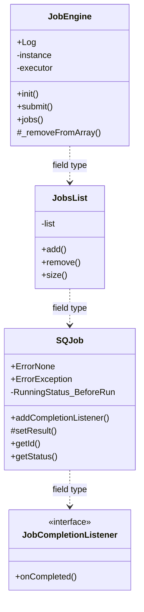
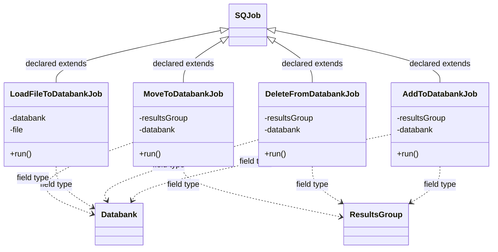

# SQJobsLib.jar

[Workspace/group index](README.md)  |  [All workspaces](../README.md)

## Scope and provenance

- Artifact: `SQX_REFERENCE_ROOT/internal/libs/SQJobsLib.jar`.
- SHA-256: `90a7d687dd4df30964512d8cd2cebf865f0bdcd9798b1310ed54007bf388ab5e`.
- Inspected: 2026-10-05; generation timestamp `2026-10-05T19:04:16.344170+00:00`.
- Archive class entries: **11**; non-nested: **8**; nested/anonymous: **3**.
- Inspection: ZIP entry/manifest enumeration and `javap -p` declarations for every listed class.
- Repository source HEAD: `8a92c705183a6702eaf62037ccb202ed028aa899`; review state: generated, pending owner review.
- Installed SQX build number is unverified. No method bodies are reproduced.
- Confidence: high for declared structure; workspace ownership inferred except where registration evidence is separately stated. Runtime reachability, call order, formulas and parity remain unverified.

Shared component: a single canonical document is linked from relevant workspace indexes. Its presence here does not establish which workspaces load it at runtime.

Target mapping: no verified owning HaruQuantAI feature/requirement/decision IDs are assigned by this document. Register or resolve ownership through the normal repository plan before implementation.

## Diagram reading guide

`Parent <|-- Child` means declared inheritance; `Interface <|.. Class` means declared implementation. Interface extension uses the inheritance arrow. `A ..> B : field type` is a declared type dependency, not composition, object ownership or a runtime call. External nodes are referenced types, not fabricated local implementations. Selected fields/method names aid navigation: `+` is public, `#` protected and `-` private. Diagram method names omit parameter/return types and collapse overloads; use the exact inspected declarations below before implementing an API.

Detailed graphs include non-nested classes in package-sized groups of at most 12. Nested/anonymous classes are inventoried and their declarations/relationships are retained below, but omitted from overview graphs. Relationships not drawn for readability remain in the complete declaration-relationship table. Constructors, synthetic bridges and overloads may be collapsed in diagram member lists only. Standard `java.lang.Object` inheritance is omitted from diagrams.

## UML class diagrams

### 1. `com.strategyquant.jobslib`



| Diagram identifier | Exact type | Location |
| --- | --- | --- |
| `C5c8379a90856` | `com.strategyquant.jobslib.JobCompletionListener` (this JAR) | this diagram |
| `C7cc839592d01` | `com.strategyquant.jobslib.JobEngine` (this JAR) | this diagram |
| `C8eabc0fb6a79` | `com.strategyquant.jobslib.JobsList` (this JAR) | this diagram |
| `C88d9301b88f6` | `com.strategyquant.jobslib.SQJob` (this JAR) | this diagram |

### 2. `com.strategyquant.jobslib.databank`



| Diagram identifier | Exact type | Location |
| --- | --- | --- |
| `C88d9301b88f6` | `com.strategyquant.jobslib.SQJob` (this JAR) | another group in this JAR |
| `C366c83f4e579` | `com.strategyquant.jobslib.databank.AddToDatabankJob` (this JAR) | this diagram |
| `Cfbd9daa29a66` | `com.strategyquant.jobslib.databank.DeleteFromDatabankJob` (this JAR) | this diagram |
| `Cc62458cd5be8` | `com.strategyquant.jobslib.databank.LoadFileToDatabankJob` (this JAR) | this diagram |
| `Cc84c076ffd5a` | `com.strategyquant.jobslib.databank.MoveToDatabankJob` (this JAR) | this diagram |
| `Cf1cf5abc550f` | [`com.strategyquant.tradinglib.Databank`](SQTradingLib.md) | referenced external type |
| `C81fcbc41b716` | [`com.strategyquant.tradinglib.ResultsGroup`](SQTradingLib.md) | referenced external type |

## Complete class inventory

| Fully qualified class | Kind | Entry |
| --- | --- | --- |
| `com.strategyquant.jobslib.JobCompletionListener` | interface | non-nested |
| `com.strategyquant.jobslib.JobEngine` | class | non-nested |
| `com.strategyquant.jobslib.JobEngine$1` | class | nested/anonymous |
| `com.strategyquant.jobslib.JobEngine$2` | class | nested/anonymous |
| `com.strategyquant.jobslib.JobsList` | class | non-nested |
| `com.strategyquant.jobslib.SQJob` | class | non-nested |
| `com.strategyquant.jobslib.SQJob$Listener` | class | nested/anonymous |
| `com.strategyquant.jobslib.databank.AddToDatabankJob` | class | non-nested |
| `com.strategyquant.jobslib.databank.DeleteFromDatabankJob` | class | non-nested |
| `com.strategyquant.jobslib.databank.LoadFileToDatabankJob` | class | non-nested |
| `com.strategyquant.jobslib.databank.MoveToDatabankJob` | class | non-nested |

## Declared relationships and evidence locations

Every row is supported by the named class declaration/member in `javap -p`, inside the artifact recorded above. Signature dependencies may include return, parameter, generic-argument and throws types; they do not imply execution.

| Declaring class | Referenced type | Relationship | Narrow inspection location |
| --- | --- | --- | --- |
| `com.strategyquant.jobslib.JobCompletionListener` | `com.strategyquant.jobslib.SQJob` (this JAR) | type dependency | `com.strategyquant.jobslib.JobCompletionListener` / method signature: `public abstract void onCompleted(com.strategyquant.jobslib.SQJob);` |
| `com.strategyquant.jobslib.JobEngine` | `org.slf4j.Logger` (not resolved in scoped archives) | type dependency | `com.strategyquant.jobslib.JobEngine` / field declaration: `public static final org.slf4j.Logger Log;` |
| `com.strategyquant.jobslib.JobEngine` | `java.util.concurrent.ExecutorService` (not resolved in scoped archives) | type dependency | `com.strategyquant.jobslib.JobEngine` / field declaration: `private java.util.concurrent.ExecutorService executor;` |
| `com.strategyquant.jobslib.JobEngine` | `java.util.concurrent.ExecutorService` (not resolved in scoped archives) | type dependency | `com.strategyquant.jobslib.JobEngine` / method signature: `static java.util.concurrent.ExecutorService access$000(com.strategyquant.jobslib.JobEngine);` |
| `com.strategyquant.jobslib.JobEngine` | `com.strategyquant.jobslib.JobsList` (this JAR) | type dependency | `com.strategyquant.jobslib.JobEngine` / field declaration: `private com.strategyquant.jobslib.JobsList jobs;` |
| `com.strategyquant.jobslib.JobEngine` | `com.strategyquant.jobslib.JobsList` (this JAR) | type dependency | `com.strategyquant.jobslib.JobEngine` / method signature: `public static com.strategyquant.jobslib.JobsList jobs();`<br>`private com.strategyquant.jobslib.JobsList _jobs();` |
| `com.strategyquant.jobslib.JobEngine` | `java.lang.Exception` (not resolved in scoped archives) | type dependency | `com.strategyquant.jobslib.JobEngine` / method signature: `public static void init(com.strategyquant.jobslib.JobEngine) throws java.lang.Exception;` |
| `com.strategyquant.jobslib.JobEngine` | [`com.strategyquant.tradinglib.taskImpl.ISQTask`](SQTradingLib.md) | type dependency | `com.strategyquant.jobslib.JobEngine` / method signature: `public static void submit(com.strategyquant.tradinglib.taskImpl.ISQTask, com.strategyquant.jobslib.SQJob);`<br>`private void _submit(com.strategyquant.tradinglib.taskImpl.ISQTask, com.strategyquant.jobslib.SQJob);`<br>`private void _addJobToArray(com.strategyquant.tradinglib.taskImpl.ISQTask, com.strategyquant.jobslib.SQJob);` |
| `com.strategyquant.jobslib.JobEngine` | `com.strategyquant.jobslib.SQJob` (this JAR) | type dependency | `com.strategyquant.jobslib.JobEngine` / method signature: `public static void submit(com.strategyquant.tradinglib.taskImpl.ISQTask, com.strategyquant.jobslib.SQJob);`<br>`private void _submit(com.strategyquant.tradinglib.taskImpl.ISQTask, com.strategyquant.jobslib.SQJob);`<br>`private void _executeJob(com.strategyquant.jobslib.SQJob);`<br>`private void _addJobToArray(com.strategyquant.tradinglib.taskImpl.ISQTask, com.strategyquant.jobslib.SQJob);`<br>`protected void _removeFromArray(com.strategyquant.jobslib.SQJob);` |
| `com.strategyquant.jobslib.JobEngine$1` | `com.strategyquant.jobslib.JobCompletionListener` (this JAR) | implements | `com.strategyquant.jobslib.JobEngine$1` / class declaration: `class com.strategyquant.jobslib.JobEngine$1 implements com.strategyquant.jobslib.JobCompletionListener` |
| `com.strategyquant.jobslib.JobEngine$1` | `com.strategyquant.jobslib.JobEngine` (this JAR) | type dependency | `com.strategyquant.jobslib.JobEngine$1` / field declaration: `final com.strategyquant.jobslib.JobEngine this$0;` |
| `com.strategyquant.jobslib.JobEngine$1` | `com.strategyquant.jobslib.JobEngine` (this JAR) | type dependency | `com.strategyquant.jobslib.JobEngine$1` / method signature: `com.strategyquant.jobslib.JobEngine$1(com.strategyquant.jobslib.JobEngine);` |
| `com.strategyquant.jobslib.JobEngine$1` | `com.strategyquant.jobslib.SQJob` (this JAR) | type dependency | `com.strategyquant.jobslib.JobEngine$1` / method signature: `public void onCompleted(com.strategyquant.jobslib.SQJob);` |
| `com.strategyquant.jobslib.JobEngine$2` | `java.lang.Runnable` (not resolved in scoped archives) | implements | `com.strategyquant.jobslib.JobEngine$2` / class declaration: `class com.strategyquant.jobslib.JobEngine$2 implements java.lang.Runnable` |
| `com.strategyquant.jobslib.JobEngine$2` | `com.strategyquant.jobslib.SQJob` (this JAR) | type dependency | `com.strategyquant.jobslib.JobEngine$2` / field declaration: `final com.strategyquant.jobslib.SQJob val$job;` |
| `com.strategyquant.jobslib.JobEngine$2` | `com.strategyquant.jobslib.JobEngine` (this JAR) | type dependency | `com.strategyquant.jobslib.JobEngine$2` / field declaration: `final com.strategyquant.jobslib.JobEngine this$0;` |
| `com.strategyquant.jobslib.JobsList` | `java.util.ArrayList` (not resolved in scoped archives) | type dependency | `com.strategyquant.jobslib.JobsList` / field declaration: `private java.util.ArrayList<com.strategyquant.jobslib.SQJob> list;` |
| `com.strategyquant.jobslib.JobsList` | `com.strategyquant.jobslib.SQJob` (this JAR) | type dependency | `com.strategyquant.jobslib.JobsList` / field declaration: `private java.util.ArrayList<com.strategyquant.jobslib.SQJob> list;` |
| `com.strategyquant.jobslib.JobsList` | `com.strategyquant.jobslib.SQJob` (this JAR) | type dependency | `com.strategyquant.jobslib.JobsList` / method signature: `public void add(com.strategyquant.jobslib.SQJob);`<br>`public void remove(com.strategyquant.jobslib.SQJob);` |
| `com.strategyquant.jobslib.SQJob` | `java.util.concurrent.atomic.AtomicInteger` (not resolved in scoped archives) | type dependency | `com.strategyquant.jobslib.SQJob` / field declaration: `private java.util.concurrent.atomic.AtomicInteger runningStatus;`<br>`private java.util.concurrent.atomic.AtomicInteger status;` |
| `com.strategyquant.jobslib.SQJob` | `java.lang.Object` (not resolved in scoped archives) | type dependency | `com.strategyquant.jobslib.SQJob` / field declaration: `private java.lang.Object result;` |
| `com.strategyquant.jobslib.SQJob` | `java.lang.Object` (not resolved in scoped archives) | type dependency | `com.strategyquant.jobslib.SQJob` / method signature: `protected void setResult(java.lang.Object);`<br>`public java.lang.Object getResult();` |
| `com.strategyquant.jobslib.SQJob` | `java.lang.Exception` (not resolved in scoped archives) | type dependency | `com.strategyquant.jobslib.SQJob` / field declaration: `private java.lang.Exception exception;` |
| `com.strategyquant.jobslib.SQJob` | `java.lang.Exception` (not resolved in scoped archives) | type dependency | `com.strategyquant.jobslib.SQJob` / method signature: `public abstract void run() throws java.lang.Exception;` |
| `com.strategyquant.jobslib.SQJob` | `java.util.ArrayList` (not resolved in scoped archives) | type dependency | `com.strategyquant.jobslib.SQJob` / field declaration: `private java.util.ArrayList<com.strategyquant.jobslib.JobCompletionListener> listeners;` |
| `com.strategyquant.jobslib.SQJob` | `com.strategyquant.jobslib.JobCompletionListener` (this JAR) | type dependency | `com.strategyquant.jobslib.SQJob` / field declaration: `private java.util.ArrayList<com.strategyquant.jobslib.JobCompletionListener> listeners;` |
| `com.strategyquant.jobslib.SQJob` | `com.strategyquant.jobslib.JobCompletionListener` (this JAR) | type dependency | `com.strategyquant.jobslib.SQJob` / method signature: `public void addCompletionListener(com.strategyquant.jobslib.JobCompletionListener);` |
| `com.strategyquant.jobslib.SQJob` | `java.util.concurrent.ExecutorService` (not resolved in scoped archives) | type dependency | `com.strategyquant.jobslib.SQJob` / method signature: `private void callCompletionListeners(java.util.concurrent.ExecutorService);`<br>`void runWithCallback(java.util.concurrent.ExecutorService);` |
| `com.strategyquant.jobslib.SQJob$Listener` | `java.lang.Runnable` (not resolved in scoped archives) | implements | `com.strategyquant.jobslib.SQJob$Listener` / class declaration: `class com.strategyquant.jobslib.SQJob$Listener implements java.lang.Runnable` |
| `com.strategyquant.jobslib.SQJob$Listener` | `com.strategyquant.jobslib.SQJob` (this JAR) | type dependency | `com.strategyquant.jobslib.SQJob$Listener` / field declaration: `private com.strategyquant.jobslib.SQJob job;`<br>`final com.strategyquant.jobslib.SQJob this$0;` |
| `com.strategyquant.jobslib.SQJob$Listener` | `com.strategyquant.jobslib.SQJob` (this JAR) | type dependency | `com.strategyquant.jobslib.SQJob$Listener` / method signature: `public com.strategyquant.jobslib.SQJob$Listener(com.strategyquant.jobslib.SQJob, com.strategyquant.jobslib.SQJob, com.strategyquant.jobslib.JobCompletionListener);` |
| `com.strategyquant.jobslib.SQJob$Listener` | `com.strategyquant.jobslib.JobCompletionListener` (this JAR) | type dependency | `com.strategyquant.jobslib.SQJob$Listener` / field declaration: `private com.strategyquant.jobslib.JobCompletionListener listener;` |
| `com.strategyquant.jobslib.SQJob$Listener` | `com.strategyquant.jobslib.JobCompletionListener` (this JAR) | type dependency | `com.strategyquant.jobslib.SQJob$Listener` / method signature: `public com.strategyquant.jobslib.SQJob$Listener(com.strategyquant.jobslib.SQJob, com.strategyquant.jobslib.SQJob, com.strategyquant.jobslib.JobCompletionListener);` |
| `com.strategyquant.jobslib.databank.AddToDatabankJob` | `com.strategyquant.jobslib.SQJob` (this JAR) | extends | `com.strategyquant.jobslib.databank.AddToDatabankJob` / class declaration: `public class com.strategyquant.jobslib.databank.AddToDatabankJob extends com.strategyquant.jobslib.SQJob` |
| `com.strategyquant.jobslib.databank.AddToDatabankJob` | [`com.strategyquant.tradinglib.ResultsGroup`](SQTradingLib.md) | type dependency | `com.strategyquant.jobslib.databank.AddToDatabankJob` / field declaration: `private com.strategyquant.tradinglib.ResultsGroup resultsGroup;` |
| `com.strategyquant.jobslib.databank.AddToDatabankJob` | [`com.strategyquant.tradinglib.ResultsGroup`](SQTradingLib.md) | type dependency | `com.strategyquant.jobslib.databank.AddToDatabankJob` / method signature: `public com.strategyquant.jobslib.databank.AddToDatabankJob(com.strategyquant.tradinglib.ResultsGroup, com.strategyquant.tradinglib.Databank);` |
| `com.strategyquant.jobslib.databank.AddToDatabankJob` | [`com.strategyquant.tradinglib.Databank`](SQTradingLib.md) | type dependency | `com.strategyquant.jobslib.databank.AddToDatabankJob` / field declaration: `private com.strategyquant.tradinglib.Databank databank;` |
| `com.strategyquant.jobslib.databank.AddToDatabankJob` | [`com.strategyquant.tradinglib.Databank`](SQTradingLib.md) | type dependency | `com.strategyquant.jobslib.databank.AddToDatabankJob` / method signature: `public com.strategyquant.jobslib.databank.AddToDatabankJob(com.strategyquant.tradinglib.ResultsGroup, com.strategyquant.tradinglib.Databank);` |
| `com.strategyquant.jobslib.databank.AddToDatabankJob` | `java.lang.Exception` (not resolved in scoped archives) | type dependency | `com.strategyquant.jobslib.databank.AddToDatabankJob` / method signature: `public void run() throws java.lang.Exception;` |
| `com.strategyquant.jobslib.databank.DeleteFromDatabankJob` | `com.strategyquant.jobslib.SQJob` (this JAR) | extends | `com.strategyquant.jobslib.databank.DeleteFromDatabankJob` / class declaration: `public class com.strategyquant.jobslib.databank.DeleteFromDatabankJob extends com.strategyquant.jobslib.SQJob` |
| `com.strategyquant.jobslib.databank.DeleteFromDatabankJob` | [`com.strategyquant.tradinglib.ResultsGroup`](SQTradingLib.md) | type dependency | `com.strategyquant.jobslib.databank.DeleteFromDatabankJob` / field declaration: `private com.strategyquant.tradinglib.ResultsGroup resultsGroup;` |
| `com.strategyquant.jobslib.databank.DeleteFromDatabankJob` | [`com.strategyquant.tradinglib.ResultsGroup`](SQTradingLib.md) | type dependency | `com.strategyquant.jobslib.databank.DeleteFromDatabankJob` / method signature: `public com.strategyquant.jobslib.databank.DeleteFromDatabankJob(com.strategyquant.tradinglib.ResultsGroup, com.strategyquant.tradinglib.Databank);` |
| `com.strategyquant.jobslib.databank.DeleteFromDatabankJob` | [`com.strategyquant.tradinglib.Databank`](SQTradingLib.md) | type dependency | `com.strategyquant.jobslib.databank.DeleteFromDatabankJob` / field declaration: `private com.strategyquant.tradinglib.Databank databank;` |
| `com.strategyquant.jobslib.databank.DeleteFromDatabankJob` | [`com.strategyquant.tradinglib.Databank`](SQTradingLib.md) | type dependency | `com.strategyquant.jobslib.databank.DeleteFromDatabankJob` / method signature: `public com.strategyquant.jobslib.databank.DeleteFromDatabankJob(com.strategyquant.tradinglib.ResultsGroup, com.strategyquant.tradinglib.Databank);` |
| `com.strategyquant.jobslib.databank.DeleteFromDatabankJob` | `java.lang.Exception` (not resolved in scoped archives) | type dependency | `com.strategyquant.jobslib.databank.DeleteFromDatabankJob` / method signature: `public void run() throws java.lang.Exception;` |
| `com.strategyquant.jobslib.databank.LoadFileToDatabankJob` | `com.strategyquant.jobslib.SQJob` (this JAR) | extends | `com.strategyquant.jobslib.databank.LoadFileToDatabankJob` / class declaration: `public class com.strategyquant.jobslib.databank.LoadFileToDatabankJob extends com.strategyquant.jobslib.SQJob` |
| `com.strategyquant.jobslib.databank.LoadFileToDatabankJob` | [`com.strategyquant.tradinglib.Databank`](SQTradingLib.md) | type dependency | `com.strategyquant.jobslib.databank.LoadFileToDatabankJob` / field declaration: `private com.strategyquant.tradinglib.Databank databank;` |
| `com.strategyquant.jobslib.databank.LoadFileToDatabankJob` | [`com.strategyquant.tradinglib.Databank`](SQTradingLib.md) | type dependency | `com.strategyquant.jobslib.databank.LoadFileToDatabankJob` / method signature: `public com.strategyquant.jobslib.databank.LoadFileToDatabankJob(java.io.File, com.strategyquant.tradinglib.Databank);` |
| `com.strategyquant.jobslib.databank.LoadFileToDatabankJob` | `java.io.File` (not resolved in scoped archives) | type dependency | `com.strategyquant.jobslib.databank.LoadFileToDatabankJob` / field declaration: `private java.io.File file;` |
| `com.strategyquant.jobslib.databank.LoadFileToDatabankJob` | `java.io.File` (not resolved in scoped archives) | type dependency | `com.strategyquant.jobslib.databank.LoadFileToDatabankJob` / method signature: `public com.strategyquant.jobslib.databank.LoadFileToDatabankJob(java.io.File, com.strategyquant.tradinglib.Databank);` |
| `com.strategyquant.jobslib.databank.LoadFileToDatabankJob` | `java.lang.Exception` (not resolved in scoped archives) | type dependency | `com.strategyquant.jobslib.databank.LoadFileToDatabankJob` / method signature: `public void run() throws java.lang.Exception;` |
| `com.strategyquant.jobslib.databank.MoveToDatabankJob` | `com.strategyquant.jobslib.SQJob` (this JAR) | extends | `com.strategyquant.jobslib.databank.MoveToDatabankJob` / class declaration: `public class com.strategyquant.jobslib.databank.MoveToDatabankJob extends com.strategyquant.jobslib.SQJob` |
| `com.strategyquant.jobslib.databank.MoveToDatabankJob` | [`com.strategyquant.tradinglib.ResultsGroup`](SQTradingLib.md) | type dependency | `com.strategyquant.jobslib.databank.MoveToDatabankJob` / field declaration: `private com.strategyquant.tradinglib.ResultsGroup resultsGroup;` |
| `com.strategyquant.jobslib.databank.MoveToDatabankJob` | [`com.strategyquant.tradinglib.ResultsGroup`](SQTradingLib.md) | type dependency | `com.strategyquant.jobslib.databank.MoveToDatabankJob` / method signature: `public com.strategyquant.jobslib.databank.MoveToDatabankJob(com.strategyquant.tradinglib.ResultsGroup, com.strategyquant.tradinglib.Databank);` |
| `com.strategyquant.jobslib.databank.MoveToDatabankJob` | [`com.strategyquant.tradinglib.Databank`](SQTradingLib.md) | type dependency | `com.strategyquant.jobslib.databank.MoveToDatabankJob` / field declaration: `private com.strategyquant.tradinglib.Databank databank;` |
| `com.strategyquant.jobslib.databank.MoveToDatabankJob` | [`com.strategyquant.tradinglib.Databank`](SQTradingLib.md) | type dependency | `com.strategyquant.jobslib.databank.MoveToDatabankJob` / method signature: `public com.strategyquant.jobslib.databank.MoveToDatabankJob(com.strategyquant.tradinglib.ResultsGroup, com.strategyquant.tradinglib.Databank);` |
| `com.strategyquant.jobslib.databank.MoveToDatabankJob` | `java.lang.Exception` (not resolved in scoped archives) | type dependency | `com.strategyquant.jobslib.databank.MoveToDatabankJob` / method signature: `public void run() throws java.lang.Exception;` |

## Inspected declaration reference

These are structural API/member declarations, not proprietary implementation bodies. Private members and nested classes are retained to make diagram omissions explicit; declarations do not prove behavior.

<details>
<summary>com.strategyquant.jobslib.JobCompletionListener</summary>

```text
public interface com.strategyquant.jobslib.JobCompletionListener
    public abstract void onCompleted(com.strategyquant.jobslib.SQJob);
```

</details>

<details>
<summary>com.strategyquant.jobslib.JobEngine</summary>

```text
public class com.strategyquant.jobslib.JobEngine
    public static final org.slf4j.Logger Log;
    private static com.strategyquant.jobslib.JobEngine instance;
    private java.util.concurrent.ExecutorService executor;
    private com.strategyquant.jobslib.JobsList jobs;
    public static void init(com.strategyquant.jobslib.JobEngine) throws java.lang.Exception;
    public com.strategyquant.jobslib.JobEngine(int);
    private static com.strategyquant.jobslib.JobEngine get();
    public static void submit(com.strategyquant.tradinglib.taskImpl.ISQTask, com.strategyquant.jobslib.SQJob);
    public static com.strategyquant.jobslib.JobsList jobs();
    private com.strategyquant.jobslib.JobsList _jobs();
    private void _submit(com.strategyquant.tradinglib.taskImpl.ISQTask, com.strategyquant.jobslib.SQJob);
    private void _executeJob(com.strategyquant.jobslib.SQJob);
    private void _addJobToArray(com.strategyquant.tradinglib.taskImpl.ISQTask, com.strategyquant.jobslib.SQJob);
    protected void _removeFromArray(com.strategyquant.jobslib.SQJob);
    static java.util.concurrent.ExecutorService access$000(com.strategyquant.jobslib.JobEngine);
```

</details>

<details>
<summary>com.strategyquant.jobslib.JobEngine$1</summary>

```text
class com.strategyquant.jobslib.JobEngine$1 implements com.strategyquant.jobslib.JobCompletionListener
    final com.strategyquant.jobslib.JobEngine this$0;
    com.strategyquant.jobslib.JobEngine$1(com.strategyquant.jobslib.JobEngine);
    public void onCompleted(com.strategyquant.jobslib.SQJob);
```

</details>

<details>
<summary>com.strategyquant.jobslib.JobEngine$2</summary>

```text
class com.strategyquant.jobslib.JobEngine$2 implements java.lang.Runnable
    final com.strategyquant.jobslib.SQJob val$job;
    final com.strategyquant.jobslib.JobEngine this$0;
    com.strategyquant.jobslib.JobEngine$2();
    public void run();
```

</details>

<details>
<summary>com.strategyquant.jobslib.JobsList</summary>

```text
public class com.strategyquant.jobslib.JobsList
    private java.util.ArrayList<com.strategyquant.jobslib.SQJob> list;
    public com.strategyquant.jobslib.JobsList();
    public void add(com.strategyquant.jobslib.SQJob);
    public void remove(com.strategyquant.jobslib.SQJob);
    public int size();
```

</details>

<details>
<summary>com.strategyquant.jobslib.SQJob</summary>

```text
public abstract class com.strategyquant.jobslib.SQJob
    public static final int ErrorNone;
    public static final int ErrorException;
    private static final int RunningStatus_BeforeRun;
    private static final int RunningStatus_Running;
    private static final int RunningStatus_Finished;
    public static final int JobStatus_None;
    public static final int JobStatus_Success;
    public static final int JobStatus_Error;
    private java.util.concurrent.atomic.AtomicInteger runningStatus;
    private java.util.concurrent.atomic.AtomicInteger status;
    private java.lang.Object result;
    private java.lang.Exception exception;
    private java.util.ArrayList<com.strategyquant.jobslib.JobCompletionListener> listeners;
    public com.strategyquant.jobslib.SQJob();
    public void addCompletionListener(com.strategyquant.jobslib.JobCompletionListener);
    protected void setResult(java.lang.Object);
    private void callCompletionListeners(java.util.concurrent.ExecutorService);
    void runWithCallback(java.util.concurrent.ExecutorService);
    public int getId();
    public int getStatus();
    public boolean isFinished();
    public boolean isRunning();
    public java.lang.Object getResult();
    public abstract void run() throws java.lang.Exception;
```

</details>

<details>
<summary>com.strategyquant.jobslib.SQJob$Listener</summary>

```text
class com.strategyquant.jobslib.SQJob$Listener implements java.lang.Runnable
    private com.strategyquant.jobslib.SQJob job;
    private com.strategyquant.jobslib.JobCompletionListener listener;
    final com.strategyquant.jobslib.SQJob this$0;
    public com.strategyquant.jobslib.SQJob$Listener(com.strategyquant.jobslib.SQJob, com.strategyquant.jobslib.SQJob, com.strategyquant.jobslib.JobCompletionListener);
    public void run();
```

</details>

<details>
<summary>com.strategyquant.jobslib.databank.AddToDatabankJob</summary>

```text
public class com.strategyquant.jobslib.databank.AddToDatabankJob extends com.strategyquant.jobslib.SQJob
    private com.strategyquant.tradinglib.ResultsGroup resultsGroup;
    private com.strategyquant.tradinglib.Databank databank;
    public com.strategyquant.jobslib.databank.AddToDatabankJob(com.strategyquant.tradinglib.ResultsGroup, com.strategyquant.tradinglib.Databank);
    public void run() throws java.lang.Exception;
```

</details>

<details>
<summary>com.strategyquant.jobslib.databank.DeleteFromDatabankJob</summary>

```text
public class com.strategyquant.jobslib.databank.DeleteFromDatabankJob extends com.strategyquant.jobslib.SQJob
    private com.strategyquant.tradinglib.ResultsGroup resultsGroup;
    private com.strategyquant.tradinglib.Databank databank;
    public com.strategyquant.jobslib.databank.DeleteFromDatabankJob(com.strategyquant.tradinglib.ResultsGroup, com.strategyquant.tradinglib.Databank);
    public void run() throws java.lang.Exception;
```

</details>

<details>
<summary>com.strategyquant.jobslib.databank.LoadFileToDatabankJob</summary>

```text
public class com.strategyquant.jobslib.databank.LoadFileToDatabankJob extends com.strategyquant.jobslib.SQJob
    private com.strategyquant.tradinglib.Databank databank;
    private java.io.File file;
    public com.strategyquant.jobslib.databank.LoadFileToDatabankJob(java.io.File, com.strategyquant.tradinglib.Databank);
    public void run() throws java.lang.Exception;
```

</details>

<details>
<summary>com.strategyquant.jobslib.databank.MoveToDatabankJob</summary>

```text
public class com.strategyquant.jobslib.databank.MoveToDatabankJob extends com.strategyquant.jobslib.SQJob
    private com.strategyquant.tradinglib.ResultsGroup resultsGroup;
    private com.strategyquant.tradinglib.Databank databank;
    public com.strategyquant.jobslib.databank.MoveToDatabankJob(com.strategyquant.tradinglib.ResultsGroup, com.strategyquant.tradinglib.Databank);
    public void run() throws java.lang.Exception;
```

</details>

## Validation and unresolved gaps

Archive hash and complete class inventory were checked against the inspected local artifact. Declaration extraction accounts for every inventoried class. Documentation/link/diagram structural verification is recorded in the master index and task walkthrough; no SQX runtime validation was performed.

The canonical reimplementation ledger/schema are absent, so no evidence IDs or validation-passed ledger claims are created. This is a donor structural reference. Exact behavior, default values, failure semantics, algorithms, runtime calls and target architectural choices require separate research. No aggregation/composition or cardinalities are inferred.
