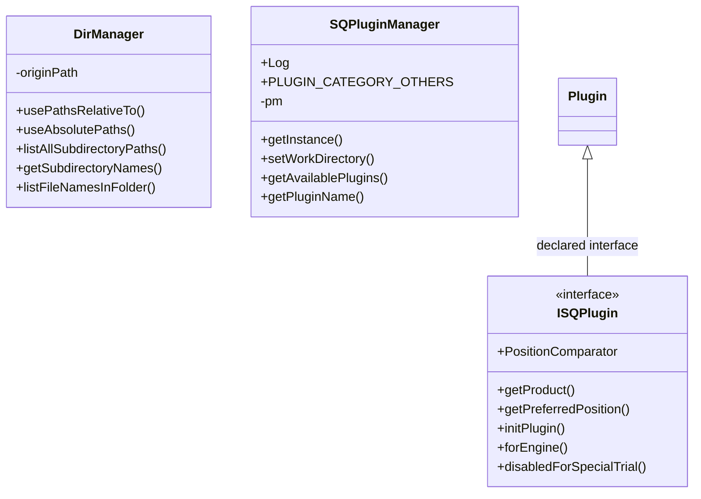
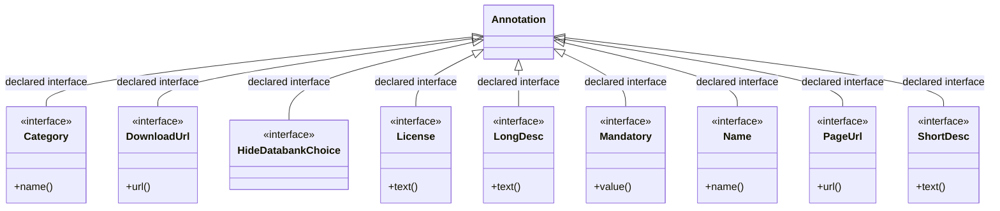
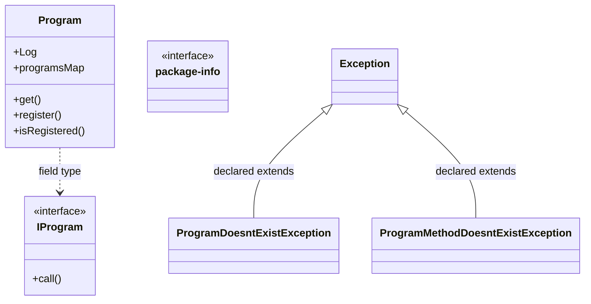

# SQPluginLib.jar

[Workspace/group index](README.md)  |  [All workspaces](../README.md)

## Scope and provenance

- Artifact: `SQX_REFERENCE_ROOT/internal/libs/SQPluginLib.jar`.
- SHA-256: `40c962d2087d68aadb4bc4a3b9bb2363a453cb57830fd672c50716d502e771c3`.
- Inspected: 2026-10-05; generation timestamp `2026-10-05T19:04:16.344170+00:00`.
- Archive class entries: **18**; non-nested: **17**; nested/anonymous: **1**.
- Inspection: ZIP entry/manifest enumeration and `javap -p` declarations for every listed class.
- Repository source HEAD: `8a92c705183a6702eaf62037ccb202ed028aa899`; review state: generated, pending owner review.
- Installed SQX build number is unverified. No method bodies are reproduced.
- Confidence: high for declared structure; workspace ownership inferred except where registration evidence is separately stated. Runtime reachability, call order, formulas and parity remain unverified.

Shared component: a single canonical document is linked from relevant workspace indexes. Its presence here does not establish which workspaces load it at runtime.

Target mapping: no verified owning HaruQuantAI feature/requirement/decision IDs are assigned by this document. Register or resolve ownership through the normal repository plan before implementation.

## Diagram reading guide

`Parent <|-- Child` means declared inheritance; `Interface <|.. Class` means declared implementation. Interface extension uses the inheritance arrow. `A ..> B : field type` is a declared type dependency, not composition, object ownership or a runtime call. External nodes are referenced types, not fabricated local implementations. Selected fields/method names aid navigation: `+` is public, `#` protected and `-` private. Diagram method names omit parameter/return types and collapse overloads; use the exact inspected declarations below before implementing an API.

Detailed graphs include non-nested classes in package-sized groups of at most 12. Nested/anonymous classes are inventoried and their declarations/relationships are retained below, but omitted from overview graphs. Relationships not drawn for readability remain in the complete declaration-relationship table. Constructors, synthetic bridges and overloads may be collapsed in diagram member lists only. Standard `java.lang.Object` inheritance is omitted from diagrams.

## UML class diagrams

### 1. `com.strategyquant.pluginlib`



| Diagram identifier | Exact type | Location |
| --- | --- | --- |
| `C29ca2aaa8e1a` | `com.strategyquant.pluginlib.DirManager` (this JAR) | this diagram |
| `Cb01a7e55ea2e` | `com.strategyquant.pluginlib.ISQPlugin` (this JAR) | this diagram |
| `C9a73cabf076c` | `com.strategyquant.pluginlib.SQPluginManager` (this JAR) | this diagram |
| `Cac94f2eb92d6` | `net.xeoh.plugins.base.Plugin` (not resolved in scoped archives) | referenced external type |

### 2. `com.strategyquant.pluginlib.annotations`



| Diagram identifier | Exact type | Location |
| --- | --- | --- |
| `Cf25a3c082ecf` | `com.strategyquant.pluginlib.annotations.Category` (this JAR) | this diagram |
| `C4abfc0452b44` | `com.strategyquant.pluginlib.annotations.DownloadUrl` (this JAR) | this diagram |
| `Ce056c7147841` | `com.strategyquant.pluginlib.annotations.HideDatabankChoice` (this JAR) | this diagram |
| `C5afebd77639c` | `com.strategyquant.pluginlib.annotations.License` (this JAR) | this diagram |
| `C3edb64e465d8` | `com.strategyquant.pluginlib.annotations.LongDesc` (this JAR) | this diagram |
| `C192b92ff24da` | `com.strategyquant.pluginlib.annotations.Mandatory` (this JAR) | this diagram |
| `Cac42dd421fb1` | `com.strategyquant.pluginlib.annotations.Name` (this JAR) | this diagram |
| `Cd1ed62d2ebe8` | `com.strategyquant.pluginlib.annotations.PageUrl` (this JAR) | this diagram |
| `Ced3d4fdf5b13` | `com.strategyquant.pluginlib.annotations.ShortDesc` (this JAR) | this diagram |
| `Ce2abf92f3173` | `java.lang.annotation.Annotation` (not resolved in scoped archives) | referenced external type |

### 3. `com.strategyquant.pluginlib.program`



| Diagram identifier | Exact type | Location |
| --- | --- | --- |
| `C1b6b4448b67b` | `com.strategyquant.pluginlib.program.IProgram` (this JAR) | this diagram |
| `C36f00a34adf3` | `com.strategyquant.pluginlib.program.Program` (this JAR) | this diagram |
| `C4900fc4660ea` | `com.strategyquant.pluginlib.program.ProgramDoesntExistException` (this JAR) | this diagram |
| `C28c7074abe36` | `com.strategyquant.pluginlib.program.ProgramMethodDoesntExistException` (this JAR) | this diagram |
| `C29219181c45d` | `com.strategyquant.pluginlib.program.package-info` (this JAR) | this diagram |
| `C4bc2cd7a4e9d` | `java.lang.Exception` (not resolved in scoped archives) | referenced external type |

## Complete class inventory

| Fully qualified class | Kind | Entry |
| --- | --- | --- |
| `com.strategyquant.pluginlib.DirManager` | class | non-nested |
| `com.strategyquant.pluginlib.ISQPlugin` | interface | non-nested |
| `com.strategyquant.pluginlib.ISQPlugin$1` | class | nested/anonymous |
| `com.strategyquant.pluginlib.SQPluginManager` | class | non-nested |
| `com.strategyquant.pluginlib.annotations.Category` | interface | non-nested |
| `com.strategyquant.pluginlib.annotations.DownloadUrl` | interface | non-nested |
| `com.strategyquant.pluginlib.annotations.HideDatabankChoice` | interface | non-nested |
| `com.strategyquant.pluginlib.annotations.License` | interface | non-nested |
| `com.strategyquant.pluginlib.annotations.LongDesc` | interface | non-nested |
| `com.strategyquant.pluginlib.annotations.Mandatory` | interface | non-nested |
| `com.strategyquant.pluginlib.annotations.Name` | interface | non-nested |
| `com.strategyquant.pluginlib.annotations.PageUrl` | interface | non-nested |
| `com.strategyquant.pluginlib.annotations.ShortDesc` | interface | non-nested |
| `com.strategyquant.pluginlib.program.IProgram` | interface | non-nested |
| `com.strategyquant.pluginlib.program.Program` | class | non-nested |
| `com.strategyquant.pluginlib.program.ProgramDoesntExistException` | class | non-nested |
| `com.strategyquant.pluginlib.program.ProgramMethodDoesntExistException` | class | non-nested |
| `com.strategyquant.pluginlib.program.package-info` | interface | non-nested |

## Declared relationships and evidence locations

Every row is supported by the named class declaration/member in `javap -p`, inside the artifact recorded above. Signature dependencies may include return, parameter, generic-argument and throws types; they do not imply execution.

| Declaring class | Referenced type | Relationship | Narrow inspection location |
| --- | --- | --- | --- |
| `com.strategyquant.pluginlib.DirManager` | `java.lang.String` (not resolved in scoped archives) | type dependency | `com.strategyquant.pluginlib.DirManager` / field declaration: `private static java.lang.String originPath;` |
| `com.strategyquant.pluginlib.DirManager` | `java.lang.String` (not resolved in scoped archives) | type dependency | `com.strategyquant.pluginlib.DirManager` / method signature: `public static void usePathsRelativeTo(java.lang.String);`<br>`public static java.util.ArrayList<java.lang.String> listAllSubdirectoryPaths(java.lang.String) throws java.lang.Exception;`<br>`public static java.util.ArrayList<java.lang.String> getSubdirectoryNames(java.lang.String) throws java.lang.Exception;`<br>`private static java.util.ArrayList<java.lang.String> getSubdirectoriesNames(java.util.ArrayList<java.lang.String>) throws java.lang.Exception;`<br>`public static java.util.ArrayList<java.lang.String> listFileNamesInFolder(java.lang.String);`<br>`private static java.lang.String formatPath(java.lang.String);` |
| `com.strategyquant.pluginlib.DirManager` | `java.util.ArrayList` (not resolved in scoped archives) | type dependency | `com.strategyquant.pluginlib.DirManager` / method signature: `public static java.util.ArrayList<java.lang.String> listAllSubdirectoryPaths(java.lang.String) throws java.lang.Exception;`<br>`public static java.util.ArrayList<java.lang.String> getSubdirectoryNames(java.lang.String) throws java.lang.Exception;`<br>`private static java.util.ArrayList<java.lang.String> getSubdirectoriesNames(java.util.ArrayList<java.lang.String>) throws java.lang.Exception;`<br>`public static java.util.ArrayList<java.lang.String> listFileNamesInFolder(java.lang.String);` |
| `com.strategyquant.pluginlib.DirManager` | `java.lang.Exception` (not resolved in scoped archives) | type dependency | `com.strategyquant.pluginlib.DirManager` / method signature: `public static java.util.ArrayList<java.lang.String> listAllSubdirectoryPaths(java.lang.String) throws java.lang.Exception;`<br>`public static java.util.ArrayList<java.lang.String> getSubdirectoryNames(java.lang.String) throws java.lang.Exception;`<br>`private static java.util.ArrayList<java.lang.String> getSubdirectoriesNames(java.util.ArrayList<java.lang.String>) throws java.lang.Exception;` |
| `com.strategyquant.pluginlib.ISQPlugin` | `net.xeoh.plugins.base.Plugin` (not resolved in scoped archives) | extends interface | `com.strategyquant.pluginlib.ISQPlugin` / class declaration: `public interface com.strategyquant.pluginlib.ISQPlugin extends net.xeoh.plugins.base.Plugin` |
| `com.strategyquant.pluginlib.ISQPlugin` | `java.util.Comparator` (not resolved in scoped archives) | type dependency | `com.strategyquant.pluginlib.ISQPlugin` / field declaration: `public static final java.util.Comparator<com.strategyquant.pluginlib.ISQPlugin> PositionComparator;` |
| `com.strategyquant.pluginlib.ISQPlugin` | `java.lang.String` (not resolved in scoped archives) | type dependency | `com.strategyquant.pluginlib.ISQPlugin` / method signature: `public abstract java.lang.String getProduct();`<br>`public default java.lang.String forEngine();` |
| `com.strategyquant.pluginlib.ISQPlugin` | `java.lang.Exception` (not resolved in scoped archives) | type dependency | `com.strategyquant.pluginlib.ISQPlugin` / method signature: `public abstract void initPlugin() throws java.lang.Exception;` |
| `com.strategyquant.pluginlib.ISQPlugin$1` | `java.util.Comparator` (not resolved in scoped archives) | implements | `com.strategyquant.pluginlib.ISQPlugin$1` / class declaration: `class com.strategyquant.pluginlib.ISQPlugin$1 implements java.util.Comparator<com.strategyquant.pluginlib.ISQPlugin>` |
| `com.strategyquant.pluginlib.ISQPlugin$1` | `com.strategyquant.pluginlib.ISQPlugin` (this JAR) | type dependency | `com.strategyquant.pluginlib.ISQPlugin$1` / method signature: `public int compare(com.strategyquant.pluginlib.ISQPlugin, com.strategyquant.pluginlib.ISQPlugin);` |
| `com.strategyquant.pluginlib.ISQPlugin$1` | `java.lang.Object` (not resolved in scoped archives) | type dependency | `com.strategyquant.pluginlib.ISQPlugin$1` / method signature: `public int compare(java.lang.Object, java.lang.Object);` |
| `com.strategyquant.pluginlib.SQPluginManager` | `org.slf4j.Logger` (not resolved in scoped archives) | type dependency | `com.strategyquant.pluginlib.SQPluginManager` / field declaration: `public static final org.slf4j.Logger Log;` |
| `com.strategyquant.pluginlib.SQPluginManager` | `java.lang.String` (not resolved in scoped archives) | type dependency | `com.strategyquant.pluginlib.SQPluginManager` / field declaration: `public static final java.lang.String PLUGIN_CATEGORY_OTHERS;`<br>`private java.lang.String product;`<br>`private static java.lang.String workDirectory;` |
| `com.strategyquant.pluginlib.SQPluginManager` | `java.lang.String` (not resolved in scoped archives) | type dependency | `com.strategyquant.pluginlib.SQPluginManager` / method signature: `public static void setWorkDirectory(java.lang.String);`<br>`public static <P extends com.strategyquant.pluginlib.ISQPlugin> java.lang.String getPluginName(java.lang.Class<P>);`<br>`public static void initForProduct(java.lang.String) throws java.lang.Exception;`<br>`public static void initForProduct(java.lang.String, java.lang.String) throws java.lang.Exception;`<br>`private static void loadFromFolder(java.lang.String, java.lang.String) throws java.lang.Exception;`<br>`public static java.lang.String getPluginAuthor(com.strategyquant.pluginlib.ISQPlugin);`<br>`public static java.lang.String getLicense(com.strategyquant.pluginlib.ISQPlugin);`<br>`public static java.lang.String getPluginName(com.strategyquant.pluginlib.ISQPlugin);`<br>`public static java.lang.String getPluginCategory(com.strategyquant.pluginlib.ISQPlugin);`<br>`public static java.lang.String getPluginShortDesc(com.strategyquant.pluginlib.ISQPlugin);`<br>`public static java.lang.String getPluginLongDesc(com.strategyquant.pluginlib.ISQPlugin);`<br>`public static java.lang.String getPluginPageUrl(com.strategyquant.pluginlib.ISQPlugin);`<br>`public static java.lang.String getPluginDownloadUrl(com.strategyquant.pluginlib.ISQPlugin);`<br>`public static java.lang.String printPluginVersion(com.strategyquant.pluginlib.ISQPlugin);`<br>`public static com.strategyquant.pluginlib.ISQPlugin findPluginByName(java.lang.String);`<br>`public static java.lang.String formatVersion(int);` |
| `com.strategyquant.pluginlib.SQPluginManager` | `net.xeoh.plugins.base.PluginManager` (not resolved in scoped archives) | type dependency | `com.strategyquant.pluginlib.SQPluginManager` / field declaration: `private net.xeoh.plugins.base.PluginManager pm;` |
| `com.strategyquant.pluginlib.SQPluginManager` | `net.xeoh.plugins.base.util.PluginManagerUtil` (not resolved in scoped archives) | type dependency | `com.strategyquant.pluginlib.SQPluginManager` / field declaration: `private static net.xeoh.plugins.base.util.PluginManagerUtil pmu;` |
| `com.strategyquant.pluginlib.SQPluginManager` | `net.xeoh.plugins.base.PluginInformation` (not resolved in scoped archives) | type dependency | `com.strategyquant.pluginlib.SQPluginManager` / field declaration: `private net.xeoh.plugins.base.PluginInformation pi;` |
| `com.strategyquant.pluginlib.SQPluginManager` | `java.util.HashMap` (not resolved in scoped archives) | type dependency | `com.strategyquant.pluginlib.SQPluginManager` / field declaration: `private java.util.HashMap<java.lang.Class, java.util.ArrayList> loadedPluginsMap;`<br>`private java.util.HashMap<java.lang.Class, java.util.ArrayList> availablePluginsMap;` |
| `com.strategyquant.pluginlib.SQPluginManager` | `java.util.HashMap` (not resolved in scoped archives) | type dependency | `com.strategyquant.pluginlib.SQPluginManager` / method signature: `public java.util.HashMap<java.lang.Class, java.util.ArrayList> getAvailablePlugins();` |
| `com.strategyquant.pluginlib.SQPluginManager` | `java.lang.Class` (not resolved in scoped archives) | type dependency | `com.strategyquant.pluginlib.SQPluginManager` / field declaration: `private java.util.HashMap<java.lang.Class, java.util.ArrayList> loadedPluginsMap;`<br>`private java.util.HashMap<java.lang.Class, java.util.ArrayList> availablePluginsMap;` |
| `com.strategyquant.pluginlib.SQPluginManager` | `java.lang.Class` (not resolved in scoped archives) | type dependency | `com.strategyquant.pluginlib.SQPluginManager` / method signature: `public java.util.HashMap<java.lang.Class, java.util.ArrayList> getAvailablePlugins();`<br>`public static <P extends com.strategyquant.pluginlib.ISQPlugin> java.lang.String getPluginName(java.lang.Class<P>);`<br>`public static <P extends com.strategyquant.pluginlib.ISQPlugin> java.util.ArrayList<P> getPlugins(java.lang.Class<P>);`<br>`private <P extends com.strategyquant.pluginlib.ISQPlugin> java.util.ArrayList<P> _getPlugins(java.lang.Class<P>);`<br>`public static <P extends com.strategyquant.pluginlib.ISQPlugin> void loadPlugins(java.lang.Class<P>) throws java.lang.Exception;`<br>`private <P extends com.strategyquant.pluginlib.ISQPlugin> void _loadPlugins(java.lang.Class<P>) throws java.lang.Exception;`<br>`public static <P extends com.strategyquant.pluginlib.ISQPlugin> java.util.ArrayList<P> getAllAvailablePlugins(java.lang.Class<P>);` |
| `com.strategyquant.pluginlib.SQPluginManager` | `java.util.ArrayList` (not resolved in scoped archives) | type dependency | `com.strategyquant.pluginlib.SQPluginManager` / field declaration: `private java.util.HashMap<java.lang.Class, java.util.ArrayList> loadedPluginsMap;`<br>`private java.util.HashMap<java.lang.Class, java.util.ArrayList> availablePluginsMap;` |
| `com.strategyquant.pluginlib.SQPluginManager` | `java.util.ArrayList` (not resolved in scoped archives) | type dependency | `com.strategyquant.pluginlib.SQPluginManager` / method signature: `public java.util.HashMap<java.lang.Class, java.util.ArrayList> getAvailablePlugins();`<br>`public static <P extends com.strategyquant.pluginlib.ISQPlugin> java.util.ArrayList<P> getPlugins(java.lang.Class<P>);`<br>`private <P extends com.strategyquant.pluginlib.ISQPlugin> java.util.ArrayList<P> _getPlugins(java.lang.Class<P>);`<br>`public static <P extends com.strategyquant.pluginlib.ISQPlugin> java.util.ArrayList<P> getAllAvailablePlugins(java.lang.Class<P>);` |
| `com.strategyquant.pluginlib.SQPluginManager` | `com.strategyquant.pluginlib.ISQPlugin` (this JAR) | type dependency | `com.strategyquant.pluginlib.SQPluginManager` / method signature: `public static <P extends com.strategyquant.pluginlib.ISQPlugin> java.lang.String getPluginName(java.lang.Class<P>);`<br>`public static <P extends com.strategyquant.pluginlib.ISQPlugin> java.util.ArrayList<P> getPlugins(java.lang.Class<P>);`<br>`private <P extends com.strategyquant.pluginlib.ISQPlugin> java.util.ArrayList<P> _getPlugins(java.lang.Class<P>);`<br>`public static <P extends com.strategyquant.pluginlib.ISQPlugin> void loadPlugins(java.lang.Class<P>) throws java.lang.Exception;`<br>`private <P extends com.strategyquant.pluginlib.ISQPlugin> void _loadPlugins(java.lang.Class<P>) throws java.lang.Exception;`<br>`public static java.lang.String getPluginAuthor(com.strategyquant.pluginlib.ISQPlugin);`<br>`public static java.lang.String getLicense(com.strategyquant.pluginlib.ISQPlugin);`<br>`public static boolean isPluginMandatory(com.strategyquant.pluginlib.ISQPlugin);`<br>`public static java.lang.String getPluginName(com.strategyquant.pluginlib.ISQPlugin);`<br>`public static java.lang.String getPluginCategory(com.strategyquant.pluginlib.ISQPlugin);`<br>`public static java.lang.String getPluginShortDesc(com.strategyquant.pluginlib.ISQPlugin);`<br>`public static java.lang.String getPluginLongDesc(com.strategyquant.pluginlib.ISQPlugin);`<br>`public static java.lang.String getPluginPageUrl(com.strategyquant.pluginlib.ISQPlugin);`<br>`public static java.lang.String getPluginDownloadUrl(com.strategyquant.pluginlib.ISQPlugin);`<br>`public static int getPluginVersion(com.strategyquant.pluginlib.ISQPlugin);`<br>`public static java.lang.String printPluginVersion(com.strategyquant.pluginlib.ISQPlugin);`<br>`public static com.strategyquant.pluginlib.ISQPlugin findPluginByName(java.lang.String);`<br>`public static <P extends com.strategyquant.pluginlib.ISQPlugin> java.util.ArrayList<P> getAllAvailablePlugins(java.lang.Class<P>);` |
| `com.strategyquant.pluginlib.SQPluginManager` | `java.lang.Exception` (not resolved in scoped archives) | type dependency | `com.strategyquant.pluginlib.SQPluginManager` / method signature: `public static void initForProduct(java.lang.String) throws java.lang.Exception;`<br>`public static void initForProduct(java.lang.String, java.lang.String) throws java.lang.Exception;`<br>`private static void loadFromFolder(java.lang.String, java.lang.String) throws java.lang.Exception;`<br>`public static <P extends com.strategyquant.pluginlib.ISQPlugin> void loadPlugins(java.lang.Class<P>) throws java.lang.Exception;`<br>`private <P extends com.strategyquant.pluginlib.ISQPlugin> void _loadPlugins(java.lang.Class<P>) throws java.lang.Exception;` |
| `com.strategyquant.pluginlib.annotations.Category` | `java.lang.annotation.Annotation` (not resolved in scoped archives) | extends interface | `com.strategyquant.pluginlib.annotations.Category` / class declaration: `public interface com.strategyquant.pluginlib.annotations.Category extends java.lang.annotation.Annotation` |
| `com.strategyquant.pluginlib.annotations.Category` | `java.lang.String` (not resolved in scoped archives) | type dependency | `com.strategyquant.pluginlib.annotations.Category` / method signature: `public abstract java.lang.String name();` |
| `com.strategyquant.pluginlib.annotations.DownloadUrl` | `java.lang.annotation.Annotation` (not resolved in scoped archives) | extends interface | `com.strategyquant.pluginlib.annotations.DownloadUrl` / class declaration: `public interface com.strategyquant.pluginlib.annotations.DownloadUrl extends java.lang.annotation.Annotation` |
| `com.strategyquant.pluginlib.annotations.DownloadUrl` | `java.lang.String` (not resolved in scoped archives) | type dependency | `com.strategyquant.pluginlib.annotations.DownloadUrl` / method signature: `public abstract java.lang.String url();` |
| `com.strategyquant.pluginlib.annotations.HideDatabankChoice` | `java.lang.annotation.Annotation` (not resolved in scoped archives) | extends interface | `com.strategyquant.pluginlib.annotations.HideDatabankChoice` / class declaration: `public interface com.strategyquant.pluginlib.annotations.HideDatabankChoice extends java.lang.annotation.Annotation` |
| `com.strategyquant.pluginlib.annotations.License` | `java.lang.annotation.Annotation` (not resolved in scoped archives) | extends interface | `com.strategyquant.pluginlib.annotations.License` / class declaration: `public interface com.strategyquant.pluginlib.annotations.License extends java.lang.annotation.Annotation` |
| `com.strategyquant.pluginlib.annotations.License` | `java.lang.String` (not resolved in scoped archives) | type dependency | `com.strategyquant.pluginlib.annotations.License` / method signature: `public abstract java.lang.String text();` |
| `com.strategyquant.pluginlib.annotations.LongDesc` | `java.lang.annotation.Annotation` (not resolved in scoped archives) | extends interface | `com.strategyquant.pluginlib.annotations.LongDesc` / class declaration: `public interface com.strategyquant.pluginlib.annotations.LongDesc extends java.lang.annotation.Annotation` |
| `com.strategyquant.pluginlib.annotations.LongDesc` | `java.lang.String` (not resolved in scoped archives) | type dependency | `com.strategyquant.pluginlib.annotations.LongDesc` / method signature: `public abstract java.lang.String text();` |
| `com.strategyquant.pluginlib.annotations.Mandatory` | `java.lang.annotation.Annotation` (not resolved in scoped archives) | extends interface | `com.strategyquant.pluginlib.annotations.Mandatory` / class declaration: `public interface com.strategyquant.pluginlib.annotations.Mandatory extends java.lang.annotation.Annotation` |
| `com.strategyquant.pluginlib.annotations.Name` | `java.lang.annotation.Annotation` (not resolved in scoped archives) | extends interface | `com.strategyquant.pluginlib.annotations.Name` / class declaration: `public interface com.strategyquant.pluginlib.annotations.Name extends java.lang.annotation.Annotation` |
| `com.strategyquant.pluginlib.annotations.Name` | `java.lang.String` (not resolved in scoped archives) | type dependency | `com.strategyquant.pluginlib.annotations.Name` / method signature: `public abstract java.lang.String name();` |
| `com.strategyquant.pluginlib.annotations.PageUrl` | `java.lang.annotation.Annotation` (not resolved in scoped archives) | extends interface | `com.strategyquant.pluginlib.annotations.PageUrl` / class declaration: `public interface com.strategyquant.pluginlib.annotations.PageUrl extends java.lang.annotation.Annotation` |
| `com.strategyquant.pluginlib.annotations.PageUrl` | `java.lang.String` (not resolved in scoped archives) | type dependency | `com.strategyquant.pluginlib.annotations.PageUrl` / method signature: `public abstract java.lang.String url();` |
| `com.strategyquant.pluginlib.annotations.ShortDesc` | `java.lang.annotation.Annotation` (not resolved in scoped archives) | extends interface | `com.strategyquant.pluginlib.annotations.ShortDesc` / class declaration: `public interface com.strategyquant.pluginlib.annotations.ShortDesc extends java.lang.annotation.Annotation` |
| `com.strategyquant.pluginlib.annotations.ShortDesc` | `java.lang.String` (not resolved in scoped archives) | type dependency | `com.strategyquant.pluginlib.annotations.ShortDesc` / method signature: `public abstract java.lang.String text();` |
| `com.strategyquant.pluginlib.program.IProgram` | `java.lang.Object` (not resolved in scoped archives) | type dependency | `com.strategyquant.pluginlib.program.IProgram` / method signature: `public abstract java.lang.Object call(java.lang.String, java.lang.Object...) throws java.lang.Exception;` |
| `com.strategyquant.pluginlib.program.IProgram` | `java.lang.String` (not resolved in scoped archives) | type dependency | `com.strategyquant.pluginlib.program.IProgram` / method signature: `public abstract java.lang.Object call(java.lang.String, java.lang.Object...) throws java.lang.Exception;` |
| `com.strategyquant.pluginlib.program.IProgram` | `java.lang.Exception` (not resolved in scoped archives) | type dependency | `com.strategyquant.pluginlib.program.IProgram` / method signature: `public abstract java.lang.Object call(java.lang.String, java.lang.Object...) throws java.lang.Exception;` |
| `com.strategyquant.pluginlib.program.Program` | `org.slf4j.Logger` (not resolved in scoped archives) | type dependency | `com.strategyquant.pluginlib.program.Program` / field declaration: `public static final org.slf4j.Logger Log;` |
| `com.strategyquant.pluginlib.program.Program` | `java.util.HashMap` (not resolved in scoped archives) | type dependency | `com.strategyquant.pluginlib.program.Program` / field declaration: `public static java.util.HashMap<java.lang.String, com.strategyquant.pluginlib.program.IProgram> programsMap;` |
| `com.strategyquant.pluginlib.program.Program` | `java.lang.String` (not resolved in scoped archives) | type dependency | `com.strategyquant.pluginlib.program.Program` / field declaration: `public static java.util.HashMap<java.lang.String, com.strategyquant.pluginlib.program.IProgram> programsMap;` |
| `com.strategyquant.pluginlib.program.Program` | `java.lang.String` (not resolved in scoped archives) | type dependency | `com.strategyquant.pluginlib.program.Program` / method signature: `public static com.strategyquant.pluginlib.program.IProgram get(java.lang.String) throws com.strategyquant.pluginlib.program.ProgramDoesntExistException;`<br>`public static void register(java.lang.String, com.strategyquant.pluginlib.program.IProgram);`<br>`public static boolean isRegistered(java.lang.String);` |
| `com.strategyquant.pluginlib.program.Program` | `com.strategyquant.pluginlib.program.IProgram` (this JAR) | type dependency | `com.strategyquant.pluginlib.program.Program` / field declaration: `public static java.util.HashMap<java.lang.String, com.strategyquant.pluginlib.program.IProgram> programsMap;` |
| `com.strategyquant.pluginlib.program.Program` | `com.strategyquant.pluginlib.program.IProgram` (this JAR) | type dependency | `com.strategyquant.pluginlib.program.Program` / method signature: `public static com.strategyquant.pluginlib.program.IProgram get(java.lang.String) throws com.strategyquant.pluginlib.program.ProgramDoesntExistException;`<br>`public static void register(java.lang.String, com.strategyquant.pluginlib.program.IProgram);` |
| `com.strategyquant.pluginlib.program.Program` | `com.strategyquant.pluginlib.program.ProgramDoesntExistException` (this JAR) | type dependency | `com.strategyquant.pluginlib.program.Program` / method signature: `public static com.strategyquant.pluginlib.program.IProgram get(java.lang.String) throws com.strategyquant.pluginlib.program.ProgramDoesntExistException;` |
| `com.strategyquant.pluginlib.program.ProgramDoesntExistException` | `java.lang.Exception` (not resolved in scoped archives) | extends | `com.strategyquant.pluginlib.program.ProgramDoesntExistException` / class declaration: `public class com.strategyquant.pluginlib.program.ProgramDoesntExistException extends java.lang.Exception` |
| `com.strategyquant.pluginlib.program.ProgramDoesntExistException` | `java.lang.String` (not resolved in scoped archives) | type dependency | `com.strategyquant.pluginlib.program.ProgramDoesntExistException` / method signature: `public com.strategyquant.pluginlib.program.ProgramDoesntExistException(java.lang.String);` |
| `com.strategyquant.pluginlib.program.ProgramMethodDoesntExistException` | `java.lang.Exception` (not resolved in scoped archives) | extends | `com.strategyquant.pluginlib.program.ProgramMethodDoesntExistException` / class declaration: `public class com.strategyquant.pluginlib.program.ProgramMethodDoesntExistException extends java.lang.Exception` |
| `com.strategyquant.pluginlib.program.ProgramMethodDoesntExistException` | `java.lang.String` (not resolved in scoped archives) | type dependency | `com.strategyquant.pluginlib.program.ProgramMethodDoesntExistException` / method signature: `public com.strategyquant.pluginlib.program.ProgramMethodDoesntExistException(java.lang.String);` |

## Inspected declaration reference

These are structural API/member declarations, not proprietary implementation bodies. Private members and nested classes are retained to make diagram omissions explicit; declarations do not prove behavior.

<details>
<summary>com.strategyquant.pluginlib.DirManager</summary>

```text
public class com.strategyquant.pluginlib.DirManager
    private static java.lang.String originPath;
    public com.strategyquant.pluginlib.DirManager();
    public static void usePathsRelativeTo(java.lang.String);
    public static void useAbsolutePaths();
    public static java.util.ArrayList<java.lang.String> listAllSubdirectoryPaths(java.lang.String) throws java.lang.Exception;
    public static java.util.ArrayList<java.lang.String> getSubdirectoryNames(java.lang.String) throws java.lang.Exception;
    private static java.util.ArrayList<java.lang.String> getSubdirectoriesNames(java.util.ArrayList<java.lang.String>) throws java.lang.Exception;
    public static java.util.ArrayList<java.lang.String> listFileNamesInFolder(java.lang.String);
    private static java.lang.String formatPath(java.lang.String);
```

</details>

<details>
<summary>com.strategyquant.pluginlib.ISQPlugin</summary>

```text
public interface com.strategyquant.pluginlib.ISQPlugin extends net.xeoh.plugins.base.Plugin
    public static final java.util.Comparator<com.strategyquant.pluginlib.ISQPlugin> PositionComparator;
    public abstract java.lang.String getProduct();
    public abstract int getPreferredPosition();
    public abstract void initPlugin() throws java.lang.Exception;
    public default java.lang.String forEngine();
    public default boolean disabledForSpecialTrial();
```

</details>

<details>
<summary>com.strategyquant.pluginlib.ISQPlugin$1</summary>

```text
class com.strategyquant.pluginlib.ISQPlugin$1 implements java.util.Comparator<com.strategyquant.pluginlib.ISQPlugin>
    com.strategyquant.pluginlib.ISQPlugin$1();
    public int compare(com.strategyquant.pluginlib.ISQPlugin, com.strategyquant.pluginlib.ISQPlugin);
    public int compare(java.lang.Object, java.lang.Object);
```

</details>

<details>
<summary>com.strategyquant.pluginlib.SQPluginManager</summary>

```text
public class com.strategyquant.pluginlib.SQPluginManager
    public static final org.slf4j.Logger Log;
    public static final java.lang.String PLUGIN_CATEGORY_OTHERS;
    private net.xeoh.plugins.base.PluginManager pm;
    private static net.xeoh.plugins.base.util.PluginManagerUtil pmu;
    private net.xeoh.plugins.base.PluginInformation pi;
    private java.lang.String product;
    private java.util.HashMap<java.lang.Class, java.util.ArrayList> loadedPluginsMap;
    private java.util.HashMap<java.lang.Class, java.util.ArrayList> availablePluginsMap;
    private static com.strategyquant.pluginlib.SQPluginManager instance;
    private static java.lang.String workDirectory;
    public com.strategyquant.pluginlib.SQPluginManager();
    public static com.strategyquant.pluginlib.SQPluginManager getInstance();
    public static void setWorkDirectory(java.lang.String);
    public java.util.HashMap<java.lang.Class, java.util.ArrayList> getAvailablePlugins();
    public static <P extends com.strategyquant.pluginlib.ISQPlugin> java.lang.String getPluginName(java.lang.Class<P>);
    public static void initForProduct(java.lang.String) throws java.lang.Exception;
    public static void initForProduct(java.lang.String, java.lang.String) throws java.lang.Exception;
    private static void loadFromFolder(java.lang.String, java.lang.String) throws java.lang.Exception;
    public static <P extends com.strategyquant.pluginlib.ISQPlugin> java.util.ArrayList<P> getPlugins(java.lang.Class<P>);
    private <P extends com.strategyquant.pluginlib.ISQPlugin> java.util.ArrayList<P> _getPlugins(java.lang.Class<P>);
    public static <P extends com.strategyquant.pluginlib.ISQPlugin> void loadPlugins(java.lang.Class<P>) throws java.lang.Exception;
    private <P extends com.strategyquant.pluginlib.ISQPlugin> void _loadPlugins(java.lang.Class<P>) throws java.lang.Exception;
    public static java.lang.String getPluginAuthor(com.strategyquant.pluginlib.ISQPlugin);
    public static java.lang.String getLicense(com.strategyquant.pluginlib.ISQPlugin);
    public static boolean isPluginMandatory(com.strategyquant.pluginlib.ISQPlugin);
    public static java.lang.String getPluginName(com.strategyquant.pluginlib.ISQPlugin);
    public static java.lang.String getPluginCategory(com.strategyquant.pluginlib.ISQPlugin);
    public static java.lang.String getPluginShortDesc(com.strategyquant.pluginlib.ISQPlugin);
    public static java.lang.String getPluginLongDesc(com.strategyquant.pluginlib.ISQPlugin);
    public static java.lang.String getPluginPageUrl(com.strategyquant.pluginlib.ISQPlugin);
    public static java.lang.String getPluginDownloadUrl(com.strategyquant.pluginlib.ISQPlugin);
    public static int getPluginVersion(com.strategyquant.pluginlib.ISQPlugin);
    public static java.lang.String printPluginVersion(com.strategyquant.pluginlib.ISQPlugin);
    public static com.strategyquant.pluginlib.ISQPlugin findPluginByName(java.lang.String);
    public static java.lang.String formatVersion(int);
    public static <P extends com.strategyquant.pluginlib.ISQPlugin> java.util.ArrayList<P> getAllAvailablePlugins(java.lang.Class<P>);
```

</details>

<details>
<summary>com.strategyquant.pluginlib.annotations.Category</summary>

```text
public interface com.strategyquant.pluginlib.annotations.Category extends java.lang.annotation.Annotation
    public abstract java.lang.String name();
```

</details>

<details>
<summary>com.strategyquant.pluginlib.annotations.DownloadUrl</summary>

```text
public interface com.strategyquant.pluginlib.annotations.DownloadUrl extends java.lang.annotation.Annotation
    public abstract java.lang.String url();
```

</details>

<details>
<summary>com.strategyquant.pluginlib.annotations.HideDatabankChoice</summary>

```text
public interface com.strategyquant.pluginlib.annotations.HideDatabankChoice extends java.lang.annotation.Annotation
```

</details>

<details>
<summary>com.strategyquant.pluginlib.annotations.License</summary>

```text
public interface com.strategyquant.pluginlib.annotations.License extends java.lang.annotation.Annotation
    public abstract java.lang.String text();
```

</details>

<details>
<summary>com.strategyquant.pluginlib.annotations.LongDesc</summary>

```text
public interface com.strategyquant.pluginlib.annotations.LongDesc extends java.lang.annotation.Annotation
    public abstract java.lang.String text();
```

</details>

<details>
<summary>com.strategyquant.pluginlib.annotations.Mandatory</summary>

```text
public interface com.strategyquant.pluginlib.annotations.Mandatory extends java.lang.annotation.Annotation
    public abstract boolean value();
```

</details>

<details>
<summary>com.strategyquant.pluginlib.annotations.Name</summary>

```text
public interface com.strategyquant.pluginlib.annotations.Name extends java.lang.annotation.Annotation
    public abstract java.lang.String name();
```

</details>

<details>
<summary>com.strategyquant.pluginlib.annotations.PageUrl</summary>

```text
public interface com.strategyquant.pluginlib.annotations.PageUrl extends java.lang.annotation.Annotation
    public abstract java.lang.String url();
```

</details>

<details>
<summary>com.strategyquant.pluginlib.annotations.ShortDesc</summary>

```text
public interface com.strategyquant.pluginlib.annotations.ShortDesc extends java.lang.annotation.Annotation
    public abstract java.lang.String text();
```

</details>

<details>
<summary>com.strategyquant.pluginlib.program.IProgram</summary>

```text
public interface com.strategyquant.pluginlib.program.IProgram
    public abstract java.lang.Object call(java.lang.String, java.lang.Object...) throws java.lang.Exception;
```

</details>

<details>
<summary>com.strategyquant.pluginlib.program.Program</summary>

```text
public class com.strategyquant.pluginlib.program.Program
    public static final org.slf4j.Logger Log;
    public static java.util.HashMap<java.lang.String, com.strategyquant.pluginlib.program.IProgram> programsMap;
    public com.strategyquant.pluginlib.program.Program();
    public static com.strategyquant.pluginlib.program.IProgram get(java.lang.String) throws com.strategyquant.pluginlib.program.ProgramDoesntExistException;
    public static void register(java.lang.String, com.strategyquant.pluginlib.program.IProgram);
    public static boolean isRegistered(java.lang.String);
```

</details>

<details>
<summary>com.strategyquant.pluginlib.program.ProgramDoesntExistException</summary>

```text
public class com.strategyquant.pluginlib.program.ProgramDoesntExistException extends java.lang.Exception
    public com.strategyquant.pluginlib.program.ProgramDoesntExistException(java.lang.String);
```

</details>

<details>
<summary>com.strategyquant.pluginlib.program.ProgramMethodDoesntExistException</summary>

```text
public class com.strategyquant.pluginlib.program.ProgramMethodDoesntExistException extends java.lang.Exception
    public com.strategyquant.pluginlib.program.ProgramMethodDoesntExistException(java.lang.String);
```

</details>

<details>
<summary>com.strategyquant.pluginlib.program.package-info</summary>

```text
interface com.strategyquant.pluginlib.program.package-info
```

</details>

## Validation and unresolved gaps

Archive hash and complete class inventory were checked against the inspected local artifact. Declaration extraction accounts for every inventoried class. Documentation/link/diagram structural verification is recorded in the master index and task walkthrough; no SQX runtime validation was performed.

The canonical reimplementation ledger/schema are absent, so no evidence IDs or validation-passed ledger claims are created. This is a donor structural reference. Exact behavior, default values, failure semantics, algorithms, runtime calls and target architectural choices require separate research. No aggregation/composition or cardinalities are inferred.
