# SQTradingLib.jar

[Workspace/group index](README.md)  |  [All workspaces](../README.md)

## Scope and provenance

- Artifact: `SQX_REFERENCE_ROOT/internal/libs/SQTradingLib.jar`.
- SHA-256: `9796578273f36ced388b977bf08ff67c149a8897805b0bce00f7b8d3de6241f3`.
- Inspected: 2026-10-05; generation timestamp `2026-10-05T19:04:16.344170+00:00`.
- Archive class entries: **945**; non-nested: **844**; nested/anonymous: **101**.
- Inspection: ZIP entry/manifest enumeration and `javap -p` declarations for every listed class.
- Repository source HEAD: `8a92c705183a6702eaf62037ccb202ed028aa899`; review state: generated, pending owner review.
- Installed SQX build number is unverified. No method bodies are reproduced.
- Confidence: high for declared structure; workspace ownership inferred except where registration evidence is separately stated. Runtime reachability, call order, formulas and parity remain unverified.

Shared component: a single canonical document is linked from relevant workspace indexes. Its presence here does not establish which workspaces load it at runtime.

Target mapping: no verified owning HaruQuantAI feature/requirement/decision IDs are assigned by this document. Register or resolve ownership through the normal repository plan before implementation.

## Diagram reading guide

`Parent <|-- Child` means declared inheritance; `Interface <|.. Class` means declared implementation. Interface extension uses the inheritance arrow. `A ..> B : field type` is a declared type dependency, not composition, object ownership or a runtime call. External nodes are referenced types, not fabricated local implementations. Selected fields/method names aid navigation: `+` is public, `#` protected and `-` private. Diagram method names omit parameter/return types and collapse overloads; use the exact inspected declarations below before implementing an API.

Detailed graphs include non-nested classes in package-sized groups of at most 12. Nested/anonymous classes are inventoried and their declarations/relationships are retained below, but omitted from overview graphs. Relationships not drawn for readability remain in the complete declaration-relationship table. Constructors, synthetic bridges and overloads may be collapsed in diagram member lists only. Standard `java.lang.Object` inheritance is omitted from diagrams.

## UML class diagrams

### 1. `com.strategyquant.indicatorTester`

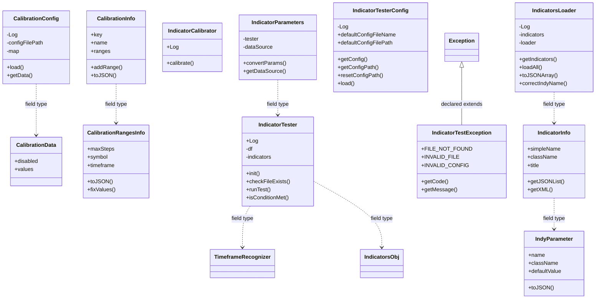

| Diagram identifier | Exact type | Location |
| --- | --- | --- |
| `C003e8b4cb132` | [`com.strategyquant.datalib.data.io.TimeframeRecognizer`](SQDataLib.md) | referenced external type |
| `Cb55e53b5ba03` | `com.strategyquant.indicatorTester.CalibrationConfig` (this JAR) | this diagram |
| `Ce544b2ea689e` | `com.strategyquant.indicatorTester.CalibrationData` (this JAR) | this diagram |
| `Cc604b0254daf` | `com.strategyquant.indicatorTester.CalibrationInfo` (this JAR) | this diagram |
| `C1a3e2b402f41` | `com.strategyquant.indicatorTester.CalibrationRangesInfo` (this JAR) | this diagram |
| `C3ddf03d6350e` | `com.strategyquant.indicatorTester.IndicatorCalibrator` (this JAR) | this diagram |
| `C18fdfe426113` | `com.strategyquant.indicatorTester.IndicatorInfo` (this JAR) | this diagram |
| `C36468af021b3` | `com.strategyquant.indicatorTester.IndicatorParameters` (this JAR) | this diagram |
| `Ca27441aaf170` | `com.strategyquant.indicatorTester.IndicatorTestException` (this JAR) | this diagram |
| `C686f22f7d531` | `com.strategyquant.indicatorTester.IndicatorTester` (this JAR) | this diagram |
| `C958fcbd0b26e` | `com.strategyquant.indicatorTester.IndicatorTesterConfig` (this JAR) | this diagram |
| `C78be169c3a9a` | `com.strategyquant.indicatorTester.IndicatorsLoader` (this JAR) | this diagram |
| `Ccb8ce8b6385a` | `com.strategyquant.indicatorTester.IndyParameter` (this JAR) | this diagram |
| `Cbe504cde2dae` | `com.strategyquant.tradinglib.indicator.IndicatorsObj` (this JAR) | another group in this JAR |
| `C4bc2cd7a4e9d` | `java.lang.Exception` (not resolved in scoped archives) | referenced external type |

### 2. `com.strategyquant.tradinglib` - group 1

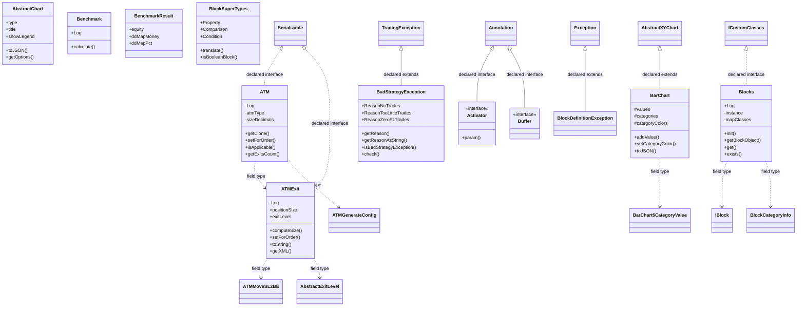

| Diagram identifier | Exact type | Location |
| --- | --- | --- |
| `Cb218b12bb0c9` | [`com.strategyquant.datalib.TradingException`](SQDataLib.md) | referenced external type |
| `C5556d74118e6` | `com.strategyquant.lib.snippets.ICustomClasses` (not resolved in scoped archives) | referenced external type |
| `C33da5e0a010f` | `com.strategyquant.tradinglib.ATM` (this JAR) | this diagram |
| `C6b027ab7dabd` | `com.strategyquant.tradinglib.ATMExit` (this JAR) | this diagram |
| `C1fb904872122` | `com.strategyquant.tradinglib.AbstractChart` (this JAR) | this diagram |
| `Ceba10eda207d` | `com.strategyquant.tradinglib.Activator` (this JAR) | this diagram |
| `Cd4adadfb6923` | `com.strategyquant.tradinglib.BadStrategyException` (this JAR) | this diagram |
| `Ca60c7ad7bfb2` | `com.strategyquant.tradinglib.BarChart` (this JAR) | this diagram |
| `C1a1f3171296f` | `com.strategyquant.tradinglib.BarChart$CategoryValue` (this JAR) | another group in this JAR |
| `C8d6b9944d43a` | `com.strategyquant.tradinglib.Benchmark` (this JAR) | this diagram |
| `Cbd81d291c1b8` | `com.strategyquant.tradinglib.BenchmarkResult` (this JAR) | this diagram |
| `C8a0b61b0487f` | `com.strategyquant.tradinglib.BlockDefinitionException` (this JAR) | this diagram |
| `C0dc6cd277606` | `com.strategyquant.tradinglib.BlockSuperTypes` (this JAR) | this diagram |
| `C895c812600c9` | `com.strategyquant.tradinglib.Blocks` (this JAR) | this diagram |
| `C3956dd669625` | `com.strategyquant.tradinglib.Buffer` (this JAR) | this diagram |
| `C5e64c5194e02` | `com.strategyquant.tradinglib.IBlock` (this JAR) | another group in this JAR |
| `Cec79448b792b` | `com.strategyquant.tradinglib.atm.ATMGenerateConfig` (this JAR) | another group in this JAR |
| `C303a260be2f4` | `com.strategyquant.tradinglib.atm.ATMMoveSL2BE` (this JAR) | another group in this JAR |
| `C1fd61077a0c2` | `com.strategyquant.tradinglib.atm.exits.AbstractExitLevel` (this JAR) | another group in this JAR |
| `C133af6160c62` | `com.strategyquant.tradinglib.blocks.BlockCategoryInfo` (this JAR) | another group in this JAR |
| `C2c658d92d65d` | `com.strategyquant.tradinglib.charts.AbstractXYChart` (this JAR) | another group in this JAR |
| `C210d9b760f82` | `java.io.Serializable` (not resolved in scoped archives) | referenced external type |
| `C4bc2cd7a4e9d` | `java.lang.Exception` (not resolved in scoped archives) | referenced external type |
| `Ce2abf92f3173` | `java.lang.annotation.Annotation` (not resolved in scoped archives) | referenced external type |

### 3. `com.strategyquant.tradinglib` - group 2

```mermaid
classDiagram
    class Cd19e60fc5971["BuildingBlock"] {
        <<interface>>
        +name()
        +display()
        +returnType()
        +mainIndicator()
    }
    class Cc4137006bce0["CategoryOrder"] {
        <<interface>>
        +value()
    }
    class C19f78f7e3d0a["ChartData"] {
        +Log
        +ChartTF_D1
        +ChartTF_W1
        #usesSameDailyDataSeries()
        +chartHashCode()
        #initializeFromMarketData()
        #initializeComputedDataSeries()
    }
    class C78fbf77008e9["ChartSetup"] {
        -charts
        -used
        -minDistance
        +addChart()
        +registerConnectionSymbols()
        +checkConnectionSymbolExist()
        +getCharts()
    }
    class Cd98fd5946789["ChartsConst"] {
        +COLOR_RED
        +COLOR_BLUE
        +COLOR_GREEN
    }
    class C03c833610987["Checker"] {
        +check()
    }
    class Ce14899f7eccc["ClassConfig"] {
        <<interface>>
        +name()
        +category()
        +display()
        +returnType()
        +order()
    }
    class Cbee32e39d3f7["Colors"] {
        +LightSalmon
        +Salmon
        +DarkSalmon
    }
    class C5f362544ec04["CommissionsMethod"] {
        +name
        +setName()
        +getXML()
        +setFromXML()
        +getClone()
        +computeCommissionsOnOpen()
        +computeCommissionsOnClose()
    }
    class Cca72ab5a6bd3["CorrelationLib"] {
        +Log
        +getPeriod()
        +generatePeriods()
        +printPeriod()
        +getCorrectPeriod()
    }
    class C6668765fd615["CorrelationType"] {
        +DATA_TYPE_PL
        +DATA_TYPE_TRADES
        #name
        +getName()
        +getDataType()
        +toString()
        +computePeriods()
    }
    class C4e0104799ec7["CustomAnalysisMethod"] {
        +Log
        +TYPE_PROCESS_DATABANK
        +TYPE_FILTER_STRATEGY
        +getType()
        +filterStrategy()
        +processDatabank()
        +setProjectLog()
    }
    class Cd994a64faafc["ChartDef"]
    class C968f9c287a76["DataSeries"]
    class C04837263807c["IXMLAble"]
    class Cac836f7e20d9["ISQCloneable"]
    class C6fc2cf0f0270["Debugger"]
    class Caae60879bede["ParametersTableItem"]
    class C210d9b760f82["Serializable"]
    class Ce2abf92f3173["Annotation"]
    Ce2abf92f3173 <|-- Cd19e60fc5971 : declared interface
    Ce2abf92f3173 <|-- Cc4137006bce0 : declared interface
    C6fc2cf0f0270 <|-- C19f78f7e3d0a : declared extends
    C210d9b760f82 <|.. C19f78f7e3d0a : declared interface
    C19f78f7e3d0a ..> Cd994a64faafc : field type
    C19f78f7e3d0a ..> C968f9c287a76 : field type
    C04837263807c <|.. C78fbf77008e9 : declared interface
    C210d9b760f82 <|.. C78fbf77008e9 : declared interface
    Cac836f7e20d9 <|.. C78fbf77008e9 : declared interface
    C78fbf77008e9 ..> Cd994a64faafc : field type
    C78fbf77008e9 ..> C5f362544ec04 : field type
    C6fc2cf0f0270 <|-- C03c833610987 : declared extends
    Ce2abf92f3173 <|-- Ce14899f7eccc : declared interface
    Caae60879bede <|-- C5f362544ec04 : declared extends
    C6fc2cf0f0270 <|-- C6668765fd615 : declared extends
    Cac836f7e20d9 <|.. C6668765fd615 : declared interface
    C6fc2cf0f0270 <|-- C4e0104799ec7 : declared extends
```

| Diagram identifier | Exact type | Location |
| --- | --- | --- |
| `Cd994a64faafc` | [`com.strategyquant.datalib.ChartDef`](SQDataLib.md) | referenced external type |
| `C968f9c287a76` | [`com.strategyquant.datalib.DataSeries`](SQDataLib.md) | referenced external type |
| `C04837263807c` | `com.strategyquant.lib.settings.IXMLAble` (not resolved in scoped archives) | referenced external type |
| `Cac836f7e20d9` | `com.strategyquant.lib.utils.ISQCloneable` (not resolved in scoped archives) | referenced external type |
| `Cd19e60fc5971` | `com.strategyquant.tradinglib.BuildingBlock` (this JAR) | this diagram |
| `Cc4137006bce0` | `com.strategyquant.tradinglib.CategoryOrder` (this JAR) | this diagram |
| `C19f78f7e3d0a` | `com.strategyquant.tradinglib.ChartData` (this JAR) | this diagram |
| `C78fbf77008e9` | `com.strategyquant.tradinglib.ChartSetup` (this JAR) | this diagram |
| `Cd98fd5946789` | `com.strategyquant.tradinglib.ChartsConst` (this JAR) | this diagram |
| `C03c833610987` | `com.strategyquant.tradinglib.Checker` (this JAR) | this diagram |
| `Ce14899f7eccc` | `com.strategyquant.tradinglib.ClassConfig` (this JAR) | this diagram |
| `Cbee32e39d3f7` | `com.strategyquant.tradinglib.Colors` (this JAR) | this diagram |
| `C5f362544ec04` | `com.strategyquant.tradinglib.CommissionsMethod` (this JAR) | this diagram |
| `Cca72ab5a6bd3` | `com.strategyquant.tradinglib.CorrelationLib` (this JAR) | this diagram |
| `C6668765fd615` | `com.strategyquant.tradinglib.CorrelationType` (this JAR) | this diagram |
| `C4e0104799ec7` | `com.strategyquant.tradinglib.CustomAnalysisMethod` (this JAR) | this diagram |
| `C6fc2cf0f0270` | `com.strategyquant.tradinglib.debug.Debugger` (this JAR) | another group in this JAR |
| `Caae60879bede` | `com.strategyquant.tradinglib.propertygrid.ParametersTableItem` (this JAR) | another group in this JAR |
| `C210d9b760f82` | `java.io.Serializable` (not resolved in scoped archives) | referenced external type |
| `Ce2abf92f3173` | `java.lang.annotation.Annotation` (not resolved in scoped archives) | referenced external type |

### 4. `com.strategyquant.tradinglib` - group 3

```mermaid
classDiagram
    class C57dae62342e9["CustomCellFormat"] {
        +ValuePositive
        +ValueNegative
        +BackgroundOOS
        +getHtmlContent()
        +reset()
    }
    class Cf1cf5abc550f["Databank"] {
        +Log
        +ACTION_RESULT_ADDED
        +ACTION_RESULT_REMOVED
        +getProject()
        +addListener()
        +removeListener()
        +loadStrategies()
    }
    class Cfc30238bf5c3["DatabankColumn"] {
        #Log
        +valueType
        -target
        +getTarget()
        +getValue()
        +exportValue()
        +getCustomFormat()
    }
    class Cdd96864daca5["DatabankFitness"] {
        +Best
        +Best3
        +Average
    }
    class Ce9130606291f["DatabankSyncTypes"] {
        +IMMEDIATELY
        +NEVER
        +EVERY_10_MINUTES
        +getTimeout()
    }
    class Cd5cf02d017ae["Description"] {
        <<interface>>
        +value()
    }
    class C5e67c6ad38b2["Directions"] {
        +Both
        +Long
        +Short
        +typeToString()
    }
    class Ca8debbfa554a["Editor"] {
        <<interface>>
        +type()
        +formulaName()
        +allowVariables()
        +values()
    }
    class C7c1b2dc658cf["Editors"] {
        +RecognizeByType
        +Spinner
        +SpinnerWithVariables
        +convertToWizardConstant()
        +convertTimeToHHMM()
    }
    class C79688152633d["EngineChart"] {
        +Log
        +DATA_TYPE_CHART
        +DATA_TYPE_GRID
        +toString()
        +getType()
        +setProject()
        +addNextValue()
    }
    class Ce3576291cfa2["ExitMethod"] {
        -UseInitialSLPTHash
        +Log
        +Strategy
        +computeValue()
        +setForOrder()
        +newInstance()
        +generateXmlParams()
    }
    class C61a514d3d34a["ExitType"] {
        <<interface>>
        +value()
    }
    class C5e64c5194e02["IBlock"]
    class C978e1f4d7e6d["IFitnessValue"]
    class C75c3b57e2c4b["StrategyBase"]
    class C792bbc67ab21["DatabankRecords"]
    class Cba8587482cc6["DatabankTableView"]
    class C6fc2cf0f0270["Debugger"]
    class C8241bc919d95["SQProject"]
    class C5e54b9e47934["TableColumn"]
    class C2efe767e1695["JSONAble"]
    class C210d9b760f82["Serializable"]
    class Ce2abf92f3173["Annotation"]
    C210d9b760f82 <|.. Cf1cf5abc550f : declared interface
    Cf1cf5abc550f ..> C792bbc67ab21 : field type
    Cf1cf5abc550f ..> Cba8587482cc6 : field type
    C5e54b9e47934 <|-- Cfc30238bf5c3 : declared extends
    C978e1f4d7e6d <|.. Cfc30238bf5c3 : declared interface
    C2efe767e1695 <|-- Ce9130606291f : declared extends
    Ce2abf92f3173 <|-- Cd5cf02d017ae : declared interface
    Ce2abf92f3173 <|-- Ca8debbfa554a : declared interface
    C6fc2cf0f0270 <|-- C79688152633d : declared extends
    C79688152633d ..> C8241bc919d95 : field type
    C6fc2cf0f0270 <|-- Ce3576291cfa2 : declared extends
    C5e64c5194e02 <|.. Ce3576291cfa2 : declared interface
    Ce3576291cfa2 ..> C75c3b57e2c4b : field type
    Ce2abf92f3173 <|-- C61a514d3d34a : declared interface
```

| Diagram identifier | Exact type | Location |
| --- | --- | --- |
| `C57dae62342e9` | `com.strategyquant.tradinglib.CustomCellFormat` (this JAR) | this diagram |
| `Cf1cf5abc550f` | `com.strategyquant.tradinglib.Databank` (this JAR) | this diagram |
| `Cfc30238bf5c3` | `com.strategyquant.tradinglib.DatabankColumn` (this JAR) | this diagram |
| `Cdd96864daca5` | `com.strategyquant.tradinglib.DatabankFitness` (this JAR) | this diagram |
| `Ce9130606291f` | `com.strategyquant.tradinglib.DatabankSyncTypes` (this JAR) | this diagram |
| `Cd5cf02d017ae` | `com.strategyquant.tradinglib.Description` (this JAR) | this diagram |
| `C5e67c6ad38b2` | `com.strategyquant.tradinglib.Directions` (this JAR) | this diagram |
| `Ca8debbfa554a` | `com.strategyquant.tradinglib.Editor` (this JAR) | this diagram |
| `C7c1b2dc658cf` | `com.strategyquant.tradinglib.Editors` (this JAR) | this diagram |
| `C79688152633d` | `com.strategyquant.tradinglib.EngineChart` (this JAR) | this diagram |
| `Ce3576291cfa2` | `com.strategyquant.tradinglib.ExitMethod` (this JAR) | this diagram |
| `C61a514d3d34a` | `com.strategyquant.tradinglib.ExitType` (this JAR) | this diagram |
| `C5e64c5194e02` | `com.strategyquant.tradinglib.IBlock` (this JAR) | another group in this JAR |
| `C978e1f4d7e6d` | `com.strategyquant.tradinglib.IFitnessValue` (this JAR) | another group in this JAR |
| `C75c3b57e2c4b` | `com.strategyquant.tradinglib.StrategyBase` (this JAR) | another group in this JAR |
| `C792bbc67ab21` | `com.strategyquant.tradinglib.databank.DatabankRecords` (this JAR) | another group in this JAR |
| `Cba8587482cc6` | `com.strategyquant.tradinglib.databank.DatabankTableView` (this JAR) | another group in this JAR |
| `C6fc2cf0f0270` | `com.strategyquant.tradinglib.debug.Debugger` (this JAR) | another group in this JAR |
| `C8241bc919d95` | `com.strategyquant.tradinglib.project.SQProject` (this JAR) | another group in this JAR |
| `C5e54b9e47934` | `com.strategyquant.tradinglib.table.TableColumn` (this JAR) | another group in this JAR |
| `C2efe767e1695` | `com.strategyquant.tradinglib.task.settings.buildmode.JSONAble` (this JAR) | another group in this JAR |
| `C210d9b760f82` | `java.io.Serializable` (not resolved in scoped archives) | referenced external type |
| `Ce2abf92f3173` | `java.lang.annotation.Annotation` (not resolved in scoped archives) | referenced external type |

### 5. `com.strategyquant.tradinglib` - group 4

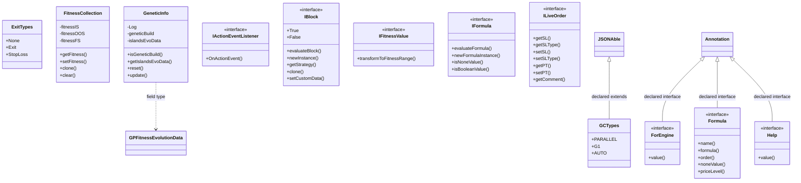

| Diagram identifier | Exact type | Location |
| --- | --- | --- |
| `C9c23a37ae694` | `com.strategyquant.tradinglib.ExitTypes` (this JAR) | this diagram |
| `C10ba3db44317` | `com.strategyquant.tradinglib.FitnessCollection` (this JAR) | this diagram |
| `Ceabf34990392` | `com.strategyquant.tradinglib.ForEngine` (this JAR) | this diagram |
| `C309d19101b4a` | `com.strategyquant.tradinglib.Formula` (this JAR) | this diagram |
| `Cd4bde9dc7c1a` | `com.strategyquant.tradinglib.GCTypes` (this JAR) | this diagram |
| `C601a89ec2d05` | `com.strategyquant.tradinglib.GeneticInfo` (this JAR) | this diagram |
| `C6de55a292443` | `com.strategyquant.tradinglib.Help` (this JAR) | this diagram |
| `C2f75767113b8` | `com.strategyquant.tradinglib.IActionEventListener` (this JAR) | this diagram |
| `C5e64c5194e02` | `com.strategyquant.tradinglib.IBlock` (this JAR) | this diagram |
| `C978e1f4d7e6d` | `com.strategyquant.tradinglib.IFitnessValue` (this JAR) | this diagram |
| `C80df177686e1` | `com.strategyquant.tradinglib.IFormula` (this JAR) | this diagram |
| `Cb46e3f38fece` | `com.strategyquant.tradinglib.ILiveOrder` (this JAR) | this diagram |
| `C853779b17161` | `com.strategyquant.tradinglib.gp.GPFitnessEvolutionData` (this JAR) | another group in this JAR |
| `C2efe767e1695` | `com.strategyquant.tradinglib.task.settings.buildmode.JSONAble` (this JAR) | another group in this JAR |
| `Ce2abf92f3173` | `java.lang.annotation.Annotation` (not resolved in scoped archives) | referenced external type |

### 6. `com.strategyquant.tradinglib` - group 5

```mermaid
classDiagram
    class C46178b00a63d["IParametersHelperModifier"] {
        <<interface>>
        +modifyParameterValue()
    }
    class Cdb4bb47ede67["IgnoreInBuilder"] {
        <<interface>>
    }
    class C7b4f3b8a42a1["Indicator"] {
        <<interface>>
        +oscillator()
        +middleValue()
        +min()
        +max()
        +step()
    }
    class C71179e259dc5["MT5ExtendedTemplate"] {
        <<interface>>
    }
    class Ccd7e8ec367a8["MemoryCleaner"] {
        +Log
        +NEVER
        +EVERY_10_SECONDS
        +init()
        +cleanNow()
        +checkType()
    }
    class Cfff30d9bf9d8["MoneyManagementMethod"] {
        +name
        -equity
        -initialCapital
        +setName()
        #getEquity()
        +getInitialCapital()
        +setInitialCapital()
    }
    class C752e7da92136["MonteCarloManipulation"] {
        +modifyTrades()
        +getClone()
    }
    class C1e78871ea9f6["MonteCarloRetest"] {
        -type
        #settings
        +getType()
        +modifySettings()
        +modifyData()
        +getClone()
        +initSettings()
    }
    class Ce919cd279afa["MonteCarloTestTypes"] {
        +ModifySettings
        +ModifyData
        +ModifyFinalOrders
    }
    class C79f4ee315f85["Negater"] {
        +negate()
        #getOscillatorMiddleValue()
        #isOscillatorIndicator()
        #getOutputIndexField()
    }
    class C19300247f704["NegatersList"] {
        +Log
        +negate()
    }
    class C232393fbfeab["NoShift"] {
        <<interface>>
    }
    class Cac836f7e20d9["ISQCloneable"]
    class C6fc2cf0f0270["Debugger"]
    class Caae60879bede["ParametersTableItem"]
    class C2ac004eca1f0["ObjectArrayList"]
    class Ce2abf92f3173["Annotation"]
    Ce2abf92f3173 <|-- Cdb4bb47ede67 : declared interface
    Ce2abf92f3173 <|-- C7b4f3b8a42a1 : declared interface
    Ce2abf92f3173 <|-- C71179e259dc5 : declared interface
    Caae60879bede <|-- Cfff30d9bf9d8 : declared extends
    Cac836f7e20d9 <|.. Cfff30d9bf9d8 : declared interface
    Caae60879bede <|-- C752e7da92136 : declared extends
    Cac836f7e20d9 <|.. C752e7da92136 : declared interface
    Caae60879bede <|-- C1e78871ea9f6 : declared extends
    Cac836f7e20d9 <|.. C1e78871ea9f6 : declared interface
    C6fc2cf0f0270 <|-- C79f4ee315f85 : declared extends
    C2ac004eca1f0 <|-- C19300247f704 : declared extends
    Ce2abf92f3173 <|-- C232393fbfeab : declared interface
```

| Diagram identifier | Exact type | Location |
| --- | --- | --- |
| `Cac836f7e20d9` | `com.strategyquant.lib.utils.ISQCloneable` (not resolved in scoped archives) | referenced external type |
| `C46178b00a63d` | `com.strategyquant.tradinglib.IParametersHelperModifier` (this JAR) | this diagram |
| `Cdb4bb47ede67` | `com.strategyquant.tradinglib.IgnoreInBuilder` (this JAR) | this diagram |
| `C7b4f3b8a42a1` | `com.strategyquant.tradinglib.Indicator` (this JAR) | this diagram |
| `C71179e259dc5` | `com.strategyquant.tradinglib.MT5ExtendedTemplate` (this JAR) | this diagram |
| `Ccd7e8ec367a8` | `com.strategyquant.tradinglib.MemoryCleaner` (this JAR) | this diagram |
| `Cfff30d9bf9d8` | `com.strategyquant.tradinglib.MoneyManagementMethod` (this JAR) | this diagram |
| `C752e7da92136` | `com.strategyquant.tradinglib.MonteCarloManipulation` (this JAR) | this diagram |
| `C1e78871ea9f6` | `com.strategyquant.tradinglib.MonteCarloRetest` (this JAR) | this diagram |
| `Ce919cd279afa` | `com.strategyquant.tradinglib.MonteCarloTestTypes` (this JAR) | this diagram |
| `C79f4ee315f85` | `com.strategyquant.tradinglib.Negater` (this JAR) | this diagram |
| `C19300247f704` | `com.strategyquant.tradinglib.NegatersList` (this JAR) | this diagram |
| `C232393fbfeab` | `com.strategyquant.tradinglib.NoShift` (this JAR) | this diagram |
| `C6fc2cf0f0270` | `com.strategyquant.tradinglib.debug.Debugger` (this JAR) | another group in this JAR |
| `Caae60879bede` | `com.strategyquant.tradinglib.propertygrid.ParametersTableItem` (this JAR) | another group in this JAR |
| `C2ac004eca1f0` | `it.unimi.dsi.fastutil.objects.ObjectArrayList` (not resolved in scoped archives) | referenced external type |
| `Ce2abf92f3173` | `java.lang.annotation.Annotation` (not resolved in scoped archives) | referenced external type |

### 7. `com.strategyquant.tradinglib` - group 6

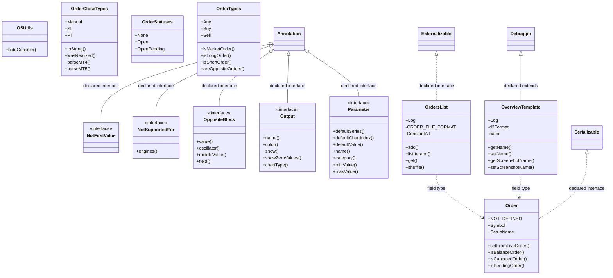

| Diagram identifier | Exact type | Location |
| --- | --- | --- |
| `Cfd90dda923f1` | `com.strategyquant.tradinglib.NotFirstValue` (this JAR) | this diagram |
| `C28c7882367bb` | `com.strategyquant.tradinglib.NotSupportedFor` (this JAR) | this diagram |
| `C4a2ab72d90c1` | `com.strategyquant.tradinglib.OSUtils` (this JAR) | this diagram |
| `C51c16c5cf08b` | `com.strategyquant.tradinglib.OppositeBlock` (this JAR) | this diagram |
| `C5edd3fc0ac53` | `com.strategyquant.tradinglib.Order` (this JAR) | this diagram |
| `Ca177106a8e04` | `com.strategyquant.tradinglib.OrderCloseTypes` (this JAR) | this diagram |
| `C594dd3d8a12a` | `com.strategyquant.tradinglib.OrderStatuses` (this JAR) | this diagram |
| `C5d42bdb86680` | `com.strategyquant.tradinglib.OrderTypes` (this JAR) | this diagram |
| `C9c24371a456a` | `com.strategyquant.tradinglib.OrdersList` (this JAR) | this diagram |
| `Ca2e2a47606c6` | `com.strategyquant.tradinglib.Output` (this JAR) | this diagram |
| `Ca5122560c854` | `com.strategyquant.tradinglib.OverviewTemplate` (this JAR) | this diagram |
| `C246827a42577` | `com.strategyquant.tradinglib.Parameter` (this JAR) | this diagram |
| `C6fc2cf0f0270` | `com.strategyquant.tradinglib.debug.Debugger` (this JAR) | another group in this JAR |
| `Cd25bc5cf9165` | `java.io.Externalizable` (not resolved in scoped archives) | referenced external type |
| `C210d9b760f82` | `java.io.Serializable` (not resolved in scoped archives) | referenced external type |
| `Ce2abf92f3173` | `java.lang.annotation.Annotation` (not resolved in scoped archives) | referenced external type |

### 8. `com.strategyquant.tradinglib` - group 7

```mermaid
classDiagram
    class C8d5e64c073e0["ParameterSet"] {
        <<interface>>
        +weight()
        +set()
    }
    class Ca0c0e1ea3486["ParametersHelper"] {
        +Log
        +setParameterValue()
        +getParameterValue()
        +getParameters()
        +setFieldValue()
        +getFieldValue()
        +copyParametersFromBlockToBlock()
    }
    class C7f67c400dd3c["ParametrizationTypes"] {
        +ParamTypeRecommended
        +ParamTypePeriod
        +ParamTypeShift
    }
    class C4e2fb0311a16["PieChart"] {
        -sections
        +addValue()
        +getSectionByLabel()
        +toJSON()
    }
    class C5316f5791218["PlTypes"] {
        +Money
        +Percent
        +Pips
        +print()
        +printPL()
        +isValid()
        +typeToString()
    }
    class Ce3494633927b["PortfolioInitialBalanceTypes"] {
        +SINGLE
        +SUM
    }
    class C80df11d20f10["PrecachedRequest"] {
        <<interface>>
        +relativeURL()
    }
    class Cd7fd2d2f192f["ProjectRunInfo"] {
        +ERROR_TYPE_GENERAL
        +ERROR_TYPE_FATAL
        +backtestsPerformed
        +copyFrom()
        +increaseDismissalReasonCount()
        +getDismissalReasons()
        +getDismissalCounts()
    }
    class Cf92bd2a6fb2a["ReportGenerator"] {
        #file
        -strategyResult
        -chartsResolved
        +drawValues()
        #resolveCharts()
        #addErrorsTable()
        +replaceValues()
    }
    class Cf43a421fcdee["Required"] {
        <<interface>>
    }
    class Ce9ca2f9c051e["Result"] {
        +Log
        -ignoredSettings
        -resultsGroup
        +clone()
        +setFrom()
        +stats()
        +statsOrNull()
    }
    class C15785f8f35e1["ResultTypes"] {
        +Main
        +Portfolio
        +allCrossChecks
        +typeToString()
        +isCrossCheck()
        +findCrossCheckByType()
        +isValid()
    }
    class Cba1d30d75839["ValuesMap"]
    class C1fb904872122["AbstractChart"]
    class C10ba3db44317["FitnessCollection"]
    class Ca5122560c854["OverviewTemplate"]
    class Ca12cf25ad1a8["PieChart$Section"]
    class C81fcbc41b716["ResultsGroup"]
    class C45f5c1216734["ICrossCheck"]
    class C451a2721816b["ComplexDurationStats"]
    class C6128eed56b6d["DataToSend"]
    class C2efe767e1695["JSONAble"]
    class Ce2abf92f3173["Annotation"]
    Ce2abf92f3173 <|-- C8d5e64c073e0 : declared interface
    C1fb904872122 <|-- C4e2fb0311a16 : declared extends
    C4e2fb0311a16 ..> Ca12cf25ad1a8 : field type
    C2efe767e1695 <|-- Ce3494633927b : declared extends
    Ce2abf92f3173 <|-- C80df11d20f10 : declared interface
    Cd7fd2d2f192f ..> C451a2721816b : field type
    Ca5122560c854 <|-- Cf92bd2a6fb2a : declared extends
    Cf92bd2a6fb2a ..> C81fcbc41b716 : field type
    Cf92bd2a6fb2a ..> C6128eed56b6d : field type
    Ce2abf92f3173 <|-- Cf43a421fcdee : declared interface
    Cba1d30d75839 <|-- Ce9ca2f9c051e : declared extends
    Ce9ca2f9c051e ..> C10ba3db44317 : field type
    Ce9ca2f9c051e ..> C81fcbc41b716 : field type
    C15785f8f35e1 ..> C45f5c1216734 : field type
```

| Diagram identifier | Exact type | Location |
| --- | --- | --- |
| `Cba1d30d75839` | `com.strategyquant.lib.ValuesMap` (not resolved in scoped archives) | referenced external type |
| `C1fb904872122` | `com.strategyquant.tradinglib.AbstractChart` (this JAR) | another group in this JAR |
| `C10ba3db44317` | `com.strategyquant.tradinglib.FitnessCollection` (this JAR) | another group in this JAR |
| `Ca5122560c854` | `com.strategyquant.tradinglib.OverviewTemplate` (this JAR) | another group in this JAR |
| `C8d5e64c073e0` | `com.strategyquant.tradinglib.ParameterSet` (this JAR) | this diagram |
| `Ca0c0e1ea3486` | `com.strategyquant.tradinglib.ParametersHelper` (this JAR) | this diagram |
| `C7f67c400dd3c` | `com.strategyquant.tradinglib.ParametrizationTypes` (this JAR) | this diagram |
| `C4e2fb0311a16` | `com.strategyquant.tradinglib.PieChart` (this JAR) | this diagram |
| `Ca12cf25ad1a8` | `com.strategyquant.tradinglib.PieChart$Section` (this JAR) | another group in this JAR |
| `C5316f5791218` | `com.strategyquant.tradinglib.PlTypes` (this JAR) | this diagram |
| `Ce3494633927b` | `com.strategyquant.tradinglib.PortfolioInitialBalanceTypes` (this JAR) | this diagram |
| `C80df11d20f10` | `com.strategyquant.tradinglib.PrecachedRequest` (this JAR) | this diagram |
| `Cd7fd2d2f192f` | `com.strategyquant.tradinglib.ProjectRunInfo` (this JAR) | this diagram |
| `Cf92bd2a6fb2a` | `com.strategyquant.tradinglib.ReportGenerator` (this JAR) | this diagram |
| `Cf43a421fcdee` | `com.strategyquant.tradinglib.Required` (this JAR) | this diagram |
| `Ce9ca2f9c051e` | `com.strategyquant.tradinglib.Result` (this JAR) | this diagram |
| `C15785f8f35e1` | `com.strategyquant.tradinglib.ResultTypes` (this JAR) | this diagram |
| `C81fcbc41b716` | `com.strategyquant.tradinglib.ResultsGroup` (this JAR) | another group in this JAR |
| `C45f5c1216734` | `com.strategyquant.tradinglib.crosscheck.ICrossCheck` (this JAR) | another group in this JAR |
| `C451a2721816b` | `com.strategyquant.tradinglib.project.ComplexDurationStats` (this JAR) | another group in this JAR |
| `C6128eed56b6d` | `com.strategyquant.tradinglib.project.websocket.DataToSend` (this JAR) | another group in this JAR |
| `C2efe767e1695` | `com.strategyquant.tradinglib.task.settings.buildmode.JSONAble` (this JAR) | another group in this JAR |
| `Ce2abf92f3173` | `java.lang.annotation.Annotation` (not resolved in scoped archives) | referenced external type |

### 9. `com.strategyquant.tradinglib` - group 8

```mermaid
classDiagram
    class C81fcbc41b716["ResultsGroup"] {
        +Log
        +Portfolio
        +MergedPortfolio
        +init()
        +getName()
        +setName()
        +addResultSymbol()
    }
    class C4582e2eef547["ReturnTypes"] {
        +None
        +Number
        +Price
        +translateReturnType()
        +translate()
    }
    class Caece7e04ccef["RiskManagementMethod"] {
        -equity
        -decimals
        +setName()
        #getEquity()
        #getDecimals()
        +getXML()
        +setFromXML()
    }
    class C2ef4e84afc9b["SLPTValue"] {
        <<interface>>
        +value()
    }
    class C7f6391604170["SLPTValues"] {
        +ValueInPips
        +ATRMultiple
        +ATRPeriod
    }
    class C4e38362b7f96["SQStats"] {
        +Log
        -intValues
        -doubleValues
        +set()
        +getInt()
        +getLong()
        +getDouble()
    }
    class C27fdf9aa6df8["SampleTypes"] {
        +FullSample
        +InSample
        +InSampleTraining
        +types()
        +typeToString()
        +isOOS()
        +isISV()
    }
    class C51f3dc5820e0["ScalingMethod"] {
        +name
        +setName()
        +getXML()
        +setFromXML()
    }
    class Cb83f36e3751f["ScatterChart"] {
        -seriesCollection
        +addSeries()
        +getSeries()
        +getSeriesCollection()
        +toJSON()
    }
    class C26a438ba5f2f["SettingsKeys"] {
        +TaskSetting_Options
        +TaskSetting_Data
        +TaskSetting_StrategyRanking
    }
    class Cb0fcf92c9d11["SortOrder"] {
        <<interface>>
        +value()
    }
    class C3d5aba9d5604["StatsDontExistException"] {
    }
    class C04837263807c["IXMLAble"]
    class Cac836f7e20d9["ISQCloneable"]
    class Cf1cf5abc550f["Databank"]
    class C9c24371a456a["OrdersList"]
    class C2c658d92d65d["AbstractXYChart"]
    class C0180f8fb3329["XYSeries"]
    class Caae60879bede["ParametersTableItem"]
    class C210d9b760f82["Serializable"]
    class C4bc2cd7a4e9d["Exception"]
    class Ce2abf92f3173["Annotation"]
    C04837263807c <|.. C81fcbc41b716 : declared interface
    C210d9b760f82 <|.. C81fcbc41b716 : declared interface
    C81fcbc41b716 ..> Cf1cf5abc550f : field type
    C81fcbc41b716 ..> C9c24371a456a : field type
    Caae60879bede <|-- Caece7e04ccef : declared extends
    Cac836f7e20d9 <|.. Caece7e04ccef : declared interface
    Ce2abf92f3173 <|-- C2ef4e84afc9b : declared interface
    C04837263807c <|.. C4e38362b7f96 : declared interface
    Cac836f7e20d9 <|.. C4e38362b7f96 : declared interface
    Caae60879bede <|-- C51f3dc5820e0 : declared extends
    C2c658d92d65d <|-- Cb83f36e3751f : declared extends
    Cb83f36e3751f ..> C0180f8fb3329 : field type
    Ce2abf92f3173 <|-- Cb0fcf92c9d11 : declared interface
    C4bc2cd7a4e9d <|-- C3d5aba9d5604 : declared extends
```

| Diagram identifier | Exact type | Location |
| --- | --- | --- |
| `C04837263807c` | `com.strategyquant.lib.settings.IXMLAble` (not resolved in scoped archives) | referenced external type |
| `Cac836f7e20d9` | `com.strategyquant.lib.utils.ISQCloneable` (not resolved in scoped archives) | referenced external type |
| `Cf1cf5abc550f` | `com.strategyquant.tradinglib.Databank` (this JAR) | another group in this JAR |
| `C9c24371a456a` | `com.strategyquant.tradinglib.OrdersList` (this JAR) | another group in this JAR |
| `C81fcbc41b716` | `com.strategyquant.tradinglib.ResultsGroup` (this JAR) | this diagram |
| `C4582e2eef547` | `com.strategyquant.tradinglib.ReturnTypes` (this JAR) | this diagram |
| `Caece7e04ccef` | `com.strategyquant.tradinglib.RiskManagementMethod` (this JAR) | this diagram |
| `C2ef4e84afc9b` | `com.strategyquant.tradinglib.SLPTValue` (this JAR) | this diagram |
| `C7f6391604170` | `com.strategyquant.tradinglib.SLPTValues` (this JAR) | this diagram |
| `C4e38362b7f96` | `com.strategyquant.tradinglib.SQStats` (this JAR) | this diagram |
| `C27fdf9aa6df8` | `com.strategyquant.tradinglib.SampleTypes` (this JAR) | this diagram |
| `C51f3dc5820e0` | `com.strategyquant.tradinglib.ScalingMethod` (this JAR) | this diagram |
| `Cb83f36e3751f` | `com.strategyquant.tradinglib.ScatterChart` (this JAR) | this diagram |
| `C26a438ba5f2f` | `com.strategyquant.tradinglib.SettingsKeys` (this JAR) | this diagram |
| `Cb0fcf92c9d11` | `com.strategyquant.tradinglib.SortOrder` (this JAR) | this diagram |
| `C3d5aba9d5604` | `com.strategyquant.tradinglib.StatsDontExistException` (this JAR) | this diagram |
| `C2c658d92d65d` | `com.strategyquant.tradinglib.charts.AbstractXYChart` (this JAR) | another group in this JAR |
| `C0180f8fb3329` | `com.strategyquant.tradinglib.charts.linechart.series.XYSeries` (this JAR) | another group in this JAR |
| `Caae60879bede` | `com.strategyquant.tradinglib.propertygrid.ParametersTableItem` (this JAR) | another group in this JAR |
| `C210d9b760f82` | `java.io.Serializable` (not resolved in scoped archives) | referenced external type |
| `C4bc2cd7a4e9d` | `java.lang.Exception` (not resolved in scoped archives) | referenced external type |
| `Ce2abf92f3173` | `java.lang.annotation.Annotation` (not resolved in scoped archives) | referenced external type |

### 10. `com.strategyquant.tradinglib` - group 9

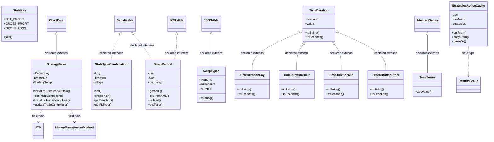

| Diagram identifier | Exact type | Location |
| --- | --- | --- |
| `C04837263807c` | `com.strategyquant.lib.settings.IXMLAble` (not resolved in scoped archives) | referenced external type |
| `C33da5e0a010f` | `com.strategyquant.tradinglib.ATM` (this JAR) | another group in this JAR |
| `C19f78f7e3d0a` | `com.strategyquant.tradinglib.ChartData` (this JAR) | another group in this JAR |
| `Cfff30d9bf9d8` | `com.strategyquant.tradinglib.MoneyManagementMethod` (this JAR) | another group in this JAR |
| `C81fcbc41b716` | `com.strategyquant.tradinglib.ResultsGroup` (this JAR) | another group in this JAR |
| `Ceb4ece980df5` | `com.strategyquant.tradinglib.StatsKey` (this JAR) | this diagram |
| `Cbb7cf3f86915` | `com.strategyquant.tradinglib.StatsTypeCombination` (this JAR) | this diagram |
| `C68278de4e84d` | `com.strategyquant.tradinglib.StrategiesActionCache` (this JAR) | this diagram |
| `C75c3b57e2c4b` | `com.strategyquant.tradinglib.StrategyBase` (this JAR) | this diagram |
| `Cafcb9b78876e` | `com.strategyquant.tradinglib.SwapMethod` (this JAR) | this diagram |
| `Cc67431d5cd42` | `com.strategyquant.tradinglib.SwapTypes` (this JAR) | this diagram |
| `C952ffa1619b7` | `com.strategyquant.tradinglib.TimeDuration` (this JAR) | this diagram |
| `C80e6d19ce650` | `com.strategyquant.tradinglib.TimeDurationDay` (this JAR) | this diagram |
| `C3ef5a85dc99c` | `com.strategyquant.tradinglib.TimeDurationHour` (this JAR) | this diagram |
| `Cfd53e47ed92d` | `com.strategyquant.tradinglib.TimeDurationMin` (this JAR) | this diagram |
| `C518d8ab423f6` | `com.strategyquant.tradinglib.TimeDurationOther` (this JAR) | this diagram |
| `Cff8b0358cce9` | `com.strategyquant.tradinglib.TimeSeries` (this JAR) | this diagram |
| `C2e689e69691a` | `com.strategyquant.tradinglib.charts.linechart.series.AbstractSeries` (this JAR) | another group in this JAR |
| `C2efe767e1695` | `com.strategyquant.tradinglib.task.settings.buildmode.JSONAble` (this JAR) | another group in this JAR |
| `C210d9b760f82` | `java.io.Serializable` (not resolved in scoped archives) | referenced external type |

### 11. `com.strategyquant.tradinglib` - group 10

```mermaid
classDiagram
    class C9c9134b09b40["TimeSeriesAreaChart"] {
        -seriesCollection
        +addSeries()
        +getSeries()
        +getSeriesCollection()
        +toJSON()
    }
    class C98e5654d4cfb["TimeSeriesLineChart"] {
        +Log
        -seriesCollection
        +PointsCount
        +addSeries()
        +getSeries()
        +getSeriesCollection()
        +toJSON()
    }
    class C6f9442ed3ae8["TimeSeriesScatterChart"] {
        -seriesCollection
        +addSeries()
        +getSeries()
        +getSeriesCollection()
        +toJSON()
    }
    class C6268814f4a96["TradeAnalysisChart"] {
        +Log
        +name
        +toString()
        +draw()
        #monthToString()
        #dayToString()
        #calculateTimeDurationScale()
    }
    class C95e4354b37ae["TradeSizeSmallerThanOneException"] {
    }
    class C7c00f9e5de7b["TradelistColumn"] {
        +setValue()
        +getValue()
        +getFormattedValue()
    }
    class C02f7e33e2742["Trader"] {
        -ee
        -name
        -tradingSimulator
        +setStrategy()
        +getStrategy()
        +getName()
        +initialize()
    }
    class C5cd4884e5cdc["TradingOption"] {
        #inbuild
        +isInbuild()
        +OnBarUpdate()
        +isUsedInTrading()
        +OnTick()
        +getClone()
    }
    class Ce5f7590b1ee9["TradingUtils"] {
        +getStrategy()
    }
    class Ca6c2d8f89beb["TripleSwapOptions"] {
        +MONDAY
        +TUESDAY
        +WEDNESDAY
    }
    class C41257e36f558["ValueTypes"] {
        +Maximize
        +Minimize
        +Aproximate
        +typeToString()
        +getTypes()
    }
    class Cb35de306ffa5["Variable"] {
        +Log
        +TypeUnknown
        +TypeInt
        +getId()
        +getValue()
        +getName()
        +getType()
    }
    class Cac836f7e20d9["ISQCloneable"]
    class C1fb904872122["AbstractChart"]
    class Cfff30d9bf9d8["MoneyManagementMethod"]
    class C5edd3fc0ac53["Order"]
    class Cff8b0358cce9["TimeSeries"]
    class C4cc3dfdd8130["Variable$AttachedField"]
    class C2c658d92d65d["AbstractXYChart"]
    class C6fc2cf0f0270["Debugger"]
    class Caae60879bede["ParametersTableItem"]
    class C5e54b9e47934["TableColumn"]
    class C2efe767e1695["JSONAble"]
    class C4bc2cd7a4e9d["Exception"]
    C2c658d92d65d <|-- C9c9134b09b40 : declared extends
    C9c9134b09b40 ..> Cff8b0358cce9 : field type
    C2c658d92d65d <|-- C98e5654d4cfb : declared extends
    C98e5654d4cfb ..> Cff8b0358cce9 : field type
    C1fb904872122 <|-- C6f9442ed3ae8 : declared extends
    C6f9442ed3ae8 ..> Cff8b0358cce9 : field type
    C6fc2cf0f0270 <|-- C6268814f4a96 : declared extends
    C4bc2cd7a4e9d <|-- C95e4354b37ae : declared extends
    C5e54b9e47934 <|-- C7c00f9e5de7b : declared extends
    C02f7e33e2742 ..> Cfff30d9bf9d8 : field type
    C02f7e33e2742 ..> C5edd3fc0ac53 : field type
    Caae60879bede <|-- C5cd4884e5cdc : declared extends
    Cac836f7e20d9 <|.. C5cd4884e5cdc : declared interface
    C2efe767e1695 <|-- Ca6c2d8f89beb : declared extends
    Cb35de306ffa5 ..> C4cc3dfdd8130 : field type
```

| Diagram identifier | Exact type | Location |
| --- | --- | --- |
| `Cac836f7e20d9` | `com.strategyquant.lib.utils.ISQCloneable` (not resolved in scoped archives) | referenced external type |
| `C1fb904872122` | `com.strategyquant.tradinglib.AbstractChart` (this JAR) | another group in this JAR |
| `Cfff30d9bf9d8` | `com.strategyquant.tradinglib.MoneyManagementMethod` (this JAR) | another group in this JAR |
| `C5edd3fc0ac53` | `com.strategyquant.tradinglib.Order` (this JAR) | another group in this JAR |
| `Cff8b0358cce9` | `com.strategyquant.tradinglib.TimeSeries` (this JAR) | another group in this JAR |
| `C9c9134b09b40` | `com.strategyquant.tradinglib.TimeSeriesAreaChart` (this JAR) | this diagram |
| `C98e5654d4cfb` | `com.strategyquant.tradinglib.TimeSeriesLineChart` (this JAR) | this diagram |
| `C6f9442ed3ae8` | `com.strategyquant.tradinglib.TimeSeriesScatterChart` (this JAR) | this diagram |
| `C6268814f4a96` | `com.strategyquant.tradinglib.TradeAnalysisChart` (this JAR) | this diagram |
| `C95e4354b37ae` | `com.strategyquant.tradinglib.TradeSizeSmallerThanOneException` (this JAR) | this diagram |
| `C7c00f9e5de7b` | `com.strategyquant.tradinglib.TradelistColumn` (this JAR) | this diagram |
| `C02f7e33e2742` | `com.strategyquant.tradinglib.Trader` (this JAR) | this diagram |
| `C5cd4884e5cdc` | `com.strategyquant.tradinglib.TradingOption` (this JAR) | this diagram |
| `Ce5f7590b1ee9` | `com.strategyquant.tradinglib.TradingUtils` (this JAR) | this diagram |
| `Ca6c2d8f89beb` | `com.strategyquant.tradinglib.TripleSwapOptions` (this JAR) | this diagram |
| `C41257e36f558` | `com.strategyquant.tradinglib.ValueTypes` (this JAR) | this diagram |
| `Cb35de306ffa5` | `com.strategyquant.tradinglib.Variable` (this JAR) | this diagram |
| `C4cc3dfdd8130` | `com.strategyquant.tradinglib.Variable$AttachedField` (this JAR) | another group in this JAR |
| `C2c658d92d65d` | `com.strategyquant.tradinglib.charts.AbstractXYChart` (this JAR) | another group in this JAR |
| `C6fc2cf0f0270` | `com.strategyquant.tradinglib.debug.Debugger` (this JAR) | another group in this JAR |
| `Caae60879bede` | `com.strategyquant.tradinglib.propertygrid.ParametersTableItem` (this JAR) | another group in this JAR |
| `C5e54b9e47934` | `com.strategyquant.tradinglib.table.TableColumn` (this JAR) | another group in this JAR |
| `C2efe767e1695` | `com.strategyquant.tradinglib.task.settings.buildmode.JSONAble` (this JAR) | another group in this JAR |
| `C4bc2cd7a4e9d` | `java.lang.Exception` (not resolved in scoped archives) | referenced external type |

### 12. `com.strategyquant.tradinglib` - group 11

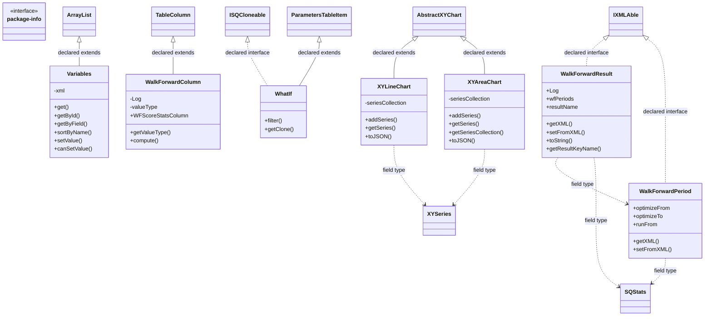

| Diagram identifier | Exact type | Location |
| --- | --- | --- |
| `C04837263807c` | `com.strategyquant.lib.settings.IXMLAble` (not resolved in scoped archives) | referenced external type |
| `Cac836f7e20d9` | `com.strategyquant.lib.utils.ISQCloneable` (not resolved in scoped archives) | referenced external type |
| `C4e38362b7f96` | `com.strategyquant.tradinglib.SQStats` (this JAR) | another group in this JAR |
| `C14ec2637885b` | `com.strategyquant.tradinglib.Variables` (this JAR) | this diagram |
| `C953c7a9ad1ff` | `com.strategyquant.tradinglib.WalkForwardColumn` (this JAR) | this diagram |
| `C0f86e17bdc9a` | `com.strategyquant.tradinglib.WalkForwardPeriod` (this JAR) | this diagram |
| `C945548840206` | `com.strategyquant.tradinglib.WalkForwardResult` (this JAR) | this diagram |
| `Cb90e6f0ea4fd` | `com.strategyquant.tradinglib.WhatIf` (this JAR) | this diagram |
| `C02e971785c7b` | `com.strategyquant.tradinglib.XYAreaChart` (this JAR) | this diagram |
| `C878cf92789d0` | `com.strategyquant.tradinglib.XYLineChart` (this JAR) | this diagram |
| `C2c658d92d65d` | `com.strategyquant.tradinglib.charts.AbstractXYChart` (this JAR) | another group in this JAR |
| `C0180f8fb3329` | `com.strategyquant.tradinglib.charts.linechart.series.XYSeries` (this JAR) | another group in this JAR |
| `C54653bab4bc3` | `com.strategyquant.tradinglib.package-info` (this JAR) | this diagram |
| `Caae60879bede` | `com.strategyquant.tradinglib.propertygrid.ParametersTableItem` (this JAR) | another group in this JAR |
| `C5e54b9e47934` | `com.strategyquant.tradinglib.table.TableColumn` (this JAR) | another group in this JAR |
| `C5098f415c102` | `java.util.ArrayList` (not resolved in scoped archives) | referenced external type |

### 13. `com.strategyquant.tradinglib.applyMassConfig`

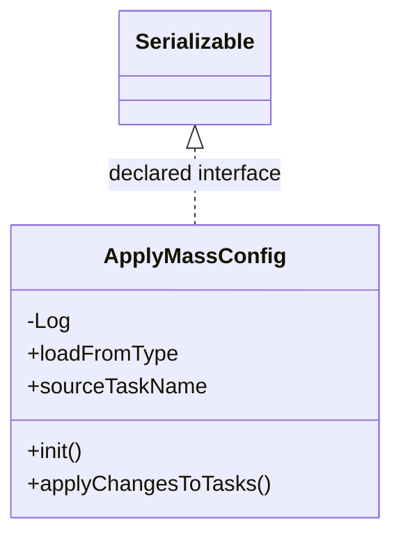

| Diagram identifier | Exact type | Location |
| --- | --- | --- |
| `C4d1024c3c1b5` | `com.strategyquant.tradinglib.applyMassConfig.ApplyMassConfig` (this JAR) | this diagram |
| `C210d9b760f82` | `java.io.Serializable` (not resolved in scoped archives) | referenced external type |

### 14. `com.strategyquant.tradinglib.atm`

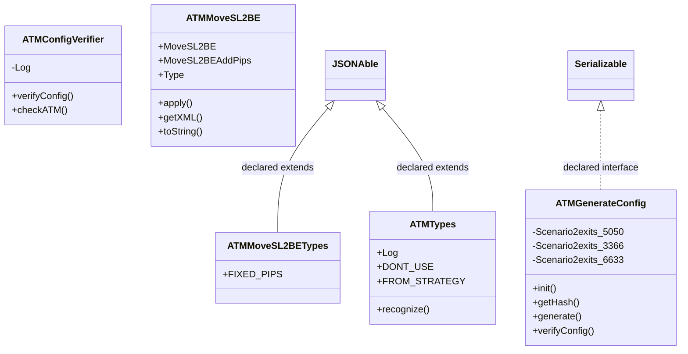

| Diagram identifier | Exact type | Location |
| --- | --- | --- |
| `C12e80bb343f5` | `com.strategyquant.tradinglib.atm.ATMConfigVerifier` (this JAR) | this diagram |
| `Cec79448b792b` | `com.strategyquant.tradinglib.atm.ATMGenerateConfig` (this JAR) | this diagram |
| `C303a260be2f4` | `com.strategyquant.tradinglib.atm.ATMMoveSL2BE` (this JAR) | this diagram |
| `C5bf7aa0f3d4c` | `com.strategyquant.tradinglib.atm.ATMMoveSL2BETypes` (this JAR) | this diagram |
| `Ce608d8954724` | `com.strategyquant.tradinglib.atm.ATMTypes` (this JAR) | this diagram |
| `C2efe767e1695` | `com.strategyquant.tradinglib.task.settings.buildmode.JSONAble` (this JAR) | another group in this JAR |
| `C210d9b760f82` | `java.io.Serializable` (not resolved in scoped archives) | referenced external type |

### 15. `com.strategyquant.tradinglib.atm.exits`

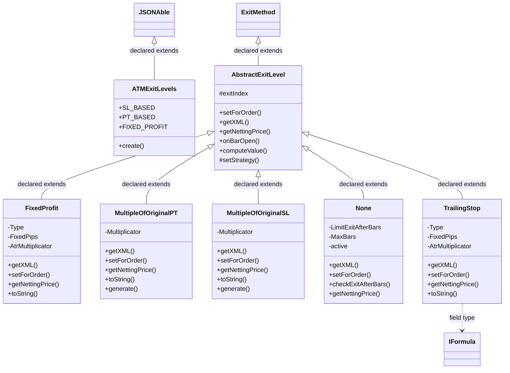

| Diagram identifier | Exact type | Location |
| --- | --- | --- |
| `Ce3576291cfa2` | `com.strategyquant.tradinglib.ExitMethod` (this JAR) | another group in this JAR |
| `C80df177686e1` | `com.strategyquant.tradinglib.IFormula` (this JAR) | another group in this JAR |
| `Cdec2f67fec17` | `com.strategyquant.tradinglib.atm.exits.ATMExitLevels` (this JAR) | this diagram |
| `C1fd61077a0c2` | `com.strategyquant.tradinglib.atm.exits.AbstractExitLevel` (this JAR) | this diagram |
| `C745d0f4c9efd` | `com.strategyquant.tradinglib.atm.exits.FixedProfit` (this JAR) | this diagram |
| `C064775a4fab2` | `com.strategyquant.tradinglib.atm.exits.MultipleOfOriginalPT` (this JAR) | this diagram |
| `Caf3bde5f2047` | `com.strategyquant.tradinglib.atm.exits.MultipleOfOriginalSL` (this JAR) | this diagram |
| `Cc0872d7d9af3` | `com.strategyquant.tradinglib.atm.exits.None` (this JAR) | this diagram |
| `Cc614b4c8d35c` | `com.strategyquant.tradinglib.atm.exits.TrailingStop` (this JAR) | this diagram |
| `C2efe767e1695` | `com.strategyquant.tradinglib.task.settings.buildmode.JSONAble` (this JAR) | another group in this JAR |

### 16. `com.strategyquant.tradinglib.atm.exits.helpers`

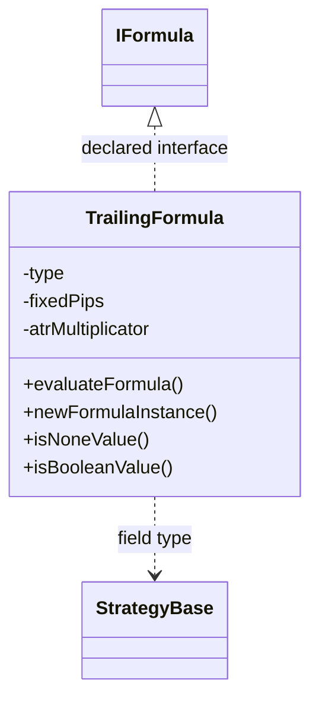

| Diagram identifier | Exact type | Location |
| --- | --- | --- |
| `C80df177686e1` | `com.strategyquant.tradinglib.IFormula` (this JAR) | another group in this JAR |
| `C75c3b57e2c4b` | `com.strategyquant.tradinglib.StrategyBase` (this JAR) | another group in this JAR |
| `C12d46d1c9278` | `com.strategyquant.tradinglib.atm.exits.helpers.TrailingFormula` (this JAR) | this diagram |

### 17. `com.strategyquant.tradinglib.atm.sizes`

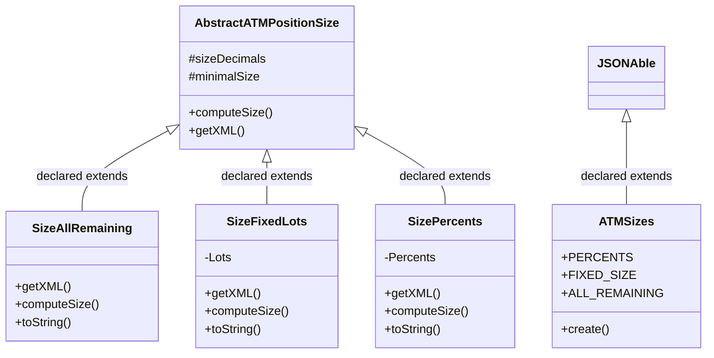

| Diagram identifier | Exact type | Location |
| --- | --- | --- |
| `Cb1a839ed7e72` | `com.strategyquant.tradinglib.atm.sizes.ATMSizes` (this JAR) | this diagram |
| `C08923d55c1cf` | `com.strategyquant.tradinglib.atm.sizes.AbstractATMPositionSize` (this JAR) | this diagram |
| `Cceeabd9b03c0` | `com.strategyquant.tradinglib.atm.sizes.SizeAllRemaining` (this JAR) | this diagram |
| `C033c9383312a` | `com.strategyquant.tradinglib.atm.sizes.SizeFixedLots` (this JAR) | this diagram |
| `C422e6d897cb4` | `com.strategyquant.tradinglib.atm.sizes.SizePercents` (this JAR) | this diagram |
| `C2efe767e1695` | `com.strategyquant.tradinglib.task.settings.buildmode.JSONAble` (this JAR) | another group in this JAR |

### 18. `com.strategyquant.tradinglib.backtest` - group 1

```mermaid
classDiagram
    class C3a0ca63c2d8e["AWProgressEngine"] {
        +printToLog()
    }
    class Caccb828bc478["AutoRetestSettings"] {
        -useCustomEngine
        -useCustomSymbol
        -useCustomTimeframe
        +init()
        +useCustomEngine()
        +useCustomSymbol()
        +useCustomTimeframe()
    }
    class Cf76f43ab1283["AutoRetestStrategyConfigModifier"] {
        -Log
        +modifySettings()
    }
    class C9689228095bf["BacktestConnection"] {
        -backtestDataFeed
        +initializeEngines()
        +connect()
        +disconnect()
        +registerSymbol()
        +checkSymbolIsSupported()
        +isConnected()
    }
    class Cbaac27774ba5["BacktestDataCache"] {
        +Log
        -instance
        -cacheRecordsSize
        +getInstance()
        +loadData()
        +getRealStartDataInfo()
        +setDataType()
    }
    class C678b9b35a8c8["BacktestDataFeed"] {
        +Log
        -connectionManager
        -loadedData
        +initialize()
        +start()
        +setPortfolio()
        +setDataModifierCallback()
    }
    class C968dd97e45f9["BacktestDataFeedElement"] {
        -TYPE_UNKNOWN
        -TYPE_TICK
        -TYPE_OHLC
        +setTickData()
        +setOhlcData()
        +reset()
        +setFromElement()
    }
    class Cd44d33464bf8["BacktestDataInitializer"] {
        -chartSetups
        -progressEngine
        -crossChecks
        +prepareData()
        +preparePickerData()
        +prepareStockpickerData()
    }
    class C13b553b62630["BacktestDataType"] {
        +File
        +Offheap
        +Array
        +toString()
    }
    class Cac7272f77087["BacktestInitStrategy"] {
        +callOnInit()
        +Initialize()
        +OnBarUpdate()
        +getATRValue()
    }
    class C21c0b0e6fbfd["BacktestModes"] {
        +Parallel
        +Serial
    }
    class C5546e03bbc27["BacktestRealDataStartTimeComputer"] {
        +Log
        -chartDef
        -tradingSimulator
        +computeRealDataStartTime()
        +destroy()
    }
    class Cd994a64faafc["ChartDef"]
    class Cd386a24e5c3b["TickEvent"]
    class C67cb1f997b97["BarType"]
    class C9476746fbb89["SpreadsMap"]
    class C78fbf77008e9["ChartSetup"]
    class C5f362544ec04["CommissionsMethod"]
    class C75c3b57e2c4b["StrategyBase"]
    class Cafcb9b78876e["SwapMethod"]
    class C70ab973155c9["LoadDataProgressEngine"]
    class C7f9c87c3bf71["LoadedData"]
    class C58cb707ce0e7["Connection"]
    class C5910a33a788a["IDataFeed"]
    class C8e0515ad9e78["ProgressEngine"]
    class C210d9b760f82["Serializable"]
    C8e0515ad9e78 <|-- C3a0ca63c2d8e : declared extends
    C210d9b760f82 <|.. Caccb828bc478 : declared interface
    Caccb828bc478 ..> C5f362544ec04 : field type
    Caccb828bc478 ..> Cafcb9b78876e : field type
    C58cb707ce0e7 <|-- C9689228095bf : declared extends
    C5910a33a788a <|.. C9689228095bf : declared interface
    C9689228095bf ..> C678b9b35a8c8 : field type
    Cbaac27774ba5 ..> C70ab973155c9 : field type
    Cbaac27774ba5 ..> C7f9c87c3bf71 : field type
    C678b9b35a8c8 ..> Cd386a24e5c3b : field type
    C678b9b35a8c8 ..> C9476746fbb89 : field type
    Cd44d33464bf8 ..> C78fbf77008e9 : field type
    Cd44d33464bf8 ..> C70ab973155c9 : field type
    C75c3b57e2c4b <|-- Cac7272f77087 : declared extends
    C5546e03bbc27 ..> Cd994a64faafc : field type
    C5546e03bbc27 ..> C67cb1f997b97 : field type
```

| Diagram identifier | Exact type | Location |
| --- | --- | --- |
| `Cd994a64faafc` | [`com.strategyquant.datalib.ChartDef`](SQDataLib.md) | referenced external type |
| `Cd386a24e5c3b` | [`com.strategyquant.datalib.TickEvent`](SQDataLib.md) | referenced external type |
| `C67cb1f997b97` | [`com.strategyquant.datalib.bartype.BarType`](SQDataLib.md) | referenced external type |
| `C9476746fbb89` | [`com.strategyquant.datalib.ticksimulator.SpreadsMap`](SQDataLib.md) | referenced external type |
| `C78fbf77008e9` | `com.strategyquant.tradinglib.ChartSetup` (this JAR) | another group in this JAR |
| `C5f362544ec04` | `com.strategyquant.tradinglib.CommissionsMethod` (this JAR) | another group in this JAR |
| `C75c3b57e2c4b` | `com.strategyquant.tradinglib.StrategyBase` (this JAR) | another group in this JAR |
| `Cafcb9b78876e` | `com.strategyquant.tradinglib.SwapMethod` (this JAR) | another group in this JAR |
| `C3a0ca63c2d8e` | `com.strategyquant.tradinglib.backtest.AWProgressEngine` (this JAR) | this diagram |
| `Caccb828bc478` | `com.strategyquant.tradinglib.backtest.AutoRetestSettings` (this JAR) | this diagram |
| `Cf76f43ab1283` | `com.strategyquant.tradinglib.backtest.AutoRetestStrategyConfigModifier` (this JAR) | this diagram |
| `C9689228095bf` | `com.strategyquant.tradinglib.backtest.BacktestConnection` (this JAR) | this diagram |
| `Cbaac27774ba5` | `com.strategyquant.tradinglib.backtest.BacktestDataCache` (this JAR) | this diagram |
| `C678b9b35a8c8` | `com.strategyquant.tradinglib.backtest.BacktestDataFeed` (this JAR) | this diagram |
| `C968dd97e45f9` | `com.strategyquant.tradinglib.backtest.BacktestDataFeedElement` (this JAR) | this diagram |
| `Cd44d33464bf8` | `com.strategyquant.tradinglib.backtest.BacktestDataInitializer` (this JAR) | this diagram |
| `C13b553b62630` | `com.strategyquant.tradinglib.backtest.BacktestDataType` (this JAR) | this diagram |
| `Cac7272f77087` | `com.strategyquant.tradinglib.backtest.BacktestInitStrategy` (this JAR) | this diagram |
| `C21c0b0e6fbfd` | `com.strategyquant.tradinglib.backtest.BacktestModes` (this JAR) | this diagram |
| `C5546e03bbc27` | `com.strategyquant.tradinglib.backtest.BacktestRealDataStartTimeComputer` (this JAR) | this diagram |
| `C70ab973155c9` | `com.strategyquant.tradinglib.backtest.LoadDataProgressEngine` (this JAR) | another group in this JAR |
| `C7f9c87c3bf71` | `com.strategyquant.tradinglib.backtest.LoadedData` (this JAR) | another group in this JAR |
| `C58cb707ce0e7` | `com.strategyquant.tradinglib.connection.Connection` (this JAR) | another group in this JAR |
| `C5910a33a788a` | `com.strategyquant.tradinglib.connection.IDataFeed` (this JAR) | another group in this JAR |
| `C8e0515ad9e78` | `com.strategyquant.tradinglib.project.ProgressEngine` (this JAR) | another group in this JAR |
| `C210d9b760f82` | `java.io.Serializable` (not resolved in scoped archives) | referenced external type |

### 19. `com.strategyquant.tradinglib.backtest` - group 2

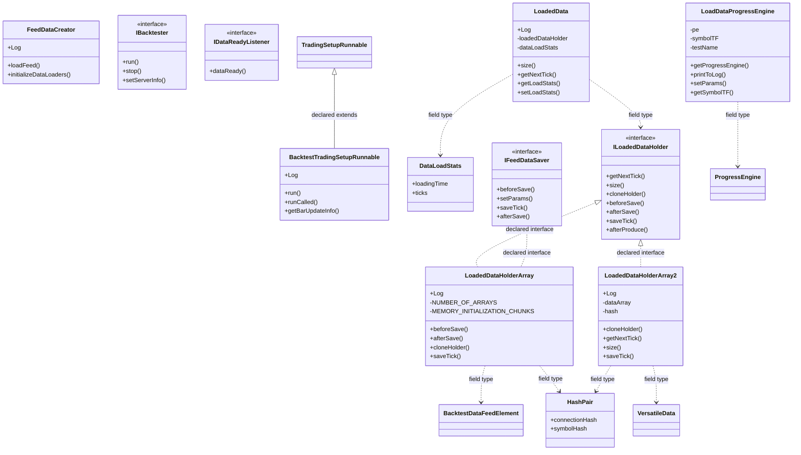

| Diagram identifier | Exact type | Location |
| --- | --- | --- |
| `C1e542c6fc61c` | [`com.strategyquant.datalib.data.io.VersatileData`](SQDataLib.md) | referenced external type |
| `C968dd97e45f9` | `com.strategyquant.tradinglib.backtest.BacktestDataFeedElement` (this JAR) | another group in this JAR |
| `Ce438142173c9` | `com.strategyquant.tradinglib.backtest.BacktestTradingSetupRunnable` (this JAR) | this diagram |
| `Cb180abde60a6` | `com.strategyquant.tradinglib.backtest.DataLoadStats` (this JAR) | this diagram |
| `C16edd20e9581` | `com.strategyquant.tradinglib.backtest.FeedDataCreator` (this JAR) | this diagram |
| `C6e13f70a9ba7` | `com.strategyquant.tradinglib.backtest.HashPair` (this JAR) | this diagram |
| `Cc90fa75a7032` | `com.strategyquant.tradinglib.backtest.IBacktester` (this JAR) | this diagram |
| `Cec0fe82e1b9c` | `com.strategyquant.tradinglib.backtest.IDataReadyListener` (this JAR) | this diagram |
| `C6503b3858b3a` | `com.strategyquant.tradinglib.backtest.IFeedDataSaver` (this JAR) | this diagram |
| `C41cb84235ba7` | `com.strategyquant.tradinglib.backtest.ILoadedDataHolder` (this JAR) | this diagram |
| `C70ab973155c9` | `com.strategyquant.tradinglib.backtest.LoadDataProgressEngine` (this JAR) | this diagram |
| `C7f9c87c3bf71` | `com.strategyquant.tradinglib.backtest.LoadedData` (this JAR) | this diagram |
| `C13047a6a29ab` | `com.strategyquant.tradinglib.backtest.LoadedDataHolderArray` (this JAR) | this diagram |
| `Cb3253c8734d7` | `com.strategyquant.tradinglib.backtest.LoadedDataHolderArray2` (this JAR) | this diagram |
| `C8e0515ad9e78` | `com.strategyquant.tradinglib.project.ProgressEngine` (this JAR) | another group in this JAR |
| `C5abba0797ffc` | `com.strategyquant.tradinglib.setup.TradingSetupRunnable` (this JAR) | another group in this JAR |

### 20. `com.strategyquant.tradinglib.backtest` - group 3

```mermaid
classDiagram
    class C69dee2e67340["LoadedDataHolderFileBDF"] {
        +Log
        -NUM_RECORDS
        -index
        +beforeSave()
        +afterSave()
        +cloneHolder()
        +getNextTick()
    }
    class C2a2961e4493d["LoadedDataHolderFilePlain"] {
        +Log
        -NUM_RECORDS
        -index
        +beforeSave()
        +afterSave()
        +cloneHolder()
        +getNextTick()
    }
    class C01f25c829fd9["LoadedDataHolderOffheap"] {
        +Log
        #MEGABYTE
        -address
        +beforeSave()
        +afterSave()
        +cloneHolder()
        +getNextTick()
    }
    class C0490a0a6e528["ResultsPanelData"] {
        -Log
        +load()
        +loadAC()
        +loadACExample()
        +getEquityData()
    }
    class Ca031c22654ba["SQBacktester"] {
        -Log
        -lock
        -lockTimeout
        +get()
        +run()
        #processMessage()
        +stop()
    }
    class C2ba40a471137["SQBacktesterJob"] {
        +Log
        -backtestRunner
        -progressEngine
        +call()
        +messageReceived()
    }
    class Cca8cc0dbb436["StartDataInfo"] {
        +realDataStartTime
        +reservedBars
        +realDataEndTime
        +copyFrom()
    }
    class Ca35b461ac39f["TestfilesUtils"] {
        +Log
        +getTestdataFile()
        +deleteTestingFiles()
        +deleteTempTestfile()
    }
    class C0cf5c26914fa["TradingOptionsModifier"] {
        +modifyTradingOptions()
    }
    class C10a128b7140b["OhlcDataReader"]
    class C5b872c0045e7["OhlcDataWriter"]
    class C09516b6b5cbc["RandomAccessReaderFile"]
    class C2d5349dc1f49["GridClient"]
    class C729a56512564["GridJob"]
    class C81fcbc41b716["ResultsGroup"]
    class C3a0ca63c2d8e["AWProgressEngine"]
    class Cd44d33464bf8["BacktestDataInitializer"]
    class C6e13f70a9ba7["HashPair"]
    class Cc90fa75a7032["IBacktester"]
    class C6503b3858b3a["IFeedDataSaver"]
    class C41cb84235ba7["ILoadedDataHolder"]
    class Cc572b8b035db["MarketData"]
    C41cb84235ba7 <|.. C69dee2e67340 : declared interface
    C6503b3858b3a <|.. C69dee2e67340 : declared interface
    C69dee2e67340 ..> C10a128b7140b : field type
    C69dee2e67340 ..> C5b872c0045e7 : field type
    C41cb84235ba7 <|.. C2a2961e4493d : declared interface
    C6503b3858b3a <|.. C2a2961e4493d : declared interface
    C2a2961e4493d ..> C09516b6b5cbc : field type
    C2a2961e4493d ..> C6e13f70a9ba7 : field type
    C41cb84235ba7 <|.. C01f25c829fd9 : declared interface
    C01f25c829fd9 ..> C6e13f70a9ba7 : field type
    C01f25c829fd9 ..> Cc572b8b035db : field type
    Cc90fa75a7032 <|.. Ca031c22654ba : declared interface
    Ca031c22654ba ..> C2d5349dc1f49 : field type
    Ca031c22654ba ..> C81fcbc41b716 : field type
    C729a56512564 <|-- C2ba40a471137 : declared extends
    C2ba40a471137 ..> C3a0ca63c2d8e : field type
    C2ba40a471137 ..> Cd44d33464bf8 : field type
```

| Diagram identifier | Exact type | Location |
| --- | --- | --- |
| `C10a128b7140b` | [`com.strategyquant.datalib.data.io.newDataFormat.OhlcDataReader`](SQDataLib.md) | referenced external type |
| `C5b872c0045e7` | [`com.strategyquant.datalib.data.io.newDataFormat.OhlcDataWriter`](SQDataLib.md) | referenced external type |
| `C09516b6b5cbc` | [`com.strategyquant.datalib.data.io.newDataFormat.RandomAccessReaderFile`](SQDataLib.md) | referenced external type |
| `C2d5349dc1f49` | [`com.strategyquant.gridlib.client.GridClient`](SQGridLib2.md) | referenced external type |
| `C729a56512564` | [`com.strategyquant.gridlib.client.GridJob`](SQGridLib2.md) | referenced external type |
| `C81fcbc41b716` | `com.strategyquant.tradinglib.ResultsGroup` (this JAR) | another group in this JAR |
| `C3a0ca63c2d8e` | `com.strategyquant.tradinglib.backtest.AWProgressEngine` (this JAR) | another group in this JAR |
| `Cd44d33464bf8` | `com.strategyquant.tradinglib.backtest.BacktestDataInitializer` (this JAR) | another group in this JAR |
| `C6e13f70a9ba7` | `com.strategyquant.tradinglib.backtest.HashPair` (this JAR) | another group in this JAR |
| `Cc90fa75a7032` | `com.strategyquant.tradinglib.backtest.IBacktester` (this JAR) | another group in this JAR |
| `C6503b3858b3a` | `com.strategyquant.tradinglib.backtest.IFeedDataSaver` (this JAR) | another group in this JAR |
| `C41cb84235ba7` | `com.strategyquant.tradinglib.backtest.ILoadedDataHolder` (this JAR) | another group in this JAR |
| `C69dee2e67340` | `com.strategyquant.tradinglib.backtest.LoadedDataHolderFileBDF` (this JAR) | this diagram |
| `C2a2961e4493d` | `com.strategyquant.tradinglib.backtest.LoadedDataHolderFilePlain` (this JAR) | this diagram |
| `C01f25c829fd9` | `com.strategyquant.tradinglib.backtest.LoadedDataHolderOffheap` (this JAR) | this diagram |
| `C0490a0a6e528` | `com.strategyquant.tradinglib.backtest.ResultsPanelData` (this JAR) | this diagram |
| `Ca031c22654ba` | `com.strategyquant.tradinglib.backtest.SQBacktester` (this JAR) | this diagram |
| `C2ba40a471137` | `com.strategyquant.tradinglib.backtest.SQBacktesterJob` (this JAR) | this diagram |
| `Cca8cc0dbb436` | `com.strategyquant.tradinglib.backtest.StartDataInfo` (this JAR) | this diagram |
| `Ca35b461ac39f` | `com.strategyquant.tradinglib.backtest.TestfilesUtils` (this JAR) | this diagram |
| `C0cf5c26914fa` | `com.strategyquant.tradinglib.backtest.TradingOptionsModifier` (this JAR) | this diagram |
| `Cc572b8b035db` | `com.strategyquant.tradinglib.strategy.MarketData` (this JAR) | another group in this JAR |

### 21. `com.strategyquant.tradinglib.backtestrunner`

```mermaid
classDiagram
    class Cbf2d2ada1b5a["BacktestResult"] {
        -resultsGroup
        -dismissalMessage
        -dismissalReason
        +dismiss()
        +getResult()
        +getDismissalMessage()
        +getDismissalReason()
    }
    class C044e39d2df83["BacktestRunner"] {
        +Log
        -backtestSettings
        -stopPauseEngine
        +execute()
        #setJobProgress()
        +stop()
        +setStrategy()
    }
    class C8c30f791c857["BacktestSettings"] {
        +initialCapital
        +moneyManagementMethod
        +moneyManagementMethodUseFromStrategy
        +getClone()
        +getSettingsMap()
    }
    class C8aa22d8bbe64["DurationStats"] {
        +MainTest
        -map
        -keysInOrder
        +addDuration()
        +getMap()
        +getKeys()
    }
    class C9316f96647ae["IBacktestProgressListener"] {
        <<interface>>
        +setProgress()
        +increaseProgressStep()
    }
    class Cbfe203fd6562["PopulationTypes"] {
        +InitialGenerated
        +InitialFromDatabank
        +NextGeneration
    }
    class Cde3ff668fd7c["StrategyChecker"] {
        -Log
        +strategyValid()
    }
    class C729a56512564["GridJob"]
    class Cac836f7e20d9["ISQCloneable"]
    class C33da5e0a010f["ATM"]
    class C5f362544ec04["CommissionsMethod"]
    class C81fcbc41b716["ResultsGroup"]
    class C210d9b760f82["Serializable"]
    C210d9b760f82 <|.. Cbf2d2ada1b5a : declared interface
    Cbf2d2ada1b5a ..> C81fcbc41b716 : field type
    Cbf2d2ada1b5a ..> C8aa22d8bbe64 : field type
    C044e39d2df83 ..> C729a56512564 : field type
    C044e39d2df83 ..> C8c30f791c857 : field type
    Cac836f7e20d9 <|.. C8c30f791c857 : declared interface
    C8c30f791c857 ..> C33da5e0a010f : field type
    C8c30f791c857 ..> C5f362544ec04 : field type
```

| Diagram identifier | Exact type | Location |
| --- | --- | --- |
| `C729a56512564` | [`com.strategyquant.gridlib.client.GridJob`](SQGridLib2.md) | referenced external type |
| `Cac836f7e20d9` | `com.strategyquant.lib.utils.ISQCloneable` (not resolved in scoped archives) | referenced external type |
| `C33da5e0a010f` | `com.strategyquant.tradinglib.ATM` (this JAR) | another group in this JAR |
| `C5f362544ec04` | `com.strategyquant.tradinglib.CommissionsMethod` (this JAR) | another group in this JAR |
| `C81fcbc41b716` | `com.strategyquant.tradinglib.ResultsGroup` (this JAR) | another group in this JAR |
| `Cbf2d2ada1b5a` | `com.strategyquant.tradinglib.backtestrunner.BacktestResult` (this JAR) | this diagram |
| `C044e39d2df83` | `com.strategyquant.tradinglib.backtestrunner.BacktestRunner` (this JAR) | this diagram |
| `C8c30f791c857` | `com.strategyquant.tradinglib.backtestrunner.BacktestSettings` (this JAR) | this diagram |
| `C8aa22d8bbe64` | `com.strategyquant.tradinglib.backtestrunner.DurationStats` (this JAR) | this diagram |
| `C9316f96647ae` | `com.strategyquant.tradinglib.backtestrunner.IBacktestProgressListener` (this JAR) | this diagram |
| `Cbfe203fd6562` | `com.strategyquant.tradinglib.backtestrunner.PopulationTypes` (this JAR) | this diagram |
| `Cde3ff668fd7c` | `com.strategyquant.tradinglib.backtestrunner.StrategyChecker` (this JAR) | this diagram |
| `C210d9b760f82` | `java.io.Serializable` (not resolved in scoped archives) | referenced external type |

### 22. `com.strategyquant.tradinglib.benchmark`

```mermaid
classDiagram
    class Ce10af0d7b4b8["BenchmarkEngine"] {
        +Log
        +TOTAL_TICKS
        -TOTAL_SINGLETHREAD_TESTS
        +getBenchmarkResults()
        +initData()
        +deleteData()
        +startTest()
    }
    class C0996de75055c["BenchmarkJob"] {
        +Log
        -initialCapital
        -outOfSample
        +call()
        +messageReceived()
    }
    class C37a6dce99f09["BenchmarkJob2"] {
        +Log
        -initialCapital
        -outOfSample
        +call()
        +getAllBacktestChartDefs()
        +call2()
    }
    class C86cf4488b7e9["BenchmarkProgressEngine"] {
        +Log
        +setProgress()
    }
    class Ce520f94ee0d5["BenchmarkResult"] {
        +TOTAL_TICKS
        +error
        +testName
        +setError()
        +isError()
        +setResult()
        +toString()
    }
    class C1e542c6fc61c["VersatileData"]
    class C2d5349dc1f49["GridClient"]
    class C729a56512564["GridJob"]
    class Cfff30d9bf9d8["MoneyManagementMethod"]
    class Caece7e04ccef["RiskManagementMethod"]
    class C8e0515ad9e78["ProgressEngine"]
    Ce10af0d7b4b8 ..> C1e542c6fc61c : field type
    Ce10af0d7b4b8 ..> C2d5349dc1f49 : field type
    C729a56512564 <|-- C0996de75055c : declared extends
    C0996de75055c ..> Cfff30d9bf9d8 : field type
    C0996de75055c ..> Caece7e04ccef : field type
    C729a56512564 <|-- C37a6dce99f09 : declared extends
    C37a6dce99f09 ..> C1e542c6fc61c : field type
    C37a6dce99f09 ..> Cfff30d9bf9d8 : field type
    C8e0515ad9e78 <|-- C86cf4488b7e9 : declared extends
```

| Diagram identifier | Exact type | Location |
| --- | --- | --- |
| `C1e542c6fc61c` | [`com.strategyquant.datalib.data.io.VersatileData`](SQDataLib.md) | referenced external type |
| `C2d5349dc1f49` | [`com.strategyquant.gridlib.client.GridClient`](SQGridLib2.md) | referenced external type |
| `C729a56512564` | [`com.strategyquant.gridlib.client.GridJob`](SQGridLib2.md) | referenced external type |
| `Cfff30d9bf9d8` | `com.strategyquant.tradinglib.MoneyManagementMethod` (this JAR) | another group in this JAR |
| `Caece7e04ccef` | `com.strategyquant.tradinglib.RiskManagementMethod` (this JAR) | another group in this JAR |
| `Ce10af0d7b4b8` | `com.strategyquant.tradinglib.benchmark.BenchmarkEngine` (this JAR) | this diagram |
| `C0996de75055c` | `com.strategyquant.tradinglib.benchmark.BenchmarkJob` (this JAR) | this diagram |
| `C37a6dce99f09` | `com.strategyquant.tradinglib.benchmark.BenchmarkJob2` (this JAR) | this diagram |
| `C86cf4488b7e9` | `com.strategyquant.tradinglib.benchmark.BenchmarkProgressEngine` (this JAR) | this diagram |
| `Ce520f94ee0d5` | `com.strategyquant.tradinglib.benchmark.BenchmarkResult` (this JAR) | this diagram |
| `C8e0515ad9e78` | `com.strategyquant.tradinglib.project.ProgressEngine` (this JAR) | another group in this JAR |

### 23. `com.strategyquant.tradinglib.blocks`

```mermaid
classDiagram
    class C13897ca4e5f6["AnnotationHandler"] {
        -Log
        +decorateFieldName()
        #getParamNumberValue()
        #getParamChartTFValue()
        #getParameter()
        #setField()
        +getFieldName()
    }
    class C632836cea159["AnnotationProcessor"] {
        +Log
        +wizardParseXml()
        +wizardGenerateXml()
        +wizardGenerateXmlForFormula()
        +wizardParseExitTypesXml()
    }
    class C133af6160c62["BlockCategoryInfo"] {
        +categoryNameHash
        +categoryOrder
        +categoryName
    }
    class Ca55ad161abae["BlockComparatorByOrder"] {
        +compare()
    }
    class C9304283b8d93["BlocksConfigGenerator"] {
        +Log
        +run()
    }
    class Cd70bd83e5b5c["CategoryComparatorByOrder"] {
        +compare()
    }
    class C5f20da939a9d["Colors"] {
        +Red
        +Green
    }
    class Ca83ef867fbe9["CustomBlocks"] {
        -Log
        -config
        -refreshMessage
        +load()
        +save()
        +get()
        +getAsBuildingBlocks()
    }
    class C8b349c9426e4["OppositeBlocksConfig"] {
        +Log
        +run()
        +load()
    }
    class C1dc729ee46a1["OutputAnnotationHandler"] {
        +wizardParseXml()
        +wizardGenerateXml()
    }
    class Cb3f646c29f61["ParameterAnnotationGenerator"] {
        +Log
        +wizardGenerateXml()
        +wizardGenerateFormulaXml()
    }
    class Cb8be8a91a0c5["ParameterAnnotationParser"] {
        -Log
        +wizardParseXml()
        +parseSubBlock()
    }
    class C9cfb1e314ffa["BlockDefinition"]
    class C6128eed56b6d["DataToSend"]
    class C702c79b2d89c["Comparator"]
    C702c79b2d89c <|.. Ca55ad161abae : declared interface
    C702c79b2d89c <|.. Cd70bd83e5b5c : declared interface
    Ca83ef867fbe9 ..> C9cfb1e314ffa : field type
    Ca83ef867fbe9 ..> C6128eed56b6d : field type
    C13897ca4e5f6 <|-- C1dc729ee46a1 : declared extends
    C13897ca4e5f6 <|-- Cb3f646c29f61 : declared extends
    C13897ca4e5f6 <|-- Cb8be8a91a0c5 : declared extends
```

| Diagram identifier | Exact type | Location |
| --- | --- | --- |
| `C13897ca4e5f6` | `com.strategyquant.tradinglib.blocks.AnnotationHandler` (this JAR) | this diagram |
| `C632836cea159` | `com.strategyquant.tradinglib.blocks.AnnotationProcessor` (this JAR) | this diagram |
| `C133af6160c62` | `com.strategyquant.tradinglib.blocks.BlockCategoryInfo` (this JAR) | this diagram |
| `Ca55ad161abae` | `com.strategyquant.tradinglib.blocks.BlockComparatorByOrder` (this JAR) | this diagram |
| `C9304283b8d93` | `com.strategyquant.tradinglib.blocks.BlocksConfigGenerator` (this JAR) | this diagram |
| `Cd70bd83e5b5c` | `com.strategyquant.tradinglib.blocks.CategoryComparatorByOrder` (this JAR) | this diagram |
| `C5f20da939a9d` | `com.strategyquant.tradinglib.blocks.Colors` (this JAR) | this diagram |
| `Ca83ef867fbe9` | `com.strategyquant.tradinglib.blocks.CustomBlocks` (this JAR) | this diagram |
| `C8b349c9426e4` | `com.strategyquant.tradinglib.blocks.OppositeBlocksConfig` (this JAR) | this diagram |
| `C1dc729ee46a1` | `com.strategyquant.tradinglib.blocks.OutputAnnotationHandler` (this JAR) | this diagram |
| `Cb3f646c29f61` | `com.strategyquant.tradinglib.blocks.ParameterAnnotationGenerator` (this JAR) | this diagram |
| `Cb8be8a91a0c5` | `com.strategyquant.tradinglib.blocks.ParameterAnnotationParser` (this JAR) | this diagram |
| `C9cfb1e314ffa` | `com.strategyquant.tradinglib.blocks.random.BlockDefinition` (this JAR) | another group in this JAR |
| `C6128eed56b6d` | `com.strategyquant.tradinglib.project.websocket.DataToSend` (this JAR) | another group in this JAR |
| `C702c79b2d89c` | `java.util.Comparator` (not resolved in scoped archives) | referenced external type |

### 24. `com.strategyquant.tradinglib.blocks.annotations`

```mermaid
classDiagram
    class Ce6e347699eaf["DataSeriesChoice"] {
        <<interface>>
        +key()
        +name()
        +category()
        +help()
    }
    class C3d73d24e4fbd["ParameterSets"] {
        <<interface>>
        +value()
    }
    class Cc848096a2f49["Value"] {
        +Null
        +MinShift
        +MaxShift
        +isPredefined()
        +generateMM()
        +generateHH()
    }
    class Ce2abf92f3173["Annotation"]
    Ce2abf92f3173 <|-- Ce6e347699eaf : declared interface
    Ce2abf92f3173 <|-- C3d73d24e4fbd : declared interface
```

| Diagram identifier | Exact type | Location |
| --- | --- | --- |
| `Ce6e347699eaf` | `com.strategyquant.tradinglib.blocks.annotations.DataSeriesChoice` (this JAR) | this diagram |
| `C3d73d24e4fbd` | `com.strategyquant.tradinglib.blocks.annotations.ParameterSets` (this JAR) | this diagram |
| `Cc848096a2f49` | `com.strategyquant.tradinglib.blocks.annotations.Value` (this JAR) | this diagram |
| `Ce2abf92f3173` | `java.lang.annotation.Annotation` (not resolved in scoped archives) | referenced external type |

### 25. `com.strategyquant.tradinglib.blocks.random` - group 1

```mermaid
classDiagram
    class C9cfb1e314ffa["BlockDefinition"] {
        +Log
        +key
        +name
        +getXml()
        +getKey()
        +getName()
        +getParamByKey()
    }
    class C0fba644f8e84["BlockParameter"] {
        +Log
        +key
        +defaultValue
        +initializeRanges()
        +recognizeDecimals()
        +isValueParameter()
        +clone()
    }
    class C1575895a8530["BlocksConfig"] {
        +Log
        -config
        -elConfig
        +getConfig()
        +getConfigElement()
        +getBlock()
        +getPlaceholders()
    }
    class C404d89d006fa["FormulaValue"] {
        +key
        +weight
        +isNoneValue
    }
    class Cded46dc70ddf["ItemRandomValueRanges"] {
        -map
        +getRandomValueRanges()
        +getForParam()
    }
    class C2f3b228a7bdd["RandomPlaceholder"] {
        +name
        +superType
        +dataType
    }
    class Ce5d897c0b9d5["RandomValueConfig"] {
        +Log
        -valid
        -val1
        +generateRandomValue()
        +isValid()
        +parseRandomValue()
        +getDecimals()
    }
    class Cc7a069610efa["ReplacementBlock"] {
        +Log
        +weight
        +key
        +hasBlockChildren()
        +getXml()
        +findReplacementParamByKey()
        +verifyItem()
    }
    class C232b10dd9769["ReplacementBlocks"] {
        -blocksWithNoChildren
        -cummulativeWeight
        -cummulativeWeightBNC
        +add()
        +chooseRandomly()
    }
    class Ce8afed6a9b85["ReplacementChartConfig"] {
        +Log
        +minConditions
        +maxConditions
        +setConditionsToGenerate()
        +getConditionsToGenerate()
        +decreaseConditionsToGenerate()
    }
    class C36d897bfb58e["ReplacementChartsConfig"] {
    }
    class C1437544a6011["ReplacementConfig"] {
        +Log
        +blocksByType
        +allBlocks
        +generateRandomBlock()
        +generateSpecialBlock()
        +shouldGenerate()
        +hasStopLimitOrder()
    }
    class C02082c3763b1["ReplacementParameterGroups"]
    class C210d9b760f82["Serializable"]
    class C5098f415c102["ArrayList"]
    C210d9b760f82 <|.. C9cfb1e314ffa : declared interface
    C9cfb1e314ffa ..> C0fba644f8e84 : field type
    C210d9b760f82 <|.. C0fba644f8e84 : declared interface
    C0fba644f8e84 ..> Ce5d897c0b9d5 : field type
    C210d9b760f82 <|.. C1575895a8530 : declared interface
    C1575895a8530 ..> C9cfb1e314ffa : field type
    C404d89d006fa ..> C9cfb1e314ffa : field type
    C404d89d006fa ..> C02082c3763b1 : field type
    Cc7a069610efa ..> C9cfb1e314ffa : field type
    Cc7a069610efa ..> C1437544a6011 : field type
    C5098f415c102 <|-- C232b10dd9769 : declared extends
    C232b10dd9769 ..> Cc7a069610efa : field type
    C5098f415c102 <|-- C36d897bfb58e : declared extends
    C1437544a6011 ..> Ce5d897c0b9d5 : field type
    C1437544a6011 ..> Cc7a069610efa : field type
```

| Diagram identifier | Exact type | Location |
| --- | --- | --- |
| `C9cfb1e314ffa` | `com.strategyquant.tradinglib.blocks.random.BlockDefinition` (this JAR) | this diagram |
| `C0fba644f8e84` | `com.strategyquant.tradinglib.blocks.random.BlockParameter` (this JAR) | this diagram |
| `C1575895a8530` | `com.strategyquant.tradinglib.blocks.random.BlocksConfig` (this JAR) | this diagram |
| `C404d89d006fa` | `com.strategyquant.tradinglib.blocks.random.FormulaValue` (this JAR) | this diagram |
| `Cded46dc70ddf` | `com.strategyquant.tradinglib.blocks.random.ItemRandomValueRanges` (this JAR) | this diagram |
| `C2f3b228a7bdd` | `com.strategyquant.tradinglib.blocks.random.RandomPlaceholder` (this JAR) | this diagram |
| `Ce5d897c0b9d5` | `com.strategyquant.tradinglib.blocks.random.RandomValueConfig` (this JAR) | this diagram |
| `Cc7a069610efa` | `com.strategyquant.tradinglib.blocks.random.ReplacementBlock` (this JAR) | this diagram |
| `C232b10dd9769` | `com.strategyquant.tradinglib.blocks.random.ReplacementBlocks` (this JAR) | this diagram |
| `Ce8afed6a9b85` | `com.strategyquant.tradinglib.blocks.random.ReplacementChartConfig` (this JAR) | this diagram |
| `C36d897bfb58e` | `com.strategyquant.tradinglib.blocks.random.ReplacementChartsConfig` (this JAR) | this diagram |
| `C1437544a6011` | `com.strategyquant.tradinglib.blocks.random.ReplacementConfig` (this JAR) | this diagram |
| `C02082c3763b1` | `com.strategyquant.tradinglib.blocks.random.ReplacementParameterGroups` (this JAR) | another group in this JAR |
| `C210d9b760f82` | `java.io.Serializable` (not resolved in scoped archives) | referenced external type |
| `C5098f415c102` | `java.util.ArrayList` (not resolved in scoped archives) | referenced external type |

### 26. `com.strategyquant.tradinglib.blocks.random` - group 2

```mermaid
classDiagram
    class C13d0490aff10["ReplacementParameter"] {
        +Log
        +Fixed
        +Random
        +initFromGeneratedParam()
        +setDefaultValue()
        +addIntParam()
        +getIntParam()
    }
    class C02082c3763b1["ReplacementParameterGroups"] {
        +Log
        -cummulativeWeight
        -minShift
        +add()
        +chooseRandomly()
        +getChartParam()
    }
    class C36f7e36fd1d2["ReplacementParameters"] {
        +Log
        +Generated
        +Predefined
        +fixParametersOrder()
        +hasBlockChildren()
        +getChartParam()
        +findReplacementParamByKey()
    }
    class Cfa5ba725c9c7["ReplacementsConfig"] {
        +negatersList
        +checkersList
        +negateBlock()
        +checkAllExist()
        +get()
        +findReplacementParamByKey()
    }
    class C19300247f704["NegatersList"]
    class C9cfb1e314ffa["BlockDefinition"]
    class C0fba644f8e84["BlockParameter"]
    class C1575895a8530["BlocksConfig"]
    class C4bcc5b0aeafd["CheckersList"]
    class C5098f415c102["ArrayList"]
    class Ce78be4e4395c["HashMap"]
    C13d0490aff10 ..> C9cfb1e314ffa : field type
    C13d0490aff10 ..> C0fba644f8e84 : field type
    C5098f415c102 <|-- C02082c3763b1 : declared extends
    C36f7e36fd1d2 ..> C9cfb1e314ffa : field type
    C36f7e36fd1d2 ..> C1575895a8530 : field type
    Ce78be4e4395c <|-- Cfa5ba725c9c7 : declared extends
    Cfa5ba725c9c7 ..> C19300247f704 : field type
    Cfa5ba725c9c7 ..> C4bcc5b0aeafd : field type
```

| Diagram identifier | Exact type | Location |
| --- | --- | --- |
| `C19300247f704` | `com.strategyquant.tradinglib.NegatersList` (this JAR) | another group in this JAR |
| `C9cfb1e314ffa` | `com.strategyquant.tradinglib.blocks.random.BlockDefinition` (this JAR) | another group in this JAR |
| `C0fba644f8e84` | `com.strategyquant.tradinglib.blocks.random.BlockParameter` (this JAR) | another group in this JAR |
| `C1575895a8530` | `com.strategyquant.tradinglib.blocks.random.BlocksConfig` (this JAR) | another group in this JAR |
| `C13d0490aff10` | `com.strategyquant.tradinglib.blocks.random.ReplacementParameter` (this JAR) | this diagram |
| `C02082c3763b1` | `com.strategyquant.tradinglib.blocks.random.ReplacementParameterGroups` (this JAR) | this diagram |
| `C36f7e36fd1d2` | `com.strategyquant.tradinglib.blocks.random.ReplacementParameters` (this JAR) | this diagram |
| `Cfa5ba725c9c7` | `com.strategyquant.tradinglib.blocks.random.ReplacementsConfig` (this JAR) | this diagram |
| `C4bcc5b0aeafd` | `com.strategyquant.tradinglib.generator.CheckersList` (this JAR) | another group in this JAR |
| `C5098f415c102` | `java.util.ArrayList` (not resolved in scoped archives) | referenced external type |
| `Ce78be4e4395c` | `java.util.HashMap` (not resolved in scoped archives) | referenced external type |

### 27. `com.strategyquant.tradinglib.build`

```mermaid
classDiagram
    class C551004b7956c["BuildFinishedReason"] {
        +OutOfMemoryError
        +Stagnation
        +EndOfEvolution
    }
    class Cca60743e0665["BuildTemplate"] {
        -elementName
        +name
        +description
        +toJSON()
        +getXML()
        +setFromXML()
    }
    class C8db3121b0dc3["BuildTemplatesManager"] {
        -Log
        -templatesElementName
        -templatesXMLPath
        +getTemplates()
        +getTemplateXML()
        +saveTemplates()
    }
    class C04837263807c["IXMLAble"]
    C04837263807c <|.. Cca60743e0665 : declared interface
    C8db3121b0dc3 ..> Cca60743e0665 : field type
```

| Diagram identifier | Exact type | Location |
| --- | --- | --- |
| `C04837263807c` | `com.strategyquant.lib.settings.IXMLAble` (not resolved in scoped archives) | referenced external type |
| `C551004b7956c` | `com.strategyquant.tradinglib.build.BuildFinishedReason` (this JAR) | this diagram |
| `Cca60743e0665` | `com.strategyquant.tradinglib.build.BuildTemplate` (this JAR) | this diagram |
| `C8db3121b0dc3` | `com.strategyquant.tradinglib.build.BuildTemplatesManager` (this JAR) | this diagram |

### 28. `com.strategyquant.tradinglib.charts`

```mermaid
classDiagram
    class C2c658d92d65d["AbstractXYChart"] {
        +xAxisTitle
        +xAxisType
        +xAxisTickformat
        +getOptions()
        +invertIfNegative()
    }
    class C1fb904872122["AbstractChart"]
    C1fb904872122 <|-- C2c658d92d65d : declared extends
```

| Diagram identifier | Exact type | Location |
| --- | --- | --- |
| `C1fb904872122` | `com.strategyquant.tradinglib.AbstractChart` (this JAR) | another group in this JAR |
| `C2c658d92d65d` | `com.strategyquant.tradinglib.charts.AbstractXYChart` (this JAR) | this diagram |

### 29. `com.strategyquant.tradinglib.charts.linechart.series`

```mermaid
classDiagram
    class C2e689e69691a["AbstractSeries"] {
        +values
        +name
        +capacity
        +clear()
    }
    class C0180f8fb3329["XYSeries"] {
        +addValue()
    }
    class C766bb9468337["XYValue"] {
        +x
        +y
        +xLabel
    }
    C2e689e69691a ..> C766bb9468337 : field type
    C2e689e69691a <|-- C0180f8fb3329 : declared extends
```

| Diagram identifier | Exact type | Location |
| --- | --- | --- |
| `C2e689e69691a` | `com.strategyquant.tradinglib.charts.linechart.series.AbstractSeries` (this JAR) | this diagram |
| `C0180f8fb3329` | `com.strategyquant.tradinglib.charts.linechart.series.XYSeries` (this JAR) | this diagram |
| `C766bb9468337` | `com.strategyquant.tradinglib.charts.linechart.series.XYValue` (this JAR) | this diagram |

### 30. `com.strategyquant.tradinglib.commissions`

```mermaid
classDiagram
    class Ccd96c779fffb["CommissionsMethodsList"] {
        -instance
        +get()
        +create()
    }
    class Caf6e75b353f4["CustomClasses"]
    Caf6e75b353f4 <|-- Ccd96c779fffb : declared extends
```

| Diagram identifier | Exact type | Location |
| --- | --- | --- |
| `Caf6e75b353f4` | `com.strategyquant.lib.snippets.CustomClasses` (not resolved in scoped archives) | referenced external type |
| `Ccd96c779fffb` | `com.strategyquant.tradinglib.commissions.CommissionsMethodsList` (this JAR) | this diagram |

### 31. `com.strategyquant.tradinglib.conditions`

```mermaid
classDiagram
    class C70a296eb1ea0["ColumnConditionValue"] {
        -resultType
        -direction
        -plType
        +getStatsValue()
        +getValue()
        +getLabel()
        +toString()
    }
    class Ca2e8c082f5a2["Condition"] {
        -use
        -leftSide
        -rightSide
        +getClone()
        +isMet()
        +validate()
        +getAsText()
    }
    class Ccc830b7a0cc5["ConditionValueTypes"] {
        +NUMERIC
        +COLUMN
        +DATABANK_PROPERTY
    }
    class C657d146d08b9["Conditions"] {
        -Log
        #conditions
        #conditionsFilled
        +count()
        +checkConditions()
        +fitsConditions()
        +filled()
    }
    class Ce7e1597aada5["ConditionsChecker"] {
        +Log
        +dismissalMessage
        +leftValues
        +check()
        +getAdditionalMarket()
        +getSampleType()
    }
    class C115ddf9e1033["ConditionsTypes"] {
        +ThrowAway
        +Keep
    }
    class C9b5862acfbba["DismissStruct"] {
        +dismissMessage
        +dismissReason
    }
    class C39783aeeef46["IConditionValue"] {
        <<interface>>
        +AdditionalMarket
        +SampleType
        +getValue()
        +getStatsValue()
        +getLabel()
        +getTitle()
        +getConditionParamValue()
    }
    class C1bec47d90dd5["NumericValue"] {
        -value
        +getStatsValue()
        +getValue()
        +getLabel()
        +toString()
        +getClone()
        +getTitle()
    }
    class Cac836f7e20d9["ISQCloneable"]
    class Cfc30238bf5c3["DatabankColumn"]
    C39783aeeef46 <|.. C70a296eb1ea0 : declared interface
    C70a296eb1ea0 ..> Cfc30238bf5c3 : field type
    Cac836f7e20d9 <|.. Ca2e8c082f5a2 : declared interface
    Ca2e8c082f5a2 ..> C39783aeeef46 : field type
    C657d146d08b9 ..> Ca2e8c082f5a2 : field type
    Cac836f7e20d9 <|-- C39783aeeef46 : declared interface
    C39783aeeef46 <|.. C1bec47d90dd5 : declared interface
```

| Diagram identifier | Exact type | Location |
| --- | --- | --- |
| `Cac836f7e20d9` | `com.strategyquant.lib.utils.ISQCloneable` (not resolved in scoped archives) | referenced external type |
| `Cfc30238bf5c3` | `com.strategyquant.tradinglib.DatabankColumn` (this JAR) | another group in this JAR |
| `C70a296eb1ea0` | `com.strategyquant.tradinglib.conditions.ColumnConditionValue` (this JAR) | this diagram |
| `Ca2e8c082f5a2` | `com.strategyquant.tradinglib.conditions.Condition` (this JAR) | this diagram |
| `Ccc830b7a0cc5` | `com.strategyquant.tradinglib.conditions.ConditionValueTypes` (this JAR) | this diagram |
| `C657d146d08b9` | `com.strategyquant.tradinglib.conditions.Conditions` (this JAR) | this diagram |
| `Ce7e1597aada5` | `com.strategyquant.tradinglib.conditions.ConditionsChecker` (this JAR) | this diagram |
| `C115ddf9e1033` | `com.strategyquant.tradinglib.conditions.ConditionsTypes` (this JAR) | this diagram |
| `C9b5862acfbba` | `com.strategyquant.tradinglib.conditions.DismissStruct` (this JAR) | this diagram |
| `C39783aeeef46` | `com.strategyquant.tradinglib.conditions.IConditionValue` (this JAR) | this diagram |
| `C1bec47d90dd5` | `com.strategyquant.tradinglib.conditions.NumericValue` (this JAR) | this diagram |

### 32. `com.strategyquant.tradinglib.connection`

```mermaid
classDiagram
    class C58cb707ce0e7["Connection"] {
        #connectionManager
        #connectionName
        #connectionPlugin
        +toJSON()
        #setExecutionEngine()
        #setDataFeed()
        +getConnectionName()
    }
    class C001b68001ef7["ConnectionManager"] {
        +Log
        +CONNECTION_HISTORY
        +STATUS_DISCONNECTED
        +createConnection()
        +getConnection()
        +getAllConnections()
        +addConnection()
    }
    class C4c662a8a90f4["ConnectionPluginManager"] {
        +getConnectionPlugin()
    }
    class C0f87e182c845["ConnectionsFileManager"] {
        +Log
        -connectionsFileName
        -connectionsFilePath
        +saveConnections()
        +loadConnections()
    }
    class Cdfedf9998231["HistoryData"] {
        +TypeTick
        +TypeMinute
        -chart
        +addMinuteData()
        +getData()
    }
    class Ccfec7e3b2b98["IConnectionListener"] {
        <<interface>>
        +onConnectionAdd()
        +onConnectionPLChange()
        +onConnectionAccountBalanceChange()
        +onConnectionOpenOrdersChange()
        +onConnectionStateChange()
        +onConnectionError()
        +onConnectionRemove()
    }
    class C5910a33a788a["IDataFeed"] {
        <<interface>>
        +registerSymbol()
        +checkSymbolIsSupported()
        +getHistoryData()
    }
    class Cd994a64faafc["ChartDef"]
    class C8d2d93196736["IDataBuffer"]
    class C1e542c6fc61c["VersatileData"]
    C58cb707ce0e7 ..> C001b68001ef7 : field type
    C58cb707ce0e7 ..> C5910a33a788a : field type
    C001b68001ef7 ..> C8d2d93196736 : field type
    C001b68001ef7 ..> C58cb707ce0e7 : field type
    Cdfedf9998231 ..> Cd994a64faafc : field type
    Cdfedf9998231 ..> C1e542c6fc61c : field type
```

| Diagram identifier | Exact type | Location |
| --- | --- | --- |
| `Cd994a64faafc` | [`com.strategyquant.datalib.ChartDef`](SQDataLib.md) | referenced external type |
| `C8d2d93196736` | [`com.strategyquant.datalib.data.IDataBuffer`](SQDataLib.md) | referenced external type |
| `C1e542c6fc61c` | [`com.strategyquant.datalib.data.io.VersatileData`](SQDataLib.md) | referenced external type |
| `C58cb707ce0e7` | `com.strategyquant.tradinglib.connection.Connection` (this JAR) | this diagram |
| `C001b68001ef7` | `com.strategyquant.tradinglib.connection.ConnectionManager` (this JAR) | this diagram |
| `C4c662a8a90f4` | `com.strategyquant.tradinglib.connection.ConnectionPluginManager` (this JAR) | this diagram |
| `C0f87e182c845` | `com.strategyquant.tradinglib.connection.ConnectionsFileManager` (this JAR) | this diagram |
| `Cdfedf9998231` | `com.strategyquant.tradinglib.connection.HistoryData` (this JAR) | this diagram |
| `Ccfec7e3b2b98` | `com.strategyquant.tradinglib.connection.IConnectionListener` (this JAR) | this diagram |
| `C5910a33a788a` | `com.strategyquant.tradinglib.connection.IDataFeed` (this JAR) | this diagram |

### 33. `com.strategyquant.tradinglib.correlation`

```mermaid
classDiagram
    class C072a931512fc["CorrelationComputer"] {
        +Log
        +ERROR_VALUE
        +range
        +computeCorrelation()
        +calculateCorrelation()
        +calculateSimilarity()
        +precomputePeriods()
    }
    class Cd2f5767ed3c8["CorrelationPeriodTypes"] {
        +HOUR
        +DAY
        +WEEK
        +toString()
    }
    class Cc17a2ac00e39["CorrelationPeriods"] {
    }
    class Cb4f01169eb4b["CorrelationSettings"] {
        +maxCorrelation
        +correlationType
        +correlationPeriod
        +loadFromXml()
    }
    class Ceefe2db05445["CorrelationTypes"] {
        -instance
        +getInstance()
    }
    class Cf5fbd080be2b["FitPortfolio"] {
        +active
        +databank
        +corrMax
        +getClone()
    }
    class Cd7cdd8439ad9["package-info"] {
        <<interface>>
    }
    class Caf6e75b353f4["CustomClasses"]
    class C6668765fd615["CorrelationType"]
    class Cf1cf5abc550f["Databank"]
    class Cf793f2bba820["Object2ObjectOpenHashMap"]
    class C210d9b760f82["Serializable"]
    Cf793f2bba820 <|-- Cc17a2ac00e39 : declared extends
    C210d9b760f82 <|.. Cb4f01169eb4b : declared interface
    Cb4f01169eb4b ..> C6668765fd615 : field type
    Caf6e75b353f4 <|-- Ceefe2db05445 : declared extends
    C210d9b760f82 <|.. Cf5fbd080be2b : declared interface
    Cf5fbd080be2b ..> C6668765fd615 : field type
    Cf5fbd080be2b ..> Cf1cf5abc550f : field type
```

| Diagram identifier | Exact type | Location |
| --- | --- | --- |
| `Caf6e75b353f4` | `com.strategyquant.lib.snippets.CustomClasses` (not resolved in scoped archives) | referenced external type |
| `C6668765fd615` | `com.strategyquant.tradinglib.CorrelationType` (this JAR) | another group in this JAR |
| `Cf1cf5abc550f` | `com.strategyquant.tradinglib.Databank` (this JAR) | another group in this JAR |
| `C072a931512fc` | `com.strategyquant.tradinglib.correlation.CorrelationComputer` (this JAR) | this diagram |
| `Cd2f5767ed3c8` | `com.strategyquant.tradinglib.correlation.CorrelationPeriodTypes` (this JAR) | this diagram |
| `Cc17a2ac00e39` | `com.strategyquant.tradinglib.correlation.CorrelationPeriods` (this JAR) | this diagram |
| `Cb4f01169eb4b` | `com.strategyquant.tradinglib.correlation.CorrelationSettings` (this JAR) | this diagram |
| `Ceefe2db05445` | `com.strategyquant.tradinglib.correlation.CorrelationTypes` (this JAR) | this diagram |
| `Cf5fbd080be2b` | `com.strategyquant.tradinglib.correlation.FitPortfolio` (this JAR) | this diagram |
| `Cd7cdd8439ad9` | `com.strategyquant.tradinglib.correlation.package-info` (this JAR) | this diagram |
| `Cf793f2bba820` | `it.unimi.dsi.fastutil.objects.Object2ObjectOpenHashMap` (not resolved in scoped archives) | referenced external type |
| `C210d9b760f82` | `java.io.Serializable` (not resolved in scoped archives) | referenced external type |

### 34. `com.strategyquant.tradinglib.crosscheck`

```mermaid
classDiagram
    class C8c409095a255["CrossCheckComparator"] {
        +compare()
    }
    class Cc60a5b1782e4["CrossCheckConditionValue"] {
        -Log
        -columnName
        -pctRatio
        +getStatsValue()
        +getValue()
        +getLabel()
        +toString()
    }
    class Cb22ad9112007["CrossCheckDataNotExistException"] {
        -crossCheckName
    }
    class C48ebe6aea0c9["CrossCheckMethod"] {
        +RetestOnAdditionalMarkets
        +OptProfileSysParamPermutation
        +WhatIf
        +getProduct()
        +getPreferredPosition()
        +initPlugin()
        +getDescription()
    }
    class Cf8556c50a7c6["CrossCheckRunner"] {
    }
    class Cbe75d58cba9a["CrossCheckTypes"] {
        +BASIC
        +STANDARD
        +EXTENSIVE
    }
    class C45f5c1216734["ICrossCheck"] {
        <<interface>>
        +CROSSCHECK_PREFIX
        +CROSSCHECK_HIGHER_PRECISION_KEY
        +CROSSCHECK_WHAT_IF_KEY
        +clone()
        +getType()
        +getName()
        +getShortName()
    }
    class C0b17189b4f7c["MCResultsComputer"] {
        #combination
        +computeResults()
        +computeOrdersValues()
    }
    class C5b0583b7f4e7["MonteCarloCrossCheckMethod"] {
        +Log
        +ConfidenceLevels
        +InitialCapitalVariants
        #computeConfidenceLevels()
        #getOrCreateOriginalOrders()
        +saveDataToFile()
        +loadDataFromFile()
    }
    class C04861b02b3ff["WalkForwardCrossCheckMethod"] {
        #SeqOpt_CROSSCHECK
        #WFO_CROSSCHECK
        #WFM_CROSSCHECK
        +getSettingName()
        +getType()
        +getNumberOfSimulations()
        +doesRetest()
    }
    class Cb01a7e55ea2e["ISQPlugin"]
    class Cbb7cf3f86915["StatsTypeCombination"]
    class C9316f96647ae["IBacktestProgressListener"]
    class C39783aeeef46["IConditionValue"]
    class C76653c322567["IFitnessFunction"]
    class Cb3cec1045dbf["OptimizationSettings"]
    class C5e54b9e47934["TableColumn"]
    class C210d9b760f82["Serializable"]
    class C4bc2cd7a4e9d["Exception"]
    class C702c79b2d89c["Comparator"]
    C702c79b2d89c <|.. C8c409095a255 : declared interface
    C39783aeeef46 <|.. Cc60a5b1782e4 : declared interface
    Cc60a5b1782e4 ..> C45f5c1216734 : field type
    Cc60a5b1782e4 ..> C5e54b9e47934 : field type
    C4bc2cd7a4e9d <|-- Cb22ad9112007 : declared extends
    C45f5c1216734 <|.. C48ebe6aea0c9 : declared interface
    C48ebe6aea0c9 ..> Cbb7cf3f86915 : field type
    C48ebe6aea0c9 ..> C9316f96647ae : field type
    Cb01a7e55ea2e <|-- C45f5c1216734 : declared interface
    C210d9b760f82 <|-- C45f5c1216734 : declared interface
    C0b17189b4f7c ..> Cbb7cf3f86915 : field type
    C48ebe6aea0c9 <|-- C5b0583b7f4e7 : declared extends
    C76653c322567 <|.. C5b0583b7f4e7 : declared interface
    C48ebe6aea0c9 <|-- C04861b02b3ff : declared extends
    C04861b02b3ff ..> Cb3cec1045dbf : field type
```

| Diagram identifier | Exact type | Location |
| --- | --- | --- |
| `Cb01a7e55ea2e` | [`com.strategyquant.pluginlib.ISQPlugin`](SQPluginLib.md) | referenced external type |
| `Cbb7cf3f86915` | `com.strategyquant.tradinglib.StatsTypeCombination` (this JAR) | another group in this JAR |
| `C9316f96647ae` | `com.strategyquant.tradinglib.backtestrunner.IBacktestProgressListener` (this JAR) | another group in this JAR |
| `C39783aeeef46` | `com.strategyquant.tradinglib.conditions.IConditionValue` (this JAR) | another group in this JAR |
| `C8c409095a255` | `com.strategyquant.tradinglib.crosscheck.CrossCheckComparator` (this JAR) | this diagram |
| `Cc60a5b1782e4` | `com.strategyquant.tradinglib.crosscheck.CrossCheckConditionValue` (this JAR) | this diagram |
| `Cb22ad9112007` | `com.strategyquant.tradinglib.crosscheck.CrossCheckDataNotExistException` (this JAR) | this diagram |
| `C48ebe6aea0c9` | `com.strategyquant.tradinglib.crosscheck.CrossCheckMethod` (this JAR) | this diagram |
| `Cf8556c50a7c6` | `com.strategyquant.tradinglib.crosscheck.CrossCheckRunner` (this JAR) | this diagram |
| `Cbe75d58cba9a` | `com.strategyquant.tradinglib.crosscheck.CrossCheckTypes` (this JAR) | this diagram |
| `C45f5c1216734` | `com.strategyquant.tradinglib.crosscheck.ICrossCheck` (this JAR) | this diagram |
| `C0b17189b4f7c` | `com.strategyquant.tradinglib.crosscheck.MCResultsComputer` (this JAR) | this diagram |
| `C5b0583b7f4e7` | `com.strategyquant.tradinglib.crosscheck.MonteCarloCrossCheckMethod` (this JAR) | this diagram |
| `C04861b02b3ff` | `com.strategyquant.tradinglib.crosscheck.WalkForwardCrossCheckMethod` (this JAR) | this diagram |
| `C76653c322567` | `com.strategyquant.tradinglib.fitnessfunction.IFitnessFunction` (this JAR) | another group in this JAR |
| `Cb3cec1045dbf` | `com.strategyquant.tradinglib.optimization.OptimizationSettings` (this JAR) | another group in this JAR |
| `C5e54b9e47934` | `com.strategyquant.tradinglib.table.TableColumn` (this JAR) | another group in this JAR |
| `C210d9b760f82` | `java.io.Serializable` (not resolved in scoped archives) | referenced external type |
| `C4bc2cd7a4e9d` | `java.lang.Exception` (not resolved in scoped archives) | referenced external type |
| `C702c79b2d89c` | `java.util.Comparator` (not resolved in scoped archives) | referenced external type |

### 35. `com.strategyquant.tradinglib.crypto`

```mermaid
classDiagram
    class Cd5573c13b857["CryptoDownloadJob"] {
        +Log
        -downloader
        -jobId
        +call()
        +destroy()
        +messageReceived()
    }
    class C507ddf99c601["DataInfo"]
    class C729a56512564["GridJob"]
    class Cd4cd5f86d5a2["ImportInfo"]
    C729a56512564 <|-- Cd5573c13b857 : declared extends
    Cd5573c13b857 ..> C507ddf99c601 : field type
    Cd5573c13b857 ..> Cd4cd5f86d5a2 : field type
```

| Diagram identifier | Exact type | Location |
| --- | --- | --- |
| `C507ddf99c601` | [`com.strategyquant.datalib.DataInfo`](SQDataLib.md) | referenced external type |
| `C729a56512564` | [`com.strategyquant.gridlib.client.GridJob`](SQGridLib2.md) | referenced external type |
| `Cd5573c13b857` | `com.strategyquant.tradinglib.crypto.CryptoDownloadJob` (this JAR) | this diagram |
| `Cd4cd5f86d5a2` | `com.strategyquant.tradinglib.dukascopy.ImportInfo` (this JAR) | another group in this JAR |

### 36. `com.strategyquant.tradinglib.customanalysis`

```mermaid
classDiagram
    class Cda41f35ff4ed["CustomAnalysisInfo"] {
        +filter
        +inputArgs
        +method
        +loadRankingConfig()
        +loadTaskConfig()
    }
    class C3797a9850e93["CustomAnalysisMethodsList"] {
        -instance
        +get()
    }
    class Caf6e75b353f4["CustomClasses"]
    class C4e0104799ec7["CustomAnalysisMethod"]
    class C210d9b760f82["Serializable"]
    C210d9b760f82 <|.. Cda41f35ff4ed : declared interface
    Cda41f35ff4ed ..> C4e0104799ec7 : field type
    Caf6e75b353f4 <|-- C3797a9850e93 : declared extends
```

| Diagram identifier | Exact type | Location |
| --- | --- | --- |
| `Caf6e75b353f4` | `com.strategyquant.lib.snippets.CustomClasses` (not resolved in scoped archives) | referenced external type |
| `C4e0104799ec7` | `com.strategyquant.tradinglib.CustomAnalysisMethod` (this JAR) | another group in this JAR |
| `Cda41f35ff4ed` | `com.strategyquant.tradinglib.customanalysis.CustomAnalysisInfo` (this JAR) | this diagram |
| `C3797a9850e93` | `com.strategyquant.tradinglib.customanalysis.CustomAnalysisMethodsList` (this JAR) | this diagram |
| `C210d9b760f82` | `java.io.Serializable` (not resolved in scoped archives) | referenced external type |

### 37. `com.strategyquant.tradinglib.dailyEquity`

```mermaid
classDiagram
    class Cf9c52f33fa3c["DailyEquity"] {
        -Log
        -valueDelimiter
        -lineDelimiter
        +createTempFileOldUnused()
        +loadCsv()
        +serialize()
        +load()
    }
```

| Diagram identifier | Exact type | Location |
| --- | --- | --- |
| `Cf9c52f33fa3c` | `com.strategyquant.tradinglib.dailyEquity.DailyEquity` (this JAR) | this diagram |

### 38. `com.strategyquant.tradinglib.darwinex`

```mermaid
classDiagram
    class C0ce0ac3fc936["DarwinexDownloadJob"] {
        -HOUR_CONSTANT
        -MAX_M1_DOWNLOAD_PARALLEL
        +DOWNLOAD_GROUP
        +setProgressListener()
        +messageReceived()
        +call()
        +handleDownloadedMessage()
    }
    class Ca693201525c5["DarwinexImportManager"] {
        +Log
        -downloadJobs
        -lock
        +get()
        +importData()
    }
    class C507ddf99c601["DataInfo"]
    class C78c37fb94cdd["DataBinReaderNew"]
    class C729a56512564["GridJob"]
    C729a56512564 <|-- C0ce0ac3fc936 : declared extends
    C0ce0ac3fc936 ..> C507ddf99c601 : field type
    C0ce0ac3fc936 ..> C78c37fb94cdd : field type
    Ca693201525c5 ..> C0ce0ac3fc936 : field type
```

| Diagram identifier | Exact type | Location |
| --- | --- | --- |
| `C507ddf99c601` | [`com.strategyquant.datalib.DataInfo`](SQDataLib.md) | referenced external type |
| `C78c37fb94cdd` | [`com.strategyquant.datalib.data.io.newDataFormat.DataBinReaderNew`](SQDataLib.md) | referenced external type |
| `C729a56512564` | [`com.strategyquant.gridlib.client.GridJob`](SQGridLib2.md) | referenced external type |
| `C0ce0ac3fc936` | `com.strategyquant.tradinglib.darwinex.DarwinexDownloadJob` (this JAR) | this diagram |
| `Ca693201525c5` | `com.strategyquant.tradinglib.darwinex.DarwinexImportManager` (this JAR) | this diagram |

### 39. `com.strategyquant.tradinglib.data`

```mermaid
classDiagram
    class C88bb19195758["AppDataImporter"] {
        +Log
        -path
        -license
        +start()
        +validate()
        +cancel()
    }
    class C44cd3989fc07["CustomDataIndyCache"] {
        -Log
        -cache
        +getMapForIndy()
    }
    class C2f60e55ae9e9["CustomDataIndyMap"] {
        -Log
        -map
        -indyId
        +getTime()
        +put()
        +getName()
        +getValueIndex()
    }
    class Cd6c8ab3230e2["DataRanges"] {
        +SINCE_LAST_DATE
        +LAST_YEAR
        +ALL_TIME
    }
    class C521bc181f58d["TradingData"] {
        +Log
        -oosRanges
        -chartSetups
        +setFromXML()
        +getXML()
        +getOOSRanges()
        +setOosRanges()
    }
    class C507ddf99c601["DataInfo"]
    class Ceb8b827f79bc["InstrumentInfo"]
    class Cf849f7783b12["CustomDataInfo"]
    class C04837263807c["IXMLAble"]
    class C78fbf77008e9["ChartSetup"]
    class Cb145a561b92c["OutOfSample"]
    C88bb19195758 ..> C507ddf99c601 : field type
    C88bb19195758 ..> Ceb8b827f79bc : field type
    C44cd3989fc07 ..> C2f60e55ae9e9 : field type
    C2f60e55ae9e9 ..> Cf849f7783b12 : field type
    C04837263807c <|.. C521bc181f58d : declared interface
    C521bc181f58d ..> C78fbf77008e9 : field type
    C521bc181f58d ..> Cb145a561b92c : field type
```

| Diagram identifier | Exact type | Location |
| --- | --- | --- |
| `C507ddf99c601` | [`com.strategyquant.datalib.DataInfo`](SQDataLib.md) | referenced external type |
| `Ceb8b827f79bc` | [`com.strategyquant.datalib.InstrumentInfo`](SQDataLib.md) | referenced external type |
| `Cf849f7783b12` | [`com.strategyquant.datalib.customData.CustomDataInfo`](SQDataLib.md) | referenced external type |
| `C04837263807c` | `com.strategyquant.lib.settings.IXMLAble` (not resolved in scoped archives) | referenced external type |
| `C78fbf77008e9` | `com.strategyquant.tradinglib.ChartSetup` (this JAR) | another group in this JAR |
| `C88bb19195758` | `com.strategyquant.tradinglib.data.AppDataImporter` (this JAR) | this diagram |
| `C44cd3989fc07` | `com.strategyquant.tradinglib.data.CustomDataIndyCache` (this JAR) | this diagram |
| `C2f60e55ae9e9` | `com.strategyquant.tradinglib.data.CustomDataIndyMap` (this JAR) | this diagram |
| `Cd6c8ab3230e2` | `com.strategyquant.tradinglib.data.DataRanges` (this JAR) | this diagram |
| `C521bc181f58d` | `com.strategyquant.tradinglib.data.TradingData` (this JAR) | this diagram |
| `Cb145a561b92c` | `com.strategyquant.tradinglib.strategy.OutOfSample` (this JAR) | another group in this JAR |

### 40. `com.strategyquant.tradinglib.data.download`

```mermaid
classDiagram
    class C4fd7f82a5d89["DownloadDispatcher"] {
        -BATCH_UPDATE
        -MIN_SYNC_UI_DELTA
        -lastSync
        +isEmpty()
        +isMt5DownloadExecuted()
        +get()
        +updateHistoryData()
    }
    class Cf2c569d3b0f3["IDownloadDispatcher"] {
        <<interface>>
        +extecuteDownloadJob()
        +isCryptoExchangeDownload()
        +isMt5DownloadExecuted()
        +performStop()
        +performPause()
        +performResume()
    }
    class C6e3f7ee80dd4["NotDownloadableDataException"] {
    }
    class C40ab88e9b111["Queue"] {
        -Log
        -queueSize
        -executedJobs
        +register()
        +removeFromDownloadQueue()
        +getFromDownloadQueue()
        +setQueueSize()
    }
    class C4b6d20a597ba["SpeedEvaluator"] {
        -NANO_TO_SECS
        -KBS_CONST
        -avgDownloadSpeedCounter
        +evalSpeed()
        +reset()
        +getSpeed()
    }
    class C8470fa154fcb["IGridMessageListener"]
    class C941287b24f45["DownloadDispatcher$Details"]
    class C4bc2cd7a4e9d["Exception"]
    Cf2c569d3b0f3 <|.. C4fd7f82a5d89 : declared interface
    C4fd7f82a5d89 ..> C8470fa154fcb : field type
    C4fd7f82a5d89 ..> C40ab88e9b111 : field type
    C4bc2cd7a4e9d <|-- C6e3f7ee80dd4 : declared extends
    C40ab88e9b111 ..> C941287b24f45 : field type
    C40ab88e9b111 ..> Cf2c569d3b0f3 : field type
```

| Diagram identifier | Exact type | Location |
| --- | --- | --- |
| `C8470fa154fcb` | [`com.strategyquant.gridlib.client.IGridMessageListener`](SQGridLib2.md) | referenced external type |
| `C4fd7f82a5d89` | `com.strategyquant.tradinglib.data.download.DownloadDispatcher` (this JAR) | this diagram |
| `C941287b24f45` | `com.strategyquant.tradinglib.data.download.DownloadDispatcher$Details` (this JAR) | another group in this JAR |
| `Cf2c569d3b0f3` | `com.strategyquant.tradinglib.data.download.IDownloadDispatcher` (this JAR) | this diagram |
| `C6e3f7ee80dd4` | `com.strategyquant.tradinglib.data.download.NotDownloadableDataException` (this JAR) | this diagram |
| `C40ab88e9b111` | `com.strategyquant.tradinglib.data.download.Queue` (this JAR) | this diagram |
| `C4b6d20a597ba` | `com.strategyquant.tradinglib.data.download.SpeedEvaluator` (this JAR) | this diagram |
| `C4bc2cd7a4e9d` | `java.lang.Exception` (not resolved in scoped archives) | referenced external type |

### 41. `com.strategyquant.tradinglib.databank` - group 1

```mermaid
classDiagram
    class C9452a89f9e3b["AbstractDatabankFilter"] {
        +Log
        #databank
        #maxRecords
        +init()
        #calculateRankValues()
        #removeWorseStrategy()
        +getRankValue()
    }
    class Cf57035d82967["DatabankButton"] {
        -name
        +PositionComparator
        +setName()
        +getName()
        +parseName()
        +execute()
        +getProduct()
    }
    class Cd900e3f24680["DatabankChange"] {
        +ADD
        +REMOVE
        +UPDATE
        +update()
        +setExtraValue()
        +toJSON()
    }
    class C4469540a8648["DatabankColumnTypes"] {
        +GENERAL
        +ORIGINAL
        +WF
        +toJSONObject()
        +typeToString()
    }
    class Cb26eb44d577f["DatabankColumns"] {
        -instance
        +get()
    }
    class Cc182f3574640["DatabankExport"] {
        -Log
        +toCsv()
        +toXlsx()
    }
    class C792bbc67ab21["DatabankRecords"] {
        +MaxColumns
        +Log
        -CHANGES_BUFFER_SIZE_INCREMENT
        +add()
        +remove()
        +removeNoLock()
        +update()
    }
    class C1a0f98ea024a["DatabankTableColumnEntry"] {
        +Log
        +tableColumn
        +resultType
        +getColumnEntryName()
        +getValue()
        +exportValue()
        +getNumericValue()
    }
    class Cba8587482cc6["DatabankTableView"] {
        -Log
        +columns
        +name
        +toString()
        +getName()
        +getXML()
        +setFromXML()
    }
    class Ca0f8997f5685["DatabankViewsManager"] {
        -Log
        -views
        -viewsFolder
        +getInstance()
        +getViews()
        +toJSON()
        +getViewObject()
    }
    class C7fd7b3bbf26b["DefaultDatabankFilter"] {
        +Log
        -LOCK_DEFAULTDATABANKFILTER
        -dismissTooSimilarStrategies
        +getDismissTooSimilarStrategies()
        #addFingerprint()
        #removeFingerprint()
        +onRemove()
    }
    class C8c551f8d9ede["IDatabankFilter"] {
        <<interface>>
        +init()
        +destroy()
        +getMaxStrategies()
        +getWorstFitness()
        +changeMaxRecords()
        +onRemove()
        +onAdd()
    }
    class C04837263807c["IXMLAble"]
    class Caf6e75b353f4["CustomClasses"]
    class Cf1cf5abc550f["Databank"]
    class Cfc30238bf5c3["DatabankColumn"]
    class C81fcbc41b716["ResultsGroup"]
    class C13ed25ea3633["FingerprintsMap"]
    C8c551f8d9ede <|.. C9452a89f9e3b : declared interface
    C9452a89f9e3b ..> Cf1cf5abc550f : field type
    Caf6e75b353f4 <|-- Cb26eb44d577f : declared extends
    C792bbc67ab21 ..> Cf1cf5abc550f : field type
    C792bbc67ab21 ..> C81fcbc41b716 : field type
    C04837263807c <|.. C1a0f98ea024a : declared interface
    C1a0f98ea024a ..> Cfc30238bf5c3 : field type
    C04837263807c <|.. Cba8587482cc6 : declared interface
    Cba8587482cc6 ..> C1a0f98ea024a : field type
    Ca0f8997f5685 ..> Cba8587482cc6 : field type
    C9452a89f9e3b <|-- C7fd7b3bbf26b : declared extends
    C7fd7b3bbf26b ..> C13ed25ea3633 : field type
```

| Diagram identifier | Exact type | Location |
| --- | --- | --- |
| `C04837263807c` | `com.strategyquant.lib.settings.IXMLAble` (not resolved in scoped archives) | referenced external type |
| `Caf6e75b353f4` | `com.strategyquant.lib.snippets.CustomClasses` (not resolved in scoped archives) | referenced external type |
| `Cf1cf5abc550f` | `com.strategyquant.tradinglib.Databank` (this JAR) | another group in this JAR |
| `Cfc30238bf5c3` | `com.strategyquant.tradinglib.DatabankColumn` (this JAR) | another group in this JAR |
| `C81fcbc41b716` | `com.strategyquant.tradinglib.ResultsGroup` (this JAR) | another group in this JAR |
| `C9452a89f9e3b` | `com.strategyquant.tradinglib.databank.AbstractDatabankFilter` (this JAR) | this diagram |
| `Cf57035d82967` | `com.strategyquant.tradinglib.databank.DatabankButton` (this JAR) | this diagram |
| `Cd900e3f24680` | `com.strategyquant.tradinglib.databank.DatabankChange` (this JAR) | this diagram |
| `C4469540a8648` | `com.strategyquant.tradinglib.databank.DatabankColumnTypes` (this JAR) | this diagram |
| `Cb26eb44d577f` | `com.strategyquant.tradinglib.databank.DatabankColumns` (this JAR) | this diagram |
| `Cc182f3574640` | `com.strategyquant.tradinglib.databank.DatabankExport` (this JAR) | this diagram |
| `C792bbc67ab21` | `com.strategyquant.tradinglib.databank.DatabankRecords` (this JAR) | this diagram |
| `C1a0f98ea024a` | `com.strategyquant.tradinglib.databank.DatabankTableColumnEntry` (this JAR) | this diagram |
| `Cba8587482cc6` | `com.strategyquant.tradinglib.databank.DatabankTableView` (this JAR) | this diagram |
| `Ca0f8997f5685` | `com.strategyquant.tradinglib.databank.DatabankViewsManager` (this JAR) | this diagram |
| `C7fd7b3bbf26b` | `com.strategyquant.tradinglib.databank.DefaultDatabankFilter` (this JAR) | this diagram |
| `C8c551f8d9ede` | `com.strategyquant.tradinglib.databank.IDatabankFilter` (this JAR) | this diagram |
| `C13ed25ea3633` | `com.strategyquant.tradinglib.results.FingerprintsMap` (this JAR) | another group in this JAR |

### 42. `com.strategyquant.tradinglib.databank` - group 2

```mermaid
classDiagram
    class C66896fbfae5f["IDatabankListener"] {
        <<interface>>
        +databankChanged()
    }
    class C30c2e996a9fd["IProgressListener"] {
        <<interface>>
        +onProgress()
        +onDone()
        +onError()
    }
    class C5c72a3758baf["ImproveDatabankFilter"] {
        +Log
        -LOCK_IMPROVEDATABANKFILTER
        -dismissTooSimilarStrategies
        +getDismissTooSimilarStrategies()
        #addFingerprint()
        +shouldAddStrategy()
        #addStrategy()
    }
    class C2ac3883ce6c8["OptimizeDatabankFilter"] {
        +Log
        -LOCK_OPTIMDATABANKFILTER
        -storedStrategies
        +init()
        +shouldAddStrategy()
        +addStrategy()
        #actionOnInsert()
    }
    class Cb7757e526dfe["RecentColumns"] {
        -Log
        -filePath
        -MAX_COLUMNS
        +getRecentCols()
        +updateRecentCols()
    }
    class Cae0f0ef9cca8["RecordNotFoundException"] {
    }
    class Cb6045bcec318["ResultsComparator"] {
        -Log
        -databank
        -stringComparator
        +compare()
        +getColumn()
        +setColumn()
        +isAsc()
    }
    class Cc179da5f508c["SortValuesComparator"] {
        -stringComparator
        -asc
        -dataType
        +compare()
        +setAsc()
        +setDataType()
    }
    class C676bb3b1b8cb["TopStrategiesData"] {
        +Log
        +TOP_AVG_COUNT
        +TOP_STR_COUNT
        +reset()
        +updateWith()
        +getTopResults()
        +updateDatabankFitnesses()
    }
    class Cf1cf5abc550f["Databank"]
    class C81fcbc41b716["ResultsGroup"]
    class C9452a89f9e3b["AbstractDatabankFilter"]
    class C13ed25ea3633["FingerprintsMap"]
    class C4bc2cd7a4e9d["Exception"]
    class C702c79b2d89c["Comparator"]
    C9452a89f9e3b <|-- C5c72a3758baf : declared extends
    C5c72a3758baf ..> C13ed25ea3633 : field type
    C9452a89f9e3b <|-- C2ac3883ce6c8 : declared extends
    C4bc2cd7a4e9d <|-- Cae0f0ef9cca8 : declared extends
    C702c79b2d89c <|.. Cb6045bcec318 : declared interface
    Cb6045bcec318 ..> Cf1cf5abc550f : field type
    C702c79b2d89c <|.. Cc179da5f508c : declared interface
    C676bb3b1b8cb ..> C81fcbc41b716 : field type
```

| Diagram identifier | Exact type | Location |
| --- | --- | --- |
| `Cf1cf5abc550f` | `com.strategyquant.tradinglib.Databank` (this JAR) | another group in this JAR |
| `C81fcbc41b716` | `com.strategyquant.tradinglib.ResultsGroup` (this JAR) | another group in this JAR |
| `C9452a89f9e3b` | `com.strategyquant.tradinglib.databank.AbstractDatabankFilter` (this JAR) | another group in this JAR |
| `C66896fbfae5f` | `com.strategyquant.tradinglib.databank.IDatabankListener` (this JAR) | this diagram |
| `C30c2e996a9fd` | `com.strategyquant.tradinglib.databank.IProgressListener` (this JAR) | this diagram |
| `C5c72a3758baf` | `com.strategyquant.tradinglib.databank.ImproveDatabankFilter` (this JAR) | this diagram |
| `C2ac3883ce6c8` | `com.strategyquant.tradinglib.databank.OptimizeDatabankFilter` (this JAR) | this diagram |
| `Cb7757e526dfe` | `com.strategyquant.tradinglib.databank.RecentColumns` (this JAR) | this diagram |
| `Cae0f0ef9cca8` | `com.strategyquant.tradinglib.databank.RecordNotFoundException` (this JAR) | this diagram |
| `Cb6045bcec318` | `com.strategyquant.tradinglib.databank.ResultsComparator` (this JAR) | this diagram |
| `Cc179da5f508c` | `com.strategyquant.tradinglib.databank.SortValuesComparator` (this JAR) | this diagram |
| `C676bb3b1b8cb` | `com.strategyquant.tradinglib.databank.TopStrategiesData` (this JAR) | this diagram |
| `C13ed25ea3633` | `com.strategyquant.tradinglib.results.FingerprintsMap` (this JAR) | another group in this JAR |
| `C4bc2cd7a4e9d` | `java.lang.Exception` (not resolved in scoped archives) | referenced external type |
| `C702c79b2d89c` | `java.util.Comparator` (not resolved in scoped archives) | referenced external type |

### 43. `com.strategyquant.tradinglib.debug`

```mermaid
classDiagram
    class Cef31749860be["DebugConsole"] {
        -Log
        -instance
        -MAX_LOG_ENTRIES
        +getInstance()
        +log()
        +resetLastData()
        #getData()
    }
    class C6fc2cf0f0270["Debugger"] {
        -Log
        +debug()
        +fdebug()
    }
    class C6128eed56b6d["DataToSend"]
    class Ce87cf9854aad["SynchronizedWebSocketPublisher"]
    Ce87cf9854aad <|-- Cef31749860be : declared extends
    Cef31749860be ..> C6128eed56b6d : field type
```

| Diagram identifier | Exact type | Location |
| --- | --- | --- |
| `Cef31749860be` | `com.strategyquant.tradinglib.debug.DebugConsole` (this JAR) | this diagram |
| `C6fc2cf0f0270` | `com.strategyquant.tradinglib.debug.Debugger` (this JAR) | this diagram |
| `C6128eed56b6d` | `com.strategyquant.tradinglib.project.websocket.DataToSend` (this JAR) | another group in this JAR |
| `Ce87cf9854aad` | `com.strategyquant.tradinglib.project.websocket.SynchronizedWebSocketPublisher` (this JAR) | another group in this JAR |

### 44. `com.strategyquant.tradinglib.dukascopy`

```mermaid
classDiagram
    class C26e5ff6a146e["CdnCache"] {
        +Log
        -BUFFER_SIZE
        -TIMEOUT
        +getDataFile()
        +preload()
        +performLoad()
        +clean()
    }
    class C0fefa9e89c02["CdnDownloadJob"] {
        -serialVersionUID
        -cache
        -year
        +call()
        +messageReceived()
    }
    class C3ffcb5c98c8f["CdnInfo"] {
        -map
        +getSymbolInfo()
        +addSymbolInfo()
    }
    class C65c187899c3e["DownloadResultDto"] {
        -serialVersionUID
        -filename
        -data
        +failed()
        +success()
        +checksumFailed()
        +getDownloadedSize()
    }
    class Cc0428b8a41ab["DukasImportManager"] {
        -IMPORT_FILE_DUKASCOPY_JOB
        +DOWNLOAD_DUKASCOPY_SYMBOL_JOB
        +Log
        +get()
        +importData()
    }
    class Ce2e28c4cabe0["DukascopyBinaryMerger"] {
        +DATE_TIME_FORMAT
        +VOLUME_CONST
        -Log
        +setTargetTimezone()
        +isSaveError()
        +setIgnoreWeekend()
        +resetWithBatchAndStart()
    }
    class Ce2354fec845e["DukascopyUtils"] {
        +Log
        -decoder
        +decodeBi5Data()
        +deleteCopyFile()
        +revertCopyFile()
        +prepareFiles()
        +generateCdnYearUrl()
    }
    class Cd4cd5f86d5a2["ImportInfo"] {
        +symbol
        +origSymbol
        +dateFrom
    }
    class Ceb8b827f79bc["InstrumentInfo"]
    class C1e542c6fc61c["VersatileData"]
    class C78c37fb94cdd["DataBinReaderNew"]
    class C729a56512564["GridJob"]
    class C4b6d20a597ba["SpeedEvaluator"]
    class C3851cea90735["CdnInfo$SymbolInfo"]
    class C02a79b439f7f["DownloadDukascopySymbolJob"]
    class C210d9b760f82["Serializable"]
    C26e5ff6a146e ..> C4b6d20a597ba : field type
    C729a56512564 <|-- C0fefa9e89c02 : declared extends
    C0fefa9e89c02 ..> C26e5ff6a146e : field type
    C0fefa9e89c02 ..> C65c187899c3e : field type
    C3ffcb5c98c8f ..> C3851cea90735 : field type
    C210d9b760f82 <|.. C65c187899c3e : declared interface
    Cc0428b8a41ab ..> C02a79b439f7f : field type
    Ce2e28c4cabe0 ..> C1e542c6fc61c : field type
    Ce2e28c4cabe0 ..> C78c37fb94cdd : field type
    Cd4cd5f86d5a2 ..> Ceb8b827f79bc : field type
```

| Diagram identifier | Exact type | Location |
| --- | --- | --- |
| `Ceb8b827f79bc` | [`com.strategyquant.datalib.InstrumentInfo`](SQDataLib.md) | referenced external type |
| `C1e542c6fc61c` | [`com.strategyquant.datalib.data.io.VersatileData`](SQDataLib.md) | referenced external type |
| `C78c37fb94cdd` | [`com.strategyquant.datalib.data.io.newDataFormat.DataBinReaderNew`](SQDataLib.md) | referenced external type |
| `C729a56512564` | [`com.strategyquant.gridlib.client.GridJob`](SQGridLib2.md) | referenced external type |
| `C4b6d20a597ba` | `com.strategyquant.tradinglib.data.download.SpeedEvaluator` (this JAR) | another group in this JAR |
| `C26e5ff6a146e` | `com.strategyquant.tradinglib.dukascopy.CdnCache` (this JAR) | this diagram |
| `C0fefa9e89c02` | `com.strategyquant.tradinglib.dukascopy.CdnDownloadJob` (this JAR) | this diagram |
| `C3ffcb5c98c8f` | `com.strategyquant.tradinglib.dukascopy.CdnInfo` (this JAR) | this diagram |
| `C3851cea90735` | `com.strategyquant.tradinglib.dukascopy.CdnInfo$SymbolInfo` (this JAR) | another group in this JAR |
| `C65c187899c3e` | `com.strategyquant.tradinglib.dukascopy.DownloadResultDto` (this JAR) | this diagram |
| `Cc0428b8a41ab` | `com.strategyquant.tradinglib.dukascopy.DukasImportManager` (this JAR) | this diagram |
| `Ce2e28c4cabe0` | `com.strategyquant.tradinglib.dukascopy.DukascopyBinaryMerger` (this JAR) | this diagram |
| `Ce2354fec845e` | `com.strategyquant.tradinglib.dukascopy.DukascopyUtils` (this JAR) | this diagram |
| `Cd4cd5f86d5a2` | `com.strategyquant.tradinglib.dukascopy.ImportInfo` (this JAR) | this diagram |
| `C02a79b439f7f` | `com.strategyquant.tradinglib.dukascopy.job.DownloadDukascopySymbolJob` (this JAR) | another group in this JAR |
| `C210d9b760f82` | `java.io.Serializable` (not resolved in scoped archives) | referenced external type |

### 45. `com.strategyquant.tradinglib.dukascopy.job`

```mermaid
classDiagram
    class C02a79b439f7f["DownloadDukascopySymbolJob"] {
        -START_HOUR_SUNDAY_FOREX
        -MAX_M1_DOWNLOAD_PARALLEL
        -HOUR_CONSTANT
        +setProgressListener()
        +messageReceived()
        +call()
        +handleDownloadedMessage()
    }
    class Cca1d56b5fad1["DownloadRateCorrector"] {
        -LOGGER
        -successCount
        -failedCount
        +downloadFailed()
        +downloadSuccess()
        +waitBeforeNextDownload()
        +stop()
    }
    class C98bdd1f64880["DownloadWithFlexibileSpeedJob"] {
        -serialVersionUID
        +Log
        -TRY_COUNT
        #doDownload()
    }
    class C507ddf99c601["DataInfo"]
    class C78c37fb94cdd["DataBinReaderNew"]
    class C729a56512564["GridJob"]
    class C56e0ff9a2ede["SimpleDownloadJob"]
    C729a56512564 <|-- C02a79b439f7f : declared extends
    C02a79b439f7f ..> C507ddf99c601 : field type
    C02a79b439f7f ..> C78c37fb94cdd : field type
    C56e0ff9a2ede <|-- C98bdd1f64880 : declared extends
    C98bdd1f64880 ..> Cca1d56b5fad1 : field type
```

| Diagram identifier | Exact type | Location |
| --- | --- | --- |
| `C507ddf99c601` | [`com.strategyquant.datalib.DataInfo`](SQDataLib.md) | referenced external type |
| `C78c37fb94cdd` | [`com.strategyquant.datalib.data.io.newDataFormat.DataBinReaderNew`](SQDataLib.md) | referenced external type |
| `C729a56512564` | [`com.strategyquant.gridlib.client.GridJob`](SQGridLib2.md) | referenced external type |
| `C02a79b439f7f` | `com.strategyquant.tradinglib.dukascopy.job.DownloadDukascopySymbolJob` (this JAR) | this diagram |
| `Cca1d56b5fad1` | `com.strategyquant.tradinglib.dukascopy.job.DownloadRateCorrector` (this JAR) | this diagram |
| `C98bdd1f64880` | `com.strategyquant.tradinglib.dukascopy.job.DownloadWithFlexibileSpeedJob` (this JAR) | this diagram |
| `C56e0ff9a2ede` | `com.strategyquant.tradinglib.jobs.SimpleDownloadJob` (this JAR) | another group in this JAR |

### 46. `com.strategyquant.tradinglib.engine`

```mermaid
classDiagram
    class C3fd4f928f743["AbstractBacktestEngine"] {
        #singleThreaded
        #dataModifierCallback
        #stopPauseEngine
        +setSingleThreaded()
        +setDataModifierCallback()
        +setStopPauseEngine()
        +registerProgressListener()
    }
    class Cd0558c487fd6["BacktestEngine"] {
        +Log
        -KEY_SEPARATOR
        -portfolio
        +addSetup()
        +runBacktest()
        +getResults()
        #runChecks()
    }
    class C2458920f08a8["BacktestTradingSetup"] {
        -backtestRunnable
        +initRunnable()
        +processEvent()
        +setBarEventType()
        +getBarUpdateInfo()
        +initTradingOptions()
        +setTradingOptionsSettings()
    }
    class C55f0a4ad5297["ChartSetups"] {
        +getMainSetup()
        +getClone()
    }
    class Ce89e51b821b1["TradingEngine"] {
        +Log
        +TYPE_LIVETRADING
        +TYPE_BACKTEST
        +init()
        +getLiveEngine()
        +addSetup()
        +deinitialize()
    }
    class C061dddb18b9b["TradingSetup"] {
        +Log
        #settings
        #chartSetup
        #initInternalSettings()
        +getName()
        +setName()
        +initDefaultValues()
    }
    class C3bb6b9549609["TradingSetupStatus"] {
        +Paused
        +Running
        +Stopped
        +toString()
    }
    class Cac836f7e20d9["ISQCloneable"]
    class C78fbf77008e9["ChartSetup"]
    class C81fcbc41b716["ResultsGroup"]
    class C75c3b57e2c4b["StrategyBase"]
    class C678b9b35a8c8["BacktestDataFeed"]
    class Ce438142173c9["BacktestTradingSetupRunnable"]
    class C70ab973155c9["LoadDataProgressEngine"]
    class C9316f96647ae["IBacktestProgressListener"]
    class C001b68001ef7["ConnectionManager"]
    class C4e8d753685f8["Portfolio"]
    class C5098f415c102["ArrayList"]
    C3fd4f928f743 ..> C70ab973155c9 : field type
    C3fd4f928f743 ..> C9316f96647ae : field type
    C3fd4f928f743 <|-- Cd0558c487fd6 : declared extends
    Cd0558c487fd6 ..> C81fcbc41b716 : field type
    Cd0558c487fd6 ..> C678b9b35a8c8 : field type
    C061dddb18b9b <|-- C2458920f08a8 : declared extends
    C2458920f08a8 ..> Ce438142173c9 : field type
    C5098f415c102 <|-- C55f0a4ad5297 : declared extends
    Cac836f7e20d9 <|.. C55f0a4ad5297 : declared interface
    Ce89e51b821b1 ..> C001b68001ef7 : field type
    Ce89e51b821b1 ..> C4e8d753685f8 : field type
    C061dddb18b9b ..> C78fbf77008e9 : field type
    C061dddb18b9b ..> C75c3b57e2c4b : field type
```

| Diagram identifier | Exact type | Location |
| --- | --- | --- |
| `Cac836f7e20d9` | `com.strategyquant.lib.utils.ISQCloneable` (not resolved in scoped archives) | referenced external type |
| `C78fbf77008e9` | `com.strategyquant.tradinglib.ChartSetup` (this JAR) | another group in this JAR |
| `C81fcbc41b716` | `com.strategyquant.tradinglib.ResultsGroup` (this JAR) | another group in this JAR |
| `C75c3b57e2c4b` | `com.strategyquant.tradinglib.StrategyBase` (this JAR) | another group in this JAR |
| `C678b9b35a8c8` | `com.strategyquant.tradinglib.backtest.BacktestDataFeed` (this JAR) | another group in this JAR |
| `Ce438142173c9` | `com.strategyquant.tradinglib.backtest.BacktestTradingSetupRunnable` (this JAR) | another group in this JAR |
| `C70ab973155c9` | `com.strategyquant.tradinglib.backtest.LoadDataProgressEngine` (this JAR) | another group in this JAR |
| `C9316f96647ae` | `com.strategyquant.tradinglib.backtestrunner.IBacktestProgressListener` (this JAR) | another group in this JAR |
| `C001b68001ef7` | `com.strategyquant.tradinglib.connection.ConnectionManager` (this JAR) | another group in this JAR |
| `C3fd4f928f743` | `com.strategyquant.tradinglib.engine.AbstractBacktestEngine` (this JAR) | this diagram |
| `Cd0558c487fd6` | `com.strategyquant.tradinglib.engine.BacktestEngine` (this JAR) | this diagram |
| `C2458920f08a8` | `com.strategyquant.tradinglib.engine.BacktestTradingSetup` (this JAR) | this diagram |
| `C55f0a4ad5297` | `com.strategyquant.tradinglib.engine.ChartSetups` (this JAR) | this diagram |
| `Ce89e51b821b1` | `com.strategyquant.tradinglib.engine.TradingEngine` (this JAR) | this diagram |
| `C061dddb18b9b` | `com.strategyquant.tradinglib.engine.TradingSetup` (this JAR) | this diagram |
| `C3bb6b9549609` | `com.strategyquant.tradinglib.engine.TradingSetupStatus` (this JAR) | this diagram |
| `C4e8d753685f8` | `com.strategyquant.tradinglib.setup.Portfolio` (this JAR) | another group in this JAR |
| `C5098f415c102` | `java.util.ArrayList` (not resolved in scoped archives) | referenced external type |

### 47. `com.strategyquant.tradinglib.engine.stockpicker`

```mermaid
classDiagram
    class C7d6e19ecc3f1["PortfolioTrader"] {
        +Log
        +broker
        -maxPosLong
        +setMaxOpenPos()
        +printOpenTrades()
        +openPosCount()
        +onStart()
    }
    class Cd547365f6c24["StockBroker"] {
        +Log
        -orderId
        -liveOrders
        +resetStats()
        +openPosCount()
        +getAccountBalance()
        +getAccountEquity()
    }
    class Ce3deb82b2cf7["Stockpicker"] {
        +TALibIndicators
        +LongEntryExists
        +ShortEntryExists
        +getCurrentBar()
        +strategyTriggeredAt()
        +entryType()
        +exitType()
    }
    class C223e818756eb["StockpickerBacktestEngine"] {
        +Log
        +StockpickerPath
        -tradeController
        +runBacktest()
        +createBasketName()
        +addSetup()
        +registerProgressListener()
    }
    class C507ddf99c601["DataInfo"]
    class Cd386a24e5c3b["TickEvent"]
    class C78fbf77008e9["ChartSetup"]
    class C5f362544ec04["CommissionsMethod"]
    class Cfff30d9bf9d8["MoneyManagementMethod"]
    class C3fd4f928f743["AbstractBacktestEngine"]
    class Ce996f231cb8c["BacktestData"]
    class Cd705ed7afcc3["TALibIndicators"]
    C7d6e19ecc3f1 ..> Cd386a24e5c3b : field type
    C7d6e19ecc3f1 ..> Cfff30d9bf9d8 : field type
    Cd547365f6c24 ..> Cd386a24e5c3b : field type
    Cd547365f6c24 ..> C5f362544ec04 : field type
    Ce3deb82b2cf7 ..> Ce996f231cb8c : field type
    Ce3deb82b2cf7 ..> Cd705ed7afcc3 : field type
    C3fd4f928f743 <|-- C223e818756eb : declared extends
    C223e818756eb ..> C507ddf99c601 : field type
    C223e818756eb ..> C78fbf77008e9 : field type
```

| Diagram identifier | Exact type | Location |
| --- | --- | --- |
| `C507ddf99c601` | [`com.strategyquant.datalib.DataInfo`](SQDataLib.md) | referenced external type |
| `Cd386a24e5c3b` | [`com.strategyquant.datalib.TickEvent`](SQDataLib.md) | referenced external type |
| `C78fbf77008e9` | `com.strategyquant.tradinglib.ChartSetup` (this JAR) | another group in this JAR |
| `C5f362544ec04` | `com.strategyquant.tradinglib.CommissionsMethod` (this JAR) | another group in this JAR |
| `Cfff30d9bf9d8` | `com.strategyquant.tradinglib.MoneyManagementMethod` (this JAR) | another group in this JAR |
| `C3fd4f928f743` | `com.strategyquant.tradinglib.engine.AbstractBacktestEngine` (this JAR) | another group in this JAR |
| `C7d6e19ecc3f1` | `com.strategyquant.tradinglib.engine.stockpicker.PortfolioTrader` (this JAR) | this diagram |
| `Cd547365f6c24` | `com.strategyquant.tradinglib.engine.stockpicker.StockBroker` (this JAR) | this diagram |
| `Ce3deb82b2cf7` | `com.strategyquant.tradinglib.engine.stockpicker.Stockpicker` (this JAR) | this diagram |
| `C223e818756eb` | `com.strategyquant.tradinglib.engine.stockpicker.StockpickerBacktestEngine` (this JAR) | this diagram |
| `Ce996f231cb8c` | `com.strategyquant.tradinglib.engine.stockpicker.backtester.BacktestData` (this JAR) | another group in this JAR |
| `Cd705ed7afcc3` | `com.strategyquant.tradinglib.talib.TALibIndicators` (this JAR) | another group in this JAR |

### 48. `com.strategyquant.tradinglib.engine.stockpicker.backtester`

```mermaid
classDiagram
    class Ce996f231cb8c["BacktestData"] {
        +Log
        -symbol
        -pickerData
        +Open()
        +OpenD()
        +OpenW()
        +OpenM()
    }
    class Cf9f199c9af1f["PortfolioBacktestJob"] {
        +Log
        -elStrategy
        -uniqueId
        +call()
    }
    class C10c646d97b96["PortfolioBacktestJobResult"] {
        +symbol
        +totalTicks
    }
    class Cdd8a8122713d["PortfolioBacktester"] {
        +Log
        -symbolsBacktested
        -stopPauseEngine
        +backtest()
        +beforeStart()
        +loadData()
        +setDataModifierCallback()
    }
    class C0a1fd2e7544c["BasketDto"]
    class Ce0cb23611851["StockDto"]
    class C78fbf77008e9["ChartSetup"]
    class C75c3b57e2c4b["StrategyBase"]
    class C3f299e6f72ab["LoadedPickerData"]
    class C210d9b760f82["Serializable"]
    Ce996f231cb8c ..> C78fbf77008e9 : field type
    Ce996f231cb8c ..> C3f299e6f72ab : field type
    Cf9f199c9af1f ..> Ce0cb23611851 : field type
    Cf9f199c9af1f ..> C75c3b57e2c4b : field type
    C210d9b760f82 <|.. C10c646d97b96 : declared interface
    Cdd8a8122713d ..> C0a1fd2e7544c : field type
    Cdd8a8122713d ..> C78fbf77008e9 : field type
```

| Diagram identifier | Exact type | Location |
| --- | --- | --- |
| `C0a1fd2e7544c` | [`com.strategyquant.datalib.basket.BasketDto`](SQDataLib.md) | referenced external type |
| `Ce0cb23611851` | [`com.strategyquant.datalib.basket.StockDto`](SQDataLib.md) | referenced external type |
| `C78fbf77008e9` | `com.strategyquant.tradinglib.ChartSetup` (this JAR) | another group in this JAR |
| `C75c3b57e2c4b` | `com.strategyquant.tradinglib.StrategyBase` (this JAR) | another group in this JAR |
| `Ce996f231cb8c` | `com.strategyquant.tradinglib.engine.stockpicker.backtester.BacktestData` (this JAR) | this diagram |
| `Cf9f199c9af1f` | `com.strategyquant.tradinglib.engine.stockpicker.backtester.PortfolioBacktestJob` (this JAR) | this diagram |
| `C10c646d97b96` | `com.strategyquant.tradinglib.engine.stockpicker.backtester.PortfolioBacktestJobResult` (this JAR) | this diagram |
| `Cdd8a8122713d` | `com.strategyquant.tradinglib.engine.stockpicker.backtester.PortfolioBacktester` (this JAR) | this diagram |
| `C3f299e6f72ab` | `com.strategyquant.tradinglib.engine.stockpicker.data.LoadedPickerData` (this JAR) | another group in this JAR |
| `C210d9b760f82` | `java.io.Serializable` (not resolved in scoped archives) | referenced external type |

### 49. `com.strategyquant.tradinglib.engine.stockpicker.backtester.log`

```mermaid
classDiagram
    class C46db00013679["StockpickerLog"] {
        +Log
        -b
        +storeLogs
        +init()
        +print()
        +toString()
        +storeLogs()
    }
```

| Diagram identifier | Exact type | Location |
| --- | --- | --- |
| `C46db00013679` | `com.strategyquant.tradinglib.engine.stockpicker.backtester.log.StockpickerLog` (this JAR) | this diagram |

### 50. `com.strategyquant.tradinglib.engine.stockpicker.constants`

```mermaid
classDiagram
    class Cd4d061a2dde8["PickerEodTypes"] {
        +DayClose
        +NotDefined
        +AvailableOptions
        +toString()
    }
    class Caf8f5d839c75["PickerTriggerTypes"] {
        +OnBarOpen
        +OnBarClose
        +BeforeBarOpen
        +toString()
        +parse()
        +getKey()
    }
```

| Diagram identifier | Exact type | Location |
| --- | --- | --- |
| `Cd4d061a2dde8` | `com.strategyquant.tradinglib.engine.stockpicker.constants.PickerEodTypes` (this JAR) | this diagram |
| `Caf8f5d839c75` | `com.strategyquant.tradinglib.engine.stockpicker.constants.PickerTriggerTypes` (this JAR) | this diagram |

### 51. `com.strategyquant.tradinglib.engine.stockpicker.data`

```mermaid
classDiagram
    class Cf7c09f647825["BarData"] {
        +time
        +open
        +high
        +toString()
    }
    class C3f299e6f72ab["LoadedPickerData"] {
        +Log
        +timeline
        +stockGroupData
        +getException()
        +setException()
        +getSymbolDataFrom()
        +getSymbolDataTo()
    }
    class Cbff7f109f886["PickerDataCache"] {
        +Log
        -instance
        -mapCache
        +getInstance()
        +loadData()
        +registerProgressListener()
    }
    class Cbdaff893431f["PickerDataLoader"] {
        +Log
        -chartSetup
        -dto
        +load()
    }
    class C70e33844029f["PickerDataModifier"] {
        +Log
        +modifyData()
    }
    class Cb99ea070887f["PickerDataPreloader"] {
        +Log
        #connectionName
        -lastIndex
        +total()
        +loaded()
        +clearStats()
        +load()
    }
    class Cf70e4de6e450["PickerDataPreloaderJob"] {
        +Log
        -symbol
        -gi
        +call()
    }
    class C0a1fd2e7544c["BasketDto"]
    class C729a56512564["GridJob"]
    class C78fbf77008e9["ChartSetup"]
    class C9316f96647ae["IBacktestProgressListener"]
    class C2b1e37d7303d["LoadedAdditionalData"]
    class Ca735e6e76a7c["LoadedStockGroupData"]
    class C33bc4261167e["PickerDataTimeline"]
    C3f299e6f72ab ..> C2b1e37d7303d : field type
    C3f299e6f72ab ..> Ca735e6e76a7c : field type
    Cbff7f109f886 ..> C9316f96647ae : field type
    Cbff7f109f886 ..> C3f299e6f72ab : field type
    Cbdaff893431f ..> C0a1fd2e7544c : field type
    Cbdaff893431f ..> C78fbf77008e9 : field type
    C729a56512564 <|-- Cf70e4de6e450 : declared extends
    Cf70e4de6e450 ..> C0a1fd2e7544c : field type
    Cf70e4de6e450 ..> C33bc4261167e : field type
```

| Diagram identifier | Exact type | Location |
| --- | --- | --- |
| `C0a1fd2e7544c` | [`com.strategyquant.datalib.basket.BasketDto`](SQDataLib.md) | referenced external type |
| `C729a56512564` | [`com.strategyquant.gridlib.client.GridJob`](SQGridLib2.md) | referenced external type |
| `C78fbf77008e9` | `com.strategyquant.tradinglib.ChartSetup` (this JAR) | another group in this JAR |
| `C9316f96647ae` | `com.strategyquant.tradinglib.backtestrunner.IBacktestProgressListener` (this JAR) | another group in this JAR |
| `Cf7c09f647825` | `com.strategyquant.tradinglib.engine.stockpicker.data.BarData` (this JAR) | this diagram |
| `C3f299e6f72ab` | `com.strategyquant.tradinglib.engine.stockpicker.data.LoadedPickerData` (this JAR) | this diagram |
| `Cbff7f109f886` | `com.strategyquant.tradinglib.engine.stockpicker.data.PickerDataCache` (this JAR) | this diagram |
| `Cbdaff893431f` | `com.strategyquant.tradinglib.engine.stockpicker.data.PickerDataLoader` (this JAR) | this diagram |
| `C70e33844029f` | `com.strategyquant.tradinglib.engine.stockpicker.data.PickerDataModifier` (this JAR) | this diagram |
| `Cb99ea070887f` | `com.strategyquant.tradinglib.engine.stockpicker.data.PickerDataPreloader` (this JAR) | this diagram |
| `Cf70e4de6e450` | `com.strategyquant.tradinglib.engine.stockpicker.data.PickerDataPreloaderJob` (this JAR) | this diagram |
| `C2b1e37d7303d` | `com.strategyquant.tradinglib.engine.stockpicker.data.additional.LoadedAdditionalData` (this JAR) | another group in this JAR |
| `Ca735e6e76a7c` | `com.strategyquant.tradinglib.engine.stockpicker.data.stockGroups.LoadedStockGroupData` (this JAR) | another group in this JAR |
| `C33bc4261167e` | `com.strategyquant.tradinglib.engine.stockpicker.data.timeline.PickerDataTimeline` (this JAR) | another group in this JAR |

### 52. `com.strategyquant.tradinglib.engine.stockpicker.data.additional`

```mermaid
classDiagram
    class C8359a61df9e8["AdditionalDataCache"] {
        +Log
        -lastEventListener
        -instance
        +getInstance()
        +loadData()
        +setLastEventListener()
        +registerProgressListener()
    }
    class C3fc8bd69b2c4["AdditionalDataFile"] {
    }
    class C8724401f97fe["AdditionalDataLoader"] {
        +Log
        -chartSetup
        -lastEventListener
        +load()
    }
    class C2b1e37d7303d["LoadedAdditionalData"] {
        -loadException
        +setException()
        +getException()
        +clone()
    }
    class C78fbf77008e9["ChartSetup"]
    class C9316f96647ae["IBacktestProgressListener"]
    class C2ac004eca1f0["ObjectArrayList"]
    C8359a61df9e8 ..> C9316f96647ae : field type
    C8359a61df9e8 ..> C3fc8bd69b2c4 : field type
    C8724401f97fe ..> C78fbf77008e9 : field type
    C8724401f97fe ..> C9316f96647ae : field type
    C2ac004eca1f0 <|-- C2b1e37d7303d : declared extends
```

| Diagram identifier | Exact type | Location |
| --- | --- | --- |
| `C78fbf77008e9` | `com.strategyquant.tradinglib.ChartSetup` (this JAR) | another group in this JAR |
| `C9316f96647ae` | `com.strategyquant.tradinglib.backtestrunner.IBacktestProgressListener` (this JAR) | another group in this JAR |
| `C8359a61df9e8` | `com.strategyquant.tradinglib.engine.stockpicker.data.additional.AdditionalDataCache` (this JAR) | this diagram |
| `C3fc8bd69b2c4` | `com.strategyquant.tradinglib.engine.stockpicker.data.additional.AdditionalDataFile` (this JAR) | this diagram |
| `C8724401f97fe` | `com.strategyquant.tradinglib.engine.stockpicker.data.additional.AdditionalDataLoader` (this JAR) | this diagram |
| `C2b1e37d7303d` | `com.strategyquant.tradinglib.engine.stockpicker.data.additional.LoadedAdditionalData` (this JAR) | this diagram |
| `C2ac004eca1f0` | `it.unimi.dsi.fastutil.objects.ObjectArrayList` (not resolved in scoped archives) | referenced external type |

### 53. `com.strategyquant.tradinglib.engine.stockpicker.data.stockGroups`

```mermaid
classDiagram
    class Ca735e6e76a7c["LoadedStockGroupData"] {
        +Log
        -symbolsData
        -lock
        +clear()
        +getException()
        +setException()
        +getSymbolsCount()
    }
    class C527ddd120ddb["StockGroupDataFile"] {
        +Log
        +save()
        +load()
    }
    class Cbbce7e02bf11["StockGroupDataLoaderJob"] {
        +Log
        -symbol
        -stockInfo
        +call()
    }
    class C0826ccee3387["StockGroupsDataCache"] {
        +Log
        -lastEventListener
        -instance
        +getInstance()
        +loadData()
        +setLastEventListener()
        +registerProgressListener()
    }
    class C7e4da2c040b1["StockGroupsDataLoader"] {
        +Log
        -chartSetup
        -dto
        +load()
        #createBatch()
    }
    class Cd994a64faafc["ChartDef"]
    class C0a1fd2e7544c["BasketDto"]
    class Ce0cb23611851["StockDto"]
    class C729a56512564["GridJob"]
    class C78fbf77008e9["ChartSetup"]
    class C9316f96647ae["IBacktestProgressListener"]
    class Cc3c68f89febc["LoadedSymbolData"]
    Ca735e6e76a7c ..> C0a1fd2e7544c : field type
    Ca735e6e76a7c ..> Cc3c68f89febc : field type
    C729a56512564 <|-- Cbbce7e02bf11 : declared extends
    Cbbce7e02bf11 ..> Cd994a64faafc : field type
    Cbbce7e02bf11 ..> Ce0cb23611851 : field type
    C0826ccee3387 ..> C9316f96647ae : field type
    C0826ccee3387 ..> Ca735e6e76a7c : field type
    C7e4da2c040b1 ..> C0a1fd2e7544c : field type
    C7e4da2c040b1 ..> C78fbf77008e9 : field type
```

| Diagram identifier | Exact type | Location |
| --- | --- | --- |
| `Cd994a64faafc` | [`com.strategyquant.datalib.ChartDef`](SQDataLib.md) | referenced external type |
| `C0a1fd2e7544c` | [`com.strategyquant.datalib.basket.BasketDto`](SQDataLib.md) | referenced external type |
| `Ce0cb23611851` | [`com.strategyquant.datalib.basket.StockDto`](SQDataLib.md) | referenced external type |
| `C729a56512564` | [`com.strategyquant.gridlib.client.GridJob`](SQGridLib2.md) | referenced external type |
| `C78fbf77008e9` | `com.strategyquant.tradinglib.ChartSetup` (this JAR) | another group in this JAR |
| `C9316f96647ae` | `com.strategyquant.tradinglib.backtestrunner.IBacktestProgressListener` (this JAR) | another group in this JAR |
| `Ca735e6e76a7c` | `com.strategyquant.tradinglib.engine.stockpicker.data.stockGroups.LoadedStockGroupData` (this JAR) | this diagram |
| `C527ddd120ddb` | `com.strategyquant.tradinglib.engine.stockpicker.data.stockGroups.StockGroupDataFile` (this JAR) | this diagram |
| `Cbbce7e02bf11` | `com.strategyquant.tradinglib.engine.stockpicker.data.stockGroups.StockGroupDataLoaderJob` (this JAR) | this diagram |
| `C0826ccee3387` | `com.strategyquant.tradinglib.engine.stockpicker.data.stockGroups.StockGroupsDataCache` (this JAR) | this diagram |
| `C7e4da2c040b1` | `com.strategyquant.tradinglib.engine.stockpicker.data.stockGroups.StockGroupsDataLoader` (this JAR) | this diagram |
| `Cc3c68f89febc` | `com.strategyquant.tradinglib.engine.stockpicker.data.symbols.LoadedSymbolData` (this JAR) | another group in this JAR |

### 54. `com.strategyquant.tradinglib.engine.stockpicker.data.symbols`

```mermaid
classDiagram
    class Cc3c68f89febc["LoadedSymbolData"] {
        +OpenD
        +HighD
        +LowD
        +OpenD()
        +OpenW()
        +OpenM()
        +CloseD()
    }
    class C524361ace7eb["SymbolDataLoader"] {
        +load()
    }
    class Ceaa7f9ec1723["SymbolsDataCache"] {
        +Log
        -lastEventListener
        -instance
        +getInstance()
        +loadData()
        +setLastEventListener()
        +registerProgressListener()
    }
    class C9316f96647ae["IBacktestProgressListener"]
    Ceaa7f9ec1723 ..> C9316f96647ae : field type
    Ceaa7f9ec1723 ..> Cc3c68f89febc : field type
```

| Diagram identifier | Exact type | Location |
| --- | --- | --- |
| `C9316f96647ae` | `com.strategyquant.tradinglib.backtestrunner.IBacktestProgressListener` (this JAR) | another group in this JAR |
| `Cc3c68f89febc` | `com.strategyquant.tradinglib.engine.stockpicker.data.symbols.LoadedSymbolData` (this JAR) | this diagram |
| `C524361ace7eb` | `com.strategyquant.tradinglib.engine.stockpicker.data.symbols.SymbolDataLoader` (this JAR) | this diagram |
| `Ceaa7f9ec1723` | `com.strategyquant.tradinglib.engine.stockpicker.data.symbols.SymbolsDataCache` (this JAR) | this diagram |

### 55. `com.strategyquant.tradinglib.engine.stockpicker.data.timeline`

```mermaid
classDiagram
    class C352c6583751d["DefaultTimeline"] {
        -instance
        +generated
        +getInstance()
        +generate()
    }
    class C33bc4261167e["PickerDataTimeline"] {
        +Log
        -SizeD
        -SizeW
        +init()
        #createBatch()
        +containsTimeD()
        +containsTimeW()
    }
    class Cef120d7c2e85["TimelineCalcJob"] {
        +Log
        -symbol
        -timeline
        +call()
    }
    class C0a1fd2e7544c["BasketDto"]
    class C729a56512564["GridJob"]
    class C61deb3a40141["StopPauseEngine"]
    C33bc4261167e <|-- C352c6583751d : declared extends
    C33bc4261167e ..> C0a1fd2e7544c : field type
    C729a56512564 <|-- Cef120d7c2e85 : declared extends
    Cef120d7c2e85 ..> C61deb3a40141 : field type
```

| Diagram identifier | Exact type | Location |
| --- | --- | --- |
| `C0a1fd2e7544c` | [`com.strategyquant.datalib.basket.BasketDto`](SQDataLib.md) | referenced external type |
| `C729a56512564` | [`com.strategyquant.gridlib.client.GridJob`](SQGridLib2.md) | referenced external type |
| `C352c6583751d` | `com.strategyquant.tradinglib.engine.stockpicker.data.timeline.DefaultTimeline` (this JAR) | this diagram |
| `C33bc4261167e` | `com.strategyquant.tradinglib.engine.stockpicker.data.timeline.PickerDataTimeline` (this JAR) | this diagram |
| `Cef120d7c2e85` | `com.strategyquant.tradinglib.engine.stockpicker.data.timeline.TimelineCalcJob` (this JAR) | this diagram |
| `C61deb3a40141` | `com.strategyquant.tradinglib.project.StopPauseEngine` (this JAR) | another group in this JAR |

### 56. `com.strategyquant.tradinglib.engine.stockpicker.data.utils`

```mermaid
classDiagram
    class C6b9179006068["PickerDataUtils"] {
        +computeWeightedValue()
        +computeTypicalValue()
        +computeMedianValue()
    }
```

| Diagram identifier | Exact type | Location |
| --- | --- | --- |
| `C6b9179006068` | `com.strategyquant.tradinglib.engine.stockpicker.data.utils.PickerDataUtils` (this JAR) | this diagram |

### 57. `com.strategyquant.tradinglib.engine.stockpicker.signals`

```mermaid
classDiagram
    class C9525b7b8508a["CollectedSignals"] {
    }
    class C9873b140d772["Signals"] {
        -entryLong
        -entryShort
        +exit
        +longEntrySignalExists()
        +shortEntrySignalExists()
        +getLongEntrySignals()
        +getShortEntrySignals()
    }
    class Ced52e2aa572b["PickerEntrySignals"]
    class C456143af367f["PickerExitSignals"]
    class Cf773f2e57edb["Long2ObjectOpenHashMap"]
    Cf773f2e57edb <|-- C9525b7b8508a : declared extends
    C9873b140d772 ..> Ced52e2aa572b : field type
    C9873b140d772 ..> C456143af367f : field type
```

| Diagram identifier | Exact type | Location |
| --- | --- | --- |
| `C9525b7b8508a` | `com.strategyquant.tradinglib.engine.stockpicker.signals.CollectedSignals` (this JAR) | this diagram |
| `C9873b140d772` | `com.strategyquant.tradinglib.engine.stockpicker.signals.Signals` (this JAR) | this diagram |
| `Ced52e2aa572b` | `com.strategyquant.tradinglib.engine.stockpicker.signals.entry.PickerEntrySignals` (this JAR) | another group in this JAR |
| `C456143af367f` | `com.strategyquant.tradinglib.engine.stockpicker.signals.exit.PickerExitSignals` (this JAR) | another group in this JAR |
| `Cf773f2e57edb` | `it.unimi.dsi.fastutil.longs.Long2ObjectOpenHashMap` (not resolved in scoped archives) | referenced external type |

### 58. `com.strategyquant.tradinglib.engine.stockpicker.signals.entry`

```mermaid
classDiagram
    class C615014d925c4["PickerEntrySignal"] {
        +symbol
        +type
        +price
        +init()
        +toString()
        +setUnused()
        +isUsed()
    }
    class C9809bd94f468["PickerEntrySignalComparatorByRevScore"] {
        +compare()
    }
    class Ced52e2aa572b["PickerEntrySignals"] {
        +Log
        -signalsForSymbol
        -unusedSignalsStack
        +add()
        +list()
        +toString()
        +consolidateEntrySignals()
    }
    class C210d9b760f82["Serializable"]
    class C702c79b2d89c["Comparator"]
    C702c79b2d89c <|.. C9809bd94f468 : declared interface
    C210d9b760f82 <|.. C9809bd94f468 : declared interface
    Ced52e2aa572b ..> C615014d925c4 : field type
```

| Diagram identifier | Exact type | Location |
| --- | --- | --- |
| `C615014d925c4` | `com.strategyquant.tradinglib.engine.stockpicker.signals.entry.PickerEntrySignal` (this JAR) | this diagram |
| `C9809bd94f468` | `com.strategyquant.tradinglib.engine.stockpicker.signals.entry.PickerEntrySignalComparatorByRevScore` (this JAR) | this diagram |
| `Ced52e2aa572b` | `com.strategyquant.tradinglib.engine.stockpicker.signals.entry.PickerEntrySignals` (this JAR) | this diagram |
| `C210d9b760f82` | `java.io.Serializable` (not resolved in scoped archives) | referenced external type |
| `C702c79b2d89c` | `java.util.Comparator` (not resolved in scoped archives) | referenced external type |

### 59. `com.strategyquant.tradinglib.engine.stockpicker.signals.exit`

```mermaid
classDiagram
    class C1a96c4ee2b4b["PickerExitSignal"] {
        +symbol
        +direction
        +closeType
        +toString()
    }
    class C456143af367f["PickerExitSignals"] {
        +toString()
        +reduceCount()
    }
    class C2ac004eca1f0["ObjectArrayList"]
    C2ac004eca1f0 <|-- C456143af367f : declared extends
```

| Diagram identifier | Exact type | Location |
| --- | --- | --- |
| `C1a96c4ee2b4b` | `com.strategyquant.tradinglib.engine.stockpicker.signals.exit.PickerExitSignal` (this JAR) | this diagram |
| `C456143af367f` | `com.strategyquant.tradinglib.engine.stockpicker.signals.exit.PickerExitSignals` (this JAR) | this diagram |
| `C2ac004eca1f0` | `it.unimi.dsi.fastutil.objects.ObjectArrayList` (not resolved in scoped archives) | referenced external type |

### 60. `com.strategyquant.tradinglib.enginecharts`

```mermaid
classDiagram
    class C8d6756a757b8["EngineChartsList"] {
        -instance
        +globalCharts
        +getInstance()
    }
    class Caf6e75b353f4["CustomClasses"]
    class C79688152633d["EngineChart"]
    Caf6e75b353f4 <|-- C8d6756a757b8 : declared extends
    C8d6756a757b8 ..> C79688152633d : field type
```

| Diagram identifier | Exact type | Location |
| --- | --- | --- |
| `Caf6e75b353f4` | `com.strategyquant.lib.snippets.CustomClasses` (not resolved in scoped archives) | referenced external type |
| `C79688152633d` | `com.strategyquant.tradinglib.EngineChart` (this JAR) | another group in this JAR |
| `C8d6756a757b8` | `com.strategyquant.tradinglib.enginecharts.EngineChartsList` (this JAR) | this diagram |

### 61. `com.strategyquant.tradinglib.equitychart` - group 1

```mermaid
classDiagram
    class C15cbee03e0f2["AreaFill"] {
        +xFrom
        +xTo
        +color
        +toJSON()
        +fillJSON()
    }
    class C8b6910464a76["BenchmarkTable"] {
        +MoneyManagement
        +InitialCapital
        +Symbol
        +toJSON()
        +clear()
        +fill()
    }
    class Cfb60945a861c["ChartDataset"] {
        +TYPE_LINE
        +TYPE_BAR
        +TYPE_POINT
        +d3Format()
        +getSize()
        +addValue()
        #formatTime()
    }
    class C6e2906d9bb4a["ChartOptimalizer"] {
        -DAY
        -MAX
        -zoomMin
        +optimalize()
        +main()
    }
    class C91d6a916af12["DomainAxisType"] {
        +TRADE
        +TIME
        +types()
    }
    class C9a06ff6eb565["Equity"] {
        +Log
        -msFrom
        -msTo
        +print()
        +printMaemfe()
        +printDailyEquity()
    }
    class C66bb5e37b870["EquityChart"] {
        +PORTFOLIO_ONLY
        +PORTFOLIO_PARTS_ONLY
        -plType
        +zoom()
        +hideYTitle()
        +setPLType()
        +setDomainAxisType()
    }
    class Cde7b07bec4e3["EquityChartUtils"] {
        -comparatorByCloseTime
        -colors
        -colors_dark
        +generateDataset()
        +generateTradeDataset()
        +getDaysBetween()
        +generatePorfolioDatasets()
    }
    class C3dadeb6bf9e1["MainChartDataset"] {
        +title
        +filled
        +fillColor
        +toJSON()
        +fillJSON()
    }
    class C075dcec297cb["Marker"] {
        +color
        +x
        +thickness
        +toJSON()
        +fillJSON()
    }
    class Ca81aabb9f697["MaxNewHighDuration"] {
        +Log
        +print()
    }
    class Cf7a0f345cfc6["Periods"] {
        +getAvailablePeriods()
        +filter()
    }
    class C5edd3fc0ac53["Order"]
    class C4e38362b7f96["SQStats"]
    C8b6910464a76 ..> C4e38362b7f96 : field type
    C66bb5e37b870 ..> C15cbee03e0f2 : field type
    C66bb5e37b870 ..> C8b6910464a76 : field type
    Cde7b07bec4e3 ..> C5edd3fc0ac53 : field type
    Cfb60945a861c <|-- C3dadeb6bf9e1 : declared extends
```

| Diagram identifier | Exact type | Location |
| --- | --- | --- |
| `C5edd3fc0ac53` | `com.strategyquant.tradinglib.Order` (this JAR) | another group in this JAR |
| `C4e38362b7f96` | `com.strategyquant.tradinglib.SQStats` (this JAR) | another group in this JAR |
| `C15cbee03e0f2` | `com.strategyquant.tradinglib.equitychart.AreaFill` (this JAR) | this diagram |
| `C8b6910464a76` | `com.strategyquant.tradinglib.equitychart.BenchmarkTable` (this JAR) | this diagram |
| `Cfb60945a861c` | `com.strategyquant.tradinglib.equitychart.ChartDataset` (this JAR) | this diagram |
| `C6e2906d9bb4a` | `com.strategyquant.tradinglib.equitychart.ChartOptimalizer` (this JAR) | this diagram |
| `C91d6a916af12` | `com.strategyquant.tradinglib.equitychart.DomainAxisType` (this JAR) | this diagram |
| `C9a06ff6eb565` | `com.strategyquant.tradinglib.equitychart.Equity` (this JAR) | this diagram |
| `C66bb5e37b870` | `com.strategyquant.tradinglib.equitychart.EquityChart` (this JAR) | this diagram |
| `Cde7b07bec4e3` | `com.strategyquant.tradinglib.equitychart.EquityChartUtils` (this JAR) | this diagram |
| `C3dadeb6bf9e1` | `com.strategyquant.tradinglib.equitychart.MainChartDataset` (this JAR) | this diagram |
| `C075dcec297cb` | `com.strategyquant.tradinglib.equitychart.Marker` (this JAR) | this diagram |
| `Ca81aabb9f697` | `com.strategyquant.tradinglib.equitychart.MaxNewHighDuration` (this JAR) | this diagram |
| `Cf7a0f345cfc6` | `com.strategyquant.tradinglib.equitychart.Periods` (this JAR) | this diagram |

### 62. `com.strategyquant.tradinglib.equitychart` - group 2

```mermaid
classDiagram
    class C03a4b314ee92["Points"] {
        +SHOW_TRADE_PEAKS
        +SHOW_ALL_POINTS
        +print()
    }
    class C541a3c69fcf4["SampleMarkers"] {
        +print()
    }
    class C3c75e0f0d1c1["Stagnation"] {
        +Log
        +print()
    }
    class C3ceefd0594af["SubChart"] {
        +key
        +name
        +weight
        +addDataset()
        +toJSON()
        +fillJSON()
    }
    class Ccb63b274a873["SubChartDataset"] {
        -name
        +toJSON()
        +fillJSON()
        +getName()
        +setName()
    }
    class C1bef47a41132["Text"] {
        +text
        +color
        +font
        +toJSON()
        +fillJSON()
    }
    class C0541bd2a7503["TrendLines"] {
        +print()
    }
    class Cb794ed346412["WalkForward"] {
        +Log
        -optFromTradeIndex
        -optToTradeIndex
        +print()
    }
    class C785ee7d3265a["XYValues"] {
    }
    class C599fd8b0e0f5["YearMarkers"] {
        +COLOR_LIGHT_GRAY
        -cal
        +print()
    }
    class C13b14fd73937["Zoom"] {
        +active
        +width
        +minX
        +reset()
        +getMin()
        +getMax()
    }
    class Cfb60945a861c["ChartDataset"]
    C3ceefd0594af ..> Ccb63b274a873 : field type
    Cfb60945a861c <|-- Ccb63b274a873 : declared extends
```

| Diagram identifier | Exact type | Location |
| --- | --- | --- |
| `Cfb60945a861c` | `com.strategyquant.tradinglib.equitychart.ChartDataset` (this JAR) | another group in this JAR |
| `C03a4b314ee92` | `com.strategyquant.tradinglib.equitychart.Points` (this JAR) | this diagram |
| `C541a3c69fcf4` | `com.strategyquant.tradinglib.equitychart.SampleMarkers` (this JAR) | this diagram |
| `C3c75e0f0d1c1` | `com.strategyquant.tradinglib.equitychart.Stagnation` (this JAR) | this diagram |
| `C3ceefd0594af` | `com.strategyquant.tradinglib.equitychart.SubChart` (this JAR) | this diagram |
| `Ccb63b274a873` | `com.strategyquant.tradinglib.equitychart.SubChartDataset` (this JAR) | this diagram |
| `C1bef47a41132` | `com.strategyquant.tradinglib.equitychart.Text` (this JAR) | this diagram |
| `C0541bd2a7503` | `com.strategyquant.tradinglib.equitychart.TrendLines` (this JAR) | this diagram |
| `Cb794ed346412` | `com.strategyquant.tradinglib.equitychart.WalkForward` (this JAR) | this diagram |
| `C785ee7d3265a` | `com.strategyquant.tradinglib.equitychart.XYValues` (this JAR) | this diagram |
| `C599fd8b0e0f5` | `com.strategyquant.tradinglib.equitychart.YearMarkers` (this JAR) | this diagram |
| `C13b14fd73937` | `com.strategyquant.tradinglib.equitychart.Zoom` (this JAR) | this diagram |

### 63. `com.strategyquant.tradinglib.equitychartnew.addons`

```mermaid
classDiagram
    class C192f9089a204["IEquityChartAddon"] {
        <<interface>>
        +print()
        +getName()
    }
    class Cb01a7e55ea2e["ISQPlugin"]
    class C210d9b760f82["Serializable"]
    Cb01a7e55ea2e <|-- C192f9089a204 : declared interface
    C210d9b760f82 <|-- C192f9089a204 : declared interface
```

| Diagram identifier | Exact type | Location |
| --- | --- | --- |
| `Cb01a7e55ea2e` | [`com.strategyquant.pluginlib.ISQPlugin`](SQPluginLib.md) | referenced external type |
| `C192f9089a204` | `com.strategyquant.tradinglib.equitychartnew.addons.IEquityChartAddon` (this JAR) | this diagram |
| `C210d9b760f82` | `java.io.Serializable` (not resolved in scoped archives) | referenced external type |

### 64. `com.strategyquant.tradinglib.event`

```mermaid
classDiagram
    class C3d83af6de834["ITradingEvent"] {
        <<interface>>
        +checkAndSetInUse()
    }
    class Cc4b178a519c8["ITradingEventListener"] {
        <<interface>>
        +OnTradingEvent()
    }
    class C9043c8ab3974["TradingEventObj"] {
        -eventType
        -order
        -inUse
        +setEventType()
        +setOrder()
        +releaseEvent()
        +checkAndSetInUse()
    }
    class C42852884f186["TradingEventTypes"] {
        +OrderError
        +OrderOpened
        +OrderPlaced
    }
    class C1a863d717924["TradingEventsArray"] {
        -tradingEventsArray
        +getAvailableEventObject()
    }
    class Cb46e3f38fece["ILiveOrder"]
    C3d83af6de834 <|.. C9043c8ab3974 : declared interface
    C9043c8ab3974 ..> Cb46e3f38fece : field type
    C1a863d717924 ..> C9043c8ab3974 : field type
```

| Diagram identifier | Exact type | Location |
| --- | --- | --- |
| `Cb46e3f38fece` | `com.strategyquant.tradinglib.ILiveOrder` (this JAR) | another group in this JAR |
| `C3d83af6de834` | `com.strategyquant.tradinglib.event.ITradingEvent` (this JAR) | this diagram |
| `Cc4b178a519c8` | `com.strategyquant.tradinglib.event.ITradingEventListener` (this JAR) | this diagram |
| `C9043c8ab3974` | `com.strategyquant.tradinglib.event.TradingEventObj` (this JAR) | this diagram |
| `C42852884f186` | `com.strategyquant.tradinglib.event.TradingEventTypes` (this JAR) | this diagram |
| `C1a863d717924` | `com.strategyquant.tradinglib.event.TradingEventsArray` (this JAR) | this diagram |

### 65. `com.strategyquant.tradinglib.exception`

```mermaid
classDiagram
    class C95de3fdbd553["BacktestException"] {
    }
    class C4e5b43542846["StrategyProblem"] {
        +code
        +shortInfo
        +longInfo
    }
    class Cceecd836d19e["StrategyStoppedException"] {
    }
    class C4bbb7060b92f["TaskErrorInfo"] {
        +strategyName
        +exception
    }
    class C4bc2cd7a4e9d["Exception"]
    C4bc2cd7a4e9d <|-- C95de3fdbd553 : declared extends
    C4bc2cd7a4e9d <|-- Cceecd836d19e : declared extends
```

| Diagram identifier | Exact type | Location |
| --- | --- | --- |
| `C95de3fdbd553` | `com.strategyquant.tradinglib.exception.BacktestException` (this JAR) | this diagram |
| `C4e5b43542846` | `com.strategyquant.tradinglib.exception.StrategyProblem` (this JAR) | this diagram |
| `Cceecd836d19e` | `com.strategyquant.tradinglib.exception.StrategyStoppedException` (this JAR) | this diagram |
| `C4bbb7060b92f` | `com.strategyquant.tradinglib.exception.TaskErrorInfo` (this JAR) | this diagram |
| `C4bc2cd7a4e9d` | `java.lang.Exception` (not resolved in scoped archives) | referenced external type |

### 66. `com.strategyquant.tradinglib.exchange`

```mermaid
classDiagram
    class Cfd2faf117810["CryptoDownloadException"] {
        -serialVersionUID
        -code
        +getCode()
    }
    class Cdc5bf0b36300["Exchange"] {
        -STATUS_CODE_TOO_MANY_REQUESTS
        -RETRY_COUNT
        +Log
        +getProduct()
        +getPreferredPosition()
        +initPlugin()
        +performDownload()
    }
    class C6731a91b7b27["IExchange"] {
        <<interface>>
        +getName()
        +getSymbols()
        +cancel()
        +pause()
        +restart()
        +performDownload()
        +isCanceled()
    }
    class C602bac943044["SymbolInfo"] {
        -pointValue
        -tickSize
        -tickStep
        +getPointValue()
        +setPointValue()
        +getTickSize()
        +setTickSize()
    }
    class C507ddf99c601["DataInfo"]
    class C78c37fb94cdd["DataBinReaderNew"]
    class Cb01a7e55ea2e["ISQPlugin"]
    class C210d9b760f82["Serializable"]
    class C07a1e5e1bcc6["RuntimeException"]
    C07a1e5e1bcc6 <|-- Cfd2faf117810 : declared extends
    C6731a91b7b27 <|.. Cdc5bf0b36300 : declared interface
    Cdc5bf0b36300 ..> C507ddf99c601 : field type
    Cdc5bf0b36300 ..> C78c37fb94cdd : field type
    Cb01a7e55ea2e <|-- C6731a91b7b27 : declared interface
    C210d9b760f82 <|-- C6731a91b7b27 : declared interface
```

| Diagram identifier | Exact type | Location |
| --- | --- | --- |
| `C507ddf99c601` | [`com.strategyquant.datalib.DataInfo`](SQDataLib.md) | referenced external type |
| `C78c37fb94cdd` | [`com.strategyquant.datalib.data.io.newDataFormat.DataBinReaderNew`](SQDataLib.md) | referenced external type |
| `Cb01a7e55ea2e` | [`com.strategyquant.pluginlib.ISQPlugin`](SQPluginLib.md) | referenced external type |
| `Cfd2faf117810` | `com.strategyquant.tradinglib.exchange.CryptoDownloadException` (this JAR) | this diagram |
| `Cdc5bf0b36300` | `com.strategyquant.tradinglib.exchange.Exchange` (this JAR) | this diagram |
| `C6731a91b7b27` | `com.strategyquant.tradinglib.exchange.IExchange` (this JAR) | this diagram |
| `C602bac943044` | `com.strategyquant.tradinglib.exchange.SymbolInfo` (this JAR) | this diagram |
| `C210d9b760f82` | `java.io.Serializable` (not resolved in scoped archives) | referenced external type |
| `C07a1e5e1bcc6` | `java.lang.RuntimeException` (not resolved in scoped archives) | referenced external type |

### 67. `com.strategyquant.tradinglib.execution`

```mermaid
classDiagram
    class Cb388a7528cc5["IExecutionEngine"] {
        <<interface>>
        +initialize()
        +orderOpen()
        +orderClose()
        +orderModify()
        +getHistoryOrders()
        +getOpenOrdersCount()
        +getOpenOrder()
    }
    class C85ee798e242a["ReservedBarsType"] {
        +LOAD_BACK
        +LOAD_FROM
        +type
    }
```

| Diagram identifier | Exact type | Location |
| --- | --- | --- |
| `Cb388a7528cc5` | `com.strategyquant.tradinglib.execution.IExecutionEngine` (this JAR) | this diagram |
| `C85ee798e242a` | `com.strategyquant.tradinglib.execution.ReservedBarsType` (this JAR) | this diagram |

### 68. `com.strategyquant.tradinglib.exit`

```mermaid
classDiagram
    class C763117b26ade["ExitMethodsList"] {
        -instance
        +get()
        +getExitMethodObject()
    }
    class C3a6f1e1d2efc["TrailingStopHandler"] {
        +Log
        +checkTrailingStop()
        +setExit()
        +calculatePrice()
    }
    class Caf6e75b353f4["CustomClasses"]
    Caf6e75b353f4 <|-- C763117b26ade : declared extends
```

| Diagram identifier | Exact type | Location |
| --- | --- | --- |
| `Caf6e75b353f4` | `com.strategyquant.lib.snippets.CustomClasses` (not resolved in scoped archives) | referenced external type |
| `C763117b26ade` | `com.strategyquant.tradinglib.exit.ExitMethodsList` (this JAR) | this diagram |
| `C3a6f1e1d2efc` | `com.strategyquant.tradinglib.exit.TrailingStopHandler` (this JAR) | this diagram |

### 69. `com.strategyquant.tradinglib.explore`

```mermaid
classDiagram
    class C330d649204aa["Explore"] {
        -data
        -columns
        +getColumns()
        +add()
        +getData()
        +getSymbolData()
        +getColumnValue()
    }
```

| Diagram identifier | Exact type | Location |
| --- | --- | --- |
| `C330d649204aa` | `com.strategyquant.tradinglib.explore.Explore` (this JAR) | this diagram |

### 70. `com.strategyquant.tradinglib.file`

```mermaid
classDiagram
    class Ce2319e91641d["SQFileManager"] {
        -Log
        +CFX_SUFFIX
        +SQB_SUFFIX
        +saveFile()
        +createV136ProjectFile()
        +convertOldProjectConfig()
        +loadProjectConfig()
    }
```

| Diagram identifier | Exact type | Location |
| --- | --- | --- |
| `Ce2319e91641d` | `com.strategyquant.tradinglib.file.SQFileManager` (this JAR) | this diagram |

### 71. `com.strategyquant.tradinglib.fitnessfunction`

```mermaid
classDiagram
    class C25cda3953569["FitnessOptions"] {
        +list()
    }
    class C76653c322567["IFitnessFunction"] {
        <<interface>>
        +ComputeFromStrategyResult
        +computeFitness()
        +getFitnessKey()
        +getFitnessName()
        +initFitnessFromXml()
        +getFitnessType()
        +getFitnessDatabankColumnName()
    }
    class Cb01a7e55ea2e["ISQPlugin"]
    class C210d9b760f82["Serializable"]
    Cb01a7e55ea2e <|-- C76653c322567 : declared interface
    C210d9b760f82 <|-- C76653c322567 : declared interface
```

| Diagram identifier | Exact type | Location |
| --- | --- | --- |
| `Cb01a7e55ea2e` | [`com.strategyquant.pluginlib.ISQPlugin`](SQPluginLib.md) | referenced external type |
| `C25cda3953569` | `com.strategyquant.tradinglib.fitnessfunction.FitnessOptions` (this JAR) | this diagram |
| `C76653c322567` | `com.strategyquant.tradinglib.fitnessfunction.IFitnessFunction` (this JAR) | this diagram |
| `C210d9b760f82` | `java.io.Serializable` (not resolved in scoped archives) | referenced external type |

### 72. `com.strategyquant.tradinglib.formulas`

```mermaid
classDiagram
    class Cdac04e105de8["EmptyFormula"] {
        +evaluateFormula()
        +newFormulaInstance()
        +isNoneValue()
        +isBooleanValue()
    }
    class C838c60e4acd7["FormulaComparatorByOrder"] {
        +compare()
    }
    class C5e76aaeee6a7["Formulas"] {
        +Log
        -instance
        -mapClasses
        +init()
        +get()
        +generateFormulasXml()
        +generateFormulaParameters()
    }
    class C5556d74118e6["ICustomClasses"]
    class C5e64c5194e02["IBlock"]
    class C80df177686e1["IFormula"]
    class C702c79b2d89c["Comparator"]
    C80df177686e1 <|.. Cdac04e105de8 : declared interface
    C702c79b2d89c <|.. C838c60e4acd7 : declared interface
    C5556d74118e6 <|.. C5e76aaeee6a7 : declared interface
    C5e76aaeee6a7 ..> C5e64c5194e02 : field type
```

| Diagram identifier | Exact type | Location |
| --- | --- | --- |
| `C5556d74118e6` | `com.strategyquant.lib.snippets.ICustomClasses` (not resolved in scoped archives) | referenced external type |
| `C5e64c5194e02` | `com.strategyquant.tradinglib.IBlock` (this JAR) | another group in this JAR |
| `C80df177686e1` | `com.strategyquant.tradinglib.IFormula` (this JAR) | another group in this JAR |
| `Cdac04e105de8` | `com.strategyquant.tradinglib.formulas.EmptyFormula` (this JAR) | this diagram |
| `C838c60e4acd7` | `com.strategyquant.tradinglib.formulas.FormulaComparatorByOrder` (this JAR) | this diagram |
| `C5e76aaeee6a7` | `com.strategyquant.tradinglib.formulas.Formulas` (this JAR) | this diagram |
| `C702c79b2d89c` | `java.util.Comparator` (not resolved in scoped archives) | referenced external type |

### 73. `com.strategyquant.tradinglib.generator` - group 1

```mermaid
classDiagram
    class C2d64ce082df6["BlockSettingsConverter"] {
        -Log
        -NAME_PRICES
        -NAME_PRICES_DOT
        +createCDataShiftParamElement()
        +createCDataValueParamElement()
        +convert()
    }
    class Cb5040f9cfd29["Checkers"] {
        +Log
        -instance
        -checkers
        +init()
        +list()
        +reload()
    }
    class C4bcc5b0aeafd["CheckersList"] {
        -serialVersionUID
        +Log
        +check()
    }
    class Cdf2c785e809e["EmptyStrategy"] {
        +callOnInit()
        +Initialize()
        +OnBarUpdate()
        +getATRValue()
    }
    class C5da2aa4c770f["GenerateException"] {
    }
    class Ce04f37a7d556["GeneratorBase"] {
        +Log
        #elTemplate
        #rng
        #addTemplateVariablesToBuildSettings()
        #getIdentifiers()
        +checkUniqueRandomIdentifiers()
        #findIdentifierInParams()
    }
    class C1d864ed0d94e["IStrategyTemplate"] {
        <<interface>>
        +generate()
        +setUseSameIdForLongShort()
    }
    class Ceaddf2fe2863["NegaterComparatorByOrder"] {
        +compare()
    }
    class Cbd5bf3a93232["Negaters"] {
        +Log
        -instance
        -negaters
        +init()
        +list()
        +reload()
    }
    class C108851cc38f8["RandomAndOr"] {
        +Unset
        +Random
        +Copied
    }
    class C78c94b072b25["RandomAndOrList"] {
        +Log
    }
    class C721680cfe595["RulePart"] {
        +Unknown
        +Condition
        +Action
        +isConditionElement()
        +isActionElement()
        +recognizeRulePartFromParents()
    }
    class C5556d74118e6["ICustomClasses"]
    class C79f4ee315f85["Negater"]
    class C19300247f704["NegatersList"]
    class C75c3b57e2c4b["StrategyBase"]
    class Cfa5ba725c9c7["ReplacementsConfig"]
    class C2ac004eca1f0["ObjectArrayList"]
    class C4bc2cd7a4e9d["Exception"]
    class C5098f415c102["ArrayList"]
    class C702c79b2d89c["Comparator"]
    C5556d74118e6 <|.. Cb5040f9cfd29 : declared interface
    Cb5040f9cfd29 ..> C4bcc5b0aeafd : field type
    C2ac004eca1f0 <|-- C4bcc5b0aeafd : declared extends
    C75c3b57e2c4b <|-- Cdf2c785e809e : declared extends
    C4bc2cd7a4e9d <|-- C5da2aa4c770f : declared extends
    Ce04f37a7d556 ..> Cfa5ba725c9c7 : field type
    C702c79b2d89c <|.. Ceaddf2fe2863 : declared interface
    C5556d74118e6 <|.. Cbd5bf3a93232 : declared interface
    Cbd5bf3a93232 ..> C79f4ee315f85 : field type
    Cbd5bf3a93232 ..> C19300247f704 : field type
    C5098f415c102 <|-- C78c94b072b25 : declared extends
```

| Diagram identifier | Exact type | Location |
| --- | --- | --- |
| `C5556d74118e6` | `com.strategyquant.lib.snippets.ICustomClasses` (not resolved in scoped archives) | referenced external type |
| `C79f4ee315f85` | `com.strategyquant.tradinglib.Negater` (this JAR) | another group in this JAR |
| `C19300247f704` | `com.strategyquant.tradinglib.NegatersList` (this JAR) | another group in this JAR |
| `C75c3b57e2c4b` | `com.strategyquant.tradinglib.StrategyBase` (this JAR) | another group in this JAR |
| `Cfa5ba725c9c7` | `com.strategyquant.tradinglib.blocks.random.ReplacementsConfig` (this JAR) | another group in this JAR |
| `C2d64ce082df6` | `com.strategyquant.tradinglib.generator.BlockSettingsConverter` (this JAR) | this diagram |
| `Cb5040f9cfd29` | `com.strategyquant.tradinglib.generator.Checkers` (this JAR) | this diagram |
| `C4bcc5b0aeafd` | `com.strategyquant.tradinglib.generator.CheckersList` (this JAR) | this diagram |
| `Cdf2c785e809e` | `com.strategyquant.tradinglib.generator.EmptyStrategy` (this JAR) | this diagram |
| `C5da2aa4c770f` | `com.strategyquant.tradinglib.generator.GenerateException` (this JAR) | this diagram |
| `Ce04f37a7d556` | `com.strategyquant.tradinglib.generator.GeneratorBase` (this JAR) | this diagram |
| `C1d864ed0d94e` | `com.strategyquant.tradinglib.generator.IStrategyTemplate` (this JAR) | this diagram |
| `Ceaddf2fe2863` | `com.strategyquant.tradinglib.generator.NegaterComparatorByOrder` (this JAR) | this diagram |
| `Cbd5bf3a93232` | `com.strategyquant.tradinglib.generator.Negaters` (this JAR) | this diagram |
| `C108851cc38f8` | `com.strategyquant.tradinglib.generator.RandomAndOr` (this JAR) | this diagram |
| `C78c94b072b25` | `com.strategyquant.tradinglib.generator.RandomAndOrList` (this JAR) | this diagram |
| `C721680cfe595` | `com.strategyquant.tradinglib.generator.RulePart` (this JAR) | this diagram |
| `C2ac004eca1f0` | `it.unimi.dsi.fastutil.objects.ObjectArrayList` (not resolved in scoped archives) | referenced external type |
| `C4bc2cd7a4e9d` | `java.lang.Exception` (not resolved in scoped archives) | referenced external type |
| `C5098f415c102` | `java.util.ArrayList` (not resolved in scoped archives) | referenced external type |
| `C702c79b2d89c` | `java.util.Comparator` (not resolved in scoped archives) | referenced external type |

### 74. `com.strategyquant.tradinglib.generator` - group 2

```mermaid
classDiagram
    class Cd14edd8903de["RuleType"] {
        +Unknown
        +Entry
        +Exit
        +isConditionElement()
        +isActionElement()
        +recognizeRuleTypeFromParents()
    }
    class C3cb1dbf091b7["StrategyGenerator"] {
        +Log
        -blocksConfig
        -free
        +generate()
        +mutateATM()
        +addBlocksToXML()
        +fixValuesInCDataIndy()
    }
    class C6850b208db81["StrategyGeneratorCache"] {
        +Log
        -mapGenerators
        +getGenerator()
        +getHash()
        +clearTooFullCache()
        +clear()
    }
    class Ce05bb6dd9c13["StrategyImproveTemplateSQ3"] {
        +Log
        +generate()
    }
    class C1a0447a82b8a["StrategyImproveTemplateSQ4"] {
        +Log
        +generate()
    }
    class C2440076aefbb["StrategyStandardTemplateSQ3"] {
        +Log
        #MN_NAME
        #MN_LONG_NAME
        +generate()
        #addVariables()
        #createVariable()
        #addDatas()
    }
    class C0ca8090c604e["StrategyStandardTemplateSQ4"] {
        +Log
        +SGN_LONG_ENTRY_ID
        +SGN_LONG_ENTRY_NAME
        +generate()
        #addVariables()
        #getSignalRule()
        #getEntrySignalCondition()
    }
    class C53c85b08a255["StrategyStandardTemplateSQ4Fuzzy"] {
        +Log
        -minTrueEntry
        -minTrueExit
        +ramdomizeFuzzyPercentags()
        #getSignalRule()
        #getEntrySignalCondition()
        #getExitSignalCondition()
    }
    class Cfab9a2cae41c["StrategyStockpickerSingleAssetTemplate"] {
        +Log
        #addRules()
        +generate()
    }
    class C2f67173975d5["StrategyStockpickerTemplate"] {
        +Log
        +SGN_LONG_ENTRY_ID
        +SGN_LONG_ENTRY_NAME
        +generate()
        #addRules()
        +setUseSameIdForLongShort()
        #addVariables()
    }
    class Cf2a11869b745["StrategyTemplateGenerator"] {
        -Log
        -strategyType
        -taskName
        +getEngine()
        +generate()
        +getConfiguredTemplate()
        +setUseSameIdForLongShort()
    }
    class C82aaa7dd31e7["StrategyTemplateNotFoundException"] {
        -templateFile
        -buildTaskName
        +getTemplateFile()
        +getTaskName()
    }
    class Cec79448b792b["ATMGenerateConfig"]
    class C1575895a8530["BlocksConfig"]
    class Ce04f37a7d556["GeneratorBase"]
    class C1d864ed0d94e["IStrategyTemplate"]
    class C4bc2cd7a4e9d["Exception"]
    Ce04f37a7d556 <|-- C3cb1dbf091b7 : declared extends
    C3cb1dbf091b7 ..> Cec79448b792b : field type
    C3cb1dbf091b7 ..> C1575895a8530 : field type
    C6850b208db81 ..> C3cb1dbf091b7 : field type
    C2440076aefbb <|-- Ce05bb6dd9c13 : declared extends
    C0ca8090c604e <|-- C1a0447a82b8a : declared extends
    C1d864ed0d94e <|.. C2440076aefbb : declared interface
    C2440076aefbb <|-- C0ca8090c604e : declared extends
    C0ca8090c604e <|-- C53c85b08a255 : declared extends
    C2f67173975d5 <|-- Cfab9a2cae41c : declared extends
    C1d864ed0d94e <|.. C2f67173975d5 : declared interface
    C4bc2cd7a4e9d <|-- C82aaa7dd31e7 : declared extends
```

| Diagram identifier | Exact type | Location |
| --- | --- | --- |
| `Cec79448b792b` | `com.strategyquant.tradinglib.atm.ATMGenerateConfig` (this JAR) | another group in this JAR |
| `C1575895a8530` | `com.strategyquant.tradinglib.blocks.random.BlocksConfig` (this JAR) | another group in this JAR |
| `Ce04f37a7d556` | `com.strategyquant.tradinglib.generator.GeneratorBase` (this JAR) | another group in this JAR |
| `C1d864ed0d94e` | `com.strategyquant.tradinglib.generator.IStrategyTemplate` (this JAR) | another group in this JAR |
| `Cd14edd8903de` | `com.strategyquant.tradinglib.generator.RuleType` (this JAR) | this diagram |
| `C3cb1dbf091b7` | `com.strategyquant.tradinglib.generator.StrategyGenerator` (this JAR) | this diagram |
| `C6850b208db81` | `com.strategyquant.tradinglib.generator.StrategyGeneratorCache` (this JAR) | this diagram |
| `Ce05bb6dd9c13` | `com.strategyquant.tradinglib.generator.StrategyImproveTemplateSQ3` (this JAR) | this diagram |
| `C1a0447a82b8a` | `com.strategyquant.tradinglib.generator.StrategyImproveTemplateSQ4` (this JAR) | this diagram |
| `C2440076aefbb` | `com.strategyquant.tradinglib.generator.StrategyStandardTemplateSQ3` (this JAR) | this diagram |
| `C0ca8090c604e` | `com.strategyquant.tradinglib.generator.StrategyStandardTemplateSQ4` (this JAR) | this diagram |
| `C53c85b08a255` | `com.strategyquant.tradinglib.generator.StrategyStandardTemplateSQ4Fuzzy` (this JAR) | this diagram |
| `Cfab9a2cae41c` | `com.strategyquant.tradinglib.generator.StrategyStockpickerSingleAssetTemplate` (this JAR) | this diagram |
| `C2f67173975d5` | `com.strategyquant.tradinglib.generator.StrategyStockpickerTemplate` (this JAR) | this diagram |
| `Cf2a11869b745` | `com.strategyquant.tradinglib.generator.StrategyTemplateGenerator` (this JAR) | this diagram |
| `C82aaa7dd31e7` | `com.strategyquant.tradinglib.generator.StrategyTemplateNotFoundException` (this JAR) | this diagram |
| `C4bc2cd7a4e9d` | `java.lang.Exception` (not resolved in scoped archives) | referenced external type |

### 75. `com.strategyquant.tradinglib.generator` - group 3

```mermaid
classDiagram
    class C94aa404bef96["StrategyWithVariables"] {
        +callOnInit()
        +Initialize()
        +OnBarUpdate()
        +getATRValue()
    }
    class C75c3b57e2c4b["StrategyBase"]
    C75c3b57e2c4b <|-- C94aa404bef96 : declared extends
```

| Diagram identifier | Exact type | Location |
| --- | --- | --- |
| `C75c3b57e2c4b` | `com.strategyquant.tradinglib.StrategyBase` (this JAR) | another group in this JAR |
| `C94aa404bef96` | `com.strategyquant.tradinglib.generator.StrategyWithVariables` (this JAR) | this diagram |

### 76. `com.strategyquant.tradinglib.gp` - group 1

```mermaid
classDiagram
    class Ca363f065e300["AbstractCrossover"] {
        +Log
        -crossoverPoints
        -crossoverProbability
        +apply()
        #mate()
    }
    class Cc9e98449bcb6["AbstractFactory"] {
        +generateRandomCandidate()
        +clone()
        +destroy()
        +mutateATM()
    }
    class Cc093d26f286e["EvolutionPipeline"] {
        -pipeline
        +apply()
    }
    class C2df1fc601e3c["FitnessCollectionData"] {
        -generation
        +bestFitnessIS
        +bestFitnessIST
        +reset()
        +toString()
    }
    class C407d8a046d59["GPConstants"] {
        +GPSettings
        +IslandIndex
        +IslandRandomSeed
    }
    class C5dc16473b898["GPEngine"] {
        -Log
        -gpSettings
        -gpGroupID
        +onStatusChanged()
        +start()
        #processMessage()
        +setEvolutionMessagesListener()
    }
    class Cd209c201401e["GPEvaluationJob"] {
        -Log
        -evaluator
        -candidate
        +call()
        +messageReceived()
        +destroy()
    }
    class Cc09430bef915["GPEvolutionMessage"] {
        +InitialPopulationStarted
        +InitialPopulationGenerated
        +NewGeneration
    }
    class C6c2ccf817a6b["GPEvolutionPopulationMessage"] {
        +currentGeneration
        +islandIndex
        +population
    }
    class C69e116398484["GPFitnessComparator"] {
        -natural
        -sampleType
        +compare()
    }
    class C3b1c81863725["GPFitnessEvolution"] {
        -Log
        -data
        -gpSettings
        +reset()
        +computeFitnessData()
        +isStagnating()
        +getData()
    }
    class C853779b17161["GPFitnessEvolutionData"] {
        +generationData
        +islandIndex
        +generation
        +reset()
    }
    class C2d5349dc1f49["GridClient"]
    class C729a56512564["GridJob"]
    class C8470fa154fcb["IGridMessageListener"]
    class Ccdff05c17897["IEvolutionaryOperator"]
    class C16f5afe8fb63["IFitnessEvaluator"]
    class C7126b816a5a1["IProgressStatusListener"]
    class C210d9b760f82["Serializable"]
    class C702c79b2d89c["Comparator"]
    Ccdff05c17897 <|.. Ca363f065e300 : declared interface
    C210d9b760f82 <|.. Cc9e98449bcb6 : declared interface
    Ccdff05c17897 <|.. Cc093d26f286e : declared interface
    C210d9b760f82 <|.. Cc093d26f286e : declared interface
    Cc093d26f286e ..> Ccdff05c17897 : field type
    C7126b816a5a1 <|.. C5dc16473b898 : declared interface
    C8470fa154fcb <|.. C5dc16473b898 : declared interface
    C5dc16473b898 ..> C2d5349dc1f49 : field type
    C5dc16473b898 ..> C729a56512564 : field type
    C729a56512564 <|-- Cd209c201401e : declared extends
    Cd209c201401e ..> C16f5afe8fb63 : field type
    C210d9b760f82 <|.. Cc09430bef915 : declared interface
    Cc09430bef915 ..> C853779b17161 : field type
    C210d9b760f82 <|.. C6c2ccf817a6b : declared interface
    C702c79b2d89c <|.. C69e116398484 : declared interface
    C3b1c81863725 ..> C69e116398484 : field type
    C3b1c81863725 ..> C853779b17161 : field type
    C853779b17161 ..> C2df1fc601e3c : field type
```

| Diagram identifier | Exact type | Location |
| --- | --- | --- |
| `C2d5349dc1f49` | [`com.strategyquant.gridlib.client.GridClient`](SQGridLib2.md) | referenced external type |
| `C729a56512564` | [`com.strategyquant.gridlib.client.GridJob`](SQGridLib2.md) | referenced external type |
| `C8470fa154fcb` | [`com.strategyquant.gridlib.client.IGridMessageListener`](SQGridLib2.md) | referenced external type |
| `Ca363f065e300` | `com.strategyquant.tradinglib.gp.AbstractCrossover` (this JAR) | this diagram |
| `Cc9e98449bcb6` | `com.strategyquant.tradinglib.gp.AbstractFactory` (this JAR) | this diagram |
| `Cc093d26f286e` | `com.strategyquant.tradinglib.gp.EvolutionPipeline` (this JAR) | this diagram |
| `C2df1fc601e3c` | `com.strategyquant.tradinglib.gp.FitnessCollectionData` (this JAR) | this diagram |
| `C407d8a046d59` | `com.strategyquant.tradinglib.gp.GPConstants` (this JAR) | this diagram |
| `C5dc16473b898` | `com.strategyquant.tradinglib.gp.GPEngine` (this JAR) | this diagram |
| `Cd209c201401e` | `com.strategyquant.tradinglib.gp.GPEvaluationJob` (this JAR) | this diagram |
| `Cc09430bef915` | `com.strategyquant.tradinglib.gp.GPEvolutionMessage` (this JAR) | this diagram |
| `C6c2ccf817a6b` | `com.strategyquant.tradinglib.gp.GPEvolutionPopulationMessage` (this JAR) | this diagram |
| `C69e116398484` | `com.strategyquant.tradinglib.gp.GPFitnessComparator` (this JAR) | this diagram |
| `C3b1c81863725` | `com.strategyquant.tradinglib.gp.GPFitnessEvolution` (this JAR) | this diagram |
| `C853779b17161` | `com.strategyquant.tradinglib.gp.GPFitnessEvolutionData` (this JAR) | this diagram |
| `Ccdff05c17897` | `com.strategyquant.tradinglib.gp.IEvolutionaryOperator` (this JAR) | another group in this JAR |
| `C16f5afe8fb63` | `com.strategyquant.tradinglib.gp.IFitnessEvaluator` (this JAR) | another group in this JAR |
| `C7126b816a5a1` | `com.strategyquant.tradinglib.project.IProgressStatusListener` (this JAR) | another group in this JAR |
| `C210d9b760f82` | `java.io.Serializable` (not resolved in scoped archives) | referenced external type |
| `C702c79b2d89c` | `java.util.Comparator` (not resolved in scoped archives) | referenced external type |

### 77. `com.strategyquant.tradinglib.gp` - group 2

```mermaid
classDiagram
    class C6259b9cc3cec["GPGenerationTypes"] {
        +Initial
        +Unknown
        +Mutation
    }
    class Cdd792ce9bb0f["GPGenerationalEngine"] {
        -Log
        -StatusRunning
        -StatusPaused
        +getEvaluationGroupID()
        +evolve()
        #processMessage()
        +pause()
    }
    class C9e6e62fd15c6["GPIDs"] {
        +islandIndex
        +generationIndex
        +nodeIndex
        +toString()
        +toShortString()
        +set()
        +getClone()
    }
    class Ca8505d895591["GPIslandJob"] {
        -serialVersionUID
        -Log
        -gpSettings
        +createJobID()
        +call()
        +messageReceived()
        +destroy()
    }
    class Cc55c5d230cc3["GPMessages"] {
        +RunningStatus
        +ThresholdFitness
        +EvaluatedCandidate
    }
    class Ced08a2ddf651["GPSettings"] {
        -serialVersionUID
        +populationSize
        +elitismSize
        +clone()
    }
    class Ccdff05c17897["IEvolutionaryOperator"] {
        <<interface>>
        +apply()
    }
    class C16f5afe8fb63["IFitnessEvaluator"] {
        <<interface>>
        +evaluateCandidate()
        +destroy()
        +stop()
    }
    class Ce4dd651e786a["IGPEvolutionMessagesListener"] {
        <<interface>>
        +newCandidate()
        +evolutionMessage()
        +lastPopulation()
        +evolutionException()
    }
    class Ca246b447a9cf["IGPFinishedListener"] {
        <<interface>>
        +finished()
    }
    class C57264b1a7f5d["IGPNode"] {
        <<interface>>
        +setFitness()
        +getFitness()
        +destroy()
        +setGPIDs()
        +getGPIDs()
        +clonePassed()
        +cloneDismissed()
    }
    class Ca40089f57a7e["ISelectionStrategy"] {
        <<interface>>
        +select()
    }
    class C2d5349dc1f49["GridClient"]
    class C729a56512564["GridJob"]
    class Cac836f7e20d9["ISQCloneable"]
    class Cc9e98449bcb6["AbstractFactory"]
    class Cc093d26f286e["EvolutionPipeline"]
    class C210d9b760f82["Serializable"]
    Cdd792ce9bb0f ..> C2d5349dc1f49 : field type
    Cdd792ce9bb0f ..> C729a56512564 : field type
    Cac836f7e20d9 <|.. C9e6e62fd15c6 : declared interface
    C729a56512564 <|-- Ca8505d895591 : declared extends
    Ca8505d895591 ..> C729a56512564 : field type
    Ca8505d895591 ..> Cdd792ce9bb0f : field type
    C210d9b760f82 <|.. Ced08a2ddf651 : declared interface
    Ced08a2ddf651 ..> Cc9e98449bcb6 : field type
    Ced08a2ddf651 ..> Cc093d26f286e : field type
    C210d9b760f82 <|-- C16f5afe8fb63 : declared interface
    Cac836f7e20d9 <|-- C16f5afe8fb63 : declared interface
    C210d9b760f82 <|-- C57264b1a7f5d : declared interface
```

| Diagram identifier | Exact type | Location |
| --- | --- | --- |
| `C2d5349dc1f49` | [`com.strategyquant.gridlib.client.GridClient`](SQGridLib2.md) | referenced external type |
| `C729a56512564` | [`com.strategyquant.gridlib.client.GridJob`](SQGridLib2.md) | referenced external type |
| `Cac836f7e20d9` | `com.strategyquant.lib.utils.ISQCloneable` (not resolved in scoped archives) | referenced external type |
| `Cc9e98449bcb6` | `com.strategyquant.tradinglib.gp.AbstractFactory` (this JAR) | another group in this JAR |
| `Cc093d26f286e` | `com.strategyquant.tradinglib.gp.EvolutionPipeline` (this JAR) | another group in this JAR |
| `C6259b9cc3cec` | `com.strategyquant.tradinglib.gp.GPGenerationTypes` (this JAR) | this diagram |
| `Cdd792ce9bb0f` | `com.strategyquant.tradinglib.gp.GPGenerationalEngine` (this JAR) | this diagram |
| `C9e6e62fd15c6` | `com.strategyquant.tradinglib.gp.GPIDs` (this JAR) | this diagram |
| `Ca8505d895591` | `com.strategyquant.tradinglib.gp.GPIslandJob` (this JAR) | this diagram |
| `Cc55c5d230cc3` | `com.strategyquant.tradinglib.gp.GPMessages` (this JAR) | this diagram |
| `Ced08a2ddf651` | `com.strategyquant.tradinglib.gp.GPSettings` (this JAR) | this diagram |
| `Ccdff05c17897` | `com.strategyquant.tradinglib.gp.IEvolutionaryOperator` (this JAR) | this diagram |
| `C16f5afe8fb63` | `com.strategyquant.tradinglib.gp.IFitnessEvaluator` (this JAR) | this diagram |
| `Ce4dd651e786a` | `com.strategyquant.tradinglib.gp.IGPEvolutionMessagesListener` (this JAR) | this diagram |
| `Ca246b447a9cf` | `com.strategyquant.tradinglib.gp.IGPFinishedListener` (this JAR) | this diagram |
| `C57264b1a7f5d` | `com.strategyquant.tradinglib.gp.IGPNode` (this JAR) | this diagram |
| `Ca40089f57a7e` | `com.strategyquant.tradinglib.gp.ISelectionStrategy` (this JAR) | this diagram |
| `C210d9b760f82` | `java.io.Serializable` (not resolved in scoped archives) | referenced external type |

### 78. `com.strategyquant.tradinglib.gp` - group 3

```mermaid
classDiagram
    class Cf65307840b2c["IStopConditionsChecker"] {
        <<interface>>
        +shouldStop()
    }
    class C67dc67f45a66["RouletteWheelSelection"] {
        +Log
        +select()
    }
    class C80ae46d69bfb["SelectedBlockGroups"] {
        +Log
        -entryBlocks
        -stopLimitLevelBlocks
        +passed()
    }
    class Caeda4b4ab528["TournamentSelection"] {
        +Log
        -tournamentSize
        -tournamentProbability
        +select()
        +select2()
    }
    class C69e116398484["GPFitnessComparator"]
    class Ca40089f57a7e["ISelectionStrategy"]
    Ca40089f57a7e <|.. C67dc67f45a66 : declared interface
    Ca40089f57a7e <|.. Caeda4b4ab528 : declared interface
    Caeda4b4ab528 ..> C69e116398484 : field type
```

| Diagram identifier | Exact type | Location |
| --- | --- | --- |
| `C69e116398484` | `com.strategyquant.tradinglib.gp.GPFitnessComparator` (this JAR) | another group in this JAR |
| `Ca40089f57a7e` | `com.strategyquant.tradinglib.gp.ISelectionStrategy` (this JAR) | another group in this JAR |
| `Cf65307840b2c` | `com.strategyquant.tradinglib.gp.IStopConditionsChecker` (this JAR) | this diagram |
| `C67dc67f45a66` | `com.strategyquant.tradinglib.gp.RouletteWheelSelection` (this JAR) | this diagram |
| `C80ae46d69bfb` | `com.strategyquant.tradinglib.gp.SelectedBlockGroups` (this JAR) | this diagram |
| `Caeda4b4ab528` | `com.strategyquant.tradinglib.gp.TournamentSelection` (this JAR) | this diagram |

### 79. `com.strategyquant.tradinglib.gp.strategies` - group 1

```mermaid
classDiagram
    class C719063b019d1["BacktestEvaluator"] {
        -Log
        -backtestSettings
        -backtestRunner
        +evaluateCandidate()
        +getClone()
        +destroy()
        +stop()
    }
    class C9edb03739fa4["BuildSettings"] {
        -elReplacements
        -elStrategyTemplate
        -buildSettings
        +clone()
        +getGeneratorHash()
        +getStrategyTemplate()
        +getReplacements()
    }
    class C257722430b3c["FixCustomBlocks"] {
        -Log
        +apply()
    }
    class C4781636dc369["FixNonRandomBlocks"] {
        -Log
        -buildType
        -negatersList
        +apply()
    }
    class C3b87c73d6074["FixNumberOfExitTypes"] {
        -Log
        -maxExitTypes
        -slRequired
        +apply()
        +fixStrategy()
    }
    class C1711f2f346ef["FixStockpickerBlocks"] {
        -Log
        -_blocksConfig
        +apply()
        +fixSPStrategy()
    }
    class C0023f9a961c9["FixUnusedDependentFormulas"] {
        -Log
        +apply()
        +fix()
    }
    class Cef1f96489f4e["GenEvoChecker"] {
        +Log
        +fixZeroPeriodsAndExits()
        +passedRRRCheck()
        +passedRRRCheck2()
    }
    class C1efb3397916f["GeneratedObject"] {
        +Log
        -TypeItem
        -TypeParam
        +mutate()
        +getParentGID()
        +getGID()
        +print()
    }
    class C3147de771730["GeneratedObjectsMap"] {
        -generatedObjectsMap
        -generatedObjectsArray
        +get()
        +size()
        +addItem()
        +addParam()
        +print()
    }
    class C3780e1870a5e["Node"] {
        -Log
        -gpIDs
        -fitnessIS
        +clone()
        +clonePassed()
        +cloneFull()
        +cloneDismissed()
    }
    class C9f9266a3dde2["NodeCrossover"] {
        +Log
        -crossoverProbability
        -crossoverPoints
        +apply()
        +_apply()
        +mate()
    }
    class C84341391f323["JobDetails"]
    class C19300247f704["NegatersList"]
    class C81fcbc41b716["ResultsGroup"]
    class Cec79448b792b["ATMGenerateConfig"]
    class C044e39d2df83["BacktestRunner"]
    class C8c30f791c857["BacktestSettings"]
    class C1575895a8530["BlocksConfig"]
    class Ccdff05c17897["IEvolutionaryOperator"]
    class C16f5afe8fb63["IFitnessEvaluator"]
    class C57264b1a7f5d["IGPNode"]
    class C80ae46d69bfb["SelectedBlockGroups"]
    class Cc60077e4486f["TradingOptions"]
    class C69c373a178d3["BuildType"]
    C16f5afe8fb63 <|.. C719063b019d1 : declared interface
    C719063b019d1 ..> C044e39d2df83 : field type
    C719063b019d1 ..> C8c30f791c857 : field type
    C9edb03739fa4 ..> Cec79448b792b : field type
    C9edb03739fa4 ..> Cc60077e4486f : field type
    Ccdff05c17897 <|.. C257722430b3c : declared interface
    Ccdff05c17897 <|.. C4781636dc369 : declared interface
    C4781636dc369 ..> C19300247f704 : field type
    C4781636dc369 ..> C69c373a178d3 : field type
    Ccdff05c17897 <|.. C3b87c73d6074 : declared interface
    Ccdff05c17897 <|.. C1711f2f346ef : declared interface
    C1711f2f346ef ..> C1575895a8530 : field type
    Ccdff05c17897 <|.. C0023f9a961c9 : declared interface
    C3147de771730 ..> C1efb3397916f : field type
    C57264b1a7f5d <|.. C3780e1870a5e : declared interface
    C3780e1870a5e ..> C84341391f323 : field type
    C3780e1870a5e ..> C81fcbc41b716 : field type
    Ccdff05c17897 <|.. C9f9266a3dde2 : declared interface
    C9f9266a3dde2 ..> C80ae46d69bfb : field type
```

| Diagram identifier | Exact type | Location |
| --- | --- | --- |
| `C84341391f323` | [`com.strategyquant.gridlib.client.JobDetails`](SQGridLib2.md) | referenced external type |
| `C19300247f704` | `com.strategyquant.tradinglib.NegatersList` (this JAR) | another group in this JAR |
| `C81fcbc41b716` | `com.strategyquant.tradinglib.ResultsGroup` (this JAR) | another group in this JAR |
| `Cec79448b792b` | `com.strategyquant.tradinglib.atm.ATMGenerateConfig` (this JAR) | another group in this JAR |
| `C044e39d2df83` | `com.strategyquant.tradinglib.backtestrunner.BacktestRunner` (this JAR) | another group in this JAR |
| `C8c30f791c857` | `com.strategyquant.tradinglib.backtestrunner.BacktestSettings` (this JAR) | another group in this JAR |
| `C1575895a8530` | `com.strategyquant.tradinglib.blocks.random.BlocksConfig` (this JAR) | another group in this JAR |
| `Ccdff05c17897` | `com.strategyquant.tradinglib.gp.IEvolutionaryOperator` (this JAR) | another group in this JAR |
| `C16f5afe8fb63` | `com.strategyquant.tradinglib.gp.IFitnessEvaluator` (this JAR) | another group in this JAR |
| `C57264b1a7f5d` | `com.strategyquant.tradinglib.gp.IGPNode` (this JAR) | another group in this JAR |
| `C80ae46d69bfb` | `com.strategyquant.tradinglib.gp.SelectedBlockGroups` (this JAR) | another group in this JAR |
| `C719063b019d1` | `com.strategyquant.tradinglib.gp.strategies.BacktestEvaluator` (this JAR) | this diagram |
| `C9edb03739fa4` | `com.strategyquant.tradinglib.gp.strategies.BuildSettings` (this JAR) | this diagram |
| `C257722430b3c` | `com.strategyquant.tradinglib.gp.strategies.FixCustomBlocks` (this JAR) | this diagram |
| `C4781636dc369` | `com.strategyquant.tradinglib.gp.strategies.FixNonRandomBlocks` (this JAR) | this diagram |
| `C3b87c73d6074` | `com.strategyquant.tradinglib.gp.strategies.FixNumberOfExitTypes` (this JAR) | this diagram |
| `C1711f2f346ef` | `com.strategyquant.tradinglib.gp.strategies.FixStockpickerBlocks` (this JAR) | this diagram |
| `C0023f9a961c9` | `com.strategyquant.tradinglib.gp.strategies.FixUnusedDependentFormulas` (this JAR) | this diagram |
| `Cef1f96489f4e` | `com.strategyquant.tradinglib.gp.strategies.GenEvoChecker` (this JAR) | this diagram |
| `C1efb3397916f` | `com.strategyquant.tradinglib.gp.strategies.GeneratedObject` (this JAR) | this diagram |
| `C3147de771730` | `com.strategyquant.tradinglib.gp.strategies.GeneratedObjectsMap` (this JAR) | this diagram |
| `C3780e1870a5e` | `com.strategyquant.tradinglib.gp.strategies.Node` (this JAR) | this diagram |
| `C9f9266a3dde2` | `com.strategyquant.tradinglib.gp.strategies.NodeCrossover` (this JAR) | this diagram |
| `Cc60077e4486f` | `com.strategyquant.tradinglib.options.TradingOptions` (this JAR) | another group in this JAR |
| `C69c373a178d3` | `com.strategyquant.tradinglib.task.settings.buildtype.BuildType` (this JAR) | another group in this JAR |

### 80. `com.strategyquant.tradinglib.gp.strategies` - group 2

```mermaid
classDiagram
    class C8b9d2d7deed5["NodeElement"] {
        +element
        +elementParent
    }
    class C3d49e61a0e4a["NodeFactory"] {
        -Log
        -buildSettings
        -strategyGenerator
        +generateRandomCandidate()
        +clone()
        +generateRandomBlock()
        +destroy()
    }
    class Cab37124d560c["NodeMutation"] {
        +Log
        -mutationProbability
        -atmMutationProbability
        +apply()
    }
    class Cec79448b792b["ATMGenerateConfig"]
    class C3cb1dbf091b7["StrategyGenerator"]
    class Cc9e98449bcb6["AbstractFactory"]
    class Ccdff05c17897["IEvolutionaryOperator"]
    class C80ae46d69bfb["SelectedBlockGroups"]
    class C9edb03739fa4["BuildSettings"]
    Cc9e98449bcb6 <|-- C3d49e61a0e4a : declared extends
    C3d49e61a0e4a ..> C3cb1dbf091b7 : field type
    C3d49e61a0e4a ..> C9edb03739fa4 : field type
    Ccdff05c17897 <|.. Cab37124d560c : declared interface
    Cab37124d560c ..> Cec79448b792b : field type
    Cab37124d560c ..> C80ae46d69bfb : field type
```

| Diagram identifier | Exact type | Location |
| --- | --- | --- |
| `Cec79448b792b` | `com.strategyquant.tradinglib.atm.ATMGenerateConfig` (this JAR) | another group in this JAR |
| `C3cb1dbf091b7` | `com.strategyquant.tradinglib.generator.StrategyGenerator` (this JAR) | another group in this JAR |
| `Cc9e98449bcb6` | `com.strategyquant.tradinglib.gp.AbstractFactory` (this JAR) | another group in this JAR |
| `Ccdff05c17897` | `com.strategyquant.tradinglib.gp.IEvolutionaryOperator` (this JAR) | another group in this JAR |
| `C80ae46d69bfb` | `com.strategyquant.tradinglib.gp.SelectedBlockGroups` (this JAR) | another group in this JAR |
| `C9edb03739fa4` | `com.strategyquant.tradinglib.gp.strategies.BuildSettings` (this JAR) | another group in this JAR |
| `C8b9d2d7deed5` | `com.strategyquant.tradinglib.gp.strategies.NodeElement` (this JAR) | this diagram |
| `C3d49e61a0e4a` | `com.strategyquant.tradinglib.gp.strategies.NodeFactory` (this JAR) | this diagram |
| `Cab37124d560c` | `com.strategyquant.tradinglib.gp.strategies.NodeMutation` (this JAR) | this diagram |

### 81. `com.strategyquant.tradinglib.gui`

```mermaid
classDiagram
    class C96ff6da6058b["IInitAfterGUILoad"] {
        <<interface>>
        +callAfterGUILoaded()
    }
    class C15cec96ed9b6["InitAfterGUILoad"] {
        +Log
        +listeners
        +register()
        +notifyAllListeners()
    }
    C15cec96ed9b6 ..> C96ff6da6058b : field type
```

| Diagram identifier | Exact type | Location |
| --- | --- | --- |
| `C96ff6da6058b` | `com.strategyquant.tradinglib.gui.IInitAfterGUILoad` (this JAR) | this diagram |
| `C15cec96ed9b6` | `com.strategyquant.tradinglib.gui.InitAfterGUILoad` (this JAR) | this diagram |

### 82. `com.strategyquant.tradinglib.historyData`

```mermaid
classDiagram
    class C32b60c8558aa["DownloadEodStockHistorySymbolJob"] {
        +DOWNLOAD_GROUP
        +DATE_TIME_FORMAT
        -serialVersionUID
        +setProgressListener()
        +messageReceived()
        +call()
        +setFinishProgress()
    }
    class C78f5fa025e97["DownloadHistorySymbolJob"] {
        +DOWNLOAD_GROUP
        -REFRESH_RATE
        +DATE_TIME_FORMAT
        +setForceFlush()
        +setProgressListener()
        +messageReceived()
        +call()
    }
    class Ceff52bef9c92["DownloadMessageHandler"] {
        <<interface>>
        +onDownloadMessage()
    }
    class C14525126fdc7["EodHistoryDataCache"] {
        +Log
        -BUFFER_SIZE
        -instance
        +stop()
        +getDataFile()
        +exists()
        +performLoad()
    }
    class Cae24c8ece41c["HistoryDataCache"] {
        +Log
        -BUFFER_SIZE
        -filesInCache
        +stop()
        +getDataFile()
        +performLoad()
    }
    class C746332a3ad38["HistoryDataDownloadUrls"] {
        -requestUrl
        -versionUrl
        -h2Url
        +getRequestUrl()
        +setRequestUrl()
        +getVersionUrl()
        +setVersionUrl()
    }
    class Ce967f0f1ceb7["HistoryDataManager"] {
        +BMF_ID
        +CDN_USER
        +CDN_PASS
        +get()
        +shouldInvalidateFutureDatas()
        +shouldSetFixedTimeForEod()
        +shouldShiftHoursForM1()
    }
    class C45ac00f11c3c["HttpApacheManager"] {
        -Log
        -INSTANCE
        -ignoreSSL
        +getInstance()
        +getClient()
        +getData()
    }
    class Cb2272b4ead82["MarketDtoToJsonTransformer"] {
        #objectToJson()
    }
    class C344ae01e268a["SpecialSymbolsManager"] {
        +Log
        -DEFAULT_CONNECTION
        -SPY_SYMBOL
        +updateAll()
        +isSpecial()
    }
    class Cbcbf262c62ac["TickerDtoToJsonTransformer"] {
        -tickerKind
        #objectToJson()
    }
    class C507ddf99c601["DataInfo"]
    class C1e542c6fc61c["VersatileData"]
    class C1402774e6b0d["FuturesHistoryDataDao"]
    class C8dbeb0e114ca["StockHistoryDataDao"]
    class Cbdf969509bfc["TickerDto"]
    class C676900ccba60["TickerKind"]
    class C729a56512564["GridJob"]
    class C4aa4a940b8d1["AbstractDtoToJsonTransformer"]
    C729a56512564 <|-- C32b60c8558aa : declared extends
    C32b60c8558aa ..> C507ddf99c601 : field type
    C32b60c8558aa ..> C1e542c6fc61c : field type
    C729a56512564 <|-- C78f5fa025e97 : declared extends
    C78f5fa025e97 ..> C507ddf99c601 : field type
    C78f5fa025e97 ..> C1e542c6fc61c : field type
    Cae24c8ece41c ..> Cbdf969509bfc : field type
    Cae24c8ece41c ..> C676900ccba60 : field type
    Ce967f0f1ceb7 ..> C1402774e6b0d : field type
    Ce967f0f1ceb7 ..> C8dbeb0e114ca : field type
    C4aa4a940b8d1 <|-- Cb2272b4ead82 : declared extends
    C4aa4a940b8d1 <|-- Cbcbf262c62ac : declared extends
    Cbcbf262c62ac ..> C676900ccba60 : field type
```

| Diagram identifier | Exact type | Location |
| --- | --- | --- |
| `C507ddf99c601` | [`com.strategyquant.datalib.DataInfo`](SQDataLib.md) | referenced external type |
| `C1e542c6fc61c` | [`com.strategyquant.datalib.data.io.VersatileData`](SQDataLib.md) | referenced external type |
| `C1402774e6b0d` | [`com.strategyquant.datalib.historyData.FuturesHistoryDataDao`](SQDataLib.md) | referenced external type |
| `C8dbeb0e114ca` | [`com.strategyquant.datalib.historyData.StockHistoryDataDao`](SQDataLib.md) | referenced external type |
| `Cbdf969509bfc` | [`com.strategyquant.datalib.historyData.dto.TickerDto`](SQDataLib.md) | referenced external type |
| `C676900ccba60` | [`com.strategyquant.datalib.historyData.dto.TickerKind`](SQDataLib.md) | referenced external type |
| `C729a56512564` | [`com.strategyquant.gridlib.client.GridJob`](SQGridLib2.md) | referenced external type |
| `C32b60c8558aa` | `com.strategyquant.tradinglib.historyData.DownloadEodStockHistorySymbolJob` (this JAR) | this diagram |
| `C78f5fa025e97` | `com.strategyquant.tradinglib.historyData.DownloadHistorySymbolJob` (this JAR) | this diagram |
| `Ceff52bef9c92` | `com.strategyquant.tradinglib.historyData.DownloadMessageHandler` (this JAR) | this diagram |
| `C14525126fdc7` | `com.strategyquant.tradinglib.historyData.EodHistoryDataCache` (this JAR) | this diagram |
| `Cae24c8ece41c` | `com.strategyquant.tradinglib.historyData.HistoryDataCache` (this JAR) | this diagram |
| `C746332a3ad38` | `com.strategyquant.tradinglib.historyData.HistoryDataDownloadUrls` (this JAR) | this diagram |
| `Ce967f0f1ceb7` | `com.strategyquant.tradinglib.historyData.HistoryDataManager` (this JAR) | this diagram |
| `C45ac00f11c3c` | `com.strategyquant.tradinglib.historyData.HttpApacheManager` (this JAR) | this diagram |
| `Cb2272b4ead82` | `com.strategyquant.tradinglib.historyData.MarketDtoToJsonTransformer` (this JAR) | this diagram |
| `C344ae01e268a` | `com.strategyquant.tradinglib.historyData.SpecialSymbolsManager` (this JAR) | this diagram |
| `Cbcbf262c62ac` | `com.strategyquant.tradinglib.historyData.TickerDtoToJsonTransformer` (this JAR) | this diagram |
| `C4aa4a940b8d1` | `com.strategyquant.tradinglib.transfomer.AbstractDtoToJsonTransformer` (this JAR) | another group in this JAR |

### 83. `com.strategyquant.tradinglib.indicator`

```mermaid
classDiagram
    class C5ce3b36c2489["IIndicatorsHolder"] {
        <<interface>>
        +getIndicatorsObject()
    }
    class C28009bbc07d4["IndicatorBase"] {
        +Log
        -DebugLog
        +Shift
        #Initialize()
        #Deinitialize()
        #OnInit()
        #OnBarUpdate()
    }
    class C27ba831611c6["IndicatorsCache"] {
        -Log
        -cache
        +containsKey()
        +put()
        +get()
        +destroy()
        +getIndicatorsForThisData()
    }
    class Cbe504cde2dae["IndicatorsObj"] {
        +Engine
        #indicatorsCache
        +newInstance()
        +destroy()
        +getIndicatorsCache()
    }
    class C7974a9155bb8["Inputs"] {
        +Open
        +High
        +Low
    }
    class C968f9c287a76["DataSeries"]
    class Cf6f4f5d7d39d["IDataSeriesChangeListener"]
    class Ce66471fcac02["IDataSeriesComputer"]
    class C6fc2cf0f0270["Debugger"]
    class Ca6496a143f55["IndicatorBase$DataSeriesSet"]
    Ce66471fcac02 <|.. C28009bbc07d4 : declared interface
    Cf6f4f5d7d39d <|.. C28009bbc07d4 : declared interface
    C28009bbc07d4 ..> C968f9c287a76 : field type
    C28009bbc07d4 ..> Ca6496a143f55 : field type
    C27ba831611c6 ..> C28009bbc07d4 : field type
    C6fc2cf0f0270 <|-- Cbe504cde2dae : declared extends
    Cbe504cde2dae ..> C27ba831611c6 : field type
```

| Diagram identifier | Exact type | Location |
| --- | --- | --- |
| `C968f9c287a76` | [`com.strategyquant.datalib.DataSeries`](SQDataLib.md) | referenced external type |
| `Cf6f4f5d7d39d` | [`com.strategyquant.datalib.dataseries.IDataSeriesChangeListener`](SQDataLib.md) | referenced external type |
| `Ce66471fcac02` | [`com.strategyquant.datalib.dataseries.IDataSeriesComputer`](SQDataLib.md) | referenced external type |
| `C6fc2cf0f0270` | `com.strategyquant.tradinglib.debug.Debugger` (this JAR) | another group in this JAR |
| `C5ce3b36c2489` | `com.strategyquant.tradinglib.indicator.IIndicatorsHolder` (this JAR) | this diagram |
| `C28009bbc07d4` | `com.strategyquant.tradinglib.indicator.IndicatorBase` (this JAR) | this diagram |
| `Ca6496a143f55` | `com.strategyquant.tradinglib.indicator.IndicatorBase$DataSeriesSet` (this JAR) | another group in this JAR |
| `C27ba831611c6` | `com.strategyquant.tradinglib.indicator.IndicatorsCache` (this JAR) | this diagram |
| `Cbe504cde2dae` | `com.strategyquant.tradinglib.indicator.IndicatorsObj` (this JAR) | this diagram |
| `C7974a9155bb8` | `com.strategyquant.tradinglib.indicator.Inputs` (this JAR) | this diagram |

### 84. `com.strategyquant.tradinglib.jobs`

```mermaid
classDiagram
    class C56e0ff9a2ede["SimpleDownloadJob"] {
        -serialVersionUID
        +Log
        -TIMEOUT
        +call()
        #doDownload()
        #getResponseData()
        #handleSuccessDownload()
    }
    class C729a56512564["GridJob"]
    C729a56512564 <|-- C56e0ff9a2ede : declared extends
```

| Diagram identifier | Exact type | Location |
| --- | --- | --- |
| `C729a56512564` | [`com.strategyquant.gridlib.client.GridJob`](SQGridLib2.md) | referenced external type |
| `C56e0ff9a2ede` | `com.strategyquant.tradinglib.jobs.SimpleDownloadJob` (this JAR) | this diagram |

### 85. `com.strategyquant.tradinglib.miniequitychart`

```mermaid
classDiagram
    class Cd1870f15b3e0["MiniEquityChartComputer"] {
        -Log
        -KEY_ST_FULL
        -KEY_ST_IS
        +getValue()
        +computeForResult()
        +getSpecialValuesKey()
        +computeMiniEquity()
    }
```

| Diagram identifier | Exact type | Location |
| --- | --- | --- |
| `Cd1870f15b3e0` | `com.strategyquant.tradinglib.miniequitychart.MiniEquityChartComputer` (this JAR) | this diagram |

### 86. `com.strategyquant.tradinglib.moneymanagement`

```mermaid
classDiagram
    class C30560b7fe2bb["MMComparatorByOrder"] {
        +compare()
    }
    class Cc40019db4abb["MoneyManagementMethodsList"] {
        -instance
        -comparatorByOrder
        +get()
        +create()
        +createFromXml()
        +generateMethodsXml()
        +loadAvailableClasses()
    }
    class Caf6e75b353f4["CustomClasses"]
    class C702c79b2d89c["Comparator"]
    C702c79b2d89c <|.. C30560b7fe2bb : declared interface
    Caf6e75b353f4 <|-- Cc40019db4abb : declared extends
    Cc40019db4abb ..> C30560b7fe2bb : field type
```

| Diagram identifier | Exact type | Location |
| --- | --- | --- |
| `Caf6e75b353f4` | `com.strategyquant.lib.snippets.CustomClasses` (not resolved in scoped archives) | referenced external type |
| `C30560b7fe2bb` | `com.strategyquant.tradinglib.moneymanagement.MMComparatorByOrder` (this JAR) | this diagram |
| `Cc40019db4abb` | `com.strategyquant.tradinglib.moneymanagement.MoneyManagementMethodsList` (this JAR) | this diagram |
| `C702c79b2d89c` | `java.util.Comparator` (not resolved in scoped archives) | referenced external type |

### 87. `com.strategyquant.tradinglib.montecarlo.manipulation`

```mermaid
classDiagram
    class C583c1dce31d6["MonteCarloManipulationList"] {
        -instance
        +get()
    }
    class Caf6e75b353f4["CustomClasses"]
    Caf6e75b353f4 <|-- C583c1dce31d6 : declared extends
```

| Diagram identifier | Exact type | Location |
| --- | --- | --- |
| `Caf6e75b353f4` | `com.strategyquant.lib.snippets.CustomClasses` (not resolved in scoped archives) | referenced external type |
| `C583c1dce31d6` | `com.strategyquant.tradinglib.montecarlo.manipulation.MonteCarloManipulationList` (this JAR) | this diagram |

### 88. `com.strategyquant.tradinglib.montecarlo.retest`

```mermaid
classDiagram
    class C50ef2764ed09["MonteCarloRetestList"] {
        -instance
        +get()
    }
    class Caf6e75b353f4["CustomClasses"]
    Caf6e75b353f4 <|-- C50ef2764ed09 : declared extends
```

| Diagram identifier | Exact type | Location |
| --- | --- | --- |
| `Caf6e75b353f4` | `com.strategyquant.lib.snippets.CustomClasses` (not resolved in scoped archives) | referenced external type |
| `C50ef2764ed09` | `com.strategyquant.tradinglib.montecarlo.retest.MonteCarloRetestList` (this JAR) | this diagram |

### 89. `com.strategyquant.tradinglib.mql`

```mermaid
classDiagram
    class Ccf66b69579a7["MQLMarketConverter"] {
        +Log
        -iCustomStr
        -volumeCheckFn
        +generateMT4SourceCode()
        +generateMT5SourceCode()
        +lockMT4()
        +lockMT5()
    }
```

| Diagram identifier | Exact type | Location |
| --- | --- | --- |
| `Ccf66b69579a7` | `com.strategyquant.tradinglib.mql.MQLMarketConverter` (this JAR) | this diagram |

### 90. `com.strategyquant.tradinglib.mt4`

```mermaid
classDiagram
    class C9e8902df8df3["Mt4Exporter"] {
        -LOG
        -COPYRIGHT
        -TIMEFRAMES
        +export()
        +isCanceled()
        +showProgress()
        +cancel()
    }
    class C16b72a10ecda["DateShifter"]
    class C78c37fb94cdd["DataBinReaderNew"]
    C9e8902df8df3 ..> C16b72a10ecda : field type
    C9e8902df8df3 ..> C78c37fb94cdd : field type
```

| Diagram identifier | Exact type | Location |
| --- | --- | --- |
| `C16b72a10ecda` | [`com.strategyquant.datalib.data.DateShifter`](SQDataLib.md) | referenced external type |
| `C78c37fb94cdd` | [`com.strategyquant.datalib.data.io.newDataFormat.DataBinReaderNew`](SQDataLib.md) | referenced external type |
| `C9e8902df8df3` | `com.strategyquant.tradinglib.mt4.Mt4Exporter` (this JAR) | this diagram |

### 91. `com.strategyquant.tradinglib.mt5api`

```mermaid
classDiagram
    class C01b378e4eb55["Mt5ApiDownloaderJob"] {
        -serialVersionUID
        +Log
        -listener
        +call()
        +messageReceived()
    }
    class Cb35e0aea2346["Mt5ApiImportInfo"] {
        +path
    }
    class C92ab545d00a2["Mt5ApiManager"] {
        -Log
        -lock
        -instance
        +get()
        +isAvailable()
        +getPriceSymbolInfoJson()
        +getSymbolInfoJson()
    }
    class C507ddf99c601["DataInfo"]
    class C729a56512564["GridJob"]
    class Cd4cd5f86d5a2["ImportInfo"]
    class C36a728ed3505["PythonRunner"]
    C729a56512564 <|-- C01b378e4eb55 : declared extends
    C01b378e4eb55 ..> C507ddf99c601 : field type
    C01b378e4eb55 ..> Cb35e0aea2346 : field type
    Cd4cd5f86d5a2 <|-- Cb35e0aea2346 : declared extends
    C92ab545d00a2 ..> C36a728ed3505 : field type
```

| Diagram identifier | Exact type | Location |
| --- | --- | --- |
| `C507ddf99c601` | [`com.strategyquant.datalib.DataInfo`](SQDataLib.md) | referenced external type |
| `C729a56512564` | [`com.strategyquant.gridlib.client.GridJob`](SQGridLib2.md) | referenced external type |
| `Cd4cd5f86d5a2` | `com.strategyquant.tradinglib.dukascopy.ImportInfo` (this JAR) | another group in this JAR |
| `C01b378e4eb55` | `com.strategyquant.tradinglib.mt5api.Mt5ApiDownloaderJob` (this JAR) | this diagram |
| `Cb35e0aea2346` | `com.strategyquant.tradinglib.mt5api.Mt5ApiImportInfo` (this JAR) | this diagram |
| `C92ab545d00a2` | `com.strategyquant.tradinglib.mt5api.Mt5ApiManager` (this JAR) | this diagram |
| `C36a728ed3505` | `com.strategyquant.tradinglib.python.PythonRunner` (this JAR) | another group in this JAR |

### 92. `com.strategyquant.tradinglib.optimization` - group 1

```mermaid
classDiagram
    class Ce35c28897665["BadOptimizationParamsException"] {
    }
    class C2474cd0ddd7c["FitnessMetricComparator"] {
        -metric
        -fitnessFunction
        +compare()
    }
    class C68d8541ebd1e["IEngineLogListener"] {
        <<interface>>
        +processMessage()
    }
    class Ca424b07281f5["INewResultListener"] {
        <<interface>>
        +newResult()
    }
    class C62567beb3095["ISequentialOptimizationCompleteListener"] {
        <<interface>>
        +onFinish()
    }
    class C15184586adc9["IStepsListener"] {
        <<interface>>
        +step()
    }
    class Cb656ef2bc49f["IStrategyModifier"] {
        <<interface>>
        +createStrategyVariation()
        +createStrategyFromXml()
        +createIndicatorsObject()
    }
    class C0ef09407a526["MetricForFitness"] {
        +metric
        +weight
        +valueType
    }
    class C4697cda36170["NonexistingVariableException"] {
    }
    class Ccb3944c4fc60["NotEnoughSpaceException"] {
        +TOO_MANY_TESTS
        +NO_DISC_SPACE
        -reason
    }
    class C856acee15313["OptProfileChecksLevels"] {
        +evalProfitOptCheck
        +evalAvgProfitCheck
        +evalUniformDistrCheck
        +clone()
        +getXML()
        +setFromXML()
    }
    class C5e1643120b11["OptimizationConst"] {
        +OPTIMIZATION_SIMPLE
        +OPTIMIZATION_WALKFORWARD
        +OPTIMIZATION_MULTIWALKFORWARD
        +printWFByPeriodType()
        +wfTypeToString()
        +getPeriodTypeAsString()
    }
    class C04837263807c["IXMLAble"]
    class C76653c322567["IFitnessFunction"]
    class C210d9b760f82["Serializable"]
    class C4bc2cd7a4e9d["Exception"]
    class C702c79b2d89c["Comparator"]
    C4bc2cd7a4e9d <|-- Ce35c28897665 : declared extends
    C702c79b2d89c <|.. C2474cd0ddd7c : declared interface
    C2474cd0ddd7c ..> C76653c322567 : field type
    C2474cd0ddd7c ..> C0ef09407a526 : field type
    C210d9b760f82 <|-- Cb656ef2bc49f : declared interface
    C4bc2cd7a4e9d <|-- C4697cda36170 : declared extends
    C4bc2cd7a4e9d <|-- Ccb3944c4fc60 : declared extends
    C04837263807c <|.. C856acee15313 : declared interface
```

| Diagram identifier | Exact type | Location |
| --- | --- | --- |
| `C04837263807c` | `com.strategyquant.lib.settings.IXMLAble` (not resolved in scoped archives) | referenced external type |
| `C76653c322567` | `com.strategyquant.tradinglib.fitnessfunction.IFitnessFunction` (this JAR) | another group in this JAR |
| `Ce35c28897665` | `com.strategyquant.tradinglib.optimization.BadOptimizationParamsException` (this JAR) | this diagram |
| `C2474cd0ddd7c` | `com.strategyquant.tradinglib.optimization.FitnessMetricComparator` (this JAR) | this diagram |
| `C68d8541ebd1e` | `com.strategyquant.tradinglib.optimization.IEngineLogListener` (this JAR) | this diagram |
| `Ca424b07281f5` | `com.strategyquant.tradinglib.optimization.INewResultListener` (this JAR) | this diagram |
| `C62567beb3095` | `com.strategyquant.tradinglib.optimization.ISequentialOptimizationCompleteListener` (this JAR) | this diagram |
| `C15184586adc9` | `com.strategyquant.tradinglib.optimization.IStepsListener` (this JAR) | this diagram |
| `Cb656ef2bc49f` | `com.strategyquant.tradinglib.optimization.IStrategyModifier` (this JAR) | this diagram |
| `C0ef09407a526` | `com.strategyquant.tradinglib.optimization.MetricForFitness` (this JAR) | this diagram |
| `C4697cda36170` | `com.strategyquant.tradinglib.optimization.NonexistingVariableException` (this JAR) | this diagram |
| `Ccb3944c4fc60` | `com.strategyquant.tradinglib.optimization.NotEnoughSpaceException` (this JAR) | this diagram |
| `C856acee15313` | `com.strategyquant.tradinglib.optimization.OptProfileChecksLevels` (this JAR) | this diagram |
| `C5e1643120b11` | `com.strategyquant.tradinglib.optimization.OptimizationConst` (this JAR) | this diagram |
| `C210d9b760f82` | `java.io.Serializable` (not resolved in scoped archives) | referenced external type |
| `C4bc2cd7a4e9d` | `java.lang.Exception` (not resolved in scoped archives) | referenced external type |
| `C702c79b2d89c` | `java.util.Comparator` (not resolved in scoped archives) | referenced external type |

### 93. `com.strategyquant.tradinglib.optimization` - group 2

```mermaid
classDiagram
    class C955e4ffee11e["OptimizationEngine"] {
        +Log
        +optimize()
    }
    class C91038518e21c["OptimizationEngineBase"] {
        +Log
        #lastSettingsXml
        #settings
        +initialize()
        #initOptimization()
        +increaseStep()
        #prepareIndexesArray()
    }
    class C777768371ed3["OptimizationEngineSimple"] {
        +Log
        -lastIndex
        #wfoSimulationEngine
        #getTotalStepsForSimpleOptimization()
        #runSimpleOptimization()
        #processNewCandidate()
        #processEvolutionMessage()
    }
    class C3e611081a4d6["OptimizationEngineWF"] {
        +Log
        -conditionsElem
        -conditions
        +initialize()
        +getTotalStepsCount()
        #initOptimization()
        #optimizeWF()
    }
    class Cc0156cf7c522["OptimizationException"] {
    }
    class Cec8c32cb5676["OptimizationIndexes"] {
        +Log2
        -indexes
        -fitness
        +setFitness()
        +getFitness()
        +setGPIDs()
        +getGPIDs()
    }
    class C7470b510762e["OptimizationIndexesCrossover"] {
        -parameters
        #mate()
    }
    class Cf9bfec7622ac["OptimizationIndexesFactory"] {
        -parameters
        +generateRandomCandidate()
        +clone()
        +destroy()
        +mutateATM()
    }
    class C36b61c300247["OptimizationIndexesMutation"] {
        -parameters
        -mutationProbability
        +apply()
    }
    class Cd70fdbbb7cf8["OptimizationMethods"] {
        +Automatic
        +BruteForce
        +GeneticOptimization
        +suggestPopulationGenerations()
        +getTotalCombinations()
    }
    class C63a5e5e53775["OptimizationParams"] {
        +TXT_MISCONFIGURATION_NOPARAMS
        -usedParams
        +addParam()
        +getTotalCombinations()
        +getValue()
        +verify()
        +getUsedCount()
    }
    class C0bf77882a571["OptimizationProfile"] {
        +Log
        -optimizations
        -optimizationKeys
        +addResult()
        +addOriginalResult()
        +getOriginalResult()
        +getOptimizations()
    }
    class C729a56512564["GridJob"]
    class C84341391f323["JobDetails"]
    class C04837263807c["IXMLAble"]
    class C81fcbc41b716["ResultsGroup"]
    class Ca2e8c082f5a2["Condition"]
    class Ce7e1597aada5["ConditionsChecker"]
    class C76653c322567["IFitnessFunction"]
    class Ca363f065e300["AbstractCrossover"]
    class Cc9e98449bcb6["AbstractFactory"]
    class Ccdff05c17897["IEvolutionaryOperator"]
    class C57264b1a7f5d["IGPNode"]
    class C68d8541ebd1e["IEngineLogListener"]
    class C89cac1c51701["OptimizationTestResult"]
    class C33f00e33ea46["Parameter"]
    class C9aba47a6145b["SysParamPermutationsCharts"]
    class C4bc2cd7a4e9d["Exception"]
    class C5098f415c102["ArrayList"]
    C3e611081a4d6 <|-- C955e4ffee11e : declared extends
    C91038518e21c ..> C76653c322567 : field type
    C91038518e21c ..> C68d8541ebd1e : field type
    C91038518e21c <|-- C777768371ed3 : declared extends
    C777768371ed3 ..> C729a56512564 : field type
    C777768371ed3 ..> Ce7e1597aada5 : field type
    C777768371ed3 <|-- C3e611081a4d6 : declared extends
    C3e611081a4d6 ..> Ca2e8c082f5a2 : field type
    C4bc2cd7a4e9d <|-- Cc0156cf7c522 : declared extends
    C57264b1a7f5d <|.. Cec8c32cb5676 : declared interface
    Cec8c32cb5676 ..> C84341391f323 : field type
    Cec8c32cb5676 ..> C81fcbc41b716 : field type
    Ca363f065e300 <|-- C7470b510762e : declared extends
    C7470b510762e ..> C63a5e5e53775 : field type
    Cc9e98449bcb6 <|-- Cf9bfec7622ac : declared extends
    Cf9bfec7622ac ..> C63a5e5e53775 : field type
    Ccdff05c17897 <|.. C36b61c300247 : declared interface
    C36b61c300247 ..> C63a5e5e53775 : field type
    C5098f415c102 <|-- C63a5e5e53775 : declared extends
    C63a5e5e53775 ..> C33f00e33ea46 : field type
    C04837263807c <|.. C0bf77882a571 : declared interface
    C0bf77882a571 ..> C89cac1c51701 : field type
    C0bf77882a571 ..> C9aba47a6145b : field type
```

| Diagram identifier | Exact type | Location |
| --- | --- | --- |
| `C729a56512564` | [`com.strategyquant.gridlib.client.GridJob`](SQGridLib2.md) | referenced external type |
| `C84341391f323` | [`com.strategyquant.gridlib.client.JobDetails`](SQGridLib2.md) | referenced external type |
| `C04837263807c` | `com.strategyquant.lib.settings.IXMLAble` (not resolved in scoped archives) | referenced external type |
| `C81fcbc41b716` | `com.strategyquant.tradinglib.ResultsGroup` (this JAR) | another group in this JAR |
| `Ca2e8c082f5a2` | `com.strategyquant.tradinglib.conditions.Condition` (this JAR) | another group in this JAR |
| `Ce7e1597aada5` | `com.strategyquant.tradinglib.conditions.ConditionsChecker` (this JAR) | another group in this JAR |
| `C76653c322567` | `com.strategyquant.tradinglib.fitnessfunction.IFitnessFunction` (this JAR) | another group in this JAR |
| `Ca363f065e300` | `com.strategyquant.tradinglib.gp.AbstractCrossover` (this JAR) | another group in this JAR |
| `Cc9e98449bcb6` | `com.strategyquant.tradinglib.gp.AbstractFactory` (this JAR) | another group in this JAR |
| `Ccdff05c17897` | `com.strategyquant.tradinglib.gp.IEvolutionaryOperator` (this JAR) | another group in this JAR |
| `C57264b1a7f5d` | `com.strategyquant.tradinglib.gp.IGPNode` (this JAR) | another group in this JAR |
| `C68d8541ebd1e` | `com.strategyquant.tradinglib.optimization.IEngineLogListener` (this JAR) | another group in this JAR |
| `C955e4ffee11e` | `com.strategyquant.tradinglib.optimization.OptimizationEngine` (this JAR) | this diagram |
| `C91038518e21c` | `com.strategyquant.tradinglib.optimization.OptimizationEngineBase` (this JAR) | this diagram |
| `C777768371ed3` | `com.strategyquant.tradinglib.optimization.OptimizationEngineSimple` (this JAR) | this diagram |
| `C3e611081a4d6` | `com.strategyquant.tradinglib.optimization.OptimizationEngineWF` (this JAR) | this diagram |
| `Cc0156cf7c522` | `com.strategyquant.tradinglib.optimization.OptimizationException` (this JAR) | this diagram |
| `Cec8c32cb5676` | `com.strategyquant.tradinglib.optimization.OptimizationIndexes` (this JAR) | this diagram |
| `C7470b510762e` | `com.strategyquant.tradinglib.optimization.OptimizationIndexesCrossover` (this JAR) | this diagram |
| `Cf9bfec7622ac` | `com.strategyquant.tradinglib.optimization.OptimizationIndexesFactory` (this JAR) | this diagram |
| `C36b61c300247` | `com.strategyquant.tradinglib.optimization.OptimizationIndexesMutation` (this JAR) | this diagram |
| `Cd70fdbbb7cf8` | `com.strategyquant.tradinglib.optimization.OptimizationMethods` (this JAR) | this diagram |
| `C63a5e5e53775` | `com.strategyquant.tradinglib.optimization.OptimizationParams` (this JAR) | this diagram |
| `C0bf77882a571` | `com.strategyquant.tradinglib.optimization.OptimizationProfile` (this JAR) | this diagram |
| `C89cac1c51701` | `com.strategyquant.tradinglib.optimization.OptimizationTestResult` (this JAR) | another group in this JAR |
| `C33f00e33ea46` | `com.strategyquant.tradinglib.optimization.Parameter` (this JAR) | another group in this JAR |
| `C9aba47a6145b` | `com.strategyquant.tradinglib.optimization.SysParamPermutationsCharts` (this JAR) | another group in this JAR |
| `C4bc2cd7a4e9d` | `java.lang.Exception` (not resolved in scoped archives) | referenced external type |
| `C5098f415c102` | `java.util.ArrayList` (not resolved in scoped archives) | referenced external type |

### 94. `com.strategyquant.tradinglib.optimization` - group 3

```mermaid
classDiagram
    class Cb3cec1045dbf["OptimizationSettings"] {
        +Log
        -SOURCE_FALLBACK
        -WALKFORWARD_FALLBACK
        +setFromXML()
        +verify()
        +verifyStandard()
        +transformToFullIndexes()
    }
    class C737b167b9de5["OptimizationTestJob"] {
        +Log
        -initialCapital
        -chartSetups
        +call()
        +messageReceived()
    }
    class C89cac1c51701["OptimizationTestResult"] {
        +Log
        +params
        +stats
        +getXML()
        +setFromXML()
        +parseParams()
        +serialize()
    }
    class Ccf0f5daae135["OptimizationTypes"] {
        +Simple
        +WalkForward
        +WalkForwardMatrix
        +asString()
    }
    class C21618f5346a2["OptimizerBacktestEvaluator"] {
        -Log
        -backtestSettings
        -backtestRunner
        +evaluateCandidate()
        +getClone()
        +destroy()
        +stop()
    }
    class Cbdd75f44fefd["OrdersIndexComparator"] {
        +compare()
    }
    class C33f00e33ea46["Parameter"] {
        -name
        -type
        -start
        +getType()
        +getName()
        +getCombinationsCount()
        +getOriginalValue()
    }
    class Cd36cd0df76fb["ParametersSettings"] {
        +Log
        +AllParamTypes
        -OPTMETHOD_FALBACK
        +setFromXML()
        +checkParamValid()
        +checkTimeParamValid()
        +createParameter()
    }
    class C47e81a04d889["PopulationGenerations"] {
        +population
        +generations
        +method
    }
    class C5be17360f72e["SequentialOptimizationEngine"] {
        -Log
        -lastSettingsXml
        -settings
        +initialize()
        +optimize()
        #updateBacktestSettings()
        +getDismissalMessage()
    }
    class C17abba11ab0e["SequentialOptimizationJob"] {
        +Log
        -backtestRunner
        -note
        +call()
        +messageReceived()
    }
    class C1ee3711fd02e["SequentialOptimizationSettings"] {
        +distributionUp
        +distributionDown
        +steps
        +clone()
    }
    class C729a56512564["GridJob"]
    class C04837263807c["IXMLAble"]
    class C33da5e0a010f["ATM"]
    class C5f362544ec04["CommissionsMethod"]
    class Cf1cf5abc550f["Databank"]
    class C81fcbc41b716["ResultsGroup"]
    class C4e38362b7f96["SQStats"]
    class C75c3b57e2c4b["StrategyBase"]
    class C044e39d2df83["BacktestRunner"]
    class C8c30f791c857["BacktestSettings"]
    class Ca2e8c082f5a2["Condition"]
    class C16f5afe8fb63["IFitnessEvaluator"]
    class C63a5e5e53775["OptimizationParams"]
    class C1295ffcc9568["ILastEventListener"]
    class C210d9b760f82["Serializable"]
    class C702c79b2d89c["Comparator"]
    C210d9b760f82 <|.. Cb3cec1045dbf : declared interface
    Cb3cec1045dbf ..> Cf1cf5abc550f : field type
    Cb3cec1045dbf ..> Ca2e8c082f5a2 : field type
    C729a56512564 <|-- C737b167b9de5 : declared extends
    C737b167b9de5 ..> C33da5e0a010f : field type
    C737b167b9de5 ..> C5f362544ec04 : field type
    C04837263807c <|.. C89cac1c51701 : declared interface
    C89cac1c51701 ..> C4e38362b7f96 : field type
    C16f5afe8fb63 <|.. C21618f5346a2 : declared interface
    C21618f5346a2 ..> C044e39d2df83 : field type
    C21618f5346a2 ..> C8c30f791c857 : field type
    C702c79b2d89c <|.. Cbdd75f44fefd : declared interface
    Cd36cd0df76fb ..> C63a5e5e53775 : field type
    C5be17360f72e ..> C81fcbc41b716 : field type
    C5be17360f72e ..> C75c3b57e2c4b : field type
    C729a56512564 <|-- C17abba11ab0e : declared extends
    C17abba11ab0e ..> C044e39d2df83 : field type
    C17abba11ab0e ..> C1295ffcc9568 : field type
    C1ee3711fd02e ..> C63a5e5e53775 : field type
```

| Diagram identifier | Exact type | Location |
| --- | --- | --- |
| `C729a56512564` | [`com.strategyquant.gridlib.client.GridJob`](SQGridLib2.md) | referenced external type |
| `C04837263807c` | `com.strategyquant.lib.settings.IXMLAble` (not resolved in scoped archives) | referenced external type |
| `C33da5e0a010f` | `com.strategyquant.tradinglib.ATM` (this JAR) | another group in this JAR |
| `C5f362544ec04` | `com.strategyquant.tradinglib.CommissionsMethod` (this JAR) | another group in this JAR |
| `Cf1cf5abc550f` | `com.strategyquant.tradinglib.Databank` (this JAR) | another group in this JAR |
| `C81fcbc41b716` | `com.strategyquant.tradinglib.ResultsGroup` (this JAR) | another group in this JAR |
| `C4e38362b7f96` | `com.strategyquant.tradinglib.SQStats` (this JAR) | another group in this JAR |
| `C75c3b57e2c4b` | `com.strategyquant.tradinglib.StrategyBase` (this JAR) | another group in this JAR |
| `C044e39d2df83` | `com.strategyquant.tradinglib.backtestrunner.BacktestRunner` (this JAR) | another group in this JAR |
| `C8c30f791c857` | `com.strategyquant.tradinglib.backtestrunner.BacktestSettings` (this JAR) | another group in this JAR |
| `Ca2e8c082f5a2` | `com.strategyquant.tradinglib.conditions.Condition` (this JAR) | another group in this JAR |
| `C16f5afe8fb63` | `com.strategyquant.tradinglib.gp.IFitnessEvaluator` (this JAR) | another group in this JAR |
| `C63a5e5e53775` | `com.strategyquant.tradinglib.optimization.OptimizationParams` (this JAR) | another group in this JAR |
| `Cb3cec1045dbf` | `com.strategyquant.tradinglib.optimization.OptimizationSettings` (this JAR) | this diagram |
| `C737b167b9de5` | `com.strategyquant.tradinglib.optimization.OptimizationTestJob` (this JAR) | this diagram |
| `C89cac1c51701` | `com.strategyquant.tradinglib.optimization.OptimizationTestResult` (this JAR) | this diagram |
| `Ccf0f5daae135` | `com.strategyquant.tradinglib.optimization.OptimizationTypes` (this JAR) | this diagram |
| `C21618f5346a2` | `com.strategyquant.tradinglib.optimization.OptimizerBacktestEvaluator` (this JAR) | this diagram |
| `Cbdd75f44fefd` | `com.strategyquant.tradinglib.optimization.OrdersIndexComparator` (this JAR) | this diagram |
| `C33f00e33ea46` | `com.strategyquant.tradinglib.optimization.Parameter` (this JAR) | this diagram |
| `Cd36cd0df76fb` | `com.strategyquant.tradinglib.optimization.ParametersSettings` (this JAR) | this diagram |
| `C47e81a04d889` | `com.strategyquant.tradinglib.optimization.PopulationGenerations` (this JAR) | this diagram |
| `C5be17360f72e` | `com.strategyquant.tradinglib.optimization.SequentialOptimizationEngine` (this JAR) | this diagram |
| `C17abba11ab0e` | `com.strategyquant.tradinglib.optimization.SequentialOptimizationJob` (this JAR) | this diagram |
| `C1ee3711fd02e` | `com.strategyquant.tradinglib.optimization.SequentialOptimizationSettings` (this JAR) | this diagram |
| `C1295ffcc9568` | `com.strategyquant.tradinglib.project.ILastEventListener` (this JAR) | another group in this JAR |
| `C210d9b760f82` | `java.io.Serializable` (not resolved in scoped archives) | referenced external type |
| `C702c79b2d89c` | `java.util.Comparator` (not resolved in scoped archives) | referenced external type |

### 95. `com.strategyquant.tradinglib.optimization` - group 4

```mermaid
classDiagram
    class Ced1f284e89ba["StandardFitnessComparator"] {
        +compare()
    }
    class Ce26638b6a6d8["StrategyHelper"] {
    }
    class Cae59a720f5cb["StrategyParamData"] {
        -strategy
        -strParams
        +getStrategy()
        +getParams()
    }
    class C9aba47a6145b["SysParamPermutationsCharts"] {
        -Log
        -mapCharts
        +serialize()
        +get()
        +computeFor()
    }
    class C98bc09b41f49["SysParamPermutationsTable"] {
        -Log
        -mapMedians
        -mapOrigValues
        +serialize()
        +getMedian()
        +getOrigValue()
    }
    class C00b77d90b839["VariantComparatorByName"] {
        +compare()
    }
    class C5d37402e8779["WFOptJobResult"] {
    }
    class Cb6dd859b3771["WFSimulationJob"] {
        +Log
        -lastEventListener
        -parentStopPauseEngine
        +call()
        #runSimpleSimulatedOptimization()
        #runSimpleSimulatedOptimizationIndexFitness()
        #runSimpleSimulatedOptimizationNormalFitness()
    }
    class Cea8ac087a7ba["WFSimulationJobResult"] {
        -durationStats
        -dismissalMessage
        -dismissalReason
        +getOrders()
        +getIndex()
    }
    class C300134e0b6c6["WalkForwardColumns"] {
        -instance
        +get()
    }
    class Cf1f925f0a125["WalkForwardMatrixResult"] {
        -results
        +start1
        +stop1
        +addWFResult()
        +getWFResult()
        +getResultList()
        +isMatrix()
    }
    class C66f8e3c5358e["WalkForwardParametersStability"] {
        -Log
        -comp
        +compute()
        +getSpecialValuesKey()
    }
    class C729a56512564["GridJob"]
    class C04837263807c["IXMLAble"]
    class Caf6e75b353f4["CustomClasses"]
    class C9c24371a456a["OrdersList"]
    class C75c3b57e2c4b["StrategyBase"]
    class C0f86e17bdc9a["WalkForwardPeriod"]
    class C945548840206["WalkForwardResult"]
    class Ca2e8c082f5a2["Condition"]
    class C76653c322567["IFitnessFunction"]
    class C210d9b760f82["Serializable"]
    class C702c79b2d89c["Comparator"]
    C702c79b2d89c <|.. Ced1f284e89ba : declared interface
    Cae59a720f5cb ..> C75c3b57e2c4b : field type
    C702c79b2d89c <|.. C00b77d90b839 : declared interface
    C210d9b760f82 <|.. C5d37402e8779 : declared interface
    C729a56512564 <|-- Cb6dd859b3771 : declared extends
    Cb6dd859b3771 ..> C0f86e17bdc9a : field type
    Cb6dd859b3771 ..> C76653c322567 : field type
    C210d9b760f82 <|.. Cea8ac087a7ba : declared interface
    Cea8ac087a7ba ..> C9c24371a456a : field type
    Caf6e75b353f4 <|-- C300134e0b6c6 : declared extends
    C04837263807c <|.. Cf1f925f0a125 : declared interface
    Cf1f925f0a125 ..> C945548840206 : field type
    Cf1f925f0a125 ..> Ca2e8c082f5a2 : field type
```

| Diagram identifier | Exact type | Location |
| --- | --- | --- |
| `C729a56512564` | [`com.strategyquant.gridlib.client.GridJob`](SQGridLib2.md) | referenced external type |
| `C04837263807c` | `com.strategyquant.lib.settings.IXMLAble` (not resolved in scoped archives) | referenced external type |
| `Caf6e75b353f4` | `com.strategyquant.lib.snippets.CustomClasses` (not resolved in scoped archives) | referenced external type |
| `C9c24371a456a` | `com.strategyquant.tradinglib.OrdersList` (this JAR) | another group in this JAR |
| `C75c3b57e2c4b` | `com.strategyquant.tradinglib.StrategyBase` (this JAR) | another group in this JAR |
| `C0f86e17bdc9a` | `com.strategyquant.tradinglib.WalkForwardPeriod` (this JAR) | another group in this JAR |
| `C945548840206` | `com.strategyquant.tradinglib.WalkForwardResult` (this JAR) | another group in this JAR |
| `Ca2e8c082f5a2` | `com.strategyquant.tradinglib.conditions.Condition` (this JAR) | another group in this JAR |
| `C76653c322567` | `com.strategyquant.tradinglib.fitnessfunction.IFitnessFunction` (this JAR) | another group in this JAR |
| `Ced1f284e89ba` | `com.strategyquant.tradinglib.optimization.StandardFitnessComparator` (this JAR) | this diagram |
| `Ce26638b6a6d8` | `com.strategyquant.tradinglib.optimization.StrategyHelper` (this JAR) | this diagram |
| `Cae59a720f5cb` | `com.strategyquant.tradinglib.optimization.StrategyParamData` (this JAR) | this diagram |
| `C9aba47a6145b` | `com.strategyquant.tradinglib.optimization.SysParamPermutationsCharts` (this JAR) | this diagram |
| `C98bc09b41f49` | `com.strategyquant.tradinglib.optimization.SysParamPermutationsTable` (this JAR) | this diagram |
| `C00b77d90b839` | `com.strategyquant.tradinglib.optimization.VariantComparatorByName` (this JAR) | this diagram |
| `C5d37402e8779` | `com.strategyquant.tradinglib.optimization.WFOptJobResult` (this JAR) | this diagram |
| `Cb6dd859b3771` | `com.strategyquant.tradinglib.optimization.WFSimulationJob` (this JAR) | this diagram |
| `Cea8ac087a7ba` | `com.strategyquant.tradinglib.optimization.WFSimulationJobResult` (this JAR) | this diagram |
| `C300134e0b6c6` | `com.strategyquant.tradinglib.optimization.WalkForwardColumns` (this JAR) | this diagram |
| `Cf1f925f0a125` | `com.strategyquant.tradinglib.optimization.WalkForwardMatrixResult` (this JAR) | this diagram |
| `C66f8e3c5358e` | `com.strategyquant.tradinglib.optimization.WalkForwardParametersStability` (this JAR) | this diagram |
| `C210d9b760f82` | `java.io.Serializable` (not resolved in scoped archives) | referenced external type |
| `C702c79b2d89c` | `java.util.Comparator` (not resolved in scoped archives) | referenced external type |

### 96. `com.strategyquant.tradinglib.optimization` - group 5

```mermaid
classDiagram
    class Cdbb8dbbdde55["WalkForwardScore"] {
        -Log
        +compute()
    }
    class C255880218052["WalkForwardStability"] {
        -Log
        +compute()
    }
    class Cc2d28248e4ed["package-info"] {
        <<interface>>
    }
```

| Diagram identifier | Exact type | Location |
| --- | --- | --- |
| `Cdbb8dbbdde55` | `com.strategyquant.tradinglib.optimization.WalkForwardScore` (this JAR) | this diagram |
| `C255880218052` | `com.strategyquant.tradinglib.optimization.WalkForwardStability` (this JAR) | this diagram |
| `Cc2d28248e4ed` | `com.strategyquant.tradinglib.optimization.package-info` (this JAR) | this diagram |

### 97. `com.strategyquant.tradinglib.options`

```mermaid
classDiagram
    class Cc60077e4486f["TradingOptions"] {
        +Log
        +getClone()
        +list()
    }
    class Cc35805cfbf48["TradingOptionsList"] {
        -instance
        +getInstance()
        +loadAvailableClasses()
        +cloneAvailableClasses()
        +parseOptionsFromXml()
        +findClassByName()
        +getNewBuiltInClass()
    }
    class Caf6e75b353f4["CustomClasses"]
    class C5098f415c102["ArrayList"]
    C5098f415c102 <|-- Cc60077e4486f : declared extends
    Caf6e75b353f4 <|-- Cc35805cfbf48 : declared extends
```

| Diagram identifier | Exact type | Location |
| --- | --- | --- |
| `Caf6e75b353f4` | `com.strategyquant.lib.snippets.CustomClasses` (not resolved in scoped archives) | referenced external type |
| `Cc60077e4486f` | `com.strategyquant.tradinglib.options.TradingOptions` (this JAR) | this diagram |
| `Cc35805cfbf48` | `com.strategyquant.tradinglib.options.TradingOptionsList` (this JAR) | this diagram |
| `C5098f415c102` | `java.util.ArrayList` (not resolved in scoped archives) | referenced external type |

### 98. `com.strategyquant.tradinglib.options.parameters`

```mermaid
classDiagram
    class C1f685d67c5f2["BrokerOption"] {
        +PickerBroker
        +getCustomOptions()
        +OnBarUpdate()
        +clone()
        +getClone()
        +isUsedInTrading()
    }
    class C010764c220c2["LimitOver"] {
        +LimitOver
        +OnBarUpdate()
        +isUsedInTrading()
        +getClone()
    }
    class C0181987c3706["MarketOpenSession"] {
        +MarketOpenSession
        +getCustomOptions()
        +OnBarUpdate()
        +clone()
        +getClone()
        +isUsedInTrading()
    }
    class Cd79ed235ca9e["RealisticGapsHandling"] {
        +RealisticGapsHandling
        +OnBarUpdate()
        +isUsedInTrading()
        +getClone()
    }
    class Cec8d9afe9664["ReservedBars"] {
        +ReservedBars
        +OnBarUpdate()
        +clone()
        +isUsedInTrading()
    }
    class Ca57fcafdf44a["SessionOption"] {
        +Session
        +getCustomOptions()
        +OnBarUpdate()
        +clone()
        +getClone()
        +isUsedInTrading()
    }
    class C49bb6d577d2e["StockpickerOptions"] {
        +PickerEntryType
        +PickerExitType
        +PickerEndOfDayLong
        +OnBarUpdate()
        +isUsedInTrading()
        +getClone()
        +getEntryType()
    }
    class C950620727b68["StoreChartData"] {
        +StoreChartData
        +OnBarUpdate()
        +clone()
        +isUsedInTrading()
    }
    class C5cd4884e5cdc["TradingOption"]
    C5cd4884e5cdc <|-- C1f685d67c5f2 : declared extends
    C5cd4884e5cdc <|-- C010764c220c2 : declared extends
    C5cd4884e5cdc <|-- C0181987c3706 : declared extends
    C5cd4884e5cdc <|-- Cd79ed235ca9e : declared extends
    C5cd4884e5cdc <|-- Cec8d9afe9664 : declared extends
    C5cd4884e5cdc <|-- Ca57fcafdf44a : declared extends
    C5cd4884e5cdc <|-- C49bb6d577d2e : declared extends
    C5cd4884e5cdc <|-- C950620727b68 : declared extends
```

| Diagram identifier | Exact type | Location |
| --- | --- | --- |
| `C5cd4884e5cdc` | `com.strategyquant.tradinglib.TradingOption` (this JAR) | another group in this JAR |
| `C1f685d67c5f2` | `com.strategyquant.tradinglib.options.parameters.BrokerOption` (this JAR) | this diagram |
| `C010764c220c2` | `com.strategyquant.tradinglib.options.parameters.LimitOver` (this JAR) | this diagram |
| `C0181987c3706` | `com.strategyquant.tradinglib.options.parameters.MarketOpenSession` (this JAR) | this diagram |
| `Cd79ed235ca9e` | `com.strategyquant.tradinglib.options.parameters.RealisticGapsHandling` (this JAR) | this diagram |
| `Cec8d9afe9664` | `com.strategyquant.tradinglib.options.parameters.ReservedBars` (this JAR) | this diagram |
| `Ca57fcafdf44a` | `com.strategyquant.tradinglib.options.parameters.SessionOption` (this JAR) | this diagram |
| `C49bb6d577d2e` | `com.strategyquant.tradinglib.options.parameters.StockpickerOptions` (this JAR) | this diagram |
| `C950620727b68` | `com.strategyquant.tradinglib.options.parameters.StoreChartData` (this JAR) | this diagram |

### 99. `com.strategyquant.tradinglib.order`

```mermaid
classDiagram
    class Cf7f6b7c0894a["ILiveOrdersList"] {
        <<interface>>
        +iterator()
        +size()
    }
    class C78a6b61a3d7c["IOrderListener"] {
        <<interface>>
        +onOrderAdd()
        +onOrderClosed()
        +onOrderChanged()
    }
    class Cebeb013bdf73["LiveOrdersListObj"] {
        #list
        +iterator()
        +size()
        +add()
        +addAll()
        +remove()
        +get()
    }
    class Cb46e3f38fece["ILiveOrder"]
    class C61c8ef67997c["Iterable"]
    C61c8ef67997c <|-- Cf7f6b7c0894a : declared interface
    Cf7f6b7c0894a <|.. Cebeb013bdf73 : declared interface
    Cebeb013bdf73 ..> Cb46e3f38fece : field type
```

| Diagram identifier | Exact type | Location |
| --- | --- | --- |
| `Cb46e3f38fece` | `com.strategyquant.tradinglib.ILiveOrder` (this JAR) | another group in this JAR |
| `Cf7f6b7c0894a` | `com.strategyquant.tradinglib.order.ILiveOrdersList` (this JAR) | this diagram |
| `C78a6b61a3d7c` | `com.strategyquant.tradinglib.order.IOrderListener` (this JAR) | this diagram |
| `Cebeb013bdf73` | `com.strategyquant.tradinglib.order.LiveOrdersListObj` (this JAR) | this diagram |
| `C61c8ef67997c` | `java.lang.Iterable` (not resolved in scoped archives) | referenced external type |

### 100. `com.strategyquant.tradinglib.performance`

```mermaid
classDiagram
    class C892866e22799["Performance"] {
        -LOGGER
        +totalCores
        +CORE_USAGE_SINGLE
        +init()
        +getCoreUsageOptions()
        +isCustomCoreUsage()
    }
```

| Diagram identifier | Exact type | Location |
| --- | --- | --- |
| `C892866e22799` | `com.strategyquant.tradinglib.performance.Performance` (this JAR) | this diagram |

### 101. `com.strategyquant.tradinglib.plugindef.app`

```mermaid
classDiagram
    class C71ae2af47347["IAppPlugin"] {
        <<interface>>
        +getName()
        +getContextPath()
        +getAppCode()
        +getTooltip()
        +getProject()
        +getDefaultTaskType()
        +getDefaultTaskName()
    }
    class Cb01a7e55ea2e["ISQPlugin"]
    Cb01a7e55ea2e <|-- C71ae2af47347 : declared interface
```

| Diagram identifier | Exact type | Location |
| --- | --- | --- |
| `Cb01a7e55ea2e` | [`com.strategyquant.pluginlib.ISQPlugin`](SQPluginLib.md) | referenced external type |
| `C71ae2af47347` | `com.strategyquant.tradinglib.plugindef.app.IAppPlugin` (this JAR) | this diagram |

### 102. `com.strategyquant.tradinglib.plugindef.connection`

```mermaid
classDiagram
    class Cfedf35ca3c10["IConnectionPlugin"] {
        <<interface>>
        +getPluginName()
        +isDataFeed()
        +isExecutionEngine()
        +createConnection()
    }
    class Cb01a7e55ea2e["ISQPlugin"]
    Cb01a7e55ea2e <|-- Cfedf35ca3c10 : declared interface
```

| Diagram identifier | Exact type | Location |
| --- | --- | --- |
| `Cb01a7e55ea2e` | [`com.strategyquant.pluginlib.ISQPlugin`](SQPluginLib.md) | referenced external type |
| `Cfedf35ca3c10` | `com.strategyquant.tradinglib.plugindef.connection.IConnectionPlugin` (this JAR) | this diagram |

### 103. `com.strategyquant.tradinglib.portfolioMaster`

```mermaid
classDiagram
    class C46cca482762a["PortfolioMasterFitness"] {
        +SampleKeyIS
        +SampleKeyFull
        #name
        +getName()
        +getValueType()
        +compute()
        +transformToFitnessRange()
    }
    class C92cdda146e89["PortfolioMasterFitnessList"] {
        -instance
        +getInstance()
    }
    class Ca59a192ef8ff["PortfolioMasterSettings"] {
        -Log
        +PMFitnessValue
        +useBruteForce
        +loadFromXml()
        +getKeys()
    }
    class Caaa62c874d6b["PortfolioMasterUtils"] {
        +calculateMaxNumberOfPortfolios()
    }
    class Caf6e75b353f4["CustomClasses"]
    class C6668765fd615["CorrelationType"]
    class Cf1cf5abc550f["Databank"]
    class C978e1f4d7e6d["IFitnessValue"]
    class C6fc2cf0f0270["Debugger"]
    class C210d9b760f82["Serializable"]
    C6fc2cf0f0270 <|-- C46cca482762a : declared extends
    C978e1f4d7e6d <|.. C46cca482762a : declared interface
    Caf6e75b353f4 <|-- C92cdda146e89 : declared extends
    C210d9b760f82 <|.. Ca59a192ef8ff : declared interface
    Ca59a192ef8ff ..> C6668765fd615 : field type
    Ca59a192ef8ff ..> Cf1cf5abc550f : field type
```

| Diagram identifier | Exact type | Location |
| --- | --- | --- |
| `Caf6e75b353f4` | `com.strategyquant.lib.snippets.CustomClasses` (not resolved in scoped archives) | referenced external type |
| `C6668765fd615` | `com.strategyquant.tradinglib.CorrelationType` (this JAR) | another group in this JAR |
| `Cf1cf5abc550f` | `com.strategyquant.tradinglib.Databank` (this JAR) | another group in this JAR |
| `C978e1f4d7e6d` | `com.strategyquant.tradinglib.IFitnessValue` (this JAR) | another group in this JAR |
| `C6fc2cf0f0270` | `com.strategyquant.tradinglib.debug.Debugger` (this JAR) | another group in this JAR |
| `C46cca482762a` | `com.strategyquant.tradinglib.portfolioMaster.PortfolioMasterFitness` (this JAR) | this diagram |
| `C92cdda146e89` | `com.strategyquant.tradinglib.portfolioMaster.PortfolioMasterFitnessList` (this JAR) | this diagram |
| `Ca59a192ef8ff` | `com.strategyquant.tradinglib.portfolioMaster.PortfolioMasterSettings` (this JAR) | this diagram |
| `Caaa62c874d6b` | `com.strategyquant.tradinglib.portfolioMaster.PortfolioMasterUtils` (this JAR) | this diagram |
| `C210d9b760f82` | `java.io.Serializable` (not resolved in scoped archives) | referenced external type |

### 104. `com.strategyquant.tradinglib.project` - group 1

```mermaid
classDiagram
    class C9d27845a7d4c["ChartSetupException"] {
        -chartIndex
        +getChartIndex()
    }
    class C451a2721816b["ComplexDurationStats"] {
        +name
        +count
        +avgTime
        +update()
    }
    class Cfacc17fd46a8["CustomConfigs"] {
        -Log
        -NameAttr
        +list()
    }
    class Cc89f53831937["DatabankPositionComparator"] {
        +compare()
    }
    class C70922114918c["Databanks"] {
        +Log
        -databanksFolder
        -projectName
        +add()
        +remove()
        +list()
        +loadFromConfig()
    }
    class C02347895de1e["DefaultProjectConfig"] {
        +projectConfig
        +taskConfig
        +taskXMLFileName
    }
    class C2aa38ea12b19["EngineCharts"] {
        -list
        -global
        +fitnessEvolution
        +print()
        +generate()
    }
    class C945dc47e615c["FitnessEvolution"] {
        +Log
        -project
        -databankCharts
        +isGeneticBuild()
        +print()
        +addNextIslansEvodData()
        +addNextValue()
    }
    class Cf5c2881e99a4["GoToTaskException"] {
        +taskName
    }
    class C43545169165a["GridProject"] {
        -Log
        #databanks
        -stopped
        +getDatabanks()
        +getConfig()
        +projectStart()
        +start()
    }
    class C1295ffcc9568["ILastEventListener"] {
        <<interface>>
        +setLastEvent()
    }
    class C7126b816a5a1["IProgressStatusListener"] {
        <<interface>>
        +onStatusChanged()
    }
    class C2d5349dc1f49["GridClient"]
    class C79688152633d["EngineChart"]
    class C0289c47ea1ca["FitnessEvolution$DatabankChart"]
    class C25d0726d73f7["FitnessEvolution$IslandCharts"]
    class C66fa3f7d070b["IProject"]
    class C4bc2cd7a4e9d["Exception"]
    class C702c79b2d89c["Comparator"]
    class Cac58e2154379["LinkedHashMap"]
    C4bc2cd7a4e9d <|-- C9d27845a7d4c : declared extends
    C702c79b2d89c <|.. Cc89f53831937 : declared interface
    Cac58e2154379 <|-- C70922114918c : declared extends
    C70922114918c ..> Cc89f53831937 : field type
    C2aa38ea12b19 ..> C79688152633d : field type
    C2aa38ea12b19 ..> C945dc47e615c : field type
    C945dc47e615c ..> C0289c47ea1ca : field type
    C945dc47e615c ..> C25d0726d73f7 : field type
    C4bc2cd7a4e9d <|-- Cf5c2881e99a4 : declared extends
    C66fa3f7d070b <|.. C43545169165a : declared interface
    C43545169165a ..> C2d5349dc1f49 : field type
    C43545169165a ..> C70922114918c : field type
```

| Diagram identifier | Exact type | Location |
| --- | --- | --- |
| `C2d5349dc1f49` | [`com.strategyquant.gridlib.client.GridClient`](SQGridLib2.md) | referenced external type |
| `C79688152633d` | `com.strategyquant.tradinglib.EngineChart` (this JAR) | another group in this JAR |
| `C9d27845a7d4c` | `com.strategyquant.tradinglib.project.ChartSetupException` (this JAR) | this diagram |
| `C451a2721816b` | `com.strategyquant.tradinglib.project.ComplexDurationStats` (this JAR) | this diagram |
| `Cfacc17fd46a8` | `com.strategyquant.tradinglib.project.CustomConfigs` (this JAR) | this diagram |
| `Cc89f53831937` | `com.strategyquant.tradinglib.project.DatabankPositionComparator` (this JAR) | this diagram |
| `C70922114918c` | `com.strategyquant.tradinglib.project.Databanks` (this JAR) | this diagram |
| `C02347895de1e` | `com.strategyquant.tradinglib.project.DefaultProjectConfig` (this JAR) | this diagram |
| `C2aa38ea12b19` | `com.strategyquant.tradinglib.project.EngineCharts` (this JAR) | this diagram |
| `C945dc47e615c` | `com.strategyquant.tradinglib.project.FitnessEvolution` (this JAR) | this diagram |
| `C0289c47ea1ca` | `com.strategyquant.tradinglib.project.FitnessEvolution$DatabankChart` (this JAR) | another group in this JAR |
| `C25d0726d73f7` | `com.strategyquant.tradinglib.project.FitnessEvolution$IslandCharts` (this JAR) | another group in this JAR |
| `Cf5c2881e99a4` | `com.strategyquant.tradinglib.project.GoToTaskException` (this JAR) | this diagram |
| `C43545169165a` | `com.strategyquant.tradinglib.project.GridProject` (this JAR) | this diagram |
| `C1295ffcc9568` | `com.strategyquant.tradinglib.project.ILastEventListener` (this JAR) | this diagram |
| `C7126b816a5a1` | `com.strategyquant.tradinglib.project.IProgressStatusListener` (this JAR) | this diagram |
| `C66fa3f7d070b` | `com.strategyquant.tradinglib.project.IProject` (this JAR) | another group in this JAR |
| `C4bc2cd7a4e9d` | `java.lang.Exception` (not resolved in scoped archives) | referenced external type |
| `C702c79b2d89c` | `java.util.Comparator` (not resolved in scoped archives) | referenced external type |
| `Cac58e2154379` | `java.util.LinkedHashMap` (not resolved in scoped archives) | referenced external type |

### 105. `com.strategyquant.tradinglib.project` - group 2

```mermaid
classDiagram
    class C66fa3f7d070b["IProject"] {
        <<interface>>
        +setConfig()
        +getConfig()
        +getDatabanks()
        +getName()
        +start()
        +stop()
        +pause()
    }
    class C930244e123f1["IProjectCondition"] {
        <<interface>>
        +getName()
        +getTitle()
        +getFields()
        +readSettings()
        +isMet()
        +clone()
        +getDescription()
    }
    class Ccb0fea35b9ba["IProjectsListener"] {
        <<interface>>
        +projectAdded()
    }
    class C8e0515ad9e78["ProgressEngine"] {
        +Log
        -projectName
        -taskName
        +printToLogDebug()
        +printToLog()
        +reset()
        +setProgress()
    }
    class C360519953328["ProjectConditionField"] {
        +DATABANK
        +NUMBER
        +DURATION
        +getType()
        +getName()
        +getDefaultValue()
    }
    class C645c90cba482["ProjectConditions"] {
        -conditionPlugins
        +list()
        +toJSON()
        +loadFromConfig()
    }
    class C9b1854ed8341["ProjectConfigHelper"] {
        -Log
        +getChartSetups()
        +getChartSetupValues()
        +getChartSetupCommissions()
        +getChartSetupSwaps()
        +getChartSetupMainTestValues()
        +getMoneyManagement()
    }
    class Ca2d1cbc57517["ProjectCustomResources"] {
        -Log
        -ResourcesElementName
        -CustomSnippetsElementName
        +addProjectResources()
        +checkProjectResources()
        +checkStrategyResources()
        +resolveStrategyResources()
    }
    class Cfc86be110271["ProjectEngine"] {
        -Log
        -instance
        -projects
        +list()
        +listCustomProjects()
        +getInstance()
        +get()
    }
    class C3157f4ee0f1b["ProjectException"] {
        +NotDirectory
        +NotEmptyDirectory
        +ProjectDoesntExist
        +getCode()
    }
    class C3b6a9829532a["ProjectGlobalLog"] {
        -Log
        -out
        -file
        +print()
        +printSeparator()
        +printDoubleSeparator()
        +printEmptyLine()
    }
    class C88f1d182213a["ProjectLog"] {
        -lock
        -buffer
        -lastOutput
        +add()
        +getNext()
        +clear()
        +resetLastData()
    }
    class Cb01a7e55ea2e["ISQPlugin"]
    class C30c2e996a9fd["IProgressListener"]
    class C8241bc919d95["SQProject"]
    class C61deb3a40141["StopPauseEngine"]
    class C2ab30238f8f6["TaskStats"]
    class C4bc2cd7a4e9d["Exception"]
    Cb01a7e55ea2e <|-- C66fa3f7d070b : declared interface
    Cb01a7e55ea2e <|-- C930244e123f1 : declared interface
    C61deb3a40141 <|-- C8e0515ad9e78 : declared extends
    C8e0515ad9e78 ..> C30c2e996a9fd : field type
    C645c90cba482 ..> C930244e123f1 : field type
    Cfc86be110271 ..> C8241bc919d95 : field type
    C4bc2cd7a4e9d <|-- C3157f4ee0f1b : declared extends
    C3b6a9829532a ..> C2ab30238f8f6 : field type
```

| Diagram identifier | Exact type | Location |
| --- | --- | --- |
| `Cb01a7e55ea2e` | [`com.strategyquant.pluginlib.ISQPlugin`](SQPluginLib.md) | referenced external type |
| `C30c2e996a9fd` | `com.strategyquant.tradinglib.databank.IProgressListener` (this JAR) | another group in this JAR |
| `C66fa3f7d070b` | `com.strategyquant.tradinglib.project.IProject` (this JAR) | this diagram |
| `C930244e123f1` | `com.strategyquant.tradinglib.project.IProjectCondition` (this JAR) | this diagram |
| `Ccb0fea35b9ba` | `com.strategyquant.tradinglib.project.IProjectsListener` (this JAR) | this diagram |
| `C8e0515ad9e78` | `com.strategyquant.tradinglib.project.ProgressEngine` (this JAR) | this diagram |
| `C360519953328` | `com.strategyquant.tradinglib.project.ProjectConditionField` (this JAR) | this diagram |
| `C645c90cba482` | `com.strategyquant.tradinglib.project.ProjectConditions` (this JAR) | this diagram |
| `C9b1854ed8341` | `com.strategyquant.tradinglib.project.ProjectConfigHelper` (this JAR) | this diagram |
| `Ca2d1cbc57517` | `com.strategyquant.tradinglib.project.ProjectCustomResources` (this JAR) | this diagram |
| `Cfc86be110271` | `com.strategyquant.tradinglib.project.ProjectEngine` (this JAR) | this diagram |
| `C3157f4ee0f1b` | `com.strategyquant.tradinglib.project.ProjectException` (this JAR) | this diagram |
| `C3b6a9829532a` | `com.strategyquant.tradinglib.project.ProjectGlobalLog` (this JAR) | this diagram |
| `C88f1d182213a` | `com.strategyquant.tradinglib.project.ProjectLog` (this JAR) | this diagram |
| `C8241bc919d95` | `com.strategyquant.tradinglib.project.SQProject` (this JAR) | another group in this JAR |
| `C61deb3a40141` | `com.strategyquant.tradinglib.project.StopPauseEngine` (this JAR) | another group in this JAR |
| `C2ab30238f8f6` | `com.strategyquant.tradinglib.project.TaskStats` (this JAR) | another group in this JAR |
| `C4bc2cd7a4e9d` | `java.lang.Exception` (not resolved in scoped archives) | referenced external type |

### 106. `com.strategyquant.tradinglib.project` - group 3

```mermaid
classDiagram
    class C3d7572d63292["ProjectNameComparator"] {
        +compare()
    }
    class Ca4e4eb654b51["ProjectProgress"] {
        -info
        -lock
        +update()
        +get()
    }
    class C7a577e66f78e["ProjectProgressInfo"] {
        +ACTION_LOAD
        +ACTION_DELETE
        +ACTION_TYPE_CHANGE
    }
    class C1cccc9ac8c1a["ProjectResources"] {
        -Log
        +StatusDoesntExist
        +StatusExistsButDiffers
        +addResources()
        +checkBuildTemplates()
        +addDataResources()
        +getSession()
    }
    class C0e319839f39f["ProjectStatusListener"] {
        <<interface>>
        +projectStatusChanged()
    }
    class C853525b03679["RandomGroups"] {
        -Log
        +getXml()
        +listGroups()
        +findByID()
        +findByName()
        +save()
        +listBackupFiles()
    }
    class C056a376741d8["ResourcesCustomBlocks"] {
        -Log
        +areIdentical()
    }
    class C5c8da23b9180["ResourcesRandomGroups"] {
        -Log
        +areIdentical()
    }
    class C0d4a0b37d499["RunningStatusBase"] {
        +Log
        -runningStatus
        -stampedLock
        +getRunningStatus()
        +setRunningStatus()
        +setProjectStatusListener()
    }
    class C798dc8440bfd["SQLogger"] {
        +Log
        +log()
    }
    class C8241bc919d95["SQProject"] {
        -Log
        +MemoryProtectionError
        +OutOfMemoryError
        +init()
        +checkUnresolvedResources()
        +projectIsOlderThan136()
        +initTasksFromConfig()
    }
    class C61deb3a40141["StopPauseEngine"] {
        +Log
        -startTime
        -elapsedTime
        +start()
        +pause()
        +resume()
        +stop()
    }
    class Cfbb49f22ef79["DataCloner"]
    class C8470fa154fcb["IGridMessageListener"]
    class Cee705e36070e["IStopPauseStatus"]
    class C601a89ec2d05["GeneticInfo"]
    class Cd7fd2d2f192f["ProjectRunInfo"]
    class C7126b816a5a1["IProgressStatusListener"]
    class C702c79b2d89c["Comparator"]
    C702c79b2d89c <|.. C3d7572d63292 : declared interface
    Ca4e4eb654b51 ..> C7a577e66f78e : field type
    C1cccc9ac8c1a ..> Cfbb49f22ef79 : field type
    C1cccc9ac8c1a ..> C8470fa154fcb : field type
    C0d4a0b37d499 ..> C0e319839f39f : field type
    C8241bc919d95 ..> C601a89ec2d05 : field type
    C8241bc919d95 ..> Cd7fd2d2f192f : field type
    C0d4a0b37d499 <|-- C61deb3a40141 : declared extends
    Cee705e36070e <|.. C61deb3a40141 : declared interface
    C61deb3a40141 ..> C7126b816a5a1 : field type
```

| Diagram identifier | Exact type | Location |
| --- | --- | --- |
| `Cfbb49f22ef79` | [`com.strategyquant.datalib.data.DataCloner`](SQDataLib.md) | referenced external type |
| `C8470fa154fcb` | [`com.strategyquant.gridlib.client.IGridMessageListener`](SQGridLib2.md) | referenced external type |
| `Cee705e36070e` | `com.strategyquant.lib.IStopPauseStatus` (not resolved in scoped archives) | referenced external type |
| `C601a89ec2d05` | `com.strategyquant.tradinglib.GeneticInfo` (this JAR) | another group in this JAR |
| `Cd7fd2d2f192f` | `com.strategyquant.tradinglib.ProjectRunInfo` (this JAR) | another group in this JAR |
| `C7126b816a5a1` | `com.strategyquant.tradinglib.project.IProgressStatusListener` (this JAR) | another group in this JAR |
| `C3d7572d63292` | `com.strategyquant.tradinglib.project.ProjectNameComparator` (this JAR) | this diagram |
| `Ca4e4eb654b51` | `com.strategyquant.tradinglib.project.ProjectProgress` (this JAR) | this diagram |
| `C7a577e66f78e` | `com.strategyquant.tradinglib.project.ProjectProgressInfo` (this JAR) | this diagram |
| `C1cccc9ac8c1a` | `com.strategyquant.tradinglib.project.ProjectResources` (this JAR) | this diagram |
| `C0e319839f39f` | `com.strategyquant.tradinglib.project.ProjectStatusListener` (this JAR) | this diagram |
| `C853525b03679` | `com.strategyquant.tradinglib.project.RandomGroups` (this JAR) | this diagram |
| `C056a376741d8` | `com.strategyquant.tradinglib.project.ResourcesCustomBlocks` (this JAR) | this diagram |
| `C5c8da23b9180` | `com.strategyquant.tradinglib.project.ResourcesRandomGroups` (this JAR) | this diagram |
| `C0d4a0b37d499` | `com.strategyquant.tradinglib.project.RunningStatusBase` (this JAR) | this diagram |
| `C798dc8440bfd` | `com.strategyquant.tradinglib.project.SQLogger` (this JAR) | this diagram |
| `C8241bc919d95` | `com.strategyquant.tradinglib.project.SQProject` (this JAR) | this diagram |
| `C61deb3a40141` | `com.strategyquant.tradinglib.project.StopPauseEngine` (this JAR) | this diagram |
| `C702c79b2d89c` | `java.util.Comparator` (not resolved in scoped archives) | referenced external type |

### 107. `com.strategyquant.tradinglib.project` - group 4

```mermaid
classDiagram
    class C400c0d84dd65["StrategiesSaver"] {
        +Log
        -LOCK_STRATEGIESSAVER
        -stopped
        +saveAll()
        +syncDatabank()
        +stop()
    }
    class Caa1e33695eaf["StrategySaver"] {
        +Log
        -index
        -saver
        +resetCounting()
        +save()
        +getPLAContent()
        +isMetaTraderGenerator()
    }
    class C620441396ce5["StrategyXMLModifier"] {
        -Log
        -dateFormat
        +MM_FROM_STRATEGY
        +getUpdatedStrategyXML()
        +addMandatoryEmptyATM()
        +addOptions()
        +addMMParams()
    }
    class C3d7b1b397e8b["TaskStat"] {
        +BAR
        +MILLISECONDS
        +action
        +getJSONObject()
    }
    class C2ab30238f8f6["TaskStats"] {
        -MAX_ORDERS
        +stats
        +increaseStat()
        +setStat()
        +getStatsJSONArray()
    }
    class C2ea076f8e559["UserConfirm"] {
        -Log
        #projectName
        -confirmData
        +awaitConfirmation()
        +setConfirmed()
        +isConfirmed()
        +setProjectName()
    }
    class C1b6b4448b67b["IProgram"]
    class C6128eed56b6d["DataToSend"]
    Caa1e33695eaf ..> C1b6b4448b67b : field type
    C2ab30238f8f6 ..> C3d7b1b397e8b : field type
    C2ea076f8e559 ..> C6128eed56b6d : field type
```

| Diagram identifier | Exact type | Location |
| --- | --- | --- |
| `C1b6b4448b67b` | [`com.strategyquant.pluginlib.program.IProgram`](SQPluginLib.md) | referenced external type |
| `C400c0d84dd65` | `com.strategyquant.tradinglib.project.StrategiesSaver` (this JAR) | this diagram |
| `Caa1e33695eaf` | `com.strategyquant.tradinglib.project.StrategySaver` (this JAR) | this diagram |
| `C620441396ce5` | `com.strategyquant.tradinglib.project.StrategyXMLModifier` (this JAR) | this diagram |
| `C3d7b1b397e8b` | `com.strategyquant.tradinglib.project.TaskStat` (this JAR) | this diagram |
| `C2ab30238f8f6` | `com.strategyquant.tradinglib.project.TaskStats` (this JAR) | this diagram |
| `C2ea076f8e559` | `com.strategyquant.tradinglib.project.UserConfirm` (this JAR) | this diagram |
| `C6128eed56b6d` | `com.strategyquant.tradinglib.project.websocket.DataToSend` (this JAR) | another group in this JAR |

### 108. `com.strategyquant.tradinglib.project.bestresults`

```mermaid
classDiagram
    class C902e3c34fa3a["BestResultMiniChart"] {
        +Log
        -chart
        -periods
        +print()
    }
    class C28c0680b3f1d["BestResultOverview"] {
        +Log
        -template
        +print()
    }
    class Ca71741921c6e["BestResults"] {
        +Log
        -overview
        -chart
        +setSampleType()
        +print()
        +databankChanged()
        +hasChanged()
    }
    class Cf1cf5abc550f["Databank"]
    class C66896fbfae5f["IDatabankListener"]
    class C66bb5e37b870["EquityChart"]
    class Cf7a0f345cfc6["Periods"]
    class C8241bc919d95["SQProject"]
    C902e3c34fa3a ..> C66bb5e37b870 : field type
    C902e3c34fa3a ..> Cf7a0f345cfc6 : field type
    C66896fbfae5f <|.. Ca71741921c6e : declared interface
    Ca71741921c6e ..> Cf1cf5abc550f : field type
    Ca71741921c6e ..> C8241bc919d95 : field type
```

| Diagram identifier | Exact type | Location |
| --- | --- | --- |
| `Cf1cf5abc550f` | `com.strategyquant.tradinglib.Databank` (this JAR) | another group in this JAR |
| `C66896fbfae5f` | `com.strategyquant.tradinglib.databank.IDatabankListener` (this JAR) | another group in this JAR |
| `C66bb5e37b870` | `com.strategyquant.tradinglib.equitychart.EquityChart` (this JAR) | another group in this JAR |
| `Cf7a0f345cfc6` | `com.strategyquant.tradinglib.equitychart.Periods` (this JAR) | another group in this JAR |
| `C8241bc919d95` | `com.strategyquant.tradinglib.project.SQProject` (this JAR) | another group in this JAR |
| `C902e3c34fa3a` | `com.strategyquant.tradinglib.project.bestresults.BestResultMiniChart` (this JAR) | this diagram |
| `C28c0680b3f1d` | `com.strategyquant.tradinglib.project.bestresults.BestResultOverview` (this JAR) | this diagram |
| `Ca71741921c6e` | `com.strategyquant.tradinglib.project.bestresults.BestResults` (this JAR) | this diagram |

### 109. `com.strategyquant.tradinglib.project.console`

```mermaid
classDiagram
    class C91ade6c0a429["CLILogger"] {
        -Log
        +Separator
        -writer
        +getInstance()
        +redirectOutputToFile()
        +closeFile()
        +log()
    }
    class C35f87e2cca7f["ConsoleImpl"] {
        +Log
        #parsedParams
        #appName
        +run()
        +runCommand()
        +runRemoteCommand()
        #symbol()
    }
    class C32a5cfe120d3["SQConsole"] {
        -initSyncList
        +runCommand()
        +exit()
        #project()
        #databank()
        #addSymbol()
    }
    class C66b46ac53e4c["IConsoleImpl"]
    C66b46ac53e4c <|.. C35f87e2cca7f : declared interface
    C35f87e2cca7f <|-- C32a5cfe120d3 : declared extends
```

| Diagram identifier | Exact type | Location |
| --- | --- | --- |
| `C66b46ac53e4c` | `com.strategyquant.lib.app.impl.IConsoleImpl` (not resolved in scoped archives) | referenced external type |
| `C91ade6c0a429` | `com.strategyquant.tradinglib.project.console.CLILogger` (this JAR) | this diagram |
| `C35f87e2cca7f` | `com.strategyquant.tradinglib.project.console.ConsoleImpl` (this JAR) | this diagram |
| `C32a5cfe120d3` | `com.strategyquant.tradinglib.project.console.SQConsole` (this JAR) | this diagram |

### 110. `com.strategyquant.tradinglib.project.mcp`

```mermaid
classDiagram
    class C3056f4809adc["MCPTools"] {
        -Log
        +createSpecs()
    }
```

| Diagram identifier | Exact type | Location |
| --- | --- | --- |
| `C3056f4809adc` | `com.strategyquant.tradinglib.project.mcp.MCPTools` (this JAR) | this diagram |

### 111. `com.strategyquant.tradinglib.project.websocket` - group 1

```mermaid
classDiagram
    class Cc2e7408775b0["DataManagerAddProgressSender"] {
        -Log
        -toSend
        -data
        +getInstance()
        +getData()
        +sendData()
        +resetLastData()
    }
    class C1863ca5cfd4c["DataManagerConfirm"] {
        -Log
        +ActionOverwriteAll
        +ActionOverwrite
        +get()
        +awaitConfirmation()
        +setConfirmedAction()
        +getConfirmedAction()
    }
    class C42a17b98161f["DataManagerCustomDataProgress"] {
        -instance
        +get()
        #performCreateListener()
        #handleConfirmBroadcast()
        +createListener()
    }
    class Ce54045375b29["DataManagerDataProgress"] {
        -instance
        +get()
        #performCreateListener()
        #handleConfirmBroadcast()
        +createListener()
    }
    class C02f851151085["DataManagerProgressListener"] {
        +addLog()
        +setDataType()
        +setDownloadType()
        +setSpeed()
        +setEstimation()
    }
    class Ce17420252ca1["DataManagerSaveProgreessSender"] {
        -Log
        -toSend
        -data
        +getInstance()
        +getData()
        +sendData()
        +resetLastData()
    }
    class C6128eed56b6d["DataToSend"] {
        -name
        -dataObject
        -dataArray
        +getDataObject()
        +setDataObject()
        +getDataArray()
        +getName()
    }
    class Cd25669d6c35a["DataUpdateTypes"] {
        +ADD
        +UPDATE
        +RENAME
    }
    class C476c089340a8["MultiProgressListener"] {
        +SYMBOL_TOTAL
        #key
        +jsonData
        +setMessage()
        +onStart()
        +onProgress()
        +onPause()
    }
    class C79831eacf366["MultiProgressPublisher"] {
        -Log
        -listeners
        -listenersForRemove
        +createListener()
        +getListener()
        +removeListener()
        #performCreateListener()
    }
    class C556110f57bf9["ProjectDataPublisher"] {
        -Log
        +PROJECT_DATA
        +CHANNELS_DATA
        +getData()
        +resetLastData()
    }
    class Cdca31c9d1270["ProjectFeeds"] {
        -feedMap
        -lock
        -activeProductCode
        +setActiveProduct()
        +subscribe()
        +unsubscribe()
        +unsubscribeAll()
    }
    class C4e26b970a2d9["IProgressListener"]
    class C8241bc919d95["SQProject"]
    class Ce87cf9854aad["SynchronizedWebSocketPublisher"]
    class C2efe767e1695["JSONAble"]
    Ce87cf9854aad <|-- Cc2e7408775b0 : declared extends
    Cc2e7408775b0 ..> C6128eed56b6d : field type
    C1863ca5cfd4c ..> C6128eed56b6d : field type
    C79831eacf366 <|-- C42a17b98161f : declared extends
    C79831eacf366 <|-- Ce54045375b29 : declared extends
    C476c089340a8 <|-- C02f851151085 : declared extends
    Ce87cf9854aad <|-- Ce17420252ca1 : declared extends
    Ce17420252ca1 ..> C6128eed56b6d : field type
    C2efe767e1695 <|-- Cd25669d6c35a : declared extends
    C4e26b970a2d9 <|.. C476c089340a8 : declared interface
    C476c089340a8 ..> C79831eacf366 : field type
    Ce87cf9854aad <|-- C79831eacf366 : declared extends
    C79831eacf366 ..> C6128eed56b6d : field type
    C79831eacf366 ..> C476c089340a8 : field type
    Ce87cf9854aad <|-- C556110f57bf9 : declared extends
    C556110f57bf9 ..> C8241bc919d95 : field type
    C556110f57bf9 ..> C6128eed56b6d : field type
```

| Diagram identifier | Exact type | Location |
| --- | --- | --- |
| `C4e26b970a2d9` | `com.strategyquant.lib.utils.IProgressListener` (not resolved in scoped archives) | referenced external type |
| `C8241bc919d95` | `com.strategyquant.tradinglib.project.SQProject` (this JAR) | another group in this JAR |
| `Cc2e7408775b0` | `com.strategyquant.tradinglib.project.websocket.DataManagerAddProgressSender` (this JAR) | this diagram |
| `C1863ca5cfd4c` | `com.strategyquant.tradinglib.project.websocket.DataManagerConfirm` (this JAR) | this diagram |
| `C42a17b98161f` | `com.strategyquant.tradinglib.project.websocket.DataManagerCustomDataProgress` (this JAR) | this diagram |
| `Ce54045375b29` | `com.strategyquant.tradinglib.project.websocket.DataManagerDataProgress` (this JAR) | this diagram |
| `C02f851151085` | `com.strategyquant.tradinglib.project.websocket.DataManagerProgressListener` (this JAR) | this diagram |
| `Ce17420252ca1` | `com.strategyquant.tradinglib.project.websocket.DataManagerSaveProgreessSender` (this JAR) | this diagram |
| `C6128eed56b6d` | `com.strategyquant.tradinglib.project.websocket.DataToSend` (this JAR) | this diagram |
| `Cd25669d6c35a` | `com.strategyquant.tradinglib.project.websocket.DataUpdateTypes` (this JAR) | this diagram |
| `C476c089340a8` | `com.strategyquant.tradinglib.project.websocket.MultiProgressListener` (this JAR) | this diagram |
| `C79831eacf366` | `com.strategyquant.tradinglib.project.websocket.MultiProgressPublisher` (this JAR) | this diagram |
| `C556110f57bf9` | `com.strategyquant.tradinglib.project.websocket.ProjectDataPublisher` (this JAR) | this diagram |
| `Cdca31c9d1270` | `com.strategyquant.tradinglib.project.websocket.ProjectFeeds` (this JAR) | this diagram |
| `Ce87cf9854aad` | `com.strategyquant.tradinglib.project.websocket.SynchronizedWebSocketPublisher` (this JAR) | another group in this JAR |
| `C2efe767e1695` | `com.strategyquant.tradinglib.task.settings.buildmode.JSONAble` (this JAR) | another group in this JAR |

### 112. `com.strategyquant.tradinglib.project.websocket` - group 2

```mermaid
classDiagram
    class Ce7b8f643bd52["SQWebSocket"] {
        -Log
        -closeLatch
        -session
        +onConnect()
        +getUniqueId()
        +onMessage()
        +onError()
    }
    class C8b028808cbf7["SQWebSocketManager"] {
        -Log
        -sockets
        -instance
        +sendData()
        +logCmdMessage()
        +getProductCode()
        +getProjectName()
    }
    class Ce87cf9854aad["SynchronizedWebSocketPublisher"] {
        -Log
        -dataToSend
        -dataPulled
        +getDataToSend()
        +confirmBroadcast()
        #handleConfirmBroadcast()
        #getData()
    }
    class Cc68c9844bdf4["WSDataObjects"] {
        -Log
        +getStrategies()
        +getConnections()
        +getDataForSingleSymbol()
        +getData()
        +getCustomData()
        +getBaskets()
    }
    class C6dd71f053f65["WebSocketConst"] {
        +RECORDS_PROGRESS
        +CODE_EDITOR
        +DM_DATA_PROGRESSES
    }
    class C4f147eaee4ee["WebSocketNotification"] {
        +send()
        +sendError()
        +sendSuccess()
    }
    class C2c2c6dbbc42c["WebSocketPublisher"] {
        <<interface>>
        +getDataToSend()
        +confirmBroadcast()
        +resetLastData()
    }
    class C6128eed56b6d["DataToSend"]
    class C2efe767e1695["JSONAble"]
    C8b028808cbf7 ..> C6128eed56b6d : field type
    C8b028808cbf7 ..> Ce7b8f643bd52 : field type
    C2c2c6dbbc42c <|.. Ce87cf9854aad : declared interface
    Ce87cf9854aad ..> C6128eed56b6d : field type
    C2efe767e1695 <|-- C6dd71f053f65 : declared extends
```

| Diagram identifier | Exact type | Location |
| --- | --- | --- |
| `C6128eed56b6d` | `com.strategyquant.tradinglib.project.websocket.DataToSend` (this JAR) | another group in this JAR |
| `Ce7b8f643bd52` | `com.strategyquant.tradinglib.project.websocket.SQWebSocket` (this JAR) | this diagram |
| `C8b028808cbf7` | `com.strategyquant.tradinglib.project.websocket.SQWebSocketManager` (this JAR) | this diagram |
| `Ce87cf9854aad` | `com.strategyquant.tradinglib.project.websocket.SynchronizedWebSocketPublisher` (this JAR) | this diagram |
| `Cc68c9844bdf4` | `com.strategyquant.tradinglib.project.websocket.WSDataObjects` (this JAR) | this diagram |
| `C6dd71f053f65` | `com.strategyquant.tradinglib.project.websocket.WebSocketConst` (this JAR) | this diagram |
| `C4f147eaee4ee` | `com.strategyquant.tradinglib.project.websocket.WebSocketNotification` (this JAR) | this diagram |
| `C2c2c6dbbc42c` | `com.strategyquant.tradinglib.project.websocket.WebSocketPublisher` (this JAR) | this diagram |
| `C2efe767e1695` | `com.strategyquant.tradinglib.task.settings.buildmode.JSONAble` (this JAR) | another group in this JAR |

### 113. `com.strategyquant.tradinglib.project.websocket.channels`

```mermaid
classDiagram
    class C6da00720ed07["IProjectChannel"] {
        <<interface>>
        +getData()
        +getChannelName()
    }
    class Cc346d596d532["ProjectChannels"] {
        +PROGRESS_CHANNEL
        +DATABANKS_CHANNEL
        +ENGINE_CHANNEL
        +init()
        +getChannels()
    }
    Cc346d596d532 ..> C6da00720ed07 : field type
```

| Diagram identifier | Exact type | Location |
| --- | --- | --- |
| `C6da00720ed07` | `com.strategyquant.tradinglib.project.websocket.channels.IProjectChannel` (this JAR) | this diagram |
| `Cc346d596d532` | `com.strategyquant.tradinglib.project.websocket.channels.ProjectChannels` (this JAR) | this diagram |

### 114. `com.strategyquant.tradinglib.project.websocket.channels.impl`

```mermaid
classDiagram
    class C6313329d5d15["BestResultsChannel"] {
        -Log
        +getData()
        +getChannelName()
    }
    class C752e030cf942["DatabankChannel"] {
        +getData()
        +getChannelName()
    }
    class Cac84a4da1487["EngineChannel"] {
        -Log
        -projectRunInfo
        +getData()
        +getChannelName()
    }
    class C98c10147c2a8["EngineChartsChannel"] {
        -Log
        -lastData
        +getData()
        +getChannelName()
    }
    class C6da104d6c9e7["LogChannel"] {
        -Log
        +getData()
        +getChannelName()
    }
    class Cee87ebf76b63["ProgressChannel"] {
        +getData()
        +getChannelName()
    }
    class Cd7fd2d2f192f["ProjectRunInfo"]
    class C6da00720ed07["IProjectChannel"]
    C6da00720ed07 <|.. C6313329d5d15 : declared interface
    C6da00720ed07 <|.. C752e030cf942 : declared interface
    C6da00720ed07 <|.. Cac84a4da1487 : declared interface
    Cac84a4da1487 ..> Cd7fd2d2f192f : field type
    C6da00720ed07 <|.. C98c10147c2a8 : declared interface
    C6da00720ed07 <|.. C6da104d6c9e7 : declared interface
    C6da00720ed07 <|.. Cee87ebf76b63 : declared interface
```

| Diagram identifier | Exact type | Location |
| --- | --- | --- |
| `Cd7fd2d2f192f` | `com.strategyquant.tradinglib.ProjectRunInfo` (this JAR) | another group in this JAR |
| `C6da00720ed07` | `com.strategyquant.tradinglib.project.websocket.channels.IProjectChannel` (this JAR) | another group in this JAR |
| `C6313329d5d15` | `com.strategyquant.tradinglib.project.websocket.channels.impl.BestResultsChannel` (this JAR) | this diagram |
| `C752e030cf942` | `com.strategyquant.tradinglib.project.websocket.channels.impl.DatabankChannel` (this JAR) | this diagram |
| `Cac84a4da1487` | `com.strategyquant.tradinglib.project.websocket.channels.impl.EngineChannel` (this JAR) | this diagram |
| `C98c10147c2a8` | `com.strategyquant.tradinglib.project.websocket.channels.impl.EngineChartsChannel` (this JAR) | this diagram |
| `C6da104d6c9e7` | `com.strategyquant.tradinglib.project.websocket.channels.impl.LogChannel` (this JAR) | this diagram |
| `Cee87ebf76b63` | `com.strategyquant.tradinglib.project.websocket.channels.impl.ProgressChannel` (this JAR) | this diagram |

### 115. `com.strategyquant.tradinglib.propertygrid`

```mermaid
classDiagram
    class C5919e79b1cda["IPGParameter"] {
        <<interface>>
        +getName()
        +getKey()
        +getCategory()
        +getEngine()
        +getActivator()
        +setActivator()
        +setCategory()
    }
    class Cc0087b722a4e["PGBooleanParameter"] {
        -key
        -name
        -category
        +getKey()
        +setKey()
        +getDescription()
        +setDescription()
    }
    class Ca0f140e7d129["PGComboParameter"] {
        -key
        -name
        -category
        +getKey()
        +setKey()
        +getDescription()
        +setDescription()
    }
    class Cc7e7655e249e["PGDoubleParameter"] {
        -key
        -name
        -category
        +getKey()
        +setKey()
        +getDescription()
        +setDescription()
    }
    class Cee4afb19a46a["PGIntParameter"] {
        -key
        -name
        -category
        +getKey()
        +setKey()
        +getDescription()
        +setDescription()
    }
    class C157c2e886ded["PGStringParameter"] {
        -key
        -name
        -category
        +getKey()
        +setKey()
        +getDescription()
        +setDescription()
    }
    class C9e81618091a4["PGTimeParameter"] {
        -key
        -name
        -category
        +getKey()
        +setKey()
        +getDescription()
        +setDescription()
    }
    class C89786344b8a7["ParameterDoesntExistException"] {
    }
    class Caae60879bede["ParametersTableItem"] {
        -used
        +_text
        +editable
        +isUsed()
        +setUsed()
        +setEditable()
        +isEditable()
    }
    class C30831bf3b3ec["ParametersTableItemProperties"] {
        +Log
        +df
        +TYPE_INT
        +setParams()
        +getParams()
        +setDefaultValues()
        #applyParameters()
    }
    class C04837263807c["IXMLAble"]
    class C6fc2cf0f0270["Debugger"]
    class C210d9b760f82["Serializable"]
    class C4bc2cd7a4e9d["Exception"]
    C04837263807c <|-- C5919e79b1cda : declared interface
    C5919e79b1cda <|.. Cc0087b722a4e : declared interface
    C5919e79b1cda <|.. Ca0f140e7d129 : declared interface
    C5919e79b1cda <|.. Cc7e7655e249e : declared interface
    C5919e79b1cda <|.. Cee4afb19a46a : declared interface
    C5919e79b1cda <|.. C157c2e886ded : declared interface
    C5919e79b1cda <|.. C9e81618091a4 : declared interface
    C4bc2cd7a4e9d <|-- C89786344b8a7 : declared extends
    C30831bf3b3ec <|-- Caae60879bede : declared extends
    C04837263807c <|.. Caae60879bede : declared interface
    C6fc2cf0f0270 <|-- C30831bf3b3ec : declared extends
    C210d9b760f82 <|.. C30831bf3b3ec : declared interface
    C30831bf3b3ec ..> C5919e79b1cda : field type
```

| Diagram identifier | Exact type | Location |
| --- | --- | --- |
| `C04837263807c` | `com.strategyquant.lib.settings.IXMLAble` (not resolved in scoped archives) | referenced external type |
| `C6fc2cf0f0270` | `com.strategyquant.tradinglib.debug.Debugger` (this JAR) | another group in this JAR |
| `C5919e79b1cda` | `com.strategyquant.tradinglib.propertygrid.IPGParameter` (this JAR) | this diagram |
| `Cc0087b722a4e` | `com.strategyquant.tradinglib.propertygrid.PGBooleanParameter` (this JAR) | this diagram |
| `Ca0f140e7d129` | `com.strategyquant.tradinglib.propertygrid.PGComboParameter` (this JAR) | this diagram |
| `Cc7e7655e249e` | `com.strategyquant.tradinglib.propertygrid.PGDoubleParameter` (this JAR) | this diagram |
| `Cee4afb19a46a` | `com.strategyquant.tradinglib.propertygrid.PGIntParameter` (this JAR) | this diagram |
| `C157c2e886ded` | `com.strategyquant.tradinglib.propertygrid.PGStringParameter` (this JAR) | this diagram |
| `C9e81618091a4` | `com.strategyquant.tradinglib.propertygrid.PGTimeParameter` (this JAR) | this diagram |
| `C89786344b8a7` | `com.strategyquant.tradinglib.propertygrid.ParameterDoesntExistException` (this JAR) | this diagram |
| `Caae60879bede` | `com.strategyquant.tradinglib.propertygrid.ParametersTableItem` (this JAR) | this diagram |
| `C30831bf3b3ec` | `com.strategyquant.tradinglib.propertygrid.ParametersTableItemProperties` (this JAR) | this diagram |
| `C210d9b760f82` | `java.io.Serializable` (not resolved in scoped archives) | referenced external type |
| `C4bc2cd7a4e9d` | `java.lang.Exception` (not resolved in scoped archives) | referenced external type |

### 116. `com.strategyquant.tradinglib.python`

```mermaid
classDiagram
    class C36a728ed3505["PythonRunner"] {
        +Log
        -pythonExePath
        -scriptFolder
        +getTmpFile()
        +run()
        +cancel()
    }
```

| Diagram identifier | Exact type | Location |
| --- | --- | --- |
| `C36a728ed3505` | `com.strategyquant.tradinglib.python.PythonRunner` (this JAR) | this diagram |

### 117. `com.strategyquant.tradinglib.quality`

```mermaid
classDiagram
    class C42994d88f66c["DataProblemEvaluator"] {
        -AVERAGE_COUNT
        -SPIKE_CHECK_MULTIPLICATOR
        -lastTime
        +evalProblemKind()
        +getMilisForTimeframe()
        +getBeginGap()
        +getEndGap()
    }
    class Cda78bbb02444["QualityChecker"] {
        -TIME_CHECK_PERIOD
        -formaterDateMinute
        -evaluator
        +getSummary()
        +getDetails()
    }
    class C67620005296b["RingBuffer"]
    C42994d88f66c ..> C67620005296b : field type
    Cda78bbb02444 ..> C42994d88f66c : field type
```

| Diagram identifier | Exact type | Location |
| --- | --- | --- |
| `C67620005296b` | [`com.strategyquant.gridlib.compute.common.RingBuffer`](SQGridLib2.md) | referenced external type |
| `C42994d88f66c` | `com.strategyquant.tradinglib.quality.DataProblemEvaluator` (this JAR) | this diagram |
| `Cda78bbb02444` | `com.strategyquant.tradinglib.quality.QualityChecker` (this JAR) | this diagram |

### 118. `com.strategyquant.tradinglib.results` - group 1

```mermaid
classDiagram
    class C6aa41875025f["AbstractBacktestPlugin"] {
        #backtester
        #rgProvider
        +setBacktester()
        +setResultsGroupProvider()
    }
    class C180e0c3f58c3["AbstractResultsPlugin"] {
        #rgProvider
        +setResultsGroupProvider()
    }
    class Cbfceab487472["DatabankResultsGroupProvider"] {
        +get()
        +getFilePath()
    }
    class C13ed25ea3633["FingerprintsMap"] {
        +Log
        -fingerprints
        -strategyNames
        +checkContainsExact()
        +add()
        +remove()
        +findSimilarFingerprint()
    }
    class C8fdb142932cf["IBacktestPlugin"] {
        <<interface>>
        +setBacktester()
        +setResultsGroupProvider()
    }
    class Ce6182edb5bb7["IResultPlugin"] {
        <<interface>>
        +containsResult()
        +getKey()
        +setResultsGroupProvider()
        +getInitializationData()
    }
    class C9ceba9ba4bac["IResultsGroupProvider"] {
        <<interface>>
        +get()
        +getFilePath()
    }
    class Cd6e304c8d01f["ResultsMap"] {
        +Log
        -resultKeys
        -unmodifiableResultKeys
        +clone()
        +removeResult()
        +get()
        +addResult()
    }
    class C7061a52995d7["SpecialValues"] {
        +Symbol
        +HistoryFrom
        +HistoryTo
    }
    class C19b491b97c4e["StatsKeyCache"] {
        +Log
        +TypeInt
        +TypeLong
        +getKey()
        +getShortKey()
        +registerKey()
        +typeToString()
    }
    class C918353fcf54c["StrategyFingerprint"] {
        +Log
        +recordName
        +exactFingerprint
        +getXML()
        +setFromXML()
    }
    class C04500f2713be["SymbolInfo"] {
        -symbolName
        -symbolHash
        -instrumentName
        +Symbol()
        +Instrument()
        +InstrumentInfo()
        +getClone()
    }
    class Ceb8b827f79bc["InstrumentInfo"]
    class C04837263807c["IXMLAble"]
    class Cac836f7e20d9["ISQCloneable"]
    class Ce9ca2f9c051e["Result"]
    class C81fcbc41b716["ResultsGroup"]
    class Cc90fa75a7032["IBacktester"]
    class C337202ce546c["StatsKeyCache$StatInfo"]
    class C249b5c671b1a["IServletPlugin"]
    class C210d9b760f82["Serializable"]
    C8fdb142932cf <|.. C6aa41875025f : declared interface
    C6aa41875025f ..> Cc90fa75a7032 : field type
    C6aa41875025f ..> C9ceba9ba4bac : field type
    Ce6182edb5bb7 <|.. C180e0c3f58c3 : declared interface
    C180e0c3f58c3 ..> C9ceba9ba4bac : field type
    C9ceba9ba4bac <|.. Cbfceab487472 : declared interface
    C13ed25ea3633 ..> C918353fcf54c : field type
    C249b5c671b1a <|-- C8fdb142932cf : declared interface
    C249b5c671b1a <|-- Ce6182edb5bb7 : declared interface
    C04837263807c <|.. Cd6e304c8d01f : declared interface
    C210d9b760f82 <|.. Cd6e304c8d01f : declared interface
    Cd6e304c8d01f ..> Ce9ca2f9c051e : field type
    Cd6e304c8d01f ..> C81fcbc41b716 : field type
    C19b491b97c4e ..> C337202ce546c : field type
    C04837263807c <|.. C918353fcf54c : declared interface
    C210d9b760f82 <|.. C04500f2713be : declared interface
    Cac836f7e20d9 <|.. C04500f2713be : declared interface
    C04500f2713be ..> Ceb8b827f79bc : field type
```

| Diagram identifier | Exact type | Location |
| --- | --- | --- |
| `Ceb8b827f79bc` | [`com.strategyquant.datalib.InstrumentInfo`](SQDataLib.md) | referenced external type |
| `C04837263807c` | `com.strategyquant.lib.settings.IXMLAble` (not resolved in scoped archives) | referenced external type |
| `Cac836f7e20d9` | `com.strategyquant.lib.utils.ISQCloneable` (not resolved in scoped archives) | referenced external type |
| `Ce9ca2f9c051e` | `com.strategyquant.tradinglib.Result` (this JAR) | another group in this JAR |
| `C81fcbc41b716` | `com.strategyquant.tradinglib.ResultsGroup` (this JAR) | another group in this JAR |
| `Cc90fa75a7032` | `com.strategyquant.tradinglib.backtest.IBacktester` (this JAR) | another group in this JAR |
| `C6aa41875025f` | `com.strategyquant.tradinglib.results.AbstractBacktestPlugin` (this JAR) | this diagram |
| `C180e0c3f58c3` | `com.strategyquant.tradinglib.results.AbstractResultsPlugin` (this JAR) | this diagram |
| `Cbfceab487472` | `com.strategyquant.tradinglib.results.DatabankResultsGroupProvider` (this JAR) | this diagram |
| `C13ed25ea3633` | `com.strategyquant.tradinglib.results.FingerprintsMap` (this JAR) | this diagram |
| `C8fdb142932cf` | `com.strategyquant.tradinglib.results.IBacktestPlugin` (this JAR) | this diagram |
| `Ce6182edb5bb7` | `com.strategyquant.tradinglib.results.IResultPlugin` (this JAR) | this diagram |
| `C9ceba9ba4bac` | `com.strategyquant.tradinglib.results.IResultsGroupProvider` (this JAR) | this diagram |
| `Cd6e304c8d01f` | `com.strategyquant.tradinglib.results.ResultsMap` (this JAR) | this diagram |
| `C7061a52995d7` | `com.strategyquant.tradinglib.results.SpecialValues` (this JAR) | this diagram |
| `C19b491b97c4e` | `com.strategyquant.tradinglib.results.StatsKeyCache` (this JAR) | this diagram |
| `C337202ce546c` | `com.strategyquant.tradinglib.results.StatsKeyCache$StatInfo` (this JAR) | another group in this JAR |
| `C918353fcf54c` | `com.strategyquant.tradinglib.results.StrategyFingerprint` (this JAR) | this diagram |
| `C04500f2713be` | `com.strategyquant.tradinglib.results.SymbolInfo` (this JAR) | this diagram |
| `C249b5c671b1a` | `com.strategyquant.tradinglib.servlet.IServletPlugin` (this JAR) | another group in this JAR |
| `C210d9b760f82` | `java.io.Serializable` (not resolved in scoped archives) | referenced external type |

### 119. `com.strategyquant.tradinglib.results` - group 2

```mermaid
classDiagram
    class Ce5d7f0839990["SymbolsMap"] {
        -aSymbolInfo
        -aSymbols
        -symbolIndex
        +add()
        +contains()
        +list()
        +get()
    }
    class C04837263807c["IXMLAble"]
    class Cac836f7e20d9["ISQCloneable"]
    class C04500f2713be["SymbolInfo"]
    class C210d9b760f82["Serializable"]
    C04837263807c <|.. Ce5d7f0839990 : declared interface
    C210d9b760f82 <|.. Ce5d7f0839990 : declared interface
    Cac836f7e20d9 <|.. Ce5d7f0839990 : declared interface
    Ce5d7f0839990 ..> C04500f2713be : field type
```

| Diagram identifier | Exact type | Location |
| --- | --- | --- |
| `C04837263807c` | `com.strategyquant.lib.settings.IXMLAble` (not resolved in scoped archives) | referenced external type |
| `Cac836f7e20d9` | `com.strategyquant.lib.utils.ISQCloneable` (not resolved in scoped archives) | referenced external type |
| `C04500f2713be` | `com.strategyquant.tradinglib.results.SymbolInfo` (this JAR) | another group in this JAR |
| `Ce5d7f0839990` | `com.strategyquant.tradinglib.results.SymbolsMap` (this JAR) | this diagram |
| `C210d9b760f82` | `java.io.Serializable` (not resolved in scoped archives) | referenced external type |

### 120. `com.strategyquant.tradinglib.results.file`

```mermaid
classDiagram
    class C2dc5574485e7["FileHandler"] {
        +Log
        -loaderPlugins
        -xmlFileName
        +call()
        #getParam()
        +saveFile()
        +saveStrategyFile()
    }
    class C7384539974e6["FileHandlerVariables"] {
        +loadedResult
        +loadedFilePath
        +pluginLoaderUsed
    }
    class Cdee1d566d0b0["ILoaderPlugin"] {
        <<interface>>
        +getFileExtensions()
        +load()
        +finishLoad()
    }
    class C28a2142c6554["ISaverPlugin"] {
        <<interface>>
        +getFileExtensions()
        +save()
        +clone()
    }
    class C03e6e8bd250a["MissingInstrumentException"] {
        -symbol
        +getSymbol()
    }
    class C7f4b2668db26["SQ3Settings"] {
        +Log
        +convertToSQ3Xml()
        +convertToSQ4Xml()
        +translateSQ4TFToInt()
    }
    class Cb01a7e55ea2e["ISQPlugin"]
    class C1b6b4448b67b["IProgram"]
    class C81fcbc41b716["ResultsGroup"]
    class C4bc2cd7a4e9d["Exception"]
    C1b6b4448b67b <|.. C2dc5574485e7 : declared interface
    C2dc5574485e7 ..> C7384539974e6 : field type
    C2dc5574485e7 ..> Cdee1d566d0b0 : field type
    C7384539974e6 ..> C81fcbc41b716 : field type
    C7384539974e6 ..> Cdee1d566d0b0 : field type
    Cb01a7e55ea2e <|-- Cdee1d566d0b0 : declared interface
    Cb01a7e55ea2e <|-- C28a2142c6554 : declared interface
    C4bc2cd7a4e9d <|-- C03e6e8bd250a : declared extends
```

| Diagram identifier | Exact type | Location |
| --- | --- | --- |
| `Cb01a7e55ea2e` | [`com.strategyquant.pluginlib.ISQPlugin`](SQPluginLib.md) | referenced external type |
| `C1b6b4448b67b` | [`com.strategyquant.pluginlib.program.IProgram`](SQPluginLib.md) | referenced external type |
| `C81fcbc41b716` | `com.strategyquant.tradinglib.ResultsGroup` (this JAR) | another group in this JAR |
| `C2dc5574485e7` | `com.strategyquant.tradinglib.results.file.FileHandler` (this JAR) | this diagram |
| `C7384539974e6` | `com.strategyquant.tradinglib.results.file.FileHandlerVariables` (this JAR) | this diagram |
| `Cdee1d566d0b0` | `com.strategyquant.tradinglib.results.file.ILoaderPlugin` (this JAR) | this diagram |
| `C28a2142c6554` | `com.strategyquant.tradinglib.results.file.ISaverPlugin` (this JAR) | this diagram |
| `C03e6e8bd250a` | `com.strategyquant.tradinglib.results.file.MissingInstrumentException` (this JAR) | this diagram |
| `C7f4b2668db26` | `com.strategyquant.tradinglib.results.file.SQ3Settings` (this JAR) | this diagram |
| `C4bc2cd7a4e9d` | `java.lang.Exception` (not resolved in scoped archives) | referenced external type |

### 121. `com.strategyquant.tradinglib.results.overview`

```mermaid
classDiagram
    class C08d01b6a301f["OverviewTemplates"] {
        -instance
        +getInstance()
    }
    class Caf6e75b353f4["CustomClasses"]
    Caf6e75b353f4 <|-- C08d01b6a301f : declared extends
```

| Diagram identifier | Exact type | Location |
| --- | --- | --- |
| `Caf6e75b353f4` | `com.strategyquant.lib.snippets.CustomClasses` (not resolved in scoped archives) | referenced external type |
| `C08d01b6a301f` | `com.strategyquant.tradinglib.results.overview.OverviewTemplates` (this JAR) | this diagram |

### 122. `com.strategyquant.tradinglib.results.stats`

```mermaid
classDiagram
    class Cee70b22b872d["ChartValue"] {
        +xValue
        +yValue
    }
    class C54e2d29c9890["StatsComputer"] {
        +Log
        -ConstantAll
        -globalStatValues
        +clearGlobalStatsValues()
        +registerDatabankColumn()
        +registerOrderComputer()
        +createDependencyGraph()
    }
    class C30b3bf3fc5c2["TradingPeriodTypes"] {
        +OpenTime
        +CloseTime
    }
    class Cac836f7e20d9["ISQCloneable"]
    class Cfc30238bf5c3["DatabankColumn"]
    class C5edd3fc0ac53["Order"]
    Cac836f7e20d9 <|.. C54e2d29c9890 : declared interface
    C54e2d29c9890 ..> Cfc30238bf5c3 : field type
    C54e2d29c9890 ..> C5edd3fc0ac53 : field type
```

| Diagram identifier | Exact type | Location |
| --- | --- | --- |
| `Cac836f7e20d9` | `com.strategyquant.lib.utils.ISQCloneable` (not resolved in scoped archives) | referenced external type |
| `Cfc30238bf5c3` | `com.strategyquant.tradinglib.DatabankColumn` (this JAR) | another group in this JAR |
| `C5edd3fc0ac53` | `com.strategyquant.tradinglib.Order` (this JAR) | another group in this JAR |
| `Cee70b22b872d` | `com.strategyquant.tradinglib.results.stats.ChartValue` (this JAR) | this diagram |
| `C54e2d29c9890` | `com.strategyquant.tradinglib.results.stats.StatsComputer` (this JAR) | this diagram |
| `C30b3bf3fc5c2` | `com.strategyquant.tradinglib.results.stats.TradingPeriodTypes` (this JAR) | this diagram |

### 123. `com.strategyquant.tradinglib.results.stats.comparator`

```mermaid
classDiagram
    class C20ab74bcabf7["OrderComparatorByCloseTime"] {
        +compare()
    }
    class C10c1f1a90966["OrderComparatorByOpenTime"] {
        +compare()
    }
    class C85422c97fe31["OrderComparatorByOpenTime2"] {
        +compare()
    }
    class C8125083ddc48["OrderComparatorByTicket"] {
        +compare()
    }
    class C702c79b2d89c["Comparator"]
    C702c79b2d89c <|.. C20ab74bcabf7 : declared interface
    C702c79b2d89c <|.. C10c1f1a90966 : declared interface
    C702c79b2d89c <|.. C85422c97fe31 : declared interface
    C702c79b2d89c <|.. C8125083ddc48 : declared interface
```

| Diagram identifier | Exact type | Location |
| --- | --- | --- |
| `C20ab74bcabf7` | `com.strategyquant.tradinglib.results.stats.comparator.OrderComparatorByCloseTime` (this JAR) | this diagram |
| `C10c1f1a90966` | `com.strategyquant.tradinglib.results.stats.comparator.OrderComparatorByOpenTime` (this JAR) | this diagram |
| `C85422c97fe31` | `com.strategyquant.tradinglib.results.stats.comparator.OrderComparatorByOpenTime2` (this JAR) | this diagram |
| `C8125083ddc48` | `com.strategyquant.tradinglib.results.stats.comparator.OrderComparatorByTicket` (this JAR) | this diagram |
| `C702c79b2d89c` | `java.util.Comparator` (not resolved in scoped archives) | referenced external type |

### 124. `com.strategyquant.tradinglib.results.stats.computer`

```mermaid
classDiagram
    class Cbd88f9cc6852["IOrderComputer"] {
        <<interface>>
        +compute()
    }
    class Ccfe3e3338ca0["OrderPLComputer"] {
        +Log
        +compute()
        +computeOrderPLInMoney()
        +computeOrderPLInTicks()
        +getPercentagePL()
    }
    class C210d9b760f82["Serializable"]
    Cbd88f9cc6852 <|.. Ccfe3e3338ca0 : declared interface
    C210d9b760f82 <|.. Ccfe3e3338ca0 : declared interface
```

| Diagram identifier | Exact type | Location |
| --- | --- | --- |
| `Cbd88f9cc6852` | `com.strategyquant.tradinglib.results.stats.computer.IOrderComputer` (this JAR) | this diagram |
| `Ccfe3e3338ca0` | `com.strategyquant.tradinglib.results.stats.computer.OrderPLComputer` (this JAR) | this diagram |
| `C210d9b760f82` | `java.io.Serializable` (not resolved in scoped archives) | referenced external type |

### 125. `com.strategyquant.tradinglib.results.stats.type`

```mermaid
classDiagram
    class Cc1c3bcc2b1c9["IStatsType"] {
        <<interface>>
        +filterTrades()
        +getKeys()
    }
    class Cad127f9170e1["StatsTypeDirection"] {
        -keys
        +filterTrades()
        +getKeys()
    }
    class C66957f7fc165["StatsTypePL"] {
        -keys
        +filterTrades()
        +getKeys()
    }
    class Ce7bfc74f8615["StatsTypeSample"] {
        -keys
        +filterTrades()
        +getKeys()
    }
    class C210d9b760f82["Serializable"]
    Cc1c3bcc2b1c9 <|.. Cad127f9170e1 : declared interface
    C210d9b760f82 <|.. Cad127f9170e1 : declared interface
    Cc1c3bcc2b1c9 <|.. C66957f7fc165 : declared interface
    C210d9b760f82 <|.. C66957f7fc165 : declared interface
    Cc1c3bcc2b1c9 <|.. Ce7bfc74f8615 : declared interface
    C210d9b760f82 <|.. Ce7bfc74f8615 : declared interface
```

| Diagram identifier | Exact type | Location |
| --- | --- | --- |
| `Cc1c3bcc2b1c9` | `com.strategyquant.tradinglib.results.stats.type.IStatsType` (this JAR) | this diagram |
| `Cad127f9170e1` | `com.strategyquant.tradinglib.results.stats.type.StatsTypeDirection` (this JAR) | this diagram |
| `C66957f7fc165` | `com.strategyquant.tradinglib.results.stats.type.StatsTypePL` (this JAR) | this diagram |
| `Ce7bfc74f8615` | `com.strategyquant.tradinglib.results.stats.type.StatsTypeSample` (this JAR) | this diagram |
| `C210d9b760f82` | `java.io.Serializable` (not resolved in scoped archives) | referenced external type |

### 126. `com.strategyquant.tradinglib.riskmanagement`

```mermaid
classDiagram
    class Cc6ab810d4533["RiskManagementMethodsList"] {
        -instance
        +get()
        +create()
    }
    class Caf6e75b353f4["CustomClasses"]
    Caf6e75b353f4 <|-- Cc6ab810d4533 : declared extends
```

| Diagram identifier | Exact type | Location |
| --- | --- | --- |
| `Caf6e75b353f4` | `com.strategyquant.lib.snippets.CustomClasses` (not resolved in scoped archives) | referenced external type |
| `Cc6ab810d4533` | `com.strategyquant.tradinglib.riskmanagement.RiskManagementMethodsList` (this JAR) | this diagram |

### 127. `com.strategyquant.tradinglib.robustnesstests`

```mermaid
classDiagram
    class Ccd8d269fb914["DataModifierCallback"] {
        <<interface>>
        +modifyData()
        +modifyOHLCData()
    }
    class C4c77575d831a["FitnessData"] {
        +NOT_STABLE
        +variable
        +originalValue
        +set()
        +analyze()
        +toJSON()
        +getClone()
    }
    class C3d36ad967159["MCSimulations"] {
        +getClone()
    }
    class C5e04034402b1["RobustnessOrdersValues"] {
        -arr
        -size
        +size()
        +arr()
        +set()
        +saveOrderValuesToFile()
        +clone()
    }
    class C9d5abe43e4c5["RobustnessResultComparator"] {
        -TypeDouble
        -TypeInt
        -TypeUncomparable
        +compare()
    }
    class C7c3caf98e4ef["RobustnessResults"] {
        -ordersValues
        -stats
        +getOrdersValues()
        +setOrdersValues()
        +setOriginalStats()
        +getOriginalStats()
        +getXml()
    }
    class Cf1194cc04078["RobustnessTestMethod"] {
        -type
        +getType()
        +modifyTrades()
        +modifySettings()
        +modifyData()
    }
    class C98d479d98715["RobustnessTestMethodsList"] {
        -instance
        +get()
    }
    class C03a55c50cefb["SequentialOptimizationResults"] {
        -XML_VALUE_SEPARATOR
        -paramTypes
        -applyToStrategy
        +toXML()
        +fromXML()
        +isApplyToStrategy()
        +setApplyToStrategy()
    }
    class C154a1ad4eef8["package-info"] {
        <<interface>>
    }
    class Caf6e75b353f4["CustomClasses"]
    class Cfc30238bf5c3["DatabankColumn"]
    class C4e38362b7f96["SQStats"]
    class Cb35de306ffa5["Variable"]
    class Caae60879bede["ParametersTableItem"]
    class C5098f415c102["ArrayList"]
    class C702c79b2d89c["Comparator"]
    C4c77575d831a ..> Cb35de306ffa5 : field type
    C5098f415c102 <|-- C3d36ad967159 : declared extends
    C702c79b2d89c <|.. C9d5abe43e4c5 : declared interface
    C9d5abe43e4c5 ..> Cfc30238bf5c3 : field type
    C7c3caf98e4ef ..> C4e38362b7f96 : field type
    C7c3caf98e4ef ..> C5e04034402b1 : field type
    Caae60879bede <|-- Cf1194cc04078 : declared extends
    Caf6e75b353f4 <|-- C98d479d98715 : declared extends
    C5098f415c102 <|-- C03a55c50cefb : declared extends
```

| Diagram identifier | Exact type | Location |
| --- | --- | --- |
| `Caf6e75b353f4` | `com.strategyquant.lib.snippets.CustomClasses` (not resolved in scoped archives) | referenced external type |
| `Cfc30238bf5c3` | `com.strategyquant.tradinglib.DatabankColumn` (this JAR) | another group in this JAR |
| `C4e38362b7f96` | `com.strategyquant.tradinglib.SQStats` (this JAR) | another group in this JAR |
| `Cb35de306ffa5` | `com.strategyquant.tradinglib.Variable` (this JAR) | another group in this JAR |
| `Caae60879bede` | `com.strategyquant.tradinglib.propertygrid.ParametersTableItem` (this JAR) | another group in this JAR |
| `Ccd8d269fb914` | `com.strategyquant.tradinglib.robustnesstests.DataModifierCallback` (this JAR) | this diagram |
| `C4c77575d831a` | `com.strategyquant.tradinglib.robustnesstests.FitnessData` (this JAR) | this diagram |
| `C3d36ad967159` | `com.strategyquant.tradinglib.robustnesstests.MCSimulations` (this JAR) | this diagram |
| `C5e04034402b1` | `com.strategyquant.tradinglib.robustnesstests.RobustnessOrdersValues` (this JAR) | this diagram |
| `C9d5abe43e4c5` | `com.strategyquant.tradinglib.robustnesstests.RobustnessResultComparator` (this JAR) | this diagram |
| `C7c3caf98e4ef` | `com.strategyquant.tradinglib.robustnesstests.RobustnessResults` (this JAR) | this diagram |
| `Cf1194cc04078` | `com.strategyquant.tradinglib.robustnesstests.RobustnessTestMethod` (this JAR) | this diagram |
| `C98d479d98715` | `com.strategyquant.tradinglib.robustnesstests.RobustnessTestMethodsList` (this JAR) | this diagram |
| `C03a55c50cefb` | `com.strategyquant.tradinglib.robustnesstests.SequentialOptimizationResults` (this JAR) | this diagram |
| `C154a1ad4eef8` | `com.strategyquant.tradinglib.robustnesstests.package-info` (this JAR) | this diagram |
| `C5098f415c102` | `java.util.ArrayList` (not resolved in scoped archives) | referenced external type |
| `C702c79b2d89c` | `java.util.Comparator` (not resolved in scoped archives) | referenced external type |

### 128. `com.strategyquant.tradinglib.scaling`

```mermaid
classDiagram
    class C76bf723438d9["ScalingMethodsList"] {
        -instance
        +get()
        +create()
    }
    class Caf6e75b353f4["CustomClasses"]
    Caf6e75b353f4 <|-- C76bf723438d9 : declared extends
```

| Diagram identifier | Exact type | Location |
| --- | --- | --- |
| `Caf6e75b353f4` | `com.strategyquant.lib.snippets.CustomClasses` (not resolved in scoped archives) | referenced external type |
| `C76bf723438d9` | `com.strategyquant.tradinglib.scaling.ScalingMethodsList` (this JAR) | this diagram |

### 129. `com.strategyquant.tradinglib.servlet`

```mermaid
classDiagram
    class C249b5c671b1a["IServletPlugin"] {
        <<interface>>
        +getHandler()
    }
    class Cb01a7e55ea2e["ISQPlugin"]
    Cb01a7e55ea2e <|-- C249b5c671b1a : declared interface
```

| Diagram identifier | Exact type | Location |
| --- | --- | --- |
| `Cb01a7e55ea2e` | [`com.strategyquant.pluginlib.ISQPlugin`](SQPluginLib.md) | referenced external type |
| `C249b5c671b1a` | `com.strategyquant.tradinglib.servlet.IServletPlugin` (this JAR) | this diagram |

### 130. `com.strategyquant.tradinglib.setup`

```mermaid
classDiagram
    class C38419cb0304a["BarUpdateInfo"] {
        +updatedMainChart
        +updatedChart
        +multipleChartsUpdated
    }
    class C4e8d753685f8["Portfolio"] {
        -tradingSetups
        +add()
        +getTradingSetups()
        +getFirstTradingSetup()
        +runChecks()
        +initialize()
        +deinitialize()
    }
    class C5abba0797ffc["TradingSetupRunnable"] {
        +Log
        -RUNSTATUS_BEFORESTART
        -RUNSTATUS_RUNNING
        +runUnused()
        +stopRunner()
        +getRunStatus()
        +getRunStatusUnlocked()
    }
    class C8d2d93196736["IDataBuffer"]
    class C061dddb18b9b["TradingSetup"]
    class Ce21c6b43b74b["Thread"]
    C4e8d753685f8 ..> C061dddb18b9b : field type
    Ce21c6b43b74b <|-- C5abba0797ffc : declared extends
    C5abba0797ffc ..> C8d2d93196736 : field type
    C5abba0797ffc ..> C061dddb18b9b : field type
```

| Diagram identifier | Exact type | Location |
| --- | --- | --- |
| `C8d2d93196736` | [`com.strategyquant.datalib.data.IDataBuffer`](SQDataLib.md) | referenced external type |
| `C061dddb18b9b` | `com.strategyquant.tradinglib.engine.TradingSetup` (this JAR) | another group in this JAR |
| `C38419cb0304a` | `com.strategyquant.tradinglib.setup.BarUpdateInfo` (this JAR) | this diagram |
| `C4e8d753685f8` | `com.strategyquant.tradinglib.setup.Portfolio` (this JAR) | this diagram |
| `C5abba0797ffc` | `com.strategyquant.tradinglib.setup.TradingSetupRunnable` (this JAR) | this diagram |
| `Ce21c6b43b74b` | `java.lang.Thread` (not resolved in scoped archives) | referenced external type |

### 131. `com.strategyquant.tradinglib.simplegrid`

```mermaid
classDiagram
    class Cce6bc7ccff78["SimpleGridEngine"] {
        +Log
        -start
        #batchSize
        +unregisterListeners()
        +onStatusChanged()
        +start()
        #processMessage()
    }
    class C2d5349dc1f49["GridClient"]
    class C729a56512564["GridJob"]
    class C7126b816a5a1["IProgressStatusListener"]
    C7126b816a5a1 <|.. Cce6bc7ccff78 : declared interface
    Cce6bc7ccff78 ..> C2d5349dc1f49 : field type
    Cce6bc7ccff78 ..> C729a56512564 : field type
```

| Diagram identifier | Exact type | Location |
| --- | --- | --- |
| `C2d5349dc1f49` | [`com.strategyquant.gridlib.client.GridClient`](SQGridLib2.md) | referenced external type |
| `C729a56512564` | [`com.strategyquant.gridlib.client.GridJob`](SQGridLib2.md) | referenced external type |
| `C7126b816a5a1` | `com.strategyquant.tradinglib.project.IProgressStatusListener` (this JAR) | another group in this JAR |
| `Cce6bc7ccff78` | `com.strategyquant.tradinglib.simplegrid.SimpleGridEngine` (this JAR) | this diagram |

### 132. `com.strategyquant.tradinglib.simulator`

```mermaid
classDiagram
    class Cf3f87a2c4c9c["Engines"] {
        -langs
        +MetaTrader4Name
        +MetaTrader4
        +toJSON()
        +toJSONKeys()
        +getEngineKey()
        +getEngine()
    }
    class Cd54973498098["ITradingSimulator"] {
        <<interface>>
        +setConnection()
        +setTestPrecision()
        +getTestPrecision()
        +clone()
        +getTickSimulator()
        +getReservedBarsType()
        +eventNewTick()
    }
    class Cb388a7528cc5["IExecutionEngine"]
    Cb388a7528cc5 <|-- Cd54973498098 : declared interface
```

| Diagram identifier | Exact type | Location |
| --- | --- | --- |
| `Cb388a7528cc5` | `com.strategyquant.tradinglib.execution.IExecutionEngine` (this JAR) | another group in this JAR |
| `Cf3f87a2c4c9c` | `com.strategyquant.tradinglib.simulator.Engines` (this JAR) | this diagram |
| `Cd54973498098` | `com.strategyquant.tradinglib.simulator.ITradingSimulator` (this JAR) | this diagram |

### 133. `com.strategyquant.tradinglib.simulator.impl`

```mermaid
classDiagram
    class C07dccbace6ef["AbstractTradingSimulator"] {
        +Log
        #reservedBarsType
        #backtestPrecision
        +clone()
        +initialize()
        +eventBarUpdated()
        #getSLPTFilledPrice()
    }
    class C65cd7e541439["JForexSimulator"] {
        +initSettings()
        +clone()
        #checkPriceLevelCorrectness()
        +fillAtRealAskBidPrice()
        #getSLPTFilledPrice()
        +getEngineId()
    }
    class Cbafc96d1c548["MarketPriceHolder"] {
        +Log
        -tickData
        -oneSymbolCurrentTick
        +registerNewSymbol()
        +containsSymbol()
        +setNewTick()
        +getCurrentTick()
    }
    class C63fef1220dac["MetaTrader4Simulator"] {
        +initSettings()
        +clone()
        #checkPriceLevelCorrectness()
        +fillAtRealAskBidPrice()
        +IsMarketOpen()
        #getSLPTFilledPrice()
        +getEngineId()
    }
    class Ca75038b408ee["MetaTrader5SimulatorHedging"] {
        -executionType
        -marketOpenSessionStatus
        +clone()
        #checkPriceLevelCorrectness()
        +fillAtRealAskBidPrice()
        #getSLPTFilledPrice()
        +getEngineId()
    }
    class Ce71bbed9d985["MetaTrader5SimulatorNetting"] {
        -executionType
        -marketOpenSessionStatus
        +clone()
        #checkPriceLevelCorrectness()
        +fillAtRealAskBidPrice()
        #getSLPTFilledPrice()
        +getEngineId()
    }
    class C4206a365b916["MetaTraderSimulatorHedging"] {
        +Log
        +BacktestLog
        -DAY_SECONDS
        #getSLPTFilledPrice()
        #checkPriceLevelCorrectness()
        +initSettings()
        +initialize()
    }
    class Ced857f11a8c7["MetaTraderSimulatorNetting"] {
        +Log
        +BacktestLog
        #marketPriceHolder
        +initSettings()
        +initialize()
        +destroy()
        +setConnection()
    }
    class C92f893932434["MultiChartsSimulator"] {
        +Log
        +BacktestLog
        +Engine
        +clone()
        #checkSLPT()
        #getStopLimitFillPriceMC()
        +getEngineId()
    }
    class C830ae73b5df3["OrderExecutionTypes"] {
        +INSTANT
        +MARKET
        +REQUEST
    }
    class C7ae8c0de367c["TraderSimulators"] {
        +getMT4Simulator()
        +getMT5Simulator()
        +getSimulator()
    }
    class C1ef26a05d1d5["TradestationSimulator"] {
        +Log
        +BacktestLog
        -DAY_SECONDS
        +clone()
        #checkPriceLevelCorrectness()
        +fillAtRealAskBidPrice()
        #getSLPTFilledPrice()
    }
    class Cd386a24e5c3b["TickEvent"]
    class Cde03fb1902c5["Session"]
    class Cf6fbb9af3061["SessionStatus"]
    class C290c9da498f1["ITickSimulator"]
    class C19f78f7e3d0a["ChartData"]
    class Cd54973498098["ITradingSimulator"]
    Cd54973498098 <|.. C07dccbace6ef : declared interface
    C07dccbace6ef ..> Cd386a24e5c3b : field type
    C07dccbace6ef ..> C290c9da498f1 : field type
    C63fef1220dac <|-- C65cd7e541439 : declared extends
    Cbafc96d1c548 ..> Cd386a24e5c3b : field type
    Cbafc96d1c548 ..> C19f78f7e3d0a : field type
    C4206a365b916 <|-- C63fef1220dac : declared extends
    C4206a365b916 <|-- Ca75038b408ee : declared extends
    Ca75038b408ee ..> Cf6fbb9af3061 : field type
    Ced857f11a8c7 <|-- Ce71bbed9d985 : declared extends
    Ce71bbed9d985 ..> Cf6fbb9af3061 : field type
    C07dccbace6ef <|-- C4206a365b916 : declared extends
    C4206a365b916 ..> Cde03fb1902c5 : field type
    C4206a365b916 ..> C19f78f7e3d0a : field type
    C07dccbace6ef <|-- Ced857f11a8c7 : declared extends
    Ced857f11a8c7 ..> Cde03fb1902c5 : field type
    Ced857f11a8c7 ..> C19f78f7e3d0a : field type
    C1ef26a05d1d5 <|-- C92f893932434 : declared extends
    C07dccbace6ef <|-- C1ef26a05d1d5 : declared extends
    C1ef26a05d1d5 ..> Cd386a24e5c3b : field type
    C1ef26a05d1d5 ..> C19f78f7e3d0a : field type
```

| Diagram identifier | Exact type | Location |
| --- | --- | --- |
| `Cd386a24e5c3b` | [`com.strategyquant.datalib.TickEvent`](SQDataLib.md) | referenced external type |
| `Cde03fb1902c5` | [`com.strategyquant.datalib.session.Session`](SQDataLib.md) | referenced external type |
| `Cf6fbb9af3061` | [`com.strategyquant.datalib.session.SessionStatus`](SQDataLib.md) | referenced external type |
| `C290c9da498f1` | [`com.strategyquant.datalib.ticksimulator.ITickSimulator`](SQDataLib.md) | referenced external type |
| `C19f78f7e3d0a` | `com.strategyquant.tradinglib.ChartData` (this JAR) | another group in this JAR |
| `Cd54973498098` | `com.strategyquant.tradinglib.simulator.ITradingSimulator` (this JAR) | another group in this JAR |
| `C07dccbace6ef` | `com.strategyquant.tradinglib.simulator.impl.AbstractTradingSimulator` (this JAR) | this diagram |
| `C65cd7e541439` | `com.strategyquant.tradinglib.simulator.impl.JForexSimulator` (this JAR) | this diagram |
| `Cbafc96d1c548` | `com.strategyquant.tradinglib.simulator.impl.MarketPriceHolder` (this JAR) | this diagram |
| `C63fef1220dac` | `com.strategyquant.tradinglib.simulator.impl.MetaTrader4Simulator` (this JAR) | this diagram |
| `Ca75038b408ee` | `com.strategyquant.tradinglib.simulator.impl.MetaTrader5SimulatorHedging` (this JAR) | this diagram |
| `Ce71bbed9d985` | `com.strategyquant.tradinglib.simulator.impl.MetaTrader5SimulatorNetting` (this JAR) | this diagram |
| `C4206a365b916` | `com.strategyquant.tradinglib.simulator.impl.MetaTraderSimulatorHedging` (this JAR) | this diagram |
| `Ced857f11a8c7` | `com.strategyquant.tradinglib.simulator.impl.MetaTraderSimulatorNetting` (this JAR) | this diagram |
| `C92f893932434` | `com.strategyquant.tradinglib.simulator.impl.MultiChartsSimulator` (this JAR) | this diagram |
| `C830ae73b5df3` | `com.strategyquant.tradinglib.simulator.impl.OrderExecutionTypes` (this JAR) | this diagram |
| `C7ae8c0de367c` | `com.strategyquant.tradinglib.simulator.impl.TraderSimulators` (this JAR) | this diagram |
| `C1ef26a05d1d5` | `com.strategyquant.tradinglib.simulator.impl.TradestationSimulator` (this JAR) | this diagram |

### 134. `com.strategyquant.tradinglib.stockchart` - group 1

```mermaid
classDiagram
    class C141eeb84e7df["ChartKind"] {
        <<enumeration>>
        +bar
        +line
        +point
        +values()
        +valueOf()
    }
    class Cb7357f7fbcbe["Indicator"] {
        -title
        -subChart
        -lines
        +getLevels()
        +setLevels()
        +getTitle()
        +setTitle()
    }
    class Ccc964224b69b["IndicatorDisplayFormatter"] {
        +format()
    }
    class Cffb198713438["IndicatorLevel"] {
        +PATTERN_SOLID
        +PATTERN_DOT
        -color
        +getColor()
        +setColor()
        +getValue()
        +setValue()
    }
    class C2a4e58b37d6d["IndicatorLine"] {
        -line
        -kind
        -color
        +getLine()
        +setLine()
        +getKind()
        +setKind()
    }
    class Cedce068e0df2["PreviewCaption"] {
        -index
        -caption
        +getIndex()
        +setIndex()
        +getCaption()
        +setCaption()
    }
    class Cd285056735fb["StockChartData"] {
        -title
        -open
        -close
        +getTrades()
        +setTrades()
        +getTitle()
        +setTitle()
    }
    class Cd4ee6296490b["StockData"] {
        -formatter
        -chartData
        -previewYVals
        +getAreaFrom()
        +setAreaFrom()
        +getAreaTo()
        +setAreaTo()
    }
    class Cb52c0cc4df19["StockDataUtils"] {
    }
    class C279fcf6882cd["StockLoader"] {
        +Log
        -DEFAULT_DATAWIDTH
        -data
        +load()
    }
    class Cd6ae67e9626c["StockLoaderForStockPicking"] {
        -COLORS
        -DEFAULT_DATAWIDTH
        -data
        +load()
    }
    class C86dd0b061907["StockSaverForStockPicking"] {
        +MAX_TRADES
        -jarOutStream
        -orders
        +save()
    }
    class C507ddf99c601["DataInfo"]
    class C4a20966fbd2f["IDataLoader"]
    class C9c24371a456a["OrdersList"]
    class Ca735e6e76a7c["LoadedStockGroupData"]
    class Cd46a8a2bde1c["Trade"]
    class C68f8466c8cb8["Enum"]
    C68f8466c8cb8 <|-- C141eeb84e7df : declared extends
    Cb7357f7fbcbe ..> Cffb198713438 : field type
    Cb7357f7fbcbe ..> C2a4e58b37d6d : field type
    C2a4e58b37d6d ..> C141eeb84e7df : field type
    Cd285056735fb ..> Cb7357f7fbcbe : field type
    Cd285056735fb ..> Cd46a8a2bde1c : field type
    Cd4ee6296490b ..> Cedce068e0df2 : field type
    Cd4ee6296490b ..> Cd285056735fb : field type
    C279fcf6882cd ..> Cd4ee6296490b : field type
    Cd6ae67e9626c ..> C507ddf99c601 : field type
    Cd6ae67e9626c ..> C4a20966fbd2f : field type
    C86dd0b061907 ..> C9c24371a456a : field type
    C86dd0b061907 ..> Ca735e6e76a7c : field type
```

| Diagram identifier | Exact type | Location |
| --- | --- | --- |
| `C507ddf99c601` | [`com.strategyquant.datalib.DataInfo`](SQDataLib.md) | referenced external type |
| `C4a20966fbd2f` | [`com.strategyquant.datalib.data.io.IDataLoader`](SQDataLib.md) | referenced external type |
| `C9c24371a456a` | `com.strategyquant.tradinglib.OrdersList` (this JAR) | another group in this JAR |
| `Ca735e6e76a7c` | `com.strategyquant.tradinglib.engine.stockpicker.data.stockGroups.LoadedStockGroupData` (this JAR) | another group in this JAR |
| `C141eeb84e7df` | `com.strategyquant.tradinglib.stockchart.ChartKind` (this JAR) | this diagram |
| `Cb7357f7fbcbe` | `com.strategyquant.tradinglib.stockchart.Indicator` (this JAR) | this diagram |
| `Ccc964224b69b` | `com.strategyquant.tradinglib.stockchart.IndicatorDisplayFormatter` (this JAR) | this diagram |
| `Cffb198713438` | `com.strategyquant.tradinglib.stockchart.IndicatorLevel` (this JAR) | this diagram |
| `C2a4e58b37d6d` | `com.strategyquant.tradinglib.stockchart.IndicatorLine` (this JAR) | this diagram |
| `Cedce068e0df2` | `com.strategyquant.tradinglib.stockchart.PreviewCaption` (this JAR) | this diagram |
| `Cd285056735fb` | `com.strategyquant.tradinglib.stockchart.StockChartData` (this JAR) | this diagram |
| `Cd4ee6296490b` | `com.strategyquant.tradinglib.stockchart.StockData` (this JAR) | this diagram |
| `Cb52c0cc4df19` | `com.strategyquant.tradinglib.stockchart.StockDataUtils` (this JAR) | this diagram |
| `C279fcf6882cd` | `com.strategyquant.tradinglib.stockchart.StockLoader` (this JAR) | this diagram |
| `Cd6ae67e9626c` | `com.strategyquant.tradinglib.stockchart.StockLoaderForStockPicking` (this JAR) | this diagram |
| `C86dd0b061907` | `com.strategyquant.tradinglib.stockchart.StockSaverForStockPicking` (this JAR) | this diagram |
| `Cd46a8a2bde1c` | `com.strategyquant.tradinglib.stockchart.Trade` (this JAR) | another group in this JAR |
| `C68f8466c8cb8` | `java.lang.Enum` (not resolved in scoped archives) | referenced external type |

### 135. `com.strategyquant.tradinglib.stockchart` - group 2

```mermaid
classDiagram
    class C171ba2dd0232["StockSaverOriginalFormat"] {
        -COLORS
        -PREVIEW_SIZE
        -MAX_SIZE
        +save()
    }
    class Cd46a8a2bde1c["Trade"] {
        -shortTrade
        -id
        -index
        +isShortTrade()
        +setShortTrade()
        +getOpenTime()
        +setOpenTime()
    }
    class C9c24371a456a["OrdersList"]
    class C27ba831611c6["IndicatorsCache"]
    C171ba2dd0232 ..> C9c24371a456a : field type
    C171ba2dd0232 ..> C27ba831611c6 : field type
```

| Diagram identifier | Exact type | Location |
| --- | --- | --- |
| `C9c24371a456a` | `com.strategyquant.tradinglib.OrdersList` (this JAR) | another group in this JAR |
| `C27ba831611c6` | `com.strategyquant.tradinglib.indicator.IndicatorsCache` (this JAR) | another group in this JAR |
| `C171ba2dd0232` | `com.strategyquant.tradinglib.stockchart.StockSaverOriginalFormat` (this JAR) | this diagram |
| `Cd46a8a2bde1c` | `com.strategyquant.tradinglib.stockchart.Trade` (this JAR) | this diagram |

### 136. `com.strategyquant.tradinglib.strategy` - group 1

```mermaid
classDiagram
    class C17cfc3d61582["DataItemsGenerator"] {
        -Log
        +get()
        +getResultInfo()
    }
    class Cef8ab839d5f9["EmptyMarketData"] {
        +Log
        -chartData
        -tradingSetup
        +Chart()
    }
    class C4626a35d18e4["LiveOrderObj"] {
        -trader
        -orderType
        -originalOrderType
        +getSL()
        +getInitialSL()
        +setInitialSL()
        +getPL()
    }
    class Cce51de8b7d5b["LiveOrdersCache"] {
        +Log
        -cache
        +createLiveOrder()
        +returnObject()
    }
    class Cc572b8b035db["MarketData"] {
        +Log
        #chartData
        #tradingSetup
        +Chart()
        +addChart()
        +getChartsCount()
        +processTick()
    }
    class C04b8c57987bf["OrderActions"] {
        +Open
        +Close
        +Modify
    }
    class C378c94d7e050["OrderErrors"] {
        +None
        +NotSupportedSymbol
        +UnrecognizedSend
    }
    class Cb145a561b92c["OutOfSample"] {
        -arrDateFrom
        -arrDateTo
        -arrSampleType
        +addRange()
        +getXML()
        +setFromXML()
        +clear()
    }
    class C61aa0583dad8["PreparedChartData"] {
        +Log
        +destroy()
    }
    class Ca90ff4b630b9["SimpleStrategyTypes"] {
        +DEFAULT_FOREX
        +DEFAULT_FUTURES
        +DEFAULT_STOCKPICKER
    }
    class Ce04b0f706a66["SourceCode"] {
        -Log
        +generate()
    }
    class Ca7203519f283["StrategiesList"] {
        -instance
        +create()
    }
    class Ceb8b827f79bc["InstrumentInfo"]
    class C04837263807c["IXMLAble"]
    class Caf6e75b353f4["CustomClasses"]
    class C19f78f7e3d0a["ChartData"]
    class C78fbf77008e9["ChartSetup"]
    class C2f75767113b8["IActionEventListener"]
    class Cb46e3f38fece["ILiveOrder"]
    class C2efe767e1695["JSONAble"]
    class C210d9b760f82["Serializable"]
    Cc572b8b035db <|-- Cef8ab839d5f9 : declared extends
    Cef8ab839d5f9 ..> C19f78f7e3d0a : field type
    Cef8ab839d5f9 ..> C78fbf77008e9 : field type
    Cb46e3f38fece <|.. C4626a35d18e4 : declared interface
    C4626a35d18e4 ..> Ceb8b827f79bc : field type
    C4626a35d18e4 ..> C2f75767113b8 : field type
    Cce51de8b7d5b ..> C4626a35d18e4 : field type
    Cc572b8b035db ..> C19f78f7e3d0a : field type
    Cc572b8b035db ..> C78fbf77008e9 : field type
    C04837263807c <|.. Cb145a561b92c : declared interface
    C210d9b760f82 <|.. Cb145a561b92c : declared interface
    C19f78f7e3d0a <|-- C61aa0583dad8 : declared extends
    C2efe767e1695 <|-- Ca90ff4b630b9 : declared extends
    Caf6e75b353f4 <|-- Ca7203519f283 : declared extends
```

| Diagram identifier | Exact type | Location |
| --- | --- | --- |
| `Ceb8b827f79bc` | [`com.strategyquant.datalib.InstrumentInfo`](SQDataLib.md) | referenced external type |
| `C04837263807c` | `com.strategyquant.lib.settings.IXMLAble` (not resolved in scoped archives) | referenced external type |
| `Caf6e75b353f4` | `com.strategyquant.lib.snippets.CustomClasses` (not resolved in scoped archives) | referenced external type |
| `C19f78f7e3d0a` | `com.strategyquant.tradinglib.ChartData` (this JAR) | another group in this JAR |
| `C78fbf77008e9` | `com.strategyquant.tradinglib.ChartSetup` (this JAR) | another group in this JAR |
| `C2f75767113b8` | `com.strategyquant.tradinglib.IActionEventListener` (this JAR) | another group in this JAR |
| `Cb46e3f38fece` | `com.strategyquant.tradinglib.ILiveOrder` (this JAR) | another group in this JAR |
| `C17cfc3d61582` | `com.strategyquant.tradinglib.strategy.DataItemsGenerator` (this JAR) | this diagram |
| `Cef8ab839d5f9` | `com.strategyquant.tradinglib.strategy.EmptyMarketData` (this JAR) | this diagram |
| `C4626a35d18e4` | `com.strategyquant.tradinglib.strategy.LiveOrderObj` (this JAR) | this diagram |
| `Cce51de8b7d5b` | `com.strategyquant.tradinglib.strategy.LiveOrdersCache` (this JAR) | this diagram |
| `Cc572b8b035db` | `com.strategyquant.tradinglib.strategy.MarketData` (this JAR) | this diagram |
| `C04b8c57987bf` | `com.strategyquant.tradinglib.strategy.OrderActions` (this JAR) | this diagram |
| `C378c94d7e050` | `com.strategyquant.tradinglib.strategy.OrderErrors` (this JAR) | this diagram |
| `Cb145a561b92c` | `com.strategyquant.tradinglib.strategy.OutOfSample` (this JAR) | this diagram |
| `C61aa0583dad8` | `com.strategyquant.tradinglib.strategy.PreparedChartData` (this JAR) | this diagram |
| `Ca90ff4b630b9` | `com.strategyquant.tradinglib.strategy.SimpleStrategyTypes` (this JAR) | this diagram |
| `Ce04b0f706a66` | `com.strategyquant.tradinglib.strategy.SourceCode` (this JAR) | this diagram |
| `Ca7203519f283` | `com.strategyquant.tradinglib.strategy.StrategiesList` (this JAR) | this diagram |
| `C2efe767e1695` | `com.strategyquant.tradinglib.task.settings.buildmode.JSONAble` (this JAR) | another group in this JAR |
| `C210d9b760f82` | `java.io.Serializable` (not resolved in scoped archives) | referenced external type |

### 137. `com.strategyquant.tradinglib.strategy` - group 2

```mermaid
classDiagram
    class C7663c0de6981["StrategyLoader"] {
        -cancelLoadingRecords
        -waitingForInstrument
        +loadStrategy()
        +init()
        +cancel()
        +instrumentSelected()
        +isCanceled()
    }
    class Ca26eff39f016["StrategyMerger"] {
        -Log
        +PortfolioPartsDir
        +TempPath
        +createSimulatedResult()
        +createMergedResult()
        +createFuzzyResult()
        +getSplitResults()
    }
    class C13ae824b2855["SyncType"] {
        +Sync
        +Async
    }
    class Cbb39c826cf4c["TraderUtils"] {
        +getHistoryOrders()
        +getWorstDailyEquity()
    }
    class Ccdfff0b0f594["UpdateEvents"] {
        +BeforeActions
        +AfterActions
    }
    class Ca4d5e3331f97["WorkingStatus"] {
        +InPreparation
        +Working
        +Done
    }
    class C0cb21f48359a["WorstDailyEquity"] {
        +compute()
    }
```

| Diagram identifier | Exact type | Location |
| --- | --- | --- |
| `C7663c0de6981` | `com.strategyquant.tradinglib.strategy.StrategyLoader` (this JAR) | this diagram |
| `Ca26eff39f016` | `com.strategyquant.tradinglib.strategy.StrategyMerger` (this JAR) | this diagram |
| `C13ae824b2855` | `com.strategyquant.tradinglib.strategy.SyncType` (this JAR) | this diagram |
| `Cbb39c826cf4c` | `com.strategyquant.tradinglib.strategy.TraderUtils` (this JAR) | this diagram |
| `Ccdfff0b0f594` | `com.strategyquant.tradinglib.strategy.UpdateEvents` (this JAR) | this diagram |
| `Ca4d5e3331f97` | `com.strategyquant.tradinglib.strategy.WorkingStatus` (this JAR) | this diagram |
| `C0cb21f48359a` | `com.strategyquant.tradinglib.strategy.WorstDailyEquity` (this JAR) | this diagram |

### 138. `com.strategyquant.tradinglib.strategy.xml`

```mermaid
classDiagram
    class Cb77d1885baab["SQ3StrategyConverter"] {
        -instance
        -transformer
        -blocksConfig
        +getInstance()
        +convert()
    }
    class C08893398967d["StrategyFixer"] {
        +Log
        +currentVersion
        -blockCategoryTypes
        +fixStrategy()
        +fixMissingAttributes()
        +removeRandomGenerateAttributes()
        +checkVersion()
    }
    class C18efb1284582["StrategyFixerWizardOld"] {
        +Log
        +currentVersion
        -blockCategoryTypes
        +fixStrategy()
        +fixMissingAttributes()
        +checkVersion()
        +fixMoneyManagement()
    }
    class Ccbcdc608b850["XmlStrategyException"] {
    }
    class C1575895a8530["BlocksConfig"]
    class C4bc2cd7a4e9d["Exception"]
    Cb77d1885baab ..> C1575895a8530 : field type
    C4bc2cd7a4e9d <|-- Ccbcdc608b850 : declared extends
```

| Diagram identifier | Exact type | Location |
| --- | --- | --- |
| `C1575895a8530` | `com.strategyquant.tradinglib.blocks.random.BlocksConfig` (this JAR) | another group in this JAR |
| `Cb77d1885baab` | `com.strategyquant.tradinglib.strategy.xml.SQ3StrategyConverter` (this JAR) | this diagram |
| `C08893398967d` | `com.strategyquant.tradinglib.strategy.xml.StrategyFixer` (this JAR) | this diagram |
| `C18efb1284582` | `com.strategyquant.tradinglib.strategy.xml.StrategyFixerWizardOld` (this JAR) | this diagram |
| `Ccbcdc608b850` | `com.strategyquant.tradinglib.strategy.xml.XmlStrategyException` (this JAR) | this diagram |
| `C4bc2cd7a4e9d` | `java.lang.Exception` (not resolved in scoped archives) | referenced external type |

### 139. `com.strategyquant.tradinglib.strategyConfig`

```mermaid
classDiagram
    class C92c3bb2ab146["StrategyConfig"] {
        -Log
        +print()
        +addToPos()
    }
```

| Diagram identifier | Exact type | Location |
| --- | --- | --- |
| `C92c3bb2ab146` | `com.strategyquant.tradinglib.strategyConfig.StrategyConfig` (this JAR) | this diagram |

### 140. `com.strategyquant.tradinglib.swap`

```mermaid
classDiagram
    class Ce431c5cb24cb["SwapCalculator"] {
        -instrumentsMap
        -DayMillis
        +calculate()
    }
    class Ceb8b827f79bc["InstrumentInfo"]
    Ce431c5cb24cb ..> Ceb8b827f79bc : field type
```

| Diagram identifier | Exact type | Location |
| --- | --- | --- |
| `Ceb8b827f79bc` | [`com.strategyquant.datalib.InstrumentInfo`](SQDataLib.md) | referenced external type |
| `Ce431c5cb24cb` | `com.strategyquant.tradinglib.swap.SwapCalculator` (this JAR) | this diagram |

### 141. `com.strategyquant.tradinglib.table`

```mermaid
classDiagram
    class C5e54b9e47934["TableColumn"] {
        +Log
        +LEFT
        +RIGHT
        +isFontBold()
        +getType()
        +getWidth()
        +setWidth()
    }
    class Cf707db742e12["TradelistOrdersComparator"] {
        -column
        -asc
        +compare()
        +getColumn()
        +setColumn()
        +isAsc()
        +setAsc()
    }
    class C57dae62342e9["CustomCellFormat"]
    class C7c00f9e5de7b["TradelistColumn"]
    class C6fc2cf0f0270["Debugger"]
    class C702c79b2d89c["Comparator"]
    C6fc2cf0f0270 <|-- C5e54b9e47934 : declared extends
    C5e54b9e47934 ..> C57dae62342e9 : field type
    C702c79b2d89c <|.. Cf707db742e12 : declared interface
    Cf707db742e12 ..> C7c00f9e5de7b : field type
```

| Diagram identifier | Exact type | Location |
| --- | --- | --- |
| `C57dae62342e9` | `com.strategyquant.tradinglib.CustomCellFormat` (this JAR) | another group in this JAR |
| `C7c00f9e5de7b` | `com.strategyquant.tradinglib.TradelistColumn` (this JAR) | another group in this JAR |
| `C6fc2cf0f0270` | `com.strategyquant.tradinglib.debug.Debugger` (this JAR) | another group in this JAR |
| `C5e54b9e47934` | `com.strategyquant.tradinglib.table.TableColumn` (this JAR) | this diagram |
| `Cf707db742e12` | `com.strategyquant.tradinglib.table.TradelistOrdersComparator` (this JAR) | this diagram |
| `C702c79b2d89c` | `java.util.Comparator` (not resolved in scoped archives) | referenced external type |

### 142. `com.strategyquant.tradinglib.talib`

```mermaid
classDiagram
    class C7914f7df8383["TALibBlocks"] {
        +Log
        -instance
        -talibBlocks
        +init()
        +getBlock()
    }
    class C3d11f2a13793["TALibCustomIndicator"] {
        #params
        #Strategy
        #o
        +calculate()
        #init()
    }
    class C81b2e13f246a["TALibCustomIndicatorsList"] {
        -instance
        +getInstance()
    }
    class C2e4e718c7436["TALibIndicator"] {
        +Strategy
        -customData
        -returnType
        +evaluateBlock()
        +newInstance()
        +getStrategy()
        +clone()
    }
    class Cd705ed7afcc3["TALibIndicators"] {
        -Log
        -PERIOD_IDENTIFIER
        -HLC_INDICATORS
        +isHlcIndicator()
        +isPeriod()
        +getIndicatorHashes()
        +getIndicatorValue()
    }
    class C86e839e2ede4["TALibIndicatorsCache"] {
        -cache
        -hashToIdentMap
        +containsKey()
        +getHash()
        +get()
        +put()
        +getIndicatorHashes()
    }
    class C22e279245e50["TALibIndicatorsTest"] {
        -indicators
        +main()
    }
    class Caf6e75b353f4["CustomClasses"]
    class C5e64c5194e02["IBlock"]
    class C75c3b57e2c4b["StrategyBase"]
    class C6fc2cf0f0270["Debugger"]
    C6fc2cf0f0270 <|-- C3d11f2a13793 : declared extends
    C3d11f2a13793 ..> C75c3b57e2c4b : field type
    Caf6e75b353f4 <|-- C81b2e13f246a : declared extends
    C5e64c5194e02 <|.. C2e4e718c7436 : declared interface
    C2e4e718c7436 ..> C75c3b57e2c4b : field type
    Cd705ed7afcc3 ..> C86e839e2ede4 : field type
    C22e279245e50 ..> Cd705ed7afcc3 : field type
```

| Diagram identifier | Exact type | Location |
| --- | --- | --- |
| `Caf6e75b353f4` | `com.strategyquant.lib.snippets.CustomClasses` (not resolved in scoped archives) | referenced external type |
| `C5e64c5194e02` | `com.strategyquant.tradinglib.IBlock` (this JAR) | another group in this JAR |
| `C75c3b57e2c4b` | `com.strategyquant.tradinglib.StrategyBase` (this JAR) | another group in this JAR |
| `C6fc2cf0f0270` | `com.strategyquant.tradinglib.debug.Debugger` (this JAR) | another group in this JAR |
| `C7914f7df8383` | `com.strategyquant.tradinglib.talib.TALibBlocks` (this JAR) | this diagram |
| `C3d11f2a13793` | `com.strategyquant.tradinglib.talib.TALibCustomIndicator` (this JAR) | this diagram |
| `C81b2e13f246a` | `com.strategyquant.tradinglib.talib.TALibCustomIndicatorsList` (this JAR) | this diagram |
| `C2e4e718c7436` | `com.strategyquant.tradinglib.talib.TALibIndicator` (this JAR) | this diagram |
| `Cd705ed7afcc3` | `com.strategyquant.tradinglib.talib.TALibIndicators` (this JAR) | this diagram |
| `C86e839e2ede4` | `com.strategyquant.tradinglib.talib.TALibIndicatorsCache` (this JAR) | this diagram |
| `C22e279245e50` | `com.strategyquant.tradinglib.talib.TALibIndicatorsTest` (this JAR) | this diagram |

### 143. `com.strategyquant.tradinglib.talib.reflection`

```mermaid
classDiagram
    class Cb260b4ea3724["DoubleArray"] {
        -arrays
        -columns
        +get()
        +getByIndex()
    }
    class C12e2faf62e6b["TALibConst"] {
        +OPEN
        +HIGH
        +LOW
    }
    class Cc1d76b28d596["TALibFunction"] {
        -name
        -inputCount
        -optInputCount
        +getTalibMethod()
        +addInput()
        +addOptInput()
        +addOutput()
    }
    class C0ee9971290ff["TALibFunctionCalculator"] {
        -TALibFunction
        -bars
        +calculate()
    }
    class C473350c7a56b["TALibFunctions"] {
        -talibFunctions
        +getFunction()
        +getTALibFunctions()
    }
    class C9431024be836["TALibSwitchGenApp"] {
        -BLACK_LIST
        -sb
        -blackListSet
        +generate()
        +main()
    }
    class Caa7461a873e8["TALibTestApp"] {
        +main()
    }
    class Cfa308e871e8e["TALibXmlGenApp"] {
        -OUT_PREFIX
        -OUT_REAL_PREFIX
        -BLACK_LIST
        +generate()
        +main()
    }
    class Cf7c09f647825["BarData"]
    class C8bce82475f99["TALibFunction$DoubleParams"]
    class Cc545eed1271a["TALibFunction$IntegerParams"]
    Cc1d76b28d596 ..> C8bce82475f99 : field type
    Cc1d76b28d596 ..> Cc545eed1271a : field type
    C0ee9971290ff ..> Cf7c09f647825 : field type
    C0ee9971290ff ..> Cc1d76b28d596 : field type
    C473350c7a56b ..> Cc1d76b28d596 : field type
```

| Diagram identifier | Exact type | Location |
| --- | --- | --- |
| `Cf7c09f647825` | `com.strategyquant.tradinglib.engine.stockpicker.data.BarData` (this JAR) | another group in this JAR |
| `Cb260b4ea3724` | `com.strategyquant.tradinglib.talib.reflection.DoubleArray` (this JAR) | this diagram |
| `C12e2faf62e6b` | `com.strategyquant.tradinglib.talib.reflection.TALibConst` (this JAR) | this diagram |
| `Cc1d76b28d596` | `com.strategyquant.tradinglib.talib.reflection.TALibFunction` (this JAR) | this diagram |
| `C8bce82475f99` | `com.strategyquant.tradinglib.talib.reflection.TALibFunction$DoubleParams` (this JAR) | another group in this JAR |
| `Cc545eed1271a` | `com.strategyquant.tradinglib.talib.reflection.TALibFunction$IntegerParams` (this JAR) | another group in this JAR |
| `C0ee9971290ff` | `com.strategyquant.tradinglib.talib.reflection.TALibFunctionCalculator` (this JAR) | this diagram |
| `C473350c7a56b` | `com.strategyquant.tradinglib.talib.reflection.TALibFunctions` (this JAR) | this diagram |
| `C9431024be836` | `com.strategyquant.tradinglib.talib.reflection.TALibSwitchGenApp` (this JAR) | this diagram |
| `Caa7461a873e8` | `com.strategyquant.tradinglib.talib.reflection.TALibTestApp` (this JAR) | this diagram |
| `Cfa308e871e8e` | `com.strategyquant.tradinglib.talib.reflection.TALibXmlGenApp` (this JAR) | this diagram |

### 144. `com.strategyquant.tradinglib.task.settings`

```mermaid
classDiagram
    class C22496aab88fa["IChangeSettings"] {
        <<interface>>
        +applyChanges()
    }
    class C27734eb41505["ISettingTabPlugin"] {
        <<interface>>
        +getSettingName()
        +getName()
        +readSettings()
        +getStrategyConfigSettings()
        +getInitializationData()
    }
    class Cf81e48cb6e91["SettingError"] {
        +settingName
        +fieldName
        +errorMsg
    }
    class C4857afef8564["TaskSettingsData"] {
        +Log
        -params
        -errors
        +clear()
        +addError()
        +addParam()
        +addParamUnchecked()
    }
    class Cb01a7e55ea2e["ISQPlugin"]
    Cb01a7e55ea2e <|-- C27734eb41505 : declared interface
    C4857afef8564 ..> Cf81e48cb6e91 : field type
```

| Diagram identifier | Exact type | Location |
| --- | --- | --- |
| `Cb01a7e55ea2e` | [`com.strategyquant.pluginlib.ISQPlugin`](SQPluginLib.md) | referenced external type |
| `C22496aab88fa` | `com.strategyquant.tradinglib.task.settings.IChangeSettings` (this JAR) | this diagram |
| `C27734eb41505` | `com.strategyquant.tradinglib.task.settings.ISettingTabPlugin` (this JAR) | this diagram |
| `Cf81e48cb6e91` | `com.strategyquant.tradinglib.task.settings.SettingError` (this JAR) | this diagram |
| `C4857afef8564` | `com.strategyquant.tradinglib.task.settings.TaskSettingsData` (this JAR) | this diagram |

### 145. `com.strategyquant.tradinglib.task.settings.blocks`

```mermaid
classDiagram
    class Cfe56b4eae25f["BlocksList"] {
        -Log
        +getBlocks()
    }
    class C25022517f963["ConfigConverter"] {
        +Log
        -taskName
        +convertSimpleBuildingBlocks()
    }
    class C4b9465e54a91["ConfigVerifier"] {
        -Log
        +verifyConfig()
    }
```

| Diagram identifier | Exact type | Location |
| --- | --- | --- |
| `Cfe56b4eae25f` | `com.strategyquant.tradinglib.task.settings.blocks.BlocksList` (this JAR) | this diagram |
| `C25022517f963` | `com.strategyquant.tradinglib.task.settings.blocks.ConfigConverter` (this JAR) | this diagram |
| `C4b9465e54a91` | `com.strategyquant.tradinglib.task.settings.blocks.ConfigVerifier` (this JAR) | this diagram |

### 146. `com.strategyquant.tradinglib.task.settings.buildmode`

```mermaid
classDiagram
    class Cd45c3812b3be["BuildMode"] {
        +generationType
        +evoRestartOnStagnation
        +populationSize
    }
    class C7a1f6d2d9a63["GenerationTypes"] {
        +RANDOM_GENERATION
        +GENETIC_EVOLUTION
    }
    class C2efe767e1695["JSONAble"] {
        -Log
        +toJSON()
    }
    class C1e4732f29230["StopConditionTypes"] {
        +NEVER
        +PASSED_COUNT
        +DATABANK_FULL
    }
    class Ca2e8c082f5a2["Condition"]
    class C210d9b760f82["Serializable"]
    C210d9b760f82 <|.. Cd45c3812b3be : declared interface
    Cd45c3812b3be ..> Ca2e8c082f5a2 : field type
    C2efe767e1695 <|-- C7a1f6d2d9a63 : declared extends
    C2efe767e1695 <|-- C1e4732f29230 : declared extends
```

| Diagram identifier | Exact type | Location |
| --- | --- | --- |
| `Ca2e8c082f5a2` | `com.strategyquant.tradinglib.conditions.Condition` (this JAR) | another group in this JAR |
| `Cd45c3812b3be` | `com.strategyquant.tradinglib.task.settings.buildmode.BuildMode` (this JAR) | this diagram |
| `C7a1f6d2d9a63` | `com.strategyquant.tradinglib.task.settings.buildmode.GenerationTypes` (this JAR) | this diagram |
| `C2efe767e1695` | `com.strategyquant.tradinglib.task.settings.buildmode.JSONAble` (this JAR) | this diagram |
| `C1e4732f29230` | `com.strategyquant.tradinglib.task.settings.buildmode.StopConditionTypes` (this JAR) | this diagram |
| `C210d9b760f82` | `java.io.Serializable` (not resolved in scoped archives) | referenced external type |

### 147. `com.strategyquant.tradinglib.task.settings.buildtype`

```mermaid
classDiagram
    class C69c373a178d3["BuildType"] {
        +strategyType
        +additionalCharts
        +templateFile
    }
    class Cce218415a981["ChartSettings"] {
        +minConditions
        +maxConditions
        +minExitConditions
    }
    class C1fab8e6cfb06["ImproveTypes"] {
        +STRATEGY
        +DATABANK
    }
    class C4f3cdcdfb8e8["StrategyArchitectures"] {
        +SQ4
        +SQ4_Fuzzy
        +SQ3
    }
    class C01994de5fc9d["StrategyDirections"] {
        +LONG
        +SHORT
        +BOTH
    }
    class Ca9821f48a01f["StrategyTypes"] {
        +SIMPLE
        +MULTI_TF
        +TEMPLATE
    }
    class C2efe767e1695["JSONAble"]
    class C210d9b760f82["Serializable"]
    C210d9b760f82 <|.. C69c373a178d3 : declared interface
    C210d9b760f82 <|.. Cce218415a981 : declared interface
    C2efe767e1695 <|-- C1fab8e6cfb06 : declared extends
    C2efe767e1695 <|-- C4f3cdcdfb8e8 : declared extends
    C2efe767e1695 <|-- C01994de5fc9d : declared extends
    C2efe767e1695 <|-- Ca9821f48a01f : declared extends
```

| Diagram identifier | Exact type | Location |
| --- | --- | --- |
| `C2efe767e1695` | `com.strategyquant.tradinglib.task.settings.buildmode.JSONAble` (this JAR) | another group in this JAR |
| `C69c373a178d3` | `com.strategyquant.tradinglib.task.settings.buildtype.BuildType` (this JAR) | this diagram |
| `Cce218415a981` | `com.strategyquant.tradinglib.task.settings.buildtype.ChartSettings` (this JAR) | this diagram |
| `C1fab8e6cfb06` | `com.strategyquant.tradinglib.task.settings.buildtype.ImproveTypes` (this JAR) | this diagram |
| `C4f3cdcdfb8e8` | `com.strategyquant.tradinglib.task.settings.buildtype.StrategyArchitectures` (this JAR) | this diagram |
| `C01994de5fc9d` | `com.strategyquant.tradinglib.task.settings.buildtype.StrategyDirections` (this JAR) | this diagram |
| `Ca9821f48a01f` | `com.strategyquant.tradinglib.task.settings.buildtype.StrategyTypes` (this JAR) | this diagram |
| `C210d9b760f82` | `java.io.Serializable` (not resolved in scoped archives) | referenced external type |

### 148. `com.strategyquant.tradinglib.task.settings.partstoimprove`

```mermaid
classDiagram
    class C156ba3b2b5ab["ImproveActionTypes"] {
        +ADD_OR_REPLACE
        +REPLACE
        +ADD
    }
    class Cd87bbed5e0a5["PartsToImprove"] {
        +useEntryLongImprovement
        +useEntryShortImprovement
        +entryLongAction
    }
    class C2efe767e1695["JSONAble"]
    class C210d9b760f82["Serializable"]
    C2efe767e1695 <|-- C156ba3b2b5ab : declared extends
    C210d9b760f82 <|.. Cd87bbed5e0a5 : declared interface
```

| Diagram identifier | Exact type | Location |
| --- | --- | --- |
| `C2efe767e1695` | `com.strategyquant.tradinglib.task.settings.buildmode.JSONAble` (this JAR) | another group in this JAR |
| `C156ba3b2b5ab` | `com.strategyquant.tradinglib.task.settings.partstoimprove.ImproveActionTypes` (this JAR) | this diagram |
| `Cd87bbed5e0a5` | `com.strategyquant.tradinglib.task.settings.partstoimprove.PartsToImprove` (this JAR) | this diagram |
| `C210d9b760f82` | `java.io.Serializable` (not resolved in scoped archives) | referenced external type |

### 149. `com.strategyquant.tradinglib.taskImpl`

```mermaid
classDiagram
    class Ce44d386802cb["AbstractTask"] {
        +Log
        #projectName
        #customName
        +getProduct()
        +getDefaultConfig()
        +isActive()
        +setActive()
    }
    class Cd9d79af60daa["ISQTask"] {
        <<interface>>
        +getType()
        +getName()
        +getPluginFolderName()
        +getCustomName()
        +getTitle()
        +isActive()
        +setActive()
    }
    class C5adb9d3f4986["TaskException"] {
        +ConfigNotInitialized
        +NumberFormatException
        +ParseException
        +getCode()
    }
    class Cb01a7e55ea2e["ISQPlugin"]
    class C81fcbc41b716["ResultsGroup"]
    class C8e0515ad9e78["ProgressEngine"]
    class C4bc2cd7a4e9d["Exception"]
    Cd9d79af60daa <|.. Ce44d386802cb : declared interface
    Ce44d386802cb ..> C81fcbc41b716 : field type
    Ce44d386802cb ..> C8e0515ad9e78 : field type
    Cb01a7e55ea2e <|-- Cd9d79af60daa : declared interface
    C4bc2cd7a4e9d <|-- C5adb9d3f4986 : declared extends
```

| Diagram identifier | Exact type | Location |
| --- | --- | --- |
| `Cb01a7e55ea2e` | [`com.strategyquant.pluginlib.ISQPlugin`](SQPluginLib.md) | referenced external type |
| `C81fcbc41b716` | `com.strategyquant.tradinglib.ResultsGroup` (this JAR) | another group in this JAR |
| `C8e0515ad9e78` | `com.strategyquant.tradinglib.project.ProgressEngine` (this JAR) | another group in this JAR |
| `Ce44d386802cb` | `com.strategyquant.tradinglib.taskImpl.AbstractTask` (this JAR) | this diagram |
| `Cd9d79af60daa` | `com.strategyquant.tradinglib.taskImpl.ISQTask` (this JAR) | this diagram |
| `C5adb9d3f4986` | `com.strategyquant.tradinglib.taskImpl.TaskException` (this JAR) | this diagram |
| `C4bc2cd7a4e9d` | `java.lang.Exception` (not resolved in scoped archives) | referenced external type |

### 150. `com.strategyquant.tradinglib.tasks`

```mermaid
classDiagram
    class Cbdaf29183001["HelpTexts"] {
        -helps
        +add()
        +get()
        +getAll()
    }
```

| Diagram identifier | Exact type | Location |
| --- | --- | --- |
| `Cbdaf29183001` | `com.strategyquant.tradinglib.tasks.HelpTexts` (this JAR) | this diagram |

### 151. `com.strategyquant.tradinglib.tradeanalysis`

```mermaid
classDiagram
    class C6b44f270f0fd["TradeAnalysisChartsList"] {
        -instance
        +getInstance()
    }
    class Caf6e75b353f4["CustomClasses"]
    Caf6e75b353f4 <|-- C6b44f270f0fd : declared extends
```

| Diagram identifier | Exact type | Location |
| --- | --- | --- |
| `Caf6e75b353f4` | `com.strategyquant.lib.snippets.CustomClasses` (not resolved in scoped archives) | referenced external type |
| `C6b44f270f0fd` | `com.strategyquant.tradinglib.tradeanalysis.TradeAnalysisChartsList` (this JAR) | this diagram |

### 152. `com.strategyquant.tradinglib.tradelist`

```mermaid
classDiagram
    class Cded95456bd96["Tradelist"] {
        +defaultViewName
    }
    class C07a9475cbd3a["TradelistColumnsList"] {
        -instance
        +get()
    }
    class C0420aa1b2b52["TradelistExport"] {
        -Log
        -cellStyles
        +toCsv()
        +toCsvCloud()
        +toXlsx()
        +toXlsxCloud()
    }
    class Cf47d7df35c03["TradelistTableColumnEntry"] {
        +Log
        +tableColumn
        +getColumnEntryName()
        +getValue()
        +getXML()
        +setFromXML()
    }
    class Cf91c3ff6a9be["TradelistTableView"] {
        -Log
        +columns
        +FILE_EXTENSION
        +toString()
        +getXML()
        +setFromXML()
        +getData()
    }
    class C7a0af4d822ab["TradelistViewsManager"] {
        -Log
        -viewsFolder
        -fileExtension
        +getInstance()
        +getViews()
        +getView()
        +addView()
    }
    class C04837263807c["IXMLAble"]
    class Caf6e75b353f4["CustomClasses"]
    class C5556d74118e6["ICustomClasses"]
    class C7c00f9e5de7b["TradelistColumn"]
    Caf6e75b353f4 <|-- C07a9475cbd3a : declared extends
    C04837263807c <|.. Cf47d7df35c03 : declared interface
    Cf47d7df35c03 ..> C7c00f9e5de7b : field type
    C04837263807c <|.. Cf91c3ff6a9be : declared interface
    Cf91c3ff6a9be ..> Cf47d7df35c03 : field type
    C5556d74118e6 <|.. C7a0af4d822ab : declared interface
    C7a0af4d822ab ..> Cf91c3ff6a9be : field type
```

| Diagram identifier | Exact type | Location |
| --- | --- | --- |
| `C04837263807c` | `com.strategyquant.lib.settings.IXMLAble` (not resolved in scoped archives) | referenced external type |
| `Caf6e75b353f4` | `com.strategyquant.lib.snippets.CustomClasses` (not resolved in scoped archives) | referenced external type |
| `C5556d74118e6` | `com.strategyquant.lib.snippets.ICustomClasses` (not resolved in scoped archives) | referenced external type |
| `C7c00f9e5de7b` | `com.strategyquant.tradinglib.TradelistColumn` (this JAR) | another group in this JAR |
| `Cded95456bd96` | `com.strategyquant.tradinglib.tradelist.Tradelist` (this JAR) | this diagram |
| `C07a9475cbd3a` | `com.strategyquant.tradinglib.tradelist.TradelistColumnsList` (this JAR) | this diagram |
| `C0420aa1b2b52` | `com.strategyquant.tradinglib.tradelist.TradelistExport` (this JAR) | this diagram |
| `Cf47d7df35c03` | `com.strategyquant.tradinglib.tradelist.TradelistTableColumnEntry` (this JAR) | this diagram |
| `Cf91c3ff6a9be` | `com.strategyquant.tradinglib.tradelist.TradelistTableView` (this JAR) | this diagram |
| `C7a0af4d822ab` | `com.strategyquant.tradinglib.tradelist.TradelistViewsManager` (this JAR) | this diagram |

### 153. `com.strategyquant.tradinglib.transfomer`

```mermaid
classDiagram
    class C4aa4a940b8d1["AbstractDtoToJsonTransformer"] {
        +toJson()
        #objectToJson()
    }
```

| Diagram identifier | Exact type | Location |
| --- | --- | --- |
| `C4aa4a940b8d1` | `com.strategyquant.tradinglib.transfomer.AbstractDtoToJsonTransformer` (this JAR) | this diagram |

### 154. `com.strategyquant.tradinglib.util`

```mermaid
classDiagram
    class C4f3532912642["ResultComparatorByName"] {
        +compare()
    }
    class C43e1999d3bd8["ResultComparatorByNetProfit"] {
        +compare()
    }
    class C79b1ab19ea16["RngUtils"] {
        -comparatorIndex
        -comparatorFitness
        +sortCandidatesByIndexFitness()
        +setIndexByMetric()
        +sortCandidatesByStandardFitness()
        +printCandidates()
        +getString()
    }
    class C409debe47cfa["StockpickerGenFixer"] {
        +Log
        +fixEntryExitTriggers()
        +fixExits()
        +fixMaxOpenPositions()
        +recognizeEngine()
    }
    class C1698bac52cc9["TradingLibUtil"] {
        -Log
        +elementToValue()
    }
    class Cbdd75f44fefd["OrdersIndexComparator"]
    class Ced1f284e89ba["StandardFitnessComparator"]
    class C702c79b2d89c["Comparator"]
    C702c79b2d89c <|.. C4f3532912642 : declared interface
    C702c79b2d89c <|.. C43e1999d3bd8 : declared interface
    C79b1ab19ea16 ..> Cbdd75f44fefd : field type
    C79b1ab19ea16 ..> Ced1f284e89ba : field type
```

| Diagram identifier | Exact type | Location |
| --- | --- | --- |
| `Cbdd75f44fefd` | `com.strategyquant.tradinglib.optimization.OrdersIndexComparator` (this JAR) | another group in this JAR |
| `Ced1f284e89ba` | `com.strategyquant.tradinglib.optimization.StandardFitnessComparator` (this JAR) | another group in this JAR |
| `C4f3532912642` | `com.strategyquant.tradinglib.util.ResultComparatorByName` (this JAR) | this diagram |
| `C43e1999d3bd8` | `com.strategyquant.tradinglib.util.ResultComparatorByNetProfit` (this JAR) | this diagram |
| `C79b1ab19ea16` | `com.strategyquant.tradinglib.util.RngUtils` (this JAR) | this diagram |
| `C409debe47cfa` | `com.strategyquant.tradinglib.util.StockpickerGenFixer` (this JAR) | this diagram |
| `C1698bac52cc9` | `com.strategyquant.tradinglib.util.TradingLibUtil` (this JAR) | this diagram |
| `C702c79b2d89c` | `java.util.Comparator` (not resolved in scoped archives) | referenced external type |

### 155. `com.strategyquant.tradinglib.wfo`

```mermaid
classDiagram
    class Cc6336e9ff599["EvolutionException"] {
        +EX_CANCELLED
        +EX_NODE_NOT_FOUND_ON_MAP
        +EX_INITIAL_POPULATION_MAX_RETRIES_REACHED
        +getExceptionCode()
    }
    class C2644bfa34c7c["SimulationOrdersList"] {
        +openTime
        +closeTime
        +type
        +add()
        +getHash()
    }
    class C399388a60aa0["WFOSimulationEngine"] {
        +Log
        +DefaultSetupName
        -variants
        +saveTestToFile()
        +orderToString()
        +getVariants()
        +simulateTestCandidate()
    }
    class C09014fc9fc31["WFVariant"] {
        +params
        +indexes
        +simulationOLHash
    }
    class C4bc2cd7a4e9d["Exception"]
    C4bc2cd7a4e9d <|-- Cc6336e9ff599 : declared extends
    C399388a60aa0 ..> C2644bfa34c7c : field type
    C399388a60aa0 ..> C09014fc9fc31 : field type
```

| Diagram identifier | Exact type | Location |
| --- | --- | --- |
| `Cc6336e9ff599` | `com.strategyquant.tradinglib.wfo.EvolutionException` (this JAR) | this diagram |
| `C2644bfa34c7c` | `com.strategyquant.tradinglib.wfo.SimulationOrdersList` (this JAR) | this diagram |
| `C399388a60aa0` | `com.strategyquant.tradinglib.wfo.WFOSimulationEngine` (this JAR) | this diagram |
| `C09014fc9fc31` | `com.strategyquant.tradinglib.wfo.WFVariant` (this JAR) | this diagram |
| `C4bc2cd7a4e9d` | `java.lang.Exception` (not resolved in scoped archives) | referenced external type |

### 156. `com.strategyquant.tradinglib.whatif`

```mermaid
classDiagram
    class C0925ea19459a["WhatIfMethodsList"] {
        -instance
        +get()
    }
    class Caf6e75b353f4["CustomClasses"]
    Caf6e75b353f4 <|-- C0925ea19459a : declared extends
```

| Diagram identifier | Exact type | Location |
| --- | --- | --- |
| `Caf6e75b353f4` | `com.strategyquant.lib.snippets.CustomClasses` (not resolved in scoped archives) | referenced external type |
| `C0925ea19459a` | `com.strategyquant.tradinglib.whatif.WhatIfMethodsList` (this JAR) | this diagram |

### 157. `com.strategyquant.tradinglib.yahoo`

```mermaid
classDiagram
    class Cde448a5e98c1["YahooDownloadJob"] {
        -downloader
        -jobId
        -listener
        +call()
        +messageReceived()
    }
    class C24218558b87b["YahooDownloader"] {
        +Log
        -HOUR_CONSTANT
        #canceled
        +performDownload()
        #prepareFiles()
        #closeFiles()
        #finish()
    }
    class C4e83e87db2cd["YahooHelper"] {
        -CRUMB_URL
        +Log
        -random
        +getCrumb()
        +download()
    }
    class C507ddf99c601["DataInfo"]
    class C78c37fb94cdd["DataBinReaderNew"]
    class C729a56512564["GridJob"]
    class Cd4cd5f86d5a2["ImportInfo"]
    C729a56512564 <|-- Cde448a5e98c1 : declared extends
    Cde448a5e98c1 ..> C507ddf99c601 : field type
    Cde448a5e98c1 ..> Cd4cd5f86d5a2 : field type
    C24218558b87b ..> C507ddf99c601 : field type
    C24218558b87b ..> C78c37fb94cdd : field type
```

| Diagram identifier | Exact type | Location |
| --- | --- | --- |
| `C507ddf99c601` | [`com.strategyquant.datalib.DataInfo`](SQDataLib.md) | referenced external type |
| `C78c37fb94cdd` | [`com.strategyquant.datalib.data.io.newDataFormat.DataBinReaderNew`](SQDataLib.md) | referenced external type |
| `C729a56512564` | [`com.strategyquant.gridlib.client.GridJob`](SQGridLib2.md) | referenced external type |
| `Cd4cd5f86d5a2` | `com.strategyquant.tradinglib.dukascopy.ImportInfo` (this JAR) | another group in this JAR |
| `Cde448a5e98c1` | `com.strategyquant.tradinglib.yahoo.YahooDownloadJob` (this JAR) | this diagram |
| `C24218558b87b` | `com.strategyquant.tradinglib.yahoo.YahooDownloader` (this JAR) | this diagram |
| `C4e83e87db2cd` | `com.strategyquant.tradinglib.yahoo.YahooHelper` (this JAR) | this diagram |

## Complete class inventory

| Fully qualified class | Kind | Entry |
| --- | --- | --- |
| `com.strategyquant.indicatorTester.CalibrationConfig` | class | non-nested |
| `com.strategyquant.indicatorTester.CalibrationData` | class | non-nested |
| `com.strategyquant.indicatorTester.CalibrationInfo` | class | non-nested |
| `com.strategyquant.indicatorTester.CalibrationRangesInfo` | class | non-nested |
| `com.strategyquant.indicatorTester.IndicatorCalibrator` | class | non-nested |
| `com.strategyquant.indicatorTester.IndicatorInfo` | class | non-nested |
| `com.strategyquant.indicatorTester.IndicatorParameters` | class | non-nested |
| `com.strategyquant.indicatorTester.IndicatorTestException` | class | non-nested |
| `com.strategyquant.indicatorTester.IndicatorTester` | class | non-nested |
| `com.strategyquant.indicatorTester.IndicatorTesterConfig` | class | non-nested |
| `com.strategyquant.indicatorTester.IndicatorsLoader` | class | non-nested |
| `com.strategyquant.indicatorTester.IndyParameter` | class | non-nested |
| `com.strategyquant.tradinglib.ATM` | class | non-nested |
| `com.strategyquant.tradinglib.ATMExit` | class | non-nested |
| `com.strategyquant.tradinglib.AbstractChart` | class | non-nested |
| `com.strategyquant.tradinglib.Activator` | interface | non-nested |
| `com.strategyquant.tradinglib.BadStrategyException` | class | non-nested |
| `com.strategyquant.tradinglib.BarChart` | class | non-nested |
| `com.strategyquant.tradinglib.BarChart$CategoryValue` | class | nested/anonymous |
| `com.strategyquant.tradinglib.Benchmark` | class | non-nested |
| `com.strategyquant.tradinglib.BenchmarkResult` | class | non-nested |
| `com.strategyquant.tradinglib.BlockDefinitionException` | class | non-nested |
| `com.strategyquant.tradinglib.BlockSuperTypes` | class | non-nested |
| `com.strategyquant.tradinglib.Blocks` | class | non-nested |
| `com.strategyquant.tradinglib.Buffer` | interface | non-nested |
| `com.strategyquant.tradinglib.BuildingBlock` | interface | non-nested |
| `com.strategyquant.tradinglib.CategoryOrder` | interface | non-nested |
| `com.strategyquant.tradinglib.ChartData` | class | non-nested |
| `com.strategyquant.tradinglib.ChartSetup` | class | non-nested |
| `com.strategyquant.tradinglib.ChartsConst` | class | non-nested |
| `com.strategyquant.tradinglib.Checker` | class | non-nested |
| `com.strategyquant.tradinglib.ClassConfig` | interface | non-nested |
| `com.strategyquant.tradinglib.Colors` | class | non-nested |
| `com.strategyquant.tradinglib.CommissionsMethod` | class | non-nested |
| `com.strategyquant.tradinglib.CorrelationLib` | class | non-nested |
| `com.strategyquant.tradinglib.CorrelationType` | class | non-nested |
| `com.strategyquant.tradinglib.CustomAnalysisMethod` | class | non-nested |
| `com.strategyquant.tradinglib.CustomCellFormat` | class | non-nested |
| `com.strategyquant.tradinglib.Databank` | class | non-nested |
| `com.strategyquant.tradinglib.Databank$1` | class | nested/anonymous |
| `com.strategyquant.tradinglib.Databank$2` | class | nested/anonymous |
| `com.strategyquant.tradinglib.Databank$3` | class | nested/anonymous |
| `com.strategyquant.tradinglib.DatabankColumn` | class | non-nested |
| `com.strategyquant.tradinglib.DatabankColumn$Color` | class | nested/anonymous |
| `com.strategyquant.tradinglib.DatabankFitness` | class | non-nested |
| `com.strategyquant.tradinglib.DatabankSyncTypes` | class | non-nested |
| `com.strategyquant.tradinglib.Description` | interface | non-nested |
| `com.strategyquant.tradinglib.Directions` | class | non-nested |
| `com.strategyquant.tradinglib.Editor` | interface | non-nested |
| `com.strategyquant.tradinglib.Editors` | class | non-nested |
| `com.strategyquant.tradinglib.EngineChart` | class | non-nested |
| `com.strategyquant.tradinglib.ExitMethod` | class | non-nested |
| `com.strategyquant.tradinglib.ExitType` | interface | non-nested |
| `com.strategyquant.tradinglib.ExitTypes` | class | non-nested |
| `com.strategyquant.tradinglib.FitnessCollection` | class | non-nested |
| `com.strategyquant.tradinglib.ForEngine` | interface | non-nested |
| `com.strategyquant.tradinglib.Formula` | interface | non-nested |
| `com.strategyquant.tradinglib.GCTypes` | class | non-nested |
| `com.strategyquant.tradinglib.GeneticInfo` | class | non-nested |
| `com.strategyquant.tradinglib.Help` | interface | non-nested |
| `com.strategyquant.tradinglib.IActionEventListener` | interface | non-nested |
| `com.strategyquant.tradinglib.IBlock` | interface | non-nested |
| `com.strategyquant.tradinglib.IFitnessValue` | interface | non-nested |
| `com.strategyquant.tradinglib.IFormula` | interface | non-nested |
| `com.strategyquant.tradinglib.ILiveOrder` | interface | non-nested |
| `com.strategyquant.tradinglib.IParametersHelperModifier` | interface | non-nested |
| `com.strategyquant.tradinglib.IgnoreInBuilder` | interface | non-nested |
| `com.strategyquant.tradinglib.Indicator` | interface | non-nested |
| `com.strategyquant.tradinglib.MT5ExtendedTemplate` | interface | non-nested |
| `com.strategyquant.tradinglib.MemoryCleaner` | class | non-nested |
| `com.strategyquant.tradinglib.MemoryCleaner$1` | class | nested/anonymous |
| `com.strategyquant.tradinglib.MemoryCleaner$2` | class | nested/anonymous |
| `com.strategyquant.tradinglib.MoneyManagementMethod` | class | non-nested |
| `com.strategyquant.tradinglib.MonteCarloManipulation` | class | non-nested |
| `com.strategyquant.tradinglib.MonteCarloRetest` | class | non-nested |
| `com.strategyquant.tradinglib.MonteCarloTestTypes` | class | non-nested |
| `com.strategyquant.tradinglib.Negater` | class | non-nested |
| `com.strategyquant.tradinglib.NegatersList` | class | non-nested |
| `com.strategyquant.tradinglib.NoShift` | interface | non-nested |
| `com.strategyquant.tradinglib.NotFirstValue` | interface | non-nested |
| `com.strategyquant.tradinglib.NotSupportedFor` | interface | non-nested |
| `com.strategyquant.tradinglib.OSUtils` | class | non-nested |
| `com.strategyquant.tradinglib.OSUtils$Kernel32` | interface | nested/anonymous |
| `com.strategyquant.tradinglib.OSUtils$User32` | interface | nested/anonymous |
| `com.strategyquant.tradinglib.OppositeBlock` | interface | non-nested |
| `com.strategyquant.tradinglib.Order` | class | non-nested |
| `com.strategyquant.tradinglib.OrderCloseTypes` | class | non-nested |
| `com.strategyquant.tradinglib.OrderStatuses` | class | non-nested |
| `com.strategyquant.tradinglib.OrderTypes` | class | non-nested |
| `com.strategyquant.tradinglib.OrdersList` | class | non-nested |
| `com.strategyquant.tradinglib.Output` | interface | non-nested |
| `com.strategyquant.tradinglib.OverviewTemplate` | class | non-nested |
| `com.strategyquant.tradinglib.Parameter` | interface | non-nested |
| `com.strategyquant.tradinglib.ParameterSet` | interface | non-nested |
| `com.strategyquant.tradinglib.ParametersHelper` | class | non-nested |
| `com.strategyquant.tradinglib.ParametersHelper$1` | class | nested/anonymous |
| `com.strategyquant.tradinglib.ParametrizationTypes` | class | non-nested |
| `com.strategyquant.tradinglib.PieChart` | class | non-nested |
| `com.strategyquant.tradinglib.PieChart$Section` | class | nested/anonymous |
| `com.strategyquant.tradinglib.PlTypes` | class | non-nested |
| `com.strategyquant.tradinglib.PortfolioInitialBalanceTypes` | class | non-nested |
| `com.strategyquant.tradinglib.PrecachedRequest` | interface | non-nested |
| `com.strategyquant.tradinglib.ProjectRunInfo` | class | non-nested |
| `com.strategyquant.tradinglib.ReportGenerator` | class | non-nested |
| `com.strategyquant.tradinglib.ReportGenerator$1` | class | nested/anonymous |
| `com.strategyquant.tradinglib.Required` | interface | non-nested |
| `com.strategyquant.tradinglib.Result` | class | non-nested |
| `com.strategyquant.tradinglib.ResultTypes` | class | non-nested |
| `com.strategyquant.tradinglib.ResultsGroup` | class | non-nested |
| `com.strategyquant.tradinglib.ResultsGroup$1` | class | nested/anonymous |
| `com.strategyquant.tradinglib.ResultsGroup$2` | class | nested/anonymous |
| `com.strategyquant.tradinglib.ReturnTypes` | class | non-nested |
| `com.strategyquant.tradinglib.RiskManagementMethod` | class | non-nested |
| `com.strategyquant.tradinglib.SLPTValue` | interface | non-nested |
| `com.strategyquant.tradinglib.SLPTValues` | class | non-nested |
| `com.strategyquant.tradinglib.SQStats` | class | non-nested |
| `com.strategyquant.tradinglib.SampleTypes` | class | non-nested |
| `com.strategyquant.tradinglib.ScalingMethod` | class | non-nested |
| `com.strategyquant.tradinglib.ScatterChart` | class | non-nested |
| `com.strategyquant.tradinglib.SettingsKeys` | class | non-nested |
| `com.strategyquant.tradinglib.SortOrder` | interface | non-nested |
| `com.strategyquant.tradinglib.StatsDontExistException` | class | non-nested |
| `com.strategyquant.tradinglib.StatsKey` | class | non-nested |
| `com.strategyquant.tradinglib.StatsTypeCombination` | class | non-nested |
| `com.strategyquant.tradinglib.StrategiesActionCache` | class | non-nested |
| `com.strategyquant.tradinglib.StrategyBase` | class | non-nested |
| `com.strategyquant.tradinglib.SwapMethod` | class | non-nested |
| `com.strategyquant.tradinglib.SwapTypes` | class | non-nested |
| `com.strategyquant.tradinglib.TimeDuration` | class | non-nested |
| `com.strategyquant.tradinglib.TimeDurationDay` | class | non-nested |
| `com.strategyquant.tradinglib.TimeDurationHour` | class | non-nested |
| `com.strategyquant.tradinglib.TimeDurationMin` | class | non-nested |
| `com.strategyquant.tradinglib.TimeDurationOther` | class | non-nested |
| `com.strategyquant.tradinglib.TimeSeries` | class | non-nested |
| `com.strategyquant.tradinglib.TimeSeriesAreaChart` | class | non-nested |
| `com.strategyquant.tradinglib.TimeSeriesLineChart` | class | non-nested |
| `com.strategyquant.tradinglib.TimeSeriesScatterChart` | class | non-nested |
| `com.strategyquant.tradinglib.TradeAnalysisChart` | class | non-nested |
| `com.strategyquant.tradinglib.TradeSizeSmallerThanOneException` | class | non-nested |
| `com.strategyquant.tradinglib.TradelistColumn` | class | non-nested |
| `com.strategyquant.tradinglib.Trader` | class | non-nested |
| `com.strategyquant.tradinglib.TradingOption` | class | non-nested |
| `com.strategyquant.tradinglib.TradingUtils` | class | non-nested |
| `com.strategyquant.tradinglib.TripleSwapOptions` | class | non-nested |
| `com.strategyquant.tradinglib.ValueTypes` | class | non-nested |
| `com.strategyquant.tradinglib.Variable` | class | non-nested |
| `com.strategyquant.tradinglib.Variable$AttachedField` | class | nested/anonymous |
| `com.strategyquant.tradinglib.Variables` | class | non-nested |
| `com.strategyquant.tradinglib.Variables$1` | class | nested/anonymous |
| `com.strategyquant.tradinglib.WalkForwardColumn` | class | non-nested |
| `com.strategyquant.tradinglib.WalkForwardPeriod` | class | non-nested |
| `com.strategyquant.tradinglib.WalkForwardResult` | class | non-nested |
| `com.strategyquant.tradinglib.WhatIf` | class | non-nested |
| `com.strategyquant.tradinglib.XYAreaChart` | class | non-nested |
| `com.strategyquant.tradinglib.XYLineChart` | class | non-nested |
| `com.strategyquant.tradinglib.applyMassConfig.ApplyMassConfig` | class | non-nested |
| `com.strategyquant.tradinglib.atm.ATMConfigVerifier` | class | non-nested |
| `com.strategyquant.tradinglib.atm.ATMGenerateConfig` | class | non-nested |
| `com.strategyquant.tradinglib.atm.ATMMoveSL2BE` | class | non-nested |
| `com.strategyquant.tradinglib.atm.ATMMoveSL2BETypes` | class | non-nested |
| `com.strategyquant.tradinglib.atm.ATMTypes` | class | non-nested |
| `com.strategyquant.tradinglib.atm.exits.ATMExitLevels` | class | non-nested |
| `com.strategyquant.tradinglib.atm.exits.AbstractExitLevel` | class | non-nested |
| `com.strategyquant.tradinglib.atm.exits.FixedProfit` | class | non-nested |
| `com.strategyquant.tradinglib.atm.exits.MultipleOfOriginalPT` | class | non-nested |
| `com.strategyquant.tradinglib.atm.exits.MultipleOfOriginalSL` | class | non-nested |
| `com.strategyquant.tradinglib.atm.exits.None` | class | non-nested |
| `com.strategyquant.tradinglib.atm.exits.None$1` | class | nested/anonymous |
| `com.strategyquant.tradinglib.atm.exits.TrailingStop` | class | non-nested |
| `com.strategyquant.tradinglib.atm.exits.TrailingStop$1` | class | nested/anonymous |
| `com.strategyquant.tradinglib.atm.exits.helpers.TrailingFormula` | class | non-nested |
| `com.strategyquant.tradinglib.atm.sizes.ATMSizes` | class | non-nested |
| `com.strategyquant.tradinglib.atm.sizes.AbstractATMPositionSize` | class | non-nested |
| `com.strategyquant.tradinglib.atm.sizes.SizeAllRemaining` | class | non-nested |
| `com.strategyquant.tradinglib.atm.sizes.SizeFixedLots` | class | non-nested |
| `com.strategyquant.tradinglib.atm.sizes.SizePercents` | class | non-nested |
| `com.strategyquant.tradinglib.backtest.AWProgressEngine` | class | non-nested |
| `com.strategyquant.tradinglib.backtest.AutoRetestSettings` | class | non-nested |
| `com.strategyquant.tradinglib.backtest.AutoRetestSettings$Subchart` | class | nested/anonymous |
| `com.strategyquant.tradinglib.backtest.AutoRetestStrategyConfigModifier` | class | non-nested |
| `com.strategyquant.tradinglib.backtest.BacktestConnection` | class | non-nested |
| `com.strategyquant.tradinglib.backtest.BacktestDataCache` | class | non-nested |
| `com.strategyquant.tradinglib.backtest.BacktestDataFeed` | class | non-nested |
| `com.strategyquant.tradinglib.backtest.BacktestDataFeedElement` | class | non-nested |
| `com.strategyquant.tradinglib.backtest.BacktestDataInitializer` | class | non-nested |
| `com.strategyquant.tradinglib.backtest.BacktestDataType` | class | non-nested |
| `com.strategyquant.tradinglib.backtest.BacktestInitStrategy` | class | non-nested |
| `com.strategyquant.tradinglib.backtest.BacktestModes` | class | non-nested |
| `com.strategyquant.tradinglib.backtest.BacktestRealDataStartTimeComputer` | class | non-nested |
| `com.strategyquant.tradinglib.backtest.BacktestTradingSetupRunnable` | class | non-nested |
| `com.strategyquant.tradinglib.backtest.DataLoadStats` | class | non-nested |
| `com.strategyquant.tradinglib.backtest.FeedDataCreator` | class | non-nested |
| `com.strategyquant.tradinglib.backtest.HashPair` | class | non-nested |
| `com.strategyquant.tradinglib.backtest.IBacktester` | interface | non-nested |
| `com.strategyquant.tradinglib.backtest.IDataReadyListener` | interface | non-nested |
| `com.strategyquant.tradinglib.backtest.IFeedDataSaver` | interface | non-nested |
| `com.strategyquant.tradinglib.backtest.ILoadedDataHolder` | interface | non-nested |
| `com.strategyquant.tradinglib.backtest.LoadDataProgressEngine` | class | non-nested |
| `com.strategyquant.tradinglib.backtest.LoadedData` | class | non-nested |
| `com.strategyquant.tradinglib.backtest.LoadedDataHolderArray` | class | non-nested |
| `com.strategyquant.tradinglib.backtest.LoadedDataHolderArray2` | class | non-nested |
| `com.strategyquant.tradinglib.backtest.LoadedDataHolderFileBDF` | class | non-nested |
| `com.strategyquant.tradinglib.backtest.LoadedDataHolderFilePlain` | class | non-nested |
| `com.strategyquant.tradinglib.backtest.LoadedDataHolderOffheap` | class | non-nested |
| `com.strategyquant.tradinglib.backtest.LoadedDataHolderOffheap$1` | class | nested/anonymous |
| `com.strategyquant.tradinglib.backtest.ResultsPanelData` | class | non-nested |
| `com.strategyquant.tradinglib.backtest.SQBacktester` | class | non-nested |
| `com.strategyquant.tradinglib.backtest.SQBacktester$1` | class | nested/anonymous |
| `com.strategyquant.tradinglib.backtest.SQBacktester$JobLastEventListener` | class | nested/anonymous |
| `com.strategyquant.tradinglib.backtest.SQBacktesterJob` | class | non-nested |
| `com.strategyquant.tradinglib.backtest.SQBacktesterJob$1` | class | nested/anonymous |
| `com.strategyquant.tradinglib.backtest.StartDataInfo` | class | non-nested |
| `com.strategyquant.tradinglib.backtest.TestfilesUtils` | class | non-nested |
| `com.strategyquant.tradinglib.backtest.TradingOptionsModifier` | class | non-nested |
| `com.strategyquant.tradinglib.backtestrunner.BacktestResult` | class | non-nested |
| `com.strategyquant.tradinglib.backtestrunner.BacktestRunner` | class | non-nested |
| `com.strategyquant.tradinglib.backtestrunner.BacktestRunner$1` | class | nested/anonymous |
| `com.strategyquant.tradinglib.backtestrunner.BacktestRunner$2` | class | nested/anonymous |
| `com.strategyquant.tradinglib.backtestrunner.BacktestRunner$3` | class | nested/anonymous |
| `com.strategyquant.tradinglib.backtestrunner.BacktestSettings` | class | non-nested |
| `com.strategyquant.tradinglib.backtestrunner.DurationStats` | class | non-nested |
| `com.strategyquant.tradinglib.backtestrunner.IBacktestProgressListener` | interface | non-nested |
| `com.strategyquant.tradinglib.backtestrunner.PopulationTypes` | class | non-nested |
| `com.strategyquant.tradinglib.backtestrunner.StrategyChecker` | class | non-nested |
| `com.strategyquant.tradinglib.benchmark.BenchmarkEngine` | class | non-nested |
| `com.strategyquant.tradinglib.benchmark.BenchmarkEngine$1` | class | nested/anonymous |
| `com.strategyquant.tradinglib.benchmark.BenchmarkJob` | class | non-nested |
| `com.strategyquant.tradinglib.benchmark.BenchmarkJob2` | class | non-nested |
| `com.strategyquant.tradinglib.benchmark.BenchmarkProgressEngine` | class | non-nested |
| `com.strategyquant.tradinglib.benchmark.BenchmarkResult` | class | non-nested |
| `com.strategyquant.tradinglib.blocks.AnnotationHandler` | class | non-nested |
| `com.strategyquant.tradinglib.blocks.AnnotationProcessor` | class | non-nested |
| `com.strategyquant.tradinglib.blocks.BlockCategoryInfo` | class | non-nested |
| `com.strategyquant.tradinglib.blocks.BlockComparatorByOrder` | class | non-nested |
| `com.strategyquant.tradinglib.blocks.BlocksConfigGenerator` | class | non-nested |
| `com.strategyquant.tradinglib.blocks.CategoryComparatorByOrder` | class | non-nested |
| `com.strategyquant.tradinglib.blocks.Colors` | class | non-nested |
| `com.strategyquant.tradinglib.blocks.CustomBlocks` | class | non-nested |
| `com.strategyquant.tradinglib.blocks.OppositeBlocksConfig` | class | non-nested |
| `com.strategyquant.tradinglib.blocks.OutputAnnotationHandler` | class | non-nested |
| `com.strategyquant.tradinglib.blocks.ParameterAnnotationGenerator` | class | non-nested |
| `com.strategyquant.tradinglib.blocks.ParameterAnnotationParser` | class | non-nested |
| `com.strategyquant.tradinglib.blocks.annotations.DataSeriesChoice` | interface | non-nested |
| `com.strategyquant.tradinglib.blocks.annotations.ParameterSets` | interface | non-nested |
| `com.strategyquant.tradinglib.blocks.annotations.Value` | class | non-nested |
| `com.strategyquant.tradinglib.blocks.random.BlockDefinition` | class | non-nested |
| `com.strategyquant.tradinglib.blocks.random.BlockParameter` | class | non-nested |
| `com.strategyquant.tradinglib.blocks.random.BlocksConfig` | class | non-nested |
| `com.strategyquant.tradinglib.blocks.random.FormulaValue` | class | non-nested |
| `com.strategyquant.tradinglib.blocks.random.ItemRandomValueRanges` | class | non-nested |
| `com.strategyquant.tradinglib.blocks.random.RandomPlaceholder` | class | non-nested |
| `com.strategyquant.tradinglib.blocks.random.RandomValueConfig` | class | non-nested |
| `com.strategyquant.tradinglib.blocks.random.ReplacementBlock` | class | non-nested |
| `com.strategyquant.tradinglib.blocks.random.ReplacementBlocks` | class | non-nested |
| `com.strategyquant.tradinglib.blocks.random.ReplacementChartConfig` | class | non-nested |
| `com.strategyquant.tradinglib.blocks.random.ReplacementChartsConfig` | class | non-nested |
| `com.strategyquant.tradinglib.blocks.random.ReplacementConfig` | class | non-nested |
| `com.strategyquant.tradinglib.blocks.random.ReplacementParameter` | class | non-nested |
| `com.strategyquant.tradinglib.blocks.random.ReplacementParameterGroups` | class | non-nested |
| `com.strategyquant.tradinglib.blocks.random.ReplacementParameters` | class | non-nested |
| `com.strategyquant.tradinglib.blocks.random.ReplacementsConfig` | class | non-nested |
| `com.strategyquant.tradinglib.build.BuildFinishedReason` | class | non-nested |
| `com.strategyquant.tradinglib.build.BuildTemplate` | class | non-nested |
| `com.strategyquant.tradinglib.build.BuildTemplatesManager` | class | non-nested |
| `com.strategyquant.tradinglib.charts.AbstractXYChart` | class | non-nested |
| `com.strategyquant.tradinglib.charts.linechart.series.AbstractSeries` | class | non-nested |
| `com.strategyquant.tradinglib.charts.linechart.series.AbstractSeries$1` | class | nested/anonymous |
| `com.strategyquant.tradinglib.charts.linechart.series.XYSeries` | class | non-nested |
| `com.strategyquant.tradinglib.charts.linechart.series.XYValue` | class | non-nested |
| `com.strategyquant.tradinglib.commissions.CommissionsMethodsList` | class | non-nested |
| `com.strategyquant.tradinglib.conditions.ColumnConditionValue` | class | non-nested |
| `com.strategyquant.tradinglib.conditions.Condition` | class | non-nested |
| `com.strategyquant.tradinglib.conditions.ConditionValueTypes` | class | non-nested |
| `com.strategyquant.tradinglib.conditions.Conditions` | class | non-nested |
| `com.strategyquant.tradinglib.conditions.ConditionsChecker` | class | non-nested |
| `com.strategyquant.tradinglib.conditions.ConditionsTypes` | class | non-nested |
| `com.strategyquant.tradinglib.conditions.DismissStruct` | class | non-nested |
| `com.strategyquant.tradinglib.conditions.IConditionValue` | interface | non-nested |
| `com.strategyquant.tradinglib.conditions.NumericValue` | class | non-nested |
| `com.strategyquant.tradinglib.connection.Connection` | class | non-nested |
| `com.strategyquant.tradinglib.connection.ConnectionManager` | class | non-nested |
| `com.strategyquant.tradinglib.connection.ConnectionPluginManager` | class | non-nested |
| `com.strategyquant.tradinglib.connection.ConnectionsFileManager` | class | non-nested |
| `com.strategyquant.tradinglib.connection.HistoryData` | class | non-nested |
| `com.strategyquant.tradinglib.connection.IConnectionListener` | interface | non-nested |
| `com.strategyquant.tradinglib.connection.IDataFeed` | interface | non-nested |
| `com.strategyquant.tradinglib.correlation.CorrelationComputer` | class | non-nested |
| `com.strategyquant.tradinglib.correlation.CorrelationPeriodTypes` | class | non-nested |
| `com.strategyquant.tradinglib.correlation.CorrelationPeriods` | class | non-nested |
| `com.strategyquant.tradinglib.correlation.CorrelationSettings` | class | non-nested |
| `com.strategyquant.tradinglib.correlation.CorrelationTypes` | class | non-nested |
| `com.strategyquant.tradinglib.correlation.FitPortfolio` | class | non-nested |
| `com.strategyquant.tradinglib.correlation.package-info` | interface | non-nested |
| `com.strategyquant.tradinglib.crosscheck.CrossCheckComparator` | class | non-nested |
| `com.strategyquant.tradinglib.crosscheck.CrossCheckConditionValue` | class | non-nested |
| `com.strategyquant.tradinglib.crosscheck.CrossCheckDataNotExistException` | class | non-nested |
| `com.strategyquant.tradinglib.crosscheck.CrossCheckMethod` | class | non-nested |
| `com.strategyquant.tradinglib.crosscheck.CrossCheckRunner` | class | non-nested |
| `com.strategyquant.tradinglib.crosscheck.CrossCheckTypes` | class | non-nested |
| `com.strategyquant.tradinglib.crosscheck.ICrossCheck` | interface | non-nested |
| `com.strategyquant.tradinglib.crosscheck.MCResultsComputer` | class | non-nested |
| `com.strategyquant.tradinglib.crosscheck.MonteCarloCrossCheckMethod` | class | non-nested |
| `com.strategyquant.tradinglib.crosscheck.WalkForwardCrossCheckMethod` | class | non-nested |
| `com.strategyquant.tradinglib.crosscheck.WalkForwardCrossCheckMethod$1` | class | nested/anonymous |
| `com.strategyquant.tradinglib.crosscheck.WalkForwardCrossCheckMethod$2` | class | nested/anonymous |
| `com.strategyquant.tradinglib.crypto.CryptoDownloadJob` | class | non-nested |
| `com.strategyquant.tradinglib.customanalysis.CustomAnalysisInfo` | class | non-nested |
| `com.strategyquant.tradinglib.customanalysis.CustomAnalysisMethodsList` | class | non-nested |
| `com.strategyquant.tradinglib.dailyEquity.DailyEquity` | class | non-nested |
| `com.strategyquant.tradinglib.darwinex.DarwinexDownloadJob` | class | non-nested |
| `com.strategyquant.tradinglib.darwinex.DarwinexDownloadJob$1` | class | nested/anonymous |
| `com.strategyquant.tradinglib.darwinex.DarwinexImportManager` | class | non-nested |
| `com.strategyquant.tradinglib.darwinex.DarwinexImportManager$1` | class | nested/anonymous |
| `com.strategyquant.tradinglib.darwinex.DarwinexImportManager$2` | class | nested/anonymous |
| `com.strategyquant.tradinglib.data.AppDataImporter` | class | non-nested |
| `com.strategyquant.tradinglib.data.AppDataImporter$1` | class | nested/anonymous |
| `com.strategyquant.tradinglib.data.CustomDataIndyCache` | class | non-nested |
| `com.strategyquant.tradinglib.data.CustomDataIndyMap` | class | non-nested |
| `com.strategyquant.tradinglib.data.DataRanges` | class | non-nested |
| `com.strategyquant.tradinglib.data.TradingData` | class | non-nested |
| `com.strategyquant.tradinglib.data.download.DownloadDispatcher` | class | non-nested |
| `com.strategyquant.tradinglib.data.download.DownloadDispatcher$1` | class | nested/anonymous |
| `com.strategyquant.tradinglib.data.download.DownloadDispatcher$Details` | class | nested/anonymous |
| `com.strategyquant.tradinglib.data.download.IDownloadDispatcher` | interface | non-nested |
| `com.strategyquant.tradinglib.data.download.NotDownloadableDataException` | class | non-nested |
| `com.strategyquant.tradinglib.data.download.Queue` | class | non-nested |
| `com.strategyquant.tradinglib.data.download.SpeedEvaluator` | class | non-nested |
| `com.strategyquant.tradinglib.databank.AbstractDatabankFilter` | class | non-nested |
| `com.strategyquant.tradinglib.databank.AbstractDatabankFilter$1` | class | nested/anonymous |
| `com.strategyquant.tradinglib.databank.DatabankButton` | class | non-nested |
| `com.strategyquant.tradinglib.databank.DatabankButton$1` | class | nested/anonymous |
| `com.strategyquant.tradinglib.databank.DatabankChange` | class | non-nested |
| `com.strategyquant.tradinglib.databank.DatabankColumnTypes` | class | non-nested |
| `com.strategyquant.tradinglib.databank.DatabankColumns` | class | non-nested |
| `com.strategyquant.tradinglib.databank.DatabankExport` | class | non-nested |
| `com.strategyquant.tradinglib.databank.DatabankRecords` | class | non-nested |
| `com.strategyquant.tradinglib.databank.DatabankTableColumnEntry` | class | non-nested |
| `com.strategyquant.tradinglib.databank.DatabankTableView` | class | non-nested |
| `com.strategyquant.tradinglib.databank.DatabankViewsManager` | class | non-nested |
| `com.strategyquant.tradinglib.databank.DefaultDatabankFilter` | class | non-nested |
| `com.strategyquant.tradinglib.databank.IDatabankFilter` | interface | non-nested |
| `com.strategyquant.tradinglib.databank.IDatabankListener` | interface | non-nested |
| `com.strategyquant.tradinglib.databank.IProgressListener` | interface | non-nested |
| `com.strategyquant.tradinglib.databank.ImproveDatabankFilter` | class | non-nested |
| `com.strategyquant.tradinglib.databank.OptimizeDatabankFilter` | class | non-nested |
| `com.strategyquant.tradinglib.databank.RecentColumns` | class | non-nested |
| `com.strategyquant.tradinglib.databank.RecordNotFoundException` | class | non-nested |
| `com.strategyquant.tradinglib.databank.ResultsComparator` | class | non-nested |
| `com.strategyquant.tradinglib.databank.SortValuesComparator` | class | non-nested |
| `com.strategyquant.tradinglib.databank.TopStrategiesData` | class | non-nested |
| `com.strategyquant.tradinglib.debug.DebugConsole` | class | non-nested |
| `com.strategyquant.tradinglib.debug.Debugger` | class | non-nested |
| `com.strategyquant.tradinglib.dukascopy.CdnCache` | class | non-nested |
| `com.strategyquant.tradinglib.dukascopy.CdnCache$1` | class | nested/anonymous |
| `com.strategyquant.tradinglib.dukascopy.CdnDownloadJob` | class | non-nested |
| `com.strategyquant.tradinglib.dukascopy.CdnInfo` | class | non-nested |
| `com.strategyquant.tradinglib.dukascopy.CdnInfo$SymbolInfo` | class | nested/anonymous |
| `com.strategyquant.tradinglib.dukascopy.DownloadResultDto` | class | non-nested |
| `com.strategyquant.tradinglib.dukascopy.DukasImportManager` | class | non-nested |
| `com.strategyquant.tradinglib.dukascopy.DukasImportManager$1` | class | nested/anonymous |
| `com.strategyquant.tradinglib.dukascopy.DukasImportManager$2` | class | nested/anonymous |
| `com.strategyquant.tradinglib.dukascopy.DukascopyBinaryMerger` | class | non-nested |
| `com.strategyquant.tradinglib.dukascopy.DukascopyUtils` | class | non-nested |
| `com.strategyquant.tradinglib.dukascopy.ImportInfo` | class | non-nested |
| `com.strategyquant.tradinglib.dukascopy.job.DownloadDukascopySymbolJob` | class | non-nested |
| `com.strategyquant.tradinglib.dukascopy.job.DownloadDukascopySymbolJob$1` | class | nested/anonymous |
| `com.strategyquant.tradinglib.dukascopy.job.DownloadRateCorrector` | class | non-nested |
| `com.strategyquant.tradinglib.dukascopy.job.DownloadWithFlexibileSpeedJob` | class | non-nested |
| `com.strategyquant.tradinglib.engine.AbstractBacktestEngine` | class | non-nested |
| `com.strategyquant.tradinglib.engine.BacktestEngine` | class | non-nested |
| `com.strategyquant.tradinglib.engine.BacktestTradingSetup` | class | non-nested |
| `com.strategyquant.tradinglib.engine.ChartSetups` | class | non-nested |
| `com.strategyquant.tradinglib.engine.TradingEngine` | class | non-nested |
| `com.strategyquant.tradinglib.engine.TradingSetup` | class | non-nested |
| `com.strategyquant.tradinglib.engine.TradingSetupStatus` | class | non-nested |
| `com.strategyquant.tradinglib.engine.stockpicker.PortfolioTrader` | class | non-nested |
| `com.strategyquant.tradinglib.engine.stockpicker.StockBroker` | class | non-nested |
| `com.strategyquant.tradinglib.engine.stockpicker.Stockpicker` | class | non-nested |
| `com.strategyquant.tradinglib.engine.stockpicker.StockpickerBacktestEngine` | class | non-nested |
| `com.strategyquant.tradinglib.engine.stockpicker.StockpickerBacktestEngine$1` | class | nested/anonymous |
| `com.strategyquant.tradinglib.engine.stockpicker.StockpickerBacktestEngine$2` | class | nested/anonymous |
| `com.strategyquant.tradinglib.engine.stockpicker.backtester.BacktestData` | class | non-nested |
| `com.strategyquant.tradinglib.engine.stockpicker.backtester.PortfolioBacktestJob` | class | non-nested |
| `com.strategyquant.tradinglib.engine.stockpicker.backtester.PortfolioBacktestJobResult` | class | non-nested |
| `com.strategyquant.tradinglib.engine.stockpicker.backtester.PortfolioBacktester` | class | non-nested |
| `com.strategyquant.tradinglib.engine.stockpicker.backtester.log.StockpickerLog` | class | non-nested |
| `com.strategyquant.tradinglib.engine.stockpicker.constants.PickerEodTypes` | class | non-nested |
| `com.strategyquant.tradinglib.engine.stockpicker.constants.PickerTriggerTypes` | class | non-nested |
| `com.strategyquant.tradinglib.engine.stockpicker.data.BarData` | class | non-nested |
| `com.strategyquant.tradinglib.engine.stockpicker.data.LoadedPickerData` | class | non-nested |
| `com.strategyquant.tradinglib.engine.stockpicker.data.PickerDataCache` | class | non-nested |
| `com.strategyquant.tradinglib.engine.stockpicker.data.PickerDataLoader` | class | non-nested |
| `com.strategyquant.tradinglib.engine.stockpicker.data.PickerDataModifier` | class | non-nested |
| `com.strategyquant.tradinglib.engine.stockpicker.data.PickerDataPreloader` | class | non-nested |
| `com.strategyquant.tradinglib.engine.stockpicker.data.PickerDataPreloader$1` | class | nested/anonymous |
| `com.strategyquant.tradinglib.engine.stockpicker.data.PickerDataPreloaderJob` | class | non-nested |
| `com.strategyquant.tradinglib.engine.stockpicker.data.additional.AdditionalDataCache` | class | non-nested |
| `com.strategyquant.tradinglib.engine.stockpicker.data.additional.AdditionalDataFile` | class | non-nested |
| `com.strategyquant.tradinglib.engine.stockpicker.data.additional.AdditionalDataLoader` | class | non-nested |
| `com.strategyquant.tradinglib.engine.stockpicker.data.additional.LoadedAdditionalData` | class | non-nested |
| `com.strategyquant.tradinglib.engine.stockpicker.data.stockGroups.LoadedStockGroupData` | class | non-nested |
| `com.strategyquant.tradinglib.engine.stockpicker.data.stockGroups.StockGroupDataFile` | class | non-nested |
| `com.strategyquant.tradinglib.engine.stockpicker.data.stockGroups.StockGroupDataLoaderJob` | class | non-nested |
| `com.strategyquant.tradinglib.engine.stockpicker.data.stockGroups.StockGroupsDataCache` | class | non-nested |
| `com.strategyquant.tradinglib.engine.stockpicker.data.stockGroups.StockGroupsDataLoader` | class | non-nested |
| `com.strategyquant.tradinglib.engine.stockpicker.data.stockGroups.StockGroupsDataLoader$1` | class | nested/anonymous |
| `com.strategyquant.tradinglib.engine.stockpicker.data.symbols.LoadedSymbolData` | class | non-nested |
| `com.strategyquant.tradinglib.engine.stockpicker.data.symbols.SymbolDataLoader` | class | non-nested |
| `com.strategyquant.tradinglib.engine.stockpicker.data.symbols.SymbolsDataCache` | class | non-nested |
| `com.strategyquant.tradinglib.engine.stockpicker.data.timeline.DefaultTimeline` | class | non-nested |
| `com.strategyquant.tradinglib.engine.stockpicker.data.timeline.PickerDataTimeline` | class | non-nested |
| `com.strategyquant.tradinglib.engine.stockpicker.data.timeline.PickerDataTimeline$1` | class | nested/anonymous |
| `com.strategyquant.tradinglib.engine.stockpicker.data.timeline.TimelineCalcJob` | class | non-nested |
| `com.strategyquant.tradinglib.engine.stockpicker.data.utils.PickerDataUtils` | class | non-nested |
| `com.strategyquant.tradinglib.engine.stockpicker.signals.CollectedSignals` | class | non-nested |
| `com.strategyquant.tradinglib.engine.stockpicker.signals.Signals` | class | non-nested |
| `com.strategyquant.tradinglib.engine.stockpicker.signals.entry.PickerEntrySignal` | class | non-nested |
| `com.strategyquant.tradinglib.engine.stockpicker.signals.entry.PickerEntrySignalComparatorByRevScore` | class | non-nested |
| `com.strategyquant.tradinglib.engine.stockpicker.signals.entry.PickerEntrySignals` | class | non-nested |
| `com.strategyquant.tradinglib.engine.stockpicker.signals.exit.PickerExitSignal` | class | non-nested |
| `com.strategyquant.tradinglib.engine.stockpicker.signals.exit.PickerExitSignals` | class | non-nested |
| `com.strategyquant.tradinglib.enginecharts.EngineChartsList` | class | non-nested |
| `com.strategyquant.tradinglib.equitychart.AreaFill` | class | non-nested |
| `com.strategyquant.tradinglib.equitychart.BenchmarkTable` | class | non-nested |
| `com.strategyquant.tradinglib.equitychart.ChartDataset` | class | non-nested |
| `com.strategyquant.tradinglib.equitychart.ChartOptimalizer` | class | non-nested |
| `com.strategyquant.tradinglib.equitychart.ChartOptimalizer$OptimizerResult` | class | nested/anonymous |
| `com.strategyquant.tradinglib.equitychart.ChartOptimalizer$PixelGroup` | class | nested/anonymous |
| `com.strategyquant.tradinglib.equitychart.DomainAxisType` | class | non-nested |
| `com.strategyquant.tradinglib.equitychart.Equity` | class | non-nested |
| `com.strategyquant.tradinglib.equitychart.EquityChart` | class | non-nested |
| `com.strategyquant.tradinglib.equitychart.EquityChartUtils` | class | non-nested |
| `com.strategyquant.tradinglib.equitychart.MainChartDataset` | class | non-nested |
| `com.strategyquant.tradinglib.equitychart.Marker` | class | non-nested |
| `com.strategyquant.tradinglib.equitychart.MaxNewHighDuration` | class | non-nested |
| `com.strategyquant.tradinglib.equitychart.Periods` | class | non-nested |
| `com.strategyquant.tradinglib.equitychart.Points` | class | non-nested |
| `com.strategyquant.tradinglib.equitychart.SampleMarkers` | class | non-nested |
| `com.strategyquant.tradinglib.equitychart.Stagnation` | class | non-nested |
| `com.strategyquant.tradinglib.equitychart.SubChart` | class | non-nested |
| `com.strategyquant.tradinglib.equitychart.SubChartDataset` | class | non-nested |
| `com.strategyquant.tradinglib.equitychart.Text` | class | non-nested |
| `com.strategyquant.tradinglib.equitychart.TrendLines` | class | non-nested |
| `com.strategyquant.tradinglib.equitychart.WalkForward` | class | non-nested |
| `com.strategyquant.tradinglib.equitychart.XYValues` | class | non-nested |
| `com.strategyquant.tradinglib.equitychart.YearMarkers` | class | non-nested |
| `com.strategyquant.tradinglib.equitychart.Zoom` | class | non-nested |
| `com.strategyquant.tradinglib.equitychartnew.addons.IEquityChartAddon` | interface | non-nested |
| `com.strategyquant.tradinglib.event.ITradingEvent` | interface | non-nested |
| `com.strategyquant.tradinglib.event.ITradingEventListener` | interface | non-nested |
| `com.strategyquant.tradinglib.event.TradingEventObj` | class | non-nested |
| `com.strategyquant.tradinglib.event.TradingEventTypes` | class | non-nested |
| `com.strategyquant.tradinglib.event.TradingEventsArray` | class | non-nested |
| `com.strategyquant.tradinglib.exception.BacktestException` | class | non-nested |
| `com.strategyquant.tradinglib.exception.StrategyProblem` | class | non-nested |
| `com.strategyquant.tradinglib.exception.StrategyStoppedException` | class | non-nested |
| `com.strategyquant.tradinglib.exception.TaskErrorInfo` | class | non-nested |
| `com.strategyquant.tradinglib.exchange.CryptoDownloadException` | class | non-nested |
| `com.strategyquant.tradinglib.exchange.Exchange` | class | non-nested |
| `com.strategyquant.tradinglib.exchange.IExchange` | interface | non-nested |
| `com.strategyquant.tradinglib.exchange.SymbolInfo` | class | non-nested |
| `com.strategyquant.tradinglib.execution.IExecutionEngine` | interface | non-nested |
| `com.strategyquant.tradinglib.execution.ReservedBarsType` | class | non-nested |
| `com.strategyquant.tradinglib.exit.ExitMethodsList` | class | non-nested |
| `com.strategyquant.tradinglib.exit.TrailingStopHandler` | class | non-nested |
| `com.strategyquant.tradinglib.explore.Explore` | class | non-nested |
| `com.strategyquant.tradinglib.file.SQFileManager` | class | non-nested |
| `com.strategyquant.tradinglib.fitnessfunction.FitnessOptions` | class | non-nested |
| `com.strategyquant.tradinglib.fitnessfunction.IFitnessFunction` | interface | non-nested |
| `com.strategyquant.tradinglib.formulas.EmptyFormula` | class | non-nested |
| `com.strategyquant.tradinglib.formulas.FormulaComparatorByOrder` | class | non-nested |
| `com.strategyquant.tradinglib.formulas.Formulas` | class | non-nested |
| `com.strategyquant.tradinglib.generator.BlockSettingsConverter` | class | non-nested |
| `com.strategyquant.tradinglib.generator.Checkers` | class | non-nested |
| `com.strategyquant.tradinglib.generator.CheckersList` | class | non-nested |
| `com.strategyquant.tradinglib.generator.EmptyStrategy` | class | non-nested |
| `com.strategyquant.tradinglib.generator.GenerateException` | class | non-nested |
| `com.strategyquant.tradinglib.generator.GeneratorBase` | class | non-nested |
| `com.strategyquant.tradinglib.generator.IStrategyTemplate` | interface | non-nested |
| `com.strategyquant.tradinglib.generator.NegaterComparatorByOrder` | class | non-nested |
| `com.strategyquant.tradinglib.generator.Negaters` | class | non-nested |
| `com.strategyquant.tradinglib.generator.RandomAndOr` | class | non-nested |
| `com.strategyquant.tradinglib.generator.RandomAndOrList` | class | non-nested |
| `com.strategyquant.tradinglib.generator.RulePart` | class | non-nested |
| `com.strategyquant.tradinglib.generator.RuleType` | class | non-nested |
| `com.strategyquant.tradinglib.generator.StrategyGenerator` | class | non-nested |
| `com.strategyquant.tradinglib.generator.StrategyGeneratorCache` | class | non-nested |
| `com.strategyquant.tradinglib.generator.StrategyImproveTemplateSQ3` | class | non-nested |
| `com.strategyquant.tradinglib.generator.StrategyImproveTemplateSQ4` | class | non-nested |
| `com.strategyquant.tradinglib.generator.StrategyStandardTemplateSQ3` | class | non-nested |
| `com.strategyquant.tradinglib.generator.StrategyStandardTemplateSQ4` | class | non-nested |
| `com.strategyquant.tradinglib.generator.StrategyStandardTemplateSQ4Fuzzy` | class | non-nested |
| `com.strategyquant.tradinglib.generator.StrategyStockpickerSingleAssetTemplate` | class | non-nested |
| `com.strategyquant.tradinglib.generator.StrategyStockpickerTemplate` | class | non-nested |
| `com.strategyquant.tradinglib.generator.StrategyTemplateGenerator` | class | non-nested |
| `com.strategyquant.tradinglib.generator.StrategyTemplateNotFoundException` | class | non-nested |
| `com.strategyquant.tradinglib.generator.StrategyWithVariables` | class | non-nested |
| `com.strategyquant.tradinglib.gp.AbstractCrossover` | class | non-nested |
| `com.strategyquant.tradinglib.gp.AbstractFactory` | class | non-nested |
| `com.strategyquant.tradinglib.gp.EvolutionPipeline` | class | non-nested |
| `com.strategyquant.tradinglib.gp.FitnessCollectionData` | class | non-nested |
| `com.strategyquant.tradinglib.gp.GPConstants` | class | non-nested |
| `com.strategyquant.tradinglib.gp.GPEngine` | class | non-nested |
| `com.strategyquant.tradinglib.gp.GPEvaluationJob` | class | non-nested |
| `com.strategyquant.tradinglib.gp.GPEvolutionMessage` | class | non-nested |
| `com.strategyquant.tradinglib.gp.GPEvolutionPopulationMessage` | class | non-nested |
| `com.strategyquant.tradinglib.gp.GPFitnessComparator` | class | non-nested |
| `com.strategyquant.tradinglib.gp.GPFitnessEvolution` | class | non-nested |
| `com.strategyquant.tradinglib.gp.GPFitnessEvolutionData` | class | non-nested |
| `com.strategyquant.tradinglib.gp.GPGenerationTypes` | class | non-nested |
| `com.strategyquant.tradinglib.gp.GPGenerationalEngine` | class | non-nested |
| `com.strategyquant.tradinglib.gp.GPGenerationalEngine$1` | class | nested/anonymous |
| `com.strategyquant.tradinglib.gp.GPIDs` | class | non-nested |
| `com.strategyquant.tradinglib.gp.GPIslandJob` | class | non-nested |
| `com.strategyquant.tradinglib.gp.GPMessages` | class | non-nested |
| `com.strategyquant.tradinglib.gp.GPSettings` | class | non-nested |
| `com.strategyquant.tradinglib.gp.IEvolutionaryOperator` | interface | non-nested |
| `com.strategyquant.tradinglib.gp.IFitnessEvaluator` | interface | non-nested |
| `com.strategyquant.tradinglib.gp.IGPEvolutionMessagesListener` | interface | non-nested |
| `com.strategyquant.tradinglib.gp.IGPFinishedListener` | interface | non-nested |
| `com.strategyquant.tradinglib.gp.IGPNode` | interface | non-nested |
| `com.strategyquant.tradinglib.gp.ISelectionStrategy` | interface | non-nested |
| `com.strategyquant.tradinglib.gp.IStopConditionsChecker` | interface | non-nested |
| `com.strategyquant.tradinglib.gp.RouletteWheelSelection` | class | non-nested |
| `com.strategyquant.tradinglib.gp.SelectedBlockGroups` | class | non-nested |
| `com.strategyquant.tradinglib.gp.TournamentSelection` | class | non-nested |
| `com.strategyquant.tradinglib.gp.strategies.BacktestEvaluator` | class | non-nested |
| `com.strategyquant.tradinglib.gp.strategies.BuildSettings` | class | non-nested |
| `com.strategyquant.tradinglib.gp.strategies.FixCustomBlocks` | class | non-nested |
| `com.strategyquant.tradinglib.gp.strategies.FixNonRandomBlocks` | class | non-nested |
| `com.strategyquant.tradinglib.gp.strategies.FixNumberOfExitTypes` | class | non-nested |
| `com.strategyquant.tradinglib.gp.strategies.FixStockpickerBlocks` | class | non-nested |
| `com.strategyquant.tradinglib.gp.strategies.FixUnusedDependentFormulas` | class | non-nested |
| `com.strategyquant.tradinglib.gp.strategies.GenEvoChecker` | class | non-nested |
| `com.strategyquant.tradinglib.gp.strategies.GeneratedObject` | class | non-nested |
| `com.strategyquant.tradinglib.gp.strategies.GeneratedObjectsMap` | class | non-nested |
| `com.strategyquant.tradinglib.gp.strategies.Node` | class | non-nested |
| `com.strategyquant.tradinglib.gp.strategies.NodeCrossover` | class | non-nested |
| `com.strategyquant.tradinglib.gp.strategies.NodeElement` | class | non-nested |
| `com.strategyquant.tradinglib.gp.strategies.NodeFactory` | class | non-nested |
| `com.strategyquant.tradinglib.gp.strategies.NodeMutation` | class | non-nested |
| `com.strategyquant.tradinglib.gui.IInitAfterGUILoad` | interface | non-nested |
| `com.strategyquant.tradinglib.gui.InitAfterGUILoad` | class | non-nested |
| `com.strategyquant.tradinglib.historyData.DownloadEodStockHistorySymbolJob` | class | non-nested |
| `com.strategyquant.tradinglib.historyData.DownloadEodStockHistorySymbolJob$1` | class | nested/anonymous |
| `com.strategyquant.tradinglib.historyData.DownloadHistorySymbolJob` | class | non-nested |
| `com.strategyquant.tradinglib.historyData.DownloadHistorySymbolJob$1` | class | nested/anonymous |
| `com.strategyquant.tradinglib.historyData.DownloadMessageHandler` | interface | non-nested |
| `com.strategyquant.tradinglib.historyData.EodHistoryDataCache` | class | non-nested |
| `com.strategyquant.tradinglib.historyData.HistoryDataCache` | class | non-nested |
| `com.strategyquant.tradinglib.historyData.HistoryDataDownloadUrls` | class | non-nested |
| `com.strategyquant.tradinglib.historyData.HistoryDataManager` | class | non-nested |
| `com.strategyquant.tradinglib.historyData.HistoryDataManager$1` | class | nested/anonymous |
| `com.strategyquant.tradinglib.historyData.HistoryDataManager$2` | class | nested/anonymous |
| `com.strategyquant.tradinglib.historyData.HistoryDataManager$3` | class | nested/anonymous |
| `com.strategyquant.tradinglib.historyData.HttpApacheManager` | class | non-nested |
| `com.strategyquant.tradinglib.historyData.HttpApacheManager$HttpException` | class | nested/anonymous |
| `com.strategyquant.tradinglib.historyData.MarketDtoToJsonTransformer` | class | non-nested |
| `com.strategyquant.tradinglib.historyData.SpecialSymbolsManager` | class | non-nested |
| `com.strategyquant.tradinglib.historyData.TickerDtoToJsonTransformer` | class | non-nested |
| `com.strategyquant.tradinglib.indicator.IIndicatorsHolder` | interface | non-nested |
| `com.strategyquant.tradinglib.indicator.IndicatorBase` | class | non-nested |
| `com.strategyquant.tradinglib.indicator.IndicatorBase$DataSeriesSet` | class | nested/anonymous |
| `com.strategyquant.tradinglib.indicator.IndicatorsCache` | class | non-nested |
| `com.strategyquant.tradinglib.indicator.IndicatorsObj` | class | non-nested |
| `com.strategyquant.tradinglib.indicator.Inputs` | class | non-nested |
| `com.strategyquant.tradinglib.jobs.SimpleDownloadJob` | class | non-nested |
| `com.strategyquant.tradinglib.miniequitychart.MiniEquityChartComputer` | class | non-nested |
| `com.strategyquant.tradinglib.moneymanagement.MMComparatorByOrder` | class | non-nested |
| `com.strategyquant.tradinglib.moneymanagement.MoneyManagementMethodsList` | class | non-nested |
| `com.strategyquant.tradinglib.montecarlo.manipulation.MonteCarloManipulationList` | class | non-nested |
| `com.strategyquant.tradinglib.montecarlo.retest.MonteCarloRetestList` | class | non-nested |
| `com.strategyquant.tradinglib.mql.MQLMarketConverter` | class | non-nested |
| `com.strategyquant.tradinglib.mt4.Mt4Exporter` | class | non-nested |
| `com.strategyquant.tradinglib.mt4.Mt4Exporter$Exporter` | interface | nested/anonymous |
| `com.strategyquant.tradinglib.mt4.Mt4Exporter$FxtExporter` | class | nested/anonymous |
| `com.strategyquant.tradinglib.mt4.Mt4Exporter$HstExporter` | class | nested/anonymous |
| `com.strategyquant.tradinglib.mt5api.Mt5ApiDownloaderJob` | class | non-nested |
| `com.strategyquant.tradinglib.mt5api.Mt5ApiDownloaderJob$1` | class | nested/anonymous |
| `com.strategyquant.tradinglib.mt5api.Mt5ApiImportInfo` | class | non-nested |
| `com.strategyquant.tradinglib.mt5api.Mt5ApiManager` | class | non-nested |
| `com.strategyquant.tradinglib.mt5api.Mt5ApiManager$1` | class | nested/anonymous |
| `com.strategyquant.tradinglib.mt5api.Mt5ApiManager$Source` | class | nested/anonymous |
| `com.strategyquant.tradinglib.optimization.BadOptimizationParamsException` | class | non-nested |
| `com.strategyquant.tradinglib.optimization.FitnessMetricComparator` | class | non-nested |
| `com.strategyquant.tradinglib.optimization.IEngineLogListener` | interface | non-nested |
| `com.strategyquant.tradinglib.optimization.INewResultListener` | interface | non-nested |
| `com.strategyquant.tradinglib.optimization.ISequentialOptimizationCompleteListener` | interface | non-nested |
| `com.strategyquant.tradinglib.optimization.IStepsListener` | interface | non-nested |
| `com.strategyquant.tradinglib.optimization.IStrategyModifier` | interface | non-nested |
| `com.strategyquant.tradinglib.optimization.MetricForFitness` | class | non-nested |
| `com.strategyquant.tradinglib.optimization.NonexistingVariableException` | class | non-nested |
| `com.strategyquant.tradinglib.optimization.NotEnoughSpaceException` | class | non-nested |
| `com.strategyquant.tradinglib.optimization.OptProfileChecksLevels` | class | non-nested |
| `com.strategyquant.tradinglib.optimization.OptimizationConst` | class | non-nested |
| `com.strategyquant.tradinglib.optimization.OptimizationEngine` | class | non-nested |
| `com.strategyquant.tradinglib.optimization.OptimizationEngineBase` | class | non-nested |
| `com.strategyquant.tradinglib.optimization.OptimizationEngineSimple` | class | non-nested |
| `com.strategyquant.tradinglib.optimization.OptimizationEngineSimple$1` | class | nested/anonymous |
| `com.strategyquant.tradinglib.optimization.OptimizationEngineSimple$2` | class | nested/anonymous |
| `com.strategyquant.tradinglib.optimization.OptimizationEngineWF` | class | non-nested |
| `com.strategyquant.tradinglib.optimization.OptimizationEngineWF$1` | class | nested/anonymous |
| `com.strategyquant.tradinglib.optimization.OptimizationException` | class | non-nested |
| `com.strategyquant.tradinglib.optimization.OptimizationIndexes` | class | non-nested |
| `com.strategyquant.tradinglib.optimization.OptimizationIndexesCrossover` | class | non-nested |
| `com.strategyquant.tradinglib.optimization.OptimizationIndexesFactory` | class | non-nested |
| `com.strategyquant.tradinglib.optimization.OptimizationIndexesMutation` | class | non-nested |
| `com.strategyquant.tradinglib.optimization.OptimizationMethods` | class | non-nested |
| `com.strategyquant.tradinglib.optimization.OptimizationParams` | class | non-nested |
| `com.strategyquant.tradinglib.optimization.OptimizationProfile` | class | non-nested |
| `com.strategyquant.tradinglib.optimization.OptimizationSettings` | class | non-nested |
| `com.strategyquant.tradinglib.optimization.OptimizationTestJob` | class | non-nested |
| `com.strategyquant.tradinglib.optimization.OptimizationTestResult` | class | non-nested |
| `com.strategyquant.tradinglib.optimization.OptimizationTypes` | class | non-nested |
| `com.strategyquant.tradinglib.optimization.OptimizerBacktestEvaluator` | class | non-nested |
| `com.strategyquant.tradinglib.optimization.OrdersIndexComparator` | class | non-nested |
| `com.strategyquant.tradinglib.optimization.Parameter` | class | non-nested |
| `com.strategyquant.tradinglib.optimization.ParametersSettings` | class | non-nested |
| `com.strategyquant.tradinglib.optimization.PopulationGenerations` | class | non-nested |
| `com.strategyquant.tradinglib.optimization.SequentialOptimizationEngine` | class | non-nested |
| `com.strategyquant.tradinglib.optimization.SequentialOptimizationEngine$1` | class | nested/anonymous |
| `com.strategyquant.tradinglib.optimization.SequentialOptimizationJob` | class | non-nested |
| `com.strategyquant.tradinglib.optimization.SequentialOptimizationSettings` | class | non-nested |
| `com.strategyquant.tradinglib.optimization.StandardFitnessComparator` | class | non-nested |
| `com.strategyquant.tradinglib.optimization.StrategyHelper` | class | non-nested |
| `com.strategyquant.tradinglib.optimization.StrategyParamData` | class | non-nested |
| `com.strategyquant.tradinglib.optimization.SysParamPermutationsCharts` | class | non-nested |
| `com.strategyquant.tradinglib.optimization.SysParamPermutationsTable` | class | non-nested |
| `com.strategyquant.tradinglib.optimization.VariantComparatorByName` | class | non-nested |
| `com.strategyquant.tradinglib.optimization.WFOptJobResult` | class | non-nested |
| `com.strategyquant.tradinglib.optimization.WFSimulationJob` | class | non-nested |
| `com.strategyquant.tradinglib.optimization.WFSimulationJobResult` | class | non-nested |
| `com.strategyquant.tradinglib.optimization.WalkForwardColumns` | class | non-nested |
| `com.strategyquant.tradinglib.optimization.WalkForwardMatrixResult` | class | non-nested |
| `com.strategyquant.tradinglib.optimization.WalkForwardParametersStability` | class | non-nested |
| `com.strategyquant.tradinglib.optimization.WalkForwardScore` | class | non-nested |
| `com.strategyquant.tradinglib.optimization.WalkForwardStability` | class | non-nested |
| `com.strategyquant.tradinglib.optimization.package-info` | interface | non-nested |
| `com.strategyquant.tradinglib.options.TradingOptions` | class | non-nested |
| `com.strategyquant.tradinglib.options.TradingOptionsList` | class | non-nested |
| `com.strategyquant.tradinglib.options.parameters.BrokerOption` | class | non-nested |
| `com.strategyquant.tradinglib.options.parameters.LimitOver` | class | non-nested |
| `com.strategyquant.tradinglib.options.parameters.MarketOpenSession` | class | non-nested |
| `com.strategyquant.tradinglib.options.parameters.RealisticGapsHandling` | class | non-nested |
| `com.strategyquant.tradinglib.options.parameters.ReservedBars` | class | non-nested |
| `com.strategyquant.tradinglib.options.parameters.SessionOption` | class | non-nested |
| `com.strategyquant.tradinglib.options.parameters.StockpickerOptions` | class | non-nested |
| `com.strategyquant.tradinglib.options.parameters.StoreChartData` | class | non-nested |
| `com.strategyquant.tradinglib.order.ILiveOrdersList` | interface | non-nested |
| `com.strategyquant.tradinglib.order.IOrderListener` | interface | non-nested |
| `com.strategyquant.tradinglib.order.LiveOrdersListObj` | class | non-nested |
| `com.strategyquant.tradinglib.order.LiveOrdersListObj$1` | class | nested/anonymous |
| `com.strategyquant.tradinglib.order.LiveOrdersListObj$2` | class | nested/anonymous |
| `com.strategyquant.tradinglib.package-info` | interface | non-nested |
| `com.strategyquant.tradinglib.performance.Performance` | class | non-nested |
| `com.strategyquant.tradinglib.plugindef.app.IAppPlugin` | interface | non-nested |
| `com.strategyquant.tradinglib.plugindef.connection.IConnectionPlugin` | interface | non-nested |
| `com.strategyquant.tradinglib.portfolioMaster.PortfolioMasterFitness` | class | non-nested |
| `com.strategyquant.tradinglib.portfolioMaster.PortfolioMasterFitnessList` | class | non-nested |
| `com.strategyquant.tradinglib.portfolioMaster.PortfolioMasterSettings` | class | non-nested |
| `com.strategyquant.tradinglib.portfolioMaster.PortfolioMasterUtils` | class | non-nested |
| `com.strategyquant.tradinglib.project.ChartSetupException` | class | non-nested |
| `com.strategyquant.tradinglib.project.ComplexDurationStats` | class | non-nested |
| `com.strategyquant.tradinglib.project.CustomConfigs` | class | non-nested |
| `com.strategyquant.tradinglib.project.DatabankPositionComparator` | class | non-nested |
| `com.strategyquant.tradinglib.project.Databanks` | class | non-nested |
| `com.strategyquant.tradinglib.project.Databanks$1` | class | nested/anonymous |
| `com.strategyquant.tradinglib.project.DefaultProjectConfig` | class | non-nested |
| `com.strategyquant.tradinglib.project.EngineCharts` | class | non-nested |
| `com.strategyquant.tradinglib.project.FitnessEvolution` | class | non-nested |
| `com.strategyquant.tradinglib.project.FitnessEvolution$1` | class | nested/anonymous |
| `com.strategyquant.tradinglib.project.FitnessEvolution$DatabankChart` | class | nested/anonymous |
| `com.strategyquant.tradinglib.project.FitnessEvolution$IslandChart` | class | nested/anonymous |
| `com.strategyquant.tradinglib.project.FitnessEvolution$IslandCharts` | class | nested/anonymous |
| `com.strategyquant.tradinglib.project.GoToTaskException` | class | non-nested |
| `com.strategyquant.tradinglib.project.GridProject` | class | non-nested |
| `com.strategyquant.tradinglib.project.GridProject$1` | class | nested/anonymous |
| `com.strategyquant.tradinglib.project.ILastEventListener` | interface | non-nested |
| `com.strategyquant.tradinglib.project.IProgressStatusListener` | interface | non-nested |
| `com.strategyquant.tradinglib.project.IProject` | interface | non-nested |
| `com.strategyquant.tradinglib.project.IProjectCondition` | interface | non-nested |
| `com.strategyquant.tradinglib.project.IProjectsListener` | interface | non-nested |
| `com.strategyquant.tradinglib.project.ProgressEngine` | class | non-nested |
| `com.strategyquant.tradinglib.project.ProjectConditionField` | class | non-nested |
| `com.strategyquant.tradinglib.project.ProjectConditions` | class | non-nested |
| `com.strategyquant.tradinglib.project.ProjectConfigHelper` | class | non-nested |
| `com.strategyquant.tradinglib.project.ProjectConfigHelper$1` | class | nested/anonymous |
| `com.strategyquant.tradinglib.project.ProjectCustomResources` | class | non-nested |
| `com.strategyquant.tradinglib.project.ProjectEngine` | class | non-nested |
| `com.strategyquant.tradinglib.project.ProjectException` | class | non-nested |
| `com.strategyquant.tradinglib.project.ProjectGlobalLog` | class | non-nested |
| `com.strategyquant.tradinglib.project.ProjectLog` | class | non-nested |
| `com.strategyquant.tradinglib.project.ProjectNameComparator` | class | non-nested |
| `com.strategyquant.tradinglib.project.ProjectProgress` | class | non-nested |
| `com.strategyquant.tradinglib.project.ProjectProgressInfo` | class | non-nested |
| `com.strategyquant.tradinglib.project.ProjectResources` | class | non-nested |
| `com.strategyquant.tradinglib.project.ProjectResources$1` | class | nested/anonymous |
| `com.strategyquant.tradinglib.project.ProjectResources$2` | class | nested/anonymous |
| `com.strategyquant.tradinglib.project.ProjectResources$CloneInfo` | class | nested/anonymous |
| `com.strategyquant.tradinglib.project.ProjectStatusListener` | interface | non-nested |
| `com.strategyquant.tradinglib.project.RandomGroups` | class | non-nested |
| `com.strategyquant.tradinglib.project.ResourcesCustomBlocks` | class | non-nested |
| `com.strategyquant.tradinglib.project.ResourcesRandomGroups` | class | non-nested |
| `com.strategyquant.tradinglib.project.RunningStatusBase` | class | non-nested |
| `com.strategyquant.tradinglib.project.SQLogger` | class | non-nested |
| `com.strategyquant.tradinglib.project.SQProject` | class | non-nested |
| `com.strategyquant.tradinglib.project.SQProject$1` | class | nested/anonymous |
| `com.strategyquant.tradinglib.project.StopPauseEngine` | class | non-nested |
| `com.strategyquant.tradinglib.project.StrategiesSaver` | class | non-nested |
| `com.strategyquant.tradinglib.project.StrategiesSaver$StrategySavedListener` | class | nested/anonymous |
| `com.strategyquant.tradinglib.project.StrategySaver` | class | non-nested |
| `com.strategyquant.tradinglib.project.StrategyXMLModifier` | class | non-nested |
| `com.strategyquant.tradinglib.project.TaskStat` | class | non-nested |
| `com.strategyquant.tradinglib.project.TaskStats` | class | non-nested |
| `com.strategyquant.tradinglib.project.UserConfirm` | class | non-nested |
| `com.strategyquant.tradinglib.project.UserConfirm$1` | class | nested/anonymous |
| `com.strategyquant.tradinglib.project.bestresults.BestResultMiniChart` | class | non-nested |
| `com.strategyquant.tradinglib.project.bestresults.BestResultOverview` | class | non-nested |
| `com.strategyquant.tradinglib.project.bestresults.BestResults` | class | non-nested |
| `com.strategyquant.tradinglib.project.console.CLILogger` | class | non-nested |
| `com.strategyquant.tradinglib.project.console.ConsoleImpl` | class | non-nested |
| `com.strategyquant.tradinglib.project.console.ConsoleImpl$1` | class | nested/anonymous |
| `com.strategyquant.tradinglib.project.console.SQConsole` | class | non-nested |
| `com.strategyquant.tradinglib.project.mcp.MCPTools` | class | non-nested |
| `com.strategyquant.tradinglib.project.websocket.DataManagerAddProgressSender` | class | non-nested |
| `com.strategyquant.tradinglib.project.websocket.DataManagerConfirm` | class | non-nested |
| `com.strategyquant.tradinglib.project.websocket.DataManagerConfirm$1` | class | nested/anonymous |
| `com.strategyquant.tradinglib.project.websocket.DataManagerCustomDataProgress` | class | non-nested |
| `com.strategyquant.tradinglib.project.websocket.DataManagerDataProgress` | class | non-nested |
| `com.strategyquant.tradinglib.project.websocket.DataManagerProgressListener` | class | non-nested |
| `com.strategyquant.tradinglib.project.websocket.DataManagerSaveProgreessSender` | class | non-nested |
| `com.strategyquant.tradinglib.project.websocket.DataToSend` | class | non-nested |
| `com.strategyquant.tradinglib.project.websocket.DataUpdateTypes` | class | non-nested |
| `com.strategyquant.tradinglib.project.websocket.MultiProgressListener` | class | non-nested |
| `com.strategyquant.tradinglib.project.websocket.MultiProgressPublisher` | class | non-nested |
| `com.strategyquant.tradinglib.project.websocket.ProjectDataPublisher` | class | non-nested |
| `com.strategyquant.tradinglib.project.websocket.ProjectFeeds` | class | non-nested |
| `com.strategyquant.tradinglib.project.websocket.SQWebSocket` | class | non-nested |
| `com.strategyquant.tradinglib.project.websocket.SQWebSocketManager` | class | non-nested |
| `com.strategyquant.tradinglib.project.websocket.SQWebSocketManager$1` | class | nested/anonymous |
| `com.strategyquant.tradinglib.project.websocket.SynchronizedWebSocketPublisher` | class | non-nested |
| `com.strategyquant.tradinglib.project.websocket.WSDataObjects` | class | non-nested |
| `com.strategyquant.tradinglib.project.websocket.WebSocketConst` | class | non-nested |
| `com.strategyquant.tradinglib.project.websocket.WebSocketNotification` | class | non-nested |
| `com.strategyquant.tradinglib.project.websocket.WebSocketPublisher` | interface | non-nested |
| `com.strategyquant.tradinglib.project.websocket.channels.IProjectChannel` | interface | non-nested |
| `com.strategyquant.tradinglib.project.websocket.channels.ProjectChannels` | class | non-nested |
| `com.strategyquant.tradinglib.project.websocket.channels.impl.BestResultsChannel` | class | non-nested |
| `com.strategyquant.tradinglib.project.websocket.channels.impl.DatabankChannel` | class | non-nested |
| `com.strategyquant.tradinglib.project.websocket.channels.impl.EngineChannel` | class | non-nested |
| `com.strategyquant.tradinglib.project.websocket.channels.impl.EngineChartsChannel` | class | non-nested |
| `com.strategyquant.tradinglib.project.websocket.channels.impl.LogChannel` | class | non-nested |
| `com.strategyquant.tradinglib.project.websocket.channels.impl.ProgressChannel` | class | non-nested |
| `com.strategyquant.tradinglib.propertygrid.IPGParameter` | interface | non-nested |
| `com.strategyquant.tradinglib.propertygrid.PGBooleanParameter` | class | non-nested |
| `com.strategyquant.tradinglib.propertygrid.PGComboParameter` | class | non-nested |
| `com.strategyquant.tradinglib.propertygrid.PGDoubleParameter` | class | non-nested |
| `com.strategyquant.tradinglib.propertygrid.PGIntParameter` | class | non-nested |
| `com.strategyquant.tradinglib.propertygrid.PGStringParameter` | class | non-nested |
| `com.strategyquant.tradinglib.propertygrid.PGTimeParameter` | class | non-nested |
| `com.strategyquant.tradinglib.propertygrid.ParameterDoesntExistException` | class | non-nested |
| `com.strategyquant.tradinglib.propertygrid.ParametersTableItem` | class | non-nested |
| `com.strategyquant.tradinglib.propertygrid.ParametersTableItemProperties` | class | non-nested |
| `com.strategyquant.tradinglib.python.PythonRunner` | class | non-nested |
| `com.strategyquant.tradinglib.python.PythonRunner$ProgressCallback` | interface | nested/anonymous |
| `com.strategyquant.tradinglib.python.PythonRunner$ProgressCallbackAdapter` | class | nested/anonymous |
| `com.strategyquant.tradinglib.quality.DataProblemEvaluator` | class | non-nested |
| `com.strategyquant.tradinglib.quality.DataProblemEvaluator$ProblemKind` | class | nested/anonymous |
| `com.strategyquant.tradinglib.quality.QualityChecker` | class | non-nested |
| `com.strategyquant.tradinglib.quality.QualityChecker$1` | class | nested/anonymous |
| `com.strategyquant.tradinglib.results.AbstractBacktestPlugin` | class | non-nested |
| `com.strategyquant.tradinglib.results.AbstractResultsPlugin` | class | non-nested |
| `com.strategyquant.tradinglib.results.DatabankResultsGroupProvider` | class | non-nested |
| `com.strategyquant.tradinglib.results.FingerprintsMap` | class | non-nested |
| `com.strategyquant.tradinglib.results.IBacktestPlugin` | interface | non-nested |
| `com.strategyquant.tradinglib.results.IResultPlugin` | interface | non-nested |
| `com.strategyquant.tradinglib.results.IResultsGroupProvider` | interface | non-nested |
| `com.strategyquant.tradinglib.results.ResultsMap` | class | non-nested |
| `com.strategyquant.tradinglib.results.SpecialValues` | class | non-nested |
| `com.strategyquant.tradinglib.results.StatsKeyCache` | class | non-nested |
| `com.strategyquant.tradinglib.results.StatsKeyCache$StatInfo` | class | nested/anonymous |
| `com.strategyquant.tradinglib.results.StrategyFingerprint` | class | non-nested |
| `com.strategyquant.tradinglib.results.SymbolInfo` | class | non-nested |
| `com.strategyquant.tradinglib.results.SymbolsMap` | class | non-nested |
| `com.strategyquant.tradinglib.results.file.FileHandler` | class | non-nested |
| `com.strategyquant.tradinglib.results.file.FileHandlerVariables` | class | non-nested |
| `com.strategyquant.tradinglib.results.file.ILoaderPlugin` | interface | non-nested |
| `com.strategyquant.tradinglib.results.file.ISaverPlugin` | interface | non-nested |
| `com.strategyquant.tradinglib.results.file.MissingInstrumentException` | class | non-nested |
| `com.strategyquant.tradinglib.results.file.SQ3Settings` | class | non-nested |
| `com.strategyquant.tradinglib.results.overview.OverviewTemplates` | class | non-nested |
| `com.strategyquant.tradinglib.results.stats.ChartValue` | class | non-nested |
| `com.strategyquant.tradinglib.results.stats.StatsComputer` | class | non-nested |
| `com.strategyquant.tradinglib.results.stats.TradingPeriodTypes` | class | non-nested |
| `com.strategyquant.tradinglib.results.stats.comparator.OrderComparatorByCloseTime` | class | non-nested |
| `com.strategyquant.tradinglib.results.stats.comparator.OrderComparatorByOpenTime` | class | non-nested |
| `com.strategyquant.tradinglib.results.stats.comparator.OrderComparatorByOpenTime2` | class | non-nested |
| `com.strategyquant.tradinglib.results.stats.comparator.OrderComparatorByTicket` | class | non-nested |
| `com.strategyquant.tradinglib.results.stats.computer.IOrderComputer` | interface | non-nested |
| `com.strategyquant.tradinglib.results.stats.computer.OrderPLComputer` | class | non-nested |
| `com.strategyquant.tradinglib.results.stats.type.IStatsType` | interface | non-nested |
| `com.strategyquant.tradinglib.results.stats.type.StatsTypeDirection` | class | non-nested |
| `com.strategyquant.tradinglib.results.stats.type.StatsTypePL` | class | non-nested |
| `com.strategyquant.tradinglib.results.stats.type.StatsTypeSample` | class | non-nested |
| `com.strategyquant.tradinglib.riskmanagement.RiskManagementMethodsList` | class | non-nested |
| `com.strategyquant.tradinglib.robustnesstests.DataModifierCallback` | interface | non-nested |
| `com.strategyquant.tradinglib.robustnesstests.FitnessData` | class | non-nested |
| `com.strategyquant.tradinglib.robustnesstests.MCSimulations` | class | non-nested |
| `com.strategyquant.tradinglib.robustnesstests.RobustnessOrdersValues` | class | non-nested |
| `com.strategyquant.tradinglib.robustnesstests.RobustnessResultComparator` | class | non-nested |
| `com.strategyquant.tradinglib.robustnesstests.RobustnessResults` | class | non-nested |
| `com.strategyquant.tradinglib.robustnesstests.RobustnessTestMethod` | class | non-nested |
| `com.strategyquant.tradinglib.robustnesstests.RobustnessTestMethodsList` | class | non-nested |
| `com.strategyquant.tradinglib.robustnesstests.SequentialOptimizationResults` | class | non-nested |
| `com.strategyquant.tradinglib.robustnesstests.package-info` | interface | non-nested |
| `com.strategyquant.tradinglib.scaling.ScalingMethodsList` | class | non-nested |
| `com.strategyquant.tradinglib.servlet.IServletPlugin` | interface | non-nested |
| `com.strategyquant.tradinglib.setup.BarUpdateInfo` | class | non-nested |
| `com.strategyquant.tradinglib.setup.Portfolio` | class | non-nested |
| `com.strategyquant.tradinglib.setup.Portfolio$1` | class | nested/anonymous |
| `com.strategyquant.tradinglib.setup.TradingSetupRunnable` | class | non-nested |
| `com.strategyquant.tradinglib.simplegrid.SimpleGridEngine` | class | non-nested |
| `com.strategyquant.tradinglib.simplegrid.SimpleGridEngine$1` | class | nested/anonymous |
| `com.strategyquant.tradinglib.simulator.Engines` | class | non-nested |
| `com.strategyquant.tradinglib.simulator.ITradingSimulator` | interface | non-nested |
| `com.strategyquant.tradinglib.simulator.impl.AbstractTradingSimulator` | class | non-nested |
| `com.strategyquant.tradinglib.simulator.impl.JForexSimulator` | class | non-nested |
| `com.strategyquant.tradinglib.simulator.impl.MarketPriceHolder` | class | non-nested |
| `com.strategyquant.tradinglib.simulator.impl.MarketPriceHolder$TwoTickEvents` | class | nested/anonymous |
| `com.strategyquant.tradinglib.simulator.impl.MetaTrader4Simulator` | class | non-nested |
| `com.strategyquant.tradinglib.simulator.impl.MetaTrader5SimulatorHedging` | class | non-nested |
| `com.strategyquant.tradinglib.simulator.impl.MetaTrader5SimulatorNetting` | class | non-nested |
| `com.strategyquant.tradinglib.simulator.impl.MetaTraderSimulatorHedging` | class | non-nested |
| `com.strategyquant.tradinglib.simulator.impl.MetaTraderSimulatorNetting` | class | non-nested |
| `com.strategyquant.tradinglib.simulator.impl.MultiChartsSimulator` | class | non-nested |
| `com.strategyquant.tradinglib.simulator.impl.OrderExecutionTypes` | class | non-nested |
| `com.strategyquant.tradinglib.simulator.impl.TraderSimulators` | class | non-nested |
| `com.strategyquant.tradinglib.simulator.impl.TradestationSimulator` | class | non-nested |
| `com.strategyquant.tradinglib.stockchart.ChartKind` | class | non-nested |
| `com.strategyquant.tradinglib.stockchart.Indicator` | class | non-nested |
| `com.strategyquant.tradinglib.stockchart.IndicatorDisplayFormatter` | class | non-nested |
| `com.strategyquant.tradinglib.stockchart.IndicatorLevel` | class | non-nested |
| `com.strategyquant.tradinglib.stockchart.IndicatorLine` | class | non-nested |
| `com.strategyquant.tradinglib.stockchart.PreviewCaption` | class | non-nested |
| `com.strategyquant.tradinglib.stockchart.StockChartData` | class | non-nested |
| `com.strategyquant.tradinglib.stockchart.StockData` | class | non-nested |
| `com.strategyquant.tradinglib.stockchart.StockDataUtils` | class | non-nested |
| `com.strategyquant.tradinglib.stockchart.StockLoader` | class | non-nested |
| `com.strategyquant.tradinglib.stockchart.StockLoader$ChartInfo` | class | nested/anonymous |
| `com.strategyquant.tradinglib.stockchart.StockLoaderForStockPicking` | class | non-nested |
| `com.strategyquant.tradinglib.stockchart.StockSaverForStockPicking` | class | non-nested |
| `com.strategyquant.tradinglib.stockchart.StockSaverOriginalFormat` | class | non-nested |
| `com.strategyquant.tradinglib.stockchart.Trade` | class | non-nested |
| `com.strategyquant.tradinglib.strategy.DataItemsGenerator` | class | non-nested |
| `com.strategyquant.tradinglib.strategy.EmptyMarketData` | class | non-nested |
| `com.strategyquant.tradinglib.strategy.LiveOrderObj` | class | non-nested |
| `com.strategyquant.tradinglib.strategy.LiveOrdersCache` | class | non-nested |
| `com.strategyquant.tradinglib.strategy.MarketData` | class | non-nested |
| `com.strategyquant.tradinglib.strategy.OrderActions` | class | non-nested |
| `com.strategyquant.tradinglib.strategy.OrderErrors` | class | non-nested |
| `com.strategyquant.tradinglib.strategy.OutOfSample` | class | non-nested |
| `com.strategyquant.tradinglib.strategy.PreparedChartData` | class | non-nested |
| `com.strategyquant.tradinglib.strategy.SimpleStrategyTypes` | class | non-nested |
| `com.strategyquant.tradinglib.strategy.SourceCode` | class | non-nested |
| `com.strategyquant.tradinglib.strategy.StrategiesList` | class | non-nested |
| `com.strategyquant.tradinglib.strategy.StrategyLoader` | class | non-nested |
| `com.strategyquant.tradinglib.strategy.StrategyMerger` | class | non-nested |
| `com.strategyquant.tradinglib.strategy.SyncType` | class | non-nested |
| `com.strategyquant.tradinglib.strategy.TraderUtils` | class | non-nested |
| `com.strategyquant.tradinglib.strategy.UpdateEvents` | class | non-nested |
| `com.strategyquant.tradinglib.strategy.WorkingStatus` | class | non-nested |
| `com.strategyquant.tradinglib.strategy.WorstDailyEquity` | class | non-nested |
| `com.strategyquant.tradinglib.strategy.xml.SQ3StrategyConverter` | class | non-nested |
| `com.strategyquant.tradinglib.strategy.xml.StrategyFixer` | class | non-nested |
| `com.strategyquant.tradinglib.strategy.xml.StrategyFixerWizardOld` | class | non-nested |
| `com.strategyquant.tradinglib.strategy.xml.XmlStrategyException` | class | non-nested |
| `com.strategyquant.tradinglib.strategyConfig.StrategyConfig` | class | non-nested |
| `com.strategyquant.tradinglib.swap.SwapCalculator` | class | non-nested |
| `com.strategyquant.tradinglib.table.TableColumn` | class | non-nested |
| `com.strategyquant.tradinglib.table.TradelistOrdersComparator` | class | non-nested |
| `com.strategyquant.tradinglib.talib.TALibBlocks` | class | non-nested |
| `com.strategyquant.tradinglib.talib.TALibCustomIndicator` | class | non-nested |
| `com.strategyquant.tradinglib.talib.TALibCustomIndicatorsList` | class | non-nested |
| `com.strategyquant.tradinglib.talib.TALibIndicator` | class | non-nested |
| `com.strategyquant.tradinglib.talib.TALibIndicators` | class | non-nested |
| `com.strategyquant.tradinglib.talib.TALibIndicatorsCache` | class | non-nested |
| `com.strategyquant.tradinglib.talib.TALibIndicatorsTest` | class | non-nested |
| `com.strategyquant.tradinglib.talib.reflection.DoubleArray` | class | non-nested |
| `com.strategyquant.tradinglib.talib.reflection.TALibConst` | class | non-nested |
| `com.strategyquant.tradinglib.talib.reflection.TALibFunction` | class | non-nested |
| `com.strategyquant.tradinglib.talib.reflection.TALibFunction$DoubleParams` | class | nested/anonymous |
| `com.strategyquant.tradinglib.talib.reflection.TALibFunction$IntegerParams` | class | nested/anonymous |
| `com.strategyquant.tradinglib.talib.reflection.TALibFunction$Param` | class | nested/anonymous |
| `com.strategyquant.tradinglib.talib.reflection.TALibFunctionCalculator` | class | non-nested |
| `com.strategyquant.tradinglib.talib.reflection.TALibFunctions` | class | non-nested |
| `com.strategyquant.tradinglib.talib.reflection.TALibSwitchGenApp` | class | non-nested |
| `com.strategyquant.tradinglib.talib.reflection.TALibTestApp` | class | non-nested |
| `com.strategyquant.tradinglib.talib.reflection.TALibXmlGenApp` | class | non-nested |
| `com.strategyquant.tradinglib.talib.reflection.TALibXmlGenApp$1` | class | nested/anonymous |
| `com.strategyquant.tradinglib.task.settings.IChangeSettings` | interface | non-nested |
| `com.strategyquant.tradinglib.task.settings.ISettingTabPlugin` | interface | non-nested |
| `com.strategyquant.tradinglib.task.settings.SettingError` | class | non-nested |
| `com.strategyquant.tradinglib.task.settings.TaskSettingsData` | class | non-nested |
| `com.strategyquant.tradinglib.task.settings.blocks.BlocksList` | class | non-nested |
| `com.strategyquant.tradinglib.task.settings.blocks.ConfigConverter` | class | non-nested |
| `com.strategyquant.tradinglib.task.settings.blocks.ConfigVerifier` | class | non-nested |
| `com.strategyquant.tradinglib.task.settings.blocks.ConfigVerifier$1` | class | nested/anonymous |
| `com.strategyquant.tradinglib.task.settings.blocks.ConfigVerifier$BlocksExists` | class | nested/anonymous |
| `com.strategyquant.tradinglib.task.settings.buildmode.BuildMode` | class | non-nested |
| `com.strategyquant.tradinglib.task.settings.buildmode.GenerationTypes` | class | non-nested |
| `com.strategyquant.tradinglib.task.settings.buildmode.JSONAble` | class | non-nested |
| `com.strategyquant.tradinglib.task.settings.buildmode.StopConditionTypes` | class | non-nested |
| `com.strategyquant.tradinglib.task.settings.buildtype.BuildType` | class | non-nested |
| `com.strategyquant.tradinglib.task.settings.buildtype.ChartSettings` | class | non-nested |
| `com.strategyquant.tradinglib.task.settings.buildtype.ImproveTypes` | class | non-nested |
| `com.strategyquant.tradinglib.task.settings.buildtype.StrategyArchitectures` | class | non-nested |
| `com.strategyquant.tradinglib.task.settings.buildtype.StrategyDirections` | class | non-nested |
| `com.strategyquant.tradinglib.task.settings.buildtype.StrategyTypes` | class | non-nested |
| `com.strategyquant.tradinglib.task.settings.partstoimprove.ImproveActionTypes` | class | non-nested |
| `com.strategyquant.tradinglib.task.settings.partstoimprove.PartsToImprove` | class | non-nested |
| `com.strategyquant.tradinglib.taskImpl.AbstractTask` | class | non-nested |
| `com.strategyquant.tradinglib.taskImpl.ISQTask` | interface | non-nested |
| `com.strategyquant.tradinglib.taskImpl.TaskException` | class | non-nested |
| `com.strategyquant.tradinglib.tasks.HelpTexts` | class | non-nested |
| `com.strategyquant.tradinglib.tradeanalysis.TradeAnalysisChartsList` | class | non-nested |
| `com.strategyquant.tradinglib.tradelist.Tradelist` | class | non-nested |
| `com.strategyquant.tradinglib.tradelist.TradelistColumnsList` | class | non-nested |
| `com.strategyquant.tradinglib.tradelist.TradelistExport` | class | non-nested |
| `com.strategyquant.tradinglib.tradelist.TradelistTableColumnEntry` | class | non-nested |
| `com.strategyquant.tradinglib.tradelist.TradelistTableView` | class | non-nested |
| `com.strategyquant.tradinglib.tradelist.TradelistViewsManager` | class | non-nested |
| `com.strategyquant.tradinglib.transfomer.AbstractDtoToJsonTransformer` | class | non-nested |
| `com.strategyquant.tradinglib.util.ResultComparatorByName` | class | non-nested |
| `com.strategyquant.tradinglib.util.ResultComparatorByNetProfit` | class | non-nested |
| `com.strategyquant.tradinglib.util.RngUtils` | class | non-nested |
| `com.strategyquant.tradinglib.util.StockpickerGenFixer` | class | non-nested |
| `com.strategyquant.tradinglib.util.TradingLibUtil` | class | non-nested |
| `com.strategyquant.tradinglib.wfo.EvolutionException` | class | non-nested |
| `com.strategyquant.tradinglib.wfo.SimulationOrdersList` | class | non-nested |
| `com.strategyquant.tradinglib.wfo.WFOSimulationEngine` | class | non-nested |
| `com.strategyquant.tradinglib.wfo.WFVariant` | class | non-nested |
| `com.strategyquant.tradinglib.whatif.WhatIfMethodsList` | class | non-nested |
| `com.strategyquant.tradinglib.yahoo.YahooDownloadJob` | class | non-nested |
| `com.strategyquant.tradinglib.yahoo.YahooDownloader` | class | non-nested |
| `com.strategyquant.tradinglib.yahoo.YahooHelper` | class | non-nested |

## Declared relationships and evidence locations

Every row is supported by the named class declaration/member in `javap -p`, inside the artifact recorded above. Signature dependencies may include return, parameter, generic-argument and throws types; they do not imply execution.

| Declaring class | Referenced type | Relationship | Narrow inspection location |
| --- | --- | --- | --- |
| `com.strategyquant.indicatorTester.CalibrationConfig` | `org.slf4j.Logger` (not resolved in scoped archives) | type dependency | `com.strategyquant.indicatorTester.CalibrationConfig` / field declaration: `private static final org.slf4j.Logger Log;` |
| `com.strategyquant.indicatorTester.CalibrationConfig` | `java.lang.String` (not resolved in scoped archives) | type dependency | `com.strategyquant.indicatorTester.CalibrationConfig` / field declaration: `private static final java.lang.String configFilePath;`<br>`private static java.util.HashMap<java.lang.String, com.strategyquant.indicatorTester.CalibrationData> map;` |
| `com.strategyquant.indicatorTester.CalibrationConfig` | `java.lang.String` (not resolved in scoped archives) | type dependency | `com.strategyquant.indicatorTester.CalibrationConfig` / method signature: `public static com.strategyquant.indicatorTester.CalibrationData getData(java.lang.String, java.lang.String);` |
| `com.strategyquant.indicatorTester.CalibrationConfig` | `java.util.HashMap` (not resolved in scoped archives) | type dependency | `com.strategyquant.indicatorTester.CalibrationConfig` / field declaration: `private static java.util.HashMap<java.lang.String, com.strategyquant.indicatorTester.CalibrationData> map;` |
| `com.strategyquant.indicatorTester.CalibrationConfig` | `com.strategyquant.indicatorTester.CalibrationData` (this JAR) | type dependency | `com.strategyquant.indicatorTester.CalibrationConfig` / field declaration: `private static java.util.HashMap<java.lang.String, com.strategyquant.indicatorTester.CalibrationData> map;` |
| `com.strategyquant.indicatorTester.CalibrationConfig` | `com.strategyquant.indicatorTester.CalibrationData` (this JAR) | type dependency | `com.strategyquant.indicatorTester.CalibrationConfig` / method signature: `public static com.strategyquant.indicatorTester.CalibrationData getData(java.lang.String, java.lang.String);` |
| `com.strategyquant.indicatorTester.CalibrationData` | `java.lang.String` (not resolved in scoped archives) | type dependency | `com.strategyquant.indicatorTester.CalibrationData` / field declaration: `public java.lang.String values;` |
| `com.strategyquant.indicatorTester.CalibrationData` | `java.lang.String` (not resolved in scoped archives) | type dependency | `com.strategyquant.indicatorTester.CalibrationData` / method signature: `public com.strategyquant.indicatorTester.CalibrationData(java.lang.String);` |
| `com.strategyquant.indicatorTester.CalibrationInfo` | `java.lang.String` (not resolved in scoped archives) | type dependency | `com.strategyquant.indicatorTester.CalibrationInfo` / field declaration: `public java.lang.String key;`<br>`public java.lang.String name;` |
| `com.strategyquant.indicatorTester.CalibrationInfo` | `java.lang.String` (not resolved in scoped archives) | type dependency | `com.strategyquant.indicatorTester.CalibrationInfo` / method signature: `public com.strategyquant.indicatorTester.CalibrationInfo(java.lang.String);`<br>`public void addRange(java.lang.String, java.lang.String, double, double);` |
| `com.strategyquant.indicatorTester.CalibrationInfo` | `java.util.ArrayList` (not resolved in scoped archives) | type dependency | `com.strategyquant.indicatorTester.CalibrationInfo` / field declaration: `public java.util.ArrayList<com.strategyquant.indicatorTester.CalibrationRangesInfo> ranges;` |
| `com.strategyquant.indicatorTester.CalibrationInfo` | `com.strategyquant.indicatorTester.CalibrationRangesInfo` (this JAR) | type dependency | `com.strategyquant.indicatorTester.CalibrationInfo` / field declaration: `public java.util.ArrayList<com.strategyquant.indicatorTester.CalibrationRangesInfo> ranges;` |
| `com.strategyquant.indicatorTester.CalibrationInfo` | `org.json.JSONObject` (not resolved in scoped archives) | type dependency | `com.strategyquant.indicatorTester.CalibrationInfo` / method signature: `public org.json.JSONObject toJSON();` |
| `com.strategyquant.indicatorTester.CalibrationRangesInfo` | `java.lang.String` (not resolved in scoped archives) | type dependency | `com.strategyquant.indicatorTester.CalibrationRangesInfo` / field declaration: `public java.lang.String symbol;`<br>`public java.lang.String timeframe;` |
| `com.strategyquant.indicatorTester.CalibrationRangesInfo` | `java.lang.String` (not resolved in scoped archives) | type dependency | `com.strategyquant.indicatorTester.CalibrationRangesInfo` / method signature: `public com.strategyquant.indicatorTester.CalibrationRangesInfo(java.lang.String, java.lang.String);`<br>`public com.strategyquant.indicatorTester.CalibrationRangesInfo(java.lang.String, java.lang.String, double, double);` |
| `com.strategyquant.indicatorTester.CalibrationRangesInfo` | `org.json.JSONObject` (not resolved in scoped archives) | type dependency | `com.strategyquant.indicatorTester.CalibrationRangesInfo` / method signature: `public org.json.JSONObject toJSON();` |
| `com.strategyquant.indicatorTester.IndicatorCalibrator` | `org.slf4j.Logger` (not resolved in scoped archives) | type dependency | `com.strategyquant.indicatorTester.IndicatorCalibrator` / field declaration: `public static final org.slf4j.Logger Log;` |
| `com.strategyquant.indicatorTester.IndicatorCalibrator` | `java.util.ArrayList` (not resolved in scoped archives) | type dependency | `com.strategyquant.indicatorTester.IndicatorCalibrator` / method signature: `public java.util.ArrayList<com.strategyquant.indicatorTester.CalibrationInfo> calibrate(java.lang.String[], java.lang.String[], int) throws java.lang.Exception;`<br>`private double getMean(java.util.ArrayList<java.lang.Double>) throws com.strategyquant.datalib.TradingException;`<br>`private double getStdDev(java.util.ArrayList<java.lang.Double>, double) throws com.strategyquant.datalib.TradingException;`<br>`private java.util.ArrayList<java.lang.Object[]> getParametersVariations(com.strategyquant.indicatorTester.IndicatorInfo, com.strategyquant.tradinglib.ChartData);` |
| `com.strategyquant.indicatorTester.IndicatorCalibrator` | `com.strategyquant.indicatorTester.CalibrationInfo` (this JAR) | type dependency | `com.strategyquant.indicatorTester.IndicatorCalibrator` / method signature: `public java.util.ArrayList<com.strategyquant.indicatorTester.CalibrationInfo> calibrate(java.lang.String[], java.lang.String[], int) throws java.lang.Exception;` |
| `com.strategyquant.indicatorTester.IndicatorCalibrator` | `java.lang.String` (not resolved in scoped archives) | type dependency | `com.strategyquant.indicatorTester.IndicatorCalibrator` / method signature: `public java.util.ArrayList<com.strategyquant.indicatorTester.CalibrationInfo> calibrate(java.lang.String[], java.lang.String[], int) throws java.lang.Exception;`<br>`private com.strategyquant.tradinglib.ChartData loadChartData(java.lang.String, java.lang.String) throws java.lang.Exception;` |
| `com.strategyquant.indicatorTester.IndicatorCalibrator` | `java.lang.Exception` (not resolved in scoped archives) | type dependency | `com.strategyquant.indicatorTester.IndicatorCalibrator` / method signature: `public java.util.ArrayList<com.strategyquant.indicatorTester.CalibrationInfo> calibrate(java.lang.String[], java.lang.String[], int) throws java.lang.Exception;`<br>`private com.strategyquant.tradinglib.ChartData loadChartData(java.lang.String, java.lang.String) throws java.lang.Exception;` |
| `com.strategyquant.indicatorTester.IndicatorCalibrator` | `java.lang.Double` (not resolved in scoped archives) | type dependency | `com.strategyquant.indicatorTester.IndicatorCalibrator` / method signature: `private double getMean(java.util.ArrayList<java.lang.Double>) throws com.strategyquant.datalib.TradingException;`<br>`private double getStdDev(java.util.ArrayList<java.lang.Double>, double) throws com.strategyquant.datalib.TradingException;` |
| `com.strategyquant.indicatorTester.IndicatorCalibrator` | [`com.strategyquant.datalib.TradingException`](SQDataLib.md) | type dependency | `com.strategyquant.indicatorTester.IndicatorCalibrator` / method signature: `private double getMean(java.util.ArrayList<java.lang.Double>) throws com.strategyquant.datalib.TradingException;`<br>`private double getStdDev(java.util.ArrayList<java.lang.Double>, double) throws com.strategyquant.datalib.TradingException;` |
| `com.strategyquant.indicatorTester.IndicatorCalibrator` | `com.strategyquant.tradinglib.ChartData` (this JAR) | type dependency | `com.strategyquant.indicatorTester.IndicatorCalibrator` / method signature: `private com.strategyquant.tradinglib.ChartData loadChartData(java.lang.String, java.lang.String) throws java.lang.Exception;`<br>`private java.util.ArrayList<java.lang.Object[]> getParametersVariations(com.strategyquant.indicatorTester.IndicatorInfo, com.strategyquant.tradinglib.ChartData);`<br>`private java.lang.Object[] getDefaultParameters(com.strategyquant.indicatorTester.IndicatorInfo, com.strategyquant.tradinglib.ChartData);` |
| `com.strategyquant.indicatorTester.IndicatorCalibrator` | `java.lang.Object` (not resolved in scoped archives) | type dependency | `com.strategyquant.indicatorTester.IndicatorCalibrator` / method signature: `private java.util.ArrayList<java.lang.Object[]> getParametersVariations(com.strategyquant.indicatorTester.IndicatorInfo, com.strategyquant.tradinglib.ChartData);`<br>`private java.lang.Object[] getDefaultParameters(com.strategyquant.indicatorTester.IndicatorInfo, com.strategyquant.tradinglib.ChartData);`<br>`private java.lang.Object[] cloneDefaultParameters(java.lang.Object[]);` |
| `com.strategyquant.indicatorTester.IndicatorCalibrator` | `com.strategyquant.indicatorTester.IndicatorInfo` (this JAR) | type dependency | `com.strategyquant.indicatorTester.IndicatorCalibrator` / method signature: `private java.util.ArrayList<java.lang.Object[]> getParametersVariations(com.strategyquant.indicatorTester.IndicatorInfo, com.strategyquant.tradinglib.ChartData);`<br>`private java.lang.Object[] getDefaultParameters(com.strategyquant.indicatorTester.IndicatorInfo, com.strategyquant.tradinglib.ChartData);` |
| `com.strategyquant.indicatorTester.IndicatorInfo` | `java.lang.String` (not resolved in scoped archives) | type dependency | `com.strategyquant.indicatorTester.IndicatorInfo` / field declaration: `public java.lang.String simpleName;`<br>`public java.lang.String className;`<br>`public java.lang.String title;`<br>`public java.util.ArrayList<java.lang.String> outputBuffers;` |
| `com.strategyquant.indicatorTester.IndicatorInfo` | `java.lang.String` (not resolved in scoped archives) | type dependency | `com.strategyquant.indicatorTester.IndicatorInfo` / method signature: `public org.jdom2.Element getXML(java.lang.String);`<br>`private java.lang.String getParams();` |
| `com.strategyquant.indicatorTester.IndicatorInfo` | `java.util.ArrayList` (not resolved in scoped archives) | type dependency | `com.strategyquant.indicatorTester.IndicatorInfo` / field declaration: `public java.util.ArrayList<java.lang.String> outputBuffers;`<br>`public java.util.ArrayList<com.strategyquant.indicatorTester.IndyParameter> parameters;` |
| `com.strategyquant.indicatorTester.IndicatorInfo` | `java.util.ArrayList` (not resolved in scoped archives) | type dependency | `com.strategyquant.indicatorTester.IndicatorInfo` / method signature: `public java.util.ArrayList<org.json.JSONObject> getJSONList();` |
| `com.strategyquant.indicatorTester.IndicatorInfo` | `com.strategyquant.indicatorTester.IndyParameter` (this JAR) | type dependency | `com.strategyquant.indicatorTester.IndicatorInfo` / field declaration: `public java.util.ArrayList<com.strategyquant.indicatorTester.IndyParameter> parameters;` |
| `com.strategyquant.indicatorTester.IndicatorInfo` | `org.json.JSONObject` (not resolved in scoped archives) | type dependency | `com.strategyquant.indicatorTester.IndicatorInfo` / method signature: `public java.util.ArrayList<org.json.JSONObject> getJSONList();` |
| `com.strategyquant.indicatorTester.IndicatorInfo` | `org.jdom2.Element` (not resolved in scoped archives) | type dependency | `com.strategyquant.indicatorTester.IndicatorInfo` / method signature: `public org.jdom2.Element getXML(java.lang.String);` |
| `com.strategyquant.indicatorTester.IndicatorParameters` | `com.strategyquant.indicatorTester.IndicatorTester` (this JAR) | type dependency | `com.strategyquant.indicatorTester.IndicatorParameters` / field declaration: `private com.strategyquant.indicatorTester.IndicatorTester tester;` |
| `com.strategyquant.indicatorTester.IndicatorParameters` | `com.strategyquant.indicatorTester.IndicatorTester` (this JAR) | type dependency | `com.strategyquant.indicatorTester.IndicatorParameters` / method signature: `public com.strategyquant.indicatorTester.IndicatorParameters(com.strategyquant.indicatorTester.IndicatorTester);` |
| `com.strategyquant.indicatorTester.IndicatorParameters` | `java.lang.Object` (not resolved in scoped archives) | type dependency | `com.strategyquant.indicatorTester.IndicatorParameters` / method signature: `public java.lang.Object[] convertParams(java.lang.String, java.lang.String[]) throws java.lang.Exception;`<br>`private java.lang.Object convertParam(java.lang.String, java.lang.String);` |
| `com.strategyquant.indicatorTester.IndicatorParameters` | `java.lang.String` (not resolved in scoped archives) | type dependency | `com.strategyquant.indicatorTester.IndicatorParameters` / method signature: `public java.lang.Object[] convertParams(java.lang.String, java.lang.String[]) throws java.lang.Exception;`<br>`private java.lang.Object convertParam(java.lang.String, java.lang.String);`<br>`private int getDataSource(java.lang.String) throws java.lang.Exception;` |
| `com.strategyquant.indicatorTester.IndicatorParameters` | `java.lang.Exception` (not resolved in scoped archives) | type dependency | `com.strategyquant.indicatorTester.IndicatorParameters` / method signature: `public java.lang.Object[] convertParams(java.lang.String, java.lang.String[]) throws java.lang.Exception;`<br>`private int getDataSource(java.lang.String) throws java.lang.Exception;` |
| `com.strategyquant.indicatorTester.IndicatorParameters` | `com.strategyquant.indicatorTester.IndicatorInfo` (this JAR) | type dependency | `com.strategyquant.indicatorTester.IndicatorParameters` / method signature: `private boolean containsDataSeries(com.strategyquant.indicatorTester.IndicatorInfo);` |
| `com.strategyquant.indicatorTester.IndicatorTestException` | `java.lang.Exception` (not resolved in scoped archives) | extends | `com.strategyquant.indicatorTester.IndicatorTestException` / class declaration: `public class com.strategyquant.indicatorTester.IndicatorTestException extends java.lang.Exception` |
| `com.strategyquant.indicatorTester.IndicatorTestException` | `java.lang.Exception` (not resolved in scoped archives) | type dependency | `com.strategyquant.indicatorTester.IndicatorTestException` / method signature: `public com.strategyquant.indicatorTester.IndicatorTestException(int, java.lang.Exception);` |
| `com.strategyquant.indicatorTester.IndicatorTestException` | `java.lang.String` (not resolved in scoped archives) | type dependency | `com.strategyquant.indicatorTester.IndicatorTestException` / method signature: `public java.lang.String getMessage();`<br>`private java.lang.String printCode();` |
| `com.strategyquant.indicatorTester.IndicatorTester` | `org.slf4j.Logger` (not resolved in scoped archives) | type dependency | `com.strategyquant.indicatorTester.IndicatorTester` / field declaration: `public static final org.slf4j.Logger Log;` |
| `com.strategyquant.indicatorTester.IndicatorTester` | `java.text.SimpleDateFormat` (not resolved in scoped archives) | type dependency | `com.strategyquant.indicatorTester.IndicatorTester` / field declaration: `private java.text.SimpleDateFormat df;` |
| `com.strategyquant.indicatorTester.IndicatorTester` | `com.strategyquant.tradinglib.indicator.IndicatorsObj` (this JAR) | type dependency | `com.strategyquant.indicatorTester.IndicatorTester` / field declaration: `private com.strategyquant.tradinglib.indicator.IndicatorsObj indicators;` |
| `com.strategyquant.indicatorTester.IndicatorTester` | `java.lang.String` (not resolved in scoped archives) | type dependency | `com.strategyquant.indicatorTester.IndicatorTester` / field declaration: `private java.lang.String timeframe;`<br>`public java.lang.String engine;`<br>`private java.lang.String errorMsg;`<br>`private java.util.ArrayList<java.lang.String> dataErrors;`<br>`private java.lang.String indicatorTestsPath;` |
| `com.strategyquant.indicatorTester.IndicatorTester` | `java.lang.String` (not resolved in scoped archives) | type dependency | `com.strategyquant.indicatorTester.IndicatorTester` / method signature: `public void init(java.lang.String) throws java.lang.Exception;`<br>`public void init(java.lang.String, int, double, double) throws java.lang.Exception;`<br>`public void init(java.lang.String, java.lang.String, int, double, double) throws java.lang.Exception;`<br>`public boolean checkFileExists(java.lang.String);`<br>`public void runTest(java.lang.String, int, java.lang.String, java.lang.String, java.lang.Object[], int, int) throws com.strategyquant.indicatorTester.IndicatorTestException;`<br>`public void runTest(java.lang.String, int, int, int, int, java.lang.String, java.lang.String, java.lang.String, java.lang.String, java.lang.String, java.lang.String, java.lang.String, java.lang.String, java.lang.Object[], java.lang.Object[], java.lang.Object[], java.lang.Object[], java.lang.String, int, int, int, int, boolean) throws com.strategyquant.indicatorTester.IndicatorTestException;`<br>`public boolean isConditionMet(com.strategyquant.tradinglib.ChartData, java.lang.String, java.lang.String, com.strategyquant.datalib.DataSeries, com.strategyquant.datalib.DataSeries, com.strategyquant.datalib.DataSeries, com.strategyquant.datalib.DataSeries, int) throws java.lang.Exception;`<br>`public java.lang.String getFilePath(java.lang.String);`<br>`private com.strategyquant.tradinglib.ChartData loadSourceData(java.lang.String, com.strategyquant.datalib.DataSeries) throws java.lang.Exception;`<br>`private com.strategyquant.tradinglib.ChartData loadSourceData(java.lang.String, com.strategyquant.datalib.DataSeries, boolean) throws java.lang.Exception;`<br>`public void setTimeFrame(java.lang.String) throws java.lang.Exception;`<br>`private java.lang.Object callMethod(java.lang.Object, java.lang.String, java.lang.Object[]) throws java.lang.Exception;`<br>`public static java.lang.reflect.Method getMethod(java.lang.Object, java.lang.String, java.lang.Object[]) throws java.lang.Exception;`<br>`public java.lang.String getEngine();`<br>`public java.lang.String getErrorMsg();`<br>`public void setTimeframe(java.lang.String);`<br>`public java.util.ArrayList<java.lang.String> getDataErrors();` |
| `com.strategyquant.indicatorTester.IndicatorTester` | `java.util.concurrent.locks.ReentrantLock` (not resolved in scoped archives) | type dependency | `com.strategyquant.indicatorTester.IndicatorTester` / field declaration: `private java.util.concurrent.locks.ReentrantLock lock;` |
| `com.strategyquant.indicatorTester.IndicatorTester` | `java.util.ArrayList` (not resolved in scoped archives) | type dependency | `com.strategyquant.indicatorTester.IndicatorTester` / field declaration: `private java.util.ArrayList<java.lang.String> dataErrors;` |
| `com.strategyquant.indicatorTester.IndicatorTester` | `java.util.ArrayList` (not resolved in scoped archives) | type dependency | `com.strategyquant.indicatorTester.IndicatorTester` / method signature: `public java.util.ArrayList<java.lang.String> getDataErrors();` |
| `com.strategyquant.indicatorTester.IndicatorTester` | [`com.strategyquant.datalib.data.io.TimeframeRecognizer`](SQDataLib.md) | type dependency | `com.strategyquant.indicatorTester.IndicatorTester` / field declaration: `private com.strategyquant.datalib.data.io.TimeframeRecognizer tfRecognizer;` |
| `com.strategyquant.indicatorTester.IndicatorTester` | `java.lang.Exception` (not resolved in scoped archives) | type dependency | `com.strategyquant.indicatorTester.IndicatorTester` / method signature: `public com.strategyquant.indicatorTester.IndicatorTester() throws java.lang.Exception;`<br>`public void init(java.lang.String) throws java.lang.Exception;`<br>`public void init(java.lang.String, int, double, double) throws java.lang.Exception;`<br>`public void init(java.lang.String, java.lang.String, int, double, double) throws java.lang.Exception;`<br>`public boolean isConditionMet(com.strategyquant.tradinglib.ChartData, java.lang.String, java.lang.String, com.strategyquant.datalib.DataSeries, com.strategyquant.datalib.DataSeries, com.strategyquant.datalib.DataSeries, com.strategyquant.datalib.DataSeries, int) throws java.lang.Exception;`<br>`private com.strategyquant.tradinglib.ChartData loadSourceData(java.lang.String, com.strategyquant.datalib.DataSeries) throws java.lang.Exception;`<br>`private com.strategyquant.tradinglib.ChartData loadSourceData(java.lang.String, com.strategyquant.datalib.DataSeries, boolean) throws java.lang.Exception;`<br>`private java.lang.Object getSourceData(com.strategyquant.tradinglib.ChartData, int) throws java.lang.Exception;`<br>`public void setstartCompareIndex(int) throws java.lang.Exception;`<br>`public void setmaxInvalidLines(int) throws java.lang.Exception;`<br>`public void setTimeFrame(java.lang.String) throws java.lang.Exception;`<br>`public void setdigits(int) throws java.lang.Exception;`<br>`public void settickSize(double) throws java.lang.Exception;`<br>`private java.lang.Object callMethod(java.lang.Object, java.lang.String, java.lang.Object[]) throws java.lang.Exception;`<br>`public static java.lang.reflect.Method getMethod(java.lang.Object, java.lang.String, java.lang.Object[]) throws java.lang.Exception;` |
| `com.strategyquant.indicatorTester.IndicatorTester` | `java.lang.Object` (not resolved in scoped archives) | type dependency | `com.strategyquant.indicatorTester.IndicatorTester` / method signature: `public void runTest(java.lang.String, int, java.lang.String, java.lang.String, java.lang.Object[], int, int) throws com.strategyquant.indicatorTester.IndicatorTestException;`<br>`public void runTest(java.lang.String, int, int, int, int, java.lang.String, java.lang.String, java.lang.String, java.lang.String, java.lang.String, java.lang.String, java.lang.String, java.lang.String, java.lang.Object[], java.lang.Object[], java.lang.Object[], java.lang.Object[], java.lang.String, int, int, int, int, boolean) throws com.strategyquant.indicatorTester.IndicatorTestException;`<br>`private java.lang.Object getSourceData(com.strategyquant.tradinglib.ChartData, int) throws java.lang.Exception;`<br>`private java.lang.Object callMethod(java.lang.Object, java.lang.String, java.lang.Object[]) throws java.lang.Exception;`<br>`public static java.lang.reflect.Method getMethod(java.lang.Object, java.lang.String, java.lang.Object[]) throws java.lang.Exception;`<br>`private static java.lang.Class<?> getParamClass(java.lang.Object);` |
| `com.strategyquant.indicatorTester.IndicatorTester` | `com.strategyquant.indicatorTester.IndicatorTestException` (this JAR) | type dependency | `com.strategyquant.indicatorTester.IndicatorTester` / method signature: `public void runTest(java.lang.String, int, java.lang.String, java.lang.String, java.lang.Object[], int, int) throws com.strategyquant.indicatorTester.IndicatorTestException;`<br>`public void runTest(java.lang.String, int, int, int, int, java.lang.String, java.lang.String, java.lang.String, java.lang.String, java.lang.String, java.lang.String, java.lang.String, java.lang.String, java.lang.Object[], java.lang.Object[], java.lang.Object[], java.lang.Object[], java.lang.String, int, int, int, int, boolean) throws com.strategyquant.indicatorTester.IndicatorTestException;` |
| `com.strategyquant.indicatorTester.IndicatorTester` | `com.strategyquant.tradinglib.ChartData` (this JAR) | type dependency | `com.strategyquant.indicatorTester.IndicatorTester` / method signature: `public boolean isConditionMet(com.strategyquant.tradinglib.ChartData, java.lang.String, java.lang.String, com.strategyquant.datalib.DataSeries, com.strategyquant.datalib.DataSeries, com.strategyquant.datalib.DataSeries, com.strategyquant.datalib.DataSeries, int) throws java.lang.Exception;`<br>`private com.strategyquant.tradinglib.ChartData loadSourceData(java.lang.String, com.strategyquant.datalib.DataSeries) throws java.lang.Exception;`<br>`private com.strategyquant.tradinglib.ChartData loadSourceData(java.lang.String, com.strategyquant.datalib.DataSeries, boolean) throws java.lang.Exception;`<br>`private java.lang.Object getSourceData(com.strategyquant.tradinglib.ChartData, int) throws java.lang.Exception;` |
| `com.strategyquant.indicatorTester.IndicatorTester` | [`com.strategyquant.datalib.DataSeries`](SQDataLib.md) | type dependency | `com.strategyquant.indicatorTester.IndicatorTester` / method signature: `public boolean isConditionMet(com.strategyquant.tradinglib.ChartData, java.lang.String, java.lang.String, com.strategyquant.datalib.DataSeries, com.strategyquant.datalib.DataSeries, com.strategyquant.datalib.DataSeries, com.strategyquant.datalib.DataSeries, int) throws java.lang.Exception;`<br>`private com.strategyquant.tradinglib.ChartData loadSourceData(java.lang.String, com.strategyquant.datalib.DataSeries) throws java.lang.Exception;`<br>`private com.strategyquant.tradinglib.ChartData loadSourceData(java.lang.String, com.strategyquant.datalib.DataSeries, boolean) throws java.lang.Exception;` |
| `com.strategyquant.indicatorTester.IndicatorTester` | `java.lang.reflect.Method` (not resolved in scoped archives) | type dependency | `com.strategyquant.indicatorTester.IndicatorTester` / method signature: `public static java.lang.reflect.Method getMethod(java.lang.Object, java.lang.String, java.lang.Object[]) throws java.lang.Exception;` |
| `com.strategyquant.indicatorTester.IndicatorTester` | `java.lang.Class` (not resolved in scoped archives) | type dependency | `com.strategyquant.indicatorTester.IndicatorTester` / method signature: `private static java.lang.Class<?> getParamClass(java.lang.Object);` |
| `com.strategyquant.indicatorTester.IndicatorTesterConfig` | `org.slf4j.Logger` (not resolved in scoped archives) | type dependency | `com.strategyquant.indicatorTester.IndicatorTesterConfig` / field declaration: `private static final org.slf4j.Logger Log;` |
| `com.strategyquant.indicatorTester.IndicatorTesterConfig` | `java.lang.String` (not resolved in scoped archives) | type dependency | `com.strategyquant.indicatorTester.IndicatorTesterConfig` / field declaration: `public static final java.lang.String defaultConfigFileName;`<br>`public static final java.lang.String defaultConfigFilePath;`<br>`private static java.lang.String lastConfigPath;` |
| `com.strategyquant.indicatorTester.IndicatorTesterConfig` | `java.lang.String` (not resolved in scoped archives) | type dependency | `com.strategyquant.indicatorTester.IndicatorTesterConfig` / method signature: `public static java.lang.String getConfigPath();`<br>`public static org.jdom2.Element load(java.lang.String);`<br>`public static org.jdom2.Element createDefaultConfig(java.lang.String, java.lang.String);`<br>`public static void save(org.jdom2.Element, java.lang.String);`<br>`public static org.jdom2.Element createNewConfig(java.lang.String[]) throws java.lang.Exception;` |
| `com.strategyquant.indicatorTester.IndicatorTesterConfig` | `org.jdom2.Element` (not resolved in scoped archives) | type dependency | `com.strategyquant.indicatorTester.IndicatorTesterConfig` / field declaration: `private static org.jdom2.Element lastConfig;` |
| `com.strategyquant.indicatorTester.IndicatorTesterConfig` | `org.jdom2.Element` (not resolved in scoped archives) | type dependency | `com.strategyquant.indicatorTester.IndicatorTesterConfig` / method signature: `public static org.jdom2.Element getConfig();`<br>`public static org.jdom2.Element load(java.lang.String);`<br>`public static org.jdom2.Element createDefaultConfig(java.lang.String, java.lang.String);`<br>`public static void save(org.jdom2.Element, java.lang.String);`<br>`public static org.jdom2.Element createNewConfig(java.lang.String[]) throws java.lang.Exception;`<br>`public static void updateConfig(org.jdom2.Element);` |
| `com.strategyquant.indicatorTester.IndicatorTesterConfig` | `java.util.concurrent.locks.StampedLock` (not resolved in scoped archives) | type dependency | `com.strategyquant.indicatorTester.IndicatorTesterConfig` / field declaration: `private static java.util.concurrent.locks.StampedLock lock;` |
| `com.strategyquant.indicatorTester.IndicatorTesterConfig` | `java.lang.Exception` (not resolved in scoped archives) | type dependency | `com.strategyquant.indicatorTester.IndicatorTesterConfig` / method signature: `public static org.jdom2.Element createNewConfig(java.lang.String[]) throws java.lang.Exception;` |
| `com.strategyquant.indicatorTester.IndicatorsLoader` | `org.slf4j.Logger` (not resolved in scoped archives) | type dependency | `com.strategyquant.indicatorTester.IndicatorsLoader` / field declaration: `private static final org.slf4j.Logger Log;` |
| `com.strategyquant.indicatorTester.IndicatorsLoader` | `java.util.ArrayList` (not resolved in scoped archives) | type dependency | `com.strategyquant.indicatorTester.IndicatorsLoader` / field declaration: `private static java.util.ArrayList<com.strategyquant.indicatorTester.IndicatorInfo> indicators;` |
| `com.strategyquant.indicatorTester.IndicatorsLoader` | `java.util.ArrayList` (not resolved in scoped archives) | type dependency | `com.strategyquant.indicatorTester.IndicatorsLoader` / method signature: `public static java.util.ArrayList<com.strategyquant.indicatorTester.IndicatorInfo> getIndicators();` |
| `com.strategyquant.indicatorTester.IndicatorsLoader` | `com.strategyquant.indicatorTester.IndicatorInfo` (this JAR) | type dependency | `com.strategyquant.indicatorTester.IndicatorsLoader` / field declaration: `private static java.util.ArrayList<com.strategyquant.indicatorTester.IndicatorInfo> indicators;` |
| `com.strategyquant.indicatorTester.IndicatorsLoader` | `com.strategyquant.indicatorTester.IndicatorInfo` (this JAR) | type dependency | `com.strategyquant.indicatorTester.IndicatorsLoader` / method signature: `public static java.util.ArrayList<com.strategyquant.indicatorTester.IndicatorInfo> getIndicators();`<br>`public static com.strategyquant.indicatorTester.IndicatorInfo getIndyByName(java.lang.String);` |
| `com.strategyquant.indicatorTester.IndicatorsLoader` | `com.strategyquant.lib.snippets.CustomClassesLoader` (not resolved in scoped archives) | type dependency | `com.strategyquant.indicatorTester.IndicatorsLoader` / field declaration: `private static com.strategyquant.lib.snippets.CustomClassesLoader loader;` |
| `com.strategyquant.indicatorTester.IndicatorsLoader` | `org.json.JSONArray` (not resolved in scoped archives) | type dependency | `com.strategyquant.indicatorTester.IndicatorsLoader` / method signature: `public static org.json.JSONArray toJSONArray();` |
| `com.strategyquant.indicatorTester.IndicatorsLoader` | `java.lang.String` (not resolved in scoped archives) | type dependency | `com.strategyquant.indicatorTester.IndicatorsLoader` / method signature: `public static java.lang.String correctIndyName(java.lang.String);`<br>`public static java.lang.String getBufferName(java.lang.String);`<br>`public static com.strategyquant.indicatorTester.IndicatorInfo getIndyByName(java.lang.String);` |
| `com.strategyquant.indicatorTester.IndyParameter` | `java.lang.String` (not resolved in scoped archives) | type dependency | `com.strategyquant.indicatorTester.IndyParameter` / field declaration: `public java.lang.String name;`<br>`public java.lang.String className;`<br>`public java.lang.String defaultValue;`<br>`public java.lang.String value;`<br>`public java.lang.String options;`<br>`public java.lang.String calibrationValues;` |
| `com.strategyquant.indicatorTester.IndyParameter` | `org.json.JSONObject` (not resolved in scoped archives) | type dependency | `com.strategyquant.indicatorTester.IndyParameter` / method signature: `public org.json.JSONObject toJSON();` |
| `com.strategyquant.tradinglib.ATM` | `java.io.Serializable` (not resolved in scoped archives) | implements | `com.strategyquant.tradinglib.ATM` / class declaration: `public class com.strategyquant.tradinglib.ATM implements java.io.Serializable` |
| `com.strategyquant.tradinglib.ATM` | `org.slf4j.Logger` (not resolved in scoped archives) | type dependency | `com.strategyquant.tradinglib.ATM` / field declaration: `private static final org.slf4j.Logger Log;` |
| `com.strategyquant.tradinglib.ATM` | `java.util.ArrayList` (not resolved in scoped archives) | type dependency | `com.strategyquant.tradinglib.ATM` / field declaration: `private java.util.ArrayList<com.strategyquant.tradinglib.ATMExit> exits;` |
| `com.strategyquant.tradinglib.ATM` | `com.strategyquant.tradinglib.ATMExit` (this JAR) | type dependency | `com.strategyquant.tradinglib.ATM` / field declaration: `private java.util.ArrayList<com.strategyquant.tradinglib.ATMExit> exits;` |
| `com.strategyquant.tradinglib.ATM` | `com.strategyquant.tradinglib.ATMExit` (this JAR) | type dependency | `com.strategyquant.tradinglib.ATM` / method signature: `public com.strategyquant.tradinglib.ATMExit getExit(int);` |
| `com.strategyquant.tradinglib.ATM` | `com.strategyquant.tradinglib.atm.ATMGenerateConfig` (this JAR) | type dependency | `com.strategyquant.tradinglib.ATM` / field declaration: `private com.strategyquant.tradinglib.atm.ATMGenerateConfig generateConfig;` |
| `com.strategyquant.tradinglib.ATM` | `com.strategyquant.tradinglib.atm.ATMGenerateConfig` (this JAR) | type dependency | `com.strategyquant.tradinglib.ATM` / method signature: `public com.strategyquant.tradinglib.atm.ATMGenerateConfig getGenerateConfig();` |
| `com.strategyquant.tradinglib.ATM` | `org.jdom2.Element` (not resolved in scoped archives) | type dependency | `com.strategyquant.tradinglib.ATM` / method signature: `public com.strategyquant.tradinglib.ATM(org.jdom2.Element) throws java.lang.Exception;`<br>`public com.strategyquant.tradinglib.ATM(org.jdom2.Element, boolean) throws java.lang.Exception;`<br>`public static com.strategyquant.tradinglib.ATM createFromStrategy(org.jdom2.Element) throws java.lang.Exception;`<br>`public static org.jdom2.Element setConfigATMToStrategy(com.strategyquant.tradinglib.ATM, org.jdom2.Element, boolean);`<br>`private org.jdom2.Element getXML();`<br>`public static org.jdom2.Element setSourceAndEnable(org.jdom2.Element, java.lang.String, boolean);` |
| `com.strategyquant.tradinglib.ATM` | `java.lang.Exception` (not resolved in scoped archives) | type dependency | `com.strategyquant.tradinglib.ATM` / method signature: `public com.strategyquant.tradinglib.ATM(org.jdom2.Element) throws java.lang.Exception;`<br>`public com.strategyquant.tradinglib.ATM(org.jdom2.Element, boolean) throws java.lang.Exception;`<br>`public static com.strategyquant.tradinglib.ATM createFromStrategy(org.jdom2.Element) throws java.lang.Exception;` |
| `com.strategyquant.tradinglib.ATM` | `com.strategyquant.tradinglib.ILiveOrder` (this JAR) | type dependency | `com.strategyquant.tradinglib.ATM` / method signature: `public static void setForOrder(com.strategyquant.tradinglib.ILiveOrder, com.strategyquant.tradinglib.StrategyBase);` |
| `com.strategyquant.tradinglib.ATM` | `com.strategyquant.tradinglib.StrategyBase` (this JAR) | type dependency | `com.strategyquant.tradinglib.ATM` / method signature: `public static void setForOrder(com.strategyquant.tradinglib.ILiveOrder, com.strategyquant.tradinglib.StrategyBase);`<br>`public boolean isApplicable(com.strategyquant.tradinglib.StrategyBase, double, double, byte);` |
| `com.strategyquant.tradinglib.ATM` | `java.lang.String` (not resolved in scoped archives) | type dependency | `com.strategyquant.tradinglib.ATM` / method signature: `public static org.jdom2.Element setSourceAndEnable(org.jdom2.Element, java.lang.String, boolean);` |
| `com.strategyquant.tradinglib.ATMExit` | `java.io.Serializable` (not resolved in scoped archives) | implements | `com.strategyquant.tradinglib.ATMExit` / class declaration: `public class com.strategyquant.tradinglib.ATMExit implements java.io.Serializable` |
| `com.strategyquant.tradinglib.ATMExit` | `org.slf4j.Logger` (not resolved in scoped archives) | type dependency | `com.strategyquant.tradinglib.ATMExit` / field declaration: `private static final org.slf4j.Logger Log;` |
| `com.strategyquant.tradinglib.ATMExit` | `com.strategyquant.tradinglib.atm.sizes.AbstractATMPositionSize` (this JAR) | type dependency | `com.strategyquant.tradinglib.ATMExit` / field declaration: `public com.strategyquant.tradinglib.atm.sizes.AbstractATMPositionSize positionSize;` |
| `com.strategyquant.tradinglib.ATMExit` | `com.strategyquant.tradinglib.atm.exits.AbstractExitLevel` (this JAR) | type dependency | `com.strategyquant.tradinglib.ATMExit` / field declaration: `public com.strategyquant.tradinglib.atm.exits.AbstractExitLevel exitLevel;` |
| `com.strategyquant.tradinglib.ATMExit` | `com.strategyquant.tradinglib.atm.ATMMoveSL2BE` (this JAR) | type dependency | `com.strategyquant.tradinglib.ATMExit` / field declaration: `public com.strategyquant.tradinglib.atm.ATMMoveSL2BE moveSL2BE;` |
| `com.strategyquant.tradinglib.ATMExit` | `org.jdom2.Element` (not resolved in scoped archives) | type dependency | `com.strategyquant.tradinglib.ATMExit` / field declaration: `private org.jdom2.Element elExit;` |
| `com.strategyquant.tradinglib.ATMExit` | `org.jdom2.Element` (not resolved in scoped archives) | type dependency | `com.strategyquant.tradinglib.ATMExit` / method signature: `public com.strategyquant.tradinglib.ATMExit(int, org.jdom2.Element, int, double) throws java.lang.Exception;`<br>`public org.jdom2.Element getXML();` |
| `com.strategyquant.tradinglib.ATMExit` | `java.lang.Exception` (not resolved in scoped archives) | type dependency | `com.strategyquant.tradinglib.ATMExit` / method signature: `public com.strategyquant.tradinglib.ATMExit(int, org.jdom2.Element, int, double) throws java.lang.Exception;` |
| `com.strategyquant.tradinglib.ATMExit` | `com.strategyquant.tradinglib.ILiveOrder` (this JAR) | type dependency | `com.strategyquant.tradinglib.ATMExit` / method signature: `public void setForOrder(com.strategyquant.tradinglib.ILiveOrder, com.strategyquant.tradinglib.StrategyBase, double, double) throws com.strategyquant.datalib.TradingException;` |
| `com.strategyquant.tradinglib.ATMExit` | `com.strategyquant.tradinglib.StrategyBase` (this JAR) | type dependency | `com.strategyquant.tradinglib.ATMExit` / method signature: `public void setForOrder(com.strategyquant.tradinglib.ILiveOrder, com.strategyquant.tradinglib.StrategyBase, double, double) throws com.strategyquant.datalib.TradingException;` |
| `com.strategyquant.tradinglib.ATMExit` | [`com.strategyquant.datalib.TradingException`](SQDataLib.md) | type dependency | `com.strategyquant.tradinglib.ATMExit` / method signature: `public void setForOrder(com.strategyquant.tradinglib.ILiveOrder, com.strategyquant.tradinglib.StrategyBase, double, double) throws com.strategyquant.datalib.TradingException;` |
| `com.strategyquant.tradinglib.ATMExit` | `java.lang.String` (not resolved in scoped archives) | type dependency | `com.strategyquant.tradinglib.ATMExit` / method signature: `public static java.lang.String toString(byte, byte);`<br>`public java.lang.String toString();` |
| `com.strategyquant.tradinglib.ATMExit` | `java.lang.Object` (not resolved in scoped archives) | type dependency | `com.strategyquant.tradinglib.ATMExit` / method signature: `public java.lang.Object clone() throws java.lang.CloneNotSupportedException;` |
| `com.strategyquant.tradinglib.ATMExit` | `java.lang.CloneNotSupportedException` (not resolved in scoped archives) | type dependency | `com.strategyquant.tradinglib.ATMExit` / method signature: `public java.lang.Object clone() throws java.lang.CloneNotSupportedException;` |
| `com.strategyquant.tradinglib.AbstractChart` | `java.lang.String` (not resolved in scoped archives) | type dependency | `com.strategyquant.tradinglib.AbstractChart` / field declaration: `public java.lang.String type;`<br>`public java.lang.String title;` |
| `com.strategyquant.tradinglib.AbstractChart` | `java.lang.String` (not resolved in scoped archives) | type dependency | `com.strategyquant.tradinglib.AbstractChart` / method signature: `public com.strategyquant.tradinglib.AbstractChart(java.lang.String);` |
| `com.strategyquant.tradinglib.AbstractChart` | `org.json.JSONObject` (not resolved in scoped archives) | type dependency | `com.strategyquant.tradinglib.AbstractChart` / method signature: `public abstract org.json.JSONObject toJSON();`<br>`public org.json.JSONObject getOptions();` |
| `com.strategyquant.tradinglib.Activator` | `java.lang.annotation.Annotation` (not resolved in scoped archives) | extends interface | `com.strategyquant.tradinglib.Activator` / class declaration: `public interface com.strategyquant.tradinglib.Activator extends java.lang.annotation.Annotation` |
| `com.strategyquant.tradinglib.Activator` | `java.lang.String` (not resolved in scoped archives) | type dependency | `com.strategyquant.tradinglib.Activator` / method signature: `public abstract java.lang.String param();` |
| `com.strategyquant.tradinglib.BadStrategyException` | [`com.strategyquant.datalib.TradingException`](SQDataLib.md) | extends | `com.strategyquant.tradinglib.BadStrategyException` / class declaration: `public class com.strategyquant.tradinglib.BadStrategyException extends com.strategyquant.datalib.TradingException` |
| `com.strategyquant.tradinglib.BadStrategyException` | `java.lang.String` (not resolved in scoped archives) | type dependency | `com.strategyquant.tradinglib.BadStrategyException` / field declaration: `public static final java.lang.String TxtShortReasonNoTrades;`<br>`public static final java.lang.String TxtShortReasonTooLittleTrades;`<br>`public static final java.lang.String TxtShortReasonZeroPLTrades;`<br>`public static final java.lang.String TxtShortReasonTooShortTrades;`<br>`public static final java.lang.String TxtShortReasonZeroDurationTrades;`<br>`public static final java.lang.String TxtShortReasonTooManyOpenTrades;`<br>`public static final java.lang.String TxtShortReasonTooLongTrade;`<br>`public static final java.lang.String TxtShortReasonNoFilledTrades;`<br>`private static final java.lang.String TxtShortReasonThreshold;`<br>`private static final java.lang.String TxtShortReasonBacktestException;`<br>`private static final java.lang.String TxtReasonCrossCheckException;`<br>`private static final java.lang.String TxtReasonCustomAnalysisFilter;`<br>`private static final java.lang.String TxtShortReasonStopped;`<br>`private static final java.lang.String TxtShortReasonExceptionEvaluatingConditions;`<br>`public static final java.lang.String TxtShortReasonInitialPopulation;`<br>`public static final java.lang.String TxtShortReasonStrategyTooSimilar;`<br>`public static final java.lang.String TxtShortReasonOutlierTrade;`<br>`public static final java.lang.String TxtShortReasonAmbiguousTrades;`<br>`public static final java.lang.String TxtShortReplacedWithBetterStrategy;`<br>`public static final java.lang.String TxtShortOptProfileProfitableOptimizations;`<br>`public static final java.lang.String TxtShortOptProfileAvgProfit;`<br>`public static final java.lang.String TxtShortOptProfileUniformDistribution;`<br>`public static final java.lang.String TxtShortOptProfileBestOptimizationProfit;`<br>`public static final java.lang.String TxtShorAdditionalMarketsFilter;`<br>`private static final java.lang.String TxtShortReasonWrongParamsException;`<br>`public static final java.lang.String TxtLongReasonNoTrades;`<br>`public static final java.lang.String TxtLongReasonTooLittleTrades;`<br>`public static final java.lang.String TxtLongReasonZeroPLTrades;`<br>`public static final java.lang.String TxtLongReasonTooShortTrades;`<br>`public static final java.lang.String TxtLongReasonZeroDurationTrades;`<br>`public static final java.lang.String TxtLongReasonTooManyOpenTrades;`<br>`public static final java.lang.String TxtLongReasonTooLongTrade;`<br>`public static final java.lang.String TxtLongReasonNoFilledTrades;`<br>`public static final java.lang.String TxtLongReasonInitialPopulation;`<br>`public static final java.lang.String TxtLongReasonStrategyTooSimilar;`<br>`public static final java.lang.String TxtLongReasonOutlierTrade;`<br>`public static final java.lang.String TxtLongReasonAmbiguousTrades;`<br>`public static final java.lang.String TxtLongReplacedWithBetterStrategy;`<br>`public static final java.lang.String TxtLongOptProfileProfitableOptimizations;`<br>`public static final java.lang.String TxtLongOptProfileAvgProfit;`<br>`public static final java.lang.String TxtLongOptProfileUniformDistribution;`<br>`public static final java.lang.String TxtLongOptProfileBestOptimizationProfit;`<br>`public static final java.lang.String TxtLongAdditionalMarketsFilter;`<br>`public static final java.lang.String TxtReasonCCExceptionMCManipulation;`<br>`public static final java.lang.String TxtReasonCCExceptionMCRetest;`<br>`public static final java.lang.String TxtReasonCCExceptionOptProfileSPP;`<br>`public static final java.lang.String TxtReasonCCExceptionAddMarkets;`<br>`public static final java.lang.String TxtReasonCCExceptionWFMatrix;`<br>`public static final java.lang.String TxtReasonCCExceptionWFOptim;`<br>`public static final java.lang.String TxtReasonCCExceptionSequentialOptimization;`<br>`public static final java.lang.String TxtReasonCCExceptionHigherBacktestPrecis;`<br>`public static final java.lang.String TxtCorrelationWithExistingPortfolio;`<br>`public static final java.lang.String TxtPortfolioMasterCorrelationLimitation;`<br>`public static final java.lang.String TxtPortfolioMasterSectorLimitation;`<br>`public static final java.lang.String TxtStrategyRequireXreservedBars;`<br>`public static final java.lang.String ExplanationUnknown;`<br>`public static final java.lang.String ReplacedWorseStrategy;`<br>`public static final java.lang.String TxtLongReasonStockpickerShiftChanged;` |
| `com.strategyquant.tradinglib.BadStrategyException` | `java.lang.String` (not resolved in scoped archives) | type dependency | `com.strategyquant.tradinglib.BadStrategyException` / method signature: `public static java.lang.String getReasonAsString(int);`<br>`public java.lang.String getReasonAsString();`<br>`public static java.lang.String getExplanation(int);`<br>`public static java.lang.String reasonToShortText(int);`<br>`public java.lang.String getMessage();` |
| `com.strategyquant.tradinglib.BadStrategyException` | `it.unimi.dsi.fastutil.ints.IntArrayList` (not resolved in scoped archives) | type dependency | `com.strategyquant.tradinglib.BadStrategyException` / method signature: `public static it.unimi.dsi.fastutil.ints.IntArrayList getSubReasons(int);` |
| `com.strategyquant.tradinglib.BadStrategyException` | `java.util.ArrayList` (not resolved in scoped archives) | type dependency | `com.strategyquant.tradinglib.BadStrategyException` / method signature: `public static java.util.ArrayList<com.strategyquant.tradinglib.exception.StrategyProblem> listProblems();` |
| `com.strategyquant.tradinglib.BadStrategyException` | `com.strategyquant.tradinglib.exception.StrategyProblem` (this JAR) | type dependency | `com.strategyquant.tradinglib.BadStrategyException` / method signature: `public static java.util.ArrayList<com.strategyquant.tradinglib.exception.StrategyProblem> listProblems();` |
| `com.strategyquant.tradinglib.BarChart` | `com.strategyquant.tradinglib.charts.AbstractXYChart` (this JAR) | extends | `com.strategyquant.tradinglib.BarChart` / class declaration: `public class com.strategyquant.tradinglib.BarChart extends com.strategyquant.tradinglib.charts.AbstractXYChart` |
| `com.strategyquant.tradinglib.BarChart` | `java.util.ArrayList` (not resolved in scoped archives) | type dependency | `com.strategyquant.tradinglib.BarChart` / field declaration: `protected java.util.ArrayList<com.strategyquant.tradinglib.BarChart$CategoryValue> values;`<br>`protected java.util.ArrayList<java.lang.String> categories;` |
| `com.strategyquant.tradinglib.BarChart` | `com.strategyquant.tradinglib.BarChart$CategoryValue` (this JAR) | type dependency | `com.strategyquant.tradinglib.BarChart` / field declaration: `protected java.util.ArrayList<com.strategyquant.tradinglib.BarChart$CategoryValue> values;` |
| `com.strategyquant.tradinglib.BarChart` | `java.lang.String` (not resolved in scoped archives) | type dependency | `com.strategyquant.tradinglib.BarChart` / field declaration: `protected java.util.ArrayList<java.lang.String> categories;`<br>`protected java.util.HashMap<java.lang.String, java.lang.String> categoryColors;`<br>`protected java.util.HashMap<java.lang.Comparable, java.lang.String> individualColors;` |
| `com.strategyquant.tradinglib.BarChart` | `java.lang.String` (not resolved in scoped archives) | type dependency | `com.strategyquant.tradinglib.BarChart` / method signature: `public void addValue(java.lang.String, java.lang.Comparable, java.lang.Number);`<br>`public void addValue(java.lang.String, java.lang.Comparable, java.lang.Number, java.lang.String);`<br>`public void setCategoryColor(java.lang.String, java.lang.String);` |
| `com.strategyquant.tradinglib.BarChart` | `java.util.HashMap` (not resolved in scoped archives) | type dependency | `com.strategyquant.tradinglib.BarChart` / field declaration: `protected java.util.HashMap<java.lang.String, java.lang.String> categoryColors;`<br>`protected java.util.HashMap<java.lang.Comparable, java.lang.String> individualColors;` |
| `com.strategyquant.tradinglib.BarChart` | `java.lang.Comparable` (not resolved in scoped archives) | type dependency | `com.strategyquant.tradinglib.BarChart` / field declaration: `protected java.util.HashMap<java.lang.Comparable, java.lang.String> individualColors;` |
| `com.strategyquant.tradinglib.BarChart` | `java.lang.Comparable` (not resolved in scoped archives) | type dependency | `com.strategyquant.tradinglib.BarChart` / method signature: `public void addValue(java.lang.String, java.lang.Comparable, java.lang.Number);`<br>`public void addValue(java.lang.String, java.lang.Comparable, java.lang.Number, java.lang.String);` |
| `com.strategyquant.tradinglib.BarChart` | `java.lang.Number` (not resolved in scoped archives) | type dependency | `com.strategyquant.tradinglib.BarChart` / method signature: `public void addValue(java.lang.String, java.lang.Comparable, java.lang.Number);`<br>`public void addValue(java.lang.String, java.lang.Comparable, java.lang.Number, java.lang.String);` |
| `com.strategyquant.tradinglib.BarChart` | `org.json.JSONObject` (not resolved in scoped archives) | type dependency | `com.strategyquant.tradinglib.BarChart` / method signature: `public org.json.JSONObject toJSON();` |
| `com.strategyquant.tradinglib.BarChart$CategoryValue` | `java.lang.String` (not resolved in scoped archives) | type dependency | `com.strategyquant.tradinglib.BarChart$CategoryValue` / field declaration: `public java.lang.String name;` |
| `com.strategyquant.tradinglib.BarChart$CategoryValue` | `java.lang.String` (not resolved in scoped archives) | type dependency | `com.strategyquant.tradinglib.BarChart$CategoryValue` / method signature: `public com.strategyquant.tradinglib.BarChart$CategoryValue(com.strategyquant.tradinglib.BarChart, java.lang.String, java.lang.Comparable, java.lang.Number);` |
| `com.strategyquant.tradinglib.BarChart$CategoryValue` | `java.lang.Comparable` (not resolved in scoped archives) | type dependency | `com.strategyquant.tradinglib.BarChart$CategoryValue` / field declaration: `public java.lang.Comparable x;` |
| `com.strategyquant.tradinglib.BarChart$CategoryValue` | `java.lang.Comparable` (not resolved in scoped archives) | type dependency | `com.strategyquant.tradinglib.BarChart$CategoryValue` / method signature: `public com.strategyquant.tradinglib.BarChart$CategoryValue(com.strategyquant.tradinglib.BarChart, java.lang.String, java.lang.Comparable, java.lang.Number);` |
| `com.strategyquant.tradinglib.BarChart$CategoryValue` | `java.lang.Number` (not resolved in scoped archives) | type dependency | `com.strategyquant.tradinglib.BarChart$CategoryValue` / field declaration: `public java.lang.Number y;` |
| `com.strategyquant.tradinglib.BarChart$CategoryValue` | `java.lang.Number` (not resolved in scoped archives) | type dependency | `com.strategyquant.tradinglib.BarChart$CategoryValue` / method signature: `public com.strategyquant.tradinglib.BarChart$CategoryValue(com.strategyquant.tradinglib.BarChart, java.lang.String, java.lang.Comparable, java.lang.Number);` |
| `com.strategyquant.tradinglib.BarChart$CategoryValue` | `com.strategyquant.tradinglib.BarChart` (this JAR) | type dependency | `com.strategyquant.tradinglib.BarChart$CategoryValue` / field declaration: `final com.strategyquant.tradinglib.BarChart this$0;` |
| `com.strategyquant.tradinglib.BarChart$CategoryValue` | `com.strategyquant.tradinglib.BarChart` (this JAR) | type dependency | `com.strategyquant.tradinglib.BarChart$CategoryValue` / method signature: `public com.strategyquant.tradinglib.BarChart$CategoryValue(com.strategyquant.tradinglib.BarChart, java.lang.String, java.lang.Comparable, java.lang.Number);` |
| `com.strategyquant.tradinglib.Benchmark` | `org.slf4j.Logger` (not resolved in scoped archives) | type dependency | `com.strategyquant.tradinglib.Benchmark` / field declaration: `public static final org.slf4j.Logger Log;` |
| `com.strategyquant.tradinglib.Benchmark` | `com.strategyquant.tradinglib.BenchmarkResult` (this JAR) | type dependency | `com.strategyquant.tradinglib.Benchmark` / method signature: `public com.strategyquant.tradinglib.BenchmarkResult calculate(com.strategyquant.tradinglib.ResultsGroup, long, long) throws java.lang.Exception;` |
| `com.strategyquant.tradinglib.Benchmark` | `com.strategyquant.tradinglib.ResultsGroup` (this JAR) | type dependency | `com.strategyquant.tradinglib.Benchmark` / method signature: `public com.strategyquant.tradinglib.BenchmarkResult calculate(com.strategyquant.tradinglib.ResultsGroup, long, long) throws java.lang.Exception;` |
| `com.strategyquant.tradinglib.Benchmark` | `java.lang.Exception` (not resolved in scoped archives) | type dependency | `com.strategyquant.tradinglib.Benchmark` / method signature: `public com.strategyquant.tradinglib.BenchmarkResult calculate(com.strategyquant.tradinglib.ResultsGroup, long, long) throws java.lang.Exception;` |
| `com.strategyquant.tradinglib.BenchmarkResult` | `it.unimi.dsi.fastutil.longs.Long2DoubleAVLTreeMap` (not resolved in scoped archives) | type dependency | `com.strategyquant.tradinglib.BenchmarkResult` / field declaration: `public it.unimi.dsi.fastutil.longs.Long2DoubleAVLTreeMap equity;`<br>`public it.unimi.dsi.fastutil.longs.Long2DoubleAVLTreeMap ddMapMoney;`<br>`public it.unimi.dsi.fastutil.longs.Long2DoubleAVLTreeMap ddMapPct;` |
| `com.strategyquant.tradinglib.BlockDefinitionException` | `java.lang.Exception` (not resolved in scoped archives) | extends | `com.strategyquant.tradinglib.BlockDefinitionException` / class declaration: `public class com.strategyquant.tradinglib.BlockDefinitionException extends java.lang.Exception` |
| `com.strategyquant.tradinglib.BlockDefinitionException` | `java.lang.String` (not resolved in scoped archives) | type dependency | `com.strategyquant.tradinglib.BlockDefinitionException` / method signature: `public com.strategyquant.tradinglib.BlockDefinitionException(java.lang.String);`<br>`public com.strategyquant.tradinglib.BlockDefinitionException(java.lang.String, java.lang.Exception);` |
| `com.strategyquant.tradinglib.BlockDefinitionException` | `java.lang.Exception` (not resolved in scoped archives) | type dependency | `com.strategyquant.tradinglib.BlockDefinitionException` / method signature: `public com.strategyquant.tradinglib.BlockDefinitionException(java.lang.String, java.lang.Exception);` |
| `com.strategyquant.tradinglib.BlockSuperTypes` | `java.lang.String` (not resolved in scoped archives) | type dependency | `com.strategyquant.tradinglib.BlockSuperTypes` / method signature: `public static int translate(java.lang.String);`<br>`public static java.lang.String translate(int);` |
| `com.strategyquant.tradinglib.Blocks` | `com.strategyquant.lib.snippets.ICustomClasses` (not resolved in scoped archives) | implements | `com.strategyquant.tradinglib.Blocks` / class declaration: `public class com.strategyquant.tradinglib.Blocks implements com.strategyquant.lib.snippets.ICustomClasses` |
| `com.strategyquant.tradinglib.Blocks` | `org.slf4j.Logger` (not resolved in scoped archives) | type dependency | `com.strategyquant.tradinglib.Blocks` / field declaration: `public static final org.slf4j.Logger Log;` |
| `com.strategyquant.tradinglib.Blocks` | `it.unimi.dsi.fastutil.ints.Int2ObjectOpenHashMap` (not resolved in scoped archives) | type dependency | `com.strategyquant.tradinglib.Blocks` / field declaration: `private it.unimi.dsi.fastutil.ints.Int2ObjectOpenHashMap<com.strategyquant.tradinglib.IBlock> mapClasses;`<br>`private it.unimi.dsi.fastutil.ints.Int2ObjectOpenHashMap<java.util.ArrayList<com.strategyquant.tradinglib.IBlock>> sortedBlocks;` |
| `com.strategyquant.tradinglib.Blocks` | `com.strategyquant.tradinglib.IBlock` (this JAR) | type dependency | `com.strategyquant.tradinglib.Blocks` / field declaration: `private it.unimi.dsi.fastutil.ints.Int2ObjectOpenHashMap<com.strategyquant.tradinglib.IBlock> mapClasses;`<br>`private it.unimi.dsi.fastutil.ints.Int2ObjectOpenHashMap<java.util.ArrayList<com.strategyquant.tradinglib.IBlock>> sortedBlocks;`<br>`private java.util.Comparator<com.strategyquant.tradinglib.IBlock> comparatorByOrder;` |
| `com.strategyquant.tradinglib.Blocks` | `com.strategyquant.tradinglib.IBlock` (this JAR) | type dependency | `com.strategyquant.tradinglib.Blocks` / method signature: `private void putClassToSortedMap(com.strategyquant.tradinglib.IBlock) throws com.strategyquant.tradinglib.BlockDefinitionException;`<br>`public static com.strategyquant.tradinglib.IBlock getBlockObject(java.lang.String, com.strategyquant.tradinglib.StrategyBase, org.jdom2.Element) throws com.strategyquant.tradinglib.BlockDefinitionException;`<br>`public static com.strategyquant.tradinglib.IBlock get(java.lang.String) throws com.strategyquant.tradinglib.BlockDefinitionException;`<br>`private static com.strategyquant.tradinglib.IBlock get(java.lang.String, com.strategyquant.tradinglib.StrategyBase) throws com.strategyquant.tradinglib.BlockDefinitionException;`<br>`public static org.jdom2.Element generateBlockTreeXml(com.strategyquant.tradinglib.IBlock) throws com.strategyquant.tradinglib.BlockDefinitionException;`<br>`private com.strategyquant.tradinglib.IBlock _get(java.lang.String, com.strategyquant.tradinglib.StrategyBase) throws com.strategyquant.tradinglib.BlockDefinitionException;`<br>`private org.jdom2.Element createBlock(com.strategyquant.tradinglib.IBlock, org.jdom2.Element, org.jdom2.Element) throws com.strategyquant.tradinglib.BlockDefinitionException;`<br>`private org.jdom2.Element _generateBlockTreeXml(com.strategyquant.tradinglib.IBlock) throws com.strategyquant.tradinglib.BlockDefinitionException;`<br>`private void addBlockParameters(org.jdom2.Element, com.strategyquant.tradinglib.IBlock, java.lang.Class<?>, boolean) throws com.strategyquant.tradinglib.BlockDefinitionException;`<br>`private void addBlockParameterSets(org.jdom2.Element, com.strategyquant.tradinglib.IBlock, java.lang.Class<?>);`<br>`private org.jdom2.Element getBlockTypeElement(com.strategyquant.tradinglib.IBlock, org.jdom2.Element) throws com.strategyquant.tradinglib.BlockDefinitionException;`<br>`public static int getBlockType(com.strategyquant.tradinglib.IBlock) throws java.lang.Exception;`<br>`private int _getBlockType(com.strategyquant.tradinglib.IBlock) throws com.strategyquant.tradinglib.BlockDefinitionException;`<br>`private int getBlockTypeFromXml(com.strategyquant.tradinglib.IBlock) throws com.strategyquant.tradinglib.BlockDefinitionException;`<br>`public static int getReturnType(com.strategyquant.tradinglib.IBlock) throws java.lang.Exception;`<br>`private int _getReturnType(com.strategyquant.tradinglib.IBlock);`<br>`private java.lang.String getBlockTypeAsString(com.strategyquant.tradinglib.IBlock) throws com.strategyquant.tradinglib.BlockDefinitionException;`<br>`private java.lang.String getCategoryName(com.strategyquant.tradinglib.IBlock, org.jdom2.Element) throws com.strategyquant.tradinglib.BlockDefinitionException;`<br>`private java.lang.String recognizeFromPackagePath(com.strategyquant.tradinglib.IBlock) throws com.strategyquant.tradinglib.BlockDefinitionException;`<br>`public static com.strategyquant.tradinglib.IBlock[] getAllAvailableBlocks() throws java.lang.Exception;`<br>`private com.strategyquant.tradinglib.IBlock[] _getAllAvailableBlocks();`<br>`public static com.strategyquant.tradinglib.IBlock getOppositeBlock(com.strategyquant.tradinglib.IBlock) throws com.strategyquant.tradinglib.BlockDefinitionException;`<br>`private com.strategyquant.tradinglib.IBlock _getOppositeBlock(com.strategyquant.tradinglib.IBlock) throws com.strategyquant.tradinglib.BlockDefinitionException;`<br>`public static com.strategyquant.tradinglib.IBlock getSameBlock(com.strategyquant.tradinglib.IBlock) throws com.strategyquant.tradinglib.BlockDefinitionException;`<br>`private com.strategyquant.tradinglib.IBlock _getSameBlock(com.strategyquant.tradinglib.IBlock) throws com.strategyquant.tradinglib.BlockDefinitionException;`<br>`private com.strategyquant.tradinglib.IBlock _getTALiBOppositeBlock(com.strategyquant.tradinglib.IBlock);`<br>`private com.strategyquant.tradinglib.IBlock _getOppositeBlockObject(com.strategyquant.tradinglib.IBlock, java.lang.String) throws com.strategyquant.tradinglib.BlockDefinitionException;` |
| `com.strategyquant.tradinglib.Blocks` | `java.util.HashMap` (not resolved in scoped archives) | type dependency | `com.strategyquant.tradinglib.Blocks` / field declaration: `private java.util.HashMap<java.lang.String, java.util.ArrayList<com.strategyquant.tradinglib.blocks.BlockCategoryInfo>> sortedCategories;`<br>`private java.util.HashMap<java.lang.String, java.lang.String> oppositeBlocksCache;` |
| `com.strategyquant.tradinglib.Blocks` | `java.lang.String` (not resolved in scoped archives) | type dependency | `com.strategyquant.tradinglib.Blocks` / field declaration: `private java.util.HashMap<java.lang.String, java.util.ArrayList<com.strategyquant.tradinglib.blocks.BlockCategoryInfo>> sortedCategories;`<br>`private java.util.HashMap<java.lang.String, java.lang.String> oppositeBlocksCache;` |
| `com.strategyquant.tradinglib.Blocks` | `java.lang.String` (not resolved in scoped archives) | type dependency | `com.strategyquant.tradinglib.Blocks` / method signature: `private void initClassesMap(java.lang.String);`<br>`private java.lang.String getCategoryName(java.lang.Class<?>);`<br>`private com.strategyquant.tradinglib.blocks.BlockCategoryInfo findOrCreateCategory(java.util.ArrayList<com.strategyquant.tradinglib.blocks.BlockCategoryInfo>, java.lang.String, int);`<br>`public static com.strategyquant.tradinglib.IBlock getBlockObject(java.lang.String, com.strategyquant.tradinglib.StrategyBase, org.jdom2.Element) throws com.strategyquant.tradinglib.BlockDefinitionException;`<br>`public static com.strategyquant.tradinglib.IBlock get(java.lang.String) throws com.strategyquant.tradinglib.BlockDefinitionException;`<br>`public static boolean exists(java.lang.String) throws com.strategyquant.tradinglib.BlockDefinitionException;`<br>`private static com.strategyquant.tradinglib.IBlock get(java.lang.String, com.strategyquant.tradinglib.StrategyBase) throws com.strategyquant.tradinglib.BlockDefinitionException;`<br>`private com.strategyquant.tradinglib.IBlock _get(java.lang.String, com.strategyquant.tradinglib.StrategyBase) throws com.strategyquant.tradinglib.BlockDefinitionException;`<br>`private java.lang.String addReturnTypeAttribute(org.jdom2.Element, org.jdom2.Element, java.lang.Class<?>) throws com.strategyquant.tradinglib.BlockDefinitionException;`<br>`private void addCategoryTypeAttributes(org.jdom2.Element, java.lang.Class<?>, java.lang.String);`<br>`public static boolean checkContains(java.lang.Class<?>, java.lang.String);`<br>`private boolean isPriceValue(java.lang.Class<?>, java.lang.String);`<br>`private org.jdom2.Element createBlockNode(java.lang.Class<?>, java.lang.String);`<br>`private java.lang.String getBlockTypeAsString(com.strategyquant.tradinglib.IBlock) throws com.strategyquant.tradinglib.BlockDefinitionException;`<br>`private java.lang.String getCategoryName(com.strategyquant.tradinglib.IBlock, org.jdom2.Element) throws com.strategyquant.tradinglib.BlockDefinitionException;`<br>`private java.lang.String recognizeFromPackagePath(com.strategyquant.tradinglib.IBlock) throws com.strategyquant.tradinglib.BlockDefinitionException;`<br>`private org.jdom2.Element getOrCreate(org.jdom2.Element, java.lang.String, java.lang.String);`<br>`public static java.util.TreeMap<java.lang.String, java.lang.String> generateOppositeBlocksMap();`<br>`private java.util.TreeMap<java.lang.String, java.lang.String> _generateOppositeBlocksMap();`<br>`private com.strategyquant.tradinglib.IBlock _getOppositeBlockObject(com.strategyquant.tradinglib.IBlock, java.lang.String) throws com.strategyquant.tradinglib.BlockDefinitionException;`<br>`public static java.lang.String getOppositeBlockKey(java.lang.String);`<br>`private java.lang.String _getOppositeBlockKey(java.lang.String);` |
| `com.strategyquant.tradinglib.Blocks` | `java.util.ArrayList` (not resolved in scoped archives) | type dependency | `com.strategyquant.tradinglib.Blocks` / field declaration: `private java.util.HashMap<java.lang.String, java.util.ArrayList<com.strategyquant.tradinglib.blocks.BlockCategoryInfo>> sortedCategories;`<br>`private it.unimi.dsi.fastutil.ints.Int2ObjectOpenHashMap<java.util.ArrayList<com.strategyquant.tradinglib.IBlock>> sortedBlocks;` |
| `com.strategyquant.tradinglib.Blocks` | `java.util.ArrayList` (not resolved in scoped archives) | type dependency | `com.strategyquant.tradinglib.Blocks` / method signature: `private com.strategyquant.tradinglib.blocks.BlockCategoryInfo findOrCreateCategory(java.util.ArrayList<com.strategyquant.tradinglib.blocks.BlockCategoryInfo>, java.lang.String, int);` |
| `com.strategyquant.tradinglib.Blocks` | `com.strategyquant.tradinglib.blocks.BlockCategoryInfo` (this JAR) | type dependency | `com.strategyquant.tradinglib.Blocks` / field declaration: `private java.util.HashMap<java.lang.String, java.util.ArrayList<com.strategyquant.tradinglib.blocks.BlockCategoryInfo>> sortedCategories;`<br>`private java.util.Comparator<com.strategyquant.tradinglib.blocks.BlockCategoryInfo> categoryComparatorByOrder;` |
| `com.strategyquant.tradinglib.Blocks` | `com.strategyquant.tradinglib.blocks.BlockCategoryInfo` (this JAR) | type dependency | `com.strategyquant.tradinglib.Blocks` / method signature: `private com.strategyquant.tradinglib.blocks.BlockCategoryInfo findOrCreateCategory(java.util.ArrayList<com.strategyquant.tradinglib.blocks.BlockCategoryInfo>, java.lang.String, int);` |
| `com.strategyquant.tradinglib.Blocks` | `java.util.Comparator` (not resolved in scoped archives) | type dependency | `com.strategyquant.tradinglib.Blocks` / field declaration: `private java.util.Comparator<com.strategyquant.tradinglib.IBlock> comparatorByOrder;`<br>`private java.util.Comparator<com.strategyquant.tradinglib.blocks.BlockCategoryInfo> categoryComparatorByOrder;` |
| `com.strategyquant.tradinglib.Blocks` | `java.lang.Exception` (not resolved in scoped archives) | type dependency | `com.strategyquant.tradinglib.Blocks` / method signature: `public static void init() throws java.lang.Exception;`<br>`public static int getBlockType(com.strategyquant.tradinglib.IBlock) throws java.lang.Exception;`<br>`public static int getReturnType(com.strategyquant.tradinglib.IBlock) throws java.lang.Exception;`<br>`public static com.strategyquant.tradinglib.IBlock[] getAllAvailableBlocks() throws java.lang.Exception;` |
| `com.strategyquant.tradinglib.Blocks` | `com.strategyquant.tradinglib.BlockDefinitionException` (this JAR) | type dependency | `com.strategyquant.tradinglib.Blocks` / method signature: `private void putClassToSortedMap(com.strategyquant.tradinglib.IBlock) throws com.strategyquant.tradinglib.BlockDefinitionException;`<br>`public static com.strategyquant.tradinglib.IBlock getBlockObject(java.lang.String, com.strategyquant.tradinglib.StrategyBase, org.jdom2.Element) throws com.strategyquant.tradinglib.BlockDefinitionException;`<br>`public static com.strategyquant.tradinglib.IBlock get(java.lang.String) throws com.strategyquant.tradinglib.BlockDefinitionException;`<br>`public static boolean exists(java.lang.String) throws com.strategyquant.tradinglib.BlockDefinitionException;`<br>`private static com.strategyquant.tradinglib.IBlock get(java.lang.String, com.strategyquant.tradinglib.StrategyBase) throws com.strategyquant.tradinglib.BlockDefinitionException;`<br>`public static org.jdom2.Element generateBlockTreeXml(com.strategyquant.tradinglib.IBlock) throws com.strategyquant.tradinglib.BlockDefinitionException;`<br>`private com.strategyquant.tradinglib.IBlock _get(java.lang.String, com.strategyquant.tradinglib.StrategyBase) throws com.strategyquant.tradinglib.BlockDefinitionException;`<br>`public static void generateBlocksXml(org.jdom2.Element) throws com.strategyquant.tradinglib.BlockDefinitionException;`<br>`private void _generateBlocksXml(org.jdom2.Element) throws com.strategyquant.tradinglib.BlockDefinitionException;`<br>`private org.jdom2.Element createBlock(com.strategyquant.tradinglib.IBlock, org.jdom2.Element, org.jdom2.Element) throws com.strategyquant.tradinglib.BlockDefinitionException;`<br>`private org.jdom2.Element _generateBlockTreeXml(com.strategyquant.tradinglib.IBlock) throws com.strategyquant.tradinglib.BlockDefinitionException;`<br>`private void addBlockParameters(org.jdom2.Element, com.strategyquant.tradinglib.IBlock, java.lang.Class<?>, boolean) throws com.strategyquant.tradinglib.BlockDefinitionException;`<br>`private java.lang.String addReturnTypeAttribute(org.jdom2.Element, org.jdom2.Element, java.lang.Class<?>) throws com.strategyquant.tradinglib.BlockDefinitionException;`<br>`private org.jdom2.Element getBlockTypeElement(com.strategyquant.tradinglib.IBlock, org.jdom2.Element) throws com.strategyquant.tradinglib.BlockDefinitionException;`<br>`private int _getBlockType(com.strategyquant.tradinglib.IBlock) throws com.strategyquant.tradinglib.BlockDefinitionException;`<br>`private int getBlockTypeFromXml(com.strategyquant.tradinglib.IBlock) throws com.strategyquant.tradinglib.BlockDefinitionException;`<br>`private java.lang.String getBlockTypeAsString(com.strategyquant.tradinglib.IBlock) throws com.strategyquant.tradinglib.BlockDefinitionException;`<br>`private java.lang.String getCategoryName(com.strategyquant.tradinglib.IBlock, org.jdom2.Element) throws com.strategyquant.tradinglib.BlockDefinitionException;`<br>`private java.lang.String recognizeFromPackagePath(com.strategyquant.tradinglib.IBlock) throws com.strategyquant.tradinglib.BlockDefinitionException;`<br>`public static void generateExitRulesXml(org.jdom2.Element) throws com.strategyquant.tradinglib.BlockDefinitionException;`<br>`private void _generateExitRulesXml(org.jdom2.Element) throws com.strategyquant.tradinglib.BlockDefinitionException;`<br>`public static com.strategyquant.tradinglib.IBlock getOppositeBlock(com.strategyquant.tradinglib.IBlock) throws com.strategyquant.tradinglib.BlockDefinitionException;`<br>`private com.strategyquant.tradinglib.IBlock _getOppositeBlock(com.strategyquant.tradinglib.IBlock) throws com.strategyquant.tradinglib.BlockDefinitionException;`<br>`public static com.strategyquant.tradinglib.IBlock getSameBlock(com.strategyquant.tradinglib.IBlock) throws com.strategyquant.tradinglib.BlockDefinitionException;`<br>`private com.strategyquant.tradinglib.IBlock _getSameBlock(com.strategyquant.tradinglib.IBlock) throws com.strategyquant.tradinglib.BlockDefinitionException;`<br>`private com.strategyquant.tradinglib.IBlock _getOppositeBlockObject(com.strategyquant.tradinglib.IBlock, java.lang.String) throws com.strategyquant.tradinglib.BlockDefinitionException;` |
| `com.strategyquant.tradinglib.Blocks` | `java.lang.Class` (not resolved in scoped archives) | type dependency | `com.strategyquant.tradinglib.Blocks` / method signature: `private java.lang.String getCategoryName(java.lang.Class<?>);`<br>`private boolean isIgnoredBlock(java.lang.Class<?>);`<br>`private void addBlockParameters(org.jdom2.Element, com.strategyquant.tradinglib.IBlock, java.lang.Class<?>, boolean) throws com.strategyquant.tradinglib.BlockDefinitionException;`<br>`private void addBlockParameterSets(org.jdom2.Element, com.strategyquant.tradinglib.IBlock, java.lang.Class<?>);`<br>`private java.lang.String addReturnTypeAttribute(org.jdom2.Element, org.jdom2.Element, java.lang.Class<?>) throws com.strategyquant.tradinglib.BlockDefinitionException;`<br>`private void addCategoryTypeAttributes(org.jdom2.Element, java.lang.Class<?>, java.lang.String);`<br>`private boolean isSimpleRule(java.lang.Class<?>);`<br>`private boolean isOperator(java.lang.Class<?>);`<br>`public static boolean checkContains(java.lang.Class<?>, java.lang.String);`<br>`private boolean isPriceValue(java.lang.Class<?>, java.lang.String);`<br>`private boolean isIndicator(java.lang.Class<?>);`<br>`private void addNotFirstValueAttribute(org.jdom2.Element, java.lang.Class<?>);`<br>`private org.jdom2.Element createBlockNode(java.lang.Class<?>, java.lang.String);` |
| `com.strategyquant.tradinglib.Blocks` | `com.strategyquant.tradinglib.StrategyBase` (this JAR) | type dependency | `com.strategyquant.tradinglib.Blocks` / method signature: `public static com.strategyquant.tradinglib.IBlock getBlockObject(java.lang.String, com.strategyquant.tradinglib.StrategyBase, org.jdom2.Element) throws com.strategyquant.tradinglib.BlockDefinitionException;`<br>`private static com.strategyquant.tradinglib.IBlock get(java.lang.String, com.strategyquant.tradinglib.StrategyBase) throws com.strategyquant.tradinglib.BlockDefinitionException;`<br>`private com.strategyquant.tradinglib.IBlock _get(java.lang.String, com.strategyquant.tradinglib.StrategyBase) throws com.strategyquant.tradinglib.BlockDefinitionException;` |
| `com.strategyquant.tradinglib.Blocks` | `org.jdom2.Element` (not resolved in scoped archives) | type dependency | `com.strategyquant.tradinglib.Blocks` / method signature: `public static com.strategyquant.tradinglib.IBlock getBlockObject(java.lang.String, com.strategyquant.tradinglib.StrategyBase, org.jdom2.Element) throws com.strategyquant.tradinglib.BlockDefinitionException;`<br>`public static org.jdom2.Element generateBlockTreeXml(com.strategyquant.tradinglib.IBlock) throws com.strategyquant.tradinglib.BlockDefinitionException;`<br>`public static void generateBlocksXml(org.jdom2.Element) throws com.strategyquant.tradinglib.BlockDefinitionException;`<br>`private void _generateBlocksXml(org.jdom2.Element) throws com.strategyquant.tradinglib.BlockDefinitionException;`<br>`private org.jdom2.Element createBlock(com.strategyquant.tradinglib.IBlock, org.jdom2.Element, org.jdom2.Element) throws com.strategyquant.tradinglib.BlockDefinitionException;`<br>`private org.jdom2.Element _generateBlockTreeXml(com.strategyquant.tradinglib.IBlock) throws com.strategyquant.tradinglib.BlockDefinitionException;`<br>`private void addBlockParameters(org.jdom2.Element, com.strategyquant.tradinglib.IBlock, java.lang.Class<?>, boolean) throws com.strategyquant.tradinglib.BlockDefinitionException;`<br>`private void addBlockParameterSets(org.jdom2.Element, com.strategyquant.tradinglib.IBlock, java.lang.Class<?>);`<br>`private java.lang.String addReturnTypeAttribute(org.jdom2.Element, org.jdom2.Element, java.lang.Class<?>) throws com.strategyquant.tradinglib.BlockDefinitionException;`<br>`private void addCategoryTypeAttributes(org.jdom2.Element, java.lang.Class<?>, java.lang.String);`<br>`private void addNotFirstValueAttribute(org.jdom2.Element, java.lang.Class<?>);`<br>`private org.jdom2.Element createBlockNode(java.lang.Class<?>, java.lang.String);`<br>`private org.jdom2.Element getBlockTypeElement(com.strategyquant.tradinglib.IBlock, org.jdom2.Element) throws com.strategyquant.tradinglib.BlockDefinitionException;`<br>`private java.lang.String getCategoryName(com.strategyquant.tradinglib.IBlock, org.jdom2.Element) throws com.strategyquant.tradinglib.BlockDefinitionException;`<br>`private org.jdom2.Element getOrCreate(org.jdom2.Element, java.lang.String, java.lang.String);`<br>`public static void generateExitRulesXml(org.jdom2.Element) throws com.strategyquant.tradinglib.BlockDefinitionException;`<br>`private void _generateExitRulesXml(org.jdom2.Element) throws com.strategyquant.tradinglib.BlockDefinitionException;` |
| `com.strategyquant.tradinglib.Blocks` | `java.util.TreeMap` (not resolved in scoped archives) | type dependency | `com.strategyquant.tradinglib.Blocks` / method signature: `public static java.util.TreeMap<java.lang.String, java.lang.String> generateOppositeBlocksMap();`<br>`private java.util.TreeMap<java.lang.String, java.lang.String> _generateOppositeBlocksMap();` |
| `com.strategyquant.tradinglib.Blocks` | `com.strategyquant.tradinglib.ExitMethod` (this JAR) | type dependency | `com.strategyquant.tradinglib.Blocks` / method signature: `public static void sortByOrder(com.strategyquant.tradinglib.ExitMethod[]);`<br>`private void _sortByOrder(com.strategyquant.tradinglib.ExitMethod[]);` |
| `com.strategyquant.tradinglib.Buffer` | `java.lang.annotation.Annotation` (not resolved in scoped archives) | extends interface | `com.strategyquant.tradinglib.Buffer` / class declaration: `public interface com.strategyquant.tradinglib.Buffer extends java.lang.annotation.Annotation` |
| `com.strategyquant.tradinglib.BuildingBlock` | `java.lang.annotation.Annotation` (not resolved in scoped archives) | extends interface | `com.strategyquant.tradinglib.BuildingBlock` / class declaration: `public interface com.strategyquant.tradinglib.BuildingBlock extends java.lang.annotation.Annotation` |
| `com.strategyquant.tradinglib.BuildingBlock` | `java.lang.String` (not resolved in scoped archives) | type dependency | `com.strategyquant.tradinglib.BuildingBlock` / method signature: `public abstract java.lang.String name();`<br>`public abstract java.lang.String display();`<br>`public abstract java.lang.String mainIndicator();` |
| `com.strategyquant.tradinglib.CategoryOrder` | `java.lang.annotation.Annotation` (not resolved in scoped archives) | extends interface | `com.strategyquant.tradinglib.CategoryOrder` / class declaration: `public interface com.strategyquant.tradinglib.CategoryOrder extends java.lang.annotation.Annotation` |
| `com.strategyquant.tradinglib.ChartData` | `com.strategyquant.tradinglib.debug.Debugger` (this JAR) | extends | `com.strategyquant.tradinglib.ChartData` / class declaration: `public class com.strategyquant.tradinglib.ChartData extends com.strategyquant.tradinglib.debug.Debugger implements java.io.Serializable` |
| `com.strategyquant.tradinglib.ChartData` | `java.io.Serializable` (not resolved in scoped archives) | implements | `com.strategyquant.tradinglib.ChartData` / class declaration: `public class com.strategyquant.tradinglib.ChartData extends com.strategyquant.tradinglib.debug.Debugger implements java.io.Serializable` |
| `com.strategyquant.tradinglib.ChartData` | `org.slf4j.Logger` (not resolved in scoped archives) | type dependency | `com.strategyquant.tradinglib.ChartData` / field declaration: `public static final org.slf4j.Logger Log;` |
| `com.strategyquant.tradinglib.ChartData` | [`com.strategyquant.datalib.dataseries.TimeDataSeries`](SQDataLib.md) | type dependency | `com.strategyquant.tradinglib.ChartData` / field declaration: `public com.strategyquant.datalib.dataseries.TimeDataSeries Time;`<br>`protected com.strategyquant.datalib.dataseries.TimeDataSeries TimeD;`<br>`protected com.strategyquant.datalib.dataseries.TimeDataSeries TimeW;`<br>`protected com.strategyquant.datalib.dataseries.TimeDataSeries TimeM;` |
| `com.strategyquant.tradinglib.ChartData` | [`com.strategyquant.datalib.dataseries.TimeDataSeries`](SQDataLib.md) | type dependency | `com.strategyquant.tradinglib.ChartData` / method signature: `public com.strategyquant.tradinglib.ChartData(java.lang.String, com.strategyquant.datalib.dataseries.TimeDataSeries, com.strategyquant.datalib.DataSeries, com.strategyquant.datalib.DataSeries, com.strategyquant.datalib.DataSeries, com.strategyquant.datalib.DataSeries, com.strategyquant.datalib.DataSeries, com.strategyquant.datalib.dataseries.TimeDataSeries, com.strategyquant.datalib.DataSeries, com.strategyquant.datalib.DataSeries, com.strategyquant.datalib.DataSeries, com.strategyquant.datalib.DataSeries, com.strategyquant.datalib.dataseries.TimeDataSeries, com.strategyquant.datalib.DataSeries, com.strategyquant.datalib.DataSeries, com.strategyquant.datalib.DataSeries, com.strategyquant.datalib.DataSeries, com.strategyquant.datalib.dataseries.TimeDataSeries, com.strategyquant.datalib.DataSeries, com.strategyquant.datalib.DataSeries, com.strategyquant.datalib.DataSeries, com.strategyquant.datalib.DataSeries);` |
| `com.strategyquant.tradinglib.ChartData` | [`com.strategyquant.datalib.DataSeries`](SQDataLib.md) | type dependency | `com.strategyquant.tradinglib.ChartData` / field declaration: `public com.strategyquant.datalib.DataSeries Open;`<br>`public com.strategyquant.datalib.DataSeries High;`<br>`public com.strategyquant.datalib.DataSeries Low;`<br>`public com.strategyquant.datalib.DataSeries Close;`<br>`protected com.strategyquant.datalib.DataSeries OpenD;`<br>`protected com.strategyquant.datalib.DataSeries HighD;`<br>`protected com.strategyquant.datalib.DataSeries LowD;`<br>`protected com.strategyquant.datalib.DataSeries CloseD;`<br>`protected com.strategyquant.datalib.DataSeries OpenW;`<br>`protected com.strategyquant.datalib.DataSeries HighW;`<br>`protected com.strategyquant.datalib.DataSeries LowW;`<br>`protected com.strategyquant.datalib.DataSeries CloseW;`<br>`protected com.strategyquant.datalib.DataSeries OpenM;`<br>`protected com.strategyquant.datalib.DataSeries HighM;`<br>`protected com.strategyquant.datalib.DataSeries LowM;`<br>`protected com.strategyquant.datalib.DataSeries CloseM;`<br>`public com.strategyquant.datalib.DataSeries Volume;` |
| `com.strategyquant.tradinglib.ChartData` | [`com.strategyquant.datalib.DataSeries`](SQDataLib.md) | type dependency | `com.strategyquant.tradinglib.ChartData` / method signature: `public com.strategyquant.tradinglib.ChartData(java.lang.String, com.strategyquant.datalib.dataseries.TimeDataSeries, com.strategyquant.datalib.DataSeries, com.strategyquant.datalib.DataSeries, com.strategyquant.datalib.DataSeries, com.strategyquant.datalib.DataSeries, com.strategyquant.datalib.DataSeries, com.strategyquant.datalib.dataseries.TimeDataSeries, com.strategyquant.datalib.DataSeries, com.strategyquant.datalib.DataSeries, com.strategyquant.datalib.DataSeries, com.strategyquant.datalib.DataSeries, com.strategyquant.datalib.dataseries.TimeDataSeries, com.strategyquant.datalib.DataSeries, com.strategyquant.datalib.DataSeries, com.strategyquant.datalib.DataSeries, com.strategyquant.datalib.DataSeries, com.strategyquant.datalib.dataseries.TimeDataSeries, com.strategyquant.datalib.DataSeries, com.strategyquant.datalib.DataSeries, com.strategyquant.datalib.DataSeries, com.strategyquant.datalib.DataSeries);`<br>`public com.strategyquant.datalib.DataSeries getSeries(int) throws com.strategyquant.datalib.TradingException;`<br>`public com.strategyquant.datalib.DataSeries getSeries(int, int) throws com.strategyquant.datalib.TradingException;` |
| `com.strategyquant.tradinglib.ChartData` | [`com.strategyquant.datalib.dataseries.ComputedDataSeries`](SQDataLib.md) | type dependency | `com.strategyquant.tradinglib.ChartData` / field declaration: `public com.strategyquant.datalib.dataseries.ComputedDataSeries Median;`<br>`public com.strategyquant.datalib.dataseries.ComputedDataSeries Typical;`<br>`public com.strategyquant.datalib.dataseries.ComputedDataSeries Weighted;` |
| `com.strategyquant.tradinglib.ChartData` | `com.strategyquant.tradinglib.strategy.MarketData` (this JAR) | type dependency | `com.strategyquant.tradinglib.ChartData` / field declaration: `public com.strategyquant.tradinglib.strategy.MarketData MarketData;` |
| `com.strategyquant.tradinglib.ChartData` | `com.strategyquant.tradinglib.strategy.MarketData` (this JAR) | type dependency | `com.strategyquant.tradinglib.ChartData` / method signature: `public com.strategyquant.tradinglib.ChartData(com.strategyquant.tradinglib.strategy.MarketData, com.strategyquant.datalib.ChartDef, int, int) throws java.lang.Exception;`<br>`protected void initializeFromMarketData(com.strategyquant.tradinglib.strategy.MarketData);` |
| `com.strategyquant.tradinglib.ChartData` | `java.lang.String` (not resolved in scoped archives) | type dependency | `com.strategyquant.tradinglib.ChartData` / field declaration: `public java.lang.String Connection;`<br>`public java.lang.String Symbol;`<br>`public java.lang.String Instrument;`<br>`public java.lang.String Timeframe;`<br>`protected java.lang.String session;` |
| `com.strategyquant.tradinglib.ChartData` | `java.lang.String` (not resolved in scoped archives) | type dependency | `com.strategyquant.tradinglib.ChartData` / method signature: `public com.strategyquant.tradinglib.ChartData(java.lang.String, com.strategyquant.datalib.dataseries.TimeDataSeries, com.strategyquant.datalib.DataSeries, com.strategyquant.datalib.DataSeries, com.strategyquant.datalib.DataSeries, com.strategyquant.datalib.DataSeries, com.strategyquant.datalib.DataSeries, com.strategyquant.datalib.dataseries.TimeDataSeries, com.strategyquant.datalib.DataSeries, com.strategyquant.datalib.DataSeries, com.strategyquant.datalib.DataSeries, com.strategyquant.datalib.DataSeries, com.strategyquant.datalib.dataseries.TimeDataSeries, com.strategyquant.datalib.DataSeries, com.strategyquant.datalib.DataSeries, com.strategyquant.datalib.DataSeries, com.strategyquant.datalib.DataSeries, com.strategyquant.datalib.dataseries.TimeDataSeries, com.strategyquant.datalib.DataSeries, com.strategyquant.datalib.DataSeries, com.strategyquant.datalib.DataSeries, com.strategyquant.datalib.DataSeries);`<br>`public java.lang.String getSymbol();`<br>`public void setSymbol(java.lang.String);`<br>`public java.lang.String getConnectionName();` |
| `com.strategyquant.tradinglib.ChartData` | [`com.strategyquant.datalib.bartype.BarType`](SQDataLib.md) | type dependency | `com.strategyquant.tradinglib.ChartData` / field declaration: `protected com.strategyquant.datalib.bartype.BarType barType;` |
| `com.strategyquant.tradinglib.ChartData` | [`com.strategyquant.datalib.InstrumentInfo`](SQDataLib.md) | type dependency | `com.strategyquant.tradinglib.ChartData` / field declaration: `protected com.strategyquant.datalib.InstrumentInfo SymbolInfo;` |
| `com.strategyquant.tradinglib.ChartData` | [`com.strategyquant.datalib.InstrumentInfo`](SQDataLib.md) | type dependency | `com.strategyquant.tradinglib.ChartData` / method signature: `public com.strategyquant.datalib.InstrumentInfo getInstrumentInfo();`<br>`public void setInstrumentInfo(com.strategyquant.datalib.InstrumentInfo);` |
| `com.strategyquant.tradinglib.ChartData` | [`com.strategyquant.datalib.bartype.BarTypeStatus`](SQDataLib.md) | type dependency | `com.strategyquant.tradinglib.ChartData` / field declaration: `private final com.strategyquant.datalib.bartype.BarTypeStatus barTypeStatus;` |
| `com.strategyquant.tradinglib.ChartData` | [`com.strategyquant.datalib.ChartDef`](SQDataLib.md) | type dependency | `com.strategyquant.tradinglib.ChartData` / field declaration: `protected com.strategyquant.datalib.ChartDef chartDef;` |
| `com.strategyquant.tradinglib.ChartData` | [`com.strategyquant.datalib.ChartDef`](SQDataLib.md) | type dependency | `com.strategyquant.tradinglib.ChartData` / method signature: `public com.strategyquant.tradinglib.ChartData(com.strategyquant.tradinglib.strategy.MarketData, com.strategyquant.datalib.ChartDef, int, int) throws java.lang.Exception;` |
| `com.strategyquant.tradinglib.ChartData` | [`com.strategyquant.datalib.session.Session`](SQDataLib.md) | type dependency | `com.strategyquant.tradinglib.ChartData` / field declaration: `private com.strategyquant.datalib.session.Session sessionDaily;`<br>`private com.strategyquant.datalib.session.Session sessionWeekly;`<br>`private com.strategyquant.datalib.session.Session sessionMonthly;` |
| `com.strategyquant.tradinglib.ChartData` | [`com.strategyquant.datalib.session.SessionStatus`](SQDataLib.md) | type dependency | `com.strategyquant.tradinglib.ChartData` / field declaration: `private com.strategyquant.datalib.session.SessionStatus sessionStatus;` |
| `com.strategyquant.tradinglib.ChartData` | [`com.strategyquant.datalib.TickEvent`](SQDataLib.md) | type dependency | `com.strategyquant.tradinglib.ChartData` / field declaration: `private com.strategyquant.datalib.TickEvent backupTick;` |
| `com.strategyquant.tradinglib.ChartData` | [`com.strategyquant.datalib.TickEvent`](SQDataLib.md) | type dependency | `com.strategyquant.tradinglib.ChartData` / method signature: `public void processTick(com.strategyquant.datalib.TickEvent, int, int) throws java.lang.Exception;`<br>`public void findTickInData(com.strategyquant.datalib.TickEvent, int, boolean, boolean, int) throws java.lang.Exception;`<br>`public boolean isNextDay(com.strategyquant.datalib.TickEvent);`<br>`public void findTickInDataComplete(com.strategyquant.datalib.TickEvent, int) throws java.lang.Exception;`<br>`private void processDailyData(com.strategyquant.datalib.TickEvent) throws com.strategyquant.datalib.TradingException;`<br>`private void processWeeklyData(com.strategyquant.datalib.TickEvent) throws com.strategyquant.datalib.TradingException;`<br>`private void processMonthlyData(com.strategyquant.datalib.TickEvent) throws com.strategyquant.datalib.TradingException;`<br>`private void createBarData(com.strategyquant.datalib.TickEvent, long) throws java.lang.Exception;`<br>`private void updateBarData(com.strategyquant.datalib.TickEvent, boolean) throws java.lang.Exception;`<br>`public void processTickSimplified(com.strategyquant.datalib.TickEvent, int) throws java.lang.Exception;`<br>`public boolean isNewBarOnMainSymbolTF(com.strategyquant.datalib.TickEvent);` |
| `com.strategyquant.tradinglib.ChartData` | `java.lang.Exception` (not resolved in scoped archives) | type dependency | `com.strategyquant.tradinglib.ChartData` / method signature: `public com.strategyquant.tradinglib.ChartData(com.strategyquant.tradinglib.strategy.MarketData, com.strategyquant.datalib.ChartDef, int, int) throws java.lang.Exception;`<br>`public void processTick(com.strategyquant.datalib.TickEvent, int, int) throws java.lang.Exception;`<br>`public void findTickInData(com.strategyquant.datalib.TickEvent, int, boolean, boolean, int) throws java.lang.Exception;`<br>`public void findTickInDataComplete(com.strategyquant.datalib.TickEvent, int) throws java.lang.Exception;`<br>`private void createBarData(com.strategyquant.datalib.TickEvent, long) throws java.lang.Exception;`<br>`private void updateBarData(com.strategyquant.datalib.TickEvent, boolean) throws java.lang.Exception;`<br>`public void processTickSimplified(com.strategyquant.datalib.TickEvent, int) throws java.lang.Exception;` |
| `com.strategyquant.tradinglib.ChartData` | [`com.strategyquant.datalib.TradingException`](SQDataLib.md) | type dependency | `com.strategyquant.tradinglib.ChartData` / method signature: `public long TimeCurrent() throws com.strategyquant.datalib.TradingException;`<br>`public long Time(int) throws com.strategyquant.datalib.TradingException;`<br>`public long Time() throws com.strategyquant.datalib.TradingException;`<br>`public long Time(int, int) throws com.strategyquant.datalib.TradingException;`<br>`public long TimeD(int) throws com.strategyquant.datalib.TradingException;`<br>`public long TimeW(int) throws com.strategyquant.datalib.TradingException;`<br>`public long TimeM(int) throws com.strategyquant.datalib.TradingException;`<br>`public double Ask() throws com.strategyquant.datalib.TradingException;`<br>`public double Bid() throws com.strategyquant.datalib.TradingException;`<br>`public double Open(int) throws com.strategyquant.datalib.TradingException;`<br>`public double Open(int, int) throws com.strategyquant.datalib.TradingException;`<br>`public double OpenD(int) throws com.strategyquant.datalib.TradingException;`<br>`public double OpenD(int, int) throws com.strategyquant.datalib.TradingException;`<br>`public double OpenW(int) throws com.strategyquant.datalib.TradingException;`<br>`public double OpenW(int, int) throws com.strategyquant.datalib.TradingException;`<br>`public double OpenM(int) throws com.strategyquant.datalib.TradingException;`<br>`public double OpenM(int, int) throws com.strategyquant.datalib.TradingException;`<br>`public double Close(int) throws com.strategyquant.datalib.TradingException;`<br>`public double Close(int, int) throws com.strategyquant.datalib.TradingException;`<br>`public double CloseD(int) throws com.strategyquant.datalib.TradingException;`<br>`public double CloseD(int, int) throws com.strategyquant.datalib.TradingException;`<br>`public double CloseW(int) throws com.strategyquant.datalib.TradingException;`<br>`public double CloseW(int, int) throws com.strategyquant.datalib.TradingException;`<br>`public double CloseM(int) throws com.strategyquant.datalib.TradingException;`<br>`public double CloseM(int, int) throws com.strategyquant.datalib.TradingException;`<br>`public double High(int) throws com.strategyquant.datalib.TradingException;`<br>`public double High(int, int) throws com.strategyquant.datalib.TradingException;`<br>`public double HighD(int) throws com.strategyquant.datalib.TradingException;`<br>`public double HighD(int, int) throws com.strategyquant.datalib.TradingException;`<br>`public double HighW(int) throws com.strategyquant.datalib.TradingException;`<br>`public double HighW(int, int) throws com.strategyquant.datalib.TradingException;`<br>`public double HighM(int) throws com.strategyquant.datalib.TradingException;`<br>`public double HighM(int, int) throws com.strategyquant.datalib.TradingException;`<br>`public double Low(int) throws com.strategyquant.datalib.TradingException;`<br>`public double Low(int, int) throws com.strategyquant.datalib.TradingException;`<br>`public double LowD(int) throws com.strategyquant.datalib.TradingException;`<br>`public double LowD(int, int) throws com.strategyquant.datalib.TradingException;`<br>`public double LowW(int) throws com.strategyquant.datalib.TradingException;`<br>`public double LowW(int, int) throws com.strategyquant.datalib.TradingException;`<br>`public double LowM(int) throws com.strategyquant.datalib.TradingException;`<br>`public double LowM(int, int) throws com.strategyquant.datalib.TradingException;`<br>`public double Volume(int) throws com.strategyquant.datalib.TradingException;`<br>`public double Openint(int) throws com.strategyquant.datalib.TradingException;`<br>`public double Volume(int, int) throws com.strategyquant.datalib.TradingException;`<br>`public double Median(int) throws com.strategyquant.datalib.TradingException;`<br>`public double Typical(int) throws com.strategyquant.datalib.TradingException;`<br>`private int findShift(long) throws com.strategyquant.datalib.data.DataException, com.strategyquant.datalib.TradingException;`<br>`private void moveDataSeriesShift(int) throws com.strategyquant.datalib.TradingException;`<br>`private void processDailyData(com.strategyquant.datalib.TickEvent) throws com.strategyquant.datalib.TradingException;`<br>`private void processWeeklyData(com.strategyquant.datalib.TickEvent) throws com.strategyquant.datalib.TradingException;`<br>`private void processMonthlyData(com.strategyquant.datalib.TickEvent) throws com.strategyquant.datalib.TradingException;`<br>`private void callDataChangeListeners() throws com.strategyquant.datalib.TradingException;`<br>`public com.strategyquant.datalib.DataSeries getSeries(int) throws com.strategyquant.datalib.TradingException;`<br>`public com.strategyquant.datalib.DataSeries getSeries(int, int) throws com.strategyquant.datalib.TradingException;` |
| `com.strategyquant.tradinglib.ChartData` | [`com.strategyquant.datalib.data.DataException`](SQDataLib.md) | type dependency | `com.strategyquant.tradinglib.ChartData` / method signature: `private int findShift(long) throws com.strategyquant.datalib.data.DataException, com.strategyquant.datalib.TradingException;` |
| `com.strategyquant.tradinglib.ChartSetup` | `com.strategyquant.lib.settings.IXMLAble` (not resolved in scoped archives) | implements | `com.strategyquant.tradinglib.ChartSetup` / class declaration: `public class com.strategyquant.tradinglib.ChartSetup implements com.strategyquant.lib.settings.IXMLAble, java.io.Serializable, com.strategyquant.lib.utils.ISQCloneable<com.strategyquant.tradinglib.ChartSetup>` |
| `com.strategyquant.tradinglib.ChartSetup` | `java.io.Serializable` (not resolved in scoped archives) | implements | `com.strategyquant.tradinglib.ChartSetup` / class declaration: `public class com.strategyquant.tradinglib.ChartSetup implements com.strategyquant.lib.settings.IXMLAble, java.io.Serializable, com.strategyquant.lib.utils.ISQCloneable<com.strategyquant.tradinglib.ChartSetup>` |
| `com.strategyquant.tradinglib.ChartSetup` | `com.strategyquant.lib.utils.ISQCloneable` (not resolved in scoped archives) | implements | `com.strategyquant.tradinglib.ChartSetup` / class declaration: `public class com.strategyquant.tradinglib.ChartSetup implements com.strategyquant.lib.settings.IXMLAble, java.io.Serializable, com.strategyquant.lib.utils.ISQCloneable<com.strategyquant.tradinglib.ChartSetup>` |
| `com.strategyquant.tradinglib.ChartSetup` | `java.util.ArrayList` (not resolved in scoped archives) | type dependency | `com.strategyquant.tradinglib.ChartSetup` / field declaration: `private java.util.ArrayList<com.strategyquant.datalib.ChartDef> charts;` |
| `com.strategyquant.tradinglib.ChartSetup` | `java.util.ArrayList` (not resolved in scoped archives) | type dependency | `com.strategyquant.tradinglib.ChartSetup` / method signature: `public java.util.ArrayList<com.strategyquant.datalib.ChartDef> getCharts();` |
| `com.strategyquant.tradinglib.ChartSetup` | [`com.strategyquant.datalib.ChartDef`](SQDataLib.md) | type dependency | `com.strategyquant.tradinglib.ChartSetup` / field declaration: `private java.util.ArrayList<com.strategyquant.datalib.ChartDef> charts;` |
| `com.strategyquant.tradinglib.ChartSetup` | [`com.strategyquant.datalib.ChartDef`](SQDataLib.md) | type dependency | `com.strategyquant.tradinglib.ChartSetup` / method signature: `public com.strategyquant.datalib.ChartDef addChart(java.lang.String, java.lang.String, java.lang.String, double) throws com.strategyquant.datalib.data.DataException;`<br>`public com.strategyquant.datalib.ChartDef addChart(java.lang.String, java.lang.String, java.lang.String) throws com.strategyquant.datalib.data.DataException;`<br>`private com.strategyquant.datalib.ChartDef getChartDef(java.lang.String, java.lang.String);`<br>`public java.util.ArrayList<com.strategyquant.datalib.ChartDef> getCharts();`<br>`public com.strategyquant.datalib.ChartDef getMainChart();`<br>`public void addChart(com.strategyquant.datalib.ChartDef);` |
| `com.strategyquant.tradinglib.ChartSetup` | `com.strategyquant.tradinglib.CommissionsMethod` (this JAR) | type dependency | `com.strategyquant.tradinglib.ChartSetup` / field declaration: `private com.strategyquant.tradinglib.CommissionsMethod commissionsMethod;` |
| `com.strategyquant.tradinglib.ChartSetup` | `com.strategyquant.tradinglib.CommissionsMethod` (this JAR) | type dependency | `com.strategyquant.tradinglib.ChartSetup` / method signature: `public com.strategyquant.tradinglib.CommissionsMethod getCommissionsMethod();`<br>`public void setCommissionsMethod(com.strategyquant.tradinglib.CommissionsMethod);` |
| `com.strategyquant.tradinglib.ChartSetup` | `java.lang.String` (not resolved in scoped archives) | type dependency | `com.strategyquant.tradinglib.ChartSetup` / method signature: `public com.strategyquant.tradinglib.ChartSetup(java.lang.String, java.lang.String, java.lang.String, int, long, java.lang.String) throws com.strategyquant.datalib.data.DataException;`<br>`public com.strategyquant.tradinglib.ChartSetup(java.lang.String, java.lang.String, java.lang.String, long, long, double, java.lang.String) throws com.strategyquant.datalib.data.DataException;`<br>`public com.strategyquant.tradinglib.ChartSetup(java.lang.String, java.lang.String, long, long, double, java.lang.String) throws com.strategyquant.datalib.data.DataException;`<br>`public com.strategyquant.datalib.ChartDef addChart(java.lang.String, java.lang.String, java.lang.String, double) throws com.strategyquant.datalib.data.DataException;`<br>`public com.strategyquant.datalib.ChartDef addChart(java.lang.String, java.lang.String, java.lang.String) throws com.strategyquant.datalib.data.DataException;`<br>`private com.strategyquant.datalib.ChartDef getChartDef(java.lang.String, java.lang.String);`<br>`private boolean checkChartExists(java.lang.String, java.lang.String, java.lang.String);`<br>`public com.strategyquant.tradinglib.ChartSetup getClone(java.lang.String);`<br>`public java.lang.String getTFsAsString();`<br>`public java.lang.String getSymbol();`<br>`public java.lang.String getTimeframe();` |
| `com.strategyquant.tradinglib.ChartSetup` | [`com.strategyquant.datalib.data.DataException`](SQDataLib.md) | type dependency | `com.strategyquant.tradinglib.ChartSetup` / method signature: `public com.strategyquant.tradinglib.ChartSetup(java.lang.String, java.lang.String, java.lang.String, int, long, java.lang.String) throws com.strategyquant.datalib.data.DataException;`<br>`public com.strategyquant.tradinglib.ChartSetup(java.lang.String, java.lang.String, java.lang.String, long, long, double, java.lang.String) throws com.strategyquant.datalib.data.DataException;`<br>`public com.strategyquant.tradinglib.ChartSetup(java.lang.String, java.lang.String, long, long, double, java.lang.String) throws com.strategyquant.datalib.data.DataException;`<br>`public com.strategyquant.datalib.ChartDef addChart(java.lang.String, java.lang.String, java.lang.String, double) throws com.strategyquant.datalib.data.DataException;`<br>`public com.strategyquant.datalib.ChartDef addChart(java.lang.String, java.lang.String, java.lang.String) throws com.strategyquant.datalib.data.DataException;`<br>`public void checkConnectionSymbolExist(com.strategyquant.tradinglib.connection.ConnectionManager) throws com.strategyquant.datalib.data.DataException;` |
| `com.strategyquant.tradinglib.ChartSetup` | `com.strategyquant.tradinglib.connection.ConnectionManager` (this JAR) | type dependency | `com.strategyquant.tradinglib.ChartSetup` / method signature: `public void registerConnectionSymbols(com.strategyquant.tradinglib.connection.ConnectionManager) throws java.lang.Exception;`<br>`public void checkConnectionSymbolExist(com.strategyquant.tradinglib.connection.ConnectionManager) throws com.strategyquant.datalib.data.DataException;`<br>`public void runChecks(com.strategyquant.tradinglib.connection.ConnectionManager) throws java.lang.Exception;` |
| `com.strategyquant.tradinglib.ChartSetup` | `java.lang.Exception` (not resolved in scoped archives) | type dependency | `com.strategyquant.tradinglib.ChartSetup` / method signature: `public void registerConnectionSymbols(com.strategyquant.tradinglib.connection.ConnectionManager) throws java.lang.Exception;`<br>`public void runChecks(com.strategyquant.tradinglib.connection.ConnectionManager) throws java.lang.Exception;`<br>`public static com.strategyquant.tradinglib.ChartSetup createFirstAvailableData() throws java.lang.Exception;`<br>`public java.lang.Object getClone() throws java.lang.Exception;` |
| `com.strategyquant.tradinglib.ChartSetup` | `org.jdom2.Element` (not resolved in scoped archives) | type dependency | `com.strategyquant.tradinglib.ChartSetup` / method signature: `public org.jdom2.Element getXML();`<br>`public void setFromXML(org.jdom2.Element);` |
| `com.strategyquant.tradinglib.ChartSetup` | `java.lang.Object` (not resolved in scoped archives) | type dependency | `com.strategyquant.tradinglib.ChartSetup` / method signature: `public java.lang.Object getClone() throws java.lang.Exception;` |
| `com.strategyquant.tradinglib.ChartsConst` | `java.lang.String` (not resolved in scoped archives) | type dependency | `com.strategyquant.tradinglib.ChartsConst` / field declaration: `public static final java.lang.String COLOR_RED;`<br>`public static final java.lang.String COLOR_BLUE;`<br>`public static final java.lang.String COLOR_GREEN;` |
| `com.strategyquant.tradinglib.Checker` | `com.strategyquant.tradinglib.debug.Debugger` (this JAR) | extends | `com.strategyquant.tradinglib.Checker` / class declaration: `public abstract class com.strategyquant.tradinglib.Checker extends com.strategyquant.tradinglib.debug.Debugger` |
| `com.strategyquant.tradinglib.Checker` | `org.jdom2.Element` (not resolved in scoped archives) | type dependency | `com.strategyquant.tradinglib.Checker` / method signature: `public abstract boolean check(org.jdom2.Element);` |
| `com.strategyquant.tradinglib.ClassConfig` | `java.lang.annotation.Annotation` (not resolved in scoped archives) | extends interface | `com.strategyquant.tradinglib.ClassConfig` / class declaration: `public interface com.strategyquant.tradinglib.ClassConfig extends java.lang.annotation.Annotation` |
| `com.strategyquant.tradinglib.ClassConfig` | `java.lang.String` (not resolved in scoped archives) | type dependency | `com.strategyquant.tradinglib.ClassConfig` / method signature: `public abstract java.lang.String name();`<br>`public abstract java.lang.String category();`<br>`public abstract java.lang.String display();` |
| `com.strategyquant.tradinglib.Colors` | `java.lang.String` (not resolved in scoped archives) | type dependency | `com.strategyquant.tradinglib.Colors` / field declaration: `public static final java.lang.String LightSalmon;`<br>`public static final java.lang.String Salmon;`<br>`public static final java.lang.String DarkSalmon;`<br>`public static final java.lang.String LightCoral;`<br>`public static final java.lang.String IndianRed;`<br>`public static final java.lang.String Crimson;`<br>`public static final java.lang.String FireBrick;`<br>`public static final java.lang.String Red;`<br>`public static final java.lang.String DarkRed;`<br>`public static final java.lang.String DarkOrange;`<br>`public static final java.lang.String Orange;`<br>`public static final java.lang.String Gold;`<br>`public static final java.lang.String OrangeRed;`<br>`public static final java.lang.String Tomato;`<br>`public static final java.lang.String Coral;`<br>`public static final java.lang.String LightYellow;`<br>`public static final java.lang.String LemonChiffon;`<br>`public static final java.lang.String Lightgoldenrodyellow;`<br>`public static final java.lang.String PapayaWhip;`<br>`public static final java.lang.String Moccasin;`<br>`public static final java.lang.String PeachPuff;`<br>`public static final java.lang.String PaleGoldenRod;`<br>`public static final java.lang.String Khaki;`<br>`public static final java.lang.String DarkKhaki;`<br>`public static final java.lang.String Yellow;`<br>`public static final java.lang.String LawnGreen;`<br>`public static final java.lang.String Chartreuse;`<br>`public static final java.lang.String LimeGreen;`<br>`public static final java.lang.String Lime;`<br>`public static final java.lang.String ForestGreen;`<br>`public static final java.lang.String Green;`<br>`public static final java.lang.String DarkGreen;`<br>`public static final java.lang.String GreenYellow;`<br>`public static final java.lang.String YellowGreen;`<br>`public static final java.lang.String SprinGreen;`<br>`public static final java.lang.String MediumSpringGreen;`<br>`public static final java.lang.String LightGreen;`<br>`public static final java.lang.String PaleGreen;`<br>`public static final java.lang.String DarkSeaGreen;`<br>`public static final java.lang.String MediumSeaGreen;`<br>`public static final java.lang.String SeaGreen;`<br>`public static final java.lang.String Olive;`<br>`public static final java.lang.String DarkOliveGreen;`<br>`public static final java.lang.String OliveDrab;`<br>`public static final java.lang.String PowderBlue;`<br>`public static final java.lang.String LightBlue;`<br>`public static final java.lang.String LightSkyBlue;`<br>`public static final java.lang.String SkyBlue;`<br>`public static final java.lang.String DeepSkyBlue;`<br>`public static final java.lang.String LightSteelBlue;`<br>`public static final java.lang.String DodgerBlue;`<br>`public static final java.lang.String CornflowerBlue;`<br>`public static final java.lang.String SteelBlue;`<br>`public static final java.lang.String RoyalBlue;`<br>`public static final java.lang.String Blue;`<br>`public static final java.lang.String MediumBlue;`<br>`public static final java.lang.String DarkBlue;`<br>`public static final java.lang.String Navy;`<br>`public static final java.lang.String MidnightBlue;`<br>`public static final java.lang.String MediumSlateBlue;`<br>`public static final java.lang.String SlateBlue;`<br>`public static final java.lang.String DarkSlateBlue;`<br>`public static final java.lang.String Lavender;`<br>`public static final java.lang.String Thistle;`<br>`public static final java.lang.String Plum;`<br>`public static final java.lang.String Violet;`<br>`public static final java.lang.String Orchid;`<br>`public static final java.lang.String Magenta;`<br>`public static final java.lang.String MediumOrchid;`<br>`public static final java.lang.String MediumPurple;`<br>`public static final java.lang.String BlueViolet;`<br>`public static final java.lang.String DarkViolet;`<br>`public static final java.lang.String DarkOrchid;`<br>`public static final java.lang.String DarkMagenta;`<br>`public static final java.lang.String Purple;`<br>`public static final java.lang.String Indigo;`<br>`public static final java.lang.String Pink;`<br>`public static final java.lang.String LightPink;`<br>`public static final java.lang.String HotPink;`<br>`public static final java.lang.String DeepPink;`<br>`public static final java.lang.String PaleVioletRed;`<br>`public static final java.lang.String MediumVioletRed;`<br>`public static final java.lang.String White;`<br>`public static final java.lang.String Snow;`<br>`public static final java.lang.String HoneyDew;`<br>`public static final java.lang.String HintCream;`<br>`public static final java.lang.String Azure;`<br>`public static final java.lang.String AliceBlue;`<br>`public static final java.lang.String GhostWhite;`<br>`public static final java.lang.String WhiteSmoke;`<br>`public static final java.lang.String Seashell;`<br>`public static final java.lang.String Beige;`<br>`public static final java.lang.String Oldlace;`<br>`public static final java.lang.String FloralWhite;`<br>`public static final java.lang.String Ivory;`<br>`public static final java.lang.String AntiqueWhite;`<br>`public static final java.lang.String Linen;`<br>`public static final java.lang.String LavenderBlush;`<br>`public static final java.lang.String MistyRose;`<br>`public static final java.lang.String Gainsboro;`<br>`public static final java.lang.String LightGray;`<br>`public static final java.lang.String Silver;`<br>`public static final java.lang.String DarkGray;`<br>`public static final java.lang.String Gray;`<br>`public static final java.lang.String DimGray;`<br>`public static final java.lang.String LightSlateGray;`<br>`public static final java.lang.String SlateGray;`<br>`public static final java.lang.String DarkSlateGray;`<br>`public static final java.lang.String Black;`<br>`public static final java.lang.String CornSilk;`<br>`public static final java.lang.String BlanchedAlmond;`<br>`public static final java.lang.String Bisque;`<br>`public static final java.lang.String NavajoWhite;`<br>`public static final java.lang.String Wheat;`<br>`public static final java.lang.String BurlyWood;`<br>`public static final java.lang.String Tan;`<br>`public static final java.lang.String RosyBrown;`<br>`public static final java.lang.String SandyBrown;`<br>`public static final java.lang.String GoldenRod;`<br>`public static final java.lang.String Peru;`<br>`public static final java.lang.String Chocolate;`<br>`public static final java.lang.String SaddleBrown;`<br>`public static final java.lang.String Sienna;`<br>`public static final java.lang.String Brown;` |
| `com.strategyquant.tradinglib.CommissionsMethod` | `com.strategyquant.tradinglib.propertygrid.ParametersTableItem` (this JAR) | extends | `com.strategyquant.tradinglib.CommissionsMethod` / class declaration: `public abstract class com.strategyquant.tradinglib.CommissionsMethod extends com.strategyquant.tradinglib.propertygrid.ParametersTableItem` |
| `com.strategyquant.tradinglib.CommissionsMethod` | `java.lang.String` (not resolved in scoped archives) | type dependency | `com.strategyquant.tradinglib.CommissionsMethod` / field declaration: `public java.lang.String name;` |
| `com.strategyquant.tradinglib.CommissionsMethod` | `java.lang.String` (not resolved in scoped archives) | type dependency | `com.strategyquant.tradinglib.CommissionsMethod` / method signature: `public void setName(java.lang.String);` |
| `com.strategyquant.tradinglib.CommissionsMethod` | `org.jdom2.Element` (not resolved in scoped archives) | type dependency | `com.strategyquant.tradinglib.CommissionsMethod` / method signature: `public org.jdom2.Element getXML();`<br>`public void setFromXML(org.jdom2.Element) throws java.lang.Exception;` |
| `com.strategyquant.tradinglib.CommissionsMethod` | `java.lang.Exception` (not resolved in scoped archives) | type dependency | `com.strategyquant.tradinglib.CommissionsMethod` / method signature: `public void setFromXML(org.jdom2.Element) throws java.lang.Exception;`<br>`public com.strategyquant.tradinglib.CommissionsMethod getClone() throws java.lang.Exception;`<br>`public abstract double computeCommissionsOnOpen(com.strategyquant.tradinglib.ILiveOrder, double, double) throws java.lang.Exception;`<br>`public abstract double computeCommissionsOnClose(com.strategyquant.tradinglib.ILiveOrder, double, double) throws java.lang.Exception;`<br>`public com.strategyquant.tradinglib.propertygrid.ParametersTableItemProperties getClone() throws java.lang.Exception;` |
| `com.strategyquant.tradinglib.CommissionsMethod` | `com.strategyquant.tradinglib.ILiveOrder` (this JAR) | type dependency | `com.strategyquant.tradinglib.CommissionsMethod` / method signature: `public abstract double computeCommissionsOnOpen(com.strategyquant.tradinglib.ILiveOrder, double, double) throws java.lang.Exception;`<br>`public abstract double computeCommissionsOnClose(com.strategyquant.tradinglib.ILiveOrder, double, double) throws java.lang.Exception;` |
| `com.strategyquant.tradinglib.CommissionsMethod` | `com.strategyquant.tradinglib.propertygrid.ParametersTableItemProperties` (this JAR) | type dependency | `com.strategyquant.tradinglib.CommissionsMethod` / method signature: `public com.strategyquant.tradinglib.propertygrid.ParametersTableItemProperties getClone() throws java.lang.Exception;` |
| `com.strategyquant.tradinglib.CorrelationLib` | `org.slf4j.Logger` (not resolved in scoped archives) | type dependency | `com.strategyquant.tradinglib.CorrelationLib` / field declaration: `public static final org.slf4j.Logger Log;` |
| `com.strategyquant.tradinglib.CorrelationLib` | `com.strategyquant.lib.TimePeriod` (not resolved in scoped archives) | type dependency | `com.strategyquant.tradinglib.CorrelationLib` / method signature: `public static com.strategyquant.lib.TimePeriod getPeriod(com.strategyquant.tradinglib.OrdersList, com.strategyquant.tradinglib.OrdersList);`<br>`public static com.strategyquant.lib.TimePeriod getPeriod(com.strategyquant.tradinglib.OrdersList);` |
| `com.strategyquant.tradinglib.CorrelationLib` | `com.strategyquant.tradinglib.OrdersList` (this JAR) | type dependency | `com.strategyquant.tradinglib.CorrelationLib` / method signature: `public static com.strategyquant.lib.TimePeriod getPeriod(com.strategyquant.tradinglib.OrdersList, com.strategyquant.tradinglib.OrdersList);`<br>`public static com.strategyquant.lib.TimePeriod getPeriod(com.strategyquant.tradinglib.OrdersList);` |
| `com.strategyquant.tradinglib.CorrelationLib` | `com.strategyquant.lib.TimePeriods` (not resolved in scoped archives) | type dependency | `com.strategyquant.tradinglib.CorrelationLib` / method signature: `public static com.strategyquant.lib.TimePeriods generatePeriods(int, long, long);` |
| `com.strategyquant.tradinglib.CorrelationLib` | `java.lang.String` (not resolved in scoped archives) | type dependency | `com.strategyquant.tradinglib.CorrelationLib` / method signature: `public static java.lang.String printPeriod(long, int);` |
| `com.strategyquant.tradinglib.CorrelationType` | `com.strategyquant.tradinglib.debug.Debugger` (this JAR) | extends | `com.strategyquant.tradinglib.CorrelationType` / class declaration: `public abstract class com.strategyquant.tradinglib.CorrelationType extends com.strategyquant.tradinglib.debug.Debugger implements com.strategyquant.lib.utils.ISQCloneable<com.strategyquant.tradinglib.CorrelationType>` |
| `com.strategyquant.tradinglib.CorrelationType` | `com.strategyquant.lib.utils.ISQCloneable` (not resolved in scoped archives) | implements | `com.strategyquant.tradinglib.CorrelationType` / class declaration: `public abstract class com.strategyquant.tradinglib.CorrelationType extends com.strategyquant.tradinglib.debug.Debugger implements com.strategyquant.lib.utils.ISQCloneable<com.strategyquant.tradinglib.CorrelationType>` |
| `com.strategyquant.tradinglib.CorrelationType` | `java.lang.String` (not resolved in scoped archives) | type dependency | `com.strategyquant.tradinglib.CorrelationType` / field declaration: `protected java.lang.String name;` |
| `com.strategyquant.tradinglib.CorrelationType` | `java.lang.String` (not resolved in scoped archives) | type dependency | `com.strategyquant.tradinglib.CorrelationType` / method signature: `public java.lang.String getName();`<br>`public java.lang.String toString();` |
| `com.strategyquant.tradinglib.CorrelationType` | `com.strategyquant.tradinglib.OrdersList` (this JAR) | type dependency | `com.strategyquant.tradinglib.CorrelationType` / method signature: `public abstract void computePeriods(com.strategyquant.tradinglib.OrdersList, int, com.strategyquant.lib.TimePeriods) throws java.lang.Exception;` |
| `com.strategyquant.tradinglib.CorrelationType` | `com.strategyquant.lib.TimePeriods` (not resolved in scoped archives) | type dependency | `com.strategyquant.tradinglib.CorrelationType` / method signature: `public abstract void computePeriods(com.strategyquant.tradinglib.OrdersList, int, com.strategyquant.lib.TimePeriods) throws java.lang.Exception;` |
| `com.strategyquant.tradinglib.CorrelationType` | `java.lang.Exception` (not resolved in scoped archives) | type dependency | `com.strategyquant.tradinglib.CorrelationType` / method signature: `public abstract void computePeriods(com.strategyquant.tradinglib.OrdersList, int, com.strategyquant.lib.TimePeriods) throws java.lang.Exception;`<br>`public java.lang.Object getClone() throws java.lang.Exception;` |
| `com.strategyquant.tradinglib.CorrelationType` | `com.strategyquant.tradinglib.Order` (this JAR) | type dependency | `com.strategyquant.tradinglib.CorrelationType` / method signature: `public boolean isCanceledOrder(com.strategyquant.tradinglib.Order);` |
| `com.strategyquant.tradinglib.CorrelationType` | `java.lang.Object` (not resolved in scoped archives) | type dependency | `com.strategyquant.tradinglib.CorrelationType` / method signature: `public java.lang.Object getClone() throws java.lang.Exception;` |
| `com.strategyquant.tradinglib.CustomAnalysisMethod` | `com.strategyquant.tradinglib.debug.Debugger` (this JAR) | extends | `com.strategyquant.tradinglib.CustomAnalysisMethod` / class declaration: `public abstract class com.strategyquant.tradinglib.CustomAnalysisMethod extends com.strategyquant.tradinglib.debug.Debugger` |
| `com.strategyquant.tradinglib.CustomAnalysisMethod` | `org.slf4j.Logger` (not resolved in scoped archives) | type dependency | `com.strategyquant.tradinglib.CustomAnalysisMethod` / field declaration: `public static final org.slf4j.Logger Log;` |
| `com.strategyquant.tradinglib.CustomAnalysisMethod` | `java.lang.String` (not resolved in scoped archives) | type dependency | `com.strategyquant.tradinglib.CustomAnalysisMethod` / field declaration: `public java.lang.String name;`<br>`protected java.lang.String projectLogMessage;`<br>`private java.lang.String inputArgs;` |
| `com.strategyquant.tradinglib.CustomAnalysisMethod` | `java.lang.String` (not resolved in scoped archives) | type dependency | `com.strategyquant.tradinglib.CustomAnalysisMethod` / method signature: `public com.strategyquant.tradinglib.CustomAnalysisMethod(java.lang.String, int);`<br>`public boolean filterStrategy(java.lang.String, java.lang.String, java.lang.String, com.strategyquant.tradinglib.ResultsGroup) throws java.lang.Exception;`<br>`public java.util.ArrayList<com.strategyquant.tradinglib.ResultsGroup> processDatabank(java.lang.String, java.lang.String, java.lang.String, java.util.ArrayList<com.strategyquant.tradinglib.ResultsGroup>) throws java.lang.Exception;`<br>`public void setProjectLog(java.lang.String);`<br>`public java.lang.String getProjectLog();`<br>`public java.lang.String getInputArgs();`<br>`public void setInputArgs(java.lang.String);` |
| `com.strategyquant.tradinglib.CustomAnalysisMethod` | `com.strategyquant.tradinglib.ResultsGroup` (this JAR) | type dependency | `com.strategyquant.tradinglib.CustomAnalysisMethod` / method signature: `public boolean filterStrategy(java.lang.String, java.lang.String, java.lang.String, com.strategyquant.tradinglib.ResultsGroup) throws java.lang.Exception;`<br>`public java.util.ArrayList<com.strategyquant.tradinglib.ResultsGroup> processDatabank(java.lang.String, java.lang.String, java.lang.String, java.util.ArrayList<com.strategyquant.tradinglib.ResultsGroup>) throws java.lang.Exception;` |
| `com.strategyquant.tradinglib.CustomAnalysisMethod` | `java.lang.Exception` (not resolved in scoped archives) | type dependency | `com.strategyquant.tradinglib.CustomAnalysisMethod` / method signature: `public boolean filterStrategy(java.lang.String, java.lang.String, java.lang.String, com.strategyquant.tradinglib.ResultsGroup) throws java.lang.Exception;`<br>`public java.util.ArrayList<com.strategyquant.tradinglib.ResultsGroup> processDatabank(java.lang.String, java.lang.String, java.lang.String, java.util.ArrayList<com.strategyquant.tradinglib.ResultsGroup>) throws java.lang.Exception;` |
| `com.strategyquant.tradinglib.CustomAnalysisMethod` | `java.util.ArrayList` (not resolved in scoped archives) | type dependency | `com.strategyquant.tradinglib.CustomAnalysisMethod` / method signature: `public java.util.ArrayList<com.strategyquant.tradinglib.ResultsGroup> processDatabank(java.lang.String, java.lang.String, java.lang.String, java.util.ArrayList<com.strategyquant.tradinglib.ResultsGroup>) throws java.lang.Exception;` |
| `com.strategyquant.tradinglib.CustomCellFormat` | `java.lang.String` (not resolved in scoped archives) | type dependency | `com.strategyquant.tradinglib.CustomCellFormat` / field declaration: `public static final java.lang.String ValuePositive;`<br>`public static final java.lang.String ValueNegative;`<br>`public static final java.lang.String BackgroundOOS;`<br>`public java.lang.String textStyle;`<br>`public java.lang.String backgroundStyle;`<br>`public java.lang.String customStyle;` |
| `com.strategyquant.tradinglib.CustomCellFormat` | `java.lang.String` (not resolved in scoped archives) | type dependency | `com.strategyquant.tradinglib.CustomCellFormat` / method signature: `public java.lang.String getHtmlContent(java.lang.Object);` |
| `com.strategyquant.tradinglib.CustomCellFormat` | `java.lang.Object` (not resolved in scoped archives) | type dependency | `com.strategyquant.tradinglib.CustomCellFormat` / method signature: `public java.lang.String getHtmlContent(java.lang.Object);` |
| `com.strategyquant.tradinglib.Databank` | `java.io.Serializable` (not resolved in scoped archives) | implements | `com.strategyquant.tradinglib.Databank` / class declaration: `public class com.strategyquant.tradinglib.Databank implements java.io.Serializable` |
| `com.strategyquant.tradinglib.Databank` | `org.slf4j.Logger` (not resolved in scoped archives) | type dependency | `com.strategyquant.tradinglib.Databank` / field declaration: `public static final org.slf4j.Logger Log;` |
| `com.strategyquant.tradinglib.Databank` | `java.lang.String` (not resolved in scoped archives) | type dependency | `com.strategyquant.tradinglib.Databank` / field declaration: `public static final java.lang.String ACTION_RESULT_ADDED;`<br>`public static final java.lang.String ACTION_RESULT_REMOVED;`<br>`public static final java.lang.String ACTION_CLEARED;`<br>`public static final java.lang.String ACTION_UPDATED;`<br>`public static final java.lang.String DefaultMainViewName;`<br>`public static final java.lang.String DefaultPortfolioViewName;`<br>`private java.lang.String name;`<br>`private java.lang.String projectName;`<br>`private java.lang.String databankFolder;`<br>`private java.lang.String syncType;` |
| `com.strategyquant.tradinglib.Databank` | `java.lang.String` (not resolved in scoped archives) | type dependency | `com.strategyquant.tradinglib.Databank` / method signature: `public com.strategyquant.tradinglib.Databank(java.lang.String, java.lang.String, java.lang.String);`<br>`public java.lang.String getProject();`<br>`public void remove(java.lang.String, boolean, boolean, boolean, boolean, java.lang.String) throws java.lang.Exception;`<br>`public void remove(java.lang.String, boolean, boolean, boolean, boolean, boolean, java.lang.String) throws java.lang.Exception;`<br>`public void removeNoLock(java.lang.String, boolean, boolean, boolean, java.lang.String) throws java.lang.Exception;`<br>`public void removeNoLockNoException(java.lang.String, boolean, boolean, boolean, java.lang.String) throws java.lang.Exception;`<br>`public void update(java.lang.String, com.strategyquant.tradinglib.ResultsGroup, boolean, java.lang.String) throws java.lang.Exception;`<br>`public com.strategyquant.tradinglib.ResultsGroup getLocked(java.lang.String, java.lang.String) throws java.lang.Exception;`<br>`public boolean contains(java.lang.String);`<br>`public java.util.ArrayList<java.lang.String> getRecordKeys();`<br>`public java.util.ArrayList<java.lang.String> getRecordKeysNoLock();`<br>`public java.util.ArrayList<java.lang.String> getRecordKeysNoLock(java.lang.String);`<br>`public java.util.ArrayList<java.lang.String> getRecordKeys(java.lang.String);`<br>`public java.lang.String getResultsFilePath(com.strategyquant.tradinglib.ResultsGroup);`<br>`public void removeAll(boolean, java.lang.String) throws java.lang.Exception;`<br>`public void clearRecords(boolean, boolean, java.lang.String) throws java.lang.Exception;`<br>`public boolean setViewByName(java.lang.String);`<br>`public java.lang.String getName();`<br>`public void notifyListeners(java.lang.String);`<br>`public java.lang.String getDatabankFolder();`<br>`public void addExtraDatabankChange(java.lang.String, java.lang.String);`<br>`public java.lang.String getSyncType();`<br>`public void setSyncType(java.lang.String);`<br>`public void synchronizeNow(java.lang.String);`<br>`public void synchronizeNow(boolean, java.lang.String);`<br>`private void synchronize(boolean, java.lang.String);`<br>`public static java.lang.String getDefaultSyncType();`<br>`public void setProjectName(java.lang.String);`<br>`public static boolean isDefault(java.lang.String);`<br>`public void rename(java.lang.String);`<br>`public void clearResultsData(java.util.ArrayList<java.lang.String>);`<br>`static java.lang.String access$500(com.strategyquant.tradinglib.Databank);`<br>`static java.lang.String access$600(com.strategyquant.tradinglib.Databank);`<br>`static java.lang.String access$700(com.strategyquant.tradinglib.Databank);`<br>`static void access$800(com.strategyquant.tradinglib.Databank, boolean, java.lang.String);` |
| `com.strategyquant.tradinglib.Databank` | `com.strategyquant.tradinglib.databank.DatabankTableView` (this JAR) | type dependency | `com.strategyquant.tradinglib.Databank` / field declaration: `private com.strategyquant.tradinglib.databank.DatabankTableView view;` |
| `com.strategyquant.tradinglib.Databank` | `com.strategyquant.tradinglib.databank.DatabankTableView` (this JAR) | type dependency | `com.strategyquant.tradinglib.Databank` / method signature: `public void setView(com.strategyquant.tradinglib.databank.DatabankTableView);`<br>`public com.strategyquant.tradinglib.databank.DatabankTableView getView();` |
| `com.strategyquant.tradinglib.Databank` | `com.strategyquant.tradinglib.databank.DatabankRecords` (this JAR) | type dependency | `com.strategyquant.tradinglib.Databank` / field declaration: `private com.strategyquant.tradinglib.databank.DatabankRecords databankRecords;` |
| `com.strategyquant.tradinglib.Databank` | `com.strategyquant.tradinglib.project.StrategySaver` (this JAR) | type dependency | `com.strategyquant.tradinglib.Databank` / field declaration: `private com.strategyquant.tradinglib.project.StrategySaver reportSaver;` |
| `com.strategyquant.tradinglib.Databank` | `com.strategyquant.tradinglib.project.StrategySaver` (this JAR) | type dependency | `com.strategyquant.tradinglib.Databank` / method signature: `public com.strategyquant.tradinglib.project.StrategySaver getReportSaver();` |
| `com.strategyquant.tradinglib.Databank` | `java.util.ArrayList` (not resolved in scoped archives) | type dependency | `com.strategyquant.tradinglib.Databank` / field declaration: `private java.util.ArrayList<com.strategyquant.tradinglib.databank.IDatabankListener> listeners;` |
| `com.strategyquant.tradinglib.Databank` | `java.util.ArrayList` (not resolved in scoped archives) | type dependency | `com.strategyquant.tradinglib.Databank` / method signature: `public java.util.ArrayList<com.strategyquant.tradinglib.ResultsGroup> getRecords();`<br>`public java.util.ArrayList<java.lang.String> getRecordKeys();`<br>`public java.util.ArrayList<java.lang.String> getRecordKeysNoLock();`<br>`public java.util.ArrayList<java.lang.String> getRecordKeysNoLock(java.lang.String);`<br>`public java.util.ArrayList<java.lang.String> getRecordKeys(java.lang.String);`<br>`public java.util.ArrayList<java.lang.Object[]> getBufferData(boolean);`<br>`public void clearResultsData(java.util.ArrayList<java.lang.String>);` |
| `com.strategyquant.tradinglib.Databank` | `com.strategyquant.tradinglib.databank.IDatabankListener` (this JAR) | type dependency | `com.strategyquant.tradinglib.Databank` / field declaration: `private java.util.ArrayList<com.strategyquant.tradinglib.databank.IDatabankListener> listeners;` |
| `com.strategyquant.tradinglib.Databank` | `com.strategyquant.tradinglib.databank.IDatabankListener` (this JAR) | type dependency | `com.strategyquant.tradinglib.Databank` / method signature: `public void addListener(com.strategyquant.tradinglib.databank.IDatabankListener);`<br>`public void removeListener(com.strategyquant.tradinglib.databank.IDatabankListener);` |
| `com.strategyquant.tradinglib.Databank` | `com.strategyquant.tradinglib.databank.IDatabankFilter` (this JAR) | type dependency | `com.strategyquant.tradinglib.Databank` / field declaration: `private com.strategyquant.tradinglib.databank.IDatabankFilter filter;` |
| `com.strategyquant.tradinglib.Databank` | `com.strategyquant.tradinglib.databank.IDatabankFilter` (this JAR) | type dependency | `com.strategyquant.tradinglib.Databank` / method signature: `public void applyFilter(com.strategyquant.tradinglib.databank.IDatabankFilter) throws java.lang.Exception;`<br>`public void applyFilter(com.strategyquant.tradinglib.databank.IDatabankFilter, com.strategyquant.tradinglib.databank.IProgressListener) throws java.lang.Exception;`<br>`public com.strategyquant.tradinglib.databank.IDatabankFilter getFilter();` |
| `com.strategyquant.tradinglib.Databank` | `java.lang.Thread` (not resolved in scoped archives) | type dependency | `com.strategyquant.tradinglib.Databank` / field declaration: `private java.lang.Thread dbSyncThread;` |
| `com.strategyquant.tradinglib.Databank` | `java.util.concurrent.locks.StampedLock` (not resolved in scoped archives) | type dependency | `com.strategyquant.tradinglib.Databank` / field declaration: `private java.util.concurrent.locks.StampedLock progressLock;` |
| `com.strategyquant.tradinglib.Databank` | `com.strategyquant.tradinglib.databank.IProgressListener` (this JAR) | type dependency | `com.strategyquant.tradinglib.Databank` / method signature: `public void loadStrategies(com.strategyquant.tradinglib.databank.IProgressListener) throws java.lang.Exception;`<br>`public void applyFilter(com.strategyquant.tradinglib.databank.IDatabankFilter, com.strategyquant.tradinglib.databank.IProgressListener) throws java.lang.Exception;` |
| `com.strategyquant.tradinglib.Databank` | `java.lang.Exception` (not resolved in scoped archives) | type dependency | `com.strategyquant.tradinglib.Databank` / method signature: `public void loadStrategies(com.strategyquant.tradinglib.databank.IProgressListener) throws java.lang.Exception;`<br>`protected void add(com.strategyquant.tradinglib.Databank, com.strategyquant.tradinglib.ResultsGroup) throws java.lang.Exception;`<br>`public void add(com.strategyquant.tradinglib.StrategyBase) throws java.lang.Exception;`<br>`public boolean add(com.strategyquant.tradinglib.ResultsGroup, boolean) throws java.lang.Exception;`<br>`public boolean add(com.strategyquant.tradinglib.ResultsGroup, boolean, boolean) throws java.lang.Exception;`<br>`public void remove(java.lang.String, boolean, boolean, boolean, boolean, java.lang.String) throws java.lang.Exception;`<br>`public void remove(java.lang.String, boolean, boolean, boolean, boolean, boolean, java.lang.String) throws java.lang.Exception;`<br>`public void removeNoLock(java.lang.String, boolean, boolean, boolean, java.lang.String) throws java.lang.Exception;`<br>`public void removeNoLockNoException(java.lang.String, boolean, boolean, boolean, java.lang.String) throws java.lang.Exception;`<br>`public void update(java.lang.String, com.strategyquant.tradinglib.ResultsGroup, boolean, java.lang.String) throws java.lang.Exception;`<br>`public void updateAllResults() throws java.lang.Exception;`<br>`public com.strategyquant.tradinglib.ResultsGroup getLocked(java.lang.String, java.lang.String) throws java.lang.Exception;`<br>`public void onResultChange(com.strategyquant.tradinglib.ResultsGroup) throws java.lang.Exception;`<br>`public void deleteResultsFile(com.strategyquant.tradinglib.ResultsGroup) throws java.lang.Exception;`<br>`public void removeAll(boolean, java.lang.String) throws java.lang.Exception;`<br>`public void clearRecords(boolean, boolean, java.lang.String) throws java.lang.Exception;`<br>`public void applyFilter(com.strategyquant.tradinglib.databank.IDatabankFilter) throws java.lang.Exception;`<br>`public void applyFilter(com.strategyquant.tradinglib.databank.IDatabankFilter, com.strategyquant.tradinglib.databank.IProgressListener) throws java.lang.Exception;` |
| `com.strategyquant.tradinglib.Databank` | `com.strategyquant.tradinglib.ResultsGroup` (this JAR) | type dependency | `com.strategyquant.tradinglib.Databank` / method signature: `protected void add(com.strategyquant.tradinglib.Databank, com.strategyquant.tradinglib.ResultsGroup) throws java.lang.Exception;`<br>`public boolean add(com.strategyquant.tradinglib.ResultsGroup, boolean) throws java.lang.Exception;`<br>`public boolean add(com.strategyquant.tradinglib.ResultsGroup, boolean, boolean) throws java.lang.Exception;`<br>`public void update(java.lang.String, com.strategyquant.tradinglib.ResultsGroup, boolean, java.lang.String) throws java.lang.Exception;`<br>`public void updateBestResults(com.strategyquant.tradinglib.ResultsGroup);`<br>`public com.strategyquant.tradinglib.ResultsGroup getLocked(java.lang.String, java.lang.String) throws java.lang.Exception;`<br>`public java.util.ArrayList<com.strategyquant.tradinglib.ResultsGroup> getRecords();`<br>`public void onResultChange(com.strategyquant.tradinglib.ResultsGroup) throws java.lang.Exception;`<br>`public java.lang.String getResultsFilePath(com.strategyquant.tradinglib.ResultsGroup);`<br>`public void deleteResultsFile(com.strategyquant.tradinglib.ResultsGroup) throws java.lang.Exception;`<br>`public com.strategyquant.tradinglib.ResultsGroup[] getTopResults();` |
| `com.strategyquant.tradinglib.Databank` | `com.strategyquant.tradinglib.StrategyBase` (this JAR) | type dependency | `com.strategyquant.tradinglib.Databank` / method signature: `public void add(com.strategyquant.tradinglib.StrategyBase) throws java.lang.Exception;` |
| `com.strategyquant.tradinglib.Databank` | `org.jdom2.Element` (not resolved in scoped archives) | type dependency | `com.strategyquant.tradinglib.Databank` / method signature: `public org.jdom2.Element getConfig();`<br>`public static org.jdom2.Element getDefaultConfig();` |
| `com.strategyquant.tradinglib.Databank` | `java.lang.Object` (not resolved in scoped archives) | type dependency | `com.strategyquant.tradinglib.Databank` / method signature: `public java.util.ArrayList<java.lang.Object[]> getBufferData(boolean);` |
| `com.strategyquant.tradinglib.Databank` | `org.json.JSONArray` (not resolved in scoped archives) | type dependency | `com.strategyquant.tradinglib.Databank` / method signature: `public org.json.JSONArray getChanges();` |
| `com.strategyquant.tradinglib.Databank` | `com.strategyquant.tradinglib.gp.FitnessCollectionData` (this JAR) | type dependency | `com.strategyquant.tradinglib.Databank` / method signature: `public com.strategyquant.tradinglib.gp.FitnessCollectionData getFitnessData();` |
| `com.strategyquant.tradinglib.Databank$1` | `java.lang.Thread` (not resolved in scoped archives) | extends | `com.strategyquant.tradinglib.Databank$1` / class declaration: `class com.strategyquant.tradinglib.Databank$1 extends java.lang.Thread` |
| `com.strategyquant.tradinglib.Databank$1` | `java.io.File` (not resolved in scoped archives) | type dependency | `com.strategyquant.tradinglib.Databank$1` / field declaration: `final java.io.File val$folder;` |
| `com.strategyquant.tradinglib.Databank$1` | `java.io.File` (not resolved in scoped archives) | type dependency | `com.strategyquant.tradinglib.Databank$1` / method signature: `com.strategyquant.tradinglib.Databank$1(com.strategyquant.tradinglib.Databank, java.io.File, com.strategyquant.tradinglib.databank.IProgressListener);` |
| `com.strategyquant.tradinglib.Databank$1` | `com.strategyquant.tradinglib.databank.IProgressListener` (this JAR) | type dependency | `com.strategyquant.tradinglib.Databank$1` / field declaration: `final com.strategyquant.tradinglib.databank.IProgressListener val$listener;` |
| `com.strategyquant.tradinglib.Databank$1` | `com.strategyquant.tradinglib.databank.IProgressListener` (this JAR) | type dependency | `com.strategyquant.tradinglib.Databank$1` / method signature: `com.strategyquant.tradinglib.Databank$1(com.strategyquant.tradinglib.Databank, java.io.File, com.strategyquant.tradinglib.databank.IProgressListener);` |
| `com.strategyquant.tradinglib.Databank$1` | `com.strategyquant.tradinglib.Databank` (this JAR) | type dependency | `com.strategyquant.tradinglib.Databank$1` / field declaration: `final com.strategyquant.tradinglib.Databank this$0;` |
| `com.strategyquant.tradinglib.Databank$1` | `com.strategyquant.tradinglib.Databank` (this JAR) | type dependency | `com.strategyquant.tradinglib.Databank$1` / method signature: `com.strategyquant.tradinglib.Databank$1(com.strategyquant.tradinglib.Databank, java.io.File, com.strategyquant.tradinglib.databank.IProgressListener);` |
| `com.strategyquant.tradinglib.Databank$2` | `java.lang.Thread` (not resolved in scoped archives) | extends | `com.strategyquant.tradinglib.Databank$2` / class declaration: `class com.strategyquant.tradinglib.Databank$2 extends java.lang.Thread` |
| `com.strategyquant.tradinglib.Databank$2` | `com.strategyquant.tradinglib.Databank` (this JAR) | type dependency | `com.strategyquant.tradinglib.Databank$2` / field declaration: `final com.strategyquant.tradinglib.Databank this$0;` |
| `com.strategyquant.tradinglib.Databank$2` | `com.strategyquant.tradinglib.Databank` (this JAR) | type dependency | `com.strategyquant.tradinglib.Databank$2` / method signature: `com.strategyquant.tradinglib.Databank$2(com.strategyquant.tradinglib.Databank, int);` |
| `com.strategyquant.tradinglib.Databank$3` | `java.lang.Thread` (not resolved in scoped archives) | extends | `com.strategyquant.tradinglib.Databank$3` / class declaration: `class com.strategyquant.tradinglib.Databank$3 extends java.lang.Thread` |
| `com.strategyquant.tradinglib.Databank$3` | `java.lang.String` (not resolved in scoped archives) | type dependency | `com.strategyquant.tradinglib.Databank$3` / field declaration: `final java.lang.String val$triggerInfo;` |
| `com.strategyquant.tradinglib.Databank$3` | `java.lang.String` (not resolved in scoped archives) | type dependency | `com.strategyquant.tradinglib.Databank$3` / method signature: `com.strategyquant.tradinglib.Databank$3(com.strategyquant.tradinglib.Databank, java.lang.String);` |
| `com.strategyquant.tradinglib.Databank$3` | `com.strategyquant.tradinglib.Databank` (this JAR) | type dependency | `com.strategyquant.tradinglib.Databank$3` / field declaration: `final com.strategyquant.tradinglib.Databank this$0;` |
| `com.strategyquant.tradinglib.Databank$3` | `com.strategyquant.tradinglib.Databank` (this JAR) | type dependency | `com.strategyquant.tradinglib.Databank$3` / method signature: `com.strategyquant.tradinglib.Databank$3(com.strategyquant.tradinglib.Databank, java.lang.String);` |
| `com.strategyquant.tradinglib.DatabankColumn` | `com.strategyquant.tradinglib.table.TableColumn` (this JAR) | extends | `com.strategyquant.tradinglib.DatabankColumn` / class declaration: `public class com.strategyquant.tradinglib.DatabankColumn extends com.strategyquant.tradinglib.table.TableColumn implements com.strategyquant.tradinglib.IFitnessValue` |
| `com.strategyquant.tradinglib.DatabankColumn` | `com.strategyquant.tradinglib.IFitnessValue` (this JAR) | implements | `com.strategyquant.tradinglib.DatabankColumn` / class declaration: `public class com.strategyquant.tradinglib.DatabankColumn extends com.strategyquant.tradinglib.table.TableColumn implements com.strategyquant.tradinglib.IFitnessValue` |
| `com.strategyquant.tradinglib.DatabankColumn` | `org.slf4j.Logger` (not resolved in scoped archives) | type dependency | `com.strategyquant.tradinglib.DatabankColumn` / field declaration: `protected static final org.slf4j.Logger Log;` |
| `com.strategyquant.tradinglib.DatabankColumn` | `java.lang.String` (not resolved in scoped archives) | type dependency | `com.strategyquant.tradinglib.DatabankColumn` / field declaration: `private java.lang.String[] dependsOn;`<br>`private java.lang.String className;` |
| `com.strategyquant.tradinglib.DatabankColumn` | `java.lang.String` (not resolved in scoped archives) | type dependency | `com.strategyquant.tradinglib.DatabankColumn` / method signature: `public com.strategyquant.tradinglib.DatabankColumn(java.lang.String, java.lang.String, byte, double, double, double);`<br>`public java.lang.String getValue(com.strategyquant.tradinglib.ResultsGroup, java.lang.String, byte, byte, byte) throws java.lang.Exception;`<br>`public java.lang.String exportValue(com.strategyquant.tradinglib.ResultsGroup, java.lang.String, byte, byte, byte) throws java.lang.Exception;`<br>`public com.strategyquant.tradinglib.CustomCellFormat getCustomFormat(byte, byte, byte, java.lang.String, com.strategyquant.tradinglib.ResultsGroup);`<br>`public double getNumericValue(com.strategyquant.tradinglib.ResultsGroup, java.lang.String, byte, byte, byte) throws java.lang.Exception;`<br>`public com.strategyquant.tradinglib.SQStats getStats(com.strategyquant.tradinglib.ResultsGroup, java.lang.String, byte, byte, byte) throws java.lang.Exception;`<br>`protected void setDependencies(java.lang.String...);`<br>`public java.lang.String[] getDependencies();`<br>`public java.lang.String getClassName();`<br>`public java.lang.String printHtmlFormatedValue(com.strategyquant.tradinglib.SQStats) throws java.lang.Exception;`<br>`public double convertToDoubleSafe(java.lang.String);`<br>`public java.lang.String getCrossCheckComputedValue(com.strategyquant.tradinglib.ResultsGroup, double) throws java.lang.Exception;` |
| `com.strategyquant.tradinglib.DatabankColumn` | `com.strategyquant.tradinglib.ResultsGroup` (this JAR) | type dependency | `com.strategyquant.tradinglib.DatabankColumn` / method signature: `public java.lang.String getValue(com.strategyquant.tradinglib.ResultsGroup, java.lang.String, byte, byte, byte) throws java.lang.Exception;`<br>`public java.lang.String exportValue(com.strategyquant.tradinglib.ResultsGroup, java.lang.String, byte, byte, byte) throws java.lang.Exception;`<br>`public com.strategyquant.tradinglib.CustomCellFormat getCustomFormat(byte, byte, byte, java.lang.String, com.strategyquant.tradinglib.ResultsGroup);`<br>`public double getNumericValue(com.strategyquant.tradinglib.ResultsGroup, java.lang.String, byte, byte, byte) throws java.lang.Exception;`<br>`public com.strategyquant.tradinglib.SQStats getStats(com.strategyquant.tradinglib.ResultsGroup, java.lang.String, byte, byte, byte) throws java.lang.Exception;`<br>`public java.lang.String getCrossCheckComputedValue(com.strategyquant.tradinglib.ResultsGroup, double) throws java.lang.Exception;` |
| `com.strategyquant.tradinglib.DatabankColumn` | `java.lang.Exception` (not resolved in scoped archives) | type dependency | `com.strategyquant.tradinglib.DatabankColumn` / method signature: `public java.lang.String getValue(com.strategyquant.tradinglib.ResultsGroup, java.lang.String, byte, byte, byte) throws java.lang.Exception;`<br>`public java.lang.String exportValue(com.strategyquant.tradinglib.ResultsGroup, java.lang.String, byte, byte, byte) throws java.lang.Exception;`<br>`public double getNumericValue(com.strategyquant.tradinglib.ResultsGroup, java.lang.String, byte, byte, byte) throws java.lang.Exception;`<br>`public com.strategyquant.tradinglib.SQStats getStats(com.strategyquant.tradinglib.ResultsGroup, java.lang.String, byte, byte, byte) throws java.lang.Exception;`<br>`public boolean setValue(java.lang.Object, java.lang.Object) throws java.lang.Exception;`<br>`public double compute(com.strategyquant.tradinglib.SQStats, com.strategyquant.tradinglib.StatsTypeCombination, com.strategyquant.tradinglib.OrdersList, com.strategyquant.lib.SettingsMap, com.strategyquant.tradinglib.SQStats, com.strategyquant.tradinglib.SQStats, com.strategyquant.tradinglib.Result, com.strategyquant.lib.SettingsMap) throws java.lang.Exception;`<br>`public double compute(com.strategyquant.tradinglib.SQStats, com.strategyquant.tradinglib.StatsTypeCombination, com.strategyquant.tradinglib.OrdersList, com.strategyquant.lib.SettingsMap, com.strategyquant.tradinglib.SQStats, com.strategyquant.tradinglib.SQStats, com.strategyquant.tradinglib.Result) throws java.lang.Exception;`<br>`public double compute(com.strategyquant.tradinglib.SQStats, com.strategyquant.tradinglib.StatsTypeCombination, com.strategyquant.tradinglib.OrdersList, com.strategyquant.lib.SettingsMap, com.strategyquant.tradinglib.SQStats, com.strategyquant.tradinglib.SQStats) throws java.lang.Exception;`<br>`public java.lang.String printHtmlFormatedValue(com.strategyquant.tradinglib.SQStats) throws java.lang.Exception;`<br>`public java.lang.String getCrossCheckComputedValue(com.strategyquant.tradinglib.ResultsGroup, double) throws java.lang.Exception;` |
| `com.strategyquant.tradinglib.DatabankColumn` | `com.strategyquant.tradinglib.CustomCellFormat` (this JAR) | type dependency | `com.strategyquant.tradinglib.DatabankColumn` / method signature: `public com.strategyquant.tradinglib.CustomCellFormat getCustomFormat(byte, byte, byte, java.lang.String, com.strategyquant.tradinglib.ResultsGroup);` |
| `com.strategyquant.tradinglib.DatabankColumn` | `com.strategyquant.tradinglib.SQStats` (this JAR) | type dependency | `com.strategyquant.tradinglib.DatabankColumn` / method signature: `public com.strategyquant.tradinglib.SQStats getStats(com.strategyquant.tradinglib.ResultsGroup, java.lang.String, byte, byte, byte) throws java.lang.Exception;`<br>`public double compute(com.strategyquant.tradinglib.SQStats, com.strategyquant.tradinglib.StatsTypeCombination, com.strategyquant.tradinglib.OrdersList, com.strategyquant.lib.SettingsMap, com.strategyquant.tradinglib.SQStats, com.strategyquant.tradinglib.SQStats, com.strategyquant.tradinglib.Result, com.strategyquant.lib.SettingsMap) throws java.lang.Exception;`<br>`public double compute(com.strategyquant.tradinglib.SQStats, com.strategyquant.tradinglib.StatsTypeCombination, com.strategyquant.tradinglib.OrdersList, com.strategyquant.lib.SettingsMap, com.strategyquant.tradinglib.SQStats, com.strategyquant.tradinglib.SQStats, com.strategyquant.tradinglib.Result) throws java.lang.Exception;`<br>`public double compute(com.strategyquant.tradinglib.SQStats, com.strategyquant.tradinglib.StatsTypeCombination, com.strategyquant.tradinglib.OrdersList, com.strategyquant.lib.SettingsMap, com.strategyquant.tradinglib.SQStats, com.strategyquant.tradinglib.SQStats) throws java.lang.Exception;`<br>`public java.lang.String printHtmlFormatedValue(com.strategyquant.tradinglib.SQStats) throws java.lang.Exception;` |
| `com.strategyquant.tradinglib.DatabankColumn` | `java.lang.Object` (not resolved in scoped archives) | type dependency | `com.strategyquant.tradinglib.DatabankColumn` / method signature: `public boolean setValue(java.lang.Object, java.lang.Object) throws java.lang.Exception;` |
| `com.strategyquant.tradinglib.DatabankColumn` | `com.strategyquant.tradinglib.StatsTypeCombination` (this JAR) | type dependency | `com.strategyquant.tradinglib.DatabankColumn` / method signature: `public double compute(com.strategyquant.tradinglib.SQStats, com.strategyquant.tradinglib.StatsTypeCombination, com.strategyquant.tradinglib.OrdersList, com.strategyquant.lib.SettingsMap, com.strategyquant.tradinglib.SQStats, com.strategyquant.tradinglib.SQStats, com.strategyquant.tradinglib.Result, com.strategyquant.lib.SettingsMap) throws java.lang.Exception;`<br>`public double compute(com.strategyquant.tradinglib.SQStats, com.strategyquant.tradinglib.StatsTypeCombination, com.strategyquant.tradinglib.OrdersList, com.strategyquant.lib.SettingsMap, com.strategyquant.tradinglib.SQStats, com.strategyquant.tradinglib.SQStats, com.strategyquant.tradinglib.Result) throws java.lang.Exception;`<br>`public double compute(com.strategyquant.tradinglib.SQStats, com.strategyquant.tradinglib.StatsTypeCombination, com.strategyquant.tradinglib.OrdersList, com.strategyquant.lib.SettingsMap, com.strategyquant.tradinglib.SQStats, com.strategyquant.tradinglib.SQStats) throws java.lang.Exception;`<br>`protected double getPLByStatsType(com.strategyquant.tradinglib.Order, com.strategyquant.tradinglib.StatsTypeCombination);` |
| `com.strategyquant.tradinglib.DatabankColumn` | `com.strategyquant.tradinglib.OrdersList` (this JAR) | type dependency | `com.strategyquant.tradinglib.DatabankColumn` / method signature: `public double compute(com.strategyquant.tradinglib.SQStats, com.strategyquant.tradinglib.StatsTypeCombination, com.strategyquant.tradinglib.OrdersList, com.strategyquant.lib.SettingsMap, com.strategyquant.tradinglib.SQStats, com.strategyquant.tradinglib.SQStats, com.strategyquant.tradinglib.Result, com.strategyquant.lib.SettingsMap) throws java.lang.Exception;`<br>`public double compute(com.strategyquant.tradinglib.SQStats, com.strategyquant.tradinglib.StatsTypeCombination, com.strategyquant.tradinglib.OrdersList, com.strategyquant.lib.SettingsMap, com.strategyquant.tradinglib.SQStats, com.strategyquant.tradinglib.SQStats, com.strategyquant.tradinglib.Result) throws java.lang.Exception;`<br>`public double compute(com.strategyquant.tradinglib.SQStats, com.strategyquant.tradinglib.StatsTypeCombination, com.strategyquant.tradinglib.OrdersList, com.strategyquant.lib.SettingsMap, com.strategyquant.tradinglib.SQStats, com.strategyquant.tradinglib.SQStats) throws java.lang.Exception;` |
| `com.strategyquant.tradinglib.DatabankColumn` | `com.strategyquant.lib.SettingsMap` (not resolved in scoped archives) | type dependency | `com.strategyquant.tradinglib.DatabankColumn` / method signature: `public double compute(com.strategyquant.tradinglib.SQStats, com.strategyquant.tradinglib.StatsTypeCombination, com.strategyquant.tradinglib.OrdersList, com.strategyquant.lib.SettingsMap, com.strategyquant.tradinglib.SQStats, com.strategyquant.tradinglib.SQStats, com.strategyquant.tradinglib.Result, com.strategyquant.lib.SettingsMap) throws java.lang.Exception;`<br>`public double compute(com.strategyquant.tradinglib.SQStats, com.strategyquant.tradinglib.StatsTypeCombination, com.strategyquant.tradinglib.OrdersList, com.strategyquant.lib.SettingsMap, com.strategyquant.tradinglib.SQStats, com.strategyquant.tradinglib.SQStats, com.strategyquant.tradinglib.Result) throws java.lang.Exception;`<br>`public double compute(com.strategyquant.tradinglib.SQStats, com.strategyquant.tradinglib.StatsTypeCombination, com.strategyquant.tradinglib.OrdersList, com.strategyquant.lib.SettingsMap, com.strategyquant.tradinglib.SQStats, com.strategyquant.tradinglib.SQStats) throws java.lang.Exception;` |
| `com.strategyquant.tradinglib.DatabankColumn` | `com.strategyquant.tradinglib.Result` (this JAR) | type dependency | `com.strategyquant.tradinglib.DatabankColumn` / method signature: `public double compute(com.strategyquant.tradinglib.SQStats, com.strategyquant.tradinglib.StatsTypeCombination, com.strategyquant.tradinglib.OrdersList, com.strategyquant.lib.SettingsMap, com.strategyquant.tradinglib.SQStats, com.strategyquant.tradinglib.SQStats, com.strategyquant.tradinglib.Result, com.strategyquant.lib.SettingsMap) throws java.lang.Exception;`<br>`public double compute(com.strategyquant.tradinglib.SQStats, com.strategyquant.tradinglib.StatsTypeCombination, com.strategyquant.tradinglib.OrdersList, com.strategyquant.lib.SettingsMap, com.strategyquant.tradinglib.SQStats, com.strategyquant.tradinglib.SQStats, com.strategyquant.tradinglib.Result) throws java.lang.Exception;` |
| `com.strategyquant.tradinglib.DatabankColumn` | `com.strategyquant.tradinglib.Order` (this JAR) | type dependency | `com.strategyquant.tradinglib.DatabankColumn` / method signature: `protected double getPLByStatsType(com.strategyquant.tradinglib.Order, com.strategyquant.tradinglib.StatsTypeCombination);` |
| `com.strategyquant.tradinglib.DatabankColumn$Color` | `java.lang.Enum` (not resolved in scoped archives) | extends | `com.strategyquant.tradinglib.DatabankColumn$Color` / class declaration: `public final class com.strategyquant.tradinglib.DatabankColumn$Color extends java.lang.Enum<com.strategyquant.tradinglib.DatabankColumn$Color>` |
| `com.strategyquant.tradinglib.DatabankColumn$Color` | `java.lang.String` (not resolved in scoped archives) | type dependency | `com.strategyquant.tradinglib.DatabankColumn$Color` / method signature: `public static com.strategyquant.tradinglib.DatabankColumn$Color valueOf(java.lang.String);` |
| `com.strategyquant.tradinglib.DatabankSyncTypes` | `com.strategyquant.tradinglib.task.settings.buildmode.JSONAble` (this JAR) | extends | `com.strategyquant.tradinglib.DatabankSyncTypes` / class declaration: `public class com.strategyquant.tradinglib.DatabankSyncTypes extends com.strategyquant.tradinglib.task.settings.buildmode.JSONAble` |
| `com.strategyquant.tradinglib.DatabankSyncTypes` | `java.lang.String` (not resolved in scoped archives) | type dependency | `com.strategyquant.tradinglib.DatabankSyncTypes` / field declaration: `public static final java.lang.String IMMEDIATELY;`<br>`public static final java.lang.String NEVER;`<br>`public static final java.lang.String EVERY_10_MINUTES;`<br>`public static final java.lang.String EVERY_20_MINUTES;`<br>`public static final java.lang.String EVERY_30_MINUTES;`<br>`public static final java.lang.String EVERY_1_HOUR;`<br>`public static final java.lang.String EVERY_2_HOURS;`<br>`public static final java.lang.String EVERY_4_HOURS;` |
| `com.strategyquant.tradinglib.DatabankSyncTypes` | `java.lang.String` (not resolved in scoped archives) | type dependency | `com.strategyquant.tradinglib.DatabankSyncTypes` / method signature: `public static int getTimeout(java.lang.String) throws java.lang.Exception;` |
| `com.strategyquant.tradinglib.DatabankSyncTypes` | `java.lang.Exception` (not resolved in scoped archives) | type dependency | `com.strategyquant.tradinglib.DatabankSyncTypes` / method signature: `public static int getTimeout(java.lang.String) throws java.lang.Exception;` |
| `com.strategyquant.tradinglib.Description` | `java.lang.annotation.Annotation` (not resolved in scoped archives) | extends interface | `com.strategyquant.tradinglib.Description` / class declaration: `public interface com.strategyquant.tradinglib.Description extends java.lang.annotation.Annotation` |
| `com.strategyquant.tradinglib.Description` | `java.lang.String` (not resolved in scoped archives) | type dependency | `com.strategyquant.tradinglib.Description` / method signature: `public abstract java.lang.String value();` |
| `com.strategyquant.tradinglib.Directions` | `java.lang.String` (not resolved in scoped archives) | type dependency | `com.strategyquant.tradinglib.Directions` / method signature: `public static java.lang.String typeToString(byte);` |
| `com.strategyquant.tradinglib.Editor` | `java.lang.annotation.Annotation` (not resolved in scoped archives) | extends interface | `com.strategyquant.tradinglib.Editor` / class declaration: `public interface com.strategyquant.tradinglib.Editor extends java.lang.annotation.Annotation` |
| `com.strategyquant.tradinglib.Editor` | `java.lang.String` (not resolved in scoped archives) | type dependency | `com.strategyquant.tradinglib.Editor` / method signature: `public abstract java.lang.String formulaName();`<br>`public abstract java.lang.String values();` |
| `com.strategyquant.tradinglib.Editors` | `java.lang.String` (not resolved in scoped archives) | type dependency | `com.strategyquant.tradinglib.Editors` / field declaration: `public static final java.lang.String WizardSpinner;`<br>`public static final java.lang.String WizardSpinnerVar;`<br>`public static final java.lang.String WizardEditbox;`<br>`public static final java.lang.String WizardCombo;`<br>`public static final java.lang.String WizardSymbolVar;`<br>`public static final java.lang.String WizardSymbolVarWithAny;`<br>`public static final java.lang.String WizardComboVar;`<br>`public static final java.lang.String WizardComboVarWithAny;`<br>`public static final java.lang.String WizardBooleanVar;` |
| `com.strategyquant.tradinglib.Editors` | `java.lang.String` (not resolved in scoped archives) | type dependency | `com.strategyquant.tradinglib.Editors` / method signature: `public static java.lang.String convertToWizardConstant(int) throws com.strategyquant.tradinglib.BlockDefinitionException;`<br>`public static java.lang.String convertTimeToHHMM(java.lang.String);` |
| `com.strategyquant.tradinglib.Editors` | `com.strategyquant.tradinglib.BlockDefinitionException` (this JAR) | type dependency | `com.strategyquant.tradinglib.Editors` / method signature: `public static java.lang.String convertToWizardConstant(int) throws com.strategyquant.tradinglib.BlockDefinitionException;` |
| `com.strategyquant.tradinglib.EngineChart` | `com.strategyquant.tradinglib.debug.Debugger` (this JAR) | extends | `com.strategyquant.tradinglib.EngineChart` / class declaration: `public abstract class com.strategyquant.tradinglib.EngineChart extends com.strategyquant.tradinglib.debug.Debugger` |
| `com.strategyquant.tradinglib.EngineChart` | `org.slf4j.Logger` (not resolved in scoped archives) | type dependency | `com.strategyquant.tradinglib.EngineChart` / field declaration: `public static final org.slf4j.Logger Log;` |
| `com.strategyquant.tradinglib.EngineChart` | `java.lang.String` (not resolved in scoped archives) | type dependency | `com.strategyquant.tradinglib.EngineChart` / field declaration: `public static final java.lang.String DATA_TYPE_CHART;`<br>`public static final java.lang.String DATA_TYPE_GRID;`<br>`public static final java.lang.String DATA_TYPE_ROWS;`<br>`public java.lang.String name;`<br>`private java.lang.String className;` |
| `com.strategyquant.tradinglib.EngineChart` | `java.lang.String` (not resolved in scoped archives) | type dependency | `com.strategyquant.tradinglib.EngineChart` / method signature: `public java.lang.String toString();`<br>`public com.strategyquant.tradinglib.EngineChart(java.lang.String, int);`<br>`public java.lang.String getClassName();` |
| `com.strategyquant.tradinglib.EngineChart` | `java.lang.management.MemoryMXBean` (not resolved in scoped archives) | type dependency | `com.strategyquant.tradinglib.EngineChart` / field declaration: `protected final java.lang.management.MemoryMXBean memoryBean;` |
| `com.strategyquant.tradinglib.EngineChart` | `com.strategyquant.tradinglib.project.SQProject` (this JAR) | type dependency | `com.strategyquant.tradinglib.EngineChart` / field declaration: `protected com.strategyquant.tradinglib.project.SQProject project;` |
| `com.strategyquant.tradinglib.EngineChart` | `com.strategyquant.tradinglib.project.SQProject` (this JAR) | type dependency | `com.strategyquant.tradinglib.EngineChart` / method signature: `public void setProject(com.strategyquant.tradinglib.project.SQProject);` |
| `com.strategyquant.tradinglib.EngineChart` | `org.json.JSONObject` (not resolved in scoped archives) | type dependency | `com.strategyquant.tradinglib.EngineChart` / method signature: `public abstract org.json.JSONObject print();` |
| `com.strategyquant.tradinglib.ExitMethod` | `com.strategyquant.tradinglib.debug.Debugger` (this JAR) | extends | `com.strategyquant.tradinglib.ExitMethod` / class declaration: `public abstract class com.strategyquant.tradinglib.ExitMethod extends com.strategyquant.tradinglib.debug.Debugger implements com.strategyquant.tradinglib.IBlock` |
| `com.strategyquant.tradinglib.ExitMethod` | `com.strategyquant.tradinglib.IBlock` (this JAR) | implements | `com.strategyquant.tradinglib.ExitMethod` / class declaration: `public abstract class com.strategyquant.tradinglib.ExitMethod extends com.strategyquant.tradinglib.debug.Debugger implements com.strategyquant.tradinglib.IBlock` |
| `com.strategyquant.tradinglib.ExitMethod` | `org.slf4j.Logger` (not resolved in scoped archives) | type dependency | `com.strategyquant.tradinglib.ExitMethod` / field declaration: `public static final org.slf4j.Logger Log;` |
| `com.strategyquant.tradinglib.ExitMethod` | `com.strategyquant.tradinglib.StrategyBase` (this JAR) | type dependency | `com.strategyquant.tradinglib.ExitMethod` / field declaration: `public com.strategyquant.tradinglib.StrategyBase Strategy;`<br>`private com.strategyquant.tradinglib.StrategyBase nonXmlStrategy;` |
| `com.strategyquant.tradinglib.ExitMethod` | `com.strategyquant.tradinglib.StrategyBase` (this JAR) | type dependency | `com.strategyquant.tradinglib.ExitMethod` / method signature: `public abstract double computeValue(byte, com.strategyquant.tradinglib.StrategyBase, java.lang.String, double) throws com.strategyquant.datalib.TradingException;`<br>`public abstract void setForOrder(com.strategyquant.tradinglib.ILiveOrder, com.strategyquant.tradinglib.StrategyBase) throws com.strategyquant.datalib.TradingException;`<br>`public com.strategyquant.tradinglib.ExitMethod newInstance(com.strategyquant.tradinglib.StrategyBase, java.util.ArrayList<org.jdom2.Element>) throws com.strategyquant.tradinglib.BlockDefinitionException;`<br>`private void initialize(com.strategyquant.tradinglib.StrategyBase, java.util.ArrayList<org.jdom2.Element>) throws com.strategyquant.tradinglib.BlockDefinitionException;`<br>`public com.strategyquant.tradinglib.IBlock newInstance(com.strategyquant.tradinglib.StrategyBase, org.jdom2.Element) throws com.strategyquant.tradinglib.BlockDefinitionException;`<br>`public com.strategyquant.tradinglib.StrategyBase getStrategy();`<br>`public com.strategyquant.tradinglib.IBlock clone(boolean, com.strategyquant.tradinglib.StrategyBase) throws com.strategyquant.tradinglib.BlockDefinitionException;`<br>`public boolean setExit(com.strategyquant.tradinglib.ILiveOrder, com.strategyquant.tradinglib.StrategyBase) throws com.strategyquant.datalib.TradingException;`<br>`protected boolean isInitialSLPTApplied(com.strategyquant.tradinglib.StrategyBase);`<br>`protected boolean shouldApplySLPTToOrder(com.strategyquant.tradinglib.ILiveOrder, com.strategyquant.tradinglib.StrategyBase) throws com.strategyquant.datalib.TradingException;` |
| `com.strategyquant.tradinglib.ExitMethod` | `it.unimi.dsi.fastutil.ints.Int2IntOpenHashMap` (not resolved in scoped archives) | type dependency | `com.strategyquant.tradinglib.ExitMethod` / field declaration: `private it.unimi.dsi.fastutil.ints.Int2IntOpenHashMap customData;` |
| `com.strategyquant.tradinglib.ExitMethod` | `java.lang.String` (not resolved in scoped archives) | type dependency | `com.strategyquant.tradinglib.ExitMethod` / method signature: `public abstract double computeValue(byte, com.strategyquant.tradinglib.StrategyBase, java.lang.String, double) throws com.strategyquant.datalib.TradingException;`<br>`public void setCustomData(java.lang.String, int);`<br>`public int getCustomData(java.lang.String);` |
| `com.strategyquant.tradinglib.ExitMethod` | [`com.strategyquant.datalib.TradingException`](SQDataLib.md) | type dependency | `com.strategyquant.tradinglib.ExitMethod` / method signature: `public abstract double computeValue(byte, com.strategyquant.tradinglib.StrategyBase, java.lang.String, double) throws com.strategyquant.datalib.TradingException;`<br>`public abstract void setForOrder(com.strategyquant.tradinglib.ILiveOrder, com.strategyquant.tradinglib.StrategyBase) throws com.strategyquant.datalib.TradingException;`<br>`public double evaluateBlock() throws com.strategyquant.datalib.TradingException;`<br>`public double evaluateBlock(int) throws com.strategyquant.datalib.TradingException;`<br>`public boolean setExit(com.strategyquant.tradinglib.ILiveOrder, com.strategyquant.tradinglib.StrategyBase) throws com.strategyquant.datalib.TradingException;`<br>`protected boolean shouldApplySLPTToOrder(com.strategyquant.tradinglib.ILiveOrder, com.strategyquant.tradinglib.StrategyBase) throws com.strategyquant.datalib.TradingException;` |
| `com.strategyquant.tradinglib.ExitMethod` | `com.strategyquant.tradinglib.ILiveOrder` (this JAR) | type dependency | `com.strategyquant.tradinglib.ExitMethod` / method signature: `public abstract void setForOrder(com.strategyquant.tradinglib.ILiveOrder, com.strategyquant.tradinglib.StrategyBase) throws com.strategyquant.datalib.TradingException;`<br>`public double correctSLPT(com.strategyquant.tradinglib.ILiveOrder, double, boolean);`<br>`public boolean setExit(com.strategyquant.tradinglib.ILiveOrder, com.strategyquant.tradinglib.StrategyBase) throws com.strategyquant.datalib.TradingException;`<br>`protected boolean shouldApplySLPTToOrder(com.strategyquant.tradinglib.ILiveOrder, com.strategyquant.tradinglib.StrategyBase) throws com.strategyquant.datalib.TradingException;` |
| `com.strategyquant.tradinglib.ExitMethod` | `java.util.ArrayList` (not resolved in scoped archives) | type dependency | `com.strategyquant.tradinglib.ExitMethod` / method signature: `public com.strategyquant.tradinglib.ExitMethod newInstance(com.strategyquant.tradinglib.StrategyBase, java.util.ArrayList<org.jdom2.Element>) throws com.strategyquant.tradinglib.BlockDefinitionException;`<br>`private void initialize(com.strategyquant.tradinglib.StrategyBase, java.util.ArrayList<org.jdom2.Element>) throws com.strategyquant.tradinglib.BlockDefinitionException;`<br>`private void parseXml(java.util.ArrayList<org.jdom2.Element>) throws com.strategyquant.tradinglib.BlockDefinitionException;` |
| `com.strategyquant.tradinglib.ExitMethod` | `org.jdom2.Element` (not resolved in scoped archives) | type dependency | `com.strategyquant.tradinglib.ExitMethod` / method signature: `public com.strategyquant.tradinglib.ExitMethod newInstance(com.strategyquant.tradinglib.StrategyBase, java.util.ArrayList<org.jdom2.Element>) throws com.strategyquant.tradinglib.BlockDefinitionException;`<br>`private void initialize(com.strategyquant.tradinglib.StrategyBase, java.util.ArrayList<org.jdom2.Element>) throws com.strategyquant.tradinglib.BlockDefinitionException;`<br>`private void parseXml(java.util.ArrayList<org.jdom2.Element>) throws com.strategyquant.tradinglib.BlockDefinitionException;`<br>`private void fixKey(org.jdom2.Element);`<br>`public void generateXmlParams(org.jdom2.Element, java.lang.reflect.Field, org.jdom2.Element, com.strategyquant.tradinglib.ExitMethod[], boolean) throws com.strategyquant.tradinglib.BlockDefinitionException;`<br>`public void createExitMethodXml(org.jdom2.Element) throws com.strategyquant.tradinglib.BlockDefinitionException;`<br>`public com.strategyquant.tradinglib.IBlock newInstance(com.strategyquant.tradinglib.StrategyBase, org.jdom2.Element) throws com.strategyquant.tradinglib.BlockDefinitionException;`<br>`public org.jdom2.Element getCustomBlockXml(int) throws com.strategyquant.tradinglib.BlockDefinitionException;` |
| `com.strategyquant.tradinglib.ExitMethod` | `com.strategyquant.tradinglib.BlockDefinitionException` (this JAR) | type dependency | `com.strategyquant.tradinglib.ExitMethod` / method signature: `public com.strategyquant.tradinglib.ExitMethod newInstance(com.strategyquant.tradinglib.StrategyBase, java.util.ArrayList<org.jdom2.Element>) throws com.strategyquant.tradinglib.BlockDefinitionException;`<br>`private void initialize(com.strategyquant.tradinglib.StrategyBase, java.util.ArrayList<org.jdom2.Element>) throws com.strategyquant.tradinglib.BlockDefinitionException;`<br>`private void parseXml(java.util.ArrayList<org.jdom2.Element>) throws com.strategyquant.tradinglib.BlockDefinitionException;`<br>`public void generateXmlParams(org.jdom2.Element, java.lang.reflect.Field, org.jdom2.Element, com.strategyquant.tradinglib.ExitMethod[], boolean) throws com.strategyquant.tradinglib.BlockDefinitionException;`<br>`public void createExitMethodXml(org.jdom2.Element) throws com.strategyquant.tradinglib.BlockDefinitionException;`<br>`public com.strategyquant.tradinglib.IBlock newInstance(com.strategyquant.tradinglib.StrategyBase, org.jdom2.Element) throws com.strategyquant.tradinglib.BlockDefinitionException;`<br>`public com.strategyquant.tradinglib.IBlock clone(boolean, com.strategyquant.tradinglib.StrategyBase) throws com.strategyquant.tradinglib.BlockDefinitionException;`<br>`public org.jdom2.Element getCustomBlockXml(int) throws com.strategyquant.tradinglib.BlockDefinitionException;` |
| `com.strategyquant.tradinglib.ExitMethod` | `java.lang.reflect.Field` (not resolved in scoped archives) | type dependency | `com.strategyquant.tradinglib.ExitMethod` / method signature: `private int getFieldExitType(java.lang.reflect.Field);`<br>`public void generateXmlParams(org.jdom2.Element, java.lang.reflect.Field, org.jdom2.Element, com.strategyquant.tradinglib.ExitMethod[], boolean) throws com.strategyquant.tradinglib.BlockDefinitionException;` |
| `com.strategyquant.tradinglib.ExitMethod` | `com.strategyquant.tradinglib.IBlock` (this JAR) | type dependency | `com.strategyquant.tradinglib.ExitMethod` / method signature: `public com.strategyquant.tradinglib.IBlock newInstance(com.strategyquant.tradinglib.StrategyBase, org.jdom2.Element) throws com.strategyquant.tradinglib.BlockDefinitionException;`<br>`public com.strategyquant.tradinglib.IBlock clone(boolean, com.strategyquant.tradinglib.StrategyBase) throws com.strategyquant.tradinglib.BlockDefinitionException;`<br>`public void copyCustomData(com.strategyquant.tradinglib.IBlock);` |
| `com.strategyquant.tradinglib.ExitType` | `java.lang.annotation.Annotation` (not resolved in scoped archives) | extends interface | `com.strategyquant.tradinglib.ExitType` / class declaration: `public interface com.strategyquant.tradinglib.ExitType extends java.lang.annotation.Annotation` |
| `com.strategyquant.tradinglib.FitnessCollection` | `org.jdom2.Element` (not resolved in scoped archives) | type dependency | `com.strategyquant.tradinglib.FitnessCollection` / method signature: `public org.jdom2.Element getXML();`<br>`public void setFromXML(org.jdom2.Element);` |
| `com.strategyquant.tradinglib.FitnessCollection` | `java.lang.Object` (not resolved in scoped archives) | type dependency | `com.strategyquant.tradinglib.FitnessCollection` / method signature: `public java.lang.Object clone() throws java.lang.CloneNotSupportedException;` |
| `com.strategyquant.tradinglib.FitnessCollection` | `java.lang.CloneNotSupportedException` (not resolved in scoped archives) | type dependency | `com.strategyquant.tradinglib.FitnessCollection` / method signature: `public java.lang.Object clone() throws java.lang.CloneNotSupportedException;` |
| `com.strategyquant.tradinglib.ForEngine` | `java.lang.annotation.Annotation` (not resolved in scoped archives) | extends interface | `com.strategyquant.tradinglib.ForEngine` / class declaration: `public interface com.strategyquant.tradinglib.ForEngine extends java.lang.annotation.Annotation` |
| `com.strategyquant.tradinglib.ForEngine` | `java.lang.String` (not resolved in scoped archives) | type dependency | `com.strategyquant.tradinglib.ForEngine` / method signature: `public abstract java.lang.String value();` |
| `com.strategyquant.tradinglib.Formula` | `java.lang.annotation.Annotation` (not resolved in scoped archives) | extends interface | `com.strategyquant.tradinglib.Formula` / class declaration: `public interface com.strategyquant.tradinglib.Formula extends java.lang.annotation.Annotation` |
| `com.strategyquant.tradinglib.Formula` | `java.lang.String` (not resolved in scoped archives) | type dependency | `com.strategyquant.tradinglib.Formula` / method signature: `public abstract java.lang.String name();`<br>`public abstract java.lang.String formula();` |
| `com.strategyquant.tradinglib.GCTypes` | `com.strategyquant.tradinglib.task.settings.buildmode.JSONAble` (this JAR) | extends | `com.strategyquant.tradinglib.GCTypes` / class declaration: `public class com.strategyquant.tradinglib.GCTypes extends com.strategyquant.tradinglib.task.settings.buildmode.JSONAble` |
| `com.strategyquant.tradinglib.GCTypes` | `java.lang.String` (not resolved in scoped archives) | type dependency | `com.strategyquant.tradinglib.GCTypes` / field declaration: `public static final java.lang.String PARALLEL;`<br>`public static final java.lang.String G1;`<br>`public static final java.lang.String AUTO;` |
| `com.strategyquant.tradinglib.GeneticInfo` | `org.slf4j.Logger` (not resolved in scoped archives) | type dependency | `com.strategyquant.tradinglib.GeneticInfo` / field declaration: `private static final org.slf4j.Logger Log;` |
| `com.strategyquant.tradinglib.GeneticInfo` | `com.strategyquant.tradinglib.gp.GPFitnessEvolutionData` (this JAR) | type dependency | `com.strategyquant.tradinglib.GeneticInfo` / field declaration: `private com.strategyquant.tradinglib.gp.GPFitnessEvolutionData[] islandsEvoData;` |
| `com.strategyquant.tradinglib.GeneticInfo` | `com.strategyquant.tradinglib.gp.GPFitnessEvolutionData` (this JAR) | type dependency | `com.strategyquant.tradinglib.GeneticInfo` / method signature: `public com.strategyquant.tradinglib.gp.GPFitnessEvolutionData[] getIslandsEvoData();` |
| `com.strategyquant.tradinglib.GeneticInfo` | `com.strategyquant.tradinglib.gp.GPEvolutionMessage` (this JAR) | type dependency | `com.strategyquant.tradinglib.GeneticInfo` / method signature: `public void update(com.strategyquant.tradinglib.gp.GPEvolutionMessage);` |
| `com.strategyquant.tradinglib.Help` | `java.lang.annotation.Annotation` (not resolved in scoped archives) | extends interface | `com.strategyquant.tradinglib.Help` / class declaration: `public interface com.strategyquant.tradinglib.Help extends java.lang.annotation.Annotation` |
| `com.strategyquant.tradinglib.Help` | `java.lang.String` (not resolved in scoped archives) | type dependency | `com.strategyquant.tradinglib.Help` / method signature: `public abstract java.lang.String value();` |
| `com.strategyquant.tradinglib.IActionEventListener` | `com.strategyquant.tradinglib.StrategyBase` (this JAR) | type dependency | `com.strategyquant.tradinglib.IActionEventListener` / method signature: `public abstract void OnActionEvent(com.strategyquant.tradinglib.StrategyBase) throws com.strategyquant.datalib.TradingException;` |
| `com.strategyquant.tradinglib.IActionEventListener` | [`com.strategyquant.datalib.TradingException`](SQDataLib.md) | type dependency | `com.strategyquant.tradinglib.IActionEventListener` / method signature: `public abstract void OnActionEvent(com.strategyquant.tradinglib.StrategyBase) throws com.strategyquant.datalib.TradingException;` |
| `com.strategyquant.tradinglib.IBlock` | [`com.strategyquant.datalib.TradingException`](SQDataLib.md) | type dependency | `com.strategyquant.tradinglib.IBlock` / method signature: `public abstract double evaluateBlock() throws com.strategyquant.datalib.TradingException;`<br>`public abstract double evaluateBlock(int) throws com.strategyquant.datalib.TradingException;` |
| `com.strategyquant.tradinglib.IBlock` | `com.strategyquant.tradinglib.StrategyBase` (this JAR) | type dependency | `com.strategyquant.tradinglib.IBlock` / method signature: `public abstract com.strategyquant.tradinglib.IBlock newInstance(com.strategyquant.tradinglib.StrategyBase, org.jdom2.Element) throws com.strategyquant.tradinglib.BlockDefinitionException;`<br>`public abstract com.strategyquant.tradinglib.StrategyBase getStrategy();`<br>`public abstract com.strategyquant.tradinglib.IBlock clone(boolean, com.strategyquant.tradinglib.StrategyBase) throws com.strategyquant.tradinglib.BlockDefinitionException;` |
| `com.strategyquant.tradinglib.IBlock` | `org.jdom2.Element` (not resolved in scoped archives) | type dependency | `com.strategyquant.tradinglib.IBlock` / method signature: `public abstract com.strategyquant.tradinglib.IBlock newInstance(com.strategyquant.tradinglib.StrategyBase, org.jdom2.Element) throws com.strategyquant.tradinglib.BlockDefinitionException;`<br>`public abstract org.jdom2.Element getCustomBlockXml(int) throws com.strategyquant.tradinglib.BlockDefinitionException;` |
| `com.strategyquant.tradinglib.IBlock` | `com.strategyquant.tradinglib.BlockDefinitionException` (this JAR) | type dependency | `com.strategyquant.tradinglib.IBlock` / method signature: `public abstract com.strategyquant.tradinglib.IBlock newInstance(com.strategyquant.tradinglib.StrategyBase, org.jdom2.Element) throws com.strategyquant.tradinglib.BlockDefinitionException;`<br>`public abstract com.strategyquant.tradinglib.IBlock clone(boolean, com.strategyquant.tradinglib.StrategyBase) throws com.strategyquant.tradinglib.BlockDefinitionException;`<br>`public abstract org.jdom2.Element getCustomBlockXml(int) throws com.strategyquant.tradinglib.BlockDefinitionException;` |
| `com.strategyquant.tradinglib.IBlock` | `java.lang.String` (not resolved in scoped archives) | type dependency | `com.strategyquant.tradinglib.IBlock` / method signature: `public abstract void setCustomData(java.lang.String, int);`<br>`public abstract int getCustomData(java.lang.String);` |
| `com.strategyquant.tradinglib.IFormula` | `com.strategyquant.tradinglib.StrategyBase` (this JAR) | type dependency | `com.strategyquant.tradinglib.IFormula` / method signature: `public abstract double evaluateFormula(com.strategyquant.tradinglib.StrategyBase, java.lang.String, double, int) throws com.strategyquant.datalib.TradingException;`<br>`public abstract com.strategyquant.tradinglib.IFormula newFormulaInstance(com.strategyquant.tradinglib.StrategyBase, org.jdom2.Element) throws com.strategyquant.tradinglib.BlockDefinitionException;` |
| `com.strategyquant.tradinglib.IFormula` | `java.lang.String` (not resolved in scoped archives) | type dependency | `com.strategyquant.tradinglib.IFormula` / method signature: `public abstract double evaluateFormula(com.strategyquant.tradinglib.StrategyBase, java.lang.String, double, int) throws com.strategyquant.datalib.TradingException;` |
| `com.strategyquant.tradinglib.IFormula` | [`com.strategyquant.datalib.TradingException`](SQDataLib.md) | type dependency | `com.strategyquant.tradinglib.IFormula` / method signature: `public abstract double evaluateFormula(com.strategyquant.tradinglib.StrategyBase, java.lang.String, double, int) throws com.strategyquant.datalib.TradingException;` |
| `com.strategyquant.tradinglib.IFormula` | `org.jdom2.Element` (not resolved in scoped archives) | type dependency | `com.strategyquant.tradinglib.IFormula` / method signature: `public abstract com.strategyquant.tradinglib.IFormula newFormulaInstance(com.strategyquant.tradinglib.StrategyBase, org.jdom2.Element) throws com.strategyquant.tradinglib.BlockDefinitionException;` |
| `com.strategyquant.tradinglib.IFormula` | `com.strategyquant.tradinglib.BlockDefinitionException` (this JAR) | type dependency | `com.strategyquant.tradinglib.IFormula` / method signature: `public abstract com.strategyquant.tradinglib.IFormula newFormulaInstance(com.strategyquant.tradinglib.StrategyBase, org.jdom2.Element) throws com.strategyquant.tradinglib.BlockDefinitionException;` |
| `com.strategyquant.tradinglib.ILiveOrder` | `java.lang.String` (not resolved in scoped archives) | type dependency | `com.strategyquant.tradinglib.ILiveOrder` / method signature: `public abstract java.lang.String getComment();`<br>`public abstract com.strategyquant.tradinglib.ILiveOrder setComment(java.lang.String);`<br>`public abstract java.lang.String getSymbol();`<br>`public abstract java.lang.String getStrategyName();`<br>`public abstract java.lang.String getSetupName();`<br>`public abstract void refuse(java.lang.String);`<br>`public abstract java.lang.String getErrorMessage();` |
| `com.strategyquant.tradinglib.ILiveOrder` | [`com.strategyquant.datalib.TradingException`](SQDataLib.md) | type dependency | `com.strategyquant.tradinglib.ILiveOrder` / method signature: `public abstract com.strategyquant.tradinglib.ILiveOrder Send() throws com.strategyquant.datalib.TradingException;`<br>`public abstract com.strategyquant.tradinglib.ILiveOrder SendAsync() throws com.strategyquant.datalib.TradingException;`<br>`public abstract com.strategyquant.tradinglib.ILiveOrder SendAsync(com.strategyquant.tradinglib.event.ITradingEventListener) throws com.strategyquant.datalib.TradingException;`<br>`public abstract com.strategyquant.tradinglib.ILiveOrder ModifyAsync() throws com.strategyquant.datalib.TradingException;`<br>`public abstract com.strategyquant.tradinglib.ILiveOrder ModifyAsync(com.strategyquant.tradinglib.event.ITradingEventListener) throws com.strategyquant.datalib.TradingException;`<br>`public abstract com.strategyquant.tradinglib.ILiveOrder Close(byte) throws com.strategyquant.datalib.TradingException;`<br>`public abstract com.strategyquant.tradinglib.ILiveOrder CloseAsync() throws com.strategyquant.datalib.TradingException;`<br>`public abstract com.strategyquant.tradinglib.ILiveOrder CloseAsync(com.strategyquant.tradinglib.event.ITradingEventListener) throws com.strategyquant.datalib.TradingException;`<br>`public abstract com.strategyquant.tradinglib.ILiveOrder computeSizeIfMissing() throws com.strategyquant.datalib.TradingException;`<br>`public abstract void registerEvent(int, com.strategyquant.tradinglib.IActionEventListener) throws com.strategyquant.datalib.TradingException;` |
| `com.strategyquant.tradinglib.ILiveOrder` | `com.strategyquant.tradinglib.event.ITradingEventListener` (this JAR) | type dependency | `com.strategyquant.tradinglib.ILiveOrder` / method signature: `public abstract com.strategyquant.tradinglib.ILiveOrder SendAsync(com.strategyquant.tradinglib.event.ITradingEventListener) throws com.strategyquant.datalib.TradingException;`<br>`public abstract com.strategyquant.tradinglib.ILiveOrder ModifyAsync(com.strategyquant.tradinglib.event.ITradingEventListener) throws com.strategyquant.datalib.TradingException;`<br>`public abstract com.strategyquant.tradinglib.ILiveOrder CloseAsync(com.strategyquant.tradinglib.event.ITradingEventListener) throws com.strategyquant.datalib.TradingException;` |
| `com.strategyquant.tradinglib.ILiveOrder` | [`com.strategyquant.datalib.InstrumentInfo`](SQDataLib.md) | type dependency | `com.strategyquant.tradinglib.ILiveOrder` / method signature: `public abstract com.strategyquant.datalib.InstrumentInfo getInstrumentInfo();` |
| `com.strategyquant.tradinglib.ILiveOrder` | `com.strategyquant.tradinglib.IActionEventListener` (this JAR) | type dependency | `com.strategyquant.tradinglib.ILiveOrder` / method signature: `public abstract void registerEvent(int, com.strategyquant.tradinglib.IActionEventListener) throws com.strategyquant.datalib.TradingException;` |
| `com.strategyquant.tradinglib.IParametersHelperModifier` | `java.lang.Object` (not resolved in scoped archives) | type dependency | `com.strategyquant.tradinglib.IParametersHelperModifier` / method signature: `public abstract java.lang.Object modifyParameterValue(java.lang.String, java.lang.Object) throws com.strategyquant.tradinglib.BlockDefinitionException;` |
| `com.strategyquant.tradinglib.IParametersHelperModifier` | `java.lang.String` (not resolved in scoped archives) | type dependency | `com.strategyquant.tradinglib.IParametersHelperModifier` / method signature: `public abstract java.lang.Object modifyParameterValue(java.lang.String, java.lang.Object) throws com.strategyquant.tradinglib.BlockDefinitionException;` |
| `com.strategyquant.tradinglib.IParametersHelperModifier` | `com.strategyquant.tradinglib.BlockDefinitionException` (this JAR) | type dependency | `com.strategyquant.tradinglib.IParametersHelperModifier` / method signature: `public abstract java.lang.Object modifyParameterValue(java.lang.String, java.lang.Object) throws com.strategyquant.tradinglib.BlockDefinitionException;` |
| `com.strategyquant.tradinglib.IgnoreInBuilder` | `java.lang.annotation.Annotation` (not resolved in scoped archives) | extends interface | `com.strategyquant.tradinglib.IgnoreInBuilder` / class declaration: `public interface com.strategyquant.tradinglib.IgnoreInBuilder extends java.lang.annotation.Annotation` |
| `com.strategyquant.tradinglib.Indicator` | `java.lang.annotation.Annotation` (not resolved in scoped archives) | extends interface | `com.strategyquant.tradinglib.Indicator` / class declaration: `public interface com.strategyquant.tradinglib.Indicator extends java.lang.annotation.Annotation` |
| `com.strategyquant.tradinglib.MT5ExtendedTemplate` | `java.lang.annotation.Annotation` (not resolved in scoped archives) | extends interface | `com.strategyquant.tradinglib.MT5ExtendedTemplate` / class declaration: `public interface com.strategyquant.tradinglib.MT5ExtendedTemplate extends java.lang.annotation.Annotation` |
| `com.strategyquant.tradinglib.MemoryCleaner` | `org.slf4j.Logger` (not resolved in scoped archives) | type dependency | `com.strategyquant.tradinglib.MemoryCleaner` / field declaration: `public static final org.slf4j.Logger Log;` |
| `com.strategyquant.tradinglib.MemoryCleaner` | `java.lang.Thread` (not resolved in scoped archives) | type dependency | `com.strategyquant.tradinglib.MemoryCleaner` / field declaration: `private static java.lang.Thread manualCleaningThread;` |
| `com.strategyquant.tradinglib.MemoryCleaner` | `java.lang.String` (not resolved in scoped archives) | type dependency | `com.strategyquant.tradinglib.MemoryCleaner` / method signature: `public static java.lang.String cleanNow();` |
| `com.strategyquant.tradinglib.MemoryCleaner` | `java.lang.Exception` (not resolved in scoped archives) | type dependency | `com.strategyquant.tradinglib.MemoryCleaner` / method signature: `public static void checkType(int) throws java.lang.Exception;` |
| `com.strategyquant.tradinglib.MemoryCleaner$1` | `java.lang.Thread` (not resolved in scoped archives) | extends | `com.strategyquant.tradinglib.MemoryCleaner$1` / class declaration: `class com.strategyquant.tradinglib.MemoryCleaner$1 extends java.lang.Thread` |
| `com.strategyquant.tradinglib.MemoryCleaner$2` | `java.lang.Thread` (not resolved in scoped archives) | extends | `com.strategyquant.tradinglib.MemoryCleaner$2` / class declaration: `class com.strategyquant.tradinglib.MemoryCleaner$2 extends java.lang.Thread` |
| `com.strategyquant.tradinglib.MoneyManagementMethod` | `com.strategyquant.tradinglib.propertygrid.ParametersTableItem` (this JAR) | extends | `com.strategyquant.tradinglib.MoneyManagementMethod` / class declaration: `public abstract class com.strategyquant.tradinglib.MoneyManagementMethod extends com.strategyquant.tradinglib.propertygrid.ParametersTableItem implements com.strategyquant.lib.utils.ISQCloneable<com.strategyquant.tradinglib.MoneyManagementMethod>` |
| `com.strategyquant.tradinglib.MoneyManagementMethod` | `com.strategyquant.lib.utils.ISQCloneable` (not resolved in scoped archives) | implements | `com.strategyquant.tradinglib.MoneyManagementMethod` / class declaration: `public abstract class com.strategyquant.tradinglib.MoneyManagementMethod extends com.strategyquant.tradinglib.propertygrid.ParametersTableItem implements com.strategyquant.lib.utils.ISQCloneable<com.strategyquant.tradinglib.MoneyManagementMethod>` |
| `com.strategyquant.tradinglib.MoneyManagementMethod` | `java.lang.String` (not resolved in scoped archives) | type dependency | `com.strategyquant.tradinglib.MoneyManagementMethod` / field declaration: `public java.lang.String name;` |
| `com.strategyquant.tradinglib.MoneyManagementMethod` | `java.lang.String` (not resolved in scoped archives) | type dependency | `com.strategyquant.tradinglib.MoneyManagementMethod` / method signature: `public void setName(java.lang.String);`<br>`public double computeTradeSize(com.strategyquant.tradinglib.StrategyBase, java.lang.String, byte, double, double, double, double, double) throws java.lang.Exception;`<br>`public double computeTradeSize(com.strategyquant.tradinglib.StrategyBase, java.lang.String, byte, double, double, double, double) throws java.lang.Exception;` |
| `com.strategyquant.tradinglib.MoneyManagementMethod` | `org.jdom2.Element` (not resolved in scoped archives) | type dependency | `com.strategyquant.tradinglib.MoneyManagementMethod` / method signature: `public org.jdom2.Element getXML();`<br>`public void setFromXML(org.jdom2.Element) throws java.lang.Exception;`<br>`public void setMethodFromXML(org.jdom2.Element) throws java.lang.Exception;`<br>`public void setFromParameterEl(org.jdom2.Element) throws java.lang.Exception;` |
| `com.strategyquant.tradinglib.MoneyManagementMethod` | `java.lang.Exception` (not resolved in scoped archives) | type dependency | `com.strategyquant.tradinglib.MoneyManagementMethod` / method signature: `public void setFromXML(org.jdom2.Element) throws java.lang.Exception;`<br>`public com.strategyquant.tradinglib.MoneyManagementMethod newInstance() throws java.lang.Exception;`<br>`public double computeTradeSize(com.strategyquant.tradinglib.StrategyBase, java.lang.String, byte, double, double, double, double, double) throws java.lang.Exception;`<br>`public double computeTradeSize(com.strategyquant.tradinglib.StrategyBase, java.lang.String, byte, double, double, double, double) throws java.lang.Exception;`<br>`public void setMethodFromXML(org.jdom2.Element) throws java.lang.Exception;`<br>`public void setFromParameterEl(org.jdom2.Element) throws java.lang.Exception;`<br>`public com.strategyquant.tradinglib.MoneyManagementMethod getClone() throws java.lang.Exception;`<br>`public com.strategyquant.tradinglib.propertygrid.ParametersTableItemProperties getClone() throws java.lang.Exception;`<br>`public java.lang.Object getClone() throws java.lang.Exception;` |
| `com.strategyquant.tradinglib.MoneyManagementMethod` | `com.strategyquant.tradinglib.StrategyBase` (this JAR) | type dependency | `com.strategyquant.tradinglib.MoneyManagementMethod` / method signature: `public double computeTradeSize(com.strategyquant.tradinglib.StrategyBase, java.lang.String, byte, double, double, double, double, double) throws java.lang.Exception;`<br>`public double computeTradeSize(com.strategyquant.tradinglib.StrategyBase, java.lang.String, byte, double, double, double, double) throws java.lang.Exception;` |
| `com.strategyquant.tradinglib.MoneyManagementMethod` | `com.strategyquant.tradinglib.propertygrid.ParametersTableItemProperties` (this JAR) | type dependency | `com.strategyquant.tradinglib.MoneyManagementMethod` / method signature: `public com.strategyquant.tradinglib.propertygrid.ParametersTableItemProperties getClone() throws java.lang.Exception;` |
| `com.strategyquant.tradinglib.MoneyManagementMethod` | `java.lang.Object` (not resolved in scoped archives) | type dependency | `com.strategyquant.tradinglib.MoneyManagementMethod` / method signature: `public java.lang.Object getClone() throws java.lang.Exception;` |
| `com.strategyquant.tradinglib.MonteCarloManipulation` | `com.strategyquant.tradinglib.propertygrid.ParametersTableItem` (this JAR) | extends | `com.strategyquant.tradinglib.MonteCarloManipulation` / class declaration: `public abstract class com.strategyquant.tradinglib.MonteCarloManipulation extends com.strategyquant.tradinglib.propertygrid.ParametersTableItem implements com.strategyquant.lib.utils.ISQCloneable<com.strategyquant.tradinglib.MonteCarloManipulation>` |
| `com.strategyquant.tradinglib.MonteCarloManipulation` | `com.strategyquant.lib.utils.ISQCloneable` (not resolved in scoped archives) | implements | `com.strategyquant.tradinglib.MonteCarloManipulation` / class declaration: `public abstract class com.strategyquant.tradinglib.MonteCarloManipulation extends com.strategyquant.tradinglib.propertygrid.ParametersTableItem implements com.strategyquant.lib.utils.ISQCloneable<com.strategyquant.tradinglib.MonteCarloManipulation>` |
| `com.strategyquant.tradinglib.MonteCarloManipulation` | `com.strategyquant.lib.IRandomGenerator` (not resolved in scoped archives) | type dependency | `com.strategyquant.tradinglib.MonteCarloManipulation` / method signature: `public abstract void modifyTrades(com.strategyquant.lib.IRandomGenerator, com.strategyquant.tradinglib.OrdersList) throws java.lang.Exception;` |
| `com.strategyquant.tradinglib.MonteCarloManipulation` | `com.strategyquant.tradinglib.OrdersList` (this JAR) | type dependency | `com.strategyquant.tradinglib.MonteCarloManipulation` / method signature: `public abstract void modifyTrades(com.strategyquant.lib.IRandomGenerator, com.strategyquant.tradinglib.OrdersList) throws java.lang.Exception;` |
| `com.strategyquant.tradinglib.MonteCarloManipulation` | `java.lang.Exception` (not resolved in scoped archives) | type dependency | `com.strategyquant.tradinglib.MonteCarloManipulation` / method signature: `public abstract void modifyTrades(com.strategyquant.lib.IRandomGenerator, com.strategyquant.tradinglib.OrdersList) throws java.lang.Exception;`<br>`public com.strategyquant.tradinglib.MonteCarloManipulation getClone() throws java.lang.Exception;`<br>`public com.strategyquant.tradinglib.propertygrid.ParametersTableItemProperties getClone() throws java.lang.Exception;`<br>`public java.lang.Object getClone() throws java.lang.Exception;` |
| `com.strategyquant.tradinglib.MonteCarloManipulation` | `com.strategyquant.tradinglib.propertygrid.ParametersTableItemProperties` (this JAR) | type dependency | `com.strategyquant.tradinglib.MonteCarloManipulation` / method signature: `public com.strategyquant.tradinglib.propertygrid.ParametersTableItemProperties getClone() throws java.lang.Exception;` |
| `com.strategyquant.tradinglib.MonteCarloManipulation` | `java.lang.Object` (not resolved in scoped archives) | type dependency | `com.strategyquant.tradinglib.MonteCarloManipulation` / method signature: `public java.lang.Object getClone() throws java.lang.Exception;` |
| `com.strategyquant.tradinglib.MonteCarloRetest` | `com.strategyquant.tradinglib.propertygrid.ParametersTableItem` (this JAR) | extends | `com.strategyquant.tradinglib.MonteCarloRetest` / class declaration: `public abstract class com.strategyquant.tradinglib.MonteCarloRetest extends com.strategyquant.tradinglib.propertygrid.ParametersTableItem implements com.strategyquant.lib.utils.ISQCloneable<com.strategyquant.tradinglib.MonteCarloRetest>` |
| `com.strategyquant.tradinglib.MonteCarloRetest` | `com.strategyquant.lib.utils.ISQCloneable` (not resolved in scoped archives) | implements | `com.strategyquant.tradinglib.MonteCarloRetest` / class declaration: `public abstract class com.strategyquant.tradinglib.MonteCarloRetest extends com.strategyquant.tradinglib.propertygrid.ParametersTableItem implements com.strategyquant.lib.utils.ISQCloneable<com.strategyquant.tradinglib.MonteCarloRetest>` |
| `com.strategyquant.tradinglib.MonteCarloRetest` | `com.strategyquant.lib.SettingsMap` (not resolved in scoped archives) | type dependency | `com.strategyquant.tradinglib.MonteCarloRetest` / field declaration: `protected com.strategyquant.lib.SettingsMap settings;` |
| `com.strategyquant.tradinglib.MonteCarloRetest` | `com.strategyquant.lib.SettingsMap` (not resolved in scoped archives) | type dependency | `com.strategyquant.tradinglib.MonteCarloRetest` / method signature: `public void modifySettings(com.strategyquant.lib.IRandomGenerator, com.strategyquant.lib.SettingsMap) throws java.lang.Exception;`<br>`public void initSettings(com.strategyquant.lib.SettingsMap);` |
| `com.strategyquant.tradinglib.MonteCarloRetest` | `com.strategyquant.lib.IRandomGenerator` (not resolved in scoped archives) | type dependency | `com.strategyquant.tradinglib.MonteCarloRetest` / method signature: `public void modifySettings(com.strategyquant.lib.IRandomGenerator, com.strategyquant.lib.SettingsMap) throws java.lang.Exception;`<br>`public void modifyData(com.strategyquant.lib.IRandomGenerator, com.strategyquant.datalib.TickEvent, double);`<br>`public void modifyOHLCData(com.strategyquant.lib.IRandomGenerator, com.strategyquant.datalib.data.io.VersatileData, double);` |
| `com.strategyquant.tradinglib.MonteCarloRetest` | `java.lang.Exception` (not resolved in scoped archives) | type dependency | `com.strategyquant.tradinglib.MonteCarloRetest` / method signature: `public void modifySettings(com.strategyquant.lib.IRandomGenerator, com.strategyquant.lib.SettingsMap) throws java.lang.Exception;`<br>`public abstract com.strategyquant.tradinglib.MonteCarloRetest getClone() throws java.lang.Exception;`<br>`public com.strategyquant.tradinglib.propertygrid.ParametersTableItemProperties getClone() throws java.lang.Exception;`<br>`public java.lang.Object getClone() throws java.lang.Exception;` |
| `com.strategyquant.tradinglib.MonteCarloRetest` | [`com.strategyquant.datalib.TickEvent`](SQDataLib.md) | type dependency | `com.strategyquant.tradinglib.MonteCarloRetest` / method signature: `public void modifyData(com.strategyquant.lib.IRandomGenerator, com.strategyquant.datalib.TickEvent, double);` |
| `com.strategyquant.tradinglib.MonteCarloRetest` | [`com.strategyquant.datalib.data.io.VersatileData`](SQDataLib.md) | type dependency | `com.strategyquant.tradinglib.MonteCarloRetest` / method signature: `public void modifyOHLCData(com.strategyquant.lib.IRandomGenerator, com.strategyquant.datalib.data.io.VersatileData, double);` |
| `com.strategyquant.tradinglib.MonteCarloRetest` | `com.strategyquant.tradinglib.propertygrid.ParametersTableItemProperties` (this JAR) | type dependency | `com.strategyquant.tradinglib.MonteCarloRetest` / method signature: `public com.strategyquant.tradinglib.propertygrid.ParametersTableItemProperties getClone() throws java.lang.Exception;` |
| `com.strategyquant.tradinglib.MonteCarloRetest` | `java.lang.Object` (not resolved in scoped archives) | type dependency | `com.strategyquant.tradinglib.MonteCarloRetest` / method signature: `public java.lang.Object getClone() throws java.lang.Exception;` |
| `com.strategyquant.tradinglib.Negater` | `com.strategyquant.tradinglib.debug.Debugger` (this JAR) | extends | `com.strategyquant.tradinglib.Negater` / class declaration: `public abstract class com.strategyquant.tradinglib.Negater extends com.strategyquant.tradinglib.debug.Debugger` |
| `com.strategyquant.tradinglib.Negater` | `com.strategyquant.tradinglib.IBlock` (this JAR) | type dependency | `com.strategyquant.tradinglib.Negater` / method signature: `public abstract com.strategyquant.tradinglib.IBlock negate(com.strategyquant.tradinglib.NegatersList, com.strategyquant.tradinglib.IBlock, int, int, com.strategyquant.tradinglib.StrategyBase) throws com.strategyquant.tradinglib.BlockDefinitionException;`<br>`protected double getOscillatorMiddleValue(com.strategyquant.tradinglib.IBlock) throws com.strategyquant.tradinglib.BlockDefinitionException;`<br>`protected boolean isOscillatorIndicator(com.strategyquant.tradinglib.IBlock);`<br>`protected java.lang.reflect.Field getOutputIndexField(com.strategyquant.tradinglib.IBlock);` |
| `com.strategyquant.tradinglib.Negater` | `com.strategyquant.tradinglib.NegatersList` (this JAR) | type dependency | `com.strategyquant.tradinglib.Negater` / method signature: `public abstract com.strategyquant.tradinglib.IBlock negate(com.strategyquant.tradinglib.NegatersList, com.strategyquant.tradinglib.IBlock, int, int, com.strategyquant.tradinglib.StrategyBase) throws com.strategyquant.tradinglib.BlockDefinitionException;` |
| `com.strategyquant.tradinglib.Negater` | `com.strategyquant.tradinglib.StrategyBase` (this JAR) | type dependency | `com.strategyquant.tradinglib.Negater` / method signature: `public abstract com.strategyquant.tradinglib.IBlock negate(com.strategyquant.tradinglib.NegatersList, com.strategyquant.tradinglib.IBlock, int, int, com.strategyquant.tradinglib.StrategyBase) throws com.strategyquant.tradinglib.BlockDefinitionException;` |
| `com.strategyquant.tradinglib.Negater` | `com.strategyquant.tradinglib.BlockDefinitionException` (this JAR) | type dependency | `com.strategyquant.tradinglib.Negater` / method signature: `public abstract com.strategyquant.tradinglib.IBlock negate(com.strategyquant.tradinglib.NegatersList, com.strategyquant.tradinglib.IBlock, int, int, com.strategyquant.tradinglib.StrategyBase) throws com.strategyquant.tradinglib.BlockDefinitionException;`<br>`protected double getOscillatorMiddleValue(com.strategyquant.tradinglib.IBlock) throws com.strategyquant.tradinglib.BlockDefinitionException;` |
| `com.strategyquant.tradinglib.Negater` | `java.lang.reflect.Field` (not resolved in scoped archives) | type dependency | `com.strategyquant.tradinglib.Negater` / method signature: `protected java.lang.reflect.Field getOutputIndexField(com.strategyquant.tradinglib.IBlock);` |
| `com.strategyquant.tradinglib.NegatersList` | `it.unimi.dsi.fastutil.objects.ObjectArrayList` (not resolved in scoped archives) | extends | `com.strategyquant.tradinglib.NegatersList` / class declaration: `public class com.strategyquant.tradinglib.NegatersList extends it.unimi.dsi.fastutil.objects.ObjectArrayList<com.strategyquant.tradinglib.Negater>` |
| `com.strategyquant.tradinglib.NegatersList` | `org.slf4j.Logger` (not resolved in scoped archives) | type dependency | `com.strategyquant.tradinglib.NegatersList` / field declaration: `public static final org.slf4j.Logger Log;` |
| `com.strategyquant.tradinglib.NegatersList` | `com.strategyquant.tradinglib.IBlock` (this JAR) | type dependency | `com.strategyquant.tradinglib.NegatersList` / method signature: `public com.strategyquant.tradinglib.IBlock negate(com.strategyquant.tradinglib.IBlock, com.strategyquant.tradinglib.StrategyBase) throws com.strategyquant.tradinglib.BlockDefinitionException;` |
| `com.strategyquant.tradinglib.NegatersList` | `com.strategyquant.tradinglib.StrategyBase` (this JAR) | type dependency | `com.strategyquant.tradinglib.NegatersList` / method signature: `public com.strategyquant.tradinglib.IBlock negate(com.strategyquant.tradinglib.IBlock, com.strategyquant.tradinglib.StrategyBase) throws com.strategyquant.tradinglib.BlockDefinitionException;` |
| `com.strategyquant.tradinglib.NegatersList` | `com.strategyquant.tradinglib.BlockDefinitionException` (this JAR) | type dependency | `com.strategyquant.tradinglib.NegatersList` / method signature: `public com.strategyquant.tradinglib.IBlock negate(com.strategyquant.tradinglib.IBlock, com.strategyquant.tradinglib.StrategyBase) throws com.strategyquant.tradinglib.BlockDefinitionException;` |
| `com.strategyquant.tradinglib.NoShift` | `java.lang.annotation.Annotation` (not resolved in scoped archives) | extends interface | `com.strategyquant.tradinglib.NoShift` / class declaration: `public interface com.strategyquant.tradinglib.NoShift extends java.lang.annotation.Annotation` |
| `com.strategyquant.tradinglib.NotFirstValue` | `java.lang.annotation.Annotation` (not resolved in scoped archives) | extends interface | `com.strategyquant.tradinglib.NotFirstValue` / class declaration: `public interface com.strategyquant.tradinglib.NotFirstValue extends java.lang.annotation.Annotation` |
| `com.strategyquant.tradinglib.NotSupportedFor` | `java.lang.annotation.Annotation` (not resolved in scoped archives) | extends interface | `com.strategyquant.tradinglib.NotSupportedFor` / class declaration: `public interface com.strategyquant.tradinglib.NotSupportedFor extends java.lang.annotation.Annotation` |
| `com.strategyquant.tradinglib.NotSupportedFor` | `java.lang.String` (not resolved in scoped archives) | type dependency | `com.strategyquant.tradinglib.NotSupportedFor` / method signature: `public abstract java.lang.String engines();` |
| `com.strategyquant.tradinglib.OSUtils$Kernel32` | `com.sun.jna.Library` (not resolved in scoped archives) | extends interface | `com.strategyquant.tradinglib.OSUtils$Kernel32` / class declaration: `public interface com.strategyquant.tradinglib.OSUtils$Kernel32 extends com.sun.jna.Library` |
| `com.strategyquant.tradinglib.OSUtils$User32` | `com.sun.jna.Library` (not resolved in scoped archives) | extends interface | `com.strategyquant.tradinglib.OSUtils$User32` / class declaration: `public interface com.strategyquant.tradinglib.OSUtils$User32 extends com.sun.jna.Library` |
| `com.strategyquant.tradinglib.OppositeBlock` | `java.lang.annotation.Annotation` (not resolved in scoped archives) | extends interface | `com.strategyquant.tradinglib.OppositeBlock` / class declaration: `public interface com.strategyquant.tradinglib.OppositeBlock extends java.lang.annotation.Annotation` |
| `com.strategyquant.tradinglib.OppositeBlock` | `java.lang.String` (not resolved in scoped archives) | type dependency | `com.strategyquant.tradinglib.OppositeBlock` / method signature: `public abstract java.lang.String value();`<br>`public abstract java.lang.String field();` |
| `com.strategyquant.tradinglib.Order` | `java.io.Serializable` (not resolved in scoped archives) | implements | `com.strategyquant.tradinglib.Order` / class declaration: `public class com.strategyquant.tradinglib.Order implements java.io.Serializable` |
| `com.strategyquant.tradinglib.Order` | `java.lang.String` (not resolved in scoped archives) | type dependency | `com.strategyquant.tradinglib.Order` / field declaration: `public java.lang.String Symbol;`<br>`public java.lang.String SetupName;`<br>`public java.lang.String StrategyName;`<br>`public java.lang.String Comment;` |
| `com.strategyquant.tradinglib.Order` | `java.lang.String` (not resolved in scoped archives) | type dependency | `com.strategyquant.tradinglib.Order` / method signature: `public java.lang.String toString();` |
| `com.strategyquant.tradinglib.Order` | `com.strategyquant.tradinglib.ILiveOrder` (this JAR) | type dependency | `com.strategyquant.tradinglib.Order` / method signature: `public com.strategyquant.tradinglib.Order(com.strategyquant.tradinglib.ILiveOrder);`<br>`public void setFromLiveOrder(com.strategyquant.tradinglib.ILiveOrder);` |
| `com.strategyquant.tradinglib.OrderCloseTypes` | `java.lang.String` (not resolved in scoped archives) | type dependency | `com.strategyquant.tradinglib.OrderCloseTypes` / method signature: `public static java.lang.String toString(byte);`<br>`public static byte parseMT4(java.lang.String);`<br>`public static byte parseMT5(java.lang.String);` |
| `com.strategyquant.tradinglib.OrderTypes` | `java.lang.String` (not resolved in scoped archives) | type dependency | `com.strategyquant.tradinglib.OrderTypes` / method signature: `public static java.lang.String toString(byte);`<br>`public static byte parseMT4(java.lang.String);`<br>`public static byte parseMT5(java.lang.String);` |
| `com.strategyquant.tradinglib.OrdersList` | `java.io.Externalizable` (not resolved in scoped archives) | implements | `com.strategyquant.tradinglib.OrdersList` / class declaration: `public class com.strategyquant.tradinglib.OrdersList implements java.io.Externalizable` |
| `com.strategyquant.tradinglib.OrdersList` | `org.slf4j.Logger` (not resolved in scoped archives) | type dependency | `com.strategyquant.tradinglib.OrdersList` / field declaration: `public static final org.slf4j.Logger Log;` |
| `com.strategyquant.tradinglib.OrdersList` | `java.lang.String` (not resolved in scoped archives) | type dependency | `com.strategyquant.tradinglib.OrdersList` / field declaration: `private static final java.lang.String ORDER_FILE_FORMAT;`<br>`private static final java.lang.String ConstantAll;`<br>`private java.lang.String identifier;` |
| `com.strategyquant.tradinglib.OrdersList` | `java.lang.String` (not resolved in scoped archives) | type dependency | `com.strategyquant.tradinglib.OrdersList` / method signature: `public com.strategyquant.tradinglib.OrdersList(java.lang.String);`<br>`public com.strategyquant.tradinglib.OrdersList(java.lang.String, int);`<br>`public com.strategyquant.tradinglib.OrdersList filter(java.lang.String, byte, byte);`<br>`public com.strategyquant.tradinglib.OrdersList filter(java.lang.String, byte, byte, boolean);`<br>`public com.strategyquant.tradinglib.OrdersList filterWithClone(java.lang.String, byte, byte);`<br>`public com.strategyquant.tradinglib.OrdersList filterExcludingControlOrders(java.lang.String, byte, byte, boolean);`<br>`private com.strategyquant.tradinglib.OrdersList filter(java.lang.String, byte, byte, boolean, boolean, boolean);`<br>`private it.unimi.dsi.fastutil.ints.Int2ByteOpenHashMap writeStringCache(java.io.ObjectOutput, it.unimi.dsi.fastutil.ints.Int2ObjectOpenHashMap<java.lang.String>) throws java.io.IOException;`<br>`private void prepareStringsCache(com.strategyquant.tradinglib.Order, it.unimi.dsi.fastutil.ints.Int2ObjectOpenHashMap<java.lang.String>);`<br>`private void writeOrderFormat8(java.io.ObjectOutput, com.strategyquant.tradinglib.Order, it.unimi.dsi.fastutil.ints.Int2ObjectOpenHashMap<java.lang.String>, it.unimi.dsi.fastutil.ints.Int2ByteOpenHashMap) throws java.io.IOException;`<br>`private void writeUTFUsingMap(java.io.ObjectOutput, java.lang.String, it.unimi.dsi.fastutil.ints.Int2ObjectOpenHashMap<java.lang.String>, it.unimi.dsi.fastutil.ints.Int2ByteOpenHashMap) throws java.io.IOException;`<br>`private void loadOrdersUsingFormat10(java.io.ObjectInput, java.lang.String, int, int[]) throws java.io.IOException;`<br>`private com.strategyquant.tradinglib.Order loadOrderFormat10(java.io.ObjectInput, it.unimi.dsi.fastutil.ints.Int2ObjectOpenHashMap<java.lang.String>, it.unimi.dsi.fastutil.bytes.Byte2ObjectOpenHashMap<java.lang.String>, int, int[]) throws java.io.IOException;`<br>`private void readAdditionalData(int, int, int[], java.io.ObjectInput, com.strategyquant.tradinglib.Order, it.unimi.dsi.fastutil.ints.Int2ObjectOpenHashMap<java.lang.String>, it.unimi.dsi.fastutil.bytes.Byte2ObjectOpenHashMap<java.lang.String>) throws java.io.IOException;`<br>`private com.strategyquant.tradinglib.Order loadOrderFormat5(java.io.ObjectInput, it.unimi.dsi.fastutil.ints.Int2ObjectOpenHashMap<java.lang.String>, it.unimi.dsi.fastutil.bytes.Byte2ObjectOpenHashMap<java.lang.String>, int) throws java.io.IOException;`<br>`private java.lang.String readUTFUsingMap(java.io.ObjectInput, it.unimi.dsi.fastutil.ints.Int2ObjectOpenHashMap<java.lang.String>, it.unimi.dsi.fastutil.bytes.Byte2ObjectOpenHashMap<java.lang.String>) throws java.io.IOException;`<br>`private void loadOrdersUsingPreviousFormats(java.io.ObjectInput, java.lang.String, int) throws java.io.IOException;`<br>`private com.strategyquant.tradinglib.Order loadOrder(java.io.ObjectInput, java.lang.String, int) throws java.io.IOException;`<br>`private java.lang.String readUTF(java.io.ObjectInput) throws java.io.IOException;`<br>`private com.strategyquant.tradinglib.Order loadOrderFormat01(java.io.ObjectInput, java.lang.String, int) throws java.io.IOException;`<br>`private java.lang.String intern(java.lang.String);` |
| `com.strategyquant.tradinglib.OrdersList` | `it.unimi.dsi.fastutil.objects.ObjectArrayList` (not resolved in scoped archives) | type dependency | `com.strategyquant.tradinglib.OrdersList` / field declaration: `private it.unimi.dsi.fastutil.objects.ObjectArrayList<com.strategyquant.tradinglib.Order> list;` |
| `com.strategyquant.tradinglib.OrdersList` | `com.strategyquant.tradinglib.Order` (this JAR) | type dependency | `com.strategyquant.tradinglib.OrdersList` / field declaration: `private it.unimi.dsi.fastutil.objects.ObjectArrayList<com.strategyquant.tradinglib.Order> list;` |
| `com.strategyquant.tradinglib.OrdersList` | `com.strategyquant.tradinglib.Order` (this JAR) | type dependency | `com.strategyquant.tradinglib.OrdersList` / method signature: `public void add(com.strategyquant.tradinglib.Order);`<br>`public it.unimi.dsi.fastutil.objects.ObjectListIterator<com.strategyquant.tradinglib.Order> listIterator();`<br>`public it.unimi.dsi.fastutil.objects.ObjectListIterator<com.strategyquant.tradinglib.Order> listIterator(int);`<br>`public com.strategyquant.tradinglib.Order get(int);`<br>`private void prepareStringsCache(com.strategyquant.tradinglib.Order, it.unimi.dsi.fastutil.ints.Int2ObjectOpenHashMap<java.lang.String>);`<br>`private void writeOrderFormat8(java.io.ObjectOutput, com.strategyquant.tradinglib.Order, it.unimi.dsi.fastutil.ints.Int2ObjectOpenHashMap<java.lang.String>, it.unimi.dsi.fastutil.ints.Int2ByteOpenHashMap) throws java.io.IOException;`<br>`private com.strategyquant.tradinglib.Order loadOrderFormat10(java.io.ObjectInput, it.unimi.dsi.fastutil.ints.Int2ObjectOpenHashMap<java.lang.String>, it.unimi.dsi.fastutil.bytes.Byte2ObjectOpenHashMap<java.lang.String>, int, int[]) throws java.io.IOException;`<br>`private void readAdditionalData(int, int, int[], java.io.ObjectInput, com.strategyquant.tradinglib.Order, it.unimi.dsi.fastutil.ints.Int2ObjectOpenHashMap<java.lang.String>, it.unimi.dsi.fastutil.bytes.Byte2ObjectOpenHashMap<java.lang.String>) throws java.io.IOException;`<br>`private com.strategyquant.tradinglib.Order loadOrderFormat5(java.io.ObjectInput, it.unimi.dsi.fastutil.ints.Int2ObjectOpenHashMap<java.lang.String>, it.unimi.dsi.fastutil.bytes.Byte2ObjectOpenHashMap<java.lang.String>, int) throws java.io.IOException;`<br>`private com.strategyquant.tradinglib.Order loadOrder(java.io.ObjectInput, java.lang.String, int) throws java.io.IOException;`<br>`private com.strategyquant.tradinglib.Order loadOrderFormat4(java.io.ObjectInput) throws java.io.IOException;`<br>`private com.strategyquant.tradinglib.Order loadOrderFormat3(java.io.ObjectInput) throws java.io.IOException;`<br>`private com.strategyquant.tradinglib.Order loadOrderFormat2(java.io.ObjectInput) throws java.io.IOException;`<br>`private com.strategyquant.tradinglib.Order loadOrderFormat01(java.io.ObjectInput, java.lang.String, int) throws java.io.IOException;`<br>`private int getDuration(com.strategyquant.tradinglib.Order);`<br>`public boolean contains(com.strategyquant.tradinglib.Order);`<br>`public void sort(java.util.Comparator<com.strategyquant.tradinglib.Order>);` |
| `com.strategyquant.tradinglib.OrdersList` | `it.unimi.dsi.fastutil.objects.ObjectListIterator` (not resolved in scoped archives) | type dependency | `com.strategyquant.tradinglib.OrdersList` / method signature: `public it.unimi.dsi.fastutil.objects.ObjectListIterator<com.strategyquant.tradinglib.Order> listIterator();`<br>`public it.unimi.dsi.fastutil.objects.ObjectListIterator<com.strategyquant.tradinglib.Order> listIterator(int);` |
| `com.strategyquant.tradinglib.OrdersList` | `com.strategyquant.tradinglib.strategy.LiveOrderObj` (this JAR) | type dependency | `com.strategyquant.tradinglib.OrdersList` / method signature: `public void add(com.strategyquant.tradinglib.strategy.LiveOrderObj);` |
| `com.strategyquant.tradinglib.OrdersList` | `java.io.ObjectOutput` (not resolved in scoped archives) | type dependency | `com.strategyquant.tradinglib.OrdersList` / method signature: `public void writeExternal(java.io.ObjectOutput) throws java.io.IOException;`<br>`public void serialize(java.io.ObjectOutput) throws java.io.IOException;`<br>`private it.unimi.dsi.fastutil.ints.Int2ByteOpenHashMap writeStringCache(java.io.ObjectOutput, it.unimi.dsi.fastutil.ints.Int2ObjectOpenHashMap<java.lang.String>) throws java.io.IOException;`<br>`private void writeOrderFormat8(java.io.ObjectOutput, com.strategyquant.tradinglib.Order, it.unimi.dsi.fastutil.ints.Int2ObjectOpenHashMap<java.lang.String>, it.unimi.dsi.fastutil.ints.Int2ByteOpenHashMap) throws java.io.IOException;`<br>`private void writeUTFUsingMap(java.io.ObjectOutput, java.lang.String, it.unimi.dsi.fastutil.ints.Int2ObjectOpenHashMap<java.lang.String>, it.unimi.dsi.fastutil.ints.Int2ByteOpenHashMap) throws java.io.IOException;` |
| `com.strategyquant.tradinglib.OrdersList` | `java.io.IOException` (not resolved in scoped archives) | type dependency | `com.strategyquant.tradinglib.OrdersList` / method signature: `public void writeExternal(java.io.ObjectOutput) throws java.io.IOException;`<br>`public void readExternal(java.io.ObjectInput) throws java.io.IOException, java.lang.ClassNotFoundException;`<br>`public void serialize(java.io.ObjectOutput) throws java.io.IOException;`<br>`private it.unimi.dsi.fastutil.ints.Int2ByteOpenHashMap writeStringCache(java.io.ObjectOutput, it.unimi.dsi.fastutil.ints.Int2ObjectOpenHashMap<java.lang.String>) throws java.io.IOException;`<br>`private void writeOrderFormat8(java.io.ObjectOutput, com.strategyquant.tradinglib.Order, it.unimi.dsi.fastutil.ints.Int2ObjectOpenHashMap<java.lang.String>, it.unimi.dsi.fastutil.ints.Int2ByteOpenHashMap) throws java.io.IOException;`<br>`private void writeUTFUsingMap(java.io.ObjectOutput, java.lang.String, it.unimi.dsi.fastutil.ints.Int2ObjectOpenHashMap<java.lang.String>, it.unimi.dsi.fastutil.ints.Int2ByteOpenHashMap) throws java.io.IOException;`<br>`public void deserialize(java.io.ObjectInput) throws java.io.IOException;`<br>`private void loadOrdersUsingFormat10(java.io.ObjectInput, java.lang.String, int, int[]) throws java.io.IOException;`<br>`private com.strategyquant.tradinglib.Order loadOrderFormat10(java.io.ObjectInput, it.unimi.dsi.fastutil.ints.Int2ObjectOpenHashMap<java.lang.String>, it.unimi.dsi.fastutil.bytes.Byte2ObjectOpenHashMap<java.lang.String>, int, int[]) throws java.io.IOException;`<br>`private void readAdditionalData(int, int, int[], java.io.ObjectInput, com.strategyquant.tradinglib.Order, it.unimi.dsi.fastutil.ints.Int2ObjectOpenHashMap<java.lang.String>, it.unimi.dsi.fastutil.bytes.Byte2ObjectOpenHashMap<java.lang.String>) throws java.io.IOException;`<br>`private com.strategyquant.tradinglib.Order loadOrderFormat5(java.io.ObjectInput, it.unimi.dsi.fastutil.ints.Int2ObjectOpenHashMap<java.lang.String>, it.unimi.dsi.fastutil.bytes.Byte2ObjectOpenHashMap<java.lang.String>, int) throws java.io.IOException;`<br>`private java.lang.String readUTFUsingMap(java.io.ObjectInput, it.unimi.dsi.fastutil.ints.Int2ObjectOpenHashMap<java.lang.String>, it.unimi.dsi.fastutil.bytes.Byte2ObjectOpenHashMap<java.lang.String>) throws java.io.IOException;`<br>`private void loadOrdersUsingPreviousFormats(java.io.ObjectInput, java.lang.String, int) throws java.io.IOException;`<br>`private com.strategyquant.tradinglib.Order loadOrder(java.io.ObjectInput, java.lang.String, int) throws java.io.IOException;`<br>`private com.strategyquant.tradinglib.Order loadOrderFormat4(java.io.ObjectInput) throws java.io.IOException;`<br>`private java.lang.String readUTF(java.io.ObjectInput) throws java.io.IOException;`<br>`private com.strategyquant.tradinglib.Order loadOrderFormat3(java.io.ObjectInput) throws java.io.IOException;`<br>`private com.strategyquant.tradinglib.Order loadOrderFormat2(java.io.ObjectInput) throws java.io.IOException;`<br>`private com.strategyquant.tradinglib.Order loadOrderFormat01(java.io.ObjectInput, java.lang.String, int) throws java.io.IOException;` |
| `com.strategyquant.tradinglib.OrdersList` | `java.io.ObjectInput` (not resolved in scoped archives) | type dependency | `com.strategyquant.tradinglib.OrdersList` / method signature: `public void readExternal(java.io.ObjectInput) throws java.io.IOException, java.lang.ClassNotFoundException;`<br>`public void deserialize(java.io.ObjectInput) throws java.io.IOException;`<br>`private void loadOrdersUsingFormat10(java.io.ObjectInput, java.lang.String, int, int[]) throws java.io.IOException;`<br>`private com.strategyquant.tradinglib.Order loadOrderFormat10(java.io.ObjectInput, it.unimi.dsi.fastutil.ints.Int2ObjectOpenHashMap<java.lang.String>, it.unimi.dsi.fastutil.bytes.Byte2ObjectOpenHashMap<java.lang.String>, int, int[]) throws java.io.IOException;`<br>`private void readAdditionalData(int, int, int[], java.io.ObjectInput, com.strategyquant.tradinglib.Order, it.unimi.dsi.fastutil.ints.Int2ObjectOpenHashMap<java.lang.String>, it.unimi.dsi.fastutil.bytes.Byte2ObjectOpenHashMap<java.lang.String>) throws java.io.IOException;`<br>`private com.strategyquant.tradinglib.Order loadOrderFormat5(java.io.ObjectInput, it.unimi.dsi.fastutil.ints.Int2ObjectOpenHashMap<java.lang.String>, it.unimi.dsi.fastutil.bytes.Byte2ObjectOpenHashMap<java.lang.String>, int) throws java.io.IOException;`<br>`private java.lang.String readUTFUsingMap(java.io.ObjectInput, it.unimi.dsi.fastutil.ints.Int2ObjectOpenHashMap<java.lang.String>, it.unimi.dsi.fastutil.bytes.Byte2ObjectOpenHashMap<java.lang.String>) throws java.io.IOException;`<br>`private void loadOrdersUsingPreviousFormats(java.io.ObjectInput, java.lang.String, int) throws java.io.IOException;`<br>`private com.strategyquant.tradinglib.Order loadOrder(java.io.ObjectInput, java.lang.String, int) throws java.io.IOException;`<br>`private com.strategyquant.tradinglib.Order loadOrderFormat4(java.io.ObjectInput) throws java.io.IOException;`<br>`private java.lang.String readUTF(java.io.ObjectInput) throws java.io.IOException;`<br>`private com.strategyquant.tradinglib.Order loadOrderFormat3(java.io.ObjectInput) throws java.io.IOException;`<br>`private com.strategyquant.tradinglib.Order loadOrderFormat2(java.io.ObjectInput) throws java.io.IOException;`<br>`private com.strategyquant.tradinglib.Order loadOrderFormat01(java.io.ObjectInput, java.lang.String, int) throws java.io.IOException;` |
| `com.strategyquant.tradinglib.OrdersList` | `java.lang.ClassNotFoundException` (not resolved in scoped archives) | type dependency | `com.strategyquant.tradinglib.OrdersList` / method signature: `public void readExternal(java.io.ObjectInput) throws java.io.IOException, java.lang.ClassNotFoundException;` |
| `com.strategyquant.tradinglib.OrdersList` | `it.unimi.dsi.fastutil.ints.Int2ByteOpenHashMap` (not resolved in scoped archives) | type dependency | `com.strategyquant.tradinglib.OrdersList` / method signature: `private it.unimi.dsi.fastutil.ints.Int2ByteOpenHashMap writeStringCache(java.io.ObjectOutput, it.unimi.dsi.fastutil.ints.Int2ObjectOpenHashMap<java.lang.String>) throws java.io.IOException;`<br>`private void writeOrderFormat8(java.io.ObjectOutput, com.strategyquant.tradinglib.Order, it.unimi.dsi.fastutil.ints.Int2ObjectOpenHashMap<java.lang.String>, it.unimi.dsi.fastutil.ints.Int2ByteOpenHashMap) throws java.io.IOException;`<br>`private void writeUTFUsingMap(java.io.ObjectOutput, java.lang.String, it.unimi.dsi.fastutil.ints.Int2ObjectOpenHashMap<java.lang.String>, it.unimi.dsi.fastutil.ints.Int2ByteOpenHashMap) throws java.io.IOException;` |
| `com.strategyquant.tradinglib.OrdersList` | `it.unimi.dsi.fastutil.ints.Int2ObjectOpenHashMap` (not resolved in scoped archives) | type dependency | `com.strategyquant.tradinglib.OrdersList` / method signature: `private it.unimi.dsi.fastutil.ints.Int2ByteOpenHashMap writeStringCache(java.io.ObjectOutput, it.unimi.dsi.fastutil.ints.Int2ObjectOpenHashMap<java.lang.String>) throws java.io.IOException;`<br>`private void prepareStringsCache(com.strategyquant.tradinglib.Order, it.unimi.dsi.fastutil.ints.Int2ObjectOpenHashMap<java.lang.String>);`<br>`private void writeOrderFormat8(java.io.ObjectOutput, com.strategyquant.tradinglib.Order, it.unimi.dsi.fastutil.ints.Int2ObjectOpenHashMap<java.lang.String>, it.unimi.dsi.fastutil.ints.Int2ByteOpenHashMap) throws java.io.IOException;`<br>`private void writeUTFUsingMap(java.io.ObjectOutput, java.lang.String, it.unimi.dsi.fastutil.ints.Int2ObjectOpenHashMap<java.lang.String>, it.unimi.dsi.fastutil.ints.Int2ByteOpenHashMap) throws java.io.IOException;`<br>`private com.strategyquant.tradinglib.Order loadOrderFormat10(java.io.ObjectInput, it.unimi.dsi.fastutil.ints.Int2ObjectOpenHashMap<java.lang.String>, it.unimi.dsi.fastutil.bytes.Byte2ObjectOpenHashMap<java.lang.String>, int, int[]) throws java.io.IOException;`<br>`private void readAdditionalData(int, int, int[], java.io.ObjectInput, com.strategyquant.tradinglib.Order, it.unimi.dsi.fastutil.ints.Int2ObjectOpenHashMap<java.lang.String>, it.unimi.dsi.fastutil.bytes.Byte2ObjectOpenHashMap<java.lang.String>) throws java.io.IOException;`<br>`private com.strategyquant.tradinglib.Order loadOrderFormat5(java.io.ObjectInput, it.unimi.dsi.fastutil.ints.Int2ObjectOpenHashMap<java.lang.String>, it.unimi.dsi.fastutil.bytes.Byte2ObjectOpenHashMap<java.lang.String>, int) throws java.io.IOException;`<br>`private java.lang.String readUTFUsingMap(java.io.ObjectInput, it.unimi.dsi.fastutil.ints.Int2ObjectOpenHashMap<java.lang.String>, it.unimi.dsi.fastutil.bytes.Byte2ObjectOpenHashMap<java.lang.String>) throws java.io.IOException;` |
| `com.strategyquant.tradinglib.OrdersList` | `it.unimi.dsi.fastutil.bytes.Byte2ObjectOpenHashMap` (not resolved in scoped archives) | type dependency | `com.strategyquant.tradinglib.OrdersList` / method signature: `private com.strategyquant.tradinglib.Order loadOrderFormat10(java.io.ObjectInput, it.unimi.dsi.fastutil.ints.Int2ObjectOpenHashMap<java.lang.String>, it.unimi.dsi.fastutil.bytes.Byte2ObjectOpenHashMap<java.lang.String>, int, int[]) throws java.io.IOException;`<br>`private void readAdditionalData(int, int, int[], java.io.ObjectInput, com.strategyquant.tradinglib.Order, it.unimi.dsi.fastutil.ints.Int2ObjectOpenHashMap<java.lang.String>, it.unimi.dsi.fastutil.bytes.Byte2ObjectOpenHashMap<java.lang.String>) throws java.io.IOException;`<br>`private com.strategyquant.tradinglib.Order loadOrderFormat5(java.io.ObjectInput, it.unimi.dsi.fastutil.ints.Int2ObjectOpenHashMap<java.lang.String>, it.unimi.dsi.fastutil.bytes.Byte2ObjectOpenHashMap<java.lang.String>, int) throws java.io.IOException;`<br>`private java.lang.String readUTFUsingMap(java.io.ObjectInput, it.unimi.dsi.fastutil.ints.Int2ObjectOpenHashMap<java.lang.String>, it.unimi.dsi.fastutil.bytes.Byte2ObjectOpenHashMap<java.lang.String>) throws java.io.IOException;` |
| `com.strategyquant.tradinglib.OrdersList` | `java.util.Comparator` (not resolved in scoped archives) | type dependency | `com.strategyquant.tradinglib.OrdersList` / method signature: `public void sort(java.util.Comparator<com.strategyquant.tradinglib.Order>);` |
| `com.strategyquant.tradinglib.OrdersList` | `java.lang.Object` (not resolved in scoped archives) | type dependency | `com.strategyquant.tradinglib.OrdersList` / method signature: `public java.lang.Object clone() throws java.lang.CloneNotSupportedException;` |
| `com.strategyquant.tradinglib.OrdersList` | `java.lang.CloneNotSupportedException` (not resolved in scoped archives) | type dependency | `com.strategyquant.tradinglib.OrdersList` / method signature: `public java.lang.Object clone() throws java.lang.CloneNotSupportedException;` |
| `com.strategyquant.tradinglib.Output` | `java.lang.annotation.Annotation` (not resolved in scoped archives) | extends interface | `com.strategyquant.tradinglib.Output` / class declaration: `public interface com.strategyquant.tradinglib.Output extends java.lang.annotation.Annotation` |
| `com.strategyquant.tradinglib.Output` | `java.lang.String` (not resolved in scoped archives) | type dependency | `com.strategyquant.tradinglib.Output` / method signature: `public abstract java.lang.String name();`<br>`public abstract java.lang.String color();`<br>`public abstract java.lang.String chartType();` |
| `com.strategyquant.tradinglib.OverviewTemplate` | `com.strategyquant.tradinglib.debug.Debugger` (this JAR) | extends | `com.strategyquant.tradinglib.OverviewTemplate` / class declaration: `public abstract class com.strategyquant.tradinglib.OverviewTemplate extends com.strategyquant.tradinglib.debug.Debugger` |
| `com.strategyquant.tradinglib.OverviewTemplate` | `org.slf4j.Logger` (not resolved in scoped archives) | type dependency | `com.strategyquant.tradinglib.OverviewTemplate` / field declaration: `public static final org.slf4j.Logger Log;` |
| `com.strategyquant.tradinglib.OverviewTemplate` | `java.text.DecimalFormat` (not resolved in scoped archives) | type dependency | `com.strategyquant.tradinglib.OverviewTemplate` / field declaration: `private static java.text.DecimalFormat d2Format;` |
| `com.strategyquant.tradinglib.OverviewTemplate` | `java.lang.String` (not resolved in scoped archives) | type dependency | `com.strategyquant.tradinglib.OverviewTemplate` / field declaration: `private java.lang.String name;`<br>`private java.lang.String screenshotName;`<br>`protected java.lang.String htmlTemplateName;`<br>`private java.util.Map<java.lang.String, java.lang.String> valuesMap;`<br>`protected static java.lang.String NA;`<br>`protected java.lang.String template;`<br>`protected java.lang.String templateOrig;` |
| `com.strategyquant.tradinglib.OverviewTemplate` | `java.lang.String` (not resolved in scoped archives) | type dependency | `com.strategyquant.tradinglib.OverviewTemplate` / method signature: `public java.lang.String getName();`<br>`public void setName(java.lang.String);`<br>`public java.lang.String getScreenshotName();`<br>`public void setScreenshotName(java.lang.String);`<br>`public java.lang.String getHtmlTemplateName();`<br>`public void setHtmlTemplateName(java.lang.String);`<br>`public java.lang.String toString();`<br>`public abstract java.lang.String drawValues(com.strategyquant.tradinglib.ResultsGroup, java.lang.String, com.strategyquant.tradinglib.StatsTypeCombination) throws java.lang.Exception;`<br>`public java.lang.String print();`<br>`public java.lang.String d2WithPlType(java.lang.Double, byte);`<br>`public java.lang.String d2(java.lang.Double);`<br>`protected void replace(java.lang.String, java.lang.String, java.lang.String);`<br>`protected void replace(java.lang.String, java.lang.String, java.lang.String, java.lang.String);`<br>`protected void replaceLabel(java.lang.String, java.lang.String);`<br>`protected void replaceValue(java.lang.String, java.lang.String);`<br>`protected void replaceValue(java.lang.String, java.lang.String, java.lang.String);` |
| `com.strategyquant.tradinglib.OverviewTemplate` | `java.util.Map` (not resolved in scoped archives) | type dependency | `com.strategyquant.tradinglib.OverviewTemplate` / field declaration: `private java.util.Map<java.lang.String, java.lang.String> valuesMap;` |
| `com.strategyquant.tradinglib.OverviewTemplate` | `java.util.Comparator` (not resolved in scoped archives) | type dependency | `com.strategyquant.tradinglib.OverviewTemplate` / field declaration: `protected static final java.util.Comparator<com.strategyquant.tradinglib.Order> ComparatorByCloseTime;` |
| `com.strategyquant.tradinglib.OverviewTemplate` | `com.strategyquant.tradinglib.Order` (this JAR) | type dependency | `com.strategyquant.tradinglib.OverviewTemplate` / field declaration: `protected static final java.util.Comparator<com.strategyquant.tradinglib.Order> ComparatorByCloseTime;` |
| `com.strategyquant.tradinglib.OverviewTemplate` | `com.strategyquant.tradinglib.ResultsGroup` (this JAR) | type dependency | `com.strategyquant.tradinglib.OverviewTemplate` / method signature: `public abstract java.lang.String drawValues(com.strategyquant.tradinglib.ResultsGroup, java.lang.String, com.strategyquant.tradinglib.StatsTypeCombination) throws java.lang.Exception;` |
| `com.strategyquant.tradinglib.OverviewTemplate` | `com.strategyquant.tradinglib.StatsTypeCombination` (this JAR) | type dependency | `com.strategyquant.tradinglib.OverviewTemplate` / method signature: `public abstract java.lang.String drawValues(com.strategyquant.tradinglib.ResultsGroup, java.lang.String, com.strategyquant.tradinglib.StatsTypeCombination) throws java.lang.Exception;` |
| `com.strategyquant.tradinglib.OverviewTemplate` | `java.lang.Exception` (not resolved in scoped archives) | type dependency | `com.strategyquant.tradinglib.OverviewTemplate` / method signature: `public abstract java.lang.String drawValues(com.strategyquant.tradinglib.ResultsGroup, java.lang.String, com.strategyquant.tradinglib.StatsTypeCombination) throws java.lang.Exception;`<br>`public void loadTemplate() throws java.lang.Exception;` |
| `com.strategyquant.tradinglib.OverviewTemplate` | `java.lang.Double` (not resolved in scoped archives) | type dependency | `com.strategyquant.tradinglib.OverviewTemplate` / method signature: `public java.lang.String d2WithPlType(java.lang.Double, byte);`<br>`public java.lang.String d2(java.lang.Double);` |
| `com.strategyquant.tradinglib.Parameter` | `java.lang.annotation.Annotation` (not resolved in scoped archives) | extends interface | `com.strategyquant.tradinglib.Parameter` / class declaration: `public interface com.strategyquant.tradinglib.Parameter extends java.lang.annotation.Annotation` |
| `com.strategyquant.tradinglib.Parameter` | `java.lang.String` (not resolved in scoped archives) | type dependency | `com.strategyquant.tradinglib.Parameter` / method signature: `public abstract java.lang.String defaultValue();`<br>`public abstract java.lang.String name();`<br>`public abstract java.lang.String category();`<br>`public abstract java.lang.String postfix();`<br>`public abstract java.lang.String standsFor();` |
| `com.strategyquant.tradinglib.ParameterSet` | `java.lang.annotation.Annotation` (not resolved in scoped archives) | extends interface | `com.strategyquant.tradinglib.ParameterSet` / class declaration: `public interface com.strategyquant.tradinglib.ParameterSet extends java.lang.annotation.Annotation` |
| `com.strategyquant.tradinglib.ParameterSet` | `java.lang.String` (not resolved in scoped archives) | type dependency | `com.strategyquant.tradinglib.ParameterSet` / method signature: `public abstract java.lang.String set();` |
| `com.strategyquant.tradinglib.ParametersHelper` | `org.slf4j.Logger` (not resolved in scoped archives) | type dependency | `com.strategyquant.tradinglib.ParametersHelper` / field declaration: `public static final org.slf4j.Logger Log;` |
| `com.strategyquant.tradinglib.ParametersHelper` | `com.strategyquant.tradinglib.IBlock` (this JAR) | type dependency | `com.strategyquant.tradinglib.ParametersHelper` / method signature: `public static void setParameterValue(com.strategyquant.tradinglib.IBlock, java.lang.String, java.lang.Object) throws com.strategyquant.tradinglib.BlockDefinitionException;`<br>`public static java.lang.Object getParameterValue(com.strategyquant.tradinglib.IBlock, java.lang.String) throws com.strategyquant.tradinglib.BlockDefinitionException;`<br>`public static java.util.ArrayList<java.lang.String> getParameters(com.strategyquant.tradinglib.IBlock);`<br>`public static void setFieldValue(com.strategyquant.tradinglib.IBlock, java.lang.String, java.lang.Object) throws com.strategyquant.tradinglib.BlockDefinitionException;`<br>`public static java.lang.Object getFieldValue(com.strategyquant.tradinglib.IBlock, java.lang.String) throws com.strategyquant.tradinglib.BlockDefinitionException;`<br>`public static void copyParametersFromBlockToBlock(com.strategyquant.tradinglib.IBlock, com.strategyquant.tradinglib.IBlock, com.strategyquant.tradinglib.IParametersHelperModifier) throws com.strategyquant.tradinglib.BlockDefinitionException;`<br>`public static void negateParametersInClonedBlock(com.strategyquant.tradinglib.IBlock, com.strategyquant.tradinglib.IBlock, com.strategyquant.tradinglib.NegatersList, com.strategyquant.tradinglib.StrategyBase) throws com.strategyquant.tradinglib.BlockDefinitionException;`<br>`public static void negateDataSeries(com.strategyquant.tradinglib.IBlock, com.strategyquant.tradinglib.IBlock);` |
| `com.strategyquant.tradinglib.ParametersHelper` | `java.lang.String` (not resolved in scoped archives) | type dependency | `com.strategyquant.tradinglib.ParametersHelper` / method signature: `public static void setParameterValue(com.strategyquant.tradinglib.IBlock, java.lang.String, java.lang.Object) throws com.strategyquant.tradinglib.BlockDefinitionException;`<br>`public static java.lang.Object getParameterValue(com.strategyquant.tradinglib.IBlock, java.lang.String) throws com.strategyquant.tradinglib.BlockDefinitionException;`<br>`public static java.util.ArrayList<java.lang.String> getParameters(com.strategyquant.tradinglib.IBlock);`<br>`public static void setFieldValue(com.strategyquant.tradinglib.IBlock, java.lang.String, java.lang.Object) throws com.strategyquant.tradinglib.BlockDefinitionException;`<br>`public static java.lang.Object getFieldValue(com.strategyquant.tradinglib.IBlock, java.lang.String) throws com.strategyquant.tradinglib.BlockDefinitionException;`<br>`public static int getField(java.lang.Object, java.lang.String);`<br>`public static void setField(java.lang.Object, java.lang.String, int);` |
| `com.strategyquant.tradinglib.ParametersHelper` | `java.lang.Object` (not resolved in scoped archives) | type dependency | `com.strategyquant.tradinglib.ParametersHelper` / method signature: `public static void setParameterValue(com.strategyquant.tradinglib.IBlock, java.lang.String, java.lang.Object) throws com.strategyquant.tradinglib.BlockDefinitionException;`<br>`public static java.lang.Object getParameterValue(com.strategyquant.tradinglib.IBlock, java.lang.String) throws com.strategyquant.tradinglib.BlockDefinitionException;`<br>`public static void setFieldValue(com.strategyquant.tradinglib.IBlock, java.lang.String, java.lang.Object) throws com.strategyquant.tradinglib.BlockDefinitionException;`<br>`public static java.lang.Object getFieldValue(com.strategyquant.tradinglib.IBlock, java.lang.String) throws com.strategyquant.tradinglib.BlockDefinitionException;`<br>`public static int getField(java.lang.Object, java.lang.String);`<br>`public static void setField(java.lang.Object, java.lang.String, int);` |
| `com.strategyquant.tradinglib.ParametersHelper` | `com.strategyquant.tradinglib.BlockDefinitionException` (this JAR) | type dependency | `com.strategyquant.tradinglib.ParametersHelper` / method signature: `public static void setParameterValue(com.strategyquant.tradinglib.IBlock, java.lang.String, java.lang.Object) throws com.strategyquant.tradinglib.BlockDefinitionException;`<br>`public static java.lang.Object getParameterValue(com.strategyquant.tradinglib.IBlock, java.lang.String) throws com.strategyquant.tradinglib.BlockDefinitionException;`<br>`public static void setFieldValue(com.strategyquant.tradinglib.IBlock, java.lang.String, java.lang.Object) throws com.strategyquant.tradinglib.BlockDefinitionException;`<br>`public static java.lang.Object getFieldValue(com.strategyquant.tradinglib.IBlock, java.lang.String) throws com.strategyquant.tradinglib.BlockDefinitionException;`<br>`public static void copyParametersFromBlockToBlock(com.strategyquant.tradinglib.IBlock, com.strategyquant.tradinglib.IBlock, com.strategyquant.tradinglib.IParametersHelperModifier) throws com.strategyquant.tradinglib.BlockDefinitionException;`<br>`public static void negateParametersInClonedBlock(com.strategyquant.tradinglib.IBlock, com.strategyquant.tradinglib.IBlock, com.strategyquant.tradinglib.NegatersList, com.strategyquant.tradinglib.StrategyBase) throws com.strategyquant.tradinglib.BlockDefinitionException;` |
| `com.strategyquant.tradinglib.ParametersHelper` | `java.util.ArrayList` (not resolved in scoped archives) | type dependency | `com.strategyquant.tradinglib.ParametersHelper` / method signature: `public static java.util.ArrayList<java.lang.String> getParameters(com.strategyquant.tradinglib.IBlock);` |
| `com.strategyquant.tradinglib.ParametersHelper` | `com.strategyquant.tradinglib.IParametersHelperModifier` (this JAR) | type dependency | `com.strategyquant.tradinglib.ParametersHelper` / method signature: `public static void copyParametersFromBlockToBlock(com.strategyquant.tradinglib.IBlock, com.strategyquant.tradinglib.IBlock, com.strategyquant.tradinglib.IParametersHelperModifier) throws com.strategyquant.tradinglib.BlockDefinitionException;` |
| `com.strategyquant.tradinglib.ParametersHelper` | `com.strategyquant.tradinglib.NegatersList` (this JAR) | type dependency | `com.strategyquant.tradinglib.ParametersHelper` / method signature: `public static void negateParametersInClonedBlock(com.strategyquant.tradinglib.IBlock, com.strategyquant.tradinglib.IBlock, com.strategyquant.tradinglib.NegatersList, com.strategyquant.tradinglib.StrategyBase) throws com.strategyquant.tradinglib.BlockDefinitionException;` |
| `com.strategyquant.tradinglib.ParametersHelper` | `com.strategyquant.tradinglib.StrategyBase` (this JAR) | type dependency | `com.strategyquant.tradinglib.ParametersHelper` / method signature: `public static void negateParametersInClonedBlock(com.strategyquant.tradinglib.IBlock, com.strategyquant.tradinglib.IBlock, com.strategyquant.tradinglib.NegatersList, com.strategyquant.tradinglib.StrategyBase) throws com.strategyquant.tradinglib.BlockDefinitionException;` |
| `com.strategyquant.tradinglib.ParametersHelper$1` | `com.strategyquant.tradinglib.IParametersHelperModifier` (this JAR) | implements | `com.strategyquant.tradinglib.ParametersHelper$1` / class declaration: `class com.strategyquant.tradinglib.ParametersHelper$1 implements com.strategyquant.tradinglib.IParametersHelperModifier` |
| `com.strategyquant.tradinglib.ParametersHelper$1` | `com.strategyquant.tradinglib.NegatersList` (this JAR) | type dependency | `com.strategyquant.tradinglib.ParametersHelper$1` / field declaration: `final com.strategyquant.tradinglib.NegatersList val$negatersList;` |
| `com.strategyquant.tradinglib.ParametersHelper$1` | `com.strategyquant.tradinglib.StrategyBase` (this JAR) | type dependency | `com.strategyquant.tradinglib.ParametersHelper$1` / field declaration: `final com.strategyquant.tradinglib.StrategyBase val$strategy;` |
| `com.strategyquant.tradinglib.ParametersHelper$1` | `java.lang.Object` (not resolved in scoped archives) | type dependency | `com.strategyquant.tradinglib.ParametersHelper$1` / method signature: `public java.lang.Object modifyParameterValue(java.lang.String, java.lang.Object) throws com.strategyquant.tradinglib.BlockDefinitionException;` |
| `com.strategyquant.tradinglib.ParametersHelper$1` | `java.lang.String` (not resolved in scoped archives) | type dependency | `com.strategyquant.tradinglib.ParametersHelper$1` / method signature: `public java.lang.Object modifyParameterValue(java.lang.String, java.lang.Object) throws com.strategyquant.tradinglib.BlockDefinitionException;` |
| `com.strategyquant.tradinglib.ParametersHelper$1` | `com.strategyquant.tradinglib.BlockDefinitionException` (this JAR) | type dependency | `com.strategyquant.tradinglib.ParametersHelper$1` / method signature: `public java.lang.Object modifyParameterValue(java.lang.String, java.lang.Object) throws com.strategyquant.tradinglib.BlockDefinitionException;` |
| `com.strategyquant.tradinglib.ParametrizationTypes` | `java.lang.String` (not resolved in scoped archives) | type dependency | `com.strategyquant.tradinglib.ParametrizationTypes` / field declaration: `public static final java.lang.String ParamTypeRecommended;`<br>`public static final java.lang.String ParamTypePeriod;`<br>`public static final java.lang.String ParamTypeShift;`<br>`public static final java.lang.String ParamTypeOtherParam;`<br>`public static final java.lang.String ParamTypeEntryLevel;`<br>`public static final java.lang.String ParamTypeEntryLogic;`<br>`public static final java.lang.String ParamTypeExitUsed;`<br>`public static final java.lang.String ParamTypeExitUnused;`<br>`public static final java.lang.String ParamTypeConstant;`<br>`public static final java.lang.String ParamTypeBoolean;`<br>`public static final java.lang.String ParamTypeTradingOptions;` |
| `com.strategyquant.tradinglib.PieChart` | `com.strategyquant.tradinglib.AbstractChart` (this JAR) | extends | `com.strategyquant.tradinglib.PieChart` / class declaration: `public class com.strategyquant.tradinglib.PieChart extends com.strategyquant.tradinglib.AbstractChart` |
| `com.strategyquant.tradinglib.PieChart` | `java.util.ArrayList` (not resolved in scoped archives) | type dependency | `com.strategyquant.tradinglib.PieChart` / field declaration: `private java.util.ArrayList<com.strategyquant.tradinglib.PieChart$Section> sections;` |
| `com.strategyquant.tradinglib.PieChart` | `com.strategyquant.tradinglib.PieChart$Section` (this JAR) | type dependency | `com.strategyquant.tradinglib.PieChart` / field declaration: `private java.util.ArrayList<com.strategyquant.tradinglib.PieChart$Section> sections;` |
| `com.strategyquant.tradinglib.PieChart` | `com.strategyquant.tradinglib.PieChart$Section` (this JAR) | type dependency | `com.strategyquant.tradinglib.PieChart` / method signature: `public com.strategyquant.tradinglib.PieChart$Section getSectionByLabel(java.lang.String);` |
| `com.strategyquant.tradinglib.PieChart` | `java.lang.String` (not resolved in scoped archives) | type dependency | `com.strategyquant.tradinglib.PieChart` / method signature: `public void addValue(java.lang.String, java.lang.Number, java.lang.String);`<br>`public com.strategyquant.tradinglib.PieChart$Section getSectionByLabel(java.lang.String);` |
| `com.strategyquant.tradinglib.PieChart` | `java.lang.Number` (not resolved in scoped archives) | type dependency | `com.strategyquant.tradinglib.PieChart` / method signature: `public void addValue(java.lang.String, java.lang.Number, java.lang.String);` |
| `com.strategyquant.tradinglib.PieChart` | `org.json.JSONObject` (not resolved in scoped archives) | type dependency | `com.strategyquant.tradinglib.PieChart` / method signature: `public org.json.JSONObject toJSON();` |
| `com.strategyquant.tradinglib.PieChart$Section` | `java.lang.String` (not resolved in scoped archives) | type dependency | `com.strategyquant.tradinglib.PieChart$Section` / field declaration: `public java.lang.String label;`<br>`public java.lang.String color;` |
| `com.strategyquant.tradinglib.PieChart$Section` | `java.lang.String` (not resolved in scoped archives) | type dependency | `com.strategyquant.tradinglib.PieChart$Section` / method signature: `public com.strategyquant.tradinglib.PieChart$Section(com.strategyquant.tradinglib.PieChart, java.lang.String, java.lang.Number, java.lang.String);` |
| `com.strategyquant.tradinglib.PieChart$Section` | `java.lang.Number` (not resolved in scoped archives) | type dependency | `com.strategyquant.tradinglib.PieChart$Section` / field declaration: `public java.lang.Number value;` |
| `com.strategyquant.tradinglib.PieChart$Section` | `java.lang.Number` (not resolved in scoped archives) | type dependency | `com.strategyquant.tradinglib.PieChart$Section` / method signature: `public com.strategyquant.tradinglib.PieChart$Section(com.strategyquant.tradinglib.PieChart, java.lang.String, java.lang.Number, java.lang.String);` |
| `com.strategyquant.tradinglib.PieChart$Section` | `com.strategyquant.tradinglib.PieChart` (this JAR) | type dependency | `com.strategyquant.tradinglib.PieChart$Section` / field declaration: `final com.strategyquant.tradinglib.PieChart this$0;` |
| `com.strategyquant.tradinglib.PieChart$Section` | `com.strategyquant.tradinglib.PieChart` (this JAR) | type dependency | `com.strategyquant.tradinglib.PieChart$Section` / method signature: `public com.strategyquant.tradinglib.PieChart$Section(com.strategyquant.tradinglib.PieChart, java.lang.String, java.lang.Number, java.lang.String);` |
| `com.strategyquant.tradinglib.PlTypes` | `java.lang.String` (not resolved in scoped archives) | type dependency | `com.strategyquant.tradinglib.PlTypes` / method signature: `public static java.lang.String print(byte);`<br>`public static java.lang.String printPL(double, byte);`<br>`public static java.lang.String printPL(double, byte, int);`<br>`public static java.lang.String typeToString(byte);` |
| `com.strategyquant.tradinglib.PortfolioInitialBalanceTypes` | `com.strategyquant.tradinglib.task.settings.buildmode.JSONAble` (this JAR) | extends | `com.strategyquant.tradinglib.PortfolioInitialBalanceTypes` / class declaration: `public class com.strategyquant.tradinglib.PortfolioInitialBalanceTypes extends com.strategyquant.tradinglib.task.settings.buildmode.JSONAble` |
| `com.strategyquant.tradinglib.PortfolioInitialBalanceTypes` | `java.lang.String` (not resolved in scoped archives) | type dependency | `com.strategyquant.tradinglib.PortfolioInitialBalanceTypes` / field declaration: `public static final java.lang.String SINGLE;`<br>`public static final java.lang.String SUM;` |
| `com.strategyquant.tradinglib.PrecachedRequest` | `java.lang.annotation.Annotation` (not resolved in scoped archives) | extends interface | `com.strategyquant.tradinglib.PrecachedRequest` / class declaration: `public interface com.strategyquant.tradinglib.PrecachedRequest extends java.lang.annotation.Annotation` |
| `com.strategyquant.tradinglib.PrecachedRequest` | `java.lang.String` (not resolved in scoped archives) | type dependency | `com.strategyquant.tradinglib.PrecachedRequest` / method signature: `public abstract java.lang.String relativeURL();` |
| `com.strategyquant.tradinglib.ProjectRunInfo` | `java.lang.String` (not resolved in scoped archives) | type dependency | `com.strategyquant.tradinglib.ProjectRunInfo` / field declaration: `public java.lang.String info;`<br>`public java.lang.String error;`<br>`public java.lang.String errorInfo;`<br>`private it.unimi.dsi.fastutil.ints.Int2ObjectOpenHashMap<java.lang.String> dismissalReasons;`<br>`private java.util.HashMap<java.lang.String, com.strategyquant.tradinglib.project.ComplexDurationStats> complexDurationStats;` |
| `com.strategyquant.tradinglib.ProjectRunInfo` | `java.lang.String` (not resolved in scoped archives) | type dependency | `com.strategyquant.tradinglib.ProjectRunInfo` / method signature: `public it.unimi.dsi.fastutil.ints.Int2ObjectOpenHashMap<java.lang.String> getDismissalReasons();`<br>`public java.util.HashMap<java.lang.String, com.strategyquant.tradinglib.project.ComplexDurationStats> getDurationStats();` |
| `com.strategyquant.tradinglib.ProjectRunInfo` | `it.unimi.dsi.fastutil.ints.Int2IntOpenHashMap` (not resolved in scoped archives) | type dependency | `com.strategyquant.tradinglib.ProjectRunInfo` / field declaration: `private it.unimi.dsi.fastutil.ints.Int2IntOpenHashMap dismissalCounts;`<br>`private it.unimi.dsi.fastutil.ints.Int2IntOpenHashMap acceptedCounts;` |
| `com.strategyquant.tradinglib.ProjectRunInfo` | `it.unimi.dsi.fastutil.ints.Int2IntOpenHashMap` (not resolved in scoped archives) | type dependency | `com.strategyquant.tradinglib.ProjectRunInfo` / method signature: `public it.unimi.dsi.fastutil.ints.Int2IntOpenHashMap getDismissalCounts();`<br>`public it.unimi.dsi.fastutil.ints.Int2IntOpenHashMap getAcceptedCounts();` |
| `com.strategyquant.tradinglib.ProjectRunInfo` | `it.unimi.dsi.fastutil.ints.Int2ObjectOpenHashMap` (not resolved in scoped archives) | type dependency | `com.strategyquant.tradinglib.ProjectRunInfo` / field declaration: `private it.unimi.dsi.fastutil.ints.Int2ObjectOpenHashMap<java.lang.String> dismissalReasons;` |
| `com.strategyquant.tradinglib.ProjectRunInfo` | `it.unimi.dsi.fastutil.ints.Int2ObjectOpenHashMap` (not resolved in scoped archives) | type dependency | `com.strategyquant.tradinglib.ProjectRunInfo` / method signature: `public it.unimi.dsi.fastutil.ints.Int2ObjectOpenHashMap<java.lang.String> getDismissalReasons();` |
| `com.strategyquant.tradinglib.ProjectRunInfo` | `java.util.HashMap` (not resolved in scoped archives) | type dependency | `com.strategyquant.tradinglib.ProjectRunInfo` / field declaration: `private java.util.HashMap<java.lang.String, com.strategyquant.tradinglib.project.ComplexDurationStats> complexDurationStats;` |
| `com.strategyquant.tradinglib.ProjectRunInfo` | `java.util.HashMap` (not resolved in scoped archives) | type dependency | `com.strategyquant.tradinglib.ProjectRunInfo` / method signature: `public java.util.HashMap<java.lang.String, com.strategyquant.tradinglib.project.ComplexDurationStats> getDurationStats();` |
| `com.strategyquant.tradinglib.ProjectRunInfo` | `com.strategyquant.tradinglib.project.ComplexDurationStats` (this JAR) | type dependency | `com.strategyquant.tradinglib.ProjectRunInfo` / field declaration: `private java.util.HashMap<java.lang.String, com.strategyquant.tradinglib.project.ComplexDurationStats> complexDurationStats;` |
| `com.strategyquant.tradinglib.ProjectRunInfo` | `com.strategyquant.tradinglib.project.ComplexDurationStats` (this JAR) | type dependency | `com.strategyquant.tradinglib.ProjectRunInfo` / method signature: `public java.util.HashMap<java.lang.String, com.strategyquant.tradinglib.project.ComplexDurationStats> getDurationStats();` |
| `com.strategyquant.tradinglib.ProjectRunInfo` | `com.strategyquant.tradinglib.backtestrunner.DurationStats` (this JAR) | type dependency | `com.strategyquant.tradinglib.ProjectRunInfo` / method signature: `public synchronized void updateDurationStats(com.strategyquant.tradinglib.backtestrunner.DurationStats);` |
| `com.strategyquant.tradinglib.ReportGenerator` | `com.strategyquant.tradinglib.OverviewTemplate` (this JAR) | extends | `com.strategyquant.tradinglib.ReportGenerator` / class declaration: `public class com.strategyquant.tradinglib.ReportGenerator extends com.strategyquant.tradinglib.OverviewTemplate` |
| `com.strategyquant.tradinglib.ReportGenerator` | `java.io.File` (not resolved in scoped archives) | type dependency | `com.strategyquant.tradinglib.ReportGenerator` / field declaration: `protected java.io.File file;` |
| `com.strategyquant.tradinglib.ReportGenerator` | `com.strategyquant.tradinglib.ResultsGroup` (this JAR) | type dependency | `com.strategyquant.tradinglib.ReportGenerator` / field declaration: `private com.strategyquant.tradinglib.ResultsGroup strategyResult;` |
| `com.strategyquant.tradinglib.ReportGenerator` | `com.strategyquant.tradinglib.ResultsGroup` (this JAR) | type dependency | `com.strategyquant.tradinglib.ReportGenerator` / method signature: `public java.lang.String drawValues(com.strategyquant.tradinglib.ResultsGroup, java.lang.String, com.strategyquant.tradinglib.StatsTypeCombination) throws java.lang.Exception;`<br>`private void addInfo(com.strategyquant.tradinglib.ResultsGroup, java.lang.String);`<br>`private void generateCharts(com.strategyquant.tradinglib.ResultsGroup, java.lang.String) throws java.lang.Exception;`<br>`protected void addErrorsTable(com.strategyquant.tradinglib.ResultsGroup, java.lang.String) throws java.lang.Exception;`<br>`private java.lang.String printProblems(int, com.strategyquant.tradinglib.ResultsGroup);`<br>`public void replaceValues(com.strategyquant.tradinglib.ResultsGroup, java.lang.String, com.strategyquant.tradinglib.StatsTypeCombination) throws java.lang.Exception;`<br>`private void addTrades(com.strategyquant.tradinglib.ResultsGroup, java.lang.String, com.strategyquant.tradinglib.StatsTypeCombination) throws java.lang.Exception;`<br>`private void addMonthlyPerformanceTable(com.strategyquant.tradinglib.ResultsGroup, java.lang.String, com.strategyquant.tradinglib.StatsTypeCombination);`<br>`private java.lang.String printTableBody(com.strategyquant.tradinglib.ResultsGroup, java.lang.String, com.strategyquant.tradinglib.StatsTypeCombination);` |
| `com.strategyquant.tradinglib.ReportGenerator` | `org.json.JSONArray` (not resolved in scoped archives) | type dependency | `com.strategyquant.tradinglib.ReportGenerator` / field declaration: `private org.json.JSONArray chartsResolved;` |
| `com.strategyquant.tradinglib.ReportGenerator` | `com.strategyquant.tradinglib.project.websocket.DataToSend` (this JAR) | type dependency | `com.strategyquant.tradinglib.ReportGenerator` / field declaration: `private com.strategyquant.tradinglib.project.websocket.DataToSend wsData;` |
| `com.strategyquant.tradinglib.ReportGenerator` | `java.lang.Thread` (not resolved in scoped archives) | type dependency | `com.strategyquant.tradinglib.ReportGenerator` / field declaration: `private java.lang.Thread waitingThread;` |
| `com.strategyquant.tradinglib.ReportGenerator` | `java.lang.String` (not resolved in scoped archives) | type dependency | `com.strategyquant.tradinglib.ReportGenerator` / field declaration: `private java.lang.String format;` |
| `com.strategyquant.tradinglib.ReportGenerator` | `java.lang.String` (not resolved in scoped archives) | type dependency | `com.strategyquant.tradinglib.ReportGenerator` / method signature: `public com.strategyquant.tradinglib.ReportGenerator(java.lang.String);`<br>`public java.lang.String drawValues(com.strategyquant.tradinglib.ResultsGroup, java.lang.String, com.strategyquant.tradinglib.StatsTypeCombination) throws java.lang.Exception;`<br>`private void addInfo(com.strategyquant.tradinglib.ResultsGroup, java.lang.String);`<br>`private void generateCharts(com.strategyquant.tradinglib.ResultsGroup, java.lang.String) throws java.lang.Exception;`<br>`private java.lang.String escapeChartName(java.lang.String);`<br>`protected void addErrorsTable(com.strategyquant.tradinglib.ResultsGroup, java.lang.String) throws java.lang.Exception;`<br>`private java.lang.String printProblems(int, com.strategyquant.tradinglib.ResultsGroup);`<br>`public void replaceValues(com.strategyquant.tradinglib.ResultsGroup, java.lang.String, com.strategyquant.tradinglib.StatsTypeCombination) throws java.lang.Exception;`<br>`private void addTrades(com.strategyquant.tradinglib.ResultsGroup, java.lang.String, com.strategyquant.tradinglib.StatsTypeCombination) throws java.lang.Exception;`<br>`private java.lang.String formatValue(com.strategyquant.tradinglib.tradelist.TradelistTableColumnEntry, java.lang.String, boolean);`<br>`private void addMonthlyPerformanceTable(com.strategyquant.tradinglib.ResultsGroup, java.lang.String, com.strategyquant.tradinglib.StatsTypeCombination);`<br>`private java.lang.String printTableBody(com.strategyquant.tradinglib.ResultsGroup, java.lang.String, com.strategyquant.tradinglib.StatsTypeCombination);` |
| `com.strategyquant.tradinglib.ReportGenerator` | `com.strategyquant.tradinglib.StatsTypeCombination` (this JAR) | type dependency | `com.strategyquant.tradinglib.ReportGenerator` / method signature: `public java.lang.String drawValues(com.strategyquant.tradinglib.ResultsGroup, java.lang.String, com.strategyquant.tradinglib.StatsTypeCombination) throws java.lang.Exception;`<br>`public void replaceValues(com.strategyquant.tradinglib.ResultsGroup, java.lang.String, com.strategyquant.tradinglib.StatsTypeCombination) throws java.lang.Exception;`<br>`private void addTrades(com.strategyquant.tradinglib.ResultsGroup, java.lang.String, com.strategyquant.tradinglib.StatsTypeCombination) throws java.lang.Exception;`<br>`private void addMonthlyPerformanceTable(com.strategyquant.tradinglib.ResultsGroup, java.lang.String, com.strategyquant.tradinglib.StatsTypeCombination);`<br>`private java.lang.String printTableBody(com.strategyquant.tradinglib.ResultsGroup, java.lang.String, com.strategyquant.tradinglib.StatsTypeCombination);` |
| `com.strategyquant.tradinglib.ReportGenerator` | `java.lang.Exception` (not resolved in scoped archives) | type dependency | `com.strategyquant.tradinglib.ReportGenerator` / method signature: `public java.lang.String drawValues(com.strategyquant.tradinglib.ResultsGroup, java.lang.String, com.strategyquant.tradinglib.StatsTypeCombination) throws java.lang.Exception;`<br>`private void generateCharts(com.strategyquant.tradinglib.ResultsGroup, java.lang.String) throws java.lang.Exception;`<br>`protected void resolveCharts(org.json.JSONObject) throws java.lang.Exception;`<br>`protected void addErrorsTable(com.strategyquant.tradinglib.ResultsGroup, java.lang.String) throws java.lang.Exception;`<br>`public void replaceValues(com.strategyquant.tradinglib.ResultsGroup, java.lang.String, com.strategyquant.tradinglib.StatsTypeCombination) throws java.lang.Exception;`<br>`private void addTrades(com.strategyquant.tradinglib.ResultsGroup, java.lang.String, com.strategyquant.tradinglib.StatsTypeCombination) throws java.lang.Exception;` |
| `com.strategyquant.tradinglib.ReportGenerator` | `org.json.JSONObject` (not resolved in scoped archives) | type dependency | `com.strategyquant.tradinglib.ReportGenerator` / method signature: `protected void resolveCharts(org.json.JSONObject) throws java.lang.Exception;` |
| `com.strategyquant.tradinglib.ReportGenerator` | `java.lang.StringBuilder` (not resolved in scoped archives) | type dependency | `com.strategyquant.tradinglib.ReportGenerator` / method signature: `private void printProblem(int, int, java.lang.StringBuilder);` |
| `com.strategyquant.tradinglib.ReportGenerator` | `com.strategyquant.tradinglib.tradelist.TradelistTableColumnEntry` (this JAR) | type dependency | `com.strategyquant.tradinglib.ReportGenerator` / method signature: `private java.lang.String formatValue(com.strategyquant.tradinglib.tradelist.TradelistTableColumnEntry, java.lang.String, boolean);` |
| `com.strategyquant.tradinglib.ReportGenerator` | `java.util.TreeMap` (not resolved in scoped archives) | type dependency | `com.strategyquant.tradinglib.ReportGenerator` / method signature: `public static java.util.TreeMap<java.lang.Integer, java.lang.Double[]> computeMonthlyPerformance(com.strategyquant.tradinglib.OrdersList, byte);` |
| `com.strategyquant.tradinglib.ReportGenerator` | `java.lang.Integer` (not resolved in scoped archives) | type dependency | `com.strategyquant.tradinglib.ReportGenerator` / method signature: `public static java.util.TreeMap<java.lang.Integer, java.lang.Double[]> computeMonthlyPerformance(com.strategyquant.tradinglib.OrdersList, byte);` |
| `com.strategyquant.tradinglib.ReportGenerator` | `java.lang.Double` (not resolved in scoped archives) | type dependency | `com.strategyquant.tradinglib.ReportGenerator` / method signature: `public static java.util.TreeMap<java.lang.Integer, java.lang.Double[]> computeMonthlyPerformance(com.strategyquant.tradinglib.OrdersList, byte);` |
| `com.strategyquant.tradinglib.ReportGenerator` | `com.strategyquant.tradinglib.OrdersList` (this JAR) | type dependency | `com.strategyquant.tradinglib.ReportGenerator` / method signature: `public static java.util.TreeMap<java.lang.Integer, java.lang.Double[]> computeMonthlyPerformance(com.strategyquant.tradinglib.OrdersList, byte);` |
| `com.strategyquant.tradinglib.ReportGenerator$1` | `java.lang.Thread` (not resolved in scoped archives) | extends | `com.strategyquant.tradinglib.ReportGenerator$1` / class declaration: `class com.strategyquant.tradinglib.ReportGenerator$1 extends java.lang.Thread` |
| `com.strategyquant.tradinglib.ReportGenerator$1` | `com.strategyquant.tradinglib.ReportGenerator` (this JAR) | type dependency | `com.strategyquant.tradinglib.ReportGenerator$1` / field declaration: `final com.strategyquant.tradinglib.ReportGenerator this$0;` |
| `com.strategyquant.tradinglib.ReportGenerator$1` | `com.strategyquant.tradinglib.ReportGenerator` (this JAR) | type dependency | `com.strategyquant.tradinglib.ReportGenerator$1` / method signature: `com.strategyquant.tradinglib.ReportGenerator$1(com.strategyquant.tradinglib.ReportGenerator);` |
| `com.strategyquant.tradinglib.Required` | `java.lang.annotation.Annotation` (not resolved in scoped archives) | extends interface | `com.strategyquant.tradinglib.Required` / class declaration: `public interface com.strategyquant.tradinglib.Required extends java.lang.annotation.Annotation` |
| `com.strategyquant.tradinglib.Result` | `com.strategyquant.lib.ValuesMap` (not resolved in scoped archives) | extends | `com.strategyquant.tradinglib.Result` / class declaration: `public class com.strategyquant.tradinglib.Result extends com.strategyquant.lib.ValuesMap` |
| `com.strategyquant.tradinglib.Result` | `org.slf4j.Logger` (not resolved in scoped archives) | type dependency | `com.strategyquant.tradinglib.Result` / field declaration: `public static final org.slf4j.Logger Log;` |
| `com.strategyquant.tradinglib.Result` | `com.strategyquant.tradinglib.ResultsGroup` (this JAR) | type dependency | `com.strategyquant.tradinglib.Result` / field declaration: `private com.strategyquant.tradinglib.ResultsGroup resultsGroup;` |
| `com.strategyquant.tradinglib.Result` | `com.strategyquant.tradinglib.ResultsGroup` (this JAR) | type dependency | `com.strategyquant.tradinglib.Result` / method signature: `public com.strategyquant.tradinglib.Result(com.strategyquant.tradinglib.ResultsGroup);`<br>`public com.strategyquant.tradinglib.Result(java.lang.String, com.strategyquant.tradinglib.ResultsGroup, com.strategyquant.lib.SettingsMap);`<br>`public com.strategyquant.tradinglib.Result clone(com.strategyquant.tradinglib.ResultsGroup);`<br>`public com.strategyquant.tradinglib.ResultsGroup getResultsGroup();` |
| `com.strategyquant.tradinglib.Result` | `java.lang.String` (not resolved in scoped archives) | type dependency | `com.strategyquant.tradinglib.Result` / field declaration: `private java.lang.String resultKey;`<br>`private java.lang.String stockChartPath;` |
| `com.strategyquant.tradinglib.Result` | `java.lang.String` (not resolved in scoped archives) | type dependency | `com.strategyquant.tradinglib.Result` / method signature: `public com.strategyquant.tradinglib.Result(java.lang.String, com.strategyquant.tradinglib.ResultsGroup, com.strategyquant.lib.SettingsMap);`<br>`private java.lang.String cloneStockChart(java.lang.String);`<br>`public void setFrom(com.strategyquant.tradinglib.Result, java.lang.String);`<br>`public java.lang.String getResultKey();`<br>`public java.lang.String getStockChartPath();`<br>`public void setStockChartPath(java.lang.String);`<br>`public void addMCSimulation(java.lang.String, com.strategyquant.tradinglib.robustnesstests.RobustnessResults);`<br>`public com.strategyquant.tradinglib.robustnesstests.RobustnessResults getMCSimulation(java.lang.String, int);` |
| `com.strategyquant.tradinglib.Result` | `com.strategyquant.lib.SettingsMap` (not resolved in scoped archives) | type dependency | `com.strategyquant.tradinglib.Result` / field declaration: `private transient com.strategyquant.lib.SettingsMap settings;` |
| `com.strategyquant.tradinglib.Result` | `com.strategyquant.lib.SettingsMap` (not resolved in scoped archives) | type dependency | `com.strategyquant.tradinglib.Result` / method signature: `public com.strategyquant.tradinglib.Result(java.lang.String, com.strategyquant.tradinglib.ResultsGroup, com.strategyquant.lib.SettingsMap);`<br>`public com.strategyquant.lib.SettingsMap getSettings();`<br>`public void setSettings(com.strategyquant.lib.SettingsMap);`<br>`public void computeAllStats(com.strategyquant.lib.SettingsMap, com.strategyquant.tradinglib.strategy.OutOfSample) throws java.lang.Exception;` |
| `com.strategyquant.tradinglib.Result` | `com.strategyquant.tradinglib.StrategyBase` (this JAR) | type dependency | `com.strategyquant.tradinglib.Result` / field declaration: `private transient com.strategyquant.tradinglib.StrategyBase strategyObj;` |
| `com.strategyquant.tradinglib.Result` | `com.strategyquant.tradinglib.StrategyBase` (this JAR) | type dependency | `com.strategyquant.tradinglib.Result` / method signature: `public void addStrategy(com.strategyquant.tradinglib.StrategyBase);`<br>`public com.strategyquant.tradinglib.StrategyBase getStrategy();` |
| `com.strategyquant.tradinglib.Result` | `org.jdom2.Element` (not resolved in scoped archives) | type dependency | `com.strategyquant.tradinglib.Result` / field declaration: `private org.jdom2.Element strategyXml;` |
| `com.strategyquant.tradinglib.Result` | `org.jdom2.Element` (not resolved in scoped archives) | type dependency | `com.strategyquant.tradinglib.Result` / method signature: `public void addStrategyXml(org.jdom2.Element);`<br>`public org.jdom2.Element getStrategyXml();`<br>`public org.jdom2.Element getXML();`<br>`public void setFromXML(org.jdom2.Element);` |
| `com.strategyquant.tradinglib.Result` | `java.util.concurrent.locks.ReentrantLock` (not resolved in scoped archives) | type dependency | `com.strategyquant.tradinglib.Result` / field declaration: `private java.util.concurrent.locks.ReentrantLock chartsDataLock;`<br>`private java.util.concurrent.locks.ReentrantLock dailyEquityLock;`<br>`private java.util.concurrent.locks.ReentrantLock maxDailyDDLock;`<br>`private java.util.concurrent.locks.ReentrantLock maxDailyDDPctLock;` |
| `com.strategyquant.tradinglib.Result` | `it.unimi.dsi.fastutil.longs.Long2FloatRBTreeMap` (not resolved in scoped archives) | type dependency | `com.strategyquant.tradinglib.Result` / field declaration: `private it.unimi.dsi.fastutil.longs.Long2FloatRBTreeMap worstDailyEquity;`<br>`private it.unimi.dsi.fastutil.longs.Long2FloatRBTreeMap maxDailyDD;`<br>`private it.unimi.dsi.fastutil.longs.Long2FloatRBTreeMap maxDailyDDPct;` |
| `com.strategyquant.tradinglib.Result` | `it.unimi.dsi.fastutil.longs.Long2FloatRBTreeMap` (not resolved in scoped archives) | type dependency | `com.strategyquant.tradinglib.Result` / method signature: `public it.unimi.dsi.fastutil.longs.Long2FloatRBTreeMap getWorstDailyEquity();`<br>`public it.unimi.dsi.fastutil.longs.Long2FloatRBTreeMap getMaxDailyDD();`<br>`public it.unimi.dsi.fastutil.longs.Long2FloatRBTreeMap getMaxDailyDDPct();`<br>`public void setWorstDailyEquity(it.unimi.dsi.fastutil.longs.Long2FloatRBTreeMap);`<br>`public void setMaxDailyDD(it.unimi.dsi.fastutil.longs.Long2FloatRBTreeMap);`<br>`public void setMaxDailyDDPct(it.unimi.dsi.fastutil.longs.Long2FloatRBTreeMap);` |
| `com.strategyquant.tradinglib.Result` | `com.strategyquant.tradinglib.robustnesstests.MCSimulations` (this JAR) | type dependency | `com.strategyquant.tradinglib.Result` / field declaration: `private com.strategyquant.tradinglib.robustnesstests.MCSimulations mcManipulationSimulations;`<br>`private com.strategyquant.tradinglib.robustnesstests.MCSimulations mcRetestSimulations;` |
| `com.strategyquant.tradinglib.Result` | `com.strategyquant.tradinglib.FitnessCollection` (this JAR) | type dependency | `com.strategyquant.tradinglib.Result` / field declaration: `private com.strategyquant.tradinglib.FitnessCollection fitnessCollection;` |
| `com.strategyquant.tradinglib.Result` | `com.strategyquant.tradinglib.robustnesstests.SequentialOptimizationResults` (this JAR) | type dependency | `com.strategyquant.tradinglib.Result` / field declaration: `private com.strategyquant.tradinglib.robustnesstests.SequentialOptimizationResults sequentialOptimizationResults;` |
| `com.strategyquant.tradinglib.Result` | `com.strategyquant.tradinglib.robustnesstests.SequentialOptimizationResults` (this JAR) | type dependency | `com.strategyquant.tradinglib.Result` / method signature: `public com.strategyquant.tradinglib.robustnesstests.SequentialOptimizationResults getSequentialOptimizaionResults();`<br>`public void setSequentialOptimizationResults(com.strategyquant.tradinglib.robustnesstests.SequentialOptimizationResults);` |
| `com.strategyquant.tradinglib.Result` | `com.strategyquant.tradinglib.SQStats` (this JAR) | type dependency | `com.strategyquant.tradinglib.Result` / method signature: `public com.strategyquant.tradinglib.SQStats stats(com.strategyquant.tradinglib.StatsTypeCombination) throws java.lang.Exception;`<br>`public com.strategyquant.tradinglib.SQStats stats(byte, byte, byte) throws com.strategyquant.tradinglib.StatsDontExistException;`<br>`public com.strategyquant.tradinglib.SQStats statsOrNull(byte, byte, byte);`<br>`private void setZeroStats(com.strategyquant.tradinglib.SQStats, com.strategyquant.tradinglib.StatsTypeCombination);` |
| `com.strategyquant.tradinglib.Result` | `com.strategyquant.tradinglib.StatsTypeCombination` (this JAR) | type dependency | `com.strategyquant.tradinglib.Result` / method signature: `public com.strategyquant.tradinglib.SQStats stats(com.strategyquant.tradinglib.StatsTypeCombination) throws java.lang.Exception;`<br>`private void computeNoOOSStats(com.strategyquant.tradinglib.results.stats.StatsComputer, com.strategyquant.tradinglib.StatsTypeCombination, boolean, boolean, boolean);`<br>`private void setZeroStats(com.strategyquant.tradinglib.SQStats, com.strategyquant.tradinglib.StatsTypeCombination);`<br>`private void computeSubStats(com.strategyquant.tradinglib.results.stats.StatsComputer, com.strategyquant.tradinglib.StatsTypeCombination, byte, boolean, boolean, boolean, com.strategyquant.tradinglib.strategy.OutOfSample) throws java.lang.Exception;`<br>`private void cleanStats(com.strategyquant.tradinglib.StatsTypeCombination, byte, int, boolean, boolean);`<br>`private void copyStats(com.strategyquant.tradinglib.StatsTypeCombination, byte, byte, boolean, boolean);`<br>`private void computeSubSubStats(com.strategyquant.tradinglib.results.stats.StatsComputer, com.strategyquant.tradinglib.StatsTypeCombination, byte, boolean, boolean) throws java.lang.Exception;`<br>`private void computeComputeStats(com.strategyquant.tradinglib.results.stats.StatsComputer, com.strategyquant.tradinglib.StatsTypeCombination) throws java.lang.Exception;` |
| `com.strategyquant.tradinglib.Result` | `java.lang.Exception` (not resolved in scoped archives) | type dependency | `com.strategyquant.tradinglib.Result` / method signature: `public com.strategyquant.tradinglib.SQStats stats(com.strategyquant.tradinglib.StatsTypeCombination) throws java.lang.Exception;`<br>`public void computeAllStats(com.strategyquant.lib.SettingsMap, com.strategyquant.tradinglib.strategy.OutOfSample) throws java.lang.Exception;`<br>`private void computeSubStats(com.strategyquant.tradinglib.results.stats.StatsComputer, com.strategyquant.tradinglib.StatsTypeCombination, byte, boolean, boolean, boolean, com.strategyquant.tradinglib.strategy.OutOfSample) throws java.lang.Exception;`<br>`private void computeSubSubStats(com.strategyquant.tradinglib.results.stats.StatsComputer, com.strategyquant.tradinglib.StatsTypeCombination, byte, boolean, boolean) throws java.lang.Exception;`<br>`private void computeComputeStats(com.strategyquant.tradinglib.results.stats.StatsComputer, com.strategyquant.tradinglib.StatsTypeCombination) throws java.lang.Exception;`<br>`public void addTradingChartsData(com.strategyquant.tradinglib.engine.TradingSetup, com.strategyquant.tradinglib.OrdersList, boolean) throws java.lang.Exception;`<br>`public void addTradingChartsData(com.strategyquant.tradinglib.engine.stockpicker.data.LoadedPickerData, com.strategyquant.tradinglib.engine.stockpicker.Stockpicker, com.strategyquant.tradinglib.OrdersList, boolean) throws java.lang.Exception;` |
| `com.strategyquant.tradinglib.Result` | `com.strategyquant.tradinglib.StatsDontExistException` (this JAR) | type dependency | `com.strategyquant.tradinglib.Result` / method signature: `public com.strategyquant.tradinglib.SQStats stats(byte, byte, byte) throws com.strategyquant.tradinglib.StatsDontExistException;` |
| `com.strategyquant.tradinglib.Result` | `com.strategyquant.tradinglib.strategy.OutOfSample` (this JAR) | type dependency | `com.strategyquant.tradinglib.Result` / method signature: `public void computeAllStats(com.strategyquant.lib.SettingsMap, com.strategyquant.tradinglib.strategy.OutOfSample) throws java.lang.Exception;`<br>`private com.strategyquant.tradinglib.strategy.OutOfSample saveChartOOSSettings(com.strategyquant.tradinglib.OrdersList);`<br>`private void computeSubStats(com.strategyquant.tradinglib.results.stats.StatsComputer, com.strategyquant.tradinglib.StatsTypeCombination, byte, boolean, boolean, boolean, com.strategyquant.tradinglib.strategy.OutOfSample) throws java.lang.Exception;` |
| `com.strategyquant.tradinglib.Result` | `com.strategyquant.tradinglib.results.stats.StatsComputer` (this JAR) | type dependency | `com.strategyquant.tradinglib.Result` / method signature: `private void computeNoOOSStats(com.strategyquant.tradinglib.results.stats.StatsComputer, com.strategyquant.tradinglib.StatsTypeCombination, boolean, boolean, boolean);`<br>`private void computeSubStats(com.strategyquant.tradinglib.results.stats.StatsComputer, com.strategyquant.tradinglib.StatsTypeCombination, byte, boolean, boolean, boolean, com.strategyquant.tradinglib.strategy.OutOfSample) throws java.lang.Exception;`<br>`private void computeSubSubStats(com.strategyquant.tradinglib.results.stats.StatsComputer, com.strategyquant.tradinglib.StatsTypeCombination, byte, boolean, boolean) throws java.lang.Exception;`<br>`private void computeComputeStats(com.strategyquant.tradinglib.results.stats.StatsComputer, com.strategyquant.tradinglib.StatsTypeCombination) throws java.lang.Exception;` |
| `com.strategyquant.tradinglib.Result` | `com.strategyquant.tradinglib.OrdersList` (this JAR) | type dependency | `com.strategyquant.tradinglib.Result` / method signature: `private com.strategyquant.tradinglib.strategy.OutOfSample saveChartOOSSettings(com.strategyquant.tradinglib.OrdersList);`<br>`public void addTradingChartsData(com.strategyquant.tradinglib.engine.TradingSetup, com.strategyquant.tradinglib.OrdersList, boolean) throws java.lang.Exception;`<br>`public void addTradingChartsData(com.strategyquant.tradinglib.engine.stockpicker.data.LoadedPickerData, com.strategyquant.tradinglib.engine.stockpicker.Stockpicker, com.strategyquant.tradinglib.OrdersList, boolean) throws java.lang.Exception;` |
| `com.strategyquant.tradinglib.Result` | `com.strategyquant.tradinglib.engine.TradingSetup` (this JAR) | type dependency | `com.strategyquant.tradinglib.Result` / method signature: `public void addTradingChartsData(com.strategyquant.tradinglib.engine.TradingSetup, com.strategyquant.tradinglib.OrdersList, boolean) throws java.lang.Exception;` |
| `com.strategyquant.tradinglib.Result` | `java.io.File` (not resolved in scoped archives) | type dependency | `com.strategyquant.tradinglib.Result` / method signature: `private java.io.File getTempFile(boolean) throws java.io.IOException;` |
| `com.strategyquant.tradinglib.Result` | `java.io.IOException` (not resolved in scoped archives) | type dependency | `com.strategyquant.tradinglib.Result` / method signature: `private java.io.File getTempFile(boolean) throws java.io.IOException;` |
| `com.strategyquant.tradinglib.Result` | `com.strategyquant.tradinglib.engine.stockpicker.data.LoadedPickerData` (this JAR) | type dependency | `com.strategyquant.tradinglib.Result` / method signature: `public void addTradingChartsData(com.strategyquant.tradinglib.engine.stockpicker.data.LoadedPickerData, com.strategyquant.tradinglib.engine.stockpicker.Stockpicker, com.strategyquant.tradinglib.OrdersList, boolean) throws java.lang.Exception;` |
| `com.strategyquant.tradinglib.Result` | `com.strategyquant.tradinglib.engine.stockpicker.Stockpicker` (this JAR) | type dependency | `com.strategyquant.tradinglib.Result` / method signature: `public void addTradingChartsData(com.strategyquant.tradinglib.engine.stockpicker.data.LoadedPickerData, com.strategyquant.tradinglib.engine.stockpicker.Stockpicker, com.strategyquant.tradinglib.OrdersList, boolean) throws java.lang.Exception;` |
| `com.strategyquant.tradinglib.Result` | `com.strategyquant.tradinglib.robustnesstests.RobustnessResults` (this JAR) | type dependency | `com.strategyquant.tradinglib.Result` / method signature: `public void addMCSimulation(java.lang.String, com.strategyquant.tradinglib.robustnesstests.RobustnessResults);`<br>`public com.strategyquant.tradinglib.robustnesstests.RobustnessResults getMCSimulation(java.lang.String, int);` |
| `com.strategyquant.tradinglib.ResultTypes` | `java.lang.String` (not resolved in scoped archives) | type dependency | `com.strategyquant.tradinglib.ResultTypes` / field declaration: `public static final java.lang.String Main;`<br>`public static final java.lang.String Portfolio;` |
| `com.strategyquant.tradinglib.ResultTypes` | `java.lang.String` (not resolved in scoped archives) | type dependency | `com.strategyquant.tradinglib.ResultTypes` / method signature: `public static java.lang.String typeToString(java.lang.String);`<br>`public static boolean isCrossCheck(java.lang.String);`<br>`public static com.strategyquant.tradinglib.crosscheck.ICrossCheck findCrossCheckByType(java.lang.String);`<br>`public static boolean isValid(java.lang.String);`<br>`private static com.strategyquant.tradinglib.crosscheck.ICrossCheck getCrossCheckMethod(java.lang.String);` |
| `com.strategyquant.tradinglib.ResultTypes` | `java.util.ArrayList` (not resolved in scoped archives) | type dependency | `com.strategyquant.tradinglib.ResultTypes` / field declaration: `public static java.util.ArrayList<com.strategyquant.tradinglib.crosscheck.ICrossCheck> allCrossChecks;` |
| `com.strategyquant.tradinglib.ResultTypes` | `com.strategyquant.tradinglib.crosscheck.ICrossCheck` (this JAR) | type dependency | `com.strategyquant.tradinglib.ResultTypes` / field declaration: `public static java.util.ArrayList<com.strategyquant.tradinglib.crosscheck.ICrossCheck> allCrossChecks;` |
| `com.strategyquant.tradinglib.ResultTypes` | `com.strategyquant.tradinglib.crosscheck.ICrossCheck` (this JAR) | type dependency | `com.strategyquant.tradinglib.ResultTypes` / method signature: `public static com.strategyquant.tradinglib.crosscheck.ICrossCheck findCrossCheckByType(java.lang.String);`<br>`private static com.strategyquant.tradinglib.crosscheck.ICrossCheck getCrossCheckMethod(java.lang.String);` |
| `com.strategyquant.tradinglib.ResultsGroup` | `com.strategyquant.lib.settings.IXMLAble` (not resolved in scoped archives) | implements | `com.strategyquant.tradinglib.ResultsGroup` / class declaration: `public class com.strategyquant.tradinglib.ResultsGroup implements com.strategyquant.lib.settings.IXMLAble,java.io.Serializable` |
| `com.strategyquant.tradinglib.ResultsGroup` | `java.io.Serializable` (not resolved in scoped archives) | implements | `com.strategyquant.tradinglib.ResultsGroup` / class declaration: `public class com.strategyquant.tradinglib.ResultsGroup implements com.strategyquant.lib.settings.IXMLAble,java.io.Serializable` |
| `com.strategyquant.tradinglib.ResultsGroup` | `org.slf4j.Logger` (not resolved in scoped archives) | type dependency | `com.strategyquant.tradinglib.ResultsGroup` / field declaration: `public static final org.slf4j.Logger Log;` |
| `com.strategyquant.tradinglib.ResultsGroup` | `java.lang.String` (not resolved in scoped archives) | type dependency | `com.strategyquant.tradinglib.ResultsGroup` / field declaration: `public static final java.lang.String Portfolio;`<br>`public static final java.lang.String MergedPortfolio;`<br>`public static final java.lang.String WFResult;`<br>`public static final java.lang.String AdditionalMarket;`<br>`private java.lang.String resultName;`<br>`private java.lang.String resultFileName;`<br>`private java.lang.String lastSettingsXml;`<br>`private java.lang.String lockingTaskInfo;`<br>`private java.lang.String bestWFResultKey;` |
| `com.strategyquant.tradinglib.ResultsGroup` | `java.lang.String` (not resolved in scoped archives) | type dependency | `com.strategyquant.tradinglib.ResultsGroup` / method signature: `public com.strategyquant.tradinglib.ResultsGroup(java.lang.String);`<br>`public java.lang.String getName();`<br>`public void setName(java.lang.String);`<br>`private java.lang.String correctName(java.lang.String);`<br>`public void addResultSymbol(java.lang.String, java.lang.String) throws java.lang.Exception;`<br>`public com.strategyquant.tradinglib.Result subResult(java.lang.String) throws java.lang.Exception;`<br>`public java.lang.String getMainResultKey() throws java.lang.Exception;`<br>`public void addSubresult(java.lang.String, com.strategyquant.lib.SettingsMap) throws java.lang.Exception;`<br>`public void addSubresult(java.lang.String, com.strategyquant.lib.SettingsMap, com.strategyquant.tradinglib.Result) throws java.lang.Exception;`<br>`public void removeSubresult(java.lang.String, boolean) throws java.lang.Exception;`<br>`public java.util.List<java.lang.String> getResultKeys() throws java.lang.Exception;`<br>`public java.util.List<java.lang.String> additionalMarketKeys() throws java.lang.Exception;`<br>`public boolean hasResult(java.lang.String) throws java.lang.Exception;`<br>`public java.lang.String getFilePath();`<br>`public java.lang.String generateUniqueResultKeyName(java.lang.String) throws java.lang.Exception;`<br>`public static com.strategyquant.tradinglib.ResultsGroup merge(java.util.ArrayList<com.strategyquant.tradinglib.ResultsGroup>, java.lang.String[], com.strategyquant.tradinglib.project.SQProject) throws java.lang.Exception;`<br>`public static com.strategyquant.tradinglib.ResultsGroup merge(java.util.ArrayList<com.strategyquant.tradinglib.ResultsGroup>, java.lang.String[], com.strategyquant.tradinglib.project.SQProject, it.unimi.dsi.fastutil.longs.Long2ObjectOpenHashMap<java.lang.String>, it.unimi.dsi.fastutil.objects.ObjectArrayList<java.lang.String>) throws java.lang.Exception;`<br>`public static com.strategyquant.tradinglib.ResultsGroup mergeWF(java.util.ArrayList<com.strategyquant.tradinglib.ResultsGroup>, java.lang.String[], com.strategyquant.tradinglib.project.SQProject) throws java.lang.Exception;`<br>`public void mergeWith(com.strategyquant.tradinglib.ResultsGroup, java.lang.String[]) throws java.lang.Exception;`<br>`public void mergeWith(com.strategyquant.tradinglib.ResultsGroup, java.lang.String[], it.unimi.dsi.fastutil.longs.Long2ObjectOpenHashMap<java.lang.String>, it.unimi.dsi.fastutil.objects.ObjectArrayList<java.lang.String>) throws java.lang.Exception;`<br>`public void mergeWith(com.strategyquant.tradinglib.ResultsGroup, java.lang.String[], boolean) throws java.lang.Exception;`<br>`public void mergeWith(com.strategyquant.tradinglib.ResultsGroup, java.lang.String[], boolean, it.unimi.dsi.fastutil.longs.Long2ObjectOpenHashMap<java.lang.String>, it.unimi.dsi.fastutil.objects.ObjectArrayList<java.lang.String>) throws java.lang.Exception;`<br>`private java.util.ArrayList<java.lang.String> getKeysToMerge(com.strategyquant.tradinglib.ResultsGroup, java.util.List<java.lang.String>, boolean, java.lang.String[]) throws java.lang.Exception;`<br>`public void setResultFileName(java.lang.String);`<br>`public java.lang.String getParams();`<br>`public java.lang.String getOriginalWFResultKey() throws java.lang.Exception;`<br>`public void setLastSettings(java.lang.String) throws java.lang.Exception;`<br>`public java.lang.String getLastSettings() throws java.lang.Exception;`<br>`public void createPortfolioResult(java.lang.String, com.strategyquant.tradinglib.project.SQProject) throws java.lang.Exception;`<br>`public void moveResultFrom(java.lang.String, com.strategyquant.tradinglib.ResultsGroup, boolean) throws java.lang.Exception;`<br>`private void moveOrdersFrom(java.lang.String, com.strategyquant.tradinglib.ResultsGroup) throws java.lang.Exception;`<br>`public com.strategyquant.tradinglib.ResultsGroup lockRecord(java.lang.String) throws java.lang.Exception;`<br>`public com.strategyquant.tradinglib.ResultsGroup lockRecord(int, java.lang.String) throws java.lang.Exception;`<br>`public void releaseLock(java.lang.String);`<br>`public java.lang.String getBestWFResultKey();`<br>`public void setNote(java.lang.String);`<br>`public java.lang.String getNote();`<br>`public java.lang.String getNote(java.lang.String);` |
| `com.strategyquant.tradinglib.ResultsGroup` | `com.strategyquant.tradinglib.results.ResultsMap` (this JAR) | type dependency | `com.strategyquant.tradinglib.ResultsGroup` / field declaration: `private com.strategyquant.tradinglib.results.ResultsMap resultsMap;` |
| `com.strategyquant.tradinglib.ResultsGroup` | `com.strategyquant.tradinglib.results.SymbolsMap` (this JAR) | type dependency | `com.strategyquant.tradinglib.ResultsGroup` / field declaration: `private com.strategyquant.tradinglib.results.SymbolsMap symbolsMap;` |
| `com.strategyquant.tradinglib.ResultsGroup` | `com.strategyquant.tradinglib.results.SymbolsMap` (this JAR) | type dependency | `com.strategyquant.tradinglib.ResultsGroup` / method signature: `public com.strategyquant.tradinglib.results.SymbolsMap symbols();` |
| `com.strategyquant.tradinglib.ResultsGroup` | `com.strategyquant.lib.SettingsMap` (not resolved in scoped archives) | type dependency | `com.strategyquant.tradinglib.ResultsGroup` / field declaration: `private com.strategyquant.lib.SettingsMap specialValues;` |
| `com.strategyquant.tradinglib.ResultsGroup` | `com.strategyquant.lib.SettingsMap` (not resolved in scoped archives) | type dependency | `com.strategyquant.tradinglib.ResultsGroup` / method signature: `public void addSubresult(java.lang.String, com.strategyquant.lib.SettingsMap) throws java.lang.Exception;`<br>`public void addSubresult(java.lang.String, com.strategyquant.lib.SettingsMap, com.strategyquant.tradinglib.Result) throws java.lang.Exception;`<br>`public com.strategyquant.lib.SettingsMap specialValues();`<br>`private void calculateOrderValueSizeByMM(com.strategyquant.tradinglib.OrdersList, com.strategyquant.lib.SettingsMap, it.unimi.dsi.fastutil.longs.Long2FloatRBTreeMap, com.strategyquant.tradinglib.StrategyBase, float, com.strategyquant.tradinglib.MoneyManagementMethod) throws java.lang.Exception;` |
| `com.strategyquant.tradinglib.ResultsGroup` | `com.strategyquant.tradinglib.Databank` (this JAR) | type dependency | `com.strategyquant.tradinglib.ResultsGroup` / field declaration: `private com.strategyquant.tradinglib.Databank databank;` |
| `com.strategyquant.tradinglib.ResultsGroup` | `com.strategyquant.tradinglib.Databank` (this JAR) | type dependency | `com.strategyquant.tradinglib.ResultsGroup` / method signature: `public void setDatabank(com.strategyquant.tradinglib.Databank);`<br>`public com.strategyquant.tradinglib.Databank getDatabank();` |
| `com.strategyquant.tradinglib.ResultsGroup` | `com.strategyquant.tradinglib.OrdersList` (this JAR) | type dependency | `com.strategyquant.tradinglib.ResultsGroup` / field declaration: `private com.strategyquant.tradinglib.OrdersList ordersList;` |
| `com.strategyquant.tradinglib.ResultsGroup` | `com.strategyquant.tradinglib.OrdersList` (this JAR) | type dependency | `com.strategyquant.tradinglib.ResultsGroup` / method signature: `public com.strategyquant.tradinglib.OrdersList orders() throws java.lang.Exception;`<br>`private void calculateOrderValueSizeByMM(com.strategyquant.tradinglib.OrdersList, com.strategyquant.lib.SettingsMap, it.unimi.dsi.fastutil.longs.Long2FloatRBTreeMap, com.strategyquant.tradinglib.StrategyBase, float, com.strategyquant.tradinglib.MoneyManagementMethod) throws java.lang.Exception;` |
| `com.strategyquant.tradinglib.ResultsGroup` | `java.util.concurrent.locks.StampedLock` (not resolved in scoped archives) | type dependency | `com.strategyquant.tradinglib.ResultsGroup` / field declaration: `private java.util.concurrent.locks.StampedLock resultsGroupLock;` |
| `com.strategyquant.tradinglib.ResultsGroup` | `com.strategyquant.tradinglib.optimization.OptimizationProfile` (this JAR) | type dependency | `com.strategyquant.tradinglib.ResultsGroup` / field declaration: `private com.strategyquant.tradinglib.optimization.OptimizationProfile optimizationProfile;` |
| `com.strategyquant.tradinglib.ResultsGroup` | `com.strategyquant.tradinglib.optimization.OptimizationProfile` (this JAR) | type dependency | `com.strategyquant.tradinglib.ResultsGroup` / method signature: `public void setOptimizationProfile(com.strategyquant.tradinglib.optimization.OptimizationProfile);`<br>`public com.strategyquant.tradinglib.optimization.OptimizationProfile getOptimizationProfile();` |
| `com.strategyquant.tradinglib.ResultsGroup` | `com.strategyquant.tradinglib.strategy.OutOfSample` (this JAR) | type dependency | `com.strategyquant.tradinglib.ResultsGroup` / field declaration: `private com.strategyquant.tradinglib.strategy.OutOfSample oosSettings;` |
| `com.strategyquant.tradinglib.ResultsGroup` | `com.strategyquant.tradinglib.strategy.OutOfSample` (this JAR) | type dependency | `com.strategyquant.tradinglib.ResultsGroup` / method signature: `public com.strategyquant.tradinglib.strategy.OutOfSample getOOS();`<br>`public void setOOSSettings(com.strategyquant.tradinglib.strategy.OutOfSample);` |
| `com.strategyquant.tradinglib.ResultsGroup` | `java.util.List` (not resolved in scoped archives) | type dependency | `com.strategyquant.tradinglib.ResultsGroup` / field declaration: `private java.util.List<com.strategyquant.tradinglib.ResultsGroup> mergedResults;` |
| `com.strategyquant.tradinglib.ResultsGroup` | `java.util.List` (not resolved in scoped archives) | type dependency | `com.strategyquant.tradinglib.ResultsGroup` / method signature: `public java.util.List<java.lang.String> getResultKeys() throws java.lang.Exception;`<br>`public java.util.List<java.lang.String> additionalMarketKeys() throws java.lang.Exception;`<br>`private java.util.ArrayList<java.lang.String> getKeysToMerge(com.strategyquant.tradinglib.ResultsGroup, java.util.List<java.lang.String>, boolean, java.lang.String[]) throws java.lang.Exception;`<br>`private it.unimi.dsi.fastutil.longs.Long2FloatRBTreeMap mergeDailyEquity(java.util.List<it.unimi.dsi.fastutil.longs.Long2FloatRBTreeMap>);`<br>`public java.util.List<com.strategyquant.tradinglib.ResultsGroup> getMergedResults();`<br>`public void setMergedResults(java.util.List<com.strategyquant.tradinglib.ResultsGroup>);` |
| `com.strategyquant.tradinglib.ResultsGroup` | `com.strategyquant.lib.TimePeriods` (not resolved in scoped archives) | type dependency | `com.strategyquant.tradinglib.ResultsGroup` / field declaration: `public com.strategyquant.lib.TimePeriods correlationPeriods;` |
| `com.strategyquant.tradinglib.ResultsGroup` | `java.lang.Exception` (not resolved in scoped archives) | type dependency | `com.strategyquant.tradinglib.ResultsGroup` / method signature: `private void ensureResultsMap() throws java.lang.Exception;`<br>`public void addResultSymbol(java.lang.String, java.lang.String) throws java.lang.Exception;`<br>`public com.strategyquant.tradinglib.Result subResult(java.lang.String) throws java.lang.Exception;`<br>`public java.lang.String getMainResultKey() throws java.lang.Exception;`<br>`public com.strategyquant.tradinglib.Result mainResult() throws java.lang.Exception;`<br>`public com.strategyquant.tradinglib.Result portfolio() throws java.lang.Exception;`<br>`public void addSubresult(java.lang.String, com.strategyquant.lib.SettingsMap) throws java.lang.Exception;`<br>`public void addSubresult(java.lang.String, com.strategyquant.lib.SettingsMap, com.strategyquant.tradinglib.Result) throws java.lang.Exception;`<br>`public void removeSubresult(java.lang.String, boolean) throws java.lang.Exception;`<br>`public java.util.List<java.lang.String> getResultKeys() throws java.lang.Exception;`<br>`public java.util.List<java.lang.String> additionalMarketKeys() throws java.lang.Exception;`<br>`public boolean hasResult(java.lang.String) throws java.lang.Exception;`<br>`public void updateResults(com.strategyquant.tradinglib.ResultsGroup, boolean) throws java.lang.Exception;`<br>`public com.strategyquant.tradinglib.OrdersList orders() throws java.lang.Exception;`<br>`public java.lang.String generateUniqueResultKeyName(java.lang.String) throws java.lang.Exception;`<br>`public static com.strategyquant.tradinglib.ResultsGroup merge(java.util.ArrayList<com.strategyquant.tradinglib.ResultsGroup>, java.lang.String[], com.strategyquant.tradinglib.project.SQProject) throws java.lang.Exception;`<br>`public static com.strategyquant.tradinglib.ResultsGroup merge(java.util.ArrayList<com.strategyquant.tradinglib.ResultsGroup>, java.lang.String[], com.strategyquant.tradinglib.project.SQProject, it.unimi.dsi.fastutil.longs.Long2ObjectOpenHashMap<java.lang.String>, it.unimi.dsi.fastutil.objects.ObjectArrayList<java.lang.String>) throws java.lang.Exception;`<br>`public static com.strategyquant.tradinglib.ResultsGroup mergeWF(java.util.ArrayList<com.strategyquant.tradinglib.ResultsGroup>, java.lang.String[], com.strategyquant.tradinglib.project.SQProject) throws java.lang.Exception;`<br>`public static com.strategyquant.tradinglib.ResultsGroup merge(com.strategyquant.tradinglib.ResultsGroup...) throws java.lang.Exception;`<br>`public void mergeWith(com.strategyquant.tradinglib.ResultsGroup) throws java.lang.Exception;`<br>`public void mergeWith(com.strategyquant.tradinglib.ResultsGroup, java.lang.String[]) throws java.lang.Exception;`<br>`public void mergeWith(com.strategyquant.tradinglib.ResultsGroup, java.lang.String[], it.unimi.dsi.fastutil.longs.Long2ObjectOpenHashMap<java.lang.String>, it.unimi.dsi.fastutil.objects.ObjectArrayList<java.lang.String>) throws java.lang.Exception;`<br>`public void mergeWith(com.strategyquant.tradinglib.ResultsGroup, java.lang.String[], boolean) throws java.lang.Exception;`<br>`public void mergeWith(com.strategyquant.tradinglib.ResultsGroup, java.lang.String[], boolean, it.unimi.dsi.fastutil.longs.Long2ObjectOpenHashMap<java.lang.String>, it.unimi.dsi.fastutil.objects.ObjectArrayList<java.lang.String>) throws java.lang.Exception;`<br>`private java.util.ArrayList<java.lang.String> getKeysToMerge(com.strategyquant.tradinglib.ResultsGroup, java.util.List<java.lang.String>, boolean, java.lang.String[]) throws java.lang.Exception;`<br>`public boolean isPortfolio() throws java.lang.Exception;`<br>`public void setFromXML(org.jdom2.Element) throws java.lang.Exception;`<br>`public void computeAllStats() throws java.lang.Exception;`<br>`public org.jdom2.Element getStrategyXml() throws java.lang.Exception;`<br>`public void setStrategyXml(org.jdom2.Element) throws java.lang.Exception;`<br>`public java.lang.String getOriginalWFResultKey() throws java.lang.Exception;`<br>`public void setLastSettings(java.lang.String) throws java.lang.Exception;`<br>`public java.lang.String getLastSettings() throws java.lang.Exception;`<br>`public void createPortfolioResult() throws java.lang.Exception;`<br>`public void createPortfolioResult(java.lang.String, com.strategyquant.tradinglib.project.SQProject) throws java.lang.Exception;`<br>`public void createPortfolioResult(com.strategyquant.tradinglib.project.SQProject, float, com.strategyquant.tradinglib.MoneyManagementMethod) throws java.lang.Exception;`<br>`private void calculateOrderValueSizeByMM(com.strategyquant.tradinglib.OrdersList, com.strategyquant.lib.SettingsMap, it.unimi.dsi.fastutil.longs.Long2FloatRBTreeMap, com.strategyquant.tradinglib.StrategyBase, float, com.strategyquant.tradinglib.MoneyManagementMethod) throws java.lang.Exception;`<br>`public it.unimi.dsi.fastutil.longs.Long2FloatRBTreeMap recomputeMergedDailyEquity() throws java.lang.Exception;`<br>`public void moveResultFrom(java.lang.String, com.strategyquant.tradinglib.ResultsGroup, boolean) throws java.lang.Exception;`<br>`private void moveOrdersFrom(java.lang.String, com.strategyquant.tradinglib.ResultsGroup) throws java.lang.Exception;`<br>`public com.strategyquant.tradinglib.ResultsGroup lockRecord(java.lang.String) throws java.lang.Exception;`<br>`public com.strategyquant.tradinglib.ResultsGroup lockRecord(int, java.lang.String) throws java.lang.Exception;`<br>`public void recalculateDailyEquity() throws java.lang.Exception;`<br>`private void recalculateSubresultDailyEquity(com.strategyquant.tradinglib.Result) throws java.lang.Exception;` |
| `com.strategyquant.tradinglib.ResultsGroup` | `com.strategyquant.tradinglib.Result` (this JAR) | type dependency | `com.strategyquant.tradinglib.ResultsGroup` / method signature: `public com.strategyquant.tradinglib.Result subResult(java.lang.String) throws java.lang.Exception;`<br>`public com.strategyquant.tradinglib.Result mainResult() throws java.lang.Exception;`<br>`public com.strategyquant.tradinglib.Result portfolio() throws java.lang.Exception;`<br>`public void addSubresult(java.lang.String, com.strategyquant.lib.SettingsMap, com.strategyquant.tradinglib.Result) throws java.lang.Exception;`<br>`private void recalculateSubresultDailyEquity(com.strategyquant.tradinglib.Result) throws java.lang.Exception;` |
| `com.strategyquant.tradinglib.ResultsGroup` | `java.util.ArrayList` (not resolved in scoped archives) | type dependency | `com.strategyquant.tradinglib.ResultsGroup` / method signature: `public static com.strategyquant.tradinglib.ResultsGroup merge(java.util.ArrayList<com.strategyquant.tradinglib.ResultsGroup>, java.lang.String[], com.strategyquant.tradinglib.project.SQProject) throws java.lang.Exception;`<br>`public static com.strategyquant.tradinglib.ResultsGroup merge(java.util.ArrayList<com.strategyquant.tradinglib.ResultsGroup>, java.lang.String[], com.strategyquant.tradinglib.project.SQProject, it.unimi.dsi.fastutil.longs.Long2ObjectOpenHashMap<java.lang.String>, it.unimi.dsi.fastutil.objects.ObjectArrayList<java.lang.String>) throws java.lang.Exception;`<br>`public static com.strategyquant.tradinglib.ResultsGroup mergeWF(java.util.ArrayList<com.strategyquant.tradinglib.ResultsGroup>, java.lang.String[], com.strategyquant.tradinglib.project.SQProject) throws java.lang.Exception;`<br>`private java.util.ArrayList<java.lang.String> getKeysToMerge(com.strategyquant.tradinglib.ResultsGroup, java.util.List<java.lang.String>, boolean, java.lang.String[]) throws java.lang.Exception;` |
| `com.strategyquant.tradinglib.ResultsGroup` | `com.strategyquant.tradinglib.project.SQProject` (this JAR) | type dependency | `com.strategyquant.tradinglib.ResultsGroup` / method signature: `public static com.strategyquant.tradinglib.ResultsGroup merge(java.util.ArrayList<com.strategyquant.tradinglib.ResultsGroup>, java.lang.String[], com.strategyquant.tradinglib.project.SQProject) throws java.lang.Exception;`<br>`public static com.strategyquant.tradinglib.ResultsGroup merge(java.util.ArrayList<com.strategyquant.tradinglib.ResultsGroup>, java.lang.String[], com.strategyquant.tradinglib.project.SQProject, it.unimi.dsi.fastutil.longs.Long2ObjectOpenHashMap<java.lang.String>, it.unimi.dsi.fastutil.objects.ObjectArrayList<java.lang.String>) throws java.lang.Exception;`<br>`public static com.strategyquant.tradinglib.ResultsGroup mergeWF(java.util.ArrayList<com.strategyquant.tradinglib.ResultsGroup>, java.lang.String[], com.strategyquant.tradinglib.project.SQProject) throws java.lang.Exception;`<br>`public void createPortfolioResult(java.lang.String, com.strategyquant.tradinglib.project.SQProject) throws java.lang.Exception;`<br>`public void createPortfolioResult(com.strategyquant.tradinglib.project.SQProject, float, com.strategyquant.tradinglib.MoneyManagementMethod) throws java.lang.Exception;` |
| `com.strategyquant.tradinglib.ResultsGroup` | `it.unimi.dsi.fastutil.longs.Long2ObjectOpenHashMap` (not resolved in scoped archives) | type dependency | `com.strategyquant.tradinglib.ResultsGroup` / method signature: `public static com.strategyquant.tradinglib.ResultsGroup merge(java.util.ArrayList<com.strategyquant.tradinglib.ResultsGroup>, java.lang.String[], com.strategyquant.tradinglib.project.SQProject, it.unimi.dsi.fastutil.longs.Long2ObjectOpenHashMap<java.lang.String>, it.unimi.dsi.fastutil.objects.ObjectArrayList<java.lang.String>) throws java.lang.Exception;`<br>`public void mergeWith(com.strategyquant.tradinglib.ResultsGroup, java.lang.String[], it.unimi.dsi.fastutil.longs.Long2ObjectOpenHashMap<java.lang.String>, it.unimi.dsi.fastutil.objects.ObjectArrayList<java.lang.String>) throws java.lang.Exception;`<br>`public void mergeWith(com.strategyquant.tradinglib.ResultsGroup, java.lang.String[], boolean, it.unimi.dsi.fastutil.longs.Long2ObjectOpenHashMap<java.lang.String>, it.unimi.dsi.fastutil.objects.ObjectArrayList<java.lang.String>) throws java.lang.Exception;` |
| `com.strategyquant.tradinglib.ResultsGroup` | `it.unimi.dsi.fastutil.objects.ObjectArrayList` (not resolved in scoped archives) | type dependency | `com.strategyquant.tradinglib.ResultsGroup` / method signature: `public static com.strategyquant.tradinglib.ResultsGroup merge(java.util.ArrayList<com.strategyquant.tradinglib.ResultsGroup>, java.lang.String[], com.strategyquant.tradinglib.project.SQProject, it.unimi.dsi.fastutil.longs.Long2ObjectOpenHashMap<java.lang.String>, it.unimi.dsi.fastutil.objects.ObjectArrayList<java.lang.String>) throws java.lang.Exception;`<br>`public void mergeWith(com.strategyquant.tradinglib.ResultsGroup, java.lang.String[], it.unimi.dsi.fastutil.longs.Long2ObjectOpenHashMap<java.lang.String>, it.unimi.dsi.fastutil.objects.ObjectArrayList<java.lang.String>) throws java.lang.Exception;`<br>`public void mergeWith(com.strategyquant.tradinglib.ResultsGroup, java.lang.String[], boolean, it.unimi.dsi.fastutil.longs.Long2ObjectOpenHashMap<java.lang.String>, it.unimi.dsi.fastutil.objects.ObjectArrayList<java.lang.String>) throws java.lang.Exception;` |
| `com.strategyquant.tradinglib.ResultsGroup` | `org.jdom2.Element` (not resolved in scoped archives) | type dependency | `com.strategyquant.tradinglib.ResultsGroup` / method signature: `public org.jdom2.Element getXML();`<br>`public void setFromXML(org.jdom2.Element) throws java.lang.Exception;`<br>`public org.jdom2.Element getStrategyXml() throws java.lang.Exception;`<br>`public void setStrategyXml(org.jdom2.Element) throws java.lang.Exception;` |
| `com.strategyquant.tradinglib.ResultsGroup` | `com.strategyquant.tradinglib.MoneyManagementMethod` (this JAR) | type dependency | `com.strategyquant.tradinglib.ResultsGroup` / method signature: `public void createPortfolioResult(com.strategyquant.tradinglib.project.SQProject, float, com.strategyquant.tradinglib.MoneyManagementMethod) throws java.lang.Exception;`<br>`private void calculateOrderValueSizeByMM(com.strategyquant.tradinglib.OrdersList, com.strategyquant.lib.SettingsMap, it.unimi.dsi.fastutil.longs.Long2FloatRBTreeMap, com.strategyquant.tradinglib.StrategyBase, float, com.strategyquant.tradinglib.MoneyManagementMethod) throws java.lang.Exception;` |
| `com.strategyquant.tradinglib.ResultsGroup` | `it.unimi.dsi.fastutil.longs.Long2FloatRBTreeMap` (not resolved in scoped archives) | type dependency | `com.strategyquant.tradinglib.ResultsGroup` / method signature: `private void calculateOrderValueSizeByMM(com.strategyquant.tradinglib.OrdersList, com.strategyquant.lib.SettingsMap, it.unimi.dsi.fastutil.longs.Long2FloatRBTreeMap, com.strategyquant.tradinglib.StrategyBase, float, com.strategyquant.tradinglib.MoneyManagementMethod) throws java.lang.Exception;`<br>`public it.unimi.dsi.fastutil.longs.Long2FloatRBTreeMap recomputeMergedDailyEquity() throws java.lang.Exception;`<br>`private it.unimi.dsi.fastutil.longs.Long2FloatRBTreeMap mergeDailyEquity(java.util.List<it.unimi.dsi.fastutil.longs.Long2FloatRBTreeMap>);`<br>`private static void lambda$mergeDailyEquity$0(it.unimi.dsi.fastutil.longs.Long2FloatRBTreeMap, java.lang.Long, java.lang.Float);` |
| `com.strategyquant.tradinglib.ResultsGroup` | `com.strategyquant.tradinglib.StrategyBase` (this JAR) | type dependency | `com.strategyquant.tradinglib.ResultsGroup` / method signature: `private void calculateOrderValueSizeByMM(com.strategyquant.tradinglib.OrdersList, com.strategyquant.lib.SettingsMap, it.unimi.dsi.fastutil.longs.Long2FloatRBTreeMap, com.strategyquant.tradinglib.StrategyBase, float, com.strategyquant.tradinglib.MoneyManagementMethod) throws java.lang.Exception;` |
| `com.strategyquant.tradinglib.ResultsGroup` | `com.strategyquant.tradinglib.results.StrategyFingerprint` (this JAR) | type dependency | `com.strategyquant.tradinglib.ResultsGroup` / method signature: `public com.strategyquant.tradinglib.results.StrategyFingerprint getFingerprint();` |
| `com.strategyquant.tradinglib.ResultsGroup` | `java.lang.Object` (not resolved in scoped archives) | type dependency | `com.strategyquant.tradinglib.ResultsGroup` / method signature: `public java.lang.Object clone() throws java.lang.CloneNotSupportedException;` |
| `com.strategyquant.tradinglib.ResultsGroup` | `java.lang.CloneNotSupportedException` (not resolved in scoped archives) | type dependency | `com.strategyquant.tradinglib.ResultsGroup` / method signature: `public java.lang.Object clone() throws java.lang.CloneNotSupportedException;` |
| `com.strategyquant.tradinglib.ResultsGroup` | `java.lang.Long` (not resolved in scoped archives) | type dependency | `com.strategyquant.tradinglib.ResultsGroup` / method signature: `private static void lambda$mergeDailyEquity$0(it.unimi.dsi.fastutil.longs.Long2FloatRBTreeMap, java.lang.Long, java.lang.Float);` |
| `com.strategyquant.tradinglib.ResultsGroup` | `java.lang.Float` (not resolved in scoped archives) | type dependency | `com.strategyquant.tradinglib.ResultsGroup` / method signature: `private static void lambda$mergeDailyEquity$0(it.unimi.dsi.fastutil.longs.Long2FloatRBTreeMap, java.lang.Long, java.lang.Float);` |
| `com.strategyquant.tradinglib.ResultsGroup$1` | `com.strategyquant.lib.utils.IUniqueNameChecker` (not resolved in scoped archives) | implements | `com.strategyquant.tradinglib.ResultsGroup$1` / class declaration: `class com.strategyquant.tradinglib.ResultsGroup$1 implements com.strategyquant.lib.utils.IUniqueNameChecker` |
| `com.strategyquant.tradinglib.ResultsGroup$1` | `com.strategyquant.tradinglib.ResultsGroup` (this JAR) | type dependency | `com.strategyquant.tradinglib.ResultsGroup$1` / field declaration: `final com.strategyquant.tradinglib.ResultsGroup this$0;` |
| `com.strategyquant.tradinglib.ResultsGroup$1` | `com.strategyquant.tradinglib.ResultsGroup` (this JAR) | type dependency | `com.strategyquant.tradinglib.ResultsGroup$1` / method signature: `com.strategyquant.tradinglib.ResultsGroup$1(com.strategyquant.tradinglib.ResultsGroup);` |
| `com.strategyquant.tradinglib.ResultsGroup$1` | `java.lang.String` (not resolved in scoped archives) | type dependency | `com.strategyquant.tradinglib.ResultsGroup$1` / method signature: `public boolean checkNameExist(java.lang.String) throws java.lang.Exception;` |
| `com.strategyquant.tradinglib.ResultsGroup$1` | `java.lang.Exception` (not resolved in scoped archives) | type dependency | `com.strategyquant.tradinglib.ResultsGroup$1` / method signature: `public boolean checkNameExist(java.lang.String) throws java.lang.Exception;` |
| `com.strategyquant.tradinglib.ResultsGroup$2` | `com.strategyquant.lib.utils.IUniqueNameChecker` (not resolved in scoped archives) | implements | `com.strategyquant.tradinglib.ResultsGroup$2` / class declaration: `class com.strategyquant.tradinglib.ResultsGroup$2 implements com.strategyquant.lib.utils.IUniqueNameChecker` |
| `com.strategyquant.tradinglib.ResultsGroup$2` | `com.strategyquant.tradinglib.ResultsGroup` (this JAR) | type dependency | `com.strategyquant.tradinglib.ResultsGroup$2` / field declaration: `final com.strategyquant.tradinglib.ResultsGroup this$0;` |
| `com.strategyquant.tradinglib.ResultsGroup$2` | `com.strategyquant.tradinglib.ResultsGroup` (this JAR) | type dependency | `com.strategyquant.tradinglib.ResultsGroup$2` / method signature: `com.strategyquant.tradinglib.ResultsGroup$2(com.strategyquant.tradinglib.ResultsGroup);` |
| `com.strategyquant.tradinglib.ResultsGroup$2` | `java.lang.String` (not resolved in scoped archives) | type dependency | `com.strategyquant.tradinglib.ResultsGroup$2` / method signature: `public boolean checkNameExist(java.lang.String) throws java.lang.Exception;` |
| `com.strategyquant.tradinglib.ResultsGroup$2` | `java.lang.Exception` (not resolved in scoped archives) | type dependency | `com.strategyquant.tradinglib.ResultsGroup$2` / method signature: `public boolean checkNameExist(java.lang.String) throws java.lang.Exception;` |
| `com.strategyquant.tradinglib.ReturnTypes` | `java.lang.String` (not resolved in scoped archives) | type dependency | `com.strategyquant.tradinglib.ReturnTypes` / method signature: `public static java.lang.String translateReturnType(int) throws com.strategyquant.tradinglib.BlockDefinitionException;`<br>`public static int translate(java.lang.String);` |
| `com.strategyquant.tradinglib.ReturnTypes` | `com.strategyquant.tradinglib.BlockDefinitionException` (this JAR) | type dependency | `com.strategyquant.tradinglib.ReturnTypes` / method signature: `public static java.lang.String translateReturnType(int) throws com.strategyquant.tradinglib.BlockDefinitionException;` |
| `com.strategyquant.tradinglib.RiskManagementMethod` | `com.strategyquant.tradinglib.propertygrid.ParametersTableItem` (this JAR) | extends | `com.strategyquant.tradinglib.RiskManagementMethod` / class declaration: `public abstract class com.strategyquant.tradinglib.RiskManagementMethod extends com.strategyquant.tradinglib.propertygrid.ParametersTableItem implements com.strategyquant.lib.utils.ISQCloneable<com.strategyquant.tradinglib.RiskManagementMethod>` |
| `com.strategyquant.tradinglib.RiskManagementMethod` | `com.strategyquant.lib.utils.ISQCloneable` (not resolved in scoped archives) | implements | `com.strategyquant.tradinglib.RiskManagementMethod` / class declaration: `public abstract class com.strategyquant.tradinglib.RiskManagementMethod extends com.strategyquant.tradinglib.propertygrid.ParametersTableItem implements com.strategyquant.lib.utils.ISQCloneable<com.strategyquant.tradinglib.RiskManagementMethod>` |
| `com.strategyquant.tradinglib.RiskManagementMethod` | `java.lang.String` (not resolved in scoped archives) | type dependency | `com.strategyquant.tradinglib.RiskManagementMethod` / method signature: `public void setName(java.lang.String);` |
| `com.strategyquant.tradinglib.RiskManagementMethod` | `org.jdom2.Element` (not resolved in scoped archives) | type dependency | `com.strategyquant.tradinglib.RiskManagementMethod` / method signature: `public org.jdom2.Element getXML();`<br>`public void setFromXML(org.jdom2.Element) throws java.lang.Exception;` |
| `com.strategyquant.tradinglib.RiskManagementMethod` | `java.lang.Exception` (not resolved in scoped archives) | type dependency | `com.strategyquant.tradinglib.RiskManagementMethod` / method signature: `public void setFromXML(org.jdom2.Element) throws java.lang.Exception;`<br>`public com.strategyquant.tradinglib.RiskManagementMethod getClone() throws java.lang.Exception;`<br>`public com.strategyquant.tradinglib.propertygrid.ParametersTableItemProperties getClone() throws java.lang.Exception;`<br>`public java.lang.Object getClone() throws java.lang.Exception;` |
| `com.strategyquant.tradinglib.RiskManagementMethod` | `com.strategyquant.tradinglib.Trader` (this JAR) | type dependency | `com.strategyquant.tradinglib.RiskManagementMethod` / method signature: `public abstract void verifyOrder(com.strategyquant.tradinglib.Trader, com.strategyquant.tradinglib.ILiveOrder);` |
| `com.strategyquant.tradinglib.RiskManagementMethod` | `com.strategyquant.tradinglib.ILiveOrder` (this JAR) | type dependency | `com.strategyquant.tradinglib.RiskManagementMethod` / method signature: `public abstract void verifyOrder(com.strategyquant.tradinglib.Trader, com.strategyquant.tradinglib.ILiveOrder);` |
| `com.strategyquant.tradinglib.RiskManagementMethod` | `com.strategyquant.tradinglib.propertygrid.ParametersTableItemProperties` (this JAR) | type dependency | `com.strategyquant.tradinglib.RiskManagementMethod` / method signature: `public com.strategyquant.tradinglib.propertygrid.ParametersTableItemProperties getClone() throws java.lang.Exception;` |
| `com.strategyquant.tradinglib.RiskManagementMethod` | `java.lang.Object` (not resolved in scoped archives) | type dependency | `com.strategyquant.tradinglib.RiskManagementMethod` / method signature: `public java.lang.Object getClone() throws java.lang.Exception;` |
| `com.strategyquant.tradinglib.SLPTValue` | `java.lang.annotation.Annotation` (not resolved in scoped archives) | extends interface | `com.strategyquant.tradinglib.SLPTValue` / class declaration: `public interface com.strategyquant.tradinglib.SLPTValue extends java.lang.annotation.Annotation` |
| `com.strategyquant.tradinglib.SQStats` | `com.strategyquant.lib.settings.IXMLAble` (not resolved in scoped archives) | implements | `com.strategyquant.tradinglib.SQStats` / class declaration: `public class com.strategyquant.tradinglib.SQStats implements com.strategyquant.lib.settings.IXMLAble, com.strategyquant.lib.utils.ISQCloneable<com.strategyquant.tradinglib.SQStats>` |
| `com.strategyquant.tradinglib.SQStats` | `com.strategyquant.lib.utils.ISQCloneable` (not resolved in scoped archives) | implements | `com.strategyquant.tradinglib.SQStats` / class declaration: `public class com.strategyquant.tradinglib.SQStats implements com.strategyquant.lib.settings.IXMLAble, com.strategyquant.lib.utils.ISQCloneable<com.strategyquant.tradinglib.SQStats>` |
| `com.strategyquant.tradinglib.SQStats` | `org.slf4j.Logger` (not resolved in scoped archives) | type dependency | `com.strategyquant.tradinglib.SQStats` / field declaration: `public static final org.slf4j.Logger Log;` |
| `com.strategyquant.tradinglib.SQStats` | `it.unimi.dsi.fastutil.ints.Int2IntOpenHashMap` (not resolved in scoped archives) | type dependency | `com.strategyquant.tradinglib.SQStats` / field declaration: `private it.unimi.dsi.fastutil.ints.Int2IntOpenHashMap unknownIntsMap;` |
| `com.strategyquant.tradinglib.SQStats` | `it.unimi.dsi.fastutil.ints.Int2FloatOpenHashMap` (not resolved in scoped archives) | type dependency | `com.strategyquant.tradinglib.SQStats` / field declaration: `private it.unimi.dsi.fastutil.ints.Int2FloatOpenHashMap unknownDoublesMap;` |
| `com.strategyquant.tradinglib.SQStats` | `it.unimi.dsi.fastutil.ints.Int2LongOpenHashMap` (not resolved in scoped archives) | type dependency | `com.strategyquant.tradinglib.SQStats` / field declaration: `private it.unimi.dsi.fastutil.ints.Int2LongOpenHashMap unknownLongsMap;` |
| `com.strategyquant.tradinglib.SQStats` | `it.unimi.dsi.fastutil.ints.Int2ObjectOpenHashMap` (not resolved in scoped archives) | type dependency | `com.strategyquant.tradinglib.SQStats` / field declaration: `private it.unimi.dsi.fastutil.ints.Int2ObjectOpenHashMap<java.lang.Object> objectMap;` |
| `com.strategyquant.tradinglib.SQStats` | `java.lang.Object` (not resolved in scoped archives) | type dependency | `com.strategyquant.tradinglib.SQStats` / field declaration: `private it.unimi.dsi.fastutil.ints.Int2ObjectOpenHashMap<java.lang.Object> objectMap;` |
| `com.strategyquant.tradinglib.SQStats` | `java.lang.Object` (not resolved in scoped archives) | type dependency | `com.strategyquant.tradinglib.SQStats` / method signature: `public void set(java.lang.String, java.lang.Object);`<br>`public java.lang.Object getClone() throws java.lang.Exception;` |
| `com.strategyquant.tradinglib.SQStats` | `java.lang.String` (not resolved in scoped archives) | type dependency | `com.strategyquant.tradinglib.SQStats` / method signature: `public void set(java.lang.String, int);`<br>`public void set(java.lang.String, java.lang.Object);`<br>`public void set(java.lang.String, long);`<br>`public void set(java.lang.String, double);`<br>`public int getInt(java.lang.String);`<br>`public int getInt(java.lang.String, int);`<br>`public long getLong(java.lang.String);`<br>`public long getLong(java.lang.String, long);`<br>`public double getDouble(java.lang.String);`<br>`public double getDouble(java.lang.String, double);`<br>`public void copyValueFrom(com.strategyquant.tradinglib.SQStats, java.lang.String);`<br>`public boolean containsKey(java.lang.String);` |
| `com.strategyquant.tradinglib.SQStats` | `org.jdom2.Element` (not resolved in scoped archives) | type dependency | `com.strategyquant.tradinglib.SQStats` / method signature: `public org.jdom2.Element getXML();`<br>`public void setFromXML(org.jdom2.Element);`<br>`private void loadUsingOptimizedFormat(org.jdom2.Element) throws java.io.IOException;`<br>`private void loadUsingOldFormat(org.jdom2.Element);`<br>`public org.jdom2.Element getXMLOptimizedFormat() throws java.io.IOException;` |
| `com.strategyquant.tradinglib.SQStats` | `java.io.IOException` (not resolved in scoped archives) | type dependency | `com.strategyquant.tradinglib.SQStats` / method signature: `private void loadUsingOptimizedFormat(org.jdom2.Element) throws java.io.IOException;`<br>`public org.jdom2.Element getXMLOptimizedFormat() throws java.io.IOException;`<br>`public void serialize(java.io.ObjectOutput) throws java.io.IOException;`<br>`public void deserialize(java.io.ObjectInput) throws java.io.IOException;` |
| `com.strategyquant.tradinglib.SQStats` | `org.jdom2.Attribute` (not resolved in scoped archives) | type dependency | `com.strategyquant.tradinglib.SQStats` / method signature: `private double getAttrValue(org.jdom2.Attribute, int);` |
| `com.strategyquant.tradinglib.SQStats` | `java.lang.Exception` (not resolved in scoped archives) | type dependency | `com.strategyquant.tradinglib.SQStats` / method signature: `public com.strategyquant.tradinglib.SQStats getClone() throws java.lang.Exception;`<br>`public java.lang.Object getClone() throws java.lang.Exception;` |
| `com.strategyquant.tradinglib.SQStats` | `java.io.ObjectOutput` (not resolved in scoped archives) | type dependency | `com.strategyquant.tradinglib.SQStats` / method signature: `public void serialize(java.io.ObjectOutput) throws java.io.IOException;` |
| `com.strategyquant.tradinglib.SQStats` | `java.io.ObjectInput` (not resolved in scoped archives) | type dependency | `com.strategyquant.tradinglib.SQStats` / method signature: `public void deserialize(java.io.ObjectInput) throws java.io.IOException;` |
| `com.strategyquant.tradinglib.SQStats` | `java.lang.Long` (not resolved in scoped archives) | type dependency | `com.strategyquant.tradinglib.SQStats` / method signature: `private static java.lang.Long lambda$clearData$2(java.lang.Integer, java.lang.Long);` |
| `com.strategyquant.tradinglib.SQStats` | `java.lang.Integer` (not resolved in scoped archives) | type dependency | `com.strategyquant.tradinglib.SQStats` / method signature: `private static java.lang.Long lambda$clearData$2(java.lang.Integer, java.lang.Long);`<br>`private static java.lang.Float lambda$clearData$1(java.lang.Integer, java.lang.Float);`<br>`private static java.lang.Integer lambda$clearData$0(java.lang.Integer, java.lang.Integer);` |
| `com.strategyquant.tradinglib.SQStats` | `java.lang.Float` (not resolved in scoped archives) | type dependency | `com.strategyquant.tradinglib.SQStats` / method signature: `private static java.lang.Float lambda$clearData$1(java.lang.Integer, java.lang.Float);` |
| `com.strategyquant.tradinglib.SampleTypes` | `java.lang.String` (not resolved in scoped archives) | type dependency | `com.strategyquant.tradinglib.SampleTypes` / method signature: `public static java.lang.String typeToString(byte);`<br>`public static java.lang.String typeToFullString(byte);` |
| `com.strategyquant.tradinglib.ScalingMethod` | `com.strategyquant.tradinglib.propertygrid.ParametersTableItem` (this JAR) | extends | `com.strategyquant.tradinglib.ScalingMethod` / class declaration: `public abstract class com.strategyquant.tradinglib.ScalingMethod extends com.strategyquant.tradinglib.propertygrid.ParametersTableItem` |
| `com.strategyquant.tradinglib.ScalingMethod` | `java.lang.String` (not resolved in scoped archives) | type dependency | `com.strategyquant.tradinglib.ScalingMethod` / field declaration: `public java.lang.String name;` |
| `com.strategyquant.tradinglib.ScalingMethod` | `java.lang.String` (not resolved in scoped archives) | type dependency | `com.strategyquant.tradinglib.ScalingMethod` / method signature: `public void setName(java.lang.String);` |
| `com.strategyquant.tradinglib.ScalingMethod` | `org.jdom2.Element` (not resolved in scoped archives) | type dependency | `com.strategyquant.tradinglib.ScalingMethod` / method signature: `public org.jdom2.Element getXML();`<br>`public void setFromXML(org.jdom2.Element) throws java.lang.Exception;` |
| `com.strategyquant.tradinglib.ScalingMethod` | `java.lang.Exception` (not resolved in scoped archives) | type dependency | `com.strategyquant.tradinglib.ScalingMethod` / method signature: `public void setFromXML(org.jdom2.Element) throws java.lang.Exception;` |
| `com.strategyquant.tradinglib.ScatterChart` | `com.strategyquant.tradinglib.charts.AbstractXYChart` (this JAR) | extends | `com.strategyquant.tradinglib.ScatterChart` / class declaration: `public class com.strategyquant.tradinglib.ScatterChart extends com.strategyquant.tradinglib.charts.AbstractXYChart` |
| `com.strategyquant.tradinglib.ScatterChart` | `java.util.ArrayList` (not resolved in scoped archives) | type dependency | `com.strategyquant.tradinglib.ScatterChart` / field declaration: `private java.util.ArrayList<com.strategyquant.tradinglib.charts.linechart.series.XYSeries> seriesCollection;` |
| `com.strategyquant.tradinglib.ScatterChart` | `java.util.ArrayList` (not resolved in scoped archives) | type dependency | `com.strategyquant.tradinglib.ScatterChart` / method signature: `public java.util.ArrayList<com.strategyquant.tradinglib.charts.linechart.series.XYSeries> getSeriesCollection();` |
| `com.strategyquant.tradinglib.ScatterChart` | `com.strategyquant.tradinglib.charts.linechart.series.XYSeries` (this JAR) | type dependency | `com.strategyquant.tradinglib.ScatterChart` / field declaration: `private java.util.ArrayList<com.strategyquant.tradinglib.charts.linechart.series.XYSeries> seriesCollection;` |
| `com.strategyquant.tradinglib.ScatterChart` | `com.strategyquant.tradinglib.charts.linechart.series.XYSeries` (this JAR) | type dependency | `com.strategyquant.tradinglib.ScatterChart` / method signature: `public void addSeries(com.strategyquant.tradinglib.charts.linechart.series.XYSeries);`<br>`public com.strategyquant.tradinglib.charts.linechart.series.XYSeries getSeries(int);`<br>`public java.util.ArrayList<com.strategyquant.tradinglib.charts.linechart.series.XYSeries> getSeriesCollection();` |
| `com.strategyquant.tradinglib.ScatterChart` | `org.json.JSONObject` (not resolved in scoped archives) | type dependency | `com.strategyquant.tradinglib.ScatterChart` / method signature: `public org.json.JSONObject toJSON();` |
| `com.strategyquant.tradinglib.SettingsKeys` | `java.lang.String` (not resolved in scoped archives) | type dependency | `com.strategyquant.tradinglib.SettingsKeys` / field declaration: `public static final java.lang.String TaskSetting_Options;`<br>`public static final java.lang.String TaskSetting_Data;`<br>`public static final java.lang.String TaskSetting_StrategyRanking;`<br>`public static final java.lang.String TaskSetting_RiskMoneyManagement;`<br>`public static final java.lang.String TaskSetting_RobustnessTests;`<br>`public static final java.lang.String TaskSetting_WaitForUserAction;`<br>`public static final java.lang.String TaskSetting_BuildingBlocks;`<br>`public static final java.lang.String TaskSetting_DatabankActions;`<br>`public static final java.lang.String TaskSetting_Notes;`<br>`public static final java.lang.String TaskSetting_Optimize;`<br>`public static final java.lang.String TaskSetting_SkipToTask;`<br>`public static final java.lang.String TaskSetting_Parameters;`<br>`public static final java.lang.String BacktestPrecision;`<br>`public static final java.lang.String Slippage;`<br>`public static final java.lang.String MinimumDistance;`<br>`public static final java.lang.String Commission;`<br>`public static final java.lang.String Swap;`<br>`public static final java.lang.String InitialCapital;`<br>`public static final java.lang.String MoneyManagement;`<br>`public static final java.lang.String UseGlobalMMFromStrategy;`<br>`public static final java.lang.String OutOfSample;`<br>`public static final java.lang.String AddCommissionSwapToPL;`<br>`public static final java.lang.String RiskManagement;`<br>`public static final java.lang.String BuildingBlocks;`<br>`public static final java.lang.String RobustnessTests;`<br>`public static final java.lang.String UseRobustnessTests;`<br>`public static final java.lang.String CrossChecks;`<br>`public static final java.lang.String CrossChecksEvaluateAll;`<br>`public static final java.lang.String RTMethods;`<br>`public static final java.lang.String RTNumberOfSimulations;`<br>`public static final java.lang.String RTForEverySetup;`<br>`public static final java.lang.String PartsToImprove;`<br>`public static final java.lang.String FitnessFunction;`<br>`public static final java.lang.String UseFitnessByIndex;`<br>`public static final java.lang.String MaxStrategies;`<br>`public static final java.lang.String MaxStrategiesFilter;`<br>`public static final java.lang.String MaxStrategiesPassed;`<br>`public static final java.lang.String MaxBuildRunTime;`<br>`public static final java.lang.String StopConditionType;`<br>`public static final java.lang.String ChartSetups;`<br>`public static final java.lang.String ChartSetupsMultiple;`<br>`public static final java.lang.String StrategyObject;`<br>`public static final java.lang.String StrategyClass;`<br>`public static final java.lang.String StoreChartData;`<br>`public static final java.lang.String StartingBar;`<br>`public static final java.lang.String SLRequired;`<br>`public static final java.lang.String MinSLInPips;`<br>`public static final java.lang.String MaxSLInPips;`<br>`public static final java.lang.String MinSLInPercent;`<br>`public static final java.lang.String MaxSLInPercent;`<br>`public static final java.lang.String MinSLATRMultiple;`<br>`public static final java.lang.String MaxSLATRMultiple;`<br>`public static final java.lang.String MinSLATRPeriod;`<br>`public static final java.lang.String MaxSLATRPeriod;`<br>`public static final java.lang.String PTRequired;`<br>`public static final java.lang.String MinPTInPips;`<br>`public static final java.lang.String MaxPTInPips;`<br>`public static final java.lang.String MinPTInPercent;`<br>`public static final java.lang.String MaxPTInPercent;`<br>`public static final java.lang.String MinPTATRMultiple;`<br>`public static final java.lang.String MaxPTATRMultiple;`<br>`public static final java.lang.String MinPTATRPeriod;`<br>`public static final java.lang.String MaxPTATRPeriod;`<br>`public static final java.lang.String SLATR;`<br>`public static final java.lang.String PTATR;`<br>`public static final java.lang.String SLFixedPips;`<br>`public static final java.lang.String PTFixedPips;`<br>`public static final java.lang.String SLPercent;`<br>`public static final java.lang.String PTPercent;`<br>`public static final java.lang.String SeparateSLPT;`<br>`public static final java.lang.String LimitSLPTRRR;`<br>`public static final java.lang.String LimitSLPTRRRFrom;`<br>`public static final java.lang.String LimitSLPTRRRTo;`<br>`public static final java.lang.String DismissBadStrategies;`<br>`public static final java.lang.String TradingOptions;`<br>`public static final java.lang.String StrategyCheckDate;`<br>`public static final java.lang.String TestPrecision;`<br>`public static final java.lang.String OptimizationSettings;`<br>`public static final java.lang.String ResultGroupName;`<br>`public static final java.lang.String StrategyModifier;`<br>`public static final java.lang.String StrategyName;`<br>`public static final java.lang.String StrategyXml;`<br>`public static final java.lang.String StrategyNote;`<br>`public static final java.lang.String StrategyLastSettings;`<br>`public static final java.lang.String StrategyTemplate;`<br>`public static final java.lang.String OptimizationIndexes;`<br>`public static final java.lang.String OptimizationParams;`<br>`public static final java.lang.String WalkForwardResult;`<br>`public static final java.lang.String WalkForwardConditions;`<br>`public static final java.lang.String OptimizationParamIndexes;`<br>`public static final java.lang.String StrategyDismissSettings;`<br>`public static final java.lang.String StrategyDismissWarnings;`<br>`public static final java.lang.String InitialGenerationConditions;`<br>`public static final java.lang.String ConditionsType;`<br>`public static final java.lang.String Conditions;`<br>`public static final java.lang.String ConditionsElem;`<br>`public static final java.lang.String ProjectConditions;`<br>`public static final java.lang.String GoToTaskName;`<br>`public static final java.lang.String GoToTaskResetEvaluatedCycles;`<br>`public static final java.lang.String GoToTaskResetActivatedCycles;`<br>`public static final java.lang.String ConvertedBlocks;`<br>`public static final java.lang.String BuildMode;`<br>`public static final java.lang.String BuildType;`<br>`public static final java.lang.String WhatToBuild;`<br>`public static final java.lang.String BuildSettings;`<br>`public static final java.lang.String SendLastGeneration;`<br>`public static final java.lang.String Replacements;`<br>`public static final java.lang.String RandomSeed;`<br>`public static final java.lang.String Type;`<br>`public static final java.lang.String Email;`<br>`public static final java.lang.String PauseProject;`<br>`public static final java.lang.String DatabankSource;`<br>`public static final java.lang.String DatabankTarget;`<br>`public static final java.lang.String DatabankLastGeneration;`<br>`public static final java.lang.String ActionType;`<br>`public static final java.lang.String SMTPServer;`<br>`public static final java.lang.String SMTPPort;`<br>`public static final java.lang.String SMTPUsername;`<br>`public static final java.lang.String SMTPPassword;`<br>`public static final java.lang.String SMTPEmailFrom;`<br>`public static final java.lang.String SMTPUseSSL;`<br>`public static final java.lang.String ThresholdPct;`<br>`public static final java.lang.String RobCombRows;`<br>`public static final java.lang.String RobCombCols;`<br>`public static final java.lang.String RobMinComb;`<br>`public static final java.lang.String StrategyProblems;`<br>`public static final java.lang.String Notes;`<br>`public static final java.lang.String BacktestChart;`<br>`public static final java.lang.String WhatIfMethods;`<br>`public static final java.lang.String MonteCarloMethods;`<br>`public static final java.lang.String CrossCheckPlugins;`<br>`public static final java.lang.String AdditionalChartSetups;`<br>`public static final java.lang.String MainResultKey;`<br>`public static final java.lang.String GeneratorHash;`<br>`public static final java.lang.String FuzzyMinTrue;`<br>`public static final java.lang.String FuzzyMaxTrue;`<br>`public static final java.lang.String Architecture;`<br>`public static final java.lang.String ContainsChart;`<br>`public static final java.lang.String BacktestSpread;`<br>`public static final java.lang.String IsRetester;`<br>`public static final java.lang.String ApplyExitsAtTheEndOfRule;`<br>`public static final java.lang.String DeleteFailedStrategies;`<br>`public static final java.lang.String DismissTooSimilarStrategies;`<br>`public static final java.lang.String ForceRunCrossChecks;`<br>`public static final java.lang.String CSVExportUseComma;`<br>`public static final java.lang.String SingleThreadedOptimizations;`<br>`public static final java.lang.String OptProfileChecksLevels;`<br>`public static final java.lang.String DatabanksToClear;`<br>`public static final java.lang.String ProjectToStart;`<br>`public static final java.lang.String SkipToFirstProject;`<br>`public static final java.lang.String DestDirectorySqx;`<br>`public static final java.lang.String DestDirectoryStr;`<br>`public static final java.lang.String DestDirectoryDatabank;`<br>`public static final java.lang.String DestDirectoryDatabankCsv;`<br>`public static final java.lang.String DestDirectoryDatabankExcel;`<br>`public static final java.lang.String DestDirectoryWfmResultsExcel;`<br>`public static final java.lang.String DestDirectoryTrades;`<br>`public static final java.lang.String DestDirectoryHtml;`<br>`public static final java.lang.String DestDirectoryPdf;`<br>`public static final java.lang.String DestDirectorySC;`<br>`public static final java.lang.String SaveInSqxFormat;`<br>`public static final java.lang.String SaveSummaryReport;`<br>`public static final java.lang.String SaveInStrFormat;`<br>`public static final java.lang.String ExportDatabank;`<br>`public static final java.lang.String ExportDatabankCsv;`<br>`public static final java.lang.String ExportDatabankExcel;`<br>`public static final java.lang.String ExportWfmResultsExcel;`<br>`public static final java.lang.String ExportTrades;`<br>`public static final java.lang.String SaveInHtmlFormat;`<br>`public static final java.lang.String SaveInPdfFormat;`<br>`public static final java.lang.String SaveSourceCode;`<br>`public static final java.lang.String SourceCodeType;`<br>`public static final java.lang.String SourceCodeFormat;`<br>`public static final java.lang.String MNActive;`<br>`public static final java.lang.String MNValue;`<br>`public static final java.lang.String Data;`<br>`public static final java.lang.String Format;`<br>`public static final java.lang.String UseComma;`<br>`public static final java.lang.String SetNoteActive;`<br>`public static final java.lang.String SetNoteType;`<br>`public static final java.lang.String SetNoteCustom;`<br>`public static final java.lang.String OverwriteFiles;`<br>`public static final java.lang.String SourceDirectory;`<br>`public static final java.lang.String IncludeSubdirectories;`<br>`public static final java.lang.String UnrecognizedInstrumentAction;`<br>`public static final java.lang.String Instrument;`<br>`public static final java.lang.String BlocksConfig;`<br>`public static final java.lang.String UserID;`<br>`public static final java.lang.String AccountID;`<br>`public static final java.lang.String SimpleBacktest;`<br>`public static final java.lang.String MCUseFullSample;`<br>`public static final java.lang.String MCBacktestPrecision;`<br>`public static final java.lang.String StrategiesToRetest;`<br>`public static final java.lang.String AutoRetestDataSettings;`<br>`public static final java.lang.String ReservedBars;`<br>`public static final java.lang.String File;`<br>`public static final java.lang.String Params;`<br>`public static final java.lang.String PortfolioDataStart;`<br>`public static final java.lang.String PortfolioDataEnd;`<br>`public static final java.lang.String PortfolioMergedStrategies;`<br>`public static final java.lang.String DateGenerated;`<br>`public static final java.lang.String ATM;`<br>`public static final java.lang.String ATMGenerateConfig;`<br>`public static final java.lang.String FitPortfolio;`<br>`public static final java.lang.String ApplyMassConfig;`<br>`public static final java.lang.String CustomAnalysis;`<br>`public static final java.lang.String IsAlgoWizard;`<br>`public static final java.lang.String UserSecretCode;`<br>`public static final java.lang.String BrokerSymbols;`<br>`public static final java.lang.String AutomaticPortfolioBuilder;`<br>`public static final java.lang.String Correlation;`<br>`public static final java.lang.String MaxExitTypes;`<br>`public static final java.lang.String ExitSymmetry;`<br>`public static final java.lang.String Weights;` |
| `com.strategyquant.tradinglib.SortOrder` | `java.lang.annotation.Annotation` (not resolved in scoped archives) | extends interface | `com.strategyquant.tradinglib.SortOrder` / class declaration: `public interface com.strategyquant.tradinglib.SortOrder extends java.lang.annotation.Annotation` |
| `com.strategyquant.tradinglib.StatsDontExistException` | `java.lang.Exception` (not resolved in scoped archives) | extends | `com.strategyquant.tradinglib.StatsDontExistException` / class declaration: `public class com.strategyquant.tradinglib.StatsDontExistException extends java.lang.Exception` |
| `com.strategyquant.tradinglib.StatsDontExistException` | `java.lang.String` (not resolved in scoped archives) | type dependency | `com.strategyquant.tradinglib.StatsDontExistException` / method signature: `public com.strategyquant.tradinglib.StatsDontExistException(java.lang.String);` |
| `com.strategyquant.tradinglib.StatsKey` | `java.lang.String` (not resolved in scoped archives) | type dependency | `com.strategyquant.tradinglib.StatsKey` / field declaration: `public static final java.lang.String NET_PROFIT;`<br>`public static final java.lang.String GROSS_PROFIT;`<br>`public static final java.lang.String GROSS_LOSS;`<br>`public static final java.lang.String PROFIT_FACTOR;`<br>`public static final java.lang.String NUMBER_OF_TRADES;`<br>`public static final java.lang.String NUMBER_OF_LOSSES;`<br>`public static final java.lang.String NUMBER_OF_PROFITS;`<br>`public static final java.lang.String NUMBER_OF_CANCELED;`<br>`public static final java.lang.String WIN_LOSS_RATIO;`<br>`public static final java.lang.String AVG_BARS_TRADE;`<br>`public static final java.lang.String AVG_BARS_WIN;`<br>`public static final java.lang.String AVG_BARS_LOSS;`<br>`public static final java.lang.String AVG_TRADE;`<br>`public static final java.lang.String AVG_ABS_TRADE;`<br>`public static final java.lang.String AVG_WIN;`<br>`public static final java.lang.String AVG_LOSS;`<br>`public static final java.lang.String PAYOUT_RATIO;`<br>`public static final java.lang.String AVG_PROFIT_BY_DAY;`<br>`public static final java.lang.String AVG_PROFIT_BY_MONTH;`<br>`public static final java.lang.String AVG_PROFIT_BY_YEAR;`<br>`public static final java.lang.String AVG_PCT_PROFIT_BY_YEAR;`<br>`public static final java.lang.String AVG_TRADES_PER_DAY;`<br>`public static final java.lang.String AVG_TRADES_PER_MONTH;`<br>`public static final java.lang.String AVG_TRADES_PER_YEAR;`<br>`public static final java.lang.String MAX_CONSEC_WINS;`<br>`public static final java.lang.String MAX_CONSEC_LOSS;`<br>`public static final java.lang.String AVG_CONSEC_WIN;`<br>`public static final java.lang.String AVG_CONSEC_LOSS;`<br>`public static final java.lang.String MAX_PROFIT;`<br>`public static final java.lang.String MAX_LOSS;`<br>`public static final java.lang.String STANDARD_DEV;`<br>`public static final java.lang.String Z_SCORE;`<br>`public static final java.lang.String Z_PROBABILITY;`<br>`public static final java.lang.String EXPECTANCY;`<br>`public static final java.lang.String R_EXPECTANCY;`<br>`public static final java.lang.String R_EXPECTANCY_SCORE;`<br>`public static final java.lang.String SYMMETRY;`<br>`public static final java.lang.String MAX_NEW_HIGH_DURATION_FROM;`<br>`public static final java.lang.String MAX_NEW_HIGH_DURATION_TO;`<br>`public static final java.lang.String MAX_NEW_HIGH_DURATION_PERIOD;`<br>`public static final java.lang.String MAX_NEW_HIGH_DURATION_PCT;`<br>`public static final java.lang.String STAGNATION_FROM;`<br>`public static final java.lang.String STAGNATION_TO;`<br>`public static final java.lang.String STAGNATION_PERIOD;`<br>`public static final java.lang.String STAGNATION_PERIOD_PCT;`<br>`public static final java.lang.String EXPOSURE;`<br>`public static final java.lang.String EXPOSURE_POSITION;`<br>`public static final java.lang.String DRAWDOWN;`<br>`public static final java.lang.String PCT_DRAWDOWN;`<br>`public static final java.lang.String PIPS_DRAWDOWN;`<br>`public static final java.lang.String RETURN_DD_RATIO;`<br>`public static final java.lang.String RETURN_OPEN_DD_RATIO;`<br>`public static final java.lang.String STABILITY;`<br>`public static final java.lang.String DEGREES_OF_FREEDOM;`<br>`public static final java.lang.String AHPR;`<br>`public static final java.lang.String SHARPE_RATIO;`<br>`public static final java.lang.String SQN;`<br>`public static final java.lang.String SQN_SCORE;`<br>`public static final java.lang.String AAR_DD_RATIO;`<br>`public static final java.lang.String TOTAL_TRADING_DAYS;`<br>`public static final java.lang.String TOTAL_TRADING_MONTHS;`<br>`public static final java.lang.String PROFITABLE_MONTHS;`<br>`public static final java.lang.String TOTAL_TRADING_YEARS;`<br>`public static final java.lang.String CAGR;`<br>`public static final java.lang.String WINNING_PCT;`<br>`public static final java.lang.String COMMISSION;`<br>`public static final java.lang.String CALMAR_RATIO;`<br>`public static final java.lang.String OPTIMIZATION_PARAMETERS;`<br>`public static final java.lang.String OPTIMIZATION_PARAMETERS_ARRAY;`<br>`public static final java.lang.String NET_PROFIT_PIPS;`<br>`public static final java.lang.String SLIPPAGE_IN_MONEY;`<br>`public static final java.lang.String COMMSWAP_IN_MONEY;` |
| `com.strategyquant.tradinglib.StatsKey` | `java.lang.String` (not resolved in scoped archives) | type dependency | `com.strategyquant.tradinglib.StatsKey` / method signature: `public static java.lang.String join(java.lang.String...);` |
| `com.strategyquant.tradinglib.StatsTypeCombination` | `java.io.Serializable` (not resolved in scoped archives) | implements | `com.strategyquant.tradinglib.StatsTypeCombination` / class declaration: `public class com.strategyquant.tradinglib.StatsTypeCombination implements java.io.Serializable` |
| `com.strategyquant.tradinglib.StatsTypeCombination` | `org.slf4j.Logger` (not resolved in scoped archives) | type dependency | `com.strategyquant.tradinglib.StatsTypeCombination` / field declaration: `public static final org.slf4j.Logger Log;` |
| `com.strategyquant.tradinglib.StatsTypeCombination` | `java.lang.String` (not resolved in scoped archives) | type dependency | `com.strategyquant.tradinglib.StatsTypeCombination` / method signature: `public java.lang.String getKeyAsStr();`<br>`public java.lang.String toString();` |
| `com.strategyquant.tradinglib.StrategiesActionCache` | `org.slf4j.Logger` (not resolved in scoped archives) | type dependency | `com.strategyquant.tradinglib.StrategiesActionCache` / field declaration: `private static final org.slf4j.Logger Log;` |
| `com.strategyquant.tradinglib.StrategiesActionCache` | `java.lang.String` (not resolved in scoped archives) | type dependency | `com.strategyquant.tradinglib.StrategiesActionCache` / field declaration: `private static final java.lang.String lockName;` |
| `com.strategyquant.tradinglib.StrategiesActionCache` | `java.lang.String` (not resolved in scoped archives) | type dependency | `com.strategyquant.tradinglib.StrategiesActionCache` / method signature: `public static void cutFrom(com.strategyquant.tradinglib.Databank, java.lang.String[]) throws java.lang.Exception;`<br>`public static void copyFrom(com.strategyquant.tradinglib.Databank, java.lang.String[]) throws java.lang.Exception;` |
| `com.strategyquant.tradinglib.StrategiesActionCache` | `java.util.ArrayList` (not resolved in scoped archives) | type dependency | `com.strategyquant.tradinglib.StrategiesActionCache` / field declaration: `private static java.util.ArrayList<com.strategyquant.tradinglib.ResultsGroup> strategies;` |
| `com.strategyquant.tradinglib.StrategiesActionCache` | `com.strategyquant.tradinglib.ResultsGroup` (this JAR) | type dependency | `com.strategyquant.tradinglib.StrategiesActionCache` / field declaration: `private static java.util.ArrayList<com.strategyquant.tradinglib.ResultsGroup> strategies;` |
| `com.strategyquant.tradinglib.StrategiesActionCache` | `com.strategyquant.tradinglib.Databank` (this JAR) | type dependency | `com.strategyquant.tradinglib.StrategiesActionCache` / method signature: `public static void cutFrom(com.strategyquant.tradinglib.Databank, java.lang.String[]) throws java.lang.Exception;`<br>`public static void copyFrom(com.strategyquant.tradinglib.Databank, java.lang.String[]) throws java.lang.Exception;`<br>`public static void pasteTo(com.strategyquant.tradinglib.Databank) throws java.lang.Exception;` |
| `com.strategyquant.tradinglib.StrategiesActionCache` | `java.lang.Exception` (not resolved in scoped archives) | type dependency | `com.strategyquant.tradinglib.StrategiesActionCache` / method signature: `public static void cutFrom(com.strategyquant.tradinglib.Databank, java.lang.String[]) throws java.lang.Exception;`<br>`public static void copyFrom(com.strategyquant.tradinglib.Databank, java.lang.String[]) throws java.lang.Exception;`<br>`public static void pasteTo(com.strategyquant.tradinglib.Databank) throws java.lang.Exception;` |
| `com.strategyquant.tradinglib.StrategyBase` | `com.strategyquant.tradinglib.ChartData` (this JAR) | extends | `com.strategyquant.tradinglib.StrategyBase` / class declaration: `public abstract class com.strategyquant.tradinglib.StrategyBase extends com.strategyquant.tradinglib.ChartData` |
| `com.strategyquant.tradinglib.StrategyBase` | `org.slf4j.Logger` (not resolved in scoped archives) | type dependency | `com.strategyquant.tradinglib.StrategyBase` / field declaration: `public static final org.slf4j.Logger DefaultLog;`<br>`protected org.slf4j.Logger Log;` |
| `com.strategyquant.tradinglib.StrategyBase` | `java.lang.String` (not resolved in scoped archives) | type dependency | `com.strategyquant.tradinglib.StrategyBase` / field declaration: `private final java.lang.String reasonNo;`<br>`protected java.lang.String strategyName;`<br>`private java.lang.String setupName;`<br>`private java.util.HashMap<java.lang.String, org.jdom2.Element> cbMap;` |
| `com.strategyquant.tradinglib.StrategyBase` | `java.lang.String` (not resolved in scoped archives) | type dependency | `com.strategyquant.tradinglib.StrategyBase` / method signature: `public void setTradeControllers(java.lang.String, com.strategyquant.tradinglib.Trader[]);`<br>`public boolean hasTrader(java.lang.String);`<br>`public com.strategyquant.tradinglib.Trader Trader(java.lang.String);`<br>`protected void StopStrategy(java.lang.String) throws com.strategyquant.tradinglib.exception.StrategyStoppedException;`<br>`public java.lang.String getStrategyName();`<br>`public void setStrategyName(java.lang.String);`<br>`public void setSetupName(java.lang.String);`<br>`public java.lang.String getSetupName();`<br>`public void addTrader(java.lang.String, com.strategyquant.tradinglib.Trader);`<br>`public double convertPipsToRealPrice(java.lang.String, double) throws com.strategyquant.datalib.TradingException;`<br>`public double convertRealPriceToPips(java.lang.String, double) throws com.strategyquant.datalib.TradingException;`<br>`public static com.strategyquant.tradinglib.StrategyBase createXmlStrategy(org.jdom2.Element, java.lang.String) throws java.lang.Exception;`<br>`public org.jdom2.Element customBlocksMapGet(java.lang.String);` |
| `com.strategyquant.tradinglib.StrategyBase` | `com.strategyquant.tradinglib.engine.TradingSetup` (this JAR) | type dependency | `com.strategyquant.tradinglib.StrategyBase` / field declaration: `protected com.strategyquant.tradinglib.engine.TradingSetup tradingSetup;` |
| `com.strategyquant.tradinglib.StrategyBase` | `com.strategyquant.tradinglib.engine.TradingSetup` (this JAR) | type dependency | `com.strategyquant.tradinglib.StrategyBase` / method signature: `public abstract void callOnInit(com.strategyquant.tradinglib.engine.TradingSetup) throws java.lang.Exception;` |
| `com.strategyquant.tradinglib.StrategyBase` | `com.strategyquant.tradinglib.Trader` (this JAR) | type dependency | `com.strategyquant.tradinglib.StrategyBase` / field declaration: `public com.strategyquant.tradinglib.Trader Trader;`<br>`private com.strategyquant.tradinglib.Trader[] tradersArray;` |
| `com.strategyquant.tradinglib.StrategyBase` | `com.strategyquant.tradinglib.Trader` (this JAR) | type dependency | `com.strategyquant.tradinglib.StrategyBase` / method signature: `public void setTradeControllers(java.lang.String, com.strategyquant.tradinglib.Trader[]);`<br>`public com.strategyquant.tradinglib.Trader Trader(java.lang.String);`<br>`public void addTrader(java.lang.String, com.strategyquant.tradinglib.Trader);` |
| `com.strategyquant.tradinglib.StrategyBase` | `com.strategyquant.lib.SettingsMap` (not resolved in scoped archives) | type dependency | `com.strategyquant.tradinglib.StrategyBase` / field declaration: `private com.strategyquant.lib.SettingsMap settings;`<br>`public final com.strategyquant.lib.SettingsMap specialValues;` |
| `com.strategyquant.tradinglib.StrategyBase` | `com.strategyquant.lib.SettingsMap` (not resolved in scoped archives) | type dependency | `com.strategyquant.tradinglib.StrategyBase` / method signature: `public void setSettings(com.strategyquant.lib.SettingsMap);`<br>`public com.strategyquant.lib.SettingsMap getSettings();`<br>`public static com.strategyquant.tradinglib.StrategyBase getStrategy(com.strategyquant.lib.SettingsMap) throws com.strategyquant.datalib.TradingException;`<br>`public com.strategyquant.lib.SettingsMap getSpecialValues();` |
| `com.strategyquant.tradinglib.StrategyBase` | `com.strategyquant.tradinglib.Variables` (this JAR) | type dependency | `com.strategyquant.tradinglib.StrategyBase` / field declaration: `protected com.strategyquant.tradinglib.Variables variables;` |
| `com.strategyquant.tradinglib.StrategyBase` | `com.strategyquant.tradinglib.Variables` (this JAR) | type dependency | `com.strategyquant.tradinglib.StrategyBase` / method signature: `public com.strategyquant.tradinglib.Variables variables();` |
| `com.strategyquant.tradinglib.StrategyBase` | `org.jdom2.Element` (not resolved in scoped archives) | type dependency | `com.strategyquant.tradinglib.StrategyBase` / field declaration: `protected org.jdom2.Element xmlStrategy;`<br>`private java.util.HashMap<java.lang.String, org.jdom2.Element> cbMap;` |
| `com.strategyquant.tradinglib.StrategyBase` | `org.jdom2.Element` (not resolved in scoped archives) | type dependency | `com.strategyquant.tradinglib.StrategyBase` / method signature: `public org.jdom2.Element getStrategyXml();`<br>`protected void updateStrategyXML(org.jdom2.Element);`<br>`public static com.strategyquant.tradinglib.StrategyBase createXmlStrategy(org.jdom2.Element) throws java.lang.Exception;`<br>`public static com.strategyquant.tradinglib.StrategyBase createXmlStrategy(org.jdom2.Element, java.lang.String) throws java.lang.Exception;`<br>`public void customBlocksMapAdd(org.jdom2.Element);`<br>`public org.jdom2.Element customBlocksMapGet(java.lang.String);`<br>`public void addBlocksToXML(org.jdom2.Element);` |
| `com.strategyquant.tradinglib.StrategyBase` | `com.strategyquant.tradinglib.TradingOption` (this JAR) | type dependency | `com.strategyquant.tradinglib.StrategyBase` / field declaration: `protected com.strategyquant.tradinglib.TradingOption[] tradingOptions;`<br>`protected com.strategyquant.tradinglib.TradingOption endOfdayExit;` |
| `com.strategyquant.tradinglib.StrategyBase` | `com.strategyquant.tradinglib.TradingOption` (this JAR) | type dependency | `com.strategyquant.tradinglib.StrategyBase` / method signature: `public void setTradingOptions(java.util.ArrayList<com.strategyquant.tradinglib.TradingOption>);`<br>`private com.strategyquant.tradinglib.TradingOption[] transformToPrimitiveArray(java.util.ArrayList<com.strategyquant.tradinglib.TradingOption>);`<br>`public com.strategyquant.tradinglib.TradingOption[] getTradingOptions();` |
| `com.strategyquant.tradinglib.StrategyBase` | `com.strategyquant.tradinglib.optimization.IStrategyModifier` (this JAR) | type dependency | `com.strategyquant.tradinglib.StrategyBase` / field declaration: `private static com.strategyquant.tradinglib.optimization.IStrategyModifier strategyModifier;` |
| `com.strategyquant.tradinglib.StrategyBase` | `com.strategyquant.tradinglib.MoneyManagementMethod` (this JAR) | type dependency | `com.strategyquant.tradinglib.StrategyBase` / field declaration: `protected com.strategyquant.tradinglib.MoneyManagementMethod globalMMMethod;` |
| `com.strategyquant.tradinglib.StrategyBase` | `com.strategyquant.tradinglib.MoneyManagementMethod` (this JAR) | type dependency | `com.strategyquant.tradinglib.StrategyBase` / method signature: `public com.strategyquant.tradinglib.MoneyManagementMethod getGlobalMMMethod();`<br>`public void setGlobalMMMethod(com.strategyquant.tradinglib.MoneyManagementMethod);` |
| `com.strategyquant.tradinglib.StrategyBase` | `java.util.HashMap` (not resolved in scoped archives) | type dependency | `com.strategyquant.tradinglib.StrategyBase` / field declaration: `private java.util.HashMap<java.lang.String, org.jdom2.Element> cbMap;` |
| `com.strategyquant.tradinglib.StrategyBase` | `com.strategyquant.tradinglib.ATM` (this JAR) | type dependency | `com.strategyquant.tradinglib.StrategyBase` / field declaration: `private com.strategyquant.tradinglib.ATM atm;` |
| `com.strategyquant.tradinglib.StrategyBase` | `com.strategyquant.tradinglib.ATM` (this JAR) | type dependency | `com.strategyquant.tradinglib.StrategyBase` / method signature: `public void setATM(com.strategyquant.tradinglib.ATM) throws java.lang.Exception;`<br>`public com.strategyquant.tradinglib.ATM getATM();` |
| `com.strategyquant.tradinglib.StrategyBase` | `com.strategyquant.tradinglib.engine.stockpicker.Stockpicker` (this JAR) | type dependency | `com.strategyquant.tradinglib.StrategyBase` / field declaration: `public com.strategyquant.tradinglib.engine.stockpicker.Stockpicker Stockpicker;` |
| `com.strategyquant.tradinglib.StrategyBase` | `com.strategyquant.tradinglib.explore.Explore` (this JAR) | type dependency | `com.strategyquant.tradinglib.StrategyBase` / field declaration: `public com.strategyquant.tradinglib.explore.Explore Explore;` |
| `com.strategyquant.tradinglib.StrategyBase` | `com.strategyquant.tradinglib.strategy.MarketData` (this JAR) | type dependency | `com.strategyquant.tradinglib.StrategyBase` / method signature: `protected void initializeFromMarketData(com.strategyquant.tradinglib.strategy.MarketData);` |
| `com.strategyquant.tradinglib.StrategyBase` | `java.lang.Exception` (not resolved in scoped archives) | type dependency | `com.strategyquant.tradinglib.StrategyBase` / method signature: `public abstract void callOnInit(com.strategyquant.tradinglib.engine.TradingSetup) throws java.lang.Exception;`<br>`public void callOnInit() throws java.lang.Exception;`<br>`public abstract void Initialize() throws java.lang.Exception;`<br>`public abstract void OnBarUpdate() throws java.lang.Exception;`<br>`public void Deinitialize() throws java.lang.Exception;`<br>`public void OnEvent(com.strategyquant.tradinglib.event.ITradingEvent) throws java.lang.Exception;`<br>`protected boolean evaluateOptions() throws java.lang.Exception;`<br>`public void callOptionsOnTick(com.strategyquant.datalib.TickEvent) throws java.lang.Exception;`<br>`public static void init() throws java.lang.Exception;`<br>`public static void reload() throws java.lang.Exception;`<br>`public void transformToVariables(boolean) throws java.lang.Exception;`<br>`public void transformToVariables(boolean, com.strategyquant.lib.ValuesMap) throws java.lang.Exception;`<br>`public void transformToNumbers() throws java.lang.Exception;`<br>`public static com.strategyquant.tradinglib.StrategyBase createXmlStrategy(org.jdom2.Element) throws java.lang.Exception;`<br>`public static com.strategyquant.tradinglib.StrategyBase createXmlStrategy(org.jdom2.Element, java.lang.String) throws java.lang.Exception;`<br>`public static com.strategyquant.tradinglib.optimization.StrategyParamData createStrategyVariation(com.strategyquant.tradinglib.StrategyBase, com.strategyquant.tradinglib.optimization.OptimizationSettings, short[]) throws java.lang.Exception;`<br>`public static com.strategyquant.tradinglib.indicator.IndicatorsObj createIndicatorsObj(int) throws java.lang.Exception;`<br>`public void callExitEOD(com.strategyquant.datalib.TickEvent) throws java.lang.Exception;`<br>`public void setATM(com.strategyquant.tradinglib.ATM) throws java.lang.Exception;`<br>`public void evaluateEntryExit(byte) throws java.lang.Exception;` |
| `com.strategyquant.tradinglib.StrategyBase` | [`com.strategyquant.datalib.TradingException`](SQDataLib.md) | type dependency | `com.strategyquant.tradinglib.StrategyBase` / method signature: `protected void setUpdateEventType(int) throws com.strategyquant.datalib.TradingException;`<br>`protected void setReservedBars(int) throws com.strategyquant.datalib.TradingException;`<br>`public double convertPipsToRealPrice(java.lang.String, double) throws com.strategyquant.datalib.TradingException;`<br>`public double convertRealPriceToPips(java.lang.String, double) throws com.strategyquant.datalib.TradingException;`<br>`public void checkBadStrategy() throws com.strategyquant.tradinglib.BadStrategyException, com.strategyquant.datalib.TradingException;`<br>`private boolean checkBadHistoryTrades(com.strategyquant.tradinglib.OrdersList, int) throws com.strategyquant.tradinglib.BadStrategyException, com.strategyquant.datalib.TradingException;`<br>`protected void evaluateBeforeActionListeners() throws com.strategyquant.datalib.TradingException;`<br>`public void updateJobProgress() throws com.strategyquant.datalib.TradingException;`<br>`public static com.strategyquant.tradinglib.StrategyBase getStrategy(com.strategyquant.lib.SettingsMap) throws com.strategyquant.datalib.TradingException;`<br>`public abstract double getATRValue(com.strategyquant.tradinglib.ChartData, int, int) throws com.strategyquant.datalib.TradingException;` |
| `com.strategyquant.tradinglib.StrategyBase` | `com.strategyquant.tradinglib.event.ITradingEvent` (this JAR) | type dependency | `com.strategyquant.tradinglib.StrategyBase` / method signature: `public void OnEvent(com.strategyquant.tradinglib.event.ITradingEvent) throws java.lang.Exception;` |
| `com.strategyquant.tradinglib.StrategyBase` | `java.lang.CloneNotSupportedException` (not resolved in scoped archives) | type dependency | `com.strategyquant.tradinglib.StrategyBase` / method signature: `public com.strategyquant.tradinglib.StrategyBase clone() throws java.lang.CloneNotSupportedException;`<br>`public java.lang.Object clone() throws java.lang.CloneNotSupportedException;` |
| `com.strategyquant.tradinglib.StrategyBase` | `com.strategyquant.tradinglib.exception.StrategyStoppedException` (this JAR) | type dependency | `com.strategyquant.tradinglib.StrategyBase` / method signature: `protected void StopStrategy() throws com.strategyquant.tradinglib.exception.StrategyStoppedException;`<br>`protected void StopStrategy(java.lang.String) throws com.strategyquant.tradinglib.exception.StrategyStoppedException;` |
| `com.strategyquant.tradinglib.StrategyBase` | `java.lang.NoSuchMethodException` (not resolved in scoped archives) | type dependency | `com.strategyquant.tradinglib.StrategyBase` / method signature: `public com.strategyquant.tradinglib.StrategyBase newInstance() throws java.lang.NoSuchMethodException, java.lang.SecurityException;` |
| `com.strategyquant.tradinglib.StrategyBase` | `java.lang.SecurityException` (not resolved in scoped archives) | type dependency | `com.strategyquant.tradinglib.StrategyBase` / method signature: `public com.strategyquant.tradinglib.StrategyBase newInstance() throws java.lang.NoSuchMethodException, java.lang.SecurityException;` |
| `com.strategyquant.tradinglib.StrategyBase` | `com.strategyquant.tradinglib.indicator.IndicatorsCache` (this JAR) | type dependency | `com.strategyquant.tradinglib.StrategyBase` / method signature: `public com.strategyquant.tradinglib.indicator.IndicatorsCache getIndicatorsCache();` |
| `com.strategyquant.tradinglib.StrategyBase` | `java.util.ArrayList` (not resolved in scoped archives) | type dependency | `com.strategyquant.tradinglib.StrategyBase` / method signature: `public void setTradingOptions(java.util.ArrayList<com.strategyquant.tradinglib.TradingOption>);`<br>`private com.strategyquant.tradinglib.TradingOption[] transformToPrimitiveArray(java.util.ArrayList<com.strategyquant.tradinglib.TradingOption>);` |
| `com.strategyquant.tradinglib.StrategyBase` | [`com.strategyquant.datalib.TickEvent`](SQDataLib.md) | type dependency | `com.strategyquant.tradinglib.StrategyBase` / method signature: `public void callOptionsOnTick(com.strategyquant.datalib.TickEvent) throws java.lang.Exception;`<br>`public void callExitEOD(com.strategyquant.datalib.TickEvent) throws java.lang.Exception;` |
| `com.strategyquant.tradinglib.StrategyBase` | `com.strategyquant.tradinglib.BadStrategyException` (this JAR) | type dependency | `com.strategyquant.tradinglib.StrategyBase` / method signature: `public void checkBadStrategy() throws com.strategyquant.tradinglib.BadStrategyException, com.strategyquant.datalib.TradingException;`<br>`private boolean checkBadHistoryTrades(com.strategyquant.tradinglib.OrdersList, int) throws com.strategyquant.tradinglib.BadStrategyException, com.strategyquant.datalib.TradingException;` |
| `com.strategyquant.tradinglib.StrategyBase` | `com.strategyquant.tradinglib.OrdersList` (this JAR) | type dependency | `com.strategyquant.tradinglib.StrategyBase` / method signature: `private boolean checkBadHistoryTrades(com.strategyquant.tradinglib.OrdersList, int) throws com.strategyquant.tradinglib.BadStrategyException, com.strategyquant.datalib.TradingException;` |
| `com.strategyquant.tradinglib.StrategyBase` | `com.strategyquant.lib.ValuesMap` (not resolved in scoped archives) | type dependency | `com.strategyquant.tradinglib.StrategyBase` / method signature: `public void transformToVariables(boolean, com.strategyquant.lib.ValuesMap) throws java.lang.Exception;` |
| `com.strategyquant.tradinglib.StrategyBase` | `com.strategyquant.tradinglib.optimization.StrategyParamData` (this JAR) | type dependency | `com.strategyquant.tradinglib.StrategyBase` / method signature: `public static com.strategyquant.tradinglib.optimization.StrategyParamData createStrategyVariation(com.strategyquant.tradinglib.StrategyBase, com.strategyquant.tradinglib.optimization.OptimizationSettings, short[]) throws java.lang.Exception;` |
| `com.strategyquant.tradinglib.StrategyBase` | `com.strategyquant.tradinglib.optimization.OptimizationSettings` (this JAR) | type dependency | `com.strategyquant.tradinglib.StrategyBase` / method signature: `public static com.strategyquant.tradinglib.optimization.StrategyParamData createStrategyVariation(com.strategyquant.tradinglib.StrategyBase, com.strategyquant.tradinglib.optimization.OptimizationSettings, short[]) throws java.lang.Exception;` |
| `com.strategyquant.tradinglib.StrategyBase` | `com.strategyquant.tradinglib.indicator.IndicatorsObj` (this JAR) | type dependency | `com.strategyquant.tradinglib.StrategyBase` / method signature: `public static com.strategyquant.tradinglib.indicator.IndicatorsObj createIndicatorsObj(int) throws java.lang.Exception;` |
| `com.strategyquant.tradinglib.StrategyBase` | `com.strategyquant.tradinglib.ChartData` (this JAR) | type dependency | `com.strategyquant.tradinglib.StrategyBase` / method signature: `public abstract double getATRValue(com.strategyquant.tradinglib.ChartData, int, int) throws com.strategyquant.datalib.TradingException;` |
| `com.strategyquant.tradinglib.StrategyBase` | `com.strategyquant.tradinglib.options.parameters.StockpickerOptions` (this JAR) | type dependency | `com.strategyquant.tradinglib.StrategyBase` / method signature: `public com.strategyquant.tradinglib.options.parameters.StockpickerOptions getStockpickerOptions();` |
| `com.strategyquant.tradinglib.StrategyBase` | `java.lang.Object` (not resolved in scoped archives) | type dependency | `com.strategyquant.tradinglib.StrategyBase` / method signature: `public java.lang.Object clone() throws java.lang.CloneNotSupportedException;` |
| `com.strategyquant.tradinglib.SwapMethod` | `com.strategyquant.lib.settings.IXMLAble` (not resolved in scoped archives) | implements | `com.strategyquant.tradinglib.SwapMethod` / class declaration: `public class com.strategyquant.tradinglib.SwapMethod implements com.strategyquant.lib.settings.IXMLAble,java.io.Serializable` |
| `com.strategyquant.tradinglib.SwapMethod` | `java.io.Serializable` (not resolved in scoped archives) | implements | `com.strategyquant.tradinglib.SwapMethod` / class declaration: `public class com.strategyquant.tradinglib.SwapMethod implements com.strategyquant.lib.settings.IXMLAble,java.io.Serializable` |
| `com.strategyquant.tradinglib.SwapMethod` | `java.lang.String` (not resolved in scoped archives) | type dependency | `com.strategyquant.tradinglib.SwapMethod` / field declaration: `private java.lang.String type;`<br>`private java.lang.String tripleSwapOn;`<br>`private java.lang.String rolloutHour;` |
| `com.strategyquant.tradinglib.SwapMethod` | `java.lang.String` (not resolved in scoped archives) | type dependency | `com.strategyquant.tradinglib.SwapMethod` / method signature: `public com.strategyquant.tradinglib.SwapMethod(boolean, java.lang.String, double, double, java.lang.String, java.lang.String);`<br>`public java.lang.String getType();`<br>`public java.lang.String getTripleSwapOn();`<br>`public java.lang.String getTypeSymbol();`<br>`public java.lang.String printFormatedName();` |
| `com.strategyquant.tradinglib.SwapMethod` | `org.jdom2.Element` (not resolved in scoped archives) | type dependency | `com.strategyquant.tradinglib.SwapMethod` / method signature: `public org.jdom2.Element getXML();`<br>`public void setFromXML(org.jdom2.Element) throws java.lang.Exception;` |
| `com.strategyquant.tradinglib.SwapMethod` | `java.lang.Exception` (not resolved in scoped archives) | type dependency | `com.strategyquant.tradinglib.SwapMethod` / method signature: `public void setFromXML(org.jdom2.Element) throws java.lang.Exception;` |
| `com.strategyquant.tradinglib.SwapMethod` | `java.lang.Object` (not resolved in scoped archives) | type dependency | `com.strategyquant.tradinglib.SwapMethod` / method signature: `public java.lang.Object clone() throws java.lang.CloneNotSupportedException;` |
| `com.strategyquant.tradinglib.SwapMethod` | `java.lang.CloneNotSupportedException` (not resolved in scoped archives) | type dependency | `com.strategyquant.tradinglib.SwapMethod` / method signature: `public java.lang.Object clone() throws java.lang.CloneNotSupportedException;` |
| `com.strategyquant.tradinglib.SwapTypes` | `com.strategyquant.tradinglib.task.settings.buildmode.JSONAble` (this JAR) | extends | `com.strategyquant.tradinglib.SwapTypes` / class declaration: `public class com.strategyquant.tradinglib.SwapTypes extends com.strategyquant.tradinglib.task.settings.buildmode.JSONAble` |
| `com.strategyquant.tradinglib.SwapTypes` | `java.lang.String` (not resolved in scoped archives) | type dependency | `com.strategyquant.tradinglib.SwapTypes` / field declaration: `public static final java.lang.String POINTS;`<br>`public static final java.lang.String PERCENT;`<br>`public static final java.lang.String MONEY;` |
| `com.strategyquant.tradinglib.SwapTypes` | `java.lang.String` (not resolved in scoped archives) | type dependency | `com.strategyquant.tradinglib.SwapTypes` / method signature: `public static java.lang.String toString(java.lang.String);` |
| `com.strategyquant.tradinglib.TimeDuration` | `java.lang.String` (not resolved in scoped archives) | type dependency | `com.strategyquant.tradinglib.TimeDuration` / method signature: `public abstract java.lang.String toString();` |
| `com.strategyquant.tradinglib.TimeDurationDay` | `com.strategyquant.tradinglib.TimeDuration` (this JAR) | extends | `com.strategyquant.tradinglib.TimeDurationDay` / class declaration: `public class com.strategyquant.tradinglib.TimeDurationDay extends com.strategyquant.tradinglib.TimeDuration` |
| `com.strategyquant.tradinglib.TimeDurationDay` | `java.lang.String` (not resolved in scoped archives) | type dependency | `com.strategyquant.tradinglib.TimeDurationDay` / method signature: `public java.lang.String toString();` |
| `com.strategyquant.tradinglib.TimeDurationHour` | `com.strategyquant.tradinglib.TimeDuration` (this JAR) | extends | `com.strategyquant.tradinglib.TimeDurationHour` / class declaration: `public class com.strategyquant.tradinglib.TimeDurationHour extends com.strategyquant.tradinglib.TimeDuration` |
| `com.strategyquant.tradinglib.TimeDurationHour` | `java.lang.String` (not resolved in scoped archives) | type dependency | `com.strategyquant.tradinglib.TimeDurationHour` / method signature: `public java.lang.String toString();` |
| `com.strategyquant.tradinglib.TimeDurationMin` | `com.strategyquant.tradinglib.TimeDuration` (this JAR) | extends | `com.strategyquant.tradinglib.TimeDurationMin` / class declaration: `public class com.strategyquant.tradinglib.TimeDurationMin extends com.strategyquant.tradinglib.TimeDuration` |
| `com.strategyquant.tradinglib.TimeDurationMin` | `java.lang.String` (not resolved in scoped archives) | type dependency | `com.strategyquant.tradinglib.TimeDurationMin` / method signature: `public java.lang.String toString();` |
| `com.strategyquant.tradinglib.TimeDurationOther` | `com.strategyquant.tradinglib.TimeDuration` (this JAR) | extends | `com.strategyquant.tradinglib.TimeDurationOther` / class declaration: `public class com.strategyquant.tradinglib.TimeDurationOther extends com.strategyquant.tradinglib.TimeDuration` |
| `com.strategyquant.tradinglib.TimeDurationOther` | `java.lang.String` (not resolved in scoped archives) | type dependency | `com.strategyquant.tradinglib.TimeDurationOther` / method signature: `public java.lang.String toString();` |
| `com.strategyquant.tradinglib.TimeSeries` | `com.strategyquant.tradinglib.charts.linechart.series.AbstractSeries` (this JAR) | extends | `com.strategyquant.tradinglib.TimeSeries` / class declaration: `public class com.strategyquant.tradinglib.TimeSeries extends com.strategyquant.tradinglib.charts.linechart.series.AbstractSeries` |
| `com.strategyquant.tradinglib.TimeSeries` | `java.lang.String` (not resolved in scoped archives) | type dependency | `com.strategyquant.tradinglib.TimeSeries` / method signature: `public com.strategyquant.tradinglib.TimeSeries(java.lang.String);`<br>`public com.strategyquant.tradinglib.TimeSeries(java.lang.String, int);` |
| `com.strategyquant.tradinglib.TimeSeriesAreaChart` | `com.strategyquant.tradinglib.charts.AbstractXYChart` (this JAR) | extends | `com.strategyquant.tradinglib.TimeSeriesAreaChart` / class declaration: `public class com.strategyquant.tradinglib.TimeSeriesAreaChart extends com.strategyquant.tradinglib.charts.AbstractXYChart` |
| `com.strategyquant.tradinglib.TimeSeriesAreaChart` | `java.util.ArrayList` (not resolved in scoped archives) | type dependency | `com.strategyquant.tradinglib.TimeSeriesAreaChart` / field declaration: `private java.util.ArrayList<com.strategyquant.tradinglib.TimeSeries> seriesCollection;` |
| `com.strategyquant.tradinglib.TimeSeriesAreaChart` | `java.util.ArrayList` (not resolved in scoped archives) | type dependency | `com.strategyquant.tradinglib.TimeSeriesAreaChart` / method signature: `public java.util.ArrayList<com.strategyquant.tradinglib.TimeSeries> getSeriesCollection();` |
| `com.strategyquant.tradinglib.TimeSeriesAreaChart` | `com.strategyquant.tradinglib.TimeSeries` (this JAR) | type dependency | `com.strategyquant.tradinglib.TimeSeriesAreaChart` / field declaration: `private java.util.ArrayList<com.strategyquant.tradinglib.TimeSeries> seriesCollection;` |
| `com.strategyquant.tradinglib.TimeSeriesAreaChart` | `com.strategyquant.tradinglib.TimeSeries` (this JAR) | type dependency | `com.strategyquant.tradinglib.TimeSeriesAreaChart` / method signature: `public void addSeries(com.strategyquant.tradinglib.TimeSeries);`<br>`public com.strategyquant.tradinglib.TimeSeries getSeries(int);`<br>`public java.util.ArrayList<com.strategyquant.tradinglib.TimeSeries> getSeriesCollection();` |
| `com.strategyquant.tradinglib.TimeSeriesAreaChart` | `org.json.JSONObject` (not resolved in scoped archives) | type dependency | `com.strategyquant.tradinglib.TimeSeriesAreaChart` / method signature: `public org.json.JSONObject toJSON();` |
| `com.strategyquant.tradinglib.TimeSeriesLineChart` | `com.strategyquant.tradinglib.charts.AbstractXYChart` (this JAR) | extends | `com.strategyquant.tradinglib.TimeSeriesLineChart` / class declaration: `public class com.strategyquant.tradinglib.TimeSeriesLineChart extends com.strategyquant.tradinglib.charts.AbstractXYChart` |
| `com.strategyquant.tradinglib.TimeSeriesLineChart` | `org.slf4j.Logger` (not resolved in scoped archives) | type dependency | `com.strategyquant.tradinglib.TimeSeriesLineChart` / field declaration: `public static final org.slf4j.Logger Log;` |
| `com.strategyquant.tradinglib.TimeSeriesLineChart` | `java.util.ArrayList` (not resolved in scoped archives) | type dependency | `com.strategyquant.tradinglib.TimeSeriesLineChart` / field declaration: `private java.util.ArrayList<com.strategyquant.tradinglib.TimeSeries> seriesCollection;` |
| `com.strategyquant.tradinglib.TimeSeriesLineChart` | `java.util.ArrayList` (not resolved in scoped archives) | type dependency | `com.strategyquant.tradinglib.TimeSeriesLineChart` / method signature: `public java.util.ArrayList<com.strategyquant.tradinglib.TimeSeries> getSeriesCollection();` |
| `com.strategyquant.tradinglib.TimeSeriesLineChart` | `com.strategyquant.tradinglib.TimeSeries` (this JAR) | type dependency | `com.strategyquant.tradinglib.TimeSeriesLineChart` / field declaration: `private java.util.ArrayList<com.strategyquant.tradinglib.TimeSeries> seriesCollection;` |
| `com.strategyquant.tradinglib.TimeSeriesLineChart` | `com.strategyquant.tradinglib.TimeSeries` (this JAR) | type dependency | `com.strategyquant.tradinglib.TimeSeriesLineChart` / method signature: `public void addSeries(com.strategyquant.tradinglib.TimeSeries);`<br>`public com.strategyquant.tradinglib.TimeSeries getSeries(int);`<br>`public java.util.ArrayList<com.strategyquant.tradinglib.TimeSeries> getSeriesCollection();` |
| `com.strategyquant.tradinglib.TimeSeriesLineChart` | `org.json.JSONObject` (not resolved in scoped archives) | type dependency | `com.strategyquant.tradinglib.TimeSeriesLineChart` / method signature: `public org.json.JSONObject toJSON();` |
| `com.strategyquant.tradinglib.TimeSeriesScatterChart` | `com.strategyquant.tradinglib.AbstractChart` (this JAR) | extends | `com.strategyquant.tradinglib.TimeSeriesScatterChart` / class declaration: `public class com.strategyquant.tradinglib.TimeSeriesScatterChart extends com.strategyquant.tradinglib.AbstractChart` |
| `com.strategyquant.tradinglib.TimeSeriesScatterChart` | `java.util.ArrayList` (not resolved in scoped archives) | type dependency | `com.strategyquant.tradinglib.TimeSeriesScatterChart` / field declaration: `private java.util.ArrayList<com.strategyquant.tradinglib.TimeSeries> seriesCollection;` |
| `com.strategyquant.tradinglib.TimeSeriesScatterChart` | `java.util.ArrayList` (not resolved in scoped archives) | type dependency | `com.strategyquant.tradinglib.TimeSeriesScatterChart` / method signature: `public java.util.ArrayList<com.strategyquant.tradinglib.TimeSeries> getSeriesCollection();` |
| `com.strategyquant.tradinglib.TimeSeriesScatterChart` | `com.strategyquant.tradinglib.TimeSeries` (this JAR) | type dependency | `com.strategyquant.tradinglib.TimeSeriesScatterChart` / field declaration: `private java.util.ArrayList<com.strategyquant.tradinglib.TimeSeries> seriesCollection;` |
| `com.strategyquant.tradinglib.TimeSeriesScatterChart` | `com.strategyquant.tradinglib.TimeSeries` (this JAR) | type dependency | `com.strategyquant.tradinglib.TimeSeriesScatterChart` / method signature: `public void addSeries(com.strategyquant.tradinglib.TimeSeries);`<br>`public com.strategyquant.tradinglib.TimeSeries getSeries(int);`<br>`public java.util.ArrayList<com.strategyquant.tradinglib.TimeSeries> getSeriesCollection();` |
| `com.strategyquant.tradinglib.TimeSeriesScatterChart` | `org.json.JSONObject` (not resolved in scoped archives) | type dependency | `com.strategyquant.tradinglib.TimeSeriesScatterChart` / method signature: `public org.json.JSONObject toJSON();` |
| `com.strategyquant.tradinglib.TradeAnalysisChart` | `com.strategyquant.tradinglib.debug.Debugger` (this JAR) | extends | `com.strategyquant.tradinglib.TradeAnalysisChart` / class declaration: `public abstract class com.strategyquant.tradinglib.TradeAnalysisChart extends com.strategyquant.tradinglib.debug.Debugger` |
| `com.strategyquant.tradinglib.TradeAnalysisChart` | `org.slf4j.Logger` (not resolved in scoped archives) | type dependency | `com.strategyquant.tradinglib.TradeAnalysisChart` / field declaration: `public static final org.slf4j.Logger Log;` |
| `com.strategyquant.tradinglib.TradeAnalysisChart` | `java.lang.String` (not resolved in scoped archives) | type dependency | `com.strategyquant.tradinglib.TradeAnalysisChart` / field declaration: `public java.lang.String name;` |
| `com.strategyquant.tradinglib.TradeAnalysisChart` | `java.lang.String` (not resolved in scoped archives) | type dependency | `com.strategyquant.tradinglib.TradeAnalysisChart` / method signature: `public java.lang.String toString();`<br>`protected java.lang.String monthToString(int);`<br>`protected java.lang.String dayToString(int);` |
| `com.strategyquant.tradinglib.TradeAnalysisChart` | `com.strategyquant.tradinglib.AbstractChart` (this JAR) | type dependency | `com.strategyquant.tradinglib.TradeAnalysisChart` / method signature: `public abstract com.strategyquant.tradinglib.AbstractChart draw(com.strategyquant.tradinglib.OrdersList, byte, byte);` |
| `com.strategyquant.tradinglib.TradeAnalysisChart` | `com.strategyquant.tradinglib.OrdersList` (this JAR) | type dependency | `com.strategyquant.tradinglib.TradeAnalysisChart` / method signature: `public abstract com.strategyquant.tradinglib.AbstractChart draw(com.strategyquant.tradinglib.OrdersList, byte, byte);`<br>`protected java.util.ArrayList<com.strategyquant.tradinglib.TimeDuration> calculateTimeDurationScale(com.strategyquant.tradinglib.OrdersList);`<br>`private int getMaxTimeInTrade(com.strategyquant.tradinglib.OrdersList);` |
| `com.strategyquant.tradinglib.TradeAnalysisChart` | `java.util.ArrayList` (not resolved in scoped archives) | type dependency | `com.strategyquant.tradinglib.TradeAnalysisChart` / method signature: `protected java.util.ArrayList<com.strategyquant.tradinglib.TimeDuration> calculateTimeDurationScale(com.strategyquant.tradinglib.OrdersList);` |
| `com.strategyquant.tradinglib.TradeAnalysisChart` | `com.strategyquant.tradinglib.TimeDuration` (this JAR) | type dependency | `com.strategyquant.tradinglib.TradeAnalysisChart` / method signature: `protected java.util.ArrayList<com.strategyquant.tradinglib.TimeDuration> calculateTimeDurationScale(com.strategyquant.tradinglib.OrdersList);` |
| `com.strategyquant.tradinglib.TradeSizeSmallerThanOneException` | `java.lang.Exception` (not resolved in scoped archives) | extends | `com.strategyquant.tradinglib.TradeSizeSmallerThanOneException` / class declaration: `public class com.strategyquant.tradinglib.TradeSizeSmallerThanOneException extends java.lang.Exception` |
| `com.strategyquant.tradinglib.TradeSizeSmallerThanOneException` | `java.lang.String` (not resolved in scoped archives) | type dependency | `com.strategyquant.tradinglib.TradeSizeSmallerThanOneException` / method signature: `public com.strategyquant.tradinglib.TradeSizeSmallerThanOneException(java.lang.String);`<br>`public com.strategyquant.tradinglib.TradeSizeSmallerThanOneException(java.lang.String, java.lang.Exception);` |
| `com.strategyquant.tradinglib.TradeSizeSmallerThanOneException` | `java.lang.Exception` (not resolved in scoped archives) | type dependency | `com.strategyquant.tradinglib.TradeSizeSmallerThanOneException` / method signature: `public com.strategyquant.tradinglib.TradeSizeSmallerThanOneException(java.lang.String, java.lang.Exception);` |
| `com.strategyquant.tradinglib.TradelistColumn` | `com.strategyquant.tradinglib.table.TableColumn` (this JAR) | extends | `com.strategyquant.tradinglib.TradelistColumn` / class declaration: `public abstract class com.strategyquant.tradinglib.TradelistColumn extends com.strategyquant.tradinglib.table.TableColumn` |
| `com.strategyquant.tradinglib.TradelistColumn` | `java.lang.String` (not resolved in scoped archives) | type dependency | `com.strategyquant.tradinglib.TradelistColumn` / method signature: `public com.strategyquant.tradinglib.TradelistColumn(java.lang.String);`<br>`public com.strategyquant.tradinglib.TradelistColumn(java.lang.String, java.lang.String);`<br>`public com.strategyquant.tradinglib.TradelistColumn(java.lang.String, java.lang.String, boolean);`<br>`public java.lang.String getFormattedValue(java.lang.Object) throws java.lang.Exception;` |
| `com.strategyquant.tradinglib.TradelistColumn` | `com.strategyquant.tradinglib.Order` (this JAR) | type dependency | `com.strategyquant.tradinglib.TradelistColumn` / method signature: `public boolean setValue(com.strategyquant.tradinglib.Order, double) throws java.lang.Exception;`<br>`public abstract java.lang.Object getValue(com.strategyquant.tradinglib.Order) throws java.lang.Exception;` |
| `com.strategyquant.tradinglib.TradelistColumn` | `java.lang.Exception` (not resolved in scoped archives) | type dependency | `com.strategyquant.tradinglib.TradelistColumn` / method signature: `public boolean setValue(com.strategyquant.tradinglib.Order, double) throws java.lang.Exception;`<br>`public abstract java.lang.Object getValue(com.strategyquant.tradinglib.Order) throws java.lang.Exception;`<br>`public java.lang.String getFormattedValue(java.lang.Object) throws java.lang.Exception;` |
| `com.strategyquant.tradinglib.TradelistColumn` | `java.lang.Object` (not resolved in scoped archives) | type dependency | `com.strategyquant.tradinglib.TradelistColumn` / method signature: `public abstract java.lang.Object getValue(com.strategyquant.tradinglib.Order) throws java.lang.Exception;`<br>`public java.lang.String getFormattedValue(java.lang.Object) throws java.lang.Exception;` |
| `com.strategyquant.tradinglib.Trader` | `com.strategyquant.tradinglib.execution.IExecutionEngine` (this JAR) | type dependency | `com.strategyquant.tradinglib.Trader` / field declaration: `private com.strategyquant.tradinglib.execution.IExecutionEngine ee;` |
| `com.strategyquant.tradinglib.Trader` | `com.strategyquant.tradinglib.execution.IExecutionEngine` (this JAR) | type dependency | `com.strategyquant.tradinglib.Trader` / method signature: `public com.strategyquant.tradinglib.Trader(java.lang.String, com.strategyquant.tradinglib.execution.IExecutionEngine);` |
| `com.strategyquant.tradinglib.Trader` | `java.lang.String` (not resolved in scoped archives) | type dependency | `com.strategyquant.tradinglib.Trader` / field declaration: `private java.lang.String name;` |
| `com.strategyquant.tradinglib.Trader` | `java.lang.String` (not resolved in scoped archives) | type dependency | `com.strategyquant.tradinglib.Trader` / method signature: `public com.strategyquant.tradinglib.Trader(java.lang.String, com.strategyquant.tradinglib.execution.IExecutionEngine);`<br>`public java.lang.String getName();`<br>`public com.strategyquant.tradinglib.ILiveOrder Open(byte, java.lang.String) throws com.strategyquant.datalib.TradingException;`<br>`public com.strategyquant.tradinglib.ILiveOrder Open(byte, java.lang.String, double) throws com.strategyquant.datalib.TradingException;`<br>`public com.strategyquant.tradinglib.ILiveOrder Buy(java.lang.String) throws com.strategyquant.datalib.TradingException;`<br>`public com.strategyquant.tradinglib.ILiveOrder Sell(java.lang.String) throws com.strategyquant.datalib.TradingException;`<br>`public com.strategyquant.tradinglib.ILiveOrder BuyLimit(java.lang.String, double) throws com.strategyquant.datalib.TradingException;`<br>`public com.strategyquant.tradinglib.ILiveOrder SellLimit(java.lang.String, double) throws com.strategyquant.datalib.TradingException;`<br>`public com.strategyquant.tradinglib.ILiveOrder BuyStop(java.lang.String, double) throws com.strategyquant.datalib.TradingException;`<br>`public com.strategyquant.tradinglib.ILiveOrder SellStop(java.lang.String, double) throws com.strategyquant.datalib.TradingException;`<br>`public com.strategyquant.tradinglib.ILiveOrder BuyStopLimit(java.lang.String, double) throws com.strategyquant.datalib.TradingException;`<br>`public com.strategyquant.tradinglib.ILiveOrder SellStopLimit(java.lang.String, double) throws com.strategyquant.datalib.TradingException;`<br>`public com.strategyquant.tradinglib.ILiveOrder refuseOrder(com.strategyquant.tradinglib.ILiveOrder, java.lang.String);`<br>`public java.lang.String getStrategyName();`<br>`public java.lang.String getSetupName();` |
| `com.strategyquant.tradinglib.Trader` | `com.strategyquant.tradinglib.simulator.impl.AbstractTradingSimulator` (this JAR) | type dependency | `com.strategyquant.tradinglib.Trader` / field declaration: `private com.strategyquant.tradinglib.simulator.impl.AbstractTradingSimulator tradingSimulator;` |
| `com.strategyquant.tradinglib.Trader` | `com.strategyquant.tradinglib.StrategyBase` (this JAR) | type dependency | `com.strategyquant.tradinglib.Trader` / field declaration: `private com.strategyquant.tradinglib.StrategyBase strategy;` |
| `com.strategyquant.tradinglib.Trader` | `com.strategyquant.tradinglib.StrategyBase` (this JAR) | type dependency | `com.strategyquant.tradinglib.Trader` / method signature: `public void setStrategy(com.strategyquant.tradinglib.StrategyBase);`<br>`public com.strategyquant.tradinglib.StrategyBase getStrategy();`<br>`public void evaluateActionListeners(int, com.strategyquant.tradinglib.StrategyBase) throws com.strategyquant.datalib.TradingException;` |
| `com.strategyquant.tradinglib.Trader` | `com.strategyquant.lib.SettingsMap` (not resolved in scoped archives) | type dependency | `com.strategyquant.tradinglib.Trader` / field declaration: `private com.strategyquant.lib.SettingsMap settings;` |
| `com.strategyquant.tradinglib.Trader` | `com.strategyquant.lib.SettingsMap` (not resolved in scoped archives) | type dependency | `com.strategyquant.tradinglib.Trader` / method signature: `public void setSettings(com.strategyquant.lib.SettingsMap);` |
| `com.strategyquant.tradinglib.Trader` | `com.strategyquant.tradinglib.MoneyManagementMethod` (this JAR) | type dependency | `com.strategyquant.tradinglib.Trader` / field declaration: `private com.strategyquant.tradinglib.MoneyManagementMethod moneyManagementMethod;` |
| `com.strategyquant.tradinglib.Trader` | `com.strategyquant.tradinglib.MoneyManagementMethod` (this JAR) | type dependency | `com.strategyquant.tradinglib.Trader` / method signature: `public com.strategyquant.tradinglib.MoneyManagementMethod getMoneyManagementMethod();` |
| `com.strategyquant.tradinglib.Trader` | `com.strategyquant.tradinglib.Order` (this JAR) | type dependency | `com.strategyquant.tradinglib.Trader` / field declaration: `private com.strategyquant.tradinglib.Order mmOrder;` |
| `com.strategyquant.tradinglib.Trader` | `com.strategyquant.tradinglib.Order` (this JAR) | type dependency | `com.strategyquant.tradinglib.Trader` / method signature: `public com.strategyquant.tradinglib.Order getHistoryOrder(int);` |
| `com.strategyquant.tradinglib.Trader` | `com.strategyquant.tradinglib.RiskManagementMethod` (this JAR) | type dependency | `com.strategyquant.tradinglib.Trader` / field declaration: `private com.strategyquant.tradinglib.RiskManagementMethod riskManagementMethod;` |
| `com.strategyquant.tradinglib.Trader` | `com.strategyquant.tradinglib.strategy.MarketData` (this JAR) | type dependency | `com.strategyquant.tradinglib.Trader` / field declaration: `private com.strategyquant.tradinglib.strategy.MarketData marketData;` |
| `com.strategyquant.tradinglib.Trader` | `com.strategyquant.tradinglib.strategy.MarketData` (this JAR) | type dependency | `com.strategyquant.tradinglib.Trader` / method signature: `public void initialize(com.strategyquant.tradinglib.strategy.MarketData);` |
| `com.strategyquant.tradinglib.Trader` | `com.strategyquant.tradinglib.ILiveOrder` (this JAR) | type dependency | `com.strategyquant.tradinglib.Trader` / method signature: `public com.strategyquant.tradinglib.ILiveOrder Open(byte, java.lang.String) throws com.strategyquant.datalib.TradingException;`<br>`public com.strategyquant.tradinglib.ILiveOrder Open(byte, java.lang.String, double) throws com.strategyquant.datalib.TradingException;`<br>`public com.strategyquant.tradinglib.ILiveOrder Buy(java.lang.String) throws com.strategyquant.datalib.TradingException;`<br>`public com.strategyquant.tradinglib.ILiveOrder Sell(java.lang.String) throws com.strategyquant.datalib.TradingException;`<br>`public com.strategyquant.tradinglib.ILiveOrder BuyLimit(java.lang.String, double) throws com.strategyquant.datalib.TradingException;`<br>`public com.strategyquant.tradinglib.ILiveOrder SellLimit(java.lang.String, double) throws com.strategyquant.datalib.TradingException;`<br>`public com.strategyquant.tradinglib.ILiveOrder BuyStop(java.lang.String, double) throws com.strategyquant.datalib.TradingException;`<br>`public com.strategyquant.tradinglib.ILiveOrder SellStop(java.lang.String, double) throws com.strategyquant.datalib.TradingException;`<br>`public com.strategyquant.tradinglib.ILiveOrder BuyStopLimit(java.lang.String, double) throws com.strategyquant.datalib.TradingException;`<br>`public com.strategyquant.tradinglib.ILiveOrder SellStopLimit(java.lang.String, double) throws com.strategyquant.datalib.TradingException;`<br>`public com.strategyquant.tradinglib.ILiveOrder send(com.strategyquant.tradinglib.ILiveOrder, byte, int, com.strategyquant.tradinglib.event.ITradingEventListener) throws com.strategyquant.datalib.TradingException;`<br>`public com.strategyquant.tradinglib.ILiveOrder send(com.strategyquant.tradinglib.ILiveOrder, byte, byte, int, com.strategyquant.tradinglib.event.ITradingEventListener) throws com.strategyquant.datalib.TradingException;`<br>`private com.strategyquant.tradinglib.ILiveOrder processClose(com.strategyquant.tradinglib.ILiveOrder, byte, int, com.strategyquant.tradinglib.event.ITradingEventListener) throws com.strategyquant.datalib.TradingException;`<br>`private com.strategyquant.tradinglib.ILiveOrder processModify(com.strategyquant.tradinglib.ILiveOrder, byte, int, com.strategyquant.tradinglib.event.ITradingEventListener) throws com.strategyquant.datalib.TradingException;`<br>`private com.strategyquant.tradinglib.ILiveOrder processOpen(com.strategyquant.tradinglib.ILiveOrder, byte, int, com.strategyquant.tradinglib.event.ITradingEventListener) throws com.strategyquant.datalib.TradingException;`<br>`private void checkRiskManagement(com.strategyquant.tradinglib.ILiveOrder);`<br>`public com.strategyquant.tradinglib.ILiveOrder refuseOrder(com.strategyquant.tradinglib.ILiveOrder, java.lang.String);`<br>`public com.strategyquant.tradinglib.ILiveOrder getOpenOrder(int, boolean);` |
| `com.strategyquant.tradinglib.Trader` | [`com.strategyquant.datalib.TradingException`](SQDataLib.md) | type dependency | `com.strategyquant.tradinglib.Trader` / method signature: `public com.strategyquant.tradinglib.ILiveOrder Open(byte, java.lang.String) throws com.strategyquant.datalib.TradingException;`<br>`public com.strategyquant.tradinglib.ILiveOrder Open(byte, java.lang.String, double) throws com.strategyquant.datalib.TradingException;`<br>`public com.strategyquant.tradinglib.ILiveOrder Buy(java.lang.String) throws com.strategyquant.datalib.TradingException;`<br>`public com.strategyquant.tradinglib.ILiveOrder Sell(java.lang.String) throws com.strategyquant.datalib.TradingException;`<br>`public com.strategyquant.tradinglib.ILiveOrder BuyLimit(java.lang.String, double) throws com.strategyquant.datalib.TradingException;`<br>`public com.strategyquant.tradinglib.ILiveOrder SellLimit(java.lang.String, double) throws com.strategyquant.datalib.TradingException;`<br>`public com.strategyquant.tradinglib.ILiveOrder BuyStop(java.lang.String, double) throws com.strategyquant.datalib.TradingException;`<br>`public com.strategyquant.tradinglib.ILiveOrder SellStop(java.lang.String, double) throws com.strategyquant.datalib.TradingException;`<br>`public com.strategyquant.tradinglib.ILiveOrder BuyStopLimit(java.lang.String, double) throws com.strategyquant.datalib.TradingException;`<br>`public com.strategyquant.tradinglib.ILiveOrder SellStopLimit(java.lang.String, double) throws com.strategyquant.datalib.TradingException;`<br>`public com.strategyquant.tradinglib.ILiveOrder send(com.strategyquant.tradinglib.ILiveOrder, byte, int, com.strategyquant.tradinglib.event.ITradingEventListener) throws com.strategyquant.datalib.TradingException;`<br>`public com.strategyquant.tradinglib.ILiveOrder send(com.strategyquant.tradinglib.ILiveOrder, byte, byte, int, com.strategyquant.tradinglib.event.ITradingEventListener) throws com.strategyquant.datalib.TradingException;`<br>`private com.strategyquant.tradinglib.ILiveOrder processClose(com.strategyquant.tradinglib.ILiveOrder, byte, int, com.strategyquant.tradinglib.event.ITradingEventListener) throws com.strategyquant.datalib.TradingException;`<br>`private com.strategyquant.tradinglib.ILiveOrder processModify(com.strategyquant.tradinglib.ILiveOrder, byte, int, com.strategyquant.tradinglib.event.ITradingEventListener) throws com.strategyquant.datalib.TradingException;`<br>`private com.strategyquant.tradinglib.ILiveOrder processOpen(com.strategyquant.tradinglib.ILiveOrder, byte, int, com.strategyquant.tradinglib.event.ITradingEventListener) throws com.strategyquant.datalib.TradingException;`<br>`public void evaluateActionListeners(int, com.strategyquant.tradinglib.StrategyBase) throws com.strategyquant.datalib.TradingException;` |
| `com.strategyquant.tradinglib.Trader` | `com.strategyquant.tradinglib.event.ITradingEventListener` (this JAR) | type dependency | `com.strategyquant.tradinglib.Trader` / method signature: `public com.strategyquant.tradinglib.ILiveOrder send(com.strategyquant.tradinglib.ILiveOrder, byte, int, com.strategyquant.tradinglib.event.ITradingEventListener) throws com.strategyquant.datalib.TradingException;`<br>`public com.strategyquant.tradinglib.ILiveOrder send(com.strategyquant.tradinglib.ILiveOrder, byte, byte, int, com.strategyquant.tradinglib.event.ITradingEventListener) throws com.strategyquant.datalib.TradingException;`<br>`private com.strategyquant.tradinglib.ILiveOrder processClose(com.strategyquant.tradinglib.ILiveOrder, byte, int, com.strategyquant.tradinglib.event.ITradingEventListener) throws com.strategyquant.datalib.TradingException;`<br>`private com.strategyquant.tradinglib.ILiveOrder processModify(com.strategyquant.tradinglib.ILiveOrder, byte, int, com.strategyquant.tradinglib.event.ITradingEventListener) throws com.strategyquant.datalib.TradingException;`<br>`private com.strategyquant.tradinglib.ILiveOrder processOpen(com.strategyquant.tradinglib.ILiveOrder, byte, int, com.strategyquant.tradinglib.event.ITradingEventListener) throws com.strategyquant.datalib.TradingException;` |
| `com.strategyquant.tradinglib.Trader` | `com.strategyquant.tradinglib.OrdersList` (this JAR) | type dependency | `com.strategyquant.tradinglib.Trader` / method signature: `public com.strategyquant.tradinglib.OrdersList getHistoryOrders();` |
| `com.strategyquant.tradinglib.Trader` | `it.unimi.dsi.fastutil.longs.Long2FloatRBTreeMap` (not resolved in scoped archives) | type dependency | `com.strategyquant.tradinglib.Trader` / method signature: `public it.unimi.dsi.fastutil.longs.Long2FloatRBTreeMap getWorstDailyEquity();` |
| `com.strategyquant.tradinglib.TradingOption` | `com.strategyquant.tradinglib.propertygrid.ParametersTableItem` (this JAR) | extends | `com.strategyquant.tradinglib.TradingOption` / class declaration: `public abstract class com.strategyquant.tradinglib.TradingOption extends com.strategyquant.tradinglib.propertygrid.ParametersTableItem implements com.strategyquant.lib.utils.ISQCloneable<com.strategyquant.tradinglib.TradingOption>` |
| `com.strategyquant.tradinglib.TradingOption` | `com.strategyquant.lib.utils.ISQCloneable` (not resolved in scoped archives) | implements | `com.strategyquant.tradinglib.TradingOption` / class declaration: `public abstract class com.strategyquant.tradinglib.TradingOption extends com.strategyquant.tradinglib.propertygrid.ParametersTableItem implements com.strategyquant.lib.utils.ISQCloneable<com.strategyquant.tradinglib.TradingOption>` |
| `com.strategyquant.tradinglib.TradingOption` | `com.strategyquant.tradinglib.StrategyBase` (this JAR) | type dependency | `com.strategyquant.tradinglib.TradingOption` / method signature: `public abstract boolean OnBarUpdate(com.strategyquant.tradinglib.StrategyBase) throws java.lang.Exception;`<br>`public void OnTick(com.strategyquant.tradinglib.StrategyBase, com.strategyquant.datalib.TickEvent, boolean) throws java.lang.Exception;` |
| `com.strategyquant.tradinglib.TradingOption` | `java.lang.Exception` (not resolved in scoped archives) | type dependency | `com.strategyquant.tradinglib.TradingOption` / method signature: `public abstract boolean OnBarUpdate(com.strategyquant.tradinglib.StrategyBase) throws java.lang.Exception;`<br>`public void OnTick(com.strategyquant.tradinglib.StrategyBase, com.strategyquant.datalib.TickEvent, boolean) throws java.lang.Exception;`<br>`public com.strategyquant.tradinglib.propertygrid.ParametersTableItemProperties getClone() throws java.lang.Exception;`<br>`public java.lang.Object getClone() throws java.lang.Exception;` |
| `com.strategyquant.tradinglib.TradingOption` | [`com.strategyquant.datalib.TickEvent`](SQDataLib.md) | type dependency | `com.strategyquant.tradinglib.TradingOption` / method signature: `public void OnTick(com.strategyquant.tradinglib.StrategyBase, com.strategyquant.datalib.TickEvent, boolean) throws java.lang.Exception;` |
| `com.strategyquant.tradinglib.TradingOption` | `java.lang.CloneNotSupportedException` (not resolved in scoped archives) | type dependency | `com.strategyquant.tradinglib.TradingOption` / method signature: `public com.strategyquant.tradinglib.TradingOption getClone() throws java.lang.CloneNotSupportedException;` |
| `com.strategyquant.tradinglib.TradingOption` | `com.strategyquant.tradinglib.propertygrid.ParametersTableItemProperties` (this JAR) | type dependency | `com.strategyquant.tradinglib.TradingOption` / method signature: `public com.strategyquant.tradinglib.propertygrid.ParametersTableItemProperties getClone() throws java.lang.Exception;` |
| `com.strategyquant.tradinglib.TradingOption` | `java.lang.Object` (not resolved in scoped archives) | type dependency | `com.strategyquant.tradinglib.TradingOption` / method signature: `public java.lang.Object getClone() throws java.lang.Exception;` |
| `com.strategyquant.tradinglib.TradingUtils` | `com.strategyquant.tradinglib.StrategyBase` (this JAR) | type dependency | `com.strategyquant.tradinglib.TradingUtils` / method signature: `public static com.strategyquant.tradinglib.StrategyBase getStrategy(com.strategyquant.lib.SettingsMap) throws com.strategyquant.datalib.TradingException;` |
| `com.strategyquant.tradinglib.TradingUtils` | `com.strategyquant.lib.SettingsMap` (not resolved in scoped archives) | type dependency | `com.strategyquant.tradinglib.TradingUtils` / method signature: `public static com.strategyquant.tradinglib.StrategyBase getStrategy(com.strategyquant.lib.SettingsMap) throws com.strategyquant.datalib.TradingException;` |
| `com.strategyquant.tradinglib.TradingUtils` | [`com.strategyquant.datalib.TradingException`](SQDataLib.md) | type dependency | `com.strategyquant.tradinglib.TradingUtils` / method signature: `public static com.strategyquant.tradinglib.StrategyBase getStrategy(com.strategyquant.lib.SettingsMap) throws com.strategyquant.datalib.TradingException;` |
| `com.strategyquant.tradinglib.TripleSwapOptions` | `com.strategyquant.tradinglib.task.settings.buildmode.JSONAble` (this JAR) | extends | `com.strategyquant.tradinglib.TripleSwapOptions` / class declaration: `public class com.strategyquant.tradinglib.TripleSwapOptions extends com.strategyquant.tradinglib.task.settings.buildmode.JSONAble` |
| `com.strategyquant.tradinglib.TripleSwapOptions` | `java.lang.String` (not resolved in scoped archives) | type dependency | `com.strategyquant.tradinglib.TripleSwapOptions` / field declaration: `public static final java.lang.String MONDAY;`<br>`public static final java.lang.String TUESDAY;`<br>`public static final java.lang.String WEDNESDAY;`<br>`public static final java.lang.String THURSDAY;`<br>`public static final java.lang.String FRIDAY;`<br>`public static final java.lang.String NEVER;` |
| `com.strategyquant.tradinglib.ValueTypes` | `java.lang.String` (not resolved in scoped archives) | type dependency | `com.strategyquant.tradinglib.ValueTypes` / method signature: `public static java.lang.String typeToString(byte);` |
| `com.strategyquant.tradinglib.ValueTypes` | `org.json.JSONObject` (not resolved in scoped archives) | type dependency | `com.strategyquant.tradinglib.ValueTypes` / method signature: `public static org.json.JSONObject getTypes();` |
| `com.strategyquant.tradinglib.Variable` | `org.slf4j.Logger` (not resolved in scoped archives) | type dependency | `com.strategyquant.tradinglib.Variable` / field declaration: `public static final org.slf4j.Logger Log;` |
| `com.strategyquant.tradinglib.Variable` | `java.lang.String` (not resolved in scoped archives) | type dependency | `com.strategyquant.tradinglib.Variable` / field declaration: `public static final java.lang.String DayTradeOn;`<br>`private java.lang.String id;`<br>`private java.lang.String type;`<br>`private java.lang.String name;`<br>`private java.lang.String value;`<br>`private java.lang.String paramType;` |
| `com.strategyquant.tradinglib.Variable` | `java.lang.String` (not resolved in scoped archives) | type dependency | `com.strategyquant.tradinglib.Variable` / method signature: `public com.strategyquant.tradinglib.Variable(java.lang.String, java.lang.String, java.lang.String, java.lang.String, boolean, boolean);`<br>`public com.strategyquant.tradinglib.Variable(java.lang.String, java.lang.String, java.lang.String, java.lang.String, boolean, java.lang.String, boolean);`<br>`public java.lang.String getId();`<br>`public java.lang.String getValue();`<br>`public java.lang.String getName();`<br>`public java.lang.String getType();`<br>`public void setValue(java.lang.String);`<br>`public void setFromString(java.lang.String) throws java.lang.Exception;`<br>`public boolean isObjectRegistered(java.lang.Object, java.lang.String);`<br>`public java.lang.String translateType(byte);`<br>`public java.lang.String getParamType();`<br>`public void setParamType(java.lang.String);`<br>`public java.lang.String toString();` |
| `com.strategyquant.tradinglib.Variable` | `java.util.ArrayList` (not resolved in scoped archives) | type dependency | `com.strategyquant.tradinglib.Variable` / field declaration: `private java.util.ArrayList<com.strategyquant.tradinglib.Variable$AttachedField> attachedFields;` |
| `com.strategyquant.tradinglib.Variable` | `com.strategyquant.tradinglib.Variable$AttachedField` (this JAR) | type dependency | `com.strategyquant.tradinglib.Variable` / field declaration: `private java.util.ArrayList<com.strategyquant.tradinglib.Variable$AttachedField> attachedFields;` |
| `com.strategyquant.tradinglib.Variable` | `com.strategyquant.tradinglib.Variable$AttachedField` (this JAR) | type dependency | `com.strategyquant.tradinglib.Variable` / method signature: `private void setField(com.strategyquant.tradinglib.Variable$AttachedField, java.lang.Object);`<br>`private void setFieldDouble(com.strategyquant.tradinglib.Variable$AttachedField, double);` |
| `com.strategyquant.tradinglib.Variable` | `org.jdom2.Element` (not resolved in scoped archives) | type dependency | `com.strategyquant.tradinglib.Variable` / field declaration: `private org.jdom2.Element elVariable;` |
| `com.strategyquant.tradinglib.Variable` | `org.jdom2.Element` (not resolved in scoped archives) | type dependency | `com.strategyquant.tradinglib.Variable` / method signature: `public com.strategyquant.tradinglib.Variable(org.jdom2.Element);`<br>`public org.jdom2.Element getXML();` |
| `com.strategyquant.tradinglib.Variable` | `java.lang.Object` (not resolved in scoped archives) | type dependency | `com.strategyquant.tradinglib.Variable` / method signature: `public com.strategyquant.tradinglib.Variable(java.lang.Object, java.lang.reflect.Field);`<br>`public void registerAttachedField(java.lang.Object, java.lang.reflect.Field);`<br>`private void checkAndSet(byte, java.lang.Object);`<br>`private boolean getBooleanValue(java.lang.Object);`<br>`private double getDoubleValue(java.lang.Object);`<br>`private int getIntValue(java.lang.Object);`<br>`private void setField(com.strategyquant.tradinglib.Variable$AttachedField, java.lang.Object);`<br>`public boolean isObjectRegistered(java.lang.Object, java.lang.String);` |
| `com.strategyquant.tradinglib.Variable` | `java.lang.reflect.Field` (not resolved in scoped archives) | type dependency | `com.strategyquant.tradinglib.Variable` / method signature: `public com.strategyquant.tradinglib.Variable(java.lang.Object, java.lang.reflect.Field);`<br>`public void registerAttachedField(java.lang.Object, java.lang.reflect.Field);` |
| `com.strategyquant.tradinglib.Variable` | `java.lang.Exception` (not resolved in scoped archives) | type dependency | `com.strategyquant.tradinglib.Variable` / method signature: `public void setFromString(java.lang.String) throws java.lang.Exception;` |
| `com.strategyquant.tradinglib.Variable$AttachedField` | `java.lang.Object` (not resolved in scoped archives) | type dependency | `com.strategyquant.tradinglib.Variable$AttachedField` / field declaration: `java.lang.Object object;` |
| `com.strategyquant.tradinglib.Variable$AttachedField` | `java.lang.Object` (not resolved in scoped archives) | type dependency | `com.strategyquant.tradinglib.Variable$AttachedField` / method signature: `public com.strategyquant.tradinglib.Variable$AttachedField(com.strategyquant.tradinglib.Variable, java.lang.Object, java.lang.reflect.Field);` |
| `com.strategyquant.tradinglib.Variable$AttachedField` | `java.lang.reflect.Field` (not resolved in scoped archives) | type dependency | `com.strategyquant.tradinglib.Variable$AttachedField` / field declaration: `java.lang.reflect.Field field;` |
| `com.strategyquant.tradinglib.Variable$AttachedField` | `java.lang.reflect.Field` (not resolved in scoped archives) | type dependency | `com.strategyquant.tradinglib.Variable$AttachedField` / method signature: `public com.strategyquant.tradinglib.Variable$AttachedField(com.strategyquant.tradinglib.Variable, java.lang.Object, java.lang.reflect.Field);` |
| `com.strategyquant.tradinglib.Variable$AttachedField` | `java.lang.String` (not resolved in scoped archives) | type dependency | `com.strategyquant.tradinglib.Variable$AttachedField` / field declaration: `java.lang.String fieldClass;` |
| `com.strategyquant.tradinglib.Variable$AttachedField` | `com.strategyquant.tradinglib.Variable` (this JAR) | type dependency | `com.strategyquant.tradinglib.Variable$AttachedField` / field declaration: `final com.strategyquant.tradinglib.Variable this$0;` |
| `com.strategyquant.tradinglib.Variable$AttachedField` | `com.strategyquant.tradinglib.Variable` (this JAR) | type dependency | `com.strategyquant.tradinglib.Variable$AttachedField` / method signature: `public com.strategyquant.tradinglib.Variable$AttachedField(com.strategyquant.tradinglib.Variable, java.lang.Object, java.lang.reflect.Field);` |
| `com.strategyquant.tradinglib.Variables` | `java.util.ArrayList` (not resolved in scoped archives) | extends | `com.strategyquant.tradinglib.Variables` / class declaration: `public class com.strategyquant.tradinglib.Variables extends java.util.ArrayList<com.strategyquant.tradinglib.Variable>` |
| `com.strategyquant.tradinglib.Variables` | `org.jdom2.Element` (not resolved in scoped archives) | type dependency | `com.strategyquant.tradinglib.Variables` / field declaration: `private org.jdom2.Element xml;` |
| `com.strategyquant.tradinglib.Variables` | `org.jdom2.Element` (not resolved in scoped archives) | type dependency | `com.strategyquant.tradinglib.Variables` / method signature: `public com.strategyquant.tradinglib.Variables(org.jdom2.Element);` |
| `com.strategyquant.tradinglib.Variables` | `java.lang.Object` (not resolved in scoped archives) | type dependency | `com.strategyquant.tradinglib.Variables` / method signature: `public com.strategyquant.tradinglib.Variables(java.lang.Object);`<br>`public com.strategyquant.tradinglib.Variable getByField(java.lang.Object, java.lang.String);` |
| `com.strategyquant.tradinglib.Variables` | `com.strategyquant.tradinglib.Variable` (this JAR) | type dependency | `com.strategyquant.tradinglib.Variables` / method signature: `public com.strategyquant.tradinglib.Variable get(java.lang.String);`<br>`public com.strategyquant.tradinglib.Variable getById(java.lang.String);`<br>`public com.strategyquant.tradinglib.Variable getByField(java.lang.Object, java.lang.String);` |
| `com.strategyquant.tradinglib.Variables` | `java.lang.String` (not resolved in scoped archives) | type dependency | `com.strategyquant.tradinglib.Variables` / method signature: `public com.strategyquant.tradinglib.Variable get(java.lang.String);`<br>`public com.strategyquant.tradinglib.Variable getById(java.lang.String);`<br>`public com.strategyquant.tradinglib.Variable getByField(java.lang.Object, java.lang.String);`<br>`public void setValue(java.lang.String, double) throws com.strategyquant.tradinglib.optimization.NonexistingVariableException;`<br>`public boolean canSetValue(java.lang.String) throws com.strategyquant.tradinglib.optimization.NonexistingVariableException;`<br>`public void setValueInXml(java.lang.String, double) throws com.strategyquant.tradinglib.optimization.NonexistingVariableException;` |
| `com.strategyquant.tradinglib.Variables` | `com.strategyquant.tradinglib.optimization.NonexistingVariableException` (this JAR) | type dependency | `com.strategyquant.tradinglib.Variables` / method signature: `public void setValue(java.lang.String, double) throws com.strategyquant.tradinglib.optimization.NonexistingVariableException;`<br>`public boolean canSetValue(java.lang.String) throws com.strategyquant.tradinglib.optimization.NonexistingVariableException;`<br>`public void setValueInXml(java.lang.String, double) throws com.strategyquant.tradinglib.optimization.NonexistingVariableException;` |
| `com.strategyquant.tradinglib.Variables$1` | `java.util.Comparator` (not resolved in scoped archives) | implements | `com.strategyquant.tradinglib.Variables$1` / class declaration: `class com.strategyquant.tradinglib.Variables$1 implements java.util.Comparator<com.strategyquant.tradinglib.Variable>` |
| `com.strategyquant.tradinglib.Variables$1` | `com.strategyquant.tradinglib.Variables` (this JAR) | type dependency | `com.strategyquant.tradinglib.Variables$1` / field declaration: `final com.strategyquant.tradinglib.Variables this$0;` |
| `com.strategyquant.tradinglib.Variables$1` | `com.strategyquant.tradinglib.Variables` (this JAR) | type dependency | `com.strategyquant.tradinglib.Variables$1` / method signature: `com.strategyquant.tradinglib.Variables$1(com.strategyquant.tradinglib.Variables);` |
| `com.strategyquant.tradinglib.Variables$1` | `com.strategyquant.tradinglib.Variable` (this JAR) | type dependency | `com.strategyquant.tradinglib.Variables$1` / method signature: `public int compare(com.strategyquant.tradinglib.Variable, com.strategyquant.tradinglib.Variable);` |
| `com.strategyquant.tradinglib.Variables$1` | `java.lang.Object` (not resolved in scoped archives) | type dependency | `com.strategyquant.tradinglib.Variables$1` / method signature: `public int compare(java.lang.Object, java.lang.Object);` |
| `com.strategyquant.tradinglib.WalkForwardColumn` | `com.strategyquant.tradinglib.table.TableColumn` (this JAR) | extends | `com.strategyquant.tradinglib.WalkForwardColumn` / class declaration: `public abstract class com.strategyquant.tradinglib.WalkForwardColumn extends com.strategyquant.tradinglib.table.TableColumn` |
| `com.strategyquant.tradinglib.WalkForwardColumn` | `org.slf4j.Logger` (not resolved in scoped archives) | type dependency | `com.strategyquant.tradinglib.WalkForwardColumn` / field declaration: `private static final org.slf4j.Logger Log;` |
| `com.strategyquant.tradinglib.WalkForwardColumn` | `java.lang.String` (not resolved in scoped archives) | type dependency | `com.strategyquant.tradinglib.WalkForwardColumn` / field declaration: `public static final java.lang.String WFScoreStatsColumn;` |
| `com.strategyquant.tradinglib.WalkForwardColumn` | `java.lang.String` (not resolved in scoped archives) | type dependency | `com.strategyquant.tradinglib.WalkForwardColumn` / method signature: `public com.strategyquant.tradinglib.WalkForwardColumn(java.lang.String, java.lang.String, java.lang.String, byte);` |
| `com.strategyquant.tradinglib.WalkForwardColumn` | `com.strategyquant.tradinglib.WalkForwardResult` (this JAR) | type dependency | `com.strategyquant.tradinglib.WalkForwardColumn` / method signature: `public abstract double compute(com.strategyquant.tradinglib.WalkForwardResult);`<br>`public synchronized void compute(com.strategyquant.tradinglib.WalkForwardResult, com.strategyquant.tradinglib.SQStats);` |
| `com.strategyquant.tradinglib.WalkForwardColumn` | `com.strategyquant.tradinglib.SQStats` (this JAR) | type dependency | `com.strategyquant.tradinglib.WalkForwardColumn` / method signature: `public synchronized void compute(com.strategyquant.tradinglib.WalkForwardResult, com.strategyquant.tradinglib.SQStats);` |
| `com.strategyquant.tradinglib.WalkForwardPeriod` | `com.strategyquant.lib.settings.IXMLAble` (not resolved in scoped archives) | implements | `com.strategyquant.tradinglib.WalkForwardPeriod` / class declaration: `public class com.strategyquant.tradinglib.WalkForwardPeriod implements com.strategyquant.lib.settings.IXMLAble` |
| `com.strategyquant.tradinglib.WalkForwardPeriod` | `java.lang.String` (not resolved in scoped archives) | type dependency | `com.strategyquant.tradinglib.WalkForwardPeriod` / field declaration: `public java.lang.String testParameters;` |
| `com.strategyquant.tradinglib.WalkForwardPeriod` | `com.strategyquant.tradinglib.SQStats` (this JAR) | type dependency | `com.strategyquant.tradinglib.WalkForwardPeriod` / field declaration: `public com.strategyquant.tradinglib.SQStats optimizationStatData;`<br>`public com.strategyquant.tradinglib.SQStats runStatData;` |
| `com.strategyquant.tradinglib.WalkForwardPeriod` | `org.jdom2.Element` (not resolved in scoped archives) | type dependency | `com.strategyquant.tradinglib.WalkForwardPeriod` / method signature: `public org.jdom2.Element getXML();`<br>`public void setFromXML(org.jdom2.Element) throws java.lang.Exception;` |
| `com.strategyquant.tradinglib.WalkForwardPeriod` | `java.lang.Exception` (not resolved in scoped archives) | type dependency | `com.strategyquant.tradinglib.WalkForwardPeriod` / method signature: `public void setFromXML(org.jdom2.Element) throws java.lang.Exception;` |
| `com.strategyquant.tradinglib.WalkForwardResult` | `com.strategyquant.lib.settings.IXMLAble` (not resolved in scoped archives) | implements | `com.strategyquant.tradinglib.WalkForwardResult` / class declaration: `public class com.strategyquant.tradinglib.WalkForwardResult implements com.strategyquant.lib.settings.IXMLAble` |
| `com.strategyquant.tradinglib.WalkForwardResult` | `org.slf4j.Logger` (not resolved in scoped archives) | type dependency | `com.strategyquant.tradinglib.WalkForwardResult` / field declaration: `public static final org.slf4j.Logger Log;` |
| `com.strategyquant.tradinglib.WalkForwardResult` | `java.util.ArrayList` (not resolved in scoped archives) | type dependency | `com.strategyquant.tradinglib.WalkForwardResult` / field declaration: `public java.util.ArrayList<com.strategyquant.tradinglib.WalkForwardPeriod> wfPeriods;` |
| `com.strategyquant.tradinglib.WalkForwardResult` | `java.util.ArrayList` (not resolved in scoped archives) | type dependency | `com.strategyquant.tradinglib.WalkForwardResult` / method signature: `public int computeRobustnessScore(com.strategyquant.tradinglib.ResultsGroup, java.util.ArrayList<com.strategyquant.tradinglib.conditions.Condition>, int, int) throws java.lang.Exception;` |
| `com.strategyquant.tradinglib.WalkForwardResult` | `com.strategyquant.tradinglib.WalkForwardPeriod` (this JAR) | type dependency | `com.strategyquant.tradinglib.WalkForwardResult` / field declaration: `public java.util.ArrayList<com.strategyquant.tradinglib.WalkForwardPeriod> wfPeriods;` |
| `com.strategyquant.tradinglib.WalkForwardResult` | `java.lang.String` (not resolved in scoped archives) | type dependency | `com.strategyquant.tradinglib.WalkForwardResult` / field declaration: `public java.lang.String resultName;`<br>`public java.lang.String testParams;` |
| `com.strategyquant.tradinglib.WalkForwardResult` | `java.lang.String` (not resolved in scoped archives) | type dependency | `com.strategyquant.tradinglib.WalkForwardResult` / method signature: `public java.lang.String toString(int);`<br>`public java.lang.String getResultKeyName();` |
| `com.strategyquant.tradinglib.WalkForwardResult` | `com.strategyquant.tradinglib.SQStats` (this JAR) | type dependency | `com.strategyquant.tradinglib.WalkForwardResult` / field declaration: `public com.strategyquant.tradinglib.SQStats stats;`<br>`public com.strategyquant.tradinglib.SQStats statsOOS;`<br>`public com.strategyquant.tradinglib.SQStats statsStability;`<br>`public com.strategyquant.tradinglib.SQStats statsScore;`<br>`public com.strategyquant.tradinglib.SQStats statsSpecial;` |
| `com.strategyquant.tradinglib.WalkForwardResult` | `org.jdom2.Element` (not resolved in scoped archives) | type dependency | `com.strategyquant.tradinglib.WalkForwardResult` / method signature: `public org.jdom2.Element getXML();`<br>`public void setFromXML(org.jdom2.Element) throws java.lang.Exception;` |
| `com.strategyquant.tradinglib.WalkForwardResult` | `java.lang.Exception` (not resolved in scoped archives) | type dependency | `com.strategyquant.tradinglib.WalkForwardResult` / method signature: `public void setFromXML(org.jdom2.Element) throws java.lang.Exception;`<br>`public int computeRobustnessScore(com.strategyquant.tradinglib.ResultsGroup, java.util.ArrayList<com.strategyquant.tradinglib.conditions.Condition>, int, int) throws java.lang.Exception;` |
| `com.strategyquant.tradinglib.WalkForwardResult` | `com.strategyquant.tradinglib.ResultsGroup` (this JAR) | type dependency | `com.strategyquant.tradinglib.WalkForwardResult` / method signature: `public int computeRobustnessScore(com.strategyquant.tradinglib.ResultsGroup, java.util.ArrayList<com.strategyquant.tradinglib.conditions.Condition>, int, int) throws java.lang.Exception;`<br>`public void computeStats(com.strategyquant.tradinglib.ResultsGroup);` |
| `com.strategyquant.tradinglib.WalkForwardResult` | `com.strategyquant.tradinglib.conditions.Condition` (this JAR) | type dependency | `com.strategyquant.tradinglib.WalkForwardResult` / method signature: `public int computeRobustnessScore(com.strategyquant.tradinglib.ResultsGroup, java.util.ArrayList<com.strategyquant.tradinglib.conditions.Condition>, int, int) throws java.lang.Exception;` |
| `com.strategyquant.tradinglib.WhatIf` | `com.strategyquant.tradinglib.propertygrid.ParametersTableItem` (this JAR) | extends | `com.strategyquant.tradinglib.WhatIf` / class declaration: `public abstract class com.strategyquant.tradinglib.WhatIf extends com.strategyquant.tradinglib.propertygrid.ParametersTableItem implements com.strategyquant.lib.utils.ISQCloneable<com.strategyquant.tradinglib.WhatIf>` |
| `com.strategyquant.tradinglib.WhatIf` | `com.strategyquant.lib.utils.ISQCloneable` (not resolved in scoped archives) | implements | `com.strategyquant.tradinglib.WhatIf` / class declaration: `public abstract class com.strategyquant.tradinglib.WhatIf extends com.strategyquant.tradinglib.propertygrid.ParametersTableItem implements com.strategyquant.lib.utils.ISQCloneable<com.strategyquant.tradinglib.WhatIf>` |
| `com.strategyquant.tradinglib.WhatIf` | `com.strategyquant.tradinglib.OrdersList` (this JAR) | type dependency | `com.strategyquant.tradinglib.WhatIf` / method signature: `public abstract void filter(com.strategyquant.tradinglib.OrdersList) throws java.lang.Exception;` |
| `com.strategyquant.tradinglib.WhatIf` | `java.lang.Exception` (not resolved in scoped archives) | type dependency | `com.strategyquant.tradinglib.WhatIf` / method signature: `public abstract void filter(com.strategyquant.tradinglib.OrdersList) throws java.lang.Exception;`<br>`public com.strategyquant.tradinglib.WhatIf getClone() throws java.lang.Exception;`<br>`public com.strategyquant.tradinglib.propertygrid.ParametersTableItemProperties getClone() throws java.lang.Exception;`<br>`public java.lang.Object getClone() throws java.lang.Exception;` |
| `com.strategyquant.tradinglib.WhatIf` | `com.strategyquant.tradinglib.propertygrid.ParametersTableItemProperties` (this JAR) | type dependency | `com.strategyquant.tradinglib.WhatIf` / method signature: `public com.strategyquant.tradinglib.propertygrid.ParametersTableItemProperties getClone() throws java.lang.Exception;` |
| `com.strategyquant.tradinglib.WhatIf` | `java.lang.Object` (not resolved in scoped archives) | type dependency | `com.strategyquant.tradinglib.WhatIf` / method signature: `public java.lang.Object getClone() throws java.lang.Exception;` |
| `com.strategyquant.tradinglib.XYAreaChart` | `com.strategyquant.tradinglib.charts.AbstractXYChart` (this JAR) | extends | `com.strategyquant.tradinglib.XYAreaChart` / class declaration: `public class com.strategyquant.tradinglib.XYAreaChart extends com.strategyquant.tradinglib.charts.AbstractXYChart` |
| `com.strategyquant.tradinglib.XYAreaChart` | `java.util.ArrayList` (not resolved in scoped archives) | type dependency | `com.strategyquant.tradinglib.XYAreaChart` / field declaration: `private java.util.ArrayList<com.strategyquant.tradinglib.charts.linechart.series.XYSeries> seriesCollection;` |
| `com.strategyquant.tradinglib.XYAreaChart` | `java.util.ArrayList` (not resolved in scoped archives) | type dependency | `com.strategyquant.tradinglib.XYAreaChart` / method signature: `public java.util.ArrayList<com.strategyquant.tradinglib.charts.linechart.series.XYSeries> getSeriesCollection();` |
| `com.strategyquant.tradinglib.XYAreaChart` | `com.strategyquant.tradinglib.charts.linechart.series.XYSeries` (this JAR) | type dependency | `com.strategyquant.tradinglib.XYAreaChart` / field declaration: `private java.util.ArrayList<com.strategyquant.tradinglib.charts.linechart.series.XYSeries> seriesCollection;` |
| `com.strategyquant.tradinglib.XYAreaChart` | `com.strategyquant.tradinglib.charts.linechart.series.XYSeries` (this JAR) | type dependency | `com.strategyquant.tradinglib.XYAreaChart` / method signature: `public void addSeries(com.strategyquant.tradinglib.charts.linechart.series.XYSeries);`<br>`public com.strategyquant.tradinglib.charts.linechart.series.XYSeries getSeries(int);`<br>`public java.util.ArrayList<com.strategyquant.tradinglib.charts.linechart.series.XYSeries> getSeriesCollection();` |
| `com.strategyquant.tradinglib.XYAreaChart` | `org.json.JSONObject` (not resolved in scoped archives) | type dependency | `com.strategyquant.tradinglib.XYAreaChart` / method signature: `public org.json.JSONObject toJSON();` |
| `com.strategyquant.tradinglib.XYLineChart` | `com.strategyquant.tradinglib.charts.AbstractXYChart` (this JAR) | extends | `com.strategyquant.tradinglib.XYLineChart` / class declaration: `public class com.strategyquant.tradinglib.XYLineChart extends com.strategyquant.tradinglib.charts.AbstractXYChart` |
| `com.strategyquant.tradinglib.XYLineChart` | `java.util.ArrayList` (not resolved in scoped archives) | type dependency | `com.strategyquant.tradinglib.XYLineChart` / field declaration: `private java.util.ArrayList<com.strategyquant.tradinglib.charts.linechart.series.XYSeries> seriesCollection;` |
| `com.strategyquant.tradinglib.XYLineChart` | `com.strategyquant.tradinglib.charts.linechart.series.XYSeries` (this JAR) | type dependency | `com.strategyquant.tradinglib.XYLineChart` / field declaration: `private java.util.ArrayList<com.strategyquant.tradinglib.charts.linechart.series.XYSeries> seriesCollection;` |
| `com.strategyquant.tradinglib.XYLineChart` | `com.strategyquant.tradinglib.charts.linechart.series.XYSeries` (this JAR) | type dependency | `com.strategyquant.tradinglib.XYLineChart` / method signature: `public void addSeries(com.strategyquant.tradinglib.charts.linechart.series.XYSeries);`<br>`public com.strategyquant.tradinglib.charts.linechart.series.XYSeries getSeries(int);` |
| `com.strategyquant.tradinglib.XYLineChart` | `org.json.JSONObject` (not resolved in scoped archives) | type dependency | `com.strategyquant.tradinglib.XYLineChart` / method signature: `public org.json.JSONObject toJSON();` |
| `com.strategyquant.tradinglib.applyMassConfig.ApplyMassConfig` | `java.io.Serializable` (not resolved in scoped archives) | implements | `com.strategyquant.tradinglib.applyMassConfig.ApplyMassConfig` / class declaration: `public class com.strategyquant.tradinglib.applyMassConfig.ApplyMassConfig implements java.io.Serializable` |
| `com.strategyquant.tradinglib.applyMassConfig.ApplyMassConfig` | `org.slf4j.Logger` (not resolved in scoped archives) | type dependency | `com.strategyquant.tradinglib.applyMassConfig.ApplyMassConfig` / field declaration: `private static final org.slf4j.Logger Log;` |
| `com.strategyquant.tradinglib.applyMassConfig.ApplyMassConfig` | `java.lang.String` (not resolved in scoped archives) | type dependency | `com.strategyquant.tradinglib.applyMassConfig.ApplyMassConfig` / field declaration: `public java.lang.String loadFromType;`<br>`public java.lang.String sourceTaskName;`<br>`public java.util.List<java.lang.String> targetTasks;` |
| `com.strategyquant.tradinglib.applyMassConfig.ApplyMassConfig` | `java.lang.String` (not resolved in scoped archives) | type dependency | `com.strategyquant.tradinglib.applyMassConfig.ApplyMassConfig` / method signature: `private void applyChangesToTask(org.jdom2.Element, java.lang.String, java.lang.String) throws java.lang.Exception;` |
| `com.strategyquant.tradinglib.applyMassConfig.ApplyMassConfig` | `org.jdom2.Element` (not resolved in scoped archives) | type dependency | `com.strategyquant.tradinglib.applyMassConfig.ApplyMassConfig` / field declaration: `private org.jdom2.Element elSourceTask;` |
| `com.strategyquant.tradinglib.applyMassConfig.ApplyMassConfig` | `org.jdom2.Element` (not resolved in scoped archives) | type dependency | `com.strategyquant.tradinglib.applyMassConfig.ApplyMassConfig` / method signature: `public void init(com.strategyquant.tradinglib.project.SQProject, org.jdom2.Element) throws java.lang.Exception;`<br>`private void applyChangesToTask(org.jdom2.Element, java.lang.String, java.lang.String) throws java.lang.Exception;` |
| `com.strategyquant.tradinglib.applyMassConfig.ApplyMassConfig` | `java.util.List` (not resolved in scoped archives) | type dependency | `com.strategyquant.tradinglib.applyMassConfig.ApplyMassConfig` / field declaration: `public java.util.List<java.lang.String> targetTasks;` |
| `com.strategyquant.tradinglib.applyMassConfig.ApplyMassConfig` | `com.strategyquant.tradinglib.project.SQProject` (this JAR) | type dependency | `com.strategyquant.tradinglib.applyMassConfig.ApplyMassConfig` / method signature: `public void init(com.strategyquant.tradinglib.project.SQProject, org.jdom2.Element) throws java.lang.Exception;`<br>`public void applyChangesToTasks(com.strategyquant.tradinglib.project.SQProject, com.strategyquant.tradinglib.project.ProgressEngine) throws java.lang.Exception;`<br>`private void updateProjecOnFrontend(com.strategyquant.tradinglib.project.SQProject, boolean);` |
| `com.strategyquant.tradinglib.applyMassConfig.ApplyMassConfig` | `java.lang.Exception` (not resolved in scoped archives) | type dependency | `com.strategyquant.tradinglib.applyMassConfig.ApplyMassConfig` / method signature: `public void init(com.strategyquant.tradinglib.project.SQProject, org.jdom2.Element) throws java.lang.Exception;`<br>`private void applyChangesToTask(org.jdom2.Element, java.lang.String, java.lang.String) throws java.lang.Exception;`<br>`public void applyChangesToTasks(com.strategyquant.tradinglib.project.SQProject, com.strategyquant.tradinglib.project.ProgressEngine) throws java.lang.Exception;` |
| `com.strategyquant.tradinglib.applyMassConfig.ApplyMassConfig` | `com.strategyquant.tradinglib.project.ProgressEngine` (this JAR) | type dependency | `com.strategyquant.tradinglib.applyMassConfig.ApplyMassConfig` / method signature: `public void applyChangesToTasks(com.strategyquant.tradinglib.project.SQProject, com.strategyquant.tradinglib.project.ProgressEngine) throws java.lang.Exception;` |
| `com.strategyquant.tradinglib.atm.ATMConfigVerifier` | `org.slf4j.Logger` (not resolved in scoped archives) | type dependency | `com.strategyquant.tradinglib.atm.ATMConfigVerifier` / field declaration: `private static final org.slf4j.Logger Log;` |
| `com.strategyquant.tradinglib.atm.ATMConfigVerifier` | `org.jdom2.Element` (not resolved in scoped archives) | type dependency | `com.strategyquant.tradinglib.atm.ATMConfigVerifier` / method signature: `public static void verifyConfig(org.jdom2.Element) throws java.lang.Exception;`<br>`public static void verifyConfig(org.jdom2.Element, com.strategyquant.tradinglib.task.settings.TaskSettingsData) throws java.lang.Exception;`<br>`public static void checkATM(org.jdom2.Element) throws java.lang.Exception;`<br>`private static int getNumberOfExits(org.jdom2.Element);`<br>`private static double getFixedSizeFromMM(org.jdom2.Element);` |
| `com.strategyquant.tradinglib.atm.ATMConfigVerifier` | `java.lang.Exception` (not resolved in scoped archives) | type dependency | `com.strategyquant.tradinglib.atm.ATMConfigVerifier` / method signature: `public static void verifyConfig(org.jdom2.Element) throws java.lang.Exception;`<br>`public static void verifyConfig(org.jdom2.Element, com.strategyquant.tradinglib.task.settings.TaskSettingsData) throws java.lang.Exception;`<br>`public static void checkATM(org.jdom2.Element) throws java.lang.Exception;`<br>`private static void addError(com.strategyquant.tradinglib.task.settings.TaskSettingsData, java.lang.String) throws java.lang.Exception;` |
| `com.strategyquant.tradinglib.atm.ATMConfigVerifier` | `com.strategyquant.tradinglib.task.settings.TaskSettingsData` (this JAR) | type dependency | `com.strategyquant.tradinglib.atm.ATMConfigVerifier` / method signature: `public static void verifyConfig(org.jdom2.Element, com.strategyquant.tradinglib.task.settings.TaskSettingsData) throws java.lang.Exception;`<br>`private static void addError(com.strategyquant.tradinglib.task.settings.TaskSettingsData, java.lang.String) throws java.lang.Exception;` |
| `com.strategyquant.tradinglib.atm.ATMConfigVerifier` | `java.lang.String` (not resolved in scoped archives) | type dependency | `com.strategyquant.tradinglib.atm.ATMConfigVerifier` / method signature: `private static void addError(com.strategyquant.tradinglib.task.settings.TaskSettingsData, java.lang.String) throws java.lang.Exception;` |
| `com.strategyquant.tradinglib.atm.ATMGenerateConfig` | `java.io.Serializable` (not resolved in scoped archives) | implements | `com.strategyquant.tradinglib.atm.ATMGenerateConfig` / class declaration: `public class com.strategyquant.tradinglib.atm.ATMGenerateConfig implements java.io.Serializable` |
| `com.strategyquant.tradinglib.atm.ATMGenerateConfig` | `org.jdom2.Element` (not resolved in scoped archives) | type dependency | `com.strategyquant.tradinglib.atm.ATMGenerateConfig` / field declaration: `private org.jdom2.Element elMoveSL2BE;` |
| `com.strategyquant.tradinglib.atm.ATMGenerateConfig` | `org.jdom2.Element` (not resolved in scoped archives) | type dependency | `com.strategyquant.tradinglib.atm.ATMGenerateConfig` / method signature: `public void init(org.jdom2.Element, int, double) throws java.lang.Exception;`<br>`private org.jdom2.Element generateConstantMoveSL2BE();`<br>`public org.jdom2.Element generate(com.strategyquant.lib.IRandomGenerator) throws com.strategyquant.tradinglib.generator.GenerateException;`<br>`private org.jdom2.Element generateScenarioExit(int, int, com.strategyquant.lib.IRandomGenerator) throws com.strategyquant.tradinglib.generator.GenerateException;`<br>`private org.jdom2.Element generateExitExitLevel(int, int, com.strategyquant.lib.IRandomGenerator) throws com.strategyquant.tradinglib.generator.GenerateException;`<br>`private org.jdom2.Element generateExitLevelParams(java.lang.String, com.strategyquant.lib.IRandomGenerator) throws com.strategyquant.tradinglib.generator.GenerateException;`<br>`private org.jdom2.Element generateExitPositionSize(int, int, com.strategyquant.lib.IRandomGenerator) throws com.strategyquant.tradinglib.generator.GenerateException;`<br>`private org.jdom2.Element generateExitMoveSL2BE(int, int, com.strategyquant.lib.IRandomGenerator);` |
| `com.strategyquant.tradinglib.atm.ATMGenerateConfig` | `java.lang.Exception` (not resolved in scoped archives) | type dependency | `com.strategyquant.tradinglib.atm.ATMGenerateConfig` / method signature: `public void init(org.jdom2.Element, int, double) throws java.lang.Exception;` |
| `com.strategyquant.tradinglib.atm.ATMGenerateConfig` | `com.strategyquant.lib.IRandomGenerator` (not resolved in scoped archives) | type dependency | `com.strategyquant.tradinglib.atm.ATMGenerateConfig` / method signature: `public org.jdom2.Element generate(com.strategyquant.lib.IRandomGenerator) throws com.strategyquant.tradinglib.generator.GenerateException;`<br>`private org.jdom2.Element generateScenarioExit(int, int, com.strategyquant.lib.IRandomGenerator) throws com.strategyquant.tradinglib.generator.GenerateException;`<br>`private org.jdom2.Element generateExitExitLevel(int, int, com.strategyquant.lib.IRandomGenerator) throws com.strategyquant.tradinglib.generator.GenerateException;`<br>`private org.jdom2.Element generateExitLevelParams(java.lang.String, com.strategyquant.lib.IRandomGenerator) throws com.strategyquant.tradinglib.generator.GenerateException;`<br>`private java.lang.String chooseExitLevel(int, com.strategyquant.lib.IRandomGenerator) throws com.strategyquant.tradinglib.generator.GenerateException;`<br>`private org.jdom2.Element generateExitPositionSize(int, int, com.strategyquant.lib.IRandomGenerator) throws com.strategyquant.tradinglib.generator.GenerateException;`<br>`private org.jdom2.Element generateExitMoveSL2BE(int, int, com.strategyquant.lib.IRandomGenerator);`<br>`private int chooseScenario(com.strategyquant.lib.IRandomGenerator) throws com.strategyquant.tradinglib.generator.GenerateException;` |
| `com.strategyquant.tradinglib.atm.ATMGenerateConfig` | `com.strategyquant.tradinglib.generator.GenerateException` (this JAR) | type dependency | `com.strategyquant.tradinglib.atm.ATMGenerateConfig` / method signature: `public org.jdom2.Element generate(com.strategyquant.lib.IRandomGenerator) throws com.strategyquant.tradinglib.generator.GenerateException;`<br>`private org.jdom2.Element generateScenarioExit(int, int, com.strategyquant.lib.IRandomGenerator) throws com.strategyquant.tradinglib.generator.GenerateException;`<br>`private org.jdom2.Element generateExitExitLevel(int, int, com.strategyquant.lib.IRandomGenerator) throws com.strategyquant.tradinglib.generator.GenerateException;`<br>`private org.jdom2.Element generateExitLevelParams(java.lang.String, com.strategyquant.lib.IRandomGenerator) throws com.strategyquant.tradinglib.generator.GenerateException;`<br>`private java.lang.String chooseExitLevel(int, com.strategyquant.lib.IRandomGenerator) throws com.strategyquant.tradinglib.generator.GenerateException;`<br>`private org.jdom2.Element generateExitPositionSize(int, int, com.strategyquant.lib.IRandomGenerator) throws com.strategyquant.tradinglib.generator.GenerateException;`<br>`private int getScenarioExitCount(int) throws com.strategyquant.tradinglib.generator.GenerateException;`<br>`private int chooseScenario(com.strategyquant.lib.IRandomGenerator) throws com.strategyquant.tradinglib.generator.GenerateException;` |
| `com.strategyquant.tradinglib.atm.ATMGenerateConfig` | `java.lang.String` (not resolved in scoped archives) | type dependency | `com.strategyquant.tradinglib.atm.ATMGenerateConfig` / method signature: `private org.jdom2.Element generateExitLevelParams(java.lang.String, com.strategyquant.lib.IRandomGenerator) throws com.strategyquant.tradinglib.generator.GenerateException;`<br>`private java.lang.String chooseExitLevel(int, com.strategyquant.lib.IRandomGenerator) throws com.strategyquant.tradinglib.generator.GenerateException;` |
| `com.strategyquant.tradinglib.atm.ATMGenerateConfig` | `com.strategyquant.tradinglib.task.settings.TaskSettingsData` (this JAR) | type dependency | `com.strategyquant.tradinglib.atm.ATMGenerateConfig` / method signature: `public void verifyConfig(com.strategyquant.tradinglib.task.settings.TaskSettingsData);` |
| `com.strategyquant.tradinglib.atm.ATMMoveSL2BE` | `org.jdom2.Element` (not resolved in scoped archives) | type dependency | `com.strategyquant.tradinglib.atm.ATMMoveSL2BE` / method signature: `public com.strategyquant.tradinglib.atm.ATMMoveSL2BE(org.jdom2.Element);`<br>`public org.jdom2.Element getXML();` |
| `com.strategyquant.tradinglib.atm.ATMMoveSL2BE` | `com.strategyquant.tradinglib.strategy.LiveOrderObj` (this JAR) | type dependency | `com.strategyquant.tradinglib.atm.ATMMoveSL2BE` / method signature: `public void apply(com.strategyquant.tradinglib.strategy.LiveOrderObj);` |
| `com.strategyquant.tradinglib.atm.ATMMoveSL2BE` | `java.lang.String` (not resolved in scoped archives) | type dependency | `com.strategyquant.tradinglib.atm.ATMMoveSL2BE` / method signature: `public java.lang.String toString();` |
| `com.strategyquant.tradinglib.atm.ATMMoveSL2BETypes` | `com.strategyquant.tradinglib.task.settings.buildmode.JSONAble` (this JAR) | extends | `com.strategyquant.tradinglib.atm.ATMMoveSL2BETypes` / class declaration: `public class com.strategyquant.tradinglib.atm.ATMMoveSL2BETypes extends com.strategyquant.tradinglib.task.settings.buildmode.JSONAble` |
| `com.strategyquant.tradinglib.atm.ATMTypes` | `com.strategyquant.tradinglib.task.settings.buildmode.JSONAble` (this JAR) | extends | `com.strategyquant.tradinglib.atm.ATMTypes` / class declaration: `public class com.strategyquant.tradinglib.atm.ATMTypes extends com.strategyquant.tradinglib.task.settings.buildmode.JSONAble` |
| `com.strategyquant.tradinglib.atm.ATMTypes` | `org.slf4j.Logger` (not resolved in scoped archives) | type dependency | `com.strategyquant.tradinglib.atm.ATMTypes` / field declaration: `public static final org.slf4j.Logger Log;` |
| `com.strategyquant.tradinglib.atm.ATMTypes` | `java.lang.String` (not resolved in scoped archives) | type dependency | `com.strategyquant.tradinglib.atm.ATMTypes` / method signature: `public static int recognize(java.lang.String, int);` |
| `com.strategyquant.tradinglib.atm.exits.ATMExitLevels` | `com.strategyquant.tradinglib.task.settings.buildmode.JSONAble` (this JAR) | extends | `com.strategyquant.tradinglib.atm.exits.ATMExitLevels` / class declaration: `public class com.strategyquant.tradinglib.atm.exits.ATMExitLevels extends com.strategyquant.tradinglib.task.settings.buildmode.JSONAble` |
| `com.strategyquant.tradinglib.atm.exits.ATMExitLevels` | `java.lang.String` (not resolved in scoped archives) | type dependency | `com.strategyquant.tradinglib.atm.exits.ATMExitLevels` / field declaration: `public static final java.lang.String SL_BASED;`<br>`public static final java.lang.String PT_BASED;`<br>`public static final java.lang.String FIXED_PROFIT;`<br>`public static final java.lang.String TRAILING_STOP;`<br>`public static final java.lang.String NONE;` |
| `com.strategyquant.tradinglib.atm.exits.ATMExitLevels` | `com.strategyquant.tradinglib.atm.exits.AbstractExitLevel` (this JAR) | type dependency | `com.strategyquant.tradinglib.atm.exits.ATMExitLevels` / method signature: `public static com.strategyquant.tradinglib.atm.exits.AbstractExitLevel create(org.jdom2.Element, int) throws java.lang.Exception;` |
| `com.strategyquant.tradinglib.atm.exits.ATMExitLevels` | `org.jdom2.Element` (not resolved in scoped archives) | type dependency | `com.strategyquant.tradinglib.atm.exits.ATMExitLevels` / method signature: `public static com.strategyquant.tradinglib.atm.exits.AbstractExitLevel create(org.jdom2.Element, int) throws java.lang.Exception;` |
| `com.strategyquant.tradinglib.atm.exits.ATMExitLevels` | `java.lang.Exception` (not resolved in scoped archives) | type dependency | `com.strategyquant.tradinglib.atm.exits.ATMExitLevels` / method signature: `public static com.strategyquant.tradinglib.atm.exits.AbstractExitLevel create(org.jdom2.Element, int) throws java.lang.Exception;` |
| `com.strategyquant.tradinglib.atm.exits.AbstractExitLevel` | `com.strategyquant.tradinglib.ExitMethod` (this JAR) | extends | `com.strategyquant.tradinglib.atm.exits.AbstractExitLevel` / class declaration: `public abstract class com.strategyquant.tradinglib.atm.exits.AbstractExitLevel extends com.strategyquant.tradinglib.ExitMethod` |
| `com.strategyquant.tradinglib.atm.exits.AbstractExitLevel` | `org.jdom2.Element` (not resolved in scoped archives) | type dependency | `com.strategyquant.tradinglib.atm.exits.AbstractExitLevel` / method signature: `public com.strategyquant.tradinglib.atm.exits.AbstractExitLevel(org.jdom2.Element, int);`<br>`public abstract org.jdom2.Element getXML();` |
| `com.strategyquant.tradinglib.atm.exits.AbstractExitLevel` | `com.strategyquant.tradinglib.ILiveOrder` (this JAR) | type dependency | `com.strategyquant.tradinglib.atm.exits.AbstractExitLevel` / method signature: `public abstract void setForOrder(com.strategyquant.tradinglib.ILiveOrder, com.strategyquant.tradinglib.StrategyBase, double, double) throws com.strategyquant.datalib.TradingException;`<br>`public abstract double getNettingPrice(com.strategyquant.tradinglib.StrategyBase, com.strategyquant.tradinglib.ILiveOrder, double, double) throws com.strategyquant.datalib.TradingException;`<br>`public void onBarOpen(com.strategyquant.tradinglib.StrategyBase, com.strategyquant.tradinglib.ILiveOrder, com.strategyquant.tradinglib.ILiveOrder, double, double) throws com.strategyquant.datalib.TradingException;`<br>`public void setForOrder(com.strategyquant.tradinglib.ILiveOrder, com.strategyquant.tradinglib.StrategyBase) throws com.strategyquant.datalib.TradingException;`<br>`protected void setNewPT(com.strategyquant.tradinglib.ILiveOrder, double, double) throws com.strategyquant.datalib.TradingException;` |
| `com.strategyquant.tradinglib.atm.exits.AbstractExitLevel` | `com.strategyquant.tradinglib.StrategyBase` (this JAR) | type dependency | `com.strategyquant.tradinglib.atm.exits.AbstractExitLevel` / method signature: `public abstract void setForOrder(com.strategyquant.tradinglib.ILiveOrder, com.strategyquant.tradinglib.StrategyBase, double, double) throws com.strategyquant.datalib.TradingException;`<br>`public abstract double getNettingPrice(com.strategyquant.tradinglib.StrategyBase, com.strategyquant.tradinglib.ILiveOrder, double, double) throws com.strategyquant.datalib.TradingException;`<br>`public void onBarOpen(com.strategyquant.tradinglib.StrategyBase, com.strategyquant.tradinglib.ILiveOrder, com.strategyquant.tradinglib.ILiveOrder, double, double) throws com.strategyquant.datalib.TradingException;`<br>`public double computeValue(byte, com.strategyquant.tradinglib.StrategyBase, java.lang.String, double) throws com.strategyquant.datalib.TradingException;`<br>`public void setForOrder(com.strategyquant.tradinglib.ILiveOrder, com.strategyquant.tradinglib.StrategyBase) throws com.strategyquant.datalib.TradingException;`<br>`protected void setStrategy(com.strategyquant.tradinglib.StrategyBase);` |
| `com.strategyquant.tradinglib.atm.exits.AbstractExitLevel` | [`com.strategyquant.datalib.TradingException`](SQDataLib.md) | type dependency | `com.strategyquant.tradinglib.atm.exits.AbstractExitLevel` / method signature: `public abstract void setForOrder(com.strategyquant.tradinglib.ILiveOrder, com.strategyquant.tradinglib.StrategyBase, double, double) throws com.strategyquant.datalib.TradingException;`<br>`public abstract double getNettingPrice(com.strategyquant.tradinglib.StrategyBase, com.strategyquant.tradinglib.ILiveOrder, double, double) throws com.strategyquant.datalib.TradingException;`<br>`public void onBarOpen(com.strategyquant.tradinglib.StrategyBase, com.strategyquant.tradinglib.ILiveOrder, com.strategyquant.tradinglib.ILiveOrder, double, double) throws com.strategyquant.datalib.TradingException;`<br>`public double computeValue(byte, com.strategyquant.tradinglib.StrategyBase, java.lang.String, double) throws com.strategyquant.datalib.TradingException;`<br>`public void setForOrder(com.strategyquant.tradinglib.ILiveOrder, com.strategyquant.tradinglib.StrategyBase) throws com.strategyquant.datalib.TradingException;`<br>`protected void setNewPT(com.strategyquant.tradinglib.ILiveOrder, double, double) throws com.strategyquant.datalib.TradingException;` |
| `com.strategyquant.tradinglib.atm.exits.AbstractExitLevel` | `java.lang.String` (not resolved in scoped archives) | type dependency | `com.strategyquant.tradinglib.atm.exits.AbstractExitLevel` / method signature: `public double computeValue(byte, com.strategyquant.tradinglib.StrategyBase, java.lang.String, double) throws com.strategyquant.datalib.TradingException;` |
| `com.strategyquant.tradinglib.atm.exits.FixedProfit` | `com.strategyquant.tradinglib.atm.exits.AbstractExitLevel` (this JAR) | extends | `com.strategyquant.tradinglib.atm.exits.FixedProfit` / class declaration: `public class com.strategyquant.tradinglib.atm.exits.FixedProfit extends com.strategyquant.tradinglib.atm.exits.AbstractExitLevel` |
| `com.strategyquant.tradinglib.atm.exits.FixedProfit` | `org.jdom2.Element` (not resolved in scoped archives) | type dependency | `com.strategyquant.tradinglib.atm.exits.FixedProfit` / method signature: `public com.strategyquant.tradinglib.atm.exits.FixedProfit(org.jdom2.Element, int) throws java.lang.Exception;`<br>`public org.jdom2.Element getXML();`<br>`public static org.jdom2.Element generate(com.strategyquant.lib.IRandomGenerator, com.strategyquant.tradinglib.atm.ATMGenerateConfig);` |
| `com.strategyquant.tradinglib.atm.exits.FixedProfit` | `java.lang.Exception` (not resolved in scoped archives) | type dependency | `com.strategyquant.tradinglib.atm.exits.FixedProfit` / method signature: `public com.strategyquant.tradinglib.atm.exits.FixedProfit(org.jdom2.Element, int) throws java.lang.Exception;` |
| `com.strategyquant.tradinglib.atm.exits.FixedProfit` | `com.strategyquant.tradinglib.ILiveOrder` (this JAR) | type dependency | `com.strategyquant.tradinglib.atm.exits.FixedProfit` / method signature: `public void setForOrder(com.strategyquant.tradinglib.ILiveOrder, com.strategyquant.tradinglib.StrategyBase, double, double) throws com.strategyquant.datalib.TradingException;`<br>`public double getNettingPrice(com.strategyquant.tradinglib.StrategyBase, com.strategyquant.tradinglib.ILiveOrder, double, double) throws com.strategyquant.datalib.TradingException;`<br>`private void setOrderPTValue(com.strategyquant.tradinglib.ILiveOrder, com.strategyquant.tradinglib.StrategyBase) throws com.strategyquant.datalib.TradingException;`<br>`private double getByType(com.strategyquant.tradinglib.ILiveOrder, com.strategyquant.tradinglib.StrategyBase) throws com.strategyquant.datalib.TradingException;` |
| `com.strategyquant.tradinglib.atm.exits.FixedProfit` | `com.strategyquant.tradinglib.StrategyBase` (this JAR) | type dependency | `com.strategyquant.tradinglib.atm.exits.FixedProfit` / method signature: `public void setForOrder(com.strategyquant.tradinglib.ILiveOrder, com.strategyquant.tradinglib.StrategyBase, double, double) throws com.strategyquant.datalib.TradingException;`<br>`public double getNettingPrice(com.strategyquant.tradinglib.StrategyBase, com.strategyquant.tradinglib.ILiveOrder, double, double) throws com.strategyquant.datalib.TradingException;`<br>`private void setOrderPTValue(com.strategyquant.tradinglib.ILiveOrder, com.strategyquant.tradinglib.StrategyBase) throws com.strategyquant.datalib.TradingException;`<br>`private double getByType(com.strategyquant.tradinglib.ILiveOrder, com.strategyquant.tradinglib.StrategyBase) throws com.strategyquant.datalib.TradingException;` |
| `com.strategyquant.tradinglib.atm.exits.FixedProfit` | [`com.strategyquant.datalib.TradingException`](SQDataLib.md) | type dependency | `com.strategyquant.tradinglib.atm.exits.FixedProfit` / method signature: `public void setForOrder(com.strategyquant.tradinglib.ILiveOrder, com.strategyquant.tradinglib.StrategyBase, double, double) throws com.strategyquant.datalib.TradingException;`<br>`public double getNettingPrice(com.strategyquant.tradinglib.StrategyBase, com.strategyquant.tradinglib.ILiveOrder, double, double) throws com.strategyquant.datalib.TradingException;`<br>`private void setOrderPTValue(com.strategyquant.tradinglib.ILiveOrder, com.strategyquant.tradinglib.StrategyBase) throws com.strategyquant.datalib.TradingException;`<br>`private double getByType(com.strategyquant.tradinglib.ILiveOrder, com.strategyquant.tradinglib.StrategyBase) throws com.strategyquant.datalib.TradingException;` |
| `com.strategyquant.tradinglib.atm.exits.FixedProfit` | `java.lang.String` (not resolved in scoped archives) | type dependency | `com.strategyquant.tradinglib.atm.exits.FixedProfit` / method signature: `public java.lang.String toString();` |
| `com.strategyquant.tradinglib.atm.exits.FixedProfit` | `com.strategyquant.lib.IRandomGenerator` (not resolved in scoped archives) | type dependency | `com.strategyquant.tradinglib.atm.exits.FixedProfit` / method signature: `public static org.jdom2.Element generate(com.strategyquant.lib.IRandomGenerator, com.strategyquant.tradinglib.atm.ATMGenerateConfig);` |
| `com.strategyquant.tradinglib.atm.exits.FixedProfit` | `com.strategyquant.tradinglib.atm.ATMGenerateConfig` (this JAR) | type dependency | `com.strategyquant.tradinglib.atm.exits.FixedProfit` / method signature: `public static org.jdom2.Element generate(com.strategyquant.lib.IRandomGenerator, com.strategyquant.tradinglib.atm.ATMGenerateConfig);` |
| `com.strategyquant.tradinglib.atm.exits.MultipleOfOriginalPT` | `com.strategyquant.tradinglib.atm.exits.AbstractExitLevel` (this JAR) | extends | `com.strategyquant.tradinglib.atm.exits.MultipleOfOriginalPT` / class declaration: `public class com.strategyquant.tradinglib.atm.exits.MultipleOfOriginalPT extends com.strategyquant.tradinglib.atm.exits.AbstractExitLevel` |
| `com.strategyquant.tradinglib.atm.exits.MultipleOfOriginalPT` | `org.jdom2.Element` (not resolved in scoped archives) | type dependency | `com.strategyquant.tradinglib.atm.exits.MultipleOfOriginalPT` / method signature: `public com.strategyquant.tradinglib.atm.exits.MultipleOfOriginalPT(org.jdom2.Element, int) throws java.lang.Exception;`<br>`public org.jdom2.Element getXML();`<br>`public static org.jdom2.Element generate(com.strategyquant.lib.IRandomGenerator, com.strategyquant.tradinglib.atm.ATMGenerateConfig);` |
| `com.strategyquant.tradinglib.atm.exits.MultipleOfOriginalPT` | `java.lang.Exception` (not resolved in scoped archives) | type dependency | `com.strategyquant.tradinglib.atm.exits.MultipleOfOriginalPT` / method signature: `public com.strategyquant.tradinglib.atm.exits.MultipleOfOriginalPT(org.jdom2.Element, int) throws java.lang.Exception;` |
| `com.strategyquant.tradinglib.atm.exits.MultipleOfOriginalPT` | `com.strategyquant.tradinglib.ILiveOrder` (this JAR) | type dependency | `com.strategyquant.tradinglib.atm.exits.MultipleOfOriginalPT` / method signature: `public void setForOrder(com.strategyquant.tradinglib.ILiveOrder, com.strategyquant.tradinglib.StrategyBase, double, double) throws com.strategyquant.datalib.TradingException;`<br>`public double getNettingPrice(com.strategyquant.tradinglib.StrategyBase, com.strategyquant.tradinglib.ILiveOrder, double, double);`<br>`private void setOrderPTValue(com.strategyquant.tradinglib.ILiveOrder, com.strategyquant.tradinglib.StrategyBase, double) throws com.strategyquant.datalib.TradingException;` |
| `com.strategyquant.tradinglib.atm.exits.MultipleOfOriginalPT` | `com.strategyquant.tradinglib.StrategyBase` (this JAR) | type dependency | `com.strategyquant.tradinglib.atm.exits.MultipleOfOriginalPT` / method signature: `public void setForOrder(com.strategyquant.tradinglib.ILiveOrder, com.strategyquant.tradinglib.StrategyBase, double, double) throws com.strategyquant.datalib.TradingException;`<br>`public double getNettingPrice(com.strategyquant.tradinglib.StrategyBase, com.strategyquant.tradinglib.ILiveOrder, double, double);`<br>`private void setOrderPTValue(com.strategyquant.tradinglib.ILiveOrder, com.strategyquant.tradinglib.StrategyBase, double) throws com.strategyquant.datalib.TradingException;` |
| `com.strategyquant.tradinglib.atm.exits.MultipleOfOriginalPT` | [`com.strategyquant.datalib.TradingException`](SQDataLib.md) | type dependency | `com.strategyquant.tradinglib.atm.exits.MultipleOfOriginalPT` / method signature: `public void setForOrder(com.strategyquant.tradinglib.ILiveOrder, com.strategyquant.tradinglib.StrategyBase, double, double) throws com.strategyquant.datalib.TradingException;`<br>`private void setOrderPTValue(com.strategyquant.tradinglib.ILiveOrder, com.strategyquant.tradinglib.StrategyBase, double) throws com.strategyquant.datalib.TradingException;` |
| `com.strategyquant.tradinglib.atm.exits.MultipleOfOriginalPT` | `java.lang.String` (not resolved in scoped archives) | type dependency | `com.strategyquant.tradinglib.atm.exits.MultipleOfOriginalPT` / method signature: `public java.lang.String toString();` |
| `com.strategyquant.tradinglib.atm.exits.MultipleOfOriginalPT` | `com.strategyquant.lib.IRandomGenerator` (not resolved in scoped archives) | type dependency | `com.strategyquant.tradinglib.atm.exits.MultipleOfOriginalPT` / method signature: `public static org.jdom2.Element generate(com.strategyquant.lib.IRandomGenerator, com.strategyquant.tradinglib.atm.ATMGenerateConfig);` |
| `com.strategyquant.tradinglib.atm.exits.MultipleOfOriginalPT` | `com.strategyquant.tradinglib.atm.ATMGenerateConfig` (this JAR) | type dependency | `com.strategyquant.tradinglib.atm.exits.MultipleOfOriginalPT` / method signature: `public static org.jdom2.Element generate(com.strategyquant.lib.IRandomGenerator, com.strategyquant.tradinglib.atm.ATMGenerateConfig);` |
| `com.strategyquant.tradinglib.atm.exits.MultipleOfOriginalSL` | `com.strategyquant.tradinglib.atm.exits.AbstractExitLevel` (this JAR) | extends | `com.strategyquant.tradinglib.atm.exits.MultipleOfOriginalSL` / class declaration: `public class com.strategyquant.tradinglib.atm.exits.MultipleOfOriginalSL extends com.strategyquant.tradinglib.atm.exits.AbstractExitLevel` |
| `com.strategyquant.tradinglib.atm.exits.MultipleOfOriginalSL` | `org.jdom2.Element` (not resolved in scoped archives) | type dependency | `com.strategyquant.tradinglib.atm.exits.MultipleOfOriginalSL` / method signature: `public com.strategyquant.tradinglib.atm.exits.MultipleOfOriginalSL(org.jdom2.Element, int) throws java.lang.Exception;`<br>`public org.jdom2.Element getXML();`<br>`public static org.jdom2.Element generate(com.strategyquant.lib.IRandomGenerator, com.strategyquant.tradinglib.atm.ATMGenerateConfig);` |
| `com.strategyquant.tradinglib.atm.exits.MultipleOfOriginalSL` | `java.lang.Exception` (not resolved in scoped archives) | type dependency | `com.strategyquant.tradinglib.atm.exits.MultipleOfOriginalSL` / method signature: `public com.strategyquant.tradinglib.atm.exits.MultipleOfOriginalSL(org.jdom2.Element, int) throws java.lang.Exception;` |
| `com.strategyquant.tradinglib.atm.exits.MultipleOfOriginalSL` | `com.strategyquant.tradinglib.ILiveOrder` (this JAR) | type dependency | `com.strategyquant.tradinglib.atm.exits.MultipleOfOriginalSL` / method signature: `public void setForOrder(com.strategyquant.tradinglib.ILiveOrder, com.strategyquant.tradinglib.StrategyBase, double, double) throws com.strategyquant.datalib.TradingException;`<br>`public double getNettingPrice(com.strategyquant.tradinglib.StrategyBase, com.strategyquant.tradinglib.ILiveOrder, double, double);`<br>`private void setOrderPTValue(com.strategyquant.tradinglib.ILiveOrder, com.strategyquant.tradinglib.StrategyBase, double) throws com.strategyquant.datalib.TradingException;` |
| `com.strategyquant.tradinglib.atm.exits.MultipleOfOriginalSL` | `com.strategyquant.tradinglib.StrategyBase` (this JAR) | type dependency | `com.strategyquant.tradinglib.atm.exits.MultipleOfOriginalSL` / method signature: `public void setForOrder(com.strategyquant.tradinglib.ILiveOrder, com.strategyquant.tradinglib.StrategyBase, double, double) throws com.strategyquant.datalib.TradingException;`<br>`public double getNettingPrice(com.strategyquant.tradinglib.StrategyBase, com.strategyquant.tradinglib.ILiveOrder, double, double);`<br>`private void setOrderPTValue(com.strategyquant.tradinglib.ILiveOrder, com.strategyquant.tradinglib.StrategyBase, double) throws com.strategyquant.datalib.TradingException;` |
| `com.strategyquant.tradinglib.atm.exits.MultipleOfOriginalSL` | [`com.strategyquant.datalib.TradingException`](SQDataLib.md) | type dependency | `com.strategyquant.tradinglib.atm.exits.MultipleOfOriginalSL` / method signature: `public void setForOrder(com.strategyquant.tradinglib.ILiveOrder, com.strategyquant.tradinglib.StrategyBase, double, double) throws com.strategyquant.datalib.TradingException;`<br>`private void setOrderPTValue(com.strategyquant.tradinglib.ILiveOrder, com.strategyquant.tradinglib.StrategyBase, double) throws com.strategyquant.datalib.TradingException;` |
| `com.strategyquant.tradinglib.atm.exits.MultipleOfOriginalSL` | `java.lang.String` (not resolved in scoped archives) | type dependency | `com.strategyquant.tradinglib.atm.exits.MultipleOfOriginalSL` / method signature: `public java.lang.String toString();` |
| `com.strategyquant.tradinglib.atm.exits.MultipleOfOriginalSL` | `com.strategyquant.lib.IRandomGenerator` (not resolved in scoped archives) | type dependency | `com.strategyquant.tradinglib.atm.exits.MultipleOfOriginalSL` / method signature: `public static org.jdom2.Element generate(com.strategyquant.lib.IRandomGenerator, com.strategyquant.tradinglib.atm.ATMGenerateConfig);` |
| `com.strategyquant.tradinglib.atm.exits.MultipleOfOriginalSL` | `com.strategyquant.tradinglib.atm.ATMGenerateConfig` (this JAR) | type dependency | `com.strategyquant.tradinglib.atm.exits.MultipleOfOriginalSL` / method signature: `public static org.jdom2.Element generate(com.strategyquant.lib.IRandomGenerator, com.strategyquant.tradinglib.atm.ATMGenerateConfig);` |
| `com.strategyquant.tradinglib.atm.exits.None` | `com.strategyquant.tradinglib.atm.exits.AbstractExitLevel` (this JAR) | extends | `com.strategyquant.tradinglib.atm.exits.None` / class declaration: `public class com.strategyquant.tradinglib.atm.exits.None extends com.strategyquant.tradinglib.atm.exits.AbstractExitLevel` |
| `com.strategyquant.tradinglib.atm.exits.None` | `org.jdom2.Element` (not resolved in scoped archives) | type dependency | `com.strategyquant.tradinglib.atm.exits.None` / method signature: `public com.strategyquant.tradinglib.atm.exits.None(org.jdom2.Element, int) throws java.lang.Exception;`<br>`public org.jdom2.Element getXML();`<br>`public static org.jdom2.Element generate(com.strategyquant.lib.IRandomGenerator, com.strategyquant.tradinglib.atm.ATMGenerateConfig);` |
| `com.strategyquant.tradinglib.atm.exits.None` | `java.lang.Exception` (not resolved in scoped archives) | type dependency | `com.strategyquant.tradinglib.atm.exits.None` / method signature: `public com.strategyquant.tradinglib.atm.exits.None(org.jdom2.Element, int) throws java.lang.Exception;` |
| `com.strategyquant.tradinglib.atm.exits.None` | `com.strategyquant.tradinglib.ILiveOrder` (this JAR) | type dependency | `com.strategyquant.tradinglib.atm.exits.None` / method signature: `public void setForOrder(com.strategyquant.tradinglib.ILiveOrder, com.strategyquant.tradinglib.StrategyBase, double, double) throws com.strategyquant.datalib.TradingException;`<br>`public boolean checkExitAfterBars(com.strategyquant.tradinglib.ILiveOrder) throws com.strategyquant.datalib.TradingException;`<br>`public double getNettingPrice(com.strategyquant.tradinglib.StrategyBase, com.strategyquant.tradinglib.ILiveOrder, double, double) throws com.strategyquant.datalib.TradingException;` |
| `com.strategyquant.tradinglib.atm.exits.None` | `com.strategyquant.tradinglib.StrategyBase` (this JAR) | type dependency | `com.strategyquant.tradinglib.atm.exits.None` / method signature: `public void setForOrder(com.strategyquant.tradinglib.ILiveOrder, com.strategyquant.tradinglib.StrategyBase, double, double) throws com.strategyquant.datalib.TradingException;`<br>`public double getNettingPrice(com.strategyquant.tradinglib.StrategyBase, com.strategyquant.tradinglib.ILiveOrder, double, double) throws com.strategyquant.datalib.TradingException;` |
| `com.strategyquant.tradinglib.atm.exits.None` | [`com.strategyquant.datalib.TradingException`](SQDataLib.md) | type dependency | `com.strategyquant.tradinglib.atm.exits.None` / method signature: `public void setForOrder(com.strategyquant.tradinglib.ILiveOrder, com.strategyquant.tradinglib.StrategyBase, double, double) throws com.strategyquant.datalib.TradingException;`<br>`public boolean checkExitAfterBars(com.strategyquant.tradinglib.ILiveOrder) throws com.strategyquant.datalib.TradingException;`<br>`public double getNettingPrice(com.strategyquant.tradinglib.StrategyBase, com.strategyquant.tradinglib.ILiveOrder, double, double) throws com.strategyquant.datalib.TradingException;` |
| `com.strategyquant.tradinglib.atm.exits.None` | `java.lang.String` (not resolved in scoped archives) | type dependency | `com.strategyquant.tradinglib.atm.exits.None` / method signature: `public java.lang.String toString();` |
| `com.strategyquant.tradinglib.atm.exits.None` | `com.strategyquant.lib.IRandomGenerator` (not resolved in scoped archives) | type dependency | `com.strategyquant.tradinglib.atm.exits.None` / method signature: `public static org.jdom2.Element generate(com.strategyquant.lib.IRandomGenerator, com.strategyquant.tradinglib.atm.ATMGenerateConfig);` |
| `com.strategyquant.tradinglib.atm.exits.None` | `com.strategyquant.tradinglib.atm.ATMGenerateConfig` (this JAR) | type dependency | `com.strategyquant.tradinglib.atm.exits.None` / method signature: `public static org.jdom2.Element generate(com.strategyquant.lib.IRandomGenerator, com.strategyquant.tradinglib.atm.ATMGenerateConfig);` |
| `com.strategyquant.tradinglib.atm.exits.None$1` | `com.strategyquant.tradinglib.IActionEventListener` (this JAR) | implements | `com.strategyquant.tradinglib.atm.exits.None$1` / class declaration: `class com.strategyquant.tradinglib.atm.exits.None$1 implements com.strategyquant.tradinglib.IActionEventListener` |
| `com.strategyquant.tradinglib.atm.exits.None$1` | `com.strategyquant.tradinglib.ILiveOrder` (this JAR) | type dependency | `com.strategyquant.tradinglib.atm.exits.None$1` / field declaration: `final com.strategyquant.tradinglib.ILiveOrder val$order;` |
| `com.strategyquant.tradinglib.atm.exits.None$1` | `com.strategyquant.tradinglib.atm.exits.None` (this JAR) | type dependency | `com.strategyquant.tradinglib.atm.exits.None$1` / field declaration: `final com.strategyquant.tradinglib.atm.exits.None this$0;` |
| `com.strategyquant.tradinglib.atm.exits.None$1` | `com.strategyquant.tradinglib.StrategyBase` (this JAR) | type dependency | `com.strategyquant.tradinglib.atm.exits.None$1` / method signature: `public void OnActionEvent(com.strategyquant.tradinglib.StrategyBase) throws com.strategyquant.datalib.TradingException;` |
| `com.strategyquant.tradinglib.atm.exits.None$1` | [`com.strategyquant.datalib.TradingException`](SQDataLib.md) | type dependency | `com.strategyquant.tradinglib.atm.exits.None$1` / method signature: `public void OnActionEvent(com.strategyquant.tradinglib.StrategyBase) throws com.strategyquant.datalib.TradingException;` |
| `com.strategyquant.tradinglib.atm.exits.TrailingStop` | `com.strategyquant.tradinglib.atm.exits.AbstractExitLevel` (this JAR) | extends | `com.strategyquant.tradinglib.atm.exits.TrailingStop` / class declaration: `public class com.strategyquant.tradinglib.atm.exits.TrailingStop extends com.strategyquant.tradinglib.atm.exits.AbstractExitLevel` |
| `com.strategyquant.tradinglib.atm.exits.TrailingStop` | `com.strategyquant.tradinglib.IFormula` (this JAR) | type dependency | `com.strategyquant.tradinglib.atm.exits.TrailingStop` / field declaration: `public com.strategyquant.tradinglib.IFormula TrailingStop;` |
| `com.strategyquant.tradinglib.atm.exits.TrailingStop` | `org.jdom2.Element` (not resolved in scoped archives) | type dependency | `com.strategyquant.tradinglib.atm.exits.TrailingStop` / method signature: `public com.strategyquant.tradinglib.atm.exits.TrailingStop(org.jdom2.Element, int) throws java.lang.Exception;`<br>`public org.jdom2.Element getXML();`<br>`public static org.jdom2.Element generate(com.strategyquant.lib.IRandomGenerator, com.strategyquant.tradinglib.atm.ATMGenerateConfig);` |
| `com.strategyquant.tradinglib.atm.exits.TrailingStop` | `java.lang.Exception` (not resolved in scoped archives) | type dependency | `com.strategyquant.tradinglib.atm.exits.TrailingStop` / method signature: `public com.strategyquant.tradinglib.atm.exits.TrailingStop(org.jdom2.Element, int) throws java.lang.Exception;` |
| `com.strategyquant.tradinglib.atm.exits.TrailingStop` | `com.strategyquant.tradinglib.ILiveOrder` (this JAR) | type dependency | `com.strategyquant.tradinglib.atm.exits.TrailingStop` / method signature: `public void setForOrder(com.strategyquant.tradinglib.ILiveOrder, com.strategyquant.tradinglib.StrategyBase, double, double) throws com.strategyquant.datalib.TradingException;`<br>`public double getNettingPrice(com.strategyquant.tradinglib.StrategyBase, com.strategyquant.tradinglib.ILiveOrder, double, double) throws com.strategyquant.datalib.TradingException;` |
| `com.strategyquant.tradinglib.atm.exits.TrailingStop` | `com.strategyquant.tradinglib.StrategyBase` (this JAR) | type dependency | `com.strategyquant.tradinglib.atm.exits.TrailingStop` / method signature: `public void setForOrder(com.strategyquant.tradinglib.ILiveOrder, com.strategyquant.tradinglib.StrategyBase, double, double) throws com.strategyquant.datalib.TradingException;`<br>`public double getNettingPrice(com.strategyquant.tradinglib.StrategyBase, com.strategyquant.tradinglib.ILiveOrder, double, double) throws com.strategyquant.datalib.TradingException;` |
| `com.strategyquant.tradinglib.atm.exits.TrailingStop` | [`com.strategyquant.datalib.TradingException`](SQDataLib.md) | type dependency | `com.strategyquant.tradinglib.atm.exits.TrailingStop` / method signature: `public void setForOrder(com.strategyquant.tradinglib.ILiveOrder, com.strategyquant.tradinglib.StrategyBase, double, double) throws com.strategyquant.datalib.TradingException;`<br>`public double getNettingPrice(com.strategyquant.tradinglib.StrategyBase, com.strategyquant.tradinglib.ILiveOrder, double, double) throws com.strategyquant.datalib.TradingException;` |
| `com.strategyquant.tradinglib.atm.exits.TrailingStop` | `java.lang.String` (not resolved in scoped archives) | type dependency | `com.strategyquant.tradinglib.atm.exits.TrailingStop` / method signature: `public java.lang.String toString();` |
| `com.strategyquant.tradinglib.atm.exits.TrailingStop` | `com.strategyquant.lib.IRandomGenerator` (not resolved in scoped archives) | type dependency | `com.strategyquant.tradinglib.atm.exits.TrailingStop` / method signature: `public static org.jdom2.Element generate(com.strategyquant.lib.IRandomGenerator, com.strategyquant.tradinglib.atm.ATMGenerateConfig);` |
| `com.strategyquant.tradinglib.atm.exits.TrailingStop` | `com.strategyquant.tradinglib.atm.ATMGenerateConfig` (this JAR) | type dependency | `com.strategyquant.tradinglib.atm.exits.TrailingStop` / method signature: `public static org.jdom2.Element generate(com.strategyquant.lib.IRandomGenerator, com.strategyquant.tradinglib.atm.ATMGenerateConfig);` |
| `com.strategyquant.tradinglib.atm.exits.TrailingStop$1` | `com.strategyquant.tradinglib.IActionEventListener` (this JAR) | implements | `com.strategyquant.tradinglib.atm.exits.TrailingStop$1` / class declaration: `class com.strategyquant.tradinglib.atm.exits.TrailingStop$1 implements com.strategyquant.tradinglib.IActionEventListener` |
| `com.strategyquant.tradinglib.atm.exits.TrailingStop$1` | `com.strategyquant.tradinglib.ILiveOrder` (this JAR) | type dependency | `com.strategyquant.tradinglib.atm.exits.TrailingStop$1` / field declaration: `final com.strategyquant.tradinglib.ILiveOrder val$order;` |
| `com.strategyquant.tradinglib.atm.exits.TrailingStop$1` | `com.strategyquant.tradinglib.atm.exits.TrailingStop` (this JAR) | type dependency | `com.strategyquant.tradinglib.atm.exits.TrailingStop$1` / field declaration: `final com.strategyquant.tradinglib.atm.exits.TrailingStop this$0;` |
| `com.strategyquant.tradinglib.atm.exits.TrailingStop$1` | `com.strategyquant.tradinglib.StrategyBase` (this JAR) | type dependency | `com.strategyquant.tradinglib.atm.exits.TrailingStop$1` / method signature: `public void OnActionEvent(com.strategyquant.tradinglib.StrategyBase) throws com.strategyquant.datalib.TradingException;` |
| `com.strategyquant.tradinglib.atm.exits.TrailingStop$1` | [`com.strategyquant.datalib.TradingException`](SQDataLib.md) | type dependency | `com.strategyquant.tradinglib.atm.exits.TrailingStop$1` / method signature: `public void OnActionEvent(com.strategyquant.tradinglib.StrategyBase) throws com.strategyquant.datalib.TradingException;` |
| `com.strategyquant.tradinglib.atm.exits.helpers.TrailingFormula` | `com.strategyquant.tradinglib.IFormula` (this JAR) | implements | `com.strategyquant.tradinglib.atm.exits.helpers.TrailingFormula` / class declaration: `public class com.strategyquant.tradinglib.atm.exits.helpers.TrailingFormula implements com.strategyquant.tradinglib.IFormula` |
| `com.strategyquant.tradinglib.atm.exits.helpers.TrailingFormula` | `com.strategyquant.tradinglib.StrategyBase` (this JAR) | type dependency | `com.strategyquant.tradinglib.atm.exits.helpers.TrailingFormula` / field declaration: `private com.strategyquant.tradinglib.StrategyBase cachedStrategy;` |
| `com.strategyquant.tradinglib.atm.exits.helpers.TrailingFormula` | `com.strategyquant.tradinglib.StrategyBase` (this JAR) | type dependency | `com.strategyquant.tradinglib.atm.exits.helpers.TrailingFormula` / method signature: `public double evaluateFormula(com.strategyquant.tradinglib.StrategyBase, java.lang.String, double, int) throws com.strategyquant.datalib.TradingException;`<br>`private double evaluateATRBased(com.strategyquant.tradinglib.StrategyBase, java.lang.String, double, int) throws com.strategyquant.datalib.TradingException;`<br>`private double getCachedATR(com.strategyquant.tradinglib.ChartData, com.strategyquant.tradinglib.StrategyBase) throws com.strategyquant.datalib.TradingException;`<br>`private double evaluateFixedPips(com.strategyquant.tradinglib.StrategyBase, java.lang.String, double, int) throws com.strategyquant.datalib.TradingException;`<br>`public com.strategyquant.tradinglib.IFormula newFormulaInstance(com.strategyquant.tradinglib.StrategyBase, org.jdom2.Element) throws com.strategyquant.tradinglib.BlockDefinitionException;` |
| `com.strategyquant.tradinglib.atm.exits.helpers.TrailingFormula` | `java.lang.String` (not resolved in scoped archives) | type dependency | `com.strategyquant.tradinglib.atm.exits.helpers.TrailingFormula` / method signature: `public double evaluateFormula(com.strategyquant.tradinglib.StrategyBase, java.lang.String, double, int) throws com.strategyquant.datalib.TradingException;`<br>`private double evaluateATRBased(com.strategyquant.tradinglib.StrategyBase, java.lang.String, double, int) throws com.strategyquant.datalib.TradingException;`<br>`private double evaluateFixedPips(com.strategyquant.tradinglib.StrategyBase, java.lang.String, double, int) throws com.strategyquant.datalib.TradingException;` |
| `com.strategyquant.tradinglib.atm.exits.helpers.TrailingFormula` | [`com.strategyquant.datalib.TradingException`](SQDataLib.md) | type dependency | `com.strategyquant.tradinglib.atm.exits.helpers.TrailingFormula` / method signature: `public double evaluateFormula(com.strategyquant.tradinglib.StrategyBase, java.lang.String, double, int) throws com.strategyquant.datalib.TradingException;`<br>`private double evaluateATRBased(com.strategyquant.tradinglib.StrategyBase, java.lang.String, double, int) throws com.strategyquant.datalib.TradingException;`<br>`private double getCachedATR(com.strategyquant.tradinglib.ChartData, com.strategyquant.tradinglib.StrategyBase) throws com.strategyquant.datalib.TradingException;`<br>`private double evaluateFixedPips(com.strategyquant.tradinglib.StrategyBase, java.lang.String, double, int) throws com.strategyquant.datalib.TradingException;` |
| `com.strategyquant.tradinglib.atm.exits.helpers.TrailingFormula` | `com.strategyquant.tradinglib.ChartData` (this JAR) | type dependency | `com.strategyquant.tradinglib.atm.exits.helpers.TrailingFormula` / method signature: `private double getCachedATR(com.strategyquant.tradinglib.ChartData, com.strategyquant.tradinglib.StrategyBase) throws com.strategyquant.datalib.TradingException;` |
| `com.strategyquant.tradinglib.atm.exits.helpers.TrailingFormula` | `com.strategyquant.tradinglib.IFormula` (this JAR) | type dependency | `com.strategyquant.tradinglib.atm.exits.helpers.TrailingFormula` / method signature: `public com.strategyquant.tradinglib.IFormula newFormulaInstance(com.strategyquant.tradinglib.StrategyBase, org.jdom2.Element) throws com.strategyquant.tradinglib.BlockDefinitionException;` |
| `com.strategyquant.tradinglib.atm.exits.helpers.TrailingFormula` | `org.jdom2.Element` (not resolved in scoped archives) | type dependency | `com.strategyquant.tradinglib.atm.exits.helpers.TrailingFormula` / method signature: `public com.strategyquant.tradinglib.IFormula newFormulaInstance(com.strategyquant.tradinglib.StrategyBase, org.jdom2.Element) throws com.strategyquant.tradinglib.BlockDefinitionException;` |
| `com.strategyquant.tradinglib.atm.exits.helpers.TrailingFormula` | `com.strategyquant.tradinglib.BlockDefinitionException` (this JAR) | type dependency | `com.strategyquant.tradinglib.atm.exits.helpers.TrailingFormula` / method signature: `public com.strategyquant.tradinglib.IFormula newFormulaInstance(com.strategyquant.tradinglib.StrategyBase, org.jdom2.Element) throws com.strategyquant.tradinglib.BlockDefinitionException;` |
| `com.strategyquant.tradinglib.atm.sizes.ATMSizes` | `com.strategyquant.tradinglib.task.settings.buildmode.JSONAble` (this JAR) | extends | `com.strategyquant.tradinglib.atm.sizes.ATMSizes` / class declaration: `public class com.strategyquant.tradinglib.atm.sizes.ATMSizes extends com.strategyquant.tradinglib.task.settings.buildmode.JSONAble` |
| `com.strategyquant.tradinglib.atm.sizes.ATMSizes` | `java.lang.String` (not resolved in scoped archives) | type dependency | `com.strategyquant.tradinglib.atm.sizes.ATMSizes` / field declaration: `public static final java.lang.String PERCENTS;`<br>`public static final java.lang.String FIXED_SIZE;`<br>`public static final java.lang.String ALL_REMAINING;` |
| `com.strategyquant.tradinglib.atm.sizes.ATMSizes` | `com.strategyquant.tradinglib.atm.sizes.AbstractATMPositionSize` (this JAR) | type dependency | `com.strategyquant.tradinglib.atm.sizes.ATMSizes` / method signature: `public static com.strategyquant.tradinglib.atm.sizes.AbstractATMPositionSize create(org.jdom2.Element, int, double) throws java.lang.Exception;` |
| `com.strategyquant.tradinglib.atm.sizes.ATMSizes` | `org.jdom2.Element` (not resolved in scoped archives) | type dependency | `com.strategyquant.tradinglib.atm.sizes.ATMSizes` / method signature: `public static com.strategyquant.tradinglib.atm.sizes.AbstractATMPositionSize create(org.jdom2.Element, int, double) throws java.lang.Exception;` |
| `com.strategyquant.tradinglib.atm.sizes.ATMSizes` | `java.lang.Exception` (not resolved in scoped archives) | type dependency | `com.strategyquant.tradinglib.atm.sizes.ATMSizes` / method signature: `public static com.strategyquant.tradinglib.atm.sizes.AbstractATMPositionSize create(org.jdom2.Element, int, double) throws java.lang.Exception;` |
| `com.strategyquant.tradinglib.atm.sizes.AbstractATMPositionSize` | `org.jdom2.Element` (not resolved in scoped archives) | type dependency | `com.strategyquant.tradinglib.atm.sizes.AbstractATMPositionSize` / method signature: `public com.strategyquant.tradinglib.atm.sizes.AbstractATMPositionSize(org.jdom2.Element, int, double);`<br>`public abstract org.jdom2.Element getXML();` |
| `com.strategyquant.tradinglib.atm.sizes.SizeAllRemaining` | `com.strategyquant.tradinglib.atm.sizes.AbstractATMPositionSize` (this JAR) | extends | `com.strategyquant.tradinglib.atm.sizes.SizeAllRemaining` / class declaration: `public class com.strategyquant.tradinglib.atm.sizes.SizeAllRemaining extends com.strategyquant.tradinglib.atm.sizes.AbstractATMPositionSize` |
| `com.strategyquant.tradinglib.atm.sizes.SizeAllRemaining` | `org.jdom2.Element` (not resolved in scoped archives) | type dependency | `com.strategyquant.tradinglib.atm.sizes.SizeAllRemaining` / method signature: `public com.strategyquant.tradinglib.atm.sizes.SizeAllRemaining(org.jdom2.Element, int, double);`<br>`public org.jdom2.Element getXML();` |
| `com.strategyquant.tradinglib.atm.sizes.SizeAllRemaining` | `java.lang.String` (not resolved in scoped archives) | type dependency | `com.strategyquant.tradinglib.atm.sizes.SizeAllRemaining` / method signature: `public java.lang.String toString();` |
| `com.strategyquant.tradinglib.atm.sizes.SizeFixedLots` | `com.strategyquant.tradinglib.atm.sizes.AbstractATMPositionSize` (this JAR) | extends | `com.strategyquant.tradinglib.atm.sizes.SizeFixedLots` / class declaration: `public class com.strategyquant.tradinglib.atm.sizes.SizeFixedLots extends com.strategyquant.tradinglib.atm.sizes.AbstractATMPositionSize` |
| `com.strategyquant.tradinglib.atm.sizes.SizeFixedLots` | `org.jdom2.Element` (not resolved in scoped archives) | type dependency | `com.strategyquant.tradinglib.atm.sizes.SizeFixedLots` / method signature: `public com.strategyquant.tradinglib.atm.sizes.SizeFixedLots(org.jdom2.Element, int, double);`<br>`public org.jdom2.Element getXML();` |
| `com.strategyquant.tradinglib.atm.sizes.SizeFixedLots` | `java.lang.String` (not resolved in scoped archives) | type dependency | `com.strategyquant.tradinglib.atm.sizes.SizeFixedLots` / method signature: `public java.lang.String toString();` |
| `com.strategyquant.tradinglib.atm.sizes.SizePercents` | `com.strategyquant.tradinglib.atm.sizes.AbstractATMPositionSize` (this JAR) | extends | `com.strategyquant.tradinglib.atm.sizes.SizePercents` / class declaration: `public class com.strategyquant.tradinglib.atm.sizes.SizePercents extends com.strategyquant.tradinglib.atm.sizes.AbstractATMPositionSize` |
| `com.strategyquant.tradinglib.atm.sizes.SizePercents` | `org.jdom2.Element` (not resolved in scoped archives) | type dependency | `com.strategyquant.tradinglib.atm.sizes.SizePercents` / method signature: `public com.strategyquant.tradinglib.atm.sizes.SizePercents(org.jdom2.Element, int, double);`<br>`public org.jdom2.Element getXML();` |
| `com.strategyquant.tradinglib.atm.sizes.SizePercents` | `java.lang.String` (not resolved in scoped archives) | type dependency | `com.strategyquant.tradinglib.atm.sizes.SizePercents` / method signature: `public java.lang.String toString();` |
| `com.strategyquant.tradinglib.backtest.AWProgressEngine` | `com.strategyquant.tradinglib.project.ProgressEngine` (this JAR) | extends | `com.strategyquant.tradinglib.backtest.AWProgressEngine` / class declaration: `public class com.strategyquant.tradinglib.backtest.AWProgressEngine extends com.strategyquant.tradinglib.project.ProgressEngine` |
| `com.strategyquant.tradinglib.backtest.AWProgressEngine` | `java.lang.String` (not resolved in scoped archives) | type dependency | `com.strategyquant.tradinglib.backtest.AWProgressEngine` / method signature: `public void printToLog(java.lang.String);` |
| `com.strategyquant.tradinglib.backtest.AutoRetestSettings` | `java.io.Serializable` (not resolved in scoped archives) | implements | `com.strategyquant.tradinglib.backtest.AutoRetestSettings` / class declaration: `public class com.strategyquant.tradinglib.backtest.AutoRetestSettings implements java.io.Serializable` |
| `com.strategyquant.tradinglib.backtest.AutoRetestSettings` | `java.lang.String` (not resolved in scoped archives) | type dependency | `com.strategyquant.tradinglib.backtest.AutoRetestSettings` / field declaration: `private java.lang.String engine;`<br>`private java.lang.String symbol;`<br>`private java.lang.String timeframe;`<br>`private java.lang.String dateFrom;`<br>`private java.lang.String dateTo;` |
| `com.strategyquant.tradinglib.backtest.AutoRetestSettings` | `java.lang.String` (not resolved in scoped archives) | type dependency | `com.strategyquant.tradinglib.backtest.AutoRetestSettings` / method signature: `public java.lang.String getEngine();`<br>`public java.lang.String getSymbol();`<br>`public java.lang.String getTimeframe();`<br>`public java.lang.String getDateFrom();`<br>`public java.lang.String getDateTo();` |
| `com.strategyquant.tradinglib.backtest.AutoRetestSettings` | `com.strategyquant.tradinglib.CommissionsMethod` (this JAR) | type dependency | `com.strategyquant.tradinglib.backtest.AutoRetestSettings` / field declaration: `private com.strategyquant.tradinglib.CommissionsMethod commissions;` |
| `com.strategyquant.tradinglib.backtest.AutoRetestSettings` | `com.strategyquant.tradinglib.CommissionsMethod` (this JAR) | type dependency | `com.strategyquant.tradinglib.backtest.AutoRetestSettings` / method signature: `public com.strategyquant.tradinglib.CommissionsMethod getCommissions();` |
| `com.strategyquant.tradinglib.backtest.AutoRetestSettings` | `com.strategyquant.tradinglib.SwapMethod` (this JAR) | type dependency | `com.strategyquant.tradinglib.backtest.AutoRetestSettings` / field declaration: `private com.strategyquant.tradinglib.SwapMethod swap;` |
| `com.strategyquant.tradinglib.backtest.AutoRetestSettings` | `com.strategyquant.tradinglib.SwapMethod` (this JAR) | type dependency | `com.strategyquant.tradinglib.backtest.AutoRetestSettings` / method signature: `public com.strategyquant.tradinglib.SwapMethod getSwap();` |
| `com.strategyquant.tradinglib.backtest.AutoRetestSettings` | `java.util.ArrayList` (not resolved in scoped archives) | type dependency | `com.strategyquant.tradinglib.backtest.AutoRetestSettings` / field declaration: `private java.util.ArrayList<com.strategyquant.tradinglib.backtest.AutoRetestSettings$Subchart> subcharts;` |
| `com.strategyquant.tradinglib.backtest.AutoRetestSettings` | `java.util.ArrayList` (not resolved in scoped archives) | type dependency | `com.strategyquant.tradinglib.backtest.AutoRetestSettings` / method signature: `public java.util.ArrayList<com.strategyquant.tradinglib.backtest.AutoRetestSettings$Subchart> getSubcharts();` |
| `com.strategyquant.tradinglib.backtest.AutoRetestSettings` | `com.strategyquant.tradinglib.backtest.AutoRetestSettings$Subchart` (this JAR) | type dependency | `com.strategyquant.tradinglib.backtest.AutoRetestSettings` / field declaration: `private java.util.ArrayList<com.strategyquant.tradinglib.backtest.AutoRetestSettings$Subchart> subcharts;` |
| `com.strategyquant.tradinglib.backtest.AutoRetestSettings` | `com.strategyquant.tradinglib.backtest.AutoRetestSettings$Subchart` (this JAR) | type dependency | `com.strategyquant.tradinglib.backtest.AutoRetestSettings` / method signature: `public java.util.ArrayList<com.strategyquant.tradinglib.backtest.AutoRetestSettings$Subchart> getSubcharts();` |
| `com.strategyquant.tradinglib.backtest.AutoRetestSettings` | `org.jdom2.Element` (not resolved in scoped archives) | type dependency | `com.strategyquant.tradinglib.backtest.AutoRetestSettings` / method signature: `public void init(org.jdom2.Element) throws java.lang.Exception;` |
| `com.strategyquant.tradinglib.backtest.AutoRetestSettings` | `java.lang.Exception` (not resolved in scoped archives) | type dependency | `com.strategyquant.tradinglib.backtest.AutoRetestSettings` / method signature: `public void init(org.jdom2.Element) throws java.lang.Exception;` |
| `com.strategyquant.tradinglib.backtest.AutoRetestSettings$Subchart` | `java.lang.String` (not resolved in scoped archives) | type dependency | `com.strategyquant.tradinglib.backtest.AutoRetestSettings$Subchart` / field declaration: `public java.lang.String symbol;`<br>`public java.lang.String timeframe;` |
| `com.strategyquant.tradinglib.backtest.AutoRetestSettings$Subchart` | `java.lang.String` (not resolved in scoped archives) | type dependency | `com.strategyquant.tradinglib.backtest.AutoRetestSettings$Subchart` / method signature: `public com.strategyquant.tradinglib.backtest.AutoRetestSettings$Subchart(com.strategyquant.tradinglib.backtest.AutoRetestSettings, java.lang.String, java.lang.String);` |
| `com.strategyquant.tradinglib.backtest.AutoRetestSettings$Subchart` | `com.strategyquant.tradinglib.backtest.AutoRetestSettings` (this JAR) | type dependency | `com.strategyquant.tradinglib.backtest.AutoRetestSettings$Subchart` / field declaration: `final com.strategyquant.tradinglib.backtest.AutoRetestSettings this$0;` |
| `com.strategyquant.tradinglib.backtest.AutoRetestSettings$Subchart` | `com.strategyquant.tradinglib.backtest.AutoRetestSettings` (this JAR) | type dependency | `com.strategyquant.tradinglib.backtest.AutoRetestSettings$Subchart` / method signature: `public com.strategyquant.tradinglib.backtest.AutoRetestSettings$Subchart(com.strategyquant.tradinglib.backtest.AutoRetestSettings, java.lang.String, java.lang.String);` |
| `com.strategyquant.tradinglib.backtest.AutoRetestStrategyConfigModifier` | `org.slf4j.Logger` (not resolved in scoped archives) | type dependency | `com.strategyquant.tradinglib.backtest.AutoRetestStrategyConfigModifier` / field declaration: `private static final org.slf4j.Logger Log;` |
| `com.strategyquant.tradinglib.backtest.AutoRetestStrategyConfigModifier` | `org.jdom2.Element` (not resolved in scoped archives) | type dependency | `com.strategyquant.tradinglib.backtest.AutoRetestStrategyConfigModifier` / method signature: `public static void modifySettings(org.jdom2.Element, org.jdom2.Element) throws java.lang.Exception;`<br>`private static void modifyDataSettings(org.jdom2.Element, com.strategyquant.tradinglib.backtest.AutoRetestSettings) throws java.lang.Exception;`<br>`private static void modifySetup(org.jdom2.Element, com.strategyquant.tradinglib.backtest.AutoRetestSettings);`<br>`private static void modifyAdditionalMarketsSettings(org.jdom2.Element, org.jdom2.Element);` |
| `com.strategyquant.tradinglib.backtest.AutoRetestStrategyConfigModifier` | `java.lang.Exception` (not resolved in scoped archives) | type dependency | `com.strategyquant.tradinglib.backtest.AutoRetestStrategyConfigModifier` / method signature: `public static void modifySettings(org.jdom2.Element, org.jdom2.Element) throws java.lang.Exception;`<br>`private static void modifyDataSettings(org.jdom2.Element, com.strategyquant.tradinglib.backtest.AutoRetestSettings) throws java.lang.Exception;` |
| `com.strategyquant.tradinglib.backtest.AutoRetestStrategyConfigModifier` | `com.strategyquant.tradinglib.backtest.AutoRetestSettings` (this JAR) | type dependency | `com.strategyquant.tradinglib.backtest.AutoRetestStrategyConfigModifier` / method signature: `private static void modifyDataSettings(org.jdom2.Element, com.strategyquant.tradinglib.backtest.AutoRetestSettings) throws java.lang.Exception;`<br>`private static void modifySetup(org.jdom2.Element, com.strategyquant.tradinglib.backtest.AutoRetestSettings);` |
| `com.strategyquant.tradinglib.backtest.BacktestConnection` | `com.strategyquant.tradinglib.connection.Connection` (this JAR) | extends | `com.strategyquant.tradinglib.backtest.BacktestConnection` / class declaration: `public class com.strategyquant.tradinglib.backtest.BacktestConnection extends com.strategyquant.tradinglib.connection.Connection implements com.strategyquant.tradinglib.connection.IDataFeed` |
| `com.strategyquant.tradinglib.backtest.BacktestConnection` | `com.strategyquant.tradinglib.connection.IDataFeed` (this JAR) | implements | `com.strategyquant.tradinglib.backtest.BacktestConnection` / class declaration: `public class com.strategyquant.tradinglib.backtest.BacktestConnection extends com.strategyquant.tradinglib.connection.Connection implements com.strategyquant.tradinglib.connection.IDataFeed` |
| `com.strategyquant.tradinglib.backtest.BacktestConnection` | `com.strategyquant.tradinglib.backtest.BacktestDataFeed` (this JAR) | type dependency | `com.strategyquant.tradinglib.backtest.BacktestConnection` / field declaration: `private com.strategyquant.tradinglib.backtest.BacktestDataFeed backtestDataFeed;` |
| `com.strategyquant.tradinglib.backtest.BacktestConnection` | `com.strategyquant.tradinglib.backtest.BacktestDataFeed` (this JAR) | type dependency | `com.strategyquant.tradinglib.backtest.BacktestConnection` / method signature: `public com.strategyquant.tradinglib.backtest.BacktestConnection(java.lang.String, com.strategyquant.tradinglib.backtest.BacktestDataFeed) throws com.strategyquant.datalib.data.DataException;` |
| `com.strategyquant.tradinglib.backtest.BacktestConnection` | `java.lang.String` (not resolved in scoped archives) | type dependency | `com.strategyquant.tradinglib.backtest.BacktestConnection` / method signature: `public com.strategyquant.tradinglib.backtest.BacktestConnection(java.lang.String, com.strategyquant.tradinglib.backtest.BacktestDataFeed) throws com.strategyquant.datalib.data.DataException;`<br>`public void registerSymbol(java.lang.String);`<br>`public boolean checkSymbolIsSupported(java.lang.String);`<br>`public java.lang.String getType();`<br>`public java.lang.String getStatus();`<br>`public java.lang.String getPluginName();` |
| `com.strategyquant.tradinglib.backtest.BacktestConnection` | [`com.strategyquant.datalib.data.DataException`](SQDataLib.md) | type dependency | `com.strategyquant.tradinglib.backtest.BacktestConnection` / method signature: `public com.strategyquant.tradinglib.backtest.BacktestConnection(java.lang.String, com.strategyquant.tradinglib.backtest.BacktestDataFeed) throws com.strategyquant.datalib.data.DataException;` |
| `com.strategyquant.tradinglib.backtest.BacktestConnection` | `com.strategyquant.tradinglib.connection.HistoryData` (this JAR) | type dependency | `com.strategyquant.tradinglib.backtest.BacktestConnection` / method signature: `public com.strategyquant.tradinglib.connection.HistoryData getHistoryData(com.strategyquant.datalib.ChartDef, int, long, long);` |
| `com.strategyquant.tradinglib.backtest.BacktestConnection` | [`com.strategyquant.datalib.ChartDef`](SQDataLib.md) | type dependency | `com.strategyquant.tradinglib.backtest.BacktestConnection` / method signature: `public com.strategyquant.tradinglib.connection.HistoryData getHistoryData(com.strategyquant.datalib.ChartDef, int, long, long);` |
| `com.strategyquant.tradinglib.backtest.BacktestDataCache` | `org.slf4j.Logger` (not resolved in scoped archives) | type dependency | `com.strategyquant.tradinglib.backtest.BacktestDataCache` / field declaration: `public static final org.slf4j.Logger Log;` |
| `com.strategyquant.tradinglib.backtest.BacktestDataCache` | `java.util.concurrent.ConcurrentHashMap` (not resolved in scoped archives) | type dependency | `com.strategyquant.tradinglib.backtest.BacktestDataCache` / field declaration: `private java.util.concurrent.ConcurrentHashMap<java.lang.Integer, com.strategyquant.tradinglib.backtest.LoadedData> mapCache;` |
| `com.strategyquant.tradinglib.backtest.BacktestDataCache` | `java.lang.Integer` (not resolved in scoped archives) | type dependency | `com.strategyquant.tradinglib.backtest.BacktestDataCache` / field declaration: `private java.util.concurrent.ConcurrentHashMap<java.lang.Integer, com.strategyquant.tradinglib.backtest.LoadedData> mapCache;` |
| `com.strategyquant.tradinglib.backtest.BacktestDataCache` | `java.lang.Integer` (not resolved in scoped archives) | type dependency | `com.strategyquant.tradinglib.backtest.BacktestDataCache` / method signature: `private com.strategyquant.tradinglib.backtest.LoadedData lambda$_loadData$0(int, com.strategyquant.tradinglib.engine.BacktestTradingSetup[], java.util.ArrayList, com.strategyquant.datalib.ticksimulator.SpreadsMap, int, com.strategyquant.tradinglib.simulator.ITradingSimulator, java.lang.Integer);` |
| `com.strategyquant.tradinglib.backtest.BacktestDataCache` | `com.strategyquant.tradinglib.backtest.LoadedData` (this JAR) | type dependency | `com.strategyquant.tradinglib.backtest.BacktestDataCache` / field declaration: `private java.util.concurrent.ConcurrentHashMap<java.lang.Integer, com.strategyquant.tradinglib.backtest.LoadedData> mapCache;` |
| `com.strategyquant.tradinglib.backtest.BacktestDataCache` | `com.strategyquant.tradinglib.backtest.LoadedData` (this JAR) | type dependency | `com.strategyquant.tradinglib.backtest.BacktestDataCache` / method signature: `public com.strategyquant.tradinglib.backtest.LoadedData loadData(com.strategyquant.tradinglib.engine.BacktestTradingSetup[], java.util.ArrayList<com.strategyquant.datalib.ChartDef>, com.strategyquant.datalib.ticksimulator.SpreadsMap, int, com.strategyquant.tradinglib.simulator.ITradingSimulator) throws java.lang.Exception;`<br>`private com.strategyquant.tradinglib.backtest.LoadedData _loadData(int, com.strategyquant.tradinglib.engine.BacktestTradingSetup[], java.util.ArrayList<com.strategyquant.datalib.ChartDef>, com.strategyquant.datalib.ticksimulator.SpreadsMap, int, com.strategyquant.tradinglib.simulator.ITradingSimulator) throws java.lang.Exception;`<br>`private com.strategyquant.tradinglib.backtest.LoadedData createLoadedData(int, int, com.strategyquant.tradinglib.engine.BacktestTradingSetup[], java.util.ArrayList<com.strategyquant.datalib.ChartDef>, com.strategyquant.datalib.ticksimulator.SpreadsMap, int, com.strategyquant.tradinglib.simulator.ITradingSimulator, com.strategyquant.tradinglib.backtest.LoadDataProgressEngine);`<br>`private com.strategyquant.tradinglib.backtest.LoadedData lambda$_loadData$0(int, com.strategyquant.tradinglib.engine.BacktestTradingSetup[], java.util.ArrayList, com.strategyquant.datalib.ticksimulator.SpreadsMap, int, com.strategyquant.tradinglib.simulator.ITradingSimulator, java.lang.Integer);` |
| `com.strategyquant.tradinglib.backtest.BacktestDataCache` | `it.unimi.dsi.fastutil.ints.Int2ObjectOpenHashMap` (not resolved in scoped archives) | type dependency | `com.strategyquant.tradinglib.backtest.BacktestDataCache` / field declaration: `private it.unimi.dsi.fastutil.ints.Int2ObjectOpenHashMap<com.strategyquant.tradinglib.backtest.StartDataInfo> startDataInfoCache;` |
| `com.strategyquant.tradinglib.backtest.BacktestDataCache` | `com.strategyquant.tradinglib.backtest.StartDataInfo` (this JAR) | type dependency | `com.strategyquant.tradinglib.backtest.BacktestDataCache` / field declaration: `private it.unimi.dsi.fastutil.ints.Int2ObjectOpenHashMap<com.strategyquant.tradinglib.backtest.StartDataInfo> startDataInfoCache;` |
| `com.strategyquant.tradinglib.backtest.BacktestDataCache` | `com.strategyquant.tradinglib.backtest.StartDataInfo` (this JAR) | type dependency | `com.strategyquant.tradinglib.backtest.BacktestDataCache` / method signature: `public synchronized void getRealStartDataInfo(com.strategyquant.datalib.ChartDef, int, com.strategyquant.tradinglib.simulator.ITradingSimulator, com.strategyquant.tradinglib.backtest.StartDataInfo) throws java.lang.Exception;`<br>`private void getRealDataStartTime(com.strategyquant.datalib.ChartDef, int, com.strategyquant.tradinglib.simulator.ITradingSimulator, com.strategyquant.tradinglib.backtest.StartDataInfo) throws java.lang.Exception;` |
| `com.strategyquant.tradinglib.backtest.BacktestDataCache` | `com.strategyquant.tradinglib.backtest.LoadDataProgressEngine` (this JAR) | type dependency | `com.strategyquant.tradinglib.backtest.BacktestDataCache` / field declaration: `private com.strategyquant.tradinglib.backtest.LoadDataProgressEngine loadDataProgressEngine;` |
| `com.strategyquant.tradinglib.backtest.BacktestDataCache` | `com.strategyquant.tradinglib.backtest.LoadDataProgressEngine` (this JAR) | type dependency | `com.strategyquant.tradinglib.backtest.BacktestDataCache` / method signature: `private com.strategyquant.tradinglib.backtest.LoadedData createLoadedData(int, int, com.strategyquant.tradinglib.engine.BacktestTradingSetup[], java.util.ArrayList<com.strategyquant.datalib.ChartDef>, com.strategyquant.datalib.ticksimulator.SpreadsMap, int, com.strategyquant.tradinglib.simulator.ITradingSimulator, com.strategyquant.tradinglib.backtest.LoadDataProgressEngine);`<br>`public void setLoadDataProgressEngine(com.strategyquant.tradinglib.backtest.LoadDataProgressEngine);` |
| `com.strategyquant.tradinglib.backtest.BacktestDataCache` | `java.util.concurrent.locks.StampedLock` (not resolved in scoped archives) | type dependency | `com.strategyquant.tradinglib.backtest.BacktestDataCache` / field declaration: `private java.util.concurrent.locks.StampedLock cacheLock;` |
| `com.strategyquant.tradinglib.backtest.BacktestDataCache` | `com.strategyquant.tradinglib.engine.BacktestTradingSetup` (this JAR) | type dependency | `com.strategyquant.tradinglib.backtest.BacktestDataCache` / method signature: `public com.strategyquant.tradinglib.backtest.LoadedData loadData(com.strategyquant.tradinglib.engine.BacktestTradingSetup[], java.util.ArrayList<com.strategyquant.datalib.ChartDef>, com.strategyquant.datalib.ticksimulator.SpreadsMap, int, com.strategyquant.tradinglib.simulator.ITradingSimulator) throws java.lang.Exception;`<br>`private com.strategyquant.tradinglib.backtest.LoadedData _loadData(int, com.strategyquant.tradinglib.engine.BacktestTradingSetup[], java.util.ArrayList<com.strategyquant.datalib.ChartDef>, com.strategyquant.datalib.ticksimulator.SpreadsMap, int, com.strategyquant.tradinglib.simulator.ITradingSimulator) throws java.lang.Exception;`<br>`private com.strategyquant.tradinglib.backtest.LoadedData createLoadedData(int, int, com.strategyquant.tradinglib.engine.BacktestTradingSetup[], java.util.ArrayList<com.strategyquant.datalib.ChartDef>, com.strategyquant.datalib.ticksimulator.SpreadsMap, int, com.strategyquant.tradinglib.simulator.ITradingSimulator, com.strategyquant.tradinglib.backtest.LoadDataProgressEngine);`<br>`private int computeHash(java.util.ArrayList<com.strategyquant.datalib.ChartDef>, int, com.strategyquant.tradinglib.engine.BacktestTradingSetup[]);`<br>`private com.strategyquant.tradinglib.backtest.LoadedData lambda$_loadData$0(int, com.strategyquant.tradinglib.engine.BacktestTradingSetup[], java.util.ArrayList, com.strategyquant.datalib.ticksimulator.SpreadsMap, int, com.strategyquant.tradinglib.simulator.ITradingSimulator, java.lang.Integer);` |
| `com.strategyquant.tradinglib.backtest.BacktestDataCache` | `java.util.ArrayList` (not resolved in scoped archives) | type dependency | `com.strategyquant.tradinglib.backtest.BacktestDataCache` / method signature: `public com.strategyquant.tradinglib.backtest.LoadedData loadData(com.strategyquant.tradinglib.engine.BacktestTradingSetup[], java.util.ArrayList<com.strategyquant.datalib.ChartDef>, com.strategyquant.datalib.ticksimulator.SpreadsMap, int, com.strategyquant.tradinglib.simulator.ITradingSimulator) throws java.lang.Exception;`<br>`private com.strategyquant.tradinglib.backtest.LoadedData _loadData(int, com.strategyquant.tradinglib.engine.BacktestTradingSetup[], java.util.ArrayList<com.strategyquant.datalib.ChartDef>, com.strategyquant.datalib.ticksimulator.SpreadsMap, int, com.strategyquant.tradinglib.simulator.ITradingSimulator) throws java.lang.Exception;`<br>`private com.strategyquant.tradinglib.backtest.LoadedData createLoadedData(int, int, com.strategyquant.tradinglib.engine.BacktestTradingSetup[], java.util.ArrayList<com.strategyquant.datalib.ChartDef>, com.strategyquant.datalib.ticksimulator.SpreadsMap, int, com.strategyquant.tradinglib.simulator.ITradingSimulator, com.strategyquant.tradinglib.backtest.LoadDataProgressEngine);`<br>`private int computeHash(java.util.ArrayList<com.strategyquant.datalib.ChartDef>, int, com.strategyquant.tradinglib.engine.BacktestTradingSetup[]);`<br>`private com.strategyquant.tradinglib.backtest.LoadedData lambda$_loadData$0(int, com.strategyquant.tradinglib.engine.BacktestTradingSetup[], java.util.ArrayList, com.strategyquant.datalib.ticksimulator.SpreadsMap, int, com.strategyquant.tradinglib.simulator.ITradingSimulator, java.lang.Integer);` |
| `com.strategyquant.tradinglib.backtest.BacktestDataCache` | [`com.strategyquant.datalib.ChartDef`](SQDataLib.md) | type dependency | `com.strategyquant.tradinglib.backtest.BacktestDataCache` / method signature: `public com.strategyquant.tradinglib.backtest.LoadedData loadData(com.strategyquant.tradinglib.engine.BacktestTradingSetup[], java.util.ArrayList<com.strategyquant.datalib.ChartDef>, com.strategyquant.datalib.ticksimulator.SpreadsMap, int, com.strategyquant.tradinglib.simulator.ITradingSimulator) throws java.lang.Exception;`<br>`private com.strategyquant.tradinglib.backtest.LoadedData _loadData(int, com.strategyquant.tradinglib.engine.BacktestTradingSetup[], java.util.ArrayList<com.strategyquant.datalib.ChartDef>, com.strategyquant.datalib.ticksimulator.SpreadsMap, int, com.strategyquant.tradinglib.simulator.ITradingSimulator) throws java.lang.Exception;`<br>`private com.strategyquant.tradinglib.backtest.LoadedData createLoadedData(int, int, com.strategyquant.tradinglib.engine.BacktestTradingSetup[], java.util.ArrayList<com.strategyquant.datalib.ChartDef>, com.strategyquant.datalib.ticksimulator.SpreadsMap, int, com.strategyquant.tradinglib.simulator.ITradingSimulator, com.strategyquant.tradinglib.backtest.LoadDataProgressEngine);`<br>`private int computeHash(java.util.ArrayList<com.strategyquant.datalib.ChartDef>, int, com.strategyquant.tradinglib.engine.BacktestTradingSetup[]);`<br>`public synchronized void getRealStartDataInfo(com.strategyquant.datalib.ChartDef, int, com.strategyquant.tradinglib.simulator.ITradingSimulator, com.strategyquant.tradinglib.backtest.StartDataInfo) throws java.lang.Exception;`<br>`private void getRealDataStartTime(com.strategyquant.datalib.ChartDef, int, com.strategyquant.tradinglib.simulator.ITradingSimulator, com.strategyquant.tradinglib.backtest.StartDataInfo) throws java.lang.Exception;` |
| `com.strategyquant.tradinglib.backtest.BacktestDataCache` | [`com.strategyquant.datalib.ticksimulator.SpreadsMap`](SQDataLib.md) | type dependency | `com.strategyquant.tradinglib.backtest.BacktestDataCache` / method signature: `public com.strategyquant.tradinglib.backtest.LoadedData loadData(com.strategyquant.tradinglib.engine.BacktestTradingSetup[], java.util.ArrayList<com.strategyquant.datalib.ChartDef>, com.strategyquant.datalib.ticksimulator.SpreadsMap, int, com.strategyquant.tradinglib.simulator.ITradingSimulator) throws java.lang.Exception;`<br>`private com.strategyquant.tradinglib.backtest.LoadedData _loadData(int, com.strategyquant.tradinglib.engine.BacktestTradingSetup[], java.util.ArrayList<com.strategyquant.datalib.ChartDef>, com.strategyquant.datalib.ticksimulator.SpreadsMap, int, com.strategyquant.tradinglib.simulator.ITradingSimulator) throws java.lang.Exception;`<br>`private com.strategyquant.tradinglib.backtest.LoadedData createLoadedData(int, int, com.strategyquant.tradinglib.engine.BacktestTradingSetup[], java.util.ArrayList<com.strategyquant.datalib.ChartDef>, com.strategyquant.datalib.ticksimulator.SpreadsMap, int, com.strategyquant.tradinglib.simulator.ITradingSimulator, com.strategyquant.tradinglib.backtest.LoadDataProgressEngine);`<br>`private com.strategyquant.tradinglib.backtest.LoadedData lambda$_loadData$0(int, com.strategyquant.tradinglib.engine.BacktestTradingSetup[], java.util.ArrayList, com.strategyquant.datalib.ticksimulator.SpreadsMap, int, com.strategyquant.tradinglib.simulator.ITradingSimulator, java.lang.Integer);` |
| `com.strategyquant.tradinglib.backtest.BacktestDataCache` | `com.strategyquant.tradinglib.simulator.ITradingSimulator` (this JAR) | type dependency | `com.strategyquant.tradinglib.backtest.BacktestDataCache` / method signature: `public com.strategyquant.tradinglib.backtest.LoadedData loadData(com.strategyquant.tradinglib.engine.BacktestTradingSetup[], java.util.ArrayList<com.strategyquant.datalib.ChartDef>, com.strategyquant.datalib.ticksimulator.SpreadsMap, int, com.strategyquant.tradinglib.simulator.ITradingSimulator) throws java.lang.Exception;`<br>`private com.strategyquant.tradinglib.backtest.LoadedData _loadData(int, com.strategyquant.tradinglib.engine.BacktestTradingSetup[], java.util.ArrayList<com.strategyquant.datalib.ChartDef>, com.strategyquant.datalib.ticksimulator.SpreadsMap, int, com.strategyquant.tradinglib.simulator.ITradingSimulator) throws java.lang.Exception;`<br>`private com.strategyquant.tradinglib.backtest.LoadedData createLoadedData(int, int, com.strategyquant.tradinglib.engine.BacktestTradingSetup[], java.util.ArrayList<com.strategyquant.datalib.ChartDef>, com.strategyquant.datalib.ticksimulator.SpreadsMap, int, com.strategyquant.tradinglib.simulator.ITradingSimulator, com.strategyquant.tradinglib.backtest.LoadDataProgressEngine);`<br>`public synchronized void getRealStartDataInfo(com.strategyquant.datalib.ChartDef, int, com.strategyquant.tradinglib.simulator.ITradingSimulator, com.strategyquant.tradinglib.backtest.StartDataInfo) throws java.lang.Exception;`<br>`private void getRealDataStartTime(com.strategyquant.datalib.ChartDef, int, com.strategyquant.tradinglib.simulator.ITradingSimulator, com.strategyquant.tradinglib.backtest.StartDataInfo) throws java.lang.Exception;`<br>`private com.strategyquant.tradinglib.backtest.LoadedData lambda$_loadData$0(int, com.strategyquant.tradinglib.engine.BacktestTradingSetup[], java.util.ArrayList, com.strategyquant.datalib.ticksimulator.SpreadsMap, int, com.strategyquant.tradinglib.simulator.ITradingSimulator, java.lang.Integer);` |
| `com.strategyquant.tradinglib.backtest.BacktestDataCache` | `java.lang.Exception` (not resolved in scoped archives) | type dependency | `com.strategyquant.tradinglib.backtest.BacktestDataCache` / method signature: `public com.strategyquant.tradinglib.backtest.LoadedData loadData(com.strategyquant.tradinglib.engine.BacktestTradingSetup[], java.util.ArrayList<com.strategyquant.datalib.ChartDef>, com.strategyquant.datalib.ticksimulator.SpreadsMap, int, com.strategyquant.tradinglib.simulator.ITradingSimulator) throws java.lang.Exception;`<br>`private com.strategyquant.tradinglib.backtest.LoadedData _loadData(int, com.strategyquant.tradinglib.engine.BacktestTradingSetup[], java.util.ArrayList<com.strategyquant.datalib.ChartDef>, com.strategyquant.datalib.ticksimulator.SpreadsMap, int, com.strategyquant.tradinglib.simulator.ITradingSimulator) throws java.lang.Exception;`<br>`public synchronized void getRealStartDataInfo(com.strategyquant.datalib.ChartDef, int, com.strategyquant.tradinglib.simulator.ITradingSimulator, com.strategyquant.tradinglib.backtest.StartDataInfo) throws java.lang.Exception;`<br>`private void getRealDataStartTime(com.strategyquant.datalib.ChartDef, int, com.strategyquant.tradinglib.simulator.ITradingSimulator, com.strategyquant.tradinglib.backtest.StartDataInfo) throws java.lang.Exception;` |
| `com.strategyquant.tradinglib.backtest.BacktestDataCache` | `java.lang.String` (not resolved in scoped archives) | type dependency | `com.strategyquant.tradinglib.backtest.BacktestDataCache` / method signature: `public void deleteTempTestfile(java.lang.String);` |
| `com.strategyquant.tradinglib.backtest.BacktestDataFeed` | `org.slf4j.Logger` (not resolved in scoped archives) | type dependency | `com.strategyquant.tradinglib.backtest.BacktestDataFeed` / field declaration: `public static final org.slf4j.Logger Log;` |
| `com.strategyquant.tradinglib.backtest.BacktestDataFeed` | `com.strategyquant.tradinglib.connection.ConnectionManager` (this JAR) | type dependency | `com.strategyquant.tradinglib.backtest.BacktestDataFeed` / field declaration: `private com.strategyquant.tradinglib.connection.ConnectionManager connectionManager;` |
| `com.strategyquant.tradinglib.backtest.BacktestDataFeed` | `com.strategyquant.tradinglib.connection.ConnectionManager` (this JAR) | type dependency | `com.strategyquant.tradinglib.backtest.BacktestDataFeed` / method signature: `public com.strategyquant.tradinglib.backtest.BacktestDataFeed(int, com.strategyquant.tradinglib.connection.ConnectionManager, com.strategyquant.tradinglib.simulator.ITradingSimulator, com.strategyquant.tradinglib.simulator.ITradingSimulator[]) throws java.lang.Exception;` |
| `com.strategyquant.tradinglib.backtest.BacktestDataFeed` | `com.strategyquant.tradinglib.backtest.LoadedData` (this JAR) | type dependency | `com.strategyquant.tradinglib.backtest.BacktestDataFeed` / field declaration: `volatile com.strategyquant.tradinglib.backtest.LoadedData loadedData;` |
| `com.strategyquant.tradinglib.backtest.BacktestDataFeed` | `com.strategyquant.tradinglib.engine.BacktestTradingSetup` (this JAR) | type dependency | `com.strategyquant.tradinglib.backtest.BacktestDataFeed` / field declaration: `private com.strategyquant.tradinglib.engine.BacktestTradingSetup[] tradingSetups;` |
| `com.strategyquant.tradinglib.backtest.BacktestDataFeed` | `com.strategyquant.tradinglib.simulator.ITradingSimulator` (this JAR) | type dependency | `com.strategyquant.tradinglib.backtest.BacktestDataFeed` / field declaration: `private com.strategyquant.tradinglib.simulator.ITradingSimulator defaultTradingSimulator;`<br>`private com.strategyquant.tradinglib.simulator.ITradingSimulator[] tradingSimulators;` |
| `com.strategyquant.tradinglib.backtest.BacktestDataFeed` | `com.strategyquant.tradinglib.simulator.ITradingSimulator` (this JAR) | type dependency | `com.strategyquant.tradinglib.backtest.BacktestDataFeed` / method signature: `public com.strategyquant.tradinglib.backtest.BacktestDataFeed(int, com.strategyquant.tradinglib.connection.ConnectionManager, com.strategyquant.tradinglib.simulator.ITradingSimulator, com.strategyquant.tradinglib.simulator.ITradingSimulator[]) throws java.lang.Exception;`<br>`public void initialize(com.strategyquant.tradinglib.setup.Portfolio, com.strategyquant.tradinglib.simulator.ITradingSimulator, com.strategyquant.tradinglib.strategy.OutOfSample) throws java.lang.Exception;`<br>`private void loadDataForFeed(com.strategyquant.tradinglib.simulator.ITradingSimulator, com.strategyquant.tradinglib.strategy.OutOfSample) throws java.lang.Exception;` |
| `com.strategyquant.tradinglib.backtest.BacktestDataFeed` | `com.strategyquant.tradinglib.backtest.StartDataInfo` (this JAR) | type dependency | `com.strategyquant.tradinglib.backtest.BacktestDataFeed` / field declaration: `private com.strategyquant.tradinglib.backtest.StartDataInfo startDataInfo;` |
| `com.strategyquant.tradinglib.backtest.BacktestDataFeed` | `com.strategyquant.tradinglib.backtest.BacktestDataCache` (this JAR) | type dependency | `com.strategyquant.tradinglib.backtest.BacktestDataFeed` / field declaration: `private com.strategyquant.tradinglib.backtest.BacktestDataCache backtestDataCache;` |
| `com.strategyquant.tradinglib.backtest.BacktestDataFeed` | [`com.strategyquant.datalib.TickEvent`](SQDataLib.md) | type dependency | `com.strategyquant.tradinglib.backtest.BacktestDataFeed` / field declaration: `protected com.strategyquant.datalib.TickEvent tick;` |
| `com.strategyquant.tradinglib.backtest.BacktestDataFeed` | [`com.strategyquant.datalib.TickEvent`](SQDataLib.md) | type dependency | `com.strategyquant.tradinglib.backtest.BacktestDataFeed` / method signature: `private void processEvent(com.strategyquant.datalib.TickEvent, double, double) throws java.lang.Exception;` |
| `com.strategyquant.tradinglib.backtest.BacktestDataFeed` | `com.strategyquant.tradinglib.robustnesstests.DataModifierCallback` (this JAR) | type dependency | `com.strategyquant.tradinglib.backtest.BacktestDataFeed` / field declaration: `private com.strategyquant.tradinglib.robustnesstests.DataModifierCallback dataModifierCallback;` |
| `com.strategyquant.tradinglib.backtest.BacktestDataFeed` | `com.strategyquant.tradinglib.robustnesstests.DataModifierCallback` (this JAR) | type dependency | `com.strategyquant.tradinglib.backtest.BacktestDataFeed` / method signature: `public void setDataModifierCallback(com.strategyquant.tradinglib.robustnesstests.DataModifierCallback);` |
| `com.strategyquant.tradinglib.backtest.BacktestDataFeed` | `com.strategyquant.tradinglib.project.StopPauseEngine` (this JAR) | type dependency | `com.strategyquant.tradinglib.backtest.BacktestDataFeed` / field declaration: `private com.strategyquant.tradinglib.project.StopPauseEngine stopPauseEngine;` |
| `com.strategyquant.tradinglib.backtest.BacktestDataFeed` | `com.strategyquant.tradinglib.project.StopPauseEngine` (this JAR) | type dependency | `com.strategyquant.tradinglib.backtest.BacktestDataFeed` / method signature: `public void setStopPauseEngine(com.strategyquant.tradinglib.project.StopPauseEngine);` |
| `com.strategyquant.tradinglib.backtest.BacktestDataFeed` | [`com.strategyquant.datalib.ticksimulator.SpreadsMap`](SQDataLib.md) | type dependency | `com.strategyquant.tradinglib.backtest.BacktestDataFeed` / field declaration: `private com.strategyquant.datalib.ticksimulator.SpreadsMap spreadsMap;` |
| `com.strategyquant.tradinglib.backtest.BacktestDataFeed` | `com.strategyquant.tradinglib.backtest.LoadDataProgressEngine` (this JAR) | type dependency | `com.strategyquant.tradinglib.backtest.BacktestDataFeed` / field declaration: `private com.strategyquant.tradinglib.backtest.LoadDataProgressEngine loadDataProgressEngine;` |
| `com.strategyquant.tradinglib.backtest.BacktestDataFeed` | `com.strategyquant.tradinglib.backtest.LoadDataProgressEngine` (this JAR) | type dependency | `com.strategyquant.tradinglib.backtest.BacktestDataFeed` / method signature: `public void setLoadDataProgressEngine(com.strategyquant.tradinglib.backtest.LoadDataProgressEngine);` |
| `com.strategyquant.tradinglib.backtest.BacktestDataFeed` | `com.strategyquant.tradinglib.strategy.OutOfSample` (this JAR) | type dependency | `com.strategyquant.tradinglib.backtest.BacktestDataFeed` / field declaration: `private com.strategyquant.tradinglib.strategy.OutOfSample outOfSampleSettings;` |
| `com.strategyquant.tradinglib.backtest.BacktestDataFeed` | `com.strategyquant.tradinglib.strategy.OutOfSample` (this JAR) | type dependency | `com.strategyquant.tradinglib.backtest.BacktestDataFeed` / method signature: `public void initialize(com.strategyquant.tradinglib.setup.Portfolio, com.strategyquant.tradinglib.simulator.ITradingSimulator, com.strategyquant.tradinglib.strategy.OutOfSample) throws java.lang.Exception;`<br>`private void loadDataForFeed(com.strategyquant.tradinglib.simulator.ITradingSimulator, com.strategyquant.tradinglib.strategy.OutOfSample) throws java.lang.Exception;`<br>`private void setOOS(com.strategyquant.tradinglib.strategy.OutOfSample);` |
| `com.strategyquant.tradinglib.backtest.BacktestDataFeed` | `java.lang.Exception` (not resolved in scoped archives) | type dependency | `com.strategyquant.tradinglib.backtest.BacktestDataFeed` / method signature: `public com.strategyquant.tradinglib.backtest.BacktestDataFeed(int, com.strategyquant.tradinglib.connection.ConnectionManager, com.strategyquant.tradinglib.simulator.ITradingSimulator, com.strategyquant.tradinglib.simulator.ITradingSimulator[]) throws java.lang.Exception;`<br>`public void initialize(com.strategyquant.tradinglib.setup.Portfolio, com.strategyquant.tradinglib.simulator.ITradingSimulator, com.strategyquant.tradinglib.strategy.OutOfSample) throws java.lang.Exception;`<br>`private void loadDataForFeed(com.strategyquant.tradinglib.simulator.ITradingSimulator, com.strategyquant.tradinglib.strategy.OutOfSample) throws java.lang.Exception;`<br>`public void start() throws java.lang.Exception;`<br>`private void processEvent(com.strategyquant.datalib.TickEvent, double, double) throws java.lang.Exception;`<br>`public void setPortfolio(com.strategyquant.tradinglib.setup.Portfolio) throws java.lang.Exception;`<br>`public java.util.ArrayList<com.strategyquant.datalib.ChartDef> getAllBacktestChartDefs() throws java.lang.Exception;` |
| `com.strategyquant.tradinglib.backtest.BacktestDataFeed` | `com.strategyquant.tradinglib.setup.Portfolio` (this JAR) | type dependency | `com.strategyquant.tradinglib.backtest.BacktestDataFeed` / method signature: `public void initialize(com.strategyquant.tradinglib.setup.Portfolio, com.strategyquant.tradinglib.simulator.ITradingSimulator, com.strategyquant.tradinglib.strategy.OutOfSample) throws java.lang.Exception;`<br>`public void setPortfolio(com.strategyquant.tradinglib.setup.Portfolio) throws java.lang.Exception;` |
| `com.strategyquant.tradinglib.backtest.BacktestDataFeed` | `com.strategyquant.tradinglib.ChartSetup` (this JAR) | type dependency | `com.strategyquant.tradinglib.backtest.BacktestDataFeed` / method signature: `private void createConnectionsForSetup(com.strategyquant.tradinglib.ChartSetup) throws com.strategyquant.datalib.data.DataException;` |
| `com.strategyquant.tradinglib.backtest.BacktestDataFeed` | [`com.strategyquant.datalib.data.DataException`](SQDataLib.md) | type dependency | `com.strategyquant.tradinglib.backtest.BacktestDataFeed` / method signature: `private void createConnectionsForSetup(com.strategyquant.tradinglib.ChartSetup) throws com.strategyquant.datalib.data.DataException;` |
| `com.strategyquant.tradinglib.backtest.BacktestDataFeed` | `java.util.ArrayList` (not resolved in scoped archives) | type dependency | `com.strategyquant.tradinglib.backtest.BacktestDataFeed` / method signature: `public java.util.ArrayList<com.strategyquant.datalib.ChartDef> getAllBacktestChartDefs() throws java.lang.Exception;` |
| `com.strategyquant.tradinglib.backtest.BacktestDataFeed` | [`com.strategyquant.datalib.ChartDef`](SQDataLib.md) | type dependency | `com.strategyquant.tradinglib.backtest.BacktestDataFeed` / method signature: `public java.util.ArrayList<com.strategyquant.datalib.ChartDef> getAllBacktestChartDefs() throws java.lang.Exception;` |
| `com.strategyquant.tradinglib.backtest.BacktestDataFeed` | `com.strategyquant.tradinglib.strategy.MarketData` (this JAR) | type dependency | `com.strategyquant.tradinglib.backtest.BacktestDataFeed` / method signature: `public com.strategyquant.tradinglib.strategy.MarketData getMarketData();` |
| `com.strategyquant.tradinglib.backtest.BacktestDataInitializer` | `java.util.ArrayList` (not resolved in scoped archives) | type dependency | `com.strategyquant.tradinglib.backtest.BacktestDataInitializer` / field declaration: `private java.util.ArrayList<com.strategyquant.tradinglib.ChartSetup> chartSetups;`<br>`private java.util.ArrayList<com.strategyquant.tradinglib.crosscheck.ICrossCheck> crossChecks;` |
| `com.strategyquant.tradinglib.backtest.BacktestDataInitializer` | `java.util.ArrayList` (not resolved in scoped archives) | type dependency | `com.strategyquant.tradinglib.backtest.BacktestDataInitializer` / method signature: `public com.strategyquant.tradinglib.backtest.BacktestDataInitializer(com.strategyquant.tradinglib.backtest.LoadDataProgressEngine, java.util.ArrayList<com.strategyquant.tradinglib.ChartSetup>, boolean, java.util.ArrayList<com.strategyquant.tradinglib.crosscheck.ICrossCheck>, com.strategyquant.tradinglib.project.ILastEventListener);`<br>`public com.strategyquant.tradinglib.backtest.BacktestDataInitializer(com.strategyquant.tradinglib.backtest.LoadDataProgressEngine, java.util.ArrayList<com.strategyquant.tradinglib.ChartSetup>, boolean, java.util.ArrayList<com.strategyquant.tradinglib.crosscheck.ICrossCheck>);`<br>`public void preparePickerData(com.strategyquant.tradinglib.ChartSetup, java.util.ArrayList<com.strategyquant.tradinglib.crosscheck.ICrossCheck>) throws java.lang.Exception;` |
| `com.strategyquant.tradinglib.backtest.BacktestDataInitializer` | `com.strategyquant.tradinglib.ChartSetup` (this JAR) | type dependency | `com.strategyquant.tradinglib.backtest.BacktestDataInitializer` / field declaration: `private java.util.ArrayList<com.strategyquant.tradinglib.ChartSetup> chartSetups;` |
| `com.strategyquant.tradinglib.backtest.BacktestDataInitializer` | `com.strategyquant.tradinglib.ChartSetup` (this JAR) | type dependency | `com.strategyquant.tradinglib.backtest.BacktestDataInitializer` / method signature: `public com.strategyquant.tradinglib.backtest.BacktestDataInitializer(com.strategyquant.tradinglib.backtest.LoadDataProgressEngine, java.util.ArrayList<com.strategyquant.tradinglib.ChartSetup>, boolean, java.util.ArrayList<com.strategyquant.tradinglib.crosscheck.ICrossCheck>, com.strategyquant.tradinglib.project.ILastEventListener);`<br>`public com.strategyquant.tradinglib.backtest.BacktestDataInitializer(com.strategyquant.tradinglib.backtest.LoadDataProgressEngine, java.util.ArrayList<com.strategyquant.tradinglib.ChartSetup>, boolean, java.util.ArrayList<com.strategyquant.tradinglib.crosscheck.ICrossCheck>);`<br>`public void preparePickerData(com.strategyquant.tradinglib.ChartSetup, java.util.ArrayList<com.strategyquant.tradinglib.crosscheck.ICrossCheck>) throws java.lang.Exception;`<br>`public void prepareStockpickerData(com.strategyquant.tradinglib.ChartSetup) throws java.lang.Exception;`<br>`private void prepareDataFor(java.lang.String, com.strategyquant.tradinglib.ChartSetup) throws java.lang.Exception;` |
| `com.strategyquant.tradinglib.backtest.BacktestDataInitializer` | `com.strategyquant.tradinglib.backtest.LoadDataProgressEngine` (this JAR) | type dependency | `com.strategyquant.tradinglib.backtest.BacktestDataInitializer` / field declaration: `private com.strategyquant.tradinglib.backtest.LoadDataProgressEngine progressEngine;` |
| `com.strategyquant.tradinglib.backtest.BacktestDataInitializer` | `com.strategyquant.tradinglib.backtest.LoadDataProgressEngine` (this JAR) | type dependency | `com.strategyquant.tradinglib.backtest.BacktestDataInitializer` / method signature: `public com.strategyquant.tradinglib.backtest.BacktestDataInitializer(com.strategyquant.tradinglib.backtest.LoadDataProgressEngine, java.util.ArrayList<com.strategyquant.tradinglib.ChartSetup>, boolean, java.util.ArrayList<com.strategyquant.tradinglib.crosscheck.ICrossCheck>, com.strategyquant.tradinglib.project.ILastEventListener);`<br>`public com.strategyquant.tradinglib.backtest.BacktestDataInitializer(com.strategyquant.tradinglib.backtest.LoadDataProgressEngine, java.util.ArrayList<com.strategyquant.tradinglib.ChartSetup>, boolean, java.util.ArrayList<com.strategyquant.tradinglib.crosscheck.ICrossCheck>);` |
| `com.strategyquant.tradinglib.backtest.BacktestDataInitializer` | `com.strategyquant.tradinglib.crosscheck.ICrossCheck` (this JAR) | type dependency | `com.strategyquant.tradinglib.backtest.BacktestDataInitializer` / field declaration: `private java.util.ArrayList<com.strategyquant.tradinglib.crosscheck.ICrossCheck> crossChecks;` |
| `com.strategyquant.tradinglib.backtest.BacktestDataInitializer` | `com.strategyquant.tradinglib.crosscheck.ICrossCheck` (this JAR) | type dependency | `com.strategyquant.tradinglib.backtest.BacktestDataInitializer` / method signature: `public com.strategyquant.tradinglib.backtest.BacktestDataInitializer(com.strategyquant.tradinglib.backtest.LoadDataProgressEngine, java.util.ArrayList<com.strategyquant.tradinglib.ChartSetup>, boolean, java.util.ArrayList<com.strategyquant.tradinglib.crosscheck.ICrossCheck>, com.strategyquant.tradinglib.project.ILastEventListener);`<br>`public com.strategyquant.tradinglib.backtest.BacktestDataInitializer(com.strategyquant.tradinglib.backtest.LoadDataProgressEngine, java.util.ArrayList<com.strategyquant.tradinglib.ChartSetup>, boolean, java.util.ArrayList<com.strategyquant.tradinglib.crosscheck.ICrossCheck>);`<br>`public void preparePickerData(com.strategyquant.tradinglib.ChartSetup, java.util.ArrayList<com.strategyquant.tradinglib.crosscheck.ICrossCheck>) throws java.lang.Exception;` |
| `com.strategyquant.tradinglib.backtest.BacktestDataInitializer` | `com.strategyquant.tradinglib.project.ILastEventListener` (this JAR) | type dependency | `com.strategyquant.tradinglib.backtest.BacktestDataInitializer` / field declaration: `private com.strategyquant.tradinglib.project.ILastEventListener lastEventListener;` |
| `com.strategyquant.tradinglib.backtest.BacktestDataInitializer` | `com.strategyquant.tradinglib.project.ILastEventListener` (this JAR) | type dependency | `com.strategyquant.tradinglib.backtest.BacktestDataInitializer` / method signature: `public com.strategyquant.tradinglib.backtest.BacktestDataInitializer(com.strategyquant.tradinglib.backtest.LoadDataProgressEngine, java.util.ArrayList<com.strategyquant.tradinglib.ChartSetup>, boolean, java.util.ArrayList<com.strategyquant.tradinglib.crosscheck.ICrossCheck>, com.strategyquant.tradinglib.project.ILastEventListener);` |
| `com.strategyquant.tradinglib.backtest.BacktestDataInitializer` | `java.lang.Exception` (not resolved in scoped archives) | type dependency | `com.strategyquant.tradinglib.backtest.BacktestDataInitializer` / method signature: `public long prepareData() throws java.lang.Exception;`<br>`public void preparePickerData(com.strategyquant.tradinglib.ChartSetup, java.util.ArrayList<com.strategyquant.tradinglib.crosscheck.ICrossCheck>) throws java.lang.Exception;`<br>`public void prepareStockpickerData(com.strategyquant.tradinglib.ChartSetup) throws java.lang.Exception;`<br>`private void prepareDataFor(java.lang.String, com.strategyquant.tradinglib.ChartSetup) throws java.lang.Exception;` |
| `com.strategyquant.tradinglib.backtest.BacktestDataInitializer` | `java.lang.String` (not resolved in scoped archives) | type dependency | `com.strategyquant.tradinglib.backtest.BacktestDataInitializer` / method signature: `private void prepareDataFor(java.lang.String, com.strategyquant.tradinglib.ChartSetup) throws java.lang.Exception;` |
| `com.strategyquant.tradinglib.backtest.BacktestDataType` | `java.lang.String` (not resolved in scoped archives) | type dependency | `com.strategyquant.tradinglib.backtest.BacktestDataType` / method signature: `public static java.lang.String toString(int);` |
| `com.strategyquant.tradinglib.backtest.BacktestInitStrategy` | `com.strategyquant.tradinglib.StrategyBase` (this JAR) | extends | `com.strategyquant.tradinglib.backtest.BacktestInitStrategy` / class declaration: `public class com.strategyquant.tradinglib.backtest.BacktestInitStrategy extends com.strategyquant.tradinglib.StrategyBase` |
| `com.strategyquant.tradinglib.backtest.BacktestInitStrategy` | `com.strategyquant.tradinglib.engine.TradingSetup` (this JAR) | type dependency | `com.strategyquant.tradinglib.backtest.BacktestInitStrategy` / method signature: `public void callOnInit(com.strategyquant.tradinglib.engine.TradingSetup) throws java.lang.Exception;` |
| `com.strategyquant.tradinglib.backtest.BacktestInitStrategy` | `java.lang.Exception` (not resolved in scoped archives) | type dependency | `com.strategyquant.tradinglib.backtest.BacktestInitStrategy` / method signature: `public void callOnInit(com.strategyquant.tradinglib.engine.TradingSetup) throws java.lang.Exception;`<br>`public void Initialize() throws java.lang.Exception;`<br>`public void OnBarUpdate() throws java.lang.Exception;` |
| `com.strategyquant.tradinglib.backtest.BacktestInitStrategy` | `com.strategyquant.tradinglib.ChartData` (this JAR) | type dependency | `com.strategyquant.tradinglib.backtest.BacktestInitStrategy` / method signature: `public double getATRValue(com.strategyquant.tradinglib.ChartData, int, int) throws com.strategyquant.datalib.TradingException;` |
| `com.strategyquant.tradinglib.backtest.BacktestInitStrategy` | [`com.strategyquant.datalib.TradingException`](SQDataLib.md) | type dependency | `com.strategyquant.tradinglib.backtest.BacktestInitStrategy` / method signature: `public double getATRValue(com.strategyquant.tradinglib.ChartData, int, int) throws com.strategyquant.datalib.TradingException;` |
| `com.strategyquant.tradinglib.backtest.BacktestRealDataStartTimeComputer` | `org.slf4j.Logger` (not resolved in scoped archives) | type dependency | `com.strategyquant.tradinglib.backtest.BacktestRealDataStartTimeComputer` / field declaration: `public static final org.slf4j.Logger Log;` |
| `com.strategyquant.tradinglib.backtest.BacktestRealDataStartTimeComputer` | [`com.strategyquant.datalib.ChartDef`](SQDataLib.md) | type dependency | `com.strategyquant.tradinglib.backtest.BacktestRealDataStartTimeComputer` / field declaration: `private com.strategyquant.datalib.ChartDef chartDef;` |
| `com.strategyquant.tradinglib.backtest.BacktestRealDataStartTimeComputer` | [`com.strategyquant.datalib.ChartDef`](SQDataLib.md) | type dependency | `com.strategyquant.tradinglib.backtest.BacktestRealDataStartTimeComputer` / method signature: `public com.strategyquant.tradinglib.backtest.BacktestRealDataStartTimeComputer(int, com.strategyquant.datalib.ChartDef, com.strategyquant.tradinglib.simulator.ITradingSimulator);` |
| `com.strategyquant.tradinglib.backtest.BacktestRealDataStartTimeComputer` | `com.strategyquant.tradinglib.simulator.ITradingSimulator` (this JAR) | type dependency | `com.strategyquant.tradinglib.backtest.BacktestRealDataStartTimeComputer` / field declaration: `private com.strategyquant.tradinglib.simulator.ITradingSimulator tradingSimulator;` |
| `com.strategyquant.tradinglib.backtest.BacktestRealDataStartTimeComputer` | `com.strategyquant.tradinglib.simulator.ITradingSimulator` (this JAR) | type dependency | `com.strategyquant.tradinglib.backtest.BacktestRealDataStartTimeComputer` / method signature: `public com.strategyquant.tradinglib.backtest.BacktestRealDataStartTimeComputer(int, com.strategyquant.datalib.ChartDef, com.strategyquant.tradinglib.simulator.ITradingSimulator);` |
| `com.strategyquant.tradinglib.backtest.BacktestRealDataStartTimeComputer` | [`com.strategyquant.datalib.bartype.BarType`](SQDataLib.md) | type dependency | `com.strategyquant.tradinglib.backtest.BacktestRealDataStartTimeComputer` / field declaration: `private com.strategyquant.datalib.bartype.BarType barType;` |
| `com.strategyquant.tradinglib.backtest.BacktestRealDataStartTimeComputer` | [`com.strategyquant.datalib.bartype.BarTypeStatus`](SQDataLib.md) | type dependency | `com.strategyquant.tradinglib.backtest.BacktestRealDataStartTimeComputer` / field declaration: `private final com.strategyquant.datalib.bartype.BarTypeStatus barTypeStatus;` |
| `com.strategyquant.tradinglib.backtest.BacktestRealDataStartTimeComputer` | [`com.strategyquant.datalib.dataseries.TimeDataSeries`](SQDataLib.md) | type dependency | `com.strategyquant.tradinglib.backtest.BacktestRealDataStartTimeComputer` / field declaration: `public com.strategyquant.datalib.dataseries.TimeDataSeries Time;` |
| `com.strategyquant.tradinglib.backtest.BacktestRealDataStartTimeComputer` | `com.strategyquant.tradinglib.backtest.StartDataInfo` (this JAR) | type dependency | `com.strategyquant.tradinglib.backtest.BacktestRealDataStartTimeComputer` / method signature: `public void computeRealDataStartTime(com.strategyquant.tradinglib.backtest.StartDataInfo, com.strategyquant.tradinglib.backtest.LoadDataProgressEngine) throws java.lang.Exception;` |
| `com.strategyquant.tradinglib.backtest.BacktestRealDataStartTimeComputer` | `com.strategyquant.tradinglib.backtest.LoadDataProgressEngine` (this JAR) | type dependency | `com.strategyquant.tradinglib.backtest.BacktestRealDataStartTimeComputer` / method signature: `public void computeRealDataStartTime(com.strategyquant.tradinglib.backtest.StartDataInfo, com.strategyquant.tradinglib.backtest.LoadDataProgressEngine) throws java.lang.Exception;` |
| `com.strategyquant.tradinglib.backtest.BacktestRealDataStartTimeComputer` | `java.lang.Exception` (not resolved in scoped archives) | type dependency | `com.strategyquant.tradinglib.backtest.BacktestRealDataStartTimeComputer` / method signature: `public void computeRealDataStartTime(com.strategyquant.tradinglib.backtest.StartDataInfo, com.strategyquant.tradinglib.backtest.LoadDataProgressEngine) throws java.lang.Exception;`<br>`private void goThroughBars(com.strategyquant.datalib.data.io.IDataLoader, com.strategyquant.datalib.session.Session) throws java.lang.Exception;`<br>`private boolean processTick(com.strategyquant.tradinglib.ChartData, com.strategyquant.datalib.TickEvent) throws java.lang.Exception;` |
| `com.strategyquant.tradinglib.backtest.BacktestRealDataStartTimeComputer` | [`com.strategyquant.datalib.data.io.IDataLoader`](SQDataLib.md) | type dependency | `com.strategyquant.tradinglib.backtest.BacktestRealDataStartTimeComputer` / method signature: `private void goThroughBars(com.strategyquant.datalib.data.io.IDataLoader, com.strategyquant.datalib.session.Session) throws java.lang.Exception;` |
| `com.strategyquant.tradinglib.backtest.BacktestRealDataStartTimeComputer` | [`com.strategyquant.datalib.session.Session`](SQDataLib.md) | type dependency | `com.strategyquant.tradinglib.backtest.BacktestRealDataStartTimeComputer` / method signature: `private void goThroughBars(com.strategyquant.datalib.data.io.IDataLoader, com.strategyquant.datalib.session.Session) throws java.lang.Exception;` |
| `com.strategyquant.tradinglib.backtest.BacktestRealDataStartTimeComputer` | `com.strategyquant.tradinglib.ChartData` (this JAR) | type dependency | `com.strategyquant.tradinglib.backtest.BacktestRealDataStartTimeComputer` / method signature: `private boolean processTick(com.strategyquant.tradinglib.ChartData, com.strategyquant.datalib.TickEvent) throws java.lang.Exception;` |
| `com.strategyquant.tradinglib.backtest.BacktestRealDataStartTimeComputer` | [`com.strategyquant.datalib.TickEvent`](SQDataLib.md) | type dependency | `com.strategyquant.tradinglib.backtest.BacktestRealDataStartTimeComputer` / method signature: `private boolean processTick(com.strategyquant.tradinglib.ChartData, com.strategyquant.datalib.TickEvent) throws java.lang.Exception;` |
| `com.strategyquant.tradinglib.backtest.BacktestTradingSetupRunnable` | `com.strategyquant.tradinglib.setup.TradingSetupRunnable` (this JAR) | extends | `com.strategyquant.tradinglib.backtest.BacktestTradingSetupRunnable` / class declaration: `public class com.strategyquant.tradinglib.backtest.BacktestTradingSetupRunnable extends com.strategyquant.tradinglib.setup.TradingSetupRunnable` |
| `com.strategyquant.tradinglib.backtest.BacktestTradingSetupRunnable` | `org.slf4j.Logger` (not resolved in scoped archives) | type dependency | `com.strategyquant.tradinglib.backtest.BacktestTradingSetupRunnable` / field declaration: `public static final org.slf4j.Logger Log;` |
| `com.strategyquant.tradinglib.backtest.BacktestTradingSetupRunnable` | `com.strategyquant.tradinglib.engine.BacktestTradingSetup` (this JAR) | type dependency | `com.strategyquant.tradinglib.backtest.BacktestTradingSetupRunnable` / method signature: `public com.strategyquant.tradinglib.backtest.BacktestTradingSetupRunnable(com.strategyquant.tradinglib.engine.BacktestTradingSetup, com.strategyquant.datalib.data.IDataBuffer, boolean);` |
| `com.strategyquant.tradinglib.backtest.BacktestTradingSetupRunnable` | [`com.strategyquant.datalib.data.IDataBuffer`](SQDataLib.md) | type dependency | `com.strategyquant.tradinglib.backtest.BacktestTradingSetupRunnable` / method signature: `public com.strategyquant.tradinglib.backtest.BacktestTradingSetupRunnable(com.strategyquant.tradinglib.engine.BacktestTradingSetup, com.strategyquant.datalib.data.IDataBuffer, boolean);` |
| `com.strategyquant.tradinglib.backtest.BacktestTradingSetupRunnable` | [`com.strategyquant.datalib.TickEvent`](SQDataLib.md) | type dependency | `com.strategyquant.tradinglib.backtest.BacktestTradingSetupRunnable` / method signature: `public void runCalled(com.strategyquant.datalib.TickEvent, boolean) throws java.lang.Exception;` |
| `com.strategyquant.tradinglib.backtest.BacktestTradingSetupRunnable` | `java.lang.Exception` (not resolved in scoped archives) | type dependency | `com.strategyquant.tradinglib.backtest.BacktestTradingSetupRunnable` / method signature: `public void runCalled(com.strategyquant.datalib.TickEvent, boolean) throws java.lang.Exception;` |
| `com.strategyquant.tradinglib.backtest.BacktestTradingSetupRunnable` | `com.strategyquant.tradinglib.setup.BarUpdateInfo` (this JAR) | type dependency | `com.strategyquant.tradinglib.backtest.BacktestTradingSetupRunnable` / method signature: `public com.strategyquant.tradinglib.setup.BarUpdateInfo getBarUpdateInfo();` |
| `com.strategyquant.tradinglib.backtest.FeedDataCreator` | `org.slf4j.Logger` (not resolved in scoped archives) | type dependency | `com.strategyquant.tradinglib.backtest.FeedDataCreator` / field declaration: `public static final org.slf4j.Logger Log;` |
| `com.strategyquant.tradinglib.backtest.FeedDataCreator` | `java.util.ArrayList` (not resolved in scoped archives) | type dependency | `com.strategyquant.tradinglib.backtest.FeedDataCreator` / method signature: `public void loadFeed(java.util.ArrayList<com.strategyquant.datalib.ChartDef>, int, com.strategyquant.tradinglib.backtest.DataLoadStats, com.strategyquant.tradinglib.backtest.IFeedDataSaver, com.strategyquant.tradinglib.backtest.LoadDataProgressEngine) throws java.lang.Exception;`<br>`private it.unimi.dsi.fastutil.ints.Int2ObjectOpenHashMap<com.strategyquant.datalib.ChartDef> createChartDefsMap(java.util.ArrayList<com.strategyquant.datalib.ChartDef>) throws com.strategyquant.datalib.data.DataException;`<br>`public com.strategyquant.datalib.data.io.IDataLoader[] initializeDataLoaders(java.util.ArrayList<com.strategyquant.datalib.ChartDef>, int, com.strategyquant.tradinglib.backtest.LoadDataProgressEngine) throws java.lang.Exception;`<br>`private java.util.ArrayList<com.strategyquant.datalib.data.io.IDataLoader> getUniqueChartDefs(java.util.ArrayList<com.strategyquant.datalib.ChartDef>, int, com.strategyquant.tradinglib.backtest.LoadDataProgressEngine) throws java.lang.Exception;` |
| `com.strategyquant.tradinglib.backtest.FeedDataCreator` | [`com.strategyquant.datalib.ChartDef`](SQDataLib.md) | type dependency | `com.strategyquant.tradinglib.backtest.FeedDataCreator` / method signature: `public void loadFeed(java.util.ArrayList<com.strategyquant.datalib.ChartDef>, int, com.strategyquant.tradinglib.backtest.DataLoadStats, com.strategyquant.tradinglib.backtest.IFeedDataSaver, com.strategyquant.tradinglib.backtest.LoadDataProgressEngine) throws java.lang.Exception;`<br>`private it.unimi.dsi.fastutil.ints.Int2ObjectOpenHashMap<com.strategyquant.datalib.ChartDef> createChartDefsMap(java.util.ArrayList<com.strategyquant.datalib.ChartDef>) throws com.strategyquant.datalib.data.DataException;`<br>`public com.strategyquant.datalib.data.io.IDataLoader[] initializeDataLoaders(java.util.ArrayList<com.strategyquant.datalib.ChartDef>, int, com.strategyquant.tradinglib.backtest.LoadDataProgressEngine) throws java.lang.Exception;`<br>`private java.util.ArrayList<com.strategyquant.datalib.data.io.IDataLoader> getUniqueChartDefs(java.util.ArrayList<com.strategyquant.datalib.ChartDef>, int, com.strategyquant.tradinglib.backtest.LoadDataProgressEngine) throws java.lang.Exception;` |
| `com.strategyquant.tradinglib.backtest.FeedDataCreator` | `com.strategyquant.tradinglib.backtest.DataLoadStats` (this JAR) | type dependency | `com.strategyquant.tradinglib.backtest.FeedDataCreator` / method signature: `public void loadFeed(java.util.ArrayList<com.strategyquant.datalib.ChartDef>, int, com.strategyquant.tradinglib.backtest.DataLoadStats, com.strategyquant.tradinglib.backtest.IFeedDataSaver, com.strategyquant.tradinglib.backtest.LoadDataProgressEngine) throws java.lang.Exception;` |
| `com.strategyquant.tradinglib.backtest.FeedDataCreator` | `com.strategyquant.tradinglib.backtest.IFeedDataSaver` (this JAR) | type dependency | `com.strategyquant.tradinglib.backtest.FeedDataCreator` / method signature: `public void loadFeed(java.util.ArrayList<com.strategyquant.datalib.ChartDef>, int, com.strategyquant.tradinglib.backtest.DataLoadStats, com.strategyquant.tradinglib.backtest.IFeedDataSaver, com.strategyquant.tradinglib.backtest.LoadDataProgressEngine) throws java.lang.Exception;` |
| `com.strategyquant.tradinglib.backtest.FeedDataCreator` | `com.strategyquant.tradinglib.backtest.LoadDataProgressEngine` (this JAR) | type dependency | `com.strategyquant.tradinglib.backtest.FeedDataCreator` / method signature: `public void loadFeed(java.util.ArrayList<com.strategyquant.datalib.ChartDef>, int, com.strategyquant.tradinglib.backtest.DataLoadStats, com.strategyquant.tradinglib.backtest.IFeedDataSaver, com.strategyquant.tradinglib.backtest.LoadDataProgressEngine) throws java.lang.Exception;`<br>`public com.strategyquant.datalib.data.io.IDataLoader[] initializeDataLoaders(java.util.ArrayList<com.strategyquant.datalib.ChartDef>, int, com.strategyquant.tradinglib.backtest.LoadDataProgressEngine) throws java.lang.Exception;`<br>`private java.util.ArrayList<com.strategyquant.datalib.data.io.IDataLoader> getUniqueChartDefs(java.util.ArrayList<com.strategyquant.datalib.ChartDef>, int, com.strategyquant.tradinglib.backtest.LoadDataProgressEngine) throws java.lang.Exception;` |
| `com.strategyquant.tradinglib.backtest.FeedDataCreator` | `java.lang.Exception` (not resolved in scoped archives) | type dependency | `com.strategyquant.tradinglib.backtest.FeedDataCreator` / method signature: `public void loadFeed(java.util.ArrayList<com.strategyquant.datalib.ChartDef>, int, com.strategyquant.tradinglib.backtest.DataLoadStats, com.strategyquant.tradinglib.backtest.IFeedDataSaver, com.strategyquant.tradinglib.backtest.LoadDataProgressEngine) throws java.lang.Exception;`<br>`public com.strategyquant.datalib.data.io.IDataLoader[] initializeDataLoaders(java.util.ArrayList<com.strategyquant.datalib.ChartDef>, int, com.strategyquant.tradinglib.backtest.LoadDataProgressEngine) throws java.lang.Exception;`<br>`private java.util.ArrayList<com.strategyquant.datalib.data.io.IDataLoader> getUniqueChartDefs(java.util.ArrayList<com.strategyquant.datalib.ChartDef>, int, com.strategyquant.tradinglib.backtest.LoadDataProgressEngine) throws java.lang.Exception;` |
| `com.strategyquant.tradinglib.backtest.FeedDataCreator` | `it.unimi.dsi.fastutil.ints.Int2ObjectOpenHashMap` (not resolved in scoped archives) | type dependency | `com.strategyquant.tradinglib.backtest.FeedDataCreator` / method signature: `private it.unimi.dsi.fastutil.ints.Int2ObjectOpenHashMap<com.strategyquant.datalib.ChartDef> createChartDefsMap(java.util.ArrayList<com.strategyquant.datalib.ChartDef>) throws com.strategyquant.datalib.data.DataException;` |
| `com.strategyquant.tradinglib.backtest.FeedDataCreator` | [`com.strategyquant.datalib.data.DataException`](SQDataLib.md) | type dependency | `com.strategyquant.tradinglib.backtest.FeedDataCreator` / method signature: `private it.unimi.dsi.fastutil.ints.Int2ObjectOpenHashMap<com.strategyquant.datalib.ChartDef> createChartDefsMap(java.util.ArrayList<com.strategyquant.datalib.ChartDef>) throws com.strategyquant.datalib.data.DataException;` |
| `com.strategyquant.tradinglib.backtest.FeedDataCreator` | [`com.strategyquant.datalib.data.io.IDataLoader`](SQDataLib.md) | type dependency | `com.strategyquant.tradinglib.backtest.FeedDataCreator` / method signature: `public com.strategyquant.datalib.data.io.IDataLoader[] initializeDataLoaders(java.util.ArrayList<com.strategyquant.datalib.ChartDef>, int, com.strategyquant.tradinglib.backtest.LoadDataProgressEngine) throws java.lang.Exception;`<br>`private java.util.ArrayList<com.strategyquant.datalib.data.io.IDataLoader> getUniqueChartDefs(java.util.ArrayList<com.strategyquant.datalib.ChartDef>, int, com.strategyquant.tradinglib.backtest.LoadDataProgressEngine) throws java.lang.Exception;` |
| `com.strategyquant.tradinglib.backtest.IBacktester` | `java.lang.String` (not resolved in scoped archives) | type dependency | `com.strategyquant.tradinglib.backtest.IBacktester` / method signature: `public abstract void run(java.lang.String, com.strategyquant.tradinglib.ChartSetup, java.util.Map<java.lang.String, java.io.Serializable>) throws java.lang.Exception;`<br>`public abstract void stop(java.lang.String) throws java.lang.Exception;`<br>`public abstract void setServerInfo(java.lang.String, int);` |
| `com.strategyquant.tradinglib.backtest.IBacktester` | `com.strategyquant.tradinglib.ChartSetup` (this JAR) | type dependency | `com.strategyquant.tradinglib.backtest.IBacktester` / method signature: `public abstract void run(java.lang.String, com.strategyquant.tradinglib.ChartSetup, java.util.Map<java.lang.String, java.io.Serializable>) throws java.lang.Exception;` |
| `com.strategyquant.tradinglib.backtest.IBacktester` | `java.util.Map` (not resolved in scoped archives) | type dependency | `com.strategyquant.tradinglib.backtest.IBacktester` / method signature: `public abstract void run(java.lang.String, com.strategyquant.tradinglib.ChartSetup, java.util.Map<java.lang.String, java.io.Serializable>) throws java.lang.Exception;` |
| `com.strategyquant.tradinglib.backtest.IBacktester` | `java.io.Serializable` (not resolved in scoped archives) | type dependency | `com.strategyquant.tradinglib.backtest.IBacktester` / method signature: `public abstract void run(java.lang.String, com.strategyquant.tradinglib.ChartSetup, java.util.Map<java.lang.String, java.io.Serializable>) throws java.lang.Exception;` |
| `com.strategyquant.tradinglib.backtest.IBacktester` | `java.lang.Exception` (not resolved in scoped archives) | type dependency | `com.strategyquant.tradinglib.backtest.IBacktester` / method signature: `public abstract void run(java.lang.String, com.strategyquant.tradinglib.ChartSetup, java.util.Map<java.lang.String, java.io.Serializable>) throws java.lang.Exception;`<br>`public abstract void stop(java.lang.String) throws java.lang.Exception;` |
| `com.strategyquant.tradinglib.backtest.IDataReadyListener` | `com.strategyquant.tradinglib.backtest.LoadedData` (this JAR) | type dependency | `com.strategyquant.tradinglib.backtest.IDataReadyListener` / method signature: `public abstract void dataReady(com.strategyquant.tradinglib.backtest.LoadedData);` |
| `com.strategyquant.tradinglib.backtest.IFeedDataSaver` | `com.strategyquant.tradinglib.backtest.HashPair` (this JAR) | type dependency | `com.strategyquant.tradinglib.backtest.IFeedDataSaver` / method signature: `public abstract void beforeSave(com.strategyquant.tradinglib.backtest.HashPair[]);` |
| `com.strategyquant.tradinglib.backtest.IFeedDataSaver` | [`com.strategyquant.datalib.data.io.VersatileData`](SQDataLib.md) | type dependency | `com.strategyquant.tradinglib.backtest.IFeedDataSaver` / method signature: `public abstract void saveTick(com.strategyquant.datalib.data.io.VersatileData) throws java.lang.Exception;` |
| `com.strategyquant.tradinglib.backtest.IFeedDataSaver` | `java.lang.Exception` (not resolved in scoped archives) | type dependency | `com.strategyquant.tradinglib.backtest.IFeedDataSaver` / method signature: `public abstract void saveTick(com.strategyquant.datalib.data.io.VersatileData) throws java.lang.Exception;` |
| `com.strategyquant.tradinglib.backtest.ILoadedDataHolder` | [`com.strategyquant.datalib.data.io.VersatileData`](SQDataLib.md) | type dependency | `com.strategyquant.tradinglib.backtest.ILoadedDataHolder` / method signature: `public abstract com.strategyquant.datalib.data.io.VersatileData getNextTick(com.strategyquant.datalib.data.io.VersatileData) throws java.lang.Exception;`<br>`public abstract void saveTick(com.strategyquant.datalib.data.io.VersatileData) throws java.lang.Exception;` |
| `com.strategyquant.tradinglib.backtest.ILoadedDataHolder` | `java.lang.Exception` (not resolved in scoped archives) | type dependency | `com.strategyquant.tradinglib.backtest.ILoadedDataHolder` / method signature: `public abstract com.strategyquant.datalib.data.io.VersatileData getNextTick(com.strategyquant.datalib.data.io.VersatileData) throws java.lang.Exception;`<br>`public abstract com.strategyquant.tradinglib.backtest.ILoadedDataHolder cloneHolder() throws java.lang.Exception;`<br>`public abstract void beforeSave(com.strategyquant.tradinglib.backtest.HashPair[]) throws java.lang.Exception;`<br>`public abstract void afterSave() throws java.lang.Exception;`<br>`public abstract void saveTick(com.strategyquant.datalib.data.io.VersatileData) throws java.lang.Exception;` |
| `com.strategyquant.tradinglib.backtest.ILoadedDataHolder` | `com.strategyquant.tradinglib.backtest.HashPair` (this JAR) | type dependency | `com.strategyquant.tradinglib.backtest.ILoadedDataHolder` / method signature: `public abstract void beforeSave(com.strategyquant.tradinglib.backtest.HashPair[]) throws java.lang.Exception;`<br>`public abstract com.strategyquant.tradinglib.backtest.HashPair[] getHashPairs();` |
| `com.strategyquant.tradinglib.backtest.ILoadedDataHolder` | `com.strategyquant.tradinglib.strategy.MarketData` (this JAR) | type dependency | `com.strategyquant.tradinglib.backtest.ILoadedDataHolder` / method signature: `public abstract void setMarketData(com.strategyquant.tradinglib.strategy.MarketData[]);`<br>`public abstract com.strategyquant.tradinglib.strategy.MarketData[] getMarketData();` |
| `com.strategyquant.tradinglib.backtest.LoadDataProgressEngine` | `com.strategyquant.tradinglib.project.ProgressEngine` (this JAR) | type dependency | `com.strategyquant.tradinglib.backtest.LoadDataProgressEngine` / field declaration: `private com.strategyquant.tradinglib.project.ProgressEngine pe;` |
| `com.strategyquant.tradinglib.backtest.LoadDataProgressEngine` | `com.strategyquant.tradinglib.project.ProgressEngine` (this JAR) | type dependency | `com.strategyquant.tradinglib.backtest.LoadDataProgressEngine` / method signature: `public com.strategyquant.tradinglib.backtest.LoadDataProgressEngine(com.strategyquant.tradinglib.project.ProgressEngine);` |
| `com.strategyquant.tradinglib.backtest.LoadDataProgressEngine` | `java.lang.String` (not resolved in scoped archives) | type dependency | `com.strategyquant.tradinglib.backtest.LoadDataProgressEngine` / field declaration: `private java.lang.String symbolTF;`<br>`private java.lang.String testName;` |
| `com.strategyquant.tradinglib.backtest.LoadDataProgressEngine` | `java.lang.String` (not resolved in scoped archives) | type dependency | `com.strategyquant.tradinglib.backtest.LoadDataProgressEngine` / method signature: `public void printToLog(java.lang.String);`<br>`public void setParams(java.lang.String, java.lang.String, java.lang.String);`<br>`public java.lang.String getSymbolTF();`<br>`public java.lang.String getTestName();` |
| `com.strategyquant.tradinglib.backtest.LoadDataProgressEngine` | `com.strategyquant.tradinglib.project.StopPauseEngine` (this JAR) | type dependency | `com.strategyquant.tradinglib.backtest.LoadDataProgressEngine` / method signature: `public com.strategyquant.tradinglib.project.StopPauseEngine getProgressEngine();` |
| `com.strategyquant.tradinglib.backtest.LoadedData` | `org.slf4j.Logger` (not resolved in scoped archives) | type dependency | `com.strategyquant.tradinglib.backtest.LoadedData` / field declaration: `public static final org.slf4j.Logger Log;` |
| `com.strategyquant.tradinglib.backtest.LoadedData` | `com.strategyquant.tradinglib.backtest.ILoadedDataHolder` (this JAR) | type dependency | `com.strategyquant.tradinglib.backtest.LoadedData` / field declaration: `private com.strategyquant.tradinglib.backtest.ILoadedDataHolder loadedDataHolder;` |
| `com.strategyquant.tradinglib.backtest.LoadedData` | `com.strategyquant.tradinglib.backtest.ILoadedDataHolder` (this JAR) | type dependency | `com.strategyquant.tradinglib.backtest.LoadedData` / method signature: `private com.strategyquant.tradinglib.strategy.MarketData[] prepareMarketData(com.strategyquant.tradinglib.engine.BacktestTradingSetup[], com.strategyquant.datalib.ticksimulator.SpreadsMap, com.strategyquant.tradinglib.backtest.ILoadedDataHolder, com.strategyquant.tradinglib.simulator.ITradingSimulator, com.strategyquant.tradinglib.backtest.LoadDataProgressEngine) throws java.lang.Exception;` |
| `com.strategyquant.tradinglib.backtest.LoadedData` | `com.strategyquant.tradinglib.backtest.DataLoadStats` (this JAR) | type dependency | `com.strategyquant.tradinglib.backtest.LoadedData` / field declaration: `private com.strategyquant.tradinglib.backtest.DataLoadStats dataLoadStats;` |
| `com.strategyquant.tradinglib.backtest.LoadedData` | `com.strategyquant.tradinglib.backtest.DataLoadStats` (this JAR) | type dependency | `com.strategyquant.tradinglib.backtest.LoadedData` / method signature: `public com.strategyquant.tradinglib.backtest.DataLoadStats getLoadStats();`<br>`public void setLoadStats(com.strategyquant.tradinglib.backtest.DataLoadStats);` |
| `com.strategyquant.tradinglib.backtest.LoadedData` | `java.lang.Exception` (not resolved in scoped archives) | type dependency | `com.strategyquant.tradinglib.backtest.LoadedData` / field declaration: `private java.lang.Exception loadException;` |
| `com.strategyquant.tradinglib.backtest.LoadedData` | `java.lang.Exception` (not resolved in scoped archives) | type dependency | `com.strategyquant.tradinglib.backtest.LoadedData` / method signature: `public com.strategyquant.tradinglib.backtest.LoadedData(com.strategyquant.tradinglib.backtest.LoadedData, com.strategyquant.tradinglib.backtest.LoadDataProgressEngine) throws java.lang.Exception;`<br>`public long size() throws java.lang.Exception;`<br>`public com.strategyquant.datalib.data.io.VersatileData getNextTick(com.strategyquant.datalib.data.io.VersatileData) throws java.lang.Exception;`<br>`public void load(com.strategyquant.tradinglib.engine.BacktestTradingSetup[], java.util.ArrayList<com.strategyquant.datalib.ChartDef>, com.strategyquant.datalib.ticksimulator.SpreadsMap, int, com.strategyquant.tradinglib.simulator.ITradingSimulator, com.strategyquant.tradinglib.backtest.LoadDataProgressEngine) throws java.lang.Exception;`<br>`private com.strategyquant.tradinglib.strategy.MarketData[] prepareMarketData(com.strategyquant.tradinglib.engine.BacktestTradingSetup[], com.strategyquant.datalib.ticksimulator.SpreadsMap, com.strategyquant.tradinglib.backtest.ILoadedDataHolder, com.strategyquant.tradinglib.simulator.ITradingSimulator, com.strategyquant.tradinglib.backtest.LoadDataProgressEngine) throws java.lang.Exception;`<br>`public void ensureDataType(int) throws java.lang.Exception;`<br>`private void checkDataType(int, int) throws java.lang.Exception;`<br>`public java.lang.Exception getException();` |
| `com.strategyquant.tradinglib.backtest.LoadedData` | `java.lang.management.MemoryMXBean` (not resolved in scoped archives) | type dependency | `com.strategyquant.tradinglib.backtest.LoadedData` / field declaration: `protected final java.lang.management.MemoryMXBean memoryBean;` |
| `com.strategyquant.tradinglib.backtest.LoadedData` | `com.strategyquant.tradinglib.strategy.OutOfSample` (this JAR) | type dependency | `com.strategyquant.tradinglib.backtest.LoadedData` / field declaration: `private com.strategyquant.tradinglib.strategy.OutOfSample outOfSampleSettings;` |
| `com.strategyquant.tradinglib.backtest.LoadedData` | `com.strategyquant.tradinglib.backtest.LoadDataProgressEngine` (this JAR) | type dependency | `com.strategyquant.tradinglib.backtest.LoadedData` / method signature: `public com.strategyquant.tradinglib.backtest.LoadedData(com.strategyquant.tradinglib.backtest.LoadedData, com.strategyquant.tradinglib.backtest.LoadDataProgressEngine) throws java.lang.Exception;`<br>`public void load(com.strategyquant.tradinglib.engine.BacktestTradingSetup[], java.util.ArrayList<com.strategyquant.datalib.ChartDef>, com.strategyquant.datalib.ticksimulator.SpreadsMap, int, com.strategyquant.tradinglib.simulator.ITradingSimulator, com.strategyquant.tradinglib.backtest.LoadDataProgressEngine) throws java.lang.Exception;`<br>`private com.strategyquant.tradinglib.strategy.MarketData[] prepareMarketData(com.strategyquant.tradinglib.engine.BacktestTradingSetup[], com.strategyquant.datalib.ticksimulator.SpreadsMap, com.strategyquant.tradinglib.backtest.ILoadedDataHolder, com.strategyquant.tradinglib.simulator.ITradingSimulator, com.strategyquant.tradinglib.backtest.LoadDataProgressEngine) throws java.lang.Exception;` |
| `com.strategyquant.tradinglib.backtest.LoadedData` | [`com.strategyquant.datalib.data.io.VersatileData`](SQDataLib.md) | type dependency | `com.strategyquant.tradinglib.backtest.LoadedData` / method signature: `public com.strategyquant.datalib.data.io.VersatileData getNextTick(com.strategyquant.datalib.data.io.VersatileData) throws java.lang.Exception;` |
| `com.strategyquant.tradinglib.backtest.LoadedData` | `com.strategyquant.tradinglib.engine.BacktestTradingSetup` (this JAR) | type dependency | `com.strategyquant.tradinglib.backtest.LoadedData` / method signature: `public void load(com.strategyquant.tradinglib.engine.BacktestTradingSetup[], java.util.ArrayList<com.strategyquant.datalib.ChartDef>, com.strategyquant.datalib.ticksimulator.SpreadsMap, int, com.strategyquant.tradinglib.simulator.ITradingSimulator, com.strategyquant.tradinglib.backtest.LoadDataProgressEngine) throws java.lang.Exception;`<br>`private com.strategyquant.tradinglib.strategy.MarketData[] prepareMarketData(com.strategyquant.tradinglib.engine.BacktestTradingSetup[], com.strategyquant.datalib.ticksimulator.SpreadsMap, com.strategyquant.tradinglib.backtest.ILoadedDataHolder, com.strategyquant.tradinglib.simulator.ITradingSimulator, com.strategyquant.tradinglib.backtest.LoadDataProgressEngine) throws java.lang.Exception;` |
| `com.strategyquant.tradinglib.backtest.LoadedData` | `java.util.ArrayList` (not resolved in scoped archives) | type dependency | `com.strategyquant.tradinglib.backtest.LoadedData` / method signature: `public void load(com.strategyquant.tradinglib.engine.BacktestTradingSetup[], java.util.ArrayList<com.strategyquant.datalib.ChartDef>, com.strategyquant.datalib.ticksimulator.SpreadsMap, int, com.strategyquant.tradinglib.simulator.ITradingSimulator, com.strategyquant.tradinglib.backtest.LoadDataProgressEngine) throws java.lang.Exception;`<br>`private com.strategyquant.tradinglib.backtest.HashPair[] computeHashPairs(java.util.ArrayList<com.strategyquant.datalib.ChartDef>);` |
| `com.strategyquant.tradinglib.backtest.LoadedData` | [`com.strategyquant.datalib.ChartDef`](SQDataLib.md) | type dependency | `com.strategyquant.tradinglib.backtest.LoadedData` / method signature: `public void load(com.strategyquant.tradinglib.engine.BacktestTradingSetup[], java.util.ArrayList<com.strategyquant.datalib.ChartDef>, com.strategyquant.datalib.ticksimulator.SpreadsMap, int, com.strategyquant.tradinglib.simulator.ITradingSimulator, com.strategyquant.tradinglib.backtest.LoadDataProgressEngine) throws java.lang.Exception;`<br>`private com.strategyquant.tradinglib.backtest.HashPair[] computeHashPairs(java.util.ArrayList<com.strategyquant.datalib.ChartDef>);` |
| `com.strategyquant.tradinglib.backtest.LoadedData` | [`com.strategyquant.datalib.ticksimulator.SpreadsMap`](SQDataLib.md) | type dependency | `com.strategyquant.tradinglib.backtest.LoadedData` / method signature: `public void load(com.strategyquant.tradinglib.engine.BacktestTradingSetup[], java.util.ArrayList<com.strategyquant.datalib.ChartDef>, com.strategyquant.datalib.ticksimulator.SpreadsMap, int, com.strategyquant.tradinglib.simulator.ITradingSimulator, com.strategyquant.tradinglib.backtest.LoadDataProgressEngine) throws java.lang.Exception;`<br>`private com.strategyquant.tradinglib.strategy.MarketData[] prepareMarketData(com.strategyquant.tradinglib.engine.BacktestTradingSetup[], com.strategyquant.datalib.ticksimulator.SpreadsMap, com.strategyquant.tradinglib.backtest.ILoadedDataHolder, com.strategyquant.tradinglib.simulator.ITradingSimulator, com.strategyquant.tradinglib.backtest.LoadDataProgressEngine) throws java.lang.Exception;` |
| `com.strategyquant.tradinglib.backtest.LoadedData` | `com.strategyquant.tradinglib.simulator.ITradingSimulator` (this JAR) | type dependency | `com.strategyquant.tradinglib.backtest.LoadedData` / method signature: `public void load(com.strategyquant.tradinglib.engine.BacktestTradingSetup[], java.util.ArrayList<com.strategyquant.datalib.ChartDef>, com.strategyquant.datalib.ticksimulator.SpreadsMap, int, com.strategyquant.tradinglib.simulator.ITradingSimulator, com.strategyquant.tradinglib.backtest.LoadDataProgressEngine) throws java.lang.Exception;`<br>`private com.strategyquant.tradinglib.strategy.MarketData[] prepareMarketData(com.strategyquant.tradinglib.engine.BacktestTradingSetup[], com.strategyquant.datalib.ticksimulator.SpreadsMap, com.strategyquant.tradinglib.backtest.ILoadedDataHolder, com.strategyquant.tradinglib.simulator.ITradingSimulator, com.strategyquant.tradinglib.backtest.LoadDataProgressEngine) throws java.lang.Exception;` |
| `com.strategyquant.tradinglib.backtest.LoadedData` | `java.lang.String` (not resolved in scoped archives) | type dependency | `com.strategyquant.tradinglib.backtest.LoadedData` / method signature: `private void exportToFile(java.lang.String, com.strategyquant.datalib.dataseries.TimeDataSeries, com.strategyquant.datalib.DataSeries) throws com.strategyquant.datalib.TradingException;` |
| `com.strategyquant.tradinglib.backtest.LoadedData` | [`com.strategyquant.datalib.dataseries.TimeDataSeries`](SQDataLib.md) | type dependency | `com.strategyquant.tradinglib.backtest.LoadedData` / method signature: `private void exportToFile(java.lang.String, com.strategyquant.datalib.dataseries.TimeDataSeries, com.strategyquant.datalib.DataSeries) throws com.strategyquant.datalib.TradingException;` |
| `com.strategyquant.tradinglib.backtest.LoadedData` | [`com.strategyquant.datalib.DataSeries`](SQDataLib.md) | type dependency | `com.strategyquant.tradinglib.backtest.LoadedData` / method signature: `private void exportToFile(java.lang.String, com.strategyquant.datalib.dataseries.TimeDataSeries, com.strategyquant.datalib.DataSeries) throws com.strategyquant.datalib.TradingException;` |
| `com.strategyquant.tradinglib.backtest.LoadedData` | [`com.strategyquant.datalib.TradingException`](SQDataLib.md) | type dependency | `com.strategyquant.tradinglib.backtest.LoadedData` / method signature: `private void exportToFile(java.lang.String, com.strategyquant.datalib.dataseries.TimeDataSeries, com.strategyquant.datalib.DataSeries) throws com.strategyquant.datalib.TradingException;` |
| `com.strategyquant.tradinglib.backtest.LoadedData` | `com.strategyquant.tradinglib.strategy.MarketData` (this JAR) | type dependency | `com.strategyquant.tradinglib.backtest.LoadedData` / method signature: `private com.strategyquant.tradinglib.strategy.MarketData[] prepareMarketData(com.strategyquant.tradinglib.engine.BacktestTradingSetup[], com.strategyquant.datalib.ticksimulator.SpreadsMap, com.strategyquant.tradinglib.backtest.ILoadedDataHolder, com.strategyquant.tradinglib.simulator.ITradingSimulator, com.strategyquant.tradinglib.backtest.LoadDataProgressEngine) throws java.lang.Exception;`<br>`public com.strategyquant.tradinglib.strategy.MarketData[] getMarketData();` |
| `com.strategyquant.tradinglib.backtest.LoadedData` | `com.strategyquant.tradinglib.backtest.HashPair` (this JAR) | type dependency | `com.strategyquant.tradinglib.backtest.LoadedData` / method signature: `private com.strategyquant.tradinglib.backtest.HashPair[] computeHashPairs(java.util.ArrayList<com.strategyquant.datalib.ChartDef>);` |
| `com.strategyquant.tradinglib.backtest.LoadedDataHolderArray` | `com.strategyquant.tradinglib.backtest.ILoadedDataHolder` (this JAR) | implements | `com.strategyquant.tradinglib.backtest.LoadedDataHolderArray` / class declaration: `public class com.strategyquant.tradinglib.backtest.LoadedDataHolderArray implements com.strategyquant.tradinglib.backtest.ILoadedDataHolder,com.strategyquant.tradinglib.backtest.IFeedDataSaver` |
| `com.strategyquant.tradinglib.backtest.LoadedDataHolderArray` | `com.strategyquant.tradinglib.backtest.IFeedDataSaver` (this JAR) | implements | `com.strategyquant.tradinglib.backtest.LoadedDataHolderArray` / class declaration: `public class com.strategyquant.tradinglib.backtest.LoadedDataHolderArray implements com.strategyquant.tradinglib.backtest.ILoadedDataHolder,com.strategyquant.tradinglib.backtest.IFeedDataSaver` |
| `com.strategyquant.tradinglib.backtest.LoadedDataHolderArray` | `org.slf4j.Logger` (not resolved in scoped archives) | type dependency | `com.strategyquant.tradinglib.backtest.LoadedDataHolderArray` / field declaration: `public static final org.slf4j.Logger Log;` |
| `com.strategyquant.tradinglib.backtest.LoadedDataHolderArray` | `com.strategyquant.tradinglib.backtest.BacktestDataFeedElement` (this JAR) | type dependency | `com.strategyquant.tradinglib.backtest.LoadedDataHolderArray` / field declaration: `private com.strategyquant.tradinglib.backtest.BacktestDataFeedElement[][] data;` |
| `com.strategyquant.tradinglib.backtest.LoadedDataHolderArray` | `com.strategyquant.tradinglib.backtest.HashPair` (this JAR) | type dependency | `com.strategyquant.tradinglib.backtest.LoadedDataHolderArray` / field declaration: `private com.strategyquant.tradinglib.backtest.HashPair[] hashPairs;` |
| `com.strategyquant.tradinglib.backtest.LoadedDataHolderArray` | `com.strategyquant.tradinglib.backtest.HashPair` (this JAR) | type dependency | `com.strategyquant.tradinglib.backtest.LoadedDataHolderArray` / method signature: `public void beforeSave(com.strategyquant.tradinglib.backtest.HashPair[]);`<br>`public com.strategyquant.tradinglib.backtest.HashPair[] getHashPairs();` |
| `com.strategyquant.tradinglib.backtest.LoadedDataHolderArray` | `com.strategyquant.tradinglib.backtest.ILoadedDataHolder` (this JAR) | type dependency | `com.strategyquant.tradinglib.backtest.LoadedDataHolderArray` / method signature: `public com.strategyquant.tradinglib.backtest.LoadedDataHolderArray(int, com.strategyquant.tradinglib.backtest.ILoadedDataHolder, com.strategyquant.tradinglib.backtest.DataLoadStats, com.strategyquant.tradinglib.backtest.LoadDataProgressEngine) throws java.lang.Exception;`<br>`private void loadDataToArray(com.strategyquant.tradinglib.backtest.ILoadedDataHolder, com.strategyquant.tradinglib.backtest.DataLoadStats) throws java.lang.Exception;`<br>`public com.strategyquant.tradinglib.backtest.ILoadedDataHolder cloneHolder();` |
| `com.strategyquant.tradinglib.backtest.LoadedDataHolderArray` | `com.strategyquant.tradinglib.backtest.DataLoadStats` (this JAR) | type dependency | `com.strategyquant.tradinglib.backtest.LoadedDataHolderArray` / method signature: `public com.strategyquant.tradinglib.backtest.LoadedDataHolderArray(int, com.strategyquant.tradinglib.backtest.ILoadedDataHolder, com.strategyquant.tradinglib.backtest.DataLoadStats, com.strategyquant.tradinglib.backtest.LoadDataProgressEngine) throws java.lang.Exception;`<br>`private void loadDataToArray(com.strategyquant.tradinglib.backtest.ILoadedDataHolder, com.strategyquant.tradinglib.backtest.DataLoadStats) throws java.lang.Exception;` |
| `com.strategyquant.tradinglib.backtest.LoadedDataHolderArray` | `com.strategyquant.tradinglib.backtest.LoadDataProgressEngine` (this JAR) | type dependency | `com.strategyquant.tradinglib.backtest.LoadedDataHolderArray` / method signature: `public com.strategyquant.tradinglib.backtest.LoadedDataHolderArray(int, com.strategyquant.tradinglib.backtest.ILoadedDataHolder, com.strategyquant.tradinglib.backtest.DataLoadStats, com.strategyquant.tradinglib.backtest.LoadDataProgressEngine) throws java.lang.Exception;` |
| `com.strategyquant.tradinglib.backtest.LoadedDataHolderArray` | `java.lang.Exception` (not resolved in scoped archives) | type dependency | `com.strategyquant.tradinglib.backtest.LoadedDataHolderArray` / method signature: `public com.strategyquant.tradinglib.backtest.LoadedDataHolderArray(int, com.strategyquant.tradinglib.backtest.ILoadedDataHolder, com.strategyquant.tradinglib.backtest.DataLoadStats, com.strategyquant.tradinglib.backtest.LoadDataProgressEngine) throws java.lang.Exception;`<br>`private void loadDataToArray(com.strategyquant.tradinglib.backtest.ILoadedDataHolder, com.strategyquant.tradinglib.backtest.DataLoadStats) throws java.lang.Exception;`<br>`public void saveTick(com.strategyquant.datalib.data.io.VersatileData) throws java.lang.Exception;`<br>`private void saveTickData(long, int, int, double, double, double, long) throws java.lang.Exception;`<br>`private void saveMinuteData(long, int, int, double, double, double, double, double, long) throws java.lang.Exception;`<br>`private byte getHashPairIndex(int, int) throws java.lang.Exception;`<br>`public com.strategyquant.datalib.data.io.VersatileData getNextTick(com.strategyquant.datalib.data.io.VersatileData) throws java.lang.Exception;` |
| `com.strategyquant.tradinglib.backtest.LoadedDataHolderArray` | [`com.strategyquant.datalib.data.io.VersatileData`](SQDataLib.md) | type dependency | `com.strategyquant.tradinglib.backtest.LoadedDataHolderArray` / method signature: `public void saveTick(com.strategyquant.datalib.data.io.VersatileData) throws java.lang.Exception;`<br>`public com.strategyquant.datalib.data.io.VersatileData getNextTick(com.strategyquant.datalib.data.io.VersatileData) throws java.lang.Exception;` |
| `com.strategyquant.tradinglib.backtest.LoadedDataHolderArray` | `com.strategyquant.tradinglib.strategy.MarketData` (this JAR) | type dependency | `com.strategyquant.tradinglib.backtest.LoadedDataHolderArray` / method signature: `public void setMarketData(com.strategyquant.tradinglib.strategy.MarketData[]);`<br>`public com.strategyquant.tradinglib.strategy.MarketData[] getMarketData();` |
| `com.strategyquant.tradinglib.backtest.LoadedDataHolderArray2` | `com.strategyquant.tradinglib.backtest.ILoadedDataHolder` (this JAR) | implements | `com.strategyquant.tradinglib.backtest.LoadedDataHolderArray2` / class declaration: `public class com.strategyquant.tradinglib.backtest.LoadedDataHolderArray2 implements com.strategyquant.tradinglib.backtest.ILoadedDataHolder` |
| `com.strategyquant.tradinglib.backtest.LoadedDataHolderArray2` | `org.slf4j.Logger` (not resolved in scoped archives) | type dependency | `com.strategyquant.tradinglib.backtest.LoadedDataHolderArray2` / field declaration: `public static final org.slf4j.Logger Log;` |
| `com.strategyquant.tradinglib.backtest.LoadedDataHolderArray2` | [`com.strategyquant.datalib.data.io.VersatileData`](SQDataLib.md) | type dependency | `com.strategyquant.tradinglib.backtest.LoadedDataHolderArray2` / field declaration: `private com.strategyquant.datalib.data.io.VersatileData[] dataArray;` |
| `com.strategyquant.tradinglib.backtest.LoadedDataHolderArray2` | [`com.strategyquant.datalib.data.io.VersatileData`](SQDataLib.md) | type dependency | `com.strategyquant.tradinglib.backtest.LoadedDataHolderArray2` / method signature: `public com.strategyquant.tradinglib.backtest.LoadedDataHolderArray2(int, com.strategyquant.datalib.data.io.VersatileData[]);`<br>`public com.strategyquant.datalib.data.io.VersatileData getNextTick(com.strategyquant.datalib.data.io.VersatileData) throws java.lang.Exception;`<br>`public void saveTick(com.strategyquant.datalib.data.io.VersatileData) throws java.lang.Exception;`<br>`public void _saveTick(com.strategyquant.datalib.data.io.VersatileData) throws java.lang.Exception;` |
| `com.strategyquant.tradinglib.backtest.LoadedDataHolderArray2` | `com.strategyquant.tradinglib.backtest.HashPair` (this JAR) | type dependency | `com.strategyquant.tradinglib.backtest.LoadedDataHolderArray2` / field declaration: `private com.strategyquant.tradinglib.backtest.HashPair[] hashPairs;` |
| `com.strategyquant.tradinglib.backtest.LoadedDataHolderArray2` | `com.strategyquant.tradinglib.backtest.HashPair` (this JAR) | type dependency | `com.strategyquant.tradinglib.backtest.LoadedDataHolderArray2` / method signature: `public com.strategyquant.tradinglib.backtest.HashPair[] getHashPairs();`<br>`public void beforeSave(com.strategyquant.tradinglib.backtest.HashPair[]) throws java.lang.Exception;` |
| `com.strategyquant.tradinglib.backtest.LoadedDataHolderArray2` | `java.lang.String` (not resolved in scoped archives) | type dependency | `com.strategyquant.tradinglib.backtest.LoadedDataHolderArray2` / field declaration: `private java.lang.String fileName;` |
| `com.strategyquant.tradinglib.backtest.LoadedDataHolderArray2` | `com.strategyquant.tradinglib.strategy.MarketData` (this JAR) | type dependency | `com.strategyquant.tradinglib.backtest.LoadedDataHolderArray2` / field declaration: `private com.strategyquant.tradinglib.strategy.MarketData[] marketDatas;` |
| `com.strategyquant.tradinglib.backtest.LoadedDataHolderArray2` | `com.strategyquant.tradinglib.strategy.MarketData` (this JAR) | type dependency | `com.strategyquant.tradinglib.backtest.LoadedDataHolderArray2` / method signature: `public void setMarketData(com.strategyquant.tradinglib.strategy.MarketData[]);`<br>`public com.strategyquant.tradinglib.strategy.MarketData[] getMarketData();` |
| `com.strategyquant.tradinglib.backtest.LoadedDataHolderArray2` | `com.strategyquant.tradinglib.backtest.LoadedDataHolderFileBDF` (this JAR) | type dependency | `com.strategyquant.tradinglib.backtest.LoadedDataHolderArray2` / method signature: `public com.strategyquant.tradinglib.backtest.LoadedDataHolderArray2(int, com.strategyquant.tradinglib.backtest.LoadedDataHolderFileBDF, com.strategyquant.tradinglib.backtest.DataLoadStats, com.strategyquant.tradinglib.backtest.LoadDataProgressEngine) throws java.lang.Exception;`<br>`private void loadFileToArray(com.strategyquant.tradinglib.backtest.LoadedDataHolderFileBDF, com.strategyquant.tradinglib.backtest.DataLoadStats, long, com.strategyquant.tradinglib.backtest.LoadDataProgressEngine) throws java.lang.Exception;` |
| `com.strategyquant.tradinglib.backtest.LoadedDataHolderArray2` | `com.strategyquant.tradinglib.backtest.DataLoadStats` (this JAR) | type dependency | `com.strategyquant.tradinglib.backtest.LoadedDataHolderArray2` / method signature: `public com.strategyquant.tradinglib.backtest.LoadedDataHolderArray2(int, com.strategyquant.tradinglib.backtest.LoadedDataHolderFileBDF, com.strategyquant.tradinglib.backtest.DataLoadStats, com.strategyquant.tradinglib.backtest.LoadDataProgressEngine) throws java.lang.Exception;`<br>`private void loadFileToArray(com.strategyquant.tradinglib.backtest.LoadedDataHolderFileBDF, com.strategyquant.tradinglib.backtest.DataLoadStats, long, com.strategyquant.tradinglib.backtest.LoadDataProgressEngine) throws java.lang.Exception;` |
| `com.strategyquant.tradinglib.backtest.LoadedDataHolderArray2` | `com.strategyquant.tradinglib.backtest.LoadDataProgressEngine` (this JAR) | type dependency | `com.strategyquant.tradinglib.backtest.LoadedDataHolderArray2` / method signature: `public com.strategyquant.tradinglib.backtest.LoadedDataHolderArray2(int, com.strategyquant.tradinglib.backtest.LoadedDataHolderFileBDF, com.strategyquant.tradinglib.backtest.DataLoadStats, com.strategyquant.tradinglib.backtest.LoadDataProgressEngine) throws java.lang.Exception;`<br>`private void loadFileToArray(com.strategyquant.tradinglib.backtest.LoadedDataHolderFileBDF, com.strategyquant.tradinglib.backtest.DataLoadStats, long, com.strategyquant.tradinglib.backtest.LoadDataProgressEngine) throws java.lang.Exception;` |
| `com.strategyquant.tradinglib.backtest.LoadedDataHolderArray2` | `java.lang.Exception` (not resolved in scoped archives) | type dependency | `com.strategyquant.tradinglib.backtest.LoadedDataHolderArray2` / method signature: `public com.strategyquant.tradinglib.backtest.LoadedDataHolderArray2(int, com.strategyquant.tradinglib.backtest.LoadedDataHolderFileBDF, com.strategyquant.tradinglib.backtest.DataLoadStats, com.strategyquant.tradinglib.backtest.LoadDataProgressEngine) throws java.lang.Exception;`<br>`private void loadFileToArray(com.strategyquant.tradinglib.backtest.LoadedDataHolderFileBDF, com.strategyquant.tradinglib.backtest.DataLoadStats, long, com.strategyquant.tradinglib.backtest.LoadDataProgressEngine) throws java.lang.Exception;`<br>`public com.strategyquant.tradinglib.backtest.ILoadedDataHolder cloneHolder() throws java.lang.Exception;`<br>`public com.strategyquant.datalib.data.io.VersatileData getNextTick(com.strategyquant.datalib.data.io.VersatileData) throws java.lang.Exception;`<br>`public void saveTick(com.strategyquant.datalib.data.io.VersatileData) throws java.lang.Exception;`<br>`public void _saveTick(com.strategyquant.datalib.data.io.VersatileData) throws java.lang.Exception;`<br>`public void beforeSave(com.strategyquant.tradinglib.backtest.HashPair[]) throws java.lang.Exception;`<br>`public void afterSave() throws java.lang.Exception;` |
| `com.strategyquant.tradinglib.backtest.LoadedDataHolderArray2` | `com.strategyquant.tradinglib.backtest.ILoadedDataHolder` (this JAR) | type dependency | `com.strategyquant.tradinglib.backtest.LoadedDataHolderArray2` / method signature: `public com.strategyquant.tradinglib.backtest.ILoadedDataHolder cloneHolder() throws java.lang.Exception;` |
| `com.strategyquant.tradinglib.backtest.LoadedDataHolderFileBDF` | `com.strategyquant.tradinglib.backtest.ILoadedDataHolder` (this JAR) | implements | `com.strategyquant.tradinglib.backtest.LoadedDataHolderFileBDF` / class declaration: `public class com.strategyquant.tradinglib.backtest.LoadedDataHolderFileBDF implements com.strategyquant.tradinglib.backtest.ILoadedDataHolder,com.strategyquant.tradinglib.backtest.IFeedDataSaver` |
| `com.strategyquant.tradinglib.backtest.LoadedDataHolderFileBDF` | `com.strategyquant.tradinglib.backtest.IFeedDataSaver` (this JAR) | implements | `com.strategyquant.tradinglib.backtest.LoadedDataHolderFileBDF` / class declaration: `public class com.strategyquant.tradinglib.backtest.LoadedDataHolderFileBDF implements com.strategyquant.tradinglib.backtest.ILoadedDataHolder,com.strategyquant.tradinglib.backtest.IFeedDataSaver` |
| `com.strategyquant.tradinglib.backtest.LoadedDataHolderFileBDF` | `org.slf4j.Logger` (not resolved in scoped archives) | type dependency | `com.strategyquant.tradinglib.backtest.LoadedDataHolderFileBDF` / field declaration: `public static final org.slf4j.Logger Log;` |
| `com.strategyquant.tradinglib.backtest.LoadedDataHolderFileBDF` | [`com.strategyquant.datalib.data.io.newDataFormat.TickDataWriter`](SQDataLib.md) | type dependency | `com.strategyquant.tradinglib.backtest.LoadedDataHolderFileBDF` / field declaration: `private com.strategyquant.datalib.data.io.newDataFormat.TickDataWriter[] tickWriters;` |
| `com.strategyquant.tradinglib.backtest.LoadedDataHolderFileBDF` | [`com.strategyquant.datalib.data.io.newDataFormat.TickDataWriter`](SQDataLib.md) | type dependency | `com.strategyquant.tradinglib.backtest.LoadedDataHolderFileBDF` / method signature: `private com.strategyquant.datalib.data.io.newDataFormat.TickDataWriter getTickWriter(int);` |
| `com.strategyquant.tradinglib.backtest.LoadedDataHolderFileBDF` | [`com.strategyquant.datalib.data.io.newDataFormat.OhlcDataWriter`](SQDataLib.md) | type dependency | `com.strategyquant.tradinglib.backtest.LoadedDataHolderFileBDF` / field declaration: `private com.strategyquant.datalib.data.io.newDataFormat.OhlcDataWriter[] ohlcWriters;` |
| `com.strategyquant.tradinglib.backtest.LoadedDataHolderFileBDF` | [`com.strategyquant.datalib.data.io.newDataFormat.OhlcDataWriter`](SQDataLib.md) | type dependency | `com.strategyquant.tradinglib.backtest.LoadedDataHolderFileBDF` / method signature: `private com.strategyquant.datalib.data.io.newDataFormat.OhlcDataWriter getOhlcWriter(int);` |
| `com.strategyquant.tradinglib.backtest.LoadedDataHolderFileBDF` | [`com.strategyquant.datalib.data.io.newDataFormat.TickDataReader`](SQDataLib.md) | type dependency | `com.strategyquant.tradinglib.backtest.LoadedDataHolderFileBDF` / field declaration: `private com.strategyquant.datalib.data.io.newDataFormat.TickDataReader[] tickReaders;` |
| `com.strategyquant.tradinglib.backtest.LoadedDataHolderFileBDF` | [`com.strategyquant.datalib.data.io.newDataFormat.TickDataReader`](SQDataLib.md) | type dependency | `com.strategyquant.tradinglib.backtest.LoadedDataHolderFileBDF` / method signature: `private com.strategyquant.datalib.data.io.newDataFormat.TickDataReader getTickReader(int, int);` |
| `com.strategyquant.tradinglib.backtest.LoadedDataHolderFileBDF` | [`com.strategyquant.datalib.data.io.newDataFormat.OhlcDataReader`](SQDataLib.md) | type dependency | `com.strategyquant.tradinglib.backtest.LoadedDataHolderFileBDF` / field declaration: `private com.strategyquant.datalib.data.io.newDataFormat.OhlcDataReader[] ohlcReaders;` |
| `com.strategyquant.tradinglib.backtest.LoadedDataHolderFileBDF` | [`com.strategyquant.datalib.data.io.newDataFormat.OhlcDataReader`](SQDataLib.md) | type dependency | `com.strategyquant.tradinglib.backtest.LoadedDataHolderFileBDF` / method signature: `private com.strategyquant.datalib.data.io.newDataFormat.OhlcDataReader getOhlcReader(int, int);` |
| `com.strategyquant.tradinglib.backtest.LoadedDataHolderFileBDF` | `java.nio.ByteBuffer` (not resolved in scoped archives) | type dependency | `com.strategyquant.tradinglib.backtest.LoadedDataHolderFileBDF` / field declaration: `final java.nio.ByteBuffer byteBuffer;` |
| `com.strategyquant.tradinglib.backtest.LoadedDataHolderFileBDF` | `java.io.RandomAccessFile` (not resolved in scoped archives) | type dependency | `com.strategyquant.tradinglib.backtest.LoadedDataHolderFileBDF` / field declaration: `private java.io.RandomAccessFile randAccessFile;` |
| `com.strategyquant.tradinglib.backtest.LoadedDataHolderFileBDF` | [`com.strategyquant.datalib.data.io.newDataFormat.RandomAccessReaderFile`](SQDataLib.md) | type dependency | `com.strategyquant.tradinglib.backtest.LoadedDataHolderFileBDF` / field declaration: `private com.strategyquant.datalib.data.io.newDataFormat.RandomAccessReaderFile rar;` |
| `com.strategyquant.tradinglib.backtest.LoadedDataHolderFileBDF` | `java.nio.channels.FileChannel` (not resolved in scoped archives) | type dependency | `com.strategyquant.tradinglib.backtest.LoadedDataHolderFileBDF` / field declaration: `private java.nio.channels.FileChannel inChannel;` |
| `com.strategyquant.tradinglib.backtest.LoadedDataHolderFileBDF` | `java.lang.String` (not resolved in scoped archives) | type dependency | `com.strategyquant.tradinglib.backtest.LoadedDataHolderFileBDF` / field declaration: `private java.lang.String fileName;` |
| `com.strategyquant.tradinglib.backtest.LoadedDataHolderFileBDF` | `com.strategyquant.tradinglib.backtest.HashPair` (this JAR) | type dependency | `com.strategyquant.tradinglib.backtest.LoadedDataHolderFileBDF` / field declaration: `private com.strategyquant.tradinglib.backtest.HashPair[] hashPairs;` |
| `com.strategyquant.tradinglib.backtest.LoadedDataHolderFileBDF` | `com.strategyquant.tradinglib.backtest.HashPair` (this JAR) | type dependency | `com.strategyquant.tradinglib.backtest.LoadedDataHolderFileBDF` / method signature: `public void beforeSave(com.strategyquant.tradinglib.backtest.HashPair[]);`<br>`public com.strategyquant.tradinglib.backtest.HashPair[] getHashPairs();` |
| `com.strategyquant.tradinglib.backtest.LoadedDataHolderFileBDF` | `com.strategyquant.tradinglib.strategy.MarketData` (this JAR) | type dependency | `com.strategyquant.tradinglib.backtest.LoadedDataHolderFileBDF` / field declaration: `private com.strategyquant.tradinglib.strategy.MarketData[] marketDatas;` |
| `com.strategyquant.tradinglib.backtest.LoadedDataHolderFileBDF` | `com.strategyquant.tradinglib.strategy.MarketData` (this JAR) | type dependency | `com.strategyquant.tradinglib.backtest.LoadedDataHolderFileBDF` / method signature: `public void setMarketData(com.strategyquant.tradinglib.strategy.MarketData[]);`<br>`public com.strategyquant.tradinglib.strategy.MarketData[] getMarketData();` |
| `com.strategyquant.tradinglib.backtest.LoadedDataHolderFileBDF` | `java.lang.Exception` (not resolved in scoped archives) | type dependency | `com.strategyquant.tradinglib.backtest.LoadedDataHolderFileBDF` / method signature: `public com.strategyquant.tradinglib.backtest.LoadedDataHolderFileBDF(int) throws java.lang.Exception;`<br>`private void openRar() throws java.lang.Exception;`<br>`private void loadHeader() throws java.lang.Exception;`<br>`public com.strategyquant.tradinglib.backtest.ILoadedDataHolder cloneHolder() throws java.lang.Exception;`<br>`public com.strategyquant.datalib.data.io.VersatileData getNextTick(com.strategyquant.datalib.data.io.VersatileData) throws java.lang.Exception;`<br>`public void saveTick(com.strategyquant.datalib.data.io.VersatileData) throws java.lang.Exception;`<br>`private byte getHashPairIndex(int, int) throws java.lang.Exception;` |
| `com.strategyquant.tradinglib.backtest.LoadedDataHolderFileBDF` | `com.strategyquant.tradinglib.backtest.ILoadedDataHolder` (this JAR) | type dependency | `com.strategyquant.tradinglib.backtest.LoadedDataHolderFileBDF` / method signature: `public com.strategyquant.tradinglib.backtest.ILoadedDataHolder cloneHolder() throws java.lang.Exception;` |
| `com.strategyquant.tradinglib.backtest.LoadedDataHolderFileBDF` | [`com.strategyquant.datalib.data.io.VersatileData`](SQDataLib.md) | type dependency | `com.strategyquant.tradinglib.backtest.LoadedDataHolderFileBDF` / method signature: `public com.strategyquant.datalib.data.io.VersatileData getNextTick(com.strategyquant.datalib.data.io.VersatileData) throws java.lang.Exception;`<br>`public void saveTick(com.strategyquant.datalib.data.io.VersatileData) throws java.lang.Exception;` |
| `com.strategyquant.tradinglib.backtest.LoadedDataHolderFileBDF` | `java.io.IOException` (not resolved in scoped archives) | type dependency | `com.strategyquant.tradinglib.backtest.LoadedDataHolderFileBDF` / method signature: `public void close() throws java.io.IOException;` |
| `com.strategyquant.tradinglib.backtest.LoadedDataHolderFilePlain` | `com.strategyquant.tradinglib.backtest.ILoadedDataHolder` (this JAR) | implements | `com.strategyquant.tradinglib.backtest.LoadedDataHolderFilePlain` / class declaration: `public class com.strategyquant.tradinglib.backtest.LoadedDataHolderFilePlain implements com.strategyquant.tradinglib.backtest.ILoadedDataHolder,com.strategyquant.tradinglib.backtest.IFeedDataSaver` |
| `com.strategyquant.tradinglib.backtest.LoadedDataHolderFilePlain` | `com.strategyquant.tradinglib.backtest.IFeedDataSaver` (this JAR) | implements | `com.strategyquant.tradinglib.backtest.LoadedDataHolderFilePlain` / class declaration: `public class com.strategyquant.tradinglib.backtest.LoadedDataHolderFilePlain implements com.strategyquant.tradinglib.backtest.ILoadedDataHolder,com.strategyquant.tradinglib.backtest.IFeedDataSaver` |
| `com.strategyquant.tradinglib.backtest.LoadedDataHolderFilePlain` | `org.slf4j.Logger` (not resolved in scoped archives) | type dependency | `com.strategyquant.tradinglib.backtest.LoadedDataHolderFilePlain` / field declaration: `public static final org.slf4j.Logger Log;` |
| `com.strategyquant.tradinglib.backtest.LoadedDataHolderFilePlain` | `java.nio.ByteBuffer` (not resolved in scoped archives) | type dependency | `com.strategyquant.tradinglib.backtest.LoadedDataHolderFilePlain` / field declaration: `final java.nio.ByteBuffer byteBuffer;` |
| `com.strategyquant.tradinglib.backtest.LoadedDataHolderFilePlain` | `java.io.RandomAccessFile` (not resolved in scoped archives) | type dependency | `com.strategyquant.tradinglib.backtest.LoadedDataHolderFilePlain` / field declaration: `private java.io.RandomAccessFile randAccessFile;` |
| `com.strategyquant.tradinglib.backtest.LoadedDataHolderFilePlain` | [`com.strategyquant.datalib.data.io.newDataFormat.RandomAccessReaderFile`](SQDataLib.md) | type dependency | `com.strategyquant.tradinglib.backtest.LoadedDataHolderFilePlain` / field declaration: `private com.strategyquant.datalib.data.io.newDataFormat.RandomAccessReaderFile rar;` |
| `com.strategyquant.tradinglib.backtest.LoadedDataHolderFilePlain` | `java.nio.channels.FileChannel` (not resolved in scoped archives) | type dependency | `com.strategyquant.tradinglib.backtest.LoadedDataHolderFilePlain` / field declaration: `private java.nio.channels.FileChannel inChannel;` |
| `com.strategyquant.tradinglib.backtest.LoadedDataHolderFilePlain` | `java.lang.String` (not resolved in scoped archives) | type dependency | `com.strategyquant.tradinglib.backtest.LoadedDataHolderFilePlain` / field declaration: `private java.lang.String fileName;` |
| `com.strategyquant.tradinglib.backtest.LoadedDataHolderFilePlain` | `com.strategyquant.tradinglib.backtest.HashPair` (this JAR) | type dependency | `com.strategyquant.tradinglib.backtest.LoadedDataHolderFilePlain` / field declaration: `private com.strategyquant.tradinglib.backtest.HashPair[] hashPairs;` |
| `com.strategyquant.tradinglib.backtest.LoadedDataHolderFilePlain` | `com.strategyquant.tradinglib.backtest.HashPair` (this JAR) | type dependency | `com.strategyquant.tradinglib.backtest.LoadedDataHolderFilePlain` / method signature: `public void beforeSave(com.strategyquant.tradinglib.backtest.HashPair[]);`<br>`public com.strategyquant.tradinglib.backtest.HashPair[] getHashPairs();` |
| `com.strategyquant.tradinglib.backtest.LoadedDataHolderFilePlain` | `java.lang.Exception` (not resolved in scoped archives) | type dependency | `com.strategyquant.tradinglib.backtest.LoadedDataHolderFilePlain` / method signature: `public com.strategyquant.tradinglib.backtest.LoadedDataHolderFilePlain(int) throws java.lang.Exception;`<br>`private void openRar() throws java.lang.Exception;`<br>`private void loadHeader() throws java.lang.Exception;`<br>`public com.strategyquant.tradinglib.backtest.ILoadedDataHolder cloneHolder() throws java.lang.Exception;`<br>`public com.strategyquant.datalib.data.io.VersatileData getNextTick(com.strategyquant.datalib.data.io.VersatileData) throws java.lang.Exception;`<br>`public void saveTick(com.strategyquant.datalib.data.io.VersatileData) throws java.lang.Exception;`<br>`private byte getHashPairIndex(int, int) throws java.lang.Exception;` |
| `com.strategyquant.tradinglib.backtest.LoadedDataHolderFilePlain` | `com.strategyquant.tradinglib.backtest.ILoadedDataHolder` (this JAR) | type dependency | `com.strategyquant.tradinglib.backtest.LoadedDataHolderFilePlain` / method signature: `public com.strategyquant.tradinglib.backtest.ILoadedDataHolder cloneHolder() throws java.lang.Exception;` |
| `com.strategyquant.tradinglib.backtest.LoadedDataHolderFilePlain` | [`com.strategyquant.datalib.data.io.VersatileData`](SQDataLib.md) | type dependency | `com.strategyquant.tradinglib.backtest.LoadedDataHolderFilePlain` / method signature: `public com.strategyquant.datalib.data.io.VersatileData getNextTick(com.strategyquant.datalib.data.io.VersatileData) throws java.lang.Exception;`<br>`public void saveTick(com.strategyquant.datalib.data.io.VersatileData) throws java.lang.Exception;` |
| `com.strategyquant.tradinglib.backtest.LoadedDataHolderFilePlain` | `com.strategyquant.tradinglib.strategy.MarketData` (this JAR) | type dependency | `com.strategyquant.tradinglib.backtest.LoadedDataHolderFilePlain` / method signature: `public void setMarketData(com.strategyquant.tradinglib.strategy.MarketData[]);`<br>`public com.strategyquant.tradinglib.strategy.MarketData[] getMarketData();` |
| `com.strategyquant.tradinglib.backtest.LoadedDataHolderOffheap` | `com.strategyquant.tradinglib.backtest.ILoadedDataHolder` (this JAR) | implements | `com.strategyquant.tradinglib.backtest.LoadedDataHolderOffheap` / class declaration: `public class com.strategyquant.tradinglib.backtest.LoadedDataHolderOffheap implements com.strategyquant.tradinglib.backtest.ILoadedDataHolder` |
| `com.strategyquant.tradinglib.backtest.LoadedDataHolderOffheap` | `org.slf4j.Logger` (not resolved in scoped archives) | type dependency | `com.strategyquant.tradinglib.backtest.LoadedDataHolderOffheap` / field declaration: `public static final org.slf4j.Logger Log;` |
| `com.strategyquant.tradinglib.backtest.LoadedDataHolderOffheap` | `com.strategyquant.tradinglib.backtest.HashPair` (this JAR) | type dependency | `com.strategyquant.tradinglib.backtest.LoadedDataHolderOffheap` / field declaration: `private com.strategyquant.tradinglib.backtest.HashPair[] hashPairs;` |
| `com.strategyquant.tradinglib.backtest.LoadedDataHolderOffheap` | `com.strategyquant.tradinglib.backtest.HashPair` (this JAR) | type dependency | `com.strategyquant.tradinglib.backtest.LoadedDataHolderOffheap` / method signature: `public void beforeSave(com.strategyquant.tradinglib.backtest.HashPair[]) throws java.lang.Exception;`<br>`public com.strategyquant.tradinglib.backtest.HashPair[] getHashPairs();` |
| `com.strategyquant.tradinglib.backtest.LoadedDataHolderOffheap` | `java.lang.String` (not resolved in scoped archives) | type dependency | `com.strategyquant.tradinglib.backtest.LoadedDataHolderOffheap` / field declaration: `private java.lang.String fileName;` |
| `com.strategyquant.tradinglib.backtest.LoadedDataHolderOffheap` | `com.strategyquant.tradinglib.strategy.MarketData` (this JAR) | type dependency | `com.strategyquant.tradinglib.backtest.LoadedDataHolderOffheap` / field declaration: `private com.strategyquant.tradinglib.strategy.MarketData[] marketDatas;` |
| `com.strategyquant.tradinglib.backtest.LoadedDataHolderOffheap` | `com.strategyquant.tradinglib.strategy.MarketData` (this JAR) | type dependency | `com.strategyquant.tradinglib.backtest.LoadedDataHolderOffheap` / method signature: `public void setMarketData(com.strategyquant.tradinglib.strategy.MarketData[]);`<br>`public com.strategyquant.tradinglib.strategy.MarketData[] getMarketData();` |
| `com.strategyquant.tradinglib.backtest.LoadedDataHolderOffheap` | `com.strategyquant.lib.offheap.IOffHeapCallback` (not resolved in scoped archives) | type dependency | `com.strategyquant.tradinglib.backtest.LoadedDataHolderOffheap` / field declaration: `private com.strategyquant.lib.offheap.IOffHeapCallback offheapCallback;` |
| `com.strategyquant.tradinglib.backtest.LoadedDataHolderOffheap` | `com.strategyquant.tradinglib.backtest.LoadedDataHolderFileBDF` (this JAR) | type dependency | `com.strategyquant.tradinglib.backtest.LoadedDataHolderOffheap` / method signature: `public com.strategyquant.tradinglib.backtest.LoadedDataHolderOffheap(int, com.strategyquant.tradinglib.backtest.LoadedDataHolderFileBDF, com.strategyquant.tradinglib.backtest.DataLoadStats, com.strategyquant.tradinglib.backtest.LoadDataProgressEngine) throws java.lang.Exception;`<br>`private void loadFileToOffheapMemory(com.strategyquant.tradinglib.backtest.LoadedDataHolderFileBDF, com.strategyquant.tradinglib.backtest.DataLoadStats, long, com.strategyquant.tradinglib.backtest.LoadDataProgressEngine) throws java.lang.Exception;` |
| `com.strategyquant.tradinglib.backtest.LoadedDataHolderOffheap` | `com.strategyquant.tradinglib.backtest.DataLoadStats` (this JAR) | type dependency | `com.strategyquant.tradinglib.backtest.LoadedDataHolderOffheap` / method signature: `public com.strategyquant.tradinglib.backtest.LoadedDataHolderOffheap(int, com.strategyquant.tradinglib.backtest.LoadedDataHolderFileBDF, com.strategyquant.tradinglib.backtest.DataLoadStats, com.strategyquant.tradinglib.backtest.LoadDataProgressEngine) throws java.lang.Exception;`<br>`private void loadFileToOffheapMemory(com.strategyquant.tradinglib.backtest.LoadedDataHolderFileBDF, com.strategyquant.tradinglib.backtest.DataLoadStats, long, com.strategyquant.tradinglib.backtest.LoadDataProgressEngine) throws java.lang.Exception;` |
| `com.strategyquant.tradinglib.backtest.LoadedDataHolderOffheap` | `com.strategyquant.tradinglib.backtest.LoadDataProgressEngine` (this JAR) | type dependency | `com.strategyquant.tradinglib.backtest.LoadedDataHolderOffheap` / method signature: `public com.strategyquant.tradinglib.backtest.LoadedDataHolderOffheap(int, com.strategyquant.tradinglib.backtest.LoadedDataHolderFileBDF, com.strategyquant.tradinglib.backtest.DataLoadStats, com.strategyquant.tradinglib.backtest.LoadDataProgressEngine) throws java.lang.Exception;`<br>`private void loadFileToOffheapMemory(com.strategyquant.tradinglib.backtest.LoadedDataHolderFileBDF, com.strategyquant.tradinglib.backtest.DataLoadStats, long, com.strategyquant.tradinglib.backtest.LoadDataProgressEngine) throws java.lang.Exception;` |
| `com.strategyquant.tradinglib.backtest.LoadedDataHolderOffheap` | `java.lang.Exception` (not resolved in scoped archives) | type dependency | `com.strategyquant.tradinglib.backtest.LoadedDataHolderOffheap` / method signature: `public com.strategyquant.tradinglib.backtest.LoadedDataHolderOffheap(int, com.strategyquant.tradinglib.backtest.LoadedDataHolderFileBDF, com.strategyquant.tradinglib.backtest.DataLoadStats, com.strategyquant.tradinglib.backtest.LoadDataProgressEngine) throws java.lang.Exception;`<br>`private void loadFileToOffheapMemory(com.strategyquant.tradinglib.backtest.LoadedDataHolderFileBDF, com.strategyquant.tradinglib.backtest.DataLoadStats, long, com.strategyquant.tradinglib.backtest.LoadDataProgressEngine) throws java.lang.Exception;`<br>`public void beforeSave(com.strategyquant.tradinglib.backtest.HashPair[]) throws java.lang.Exception;`<br>`public void afterSave() throws java.lang.Exception;`<br>`public com.strategyquant.tradinglib.backtest.ILoadedDataHolder cloneHolder() throws java.lang.Exception;`<br>`public com.strategyquant.datalib.data.io.VersatileData getNextTick(com.strategyquant.datalib.data.io.VersatileData) throws java.lang.Exception;`<br>`public void saveTick(com.strategyquant.datalib.data.io.VersatileData) throws java.lang.Exception;`<br>`private void _saveTick(com.strategyquant.datalib.data.io.VersatileData) throws java.lang.Exception;`<br>`private byte getHashPairIndex(int, int) throws java.lang.Exception;` |
| `com.strategyquant.tradinglib.backtest.LoadedDataHolderOffheap` | `com.strategyquant.tradinglib.backtest.ILoadedDataHolder` (this JAR) | type dependency | `com.strategyquant.tradinglib.backtest.LoadedDataHolderOffheap` / method signature: `public com.strategyquant.tradinglib.backtest.ILoadedDataHolder cloneHolder() throws java.lang.Exception;` |
| `com.strategyquant.tradinglib.backtest.LoadedDataHolderOffheap` | [`com.strategyquant.datalib.data.io.VersatileData`](SQDataLib.md) | type dependency | `com.strategyquant.tradinglib.backtest.LoadedDataHolderOffheap` / method signature: `public com.strategyquant.datalib.data.io.VersatileData getNextTick(com.strategyquant.datalib.data.io.VersatileData) throws java.lang.Exception;`<br>`private void readTickData(com.strategyquant.datalib.data.io.VersatileData);`<br>`private void readOHLCData(com.strategyquant.datalib.data.io.VersatileData);`<br>`public void saveTick(com.strategyquant.datalib.data.io.VersatileData) throws java.lang.Exception;`<br>`private void _saveTick(com.strategyquant.datalib.data.io.VersatileData) throws java.lang.Exception;`<br>`private void saveTickData(com.strategyquant.datalib.data.io.VersatileData);`<br>`private void saveOHLCData(com.strategyquant.datalib.data.io.VersatileData);` |
| `com.strategyquant.tradinglib.backtest.LoadedDataHolderOffheap` | `java.lang.management.MemoryMXBean` (not resolved in scoped archives) | type dependency | `com.strategyquant.tradinglib.backtest.LoadedDataHolderOffheap` / method signature: `public static boolean isEnoughMemory(int, java.lang.management.MemoryMXBean);` |
| `com.strategyquant.tradinglib.backtest.LoadedDataHolderOffheap$1` | `com.strategyquant.lib.offheap.IOffHeapCallback` (not resolved in scoped archives) | implements | `com.strategyquant.tradinglib.backtest.LoadedDataHolderOffheap$1` / class declaration: `class com.strategyquant.tradinglib.backtest.LoadedDataHolderOffheap$1 implements com.strategyquant.lib.offheap.IOffHeapCallback` |
| `com.strategyquant.tradinglib.backtest.LoadedDataHolderOffheap$1` | `com.strategyquant.tradinglib.backtest.LoadedDataHolderOffheap` (this JAR) | type dependency | `com.strategyquant.tradinglib.backtest.LoadedDataHolderOffheap$1` / field declaration: `final com.strategyquant.tradinglib.backtest.LoadedDataHolderOffheap this$0;` |
| `com.strategyquant.tradinglib.backtest.LoadedDataHolderOffheap$1` | `com.strategyquant.tradinglib.backtest.LoadedDataHolderOffheap` (this JAR) | type dependency | `com.strategyquant.tradinglib.backtest.LoadedDataHolderOffheap$1` / method signature: `com.strategyquant.tradinglib.backtest.LoadedDataHolderOffheap$1(com.strategyquant.tradinglib.backtest.LoadedDataHolderOffheap);` |
| `com.strategyquant.tradinglib.backtest.LoadedDataHolderOffheap$1` | `java.lang.String` (not resolved in scoped archives) | type dependency | `com.strategyquant.tradinglib.backtest.LoadedDataHolderOffheap$1` / method signature: `public java.lang.String getIdentification();` |
| `com.strategyquant.tradinglib.backtest.ResultsPanelData` | `org.slf4j.Logger` (not resolved in scoped archives) | type dependency | `com.strategyquant.tradinglib.backtest.ResultsPanelData` / field declaration: `private static final org.slf4j.Logger Log;` |
| `com.strategyquant.tradinglib.backtest.ResultsPanelData` | `com.strategyquant.tradinglib.ResultsGroup` (this JAR) | type dependency | `com.strategyquant.tradinglib.backtest.ResultsPanelData` / method signature: `public static void load(com.strategyquant.tradinglib.ResultsGroup, org.json.JSONObject, org.json.JSONObject) throws java.lang.Exception;`<br>`public static void loadAC(org.json.JSONObject, java.lang.String, com.strategyquant.tradinglib.ResultsGroup) throws java.lang.Exception;`<br>`public static void loadACExample(org.json.JSONObject, java.lang.String, com.strategyquant.tradinglib.ResultsGroup) throws java.lang.Exception;`<br>`public static java.lang.String getEquityData(com.strategyquant.tradinglib.ResultsGroup);` |
| `com.strategyquant.tradinglib.backtest.ResultsPanelData` | `org.json.JSONObject` (not resolved in scoped archives) | type dependency | `com.strategyquant.tradinglib.backtest.ResultsPanelData` / method signature: `public static void load(com.strategyquant.tradinglib.ResultsGroup, org.json.JSONObject, org.json.JSONObject) throws java.lang.Exception;`<br>`public static void loadAC(org.json.JSONObject, java.lang.String, com.strategyquant.tradinglib.ResultsGroup) throws java.lang.Exception;`<br>`public static void loadACExample(org.json.JSONObject, java.lang.String, com.strategyquant.tradinglib.ResultsGroup) throws java.lang.Exception;` |
| `com.strategyquant.tradinglib.backtest.ResultsPanelData` | `java.lang.Exception` (not resolved in scoped archives) | type dependency | `com.strategyquant.tradinglib.backtest.ResultsPanelData` / method signature: `public static void load(com.strategyquant.tradinglib.ResultsGroup, org.json.JSONObject, org.json.JSONObject) throws java.lang.Exception;`<br>`public static void loadAC(org.json.JSONObject, java.lang.String, com.strategyquant.tradinglib.ResultsGroup) throws java.lang.Exception;`<br>`public static void loadACExample(org.json.JSONObject, java.lang.String, com.strategyquant.tradinglib.ResultsGroup) throws java.lang.Exception;` |
| `com.strategyquant.tradinglib.backtest.ResultsPanelData` | `java.lang.String` (not resolved in scoped archives) | type dependency | `com.strategyquant.tradinglib.backtest.ResultsPanelData` / method signature: `public static void loadAC(org.json.JSONObject, java.lang.String, com.strategyquant.tradinglib.ResultsGroup) throws java.lang.Exception;`<br>`public static void loadACExample(org.json.JSONObject, java.lang.String, com.strategyquant.tradinglib.ResultsGroup) throws java.lang.Exception;`<br>`public static java.lang.String getEquityData(com.strategyquant.tradinglib.ResultsGroup);` |
| `com.strategyquant.tradinglib.backtest.SQBacktester` | `com.strategyquant.tradinglib.backtest.IBacktester` (this JAR) | implements | `com.strategyquant.tradinglib.backtest.SQBacktester` / class declaration: `public class com.strategyquant.tradinglib.backtest.SQBacktester implements com.strategyquant.tradinglib.backtest.IBacktester` |
| `com.strategyquant.tradinglib.backtest.SQBacktester` | `org.slf4j.Logger` (not resolved in scoped archives) | type dependency | `com.strategyquant.tradinglib.backtest.SQBacktester` / field declaration: `private static final org.slf4j.Logger Log;` |
| `com.strategyquant.tradinglib.backtest.SQBacktester` | `java.util.concurrent.locks.StampedLock` (not resolved in scoped archives) | type dependency | `com.strategyquant.tradinglib.backtest.SQBacktester` / field declaration: `private static java.util.concurrent.locks.StampedLock lock;` |
| `com.strategyquant.tradinglib.backtest.SQBacktester` | `java.util.HashMap` (not resolved in scoped archives) | type dependency | `com.strategyquant.tradinglib.backtest.SQBacktester` / field declaration: `private static java.util.HashMap<java.lang.String, java.lang.String> jobToBacktestMap;`<br>`private static java.util.HashMap<java.lang.String, com.strategyquant.tradinglib.ResultsGroup> resultsMap;` |
| `com.strategyquant.tradinglib.backtest.SQBacktester` | `java.lang.String` (not resolved in scoped archives) | type dependency | `com.strategyquant.tradinglib.backtest.SQBacktester` / field declaration: `private static java.util.HashMap<java.lang.String, java.lang.String> jobToBacktestMap;`<br>`private static java.util.HashMap<java.lang.String, com.strategyquant.tradinglib.ResultsGroup> resultsMap;`<br>`private static java.lang.String serverUrl;`<br>`private java.lang.String jobGroupID;` |
| `com.strategyquant.tradinglib.backtest.SQBacktester` | `java.lang.String` (not resolved in scoped archives) | type dependency | `com.strategyquant.tradinglib.backtest.SQBacktester` / method signature: `public void run(java.lang.String, com.strategyquant.tradinglib.ChartSetup, java.util.Map<java.lang.String, java.io.Serializable>) throws java.lang.Exception;`<br>`private static java.lang.String getFirstLine(java.lang.String);`<br>`public void stop(java.lang.String) throws java.lang.Exception;`<br>`private java.lang.String findJobIDByBacktestID(java.lang.String);`<br>`public static com.strategyquant.tradinglib.ResultsGroup getResultsGroup(java.lang.String) throws java.lang.Exception;`<br>`public void setServerInfo(java.lang.String, int);` |
| `com.strategyquant.tradinglib.backtest.SQBacktester` | `com.strategyquant.tradinglib.ResultsGroup` (this JAR) | type dependency | `com.strategyquant.tradinglib.backtest.SQBacktester` / field declaration: `private static java.util.HashMap<java.lang.String, com.strategyquant.tradinglib.ResultsGroup> resultsMap;` |
| `com.strategyquant.tradinglib.backtest.SQBacktester` | `com.strategyquant.tradinglib.ResultsGroup` (this JAR) | type dependency | `com.strategyquant.tradinglib.backtest.SQBacktester` / method signature: `public static com.strategyquant.tradinglib.ResultsGroup getResultsGroup(java.lang.String) throws java.lang.Exception;` |
| `com.strategyquant.tradinglib.backtest.SQBacktester` | [`com.strategyquant.gridlib.client.GridClient`](SQGridLib2.md) | type dependency | `com.strategyquant.tradinglib.backtest.SQBacktester` / field declaration: `private com.strategyquant.gridlib.client.GridClient gridClient;` |
| `com.strategyquant.tradinglib.backtest.SQBacktester` | `java.lang.Thread` (not resolved in scoped archives) | type dependency | `com.strategyquant.tradinglib.backtest.SQBacktester` / field declaration: `private java.lang.Thread timeoutThread;` |
| `com.strategyquant.tradinglib.backtest.SQBacktester` | `com.strategyquant.tradinglib.project.websocket.DataToSend` (this JAR) | type dependency | `com.strategyquant.tradinglib.backtest.SQBacktester` / field declaration: `com.strategyquant.tradinglib.project.websocket.DataToSend dataProgress;`<br>`com.strategyquant.tradinglib.project.websocket.DataToSend dataMessage;` |
| `com.strategyquant.tradinglib.backtest.SQBacktester` | `com.strategyquant.tradinglib.ChartSetup` (this JAR) | type dependency | `com.strategyquant.tradinglib.backtest.SQBacktester` / method signature: `public void run(java.lang.String, com.strategyquant.tradinglib.ChartSetup, java.util.Map<java.lang.String, java.io.Serializable>) throws java.lang.Exception;` |
| `com.strategyquant.tradinglib.backtest.SQBacktester` | `java.util.Map` (not resolved in scoped archives) | type dependency | `com.strategyquant.tradinglib.backtest.SQBacktester` / method signature: `public void run(java.lang.String, com.strategyquant.tradinglib.ChartSetup, java.util.Map<java.lang.String, java.io.Serializable>) throws java.lang.Exception;` |
| `com.strategyquant.tradinglib.backtest.SQBacktester` | `java.io.Serializable` (not resolved in scoped archives) | type dependency | `com.strategyquant.tradinglib.backtest.SQBacktester` / method signature: `public void run(java.lang.String, com.strategyquant.tradinglib.ChartSetup, java.util.Map<java.lang.String, java.io.Serializable>) throws java.lang.Exception;` |
| `com.strategyquant.tradinglib.backtest.SQBacktester` | `java.lang.Exception` (not resolved in scoped archives) | type dependency | `com.strategyquant.tradinglib.backtest.SQBacktester` / method signature: `public void run(java.lang.String, com.strategyquant.tradinglib.ChartSetup, java.util.Map<java.lang.String, java.io.Serializable>) throws java.lang.Exception;`<br>`public void stop(java.lang.String) throws java.lang.Exception;`<br>`private static void lock() throws java.lang.Exception;`<br>`public static com.strategyquant.tradinglib.ResultsGroup getResultsGroup(java.lang.String) throws java.lang.Exception;` |
| `com.strategyquant.tradinglib.backtest.SQBacktester` | [`com.strategyquant.gridlib.client.GridMessage`](SQGridLib2.md) | type dependency | `com.strategyquant.tradinglib.backtest.SQBacktester` / method signature: `protected synchronized void processMessage(com.strategyquant.gridlib.client.GridMessage);` |
| `com.strategyquant.tradinglib.backtest.SQBacktester$1` | [`com.strategyquant.gridlib.client.IGridMessageListener`](SQGridLib2.md) | implements | `com.strategyquant.tradinglib.backtest.SQBacktester$1` / class declaration: `class com.strategyquant.tradinglib.backtest.SQBacktester$1 implements com.strategyquant.gridlib.client.IGridMessageListener` |
| `com.strategyquant.tradinglib.backtest.SQBacktester$1` | `com.strategyquant.tradinglib.backtest.SQBacktester` (this JAR) | type dependency | `com.strategyquant.tradinglib.backtest.SQBacktester$1` / field declaration: `final com.strategyquant.tradinglib.backtest.SQBacktester this$0;` |
| `com.strategyquant.tradinglib.backtest.SQBacktester$1` | `com.strategyquant.tradinglib.backtest.SQBacktester` (this JAR) | type dependency | `com.strategyquant.tradinglib.backtest.SQBacktester$1` / method signature: `com.strategyquant.tradinglib.backtest.SQBacktester$1(com.strategyquant.tradinglib.backtest.SQBacktester);` |
| `com.strategyquant.tradinglib.backtest.SQBacktester$1` | [`com.strategyquant.gridlib.client.GridMessage`](SQGridLib2.md) | type dependency | `com.strategyquant.tradinglib.backtest.SQBacktester$1` / method signature: `public void messageReceived(com.strategyquant.gridlib.client.GridMessage);` |
| `com.strategyquant.tradinglib.backtest.SQBacktester$JobLastEventListener` | `com.strategyquant.tradinglib.project.ILastEventListener` (this JAR) | implements | `com.strategyquant.tradinglib.backtest.SQBacktester$JobLastEventListener` / class declaration: `class com.strategyquant.tradinglib.backtest.SQBacktester$JobLastEventListener implements com.strategyquant.tradinglib.project.ILastEventListener` |
| `com.strategyquant.tradinglib.backtest.SQBacktester$JobLastEventListener` | `java.lang.String` (not resolved in scoped archives) | type dependency | `com.strategyquant.tradinglib.backtest.SQBacktester$JobLastEventListener` / field declaration: `private java.lang.String backtestID;` |
| `com.strategyquant.tradinglib.backtest.SQBacktester$JobLastEventListener` | `java.lang.String` (not resolved in scoped archives) | type dependency | `com.strategyquant.tradinglib.backtest.SQBacktester$JobLastEventListener` / method signature: `public com.strategyquant.tradinglib.backtest.SQBacktester$JobLastEventListener(com.strategyquant.tradinglib.backtest.SQBacktester, java.lang.String);`<br>`public void setLastEvent(java.lang.String);` |
| `com.strategyquant.tradinglib.backtest.SQBacktester$JobLastEventListener` | `com.strategyquant.tradinglib.backtest.SQBacktester` (this JAR) | type dependency | `com.strategyquant.tradinglib.backtest.SQBacktester$JobLastEventListener` / field declaration: `final com.strategyquant.tradinglib.backtest.SQBacktester this$0;` |
| `com.strategyquant.tradinglib.backtest.SQBacktester$JobLastEventListener` | `com.strategyquant.tradinglib.backtest.SQBacktester` (this JAR) | type dependency | `com.strategyquant.tradinglib.backtest.SQBacktester$JobLastEventListener` / method signature: `public com.strategyquant.tradinglib.backtest.SQBacktester$JobLastEventListener(com.strategyquant.tradinglib.backtest.SQBacktester, java.lang.String);` |
| `com.strategyquant.tradinglib.backtest.SQBacktesterJob` | [`com.strategyquant.gridlib.client.GridJob`](SQGridLib2.md) | extends | `com.strategyquant.tradinglib.backtest.SQBacktesterJob` / class declaration: `public class com.strategyquant.tradinglib.backtest.SQBacktesterJob extends com.strategyquant.gridlib.client.GridJob<com.strategyquant.tradinglib.backtestrunner.BacktestResult>` |
| `com.strategyquant.tradinglib.backtest.SQBacktesterJob` | `org.slf4j.Logger` (not resolved in scoped archives) | type dependency | `com.strategyquant.tradinglib.backtest.SQBacktesterJob` / field declaration: `public static final org.slf4j.Logger Log;` |
| `com.strategyquant.tradinglib.backtest.SQBacktesterJob` | `com.strategyquant.tradinglib.backtestrunner.BacktestRunner` (this JAR) | type dependency | `com.strategyquant.tradinglib.backtest.SQBacktesterJob` / field declaration: `private com.strategyquant.tradinglib.backtestrunner.BacktestRunner backtestRunner;` |
| `com.strategyquant.tradinglib.backtest.SQBacktesterJob` | `com.strategyquant.tradinglib.backtest.AWProgressEngine` (this JAR) | type dependency | `com.strategyquant.tradinglib.backtest.SQBacktesterJob` / field declaration: `private com.strategyquant.tradinglib.backtest.AWProgressEngine progressEngine;` |
| `com.strategyquant.tradinglib.backtest.SQBacktesterJob` | `com.strategyquant.tradinglib.backtest.BacktestDataInitializer` (this JAR) | type dependency | `com.strategyquant.tradinglib.backtest.SQBacktesterJob` / field declaration: `private com.strategyquant.tradinglib.backtest.BacktestDataInitializer bdi;` |
| `com.strategyquant.tradinglib.backtest.SQBacktesterJob` | `java.lang.String` (not resolved in scoped archives) | type dependency | `com.strategyquant.tradinglib.backtest.SQBacktesterJob` / field declaration: `private java.lang.String strategyName;` |
| `com.strategyquant.tradinglib.backtest.SQBacktesterJob` | `java.lang.String` (not resolved in scoped archives) | type dependency | `com.strategyquant.tradinglib.backtest.SQBacktesterJob` / method signature: `public com.strategyquant.tradinglib.backtest.SQBacktesterJob(java.lang.String, java.util.Map<java.lang.String, java.io.Serializable>, com.strategyquant.tradinglib.project.ILastEventListener) throws java.lang.Exception;` |
| `com.strategyquant.tradinglib.backtest.SQBacktesterJob` | `org.jdom2.Element` (not resolved in scoped archives) | type dependency | `com.strategyquant.tradinglib.backtest.SQBacktesterJob` / field declaration: `private org.jdom2.Element settingsXML;` |
| `com.strategyquant.tradinglib.backtest.SQBacktesterJob` | `com.strategyquant.tradinglib.project.ILastEventListener` (this JAR) | type dependency | `com.strategyquant.tradinglib.backtest.SQBacktesterJob` / field declaration: `private com.strategyquant.tradinglib.project.ILastEventListener lastEventListener;` |
| `com.strategyquant.tradinglib.backtest.SQBacktesterJob` | `com.strategyquant.tradinglib.project.ILastEventListener` (this JAR) | type dependency | `com.strategyquant.tradinglib.backtest.SQBacktesterJob` / method signature: `public com.strategyquant.tradinglib.backtest.SQBacktesterJob(java.lang.String, java.util.Map<java.lang.String, java.io.Serializable>, com.strategyquant.tradinglib.project.ILastEventListener) throws java.lang.Exception;` |
| `com.strategyquant.tradinglib.backtest.SQBacktesterJob` | `java.util.Map` (not resolved in scoped archives) | type dependency | `com.strategyquant.tradinglib.backtest.SQBacktesterJob` / method signature: `public com.strategyquant.tradinglib.backtest.SQBacktesterJob(java.lang.String, java.util.Map<java.lang.String, java.io.Serializable>, com.strategyquant.tradinglib.project.ILastEventListener) throws java.lang.Exception;` |
| `com.strategyquant.tradinglib.backtest.SQBacktesterJob` | `java.io.Serializable` (not resolved in scoped archives) | type dependency | `com.strategyquant.tradinglib.backtest.SQBacktesterJob` / method signature: `public com.strategyquant.tradinglib.backtest.SQBacktesterJob(java.lang.String, java.util.Map<java.lang.String, java.io.Serializable>, com.strategyquant.tradinglib.project.ILastEventListener) throws java.lang.Exception;` |
| `com.strategyquant.tradinglib.backtest.SQBacktesterJob` | `java.lang.Exception` (not resolved in scoped archives) | type dependency | `com.strategyquant.tradinglib.backtest.SQBacktesterJob` / method signature: `public com.strategyquant.tradinglib.backtest.SQBacktesterJob(java.lang.String, java.util.Map<java.lang.String, java.io.Serializable>, com.strategyquant.tradinglib.project.ILastEventListener) throws java.lang.Exception;`<br>`public com.strategyquant.tradinglib.backtestrunner.BacktestResult call() throws java.lang.Exception;`<br>`public java.lang.Object call() throws java.lang.Exception;` |
| `com.strategyquant.tradinglib.backtest.SQBacktesterJob` | `com.strategyquant.tradinglib.backtestrunner.BacktestResult` (this JAR) | type dependency | `com.strategyquant.tradinglib.backtest.SQBacktesterJob` / method signature: `public com.strategyquant.tradinglib.backtestrunner.BacktestResult call() throws java.lang.Exception;` |
| `com.strategyquant.tradinglib.backtest.SQBacktesterJob` | [`com.strategyquant.gridlib.client.GridMessage`](SQGridLib2.md) | type dependency | `com.strategyquant.tradinglib.backtest.SQBacktesterJob` / method signature: `public void messageReceived(com.strategyquant.gridlib.client.GridMessage);` |
| `com.strategyquant.tradinglib.backtest.SQBacktesterJob` | `java.lang.Object` (not resolved in scoped archives) | type dependency | `com.strategyquant.tradinglib.backtest.SQBacktesterJob` / method signature: `public java.lang.Object call() throws java.lang.Exception;` |
| `com.strategyquant.tradinglib.backtest.SQBacktesterJob$1` | `com.strategyquant.tradinglib.project.ILastEventListener` (this JAR) | implements | `com.strategyquant.tradinglib.backtest.SQBacktesterJob$1` / class declaration: `class com.strategyquant.tradinglib.backtest.SQBacktesterJob$1 implements com.strategyquant.tradinglib.project.ILastEventListener` |
| `com.strategyquant.tradinglib.backtest.SQBacktesterJob$1` | `com.strategyquant.tradinglib.backtest.SQBacktesterJob` (this JAR) | type dependency | `com.strategyquant.tradinglib.backtest.SQBacktesterJob$1` / field declaration: `final com.strategyquant.tradinglib.backtest.SQBacktesterJob this$0;` |
| `com.strategyquant.tradinglib.backtest.SQBacktesterJob$1` | `com.strategyquant.tradinglib.backtest.SQBacktesterJob` (this JAR) | type dependency | `com.strategyquant.tradinglib.backtest.SQBacktesterJob$1` / method signature: `com.strategyquant.tradinglib.backtest.SQBacktesterJob$1(com.strategyquant.tradinglib.backtest.SQBacktesterJob);` |
| `com.strategyquant.tradinglib.backtest.SQBacktesterJob$1` | `java.lang.String` (not resolved in scoped archives) | type dependency | `com.strategyquant.tradinglib.backtest.SQBacktesterJob$1` / method signature: `public void setLastEvent(java.lang.String);` |
| `com.strategyquant.tradinglib.backtest.TestfilesUtils` | `org.slf4j.Logger` (not resolved in scoped archives) | type dependency | `com.strategyquant.tradinglib.backtest.TestfilesUtils` / field declaration: `public static final org.slf4j.Logger Log;` |
| `com.strategyquant.tradinglib.backtest.TestfilesUtils` | `java.lang.String` (not resolved in scoped archives) | type dependency | `com.strategyquant.tradinglib.backtest.TestfilesUtils` / method signature: `public static java.lang.String getTestdataFile(int);`<br>`public static java.lang.String getTestdataFile(int, boolean);`<br>`public static void deleteTempTestfile(java.lang.String);` |
| `com.strategyquant.tradinglib.backtest.TradingOptionsModifier` | `com.strategyquant.tradinglib.options.TradingOptions` (this JAR) | type dependency | `com.strategyquant.tradinglib.backtest.TradingOptionsModifier` / method signature: `public static void modifyTradingOptions(com.strategyquant.tradinglib.options.TradingOptions, org.jdom2.Element, org.jdom2.Element) throws java.lang.Exception;` |
| `com.strategyquant.tradinglib.backtest.TradingOptionsModifier` | `org.jdom2.Element` (not resolved in scoped archives) | type dependency | `com.strategyquant.tradinglib.backtest.TradingOptionsModifier` / method signature: `public static void modifyTradingOptions(com.strategyquant.tradinglib.options.TradingOptions, org.jdom2.Element, org.jdom2.Element) throws java.lang.Exception;` |
| `com.strategyquant.tradinglib.backtest.TradingOptionsModifier` | `java.lang.Exception` (not resolved in scoped archives) | type dependency | `com.strategyquant.tradinglib.backtest.TradingOptionsModifier` / method signature: `public static void modifyTradingOptions(com.strategyquant.tradinglib.options.TradingOptions, org.jdom2.Element, org.jdom2.Element) throws java.lang.Exception;` |
| `com.strategyquant.tradinglib.backtestrunner.BacktestResult` | `java.io.Serializable` (not resolved in scoped archives) | implements | `com.strategyquant.tradinglib.backtestrunner.BacktestResult` / class declaration: `public class com.strategyquant.tradinglib.backtestrunner.BacktestResult implements java.io.Serializable` |
| `com.strategyquant.tradinglib.backtestrunner.BacktestResult` | `com.strategyquant.tradinglib.ResultsGroup` (this JAR) | type dependency | `com.strategyquant.tradinglib.backtestrunner.BacktestResult` / field declaration: `private com.strategyquant.tradinglib.ResultsGroup resultsGroup;` |
| `com.strategyquant.tradinglib.backtestrunner.BacktestResult` | `com.strategyquant.tradinglib.ResultsGroup` (this JAR) | type dependency | `com.strategyquant.tradinglib.backtestrunner.BacktestResult` / method signature: `public com.strategyquant.tradinglib.backtestrunner.BacktestResult(com.strategyquant.tradinglib.ResultsGroup);`<br>`public com.strategyquant.tradinglib.backtestrunner.BacktestResult(com.strategyquant.tradinglib.ResultsGroup, com.strategyquant.tradinglib.backtestrunner.DurationStats);`<br>`public com.strategyquant.tradinglib.ResultsGroup getResult();` |
| `com.strategyquant.tradinglib.backtestrunner.BacktestResult` | `java.lang.String` (not resolved in scoped archives) | type dependency | `com.strategyquant.tradinglib.backtestrunner.BacktestResult` / field declaration: `private java.lang.String dismissalMessage;` |
| `com.strategyquant.tradinglib.backtestrunner.BacktestResult` | `java.lang.String` (not resolved in scoped archives) | type dependency | `com.strategyquant.tradinglib.backtestrunner.BacktestResult` / method signature: `public com.strategyquant.tradinglib.backtestrunner.BacktestResult(java.lang.String, int, com.strategyquant.tradinglib.backtestrunner.DurationStats);`<br>`public com.strategyquant.tradinglib.backtestrunner.BacktestResult dismiss(java.lang.String, int);`<br>`public java.lang.String getDismissalMessage();` |
| `com.strategyquant.tradinglib.backtestrunner.BacktestResult` | `com.strategyquant.tradinglib.backtestrunner.DurationStats` (this JAR) | type dependency | `com.strategyquant.tradinglib.backtestrunner.BacktestResult` / field declaration: `private com.strategyquant.tradinglib.backtestrunner.DurationStats durationStats;` |
| `com.strategyquant.tradinglib.backtestrunner.BacktestResult` | `com.strategyquant.tradinglib.backtestrunner.DurationStats` (this JAR) | type dependency | `com.strategyquant.tradinglib.backtestrunner.BacktestResult` / method signature: `public com.strategyquant.tradinglib.backtestrunner.BacktestResult(com.strategyquant.tradinglib.ResultsGroup, com.strategyquant.tradinglib.backtestrunner.DurationStats);`<br>`public com.strategyquant.tradinglib.backtestrunner.BacktestResult(java.lang.String, int, com.strategyquant.tradinglib.backtestrunner.DurationStats);`<br>`public com.strategyquant.tradinglib.backtestrunner.DurationStats getDurationStats();` |
| `com.strategyquant.tradinglib.backtestrunner.BacktestResult` | `com.strategyquant.tradinglib.conditions.DismissStruct` (this JAR) | type dependency | `com.strategyquant.tradinglib.backtestrunner.BacktestResult` / method signature: `public com.strategyquant.tradinglib.backtestrunner.BacktestResult(com.strategyquant.tradinglib.conditions.DismissStruct);` |
| `com.strategyquant.tradinglib.backtestrunner.BacktestRunner` | `org.slf4j.Logger` (not resolved in scoped archives) | type dependency | `com.strategyquant.tradinglib.backtestrunner.BacktestRunner` / field declaration: `public static final org.slf4j.Logger Log;` |
| `com.strategyquant.tradinglib.backtestrunner.BacktestRunner` | `com.strategyquant.tradinglib.backtestrunner.BacktestSettings` (this JAR) | type dependency | `com.strategyquant.tradinglib.backtestrunner.BacktestRunner` / field declaration: `private com.strategyquant.tradinglib.backtestrunner.BacktestSettings backtestSettings;` |
| `com.strategyquant.tradinglib.backtestrunner.BacktestRunner` | `com.strategyquant.tradinglib.backtestrunner.BacktestSettings` (this JAR) | type dependency | `com.strategyquant.tradinglib.backtestrunner.BacktestRunner` / method signature: `public com.strategyquant.tradinglib.backtestrunner.BacktestRunner(com.strategyquant.tradinglib.backtestrunner.BacktestSettings, com.strategyquant.tradinglib.project.StopPauseEngine, com.strategyquant.gridlib.client.GridJob, boolean, com.strategyquant.tradinglib.project.ILastEventListener, java.lang.String) throws java.lang.Exception;`<br>`public com.strategyquant.tradinglib.backtestrunner.BacktestSettings getBacktestSettings();` |
| `com.strategyquant.tradinglib.backtestrunner.BacktestRunner` | `com.strategyquant.tradinglib.project.StopPauseEngine` (this JAR) | type dependency | `com.strategyquant.tradinglib.backtestrunner.BacktestRunner` / field declaration: `private com.strategyquant.tradinglib.project.StopPauseEngine stopPauseEngine;` |
| `com.strategyquant.tradinglib.backtestrunner.BacktestRunner` | `com.strategyquant.tradinglib.project.StopPauseEngine` (this JAR) | type dependency | `com.strategyquant.tradinglib.backtestrunner.BacktestRunner` / method signature: `public com.strategyquant.tradinglib.backtestrunner.BacktestRunner(com.strategyquant.tradinglib.backtestrunner.BacktestSettings, com.strategyquant.tradinglib.project.StopPauseEngine, com.strategyquant.gridlib.client.GridJob, boolean, com.strategyquant.tradinglib.project.ILastEventListener, java.lang.String) throws java.lang.Exception;` |
| `com.strategyquant.tradinglib.backtestrunner.BacktestRunner` | [`com.strategyquant.gridlib.client.GridJob`](SQGridLib2.md) | type dependency | `com.strategyquant.tradinglib.backtestrunner.BacktestRunner` / field declaration: `private com.strategyquant.gridlib.client.GridJob parentGridJob;` |
| `com.strategyquant.tradinglib.backtestrunner.BacktestRunner` | [`com.strategyquant.gridlib.client.GridJob`](SQGridLib2.md) | type dependency | `com.strategyquant.tradinglib.backtestrunner.BacktestRunner` / method signature: `public com.strategyquant.tradinglib.backtestrunner.BacktestRunner(com.strategyquant.tradinglib.backtestrunner.BacktestSettings, com.strategyquant.tradinglib.project.StopPauseEngine, com.strategyquant.gridlib.client.GridJob, boolean, com.strategyquant.tradinglib.project.ILastEventListener, java.lang.String) throws java.lang.Exception;` |
| `com.strategyquant.tradinglib.backtestrunner.BacktestRunner` | `java.lang.String` (not resolved in scoped archives) | type dependency | `com.strategyquant.tradinglib.backtestrunner.BacktestRunner` / field declaration: `private java.lang.String strategyName;`<br>`private java.lang.String dismissalMessage;`<br>`private final java.lang.String lastSettingsXml;` |
| `com.strategyquant.tradinglib.backtestrunner.BacktestRunner` | `java.lang.String` (not resolved in scoped archives) | type dependency | `com.strategyquant.tradinglib.backtestrunner.BacktestRunner` / method signature: `public com.strategyquant.tradinglib.backtestrunner.BacktestRunner(com.strategyquant.tradinglib.backtestrunner.BacktestSettings, com.strategyquant.tradinglib.project.StopPauseEngine, com.strategyquant.gridlib.client.GridJob, boolean, com.strategyquant.tradinglib.project.ILastEventListener, java.lang.String) throws java.lang.Exception;`<br>`private java.lang.Integer findParamElementsWithPeriod(org.jdom2.Element, int, int, java.lang.String);`<br>`private void printEvent(java.lang.String);`<br>`public void setStrategyName(java.lang.String);` |
| `com.strategyquant.tradinglib.backtestrunner.BacktestRunner` | `com.strategyquant.tradinglib.backtestrunner.DurationStats` (this JAR) | type dependency | `com.strategyquant.tradinglib.backtestrunner.BacktestRunner` / field declaration: `private com.strategyquant.tradinglib.backtestrunner.DurationStats durationStats;` |
| `com.strategyquant.tradinglib.backtestrunner.BacktestRunner` | `com.strategyquant.tradinglib.project.ILastEventListener` (this JAR) | type dependency | `com.strategyquant.tradinglib.backtestrunner.BacktestRunner` / field declaration: `private com.strategyquant.tradinglib.project.ILastEventListener lastEventListener;` |
| `com.strategyquant.tradinglib.backtestrunner.BacktestRunner` | `com.strategyquant.tradinglib.project.ILastEventListener` (this JAR) | type dependency | `com.strategyquant.tradinglib.backtestrunner.BacktestRunner` / method signature: `public com.strategyquant.tradinglib.backtestrunner.BacktestRunner(com.strategyquant.tradinglib.backtestrunner.BacktestSettings, com.strategyquant.tradinglib.project.StopPauseEngine, com.strategyquant.gridlib.client.GridJob, boolean, com.strategyquant.tradinglib.project.ILastEventListener, java.lang.String) throws java.lang.Exception;` |
| `com.strategyquant.tradinglib.backtestrunner.BacktestRunner` | `com.strategyquant.tradinglib.conditions.ConditionsChecker` (this JAR) | type dependency | `com.strategyquant.tradinglib.backtestrunner.BacktestRunner` / field declaration: `private com.strategyquant.tradinglib.conditions.ConditionsChecker conditionsChecker;` |
| `com.strategyquant.tradinglib.backtestrunner.BacktestRunner` | `com.strategyquant.tradinglib.correlation.CorrelationComputer` (this JAR) | type dependency | `com.strategyquant.tradinglib.backtestrunner.BacktestRunner` / field declaration: `private com.strategyquant.tradinglib.correlation.CorrelationComputer correlationComputer;` |
| `com.strategyquant.tradinglib.backtestrunner.BacktestRunner` | `java.lang.Exception` (not resolved in scoped archives) | type dependency | `com.strategyquant.tradinglib.backtestrunner.BacktestRunner` / method signature: `public com.strategyquant.tradinglib.backtestrunner.BacktestRunner(com.strategyquant.tradinglib.backtestrunner.BacktestSettings, com.strategyquant.tradinglib.project.StopPauseEngine, com.strategyquant.gridlib.client.GridJob, boolean, com.strategyquant.tradinglib.project.ILastEventListener, java.lang.String) throws java.lang.Exception;`<br>`public com.strategyquant.tradinglib.backtestrunner.BacktestResult execute() throws java.lang.Exception;`<br>`public com.strategyquant.tradinglib.backtestrunner.BacktestResult execute(int) throws java.lang.Exception;`<br>`private com.strategyquant.tradinglib.backtestrunner.BacktestResult runBacktestOnMainSetup(int) throws java.lang.Exception;`<br>`private void computeTotalProgressSteps() throws java.lang.Exception;`<br>`private void computeFitnessOnMainData(com.strategyquant.tradinglib.ResultsGroup, int, boolean) throws java.lang.Exception;`<br>`private boolean computeAndFilterFitnessOnCrossCheck(com.strategyquant.tradinglib.ResultsGroup, com.strategyquant.tradinglib.crosscheck.ICrossCheck) throws java.lang.Exception;`<br>`private void computeFitness(com.strategyquant.tradinglib.fitnessfunction.IFitnessFunction, com.strategyquant.tradinglib.ResultsGroup, byte, byte) throws java.lang.Exception;`<br>`private void computeFitness(com.strategyquant.tradinglib.fitnessfunction.IFitnessFunction, com.strategyquant.tradinglib.ResultsGroup, com.strategyquant.tradinglib.ResultsGroup, byte, byte) throws java.lang.Exception;`<br>`private com.strategyquant.tradinglib.ResultsGroup backtestStrategy(com.strategyquant.tradinglib.ChartSetup) throws java.lang.Exception;` |
| `com.strategyquant.tradinglib.backtestrunner.BacktestRunner` | `com.strategyquant.tradinglib.backtestrunner.BacktestResult` (this JAR) | type dependency | `com.strategyquant.tradinglib.backtestrunner.BacktestRunner` / method signature: `public com.strategyquant.tradinglib.backtestrunner.BacktestResult execute() throws java.lang.Exception;`<br>`public com.strategyquant.tradinglib.backtestrunner.BacktestResult execute(int) throws java.lang.Exception;`<br>`private com.strategyquant.tradinglib.backtestrunner.BacktestResult runBacktestOnMainSetup(int) throws java.lang.Exception;`<br>`private void checkAutomaticDismissalRules(com.strategyquant.tradinglib.backtestrunner.BacktestResult);`<br>`private com.strategyquant.tradinglib.backtestrunner.BacktestResult runAndSaveCrossChecks(com.strategyquant.tradinglib.backtestrunner.BacktestResult, int);` |
| `com.strategyquant.tradinglib.backtestrunner.BacktestRunner` | `java.lang.Integer` (not resolved in scoped archives) | type dependency | `com.strategyquant.tradinglib.backtestrunner.BacktestRunner` / method signature: `private java.lang.Integer findParamElementsWithPeriod(org.jdom2.Element, int, int, java.lang.String);` |
| `com.strategyquant.tradinglib.backtestrunner.BacktestRunner` | `org.jdom2.Element` (not resolved in scoped archives) | type dependency | `com.strategyquant.tradinglib.backtestrunner.BacktestRunner` / method signature: `private java.lang.Integer findParamElementsWithPeriod(org.jdom2.Element, int, int, java.lang.String);`<br>`public void setStrategy(org.jdom2.Element);`<br>`private static boolean lambda$runBacktestOnMainSetup$0(org.jdom2.Element);` |
| `com.strategyquant.tradinglib.backtestrunner.BacktestRunner` | `com.strategyquant.tradinglib.ResultsGroup` (this JAR) | type dependency | `com.strategyquant.tradinglib.backtestrunner.BacktestRunner` / method signature: `private boolean fitToExistingPortfolio(com.strategyquant.tradinglib.ResultsGroup);`<br>`private void computeFitnessOnMainData(com.strategyquant.tradinglib.ResultsGroup, int, boolean) throws java.lang.Exception;`<br>`private boolean computeAndFilterFitnessOnCrossCheck(com.strategyquant.tradinglib.ResultsGroup, com.strategyquant.tradinglib.crosscheck.ICrossCheck) throws java.lang.Exception;`<br>`private void computeFitness(com.strategyquant.tradinglib.fitnessfunction.IFitnessFunction, com.strategyquant.tradinglib.ResultsGroup, byte, byte) throws java.lang.Exception;`<br>`private void computeFitness(com.strategyquant.tradinglib.fitnessfunction.IFitnessFunction, com.strategyquant.tradinglib.ResultsGroup, com.strategyquant.tradinglib.ResultsGroup, byte, byte) throws java.lang.Exception;`<br>`private boolean checkGlobalCrossCheckConditions(com.strategyquant.tradinglib.crosscheck.ICrossCheck, com.strategyquant.tradinglib.ResultsGroup, int);`<br>`private com.strategyquant.tradinglib.ResultsGroup backtestStrategy(com.strategyquant.tradinglib.ChartSetup) throws java.lang.Exception;`<br>`private boolean globalConditionsPassed(com.strategyquant.tradinglib.ResultsGroup, int);` |
| `com.strategyquant.tradinglib.backtestrunner.BacktestRunner` | `com.strategyquant.tradinglib.crosscheck.ICrossCheck` (this JAR) | type dependency | `com.strategyquant.tradinglib.backtestrunner.BacktestRunner` / method signature: `private boolean computeAndFilterFitnessOnCrossCheck(com.strategyquant.tradinglib.ResultsGroup, com.strategyquant.tradinglib.crosscheck.ICrossCheck) throws java.lang.Exception;`<br>`private boolean checkGlobalCrossCheckConditions(com.strategyquant.tradinglib.crosscheck.ICrossCheck, com.strategyquant.tradinglib.ResultsGroup, int);` |
| `com.strategyquant.tradinglib.backtestrunner.BacktestRunner` | `com.strategyquant.tradinglib.fitnessfunction.IFitnessFunction` (this JAR) | type dependency | `com.strategyquant.tradinglib.backtestrunner.BacktestRunner` / method signature: `private void computeFitness(com.strategyquant.tradinglib.fitnessfunction.IFitnessFunction, com.strategyquant.tradinglib.ResultsGroup, byte, byte) throws java.lang.Exception;`<br>`private void computeFitness(com.strategyquant.tradinglib.fitnessfunction.IFitnessFunction, com.strategyquant.tradinglib.ResultsGroup, com.strategyquant.tradinglib.ResultsGroup, byte, byte) throws java.lang.Exception;` |
| `com.strategyquant.tradinglib.backtestrunner.BacktestRunner` | `com.strategyquant.tradinglib.ChartSetup` (this JAR) | type dependency | `com.strategyquant.tradinglib.backtestrunner.BacktestRunner` / method signature: `private com.strategyquant.tradinglib.ResultsGroup backtestStrategy(com.strategyquant.tradinglib.ChartSetup) throws java.lang.Exception;` |
| `com.strategyquant.tradinglib.backtestrunner.BacktestRunner$1` | `com.strategyquant.tradinglib.backtestrunner.IBacktestProgressListener` (this JAR) | implements | `com.strategyquant.tradinglib.backtestrunner.BacktestRunner$1` / class declaration: `class com.strategyquant.tradinglib.backtestrunner.BacktestRunner$1 implements com.strategyquant.tradinglib.backtestrunner.IBacktestProgressListener` |
| `com.strategyquant.tradinglib.backtestrunner.BacktestRunner$1` | `com.strategyquant.tradinglib.backtestrunner.BacktestRunner` (this JAR) | type dependency | `com.strategyquant.tradinglib.backtestrunner.BacktestRunner$1` / field declaration: `final com.strategyquant.tradinglib.backtestrunner.BacktestRunner this$0;` |
| `com.strategyquant.tradinglib.backtestrunner.BacktestRunner$1` | `com.strategyquant.tradinglib.backtestrunner.BacktestRunner` (this JAR) | type dependency | `com.strategyquant.tradinglib.backtestrunner.BacktestRunner$1` / method signature: `com.strategyquant.tradinglib.backtestrunner.BacktestRunner$1(com.strategyquant.tradinglib.backtestrunner.BacktestRunner);` |
| `com.strategyquant.tradinglib.backtestrunner.BacktestRunner$2` | `com.strategyquant.tradinglib.backtestrunner.IBacktestProgressListener` (this JAR) | implements | `com.strategyquant.tradinglib.backtestrunner.BacktestRunner$2` / class declaration: `class com.strategyquant.tradinglib.backtestrunner.BacktestRunner$2 implements com.strategyquant.tradinglib.backtestrunner.IBacktestProgressListener` |
| `com.strategyquant.tradinglib.backtestrunner.BacktestRunner$2` | `com.strategyquant.tradinglib.backtestrunner.BacktestRunner` (this JAR) | type dependency | `com.strategyquant.tradinglib.backtestrunner.BacktestRunner$2` / field declaration: `final com.strategyquant.tradinglib.backtestrunner.BacktestRunner this$0;` |
| `com.strategyquant.tradinglib.backtestrunner.BacktestRunner$2` | `com.strategyquant.tradinglib.backtestrunner.BacktestRunner` (this JAR) | type dependency | `com.strategyquant.tradinglib.backtestrunner.BacktestRunner$2` / method signature: `com.strategyquant.tradinglib.backtestrunner.BacktestRunner$2(com.strategyquant.tradinglib.backtestrunner.BacktestRunner);` |
| `com.strategyquant.tradinglib.backtestrunner.BacktestRunner$3` | `com.strategyquant.tradinglib.backtestrunner.IBacktestProgressListener` (this JAR) | implements | `com.strategyquant.tradinglib.backtestrunner.BacktestRunner$3` / class declaration: `class com.strategyquant.tradinglib.backtestrunner.BacktestRunner$3 implements com.strategyquant.tradinglib.backtestrunner.IBacktestProgressListener` |
| `com.strategyquant.tradinglib.backtestrunner.BacktestRunner$3` | `com.strategyquant.tradinglib.backtestrunner.BacktestRunner` (this JAR) | type dependency | `com.strategyquant.tradinglib.backtestrunner.BacktestRunner$3` / field declaration: `final com.strategyquant.tradinglib.backtestrunner.BacktestRunner this$0;` |
| `com.strategyquant.tradinglib.backtestrunner.BacktestRunner$3` | `com.strategyquant.tradinglib.backtestrunner.BacktestRunner` (this JAR) | type dependency | `com.strategyquant.tradinglib.backtestrunner.BacktestRunner$3` / method signature: `com.strategyquant.tradinglib.backtestrunner.BacktestRunner$3(com.strategyquant.tradinglib.backtestrunner.BacktestRunner);` |
| `com.strategyquant.tradinglib.backtestrunner.BacktestSettings` | `com.strategyquant.lib.utils.ISQCloneable` (not resolved in scoped archives) | implements | `com.strategyquant.tradinglib.backtestrunner.BacktestSettings` / class declaration: `public class com.strategyquant.tradinglib.backtestrunner.BacktestSettings implements com.strategyquant.lib.utils.ISQCloneable` |
| `com.strategyquant.tradinglib.backtestrunner.BacktestSettings` | `com.strategyquant.tradinglib.MoneyManagementMethod` (this JAR) | type dependency | `com.strategyquant.tradinglib.backtestrunner.BacktestSettings` / field declaration: `public com.strategyquant.tradinglib.MoneyManagementMethod moneyManagementMethod;` |
| `com.strategyquant.tradinglib.backtestrunner.BacktestSettings` | `com.strategyquant.tradinglib.RiskManagementMethod` (this JAR) | type dependency | `com.strategyquant.tradinglib.backtestrunner.BacktestSettings` / field declaration: `public com.strategyquant.tradinglib.RiskManagementMethod riskManagementMethod;` |
| `com.strategyquant.tradinglib.backtestrunner.BacktestSettings` | `com.strategyquant.tradinglib.fitnessfunction.IFitnessFunction` (this JAR) | type dependency | `com.strategyquant.tradinglib.backtestrunner.BacktestSettings` / field declaration: `public com.strategyquant.tradinglib.fitnessfunction.IFitnessFunction fitnessFunction;` |
| `com.strategyquant.tradinglib.backtestrunner.BacktestSettings` | `java.util.ArrayList` (not resolved in scoped archives) | type dependency | `com.strategyquant.tradinglib.backtestrunner.BacktestSettings` / field declaration: `public java.util.ArrayList<com.strategyquant.tradinglib.conditions.Condition> rankingConditions;`<br>`public java.util.ArrayList<com.strategyquant.tradinglib.conditions.Condition> initialGenerationConditions;`<br>`public java.util.ArrayList<com.strategyquant.tradinglib.crosscheck.ICrossCheck> crossChecks;` |
| `com.strategyquant.tradinglib.backtestrunner.BacktestSettings` | `java.util.ArrayList` (not resolved in scoped archives) | type dependency | `com.strategyquant.tradinglib.backtestrunner.BacktestSettings` / method signature: `private java.util.ArrayList<com.strategyquant.tradinglib.conditions.Condition> cloneConditions(java.util.ArrayList<com.strategyquant.tradinglib.conditions.Condition>) throws java.lang.Exception;` |
| `com.strategyquant.tradinglib.backtestrunner.BacktestSettings` | `com.strategyquant.tradinglib.conditions.Condition` (this JAR) | type dependency | `com.strategyquant.tradinglib.backtestrunner.BacktestSettings` / field declaration: `public java.util.ArrayList<com.strategyquant.tradinglib.conditions.Condition> rankingConditions;`<br>`public java.util.ArrayList<com.strategyquant.tradinglib.conditions.Condition> initialGenerationConditions;` |
| `com.strategyquant.tradinglib.backtestrunner.BacktestSettings` | `com.strategyquant.tradinglib.conditions.Condition` (this JAR) | type dependency | `com.strategyquant.tradinglib.backtestrunner.BacktestSettings` / method signature: `private java.util.ArrayList<com.strategyquant.tradinglib.conditions.Condition> cloneConditions(java.util.ArrayList<com.strategyquant.tradinglib.conditions.Condition>) throws java.lang.Exception;` |
| `com.strategyquant.tradinglib.backtestrunner.BacktestSettings` | `com.strategyquant.tradinglib.options.TradingOptions` (this JAR) | type dependency | `com.strategyquant.tradinglib.backtestrunner.BacktestSettings` / field declaration: `public com.strategyquant.tradinglib.options.TradingOptions tradingOptions;` |
| `com.strategyquant.tradinglib.backtestrunner.BacktestSettings` | `com.strategyquant.tradinglib.engine.ChartSetups` (this JAR) | type dependency | `com.strategyquant.tradinglib.backtestrunner.BacktestSettings` / field declaration: `public com.strategyquant.tradinglib.engine.ChartSetups chartSetups;` |
| `com.strategyquant.tradinglib.backtestrunner.BacktestSettings` | `com.strategyquant.tradinglib.strategy.OutOfSample` (this JAR) | type dependency | `com.strategyquant.tradinglib.backtestrunner.BacktestSettings` / field declaration: `public com.strategyquant.tradinglib.strategy.OutOfSample outOfSample;` |
| `com.strategyquant.tradinglib.backtestrunner.BacktestSettings` | `com.strategyquant.tradinglib.crosscheck.ICrossCheck` (this JAR) | type dependency | `com.strategyquant.tradinglib.backtestrunner.BacktestSettings` / field declaration: `public java.util.ArrayList<com.strategyquant.tradinglib.crosscheck.ICrossCheck> crossChecks;` |
| `com.strategyquant.tradinglib.backtestrunner.BacktestSettings` | `com.strategyquant.tradinglib.CommissionsMethod` (this JAR) | type dependency | `com.strategyquant.tradinglib.backtestrunner.BacktestSettings` / field declaration: `public com.strategyquant.tradinglib.CommissionsMethod commission;` |
| `com.strategyquant.tradinglib.backtestrunner.BacktestSettings` | `com.strategyquant.tradinglib.SwapMethod` (this JAR) | type dependency | `com.strategyquant.tradinglib.backtestrunner.BacktestSettings` / field declaration: `public com.strategyquant.tradinglib.SwapMethod swap;` |
| `com.strategyquant.tradinglib.backtestrunner.BacktestSettings` | `java.lang.String` (not resolved in scoped archives) | type dependency | `com.strategyquant.tradinglib.backtestrunner.BacktestSettings` / field declaration: `public java.lang.String strategyName;`<br>`public java.lang.String mainResultKey;`<br>`public java.lang.String userID;`<br>`public java.lang.String groupSymbols;`<br>`public java.lang.String brokerSymbols;` |
| `com.strategyquant.tradinglib.backtestrunner.BacktestSettings` | `java.lang.String` (not resolved in scoped archives) | type dependency | `com.strategyquant.tradinglib.backtestrunner.BacktestSettings` / method signature: `public com.strategyquant.tradinglib.backtestrunner.BacktestSettings(java.util.Map<java.lang.String, java.io.Serializable>) throws java.lang.Exception;` |
| `com.strategyquant.tradinglib.backtestrunner.BacktestSettings` | `org.jdom2.Element` (not resolved in scoped archives) | type dependency | `com.strategyquant.tradinglib.backtestrunner.BacktestSettings` / field declaration: `public org.jdom2.Element elStrategy;`<br>`public org.jdom2.Element lastSettings;` |
| `com.strategyquant.tradinglib.backtestrunner.BacktestSettings` | `com.strategyquant.tradinglib.StrategyBase` (this JAR) | type dependency | `com.strategyquant.tradinglib.backtestrunner.BacktestSettings` / field declaration: `public com.strategyquant.tradinglib.StrategyBase strategyObject;` |
| `com.strategyquant.tradinglib.backtestrunner.BacktestSettings` | `java.util.List` (not resolved in scoped archives) | type dependency | `com.strategyquant.tradinglib.backtestrunner.BacktestSettings` / field declaration: `public java.util.List<com.strategyquant.tradinglib.ResultsGroup> mergedStrategies;` |
| `com.strategyquant.tradinglib.backtestrunner.BacktestSettings` | `com.strategyquant.tradinglib.ResultsGroup` (this JAR) | type dependency | `com.strategyquant.tradinglib.backtestrunner.BacktestSettings` / field declaration: `public java.util.List<com.strategyquant.tradinglib.ResultsGroup> mergedStrategies;` |
| `com.strategyquant.tradinglib.backtestrunner.BacktestSettings` | `com.strategyquant.tradinglib.ATM` (this JAR) | type dependency | `com.strategyquant.tradinglib.backtestrunner.BacktestSettings` / field declaration: `public com.strategyquant.tradinglib.ATM atm;` |
| `com.strategyquant.tradinglib.backtestrunner.BacktestSettings` | `com.strategyquant.tradinglib.correlation.FitPortfolio` (this JAR) | type dependency | `com.strategyquant.tradinglib.backtestrunner.BacktestSettings` / field declaration: `public com.strategyquant.tradinglib.correlation.FitPortfolio fitPortfolio;` |
| `com.strategyquant.tradinglib.backtestrunner.BacktestSettings` | `java.util.Map` (not resolved in scoped archives) | type dependency | `com.strategyquant.tradinglib.backtestrunner.BacktestSettings` / method signature: `public com.strategyquant.tradinglib.backtestrunner.BacktestSettings(java.util.Map<java.lang.String, java.io.Serializable>) throws java.lang.Exception;` |
| `com.strategyquant.tradinglib.backtestrunner.BacktestSettings` | `java.io.Serializable` (not resolved in scoped archives) | type dependency | `com.strategyquant.tradinglib.backtestrunner.BacktestSettings` / method signature: `public com.strategyquant.tradinglib.backtestrunner.BacktestSettings(java.util.Map<java.lang.String, java.io.Serializable>) throws java.lang.Exception;` |
| `com.strategyquant.tradinglib.backtestrunner.BacktestSettings` | `java.lang.Exception` (not resolved in scoped archives) | type dependency | `com.strategyquant.tradinglib.backtestrunner.BacktestSettings` / method signature: `public com.strategyquant.tradinglib.backtestrunner.BacktestSettings(java.util.Map<java.lang.String, java.io.Serializable>) throws java.lang.Exception;`<br>`public com.strategyquant.tradinglib.backtestrunner.BacktestSettings(com.strategyquant.lib.SettingsMap) throws java.lang.Exception;`<br>`public com.strategyquant.tradinglib.backtestrunner.BacktestSettings getClone() throws java.lang.Exception;`<br>`private java.util.ArrayList<com.strategyquant.tradinglib.conditions.Condition> cloneConditions(java.util.ArrayList<com.strategyquant.tradinglib.conditions.Condition>) throws java.lang.Exception;`<br>`public com.strategyquant.lib.SettingsMap getSettingsMap(com.strategyquant.tradinglib.ChartSetup) throws java.lang.Exception;`<br>`public java.lang.Object getClone() throws java.lang.Exception;` |
| `com.strategyquant.tradinglib.backtestrunner.BacktestSettings` | `com.strategyquant.lib.SettingsMap` (not resolved in scoped archives) | type dependency | `com.strategyquant.tradinglib.backtestrunner.BacktestSettings` / method signature: `public com.strategyquant.tradinglib.backtestrunner.BacktestSettings(com.strategyquant.lib.SettingsMap) throws java.lang.Exception;`<br>`public com.strategyquant.lib.SettingsMap getSettingsMap(com.strategyquant.tradinglib.ChartSetup) throws java.lang.Exception;` |
| `com.strategyquant.tradinglib.backtestrunner.BacktestSettings` | `com.strategyquant.tradinglib.ChartSetup` (this JAR) | type dependency | `com.strategyquant.tradinglib.backtestrunner.BacktestSettings` / method signature: `public com.strategyquant.lib.SettingsMap getSettingsMap(com.strategyquant.tradinglib.ChartSetup) throws java.lang.Exception;` |
| `com.strategyquant.tradinglib.backtestrunner.BacktestSettings` | `java.lang.Object` (not resolved in scoped archives) | type dependency | `com.strategyquant.tradinglib.backtestrunner.BacktestSettings` / method signature: `public java.lang.Object getClone() throws java.lang.Exception;` |
| `com.strategyquant.tradinglib.backtestrunner.DurationStats` | `java.lang.String` (not resolved in scoped archives) | type dependency | `com.strategyquant.tradinglib.backtestrunner.DurationStats` / field declaration: `public static final java.lang.String MainTest;`<br>`private java.util.HashMap<java.lang.String, java.lang.Double> map;`<br>`private java.util.ArrayList<java.lang.String> keysInOrder;` |
| `com.strategyquant.tradinglib.backtestrunner.DurationStats` | `java.lang.String` (not resolved in scoped archives) | type dependency | `com.strategyquant.tradinglib.backtestrunner.DurationStats` / method signature: `public void addDuration(java.lang.String, long);`<br>`public java.util.HashMap<java.lang.String, java.lang.Double> getMap();`<br>`public java.util.List<java.lang.String> getKeys();` |
| `com.strategyquant.tradinglib.backtestrunner.DurationStats` | `java.util.HashMap` (not resolved in scoped archives) | type dependency | `com.strategyquant.tradinglib.backtestrunner.DurationStats` / field declaration: `private java.util.HashMap<java.lang.String, java.lang.Double> map;` |
| `com.strategyquant.tradinglib.backtestrunner.DurationStats` | `java.util.HashMap` (not resolved in scoped archives) | type dependency | `com.strategyquant.tradinglib.backtestrunner.DurationStats` / method signature: `public java.util.HashMap<java.lang.String, java.lang.Double> getMap();` |
| `com.strategyquant.tradinglib.backtestrunner.DurationStats` | `java.lang.Double` (not resolved in scoped archives) | type dependency | `com.strategyquant.tradinglib.backtestrunner.DurationStats` / field declaration: `private java.util.HashMap<java.lang.String, java.lang.Double> map;` |
| `com.strategyquant.tradinglib.backtestrunner.DurationStats` | `java.lang.Double` (not resolved in scoped archives) | type dependency | `com.strategyquant.tradinglib.backtestrunner.DurationStats` / method signature: `public java.util.HashMap<java.lang.String, java.lang.Double> getMap();` |
| `com.strategyquant.tradinglib.backtestrunner.DurationStats` | `java.util.ArrayList` (not resolved in scoped archives) | type dependency | `com.strategyquant.tradinglib.backtestrunner.DurationStats` / field declaration: `private java.util.ArrayList<java.lang.String> keysInOrder;` |
| `com.strategyquant.tradinglib.backtestrunner.DurationStats` | `java.util.List` (not resolved in scoped archives) | type dependency | `com.strategyquant.tradinglib.backtestrunner.DurationStats` / method signature: `public java.util.List<java.lang.String> getKeys();` |
| `com.strategyquant.tradinglib.backtestrunner.StrategyChecker` | `org.slf4j.Logger` (not resolved in scoped archives) | type dependency | `com.strategyquant.tradinglib.backtestrunner.StrategyChecker` / field declaration: `private static final org.slf4j.Logger Log;` |
| `com.strategyquant.tradinglib.backtestrunner.StrategyChecker` | `org.jdom2.Element` (not resolved in scoped archives) | type dependency | `com.strategyquant.tradinglib.backtestrunner.StrategyChecker` / method signature: `public static boolean strategyValid(org.jdom2.Element);` |
| `com.strategyquant.tradinglib.benchmark.BenchmarkEngine` | `org.slf4j.Logger` (not resolved in scoped archives) | type dependency | `com.strategyquant.tradinglib.benchmark.BenchmarkEngine` / field declaration: `public static final org.slf4j.Logger Log;` |
| `com.strategyquant.tradinglib.benchmark.BenchmarkEngine` | `java.lang.String` (not resolved in scoped archives) | type dependency | `com.strategyquant.tradinglib.benchmark.BenchmarkEngine` / field declaration: `private static final java.lang.String DATA_NAME;`<br>`private java.lang.String jobGroupID;` |
| `com.strategyquant.tradinglib.benchmark.BenchmarkEngine` | `java.lang.String` (not resolved in scoped archives) | type dependency | `com.strategyquant.tradinglib.benchmark.BenchmarkEngine` / method signature: `private java.util.Map<java.lang.String, java.io.Serializable> getJobParams(java.lang.String);`<br>`private java.util.Map<java.lang.String, java.io.Serializable> getJobParams3(java.lang.String);` |
| `com.strategyquant.tradinglib.benchmark.BenchmarkEngine` | `com.strategyquant.tradinglib.benchmark.BenchmarkProgressEngine` (this JAR) | type dependency | `com.strategyquant.tradinglib.benchmark.BenchmarkEngine` / field declaration: `private com.strategyquant.tradinglib.benchmark.BenchmarkProgressEngine progressEngine;` |
| `com.strategyquant.tradinglib.benchmark.BenchmarkEngine` | `com.strategyquant.tradinglib.benchmark.BenchmarkProgressEngine` (this JAR) | type dependency | `com.strategyquant.tradinglib.benchmark.BenchmarkEngine` / method signature: `public com.strategyquant.tradinglib.benchmark.BenchmarkEngine(com.strategyquant.tradinglib.benchmark.BenchmarkProgressEngine) throws java.lang.Exception;` |
| `com.strategyquant.tradinglib.benchmark.BenchmarkEngine` | `com.strategyquant.tradinglib.engine.ChartSetups` (this JAR) | type dependency | `com.strategyquant.tradinglib.benchmark.BenchmarkEngine` / field declaration: `private com.strategyquant.tradinglib.engine.ChartSetups chartSetups;` |
| `com.strategyquant.tradinglib.benchmark.BenchmarkEngine` | `com.strategyquant.tradinglib.MoneyManagementMethod` (this JAR) | type dependency | `com.strategyquant.tradinglib.benchmark.BenchmarkEngine` / field declaration: `private com.strategyquant.tradinglib.MoneyManagementMethod moneyManagementMethod;` |
| `com.strategyquant.tradinglib.benchmark.BenchmarkEngine` | `com.strategyquant.tradinglib.RiskManagementMethod` (this JAR) | type dependency | `com.strategyquant.tradinglib.benchmark.BenchmarkEngine` / field declaration: `private com.strategyquant.tradinglib.RiskManagementMethod riskManagementMethod;` |
| `com.strategyquant.tradinglib.benchmark.BenchmarkEngine` | `com.strategyquant.tradinglib.fitnessfunction.IFitnessFunction` (this JAR) | type dependency | `com.strategyquant.tradinglib.benchmark.BenchmarkEngine` / field declaration: `private com.strategyquant.tradinglib.fitnessfunction.IFitnessFunction fitnessFunction;` |
| `com.strategyquant.tradinglib.benchmark.BenchmarkEngine` | `java.util.ArrayList` (not resolved in scoped archives) | type dependency | `com.strategyquant.tradinglib.benchmark.BenchmarkEngine` / field declaration: `private java.util.ArrayList<com.strategyquant.tradinglib.TradingOption> options;`<br>`private java.util.ArrayList<com.strategyquant.tradinglib.benchmark.BenchmarkResult> benchmarkResults;` |
| `com.strategyquant.tradinglib.benchmark.BenchmarkEngine` | `java.util.ArrayList` (not resolved in scoped archives) | type dependency | `com.strategyquant.tradinglib.benchmark.BenchmarkEngine` / method signature: `public java.util.ArrayList<com.strategyquant.tradinglib.benchmark.BenchmarkResult> getBenchmarkResults();` |
| `com.strategyquant.tradinglib.benchmark.BenchmarkEngine` | `com.strategyquant.tradinglib.TradingOption` (this JAR) | type dependency | `com.strategyquant.tradinglib.benchmark.BenchmarkEngine` / field declaration: `private java.util.ArrayList<com.strategyquant.tradinglib.TradingOption> options;` |
| `com.strategyquant.tradinglib.benchmark.BenchmarkEngine` | `org.jdom2.Element` (not resolved in scoped archives) | type dependency | `com.strategyquant.tradinglib.benchmark.BenchmarkEngine` / field declaration: `private org.jdom2.Element elStrategy;` |
| `com.strategyquant.tradinglib.benchmark.BenchmarkEngine` | [`com.strategyquant.gridlib.client.GridClient`](SQGridLib2.md) | type dependency | `com.strategyquant.tradinglib.benchmark.BenchmarkEngine` / field declaration: `private com.strategyquant.gridlib.client.GridClient gridClient;` |
| `com.strategyquant.tradinglib.benchmark.BenchmarkEngine` | `com.strategyquant.tradinglib.benchmark.BenchmarkResult` (this JAR) | type dependency | `com.strategyquant.tradinglib.benchmark.BenchmarkEngine` / field declaration: `private java.util.ArrayList<com.strategyquant.tradinglib.benchmark.BenchmarkResult> benchmarkResults;` |
| `com.strategyquant.tradinglib.benchmark.BenchmarkEngine` | `com.strategyquant.tradinglib.benchmark.BenchmarkResult` (this JAR) | type dependency | `com.strategyquant.tradinglib.benchmark.BenchmarkEngine` / method signature: `public java.util.ArrayList<com.strategyquant.tradinglib.benchmark.BenchmarkResult> getBenchmarkResults();` |
| `com.strategyquant.tradinglib.benchmark.BenchmarkEngine` | `java.util.concurrent.ThreadPoolExecutor` (not resolved in scoped archives) | type dependency | `com.strategyquant.tradinglib.benchmark.BenchmarkEngine` / field declaration: `private java.util.concurrent.ThreadPoolExecutor executor;` |
| `com.strategyquant.tradinglib.benchmark.BenchmarkEngine` | `it.unimi.dsi.fastutil.objects.ObjectArrayList` (not resolved in scoped archives) | type dependency | `com.strategyquant.tradinglib.benchmark.BenchmarkEngine` / field declaration: `private it.unimi.dsi.fastutil.objects.ObjectArrayList<com.strategyquant.datalib.data.io.VersatileData> bigArray;` |
| `com.strategyquant.tradinglib.benchmark.BenchmarkEngine` | [`com.strategyquant.datalib.data.io.VersatileData`](SQDataLib.md) | type dependency | `com.strategyquant.tradinglib.benchmark.BenchmarkEngine` / field declaration: `private it.unimi.dsi.fastutil.objects.ObjectArrayList<com.strategyquant.datalib.data.io.VersatileData> bigArray;` |
| `com.strategyquant.tradinglib.benchmark.BenchmarkEngine` | [`com.strategyquant.datalib.data.io.VersatileData`](SQDataLib.md) | type dependency | `com.strategyquant.tradinglib.benchmark.BenchmarkEngine` / method signature: `private int generateBenchmarkData(com.strategyquant.datalib.data.io.newDataFormat.DataBinWriterNew, com.strategyquant.datalib.DataInfo, com.strategyquant.datalib.data.io.VersatileData) throws java.lang.Exception;`<br>`private int generateTestData(com.strategyquant.datalib.data.io.VersatileData, com.strategyquant.lib.IRandomGenerator, int);` |
| `com.strategyquant.tradinglib.benchmark.BenchmarkEngine` | `java.lang.Exception` (not resolved in scoped archives) | type dependency | `com.strategyquant.tradinglib.benchmark.BenchmarkEngine` / method signature: `public com.strategyquant.tradinglib.benchmark.BenchmarkEngine(com.strategyquant.tradinglib.benchmark.BenchmarkProgressEngine) throws java.lang.Exception;`<br>`public void initData() throws java.lang.Exception;`<br>`private int generateBenchmarkData(com.strategyquant.datalib.data.io.newDataFormat.DataBinWriterNew, com.strategyquant.datalib.DataInfo, com.strategyquant.datalib.data.io.VersatileData) throws java.lang.Exception;`<br>`public void startTest(boolean, int, int) throws java.lang.Exception;`<br>`private void runSingleThreadTest(int, boolean) throws java.lang.Exception;`<br>`private void runMultiThreadTest(int, boolean) throws java.lang.Exception;`<br>`private void runMultiThreadTest2(int, boolean) throws java.lang.Exception;`<br>`private void runMultiThreadTest3(int, boolean) throws java.lang.Exception;` |
| `com.strategyquant.tradinglib.benchmark.BenchmarkEngine` | [`com.strategyquant.datalib.data.DataException`](SQDataLib.md) | type dependency | `com.strategyquant.tradinglib.benchmark.BenchmarkEngine` / method signature: `private void initChartSetup() throws com.strategyquant.datalib.data.DataException;` |
| `com.strategyquant.tradinglib.benchmark.BenchmarkEngine` | [`com.strategyquant.datalib.data.io.newDataFormat.DataBinWriterNew`](SQDataLib.md) | type dependency | `com.strategyquant.tradinglib.benchmark.BenchmarkEngine` / method signature: `private int generateBenchmarkData(com.strategyquant.datalib.data.io.newDataFormat.DataBinWriterNew, com.strategyquant.datalib.DataInfo, com.strategyquant.datalib.data.io.VersatileData) throws java.lang.Exception;` |
| `com.strategyquant.tradinglib.benchmark.BenchmarkEngine` | [`com.strategyquant.datalib.DataInfo`](SQDataLib.md) | type dependency | `com.strategyquant.tradinglib.benchmark.BenchmarkEngine` / method signature: `private int generateBenchmarkData(com.strategyquant.datalib.data.io.newDataFormat.DataBinWriterNew, com.strategyquant.datalib.DataInfo, com.strategyquant.datalib.data.io.VersatileData) throws java.lang.Exception;` |
| `com.strategyquant.tradinglib.benchmark.BenchmarkEngine` | `com.strategyquant.lib.IRandomGenerator` (not resolved in scoped archives) | type dependency | `com.strategyquant.tradinglib.benchmark.BenchmarkEngine` / method signature: `private int generateTestData(com.strategyquant.datalib.data.io.VersatileData, com.strategyquant.lib.IRandomGenerator, int);` |
| `com.strategyquant.tradinglib.benchmark.BenchmarkEngine` | `java.util.Map` (not resolved in scoped archives) | type dependency | `com.strategyquant.tradinglib.benchmark.BenchmarkEngine` / method signature: `private java.util.Map<java.lang.String, java.io.Serializable> getJobParams(java.lang.String);`<br>`private java.util.Map<java.lang.String, java.io.Serializable> getJobParams3(java.lang.String);` |
| `com.strategyquant.tradinglib.benchmark.BenchmarkEngine` | `java.io.Serializable` (not resolved in scoped archives) | type dependency | `com.strategyquant.tradinglib.benchmark.BenchmarkEngine` / method signature: `private java.util.Map<java.lang.String, java.io.Serializable> getJobParams(java.lang.String);`<br>`private java.util.Map<java.lang.String, java.io.Serializable> getJobParams3(java.lang.String);` |
| `com.strategyquant.tradinglib.benchmark.BenchmarkEngine` | [`com.strategyquant.gridlib.client.GridMessage`](SQGridLib2.md) | type dependency | `com.strategyquant.tradinglib.benchmark.BenchmarkEngine` / method signature: `protected void processMessage(com.strategyquant.gridlib.client.GridMessage);` |
| `com.strategyquant.tradinglib.benchmark.BenchmarkEngine$1` | [`com.strategyquant.gridlib.client.IGridMessageListener`](SQGridLib2.md) | implements | `com.strategyquant.tradinglib.benchmark.BenchmarkEngine$1` / class declaration: `class com.strategyquant.tradinglib.benchmark.BenchmarkEngine$1 implements com.strategyquant.gridlib.client.IGridMessageListener` |
| `com.strategyquant.tradinglib.benchmark.BenchmarkEngine$1` | `com.strategyquant.tradinglib.benchmark.BenchmarkEngine` (this JAR) | type dependency | `com.strategyquant.tradinglib.benchmark.BenchmarkEngine$1` / field declaration: `final com.strategyquant.tradinglib.benchmark.BenchmarkEngine this$0;` |
| `com.strategyquant.tradinglib.benchmark.BenchmarkEngine$1` | `com.strategyquant.tradinglib.benchmark.BenchmarkEngine` (this JAR) | type dependency | `com.strategyquant.tradinglib.benchmark.BenchmarkEngine$1` / method signature: `com.strategyquant.tradinglib.benchmark.BenchmarkEngine$1(com.strategyquant.tradinglib.benchmark.BenchmarkEngine);` |
| `com.strategyquant.tradinglib.benchmark.BenchmarkEngine$1` | [`com.strategyquant.gridlib.client.GridMessage`](SQGridLib2.md) | type dependency | `com.strategyquant.tradinglib.benchmark.BenchmarkEngine$1` / method signature: `public void messageReceived(com.strategyquant.gridlib.client.GridMessage);` |
| `com.strategyquant.tradinglib.benchmark.BenchmarkJob` | [`com.strategyquant.gridlib.client.GridJob`](SQGridLib2.md) | extends | `com.strategyquant.tradinglib.benchmark.BenchmarkJob` / class declaration: `public class com.strategyquant.tradinglib.benchmark.BenchmarkJob extends com.strategyquant.gridlib.client.GridJob<com.strategyquant.tradinglib.ResultsGroup>` |
| `com.strategyquant.tradinglib.benchmark.BenchmarkJob` | `org.slf4j.Logger` (not resolved in scoped archives) | type dependency | `com.strategyquant.tradinglib.benchmark.BenchmarkJob` / field declaration: `public static final org.slf4j.Logger Log;` |
| `com.strategyquant.tradinglib.benchmark.BenchmarkJob` | `com.strategyquant.tradinglib.strategy.OutOfSample` (this JAR) | type dependency | `com.strategyquant.tradinglib.benchmark.BenchmarkJob` / field declaration: `private com.strategyquant.tradinglib.strategy.OutOfSample outOfSample;` |
| `com.strategyquant.tradinglib.benchmark.BenchmarkJob` | `com.strategyquant.tradinglib.engine.ChartSetups` (this JAR) | type dependency | `com.strategyquant.tradinglib.benchmark.BenchmarkJob` / field declaration: `private com.strategyquant.tradinglib.engine.ChartSetups chartSetups;` |
| `com.strategyquant.tradinglib.benchmark.BenchmarkJob` | `java.util.ArrayList` (not resolved in scoped archives) | type dependency | `com.strategyquant.tradinglib.benchmark.BenchmarkJob` / field declaration: `private java.util.ArrayList<com.strategyquant.tradinglib.TradingOption> tradingOptions;` |
| `com.strategyquant.tradinglib.benchmark.BenchmarkJob` | `com.strategyquant.tradinglib.TradingOption` (this JAR) | type dependency | `com.strategyquant.tradinglib.benchmark.BenchmarkJob` / field declaration: `private java.util.ArrayList<com.strategyquant.tradinglib.TradingOption> tradingOptions;` |
| `com.strategyquant.tradinglib.benchmark.BenchmarkJob` | `org.jdom2.Element` (not resolved in scoped archives) | type dependency | `com.strategyquant.tradinglib.benchmark.BenchmarkJob` / field declaration: `private org.jdom2.Element elStrategy;` |
| `com.strategyquant.tradinglib.benchmark.BenchmarkJob` | `org.jdom2.Element` (not resolved in scoped archives) | type dependency | `com.strategyquant.tradinglib.benchmark.BenchmarkJob` / method signature: `private com.strategyquant.tradinglib.ResultsGroup backtestStrategy(org.jdom2.Element, com.strategyquant.tradinglib.ChartSetup) throws java.lang.Exception;`<br>`private com.strategyquant.lib.SettingsMap getBacktestSettings(org.jdom2.Element, com.strategyquant.tradinglib.ChartSetup) throws java.lang.Exception;` |
| `com.strategyquant.tradinglib.benchmark.BenchmarkJob` | `com.strategyquant.tradinglib.MoneyManagementMethod` (this JAR) | type dependency | `com.strategyquant.tradinglib.benchmark.BenchmarkJob` / field declaration: `private com.strategyquant.tradinglib.MoneyManagementMethod moneyManagementMethod;` |
| `com.strategyquant.tradinglib.benchmark.BenchmarkJob` | `com.strategyquant.tradinglib.RiskManagementMethod` (this JAR) | type dependency | `com.strategyquant.tradinglib.benchmark.BenchmarkJob` / field declaration: `private com.strategyquant.tradinglib.RiskManagementMethod riskManagementMethod;` |
| `com.strategyquant.tradinglib.benchmark.BenchmarkJob` | `com.strategyquant.lib.SettingsMap` (not resolved in scoped archives) | type dependency | `com.strategyquant.tradinglib.benchmark.BenchmarkJob` / field declaration: `private com.strategyquant.lib.SettingsMap backtestSettings;` |
| `com.strategyquant.tradinglib.benchmark.BenchmarkJob` | `com.strategyquant.lib.SettingsMap` (not resolved in scoped archives) | type dependency | `com.strategyquant.tradinglib.benchmark.BenchmarkJob` / method signature: `private com.strategyquant.lib.SettingsMap getBacktestSettings(org.jdom2.Element, com.strategyquant.tradinglib.ChartSetup) throws java.lang.Exception;` |
| `com.strategyquant.tradinglib.benchmark.BenchmarkJob` | `java.lang.String` (not resolved in scoped archives) | type dependency | `com.strategyquant.tradinglib.benchmark.BenchmarkJob` / method signature: `public com.strategyquant.tradinglib.benchmark.BenchmarkJob(java.lang.String, java.util.Map<java.lang.String, java.io.Serializable>);` |
| `com.strategyquant.tradinglib.benchmark.BenchmarkJob` | `java.util.Map` (not resolved in scoped archives) | type dependency | `com.strategyquant.tradinglib.benchmark.BenchmarkJob` / method signature: `public com.strategyquant.tradinglib.benchmark.BenchmarkJob(java.lang.String, java.util.Map<java.lang.String, java.io.Serializable>);` |
| `com.strategyquant.tradinglib.benchmark.BenchmarkJob` | `java.io.Serializable` (not resolved in scoped archives) | type dependency | `com.strategyquant.tradinglib.benchmark.BenchmarkJob` / method signature: `public com.strategyquant.tradinglib.benchmark.BenchmarkJob(java.lang.String, java.util.Map<java.lang.String, java.io.Serializable>);` |
| `com.strategyquant.tradinglib.benchmark.BenchmarkJob` | `com.strategyquant.tradinglib.ResultsGroup` (this JAR) | type dependency | `com.strategyquant.tradinglib.benchmark.BenchmarkJob` / method signature: `public com.strategyquant.tradinglib.ResultsGroup call() throws java.lang.Exception;`<br>`private com.strategyquant.tradinglib.ResultsGroup backtestStrategy(org.jdom2.Element, com.strategyquant.tradinglib.ChartSetup) throws java.lang.Exception;` |
| `com.strategyquant.tradinglib.benchmark.BenchmarkJob` | `java.lang.Exception` (not resolved in scoped archives) | type dependency | `com.strategyquant.tradinglib.benchmark.BenchmarkJob` / method signature: `public com.strategyquant.tradinglib.ResultsGroup call() throws java.lang.Exception;`<br>`private com.strategyquant.tradinglib.ResultsGroup backtestStrategy(org.jdom2.Element, com.strategyquant.tradinglib.ChartSetup) throws java.lang.Exception;`<br>`private com.strategyquant.lib.SettingsMap getBacktestSettings(org.jdom2.Element, com.strategyquant.tradinglib.ChartSetup) throws java.lang.Exception;`<br>`public java.lang.Object call() throws java.lang.Exception;` |
| `com.strategyquant.tradinglib.benchmark.BenchmarkJob` | `com.strategyquant.tradinglib.ChartSetup` (this JAR) | type dependency | `com.strategyquant.tradinglib.benchmark.BenchmarkJob` / method signature: `private com.strategyquant.tradinglib.ResultsGroup backtestStrategy(org.jdom2.Element, com.strategyquant.tradinglib.ChartSetup) throws java.lang.Exception;`<br>`private com.strategyquant.lib.SettingsMap getBacktestSettings(org.jdom2.Element, com.strategyquant.tradinglib.ChartSetup) throws java.lang.Exception;` |
| `com.strategyquant.tradinglib.benchmark.BenchmarkJob` | [`com.strategyquant.gridlib.client.GridMessage`](SQGridLib2.md) | type dependency | `com.strategyquant.tradinglib.benchmark.BenchmarkJob` / method signature: `public void messageReceived(com.strategyquant.gridlib.client.GridMessage);` |
| `com.strategyquant.tradinglib.benchmark.BenchmarkJob` | `java.lang.Object` (not resolved in scoped archives) | type dependency | `com.strategyquant.tradinglib.benchmark.BenchmarkJob` / method signature: `public java.lang.Object call() throws java.lang.Exception;` |
| `com.strategyquant.tradinglib.benchmark.BenchmarkJob2` | [`com.strategyquant.gridlib.client.GridJob`](SQGridLib2.md) | extends | `com.strategyquant.tradinglib.benchmark.BenchmarkJob2` / class declaration: `public class com.strategyquant.tradinglib.benchmark.BenchmarkJob2 extends com.strategyquant.gridlib.client.GridJob<com.strategyquant.tradinglib.ResultsGroup>` |
| `com.strategyquant.tradinglib.benchmark.BenchmarkJob2` | `org.slf4j.Logger` (not resolved in scoped archives) | type dependency | `com.strategyquant.tradinglib.benchmark.BenchmarkJob2` / field declaration: `public static final org.slf4j.Logger Log;` |
| `com.strategyquant.tradinglib.benchmark.BenchmarkJob2` | `com.strategyquant.tradinglib.strategy.OutOfSample` (this JAR) | type dependency | `com.strategyquant.tradinglib.benchmark.BenchmarkJob2` / field declaration: `private com.strategyquant.tradinglib.strategy.OutOfSample outOfSample;` |
| `com.strategyquant.tradinglib.benchmark.BenchmarkJob2` | `com.strategyquant.tradinglib.engine.ChartSetups` (this JAR) | type dependency | `com.strategyquant.tradinglib.benchmark.BenchmarkJob2` / field declaration: `private com.strategyquant.tradinglib.engine.ChartSetups chartSetups;` |
| `com.strategyquant.tradinglib.benchmark.BenchmarkJob2` | `java.lang.String` (not resolved in scoped archives) | type dependency | `com.strategyquant.tradinglib.benchmark.BenchmarkJob2` / field declaration: `private java.lang.String strategyName;` |
| `com.strategyquant.tradinglib.benchmark.BenchmarkJob2` | `java.lang.String` (not resolved in scoped archives) | type dependency | `com.strategyquant.tradinglib.benchmark.BenchmarkJob2` / method signature: `public com.strategyquant.tradinglib.benchmark.BenchmarkJob2(java.lang.String, java.util.Map<java.lang.String, java.io.Serializable>);` |
| `com.strategyquant.tradinglib.benchmark.BenchmarkJob2` | `java.util.ArrayList` (not resolved in scoped archives) | type dependency | `com.strategyquant.tradinglib.benchmark.BenchmarkJob2` / field declaration: `private java.util.ArrayList<com.strategyquant.tradinglib.TradingOption> tradingOptions;`<br>`private java.util.ArrayList<com.strategyquant.tradinglib.robustnesstests.RobustnessTestMethod> rtMethods;` |
| `com.strategyquant.tradinglib.benchmark.BenchmarkJob2` | `java.util.ArrayList` (not resolved in scoped archives) | type dependency | `com.strategyquant.tradinglib.benchmark.BenchmarkJob2` / method signature: `public java.util.ArrayList<com.strategyquant.datalib.ChartDef> getAllBacktestChartDefs() throws java.lang.Exception;` |
| `com.strategyquant.tradinglib.benchmark.BenchmarkJob2` | `com.strategyquant.tradinglib.TradingOption` (this JAR) | type dependency | `com.strategyquant.tradinglib.benchmark.BenchmarkJob2` / field declaration: `private java.util.ArrayList<com.strategyquant.tradinglib.TradingOption> tradingOptions;` |
| `com.strategyquant.tradinglib.benchmark.BenchmarkJob2` | `org.jdom2.Element` (not resolved in scoped archives) | type dependency | `com.strategyquant.tradinglib.benchmark.BenchmarkJob2` / field declaration: `private org.jdom2.Element elStrategy;` |
| `com.strategyquant.tradinglib.benchmark.BenchmarkJob2` | `org.jdom2.Element` (not resolved in scoped archives) | type dependency | `com.strategyquant.tradinglib.benchmark.BenchmarkJob2` / method signature: `private com.strategyquant.lib.SettingsMap getBacktestSettings(org.jdom2.Element, com.strategyquant.tradinglib.ChartSetup) throws java.lang.Exception;` |
| `com.strategyquant.tradinglib.benchmark.BenchmarkJob2` | `com.strategyquant.tradinglib.MoneyManagementMethod` (this JAR) | type dependency | `com.strategyquant.tradinglib.benchmark.BenchmarkJob2` / field declaration: `private com.strategyquant.tradinglib.MoneyManagementMethod moneyManagementMethod;` |
| `com.strategyquant.tradinglib.benchmark.BenchmarkJob2` | `com.strategyquant.tradinglib.RiskManagementMethod` (this JAR) | type dependency | `com.strategyquant.tradinglib.benchmark.BenchmarkJob2` / field declaration: `private com.strategyquant.tradinglib.RiskManagementMethod riskManagementMethod;` |
| `com.strategyquant.tradinglib.benchmark.BenchmarkJob2` | `com.strategyquant.tradinglib.fitnessfunction.IFitnessFunction` (this JAR) | type dependency | `com.strategyquant.tradinglib.benchmark.BenchmarkJob2` / field declaration: `private com.strategyquant.tradinglib.fitnessfunction.IFitnessFunction fitnessFunction;` |
| `com.strategyquant.tradinglib.benchmark.BenchmarkJob2` | `com.strategyquant.tradinglib.robustnesstests.RobustnessTestMethod` (this JAR) | type dependency | `com.strategyquant.tradinglib.benchmark.BenchmarkJob2` / field declaration: `private java.util.ArrayList<com.strategyquant.tradinglib.robustnesstests.RobustnessTestMethod> rtMethods;` |
| `com.strategyquant.tradinglib.benchmark.BenchmarkJob2` | `com.strategyquant.lib.SettingsMap` (not resolved in scoped archives) | type dependency | `com.strategyquant.tradinglib.benchmark.BenchmarkJob2` / field declaration: `private com.strategyquant.lib.SettingsMap backtestSettings;` |
| `com.strategyquant.tradinglib.benchmark.BenchmarkJob2` | `com.strategyquant.lib.SettingsMap` (not resolved in scoped archives) | type dependency | `com.strategyquant.tradinglib.benchmark.BenchmarkJob2` / method signature: `private com.strategyquant.lib.SettingsMap getBacktestSettings(org.jdom2.Element, com.strategyquant.tradinglib.ChartSetup) throws java.lang.Exception;` |
| `com.strategyquant.tradinglib.benchmark.BenchmarkJob2` | `it.unimi.dsi.fastutil.objects.ObjectArrayList` (not resolved in scoped archives) | type dependency | `com.strategyquant.tradinglib.benchmark.BenchmarkJob2` / field declaration: `private it.unimi.dsi.fastutil.objects.ObjectArrayList<com.strategyquant.datalib.data.io.VersatileData> bigArray;` |
| `com.strategyquant.tradinglib.benchmark.BenchmarkJob2` | [`com.strategyquant.datalib.data.io.VersatileData`](SQDataLib.md) | type dependency | `com.strategyquant.tradinglib.benchmark.BenchmarkJob2` / field declaration: `private it.unimi.dsi.fastutil.objects.ObjectArrayList<com.strategyquant.datalib.data.io.VersatileData> bigArray;` |
| `com.strategyquant.tradinglib.benchmark.BenchmarkJob2` | `java.util.Map` (not resolved in scoped archives) | type dependency | `com.strategyquant.tradinglib.benchmark.BenchmarkJob2` / method signature: `public com.strategyquant.tradinglib.benchmark.BenchmarkJob2(java.lang.String, java.util.Map<java.lang.String, java.io.Serializable>);` |
| `com.strategyquant.tradinglib.benchmark.BenchmarkJob2` | `java.io.Serializable` (not resolved in scoped archives) | type dependency | `com.strategyquant.tradinglib.benchmark.BenchmarkJob2` / method signature: `public com.strategyquant.tradinglib.benchmark.BenchmarkJob2(java.lang.String, java.util.Map<java.lang.String, java.io.Serializable>);` |
| `com.strategyquant.tradinglib.benchmark.BenchmarkJob2` | `com.strategyquant.tradinglib.ResultsGroup` (this JAR) | type dependency | `com.strategyquant.tradinglib.benchmark.BenchmarkJob2` / method signature: `public com.strategyquant.tradinglib.ResultsGroup call() throws java.lang.Exception;` |
| `com.strategyquant.tradinglib.benchmark.BenchmarkJob2` | `java.lang.Exception` (not resolved in scoped archives) | type dependency | `com.strategyquant.tradinglib.benchmark.BenchmarkJob2` / method signature: `public com.strategyquant.tradinglib.ResultsGroup call() throws java.lang.Exception;`<br>`public java.util.ArrayList<com.strategyquant.datalib.ChartDef> getAllBacktestChartDefs() throws java.lang.Exception;`<br>`private com.strategyquant.lib.SettingsMap getBacktestSettings(org.jdom2.Element, com.strategyquant.tradinglib.ChartSetup) throws java.lang.Exception;`<br>`public java.lang.Integer call2() throws java.lang.Exception;`<br>`public java.lang.Object call() throws java.lang.Exception;` |
| `com.strategyquant.tradinglib.benchmark.BenchmarkJob2` | [`com.strategyquant.datalib.ChartDef`](SQDataLib.md) | type dependency | `com.strategyquant.tradinglib.benchmark.BenchmarkJob2` / method signature: `public java.util.ArrayList<com.strategyquant.datalib.ChartDef> getAllBacktestChartDefs() throws java.lang.Exception;` |
| `com.strategyquant.tradinglib.benchmark.BenchmarkJob2` | `com.strategyquant.tradinglib.ChartSetup` (this JAR) | type dependency | `com.strategyquant.tradinglib.benchmark.BenchmarkJob2` / method signature: `private com.strategyquant.lib.SettingsMap getBacktestSettings(org.jdom2.Element, com.strategyquant.tradinglib.ChartSetup) throws java.lang.Exception;` |
| `com.strategyquant.tradinglib.benchmark.BenchmarkJob2` | `java.lang.Integer` (not resolved in scoped archives) | type dependency | `com.strategyquant.tradinglib.benchmark.BenchmarkJob2` / method signature: `public java.lang.Integer call2() throws java.lang.Exception;` |
| `com.strategyquant.tradinglib.benchmark.BenchmarkJob2` | `java.lang.Object` (not resolved in scoped archives) | type dependency | `com.strategyquant.tradinglib.benchmark.BenchmarkJob2` / method signature: `public java.lang.Object call() throws java.lang.Exception;` |
| `com.strategyquant.tradinglib.benchmark.BenchmarkProgressEngine` | `com.strategyquant.tradinglib.project.ProgressEngine` (this JAR) | extends | `com.strategyquant.tradinglib.benchmark.BenchmarkProgressEngine` / class declaration: `public class com.strategyquant.tradinglib.benchmark.BenchmarkProgressEngine extends com.strategyquant.tradinglib.project.ProgressEngine` |
| `com.strategyquant.tradinglib.benchmark.BenchmarkProgressEngine` | `org.slf4j.Logger` (not resolved in scoped archives) | type dependency | `com.strategyquant.tradinglib.benchmark.BenchmarkProgressEngine` / field declaration: `public static final org.slf4j.Logger Log;` |
| `com.strategyquant.tradinglib.benchmark.BenchmarkResult` | `java.lang.Throwable` (not resolved in scoped archives) | type dependency | `com.strategyquant.tradinglib.benchmark.BenchmarkResult` / field declaration: `public java.lang.Throwable error;` |
| `com.strategyquant.tradinglib.benchmark.BenchmarkResult` | `java.lang.Throwable` (not resolved in scoped archives) | type dependency | `com.strategyquant.tradinglib.benchmark.BenchmarkResult` / method signature: `public void setError(java.lang.Throwable);` |
| `com.strategyquant.tradinglib.benchmark.BenchmarkResult` | `java.lang.String` (not resolved in scoped archives) | type dependency | `com.strategyquant.tradinglib.benchmark.BenchmarkResult` / field declaration: `public java.lang.String testName;` |
| `com.strategyquant.tradinglib.benchmark.BenchmarkResult` | `java.lang.String` (not resolved in scoped archives) | type dependency | `com.strategyquant.tradinglib.benchmark.BenchmarkResult` / method signature: `public com.strategyquant.tradinglib.benchmark.BenchmarkResult(java.lang.String);`<br>`public java.lang.String toString();` |
| `com.strategyquant.tradinglib.blocks.AnnotationHandler` | `org.slf4j.Logger` (not resolved in scoped archives) | type dependency | `com.strategyquant.tradinglib.blocks.AnnotationHandler` / field declaration: `private static final org.slf4j.Logger Log;` |
| `com.strategyquant.tradinglib.blocks.AnnotationHandler` | `java.lang.String` (not resolved in scoped archives) | type dependency | `com.strategyquant.tradinglib.blocks.AnnotationHandler` / method signature: `public static java.lang.String decorateFieldName(java.lang.String);`<br>`protected static double getParamNumberValue(com.strategyquant.tradinglib.IBlock, java.lang.reflect.Field, java.util.List<org.jdom2.Element>, java.lang.String) throws com.strategyquant.tradinglib.BlockDefinitionException;`<br>`protected static double getParamChartTFValue(com.strategyquant.tradinglib.IBlock, java.lang.reflect.Field, java.util.List<org.jdom2.Element>, java.lang.String) throws com.strategyquant.tradinglib.BlockDefinitionException;`<br>`protected static org.jdom2.Element getParameter(com.strategyquant.tradinglib.IBlock, java.util.List<org.jdom2.Element>, java.lang.String) throws com.strategyquant.tradinglib.BlockDefinitionException;`<br>`public static java.lang.String getFieldName(java.lang.String, java.lang.String);`<br>`protected static org.jdom2.Element getOrCreateParamCategory(org.jdom2.Element, java.lang.String, boolean);` |
| `com.strategyquant.tradinglib.blocks.AnnotationHandler` | `com.strategyquant.tradinglib.IBlock` (this JAR) | type dependency | `com.strategyquant.tradinglib.blocks.AnnotationHandler` / method signature: `protected static double getParamNumberValue(com.strategyquant.tradinglib.IBlock, java.lang.reflect.Field, java.util.List<org.jdom2.Element>, java.lang.String) throws com.strategyquant.tradinglib.BlockDefinitionException;`<br>`protected static double getParamChartTFValue(com.strategyquant.tradinglib.IBlock, java.lang.reflect.Field, java.util.List<org.jdom2.Element>, java.lang.String) throws com.strategyquant.tradinglib.BlockDefinitionException;`<br>`protected static org.jdom2.Element getParameter(com.strategyquant.tradinglib.IBlock, java.util.List<org.jdom2.Element>, java.lang.String) throws com.strategyquant.tradinglib.BlockDefinitionException;`<br>`protected static void setField(com.strategyquant.tradinglib.IBlock, java.lang.reflect.Field, java.lang.Object);` |
| `com.strategyquant.tradinglib.blocks.AnnotationHandler` | `java.lang.reflect.Field` (not resolved in scoped archives) | type dependency | `com.strategyquant.tradinglib.blocks.AnnotationHandler` / method signature: `protected static double getParamNumberValue(com.strategyquant.tradinglib.IBlock, java.lang.reflect.Field, java.util.List<org.jdom2.Element>, java.lang.String) throws com.strategyquant.tradinglib.BlockDefinitionException;`<br>`protected static double getParamChartTFValue(com.strategyquant.tradinglib.IBlock, java.lang.reflect.Field, java.util.List<org.jdom2.Element>, java.lang.String) throws com.strategyquant.tradinglib.BlockDefinitionException;`<br>`protected static void setField(com.strategyquant.tradinglib.IBlock, java.lang.reflect.Field, java.lang.Object);` |
| `com.strategyquant.tradinglib.blocks.AnnotationHandler` | `java.util.List` (not resolved in scoped archives) | type dependency | `com.strategyquant.tradinglib.blocks.AnnotationHandler` / method signature: `protected static double getParamNumberValue(com.strategyquant.tradinglib.IBlock, java.lang.reflect.Field, java.util.List<org.jdom2.Element>, java.lang.String) throws com.strategyquant.tradinglib.BlockDefinitionException;`<br>`protected static double getParamChartTFValue(com.strategyquant.tradinglib.IBlock, java.lang.reflect.Field, java.util.List<org.jdom2.Element>, java.lang.String) throws com.strategyquant.tradinglib.BlockDefinitionException;`<br>`protected static org.jdom2.Element getParameter(com.strategyquant.tradinglib.IBlock, java.util.List<org.jdom2.Element>, java.lang.String) throws com.strategyquant.tradinglib.BlockDefinitionException;` |
| `com.strategyquant.tradinglib.blocks.AnnotationHandler` | `org.jdom2.Element` (not resolved in scoped archives) | type dependency | `com.strategyquant.tradinglib.blocks.AnnotationHandler` / method signature: `protected static double getParamNumberValue(com.strategyquant.tradinglib.IBlock, java.lang.reflect.Field, java.util.List<org.jdom2.Element>, java.lang.String) throws com.strategyquant.tradinglib.BlockDefinitionException;`<br>`protected static double getParamChartTFValue(com.strategyquant.tradinglib.IBlock, java.lang.reflect.Field, java.util.List<org.jdom2.Element>, java.lang.String) throws com.strategyquant.tradinglib.BlockDefinitionException;`<br>`protected static org.jdom2.Element getParameter(com.strategyquant.tradinglib.IBlock, java.util.List<org.jdom2.Element>, java.lang.String) throws com.strategyquant.tradinglib.BlockDefinitionException;`<br>`protected static org.jdom2.Element getOrCreateParamCategory(org.jdom2.Element, java.lang.String, boolean);` |
| `com.strategyquant.tradinglib.blocks.AnnotationHandler` | `com.strategyquant.tradinglib.BlockDefinitionException` (this JAR) | type dependency | `com.strategyquant.tradinglib.blocks.AnnotationHandler` / method signature: `protected static double getParamNumberValue(com.strategyquant.tradinglib.IBlock, java.lang.reflect.Field, java.util.List<org.jdom2.Element>, java.lang.String) throws com.strategyquant.tradinglib.BlockDefinitionException;`<br>`protected static double getParamChartTFValue(com.strategyquant.tradinglib.IBlock, java.lang.reflect.Field, java.util.List<org.jdom2.Element>, java.lang.String) throws com.strategyquant.tradinglib.BlockDefinitionException;`<br>`protected static org.jdom2.Element getParameter(com.strategyquant.tradinglib.IBlock, java.util.List<org.jdom2.Element>, java.lang.String) throws com.strategyquant.tradinglib.BlockDefinitionException;` |
| `com.strategyquant.tradinglib.blocks.AnnotationHandler` | `java.lang.Object` (not resolved in scoped archives) | type dependency | `com.strategyquant.tradinglib.blocks.AnnotationHandler` / method signature: `protected static void setField(com.strategyquant.tradinglib.IBlock, java.lang.reflect.Field, java.lang.Object);` |
| `com.strategyquant.tradinglib.blocks.AnnotationProcessor` | `org.slf4j.Logger` (not resolved in scoped archives) | type dependency | `com.strategyquant.tradinglib.blocks.AnnotationProcessor` / field declaration: `public static final org.slf4j.Logger Log;` |
| `com.strategyquant.tradinglib.blocks.AnnotationProcessor` | `com.strategyquant.tradinglib.IBlock` (this JAR) | type dependency | `com.strategyquant.tradinglib.blocks.AnnotationProcessor` / method signature: `public static void wizardParseXml(com.strategyquant.tradinglib.IBlock, java.lang.reflect.Field, org.jdom2.Element) throws com.strategyquant.tradinglib.BlockDefinitionException;`<br>`public static void wizardGenerateXml(java.lang.reflect.Field, org.jdom2.Element, com.strategyquant.tradinglib.IBlock, java.lang.Class<?>, boolean) throws com.strategyquant.tradinglib.BlockDefinitionException;`<br>`public static void wizardGenerateXmlForFormula(java.lang.reflect.Field, org.jdom2.Element, com.strategyquant.tradinglib.IBlock, java.lang.Class<?>, int, java.lang.String) throws com.strategyquant.tradinglib.BlockDefinitionException;`<br>`public static void wizardParseExitTypesXml(com.strategyquant.tradinglib.IBlock, java.lang.reflect.Field, org.jdom2.Element) throws com.strategyquant.tradinglib.BlockDefinitionException;` |
| `com.strategyquant.tradinglib.blocks.AnnotationProcessor` | `java.lang.reflect.Field` (not resolved in scoped archives) | type dependency | `com.strategyquant.tradinglib.blocks.AnnotationProcessor` / method signature: `public static void wizardParseXml(com.strategyquant.tradinglib.IBlock, java.lang.reflect.Field, org.jdom2.Element) throws com.strategyquant.tradinglib.BlockDefinitionException;`<br>`public static void wizardGenerateXml(java.lang.reflect.Field, org.jdom2.Element, com.strategyquant.tradinglib.IBlock, java.lang.Class<?>, boolean) throws com.strategyquant.tradinglib.BlockDefinitionException;`<br>`public static void wizardGenerateXmlForFormula(java.lang.reflect.Field, org.jdom2.Element, com.strategyquant.tradinglib.IBlock, java.lang.Class<?>, int, java.lang.String) throws com.strategyquant.tradinglib.BlockDefinitionException;`<br>`public static void wizardParseExitTypesXml(com.strategyquant.tradinglib.IBlock, java.lang.reflect.Field, org.jdom2.Element) throws com.strategyquant.tradinglib.BlockDefinitionException;` |
| `com.strategyquant.tradinglib.blocks.AnnotationProcessor` | `org.jdom2.Element` (not resolved in scoped archives) | type dependency | `com.strategyquant.tradinglib.blocks.AnnotationProcessor` / method signature: `public static void wizardParseXml(com.strategyquant.tradinglib.IBlock, java.lang.reflect.Field, org.jdom2.Element) throws com.strategyquant.tradinglib.BlockDefinitionException;`<br>`public static void wizardGenerateXml(java.lang.reflect.Field, org.jdom2.Element, com.strategyquant.tradinglib.IBlock, java.lang.Class<?>, boolean) throws com.strategyquant.tradinglib.BlockDefinitionException;`<br>`public static void wizardGenerateXmlForFormula(java.lang.reflect.Field, org.jdom2.Element, com.strategyquant.tradinglib.IBlock, java.lang.Class<?>, int, java.lang.String) throws com.strategyquant.tradinglib.BlockDefinitionException;`<br>`public static void wizardParseExitTypesXml(com.strategyquant.tradinglib.IBlock, java.lang.reflect.Field, org.jdom2.Element) throws com.strategyquant.tradinglib.BlockDefinitionException;` |
| `com.strategyquant.tradinglib.blocks.AnnotationProcessor` | `com.strategyquant.tradinglib.BlockDefinitionException` (this JAR) | type dependency | `com.strategyquant.tradinglib.blocks.AnnotationProcessor` / method signature: `public static void wizardParseXml(com.strategyquant.tradinglib.IBlock, java.lang.reflect.Field, org.jdom2.Element) throws com.strategyquant.tradinglib.BlockDefinitionException;`<br>`public static void wizardGenerateXml(java.lang.reflect.Field, org.jdom2.Element, com.strategyquant.tradinglib.IBlock, java.lang.Class<?>, boolean) throws com.strategyquant.tradinglib.BlockDefinitionException;`<br>`public static void wizardGenerateXmlForFormula(java.lang.reflect.Field, org.jdom2.Element, com.strategyquant.tradinglib.IBlock, java.lang.Class<?>, int, java.lang.String) throws com.strategyquant.tradinglib.BlockDefinitionException;`<br>`public static void wizardParseExitTypesXml(com.strategyquant.tradinglib.IBlock, java.lang.reflect.Field, org.jdom2.Element) throws com.strategyquant.tradinglib.BlockDefinitionException;` |
| `com.strategyquant.tradinglib.blocks.AnnotationProcessor` | `java.lang.Class` (not resolved in scoped archives) | type dependency | `com.strategyquant.tradinglib.blocks.AnnotationProcessor` / method signature: `public static void wizardGenerateXml(java.lang.reflect.Field, org.jdom2.Element, com.strategyquant.tradinglib.IBlock, java.lang.Class<?>, boolean) throws com.strategyquant.tradinglib.BlockDefinitionException;`<br>`public static void wizardGenerateXmlForFormula(java.lang.reflect.Field, org.jdom2.Element, com.strategyquant.tradinglib.IBlock, java.lang.Class<?>, int, java.lang.String) throws com.strategyquant.tradinglib.BlockDefinitionException;` |
| `com.strategyquant.tradinglib.blocks.AnnotationProcessor` | `java.lang.String` (not resolved in scoped archives) | type dependency | `com.strategyquant.tradinglib.blocks.AnnotationProcessor` / method signature: `public static void wizardGenerateXmlForFormula(java.lang.reflect.Field, org.jdom2.Element, com.strategyquant.tradinglib.IBlock, java.lang.Class<?>, int, java.lang.String) throws com.strategyquant.tradinglib.BlockDefinitionException;` |
| `com.strategyquant.tradinglib.blocks.BlockCategoryInfo` | `java.lang.String` (not resolved in scoped archives) | type dependency | `com.strategyquant.tradinglib.blocks.BlockCategoryInfo` / field declaration: `public java.lang.String categoryName;` |
| `com.strategyquant.tradinglib.blocks.BlockCategoryInfo` | `java.lang.String` (not resolved in scoped archives) | type dependency | `com.strategyquant.tradinglib.blocks.BlockCategoryInfo` / method signature: `public com.strategyquant.tradinglib.blocks.BlockCategoryInfo(java.lang.String, int);` |
| `com.strategyquant.tradinglib.blocks.BlockComparatorByOrder` | `java.util.Comparator` (not resolved in scoped archives) | implements | `com.strategyquant.tradinglib.blocks.BlockComparatorByOrder` / class declaration: `public class com.strategyquant.tradinglib.blocks.BlockComparatorByOrder implements java.util.Comparator<com.strategyquant.tradinglib.IBlock>` |
| `com.strategyquant.tradinglib.blocks.BlockComparatorByOrder` | `com.strategyquant.tradinglib.IBlock` (this JAR) | type dependency | `com.strategyquant.tradinglib.blocks.BlockComparatorByOrder` / method signature: `public int compare(com.strategyquant.tradinglib.IBlock, com.strategyquant.tradinglib.IBlock);`<br>`private int getOrder(com.strategyquant.tradinglib.IBlock);` |
| `com.strategyquant.tradinglib.blocks.BlockComparatorByOrder` | `java.lang.Object` (not resolved in scoped archives) | type dependency | `com.strategyquant.tradinglib.blocks.BlockComparatorByOrder` / method signature: `public int compare(java.lang.Object, java.lang.Object);` |
| `com.strategyquant.tradinglib.blocks.BlocksConfigGenerator` | `org.slf4j.Logger` (not resolved in scoped archives) | type dependency | `com.strategyquant.tradinglib.blocks.BlocksConfigGenerator` / field declaration: `public static final org.slf4j.Logger Log;` |
| `com.strategyquant.tradinglib.blocks.BlocksConfigGenerator` | `java.lang.String` (not resolved in scoped archives) | type dependency | `com.strategyquant.tradinglib.blocks.BlocksConfigGenerator` / method signature: `public void run(java.lang.String) throws java.lang.Exception;`<br>`private org.jdom2.Element getCategoryElement(java.util.List<org.jdom2.Element>, java.lang.String);` |
| `com.strategyquant.tradinglib.blocks.BlocksConfigGenerator` | `java.lang.Exception` (not resolved in scoped archives) | type dependency | `com.strategyquant.tradinglib.blocks.BlocksConfigGenerator` / method signature: `public void run(java.lang.String) throws java.lang.Exception;`<br>`private void addTaLibsIndicators(org.jdom2.Document) throws org.jdom2.JDOMException, java.io.IOException, java.lang.Exception;`<br>`private org.jdom2.Document generateBasicDocument() throws java.lang.Exception;` |
| `com.strategyquant.tradinglib.blocks.BlocksConfigGenerator` | `org.jdom2.Document` (not resolved in scoped archives) | type dependency | `com.strategyquant.tradinglib.blocks.BlocksConfigGenerator` / method signature: `private void addTaLibsIndicators(org.jdom2.Document) throws org.jdom2.JDOMException, java.io.IOException, java.lang.Exception;`<br>`private org.jdom2.Document generateBasicDocument() throws java.lang.Exception;` |
| `com.strategyquant.tradinglib.blocks.BlocksConfigGenerator` | `org.jdom2.JDOMException` (not resolved in scoped archives) | type dependency | `com.strategyquant.tradinglib.blocks.BlocksConfigGenerator` / method signature: `private void addTaLibsIndicators(org.jdom2.Document) throws org.jdom2.JDOMException, java.io.IOException, java.lang.Exception;` |
| `com.strategyquant.tradinglib.blocks.BlocksConfigGenerator` | `java.io.IOException` (not resolved in scoped archives) | type dependency | `com.strategyquant.tradinglib.blocks.BlocksConfigGenerator` / method signature: `private void addTaLibsIndicators(org.jdom2.Document) throws org.jdom2.JDOMException, java.io.IOException, java.lang.Exception;` |
| `com.strategyquant.tradinglib.blocks.BlocksConfigGenerator` | `org.jdom2.Element` (not resolved in scoped archives) | type dependency | `com.strategyquant.tradinglib.blocks.BlocksConfigGenerator` / method signature: `private void addTalib(org.jdom2.Element, java.util.List<org.jdom2.Element>);`<br>`private org.jdom2.Element getCategoryElement(java.util.List<org.jdom2.Element>, java.lang.String);` |
| `com.strategyquant.tradinglib.blocks.BlocksConfigGenerator` | `java.util.List` (not resolved in scoped archives) | type dependency | `com.strategyquant.tradinglib.blocks.BlocksConfigGenerator` / method signature: `private void addTalib(org.jdom2.Element, java.util.List<org.jdom2.Element>);`<br>`private org.jdom2.Element getCategoryElement(java.util.List<org.jdom2.Element>, java.lang.String);` |
| `com.strategyquant.tradinglib.blocks.CategoryComparatorByOrder` | `java.util.Comparator` (not resolved in scoped archives) | implements | `com.strategyquant.tradinglib.blocks.CategoryComparatorByOrder` / class declaration: `public class com.strategyquant.tradinglib.blocks.CategoryComparatorByOrder implements java.util.Comparator<com.strategyquant.tradinglib.blocks.BlockCategoryInfo>` |
| `com.strategyquant.tradinglib.blocks.CategoryComparatorByOrder` | `com.strategyquant.tradinglib.blocks.BlockCategoryInfo` (this JAR) | type dependency | `com.strategyquant.tradinglib.blocks.CategoryComparatorByOrder` / method signature: `public int compare(com.strategyquant.tradinglib.blocks.BlockCategoryInfo, com.strategyquant.tradinglib.blocks.BlockCategoryInfo);` |
| `com.strategyquant.tradinglib.blocks.CategoryComparatorByOrder` | `java.lang.Object` (not resolved in scoped archives) | type dependency | `com.strategyquant.tradinglib.blocks.CategoryComparatorByOrder` / method signature: `public int compare(java.lang.Object, java.lang.Object);` |
| `com.strategyquant.tradinglib.blocks.Colors` | `java.lang.String` (not resolved in scoped archives) | type dependency | `com.strategyquant.tradinglib.blocks.Colors` / field declaration: `public static final java.lang.String Red;`<br>`public static final java.lang.String Green;` |
| `com.strategyquant.tradinglib.blocks.CustomBlocks` | `org.slf4j.Logger` (not resolved in scoped archives) | type dependency | `com.strategyquant.tradinglib.blocks.CustomBlocks` / field declaration: `private static final org.slf4j.Logger Log;` |
| `com.strategyquant.tradinglib.blocks.CustomBlocks` | `org.jdom2.Element` (not resolved in scoped archives) | type dependency | `com.strategyquant.tradinglib.blocks.CustomBlocks` / field declaration: `private static org.jdom2.Element config;`<br>`private static java.util.HashMap<java.lang.String, org.jdom2.Element> cbElementsMap;` |
| `com.strategyquant.tradinglib.blocks.CustomBlocks` | `org.jdom2.Element` (not resolved in scoped archives) | type dependency | `com.strategyquant.tradinglib.blocks.CustomBlocks` / method signature: `public static void save(org.jdom2.Element) throws java.lang.Exception;`<br>`public static org.jdom2.Element get();`<br>`private static boolean setConfig(org.jdom2.Element);`<br>`private static boolean fixConfig(org.jdom2.Element);`<br>`private static void fixReturnType(org.jdom2.Element, java.lang.String) throws java.lang.Exception;`<br>`public static org.jdom2.Element getElement(java.lang.String);`<br>`public static java.util.HashMap<java.lang.String, org.jdom2.Element> getAllElements();`<br>`public static void addCBlockSourceCodes(org.jdom2.Element);`<br>`private static void _addCBlockSourceCodesToItems(org.jdom2.Element, org.jdom2.Element);`<br>`private static void _addCBlockSourceCodesToItem(org.jdom2.Element, java.lang.String, org.jdom2.Element);`<br>`private static boolean hasContentsElement(org.jdom2.Element);`<br>`private static void _fixCBlockParametersForSourceCodes(org.jdom2.Element, org.jdom2.Element);`<br>`public static org.jdom2.Element findByKey(java.lang.String);`<br>`public static org.jdom2.Element findByName(java.lang.String, org.jdom2.Element);` |
| `com.strategyquant.tradinglib.blocks.CustomBlocks` | `com.strategyquant.tradinglib.project.websocket.DataToSend` (this JAR) | type dependency | `com.strategyquant.tradinglib.blocks.CustomBlocks` / field declaration: `private static final com.strategyquant.tradinglib.project.websocket.DataToSend refreshMessage;` |
| `com.strategyquant.tradinglib.blocks.CustomBlocks` | `java.util.HashMap` (not resolved in scoped archives) | type dependency | `com.strategyquant.tradinglib.blocks.CustomBlocks` / field declaration: `private static java.util.HashMap<java.lang.String, com.strategyquant.tradinglib.blocks.random.BlockDefinition> cbDefinitionsMap;`<br>`private static java.util.HashMap<java.lang.String, org.jdom2.Element> cbElementsMap;` |
| `com.strategyquant.tradinglib.blocks.CustomBlocks` | `java.util.HashMap` (not resolved in scoped archives) | type dependency | `com.strategyquant.tradinglib.blocks.CustomBlocks` / method signature: `public static java.util.HashMap<java.lang.String, org.jdom2.Element> getAllElements();` |
| `com.strategyquant.tradinglib.blocks.CustomBlocks` | `java.lang.String` (not resolved in scoped archives) | type dependency | `com.strategyquant.tradinglib.blocks.CustomBlocks` / field declaration: `private static java.util.HashMap<java.lang.String, com.strategyquant.tradinglib.blocks.random.BlockDefinition> cbDefinitionsMap;`<br>`private static java.util.HashMap<java.lang.String, org.jdom2.Element> cbElementsMap;` |
| `com.strategyquant.tradinglib.blocks.CustomBlocks` | `java.lang.String` (not resolved in scoped archives) | type dependency | `com.strategyquant.tradinglib.blocks.CustomBlocks` / method signature: `private static java.lang.String getReturnType(java.lang.String);`<br>`private static java.lang.String getComputedFromDefaultValue(java.lang.String);`<br>`private static java.lang.String getGroupName(java.lang.String, java.lang.String);`<br>`public static com.strategyquant.tradinglib.blocks.random.BlockDefinition getBlock(java.lang.String);`<br>`private static void fixReturnType(org.jdom2.Element, java.lang.String) throws java.lang.Exception;`<br>`public static org.jdom2.Element getElement(java.lang.String);`<br>`public static java.util.HashMap<java.lang.String, org.jdom2.Element> getAllElements();`<br>`private static void _addCBlockSourceCodesToItem(org.jdom2.Element, java.lang.String, org.jdom2.Element);`<br>`public static java.lang.String getCBlockId(java.lang.String);`<br>`public static org.jdom2.Element findByKey(java.lang.String);`<br>`public static org.jdom2.Element findByName(java.lang.String, org.jdom2.Element);` |
| `com.strategyquant.tradinglib.blocks.CustomBlocks` | `com.strategyquant.tradinglib.blocks.random.BlockDefinition` (this JAR) | type dependency | `com.strategyquant.tradinglib.blocks.CustomBlocks` / field declaration: `private static java.util.HashMap<java.lang.String, com.strategyquant.tradinglib.blocks.random.BlockDefinition> cbDefinitionsMap;` |
| `com.strategyquant.tradinglib.blocks.CustomBlocks` | `com.strategyquant.tradinglib.blocks.random.BlockDefinition` (this JAR) | type dependency | `com.strategyquant.tradinglib.blocks.CustomBlocks` / method signature: `public static com.strategyquant.tradinglib.blocks.random.BlockDefinition getBlock(java.lang.String);` |
| `com.strategyquant.tradinglib.blocks.CustomBlocks` | `java.lang.Exception` (not resolved in scoped archives) | type dependency | `com.strategyquant.tradinglib.blocks.CustomBlocks` / method signature: `public static void save(org.jdom2.Element) throws java.lang.Exception;`<br>`private static void fixReturnType(org.jdom2.Element, java.lang.String) throws java.lang.Exception;` |
| `com.strategyquant.tradinglib.blocks.CustomBlocks` | `org.json.JSONArray` (not resolved in scoped archives) | type dependency | `com.strategyquant.tradinglib.blocks.CustomBlocks` / method signature: `public static org.json.JSONArray getAsBuildingBlocks();`<br>`public static org.json.JSONArray listBackupFiles();` |
| `com.strategyquant.tradinglib.blocks.OppositeBlocksConfig` | `org.slf4j.Logger` (not resolved in scoped archives) | type dependency | `com.strategyquant.tradinglib.blocks.OppositeBlocksConfig` / field declaration: `public static final org.slf4j.Logger Log;` |
| `com.strategyquant.tradinglib.blocks.OppositeBlocksConfig` | `java.lang.String` (not resolved in scoped archives) | type dependency | `com.strategyquant.tradinglib.blocks.OppositeBlocksConfig` / method signature: `public void run(java.lang.String) throws java.lang.Exception;`<br>`public java.util.HashMap<java.lang.String, java.lang.String> load(java.lang.String, it.unimi.dsi.fastutil.ints.Int2ObjectOpenHashMap<com.strategyquant.tradinglib.IBlock>);`<br>`private boolean checkBlocksExistAndHaveSameParameters(java.lang.String, java.lang.String, it.unimi.dsi.fastutil.ints.Int2ObjectOpenHashMap<com.strategyquant.tradinglib.IBlock>);`<br>`private java.util.HashMap<java.lang.String, java.lang.String> fillMissingBlocks(java.util.HashMap<java.lang.String, java.lang.String>, it.unimi.dsi.fastutil.ints.Int2ObjectOpenHashMap<com.strategyquant.tradinglib.IBlock>);` |
| `com.strategyquant.tradinglib.blocks.OppositeBlocksConfig` | `java.lang.Exception` (not resolved in scoped archives) | type dependency | `com.strategyquant.tradinglib.blocks.OppositeBlocksConfig` / method signature: `public void run(java.lang.String) throws java.lang.Exception;` |
| `com.strategyquant.tradinglib.blocks.OppositeBlocksConfig` | `java.util.HashMap` (not resolved in scoped archives) | type dependency | `com.strategyquant.tradinglib.blocks.OppositeBlocksConfig` / method signature: `public java.util.HashMap<java.lang.String, java.lang.String> load(java.lang.String, it.unimi.dsi.fastutil.ints.Int2ObjectOpenHashMap<com.strategyquant.tradinglib.IBlock>);`<br>`private java.util.HashMap<java.lang.String, java.lang.String> fillMissingBlocks(java.util.HashMap<java.lang.String, java.lang.String>, it.unimi.dsi.fastutil.ints.Int2ObjectOpenHashMap<com.strategyquant.tradinglib.IBlock>);` |
| `com.strategyquant.tradinglib.blocks.OppositeBlocksConfig` | `it.unimi.dsi.fastutil.ints.Int2ObjectOpenHashMap` (not resolved in scoped archives) | type dependency | `com.strategyquant.tradinglib.blocks.OppositeBlocksConfig` / method signature: `public java.util.HashMap<java.lang.String, java.lang.String> load(java.lang.String, it.unimi.dsi.fastutil.ints.Int2ObjectOpenHashMap<com.strategyquant.tradinglib.IBlock>);`<br>`private boolean checkBlocksExistAndHaveSameParameters(java.lang.String, java.lang.String, it.unimi.dsi.fastutil.ints.Int2ObjectOpenHashMap<com.strategyquant.tradinglib.IBlock>);`<br>`private java.util.HashMap<java.lang.String, java.lang.String> fillMissingBlocks(java.util.HashMap<java.lang.String, java.lang.String>, it.unimi.dsi.fastutil.ints.Int2ObjectOpenHashMap<com.strategyquant.tradinglib.IBlock>);` |
| `com.strategyquant.tradinglib.blocks.OppositeBlocksConfig` | `com.strategyquant.tradinglib.IBlock` (this JAR) | type dependency | `com.strategyquant.tradinglib.blocks.OppositeBlocksConfig` / method signature: `public java.util.HashMap<java.lang.String, java.lang.String> load(java.lang.String, it.unimi.dsi.fastutil.ints.Int2ObjectOpenHashMap<com.strategyquant.tradinglib.IBlock>);`<br>`private boolean checkBlocksExistAndHaveSameParameters(java.lang.String, java.lang.String, it.unimi.dsi.fastutil.ints.Int2ObjectOpenHashMap<com.strategyquant.tradinglib.IBlock>);`<br>`private boolean blocksHaveSameParameters(com.strategyquant.tradinglib.IBlock, com.strategyquant.tradinglib.IBlock);`<br>`private boolean findFieldInBlock(java.lang.reflect.Field, com.strategyquant.tradinglib.IBlock);`<br>`private java.util.HashMap<java.lang.String, java.lang.String> fillMissingBlocks(java.util.HashMap<java.lang.String, java.lang.String>, it.unimi.dsi.fastutil.ints.Int2ObjectOpenHashMap<com.strategyquant.tradinglib.IBlock>);` |
| `com.strategyquant.tradinglib.blocks.OppositeBlocksConfig` | `java.lang.reflect.Field` (not resolved in scoped archives) | type dependency | `com.strategyquant.tradinglib.blocks.OppositeBlocksConfig` / method signature: `private boolean findFieldInBlock(java.lang.reflect.Field, com.strategyquant.tradinglib.IBlock);` |
| `com.strategyquant.tradinglib.blocks.OutputAnnotationHandler` | `com.strategyquant.tradinglib.blocks.AnnotationHandler` (this JAR) | extends | `com.strategyquant.tradinglib.blocks.OutputAnnotationHandler` / class declaration: `public class com.strategyquant.tradinglib.blocks.OutputAnnotationHandler extends com.strategyquant.tradinglib.blocks.AnnotationHandler` |
| `com.strategyquant.tradinglib.blocks.OutputAnnotationHandler` | `com.strategyquant.tradinglib.Output` (this JAR) | type dependency | `com.strategyquant.tradinglib.blocks.OutputAnnotationHandler` / method signature: `public static void wizardParseXml(com.strategyquant.tradinglib.Output, com.strategyquant.tradinglib.IBlock, java.lang.reflect.Field, org.jdom2.Element) throws com.strategyquant.tradinglib.BlockDefinitionException;` |
| `com.strategyquant.tradinglib.blocks.OutputAnnotationHandler` | `com.strategyquant.tradinglib.IBlock` (this JAR) | type dependency | `com.strategyquant.tradinglib.blocks.OutputAnnotationHandler` / method signature: `public static void wizardParseXml(com.strategyquant.tradinglib.Output, com.strategyquant.tradinglib.IBlock, java.lang.reflect.Field, org.jdom2.Element) throws com.strategyquant.tradinglib.BlockDefinitionException;`<br>`public static void wizardGenerateXml(java.lang.Class<?>, org.jdom2.Element, com.strategyquant.tradinglib.IBlock, java.lang.Class<?>, boolean) throws com.strategyquant.tradinglib.BlockDefinitionException;` |
| `com.strategyquant.tradinglib.blocks.OutputAnnotationHandler` | `java.lang.reflect.Field` (not resolved in scoped archives) | type dependency | `com.strategyquant.tradinglib.blocks.OutputAnnotationHandler` / method signature: `public static void wizardParseXml(com.strategyquant.tradinglib.Output, com.strategyquant.tradinglib.IBlock, java.lang.reflect.Field, org.jdom2.Element) throws com.strategyquant.tradinglib.BlockDefinitionException;` |
| `com.strategyquant.tradinglib.blocks.OutputAnnotationHandler` | `org.jdom2.Element` (not resolved in scoped archives) | type dependency | `com.strategyquant.tradinglib.blocks.OutputAnnotationHandler` / method signature: `public static void wizardParseXml(com.strategyquant.tradinglib.Output, com.strategyquant.tradinglib.IBlock, java.lang.reflect.Field, org.jdom2.Element) throws com.strategyquant.tradinglib.BlockDefinitionException;`<br>`public static void wizardGenerateXml(java.lang.Class<?>, org.jdom2.Element, com.strategyquant.tradinglib.IBlock, java.lang.Class<?>, boolean) throws com.strategyquant.tradinglib.BlockDefinitionException;` |
| `com.strategyquant.tradinglib.blocks.OutputAnnotationHandler` | `com.strategyquant.tradinglib.BlockDefinitionException` (this JAR) | type dependency | `com.strategyquant.tradinglib.blocks.OutputAnnotationHandler` / method signature: `public static void wizardParseXml(com.strategyquant.tradinglib.Output, com.strategyquant.tradinglib.IBlock, java.lang.reflect.Field, org.jdom2.Element) throws com.strategyquant.tradinglib.BlockDefinitionException;`<br>`public static void wizardGenerateXml(java.lang.Class<?>, org.jdom2.Element, com.strategyquant.tradinglib.IBlock, java.lang.Class<?>, boolean) throws com.strategyquant.tradinglib.BlockDefinitionException;` |
| `com.strategyquant.tradinglib.blocks.OutputAnnotationHandler` | `java.lang.Class` (not resolved in scoped archives) | type dependency | `com.strategyquant.tradinglib.blocks.OutputAnnotationHandler` / method signature: `public static void wizardGenerateXml(java.lang.Class<?>, org.jdom2.Element, com.strategyquant.tradinglib.IBlock, java.lang.Class<?>, boolean) throws com.strategyquant.tradinglib.BlockDefinitionException;`<br>`private static int countOutputs(java.lang.Class<?>);` |
| `com.strategyquant.tradinglib.blocks.ParameterAnnotationGenerator` | `com.strategyquant.tradinglib.blocks.AnnotationHandler` (this JAR) | extends | `com.strategyquant.tradinglib.blocks.ParameterAnnotationGenerator` / class declaration: `public class com.strategyquant.tradinglib.blocks.ParameterAnnotationGenerator extends com.strategyquant.tradinglib.blocks.AnnotationHandler` |
| `com.strategyquant.tradinglib.blocks.ParameterAnnotationGenerator` | `org.slf4j.Logger` (not resolved in scoped archives) | type dependency | `com.strategyquant.tradinglib.blocks.ParameterAnnotationGenerator` / field declaration: `public static final org.slf4j.Logger Log;` |
| `com.strategyquant.tradinglib.blocks.ParameterAnnotationGenerator` | `com.strategyquant.tradinglib.Parameter` (this JAR) | type dependency | `com.strategyquant.tradinglib.blocks.ParameterAnnotationGenerator` / method signature: `public static void wizardGenerateXml(com.strategyquant.tradinglib.Parameter, java.lang.reflect.Field, org.jdom2.Element, com.strategyquant.tradinglib.IBlock, java.lang.Class<?>, boolean, int, java.lang.String, org.jdom2.Element) throws com.strategyquant.tradinglib.BlockDefinitionException;`<br>`private static void wizardGenerateBlocks(com.strategyquant.tradinglib.Parameter, java.lang.reflect.Field, org.jdom2.Element, com.strategyquant.tradinglib.IBlock, java.lang.Class<?>, java.lang.String, boolean) throws com.strategyquant.tradinglib.BlockDefinitionException;`<br>`private static void wizardGenerateBlock(com.strategyquant.tradinglib.Parameter, java.lang.reflect.Field, org.jdom2.Element, com.strategyquant.tradinglib.IBlock, java.lang.Class<?>, java.lang.String, boolean) throws com.strategyquant.tradinglib.BlockDefinitionException;`<br>`public static void wizardGenerateFormulaXml(com.strategyquant.tradinglib.Parameter, java.lang.reflect.Field, org.jdom2.Element, com.strategyquant.tradinglib.IBlock, java.lang.Class<?>, java.lang.String, boolean, int, java.lang.String, org.jdom2.Element) throws com.strategyquant.tradinglib.BlockDefinitionException;`<br>`private static org.jdom2.Element generateFormulaForParam(com.strategyquant.tradinglib.Parameter, java.lang.reflect.Field, org.jdom2.Element, com.strategyquant.tradinglib.IBlock, java.lang.Class<?>, java.lang.String) throws com.strategyquant.tradinglib.BlockDefinitionException;`<br>`private static void wizardGenerateComputeFromXml(com.strategyquant.tradinglib.Parameter, java.lang.reflect.Field, org.jdom2.Element, com.strategyquant.tradinglib.IBlock, java.lang.Class<?>, boolean);`<br>`private static void wizardGenerateChartDataXml(com.strategyquant.tradinglib.Parameter, java.lang.reflect.Field, org.jdom2.Element, com.strategyquant.tradinglib.IBlock, java.lang.Class<?>, boolean);`<br>`private static void wizardGeneratePrimitiveTypeXml(com.strategyquant.tradinglib.Parameter, java.lang.reflect.Field, org.jdom2.Element, com.strategyquant.tradinglib.IBlock, java.lang.Class<?>, java.lang.String, boolean, int, org.jdom2.Element) throws com.strategyquant.tradinglib.BlockDefinitionException;`<br>`private static void wizardGenerateEditorAttributes(org.jdom2.Element, com.strategyquant.tradinglib.Parameter, java.lang.reflect.Field, java.lang.String) throws com.strategyquant.tradinglib.BlockDefinitionException;` |
| `com.strategyquant.tradinglib.blocks.ParameterAnnotationGenerator` | `java.lang.reflect.Field` (not resolved in scoped archives) | type dependency | `com.strategyquant.tradinglib.blocks.ParameterAnnotationGenerator` / method signature: `public static void wizardGenerateXml(com.strategyquant.tradinglib.Parameter, java.lang.reflect.Field, org.jdom2.Element, com.strategyquant.tradinglib.IBlock, java.lang.Class<?>, boolean, int, java.lang.String, org.jdom2.Element) throws com.strategyquant.tradinglib.BlockDefinitionException;`<br>`private static void wizardGenerateBlocks(com.strategyquant.tradinglib.Parameter, java.lang.reflect.Field, org.jdom2.Element, com.strategyquant.tradinglib.IBlock, java.lang.Class<?>, java.lang.String, boolean) throws com.strategyquant.tradinglib.BlockDefinitionException;`<br>`private static void wizardGenerateBlock(com.strategyquant.tradinglib.Parameter, java.lang.reflect.Field, org.jdom2.Element, com.strategyquant.tradinglib.IBlock, java.lang.Class<?>, java.lang.String, boolean) throws com.strategyquant.tradinglib.BlockDefinitionException;`<br>`static void wizardGenerateExitMethodParams(java.lang.reflect.Field, org.jdom2.Element, com.strategyquant.tradinglib.ExitMethod[], java.lang.Class<?>, boolean) throws com.strategyquant.tradinglib.BlockDefinitionException;`<br>`public static void wizardGenerateFormulaXml(com.strategyquant.tradinglib.Parameter, java.lang.reflect.Field, org.jdom2.Element, com.strategyquant.tradinglib.IBlock, java.lang.Class<?>, java.lang.String, boolean, int, java.lang.String, org.jdom2.Element) throws com.strategyquant.tradinglib.BlockDefinitionException;`<br>`private static org.jdom2.Element generateFormulaForParam(com.strategyquant.tradinglib.Parameter, java.lang.reflect.Field, org.jdom2.Element, com.strategyquant.tradinglib.IBlock, java.lang.Class<?>, java.lang.String) throws com.strategyquant.tradinglib.BlockDefinitionException;`<br>`private static java.lang.String getHelpValue(java.lang.reflect.Field);`<br>`private static void wizardGenerateComputeFromXml(com.strategyquant.tradinglib.Parameter, java.lang.reflect.Field, org.jdom2.Element, com.strategyquant.tradinglib.IBlock, java.lang.Class<?>, boolean);`<br>`private static void wizardGenerateChartDataXml(com.strategyquant.tradinglib.Parameter, java.lang.reflect.Field, org.jdom2.Element, com.strategyquant.tradinglib.IBlock, java.lang.Class<?>, boolean);`<br>`private static void wizardGeneratePrimitiveTypeXml(com.strategyquant.tradinglib.Parameter, java.lang.reflect.Field, org.jdom2.Element, com.strategyquant.tradinglib.IBlock, java.lang.Class<?>, java.lang.String, boolean, int, org.jdom2.Element) throws com.strategyquant.tradinglib.BlockDefinitionException;`<br>`private static void addForEngineAttribute(org.jdom2.Element, java.lang.reflect.Field);`<br>`private static com.strategyquant.tradinglib.SLPTValue getSLPTAnnotation(java.lang.reflect.Field);`<br>`private static java.lang.String getDefaultValue(java.lang.reflect.Field, java.lang.String);`<br>`private static void wizardGenerateEditorAttributes(org.jdom2.Element, com.strategyquant.tradinglib.Parameter, java.lang.reflect.Field, java.lang.String) throws com.strategyquant.tradinglib.BlockDefinitionException;` |
| `com.strategyquant.tradinglib.blocks.ParameterAnnotationGenerator` | `org.jdom2.Element` (not resolved in scoped archives) | type dependency | `com.strategyquant.tradinglib.blocks.ParameterAnnotationGenerator` / method signature: `public static void wizardGenerateXml(com.strategyquant.tradinglib.Parameter, java.lang.reflect.Field, org.jdom2.Element, com.strategyquant.tradinglib.IBlock, java.lang.Class<?>, boolean, int, java.lang.String, org.jdom2.Element) throws com.strategyquant.tradinglib.BlockDefinitionException;`<br>`private static void wizardGenerateBlocks(com.strategyquant.tradinglib.Parameter, java.lang.reflect.Field, org.jdom2.Element, com.strategyquant.tradinglib.IBlock, java.lang.Class<?>, java.lang.String, boolean) throws com.strategyquant.tradinglib.BlockDefinitionException;`<br>`private static void wizardGenerateBlock(com.strategyquant.tradinglib.Parameter, java.lang.reflect.Field, org.jdom2.Element, com.strategyquant.tradinglib.IBlock, java.lang.Class<?>, java.lang.String, boolean) throws com.strategyquant.tradinglib.BlockDefinitionException;`<br>`static void wizardGenerateExitMethodParams(java.lang.reflect.Field, org.jdom2.Element, com.strategyquant.tradinglib.ExitMethod[], java.lang.Class<?>, boolean) throws com.strategyquant.tradinglib.BlockDefinitionException;`<br>`public static void wizardGenerateFormulaXml(com.strategyquant.tradinglib.Parameter, java.lang.reflect.Field, org.jdom2.Element, com.strategyquant.tradinglib.IBlock, java.lang.Class<?>, java.lang.String, boolean, int, java.lang.String, org.jdom2.Element) throws com.strategyquant.tradinglib.BlockDefinitionException;`<br>`private static org.jdom2.Element generateFormulaForParam(com.strategyquant.tradinglib.Parameter, java.lang.reflect.Field, org.jdom2.Element, com.strategyquant.tradinglib.IBlock, java.lang.Class<?>, java.lang.String) throws com.strategyquant.tradinglib.BlockDefinitionException;`<br>`private static void wizardGenerateComputeFromXml(com.strategyquant.tradinglib.Parameter, java.lang.reflect.Field, org.jdom2.Element, com.strategyquant.tradinglib.IBlock, java.lang.Class<?>, boolean);`<br>`private static void wizardGenerateChartDataXml(com.strategyquant.tradinglib.Parameter, java.lang.reflect.Field, org.jdom2.Element, com.strategyquant.tradinglib.IBlock, java.lang.Class<?>, boolean);`<br>`private static void wizardGeneratePrimitiveTypeXml(com.strategyquant.tradinglib.Parameter, java.lang.reflect.Field, org.jdom2.Element, com.strategyquant.tradinglib.IBlock, java.lang.Class<?>, java.lang.String, boolean, int, org.jdom2.Element) throws com.strategyquant.tradinglib.BlockDefinitionException;`<br>`private static void addForEngineAttribute(org.jdom2.Element, java.lang.reflect.Field);`<br>`private static void wizardGenerateEditorAttributes(org.jdom2.Element, com.strategyquant.tradinglib.Parameter, java.lang.reflect.Field, java.lang.String) throws com.strategyquant.tradinglib.BlockDefinitionException;` |
| `com.strategyquant.tradinglib.blocks.ParameterAnnotationGenerator` | `com.strategyquant.tradinglib.IBlock` (this JAR) | type dependency | `com.strategyquant.tradinglib.blocks.ParameterAnnotationGenerator` / method signature: `public static void wizardGenerateXml(com.strategyquant.tradinglib.Parameter, java.lang.reflect.Field, org.jdom2.Element, com.strategyquant.tradinglib.IBlock, java.lang.Class<?>, boolean, int, java.lang.String, org.jdom2.Element) throws com.strategyquant.tradinglib.BlockDefinitionException;`<br>`private static void wizardGenerateBlocks(com.strategyquant.tradinglib.Parameter, java.lang.reflect.Field, org.jdom2.Element, com.strategyquant.tradinglib.IBlock, java.lang.Class<?>, java.lang.String, boolean) throws com.strategyquant.tradinglib.BlockDefinitionException;`<br>`private static void wizardGenerateBlock(com.strategyquant.tradinglib.Parameter, java.lang.reflect.Field, org.jdom2.Element, com.strategyquant.tradinglib.IBlock, java.lang.Class<?>, java.lang.String, boolean) throws com.strategyquant.tradinglib.BlockDefinitionException;`<br>`private static boolean isPriceFormula(com.strategyquant.tradinglib.IBlock);`<br>`public static void wizardGenerateFormulaXml(com.strategyquant.tradinglib.Parameter, java.lang.reflect.Field, org.jdom2.Element, com.strategyquant.tradinglib.IBlock, java.lang.Class<?>, java.lang.String, boolean, int, java.lang.String, org.jdom2.Element) throws com.strategyquant.tradinglib.BlockDefinitionException;`<br>`private static org.jdom2.Element generateFormulaForParam(com.strategyquant.tradinglib.Parameter, java.lang.reflect.Field, org.jdom2.Element, com.strategyquant.tradinglib.IBlock, java.lang.Class<?>, java.lang.String) throws com.strategyquant.tradinglib.BlockDefinitionException;`<br>`private static void wizardGenerateComputeFromXml(com.strategyquant.tradinglib.Parameter, java.lang.reflect.Field, org.jdom2.Element, com.strategyquant.tradinglib.IBlock, java.lang.Class<?>, boolean);`<br>`private static void wizardGenerateChartDataXml(com.strategyquant.tradinglib.Parameter, java.lang.reflect.Field, org.jdom2.Element, com.strategyquant.tradinglib.IBlock, java.lang.Class<?>, boolean);`<br>`private static void wizardGeneratePrimitiveTypeXml(com.strategyquant.tradinglib.Parameter, java.lang.reflect.Field, org.jdom2.Element, com.strategyquant.tradinglib.IBlock, java.lang.Class<?>, java.lang.String, boolean, int, org.jdom2.Element) throws com.strategyquant.tradinglib.BlockDefinitionException;` |
| `com.strategyquant.tradinglib.blocks.ParameterAnnotationGenerator` | `java.lang.Class` (not resolved in scoped archives) | type dependency | `com.strategyquant.tradinglib.blocks.ParameterAnnotationGenerator` / method signature: `public static void wizardGenerateXml(com.strategyquant.tradinglib.Parameter, java.lang.reflect.Field, org.jdom2.Element, com.strategyquant.tradinglib.IBlock, java.lang.Class<?>, boolean, int, java.lang.String, org.jdom2.Element) throws com.strategyquant.tradinglib.BlockDefinitionException;`<br>`private static void wizardGenerateBlocks(com.strategyquant.tradinglib.Parameter, java.lang.reflect.Field, org.jdom2.Element, com.strategyquant.tradinglib.IBlock, java.lang.Class<?>, java.lang.String, boolean) throws com.strategyquant.tradinglib.BlockDefinitionException;`<br>`private static void wizardGenerateBlock(com.strategyquant.tradinglib.Parameter, java.lang.reflect.Field, org.jdom2.Element, com.strategyquant.tradinglib.IBlock, java.lang.Class<?>, java.lang.String, boolean) throws com.strategyquant.tradinglib.BlockDefinitionException;`<br>`static void wizardGenerateExitMethodParams(java.lang.reflect.Field, org.jdom2.Element, com.strategyquant.tradinglib.ExitMethod[], java.lang.Class<?>, boolean) throws com.strategyquant.tradinglib.BlockDefinitionException;`<br>`public static void wizardGenerateFormulaXml(com.strategyquant.tradinglib.Parameter, java.lang.reflect.Field, org.jdom2.Element, com.strategyquant.tradinglib.IBlock, java.lang.Class<?>, java.lang.String, boolean, int, java.lang.String, org.jdom2.Element) throws com.strategyquant.tradinglib.BlockDefinitionException;`<br>`private static org.jdom2.Element generateFormulaForParam(com.strategyquant.tradinglib.Parameter, java.lang.reflect.Field, org.jdom2.Element, com.strategyquant.tradinglib.IBlock, java.lang.Class<?>, java.lang.String) throws com.strategyquant.tradinglib.BlockDefinitionException;`<br>`private static void wizardGenerateComputeFromXml(com.strategyquant.tradinglib.Parameter, java.lang.reflect.Field, org.jdom2.Element, com.strategyquant.tradinglib.IBlock, java.lang.Class<?>, boolean);`<br>`private static void wizardGenerateChartDataXml(com.strategyquant.tradinglib.Parameter, java.lang.reflect.Field, org.jdom2.Element, com.strategyquant.tradinglib.IBlock, java.lang.Class<?>, boolean);`<br>`private static void wizardGeneratePrimitiveTypeXml(com.strategyquant.tradinglib.Parameter, java.lang.reflect.Field, org.jdom2.Element, com.strategyquant.tradinglib.IBlock, java.lang.Class<?>, java.lang.String, boolean, int, org.jdom2.Element) throws com.strategyquant.tradinglib.BlockDefinitionException;` |
| `com.strategyquant.tradinglib.blocks.ParameterAnnotationGenerator` | `java.lang.String` (not resolved in scoped archives) | type dependency | `com.strategyquant.tradinglib.blocks.ParameterAnnotationGenerator` / method signature: `public static void wizardGenerateXml(com.strategyquant.tradinglib.Parameter, java.lang.reflect.Field, org.jdom2.Element, com.strategyquant.tradinglib.IBlock, java.lang.Class<?>, boolean, int, java.lang.String, org.jdom2.Element) throws com.strategyquant.tradinglib.BlockDefinitionException;`<br>`private static void wizardGenerateBlocks(com.strategyquant.tradinglib.Parameter, java.lang.reflect.Field, org.jdom2.Element, com.strategyquant.tradinglib.IBlock, java.lang.Class<?>, java.lang.String, boolean) throws com.strategyquant.tradinglib.BlockDefinitionException;`<br>`private static void wizardGenerateBlock(com.strategyquant.tradinglib.Parameter, java.lang.reflect.Field, org.jdom2.Element, com.strategyquant.tradinglib.IBlock, java.lang.Class<?>, java.lang.String, boolean) throws com.strategyquant.tradinglib.BlockDefinitionException;`<br>`public static void wizardGenerateFormulaXml(com.strategyquant.tradinglib.Parameter, java.lang.reflect.Field, org.jdom2.Element, com.strategyquant.tradinglib.IBlock, java.lang.Class<?>, java.lang.String, boolean, int, java.lang.String, org.jdom2.Element) throws com.strategyquant.tradinglib.BlockDefinitionException;`<br>`private static org.jdom2.Element generateFormulaForParam(com.strategyquant.tradinglib.Parameter, java.lang.reflect.Field, org.jdom2.Element, com.strategyquant.tradinglib.IBlock, java.lang.Class<?>, java.lang.String) throws com.strategyquant.tradinglib.BlockDefinitionException;`<br>`private static java.lang.String getHelpValue(java.lang.reflect.Field);`<br>`private static void wizardGeneratePrimitiveTypeXml(com.strategyquant.tradinglib.Parameter, java.lang.reflect.Field, org.jdom2.Element, com.strategyquant.tradinglib.IBlock, java.lang.Class<?>, java.lang.String, boolean, int, org.jdom2.Element) throws com.strategyquant.tradinglib.BlockDefinitionException;`<br>`private static java.lang.String getDefaultValue(java.lang.reflect.Field, java.lang.String);`<br>`private static void wizardGenerateEditorAttributes(org.jdom2.Element, com.strategyquant.tradinglib.Parameter, java.lang.reflect.Field, java.lang.String) throws com.strategyquant.tradinglib.BlockDefinitionException;` |
| `com.strategyquant.tradinglib.blocks.ParameterAnnotationGenerator` | `com.strategyquant.tradinglib.BlockDefinitionException` (this JAR) | type dependency | `com.strategyquant.tradinglib.blocks.ParameterAnnotationGenerator` / method signature: `public static void wizardGenerateXml(com.strategyquant.tradinglib.Parameter, java.lang.reflect.Field, org.jdom2.Element, com.strategyquant.tradinglib.IBlock, java.lang.Class<?>, boolean, int, java.lang.String, org.jdom2.Element) throws com.strategyquant.tradinglib.BlockDefinitionException;`<br>`private static void wizardGenerateBlocks(com.strategyquant.tradinglib.Parameter, java.lang.reflect.Field, org.jdom2.Element, com.strategyquant.tradinglib.IBlock, java.lang.Class<?>, java.lang.String, boolean) throws com.strategyquant.tradinglib.BlockDefinitionException;`<br>`private static void wizardGenerateBlock(com.strategyquant.tradinglib.Parameter, java.lang.reflect.Field, org.jdom2.Element, com.strategyquant.tradinglib.IBlock, java.lang.Class<?>, java.lang.String, boolean) throws com.strategyquant.tradinglib.BlockDefinitionException;`<br>`static void wizardGenerateExitMethodParams(java.lang.reflect.Field, org.jdom2.Element, com.strategyquant.tradinglib.ExitMethod[], java.lang.Class<?>, boolean) throws com.strategyquant.tradinglib.BlockDefinitionException;`<br>`public static void wizardGenerateFormulaXml(com.strategyquant.tradinglib.Parameter, java.lang.reflect.Field, org.jdom2.Element, com.strategyquant.tradinglib.IBlock, java.lang.Class<?>, java.lang.String, boolean, int, java.lang.String, org.jdom2.Element) throws com.strategyquant.tradinglib.BlockDefinitionException;`<br>`private static org.jdom2.Element generateFormulaForParam(com.strategyquant.tradinglib.Parameter, java.lang.reflect.Field, org.jdom2.Element, com.strategyquant.tradinglib.IBlock, java.lang.Class<?>, java.lang.String) throws com.strategyquant.tradinglib.BlockDefinitionException;`<br>`private static void wizardGeneratePrimitiveTypeXml(com.strategyquant.tradinglib.Parameter, java.lang.reflect.Field, org.jdom2.Element, com.strategyquant.tradinglib.IBlock, java.lang.Class<?>, java.lang.String, boolean, int, org.jdom2.Element) throws com.strategyquant.tradinglib.BlockDefinitionException;`<br>`private static void wizardGenerateEditorAttributes(org.jdom2.Element, com.strategyquant.tradinglib.Parameter, java.lang.reflect.Field, java.lang.String) throws com.strategyquant.tradinglib.BlockDefinitionException;` |
| `com.strategyquant.tradinglib.blocks.ParameterAnnotationGenerator` | `com.strategyquant.tradinglib.ExitMethod` (this JAR) | type dependency | `com.strategyquant.tradinglib.blocks.ParameterAnnotationGenerator` / method signature: `static void wizardGenerateExitMethodParams(java.lang.reflect.Field, org.jdom2.Element, com.strategyquant.tradinglib.ExitMethod[], java.lang.Class<?>, boolean) throws com.strategyquant.tradinglib.BlockDefinitionException;` |
| `com.strategyquant.tradinglib.blocks.ParameterAnnotationGenerator` | `com.strategyquant.tradinglib.SLPTValue` (this JAR) | type dependency | `com.strategyquant.tradinglib.blocks.ParameterAnnotationGenerator` / method signature: `private static com.strategyquant.tradinglib.SLPTValue getSLPTAnnotation(java.lang.reflect.Field);` |
| `com.strategyquant.tradinglib.blocks.ParameterAnnotationParser` | `com.strategyquant.tradinglib.blocks.AnnotationHandler` (this JAR) | extends | `com.strategyquant.tradinglib.blocks.ParameterAnnotationParser` / class declaration: `class com.strategyquant.tradinglib.blocks.ParameterAnnotationParser extends com.strategyquant.tradinglib.blocks.AnnotationHandler` |
| `com.strategyquant.tradinglib.blocks.ParameterAnnotationParser` | `org.slf4j.Logger` (not resolved in scoped archives) | type dependency | `com.strategyquant.tradinglib.blocks.ParameterAnnotationParser` / field declaration: `private static final org.slf4j.Logger Log;` |
| `com.strategyquant.tradinglib.blocks.ParameterAnnotationParser` | `com.strategyquant.tradinglib.Parameter` (this JAR) | type dependency | `com.strategyquant.tradinglib.blocks.ParameterAnnotationParser` / method signature: `public static void wizardParseXml(com.strategyquant.tradinglib.Parameter, com.strategyquant.tradinglib.IBlock, java.lang.reflect.Field, org.jdom2.Element) throws com.strategyquant.tradinglib.BlockDefinitionException;` |
| `com.strategyquant.tradinglib.blocks.ParameterAnnotationParser` | `com.strategyquant.tradinglib.IBlock` (this JAR) | type dependency | `com.strategyquant.tradinglib.blocks.ParameterAnnotationParser` / method signature: `public static void wizardParseXml(com.strategyquant.tradinglib.Parameter, com.strategyquant.tradinglib.IBlock, java.lang.reflect.Field, org.jdom2.Element) throws com.strategyquant.tradinglib.BlockDefinitionException;`<br>`private static void wizardParseVariable(com.strategyquant.tradinglib.IBlock, java.lang.reflect.Field, java.util.List<org.jdom2.Element>, java.lang.String) throws com.strategyquant.tradinglib.BlockDefinitionException;`<br>`private static void wizardParseExitMethods(com.strategyquant.tradinglib.IBlock, java.lang.reflect.Field, java.util.List<org.jdom2.Element>, java.lang.String) throws com.strategyquant.tradinglib.BlockDefinitionException;`<br>`private static void wizardParseBlocks(com.strategyquant.tradinglib.IBlock, java.lang.reflect.Field, java.util.List<org.jdom2.Element>, java.lang.String) throws com.strategyquant.tradinglib.BlockDefinitionException;`<br>`public static com.strategyquant.tradinglib.IBlock parseSubBlock(com.strategyquant.tradinglib.StrategyBase, org.jdom2.Element) throws com.strategyquant.tradinglib.BlockDefinitionException;`<br>`private static void wizardParseBlock(com.strategyquant.tradinglib.IBlock, java.lang.reflect.Field, java.util.List<org.jdom2.Element>, java.lang.String) throws com.strategyquant.tradinglib.BlockDefinitionException;`<br>`private static boolean isBlock(com.strategyquant.tradinglib.IBlock, org.jdom2.Element);`<br>`private static void wizardParsePrimitiveType(com.strategyquant.tradinglib.IBlock, java.lang.reflect.Field, java.util.List<org.jdom2.Element>, java.lang.String, java.lang.String) throws com.strategyquant.tradinglib.BlockDefinitionException;`<br>`private static void parseValue(java.lang.String, com.strategyquant.tradinglib.IBlock, java.lang.reflect.Field, java.lang.String) throws com.strategyquant.tradinglib.BlockDefinitionException;`<br>`private static void wizardParseFormula(com.strategyquant.tradinglib.IBlock, java.lang.reflect.Field, java.util.List<org.jdom2.Element>, java.lang.String, org.jdom2.Element) throws com.strategyquant.tradinglib.BlockDefinitionException;`<br>`private static void wizardParseDataSeries(com.strategyquant.tradinglib.IBlock, java.lang.reflect.Field, java.util.List<org.jdom2.Element>, java.lang.String) throws com.strategyquant.tradinglib.BlockDefinitionException;`<br>`private static void wizardParseChartData(com.strategyquant.tradinglib.IBlock, java.lang.reflect.Field, java.util.List<org.jdom2.Element>, java.lang.String) throws com.strategyquant.tradinglib.BlockDefinitionException;` |
| `com.strategyquant.tradinglib.blocks.ParameterAnnotationParser` | `java.lang.reflect.Field` (not resolved in scoped archives) | type dependency | `com.strategyquant.tradinglib.blocks.ParameterAnnotationParser` / method signature: `public static void wizardParseXml(com.strategyquant.tradinglib.Parameter, com.strategyquant.tradinglib.IBlock, java.lang.reflect.Field, org.jdom2.Element) throws com.strategyquant.tradinglib.BlockDefinitionException;`<br>`private static void wizardParseVariable(com.strategyquant.tradinglib.IBlock, java.lang.reflect.Field, java.util.List<org.jdom2.Element>, java.lang.String) throws com.strategyquant.tradinglib.BlockDefinitionException;`<br>`private static void wizardParseExitMethods(com.strategyquant.tradinglib.IBlock, java.lang.reflect.Field, java.util.List<org.jdom2.Element>, java.lang.String) throws com.strategyquant.tradinglib.BlockDefinitionException;`<br>`private static void wizardParseBlocks(com.strategyquant.tradinglib.IBlock, java.lang.reflect.Field, java.util.List<org.jdom2.Element>, java.lang.String) throws com.strategyquant.tradinglib.BlockDefinitionException;`<br>`private static void wizardParseBlock(com.strategyquant.tradinglib.IBlock, java.lang.reflect.Field, java.util.List<org.jdom2.Element>, java.lang.String) throws com.strategyquant.tradinglib.BlockDefinitionException;`<br>`private static void wizardParsePrimitiveType(com.strategyquant.tradinglib.IBlock, java.lang.reflect.Field, java.util.List<org.jdom2.Element>, java.lang.String, java.lang.String) throws com.strategyquant.tradinglib.BlockDefinitionException;`<br>`private static void parseValue(java.lang.String, com.strategyquant.tradinglib.IBlock, java.lang.reflect.Field, java.lang.String) throws com.strategyquant.tradinglib.BlockDefinitionException;`<br>`private static void wizardParseFormula(com.strategyquant.tradinglib.IBlock, java.lang.reflect.Field, java.util.List<org.jdom2.Element>, java.lang.String, org.jdom2.Element) throws com.strategyquant.tradinglib.BlockDefinitionException;`<br>`private static void wizardParseDataSeries(com.strategyquant.tradinglib.IBlock, java.lang.reflect.Field, java.util.List<org.jdom2.Element>, java.lang.String) throws com.strategyquant.tradinglib.BlockDefinitionException;`<br>`private static void wizardParseChartData(com.strategyquant.tradinglib.IBlock, java.lang.reflect.Field, java.util.List<org.jdom2.Element>, java.lang.String) throws com.strategyquant.tradinglib.BlockDefinitionException;` |
| `com.strategyquant.tradinglib.blocks.ParameterAnnotationParser` | `org.jdom2.Element` (not resolved in scoped archives) | type dependency | `com.strategyquant.tradinglib.blocks.ParameterAnnotationParser` / method signature: `public static void wizardParseXml(com.strategyquant.tradinglib.Parameter, com.strategyquant.tradinglib.IBlock, java.lang.reflect.Field, org.jdom2.Element) throws com.strategyquant.tradinglib.BlockDefinitionException;`<br>`private static void wizardParseVariable(com.strategyquant.tradinglib.IBlock, java.lang.reflect.Field, java.util.List<org.jdom2.Element>, java.lang.String) throws com.strategyquant.tradinglib.BlockDefinitionException;`<br>`private static void wizardParseExitMethods(com.strategyquant.tradinglib.IBlock, java.lang.reflect.Field, java.util.List<org.jdom2.Element>, java.lang.String) throws com.strategyquant.tradinglib.BlockDefinitionException;`<br>`private static void wizardParseBlocks(com.strategyquant.tradinglib.IBlock, java.lang.reflect.Field, java.util.List<org.jdom2.Element>, java.lang.String) throws com.strategyquant.tradinglib.BlockDefinitionException;`<br>`public static com.strategyquant.tradinglib.IBlock parseSubBlock(com.strategyquant.tradinglib.StrategyBase, org.jdom2.Element) throws com.strategyquant.tradinglib.BlockDefinitionException;`<br>`private static void wizardParseBlock(com.strategyquant.tradinglib.IBlock, java.lang.reflect.Field, java.util.List<org.jdom2.Element>, java.lang.String) throws com.strategyquant.tradinglib.BlockDefinitionException;`<br>`private static boolean isBlock(com.strategyquant.tradinglib.IBlock, org.jdom2.Element);`<br>`private static void wizardParsePrimitiveType(com.strategyquant.tradinglib.IBlock, java.lang.reflect.Field, java.util.List<org.jdom2.Element>, java.lang.String, java.lang.String) throws com.strategyquant.tradinglib.BlockDefinitionException;`<br>`private static void wizardParseFormula(com.strategyquant.tradinglib.IBlock, java.lang.reflect.Field, java.util.List<org.jdom2.Element>, java.lang.String, org.jdom2.Element) throws com.strategyquant.tradinglib.BlockDefinitionException;`<br>`private static void wizardParseDataSeries(com.strategyquant.tradinglib.IBlock, java.lang.reflect.Field, java.util.List<org.jdom2.Element>, java.lang.String) throws com.strategyquant.tradinglib.BlockDefinitionException;`<br>`private static void wizardParseChartData(com.strategyquant.tradinglib.IBlock, java.lang.reflect.Field, java.util.List<org.jdom2.Element>, java.lang.String) throws com.strategyquant.tradinglib.BlockDefinitionException;` |
| `com.strategyquant.tradinglib.blocks.ParameterAnnotationParser` | `com.strategyquant.tradinglib.BlockDefinitionException` (this JAR) | type dependency | `com.strategyquant.tradinglib.blocks.ParameterAnnotationParser` / method signature: `public static void wizardParseXml(com.strategyquant.tradinglib.Parameter, com.strategyquant.tradinglib.IBlock, java.lang.reflect.Field, org.jdom2.Element) throws com.strategyquant.tradinglib.BlockDefinitionException;`<br>`private static void wizardParseVariable(com.strategyquant.tradinglib.IBlock, java.lang.reflect.Field, java.util.List<org.jdom2.Element>, java.lang.String) throws com.strategyquant.tradinglib.BlockDefinitionException;`<br>`private static void wizardParseExitMethods(com.strategyquant.tradinglib.IBlock, java.lang.reflect.Field, java.util.List<org.jdom2.Element>, java.lang.String) throws com.strategyquant.tradinglib.BlockDefinitionException;`<br>`private static void wizardParseBlocks(com.strategyquant.tradinglib.IBlock, java.lang.reflect.Field, java.util.List<org.jdom2.Element>, java.lang.String) throws com.strategyquant.tradinglib.BlockDefinitionException;`<br>`public static com.strategyquant.tradinglib.IBlock parseSubBlock(com.strategyquant.tradinglib.StrategyBase, org.jdom2.Element) throws com.strategyquant.tradinglib.BlockDefinitionException;`<br>`private static void wizardParseBlock(com.strategyquant.tradinglib.IBlock, java.lang.reflect.Field, java.util.List<org.jdom2.Element>, java.lang.String) throws com.strategyquant.tradinglib.BlockDefinitionException;`<br>`private static void wizardParsePrimitiveType(com.strategyquant.tradinglib.IBlock, java.lang.reflect.Field, java.util.List<org.jdom2.Element>, java.lang.String, java.lang.String) throws com.strategyquant.tradinglib.BlockDefinitionException;`<br>`private static void parseValue(java.lang.String, com.strategyquant.tradinglib.IBlock, java.lang.reflect.Field, java.lang.String) throws com.strategyquant.tradinglib.BlockDefinitionException;`<br>`private static void wizardParseFormula(com.strategyquant.tradinglib.IBlock, java.lang.reflect.Field, java.util.List<org.jdom2.Element>, java.lang.String, org.jdom2.Element) throws com.strategyquant.tradinglib.BlockDefinitionException;`<br>`private static void wizardParseDataSeries(com.strategyquant.tradinglib.IBlock, java.lang.reflect.Field, java.util.List<org.jdom2.Element>, java.lang.String) throws com.strategyquant.tradinglib.BlockDefinitionException;`<br>`private static void wizardParseChartData(com.strategyquant.tradinglib.IBlock, java.lang.reflect.Field, java.util.List<org.jdom2.Element>, java.lang.String) throws com.strategyquant.tradinglib.BlockDefinitionException;` |
| `com.strategyquant.tradinglib.blocks.ParameterAnnotationParser` | `java.util.List` (not resolved in scoped archives) | type dependency | `com.strategyquant.tradinglib.blocks.ParameterAnnotationParser` / method signature: `private static void wizardParseVariable(com.strategyquant.tradinglib.IBlock, java.lang.reflect.Field, java.util.List<org.jdom2.Element>, java.lang.String) throws com.strategyquant.tradinglib.BlockDefinitionException;`<br>`private static void wizardParseExitMethods(com.strategyquant.tradinglib.IBlock, java.lang.reflect.Field, java.util.List<org.jdom2.Element>, java.lang.String) throws com.strategyquant.tradinglib.BlockDefinitionException;`<br>`private static void wizardParseBlocks(com.strategyquant.tradinglib.IBlock, java.lang.reflect.Field, java.util.List<org.jdom2.Element>, java.lang.String) throws com.strategyquant.tradinglib.BlockDefinitionException;`<br>`private static void wizardParseBlock(com.strategyquant.tradinglib.IBlock, java.lang.reflect.Field, java.util.List<org.jdom2.Element>, java.lang.String) throws com.strategyquant.tradinglib.BlockDefinitionException;`<br>`private static void wizardParsePrimitiveType(com.strategyquant.tradinglib.IBlock, java.lang.reflect.Field, java.util.List<org.jdom2.Element>, java.lang.String, java.lang.String) throws com.strategyquant.tradinglib.BlockDefinitionException;`<br>`private static void wizardParseFormula(com.strategyquant.tradinglib.IBlock, java.lang.reflect.Field, java.util.List<org.jdom2.Element>, java.lang.String, org.jdom2.Element) throws com.strategyquant.tradinglib.BlockDefinitionException;`<br>`private static void wizardParseDataSeries(com.strategyquant.tradinglib.IBlock, java.lang.reflect.Field, java.util.List<org.jdom2.Element>, java.lang.String) throws com.strategyquant.tradinglib.BlockDefinitionException;`<br>`private static void wizardParseChartData(com.strategyquant.tradinglib.IBlock, java.lang.reflect.Field, java.util.List<org.jdom2.Element>, java.lang.String) throws com.strategyquant.tradinglib.BlockDefinitionException;` |
| `com.strategyquant.tradinglib.blocks.ParameterAnnotationParser` | `java.lang.String` (not resolved in scoped archives) | type dependency | `com.strategyquant.tradinglib.blocks.ParameterAnnotationParser` / method signature: `private static void wizardParseVariable(com.strategyquant.tradinglib.IBlock, java.lang.reflect.Field, java.util.List<org.jdom2.Element>, java.lang.String) throws com.strategyquant.tradinglib.BlockDefinitionException;`<br>`private static void wizardParseExitMethods(com.strategyquant.tradinglib.IBlock, java.lang.reflect.Field, java.util.List<org.jdom2.Element>, java.lang.String) throws com.strategyquant.tradinglib.BlockDefinitionException;`<br>`private static void wizardParseBlocks(com.strategyquant.tradinglib.IBlock, java.lang.reflect.Field, java.util.List<org.jdom2.Element>, java.lang.String) throws com.strategyquant.tradinglib.BlockDefinitionException;`<br>`private static void wizardParseBlock(com.strategyquant.tradinglib.IBlock, java.lang.reflect.Field, java.util.List<org.jdom2.Element>, java.lang.String) throws com.strategyquant.tradinglib.BlockDefinitionException;`<br>`private static void wizardParsePrimitiveType(com.strategyquant.tradinglib.IBlock, java.lang.reflect.Field, java.util.List<org.jdom2.Element>, java.lang.String, java.lang.String) throws com.strategyquant.tradinglib.BlockDefinitionException;`<br>`private static void parseValue(java.lang.String, com.strategyquant.tradinglib.IBlock, java.lang.reflect.Field, java.lang.String) throws com.strategyquant.tradinglib.BlockDefinitionException;`<br>`private static void wizardParseFormula(com.strategyquant.tradinglib.IBlock, java.lang.reflect.Field, java.util.List<org.jdom2.Element>, java.lang.String, org.jdom2.Element) throws com.strategyquant.tradinglib.BlockDefinitionException;`<br>`private static void wizardParseDataSeries(com.strategyquant.tradinglib.IBlock, java.lang.reflect.Field, java.util.List<org.jdom2.Element>, java.lang.String) throws com.strategyquant.tradinglib.BlockDefinitionException;`<br>`private static void wizardParseChartData(com.strategyquant.tradinglib.IBlock, java.lang.reflect.Field, java.util.List<org.jdom2.Element>, java.lang.String) throws com.strategyquant.tradinglib.BlockDefinitionException;` |
| `com.strategyquant.tradinglib.blocks.ParameterAnnotationParser` | `com.strategyquant.tradinglib.StrategyBase` (this JAR) | type dependency | `com.strategyquant.tradinglib.blocks.ParameterAnnotationParser` / method signature: `public static com.strategyquant.tradinglib.IBlock parseSubBlock(com.strategyquant.tradinglib.StrategyBase, org.jdom2.Element) throws com.strategyquant.tradinglib.BlockDefinitionException;` |
| `com.strategyquant.tradinglib.blocks.annotations.DataSeriesChoice` | `java.lang.annotation.Annotation` (not resolved in scoped archives) | extends interface | `com.strategyquant.tradinglib.blocks.annotations.DataSeriesChoice` / class declaration: `public interface com.strategyquant.tradinglib.blocks.annotations.DataSeriesChoice extends java.lang.annotation.Annotation` |
| `com.strategyquant.tradinglib.blocks.annotations.DataSeriesChoice` | `java.lang.String` (not resolved in scoped archives) | type dependency | `com.strategyquant.tradinglib.blocks.annotations.DataSeriesChoice` / method signature: `public abstract java.lang.String key();`<br>`public abstract java.lang.String name();`<br>`public abstract java.lang.String category();`<br>`public abstract java.lang.String help();` |
| `com.strategyquant.tradinglib.blocks.annotations.ParameterSets` | `java.lang.annotation.Annotation` (not resolved in scoped archives) | extends interface | `com.strategyquant.tradinglib.blocks.annotations.ParameterSets` / class declaration: `public interface com.strategyquant.tradinglib.blocks.annotations.ParameterSets extends java.lang.annotation.Annotation` |
| `com.strategyquant.tradinglib.blocks.annotations.ParameterSets` | `com.strategyquant.tradinglib.ParameterSet` (this JAR) | type dependency | `com.strategyquant.tradinglib.blocks.annotations.ParameterSets` / method signature: `public abstract com.strategyquant.tradinglib.ParameterSet[] value();` |
| `com.strategyquant.tradinglib.blocks.annotations.Value` | `java.lang.String` (not resolved in scoped archives) | type dependency | `com.strategyquant.tradinglib.blocks.annotations.Value` / field declaration: `public static final java.lang.String Null;` |
| `com.strategyquant.tradinglib.blocks.annotations.Value` | `com.strategyquant.lib.IRandomGenerator` (not resolved in scoped archives) | type dependency | `com.strategyquant.tradinglib.blocks.annotations.Value` / method signature: `public static int generateMM(com.strategyquant.lib.IRandomGenerator, com.strategyquant.tradinglib.blocks.random.BlockParameter);`<br>`public static int generateHH(com.strategyquant.lib.IRandomGenerator, com.strategyquant.tradinglib.blocks.random.BlockParameter);` |
| `com.strategyquant.tradinglib.blocks.annotations.Value` | `com.strategyquant.tradinglib.blocks.random.BlockParameter` (this JAR) | type dependency | `com.strategyquant.tradinglib.blocks.annotations.Value` / method signature: `public static int generateMM(com.strategyquant.lib.IRandomGenerator, com.strategyquant.tradinglib.blocks.random.BlockParameter);`<br>`public static int generateHH(com.strategyquant.lib.IRandomGenerator, com.strategyquant.tradinglib.blocks.random.BlockParameter);` |
| `com.strategyquant.tradinglib.blocks.random.BlockDefinition` | `java.io.Serializable` (not resolved in scoped archives) | implements | `com.strategyquant.tradinglib.blocks.random.BlockDefinition` / class declaration: `public class com.strategyquant.tradinglib.blocks.random.BlockDefinition implements java.io.Serializable` |
| `com.strategyquant.tradinglib.blocks.random.BlockDefinition` | `org.slf4j.Logger` (not resolved in scoped archives) | type dependency | `com.strategyquant.tradinglib.blocks.random.BlockDefinition` / field declaration: `public static final org.slf4j.Logger Log;` |
| `com.strategyquant.tradinglib.blocks.random.BlockDefinition` | `java.lang.String` (not resolved in scoped archives) | type dependency | `com.strategyquant.tradinglib.blocks.random.BlockDefinition` / field declaration: `public java.lang.String key;`<br>`public java.lang.String name;`<br>`public java.lang.String categoryType;` |
| `com.strategyquant.tradinglib.blocks.random.BlockDefinition` | `java.lang.String` (not resolved in scoped archives) | type dependency | `com.strategyquant.tradinglib.blocks.random.BlockDefinition` / method signature: `public com.strategyquant.tradinglib.blocks.random.BlockDefinition(org.jdom2.Element, org.jdom2.Element, java.lang.String) throws java.lang.Exception;`<br>`com.strategyquant.tradinglib.blocks.random.BlockDefinition(java.lang.String, int);`<br>`public java.lang.String getKey();`<br>`public java.lang.String getName();`<br>`public com.strategyquant.tradinglib.blocks.random.BlockParameter getParamByKey(java.lang.String);` |
| `com.strategyquant.tradinglib.blocks.random.BlockDefinition` | `it.unimi.dsi.fastutil.objects.ObjectArrayList` (not resolved in scoped archives) | type dependency | `com.strategyquant.tradinglib.blocks.random.BlockDefinition` / field declaration: `public it.unimi.dsi.fastutil.objects.ObjectArrayList<com.strategyquant.tradinglib.blocks.random.BlockParameter> parameters;` |
| `com.strategyquant.tradinglib.blocks.random.BlockDefinition` | `com.strategyquant.tradinglib.blocks.random.BlockParameter` (this JAR) | type dependency | `com.strategyquant.tradinglib.blocks.random.BlockDefinition` / field declaration: `public it.unimi.dsi.fastutil.objects.ObjectArrayList<com.strategyquant.tradinglib.blocks.random.BlockParameter> parameters;` |
| `com.strategyquant.tradinglib.blocks.random.BlockDefinition` | `com.strategyquant.tradinglib.blocks.random.BlockParameter` (this JAR) | type dependency | `com.strategyquant.tradinglib.blocks.random.BlockDefinition` / method signature: `public com.strategyquant.tradinglib.blocks.random.BlockParameter getParamByKey(java.lang.String);` |
| `com.strategyquant.tradinglib.blocks.random.BlockDefinition` | `org.jdom2.Element` (not resolved in scoped archives) | type dependency | `com.strategyquant.tradinglib.blocks.random.BlockDefinition` / field declaration: `private org.jdom2.Element elBlock;` |
| `com.strategyquant.tradinglib.blocks.random.BlockDefinition` | `org.jdom2.Element` (not resolved in scoped archives) | type dependency | `com.strategyquant.tradinglib.blocks.random.BlockDefinition` / method signature: `public com.strategyquant.tradinglib.blocks.random.BlockDefinition(org.jdom2.Element, org.jdom2.Element, java.lang.String) throws java.lang.Exception;`<br>`private void parseParameters(org.jdom2.Element);`<br>`public org.jdom2.Element getXml();` |
| `com.strategyquant.tradinglib.blocks.random.BlockDefinition` | `java.lang.Exception` (not resolved in scoped archives) | type dependency | `com.strategyquant.tradinglib.blocks.random.BlockDefinition` / method signature: `public com.strategyquant.tradinglib.blocks.random.BlockDefinition(org.jdom2.Element, org.jdom2.Element, java.lang.String) throws java.lang.Exception;` |
| `com.strategyquant.tradinglib.blocks.random.BlockParameter` | `java.io.Serializable` (not resolved in scoped archives) | implements | `com.strategyquant.tradinglib.blocks.random.BlockParameter` / class declaration: `public class com.strategyquant.tradinglib.blocks.random.BlockParameter implements java.io.Serializable` |
| `com.strategyquant.tradinglib.blocks.random.BlockParameter` | `org.slf4j.Logger` (not resolved in scoped archives) | type dependency | `com.strategyquant.tradinglib.blocks.random.BlockParameter` / field declaration: `public static final org.slf4j.Logger Log;` |
| `com.strategyquant.tradinglib.blocks.random.BlockParameter` | `java.lang.String` (not resolved in scoped archives) | type dependency | `com.strategyquant.tradinglib.blocks.random.BlockParameter` / field declaration: `public java.lang.String key;`<br>`public java.lang.String defaultValue;`<br>`public java.lang.String type;`<br>`public java.lang.String controlType;`<br>`public java.lang.String values;`<br>`public java.lang.String valueType;`<br>`public java.lang.String exitMethod;`<br>`public java.lang.String exitMethodType;`<br>`public java.lang.String paramType;` |
| `com.strategyquant.tradinglib.blocks.random.BlockParameter` | `java.lang.String` (not resolved in scoped archives) | type dependency | `com.strategyquant.tradinglib.blocks.random.BlockParameter` / method signature: `public void initializeRanges(boolean, java.lang.String);`<br>`private double getDoubleAttribute(java.lang.String, double);`<br>`private java.lang.String getStringAttribute(java.lang.String, java.lang.String);`<br>`public void setDefaultValue(java.lang.String);`<br>`public void setParamAttribute(java.lang.String, java.lang.String);`<br>`public java.lang.String getParamAttribute(java.lang.String);` |
| `com.strategyquant.tradinglib.blocks.random.BlockParameter` | `org.jdom2.Element` (not resolved in scoped archives) | type dependency | `com.strategyquant.tradinglib.blocks.random.BlockParameter` / field declaration: `private org.jdom2.Element elParam;` |
| `com.strategyquant.tradinglib.blocks.random.BlockParameter` | `org.jdom2.Element` (not resolved in scoped archives) | type dependency | `com.strategyquant.tradinglib.blocks.random.BlockParameter` / method signature: `public com.strategyquant.tradinglib.blocks.random.BlockParameter(org.jdom2.Element);`<br>`public org.jdom2.Element getParamElement();` |
| `com.strategyquant.tradinglib.blocks.random.BlockParameter` | `com.strategyquant.tradinglib.blocks.random.RandomValueConfig` (this JAR) | type dependency | `com.strategyquant.tradinglib.blocks.random.BlockParameter` / field declaration: `public com.strategyquant.tradinglib.blocks.random.RandomValueConfig rvConfig;` |
| `com.strategyquant.tradinglib.blocks.random.BlockParameter` | `java.lang.Object` (not resolved in scoped archives) | type dependency | `com.strategyquant.tradinglib.blocks.random.BlockParameter` / method signature: `public java.lang.Object clone() throws java.lang.CloneNotSupportedException;` |
| `com.strategyquant.tradinglib.blocks.random.BlockParameter` | `java.lang.CloneNotSupportedException` (not resolved in scoped archives) | type dependency | `com.strategyquant.tradinglib.blocks.random.BlockParameter` / method signature: `public java.lang.Object clone() throws java.lang.CloneNotSupportedException;` |
| `com.strategyquant.tradinglib.blocks.random.BlocksConfig` | `java.io.Serializable` (not resolved in scoped archives) | implements | `com.strategyquant.tradinglib.blocks.random.BlocksConfig` / class declaration: `public class com.strategyquant.tradinglib.blocks.random.BlocksConfig implements java.io.Serializable` |
| `com.strategyquant.tradinglib.blocks.random.BlocksConfig` | `org.slf4j.Logger` (not resolved in scoped archives) | type dependency | `com.strategyquant.tradinglib.blocks.random.BlocksConfig` / field declaration: `public static final org.slf4j.Logger Log;` |
| `com.strategyquant.tradinglib.blocks.random.BlocksConfig` | `org.jdom2.Element` (not resolved in scoped archives) | type dependency | `com.strategyquant.tradinglib.blocks.random.BlocksConfig` / field declaration: `private static org.jdom2.Element elConfig;`<br>`private java.util.HashMap<java.lang.String, org.jdom2.Element> parameterSets;` |
| `com.strategyquant.tradinglib.blocks.random.BlocksConfig` | `org.jdom2.Element` (not resolved in scoped archives) | type dependency | `com.strategyquant.tradinglib.blocks.random.BlocksConfig` / method signature: `public static synchronized org.jdom2.Element getConfigElement() throws java.lang.Exception;`<br>`private static org.jdom2.Element loadXmlConfig() throws java.lang.Exception;`<br>`private com.strategyquant.tradinglib.blocks.random.BlocksConfig(org.jdom2.Element) throws java.lang.Exception;`<br>`private void removeHelpDisplayAttributes(org.jdom2.Element);`<br>`private void parseParameterSets(org.jdom2.Element);`<br>`private void parseBlocks(org.jdom2.Element) throws java.lang.Exception;`<br>`private org.jdom2.Element getParameterSet(java.lang.String) throws java.lang.Exception;`<br>`public static void recursiveGetPlaceholders(java.util.ArrayList<com.strategyquant.tradinglib.blocks.random.RandomPlaceholder>, org.jdom2.Element) throws java.lang.Exception;`<br>`private static java.lang.String getIdentification(org.jdom2.Element) throws java.lang.Exception;`<br>`private void parseFormulas(org.jdom2.Element) throws java.lang.Exception;` |
| `com.strategyquant.tradinglib.blocks.random.BlocksConfig` | `java.util.HashMap` (not resolved in scoped archives) | type dependency | `com.strategyquant.tradinglib.blocks.random.BlocksConfig` / field declaration: `private java.util.HashMap<java.lang.String, org.jdom2.Element> parameterSets;`<br>`private java.util.HashMap<java.lang.String, com.strategyquant.tradinglib.blocks.random.BlockDefinition> blocks;`<br>`private java.util.HashMap<java.lang.String, com.strategyquant.tradinglib.blocks.random.BlockDefinition> formulas;` |
| `com.strategyquant.tradinglib.blocks.random.BlocksConfig` | `java.lang.String` (not resolved in scoped archives) | type dependency | `com.strategyquant.tradinglib.blocks.random.BlocksConfig` / field declaration: `private java.util.HashMap<java.lang.String, org.jdom2.Element> parameterSets;`<br>`private java.util.HashMap<java.lang.String, com.strategyquant.tradinglib.blocks.random.BlockDefinition> blocks;`<br>`private java.util.HashMap<java.lang.String, com.strategyquant.tradinglib.blocks.random.BlockDefinition> formulas;` |
| `com.strategyquant.tradinglib.blocks.random.BlocksConfig` | `java.lang.String` (not resolved in scoped archives) | type dependency | `com.strategyquant.tradinglib.blocks.random.BlocksConfig` / method signature: `private org.jdom2.Element getParameterSet(java.lang.String) throws java.lang.Exception;`<br>`public com.strategyquant.tradinglib.blocks.random.BlockDefinition getBlock(java.lang.String);`<br>`public static java.util.ArrayList<com.strategyquant.tradinglib.blocks.random.RandomPlaceholder> getPlaceholders(java.lang.String) throws java.lang.Exception;`<br>`private static java.lang.String getIdentification(org.jdom2.Element) throws java.lang.Exception;`<br>`public com.strategyquant.tradinglib.blocks.random.BlockDefinition getFormula(java.lang.String);` |
| `com.strategyquant.tradinglib.blocks.random.BlocksConfig` | `com.strategyquant.tradinglib.blocks.random.BlockDefinition` (this JAR) | type dependency | `com.strategyquant.tradinglib.blocks.random.BlocksConfig` / field declaration: `private java.util.HashMap<java.lang.String, com.strategyquant.tradinglib.blocks.random.BlockDefinition> blocks;`<br>`private java.util.HashMap<java.lang.String, com.strategyquant.tradinglib.blocks.random.BlockDefinition> formulas;` |
| `com.strategyquant.tradinglib.blocks.random.BlocksConfig` | `com.strategyquant.tradinglib.blocks.random.BlockDefinition` (this JAR) | type dependency | `com.strategyquant.tradinglib.blocks.random.BlocksConfig` / method signature: `public com.strategyquant.tradinglib.blocks.random.BlockDefinition getBlock(java.lang.String);`<br>`public com.strategyquant.tradinglib.blocks.random.BlockDefinition getFormula(java.lang.String);` |
| `com.strategyquant.tradinglib.blocks.random.BlocksConfig` | `org.jdom2.JDOMException` (not resolved in scoped archives) | type dependency | `com.strategyquant.tradinglib.blocks.random.BlocksConfig` / method signature: `public static synchronized com.strategyquant.tradinglib.blocks.random.BlocksConfig getConfig() throws org.jdom2.JDOMException, java.io.IOException, java.lang.Exception;` |
| `com.strategyquant.tradinglib.blocks.random.BlocksConfig` | `java.io.IOException` (not resolved in scoped archives) | type dependency | `com.strategyquant.tradinglib.blocks.random.BlocksConfig` / method signature: `public static synchronized com.strategyquant.tradinglib.blocks.random.BlocksConfig getConfig() throws org.jdom2.JDOMException, java.io.IOException, java.lang.Exception;` |
| `com.strategyquant.tradinglib.blocks.random.BlocksConfig` | `java.lang.Exception` (not resolved in scoped archives) | type dependency | `com.strategyquant.tradinglib.blocks.random.BlocksConfig` / method signature: `public static synchronized com.strategyquant.tradinglib.blocks.random.BlocksConfig getConfig() throws org.jdom2.JDOMException, java.io.IOException, java.lang.Exception;`<br>`public static synchronized org.jdom2.Element getConfigElement() throws java.lang.Exception;`<br>`private static org.jdom2.Element loadXmlConfig() throws java.lang.Exception;`<br>`private com.strategyquant.tradinglib.blocks.random.BlocksConfig(org.jdom2.Element) throws java.lang.Exception;`<br>`private void init() throws java.lang.Exception;`<br>`private void parseBlocks(org.jdom2.Element) throws java.lang.Exception;`<br>`private org.jdom2.Element getParameterSet(java.lang.String) throws java.lang.Exception;`<br>`public static java.util.ArrayList<com.strategyquant.tradinglib.blocks.random.RandomPlaceholder> getPlaceholders(java.lang.String) throws java.lang.Exception;`<br>`public static void recursiveGetPlaceholders(java.util.ArrayList<com.strategyquant.tradinglib.blocks.random.RandomPlaceholder>, org.jdom2.Element) throws java.lang.Exception;`<br>`private static java.lang.String getIdentification(org.jdom2.Element) throws java.lang.Exception;`<br>`private void parseFormulas(org.jdom2.Element) throws java.lang.Exception;` |
| `com.strategyquant.tradinglib.blocks.random.BlocksConfig` | `java.util.ArrayList` (not resolved in scoped archives) | type dependency | `com.strategyquant.tradinglib.blocks.random.BlocksConfig` / method signature: `public static java.util.ArrayList<com.strategyquant.tradinglib.blocks.random.RandomPlaceholder> getPlaceholders(java.lang.String) throws java.lang.Exception;`<br>`public static void recursiveGetPlaceholders(java.util.ArrayList<com.strategyquant.tradinglib.blocks.random.RandomPlaceholder>, org.jdom2.Element) throws java.lang.Exception;` |
| `com.strategyquant.tradinglib.blocks.random.BlocksConfig` | `com.strategyquant.tradinglib.blocks.random.RandomPlaceholder` (this JAR) | type dependency | `com.strategyquant.tradinglib.blocks.random.BlocksConfig` / method signature: `public static java.util.ArrayList<com.strategyquant.tradinglib.blocks.random.RandomPlaceholder> getPlaceholders(java.lang.String) throws java.lang.Exception;`<br>`public static void recursiveGetPlaceholders(java.util.ArrayList<com.strategyquant.tradinglib.blocks.random.RandomPlaceholder>, org.jdom2.Element) throws java.lang.Exception;` |
| `com.strategyquant.tradinglib.blocks.random.FormulaValue` | `java.lang.String` (not resolved in scoped archives) | type dependency | `com.strategyquant.tradinglib.blocks.random.FormulaValue` / field declaration: `public java.lang.String key;` |
| `com.strategyquant.tradinglib.blocks.random.FormulaValue` | `com.strategyquant.tradinglib.blocks.random.ReplacementParameterGroups` (this JAR) | type dependency | `com.strategyquant.tradinglib.blocks.random.FormulaValue` / field declaration: `public com.strategyquant.tradinglib.blocks.random.ReplacementParameterGroups parameters;` |
| `com.strategyquant.tradinglib.blocks.random.FormulaValue` | `com.strategyquant.tradinglib.blocks.random.BlockDefinition` (this JAR) | type dependency | `com.strategyquant.tradinglib.blocks.random.FormulaValue` / field declaration: `public com.strategyquant.tradinglib.blocks.random.BlockDefinition blockDef;` |
| `com.strategyquant.tradinglib.blocks.random.FormulaValue` | `com.strategyquant.tradinglib.blocks.random.ReplacementsConfig` (this JAR) | type dependency | `com.strategyquant.tradinglib.blocks.random.FormulaValue` / method signature: `public com.strategyquant.tradinglib.blocks.random.FormulaValue(com.strategyquant.tradinglib.blocks.random.ReplacementsConfig, org.jdom2.Element, com.strategyquant.tradinglib.blocks.random.BlocksConfig, com.strategyquant.tradinglib.blocks.random.ReplacementConfig) throws com.strategyquant.tradinglib.generator.GenerateException;` |
| `com.strategyquant.tradinglib.blocks.random.FormulaValue` | `org.jdom2.Element` (not resolved in scoped archives) | type dependency | `com.strategyquant.tradinglib.blocks.random.FormulaValue` / method signature: `public com.strategyquant.tradinglib.blocks.random.FormulaValue(com.strategyquant.tradinglib.blocks.random.ReplacementsConfig, org.jdom2.Element, com.strategyquant.tradinglib.blocks.random.BlocksConfig, com.strategyquant.tradinglib.blocks.random.ReplacementConfig) throws com.strategyquant.tradinglib.generator.GenerateException;` |
| `com.strategyquant.tradinglib.blocks.random.FormulaValue` | `com.strategyquant.tradinglib.blocks.random.BlocksConfig` (this JAR) | type dependency | `com.strategyquant.tradinglib.blocks.random.FormulaValue` / method signature: `public com.strategyquant.tradinglib.blocks.random.FormulaValue(com.strategyquant.tradinglib.blocks.random.ReplacementsConfig, org.jdom2.Element, com.strategyquant.tradinglib.blocks.random.BlocksConfig, com.strategyquant.tradinglib.blocks.random.ReplacementConfig) throws com.strategyquant.tradinglib.generator.GenerateException;` |
| `com.strategyquant.tradinglib.blocks.random.FormulaValue` | `com.strategyquant.tradinglib.blocks.random.ReplacementConfig` (this JAR) | type dependency | `com.strategyquant.tradinglib.blocks.random.FormulaValue` / method signature: `public com.strategyquant.tradinglib.blocks.random.FormulaValue(com.strategyquant.tradinglib.blocks.random.ReplacementsConfig, org.jdom2.Element, com.strategyquant.tradinglib.blocks.random.BlocksConfig, com.strategyquant.tradinglib.blocks.random.ReplacementConfig) throws com.strategyquant.tradinglib.generator.GenerateException;` |
| `com.strategyquant.tradinglib.blocks.random.FormulaValue` | `com.strategyquant.tradinglib.generator.GenerateException` (this JAR) | type dependency | `com.strategyquant.tradinglib.blocks.random.FormulaValue` / method signature: `public com.strategyquant.tradinglib.blocks.random.FormulaValue(com.strategyquant.tradinglib.blocks.random.ReplacementsConfig, org.jdom2.Element, com.strategyquant.tradinglib.blocks.random.BlocksConfig, com.strategyquant.tradinglib.blocks.random.ReplacementConfig) throws com.strategyquant.tradinglib.generator.GenerateException;` |
| `com.strategyquant.tradinglib.blocks.random.ItemRandomValueRanges` | `it.unimi.dsi.fastutil.ints.Int2ObjectOpenHashMap` (not resolved in scoped archives) | type dependency | `com.strategyquant.tradinglib.blocks.random.ItemRandomValueRanges` / field declaration: `private it.unimi.dsi.fastutil.ints.Int2ObjectOpenHashMap<java.lang.String> map;` |
| `com.strategyquant.tradinglib.blocks.random.ItemRandomValueRanges` | `java.lang.String` (not resolved in scoped archives) | type dependency | `com.strategyquant.tradinglib.blocks.random.ItemRandomValueRanges` / field declaration: `private it.unimi.dsi.fastutil.ints.Int2ObjectOpenHashMap<java.lang.String> map;` |
| `com.strategyquant.tradinglib.blocks.random.ItemRandomValueRanges` | `java.lang.String` (not resolved in scoped archives) | type dependency | `com.strategyquant.tradinglib.blocks.random.ItemRandomValueRanges` / method signature: `private void add(java.lang.String, java.lang.String);`<br>`public java.lang.String getForParam(java.lang.String);` |
| `com.strategyquant.tradinglib.blocks.random.ItemRandomValueRanges` | `org.jdom2.Element` (not resolved in scoped archives) | type dependency | `com.strategyquant.tradinglib.blocks.random.ItemRandomValueRanges` / method signature: `public static com.strategyquant.tradinglib.blocks.random.ItemRandomValueRanges getRandomValueRanges(org.jdom2.Element);` |
| `com.strategyquant.tradinglib.blocks.random.RandomPlaceholder` | `java.lang.String` (not resolved in scoped archives) | type dependency | `com.strategyquant.tradinglib.blocks.random.RandomPlaceholder` / field declaration: `public java.lang.String name;`<br>`public java.lang.String generate;` |
| `com.strategyquant.tradinglib.blocks.random.RandomPlaceholder` | `java.lang.String` (not resolved in scoped archives) | type dependency | `com.strategyquant.tradinglib.blocks.random.RandomPlaceholder` / method signature: `public com.strategyquant.tradinglib.blocks.random.RandomPlaceholder(java.lang.String, int, int, java.lang.String);` |
| `com.strategyquant.tradinglib.blocks.random.RandomValueConfig` | `org.slf4j.Logger` (not resolved in scoped archives) | type dependency | `com.strategyquant.tradinglib.blocks.random.RandomValueConfig` / field declaration: `public static final org.slf4j.Logger Log;` |
| `com.strategyquant.tradinglib.blocks.random.RandomValueConfig` | `com.strategyquant.lib.IRandomGenerator` (not resolved in scoped archives) | type dependency | `com.strategyquant.tradinglib.blocks.random.RandomValueConfig` / method signature: `public double generateRandomValue(com.strategyquant.lib.IRandomGenerator, boolean);`<br>`private double generateFromIntRange(com.strategyquant.lib.IRandomGenerator);`<br>`private double generateFromDoubleRange(com.strategyquant.lib.IRandomGenerator);` |
| `com.strategyquant.tradinglib.blocks.random.RandomValueConfig` | `java.lang.String` (not resolved in scoped archives) | type dependency | `com.strategyquant.tradinglib.blocks.random.RandomValueConfig` / method signature: `public static com.strategyquant.tradinglib.blocks.random.RandomValueConfig parseRandomValue(java.lang.String, boolean);`<br>`private static com.strategyquant.tradinglib.blocks.random.RandomValueConfig parseNewFormat(java.lang.String, boolean);`<br>`private static com.strategyquant.tradinglib.blocks.random.RandomValueConfig parseOldFormat(java.lang.String, boolean);` |
| `com.strategyquant.tradinglib.blocks.random.RandomValueConfig` | `org.jdom2.Element` (not resolved in scoped archives) | type dependency | `com.strategyquant.tradinglib.blocks.random.RandomValueConfig` / method signature: `public void setMinMaxStepAttributes(org.jdom2.Element);` |
| `com.strategyquant.tradinglib.blocks.random.ReplacementBlock` | `org.slf4j.Logger` (not resolved in scoped archives) | type dependency | `com.strategyquant.tradinglib.blocks.random.ReplacementBlock` / field declaration: `public static final org.slf4j.Logger Log;` |
| `com.strategyquant.tradinglib.blocks.random.ReplacementBlock` | `java.lang.String` (not resolved in scoped archives) | type dependency | `com.strategyquant.tradinglib.blocks.random.ReplacementBlock` / field declaration: `public java.lang.String key;`<br>`private java.lang.String cdataId;` |
| `com.strategyquant.tradinglib.blocks.random.ReplacementBlock` | `java.lang.String` (not resolved in scoped archives) | type dependency | `com.strategyquant.tradinglib.blocks.random.ReplacementBlock` / method signature: `public com.strategyquant.tradinglib.blocks.random.ReplacementBlock(com.strategyquant.tradinglib.blocks.random.ReplacementsConfig, java.lang.String, com.strategyquant.tradinglib.blocks.random.BlocksConfig, org.jdom2.Element, com.strategyquant.tradinglib.blocks.random.ReplacementConfig) throws com.strategyquant.tradinglib.generator.GenerateException;`<br>`private double loadDoubleAttribute(org.jdom2.Element, java.lang.String, double);`<br>`public com.strategyquant.tradinglib.blocks.random.ReplacementParameter findReplacementParamByKey(java.lang.String);` |
| `com.strategyquant.tradinglib.blocks.random.ReplacementBlock` | `com.strategyquant.tradinglib.blocks.random.ReplacementParameterGroups` (this JAR) | type dependency | `com.strategyquant.tradinglib.blocks.random.ReplacementBlock` / field declaration: `public com.strategyquant.tradinglib.blocks.random.ReplacementParameterGroups parameters;` |
| `com.strategyquant.tradinglib.blocks.random.ReplacementBlock` | `com.strategyquant.tradinglib.blocks.random.BlockDefinition` (this JAR) | type dependency | `com.strategyquant.tradinglib.blocks.random.ReplacementBlock` / field declaration: `public com.strategyquant.tradinglib.blocks.random.BlockDefinition blockDef;` |
| `com.strategyquant.tradinglib.blocks.random.ReplacementBlock` | `com.strategyquant.tradinglib.blocks.random.BlockDefinition` (this JAR) | type dependency | `com.strategyquant.tradinglib.blocks.random.ReplacementBlock` / method signature: `private com.strategyquant.tradinglib.blocks.random.BlockDefinition createBlockDefForCDataIndy(com.strategyquant.datalib.customData.CustomDataInfo) throws com.strategyquant.tradinglib.generator.GenerateException;` |
| `com.strategyquant.tradinglib.blocks.random.ReplacementBlock` | `com.strategyquant.tradinglib.blocks.random.ReplacementConfig` (this JAR) | type dependency | `com.strategyquant.tradinglib.blocks.random.ReplacementBlock` / field declaration: `private com.strategyquant.tradinglib.blocks.random.ReplacementConfig replacementConfig;` |
| `com.strategyquant.tradinglib.blocks.random.ReplacementBlock` | `com.strategyquant.tradinglib.blocks.random.ReplacementConfig` (this JAR) | type dependency | `com.strategyquant.tradinglib.blocks.random.ReplacementBlock` / method signature: `public com.strategyquant.tradinglib.blocks.random.ReplacementBlock(com.strategyquant.tradinglib.blocks.random.ReplacementsConfig, java.lang.String, com.strategyquant.tradinglib.blocks.random.BlocksConfig, org.jdom2.Element, com.strategyquant.tradinglib.blocks.random.ReplacementConfig) throws com.strategyquant.tradinglib.generator.GenerateException;` |
| `com.strategyquant.tradinglib.blocks.random.ReplacementBlock` | `org.jdom2.Element` (not resolved in scoped archives) | type dependency | `com.strategyquant.tradinglib.blocks.random.ReplacementBlock` / field declaration: `private org.jdom2.Element xml;` |
| `com.strategyquant.tradinglib.blocks.random.ReplacementBlock` | `org.jdom2.Element` (not resolved in scoped archives) | type dependency | `com.strategyquant.tradinglib.blocks.random.ReplacementBlock` / method signature: `public com.strategyquant.tradinglib.blocks.random.ReplacementBlock(com.strategyquant.tradinglib.blocks.random.ReplacementsConfig, java.lang.String, com.strategyquant.tradinglib.blocks.random.BlocksConfig, org.jdom2.Element, com.strategyquant.tradinglib.blocks.random.ReplacementConfig) throws com.strategyquant.tradinglib.generator.GenerateException;`<br>`private org.jdom2.Element createCorrectBlockElement(org.jdom2.Element, org.jdom2.Element) throws com.strategyquant.tradinglib.generator.GenerateException;`<br>`private void initCustomDataIndy(org.jdom2.Element, com.strategyquant.tradinglib.blocks.random.ReplacementsConfig, com.strategyquant.tradinglib.blocks.random.BlocksConfig) throws com.strategyquant.tradinglib.generator.GenerateException;`<br>`private double loadDoubleAttribute(org.jdom2.Element, java.lang.String, double);`<br>`public org.jdom2.Element getXml();`<br>`public boolean verifyItem(org.jdom2.Element) throws com.strategyquant.tradinglib.generator.GenerateException;` |
| `com.strategyquant.tradinglib.blocks.random.ReplacementBlock` | `com.strategyquant.tradinglib.blocks.random.ReplacementsConfig` (this JAR) | type dependency | `com.strategyquant.tradinglib.blocks.random.ReplacementBlock` / method signature: `public com.strategyquant.tradinglib.blocks.random.ReplacementBlock(com.strategyquant.tradinglib.blocks.random.ReplacementsConfig, java.lang.String, com.strategyquant.tradinglib.blocks.random.BlocksConfig, org.jdom2.Element, com.strategyquant.tradinglib.blocks.random.ReplacementConfig) throws com.strategyquant.tradinglib.generator.GenerateException;`<br>`private void initCustomDataIndy(org.jdom2.Element, com.strategyquant.tradinglib.blocks.random.ReplacementsConfig, com.strategyquant.tradinglib.blocks.random.BlocksConfig) throws com.strategyquant.tradinglib.generator.GenerateException;` |
| `com.strategyquant.tradinglib.blocks.random.ReplacementBlock` | `com.strategyquant.tradinglib.blocks.random.BlocksConfig` (this JAR) | type dependency | `com.strategyquant.tradinglib.blocks.random.ReplacementBlock` / method signature: `public com.strategyquant.tradinglib.blocks.random.ReplacementBlock(com.strategyquant.tradinglib.blocks.random.ReplacementsConfig, java.lang.String, com.strategyquant.tradinglib.blocks.random.BlocksConfig, org.jdom2.Element, com.strategyquant.tradinglib.blocks.random.ReplacementConfig) throws com.strategyquant.tradinglib.generator.GenerateException;`<br>`private void initCustomDataIndy(org.jdom2.Element, com.strategyquant.tradinglib.blocks.random.ReplacementsConfig, com.strategyquant.tradinglib.blocks.random.BlocksConfig) throws com.strategyquant.tradinglib.generator.GenerateException;` |
| `com.strategyquant.tradinglib.blocks.random.ReplacementBlock` | `com.strategyquant.tradinglib.generator.GenerateException` (this JAR) | type dependency | `com.strategyquant.tradinglib.blocks.random.ReplacementBlock` / method signature: `public com.strategyquant.tradinglib.blocks.random.ReplacementBlock(com.strategyquant.tradinglib.blocks.random.ReplacementsConfig, java.lang.String, com.strategyquant.tradinglib.blocks.random.BlocksConfig, org.jdom2.Element, com.strategyquant.tradinglib.blocks.random.ReplacementConfig) throws com.strategyquant.tradinglib.generator.GenerateException;`<br>`private org.jdom2.Element createCorrectBlockElement(org.jdom2.Element, org.jdom2.Element) throws com.strategyquant.tradinglib.generator.GenerateException;`<br>`private void initCustomDataIndy(org.jdom2.Element, com.strategyquant.tradinglib.blocks.random.ReplacementsConfig, com.strategyquant.tradinglib.blocks.random.BlocksConfig) throws com.strategyquant.tradinglib.generator.GenerateException;`<br>`private com.strategyquant.tradinglib.blocks.random.BlockDefinition createBlockDefForCDataIndy(com.strategyquant.datalib.customData.CustomDataInfo) throws com.strategyquant.tradinglib.generator.GenerateException;`<br>`public boolean verifyItem(org.jdom2.Element) throws com.strategyquant.tradinglib.generator.GenerateException;` |
| `com.strategyquant.tradinglib.blocks.random.ReplacementBlock` | [`com.strategyquant.datalib.customData.CustomDataInfo`](SQDataLib.md) | type dependency | `com.strategyquant.tradinglib.blocks.random.ReplacementBlock` / method signature: `private com.strategyquant.tradinglib.blocks.random.BlockDefinition createBlockDefForCDataIndy(com.strategyquant.datalib.customData.CustomDataInfo) throws com.strategyquant.tradinglib.generator.GenerateException;` |
| `com.strategyquant.tradinglib.blocks.random.ReplacementBlock` | `com.strategyquant.tradinglib.blocks.random.ReplacementParameter` (this JAR) | type dependency | `com.strategyquant.tradinglib.blocks.random.ReplacementBlock` / method signature: `public com.strategyquant.tradinglib.blocks.random.ReplacementParameter findReplacementParamByKey(java.lang.String);` |
| `com.strategyquant.tradinglib.blocks.random.ReplacementBlocks` | `java.util.ArrayList` (not resolved in scoped archives) | extends | `com.strategyquant.tradinglib.blocks.random.ReplacementBlocks` / class declaration: `public class com.strategyquant.tradinglib.blocks.random.ReplacementBlocks extends java.util.ArrayList<com.strategyquant.tradinglib.blocks.random.ReplacementBlock>` |
| `com.strategyquant.tradinglib.blocks.random.ReplacementBlocks` | `java.util.ArrayList` (not resolved in scoped archives) | type dependency | `com.strategyquant.tradinglib.blocks.random.ReplacementBlocks` / field declaration: `private java.util.ArrayList<com.strategyquant.tradinglib.blocks.random.ReplacementBlock> blocksWithNoChildren;` |
| `com.strategyquant.tradinglib.blocks.random.ReplacementBlocks` | `java.util.ArrayList` (not resolved in scoped archives) | type dependency | `com.strategyquant.tradinglib.blocks.random.ReplacementBlocks` / method signature: `private com.strategyquant.tradinglib.blocks.random.ReplacementBlock choose(com.strategyquant.lib.IRandomGenerator, int, java.util.ArrayList<com.strategyquant.tradinglib.blocks.random.ReplacementBlock>) throws com.strategyquant.tradinglib.generator.GenerateException;` |
| `com.strategyquant.tradinglib.blocks.random.ReplacementBlocks` | `com.strategyquant.tradinglib.blocks.random.ReplacementBlock` (this JAR) | type dependency | `com.strategyquant.tradinglib.blocks.random.ReplacementBlocks` / field declaration: `private java.util.ArrayList<com.strategyquant.tradinglib.blocks.random.ReplacementBlock> blocksWithNoChildren;` |
| `com.strategyquant.tradinglib.blocks.random.ReplacementBlocks` | `com.strategyquant.tradinglib.blocks.random.ReplacementBlock` (this JAR) | type dependency | `com.strategyquant.tradinglib.blocks.random.ReplacementBlocks` / method signature: `public boolean add(com.strategyquant.tradinglib.blocks.random.ReplacementBlock);`<br>`public com.strategyquant.tradinglib.blocks.random.ReplacementBlock chooseRandomly(com.strategyquant.lib.IRandomGenerator, int) throws com.strategyquant.tradinglib.generator.GenerateException;`<br>`private com.strategyquant.tradinglib.blocks.random.ReplacementBlock choose(com.strategyquant.lib.IRandomGenerator, int, java.util.ArrayList<com.strategyquant.tradinglib.blocks.random.ReplacementBlock>) throws com.strategyquant.tradinglib.generator.GenerateException;` |
| `com.strategyquant.tradinglib.blocks.random.ReplacementBlocks` | `com.strategyquant.lib.IRandomGenerator` (not resolved in scoped archives) | type dependency | `com.strategyquant.tradinglib.blocks.random.ReplacementBlocks` / method signature: `public com.strategyquant.tradinglib.blocks.random.ReplacementBlock chooseRandomly(com.strategyquant.lib.IRandomGenerator, int) throws com.strategyquant.tradinglib.generator.GenerateException;`<br>`private com.strategyquant.tradinglib.blocks.random.ReplacementBlock choose(com.strategyquant.lib.IRandomGenerator, int, java.util.ArrayList<com.strategyquant.tradinglib.blocks.random.ReplacementBlock>) throws com.strategyquant.tradinglib.generator.GenerateException;` |
| `com.strategyquant.tradinglib.blocks.random.ReplacementBlocks` | `com.strategyquant.tradinglib.generator.GenerateException` (this JAR) | type dependency | `com.strategyquant.tradinglib.blocks.random.ReplacementBlocks` / method signature: `public com.strategyquant.tradinglib.blocks.random.ReplacementBlock chooseRandomly(com.strategyquant.lib.IRandomGenerator, int) throws com.strategyquant.tradinglib.generator.GenerateException;`<br>`private com.strategyquant.tradinglib.blocks.random.ReplacementBlock choose(com.strategyquant.lib.IRandomGenerator, int, java.util.ArrayList<com.strategyquant.tradinglib.blocks.random.ReplacementBlock>) throws com.strategyquant.tradinglib.generator.GenerateException;` |
| `com.strategyquant.tradinglib.blocks.random.ReplacementBlocks` | `java.lang.Object` (not resolved in scoped archives) | type dependency | `com.strategyquant.tradinglib.blocks.random.ReplacementBlocks` / method signature: `public boolean add(java.lang.Object);` |
| `com.strategyquant.tradinglib.blocks.random.ReplacementChartConfig` | `org.slf4j.Logger` (not resolved in scoped archives) | type dependency | `com.strategyquant.tradinglib.blocks.random.ReplacementChartConfig` / field declaration: `public static final org.slf4j.Logger Log;` |
| `com.strategyquant.tradinglib.blocks.random.ReplacementChartConfig` | `org.jdom2.Element` (not resolved in scoped archives) | type dependency | `com.strategyquant.tradinglib.blocks.random.ReplacementChartConfig` / method signature: `public com.strategyquant.tradinglib.blocks.random.ReplacementChartConfig(int, org.jdom2.Element, double) throws com.strategyquant.tradinglib.generator.GenerateException;`<br>`private int loadIntAttribute(org.jdom2.Element, java.lang.String, int) throws com.strategyquant.tradinglib.generator.GenerateException;` |
| `com.strategyquant.tradinglib.blocks.random.ReplacementChartConfig` | `com.strategyquant.tradinglib.generator.GenerateException` (this JAR) | type dependency | `com.strategyquant.tradinglib.blocks.random.ReplacementChartConfig` / method signature: `public com.strategyquant.tradinglib.blocks.random.ReplacementChartConfig(int, org.jdom2.Element, double) throws com.strategyquant.tradinglib.generator.GenerateException;`<br>`private int loadIntAttribute(org.jdom2.Element, java.lang.String, int) throws com.strategyquant.tradinglib.generator.GenerateException;` |
| `com.strategyquant.tradinglib.blocks.random.ReplacementChartConfig` | `java.lang.String` (not resolved in scoped archives) | type dependency | `com.strategyquant.tradinglib.blocks.random.ReplacementChartConfig` / method signature: `private int loadIntAttribute(org.jdom2.Element, java.lang.String, int) throws com.strategyquant.tradinglib.generator.GenerateException;` |
| `com.strategyquant.tradinglib.blocks.random.ReplacementChartsConfig` | `java.util.ArrayList` (not resolved in scoped archives) | extends | `com.strategyquant.tradinglib.blocks.random.ReplacementChartsConfig` / class declaration: `public class com.strategyquant.tradinglib.blocks.random.ReplacementChartsConfig extends java.util.ArrayList<com.strategyquant.tradinglib.blocks.random.ReplacementChartConfig>` |
| `com.strategyquant.tradinglib.blocks.random.ReplacementChartsConfig` | `org.jdom2.Element` (not resolved in scoped archives) | type dependency | `com.strategyquant.tradinglib.blocks.random.ReplacementChartsConfig` / method signature: `public com.strategyquant.tradinglib.blocks.random.ReplacementChartsConfig(org.jdom2.Element, double) throws com.strategyquant.tradinglib.generator.GenerateException;` |
| `com.strategyquant.tradinglib.blocks.random.ReplacementChartsConfig` | `com.strategyquant.tradinglib.generator.GenerateException` (this JAR) | type dependency | `com.strategyquant.tradinglib.blocks.random.ReplacementChartsConfig` / method signature: `public com.strategyquant.tradinglib.blocks.random.ReplacementChartsConfig(org.jdom2.Element, double) throws com.strategyquant.tradinglib.generator.GenerateException;` |
| `com.strategyquant.tradinglib.blocks.random.ReplacementConfig` | `org.slf4j.Logger` (not resolved in scoped archives) | type dependency | `com.strategyquant.tradinglib.blocks.random.ReplacementConfig` / field declaration: `public static final org.slf4j.Logger Log;` |
| `com.strategyquant.tradinglib.blocks.random.ReplacementConfig` | `it.unimi.dsi.fastutil.ints.Int2ObjectOpenHashMap` (not resolved in scoped archives) | type dependency | `com.strategyquant.tradinglib.blocks.random.ReplacementConfig` / field declaration: `public it.unimi.dsi.fastutil.ints.Int2ObjectOpenHashMap<com.strategyquant.tradinglib.blocks.random.ReplacementBlocks> blocksByType;` |
| `com.strategyquant.tradinglib.blocks.random.ReplacementConfig` | `com.strategyquant.tradinglib.blocks.random.ReplacementBlocks` (this JAR) | type dependency | `com.strategyquant.tradinglib.blocks.random.ReplacementConfig` / field declaration: `public it.unimi.dsi.fastutil.ints.Int2ObjectOpenHashMap<com.strategyquant.tradinglib.blocks.random.ReplacementBlocks> blocksByType;` |
| `com.strategyquant.tradinglib.blocks.random.ReplacementConfig` | `com.strategyquant.tradinglib.blocks.random.ReplacementBlocks` (this JAR) | type dependency | `com.strategyquant.tradinglib.blocks.random.ReplacementConfig` / method signature: `private com.strategyquant.tradinglib.blocks.random.ReplacementBlocks getReplacementBlocksByType(int, int, boolean, int, int) throws com.strategyquant.tradinglib.generator.GenerateException;`<br>`private com.strategyquant.tradinglib.blocks.random.ReplacementBlocks createReplacementBlocks(int, int, boolean, int, int) throws com.strategyquant.tradinglib.generator.GenerateException;` |
| `com.strategyquant.tradinglib.blocks.random.ReplacementConfig` | `it.unimi.dsi.fastutil.objects.ObjectArrayList` (not resolved in scoped archives) | type dependency | `com.strategyquant.tradinglib.blocks.random.ReplacementConfig` / field declaration: `public it.unimi.dsi.fastutil.objects.ObjectArrayList<com.strategyquant.tradinglib.blocks.random.ReplacementBlock> allBlocks;`<br>`public it.unimi.dsi.fastutil.objects.ObjectArrayList<com.strategyquant.tradinglib.blocks.random.ReplacementBlock> priceBlocks;`<br>`public it.unimi.dsi.fastutil.objects.ObjectArrayList<com.strategyquant.tradinglib.blocks.random.ReplacementBlock> priceRangeBlocks;` |
| `com.strategyquant.tradinglib.blocks.random.ReplacementConfig` | `com.strategyquant.tradinglib.blocks.random.ReplacementBlock` (this JAR) | type dependency | `com.strategyquant.tradinglib.blocks.random.ReplacementConfig` / field declaration: `public it.unimi.dsi.fastutil.objects.ObjectArrayList<com.strategyquant.tradinglib.blocks.random.ReplacementBlock> allBlocks;`<br>`public it.unimi.dsi.fastutil.objects.ObjectArrayList<com.strategyquant.tradinglib.blocks.random.ReplacementBlock> priceBlocks;`<br>`public it.unimi.dsi.fastutil.objects.ObjectArrayList<com.strategyquant.tradinglib.blocks.random.ReplacementBlock> priceRangeBlocks;` |
| `com.strategyquant.tradinglib.blocks.random.ReplacementConfig` | `com.strategyquant.tradinglib.blocks.random.ReplacementBlock` (this JAR) | type dependency | `com.strategyquant.tradinglib.blocks.random.ReplacementConfig` / method signature: `private com.strategyquant.tradinglib.blocks.random.ReplacementBlock chooseSpecialRandomly(com.strategyquant.lib.IRandomGenerator, int) throws com.strategyquant.tradinglib.generator.GenerateException;`<br>`private void generateBlockParameters(com.strategyquant.tradinglib.blocks.random.ReplacementBlock, org.jdom2.Element, com.strategyquant.lib.IRandomGenerator, int, com.strategyquant.tradinglib.blocks.random.ReplacementChartConfig, int, int, int, com.strategyquant.tradinglib.blocks.random.ItemRandomValueRanges) throws com.strategyquant.tradinglib.generator.GenerateException;`<br>`private java.util.ArrayList<com.strategyquant.tradinglib.blocks.random.ReplacementBlock> addValueParam(java.util.ArrayList<com.strategyquant.tradinglib.blocks.random.ReplacementBlock>, com.strategyquant.tradinglib.blocks.random.ReplacementParameter, org.jdom2.Element, com.strategyquant.lib.IRandomGenerator, int, com.strategyquant.tradinglib.blocks.random.ReplacementChartConfig, int, int, int, com.strategyquant.tradinglib.blocks.random.ItemRandomValueRanges) throws com.strategyquant.tradinglib.generator.GenerateException;`<br>`private java.util.ArrayList<com.strategyquant.tradinglib.blocks.random.ReplacementBlock> addValueParamInComparison(java.util.ArrayList<com.strategyquant.tradinglib.blocks.random.ReplacementBlock>, org.jdom2.Element, com.strategyquant.tradinglib.blocks.random.ReplacementParameter, com.strategyquant.lib.IRandomGenerator, int, com.strategyquant.tradinglib.blocks.random.ReplacementChartConfig, int, int, int, com.strategyquant.tradinglib.blocks.random.ItemRandomValueRanges) throws com.strategyquant.tradinglib.generator.GenerateException;`<br>`private void generatorIndicatorComparisonValue(com.strategyquant.tradinglib.blocks.random.ReplacementBlock, com.strategyquant.tradinglib.blocks.random.ReplacementBlock, org.jdom2.Element, com.strategyquant.tradinglib.blocks.random.ReplacementParameter, com.strategyquant.lib.IRandomGenerator);`<br>`private boolean checkChartGeneration(com.strategyquant.tradinglib.blocks.random.ReplacementBlock, int);`<br>`private com.strategyquant.tradinglib.blocks.random.ReplacementBlock getBlockByKey(java.lang.String) throws com.strategyquant.tradinglib.generator.GenerateException;`<br>`public com.strategyquant.tradinglib.blocks.random.ReplacementBlock findBlockByKey(java.lang.String);` |
| `com.strategyquant.tradinglib.blocks.random.ReplacementConfig` | `it.unimi.dsi.fastutil.ints.IntArrayList` (not resolved in scoped archives) | type dependency | `com.strategyquant.tradinglib.blocks.random.ReplacementConfig` / field declaration: `private it.unimi.dsi.fastutil.ints.IntArrayList availableBooleanTypes;` |
| `com.strategyquant.tradinglib.blocks.random.ReplacementConfig` | `com.strategyquant.tradinglib.blocks.random.ReplacementChartsConfig` (this JAR) | type dependency | `com.strategyquant.tradinglib.blocks.random.ReplacementConfig` / field declaration: `private com.strategyquant.tradinglib.blocks.random.ReplacementChartsConfig chartsConfig;` |
| `com.strategyquant.tradinglib.blocks.random.ReplacementConfig` | `java.lang.String` (not resolved in scoped archives) | type dependency | `com.strategyquant.tradinglib.blocks.random.ReplacementConfig` / field declaration: `public java.lang.String randomId;`<br>`private java.lang.String cachedRV;` |
| `com.strategyquant.tradinglib.blocks.random.ReplacementConfig` | `java.lang.String` (not resolved in scoped archives) | type dependency | `com.strategyquant.tradinglib.blocks.random.ReplacementConfig` / method signature: `private boolean loadBoolAttribute(org.jdom2.Element, java.lang.String, boolean);`<br>`private int loadIntAttribute(org.jdom2.Element, java.lang.String, int);`<br>`private java.lang.String getAndOrNameByWeight(com.strategyquant.lib.IRandomGenerator);`<br>`private org.jdom2.Element generateAndOrBlock(java.lang.String);`<br>`private com.strategyquant.tradinglib.blocks.random.ReplacementBlock getBlockByKey(java.lang.String) throws com.strategyquant.tradinglib.generator.GenerateException;`<br>`double generateValueFromRandomValue(java.lang.String, com.strategyquant.tradinglib.blocks.random.ItemRandomValueRanges, com.strategyquant.lib.IRandomGenerator, boolean);`<br>`private com.strategyquant.tradinglib.blocks.random.RandomValueConfig getRandomValueConfig(java.lang.String, boolean);`<br>`private com.strategyquant.tradinglib.blocks.random.RandomValueConfig createRandomValueConfig(java.lang.String, boolean);`<br>`public int getDecimals(java.lang.String, com.strategyquant.tradinglib.blocks.random.ItemRandomValueRanges, int);`<br>`public com.strategyquant.tradinglib.blocks.random.ReplacementBlock findBlockByKey(java.lang.String);`<br>`public boolean verifyItem(java.lang.String, org.jdom2.Element) throws com.strategyquant.tradinglib.generator.GenerateException;` |
| `com.strategyquant.tradinglib.blocks.random.ReplacementConfig` | `com.strategyquant.lib.SettingsMap` (not resolved in scoped archives) | type dependency | `com.strategyquant.tradinglib.blocks.random.ReplacementConfig` / field declaration: `com.strategyquant.lib.SettingsMap buildSettings;` |
| `com.strategyquant.tradinglib.blocks.random.ReplacementConfig` | `com.strategyquant.lib.SettingsMap` (not resolved in scoped archives) | type dependency | `com.strategyquant.tradinglib.blocks.random.ReplacementConfig` / method signature: `public com.strategyquant.tradinglib.blocks.random.ReplacementConfig(com.strategyquant.tradinglib.blocks.random.ReplacementsConfig, com.strategyquant.tradinglib.blocks.random.BlocksConfig, org.jdom2.Element, com.strategyquant.lib.SettingsMap, com.strategyquant.tradinglib.generator.CheckersList) throws com.strategyquant.tradinglib.generator.GenerateException;` |
| `com.strategyquant.tradinglib.blocks.random.ReplacementConfig` | `com.strategyquant.tradinglib.generator.CheckersList` (this JAR) | type dependency | `com.strategyquant.tradinglib.blocks.random.ReplacementConfig` / field declaration: `private com.strategyquant.tradinglib.generator.CheckersList checkersList;` |
| `com.strategyquant.tradinglib.blocks.random.ReplacementConfig` | `com.strategyquant.tradinglib.generator.CheckersList` (this JAR) | type dependency | `com.strategyquant.tradinglib.blocks.random.ReplacementConfig` / method signature: `public com.strategyquant.tradinglib.blocks.random.ReplacementConfig(com.strategyquant.tradinglib.blocks.random.ReplacementsConfig, com.strategyquant.tradinglib.blocks.random.BlocksConfig, org.jdom2.Element, com.strategyquant.lib.SettingsMap, com.strategyquant.tradinglib.generator.CheckersList) throws com.strategyquant.tradinglib.generator.GenerateException;` |
| `com.strategyquant.tradinglib.blocks.random.ReplacementConfig` | `com.strategyquant.tradinglib.blocks.random.RandomValueConfig` (this JAR) | type dependency | `com.strategyquant.tradinglib.blocks.random.ReplacementConfig` / field declaration: `private com.strategyquant.tradinglib.blocks.random.RandomValueConfig cachedRVConfig;` |
| `com.strategyquant.tradinglib.blocks.random.ReplacementConfig` | `com.strategyquant.tradinglib.blocks.random.RandomValueConfig` (this JAR) | type dependency | `com.strategyquant.tradinglib.blocks.random.ReplacementConfig` / method signature: `private com.strategyquant.tradinglib.blocks.random.RandomValueConfig getRandomValueConfig(java.lang.String, boolean);`<br>`private com.strategyquant.tradinglib.blocks.random.RandomValueConfig createRandomValueConfig(java.lang.String, boolean);` |
| `com.strategyquant.tradinglib.blocks.random.ReplacementConfig` | `com.strategyquant.tradinglib.blocks.random.ReplacementsConfig` (this JAR) | type dependency | `com.strategyquant.tradinglib.blocks.random.ReplacementConfig` / method signature: `public com.strategyquant.tradinglib.blocks.random.ReplacementConfig(com.strategyquant.tradinglib.blocks.random.ReplacementsConfig, com.strategyquant.tradinglib.blocks.random.BlocksConfig, org.jdom2.Element, com.strategyquant.lib.SettingsMap, com.strategyquant.tradinglib.generator.CheckersList) throws com.strategyquant.tradinglib.generator.GenerateException;` |
| `com.strategyquant.tradinglib.blocks.random.ReplacementConfig` | `com.strategyquant.tradinglib.blocks.random.BlocksConfig` (this JAR) | type dependency | `com.strategyquant.tradinglib.blocks.random.ReplacementConfig` / method signature: `public com.strategyquant.tradinglib.blocks.random.ReplacementConfig(com.strategyquant.tradinglib.blocks.random.ReplacementsConfig, com.strategyquant.tradinglib.blocks.random.BlocksConfig, org.jdom2.Element, com.strategyquant.lib.SettingsMap, com.strategyquant.tradinglib.generator.CheckersList) throws com.strategyquant.tradinglib.generator.GenerateException;` |
| `com.strategyquant.tradinglib.blocks.random.ReplacementConfig` | `org.jdom2.Element` (not resolved in scoped archives) | type dependency | `com.strategyquant.tradinglib.blocks.random.ReplacementConfig` / method signature: `public com.strategyquant.tradinglib.blocks.random.ReplacementConfig(com.strategyquant.tradinglib.blocks.random.ReplacementsConfig, com.strategyquant.tradinglib.blocks.random.BlocksConfig, org.jdom2.Element, com.strategyquant.lib.SettingsMap, com.strategyquant.tradinglib.generator.CheckersList) throws com.strategyquant.tradinglib.generator.GenerateException;`<br>`private boolean loadBoolAttribute(org.jdom2.Element, java.lang.String, boolean);`<br>`private int loadIntAttribute(org.jdom2.Element, java.lang.String, int);`<br>`public org.jdom2.Element generateRandomBlock(com.strategyquant.lib.IRandomGenerator, int, int, com.strategyquant.tradinglib.blocks.random.ItemRandomValueRanges) throws com.strategyquant.tradinglib.generator.GenerateException;`<br>`private org.jdom2.Element generateRandomConditionBlock(com.strategyquant.lib.IRandomGenerator, int, int, int, com.strategyquant.tradinglib.blocks.random.ItemRandomValueRanges) throws com.strategyquant.tradinglib.generator.GenerateException;`<br>`private org.jdom2.Element createAlwaysFalse();`<br>`private org.jdom2.Element createAlwaysTrue();`<br>`private org.jdom2.Element generateRandomSimpleBlock(com.strategyquant.lib.IRandomGenerator, int, int, int, com.strategyquant.tradinglib.blocks.random.ItemRandomValueRanges) throws com.strategyquant.tradinglib.generator.GenerateException;`<br>`private org.jdom2.Element generateAndOrBlock(java.lang.String);`<br>`private org.jdom2.Element generateBooleanBlock(com.strategyquant.lib.IRandomGenerator, com.strategyquant.tradinglib.blocks.random.ReplacementChartConfig, int, int, int, com.strategyquant.tradinglib.blocks.random.ItemRandomValueRanges) throws com.strategyquant.tradinglib.generator.GenerateException;`<br>`private org.jdom2.Element generateRandomBlock(int, com.strategyquant.lib.IRandomGenerator, com.strategyquant.tradinglib.blocks.random.ReplacementChartConfig, boolean, int, int, int, com.strategyquant.tradinglib.blocks.random.ItemRandomValueRanges) throws com.strategyquant.tradinglib.generator.GenerateException;`<br>`private org.jdom2.Element generateRandomBlock(int, com.strategyquant.lib.IRandomGenerator, com.strategyquant.tradinglib.blocks.random.ReplacementChartConfig, boolean, int, int, boolean, int, com.strategyquant.tradinglib.blocks.random.ItemRandomValueRanges) throws com.strategyquant.tradinglib.generator.GenerateException;`<br>`private void fixSubchartsInSubblocks(org.jdom2.Element, int, com.strategyquant.tradinglib.blocks.random.ReplacementChartConfig);`<br>`private void removeGenerateAttributes(org.jdom2.Element);`<br>`public org.jdom2.Element generateSpecialBlock(com.strategyquant.lib.IRandomGenerator, int, int, int, int, com.strategyquant.tradinglib.blocks.random.ItemRandomValueRanges) throws com.strategyquant.tradinglib.generator.GenerateException;`<br>`private void generateBlockParameters(com.strategyquant.tradinglib.blocks.random.ReplacementBlock, org.jdom2.Element, com.strategyquant.lib.IRandomGenerator, int, com.strategyquant.tradinglib.blocks.random.ReplacementChartConfig, int, int, int, com.strategyquant.tradinglib.blocks.random.ItemRandomValueRanges) throws com.strategyquant.tradinglib.generator.GenerateException;`<br>`private double[] generateProfitTargetParam(com.strategyquant.tradinglib.blocks.random.ReplacementParameters, org.jdom2.Element, com.strategyquant.lib.IRandomGenerator, com.strategyquant.tradinglib.blocks.random.ReplacementChartConfig, int, int) throws com.strategyquant.tradinglib.generator.GenerateException;`<br>`private java.util.ArrayList<com.strategyquant.tradinglib.blocks.random.ReplacementBlock> addValueParam(java.util.ArrayList<com.strategyquant.tradinglib.blocks.random.ReplacementBlock>, com.strategyquant.tradinglib.blocks.random.ReplacementParameter, org.jdom2.Element, com.strategyquant.lib.IRandomGenerator, int, com.strategyquant.tradinglib.blocks.random.ReplacementChartConfig, int, int, int, com.strategyquant.tradinglib.blocks.random.ItemRandomValueRanges) throws com.strategyquant.tradinglib.generator.GenerateException;`<br>`private java.util.ArrayList<com.strategyquant.tradinglib.blocks.random.ReplacementBlock> addValueParamInComparison(java.util.ArrayList<com.strategyquant.tradinglib.blocks.random.ReplacementBlock>, org.jdom2.Element, com.strategyquant.tradinglib.blocks.random.ReplacementParameter, com.strategyquant.lib.IRandomGenerator, int, com.strategyquant.tradinglib.blocks.random.ReplacementChartConfig, int, int, int, com.strategyquant.tradinglib.blocks.random.ItemRandomValueRanges) throws com.strategyquant.tradinglib.generator.GenerateException;`<br>`private void generatorIndicatorComparisonValue(com.strategyquant.tradinglib.blocks.random.ReplacementBlock, com.strategyquant.tradinglib.blocks.random.ReplacementBlock, org.jdom2.Element, com.strategyquant.tradinglib.blocks.random.ReplacementParameter, com.strategyquant.lib.IRandomGenerator);`<br>`private org.jdom2.Element cloneBlockElementWithoutChildren(org.jdom2.Element);`<br>`public org.jdom2.Element generateMutatedRandomBlock(com.strategyquant.lib.IRandomGenerator, org.jdom2.Element, int, int) throws com.strategyquant.tradinglib.generator.GenerateException;`<br>`public boolean verifyItem(java.lang.String, org.jdom2.Element) throws com.strategyquant.tradinglib.generator.GenerateException;` |
| `com.strategyquant.tradinglib.blocks.random.ReplacementConfig` | `com.strategyquant.tradinglib.generator.GenerateException` (this JAR) | type dependency | `com.strategyquant.tradinglib.blocks.random.ReplacementConfig` / method signature: `public com.strategyquant.tradinglib.blocks.random.ReplacementConfig(com.strategyquant.tradinglib.blocks.random.ReplacementsConfig, com.strategyquant.tradinglib.blocks.random.BlocksConfig, org.jdom2.Element, com.strategyquant.lib.SettingsMap, com.strategyquant.tradinglib.generator.CheckersList) throws com.strategyquant.tradinglib.generator.GenerateException;`<br>`public org.jdom2.Element generateRandomBlock(com.strategyquant.lib.IRandomGenerator, int, int, com.strategyquant.tradinglib.blocks.random.ItemRandomValueRanges) throws com.strategyquant.tradinglib.generator.GenerateException;`<br>`private org.jdom2.Element generateRandomConditionBlock(com.strategyquant.lib.IRandomGenerator, int, int, int, com.strategyquant.tradinglib.blocks.random.ItemRandomValueRanges) throws com.strategyquant.tradinglib.generator.GenerateException;`<br>`private com.strategyquant.tradinglib.blocks.random.ReplacementChartConfig getFirstChartWithConditionToGenerate(int) throws com.strategyquant.tradinglib.generator.GenerateException;`<br>`private org.jdom2.Element generateRandomSimpleBlock(com.strategyquant.lib.IRandomGenerator, int, int, int, com.strategyquant.tradinglib.blocks.random.ItemRandomValueRanges) throws com.strategyquant.tradinglib.generator.GenerateException;`<br>`private org.jdom2.Element generateBooleanBlock(com.strategyquant.lib.IRandomGenerator, com.strategyquant.tradinglib.blocks.random.ReplacementChartConfig, int, int, int, com.strategyquant.tradinglib.blocks.random.ItemRandomValueRanges) throws com.strategyquant.tradinglib.generator.GenerateException;`<br>`private org.jdom2.Element generateRandomBlock(int, com.strategyquant.lib.IRandomGenerator, com.strategyquant.tradinglib.blocks.random.ReplacementChartConfig, boolean, int, int, int, com.strategyquant.tradinglib.blocks.random.ItemRandomValueRanges) throws com.strategyquant.tradinglib.generator.GenerateException;`<br>`private org.jdom2.Element generateRandomBlock(int, com.strategyquant.lib.IRandomGenerator, com.strategyquant.tradinglib.blocks.random.ReplacementChartConfig, boolean, int, int, boolean, int, com.strategyquant.tradinglib.blocks.random.ItemRandomValueRanges) throws com.strategyquant.tradinglib.generator.GenerateException;`<br>`public org.jdom2.Element generateSpecialBlock(com.strategyquant.lib.IRandomGenerator, int, int, int, int, com.strategyquant.tradinglib.blocks.random.ItemRandomValueRanges) throws com.strategyquant.tradinglib.generator.GenerateException;`<br>`private com.strategyquant.tradinglib.blocks.random.ReplacementBlock chooseSpecialRandomly(com.strategyquant.lib.IRandomGenerator, int) throws com.strategyquant.tradinglib.generator.GenerateException;`<br>`private void generateBlockParameters(com.strategyquant.tradinglib.blocks.random.ReplacementBlock, org.jdom2.Element, com.strategyquant.lib.IRandomGenerator, int, com.strategyquant.tradinglib.blocks.random.ReplacementChartConfig, int, int, int, com.strategyquant.tradinglib.blocks.random.ItemRandomValueRanges) throws com.strategyquant.tradinglib.generator.GenerateException;`<br>`private double[] generateProfitTargetParam(com.strategyquant.tradinglib.blocks.random.ReplacementParameters, org.jdom2.Element, com.strategyquant.lib.IRandomGenerator, com.strategyquant.tradinglib.blocks.random.ReplacementChartConfig, int, int) throws com.strategyquant.tradinglib.generator.GenerateException;`<br>`private java.util.ArrayList<com.strategyquant.tradinglib.blocks.random.ReplacementBlock> addValueParam(java.util.ArrayList<com.strategyquant.tradinglib.blocks.random.ReplacementBlock>, com.strategyquant.tradinglib.blocks.random.ReplacementParameter, org.jdom2.Element, com.strategyquant.lib.IRandomGenerator, int, com.strategyquant.tradinglib.blocks.random.ReplacementChartConfig, int, int, int, com.strategyquant.tradinglib.blocks.random.ItemRandomValueRanges) throws com.strategyquant.tradinglib.generator.GenerateException;`<br>`private java.util.ArrayList<com.strategyquant.tradinglib.blocks.random.ReplacementBlock> addValueParamInComparison(java.util.ArrayList<com.strategyquant.tradinglib.blocks.random.ReplacementBlock>, org.jdom2.Element, com.strategyquant.tradinglib.blocks.random.ReplacementParameter, com.strategyquant.lib.IRandomGenerator, int, com.strategyquant.tradinglib.blocks.random.ReplacementChartConfig, int, int, int, com.strategyquant.tradinglib.blocks.random.ItemRandomValueRanges) throws com.strategyquant.tradinglib.generator.GenerateException;`<br>`private com.strategyquant.tradinglib.blocks.random.ReplacementBlocks getReplacementBlocksByType(int, int, boolean, int, int) throws com.strategyquant.tradinglib.generator.GenerateException;`<br>`private boolean hasReplacementBlocksByType(int, int, boolean, int, int) throws com.strategyquant.tradinglib.generator.GenerateException;`<br>`private com.strategyquant.tradinglib.blocks.random.ReplacementBlocks createReplacementBlocks(int, int, boolean, int, int) throws com.strategyquant.tradinglib.generator.GenerateException;`<br>`public org.jdom2.Element generateMutatedRandomBlock(com.strategyquant.lib.IRandomGenerator, org.jdom2.Element, int, int) throws com.strategyquant.tradinglib.generator.GenerateException;`<br>`private com.strategyquant.tradinglib.blocks.random.ReplacementBlock getBlockByKey(java.lang.String) throws com.strategyquant.tradinglib.generator.GenerateException;`<br>`public boolean verifyItem(java.lang.String, org.jdom2.Element) throws com.strategyquant.tradinglib.generator.GenerateException;` |
| `com.strategyquant.tradinglib.blocks.random.ReplacementConfig` | `com.strategyquant.lib.IRandomGenerator` (not resolved in scoped archives) | type dependency | `com.strategyquant.tradinglib.blocks.random.ReplacementConfig` / method signature: `public org.jdom2.Element generateRandomBlock(com.strategyquant.lib.IRandomGenerator, int, int, com.strategyquant.tradinglib.blocks.random.ItemRandomValueRanges) throws com.strategyquant.tradinglib.generator.GenerateException;`<br>`private org.jdom2.Element generateRandomConditionBlock(com.strategyquant.lib.IRandomGenerator, int, int, int, com.strategyquant.tradinglib.blocks.random.ItemRandomValueRanges) throws com.strategyquant.tradinglib.generator.GenerateException;`<br>`private int getConditionsToGenerate(com.strategyquant.lib.IRandomGenerator, int, int);`<br>`private org.jdom2.Element generateRandomSimpleBlock(com.strategyquant.lib.IRandomGenerator, int, int, int, com.strategyquant.tradinglib.blocks.random.ItemRandomValueRanges) throws com.strategyquant.tradinglib.generator.GenerateException;`<br>`private com.strategyquant.tradinglib.blocks.random.ReplacementChartConfig getChartConfig(com.strategyquant.lib.IRandomGenerator);`<br>`private java.lang.String getAndOrNameByWeight(com.strategyquant.lib.IRandomGenerator);`<br>`private org.jdom2.Element generateBooleanBlock(com.strategyquant.lib.IRandomGenerator, com.strategyquant.tradinglib.blocks.random.ReplacementChartConfig, int, int, int, com.strategyquant.tradinglib.blocks.random.ItemRandomValueRanges) throws com.strategyquant.tradinglib.generator.GenerateException;`<br>`private org.jdom2.Element generateRandomBlock(int, com.strategyquant.lib.IRandomGenerator, com.strategyquant.tradinglib.blocks.random.ReplacementChartConfig, boolean, int, int, int, com.strategyquant.tradinglib.blocks.random.ItemRandomValueRanges) throws com.strategyquant.tradinglib.generator.GenerateException;`<br>`private org.jdom2.Element generateRandomBlock(int, com.strategyquant.lib.IRandomGenerator, com.strategyquant.tradinglib.blocks.random.ReplacementChartConfig, boolean, int, int, boolean, int, com.strategyquant.tradinglib.blocks.random.ItemRandomValueRanges) throws com.strategyquant.tradinglib.generator.GenerateException;`<br>`public org.jdom2.Element generateSpecialBlock(com.strategyquant.lib.IRandomGenerator, int, int, int, int, com.strategyquant.tradinglib.blocks.random.ItemRandomValueRanges) throws com.strategyquant.tradinglib.generator.GenerateException;`<br>`private com.strategyquant.tradinglib.blocks.random.ReplacementBlock chooseSpecialRandomly(com.strategyquant.lib.IRandomGenerator, int) throws com.strategyquant.tradinglib.generator.GenerateException;`<br>`private void generateBlockParameters(com.strategyquant.tradinglib.blocks.random.ReplacementBlock, org.jdom2.Element, com.strategyquant.lib.IRandomGenerator, int, com.strategyquant.tradinglib.blocks.random.ReplacementChartConfig, int, int, int, com.strategyquant.tradinglib.blocks.random.ItemRandomValueRanges) throws com.strategyquant.tradinglib.generator.GenerateException;`<br>`private double[] generateProfitTargetParam(com.strategyquant.tradinglib.blocks.random.ReplacementParameters, org.jdom2.Element, com.strategyquant.lib.IRandomGenerator, com.strategyquant.tradinglib.blocks.random.ReplacementChartConfig, int, int) throws com.strategyquant.tradinglib.generator.GenerateException;`<br>`private java.util.ArrayList<com.strategyquant.tradinglib.blocks.random.ReplacementBlock> addValueParam(java.util.ArrayList<com.strategyquant.tradinglib.blocks.random.ReplacementBlock>, com.strategyquant.tradinglib.blocks.random.ReplacementParameter, org.jdom2.Element, com.strategyquant.lib.IRandomGenerator, int, com.strategyquant.tradinglib.blocks.random.ReplacementChartConfig, int, int, int, com.strategyquant.tradinglib.blocks.random.ItemRandomValueRanges) throws com.strategyquant.tradinglib.generator.GenerateException;`<br>`private java.util.ArrayList<com.strategyquant.tradinglib.blocks.random.ReplacementBlock> addValueParamInComparison(java.util.ArrayList<com.strategyquant.tradinglib.blocks.random.ReplacementBlock>, org.jdom2.Element, com.strategyquant.tradinglib.blocks.random.ReplacementParameter, com.strategyquant.lib.IRandomGenerator, int, com.strategyquant.tradinglib.blocks.random.ReplacementChartConfig, int, int, int, com.strategyquant.tradinglib.blocks.random.ItemRandomValueRanges) throws com.strategyquant.tradinglib.generator.GenerateException;`<br>`private void generatorIndicatorComparisonValue(com.strategyquant.tradinglib.blocks.random.ReplacementBlock, com.strategyquant.tradinglib.blocks.random.ReplacementBlock, org.jdom2.Element, com.strategyquant.tradinglib.blocks.random.ReplacementParameter, com.strategyquant.lib.IRandomGenerator);`<br>`public boolean shouldGenerate(com.strategyquant.lib.IRandomGenerator);`<br>`public org.jdom2.Element generateMutatedRandomBlock(com.strategyquant.lib.IRandomGenerator, org.jdom2.Element, int, int) throws com.strategyquant.tradinglib.generator.GenerateException;`<br>`double generateValueFromRandomValue(java.lang.String, com.strategyquant.tradinglib.blocks.random.ItemRandomValueRanges, com.strategyquant.lib.IRandomGenerator, boolean);` |
| `com.strategyquant.tradinglib.blocks.random.ReplacementConfig` | `com.strategyquant.tradinglib.blocks.random.ItemRandomValueRanges` (this JAR) | type dependency | `com.strategyquant.tradinglib.blocks.random.ReplacementConfig` / method signature: `public org.jdom2.Element generateRandomBlock(com.strategyquant.lib.IRandomGenerator, int, int, com.strategyquant.tradinglib.blocks.random.ItemRandomValueRanges) throws com.strategyquant.tradinglib.generator.GenerateException;`<br>`private org.jdom2.Element generateRandomConditionBlock(com.strategyquant.lib.IRandomGenerator, int, int, int, com.strategyquant.tradinglib.blocks.random.ItemRandomValueRanges) throws com.strategyquant.tradinglib.generator.GenerateException;`<br>`private org.jdom2.Element generateRandomSimpleBlock(com.strategyquant.lib.IRandomGenerator, int, int, int, com.strategyquant.tradinglib.blocks.random.ItemRandomValueRanges) throws com.strategyquant.tradinglib.generator.GenerateException;`<br>`private org.jdom2.Element generateBooleanBlock(com.strategyquant.lib.IRandomGenerator, com.strategyquant.tradinglib.blocks.random.ReplacementChartConfig, int, int, int, com.strategyquant.tradinglib.blocks.random.ItemRandomValueRanges) throws com.strategyquant.tradinglib.generator.GenerateException;`<br>`private org.jdom2.Element generateRandomBlock(int, com.strategyquant.lib.IRandomGenerator, com.strategyquant.tradinglib.blocks.random.ReplacementChartConfig, boolean, int, int, int, com.strategyquant.tradinglib.blocks.random.ItemRandomValueRanges) throws com.strategyquant.tradinglib.generator.GenerateException;`<br>`private org.jdom2.Element generateRandomBlock(int, com.strategyquant.lib.IRandomGenerator, com.strategyquant.tradinglib.blocks.random.ReplacementChartConfig, boolean, int, int, boolean, int, com.strategyquant.tradinglib.blocks.random.ItemRandomValueRanges) throws com.strategyquant.tradinglib.generator.GenerateException;`<br>`public org.jdom2.Element generateSpecialBlock(com.strategyquant.lib.IRandomGenerator, int, int, int, int, com.strategyquant.tradinglib.blocks.random.ItemRandomValueRanges) throws com.strategyquant.tradinglib.generator.GenerateException;`<br>`private void generateBlockParameters(com.strategyquant.tradinglib.blocks.random.ReplacementBlock, org.jdom2.Element, com.strategyquant.lib.IRandomGenerator, int, com.strategyquant.tradinglib.blocks.random.ReplacementChartConfig, int, int, int, com.strategyquant.tradinglib.blocks.random.ItemRandomValueRanges) throws com.strategyquant.tradinglib.generator.GenerateException;`<br>`private java.util.ArrayList<com.strategyquant.tradinglib.blocks.random.ReplacementBlock> addValueParam(java.util.ArrayList<com.strategyquant.tradinglib.blocks.random.ReplacementBlock>, com.strategyquant.tradinglib.blocks.random.ReplacementParameter, org.jdom2.Element, com.strategyquant.lib.IRandomGenerator, int, com.strategyquant.tradinglib.blocks.random.ReplacementChartConfig, int, int, int, com.strategyquant.tradinglib.blocks.random.ItemRandomValueRanges) throws com.strategyquant.tradinglib.generator.GenerateException;`<br>`private java.util.ArrayList<com.strategyquant.tradinglib.blocks.random.ReplacementBlock> addValueParamInComparison(java.util.ArrayList<com.strategyquant.tradinglib.blocks.random.ReplacementBlock>, org.jdom2.Element, com.strategyquant.tradinglib.blocks.random.ReplacementParameter, com.strategyquant.lib.IRandomGenerator, int, com.strategyquant.tradinglib.blocks.random.ReplacementChartConfig, int, int, int, com.strategyquant.tradinglib.blocks.random.ItemRandomValueRanges) throws com.strategyquant.tradinglib.generator.GenerateException;`<br>`double generateValueFromRandomValue(java.lang.String, com.strategyquant.tradinglib.blocks.random.ItemRandomValueRanges, com.strategyquant.lib.IRandomGenerator, boolean);`<br>`public int getDecimals(java.lang.String, com.strategyquant.tradinglib.blocks.random.ItemRandomValueRanges, int);` |
| `com.strategyquant.tradinglib.blocks.random.ReplacementConfig` | `com.strategyquant.tradinglib.blocks.random.ReplacementChartConfig` (this JAR) | type dependency | `com.strategyquant.tradinglib.blocks.random.ReplacementConfig` / method signature: `private com.strategyquant.tradinglib.blocks.random.ReplacementChartConfig getFirstChartWithConditionToGenerate(int) throws com.strategyquant.tradinglib.generator.GenerateException;`<br>`private com.strategyquant.tradinglib.blocks.random.ReplacementChartConfig getChartConfig(com.strategyquant.lib.IRandomGenerator);`<br>`private org.jdom2.Element generateBooleanBlock(com.strategyquant.lib.IRandomGenerator, com.strategyquant.tradinglib.blocks.random.ReplacementChartConfig, int, int, int, com.strategyquant.tradinglib.blocks.random.ItemRandomValueRanges) throws com.strategyquant.tradinglib.generator.GenerateException;`<br>`private org.jdom2.Element generateRandomBlock(int, com.strategyquant.lib.IRandomGenerator, com.strategyquant.tradinglib.blocks.random.ReplacementChartConfig, boolean, int, int, int, com.strategyquant.tradinglib.blocks.random.ItemRandomValueRanges) throws com.strategyquant.tradinglib.generator.GenerateException;`<br>`private org.jdom2.Element generateRandomBlock(int, com.strategyquant.lib.IRandomGenerator, com.strategyquant.tradinglib.blocks.random.ReplacementChartConfig, boolean, int, int, boolean, int, com.strategyquant.tradinglib.blocks.random.ItemRandomValueRanges) throws com.strategyquant.tradinglib.generator.GenerateException;`<br>`private void fixSubchartsInSubblocks(org.jdom2.Element, int, com.strategyquant.tradinglib.blocks.random.ReplacementChartConfig);`<br>`private void generateBlockParameters(com.strategyquant.tradinglib.blocks.random.ReplacementBlock, org.jdom2.Element, com.strategyquant.lib.IRandomGenerator, int, com.strategyquant.tradinglib.blocks.random.ReplacementChartConfig, int, int, int, com.strategyquant.tradinglib.blocks.random.ItemRandomValueRanges) throws com.strategyquant.tradinglib.generator.GenerateException;`<br>`private double[] generateProfitTargetParam(com.strategyquant.tradinglib.blocks.random.ReplacementParameters, org.jdom2.Element, com.strategyquant.lib.IRandomGenerator, com.strategyquant.tradinglib.blocks.random.ReplacementChartConfig, int, int) throws com.strategyquant.tradinglib.generator.GenerateException;`<br>`private java.util.ArrayList<com.strategyquant.tradinglib.blocks.random.ReplacementBlock> addValueParam(java.util.ArrayList<com.strategyquant.tradinglib.blocks.random.ReplacementBlock>, com.strategyquant.tradinglib.blocks.random.ReplacementParameter, org.jdom2.Element, com.strategyquant.lib.IRandomGenerator, int, com.strategyquant.tradinglib.blocks.random.ReplacementChartConfig, int, int, int, com.strategyquant.tradinglib.blocks.random.ItemRandomValueRanges) throws com.strategyquant.tradinglib.generator.GenerateException;`<br>`private java.util.ArrayList<com.strategyquant.tradinglib.blocks.random.ReplacementBlock> addValueParamInComparison(java.util.ArrayList<com.strategyquant.tradinglib.blocks.random.ReplacementBlock>, org.jdom2.Element, com.strategyquant.tradinglib.blocks.random.ReplacementParameter, com.strategyquant.lib.IRandomGenerator, int, com.strategyquant.tradinglib.blocks.random.ReplacementChartConfig, int, int, int, com.strategyquant.tradinglib.blocks.random.ItemRandomValueRanges) throws com.strategyquant.tradinglib.generator.GenerateException;` |
| `com.strategyquant.tradinglib.blocks.random.ReplacementConfig` | `com.strategyquant.tradinglib.blocks.random.ReplacementParameters` (this JAR) | type dependency | `com.strategyquant.tradinglib.blocks.random.ReplacementConfig` / method signature: `private double[] generateProfitTargetParam(com.strategyquant.tradinglib.blocks.random.ReplacementParameters, org.jdom2.Element, com.strategyquant.lib.IRandomGenerator, com.strategyquant.tradinglib.blocks.random.ReplacementChartConfig, int, int) throws com.strategyquant.tradinglib.generator.GenerateException;` |
| `com.strategyquant.tradinglib.blocks.random.ReplacementConfig` | `java.util.ArrayList` (not resolved in scoped archives) | type dependency | `com.strategyquant.tradinglib.blocks.random.ReplacementConfig` / method signature: `private java.util.ArrayList<com.strategyquant.tradinglib.blocks.random.ReplacementBlock> addValueParam(java.util.ArrayList<com.strategyquant.tradinglib.blocks.random.ReplacementBlock>, com.strategyquant.tradinglib.blocks.random.ReplacementParameter, org.jdom2.Element, com.strategyquant.lib.IRandomGenerator, int, com.strategyquant.tradinglib.blocks.random.ReplacementChartConfig, int, int, int, com.strategyquant.tradinglib.blocks.random.ItemRandomValueRanges) throws com.strategyquant.tradinglib.generator.GenerateException;`<br>`private java.util.ArrayList<com.strategyquant.tradinglib.blocks.random.ReplacementBlock> addValueParamInComparison(java.util.ArrayList<com.strategyquant.tradinglib.blocks.random.ReplacementBlock>, org.jdom2.Element, com.strategyquant.tradinglib.blocks.random.ReplacementParameter, com.strategyquant.lib.IRandomGenerator, int, com.strategyquant.tradinglib.blocks.random.ReplacementChartConfig, int, int, int, com.strategyquant.tradinglib.blocks.random.ItemRandomValueRanges) throws com.strategyquant.tradinglib.generator.GenerateException;` |
| `com.strategyquant.tradinglib.blocks.random.ReplacementConfig` | `com.strategyquant.tradinglib.blocks.random.ReplacementParameter` (this JAR) | type dependency | `com.strategyquant.tradinglib.blocks.random.ReplacementConfig` / method signature: `private java.util.ArrayList<com.strategyquant.tradinglib.blocks.random.ReplacementBlock> addValueParam(java.util.ArrayList<com.strategyquant.tradinglib.blocks.random.ReplacementBlock>, com.strategyquant.tradinglib.blocks.random.ReplacementParameter, org.jdom2.Element, com.strategyquant.lib.IRandomGenerator, int, com.strategyquant.tradinglib.blocks.random.ReplacementChartConfig, int, int, int, com.strategyquant.tradinglib.blocks.random.ItemRandomValueRanges) throws com.strategyquant.tradinglib.generator.GenerateException;`<br>`private java.util.ArrayList<com.strategyquant.tradinglib.blocks.random.ReplacementBlock> addValueParamInComparison(java.util.ArrayList<com.strategyquant.tradinglib.blocks.random.ReplacementBlock>, org.jdom2.Element, com.strategyquant.tradinglib.blocks.random.ReplacementParameter, com.strategyquant.lib.IRandomGenerator, int, com.strategyquant.tradinglib.blocks.random.ReplacementChartConfig, int, int, int, com.strategyquant.tradinglib.blocks.random.ItemRandomValueRanges) throws com.strategyquant.tradinglib.generator.GenerateException;`<br>`private void generatorIndicatorComparisonValue(com.strategyquant.tradinglib.blocks.random.ReplacementBlock, com.strategyquant.tradinglib.blocks.random.ReplacementBlock, org.jdom2.Element, com.strategyquant.tradinglib.blocks.random.ReplacementParameter, com.strategyquant.lib.IRandomGenerator);` |
| `com.strategyquant.tradinglib.blocks.random.ReplacementParameter` | `org.slf4j.Logger` (not resolved in scoped archives) | type dependency | `com.strategyquant.tradinglib.blocks.random.ReplacementParameter` / field declaration: `public static final org.slf4j.Logger Log;` |
| `com.strategyquant.tradinglib.blocks.random.ReplacementParameter` | `com.strategyquant.tradinglib.blocks.random.BlockParameter` (this JAR) | type dependency | `com.strategyquant.tradinglib.blocks.random.ReplacementParameter` / field declaration: `public com.strategyquant.tradinglib.blocks.random.BlockParameter blockParam;` |
| `com.strategyquant.tradinglib.blocks.random.ReplacementParameter` | `com.strategyquant.tradinglib.blocks.random.BlockParameter` (this JAR) | type dependency | `com.strategyquant.tradinglib.blocks.random.ReplacementParameter` / method signature: `public com.strategyquant.tradinglib.blocks.random.ReplacementParameter(byte, com.strategyquant.tradinglib.blocks.random.ReplacementsConfig, com.strategyquant.tradinglib.blocks.random.BlockParameter, com.strategyquant.tradinglib.blocks.random.BlocksConfig, com.strategyquant.tradinglib.blocks.random.BlockDefinition, com.strategyquant.tradinglib.blocks.random.ReplacementConfig);` |
| `com.strategyquant.tradinglib.blocks.random.ReplacementParameter` | `com.strategyquant.tradinglib.blocks.random.BlockDefinition` (this JAR) | type dependency | `com.strategyquant.tradinglib.blocks.random.ReplacementParameter` / field declaration: `private com.strategyquant.tradinglib.blocks.random.BlockDefinition blockDef;` |
| `com.strategyquant.tradinglib.blocks.random.ReplacementParameter` | `com.strategyquant.tradinglib.blocks.random.BlockDefinition` (this JAR) | type dependency | `com.strategyquant.tradinglib.blocks.random.ReplacementParameter` / method signature: `public com.strategyquant.tradinglib.blocks.random.ReplacementParameter(byte, com.strategyquant.tradinglib.blocks.random.ReplacementsConfig, com.strategyquant.tradinglib.blocks.random.BlockParameter, com.strategyquant.tradinglib.blocks.random.BlocksConfig, com.strategyquant.tradinglib.blocks.random.BlockDefinition, com.strategyquant.tradinglib.blocks.random.ReplacementConfig);`<br>`public static com.strategyquant.tradinglib.blocks.random.ReplacementParameter createCDataIndyShiftParam(com.strategyquant.tradinglib.blocks.random.BlockDefinition, com.strategyquant.tradinglib.blocks.random.ReplacementsConfig, com.strategyquant.tradinglib.blocks.random.ReplacementConfig);`<br>`public static com.strategyquant.tradinglib.blocks.random.ReplacementParameter createCDataIndyValueParam(int, com.strategyquant.tradinglib.blocks.random.BlockDefinition, com.strategyquant.tradinglib.blocks.random.ReplacementsConfig, com.strategyquant.tradinglib.blocks.random.ReplacementConfig, com.strategyquant.datalib.customData.CustomDataInfo) throws com.strategyquant.tradinglib.generator.GenerateException;` |
| `com.strategyquant.tradinglib.blocks.random.ReplacementParameter` | `com.strategyquant.tradinglib.blocks.random.ReplacementConfig` (this JAR) | type dependency | `com.strategyquant.tradinglib.blocks.random.ReplacementParameter` / field declaration: `private com.strategyquant.tradinglib.blocks.random.ReplacementConfig replacementConfig;` |
| `com.strategyquant.tradinglib.blocks.random.ReplacementParameter` | `com.strategyquant.tradinglib.blocks.random.ReplacementConfig` (this JAR) | type dependency | `com.strategyquant.tradinglib.blocks.random.ReplacementParameter` / method signature: `public com.strategyquant.tradinglib.blocks.random.ReplacementParameter(byte, com.strategyquant.tradinglib.blocks.random.ReplacementsConfig, com.strategyquant.tradinglib.blocks.random.BlockParameter, com.strategyquant.tradinglib.blocks.random.BlocksConfig, com.strategyquant.tradinglib.blocks.random.BlockDefinition, com.strategyquant.tradinglib.blocks.random.ReplacementConfig);`<br>`public static com.strategyquant.tradinglib.blocks.random.ReplacementParameter createCDataIndyShiftParam(com.strategyquant.tradinglib.blocks.random.BlockDefinition, com.strategyquant.tradinglib.blocks.random.ReplacementsConfig, com.strategyquant.tradinglib.blocks.random.ReplacementConfig);`<br>`public static com.strategyquant.tradinglib.blocks.random.ReplacementParameter createCDataIndyValueParam(int, com.strategyquant.tradinglib.blocks.random.BlockDefinition, com.strategyquant.tradinglib.blocks.random.ReplacementsConfig, com.strategyquant.tradinglib.blocks.random.ReplacementConfig, com.strategyquant.datalib.customData.CustomDataInfo) throws com.strategyquant.tradinglib.generator.GenerateException;` |
| `com.strategyquant.tradinglib.blocks.random.ReplacementParameter` | `com.strategyquant.tradinglib.blocks.random.ReplacementsConfig` (this JAR) | type dependency | `com.strategyquant.tradinglib.blocks.random.ReplacementParameter` / field declaration: `private com.strategyquant.tradinglib.blocks.random.ReplacementsConfig replacementsConfig;` |
| `com.strategyquant.tradinglib.blocks.random.ReplacementParameter` | `com.strategyquant.tradinglib.blocks.random.ReplacementsConfig` (this JAR) | type dependency | `com.strategyquant.tradinglib.blocks.random.ReplacementParameter` / method signature: `public com.strategyquant.tradinglib.blocks.random.ReplacementParameter(byte, com.strategyquant.tradinglib.blocks.random.ReplacementsConfig, com.strategyquant.tradinglib.blocks.random.BlockParameter, com.strategyquant.tradinglib.blocks.random.BlocksConfig, com.strategyquant.tradinglib.blocks.random.BlockDefinition, com.strategyquant.tradinglib.blocks.random.ReplacementConfig);`<br>`public static com.strategyquant.tradinglib.blocks.random.ReplacementParameter createCDataIndyShiftParam(com.strategyquant.tradinglib.blocks.random.BlockDefinition, com.strategyquant.tradinglib.blocks.random.ReplacementsConfig, com.strategyquant.tradinglib.blocks.random.ReplacementConfig);`<br>`public static com.strategyquant.tradinglib.blocks.random.ReplacementParameter createCDataIndyValueParam(int, com.strategyquant.tradinglib.blocks.random.BlockDefinition, com.strategyquant.tradinglib.blocks.random.ReplacementsConfig, com.strategyquant.tradinglib.blocks.random.ReplacementConfig, com.strategyquant.datalib.customData.CustomDataInfo) throws com.strategyquant.tradinglib.generator.GenerateException;` |
| `com.strategyquant.tradinglib.blocks.random.ReplacementParameter` | `java.lang.String` (not resolved in scoped archives) | type dependency | `com.strategyquant.tradinglib.blocks.random.ReplacementParameter` / field declaration: `public java.lang.String formulaDependentOn;` |
| `com.strategyquant.tradinglib.blocks.random.ReplacementParameter` | `java.lang.String` (not resolved in scoped archives) | type dependency | `com.strategyquant.tradinglib.blocks.random.ReplacementParameter` / method signature: `public void initFromGeneratedParam(java.lang.String, org.jdom2.Element, org.jdom2.Element) throws com.strategyquant.tradinglib.generator.GenerateException;`<br>`public void setDefaultValue(java.lang.String);`<br>`public java.lang.String getDoubleParam(com.strategyquant.lib.IRandomGenerator, double, double, com.strategyquant.tradinglib.blocks.random.ItemRandomValueRanges);`<br>`private java.lang.String generateAtrNumber(com.strategyquant.lib.IRandomGenerator);`<br>`private org.jdom2.Element findDependentParam(org.jdom2.Element, java.lang.String);`<br>`public boolean verifyParam(java.lang.String, org.jdom2.Element) throws com.strategyquant.tradinglib.generator.GenerateException;`<br>`private boolean verifyIntParam(java.lang.String, org.jdom2.Element) throws com.strategyquant.tradinglib.generator.GenerateException;`<br>`private boolean isInSubparts(int, java.lang.String[]);`<br>`private boolean verifyDoubleParam(java.lang.String, org.jdom2.Element);` |
| `com.strategyquant.tradinglib.blocks.random.ReplacementParameter` | `java.util.ArrayList` (not resolved in scoped archives) | type dependency | `com.strategyquant.tradinglib.blocks.random.ReplacementParameter` / field declaration: `private java.util.ArrayList<com.strategyquant.tradinglib.blocks.random.FormulaValue> formulaValues;` |
| `com.strategyquant.tradinglib.blocks.random.ReplacementParameter` | `java.util.ArrayList` (not resolved in scoped archives) | type dependency | `com.strategyquant.tradinglib.blocks.random.ReplacementParameter` / method signature: `public void addFormulaParam(org.jdom2.Element, com.strategyquant.lib.IRandomGenerator, java.util.ArrayList<com.strategyquant.tradinglib.blocks.random.ReplacementParameter>, com.strategyquant.tradinglib.blocks.random.ReplacementChartConfig, int, double[], int) throws com.strategyquant.tradinglib.generator.GenerateException;`<br>`private org.jdom2.Element generateFormula(org.jdom2.Element, com.strategyquant.lib.IRandomGenerator, java.util.ArrayList<com.strategyquant.tradinglib.blocks.random.ReplacementParameter>, com.strategyquant.tradinglib.blocks.random.ReplacementChartConfig, int, double[], int) throws com.strategyquant.tradinglib.generator.GenerateException;`<br>`private boolean dependentParamIsNone(org.jdom2.Element, java.util.ArrayList<com.strategyquant.tradinglib.blocks.random.ReplacementParameter>) throws com.strategyquant.tradinglib.generator.GenerateException;` |
| `com.strategyquant.tradinglib.blocks.random.ReplacementParameter` | `com.strategyquant.tradinglib.blocks.random.FormulaValue` (this JAR) | type dependency | `com.strategyquant.tradinglib.blocks.random.ReplacementParameter` / field declaration: `private java.util.ArrayList<com.strategyquant.tradinglib.blocks.random.FormulaValue> formulaValues;`<br>`private com.strategyquant.tradinglib.blocks.random.FormulaValue formulaNoneValue;` |
| `com.strategyquant.tradinglib.blocks.random.ReplacementParameter` | `com.strategyquant.tradinglib.blocks.random.FormulaValue` (this JAR) | type dependency | `com.strategyquant.tradinglib.blocks.random.ReplacementParameter` / method signature: `private void generateFormulaParameters(com.strategyquant.tradinglib.blocks.random.FormulaValue, org.jdom2.Element, com.strategyquant.lib.IRandomGenerator, com.strategyquant.tradinglib.blocks.random.ReplacementChartConfig, int, double[], int) throws com.strategyquant.tradinglib.generator.GenerateException;`<br>`public void addIntParamSpecial(org.jdom2.Element, com.strategyquant.lib.IRandomGenerator, com.strategyquant.tradinglib.blocks.random.ReplacementParameter, com.strategyquant.tradinglib.blocks.random.ReplacementChartConfig, com.strategyquant.tradinglib.blocks.random.FormulaValue, double[]) throws com.strategyquant.tradinglib.generator.GenerateException;`<br>`private void addDoubleParamSpecial(org.jdom2.Element, com.strategyquant.lib.IRandomGenerator, com.strategyquant.tradinglib.blocks.random.ReplacementParameter, com.strategyquant.tradinglib.blocks.random.FormulaValue, double[]) throws com.strategyquant.tradinglib.generator.GenerateException;`<br>`private com.strategyquant.tradinglib.blocks.random.FormulaValue generateFVRandomly(com.strategyquant.lib.IRandomGenerator, double[]) throws com.strategyquant.tradinglib.generator.GenerateException;` |
| `com.strategyquant.tradinglib.blocks.random.ReplacementParameter` | `com.strategyquant.tradinglib.blocks.random.BlocksConfig` (this JAR) | type dependency | `com.strategyquant.tradinglib.blocks.random.ReplacementParameter` / field declaration: `private com.strategyquant.tradinglib.blocks.random.BlocksConfig blocksConfig;` |
| `com.strategyquant.tradinglib.blocks.random.ReplacementParameter` | `com.strategyquant.tradinglib.blocks.random.BlocksConfig` (this JAR) | type dependency | `com.strategyquant.tradinglib.blocks.random.ReplacementParameter` / method signature: `public com.strategyquant.tradinglib.blocks.random.ReplacementParameter(byte, com.strategyquant.tradinglib.blocks.random.ReplacementsConfig, com.strategyquant.tradinglib.blocks.random.BlockParameter, com.strategyquant.tradinglib.blocks.random.BlocksConfig, com.strategyquant.tradinglib.blocks.random.BlockDefinition, com.strategyquant.tradinglib.blocks.random.ReplacementConfig);` |
| `com.strategyquant.tradinglib.blocks.random.ReplacementParameter` | `com.strategyquant.tradinglib.blocks.random.ReplacementChartConfig` (this JAR) | type dependency | `com.strategyquant.tradinglib.blocks.random.ReplacementParameter` / method signature: `private double fixValue(double, com.strategyquant.tradinglib.blocks.random.ReplacementChartConfig, boolean);`<br>`public void addIntParam(org.jdom2.Element, com.strategyquant.lib.IRandomGenerator, com.strategyquant.tradinglib.blocks.random.ReplacementChartConfig, int, com.strategyquant.tradinglib.blocks.random.ItemRandomValueRanges) throws com.strategyquant.tradinglib.generator.GenerateException;`<br>`public int getIntParam(com.strategyquant.lib.IRandomGenerator, com.strategyquant.tradinglib.blocks.random.ReplacementChartConfig, com.strategyquant.tradinglib.blocks.random.ItemRandomValueRanges) throws com.strategyquant.tradinglib.generator.GenerateException;`<br>`public void addDataParam(org.jdom2.Element, com.strategyquant.lib.IRandomGenerator, com.strategyquant.tradinglib.blocks.random.ReplacementChartConfig);`<br>`public void addFormulaParam(org.jdom2.Element, com.strategyquant.lib.IRandomGenerator, java.util.ArrayList<com.strategyquant.tradinglib.blocks.random.ReplacementParameter>, com.strategyquant.tradinglib.blocks.random.ReplacementChartConfig, int, double[], int) throws com.strategyquant.tradinglib.generator.GenerateException;`<br>`private org.jdom2.Element generateFormula(org.jdom2.Element, com.strategyquant.lib.IRandomGenerator, java.util.ArrayList<com.strategyquant.tradinglib.blocks.random.ReplacementParameter>, com.strategyquant.tradinglib.blocks.random.ReplacementChartConfig, int, double[], int) throws com.strategyquant.tradinglib.generator.GenerateException;`<br>`private void generateFormulaParameters(com.strategyquant.tradinglib.blocks.random.FormulaValue, org.jdom2.Element, com.strategyquant.lib.IRandomGenerator, com.strategyquant.tradinglib.blocks.random.ReplacementChartConfig, int, double[], int) throws com.strategyquant.tradinglib.generator.GenerateException;`<br>`public void addIntParamSpecial(org.jdom2.Element, com.strategyquant.lib.IRandomGenerator, com.strategyquant.tradinglib.blocks.random.ReplacementParameter, com.strategyquant.tradinglib.blocks.random.ReplacementChartConfig, com.strategyquant.tradinglib.blocks.random.FormulaValue, double[]) throws com.strategyquant.tradinglib.generator.GenerateException;` |
| `com.strategyquant.tradinglib.blocks.random.ReplacementParameter` | `org.jdom2.Element` (not resolved in scoped archives) | type dependency | `com.strategyquant.tradinglib.blocks.random.ReplacementParameter` / method signature: `public void initFromGeneratedParam(java.lang.String, org.jdom2.Element, org.jdom2.Element) throws com.strategyquant.tradinglib.generator.GenerateException;`<br>`private void initFormulas(org.jdom2.Element) throws com.strategyquant.tradinglib.generator.GenerateException;`<br>`public void addIntParam(org.jdom2.Element, com.strategyquant.lib.IRandomGenerator, com.strategyquant.tradinglib.blocks.random.ReplacementChartConfig, int, com.strategyquant.tradinglib.blocks.random.ItemRandomValueRanges) throws com.strategyquant.tradinglib.generator.GenerateException;`<br>`public void addDoubleParam(org.jdom2.Element, com.strategyquant.lib.IRandomGenerator, com.strategyquant.tradinglib.blocks.random.ItemRandomValueRanges) throws com.strategyquant.tradinglib.generator.GenerateException;`<br>`private void _addDoubleParam(org.jdom2.Element, com.strategyquant.lib.IRandomGenerator, double, double, com.strategyquant.tradinglib.blocks.random.ItemRandomValueRanges) throws com.strategyquant.tradinglib.generator.GenerateException;`<br>`public void addBooleanParam(org.jdom2.Element, com.strategyquant.lib.IRandomGenerator) throws com.strategyquant.tradinglib.generator.GenerateException;`<br>`public void addStringParam(org.jdom2.Element, com.strategyquant.lib.IRandomGenerator) throws com.strategyquant.tradinglib.generator.GenerateException;`<br>`public void addDataParam(org.jdom2.Element, com.strategyquant.lib.IRandomGenerator, com.strategyquant.tradinglib.blocks.random.ReplacementChartConfig);`<br>`public void addFormulaParam(org.jdom2.Element, com.strategyquant.lib.IRandomGenerator, java.util.ArrayList<com.strategyquant.tradinglib.blocks.random.ReplacementParameter>, com.strategyquant.tradinglib.blocks.random.ReplacementChartConfig, int, double[], int) throws com.strategyquant.tradinglib.generator.GenerateException;`<br>`private org.jdom2.Element generateFormula(org.jdom2.Element, com.strategyquant.lib.IRandomGenerator, java.util.ArrayList<com.strategyquant.tradinglib.blocks.random.ReplacementParameter>, com.strategyquant.tradinglib.blocks.random.ReplacementChartConfig, int, double[], int) throws com.strategyquant.tradinglib.generator.GenerateException;`<br>`private void generateFormulaParameters(com.strategyquant.tradinglib.blocks.random.FormulaValue, org.jdom2.Element, com.strategyquant.lib.IRandomGenerator, com.strategyquant.tradinglib.blocks.random.ReplacementChartConfig, int, double[], int) throws com.strategyquant.tradinglib.generator.GenerateException;`<br>`public void addIntParamSpecial(org.jdom2.Element, com.strategyquant.lib.IRandomGenerator, com.strategyquant.tradinglib.blocks.random.ReplacementParameter, com.strategyquant.tradinglib.blocks.random.ReplacementChartConfig, com.strategyquant.tradinglib.blocks.random.FormulaValue, double[]) throws com.strategyquant.tradinglib.generator.GenerateException;`<br>`private void addDoubleParamSpecial(org.jdom2.Element, com.strategyquant.lib.IRandomGenerator, com.strategyquant.tradinglib.blocks.random.ReplacementParameter, com.strategyquant.tradinglib.blocks.random.FormulaValue, double[]) throws com.strategyquant.tradinglib.generator.GenerateException;`<br>`private void addFormulaValueParam(com.strategyquant.tradinglib.blocks.random.ReplacementParameter, org.jdom2.Element, com.strategyquant.lib.IRandomGenerator) throws com.strategyquant.tradinglib.generator.GenerateException;`<br>`private void addFormulaPriceParam(com.strategyquant.tradinglib.blocks.random.ReplacementParameter, org.jdom2.Element, com.strategyquant.lib.IRandomGenerator, int, int, int) throws com.strategyquant.tradinglib.generator.GenerateException;`<br>`private boolean dependentParamIsNone(org.jdom2.Element, java.util.ArrayList<com.strategyquant.tradinglib.blocks.random.ReplacementParameter>) throws com.strategyquant.tradinglib.generator.GenerateException;`<br>`private org.jdom2.Element findDependentParam(org.jdom2.Element, java.lang.String);`<br>`public boolean verifyParam(java.lang.String, org.jdom2.Element) throws com.strategyquant.tradinglib.generator.GenerateException;`<br>`private boolean verifyIntParam(java.lang.String, org.jdom2.Element) throws com.strategyquant.tradinglib.generator.GenerateException;`<br>`private boolean verifyDoubleParam(java.lang.String, org.jdom2.Element);` |
| `com.strategyquant.tradinglib.blocks.random.ReplacementParameter` | `com.strategyquant.tradinglib.generator.GenerateException` (this JAR) | type dependency | `com.strategyquant.tradinglib.blocks.random.ReplacementParameter` / method signature: `public void initFromGeneratedParam(java.lang.String, org.jdom2.Element, org.jdom2.Element) throws com.strategyquant.tradinglib.generator.GenerateException;`<br>`private void initFormulas(org.jdom2.Element) throws com.strategyquant.tradinglib.generator.GenerateException;`<br>`public void addIntParam(org.jdom2.Element, com.strategyquant.lib.IRandomGenerator, com.strategyquant.tradinglib.blocks.random.ReplacementChartConfig, int, com.strategyquant.tradinglib.blocks.random.ItemRandomValueRanges) throws com.strategyquant.tradinglib.generator.GenerateException;`<br>`public int getIntParam(com.strategyquant.lib.IRandomGenerator, com.strategyquant.tradinglib.blocks.random.ReplacementChartConfig, com.strategyquant.tradinglib.blocks.random.ItemRandomValueRanges) throws com.strategyquant.tradinglib.generator.GenerateException;`<br>`public void addDoubleParam(org.jdom2.Element, com.strategyquant.lib.IRandomGenerator, com.strategyquant.tradinglib.blocks.random.ItemRandomValueRanges) throws com.strategyquant.tradinglib.generator.GenerateException;`<br>`private void _addDoubleParam(org.jdom2.Element, com.strategyquant.lib.IRandomGenerator, double, double, com.strategyquant.tradinglib.blocks.random.ItemRandomValueRanges) throws com.strategyquant.tradinglib.generator.GenerateException;`<br>`public void addBooleanParam(org.jdom2.Element, com.strategyquant.lib.IRandomGenerator) throws com.strategyquant.tradinglib.generator.GenerateException;`<br>`public void addStringParam(org.jdom2.Element, com.strategyquant.lib.IRandomGenerator) throws com.strategyquant.tradinglib.generator.GenerateException;`<br>`public void addFormulaParam(org.jdom2.Element, com.strategyquant.lib.IRandomGenerator, java.util.ArrayList<com.strategyquant.tradinglib.blocks.random.ReplacementParameter>, com.strategyquant.tradinglib.blocks.random.ReplacementChartConfig, int, double[], int) throws com.strategyquant.tradinglib.generator.GenerateException;`<br>`private org.jdom2.Element generateFormula(org.jdom2.Element, com.strategyquant.lib.IRandomGenerator, java.util.ArrayList<com.strategyquant.tradinglib.blocks.random.ReplacementParameter>, com.strategyquant.tradinglib.blocks.random.ReplacementChartConfig, int, double[], int) throws com.strategyquant.tradinglib.generator.GenerateException;`<br>`private void generateFormulaParameters(com.strategyquant.tradinglib.blocks.random.FormulaValue, org.jdom2.Element, com.strategyquant.lib.IRandomGenerator, com.strategyquant.tradinglib.blocks.random.ReplacementChartConfig, int, double[], int) throws com.strategyquant.tradinglib.generator.GenerateException;`<br>`public void addIntParamSpecial(org.jdom2.Element, com.strategyquant.lib.IRandomGenerator, com.strategyquant.tradinglib.blocks.random.ReplacementParameter, com.strategyquant.tradinglib.blocks.random.ReplacementChartConfig, com.strategyquant.tradinglib.blocks.random.FormulaValue, double[]) throws com.strategyquant.tradinglib.generator.GenerateException;`<br>`private void addDoubleParamSpecial(org.jdom2.Element, com.strategyquant.lib.IRandomGenerator, com.strategyquant.tradinglib.blocks.random.ReplacementParameter, com.strategyquant.tradinglib.blocks.random.FormulaValue, double[]) throws com.strategyquant.tradinglib.generator.GenerateException;`<br>`private void addFormulaValueParam(com.strategyquant.tradinglib.blocks.random.ReplacementParameter, org.jdom2.Element, com.strategyquant.lib.IRandomGenerator) throws com.strategyquant.tradinglib.generator.GenerateException;`<br>`private void addFormulaPriceParam(com.strategyquant.tradinglib.blocks.random.ReplacementParameter, org.jdom2.Element, com.strategyquant.lib.IRandomGenerator, int, int, int) throws com.strategyquant.tradinglib.generator.GenerateException;`<br>`private boolean dependentParamIsNone(org.jdom2.Element, java.util.ArrayList<com.strategyquant.tradinglib.blocks.random.ReplacementParameter>) throws com.strategyquant.tradinglib.generator.GenerateException;`<br>`private com.strategyquant.tradinglib.blocks.random.FormulaValue generateFVRandomly(com.strategyquant.lib.IRandomGenerator, double[]) throws com.strategyquant.tradinglib.generator.GenerateException;`<br>`public static com.strategyquant.tradinglib.blocks.random.ReplacementParameter createCDataIndyValueParam(int, com.strategyquant.tradinglib.blocks.random.BlockDefinition, com.strategyquant.tradinglib.blocks.random.ReplacementsConfig, com.strategyquant.tradinglib.blocks.random.ReplacementConfig, com.strategyquant.datalib.customData.CustomDataInfo) throws com.strategyquant.tradinglib.generator.GenerateException;`<br>`public boolean verifyParam(java.lang.String, org.jdom2.Element) throws com.strategyquant.tradinglib.generator.GenerateException;`<br>`private boolean verifyIntParam(java.lang.String, org.jdom2.Element) throws com.strategyquant.tradinglib.generator.GenerateException;` |
| `com.strategyquant.tradinglib.blocks.random.ReplacementParameter` | `com.strategyquant.lib.IRandomGenerator` (not resolved in scoped archives) | type dependency | `com.strategyquant.tradinglib.blocks.random.ReplacementParameter` / method signature: `public void addIntParam(org.jdom2.Element, com.strategyquant.lib.IRandomGenerator, com.strategyquant.tradinglib.blocks.random.ReplacementChartConfig, int, com.strategyquant.tradinglib.blocks.random.ItemRandomValueRanges) throws com.strategyquant.tradinglib.generator.GenerateException;`<br>`public int getIntParam(com.strategyquant.lib.IRandomGenerator, com.strategyquant.tradinglib.blocks.random.ReplacementChartConfig, com.strategyquant.tradinglib.blocks.random.ItemRandomValueRanges) throws com.strategyquant.tradinglib.generator.GenerateException;`<br>`public void addDoubleParam(org.jdom2.Element, com.strategyquant.lib.IRandomGenerator, com.strategyquant.tradinglib.blocks.random.ItemRandomValueRanges) throws com.strategyquant.tradinglib.generator.GenerateException;`<br>`private void _addDoubleParam(org.jdom2.Element, com.strategyquant.lib.IRandomGenerator, double, double, com.strategyquant.tradinglib.blocks.random.ItemRandomValueRanges) throws com.strategyquant.tradinglib.generator.GenerateException;`<br>`public java.lang.String getDoubleParam(com.strategyquant.lib.IRandomGenerator, double, double, com.strategyquant.tradinglib.blocks.random.ItemRandomValueRanges);`<br>`public void addBooleanParam(org.jdom2.Element, com.strategyquant.lib.IRandomGenerator) throws com.strategyquant.tradinglib.generator.GenerateException;`<br>`public void addStringParam(org.jdom2.Element, com.strategyquant.lib.IRandomGenerator) throws com.strategyquant.tradinglib.generator.GenerateException;`<br>`public void addDataParam(org.jdom2.Element, com.strategyquant.lib.IRandomGenerator, com.strategyquant.tradinglib.blocks.random.ReplacementChartConfig);`<br>`public void addFormulaParam(org.jdom2.Element, com.strategyquant.lib.IRandomGenerator, java.util.ArrayList<com.strategyquant.tradinglib.blocks.random.ReplacementParameter>, com.strategyquant.tradinglib.blocks.random.ReplacementChartConfig, int, double[], int) throws com.strategyquant.tradinglib.generator.GenerateException;`<br>`private org.jdom2.Element generateFormula(org.jdom2.Element, com.strategyquant.lib.IRandomGenerator, java.util.ArrayList<com.strategyquant.tradinglib.blocks.random.ReplacementParameter>, com.strategyquant.tradinglib.blocks.random.ReplacementChartConfig, int, double[], int) throws com.strategyquant.tradinglib.generator.GenerateException;`<br>`private void generateFormulaParameters(com.strategyquant.tradinglib.blocks.random.FormulaValue, org.jdom2.Element, com.strategyquant.lib.IRandomGenerator, com.strategyquant.tradinglib.blocks.random.ReplacementChartConfig, int, double[], int) throws com.strategyquant.tradinglib.generator.GenerateException;`<br>`public void addIntParamSpecial(org.jdom2.Element, com.strategyquant.lib.IRandomGenerator, com.strategyquant.tradinglib.blocks.random.ReplacementParameter, com.strategyquant.tradinglib.blocks.random.ReplacementChartConfig, com.strategyquant.tradinglib.blocks.random.FormulaValue, double[]) throws com.strategyquant.tradinglib.generator.GenerateException;`<br>`private void addDoubleParamSpecial(org.jdom2.Element, com.strategyquant.lib.IRandomGenerator, com.strategyquant.tradinglib.blocks.random.ReplacementParameter, com.strategyquant.tradinglib.blocks.random.FormulaValue, double[]) throws com.strategyquant.tradinglib.generator.GenerateException;`<br>`private void addFormulaValueParam(com.strategyquant.tradinglib.blocks.random.ReplacementParameter, org.jdom2.Element, com.strategyquant.lib.IRandomGenerator) throws com.strategyquant.tradinglib.generator.GenerateException;`<br>`private void addFormulaPriceParam(com.strategyquant.tradinglib.blocks.random.ReplacementParameter, org.jdom2.Element, com.strategyquant.lib.IRandomGenerator, int, int, int) throws com.strategyquant.tradinglib.generator.GenerateException;`<br>`private java.lang.String generateAtrNumber(com.strategyquant.lib.IRandomGenerator);`<br>`private com.strategyquant.tradinglib.blocks.random.FormulaValue generateFVRandomly(com.strategyquant.lib.IRandomGenerator, double[]) throws com.strategyquant.tradinglib.generator.GenerateException;` |
| `com.strategyquant.tradinglib.blocks.random.ReplacementParameter` | `com.strategyquant.tradinglib.blocks.random.ItemRandomValueRanges` (this JAR) | type dependency | `com.strategyquant.tradinglib.blocks.random.ReplacementParameter` / method signature: `public void addIntParam(org.jdom2.Element, com.strategyquant.lib.IRandomGenerator, com.strategyquant.tradinglib.blocks.random.ReplacementChartConfig, int, com.strategyquant.tradinglib.blocks.random.ItemRandomValueRanges) throws com.strategyquant.tradinglib.generator.GenerateException;`<br>`public int getIntParam(com.strategyquant.lib.IRandomGenerator, com.strategyquant.tradinglib.blocks.random.ReplacementChartConfig, com.strategyquant.tradinglib.blocks.random.ItemRandomValueRanges) throws com.strategyquant.tradinglib.generator.GenerateException;`<br>`public void addDoubleParam(org.jdom2.Element, com.strategyquant.lib.IRandomGenerator, com.strategyquant.tradinglib.blocks.random.ItemRandomValueRanges) throws com.strategyquant.tradinglib.generator.GenerateException;`<br>`private void _addDoubleParam(org.jdom2.Element, com.strategyquant.lib.IRandomGenerator, double, double, com.strategyquant.tradinglib.blocks.random.ItemRandomValueRanges) throws com.strategyquant.tradinglib.generator.GenerateException;`<br>`public java.lang.String getDoubleParam(com.strategyquant.lib.IRandomGenerator, double, double, com.strategyquant.tradinglib.blocks.random.ItemRandomValueRanges);` |
| `com.strategyquant.tradinglib.blocks.random.ReplacementParameter` | [`com.strategyquant.datalib.customData.CustomDataInfo`](SQDataLib.md) | type dependency | `com.strategyquant.tradinglib.blocks.random.ReplacementParameter` / method signature: `public static com.strategyquant.tradinglib.blocks.random.ReplacementParameter createCDataIndyValueParam(int, com.strategyquant.tradinglib.blocks.random.BlockDefinition, com.strategyquant.tradinglib.blocks.random.ReplacementsConfig, com.strategyquant.tradinglib.blocks.random.ReplacementConfig, com.strategyquant.datalib.customData.CustomDataInfo) throws com.strategyquant.tradinglib.generator.GenerateException;` |
| `com.strategyquant.tradinglib.blocks.random.ReplacementParameterGroups` | `java.util.ArrayList` (not resolved in scoped archives) | extends | `com.strategyquant.tradinglib.blocks.random.ReplacementParameterGroups` / class declaration: `public class com.strategyquant.tradinglib.blocks.random.ReplacementParameterGroups extends java.util.ArrayList<com.strategyquant.tradinglib.blocks.random.ReplacementParameters>` |
| `com.strategyquant.tradinglib.blocks.random.ReplacementParameterGroups` | `org.slf4j.Logger` (not resolved in scoped archives) | type dependency | `com.strategyquant.tradinglib.blocks.random.ReplacementParameterGroups` / field declaration: `public static final org.slf4j.Logger Log;` |
| `com.strategyquant.tradinglib.blocks.random.ReplacementParameterGroups` | `com.strategyquant.tradinglib.blocks.random.ReplacementParameters` (this JAR) | type dependency | `com.strategyquant.tradinglib.blocks.random.ReplacementParameterGroups` / method signature: `public boolean add(com.strategyquant.tradinglib.blocks.random.ReplacementParameters);`<br>`private void recognizeMinMaxShiftPeriod(com.strategyquant.tradinglib.blocks.random.ReplacementParameters);`<br>`public com.strategyquant.tradinglib.blocks.random.ReplacementParameters chooseRandomly(com.strategyquant.lib.IRandomGenerator, com.strategyquant.tradinglib.blocks.random.ReplacementChartConfig, com.strategyquant.tradinglib.blocks.random.ItemRandomValueRanges) throws com.strategyquant.tradinglib.generator.GenerateException;`<br>`private boolean checkRandomValueAndGeneration(com.strategyquant.tradinglib.blocks.random.ReplacementParameters, com.strategyquant.tradinglib.blocks.random.ItemRandomValueRanges);`<br>`private boolean checkParamPeriodShiftRangesMatch(com.strategyquant.tradinglib.blocks.random.ReplacementParameters, com.strategyquant.tradinglib.blocks.random.ReplacementChartConfig);` |
| `com.strategyquant.tradinglib.blocks.random.ReplacementParameterGroups` | `com.strategyquant.lib.IRandomGenerator` (not resolved in scoped archives) | type dependency | `com.strategyquant.tradinglib.blocks.random.ReplacementParameterGroups` / method signature: `public com.strategyquant.tradinglib.blocks.random.ReplacementParameters chooseRandomly(com.strategyquant.lib.IRandomGenerator, com.strategyquant.tradinglib.blocks.random.ReplacementChartConfig, com.strategyquant.tradinglib.blocks.random.ItemRandomValueRanges) throws com.strategyquant.tradinglib.generator.GenerateException;` |
| `com.strategyquant.tradinglib.blocks.random.ReplacementParameterGroups` | `com.strategyquant.tradinglib.blocks.random.ReplacementChartConfig` (this JAR) | type dependency | `com.strategyquant.tradinglib.blocks.random.ReplacementParameterGroups` / method signature: `public com.strategyquant.tradinglib.blocks.random.ReplacementParameters chooseRandomly(com.strategyquant.lib.IRandomGenerator, com.strategyquant.tradinglib.blocks.random.ReplacementChartConfig, com.strategyquant.tradinglib.blocks.random.ItemRandomValueRanges) throws com.strategyquant.tradinglib.generator.GenerateException;`<br>`private boolean checkParamPeriodShiftRangesMatch(com.strategyquant.tradinglib.blocks.random.ReplacementParameters, com.strategyquant.tradinglib.blocks.random.ReplacementChartConfig);` |
| `com.strategyquant.tradinglib.blocks.random.ReplacementParameterGroups` | `com.strategyquant.tradinglib.blocks.random.ItemRandomValueRanges` (this JAR) | type dependency | `com.strategyquant.tradinglib.blocks.random.ReplacementParameterGroups` / method signature: `public com.strategyquant.tradinglib.blocks.random.ReplacementParameters chooseRandomly(com.strategyquant.lib.IRandomGenerator, com.strategyquant.tradinglib.blocks.random.ReplacementChartConfig, com.strategyquant.tradinglib.blocks.random.ItemRandomValueRanges) throws com.strategyquant.tradinglib.generator.GenerateException;`<br>`private boolean checkRandomValueAndGeneration(com.strategyquant.tradinglib.blocks.random.ReplacementParameters, com.strategyquant.tradinglib.blocks.random.ItemRandomValueRanges);` |
| `com.strategyquant.tradinglib.blocks.random.ReplacementParameterGroups` | `com.strategyquant.tradinglib.generator.GenerateException` (this JAR) | type dependency | `com.strategyquant.tradinglib.blocks.random.ReplacementParameterGroups` / method signature: `public com.strategyquant.tradinglib.blocks.random.ReplacementParameters chooseRandomly(com.strategyquant.lib.IRandomGenerator, com.strategyquant.tradinglib.blocks.random.ReplacementChartConfig, com.strategyquant.tradinglib.blocks.random.ItemRandomValueRanges) throws com.strategyquant.tradinglib.generator.GenerateException;` |
| `com.strategyquant.tradinglib.blocks.random.ReplacementParameterGroups` | `com.strategyquant.tradinglib.blocks.random.ReplacementParameter` (this JAR) | type dependency | `com.strategyquant.tradinglib.blocks.random.ReplacementParameterGroups` / method signature: `public com.strategyquant.tradinglib.blocks.random.ReplacementParameter getChartParam();` |
| `com.strategyquant.tradinglib.blocks.random.ReplacementParameterGroups` | `java.lang.Object` (not resolved in scoped archives) | type dependency | `com.strategyquant.tradinglib.blocks.random.ReplacementParameterGroups` / method signature: `public boolean add(java.lang.Object);` |
| `com.strategyquant.tradinglib.blocks.random.ReplacementParameters` | `org.slf4j.Logger` (not resolved in scoped archives) | type dependency | `com.strategyquant.tradinglib.blocks.random.ReplacementParameters` / field declaration: `public static final org.slf4j.Logger Log;` |
| `com.strategyquant.tradinglib.blocks.random.ReplacementParameters` | `com.strategyquant.tradinglib.blocks.random.BlockDefinition` (this JAR) | type dependency | `com.strategyquant.tradinglib.blocks.random.ReplacementParameters` / field declaration: `private com.strategyquant.tradinglib.blocks.random.BlockDefinition blockDef;` |
| `com.strategyquant.tradinglib.blocks.random.ReplacementParameters` | `com.strategyquant.tradinglib.blocks.random.BlockDefinition` (this JAR) | type dependency | `com.strategyquant.tradinglib.blocks.random.ReplacementParameters` / method signature: `public com.strategyquant.tradinglib.blocks.random.ReplacementParameters(byte, com.strategyquant.tradinglib.blocks.random.ReplacementsConfig, com.strategyquant.tradinglib.blocks.random.BlocksConfig, com.strategyquant.tradinglib.blocks.random.BlockDefinition, com.strategyquant.tradinglib.blocks.random.ReplacementConfig, org.jdom2.Element, org.jdom2.Element) throws com.strategyquant.tradinglib.generator.GenerateException;`<br>`public com.strategyquant.tradinglib.blocks.random.ReplacementParameters(byte, com.strategyquant.tradinglib.blocks.random.ReplacementsConfig, com.strategyquant.tradinglib.blocks.random.BlocksConfig, com.strategyquant.tradinglib.blocks.random.ReplacementConfig, int, com.strategyquant.tradinglib.blocks.random.BlockDefinition, int, com.strategyquant.datalib.customData.CustomDataInfo) throws com.strategyquant.tradinglib.generator.GenerateException;` |
| `com.strategyquant.tradinglib.blocks.random.ReplacementParameters` | `java.util.ArrayList` (not resolved in scoped archives) | type dependency | `com.strategyquant.tradinglib.blocks.random.ReplacementParameters` / field declaration: `public java.util.ArrayList<com.strategyquant.tradinglib.blocks.random.ReplacementParameter> parameters;` |
| `com.strategyquant.tradinglib.blocks.random.ReplacementParameters` | `com.strategyquant.tradinglib.blocks.random.ReplacementParameter` (this JAR) | type dependency | `com.strategyquant.tradinglib.blocks.random.ReplacementParameters` / field declaration: `public java.util.ArrayList<com.strategyquant.tradinglib.blocks.random.ReplacementParameter> parameters;` |
| `com.strategyquant.tradinglib.blocks.random.ReplacementParameters` | `com.strategyquant.tradinglib.blocks.random.ReplacementParameter` (this JAR) | type dependency | `com.strategyquant.tradinglib.blocks.random.ReplacementParameters` / method signature: `public com.strategyquant.tradinglib.blocks.random.ReplacementParameter getChartParam();`<br>`public com.strategyquant.tradinglib.blocks.random.ReplacementParameter findReplacementParamByKey(java.lang.String);` |
| `com.strategyquant.tradinglib.blocks.random.ReplacementParameters` | `com.strategyquant.tradinglib.blocks.random.ReplacementConfig` (this JAR) | type dependency | `com.strategyquant.tradinglib.blocks.random.ReplacementParameters` / field declaration: `private com.strategyquant.tradinglib.blocks.random.ReplacementConfig replacementConfig;` |
| `com.strategyquant.tradinglib.blocks.random.ReplacementParameters` | `com.strategyquant.tradinglib.blocks.random.ReplacementConfig` (this JAR) | type dependency | `com.strategyquant.tradinglib.blocks.random.ReplacementParameters` / method signature: `public com.strategyquant.tradinglib.blocks.random.ReplacementParameters(byte, com.strategyquant.tradinglib.blocks.random.ReplacementsConfig, com.strategyquant.tradinglib.blocks.random.BlocksConfig, com.strategyquant.tradinglib.blocks.random.BlockDefinition, com.strategyquant.tradinglib.blocks.random.ReplacementConfig, org.jdom2.Element, org.jdom2.Element) throws com.strategyquant.tradinglib.generator.GenerateException;`<br>`public com.strategyquant.tradinglib.blocks.random.ReplacementParameters(byte, com.strategyquant.tradinglib.blocks.random.ReplacementsConfig, com.strategyquant.tradinglib.blocks.random.BlocksConfig, com.strategyquant.tradinglib.blocks.random.ReplacementConfig, int, com.strategyquant.tradinglib.blocks.random.BlockDefinition, int, com.strategyquant.datalib.customData.CustomDataInfo) throws com.strategyquant.tradinglib.generator.GenerateException;` |
| `com.strategyquant.tradinglib.blocks.random.ReplacementParameters` | `com.strategyquant.tradinglib.blocks.random.BlocksConfig` (this JAR) | type dependency | `com.strategyquant.tradinglib.blocks.random.ReplacementParameters` / field declaration: `private com.strategyquant.tradinglib.blocks.random.BlocksConfig blocksConfig;` |
| `com.strategyquant.tradinglib.blocks.random.ReplacementParameters` | `com.strategyquant.tradinglib.blocks.random.BlocksConfig` (this JAR) | type dependency | `com.strategyquant.tradinglib.blocks.random.ReplacementParameters` / method signature: `public com.strategyquant.tradinglib.blocks.random.ReplacementParameters(byte, com.strategyquant.tradinglib.blocks.random.ReplacementsConfig, com.strategyquant.tradinglib.blocks.random.BlocksConfig, com.strategyquant.tradinglib.blocks.random.BlockDefinition, com.strategyquant.tradinglib.blocks.random.ReplacementConfig, org.jdom2.Element, org.jdom2.Element) throws com.strategyquant.tradinglib.generator.GenerateException;`<br>`public com.strategyquant.tradinglib.blocks.random.ReplacementParameters(byte, com.strategyquant.tradinglib.blocks.random.ReplacementsConfig, com.strategyquant.tradinglib.blocks.random.BlocksConfig, com.strategyquant.tradinglib.blocks.random.ReplacementConfig, int, com.strategyquant.tradinglib.blocks.random.BlockDefinition, int, com.strategyquant.datalib.customData.CustomDataInfo) throws com.strategyquant.tradinglib.generator.GenerateException;` |
| `com.strategyquant.tradinglib.blocks.random.ReplacementParameters` | `com.strategyquant.tradinglib.blocks.random.ReplacementsConfig` (this JAR) | type dependency | `com.strategyquant.tradinglib.blocks.random.ReplacementParameters` / method signature: `public com.strategyquant.tradinglib.blocks.random.ReplacementParameters(byte, com.strategyquant.tradinglib.blocks.random.ReplacementsConfig, com.strategyquant.tradinglib.blocks.random.BlocksConfig, com.strategyquant.tradinglib.blocks.random.BlockDefinition, com.strategyquant.tradinglib.blocks.random.ReplacementConfig, org.jdom2.Element, org.jdom2.Element) throws com.strategyquant.tradinglib.generator.GenerateException;`<br>`public com.strategyquant.tradinglib.blocks.random.ReplacementParameters(byte, com.strategyquant.tradinglib.blocks.random.ReplacementsConfig, com.strategyquant.tradinglib.blocks.random.BlocksConfig, com.strategyquant.tradinglib.blocks.random.ReplacementConfig, int, com.strategyquant.tradinglib.blocks.random.BlockDefinition, int, com.strategyquant.datalib.customData.CustomDataInfo) throws com.strategyquant.tradinglib.generator.GenerateException;`<br>`private void parsePredefinedConfig(org.jdom2.Element, org.jdom2.Element, com.strategyquant.tradinglib.blocks.random.ReplacementsConfig) throws com.strategyquant.tradinglib.generator.GenerateException;`<br>`private void parseGeneratedConfig(org.jdom2.Element, org.jdom2.Element, com.strategyquant.tradinglib.blocks.random.ReplacementsConfig) throws com.strategyquant.tradinglib.generator.GenerateException;` |
| `com.strategyquant.tradinglib.blocks.random.ReplacementParameters` | `org.jdom2.Element` (not resolved in scoped archives) | type dependency | `com.strategyquant.tradinglib.blocks.random.ReplacementParameters` / method signature: `public com.strategyquant.tradinglib.blocks.random.ReplacementParameters(byte, com.strategyquant.tradinglib.blocks.random.ReplacementsConfig, com.strategyquant.tradinglib.blocks.random.BlocksConfig, com.strategyquant.tradinglib.blocks.random.BlockDefinition, com.strategyquant.tradinglib.blocks.random.ReplacementConfig, org.jdom2.Element, org.jdom2.Element) throws com.strategyquant.tradinglib.generator.GenerateException;`<br>`private void parsePredefinedConfig(org.jdom2.Element, org.jdom2.Element, com.strategyquant.tradinglib.blocks.random.ReplacementsConfig) throws com.strategyquant.tradinglib.generator.GenerateException;`<br>`private void parseGeneratedConfig(org.jdom2.Element, org.jdom2.Element, com.strategyquant.tradinglib.blocks.random.ReplacementsConfig) throws com.strategyquant.tradinglib.generator.GenerateException;`<br>`public void fixParametersOrder(org.jdom2.Element) throws com.strategyquant.tradinglib.generator.GenerateException;`<br>`public boolean verifyItem(org.jdom2.Element) throws com.strategyquant.tradinglib.generator.GenerateException;`<br>`private boolean verifyParamConfig(org.jdom2.Element) throws com.strategyquant.tradinglib.generator.GenerateException;`<br>`private boolean verifyRandomValue(org.jdom2.Element, java.lang.String);` |
| `com.strategyquant.tradinglib.blocks.random.ReplacementParameters` | `com.strategyquant.tradinglib.generator.GenerateException` (this JAR) | type dependency | `com.strategyquant.tradinglib.blocks.random.ReplacementParameters` / method signature: `public com.strategyquant.tradinglib.blocks.random.ReplacementParameters(byte, com.strategyquant.tradinglib.blocks.random.ReplacementsConfig, com.strategyquant.tradinglib.blocks.random.BlocksConfig, com.strategyquant.tradinglib.blocks.random.BlockDefinition, com.strategyquant.tradinglib.blocks.random.ReplacementConfig, org.jdom2.Element, org.jdom2.Element) throws com.strategyquant.tradinglib.generator.GenerateException;`<br>`public com.strategyquant.tradinglib.blocks.random.ReplacementParameters(byte, com.strategyquant.tradinglib.blocks.random.ReplacementsConfig, com.strategyquant.tradinglib.blocks.random.BlocksConfig, com.strategyquant.tradinglib.blocks.random.ReplacementConfig, int, com.strategyquant.tradinglib.blocks.random.BlockDefinition, int, com.strategyquant.datalib.customData.CustomDataInfo) throws com.strategyquant.tradinglib.generator.GenerateException;`<br>`private void parsePredefinedConfig(org.jdom2.Element, org.jdom2.Element, com.strategyquant.tradinglib.blocks.random.ReplacementsConfig) throws com.strategyquant.tradinglib.generator.GenerateException;`<br>`private void parseGeneratedConfig(org.jdom2.Element, org.jdom2.Element, com.strategyquant.tradinglib.blocks.random.ReplacementsConfig) throws com.strategyquant.tradinglib.generator.GenerateException;`<br>`public void fixParametersOrder(org.jdom2.Element) throws com.strategyquant.tradinglib.generator.GenerateException;`<br>`public boolean verifyItem(org.jdom2.Element) throws com.strategyquant.tradinglib.generator.GenerateException;`<br>`private boolean verifyParamConfig(org.jdom2.Element) throws com.strategyquant.tradinglib.generator.GenerateException;` |
| `com.strategyquant.tradinglib.blocks.random.ReplacementParameters` | [`com.strategyquant.datalib.customData.CustomDataInfo`](SQDataLib.md) | type dependency | `com.strategyquant.tradinglib.blocks.random.ReplacementParameters` / method signature: `public com.strategyquant.tradinglib.blocks.random.ReplacementParameters(byte, com.strategyquant.tradinglib.blocks.random.ReplacementsConfig, com.strategyquant.tradinglib.blocks.random.BlocksConfig, com.strategyquant.tradinglib.blocks.random.ReplacementConfig, int, com.strategyquant.tradinglib.blocks.random.BlockDefinition, int, com.strategyquant.datalib.customData.CustomDataInfo) throws com.strategyquant.tradinglib.generator.GenerateException;` |
| `com.strategyquant.tradinglib.blocks.random.ReplacementParameters` | `java.lang.String` (not resolved in scoped archives) | type dependency | `com.strategyquant.tradinglib.blocks.random.ReplacementParameters` / method signature: `public com.strategyquant.tradinglib.blocks.random.ReplacementParameter findReplacementParamByKey(java.lang.String);`<br>`private boolean verifyRandomValue(org.jdom2.Element, java.lang.String);` |
| `com.strategyquant.tradinglib.blocks.random.ReplacementsConfig` | `java.util.HashMap` (not resolved in scoped archives) | extends | `com.strategyquant.tradinglib.blocks.random.ReplacementsConfig` / class declaration: `public class com.strategyquant.tradinglib.blocks.random.ReplacementsConfig extends java.util.HashMap<java.lang.String, com.strategyquant.tradinglib.blocks.random.ReplacementConfig>` |
| `com.strategyquant.tradinglib.blocks.random.ReplacementsConfig` | `com.strategyquant.tradinglib.NegatersList` (this JAR) | type dependency | `com.strategyquant.tradinglib.blocks.random.ReplacementsConfig` / field declaration: `public com.strategyquant.tradinglib.NegatersList negatersList;` |
| `com.strategyquant.tradinglib.blocks.random.ReplacementsConfig` | `com.strategyquant.tradinglib.generator.CheckersList` (this JAR) | type dependency | `com.strategyquant.tradinglib.blocks.random.ReplacementsConfig` / field declaration: `public com.strategyquant.tradinglib.generator.CheckersList checkersList;` |
| `com.strategyquant.tradinglib.blocks.random.ReplacementsConfig` | `org.jdom2.Element` (not resolved in scoped archives) | type dependency | `com.strategyquant.tradinglib.blocks.random.ReplacementsConfig` / method signature: `public com.strategyquant.tradinglib.blocks.random.ReplacementsConfig(org.jdom2.Element, com.strategyquant.tradinglib.blocks.random.BlocksConfig, com.strategyquant.lib.IRandomGenerator, com.strategyquant.lib.SettingsMap) throws com.strategyquant.tradinglib.generator.GenerateException;` |
| `com.strategyquant.tradinglib.blocks.random.ReplacementsConfig` | `com.strategyquant.tradinglib.blocks.random.BlocksConfig` (this JAR) | type dependency | `com.strategyquant.tradinglib.blocks.random.ReplacementsConfig` / method signature: `public com.strategyquant.tradinglib.blocks.random.ReplacementsConfig(org.jdom2.Element, com.strategyquant.tradinglib.blocks.random.BlocksConfig, com.strategyquant.lib.IRandomGenerator, com.strategyquant.lib.SettingsMap) throws com.strategyquant.tradinglib.generator.GenerateException;` |
| `com.strategyquant.tradinglib.blocks.random.ReplacementsConfig` | `com.strategyquant.lib.IRandomGenerator` (not resolved in scoped archives) | type dependency | `com.strategyquant.tradinglib.blocks.random.ReplacementsConfig` / method signature: `public com.strategyquant.tradinglib.blocks.random.ReplacementsConfig(org.jdom2.Element, com.strategyquant.tradinglib.blocks.random.BlocksConfig, com.strategyquant.lib.IRandomGenerator, com.strategyquant.lib.SettingsMap) throws com.strategyquant.tradinglib.generator.GenerateException;` |
| `com.strategyquant.tradinglib.blocks.random.ReplacementsConfig` | `com.strategyquant.lib.SettingsMap` (not resolved in scoped archives) | type dependency | `com.strategyquant.tradinglib.blocks.random.ReplacementsConfig` / method signature: `public com.strategyquant.tradinglib.blocks.random.ReplacementsConfig(org.jdom2.Element, com.strategyquant.tradinglib.blocks.random.BlocksConfig, com.strategyquant.lib.IRandomGenerator, com.strategyquant.lib.SettingsMap) throws com.strategyquant.tradinglib.generator.GenerateException;` |
| `com.strategyquant.tradinglib.blocks.random.ReplacementsConfig` | `com.strategyquant.tradinglib.generator.GenerateException` (this JAR) | type dependency | `com.strategyquant.tradinglib.blocks.random.ReplacementsConfig` / method signature: `public com.strategyquant.tradinglib.blocks.random.ReplacementsConfig(org.jdom2.Element, com.strategyquant.tradinglib.blocks.random.BlocksConfig, com.strategyquant.lib.IRandomGenerator, com.strategyquant.lib.SettingsMap) throws com.strategyquant.tradinglib.generator.GenerateException;`<br>`public void checkAllExist(java.util.ArrayList<java.lang.String>) throws com.strategyquant.tradinglib.generator.GenerateException;`<br>`public com.strategyquant.tradinglib.blocks.random.ReplacementConfig get(java.lang.String) throws com.strategyquant.tradinglib.generator.GenerateException;` |
| `com.strategyquant.tradinglib.blocks.random.ReplacementsConfig` | `com.strategyquant.tradinglib.IBlock` (this JAR) | type dependency | `com.strategyquant.tradinglib.blocks.random.ReplacementsConfig` / method signature: `public com.strategyquant.tradinglib.IBlock negateBlock(com.strategyquant.tradinglib.IBlock, com.strategyquant.tradinglib.StrategyBase) throws com.strategyquant.tradinglib.BlockDefinitionException, com.strategyquant.tradinglib.strategy.xml.XmlStrategyException;` |
| `com.strategyquant.tradinglib.blocks.random.ReplacementsConfig` | `com.strategyquant.tradinglib.StrategyBase` (this JAR) | type dependency | `com.strategyquant.tradinglib.blocks.random.ReplacementsConfig` / method signature: `public com.strategyquant.tradinglib.IBlock negateBlock(com.strategyquant.tradinglib.IBlock, com.strategyquant.tradinglib.StrategyBase) throws com.strategyquant.tradinglib.BlockDefinitionException, com.strategyquant.tradinglib.strategy.xml.XmlStrategyException;` |
| `com.strategyquant.tradinglib.blocks.random.ReplacementsConfig` | `com.strategyquant.tradinglib.BlockDefinitionException` (this JAR) | type dependency | `com.strategyquant.tradinglib.blocks.random.ReplacementsConfig` / method signature: `public com.strategyquant.tradinglib.IBlock negateBlock(com.strategyquant.tradinglib.IBlock, com.strategyquant.tradinglib.StrategyBase) throws com.strategyquant.tradinglib.BlockDefinitionException, com.strategyquant.tradinglib.strategy.xml.XmlStrategyException;` |
| `com.strategyquant.tradinglib.blocks.random.ReplacementsConfig` | `com.strategyquant.tradinglib.strategy.xml.XmlStrategyException` (this JAR) | type dependency | `com.strategyquant.tradinglib.blocks.random.ReplacementsConfig` / method signature: `public com.strategyquant.tradinglib.IBlock negateBlock(com.strategyquant.tradinglib.IBlock, com.strategyquant.tradinglib.StrategyBase) throws com.strategyquant.tradinglib.BlockDefinitionException, com.strategyquant.tradinglib.strategy.xml.XmlStrategyException;` |
| `com.strategyquant.tradinglib.blocks.random.ReplacementsConfig` | `java.util.ArrayList` (not resolved in scoped archives) | type dependency | `com.strategyquant.tradinglib.blocks.random.ReplacementsConfig` / method signature: `public void checkAllExist(java.util.ArrayList<java.lang.String>) throws com.strategyquant.tradinglib.generator.GenerateException;` |
| `com.strategyquant.tradinglib.blocks.random.ReplacementsConfig` | `java.lang.String` (not resolved in scoped archives) | type dependency | `com.strategyquant.tradinglib.blocks.random.ReplacementsConfig` / method signature: `public void checkAllExist(java.util.ArrayList<java.lang.String>) throws com.strategyquant.tradinglib.generator.GenerateException;`<br>`public com.strategyquant.tradinglib.blocks.random.ReplacementConfig get(java.lang.String) throws com.strategyquant.tradinglib.generator.GenerateException;`<br>`public com.strategyquant.tradinglib.blocks.random.ReplacementParameter findReplacementParamByKey(java.lang.String, java.lang.String);` |
| `com.strategyquant.tradinglib.blocks.random.ReplacementsConfig` | `com.strategyquant.tradinglib.blocks.random.ReplacementConfig` (this JAR) | type dependency | `com.strategyquant.tradinglib.blocks.random.ReplacementsConfig` / method signature: `public com.strategyquant.tradinglib.blocks.random.ReplacementConfig get(java.lang.String) throws com.strategyquant.tradinglib.generator.GenerateException;` |
| `com.strategyquant.tradinglib.blocks.random.ReplacementsConfig` | `com.strategyquant.tradinglib.blocks.random.ReplacementParameter` (this JAR) | type dependency | `com.strategyquant.tradinglib.blocks.random.ReplacementsConfig` / method signature: `public com.strategyquant.tradinglib.blocks.random.ReplacementParameter findReplacementParamByKey(java.lang.String, java.lang.String);` |
| `com.strategyquant.tradinglib.build.BuildTemplate` | `com.strategyquant.lib.settings.IXMLAble` (not resolved in scoped archives) | implements | `com.strategyquant.tradinglib.build.BuildTemplate` / class declaration: `public class com.strategyquant.tradinglib.build.BuildTemplate implements com.strategyquant.lib.settings.IXMLAble` |
| `com.strategyquant.tradinglib.build.BuildTemplate` | `java.lang.String` (not resolved in scoped archives) | type dependency | `com.strategyquant.tradinglib.build.BuildTemplate` / field declaration: `private static final java.lang.String elementName;`<br>`public java.lang.String name;`<br>`public java.lang.String description;`<br>`public java.lang.String filename;` |
| `com.strategyquant.tradinglib.build.BuildTemplate` | `org.json.JSONObject` (not resolved in scoped archives) | type dependency | `com.strategyquant.tradinglib.build.BuildTemplate` / method signature: `public org.json.JSONObject toJSON();` |
| `com.strategyquant.tradinglib.build.BuildTemplate` | `org.jdom2.Element` (not resolved in scoped archives) | type dependency | `com.strategyquant.tradinglib.build.BuildTemplate` / method signature: `public org.jdom2.Element getXML();`<br>`public void setFromXML(org.jdom2.Element) throws java.lang.Exception;` |
| `com.strategyquant.tradinglib.build.BuildTemplate` | `java.lang.Exception` (not resolved in scoped archives) | type dependency | `com.strategyquant.tradinglib.build.BuildTemplate` / method signature: `public void setFromXML(org.jdom2.Element) throws java.lang.Exception;` |
| `com.strategyquant.tradinglib.build.BuildTemplatesManager` | `org.slf4j.Logger` (not resolved in scoped archives) | type dependency | `com.strategyquant.tradinglib.build.BuildTemplatesManager` / field declaration: `private static final org.slf4j.Logger Log;` |
| `com.strategyquant.tradinglib.build.BuildTemplatesManager` | `java.lang.String` (not resolved in scoped archives) | type dependency | `com.strategyquant.tradinglib.build.BuildTemplatesManager` / field declaration: `private static final java.lang.String templatesElementName;`<br>`private static final java.lang.String templatesXMLPath;` |
| `com.strategyquant.tradinglib.build.BuildTemplatesManager` | `java.lang.String` (not resolved in scoped archives) | type dependency | `com.strategyquant.tradinglib.build.BuildTemplatesManager` / method signature: `public static org.jdom2.Element getTemplateXML(java.lang.String) throws java.lang.Exception;` |
| `com.strategyquant.tradinglib.build.BuildTemplatesManager` | `java.util.ArrayList` (not resolved in scoped archives) | type dependency | `com.strategyquant.tradinglib.build.BuildTemplatesManager` / field declaration: `private java.util.ArrayList<com.strategyquant.tradinglib.build.BuildTemplate> templates;` |
| `com.strategyquant.tradinglib.build.BuildTemplatesManager` | `java.util.ArrayList` (not resolved in scoped archives) | type dependency | `com.strategyquant.tradinglib.build.BuildTemplatesManager` / method signature: `public static java.util.ArrayList<com.strategyquant.tradinglib.build.BuildTemplate> getTemplates();` |
| `com.strategyquant.tradinglib.build.BuildTemplatesManager` | `com.strategyquant.tradinglib.build.BuildTemplate` (this JAR) | type dependency | `com.strategyquant.tradinglib.build.BuildTemplatesManager` / field declaration: `private java.util.ArrayList<com.strategyquant.tradinglib.build.BuildTemplate> templates;` |
| `com.strategyquant.tradinglib.build.BuildTemplatesManager` | `com.strategyquant.tradinglib.build.BuildTemplate` (this JAR) | type dependency | `com.strategyquant.tradinglib.build.BuildTemplatesManager` / method signature: `public static java.util.ArrayList<com.strategyquant.tradinglib.build.BuildTemplate> getTemplates();` |
| `com.strategyquant.tradinglib.build.BuildTemplatesManager` | `org.jdom2.Element` (not resolved in scoped archives) | type dependency | `com.strategyquant.tradinglib.build.BuildTemplatesManager` / method signature: `public static org.jdom2.Element getTemplateXML(java.lang.String) throws java.lang.Exception;` |
| `com.strategyquant.tradinglib.build.BuildTemplatesManager` | `java.lang.Exception` (not resolved in scoped archives) | type dependency | `com.strategyquant.tradinglib.build.BuildTemplatesManager` / method signature: `public static org.jdom2.Element getTemplateXML(java.lang.String) throws java.lang.Exception;`<br>`public static void saveTemplates() throws java.lang.Exception;`<br>`private void loadTemplates() throws java.lang.Exception;`<br>`private void _saveTemplates() throws java.lang.Exception;` |
| `com.strategyquant.tradinglib.charts.AbstractXYChart` | `com.strategyquant.tradinglib.AbstractChart` (this JAR) | extends | `com.strategyquant.tradinglib.charts.AbstractXYChart` / class declaration: `public abstract class com.strategyquant.tradinglib.charts.AbstractXYChart extends com.strategyquant.tradinglib.AbstractChart` |
| `com.strategyquant.tradinglib.charts.AbstractXYChart` | `java.lang.String` (not resolved in scoped archives) | type dependency | `com.strategyquant.tradinglib.charts.AbstractXYChart` / field declaration: `public java.lang.String xAxisTitle;`<br>`public java.lang.String xAxisType;`<br>`public java.lang.String xAxisTickformat;`<br>`public java.lang.String yAxisTitle;` |
| `com.strategyquant.tradinglib.charts.AbstractXYChart` | `java.lang.String` (not resolved in scoped archives) | type dependency | `com.strategyquant.tradinglib.charts.AbstractXYChart` / method signature: `public com.strategyquant.tradinglib.charts.AbstractXYChart(java.lang.String);` |
| `com.strategyquant.tradinglib.charts.AbstractXYChart` | `org.json.JSONObject` (not resolved in scoped archives) | type dependency | `com.strategyquant.tradinglib.charts.AbstractXYChart` / method signature: `public org.json.JSONObject getOptions();` |
| `com.strategyquant.tradinglib.charts.linechart.series.AbstractSeries` | `java.util.ArrayList` (not resolved in scoped archives) | type dependency | `com.strategyquant.tradinglib.charts.linechart.series.AbstractSeries` / field declaration: `public java.util.ArrayList<com.strategyquant.tradinglib.charts.linechart.series.XYValue> values;` |
| `com.strategyquant.tradinglib.charts.linechart.series.AbstractSeries` | `com.strategyquant.tradinglib.charts.linechart.series.XYValue` (this JAR) | type dependency | `com.strategyquant.tradinglib.charts.linechart.series.AbstractSeries` / field declaration: `public java.util.ArrayList<com.strategyquant.tradinglib.charts.linechart.series.XYValue> values;` |
| `com.strategyquant.tradinglib.charts.linechart.series.AbstractSeries` | `java.lang.String` (not resolved in scoped archives) | type dependency | `com.strategyquant.tradinglib.charts.linechart.series.AbstractSeries` / field declaration: `public java.lang.String name;`<br>`public java.lang.String color;` |
| `com.strategyquant.tradinglib.charts.linechart.series.AbstractSeries` | `java.lang.String` (not resolved in scoped archives) | type dependency | `com.strategyquant.tradinglib.charts.linechart.series.AbstractSeries` / method signature: `public com.strategyquant.tradinglib.charts.linechart.series.AbstractSeries(java.lang.String);`<br>`public com.strategyquant.tradinglib.charts.linechart.series.AbstractSeries(java.lang.String, int);` |
| `com.strategyquant.tradinglib.charts.linechart.series.AbstractSeries$1` | `java.util.ArrayList` (not resolved in scoped archives) | extends | `com.strategyquant.tradinglib.charts.linechart.series.AbstractSeries$1` / class declaration: `class com.strategyquant.tradinglib.charts.linechart.series.AbstractSeries$1 extends java.util.ArrayList<com.strategyquant.tradinglib.charts.linechart.series.XYValue>` |
| `com.strategyquant.tradinglib.charts.linechart.series.AbstractSeries$1` | `com.strategyquant.tradinglib.charts.linechart.series.AbstractSeries` (this JAR) | type dependency | `com.strategyquant.tradinglib.charts.linechart.series.AbstractSeries$1` / field declaration: `final com.strategyquant.tradinglib.charts.linechart.series.AbstractSeries this$0;` |
| `com.strategyquant.tradinglib.charts.linechart.series.AbstractSeries$1` | `com.strategyquant.tradinglib.charts.linechart.series.AbstractSeries` (this JAR) | type dependency | `com.strategyquant.tradinglib.charts.linechart.series.AbstractSeries$1` / method signature: `com.strategyquant.tradinglib.charts.linechart.series.AbstractSeries$1(com.strategyquant.tradinglib.charts.linechart.series.AbstractSeries);` |
| `com.strategyquant.tradinglib.charts.linechart.series.AbstractSeries$1` | `com.strategyquant.tradinglib.charts.linechart.series.XYValue` (this JAR) | type dependency | `com.strategyquant.tradinglib.charts.linechart.series.AbstractSeries$1` / method signature: `public boolean add(com.strategyquant.tradinglib.charts.linechart.series.XYValue);` |
| `com.strategyquant.tradinglib.charts.linechart.series.AbstractSeries$1` | `java.lang.Object` (not resolved in scoped archives) | type dependency | `com.strategyquant.tradinglib.charts.linechart.series.AbstractSeries$1` / method signature: `public boolean add(java.lang.Object);` |
| `com.strategyquant.tradinglib.charts.linechart.series.XYSeries` | `com.strategyquant.tradinglib.charts.linechart.series.AbstractSeries` (this JAR) | extends | `com.strategyquant.tradinglib.charts.linechart.series.XYSeries` / class declaration: `public class com.strategyquant.tradinglib.charts.linechart.series.XYSeries extends com.strategyquant.tradinglib.charts.linechart.series.AbstractSeries` |
| `com.strategyquant.tradinglib.charts.linechart.series.XYSeries` | `java.lang.String` (not resolved in scoped archives) | type dependency | `com.strategyquant.tradinglib.charts.linechart.series.XYSeries` / method signature: `public com.strategyquant.tradinglib.charts.linechart.series.XYSeries(java.lang.String);`<br>`public com.strategyquant.tradinglib.charts.linechart.series.XYSeries(java.lang.String, int);`<br>`public synchronized void addValue(long, double, java.lang.String);` |
| `com.strategyquant.tradinglib.charts.linechart.series.XYValue` | `java.lang.String` (not resolved in scoped archives) | type dependency | `com.strategyquant.tradinglib.charts.linechart.series.XYValue` / field declaration: `public java.lang.String xLabel;` |
| `com.strategyquant.tradinglib.charts.linechart.series.XYValue` | `java.lang.String` (not resolved in scoped archives) | type dependency | `com.strategyquant.tradinglib.charts.linechart.series.XYValue` / method signature: `public com.strategyquant.tradinglib.charts.linechart.series.XYValue(long, double, java.lang.String);` |
| `com.strategyquant.tradinglib.commissions.CommissionsMethodsList` | `com.strategyquant.lib.snippets.CustomClasses` (not resolved in scoped archives) | extends | `com.strategyquant.tradinglib.commissions.CommissionsMethodsList` / class declaration: `public class com.strategyquant.tradinglib.commissions.CommissionsMethodsList extends com.strategyquant.lib.snippets.CustomClasses<com.strategyquant.tradinglib.CommissionsMethod>` |
| `com.strategyquant.tradinglib.commissions.CommissionsMethodsList` | `com.strategyquant.tradinglib.CommissionsMethod` (this JAR) | type dependency | `com.strategyquant.tradinglib.commissions.CommissionsMethodsList` / method signature: `public static com.strategyquant.tradinglib.CommissionsMethod create(java.lang.String, java.lang.Object...) throws com.strategyquant.lib.snippets.NonexistingCustomClassException;`<br>`private com.strategyquant.tradinglib.CommissionsMethod _create(java.lang.String, java.lang.Object[]) throws com.strategyquant.lib.snippets.NonexistingCustomClassException;` |
| `com.strategyquant.tradinglib.commissions.CommissionsMethodsList` | `java.lang.String` (not resolved in scoped archives) | type dependency | `com.strategyquant.tradinglib.commissions.CommissionsMethodsList` / method signature: `public static com.strategyquant.tradinglib.CommissionsMethod create(java.lang.String, java.lang.Object...) throws com.strategyquant.lib.snippets.NonexistingCustomClassException;`<br>`private com.strategyquant.tradinglib.CommissionsMethod _create(java.lang.String, java.lang.Object[]) throws com.strategyquant.lib.snippets.NonexistingCustomClassException;` |
| `com.strategyquant.tradinglib.commissions.CommissionsMethodsList` | `java.lang.Object` (not resolved in scoped archives) | type dependency | `com.strategyquant.tradinglib.commissions.CommissionsMethodsList` / method signature: `public static com.strategyquant.tradinglib.CommissionsMethod create(java.lang.String, java.lang.Object...) throws com.strategyquant.lib.snippets.NonexistingCustomClassException;`<br>`private com.strategyquant.tradinglib.CommissionsMethod _create(java.lang.String, java.lang.Object[]) throws com.strategyquant.lib.snippets.NonexistingCustomClassException;` |
| `com.strategyquant.tradinglib.commissions.CommissionsMethodsList` | `com.strategyquant.lib.snippets.NonexistingCustomClassException` (not resolved in scoped archives) | type dependency | `com.strategyquant.tradinglib.commissions.CommissionsMethodsList` / method signature: `public static com.strategyquant.tradinglib.CommissionsMethod create(java.lang.String, java.lang.Object...) throws com.strategyquant.lib.snippets.NonexistingCustomClassException;`<br>`private com.strategyquant.tradinglib.CommissionsMethod _create(java.lang.String, java.lang.Object[]) throws com.strategyquant.lib.snippets.NonexistingCustomClassException;` |
| `com.strategyquant.tradinglib.conditions.ColumnConditionValue` | `com.strategyquant.tradinglib.conditions.IConditionValue` (this JAR) | implements | `com.strategyquant.tradinglib.conditions.ColumnConditionValue` / class declaration: `public class com.strategyquant.tradinglib.conditions.ColumnConditionValue implements com.strategyquant.tradinglib.conditions.IConditionValue` |
| `com.strategyquant.tradinglib.conditions.ColumnConditionValue` | `java.lang.String` (not resolved in scoped archives) | type dependency | `com.strategyquant.tradinglib.conditions.ColumnConditionValue` / field declaration: `private java.lang.String resultType;` |
| `com.strategyquant.tradinglib.conditions.ColumnConditionValue` | `java.lang.String` (not resolved in scoped archives) | type dependency | `com.strategyquant.tradinglib.conditions.ColumnConditionValue` / method signature: `public com.strategyquant.tradinglib.conditions.ColumnConditionValue(com.strategyquant.tradinglib.DatabankColumn, java.lang.String, byte, byte, byte, int);`<br>`public java.lang.String getLabel(java.lang.Object...) throws java.lang.Exception;`<br>`public java.lang.String toString();`<br>`private java.lang.String getColumnName(java.lang.Object...);`<br>`public java.lang.String getTitle() throws java.lang.Exception;`<br>`public java.lang.String getCrossCheckSettingName();`<br>`public java.lang.String getConditionParamValue(java.lang.String, java.lang.String);`<br>`public java.lang.String printFormatedValue(double) throws java.lang.Exception;` |
| `com.strategyquant.tradinglib.conditions.ColumnConditionValue` | `com.strategyquant.tradinglib.DatabankColumn` (this JAR) | type dependency | `com.strategyquant.tradinglib.conditions.ColumnConditionValue` / field declaration: `com.strategyquant.tradinglib.DatabankColumn column;` |
| `com.strategyquant.tradinglib.conditions.ColumnConditionValue` | `com.strategyquant.tradinglib.DatabankColumn` (this JAR) | type dependency | `com.strategyquant.tradinglib.conditions.ColumnConditionValue` / method signature: `public com.strategyquant.tradinglib.conditions.ColumnConditionValue(com.strategyquant.tradinglib.DatabankColumn, java.lang.String, byte, byte, byte, int);` |
| `com.strategyquant.tradinglib.conditions.ColumnConditionValue` | `java.lang.Object` (not resolved in scoped archives) | type dependency | `com.strategyquant.tradinglib.conditions.ColumnConditionValue` / method signature: `public double getStatsValue(java.lang.Object...) throws java.lang.Exception;`<br>`public double getValue(java.lang.Object...) throws java.lang.Exception;`<br>`public java.lang.String getLabel(java.lang.Object...) throws java.lang.Exception;`<br>`private java.lang.String getColumnName(java.lang.Object...);`<br>`public boolean statsExists(java.lang.Object...);`<br>`private byte getSampleType(java.lang.Object...);`<br>`public java.lang.Object getClone() throws java.lang.Exception;` |
| `com.strategyquant.tradinglib.conditions.ColumnConditionValue` | `java.lang.Exception` (not resolved in scoped archives) | type dependency | `com.strategyquant.tradinglib.conditions.ColumnConditionValue` / method signature: `public double getStatsValue(java.lang.Object...) throws java.lang.Exception;`<br>`public double getValue(java.lang.Object...) throws java.lang.Exception;`<br>`public java.lang.String getLabel(java.lang.Object...) throws java.lang.Exception;`<br>`public java.lang.String getTitle() throws java.lang.Exception;`<br>`public java.lang.String printFormatedValue(double) throws java.lang.Exception;`<br>`public java.lang.Object getClone() throws java.lang.Exception;` |
| `com.strategyquant.tradinglib.conditions.ColumnConditionValue` | `com.strategyquant.tradinglib.conditions.IConditionValue` (this JAR) | type dependency | `com.strategyquant.tradinglib.conditions.ColumnConditionValue` / method signature: `public com.strategyquant.tradinglib.conditions.IConditionValue getClone();` |
| `com.strategyquant.tradinglib.conditions.Condition` | `com.strategyquant.lib.utils.ISQCloneable` (not resolved in scoped archives) | implements | `com.strategyquant.tradinglib.conditions.Condition` / class declaration: `public class com.strategyquant.tradinglib.conditions.Condition implements com.strategyquant.lib.utils.ISQCloneable<com.strategyquant.tradinglib.conditions.Condition>` |
| `com.strategyquant.tradinglib.conditions.Condition` | `com.strategyquant.tradinglib.conditions.IConditionValue` (this JAR) | type dependency | `com.strategyquant.tradinglib.conditions.Condition` / field declaration: `private com.strategyquant.tradinglib.conditions.IConditionValue leftSide;`<br>`private com.strategyquant.tradinglib.conditions.IConditionValue rightSide;` |
| `com.strategyquant.tradinglib.conditions.Condition` | `com.strategyquant.tradinglib.conditions.IConditionValue` (this JAR) | type dependency | `com.strategyquant.tradinglib.conditions.Condition` / method signature: `public com.strategyquant.tradinglib.conditions.Condition(boolean, com.strategyquant.tradinglib.conditions.IConditionValue, com.strategyquant.tradinglib.conditions.IConditionValue, java.lang.String);`<br>`public com.strategyquant.tradinglib.conditions.IConditionValue getLeftSideConditionValue();`<br>`public com.strategyquant.tradinglib.conditions.IConditionValue getRightSideConditionValue();` |
| `com.strategyquant.tradinglib.conditions.Condition` | `java.lang.String` (not resolved in scoped archives) | type dependency | `com.strategyquant.tradinglib.conditions.Condition` / field declaration: `private java.lang.String comparator;` |
| `com.strategyquant.tradinglib.conditions.Condition` | `java.lang.String` (not resolved in scoped archives) | type dependency | `com.strategyquant.tradinglib.conditions.Condition` / method signature: `public com.strategyquant.tradinglib.conditions.Condition(boolean, com.strategyquant.tradinglib.conditions.IConditionValue, com.strategyquant.tradinglib.conditions.IConditionValue, java.lang.String);`<br>`public static boolean validate(double, java.lang.String) throws java.lang.Exception;`<br>`public java.lang.String getAsText(java.lang.Object...) throws java.lang.Exception;`<br>`public java.lang.String getAsText(com.strategyquant.tradinglib.ResultsGroup, java.lang.Object, java.lang.Object) throws java.lang.Exception;`<br>`public java.lang.String toString();`<br>`public boolean isCrossCheckCondition(java.lang.String);` |
| `com.strategyquant.tradinglib.conditions.Condition` | `java.lang.Exception` (not resolved in scoped archives) | type dependency | `com.strategyquant.tradinglib.conditions.Condition` / method signature: `public com.strategyquant.tradinglib.conditions.Condition getClone() throws java.lang.Exception;`<br>`public boolean isMet(java.lang.Object...) throws java.lang.Exception;`<br>`public boolean isMet(com.strategyquant.tradinglib.ResultsGroup, java.lang.Object, java.lang.Object) throws java.lang.Exception;`<br>`public static boolean validate(double, java.lang.String) throws java.lang.Exception;`<br>`public java.lang.String getAsText(java.lang.Object...) throws java.lang.Exception;`<br>`public java.lang.String getAsText(com.strategyquant.tradinglib.ResultsGroup, java.lang.Object, java.lang.Object) throws java.lang.Exception;`<br>`public java.lang.Object getClone() throws java.lang.Exception;` |
| `com.strategyquant.tradinglib.conditions.Condition` | `java.lang.Object` (not resolved in scoped archives) | type dependency | `com.strategyquant.tradinglib.conditions.Condition` / method signature: `public boolean isMet(java.lang.Object...) throws java.lang.Exception;`<br>`public boolean isMet(com.strategyquant.tradinglib.ResultsGroup, java.lang.Object, java.lang.Object) throws java.lang.Exception;`<br>`public java.lang.String getAsText(java.lang.Object...) throws java.lang.Exception;`<br>`public java.lang.String getAsText(com.strategyquant.tradinglib.ResultsGroup, java.lang.Object, java.lang.Object) throws java.lang.Exception;`<br>`public java.lang.Object getClone() throws java.lang.Exception;` |
| `com.strategyquant.tradinglib.conditions.Condition` | `com.strategyquant.tradinglib.ResultsGroup` (this JAR) | type dependency | `com.strategyquant.tradinglib.conditions.Condition` / method signature: `public boolean isMet(com.strategyquant.tradinglib.ResultsGroup, java.lang.Object, java.lang.Object) throws java.lang.Exception;`<br>`public java.lang.String getAsText(com.strategyquant.tradinglib.ResultsGroup, java.lang.Object, java.lang.Object) throws java.lang.Exception;` |
| `com.strategyquant.tradinglib.conditions.ConditionValueTypes` | `java.lang.String` (not resolved in scoped archives) | type dependency | `com.strategyquant.tradinglib.conditions.ConditionValueTypes` / field declaration: `public static final java.lang.String NUMERIC;`<br>`public static final java.lang.String COLUMN;`<br>`public static final java.lang.String DATABANK_PROPERTY;`<br>`public static final java.lang.String PROJECT_PROPERTY;` |
| `com.strategyquant.tradinglib.conditions.Conditions` | `org.slf4j.Logger` (not resolved in scoped archives) | type dependency | `com.strategyquant.tradinglib.conditions.Conditions` / field declaration: `private static final org.slf4j.Logger Log;` |
| `com.strategyquant.tradinglib.conditions.Conditions` | `java.util.ArrayList` (not resolved in scoped archives) | type dependency | `com.strategyquant.tradinglib.conditions.Conditions` / field declaration: `protected java.util.ArrayList<com.strategyquant.tradinglib.conditions.Condition> conditions;` |
| `com.strategyquant.tradinglib.conditions.Conditions` | `com.strategyquant.tradinglib.conditions.Condition` (this JAR) | type dependency | `com.strategyquant.tradinglib.conditions.Conditions` / field declaration: `protected java.util.ArrayList<com.strategyquant.tradinglib.conditions.Condition> conditions;` |
| `com.strategyquant.tradinglib.conditions.Conditions` | `org.jdom2.Element` (not resolved in scoped archives) | type dependency | `com.strategyquant.tradinglib.conditions.Conditions` / method signature: `public void checkConditions(org.jdom2.Element);`<br>`private com.strategyquant.tradinglib.conditions.IConditionValue loadConditionValue(org.jdom2.Element);`<br>`protected abstract com.strategyquant.tradinglib.conditions.IConditionValue getConditionValue(java.lang.String, org.jdom2.Element);` |
| `com.strategyquant.tradinglib.conditions.Conditions` | `com.strategyquant.tradinglib.conditions.IConditionValue` (this JAR) | type dependency | `com.strategyquant.tradinglib.conditions.Conditions` / method signature: `private com.strategyquant.tradinglib.conditions.IConditionValue loadConditionValue(org.jdom2.Element);`<br>`protected abstract com.strategyquant.tradinglib.conditions.IConditionValue getConditionValue(java.lang.String, org.jdom2.Element);` |
| `com.strategyquant.tradinglib.conditions.Conditions` | `java.lang.Object` (not resolved in scoped archives) | type dependency | `com.strategyquant.tradinglib.conditions.Conditions` / method signature: `public boolean fitsConditions(java.lang.Object);` |
| `com.strategyquant.tradinglib.conditions.Conditions` | `java.lang.String` (not resolved in scoped archives) | type dependency | `com.strategyquant.tradinglib.conditions.Conditions` / method signature: `protected abstract com.strategyquant.tradinglib.conditions.IConditionValue getConditionValue(java.lang.String, org.jdom2.Element);` |
| `com.strategyquant.tradinglib.conditions.ConditionsChecker` | `org.slf4j.Logger` (not resolved in scoped archives) | type dependency | `com.strategyquant.tradinglib.conditions.ConditionsChecker` / field declaration: `public static final org.slf4j.Logger Log;` |
| `com.strategyquant.tradinglib.conditions.ConditionsChecker` | `java.lang.String` (not resolved in scoped archives) | type dependency | `com.strategyquant.tradinglib.conditions.ConditionsChecker` / field declaration: `public java.lang.String dismissalMessage;`<br>`public java.util.HashMap<java.lang.String, java.lang.Object> leftValues;`<br>`public java.util.HashMap<java.lang.String, java.lang.Object> rightValues;` |
| `com.strategyquant.tradinglib.conditions.ConditionsChecker` | `java.util.HashMap` (not resolved in scoped archives) | type dependency | `com.strategyquant.tradinglib.conditions.ConditionsChecker` / field declaration: `public java.util.HashMap<java.lang.String, java.lang.Object> leftValues;`<br>`public java.util.HashMap<java.lang.String, java.lang.Object> rightValues;` |
| `com.strategyquant.tradinglib.conditions.ConditionsChecker` | `java.lang.Object` (not resolved in scoped archives) | type dependency | `com.strategyquant.tradinglib.conditions.ConditionsChecker` / field declaration: `public java.util.HashMap<java.lang.String, java.lang.Object> leftValues;`<br>`public java.util.HashMap<java.lang.String, java.lang.Object> rightValues;` |
| `com.strategyquant.tradinglib.conditions.ConditionsChecker` | `com.strategyquant.tradinglib.ResultsGroup` (this JAR) | type dependency | `com.strategyquant.tradinglib.conditions.ConditionsChecker` / method signature: `public boolean check(com.strategyquant.tradinglib.ResultsGroup, java.util.ArrayList<com.strategyquant.tradinglib.conditions.Condition>);`<br>`public boolean check(com.strategyquant.tradinglib.ResultsGroup, com.strategyquant.tradinglib.conditions.Condition) throws java.lang.Exception;`<br>`public int[] getAdditionalMarket(com.strategyquant.tradinglib.conditions.IConditionValue, com.strategyquant.tradinglib.ResultsGroup) throws java.lang.Exception;` |
| `com.strategyquant.tradinglib.conditions.ConditionsChecker` | `java.util.ArrayList` (not resolved in scoped archives) | type dependency | `com.strategyquant.tradinglib.conditions.ConditionsChecker` / method signature: `public boolean check(com.strategyquant.tradinglib.ResultsGroup, java.util.ArrayList<com.strategyquant.tradinglib.conditions.Condition>);` |
| `com.strategyquant.tradinglib.conditions.ConditionsChecker` | `com.strategyquant.tradinglib.conditions.Condition` (this JAR) | type dependency | `com.strategyquant.tradinglib.conditions.ConditionsChecker` / method signature: `public boolean check(com.strategyquant.tradinglib.ResultsGroup, java.util.ArrayList<com.strategyquant.tradinglib.conditions.Condition>);`<br>`public boolean check(com.strategyquant.tradinglib.ResultsGroup, com.strategyquant.tradinglib.conditions.Condition) throws java.lang.Exception;` |
| `com.strategyquant.tradinglib.conditions.ConditionsChecker` | `java.lang.Exception` (not resolved in scoped archives) | type dependency | `com.strategyquant.tradinglib.conditions.ConditionsChecker` / method signature: `public boolean check(com.strategyquant.tradinglib.ResultsGroup, com.strategyquant.tradinglib.conditions.Condition) throws java.lang.Exception;`<br>`public int[] getAdditionalMarket(com.strategyquant.tradinglib.conditions.IConditionValue, com.strategyquant.tradinglib.ResultsGroup) throws java.lang.Exception;` |
| `com.strategyquant.tradinglib.conditions.ConditionsChecker` | `com.strategyquant.tradinglib.conditions.IConditionValue` (this JAR) | type dependency | `com.strategyquant.tradinglib.conditions.ConditionsChecker` / method signature: `public int[] getAdditionalMarket(com.strategyquant.tradinglib.conditions.IConditionValue, com.strategyquant.tradinglib.ResultsGroup) throws java.lang.Exception;`<br>`public byte[] getSampleType(com.strategyquant.tradinglib.conditions.IConditionValue);` |
| `com.strategyquant.tradinglib.conditions.DismissStruct` | `java.lang.String` (not resolved in scoped archives) | type dependency | `com.strategyquant.tradinglib.conditions.DismissStruct` / field declaration: `public java.lang.String dismissMessage;` |
| `com.strategyquant.tradinglib.conditions.DismissStruct` | `java.lang.String` (not resolved in scoped archives) | type dependency | `com.strategyquant.tradinglib.conditions.DismissStruct` / method signature: `public com.strategyquant.tradinglib.conditions.DismissStruct(int, java.lang.String);` |
| `com.strategyquant.tradinglib.conditions.IConditionValue` | `com.strategyquant.lib.utils.ISQCloneable` (not resolved in scoped archives) | extends interface | `com.strategyquant.tradinglib.conditions.IConditionValue` / class declaration: `public interface com.strategyquant.tradinglib.conditions.IConditionValue extends com.strategyquant.lib.utils.ISQCloneable<com.strategyquant.tradinglib.conditions.IConditionValue>` |
| `com.strategyquant.tradinglib.conditions.IConditionValue` | `java.lang.String` (not resolved in scoped archives) | type dependency | `com.strategyquant.tradinglib.conditions.IConditionValue` / field declaration: `public static final java.lang.String AdditionalMarket;`<br>`public static final java.lang.String SampleType;` |
| `com.strategyquant.tradinglib.conditions.IConditionValue` | `java.lang.String` (not resolved in scoped archives) | type dependency | `com.strategyquant.tradinglib.conditions.IConditionValue` / method signature: `public abstract java.lang.String getLabel(java.lang.Object...) throws java.lang.Exception;`<br>`public abstract java.lang.String getTitle() throws java.lang.Exception;`<br>`public abstract java.lang.String getConditionParamValue(java.lang.String, java.lang.String);`<br>`public abstract java.lang.String getCrossCheckSettingName();`<br>`public abstract java.lang.String printFormatedValue(double) throws java.lang.Exception;` |
| `com.strategyquant.tradinglib.conditions.IConditionValue` | `java.lang.Object` (not resolved in scoped archives) | type dependency | `com.strategyquant.tradinglib.conditions.IConditionValue` / method signature: `public abstract double getValue(java.lang.Object...) throws java.lang.Exception;`<br>`public abstract double getStatsValue(java.lang.Object...) throws java.lang.Exception;`<br>`public abstract java.lang.String getLabel(java.lang.Object...) throws java.lang.Exception;`<br>`public abstract boolean statsExists(java.lang.Object...);` |
| `com.strategyquant.tradinglib.conditions.IConditionValue` | `java.lang.Exception` (not resolved in scoped archives) | type dependency | `com.strategyquant.tradinglib.conditions.IConditionValue` / method signature: `public abstract double getValue(java.lang.Object...) throws java.lang.Exception;`<br>`public abstract double getStatsValue(java.lang.Object...) throws java.lang.Exception;`<br>`public abstract java.lang.String getLabel(java.lang.Object...) throws java.lang.Exception;`<br>`public abstract java.lang.String getTitle() throws java.lang.Exception;`<br>`public abstract java.lang.String printFormatedValue(double) throws java.lang.Exception;` |
| `com.strategyquant.tradinglib.conditions.NumericValue` | `com.strategyquant.tradinglib.conditions.IConditionValue` (this JAR) | implements | `com.strategyquant.tradinglib.conditions.NumericValue` / class declaration: `public class com.strategyquant.tradinglib.conditions.NumericValue implements com.strategyquant.tradinglib.conditions.IConditionValue` |
| `com.strategyquant.tradinglib.conditions.NumericValue` | `java.lang.Object` (not resolved in scoped archives) | type dependency | `com.strategyquant.tradinglib.conditions.NumericValue` / method signature: `public double getStatsValue(java.lang.Object...) throws java.lang.Exception;`<br>`public double getValue(java.lang.Object...);`<br>`public java.lang.String getLabel(java.lang.Object...);`<br>`public boolean statsExists(java.lang.Object...);`<br>`public java.lang.Object getClone() throws java.lang.Exception;` |
| `com.strategyquant.tradinglib.conditions.NumericValue` | `java.lang.Exception` (not resolved in scoped archives) | type dependency | `com.strategyquant.tradinglib.conditions.NumericValue` / method signature: `public double getStatsValue(java.lang.Object...) throws java.lang.Exception;`<br>`public java.lang.String getTitle() throws java.lang.Exception;`<br>`public java.lang.String printFormatedValue(double) throws java.lang.Exception;`<br>`public java.lang.Object getClone() throws java.lang.Exception;` |
| `com.strategyquant.tradinglib.conditions.NumericValue` | `java.lang.String` (not resolved in scoped archives) | type dependency | `com.strategyquant.tradinglib.conditions.NumericValue` / method signature: `public java.lang.String getLabel(java.lang.Object...);`<br>`public java.lang.String toString();`<br>`public java.lang.String getTitle() throws java.lang.Exception;`<br>`public java.lang.String getCrossCheckSettingName();`<br>`public java.lang.String getConditionParamValue(java.lang.String, java.lang.String);`<br>`public java.lang.String printFormatedValue(double) throws java.lang.Exception;` |
| `com.strategyquant.tradinglib.conditions.NumericValue` | `com.strategyquant.tradinglib.conditions.IConditionValue` (this JAR) | type dependency | `com.strategyquant.tradinglib.conditions.NumericValue` / method signature: `public com.strategyquant.tradinglib.conditions.IConditionValue getClone();` |
| `com.strategyquant.tradinglib.connection.Connection` | `com.strategyquant.tradinglib.connection.ConnectionManager` (this JAR) | type dependency | `com.strategyquant.tradinglib.connection.Connection` / field declaration: `protected final com.strategyquant.tradinglib.connection.ConnectionManager connectionManager;` |
| `com.strategyquant.tradinglib.connection.Connection` | `com.strategyquant.tradinglib.connection.ConnectionManager` (this JAR) | type dependency | `com.strategyquant.tradinglib.connection.Connection` / method signature: `public com.strategyquant.tradinglib.connection.Connection(com.strategyquant.tradinglib.connection.ConnectionManager, java.lang.String, com.strategyquant.tradinglib.plugindef.connection.IConnectionPlugin, com.strategyquant.lib.ValuesMap);` |
| `com.strategyquant.tradinglib.connection.Connection` | `java.lang.String` (not resolved in scoped archives) | type dependency | `com.strategyquant.tradinglib.connection.Connection` / field declaration: `protected final java.lang.String connectionName;`<br>`private java.lang.String connectionType;` |
| `com.strategyquant.tradinglib.connection.Connection` | `java.lang.String` (not resolved in scoped archives) | type dependency | `com.strategyquant.tradinglib.connection.Connection` / method signature: `public com.strategyquant.tradinglib.connection.Connection(com.strategyquant.tradinglib.connection.ConnectionManager, java.lang.String, com.strategyquant.tradinglib.plugindef.connection.IConnectionPlugin, com.strategyquant.lib.ValuesMap);`<br>`public java.lang.String toJSON();`<br>`public java.lang.String getConnectionName();`<br>`public java.lang.String getPluginName();`<br>`public java.lang.String getType();`<br>`public abstract java.lang.String getStatus();` |
| `com.strategyquant.tradinglib.connection.Connection` | `com.strategyquant.tradinglib.plugindef.connection.IConnectionPlugin` (this JAR) | type dependency | `com.strategyquant.tradinglib.connection.Connection` / field declaration: `protected final com.strategyquant.tradinglib.plugindef.connection.IConnectionPlugin connectionPlugin;` |
| `com.strategyquant.tradinglib.connection.Connection` | `com.strategyquant.tradinglib.plugindef.connection.IConnectionPlugin` (this JAR) | type dependency | `com.strategyquant.tradinglib.connection.Connection` / method signature: `public com.strategyquant.tradinglib.connection.Connection(com.strategyquant.tradinglib.connection.ConnectionManager, java.lang.String, com.strategyquant.tradinglib.plugindef.connection.IConnectionPlugin, com.strategyquant.lib.ValuesMap);` |
| `com.strategyquant.tradinglib.connection.Connection` | `com.strategyquant.tradinglib.connection.IDataFeed` (this JAR) | type dependency | `com.strategyquant.tradinglib.connection.Connection` / field declaration: `private com.strategyquant.tradinglib.connection.IDataFeed dataFeed;` |
| `com.strategyquant.tradinglib.connection.Connection` | `com.strategyquant.tradinglib.connection.IDataFeed` (this JAR) | type dependency | `com.strategyquant.tradinglib.connection.Connection` / method signature: `protected void setDataFeed(com.strategyquant.tradinglib.connection.IDataFeed);`<br>`public com.strategyquant.tradinglib.connection.IDataFeed getDataFeed();` |
| `com.strategyquant.tradinglib.connection.Connection` | `com.strategyquant.tradinglib.execution.IExecutionEngine` (this JAR) | type dependency | `com.strategyquant.tradinglib.connection.Connection` / field declaration: `private com.strategyquant.tradinglib.execution.IExecutionEngine executionEngine;` |
| `com.strategyquant.tradinglib.connection.Connection` | `com.strategyquant.tradinglib.execution.IExecutionEngine` (this JAR) | type dependency | `com.strategyquant.tradinglib.connection.Connection` / method signature: `protected void setExecutionEngine(com.strategyquant.tradinglib.execution.IExecutionEngine);`<br>`public com.strategyquant.tradinglib.execution.IExecutionEngine getExecutionEngine();` |
| `com.strategyquant.tradinglib.connection.Connection` | `com.strategyquant.lib.ValuesMap` (not resolved in scoped archives) | type dependency | `com.strategyquant.tradinglib.connection.Connection` / field declaration: `protected com.strategyquant.lib.ValuesMap connParams;` |
| `com.strategyquant.tradinglib.connection.Connection` | `com.strategyquant.lib.ValuesMap` (not resolved in scoped archives) | type dependency | `com.strategyquant.tradinglib.connection.Connection` / method signature: `public com.strategyquant.tradinglib.connection.Connection(com.strategyquant.tradinglib.connection.ConnectionManager, java.lang.String, com.strategyquant.tradinglib.plugindef.connection.IConnectionPlugin, com.strategyquant.lib.ValuesMap);`<br>`public com.strategyquant.lib.ValuesMap getConnectionParams();`<br>`public void setConnectionParams(com.strategyquant.lib.ValuesMap);` |
| `com.strategyquant.tradinglib.connection.Connection` | `java.lang.Exception` (not resolved in scoped archives) | type dependency | `com.strategyquant.tradinglib.connection.Connection` / method signature: `public abstract void connect() throws java.lang.Exception;`<br>`public abstract void disconnect() throws java.lang.Exception;` |
| `com.strategyquant.tradinglib.connection.ConnectionManager` | `org.slf4j.Logger` (not resolved in scoped archives) | type dependency | `com.strategyquant.tradinglib.connection.ConnectionManager` / field declaration: `public static final org.slf4j.Logger Log;` |
| `com.strategyquant.tradinglib.connection.ConnectionManager` | `java.lang.String` (not resolved in scoped archives) | type dependency | `com.strategyquant.tradinglib.connection.ConnectionManager` / field declaration: `public static final java.lang.String CONNECTION_HISTORY;`<br>`public static final java.lang.String STATUS_DISCONNECTED;`<br>`public static final java.lang.String STATUS_CONNECTING;`<br>`public static final java.lang.String STATUS_CONNECTED;`<br>`public static final java.lang.String STATUS_CONNECTION_FAILED;`<br>`private java.util.HashMap<java.lang.String, java.lang.Integer> connectionHashCodes;` |
| `com.strategyquant.tradinglib.connection.ConnectionManager` | `java.lang.String` (not resolved in scoped archives) | type dependency | `com.strategyquant.tradinglib.connection.ConnectionManager` / method signature: `public synchronized com.strategyquant.tradinglib.connection.Connection createConnection(java.lang.String, com.strategyquant.tradinglib.plugindef.connection.IConnectionPlugin, com.strategyquant.lib.ValuesMap) throws java.lang.Exception;`<br>`public synchronized com.strategyquant.tradinglib.connection.Connection getConnection(java.lang.String) throws com.strategyquant.datalib.data.DataException;`<br>`public void addConnection(java.lang.String, com.strategyquant.tradinglib.connection.Connection);`<br>`public synchronized void editConnection(java.lang.String, com.strategyquant.lib.ValuesMap) throws java.lang.Exception;`<br>`public synchronized void removeConnection(java.lang.String) throws java.lang.Exception;`<br>`public synchronized boolean hasConnection(java.lang.String);`<br>`public void fireStateChangedEvent(java.lang.String, java.lang.String);`<br>`public void fireConnectionErrorEvent(java.lang.String, java.lang.Exception);`<br>`public void fireConnectionRemovedEvent(java.lang.String);`<br>`public void firePLChangedEvent(java.lang.String, double);`<br>`public void fireAccountBalanceChangedEvent(java.lang.String, double);`<br>`public void fireOpenOrdersChangedEvent(java.lang.String, int);`<br>`public void fireOrderAddEvent(long, java.lang.String, java.lang.String, double, double);`<br>`public void fireOrderChangedEvent(long, java.lang.String, double, double);` |
| `com.strategyquant.tradinglib.connection.ConnectionManager` | `java.util.HashMap` (not resolved in scoped archives) | type dependency | `com.strategyquant.tradinglib.connection.ConnectionManager` / field declaration: `private java.util.HashMap<java.lang.Integer, com.strategyquant.tradinglib.connection.Connection> connections;`<br>`private java.util.HashMap<java.lang.String, java.lang.Integer> connectionHashCodes;` |
| `com.strategyquant.tradinglib.connection.ConnectionManager` | `java.lang.Integer` (not resolved in scoped archives) | type dependency | `com.strategyquant.tradinglib.connection.ConnectionManager` / field declaration: `private java.util.HashMap<java.lang.Integer, com.strategyquant.tradinglib.connection.Connection> connections;`<br>`private java.util.HashMap<java.lang.String, java.lang.Integer> connectionHashCodes;` |
| `com.strategyquant.tradinglib.connection.ConnectionManager` | `com.strategyquant.tradinglib.connection.Connection` (this JAR) | type dependency | `com.strategyquant.tradinglib.connection.ConnectionManager` / field declaration: `private java.util.HashMap<java.lang.Integer, com.strategyquant.tradinglib.connection.Connection> connections;` |
| `com.strategyquant.tradinglib.connection.ConnectionManager` | `com.strategyquant.tradinglib.connection.Connection` (this JAR) | type dependency | `com.strategyquant.tradinglib.connection.ConnectionManager` / method signature: `public synchronized com.strategyquant.tradinglib.connection.Connection createConnection(java.lang.String, com.strategyquant.tradinglib.plugindef.connection.IConnectionPlugin, com.strategyquant.lib.ValuesMap) throws java.lang.Exception;`<br>`public synchronized com.strategyquant.tradinglib.connection.Connection getConnection(java.lang.String) throws com.strategyquant.datalib.data.DataException;`<br>`public synchronized java.util.ArrayList<com.strategyquant.tradinglib.connection.Connection> getAllConnections();`<br>`public void addConnection(java.lang.String, com.strategyquant.tradinglib.connection.Connection);` |
| `com.strategyquant.tradinglib.connection.ConnectionManager` | `java.util.ArrayList` (not resolved in scoped archives) | type dependency | `com.strategyquant.tradinglib.connection.ConnectionManager` / field declaration: `private java.util.ArrayList<com.strategyquant.tradinglib.connection.IConnectionListener> connectionListeners;`<br>`private java.util.ArrayList<com.strategyquant.tradinglib.order.IOrderListener> orderListeners;` |
| `com.strategyquant.tradinglib.connection.ConnectionManager` | `java.util.ArrayList` (not resolved in scoped archives) | type dependency | `com.strategyquant.tradinglib.connection.ConnectionManager` / method signature: `public synchronized java.util.ArrayList<com.strategyquant.tradinglib.connection.Connection> getAllConnections();` |
| `com.strategyquant.tradinglib.connection.ConnectionManager` | `com.strategyquant.tradinglib.connection.IConnectionListener` (this JAR) | type dependency | `com.strategyquant.tradinglib.connection.ConnectionManager` / field declaration: `private java.util.ArrayList<com.strategyquant.tradinglib.connection.IConnectionListener> connectionListeners;` |
| `com.strategyquant.tradinglib.connection.ConnectionManager` | `com.strategyquant.tradinglib.connection.IConnectionListener` (this JAR) | type dependency | `com.strategyquant.tradinglib.connection.ConnectionManager` / method signature: `public void addConnectionListener(com.strategyquant.tradinglib.connection.IConnectionListener);`<br>`public void removeConnectionListener(com.strategyquant.tradinglib.connection.IConnectionListener);` |
| `com.strategyquant.tradinglib.connection.ConnectionManager` | `com.strategyquant.tradinglib.order.IOrderListener` (this JAR) | type dependency | `com.strategyquant.tradinglib.connection.ConnectionManager` / field declaration: `private java.util.ArrayList<com.strategyquant.tradinglib.order.IOrderListener> orderListeners;` |
| `com.strategyquant.tradinglib.connection.ConnectionManager` | `com.strategyquant.tradinglib.order.IOrderListener` (this JAR) | type dependency | `com.strategyquant.tradinglib.connection.ConnectionManager` / method signature: `public void addOrderListener(com.strategyquant.tradinglib.order.IOrderListener);`<br>`public void removeOrderListener(com.strategyquant.tradinglib.order.IOrderListener);` |
| `com.strategyquant.tradinglib.connection.ConnectionManager` | [`com.strategyquant.datalib.data.IDataBuffer`](SQDataLib.md) | type dependency | `com.strategyquant.tradinglib.connection.ConnectionManager` / field declaration: `com.strategyquant.datalib.data.IDataBuffer dataBuffer;` |
| `com.strategyquant.tradinglib.connection.ConnectionManager` | [`com.strategyquant.datalib.data.IDataBuffer`](SQDataLib.md) | type dependency | `com.strategyquant.tradinglib.connection.ConnectionManager` / method signature: `public com.strategyquant.datalib.data.IDataBuffer getDataBuffer();` |
| `com.strategyquant.tradinglib.connection.ConnectionManager` | `com.strategyquant.tradinglib.plugindef.connection.IConnectionPlugin` (this JAR) | type dependency | `com.strategyquant.tradinglib.connection.ConnectionManager` / method signature: `public synchronized com.strategyquant.tradinglib.connection.Connection createConnection(java.lang.String, com.strategyquant.tradinglib.plugindef.connection.IConnectionPlugin, com.strategyquant.lib.ValuesMap) throws java.lang.Exception;` |
| `com.strategyquant.tradinglib.connection.ConnectionManager` | `com.strategyquant.lib.ValuesMap` (not resolved in scoped archives) | type dependency | `com.strategyquant.tradinglib.connection.ConnectionManager` / method signature: `public synchronized com.strategyquant.tradinglib.connection.Connection createConnection(java.lang.String, com.strategyquant.tradinglib.plugindef.connection.IConnectionPlugin, com.strategyquant.lib.ValuesMap) throws java.lang.Exception;`<br>`public synchronized void editConnection(java.lang.String, com.strategyquant.lib.ValuesMap) throws java.lang.Exception;` |
| `com.strategyquant.tradinglib.connection.ConnectionManager` | `java.lang.Exception` (not resolved in scoped archives) | type dependency | `com.strategyquant.tradinglib.connection.ConnectionManager` / method signature: `public synchronized com.strategyquant.tradinglib.connection.Connection createConnection(java.lang.String, com.strategyquant.tradinglib.plugindef.connection.IConnectionPlugin, com.strategyquant.lib.ValuesMap) throws java.lang.Exception;`<br>`public synchronized void editConnection(java.lang.String, com.strategyquant.lib.ValuesMap) throws java.lang.Exception;`<br>`public synchronized void removeConnection(java.lang.String) throws java.lang.Exception;`<br>`public void registerConnectionAndSymbol(com.strategyquant.datalib.ChartDef) throws java.lang.Exception;`<br>`public void fireConnectionErrorEvent(java.lang.String, java.lang.Exception);` |
| `com.strategyquant.tradinglib.connection.ConnectionManager` | [`com.strategyquant.datalib.data.DataException`](SQDataLib.md) | type dependency | `com.strategyquant.tradinglib.connection.ConnectionManager` / method signature: `public synchronized com.strategyquant.tradinglib.connection.Connection getConnection(java.lang.String) throws com.strategyquant.datalib.data.DataException;` |
| `com.strategyquant.tradinglib.connection.ConnectionManager` | [`com.strategyquant.datalib.ChartDef`](SQDataLib.md) | type dependency | `com.strategyquant.tradinglib.connection.ConnectionManager` / method signature: `public void registerConnectionAndSymbol(com.strategyquant.datalib.ChartDef) throws java.lang.Exception;` |
| `com.strategyquant.tradinglib.connection.ConnectionPluginManager` | `com.strategyquant.tradinglib.plugindef.connection.IConnectionPlugin` (this JAR) | type dependency | `com.strategyquant.tradinglib.connection.ConnectionPluginManager` / method signature: `public static com.strategyquant.tradinglib.plugindef.connection.IConnectionPlugin getConnectionPlugin(java.lang.String) throws java.lang.Exception;` |
| `com.strategyquant.tradinglib.connection.ConnectionPluginManager` | `java.lang.String` (not resolved in scoped archives) | type dependency | `com.strategyquant.tradinglib.connection.ConnectionPluginManager` / method signature: `public static com.strategyquant.tradinglib.plugindef.connection.IConnectionPlugin getConnectionPlugin(java.lang.String) throws java.lang.Exception;` |
| `com.strategyquant.tradinglib.connection.ConnectionPluginManager` | `java.lang.Exception` (not resolved in scoped archives) | type dependency | `com.strategyquant.tradinglib.connection.ConnectionPluginManager` / method signature: `public static com.strategyquant.tradinglib.plugindef.connection.IConnectionPlugin getConnectionPlugin(java.lang.String) throws java.lang.Exception;` |
| `com.strategyquant.tradinglib.connection.ConnectionsFileManager` | `org.slf4j.Logger` (not resolved in scoped archives) | type dependency | `com.strategyquant.tradinglib.connection.ConnectionsFileManager` / field declaration: `public static final org.slf4j.Logger Log;` |
| `com.strategyquant.tradinglib.connection.ConnectionsFileManager` | `java.lang.String` (not resolved in scoped archives) | type dependency | `com.strategyquant.tradinglib.connection.ConnectionsFileManager` / field declaration: `private static final java.lang.String connectionsFileName;`<br>`private static final java.lang.String connectionsFilePath;` |
| `com.strategyquant.tradinglib.connection.HistoryData` | [`com.strategyquant.datalib.ChartDef`](SQDataLib.md) | type dependency | `com.strategyquant.tradinglib.connection.HistoryData` / field declaration: `private com.strategyquant.datalib.ChartDef chart;` |
| `com.strategyquant.tradinglib.connection.HistoryData` | [`com.strategyquant.datalib.ChartDef`](SQDataLib.md) | type dependency | `com.strategyquant.tradinglib.connection.HistoryData` / method signature: `public com.strategyquant.tradinglib.connection.HistoryData(com.strategyquant.datalib.ChartDef, int, long, long);` |
| `com.strategyquant.tradinglib.connection.HistoryData` | `java.util.ArrayList` (not resolved in scoped archives) | type dependency | `com.strategyquant.tradinglib.connection.HistoryData` / field declaration: `private java.util.ArrayList<com.strategyquant.datalib.data.io.VersatileData> data;` |
| `com.strategyquant.tradinglib.connection.HistoryData` | `java.util.ArrayList` (not resolved in scoped archives) | type dependency | `com.strategyquant.tradinglib.connection.HistoryData` / method signature: `public java.util.ArrayList<com.strategyquant.datalib.data.io.VersatileData> getData();` |
| `com.strategyquant.tradinglib.connection.HistoryData` | [`com.strategyquant.datalib.data.io.VersatileData`](SQDataLib.md) | type dependency | `com.strategyquant.tradinglib.connection.HistoryData` / field declaration: `private java.util.ArrayList<com.strategyquant.datalib.data.io.VersatileData> data;` |
| `com.strategyquant.tradinglib.connection.HistoryData` | [`com.strategyquant.datalib.data.io.VersatileData`](SQDataLib.md) | type dependency | `com.strategyquant.tradinglib.connection.HistoryData` / method signature: `public java.util.ArrayList<com.strategyquant.datalib.data.io.VersatileData> getData();` |
| `com.strategyquant.tradinglib.connection.IConnectionListener` | `java.lang.String` (not resolved in scoped archives) | type dependency | `com.strategyquant.tradinglib.connection.IConnectionListener` / method signature: `public abstract void onConnectionAdd(java.lang.String, java.lang.String, java.lang.String, int, double, double, java.lang.String);`<br>`public abstract void onConnectionPLChange(java.lang.String, double);`<br>`public abstract void onConnectionAccountBalanceChange(java.lang.String, double);`<br>`public abstract void onConnectionOpenOrdersChange(java.lang.String, int);`<br>`public abstract void onConnectionStateChange(java.lang.String, java.lang.String);`<br>`public abstract void onConnectionError(java.lang.String, java.lang.Exception);`<br>`public abstract void onConnectionRemove(java.lang.String);` |
| `com.strategyquant.tradinglib.connection.IConnectionListener` | `java.lang.Exception` (not resolved in scoped archives) | type dependency | `com.strategyquant.tradinglib.connection.IConnectionListener` / method signature: `public abstract void onConnectionError(java.lang.String, java.lang.Exception);` |
| `com.strategyquant.tradinglib.connection.IDataFeed` | `java.lang.String` (not resolved in scoped archives) | type dependency | `com.strategyquant.tradinglib.connection.IDataFeed` / method signature: `public abstract void registerSymbol(java.lang.String) throws java.lang.Exception;`<br>`public abstract boolean checkSymbolIsSupported(java.lang.String);` |
| `com.strategyquant.tradinglib.connection.IDataFeed` | `java.lang.Exception` (not resolved in scoped archives) | type dependency | `com.strategyquant.tradinglib.connection.IDataFeed` / method signature: `public abstract void registerSymbol(java.lang.String) throws java.lang.Exception;` |
| `com.strategyquant.tradinglib.connection.IDataFeed` | `com.strategyquant.tradinglib.connection.HistoryData` (this JAR) | type dependency | `com.strategyquant.tradinglib.connection.IDataFeed` / method signature: `public abstract com.strategyquant.tradinglib.connection.HistoryData getHistoryData(com.strategyquant.datalib.ChartDef, int, long, long);` |
| `com.strategyquant.tradinglib.connection.IDataFeed` | [`com.strategyquant.datalib.ChartDef`](SQDataLib.md) | type dependency | `com.strategyquant.tradinglib.connection.IDataFeed` / method signature: `public abstract com.strategyquant.tradinglib.connection.HistoryData getHistoryData(com.strategyquant.datalib.ChartDef, int, long, long);` |
| `com.strategyquant.tradinglib.correlation.CorrelationComputer` | `org.slf4j.Logger` (not resolved in scoped archives) | type dependency | `com.strategyquant.tradinglib.correlation.CorrelationComputer` / field declaration: `public static final org.slf4j.Logger Log;` |
| `com.strategyquant.tradinglib.correlation.CorrelationComputer` | `com.strategyquant.lib.TimePeriod` (not resolved in scoped archives) | type dependency | `com.strategyquant.tradinglib.correlation.CorrelationComputer` / field declaration: `public com.strategyquant.lib.TimePeriod range;` |
| `com.strategyquant.tradinglib.correlation.CorrelationComputer` | `java.lang.String` (not resolved in scoped archives) | type dependency | `com.strategyquant.tradinglib.correlation.CorrelationComputer` / field declaration: `public java.lang.String[] periodsStr;` |
| `com.strategyquant.tradinglib.correlation.CorrelationComputer` | `java.lang.String` (not resolved in scoped archives) | type dependency | `com.strategyquant.tradinglib.correlation.CorrelationComputer` / method signature: `public double computeCorrelation(boolean, java.lang.String, java.lang.String, com.strategyquant.tradinglib.OrdersList, com.strategyquant.tradinglib.OrdersList, com.strategyquant.tradinglib.correlation.CorrelationPeriods, com.strategyquant.tradinglib.CorrelationType);`<br>`public com.strategyquant.tradinglib.correlation.CorrelationPeriods precomputePeriods(java.lang.String, java.lang.String, com.strategyquant.tradinglib.OrdersList, com.strategyquant.tradinglib.OrdersList, int, com.strategyquant.tradinglib.CorrelationType) throws java.lang.Exception;` |
| `com.strategyquant.tradinglib.correlation.CorrelationComputer` | `com.strategyquant.tradinglib.ResultsGroup` (this JAR) | type dependency | `com.strategyquant.tradinglib.correlation.CorrelationComputer` / method signature: `public double computeCorrelation(com.strategyquant.tradinglib.ResultsGroup, com.strategyquant.tradinglib.ResultsGroup, byte, int, com.strategyquant.tradinglib.CorrelationType, boolean);` |
| `com.strategyquant.tradinglib.correlation.CorrelationComputer` | `com.strategyquant.tradinglib.CorrelationType` (this JAR) | type dependency | `com.strategyquant.tradinglib.correlation.CorrelationComputer` / method signature: `public double computeCorrelation(com.strategyquant.tradinglib.ResultsGroup, com.strategyquant.tradinglib.ResultsGroup, byte, int, com.strategyquant.tradinglib.CorrelationType, boolean);`<br>`public double computeCorrelation(boolean, java.lang.String, java.lang.String, com.strategyquant.tradinglib.OrdersList, com.strategyquant.tradinglib.OrdersList, com.strategyquant.tradinglib.correlation.CorrelationPeriods, com.strategyquant.tradinglib.CorrelationType);`<br>`public com.strategyquant.tradinglib.correlation.CorrelationPeriods precomputePeriods(java.lang.String, java.lang.String, com.strategyquant.tradinglib.OrdersList, com.strategyquant.tradinglib.OrdersList, int, com.strategyquant.tradinglib.CorrelationType) throws java.lang.Exception;` |
| `com.strategyquant.tradinglib.correlation.CorrelationComputer` | `com.strategyquant.tradinglib.OrdersList` (this JAR) | type dependency | `com.strategyquant.tradinglib.correlation.CorrelationComputer` / method signature: `public double computeCorrelation(boolean, java.lang.String, java.lang.String, com.strategyquant.tradinglib.OrdersList, com.strategyquant.tradinglib.OrdersList, com.strategyquant.tradinglib.correlation.CorrelationPeriods, com.strategyquant.tradinglib.CorrelationType);`<br>`public com.strategyquant.tradinglib.correlation.CorrelationPeriods precomputePeriods(java.lang.String, java.lang.String, com.strategyquant.tradinglib.OrdersList, com.strategyquant.tradinglib.OrdersList, int, com.strategyquant.tradinglib.CorrelationType) throws java.lang.Exception;` |
| `com.strategyquant.tradinglib.correlation.CorrelationComputer` | `com.strategyquant.tradinglib.correlation.CorrelationPeriods` (this JAR) | type dependency | `com.strategyquant.tradinglib.correlation.CorrelationComputer` / method signature: `public double computeCorrelation(boolean, java.lang.String, java.lang.String, com.strategyquant.tradinglib.OrdersList, com.strategyquant.tradinglib.OrdersList, com.strategyquant.tradinglib.correlation.CorrelationPeriods, com.strategyquant.tradinglib.CorrelationType);`<br>`public com.strategyquant.tradinglib.correlation.CorrelationPeriods precomputePeriods(java.lang.String, java.lang.String, com.strategyquant.tradinglib.OrdersList, com.strategyquant.tradinglib.OrdersList, int, com.strategyquant.tradinglib.CorrelationType) throws java.lang.Exception;` |
| `com.strategyquant.tradinglib.correlation.CorrelationComputer` | `java.lang.Exception` (not resolved in scoped archives) | type dependency | `com.strategyquant.tradinglib.correlation.CorrelationComputer` / method signature: `public com.strategyquant.tradinglib.correlation.CorrelationPeriods precomputePeriods(java.lang.String, java.lang.String, com.strategyquant.tradinglib.OrdersList, com.strategyquant.tradinglib.OrdersList, int, com.strategyquant.tradinglib.CorrelationType) throws java.lang.Exception;` |
| `com.strategyquant.tradinglib.correlation.CorrelationPeriodTypes` | `java.lang.String` (not resolved in scoped archives) | type dependency | `com.strategyquant.tradinglib.correlation.CorrelationPeriodTypes` / method signature: `public static java.lang.String toString(int);` |
| `com.strategyquant.tradinglib.correlation.CorrelationPeriods` | `it.unimi.dsi.fastutil.objects.Object2ObjectOpenHashMap` (not resolved in scoped archives) | extends | `com.strategyquant.tradinglib.correlation.CorrelationPeriods` / class declaration: `public class com.strategyquant.tradinglib.correlation.CorrelationPeriods extends it.unimi.dsi.fastutil.objects.Object2ObjectOpenHashMap<java.lang.String, com.strategyquant.lib.TimePeriods>` |
| `com.strategyquant.tradinglib.correlation.CorrelationSettings` | `java.io.Serializable` (not resolved in scoped archives) | implements | `com.strategyquant.tradinglib.correlation.CorrelationSettings` / class declaration: `public class com.strategyquant.tradinglib.correlation.CorrelationSettings implements java.io.Serializable` |
| `com.strategyquant.tradinglib.correlation.CorrelationSettings` | `com.strategyquant.tradinglib.CorrelationType` (this JAR) | type dependency | `com.strategyquant.tradinglib.correlation.CorrelationSettings` / field declaration: `public com.strategyquant.tradinglib.CorrelationType correlationType;` |
| `com.strategyquant.tradinglib.correlation.CorrelationSettings` | `org.jdom2.Element` (not resolved in scoped archives) | type dependency | `com.strategyquant.tradinglib.correlation.CorrelationSettings` / method signature: `public void loadFromXml(org.jdom2.Element) throws java.lang.Exception;` |
| `com.strategyquant.tradinglib.correlation.CorrelationSettings` | `java.lang.Exception` (not resolved in scoped archives) | type dependency | `com.strategyquant.tradinglib.correlation.CorrelationSettings` / method signature: `public void loadFromXml(org.jdom2.Element) throws java.lang.Exception;` |
| `com.strategyquant.tradinglib.correlation.CorrelationTypes` | `com.strategyquant.lib.snippets.CustomClasses` (not resolved in scoped archives) | extends | `com.strategyquant.tradinglib.correlation.CorrelationTypes` / class declaration: `public class com.strategyquant.tradinglib.correlation.CorrelationTypes extends com.strategyquant.lib.snippets.CustomClasses<com.strategyquant.tradinglib.CorrelationType>` |
| `com.strategyquant.tradinglib.correlation.FitPortfolio` | `java.io.Serializable` (not resolved in scoped archives) | implements | `com.strategyquant.tradinglib.correlation.FitPortfolio` / class declaration: `public class com.strategyquant.tradinglib.correlation.FitPortfolio implements java.io.Serializable` |
| `com.strategyquant.tradinglib.correlation.FitPortfolio` | `com.strategyquant.tradinglib.Databank` (this JAR) | type dependency | `com.strategyquant.tradinglib.correlation.FitPortfolio` / field declaration: `public com.strategyquant.tradinglib.Databank databank;` |
| `com.strategyquant.tradinglib.correlation.FitPortfolio` | `com.strategyquant.tradinglib.CorrelationType` (this JAR) | type dependency | `com.strategyquant.tradinglib.correlation.FitPortfolio` / field declaration: `public com.strategyquant.tradinglib.CorrelationType corrType;` |
| `com.strategyquant.tradinglib.crosscheck.CrossCheckComparator` | `java.util.Comparator` (not resolved in scoped archives) | implements | `com.strategyquant.tradinglib.crosscheck.CrossCheckComparator` / class declaration: `public class com.strategyquant.tradinglib.crosscheck.CrossCheckComparator implements java.util.Comparator<com.strategyquant.tradinglib.crosscheck.ICrossCheck>` |
| `com.strategyquant.tradinglib.crosscheck.CrossCheckComparator` | `com.strategyquant.tradinglib.crosscheck.ICrossCheck` (this JAR) | type dependency | `com.strategyquant.tradinglib.crosscheck.CrossCheckComparator` / method signature: `public int compare(com.strategyquant.tradinglib.crosscheck.ICrossCheck, com.strategyquant.tradinglib.crosscheck.ICrossCheck);` |
| `com.strategyquant.tradinglib.crosscheck.CrossCheckComparator` | `java.lang.Object` (not resolved in scoped archives) | type dependency | `com.strategyquant.tradinglib.crosscheck.CrossCheckComparator` / method signature: `public int compare(java.lang.Object, java.lang.Object);` |
| `com.strategyquant.tradinglib.crosscheck.CrossCheckConditionValue` | `com.strategyquant.tradinglib.conditions.IConditionValue` (this JAR) | implements | `com.strategyquant.tradinglib.crosscheck.CrossCheckConditionValue` / class declaration: `public class com.strategyquant.tradinglib.crosscheck.CrossCheckConditionValue implements com.strategyquant.tradinglib.conditions.IConditionValue` |
| `com.strategyquant.tradinglib.crosscheck.CrossCheckConditionValue` | `org.slf4j.Logger` (not resolved in scoped archives) | type dependency | `com.strategyquant.tradinglib.crosscheck.CrossCheckConditionValue` / field declaration: `private static final org.slf4j.Logger Log;` |
| `com.strategyquant.tradinglib.crosscheck.CrossCheckConditionValue` | `java.lang.String` (not resolved in scoped archives) | type dependency | `com.strategyquant.tradinglib.crosscheck.CrossCheckConditionValue` / field declaration: `private java.lang.String columnName;`<br>`private java.lang.String crossCheckSettingName;`<br>`private java.lang.String columnNameText;` |
| `com.strategyquant.tradinglib.crosscheck.CrossCheckConditionValue` | `java.lang.String` (not resolved in scoped archives) | type dependency | `com.strategyquant.tradinglib.crosscheck.CrossCheckConditionValue` / method signature: `public com.strategyquant.tradinglib.crosscheck.CrossCheckConditionValue(java.lang.String, java.lang.String, int, org.jdom2.Element) throws java.lang.Exception;`<br>`public java.lang.String getLabel(java.lang.Object...) throws java.lang.Exception;`<br>`public java.lang.String toString();`<br>`public java.lang.String printValue(java.lang.Object...) throws java.lang.Exception;`<br>`public java.lang.String getTitle() throws java.lang.Exception;`<br>`public java.lang.String getCrossCheckSettingName();`<br>`public java.lang.String getConditionParamValue(java.lang.String, java.lang.String);`<br>`public java.lang.String printFormatedValue(double) throws java.lang.Exception;` |
| `com.strategyquant.tradinglib.crosscheck.CrossCheckConditionValue` | `org.jdom2.Element` (not resolved in scoped archives) | type dependency | `com.strategyquant.tradinglib.crosscheck.CrossCheckConditionValue` / field declaration: `private org.jdom2.Element elColumn;` |
| `com.strategyquant.tradinglib.crosscheck.CrossCheckConditionValue` | `org.jdom2.Element` (not resolved in scoped archives) | type dependency | `com.strategyquant.tradinglib.crosscheck.CrossCheckConditionValue` / method signature: `public com.strategyquant.tradinglib.crosscheck.CrossCheckConditionValue(java.lang.String, java.lang.String, int, org.jdom2.Element) throws java.lang.Exception;` |
| `com.strategyquant.tradinglib.crosscheck.CrossCheckConditionValue` | `com.strategyquant.tradinglib.crosscheck.ICrossCheck` (this JAR) | type dependency | `com.strategyquant.tradinglib.crosscheck.CrossCheckConditionValue` / field declaration: `private com.strategyquant.tradinglib.crosscheck.ICrossCheck crossCheck;` |
| `com.strategyquant.tradinglib.crosscheck.CrossCheckConditionValue` | `com.strategyquant.tradinglib.crosscheck.ICrossCheck` (this JAR) | type dependency | `com.strategyquant.tradinglib.crosscheck.CrossCheckConditionValue` / method signature: `private com.strategyquant.tradinglib.crosscheck.ICrossCheck findPluginByName() throws java.lang.Exception;` |
| `com.strategyquant.tradinglib.crosscheck.CrossCheckConditionValue` | `com.strategyquant.tradinglib.table.TableColumn` (this JAR) | type dependency | `com.strategyquant.tradinglib.crosscheck.CrossCheckConditionValue` / field declaration: `private com.strategyquant.tradinglib.table.TableColumn tableColumn;` |
| `com.strategyquant.tradinglib.crosscheck.CrossCheckConditionValue` | `java.lang.Exception` (not resolved in scoped archives) | type dependency | `com.strategyquant.tradinglib.crosscheck.CrossCheckConditionValue` / method signature: `public com.strategyquant.tradinglib.crosscheck.CrossCheckConditionValue(java.lang.String, java.lang.String, int, org.jdom2.Element) throws java.lang.Exception;`<br>`public double getStatsValue(java.lang.Object...) throws java.lang.Exception;`<br>`public double getValue(java.lang.Object...) throws java.lang.Exception;`<br>`public java.lang.String getLabel(java.lang.Object...) throws java.lang.Exception;`<br>`private com.strategyquant.tradinglib.crosscheck.ICrossCheck findPluginByName() throws java.lang.Exception;`<br>`public com.strategyquant.tradinglib.conditions.IConditionValue getClone() throws java.lang.Exception;`<br>`public java.lang.String printValue(java.lang.Object...) throws java.lang.Exception;`<br>`public java.lang.String getTitle() throws java.lang.Exception;`<br>`public java.lang.String printFormatedValue(double) throws java.lang.Exception;`<br>`public java.lang.Object getClone() throws java.lang.Exception;` |
| `com.strategyquant.tradinglib.crosscheck.CrossCheckConditionValue` | `java.lang.Object` (not resolved in scoped archives) | type dependency | `com.strategyquant.tradinglib.crosscheck.CrossCheckConditionValue` / method signature: `public double getStatsValue(java.lang.Object...) throws java.lang.Exception;`<br>`public double getValue(java.lang.Object...) throws java.lang.Exception;`<br>`public java.lang.String getLabel(java.lang.Object...) throws java.lang.Exception;`<br>`public java.lang.String printValue(java.lang.Object...) throws java.lang.Exception;`<br>`public boolean hasValue(java.lang.Object...);`<br>`public boolean statsExists(java.lang.Object...);`<br>`public java.lang.Object getClone() throws java.lang.Exception;` |
| `com.strategyquant.tradinglib.crosscheck.CrossCheckConditionValue` | `com.strategyquant.tradinglib.conditions.IConditionValue` (this JAR) | type dependency | `com.strategyquant.tradinglib.crosscheck.CrossCheckConditionValue` / method signature: `public com.strategyquant.tradinglib.conditions.IConditionValue getClone() throws java.lang.Exception;` |
| `com.strategyquant.tradinglib.crosscheck.CrossCheckDataNotExistException` | `java.lang.Exception` (not resolved in scoped archives) | extends | `com.strategyquant.tradinglib.crosscheck.CrossCheckDataNotExistException` / class declaration: `public class com.strategyquant.tradinglib.crosscheck.CrossCheckDataNotExistException extends java.lang.Exception` |
| `com.strategyquant.tradinglib.crosscheck.CrossCheckDataNotExistException` | `java.lang.String` (not resolved in scoped archives) | type dependency | `com.strategyquant.tradinglib.crosscheck.CrossCheckDataNotExistException` / field declaration: `private java.lang.String crossCheckName;` |
| `com.strategyquant.tradinglib.crosscheck.CrossCheckDataNotExistException` | `java.lang.String` (not resolved in scoped archives) | type dependency | `com.strategyquant.tradinglib.crosscheck.CrossCheckDataNotExistException` / method signature: `public com.strategyquant.tradinglib.crosscheck.CrossCheckDataNotExistException(java.lang.String);` |
| `com.strategyquant.tradinglib.crosscheck.CrossCheckMethod` | `com.strategyquant.tradinglib.crosscheck.ICrossCheck` (this JAR) | implements | `com.strategyquant.tradinglib.crosscheck.CrossCheckMethod` / class declaration: `public abstract class com.strategyquant.tradinglib.crosscheck.CrossCheckMethod implements com.strategyquant.tradinglib.crosscheck.ICrossCheck` |
| `com.strategyquant.tradinglib.crosscheck.CrossCheckMethod` | `java.lang.String` (not resolved in scoped archives) | type dependency | `com.strategyquant.tradinglib.crosscheck.CrossCheckMethod` / field declaration: `public static final java.lang.String RetestOnAdditionalMarkets;`<br>`public static final java.lang.String OptProfileSysParamPermutation;`<br>`public static final java.lang.String WhatIf;`<br>`public static final java.lang.String RetestWithHigherPrecision;`<br>`public static final java.lang.String NameMCManipulation;`<br>`public static final java.lang.String NameMCRetest;`<br>`public static final java.lang.String NameOptProfileSPP;`<br>`public static final java.lang.String NameAddMarkets;`<br>`public static final java.lang.String NameWFMatrix;`<br>`public static final java.lang.String NameWFOptimization;`<br>`public static final java.lang.String NameHigherBacktestPrecis;`<br>`public static final java.lang.String NameWhatIf;`<br>`public static final java.lang.String NameSequentialOptimization;`<br>`protected java.lang.String dismissalMessage;` |
| `com.strategyquant.tradinglib.crosscheck.CrossCheckMethod` | `java.lang.String` (not resolved in scoped archives) | type dependency | `com.strategyquant.tradinglib.crosscheck.CrossCheckMethod` / method signature: `public java.lang.String getProduct();`<br>`public java.lang.String getDescription();`<br>`public java.lang.String getDismissalMessage();`<br>`private java.lang.String getPluginName();`<br>`private java.lang.Object cloneValue(java.lang.String, java.lang.Object) throws java.lang.CloneNotSupportedException;` |
| `com.strategyquant.tradinglib.crosscheck.CrossCheckMethod` | `org.slf4j.Logger` (not resolved in scoped archives) | type dependency | `com.strategyquant.tradinglib.crosscheck.CrossCheckMethod` / field declaration: `public static final org.slf4j.Logger Log;` |
| `com.strategyquant.tradinglib.crosscheck.CrossCheckMethod` | `com.strategyquant.lib.SettingsMap` (not resolved in scoped archives) | type dependency | `com.strategyquant.tradinglib.crosscheck.CrossCheckMethod` / field declaration: `protected com.strategyquant.lib.SettingsMap settings;` |
| `com.strategyquant.tradinglib.crosscheck.CrossCheckMethod` | `com.strategyquant.lib.SettingsMap` (not resolved in scoped archives) | type dependency | `com.strategyquant.tradinglib.crosscheck.CrossCheckMethod` / method signature: `public com.strategyquant.lib.SettingsMap getSettings();`<br>`protected com.strategyquant.lib.SettingsMap cloneSettings(com.strategyquant.lib.SettingsMap) throws java.lang.CloneNotSupportedException;` |
| `com.strategyquant.tradinglib.crosscheck.CrossCheckMethod` | `com.strategyquant.tradinglib.StatsTypeCombination` (this JAR) | type dependency | `com.strategyquant.tradinglib.crosscheck.CrossCheckMethod` / field declaration: `protected static final com.strategyquant.tradinglib.StatsTypeCombination combination;` |
| `com.strategyquant.tradinglib.crosscheck.CrossCheckMethod` | `com.strategyquant.tradinglib.backtestrunner.IBacktestProgressListener` (this JAR) | type dependency | `com.strategyquant.tradinglib.crosscheck.CrossCheckMethod` / field declaration: `protected com.strategyquant.tradinglib.backtestrunner.IBacktestProgressListener backtestProgressListener;` |
| `com.strategyquant.tradinglib.crosscheck.CrossCheckMethod` | `com.strategyquant.tradinglib.backtestrunner.IBacktestProgressListener` (this JAR) | type dependency | `com.strategyquant.tradinglib.crosscheck.CrossCheckMethod` / method signature: `public void registerProgressListener(com.strategyquant.tradinglib.backtestrunner.IBacktestProgressListener);` |
| `com.strategyquant.tradinglib.crosscheck.CrossCheckMethod` | `com.strategyquant.tradinglib.project.StopPauseEngine` (this JAR) | type dependency | `com.strategyquant.tradinglib.crosscheck.CrossCheckMethod` / field declaration: `protected com.strategyquant.tradinglib.project.StopPauseEngine stopPauseEngine;` |
| `com.strategyquant.tradinglib.crosscheck.CrossCheckMethod` | `com.strategyquant.tradinglib.project.StopPauseEngine` (this JAR) | type dependency | `com.strategyquant.tradinglib.crosscheck.CrossCheckMethod` / method signature: `public void setStopPauseEngine(com.strategyquant.tradinglib.project.StopPauseEngine);` |
| `com.strategyquant.tradinglib.crosscheck.CrossCheckMethod` | `com.strategyquant.tradinglib.conditions.ConditionsChecker` (this JAR) | type dependency | `com.strategyquant.tradinglib.crosscheck.CrossCheckMethod` / field declaration: `protected com.strategyquant.tradinglib.conditions.ConditionsChecker conditionsChecker;` |
| `com.strategyquant.tradinglib.crosscheck.CrossCheckMethod` | `java.lang.Exception` (not resolved in scoped archives) | type dependency | `com.strategyquant.tradinglib.crosscheck.CrossCheckMethod` / method signature: `public void initPlugin() throws java.lang.Exception;`<br>`protected void readConditions(org.jdom2.Element) throws java.lang.Exception;`<br>`public void saveDataToFile(com.strategyquant.tradinglib.ResultsGroup, java.util.jar.JarOutputStream) throws java.lang.Exception;`<br>`public void loadDataFromFile(com.strategyquant.tradinglib.ResultsGroup, java.util.jar.JarFile) throws java.lang.Exception;`<br>`protected void checkSpecialTrialLimitation() throws java.lang.Exception;` |
| `com.strategyquant.tradinglib.crosscheck.CrossCheckMethod` | `org.jdom2.Element` (not resolved in scoped archives) | type dependency | `com.strategyquant.tradinglib.crosscheck.CrossCheckMethod` / method signature: `public void fixSettings(org.jdom2.Element);`<br>`protected void readConditions(org.jdom2.Element) throws java.lang.Exception;`<br>`protected byte getSampleType(org.jdom2.Element, java.lang.Object...);` |
| `com.strategyquant.tradinglib.crosscheck.CrossCheckMethod` | `com.strategyquant.tradinglib.ResultsGroup` (this JAR) | type dependency | `com.strategyquant.tradinglib.crosscheck.CrossCheckMethod` / method signature: `protected boolean checkConditions(com.strategyquant.tradinglib.ResultsGroup, int);`<br>`public void saveDataToFile(com.strategyquant.tradinglib.ResultsGroup, java.util.jar.JarOutputStream) throws java.lang.Exception;`<br>`public void loadDataFromFile(com.strategyquant.tradinglib.ResultsGroup, java.util.jar.JarFile) throws java.lang.Exception;` |
| `com.strategyquant.tradinglib.crosscheck.CrossCheckMethod` | `java.lang.CloneNotSupportedException` (not resolved in scoped archives) | type dependency | `com.strategyquant.tradinglib.crosscheck.CrossCheckMethod` / method signature: `protected com.strategyquant.lib.SettingsMap cloneSettings(com.strategyquant.lib.SettingsMap) throws java.lang.CloneNotSupportedException;`<br>`private java.lang.Object cloneValue(java.lang.String, java.lang.Object) throws java.lang.CloneNotSupportedException;` |
| `com.strategyquant.tradinglib.crosscheck.CrossCheckMethod` | `java.lang.Object` (not resolved in scoped archives) | type dependency | `com.strategyquant.tradinglib.crosscheck.CrossCheckMethod` / method signature: `private java.lang.Object cloneValue(java.lang.String, java.lang.Object) throws java.lang.CloneNotSupportedException;`<br>`protected byte getSampleType(org.jdom2.Element, java.lang.Object...);` |
| `com.strategyquant.tradinglib.crosscheck.CrossCheckMethod` | `java.util.jar.JarOutputStream` (not resolved in scoped archives) | type dependency | `com.strategyquant.tradinglib.crosscheck.CrossCheckMethod` / method signature: `public void saveDataToFile(com.strategyquant.tradinglib.ResultsGroup, java.util.jar.JarOutputStream) throws java.lang.Exception;` |
| `com.strategyquant.tradinglib.crosscheck.CrossCheckMethod` | `java.util.jar.JarFile` (not resolved in scoped archives) | type dependency | `com.strategyquant.tradinglib.crosscheck.CrossCheckMethod` / method signature: `public void loadDataFromFile(com.strategyquant.tradinglib.ResultsGroup, java.util.jar.JarFile) throws java.lang.Exception;` |
| `com.strategyquant.tradinglib.crosscheck.ICrossCheck` | [`com.strategyquant.pluginlib.ISQPlugin`](SQPluginLib.md) | extends interface | `com.strategyquant.tradinglib.crosscheck.ICrossCheck` / class declaration: `public interface com.strategyquant.tradinglib.crosscheck.ICrossCheck extends com.strategyquant.pluginlib.ISQPlugin,java.io.Serializable` |
| `com.strategyquant.tradinglib.crosscheck.ICrossCheck` | `java.io.Serializable` (not resolved in scoped archives) | extends interface | `com.strategyquant.tradinglib.crosscheck.ICrossCheck` / class declaration: `public interface com.strategyquant.tradinglib.crosscheck.ICrossCheck extends com.strategyquant.pluginlib.ISQPlugin,java.io.Serializable` |
| `com.strategyquant.tradinglib.crosscheck.ICrossCheck` | `java.lang.String` (not resolved in scoped archives) | type dependency | `com.strategyquant.tradinglib.crosscheck.ICrossCheck` / field declaration: `public static final java.lang.String CROSSCHECK_PREFIX;`<br>`public static final java.lang.String CROSSCHECK_HIGHER_PRECISION_KEY;`<br>`public static final java.lang.String CROSSCHECK_WHAT_IF_KEY;`<br>`public static final java.lang.String CROSSCHECK_SEQUENTIAL_OPTIMIZATION_KEY;` |
| `com.strategyquant.tradinglib.crosscheck.ICrossCheck` | `java.lang.String` (not resolved in scoped archives) | type dependency | `com.strategyquant.tradinglib.crosscheck.ICrossCheck` / method signature: `public abstract java.lang.String getName();`<br>`public abstract java.lang.String getShortName();`<br>`public abstract java.lang.String getSettingName();`<br>`public abstract java.lang.String getDescription();`<br>`public abstract boolean runTest(com.strategyquant.tradinglib.ResultsGroup, int, double, com.strategyquant.gridlib.client.GridJob, boolean, com.strategyquant.tradinglib.project.ILastEventListener, java.lang.String) throws java.lang.Exception;`<br>`public abstract java.lang.String getDismissalMessage();`<br>`public abstract double getStatsValue(com.strategyquant.tradinglib.ResultsGroup, java.lang.String, org.jdom2.Element, java.lang.Object...) throws java.lang.Exception;`<br>`public abstract java.lang.String printSpecialValue(com.strategyquant.tradinglib.ResultsGroup, java.lang.String, org.jdom2.Element, java.lang.Object...) throws java.lang.Exception;`<br>`public abstract java.lang.String getColumnTitle(java.lang.String, org.jdom2.Element, java.lang.Object...);`<br>`public abstract java.lang.String getColumnTitleTemplate();`<br>`public abstract boolean hasStatsValue(com.strategyquant.tradinglib.ResultsGroup, java.lang.String, org.jdom2.Element, java.lang.Object...) throws java.lang.Exception;`<br>`public abstract java.lang.String printSettings(org.jdom2.Element) throws java.lang.Exception;` |
| `com.strategyquant.tradinglib.crosscheck.ICrossCheck` | `com.strategyquant.lib.SettingsMap` (not resolved in scoped archives) | type dependency | `com.strategyquant.tradinglib.crosscheck.ICrossCheck` / method signature: `public abstract com.strategyquant.tradinglib.crosscheck.ICrossCheck clone(com.strategyquant.lib.SettingsMap);`<br>`public abstract com.strategyquant.lib.SettingsMap getSettings();` |
| `com.strategyquant.tradinglib.crosscheck.ICrossCheck` | `com.strategyquant.tradinglib.ResultsGroup` (this JAR) | type dependency | `com.strategyquant.tradinglib.crosscheck.ICrossCheck` / method signature: `public abstract boolean runTest(com.strategyquant.tradinglib.ResultsGroup, int, double, com.strategyquant.gridlib.client.GridJob, boolean, com.strategyquant.tradinglib.project.ILastEventListener, java.lang.String) throws java.lang.Exception;`<br>`public abstract double getStatsValue(com.strategyquant.tradinglib.ResultsGroup, java.lang.String, org.jdom2.Element, java.lang.Object...) throws java.lang.Exception;`<br>`public abstract java.lang.String printSpecialValue(com.strategyquant.tradinglib.ResultsGroup, java.lang.String, org.jdom2.Element, java.lang.Object...) throws java.lang.Exception;`<br>`public abstract void saveDataToFile(com.strategyquant.tradinglib.ResultsGroup, java.util.jar.JarOutputStream) throws java.lang.Exception;`<br>`public abstract void loadDataFromFile(com.strategyquant.tradinglib.ResultsGroup, java.util.jar.JarFile) throws java.lang.Exception;`<br>`public abstract boolean hasStatsValue(com.strategyquant.tradinglib.ResultsGroup, java.lang.String, org.jdom2.Element, java.lang.Object...) throws java.lang.Exception;` |
| `com.strategyquant.tradinglib.crosscheck.ICrossCheck` | [`com.strategyquant.gridlib.client.GridJob`](SQGridLib2.md) | type dependency | `com.strategyquant.tradinglib.crosscheck.ICrossCheck` / method signature: `public abstract boolean runTest(com.strategyquant.tradinglib.ResultsGroup, int, double, com.strategyquant.gridlib.client.GridJob, boolean, com.strategyquant.tradinglib.project.ILastEventListener, java.lang.String) throws java.lang.Exception;` |
| `com.strategyquant.tradinglib.crosscheck.ICrossCheck` | `com.strategyquant.tradinglib.project.ILastEventListener` (this JAR) | type dependency | `com.strategyquant.tradinglib.crosscheck.ICrossCheck` / method signature: `public abstract boolean runTest(com.strategyquant.tradinglib.ResultsGroup, int, double, com.strategyquant.gridlib.client.GridJob, boolean, com.strategyquant.tradinglib.project.ILastEventListener, java.lang.String) throws java.lang.Exception;` |
| `com.strategyquant.tradinglib.crosscheck.ICrossCheck` | `java.lang.Exception` (not resolved in scoped archives) | type dependency | `com.strategyquant.tradinglib.crosscheck.ICrossCheck` / method signature: `public abstract boolean runTest(com.strategyquant.tradinglib.ResultsGroup, int, double, com.strategyquant.gridlib.client.GridJob, boolean, com.strategyquant.tradinglib.project.ILastEventListener, java.lang.String) throws java.lang.Exception;`<br>`public abstract void readSettings(org.jdom2.Element, com.strategyquant.tradinglib.task.settings.TaskSettingsData) throws java.lang.Exception;`<br>`public abstract double getStatsValue(com.strategyquant.tradinglib.ResultsGroup, java.lang.String, org.jdom2.Element, java.lang.Object...) throws java.lang.Exception;`<br>`public abstract java.lang.String printSpecialValue(com.strategyquant.tradinglib.ResultsGroup, java.lang.String, org.jdom2.Element, java.lang.Object...) throws java.lang.Exception;`<br>`public abstract void saveDataToFile(com.strategyquant.tradinglib.ResultsGroup, java.util.jar.JarOutputStream) throws java.lang.Exception;`<br>`public abstract void loadDataFromFile(com.strategyquant.tradinglib.ResultsGroup, java.util.jar.JarFile) throws java.lang.Exception;`<br>`public abstract boolean hasStatsValue(com.strategyquant.tradinglib.ResultsGroup, java.lang.String, org.jdom2.Element, java.lang.Object...) throws java.lang.Exception;`<br>`public abstract java.lang.String printSettings(org.jdom2.Element) throws java.lang.Exception;` |
| `com.strategyquant.tradinglib.crosscheck.ICrossCheck` | `org.jdom2.Element` (not resolved in scoped archives) | type dependency | `com.strategyquant.tradinglib.crosscheck.ICrossCheck` / method signature: `public abstract void fixSettings(org.jdom2.Element);`<br>`public abstract void readSettings(org.jdom2.Element, com.strategyquant.tradinglib.task.settings.TaskSettingsData) throws java.lang.Exception;`<br>`public abstract double getStatsValue(com.strategyquant.tradinglib.ResultsGroup, java.lang.String, org.jdom2.Element, java.lang.Object...) throws java.lang.Exception;`<br>`public abstract java.lang.String printSpecialValue(com.strategyquant.tradinglib.ResultsGroup, java.lang.String, org.jdom2.Element, java.lang.Object...) throws java.lang.Exception;`<br>`public abstract java.lang.String getColumnTitle(java.lang.String, org.jdom2.Element, java.lang.Object...);`<br>`public abstract boolean hasStatsValue(com.strategyquant.tradinglib.ResultsGroup, java.lang.String, org.jdom2.Element, java.lang.Object...) throws java.lang.Exception;`<br>`public abstract java.lang.String printSettings(org.jdom2.Element) throws java.lang.Exception;` |
| `com.strategyquant.tradinglib.crosscheck.ICrossCheck` | `com.strategyquant.tradinglib.task.settings.TaskSettingsData` (this JAR) | type dependency | `com.strategyquant.tradinglib.crosscheck.ICrossCheck` / method signature: `public abstract void readSettings(org.jdom2.Element, com.strategyquant.tradinglib.task.settings.TaskSettingsData) throws java.lang.Exception;` |
| `com.strategyquant.tradinglib.crosscheck.ICrossCheck` | `com.strategyquant.tradinglib.project.StopPauseEngine` (this JAR) | type dependency | `com.strategyquant.tradinglib.crosscheck.ICrossCheck` / method signature: `public abstract void setStopPauseEngine(com.strategyquant.tradinglib.project.StopPauseEngine);` |
| `com.strategyquant.tradinglib.crosscheck.ICrossCheck` | `com.strategyquant.tradinglib.backtestrunner.IBacktestProgressListener` (this JAR) | type dependency | `com.strategyquant.tradinglib.crosscheck.ICrossCheck` / method signature: `public abstract void registerProgressListener(com.strategyquant.tradinglib.backtestrunner.IBacktestProgressListener);` |
| `com.strategyquant.tradinglib.crosscheck.ICrossCheck` | `java.lang.Object` (not resolved in scoped archives) | type dependency | `com.strategyquant.tradinglib.crosscheck.ICrossCheck` / method signature: `public abstract double getStatsValue(com.strategyquant.tradinglib.ResultsGroup, java.lang.String, org.jdom2.Element, java.lang.Object...) throws java.lang.Exception;`<br>`public abstract java.lang.String printSpecialValue(com.strategyquant.tradinglib.ResultsGroup, java.lang.String, org.jdom2.Element, java.lang.Object...) throws java.lang.Exception;`<br>`public abstract java.lang.String getColumnTitle(java.lang.String, org.jdom2.Element, java.lang.Object...);`<br>`public abstract boolean hasStatsValue(com.strategyquant.tradinglib.ResultsGroup, java.lang.String, org.jdom2.Element, java.lang.Object...) throws java.lang.Exception;` |
| `com.strategyquant.tradinglib.crosscheck.ICrossCheck` | `java.util.jar.JarOutputStream` (not resolved in scoped archives) | type dependency | `com.strategyquant.tradinglib.crosscheck.ICrossCheck` / method signature: `public abstract void saveDataToFile(com.strategyquant.tradinglib.ResultsGroup, java.util.jar.JarOutputStream) throws java.lang.Exception;` |
| `com.strategyquant.tradinglib.crosscheck.ICrossCheck` | `java.util.jar.JarFile` (not resolved in scoped archives) | type dependency | `com.strategyquant.tradinglib.crosscheck.ICrossCheck` / method signature: `public abstract void loadDataFromFile(com.strategyquant.tradinglib.ResultsGroup, java.util.jar.JarFile) throws java.lang.Exception;` |
| `com.strategyquant.tradinglib.crosscheck.ICrossCheck` | `com.strategyquant.tradinglib.engine.ChartSetups` (this JAR) | type dependency | `com.strategyquant.tradinglib.crosscheck.ICrossCheck` / method signature: `public abstract com.strategyquant.tradinglib.engine.ChartSetups getChartSetups(com.strategyquant.tradinglib.ChartSetup);` |
| `com.strategyquant.tradinglib.crosscheck.ICrossCheck` | `com.strategyquant.tradinglib.ChartSetup` (this JAR) | type dependency | `com.strategyquant.tradinglib.crosscheck.ICrossCheck` / method signature: `public abstract com.strategyquant.tradinglib.engine.ChartSetups getChartSetups(com.strategyquant.tradinglib.ChartSetup);` |
| `com.strategyquant.tradinglib.crosscheck.MCResultsComputer` | `com.strategyquant.tradinglib.StatsTypeCombination` (this JAR) | type dependency | `com.strategyquant.tradinglib.crosscheck.MCResultsComputer` / field declaration: `protected static final com.strategyquant.tradinglib.StatsTypeCombination combination;` |
| `com.strategyquant.tradinglib.crosscheck.MCResultsComputer` | `com.strategyquant.tradinglib.robustnesstests.RobustnessResults` (this JAR) | type dependency | `com.strategyquant.tradinglib.crosscheck.MCResultsComputer` / method signature: `public static com.strategyquant.tradinglib.robustnesstests.RobustnessResults computeResults(com.strategyquant.tradinglib.OrdersList, com.strategyquant.lib.SettingsMap, com.strategyquant.tradinglib.results.SymbolsMap, com.strategyquant.tradinglib.Result) throws java.lang.Exception;` |
| `com.strategyquant.tradinglib.crosscheck.MCResultsComputer` | `com.strategyquant.tradinglib.OrdersList` (this JAR) | type dependency | `com.strategyquant.tradinglib.crosscheck.MCResultsComputer` / method signature: `public static com.strategyquant.tradinglib.robustnesstests.RobustnessResults computeResults(com.strategyquant.tradinglib.OrdersList, com.strategyquant.lib.SettingsMap, com.strategyquant.tradinglib.results.SymbolsMap, com.strategyquant.tradinglib.Result) throws java.lang.Exception;` |
| `com.strategyquant.tradinglib.crosscheck.MCResultsComputer` | `com.strategyquant.lib.SettingsMap` (not resolved in scoped archives) | type dependency | `com.strategyquant.tradinglib.crosscheck.MCResultsComputer` / method signature: `public static com.strategyquant.tradinglib.robustnesstests.RobustnessResults computeResults(com.strategyquant.tradinglib.OrdersList, com.strategyquant.lib.SettingsMap, com.strategyquant.tradinglib.results.SymbolsMap, com.strategyquant.tradinglib.Result) throws java.lang.Exception;`<br>`public static com.strategyquant.tradinglib.robustnesstests.RobustnessOrdersValues computeOrdersValues(com.strategyquant.tradinglib.results.stats.StatsComputer, com.strategyquant.lib.SettingsMap, com.strategyquant.tradinglib.results.SymbolsMap) throws java.lang.Exception;` |
| `com.strategyquant.tradinglib.crosscheck.MCResultsComputer` | `com.strategyquant.tradinglib.results.SymbolsMap` (this JAR) | type dependency | `com.strategyquant.tradinglib.crosscheck.MCResultsComputer` / method signature: `public static com.strategyquant.tradinglib.robustnesstests.RobustnessResults computeResults(com.strategyquant.tradinglib.OrdersList, com.strategyquant.lib.SettingsMap, com.strategyquant.tradinglib.results.SymbolsMap, com.strategyquant.tradinglib.Result) throws java.lang.Exception;`<br>`public static com.strategyquant.tradinglib.robustnesstests.RobustnessOrdersValues computeOrdersValues(com.strategyquant.tradinglib.results.stats.StatsComputer, com.strategyquant.lib.SettingsMap, com.strategyquant.tradinglib.results.SymbolsMap) throws java.lang.Exception;` |
| `com.strategyquant.tradinglib.crosscheck.MCResultsComputer` | `com.strategyquant.tradinglib.Result` (this JAR) | type dependency | `com.strategyquant.tradinglib.crosscheck.MCResultsComputer` / method signature: `public static com.strategyquant.tradinglib.robustnesstests.RobustnessResults computeResults(com.strategyquant.tradinglib.OrdersList, com.strategyquant.lib.SettingsMap, com.strategyquant.tradinglib.results.SymbolsMap, com.strategyquant.tradinglib.Result) throws java.lang.Exception;` |
| `com.strategyquant.tradinglib.crosscheck.MCResultsComputer` | `java.lang.Exception` (not resolved in scoped archives) | type dependency | `com.strategyquant.tradinglib.crosscheck.MCResultsComputer` / method signature: `public static com.strategyquant.tradinglib.robustnesstests.RobustnessResults computeResults(com.strategyquant.tradinglib.OrdersList, com.strategyquant.lib.SettingsMap, com.strategyquant.tradinglib.results.SymbolsMap, com.strategyquant.tradinglib.Result) throws java.lang.Exception;`<br>`public static com.strategyquant.tradinglib.robustnesstests.RobustnessOrdersValues computeOrdersValues(com.strategyquant.tradinglib.results.stats.StatsComputer, com.strategyquant.lib.SettingsMap, com.strategyquant.tradinglib.results.SymbolsMap) throws java.lang.Exception;` |
| `com.strategyquant.tradinglib.crosscheck.MCResultsComputer` | `com.strategyquant.tradinglib.robustnesstests.RobustnessOrdersValues` (this JAR) | type dependency | `com.strategyquant.tradinglib.crosscheck.MCResultsComputer` / method signature: `public static com.strategyquant.tradinglib.robustnesstests.RobustnessOrdersValues computeOrdersValues(com.strategyquant.tradinglib.results.stats.StatsComputer, com.strategyquant.lib.SettingsMap, com.strategyquant.tradinglib.results.SymbolsMap) throws java.lang.Exception;` |
| `com.strategyquant.tradinglib.crosscheck.MCResultsComputer` | `com.strategyquant.tradinglib.results.stats.StatsComputer` (this JAR) | type dependency | `com.strategyquant.tradinglib.crosscheck.MCResultsComputer` / method signature: `public static com.strategyquant.tradinglib.robustnesstests.RobustnessOrdersValues computeOrdersValues(com.strategyquant.tradinglib.results.stats.StatsComputer, com.strategyquant.lib.SettingsMap, com.strategyquant.tradinglib.results.SymbolsMap) throws java.lang.Exception;` |
| `com.strategyquant.tradinglib.crosscheck.MonteCarloCrossCheckMethod` | `com.strategyquant.tradinglib.crosscheck.CrossCheckMethod` (this JAR) | extends | `com.strategyquant.tradinglib.crosscheck.MonteCarloCrossCheckMethod` / class declaration: `public abstract class com.strategyquant.tradinglib.crosscheck.MonteCarloCrossCheckMethod extends com.strategyquant.tradinglib.crosscheck.CrossCheckMethod implements com.strategyquant.tradinglib.fitnessfunction.IFitnessFunction` |
| `com.strategyquant.tradinglib.crosscheck.MonteCarloCrossCheckMethod` | `com.strategyquant.tradinglib.fitnessfunction.IFitnessFunction` (this JAR) | implements | `com.strategyquant.tradinglib.crosscheck.MonteCarloCrossCheckMethod` / class declaration: `public abstract class com.strategyquant.tradinglib.crosscheck.MonteCarloCrossCheckMethod extends com.strategyquant.tradinglib.crosscheck.CrossCheckMethod implements com.strategyquant.tradinglib.fitnessfunction.IFitnessFunction` |
| `com.strategyquant.tradinglib.crosscheck.MonteCarloCrossCheckMethod` | `org.slf4j.Logger` (not resolved in scoped archives) | type dependency | `com.strategyquant.tradinglib.crosscheck.MonteCarloCrossCheckMethod` / field declaration: `public static final org.slf4j.Logger Log;` |
| `com.strategyquant.tradinglib.crosscheck.MonteCarloCrossCheckMethod` | `java.lang.String` (not resolved in scoped archives) | type dependency | `com.strategyquant.tradinglib.crosscheck.MonteCarloCrossCheckMethod` / field declaration: `private java.lang.String fitnessDatabankColumnName;` |
| `com.strategyquant.tradinglib.crosscheck.MonteCarloCrossCheckMethod` | `java.lang.String` (not resolved in scoped archives) | type dependency | `com.strategyquant.tradinglib.crosscheck.MonteCarloCrossCheckMethod` / method signature: `protected void getOrCreateOriginalOrders(com.strategyquant.tradinglib.Result, com.strategyquant.tradinglib.OrdersList, java.lang.String, com.strategyquant.lib.SettingsMap, com.strategyquant.tradinglib.results.SymbolsMap) throws java.lang.Exception;`<br>`public java.lang.String getFitnessKey();`<br>`public java.lang.String getFitnessName();`<br>`public java.lang.String getFitnessDatabankColumnName();`<br>`public double getStatsValue(com.strategyquant.tradinglib.ResultsGroup, java.lang.String, org.jdom2.Element, java.lang.Object...) throws java.lang.Exception;`<br>`public boolean hasStatsValue(com.strategyquant.tradinglib.ResultsGroup, java.lang.String, org.jdom2.Element, java.lang.Object...) throws java.lang.Exception;`<br>`public java.lang.String printSpecialValue(com.strategyquant.tradinglib.ResultsGroup, java.lang.String, org.jdom2.Element, java.lang.Object...) throws java.lang.Exception;`<br>`public java.lang.String getColumnTitle(java.lang.String, org.jdom2.Element, java.lang.Object...);`<br>`public java.lang.String getColumnTitleTemplate();` |
| `com.strategyquant.tradinglib.crosscheck.MonteCarloCrossCheckMethod` | `com.strategyquant.tradinglib.Result` (this JAR) | type dependency | `com.strategyquant.tradinglib.crosscheck.MonteCarloCrossCheckMethod` / method signature: `protected void computeConfidenceLevels(com.strategyquant.tradinglib.Result, java.util.ArrayList<com.strategyquant.tradinglib.robustnesstests.RobustnessResults>);`<br>`protected void getOrCreateOriginalOrders(com.strategyquant.tradinglib.Result, com.strategyquant.tradinglib.OrdersList, java.lang.String, com.strategyquant.lib.SettingsMap, com.strategyquant.tradinglib.results.SymbolsMap) throws java.lang.Exception;` |
| `com.strategyquant.tradinglib.crosscheck.MonteCarloCrossCheckMethod` | `java.util.ArrayList` (not resolved in scoped archives) | type dependency | `com.strategyquant.tradinglib.crosscheck.MonteCarloCrossCheckMethod` / method signature: `protected void computeConfidenceLevels(com.strategyquant.tradinglib.Result, java.util.ArrayList<com.strategyquant.tradinglib.robustnesstests.RobustnessResults>);`<br>`public java.util.ArrayList<com.strategyquant.tradinglib.DatabankColumn> getUsedStatValues() throws java.lang.Exception;` |
| `com.strategyquant.tradinglib.crosscheck.MonteCarloCrossCheckMethod` | `com.strategyquant.tradinglib.robustnesstests.RobustnessResults` (this JAR) | type dependency | `com.strategyquant.tradinglib.crosscheck.MonteCarloCrossCheckMethod` / method signature: `protected void computeConfidenceLevels(com.strategyquant.tradinglib.Result, java.util.ArrayList<com.strategyquant.tradinglib.robustnesstests.RobustnessResults>);` |
| `com.strategyquant.tradinglib.crosscheck.MonteCarloCrossCheckMethod` | `java.util.HashMap` (not resolved in scoped archives) | type dependency | `com.strategyquant.tradinglib.crosscheck.MonteCarloCrossCheckMethod` / method signature: `private java.util.HashMap<java.lang.Integer, com.strategyquant.tradinglib.SQStats> createStatsForConfidenceLevels();` |
| `com.strategyquant.tradinglib.crosscheck.MonteCarloCrossCheckMethod` | `java.lang.Integer` (not resolved in scoped archives) | type dependency | `com.strategyquant.tradinglib.crosscheck.MonteCarloCrossCheckMethod` / method signature: `private java.util.HashMap<java.lang.Integer, com.strategyquant.tradinglib.SQStats> createStatsForConfidenceLevels();` |
| `com.strategyquant.tradinglib.crosscheck.MonteCarloCrossCheckMethod` | `com.strategyquant.tradinglib.SQStats` (this JAR) | type dependency | `com.strategyquant.tradinglib.crosscheck.MonteCarloCrossCheckMethod` / method signature: `private java.util.HashMap<java.lang.Integer, com.strategyquant.tradinglib.SQStats> createStatsForConfidenceLevels();` |
| `com.strategyquant.tradinglib.crosscheck.MonteCarloCrossCheckMethod` | `com.strategyquant.tradinglib.robustnesstests.RobustnessOrdersValues` (this JAR) | type dependency | `com.strategyquant.tradinglib.crosscheck.MonteCarloCrossCheckMethod` / method signature: `private boolean isRuined(double, com.strategyquant.tradinglib.robustnesstests.RobustnessOrdersValues);` |
| `com.strategyquant.tradinglib.crosscheck.MonteCarloCrossCheckMethod` | `com.strategyquant.tradinglib.OrdersList` (this JAR) | type dependency | `com.strategyquant.tradinglib.crosscheck.MonteCarloCrossCheckMethod` / method signature: `protected void getOrCreateOriginalOrders(com.strategyquant.tradinglib.Result, com.strategyquant.tradinglib.OrdersList, java.lang.String, com.strategyquant.lib.SettingsMap, com.strategyquant.tradinglib.results.SymbolsMap) throws java.lang.Exception;` |
| `com.strategyquant.tradinglib.crosscheck.MonteCarloCrossCheckMethod` | `com.strategyquant.lib.SettingsMap` (not resolved in scoped archives) | type dependency | `com.strategyquant.tradinglib.crosscheck.MonteCarloCrossCheckMethod` / method signature: `protected void getOrCreateOriginalOrders(com.strategyquant.tradinglib.Result, com.strategyquant.tradinglib.OrdersList, java.lang.String, com.strategyquant.lib.SettingsMap, com.strategyquant.tradinglib.results.SymbolsMap) throws java.lang.Exception;` |
| `com.strategyquant.tradinglib.crosscheck.MonteCarloCrossCheckMethod` | `com.strategyquant.tradinglib.results.SymbolsMap` (this JAR) | type dependency | `com.strategyquant.tradinglib.crosscheck.MonteCarloCrossCheckMethod` / method signature: `protected void getOrCreateOriginalOrders(com.strategyquant.tradinglib.Result, com.strategyquant.tradinglib.OrdersList, java.lang.String, com.strategyquant.lib.SettingsMap, com.strategyquant.tradinglib.results.SymbolsMap) throws java.lang.Exception;` |
| `com.strategyquant.tradinglib.crosscheck.MonteCarloCrossCheckMethod` | `java.lang.Exception` (not resolved in scoped archives) | type dependency | `com.strategyquant.tradinglib.crosscheck.MonteCarloCrossCheckMethod` / method signature: `protected void getOrCreateOriginalOrders(com.strategyquant.tradinglib.Result, com.strategyquant.tradinglib.OrdersList, java.lang.String, com.strategyquant.lib.SettingsMap, com.strategyquant.tradinglib.results.SymbolsMap) throws java.lang.Exception;`<br>`public void saveDataToFile(com.strategyquant.tradinglib.ResultsGroup, java.util.jar.JarOutputStream) throws java.lang.Exception;`<br>`public void loadDataFromFile(com.strategyquant.tradinglib.ResultsGroup, java.util.jar.JarFile) throws java.lang.Exception;`<br>`public double computeFitness(com.strategyquant.tradinglib.ResultsGroup, byte, byte) throws java.lang.Exception;`<br>`public double computeFitness(com.strategyquant.tradinglib.ResultsGroup, byte, byte, boolean) throws java.lang.Exception;`<br>`public byte getFitnessType() throws java.lang.Exception;`<br>`public java.util.ArrayList<com.strategyquant.tradinglib.DatabankColumn> getUsedStatValues() throws java.lang.Exception;`<br>`public double getStatsValue(com.strategyquant.tradinglib.ResultsGroup, java.lang.String, org.jdom2.Element, java.lang.Object...) throws java.lang.Exception;`<br>`public boolean hasStatsValue(com.strategyquant.tradinglib.ResultsGroup, java.lang.String, org.jdom2.Element, java.lang.Object...) throws java.lang.Exception;`<br>`public java.lang.String printSpecialValue(com.strategyquant.tradinglib.ResultsGroup, java.lang.String, org.jdom2.Element, java.lang.Object...) throws java.lang.Exception;` |
| `com.strategyquant.tradinglib.crosscheck.MonteCarloCrossCheckMethod` | `com.strategyquant.tradinglib.ResultsGroup` (this JAR) | type dependency | `com.strategyquant.tradinglib.crosscheck.MonteCarloCrossCheckMethod` / method signature: `public void saveDataToFile(com.strategyquant.tradinglib.ResultsGroup, java.util.jar.JarOutputStream) throws java.lang.Exception;`<br>`public void loadDataFromFile(com.strategyquant.tradinglib.ResultsGroup, java.util.jar.JarFile) throws java.lang.Exception;`<br>`public double computeFitness(com.strategyquant.tradinglib.ResultsGroup, byte, byte) throws java.lang.Exception;`<br>`public double computeFitness(com.strategyquant.tradinglib.ResultsGroup, byte, byte, boolean) throws java.lang.Exception;`<br>`public double getStatsValue(com.strategyquant.tradinglib.ResultsGroup, java.lang.String, org.jdom2.Element, java.lang.Object...) throws java.lang.Exception;`<br>`public boolean hasStatsValue(com.strategyquant.tradinglib.ResultsGroup, java.lang.String, org.jdom2.Element, java.lang.Object...) throws java.lang.Exception;`<br>`public java.lang.String printSpecialValue(com.strategyquant.tradinglib.ResultsGroup, java.lang.String, org.jdom2.Element, java.lang.Object...) throws java.lang.Exception;` |
| `com.strategyquant.tradinglib.crosscheck.MonteCarloCrossCheckMethod` | `java.util.jar.JarOutputStream` (not resolved in scoped archives) | type dependency | `com.strategyquant.tradinglib.crosscheck.MonteCarloCrossCheckMethod` / method signature: `public void saveDataToFile(com.strategyquant.tradinglib.ResultsGroup, java.util.jar.JarOutputStream) throws java.lang.Exception;` |
| `com.strategyquant.tradinglib.crosscheck.MonteCarloCrossCheckMethod` | `java.util.jar.JarFile` (not resolved in scoped archives) | type dependency | `com.strategyquant.tradinglib.crosscheck.MonteCarloCrossCheckMethod` / method signature: `public void loadDataFromFile(com.strategyquant.tradinglib.ResultsGroup, java.util.jar.JarFile) throws java.lang.Exception;` |
| `com.strategyquant.tradinglib.crosscheck.MonteCarloCrossCheckMethod` | `org.jdom2.Element` (not resolved in scoped archives) | type dependency | `com.strategyquant.tradinglib.crosscheck.MonteCarloCrossCheckMethod` / method signature: `public void initFitnessFromXml(org.jdom2.Element);`<br>`public double getStatsValue(com.strategyquant.tradinglib.ResultsGroup, java.lang.String, org.jdom2.Element, java.lang.Object...) throws java.lang.Exception;`<br>`public boolean hasStatsValue(com.strategyquant.tradinglib.ResultsGroup, java.lang.String, org.jdom2.Element, java.lang.Object...) throws java.lang.Exception;`<br>`public java.lang.String printSpecialValue(com.strategyquant.tradinglib.ResultsGroup, java.lang.String, org.jdom2.Element, java.lang.Object...) throws java.lang.Exception;`<br>`public java.lang.String getColumnTitle(java.lang.String, org.jdom2.Element, java.lang.Object...);` |
| `com.strategyquant.tradinglib.crosscheck.MonteCarloCrossCheckMethod` | `com.strategyquant.tradinglib.DatabankColumn` (this JAR) | type dependency | `com.strategyquant.tradinglib.crosscheck.MonteCarloCrossCheckMethod` / method signature: `public java.util.ArrayList<com.strategyquant.tradinglib.DatabankColumn> getUsedStatValues() throws java.lang.Exception;` |
| `com.strategyquant.tradinglib.crosscheck.MonteCarloCrossCheckMethod` | `java.lang.Object` (not resolved in scoped archives) | type dependency | `com.strategyquant.tradinglib.crosscheck.MonteCarloCrossCheckMethod` / method signature: `public double getStatsValue(com.strategyquant.tradinglib.ResultsGroup, java.lang.String, org.jdom2.Element, java.lang.Object...) throws java.lang.Exception;`<br>`public boolean hasStatsValue(com.strategyquant.tradinglib.ResultsGroup, java.lang.String, org.jdom2.Element, java.lang.Object...) throws java.lang.Exception;`<br>`public java.lang.String printSpecialValue(com.strategyquant.tradinglib.ResultsGroup, java.lang.String, org.jdom2.Element, java.lang.Object...) throws java.lang.Exception;`<br>`public java.lang.String getColumnTitle(java.lang.String, org.jdom2.Element, java.lang.Object...);`<br>`public java.lang.Object clone() throws java.lang.CloneNotSupportedException;` |
| `com.strategyquant.tradinglib.crosscheck.MonteCarloCrossCheckMethod` | `com.strategyquant.tradinglib.fitnessfunction.IFitnessFunction` (this JAR) | type dependency | `com.strategyquant.tradinglib.crosscheck.MonteCarloCrossCheckMethod` / method signature: `public com.strategyquant.tradinglib.fitnessfunction.IFitnessFunction clone();` |
| `com.strategyquant.tradinglib.crosscheck.MonteCarloCrossCheckMethod` | `java.lang.CloneNotSupportedException` (not resolved in scoped archives) | type dependency | `com.strategyquant.tradinglib.crosscheck.MonteCarloCrossCheckMethod` / method signature: `public java.lang.Object clone() throws java.lang.CloneNotSupportedException;` |
| `com.strategyquant.tradinglib.crosscheck.WalkForwardCrossCheckMethod` | `com.strategyquant.tradinglib.crosscheck.CrossCheckMethod` (this JAR) | extends | `com.strategyquant.tradinglib.crosscheck.WalkForwardCrossCheckMethod` / class declaration: `public abstract class com.strategyquant.tradinglib.crosscheck.WalkForwardCrossCheckMethod extends com.strategyquant.tradinglib.crosscheck.CrossCheckMethod` |
| `com.strategyquant.tradinglib.crosscheck.WalkForwardCrossCheckMethod` | `java.lang.String` (not resolved in scoped archives) | type dependency | `com.strategyquant.tradinglib.crosscheck.WalkForwardCrossCheckMethod` / field declaration: `protected static final java.lang.String SeqOpt_CROSSCHECK;`<br>`protected static final java.lang.String WFO_CROSSCHECK;`<br>`protected static final java.lang.String WFM_CROSSCHECK;`<br>`private java.lang.String taskName;` |
| `com.strategyquant.tradinglib.crosscheck.WalkForwardCrossCheckMethod` | `java.lang.String` (not resolved in scoped archives) | type dependency | `com.strategyquant.tradinglib.crosscheck.WalkForwardCrossCheckMethod` / method signature: `public com.strategyquant.tradinglib.crosscheck.WalkForwardCrossCheckMethod(java.lang.String);`<br>`public java.lang.String getSettingName();`<br>`public boolean runTest(com.strategyquant.tradinglib.ResultsGroup, int, double, com.strategyquant.gridlib.client.GridJob, boolean, com.strategyquant.tradinglib.project.ILastEventListener, java.lang.String) throws java.lang.Exception;`<br>`public double getStatsValue(com.strategyquant.tradinglib.ResultsGroup, java.lang.String, org.jdom2.Element, java.lang.Object...) throws java.lang.Exception;`<br>`public boolean hasStatsValue(com.strategyquant.tradinglib.ResultsGroup, java.lang.String, org.jdom2.Element, java.lang.Object...) throws java.lang.Exception;`<br>`public java.lang.String printSpecialValue(com.strategyquant.tradinglib.ResultsGroup, java.lang.String, org.jdom2.Element, java.lang.Object...) throws java.lang.Exception;`<br>`public java.lang.String getColumnTitle(java.lang.String, org.jdom2.Element, java.lang.Object...);`<br>`public java.lang.String getColumnTitleTemplate();`<br>`protected abstract com.strategyquant.lib.SettingsMap prepareSettings(java.lang.String, com.strategyquant.lib.SettingsMap, org.jdom2.Element, boolean) throws java.lang.Exception;` |
| `com.strategyquant.tradinglib.crosscheck.WalkForwardCrossCheckMethod` | `com.strategyquant.tradinglib.optimization.OptimizationSettings` (this JAR) | type dependency | `com.strategyquant.tradinglib.crosscheck.WalkForwardCrossCheckMethod` / field declaration: `protected com.strategyquant.tradinglib.optimization.OptimizationSettings optimizationSettings;` |
| `com.strategyquant.tradinglib.crosscheck.WalkForwardCrossCheckMethod` | `com.strategyquant.lib.ValuesMap` (not resolved in scoped archives) | type dependency | `com.strategyquant.tradinglib.crosscheck.WalkForwardCrossCheckMethod` / field declaration: `protected com.strategyquant.lib.ValuesMap paramTypes;` |
| `com.strategyquant.tradinglib.crosscheck.WalkForwardCrossCheckMethod` | `org.jdom2.Element` (not resolved in scoped archives) | type dependency | `com.strategyquant.tradinglib.crosscheck.WalkForwardCrossCheckMethod` / field declaration: `protected org.jdom2.Element elRankings;` |
| `com.strategyquant.tradinglib.crosscheck.WalkForwardCrossCheckMethod` | `org.jdom2.Element` (not resolved in scoped archives) | type dependency | `com.strategyquant.tradinglib.crosscheck.WalkForwardCrossCheckMethod` / method signature: `public double getStatsValue(com.strategyquant.tradinglib.ResultsGroup, java.lang.String, org.jdom2.Element, java.lang.Object...) throws java.lang.Exception;`<br>`public boolean hasStatsValue(com.strategyquant.tradinglib.ResultsGroup, java.lang.String, org.jdom2.Element, java.lang.Object...) throws java.lang.Exception;`<br>`public java.lang.String printSpecialValue(com.strategyquant.tradinglib.ResultsGroup, java.lang.String, org.jdom2.Element, java.lang.Object...) throws java.lang.Exception;`<br>`public java.lang.String getColumnTitle(java.lang.String, org.jdom2.Element, java.lang.Object...);`<br>`protected void readWhatToParametrize(org.jdom2.Element);`<br>`protected abstract com.strategyquant.lib.SettingsMap prepareSettings(java.lang.String, com.strategyquant.lib.SettingsMap, org.jdom2.Element, boolean) throws java.lang.Exception;` |
| `com.strategyquant.tradinglib.crosscheck.WalkForwardCrossCheckMethod` | `com.strategyquant.tradinglib.ResultsGroup` (this JAR) | type dependency | `com.strategyquant.tradinglib.crosscheck.WalkForwardCrossCheckMethod` / method signature: `public boolean runTest(com.strategyquant.tradinglib.ResultsGroup, int, double, com.strategyquant.gridlib.client.GridJob, boolean, com.strategyquant.tradinglib.project.ILastEventListener, java.lang.String) throws java.lang.Exception;`<br>`protected void processResult(com.strategyquant.tradinglib.ResultsGroup, com.strategyquant.tradinglib.ResultsGroup);`<br>`protected boolean checkConditions(com.strategyquant.tradinglib.ResultsGroup, int);`<br>`public double getStatsValue(com.strategyquant.tradinglib.ResultsGroup, java.lang.String, org.jdom2.Element, java.lang.Object...) throws java.lang.Exception;`<br>`public boolean hasStatsValue(com.strategyquant.tradinglib.ResultsGroup, java.lang.String, org.jdom2.Element, java.lang.Object...) throws java.lang.Exception;`<br>`public java.lang.String printSpecialValue(com.strategyquant.tradinglib.ResultsGroup, java.lang.String, org.jdom2.Element, java.lang.Object...) throws java.lang.Exception;` |
| `com.strategyquant.tradinglib.crosscheck.WalkForwardCrossCheckMethod` | [`com.strategyquant.gridlib.client.GridJob`](SQGridLib2.md) | type dependency | `com.strategyquant.tradinglib.crosscheck.WalkForwardCrossCheckMethod` / method signature: `public boolean runTest(com.strategyquant.tradinglib.ResultsGroup, int, double, com.strategyquant.gridlib.client.GridJob, boolean, com.strategyquant.tradinglib.project.ILastEventListener, java.lang.String) throws java.lang.Exception;` |
| `com.strategyquant.tradinglib.crosscheck.WalkForwardCrossCheckMethod` | `com.strategyquant.tradinglib.project.ILastEventListener` (this JAR) | type dependency | `com.strategyquant.tradinglib.crosscheck.WalkForwardCrossCheckMethod` / method signature: `public boolean runTest(com.strategyquant.tradinglib.ResultsGroup, int, double, com.strategyquant.gridlib.client.GridJob, boolean, com.strategyquant.tradinglib.project.ILastEventListener, java.lang.String) throws java.lang.Exception;` |
| `com.strategyquant.tradinglib.crosscheck.WalkForwardCrossCheckMethod` | `java.lang.Exception` (not resolved in scoped archives) | type dependency | `com.strategyquant.tradinglib.crosscheck.WalkForwardCrossCheckMethod` / method signature: `public boolean runTest(com.strategyquant.tradinglib.ResultsGroup, int, double, com.strategyquant.gridlib.client.GridJob, boolean, com.strategyquant.tradinglib.project.ILastEventListener, java.lang.String) throws java.lang.Exception;`<br>`public double getStatsValue(com.strategyquant.tradinglib.ResultsGroup, java.lang.String, org.jdom2.Element, java.lang.Object...) throws java.lang.Exception;`<br>`public boolean hasStatsValue(com.strategyquant.tradinglib.ResultsGroup, java.lang.String, org.jdom2.Element, java.lang.Object...) throws java.lang.Exception;`<br>`public java.lang.String printSpecialValue(com.strategyquant.tradinglib.ResultsGroup, java.lang.String, org.jdom2.Element, java.lang.Object...) throws java.lang.Exception;`<br>`protected abstract com.strategyquant.lib.SettingsMap prepareSettings(java.lang.String, com.strategyquant.lib.SettingsMap, org.jdom2.Element, boolean) throws java.lang.Exception;` |
| `com.strategyquant.tradinglib.crosscheck.WalkForwardCrossCheckMethod` | `com.strategyquant.tradinglib.optimization.OptimizationParams` (this JAR) | type dependency | `com.strategyquant.tradinglib.crosscheck.WalkForwardCrossCheckMethod` / method signature: `protected com.strategyquant.tradinglib.optimization.OptimizationParams initializeParams(com.strategyquant.tradinglib.StrategyBase, int, int, int);` |
| `com.strategyquant.tradinglib.crosscheck.WalkForwardCrossCheckMethod` | `com.strategyquant.tradinglib.StrategyBase` (this JAR) | type dependency | `com.strategyquant.tradinglib.crosscheck.WalkForwardCrossCheckMethod` / method signature: `protected com.strategyquant.tradinglib.optimization.OptimizationParams initializeParams(com.strategyquant.tradinglib.StrategyBase, int, int, int);` |
| `com.strategyquant.tradinglib.crosscheck.WalkForwardCrossCheckMethod` | `java.lang.Object` (not resolved in scoped archives) | type dependency | `com.strategyquant.tradinglib.crosscheck.WalkForwardCrossCheckMethod` / method signature: `public double getStatsValue(com.strategyquant.tradinglib.ResultsGroup, java.lang.String, org.jdom2.Element, java.lang.Object...) throws java.lang.Exception;`<br>`public boolean hasStatsValue(com.strategyquant.tradinglib.ResultsGroup, java.lang.String, org.jdom2.Element, java.lang.Object...) throws java.lang.Exception;`<br>`public java.lang.String printSpecialValue(com.strategyquant.tradinglib.ResultsGroup, java.lang.String, org.jdom2.Element, java.lang.Object...) throws java.lang.Exception;`<br>`public java.lang.String getColumnTitle(java.lang.String, org.jdom2.Element, java.lang.Object...);` |
| `com.strategyquant.tradinglib.crosscheck.WalkForwardCrossCheckMethod` | `com.strategyquant.tradinglib.crosscheck.ICrossCheck` (this JAR) | type dependency | `com.strategyquant.tradinglib.crosscheck.WalkForwardCrossCheckMethod` / method signature: `public abstract com.strategyquant.tradinglib.crosscheck.ICrossCheck clone(com.strategyquant.lib.SettingsMap);` |
| `com.strategyquant.tradinglib.crosscheck.WalkForwardCrossCheckMethod` | `com.strategyquant.lib.SettingsMap` (not resolved in scoped archives) | type dependency | `com.strategyquant.tradinglib.crosscheck.WalkForwardCrossCheckMethod` / method signature: `public abstract com.strategyquant.tradinglib.crosscheck.ICrossCheck clone(com.strategyquant.lib.SettingsMap);`<br>`protected abstract com.strategyquant.lib.SettingsMap prepareSettings(java.lang.String, com.strategyquant.lib.SettingsMap, org.jdom2.Element, boolean) throws java.lang.Exception;` |
| `com.strategyquant.tradinglib.crosscheck.WalkForwardCrossCheckMethod$1` | `com.strategyquant.tradinglib.optimization.INewResultListener` (this JAR) | implements | `com.strategyquant.tradinglib.crosscheck.WalkForwardCrossCheckMethod$1` / class declaration: `class com.strategyquant.tradinglib.crosscheck.WalkForwardCrossCheckMethod$1 implements com.strategyquant.tradinglib.optimization.INewResultListener` |
| `com.strategyquant.tradinglib.crosscheck.WalkForwardCrossCheckMethod$1` | `com.strategyquant.tradinglib.ResultsGroup` (this JAR) | type dependency | `com.strategyquant.tradinglib.crosscheck.WalkForwardCrossCheckMethod$1` / field declaration: `final com.strategyquant.tradinglib.ResultsGroup val$rg;` |
| `com.strategyquant.tradinglib.crosscheck.WalkForwardCrossCheckMethod$1` | `com.strategyquant.tradinglib.ResultsGroup` (this JAR) | type dependency | `com.strategyquant.tradinglib.crosscheck.WalkForwardCrossCheckMethod$1` / method signature: `public void newResult(com.strategyquant.tradinglib.ResultsGroup) throws java.lang.Exception;` |
| `com.strategyquant.tradinglib.crosscheck.WalkForwardCrossCheckMethod$1` | `com.strategyquant.tradinglib.crosscheck.WalkForwardCrossCheckMethod` (this JAR) | type dependency | `com.strategyquant.tradinglib.crosscheck.WalkForwardCrossCheckMethod$1` / field declaration: `final com.strategyquant.tradinglib.crosscheck.WalkForwardCrossCheckMethod this$0;` |
| `com.strategyquant.tradinglib.crosscheck.WalkForwardCrossCheckMethod$1` | `java.lang.Exception` (not resolved in scoped archives) | type dependency | `com.strategyquant.tradinglib.crosscheck.WalkForwardCrossCheckMethod$1` / method signature: `public void newResult(com.strategyquant.tradinglib.ResultsGroup) throws java.lang.Exception;` |
| `com.strategyquant.tradinglib.crosscheck.WalkForwardCrossCheckMethod$2` | `com.strategyquant.tradinglib.optimization.IStepsListener` (this JAR) | implements | `com.strategyquant.tradinglib.crosscheck.WalkForwardCrossCheckMethod$2` / class declaration: `class com.strategyquant.tradinglib.crosscheck.WalkForwardCrossCheckMethod$2 implements com.strategyquant.tradinglib.optimization.IStepsListener` |
| `com.strategyquant.tradinglib.crosscheck.WalkForwardCrossCheckMethod$2` | `com.strategyquant.tradinglib.crosscheck.WalkForwardCrossCheckMethod` (this JAR) | type dependency | `com.strategyquant.tradinglib.crosscheck.WalkForwardCrossCheckMethod$2` / field declaration: `final com.strategyquant.tradinglib.crosscheck.WalkForwardCrossCheckMethod this$0;` |
| `com.strategyquant.tradinglib.crosscheck.WalkForwardCrossCheckMethod$2` | `com.strategyquant.tradinglib.crosscheck.WalkForwardCrossCheckMethod` (this JAR) | type dependency | `com.strategyquant.tradinglib.crosscheck.WalkForwardCrossCheckMethod$2` / method signature: `com.strategyquant.tradinglib.crosscheck.WalkForwardCrossCheckMethod$2(com.strategyquant.tradinglib.crosscheck.WalkForwardCrossCheckMethod);` |
| `com.strategyquant.tradinglib.crypto.CryptoDownloadJob` | [`com.strategyquant.gridlib.client.GridJob`](SQGridLib2.md) | extends | `com.strategyquant.tradinglib.crypto.CryptoDownloadJob` / class declaration: `public class com.strategyquant.tradinglib.crypto.CryptoDownloadJob extends com.strategyquant.gridlib.client.GridJob<java.lang.Void>` |
| `com.strategyquant.tradinglib.crypto.CryptoDownloadJob` | `org.slf4j.Logger` (not resolved in scoped archives) | type dependency | `com.strategyquant.tradinglib.crypto.CryptoDownloadJob` / field declaration: `public static final org.slf4j.Logger Log;` |
| `com.strategyquant.tradinglib.crypto.CryptoDownloadJob` | `com.strategyquant.tradinglib.exchange.IExchange` (this JAR) | type dependency | `com.strategyquant.tradinglib.crypto.CryptoDownloadJob` / field declaration: `private com.strategyquant.tradinglib.exchange.IExchange downloader;` |
| `com.strategyquant.tradinglib.crypto.CryptoDownloadJob` | `com.strategyquant.tradinglib.exchange.IExchange` (this JAR) | type dependency | `com.strategyquant.tradinglib.crypto.CryptoDownloadJob` / method signature: `private com.strategyquant.tradinglib.exchange.IExchange findExchangeByName(java.lang.String);` |
| `com.strategyquant.tradinglib.crypto.CryptoDownloadJob` | `java.lang.String` (not resolved in scoped archives) | type dependency | `com.strategyquant.tradinglib.crypto.CryptoDownloadJob` / field declaration: `private java.lang.String jobId;` |
| `com.strategyquant.tradinglib.crypto.CryptoDownloadJob` | `java.lang.String` (not resolved in scoped archives) | type dependency | `com.strategyquant.tradinglib.crypto.CryptoDownloadJob` / method signature: `public com.strategyquant.tradinglib.crypto.CryptoDownloadJob(java.lang.String, com.strategyquant.tradinglib.project.websocket.DataManagerProgressListener, com.strategyquant.datalib.DataInfo, com.strategyquant.tradinglib.dukascopy.ImportInfo);`<br>`private com.strategyquant.tradinglib.exchange.IExchange findExchangeByName(java.lang.String);` |
| `com.strategyquant.tradinglib.crypto.CryptoDownloadJob` | `com.strategyquant.tradinglib.project.websocket.DataManagerProgressListener` (this JAR) | type dependency | `com.strategyquant.tradinglib.crypto.CryptoDownloadJob` / field declaration: `private com.strategyquant.tradinglib.project.websocket.DataManagerProgressListener listener;` |
| `com.strategyquant.tradinglib.crypto.CryptoDownloadJob` | `com.strategyquant.tradinglib.project.websocket.DataManagerProgressListener` (this JAR) | type dependency | `com.strategyquant.tradinglib.crypto.CryptoDownloadJob` / method signature: `public com.strategyquant.tradinglib.crypto.CryptoDownloadJob(java.lang.String, com.strategyquant.tradinglib.project.websocket.DataManagerProgressListener, com.strategyquant.datalib.DataInfo, com.strategyquant.tradinglib.dukascopy.ImportInfo);` |
| `com.strategyquant.tradinglib.crypto.CryptoDownloadJob` | [`com.strategyquant.datalib.DataInfo`](SQDataLib.md) | type dependency | `com.strategyquant.tradinglib.crypto.CryptoDownloadJob` / field declaration: `private com.strategyquant.datalib.DataInfo dataInfo;` |
| `com.strategyquant.tradinglib.crypto.CryptoDownloadJob` | [`com.strategyquant.datalib.DataInfo`](SQDataLib.md) | type dependency | `com.strategyquant.tradinglib.crypto.CryptoDownloadJob` / method signature: `public com.strategyquant.tradinglib.crypto.CryptoDownloadJob(java.lang.String, com.strategyquant.tradinglib.project.websocket.DataManagerProgressListener, com.strategyquant.datalib.DataInfo, com.strategyquant.tradinglib.dukascopy.ImportInfo);` |
| `com.strategyquant.tradinglib.crypto.CryptoDownloadJob` | `com.strategyquant.tradinglib.dukascopy.ImportInfo` (this JAR) | type dependency | `com.strategyquant.tradinglib.crypto.CryptoDownloadJob` / field declaration: `private com.strategyquant.tradinglib.dukascopy.ImportInfo importInfo;` |
| `com.strategyquant.tradinglib.crypto.CryptoDownloadJob` | `com.strategyquant.tradinglib.dukascopy.ImportInfo` (this JAR) | type dependency | `com.strategyquant.tradinglib.crypto.CryptoDownloadJob` / method signature: `public com.strategyquant.tradinglib.crypto.CryptoDownloadJob(java.lang.String, com.strategyquant.tradinglib.project.websocket.DataManagerProgressListener, com.strategyquant.datalib.DataInfo, com.strategyquant.tradinglib.dukascopy.ImportInfo);` |
| `com.strategyquant.tradinglib.crypto.CryptoDownloadJob` | `java.lang.Void` (not resolved in scoped archives) | type dependency | `com.strategyquant.tradinglib.crypto.CryptoDownloadJob` / method signature: `public java.lang.Void call() throws java.lang.Exception;` |
| `com.strategyquant.tradinglib.crypto.CryptoDownloadJob` | `java.lang.Exception` (not resolved in scoped archives) | type dependency | `com.strategyquant.tradinglib.crypto.CryptoDownloadJob` / method signature: `public java.lang.Void call() throws java.lang.Exception;`<br>`public java.lang.Object call() throws java.lang.Exception;` |
| `com.strategyquant.tradinglib.crypto.CryptoDownloadJob` | [`com.strategyquant.gridlib.client.GridMessage`](SQGridLib2.md) | type dependency | `com.strategyquant.tradinglib.crypto.CryptoDownloadJob` / method signature: `public void messageReceived(com.strategyquant.gridlib.client.GridMessage);` |
| `com.strategyquant.tradinglib.crypto.CryptoDownloadJob` | `java.lang.Object` (not resolved in scoped archives) | type dependency | `com.strategyquant.tradinglib.crypto.CryptoDownloadJob` / method signature: `public java.lang.Object call() throws java.lang.Exception;` |
| `com.strategyquant.tradinglib.customanalysis.CustomAnalysisInfo` | `java.io.Serializable` (not resolved in scoped archives) | implements | `com.strategyquant.tradinglib.customanalysis.CustomAnalysisInfo` / class declaration: `public class com.strategyquant.tradinglib.customanalysis.CustomAnalysisInfo implements java.io.Serializable` |
| `com.strategyquant.tradinglib.customanalysis.CustomAnalysisInfo` | `java.lang.String` (not resolved in scoped archives) | type dependency | `com.strategyquant.tradinglib.customanalysis.CustomAnalysisInfo` / field declaration: `public java.lang.String inputArgs;`<br>`public java.lang.String inputArgsPerStrategy1;`<br>`public java.lang.String inputArgsPerStrategy2;`<br>`public java.lang.String inputArgsFullDatabank1;`<br>`public java.lang.String inputArgsFullDatabank2;` |
| `com.strategyquant.tradinglib.customanalysis.CustomAnalysisInfo` | `com.strategyquant.tradinglib.CustomAnalysisMethod` (this JAR) | type dependency | `com.strategyquant.tradinglib.customanalysis.CustomAnalysisInfo` / field declaration: `public com.strategyquant.tradinglib.CustomAnalysisMethod method;`<br>`public com.strategyquant.tradinglib.CustomAnalysisMethod perStrategy1;`<br>`public com.strategyquant.tradinglib.CustomAnalysisMethod perStrategy2;`<br>`public com.strategyquant.tradinglib.CustomAnalysisMethod fullDatabank1;`<br>`public com.strategyquant.tradinglib.CustomAnalysisMethod fullDatabank2;` |
| `com.strategyquant.tradinglib.customanalysis.CustomAnalysisInfo` | `org.jdom2.Element` (not resolved in scoped archives) | type dependency | `com.strategyquant.tradinglib.customanalysis.CustomAnalysisInfo` / method signature: `public void loadRankingConfig(org.jdom2.Element) throws java.lang.Exception;`<br>`public void loadTaskConfig(org.jdom2.Element) throws java.lang.Exception;` |
| `com.strategyquant.tradinglib.customanalysis.CustomAnalysisInfo` | `java.lang.Exception` (not resolved in scoped archives) | type dependency | `com.strategyquant.tradinglib.customanalysis.CustomAnalysisInfo` / method signature: `public void loadRankingConfig(org.jdom2.Element) throws java.lang.Exception;`<br>`public void loadTaskConfig(org.jdom2.Element) throws java.lang.Exception;` |
| `com.strategyquant.tradinglib.customanalysis.CustomAnalysisMethodsList` | `com.strategyquant.lib.snippets.CustomClasses` (not resolved in scoped archives) | extends | `com.strategyquant.tradinglib.customanalysis.CustomAnalysisMethodsList` / class declaration: `public class com.strategyquant.tradinglib.customanalysis.CustomAnalysisMethodsList extends com.strategyquant.lib.snippets.CustomClasses<com.strategyquant.tradinglib.CustomAnalysisMethod>` |
| `com.strategyquant.tradinglib.dailyEquity.DailyEquity` | `org.slf4j.Logger` (not resolved in scoped archives) | type dependency | `com.strategyquant.tradinglib.dailyEquity.DailyEquity` / field declaration: `private static final org.slf4j.Logger Log;` |
| `com.strategyquant.tradinglib.dailyEquity.DailyEquity` | `java.lang.String` (not resolved in scoped archives) | type dependency | `com.strategyquant.tradinglib.dailyEquity.DailyEquity` / field declaration: `private static final java.lang.String valueDelimiter;`<br>`private static final java.lang.String lineDelimiter;` |
| `com.strategyquant.tradinglib.dailyEquity.DailyEquity` | `java.io.File` (not resolved in scoped archives) | type dependency | `com.strategyquant.tradinglib.dailyEquity.DailyEquity` / method signature: `public static java.io.File createTempFileOldUnused(com.strategyquant.tradinglib.Result);` |
| `com.strategyquant.tradinglib.dailyEquity.DailyEquity` | `com.strategyquant.tradinglib.Result` (this JAR) | type dependency | `com.strategyquant.tradinglib.dailyEquity.DailyEquity` / method signature: `public static java.io.File createTempFileOldUnused(com.strategyquant.tradinglib.Result);`<br>`public static void loadCsv(com.strategyquant.tradinglib.Result, java.io.InputStream);`<br>`public static void serialize(com.strategyquant.tradinglib.Result, java.io.ObjectOutput);`<br>`public static void load(com.strategyquant.tradinglib.Result, java.io.InputStream);` |
| `com.strategyquant.tradinglib.dailyEquity.DailyEquity` | `java.io.InputStream` (not resolved in scoped archives) | type dependency | `com.strategyquant.tradinglib.dailyEquity.DailyEquity` / method signature: `public static void loadCsv(com.strategyquant.tradinglib.Result, java.io.InputStream);`<br>`public static void load(com.strategyquant.tradinglib.Result, java.io.InputStream);` |
| `com.strategyquant.tradinglib.dailyEquity.DailyEquity` | `java.io.ObjectOutput` (not resolved in scoped archives) | type dependency | `com.strategyquant.tradinglib.dailyEquity.DailyEquity` / method signature: `public static void serialize(com.strategyquant.tradinglib.Result, java.io.ObjectOutput);` |
| `com.strategyquant.tradinglib.darwinex.DarwinexDownloadJob` | [`com.strategyquant.gridlib.client.GridJob`](SQGridLib2.md) | extends | `com.strategyquant.tradinglib.darwinex.DarwinexDownloadJob` / class declaration: `public class com.strategyquant.tradinglib.darwinex.DarwinexDownloadJob extends com.strategyquant.gridlib.client.GridJob<java.lang.Void>` |
| `com.strategyquant.tradinglib.darwinex.DarwinexDownloadJob` | `java.lang.String` (not resolved in scoped archives) | type dependency | `com.strategyquant.tradinglib.darwinex.DarwinexDownloadJob` / field declaration: `public static final java.lang.String DOWNLOAD_GROUP;`<br>`private java.lang.String targetTimezone;`<br>`private java.lang.String cdnUrl;` |
| `com.strategyquant.tradinglib.darwinex.DarwinexDownloadJob` | `java.lang.String` (not resolved in scoped archives) | type dependency | `com.strategyquant.tradinglib.darwinex.DarwinexDownloadJob` / method signature: `public com.strategyquant.tradinglib.darwinex.DarwinexDownloadJob(java.lang.String, java.lang.String, com.strategyquant.tradinglib.dukascopy.ImportInfo) throws java.lang.Exception;`<br>`private java.lang.String evaluateTime(long);`<br>`private void onError(java.lang.String);`<br>`private boolean performCdnData(java.lang.String, int, long, java.lang.String) throws java.lang.Exception;`<br>`private void handleCdnRecords(java.lang.String, com.strategyquant.tradinglib.dukascopy.DownloadResultDto, boolean);` |
| `com.strategyquant.tradinglib.darwinex.DarwinexDownloadJob` | `org.slf4j.Logger` (not resolved in scoped archives) | type dependency | `com.strategyquant.tradinglib.darwinex.DarwinexDownloadJob` / field declaration: `public static final org.slf4j.Logger Log;` |
| `com.strategyquant.tradinglib.darwinex.DarwinexDownloadJob` | `com.strategyquant.tradinglib.dukascopy.ImportInfo` (this JAR) | type dependency | `com.strategyquant.tradinglib.darwinex.DarwinexDownloadJob` / field declaration: `private com.strategyquant.tradinglib.dukascopy.ImportInfo importInfo;` |
| `com.strategyquant.tradinglib.darwinex.DarwinexDownloadJob` | `com.strategyquant.tradinglib.dukascopy.ImportInfo` (this JAR) | type dependency | `com.strategyquant.tradinglib.darwinex.DarwinexDownloadJob` / method signature: `public com.strategyquant.tradinglib.darwinex.DarwinexDownloadJob(java.lang.String, java.lang.String, com.strategyquant.tradinglib.dukascopy.ImportInfo) throws java.lang.Exception;` |
| `com.strategyquant.tradinglib.darwinex.DarwinexDownloadJob` | `com.strategyquant.tradinglib.dukascopy.DukascopyBinaryMerger` (this JAR) | type dependency | `com.strategyquant.tradinglib.darwinex.DarwinexDownloadJob` / field declaration: `private com.strategyquant.tradinglib.dukascopy.DukascopyBinaryMerger dukascopyMerger;` |
| `com.strategyquant.tradinglib.darwinex.DarwinexDownloadJob` | [`com.strategyquant.datalib.data.io.newDataFormat.DataBinReaderNew`](SQDataLib.md) | type dependency | `com.strategyquant.tradinglib.darwinex.DarwinexDownloadJob` / field declaration: `private com.strategyquant.datalib.data.io.newDataFormat.DataBinReaderNew reader;` |
| `com.strategyquant.tradinglib.darwinex.DarwinexDownloadJob` | [`com.strategyquant.datalib.data.io.newDataFormat.DataBinWriterNew`](SQDataLib.md) | type dependency | `com.strategyquant.tradinglib.darwinex.DarwinexDownloadJob` / field declaration: `private com.strategyquant.datalib.data.io.newDataFormat.DataBinWriterNew writer;` |
| `com.strategyquant.tradinglib.darwinex.DarwinexDownloadJob` | `com.strategyquant.tradinglib.project.websocket.DataManagerProgressListener` (this JAR) | type dependency | `com.strategyquant.tradinglib.darwinex.DarwinexDownloadJob` / field declaration: `private com.strategyquant.tradinglib.project.websocket.DataManagerProgressListener progressListener;` |
| `com.strategyquant.tradinglib.darwinex.DarwinexDownloadJob` | `com.strategyquant.tradinglib.project.websocket.DataManagerProgressListener` (this JAR) | type dependency | `com.strategyquant.tradinglib.darwinex.DarwinexDownloadJob` / method signature: `public void setProgressListener(com.strategyquant.tradinglib.project.websocket.DataManagerProgressListener);`<br>`static com.strategyquant.tradinglib.project.websocket.DataManagerProgressListener access$000(com.strategyquant.tradinglib.darwinex.DarwinexDownloadJob);` |
| `com.strategyquant.tradinglib.darwinex.DarwinexDownloadJob` | `java.util.concurrent.atomic.AtomicInteger` (not resolved in scoped archives) | type dependency | `com.strategyquant.tradinglib.darwinex.DarwinexDownloadJob` / field declaration: `private volatile java.util.concurrent.atomic.AtomicInteger downloadCount;` |
| `com.strategyquant.tradinglib.darwinex.DarwinexDownloadJob` | `com.strategyquant.tradinglib.dukascopy.CdnCache` (this JAR) | type dependency | `com.strategyquant.tradinglib.darwinex.DarwinexDownloadJob` / field declaration: `private com.strategyquant.tradinglib.dukascopy.CdnCache cdnCache;` |
| `com.strategyquant.tradinglib.darwinex.DarwinexDownloadJob` | [`com.strategyquant.gridlib.compute.common.ExecuteOptions`](SQGridLib2.md) | type dependency | `com.strategyquant.tradinglib.darwinex.DarwinexDownloadJob` / field declaration: `private com.strategyquant.gridlib.compute.common.ExecuteOptions executeOptions;` |
| `com.strategyquant.tradinglib.darwinex.DarwinexDownloadJob` | `com.strategyquant.tradinglib.data.download.SpeedEvaluator` (this JAR) | type dependency | `com.strategyquant.tradinglib.darwinex.DarwinexDownloadJob` / field declaration: `private com.strategyquant.tradinglib.data.download.SpeedEvaluator speedEvaluator;` |
| `com.strategyquant.tradinglib.darwinex.DarwinexDownloadJob` | `com.strategyquant.tradinglib.historyData.DownloadMessageHandler` (this JAR) | type dependency | `com.strategyquant.tradinglib.darwinex.DarwinexDownloadJob` / field declaration: `private com.strategyquant.tradinglib.historyData.DownloadMessageHandler downloadMessageHandler;` |
| `com.strategyquant.tradinglib.darwinex.DarwinexDownloadJob` | [`com.strategyquant.datalib.DataInfo`](SQDataLib.md) | type dependency | `com.strategyquant.tradinglib.darwinex.DarwinexDownloadJob` / field declaration: `private com.strategyquant.datalib.DataInfo dataInfo;` |
| `com.strategyquant.tradinglib.darwinex.DarwinexDownloadJob` | `java.util.concurrent.Future` (not resolved in scoped archives) | type dependency | `com.strategyquant.tradinglib.darwinex.DarwinexDownloadJob` / field declaration: `private java.util.concurrent.Future<?> preloadFuture;` |
| `com.strategyquant.tradinglib.darwinex.DarwinexDownloadJob` | `java.lang.Exception` (not resolved in scoped archives) | type dependency | `com.strategyquant.tradinglib.darwinex.DarwinexDownloadJob` / method signature: `public com.strategyquant.tradinglib.darwinex.DarwinexDownloadJob(java.lang.String, java.lang.String, com.strategyquant.tradinglib.dukascopy.ImportInfo) throws java.lang.Exception;`<br>`private void prepareFiles() throws java.lang.Exception;`<br>`private java.util.List<com.strategyquant.gridlib.client.GridJob<com.strategyquant.tradinglib.dukascopy.DownloadResultDto>> generateDownloadJobs() throws java.lang.Exception;`<br>`private void loadCheckSumsForCDN() throws java.lang.Exception;`<br>`public java.lang.Void call() throws java.lang.Exception;`<br>`private boolean performCdnData(java.lang.String, int, long, java.lang.String) throws java.lang.Exception;`<br>`private void executeJobsAndWait(java.util.List<com.strategyquant.gridlib.client.GridJob<com.strategyquant.tradinglib.dukascopy.DownloadResultDto>>) throws java.lang.Exception;`<br>`public java.lang.Object call() throws java.lang.Exception;` |
| `com.strategyquant.tradinglib.darwinex.DarwinexDownloadJob` | `java.lang.InterruptedException` (not resolved in scoped archives) | type dependency | `com.strategyquant.tradinglib.darwinex.DarwinexDownloadJob` / method signature: `private void checkPaused() throws java.lang.InterruptedException;` |
| `com.strategyquant.tradinglib.darwinex.DarwinexDownloadJob` | `java.util.List` (not resolved in scoped archives) | type dependency | `com.strategyquant.tradinglib.darwinex.DarwinexDownloadJob` / method signature: `private java.util.List<com.strategyquant.gridlib.client.GridJob<com.strategyquant.tradinglib.dukascopy.DownloadResultDto>> generateDownloadJobs() throws java.lang.Exception;`<br>`private void executeJobsAndWait(java.util.List<com.strategyquant.gridlib.client.GridJob<com.strategyquant.tradinglib.dukascopy.DownloadResultDto>>) throws java.lang.Exception;` |
| `com.strategyquant.tradinglib.darwinex.DarwinexDownloadJob` | [`com.strategyquant.gridlib.client.GridJob`](SQGridLib2.md) | type dependency | `com.strategyquant.tradinglib.darwinex.DarwinexDownloadJob` / method signature: `private java.util.List<com.strategyquant.gridlib.client.GridJob<com.strategyquant.tradinglib.dukascopy.DownloadResultDto>> generateDownloadJobs() throws java.lang.Exception;`<br>`private void executeJobsAndWait(java.util.List<com.strategyquant.gridlib.client.GridJob<com.strategyquant.tradinglib.dukascopy.DownloadResultDto>>) throws java.lang.Exception;` |
| `com.strategyquant.tradinglib.darwinex.DarwinexDownloadJob` | `com.strategyquant.tradinglib.dukascopy.DownloadResultDto` (this JAR) | type dependency | `com.strategyquant.tradinglib.darwinex.DarwinexDownloadJob` / method signature: `private java.util.List<com.strategyquant.gridlib.client.GridJob<com.strategyquant.tradinglib.dukascopy.DownloadResultDto>> generateDownloadJobs() throws java.lang.Exception;`<br>`private void handleCdnRecords(java.lang.String, com.strategyquant.tradinglib.dukascopy.DownloadResultDto, boolean);`<br>`private void executeJobsAndWait(java.util.List<com.strategyquant.gridlib.client.GridJob<com.strategyquant.tradinglib.dukascopy.DownloadResultDto>>) throws java.lang.Exception;` |
| `com.strategyquant.tradinglib.darwinex.DarwinexDownloadJob` | [`com.strategyquant.gridlib.client.GridMessage`](SQGridLib2.md) | type dependency | `com.strategyquant.tradinglib.darwinex.DarwinexDownloadJob` / method signature: `public void messageReceived(com.strategyquant.gridlib.client.GridMessage);`<br>`public synchronized void handleDownloadedMessage(com.strategyquant.gridlib.client.GridMessage);` |
| `com.strategyquant.tradinglib.darwinex.DarwinexDownloadJob` | `java.lang.Void` (not resolved in scoped archives) | type dependency | `com.strategyquant.tradinglib.darwinex.DarwinexDownloadJob` / method signature: `public java.lang.Void call() throws java.lang.Exception;` |
| `com.strategyquant.tradinglib.darwinex.DarwinexDownloadJob` | `java.lang.Object` (not resolved in scoped archives) | type dependency | `com.strategyquant.tradinglib.darwinex.DarwinexDownloadJob` / method signature: `public java.lang.Object call() throws java.lang.Exception;` |
| `com.strategyquant.tradinglib.darwinex.DarwinexDownloadJob$1` | `com.strategyquant.tradinglib.historyData.DownloadMessageHandler` (this JAR) | implements | `com.strategyquant.tradinglib.darwinex.DarwinexDownloadJob$1` / class declaration: `class com.strategyquant.tradinglib.darwinex.DarwinexDownloadJob$1 implements com.strategyquant.tradinglib.historyData.DownloadMessageHandler` |
| `com.strategyquant.tradinglib.darwinex.DarwinexDownloadJob$1` | `com.strategyquant.tradinglib.darwinex.DarwinexDownloadJob` (this JAR) | type dependency | `com.strategyquant.tradinglib.darwinex.DarwinexDownloadJob$1` / field declaration: `final com.strategyquant.tradinglib.darwinex.DarwinexDownloadJob this$0;` |
| `com.strategyquant.tradinglib.darwinex.DarwinexDownloadJob$1` | `com.strategyquant.tradinglib.darwinex.DarwinexDownloadJob` (this JAR) | type dependency | `com.strategyquant.tradinglib.darwinex.DarwinexDownloadJob$1` / method signature: `com.strategyquant.tradinglib.darwinex.DarwinexDownloadJob$1(com.strategyquant.tradinglib.darwinex.DarwinexDownloadJob);` |
| `com.strategyquant.tradinglib.darwinex.DarwinexDownloadJob$1` | `java.lang.String` (not resolved in scoped archives) | type dependency | `com.strategyquant.tradinglib.darwinex.DarwinexDownloadJob$1` / method signature: `public void onDownloadMessage(java.lang.String, java.lang.String);` |
| `com.strategyquant.tradinglib.darwinex.DarwinexImportManager` | `org.slf4j.Logger` (not resolved in scoped archives) | type dependency | `com.strategyquant.tradinglib.darwinex.DarwinexImportManager` / field declaration: `public static final org.slf4j.Logger Log;` |
| `com.strategyquant.tradinglib.darwinex.DarwinexImportManager` | `java.util.Map` (not resolved in scoped archives) | type dependency | `com.strategyquant.tradinglib.darwinex.DarwinexImportManager` / field declaration: `private java.util.Map<java.lang.String, com.strategyquant.tradinglib.darwinex.DarwinexDownloadJob> downloadJobs;` |
| `com.strategyquant.tradinglib.darwinex.DarwinexImportManager` | `java.util.Map` (not resolved in scoped archives) | type dependency | `com.strategyquant.tradinglib.darwinex.DarwinexImportManager` / method signature: `static java.util.Map access$100(com.strategyquant.tradinglib.darwinex.DarwinexImportManager);` |
| `com.strategyquant.tradinglib.darwinex.DarwinexImportManager` | `java.lang.String` (not resolved in scoped archives) | type dependency | `com.strategyquant.tradinglib.darwinex.DarwinexImportManager` / field declaration: `private java.util.Map<java.lang.String, com.strategyquant.tradinglib.darwinex.DarwinexDownloadJob> downloadJobs;` |
| `com.strategyquant.tradinglib.darwinex.DarwinexImportManager` | `java.lang.String` (not resolved in scoped archives) | type dependency | `com.strategyquant.tradinglib.darwinex.DarwinexImportManager` / method signature: `public com.strategyquant.gridlib.client.GridJob importData(java.lang.String, java.lang.String, com.strategyquant.tradinglib.dukascopy.ImportInfo, com.strategyquant.tradinglib.project.websocket.DataManagerProgressListener, com.strategyquant.gridlib.client.IGridMessageListener);` |
| `com.strategyquant.tradinglib.darwinex.DarwinexImportManager` | `com.strategyquant.tradinglib.darwinex.DarwinexDownloadJob` (this JAR) | type dependency | `com.strategyquant.tradinglib.darwinex.DarwinexImportManager` / field declaration: `private java.util.Map<java.lang.String, com.strategyquant.tradinglib.darwinex.DarwinexDownloadJob> downloadJobs;` |
| `com.strategyquant.tradinglib.darwinex.DarwinexImportManager` | `java.util.concurrent.locks.ReentrantLock` (not resolved in scoped archives) | type dependency | `com.strategyquant.tradinglib.darwinex.DarwinexImportManager` / field declaration: `private static java.util.concurrent.locks.ReentrantLock lock;` |
| `com.strategyquant.tradinglib.darwinex.DarwinexImportManager` | `java.util.concurrent.locks.ReentrantLock` (not resolved in scoped archives) | type dependency | `com.strategyquant.tradinglib.darwinex.DarwinexImportManager` / method signature: `static java.util.concurrent.locks.ReentrantLock access$000();` |
| `com.strategyquant.tradinglib.darwinex.DarwinexImportManager` | [`com.strategyquant.gridlib.client.GridJob`](SQGridLib2.md) | type dependency | `com.strategyquant.tradinglib.darwinex.DarwinexImportManager` / method signature: `public com.strategyquant.gridlib.client.GridJob importData(java.lang.String, java.lang.String, com.strategyquant.tradinglib.dukascopy.ImportInfo, com.strategyquant.tradinglib.project.websocket.DataManagerProgressListener, com.strategyquant.gridlib.client.IGridMessageListener);` |
| `com.strategyquant.tradinglib.darwinex.DarwinexImportManager` | `com.strategyquant.tradinglib.dukascopy.ImportInfo` (this JAR) | type dependency | `com.strategyquant.tradinglib.darwinex.DarwinexImportManager` / method signature: `public com.strategyquant.gridlib.client.GridJob importData(java.lang.String, java.lang.String, com.strategyquant.tradinglib.dukascopy.ImportInfo, com.strategyquant.tradinglib.project.websocket.DataManagerProgressListener, com.strategyquant.gridlib.client.IGridMessageListener);` |
| `com.strategyquant.tradinglib.darwinex.DarwinexImportManager` | `com.strategyquant.tradinglib.project.websocket.DataManagerProgressListener` (this JAR) | type dependency | `com.strategyquant.tradinglib.darwinex.DarwinexImportManager` / method signature: `public com.strategyquant.gridlib.client.GridJob importData(java.lang.String, java.lang.String, com.strategyquant.tradinglib.dukascopy.ImportInfo, com.strategyquant.tradinglib.project.websocket.DataManagerProgressListener, com.strategyquant.gridlib.client.IGridMessageListener);` |
| `com.strategyquant.tradinglib.darwinex.DarwinexImportManager` | [`com.strategyquant.gridlib.client.IGridMessageListener`](SQGridLib2.md) | type dependency | `com.strategyquant.tradinglib.darwinex.DarwinexImportManager` / method signature: `public com.strategyquant.gridlib.client.GridJob importData(java.lang.String, java.lang.String, com.strategyquant.tradinglib.dukascopy.ImportInfo, com.strategyquant.tradinglib.project.websocket.DataManagerProgressListener, com.strategyquant.gridlib.client.IGridMessageListener);` |
| `com.strategyquant.tradinglib.darwinex.DarwinexImportManager$1` | [`com.strategyquant.gridlib.client.IGridMessageListener`](SQGridLib2.md) | implements | `com.strategyquant.tradinglib.darwinex.DarwinexImportManager$1` / class declaration: `class com.strategyquant.tradinglib.darwinex.DarwinexImportManager$1 implements com.strategyquant.gridlib.client.IGridMessageListener` |
| `com.strategyquant.tradinglib.darwinex.DarwinexImportManager$1` | `com.strategyquant.tradinglib.darwinex.DarwinexImportManager` (this JAR) | type dependency | `com.strategyquant.tradinglib.darwinex.DarwinexImportManager$1` / field declaration: `final com.strategyquant.tradinglib.darwinex.DarwinexImportManager this$0;` |
| `com.strategyquant.tradinglib.darwinex.DarwinexImportManager$1` | `com.strategyquant.tradinglib.darwinex.DarwinexImportManager` (this JAR) | type dependency | `com.strategyquant.tradinglib.darwinex.DarwinexImportManager$1` / method signature: `com.strategyquant.tradinglib.darwinex.DarwinexImportManager$1(com.strategyquant.tradinglib.darwinex.DarwinexImportManager);` |
| `com.strategyquant.tradinglib.darwinex.DarwinexImportManager$1` | [`com.strategyquant.gridlib.client.GridMessage`](SQGridLib2.md) | type dependency | `com.strategyquant.tradinglib.darwinex.DarwinexImportManager$1` / method signature: `public void messageReceived(com.strategyquant.gridlib.client.GridMessage);` |
| `com.strategyquant.tradinglib.darwinex.DarwinexImportManager$2` | [`com.strategyquant.gridlib.client.IGridMessageListener`](SQGridLib2.md) | implements | `com.strategyquant.tradinglib.darwinex.DarwinexImportManager$2` / class declaration: `class com.strategyquant.tradinglib.darwinex.DarwinexImportManager$2 implements com.strategyquant.gridlib.client.IGridMessageListener` |
| `com.strategyquant.tradinglib.darwinex.DarwinexImportManager$2` | [`com.strategyquant.gridlib.client.GridClient`](SQGridLib2.md) | type dependency | `com.strategyquant.tradinglib.darwinex.DarwinexImportManager$2` / field declaration: `final com.strategyquant.gridlib.client.GridClient val$gridClient;` |
| `com.strategyquant.tradinglib.darwinex.DarwinexImportManager$2` | `java.lang.String` (not resolved in scoped archives) | type dependency | `com.strategyquant.tradinglib.darwinex.DarwinexImportManager$2` / field declaration: `final java.lang.String val$ident;` |
| `com.strategyquant.tradinglib.darwinex.DarwinexImportManager$2` | [`com.strategyquant.gridlib.client.IGridMessageListener`](SQGridLib2.md) | type dependency | `com.strategyquant.tradinglib.darwinex.DarwinexImportManager$2` / field declaration: `final com.strategyquant.gridlib.client.IGridMessageListener val$gridFinishListener;` |
| `com.strategyquant.tradinglib.darwinex.DarwinexImportManager$2` | `com.strategyquant.tradinglib.darwinex.DarwinexImportManager` (this JAR) | type dependency | `com.strategyquant.tradinglib.darwinex.DarwinexImportManager$2` / field declaration: `final com.strategyquant.tradinglib.darwinex.DarwinexImportManager this$0;` |
| `com.strategyquant.tradinglib.darwinex.DarwinexImportManager$2` | [`com.strategyquant.gridlib.client.GridMessage`](SQGridLib2.md) | type dependency | `com.strategyquant.tradinglib.darwinex.DarwinexImportManager$2` / method signature: `public void messageReceived(com.strategyquant.gridlib.client.GridMessage);` |
| `com.strategyquant.tradinglib.data.AppDataImporter` | `org.slf4j.Logger` (not resolved in scoped archives) | type dependency | `com.strategyquant.tradinglib.data.AppDataImporter` / field declaration: `public static final org.slf4j.Logger Log;` |
| `com.strategyquant.tradinglib.data.AppDataImporter` | `java.lang.String` (not resolved in scoped archives) | type dependency | `com.strategyquant.tradinglib.data.AppDataImporter` / field declaration: `private java.lang.String path;`<br>`private java.lang.String license;`<br>`private java.lang.String dataRoot;`<br>`private java.util.Map<java.lang.String, com.strategyquant.datalib.InstrumentInfo> instrumentMap;`<br>`private java.util.Map<java.lang.String, com.strategyquant.datalib.InstrumentInfo> newInstrumentMap;` |
| `com.strategyquant.tradinglib.data.AppDataImporter` | `java.lang.String` (not resolved in scoped archives) | type dependency | `com.strategyquant.tradinglib.data.AppDataImporter` / method signature: `public com.strategyquant.tradinglib.data.AppDataImporter(java.lang.String, java.lang.String);`<br>`private void performCopy(java.lang.String, com.strategyquant.datalib.DataInfo, com.strategyquant.datalib.data.io.newDataFormat.DataBinReaderNew, int, boolean) throws java.lang.Exception;`<br>`private void writeToLog(com.strategyquant.datalib.DataInfo, java.lang.String);`<br>`private void updateProgress(java.lang.String, int, boolean);`<br>`private void updateMessage(java.lang.String);`<br>`private void saveToDatabase(java.lang.String, com.strategyquant.datalib.DataInfo) throws java.lang.Exception;`<br>`private com.strategyquant.datalib.data.io.newDataFormat.DataBinWriterNew getDataWriter(java.lang.String, com.strategyquant.datalib.DataInfo, boolean) throws java.lang.Exception;`<br>`private com.strategyquant.datalib.InstrumentInfo getOrCreateInstrument(java.lang.String) throws java.lang.Exception;`<br>`private void copy(com.strategyquant.datalib.DataInfo, com.strategyquant.datalib.data.io.newDataFormat.DataBinReaderNew, com.strategyquant.datalib.data.io.newDataFormat.DataBinWriterNew, java.lang.String) throws java.lang.Exception;`<br>`public java.lang.String validate();`<br>`private static java.lang.String lambda$start$0(com.strategyquant.datalib.InstrumentInfo);` |
| `com.strategyquant.tradinglib.data.AppDataImporter` | [`com.strategyquant.datalib.data.DataDb`](SQDataLib.md) | type dependency | `com.strategyquant.tradinglib.data.AppDataImporter` / field declaration: `private com.strategyquant.datalib.data.DataDb oldDatabase;` |
| `com.strategyquant.tradinglib.data.AppDataImporter` | `java.util.List` (not resolved in scoped archives) | type dependency | `com.strategyquant.tradinglib.data.AppDataImporter` / field declaration: `private java.util.List<com.strategyquant.datalib.DataInfo> tickers;`<br>`private java.util.List<com.strategyquant.datalib.InstrumentInfo> instruments;`<br>`private java.util.List<com.strategyquant.datalib.broker.BrokerDto> brokers;` |
| `com.strategyquant.tradinglib.data.AppDataImporter` | `java.util.List` (not resolved in scoped archives) | type dependency | `com.strategyquant.tradinglib.data.AppDataImporter` / method signature: `private java.util.List<com.strategyquant.datalib.InstrumentInfo> readInstruments() throws java.lang.Exception;`<br>`private java.util.List<com.strategyquant.datalib.broker.BrokerDto> readBrokers() throws java.lang.Exception;`<br>`private java.util.List<com.strategyquant.datalib.DataInfo> readTickers() throws java.lang.Exception;` |
| `com.strategyquant.tradinglib.data.AppDataImporter` | [`com.strategyquant.datalib.DataInfo`](SQDataLib.md) | type dependency | `com.strategyquant.tradinglib.data.AppDataImporter` / field declaration: `private java.util.List<com.strategyquant.datalib.DataInfo> tickers;` |
| `com.strategyquant.tradinglib.data.AppDataImporter` | [`com.strategyquant.datalib.DataInfo`](SQDataLib.md) | type dependency | `com.strategyquant.tradinglib.data.AppDataImporter` / method signature: `private void performCopy(java.lang.String, com.strategyquant.datalib.DataInfo, com.strategyquant.datalib.data.io.newDataFormat.DataBinReaderNew, int, boolean) throws java.lang.Exception;`<br>`private void writeToLog(com.strategyquant.datalib.DataInfo, java.lang.String);`<br>`private boolean checkData(com.strategyquant.datalib.DataInfo) throws org.apache.http.client.ClientProtocolException, java.lang.IllegalStateException, java.security.NoSuchAlgorithmException, java.sql.SQLException, java.io.IOException, org.jdom2.JDOMException;`<br>`private void saveToDatabase(java.lang.String, com.strategyquant.datalib.DataInfo) throws java.lang.Exception;`<br>`private com.strategyquant.datalib.data.io.newDataFormat.DataBinWriterNew getDataWriter(java.lang.String, com.strategyquant.datalib.DataInfo, boolean) throws java.lang.Exception;`<br>`private void copy(com.strategyquant.datalib.DataInfo, com.strategyquant.datalib.data.io.newDataFormat.DataBinReaderNew, com.strategyquant.datalib.data.io.newDataFormat.DataBinWriterNew, java.lang.String) throws java.lang.Exception;`<br>`private com.strategyquant.datalib.data.io.newDataFormat.DataBinReaderNew getDataReader(com.strategyquant.datalib.DataInfo, boolean) throws java.lang.Exception;`<br>`private java.util.List<com.strategyquant.datalib.DataInfo> readTickers() throws java.lang.Exception;` |
| `com.strategyquant.tradinglib.data.AppDataImporter` | [`com.strategyquant.datalib.InstrumentInfo`](SQDataLib.md) | type dependency | `com.strategyquant.tradinglib.data.AppDataImporter` / field declaration: `private java.util.List<com.strategyquant.datalib.InstrumentInfo> instruments;`<br>`private java.util.Map<java.lang.String, com.strategyquant.datalib.InstrumentInfo> instrumentMap;`<br>`private java.util.Map<java.lang.String, com.strategyquant.datalib.InstrumentInfo> newInstrumentMap;` |
| `com.strategyquant.tradinglib.data.AppDataImporter` | [`com.strategyquant.datalib.InstrumentInfo`](SQDataLib.md) | type dependency | `com.strategyquant.tradinglib.data.AppDataImporter` / method signature: `private com.strategyquant.datalib.InstrumentInfo getOrCreateInstrument(java.lang.String) throws java.lang.Exception;`<br>`private com.strategyquant.datalib.InstrumentInfo findSuitableInstrument(com.strategyquant.datalib.InstrumentInfo) throws com.strategyquant.datalib.data.DataException;`<br>`private boolean fit(com.strategyquant.datalib.InstrumentInfo, com.strategyquant.datalib.InstrumentInfo);`<br>`private com.strategyquant.datalib.InstrumentInfo createInstrument(com.strategyquant.datalib.InstrumentInfo) throws java.lang.Exception, com.strategyquant.datalib.data.DataException;`<br>`private java.util.List<com.strategyquant.datalib.InstrumentInfo> readInstruments() throws java.lang.Exception;`<br>`private static com.strategyquant.datalib.InstrumentInfo lambda$start$1(com.strategyquant.datalib.InstrumentInfo);`<br>`private static java.lang.String lambda$start$0(com.strategyquant.datalib.InstrumentInfo);` |
| `com.strategyquant.tradinglib.data.AppDataImporter` | `java.util.Map` (not resolved in scoped archives) | type dependency | `com.strategyquant.tradinglib.data.AppDataImporter` / field declaration: `private java.util.Map<java.lang.String, com.strategyquant.datalib.InstrumentInfo> instrumentMap;`<br>`private java.util.Map<java.lang.String, com.strategyquant.datalib.InstrumentInfo> newInstrumentMap;`<br>`private java.util.Map<java.lang.Integer, com.strategyquant.datalib.broker.BrokerDto> brokerMap;`<br>`private java.util.Map<java.lang.Integer, com.strategyquant.datalib.broker.BrokerDto> newBrokerMap;` |
| `com.strategyquant.tradinglib.data.AppDataImporter` | `org.json.JSONObject` (not resolved in scoped archives) | type dependency | `com.strategyquant.tradinglib.data.AppDataImporter` / field declaration: `private org.json.JSONObject progress;` |
| `com.strategyquant.tradinglib.data.AppDataImporter` | [`com.strategyquant.datalib.broker.BrokerDto`](SQDataLib.md) | type dependency | `com.strategyquant.tradinglib.data.AppDataImporter` / field declaration: `private java.util.List<com.strategyquant.datalib.broker.BrokerDto> brokers;`<br>`private java.util.Map<java.lang.Integer, com.strategyquant.datalib.broker.BrokerDto> brokerMap;`<br>`private java.util.Map<java.lang.Integer, com.strategyquant.datalib.broker.BrokerDto> newBrokerMap;` |
| `com.strategyquant.tradinglib.data.AppDataImporter` | [`com.strategyquant.datalib.broker.BrokerDto`](SQDataLib.md) | type dependency | `com.strategyquant.tradinglib.data.AppDataImporter` / method signature: `private com.strategyquant.datalib.broker.BrokerDto getOrCreateBroker(int) throws java.lang.Exception;`<br>`private com.strategyquant.datalib.broker.BrokerDto findSuitableBroker(com.strategyquant.datalib.broker.BrokerDto) throws com.strategyquant.datalib.data.DataException;`<br>`private boolean fit(com.strategyquant.datalib.broker.BrokerDto, com.strategyquant.datalib.broker.BrokerDto);`<br>`private com.strategyquant.datalib.broker.BrokerDto createBroker(com.strategyquant.datalib.broker.BrokerDto) throws java.lang.Exception, com.strategyquant.datalib.data.DataException;`<br>`private java.util.List<com.strategyquant.datalib.broker.BrokerDto> readBrokers() throws java.lang.Exception;`<br>`private static com.strategyquant.datalib.broker.BrokerDto lambda$start$2(com.strategyquant.datalib.broker.BrokerDto);` |
| `com.strategyquant.tradinglib.data.AppDataImporter` | `java.lang.Integer` (not resolved in scoped archives) | type dependency | `com.strategyquant.tradinglib.data.AppDataImporter` / field declaration: `private java.util.Map<java.lang.Integer, com.strategyquant.datalib.broker.BrokerDto> brokerMap;`<br>`private java.util.Map<java.lang.Integer, com.strategyquant.datalib.broker.BrokerDto> newBrokerMap;` |
| `com.strategyquant.tradinglib.data.AppDataImporter` | `java.lang.Exception` (not resolved in scoped archives) | type dependency | `com.strategyquant.tradinglib.data.AppDataImporter` / method signature: `public void start() throws java.lang.Exception;`<br>`private void handle() throws java.lang.Exception;`<br>`private void performCopy(java.lang.String, com.strategyquant.datalib.DataInfo, com.strategyquant.datalib.data.io.newDataFormat.DataBinReaderNew, int, boolean) throws java.lang.Exception;`<br>`private void saveToDatabase(java.lang.String, com.strategyquant.datalib.DataInfo) throws java.lang.Exception;`<br>`private com.strategyquant.datalib.data.io.newDataFormat.DataBinWriterNew getDataWriter(java.lang.String, com.strategyquant.datalib.DataInfo, boolean) throws java.lang.Exception;`<br>`private com.strategyquant.datalib.InstrumentInfo getOrCreateInstrument(java.lang.String) throws java.lang.Exception;`<br>`private com.strategyquant.datalib.broker.BrokerDto getOrCreateBroker(int) throws java.lang.Exception;`<br>`private com.strategyquant.datalib.InstrumentInfo createInstrument(com.strategyquant.datalib.InstrumentInfo) throws java.lang.Exception, com.strategyquant.datalib.data.DataException;`<br>`private com.strategyquant.datalib.broker.BrokerDto createBroker(com.strategyquant.datalib.broker.BrokerDto) throws java.lang.Exception, com.strategyquant.datalib.data.DataException;`<br>`private void copy(com.strategyquant.datalib.DataInfo, com.strategyquant.datalib.data.io.newDataFormat.DataBinReaderNew, com.strategyquant.datalib.data.io.newDataFormat.DataBinWriterNew, java.lang.String) throws java.lang.Exception;`<br>`private com.strategyquant.datalib.data.io.newDataFormat.DataBinReaderNew getDataReader(com.strategyquant.datalib.DataInfo, boolean) throws java.lang.Exception;`<br>`private java.util.List<com.strategyquant.datalib.InstrumentInfo> readInstruments() throws java.lang.Exception;`<br>`private java.util.List<com.strategyquant.datalib.broker.BrokerDto> readBrokers() throws java.lang.Exception;`<br>`private java.util.List<com.strategyquant.datalib.DataInfo> readTickers() throws java.lang.Exception;` |
| `com.strategyquant.tradinglib.data.AppDataImporter` | [`com.strategyquant.datalib.data.io.newDataFormat.DataBinReaderNew`](SQDataLib.md) | type dependency | `com.strategyquant.tradinglib.data.AppDataImporter` / method signature: `private void performCopy(java.lang.String, com.strategyquant.datalib.DataInfo, com.strategyquant.datalib.data.io.newDataFormat.DataBinReaderNew, int, boolean) throws java.lang.Exception;`<br>`private void copy(com.strategyquant.datalib.DataInfo, com.strategyquant.datalib.data.io.newDataFormat.DataBinReaderNew, com.strategyquant.datalib.data.io.newDataFormat.DataBinWriterNew, java.lang.String) throws java.lang.Exception;`<br>`private com.strategyquant.datalib.data.io.newDataFormat.DataBinReaderNew getDataReader(com.strategyquant.datalib.DataInfo, boolean) throws java.lang.Exception;` |
| `com.strategyquant.tradinglib.data.AppDataImporter` | `org.apache.http.client.ClientProtocolException` (not resolved in scoped archives) | type dependency | `com.strategyquant.tradinglib.data.AppDataImporter` / method signature: `private boolean checkData(com.strategyquant.datalib.DataInfo) throws org.apache.http.client.ClientProtocolException, java.lang.IllegalStateException, java.security.NoSuchAlgorithmException, java.sql.SQLException, java.io.IOException, org.jdom2.JDOMException;` |
| `com.strategyquant.tradinglib.data.AppDataImporter` | `java.lang.IllegalStateException` (not resolved in scoped archives) | type dependency | `com.strategyquant.tradinglib.data.AppDataImporter` / method signature: `private boolean checkData(com.strategyquant.datalib.DataInfo) throws org.apache.http.client.ClientProtocolException, java.lang.IllegalStateException, java.security.NoSuchAlgorithmException, java.sql.SQLException, java.io.IOException, org.jdom2.JDOMException;` |
| `com.strategyquant.tradinglib.data.AppDataImporter` | `java.security.NoSuchAlgorithmException` (not resolved in scoped archives) | type dependency | `com.strategyquant.tradinglib.data.AppDataImporter` / method signature: `private boolean checkData(com.strategyquant.datalib.DataInfo) throws org.apache.http.client.ClientProtocolException, java.lang.IllegalStateException, java.security.NoSuchAlgorithmException, java.sql.SQLException, java.io.IOException, org.jdom2.JDOMException;` |
| `com.strategyquant.tradinglib.data.AppDataImporter` | `java.sql.SQLException` (not resolved in scoped archives) | type dependency | `com.strategyquant.tradinglib.data.AppDataImporter` / method signature: `private boolean checkData(com.strategyquant.datalib.DataInfo) throws org.apache.http.client.ClientProtocolException, java.lang.IllegalStateException, java.security.NoSuchAlgorithmException, java.sql.SQLException, java.io.IOException, org.jdom2.JDOMException;` |
| `com.strategyquant.tradinglib.data.AppDataImporter` | `java.io.IOException` (not resolved in scoped archives) | type dependency | `com.strategyquant.tradinglib.data.AppDataImporter` / method signature: `private boolean checkData(com.strategyquant.datalib.DataInfo) throws org.apache.http.client.ClientProtocolException, java.lang.IllegalStateException, java.security.NoSuchAlgorithmException, java.sql.SQLException, java.io.IOException, org.jdom2.JDOMException;` |
| `com.strategyquant.tradinglib.data.AppDataImporter` | `org.jdom2.JDOMException` (not resolved in scoped archives) | type dependency | `com.strategyquant.tradinglib.data.AppDataImporter` / method signature: `private boolean checkData(com.strategyquant.datalib.DataInfo) throws org.apache.http.client.ClientProtocolException, java.lang.IllegalStateException, java.security.NoSuchAlgorithmException, java.sql.SQLException, java.io.IOException, org.jdom2.JDOMException;` |
| `com.strategyquant.tradinglib.data.AppDataImporter` | [`com.strategyquant.datalib.data.io.newDataFormat.DataBinWriterNew`](SQDataLib.md) | type dependency | `com.strategyquant.tradinglib.data.AppDataImporter` / method signature: `private com.strategyquant.datalib.data.io.newDataFormat.DataBinWriterNew getDataWriter(java.lang.String, com.strategyquant.datalib.DataInfo, boolean) throws java.lang.Exception;`<br>`private void copy(com.strategyquant.datalib.DataInfo, com.strategyquant.datalib.data.io.newDataFormat.DataBinReaderNew, com.strategyquant.datalib.data.io.newDataFormat.DataBinWriterNew, java.lang.String) throws java.lang.Exception;` |
| `com.strategyquant.tradinglib.data.AppDataImporter` | [`com.strategyquant.datalib.data.DataException`](SQDataLib.md) | type dependency | `com.strategyquant.tradinglib.data.AppDataImporter` / method signature: `private com.strategyquant.datalib.InstrumentInfo findSuitableInstrument(com.strategyquant.datalib.InstrumentInfo) throws com.strategyquant.datalib.data.DataException;`<br>`private com.strategyquant.datalib.broker.BrokerDto findSuitableBroker(com.strategyquant.datalib.broker.BrokerDto) throws com.strategyquant.datalib.data.DataException;`<br>`private com.strategyquant.datalib.InstrumentInfo createInstrument(com.strategyquant.datalib.InstrumentInfo) throws java.lang.Exception, com.strategyquant.datalib.data.DataException;`<br>`private com.strategyquant.datalib.broker.BrokerDto createBroker(com.strategyquant.datalib.broker.BrokerDto) throws java.lang.Exception, com.strategyquant.datalib.data.DataException;` |
| `com.strategyquant.tradinglib.data.AppDataImporter` | `java.lang.Object` (not resolved in scoped archives) | type dependency | `com.strategyquant.tradinglib.data.AppDataImporter` / method signature: `private boolean equalValue(java.lang.Object, java.lang.Object);` |
| `com.strategyquant.tradinglib.data.AppDataImporter$1` | [`com.strategyquant.datalib.data.DataDb`](SQDataLib.md) | extends | `com.strategyquant.tradinglib.data.AppDataImporter$1` / class declaration: `class com.strategyquant.tradinglib.data.AppDataImporter$1 extends com.strategyquant.datalib.data.DataDb` |
| `com.strategyquant.tradinglib.data.AppDataImporter$1` | `com.strategyquant.tradinglib.data.AppDataImporter` (this JAR) | type dependency | `com.strategyquant.tradinglib.data.AppDataImporter$1` / field declaration: `final com.strategyquant.tradinglib.data.AppDataImporter this$0;` |
| `com.strategyquant.tradinglib.data.AppDataImporter$1` | `com.strategyquant.tradinglib.data.AppDataImporter` (this JAR) | type dependency | `com.strategyquant.tradinglib.data.AppDataImporter$1` / method signature: `com.strategyquant.tradinglib.data.AppDataImporter$1(com.strategyquant.tradinglib.data.AppDataImporter, java.lang.String);` |
| `com.strategyquant.tradinglib.data.AppDataImporter$1` | `java.lang.String` (not resolved in scoped archives) | type dependency | `com.strategyquant.tradinglib.data.AppDataImporter$1` / method signature: `com.strategyquant.tradinglib.data.AppDataImporter$1(com.strategyquant.tradinglib.data.AppDataImporter, java.lang.String);` |
| `com.strategyquant.tradinglib.data.CustomDataIndyCache` | `org.slf4j.Logger` (not resolved in scoped archives) | type dependency | `com.strategyquant.tradinglib.data.CustomDataIndyCache` / field declaration: `private static final org.slf4j.Logger Log;` |
| `com.strategyquant.tradinglib.data.CustomDataIndyCache` | `it.unimi.dsi.fastutil.longs.Long2ObjectOpenHashMap` (not resolved in scoped archives) | type dependency | `com.strategyquant.tradinglib.data.CustomDataIndyCache` / field declaration: `private static it.unimi.dsi.fastutil.longs.Long2ObjectOpenHashMap<com.strategyquant.tradinglib.data.CustomDataIndyMap> cache;` |
| `com.strategyquant.tradinglib.data.CustomDataIndyCache` | `com.strategyquant.tradinglib.data.CustomDataIndyMap` (this JAR) | type dependency | `com.strategyquant.tradinglib.data.CustomDataIndyCache` / field declaration: `private static it.unimi.dsi.fastutil.longs.Long2ObjectOpenHashMap<com.strategyquant.tradinglib.data.CustomDataIndyMap> cache;` |
| `com.strategyquant.tradinglib.data.CustomDataIndyCache` | `com.strategyquant.tradinglib.data.CustomDataIndyMap` (this JAR) | type dependency | `com.strategyquant.tradinglib.data.CustomDataIndyCache` / method signature: `public static com.strategyquant.tradinglib.data.CustomDataIndyMap getMapForIndy(org.jdom2.Element);`<br>`private static com.strategyquant.tradinglib.data.CustomDataIndyMap loadCustomDataIndy(java.lang.String, int);` |
| `com.strategyquant.tradinglib.data.CustomDataIndyCache` | `org.jdom2.Element` (not resolved in scoped archives) | type dependency | `com.strategyquant.tradinglib.data.CustomDataIndyCache` / method signature: `public static com.strategyquant.tradinglib.data.CustomDataIndyMap getMapForIndy(org.jdom2.Element);` |
| `com.strategyquant.tradinglib.data.CustomDataIndyCache` | `java.lang.String` (not resolved in scoped archives) | type dependency | `com.strategyquant.tradinglib.data.CustomDataIndyCache` / method signature: `private static com.strategyquant.tradinglib.data.CustomDataIndyMap loadCustomDataIndy(java.lang.String, int);` |
| `com.strategyquant.tradinglib.data.CustomDataIndyMap` | `org.slf4j.Logger` (not resolved in scoped archives) | type dependency | `com.strategyquant.tradinglib.data.CustomDataIndyMap` / field declaration: `private static final org.slf4j.Logger Log;` |
| `com.strategyquant.tradinglib.data.CustomDataIndyMap` | `it.unimi.dsi.fastutil.longs.Long2DoubleOpenHashMap` (not resolved in scoped archives) | type dependency | `com.strategyquant.tradinglib.data.CustomDataIndyMap` / field declaration: `private it.unimi.dsi.fastutil.longs.Long2DoubleOpenHashMap map;` |
| `com.strategyquant.tradinglib.data.CustomDataIndyMap` | `java.lang.String` (not resolved in scoped archives) | type dependency | `com.strategyquant.tradinglib.data.CustomDataIndyMap` / field declaration: `private java.lang.String indyId;` |
| `com.strategyquant.tradinglib.data.CustomDataIndyMap` | `java.lang.String` (not resolved in scoped archives) | type dependency | `com.strategyquant.tradinglib.data.CustomDataIndyMap` / method signature: `com.strategyquant.tradinglib.data.CustomDataIndyMap(java.lang.String, com.strategyquant.datalib.customData.CustomDataInfo, int);`<br>`public java.lang.String getName();` |
| `com.strategyquant.tradinglib.data.CustomDataIndyMap` | [`com.strategyquant.datalib.customData.CustomDataInfo`](SQDataLib.md) | type dependency | `com.strategyquant.tradinglib.data.CustomDataIndyMap` / field declaration: `private com.strategyquant.datalib.customData.CustomDataInfo dataInfo;` |
| `com.strategyquant.tradinglib.data.CustomDataIndyMap` | [`com.strategyquant.datalib.customData.CustomDataInfo`](SQDataLib.md) | type dependency | `com.strategyquant.tradinglib.data.CustomDataIndyMap` / method signature: `com.strategyquant.tradinglib.data.CustomDataIndyMap(java.lang.String, com.strategyquant.datalib.customData.CustomDataInfo, int);` |
| `com.strategyquant.tradinglib.data.DataRanges` | `java.lang.String` (not resolved in scoped archives) | type dependency | `com.strategyquant.tradinglib.data.DataRanges` / field declaration: `public static final java.lang.String SINCE_LAST_DATE;`<br>`public static final java.lang.String LAST_YEAR;`<br>`public static final java.lang.String ALL_TIME;`<br>`public static final java.lang.String LAST_6_MONTHS;` |
| `com.strategyquant.tradinglib.data.TradingData` | `com.strategyquant.lib.settings.IXMLAble` (not resolved in scoped archives) | implements | `com.strategyquant.tradinglib.data.TradingData` / class declaration: `public class com.strategyquant.tradinglib.data.TradingData implements com.strategyquant.lib.settings.IXMLAble` |
| `com.strategyquant.tradinglib.data.TradingData` | `org.slf4j.Logger` (not resolved in scoped archives) | type dependency | `com.strategyquant.tradinglib.data.TradingData` / field declaration: `public static final org.slf4j.Logger Log;` |
| `com.strategyquant.tradinglib.data.TradingData` | `com.strategyquant.tradinglib.strategy.OutOfSample` (this JAR) | type dependency | `com.strategyquant.tradinglib.data.TradingData` / field declaration: `private com.strategyquant.tradinglib.strategy.OutOfSample oosRanges;` |
| `com.strategyquant.tradinglib.data.TradingData` | `com.strategyquant.tradinglib.strategy.OutOfSample` (this JAR) | type dependency | `com.strategyquant.tradinglib.data.TradingData` / method signature: `public com.strategyquant.tradinglib.strategy.OutOfSample getOOSRanges();`<br>`public void setOosRanges(com.strategyquant.tradinglib.strategy.OutOfSample);` |
| `com.strategyquant.tradinglib.data.TradingData` | `java.util.ArrayList` (not resolved in scoped archives) | type dependency | `com.strategyquant.tradinglib.data.TradingData` / field declaration: `private java.util.ArrayList<com.strategyquant.tradinglib.ChartSetup> chartSetups;` |
| `com.strategyquant.tradinglib.data.TradingData` | `java.util.ArrayList` (not resolved in scoped archives) | type dependency | `com.strategyquant.tradinglib.data.TradingData` / method signature: `public java.util.ArrayList<com.strategyquant.tradinglib.ChartSetup> getChartSetups();`<br>`public void setChartSetups(java.util.ArrayList<com.strategyquant.tradinglib.ChartSetup>);` |
| `com.strategyquant.tradinglib.data.TradingData` | `com.strategyquant.tradinglib.ChartSetup` (this JAR) | type dependency | `com.strategyquant.tradinglib.data.TradingData` / field declaration: `private java.util.ArrayList<com.strategyquant.tradinglib.ChartSetup> chartSetups;` |
| `com.strategyquant.tradinglib.data.TradingData` | `com.strategyquant.tradinglib.ChartSetup` (this JAR) | type dependency | `com.strategyquant.tradinglib.data.TradingData` / method signature: `private com.strategyquant.tradinglib.ChartSetup createChartSetup(org.jdom2.Element) throws java.lang.Exception;`<br>`public java.util.ArrayList<com.strategyquant.tradinglib.ChartSetup> getChartSetups();`<br>`public void setChartSetups(java.util.ArrayList<com.strategyquant.tradinglib.ChartSetup>);` |
| `com.strategyquant.tradinglib.data.TradingData` | `java.lang.String` (not resolved in scoped archives) | type dependency | `com.strategyquant.tradinglib.data.TradingData` / field declaration: `private java.lang.String databankName;` |
| `com.strategyquant.tradinglib.data.TradingData` | `java.lang.String` (not resolved in scoped archives) | type dependency | `com.strategyquant.tradinglib.data.TradingData` / method signature: `private long recognizeDate(java.lang.String) throws java.text.ParseException;`<br>`public java.lang.String getDatabankName();`<br>`public void setDatabankName(java.lang.String);` |
| `com.strategyquant.tradinglib.data.TradingData` | `java.text.SimpleDateFormat` (not resolved in scoped archives) | type dependency | `com.strategyquant.tradinglib.data.TradingData` / field declaration: `private java.text.SimpleDateFormat df;` |
| `com.strategyquant.tradinglib.data.TradingData` | `org.jdom2.Element` (not resolved in scoped archives) | type dependency | `com.strategyquant.tradinglib.data.TradingData` / method signature: `public void setFromXML(org.jdom2.Element) throws java.lang.Exception;`<br>`public org.jdom2.Element getXML();`<br>`private com.strategyquant.tradinglib.ChartSetup createChartSetup(org.jdom2.Element) throws java.lang.Exception;` |
| `com.strategyquant.tradinglib.data.TradingData` | `java.lang.Exception` (not resolved in scoped archives) | type dependency | `com.strategyquant.tradinglib.data.TradingData` / method signature: `public void setFromXML(org.jdom2.Element) throws java.lang.Exception;`<br>`private com.strategyquant.tradinglib.ChartSetup createChartSetup(org.jdom2.Element) throws java.lang.Exception;` |
| `com.strategyquant.tradinglib.data.TradingData` | `java.text.ParseException` (not resolved in scoped archives) | type dependency | `com.strategyquant.tradinglib.data.TradingData` / method signature: `private long recognizeDate(java.lang.String) throws java.text.ParseException;` |
| `com.strategyquant.tradinglib.data.download.DownloadDispatcher` | `com.strategyquant.tradinglib.data.download.IDownloadDispatcher` (this JAR) | implements | `com.strategyquant.tradinglib.data.download.DownloadDispatcher` / class declaration: `public class com.strategyquant.tradinglib.data.download.DownloadDispatcher implements com.strategyquant.tradinglib.data.download.IDownloadDispatcher` |
| `com.strategyquant.tradinglib.data.download.DownloadDispatcher` | `java.util.List` (not resolved in scoped archives) | type dependency | `com.strategyquant.tradinglib.data.download.DownloadDispatcher` / field declaration: `private java.util.List<org.json.JSONObject> symbolsForUpdate;` |
| `com.strategyquant.tradinglib.data.download.DownloadDispatcher` | `java.util.List` (not resolved in scoped archives) | type dependency | `com.strategyquant.tradinglib.data.download.DownloadDispatcher` / method signature: `public void updateHistoryData(java.util.List<com.strategyquant.datalib.DataInfo>, java.util.Map<java.lang.String, com.strategyquant.datalib.historyData.dto.TickerDto>) throws java.lang.Exception;` |
| `com.strategyquant.tradinglib.data.download.DownloadDispatcher` | `org.json.JSONObject` (not resolved in scoped archives) | type dependency | `com.strategyquant.tradinglib.data.download.DownloadDispatcher` / field declaration: `private java.util.List<org.json.JSONObject> symbolsForUpdate;` |
| `com.strategyquant.tradinglib.data.download.DownloadDispatcher` | `org.json.JSONObject` (not resolved in scoped archives) | type dependency | `com.strategyquant.tradinglib.data.download.DownloadDispatcher` / method signature: `private org.json.JSONObject getSymbolInfo(java.lang.String) throws com.strategyquant.datalib.data.DataException;` |
| `com.strategyquant.tradinglib.data.download.DownloadDispatcher` | [`com.strategyquant.gridlib.client.IGridMessageListener`](SQGridLib2.md) | type dependency | `com.strategyquant.tradinglib.data.download.DownloadDispatcher` / field declaration: `private com.strategyquant.gridlib.client.IGridMessageListener gridFinishListener;`<br>`private java.util.ArrayList<com.strategyquant.gridlib.client.IGridMessageListener> extraListeners;` |
| `com.strategyquant.tradinglib.data.download.DownloadDispatcher` | [`com.strategyquant.gridlib.client.IGridMessageListener`](SQGridLib2.md) | type dependency | `com.strategyquant.tradinglib.data.download.DownloadDispatcher` / method signature: `public void addExtraListener(com.strategyquant.gridlib.client.IGridMessageListener);`<br>`public void removeExtraListener(com.strategyquant.gridlib.client.IGridMessageListener);` |
| `com.strategyquant.tradinglib.data.download.DownloadDispatcher` | `java.lang.String` (not resolved in scoped archives) | type dependency | `com.strategyquant.tradinglib.data.download.DownloadDispatcher` / field declaration: `public static final java.lang.String NEW_CDN_USER;`<br>`public static final java.lang.String NEW_CDN_PASS;`<br>`private static final java.lang.String DARWINEX_CDN_BASE_URL;`<br>`private static final java.lang.String DARWINEX_HK_BASE_CDN_URL;`<br>`private static final java.lang.String DUKASCOPY_CDN_BASE_URL;`<br>`private static final java.lang.String DUKASCOPY_HK_BASE_CDN_URL;`<br>`public static final java.lang.String SYMBOL_TOTAL;`<br>`public static final java.lang.String JOB_PREFIX;`<br>`private java.util.Set<java.lang.String> cryptoExchangeDownload;`<br>`private java.lang.String customDukascopyBaseCdnUrl;`<br>`private java.lang.String customDarwinexBaseCdnUrl;` |
| `com.strategyquant.tradinglib.data.download.DownloadDispatcher` | `java.lang.String` (not resolved in scoped archives) | type dependency | `com.strategyquant.tradinglib.data.download.DownloadDispatcher` / method signature: `private void updateUI(java.lang.String);`<br>`private org.json.JSONObject getSymbolInfo(java.lang.String) throws com.strategyquant.datalib.data.DataException;`<br>`private java.lang.String getDownloadGroupSummaryError();`<br>`private java.lang.String getDarwinexBaseUrl();`<br>`private java.lang.String getDukascopyBaseUrl(com.strategyquant.tradinglib.dukascopy.ImportInfo);`<br>`private com.strategyquant.tradinglib.dukascopy.CdnInfo readDukascopyCdnInfos(java.lang.String) throws org.apache.http.client.ClientProtocolException, java.io.IOException, java.lang.IllegalStateException, org.jdom2.JDOMException;`<br>`public void updateHistoryData(java.util.List<com.strategyquant.datalib.DataInfo>, java.util.Map<java.lang.String, com.strategyquant.datalib.historyData.dto.TickerDto>) throws java.lang.Exception;`<br>`public boolean isCryptoExchangeDownload(java.lang.String);`<br>`private void registerListener(java.lang.String);`<br>`private void downloadFinished(java.lang.String);`<br>`private java.lang.String getGridGroup(java.lang.String);`<br>`public void performPause(java.lang.String, com.strategyquant.tradinglib.data.download.DownloadDispatcher$Details);`<br>`public void performResume(java.lang.String, com.strategyquant.tradinglib.data.download.DownloadDispatcher$Details);`<br>`public void performStop(java.lang.String, com.strategyquant.tradinglib.data.download.DownloadDispatcher$Details);`<br>`public static java.lang.String getJobIdent(java.lang.String);`<br>`public void stop(java.lang.String);`<br>`private com.strategyquant.tradinglib.data.download.DownloadDispatcher$Details removeFromDownloadQueue(java.lang.String);`<br>`private com.strategyquant.tradinglib.data.download.DownloadDispatcher$Details getFromDownloadQueue(java.lang.String);`<br>`public void pause(java.lang.String);`<br>`public void resume(java.lang.String);`<br>`static void access$000(com.strategyquant.tradinglib.data.download.DownloadDispatcher, java.lang.String);`<br>`static void access$400(com.strategyquant.tradinglib.data.download.DownloadDispatcher, java.lang.String);` |
| `com.strategyquant.tradinglib.data.download.DownloadDispatcher` | `org.slf4j.Logger` (not resolved in scoped archives) | type dependency | `com.strategyquant.tradinglib.data.download.DownloadDispatcher` / field declaration: `private static final org.slf4j.Logger Log;` |
| `com.strategyquant.tradinglib.data.download.DownloadDispatcher` | `com.strategyquant.tradinglib.data.download.Queue` (this JAR) | type dependency | `com.strategyquant.tradinglib.data.download.DownloadDispatcher` / field declaration: `private com.strategyquant.tradinglib.data.download.Queue commonQueue;`<br>`private com.strategyquant.tradinglib.data.download.Queue cdnQueue;` |
| `com.strategyquant.tradinglib.data.download.DownloadDispatcher` | `com.strategyquant.tradinglib.data.download.Queue` (this JAR) | type dependency | `com.strategyquant.tradinglib.data.download.DownloadDispatcher` / method signature: `static com.strategyquant.tradinglib.data.download.Queue access$500(com.strategyquant.tradinglib.data.download.DownloadDispatcher);`<br>`static com.strategyquant.tradinglib.data.download.Queue access$600(com.strategyquant.tradinglib.data.download.DownloadDispatcher);` |
| `com.strategyquant.tradinglib.data.download.DownloadDispatcher` | `java.util.Set` (not resolved in scoped archives) | type dependency | `com.strategyquant.tradinglib.data.download.DownloadDispatcher` / field declaration: `private java.util.Set<java.lang.String> cryptoExchangeDownload;` |
| `com.strategyquant.tradinglib.data.download.DownloadDispatcher` | `java.util.concurrent.atomic.AtomicBoolean` (not resolved in scoped archives) | type dependency | `com.strategyquant.tradinglib.data.download.DownloadDispatcher` / field declaration: `private java.util.concurrent.atomic.AtomicBoolean mt5apiDownload;` |
| `com.strategyquant.tradinglib.data.download.DownloadDispatcher` | `java.util.concurrent.locks.ReentrantLock` (not resolved in scoped archives) | type dependency | `com.strategyquant.tradinglib.data.download.DownloadDispatcher` / field declaration: `private java.util.concurrent.locks.ReentrantLock lock;` |
| `com.strategyquant.tradinglib.data.download.DownloadDispatcher` | `java.util.ArrayList` (not resolved in scoped archives) | type dependency | `com.strategyquant.tradinglib.data.download.DownloadDispatcher` / field declaration: `private java.util.ArrayList<com.strategyquant.gridlib.client.IGridMessageListener> extraListeners;` |
| `com.strategyquant.tradinglib.data.download.DownloadDispatcher` | `java.util.ArrayList` (not resolved in scoped archives) | type dependency | `com.strategyquant.tradinglib.data.download.DownloadDispatcher` / method signature: `static java.util.ArrayList access$1000(com.strategyquant.tradinglib.data.download.DownloadDispatcher);` |
| `com.strategyquant.tradinglib.data.download.DownloadDispatcher` | `com.strategyquant.tradinglib.project.websocket.MultiProgressListener` (this JAR) | type dependency | `com.strategyquant.tradinglib.data.download.DownloadDispatcher` / field declaration: `private com.strategyquant.tradinglib.project.websocket.MultiProgressListener totalListener;` |
| `com.strategyquant.tradinglib.data.download.DownloadDispatcher` | [`com.strategyquant.datalib.data.DataException`](SQDataLib.md) | type dependency | `com.strategyquant.tradinglib.data.download.DownloadDispatcher` / method signature: `private org.json.JSONObject getSymbolInfo(java.lang.String) throws com.strategyquant.datalib.data.DataException;` |
| `com.strategyquant.tradinglib.data.download.DownloadDispatcher` | `com.strategyquant.tradinglib.dukascopy.ImportInfo` (this JAR) | type dependency | `com.strategyquant.tradinglib.data.download.DownloadDispatcher` / method signature: `private java.lang.String getDukascopyBaseUrl(com.strategyquant.tradinglib.dukascopy.ImportInfo);`<br>`private boolean registerUpdate(com.strategyquant.datalib.DataInfo, com.strategyquant.datalib.historyData.dto.TickerDto, com.strategyquant.tradinglib.dukascopy.ImportInfo, boolean) throws java.lang.Exception;`<br>`public void update(com.strategyquant.datalib.DataInfo, com.strategyquant.tradinglib.dukascopy.ImportInfo) throws java.lang.Exception;` |
| `com.strategyquant.tradinglib.data.download.DownloadDispatcher` | `com.strategyquant.tradinglib.dukascopy.CdnInfo` (this JAR) | type dependency | `com.strategyquant.tradinglib.data.download.DownloadDispatcher` / method signature: `private com.strategyquant.tradinglib.dukascopy.CdnInfo readDukascopyCdnInfos(java.lang.String) throws org.apache.http.client.ClientProtocolException, java.io.IOException, java.lang.IllegalStateException, org.jdom2.JDOMException;` |
| `com.strategyquant.tradinglib.data.download.DownloadDispatcher` | `org.apache.http.client.ClientProtocolException` (not resolved in scoped archives) | type dependency | `com.strategyquant.tradinglib.data.download.DownloadDispatcher` / method signature: `private com.strategyquant.tradinglib.dukascopy.CdnInfo readDukascopyCdnInfos(java.lang.String) throws org.apache.http.client.ClientProtocolException, java.io.IOException, java.lang.IllegalStateException, org.jdom2.JDOMException;` |
| `com.strategyquant.tradinglib.data.download.DownloadDispatcher` | `java.io.IOException` (not resolved in scoped archives) | type dependency | `com.strategyquant.tradinglib.data.download.DownloadDispatcher` / method signature: `private com.strategyquant.tradinglib.dukascopy.CdnInfo readDukascopyCdnInfos(java.lang.String) throws org.apache.http.client.ClientProtocolException, java.io.IOException, java.lang.IllegalStateException, org.jdom2.JDOMException;` |
| `com.strategyquant.tradinglib.data.download.DownloadDispatcher` | `java.lang.IllegalStateException` (not resolved in scoped archives) | type dependency | `com.strategyquant.tradinglib.data.download.DownloadDispatcher` / method signature: `private com.strategyquant.tradinglib.dukascopy.CdnInfo readDukascopyCdnInfos(java.lang.String) throws org.apache.http.client.ClientProtocolException, java.io.IOException, java.lang.IllegalStateException, org.jdom2.JDOMException;` |
| `com.strategyquant.tradinglib.data.download.DownloadDispatcher` | `org.jdom2.JDOMException` (not resolved in scoped archives) | type dependency | `com.strategyquant.tradinglib.data.download.DownloadDispatcher` / method signature: `private com.strategyquant.tradinglib.dukascopy.CdnInfo readDukascopyCdnInfos(java.lang.String) throws org.apache.http.client.ClientProtocolException, java.io.IOException, java.lang.IllegalStateException, org.jdom2.JDOMException;` |
| `com.strategyquant.tradinglib.data.download.DownloadDispatcher` | [`com.strategyquant.datalib.DataInfo`](SQDataLib.md) | type dependency | `com.strategyquant.tradinglib.data.download.DownloadDispatcher` / method signature: `public void updateHistoryData(java.util.List<com.strategyquant.datalib.DataInfo>, java.util.Map<java.lang.String, com.strategyquant.datalib.historyData.dto.TickerDto>) throws java.lang.Exception;`<br>`private void testSubscriptions(com.strategyquant.datalib.DataInfo, com.strategyquant.datalib.historyData.dto.TickerDto);`<br>`public void updateHistoryData(com.strategyquant.datalib.DataInfo, com.strategyquant.datalib.historyData.dto.TickerDto) throws java.lang.Exception;`<br>`private boolean registerUpdate(com.strategyquant.datalib.DataInfo, com.strategyquant.datalib.historyData.dto.TickerDto, com.strategyquant.tradinglib.dukascopy.ImportInfo, boolean) throws java.lang.Exception;`<br>`public void update(com.strategyquant.datalib.DataInfo, com.strategyquant.tradinglib.dukascopy.ImportInfo) throws java.lang.Exception;`<br>`public static com.strategyquant.tradinglib.project.websocket.DataManagerProgressListener createListener(com.strategyquant.datalib.DataInfo) throws java.lang.Exception;` |
| `com.strategyquant.tradinglib.data.download.DownloadDispatcher` | `java.util.Map` (not resolved in scoped archives) | type dependency | `com.strategyquant.tradinglib.data.download.DownloadDispatcher` / method signature: `public void updateHistoryData(java.util.List<com.strategyquant.datalib.DataInfo>, java.util.Map<java.lang.String, com.strategyquant.datalib.historyData.dto.TickerDto>) throws java.lang.Exception;` |
| `com.strategyquant.tradinglib.data.download.DownloadDispatcher` | [`com.strategyquant.datalib.historyData.dto.TickerDto`](SQDataLib.md) | type dependency | `com.strategyquant.tradinglib.data.download.DownloadDispatcher` / method signature: `public void updateHistoryData(java.util.List<com.strategyquant.datalib.DataInfo>, java.util.Map<java.lang.String, com.strategyquant.datalib.historyData.dto.TickerDto>) throws java.lang.Exception;`<br>`private void testSubscriptions(com.strategyquant.datalib.DataInfo, com.strategyquant.datalib.historyData.dto.TickerDto);`<br>`public void updateHistoryData(com.strategyquant.datalib.DataInfo, com.strategyquant.datalib.historyData.dto.TickerDto) throws java.lang.Exception;`<br>`private boolean registerUpdate(com.strategyquant.datalib.DataInfo, com.strategyquant.datalib.historyData.dto.TickerDto, com.strategyquant.tradinglib.dukascopy.ImportInfo, boolean) throws java.lang.Exception;` |
| `com.strategyquant.tradinglib.data.download.DownloadDispatcher` | `java.lang.Exception` (not resolved in scoped archives) | type dependency | `com.strategyquant.tradinglib.data.download.DownloadDispatcher` / method signature: `public void updateHistoryData(java.util.List<com.strategyquant.datalib.DataInfo>, java.util.Map<java.lang.String, com.strategyquant.datalib.historyData.dto.TickerDto>) throws java.lang.Exception;`<br>`public void updateHistoryData(com.strategyquant.datalib.DataInfo, com.strategyquant.datalib.historyData.dto.TickerDto) throws java.lang.Exception;`<br>`private boolean registerUpdate(com.strategyquant.datalib.DataInfo, com.strategyquant.datalib.historyData.dto.TickerDto, com.strategyquant.tradinglib.dukascopy.ImportInfo, boolean) throws java.lang.Exception;`<br>`public void update(com.strategyquant.datalib.DataInfo, com.strategyquant.tradinglib.dukascopy.ImportInfo) throws java.lang.Exception;`<br>`public static com.strategyquant.tradinglib.project.websocket.DataManagerProgressListener createListener(com.strategyquant.datalib.DataInfo) throws java.lang.Exception;`<br>`public void extecuteDownloadJob(com.strategyquant.tradinglib.data.download.DownloadDispatcher$Details) throws java.lang.Exception;`<br>`private void executeMt5Download(com.strategyquant.tradinglib.data.download.DownloadDispatcher$Details) throws java.lang.Exception;`<br>`private void executeCryptoDownload(com.strategyquant.tradinglib.data.download.DownloadDispatcher$Details) throws java.lang.Exception;`<br>`private void executeYahooDownload(com.strategyquant.tradinglib.data.download.DownloadDispatcher$Details) throws java.lang.Exception;`<br>`private void executeDukascopyDownload(com.strategyquant.tradinglib.data.download.DownloadDispatcher$Details) throws java.lang.Exception;`<br>`private void executeDarwinexDownload(com.strategyquant.tradinglib.data.download.DownloadDispatcher$Details) throws java.lang.Exception;`<br>`private void executeHistoryDownload(com.strategyquant.tradinglib.data.download.DownloadDispatcher$Details) throws java.lang.Exception;` |
| `com.strategyquant.tradinglib.data.download.DownloadDispatcher` | `com.strategyquant.tradinglib.project.websocket.DataManagerProgressListener` (this JAR) | type dependency | `com.strategyquant.tradinglib.data.download.DownloadDispatcher` / method signature: `public static com.strategyquant.tradinglib.project.websocket.DataManagerProgressListener createListener(com.strategyquant.datalib.DataInfo) throws java.lang.Exception;` |
| `com.strategyquant.tradinglib.data.download.DownloadDispatcher` | `com.strategyquant.tradinglib.data.download.DownloadDispatcher$Details` (this JAR) | type dependency | `com.strategyquant.tradinglib.data.download.DownloadDispatcher` / method signature: `public void extecuteDownloadJob(com.strategyquant.tradinglib.data.download.DownloadDispatcher$Details) throws java.lang.Exception;`<br>`private void executeMt5Download(com.strategyquant.tradinglib.data.download.DownloadDispatcher$Details) throws java.lang.Exception;`<br>`private void executeCryptoDownload(com.strategyquant.tradinglib.data.download.DownloadDispatcher$Details) throws java.lang.Exception;`<br>`private void executeYahooDownload(com.strategyquant.tradinglib.data.download.DownloadDispatcher$Details) throws java.lang.Exception;`<br>`private void executeDukascopyDownload(com.strategyquant.tradinglib.data.download.DownloadDispatcher$Details) throws java.lang.Exception;`<br>`private void executeDarwinexDownload(com.strategyquant.tradinglib.data.download.DownloadDispatcher$Details) throws java.lang.Exception;`<br>`private void executeHistoryDownload(com.strategyquant.tradinglib.data.download.DownloadDispatcher$Details) throws java.lang.Exception;`<br>`public void performPause(java.lang.String, com.strategyquant.tradinglib.data.download.DownloadDispatcher$Details);`<br>`public void performResume(java.lang.String, com.strategyquant.tradinglib.data.download.DownloadDispatcher$Details);`<br>`public void performStop(java.lang.String, com.strategyquant.tradinglib.data.download.DownloadDispatcher$Details);`<br>`private com.strategyquant.tradinglib.data.download.DownloadDispatcher$Details removeFromDownloadQueue(java.lang.String);`<br>`private com.strategyquant.tradinglib.data.download.DownloadDispatcher$Details getFromDownloadQueue(java.lang.String);` |
| `com.strategyquant.tradinglib.data.download.DownloadDispatcher$1` | [`com.strategyquant.gridlib.client.IGridMessageListener`](SQGridLib2.md) | implements | `com.strategyquant.tradinglib.data.download.DownloadDispatcher$1` / class declaration: `class com.strategyquant.tradinglib.data.download.DownloadDispatcher$1 implements com.strategyquant.gridlib.client.IGridMessageListener` |
| `com.strategyquant.tradinglib.data.download.DownloadDispatcher$1` | `com.strategyquant.tradinglib.data.download.DownloadDispatcher` (this JAR) | type dependency | `com.strategyquant.tradinglib.data.download.DownloadDispatcher$1` / field declaration: `final com.strategyquant.tradinglib.data.download.DownloadDispatcher this$0;` |
| `com.strategyquant.tradinglib.data.download.DownloadDispatcher$1` | `com.strategyquant.tradinglib.data.download.DownloadDispatcher` (this JAR) | type dependency | `com.strategyquant.tradinglib.data.download.DownloadDispatcher$1` / method signature: `com.strategyquant.tradinglib.data.download.DownloadDispatcher$1(com.strategyquant.tradinglib.data.download.DownloadDispatcher);` |
| `com.strategyquant.tradinglib.data.download.DownloadDispatcher$1` | [`com.strategyquant.gridlib.client.GridMessage`](SQGridLib2.md) | type dependency | `com.strategyquant.tradinglib.data.download.DownloadDispatcher$1` / method signature: `public void messageReceived(com.strategyquant.gridlib.client.GridMessage);` |
| `com.strategyquant.tradinglib.data.download.DownloadDispatcher$Details` | `java.lang.String` (not resolved in scoped archives) | type dependency | `com.strategyquant.tradinglib.data.download.DownloadDispatcher$Details` / field declaration: `public java.lang.String symbol;` |
| `com.strategyquant.tradinglib.data.download.DownloadDispatcher$Details` | [`com.strategyquant.datalib.DataInfo`](SQDataLib.md) | type dependency | `com.strategyquant.tradinglib.data.download.DownloadDispatcher$Details` / field declaration: `public com.strategyquant.datalib.DataInfo dataInfo;` |
| `com.strategyquant.tradinglib.data.download.DownloadDispatcher$Details` | `com.strategyquant.tradinglib.project.websocket.DataManagerProgressListener` (this JAR) | type dependency | `com.strategyquant.tradinglib.data.download.DownloadDispatcher$Details` / field declaration: `public com.strategyquant.tradinglib.project.websocket.DataManagerProgressListener listener;` |
| `com.strategyquant.tradinglib.data.download.DownloadDispatcher$Details` | [`com.strategyquant.datalib.historyData.dto.TickerDto`](SQDataLib.md) | type dependency | `com.strategyquant.tradinglib.data.download.DownloadDispatcher$Details` / field declaration: `public com.strategyquant.datalib.historyData.dto.TickerDto ticker;` |
| `com.strategyquant.tradinglib.data.download.DownloadDispatcher$Details` | `com.strategyquant.tradinglib.dukascopy.ImportInfo` (this JAR) | type dependency | `com.strategyquant.tradinglib.data.download.DownloadDispatcher$Details` / field declaration: `public com.strategyquant.tradinglib.dukascopy.ImportInfo importInfo;` |
| `com.strategyquant.tradinglib.data.download.IDownloadDispatcher` | `com.strategyquant.tradinglib.data.download.DownloadDispatcher$Details` (this JAR) | type dependency | `com.strategyquant.tradinglib.data.download.IDownloadDispatcher` / method signature: `public abstract void extecuteDownloadJob(com.strategyquant.tradinglib.data.download.DownloadDispatcher$Details) throws java.lang.Exception;`<br>`public abstract void performStop(java.lang.String, com.strategyquant.tradinglib.data.download.DownloadDispatcher$Details);`<br>`public abstract void performPause(java.lang.String, com.strategyquant.tradinglib.data.download.DownloadDispatcher$Details);`<br>`public abstract void performResume(java.lang.String, com.strategyquant.tradinglib.data.download.DownloadDispatcher$Details);` |
| `com.strategyquant.tradinglib.data.download.IDownloadDispatcher` | `java.lang.Exception` (not resolved in scoped archives) | type dependency | `com.strategyquant.tradinglib.data.download.IDownloadDispatcher` / method signature: `public abstract void extecuteDownloadJob(com.strategyquant.tradinglib.data.download.DownloadDispatcher$Details) throws java.lang.Exception;` |
| `com.strategyquant.tradinglib.data.download.IDownloadDispatcher` | `java.lang.String` (not resolved in scoped archives) | type dependency | `com.strategyquant.tradinglib.data.download.IDownloadDispatcher` / method signature: `public abstract boolean isCryptoExchangeDownload(java.lang.String);`<br>`public abstract void performStop(java.lang.String, com.strategyquant.tradinglib.data.download.DownloadDispatcher$Details);`<br>`public abstract void performPause(java.lang.String, com.strategyquant.tradinglib.data.download.DownloadDispatcher$Details);`<br>`public abstract void performResume(java.lang.String, com.strategyquant.tradinglib.data.download.DownloadDispatcher$Details);` |
| `com.strategyquant.tradinglib.data.download.NotDownloadableDataException` | `java.lang.Exception` (not resolved in scoped archives) | extends | `com.strategyquant.tradinglib.data.download.NotDownloadableDataException` / class declaration: `public class com.strategyquant.tradinglib.data.download.NotDownloadableDataException extends java.lang.Exception` |
| `com.strategyquant.tradinglib.data.download.NotDownloadableDataException` | `java.lang.String` (not resolved in scoped archives) | type dependency | `com.strategyquant.tradinglib.data.download.NotDownloadableDataException` / method signature: `public com.strategyquant.tradinglib.data.download.NotDownloadableDataException(java.lang.String);` |
| `com.strategyquant.tradinglib.data.download.Queue` | `org.slf4j.Logger` (not resolved in scoped archives) | type dependency | `com.strategyquant.tradinglib.data.download.Queue` / field declaration: `private static final org.slf4j.Logger Log;` |
| `com.strategyquant.tradinglib.data.download.Queue` | `java.util.Set` (not resolved in scoped archives) | type dependency | `com.strategyquant.tradinglib.data.download.Queue` / field declaration: `private java.util.Set<java.lang.String> executedJobs;` |
| `com.strategyquant.tradinglib.data.download.Queue` | `java.lang.String` (not resolved in scoped archives) | type dependency | `com.strategyquant.tradinglib.data.download.Queue` / field declaration: `private java.util.Set<java.lang.String> executedJobs;`<br>`private java.util.LinkedHashMap<java.lang.String, com.strategyquant.tradinglib.data.download.DownloadDispatcher$Details> downloadQueue;` |
| `com.strategyquant.tradinglib.data.download.Queue` | `java.lang.String` (not resolved in scoped archives) | type dependency | `com.strategyquant.tradinglib.data.download.Queue` / method signature: `public synchronized void register(java.lang.String, com.strategyquant.tradinglib.data.download.DownloadDispatcher$Details);`<br>`public synchronized com.strategyquant.tradinglib.data.download.DownloadDispatcher$Details removeFromDownloadQueue(java.lang.String);`<br>`public synchronized com.strategyquant.tradinglib.data.download.DownloadDispatcher$Details getFromDownloadQueue(java.lang.String);`<br>`public boolean exists(java.lang.String);`<br>`public synchronized boolean downloadJobFinished(java.lang.String);` |
| `com.strategyquant.tradinglib.data.download.Queue` | `java.util.LinkedHashMap` (not resolved in scoped archives) | type dependency | `com.strategyquant.tradinglib.data.download.Queue` / field declaration: `private java.util.LinkedHashMap<java.lang.String, com.strategyquant.tradinglib.data.download.DownloadDispatcher$Details> downloadQueue;` |
| `com.strategyquant.tradinglib.data.download.Queue` | `com.strategyquant.tradinglib.data.download.DownloadDispatcher$Details` (this JAR) | type dependency | `com.strategyquant.tradinglib.data.download.Queue` / field declaration: `private java.util.LinkedHashMap<java.lang.String, com.strategyquant.tradinglib.data.download.DownloadDispatcher$Details> downloadQueue;` |
| `com.strategyquant.tradinglib.data.download.Queue` | `com.strategyquant.tradinglib.data.download.DownloadDispatcher$Details` (this JAR) | type dependency | `com.strategyquant.tradinglib.data.download.Queue` / method signature: `public synchronized void register(java.lang.String, com.strategyquant.tradinglib.data.download.DownloadDispatcher$Details);`<br>`public synchronized com.strategyquant.tradinglib.data.download.DownloadDispatcher$Details removeFromDownloadQueue(java.lang.String);`<br>`public synchronized com.strategyquant.tradinglib.data.download.DownloadDispatcher$Details getFromDownloadQueue(java.lang.String);` |
| `com.strategyquant.tradinglib.data.download.Queue` | `com.strategyquant.tradinglib.data.download.IDownloadDispatcher` (this JAR) | type dependency | `com.strategyquant.tradinglib.data.download.Queue` / field declaration: `private com.strategyquant.tradinglib.data.download.IDownloadDispatcher dispatcher;` |
| `com.strategyquant.tradinglib.data.download.Queue` | `com.strategyquant.tradinglib.data.download.IDownloadDispatcher` (this JAR) | type dependency | `com.strategyquant.tradinglib.data.download.Queue` / method signature: `public com.strategyquant.tradinglib.data.download.Queue(com.strategyquant.tradinglib.data.download.IDownloadDispatcher);` |
| `com.strategyquant.tradinglib.data.download.SpeedEvaluator` | `java.lang.Object` (not resolved in scoped archives) | type dependency | `com.strategyquant.tradinglib.data.download.SpeedEvaluator` / field declaration: `private java.lang.Object downloadSpeedLock;` |
| `com.strategyquant.tradinglib.data.download.SpeedEvaluator` | `com.strategyquant.tradinglib.dukascopy.DownloadResultDto` (this JAR) | type dependency | `com.strategyquant.tradinglib.data.download.SpeedEvaluator` / method signature: `public void evalSpeed(com.strategyquant.tradinglib.dukascopy.DownloadResultDto);` |
| `com.strategyquant.tradinglib.data.download.SpeedEvaluator` | `java.lang.String` (not resolved in scoped archives) | type dependency | `com.strategyquant.tradinglib.data.download.SpeedEvaluator` / method signature: `public java.lang.String getSpeed();` |
| `com.strategyquant.tradinglib.databank.AbstractDatabankFilter` | `com.strategyquant.tradinglib.databank.IDatabankFilter` (this JAR) | implements | `com.strategyquant.tradinglib.databank.AbstractDatabankFilter` / class declaration: `public abstract class com.strategyquant.tradinglib.databank.AbstractDatabankFilter implements com.strategyquant.tradinglib.databank.IDatabankFilter` |
| `com.strategyquant.tradinglib.databank.AbstractDatabankFilter` | `org.slf4j.Logger` (not resolved in scoped archives) | type dependency | `com.strategyquant.tradinglib.databank.AbstractDatabankFilter` / field declaration: `public static final org.slf4j.Logger Log;` |
| `com.strategyquant.tradinglib.databank.AbstractDatabankFilter` | `com.strategyquant.tradinglib.Databank` (this JAR) | type dependency | `com.strategyquant.tradinglib.databank.AbstractDatabankFilter` / field declaration: `protected com.strategyquant.tradinglib.Databank databank;` |
| `com.strategyquant.tradinglib.databank.AbstractDatabankFilter` | `com.strategyquant.tradinglib.Databank` (this JAR) | type dependency | `com.strategyquant.tradinglib.databank.AbstractDatabankFilter` / method signature: `public void init(com.strategyquant.tradinglib.Databank) throws java.lang.Exception;`<br>`public void init(com.strategyquant.tradinglib.Databank, com.strategyquant.tradinglib.databank.IProgressListener) throws java.lang.Exception;` |
| `com.strategyquant.tradinglib.databank.AbstractDatabankFilter` | `it.unimi.dsi.fastutil.ints.Int2DoubleOpenHashMap` (not resolved in scoped archives) | type dependency | `com.strategyquant.tradinglib.databank.AbstractDatabankFilter` / field declaration: `private it.unimi.dsi.fastutil.ints.Int2DoubleOpenHashMap rankValues;` |
| `com.strategyquant.tradinglib.databank.AbstractDatabankFilter` | `it.unimi.dsi.fastutil.ints.Int2DoubleOpenHashMap` (not resolved in scoped archives) | type dependency | `com.strategyquant.tradinglib.databank.AbstractDatabankFilter` / method signature: `static it.unimi.dsi.fastutil.ints.Int2DoubleOpenHashMap access$200(com.strategyquant.tradinglib.databank.AbstractDatabankFilter);` |
| `com.strategyquant.tradinglib.databank.AbstractDatabankFilter` | `java.util.ArrayList` (not resolved in scoped archives) | type dependency | `com.strategyquant.tradinglib.databank.AbstractDatabankFilter` / field declaration: `private java.util.ArrayList<java.lang.String> strategiesSorted;` |
| `com.strategyquant.tradinglib.databank.AbstractDatabankFilter` | `java.util.ArrayList` (not resolved in scoped archives) | type dependency | `com.strategyquant.tradinglib.databank.AbstractDatabankFilter` / method signature: `protected boolean hasWorseRankValue(java.util.ArrayList<java.lang.String>, double);`<br>`protected java.lang.String getStrategyWithWorseRank(java.util.ArrayList<java.lang.String>, double);`<br>`protected java.lang.String getWorstStrategy(java.util.ArrayList<java.lang.String>);`<br>`static java.util.ArrayList access$100(com.strategyquant.tradinglib.databank.AbstractDatabankFilter);` |
| `com.strategyquant.tradinglib.databank.AbstractDatabankFilter` | `java.lang.String` (not resolved in scoped archives) | type dependency | `com.strategyquant.tradinglib.databank.AbstractDatabankFilter` / field declaration: `private java.util.ArrayList<java.lang.String> strategiesSorted;` |
| `com.strategyquant.tradinglib.databank.AbstractDatabankFilter` | `java.lang.String` (not resolved in scoped archives) | type dependency | `com.strategyquant.tradinglib.databank.AbstractDatabankFilter` / method signature: `protected void removeWorseStrategy(java.lang.String);`<br>`public java.lang.String getWorstStrategy();`<br>`protected double getWorstRankValue(java.lang.String);`<br>`protected boolean hasWorseRankValue(java.util.ArrayList<java.lang.String>, double);`<br>`protected java.lang.String getStrategyWithWorseRank(java.util.ArrayList<java.lang.String>, double);`<br>`protected java.lang.String getWorstStrategy(java.util.ArrayList<java.lang.String>);`<br>`public void onRemove(java.lang.String);`<br>`protected void insert(com.strategyquant.tradinglib.ResultsGroup, int, java.lang.String, double);` |
| `com.strategyquant.tradinglib.databank.AbstractDatabankFilter` | `java.lang.Thread` (not resolved in scoped archives) | type dependency | `com.strategyquant.tradinglib.databank.AbstractDatabankFilter` / field declaration: `private java.lang.Thread maxRecordsThread;` |
| `com.strategyquant.tradinglib.databank.AbstractDatabankFilter` | `java.util.concurrent.locks.ReentrantReadWriteLock` (not resolved in scoped archives) | type dependency | `com.strategyquant.tradinglib.databank.AbstractDatabankFilter` / field declaration: `private java.util.concurrent.locks.ReentrantReadWriteLock lock;` |
| `com.strategyquant.tradinglib.databank.AbstractDatabankFilter` | `java.util.concurrent.locks.ReentrantReadWriteLock` (not resolved in scoped archives) | type dependency | `com.strategyquant.tradinglib.databank.AbstractDatabankFilter` / method signature: `static java.util.concurrent.locks.ReentrantReadWriteLock access$000(com.strategyquant.tradinglib.databank.AbstractDatabankFilter);` |
| `com.strategyquant.tradinglib.databank.AbstractDatabankFilter` | `java.lang.Exception` (not resolved in scoped archives) | type dependency | `com.strategyquant.tradinglib.databank.AbstractDatabankFilter` / method signature: `public void init(com.strategyquant.tradinglib.Databank) throws java.lang.Exception;`<br>`public void init(com.strategyquant.tradinglib.Databank, com.strategyquant.tradinglib.databank.IProgressListener) throws java.lang.Exception;`<br>`public boolean changeMaxRecords(int, com.strategyquant.tradinglib.databank.IProgressListener) throws java.lang.Exception;`<br>`protected abstract boolean addStrategy(com.strategyquant.tradinglib.ResultsGroup, double) throws java.lang.Exception;` |
| `com.strategyquant.tradinglib.databank.AbstractDatabankFilter` | `com.strategyquant.tradinglib.databank.IProgressListener` (this JAR) | type dependency | `com.strategyquant.tradinglib.databank.AbstractDatabankFilter` / method signature: `public void init(com.strategyquant.tradinglib.Databank, com.strategyquant.tradinglib.databank.IProgressListener) throws java.lang.Exception;`<br>`public boolean changeMaxRecords(int, com.strategyquant.tradinglib.databank.IProgressListener) throws java.lang.Exception;`<br>`private void removeOverabundantResults(com.strategyquant.tradinglib.databank.IProgressListener);` |
| `com.strategyquant.tradinglib.databank.AbstractDatabankFilter` | `com.strategyquant.tradinglib.ResultsGroup` (this JAR) | type dependency | `com.strategyquant.tradinglib.databank.AbstractDatabankFilter` / method signature: `public double getRankValue(com.strategyquant.tradinglib.ResultsGroup);`<br>`public boolean onAdd(com.strategyquant.tradinglib.ResultsGroup);`<br>`public boolean checkShouldAdd(com.strategyquant.tradinglib.ResultsGroup);`<br>`public void onUpdate(com.strategyquant.tradinglib.ResultsGroup);`<br>`protected void insert(com.strategyquant.tradinglib.ResultsGroup, int, java.lang.String, double);`<br>`protected void actionOnInsert(com.strategyquant.tradinglib.ResultsGroup);`<br>`protected abstract boolean shouldAddStrategy(com.strategyquant.tradinglib.ResultsGroup, double);`<br>`protected abstract boolean addStrategy(com.strategyquant.tradinglib.ResultsGroup, double) throws java.lang.Exception;` |
| `com.strategyquant.tradinglib.databank.AbstractDatabankFilter$1` | `java.lang.Thread` (not resolved in scoped archives) | extends | `com.strategyquant.tradinglib.databank.AbstractDatabankFilter$1` / class declaration: `class com.strategyquant.tradinglib.databank.AbstractDatabankFilter$1 extends java.lang.Thread` |
| `com.strategyquant.tradinglib.databank.AbstractDatabankFilter$1` | `com.strategyquant.tradinglib.databank.IProgressListener` (this JAR) | type dependency | `com.strategyquant.tradinglib.databank.AbstractDatabankFilter$1` / field declaration: `final com.strategyquant.tradinglib.databank.IProgressListener val$listener;` |
| `com.strategyquant.tradinglib.databank.AbstractDatabankFilter$1` | `com.strategyquant.tradinglib.databank.IProgressListener` (this JAR) | type dependency | `com.strategyquant.tradinglib.databank.AbstractDatabankFilter$1` / method signature: `com.strategyquant.tradinglib.databank.AbstractDatabankFilter$1(com.strategyquant.tradinglib.databank.AbstractDatabankFilter, com.strategyquant.tradinglib.databank.IProgressListener);` |
| `com.strategyquant.tradinglib.databank.AbstractDatabankFilter$1` | `com.strategyquant.tradinglib.databank.AbstractDatabankFilter` (this JAR) | type dependency | `com.strategyquant.tradinglib.databank.AbstractDatabankFilter$1` / field declaration: `final com.strategyquant.tradinglib.databank.AbstractDatabankFilter this$0;` |
| `com.strategyquant.tradinglib.databank.AbstractDatabankFilter$1` | `com.strategyquant.tradinglib.databank.AbstractDatabankFilter` (this JAR) | type dependency | `com.strategyquant.tradinglib.databank.AbstractDatabankFilter$1` / method signature: `com.strategyquant.tradinglib.databank.AbstractDatabankFilter$1(com.strategyquant.tradinglib.databank.AbstractDatabankFilter, com.strategyquant.tradinglib.databank.IProgressListener);` |
| `com.strategyquant.tradinglib.databank.DatabankButton` | `java.lang.String` (not resolved in scoped archives) | type dependency | `com.strategyquant.tradinglib.databank.DatabankButton` / field declaration: `private java.lang.String name;` |
| `com.strategyquant.tradinglib.databank.DatabankButton` | `java.lang.String` (not resolved in scoped archives) | type dependency | `com.strategyquant.tradinglib.databank.DatabankButton` / method signature: `public void setName(java.lang.String);`<br>`public java.lang.String getName();`<br>`public java.lang.String[] parseName();`<br>`public java.lang.String getProduct();` |
| `com.strategyquant.tradinglib.databank.DatabankButton` | `java.util.Comparator` (not resolved in scoped archives) | type dependency | `com.strategyquant.tradinglib.databank.DatabankButton` / field declaration: `public static java.util.Comparator<com.strategyquant.tradinglib.databank.DatabankButton> PositionComparator;` |
| `com.strategyquant.tradinglib.databank.DatabankButton` | `com.strategyquant.tradinglib.Databank` (this JAR) | type dependency | `com.strategyquant.tradinglib.databank.DatabankButton` / method signature: `public abstract void execute(com.strategyquant.tradinglib.Databank, java.util.ArrayList<com.strategyquant.tradinglib.ResultsGroup>) throws java.lang.Exception;` |
| `com.strategyquant.tradinglib.databank.DatabankButton` | `java.util.ArrayList` (not resolved in scoped archives) | type dependency | `com.strategyquant.tradinglib.databank.DatabankButton` / method signature: `public abstract void execute(com.strategyquant.tradinglib.Databank, java.util.ArrayList<com.strategyquant.tradinglib.ResultsGroup>) throws java.lang.Exception;` |
| `com.strategyquant.tradinglib.databank.DatabankButton` | `com.strategyquant.tradinglib.ResultsGroup` (this JAR) | type dependency | `com.strategyquant.tradinglib.databank.DatabankButton` / method signature: `public abstract void execute(com.strategyquant.tradinglib.Databank, java.util.ArrayList<com.strategyquant.tradinglib.ResultsGroup>) throws java.lang.Exception;` |
| `com.strategyquant.tradinglib.databank.DatabankButton` | `java.lang.Exception` (not resolved in scoped archives) | type dependency | `com.strategyquant.tradinglib.databank.DatabankButton` / method signature: `public abstract void execute(com.strategyquant.tradinglib.Databank, java.util.ArrayList<com.strategyquant.tradinglib.ResultsGroup>) throws java.lang.Exception;` |
| `com.strategyquant.tradinglib.databank.DatabankButton$1` | `java.util.Comparator` (not resolved in scoped archives) | implements | `com.strategyquant.tradinglib.databank.DatabankButton$1` / class declaration: `class com.strategyquant.tradinglib.databank.DatabankButton$1 implements java.util.Comparator<com.strategyquant.tradinglib.databank.DatabankButton>` |
| `com.strategyquant.tradinglib.databank.DatabankButton$1` | `com.strategyquant.tradinglib.databank.DatabankButton` (this JAR) | type dependency | `com.strategyquant.tradinglib.databank.DatabankButton$1` / method signature: `public int compare(com.strategyquant.tradinglib.databank.DatabankButton, com.strategyquant.tradinglib.databank.DatabankButton);` |
| `com.strategyquant.tradinglib.databank.DatabankButton$1` | `java.lang.Object` (not resolved in scoped archives) | type dependency | `com.strategyquant.tradinglib.databank.DatabankButton$1` / method signature: `public int compare(java.lang.Object, java.lang.Object);` |
| `com.strategyquant.tradinglib.databank.DatabankChange` | `java.lang.String` (not resolved in scoped archives) | type dependency | `com.strategyquant.tradinglib.databank.DatabankChange` / field declaration: `public static final java.lang.String ADD;`<br>`public static final java.lang.String REMOVE;`<br>`public static final java.lang.String UPDATE;`<br>`public static final java.lang.String RESET;`<br>`public static final java.lang.String CLEARALL;`<br>`public static final java.lang.String CONST_REFRESH_GRID;`<br>`java.lang.String type;`<br>`java.lang.String id;`<br>`java.lang.String extraValue;` |
| `com.strategyquant.tradinglib.databank.DatabankChange` | `java.lang.String` (not resolved in scoped archives) | type dependency | `com.strategyquant.tradinglib.databank.DatabankChange` / method signature: `public void update(java.lang.String, java.lang.String, java.lang.Object[]);`<br>`public com.strategyquant.tradinglib.databank.DatabankChange setExtraValue(java.lang.String);` |
| `com.strategyquant.tradinglib.databank.DatabankChange` | `java.lang.Object` (not resolved in scoped archives) | type dependency | `com.strategyquant.tradinglib.databank.DatabankChange` / field declaration: `java.lang.Object[] data;` |
| `com.strategyquant.tradinglib.databank.DatabankChange` | `java.lang.Object` (not resolved in scoped archives) | type dependency | `com.strategyquant.tradinglib.databank.DatabankChange` / method signature: `public void update(java.lang.String, java.lang.String, java.lang.Object[]);` |
| `com.strategyquant.tradinglib.databank.DatabankChange` | `org.json.JSONObject` (not resolved in scoped archives) | type dependency | `com.strategyquant.tradinglib.databank.DatabankChange` / method signature: `public org.json.JSONObject toJSON();` |
| `com.strategyquant.tradinglib.databank.DatabankColumnTypes` | `java.lang.String` (not resolved in scoped archives) | type dependency | `com.strategyquant.tradinglib.databank.DatabankColumnTypes` / field declaration: `public static final java.lang.String WF_TEXT;`<br>`public static final java.lang.String WF_STABILITY_TEXT;`<br>`public static final java.lang.String WF_SCORE_TEXT;`<br>`public static final java.lang.String WF_SPECIAL_TEXT;`<br>`public static final java.lang.String CATEGORY_ORIGINAL;`<br>`public static final java.lang.String CATEGORY_RT;`<br>`public static final java.lang.String CATEGORY_WF;` |
| `com.strategyquant.tradinglib.databank.DatabankColumnTypes` | `java.lang.String` (not resolved in scoped archives) | type dependency | `com.strategyquant.tradinglib.databank.DatabankColumnTypes` / method signature: `public static java.lang.String typeToString(byte);` |
| `com.strategyquant.tradinglib.databank.DatabankColumnTypes` | `org.json.JSONObject` (not resolved in scoped archives) | type dependency | `com.strategyquant.tradinglib.databank.DatabankColumnTypes` / method signature: `public static org.json.JSONObject toJSONObject();` |
| `com.strategyquant.tradinglib.databank.DatabankColumns` | `com.strategyquant.lib.snippets.CustomClasses` (not resolved in scoped archives) | extends | `com.strategyquant.tradinglib.databank.DatabankColumns` / class declaration: `public class com.strategyquant.tradinglib.databank.DatabankColumns extends com.strategyquant.lib.snippets.CustomClasses<com.strategyquant.tradinglib.DatabankColumn>` |
| `com.strategyquant.tradinglib.databank.DatabankExport` | `org.slf4j.Logger` (not resolved in scoped archives) | type dependency | `com.strategyquant.tradinglib.databank.DatabankExport` / field declaration: `private static final org.slf4j.Logger Log;` |
| `com.strategyquant.tradinglib.databank.DatabankExport` | `com.strategyquant.tradinglib.Databank` (this JAR) | type dependency | `com.strategyquant.tradinglib.databank.DatabankExport` / method signature: `public int toCsv(com.strategyquant.tradinglib.Databank, java.lang.String, java.lang.String, boolean, java.lang.String, java.lang.String) throws java.lang.Exception;`<br>`public void toXlsx(com.strategyquant.tradinglib.Databank, java.lang.String, java.lang.String, boolean, java.lang.String) throws java.lang.Exception;`<br>`private java.util.ArrayList<java.lang.String> getRecordKeys(com.strategyquant.tradinglib.Databank, java.lang.String);` |
| `com.strategyquant.tradinglib.databank.DatabankExport` | `java.lang.String` (not resolved in scoped archives) | type dependency | `com.strategyquant.tradinglib.databank.DatabankExport` / method signature: `public int toCsv(com.strategyquant.tradinglib.Databank, java.lang.String, java.lang.String, boolean, java.lang.String, java.lang.String) throws java.lang.Exception;`<br>`private java.lang.String enclose(java.lang.String, java.lang.String, boolean);`<br>`public void toXlsx(com.strategyquant.tradinglib.Databank, java.lang.String, java.lang.String, boolean, java.lang.String) throws java.lang.Exception;`<br>`private java.lang.String formatValue(com.strategyquant.tradinglib.databank.DatabankTableColumnEntry, com.strategyquant.tradinglib.ResultsGroup, boolean);`<br>`private java.util.ArrayList<java.lang.String> getRecordKeys(com.strategyquant.tradinglib.Databank, java.lang.String);` |
| `com.strategyquant.tradinglib.databank.DatabankExport` | `java.lang.Exception` (not resolved in scoped archives) | type dependency | `com.strategyquant.tradinglib.databank.DatabankExport` / method signature: `public int toCsv(com.strategyquant.tradinglib.Databank, java.lang.String, java.lang.String, boolean, java.lang.String, java.lang.String) throws java.lang.Exception;`<br>`public void toXlsx(com.strategyquant.tradinglib.Databank, java.lang.String, java.lang.String, boolean, java.lang.String) throws java.lang.Exception;` |
| `com.strategyquant.tradinglib.databank.DatabankExport` | `org.apache.poi.ss.usermodel.Cell` (not resolved in scoped archives) | type dependency | `com.strategyquant.tradinglib.databank.DatabankExport` / method signature: `private void setFormatedCellValue(org.apache.poi.ss.usermodel.Cell, com.strategyquant.tradinglib.databank.DatabankTableColumnEntry, com.strategyquant.tradinglib.ResultsGroup, org.apache.poi.ss.usermodel.Workbook, org.apache.poi.ss.usermodel.CellStyle, org.apache.poi.ss.usermodel.CellStyle);` |
| `com.strategyquant.tradinglib.databank.DatabankExport` | `com.strategyquant.tradinglib.databank.DatabankTableColumnEntry` (this JAR) | type dependency | `com.strategyquant.tradinglib.databank.DatabankExport` / method signature: `private void setFormatedCellValue(org.apache.poi.ss.usermodel.Cell, com.strategyquant.tradinglib.databank.DatabankTableColumnEntry, com.strategyquant.tradinglib.ResultsGroup, org.apache.poi.ss.usermodel.Workbook, org.apache.poi.ss.usermodel.CellStyle, org.apache.poi.ss.usermodel.CellStyle);`<br>`private java.lang.String formatValue(com.strategyquant.tradinglib.databank.DatabankTableColumnEntry, com.strategyquant.tradinglib.ResultsGroup, boolean);` |
| `com.strategyquant.tradinglib.databank.DatabankExport` | `com.strategyquant.tradinglib.ResultsGroup` (this JAR) | type dependency | `com.strategyquant.tradinglib.databank.DatabankExport` / method signature: `private void setFormatedCellValue(org.apache.poi.ss.usermodel.Cell, com.strategyquant.tradinglib.databank.DatabankTableColumnEntry, com.strategyquant.tradinglib.ResultsGroup, org.apache.poi.ss.usermodel.Workbook, org.apache.poi.ss.usermodel.CellStyle, org.apache.poi.ss.usermodel.CellStyle);`<br>`private java.lang.String formatValue(com.strategyquant.tradinglib.databank.DatabankTableColumnEntry, com.strategyquant.tradinglib.ResultsGroup, boolean);` |
| `com.strategyquant.tradinglib.databank.DatabankExport` | `org.apache.poi.ss.usermodel.Workbook` (not resolved in scoped archives) | type dependency | `com.strategyquant.tradinglib.databank.DatabankExport` / method signature: `private void setFormatedCellValue(org.apache.poi.ss.usermodel.Cell, com.strategyquant.tradinglib.databank.DatabankTableColumnEntry, com.strategyquant.tradinglib.ResultsGroup, org.apache.poi.ss.usermodel.Workbook, org.apache.poi.ss.usermodel.CellStyle, org.apache.poi.ss.usermodel.CellStyle);` |
| `com.strategyquant.tradinglib.databank.DatabankExport` | `org.apache.poi.ss.usermodel.CellStyle` (not resolved in scoped archives) | type dependency | `com.strategyquant.tradinglib.databank.DatabankExport` / method signature: `private void setFormatedCellValue(org.apache.poi.ss.usermodel.Cell, com.strategyquant.tradinglib.databank.DatabankTableColumnEntry, com.strategyquant.tradinglib.ResultsGroup, org.apache.poi.ss.usermodel.Workbook, org.apache.poi.ss.usermodel.CellStyle, org.apache.poi.ss.usermodel.CellStyle);` |
| `com.strategyquant.tradinglib.databank.DatabankExport` | `java.util.ArrayList` (not resolved in scoped archives) | type dependency | `com.strategyquant.tradinglib.databank.DatabankExport` / method signature: `private java.util.ArrayList<java.lang.String> getRecordKeys(com.strategyquant.tradinglib.Databank, java.lang.String);` |
| `com.strategyquant.tradinglib.databank.DatabankRecords` | `org.slf4j.Logger` (not resolved in scoped archives) | type dependency | `com.strategyquant.tradinglib.databank.DatabankRecords` / field declaration: `public static final org.slf4j.Logger Log;` |
| `com.strategyquant.tradinglib.databank.DatabankRecords` | `com.strategyquant.tradinglib.Databank` (this JAR) | type dependency | `com.strategyquant.tradinglib.databank.DatabankRecords` / field declaration: `private com.strategyquant.tradinglib.Databank databank;` |
| `com.strategyquant.tradinglib.databank.DatabankRecords` | `com.strategyquant.tradinglib.Databank` (this JAR) | type dependency | `com.strategyquant.tradinglib.databank.DatabankRecords` / method signature: `public com.strategyquant.tradinglib.databank.DatabankRecords(com.strategyquant.tradinglib.Databank);` |
| `com.strategyquant.tradinglib.databank.DatabankRecords` | `java.util.HashMap` (not resolved in scoped archives) | type dependency | `com.strategyquant.tradinglib.databank.DatabankRecords` / field declaration: `private java.util.HashMap<java.lang.String, java.lang.Integer> indexes;` |
| `com.strategyquant.tradinglib.databank.DatabankRecords` | `java.lang.String` (not resolved in scoped archives) | type dependency | `com.strategyquant.tradinglib.databank.DatabankRecords` / field declaration: `private java.util.HashMap<java.lang.String, java.lang.Integer> indexes;` |
| `com.strategyquant.tradinglib.databank.DatabankRecords` | `java.lang.String` (not resolved in scoped archives) | type dependency | `com.strategyquant.tradinglib.databank.DatabankRecords` / method signature: `private java.lang.String findUniqueName(com.strategyquant.tradinglib.ResultsGroup);`<br>`public void remove(java.lang.String, boolean, boolean, boolean, boolean, java.lang.String) throws java.lang.Exception;`<br>`public void remove(java.lang.String, boolean, boolean, boolean, boolean, boolean, java.lang.String) throws java.lang.Exception;`<br>`public void removeNoLock(java.lang.String, boolean, boolean, boolean, java.lang.String) throws java.lang.Exception;`<br>`public void removeNoLock(java.lang.String, boolean, boolean, boolean, boolean, java.lang.String) throws java.lang.Exception;`<br>`public void update(java.lang.String, com.strategyquant.tradinglib.ResultsGroup, boolean, java.lang.String) throws java.lang.Exception;`<br>`public com.strategyquant.tradinglib.ResultsGroup get(java.lang.String, java.lang.String) throws java.lang.Exception;`<br>`public java.util.ArrayList<java.lang.String> getRecordKeys();`<br>`public java.util.ArrayList<java.lang.String> getRecordKeys(java.lang.String);`<br>`public java.util.ArrayList<java.lang.String> getRecordKeysNoLock();`<br>`public java.util.ArrayList<java.lang.String> getRecordKeysNoLock(java.lang.String);`<br>`private void addChange(java.lang.String, java.lang.String, com.strategyquant.tradinglib.ResultsGroup, boolean);`<br>`public void addExtraChange(java.lang.String, java.lang.String);`<br>`private void setNextChange(java.lang.String, java.lang.String, java.lang.Object[], java.lang.String);`<br>`public boolean contains(java.lang.String);`<br>`private java.lang.String fitnessesToString(com.strategyquant.tradinglib.ResultsGroup);`<br>`public void clearResultsData(java.util.ArrayList<java.lang.String>);` |
| `com.strategyquant.tradinglib.databank.DatabankRecords` | `java.lang.Integer` (not resolved in scoped archives) | type dependency | `com.strategyquant.tradinglib.databank.DatabankRecords` / field declaration: `private java.util.HashMap<java.lang.String, java.lang.Integer> indexes;` |
| `com.strategyquant.tradinglib.databank.DatabankRecords` | `java.util.ArrayList` (not resolved in scoped archives) | type dependency | `com.strategyquant.tradinglib.databank.DatabankRecords` / field declaration: `private java.util.ArrayList<com.strategyquant.tradinglib.ResultsGroup> records;` |
| `com.strategyquant.tradinglib.databank.DatabankRecords` | `java.util.ArrayList` (not resolved in scoped archives) | type dependency | `com.strategyquant.tradinglib.databank.DatabankRecords` / method signature: `public java.util.ArrayList<com.strategyquant.tradinglib.ResultsGroup> getRecords();`<br>`public java.util.ArrayList<java.lang.String> getRecordKeys();`<br>`public java.util.ArrayList<java.lang.String> getRecordKeys(java.lang.String);`<br>`public java.util.ArrayList<java.lang.String> getRecordKeysNoLock();`<br>`public java.util.ArrayList<java.lang.String> getRecordKeysNoLock(java.lang.String);`<br>`public java.util.ArrayList<java.lang.Object[]> getBufferData(boolean);`<br>`public void clearResultsData(java.util.ArrayList<java.lang.String>);` |
| `com.strategyquant.tradinglib.databank.DatabankRecords` | `com.strategyquant.tradinglib.ResultsGroup` (this JAR) | type dependency | `com.strategyquant.tradinglib.databank.DatabankRecords` / field declaration: `private java.util.ArrayList<com.strategyquant.tradinglib.ResultsGroup> records;` |
| `com.strategyquant.tradinglib.databank.DatabankRecords` | `com.strategyquant.tradinglib.ResultsGroup` (this JAR) | type dependency | `com.strategyquant.tradinglib.databank.DatabankRecords` / method signature: `public boolean add(com.strategyquant.tradinglib.ResultsGroup, boolean, boolean) throws java.lang.Exception;`<br>`private boolean checkAndAddRecord(com.strategyquant.tradinglib.databank.IDatabankFilter, com.strategyquant.tradinglib.ResultsGroup, boolean, boolean);`<br>`private boolean addRecord(com.strategyquant.tradinglib.ResultsGroup, boolean, boolean);`<br>`private void computeMiniEquityCharts(com.strategyquant.tradinglib.ResultsGroup);`<br>`private java.lang.String findUniqueName(com.strategyquant.tradinglib.ResultsGroup);`<br>`public void update(java.lang.String, com.strategyquant.tradinglib.ResultsGroup, boolean, java.lang.String) throws java.lang.Exception;`<br>`public com.strategyquant.tradinglib.ResultsGroup get(java.lang.String, java.lang.String) throws java.lang.Exception;`<br>`public java.util.ArrayList<com.strategyquant.tradinglib.ResultsGroup> getRecords();`<br>`private synchronized java.lang.Object[] getRecordData(com.strategyquant.tradinglib.ResultsGroup, boolean);`<br>`private void addChange(java.lang.String, java.lang.String, com.strategyquant.tradinglib.ResultsGroup, boolean);`<br>`public void sendUpdate(com.strategyquant.tradinglib.ResultsGroup, boolean);`<br>`private void sendUpdateNoLock(com.strategyquant.tradinglib.ResultsGroup, boolean);`<br>`public com.strategyquant.tradinglib.ResultsGroup[] getTopResults();`<br>`public void updateBestResults(com.strategyquant.tradinglib.ResultsGroup);`<br>`private java.lang.String fitnessesToString(com.strategyquant.tradinglib.ResultsGroup);`<br>`private double getFitness(com.strategyquant.tradinglib.ResultsGroup, byte);` |
| `com.strategyquant.tradinglib.databank.DatabankRecords` | `java.util.concurrent.locks.StampedLock` (not resolved in scoped archives) | type dependency | `com.strategyquant.tradinglib.databank.DatabankRecords` / field declaration: `private java.util.concurrent.locks.StampedLock recordsLock;`<br>`private java.util.concurrent.locks.StampedLock changesLock;` |
| `com.strategyquant.tradinglib.databank.DatabankRecords` | `com.strategyquant.tradinglib.gp.FitnessCollectionData` (this JAR) | type dependency | `com.strategyquant.tradinglib.databank.DatabankRecords` / field declaration: `private com.strategyquant.tradinglib.gp.FitnessCollectionData databankFitness;` |
| `com.strategyquant.tradinglib.databank.DatabankRecords` | `com.strategyquant.tradinglib.gp.FitnessCollectionData` (this JAR) | type dependency | `com.strategyquant.tradinglib.databank.DatabankRecords` / method signature: `public com.strategyquant.tradinglib.gp.FitnessCollectionData getFitnessData();` |
| `com.strategyquant.tradinglib.databank.DatabankRecords` | `com.strategyquant.tradinglib.databank.TopStrategiesData` (this JAR) | type dependency | `com.strategyquant.tradinglib.databank.DatabankRecords` / field declaration: `private com.strategyquant.tradinglib.databank.TopStrategiesData topStrategiesData;` |
| `com.strategyquant.tradinglib.databank.DatabankRecords` | `com.strategyquant.tradinglib.databank.DatabankChange` (this JAR) | type dependency | `com.strategyquant.tradinglib.databank.DatabankRecords` / field declaration: `private com.strategyquant.tradinglib.databank.DatabankChange[] changes;` |
| `com.strategyquant.tradinglib.databank.DatabankRecords` | `java.lang.Object` (not resolved in scoped archives) | type dependency | `com.strategyquant.tradinglib.databank.DatabankRecords` / field declaration: `private java.lang.Object[] rowDataTemp;` |
| `com.strategyquant.tradinglib.databank.DatabankRecords` | `java.lang.Object` (not resolved in scoped archives) | type dependency | `com.strategyquant.tradinglib.databank.DatabankRecords` / method signature: `public java.util.ArrayList<java.lang.Object[]> getBufferData(boolean);`<br>`private synchronized java.lang.Object[] getRecordData(com.strategyquant.tradinglib.ResultsGroup, boolean);`<br>`private void setNextChange(java.lang.String, java.lang.String, java.lang.Object[], java.lang.String);` |
| `com.strategyquant.tradinglib.databank.DatabankRecords` | `java.lang.Exception` (not resolved in scoped archives) | type dependency | `com.strategyquant.tradinglib.databank.DatabankRecords` / method signature: `public boolean add(com.strategyquant.tradinglib.ResultsGroup, boolean, boolean) throws java.lang.Exception;`<br>`public void remove(java.lang.String, boolean, boolean, boolean, boolean, java.lang.String) throws java.lang.Exception;`<br>`public void remove(java.lang.String, boolean, boolean, boolean, boolean, boolean, java.lang.String) throws java.lang.Exception;`<br>`public void removeNoLock(java.lang.String, boolean, boolean, boolean, java.lang.String) throws java.lang.Exception;`<br>`public void removeNoLock(java.lang.String, boolean, boolean, boolean, boolean, java.lang.String) throws java.lang.Exception;`<br>`public void update(java.lang.String, com.strategyquant.tradinglib.ResultsGroup, boolean, java.lang.String) throws java.lang.Exception;`<br>`public void updateAllResults() throws java.lang.Exception;`<br>`public com.strategyquant.tradinglib.ResultsGroup get(java.lang.String, java.lang.String) throws java.lang.Exception;` |
| `com.strategyquant.tradinglib.databank.DatabankRecords` | `com.strategyquant.tradinglib.databank.IDatabankFilter` (this JAR) | type dependency | `com.strategyquant.tradinglib.databank.DatabankRecords` / method signature: `private boolean checkAndAddRecord(com.strategyquant.tradinglib.databank.IDatabankFilter, com.strategyquant.tradinglib.ResultsGroup, boolean, boolean);` |
| `com.strategyquant.tradinglib.databank.DatabankRecords` | `org.json.JSONArray` (not resolved in scoped archives) | type dependency | `com.strategyquant.tradinglib.databank.DatabankRecords` / method signature: `public org.json.JSONArray getChanges();` |
| `com.strategyquant.tradinglib.databank.DatabankTableColumnEntry` | `com.strategyquant.lib.settings.IXMLAble` (not resolved in scoped archives) | implements | `com.strategyquant.tradinglib.databank.DatabankTableColumnEntry` / class declaration: `public class com.strategyquant.tradinglib.databank.DatabankTableColumnEntry implements com.strategyquant.lib.settings.IXMLAble` |
| `com.strategyquant.tradinglib.databank.DatabankTableColumnEntry` | `org.slf4j.Logger` (not resolved in scoped archives) | type dependency | `com.strategyquant.tradinglib.databank.DatabankTableColumnEntry` / field declaration: `public static final org.slf4j.Logger Log;` |
| `com.strategyquant.tradinglib.databank.DatabankTableColumnEntry` | `com.strategyquant.tradinglib.DatabankColumn` (this JAR) | type dependency | `com.strategyquant.tradinglib.databank.DatabankTableColumnEntry` / field declaration: `public com.strategyquant.tradinglib.DatabankColumn tableColumn;` |
| `com.strategyquant.tradinglib.databank.DatabankTableColumnEntry` | `com.strategyquant.tradinglib.DatabankColumn` (this JAR) | type dependency | `com.strategyquant.tradinglib.databank.DatabankTableColumnEntry` / method signature: `public com.strategyquant.tradinglib.databank.DatabankTableColumnEntry(com.strategyquant.tradinglib.DatabankColumn, java.lang.String, byte, byte, byte);`<br>`public com.strategyquant.tradinglib.databank.DatabankTableColumnEntry(com.strategyquant.tradinglib.DatabankColumn, java.lang.String, byte, byte, byte, int, int, byte, boolean);` |
| `com.strategyquant.tradinglib.databank.DatabankTableColumnEntry` | `java.lang.String` (not resolved in scoped archives) | type dependency | `com.strategyquant.tradinglib.databank.DatabankTableColumnEntry` / field declaration: `public java.lang.String resultType;` |
| `com.strategyquant.tradinglib.databank.DatabankTableColumnEntry` | `java.lang.String` (not resolved in scoped archives) | type dependency | `com.strategyquant.tradinglib.databank.DatabankTableColumnEntry` / method signature: `public com.strategyquant.tradinglib.databank.DatabankTableColumnEntry(com.strategyquant.tradinglib.DatabankColumn, java.lang.String, byte, byte, byte);`<br>`public com.strategyquant.tradinglib.databank.DatabankTableColumnEntry(com.strategyquant.tradinglib.DatabankColumn, java.lang.String, byte, byte, byte, int, int, byte, boolean);`<br>`public java.lang.String getColumnEntryName();`<br>`private java.lang.String getResultType(java.lang.String);`<br>`private java.lang.String getDirection(byte);`<br>`private java.lang.String getSampleType(byte);`<br>`private java.lang.String getPlType(byte);`<br>`public java.lang.String getValue(java.lang.Object);`<br>`public java.lang.String exportValue(java.lang.Object);`<br>`private java.lang.String getValue(java.lang.Object, boolean);`<br>`private java.lang.String tryToReturnWFTextValue(com.strategyquant.tradinglib.ResultsGroup, boolean);`<br>`private java.lang.String getCorrectResultKey(com.strategyquant.tradinglib.ResultsGroup) throws java.lang.Exception;` |
| `com.strategyquant.tradinglib.databank.DatabankTableColumnEntry` | `org.jdom2.Element` (not resolved in scoped archives) | type dependency | `com.strategyquant.tradinglib.databank.DatabankTableColumnEntry` / field declaration: `public org.jdom2.Element elValue;` |
| `com.strategyquant.tradinglib.databank.DatabankTableColumnEntry` | `org.jdom2.Element` (not resolved in scoped archives) | type dependency | `com.strategyquant.tradinglib.databank.DatabankTableColumnEntry` / method signature: `public org.jdom2.Element getXML();`<br>`public void setFromXML(org.jdom2.Element) throws java.lang.Exception;` |
| `com.strategyquant.tradinglib.databank.DatabankTableColumnEntry` | `java.lang.Object` (not resolved in scoped archives) | type dependency | `com.strategyquant.tradinglib.databank.DatabankTableColumnEntry` / method signature: `public java.lang.String getValue(java.lang.Object);`<br>`public java.lang.String exportValue(java.lang.Object);`<br>`private java.lang.String getValue(java.lang.Object, boolean);` |
| `com.strategyquant.tradinglib.databank.DatabankTableColumnEntry` | `com.strategyquant.tradinglib.ResultsGroup` (this JAR) | type dependency | `com.strategyquant.tradinglib.databank.DatabankTableColumnEntry` / method signature: `private java.lang.String tryToReturnWFTextValue(com.strategyquant.tradinglib.ResultsGroup, boolean);`<br>`public double getNumericValue(com.strategyquant.tradinglib.ResultsGroup) throws java.lang.Exception;`<br>`private java.lang.String getCorrectResultKey(com.strategyquant.tradinglib.ResultsGroup) throws java.lang.Exception;` |
| `com.strategyquant.tradinglib.databank.DatabankTableColumnEntry` | `java.lang.Exception` (not resolved in scoped archives) | type dependency | `com.strategyquant.tradinglib.databank.DatabankTableColumnEntry` / method signature: `public double getNumericValue(com.strategyquant.tradinglib.ResultsGroup) throws java.lang.Exception;`<br>`private java.lang.String getCorrectResultKey(com.strategyquant.tradinglib.ResultsGroup) throws java.lang.Exception;`<br>`public void setFromXML(org.jdom2.Element) throws java.lang.Exception;` |
| `com.strategyquant.tradinglib.databank.DatabankTableView` | `com.strategyquant.lib.settings.IXMLAble` (not resolved in scoped archives) | implements | `com.strategyquant.tradinglib.databank.DatabankTableView` / class declaration: `public class com.strategyquant.tradinglib.databank.DatabankTableView implements com.strategyquant.lib.settings.IXMLAble` |
| `com.strategyquant.tradinglib.databank.DatabankTableView` | `org.slf4j.Logger` (not resolved in scoped archives) | type dependency | `com.strategyquant.tradinglib.databank.DatabankTableView` / field declaration: `private static final org.slf4j.Logger Log;` |
| `com.strategyquant.tradinglib.databank.DatabankTableView` | `java.util.ArrayList` (not resolved in scoped archives) | type dependency | `com.strategyquant.tradinglib.databank.DatabankTableView` / field declaration: `public java.util.ArrayList<com.strategyquant.tradinglib.databank.DatabankTableColumnEntry> columns;` |
| `com.strategyquant.tradinglib.databank.DatabankTableView` | `com.strategyquant.tradinglib.databank.DatabankTableColumnEntry` (this JAR) | type dependency | `com.strategyquant.tradinglib.databank.DatabankTableView` / field declaration: `public java.util.ArrayList<com.strategyquant.tradinglib.databank.DatabankTableColumnEntry> columns;` |
| `com.strategyquant.tradinglib.databank.DatabankTableView` | `java.lang.String` (not resolved in scoped archives) | type dependency | `com.strategyquant.tradinglib.databank.DatabankTableView` / field declaration: `public java.lang.String name;` |
| `com.strategyquant.tradinglib.databank.DatabankTableView` | `java.lang.String` (not resolved in scoped archives) | type dependency | `com.strategyquant.tradinglib.databank.DatabankTableView` / method signature: `public com.strategyquant.tradinglib.databank.DatabankTableView(java.lang.String);`<br>`public java.lang.String toString();`<br>`public java.lang.String getName();` |
| `com.strategyquant.tradinglib.databank.DatabankTableView` | `org.jdom2.Element` (not resolved in scoped archives) | type dependency | `com.strategyquant.tradinglib.databank.DatabankTableView` / method signature: `public org.jdom2.Element getXML();`<br>`public void setFromXML(org.jdom2.Element);` |
| `com.strategyquant.tradinglib.databank.DatabankViewsManager` | `org.slf4j.Logger` (not resolved in scoped archives) | type dependency | `com.strategyquant.tradinglib.databank.DatabankViewsManager` / field declaration: `private static final org.slf4j.Logger Log;` |
| `com.strategyquant.tradinglib.databank.DatabankViewsManager` | `java.util.Map` (not resolved in scoped archives) | type dependency | `com.strategyquant.tradinglib.databank.DatabankViewsManager` / field declaration: `private static java.util.Map<java.lang.String, com.strategyquant.tradinglib.databank.DatabankTableView> views;` |
| `com.strategyquant.tradinglib.databank.DatabankViewsManager` | `java.util.Map` (not resolved in scoped archives) | type dependency | `com.strategyquant.tradinglib.databank.DatabankViewsManager` / method signature: `public java.util.Map<java.lang.String, com.strategyquant.tradinglib.databank.DatabankTableView> getViews();` |
| `com.strategyquant.tradinglib.databank.DatabankViewsManager` | `java.lang.String` (not resolved in scoped archives) | type dependency | `com.strategyquant.tradinglib.databank.DatabankViewsManager` / field declaration: `private static java.util.Map<java.lang.String, com.strategyquant.tradinglib.databank.DatabankTableView> views;`<br>`private static final java.lang.String viewsFolder;`<br>`private static final java.lang.String fileExtension;` |
| `com.strategyquant.tradinglib.databank.DatabankViewsManager` | `java.lang.String` (not resolved in scoped archives) | type dependency | `com.strategyquant.tradinglib.databank.DatabankViewsManager` / method signature: `public java.util.Map<java.lang.String, com.strategyquant.tradinglib.databank.DatabankTableView> getViews();`<br>`public org.json.JSONObject getViewObject(java.lang.String, com.strategyquant.tradinglib.databank.DatabankTableView);`<br>`public com.strategyquant.tradinglib.databank.DatabankTableView getView(java.lang.String) throws java.lang.Exception;`<br>`public com.strategyquant.tradinglib.databank.DatabankTableView addView(java.lang.String) throws java.lang.Exception;`<br>`private com.strategyquant.tradinglib.databank.DatabankTableView _addView(java.lang.String, boolean) throws java.lang.Exception;`<br>`public com.strategyquant.tradinglib.databank.DatabankTableView updateView(java.lang.String) throws java.lang.Exception;`<br>`public void removeView(java.lang.String) throws java.lang.Exception;`<br>`public com.strategyquant.tradinglib.databank.DatabankTableView createDefaultView(java.lang.String, java.lang.String);`<br>`private com.strategyquant.tradinglib.databank.DatabankTableView getTableView(java.lang.String) throws java.lang.Exception;`<br>`private java.lang.String getViewFilePath(java.lang.String);` |
| `com.strategyquant.tradinglib.databank.DatabankViewsManager` | `com.strategyquant.tradinglib.databank.DatabankTableView` (this JAR) | type dependency | `com.strategyquant.tradinglib.databank.DatabankViewsManager` / field declaration: `private static java.util.Map<java.lang.String, com.strategyquant.tradinglib.databank.DatabankTableView> views;` |
| `com.strategyquant.tradinglib.databank.DatabankViewsManager` | `com.strategyquant.tradinglib.databank.DatabankTableView` (this JAR) | type dependency | `com.strategyquant.tradinglib.databank.DatabankViewsManager` / method signature: `public java.util.Map<java.lang.String, com.strategyquant.tradinglib.databank.DatabankTableView> getViews();`<br>`public org.json.JSONObject getViewObject(java.lang.String, com.strategyquant.tradinglib.databank.DatabankTableView);`<br>`public com.strategyquant.tradinglib.databank.DatabankTableView getView(java.lang.String) throws java.lang.Exception;`<br>`public com.strategyquant.tradinglib.databank.DatabankTableView addView(java.lang.String) throws java.lang.Exception;`<br>`private com.strategyquant.tradinglib.databank.DatabankTableView _addView(java.lang.String, boolean) throws java.lang.Exception;`<br>`public com.strategyquant.tradinglib.databank.DatabankTableView updateView(java.lang.String) throws java.lang.Exception;`<br>`public com.strategyquant.tradinglib.databank.DatabankTableView createDefaultView(java.lang.String, java.lang.String);`<br>`private com.strategyquant.tradinglib.databank.DatabankTableView getTableView(java.lang.String) throws java.lang.Exception;` |
| `com.strategyquant.tradinglib.databank.DatabankViewsManager` | `org.json.JSONArray` (not resolved in scoped archives) | type dependency | `com.strategyquant.tradinglib.databank.DatabankViewsManager` / method signature: `public org.json.JSONArray toJSON();` |
| `com.strategyquant.tradinglib.databank.DatabankViewsManager` | `org.json.JSONObject` (not resolved in scoped archives) | type dependency | `com.strategyquant.tradinglib.databank.DatabankViewsManager` / method signature: `public org.json.JSONObject getViewObject(java.lang.String, com.strategyquant.tradinglib.databank.DatabankTableView);` |
| `com.strategyquant.tradinglib.databank.DatabankViewsManager` | `java.lang.Exception` (not resolved in scoped archives) | type dependency | `com.strategyquant.tradinglib.databank.DatabankViewsManager` / method signature: `public com.strategyquant.tradinglib.databank.DatabankTableView getView(java.lang.String) throws java.lang.Exception;`<br>`public com.strategyquant.tradinglib.databank.DatabankTableView addView(java.lang.String) throws java.lang.Exception;`<br>`private com.strategyquant.tradinglib.databank.DatabankTableView _addView(java.lang.String, boolean) throws java.lang.Exception;`<br>`public com.strategyquant.tradinglib.databank.DatabankTableView updateView(java.lang.String) throws java.lang.Exception;`<br>`public void removeView(java.lang.String) throws java.lang.Exception;`<br>`private com.strategyquant.tradinglib.databank.DatabankTableView getTableView(java.lang.String) throws java.lang.Exception;` |
| `com.strategyquant.tradinglib.databank.DefaultDatabankFilter` | `com.strategyquant.tradinglib.databank.AbstractDatabankFilter` (this JAR) | extends | `com.strategyquant.tradinglib.databank.DefaultDatabankFilter` / class declaration: `public class com.strategyquant.tradinglib.databank.DefaultDatabankFilter extends com.strategyquant.tradinglib.databank.AbstractDatabankFilter` |
| `com.strategyquant.tradinglib.databank.DefaultDatabankFilter` | `org.slf4j.Logger` (not resolved in scoped archives) | type dependency | `com.strategyquant.tradinglib.databank.DefaultDatabankFilter` / field declaration: `public static final org.slf4j.Logger Log;` |
| `com.strategyquant.tradinglib.databank.DefaultDatabankFilter` | `java.lang.String` (not resolved in scoped archives) | type dependency | `com.strategyquant.tradinglib.databank.DefaultDatabankFilter` / field declaration: `private static final java.lang.String LOCK_DEFAULTDATABANKFILTER;` |
| `com.strategyquant.tradinglib.databank.DefaultDatabankFilter` | `java.lang.String` (not resolved in scoped archives) | type dependency | `com.strategyquant.tradinglib.databank.DefaultDatabankFilter` / method signature: `protected void removeFingerprint(java.lang.String);`<br>`public void onRemove(java.lang.String);` |
| `com.strategyquant.tradinglib.databank.DefaultDatabankFilter` | `com.strategyquant.tradinglib.results.FingerprintsMap` (this JAR) | type dependency | `com.strategyquant.tradinglib.databank.DefaultDatabankFilter` / field declaration: `private com.strategyquant.tradinglib.results.FingerprintsMap fingerprintsMap;` |
| `com.strategyquant.tradinglib.databank.DefaultDatabankFilter` | `com.strategyquant.tradinglib.ResultsGroup` (this JAR) | type dependency | `com.strategyquant.tradinglib.databank.DefaultDatabankFilter` / method signature: `private boolean filterOutUsingFingerprint(com.strategyquant.tradinglib.ResultsGroup, com.strategyquant.tradinglib.results.StrategyFingerprint);`<br>`private boolean checkFingerprint(com.strategyquant.tradinglib.ResultsGroup, com.strategyquant.tradinglib.results.StrategyFingerprint);`<br>`protected void addFingerprint(com.strategyquant.tradinglib.ResultsGroup);`<br>`public boolean shouldAddStrategy(com.strategyquant.tradinglib.ResultsGroup, double);`<br>`protected boolean addStrategy(com.strategyquant.tradinglib.ResultsGroup, double) throws java.lang.Exception;` |
| `com.strategyquant.tradinglib.databank.DefaultDatabankFilter` | `com.strategyquant.tradinglib.results.StrategyFingerprint` (this JAR) | type dependency | `com.strategyquant.tradinglib.databank.DefaultDatabankFilter` / method signature: `private boolean filterOutUsingFingerprint(com.strategyquant.tradinglib.ResultsGroup, com.strategyquant.tradinglib.results.StrategyFingerprint);`<br>`private boolean checkFingerprint(com.strategyquant.tradinglib.ResultsGroup, com.strategyquant.tradinglib.results.StrategyFingerprint);` |
| `com.strategyquant.tradinglib.databank.DefaultDatabankFilter` | `java.lang.Exception` (not resolved in scoped archives) | type dependency | `com.strategyquant.tradinglib.databank.DefaultDatabankFilter` / method signature: `protected boolean addStrategy(com.strategyquant.tradinglib.ResultsGroup, double) throws java.lang.Exception;` |
| `com.strategyquant.tradinglib.databank.IDatabankFilter` | `com.strategyquant.tradinglib.Databank` (this JAR) | type dependency | `com.strategyquant.tradinglib.databank.IDatabankFilter` / method signature: `public abstract void init(com.strategyquant.tradinglib.Databank) throws java.lang.Exception;`<br>`public abstract void init(com.strategyquant.tradinglib.Databank, com.strategyquant.tradinglib.databank.IProgressListener) throws java.lang.Exception;` |
| `com.strategyquant.tradinglib.databank.IDatabankFilter` | `java.lang.Exception` (not resolved in scoped archives) | type dependency | `com.strategyquant.tradinglib.databank.IDatabankFilter` / method signature: `public abstract void init(com.strategyquant.tradinglib.Databank) throws java.lang.Exception;`<br>`public abstract void init(com.strategyquant.tradinglib.Databank, com.strategyquant.tradinglib.databank.IProgressListener) throws java.lang.Exception;`<br>`public abstract boolean changeMaxRecords(int, com.strategyquant.tradinglib.databank.IProgressListener) throws java.lang.Exception;` |
| `com.strategyquant.tradinglib.databank.IDatabankFilter` | `com.strategyquant.tradinglib.databank.IProgressListener` (this JAR) | type dependency | `com.strategyquant.tradinglib.databank.IDatabankFilter` / method signature: `public abstract void init(com.strategyquant.tradinglib.Databank, com.strategyquant.tradinglib.databank.IProgressListener) throws java.lang.Exception;`<br>`public abstract boolean changeMaxRecords(int, com.strategyquant.tradinglib.databank.IProgressListener) throws java.lang.Exception;` |
| `com.strategyquant.tradinglib.databank.IDatabankFilter` | `java.lang.String` (not resolved in scoped archives) | type dependency | `com.strategyquant.tradinglib.databank.IDatabankFilter` / method signature: `public abstract void onRemove(java.lang.String);` |
| `com.strategyquant.tradinglib.databank.IDatabankFilter` | `com.strategyquant.tradinglib.ResultsGroup` (this JAR) | type dependency | `com.strategyquant.tradinglib.databank.IDatabankFilter` / method signature: `public abstract boolean onAdd(com.strategyquant.tradinglib.ResultsGroup);`<br>`public abstract void onUpdate(com.strategyquant.tradinglib.ResultsGroup);`<br>`public abstract boolean checkShouldAdd(com.strategyquant.tradinglib.ResultsGroup);` |
| `com.strategyquant.tradinglib.databank.IDatabankListener` | `com.strategyquant.tradinglib.Databank` (this JAR) | type dependency | `com.strategyquant.tradinglib.databank.IDatabankListener` / method signature: `public abstract void databankChanged(com.strategyquant.tradinglib.Databank);` |
| `com.strategyquant.tradinglib.databank.IProgressListener` | `java.lang.String` (not resolved in scoped archives) | type dependency | `com.strategyquant.tradinglib.databank.IProgressListener` / method signature: `public abstract void onError(double, java.lang.String);` |
| `com.strategyquant.tradinglib.databank.ImproveDatabankFilter` | `com.strategyquant.tradinglib.databank.AbstractDatabankFilter` (this JAR) | extends | `com.strategyquant.tradinglib.databank.ImproveDatabankFilter` / class declaration: `public class com.strategyquant.tradinglib.databank.ImproveDatabankFilter extends com.strategyquant.tradinglib.databank.AbstractDatabankFilter` |
| `com.strategyquant.tradinglib.databank.ImproveDatabankFilter` | `org.slf4j.Logger` (not resolved in scoped archives) | type dependency | `com.strategyquant.tradinglib.databank.ImproveDatabankFilter` / field declaration: `public static final org.slf4j.Logger Log;` |
| `com.strategyquant.tradinglib.databank.ImproveDatabankFilter` | `java.lang.String` (not resolved in scoped archives) | type dependency | `com.strategyquant.tradinglib.databank.ImproveDatabankFilter` / field declaration: `private static final java.lang.String LOCK_IMPROVEDATABANKFILTER;` |
| `com.strategyquant.tradinglib.databank.ImproveDatabankFilter` | `java.lang.String` (not resolved in scoped archives) | type dependency | `com.strategyquant.tradinglib.databank.ImproveDatabankFilter` / method signature: `private java.lang.String getBaseName(java.lang.String);`<br>`private java.util.ArrayList<java.lang.String> getStrategies(java.lang.String);`<br>`private java.util.ArrayList<java.lang.String> getStrategiesNoLock(java.lang.String);`<br>`private boolean checkFingerprint(com.strategyquant.tradinglib.ResultsGroup, com.strategyquant.tradinglib.results.StrategyFingerprint, java.lang.String);`<br>`private boolean filterOutUsingFingerprint(com.strategyquant.tradinglib.ResultsGroup, com.strategyquant.tradinglib.results.StrategyFingerprint, java.lang.String);`<br>`protected void addFingerprint(com.strategyquant.tradinglib.ResultsGroup, java.lang.String);` |
| `com.strategyquant.tradinglib.databank.ImproveDatabankFilter` | `it.unimi.dsi.fastutil.ints.Int2ObjectOpenHashMap` (not resolved in scoped archives) | type dependency | `com.strategyquant.tradinglib.databank.ImproveDatabankFilter` / field declaration: `private it.unimi.dsi.fastutil.ints.Int2ObjectOpenHashMap<com.strategyquant.tradinglib.results.FingerprintsMap> fingerprintsMaps;` |
| `com.strategyquant.tradinglib.databank.ImproveDatabankFilter` | `com.strategyquant.tradinglib.results.FingerprintsMap` (this JAR) | type dependency | `com.strategyquant.tradinglib.databank.ImproveDatabankFilter` / field declaration: `private it.unimi.dsi.fastutil.ints.Int2ObjectOpenHashMap<com.strategyquant.tradinglib.results.FingerprintsMap> fingerprintsMaps;` |
| `com.strategyquant.tradinglib.databank.ImproveDatabankFilter` | `java.util.ArrayList` (not resolved in scoped archives) | type dependency | `com.strategyquant.tradinglib.databank.ImproveDatabankFilter` / method signature: `private java.util.ArrayList<java.lang.String> getStrategies(java.lang.String);`<br>`private java.util.ArrayList<java.lang.String> getStrategiesNoLock(java.lang.String);` |
| `com.strategyquant.tradinglib.databank.ImproveDatabankFilter` | `com.strategyquant.tradinglib.ResultsGroup` (this JAR) | type dependency | `com.strategyquant.tradinglib.databank.ImproveDatabankFilter` / method signature: `private boolean checkFingerprint(com.strategyquant.tradinglib.ResultsGroup, com.strategyquant.tradinglib.results.StrategyFingerprint, java.lang.String);`<br>`private boolean filterOutUsingFingerprint(com.strategyquant.tradinglib.ResultsGroup, com.strategyquant.tradinglib.results.StrategyFingerprint, java.lang.String);`<br>`protected void addFingerprint(com.strategyquant.tradinglib.ResultsGroup, java.lang.String);`<br>`public boolean shouldAddStrategy(com.strategyquant.tradinglib.ResultsGroup, double);`<br>`protected boolean addStrategy(com.strategyquant.tradinglib.ResultsGroup, double) throws java.lang.Exception;` |
| `com.strategyquant.tradinglib.databank.ImproveDatabankFilter` | `com.strategyquant.tradinglib.results.StrategyFingerprint` (this JAR) | type dependency | `com.strategyquant.tradinglib.databank.ImproveDatabankFilter` / method signature: `private boolean checkFingerprint(com.strategyquant.tradinglib.ResultsGroup, com.strategyquant.tradinglib.results.StrategyFingerprint, java.lang.String);`<br>`private boolean filterOutUsingFingerprint(com.strategyquant.tradinglib.ResultsGroup, com.strategyquant.tradinglib.results.StrategyFingerprint, java.lang.String);` |
| `com.strategyquant.tradinglib.databank.ImproveDatabankFilter` | `java.lang.Exception` (not resolved in scoped archives) | type dependency | `com.strategyquant.tradinglib.databank.ImproveDatabankFilter` / method signature: `protected boolean addStrategy(com.strategyquant.tradinglib.ResultsGroup, double) throws java.lang.Exception;` |
| `com.strategyquant.tradinglib.databank.OptimizeDatabankFilter` | `com.strategyquant.tradinglib.databank.AbstractDatabankFilter` (this JAR) | extends | `com.strategyquant.tradinglib.databank.OptimizeDatabankFilter` / class declaration: `public class com.strategyquant.tradinglib.databank.OptimizeDatabankFilter extends com.strategyquant.tradinglib.databank.AbstractDatabankFilter` |
| `com.strategyquant.tradinglib.databank.OptimizeDatabankFilter` | `org.slf4j.Logger` (not resolved in scoped archives) | type dependency | `com.strategyquant.tradinglib.databank.OptimizeDatabankFilter` / field declaration: `public static final org.slf4j.Logger Log;` |
| `com.strategyquant.tradinglib.databank.OptimizeDatabankFilter` | `java.lang.String` (not resolved in scoped archives) | type dependency | `com.strategyquant.tradinglib.databank.OptimizeDatabankFilter` / field declaration: `private static final java.lang.String LOCK_OPTIMDATABANKFILTER;` |
| `com.strategyquant.tradinglib.databank.OptimizeDatabankFilter` | `java.lang.String` (not resolved in scoped archives) | type dependency | `com.strategyquant.tradinglib.databank.OptimizeDatabankFilter` / method signature: `private java.lang.String getBaseName(java.lang.String);`<br>`protected java.util.ArrayList<java.lang.String> getStrategiesNoLock(java.lang.String);`<br>`protected java.util.ArrayList<java.lang.String> getStrategies(java.lang.String);`<br>`private int computeStrategyParamsHash(java.lang.String, com.strategyquant.tradinglib.ResultsGroup);` |
| `com.strategyquant.tradinglib.databank.OptimizeDatabankFilter` | `it.unimi.dsi.fastutil.ints.IntOpenHashSet` (not resolved in scoped archives) | type dependency | `com.strategyquant.tradinglib.databank.OptimizeDatabankFilter` / field declaration: `private it.unimi.dsi.fastutil.ints.IntOpenHashSet storedStrategies;` |
| `com.strategyquant.tradinglib.databank.OptimizeDatabankFilter` | `com.strategyquant.tradinglib.Databank` (this JAR) | type dependency | `com.strategyquant.tradinglib.databank.OptimizeDatabankFilter` / method signature: `public void init(com.strategyquant.tradinglib.Databank, com.strategyquant.tradinglib.databank.IProgressListener) throws java.lang.Exception;` |
| `com.strategyquant.tradinglib.databank.OptimizeDatabankFilter` | `com.strategyquant.tradinglib.databank.IProgressListener` (this JAR) | type dependency | `com.strategyquant.tradinglib.databank.OptimizeDatabankFilter` / method signature: `public void init(com.strategyquant.tradinglib.Databank, com.strategyquant.tradinglib.databank.IProgressListener) throws java.lang.Exception;` |
| `com.strategyquant.tradinglib.databank.OptimizeDatabankFilter` | `java.lang.Exception` (not resolved in scoped archives) | type dependency | `com.strategyquant.tradinglib.databank.OptimizeDatabankFilter` / method signature: `public void init(com.strategyquant.tradinglib.Databank, com.strategyquant.tradinglib.databank.IProgressListener) throws java.lang.Exception;`<br>`public boolean addStrategy(com.strategyquant.tradinglib.ResultsGroup, double) throws java.lang.Exception;` |
| `com.strategyquant.tradinglib.databank.OptimizeDatabankFilter` | `com.strategyquant.tradinglib.ResultsGroup` (this JAR) | type dependency | `com.strategyquant.tradinglib.databank.OptimizeDatabankFilter` / method signature: `public boolean shouldAddStrategy(com.strategyquant.tradinglib.ResultsGroup, double);`<br>`public boolean addStrategy(com.strategyquant.tradinglib.ResultsGroup, double) throws java.lang.Exception;`<br>`protected void actionOnInsert(com.strategyquant.tradinglib.ResultsGroup);`<br>`private int computeStrategyParamsHash(java.lang.String, com.strategyquant.tradinglib.ResultsGroup);` |
| `com.strategyquant.tradinglib.databank.OptimizeDatabankFilter` | `java.util.ArrayList` (not resolved in scoped archives) | type dependency | `com.strategyquant.tradinglib.databank.OptimizeDatabankFilter` / method signature: `protected java.util.ArrayList<java.lang.String> getStrategiesNoLock(java.lang.String);`<br>`protected java.util.ArrayList<java.lang.String> getStrategies(java.lang.String);` |
| `com.strategyquant.tradinglib.databank.RecentColumns` | `org.slf4j.Logger` (not resolved in scoped archives) | type dependency | `com.strategyquant.tradinglib.databank.RecentColumns` / field declaration: `private static final org.slf4j.Logger Log;` |
| `com.strategyquant.tradinglib.databank.RecentColumns` | `java.lang.String` (not resolved in scoped archives) | type dependency | `com.strategyquant.tradinglib.databank.RecentColumns` / field declaration: `private static final java.lang.String filePath;`<br>`private java.util.ArrayList<java.lang.String> recentCols;` |
| `com.strategyquant.tradinglib.databank.RecentColumns` | `java.lang.String` (not resolved in scoped archives) | type dependency | `com.strategyquant.tradinglib.databank.RecentColumns` / method signature: `private void _updateRecentCols(java.lang.String[]);`<br>`public static java.util.List<java.lang.String> getRecentCols();`<br>`private static boolean checkColumn(java.lang.String);`<br>`public static void updateRecentCols(java.lang.String[]);` |
| `com.strategyquant.tradinglib.databank.RecentColumns` | `java.util.ArrayList` (not resolved in scoped archives) | type dependency | `com.strategyquant.tradinglib.databank.RecentColumns` / field declaration: `private java.util.ArrayList<java.lang.String> recentCols;` |
| `com.strategyquant.tradinglib.databank.RecentColumns` | `java.util.List` (not resolved in scoped archives) | type dependency | `com.strategyquant.tradinglib.databank.RecentColumns` / method signature: `public static java.util.List<java.lang.String> getRecentCols();` |
| `com.strategyquant.tradinglib.databank.RecordNotFoundException` | `java.lang.Exception` (not resolved in scoped archives) | extends | `com.strategyquant.tradinglib.databank.RecordNotFoundException` / class declaration: `public class com.strategyquant.tradinglib.databank.RecordNotFoundException extends java.lang.Exception` |
| `com.strategyquant.tradinglib.databank.RecordNotFoundException` | `java.lang.String` (not resolved in scoped archives) | type dependency | `com.strategyquant.tradinglib.databank.RecordNotFoundException` / method signature: `public com.strategyquant.tradinglib.databank.RecordNotFoundException(java.lang.String);` |
| `com.strategyquant.tradinglib.databank.ResultsComparator` | `java.util.Comparator` (not resolved in scoped archives) | implements | `com.strategyquant.tradinglib.databank.ResultsComparator` / class declaration: `public class com.strategyquant.tradinglib.databank.ResultsComparator implements java.util.Comparator<com.strategyquant.tradinglib.ResultsGroup>` |
| `com.strategyquant.tradinglib.databank.ResultsComparator` | `org.slf4j.Logger` (not resolved in scoped archives) | type dependency | `com.strategyquant.tradinglib.databank.ResultsComparator` / field declaration: `private static final org.slf4j.Logger Log;` |
| `com.strategyquant.tradinglib.databank.ResultsComparator` | `com.strategyquant.tradinglib.Databank` (this JAR) | type dependency | `com.strategyquant.tradinglib.databank.ResultsComparator` / field declaration: `private com.strategyquant.tradinglib.Databank databank;` |
| `com.strategyquant.tradinglib.databank.ResultsComparator` | `com.strategyquant.tradinglib.Databank` (this JAR) | type dependency | `com.strategyquant.tradinglib.databank.ResultsComparator` / method signature: `public com.strategyquant.tradinglib.databank.ResultsComparator(com.strategyquant.tradinglib.Databank);` |
| `com.strategyquant.tradinglib.databank.ResultsComparator` | `com.strategyquant.lib.utils.StringComparator` (not resolved in scoped archives) | type dependency | `com.strategyquant.tradinglib.databank.ResultsComparator` / field declaration: `private com.strategyquant.lib.utils.StringComparator stringComparator;` |
| `com.strategyquant.tradinglib.databank.ResultsComparator` | `java.lang.String` (not resolved in scoped archives) | type dependency | `com.strategyquant.tradinglib.databank.ResultsComparator` / field declaration: `private java.lang.String dataType;` |
| `com.strategyquant.tradinglib.databank.ResultsComparator` | `com.strategyquant.tradinglib.ResultsGroup` (this JAR) | type dependency | `com.strategyquant.tradinglib.databank.ResultsComparator` / method signature: `public int compare(com.strategyquant.tradinglib.ResultsGroup, com.strategyquant.tradinglib.ResultsGroup);` |
| `com.strategyquant.tradinglib.databank.ResultsComparator` | `java.lang.Object` (not resolved in scoped archives) | type dependency | `com.strategyquant.tradinglib.databank.ResultsComparator` / method signature: `public int compare(java.lang.Object, java.lang.Object);` |
| `com.strategyquant.tradinglib.databank.SortValuesComparator` | `java.util.Comparator` (not resolved in scoped archives) | implements | `com.strategyquant.tradinglib.databank.SortValuesComparator` / class declaration: `public class com.strategyquant.tradinglib.databank.SortValuesComparator implements java.util.Comparator<java.util.Map$Entry<java.lang.String, java.lang.Object>>` |
| `com.strategyquant.tradinglib.databank.SortValuesComparator` | `com.strategyquant.lib.utils.StringComparator` (not resolved in scoped archives) | type dependency | `com.strategyquant.tradinglib.databank.SortValuesComparator` / field declaration: `private com.strategyquant.lib.utils.StringComparator stringComparator;` |
| `com.strategyquant.tradinglib.databank.SortValuesComparator` | `java.lang.String` (not resolved in scoped archives) | type dependency | `com.strategyquant.tradinglib.databank.SortValuesComparator` / field declaration: `private java.lang.String dataType;` |
| `com.strategyquant.tradinglib.databank.SortValuesComparator` | `java.lang.String` (not resolved in scoped archives) | type dependency | `com.strategyquant.tradinglib.databank.SortValuesComparator` / method signature: `public int compare(java.util.Map$Entry<java.lang.String, java.lang.Object>, java.util.Map$Entry<java.lang.String, java.lang.Object>);`<br>`public void setDataType(java.lang.String);` |
| `com.strategyquant.tradinglib.databank.SortValuesComparator` | `java.util.Map$Entry` (not resolved in scoped archives) | type dependency | `com.strategyquant.tradinglib.databank.SortValuesComparator` / method signature: `public int compare(java.util.Map$Entry<java.lang.String, java.lang.Object>, java.util.Map$Entry<java.lang.String, java.lang.Object>);` |
| `com.strategyquant.tradinglib.databank.SortValuesComparator` | `java.lang.Object` (not resolved in scoped archives) | type dependency | `com.strategyquant.tradinglib.databank.SortValuesComparator` / method signature: `public int compare(java.util.Map$Entry<java.lang.String, java.lang.Object>, java.util.Map$Entry<java.lang.String, java.lang.Object>);`<br>`public int compare(java.lang.Object, java.lang.Object);` |
| `com.strategyquant.tradinglib.databank.TopStrategiesData` | `org.slf4j.Logger` (not resolved in scoped archives) | type dependency | `com.strategyquant.tradinglib.databank.TopStrategiesData` / field declaration: `public static final org.slf4j.Logger Log;` |
| `com.strategyquant.tradinglib.databank.TopStrategiesData` | `com.strategyquant.tradinglib.ResultsGroup` (this JAR) | type dependency | `com.strategyquant.tradinglib.databank.TopStrategiesData` / field declaration: `private com.strategyquant.tradinglib.ResultsGroup[] topResults;` |
| `com.strategyquant.tradinglib.databank.TopStrategiesData` | `com.strategyquant.tradinglib.ResultsGroup` (this JAR) | type dependency | `com.strategyquant.tradinglib.databank.TopStrategiesData` / method signature: `public void updateWith(com.strategyquant.tradinglib.ResultsGroup);`<br>`private void updateTopStrategiesWith(com.strategyquant.tradinglib.ResultsGroup, double);`<br>`public com.strategyquant.tradinglib.ResultsGroup[] getTopResults();`<br>`private double getFitness(com.strategyquant.tradinglib.ResultsGroup, byte);` |
| `com.strategyquant.tradinglib.databank.TopStrategiesData` | `com.strategyquant.tradinglib.gp.FitnessCollectionData` (this JAR) | type dependency | `com.strategyquant.tradinglib.databank.TopStrategiesData` / method signature: `public void updateDatabankFitnesses(com.strategyquant.tradinglib.gp.FitnessCollectionData);`<br>`private void getFitnesses(int, double[], com.strategyquant.tradinglib.gp.FitnessCollectionData);` |
| `com.strategyquant.tradinglib.databank.TopStrategiesData` | `java.lang.String` (not resolved in scoped archives) | type dependency | `com.strategyquant.tradinglib.databank.TopStrategiesData` / method signature: `public java.lang.String toString();` |
| `com.strategyquant.tradinglib.debug.DebugConsole` | `com.strategyquant.tradinglib.project.websocket.SynchronizedWebSocketPublisher` (this JAR) | extends | `com.strategyquant.tradinglib.debug.DebugConsole` / class declaration: `public class com.strategyquant.tradinglib.debug.DebugConsole extends com.strategyquant.tradinglib.project.websocket.SynchronizedWebSocketPublisher` |
| `com.strategyquant.tradinglib.debug.DebugConsole` | `org.slf4j.Logger` (not resolved in scoped archives) | type dependency | `com.strategyquant.tradinglib.debug.DebugConsole` / field declaration: `private static final org.slf4j.Logger Log;` |
| `com.strategyquant.tradinglib.debug.DebugConsole` | `org.json.JSONArray` (not resolved in scoped archives) | type dependency | `com.strategyquant.tradinglib.debug.DebugConsole` / field declaration: `org.json.JSONArray data;` |
| `com.strategyquant.tradinglib.debug.DebugConsole` | `com.strategyquant.tradinglib.project.websocket.DataToSend` (this JAR) | type dependency | `com.strategyquant.tradinglib.debug.DebugConsole` / field declaration: `com.strategyquant.tradinglib.project.websocket.DataToSend toSend;` |
| `com.strategyquant.tradinglib.debug.DebugConsole` | `com.strategyquant.tradinglib.project.websocket.DataToSend` (this JAR) | type dependency | `com.strategyquant.tradinglib.debug.DebugConsole` / method signature: `protected com.strategyquant.tradinglib.project.websocket.DataToSend getData();` |
| `com.strategyquant.tradinglib.debug.DebugConsole` | `java.lang.String` (not resolved in scoped archives) | type dependency | `com.strategyquant.tradinglib.debug.DebugConsole` / method signature: `public static void log(java.lang.String, java.lang.String);`<br>`private void _log(java.lang.String, java.lang.String);` |
| `com.strategyquant.tradinglib.debug.Debugger` | `org.slf4j.Logger` (not resolved in scoped archives) | type dependency | `com.strategyquant.tradinglib.debug.Debugger` / field declaration: `private static final org.slf4j.Logger Log;` |
| `com.strategyquant.tradinglib.debug.Debugger` | `java.lang.String` (not resolved in scoped archives) | type dependency | `com.strategyquant.tradinglib.debug.Debugger` / method signature: `public void debug(java.lang.String, java.lang.String);`<br>`public void fdebug(java.lang.String, java.lang.String);` |
| `com.strategyquant.tradinglib.dukascopy.CdnCache` | `org.slf4j.Logger` (not resolved in scoped archives) | type dependency | `com.strategyquant.tradinglib.dukascopy.CdnCache` / field declaration: `public static final org.slf4j.Logger Log;` |
| `com.strategyquant.tradinglib.dukascopy.CdnCache` | `java.util.Set` (not resolved in scoped archives) | type dependency | `com.strategyquant.tradinglib.dukascopy.CdnCache` / field declaration: `private java.util.Set<java.lang.String> cachedFiles;`<br>`private java.util.Set<java.lang.String> downloadedUrls;` |
| `com.strategyquant.tradinglib.dukascopy.CdnCache` | `java.util.Set` (not resolved in scoped archives) | type dependency | `com.strategyquant.tradinglib.dukascopy.CdnCache` / method signature: `public com.strategyquant.tradinglib.dukascopy.CdnCache(java.lang.String, java.lang.String, java.lang.String, java.util.Set<java.lang.String>, long);` |
| `com.strategyquant.tradinglib.dukascopy.CdnCache` | `java.lang.String` (not resolved in scoped archives) | type dependency | `com.strategyquant.tradinglib.dukascopy.CdnCache` / field declaration: `private java.util.Set<java.lang.String> cachedFiles;`<br>`private java.util.Set<java.lang.String> downloadedUrls;`<br>`private java.lang.String dukasSymbol;`<br>`private java.lang.String cdnBaseUrl;`<br>`private java.lang.String tmpFolder;`<br>`private java.lang.String rootFolderPath;`<br>`private java.lang.String fromDateStr;` |
| `com.strategyquant.tradinglib.dukascopy.CdnCache` | `java.lang.String` (not resolved in scoped archives) | type dependency | `com.strategyquant.tradinglib.dukascopy.CdnCache` / method signature: `public com.strategyquant.tradinglib.dukascopy.CdnCache(java.lang.String, java.lang.String, java.lang.String, java.util.Set<java.lang.String>, long);`<br>`public java.lang.String getDataFile(int, int, int);`<br>`private java.lang.String getFileName(int, int, int);`<br>`private java.lang.String getUrl(int, int);`<br>`private void sendMessage(com.strategyquant.tradinglib.historyData.DownloadMessageHandler, java.lang.String, java.lang.String);`<br>`private com.strategyquant.tradinglib.data.download.SpeedEvaluator doDownload(java.lang.String, com.strategyquant.tradinglib.historyData.DownloadMessageHandler);`<br>`static void access$100(com.strategyquant.tradinglib.dukascopy.CdnCache, com.strategyquant.tradinglib.historyData.DownloadMessageHandler, java.lang.String, java.lang.String);`<br>`static com.strategyquant.tradinglib.data.download.SpeedEvaluator access$200(com.strategyquant.tradinglib.dukascopy.CdnCache, java.lang.String, com.strategyquant.tradinglib.historyData.DownloadMessageHandler);` |
| `com.strategyquant.tradinglib.dukascopy.CdnCache` | `java.io.File` (not resolved in scoped archives) | type dependency | `com.strategyquant.tradinglib.dukascopy.CdnCache` / field declaration: `private java.io.File rootFolder;` |
| `com.strategyquant.tradinglib.dukascopy.CdnCache` | `java.lang.Thread` (not resolved in scoped archives) | type dependency | `com.strategyquant.tradinglib.dukascopy.CdnCache` / field declaration: `private java.lang.Thread downloadThread;` |
| `com.strategyquant.tradinglib.dukascopy.CdnCache` | `com.strategyquant.tradinglib.data.download.SpeedEvaluator` (this JAR) | type dependency | `com.strategyquant.tradinglib.dukascopy.CdnCache` / field declaration: `private com.strategyquant.tradinglib.data.download.SpeedEvaluator speedEvaluator;` |
| `com.strategyquant.tradinglib.dukascopy.CdnCache` | `com.strategyquant.tradinglib.data.download.SpeedEvaluator` (this JAR) | type dependency | `com.strategyquant.tradinglib.dukascopy.CdnCache` / method signature: `private com.strategyquant.tradinglib.data.download.SpeedEvaluator doDownload(java.lang.String, com.strategyquant.tradinglib.historyData.DownloadMessageHandler);`<br>`static com.strategyquant.tradinglib.data.download.SpeedEvaluator access$200(com.strategyquant.tradinglib.dukascopy.CdnCache, java.lang.String, com.strategyquant.tradinglib.historyData.DownloadMessageHandler);` |
| `com.strategyquant.tradinglib.dukascopy.CdnCache` | `com.strategyquant.tradinglib.historyData.DownloadMessageHandler` (this JAR) | type dependency | `com.strategyquant.tradinglib.dukascopy.CdnCache` / method signature: `private void sendMessage(com.strategyquant.tradinglib.historyData.DownloadMessageHandler, java.lang.String, java.lang.String);`<br>`public void preload(long, long, com.strategyquant.tradinglib.historyData.DownloadMessageHandler);`<br>`private com.strategyquant.tradinglib.data.download.SpeedEvaluator doDownload(java.lang.String, com.strategyquant.tradinglib.historyData.DownloadMessageHandler);`<br>`public synchronized com.strategyquant.tradinglib.dukascopy.DownloadResultDto performLoad(int, int, int, com.strategyquant.tradinglib.historyData.DownloadMessageHandler) throws java.security.KeyManagementException, java.security.NoSuchAlgorithmException, java.security.KeyStoreException;`<br>`static void access$100(com.strategyquant.tradinglib.dukascopy.CdnCache, com.strategyquant.tradinglib.historyData.DownloadMessageHandler, java.lang.String, java.lang.String);`<br>`static com.strategyquant.tradinglib.data.download.SpeedEvaluator access$200(com.strategyquant.tradinglib.dukascopy.CdnCache, java.lang.String, com.strategyquant.tradinglib.historyData.DownloadMessageHandler);` |
| `com.strategyquant.tradinglib.dukascopy.CdnCache` | `org.apache.http.client.HttpClient` (not resolved in scoped archives) | type dependency | `com.strategyquant.tradinglib.dukascopy.CdnCache` / method signature: `private org.apache.http.client.HttpClient getClient();` |
| `com.strategyquant.tradinglib.dukascopy.CdnCache` | `com.strategyquant.tradinglib.dukascopy.DownloadResultDto` (this JAR) | type dependency | `com.strategyquant.tradinglib.dukascopy.CdnCache` / method signature: `public synchronized com.strategyquant.tradinglib.dukascopy.DownloadResultDto performLoad(int, int, int, com.strategyquant.tradinglib.historyData.DownloadMessageHandler) throws java.security.KeyManagementException, java.security.NoSuchAlgorithmException, java.security.KeyStoreException;` |
| `com.strategyquant.tradinglib.dukascopy.CdnCache` | `java.security.KeyManagementException` (not resolved in scoped archives) | type dependency | `com.strategyquant.tradinglib.dukascopy.CdnCache` / method signature: `public synchronized com.strategyquant.tradinglib.dukascopy.DownloadResultDto performLoad(int, int, int, com.strategyquant.tradinglib.historyData.DownloadMessageHandler) throws java.security.KeyManagementException, java.security.NoSuchAlgorithmException, java.security.KeyStoreException;` |
| `com.strategyquant.tradinglib.dukascopy.CdnCache` | `java.security.NoSuchAlgorithmException` (not resolved in scoped archives) | type dependency | `com.strategyquant.tradinglib.dukascopy.CdnCache` / method signature: `public synchronized com.strategyquant.tradinglib.dukascopy.DownloadResultDto performLoad(int, int, int, com.strategyquant.tradinglib.historyData.DownloadMessageHandler) throws java.security.KeyManagementException, java.security.NoSuchAlgorithmException, java.security.KeyStoreException;` |
| `com.strategyquant.tradinglib.dukascopy.CdnCache` | `java.security.KeyStoreException` (not resolved in scoped archives) | type dependency | `com.strategyquant.tradinglib.dukascopy.CdnCache` / method signature: `public synchronized com.strategyquant.tradinglib.dukascopy.DownloadResultDto performLoad(int, int, int, com.strategyquant.tradinglib.historyData.DownloadMessageHandler) throws java.security.KeyManagementException, java.security.NoSuchAlgorithmException, java.security.KeyStoreException;` |
| `com.strategyquant.tradinglib.dukascopy.CdnCache` | `org.apache.http.HttpResponse` (not resolved in scoped archives) | type dependency | `com.strategyquant.tradinglib.dukascopy.CdnCache` / method signature: `private byte[] getResponseData(org.apache.http.HttpResponse) throws java.lang.IllegalStateException, java.io.IOException;` |
| `com.strategyquant.tradinglib.dukascopy.CdnCache` | `java.lang.IllegalStateException` (not resolved in scoped archives) | type dependency | `com.strategyquant.tradinglib.dukascopy.CdnCache` / method signature: `private byte[] getResponseData(org.apache.http.HttpResponse) throws java.lang.IllegalStateException, java.io.IOException;` |
| `com.strategyquant.tradinglib.dukascopy.CdnCache` | `java.io.IOException` (not resolved in scoped archives) | type dependency | `com.strategyquant.tradinglib.dukascopy.CdnCache` / method signature: `private byte[] getResponseData(org.apache.http.HttpResponse) throws java.lang.IllegalStateException, java.io.IOException;`<br>`private void unzip(byte[]) throws java.io.IOException;` |
| `com.strategyquant.tradinglib.dukascopy.CdnCache$1` | `java.lang.Runnable` (not resolved in scoped archives) | implements | `com.strategyquant.tradinglib.dukascopy.CdnCache$1` / class declaration: `class com.strategyquant.tradinglib.dukascopy.CdnCache$1 implements java.lang.Runnable` |
| `com.strategyquant.tradinglib.dukascopy.CdnCache$1` | `com.strategyquant.tradinglib.historyData.DownloadMessageHandler` (this JAR) | type dependency | `com.strategyquant.tradinglib.dukascopy.CdnCache$1` / field declaration: `final com.strategyquant.tradinglib.historyData.DownloadMessageHandler val$messageHandler;` |
| `com.strategyquant.tradinglib.dukascopy.CdnCache$1` | `java.lang.String` (not resolved in scoped archives) | type dependency | `com.strategyquant.tradinglib.dukascopy.CdnCache$1` / field declaration: `final java.lang.String val$url;` |
| `com.strategyquant.tradinglib.dukascopy.CdnCache$1` | `com.strategyquant.tradinglib.dukascopy.CdnCache` (this JAR) | type dependency | `com.strategyquant.tradinglib.dukascopy.CdnCache$1` / field declaration: `final com.strategyquant.tradinglib.dukascopy.CdnCache this$0;` |
| `com.strategyquant.tradinglib.dukascopy.CdnDownloadJob` | [`com.strategyquant.gridlib.client.GridJob`](SQGridLib2.md) | extends | `com.strategyquant.tradinglib.dukascopy.CdnDownloadJob` / class declaration: `public class com.strategyquant.tradinglib.dukascopy.CdnDownloadJob extends com.strategyquant.gridlib.client.GridJob<com.strategyquant.tradinglib.dukascopy.DownloadResultDto>` |
| `com.strategyquant.tradinglib.dukascopy.CdnDownloadJob` | `com.strategyquant.tradinglib.dukascopy.CdnCache` (this JAR) | type dependency | `com.strategyquant.tradinglib.dukascopy.CdnDownloadJob` / field declaration: `private com.strategyquant.tradinglib.dukascopy.CdnCache cache;` |
| `com.strategyquant.tradinglib.dukascopy.CdnDownloadJob` | `com.strategyquant.tradinglib.dukascopy.CdnCache` (this JAR) | type dependency | `com.strategyquant.tradinglib.dukascopy.CdnDownloadJob` / method signature: `public com.strategyquant.tradinglib.dukascopy.CdnDownloadJob(java.lang.String, com.strategyquant.tradinglib.dukascopy.CdnCache, int, int, int, int, com.strategyquant.tradinglib.historyData.DownloadMessageHandler);` |
| `com.strategyquant.tradinglib.dukascopy.CdnDownloadJob` | `com.strategyquant.tradinglib.historyData.DownloadMessageHandler` (this JAR) | type dependency | `com.strategyquant.tradinglib.dukascopy.CdnDownloadJob` / field declaration: `private com.strategyquant.tradinglib.historyData.DownloadMessageHandler failedHandler;` |
| `com.strategyquant.tradinglib.dukascopy.CdnDownloadJob` | `com.strategyquant.tradinglib.historyData.DownloadMessageHandler` (this JAR) | type dependency | `com.strategyquant.tradinglib.dukascopy.CdnDownloadJob` / method signature: `public com.strategyquant.tradinglib.dukascopy.CdnDownloadJob(java.lang.String, com.strategyquant.tradinglib.dukascopy.CdnCache, int, int, int, int, com.strategyquant.tradinglib.historyData.DownloadMessageHandler);` |
| `com.strategyquant.tradinglib.dukascopy.CdnDownloadJob` | `java.util.concurrent.Future` (not resolved in scoped archives) | type dependency | `com.strategyquant.tradinglib.dukascopy.CdnDownloadJob` / field declaration: `private java.util.concurrent.Future<com.strategyquant.tradinglib.dukascopy.DownloadResultDto> downloadFuture;` |
| `com.strategyquant.tradinglib.dukascopy.CdnDownloadJob` | `com.strategyquant.tradinglib.dukascopy.DownloadResultDto` (this JAR) | type dependency | `com.strategyquant.tradinglib.dukascopy.CdnDownloadJob` / field declaration: `private java.util.concurrent.Future<com.strategyquant.tradinglib.dukascopy.DownloadResultDto> downloadFuture;` |
| `com.strategyquant.tradinglib.dukascopy.CdnDownloadJob` | `com.strategyquant.tradinglib.dukascopy.DownloadResultDto` (this JAR) | type dependency | `com.strategyquant.tradinglib.dukascopy.CdnDownloadJob` / method signature: `public com.strategyquant.tradinglib.dukascopy.DownloadResultDto call() throws java.lang.Exception;`<br>`private com.strategyquant.tradinglib.dukascopy.DownloadResultDto lambda$call$0() throws java.lang.Exception;` |
| `com.strategyquant.tradinglib.dukascopy.CdnDownloadJob` | `java.util.concurrent.ExecutorService` (not resolved in scoped archives) | type dependency | `com.strategyquant.tradinglib.dukascopy.CdnDownloadJob` / field declaration: `private final java.util.concurrent.ExecutorService executor;` |
| `com.strategyquant.tradinglib.dukascopy.CdnDownloadJob` | `java.lang.String` (not resolved in scoped archives) | type dependency | `com.strategyquant.tradinglib.dukascopy.CdnDownloadJob` / method signature: `public com.strategyquant.tradinglib.dukascopy.CdnDownloadJob(java.lang.String, com.strategyquant.tradinglib.dukascopy.CdnCache, int, int, int, int, com.strategyquant.tradinglib.historyData.DownloadMessageHandler);` |
| `com.strategyquant.tradinglib.dukascopy.CdnDownloadJob` | `java.lang.Exception` (not resolved in scoped archives) | type dependency | `com.strategyquant.tradinglib.dukascopy.CdnDownloadJob` / method signature: `public com.strategyquant.tradinglib.dukascopy.DownloadResultDto call() throws java.lang.Exception;`<br>`public java.lang.Object call() throws java.lang.Exception;`<br>`private com.strategyquant.tradinglib.dukascopy.DownloadResultDto lambda$call$0() throws java.lang.Exception;` |
| `com.strategyquant.tradinglib.dukascopy.CdnDownloadJob` | [`com.strategyquant.gridlib.client.GridMessage`](SQGridLib2.md) | type dependency | `com.strategyquant.tradinglib.dukascopy.CdnDownloadJob` / method signature: `public void messageReceived(com.strategyquant.gridlib.client.GridMessage);` |
| `com.strategyquant.tradinglib.dukascopy.CdnDownloadJob` | `java.lang.Object` (not resolved in scoped archives) | type dependency | `com.strategyquant.tradinglib.dukascopy.CdnDownloadJob` / method signature: `public java.lang.Object call() throws java.lang.Exception;` |
| `com.strategyquant.tradinglib.dukascopy.CdnInfo` | `java.util.Map` (not resolved in scoped archives) | type dependency | `com.strategyquant.tradinglib.dukascopy.CdnInfo` / field declaration: `private java.util.Map<java.lang.String, com.strategyquant.tradinglib.dukascopy.CdnInfo$SymbolInfo> map;` |
| `com.strategyquant.tradinglib.dukascopy.CdnInfo` | `java.lang.String` (not resolved in scoped archives) | type dependency | `com.strategyquant.tradinglib.dukascopy.CdnInfo` / field declaration: `private java.util.Map<java.lang.String, com.strategyquant.tradinglib.dukascopy.CdnInfo$SymbolInfo> map;` |
| `com.strategyquant.tradinglib.dukascopy.CdnInfo` | `java.lang.String` (not resolved in scoped archives) | type dependency | `com.strategyquant.tradinglib.dukascopy.CdnInfo` / method signature: `public com.strategyquant.tradinglib.dukascopy.CdnInfo$SymbolInfo getSymbolInfo(java.lang.String, java.lang.String);`<br>`public void addSymbolInfo(java.lang.String, java.lang.String, java.lang.String, java.lang.String);` |
| `com.strategyquant.tradinglib.dukascopy.CdnInfo` | `com.strategyquant.tradinglib.dukascopy.CdnInfo$SymbolInfo` (this JAR) | type dependency | `com.strategyquant.tradinglib.dukascopy.CdnInfo` / field declaration: `private java.util.Map<java.lang.String, com.strategyquant.tradinglib.dukascopy.CdnInfo$SymbolInfo> map;` |
| `com.strategyquant.tradinglib.dukascopy.CdnInfo` | `com.strategyquant.tradinglib.dukascopy.CdnInfo$SymbolInfo` (this JAR) | type dependency | `com.strategyquant.tradinglib.dukascopy.CdnInfo` / method signature: `public com.strategyquant.tradinglib.dukascopy.CdnInfo$SymbolInfo getSymbolInfo(java.lang.String, java.lang.String);` |
| `com.strategyquant.tradinglib.dukascopy.CdnInfo$SymbolInfo` | `java.lang.String` (not resolved in scoped archives) | type dependency | `com.strategyquant.tradinglib.dukascopy.CdnInfo$SymbolInfo` / field declaration: `private java.lang.String url;`<br>`private java.lang.String format;` |
| `com.strategyquant.tradinglib.dukascopy.CdnInfo$SymbolInfo` | `java.lang.String` (not resolved in scoped archives) | type dependency | `com.strategyquant.tradinglib.dukascopy.CdnInfo$SymbolInfo` / method signature: `public com.strategyquant.tradinglib.dukascopy.CdnInfo$SymbolInfo(java.lang.String, java.lang.String);`<br>`public java.lang.String getFormat();`<br>`public java.lang.String getUrl();` |
| `com.strategyquant.tradinglib.dukascopy.DownloadResultDto` | `java.io.Serializable` (not resolved in scoped archives) | implements | `com.strategyquant.tradinglib.dukascopy.DownloadResultDto` / class declaration: `public class com.strategyquant.tradinglib.dukascopy.DownloadResultDto implements java.io.Serializable` |
| `com.strategyquant.tradinglib.dukascopy.DownloadResultDto` | `java.lang.String` (not resolved in scoped archives) | type dependency | `com.strategyquant.tradinglib.dukascopy.DownloadResultDto` / field declaration: `private java.lang.String filename;`<br>`private java.lang.String errorMessage;` |
| `com.strategyquant.tradinglib.dukascopy.DownloadResultDto` | `java.lang.String` (not resolved in scoped archives) | type dependency | `com.strategyquant.tradinglib.dukascopy.DownloadResultDto` / method signature: `public static com.strategyquant.tradinglib.dukascopy.DownloadResultDto success(java.lang.String, long, long);`<br>`public void setFilename(java.lang.String);`<br>`public java.lang.String getFilename();`<br>`public java.lang.String getErrorMessage();`<br>`public void setErrorMessage(java.lang.String);` |
| `com.strategyquant.tradinglib.dukascopy.DukasImportManager` | `java.lang.String` (not resolved in scoped archives) | type dependency | `com.strategyquant.tradinglib.dukascopy.DukasImportManager` / field declaration: `private static final java.lang.String IMPORT_FILE_DUKASCOPY_JOB;`<br>`public static final java.lang.String DOWNLOAD_DUKASCOPY_SYMBOL_JOB;`<br>`private java.util.Map<java.lang.String, com.strategyquant.tradinglib.dukascopy.job.DownloadDukascopySymbolJob> downloadJobs;` |
| `com.strategyquant.tradinglib.dukascopy.DukasImportManager` | `java.lang.String` (not resolved in scoped archives) | type dependency | `com.strategyquant.tradinglib.dukascopy.DukasImportManager` / method signature: `public com.strategyquant.gridlib.client.GridJob importData(java.lang.String, java.lang.String, com.strategyquant.tradinglib.dukascopy.ImportInfo, com.strategyquant.tradinglib.project.websocket.DataManagerProgressListener, com.strategyquant.gridlib.client.IGridMessageListener);` |
| `com.strategyquant.tradinglib.dukascopy.DukasImportManager` | `org.slf4j.Logger` (not resolved in scoped archives) | type dependency | `com.strategyquant.tradinglib.dukascopy.DukasImportManager` / field declaration: `public static final org.slf4j.Logger Log;` |
| `com.strategyquant.tradinglib.dukascopy.DukasImportManager` | `java.util.Map` (not resolved in scoped archives) | type dependency | `com.strategyquant.tradinglib.dukascopy.DukasImportManager` / field declaration: `private java.util.Map<java.lang.String, com.strategyquant.tradinglib.dukascopy.job.DownloadDukascopySymbolJob> downloadJobs;` |
| `com.strategyquant.tradinglib.dukascopy.DukasImportManager` | `java.util.Map` (not resolved in scoped archives) | type dependency | `com.strategyquant.tradinglib.dukascopy.DukasImportManager` / method signature: `static java.util.Map access$100(com.strategyquant.tradinglib.dukascopy.DukasImportManager);` |
| `com.strategyquant.tradinglib.dukascopy.DukasImportManager` | `com.strategyquant.tradinglib.dukascopy.job.DownloadDukascopySymbolJob` (this JAR) | type dependency | `com.strategyquant.tradinglib.dukascopy.DukasImportManager` / field declaration: `private java.util.Map<java.lang.String, com.strategyquant.tradinglib.dukascopy.job.DownloadDukascopySymbolJob> downloadJobs;` |
| `com.strategyquant.tradinglib.dukascopy.DukasImportManager` | `java.util.concurrent.locks.ReentrantLock` (not resolved in scoped archives) | type dependency | `com.strategyquant.tradinglib.dukascopy.DukasImportManager` / field declaration: `private static java.util.concurrent.locks.ReentrantLock lock;` |
| `com.strategyquant.tradinglib.dukascopy.DukasImportManager` | `java.util.concurrent.locks.ReentrantLock` (not resolved in scoped archives) | type dependency | `com.strategyquant.tradinglib.dukascopy.DukasImportManager` / method signature: `static java.util.concurrent.locks.ReentrantLock access$000();` |
| `com.strategyquant.tradinglib.dukascopy.DukasImportManager` | [`com.strategyquant.gridlib.client.GridJob`](SQGridLib2.md) | type dependency | `com.strategyquant.tradinglib.dukascopy.DukasImportManager` / method signature: `public com.strategyquant.gridlib.client.GridJob importData(java.lang.String, java.lang.String, com.strategyquant.tradinglib.dukascopy.ImportInfo, com.strategyquant.tradinglib.project.websocket.DataManagerProgressListener, com.strategyquant.gridlib.client.IGridMessageListener);` |
| `com.strategyquant.tradinglib.dukascopy.DukasImportManager` | `com.strategyquant.tradinglib.dukascopy.ImportInfo` (this JAR) | type dependency | `com.strategyquant.tradinglib.dukascopy.DukasImportManager` / method signature: `public com.strategyquant.gridlib.client.GridJob importData(java.lang.String, java.lang.String, com.strategyquant.tradinglib.dukascopy.ImportInfo, com.strategyquant.tradinglib.project.websocket.DataManagerProgressListener, com.strategyquant.gridlib.client.IGridMessageListener);` |
| `com.strategyquant.tradinglib.dukascopy.DukasImportManager` | `com.strategyquant.tradinglib.project.websocket.DataManagerProgressListener` (this JAR) | type dependency | `com.strategyquant.tradinglib.dukascopy.DukasImportManager` / method signature: `public com.strategyquant.gridlib.client.GridJob importData(java.lang.String, java.lang.String, com.strategyquant.tradinglib.dukascopy.ImportInfo, com.strategyquant.tradinglib.project.websocket.DataManagerProgressListener, com.strategyquant.gridlib.client.IGridMessageListener);` |
| `com.strategyquant.tradinglib.dukascopy.DukasImportManager` | [`com.strategyquant.gridlib.client.IGridMessageListener`](SQGridLib2.md) | type dependency | `com.strategyquant.tradinglib.dukascopy.DukasImportManager` / method signature: `public com.strategyquant.gridlib.client.GridJob importData(java.lang.String, java.lang.String, com.strategyquant.tradinglib.dukascopy.ImportInfo, com.strategyquant.tradinglib.project.websocket.DataManagerProgressListener, com.strategyquant.gridlib.client.IGridMessageListener);` |
| `com.strategyquant.tradinglib.dukascopy.DukasImportManager$1` | [`com.strategyquant.gridlib.client.IGridMessageListener`](SQGridLib2.md) | implements | `com.strategyquant.tradinglib.dukascopy.DukasImportManager$1` / class declaration: `class com.strategyquant.tradinglib.dukascopy.DukasImportManager$1 implements com.strategyquant.gridlib.client.IGridMessageListener` |
| `com.strategyquant.tradinglib.dukascopy.DukasImportManager$1` | `com.strategyquant.tradinglib.dukascopy.DukasImportManager` (this JAR) | type dependency | `com.strategyquant.tradinglib.dukascopy.DukasImportManager$1` / field declaration: `final com.strategyquant.tradinglib.dukascopy.DukasImportManager this$0;` |
| `com.strategyquant.tradinglib.dukascopy.DukasImportManager$1` | `com.strategyquant.tradinglib.dukascopy.DukasImportManager` (this JAR) | type dependency | `com.strategyquant.tradinglib.dukascopy.DukasImportManager$1` / method signature: `com.strategyquant.tradinglib.dukascopy.DukasImportManager$1(com.strategyquant.tradinglib.dukascopy.DukasImportManager);` |
| `com.strategyquant.tradinglib.dukascopy.DukasImportManager$1` | [`com.strategyquant.gridlib.client.GridMessage`](SQGridLib2.md) | type dependency | `com.strategyquant.tradinglib.dukascopy.DukasImportManager$1` / method signature: `public void messageReceived(com.strategyquant.gridlib.client.GridMessage);` |
| `com.strategyquant.tradinglib.dukascopy.DukasImportManager$2` | [`com.strategyquant.gridlib.client.IGridMessageListener`](SQGridLib2.md) | implements | `com.strategyquant.tradinglib.dukascopy.DukasImportManager$2` / class declaration: `class com.strategyquant.tradinglib.dukascopy.DukasImportManager$2 implements com.strategyquant.gridlib.client.IGridMessageListener` |
| `com.strategyquant.tradinglib.dukascopy.DukasImportManager$2` | [`com.strategyquant.gridlib.client.GridClient`](SQGridLib2.md) | type dependency | `com.strategyquant.tradinglib.dukascopy.DukasImportManager$2` / field declaration: `final com.strategyquant.gridlib.client.GridClient val$gridClient;` |
| `com.strategyquant.tradinglib.dukascopy.DukasImportManager$2` | `java.lang.String` (not resolved in scoped archives) | type dependency | `com.strategyquant.tradinglib.dukascopy.DukasImportManager$2` / field declaration: `final java.lang.String val$ident;` |
| `com.strategyquant.tradinglib.dukascopy.DukasImportManager$2` | [`com.strategyquant.gridlib.client.IGridMessageListener`](SQGridLib2.md) | type dependency | `com.strategyquant.tradinglib.dukascopy.DukasImportManager$2` / field declaration: `final com.strategyquant.gridlib.client.IGridMessageListener val$gridFinishListener;` |
| `com.strategyquant.tradinglib.dukascopy.DukasImportManager$2` | `com.strategyquant.tradinglib.dukascopy.DukasImportManager` (this JAR) | type dependency | `com.strategyquant.tradinglib.dukascopy.DukasImportManager$2` / field declaration: `final com.strategyquant.tradinglib.dukascopy.DukasImportManager this$0;` |
| `com.strategyquant.tradinglib.dukascopy.DukasImportManager$2` | [`com.strategyquant.gridlib.client.GridMessage`](SQGridLib2.md) | type dependency | `com.strategyquant.tradinglib.dukascopy.DukasImportManager$2` / method signature: `public void messageReceived(com.strategyquant.gridlib.client.GridMessage);` |
| `com.strategyquant.tradinglib.dukascopy.DukascopyBinaryMerger` | `java.lang.String` (not resolved in scoped archives) | type dependency | `com.strategyquant.tradinglib.dukascopy.DukascopyBinaryMerger` / field declaration: `public static final java.lang.String DATE_TIME_FORMAT;`<br>`private java.lang.String jobId;`<br>`private java.lang.String messagePrefix;` |
| `com.strategyquant.tradinglib.dukascopy.DukascopyBinaryMerger` | `java.lang.String` (not resolved in scoped archives) | type dependency | `com.strategyquant.tradinglib.dukascopy.DukascopyBinaryMerger` / method signature: `public com.strategyquant.tradinglib.dukascopy.DukascopyBinaryMerger(java.lang.String, java.lang.String, int, com.strategyquant.tradinglib.dukascopy.ImportInfo);`<br>`public void setTargetTimezone(java.lang.String);`<br>`public int getJobsIndex(java.lang.String);`<br>`public void showError(long, java.lang.String);`<br>`public synchronized void handleBi5Data(com.strategyquant.tradinglib.dukascopy.DownloadResultDto, java.lang.String, boolean, boolean) throws java.lang.Exception;`<br>`public java.lang.Long getDateForJob(java.lang.String);`<br>`public java.lang.String getDateDesc(long);`<br>`public void updateProgress(java.lang.String, boolean);`<br>`public void setFinishProgress(java.lang.String);` |
| `com.strategyquant.tradinglib.dukascopy.DukascopyBinaryMerger` | `org.slf4j.Logger` (not resolved in scoped archives) | type dependency | `com.strategyquant.tradinglib.dukascopy.DukascopyBinaryMerger` / field declaration: `private static final org.slf4j.Logger Log;` |
| `com.strategyquant.tradinglib.dukascopy.DukascopyBinaryMerger` | `java.util.Map` (not resolved in scoped archives) | type dependency | `com.strategyquant.tradinglib.dukascopy.DukascopyBinaryMerger` / field declaration: `private java.util.Map<java.lang.Integer, java.lang.Long> dates;` |
| `com.strategyquant.tradinglib.dukascopy.DukascopyBinaryMerger` | `java.lang.Integer` (not resolved in scoped archives) | type dependency | `com.strategyquant.tradinglib.dukascopy.DukascopyBinaryMerger` / field declaration: `private java.util.Map<java.lang.Integer, java.lang.Long> dates;` |
| `com.strategyquant.tradinglib.dukascopy.DukascopyBinaryMerger` | `java.lang.Long` (not resolved in scoped archives) | type dependency | `com.strategyquant.tradinglib.dukascopy.DukascopyBinaryMerger` / field declaration: `private java.util.Map<java.lang.Integer, java.lang.Long> dates;` |
| `com.strategyquant.tradinglib.dukascopy.DukascopyBinaryMerger` | `java.lang.Long` (not resolved in scoped archives) | type dependency | `com.strategyquant.tradinglib.dukascopy.DukascopyBinaryMerger` / method signature: `private void handleHourData(java.nio.ByteBuffer, int, java.lang.Long);`<br>`private void handleOhlcData(java.nio.ByteBuffer, int, java.lang.Long);`<br>`public java.lang.Long getDateForJob(java.lang.String);` |
| `com.strategyquant.tradinglib.dukascopy.DukascopyBinaryMerger` | `java.util.LinkedList` (not resolved in scoped archives) | type dependency | `com.strategyquant.tradinglib.dukascopy.DukascopyBinaryMerger` / field declaration: `private java.util.LinkedList<com.strategyquant.datalib.data.io.VersatileData>[] queue;` |
| `com.strategyquant.tradinglib.dukascopy.DukascopyBinaryMerger` | [`com.strategyquant.datalib.data.io.VersatileData`](SQDataLib.md) | type dependency | `com.strategyquant.tradinglib.dukascopy.DukascopyBinaryMerger` / field declaration: `private java.util.LinkedList<com.strategyquant.datalib.data.io.VersatileData>[] queue;`<br>`private com.strategyquant.datalib.data.io.VersatileData origNotSavedTickData;` |
| `com.strategyquant.tradinglib.dukascopy.DukascopyBinaryMerger` | [`com.strategyquant.datalib.data.io.VersatileData`](SQDataLib.md) | type dependency | `com.strategyquant.tradinglib.dukascopy.DukascopyBinaryMerger` / method signature: `public void storeToQueue(int, com.strategyquant.datalib.data.io.VersatileData);`<br>`public void performSave(com.strategyquant.datalib.data.io.VersatileData, boolean) throws java.lang.Exception;`<br>`private void recountTimeToTargetTz(com.strategyquant.datalib.data.io.VersatileData, boolean);`<br>`public void setOrigNotSavedTickData(com.strategyquant.datalib.data.io.VersatileData);` |
| `com.strategyquant.tradinglib.dukascopy.DukascopyBinaryMerger` | `com.strategyquant.tradinglib.dukascopy.ImportInfo` (this JAR) | type dependency | `com.strategyquant.tradinglib.dukascopy.DukascopyBinaryMerger` / field declaration: `private com.strategyquant.tradinglib.dukascopy.ImportInfo importInfo;` |
| `com.strategyquant.tradinglib.dukascopy.DukascopyBinaryMerger` | `com.strategyquant.tradinglib.dukascopy.ImportInfo` (this JAR) | type dependency | `com.strategyquant.tradinglib.dukascopy.DukascopyBinaryMerger` / method signature: `public com.strategyquant.tradinglib.dukascopy.DukascopyBinaryMerger(java.lang.String, java.lang.String, int, com.strategyquant.tradinglib.dukascopy.ImportInfo);` |
| `com.strategyquant.tradinglib.dukascopy.DukascopyBinaryMerger` | [`com.strategyquant.datalib.data.io.newDataFormat.DataBinWriterNew`](SQDataLib.md) | type dependency | `com.strategyquant.tradinglib.dukascopy.DukascopyBinaryMerger` / field declaration: `private com.strategyquant.datalib.data.io.newDataFormat.DataBinWriterNew writer;` |
| `com.strategyquant.tradinglib.dukascopy.DukascopyBinaryMerger` | [`com.strategyquant.datalib.data.io.newDataFormat.DataBinWriterNew`](SQDataLib.md) | type dependency | `com.strategyquant.tradinglib.dukascopy.DukascopyBinaryMerger` / method signature: `public void setWriter(com.strategyquant.datalib.data.io.newDataFormat.DataBinWriterNew);` |
| `com.strategyquant.tradinglib.dukascopy.DukascopyBinaryMerger` | [`com.strategyquant.datalib.data.io.newDataFormat.DataBinReaderNew`](SQDataLib.md) | type dependency | `com.strategyquant.tradinglib.dukascopy.DukascopyBinaryMerger` / field declaration: `private com.strategyquant.datalib.data.io.newDataFormat.DataBinReaderNew reader;` |
| `com.strategyquant.tradinglib.dukascopy.DukascopyBinaryMerger` | [`com.strategyquant.datalib.data.io.newDataFormat.DataBinReaderNew`](SQDataLib.md) | type dependency | `com.strategyquant.tradinglib.dukascopy.DukascopyBinaryMerger` / method signature: `public void setReader(com.strategyquant.datalib.data.io.newDataFormat.DataBinReaderNew);`<br>`public com.strategyquant.datalib.data.io.newDataFormat.DataBinReaderNew getReader();` |
| `com.strategyquant.tradinglib.dukascopy.DukascopyBinaryMerger` | `com.strategyquant.tradinglib.project.websocket.DataManagerProgressListener` (this JAR) | type dependency | `com.strategyquant.tradinglib.dukascopy.DukascopyBinaryMerger` / field declaration: `private com.strategyquant.tradinglib.project.websocket.DataManagerProgressListener progressListener;` |
| `com.strategyquant.tradinglib.dukascopy.DukascopyBinaryMerger` | `com.strategyquant.tradinglib.project.websocket.DataManagerProgressListener` (this JAR) | type dependency | `com.strategyquant.tradinglib.dukascopy.DukascopyBinaryMerger` / method signature: `public void setProgressListener(com.strategyquant.tradinglib.project.websocket.DataManagerProgressListener);` |
| `com.strategyquant.tradinglib.dukascopy.DukascopyBinaryMerger` | `org.joda.time.DateTimeZone` (not resolved in scoped archives) | type dependency | `com.strategyquant.tradinglib.dukascopy.DukascopyBinaryMerger` / field declaration: `private org.joda.time.DateTimeZone sourceTz;`<br>`private org.joda.time.DateTimeZone targetTz;` |
| `com.strategyquant.tradinglib.dukascopy.DukascopyBinaryMerger` | `com.strategyquant.tradinglib.dukascopy.DownloadResultDto` (this JAR) | type dependency | `com.strategyquant.tradinglib.dukascopy.DukascopyBinaryMerger` / method signature: `public synchronized void handleBi5Data(com.strategyquant.tradinglib.dukascopy.DownloadResultDto, java.lang.String, boolean, boolean) throws java.lang.Exception;` |
| `com.strategyquant.tradinglib.dukascopy.DukascopyBinaryMerger` | `java.lang.Exception` (not resolved in scoped archives) | type dependency | `com.strategyquant.tradinglib.dukascopy.DukascopyBinaryMerger` / method signature: `public synchronized void handleBi5Data(com.strategyquant.tradinglib.dukascopy.DownloadResultDto, java.lang.String, boolean, boolean) throws java.lang.Exception;`<br>`public void tryToSaveQueue(long) throws java.lang.Exception;`<br>`public long checkDate(long) throws java.lang.Exception;`<br>`public boolean readTill(long, boolean) throws java.lang.Exception;`<br>`protected boolean hasDaySomeRecords(long, boolean) throws java.lang.Exception;`<br>`public void performSave(com.strategyquant.datalib.data.io.VersatileData, boolean) throws java.lang.Exception;`<br>`public void finish() throws java.lang.Exception;` |
| `com.strategyquant.tradinglib.dukascopy.DukascopyBinaryMerger` | `java.nio.ByteBuffer` (not resolved in scoped archives) | type dependency | `com.strategyquant.tradinglib.dukascopy.DukascopyBinaryMerger` / method signature: `private void handleHourData(java.nio.ByteBuffer, int, java.lang.Long);`<br>`private void handleOhlcData(java.nio.ByteBuffer, int, java.lang.Long);` |
| `com.strategyquant.tradinglib.dukascopy.DukascopyUtils` | `org.slf4j.Logger` (not resolved in scoped archives) | type dependency | `com.strategyquant.tradinglib.dukascopy.DukascopyUtils` / field declaration: `public static final org.slf4j.Logger Log;` |
| `com.strategyquant.tradinglib.dukascopy.DukascopyUtils` | `SevenZip.Compression.LZMA.Decoder` (not resolved in scoped archives) | type dependency | `com.strategyquant.tradinglib.dukascopy.DukascopyUtils` / field declaration: `private static SevenZip.Compression.LZMA.Decoder decoder;` |
| `com.strategyquant.tradinglib.dukascopy.DukascopyUtils` | `java.nio.ByteBuffer` (not resolved in scoped archives) | type dependency | `com.strategyquant.tradinglib.dukascopy.DukascopyUtils` / method signature: `public static synchronized java.nio.ByteBuffer decodeBi5Data(java.io.InputStream);` |
| `com.strategyquant.tradinglib.dukascopy.DukascopyUtils` | `java.io.InputStream` (not resolved in scoped archives) | type dependency | `com.strategyquant.tradinglib.dukascopy.DukascopyUtils` / method signature: `public static synchronized java.nio.ByteBuffer decodeBi5Data(java.io.InputStream);` |
| `com.strategyquant.tradinglib.dukascopy.DukascopyUtils` | `java.lang.String` (not resolved in scoped archives) | type dependency | `com.strategyquant.tradinglib.dukascopy.DukascopyUtils` / method signature: `public static boolean deleteCopyFile(java.lang.String, java.lang.String);`<br>`public static void revertCopyFile(java.lang.String, java.lang.String);`<br>`public static com.strategyquant.lib.utils.Pair<com.strategyquant.datalib.data.io.newDataFormat.DataBinReaderNew, com.strategyquant.datalib.data.io.newDataFormat.DataBinWriterNew> prepareFiles(com.strategyquant.tradinglib.dukascopy.ImportInfo, java.lang.String) throws java.lang.Exception;`<br>`public static java.lang.String generateCdnYearUrl(java.lang.String, int, java.lang.String);`<br>`public static java.lang.String generateCdnMonthUrl(java.lang.String, int, int, java.lang.String);`<br>`public static java.lang.String generateTickDukascopyUrl(long, java.lang.String);`<br>`public static java.lang.String generateM1DukascopyUrl(long, java.lang.String);` |
| `com.strategyquant.tradinglib.dukascopy.DukascopyUtils` | `com.strategyquant.lib.utils.Pair` (not resolved in scoped archives) | type dependency | `com.strategyquant.tradinglib.dukascopy.DukascopyUtils` / method signature: `public static com.strategyquant.lib.utils.Pair<com.strategyquant.datalib.data.io.newDataFormat.DataBinReaderNew, com.strategyquant.datalib.data.io.newDataFormat.DataBinWriterNew> prepareFiles(com.strategyquant.tradinglib.dukascopy.ImportInfo, java.lang.String) throws java.lang.Exception;` |
| `com.strategyquant.tradinglib.dukascopy.DukascopyUtils` | [`com.strategyquant.datalib.data.io.newDataFormat.DataBinReaderNew`](SQDataLib.md) | type dependency | `com.strategyquant.tradinglib.dukascopy.DukascopyUtils` / method signature: `public static com.strategyquant.lib.utils.Pair<com.strategyquant.datalib.data.io.newDataFormat.DataBinReaderNew, com.strategyquant.datalib.data.io.newDataFormat.DataBinWriterNew> prepareFiles(com.strategyquant.tradinglib.dukascopy.ImportInfo, java.lang.String) throws java.lang.Exception;` |
| `com.strategyquant.tradinglib.dukascopy.DukascopyUtils` | [`com.strategyquant.datalib.data.io.newDataFormat.DataBinWriterNew`](SQDataLib.md) | type dependency | `com.strategyquant.tradinglib.dukascopy.DukascopyUtils` / method signature: `public static com.strategyquant.lib.utils.Pair<com.strategyquant.datalib.data.io.newDataFormat.DataBinReaderNew, com.strategyquant.datalib.data.io.newDataFormat.DataBinWriterNew> prepareFiles(com.strategyquant.tradinglib.dukascopy.ImportInfo, java.lang.String) throws java.lang.Exception;` |
| `com.strategyquant.tradinglib.dukascopy.DukascopyUtils` | `com.strategyquant.tradinglib.dukascopy.ImportInfo` (this JAR) | type dependency | `com.strategyquant.tradinglib.dukascopy.DukascopyUtils` / method signature: `public static com.strategyquant.lib.utils.Pair<com.strategyquant.datalib.data.io.newDataFormat.DataBinReaderNew, com.strategyquant.datalib.data.io.newDataFormat.DataBinWriterNew> prepareFiles(com.strategyquant.tradinglib.dukascopy.ImportInfo, java.lang.String) throws java.lang.Exception;` |
| `com.strategyquant.tradinglib.dukascopy.DukascopyUtils` | `java.lang.Exception` (not resolved in scoped archives) | type dependency | `com.strategyquant.tradinglib.dukascopy.DukascopyUtils` / method signature: `public static com.strategyquant.lib.utils.Pair<com.strategyquant.datalib.data.io.newDataFormat.DataBinReaderNew, com.strategyquant.datalib.data.io.newDataFormat.DataBinWriterNew> prepareFiles(com.strategyquant.tradinglib.dukascopy.ImportInfo, java.lang.String) throws java.lang.Exception;` |
| `com.strategyquant.tradinglib.dukascopy.ImportInfo` | `java.lang.String` (not resolved in scoped archives) | type dependency | `com.strategyquant.tradinglib.dukascopy.ImportInfo` / field declaration: `public java.lang.String symbol;`<br>`public java.lang.String origSymbol;`<br>`public java.lang.String downloadType;` |
| `com.strategyquant.tradinglib.dukascopy.ImportInfo` | [`com.strategyquant.datalib.InstrumentInfo`](SQDataLib.md) | type dependency | `com.strategyquant.tradinglib.dukascopy.ImportInfo` / field declaration: `public com.strategyquant.datalib.InstrumentInfo instrumentInfo;` |
| `com.strategyquant.tradinglib.dukascopy.job.DownloadDukascopySymbolJob` | [`com.strategyquant.gridlib.client.GridJob`](SQGridLib2.md) | extends | `com.strategyquant.tradinglib.dukascopy.job.DownloadDukascopySymbolJob` / class declaration: `public class com.strategyquant.tradinglib.dukascopy.job.DownloadDukascopySymbolJob extends com.strategyquant.gridlib.client.GridJob<java.lang.Void>` |
| `com.strategyquant.tradinglib.dukascopy.job.DownloadDukascopySymbolJob` | `java.lang.String` (not resolved in scoped archives) | type dependency | `com.strategyquant.tradinglib.dukascopy.job.DownloadDukascopySymbolJob` / field declaration: `public static final java.lang.String DOWNLOAD_GROUP;`<br>`private java.util.List<java.lang.String> errors;`<br>`private java.lang.String targetTimezone;`<br>`private java.lang.String baseCdnUrl;` |
| `com.strategyquant.tradinglib.dukascopy.job.DownloadDukascopySymbolJob` | `java.lang.String` (not resolved in scoped archives) | type dependency | `com.strategyquant.tradinglib.dukascopy.job.DownloadDukascopySymbolJob` / method signature: `public com.strategyquant.tradinglib.dukascopy.job.DownloadDukascopySymbolJob(java.lang.String, java.lang.String, com.strategyquant.tradinglib.dukascopy.ImportInfo) throws java.lang.Exception;`<br>`private com.strategyquant.gridlib.client.GridJob<com.strategyquant.tradinglib.dukascopy.DownloadResultDto> createDukascopyDownloadJob(java.lang.String, java.lang.String);`<br>`private java.util.List<com.strategyquant.gridlib.client.GridJob<com.strategyquant.tradinglib.dukascopy.DownloadResultDto>> generateDownloadJobs(java.util.List<java.lang.String>);`<br>`private java.lang.String evaluateTime(long);`<br>`private void onError(java.lang.String);`<br>`private void handleBi5Data(com.strategyquant.tradinglib.dukascopy.DownloadResultDto, java.lang.String, boolean);`<br>`private boolean performCdnData(java.lang.String, int, long, java.lang.String) throws java.lang.Exception;`<br>`private void handleCdnRecords(java.lang.String, com.strategyquant.tradinglib.dukascopy.DownloadResultDto, boolean);` |
| `com.strategyquant.tradinglib.dukascopy.job.DownloadDukascopySymbolJob` | `org.slf4j.Logger` (not resolved in scoped archives) | type dependency | `com.strategyquant.tradinglib.dukascopy.job.DownloadDukascopySymbolJob` / field declaration: `public static final org.slf4j.Logger Log;` |
| `com.strategyquant.tradinglib.dukascopy.job.DownloadDukascopySymbolJob` | `com.strategyquant.tradinglib.dukascopy.ImportInfo` (this JAR) | type dependency | `com.strategyquant.tradinglib.dukascopy.job.DownloadDukascopySymbolJob` / field declaration: `private com.strategyquant.tradinglib.dukascopy.ImportInfo importInfo;` |
| `com.strategyquant.tradinglib.dukascopy.job.DownloadDukascopySymbolJob` | `com.strategyquant.tradinglib.dukascopy.ImportInfo` (this JAR) | type dependency | `com.strategyquant.tradinglib.dukascopy.job.DownloadDukascopySymbolJob` / method signature: `public com.strategyquant.tradinglib.dukascopy.job.DownloadDukascopySymbolJob(java.lang.String, java.lang.String, com.strategyquant.tradinglib.dukascopy.ImportInfo) throws java.lang.Exception;` |
| `com.strategyquant.tradinglib.dukascopy.job.DownloadDukascopySymbolJob` | `com.strategyquant.tradinglib.dukascopy.DukascopyBinaryMerger` (this JAR) | type dependency | `com.strategyquant.tradinglib.dukascopy.job.DownloadDukascopySymbolJob` / field declaration: `private com.strategyquant.tradinglib.dukascopy.DukascopyBinaryMerger dukascopyMerger;` |
| `com.strategyquant.tradinglib.dukascopy.job.DownloadDukascopySymbolJob` | [`com.strategyquant.datalib.data.io.newDataFormat.DataBinReaderNew`](SQDataLib.md) | type dependency | `com.strategyquant.tradinglib.dukascopy.job.DownloadDukascopySymbolJob` / field declaration: `private com.strategyquant.datalib.data.io.newDataFormat.DataBinReaderNew reader;` |
| `com.strategyquant.tradinglib.dukascopy.job.DownloadDukascopySymbolJob` | [`com.strategyquant.datalib.data.io.newDataFormat.DataBinWriterNew`](SQDataLib.md) | type dependency | `com.strategyquant.tradinglib.dukascopy.job.DownloadDukascopySymbolJob` / field declaration: `private com.strategyquant.datalib.data.io.newDataFormat.DataBinWriterNew writer;` |
| `com.strategyquant.tradinglib.dukascopy.job.DownloadDukascopySymbolJob` | `java.util.List` (not resolved in scoped archives) | type dependency | `com.strategyquant.tradinglib.dukascopy.job.DownloadDukascopySymbolJob` / field declaration: `private java.util.List<java.lang.String> errors;` |
| `com.strategyquant.tradinglib.dukascopy.job.DownloadDukascopySymbolJob` | `java.util.List` (not resolved in scoped archives) | type dependency | `com.strategyquant.tradinglib.dukascopy.job.DownloadDukascopySymbolJob` / method signature: `private java.util.List<com.strategyquant.gridlib.client.GridJob<com.strategyquant.tradinglib.dukascopy.DownloadResultDto>> generateDownloadJobs() throws java.lang.Exception;`<br>`private java.util.List<com.strategyquant.gridlib.client.GridJob<com.strategyquant.tradinglib.dukascopy.DownloadResultDto>> generateDownloadJobs(java.util.List<java.lang.String>);`<br>`private void executeJobsAndWait(java.util.List<com.strategyquant.gridlib.client.GridJob<com.strategyquant.tradinglib.dukascopy.DownloadResultDto>>) throws java.lang.Exception;` |
| `com.strategyquant.tradinglib.dukascopy.job.DownloadDukascopySymbolJob` | `com.strategyquant.tradinglib.project.websocket.DataManagerProgressListener` (this JAR) | type dependency | `com.strategyquant.tradinglib.dukascopy.job.DownloadDukascopySymbolJob` / field declaration: `private com.strategyquant.tradinglib.project.websocket.DataManagerProgressListener progressListener;` |
| `com.strategyquant.tradinglib.dukascopy.job.DownloadDukascopySymbolJob` | `com.strategyquant.tradinglib.project.websocket.DataManagerProgressListener` (this JAR) | type dependency | `com.strategyquant.tradinglib.dukascopy.job.DownloadDukascopySymbolJob` / method signature: `public void setProgressListener(com.strategyquant.tradinglib.project.websocket.DataManagerProgressListener);`<br>`static com.strategyquant.tradinglib.project.websocket.DataManagerProgressListener access$000(com.strategyquant.tradinglib.dukascopy.job.DownloadDukascopySymbolJob);` |
| `com.strategyquant.tradinglib.dukascopy.job.DownloadDukascopySymbolJob` | `java.util.concurrent.atomic.AtomicInteger` (not resolved in scoped archives) | type dependency | `com.strategyquant.tradinglib.dukascopy.job.DownloadDukascopySymbolJob` / field declaration: `private volatile java.util.concurrent.atomic.AtomicInteger downloadCount;` |
| `com.strategyquant.tradinglib.dukascopy.job.DownloadDukascopySymbolJob` | `com.strategyquant.tradinglib.dukascopy.job.DownloadRateCorrector` (this JAR) | type dependency | `com.strategyquant.tradinglib.dukascopy.job.DownloadDukascopySymbolJob` / field declaration: `private com.strategyquant.tradinglib.dukascopy.job.DownloadRateCorrector downloadCorrector;` |
| `com.strategyquant.tradinglib.dukascopy.job.DownloadDukascopySymbolJob` | `com.strategyquant.tradinglib.data.download.SpeedEvaluator` (this JAR) | type dependency | `com.strategyquant.tradinglib.dukascopy.job.DownloadDukascopySymbolJob` / field declaration: `private com.strategyquant.tradinglib.data.download.SpeedEvaluator speedEvaluator;` |
| `com.strategyquant.tradinglib.dukascopy.job.DownloadDukascopySymbolJob` | `com.strategyquant.tradinglib.dukascopy.CdnCache` (this JAR) | type dependency | `com.strategyquant.tradinglib.dukascopy.job.DownloadDukascopySymbolJob` / field declaration: `private com.strategyquant.tradinglib.dukascopy.CdnCache cdnCache;` |
| `com.strategyquant.tradinglib.dukascopy.job.DownloadDukascopySymbolJob` | [`com.strategyquant.gridlib.compute.common.ExecuteOptions`](SQGridLib2.md) | type dependency | `com.strategyquant.tradinglib.dukascopy.job.DownloadDukascopySymbolJob` / field declaration: `private com.strategyquant.gridlib.compute.common.ExecuteOptions executeOptions;` |
| `com.strategyquant.tradinglib.dukascopy.job.DownloadDukascopySymbolJob` | `java.util.LinkedList` (not resolved in scoped archives) | type dependency | `com.strategyquant.tradinglib.dukascopy.job.DownloadDukascopySymbolJob` / field declaration: `private java.util.LinkedList<com.strategyquant.gridlib.client.GridJob<?>> currentDownloadJobs;` |
| `com.strategyquant.tradinglib.dukascopy.job.DownloadDukascopySymbolJob` | [`com.strategyquant.gridlib.client.GridJob`](SQGridLib2.md) | type dependency | `com.strategyquant.tradinglib.dukascopy.job.DownloadDukascopySymbolJob` / field declaration: `private java.util.LinkedList<com.strategyquant.gridlib.client.GridJob<?>> currentDownloadJobs;` |
| `com.strategyquant.tradinglib.dukascopy.job.DownloadDukascopySymbolJob` | [`com.strategyquant.gridlib.client.GridJob`](SQGridLib2.md) | type dependency | `com.strategyquant.tradinglib.dukascopy.job.DownloadDukascopySymbolJob` / method signature: `private java.util.List<com.strategyquant.gridlib.client.GridJob<com.strategyquant.tradinglib.dukascopy.DownloadResultDto>> generateDownloadJobs() throws java.lang.Exception;`<br>`private com.strategyquant.gridlib.client.GridJob<com.strategyquant.tradinglib.dukascopy.DownloadResultDto> createDukascopyDownloadJob(java.lang.String, java.lang.String);`<br>`private java.util.List<com.strategyquant.gridlib.client.GridJob<com.strategyquant.tradinglib.dukascopy.DownloadResultDto>> generateDownloadJobs(java.util.List<java.lang.String>);`<br>`private void executeJobsAndWait(java.util.List<com.strategyquant.gridlib.client.GridJob<com.strategyquant.tradinglib.dukascopy.DownloadResultDto>>) throws java.lang.Exception;` |
| `com.strategyquant.tradinglib.dukascopy.job.DownloadDukascopySymbolJob` | `com.strategyquant.tradinglib.historyData.DownloadMessageHandler` (this JAR) | type dependency | `com.strategyquant.tradinglib.dukascopy.job.DownloadDukascopySymbolJob` / field declaration: `private com.strategyquant.tradinglib.historyData.DownloadMessageHandler failedHandler;` |
| `com.strategyquant.tradinglib.dukascopy.job.DownloadDukascopySymbolJob` | [`com.strategyquant.datalib.DataInfo`](SQDataLib.md) | type dependency | `com.strategyquant.tradinglib.dukascopy.job.DownloadDukascopySymbolJob` / field declaration: `private com.strategyquant.datalib.DataInfo dataInfo;` |
| `com.strategyquant.tradinglib.dukascopy.job.DownloadDukascopySymbolJob` | `java.util.concurrent.Future` (not resolved in scoped archives) | type dependency | `com.strategyquant.tradinglib.dukascopy.job.DownloadDukascopySymbolJob` / field declaration: `private java.util.concurrent.Future<?> preloadFuture;` |
| `com.strategyquant.tradinglib.dukascopy.job.DownloadDukascopySymbolJob` | `java.lang.Exception` (not resolved in scoped archives) | type dependency | `com.strategyquant.tradinglib.dukascopy.job.DownloadDukascopySymbolJob` / method signature: `public com.strategyquant.tradinglib.dukascopy.job.DownloadDukascopySymbolJob(java.lang.String, java.lang.String, com.strategyquant.tradinglib.dukascopy.ImportInfo) throws java.lang.Exception;`<br>`private void prepareFiles() throws java.lang.Exception;`<br>`private java.util.List<com.strategyquant.gridlib.client.GridJob<com.strategyquant.tradinglib.dukascopy.DownloadResultDto>> generateDownloadJobs() throws java.lang.Exception;`<br>`public java.lang.Void call() throws java.lang.Exception;`<br>`private boolean performCdnData(java.lang.String, int, long, java.lang.String) throws java.lang.Exception;`<br>`private void executeJobsAndWait(java.util.List<com.strategyquant.gridlib.client.GridJob<com.strategyquant.tradinglib.dukascopy.DownloadResultDto>>) throws java.lang.Exception;`<br>`private void downloadMissing() throws java.lang.Exception;`<br>`public java.lang.Object call() throws java.lang.Exception;` |
| `com.strategyquant.tradinglib.dukascopy.job.DownloadDukascopySymbolJob` | `java.security.KeyManagementException` (not resolved in scoped archives) | type dependency | `com.strategyquant.tradinglib.dukascopy.job.DownloadDukascopySymbolJob` / method signature: `private boolean loadCheckSumsForCDN() throws java.security.KeyManagementException, java.security.NoSuchAlgorithmException, java.security.KeyStoreException;` |
| `com.strategyquant.tradinglib.dukascopy.job.DownloadDukascopySymbolJob` | `java.security.NoSuchAlgorithmException` (not resolved in scoped archives) | type dependency | `com.strategyquant.tradinglib.dukascopy.job.DownloadDukascopySymbolJob` / method signature: `private boolean loadCheckSumsForCDN() throws java.security.KeyManagementException, java.security.NoSuchAlgorithmException, java.security.KeyStoreException;` |
| `com.strategyquant.tradinglib.dukascopy.job.DownloadDukascopySymbolJob` | `java.security.KeyStoreException` (not resolved in scoped archives) | type dependency | `com.strategyquant.tradinglib.dukascopy.job.DownloadDukascopySymbolJob` / method signature: `private boolean loadCheckSumsForCDN() throws java.security.KeyManagementException, java.security.NoSuchAlgorithmException, java.security.KeyStoreException;` |
| `com.strategyquant.tradinglib.dukascopy.job.DownloadDukascopySymbolJob` | `java.lang.InterruptedException` (not resolved in scoped archives) | type dependency | `com.strategyquant.tradinglib.dukascopy.job.DownloadDukascopySymbolJob` / method signature: `private void checkPaused() throws java.lang.InterruptedException;` |
| `com.strategyquant.tradinglib.dukascopy.job.DownloadDukascopySymbolJob` | `com.strategyquant.tradinglib.dukascopy.DownloadResultDto` (this JAR) | type dependency | `com.strategyquant.tradinglib.dukascopy.job.DownloadDukascopySymbolJob` / method signature: `private java.util.List<com.strategyquant.gridlib.client.GridJob<com.strategyquant.tradinglib.dukascopy.DownloadResultDto>> generateDownloadJobs() throws java.lang.Exception;`<br>`private com.strategyquant.gridlib.client.GridJob<com.strategyquant.tradinglib.dukascopy.DownloadResultDto> createDukascopyDownloadJob(java.lang.String, java.lang.String);`<br>`private java.util.List<com.strategyquant.gridlib.client.GridJob<com.strategyquant.tradinglib.dukascopy.DownloadResultDto>> generateDownloadJobs(java.util.List<java.lang.String>);`<br>`private void handleBi5Data(com.strategyquant.tradinglib.dukascopy.DownloadResultDto, java.lang.String, boolean);`<br>`private void handleCdnRecords(java.lang.String, com.strategyquant.tradinglib.dukascopy.DownloadResultDto, boolean);`<br>`private void executeJobsAndWait(java.util.List<com.strategyquant.gridlib.client.GridJob<com.strategyquant.tradinglib.dukascopy.DownloadResultDto>>) throws java.lang.Exception;` |
| `com.strategyquant.tradinglib.dukascopy.job.DownloadDukascopySymbolJob` | [`com.strategyquant.gridlib.client.GridMessage`](SQGridLib2.md) | type dependency | `com.strategyquant.tradinglib.dukascopy.job.DownloadDukascopySymbolJob` / method signature: `public void messageReceived(com.strategyquant.gridlib.client.GridMessage);`<br>`public synchronized void handleDownloadedMessage(com.strategyquant.gridlib.client.GridMessage);` |
| `com.strategyquant.tradinglib.dukascopy.job.DownloadDukascopySymbolJob` | `java.lang.Void` (not resolved in scoped archives) | type dependency | `com.strategyquant.tradinglib.dukascopy.job.DownloadDukascopySymbolJob` / method signature: `public java.lang.Void call() throws java.lang.Exception;` |
| `com.strategyquant.tradinglib.dukascopy.job.DownloadDukascopySymbolJob` | `java.lang.Object` (not resolved in scoped archives) | type dependency | `com.strategyquant.tradinglib.dukascopy.job.DownloadDukascopySymbolJob` / method signature: `public java.lang.Object call() throws java.lang.Exception;` |
| `com.strategyquant.tradinglib.dukascopy.job.DownloadDukascopySymbolJob$1` | `com.strategyquant.tradinglib.historyData.DownloadMessageHandler` (this JAR) | implements | `com.strategyquant.tradinglib.dukascopy.job.DownloadDukascopySymbolJob$1` / class declaration: `class com.strategyquant.tradinglib.dukascopy.job.DownloadDukascopySymbolJob$1 implements com.strategyquant.tradinglib.historyData.DownloadMessageHandler` |
| `com.strategyquant.tradinglib.dukascopy.job.DownloadDukascopySymbolJob$1` | `com.strategyquant.tradinglib.dukascopy.job.DownloadDukascopySymbolJob` (this JAR) | type dependency | `com.strategyquant.tradinglib.dukascopy.job.DownloadDukascopySymbolJob$1` / field declaration: `final com.strategyquant.tradinglib.dukascopy.job.DownloadDukascopySymbolJob this$0;` |
| `com.strategyquant.tradinglib.dukascopy.job.DownloadDukascopySymbolJob$1` | `com.strategyquant.tradinglib.dukascopy.job.DownloadDukascopySymbolJob` (this JAR) | type dependency | `com.strategyquant.tradinglib.dukascopy.job.DownloadDukascopySymbolJob$1` / method signature: `com.strategyquant.tradinglib.dukascopy.job.DownloadDukascopySymbolJob$1(com.strategyquant.tradinglib.dukascopy.job.DownloadDukascopySymbolJob);` |
| `com.strategyquant.tradinglib.dukascopy.job.DownloadDukascopySymbolJob$1` | `java.lang.String` (not resolved in scoped archives) | type dependency | `com.strategyquant.tradinglib.dukascopy.job.DownloadDukascopySymbolJob$1` / method signature: `public void onDownloadMessage(java.lang.String, java.lang.String);` |
| `com.strategyquant.tradinglib.dukascopy.job.DownloadRateCorrector` | `org.slf4j.Logger` (not resolved in scoped archives) | type dependency | `com.strategyquant.tradinglib.dukascopy.job.DownloadRateCorrector` / field declaration: `private static final org.slf4j.Logger LOGGER;` |
| `com.strategyquant.tradinglib.dukascopy.job.DownloadRateCorrector` | `java.lang.Long` (not resolved in scoped archives) | type dependency | `com.strategyquant.tradinglib.dukascopy.job.DownloadRateCorrector` / field declaration: `private static final java.lang.Long MINIMAL_DELAY;` |
| `com.strategyquant.tradinglib.dukascopy.job.DownloadRateCorrector` | `java.lang.Thread` (not resolved in scoped archives) | type dependency | `com.strategyquant.tradinglib.dukascopy.job.DownloadRateCorrector` / field declaration: `private java.lang.Thread waitingThread;` |
| `com.strategyquant.tradinglib.dukascopy.job.DownloadRateCorrector` | `java.lang.InterruptedException` (not resolved in scoped archives) | type dependency | `com.strategyquant.tradinglib.dukascopy.job.DownloadRateCorrector` / method signature: `public synchronized void waitBeforeNextDownload() throws java.lang.InterruptedException;` |
| `com.strategyquant.tradinglib.dukascopy.job.DownloadWithFlexibileSpeedJob` | `com.strategyquant.tradinglib.jobs.SimpleDownloadJob` (this JAR) | extends | `com.strategyquant.tradinglib.dukascopy.job.DownloadWithFlexibileSpeedJob` / class declaration: `public class com.strategyquant.tradinglib.dukascopy.job.DownloadWithFlexibileSpeedJob extends com.strategyquant.tradinglib.jobs.SimpleDownloadJob` |
| `com.strategyquant.tradinglib.dukascopy.job.DownloadWithFlexibileSpeedJob` | `org.slf4j.Logger` (not resolved in scoped archives) | type dependency | `com.strategyquant.tradinglib.dukascopy.job.DownloadWithFlexibileSpeedJob` / field declaration: `public static final org.slf4j.Logger Log;` |
| `com.strategyquant.tradinglib.dukascopy.job.DownloadWithFlexibileSpeedJob` | `com.strategyquant.tradinglib.dukascopy.job.DownloadRateCorrector` (this JAR) | type dependency | `com.strategyquant.tradinglib.dukascopy.job.DownloadWithFlexibileSpeedJob` / field declaration: `private com.strategyquant.tradinglib.dukascopy.job.DownloadRateCorrector corrector;` |
| `com.strategyquant.tradinglib.dukascopy.job.DownloadWithFlexibileSpeedJob` | `com.strategyquant.tradinglib.dukascopy.job.DownloadRateCorrector` (this JAR) | type dependency | `com.strategyquant.tradinglib.dukascopy.job.DownloadWithFlexibileSpeedJob` / method signature: `public com.strategyquant.tradinglib.dukascopy.job.DownloadWithFlexibileSpeedJob(java.lang.String, int, java.util.Map<java.lang.String, java.io.Serializable>, com.strategyquant.tradinglib.dukascopy.job.DownloadRateCorrector);` |
| `com.strategyquant.tradinglib.dukascopy.job.DownloadWithFlexibileSpeedJob` | `java.lang.String` (not resolved in scoped archives) | type dependency | `com.strategyquant.tradinglib.dukascopy.job.DownloadWithFlexibileSpeedJob` / method signature: `public com.strategyquant.tradinglib.dukascopy.job.DownloadWithFlexibileSpeedJob(java.lang.String, int, java.util.Map<java.lang.String, java.io.Serializable>, com.strategyquant.tradinglib.dukascopy.job.DownloadRateCorrector);` |
| `com.strategyquant.tradinglib.dukascopy.job.DownloadWithFlexibileSpeedJob` | `java.util.Map` (not resolved in scoped archives) | type dependency | `com.strategyquant.tradinglib.dukascopy.job.DownloadWithFlexibileSpeedJob` / method signature: `public com.strategyquant.tradinglib.dukascopy.job.DownloadWithFlexibileSpeedJob(java.lang.String, int, java.util.Map<java.lang.String, java.io.Serializable>, com.strategyquant.tradinglib.dukascopy.job.DownloadRateCorrector);` |
| `com.strategyquant.tradinglib.dukascopy.job.DownloadWithFlexibileSpeedJob` | `java.io.Serializable` (not resolved in scoped archives) | type dependency | `com.strategyquant.tradinglib.dukascopy.job.DownloadWithFlexibileSpeedJob` / method signature: `public com.strategyquant.tradinglib.dukascopy.job.DownloadWithFlexibileSpeedJob(java.lang.String, int, java.util.Map<java.lang.String, java.io.Serializable>, com.strategyquant.tradinglib.dukascopy.job.DownloadRateCorrector);` |
| `com.strategyquant.tradinglib.dukascopy.job.DownloadWithFlexibileSpeedJob` | `com.strategyquant.tradinglib.dukascopy.DownloadResultDto` (this JAR) | type dependency | `com.strategyquant.tradinglib.dukascopy.job.DownloadWithFlexibileSpeedJob` / method signature: `protected com.strategyquant.tradinglib.dukascopy.DownloadResultDto doDownload(org.apache.http.client.HttpClient, org.apache.http.client.methods.HttpGet) throws java.lang.Exception;` |
| `com.strategyquant.tradinglib.dukascopy.job.DownloadWithFlexibileSpeedJob` | `org.apache.http.client.HttpClient` (not resolved in scoped archives) | type dependency | `com.strategyquant.tradinglib.dukascopy.job.DownloadWithFlexibileSpeedJob` / method signature: `protected com.strategyquant.tradinglib.dukascopy.DownloadResultDto doDownload(org.apache.http.client.HttpClient, org.apache.http.client.methods.HttpGet) throws java.lang.Exception;` |
| `com.strategyquant.tradinglib.dukascopy.job.DownloadWithFlexibileSpeedJob` | `org.apache.http.client.methods.HttpGet` (not resolved in scoped archives) | type dependency | `com.strategyquant.tradinglib.dukascopy.job.DownloadWithFlexibileSpeedJob` / method signature: `protected com.strategyquant.tradinglib.dukascopy.DownloadResultDto doDownload(org.apache.http.client.HttpClient, org.apache.http.client.methods.HttpGet) throws java.lang.Exception;` |
| `com.strategyquant.tradinglib.dukascopy.job.DownloadWithFlexibileSpeedJob` | `java.lang.Exception` (not resolved in scoped archives) | type dependency | `com.strategyquant.tradinglib.dukascopy.job.DownloadWithFlexibileSpeedJob` / method signature: `protected com.strategyquant.tradinglib.dukascopy.DownloadResultDto doDownload(org.apache.http.client.HttpClient, org.apache.http.client.methods.HttpGet) throws java.lang.Exception;` |
| `com.strategyquant.tradinglib.engine.AbstractBacktestEngine` | `com.strategyquant.tradinglib.robustnesstests.DataModifierCallback` (this JAR) | type dependency | `com.strategyquant.tradinglib.engine.AbstractBacktestEngine` / field declaration: `protected com.strategyquant.tradinglib.robustnesstests.DataModifierCallback dataModifierCallback;` |
| `com.strategyquant.tradinglib.engine.AbstractBacktestEngine` | `com.strategyquant.tradinglib.robustnesstests.DataModifierCallback` (this JAR) | type dependency | `com.strategyquant.tradinglib.engine.AbstractBacktestEngine` / method signature: `public void setDataModifierCallback(com.strategyquant.tradinglib.robustnesstests.DataModifierCallback);` |
| `com.strategyquant.tradinglib.engine.AbstractBacktestEngine` | `com.strategyquant.tradinglib.project.StopPauseEngine` (this JAR) | type dependency | `com.strategyquant.tradinglib.engine.AbstractBacktestEngine` / field declaration: `protected com.strategyquant.tradinglib.project.StopPauseEngine stopPauseEngine;` |
| `com.strategyquant.tradinglib.engine.AbstractBacktestEngine` | `com.strategyquant.tradinglib.project.StopPauseEngine` (this JAR) | type dependency | `com.strategyquant.tradinglib.engine.AbstractBacktestEngine` / method signature: `public void setStopPauseEngine(com.strategyquant.tradinglib.project.StopPauseEngine);` |
| `com.strategyquant.tradinglib.engine.AbstractBacktestEngine` | `com.strategyquant.tradinglib.backtestrunner.IBacktestProgressListener` (this JAR) | type dependency | `com.strategyquant.tradinglib.engine.AbstractBacktestEngine` / field declaration: `protected com.strategyquant.tradinglib.backtestrunner.IBacktestProgressListener backtestProgressListener;` |
| `com.strategyquant.tradinglib.engine.AbstractBacktestEngine` | `com.strategyquant.tradinglib.backtestrunner.IBacktestProgressListener` (this JAR) | type dependency | `com.strategyquant.tradinglib.engine.AbstractBacktestEngine` / method signature: `public void registerProgressListener(com.strategyquant.tradinglib.backtestrunner.IBacktestProgressListener);` |
| `com.strategyquant.tradinglib.engine.AbstractBacktestEngine` | `com.strategyquant.tradinglib.backtest.LoadDataProgressEngine` (this JAR) | type dependency | `com.strategyquant.tradinglib.engine.AbstractBacktestEngine` / field declaration: `protected com.strategyquant.tradinglib.backtest.LoadDataProgressEngine loadDataProgressEngine;` |
| `com.strategyquant.tradinglib.engine.AbstractBacktestEngine` | `com.strategyquant.tradinglib.backtest.LoadDataProgressEngine` (this JAR) | type dependency | `com.strategyquant.tradinglib.engine.AbstractBacktestEngine` / method signature: `public void setLoadDataProgressEngine(com.strategyquant.tradinglib.backtest.LoadDataProgressEngine);` |
| `com.strategyquant.tradinglib.engine.AbstractBacktestEngine` | `java.lang.String` (not resolved in scoped archives) | type dependency | `com.strategyquant.tradinglib.engine.AbstractBacktestEngine` / field declaration: `protected java.lang.String lastSettingsXml;` |
| `com.strategyquant.tradinglib.engine.AbstractBacktestEngine` | `java.lang.String` (not resolved in scoped archives) | type dependency | `com.strategyquant.tradinglib.engine.AbstractBacktestEngine` / method signature: `public void setLastSettings(java.lang.String);`<br>`public abstract com.strategyquant.tradinglib.engine.BacktestEngine runBacktest(java.lang.String, java.lang.String, boolean) throws java.lang.Exception;` |
| `com.strategyquant.tradinglib.engine.AbstractBacktestEngine` | `com.strategyquant.tradinglib.engine.BacktestEngine` (this JAR) | type dependency | `com.strategyquant.tradinglib.engine.AbstractBacktestEngine` / method signature: `public abstract com.strategyquant.tradinglib.engine.BacktestEngine runBacktest() throws java.lang.Exception;`<br>`public abstract com.strategyquant.tradinglib.engine.BacktestEngine runBacktest(java.lang.String, java.lang.String, boolean) throws java.lang.Exception;` |
| `com.strategyquant.tradinglib.engine.AbstractBacktestEngine` | `java.lang.Exception` (not resolved in scoped archives) | type dependency | `com.strategyquant.tradinglib.engine.AbstractBacktestEngine` / method signature: `public abstract com.strategyquant.tradinglib.engine.BacktestEngine runBacktest() throws java.lang.Exception;`<br>`public abstract com.strategyquant.tradinglib.engine.BacktestEngine runBacktest(java.lang.String, java.lang.String, boolean) throws java.lang.Exception;`<br>`public abstract void addSetup(com.strategyquant.lib.SettingsMap) throws java.lang.Exception;` |
| `com.strategyquant.tradinglib.engine.AbstractBacktestEngine` | `com.strategyquant.lib.SettingsMap` (not resolved in scoped archives) | type dependency | `com.strategyquant.tradinglib.engine.AbstractBacktestEngine` / method signature: `public abstract void addSetup(com.strategyquant.lib.SettingsMap) throws java.lang.Exception;` |
| `com.strategyquant.tradinglib.engine.BacktestEngine` | `com.strategyquant.tradinglib.engine.AbstractBacktestEngine` (this JAR) | extends | `com.strategyquant.tradinglib.engine.BacktestEngine` / class declaration: `public class com.strategyquant.tradinglib.engine.BacktestEngine extends com.strategyquant.tradinglib.engine.AbstractBacktestEngine` |
| `com.strategyquant.tradinglib.engine.BacktestEngine` | `org.slf4j.Logger` (not resolved in scoped archives) | type dependency | `com.strategyquant.tradinglib.engine.BacktestEngine` / field declaration: `public static final org.slf4j.Logger Log;` |
| `com.strategyquant.tradinglib.engine.BacktestEngine` | `java.lang.String` (not resolved in scoped archives) | type dependency | `com.strategyquant.tradinglib.engine.BacktestEngine` / field declaration: `private static final java.lang.String KEY_SEPARATOR;`<br>`private java.util.HashMap<java.lang.String, com.strategyquant.tradinglib.simulator.ITradingSimulator> tradingSimulators;` |
| `com.strategyquant.tradinglib.engine.BacktestEngine` | `java.lang.String` (not resolved in scoped archives) | type dependency | `com.strategyquant.tradinglib.engine.BacktestEngine` / method signature: `private java.lang.String _addSetup(com.strategyquant.lib.SettingsMap, java.lang.String...) throws java.lang.Exception;`<br>`private com.strategyquant.tradinglib.Trader[] getTradeControllers(java.lang.String[], com.strategyquant.lib.SettingsMap) throws com.strategyquant.datalib.data.DataException, com.strategyquant.datalib.TradingException;`<br>`private com.strategyquant.tradinglib.execution.IExecutionEngine getTradingSimulator(java.lang.String, com.strategyquant.lib.SettingsMap) throws com.strategyquant.datalib.TradingException;`<br>`public com.strategyquant.tradinglib.engine.BacktestEngine runBacktest(java.lang.String, java.lang.String, boolean) throws java.lang.Exception;`<br>`public com.strategyquant.tradinglib.engine.BacktestEngine runBacktest(java.lang.String, java.lang.String, boolean, boolean) throws java.lang.Exception;`<br>`private void computeResults(java.lang.String, java.lang.String, long, boolean) throws java.lang.Exception;`<br>`private void printKeys(java.lang.String, java.lang.String[]);` |
| `com.strategyquant.tradinglib.engine.BacktestEngine` | `com.strategyquant.tradinglib.setup.Portfolio` (this JAR) | type dependency | `com.strategyquant.tradinglib.engine.BacktestEngine` / field declaration: `private com.strategyquant.tradinglib.setup.Portfolio portfolio;` |
| `com.strategyquant.tradinglib.engine.BacktestEngine` | `com.strategyquant.lib.SettingsMap` (not resolved in scoped archives) | type dependency | `com.strategyquant.tradinglib.engine.BacktestEngine` / field declaration: `private com.strategyquant.lib.SettingsMap stopwatchData;` |
| `com.strategyquant.tradinglib.engine.BacktestEngine` | `com.strategyquant.lib.SettingsMap` (not resolved in scoped archives) | type dependency | `com.strategyquant.tradinglib.engine.BacktestEngine` / method signature: `public void addSetup(com.strategyquant.lib.SettingsMap) throws java.lang.Exception;`<br>`private java.lang.String _addSetup(com.strategyquant.lib.SettingsMap, java.lang.String...) throws java.lang.Exception;`<br>`private double getMinDistance(com.strategyquant.lib.SettingsMap) throws com.strategyquant.datalib.TradingException;`<br>`private com.strategyquant.tradinglib.Trader[] getTradeControllers(java.lang.String[], com.strategyquant.lib.SettingsMap) throws com.strategyquant.datalib.data.DataException, com.strategyquant.datalib.TradingException;`<br>`private com.strategyquant.tradinglib.execution.IExecutionEngine getTradingSimulator(java.lang.String, com.strategyquant.lib.SettingsMap) throws com.strategyquant.datalib.TradingException;` |
| `com.strategyquant.tradinglib.engine.BacktestEngine` | `com.strategyquant.tradinglib.engine.TradingEngine` (this JAR) | type dependency | `com.strategyquant.tradinglib.engine.BacktestEngine` / field declaration: `private com.strategyquant.tradinglib.engine.TradingEngine tradingEngine;` |
| `com.strategyquant.tradinglib.engine.BacktestEngine` | `com.strategyquant.tradinglib.backtest.BacktestDataFeed` (this JAR) | type dependency | `com.strategyquant.tradinglib.engine.BacktestEngine` / field declaration: `private com.strategyquant.tradinglib.backtest.BacktestDataFeed backtestDataFeed;` |
| `com.strategyquant.tradinglib.engine.BacktestEngine` | `com.strategyquant.tradinglib.simulator.ITradingSimulator` (this JAR) | type dependency | `com.strategyquant.tradinglib.engine.BacktestEngine` / field declaration: `private com.strategyquant.tradinglib.simulator.ITradingSimulator defaultTradingSimulator;`<br>`private java.util.HashMap<java.lang.String, com.strategyquant.tradinglib.simulator.ITradingSimulator> tradingSimulators;` |
| `com.strategyquant.tradinglib.engine.BacktestEngine` | `com.strategyquant.tradinglib.simulator.ITradingSimulator` (this JAR) | type dependency | `com.strategyquant.tradinglib.engine.BacktestEngine` / method signature: `public com.strategyquant.tradinglib.engine.BacktestEngine(com.strategyquant.tradinglib.simulator.ITradingSimulator);`<br>`private com.strategyquant.tradinglib.simulator.ITradingSimulator[] getSimulatorsAsArray();` |
| `com.strategyquant.tradinglib.engine.BacktestEngine` | `java.util.HashMap` (not resolved in scoped archives) | type dependency | `com.strategyquant.tradinglib.engine.BacktestEngine` / field declaration: `private java.util.HashMap<java.lang.String, com.strategyquant.tradinglib.simulator.ITradingSimulator> tradingSimulators;` |
| `com.strategyquant.tradinglib.engine.BacktestEngine` | `com.strategyquant.tradinglib.ResultsGroup` (this JAR) | type dependency | `com.strategyquant.tradinglib.engine.BacktestEngine` / field declaration: `public com.strategyquant.tradinglib.ResultsGroup resultsGroup;` |
| `com.strategyquant.tradinglib.engine.BacktestEngine` | `com.strategyquant.tradinglib.ResultsGroup` (this JAR) | type dependency | `com.strategyquant.tradinglib.engine.BacktestEngine` / method signature: `public com.strategyquant.tradinglib.ResultsGroup getResults();` |
| `com.strategyquant.tradinglib.engine.BacktestEngine` | `com.strategyquant.tradinglib.strategy.OutOfSample` (this JAR) | type dependency | `com.strategyquant.tradinglib.engine.BacktestEngine` / field declaration: `private com.strategyquant.tradinglib.strategy.OutOfSample outOfSampleSettings;` |
| `com.strategyquant.tradinglib.engine.BacktestEngine` | `java.util.concurrent.atomic.AtomicLong` (not resolved in scoped archives) | type dependency | `com.strategyquant.tradinglib.engine.BacktestEngine` / field declaration: `public static final java.util.concurrent.atomic.AtomicLong backtestsCount;` |
| `com.strategyquant.tradinglib.engine.BacktestEngine` | `java.lang.Exception` (not resolved in scoped archives) | type dependency | `com.strategyquant.tradinglib.engine.BacktestEngine` / method signature: `public void addSetup(com.strategyquant.lib.SettingsMap) throws java.lang.Exception;`<br>`private java.lang.String _addSetup(com.strategyquant.lib.SettingsMap, java.lang.String...) throws java.lang.Exception;`<br>`public com.strategyquant.tradinglib.engine.BacktestEngine runBacktest() throws java.lang.Exception;`<br>`public com.strategyquant.tradinglib.engine.BacktestEngine runBacktest(boolean) throws java.lang.Exception;`<br>`public com.strategyquant.tradinglib.engine.BacktestEngine runBacktest(java.lang.String, java.lang.String, boolean) throws java.lang.Exception;`<br>`public com.strategyquant.tradinglib.engine.BacktestEngine runBacktest(java.lang.String, java.lang.String, boolean, boolean) throws java.lang.Exception;`<br>`private void computeResults(java.lang.String, java.lang.String, long, boolean) throws java.lang.Exception;`<br>`private void recognizeOOS(java.lang.Object) throws java.lang.Exception;`<br>`private void initializeBacktest() throws java.lang.Exception;`<br>`private void initTradingSetups() throws java.lang.Exception;`<br>`private void initializeDataFeedEngine() throws java.lang.Exception;`<br>`public com.strategyquant.tradinglib.strategy.MarketData getMarketData() throws java.lang.Exception;` |
| `com.strategyquant.tradinglib.engine.BacktestEngine` | [`com.strategyquant.datalib.TradingException`](SQDataLib.md) | type dependency | `com.strategyquant.tradinglib.engine.BacktestEngine` / method signature: `private double getMinDistance(com.strategyquant.lib.SettingsMap) throws com.strategyquant.datalib.TradingException;`<br>`private com.strategyquant.tradinglib.Trader[] getTradeControllers(java.lang.String[], com.strategyquant.lib.SettingsMap) throws com.strategyquant.datalib.data.DataException, com.strategyquant.datalib.TradingException;`<br>`private com.strategyquant.tradinglib.execution.IExecutionEngine getTradingSimulator(java.lang.String, com.strategyquant.lib.SettingsMap) throws com.strategyquant.datalib.TradingException;`<br>`protected void runChecks() throws com.strategyquant.datalib.TradingException;` |
| `com.strategyquant.tradinglib.engine.BacktestEngine` | `com.strategyquant.tradinglib.Trader` (this JAR) | type dependency | `com.strategyquant.tradinglib.engine.BacktestEngine` / method signature: `private com.strategyquant.tradinglib.Trader[] getTradeControllers(java.lang.String[], com.strategyquant.lib.SettingsMap) throws com.strategyquant.datalib.data.DataException, com.strategyquant.datalib.TradingException;` |
| `com.strategyquant.tradinglib.engine.BacktestEngine` | [`com.strategyquant.datalib.data.DataException`](SQDataLib.md) | type dependency | `com.strategyquant.tradinglib.engine.BacktestEngine` / method signature: `private com.strategyquant.tradinglib.Trader[] getTradeControllers(java.lang.String[], com.strategyquant.lib.SettingsMap) throws com.strategyquant.datalib.data.DataException, com.strategyquant.datalib.TradingException;` |
| `com.strategyquant.tradinglib.engine.BacktestEngine` | `com.strategyquant.tradinglib.execution.IExecutionEngine` (this JAR) | type dependency | `com.strategyquant.tradinglib.engine.BacktestEngine` / method signature: `private com.strategyquant.tradinglib.execution.IExecutionEngine getTradingSimulator(java.lang.String, com.strategyquant.lib.SettingsMap) throws com.strategyquant.datalib.TradingException;` |
| `com.strategyquant.tradinglib.engine.BacktestEngine` | `org.jdom2.Element` (not resolved in scoped archives) | type dependency | `com.strategyquant.tradinglib.engine.BacktestEngine` / method signature: `private int computeDegreesOfFreedom(org.jdom2.Element);`<br>`private int countConditionsInStrategy(org.jdom2.Element);` |
| `com.strategyquant.tradinglib.engine.BacktestEngine` | `java.lang.Object` (not resolved in scoped archives) | type dependency | `com.strategyquant.tradinglib.engine.BacktestEngine` / method signature: `private void recognizeOOS(java.lang.Object) throws java.lang.Exception;` |
| `com.strategyquant.tradinglib.engine.BacktestEngine` | `java.util.ArrayList` (not resolved in scoped archives) | type dependency | `com.strategyquant.tradinglib.engine.BacktestEngine` / method signature: `public java.util.ArrayList<com.strategyquant.tradinglib.engine.TradingSetup> getTradingSetups();` |
| `com.strategyquant.tradinglib.engine.BacktestEngine` | `com.strategyquant.tradinglib.engine.TradingSetup` (this JAR) | type dependency | `com.strategyquant.tradinglib.engine.BacktestEngine` / method signature: `public java.util.ArrayList<com.strategyquant.tradinglib.engine.TradingSetup> getTradingSetups();` |
| `com.strategyquant.tradinglib.engine.BacktestEngine` | `com.strategyquant.tradinglib.strategy.MarketData` (this JAR) | type dependency | `com.strategyquant.tradinglib.engine.BacktestEngine` / method signature: `public com.strategyquant.tradinglib.strategy.MarketData getMarketData() throws java.lang.Exception;` |
| `com.strategyquant.tradinglib.engine.BacktestTradingSetup` | `com.strategyquant.tradinglib.engine.TradingSetup` (this JAR) | extends | `com.strategyquant.tradinglib.engine.BacktestTradingSetup` / class declaration: `public class com.strategyquant.tradinglib.engine.BacktestTradingSetup extends com.strategyquant.tradinglib.engine.TradingSetup` |
| `com.strategyquant.tradinglib.engine.BacktestTradingSetup` | `com.strategyquant.tradinglib.backtest.BacktestTradingSetupRunnable` (this JAR) | type dependency | `com.strategyquant.tradinglib.engine.BacktestTradingSetup` / field declaration: `private com.strategyquant.tradinglib.backtest.BacktestTradingSetupRunnable backtestRunnable;` |
| `com.strategyquant.tradinglib.engine.BacktestTradingSetup` | `com.strategyquant.tradinglib.engine.BacktestEngine` (this JAR) | type dependency | `com.strategyquant.tradinglib.engine.BacktestTradingSetup` / method signature: `public com.strategyquant.tradinglib.engine.BacktestTradingSetup(com.strategyquant.tradinglib.engine.BacktestEngine, com.strategyquant.tradinglib.ChartSetup, com.strategyquant.lib.SettingsMap, com.strategyquant.tradinglib.StrategyBase);` |
| `com.strategyquant.tradinglib.engine.BacktestTradingSetup` | `com.strategyquant.tradinglib.ChartSetup` (this JAR) | type dependency | `com.strategyquant.tradinglib.engine.BacktestTradingSetup` / method signature: `public com.strategyquant.tradinglib.engine.BacktestTradingSetup(com.strategyquant.tradinglib.engine.BacktestEngine, com.strategyquant.tradinglib.ChartSetup, com.strategyquant.lib.SettingsMap, com.strategyquant.tradinglib.StrategyBase);` |
| `com.strategyquant.tradinglib.engine.BacktestTradingSetup` | `com.strategyquant.lib.SettingsMap` (not resolved in scoped archives) | type dependency | `com.strategyquant.tradinglib.engine.BacktestTradingSetup` / method signature: `public com.strategyquant.tradinglib.engine.BacktestTradingSetup(com.strategyquant.tradinglib.engine.BacktestEngine, com.strategyquant.tradinglib.ChartSetup, com.strategyquant.lib.SettingsMap, com.strategyquant.tradinglib.StrategyBase);`<br>`private void recognizeUserDefinedStartingBar(com.strategyquant.lib.SettingsMap);`<br>`private int tryRecognizeReservedBarsFromTradingOptions(com.strategyquant.lib.SettingsMap);`<br>`public static void setTradingOptionsSettings(com.strategyquant.lib.SettingsMap, com.strategyquant.tradinglib.options.TradingOptions) throws java.lang.Exception;` |
| `com.strategyquant.tradinglib.engine.BacktestTradingSetup` | `com.strategyquant.tradinglib.StrategyBase` (this JAR) | type dependency | `com.strategyquant.tradinglib.engine.BacktestTradingSetup` / method signature: `public com.strategyquant.tradinglib.engine.BacktestTradingSetup(com.strategyquant.tradinglib.engine.BacktestEngine, com.strategyquant.tradinglib.ChartSetup, com.strategyquant.lib.SettingsMap, com.strategyquant.tradinglib.StrategyBase);` |
| `com.strategyquant.tradinglib.engine.BacktestTradingSetup` | [`com.strategyquant.datalib.data.IDataBuffer`](SQDataLib.md) | type dependency | `com.strategyquant.tradinglib.engine.BacktestTradingSetup` / method signature: `public void initRunnable(com.strategyquant.datalib.data.IDataBuffer);` |
| `com.strategyquant.tradinglib.engine.BacktestTradingSetup` | [`com.strategyquant.datalib.TickEvent`](SQDataLib.md) | type dependency | `com.strategyquant.tradinglib.engine.BacktestTradingSetup` / method signature: `public void processEvent(com.strategyquant.datalib.TickEvent, boolean) throws java.lang.Exception;` |
| `com.strategyquant.tradinglib.engine.BacktestTradingSetup` | `java.lang.Exception` (not resolved in scoped archives) | type dependency | `com.strategyquant.tradinglib.engine.BacktestTradingSetup` / method signature: `public void processEvent(com.strategyquant.datalib.TickEvent, boolean) throws java.lang.Exception;`<br>`public void initTradingOptions() throws java.lang.Exception;`<br>`public static void setTradingOptionsSettings(com.strategyquant.lib.SettingsMap, com.strategyquant.tradinglib.options.TradingOptions) throws java.lang.Exception;` |
| `com.strategyquant.tradinglib.engine.BacktestTradingSetup` | `com.strategyquant.tradinglib.engine.TradingEngine` (this JAR) | type dependency | `com.strategyquant.tradinglib.engine.BacktestTradingSetup` / method signature: `void setTradingEngine(com.strategyquant.tradinglib.engine.TradingEngine);` |
| `com.strategyquant.tradinglib.engine.BacktestTradingSetup` | `com.strategyquant.tradinglib.setup.BarUpdateInfo` (this JAR) | type dependency | `com.strategyquant.tradinglib.engine.BacktestTradingSetup` / method signature: `public com.strategyquant.tradinglib.setup.BarUpdateInfo getBarUpdateInfo();` |
| `com.strategyquant.tradinglib.engine.BacktestTradingSetup` | `com.strategyquant.tradinglib.options.TradingOptions` (this JAR) | type dependency | `com.strategyquant.tradinglib.engine.BacktestTradingSetup` / method signature: `public static void setTradingOptionsSettings(com.strategyquant.lib.SettingsMap, com.strategyquant.tradinglib.options.TradingOptions) throws java.lang.Exception;` |
| `com.strategyquant.tradinglib.engine.BacktestTradingSetup` | `java.lang.String` (not resolved in scoped archives) | type dependency | `com.strategyquant.tradinglib.engine.BacktestTradingSetup` / method signature: `public java.lang.String getChartsHash();` |
| `com.strategyquant.tradinglib.engine.ChartSetups` | `java.util.ArrayList` (not resolved in scoped archives) | extends | `com.strategyquant.tradinglib.engine.ChartSetups` / class declaration: `public class com.strategyquant.tradinglib.engine.ChartSetups extends java.util.ArrayList<com.strategyquant.tradinglib.ChartSetup> implements com.strategyquant.lib.utils.ISQCloneable<com.strategyquant.tradinglib.engine.ChartSetups>` |
| `com.strategyquant.tradinglib.engine.ChartSetups` | `com.strategyquant.lib.utils.ISQCloneable` (not resolved in scoped archives) | implements | `com.strategyquant.tradinglib.engine.ChartSetups` / class declaration: `public class com.strategyquant.tradinglib.engine.ChartSetups extends java.util.ArrayList<com.strategyquant.tradinglib.ChartSetup> implements com.strategyquant.lib.utils.ISQCloneable<com.strategyquant.tradinglib.engine.ChartSetups>` |
| `com.strategyquant.tradinglib.engine.ChartSetups` | `java.lang.String` (not resolved in scoped archives) | type dependency | `com.strategyquant.tradinglib.engine.ChartSetups` / method signature: `public com.strategyquant.tradinglib.engine.ChartSetups(java.lang.String, java.lang.String, java.lang.String, long, long, double, java.lang.String) throws com.strategyquant.datalib.data.DataException;` |
| `com.strategyquant.tradinglib.engine.ChartSetups` | [`com.strategyquant.datalib.data.DataException`](SQDataLib.md) | type dependency | `com.strategyquant.tradinglib.engine.ChartSetups` / method signature: `public com.strategyquant.tradinglib.engine.ChartSetups(java.lang.String, java.lang.String, java.lang.String, long, long, double, java.lang.String) throws com.strategyquant.datalib.data.DataException;` |
| `com.strategyquant.tradinglib.engine.ChartSetups` | `com.strategyquant.tradinglib.ChartSetup` (this JAR) | type dependency | `com.strategyquant.tradinglib.engine.ChartSetups` / method signature: `public com.strategyquant.tradinglib.engine.ChartSetups(com.strategyquant.tradinglib.ChartSetup);`<br>`public com.strategyquant.tradinglib.ChartSetup getMainSetup();` |
| `com.strategyquant.tradinglib.engine.ChartSetups` | `java.lang.Object` (not resolved in scoped archives) | type dependency | `com.strategyquant.tradinglib.engine.ChartSetups` / method signature: `public java.lang.Object getClone() throws java.lang.Exception;` |
| `com.strategyquant.tradinglib.engine.ChartSetups` | `java.lang.Exception` (not resolved in scoped archives) | type dependency | `com.strategyquant.tradinglib.engine.ChartSetups` / method signature: `public java.lang.Object getClone() throws java.lang.Exception;` |
| `com.strategyquant.tradinglib.engine.TradingEngine` | `org.slf4j.Logger` (not resolved in scoped archives) | type dependency | `com.strategyquant.tradinglib.engine.TradingEngine` / field declaration: `public static final org.slf4j.Logger Log;` |
| `com.strategyquant.tradinglib.engine.TradingEngine` | `com.strategyquant.tradinglib.setup.Portfolio` (this JAR) | type dependency | `com.strategyquant.tradinglib.engine.TradingEngine` / field declaration: `private com.strategyquant.tradinglib.setup.Portfolio portfolio;` |
| `com.strategyquant.tradinglib.engine.TradingEngine` | `com.strategyquant.tradinglib.connection.ConnectionManager` (this JAR) | type dependency | `com.strategyquant.tradinglib.engine.TradingEngine` / field declaration: `private com.strategyquant.tradinglib.connection.ConnectionManager connectionManager;` |
| `com.strategyquant.tradinglib.engine.TradingEngine` | `com.strategyquant.tradinglib.connection.ConnectionManager` (this JAR) | type dependency | `com.strategyquant.tradinglib.engine.TradingEngine` / method signature: `public com.strategyquant.tradinglib.engine.TradingEngine(com.strategyquant.tradinglib.connection.ConnectionManager);`<br>`public com.strategyquant.tradinglib.connection.ConnectionManager getConnectionManager();` |
| `com.strategyquant.tradinglib.engine.TradingEngine` | `java.lang.Exception` (not resolved in scoped archives) | type dependency | `com.strategyquant.tradinglib.engine.TradingEngine` / method signature: `public static void init(com.strategyquant.tradinglib.engine.TradingEngine) throws java.lang.Exception;`<br>`public com.strategyquant.tradinglib.engine.TradingSetup addSetup(com.strategyquant.tradinglib.ChartSetup, com.strategyquant.lib.SettingsMap, com.strategyquant.tradinglib.StrategyBase, java.lang.String...) throws java.lang.Exception;`<br>`public void remove(com.strategyquant.tradinglib.engine.TradingSetup) throws java.lang.Exception;`<br>`public void removeAll() throws java.lang.Exception;` |
| `com.strategyquant.tradinglib.engine.TradingEngine` | `com.strategyquant.tradinglib.engine.TradingSetup` (this JAR) | type dependency | `com.strategyquant.tradinglib.engine.TradingEngine` / method signature: `public com.strategyquant.tradinglib.engine.TradingSetup addSetup(com.strategyquant.tradinglib.ChartSetup, com.strategyquant.lib.SettingsMap, com.strategyquant.tradinglib.StrategyBase, java.lang.String...) throws java.lang.Exception;`<br>`public java.util.ArrayList<com.strategyquant.tradinglib.engine.TradingSetup> getTradingSetups();`<br>`public void remove(com.strategyquant.tradinglib.engine.TradingSetup) throws java.lang.Exception;`<br>`public com.strategyquant.tradinglib.engine.TradingSetup getSetupById(int);` |
| `com.strategyquant.tradinglib.engine.TradingEngine` | `com.strategyquant.tradinglib.ChartSetup` (this JAR) | type dependency | `com.strategyquant.tradinglib.engine.TradingEngine` / method signature: `public com.strategyquant.tradinglib.engine.TradingSetup addSetup(com.strategyquant.tradinglib.ChartSetup, com.strategyquant.lib.SettingsMap, com.strategyquant.tradinglib.StrategyBase, java.lang.String...) throws java.lang.Exception;` |
| `com.strategyquant.tradinglib.engine.TradingEngine` | `com.strategyquant.lib.SettingsMap` (not resolved in scoped archives) | type dependency | `com.strategyquant.tradinglib.engine.TradingEngine` / method signature: `public com.strategyquant.tradinglib.engine.TradingSetup addSetup(com.strategyquant.tradinglib.ChartSetup, com.strategyquant.lib.SettingsMap, com.strategyquant.tradinglib.StrategyBase, java.lang.String...) throws java.lang.Exception;` |
| `com.strategyquant.tradinglib.engine.TradingEngine` | `com.strategyquant.tradinglib.StrategyBase` (this JAR) | type dependency | `com.strategyquant.tradinglib.engine.TradingEngine` / method signature: `public com.strategyquant.tradinglib.engine.TradingSetup addSetup(com.strategyquant.tradinglib.ChartSetup, com.strategyquant.lib.SettingsMap, com.strategyquant.tradinglib.StrategyBase, java.lang.String...) throws java.lang.Exception;` |
| `com.strategyquant.tradinglib.engine.TradingEngine` | `java.lang.String` (not resolved in scoped archives) | type dependency | `com.strategyquant.tradinglib.engine.TradingEngine` / method signature: `public com.strategyquant.tradinglib.engine.TradingSetup addSetup(com.strategyquant.tradinglib.ChartSetup, com.strategyquant.lib.SettingsMap, com.strategyquant.tradinglib.StrategyBase, java.lang.String...) throws java.lang.Exception;`<br>`private com.strategyquant.tradinglib.Trader[] getTradeControllers(java.lang.String[]) throws com.strategyquant.datalib.data.DataException;`<br>`private com.strategyquant.tradinglib.execution.IExecutionEngine getExecutionEngine(java.lang.String) throws com.strategyquant.datalib.data.DataException;` |
| `com.strategyquant.tradinglib.engine.TradingEngine` | `com.strategyquant.tradinglib.Trader` (this JAR) | type dependency | `com.strategyquant.tradinglib.engine.TradingEngine` / method signature: `private com.strategyquant.tradinglib.Trader[] getTradeControllers(java.lang.String[]) throws com.strategyquant.datalib.data.DataException;` |
| `com.strategyquant.tradinglib.engine.TradingEngine` | [`com.strategyquant.datalib.data.DataException`](SQDataLib.md) | type dependency | `com.strategyquant.tradinglib.engine.TradingEngine` / method signature: `private com.strategyquant.tradinglib.Trader[] getTradeControllers(java.lang.String[]) throws com.strategyquant.datalib.data.DataException;`<br>`private com.strategyquant.tradinglib.execution.IExecutionEngine getExecutionEngine(java.lang.String) throws com.strategyquant.datalib.data.DataException;` |
| `com.strategyquant.tradinglib.engine.TradingEngine` | `com.strategyquant.tradinglib.execution.IExecutionEngine` (this JAR) | type dependency | `com.strategyquant.tradinglib.engine.TradingEngine` / method signature: `private com.strategyquant.tradinglib.execution.IExecutionEngine getExecutionEngine(java.lang.String) throws com.strategyquant.datalib.data.DataException;` |
| `com.strategyquant.tradinglib.engine.TradingEngine` | `java.util.ArrayList` (not resolved in scoped archives) | type dependency | `com.strategyquant.tradinglib.engine.TradingEngine` / method signature: `public java.util.ArrayList<com.strategyquant.tradinglib.engine.TradingSetup> getTradingSetups();` |
| `com.strategyquant.tradinglib.engine.TradingSetup` | `org.slf4j.Logger` (not resolved in scoped archives) | type dependency | `com.strategyquant.tradinglib.engine.TradingSetup` / field declaration: `public static final org.slf4j.Logger Log;` |
| `com.strategyquant.tradinglib.engine.TradingSetup` | `com.strategyquant.lib.SettingsMap` (not resolved in scoped archives) | type dependency | `com.strategyquant.tradinglib.engine.TradingSetup` / field declaration: `protected com.strategyquant.lib.SettingsMap settings;` |
| `com.strategyquant.tradinglib.engine.TradingSetup` | `com.strategyquant.lib.SettingsMap` (not resolved in scoped archives) | type dependency | `com.strategyquant.tradinglib.engine.TradingSetup` / method signature: `com.strategyquant.tradinglib.engine.TradingSetup(com.strategyquant.tradinglib.engine.TradingEngine, int, com.strategyquant.tradinglib.ChartSetup, com.strategyquant.lib.SettingsMap, com.strategyquant.tradinglib.StrategyBase);`<br>`private com.strategyquant.lib.SettingsMap createDefaultSettingsMap(com.strategyquant.lib.SettingsMap);`<br>`public com.strategyquant.lib.SettingsMap getSettings();` |
| `com.strategyquant.tradinglib.engine.TradingSetup` | `com.strategyquant.tradinglib.ChartSetup` (this JAR) | type dependency | `com.strategyquant.tradinglib.engine.TradingSetup` / field declaration: `protected com.strategyquant.tradinglib.ChartSetup chartSetup;` |
| `com.strategyquant.tradinglib.engine.TradingSetup` | `com.strategyquant.tradinglib.ChartSetup` (this JAR) | type dependency | `com.strategyquant.tradinglib.engine.TradingSetup` / method signature: `com.strategyquant.tradinglib.engine.TradingSetup(com.strategyquant.tradinglib.engine.TradingEngine, int, com.strategyquant.tradinglib.ChartSetup, com.strategyquant.lib.SettingsMap, com.strategyquant.tradinglib.StrategyBase);`<br>`public com.strategyquant.tradinglib.ChartSetup getChartSetup();` |
| `com.strategyquant.tradinglib.engine.TradingSetup` | `com.strategyquant.tradinglib.StrategyBase` (this JAR) | type dependency | `com.strategyquant.tradinglib.engine.TradingSetup` / field declaration: `protected com.strategyquant.tradinglib.StrategyBase strategy;` |
| `com.strategyquant.tradinglib.engine.TradingSetup` | `com.strategyquant.tradinglib.StrategyBase` (this JAR) | type dependency | `com.strategyquant.tradinglib.engine.TradingSetup` / method signature: `com.strategyquant.tradinglib.engine.TradingSetup(com.strategyquant.tradinglib.engine.TradingEngine, int, com.strategyquant.tradinglib.ChartSetup, com.strategyquant.lib.SettingsMap, com.strategyquant.tradinglib.StrategyBase);`<br>`public com.strategyquant.tradinglib.StrategyBase getStrategy();` |
| `com.strategyquant.tradinglib.engine.TradingSetup` | `com.strategyquant.tradinglib.setup.TradingSetupRunnable` (this JAR) | type dependency | `com.strategyquant.tradinglib.engine.TradingSetup` / field declaration: `protected com.strategyquant.tradinglib.setup.TradingSetupRunnable runnable;` |
| `com.strategyquant.tradinglib.engine.TradingSetup` | `com.strategyquant.tradinglib.engine.TradingEngine` (this JAR) | type dependency | `com.strategyquant.tradinglib.engine.TradingSetup` / field declaration: `protected com.strategyquant.tradinglib.engine.TradingEngine tradingEngine;` |
| `com.strategyquant.tradinglib.engine.TradingSetup` | `com.strategyquant.tradinglib.engine.TradingEngine` (this JAR) | type dependency | `com.strategyquant.tradinglib.engine.TradingSetup` / method signature: `com.strategyquant.tradinglib.engine.TradingSetup(com.strategyquant.tradinglib.engine.TradingEngine, int, com.strategyquant.tradinglib.ChartSetup, com.strategyquant.lib.SettingsMap, com.strategyquant.tradinglib.StrategyBase);`<br>`public com.strategyquant.tradinglib.engine.TradingEngine getTradingEngine();` |
| `com.strategyquant.tradinglib.engine.TradingSetup` | `com.strategyquant.tradinglib.strategy.MarketData` (this JAR) | type dependency | `com.strategyquant.tradinglib.engine.TradingSetup` / field declaration: `private com.strategyquant.tradinglib.strategy.MarketData MarketData;`<br>`private com.strategyquant.tradinglib.strategy.MarketData loadedMarketData;` |
| `com.strategyquant.tradinglib.engine.TradingSetup` | `com.strategyquant.tradinglib.strategy.MarketData` (this JAR) | type dependency | `com.strategyquant.tradinglib.engine.TradingSetup` / method signature: `public com.strategyquant.tradinglib.strategy.MarketData getMarketData();`<br>`public void setLoadedMarketData(com.strategyquant.tradinglib.strategy.MarketData);` |
| `com.strategyquant.tradinglib.engine.TradingSetup` | `java.lang.String` (not resolved in scoped archives) | type dependency | `com.strategyquant.tradinglib.engine.TradingSetup` / field declaration: `private java.lang.String setupName;` |
| `com.strategyquant.tradinglib.engine.TradingSetup` | `java.lang.String` (not resolved in scoped archives) | type dependency | `com.strategyquant.tradinglib.engine.TradingSetup` / method signature: `public java.lang.String getName();`<br>`public void setName(java.lang.String);`<br>`public java.util.HashMap<java.lang.String, com.strategyquant.datalib.InstrumentInfo> getInstrumentsInfoMap();` |
| `com.strategyquant.tradinglib.engine.TradingSetup` | `com.strategyquant.tradinglib.backtestrunner.IBacktestProgressListener` (this JAR) | type dependency | `com.strategyquant.tradinglib.engine.TradingSetup` / field declaration: `private com.strategyquant.tradinglib.backtestrunner.IBacktestProgressListener backtestProgressListener;` |
| `com.strategyquant.tradinglib.engine.TradingSetup` | `com.strategyquant.tradinglib.backtestrunner.IBacktestProgressListener` (this JAR) | type dependency | `com.strategyquant.tradinglib.engine.TradingSetup` / method signature: `public void setProgressListener(com.strategyquant.tradinglib.backtestrunner.IBacktestProgressListener);` |
| `com.strategyquant.tradinglib.engine.TradingSetup` | `java.lang.Exception` (not resolved in scoped archives) | type dependency | `com.strategyquant.tradinglib.engine.TradingSetup` / method signature: `public void start(boolean) throws java.lang.Exception;`<br>`private void requestHistoryData(com.strategyquant.tradinglib.connection.ConnectionManager) throws java.lang.Exception;`<br>`private void registerConnectionSymbols() throws java.lang.Exception;`<br>`public void stop() throws java.lang.Exception;`<br>`public void runChecks() throws java.lang.Exception;`<br>`public boolean callStrategyOnBarUpdate(com.strategyquant.tradinglib.setup.BarUpdateInfo, int) throws java.lang.Exception;`<br>`public void callOptionsOnTick(com.strategyquant.datalib.TickEvent) throws java.lang.Exception;`<br>`public void callExitEOD(com.strategyquant.datalib.TickEvent) throws java.lang.Exception;`<br>`public java.lang.Exception getTradingException();` |
| `com.strategyquant.tradinglib.engine.TradingSetup` | `com.strategyquant.tradinglib.connection.ConnectionManager` (this JAR) | type dependency | `com.strategyquant.tradinglib.engine.TradingSetup` / method signature: `private void requestHistoryData(com.strategyquant.tradinglib.connection.ConnectionManager) throws java.lang.Exception;` |
| `com.strategyquant.tradinglib.engine.TradingSetup` | `com.strategyquant.tradinglib.setup.BarUpdateInfo` (this JAR) | type dependency | `com.strategyquant.tradinglib.engine.TradingSetup` / method signature: `public boolean callStrategyOnBarUpdate(com.strategyquant.tradinglib.setup.BarUpdateInfo, int) throws java.lang.Exception;` |
| `com.strategyquant.tradinglib.engine.TradingSetup` | [`com.strategyquant.datalib.TickEvent`](SQDataLib.md) | type dependency | `com.strategyquant.tradinglib.engine.TradingSetup` / method signature: `public void callOptionsOnTick(com.strategyquant.datalib.TickEvent) throws java.lang.Exception;`<br>`public void callExitEOD(com.strategyquant.datalib.TickEvent) throws java.lang.Exception;` |
| `com.strategyquant.tradinglib.engine.TradingSetup` | `java.util.HashMap` (not resolved in scoped archives) | type dependency | `com.strategyquant.tradinglib.engine.TradingSetup` / method signature: `public java.util.HashMap<java.lang.String, com.strategyquant.datalib.InstrumentInfo> getInstrumentsInfoMap();` |
| `com.strategyquant.tradinglib.engine.TradingSetup` | [`com.strategyquant.datalib.InstrumentInfo`](SQDataLib.md) | type dependency | `com.strategyquant.tradinglib.engine.TradingSetup` / method signature: `public java.util.HashMap<java.lang.String, com.strategyquant.datalib.InstrumentInfo> getInstrumentsInfoMap();` |
| `com.strategyquant.tradinglib.engine.TradingSetup` | `com.strategyquant.tradinglib.ChartData` (this JAR) | type dependency | `com.strategyquant.tradinglib.engine.TradingSetup` / method signature: `private double computeATR(com.strategyquant.tradinglib.ChartData) throws com.strategyquant.datalib.TradingException;`<br>`private double computeATROnBar(int, double, com.strategyquant.tradinglib.ChartData) throws com.strategyquant.datalib.TradingException;` |
| `com.strategyquant.tradinglib.engine.TradingSetup` | [`com.strategyquant.datalib.TradingException`](SQDataLib.md) | type dependency | `com.strategyquant.tradinglib.engine.TradingSetup` / method signature: `private double computeATR(com.strategyquant.tradinglib.ChartData) throws com.strategyquant.datalib.TradingException;`<br>`private double computeATROnBar(int, double, com.strategyquant.tradinglib.ChartData) throws com.strategyquant.datalib.TradingException;` |
| `com.strategyquant.tradinglib.engine.TradingSetupStatus` | `java.lang.String` (not resolved in scoped archives) | type dependency | `com.strategyquant.tradinglib.engine.TradingSetupStatus` / method signature: `public static java.lang.String toString(int);` |
| `com.strategyquant.tradinglib.engine.stockpicker.PortfolioTrader` | `org.slf4j.Logger` (not resolved in scoped archives) | type dependency | `com.strategyquant.tradinglib.engine.stockpicker.PortfolioTrader` / field declaration: `public static final org.slf4j.Logger Log;` |
| `com.strategyquant.tradinglib.engine.stockpicker.PortfolioTrader` | `com.strategyquant.tradinglib.engine.stockpicker.StockBroker` (this JAR) | type dependency | `com.strategyquant.tradinglib.engine.stockpicker.PortfolioTrader` / field declaration: `public com.strategyquant.tradinglib.engine.stockpicker.StockBroker broker;` |
| `com.strategyquant.tradinglib.engine.stockpicker.PortfolioTrader` | [`com.strategyquant.datalib.TickEvent`](SQDataLib.md) | type dependency | `com.strategyquant.tradinglib.engine.stockpicker.PortfolioTrader` / field declaration: `private com.strategyquant.datalib.TickEvent tick;` |
| `com.strategyquant.tradinglib.engine.stockpicker.PortfolioTrader` | `com.strategyquant.tradinglib.MoneyManagementMethod` (this JAR) | type dependency | `com.strategyquant.tradinglib.engine.stockpicker.PortfolioTrader` / field declaration: `private com.strategyquant.tradinglib.MoneyManagementMethod mmMethod;` |
| `com.strategyquant.tradinglib.engine.stockpicker.PortfolioTrader` | `com.strategyquant.tradinglib.Trader` (this JAR) | type dependency | `com.strategyquant.tradinglib.engine.stockpicker.PortfolioTrader` / field declaration: `private com.strategyquant.tradinglib.Trader tradeController;` |
| `com.strategyquant.tradinglib.engine.stockpicker.PortfolioTrader` | `com.strategyquant.tradinglib.Trader` (this JAR) | type dependency | `com.strategyquant.tradinglib.engine.stockpicker.PortfolioTrader` / method signature: `public com.strategyquant.tradinglib.engine.stockpicker.PortfolioTrader(com.strategyquant.tradinglib.Trader, com.strategyquant.tradinglib.engine.stockpicker.backtester.log.StockpickerLog);` |
| `com.strategyquant.tradinglib.engine.stockpicker.PortfolioTrader` | `com.strategyquant.tradinglib.backtestrunner.IBacktestProgressListener` (this JAR) | type dependency | `com.strategyquant.tradinglib.engine.stockpicker.PortfolioTrader` / field declaration: `com.strategyquant.tradinglib.backtestrunner.IBacktestProgressListener backtestProgressListener;` |
| `com.strategyquant.tradinglib.engine.stockpicker.PortfolioTrader` | `com.strategyquant.tradinglib.backtestrunner.IBacktestProgressListener` (this JAR) | type dependency | `com.strategyquant.tradinglib.engine.stockpicker.PortfolioTrader` / method signature: `public void registerProgressListener(com.strategyquant.tradinglib.backtestrunner.IBacktestProgressListener);` |
| `com.strategyquant.tradinglib.engine.stockpicker.PortfolioTrader` | `com.strategyquant.tradinglib.engine.stockpicker.backtester.log.StockpickerLog` (this JAR) | type dependency | `com.strategyquant.tradinglib.engine.stockpicker.PortfolioTrader` / field declaration: `private com.strategyquant.tradinglib.engine.stockpicker.backtester.log.StockpickerLog pickerLog;` |
| `com.strategyquant.tradinglib.engine.stockpicker.PortfolioTrader` | `com.strategyquant.tradinglib.engine.stockpicker.backtester.log.StockpickerLog` (this JAR) | type dependency | `com.strategyquant.tradinglib.engine.stockpicker.PortfolioTrader` / method signature: `public com.strategyquant.tradinglib.engine.stockpicker.PortfolioTrader(com.strategyquant.tradinglib.Trader, com.strategyquant.tradinglib.engine.stockpicker.backtester.log.StockpickerLog);` |
| `com.strategyquant.tradinglib.engine.stockpicker.PortfolioTrader` | `java.lang.String` (not resolved in scoped archives) | type dependency | `com.strategyquant.tradinglib.engine.stockpicker.PortfolioTrader` / method signature: `public java.lang.String printOpenTrades(boolean);`<br>`public it.unimi.dsi.fastutil.objects.ObjectArrayList<java.lang.String> getTradedSymbols();`<br>`private boolean checkOpenSlot(java.lang.String, boolean);`<br>`private boolean checkOppositeSignals(java.lang.String, it.unimi.dsi.fastutil.objects.ObjectArrayList<com.strategyquant.tradinglib.engine.stockpicker.signals.entry.PickerEntrySignal>);`<br>`private double computeTradeSize(java.lang.String, double, com.strategyquant.tradinglib.engine.stockpicker.signals.entry.PickerEntrySignal) throws java.lang.Exception;`<br>`private com.strategyquant.tradinglib.strategy.LiveOrderObj submitOrder(byte, java.lang.String, double, double, double, double, int, int, int, byte, long, int, boolean, com.strategyquant.tradinglib.engine.stockpicker.data.symbols.LoadedSymbolData) throws com.strategyquant.datalib.TradingException;`<br>`public void closeOrder(java.lang.String, byte, byte, long, int, boolean, com.strategyquant.tradinglib.engine.stockpicker.data.symbols.LoadedSymbolData);`<br>`public boolean checkOpenPositionsExists(java.lang.String);` |
| `com.strategyquant.tradinglib.engine.stockpicker.PortfolioTrader` | `java.lang.StringBuilder` (not resolved in scoped archives) | type dependency | `com.strategyquant.tradinglib.engine.stockpicker.PortfolioTrader` / method signature: `public void printOpenTrades(java.lang.StringBuilder, boolean);` |
| `com.strategyquant.tradinglib.engine.stockpicker.PortfolioTrader` | `com.strategyquant.tradinglib.CommissionsMethod` (this JAR) | type dependency | `com.strategyquant.tradinglib.engine.stockpicker.PortfolioTrader` / method signature: `public void onStart(double, double, com.strategyquant.tradinglib.CommissionsMethod, com.strategyquant.tradinglib.SwapMethod, double, boolean);` |
| `com.strategyquant.tradinglib.engine.stockpicker.PortfolioTrader` | `com.strategyquant.tradinglib.SwapMethod` (this JAR) | type dependency | `com.strategyquant.tradinglib.engine.stockpicker.PortfolioTrader` / method signature: `public void onStart(double, double, com.strategyquant.tradinglib.CommissionsMethod, com.strategyquant.tradinglib.SwapMethod, double, boolean);` |
| `com.strategyquant.tradinglib.engine.stockpicker.PortfolioTrader` | `com.strategyquant.tradinglib.OrdersList` (this JAR) | type dependency | `com.strategyquant.tradinglib.engine.stockpicker.PortfolioTrader` / method signature: `public com.strategyquant.tradinglib.OrdersList getHistoryOrders();` |
| `com.strategyquant.tradinglib.engine.stockpicker.PortfolioTrader` | `it.unimi.dsi.fastutil.objects.ObjectArrayList` (not resolved in scoped archives) | type dependency | `com.strategyquant.tradinglib.engine.stockpicker.PortfolioTrader` / method signature: `public it.unimi.dsi.fastutil.objects.ObjectArrayList<java.lang.String> getTradedSymbols();`<br>`private void evalEntrySignals(com.strategyquant.tradinglib.engine.stockpicker.data.LoadedPickerData, long, int, boolean, it.unimi.dsi.fastutil.objects.ObjectArrayList<com.strategyquant.tradinglib.engine.stockpicker.signals.entry.PickerEntrySignal>, it.unimi.dsi.fastutil.objects.ObjectArrayList<com.strategyquant.tradinglib.engine.stockpicker.signals.entry.PickerEntrySignal>, it.unimi.dsi.fastutil.ints.IntOpenHashSet) throws java.lang.Exception;`<br>`private boolean checkOppositeSignals(java.lang.String, it.unimi.dsi.fastutil.objects.ObjectArrayList<com.strategyquant.tradinglib.engine.stockpicker.signals.entry.PickerEntrySignal>);`<br>`public it.unimi.dsi.fastutil.objects.ObjectArrayList<com.strategyquant.tradinglib.strategy.LiveOrderObj> getOpenPositions();` |
| `com.strategyquant.tradinglib.engine.stockpicker.PortfolioTrader` | `com.strategyquant.tradinglib.engine.stockpicker.data.LoadedPickerData` (this JAR) | type dependency | `com.strategyquant.tradinglib.engine.stockpicker.PortfolioTrader` / method signature: `public void onBar(long, int, com.strategyquant.tradinglib.engine.stockpicker.data.LoadedPickerData, com.strategyquant.tradinglib.engine.stockpicker.signals.Signals) throws java.lang.Exception;`<br>`private void evalExiSignals(com.strategyquant.tradinglib.engine.stockpicker.data.LoadedPickerData, long, int, com.strategyquant.tradinglib.engine.stockpicker.signals.Signals, boolean, byte, byte, it.unimi.dsi.fastutil.ints.IntOpenHashSet);`<br>`private void evalEntrySignals(com.strategyquant.tradinglib.engine.stockpicker.data.LoadedPickerData, long, int, com.strategyquant.tradinglib.engine.stockpicker.signals.Signals, boolean, it.unimi.dsi.fastutil.ints.IntOpenHashSet) throws java.lang.Exception;`<br>`private void evalEntrySignals(com.strategyquant.tradinglib.engine.stockpicker.data.LoadedPickerData, long, int, boolean, it.unimi.dsi.fastutil.objects.ObjectArrayList<com.strategyquant.tradinglib.engine.stockpicker.signals.entry.PickerEntrySignal>, it.unimi.dsi.fastutil.objects.ObjectArrayList<com.strategyquant.tradinglib.engine.stockpicker.signals.entry.PickerEntrySignal>, it.unimi.dsi.fastutil.ints.IntOpenHashSet) throws java.lang.Exception;`<br>`private void onTick(com.strategyquant.tradinglib.engine.stockpicker.data.LoadedPickerData, long, int, byte, byte, int) throws com.strategyquant.datalib.TradingException;` |
| `com.strategyquant.tradinglib.engine.stockpicker.PortfolioTrader` | `com.strategyquant.tradinglib.engine.stockpicker.signals.Signals` (this JAR) | type dependency | `com.strategyquant.tradinglib.engine.stockpicker.PortfolioTrader` / method signature: `public void onBar(long, int, com.strategyquant.tradinglib.engine.stockpicker.data.LoadedPickerData, com.strategyquant.tradinglib.engine.stockpicker.signals.Signals) throws java.lang.Exception;`<br>`private void evalExiSignals(com.strategyquant.tradinglib.engine.stockpicker.data.LoadedPickerData, long, int, com.strategyquant.tradinglib.engine.stockpicker.signals.Signals, boolean, byte, byte, it.unimi.dsi.fastutil.ints.IntOpenHashSet);`<br>`private void evalEntrySignals(com.strategyquant.tradinglib.engine.stockpicker.data.LoadedPickerData, long, int, com.strategyquant.tradinglib.engine.stockpicker.signals.Signals, boolean, it.unimi.dsi.fastutil.ints.IntOpenHashSet) throws java.lang.Exception;` |
| `com.strategyquant.tradinglib.engine.stockpicker.PortfolioTrader` | `java.lang.Exception` (not resolved in scoped archives) | type dependency | `com.strategyquant.tradinglib.engine.stockpicker.PortfolioTrader` / method signature: `public void onBar(long, int, com.strategyquant.tradinglib.engine.stockpicker.data.LoadedPickerData, com.strategyquant.tradinglib.engine.stockpicker.signals.Signals) throws java.lang.Exception;`<br>`private void evalEntrySignals(com.strategyquant.tradinglib.engine.stockpicker.data.LoadedPickerData, long, int, com.strategyquant.tradinglib.engine.stockpicker.signals.Signals, boolean, it.unimi.dsi.fastutil.ints.IntOpenHashSet) throws java.lang.Exception;`<br>`private void evalEntrySignals(com.strategyquant.tradinglib.engine.stockpicker.data.LoadedPickerData, long, int, boolean, it.unimi.dsi.fastutil.objects.ObjectArrayList<com.strategyquant.tradinglib.engine.stockpicker.signals.entry.PickerEntrySignal>, it.unimi.dsi.fastutil.objects.ObjectArrayList<com.strategyquant.tradinglib.engine.stockpicker.signals.entry.PickerEntrySignal>, it.unimi.dsi.fastutil.ints.IntOpenHashSet) throws java.lang.Exception;`<br>`private double computeTradeSize(java.lang.String, double, com.strategyquant.tradinglib.engine.stockpicker.signals.entry.PickerEntrySignal) throws java.lang.Exception;` |
| `com.strategyquant.tradinglib.engine.stockpicker.PortfolioTrader` | `it.unimi.dsi.fastutil.ints.IntOpenHashSet` (not resolved in scoped archives) | type dependency | `com.strategyquant.tradinglib.engine.stockpicker.PortfolioTrader` / method signature: `private void evalExiSignals(com.strategyquant.tradinglib.engine.stockpicker.data.LoadedPickerData, long, int, com.strategyquant.tradinglib.engine.stockpicker.signals.Signals, boolean, byte, byte, it.unimi.dsi.fastutil.ints.IntOpenHashSet);`<br>`private void evalEntrySignals(com.strategyquant.tradinglib.engine.stockpicker.data.LoadedPickerData, long, int, com.strategyquant.tradinglib.engine.stockpicker.signals.Signals, boolean, it.unimi.dsi.fastutil.ints.IntOpenHashSet) throws java.lang.Exception;`<br>`private void evalEntrySignals(com.strategyquant.tradinglib.engine.stockpicker.data.LoadedPickerData, long, int, boolean, it.unimi.dsi.fastutil.objects.ObjectArrayList<com.strategyquant.tradinglib.engine.stockpicker.signals.entry.PickerEntrySignal>, it.unimi.dsi.fastutil.objects.ObjectArrayList<com.strategyquant.tradinglib.engine.stockpicker.signals.entry.PickerEntrySignal>, it.unimi.dsi.fastutil.ints.IntOpenHashSet) throws java.lang.Exception;` |
| `com.strategyquant.tradinglib.engine.stockpicker.PortfolioTrader` | `com.strategyquant.tradinglib.engine.stockpicker.signals.entry.PickerEntrySignal` (this JAR) | type dependency | `com.strategyquant.tradinglib.engine.stockpicker.PortfolioTrader` / method signature: `private void evalEntrySignals(com.strategyquant.tradinglib.engine.stockpicker.data.LoadedPickerData, long, int, boolean, it.unimi.dsi.fastutil.objects.ObjectArrayList<com.strategyquant.tradinglib.engine.stockpicker.signals.entry.PickerEntrySignal>, it.unimi.dsi.fastutil.objects.ObjectArrayList<com.strategyquant.tradinglib.engine.stockpicker.signals.entry.PickerEntrySignal>, it.unimi.dsi.fastutil.ints.IntOpenHashSet) throws java.lang.Exception;`<br>`private boolean checkOppositeSignals(java.lang.String, it.unimi.dsi.fastutil.objects.ObjectArrayList<com.strategyquant.tradinglib.engine.stockpicker.signals.entry.PickerEntrySignal>);`<br>`private double computeTradeSize(java.lang.String, double, com.strategyquant.tradinglib.engine.stockpicker.signals.entry.PickerEntrySignal) throws java.lang.Exception;` |
| `com.strategyquant.tradinglib.engine.stockpicker.PortfolioTrader` | [`com.strategyquant.datalib.TradingException`](SQDataLib.md) | type dependency | `com.strategyquant.tradinglib.engine.stockpicker.PortfolioTrader` / method signature: `private void onTick(com.strategyquant.tradinglib.engine.stockpicker.data.LoadedPickerData, long, int, byte, byte, int) throws com.strategyquant.datalib.TradingException;`<br>`private com.strategyquant.tradinglib.strategy.LiveOrderObj submitOrder(byte, java.lang.String, double, double, double, double, int, int, int, byte, long, int, boolean, com.strategyquant.tradinglib.engine.stockpicker.data.symbols.LoadedSymbolData) throws com.strategyquant.datalib.TradingException;` |
| `com.strategyquant.tradinglib.engine.stockpicker.PortfolioTrader` | `com.strategyquant.tradinglib.strategy.LiveOrderObj` (this JAR) | type dependency | `com.strategyquant.tradinglib.engine.stockpicker.PortfolioTrader` / method signature: `private com.strategyquant.tradinglib.strategy.LiveOrderObj submitOrder(byte, java.lang.String, double, double, double, double, int, int, int, byte, long, int, boolean, com.strategyquant.tradinglib.engine.stockpicker.data.symbols.LoadedSymbolData) throws com.strategyquant.datalib.TradingException;`<br>`public it.unimi.dsi.fastutil.objects.ObjectArrayList<com.strategyquant.tradinglib.strategy.LiveOrderObj> getOpenPositions();` |
| `com.strategyquant.tradinglib.engine.stockpicker.PortfolioTrader` | `com.strategyquant.tradinglib.engine.stockpicker.data.symbols.LoadedSymbolData` (this JAR) | type dependency | `com.strategyquant.tradinglib.engine.stockpicker.PortfolioTrader` / method signature: `private com.strategyquant.tradinglib.strategy.LiveOrderObj submitOrder(byte, java.lang.String, double, double, double, double, int, int, int, byte, long, int, boolean, com.strategyquant.tradinglib.engine.stockpicker.data.symbols.LoadedSymbolData) throws com.strategyquant.datalib.TradingException;`<br>`public void closeOrder(java.lang.String, byte, byte, long, int, boolean, com.strategyquant.tradinglib.engine.stockpicker.data.symbols.LoadedSymbolData);` |
| `com.strategyquant.tradinglib.engine.stockpicker.PortfolioTrader` | `it.unimi.dsi.fastutil.longs.Long2FloatRBTreeMap` (not resolved in scoped archives) | type dependency | `com.strategyquant.tradinglib.engine.stockpicker.PortfolioTrader` / method signature: `public it.unimi.dsi.fastutil.longs.Long2FloatRBTreeMap getWorstDailyEquity();`<br>`public it.unimi.dsi.fastutil.longs.Long2FloatRBTreeMap getMaxDailyDD();`<br>`public it.unimi.dsi.fastutil.longs.Long2FloatRBTreeMap getMaxDailyDDPct();` |
| `com.strategyquant.tradinglib.engine.stockpicker.StockBroker` | `org.slf4j.Logger` (not resolved in scoped archives) | type dependency | `com.strategyquant.tradinglib.engine.stockpicker.StockBroker` / field declaration: `public static final org.slf4j.Logger Log;` |
| `com.strategyquant.tradinglib.engine.stockpicker.StockBroker` | `it.unimi.dsi.fastutil.objects.ObjectArrayList` (not resolved in scoped archives) | type dependency | `com.strategyquant.tradinglib.engine.stockpicker.StockBroker` / field declaration: `private it.unimi.dsi.fastutil.objects.ObjectArrayList<com.strategyquant.tradinglib.strategy.LiveOrderObj> liveOrders;`<br>`private it.unimi.dsi.fastutil.objects.ObjectArrayList<java.lang.String> tradedSymbols;`<br>`public it.unimi.dsi.fastutil.objects.ObjectArrayList<com.strategyquant.tradinglib.strategy.LiveOrderObj> statsOpenedPositions;`<br>`public it.unimi.dsi.fastutil.objects.ObjectArrayList<com.strategyquant.tradinglib.strategy.LiveOrderObj> statsClosedPositions;`<br>`public it.unimi.dsi.fastutil.objects.ObjectArrayList<com.strategyquant.tradinglib.strategy.LiveOrderObj> statsCanceledOrders;` |
| `com.strategyquant.tradinglib.engine.stockpicker.StockBroker` | `it.unimi.dsi.fastutil.objects.ObjectArrayList` (not resolved in scoped archives) | type dependency | `com.strategyquant.tradinglib.engine.stockpicker.StockBroker` / method signature: `public it.unimi.dsi.fastutil.objects.ObjectArrayList<com.strategyquant.tradinglib.strategy.LiveOrderObj> getOpenPositions();`<br>`public it.unimi.dsi.fastutil.objects.ObjectArrayList<java.lang.String> getTradedSymbols();` |
| `com.strategyquant.tradinglib.engine.stockpicker.StockBroker` | `com.strategyquant.tradinglib.strategy.LiveOrderObj` (this JAR) | type dependency | `com.strategyquant.tradinglib.engine.stockpicker.StockBroker` / field declaration: `private it.unimi.dsi.fastutil.objects.ObjectArrayList<com.strategyquant.tradinglib.strategy.LiveOrderObj> liveOrders;`<br>`public it.unimi.dsi.fastutil.objects.ObjectArrayList<com.strategyquant.tradinglib.strategy.LiveOrderObj> statsOpenedPositions;`<br>`public it.unimi.dsi.fastutil.objects.ObjectArrayList<com.strategyquant.tradinglib.strategy.LiveOrderObj> statsClosedPositions;`<br>`public it.unimi.dsi.fastutil.objects.ObjectArrayList<com.strategyquant.tradinglib.strategy.LiveOrderObj> statsCanceledOrders;` |
| `com.strategyquant.tradinglib.engine.stockpicker.StockBroker` | `com.strategyquant.tradinglib.strategy.LiveOrderObj` (this JAR) | type dependency | `com.strategyquant.tradinglib.engine.stockpicker.StockBroker` / method signature: `public it.unimi.dsi.fastutil.objects.ObjectArrayList<com.strategyquant.tradinglib.strategy.LiveOrderObj> getOpenPositions();`<br>`public com.strategyquant.tradinglib.strategy.LiveOrderObj open(byte, java.lang.String, double, double, double, double, int, int, int, byte, boolean, boolean) throws com.strategyquant.datalib.TradingException;`<br>`public void orderToString(java.lang.StringBuilder, com.strategyquant.tradinglib.strategy.LiveOrderObj);`<br>`public java.lang.String orderToString(com.strategyquant.tradinglib.strategy.LiveOrderObj);`<br>`private boolean checkOrder(com.strategyquant.tradinglib.strategy.LiveOrderObj);`<br>`private void closeOrder(com.strategyquant.tradinglib.strategy.LiveOrderObj, double, byte);`<br>`protected double computeCommissionsOnOpen(com.strategyquant.tradinglib.strategy.LiveOrderObj);`<br>`private double getCommissionSwap(com.strategyquant.tradinglib.strategy.LiveOrderObj);` |
| `com.strategyquant.tradinglib.engine.stockpicker.StockBroker` | `com.strategyquant.tradinglib.OrdersList` (this JAR) | type dependency | `com.strategyquant.tradinglib.engine.stockpicker.StockBroker` / field declaration: `private com.strategyquant.tradinglib.OrdersList closedTrades;` |
| `com.strategyquant.tradinglib.engine.stockpicker.StockBroker` | `com.strategyquant.tradinglib.OrdersList` (this JAR) | type dependency | `com.strategyquant.tradinglib.engine.stockpicker.StockBroker` / method signature: `public com.strategyquant.tradinglib.OrdersList getHistoryOrders();` |
| `com.strategyquant.tradinglib.engine.stockpicker.StockBroker` | `it.unimi.dsi.fastutil.longs.Long2FloatRBTreeMap` (not resolved in scoped archives) | type dependency | `com.strategyquant.tradinglib.engine.stockpicker.StockBroker` / field declaration: `private it.unimi.dsi.fastutil.longs.Long2FloatRBTreeMap dailyEquityValues;`<br>`private it.unimi.dsi.fastutil.longs.Long2FloatRBTreeMap maxDailyDDValues;`<br>`private it.unimi.dsi.fastutil.longs.Long2FloatRBTreeMap maxDailyDDPctValues;` |
| `com.strategyquant.tradinglib.engine.stockpicker.StockBroker` | `it.unimi.dsi.fastutil.longs.Long2FloatRBTreeMap` (not resolved in scoped archives) | type dependency | `com.strategyquant.tradinglib.engine.stockpicker.StockBroker` / method signature: `public it.unimi.dsi.fastutil.longs.Long2FloatRBTreeMap getWorstDailyEquity();`<br>`public it.unimi.dsi.fastutil.longs.Long2FloatRBTreeMap getMaxDailyDDValues();`<br>`public it.unimi.dsi.fastutil.longs.Long2FloatRBTreeMap getMaxDailyDDPctValues();` |
| `com.strategyquant.tradinglib.engine.stockpicker.StockBroker` | `java.lang.String` (not resolved in scoped archives) | type dependency | `com.strategyquant.tradinglib.engine.stockpicker.StockBroker` / field declaration: `private it.unimi.dsi.fastutil.objects.ObjectArrayList<java.lang.String> tradedSymbols;` |
| `com.strategyquant.tradinglib.engine.stockpicker.StockBroker` | `java.lang.String` (not resolved in scoped archives) | type dependency | `com.strategyquant.tradinglib.engine.stockpicker.StockBroker` / method signature: `public java.lang.String printOpenTrades(boolean);`<br>`public com.strategyquant.tradinglib.strategy.LiveOrderObj open(byte, java.lang.String, double, double, double, double, int, int, int, byte, boolean, boolean) throws com.strategyquant.datalib.TradingException;`<br>`public java.lang.String orderToString(com.strategyquant.tradinglib.strategy.LiveOrderObj);`<br>`public void close(java.lang.String, byte, byte);`<br>`private void regTradedSymbol(java.lang.String);`<br>`public it.unimi.dsi.fastutil.objects.ObjectArrayList<java.lang.String> getTradedSymbols();`<br>`public void VerboseLog(java.lang.String);` |
| `com.strategyquant.tradinglib.engine.stockpicker.StockBroker` | `com.strategyquant.tradinglib.Trader` (this JAR) | type dependency | `com.strategyquant.tradinglib.engine.stockpicker.StockBroker` / field declaration: `private com.strategyquant.tradinglib.Trader dummyTradeController;` |
| `com.strategyquant.tradinglib.engine.stockpicker.StockBroker` | `com.strategyquant.tradinglib.Trader` (this JAR) | type dependency | `com.strategyquant.tradinglib.engine.stockpicker.StockBroker` / method signature: `public com.strategyquant.tradinglib.engine.stockpicker.StockBroker(com.strategyquant.tradinglib.Trader);`<br>`public com.strategyquant.tradinglib.engine.stockpicker.StockBroker(com.strategyquant.tradinglib.Trader, com.strategyquant.tradinglib.engine.stockpicker.backtester.log.StockpickerLog);` |
| `com.strategyquant.tradinglib.engine.stockpicker.StockBroker` | [`com.strategyquant.datalib.TickEvent`](SQDataLib.md) | type dependency | `com.strategyquant.tradinglib.engine.stockpicker.StockBroker` / field declaration: `private com.strategyquant.datalib.TickEvent currentTick;` |
| `com.strategyquant.tradinglib.engine.stockpicker.StockBroker` | [`com.strategyquant.datalib.TickEvent`](SQDataLib.md) | type dependency | `com.strategyquant.tradinglib.engine.stockpicker.StockBroker` / method signature: `public void onTick(com.strategyquant.datalib.TickEvent, double, double, double, byte, byte, int) throws com.strategyquant.datalib.TradingException;`<br>`private void updateLastPrice(com.strategyquant.datalib.TickEvent, int);`<br>`private void checkExitAfterBars(com.strategyquant.datalib.TickEvent, int, byte, byte);`<br>`private void checkEOD(com.strategyquant.datalib.TickEvent, int, byte, byte);`<br>`public void setCurrentTick(com.strategyquant.datalib.TickEvent);`<br>`private void checkSLPT(com.strategyquant.datalib.TickEvent, int, double, double);`<br>`private void checkBarsValid(com.strategyquant.datalib.TickEvent, int) throws com.strategyquant.datalib.TradingException;`<br>`protected void checkStopLimitOrders(com.strategyquant.datalib.TickEvent, int, double, double);`<br>`protected double priceLevelReached(com.strategyquant.datalib.TickEvent, double, double, int, int, double, double);` |
| `com.strategyquant.tradinglib.engine.stockpicker.StockBroker` | `com.strategyquant.tradinglib.engine.stockpicker.backtester.log.StockpickerLog` (this JAR) | type dependency | `com.strategyquant.tradinglib.engine.stockpicker.StockBroker` / field declaration: `com.strategyquant.tradinglib.engine.stockpicker.backtester.log.StockpickerLog verboseLog;` |
| `com.strategyquant.tradinglib.engine.stockpicker.StockBroker` | `com.strategyquant.tradinglib.engine.stockpicker.backtester.log.StockpickerLog` (this JAR) | type dependency | `com.strategyquant.tradinglib.engine.stockpicker.StockBroker` / method signature: `public com.strategyquant.tradinglib.engine.stockpicker.StockBroker(com.strategyquant.tradinglib.Trader, com.strategyquant.tradinglib.engine.stockpicker.backtester.log.StockpickerLog);` |
| `com.strategyquant.tradinglib.engine.stockpicker.StockBroker` | `com.strategyquant.tradinglib.CommissionsMethod` (this JAR) | type dependency | `com.strategyquant.tradinglib.engine.stockpicker.StockBroker` / field declaration: `private com.strategyquant.tradinglib.CommissionsMethod commission;` |
| `com.strategyquant.tradinglib.engine.stockpicker.StockBroker` | `com.strategyquant.tradinglib.CommissionsMethod` (this JAR) | type dependency | `com.strategyquant.tradinglib.engine.stockpicker.StockBroker` / method signature: `public void onStart(double, double, com.strategyquant.tradinglib.CommissionsMethod, com.strategyquant.tradinglib.SwapMethod, double, boolean);` |
| `com.strategyquant.tradinglib.engine.stockpicker.StockBroker` | `com.strategyquant.tradinglib.SwapMethod` (this JAR) | type dependency | `com.strategyquant.tradinglib.engine.stockpicker.StockBroker` / field declaration: `private com.strategyquant.tradinglib.SwapMethod swap;` |
| `com.strategyquant.tradinglib.engine.stockpicker.StockBroker` | `com.strategyquant.tradinglib.SwapMethod` (this JAR) | type dependency | `com.strategyquant.tradinglib.engine.stockpicker.StockBroker` / method signature: `public void onStart(double, double, com.strategyquant.tradinglib.CommissionsMethod, com.strategyquant.tradinglib.SwapMethod, double, boolean);` |
| `com.strategyquant.tradinglib.engine.stockpicker.StockBroker` | `java.lang.StringBuilder` (not resolved in scoped archives) | type dependency | `com.strategyquant.tradinglib.engine.stockpicker.StockBroker` / method signature: `public void printOpenTrades(java.lang.StringBuilder, boolean);`<br>`public void orderToString(java.lang.StringBuilder, com.strategyquant.tradinglib.strategy.LiveOrderObj);` |
| `com.strategyquant.tradinglib.engine.stockpicker.StockBroker` | [`com.strategyquant.datalib.TradingException`](SQDataLib.md) | type dependency | `com.strategyquant.tradinglib.engine.stockpicker.StockBroker` / method signature: `public com.strategyquant.tradinglib.strategy.LiveOrderObj open(byte, java.lang.String, double, double, double, double, int, int, int, byte, boolean, boolean) throws com.strategyquant.datalib.TradingException;`<br>`public void onTick(com.strategyquant.datalib.TickEvent, double, double, double, byte, byte, int) throws com.strategyquant.datalib.TradingException;`<br>`private void checkBarsValid(com.strategyquant.datalib.TickEvent, int) throws com.strategyquant.datalib.TradingException;` |
| `com.strategyquant.tradinglib.engine.stockpicker.Stockpicker` | `com.strategyquant.tradinglib.talib.TALibIndicators` (this JAR) | type dependency | `com.strategyquant.tradinglib.engine.stockpicker.Stockpicker` / field declaration: `public com.strategyquant.tradinglib.talib.TALibIndicators TALibIndicators;` |
| `com.strategyquant.tradinglib.engine.stockpicker.Stockpicker` | `com.strategyquant.tradinglib.engine.stockpicker.backtester.BacktestData` (this JAR) | type dependency | `com.strategyquant.tradinglib.engine.stockpicker.Stockpicker` / field declaration: `public com.strategyquant.tradinglib.engine.stockpicker.backtester.BacktestData data;` |
| `com.strategyquant.tradinglib.engine.stockpicker.Stockpicker` | `com.strategyquant.tradinglib.engine.stockpicker.backtester.BacktestData` (this JAR) | type dependency | `com.strategyquant.tradinglib.engine.stockpicker.Stockpicker` / method signature: `public void setData(com.strategyquant.tradinglib.engine.stockpicker.backtester.BacktestData);` |
| `com.strategyquant.tradinglib.engine.stockpicker.Stockpicker` | `java.io.File` (not resolved in scoped archives) | type dependency | `com.strategyquant.tradinglib.engine.stockpicker.Stockpicker` / field declaration: `private static java.io.File debugModeFile;` |
| `com.strategyquant.tradinglib.engine.stockpicker.Stockpicker` | [`com.strategyquant.datalib.TradingException`](SQDataLib.md) | type dependency | `com.strategyquant.tradinglib.engine.stockpicker.Stockpicker` / method signature: `public long TimeCurrent() throws com.strategyquant.datalib.TradingException;` |
| `com.strategyquant.tradinglib.engine.stockpicker.Stockpicker` | `org.jdom2.Element` (not resolved in scoped archives) | type dependency | `com.strategyquant.tradinglib.engine.stockpicker.Stockpicker` / method signature: `public static int getMaxOpenPosition(org.jdom2.Element, int);`<br>`private static boolean isEntryRuleEmpty(org.jdom2.Element, int);` |
| `com.strategyquant.tradinglib.engine.stockpicker.StockpickerBacktestEngine` | `com.strategyquant.tradinglib.engine.AbstractBacktestEngine` (this JAR) | extends | `com.strategyquant.tradinglib.engine.stockpicker.StockpickerBacktestEngine` / class declaration: `public class com.strategyquant.tradinglib.engine.stockpicker.StockpickerBacktestEngine extends com.strategyquant.tradinglib.engine.AbstractBacktestEngine` |
| `com.strategyquant.tradinglib.engine.stockpicker.StockpickerBacktestEngine` | `org.slf4j.Logger` (not resolved in scoped archives) | type dependency | `com.strategyquant.tradinglib.engine.stockpicker.StockpickerBacktestEngine` / field declaration: `public static final org.slf4j.Logger Log;` |
| `com.strategyquant.tradinglib.engine.stockpicker.StockpickerBacktestEngine` | `java.lang.String` (not resolved in scoped archives) | type dependency | `com.strategyquant.tradinglib.engine.stockpicker.StockpickerBacktestEngine` / field declaration: `public static final java.lang.String StockpickerPath;`<br>`private java.lang.String mainSymbol;`<br>`private java.lang.String lastSettingsXml;` |
| `com.strategyquant.tradinglib.engine.stockpicker.StockpickerBacktestEngine` | `java.lang.String` (not resolved in scoped archives) | type dependency | `com.strategyquant.tradinglib.engine.stockpicker.StockpickerBacktestEngine` / method signature: `public com.strategyquant.tradinglib.ResultsGroup runBacktest(java.lang.String) throws java.lang.Exception;`<br>`private com.strategyquant.tradinglib.ResultsGroup emptyRg(java.lang.String, int, double) throws java.lang.Exception;`<br>`private com.strategyquant.tradinglib.ResultsGroup createResultsGroup(java.lang.String, it.unimi.dsi.fastutil.objects.ObjectArrayList<java.lang.String>, com.strategyquant.tradinglib.OrdersList, int, double) throws java.lang.Exception;`<br>`public static java.lang.String createBasketName(java.lang.String);`<br>`private void recognizeOOS(com.strategyquant.tradinglib.OrdersList, java.lang.Object, java.lang.String) throws java.lang.Exception;`<br>`public void setLastSettings(java.lang.String);`<br>`public com.strategyquant.tradinglib.engine.BacktestEngine runBacktest(java.lang.String, java.lang.String, boolean) throws java.lang.Exception;` |
| `com.strategyquant.tradinglib.engine.stockpicker.StockpickerBacktestEngine` | `com.strategyquant.tradinglib.Trader` (this JAR) | type dependency | `com.strategyquant.tradinglib.engine.stockpicker.StockpickerBacktestEngine` / field declaration: `private com.strategyquant.tradinglib.Trader tradeController;` |
| `com.strategyquant.tradinglib.engine.stockpicker.StockpickerBacktestEngine` | `com.strategyquant.tradinglib.engine.stockpicker.backtester.PortfolioBacktester` (this JAR) | type dependency | `com.strategyquant.tradinglib.engine.stockpicker.StockpickerBacktestEngine` / field declaration: `private com.strategyquant.tradinglib.engine.stockpicker.backtester.PortfolioBacktester backtester;` |
| `com.strategyquant.tradinglib.engine.stockpicker.StockpickerBacktestEngine` | `com.strategyquant.tradinglib.engine.stockpicker.PortfolioTrader` (this JAR) | type dependency | `com.strategyquant.tradinglib.engine.stockpicker.StockpickerBacktestEngine` / field declaration: `private com.strategyquant.tradinglib.engine.stockpicker.PortfolioTrader trader;` |
| `com.strategyquant.tradinglib.engine.stockpicker.StockpickerBacktestEngine` | `com.strategyquant.tradinglib.backtestrunner.IBacktestProgressListener` (this JAR) | type dependency | `com.strategyquant.tradinglib.engine.stockpicker.StockpickerBacktestEngine` / field declaration: `private com.strategyquant.tradinglib.backtestrunner.IBacktestProgressListener backtestProgressListener;` |
| `com.strategyquant.tradinglib.engine.stockpicker.StockpickerBacktestEngine` | `com.strategyquant.tradinglib.backtestrunner.IBacktestProgressListener` (this JAR) | type dependency | `com.strategyquant.tradinglib.engine.stockpicker.StockpickerBacktestEngine` / method signature: `public void registerProgressListener(com.strategyquant.tradinglib.backtestrunner.IBacktestProgressListener);` |
| `com.strategyquant.tradinglib.engine.stockpicker.StockpickerBacktestEngine` | `com.strategyquant.tradinglib.project.StopPauseEngine` (this JAR) | type dependency | `com.strategyquant.tradinglib.engine.stockpicker.StockpickerBacktestEngine` / field declaration: `private com.strategyquant.tradinglib.project.StopPauseEngine stopPauseEngine;` |
| `com.strategyquant.tradinglib.engine.stockpicker.StockpickerBacktestEngine` | `com.strategyquant.tradinglib.project.StopPauseEngine` (this JAR) | type dependency | `com.strategyquant.tradinglib.engine.stockpicker.StockpickerBacktestEngine` / method signature: `public void setStopPauseEngine(com.strategyquant.tradinglib.project.StopPauseEngine);` |
| `com.strategyquant.tradinglib.engine.stockpicker.StockpickerBacktestEngine` | `com.strategyquant.tradinglib.project.ILastEventListener` (this JAR) | type dependency | `com.strategyquant.tradinglib.engine.stockpicker.StockpickerBacktestEngine` / field declaration: `private com.strategyquant.tradinglib.project.ILastEventListener lastEventListener;` |
| `com.strategyquant.tradinglib.engine.stockpicker.StockpickerBacktestEngine` | `com.strategyquant.tradinglib.project.ILastEventListener` (this JAR) | type dependency | `com.strategyquant.tradinglib.engine.stockpicker.StockpickerBacktestEngine` / method signature: `public void setLastEventListener(com.strategyquant.tradinglib.project.ILastEventListener);` |
| `com.strategyquant.tradinglib.engine.stockpicker.StockpickerBacktestEngine` | `com.strategyquant.tradinglib.engine.stockpicker.backtester.log.StockpickerLog` (this JAR) | type dependency | `com.strategyquant.tradinglib.engine.stockpicker.StockpickerBacktestEngine` / field declaration: `private com.strategyquant.tradinglib.engine.stockpicker.backtester.log.StockpickerLog pickerLog;` |
| `com.strategyquant.tradinglib.engine.stockpicker.StockpickerBacktestEngine` | `com.strategyquant.lib.SettingsMap` (not resolved in scoped archives) | type dependency | `com.strategyquant.tradinglib.engine.stockpicker.StockpickerBacktestEngine` / field declaration: `private com.strategyquant.lib.SettingsMap mainSettings;` |
| `com.strategyquant.tradinglib.engine.stockpicker.StockpickerBacktestEngine` | `com.strategyquant.lib.SettingsMap` (not resolved in scoped archives) | type dependency | `com.strategyquant.tradinglib.engine.stockpicker.StockpickerBacktestEngine` / method signature: `public void addSetup(com.strategyquant.lib.SettingsMap) throws java.lang.Exception;`<br>`private double getMinDistance(com.strategyquant.lib.SettingsMap) throws com.strategyquant.datalib.TradingException;` |
| `com.strategyquant.tradinglib.engine.stockpicker.StockpickerBacktestEngine` | `org.jdom2.Element` (not resolved in scoped archives) | type dependency | `com.strategyquant.tradinglib.engine.stockpicker.StockpickerBacktestEngine` / field declaration: `private org.jdom2.Element elStrategy;` |
| `com.strategyquant.tradinglib.engine.stockpicker.StockpickerBacktestEngine` | `org.jdom2.Element` (not resolved in scoped archives) | type dependency | `com.strategyquant.tradinglib.engine.stockpicker.StockpickerBacktestEngine` / method signature: `private void modifyStrategyXml(org.jdom2.Element);`<br>`public void addStrategyXml(org.jdom2.Element);` |
| `com.strategyquant.tradinglib.engine.stockpicker.StockpickerBacktestEngine` | [`com.strategyquant.datalib.DataInfo`](SQDataLib.md) | type dependency | `com.strategyquant.tradinglib.engine.stockpicker.StockpickerBacktestEngine` / field declaration: `com.strategyquant.datalib.DataInfo mainSymbolInfo;` |
| `com.strategyquant.tradinglib.engine.stockpicker.StockpickerBacktestEngine` | `com.strategyquant.tradinglib.ChartSetup` (this JAR) | type dependency | `com.strategyquant.tradinglib.engine.stockpicker.StockpickerBacktestEngine` / field declaration: `private com.strategyquant.tradinglib.ChartSetup setup;` |
| `com.strategyquant.tradinglib.engine.stockpicker.StockpickerBacktestEngine` | `com.strategyquant.tradinglib.ChartSetup` (this JAR) | type dependency | `com.strategyquant.tradinglib.engine.stockpicker.StockpickerBacktestEngine` / method signature: `public static com.strategyquant.tradinglib.ChartSetup createTempStockGroup(com.strategyquant.tradinglib.ChartSetup) throws java.lang.Exception;` |
| `com.strategyquant.tradinglib.engine.stockpicker.StockpickerBacktestEngine` | `com.strategyquant.tradinglib.CommissionsMethod` (this JAR) | type dependency | `com.strategyquant.tradinglib.engine.stockpicker.StockpickerBacktestEngine` / field declaration: `private com.strategyquant.tradinglib.CommissionsMethod commission;` |
| `com.strategyquant.tradinglib.engine.stockpicker.StockpickerBacktestEngine` | `com.strategyquant.tradinglib.SwapMethod` (this JAR) | type dependency | `com.strategyquant.tradinglib.engine.stockpicker.StockpickerBacktestEngine` / field declaration: `private com.strategyquant.tradinglib.SwapMethod swap;` |
| `com.strategyquant.tradinglib.engine.stockpicker.StockpickerBacktestEngine` | `com.strategyquant.tradinglib.StrategyBase` (this JAR) | type dependency | `com.strategyquant.tradinglib.engine.stockpicker.StockpickerBacktestEngine` / field declaration: `private com.strategyquant.tradinglib.StrategyBase strategy;` |
| `com.strategyquant.tradinglib.engine.stockpicker.StockpickerBacktestEngine` | `com.strategyquant.tradinglib.ResultsGroup` (this JAR) | type dependency | `com.strategyquant.tradinglib.engine.stockpicker.StockpickerBacktestEngine` / method signature: `public com.strategyquant.tradinglib.ResultsGroup runBacktest(java.lang.String) throws java.lang.Exception;`<br>`private void checkBadStrategy(com.strategyquant.tradinglib.ResultsGroup) throws java.lang.Exception;`<br>`private void updateMaxOpenDD(com.strategyquant.tradinglib.ResultsGroup);`<br>`private com.strategyquant.tradinglib.ResultsGroup emptyRg(java.lang.String, int, double) throws java.lang.Exception;`<br>`private com.strategyquant.tradinglib.ResultsGroup createResultsGroup(java.lang.String, it.unimi.dsi.fastutil.objects.ObjectArrayList<java.lang.String>, com.strategyquant.tradinglib.OrdersList, int, double) throws java.lang.Exception;` |
| `com.strategyquant.tradinglib.engine.stockpicker.StockpickerBacktestEngine` | `java.lang.Exception` (not resolved in scoped archives) | type dependency | `com.strategyquant.tradinglib.engine.stockpicker.StockpickerBacktestEngine` / method signature: `public com.strategyquant.tradinglib.ResultsGroup runBacktest(java.lang.String) throws java.lang.Exception;`<br>`private void checkBadStrategy(com.strategyquant.tradinglib.ResultsGroup) throws java.lang.Exception;`<br>`private com.strategyquant.tradinglib.ResultsGroup emptyRg(java.lang.String, int, double) throws java.lang.Exception;`<br>`private com.strategyquant.tradinglib.ResultsGroup createResultsGroup(java.lang.String, it.unimi.dsi.fastutil.objects.ObjectArrayList<java.lang.String>, com.strategyquant.tradinglib.OrdersList, int, double) throws java.lang.Exception;`<br>`private void recognizeOOS(com.strategyquant.tradinglib.OrdersList, java.lang.Object, java.lang.String) throws java.lang.Exception;`<br>`public void addSetup(com.strategyquant.lib.SettingsMap) throws java.lang.Exception;`<br>`public static com.strategyquant.tradinglib.ChartSetup createTempStockGroup(com.strategyquant.tradinglib.ChartSetup) throws java.lang.Exception;`<br>`public com.strategyquant.tradinglib.engine.BacktestEngine runBacktest() throws java.lang.Exception;`<br>`public com.strategyquant.tradinglib.engine.BacktestEngine runBacktest(java.lang.String, java.lang.String, boolean) throws java.lang.Exception;` |
| `com.strategyquant.tradinglib.engine.stockpicker.StockpickerBacktestEngine` | `com.strategyquant.tradinglib.SQStats` (this JAR) | type dependency | `com.strategyquant.tradinglib.engine.stockpicker.StockpickerBacktestEngine` / method signature: `private void recalculateReturnOpenDDRatio(com.strategyquant.tradinglib.SQStats);` |
| `com.strategyquant.tradinglib.engine.stockpicker.StockpickerBacktestEngine` | `it.unimi.dsi.fastutil.objects.ObjectArrayList` (not resolved in scoped archives) | type dependency | `com.strategyquant.tradinglib.engine.stockpicker.StockpickerBacktestEngine` / method signature: `private com.strategyquant.tradinglib.ResultsGroup createResultsGroup(java.lang.String, it.unimi.dsi.fastutil.objects.ObjectArrayList<java.lang.String>, com.strategyquant.tradinglib.OrdersList, int, double) throws java.lang.Exception;` |
| `com.strategyquant.tradinglib.engine.stockpicker.StockpickerBacktestEngine` | `com.strategyquant.tradinglib.OrdersList` (this JAR) | type dependency | `com.strategyquant.tradinglib.engine.stockpicker.StockpickerBacktestEngine` / method signature: `private com.strategyquant.tradinglib.ResultsGroup createResultsGroup(java.lang.String, it.unimi.dsi.fastutil.objects.ObjectArrayList<java.lang.String>, com.strategyquant.tradinglib.OrdersList, int, double) throws java.lang.Exception;`<br>`private void recognizeOOS(com.strategyquant.tradinglib.OrdersList, java.lang.Object, java.lang.String) throws java.lang.Exception;` |
| `com.strategyquant.tradinglib.engine.stockpicker.StockpickerBacktestEngine` | `java.lang.Object` (not resolved in scoped archives) | type dependency | `com.strategyquant.tradinglib.engine.stockpicker.StockpickerBacktestEngine` / method signature: `private void recognizeOOS(com.strategyquant.tradinglib.OrdersList, java.lang.Object, java.lang.String) throws java.lang.Exception;` |
| `com.strategyquant.tradinglib.engine.stockpicker.StockpickerBacktestEngine` | [`com.strategyquant.datalib.TradingException`](SQDataLib.md) | type dependency | `com.strategyquant.tradinglib.engine.stockpicker.StockpickerBacktestEngine` / method signature: `private double getMinDistance(com.strategyquant.lib.SettingsMap) throws com.strategyquant.datalib.TradingException;` |
| `com.strategyquant.tradinglib.engine.stockpicker.StockpickerBacktestEngine` | `com.strategyquant.tradinglib.engine.BacktestEngine` (this JAR) | type dependency | `com.strategyquant.tradinglib.engine.stockpicker.StockpickerBacktestEngine` / method signature: `public com.strategyquant.tradinglib.engine.BacktestEngine runBacktest() throws java.lang.Exception;`<br>`public com.strategyquant.tradinglib.engine.BacktestEngine runBacktest(java.lang.String, java.lang.String, boolean) throws java.lang.Exception;` |
| `com.strategyquant.tradinglib.engine.stockpicker.StockpickerBacktestEngine$1` | `com.strategyquant.tradinglib.project.ILastEventListener` (this JAR) | implements | `com.strategyquant.tradinglib.engine.stockpicker.StockpickerBacktestEngine$1` / class declaration: `class com.strategyquant.tradinglib.engine.stockpicker.StockpickerBacktestEngine$1 implements com.strategyquant.tradinglib.project.ILastEventListener` |
| `com.strategyquant.tradinglib.engine.stockpicker.StockpickerBacktestEngine$1` | `com.strategyquant.tradinglib.engine.stockpicker.StockpickerBacktestEngine` (this JAR) | type dependency | `com.strategyquant.tradinglib.engine.stockpicker.StockpickerBacktestEngine$1` / field declaration: `final com.strategyquant.tradinglib.engine.stockpicker.StockpickerBacktestEngine this$0;` |
| `com.strategyquant.tradinglib.engine.stockpicker.StockpickerBacktestEngine$1` | `com.strategyquant.tradinglib.engine.stockpicker.StockpickerBacktestEngine` (this JAR) | type dependency | `com.strategyquant.tradinglib.engine.stockpicker.StockpickerBacktestEngine$1` / method signature: `com.strategyquant.tradinglib.engine.stockpicker.StockpickerBacktestEngine$1(com.strategyquant.tradinglib.engine.stockpicker.StockpickerBacktestEngine);` |
| `com.strategyquant.tradinglib.engine.stockpicker.StockpickerBacktestEngine$1` | `java.lang.String` (not resolved in scoped archives) | type dependency | `com.strategyquant.tradinglib.engine.stockpicker.StockpickerBacktestEngine$1` / method signature: `public void setLastEvent(java.lang.String);` |
| `com.strategyquant.tradinglib.engine.stockpicker.StockpickerBacktestEngine$2` | `com.strategyquant.tradinglib.backtestrunner.IBacktestProgressListener` (this JAR) | implements | `com.strategyquant.tradinglib.engine.stockpicker.StockpickerBacktestEngine$2` / class declaration: `class com.strategyquant.tradinglib.engine.stockpicker.StockpickerBacktestEngine$2 implements com.strategyquant.tradinglib.backtestrunner.IBacktestProgressListener` |
| `com.strategyquant.tradinglib.engine.stockpicker.StockpickerBacktestEngine$2` | `com.strategyquant.tradinglib.engine.stockpicker.StockpickerBacktestEngine` (this JAR) | type dependency | `com.strategyquant.tradinglib.engine.stockpicker.StockpickerBacktestEngine$2` / field declaration: `final com.strategyquant.tradinglib.engine.stockpicker.StockpickerBacktestEngine this$0;` |
| `com.strategyquant.tradinglib.engine.stockpicker.StockpickerBacktestEngine$2` | `com.strategyquant.tradinglib.engine.stockpicker.StockpickerBacktestEngine` (this JAR) | type dependency | `com.strategyquant.tradinglib.engine.stockpicker.StockpickerBacktestEngine$2` / method signature: `com.strategyquant.tradinglib.engine.stockpicker.StockpickerBacktestEngine$2(com.strategyquant.tradinglib.engine.stockpicker.StockpickerBacktestEngine);` |
| `com.strategyquant.tradinglib.engine.stockpicker.backtester.BacktestData` | `org.slf4j.Logger` (not resolved in scoped archives) | type dependency | `com.strategyquant.tradinglib.engine.stockpicker.backtester.BacktestData` / field declaration: `public static final org.slf4j.Logger Log;` |
| `com.strategyquant.tradinglib.engine.stockpicker.backtester.BacktestData` | `java.lang.String` (not resolved in scoped archives) | type dependency | `com.strategyquant.tradinglib.engine.stockpicker.backtester.BacktestData` / field declaration: `private java.lang.String symbol;` |
| `com.strategyquant.tradinglib.engine.stockpicker.backtester.BacktestData` | `java.lang.String` (not resolved in scoped archives) | type dependency | `com.strategyquant.tradinglib.engine.stockpicker.backtester.BacktestData` / method signature: `public com.strategyquant.tradinglib.engine.stockpicker.data.symbols.LoadedSymbolData getChartSymbolData(int, java.lang.String);`<br>`public java.lang.String getChartTimeframe(int);`<br>`public java.lang.String getSymbol(int);`<br>`public void init(java.lang.String);` |
| `com.strategyquant.tradinglib.engine.stockpicker.backtester.BacktestData` | `com.strategyquant.tradinglib.engine.stockpicker.data.LoadedPickerData` (this JAR) | type dependency | `com.strategyquant.tradinglib.engine.stockpicker.backtester.BacktestData` / field declaration: `private com.strategyquant.tradinglib.engine.stockpicker.data.LoadedPickerData pickerData;` |
| `com.strategyquant.tradinglib.engine.stockpicker.backtester.BacktestData` | `com.strategyquant.tradinglib.engine.stockpicker.data.LoadedPickerData` (this JAR) | type dependency | `com.strategyquant.tradinglib.engine.stockpicker.backtester.BacktestData` / method signature: `public com.strategyquant.tradinglib.engine.stockpicker.backtester.BacktestData(com.strategyquant.tradinglib.ChartSetup, com.strategyquant.tradinglib.engine.stockpicker.data.LoadedPickerData, com.strategyquant.tradinglib.engine.stockpicker.signals.CollectedSignals);`<br>`public com.strategyquant.tradinglib.engine.stockpicker.data.LoadedPickerData getPickerData();` |
| `com.strategyquant.tradinglib.engine.stockpicker.backtester.BacktestData` | `com.strategyquant.tradinglib.engine.stockpicker.signals.CollectedSignals` (this JAR) | type dependency | `com.strategyquant.tradinglib.engine.stockpicker.backtester.BacktestData` / field declaration: `private com.strategyquant.tradinglib.engine.stockpicker.signals.CollectedSignals signals;` |
| `com.strategyquant.tradinglib.engine.stockpicker.backtester.BacktestData` | `com.strategyquant.tradinglib.engine.stockpicker.signals.CollectedSignals` (this JAR) | type dependency | `com.strategyquant.tradinglib.engine.stockpicker.backtester.BacktestData` / method signature: `public com.strategyquant.tradinglib.engine.stockpicker.backtester.BacktestData(com.strategyquant.tradinglib.ChartSetup, com.strategyquant.tradinglib.engine.stockpicker.data.LoadedPickerData, com.strategyquant.tradinglib.engine.stockpicker.signals.CollectedSignals);` |
| `com.strategyquant.tradinglib.engine.stockpicker.backtester.BacktestData` | `com.strategyquant.tradinglib.ChartSetup` (this JAR) | type dependency | `com.strategyquant.tradinglib.engine.stockpicker.backtester.BacktestData` / field declaration: `private com.strategyquant.tradinglib.ChartSetup chartSetup;` |
| `com.strategyquant.tradinglib.engine.stockpicker.backtester.BacktestData` | `com.strategyquant.tradinglib.ChartSetup` (this JAR) | type dependency | `com.strategyquant.tradinglib.engine.stockpicker.backtester.BacktestData` / method signature: `public com.strategyquant.tradinglib.engine.stockpicker.backtester.BacktestData(com.strategyquant.tradinglib.ChartSetup, com.strategyquant.tradinglib.engine.stockpicker.data.LoadedPickerData, com.strategyquant.tradinglib.engine.stockpicker.signals.CollectedSignals);` |
| `com.strategyquant.tradinglib.engine.stockpicker.backtester.BacktestData` | [`com.strategyquant.datalib.TradingException`](SQDataLib.md) | type dependency | `com.strategyquant.tradinglib.engine.stockpicker.backtester.BacktestData` / method signature: `public double Open(int, int) throws com.strategyquant.datalib.TradingException;`<br>`public double OpenD(int, int) throws com.strategyquant.datalib.TradingException;`<br>`public double OpenW(int, int) throws com.strategyquant.datalib.TradingException;`<br>`public double OpenM(int, int) throws com.strategyquant.datalib.TradingException;`<br>`public double Close(int, int) throws com.strategyquant.datalib.TradingException;`<br>`public double CloseD(int, int) throws com.strategyquant.datalib.TradingException;`<br>`public double CloseW(int, int) throws com.strategyquant.datalib.TradingException;`<br>`public double CloseM(int, int) throws com.strategyquant.datalib.TradingException;`<br>`public double High(int, int) throws com.strategyquant.datalib.TradingException;`<br>`public double HighD(int, int) throws com.strategyquant.datalib.TradingException;`<br>`public double HighW(int, int) throws com.strategyquant.datalib.TradingException;`<br>`public double HighM(int, int) throws com.strategyquant.datalib.TradingException;`<br>`public double Low(int, int) throws com.strategyquant.datalib.TradingException;`<br>`public double LowD(int, int) throws com.strategyquant.datalib.TradingException;`<br>`public double LowW(int, int) throws com.strategyquant.datalib.TradingException;`<br>`public double LowM(int, int) throws com.strategyquant.datalib.TradingException;`<br>`public double VolumeD(int, int) throws com.strategyquant.datalib.TradingException;`<br>`public double VolumeW(int, int) throws com.strategyquant.datalib.TradingException;`<br>`public double VolumeM(int, int) throws com.strategyquant.datalib.TradingException;`<br>`public long TimeD(int) throws com.strategyquant.datalib.TradingException;`<br>`public long TimeW(int) throws com.strategyquant.datalib.TradingException;`<br>`public long TimeM(int) throws com.strategyquant.datalib.TradingException;`<br>`public void setCurrentBar(int) throws com.strategyquant.datalib.TradingException;`<br>`public double Volume(int, int) throws com.strategyquant.datalib.TradingException;`<br>`public long getCurrentTime() throws com.strategyquant.datalib.TradingException;`<br>`public long getTime(int) throws com.strategyquant.datalib.TradingException;`<br>`public boolean exists(int) throws com.strategyquant.datalib.TradingException;` |
| `com.strategyquant.tradinglib.engine.stockpicker.backtester.BacktestData` | `com.strategyquant.tradinglib.engine.stockpicker.data.symbols.LoadedSymbolData` (this JAR) | type dependency | `com.strategyquant.tradinglib.engine.stockpicker.backtester.BacktestData` / method signature: `public com.strategyquant.tradinglib.engine.stockpicker.data.symbols.LoadedSymbolData getChartData(int);`<br>`public com.strategyquant.tradinglib.engine.stockpicker.data.symbols.LoadedSymbolData getChartSymbolData(int, java.lang.String);` |
| `com.strategyquant.tradinglib.engine.stockpicker.backtester.BacktestData` | `com.strategyquant.tradinglib.engine.stockpicker.data.stockGroups.LoadedStockGroupData` (this JAR) | type dependency | `com.strategyquant.tradinglib.engine.stockpicker.backtester.BacktestData` / method signature: `public com.strategyquant.tradinglib.engine.stockpicker.data.stockGroups.LoadedStockGroupData getStockGroupData();` |
| `com.strategyquant.tradinglib.engine.stockpicker.backtester.BacktestData` | `com.strategyquant.tradinglib.engine.stockpicker.signals.Signals` (this JAR) | type dependency | `com.strategyquant.tradinglib.engine.stockpicker.backtester.BacktestData` / method signature: `public com.strategyquant.tradinglib.engine.stockpicker.signals.Signals Signals(long, boolean);` |
| `com.strategyquant.tradinglib.engine.stockpicker.backtester.PortfolioBacktestJob` | `org.slf4j.Logger` (not resolved in scoped archives) | type dependency | `com.strategyquant.tradinglib.engine.stockpicker.backtester.PortfolioBacktestJob` / field declaration: `public static final org.slf4j.Logger Log;` |
| `com.strategyquant.tradinglib.engine.stockpicker.backtester.PortfolioBacktestJob` | `org.jdom2.Element` (not resolved in scoped archives) | type dependency | `com.strategyquant.tradinglib.engine.stockpicker.backtester.PortfolioBacktestJob` / field declaration: `private final org.jdom2.Element elStrategy;` |
| `com.strategyquant.tradinglib.engine.stockpicker.backtester.PortfolioBacktestJob` | `org.jdom2.Element` (not resolved in scoped archives) | type dependency | `com.strategyquant.tradinglib.engine.stockpicker.backtester.PortfolioBacktestJob` / method signature: `public com.strategyquant.tradinglib.engine.stockpicker.backtester.PortfolioBacktestJob(java.lang.String, com.strategyquant.tradinglib.project.StopPauseEngine, com.strategyquant.tradinglib.project.ILastEventListener, com.strategyquant.tradinglib.StrategyBase, com.strategyquant.tradinglib.engine.stockpicker.backtester.BacktestData, org.jdom2.Element, java.lang.String, long, long, com.strategyquant.datalib.basket.StockDto, int, int, java.util.Comparator<com.strategyquant.tradinglib.engine.stockpicker.signals.entry.PickerEntrySignal>, com.strategyquant.tradinglib.engine.stockpicker.backtester.log.StockpickerLog);` |
| `com.strategyquant.tradinglib.engine.stockpicker.backtester.PortfolioBacktestJob` | `java.lang.String` (not resolved in scoped archives) | type dependency | `com.strategyquant.tradinglib.engine.stockpicker.backtester.PortfolioBacktestJob` / field declaration: `private final java.lang.String uniqueId;`<br>`private java.lang.String symbol;` |
| `com.strategyquant.tradinglib.engine.stockpicker.backtester.PortfolioBacktestJob` | `java.lang.String` (not resolved in scoped archives) | type dependency | `com.strategyquant.tradinglib.engine.stockpicker.backtester.PortfolioBacktestJob` / method signature: `public com.strategyquant.tradinglib.engine.stockpicker.backtester.PortfolioBacktestJob(java.lang.String, com.strategyquant.tradinglib.project.StopPauseEngine, com.strategyquant.tradinglib.project.ILastEventListener, com.strategyquant.tradinglib.StrategyBase, com.strategyquant.tradinglib.engine.stockpicker.backtester.BacktestData, org.jdom2.Element, java.lang.String, long, long, com.strategyquant.datalib.basket.StockDto, int, int, java.util.Comparator<com.strategyquant.tradinglib.engine.stockpicker.signals.entry.PickerEntrySignal>, com.strategyquant.tradinglib.engine.stockpicker.backtester.log.StockpickerLog);` |
| `com.strategyquant.tradinglib.engine.stockpicker.backtester.PortfolioBacktestJob` | `com.strategyquant.tradinglib.project.StopPauseEngine` (this JAR) | type dependency | `com.strategyquant.tradinglib.engine.stockpicker.backtester.PortfolioBacktestJob` / field declaration: `private com.strategyquant.tradinglib.project.StopPauseEngine stopPauseEngine;` |
| `com.strategyquant.tradinglib.engine.stockpicker.backtester.PortfolioBacktestJob` | `com.strategyquant.tradinglib.project.StopPauseEngine` (this JAR) | type dependency | `com.strategyquant.tradinglib.engine.stockpicker.backtester.PortfolioBacktestJob` / method signature: `public com.strategyquant.tradinglib.engine.stockpicker.backtester.PortfolioBacktestJob(java.lang.String, com.strategyquant.tradinglib.project.StopPauseEngine, com.strategyquant.tradinglib.project.ILastEventListener, com.strategyquant.tradinglib.StrategyBase, com.strategyquant.tradinglib.engine.stockpicker.backtester.BacktestData, org.jdom2.Element, java.lang.String, long, long, com.strategyquant.datalib.basket.StockDto, int, int, java.util.Comparator<com.strategyquant.tradinglib.engine.stockpicker.signals.entry.PickerEntrySignal>, com.strategyquant.tradinglib.engine.stockpicker.backtester.log.StockpickerLog);` |
| `com.strategyquant.tradinglib.engine.stockpicker.backtester.PortfolioBacktestJob` | `com.strategyquant.tradinglib.project.ILastEventListener` (this JAR) | type dependency | `com.strategyquant.tradinglib.engine.stockpicker.backtester.PortfolioBacktestJob` / field declaration: `private com.strategyquant.tradinglib.project.ILastEventListener lastEventListener;` |
| `com.strategyquant.tradinglib.engine.stockpicker.backtester.PortfolioBacktestJob` | `com.strategyquant.tradinglib.project.ILastEventListener` (this JAR) | type dependency | `com.strategyquant.tradinglib.engine.stockpicker.backtester.PortfolioBacktestJob` / method signature: `public com.strategyquant.tradinglib.engine.stockpicker.backtester.PortfolioBacktestJob(java.lang.String, com.strategyquant.tradinglib.project.StopPauseEngine, com.strategyquant.tradinglib.project.ILastEventListener, com.strategyquant.tradinglib.StrategyBase, com.strategyquant.tradinglib.engine.stockpicker.backtester.BacktestData, org.jdom2.Element, java.lang.String, long, long, com.strategyquant.datalib.basket.StockDto, int, int, java.util.Comparator<com.strategyquant.tradinglib.engine.stockpicker.signals.entry.PickerEntrySignal>, com.strategyquant.tradinglib.engine.stockpicker.backtester.log.StockpickerLog);` |
| `com.strategyquant.tradinglib.engine.stockpicker.backtester.PortfolioBacktestJob` | `com.strategyquant.tradinglib.StrategyBase` (this JAR) | type dependency | `com.strategyquant.tradinglib.engine.stockpicker.backtester.PortfolioBacktestJob` / field declaration: `private com.strategyquant.tradinglib.StrategyBase strategy;` |
| `com.strategyquant.tradinglib.engine.stockpicker.backtester.PortfolioBacktestJob` | `com.strategyquant.tradinglib.StrategyBase` (this JAR) | type dependency | `com.strategyquant.tradinglib.engine.stockpicker.backtester.PortfolioBacktestJob` / method signature: `public com.strategyquant.tradinglib.engine.stockpicker.backtester.PortfolioBacktestJob(java.lang.String, com.strategyquant.tradinglib.project.StopPauseEngine, com.strategyquant.tradinglib.project.ILastEventListener, com.strategyquant.tradinglib.StrategyBase, com.strategyquant.tradinglib.engine.stockpicker.backtester.BacktestData, org.jdom2.Element, java.lang.String, long, long, com.strategyquant.datalib.basket.StockDto, int, int, java.util.Comparator<com.strategyquant.tradinglib.engine.stockpicker.signals.entry.PickerEntrySignal>, com.strategyquant.tradinglib.engine.stockpicker.backtester.log.StockpickerLog);` |
| `com.strategyquant.tradinglib.engine.stockpicker.backtester.PortfolioBacktestJob` | `com.strategyquant.tradinglib.engine.stockpicker.backtester.BacktestData` (this JAR) | type dependency | `com.strategyquant.tradinglib.engine.stockpicker.backtester.PortfolioBacktestJob` / field declaration: `private com.strategyquant.tradinglib.engine.stockpicker.backtester.BacktestData data;` |
| `com.strategyquant.tradinglib.engine.stockpicker.backtester.PortfolioBacktestJob` | `com.strategyquant.tradinglib.engine.stockpicker.backtester.BacktestData` (this JAR) | type dependency | `com.strategyquant.tradinglib.engine.stockpicker.backtester.PortfolioBacktestJob` / method signature: `public com.strategyquant.tradinglib.engine.stockpicker.backtester.PortfolioBacktestJob(java.lang.String, com.strategyquant.tradinglib.project.StopPauseEngine, com.strategyquant.tradinglib.project.ILastEventListener, com.strategyquant.tradinglib.StrategyBase, com.strategyquant.tradinglib.engine.stockpicker.backtester.BacktestData, org.jdom2.Element, java.lang.String, long, long, com.strategyquant.datalib.basket.StockDto, int, int, java.util.Comparator<com.strategyquant.tradinglib.engine.stockpicker.signals.entry.PickerEntrySignal>, com.strategyquant.tradinglib.engine.stockpicker.backtester.log.StockpickerLog);` |
| `com.strategyquant.tradinglib.engine.stockpicker.backtester.PortfolioBacktestJob` | [`com.strategyquant.datalib.basket.StockDto`](SQDataLib.md) | type dependency | `com.strategyquant.tradinglib.engine.stockpicker.backtester.PortfolioBacktestJob` / field declaration: `private com.strategyquant.datalib.basket.StockDto si;` |
| `com.strategyquant.tradinglib.engine.stockpicker.backtester.PortfolioBacktestJob` | [`com.strategyquant.datalib.basket.StockDto`](SQDataLib.md) | type dependency | `com.strategyquant.tradinglib.engine.stockpicker.backtester.PortfolioBacktestJob` / method signature: `public com.strategyquant.tradinglib.engine.stockpicker.backtester.PortfolioBacktestJob(java.lang.String, com.strategyquant.tradinglib.project.StopPauseEngine, com.strategyquant.tradinglib.project.ILastEventListener, com.strategyquant.tradinglib.StrategyBase, com.strategyquant.tradinglib.engine.stockpicker.backtester.BacktestData, org.jdom2.Element, java.lang.String, long, long, com.strategyquant.datalib.basket.StockDto, int, int, java.util.Comparator<com.strategyquant.tradinglib.engine.stockpicker.signals.entry.PickerEntrySignal>, com.strategyquant.tradinglib.engine.stockpicker.backtester.log.StockpickerLog);` |
| `com.strategyquant.tradinglib.engine.stockpicker.backtester.PortfolioBacktestJob` | `java.util.Comparator` (not resolved in scoped archives) | type dependency | `com.strategyquant.tradinglib.engine.stockpicker.backtester.PortfolioBacktestJob` / field declaration: `private final java.util.Comparator<com.strategyquant.tradinglib.engine.stockpicker.signals.entry.PickerEntrySignal> entrySignalComparatorByScore;` |
| `com.strategyquant.tradinglib.engine.stockpicker.backtester.PortfolioBacktestJob` | `java.util.Comparator` (not resolved in scoped archives) | type dependency | `com.strategyquant.tradinglib.engine.stockpicker.backtester.PortfolioBacktestJob` / method signature: `public com.strategyquant.tradinglib.engine.stockpicker.backtester.PortfolioBacktestJob(java.lang.String, com.strategyquant.tradinglib.project.StopPauseEngine, com.strategyquant.tradinglib.project.ILastEventListener, com.strategyquant.tradinglib.StrategyBase, com.strategyquant.tradinglib.engine.stockpicker.backtester.BacktestData, org.jdom2.Element, java.lang.String, long, long, com.strategyquant.datalib.basket.StockDto, int, int, java.util.Comparator<com.strategyquant.tradinglib.engine.stockpicker.signals.entry.PickerEntrySignal>, com.strategyquant.tradinglib.engine.stockpicker.backtester.log.StockpickerLog);` |
| `com.strategyquant.tradinglib.engine.stockpicker.backtester.PortfolioBacktestJob` | `com.strategyquant.tradinglib.engine.stockpicker.signals.entry.PickerEntrySignal` (this JAR) | type dependency | `com.strategyquant.tradinglib.engine.stockpicker.backtester.PortfolioBacktestJob` / field declaration: `private final java.util.Comparator<com.strategyquant.tradinglib.engine.stockpicker.signals.entry.PickerEntrySignal> entrySignalComparatorByScore;` |
| `com.strategyquant.tradinglib.engine.stockpicker.backtester.PortfolioBacktestJob` | `com.strategyquant.tradinglib.engine.stockpicker.signals.entry.PickerEntrySignal` (this JAR) | type dependency | `com.strategyquant.tradinglib.engine.stockpicker.backtester.PortfolioBacktestJob` / method signature: `public com.strategyquant.tradinglib.engine.stockpicker.backtester.PortfolioBacktestJob(java.lang.String, com.strategyquant.tradinglib.project.StopPauseEngine, com.strategyquant.tradinglib.project.ILastEventListener, com.strategyquant.tradinglib.StrategyBase, com.strategyquant.tradinglib.engine.stockpicker.backtester.BacktestData, org.jdom2.Element, java.lang.String, long, long, com.strategyquant.datalib.basket.StockDto, int, int, java.util.Comparator<com.strategyquant.tradinglib.engine.stockpicker.signals.entry.PickerEntrySignal>, com.strategyquant.tradinglib.engine.stockpicker.backtester.log.StockpickerLog);` |
| `com.strategyquant.tradinglib.engine.stockpicker.backtester.PortfolioBacktestJob` | `com.strategyquant.tradinglib.engine.stockpicker.backtester.log.StockpickerLog` (this JAR) | type dependency | `com.strategyquant.tradinglib.engine.stockpicker.backtester.PortfolioBacktestJob` / field declaration: `private com.strategyquant.tradinglib.engine.stockpicker.backtester.log.StockpickerLog pickerLog;` |
| `com.strategyquant.tradinglib.engine.stockpicker.backtester.PortfolioBacktestJob` | `com.strategyquant.tradinglib.engine.stockpicker.backtester.log.StockpickerLog` (this JAR) | type dependency | `com.strategyquant.tradinglib.engine.stockpicker.backtester.PortfolioBacktestJob` / method signature: `public com.strategyquant.tradinglib.engine.stockpicker.backtester.PortfolioBacktestJob(java.lang.String, com.strategyquant.tradinglib.project.StopPauseEngine, com.strategyquant.tradinglib.project.ILastEventListener, com.strategyquant.tradinglib.StrategyBase, com.strategyquant.tradinglib.engine.stockpicker.backtester.BacktestData, org.jdom2.Element, java.lang.String, long, long, com.strategyquant.datalib.basket.StockDto, int, int, java.util.Comparator<com.strategyquant.tradinglib.engine.stockpicker.signals.entry.PickerEntrySignal>, com.strategyquant.tradinglib.engine.stockpicker.backtester.log.StockpickerLog);` |
| `com.strategyquant.tradinglib.engine.stockpicker.backtester.PortfolioBacktestJob` | `com.strategyquant.tradinglib.engine.stockpicker.backtester.PortfolioBacktestJobResult` (this JAR) | type dependency | `com.strategyquant.tradinglib.engine.stockpicker.backtester.PortfolioBacktestJob` / method signature: `public com.strategyquant.tradinglib.engine.stockpicker.backtester.PortfolioBacktestJobResult call() throws java.lang.Exception;` |
| `com.strategyquant.tradinglib.engine.stockpicker.backtester.PortfolioBacktestJob` | `java.lang.Exception` (not resolved in scoped archives) | type dependency | `com.strategyquant.tradinglib.engine.stockpicker.backtester.PortfolioBacktestJob` / method signature: `public com.strategyquant.tradinglib.engine.stockpicker.backtester.PortfolioBacktestJobResult call() throws java.lang.Exception;`<br>`private void evaluateBar(int, boolean, boolean) throws java.lang.Exception;`<br>`private void saveBacktestError(java.lang.Exception);` |
| `com.strategyquant.tradinglib.engine.stockpicker.backtester.PortfolioBacktestJobResult` | `java.io.Serializable` (not resolved in scoped archives) | implements | `com.strategyquant.tradinglib.engine.stockpicker.backtester.PortfolioBacktestJobResult` / class declaration: `public class com.strategyquant.tradinglib.engine.stockpicker.backtester.PortfolioBacktestJobResult implements java.io.Serializable` |
| `com.strategyquant.tradinglib.engine.stockpicker.backtester.PortfolioBacktestJobResult` | `java.lang.String` (not resolved in scoped archives) | type dependency | `com.strategyquant.tradinglib.engine.stockpicker.backtester.PortfolioBacktestJobResult` / field declaration: `public java.lang.String symbol;` |
| `com.strategyquant.tradinglib.engine.stockpicker.backtester.PortfolioBacktestJobResult` | `java.lang.String` (not resolved in scoped archives) | type dependency | `com.strategyquant.tradinglib.engine.stockpicker.backtester.PortfolioBacktestJobResult` / method signature: `public com.strategyquant.tradinglib.engine.stockpicker.backtester.PortfolioBacktestJobResult(java.lang.String, int);` |
| `com.strategyquant.tradinglib.engine.stockpicker.backtester.PortfolioBacktester` | `org.slf4j.Logger` (not resolved in scoped archives) | type dependency | `com.strategyquant.tradinglib.engine.stockpicker.backtester.PortfolioBacktester` / field declaration: `public static final org.slf4j.Logger Log;` |
| `com.strategyquant.tradinglib.engine.stockpicker.backtester.PortfolioBacktester` | `it.unimi.dsi.fastutil.objects.ObjectArrayList` (not resolved in scoped archives) | type dependency | `com.strategyquant.tradinglib.engine.stockpicker.backtester.PortfolioBacktester` / field declaration: `private it.unimi.dsi.fastutil.objects.ObjectArrayList<java.lang.String> symbolsBacktested;` |
| `com.strategyquant.tradinglib.engine.stockpicker.backtester.PortfolioBacktester` | `it.unimi.dsi.fastutil.objects.ObjectArrayList` (not resolved in scoped archives) | type dependency | `com.strategyquant.tradinglib.engine.stockpicker.backtester.PortfolioBacktester` / method signature: `public it.unimi.dsi.fastutil.objects.ObjectArrayList<java.lang.String> getSymbolsBacktested();` |
| `com.strategyquant.tradinglib.engine.stockpicker.backtester.PortfolioBacktester` | `java.lang.String` (not resolved in scoped archives) | type dependency | `com.strategyquant.tradinglib.engine.stockpicker.backtester.PortfolioBacktester` / field declaration: `private it.unimi.dsi.fastutil.objects.ObjectArrayList<java.lang.String> symbolsBacktested;` |
| `com.strategyquant.tradinglib.engine.stockpicker.backtester.PortfolioBacktester` | `java.lang.String` (not resolved in scoped archives) | type dependency | `com.strategyquant.tradinglib.engine.stockpicker.backtester.PortfolioBacktester` / method signature: `private java.util.List<java.lang.String> getBrokerSymbols() throws com.strategyquant.datalib.data.DataException;`<br>`private com.strategyquant.tradinglib.engine.stockpicker.backtester.PortfolioBacktestJobResult runOneBacktest(int, java.util.List<com.strategyquant.datalib.basket.StockDto>, long, long, com.strategyquant.tradinglib.StrategyBase, java.lang.String, com.strategyquant.tradinglib.engine.stockpicker.backtester.BacktestData) throws java.lang.Exception;`<br>`private com.strategyquant.tradinglib.engine.stockpicker.backtester.PortfolioBacktestJob createBacktestJob(int, java.util.List<com.strategyquant.datalib.basket.StockDto>, long, long, com.strategyquant.tradinglib.StrategyBase, java.lang.String, com.strategyquant.tradinglib.engine.stockpicker.backtester.BacktestData) throws com.strategyquant.datalib.TradingException;`<br>`public it.unimi.dsi.fastutil.objects.ObjectArrayList<java.lang.String> getSymbolsBacktested();` |
| `com.strategyquant.tradinglib.engine.stockpicker.backtester.PortfolioBacktester` | `com.strategyquant.tradinglib.project.StopPauseEngine` (this JAR) | type dependency | `com.strategyquant.tradinglib.engine.stockpicker.backtester.PortfolioBacktester` / field declaration: `private com.strategyquant.tradinglib.project.StopPauseEngine stopPauseEngine;` |
| `com.strategyquant.tradinglib.engine.stockpicker.backtester.PortfolioBacktester` | `com.strategyquant.tradinglib.project.StopPauseEngine` (this JAR) | type dependency | `com.strategyquant.tradinglib.engine.stockpicker.backtester.PortfolioBacktester` / method signature: `public void setStopPauseEngine(com.strategyquant.tradinglib.project.StopPauseEngine);` |
| `com.strategyquant.tradinglib.engine.stockpicker.backtester.PortfolioBacktester` | `com.strategyquant.tradinglib.project.ILastEventListener` (this JAR) | type dependency | `com.strategyquant.tradinglib.engine.stockpicker.backtester.PortfolioBacktester` / field declaration: `private com.strategyquant.tradinglib.project.ILastEventListener lastEventListener;` |
| `com.strategyquant.tradinglib.engine.stockpicker.backtester.PortfolioBacktester` | `com.strategyquant.tradinglib.project.ILastEventListener` (this JAR) | type dependency | `com.strategyquant.tradinglib.engine.stockpicker.backtester.PortfolioBacktester` / method signature: `public void setLastEventListener(com.strategyquant.tradinglib.project.ILastEventListener);` |
| `com.strategyquant.tradinglib.engine.stockpicker.backtester.PortfolioBacktester` | `com.strategyquant.tradinglib.StrategyBase` (this JAR) | type dependency | `com.strategyquant.tradinglib.engine.stockpicker.backtester.PortfolioBacktester` / field declaration: `private com.strategyquant.tradinglib.StrategyBase strategy;` |
| `com.strategyquant.tradinglib.engine.stockpicker.backtester.PortfolioBacktester` | `com.strategyquant.tradinglib.StrategyBase` (this JAR) | type dependency | `com.strategyquant.tradinglib.engine.stockpicker.backtester.PortfolioBacktester` / method signature: `private com.strategyquant.tradinglib.engine.stockpicker.backtester.PortfolioBacktestJobResult runOneBacktest(int, java.util.List<com.strategyquant.datalib.basket.StockDto>, long, long, com.strategyquant.tradinglib.StrategyBase, java.lang.String, com.strategyquant.tradinglib.engine.stockpicker.backtester.BacktestData) throws java.lang.Exception;`<br>`private com.strategyquant.tradinglib.engine.stockpicker.backtester.PortfolioBacktestJob createBacktestJob(int, java.util.List<com.strategyquant.datalib.basket.StockDto>, long, long, com.strategyquant.tradinglib.StrategyBase, java.lang.String, com.strategyquant.tradinglib.engine.stockpicker.backtester.BacktestData) throws com.strategyquant.datalib.TradingException;`<br>`public void setStrategy(com.strategyquant.tradinglib.StrategyBase);` |
| `com.strategyquant.tradinglib.engine.stockpicker.backtester.PortfolioBacktester` | `org.jdom2.Element` (not resolved in scoped archives) | type dependency | `com.strategyquant.tradinglib.engine.stockpicker.backtester.PortfolioBacktester` / field declaration: `private org.jdom2.Element elStrategy;` |
| `com.strategyquant.tradinglib.engine.stockpicker.backtester.PortfolioBacktester` | `org.jdom2.Element` (not resolved in scoped archives) | type dependency | `com.strategyquant.tradinglib.engine.stockpicker.backtester.PortfolioBacktester` / method signature: `public void setStrategyXml(org.jdom2.Element);` |
| `com.strategyquant.tradinglib.engine.stockpicker.backtester.PortfolioBacktester` | `com.strategyquant.tradinglib.backtestrunner.IBacktestProgressListener` (this JAR) | type dependency | `com.strategyquant.tradinglib.engine.stockpicker.backtester.PortfolioBacktester` / field declaration: `private com.strategyquant.tradinglib.backtestrunner.IBacktestProgressListener backtestProgressListener;` |
| `com.strategyquant.tradinglib.engine.stockpicker.backtester.PortfolioBacktester` | `com.strategyquant.tradinglib.backtestrunner.IBacktestProgressListener` (this JAR) | type dependency | `com.strategyquant.tradinglib.engine.stockpicker.backtester.PortfolioBacktester` / method signature: `public void registerProgressListener(com.strategyquant.tradinglib.backtestrunner.IBacktestProgressListener);` |
| `com.strategyquant.tradinglib.engine.stockpicker.backtester.PortfolioBacktester` | [`com.strategyquant.datalib.basket.BasketDto`](SQDataLib.md) | type dependency | `com.strategyquant.tradinglib.engine.stockpicker.backtester.PortfolioBacktester` / field declaration: `private com.strategyquant.datalib.basket.BasketDto dto;` |
| `com.strategyquant.tradinglib.engine.stockpicker.backtester.PortfolioBacktester` | `com.strategyquant.tradinglib.ChartSetup` (this JAR) | type dependency | `com.strategyquant.tradinglib.engine.stockpicker.backtester.PortfolioBacktester` / field declaration: `private com.strategyquant.tradinglib.ChartSetup chartSetup;` |
| `com.strategyquant.tradinglib.engine.stockpicker.backtester.PortfolioBacktester` | `com.strategyquant.tradinglib.engine.stockpicker.data.LoadedPickerData` (this JAR) | type dependency | `com.strategyquant.tradinglib.engine.stockpicker.backtester.PortfolioBacktester` / field declaration: `private com.strategyquant.tradinglib.engine.stockpicker.data.LoadedPickerData loadedPickerData;` |
| `com.strategyquant.tradinglib.engine.stockpicker.backtester.PortfolioBacktester` | `com.strategyquant.tradinglib.engine.stockpicker.data.LoadedPickerData` (this JAR) | type dependency | `com.strategyquant.tradinglib.engine.stockpicker.backtester.PortfolioBacktester` / method signature: `public com.strategyquant.tradinglib.engine.stockpicker.data.LoadedPickerData getPickerData();` |
| `com.strategyquant.tradinglib.engine.stockpicker.backtester.PortfolioBacktester` | `com.strategyquant.tradinglib.engine.stockpicker.signals.CollectedSignals` (this JAR) | type dependency | `com.strategyquant.tradinglib.engine.stockpicker.backtester.PortfolioBacktester` / field declaration: `private com.strategyquant.tradinglib.engine.stockpicker.signals.CollectedSignals signals;` |
| `com.strategyquant.tradinglib.engine.stockpicker.backtester.PortfolioBacktester` | `com.strategyquant.tradinglib.engine.stockpicker.signals.CollectedSignals` (this JAR) | type dependency | `com.strategyquant.tradinglib.engine.stockpicker.backtester.PortfolioBacktester` / method signature: `public com.strategyquant.tradinglib.engine.stockpicker.signals.CollectedSignals getSignals();` |
| `com.strategyquant.tradinglib.engine.stockpicker.backtester.PortfolioBacktester` | `com.strategyquant.lib.SettingsMap` (not resolved in scoped archives) | type dependency | `com.strategyquant.tradinglib.engine.stockpicker.backtester.PortfolioBacktester` / field declaration: `private com.strategyquant.lib.SettingsMap mainSettings;` |
| `com.strategyquant.tradinglib.engine.stockpicker.backtester.PortfolioBacktester` | `com.strategyquant.lib.SettingsMap` (not resolved in scoped archives) | type dependency | `com.strategyquant.tradinglib.engine.stockpicker.backtester.PortfolioBacktester` / method signature: `private void loadSettings(com.strategyquant.lib.SettingsMap) throws java.lang.Exception;`<br>`public void addSetup(com.strategyquant.lib.SettingsMap) throws java.lang.Exception;` |
| `com.strategyquant.tradinglib.engine.stockpicker.backtester.PortfolioBacktester` | `java.util.Comparator` (not resolved in scoped archives) | type dependency | `com.strategyquant.tradinglib.engine.stockpicker.backtester.PortfolioBacktester` / field declaration: `private java.util.Comparator<com.strategyquant.tradinglib.engine.stockpicker.signals.entry.PickerEntrySignal> entrySignalComparatorByScore;` |
| `com.strategyquant.tradinglib.engine.stockpicker.backtester.PortfolioBacktester` | `java.util.Comparator` (not resolved in scoped archives) | type dependency | `com.strategyquant.tradinglib.engine.stockpicker.backtester.PortfolioBacktester` / method signature: `public void setReducer(int, int, java.util.Comparator<com.strategyquant.tradinglib.engine.stockpicker.signals.entry.PickerEntrySignal>);` |
| `com.strategyquant.tradinglib.engine.stockpicker.backtester.PortfolioBacktester` | `com.strategyquant.tradinglib.engine.stockpicker.signals.entry.PickerEntrySignal` (this JAR) | type dependency | `com.strategyquant.tradinglib.engine.stockpicker.backtester.PortfolioBacktester` / field declaration: `private java.util.Comparator<com.strategyquant.tradinglib.engine.stockpicker.signals.entry.PickerEntrySignal> entrySignalComparatorByScore;` |
| `com.strategyquant.tradinglib.engine.stockpicker.backtester.PortfolioBacktester` | `com.strategyquant.tradinglib.engine.stockpicker.signals.entry.PickerEntrySignal` (this JAR) | type dependency | `com.strategyquant.tradinglib.engine.stockpicker.backtester.PortfolioBacktester` / method signature: `public void setReducer(int, int, java.util.Comparator<com.strategyquant.tradinglib.engine.stockpicker.signals.entry.PickerEntrySignal>);` |
| `com.strategyquant.tradinglib.engine.stockpicker.backtester.PortfolioBacktester` | `com.strategyquant.tradinglib.engine.stockpicker.backtester.log.StockpickerLog` (this JAR) | type dependency | `com.strategyquant.tradinglib.engine.stockpicker.backtester.PortfolioBacktester` / field declaration: `private com.strategyquant.tradinglib.engine.stockpicker.backtester.log.StockpickerLog pickerLog;` |
| `com.strategyquant.tradinglib.engine.stockpicker.backtester.PortfolioBacktester` | `com.strategyquant.tradinglib.engine.stockpicker.backtester.log.StockpickerLog` (this JAR) | type dependency | `com.strategyquant.tradinglib.engine.stockpicker.backtester.PortfolioBacktester` / method signature: `public com.strategyquant.tradinglib.engine.stockpicker.backtester.PortfolioBacktester(com.strategyquant.tradinglib.engine.stockpicker.backtester.log.StockpickerLog);` |
| `com.strategyquant.tradinglib.engine.stockpicker.backtester.PortfolioBacktester` | `com.strategyquant.tradinglib.robustnesstests.DataModifierCallback` (this JAR) | type dependency | `com.strategyquant.tradinglib.engine.stockpicker.backtester.PortfolioBacktester` / field declaration: `protected com.strategyquant.tradinglib.robustnesstests.DataModifierCallback dataModifierCallback;` |
| `com.strategyquant.tradinglib.engine.stockpicker.backtester.PortfolioBacktester` | `com.strategyquant.tradinglib.robustnesstests.DataModifierCallback` (this JAR) | type dependency | `com.strategyquant.tradinglib.engine.stockpicker.backtester.PortfolioBacktester` / method signature: `public void setDataModifierCallback(com.strategyquant.tradinglib.robustnesstests.DataModifierCallback);` |
| `com.strategyquant.tradinglib.engine.stockpicker.backtester.PortfolioBacktester` | `java.lang.Exception` (not resolved in scoped archives) | type dependency | `com.strategyquant.tradinglib.engine.stockpicker.backtester.PortfolioBacktester` / method signature: `public void backtest() throws java.lang.Exception;`<br>`public void beforeStart() throws java.lang.Exception;`<br>`private void loadSettings(com.strategyquant.lib.SettingsMap) throws java.lang.Exception;`<br>`public void loadData() throws java.lang.Exception;`<br>`private void runBacktests() throws java.lang.Exception;`<br>`private com.strategyquant.tradinglib.engine.stockpicker.backtester.PortfolioBacktestJobResult runOneBacktest(int, java.util.List<com.strategyquant.datalib.basket.StockDto>, long, long, com.strategyquant.tradinglib.StrategyBase, java.lang.String, com.strategyquant.tradinglib.engine.stockpicker.backtester.BacktestData) throws java.lang.Exception;`<br>`public void addSetup(com.strategyquant.lib.SettingsMap) throws java.lang.Exception;` |
| `com.strategyquant.tradinglib.engine.stockpicker.backtester.PortfolioBacktester` | [`com.strategyquant.datalib.TradingException`](SQDataLib.md) | type dependency | `com.strategyquant.tradinglib.engine.stockpicker.backtester.PortfolioBacktester` / method signature: `private void modifyData() throws com.strategyquant.datalib.TradingException;`<br>`private com.strategyquant.tradinglib.engine.stockpicker.backtester.PortfolioBacktestJob createBacktestJob(int, java.util.List<com.strategyquant.datalib.basket.StockDto>, long, long, com.strategyquant.tradinglib.StrategyBase, java.lang.String, com.strategyquant.tradinglib.engine.stockpicker.backtester.BacktestData) throws com.strategyquant.datalib.TradingException;` |
| `com.strategyquant.tradinglib.engine.stockpicker.backtester.PortfolioBacktester` | `java.util.List` (not resolved in scoped archives) | type dependency | `com.strategyquant.tradinglib.engine.stockpicker.backtester.PortfolioBacktester` / method signature: `private java.util.List<java.lang.String> getBrokerSymbols() throws com.strategyquant.datalib.data.DataException;`<br>`private com.strategyquant.tradinglib.engine.stockpicker.backtester.PortfolioBacktestJobResult runOneBacktest(int, java.util.List<com.strategyquant.datalib.basket.StockDto>, long, long, com.strategyquant.tradinglib.StrategyBase, java.lang.String, com.strategyquant.tradinglib.engine.stockpicker.backtester.BacktestData) throws java.lang.Exception;`<br>`private com.strategyquant.tradinglib.engine.stockpicker.backtester.PortfolioBacktestJob createBacktestJob(int, java.util.List<com.strategyquant.datalib.basket.StockDto>, long, long, com.strategyquant.tradinglib.StrategyBase, java.lang.String, com.strategyquant.tradinglib.engine.stockpicker.backtester.BacktestData) throws com.strategyquant.datalib.TradingException;` |
| `com.strategyquant.tradinglib.engine.stockpicker.backtester.PortfolioBacktester` | [`com.strategyquant.datalib.data.DataException`](SQDataLib.md) | type dependency | `com.strategyquant.tradinglib.engine.stockpicker.backtester.PortfolioBacktester` / method signature: `private java.util.List<java.lang.String> getBrokerSymbols() throws com.strategyquant.datalib.data.DataException;` |
| `com.strategyquant.tradinglib.engine.stockpicker.backtester.PortfolioBacktester` | `com.strategyquant.tradinglib.engine.stockpicker.backtester.PortfolioBacktestJobResult` (this JAR) | type dependency | `com.strategyquant.tradinglib.engine.stockpicker.backtester.PortfolioBacktester` / method signature: `private com.strategyquant.tradinglib.engine.stockpicker.backtester.PortfolioBacktestJobResult runOneBacktest(int, java.util.List<com.strategyquant.datalib.basket.StockDto>, long, long, com.strategyquant.tradinglib.StrategyBase, java.lang.String, com.strategyquant.tradinglib.engine.stockpicker.backtester.BacktestData) throws java.lang.Exception;` |
| `com.strategyquant.tradinglib.engine.stockpicker.backtester.PortfolioBacktester` | [`com.strategyquant.datalib.basket.StockDto`](SQDataLib.md) | type dependency | `com.strategyquant.tradinglib.engine.stockpicker.backtester.PortfolioBacktester` / method signature: `private com.strategyquant.tradinglib.engine.stockpicker.backtester.PortfolioBacktestJobResult runOneBacktest(int, java.util.List<com.strategyquant.datalib.basket.StockDto>, long, long, com.strategyquant.tradinglib.StrategyBase, java.lang.String, com.strategyquant.tradinglib.engine.stockpicker.backtester.BacktestData) throws java.lang.Exception;`<br>`private com.strategyquant.tradinglib.engine.stockpicker.backtester.PortfolioBacktestJob createBacktestJob(int, java.util.List<com.strategyquant.datalib.basket.StockDto>, long, long, com.strategyquant.tradinglib.StrategyBase, java.lang.String, com.strategyquant.tradinglib.engine.stockpicker.backtester.BacktestData) throws com.strategyquant.datalib.TradingException;` |
| `com.strategyquant.tradinglib.engine.stockpicker.backtester.PortfolioBacktester` | `com.strategyquant.tradinglib.engine.stockpicker.backtester.BacktestData` (this JAR) | type dependency | `com.strategyquant.tradinglib.engine.stockpicker.backtester.PortfolioBacktester` / method signature: `private com.strategyquant.tradinglib.engine.stockpicker.backtester.PortfolioBacktestJobResult runOneBacktest(int, java.util.List<com.strategyquant.datalib.basket.StockDto>, long, long, com.strategyquant.tradinglib.StrategyBase, java.lang.String, com.strategyquant.tradinglib.engine.stockpicker.backtester.BacktestData) throws java.lang.Exception;`<br>`private com.strategyquant.tradinglib.engine.stockpicker.backtester.PortfolioBacktestJob createBacktestJob(int, java.util.List<com.strategyquant.datalib.basket.StockDto>, long, long, com.strategyquant.tradinglib.StrategyBase, java.lang.String, com.strategyquant.tradinglib.engine.stockpicker.backtester.BacktestData) throws com.strategyquant.datalib.TradingException;` |
| `com.strategyquant.tradinglib.engine.stockpicker.backtester.PortfolioBacktester` | `com.strategyquant.tradinglib.engine.stockpicker.backtester.PortfolioBacktestJob` (this JAR) | type dependency | `com.strategyquant.tradinglib.engine.stockpicker.backtester.PortfolioBacktester` / method signature: `private com.strategyquant.tradinglib.engine.stockpicker.backtester.PortfolioBacktestJob createBacktestJob(int, java.util.List<com.strategyquant.datalib.basket.StockDto>, long, long, com.strategyquant.tradinglib.StrategyBase, java.lang.String, com.strategyquant.tradinglib.engine.stockpicker.backtester.BacktestData) throws com.strategyquant.datalib.TradingException;` |
| `com.strategyquant.tradinglib.engine.stockpicker.backtester.PortfolioBacktester` | `com.strategyquant.tradinglib.engine.stockpicker.data.stockGroups.LoadedStockGroupData` (this JAR) | type dependency | `com.strategyquant.tradinglib.engine.stockpicker.backtester.PortfolioBacktester` / method signature: `public com.strategyquant.tradinglib.engine.stockpicker.data.stockGroups.LoadedStockGroupData getStockGroupData();` |
| `com.strategyquant.tradinglib.engine.stockpicker.backtester.PortfolioBacktester` | `com.strategyquant.tradinglib.explore.Explore` (this JAR) | type dependency | `com.strategyquant.tradinglib.engine.stockpicker.backtester.PortfolioBacktester` / method signature: `public com.strategyquant.tradinglib.explore.Explore getExplore();` |
| `com.strategyquant.tradinglib.engine.stockpicker.backtester.log.StockpickerLog` | `org.slf4j.Logger` (not resolved in scoped archives) | type dependency | `com.strategyquant.tradinglib.engine.stockpicker.backtester.log.StockpickerLog` / field declaration: `public static final org.slf4j.Logger Log;` |
| `com.strategyquant.tradinglib.engine.stockpicker.backtester.log.StockpickerLog` | `java.lang.StringBuilder` (not resolved in scoped archives) | type dependency | `com.strategyquant.tradinglib.engine.stockpicker.backtester.log.StockpickerLog` / field declaration: `private java.lang.StringBuilder b;` |
| `com.strategyquant.tradinglib.engine.stockpicker.backtester.log.StockpickerLog` | `java.lang.StringBuilder` (not resolved in scoped archives) | type dependency | `com.strategyquant.tradinglib.engine.stockpicker.backtester.log.StockpickerLog` / method signature: `private void print(java.lang.StringBuilder, it.unimi.dsi.fastutil.objects.ObjectArrayList<com.strategyquant.tradinglib.strategy.LiveOrderObj>);` |
| `com.strategyquant.tradinglib.engine.stockpicker.backtester.log.StockpickerLog` | `java.lang.String` (not resolved in scoped archives) | type dependency | `com.strategyquant.tradinglib.engine.stockpicker.backtester.log.StockpickerLog` / field declaration: `private static final java.lang.String BacktestDetails;` |
| `com.strategyquant.tradinglib.engine.stockpicker.backtester.log.StockpickerLog` | `java.lang.String` (not resolved in scoped archives) | type dependency | `com.strategyquant.tradinglib.engine.stockpicker.backtester.log.StockpickerLog` / method signature: `public void init(java.lang.String, java.lang.String, long, long);`<br>`private java.lang.String totalPL(it.unimi.dsi.fastutil.objects.ObjectArrayList<com.strategyquant.tradinglib.strategy.LiveOrderObj>);`<br>`public void print(java.lang.String);`<br>`public java.lang.String toString(java.lang.String);` |
| `com.strategyquant.tradinglib.engine.stockpicker.backtester.log.StockpickerLog` | `com.strategyquant.tradinglib.engine.stockpicker.signals.Signals` (this JAR) | type dependency | `com.strategyquant.tradinglib.engine.stockpicker.backtester.log.StockpickerLog` / method signature: `public void print(com.strategyquant.tradinglib.engine.stockpicker.signals.Signals, com.strategyquant.tradinglib.engine.stockpicker.PortfolioTrader, boolean);` |
| `com.strategyquant.tradinglib.engine.stockpicker.backtester.log.StockpickerLog` | `com.strategyquant.tradinglib.engine.stockpicker.PortfolioTrader` (this JAR) | type dependency | `com.strategyquant.tradinglib.engine.stockpicker.backtester.log.StockpickerLog` / method signature: `public void print(com.strategyquant.tradinglib.engine.stockpicker.signals.Signals, com.strategyquant.tradinglib.engine.stockpicker.PortfolioTrader, boolean);` |
| `com.strategyquant.tradinglib.engine.stockpicker.backtester.log.StockpickerLog` | `it.unimi.dsi.fastutil.objects.ObjectArrayList` (not resolved in scoped archives) | type dependency | `com.strategyquant.tradinglib.engine.stockpicker.backtester.log.StockpickerLog` / method signature: `private java.lang.String totalPL(it.unimi.dsi.fastutil.objects.ObjectArrayList<com.strategyquant.tradinglib.strategy.LiveOrderObj>);`<br>`private void print(java.lang.StringBuilder, it.unimi.dsi.fastutil.objects.ObjectArrayList<com.strategyquant.tradinglib.strategy.LiveOrderObj>);` |
| `com.strategyquant.tradinglib.engine.stockpicker.backtester.log.StockpickerLog` | `com.strategyquant.tradinglib.strategy.LiveOrderObj` (this JAR) | type dependency | `com.strategyquant.tradinglib.engine.stockpicker.backtester.log.StockpickerLog` / method signature: `private java.lang.String totalPL(it.unimi.dsi.fastutil.objects.ObjectArrayList<com.strategyquant.tradinglib.strategy.LiveOrderObj>);`<br>`private void print(java.lang.StringBuilder, it.unimi.dsi.fastutil.objects.ObjectArrayList<com.strategyquant.tradinglib.strategy.LiveOrderObj>);` |
| `com.strategyquant.tradinglib.engine.stockpicker.constants.PickerEodTypes` | `java.lang.String` (not resolved in scoped archives) | type dependency | `com.strategyquant.tradinglib.engine.stockpicker.constants.PickerEodTypes` / method signature: `public static java.lang.String toString(byte);` |
| `com.strategyquant.tradinglib.engine.stockpicker.constants.PickerTriggerTypes` | `java.lang.String` (not resolved in scoped archives) | type dependency | `com.strategyquant.tradinglib.engine.stockpicker.constants.PickerTriggerTypes` / method signature: `public static java.lang.String toString(byte);`<br>`public static byte parse(java.lang.String);`<br>`public static java.lang.String getKey(byte) throws java.lang.Exception;` |
| `com.strategyquant.tradinglib.engine.stockpicker.constants.PickerTriggerTypes` | `java.lang.Exception` (not resolved in scoped archives) | type dependency | `com.strategyquant.tradinglib.engine.stockpicker.constants.PickerTriggerTypes` / method signature: `public static java.lang.String getKey(byte) throws java.lang.Exception;` |
| `com.strategyquant.tradinglib.engine.stockpicker.data.BarData` | `java.lang.String` (not resolved in scoped archives) | type dependency | `com.strategyquant.tradinglib.engine.stockpicker.data.BarData` / method signature: `public java.lang.String toString();` |
| `com.strategyquant.tradinglib.engine.stockpicker.data.LoadedPickerData` | `org.slf4j.Logger` (not resolved in scoped archives) | type dependency | `com.strategyquant.tradinglib.engine.stockpicker.data.LoadedPickerData` / field declaration: `public static final org.slf4j.Logger Log;` |
| `com.strategyquant.tradinglib.engine.stockpicker.data.LoadedPickerData` | `com.strategyquant.tradinglib.engine.stockpicker.data.timeline.PickerDataTimeline` (this JAR) | type dependency | `com.strategyquant.tradinglib.engine.stockpicker.data.LoadedPickerData` / field declaration: `public com.strategyquant.tradinglib.engine.stockpicker.data.timeline.PickerDataTimeline timeline;` |
| `com.strategyquant.tradinglib.engine.stockpicker.data.LoadedPickerData` | `com.strategyquant.tradinglib.engine.stockpicker.data.stockGroups.LoadedStockGroupData` (this JAR) | type dependency | `com.strategyquant.tradinglib.engine.stockpicker.data.LoadedPickerData` / field declaration: `public com.strategyquant.tradinglib.engine.stockpicker.data.stockGroups.LoadedStockGroupData stockGroupData;` |
| `com.strategyquant.tradinglib.engine.stockpicker.data.LoadedPickerData` | `com.strategyquant.tradinglib.engine.stockpicker.data.additional.LoadedAdditionalData` (this JAR) | type dependency | `com.strategyquant.tradinglib.engine.stockpicker.data.LoadedPickerData` / field declaration: `public com.strategyquant.tradinglib.engine.stockpicker.data.additional.LoadedAdditionalData additionalData;` |
| `com.strategyquant.tradinglib.engine.stockpicker.data.LoadedPickerData` | `java.lang.Exception` (not resolved in scoped archives) | type dependency | `com.strategyquant.tradinglib.engine.stockpicker.data.LoadedPickerData` / field declaration: `private java.lang.Exception loadException;` |
| `com.strategyquant.tradinglib.engine.stockpicker.data.LoadedPickerData` | `java.lang.Exception` (not resolved in scoped archives) | type dependency | `com.strategyquant.tradinglib.engine.stockpicker.data.LoadedPickerData` / method signature: `public java.lang.Exception getException();`<br>`public void setException(java.lang.Exception);` |
| `com.strategyquant.tradinglib.engine.stockpicker.data.LoadedPickerData` | `java.lang.String` (not resolved in scoped archives) | type dependency | `com.strategyquant.tradinglib.engine.stockpicker.data.LoadedPickerData` / method signature: `public long getSymbolDataFrom(java.lang.String) throws com.strategyquant.datalib.TradingException;`<br>`public long getSymbolDataTo(java.lang.String) throws com.strategyquant.datalib.TradingException;`<br>`public boolean symbolDataExists(java.lang.String) throws com.strategyquant.datalib.TradingException;` |
| `com.strategyquant.tradinglib.engine.stockpicker.data.LoadedPickerData` | [`com.strategyquant.datalib.TradingException`](SQDataLib.md) | type dependency | `com.strategyquant.tradinglib.engine.stockpicker.data.LoadedPickerData` / method signature: `public long getSymbolDataFrom(java.lang.String) throws com.strategyquant.datalib.TradingException;`<br>`public long getSymbolDataTo(java.lang.String) throws com.strategyquant.datalib.TradingException;`<br>`public boolean symbolDataExists(java.lang.String) throws com.strategyquant.datalib.TradingException;` |
| `com.strategyquant.tradinglib.engine.stockpicker.data.LoadedPickerData` | `java.lang.Object` (not resolved in scoped archives) | type dependency | `com.strategyquant.tradinglib.engine.stockpicker.data.LoadedPickerData` / method signature: `public java.lang.Object clone() throws java.lang.CloneNotSupportedException;` |
| `com.strategyquant.tradinglib.engine.stockpicker.data.LoadedPickerData` | `java.lang.CloneNotSupportedException` (not resolved in scoped archives) | type dependency | `com.strategyquant.tradinglib.engine.stockpicker.data.LoadedPickerData` / method signature: `public java.lang.Object clone() throws java.lang.CloneNotSupportedException;` |
| `com.strategyquant.tradinglib.engine.stockpicker.data.PickerDataCache` | `org.slf4j.Logger` (not resolved in scoped archives) | type dependency | `com.strategyquant.tradinglib.engine.stockpicker.data.PickerDataCache` / field declaration: `public static final org.slf4j.Logger Log;` |
| `com.strategyquant.tradinglib.engine.stockpicker.data.PickerDataCache` | `java.util.concurrent.ConcurrentHashMap` (not resolved in scoped archives) | type dependency | `com.strategyquant.tradinglib.engine.stockpicker.data.PickerDataCache` / field declaration: `private java.util.concurrent.ConcurrentHashMap<java.lang.Integer, com.strategyquant.tradinglib.engine.stockpicker.data.LoadedPickerData> mapCache;` |
| `com.strategyquant.tradinglib.engine.stockpicker.data.PickerDataCache` | `java.lang.Integer` (not resolved in scoped archives) | type dependency | `com.strategyquant.tradinglib.engine.stockpicker.data.PickerDataCache` / field declaration: `private java.util.concurrent.ConcurrentHashMap<java.lang.Integer, com.strategyquant.tradinglib.engine.stockpicker.data.LoadedPickerData> mapCache;` |
| `com.strategyquant.tradinglib.engine.stockpicker.data.PickerDataCache` | `java.lang.Integer` (not resolved in scoped archives) | type dependency | `com.strategyquant.tradinglib.engine.stockpicker.data.PickerDataCache` / method signature: `private com.strategyquant.tradinglib.engine.stockpicker.data.LoadedPickerData lambda$_loadData$0(int, com.strategyquant.tradinglib.ChartSetup, com.strategyquant.datalib.basket.BasketDto, com.strategyquant.tradinglib.project.StopPauseEngine, com.strategyquant.tradinglib.project.ILastEventListener, java.lang.Integer);` |
| `com.strategyquant.tradinglib.engine.stockpicker.data.PickerDataCache` | `com.strategyquant.tradinglib.engine.stockpicker.data.LoadedPickerData` (this JAR) | type dependency | `com.strategyquant.tradinglib.engine.stockpicker.data.PickerDataCache` / field declaration: `private java.util.concurrent.ConcurrentHashMap<java.lang.Integer, com.strategyquant.tradinglib.engine.stockpicker.data.LoadedPickerData> mapCache;` |
| `com.strategyquant.tradinglib.engine.stockpicker.data.PickerDataCache` | `com.strategyquant.tradinglib.engine.stockpicker.data.LoadedPickerData` (this JAR) | type dependency | `com.strategyquant.tradinglib.engine.stockpicker.data.PickerDataCache` / method signature: `public com.strategyquant.tradinglib.engine.stockpicker.data.LoadedPickerData loadData(com.strategyquant.tradinglib.ChartSetup, com.strategyquant.datalib.basket.BasketDto, com.strategyquant.tradinglib.project.StopPauseEngine, com.strategyquant.tradinglib.project.ILastEventListener) throws java.lang.Exception;`<br>`private com.strategyquant.tradinglib.engine.stockpicker.data.LoadedPickerData _loadData(int, com.strategyquant.tradinglib.ChartSetup, com.strategyquant.datalib.basket.BasketDto, com.strategyquant.tradinglib.project.StopPauseEngine, com.strategyquant.tradinglib.project.ILastEventListener) throws java.lang.Exception;`<br>`private com.strategyquant.tradinglib.engine.stockpicker.data.LoadedPickerData createLoadedData(int, com.strategyquant.tradinglib.ChartSetup, com.strategyquant.datalib.basket.BasketDto, com.strategyquant.tradinglib.project.StopPauseEngine, com.strategyquant.tradinglib.project.ILastEventListener);`<br>`private com.strategyquant.tradinglib.engine.stockpicker.data.LoadedPickerData lambda$_loadData$0(int, com.strategyquant.tradinglib.ChartSetup, com.strategyquant.datalib.basket.BasketDto, com.strategyquant.tradinglib.project.StopPauseEngine, com.strategyquant.tradinglib.project.ILastEventListener, java.lang.Integer);` |
| `com.strategyquant.tradinglib.engine.stockpicker.data.PickerDataCache` | `com.strategyquant.tradinglib.backtestrunner.IBacktestProgressListener` (this JAR) | type dependency | `com.strategyquant.tradinglib.engine.stockpicker.data.PickerDataCache` / field declaration: `private com.strategyquant.tradinglib.backtestrunner.IBacktestProgressListener backtestProgressListener;` |
| `com.strategyquant.tradinglib.engine.stockpicker.data.PickerDataCache` | `com.strategyquant.tradinglib.backtestrunner.IBacktestProgressListener` (this JAR) | type dependency | `com.strategyquant.tradinglib.engine.stockpicker.data.PickerDataCache` / method signature: `public void registerProgressListener(com.strategyquant.tradinglib.backtestrunner.IBacktestProgressListener);` |
| `com.strategyquant.tradinglib.engine.stockpicker.data.PickerDataCache` | `com.strategyquant.tradinglib.ChartSetup` (this JAR) | type dependency | `com.strategyquant.tradinglib.engine.stockpicker.data.PickerDataCache` / method signature: `public com.strategyquant.tradinglib.engine.stockpicker.data.LoadedPickerData loadData(com.strategyquant.tradinglib.ChartSetup, com.strategyquant.datalib.basket.BasketDto, com.strategyquant.tradinglib.project.StopPauseEngine, com.strategyquant.tradinglib.project.ILastEventListener) throws java.lang.Exception;`<br>`private com.strategyquant.tradinglib.engine.stockpicker.data.LoadedPickerData _loadData(int, com.strategyquant.tradinglib.ChartSetup, com.strategyquant.datalib.basket.BasketDto, com.strategyquant.tradinglib.project.StopPauseEngine, com.strategyquant.tradinglib.project.ILastEventListener) throws java.lang.Exception;`<br>`private com.strategyquant.tradinglib.engine.stockpicker.data.LoadedPickerData createLoadedData(int, com.strategyquant.tradinglib.ChartSetup, com.strategyquant.datalib.basket.BasketDto, com.strategyquant.tradinglib.project.StopPauseEngine, com.strategyquant.tradinglib.project.ILastEventListener);`<br>`private int computeHash(com.strategyquant.datalib.basket.BasketDto, com.strategyquant.tradinglib.ChartSetup);`<br>`private com.strategyquant.tradinglib.engine.stockpicker.data.LoadedPickerData lambda$_loadData$0(int, com.strategyquant.tradinglib.ChartSetup, com.strategyquant.datalib.basket.BasketDto, com.strategyquant.tradinglib.project.StopPauseEngine, com.strategyquant.tradinglib.project.ILastEventListener, java.lang.Integer);` |
| `com.strategyquant.tradinglib.engine.stockpicker.data.PickerDataCache` | [`com.strategyquant.datalib.basket.BasketDto`](SQDataLib.md) | type dependency | `com.strategyquant.tradinglib.engine.stockpicker.data.PickerDataCache` / method signature: `public com.strategyquant.tradinglib.engine.stockpicker.data.LoadedPickerData loadData(com.strategyquant.tradinglib.ChartSetup, com.strategyquant.datalib.basket.BasketDto, com.strategyquant.tradinglib.project.StopPauseEngine, com.strategyquant.tradinglib.project.ILastEventListener) throws java.lang.Exception;`<br>`private com.strategyquant.tradinglib.engine.stockpicker.data.LoadedPickerData _loadData(int, com.strategyquant.tradinglib.ChartSetup, com.strategyquant.datalib.basket.BasketDto, com.strategyquant.tradinglib.project.StopPauseEngine, com.strategyquant.tradinglib.project.ILastEventListener) throws java.lang.Exception;`<br>`private com.strategyquant.tradinglib.engine.stockpicker.data.LoadedPickerData createLoadedData(int, com.strategyquant.tradinglib.ChartSetup, com.strategyquant.datalib.basket.BasketDto, com.strategyquant.tradinglib.project.StopPauseEngine, com.strategyquant.tradinglib.project.ILastEventListener);`<br>`private int computeHash(com.strategyquant.datalib.basket.BasketDto, com.strategyquant.tradinglib.ChartSetup);`<br>`private com.strategyquant.tradinglib.engine.stockpicker.data.LoadedPickerData lambda$_loadData$0(int, com.strategyquant.tradinglib.ChartSetup, com.strategyquant.datalib.basket.BasketDto, com.strategyquant.tradinglib.project.StopPauseEngine, com.strategyquant.tradinglib.project.ILastEventListener, java.lang.Integer);` |
| `com.strategyquant.tradinglib.engine.stockpicker.data.PickerDataCache` | `com.strategyquant.tradinglib.project.StopPauseEngine` (this JAR) | type dependency | `com.strategyquant.tradinglib.engine.stockpicker.data.PickerDataCache` / method signature: `public com.strategyquant.tradinglib.engine.stockpicker.data.LoadedPickerData loadData(com.strategyquant.tradinglib.ChartSetup, com.strategyquant.datalib.basket.BasketDto, com.strategyquant.tradinglib.project.StopPauseEngine, com.strategyquant.tradinglib.project.ILastEventListener) throws java.lang.Exception;`<br>`private com.strategyquant.tradinglib.engine.stockpicker.data.LoadedPickerData _loadData(int, com.strategyquant.tradinglib.ChartSetup, com.strategyquant.datalib.basket.BasketDto, com.strategyquant.tradinglib.project.StopPauseEngine, com.strategyquant.tradinglib.project.ILastEventListener) throws java.lang.Exception;`<br>`private com.strategyquant.tradinglib.engine.stockpicker.data.LoadedPickerData createLoadedData(int, com.strategyquant.tradinglib.ChartSetup, com.strategyquant.datalib.basket.BasketDto, com.strategyquant.tradinglib.project.StopPauseEngine, com.strategyquant.tradinglib.project.ILastEventListener);`<br>`private com.strategyquant.tradinglib.engine.stockpicker.data.LoadedPickerData lambda$_loadData$0(int, com.strategyquant.tradinglib.ChartSetup, com.strategyquant.datalib.basket.BasketDto, com.strategyquant.tradinglib.project.StopPauseEngine, com.strategyquant.tradinglib.project.ILastEventListener, java.lang.Integer);` |
| `com.strategyquant.tradinglib.engine.stockpicker.data.PickerDataCache` | `com.strategyquant.tradinglib.project.ILastEventListener` (this JAR) | type dependency | `com.strategyquant.tradinglib.engine.stockpicker.data.PickerDataCache` / method signature: `public com.strategyquant.tradinglib.engine.stockpicker.data.LoadedPickerData loadData(com.strategyquant.tradinglib.ChartSetup, com.strategyquant.datalib.basket.BasketDto, com.strategyquant.tradinglib.project.StopPauseEngine, com.strategyquant.tradinglib.project.ILastEventListener) throws java.lang.Exception;`<br>`private com.strategyquant.tradinglib.engine.stockpicker.data.LoadedPickerData _loadData(int, com.strategyquant.tradinglib.ChartSetup, com.strategyquant.datalib.basket.BasketDto, com.strategyquant.tradinglib.project.StopPauseEngine, com.strategyquant.tradinglib.project.ILastEventListener) throws java.lang.Exception;`<br>`private com.strategyquant.tradinglib.engine.stockpicker.data.LoadedPickerData createLoadedData(int, com.strategyquant.tradinglib.ChartSetup, com.strategyquant.datalib.basket.BasketDto, com.strategyquant.tradinglib.project.StopPauseEngine, com.strategyquant.tradinglib.project.ILastEventListener);`<br>`private com.strategyquant.tradinglib.engine.stockpicker.data.LoadedPickerData lambda$_loadData$0(int, com.strategyquant.tradinglib.ChartSetup, com.strategyquant.datalib.basket.BasketDto, com.strategyquant.tradinglib.project.StopPauseEngine, com.strategyquant.tradinglib.project.ILastEventListener, java.lang.Integer);` |
| `com.strategyquant.tradinglib.engine.stockpicker.data.PickerDataCache` | `java.lang.Exception` (not resolved in scoped archives) | type dependency | `com.strategyquant.tradinglib.engine.stockpicker.data.PickerDataCache` / method signature: `public com.strategyquant.tradinglib.engine.stockpicker.data.LoadedPickerData loadData(com.strategyquant.tradinglib.ChartSetup, com.strategyquant.datalib.basket.BasketDto, com.strategyquant.tradinglib.project.StopPauseEngine, com.strategyquant.tradinglib.project.ILastEventListener) throws java.lang.Exception;`<br>`private com.strategyquant.tradinglib.engine.stockpicker.data.LoadedPickerData _loadData(int, com.strategyquant.tradinglib.ChartSetup, com.strategyquant.datalib.basket.BasketDto, com.strategyquant.tradinglib.project.StopPauseEngine, com.strategyquant.tradinglib.project.ILastEventListener) throws java.lang.Exception;` |
| `com.strategyquant.tradinglib.engine.stockpicker.data.PickerDataLoader` | `org.slf4j.Logger` (not resolved in scoped archives) | type dependency | `com.strategyquant.tradinglib.engine.stockpicker.data.PickerDataLoader` / field declaration: `public static final org.slf4j.Logger Log;` |
| `com.strategyquant.tradinglib.engine.stockpicker.data.PickerDataLoader` | `com.strategyquant.tradinglib.ChartSetup` (this JAR) | type dependency | `com.strategyquant.tradinglib.engine.stockpicker.data.PickerDataLoader` / field declaration: `private com.strategyquant.tradinglib.ChartSetup chartSetup;` |
| `com.strategyquant.tradinglib.engine.stockpicker.data.PickerDataLoader` | `com.strategyquant.tradinglib.ChartSetup` (this JAR) | type dependency | `com.strategyquant.tradinglib.engine.stockpicker.data.PickerDataLoader` / method signature: `public com.strategyquant.tradinglib.engine.stockpicker.data.PickerDataLoader(com.strategyquant.tradinglib.ChartSetup, com.strategyquant.datalib.basket.BasketDto, com.strategyquant.tradinglib.project.ILastEventListener, com.strategyquant.tradinglib.backtestrunner.IBacktestProgressListener, com.strategyquant.tradinglib.project.StopPauseEngine);` |
| `com.strategyquant.tradinglib.engine.stockpicker.data.PickerDataLoader` | [`com.strategyquant.datalib.basket.BasketDto`](SQDataLib.md) | type dependency | `com.strategyquant.tradinglib.engine.stockpicker.data.PickerDataLoader` / field declaration: `private com.strategyquant.datalib.basket.BasketDto dto;` |
| `com.strategyquant.tradinglib.engine.stockpicker.data.PickerDataLoader` | [`com.strategyquant.datalib.basket.BasketDto`](SQDataLib.md) | type dependency | `com.strategyquant.tradinglib.engine.stockpicker.data.PickerDataLoader` / method signature: `public com.strategyquant.tradinglib.engine.stockpicker.data.PickerDataLoader(com.strategyquant.tradinglib.ChartSetup, com.strategyquant.datalib.basket.BasketDto, com.strategyquant.tradinglib.project.ILastEventListener, com.strategyquant.tradinglib.backtestrunner.IBacktestProgressListener, com.strategyquant.tradinglib.project.StopPauseEngine);`<br>`private boolean useDefaultTimeline(com.strategyquant.datalib.basket.BasketDto);` |
| `com.strategyquant.tradinglib.engine.stockpicker.data.PickerDataLoader` | `com.strategyquant.tradinglib.project.ILastEventListener` (this JAR) | type dependency | `com.strategyquant.tradinglib.engine.stockpicker.data.PickerDataLoader` / field declaration: `private com.strategyquant.tradinglib.project.ILastEventListener lastEventListener;` |
| `com.strategyquant.tradinglib.engine.stockpicker.data.PickerDataLoader` | `com.strategyquant.tradinglib.project.ILastEventListener` (this JAR) | type dependency | `com.strategyquant.tradinglib.engine.stockpicker.data.PickerDataLoader` / method signature: `public com.strategyquant.tradinglib.engine.stockpicker.data.PickerDataLoader(com.strategyquant.tradinglib.ChartSetup, com.strategyquant.datalib.basket.BasketDto, com.strategyquant.tradinglib.project.ILastEventListener, com.strategyquant.tradinglib.backtestrunner.IBacktestProgressListener, com.strategyquant.tradinglib.project.StopPauseEngine);` |
| `com.strategyquant.tradinglib.engine.stockpicker.data.PickerDataLoader` | `com.strategyquant.tradinglib.backtestrunner.IBacktestProgressListener` (this JAR) | type dependency | `com.strategyquant.tradinglib.engine.stockpicker.data.PickerDataLoader` / field declaration: `private com.strategyquant.tradinglib.backtestrunner.IBacktestProgressListener backtestProgressListener;` |
| `com.strategyquant.tradinglib.engine.stockpicker.data.PickerDataLoader` | `com.strategyquant.tradinglib.backtestrunner.IBacktestProgressListener` (this JAR) | type dependency | `com.strategyquant.tradinglib.engine.stockpicker.data.PickerDataLoader` / method signature: `public com.strategyquant.tradinglib.engine.stockpicker.data.PickerDataLoader(com.strategyquant.tradinglib.ChartSetup, com.strategyquant.datalib.basket.BasketDto, com.strategyquant.tradinglib.project.ILastEventListener, com.strategyquant.tradinglib.backtestrunner.IBacktestProgressListener, com.strategyquant.tradinglib.project.StopPauseEngine);` |
| `com.strategyquant.tradinglib.engine.stockpicker.data.PickerDataLoader` | `com.strategyquant.tradinglib.project.StopPauseEngine` (this JAR) | type dependency | `com.strategyquant.tradinglib.engine.stockpicker.data.PickerDataLoader` / field declaration: `private com.strategyquant.tradinglib.project.StopPauseEngine stopPauseEngine;` |
| `com.strategyquant.tradinglib.engine.stockpicker.data.PickerDataLoader` | `com.strategyquant.tradinglib.project.StopPauseEngine` (this JAR) | type dependency | `com.strategyquant.tradinglib.engine.stockpicker.data.PickerDataLoader` / method signature: `public com.strategyquant.tradinglib.engine.stockpicker.data.PickerDataLoader(com.strategyquant.tradinglib.ChartSetup, com.strategyquant.datalib.basket.BasketDto, com.strategyquant.tradinglib.project.ILastEventListener, com.strategyquant.tradinglib.backtestrunner.IBacktestProgressListener, com.strategyquant.tradinglib.project.StopPauseEngine);` |
| `com.strategyquant.tradinglib.engine.stockpicker.data.PickerDataLoader` | `com.strategyquant.tradinglib.engine.stockpicker.data.LoadedPickerData` (this JAR) | type dependency | `com.strategyquant.tradinglib.engine.stockpicker.data.PickerDataLoader` / method signature: `public com.strategyquant.tradinglib.engine.stockpicker.data.LoadedPickerData load() throws java.lang.Exception;` |
| `com.strategyquant.tradinglib.engine.stockpicker.data.PickerDataLoader` | `java.lang.Exception` (not resolved in scoped archives) | type dependency | `com.strategyquant.tradinglib.engine.stockpicker.data.PickerDataLoader` / method signature: `public com.strategyquant.tradinglib.engine.stockpicker.data.LoadedPickerData load() throws java.lang.Exception;` |
| `com.strategyquant.tradinglib.engine.stockpicker.data.PickerDataModifier` | `org.slf4j.Logger` (not resolved in scoped archives) | type dependency | `com.strategyquant.tradinglib.engine.stockpicker.data.PickerDataModifier` / field declaration: `public static final org.slf4j.Logger Log;` |
| `com.strategyquant.tradinglib.engine.stockpicker.data.PickerDataModifier` | `com.strategyquant.tradinglib.engine.stockpicker.data.LoadedPickerData` (this JAR) | type dependency | `com.strategyquant.tradinglib.engine.stockpicker.data.PickerDataModifier` / method signature: `public void modifyData(com.strategyquant.tradinglib.engine.stockpicker.data.LoadedPickerData, com.strategyquant.tradinglib.robustnesstests.DataModifierCallback, long, long) throws com.strategyquant.datalib.TradingException;`<br>`private void modifySymbolData(com.strategyquant.tradinglib.engine.stockpicker.data.LoadedPickerData, java.lang.String, com.strategyquant.tradinglib.engine.stockpicker.data.symbols.LoadedSymbolData, com.strategyquant.tradinglib.robustnesstests.DataModifierCallback, long, long) throws com.strategyquant.datalib.TradingException;` |
| `com.strategyquant.tradinglib.engine.stockpicker.data.PickerDataModifier` | `com.strategyquant.tradinglib.robustnesstests.DataModifierCallback` (this JAR) | type dependency | `com.strategyquant.tradinglib.engine.stockpicker.data.PickerDataModifier` / method signature: `public void modifyData(com.strategyquant.tradinglib.engine.stockpicker.data.LoadedPickerData, com.strategyquant.tradinglib.robustnesstests.DataModifierCallback, long, long) throws com.strategyquant.datalib.TradingException;`<br>`private void modifySymbolData(com.strategyquant.tradinglib.engine.stockpicker.data.LoadedPickerData, java.lang.String, com.strategyquant.tradinglib.engine.stockpicker.data.symbols.LoadedSymbolData, com.strategyquant.tradinglib.robustnesstests.DataModifierCallback, long, long) throws com.strategyquant.datalib.TradingException;`<br>`private void modifyOHLCData(float[], float[], float[], float[], float[], com.strategyquant.datalib.data.io.VersatileData, int, long, com.strategyquant.tradinglib.robustnesstests.DataModifierCallback) throws com.strategyquant.datalib.TradingException;`<br>`private void modifyTickData(float[], com.strategyquant.datalib.TickEvent, int, long, com.strategyquant.tradinglib.robustnesstests.DataModifierCallback, double) throws com.strategyquant.datalib.TradingException;` |
| `com.strategyquant.tradinglib.engine.stockpicker.data.PickerDataModifier` | [`com.strategyquant.datalib.TradingException`](SQDataLib.md) | type dependency | `com.strategyquant.tradinglib.engine.stockpicker.data.PickerDataModifier` / method signature: `public void modifyData(com.strategyquant.tradinglib.engine.stockpicker.data.LoadedPickerData, com.strategyquant.tradinglib.robustnesstests.DataModifierCallback, long, long) throws com.strategyquant.datalib.TradingException;`<br>`private void modifySymbolData(com.strategyquant.tradinglib.engine.stockpicker.data.LoadedPickerData, java.lang.String, com.strategyquant.tradinglib.engine.stockpicker.data.symbols.LoadedSymbolData, com.strategyquant.tradinglib.robustnesstests.DataModifierCallback, long, long) throws com.strategyquant.datalib.TradingException;`<br>`private void modifyOHLCData(float[], float[], float[], float[], float[], com.strategyquant.datalib.data.io.VersatileData, int, long, com.strategyquant.tradinglib.robustnesstests.DataModifierCallback) throws com.strategyquant.datalib.TradingException;`<br>`private void modifyTickData(float[], com.strategyquant.datalib.TickEvent, int, long, com.strategyquant.tradinglib.robustnesstests.DataModifierCallback, double) throws com.strategyquant.datalib.TradingException;`<br>`private double computeATROnBar(float[], float[], float[], float[], int) throws com.strategyquant.datalib.TradingException;` |
| `com.strategyquant.tradinglib.engine.stockpicker.data.PickerDataModifier` | `java.lang.String` (not resolved in scoped archives) | type dependency | `com.strategyquant.tradinglib.engine.stockpicker.data.PickerDataModifier` / method signature: `private void modifySymbolData(com.strategyquant.tradinglib.engine.stockpicker.data.LoadedPickerData, java.lang.String, com.strategyquant.tradinglib.engine.stockpicker.data.symbols.LoadedSymbolData, com.strategyquant.tradinglib.robustnesstests.DataModifierCallback, long, long) throws com.strategyquant.datalib.TradingException;` |
| `com.strategyquant.tradinglib.engine.stockpicker.data.PickerDataModifier` | `com.strategyquant.tradinglib.engine.stockpicker.data.symbols.LoadedSymbolData` (this JAR) | type dependency | `com.strategyquant.tradinglib.engine.stockpicker.data.PickerDataModifier` / method signature: `private void modifySymbolData(com.strategyquant.tradinglib.engine.stockpicker.data.LoadedPickerData, java.lang.String, com.strategyquant.tradinglib.engine.stockpicker.data.symbols.LoadedSymbolData, com.strategyquant.tradinglib.robustnesstests.DataModifierCallback, long, long) throws com.strategyquant.datalib.TradingException;` |
| `com.strategyquant.tradinglib.engine.stockpicker.data.PickerDataModifier` | [`com.strategyquant.datalib.data.io.VersatileData`](SQDataLib.md) | type dependency | `com.strategyquant.tradinglib.engine.stockpicker.data.PickerDataModifier` / method signature: `private void modifyOHLCData(float[], float[], float[], float[], float[], com.strategyquant.datalib.data.io.VersatileData, int, long, com.strategyquant.tradinglib.robustnesstests.DataModifierCallback) throws com.strategyquant.datalib.TradingException;` |
| `com.strategyquant.tradinglib.engine.stockpicker.data.PickerDataModifier` | [`com.strategyquant.datalib.TickEvent`](SQDataLib.md) | type dependency | `com.strategyquant.tradinglib.engine.stockpicker.data.PickerDataModifier` / method signature: `private void modifyTickData(float[], com.strategyquant.datalib.TickEvent, int, long, com.strategyquant.tradinglib.robustnesstests.DataModifierCallback, double) throws com.strategyquant.datalib.TradingException;` |
| `com.strategyquant.tradinglib.engine.stockpicker.data.PickerDataPreloader` | `org.slf4j.Logger` (not resolved in scoped archives) | type dependency | `com.strategyquant.tradinglib.engine.stockpicker.data.PickerDataPreloader` / field declaration: `public static final org.slf4j.Logger Log;` |
| `com.strategyquant.tradinglib.engine.stockpicker.data.PickerDataPreloader` | `java.lang.String` (not resolved in scoped archives) | type dependency | `com.strategyquant.tradinglib.engine.stockpicker.data.PickerDataPreloader` / field declaration: `protected static final java.lang.String connectionName;`<br>`protected java.util.concurrent.ConcurrentHashMap<java.lang.String, java.lang.String> symbolsMissing;`<br>`public java.util.Set<java.lang.String> uniqueSymbols;`<br>`public java.util.Set<java.lang.String> loadedSymbols;` |
| `com.strategyquant.tradinglib.engine.stockpicker.data.PickerDataPreloader` | `java.util.concurrent.ConcurrentHashMap` (not resolved in scoped archives) | type dependency | `com.strategyquant.tradinglib.engine.stockpicker.data.PickerDataPreloader` / field declaration: `protected java.util.concurrent.ConcurrentHashMap<java.lang.String, java.lang.String> symbolsMissing;` |
| `com.strategyquant.tradinglib.engine.stockpicker.data.PickerDataPreloader` | `java.util.Set` (not resolved in scoped archives) | type dependency | `com.strategyquant.tradinglib.engine.stockpicker.data.PickerDataPreloader` / field declaration: `public java.util.Set<java.lang.String> uniqueSymbols;`<br>`public java.util.Set<java.lang.String> loadedSymbols;` |
| `com.strategyquant.tradinglib.engine.stockpicker.data.PickerDataPreloader` | `java.lang.Exception` (not resolved in scoped archives) | type dependency | `com.strategyquant.tradinglib.engine.stockpicker.data.PickerDataPreloader` / method signature: `public void load() throws java.lang.Exception;`<br>`public void loadSymbolData(com.strategyquant.tradinglib.engine.stockpicker.data.timeline.PickerDataTimeline) throws java.lang.Exception;`<br>`private void runOnGrid(com.strategyquant.datalib.basket.BasketDto, com.strategyquant.tradinglib.engine.stockpicker.data.timeline.PickerDataTimeline) throws java.lang.Exception;`<br>`protected java.util.ArrayList<com.strategyquant.tradinglib.engine.stockpicker.data.PickerDataPreloaderJob> createBatch(int, com.strategyquant.datalib.basket.BasketDto, java.util.List<com.strategyquant.datalib.basket.StockDto>, com.strategyquant.tradinglib.engine.stockpicker.data.timeline.PickerDataTimeline) throws java.lang.Exception;` |
| `com.strategyquant.tradinglib.engine.stockpicker.data.PickerDataPreloader` | `com.strategyquant.tradinglib.engine.stockpicker.data.timeline.PickerDataTimeline` (this JAR) | type dependency | `com.strategyquant.tradinglib.engine.stockpicker.data.PickerDataPreloader` / method signature: `public void loadSymbolData(com.strategyquant.tradinglib.engine.stockpicker.data.timeline.PickerDataTimeline) throws java.lang.Exception;`<br>`private void runOnGrid(com.strategyquant.datalib.basket.BasketDto, com.strategyquant.tradinglib.engine.stockpicker.data.timeline.PickerDataTimeline) throws java.lang.Exception;`<br>`protected java.util.ArrayList<com.strategyquant.tradinglib.engine.stockpicker.data.PickerDataPreloaderJob> createBatch(int, com.strategyquant.datalib.basket.BasketDto, java.util.List<com.strategyquant.datalib.basket.StockDto>, com.strategyquant.tradinglib.engine.stockpicker.data.timeline.PickerDataTimeline) throws java.lang.Exception;` |
| `com.strategyquant.tradinglib.engine.stockpicker.data.PickerDataPreloader` | [`com.strategyquant.datalib.basket.BasketDto`](SQDataLib.md) | type dependency | `com.strategyquant.tradinglib.engine.stockpicker.data.PickerDataPreloader` / method signature: `private void runOnGrid(com.strategyquant.datalib.basket.BasketDto, com.strategyquant.tradinglib.engine.stockpicker.data.timeline.PickerDataTimeline) throws java.lang.Exception;`<br>`protected java.util.ArrayList<com.strategyquant.tradinglib.engine.stockpicker.data.PickerDataPreloaderJob> createBatch(int, com.strategyquant.datalib.basket.BasketDto, java.util.List<com.strategyquant.datalib.basket.StockDto>, com.strategyquant.tradinglib.engine.stockpicker.data.timeline.PickerDataTimeline) throws java.lang.Exception;` |
| `com.strategyquant.tradinglib.engine.stockpicker.data.PickerDataPreloader` | `java.util.ArrayList` (not resolved in scoped archives) | type dependency | `com.strategyquant.tradinglib.engine.stockpicker.data.PickerDataPreloader` / method signature: `protected java.util.ArrayList<com.strategyquant.tradinglib.engine.stockpicker.data.PickerDataPreloaderJob> createBatch(int, com.strategyquant.datalib.basket.BasketDto, java.util.List<com.strategyquant.datalib.basket.StockDto>, com.strategyquant.tradinglib.engine.stockpicker.data.timeline.PickerDataTimeline) throws java.lang.Exception;` |
| `com.strategyquant.tradinglib.engine.stockpicker.data.PickerDataPreloader` | `com.strategyquant.tradinglib.engine.stockpicker.data.PickerDataPreloaderJob` (this JAR) | type dependency | `com.strategyquant.tradinglib.engine.stockpicker.data.PickerDataPreloader` / method signature: `protected java.util.ArrayList<com.strategyquant.tradinglib.engine.stockpicker.data.PickerDataPreloaderJob> createBatch(int, com.strategyquant.datalib.basket.BasketDto, java.util.List<com.strategyquant.datalib.basket.StockDto>, com.strategyquant.tradinglib.engine.stockpicker.data.timeline.PickerDataTimeline) throws java.lang.Exception;` |
| `com.strategyquant.tradinglib.engine.stockpicker.data.PickerDataPreloader` | `java.util.List` (not resolved in scoped archives) | type dependency | `com.strategyquant.tradinglib.engine.stockpicker.data.PickerDataPreloader` / method signature: `protected java.util.ArrayList<com.strategyquant.tradinglib.engine.stockpicker.data.PickerDataPreloaderJob> createBatch(int, com.strategyquant.datalib.basket.BasketDto, java.util.List<com.strategyquant.datalib.basket.StockDto>, com.strategyquant.tradinglib.engine.stockpicker.data.timeline.PickerDataTimeline) throws java.lang.Exception;` |
| `com.strategyquant.tradinglib.engine.stockpicker.data.PickerDataPreloader` | [`com.strategyquant.datalib.basket.StockDto`](SQDataLib.md) | type dependency | `com.strategyquant.tradinglib.engine.stockpicker.data.PickerDataPreloader` / method signature: `protected java.util.ArrayList<com.strategyquant.tradinglib.engine.stockpicker.data.PickerDataPreloaderJob> createBatch(int, com.strategyquant.datalib.basket.BasketDto, java.util.List<com.strategyquant.datalib.basket.StockDto>, com.strategyquant.tradinglib.engine.stockpicker.data.timeline.PickerDataTimeline) throws java.lang.Exception;` |
| `com.strategyquant.tradinglib.engine.stockpicker.data.PickerDataPreloader$1` | `com.strategyquant.tradinglib.simplegrid.SimpleGridEngine` (this JAR) | extends | `com.strategyquant.tradinglib.engine.stockpicker.data.PickerDataPreloader$1` / class declaration: `class com.strategyquant.tradinglib.engine.stockpicker.data.PickerDataPreloader$1 extends com.strategyquant.tradinglib.simplegrid.SimpleGridEngine<com.strategyquant.tradinglib.engine.stockpicker.data.PickerDataPreloaderJob, java.lang.String>` |
| `com.strategyquant.tradinglib.engine.stockpicker.data.PickerDataPreloader$1` | [`com.strategyquant.datalib.basket.BasketDto`](SQDataLib.md) | type dependency | `com.strategyquant.tradinglib.engine.stockpicker.data.PickerDataPreloader$1` / field declaration: `final com.strategyquant.datalib.basket.BasketDto val$gi;` |
| `com.strategyquant.tradinglib.engine.stockpicker.data.PickerDataPreloader$1` | [`com.strategyquant.datalib.basket.BasketDto`](SQDataLib.md) | type dependency | `com.strategyquant.tradinglib.engine.stockpicker.data.PickerDataPreloader$1` / method signature: `com.strategyquant.tradinglib.engine.stockpicker.data.PickerDataPreloader$1(com.strategyquant.tradinglib.engine.stockpicker.data.PickerDataPreloader, com.strategyquant.tradinglib.project.StopPauseEngine, com.strategyquant.gridlib.client.GridJob, boolean, com.strategyquant.datalib.basket.BasketDto, java.util.List, com.strategyquant.tradinglib.engine.stockpicker.data.timeline.PickerDataTimeline) throws java.lang.Exception;` |
| `com.strategyquant.tradinglib.engine.stockpicker.data.PickerDataPreloader$1` | `java.util.List` (not resolved in scoped archives) | type dependency | `com.strategyquant.tradinglib.engine.stockpicker.data.PickerDataPreloader$1` / field declaration: `final java.util.List val$stocks;` |
| `com.strategyquant.tradinglib.engine.stockpicker.data.PickerDataPreloader$1` | `java.util.List` (not resolved in scoped archives) | type dependency | `com.strategyquant.tradinglib.engine.stockpicker.data.PickerDataPreloader$1` / method signature: `com.strategyquant.tradinglib.engine.stockpicker.data.PickerDataPreloader$1(com.strategyquant.tradinglib.engine.stockpicker.data.PickerDataPreloader, com.strategyquant.tradinglib.project.StopPauseEngine, com.strategyquant.gridlib.client.GridJob, boolean, com.strategyquant.datalib.basket.BasketDto, java.util.List, com.strategyquant.tradinglib.engine.stockpicker.data.timeline.PickerDataTimeline) throws java.lang.Exception;` |
| `com.strategyquant.tradinglib.engine.stockpicker.data.PickerDataPreloader$1` | `com.strategyquant.tradinglib.engine.stockpicker.data.timeline.PickerDataTimeline` (this JAR) | type dependency | `com.strategyquant.tradinglib.engine.stockpicker.data.PickerDataPreloader$1` / field declaration: `final com.strategyquant.tradinglib.engine.stockpicker.data.timeline.PickerDataTimeline val$timeline;` |
| `com.strategyquant.tradinglib.engine.stockpicker.data.PickerDataPreloader$1` | `com.strategyquant.tradinglib.engine.stockpicker.data.timeline.PickerDataTimeline` (this JAR) | type dependency | `com.strategyquant.tradinglib.engine.stockpicker.data.PickerDataPreloader$1` / method signature: `com.strategyquant.tradinglib.engine.stockpicker.data.PickerDataPreloader$1(com.strategyquant.tradinglib.engine.stockpicker.data.PickerDataPreloader, com.strategyquant.tradinglib.project.StopPauseEngine, com.strategyquant.gridlib.client.GridJob, boolean, com.strategyquant.datalib.basket.BasketDto, java.util.List, com.strategyquant.tradinglib.engine.stockpicker.data.timeline.PickerDataTimeline) throws java.lang.Exception;` |
| `com.strategyquant.tradinglib.engine.stockpicker.data.PickerDataPreloader$1` | `com.strategyquant.tradinglib.engine.stockpicker.data.PickerDataPreloader` (this JAR) | type dependency | `com.strategyquant.tradinglib.engine.stockpicker.data.PickerDataPreloader$1` / field declaration: `final com.strategyquant.tradinglib.engine.stockpicker.data.PickerDataPreloader this$0;` |
| `com.strategyquant.tradinglib.engine.stockpicker.data.PickerDataPreloader$1` | `com.strategyquant.tradinglib.engine.stockpicker.data.PickerDataPreloader` (this JAR) | type dependency | `com.strategyquant.tradinglib.engine.stockpicker.data.PickerDataPreloader$1` / method signature: `com.strategyquant.tradinglib.engine.stockpicker.data.PickerDataPreloader$1(com.strategyquant.tradinglib.engine.stockpicker.data.PickerDataPreloader, com.strategyquant.tradinglib.project.StopPauseEngine, com.strategyquant.gridlib.client.GridJob, boolean, com.strategyquant.datalib.basket.BasketDto, java.util.List, com.strategyquant.tradinglib.engine.stockpicker.data.timeline.PickerDataTimeline) throws java.lang.Exception;` |
| `com.strategyquant.tradinglib.engine.stockpicker.data.PickerDataPreloader$1` | `com.strategyquant.tradinglib.project.StopPauseEngine` (this JAR) | type dependency | `com.strategyquant.tradinglib.engine.stockpicker.data.PickerDataPreloader$1` / method signature: `com.strategyquant.tradinglib.engine.stockpicker.data.PickerDataPreloader$1(com.strategyquant.tradinglib.engine.stockpicker.data.PickerDataPreloader, com.strategyquant.tradinglib.project.StopPauseEngine, com.strategyquant.gridlib.client.GridJob, boolean, com.strategyquant.datalib.basket.BasketDto, java.util.List, com.strategyquant.tradinglib.engine.stockpicker.data.timeline.PickerDataTimeline) throws java.lang.Exception;` |
| `com.strategyquant.tradinglib.engine.stockpicker.data.PickerDataPreloader$1` | [`com.strategyquant.gridlib.client.GridJob`](SQGridLib2.md) | type dependency | `com.strategyquant.tradinglib.engine.stockpicker.data.PickerDataPreloader$1` / method signature: `com.strategyquant.tradinglib.engine.stockpicker.data.PickerDataPreloader$1(com.strategyquant.tradinglib.engine.stockpicker.data.PickerDataPreloader, com.strategyquant.tradinglib.project.StopPauseEngine, com.strategyquant.gridlib.client.GridJob, boolean, com.strategyquant.datalib.basket.BasketDto, java.util.List, com.strategyquant.tradinglib.engine.stockpicker.data.timeline.PickerDataTimeline) throws java.lang.Exception;` |
| `com.strategyquant.tradinglib.engine.stockpicker.data.PickerDataPreloader$1` | `java.lang.Exception` (not resolved in scoped archives) | type dependency | `com.strategyquant.tradinglib.engine.stockpicker.data.PickerDataPreloader$1` / method signature: `com.strategyquant.tradinglib.engine.stockpicker.data.PickerDataPreloader$1(com.strategyquant.tradinglib.engine.stockpicker.data.PickerDataPreloader, com.strategyquant.tradinglib.project.StopPauseEngine, com.strategyquant.gridlib.client.GridJob, boolean, com.strategyquant.datalib.basket.BasketDto, java.util.List, com.strategyquant.tradinglib.engine.stockpicker.data.timeline.PickerDataTimeline) throws java.lang.Exception;`<br>`protected java.util.ArrayList<com.strategyquant.tradinglib.engine.stockpicker.data.PickerDataPreloaderJob> createJobsBatch(int, com.strategyquant.gridlib.client.GridClient) throws java.lang.Exception;`<br>`protected void processResult(java.lang.String, com.strategyquant.gridlib.client.JobDetails) throws java.lang.Exception;`<br>`protected void onError(java.lang.String, java.lang.Exception);`<br>`protected void processResult(java.io.Serializable, com.strategyquant.gridlib.client.JobDetails) throws java.lang.Exception;` |
| `com.strategyquant.tradinglib.engine.stockpicker.data.PickerDataPreloader$1` | `java.util.ArrayList` (not resolved in scoped archives) | type dependency | `com.strategyquant.tradinglib.engine.stockpicker.data.PickerDataPreloader$1` / method signature: `protected java.util.ArrayList<com.strategyquant.tradinglib.engine.stockpicker.data.PickerDataPreloaderJob> createJobsBatch(int, com.strategyquant.gridlib.client.GridClient) throws java.lang.Exception;` |
| `com.strategyquant.tradinglib.engine.stockpicker.data.PickerDataPreloader$1` | `com.strategyquant.tradinglib.engine.stockpicker.data.PickerDataPreloaderJob` (this JAR) | type dependency | `com.strategyquant.tradinglib.engine.stockpicker.data.PickerDataPreloader$1` / method signature: `protected java.util.ArrayList<com.strategyquant.tradinglib.engine.stockpicker.data.PickerDataPreloaderJob> createJobsBatch(int, com.strategyquant.gridlib.client.GridClient) throws java.lang.Exception;` |
| `com.strategyquant.tradinglib.engine.stockpicker.data.PickerDataPreloader$1` | [`com.strategyquant.gridlib.client.GridClient`](SQGridLib2.md) | type dependency | `com.strategyquant.tradinglib.engine.stockpicker.data.PickerDataPreloader$1` / method signature: `protected java.util.ArrayList<com.strategyquant.tradinglib.engine.stockpicker.data.PickerDataPreloaderJob> createJobsBatch(int, com.strategyquant.gridlib.client.GridClient) throws java.lang.Exception;` |
| `com.strategyquant.tradinglib.engine.stockpicker.data.PickerDataPreloader$1` | `java.lang.String` (not resolved in scoped archives) | type dependency | `com.strategyquant.tradinglib.engine.stockpicker.data.PickerDataPreloader$1` / method signature: `protected void processResult(java.lang.String, com.strategyquant.gridlib.client.JobDetails) throws java.lang.Exception;`<br>`protected void onError(java.lang.String, java.lang.Exception);` |
| `com.strategyquant.tradinglib.engine.stockpicker.data.PickerDataPreloader$1` | [`com.strategyquant.gridlib.client.JobDetails`](SQGridLib2.md) | type dependency | `com.strategyquant.tradinglib.engine.stockpicker.data.PickerDataPreloader$1` / method signature: `protected void processResult(java.lang.String, com.strategyquant.gridlib.client.JobDetails) throws java.lang.Exception;`<br>`protected void processResult(java.io.Serializable, com.strategyquant.gridlib.client.JobDetails) throws java.lang.Exception;` |
| `com.strategyquant.tradinglib.engine.stockpicker.data.PickerDataPreloader$1` | `java.io.Serializable` (not resolved in scoped archives) | type dependency | `com.strategyquant.tradinglib.engine.stockpicker.data.PickerDataPreloader$1` / method signature: `protected void processResult(java.io.Serializable, com.strategyquant.gridlib.client.JobDetails) throws java.lang.Exception;` |
| `com.strategyquant.tradinglib.engine.stockpicker.data.PickerDataPreloaderJob` | [`com.strategyquant.gridlib.client.GridJob`](SQGridLib2.md) | extends | `com.strategyquant.tradinglib.engine.stockpicker.data.PickerDataPreloaderJob` / class declaration: `public class com.strategyquant.tradinglib.engine.stockpicker.data.PickerDataPreloaderJob extends com.strategyquant.gridlib.client.GridJob<java.lang.String>` |
| `com.strategyquant.tradinglib.engine.stockpicker.data.PickerDataPreloaderJob` | `org.slf4j.Logger` (not resolved in scoped archives) | type dependency | `com.strategyquant.tradinglib.engine.stockpicker.data.PickerDataPreloaderJob` / field declaration: `public static final org.slf4j.Logger Log;` |
| `com.strategyquant.tradinglib.engine.stockpicker.data.PickerDataPreloaderJob` | `java.lang.String` (not resolved in scoped archives) | type dependency | `com.strategyquant.tradinglib.engine.stockpicker.data.PickerDataPreloaderJob` / field declaration: `private java.lang.String symbol;`<br>`private java.util.concurrent.ConcurrentHashMap<java.lang.String, java.lang.String> symbolsMissing;` |
| `com.strategyquant.tradinglib.engine.stockpicker.data.PickerDataPreloaderJob` | `java.lang.String` (not resolved in scoped archives) | type dependency | `com.strategyquant.tradinglib.engine.stockpicker.data.PickerDataPreloaderJob` / method signature: `public com.strategyquant.tradinglib.engine.stockpicker.data.PickerDataPreloaderJob(java.lang.String, java.lang.String, com.strategyquant.datalib.basket.BasketDto, com.strategyquant.tradinglib.engine.stockpicker.data.timeline.PickerDataTimeline, java.util.concurrent.ConcurrentHashMap<java.lang.String, java.lang.String>);`<br>`public java.lang.String call() throws java.lang.Exception;` |
| `com.strategyquant.tradinglib.engine.stockpicker.data.PickerDataPreloaderJob` | [`com.strategyquant.datalib.basket.BasketDto`](SQDataLib.md) | type dependency | `com.strategyquant.tradinglib.engine.stockpicker.data.PickerDataPreloaderJob` / field declaration: `private com.strategyquant.datalib.basket.BasketDto gi;` |
| `com.strategyquant.tradinglib.engine.stockpicker.data.PickerDataPreloaderJob` | [`com.strategyquant.datalib.basket.BasketDto`](SQDataLib.md) | type dependency | `com.strategyquant.tradinglib.engine.stockpicker.data.PickerDataPreloaderJob` / method signature: `public com.strategyquant.tradinglib.engine.stockpicker.data.PickerDataPreloaderJob(java.lang.String, java.lang.String, com.strategyquant.datalib.basket.BasketDto, com.strategyquant.tradinglib.engine.stockpicker.data.timeline.PickerDataTimeline, java.util.concurrent.ConcurrentHashMap<java.lang.String, java.lang.String>);` |
| `com.strategyquant.tradinglib.engine.stockpicker.data.PickerDataPreloaderJob` | `com.strategyquant.tradinglib.engine.stockpicker.data.timeline.PickerDataTimeline` (this JAR) | type dependency | `com.strategyquant.tradinglib.engine.stockpicker.data.PickerDataPreloaderJob` / field declaration: `private com.strategyquant.tradinglib.engine.stockpicker.data.timeline.PickerDataTimeline timeline;` |
| `com.strategyquant.tradinglib.engine.stockpicker.data.PickerDataPreloaderJob` | `com.strategyquant.tradinglib.engine.stockpicker.data.timeline.PickerDataTimeline` (this JAR) | type dependency | `com.strategyquant.tradinglib.engine.stockpicker.data.PickerDataPreloaderJob` / method signature: `public com.strategyquant.tradinglib.engine.stockpicker.data.PickerDataPreloaderJob(java.lang.String, java.lang.String, com.strategyquant.datalib.basket.BasketDto, com.strategyquant.tradinglib.engine.stockpicker.data.timeline.PickerDataTimeline, java.util.concurrent.ConcurrentHashMap<java.lang.String, java.lang.String>);` |
| `com.strategyquant.tradinglib.engine.stockpicker.data.PickerDataPreloaderJob` | `java.util.concurrent.ConcurrentHashMap` (not resolved in scoped archives) | type dependency | `com.strategyquant.tradinglib.engine.stockpicker.data.PickerDataPreloaderJob` / field declaration: `private java.util.concurrent.ConcurrentHashMap<java.lang.String, java.lang.String> symbolsMissing;` |
| `com.strategyquant.tradinglib.engine.stockpicker.data.PickerDataPreloaderJob` | `java.util.concurrent.ConcurrentHashMap` (not resolved in scoped archives) | type dependency | `com.strategyquant.tradinglib.engine.stockpicker.data.PickerDataPreloaderJob` / method signature: `public com.strategyquant.tradinglib.engine.stockpicker.data.PickerDataPreloaderJob(java.lang.String, java.lang.String, com.strategyquant.datalib.basket.BasketDto, com.strategyquant.tradinglib.engine.stockpicker.data.timeline.PickerDataTimeline, java.util.concurrent.ConcurrentHashMap<java.lang.String, java.lang.String>);` |
| `com.strategyquant.tradinglib.engine.stockpicker.data.PickerDataPreloaderJob` | `java.lang.Exception` (not resolved in scoped archives) | type dependency | `com.strategyquant.tradinglib.engine.stockpicker.data.PickerDataPreloaderJob` / method signature: `public java.lang.String call() throws java.lang.Exception;`<br>`public java.lang.Object call() throws java.lang.Exception;` |
| `com.strategyquant.tradinglib.engine.stockpicker.data.PickerDataPreloaderJob` | `java.lang.Object` (not resolved in scoped archives) | type dependency | `com.strategyquant.tradinglib.engine.stockpicker.data.PickerDataPreloaderJob` / method signature: `public java.lang.Object call() throws java.lang.Exception;` |
| `com.strategyquant.tradinglib.engine.stockpicker.data.additional.AdditionalDataCache` | `org.slf4j.Logger` (not resolved in scoped archives) | type dependency | `com.strategyquant.tradinglib.engine.stockpicker.data.additional.AdditionalDataCache` / field declaration: `public static final org.slf4j.Logger Log;` |
| `com.strategyquant.tradinglib.engine.stockpicker.data.additional.AdditionalDataCache` | `com.strategyquant.tradinglib.project.ILastEventListener` (this JAR) | type dependency | `com.strategyquant.tradinglib.engine.stockpicker.data.additional.AdditionalDataCache` / field declaration: `private com.strategyquant.tradinglib.project.ILastEventListener lastEventListener;` |
| `com.strategyquant.tradinglib.engine.stockpicker.data.additional.AdditionalDataCache` | `com.strategyquant.tradinglib.project.ILastEventListener` (this JAR) | type dependency | `com.strategyquant.tradinglib.engine.stockpicker.data.additional.AdditionalDataCache` / method signature: `public void setLastEventListener(com.strategyquant.tradinglib.project.ILastEventListener);` |
| `com.strategyquant.tradinglib.engine.stockpicker.data.additional.AdditionalDataCache` | `java.util.concurrent.ConcurrentHashMap` (not resolved in scoped archives) | type dependency | `com.strategyquant.tradinglib.engine.stockpicker.data.additional.AdditionalDataCache` / field declaration: `private java.util.concurrent.ConcurrentHashMap<java.lang.Integer, com.strategyquant.tradinglib.engine.stockpicker.data.additional.LoadedAdditionalData> mapCache;` |
| `com.strategyquant.tradinglib.engine.stockpicker.data.additional.AdditionalDataCache` | `java.lang.Integer` (not resolved in scoped archives) | type dependency | `com.strategyquant.tradinglib.engine.stockpicker.data.additional.AdditionalDataCache` / field declaration: `private java.util.concurrent.ConcurrentHashMap<java.lang.Integer, com.strategyquant.tradinglib.engine.stockpicker.data.additional.LoadedAdditionalData> mapCache;` |
| `com.strategyquant.tradinglib.engine.stockpicker.data.additional.AdditionalDataCache` | `java.lang.Integer` (not resolved in scoped archives) | type dependency | `com.strategyquant.tradinglib.engine.stockpicker.data.additional.AdditionalDataCache` / method signature: `private com.strategyquant.tradinglib.engine.stockpicker.data.additional.LoadedAdditionalData lambda$_loadData$0(int, com.strategyquant.tradinglib.ChartSetup, com.strategyquant.tradinglib.engine.stockpicker.data.timeline.PickerDataTimeline, com.strategyquant.tradinglib.project.StopPauseEngine, java.lang.Integer);` |
| `com.strategyquant.tradinglib.engine.stockpicker.data.additional.AdditionalDataCache` | `com.strategyquant.tradinglib.engine.stockpicker.data.additional.LoadedAdditionalData` (this JAR) | type dependency | `com.strategyquant.tradinglib.engine.stockpicker.data.additional.AdditionalDataCache` / field declaration: `private java.util.concurrent.ConcurrentHashMap<java.lang.Integer, com.strategyquant.tradinglib.engine.stockpicker.data.additional.LoadedAdditionalData> mapCache;` |
| `com.strategyquant.tradinglib.engine.stockpicker.data.additional.AdditionalDataCache` | `com.strategyquant.tradinglib.engine.stockpicker.data.additional.LoadedAdditionalData` (this JAR) | type dependency | `com.strategyquant.tradinglib.engine.stockpicker.data.additional.AdditionalDataCache` / method signature: `public com.strategyquant.tradinglib.engine.stockpicker.data.additional.LoadedAdditionalData loadData(com.strategyquant.tradinglib.ChartSetup, com.strategyquant.tradinglib.engine.stockpicker.data.timeline.PickerDataTimeline, com.strategyquant.tradinglib.project.StopPauseEngine) throws java.lang.Exception;`<br>`private com.strategyquant.tradinglib.engine.stockpicker.data.additional.LoadedAdditionalData _loadData(int, com.strategyquant.tradinglib.ChartSetup, com.strategyquant.tradinglib.engine.stockpicker.data.timeline.PickerDataTimeline, com.strategyquant.tradinglib.project.StopPauseEngine) throws java.lang.Exception;`<br>`private com.strategyquant.tradinglib.engine.stockpicker.data.additional.LoadedAdditionalData createLoadedData(int, com.strategyquant.tradinglib.ChartSetup, com.strategyquant.tradinglib.engine.stockpicker.data.timeline.PickerDataTimeline, com.strategyquant.tradinglib.project.StopPauseEngine);`<br>`private com.strategyquant.tradinglib.engine.stockpicker.data.additional.LoadedAdditionalData createDataFile(int, com.strategyquant.tradinglib.ChartSetup, com.strategyquant.tradinglib.engine.stockpicker.data.timeline.PickerDataTimeline, com.strategyquant.tradinglib.project.StopPauseEngine) throws java.lang.Exception;`<br>`private com.strategyquant.tradinglib.engine.stockpicker.data.additional.LoadedAdditionalData lambda$_loadData$0(int, com.strategyquant.tradinglib.ChartSetup, com.strategyquant.tradinglib.engine.stockpicker.data.timeline.PickerDataTimeline, com.strategyquant.tradinglib.project.StopPauseEngine, java.lang.Integer);` |
| `com.strategyquant.tradinglib.engine.stockpicker.data.additional.AdditionalDataCache` | `com.strategyquant.tradinglib.engine.stockpicker.data.additional.AdditionalDataFile` (this JAR) | type dependency | `com.strategyquant.tradinglib.engine.stockpicker.data.additional.AdditionalDataCache` / field declaration: `private com.strategyquant.tradinglib.engine.stockpicker.data.additional.AdditionalDataFile addditionalDataFile;` |
| `com.strategyquant.tradinglib.engine.stockpicker.data.additional.AdditionalDataCache` | `com.strategyquant.tradinglib.backtestrunner.IBacktestProgressListener` (this JAR) | type dependency | `com.strategyquant.tradinglib.engine.stockpicker.data.additional.AdditionalDataCache` / field declaration: `private com.strategyquant.tradinglib.backtestrunner.IBacktestProgressListener backtestProgressListener;` |
| `com.strategyquant.tradinglib.engine.stockpicker.data.additional.AdditionalDataCache` | `com.strategyquant.tradinglib.backtestrunner.IBacktestProgressListener` (this JAR) | type dependency | `com.strategyquant.tradinglib.engine.stockpicker.data.additional.AdditionalDataCache` / method signature: `public void registerProgressListener(com.strategyquant.tradinglib.backtestrunner.IBacktestProgressListener);` |
| `com.strategyquant.tradinglib.engine.stockpicker.data.additional.AdditionalDataCache` | `com.strategyquant.tradinglib.ChartSetup` (this JAR) | type dependency | `com.strategyquant.tradinglib.engine.stockpicker.data.additional.AdditionalDataCache` / method signature: `public com.strategyquant.tradinglib.engine.stockpicker.data.additional.LoadedAdditionalData loadData(com.strategyquant.tradinglib.ChartSetup, com.strategyquant.tradinglib.engine.stockpicker.data.timeline.PickerDataTimeline, com.strategyquant.tradinglib.project.StopPauseEngine) throws java.lang.Exception;`<br>`private com.strategyquant.tradinglib.engine.stockpicker.data.additional.LoadedAdditionalData _loadData(int, com.strategyquant.tradinglib.ChartSetup, com.strategyquant.tradinglib.engine.stockpicker.data.timeline.PickerDataTimeline, com.strategyquant.tradinglib.project.StopPauseEngine) throws java.lang.Exception;`<br>`private com.strategyquant.tradinglib.engine.stockpicker.data.additional.LoadedAdditionalData createLoadedData(int, com.strategyquant.tradinglib.ChartSetup, com.strategyquant.tradinglib.engine.stockpicker.data.timeline.PickerDataTimeline, com.strategyquant.tradinglib.project.StopPauseEngine);`<br>`private com.strategyquant.tradinglib.engine.stockpicker.data.additional.LoadedAdditionalData createDataFile(int, com.strategyquant.tradinglib.ChartSetup, com.strategyquant.tradinglib.engine.stockpicker.data.timeline.PickerDataTimeline, com.strategyquant.tradinglib.project.StopPauseEngine) throws java.lang.Exception;`<br>`private int computeHash(com.strategyquant.tradinglib.ChartSetup, com.strategyquant.tradinglib.engine.stockpicker.data.timeline.PickerDataTimeline);`<br>`private com.strategyquant.tradinglib.engine.stockpicker.data.additional.LoadedAdditionalData lambda$_loadData$0(int, com.strategyquant.tradinglib.ChartSetup, com.strategyquant.tradinglib.engine.stockpicker.data.timeline.PickerDataTimeline, com.strategyquant.tradinglib.project.StopPauseEngine, java.lang.Integer);` |
| `com.strategyquant.tradinglib.engine.stockpicker.data.additional.AdditionalDataCache` | `com.strategyquant.tradinglib.engine.stockpicker.data.timeline.PickerDataTimeline` (this JAR) | type dependency | `com.strategyquant.tradinglib.engine.stockpicker.data.additional.AdditionalDataCache` / method signature: `public com.strategyquant.tradinglib.engine.stockpicker.data.additional.LoadedAdditionalData loadData(com.strategyquant.tradinglib.ChartSetup, com.strategyquant.tradinglib.engine.stockpicker.data.timeline.PickerDataTimeline, com.strategyquant.tradinglib.project.StopPauseEngine) throws java.lang.Exception;`<br>`private com.strategyquant.tradinglib.engine.stockpicker.data.additional.LoadedAdditionalData _loadData(int, com.strategyquant.tradinglib.ChartSetup, com.strategyquant.tradinglib.engine.stockpicker.data.timeline.PickerDataTimeline, com.strategyquant.tradinglib.project.StopPauseEngine) throws java.lang.Exception;`<br>`private com.strategyquant.tradinglib.engine.stockpicker.data.additional.LoadedAdditionalData createLoadedData(int, com.strategyquant.tradinglib.ChartSetup, com.strategyquant.tradinglib.engine.stockpicker.data.timeline.PickerDataTimeline, com.strategyquant.tradinglib.project.StopPauseEngine);`<br>`private com.strategyquant.tradinglib.engine.stockpicker.data.additional.LoadedAdditionalData createDataFile(int, com.strategyquant.tradinglib.ChartSetup, com.strategyquant.tradinglib.engine.stockpicker.data.timeline.PickerDataTimeline, com.strategyquant.tradinglib.project.StopPauseEngine) throws java.lang.Exception;`<br>`private int computeHash(com.strategyquant.tradinglib.ChartSetup, com.strategyquant.tradinglib.engine.stockpicker.data.timeline.PickerDataTimeline);`<br>`private com.strategyquant.tradinglib.engine.stockpicker.data.additional.LoadedAdditionalData lambda$_loadData$0(int, com.strategyquant.tradinglib.ChartSetup, com.strategyquant.tradinglib.engine.stockpicker.data.timeline.PickerDataTimeline, com.strategyquant.tradinglib.project.StopPauseEngine, java.lang.Integer);` |
| `com.strategyquant.tradinglib.engine.stockpicker.data.additional.AdditionalDataCache` | `com.strategyquant.tradinglib.project.StopPauseEngine` (this JAR) | type dependency | `com.strategyquant.tradinglib.engine.stockpicker.data.additional.AdditionalDataCache` / method signature: `public com.strategyquant.tradinglib.engine.stockpicker.data.additional.LoadedAdditionalData loadData(com.strategyquant.tradinglib.ChartSetup, com.strategyquant.tradinglib.engine.stockpicker.data.timeline.PickerDataTimeline, com.strategyquant.tradinglib.project.StopPauseEngine) throws java.lang.Exception;`<br>`private com.strategyquant.tradinglib.engine.stockpicker.data.additional.LoadedAdditionalData _loadData(int, com.strategyquant.tradinglib.ChartSetup, com.strategyquant.tradinglib.engine.stockpicker.data.timeline.PickerDataTimeline, com.strategyquant.tradinglib.project.StopPauseEngine) throws java.lang.Exception;`<br>`private com.strategyquant.tradinglib.engine.stockpicker.data.additional.LoadedAdditionalData createLoadedData(int, com.strategyquant.tradinglib.ChartSetup, com.strategyquant.tradinglib.engine.stockpicker.data.timeline.PickerDataTimeline, com.strategyquant.tradinglib.project.StopPauseEngine);`<br>`private com.strategyquant.tradinglib.engine.stockpicker.data.additional.LoadedAdditionalData createDataFile(int, com.strategyquant.tradinglib.ChartSetup, com.strategyquant.tradinglib.engine.stockpicker.data.timeline.PickerDataTimeline, com.strategyquant.tradinglib.project.StopPauseEngine) throws java.lang.Exception;`<br>`private com.strategyquant.tradinglib.engine.stockpicker.data.additional.LoadedAdditionalData lambda$_loadData$0(int, com.strategyquant.tradinglib.ChartSetup, com.strategyquant.tradinglib.engine.stockpicker.data.timeline.PickerDataTimeline, com.strategyquant.tradinglib.project.StopPauseEngine, java.lang.Integer);` |
| `com.strategyquant.tradinglib.engine.stockpicker.data.additional.AdditionalDataCache` | `java.lang.Exception` (not resolved in scoped archives) | type dependency | `com.strategyquant.tradinglib.engine.stockpicker.data.additional.AdditionalDataCache` / method signature: `public com.strategyquant.tradinglib.engine.stockpicker.data.additional.LoadedAdditionalData loadData(com.strategyquant.tradinglib.ChartSetup, com.strategyquant.tradinglib.engine.stockpicker.data.timeline.PickerDataTimeline, com.strategyquant.tradinglib.project.StopPauseEngine) throws java.lang.Exception;`<br>`private com.strategyquant.tradinglib.engine.stockpicker.data.additional.LoadedAdditionalData _loadData(int, com.strategyquant.tradinglib.ChartSetup, com.strategyquant.tradinglib.engine.stockpicker.data.timeline.PickerDataTimeline, com.strategyquant.tradinglib.project.StopPauseEngine) throws java.lang.Exception;`<br>`private com.strategyquant.tradinglib.engine.stockpicker.data.additional.LoadedAdditionalData createDataFile(int, com.strategyquant.tradinglib.ChartSetup, com.strategyquant.tradinglib.engine.stockpicker.data.timeline.PickerDataTimeline, com.strategyquant.tradinglib.project.StopPauseEngine) throws java.lang.Exception;` |
| `com.strategyquant.tradinglib.engine.stockpicker.data.additional.AdditionalDataCache` | `java.lang.String` (not resolved in scoped archives) | type dependency | `com.strategyquant.tradinglib.engine.stockpicker.data.additional.AdditionalDataCache` / method signature: `private java.lang.String getFileNameByHash(int);` |
| `com.strategyquant.tradinglib.engine.stockpicker.data.additional.AdditionalDataLoader` | `org.slf4j.Logger` (not resolved in scoped archives) | type dependency | `com.strategyquant.tradinglib.engine.stockpicker.data.additional.AdditionalDataLoader` / field declaration: `public static final org.slf4j.Logger Log;` |
| `com.strategyquant.tradinglib.engine.stockpicker.data.additional.AdditionalDataLoader` | `com.strategyquant.tradinglib.ChartSetup` (this JAR) | type dependency | `com.strategyquant.tradinglib.engine.stockpicker.data.additional.AdditionalDataLoader` / field declaration: `private com.strategyquant.tradinglib.ChartSetup chartSetup;` |
| `com.strategyquant.tradinglib.engine.stockpicker.data.additional.AdditionalDataLoader` | `com.strategyquant.tradinglib.ChartSetup` (this JAR) | type dependency | `com.strategyquant.tradinglib.engine.stockpicker.data.additional.AdditionalDataLoader` / method signature: `public com.strategyquant.tradinglib.engine.stockpicker.data.additional.AdditionalDataLoader(com.strategyquant.tradinglib.ChartSetup, com.strategyquant.tradinglib.engine.stockpicker.data.timeline.PickerDataTimeline, com.strategyquant.tradinglib.project.ILastEventListener, com.strategyquant.tradinglib.backtestrunner.IBacktestProgressListener, com.strategyquant.tradinglib.project.StopPauseEngine);` |
| `com.strategyquant.tradinglib.engine.stockpicker.data.additional.AdditionalDataLoader` | `com.strategyquant.tradinglib.project.ILastEventListener` (this JAR) | type dependency | `com.strategyquant.tradinglib.engine.stockpicker.data.additional.AdditionalDataLoader` / field declaration: `private com.strategyquant.tradinglib.project.ILastEventListener lastEventListener;` |
| `com.strategyquant.tradinglib.engine.stockpicker.data.additional.AdditionalDataLoader` | `com.strategyquant.tradinglib.project.ILastEventListener` (this JAR) | type dependency | `com.strategyquant.tradinglib.engine.stockpicker.data.additional.AdditionalDataLoader` / method signature: `public com.strategyquant.tradinglib.engine.stockpicker.data.additional.AdditionalDataLoader(com.strategyquant.tradinglib.ChartSetup, com.strategyquant.tradinglib.engine.stockpicker.data.timeline.PickerDataTimeline, com.strategyquant.tradinglib.project.ILastEventListener, com.strategyquant.tradinglib.backtestrunner.IBacktestProgressListener, com.strategyquant.tradinglib.project.StopPauseEngine);` |
| `com.strategyquant.tradinglib.engine.stockpicker.data.additional.AdditionalDataLoader` | `com.strategyquant.tradinglib.backtestrunner.IBacktestProgressListener` (this JAR) | type dependency | `com.strategyquant.tradinglib.engine.stockpicker.data.additional.AdditionalDataLoader` / field declaration: `private com.strategyquant.tradinglib.backtestrunner.IBacktestProgressListener backtestProgressListener;` |
| `com.strategyquant.tradinglib.engine.stockpicker.data.additional.AdditionalDataLoader` | `com.strategyquant.tradinglib.backtestrunner.IBacktestProgressListener` (this JAR) | type dependency | `com.strategyquant.tradinglib.engine.stockpicker.data.additional.AdditionalDataLoader` / method signature: `public com.strategyquant.tradinglib.engine.stockpicker.data.additional.AdditionalDataLoader(com.strategyquant.tradinglib.ChartSetup, com.strategyquant.tradinglib.engine.stockpicker.data.timeline.PickerDataTimeline, com.strategyquant.tradinglib.project.ILastEventListener, com.strategyquant.tradinglib.backtestrunner.IBacktestProgressListener, com.strategyquant.tradinglib.project.StopPauseEngine);` |
| `com.strategyquant.tradinglib.engine.stockpicker.data.additional.AdditionalDataLoader` | `com.strategyquant.tradinglib.project.StopPauseEngine` (this JAR) | type dependency | `com.strategyquant.tradinglib.engine.stockpicker.data.additional.AdditionalDataLoader` / field declaration: `private com.strategyquant.tradinglib.project.StopPauseEngine stopPauseEngine;` |
| `com.strategyquant.tradinglib.engine.stockpicker.data.additional.AdditionalDataLoader` | `com.strategyquant.tradinglib.project.StopPauseEngine` (this JAR) | type dependency | `com.strategyquant.tradinglib.engine.stockpicker.data.additional.AdditionalDataLoader` / method signature: `public com.strategyquant.tradinglib.engine.stockpicker.data.additional.AdditionalDataLoader(com.strategyquant.tradinglib.ChartSetup, com.strategyquant.tradinglib.engine.stockpicker.data.timeline.PickerDataTimeline, com.strategyquant.tradinglib.project.ILastEventListener, com.strategyquant.tradinglib.backtestrunner.IBacktestProgressListener, com.strategyquant.tradinglib.project.StopPauseEngine);` |
| `com.strategyquant.tradinglib.engine.stockpicker.data.additional.AdditionalDataLoader` | `com.strategyquant.tradinglib.engine.stockpicker.data.timeline.PickerDataTimeline` (this JAR) | type dependency | `com.strategyquant.tradinglib.engine.stockpicker.data.additional.AdditionalDataLoader` / field declaration: `private com.strategyquant.tradinglib.engine.stockpicker.data.timeline.PickerDataTimeline timeline;` |
| `com.strategyquant.tradinglib.engine.stockpicker.data.additional.AdditionalDataLoader` | `com.strategyquant.tradinglib.engine.stockpicker.data.timeline.PickerDataTimeline` (this JAR) | type dependency | `com.strategyquant.tradinglib.engine.stockpicker.data.additional.AdditionalDataLoader` / method signature: `public com.strategyquant.tradinglib.engine.stockpicker.data.additional.AdditionalDataLoader(com.strategyquant.tradinglib.ChartSetup, com.strategyquant.tradinglib.engine.stockpicker.data.timeline.PickerDataTimeline, com.strategyquant.tradinglib.project.ILastEventListener, com.strategyquant.tradinglib.backtestrunner.IBacktestProgressListener, com.strategyquant.tradinglib.project.StopPauseEngine);` |
| `com.strategyquant.tradinglib.engine.stockpicker.data.additional.AdditionalDataLoader` | `com.strategyquant.tradinglib.engine.stockpicker.data.additional.LoadedAdditionalData` (this JAR) | type dependency | `com.strategyquant.tradinglib.engine.stockpicker.data.additional.AdditionalDataLoader` / field declaration: `private com.strategyquant.tradinglib.engine.stockpicker.data.additional.LoadedAdditionalData additionalData;` |
| `com.strategyquant.tradinglib.engine.stockpicker.data.additional.AdditionalDataLoader` | `com.strategyquant.tradinglib.engine.stockpicker.data.additional.LoadedAdditionalData` (this JAR) | type dependency | `com.strategyquant.tradinglib.engine.stockpicker.data.additional.AdditionalDataLoader` / method signature: `public com.strategyquant.tradinglib.engine.stockpicker.data.additional.LoadedAdditionalData load() throws java.lang.Exception;` |
| `com.strategyquant.tradinglib.engine.stockpicker.data.additional.AdditionalDataLoader` | `java.lang.Exception` (not resolved in scoped archives) | type dependency | `com.strategyquant.tradinglib.engine.stockpicker.data.additional.AdditionalDataLoader` / method signature: `public com.strategyquant.tradinglib.engine.stockpicker.data.additional.LoadedAdditionalData load() throws java.lang.Exception;` |
| `com.strategyquant.tradinglib.engine.stockpicker.data.additional.LoadedAdditionalData` | `it.unimi.dsi.fastutil.objects.ObjectArrayList` (not resolved in scoped archives) | extends | `com.strategyquant.tradinglib.engine.stockpicker.data.additional.LoadedAdditionalData` / class declaration: `public class com.strategyquant.tradinglib.engine.stockpicker.data.additional.LoadedAdditionalData extends it.unimi.dsi.fastutil.objects.ObjectArrayList<com.strategyquant.tradinglib.engine.stockpicker.data.symbols.LoadedSymbolData>` |
| `com.strategyquant.tradinglib.engine.stockpicker.data.additional.LoadedAdditionalData` | `java.lang.Exception` (not resolved in scoped archives) | type dependency | `com.strategyquant.tradinglib.engine.stockpicker.data.additional.LoadedAdditionalData` / field declaration: `private java.lang.Exception loadException;` |
| `com.strategyquant.tradinglib.engine.stockpicker.data.additional.LoadedAdditionalData` | `java.lang.Exception` (not resolved in scoped archives) | type dependency | `com.strategyquant.tradinglib.engine.stockpicker.data.additional.LoadedAdditionalData` / method signature: `public void setException(java.lang.Exception);`<br>`public java.lang.Exception getException();` |
| `com.strategyquant.tradinglib.engine.stockpicker.data.additional.LoadedAdditionalData` | `it.unimi.dsi.fastutil.objects.ObjectArrayList` (not resolved in scoped archives) | type dependency | `com.strategyquant.tradinglib.engine.stockpicker.data.additional.LoadedAdditionalData` / method signature: `public it.unimi.dsi.fastutil.objects.ObjectArrayList clone();` |
| `com.strategyquant.tradinglib.engine.stockpicker.data.additional.LoadedAdditionalData` | `java.lang.Object` (not resolved in scoped archives) | type dependency | `com.strategyquant.tradinglib.engine.stockpicker.data.additional.LoadedAdditionalData` / method signature: `public java.lang.Object clone() throws java.lang.CloneNotSupportedException;` |
| `com.strategyquant.tradinglib.engine.stockpicker.data.additional.LoadedAdditionalData` | `java.lang.CloneNotSupportedException` (not resolved in scoped archives) | type dependency | `com.strategyquant.tradinglib.engine.stockpicker.data.additional.LoadedAdditionalData` / method signature: `public java.lang.Object clone() throws java.lang.CloneNotSupportedException;` |
| `com.strategyquant.tradinglib.engine.stockpicker.data.stockGroups.LoadedStockGroupData` | `org.slf4j.Logger` (not resolved in scoped archives) | type dependency | `com.strategyquant.tradinglib.engine.stockpicker.data.stockGroups.LoadedStockGroupData` / field declaration: `public static final org.slf4j.Logger Log;` |
| `com.strategyquant.tradinglib.engine.stockpicker.data.stockGroups.LoadedStockGroupData` | `it.unimi.dsi.fastutil.objects.Object2ObjectOpenHashMap` (not resolved in scoped archives) | type dependency | `com.strategyquant.tradinglib.engine.stockpicker.data.stockGroups.LoadedStockGroupData` / field declaration: `private it.unimi.dsi.fastutil.objects.Object2ObjectOpenHashMap<java.lang.String, com.strategyquant.tradinglib.engine.stockpicker.data.symbols.LoadedSymbolData> symbolsData;` |
| `com.strategyquant.tradinglib.engine.stockpicker.data.stockGroups.LoadedStockGroupData` | `java.lang.String` (not resolved in scoped archives) | type dependency | `com.strategyquant.tradinglib.engine.stockpicker.data.stockGroups.LoadedStockGroupData` / field declaration: `private it.unimi.dsi.fastutil.objects.Object2ObjectOpenHashMap<java.lang.String, com.strategyquant.tradinglib.engine.stockpicker.data.symbols.LoadedSymbolData> symbolsData;` |
| `com.strategyquant.tradinglib.engine.stockpicker.data.stockGroups.LoadedStockGroupData` | `java.lang.String` (not resolved in scoped archives) | type dependency | `com.strategyquant.tradinglib.engine.stockpicker.data.stockGroups.LoadedStockGroupData` / method signature: `public java.util.Set<java.lang.String> getSymbols();`<br>`public void putSymbolData(java.lang.String, com.strategyquant.tradinglib.engine.stockpicker.data.symbols.LoadedSymbolData);`<br>`public com.strategyquant.tradinglib.engine.stockpicker.data.symbols.LoadedSymbolData getSymbolData(java.lang.String);`<br>`private static void lambda$clone$0(com.strategyquant.tradinglib.engine.stockpicker.data.stockGroups.LoadedStockGroupData, java.lang.String, com.strategyquant.tradinglib.engine.stockpicker.data.symbols.LoadedSymbolData);` |
| `com.strategyquant.tradinglib.engine.stockpicker.data.stockGroups.LoadedStockGroupData` | `com.strategyquant.tradinglib.engine.stockpicker.data.symbols.LoadedSymbolData` (this JAR) | type dependency | `com.strategyquant.tradinglib.engine.stockpicker.data.stockGroups.LoadedStockGroupData` / field declaration: `private it.unimi.dsi.fastutil.objects.Object2ObjectOpenHashMap<java.lang.String, com.strategyquant.tradinglib.engine.stockpicker.data.symbols.LoadedSymbolData> symbolsData;` |
| `com.strategyquant.tradinglib.engine.stockpicker.data.stockGroups.LoadedStockGroupData` | `com.strategyquant.tradinglib.engine.stockpicker.data.symbols.LoadedSymbolData` (this JAR) | type dependency | `com.strategyquant.tradinglib.engine.stockpicker.data.stockGroups.LoadedStockGroupData` / method signature: `public void putSymbolData(java.lang.String, com.strategyquant.tradinglib.engine.stockpicker.data.symbols.LoadedSymbolData);`<br>`public com.strategyquant.tradinglib.engine.stockpicker.data.symbols.LoadedSymbolData getSymbolData(java.lang.String);`<br>`private static void lambda$clone$0(com.strategyquant.tradinglib.engine.stockpicker.data.stockGroups.LoadedStockGroupData, java.lang.String, com.strategyquant.tradinglib.engine.stockpicker.data.symbols.LoadedSymbolData);` |
| `com.strategyquant.tradinglib.engine.stockpicker.data.stockGroups.LoadedStockGroupData` | `java.util.concurrent.locks.StampedLock` (not resolved in scoped archives) | type dependency | `com.strategyquant.tradinglib.engine.stockpicker.data.stockGroups.LoadedStockGroupData` / field declaration: `private java.util.concurrent.locks.StampedLock lock;` |
| `com.strategyquant.tradinglib.engine.stockpicker.data.stockGroups.LoadedStockGroupData` | [`com.strategyquant.datalib.basket.BasketDto`](SQDataLib.md) | type dependency | `com.strategyquant.tradinglib.engine.stockpicker.data.stockGroups.LoadedStockGroupData` / field declaration: `private com.strategyquant.datalib.basket.BasketDto dto;` |
| `com.strategyquant.tradinglib.engine.stockpicker.data.stockGroups.LoadedStockGroupData` | [`com.strategyquant.datalib.basket.BasketDto`](SQDataLib.md) | type dependency | `com.strategyquant.tradinglib.engine.stockpicker.data.stockGroups.LoadedStockGroupData` / method signature: `public com.strategyquant.tradinglib.engine.stockpicker.data.stockGroups.LoadedStockGroupData(com.strategyquant.datalib.basket.BasketDto);` |
| `com.strategyquant.tradinglib.engine.stockpicker.data.stockGroups.LoadedStockGroupData` | `java.lang.Exception` (not resolved in scoped archives) | type dependency | `com.strategyquant.tradinglib.engine.stockpicker.data.stockGroups.LoadedStockGroupData` / field declaration: `private java.lang.Exception loadException;` |
| `com.strategyquant.tradinglib.engine.stockpicker.data.stockGroups.LoadedStockGroupData` | `java.lang.Exception` (not resolved in scoped archives) | type dependency | `com.strategyquant.tradinglib.engine.stockpicker.data.stockGroups.LoadedStockGroupData` / method signature: `public java.lang.Exception getException();`<br>`public void setException(java.lang.Exception);` |
| `com.strategyquant.tradinglib.engine.stockpicker.data.stockGroups.LoadedStockGroupData` | `java.util.Set` (not resolved in scoped archives) | type dependency | `com.strategyquant.tradinglib.engine.stockpicker.data.stockGroups.LoadedStockGroupData` / method signature: `public java.util.Set<java.lang.String> getSymbols();` |
| `com.strategyquant.tradinglib.engine.stockpicker.data.stockGroups.LoadedStockGroupData` | `java.lang.Object` (not resolved in scoped archives) | type dependency | `com.strategyquant.tradinglib.engine.stockpicker.data.stockGroups.LoadedStockGroupData` / method signature: `public java.lang.Object clone() throws java.lang.CloneNotSupportedException;` |
| `com.strategyquant.tradinglib.engine.stockpicker.data.stockGroups.LoadedStockGroupData` | `java.lang.CloneNotSupportedException` (not resolved in scoped archives) | type dependency | `com.strategyquant.tradinglib.engine.stockpicker.data.stockGroups.LoadedStockGroupData` / method signature: `public java.lang.Object clone() throws java.lang.CloneNotSupportedException;` |
| `com.strategyquant.tradinglib.engine.stockpicker.data.stockGroups.StockGroupDataFile` | `org.slf4j.Logger` (not resolved in scoped archives) | type dependency | `com.strategyquant.tradinglib.engine.stockpicker.data.stockGroups.StockGroupDataFile` / field declaration: `public static final org.slf4j.Logger Log;` |
| `com.strategyquant.tradinglib.engine.stockpicker.data.stockGroups.StockGroupDataFile` | `java.lang.String` (not resolved in scoped archives) | type dependency | `com.strategyquant.tradinglib.engine.stockpicker.data.stockGroups.StockGroupDataFile` / method signature: `public void save(java.lang.String, com.strategyquant.tradinglib.engine.stockpicker.data.stockGroups.LoadedStockGroupData) throws java.lang.Exception;`<br>`public com.strategyquant.tradinglib.engine.stockpicker.data.stockGroups.LoadedStockGroupData load(java.lang.String) throws java.lang.Exception;` |
| `com.strategyquant.tradinglib.engine.stockpicker.data.stockGroups.StockGroupDataFile` | `com.strategyquant.tradinglib.engine.stockpicker.data.stockGroups.LoadedStockGroupData` (this JAR) | type dependency | `com.strategyquant.tradinglib.engine.stockpicker.data.stockGroups.StockGroupDataFile` / method signature: `public void save(java.lang.String, com.strategyquant.tradinglib.engine.stockpicker.data.stockGroups.LoadedStockGroupData) throws java.lang.Exception;`<br>`public com.strategyquant.tradinglib.engine.stockpicker.data.stockGroups.LoadedStockGroupData load(java.lang.String) throws java.lang.Exception;` |
| `com.strategyquant.tradinglib.engine.stockpicker.data.stockGroups.StockGroupDataFile` | `java.lang.Exception` (not resolved in scoped archives) | type dependency | `com.strategyquant.tradinglib.engine.stockpicker.data.stockGroups.StockGroupDataFile` / method signature: `public void save(java.lang.String, com.strategyquant.tradinglib.engine.stockpicker.data.stockGroups.LoadedStockGroupData) throws java.lang.Exception;`<br>`public com.strategyquant.tradinglib.engine.stockpicker.data.stockGroups.LoadedStockGroupData load(java.lang.String) throws java.lang.Exception;` |
| `com.strategyquant.tradinglib.engine.stockpicker.data.stockGroups.StockGroupDataLoaderJob` | [`com.strategyquant.gridlib.client.GridJob`](SQGridLib2.md) | extends | `com.strategyquant.tradinglib.engine.stockpicker.data.stockGroups.StockGroupDataLoaderJob` / class declaration: `public class com.strategyquant.tradinglib.engine.stockpicker.data.stockGroups.StockGroupDataLoaderJob extends com.strategyquant.gridlib.client.GridJob<java.lang.String>` |
| `com.strategyquant.tradinglib.engine.stockpicker.data.stockGroups.StockGroupDataLoaderJob` | `org.slf4j.Logger` (not resolved in scoped archives) | type dependency | `com.strategyquant.tradinglib.engine.stockpicker.data.stockGroups.StockGroupDataLoaderJob` / field declaration: `public static final org.slf4j.Logger Log;` |
| `com.strategyquant.tradinglib.engine.stockpicker.data.stockGroups.StockGroupDataLoaderJob` | `java.lang.String` (not resolved in scoped archives) | type dependency | `com.strategyquant.tradinglib.engine.stockpicker.data.stockGroups.StockGroupDataLoaderJob` / field declaration: `private java.lang.String symbol;` |
| `com.strategyquant.tradinglib.engine.stockpicker.data.stockGroups.StockGroupDataLoaderJob` | `java.lang.String` (not resolved in scoped archives) | type dependency | `com.strategyquant.tradinglib.engine.stockpicker.data.stockGroups.StockGroupDataLoaderJob` / method signature: `public com.strategyquant.tradinglib.engine.stockpicker.data.stockGroups.StockGroupDataLoaderJob(java.lang.String, java.lang.String, com.strategyquant.tradinglib.engine.stockpicker.data.stockGroups.LoadedStockGroupData, com.strategyquant.tradinglib.engine.stockpicker.data.timeline.PickerDataTimeline, com.strategyquant.tradinglib.project.StopPauseEngine, com.strategyquant.tradinglib.project.ILastEventListener);`<br>`public java.lang.String call() throws java.lang.Exception;` |
| `com.strategyquant.tradinglib.engine.stockpicker.data.stockGroups.StockGroupDataLoaderJob` | [`com.strategyquant.datalib.basket.StockDto`](SQDataLib.md) | type dependency | `com.strategyquant.tradinglib.engine.stockpicker.data.stockGroups.StockGroupDataLoaderJob` / field declaration: `private com.strategyquant.datalib.basket.StockDto stockInfo;` |
| `com.strategyquant.tradinglib.engine.stockpicker.data.stockGroups.StockGroupDataLoaderJob` | [`com.strategyquant.datalib.ChartDef`](SQDataLib.md) | type dependency | `com.strategyquant.tradinglib.engine.stockpicker.data.stockGroups.StockGroupDataLoaderJob` / field declaration: `private com.strategyquant.datalib.ChartDef chartDef;` |
| `com.strategyquant.tradinglib.engine.stockpicker.data.stockGroups.StockGroupDataLoaderJob` | `com.strategyquant.tradinglib.engine.stockpicker.data.stockGroups.LoadedStockGroupData` (this JAR) | type dependency | `com.strategyquant.tradinglib.engine.stockpicker.data.stockGroups.StockGroupDataLoaderJob` / field declaration: `private com.strategyquant.tradinglib.engine.stockpicker.data.stockGroups.LoadedStockGroupData stockGroupData;` |
| `com.strategyquant.tradinglib.engine.stockpicker.data.stockGroups.StockGroupDataLoaderJob` | `com.strategyquant.tradinglib.engine.stockpicker.data.stockGroups.LoadedStockGroupData` (this JAR) | type dependency | `com.strategyquant.tradinglib.engine.stockpicker.data.stockGroups.StockGroupDataLoaderJob` / method signature: `public com.strategyquant.tradinglib.engine.stockpicker.data.stockGroups.StockGroupDataLoaderJob(java.lang.String, java.lang.String, com.strategyquant.tradinglib.engine.stockpicker.data.stockGroups.LoadedStockGroupData, com.strategyquant.tradinglib.engine.stockpicker.data.timeline.PickerDataTimeline, com.strategyquant.tradinglib.project.StopPauseEngine, com.strategyquant.tradinglib.project.ILastEventListener);` |
| `com.strategyquant.tradinglib.engine.stockpicker.data.stockGroups.StockGroupDataLoaderJob` | `com.strategyquant.tradinglib.engine.stockpicker.data.timeline.PickerDataTimeline` (this JAR) | type dependency | `com.strategyquant.tradinglib.engine.stockpicker.data.stockGroups.StockGroupDataLoaderJob` / field declaration: `private com.strategyquant.tradinglib.engine.stockpicker.data.timeline.PickerDataTimeline timeline;` |
| `com.strategyquant.tradinglib.engine.stockpicker.data.stockGroups.StockGroupDataLoaderJob` | `com.strategyquant.tradinglib.engine.stockpicker.data.timeline.PickerDataTimeline` (this JAR) | type dependency | `com.strategyquant.tradinglib.engine.stockpicker.data.stockGroups.StockGroupDataLoaderJob` / method signature: `public com.strategyquant.tradinglib.engine.stockpicker.data.stockGroups.StockGroupDataLoaderJob(java.lang.String, java.lang.String, com.strategyquant.tradinglib.engine.stockpicker.data.stockGroups.LoadedStockGroupData, com.strategyquant.tradinglib.engine.stockpicker.data.timeline.PickerDataTimeline, com.strategyquant.tradinglib.project.StopPauseEngine, com.strategyquant.tradinglib.project.ILastEventListener);` |
| `com.strategyquant.tradinglib.engine.stockpicker.data.stockGroups.StockGroupDataLoaderJob` | `com.strategyquant.tradinglib.project.StopPauseEngine` (this JAR) | type dependency | `com.strategyquant.tradinglib.engine.stockpicker.data.stockGroups.StockGroupDataLoaderJob` / field declaration: `private com.strategyquant.tradinglib.project.StopPauseEngine stopPauseEngine;` |
| `com.strategyquant.tradinglib.engine.stockpicker.data.stockGroups.StockGroupDataLoaderJob` | `com.strategyquant.tradinglib.project.StopPauseEngine` (this JAR) | type dependency | `com.strategyquant.tradinglib.engine.stockpicker.data.stockGroups.StockGroupDataLoaderJob` / method signature: `public com.strategyquant.tradinglib.engine.stockpicker.data.stockGroups.StockGroupDataLoaderJob(java.lang.String, java.lang.String, com.strategyquant.tradinglib.engine.stockpicker.data.stockGroups.LoadedStockGroupData, com.strategyquant.tradinglib.engine.stockpicker.data.timeline.PickerDataTimeline, com.strategyquant.tradinglib.project.StopPauseEngine, com.strategyquant.tradinglib.project.ILastEventListener);` |
| `com.strategyquant.tradinglib.engine.stockpicker.data.stockGroups.StockGroupDataLoaderJob` | `com.strategyquant.tradinglib.project.ILastEventListener` (this JAR) | type dependency | `com.strategyquant.tradinglib.engine.stockpicker.data.stockGroups.StockGroupDataLoaderJob` / field declaration: `private com.strategyquant.tradinglib.project.ILastEventListener lastEventListener;` |
| `com.strategyquant.tradinglib.engine.stockpicker.data.stockGroups.StockGroupDataLoaderJob` | `com.strategyquant.tradinglib.project.ILastEventListener` (this JAR) | type dependency | `com.strategyquant.tradinglib.engine.stockpicker.data.stockGroups.StockGroupDataLoaderJob` / method signature: `public com.strategyquant.tradinglib.engine.stockpicker.data.stockGroups.StockGroupDataLoaderJob(java.lang.String, java.lang.String, com.strategyquant.tradinglib.engine.stockpicker.data.stockGroups.LoadedStockGroupData, com.strategyquant.tradinglib.engine.stockpicker.data.timeline.PickerDataTimeline, com.strategyquant.tradinglib.project.StopPauseEngine, com.strategyquant.tradinglib.project.ILastEventListener);` |
| `com.strategyquant.tradinglib.engine.stockpicker.data.stockGroups.StockGroupDataLoaderJob` | `java.lang.Exception` (not resolved in scoped archives) | type dependency | `com.strategyquant.tradinglib.engine.stockpicker.data.stockGroups.StockGroupDataLoaderJob` / method signature: `public java.lang.String call() throws java.lang.Exception;`<br>`public java.lang.Object call() throws java.lang.Exception;` |
| `com.strategyquant.tradinglib.engine.stockpicker.data.stockGroups.StockGroupDataLoaderJob` | `java.lang.Object` (not resolved in scoped archives) | type dependency | `com.strategyquant.tradinglib.engine.stockpicker.data.stockGroups.StockGroupDataLoaderJob` / method signature: `public java.lang.Object call() throws java.lang.Exception;` |
| `com.strategyquant.tradinglib.engine.stockpicker.data.stockGroups.StockGroupsDataCache` | `org.slf4j.Logger` (not resolved in scoped archives) | type dependency | `com.strategyquant.tradinglib.engine.stockpicker.data.stockGroups.StockGroupsDataCache` / field declaration: `public static final org.slf4j.Logger Log;` |
| `com.strategyquant.tradinglib.engine.stockpicker.data.stockGroups.StockGroupsDataCache` | `com.strategyquant.tradinglib.project.ILastEventListener` (this JAR) | type dependency | `com.strategyquant.tradinglib.engine.stockpicker.data.stockGroups.StockGroupsDataCache` / field declaration: `private com.strategyquant.tradinglib.project.ILastEventListener lastEventListener;` |
| `com.strategyquant.tradinglib.engine.stockpicker.data.stockGroups.StockGroupsDataCache` | `com.strategyquant.tradinglib.project.ILastEventListener` (this JAR) | type dependency | `com.strategyquant.tradinglib.engine.stockpicker.data.stockGroups.StockGroupsDataCache` / method signature: `public void setLastEventListener(com.strategyquant.tradinglib.project.ILastEventListener);` |
| `com.strategyquant.tradinglib.engine.stockpicker.data.stockGroups.StockGroupsDataCache` | `java.util.concurrent.ConcurrentHashMap` (not resolved in scoped archives) | type dependency | `com.strategyquant.tradinglib.engine.stockpicker.data.stockGroups.StockGroupsDataCache` / field declaration: `private java.util.concurrent.ConcurrentHashMap<java.lang.Integer, com.strategyquant.tradinglib.engine.stockpicker.data.stockGroups.LoadedStockGroupData> mapCache;` |
| `com.strategyquant.tradinglib.engine.stockpicker.data.stockGroups.StockGroupsDataCache` | `java.lang.Integer` (not resolved in scoped archives) | type dependency | `com.strategyquant.tradinglib.engine.stockpicker.data.stockGroups.StockGroupsDataCache` / field declaration: `private java.util.concurrent.ConcurrentHashMap<java.lang.Integer, com.strategyquant.tradinglib.engine.stockpicker.data.stockGroups.LoadedStockGroupData> mapCache;` |
| `com.strategyquant.tradinglib.engine.stockpicker.data.stockGroups.StockGroupsDataCache` | `java.lang.Integer` (not resolved in scoped archives) | type dependency | `com.strategyquant.tradinglib.engine.stockpicker.data.stockGroups.StockGroupsDataCache` / method signature: `private com.strategyquant.tradinglib.engine.stockpicker.data.stockGroups.LoadedStockGroupData lambda$_loadData$0(int, com.strategyquant.tradinglib.ChartSetup, com.strategyquant.datalib.basket.BasketDto, com.strategyquant.tradinglib.engine.stockpicker.data.timeline.PickerDataTimeline, com.strategyquant.tradinglib.project.StopPauseEngine, java.lang.Integer);` |
| `com.strategyquant.tradinglib.engine.stockpicker.data.stockGroups.StockGroupsDataCache` | `com.strategyquant.tradinglib.engine.stockpicker.data.stockGroups.LoadedStockGroupData` (this JAR) | type dependency | `com.strategyquant.tradinglib.engine.stockpicker.data.stockGroups.StockGroupsDataCache` / field declaration: `private java.util.concurrent.ConcurrentHashMap<java.lang.Integer, com.strategyquant.tradinglib.engine.stockpicker.data.stockGroups.LoadedStockGroupData> mapCache;` |
| `com.strategyquant.tradinglib.engine.stockpicker.data.stockGroups.StockGroupsDataCache` | `com.strategyquant.tradinglib.engine.stockpicker.data.stockGroups.LoadedStockGroupData` (this JAR) | type dependency | `com.strategyquant.tradinglib.engine.stockpicker.data.stockGroups.StockGroupsDataCache` / method signature: `public com.strategyquant.tradinglib.engine.stockpicker.data.stockGroups.LoadedStockGroupData loadData(com.strategyquant.tradinglib.ChartSetup, com.strategyquant.datalib.basket.BasketDto, com.strategyquant.tradinglib.engine.stockpicker.data.timeline.PickerDataTimeline, com.strategyquant.tradinglib.project.StopPauseEngine) throws java.lang.Exception;`<br>`private com.strategyquant.tradinglib.engine.stockpicker.data.stockGroups.LoadedStockGroupData _loadData(int, com.strategyquant.tradinglib.ChartSetup, com.strategyquant.datalib.basket.BasketDto, com.strategyquant.tradinglib.engine.stockpicker.data.timeline.PickerDataTimeline, com.strategyquant.tradinglib.project.StopPauseEngine) throws java.lang.Exception;`<br>`private com.strategyquant.tradinglib.engine.stockpicker.data.stockGroups.LoadedStockGroupData createLoadedData(int, com.strategyquant.tradinglib.ChartSetup, com.strategyquant.datalib.basket.BasketDto, com.strategyquant.tradinglib.engine.stockpicker.data.timeline.PickerDataTimeline, com.strategyquant.tradinglib.project.StopPauseEngine);`<br>`private com.strategyquant.tradinglib.engine.stockpicker.data.stockGroups.LoadedStockGroupData createDataFile(int, com.strategyquant.tradinglib.ChartSetup, com.strategyquant.datalib.basket.BasketDto, com.strategyquant.tradinglib.engine.stockpicker.data.timeline.PickerDataTimeline, com.strategyquant.tradinglib.project.StopPauseEngine) throws java.lang.Exception;`<br>`private com.strategyquant.tradinglib.engine.stockpicker.data.stockGroups.LoadedStockGroupData lambda$_loadData$0(int, com.strategyquant.tradinglib.ChartSetup, com.strategyquant.datalib.basket.BasketDto, com.strategyquant.tradinglib.engine.stockpicker.data.timeline.PickerDataTimeline, com.strategyquant.tradinglib.project.StopPauseEngine, java.lang.Integer);` |
| `com.strategyquant.tradinglib.engine.stockpicker.data.stockGroups.StockGroupsDataCache` | `com.strategyquant.tradinglib.engine.stockpicker.data.stockGroups.StockGroupDataFile` (this JAR) | type dependency | `com.strategyquant.tradinglib.engine.stockpicker.data.stockGroups.StockGroupsDataCache` / field declaration: `private com.strategyquant.tradinglib.engine.stockpicker.data.stockGroups.StockGroupDataFile stockGroupFile;` |
| `com.strategyquant.tradinglib.engine.stockpicker.data.stockGroups.StockGroupsDataCache` | `com.strategyquant.tradinglib.backtestrunner.IBacktestProgressListener` (this JAR) | type dependency | `com.strategyquant.tradinglib.engine.stockpicker.data.stockGroups.StockGroupsDataCache` / field declaration: `private com.strategyquant.tradinglib.backtestrunner.IBacktestProgressListener backtestProgressListener;` |
| `com.strategyquant.tradinglib.engine.stockpicker.data.stockGroups.StockGroupsDataCache` | `com.strategyquant.tradinglib.backtestrunner.IBacktestProgressListener` (this JAR) | type dependency | `com.strategyquant.tradinglib.engine.stockpicker.data.stockGroups.StockGroupsDataCache` / method signature: `public void registerProgressListener(com.strategyquant.tradinglib.backtestrunner.IBacktestProgressListener);` |
| `com.strategyquant.tradinglib.engine.stockpicker.data.stockGroups.StockGroupsDataCache` | `com.strategyquant.tradinglib.ChartSetup` (this JAR) | type dependency | `com.strategyquant.tradinglib.engine.stockpicker.data.stockGroups.StockGroupsDataCache` / method signature: `public com.strategyquant.tradinglib.engine.stockpicker.data.stockGroups.LoadedStockGroupData loadData(com.strategyquant.tradinglib.ChartSetup, com.strategyquant.datalib.basket.BasketDto, com.strategyquant.tradinglib.engine.stockpicker.data.timeline.PickerDataTimeline, com.strategyquant.tradinglib.project.StopPauseEngine) throws java.lang.Exception;`<br>`private com.strategyquant.tradinglib.engine.stockpicker.data.stockGroups.LoadedStockGroupData _loadData(int, com.strategyquant.tradinglib.ChartSetup, com.strategyquant.datalib.basket.BasketDto, com.strategyquant.tradinglib.engine.stockpicker.data.timeline.PickerDataTimeline, com.strategyquant.tradinglib.project.StopPauseEngine) throws java.lang.Exception;`<br>`private com.strategyquant.tradinglib.engine.stockpicker.data.stockGroups.LoadedStockGroupData createLoadedData(int, com.strategyquant.tradinglib.ChartSetup, com.strategyquant.datalib.basket.BasketDto, com.strategyquant.tradinglib.engine.stockpicker.data.timeline.PickerDataTimeline, com.strategyquant.tradinglib.project.StopPauseEngine);`<br>`private com.strategyquant.tradinglib.engine.stockpicker.data.stockGroups.LoadedStockGroupData createDataFile(int, com.strategyquant.tradinglib.ChartSetup, com.strategyquant.datalib.basket.BasketDto, com.strategyquant.tradinglib.engine.stockpicker.data.timeline.PickerDataTimeline, com.strategyquant.tradinglib.project.StopPauseEngine) throws java.lang.Exception;`<br>`private com.strategyquant.tradinglib.engine.stockpicker.data.stockGroups.LoadedStockGroupData lambda$_loadData$0(int, com.strategyquant.tradinglib.ChartSetup, com.strategyquant.datalib.basket.BasketDto, com.strategyquant.tradinglib.engine.stockpicker.data.timeline.PickerDataTimeline, com.strategyquant.tradinglib.project.StopPauseEngine, java.lang.Integer);` |
| `com.strategyquant.tradinglib.engine.stockpicker.data.stockGroups.StockGroupsDataCache` | [`com.strategyquant.datalib.basket.BasketDto`](SQDataLib.md) | type dependency | `com.strategyquant.tradinglib.engine.stockpicker.data.stockGroups.StockGroupsDataCache` / method signature: `public com.strategyquant.tradinglib.engine.stockpicker.data.stockGroups.LoadedStockGroupData loadData(com.strategyquant.tradinglib.ChartSetup, com.strategyquant.datalib.basket.BasketDto, com.strategyquant.tradinglib.engine.stockpicker.data.timeline.PickerDataTimeline, com.strategyquant.tradinglib.project.StopPauseEngine) throws java.lang.Exception;`<br>`private com.strategyquant.tradinglib.engine.stockpicker.data.stockGroups.LoadedStockGroupData _loadData(int, com.strategyquant.tradinglib.ChartSetup, com.strategyquant.datalib.basket.BasketDto, com.strategyquant.tradinglib.engine.stockpicker.data.timeline.PickerDataTimeline, com.strategyquant.tradinglib.project.StopPauseEngine) throws java.lang.Exception;`<br>`private com.strategyquant.tradinglib.engine.stockpicker.data.stockGroups.LoadedStockGroupData createLoadedData(int, com.strategyquant.tradinglib.ChartSetup, com.strategyquant.datalib.basket.BasketDto, com.strategyquant.tradinglib.engine.stockpicker.data.timeline.PickerDataTimeline, com.strategyquant.tradinglib.project.StopPauseEngine);`<br>`private com.strategyquant.tradinglib.engine.stockpicker.data.stockGroups.LoadedStockGroupData createDataFile(int, com.strategyquant.tradinglib.ChartSetup, com.strategyquant.datalib.basket.BasketDto, com.strategyquant.tradinglib.engine.stockpicker.data.timeline.PickerDataTimeline, com.strategyquant.tradinglib.project.StopPauseEngine) throws java.lang.Exception;`<br>`private int computeHash(com.strategyquant.datalib.basket.BasketDto, com.strategyquant.tradinglib.engine.stockpicker.data.timeline.PickerDataTimeline);`<br>`private com.strategyquant.tradinglib.engine.stockpicker.data.stockGroups.LoadedStockGroupData lambda$_loadData$0(int, com.strategyquant.tradinglib.ChartSetup, com.strategyquant.datalib.basket.BasketDto, com.strategyquant.tradinglib.engine.stockpicker.data.timeline.PickerDataTimeline, com.strategyquant.tradinglib.project.StopPauseEngine, java.lang.Integer);` |
| `com.strategyquant.tradinglib.engine.stockpicker.data.stockGroups.StockGroupsDataCache` | `com.strategyquant.tradinglib.engine.stockpicker.data.timeline.PickerDataTimeline` (this JAR) | type dependency | `com.strategyquant.tradinglib.engine.stockpicker.data.stockGroups.StockGroupsDataCache` / method signature: `public com.strategyquant.tradinglib.engine.stockpicker.data.stockGroups.LoadedStockGroupData loadData(com.strategyquant.tradinglib.ChartSetup, com.strategyquant.datalib.basket.BasketDto, com.strategyquant.tradinglib.engine.stockpicker.data.timeline.PickerDataTimeline, com.strategyquant.tradinglib.project.StopPauseEngine) throws java.lang.Exception;`<br>`private com.strategyquant.tradinglib.engine.stockpicker.data.stockGroups.LoadedStockGroupData _loadData(int, com.strategyquant.tradinglib.ChartSetup, com.strategyquant.datalib.basket.BasketDto, com.strategyquant.tradinglib.engine.stockpicker.data.timeline.PickerDataTimeline, com.strategyquant.tradinglib.project.StopPauseEngine) throws java.lang.Exception;`<br>`private com.strategyquant.tradinglib.engine.stockpicker.data.stockGroups.LoadedStockGroupData createLoadedData(int, com.strategyquant.tradinglib.ChartSetup, com.strategyquant.datalib.basket.BasketDto, com.strategyquant.tradinglib.engine.stockpicker.data.timeline.PickerDataTimeline, com.strategyquant.tradinglib.project.StopPauseEngine);`<br>`private com.strategyquant.tradinglib.engine.stockpicker.data.stockGroups.LoadedStockGroupData createDataFile(int, com.strategyquant.tradinglib.ChartSetup, com.strategyquant.datalib.basket.BasketDto, com.strategyquant.tradinglib.engine.stockpicker.data.timeline.PickerDataTimeline, com.strategyquant.tradinglib.project.StopPauseEngine) throws java.lang.Exception;`<br>`private int computeHash(com.strategyquant.datalib.basket.BasketDto, com.strategyquant.tradinglib.engine.stockpicker.data.timeline.PickerDataTimeline);`<br>`private com.strategyquant.tradinglib.engine.stockpicker.data.stockGroups.LoadedStockGroupData lambda$_loadData$0(int, com.strategyquant.tradinglib.ChartSetup, com.strategyquant.datalib.basket.BasketDto, com.strategyquant.tradinglib.engine.stockpicker.data.timeline.PickerDataTimeline, com.strategyquant.tradinglib.project.StopPauseEngine, java.lang.Integer);` |
| `com.strategyquant.tradinglib.engine.stockpicker.data.stockGroups.StockGroupsDataCache` | `com.strategyquant.tradinglib.project.StopPauseEngine` (this JAR) | type dependency | `com.strategyquant.tradinglib.engine.stockpicker.data.stockGroups.StockGroupsDataCache` / method signature: `public com.strategyquant.tradinglib.engine.stockpicker.data.stockGroups.LoadedStockGroupData loadData(com.strategyquant.tradinglib.ChartSetup, com.strategyquant.datalib.basket.BasketDto, com.strategyquant.tradinglib.engine.stockpicker.data.timeline.PickerDataTimeline, com.strategyquant.tradinglib.project.StopPauseEngine) throws java.lang.Exception;`<br>`private com.strategyquant.tradinglib.engine.stockpicker.data.stockGroups.LoadedStockGroupData _loadData(int, com.strategyquant.tradinglib.ChartSetup, com.strategyquant.datalib.basket.BasketDto, com.strategyquant.tradinglib.engine.stockpicker.data.timeline.PickerDataTimeline, com.strategyquant.tradinglib.project.StopPauseEngine) throws java.lang.Exception;`<br>`private com.strategyquant.tradinglib.engine.stockpicker.data.stockGroups.LoadedStockGroupData createLoadedData(int, com.strategyquant.tradinglib.ChartSetup, com.strategyquant.datalib.basket.BasketDto, com.strategyquant.tradinglib.engine.stockpicker.data.timeline.PickerDataTimeline, com.strategyquant.tradinglib.project.StopPauseEngine);`<br>`private com.strategyquant.tradinglib.engine.stockpicker.data.stockGroups.LoadedStockGroupData createDataFile(int, com.strategyquant.tradinglib.ChartSetup, com.strategyquant.datalib.basket.BasketDto, com.strategyquant.tradinglib.engine.stockpicker.data.timeline.PickerDataTimeline, com.strategyquant.tradinglib.project.StopPauseEngine) throws java.lang.Exception;`<br>`private com.strategyquant.tradinglib.engine.stockpicker.data.stockGroups.LoadedStockGroupData lambda$_loadData$0(int, com.strategyquant.tradinglib.ChartSetup, com.strategyquant.datalib.basket.BasketDto, com.strategyquant.tradinglib.engine.stockpicker.data.timeline.PickerDataTimeline, com.strategyquant.tradinglib.project.StopPauseEngine, java.lang.Integer);` |
| `com.strategyquant.tradinglib.engine.stockpicker.data.stockGroups.StockGroupsDataCache` | `java.lang.Exception` (not resolved in scoped archives) | type dependency | `com.strategyquant.tradinglib.engine.stockpicker.data.stockGroups.StockGroupsDataCache` / method signature: `public com.strategyquant.tradinglib.engine.stockpicker.data.stockGroups.LoadedStockGroupData loadData(com.strategyquant.tradinglib.ChartSetup, com.strategyquant.datalib.basket.BasketDto, com.strategyquant.tradinglib.engine.stockpicker.data.timeline.PickerDataTimeline, com.strategyquant.tradinglib.project.StopPauseEngine) throws java.lang.Exception;`<br>`private com.strategyquant.tradinglib.engine.stockpicker.data.stockGroups.LoadedStockGroupData _loadData(int, com.strategyquant.tradinglib.ChartSetup, com.strategyquant.datalib.basket.BasketDto, com.strategyquant.tradinglib.engine.stockpicker.data.timeline.PickerDataTimeline, com.strategyquant.tradinglib.project.StopPauseEngine) throws java.lang.Exception;`<br>`private com.strategyquant.tradinglib.engine.stockpicker.data.stockGroups.LoadedStockGroupData createDataFile(int, com.strategyquant.tradinglib.ChartSetup, com.strategyquant.datalib.basket.BasketDto, com.strategyquant.tradinglib.engine.stockpicker.data.timeline.PickerDataTimeline, com.strategyquant.tradinglib.project.StopPauseEngine) throws java.lang.Exception;` |
| `com.strategyquant.tradinglib.engine.stockpicker.data.stockGroups.StockGroupsDataCache` | `java.lang.String` (not resolved in scoped archives) | type dependency | `com.strategyquant.tradinglib.engine.stockpicker.data.stockGroups.StockGroupsDataCache` / method signature: `private java.lang.String getFileNameByHash(int);` |
| `com.strategyquant.tradinglib.engine.stockpicker.data.stockGroups.StockGroupsDataLoader` | `org.slf4j.Logger` (not resolved in scoped archives) | type dependency | `com.strategyquant.tradinglib.engine.stockpicker.data.stockGroups.StockGroupsDataLoader` / field declaration: `public static final org.slf4j.Logger Log;` |
| `com.strategyquant.tradinglib.engine.stockpicker.data.stockGroups.StockGroupsDataLoader` | `com.strategyquant.tradinglib.ChartSetup` (this JAR) | type dependency | `com.strategyquant.tradinglib.engine.stockpicker.data.stockGroups.StockGroupsDataLoader` / field declaration: `private com.strategyquant.tradinglib.ChartSetup chartSetup;` |
| `com.strategyquant.tradinglib.engine.stockpicker.data.stockGroups.StockGroupsDataLoader` | `com.strategyquant.tradinglib.ChartSetup` (this JAR) | type dependency | `com.strategyquant.tradinglib.engine.stockpicker.data.stockGroups.StockGroupsDataLoader` / method signature: `public com.strategyquant.tradinglib.engine.stockpicker.data.stockGroups.StockGroupsDataLoader(com.strategyquant.tradinglib.ChartSetup, com.strategyquant.datalib.basket.BasketDto, com.strategyquant.tradinglib.engine.stockpicker.data.timeline.PickerDataTimeline, com.strategyquant.tradinglib.project.ILastEventListener, com.strategyquant.tradinglib.backtestrunner.IBacktestProgressListener, com.strategyquant.tradinglib.project.StopPauseEngine);` |
| `com.strategyquant.tradinglib.engine.stockpicker.data.stockGroups.StockGroupsDataLoader` | [`com.strategyquant.datalib.basket.BasketDto`](SQDataLib.md) | type dependency | `com.strategyquant.tradinglib.engine.stockpicker.data.stockGroups.StockGroupsDataLoader` / field declaration: `private com.strategyquant.datalib.basket.BasketDto dto;` |
| `com.strategyquant.tradinglib.engine.stockpicker.data.stockGroups.StockGroupsDataLoader` | [`com.strategyquant.datalib.basket.BasketDto`](SQDataLib.md) | type dependency | `com.strategyquant.tradinglib.engine.stockpicker.data.stockGroups.StockGroupsDataLoader` / method signature: `public com.strategyquant.tradinglib.engine.stockpicker.data.stockGroups.StockGroupsDataLoader(com.strategyquant.tradinglib.ChartSetup, com.strategyquant.datalib.basket.BasketDto, com.strategyquant.tradinglib.engine.stockpicker.data.timeline.PickerDataTimeline, com.strategyquant.tradinglib.project.ILastEventListener, com.strategyquant.tradinglib.backtestrunner.IBacktestProgressListener, com.strategyquant.tradinglib.project.StopPauseEngine);` |
| `com.strategyquant.tradinglib.engine.stockpicker.data.stockGroups.StockGroupsDataLoader` | `com.strategyquant.tradinglib.project.ILastEventListener` (this JAR) | type dependency | `com.strategyquant.tradinglib.engine.stockpicker.data.stockGroups.StockGroupsDataLoader` / field declaration: `private com.strategyquant.tradinglib.project.ILastEventListener lastEventListener;` |
| `com.strategyquant.tradinglib.engine.stockpicker.data.stockGroups.StockGroupsDataLoader` | `com.strategyquant.tradinglib.project.ILastEventListener` (this JAR) | type dependency | `com.strategyquant.tradinglib.engine.stockpicker.data.stockGroups.StockGroupsDataLoader` / method signature: `public com.strategyquant.tradinglib.engine.stockpicker.data.stockGroups.StockGroupsDataLoader(com.strategyquant.tradinglib.ChartSetup, com.strategyquant.datalib.basket.BasketDto, com.strategyquant.tradinglib.engine.stockpicker.data.timeline.PickerDataTimeline, com.strategyquant.tradinglib.project.ILastEventListener, com.strategyquant.tradinglib.backtestrunner.IBacktestProgressListener, com.strategyquant.tradinglib.project.StopPauseEngine);` |
| `com.strategyquant.tradinglib.engine.stockpicker.data.stockGroups.StockGroupsDataLoader` | `com.strategyquant.tradinglib.backtestrunner.IBacktestProgressListener` (this JAR) | type dependency | `com.strategyquant.tradinglib.engine.stockpicker.data.stockGroups.StockGroupsDataLoader` / field declaration: `private com.strategyquant.tradinglib.backtestrunner.IBacktestProgressListener backtestProgressListener;` |
| `com.strategyquant.tradinglib.engine.stockpicker.data.stockGroups.StockGroupsDataLoader` | `com.strategyquant.tradinglib.backtestrunner.IBacktestProgressListener` (this JAR) | type dependency | `com.strategyquant.tradinglib.engine.stockpicker.data.stockGroups.StockGroupsDataLoader` / method signature: `public com.strategyquant.tradinglib.engine.stockpicker.data.stockGroups.StockGroupsDataLoader(com.strategyquant.tradinglib.ChartSetup, com.strategyquant.datalib.basket.BasketDto, com.strategyquant.tradinglib.engine.stockpicker.data.timeline.PickerDataTimeline, com.strategyquant.tradinglib.project.ILastEventListener, com.strategyquant.tradinglib.backtestrunner.IBacktestProgressListener, com.strategyquant.tradinglib.project.StopPauseEngine);`<br>`static com.strategyquant.tradinglib.backtestrunner.IBacktestProgressListener access$300(com.strategyquant.tradinglib.engine.stockpicker.data.stockGroups.StockGroupsDataLoader);` |
| `com.strategyquant.tradinglib.engine.stockpicker.data.stockGroups.StockGroupsDataLoader` | `com.strategyquant.tradinglib.project.StopPauseEngine` (this JAR) | type dependency | `com.strategyquant.tradinglib.engine.stockpicker.data.stockGroups.StockGroupsDataLoader` / field declaration: `private com.strategyquant.tradinglib.project.StopPauseEngine stopPauseEngine;` |
| `com.strategyquant.tradinglib.engine.stockpicker.data.stockGroups.StockGroupsDataLoader` | `com.strategyquant.tradinglib.project.StopPauseEngine` (this JAR) | type dependency | `com.strategyquant.tradinglib.engine.stockpicker.data.stockGroups.StockGroupsDataLoader` / method signature: `public com.strategyquant.tradinglib.engine.stockpicker.data.stockGroups.StockGroupsDataLoader(com.strategyquant.tradinglib.ChartSetup, com.strategyquant.datalib.basket.BasketDto, com.strategyquant.tradinglib.engine.stockpicker.data.timeline.PickerDataTimeline, com.strategyquant.tradinglib.project.ILastEventListener, com.strategyquant.tradinglib.backtestrunner.IBacktestProgressListener, com.strategyquant.tradinglib.project.StopPauseEngine);` |
| `com.strategyquant.tradinglib.engine.stockpicker.data.stockGroups.StockGroupsDataLoader` | `com.strategyquant.tradinglib.engine.stockpicker.data.timeline.PickerDataTimeline` (this JAR) | type dependency | `com.strategyquant.tradinglib.engine.stockpicker.data.stockGroups.StockGroupsDataLoader` / field declaration: `private com.strategyquant.tradinglib.engine.stockpicker.data.timeline.PickerDataTimeline timeline;` |
| `com.strategyquant.tradinglib.engine.stockpicker.data.stockGroups.StockGroupsDataLoader` | `com.strategyquant.tradinglib.engine.stockpicker.data.timeline.PickerDataTimeline` (this JAR) | type dependency | `com.strategyquant.tradinglib.engine.stockpicker.data.stockGroups.StockGroupsDataLoader` / method signature: `public com.strategyquant.tradinglib.engine.stockpicker.data.stockGroups.StockGroupsDataLoader(com.strategyquant.tradinglib.ChartSetup, com.strategyquant.datalib.basket.BasketDto, com.strategyquant.tradinglib.engine.stockpicker.data.timeline.PickerDataTimeline, com.strategyquant.tradinglib.project.ILastEventListener, com.strategyquant.tradinglib.backtestrunner.IBacktestProgressListener, com.strategyquant.tradinglib.project.StopPauseEngine);` |
| `com.strategyquant.tradinglib.engine.stockpicker.data.stockGroups.StockGroupsDataLoader` | `com.strategyquant.tradinglib.engine.stockpicker.data.stockGroups.LoadedStockGroupData` (this JAR) | type dependency | `com.strategyquant.tradinglib.engine.stockpicker.data.stockGroups.StockGroupsDataLoader` / method signature: `public com.strategyquant.tradinglib.engine.stockpicker.data.stockGroups.LoadedStockGroupData load() throws java.lang.Exception;`<br>`private void runOnGrid(com.strategyquant.tradinglib.engine.stockpicker.data.stockGroups.LoadedStockGroupData) throws java.lang.Exception;`<br>`protected java.util.ArrayList<com.strategyquant.tradinglib.engine.stockpicker.data.stockGroups.StockGroupDataLoaderJob> createBatch(int, com.strategyquant.tradinglib.engine.stockpicker.data.stockGroups.LoadedStockGroupData, java.util.List<com.strategyquant.datalib.basket.StockDto>) throws java.lang.Exception;` |
| `com.strategyquant.tradinglib.engine.stockpicker.data.stockGroups.StockGroupsDataLoader` | `java.lang.Exception` (not resolved in scoped archives) | type dependency | `com.strategyquant.tradinglib.engine.stockpicker.data.stockGroups.StockGroupsDataLoader` / method signature: `public com.strategyquant.tradinglib.engine.stockpicker.data.stockGroups.LoadedStockGroupData load() throws java.lang.Exception;`<br>`private void runOnGrid(com.strategyquant.tradinglib.engine.stockpicker.data.stockGroups.LoadedStockGroupData) throws java.lang.Exception;`<br>`protected java.util.ArrayList<com.strategyquant.tradinglib.engine.stockpicker.data.stockGroups.StockGroupDataLoaderJob> createBatch(int, com.strategyquant.tradinglib.engine.stockpicker.data.stockGroups.LoadedStockGroupData, java.util.List<com.strategyquant.datalib.basket.StockDto>) throws java.lang.Exception;` |
| `com.strategyquant.tradinglib.engine.stockpicker.data.stockGroups.StockGroupsDataLoader` | `java.util.ArrayList` (not resolved in scoped archives) | type dependency | `com.strategyquant.tradinglib.engine.stockpicker.data.stockGroups.StockGroupsDataLoader` / method signature: `protected java.util.ArrayList<com.strategyquant.tradinglib.engine.stockpicker.data.stockGroups.StockGroupDataLoaderJob> createBatch(int, com.strategyquant.tradinglib.engine.stockpicker.data.stockGroups.LoadedStockGroupData, java.util.List<com.strategyquant.datalib.basket.StockDto>) throws java.lang.Exception;` |
| `com.strategyquant.tradinglib.engine.stockpicker.data.stockGroups.StockGroupsDataLoader` | `com.strategyquant.tradinglib.engine.stockpicker.data.stockGroups.StockGroupDataLoaderJob` (this JAR) | type dependency | `com.strategyquant.tradinglib.engine.stockpicker.data.stockGroups.StockGroupsDataLoader` / method signature: `protected java.util.ArrayList<com.strategyquant.tradinglib.engine.stockpicker.data.stockGroups.StockGroupDataLoaderJob> createBatch(int, com.strategyquant.tradinglib.engine.stockpicker.data.stockGroups.LoadedStockGroupData, java.util.List<com.strategyquant.datalib.basket.StockDto>) throws java.lang.Exception;` |
| `com.strategyquant.tradinglib.engine.stockpicker.data.stockGroups.StockGroupsDataLoader` | `java.util.List` (not resolved in scoped archives) | type dependency | `com.strategyquant.tradinglib.engine.stockpicker.data.stockGroups.StockGroupsDataLoader` / method signature: `protected java.util.ArrayList<com.strategyquant.tradinglib.engine.stockpicker.data.stockGroups.StockGroupDataLoaderJob> createBatch(int, com.strategyquant.tradinglib.engine.stockpicker.data.stockGroups.LoadedStockGroupData, java.util.List<com.strategyquant.datalib.basket.StockDto>) throws java.lang.Exception;` |
| `com.strategyquant.tradinglib.engine.stockpicker.data.stockGroups.StockGroupsDataLoader` | [`com.strategyquant.datalib.basket.StockDto`](SQDataLib.md) | type dependency | `com.strategyquant.tradinglib.engine.stockpicker.data.stockGroups.StockGroupsDataLoader` / method signature: `protected java.util.ArrayList<com.strategyquant.tradinglib.engine.stockpicker.data.stockGroups.StockGroupDataLoaderJob> createBatch(int, com.strategyquant.tradinglib.engine.stockpicker.data.stockGroups.LoadedStockGroupData, java.util.List<com.strategyquant.datalib.basket.StockDto>) throws java.lang.Exception;` |
| `com.strategyquant.tradinglib.engine.stockpicker.data.stockGroups.StockGroupsDataLoader$1` | `com.strategyquant.tradinglib.simplegrid.SimpleGridEngine` (this JAR) | extends | `com.strategyquant.tradinglib.engine.stockpicker.data.stockGroups.StockGroupsDataLoader$1` / class declaration: `class com.strategyquant.tradinglib.engine.stockpicker.data.stockGroups.StockGroupsDataLoader$1 extends com.strategyquant.tradinglib.simplegrid.SimpleGridEngine<com.strategyquant.tradinglib.engine.stockpicker.data.stockGroups.StockGroupDataLoaderJob, java.lang.String>` |
| `com.strategyquant.tradinglib.engine.stockpicker.data.stockGroups.StockGroupsDataLoader$1` | `com.strategyquant.tradinglib.engine.stockpicker.data.stockGroups.LoadedStockGroupData` (this JAR) | type dependency | `com.strategyquant.tradinglib.engine.stockpicker.data.stockGroups.StockGroupsDataLoader$1` / field declaration: `final com.strategyquant.tradinglib.engine.stockpicker.data.stockGroups.LoadedStockGroupData val$stockGroupData;` |
| `com.strategyquant.tradinglib.engine.stockpicker.data.stockGroups.StockGroupsDataLoader$1` | `com.strategyquant.tradinglib.engine.stockpicker.data.stockGroups.LoadedStockGroupData` (this JAR) | type dependency | `com.strategyquant.tradinglib.engine.stockpicker.data.stockGroups.StockGroupsDataLoader$1` / method signature: `com.strategyquant.tradinglib.engine.stockpicker.data.stockGroups.StockGroupsDataLoader$1(com.strategyquant.tradinglib.engine.stockpicker.data.stockGroups.StockGroupsDataLoader, com.strategyquant.tradinglib.project.StopPauseEngine, com.strategyquant.gridlib.client.GridJob, boolean, com.strategyquant.tradinglib.engine.stockpicker.data.stockGroups.LoadedStockGroupData, java.util.List) throws java.lang.Exception;` |
| `com.strategyquant.tradinglib.engine.stockpicker.data.stockGroups.StockGroupsDataLoader$1` | `java.util.List` (not resolved in scoped archives) | type dependency | `com.strategyquant.tradinglib.engine.stockpicker.data.stockGroups.StockGroupsDataLoader$1` / field declaration: `final java.util.List val$stocks;` |
| `com.strategyquant.tradinglib.engine.stockpicker.data.stockGroups.StockGroupsDataLoader$1` | `java.util.List` (not resolved in scoped archives) | type dependency | `com.strategyquant.tradinglib.engine.stockpicker.data.stockGroups.StockGroupsDataLoader$1` / method signature: `com.strategyquant.tradinglib.engine.stockpicker.data.stockGroups.StockGroupsDataLoader$1(com.strategyquant.tradinglib.engine.stockpicker.data.stockGroups.StockGroupsDataLoader, com.strategyquant.tradinglib.project.StopPauseEngine, com.strategyquant.gridlib.client.GridJob, boolean, com.strategyquant.tradinglib.engine.stockpicker.data.stockGroups.LoadedStockGroupData, java.util.List) throws java.lang.Exception;` |
| `com.strategyquant.tradinglib.engine.stockpicker.data.stockGroups.StockGroupsDataLoader$1` | `com.strategyquant.tradinglib.engine.stockpicker.data.stockGroups.StockGroupsDataLoader` (this JAR) | type dependency | `com.strategyquant.tradinglib.engine.stockpicker.data.stockGroups.StockGroupsDataLoader$1` / field declaration: `final com.strategyquant.tradinglib.engine.stockpicker.data.stockGroups.StockGroupsDataLoader this$0;` |
| `com.strategyquant.tradinglib.engine.stockpicker.data.stockGroups.StockGroupsDataLoader$1` | `com.strategyquant.tradinglib.engine.stockpicker.data.stockGroups.StockGroupsDataLoader` (this JAR) | type dependency | `com.strategyquant.tradinglib.engine.stockpicker.data.stockGroups.StockGroupsDataLoader$1` / method signature: `com.strategyquant.tradinglib.engine.stockpicker.data.stockGroups.StockGroupsDataLoader$1(com.strategyquant.tradinglib.engine.stockpicker.data.stockGroups.StockGroupsDataLoader, com.strategyquant.tradinglib.project.StopPauseEngine, com.strategyquant.gridlib.client.GridJob, boolean, com.strategyquant.tradinglib.engine.stockpicker.data.stockGroups.LoadedStockGroupData, java.util.List) throws java.lang.Exception;` |
| `com.strategyquant.tradinglib.engine.stockpicker.data.stockGroups.StockGroupsDataLoader$1` | `com.strategyquant.tradinglib.project.StopPauseEngine` (this JAR) | type dependency | `com.strategyquant.tradinglib.engine.stockpicker.data.stockGroups.StockGroupsDataLoader$1` / method signature: `com.strategyquant.tradinglib.engine.stockpicker.data.stockGroups.StockGroupsDataLoader$1(com.strategyquant.tradinglib.engine.stockpicker.data.stockGroups.StockGroupsDataLoader, com.strategyquant.tradinglib.project.StopPauseEngine, com.strategyquant.gridlib.client.GridJob, boolean, com.strategyquant.tradinglib.engine.stockpicker.data.stockGroups.LoadedStockGroupData, java.util.List) throws java.lang.Exception;` |
| `com.strategyquant.tradinglib.engine.stockpicker.data.stockGroups.StockGroupsDataLoader$1` | [`com.strategyquant.gridlib.client.GridJob`](SQGridLib2.md) | type dependency | `com.strategyquant.tradinglib.engine.stockpicker.data.stockGroups.StockGroupsDataLoader$1` / method signature: `com.strategyquant.tradinglib.engine.stockpicker.data.stockGroups.StockGroupsDataLoader$1(com.strategyquant.tradinglib.engine.stockpicker.data.stockGroups.StockGroupsDataLoader, com.strategyquant.tradinglib.project.StopPauseEngine, com.strategyquant.gridlib.client.GridJob, boolean, com.strategyquant.tradinglib.engine.stockpicker.data.stockGroups.LoadedStockGroupData, java.util.List) throws java.lang.Exception;` |
| `com.strategyquant.tradinglib.engine.stockpicker.data.stockGroups.StockGroupsDataLoader$1` | `java.lang.Exception` (not resolved in scoped archives) | type dependency | `com.strategyquant.tradinglib.engine.stockpicker.data.stockGroups.StockGroupsDataLoader$1` / method signature: `com.strategyquant.tradinglib.engine.stockpicker.data.stockGroups.StockGroupsDataLoader$1(com.strategyquant.tradinglib.engine.stockpicker.data.stockGroups.StockGroupsDataLoader, com.strategyquant.tradinglib.project.StopPauseEngine, com.strategyquant.gridlib.client.GridJob, boolean, com.strategyquant.tradinglib.engine.stockpicker.data.stockGroups.LoadedStockGroupData, java.util.List) throws java.lang.Exception;`<br>`protected java.util.ArrayList<com.strategyquant.tradinglib.engine.stockpicker.data.stockGroups.StockGroupDataLoaderJob> createJobsBatch(int, com.strategyquant.gridlib.client.GridClient) throws java.lang.Exception;`<br>`protected void processResult(java.lang.String, com.strategyquant.gridlib.client.JobDetails) throws java.lang.Exception;`<br>`protected void onError(java.lang.String, java.lang.Exception);`<br>`protected void processResult(java.io.Serializable, com.strategyquant.gridlib.client.JobDetails) throws java.lang.Exception;` |
| `com.strategyquant.tradinglib.engine.stockpicker.data.stockGroups.StockGroupsDataLoader$1` | `java.util.ArrayList` (not resolved in scoped archives) | type dependency | `com.strategyquant.tradinglib.engine.stockpicker.data.stockGroups.StockGroupsDataLoader$1` / method signature: `protected java.util.ArrayList<com.strategyquant.tradinglib.engine.stockpicker.data.stockGroups.StockGroupDataLoaderJob> createJobsBatch(int, com.strategyquant.gridlib.client.GridClient) throws java.lang.Exception;` |
| `com.strategyquant.tradinglib.engine.stockpicker.data.stockGroups.StockGroupsDataLoader$1` | `com.strategyquant.tradinglib.engine.stockpicker.data.stockGroups.StockGroupDataLoaderJob` (this JAR) | type dependency | `com.strategyquant.tradinglib.engine.stockpicker.data.stockGroups.StockGroupsDataLoader$1` / method signature: `protected java.util.ArrayList<com.strategyquant.tradinglib.engine.stockpicker.data.stockGroups.StockGroupDataLoaderJob> createJobsBatch(int, com.strategyquant.gridlib.client.GridClient) throws java.lang.Exception;` |
| `com.strategyquant.tradinglib.engine.stockpicker.data.stockGroups.StockGroupsDataLoader$1` | [`com.strategyquant.gridlib.client.GridClient`](SQGridLib2.md) | type dependency | `com.strategyquant.tradinglib.engine.stockpicker.data.stockGroups.StockGroupsDataLoader$1` / method signature: `protected java.util.ArrayList<com.strategyquant.tradinglib.engine.stockpicker.data.stockGroups.StockGroupDataLoaderJob> createJobsBatch(int, com.strategyquant.gridlib.client.GridClient) throws java.lang.Exception;` |
| `com.strategyquant.tradinglib.engine.stockpicker.data.stockGroups.StockGroupsDataLoader$1` | `java.lang.String` (not resolved in scoped archives) | type dependency | `com.strategyquant.tradinglib.engine.stockpicker.data.stockGroups.StockGroupsDataLoader$1` / method signature: `protected void processResult(java.lang.String, com.strategyquant.gridlib.client.JobDetails) throws java.lang.Exception;`<br>`protected void onError(java.lang.String, java.lang.Exception);` |
| `com.strategyquant.tradinglib.engine.stockpicker.data.stockGroups.StockGroupsDataLoader$1` | [`com.strategyquant.gridlib.client.JobDetails`](SQGridLib2.md) | type dependency | `com.strategyquant.tradinglib.engine.stockpicker.data.stockGroups.StockGroupsDataLoader$1` / method signature: `protected void processResult(java.lang.String, com.strategyquant.gridlib.client.JobDetails) throws java.lang.Exception;`<br>`protected void processResult(java.io.Serializable, com.strategyquant.gridlib.client.JobDetails) throws java.lang.Exception;` |
| `com.strategyquant.tradinglib.engine.stockpicker.data.stockGroups.StockGroupsDataLoader$1` | `java.io.Serializable` (not resolved in scoped archives) | type dependency | `com.strategyquant.tradinglib.engine.stockpicker.data.stockGroups.StockGroupsDataLoader$1` / method signature: `protected void processResult(java.io.Serializable, com.strategyquant.gridlib.client.JobDetails) throws java.lang.Exception;` |
| `com.strategyquant.tradinglib.engine.stockpicker.data.symbols.LoadedSymbolData` | `java.lang.Exception` (not resolved in scoped archives) | type dependency | `com.strategyquant.tradinglib.engine.stockpicker.data.symbols.LoadedSymbolData` / field declaration: `private java.lang.Exception loadException;` |
| `com.strategyquant.tradinglib.engine.stockpicker.data.symbols.LoadedSymbolData` | `java.lang.Exception` (not resolved in scoped archives) | type dependency | `com.strategyquant.tradinglib.engine.stockpicker.data.symbols.LoadedSymbolData` / method signature: `public java.lang.Exception getException();`<br>`public void setException(java.lang.Exception);` |
| `com.strategyquant.tradinglib.engine.stockpicker.data.symbols.LoadedSymbolData` | [`com.strategyquant.datalib.TradingException`](SQDataLib.md) | type dependency | `com.strategyquant.tradinglib.engine.stockpicker.data.symbols.LoadedSymbolData` / method signature: `public void setRealDataIndexStartD(int) throws com.strategyquant.datalib.TradingException;`<br>`public void setRealDataIndexEndD(int) throws com.strategyquant.datalib.TradingException;`<br>`public int getRealDataIndexStart(java.lang.String) throws com.strategyquant.datalib.TradingException;`<br>`public int getRealDataIndexEnd(java.lang.String) throws com.strategyquant.datalib.TradingException;` |
| `com.strategyquant.tradinglib.engine.stockpicker.data.symbols.LoadedSymbolData` | `java.lang.String` (not resolved in scoped archives) | type dependency | `com.strategyquant.tradinglib.engine.stockpicker.data.symbols.LoadedSymbolData` / method signature: `public int getRealDataIndexStart(java.lang.String) throws com.strategyquant.datalib.TradingException;`<br>`public int getRealDataIndexEnd(java.lang.String) throws com.strategyquant.datalib.TradingException;` |
| `com.strategyquant.tradinglib.engine.stockpicker.data.symbols.LoadedSymbolData` | `java.lang.Object` (not resolved in scoped archives) | type dependency | `com.strategyquant.tradinglib.engine.stockpicker.data.symbols.LoadedSymbolData` / method signature: `public java.lang.Object clone() throws java.lang.CloneNotSupportedException;` |
| `com.strategyquant.tradinglib.engine.stockpicker.data.symbols.LoadedSymbolData` | `java.lang.CloneNotSupportedException` (not resolved in scoped archives) | type dependency | `com.strategyquant.tradinglib.engine.stockpicker.data.symbols.LoadedSymbolData` / method signature: `public java.lang.Object clone() throws java.lang.CloneNotSupportedException;` |
| `com.strategyquant.tradinglib.engine.stockpicker.data.symbols.SymbolDataLoader` | `com.strategyquant.tradinglib.engine.stockpicker.data.symbols.LoadedSymbolData` (this JAR) | type dependency | `com.strategyquant.tradinglib.engine.stockpicker.data.symbols.SymbolDataLoader` / method signature: `public com.strategyquant.tradinglib.engine.stockpicker.data.symbols.LoadedSymbolData load(com.strategyquant.datalib.DataInfo, com.strategyquant.tradinglib.engine.stockpicker.data.timeline.PickerDataTimeline, com.strategyquant.tradinglib.project.StopPauseEngine) throws java.lang.Exception;`<br>`private void _load(com.strategyquant.datalib.DataInfo, com.strategyquant.tradinglib.engine.stockpicker.data.timeline.PickerDataTimeline, com.strategyquant.tradinglib.project.StopPauseEngine, com.strategyquant.tradinglib.engine.stockpicker.data.symbols.LoadedSymbolData, java.lang.String) throws java.lang.Exception;`<br>`private void fillGaps(java.lang.String, com.strategyquant.tradinglib.engine.stockpicker.data.symbols.LoadedSymbolData);` |
| `com.strategyquant.tradinglib.engine.stockpicker.data.symbols.SymbolDataLoader` | [`com.strategyquant.datalib.DataInfo`](SQDataLib.md) | type dependency | `com.strategyquant.tradinglib.engine.stockpicker.data.symbols.SymbolDataLoader` / method signature: `public com.strategyquant.tradinglib.engine.stockpicker.data.symbols.LoadedSymbolData load(com.strategyquant.datalib.DataInfo, com.strategyquant.tradinglib.engine.stockpicker.data.timeline.PickerDataTimeline, com.strategyquant.tradinglib.project.StopPauseEngine) throws java.lang.Exception;`<br>`private void _load(com.strategyquant.datalib.DataInfo, com.strategyquant.tradinglib.engine.stockpicker.data.timeline.PickerDataTimeline, com.strategyquant.tradinglib.project.StopPauseEngine, com.strategyquant.tradinglib.engine.stockpicker.data.symbols.LoadedSymbolData, java.lang.String) throws java.lang.Exception;` |
| `com.strategyquant.tradinglib.engine.stockpicker.data.symbols.SymbolDataLoader` | `com.strategyquant.tradinglib.engine.stockpicker.data.timeline.PickerDataTimeline` (this JAR) | type dependency | `com.strategyquant.tradinglib.engine.stockpicker.data.symbols.SymbolDataLoader` / method signature: `public com.strategyquant.tradinglib.engine.stockpicker.data.symbols.LoadedSymbolData load(com.strategyquant.datalib.DataInfo, com.strategyquant.tradinglib.engine.stockpicker.data.timeline.PickerDataTimeline, com.strategyquant.tradinglib.project.StopPauseEngine) throws java.lang.Exception;`<br>`private void _load(com.strategyquant.datalib.DataInfo, com.strategyquant.tradinglib.engine.stockpicker.data.timeline.PickerDataTimeline, com.strategyquant.tradinglib.project.StopPauseEngine, com.strategyquant.tradinglib.engine.stockpicker.data.symbols.LoadedSymbolData, java.lang.String) throws java.lang.Exception;` |
| `com.strategyquant.tradinglib.engine.stockpicker.data.symbols.SymbolDataLoader` | `com.strategyquant.tradinglib.project.StopPauseEngine` (this JAR) | type dependency | `com.strategyquant.tradinglib.engine.stockpicker.data.symbols.SymbolDataLoader` / method signature: `public com.strategyquant.tradinglib.engine.stockpicker.data.symbols.LoadedSymbolData load(com.strategyquant.datalib.DataInfo, com.strategyquant.tradinglib.engine.stockpicker.data.timeline.PickerDataTimeline, com.strategyquant.tradinglib.project.StopPauseEngine) throws java.lang.Exception;`<br>`private void _load(com.strategyquant.datalib.DataInfo, com.strategyquant.tradinglib.engine.stockpicker.data.timeline.PickerDataTimeline, com.strategyquant.tradinglib.project.StopPauseEngine, com.strategyquant.tradinglib.engine.stockpicker.data.symbols.LoadedSymbolData, java.lang.String) throws java.lang.Exception;` |
| `com.strategyquant.tradinglib.engine.stockpicker.data.symbols.SymbolDataLoader` | `java.lang.Exception` (not resolved in scoped archives) | type dependency | `com.strategyquant.tradinglib.engine.stockpicker.data.symbols.SymbolDataLoader` / method signature: `public com.strategyquant.tradinglib.engine.stockpicker.data.symbols.LoadedSymbolData load(com.strategyquant.datalib.DataInfo, com.strategyquant.tradinglib.engine.stockpicker.data.timeline.PickerDataTimeline, com.strategyquant.tradinglib.project.StopPauseEngine) throws java.lang.Exception;`<br>`private void _load(com.strategyquant.datalib.DataInfo, com.strategyquant.tradinglib.engine.stockpicker.data.timeline.PickerDataTimeline, com.strategyquant.tradinglib.project.StopPauseEngine, com.strategyquant.tradinglib.engine.stockpicker.data.symbols.LoadedSymbolData, java.lang.String) throws java.lang.Exception;` |
| `com.strategyquant.tradinglib.engine.stockpicker.data.symbols.SymbolDataLoader` | `java.lang.String` (not resolved in scoped archives) | type dependency | `com.strategyquant.tradinglib.engine.stockpicker.data.symbols.SymbolDataLoader` / method signature: `private void _load(com.strategyquant.datalib.DataInfo, com.strategyquant.tradinglib.engine.stockpicker.data.timeline.PickerDataTimeline, com.strategyquant.tradinglib.project.StopPauseEngine, com.strategyquant.tradinglib.engine.stockpicker.data.symbols.LoadedSymbolData, java.lang.String) throws java.lang.Exception;`<br>`private void fillGaps(java.lang.String, com.strategyquant.tradinglib.engine.stockpicker.data.symbols.LoadedSymbolData);` |
| `com.strategyquant.tradinglib.engine.stockpicker.data.symbols.SymbolsDataCache` | `org.slf4j.Logger` (not resolved in scoped archives) | type dependency | `com.strategyquant.tradinglib.engine.stockpicker.data.symbols.SymbolsDataCache` / field declaration: `public static final org.slf4j.Logger Log;` |
| `com.strategyquant.tradinglib.engine.stockpicker.data.symbols.SymbolsDataCache` | `com.strategyquant.tradinglib.project.ILastEventListener` (this JAR) | type dependency | `com.strategyquant.tradinglib.engine.stockpicker.data.symbols.SymbolsDataCache` / field declaration: `private com.strategyquant.tradinglib.project.ILastEventListener lastEventListener;` |
| `com.strategyquant.tradinglib.engine.stockpicker.data.symbols.SymbolsDataCache` | `com.strategyquant.tradinglib.project.ILastEventListener` (this JAR) | type dependency | `com.strategyquant.tradinglib.engine.stockpicker.data.symbols.SymbolsDataCache` / method signature: `public void setLastEventListener(com.strategyquant.tradinglib.project.ILastEventListener);` |
| `com.strategyquant.tradinglib.engine.stockpicker.data.symbols.SymbolsDataCache` | `java.util.concurrent.ConcurrentHashMap` (not resolved in scoped archives) | type dependency | `com.strategyquant.tradinglib.engine.stockpicker.data.symbols.SymbolsDataCache` / field declaration: `private java.util.concurrent.ConcurrentHashMap<java.lang.Integer, com.strategyquant.tradinglib.engine.stockpicker.data.symbols.LoadedSymbolData> mapCache;` |
| `com.strategyquant.tradinglib.engine.stockpicker.data.symbols.SymbolsDataCache` | `java.lang.Integer` (not resolved in scoped archives) | type dependency | `com.strategyquant.tradinglib.engine.stockpicker.data.symbols.SymbolsDataCache` / field declaration: `private java.util.concurrent.ConcurrentHashMap<java.lang.Integer, com.strategyquant.tradinglib.engine.stockpicker.data.symbols.LoadedSymbolData> mapCache;` |
| `com.strategyquant.tradinglib.engine.stockpicker.data.symbols.SymbolsDataCache` | `java.lang.Integer` (not resolved in scoped archives) | type dependency | `com.strategyquant.tradinglib.engine.stockpicker.data.symbols.SymbolsDataCache` / method signature: `private com.strategyquant.tradinglib.engine.stockpicker.data.symbols.LoadedSymbolData lambda$_loadData$0(int, com.strategyquant.datalib.DataInfo, com.strategyquant.tradinglib.engine.stockpicker.data.timeline.PickerDataTimeline, com.strategyquant.tradinglib.project.StopPauseEngine, java.lang.Integer);` |
| `com.strategyquant.tradinglib.engine.stockpicker.data.symbols.SymbolsDataCache` | `com.strategyquant.tradinglib.engine.stockpicker.data.symbols.LoadedSymbolData` (this JAR) | type dependency | `com.strategyquant.tradinglib.engine.stockpicker.data.symbols.SymbolsDataCache` / field declaration: `private java.util.concurrent.ConcurrentHashMap<java.lang.Integer, com.strategyquant.tradinglib.engine.stockpicker.data.symbols.LoadedSymbolData> mapCache;` |
| `com.strategyquant.tradinglib.engine.stockpicker.data.symbols.SymbolsDataCache` | `com.strategyquant.tradinglib.engine.stockpicker.data.symbols.LoadedSymbolData` (this JAR) | type dependency | `com.strategyquant.tradinglib.engine.stockpicker.data.symbols.SymbolsDataCache` / method signature: `public com.strategyquant.tradinglib.engine.stockpicker.data.symbols.LoadedSymbolData loadData(com.strategyquant.datalib.DataInfo, com.strategyquant.tradinglib.engine.stockpicker.data.timeline.PickerDataTimeline, com.strategyquant.tradinglib.project.StopPauseEngine) throws java.lang.Exception;`<br>`private com.strategyquant.tradinglib.engine.stockpicker.data.symbols.LoadedSymbolData _loadData(int, com.strategyquant.datalib.DataInfo, com.strategyquant.tradinglib.engine.stockpicker.data.timeline.PickerDataTimeline, com.strategyquant.tradinglib.project.StopPauseEngine) throws java.lang.Exception;`<br>`private com.strategyquant.tradinglib.engine.stockpicker.data.symbols.LoadedSymbolData createLoadedData(int, com.strategyquant.datalib.DataInfo, com.strategyquant.tradinglib.engine.stockpicker.data.timeline.PickerDataTimeline, com.strategyquant.tradinglib.project.StopPauseEngine);`<br>`private com.strategyquant.tradinglib.engine.stockpicker.data.symbols.LoadedSymbolData lambda$_loadData$0(int, com.strategyquant.datalib.DataInfo, com.strategyquant.tradinglib.engine.stockpicker.data.timeline.PickerDataTimeline, com.strategyquant.tradinglib.project.StopPauseEngine, java.lang.Integer);` |
| `com.strategyquant.tradinglib.engine.stockpicker.data.symbols.SymbolsDataCache` | `com.strategyquant.tradinglib.backtestrunner.IBacktestProgressListener` (this JAR) | type dependency | `com.strategyquant.tradinglib.engine.stockpicker.data.symbols.SymbolsDataCache` / field declaration: `private com.strategyquant.tradinglib.backtestrunner.IBacktestProgressListener backtestProgressListener;` |
| `com.strategyquant.tradinglib.engine.stockpicker.data.symbols.SymbolsDataCache` | `com.strategyquant.tradinglib.backtestrunner.IBacktestProgressListener` (this JAR) | type dependency | `com.strategyquant.tradinglib.engine.stockpicker.data.symbols.SymbolsDataCache` / method signature: `public void registerProgressListener(com.strategyquant.tradinglib.backtestrunner.IBacktestProgressListener);` |
| `com.strategyquant.tradinglib.engine.stockpicker.data.symbols.SymbolsDataCache` | [`com.strategyquant.datalib.DataInfo`](SQDataLib.md) | type dependency | `com.strategyquant.tradinglib.engine.stockpicker.data.symbols.SymbolsDataCache` / method signature: `public com.strategyquant.tradinglib.engine.stockpicker.data.symbols.LoadedSymbolData loadData(com.strategyquant.datalib.DataInfo, com.strategyquant.tradinglib.engine.stockpicker.data.timeline.PickerDataTimeline, com.strategyquant.tradinglib.project.StopPauseEngine) throws java.lang.Exception;`<br>`private com.strategyquant.tradinglib.engine.stockpicker.data.symbols.LoadedSymbolData _loadData(int, com.strategyquant.datalib.DataInfo, com.strategyquant.tradinglib.engine.stockpicker.data.timeline.PickerDataTimeline, com.strategyquant.tradinglib.project.StopPauseEngine) throws java.lang.Exception;`<br>`private com.strategyquant.tradinglib.engine.stockpicker.data.symbols.LoadedSymbolData createLoadedData(int, com.strategyquant.datalib.DataInfo, com.strategyquant.tradinglib.engine.stockpicker.data.timeline.PickerDataTimeline, com.strategyquant.tradinglib.project.StopPauseEngine);`<br>`private int computeHash(com.strategyquant.datalib.DataInfo, com.strategyquant.tradinglib.engine.stockpicker.data.timeline.PickerDataTimeline);`<br>`private com.strategyquant.tradinglib.engine.stockpicker.data.symbols.LoadedSymbolData lambda$_loadData$0(int, com.strategyquant.datalib.DataInfo, com.strategyquant.tradinglib.engine.stockpicker.data.timeline.PickerDataTimeline, com.strategyquant.tradinglib.project.StopPauseEngine, java.lang.Integer);` |
| `com.strategyquant.tradinglib.engine.stockpicker.data.symbols.SymbolsDataCache` | `com.strategyquant.tradinglib.engine.stockpicker.data.timeline.PickerDataTimeline` (this JAR) | type dependency | `com.strategyquant.tradinglib.engine.stockpicker.data.symbols.SymbolsDataCache` / method signature: `public com.strategyquant.tradinglib.engine.stockpicker.data.symbols.LoadedSymbolData loadData(com.strategyquant.datalib.DataInfo, com.strategyquant.tradinglib.engine.stockpicker.data.timeline.PickerDataTimeline, com.strategyquant.tradinglib.project.StopPauseEngine) throws java.lang.Exception;`<br>`private com.strategyquant.tradinglib.engine.stockpicker.data.symbols.LoadedSymbolData _loadData(int, com.strategyquant.datalib.DataInfo, com.strategyquant.tradinglib.engine.stockpicker.data.timeline.PickerDataTimeline, com.strategyquant.tradinglib.project.StopPauseEngine) throws java.lang.Exception;`<br>`private com.strategyquant.tradinglib.engine.stockpicker.data.symbols.LoadedSymbolData createLoadedData(int, com.strategyquant.datalib.DataInfo, com.strategyquant.tradinglib.engine.stockpicker.data.timeline.PickerDataTimeline, com.strategyquant.tradinglib.project.StopPauseEngine);`<br>`private int computeHash(com.strategyquant.datalib.DataInfo, com.strategyquant.tradinglib.engine.stockpicker.data.timeline.PickerDataTimeline);`<br>`private com.strategyquant.tradinglib.engine.stockpicker.data.symbols.LoadedSymbolData lambda$_loadData$0(int, com.strategyquant.datalib.DataInfo, com.strategyquant.tradinglib.engine.stockpicker.data.timeline.PickerDataTimeline, com.strategyquant.tradinglib.project.StopPauseEngine, java.lang.Integer);` |
| `com.strategyquant.tradinglib.engine.stockpicker.data.symbols.SymbolsDataCache` | `com.strategyquant.tradinglib.project.StopPauseEngine` (this JAR) | type dependency | `com.strategyquant.tradinglib.engine.stockpicker.data.symbols.SymbolsDataCache` / method signature: `public com.strategyquant.tradinglib.engine.stockpicker.data.symbols.LoadedSymbolData loadData(com.strategyquant.datalib.DataInfo, com.strategyquant.tradinglib.engine.stockpicker.data.timeline.PickerDataTimeline, com.strategyquant.tradinglib.project.StopPauseEngine) throws java.lang.Exception;`<br>`private com.strategyquant.tradinglib.engine.stockpicker.data.symbols.LoadedSymbolData _loadData(int, com.strategyquant.datalib.DataInfo, com.strategyquant.tradinglib.engine.stockpicker.data.timeline.PickerDataTimeline, com.strategyquant.tradinglib.project.StopPauseEngine) throws java.lang.Exception;`<br>`private com.strategyquant.tradinglib.engine.stockpicker.data.symbols.LoadedSymbolData createLoadedData(int, com.strategyquant.datalib.DataInfo, com.strategyquant.tradinglib.engine.stockpicker.data.timeline.PickerDataTimeline, com.strategyquant.tradinglib.project.StopPauseEngine);`<br>`private com.strategyquant.tradinglib.engine.stockpicker.data.symbols.LoadedSymbolData lambda$_loadData$0(int, com.strategyquant.datalib.DataInfo, com.strategyquant.tradinglib.engine.stockpicker.data.timeline.PickerDataTimeline, com.strategyquant.tradinglib.project.StopPauseEngine, java.lang.Integer);` |
| `com.strategyquant.tradinglib.engine.stockpicker.data.symbols.SymbolsDataCache` | `java.lang.Exception` (not resolved in scoped archives) | type dependency | `com.strategyquant.tradinglib.engine.stockpicker.data.symbols.SymbolsDataCache` / method signature: `public com.strategyquant.tradinglib.engine.stockpicker.data.symbols.LoadedSymbolData loadData(com.strategyquant.datalib.DataInfo, com.strategyquant.tradinglib.engine.stockpicker.data.timeline.PickerDataTimeline, com.strategyquant.tradinglib.project.StopPauseEngine) throws java.lang.Exception;`<br>`private com.strategyquant.tradinglib.engine.stockpicker.data.symbols.LoadedSymbolData _loadData(int, com.strategyquant.datalib.DataInfo, com.strategyquant.tradinglib.engine.stockpicker.data.timeline.PickerDataTimeline, com.strategyquant.tradinglib.project.StopPauseEngine) throws java.lang.Exception;` |
| `com.strategyquant.tradinglib.engine.stockpicker.data.timeline.DefaultTimeline` | `com.strategyquant.tradinglib.engine.stockpicker.data.timeline.PickerDataTimeline` (this JAR) | extends | `com.strategyquant.tradinglib.engine.stockpicker.data.timeline.DefaultTimeline` / class declaration: `public class com.strategyquant.tradinglib.engine.stockpicker.data.timeline.DefaultTimeline extends com.strategyquant.tradinglib.engine.stockpicker.data.timeline.PickerDataTimeline` |
| `com.strategyquant.tradinglib.engine.stockpicker.data.timeline.DefaultTimeline` | `java.lang.Exception` (not resolved in scoped archives) | type dependency | `com.strategyquant.tradinglib.engine.stockpicker.data.timeline.DefaultTimeline` / method signature: `public void generate() throws java.lang.Exception;` |
| `com.strategyquant.tradinglib.engine.stockpicker.data.timeline.PickerDataTimeline` | `org.slf4j.Logger` (not resolved in scoped archives) | type dependency | `com.strategyquant.tradinglib.engine.stockpicker.data.timeline.PickerDataTimeline` / field declaration: `public static final org.slf4j.Logger Log;` |
| `com.strategyquant.tradinglib.engine.stockpicker.data.timeline.PickerDataTimeline` | [`com.strategyquant.datalib.basket.BasketDto`](SQDataLib.md) | type dependency | `com.strategyquant.tradinglib.engine.stockpicker.data.timeline.PickerDataTimeline` / field declaration: `private com.strategyquant.datalib.basket.BasketDto dto;` |
| `com.strategyquant.tradinglib.engine.stockpicker.data.timeline.PickerDataTimeline` | [`com.strategyquant.datalib.basket.BasketDto`](SQDataLib.md) | type dependency | `com.strategyquant.tradinglib.engine.stockpicker.data.timeline.PickerDataTimeline` / method signature: `public void init(com.strategyquant.datalib.basket.BasketDto, com.strategyquant.tradinglib.project.StopPauseEngine) throws java.lang.Exception;`<br>`private void runOnGrid(com.strategyquant.datalib.basket.BasketDto, com.strategyquant.tradinglib.project.StopPauseEngine) throws java.lang.Exception;` |
| `com.strategyquant.tradinglib.engine.stockpicker.data.timeline.PickerDataTimeline` | `it.unimi.dsi.fastutil.longs.Long2IntOpenHashMap` (not resolved in scoped archives) | type dependency | `com.strategyquant.tradinglib.engine.stockpicker.data.timeline.PickerDataTimeline` / field declaration: `private it.unimi.dsi.fastutil.longs.Long2IntOpenHashMap TimeIndexD;`<br>`private it.unimi.dsi.fastutil.longs.Long2IntOpenHashMap TimeIndexW;`<br>`private it.unimi.dsi.fastutil.longs.Long2IntOpenHashMap TimeIndexM;` |
| `com.strategyquant.tradinglib.engine.stockpicker.data.timeline.PickerDataTimeline` | `java.util.Set` (not resolved in scoped archives) | type dependency | `com.strategyquant.tradinglib.engine.stockpicker.data.timeline.PickerDataTimeline` / field declaration: `java.util.Set<java.lang.Long> tl;` |
| `com.strategyquant.tradinglib.engine.stockpicker.data.timeline.PickerDataTimeline` | `java.lang.Long` (not resolved in scoped archives) | type dependency | `com.strategyquant.tradinglib.engine.stockpicker.data.timeline.PickerDataTimeline` / field declaration: `java.util.Set<java.lang.Long> tl;` |
| `com.strategyquant.tradinglib.engine.stockpicker.data.timeline.PickerDataTimeline` | `com.strategyquant.tradinglib.project.StopPauseEngine` (this JAR) | type dependency | `com.strategyquant.tradinglib.engine.stockpicker.data.timeline.PickerDataTimeline` / method signature: `public void init(com.strategyquant.datalib.basket.BasketDto, com.strategyquant.tradinglib.project.StopPauseEngine) throws java.lang.Exception;`<br>`private void runOnGrid(com.strategyquant.datalib.basket.BasketDto, com.strategyquant.tradinglib.project.StopPauseEngine) throws java.lang.Exception;`<br>`protected java.util.ArrayList<com.strategyquant.tradinglib.engine.stockpicker.data.timeline.TimelineCalcJob> createBatch(int, java.util.List<com.strategyquant.datalib.basket.StockDto>, com.strategyquant.tradinglib.project.StopPauseEngine) throws java.lang.Exception;` |
| `com.strategyquant.tradinglib.engine.stockpicker.data.timeline.PickerDataTimeline` | `java.lang.Exception` (not resolved in scoped archives) | type dependency | `com.strategyquant.tradinglib.engine.stockpicker.data.timeline.PickerDataTimeline` / method signature: `public void init(com.strategyquant.datalib.basket.BasketDto, com.strategyquant.tradinglib.project.StopPauseEngine) throws java.lang.Exception;`<br>`private void runOnGrid(com.strategyquant.datalib.basket.BasketDto, com.strategyquant.tradinglib.project.StopPauseEngine) throws java.lang.Exception;`<br>`protected java.util.ArrayList<com.strategyquant.tradinglib.engine.stockpicker.data.timeline.TimelineCalcJob> createBatch(int, java.util.List<com.strategyquant.datalib.basket.StockDto>, com.strategyquant.tradinglib.project.StopPauseEngine) throws java.lang.Exception;` |
| `com.strategyquant.tradinglib.engine.stockpicker.data.timeline.PickerDataTimeline` | `java.util.ArrayList` (not resolved in scoped archives) | type dependency | `com.strategyquant.tradinglib.engine.stockpicker.data.timeline.PickerDataTimeline` / method signature: `protected java.util.ArrayList<com.strategyquant.tradinglib.engine.stockpicker.data.timeline.TimelineCalcJob> createBatch(int, java.util.List<com.strategyquant.datalib.basket.StockDto>, com.strategyquant.tradinglib.project.StopPauseEngine) throws java.lang.Exception;` |
| `com.strategyquant.tradinglib.engine.stockpicker.data.timeline.PickerDataTimeline` | `com.strategyquant.tradinglib.engine.stockpicker.data.timeline.TimelineCalcJob` (this JAR) | type dependency | `com.strategyquant.tradinglib.engine.stockpicker.data.timeline.PickerDataTimeline` / method signature: `protected java.util.ArrayList<com.strategyquant.tradinglib.engine.stockpicker.data.timeline.TimelineCalcJob> createBatch(int, java.util.List<com.strategyquant.datalib.basket.StockDto>, com.strategyquant.tradinglib.project.StopPauseEngine) throws java.lang.Exception;` |
| `com.strategyquant.tradinglib.engine.stockpicker.data.timeline.PickerDataTimeline` | `java.util.List` (not resolved in scoped archives) | type dependency | `com.strategyquant.tradinglib.engine.stockpicker.data.timeline.PickerDataTimeline` / method signature: `protected java.util.ArrayList<com.strategyquant.tradinglib.engine.stockpicker.data.timeline.TimelineCalcJob> createBatch(int, java.util.List<com.strategyquant.datalib.basket.StockDto>, com.strategyquant.tradinglib.project.StopPauseEngine) throws java.lang.Exception;` |
| `com.strategyquant.tradinglib.engine.stockpicker.data.timeline.PickerDataTimeline` | [`com.strategyquant.datalib.basket.StockDto`](SQDataLib.md) | type dependency | `com.strategyquant.tradinglib.engine.stockpicker.data.timeline.PickerDataTimeline` / method signature: `protected java.util.ArrayList<com.strategyquant.tradinglib.engine.stockpicker.data.timeline.TimelineCalcJob> createBatch(int, java.util.List<com.strategyquant.datalib.basket.StockDto>, com.strategyquant.tradinglib.project.StopPauseEngine) throws java.lang.Exception;` |
| `com.strategyquant.tradinglib.engine.stockpicker.data.timeline.PickerDataTimeline` | [`com.strategyquant.datalib.TradingException`](SQDataLib.md) | type dependency | `com.strategyquant.tradinglib.engine.stockpicker.data.timeline.PickerDataTimeline` / method signature: `public boolean containsTimeD(long) throws com.strategyquant.datalib.TradingException;`<br>`public boolean containsTimeW(long) throws com.strategyquant.datalib.TradingException;`<br>`public boolean containsTimeM(long) throws com.strategyquant.datalib.TradingException;`<br>`public int timeToIndexD(long) throws com.strategyquant.datalib.TradingException;`<br>`public int timeToIndexW(long) throws com.strategyquant.datalib.TradingException;`<br>`public int timeToIndexM(long) throws com.strategyquant.datalib.TradingException;`<br>`public long indexToTimeD(int) throws com.strategyquant.datalib.TradingException;`<br>`public long indexToTimeW(int) throws com.strategyquant.datalib.TradingException;`<br>`public long indexToTimeM(int) throws com.strategyquant.datalib.TradingException;`<br>`public int searchIndexByTimeD(long, boolean) throws com.strategyquant.datalib.TradingException;` |
| `com.strategyquant.tradinglib.engine.stockpicker.data.timeline.PickerDataTimeline` | `java.lang.String` (not resolved in scoped archives) | type dependency | `com.strategyquant.tradinglib.engine.stockpicker.data.timeline.PickerDataTimeline` / method signature: `public java.lang.String toString();` |
| `com.strategyquant.tradinglib.engine.stockpicker.data.timeline.PickerDataTimeline` | `java.lang.Object` (not resolved in scoped archives) | type dependency | `com.strategyquant.tradinglib.engine.stockpicker.data.timeline.PickerDataTimeline` / method signature: `public java.lang.Object clone() throws java.lang.CloneNotSupportedException;` |
| `com.strategyquant.tradinglib.engine.stockpicker.data.timeline.PickerDataTimeline` | `java.lang.CloneNotSupportedException` (not resolved in scoped archives) | type dependency | `com.strategyquant.tradinglib.engine.stockpicker.data.timeline.PickerDataTimeline` / method signature: `public java.lang.Object clone() throws java.lang.CloneNotSupportedException;` |
| `com.strategyquant.tradinglib.engine.stockpicker.data.timeline.PickerDataTimeline$1` | `com.strategyquant.tradinglib.simplegrid.SimpleGridEngine` (this JAR) | extends | `com.strategyquant.tradinglib.engine.stockpicker.data.timeline.PickerDataTimeline$1` / class declaration: `class com.strategyquant.tradinglib.engine.stockpicker.data.timeline.PickerDataTimeline$1 extends com.strategyquant.tradinglib.simplegrid.SimpleGridEngine<com.strategyquant.tradinglib.engine.stockpicker.data.timeline.TimelineCalcJob, java.lang.String>` |
| `com.strategyquant.tradinglib.engine.stockpicker.data.timeline.PickerDataTimeline$1` | `java.util.List` (not resolved in scoped archives) | type dependency | `com.strategyquant.tradinglib.engine.stockpicker.data.timeline.PickerDataTimeline$1` / field declaration: `final java.util.List val$stocks;` |
| `com.strategyquant.tradinglib.engine.stockpicker.data.timeline.PickerDataTimeline$1` | `java.util.List` (not resolved in scoped archives) | type dependency | `com.strategyquant.tradinglib.engine.stockpicker.data.timeline.PickerDataTimeline$1` / method signature: `com.strategyquant.tradinglib.engine.stockpicker.data.timeline.PickerDataTimeline$1(com.strategyquant.tradinglib.engine.stockpicker.data.timeline.PickerDataTimeline, com.strategyquant.tradinglib.project.StopPauseEngine, com.strategyquant.gridlib.client.GridJob, boolean, java.util.List, com.strategyquant.tradinglib.project.StopPauseEngine) throws java.lang.Exception;` |
| `com.strategyquant.tradinglib.engine.stockpicker.data.timeline.PickerDataTimeline$1` | `com.strategyquant.tradinglib.project.StopPauseEngine` (this JAR) | type dependency | `com.strategyquant.tradinglib.engine.stockpicker.data.timeline.PickerDataTimeline$1` / field declaration: `final com.strategyquant.tradinglib.project.StopPauseEngine val$stopPauseEngine;` |
| `com.strategyquant.tradinglib.engine.stockpicker.data.timeline.PickerDataTimeline$1` | `com.strategyquant.tradinglib.project.StopPauseEngine` (this JAR) | type dependency | `com.strategyquant.tradinglib.engine.stockpicker.data.timeline.PickerDataTimeline$1` / method signature: `com.strategyquant.tradinglib.engine.stockpicker.data.timeline.PickerDataTimeline$1(com.strategyquant.tradinglib.engine.stockpicker.data.timeline.PickerDataTimeline, com.strategyquant.tradinglib.project.StopPauseEngine, com.strategyquant.gridlib.client.GridJob, boolean, java.util.List, com.strategyquant.tradinglib.project.StopPauseEngine) throws java.lang.Exception;` |
| `com.strategyquant.tradinglib.engine.stockpicker.data.timeline.PickerDataTimeline$1` | `com.strategyquant.tradinglib.engine.stockpicker.data.timeline.PickerDataTimeline` (this JAR) | type dependency | `com.strategyquant.tradinglib.engine.stockpicker.data.timeline.PickerDataTimeline$1` / field declaration: `final com.strategyquant.tradinglib.engine.stockpicker.data.timeline.PickerDataTimeline this$0;` |
| `com.strategyquant.tradinglib.engine.stockpicker.data.timeline.PickerDataTimeline$1` | `com.strategyquant.tradinglib.engine.stockpicker.data.timeline.PickerDataTimeline` (this JAR) | type dependency | `com.strategyquant.tradinglib.engine.stockpicker.data.timeline.PickerDataTimeline$1` / method signature: `com.strategyquant.tradinglib.engine.stockpicker.data.timeline.PickerDataTimeline$1(com.strategyquant.tradinglib.engine.stockpicker.data.timeline.PickerDataTimeline, com.strategyquant.tradinglib.project.StopPauseEngine, com.strategyquant.gridlib.client.GridJob, boolean, java.util.List, com.strategyquant.tradinglib.project.StopPauseEngine) throws java.lang.Exception;` |
| `com.strategyquant.tradinglib.engine.stockpicker.data.timeline.PickerDataTimeline$1` | [`com.strategyquant.gridlib.client.GridJob`](SQGridLib2.md) | type dependency | `com.strategyquant.tradinglib.engine.stockpicker.data.timeline.PickerDataTimeline$1` / method signature: `com.strategyquant.tradinglib.engine.stockpicker.data.timeline.PickerDataTimeline$1(com.strategyquant.tradinglib.engine.stockpicker.data.timeline.PickerDataTimeline, com.strategyquant.tradinglib.project.StopPauseEngine, com.strategyquant.gridlib.client.GridJob, boolean, java.util.List, com.strategyquant.tradinglib.project.StopPauseEngine) throws java.lang.Exception;` |
| `com.strategyquant.tradinglib.engine.stockpicker.data.timeline.PickerDataTimeline$1` | `java.lang.Exception` (not resolved in scoped archives) | type dependency | `com.strategyquant.tradinglib.engine.stockpicker.data.timeline.PickerDataTimeline$1` / method signature: `com.strategyquant.tradinglib.engine.stockpicker.data.timeline.PickerDataTimeline$1(com.strategyquant.tradinglib.engine.stockpicker.data.timeline.PickerDataTimeline, com.strategyquant.tradinglib.project.StopPauseEngine, com.strategyquant.gridlib.client.GridJob, boolean, java.util.List, com.strategyquant.tradinglib.project.StopPauseEngine) throws java.lang.Exception;`<br>`protected java.util.ArrayList<com.strategyquant.tradinglib.engine.stockpicker.data.timeline.TimelineCalcJob> createJobsBatch(int, com.strategyquant.gridlib.client.GridClient) throws java.lang.Exception;`<br>`protected void processResult(java.lang.String, com.strategyquant.gridlib.client.JobDetails) throws java.lang.Exception;`<br>`protected void onError(java.lang.String, java.lang.Exception);`<br>`protected void processResult(java.io.Serializable, com.strategyquant.gridlib.client.JobDetails) throws java.lang.Exception;` |
| `com.strategyquant.tradinglib.engine.stockpicker.data.timeline.PickerDataTimeline$1` | `java.util.ArrayList` (not resolved in scoped archives) | type dependency | `com.strategyquant.tradinglib.engine.stockpicker.data.timeline.PickerDataTimeline$1` / method signature: `protected java.util.ArrayList<com.strategyquant.tradinglib.engine.stockpicker.data.timeline.TimelineCalcJob> createJobsBatch(int, com.strategyquant.gridlib.client.GridClient) throws java.lang.Exception;` |
| `com.strategyquant.tradinglib.engine.stockpicker.data.timeline.PickerDataTimeline$1` | `com.strategyquant.tradinglib.engine.stockpicker.data.timeline.TimelineCalcJob` (this JAR) | type dependency | `com.strategyquant.tradinglib.engine.stockpicker.data.timeline.PickerDataTimeline$1` / method signature: `protected java.util.ArrayList<com.strategyquant.tradinglib.engine.stockpicker.data.timeline.TimelineCalcJob> createJobsBatch(int, com.strategyquant.gridlib.client.GridClient) throws java.lang.Exception;` |
| `com.strategyquant.tradinglib.engine.stockpicker.data.timeline.PickerDataTimeline$1` | [`com.strategyquant.gridlib.client.GridClient`](SQGridLib2.md) | type dependency | `com.strategyquant.tradinglib.engine.stockpicker.data.timeline.PickerDataTimeline$1` / method signature: `protected java.util.ArrayList<com.strategyquant.tradinglib.engine.stockpicker.data.timeline.TimelineCalcJob> createJobsBatch(int, com.strategyquant.gridlib.client.GridClient) throws java.lang.Exception;` |
| `com.strategyquant.tradinglib.engine.stockpicker.data.timeline.PickerDataTimeline$1` | `java.lang.String` (not resolved in scoped archives) | type dependency | `com.strategyquant.tradinglib.engine.stockpicker.data.timeline.PickerDataTimeline$1` / method signature: `protected void processResult(java.lang.String, com.strategyquant.gridlib.client.JobDetails) throws java.lang.Exception;`<br>`protected void onError(java.lang.String, java.lang.Exception);` |
| `com.strategyquant.tradinglib.engine.stockpicker.data.timeline.PickerDataTimeline$1` | [`com.strategyquant.gridlib.client.JobDetails`](SQGridLib2.md) | type dependency | `com.strategyquant.tradinglib.engine.stockpicker.data.timeline.PickerDataTimeline$1` / method signature: `protected void processResult(java.lang.String, com.strategyquant.gridlib.client.JobDetails) throws java.lang.Exception;`<br>`protected void processResult(java.io.Serializable, com.strategyquant.gridlib.client.JobDetails) throws java.lang.Exception;` |
| `com.strategyquant.tradinglib.engine.stockpicker.data.timeline.PickerDataTimeline$1` | `java.io.Serializable` (not resolved in scoped archives) | type dependency | `com.strategyquant.tradinglib.engine.stockpicker.data.timeline.PickerDataTimeline$1` / method signature: `protected void processResult(java.io.Serializable, com.strategyquant.gridlib.client.JobDetails) throws java.lang.Exception;` |
| `com.strategyquant.tradinglib.engine.stockpicker.data.timeline.TimelineCalcJob` | [`com.strategyquant.gridlib.client.GridJob`](SQGridLib2.md) | extends | `com.strategyquant.tradinglib.engine.stockpicker.data.timeline.TimelineCalcJob` / class declaration: `public class com.strategyquant.tradinglib.engine.stockpicker.data.timeline.TimelineCalcJob extends com.strategyquant.gridlib.client.GridJob<java.lang.String>` |
| `com.strategyquant.tradinglib.engine.stockpicker.data.timeline.TimelineCalcJob` | `org.slf4j.Logger` (not resolved in scoped archives) | type dependency | `com.strategyquant.tradinglib.engine.stockpicker.data.timeline.TimelineCalcJob` / field declaration: `public static final org.slf4j.Logger Log;` |
| `com.strategyquant.tradinglib.engine.stockpicker.data.timeline.TimelineCalcJob` | `java.lang.String` (not resolved in scoped archives) | type dependency | `com.strategyquant.tradinglib.engine.stockpicker.data.timeline.TimelineCalcJob` / field declaration: `private java.lang.String symbol;` |
| `com.strategyquant.tradinglib.engine.stockpicker.data.timeline.TimelineCalcJob` | `java.lang.String` (not resolved in scoped archives) | type dependency | `com.strategyquant.tradinglib.engine.stockpicker.data.timeline.TimelineCalcJob` / method signature: `public com.strategyquant.tradinglib.engine.stockpicker.data.timeline.TimelineCalcJob(java.lang.String, java.lang.String, java.util.Set<java.lang.Long>, com.strategyquant.tradinglib.project.StopPauseEngine);`<br>`public java.lang.String call() throws java.lang.Exception;` |
| `com.strategyquant.tradinglib.engine.stockpicker.data.timeline.TimelineCalcJob` | `java.util.Set` (not resolved in scoped archives) | type dependency | `com.strategyquant.tradinglib.engine.stockpicker.data.timeline.TimelineCalcJob` / field declaration: `private java.util.Set<java.lang.Long> timeline;` |
| `com.strategyquant.tradinglib.engine.stockpicker.data.timeline.TimelineCalcJob` | `java.util.Set` (not resolved in scoped archives) | type dependency | `com.strategyquant.tradinglib.engine.stockpicker.data.timeline.TimelineCalcJob` / method signature: `public com.strategyquant.tradinglib.engine.stockpicker.data.timeline.TimelineCalcJob(java.lang.String, java.lang.String, java.util.Set<java.lang.Long>, com.strategyquant.tradinglib.project.StopPauseEngine);` |
| `com.strategyquant.tradinglib.engine.stockpicker.data.timeline.TimelineCalcJob` | `java.lang.Long` (not resolved in scoped archives) | type dependency | `com.strategyquant.tradinglib.engine.stockpicker.data.timeline.TimelineCalcJob` / field declaration: `private java.util.Set<java.lang.Long> timeline;` |
| `com.strategyquant.tradinglib.engine.stockpicker.data.timeline.TimelineCalcJob` | `java.lang.Long` (not resolved in scoped archives) | type dependency | `com.strategyquant.tradinglib.engine.stockpicker.data.timeline.TimelineCalcJob` / method signature: `public com.strategyquant.tradinglib.engine.stockpicker.data.timeline.TimelineCalcJob(java.lang.String, java.lang.String, java.util.Set<java.lang.Long>, com.strategyquant.tradinglib.project.StopPauseEngine);` |
| `com.strategyquant.tradinglib.engine.stockpicker.data.timeline.TimelineCalcJob` | `com.strategyquant.tradinglib.project.StopPauseEngine` (this JAR) | type dependency | `com.strategyquant.tradinglib.engine.stockpicker.data.timeline.TimelineCalcJob` / field declaration: `private com.strategyquant.tradinglib.project.StopPauseEngine stopPauseEngine;` |
| `com.strategyquant.tradinglib.engine.stockpicker.data.timeline.TimelineCalcJob` | `com.strategyquant.tradinglib.project.StopPauseEngine` (this JAR) | type dependency | `com.strategyquant.tradinglib.engine.stockpicker.data.timeline.TimelineCalcJob` / method signature: `public com.strategyquant.tradinglib.engine.stockpicker.data.timeline.TimelineCalcJob(java.lang.String, java.lang.String, java.util.Set<java.lang.Long>, com.strategyquant.tradinglib.project.StopPauseEngine);` |
| `com.strategyquant.tradinglib.engine.stockpicker.data.timeline.TimelineCalcJob` | `java.lang.Exception` (not resolved in scoped archives) | type dependency | `com.strategyquant.tradinglib.engine.stockpicker.data.timeline.TimelineCalcJob` / method signature: `public java.lang.String call() throws java.lang.Exception;`<br>`private void loadSymbolData(com.strategyquant.datalib.DataInfo) throws java.lang.Exception;`<br>`public java.lang.Object call() throws java.lang.Exception;` |
| `com.strategyquant.tradinglib.engine.stockpicker.data.timeline.TimelineCalcJob` | [`com.strategyquant.datalib.DataInfo`](SQDataLib.md) | type dependency | `com.strategyquant.tradinglib.engine.stockpicker.data.timeline.TimelineCalcJob` / method signature: `private void loadSymbolData(com.strategyquant.datalib.DataInfo) throws java.lang.Exception;` |
| `com.strategyquant.tradinglib.engine.stockpicker.data.timeline.TimelineCalcJob` | `java.lang.Object` (not resolved in scoped archives) | type dependency | `com.strategyquant.tradinglib.engine.stockpicker.data.timeline.TimelineCalcJob` / method signature: `public java.lang.Object call() throws java.lang.Exception;` |
| `com.strategyquant.tradinglib.engine.stockpicker.data.utils.PickerDataUtils` | [`com.strategyquant.datalib.data.io.VersatileData`](SQDataLib.md) | type dependency | `com.strategyquant.tradinglib.engine.stockpicker.data.utils.PickerDataUtils` / method signature: `public static float computeWeightedValue(com.strategyquant.datalib.data.io.VersatileData);`<br>`public static float computeTypicalValue(com.strategyquant.datalib.data.io.VersatileData);`<br>`public static float computeMedianValue(com.strategyquant.datalib.data.io.VersatileData);` |
| `com.strategyquant.tradinglib.engine.stockpicker.signals.CollectedSignals` | `it.unimi.dsi.fastutil.longs.Long2ObjectOpenHashMap` (not resolved in scoped archives) | extends | `com.strategyquant.tradinglib.engine.stockpicker.signals.CollectedSignals` / class declaration: `public class com.strategyquant.tradinglib.engine.stockpicker.signals.CollectedSignals extends it.unimi.dsi.fastutil.longs.Long2ObjectOpenHashMap<com.strategyquant.tradinglib.engine.stockpicker.signals.Signals>` |
| `com.strategyquant.tradinglib.engine.stockpicker.signals.Signals` | `com.strategyquant.tradinglib.engine.stockpicker.signals.entry.PickerEntrySignals` (this JAR) | type dependency | `com.strategyquant.tradinglib.engine.stockpicker.signals.Signals` / field declaration: `private com.strategyquant.tradinglib.engine.stockpicker.signals.entry.PickerEntrySignals entryLong;`<br>`private com.strategyquant.tradinglib.engine.stockpicker.signals.entry.PickerEntrySignals entryShort;` |
| `com.strategyquant.tradinglib.engine.stockpicker.signals.Signals` | `com.strategyquant.tradinglib.engine.stockpicker.signals.entry.PickerEntrySignals` (this JAR) | type dependency | `com.strategyquant.tradinglib.engine.stockpicker.signals.Signals` / method signature: `public com.strategyquant.tradinglib.engine.stockpicker.signals.entry.PickerEntrySignals getLongEntrySignals();`<br>`public com.strategyquant.tradinglib.engine.stockpicker.signals.entry.PickerEntrySignals getShortEntrySignals();` |
| `com.strategyquant.tradinglib.engine.stockpicker.signals.Signals` | `com.strategyquant.tradinglib.engine.stockpicker.signals.exit.PickerExitSignals` (this JAR) | type dependency | `com.strategyquant.tradinglib.engine.stockpicker.signals.Signals` / field declaration: `public com.strategyquant.tradinglib.engine.stockpicker.signals.exit.PickerExitSignals exit;` |
| `com.strategyquant.tradinglib.engine.stockpicker.signals.Signals` | `com.strategyquant.tradinglib.engine.stockpicker.signals.exit.PickerExitSignals` (this JAR) | type dependency | `com.strategyquant.tradinglib.engine.stockpicker.signals.Signals` / method signature: `public com.strategyquant.tradinglib.engine.stockpicker.signals.exit.PickerExitSignals getExitSignals();` |
| `com.strategyquant.tradinglib.engine.stockpicker.signals.Signals` | `it.unimi.dsi.fastutil.objects.ObjectArrayList` (not resolved in scoped archives) | type dependency | `com.strategyquant.tradinglib.engine.stockpicker.signals.Signals` / method signature: `public it.unimi.dsi.fastutil.objects.ObjectArrayList<com.strategyquant.tradinglib.engine.stockpicker.signals.entry.PickerEntrySignal> getLongEntrySignals(int);`<br>`public it.unimi.dsi.fastutil.objects.ObjectArrayList<com.strategyquant.tradinglib.engine.stockpicker.signals.entry.PickerEntrySignal> getShortEntrySignals(int);` |
| `com.strategyquant.tradinglib.engine.stockpicker.signals.Signals` | `com.strategyquant.tradinglib.engine.stockpicker.signals.entry.PickerEntrySignal` (this JAR) | type dependency | `com.strategyquant.tradinglib.engine.stockpicker.signals.Signals` / method signature: `public it.unimi.dsi.fastutil.objects.ObjectArrayList<com.strategyquant.tradinglib.engine.stockpicker.signals.entry.PickerEntrySignal> getLongEntrySignals(int);`<br>`public it.unimi.dsi.fastutil.objects.ObjectArrayList<com.strategyquant.tradinglib.engine.stockpicker.signals.entry.PickerEntrySignal> getShortEntrySignals(int);`<br>`public void consolidateEntryExitSignals(int, int, java.util.Comparator<com.strategyquant.tradinglib.engine.stockpicker.signals.entry.PickerEntrySignal>);` |
| `com.strategyquant.tradinglib.engine.stockpicker.signals.Signals` | `java.lang.String` (not resolved in scoped archives) | type dependency | `com.strategyquant.tradinglib.engine.stockpicker.signals.Signals` / method signature: `public java.lang.String printLongEntrySignals();`<br>`public java.lang.String printShortEntrySignals();`<br>`public java.lang.String printExitSignals();`<br>`public void addEntrySignal(int, java.lang.String, byte, double, int, double, double, int, int, byte);`<br>`public java.lang.String toString();` |
| `com.strategyquant.tradinglib.engine.stockpicker.signals.Signals` | `com.strategyquant.tradinglib.engine.stockpicker.signals.exit.PickerExitSignal` (this JAR) | type dependency | `com.strategyquant.tradinglib.engine.stockpicker.signals.Signals` / method signature: `public void addExitSignal(com.strategyquant.tradinglib.engine.stockpicker.signals.exit.PickerExitSignal);` |
| `com.strategyquant.tradinglib.engine.stockpicker.signals.Signals` | `java.util.Comparator` (not resolved in scoped archives) | type dependency | `com.strategyquant.tradinglib.engine.stockpicker.signals.Signals` / method signature: `public void consolidateEntryExitSignals(int, int, java.util.Comparator<com.strategyquant.tradinglib.engine.stockpicker.signals.entry.PickerEntrySignal>);` |
| `com.strategyquant.tradinglib.engine.stockpicker.signals.entry.PickerEntrySignal` | `java.lang.String` (not resolved in scoped archives) | type dependency | `com.strategyquant.tradinglib.engine.stockpicker.signals.entry.PickerEntrySignal` / field declaration: `public java.lang.String symbol;` |
| `com.strategyquant.tradinglib.engine.stockpicker.signals.entry.PickerEntrySignal` | `java.lang.String` (not resolved in scoped archives) | type dependency | `com.strategyquant.tradinglib.engine.stockpicker.signals.entry.PickerEntrySignal` / method signature: `public com.strategyquant.tradinglib.engine.stockpicker.signals.entry.PickerEntrySignal(java.lang.String, byte, double, int, double, double, int, int, byte);`<br>`public void init(java.lang.String, byte, double, int, double, double, int, int, byte);`<br>`public java.lang.String toString();` |
| `com.strategyquant.tradinglib.engine.stockpicker.signals.entry.PickerEntrySignalComparatorByRevScore` | `java.util.Comparator` (not resolved in scoped archives) | implements | `com.strategyquant.tradinglib.engine.stockpicker.signals.entry.PickerEntrySignalComparatorByRevScore` / class declaration: `public class com.strategyquant.tradinglib.engine.stockpicker.signals.entry.PickerEntrySignalComparatorByRevScore implements java.util.Comparator<com.strategyquant.tradinglib.engine.stockpicker.signals.entry.PickerEntrySignal>, java.io.Serializable` |
| `com.strategyquant.tradinglib.engine.stockpicker.signals.entry.PickerEntrySignalComparatorByRevScore` | `java.io.Serializable` (not resolved in scoped archives) | implements | `com.strategyquant.tradinglib.engine.stockpicker.signals.entry.PickerEntrySignalComparatorByRevScore` / class declaration: `public class com.strategyquant.tradinglib.engine.stockpicker.signals.entry.PickerEntrySignalComparatorByRevScore implements java.util.Comparator<com.strategyquant.tradinglib.engine.stockpicker.signals.entry.PickerEntrySignal>, java.io.Serializable` |
| `com.strategyquant.tradinglib.engine.stockpicker.signals.entry.PickerEntrySignalComparatorByRevScore` | `com.strategyquant.tradinglib.engine.stockpicker.signals.entry.PickerEntrySignal` (this JAR) | type dependency | `com.strategyquant.tradinglib.engine.stockpicker.signals.entry.PickerEntrySignalComparatorByRevScore` / method signature: `public int compare(com.strategyquant.tradinglib.engine.stockpicker.signals.entry.PickerEntrySignal, com.strategyquant.tradinglib.engine.stockpicker.signals.entry.PickerEntrySignal);` |
| `com.strategyquant.tradinglib.engine.stockpicker.signals.entry.PickerEntrySignalComparatorByRevScore` | `java.lang.Object` (not resolved in scoped archives) | type dependency | `com.strategyquant.tradinglib.engine.stockpicker.signals.entry.PickerEntrySignalComparatorByRevScore` / method signature: `public int compare(java.lang.Object, java.lang.Object);` |
| `com.strategyquant.tradinglib.engine.stockpicker.signals.entry.PickerEntrySignals` | `org.slf4j.Logger` (not resolved in scoped archives) | type dependency | `com.strategyquant.tradinglib.engine.stockpicker.signals.entry.PickerEntrySignals` / field declaration: `public static final org.slf4j.Logger Log;` |
| `com.strategyquant.tradinglib.engine.stockpicker.signals.entry.PickerEntrySignals` | `it.unimi.dsi.fastutil.objects.ObjectArrayList` (not resolved in scoped archives) | type dependency | `com.strategyquant.tradinglib.engine.stockpicker.signals.entry.PickerEntrySignals` / field declaration: `private it.unimi.dsi.fastutil.objects.ObjectArrayList<com.strategyquant.tradinglib.engine.stockpicker.signals.entry.PickerEntrySignal> signalsForSymbol;`<br>`private it.unimi.dsi.fastutil.objects.ObjectArrayList<com.strategyquant.tradinglib.engine.stockpicker.signals.entry.PickerEntrySignal> list;` |
| `com.strategyquant.tradinglib.engine.stockpicker.signals.entry.PickerEntrySignals` | `it.unimi.dsi.fastutil.objects.ObjectArrayList` (not resolved in scoped archives) | type dependency | `com.strategyquant.tradinglib.engine.stockpicker.signals.entry.PickerEntrySignals` / method signature: `public it.unimi.dsi.fastutil.objects.ObjectArrayList<com.strategyquant.tradinglib.engine.stockpicker.signals.entry.PickerEntrySignal> list();`<br>`private it.unimi.dsi.fastutil.objects.ObjectArrayList<com.strategyquant.tradinglib.engine.stockpicker.signals.entry.PickerEntrySignal> createListFromQueue(java.util.PriorityQueue<com.strategyquant.tradinglib.engine.stockpicker.signals.entry.PickerEntrySignal>);`<br>`private boolean dontCompare(it.unimi.dsi.fastutil.objects.ObjectArrayList<com.strategyquant.tradinglib.engine.stockpicker.signals.entry.PickerEntrySignal>, it.unimi.dsi.fastutil.objects.ObjectArrayList<com.strategyquant.tradinglib.engine.stockpicker.signals.entry.PickerEntrySignal>);`<br>`public it.unimi.dsi.fastutil.objects.ObjectArrayList<com.strategyquant.tradinglib.engine.stockpicker.signals.entry.PickerEntrySignal> getEntrySignals();` |
| `com.strategyquant.tradinglib.engine.stockpicker.signals.entry.PickerEntrySignals` | `com.strategyquant.tradinglib.engine.stockpicker.signals.entry.PickerEntrySignal` (this JAR) | type dependency | `com.strategyquant.tradinglib.engine.stockpicker.signals.entry.PickerEntrySignals` / field declaration: `private it.unimi.dsi.fastutil.objects.ObjectArrayList<com.strategyquant.tradinglib.engine.stockpicker.signals.entry.PickerEntrySignal> signalsForSymbol;`<br>`private it.unimi.dsi.fastutil.Stack<com.strategyquant.tradinglib.engine.stockpicker.signals.entry.PickerEntrySignal> unusedSignalsStack;`<br>`private java.util.PriorityQueue<com.strategyquant.tradinglib.engine.stockpicker.signals.entry.PickerEntrySignal> queue;`<br>`private it.unimi.dsi.fastutil.objects.ObjectArrayList<com.strategyquant.tradinglib.engine.stockpicker.signals.entry.PickerEntrySignal> list;` |
| `com.strategyquant.tradinglib.engine.stockpicker.signals.entry.PickerEntrySignals` | `com.strategyquant.tradinglib.engine.stockpicker.signals.entry.PickerEntrySignal` (this JAR) | type dependency | `com.strategyquant.tradinglib.engine.stockpicker.signals.entry.PickerEntrySignals` / method signature: `private com.strategyquant.tradinglib.engine.stockpicker.signals.entry.PickerEntrySignal createEntrySignalObject(java.lang.String, byte, double, int, double, double, int, int, byte);`<br>`public it.unimi.dsi.fastutil.objects.ObjectArrayList<com.strategyquant.tradinglib.engine.stockpicker.signals.entry.PickerEntrySignal> list();`<br>`public void consolidateEntrySignals(int, java.util.Comparator<com.strategyquant.tradinglib.engine.stockpicker.signals.entry.PickerEntrySignal>);`<br>`private it.unimi.dsi.fastutil.objects.ObjectArrayList<com.strategyquant.tradinglib.engine.stockpicker.signals.entry.PickerEntrySignal> createListFromQueue(java.util.PriorityQueue<com.strategyquant.tradinglib.engine.stockpicker.signals.entry.PickerEntrySignal>);`<br>`private boolean dontCompare(it.unimi.dsi.fastutil.objects.ObjectArrayList<com.strategyquant.tradinglib.engine.stockpicker.signals.entry.PickerEntrySignal>, it.unimi.dsi.fastutil.objects.ObjectArrayList<com.strategyquant.tradinglib.engine.stockpicker.signals.entry.PickerEntrySignal>);`<br>`private void addToUnusedStack(com.strategyquant.tradinglib.engine.stockpicker.signals.entry.PickerEntrySignal);`<br>`public it.unimi.dsi.fastutil.objects.ObjectArrayList<com.strategyquant.tradinglib.engine.stockpicker.signals.entry.PickerEntrySignal> getEntrySignals();` |
| `com.strategyquant.tradinglib.engine.stockpicker.signals.entry.PickerEntrySignals` | `it.unimi.dsi.fastutil.Stack` (not resolved in scoped archives) | type dependency | `com.strategyquant.tradinglib.engine.stockpicker.signals.entry.PickerEntrySignals` / field declaration: `private it.unimi.dsi.fastutil.Stack<com.strategyquant.tradinglib.engine.stockpicker.signals.entry.PickerEntrySignal> unusedSignalsStack;` |
| `com.strategyquant.tradinglib.engine.stockpicker.signals.entry.PickerEntrySignals` | `java.util.PriorityQueue` (not resolved in scoped archives) | type dependency | `com.strategyquant.tradinglib.engine.stockpicker.signals.entry.PickerEntrySignals` / field declaration: `private java.util.PriorityQueue<com.strategyquant.tradinglib.engine.stockpicker.signals.entry.PickerEntrySignal> queue;` |
| `com.strategyquant.tradinglib.engine.stockpicker.signals.entry.PickerEntrySignals` | `java.util.PriorityQueue` (not resolved in scoped archives) | type dependency | `com.strategyquant.tradinglib.engine.stockpicker.signals.entry.PickerEntrySignals` / method signature: `private it.unimi.dsi.fastutil.objects.ObjectArrayList<com.strategyquant.tradinglib.engine.stockpicker.signals.entry.PickerEntrySignal> createListFromQueue(java.util.PriorityQueue<com.strategyquant.tradinglib.engine.stockpicker.signals.entry.PickerEntrySignal>);` |
| `com.strategyquant.tradinglib.engine.stockpicker.signals.entry.PickerEntrySignals` | `java.lang.String` (not resolved in scoped archives) | type dependency | `com.strategyquant.tradinglib.engine.stockpicker.signals.entry.PickerEntrySignals` / method signature: `public void add(java.lang.String, byte, double, int, double, double, int, int, byte);`<br>`private com.strategyquant.tradinglib.engine.stockpicker.signals.entry.PickerEntrySignal createEntrySignalObject(java.lang.String, byte, double, int, double, double, int, int, byte);`<br>`public java.lang.String toString();` |
| `com.strategyquant.tradinglib.engine.stockpicker.signals.entry.PickerEntrySignals` | `java.lang.StringBuilder` (not resolved in scoped archives) | type dependency | `com.strategyquant.tradinglib.engine.stockpicker.signals.entry.PickerEntrySignals` / method signature: `public void toString(java.lang.StringBuilder);` |
| `com.strategyquant.tradinglib.engine.stockpicker.signals.entry.PickerEntrySignals` | `java.util.Comparator` (not resolved in scoped archives) | type dependency | `com.strategyquant.tradinglib.engine.stockpicker.signals.entry.PickerEntrySignals` / method signature: `public void consolidateEntrySignals(int, java.util.Comparator<com.strategyquant.tradinglib.engine.stockpicker.signals.entry.PickerEntrySignal>);` |
| `com.strategyquant.tradinglib.engine.stockpicker.signals.exit.PickerExitSignal` | `java.lang.String` (not resolved in scoped archives) | type dependency | `com.strategyquant.tradinglib.engine.stockpicker.signals.exit.PickerExitSignal` / field declaration: `public java.lang.String symbol;` |
| `com.strategyquant.tradinglib.engine.stockpicker.signals.exit.PickerExitSignal` | `java.lang.String` (not resolved in scoped archives) | type dependency | `com.strategyquant.tradinglib.engine.stockpicker.signals.exit.PickerExitSignal` / method signature: `public com.strategyquant.tradinglib.engine.stockpicker.signals.exit.PickerExitSignal(java.lang.String, byte, byte);`<br>`public java.lang.String toString();` |
| `com.strategyquant.tradinglib.engine.stockpicker.signals.exit.PickerExitSignal` | `java.lang.StringBuilder` (not resolved in scoped archives) | type dependency | `com.strategyquant.tradinglib.engine.stockpicker.signals.exit.PickerExitSignal` / method signature: `public void toString(java.lang.StringBuilder);` |
| `com.strategyquant.tradinglib.engine.stockpicker.signals.exit.PickerExitSignals` | `it.unimi.dsi.fastutil.objects.ObjectArrayList` (not resolved in scoped archives) | extends | `com.strategyquant.tradinglib.engine.stockpicker.signals.exit.PickerExitSignals` / class declaration: `public class com.strategyquant.tradinglib.engine.stockpicker.signals.exit.PickerExitSignals extends it.unimi.dsi.fastutil.objects.ObjectArrayList<com.strategyquant.tradinglib.engine.stockpicker.signals.exit.PickerExitSignal>` |
| `com.strategyquant.tradinglib.engine.stockpicker.signals.exit.PickerExitSignals` | `java.lang.String` (not resolved in scoped archives) | type dependency | `com.strategyquant.tradinglib.engine.stockpicker.signals.exit.PickerExitSignals` / method signature: `public java.lang.String toString();` |
| `com.strategyquant.tradinglib.engine.stockpicker.signals.exit.PickerExitSignals` | `java.lang.StringBuilder` (not resolved in scoped archives) | type dependency | `com.strategyquant.tradinglib.engine.stockpicker.signals.exit.PickerExitSignals` / method signature: `public void toString(java.lang.StringBuilder);` |
| `com.strategyquant.tradinglib.engine.stockpicker.signals.exit.PickerExitSignals` | `it.unimi.dsi.fastutil.ints.IntOpenHashSet` (not resolved in scoped archives) | type dependency | `com.strategyquant.tradinglib.engine.stockpicker.signals.exit.PickerExitSignals` / method signature: `public void reduceCount(it.unimi.dsi.fastutil.ints.IntOpenHashSet);` |
| `com.strategyquant.tradinglib.enginecharts.EngineChartsList` | `com.strategyquant.lib.snippets.CustomClasses` (not resolved in scoped archives) | extends | `com.strategyquant.tradinglib.enginecharts.EngineChartsList` / class declaration: `public class com.strategyquant.tradinglib.enginecharts.EngineChartsList extends com.strategyquant.lib.snippets.CustomClasses<com.strategyquant.tradinglib.EngineChart>` |
| `com.strategyquant.tradinglib.enginecharts.EngineChartsList` | `java.util.ArrayList` (not resolved in scoped archives) | type dependency | `com.strategyquant.tradinglib.enginecharts.EngineChartsList` / field declaration: `public java.util.ArrayList<com.strategyquant.tradinglib.EngineChart> globalCharts;` |
| `com.strategyquant.tradinglib.enginecharts.EngineChartsList` | `com.strategyquant.tradinglib.EngineChart` (this JAR) | type dependency | `com.strategyquant.tradinglib.enginecharts.EngineChartsList` / field declaration: `public java.util.ArrayList<com.strategyquant.tradinglib.EngineChart> globalCharts;` |
| `com.strategyquant.tradinglib.equitychart.AreaFill` | `java.lang.String` (not resolved in scoped archives) | type dependency | `com.strategyquant.tradinglib.equitychart.AreaFill` / field declaration: `public java.lang.String color;`<br>`public java.lang.String colorDark;`<br>`public java.lang.String text;`<br>`public java.lang.String textColor;`<br>`public java.lang.String textColorDark;`<br>`public java.lang.String verticalAlign;`<br>`public java.lang.String borderColor;`<br>`public java.lang.String borderColorDark;` |
| `com.strategyquant.tradinglib.equitychart.AreaFill` | `org.json.JSONObject` (not resolved in scoped archives) | type dependency | `com.strategyquant.tradinglib.equitychart.AreaFill` / method signature: `public org.json.JSONObject toJSON();` |
| `com.strategyquant.tradinglib.equitychart.AreaFill` | `com.strategyquant.lib.utils.JsonCreator` (not resolved in scoped archives) | type dependency | `com.strategyquant.tradinglib.equitychart.AreaFill` / method signature: `public void fillJSON(com.strategyquant.lib.utils.JsonCreator);` |
| `com.strategyquant.tradinglib.equitychart.BenchmarkTable` | `java.lang.String` (not resolved in scoped archives) | type dependency | `com.strategyquant.tradinglib.equitychart.BenchmarkTable` / field declaration: `public java.lang.String MoneyManagement;`<br>`public java.lang.String Symbol;`<br>`public java.lang.String Normalization;`<br>`public java.lang.String InitBuyAmount;` |
| `com.strategyquant.tradinglib.equitychart.BenchmarkTable` | `java.lang.String` (not resolved in scoped archives) | type dependency | `com.strategyquant.tradinglib.equitychart.BenchmarkTable` / method signature: `public java.lang.String toJSON();`<br>`public void fill(com.strategyquant.tradinglib.ResultsGroup, com.strategyquant.tradinglib.MoneyManagementMethod, java.lang.String, com.strategyquant.tradinglib.SQStats, double, java.lang.String, double, com.strategyquant.tradinglib.SQStats, com.strategyquant.tradinglib.SQStats) throws java.lang.Exception;` |
| `com.strategyquant.tradinglib.equitychart.BenchmarkTable` | `com.strategyquant.tradinglib.SQStats` (this JAR) | type dependency | `com.strategyquant.tradinglib.equitychart.BenchmarkTable` / field declaration: `public com.strategyquant.tradinglib.SQStats StatsStrategy;`<br>`public com.strategyquant.tradinglib.SQStats StatsBenchmark;`<br>`public com.strategyquant.tradinglib.SQStats StatsBenchmarkDDPct;` |
| `com.strategyquant.tradinglib.equitychart.BenchmarkTable` | `com.strategyquant.tradinglib.SQStats` (this JAR) | type dependency | `com.strategyquant.tradinglib.equitychart.BenchmarkTable` / method signature: `public void fill(com.strategyquant.tradinglib.ResultsGroup, com.strategyquant.tradinglib.MoneyManagementMethod, java.lang.String, com.strategyquant.tradinglib.SQStats, double, java.lang.String, double, com.strategyquant.tradinglib.SQStats, com.strategyquant.tradinglib.SQStats) throws java.lang.Exception;` |
| `com.strategyquant.tradinglib.equitychart.BenchmarkTable` | `com.strategyquant.tradinglib.ResultsGroup` (this JAR) | type dependency | `com.strategyquant.tradinglib.equitychart.BenchmarkTable` / method signature: `public void fill(com.strategyquant.tradinglib.ResultsGroup, com.strategyquant.tradinglib.MoneyManagementMethod, java.lang.String, com.strategyquant.tradinglib.SQStats, double, java.lang.String, double, com.strategyquant.tradinglib.SQStats, com.strategyquant.tradinglib.SQStats) throws java.lang.Exception;` |
| `com.strategyquant.tradinglib.equitychart.BenchmarkTable` | `com.strategyquant.tradinglib.MoneyManagementMethod` (this JAR) | type dependency | `com.strategyquant.tradinglib.equitychart.BenchmarkTable` / method signature: `public void fill(com.strategyquant.tradinglib.ResultsGroup, com.strategyquant.tradinglib.MoneyManagementMethod, java.lang.String, com.strategyquant.tradinglib.SQStats, double, java.lang.String, double, com.strategyquant.tradinglib.SQStats, com.strategyquant.tradinglib.SQStats) throws java.lang.Exception;` |
| `com.strategyquant.tradinglib.equitychart.BenchmarkTable` | `java.lang.Exception` (not resolved in scoped archives) | type dependency | `com.strategyquant.tradinglib.equitychart.BenchmarkTable` / method signature: `public void fill(com.strategyquant.tradinglib.ResultsGroup, com.strategyquant.tradinglib.MoneyManagementMethod, java.lang.String, com.strategyquant.tradinglib.SQStats, double, java.lang.String, double, com.strategyquant.tradinglib.SQStats, com.strategyquant.tradinglib.SQStats) throws java.lang.Exception;` |
| `com.strategyquant.tradinglib.equitychart.ChartDataset` | `java.lang.String` (not resolved in scoped archives) | type dependency | `com.strategyquant.tradinglib.equitychart.ChartDataset` / field declaration: `public static final java.lang.String TYPE_LINE;`<br>`public static final java.lang.String TYPE_BAR;`<br>`public static final java.lang.String TYPE_POINT;`<br>`public java.lang.String key;`<br>`public java.lang.String name;`<br>`public java.lang.String type;`<br>`public java.lang.String color;`<br>`public java.lang.String colorDark;` |
| `com.strategyquant.tradinglib.equitychart.ChartDataset` | `java.lang.String` (not resolved in scoped archives) | type dependency | `com.strategyquant.tradinglib.equitychart.ChartDataset` / method signature: `public com.strategyquant.tradinglib.equitychart.ChartDataset(java.lang.String, int);`<br>`protected java.lang.String formatTime(long);` |
| `com.strategyquant.tradinglib.equitychart.ChartDataset` | `org.joda.time.format.DateTimeFormatter` (not resolved in scoped archives) | type dependency | `com.strategyquant.tradinglib.equitychart.ChartDataset` / field declaration: `private org.joda.time.format.DateTimeFormatter dtf;` |
| `com.strategyquant.tradinglib.equitychart.ChartDataset` | `com.strategyquant.lib.utils.JsonCreator` (not resolved in scoped archives) | type dependency | `com.strategyquant.tradinglib.equitychart.ChartDataset` / method signature: `public abstract void fillJSON(com.strategyquant.lib.utils.JsonCreator, com.strategyquant.tradinglib.equitychart.Zoom, boolean);` |
| `com.strategyquant.tradinglib.equitychart.ChartDataset` | `com.strategyquant.tradinglib.equitychart.Zoom` (this JAR) | type dependency | `com.strategyquant.tradinglib.equitychart.ChartDataset` / method signature: `public abstract void fillJSON(com.strategyquant.lib.utils.JsonCreator, com.strategyquant.tradinglib.equitychart.Zoom, boolean);`<br>`public abstract org.json.JSONObject toJSON(com.strategyquant.tradinglib.equitychart.Zoom, boolean);` |
| `com.strategyquant.tradinglib.equitychart.ChartDataset` | `org.json.JSONObject` (not resolved in scoped archives) | type dependency | `com.strategyquant.tradinglib.equitychart.ChartDataset` / method signature: `public abstract org.json.JSONObject toJSON(com.strategyquant.tradinglib.equitychart.Zoom, boolean);` |
| `com.strategyquant.tradinglib.equitychart.ChartOptimalizer` | `java.lang.Long` (not resolved in scoped archives) | type dependency | `com.strategyquant.tradinglib.equitychart.ChartOptimalizer` / field declaration: `private java.lang.Long dataMin;`<br>`private java.lang.Long dataMax;` |
| `com.strategyquant.tradinglib.equitychart.ChartOptimalizer` | `java.lang.Long` (not resolved in scoped archives) | type dependency | `com.strategyquant.tradinglib.equitychart.ChartOptimalizer` / method signature: `public com.strategyquant.tradinglib.equitychart.ChartOptimalizer$OptimizerResult optimalize(boolean, long[], double[], java.lang.Long, java.lang.Long, int);` |
| `com.strategyquant.tradinglib.equitychart.ChartOptimalizer` | `com.strategyquant.tradinglib.equitychart.ChartOptimalizer$OptimizerResult` (this JAR) | type dependency | `com.strategyquant.tradinglib.equitychart.ChartOptimalizer` / method signature: `public com.strategyquant.tradinglib.equitychart.ChartOptimalizer$OptimizerResult optimalize(boolean, long[], double[], java.lang.Long, java.lang.Long, int);`<br>`private com.strategyquant.tradinglib.equitychart.ChartOptimalizer$OptimizerResult perform(long[], double[], int);` |
| `com.strategyquant.tradinglib.equitychart.ChartOptimalizer` | `java.lang.String` (not resolved in scoped archives) | type dependency | `com.strategyquant.tradinglib.equitychart.ChartOptimalizer` / method signature: `public static void main(java.lang.String[]);` |
| `com.strategyquant.tradinglib.equitychart.ChartOptimalizer$OptimizerResult` | `java.lang.String` (not resolved in scoped archives) | type dependency | `com.strategyquant.tradinglib.equitychart.ChartOptimalizer$OptimizerResult` / method signature: `public java.lang.String toString();` |
| `com.strategyquant.tradinglib.equitychart.DomainAxisType` | `java.lang.String` (not resolved in scoped archives) | type dependency | `com.strategyquant.tradinglib.equitychart.DomainAxisType` / field declaration: `public static final java.lang.String TRADE;`<br>`public static final java.lang.String TIME;` |
| `com.strategyquant.tradinglib.equitychart.DomainAxisType` | `java.lang.String` (not resolved in scoped archives) | type dependency | `com.strategyquant.tradinglib.equitychart.DomainAxisType` / method signature: `public static java.lang.String[] types();` |
| `com.strategyquant.tradinglib.equitychart.Equity` | `org.slf4j.Logger` (not resolved in scoped archives) | type dependency | `com.strategyquant.tradinglib.equitychart.Equity` / field declaration: `public static final org.slf4j.Logger Log;` |
| `com.strategyquant.tradinglib.equitychart.Equity` | `com.strategyquant.tradinglib.equitychart.EquityChart` (this JAR) | type dependency | `com.strategyquant.tradinglib.equitychart.Equity` / method signature: `public void print(com.strategyquant.tradinglib.equitychart.EquityChart, com.strategyquant.tradinglib.OrdersList, com.strategyquant.tradinglib.ResultsGroup, java.lang.String, java.lang.String, byte, byte, java.lang.String);`<br>`public void printMaemfe(com.strategyquant.tradinglib.equitychart.EquityChart, com.strategyquant.tradinglib.OrdersList, com.strategyquant.tradinglib.ResultsGroup, java.lang.String, java.lang.String, byte, byte);`<br>`public void printDailyEquity(com.strategyquant.tradinglib.equitychart.EquityChart, com.strategyquant.tradinglib.OrdersList, com.strategyquant.tradinglib.ResultsGroup, java.lang.String, java.lang.String, byte, byte);`<br>`private void parseDateRange(com.strategyquant.tradinglib.equitychart.EquityChart) throws java.lang.Exception;` |
| `com.strategyquant.tradinglib.equitychart.Equity` | `com.strategyquant.tradinglib.OrdersList` (this JAR) | type dependency | `com.strategyquant.tradinglib.equitychart.Equity` / method signature: `public void print(com.strategyquant.tradinglib.equitychart.EquityChart, com.strategyquant.tradinglib.OrdersList, com.strategyquant.tradinglib.ResultsGroup, java.lang.String, java.lang.String, byte, byte, java.lang.String);`<br>`public void printMaemfe(com.strategyquant.tradinglib.equitychart.EquityChart, com.strategyquant.tradinglib.OrdersList, com.strategyquant.tradinglib.ResultsGroup, java.lang.String, java.lang.String, byte, byte);`<br>`private boolean containsMaemfe(com.strategyquant.tradinglib.OrdersList);`<br>`private void maemfeByTrades(com.strategyquant.tradinglib.equitychart.MainChartDataset, com.strategyquant.tradinglib.equitychart.MainChartDataset, com.strategyquant.tradinglib.OrdersList);`<br>`private void maemfeByTime(com.strategyquant.tradinglib.equitychart.MainChartDataset, com.strategyquant.tradinglib.equitychart.MainChartDataset, com.strategyquant.tradinglib.OrdersList);`<br>`public void printDailyEquity(com.strategyquant.tradinglib.equitychart.EquityChart, com.strategyquant.tradinglib.OrdersList, com.strategyquant.tradinglib.ResultsGroup, java.lang.String, java.lang.String, byte, byte);`<br>`private void dailyEquityByTrades(com.strategyquant.tradinglib.equitychart.MainChartDataset, it.unimi.dsi.fastutil.longs.Long2FloatRBTreeMap, com.strategyquant.tradinglib.OrdersList);` |
| `com.strategyquant.tradinglib.equitychart.Equity` | `com.strategyquant.tradinglib.ResultsGroup` (this JAR) | type dependency | `com.strategyquant.tradinglib.equitychart.Equity` / method signature: `public void print(com.strategyquant.tradinglib.equitychart.EquityChart, com.strategyquant.tradinglib.OrdersList, com.strategyquant.tradinglib.ResultsGroup, java.lang.String, java.lang.String, byte, byte, java.lang.String);`<br>`public void printMaemfe(com.strategyquant.tradinglib.equitychart.EquityChart, com.strategyquant.tradinglib.OrdersList, com.strategyquant.tradinglib.ResultsGroup, java.lang.String, java.lang.String, byte, byte);`<br>`public void printDailyEquity(com.strategyquant.tradinglib.equitychart.EquityChart, com.strategyquant.tradinglib.OrdersList, com.strategyquant.tradinglib.ResultsGroup, java.lang.String, java.lang.String, byte, byte);` |
| `com.strategyquant.tradinglib.equitychart.Equity` | `java.lang.String` (not resolved in scoped archives) | type dependency | `com.strategyquant.tradinglib.equitychart.Equity` / method signature: `public void print(com.strategyquant.tradinglib.equitychart.EquityChart, com.strategyquant.tradinglib.OrdersList, com.strategyquant.tradinglib.ResultsGroup, java.lang.String, java.lang.String, byte, byte, java.lang.String);`<br>`public void printMaemfe(com.strategyquant.tradinglib.equitychart.EquityChart, com.strategyquant.tradinglib.OrdersList, com.strategyquant.tradinglib.ResultsGroup, java.lang.String, java.lang.String, byte, byte);`<br>`public void printDailyEquity(com.strategyquant.tradinglib.equitychart.EquityChart, com.strategyquant.tradinglib.OrdersList, com.strategyquant.tradinglib.ResultsGroup, java.lang.String, java.lang.String, byte, byte);` |
| `com.strategyquant.tradinglib.equitychart.Equity` | `com.strategyquant.tradinglib.equitychart.MainChartDataset` (this JAR) | type dependency | `com.strategyquant.tradinglib.equitychart.Equity` / method signature: `private void maemfeByTrades(com.strategyquant.tradinglib.equitychart.MainChartDataset, com.strategyquant.tradinglib.equitychart.MainChartDataset, com.strategyquant.tradinglib.OrdersList);`<br>`private void maemfeByTime(com.strategyquant.tradinglib.equitychart.MainChartDataset, com.strategyquant.tradinglib.equitychart.MainChartDataset, com.strategyquant.tradinglib.OrdersList);`<br>`private void dailyEquityByTimeAll(com.strategyquant.tradinglib.equitychart.MainChartDataset, it.unimi.dsi.fastutil.longs.Long2FloatRBTreeMap);`<br>`private void dailyEquityByTrades(com.strategyquant.tradinglib.equitychart.MainChartDataset, it.unimi.dsi.fastutil.longs.Long2FloatRBTreeMap, com.strategyquant.tradinglib.OrdersList);`<br>`private void dailyEquityByTime(com.strategyquant.tradinglib.equitychart.MainChartDataset, it.unimi.dsi.fastutil.longs.Long2FloatRBTreeMap) throws java.lang.Exception;` |
| `com.strategyquant.tradinglib.equitychart.Equity` | `it.unimi.dsi.fastutil.longs.Long2FloatRBTreeMap` (not resolved in scoped archives) | type dependency | `com.strategyquant.tradinglib.equitychart.Equity` / method signature: `private void dailyEquityByTimeAll(com.strategyquant.tradinglib.equitychart.MainChartDataset, it.unimi.dsi.fastutil.longs.Long2FloatRBTreeMap);`<br>`private void dailyEquityByTrades(com.strategyquant.tradinglib.equitychart.MainChartDataset, it.unimi.dsi.fastutil.longs.Long2FloatRBTreeMap, com.strategyquant.tradinglib.OrdersList);`<br>`private double getWorstEquity(long, long, it.unimi.dsi.fastutil.longs.Long2FloatRBTreeMap);`<br>`private void dailyEquityByTime(com.strategyquant.tradinglib.equitychart.MainChartDataset, it.unimi.dsi.fastutil.longs.Long2FloatRBTreeMap) throws java.lang.Exception;` |
| `com.strategyquant.tradinglib.equitychart.Equity` | `java.lang.Exception` (not resolved in scoped archives) | type dependency | `com.strategyquant.tradinglib.equitychart.Equity` / method signature: `private void dailyEquityByTime(com.strategyquant.tradinglib.equitychart.MainChartDataset, it.unimi.dsi.fastutil.longs.Long2FloatRBTreeMap) throws java.lang.Exception;`<br>`private void parseDateRange(com.strategyquant.tradinglib.equitychart.EquityChart) throws java.lang.Exception;` |
| `com.strategyquant.tradinglib.equitychart.EquityChart` | `java.lang.String` (not resolved in scoped archives) | type dependency | `com.strategyquant.tradinglib.equitychart.EquityChart` / field declaration: `public static final java.lang.String PORTFOLIO_ONLY;`<br>`public static final java.lang.String PORTFOLIO_PARTS_ONLY;`<br>`private java.lang.String domainAxisType;`<br>`public static final java.lang.String EQUITY_AREA_FILL_COLOR;`<br>`public static final java.lang.String EQUITY_AREA_FILL_NEGATIVE_COLOR;`<br>`public static final java.lang.String EQUITY_AREA_FILL_COLOR_DARK;`<br>`private java.lang.String cornerCaption;` |
| `com.strategyquant.tradinglib.equitychart.EquityChart` | `java.lang.String` (not resolved in scoped archives) | type dependency | `com.strategyquant.tradinglib.equitychart.EquityChart` / method signature: `public void setDomainAxisType(java.lang.String);`<br>`public com.strategyquant.tradinglib.equitychart.SubChart findSubChartByName(java.lang.String);`<br>`public com.strategyquant.tradinglib.equitychart.SubChart findSubChartByKey(java.lang.String);`<br>`public java.lang.String getCornerCaption();`<br>`public void setCornerCaption(java.lang.String);`<br>`public void drawText(java.lang.String, java.lang.String, java.lang.String, int, int);` |
| `com.strategyquant.tradinglib.equitychart.EquityChart` | `java.util.ArrayList` (not resolved in scoped archives) | type dependency | `com.strategyquant.tradinglib.equitychart.EquityChart` / field declaration: `private java.util.ArrayList<com.strategyquant.tradinglib.equitychart.MainChartDataset> mainChartDatasets;`<br>`private java.util.ArrayList<com.strategyquant.tradinglib.equitychart.SubChart> subCharts;`<br>`private java.util.ArrayList<com.strategyquant.tradinglib.equitychart.AreaFill> areas;`<br>`private java.util.ArrayList<com.strategyquant.tradinglib.equitychart.Marker> markers;`<br>`private java.util.ArrayList<com.strategyquant.tradinglib.equitychart.Text> texts;` |
| `com.strategyquant.tradinglib.equitychart.EquityChart` | `java.util.ArrayList` (not resolved in scoped archives) | type dependency | `com.strategyquant.tradinglib.equitychart.EquityChart` / method signature: `public java.util.ArrayList<com.strategyquant.tradinglib.equitychart.MainChartDataset> getMainChartDatasets();` |
| `com.strategyquant.tradinglib.equitychart.EquityChart` | `com.strategyquant.tradinglib.equitychart.MainChartDataset` (this JAR) | type dependency | `com.strategyquant.tradinglib.equitychart.EquityChart` / field declaration: `private java.util.ArrayList<com.strategyquant.tradinglib.equitychart.MainChartDataset> mainChartDatasets;` |
| `com.strategyquant.tradinglib.equitychart.EquityChart` | `com.strategyquant.tradinglib.equitychart.MainChartDataset` (this JAR) | type dependency | `com.strategyquant.tradinglib.equitychart.EquityChart` / method signature: `public void addMainChartDataset(com.strategyquant.tradinglib.equitychart.MainChartDataset);`<br>`public java.util.ArrayList<com.strategyquant.tradinglib.equitychart.MainChartDataset> getMainChartDatasets();` |
| `com.strategyquant.tradinglib.equitychart.EquityChart` | `com.strategyquant.tradinglib.equitychart.SubChart` (this JAR) | type dependency | `com.strategyquant.tradinglib.equitychart.EquityChart` / field declaration: `private java.util.ArrayList<com.strategyquant.tradinglib.equitychart.SubChart> subCharts;` |
| `com.strategyquant.tradinglib.equitychart.EquityChart` | `com.strategyquant.tradinglib.equitychart.SubChart` (this JAR) | type dependency | `com.strategyquant.tradinglib.equitychart.EquityChart` / method signature: `public com.strategyquant.tradinglib.equitychart.SubChart findSubChartByName(java.lang.String);`<br>`public com.strategyquant.tradinglib.equitychart.SubChart findSubChartByKey(java.lang.String);`<br>`public void addSubChart(com.strategyquant.tradinglib.equitychart.SubChart);` |
| `com.strategyquant.tradinglib.equitychart.EquityChart` | `com.strategyquant.tradinglib.equitychart.AreaFill` (this JAR) | type dependency | `com.strategyquant.tradinglib.equitychart.EquityChart` / field declaration: `private java.util.ArrayList<com.strategyquant.tradinglib.equitychart.AreaFill> areas;` |
| `com.strategyquant.tradinglib.equitychart.EquityChart` | `com.strategyquant.tradinglib.equitychart.AreaFill` (this JAR) | type dependency | `com.strategyquant.tradinglib.equitychart.EquityChart` / method signature: `public void addArea(com.strategyquant.tradinglib.equitychart.AreaFill);` |
| `com.strategyquant.tradinglib.equitychart.EquityChart` | `com.strategyquant.tradinglib.equitychart.Marker` (this JAR) | type dependency | `com.strategyquant.tradinglib.equitychart.EquityChart` / field declaration: `private java.util.ArrayList<com.strategyquant.tradinglib.equitychart.Marker> markers;` |
| `com.strategyquant.tradinglib.equitychart.EquityChart` | `com.strategyquant.tradinglib.equitychart.Marker` (this JAR) | type dependency | `com.strategyquant.tradinglib.equitychart.EquityChart` / method signature: `public void addMarker(com.strategyquant.tradinglib.equitychart.Marker);` |
| `com.strategyquant.tradinglib.equitychart.EquityChart` | `com.strategyquant.tradinglib.equitychart.Text` (this JAR) | type dependency | `com.strategyquant.tradinglib.equitychart.EquityChart` / field declaration: `private java.util.ArrayList<com.strategyquant.tradinglib.equitychart.Text> texts;` |
| `com.strategyquant.tradinglib.equitychart.EquityChart` | `com.strategyquant.tradinglib.equitychart.Zoom` (this JAR) | type dependency | `com.strategyquant.tradinglib.equitychart.EquityChart` / field declaration: `private com.strategyquant.tradinglib.equitychart.Zoom zoom;` |
| `com.strategyquant.tradinglib.equitychart.EquityChart` | `com.strategyquant.tradinglib.equitychart.BenchmarkTable` (this JAR) | type dependency | `com.strategyquant.tradinglib.equitychart.EquityChart` / field declaration: `public com.strategyquant.tradinglib.equitychart.BenchmarkTable benchmark;` |
| `com.strategyquant.tradinglib.equitychart.EquityChart` | `com.strategyquant.tradinglib.equitychart.ChartDataset` (this JAR) | type dependency | `com.strategyquant.tradinglib.equitychart.EquityChart` / method signature: `private void setColor(com.strategyquant.tradinglib.equitychart.ChartDataset, int);` |
| `com.strategyquant.tradinglib.equitychart.EquityChart` | `com.strategyquant.lib.utils.JsonCreator` (not resolved in scoped archives) | type dependency | `com.strategyquant.tradinglib.equitychart.EquityChart` / method signature: `public void fillJSON(com.strategyquant.lib.utils.JsonCreator);` |
| `com.strategyquant.tradinglib.equitychart.EquityChart` | `org.json.JSONObject` (not resolved in scoped archives) | type dependency | `com.strategyquant.tradinglib.equitychart.EquityChart` / method signature: `public org.json.JSONObject toJSON();` |
| `com.strategyquant.tradinglib.equitychart.EquityChartUtils` | `java.util.Comparator` (not resolved in scoped archives) | type dependency | `com.strategyquant.tradinglib.equitychart.EquityChartUtils` / field declaration: `private static final java.util.Comparator<com.strategyquant.tradinglib.Order> comparatorByCloseTime;` |
| `com.strategyquant.tradinglib.equitychart.EquityChartUtils` | `com.strategyquant.tradinglib.Order` (this JAR) | type dependency | `com.strategyquant.tradinglib.equitychart.EquityChartUtils` / field declaration: `private static final java.util.Comparator<com.strategyquant.tradinglib.Order> comparatorByCloseTime;` |
| `com.strategyquant.tradinglib.equitychart.EquityChartUtils` | `java.lang.String` (not resolved in scoped archives) | type dependency | `com.strategyquant.tradinglib.equitychart.EquityChartUtils` / field declaration: `private static final java.lang.String[] colors;`<br>`private static final java.lang.String[] colors_dark;` |
| `com.strategyquant.tradinglib.equitychart.EquityChartUtils` | `java.lang.String` (not resolved in scoped archives) | type dependency | `com.strategyquant.tradinglib.equitychart.EquityChartUtils` / method signature: `public static com.strategyquant.tradinglib.equitychart.MainChartDataset generateDataset(com.strategyquant.tradinglib.OrdersList, java.lang.String);`<br>`public static java.util.List<com.strategyquant.tradinglib.equitychart.MainChartDataset> generatePorfolioDatasets(com.strategyquant.tradinglib.ResultsGroup, byte, byte, java.lang.String, java.lang.String) throws java.lang.Exception;`<br>`public static java.lang.String getColor(int, boolean);`<br>`public static java.lang.String randomColor(int);` |
| `com.strategyquant.tradinglib.equitychart.EquityChartUtils` | `org.slf4j.Logger` (not resolved in scoped archives) | type dependency | `com.strategyquant.tradinglib.equitychart.EquityChartUtils` / field declaration: `public static final org.slf4j.Logger Log;` |
| `com.strategyquant.tradinglib.equitychart.EquityChartUtils` | `com.strategyquant.tradinglib.equitychart.MainChartDataset` (this JAR) | type dependency | `com.strategyquant.tradinglib.equitychart.EquityChartUtils` / method signature: `public static com.strategyquant.tradinglib.equitychart.MainChartDataset generateDataset(com.strategyquant.tradinglib.OrdersList, java.lang.String);`<br>`public static com.strategyquant.tradinglib.equitychart.MainChartDataset generateTradeDataset(com.strategyquant.tradinglib.OrdersList);`<br>`private static com.strategyquant.tradinglib.equitychart.MainChartDataset generateDailyDataset(com.strategyquant.tradinglib.OrdersList, long, long);`<br>`public static java.util.List<com.strategyquant.tradinglib.equitychart.MainChartDataset> generatePorfolioDatasets(com.strategyquant.tradinglib.ResultsGroup, byte, byte, java.lang.String, java.lang.String) throws java.lang.Exception;` |
| `com.strategyquant.tradinglib.equitychart.EquityChartUtils` | `com.strategyquant.tradinglib.OrdersList` (this JAR) | type dependency | `com.strategyquant.tradinglib.equitychart.EquityChartUtils` / method signature: `public static com.strategyquant.tradinglib.equitychart.MainChartDataset generateDataset(com.strategyquant.tradinglib.OrdersList, java.lang.String);`<br>`public static com.strategyquant.tradinglib.equitychart.MainChartDataset generateTradeDataset(com.strategyquant.tradinglib.OrdersList);`<br>`private static com.strategyquant.tradinglib.equitychart.MainChartDataset generateDailyDataset(com.strategyquant.tradinglib.OrdersList, long, long);`<br>`public static long[] dateRange(com.strategyquant.tradinglib.OrdersList);`<br>`public static long[] dateRange(com.strategyquant.tradinglib.OrdersList, boolean);` |
| `com.strategyquant.tradinglib.equitychart.EquityChartUtils` | `java.util.List` (not resolved in scoped archives) | type dependency | `com.strategyquant.tradinglib.equitychart.EquityChartUtils` / method signature: `public static java.util.List<com.strategyquant.tradinglib.equitychart.MainChartDataset> generatePorfolioDatasets(com.strategyquant.tradinglib.ResultsGroup, byte, byte, java.lang.String, java.lang.String) throws java.lang.Exception;` |
| `com.strategyquant.tradinglib.equitychart.EquityChartUtils` | `com.strategyquant.tradinglib.ResultsGroup` (this JAR) | type dependency | `com.strategyquant.tradinglib.equitychart.EquityChartUtils` / method signature: `public static java.util.List<com.strategyquant.tradinglib.equitychart.MainChartDataset> generatePorfolioDatasets(com.strategyquant.tradinglib.ResultsGroup, byte, byte, java.lang.String, java.lang.String) throws java.lang.Exception;` |
| `com.strategyquant.tradinglib.equitychart.EquityChartUtils` | `java.lang.Exception` (not resolved in scoped archives) | type dependency | `com.strategyquant.tradinglib.equitychart.EquityChartUtils` / method signature: `public static java.util.List<com.strategyquant.tradinglib.equitychart.MainChartDataset> generatePorfolioDatasets(com.strategyquant.tradinglib.ResultsGroup, byte, byte, java.lang.String, java.lang.String) throws java.lang.Exception;` |
| `com.strategyquant.tradinglib.equitychart.MainChartDataset` | `com.strategyquant.tradinglib.equitychart.ChartDataset` (this JAR) | extends | `com.strategyquant.tradinglib.equitychart.MainChartDataset` / class declaration: `public class com.strategyquant.tradinglib.equitychart.MainChartDataset extends com.strategyquant.tradinglib.equitychart.ChartDataset` |
| `com.strategyquant.tradinglib.equitychart.MainChartDataset` | `java.lang.String` (not resolved in scoped archives) | type dependency | `com.strategyquant.tradinglib.equitychart.MainChartDataset` / field declaration: `public java.lang.String title;`<br>`public java.lang.String fillColor;`<br>`public java.lang.String fillColorDark;`<br>`public java.lang.String fillNegativeColor;` |
| `com.strategyquant.tradinglib.equitychart.MainChartDataset` | `java.lang.String` (not resolved in scoped archives) | type dependency | `com.strategyquant.tradinglib.equitychart.MainChartDataset` / method signature: `public com.strategyquant.tradinglib.equitychart.MainChartDataset(java.lang.String, int);` |
| `com.strategyquant.tradinglib.equitychart.MainChartDataset` | `org.json.JSONObject` (not resolved in scoped archives) | type dependency | `com.strategyquant.tradinglib.equitychart.MainChartDataset` / method signature: `public org.json.JSONObject toJSON(com.strategyquant.tradinglib.equitychart.Zoom, boolean);` |
| `com.strategyquant.tradinglib.equitychart.MainChartDataset` | `com.strategyquant.tradinglib.equitychart.Zoom` (this JAR) | type dependency | `com.strategyquant.tradinglib.equitychart.MainChartDataset` / method signature: `public org.json.JSONObject toJSON(com.strategyquant.tradinglib.equitychart.Zoom, boolean);`<br>`public void fillJSON(com.strategyquant.lib.utils.JsonCreator, com.strategyquant.tradinglib.equitychart.Zoom, boolean);` |
| `com.strategyquant.tradinglib.equitychart.MainChartDataset` | `com.strategyquant.lib.utils.JsonCreator` (not resolved in scoped archives) | type dependency | `com.strategyquant.tradinglib.equitychart.MainChartDataset` / method signature: `public void fillJSON(com.strategyquant.lib.utils.JsonCreator, com.strategyquant.tradinglib.equitychart.Zoom, boolean);` |
| `com.strategyquant.tradinglib.equitychart.Marker` | `java.lang.String` (not resolved in scoped archives) | type dependency | `com.strategyquant.tradinglib.equitychart.Marker` / field declaration: `public java.lang.String color;` |
| `com.strategyquant.tradinglib.equitychart.Marker` | `org.json.JSONObject` (not resolved in scoped archives) | type dependency | `com.strategyquant.tradinglib.equitychart.Marker` / method signature: `public org.json.JSONObject toJSON();` |
| `com.strategyquant.tradinglib.equitychart.Marker` | `com.strategyquant.lib.utils.JsonCreator` (not resolved in scoped archives) | type dependency | `com.strategyquant.tradinglib.equitychart.Marker` / method signature: `public void fillJSON(com.strategyquant.lib.utils.JsonCreator);` |
| `com.strategyquant.tradinglib.equitychart.MaxNewHighDuration` | `org.slf4j.Logger` (not resolved in scoped archives) | type dependency | `com.strategyquant.tradinglib.equitychart.MaxNewHighDuration` / field declaration: `public static final org.slf4j.Logger Log;` |
| `com.strategyquant.tradinglib.equitychart.MaxNewHighDuration` | `com.strategyquant.tradinglib.equitychart.EquityChart` (this JAR) | type dependency | `com.strategyquant.tradinglib.equitychart.MaxNewHighDuration` / method signature: `public void print(com.strategyquant.tradinglib.equitychart.EquityChart, com.strategyquant.tradinglib.ResultsGroup, java.lang.String, com.strategyquant.tradinglib.OrdersList, byte, byte, byte, java.lang.String);`<br>`private void printMarker(com.strategyquant.tradinglib.equitychart.EquityChart, long, long, int);` |
| `com.strategyquant.tradinglib.equitychart.MaxNewHighDuration` | `com.strategyquant.tradinglib.ResultsGroup` (this JAR) | type dependency | `com.strategyquant.tradinglib.equitychart.MaxNewHighDuration` / method signature: `public void print(com.strategyquant.tradinglib.equitychart.EquityChart, com.strategyquant.tradinglib.ResultsGroup, java.lang.String, com.strategyquant.tradinglib.OrdersList, byte, byte, byte, java.lang.String);` |
| `com.strategyquant.tradinglib.equitychart.MaxNewHighDuration` | `java.lang.String` (not resolved in scoped archives) | type dependency | `com.strategyquant.tradinglib.equitychart.MaxNewHighDuration` / method signature: `public void print(com.strategyquant.tradinglib.equitychart.EquityChart, com.strategyquant.tradinglib.ResultsGroup, java.lang.String, com.strategyquant.tradinglib.OrdersList, byte, byte, byte, java.lang.String);` |
| `com.strategyquant.tradinglib.equitychart.MaxNewHighDuration` | `com.strategyquant.tradinglib.OrdersList` (this JAR) | type dependency | `com.strategyquant.tradinglib.equitychart.MaxNewHighDuration` / method signature: `public void print(com.strategyquant.tradinglib.equitychart.EquityChart, com.strategyquant.tradinglib.ResultsGroup, java.lang.String, com.strategyquant.tradinglib.OrdersList, byte, byte, byte, java.lang.String);` |
| `com.strategyquant.tradinglib.equitychart.Periods` | `java.util.List` (not resolved in scoped archives) | type dependency | `com.strategyquant.tradinglib.equitychart.Periods` / method signature: `public java.util.List<com.strategyquant.lib.TimePeriod> getAvailablePeriods(com.strategyquant.tradinglib.OrdersList, java.lang.String) throws java.lang.Exception;`<br>`public java.util.List<com.strategyquant.lib.TimePeriod> filter(java.util.List<com.strategyquant.lib.TimePeriod>, byte);` |
| `com.strategyquant.tradinglib.equitychart.Periods` | `com.strategyquant.lib.TimePeriod` (not resolved in scoped archives) | type dependency | `com.strategyquant.tradinglib.equitychart.Periods` / method signature: `public java.util.List<com.strategyquant.lib.TimePeriod> getAvailablePeriods(com.strategyquant.tradinglib.OrdersList, java.lang.String) throws java.lang.Exception;`<br>`public java.util.List<com.strategyquant.lib.TimePeriod> filter(java.util.List<com.strategyquant.lib.TimePeriod>, byte);` |
| `com.strategyquant.tradinglib.equitychart.Periods` | `com.strategyquant.tradinglib.OrdersList` (this JAR) | type dependency | `com.strategyquant.tradinglib.equitychart.Periods` / method signature: `public java.util.List<com.strategyquant.lib.TimePeriod> getAvailablePeriods(com.strategyquant.tradinglib.OrdersList, java.lang.String) throws java.lang.Exception;` |
| `com.strategyquant.tradinglib.equitychart.Periods` | `java.lang.String` (not resolved in scoped archives) | type dependency | `com.strategyquant.tradinglib.equitychart.Periods` / method signature: `public java.util.List<com.strategyquant.lib.TimePeriod> getAvailablePeriods(com.strategyquant.tradinglib.OrdersList, java.lang.String) throws java.lang.Exception;`<br>`private long getX(long, int, java.lang.String);` |
| `com.strategyquant.tradinglib.equitychart.Periods` | `java.lang.Exception` (not resolved in scoped archives) | type dependency | `com.strategyquant.tradinglib.equitychart.Periods` / method signature: `public java.util.List<com.strategyquant.lib.TimePeriod> getAvailablePeriods(com.strategyquant.tradinglib.OrdersList, java.lang.String) throws java.lang.Exception;` |
| `com.strategyquant.tradinglib.equitychart.Points` | `java.lang.String` (not resolved in scoped archives) | type dependency | `com.strategyquant.tradinglib.equitychart.Points` / field declaration: `public java.lang.String SHOW_TRADE_PEAKS;`<br>`public java.lang.String SHOW_ALL_POINTS;` |
| `com.strategyquant.tradinglib.equitychart.Points` | `java.lang.String` (not resolved in scoped archives) | type dependency | `com.strategyquant.tradinglib.equitychart.Points` / method signature: `public void print(com.strategyquant.tradinglib.equitychart.EquityChart, java.lang.String, java.lang.String);`<br>`private int getSize(com.strategyquant.tradinglib.equitychart.MainChartDataset, java.lang.String, java.lang.String);` |
| `com.strategyquant.tradinglib.equitychart.Points` | `com.strategyquant.tradinglib.equitychart.EquityChart` (this JAR) | type dependency | `com.strategyquant.tradinglib.equitychart.Points` / method signature: `public void print(com.strategyquant.tradinglib.equitychart.EquityChart, java.lang.String, java.lang.String);` |
| `com.strategyquant.tradinglib.equitychart.Points` | `com.strategyquant.tradinglib.equitychart.MainChartDataset` (this JAR) | type dependency | `com.strategyquant.tradinglib.equitychart.Points` / method signature: `private int getSize(com.strategyquant.tradinglib.equitychart.MainChartDataset, java.lang.String, java.lang.String);` |
| `com.strategyquant.tradinglib.equitychart.SampleMarkers` | `com.strategyquant.tradinglib.equitychart.EquityChart` (this JAR) | type dependency | `com.strategyquant.tradinglib.equitychart.SampleMarkers` / method signature: `public void print(com.strategyquant.tradinglib.equitychart.EquityChart, java.util.List<com.strategyquant.lib.TimePeriod>, boolean);` |
| `com.strategyquant.tradinglib.equitychart.SampleMarkers` | `java.util.List` (not resolved in scoped archives) | type dependency | `com.strategyquant.tradinglib.equitychart.SampleMarkers` / method signature: `public void print(com.strategyquant.tradinglib.equitychart.EquityChart, java.util.List<com.strategyquant.lib.TimePeriod>, boolean);` |
| `com.strategyquant.tradinglib.equitychart.SampleMarkers` | `com.strategyquant.lib.TimePeriod` (not resolved in scoped archives) | type dependency | `com.strategyquant.tradinglib.equitychart.SampleMarkers` / method signature: `public void print(com.strategyquant.tradinglib.equitychart.EquityChart, java.util.List<com.strategyquant.lib.TimePeriod>, boolean);` |
| `com.strategyquant.tradinglib.equitychart.Stagnation` | `org.slf4j.Logger` (not resolved in scoped archives) | type dependency | `com.strategyquant.tradinglib.equitychart.Stagnation` / field declaration: `public static final org.slf4j.Logger Log;` |
| `com.strategyquant.tradinglib.equitychart.Stagnation` | `com.strategyquant.tradinglib.equitychart.EquityChart` (this JAR) | type dependency | `com.strategyquant.tradinglib.equitychart.Stagnation` / method signature: `public void print(com.strategyquant.tradinglib.equitychart.EquityChart, com.strategyquant.tradinglib.ResultsGroup, java.lang.String, com.strategyquant.tradinglib.OrdersList, byte, byte, byte, java.lang.String);`<br>`private void printMarker(com.strategyquant.tradinglib.equitychart.EquityChart, long, long, int);` |
| `com.strategyquant.tradinglib.equitychart.Stagnation` | `com.strategyquant.tradinglib.ResultsGroup` (this JAR) | type dependency | `com.strategyquant.tradinglib.equitychart.Stagnation` / method signature: `public void print(com.strategyquant.tradinglib.equitychart.EquityChart, com.strategyquant.tradinglib.ResultsGroup, java.lang.String, com.strategyquant.tradinglib.OrdersList, byte, byte, byte, java.lang.String);` |
| `com.strategyquant.tradinglib.equitychart.Stagnation` | `java.lang.String` (not resolved in scoped archives) | type dependency | `com.strategyquant.tradinglib.equitychart.Stagnation` / method signature: `public void print(com.strategyquant.tradinglib.equitychart.EquityChart, com.strategyquant.tradinglib.ResultsGroup, java.lang.String, com.strategyquant.tradinglib.OrdersList, byte, byte, byte, java.lang.String);` |
| `com.strategyquant.tradinglib.equitychart.Stagnation` | `com.strategyquant.tradinglib.OrdersList` (this JAR) | type dependency | `com.strategyquant.tradinglib.equitychart.Stagnation` / method signature: `public void print(com.strategyquant.tradinglib.equitychart.EquityChart, com.strategyquant.tradinglib.ResultsGroup, java.lang.String, com.strategyquant.tradinglib.OrdersList, byte, byte, byte, java.lang.String);` |
| `com.strategyquant.tradinglib.equitychart.SubChart` | `java.lang.String` (not resolved in scoped archives) | type dependency | `com.strategyquant.tradinglib.equitychart.SubChart` / field declaration: `public java.lang.String key;`<br>`public java.lang.String name;`<br>`public java.lang.String titlePosition;` |
| `com.strategyquant.tradinglib.equitychart.SubChart` | `java.lang.String` (not resolved in scoped archives) | type dependency | `com.strategyquant.tradinglib.equitychart.SubChart` / method signature: `public com.strategyquant.tradinglib.equitychart.SubChart(java.lang.String);` |
| `com.strategyquant.tradinglib.equitychart.SubChart` | `java.util.ArrayList` (not resolved in scoped archives) | type dependency | `com.strategyquant.tradinglib.equitychart.SubChart` / field declaration: `public java.util.ArrayList<com.strategyquant.tradinglib.equitychart.SubChartDataset> datasets;` |
| `com.strategyquant.tradinglib.equitychart.SubChart` | `com.strategyquant.tradinglib.equitychart.SubChartDataset` (this JAR) | type dependency | `com.strategyquant.tradinglib.equitychart.SubChart` / field declaration: `public java.util.ArrayList<com.strategyquant.tradinglib.equitychart.SubChartDataset> datasets;` |
| `com.strategyquant.tradinglib.equitychart.SubChart` | `com.strategyquant.tradinglib.equitychart.SubChartDataset` (this JAR) | type dependency | `com.strategyquant.tradinglib.equitychart.SubChart` / method signature: `public void addDataset(com.strategyquant.tradinglib.equitychart.SubChartDataset);` |
| `com.strategyquant.tradinglib.equitychart.SubChart` | `org.json.JSONObject` (not resolved in scoped archives) | type dependency | `com.strategyquant.tradinglib.equitychart.SubChart` / method signature: `public org.json.JSONObject toJSON(com.strategyquant.tradinglib.equitychart.Zoom, boolean);` |
| `com.strategyquant.tradinglib.equitychart.SubChart` | `com.strategyquant.tradinglib.equitychart.Zoom` (this JAR) | type dependency | `com.strategyquant.tradinglib.equitychart.SubChart` / method signature: `public org.json.JSONObject toJSON(com.strategyquant.tradinglib.equitychart.Zoom, boolean);`<br>`public void fillJSON(com.strategyquant.lib.utils.JsonCreator, com.strategyquant.tradinglib.equitychart.Zoom, boolean);` |
| `com.strategyquant.tradinglib.equitychart.SubChart` | `com.strategyquant.lib.utils.JsonCreator` (not resolved in scoped archives) | type dependency | `com.strategyquant.tradinglib.equitychart.SubChart` / method signature: `public void fillJSON(com.strategyquant.lib.utils.JsonCreator, com.strategyquant.tradinglib.equitychart.Zoom, boolean);` |
| `com.strategyquant.tradinglib.equitychart.SubChartDataset` | `com.strategyquant.tradinglib.equitychart.ChartDataset` (this JAR) | extends | `com.strategyquant.tradinglib.equitychart.SubChartDataset` / class declaration: `public class com.strategyquant.tradinglib.equitychart.SubChartDataset extends com.strategyquant.tradinglib.equitychart.ChartDataset` |
| `com.strategyquant.tradinglib.equitychart.SubChartDataset` | `java.lang.String` (not resolved in scoped archives) | type dependency | `com.strategyquant.tradinglib.equitychart.SubChartDataset` / field declaration: `private java.lang.String name;` |
| `com.strategyquant.tradinglib.equitychart.SubChartDataset` | `java.lang.String` (not resolved in scoped archives) | type dependency | `com.strategyquant.tradinglib.equitychart.SubChartDataset` / method signature: `public com.strategyquant.tradinglib.equitychart.SubChartDataset(java.lang.String, int);`<br>`public java.lang.String getName();`<br>`public void setName(java.lang.String);` |
| `com.strategyquant.tradinglib.equitychart.SubChartDataset` | `org.json.JSONObject` (not resolved in scoped archives) | type dependency | `com.strategyquant.tradinglib.equitychart.SubChartDataset` / method signature: `public org.json.JSONObject toJSON(com.strategyquant.tradinglib.equitychart.Zoom, boolean);` |
| `com.strategyquant.tradinglib.equitychart.SubChartDataset` | `com.strategyquant.tradinglib.equitychart.Zoom` (this JAR) | type dependency | `com.strategyquant.tradinglib.equitychart.SubChartDataset` / method signature: `public org.json.JSONObject toJSON(com.strategyquant.tradinglib.equitychart.Zoom, boolean);`<br>`public void fillJSON(com.strategyquant.lib.utils.JsonCreator, com.strategyquant.tradinglib.equitychart.Zoom, boolean);` |
| `com.strategyquant.tradinglib.equitychart.SubChartDataset` | `com.strategyquant.lib.utils.JsonCreator` (not resolved in scoped archives) | type dependency | `com.strategyquant.tradinglib.equitychart.SubChartDataset` / method signature: `public void fillJSON(com.strategyquant.lib.utils.JsonCreator, com.strategyquant.tradinglib.equitychart.Zoom, boolean);` |
| `com.strategyquant.tradinglib.equitychart.Text` | `java.lang.String` (not resolved in scoped archives) | type dependency | `com.strategyquant.tradinglib.equitychart.Text` / field declaration: `public java.lang.String text;`<br>`public java.lang.String color;`<br>`public java.lang.String font;` |
| `com.strategyquant.tradinglib.equitychart.Text` | `java.lang.String` (not resolved in scoped archives) | type dependency | `com.strategyquant.tradinglib.equitychart.Text` / method signature: `public com.strategyquant.tradinglib.equitychart.Text(java.lang.String, java.lang.String, java.lang.String, int, int);` |
| `com.strategyquant.tradinglib.equitychart.Text` | `org.json.JSONObject` (not resolved in scoped archives) | type dependency | `com.strategyquant.tradinglib.equitychart.Text` / method signature: `public org.json.JSONObject toJSON();` |
| `com.strategyquant.tradinglib.equitychart.Text` | `com.strategyquant.lib.utils.JsonCreator` (not resolved in scoped archives) | type dependency | `com.strategyquant.tradinglib.equitychart.Text` / method signature: `public void fillJSON(com.strategyquant.lib.utils.JsonCreator);` |
| `com.strategyquant.tradinglib.equitychart.TrendLines` | `com.strategyquant.tradinglib.equitychart.EquityChart` (this JAR) | type dependency | `com.strategyquant.tradinglib.equitychart.TrendLines` / method signature: `public void print(com.strategyquant.tradinglib.equitychart.EquityChart, java.util.List<com.strategyquant.lib.TimePeriod>, java.lang.String);` |
| `com.strategyquant.tradinglib.equitychart.TrendLines` | `java.util.List` (not resolved in scoped archives) | type dependency | `com.strategyquant.tradinglib.equitychart.TrendLines` / method signature: `public void print(com.strategyquant.tradinglib.equitychart.EquityChart, java.util.List<com.strategyquant.lib.TimePeriod>, java.lang.String);` |
| `com.strategyquant.tradinglib.equitychart.TrendLines` | `com.strategyquant.lib.TimePeriod` (not resolved in scoped archives) | type dependency | `com.strategyquant.tradinglib.equitychart.TrendLines` / method signature: `public void print(com.strategyquant.tradinglib.equitychart.EquityChart, java.util.List<com.strategyquant.lib.TimePeriod>, java.lang.String);` |
| `com.strategyquant.tradinglib.equitychart.TrendLines` | `java.lang.String` (not resolved in scoped archives) | type dependency | `com.strategyquant.tradinglib.equitychart.TrendLines` / method signature: `public void print(com.strategyquant.tradinglib.equitychart.EquityChart, java.util.List<com.strategyquant.lib.TimePeriod>, java.lang.String);` |
| `com.strategyquant.tradinglib.equitychart.WalkForward` | `org.slf4j.Logger` (not resolved in scoped archives) | type dependency | `com.strategyquant.tradinglib.equitychart.WalkForward` / field declaration: `public static final org.slf4j.Logger Log;` |
| `com.strategyquant.tradinglib.equitychart.WalkForward` | `com.strategyquant.tradinglib.equitychart.EquityChart` (this JAR) | type dependency | `com.strategyquant.tradinglib.equitychart.WalkForward` / method signature: `public void print(com.strategyquant.tradinglib.equitychart.EquityChart, com.strategyquant.tradinglib.OrdersList, com.strategyquant.tradinglib.ResultsGroup, java.lang.String, java.lang.String, byte, byte) throws java.lang.Exception;` |
| `com.strategyquant.tradinglib.equitychart.WalkForward` | `com.strategyquant.tradinglib.OrdersList` (this JAR) | type dependency | `com.strategyquant.tradinglib.equitychart.WalkForward` / method signature: `public void print(com.strategyquant.tradinglib.equitychart.EquityChart, com.strategyquant.tradinglib.OrdersList, com.strategyquant.tradinglib.ResultsGroup, java.lang.String, java.lang.String, byte, byte) throws java.lang.Exception;`<br>`private void computeTradeIndexes(com.strategyquant.tradinglib.OrdersList, com.strategyquant.tradinglib.WalkForwardPeriod);` |
| `com.strategyquant.tradinglib.equitychart.WalkForward` | `com.strategyquant.tradinglib.ResultsGroup` (this JAR) | type dependency | `com.strategyquant.tradinglib.equitychart.WalkForward` / method signature: `public void print(com.strategyquant.tradinglib.equitychart.EquityChart, com.strategyquant.tradinglib.OrdersList, com.strategyquant.tradinglib.ResultsGroup, java.lang.String, java.lang.String, byte, byte) throws java.lang.Exception;` |
| `com.strategyquant.tradinglib.equitychart.WalkForward` | `java.lang.String` (not resolved in scoped archives) | type dependency | `com.strategyquant.tradinglib.equitychart.WalkForward` / method signature: `public void print(com.strategyquant.tradinglib.equitychart.EquityChart, com.strategyquant.tradinglib.OrdersList, com.strategyquant.tradinglib.ResultsGroup, java.lang.String, java.lang.String, byte, byte) throws java.lang.Exception;` |
| `com.strategyquant.tradinglib.equitychart.WalkForward` | `java.lang.Exception` (not resolved in scoped archives) | type dependency | `com.strategyquant.tradinglib.equitychart.WalkForward` / method signature: `public void print(com.strategyquant.tradinglib.equitychart.EquityChart, com.strategyquant.tradinglib.OrdersList, com.strategyquant.tradinglib.ResultsGroup, java.lang.String, java.lang.String, byte, byte) throws java.lang.Exception;` |
| `com.strategyquant.tradinglib.equitychart.WalkForward` | `com.strategyquant.tradinglib.WalkForwardPeriod` (this JAR) | type dependency | `com.strategyquant.tradinglib.equitychart.WalkForward` / method signature: `private void computeTradeIndexes(com.strategyquant.tradinglib.OrdersList, com.strategyquant.tradinglib.WalkForwardPeriod);` |
| `com.strategyquant.tradinglib.equitychart.YearMarkers` | `java.awt.Color` (not resolved in scoped archives) | type dependency | `com.strategyquant.tradinglib.equitychart.YearMarkers` / field declaration: `public static final java.awt.Color COLOR_LIGHT_GRAY;` |
| `com.strategyquant.tradinglib.equitychart.YearMarkers` | `java.util.Calendar` (not resolved in scoped archives) | type dependency | `com.strategyquant.tradinglib.equitychart.YearMarkers` / field declaration: `private java.util.Calendar cal;` |
| `com.strategyquant.tradinglib.equitychart.YearMarkers` | `com.strategyquant.tradinglib.equitychart.EquityChart` (this JAR) | type dependency | `com.strategyquant.tradinglib.equitychart.YearMarkers` / method signature: `public void print(com.strategyquant.tradinglib.equitychart.EquityChart, com.strategyquant.tradinglib.OrdersList, java.lang.String);` |
| `com.strategyquant.tradinglib.equitychart.YearMarkers` | `com.strategyquant.tradinglib.OrdersList` (this JAR) | type dependency | `com.strategyquant.tradinglib.equitychart.YearMarkers` / method signature: `public void print(com.strategyquant.tradinglib.equitychart.EquityChart, com.strategyquant.tradinglib.OrdersList, java.lang.String);`<br>`private java.util.ArrayList<com.strategyquant.lib.TimePeriod> getAvailablePeriods(com.strategyquant.tradinglib.OrdersList, java.lang.String);` |
| `com.strategyquant.tradinglib.equitychart.YearMarkers` | `java.lang.String` (not resolved in scoped archives) | type dependency | `com.strategyquant.tradinglib.equitychart.YearMarkers` / method signature: `public void print(com.strategyquant.tradinglib.equitychart.EquityChart, com.strategyquant.tradinglib.OrdersList, java.lang.String);`<br>`private java.util.ArrayList<com.strategyquant.lib.TimePeriod> getAvailablePeriods(com.strategyquant.tradinglib.OrdersList, java.lang.String);` |
| `com.strategyquant.tradinglib.equitychart.YearMarkers` | `java.util.ArrayList` (not resolved in scoped archives) | type dependency | `com.strategyquant.tradinglib.equitychart.YearMarkers` / method signature: `private java.util.ArrayList<com.strategyquant.lib.TimePeriod> getAvailablePeriods(com.strategyquant.tradinglib.OrdersList, java.lang.String);` |
| `com.strategyquant.tradinglib.equitychart.YearMarkers` | `com.strategyquant.lib.TimePeriod` (not resolved in scoped archives) | type dependency | `com.strategyquant.tradinglib.equitychart.YearMarkers` / method signature: `private java.util.ArrayList<com.strategyquant.lib.TimePeriod> getAvailablePeriods(com.strategyquant.tradinglib.OrdersList, java.lang.String);` |
| `com.strategyquant.tradinglib.equitychart.Zoom` | `java.lang.Long` (not resolved in scoped archives) | type dependency | `com.strategyquant.tradinglib.equitychart.Zoom` / method signature: `public java.lang.Long getMin(long[]);`<br>`public java.lang.Long getMax(long[]);` |
| `com.strategyquant.tradinglib.equitychartnew.addons.IEquityChartAddon` | [`com.strategyquant.pluginlib.ISQPlugin`](SQPluginLib.md) | extends interface | `com.strategyquant.tradinglib.equitychartnew.addons.IEquityChartAddon` / class declaration: `public interface com.strategyquant.tradinglib.equitychartnew.addons.IEquityChartAddon extends com.strategyquant.pluginlib.ISQPlugin,java.io.Serializable` |
| `com.strategyquant.tradinglib.equitychartnew.addons.IEquityChartAddon` | `java.io.Serializable` (not resolved in scoped archives) | extends interface | `com.strategyquant.tradinglib.equitychartnew.addons.IEquityChartAddon` / class declaration: `public interface com.strategyquant.tradinglib.equitychartnew.addons.IEquityChartAddon extends com.strategyquant.pluginlib.ISQPlugin,java.io.Serializable` |
| `com.strategyquant.tradinglib.equitychartnew.addons.IEquityChartAddon` | `com.strategyquant.tradinglib.equitychart.EquityChart` (this JAR) | type dependency | `com.strategyquant.tradinglib.equitychartnew.addons.IEquityChartAddon` / method signature: `public abstract void print(com.strategyquant.tradinglib.equitychart.EquityChart, com.strategyquant.tradinglib.ResultsGroup, java.lang.String, com.strategyquant.tradinglib.OrdersList, java.util.Map<java.lang.String, java.lang.String[]>, java.lang.String) throws java.lang.Exception;` |
| `com.strategyquant.tradinglib.equitychartnew.addons.IEquityChartAddon` | `com.strategyquant.tradinglib.ResultsGroup` (this JAR) | type dependency | `com.strategyquant.tradinglib.equitychartnew.addons.IEquityChartAddon` / method signature: `public abstract void print(com.strategyquant.tradinglib.equitychart.EquityChart, com.strategyquant.tradinglib.ResultsGroup, java.lang.String, com.strategyquant.tradinglib.OrdersList, java.util.Map<java.lang.String, java.lang.String[]>, java.lang.String) throws java.lang.Exception;` |
| `com.strategyquant.tradinglib.equitychartnew.addons.IEquityChartAddon` | `java.lang.String` (not resolved in scoped archives) | type dependency | `com.strategyquant.tradinglib.equitychartnew.addons.IEquityChartAddon` / method signature: `public abstract void print(com.strategyquant.tradinglib.equitychart.EquityChart, com.strategyquant.tradinglib.ResultsGroup, java.lang.String, com.strategyquant.tradinglib.OrdersList, java.util.Map<java.lang.String, java.lang.String[]>, java.lang.String) throws java.lang.Exception;`<br>`public abstract java.lang.String getName();` |
| `com.strategyquant.tradinglib.equitychartnew.addons.IEquityChartAddon` | `com.strategyquant.tradinglib.OrdersList` (this JAR) | type dependency | `com.strategyquant.tradinglib.equitychartnew.addons.IEquityChartAddon` / method signature: `public abstract void print(com.strategyquant.tradinglib.equitychart.EquityChart, com.strategyquant.tradinglib.ResultsGroup, java.lang.String, com.strategyquant.tradinglib.OrdersList, java.util.Map<java.lang.String, java.lang.String[]>, java.lang.String) throws java.lang.Exception;` |
| `com.strategyquant.tradinglib.equitychartnew.addons.IEquityChartAddon` | `java.util.Map` (not resolved in scoped archives) | type dependency | `com.strategyquant.tradinglib.equitychartnew.addons.IEquityChartAddon` / method signature: `public abstract void print(com.strategyquant.tradinglib.equitychart.EquityChart, com.strategyquant.tradinglib.ResultsGroup, java.lang.String, com.strategyquant.tradinglib.OrdersList, java.util.Map<java.lang.String, java.lang.String[]>, java.lang.String) throws java.lang.Exception;` |
| `com.strategyquant.tradinglib.equitychartnew.addons.IEquityChartAddon` | `java.lang.Exception` (not resolved in scoped archives) | type dependency | `com.strategyquant.tradinglib.equitychartnew.addons.IEquityChartAddon` / method signature: `public abstract void print(com.strategyquant.tradinglib.equitychart.EquityChart, com.strategyquant.tradinglib.ResultsGroup, java.lang.String, com.strategyquant.tradinglib.OrdersList, java.util.Map<java.lang.String, java.lang.String[]>, java.lang.String) throws java.lang.Exception;` |
| `com.strategyquant.tradinglib.event.ITradingEventListener` | `com.strategyquant.tradinglib.event.ITradingEvent` (this JAR) | type dependency | `com.strategyquant.tradinglib.event.ITradingEventListener` / method signature: `public abstract void OnTradingEvent(com.strategyquant.tradinglib.event.ITradingEvent) throws java.lang.Exception;` |
| `com.strategyquant.tradinglib.event.ITradingEventListener` | `java.lang.Exception` (not resolved in scoped archives) | type dependency | `com.strategyquant.tradinglib.event.ITradingEventListener` / method signature: `public abstract void OnTradingEvent(com.strategyquant.tradinglib.event.ITradingEvent) throws java.lang.Exception;` |
| `com.strategyquant.tradinglib.event.TradingEventObj` | `com.strategyquant.tradinglib.event.ITradingEvent` (this JAR) | implements | `com.strategyquant.tradinglib.event.TradingEventObj` / class declaration: `public class com.strategyquant.tradinglib.event.TradingEventObj implements com.strategyquant.tradinglib.event.ITradingEvent` |
| `com.strategyquant.tradinglib.event.TradingEventObj` | `com.strategyquant.tradinglib.ILiveOrder` (this JAR) | type dependency | `com.strategyquant.tradinglib.event.TradingEventObj` / field declaration: `private com.strategyquant.tradinglib.ILiveOrder order;` |
| `com.strategyquant.tradinglib.event.TradingEventObj` | `com.strategyquant.tradinglib.ILiveOrder` (this JAR) | type dependency | `com.strategyquant.tradinglib.event.TradingEventObj` / method signature: `public void setOrder(com.strategyquant.tradinglib.ILiveOrder);` |
| `com.strategyquant.tradinglib.event.TradingEventsArray` | `java.util.ArrayList` (not resolved in scoped archives) | type dependency | `com.strategyquant.tradinglib.event.TradingEventsArray` / field declaration: `private java.util.ArrayList<com.strategyquant.tradinglib.event.TradingEventObj> tradingEventsArray;` |
| `com.strategyquant.tradinglib.event.TradingEventsArray` | `com.strategyquant.tradinglib.event.TradingEventObj` (this JAR) | type dependency | `com.strategyquant.tradinglib.event.TradingEventsArray` / field declaration: `private java.util.ArrayList<com.strategyquant.tradinglib.event.TradingEventObj> tradingEventsArray;` |
| `com.strategyquant.tradinglib.event.TradingEventsArray` | `com.strategyquant.tradinglib.event.TradingEventObj` (this JAR) | type dependency | `com.strategyquant.tradinglib.event.TradingEventsArray` / method signature: `public com.strategyquant.tradinglib.event.TradingEventObj getAvailableEventObject();` |
| `com.strategyquant.tradinglib.exception.BacktestException` | `java.lang.Exception` (not resolved in scoped archives) | extends | `com.strategyquant.tradinglib.exception.BacktestException` / class declaration: `public class com.strategyquant.tradinglib.exception.BacktestException extends java.lang.Exception` |
| `com.strategyquant.tradinglib.exception.BacktestException` | `java.lang.String` (not resolved in scoped archives) | type dependency | `com.strategyquant.tradinglib.exception.BacktestException` / method signature: `public com.strategyquant.tradinglib.exception.BacktestException(java.lang.String);` |
| `com.strategyquant.tradinglib.exception.StrategyProblem` | `java.lang.String` (not resolved in scoped archives) | type dependency | `com.strategyquant.tradinglib.exception.StrategyProblem` / field declaration: `public java.lang.String shortInfo;`<br>`public java.lang.String longInfo;` |
| `com.strategyquant.tradinglib.exception.StrategyProblem` | `java.lang.String` (not resolved in scoped archives) | type dependency | `com.strategyquant.tradinglib.exception.StrategyProblem` / method signature: `public com.strategyquant.tradinglib.exception.StrategyProblem(int, java.lang.String, java.lang.String);` |
| `com.strategyquant.tradinglib.exception.StrategyStoppedException` | `java.lang.Exception` (not resolved in scoped archives) | extends | `com.strategyquant.tradinglib.exception.StrategyStoppedException` / class declaration: `public class com.strategyquant.tradinglib.exception.StrategyStoppedException extends java.lang.Exception` |
| `com.strategyquant.tradinglib.exception.StrategyStoppedException` | `java.lang.String` (not resolved in scoped archives) | type dependency | `com.strategyquant.tradinglib.exception.StrategyStoppedException` / method signature: `public com.strategyquant.tradinglib.exception.StrategyStoppedException(java.lang.String);` |
| `com.strategyquant.tradinglib.exception.TaskErrorInfo` | `java.lang.String` (not resolved in scoped archives) | type dependency | `com.strategyquant.tradinglib.exception.TaskErrorInfo` / field declaration: `public java.lang.String strategyName;`<br>`public java.lang.String exception;` |
| `com.strategyquant.tradinglib.exception.TaskErrorInfo` | `java.lang.String` (not resolved in scoped archives) | type dependency | `com.strategyquant.tradinglib.exception.TaskErrorInfo` / method signature: `public com.strategyquant.tradinglib.exception.TaskErrorInfo(java.lang.String, java.lang.String);` |
| `com.strategyquant.tradinglib.exchange.CryptoDownloadException` | `java.lang.RuntimeException` (not resolved in scoped archives) | extends | `com.strategyquant.tradinglib.exchange.CryptoDownloadException` / class declaration: `public class com.strategyquant.tradinglib.exchange.CryptoDownloadException extends java.lang.RuntimeException` |
| `com.strategyquant.tradinglib.exchange.CryptoDownloadException` | `java.lang.String` (not resolved in scoped archives) | type dependency | `com.strategyquant.tradinglib.exchange.CryptoDownloadException` / method signature: `public com.strategyquant.tradinglib.exchange.CryptoDownloadException(java.lang.String, int);` |
| `com.strategyquant.tradinglib.exchange.Exchange` | `com.strategyquant.tradinglib.exchange.IExchange` (this JAR) | implements | `com.strategyquant.tradinglib.exchange.Exchange` / class declaration: `public abstract class com.strategyquant.tradinglib.exchange.Exchange implements com.strategyquant.tradinglib.exchange.IExchange` |
| `com.strategyquant.tradinglib.exchange.Exchange` | `org.slf4j.Logger` (not resolved in scoped archives) | type dependency | `com.strategyquant.tradinglib.exchange.Exchange` / field declaration: `public static final org.slf4j.Logger Log;` |
| `com.strategyquant.tradinglib.exchange.Exchange` | `com.strategyquant.tradinglib.dukascopy.DukascopyBinaryMerger` (this JAR) | type dependency | `com.strategyquant.tradinglib.exchange.Exchange` / field declaration: `protected com.strategyquant.tradinglib.dukascopy.DukascopyBinaryMerger dataMerger;` |
| `com.strategyquant.tradinglib.exchange.Exchange` | [`com.strategyquant.datalib.data.io.newDataFormat.DataBinReaderNew`](SQDataLib.md) | type dependency | `com.strategyquant.tradinglib.exchange.Exchange` / field declaration: `private com.strategyquant.datalib.data.io.newDataFormat.DataBinReaderNew reader;` |
| `com.strategyquant.tradinglib.exchange.Exchange` | [`com.strategyquant.datalib.data.io.newDataFormat.DataBinWriterNew`](SQDataLib.md) | type dependency | `com.strategyquant.tradinglib.exchange.Exchange` / field declaration: `private com.strategyquant.datalib.data.io.newDataFormat.DataBinWriterNew writer;` |
| `com.strategyquant.tradinglib.exchange.Exchange` | `java.lang.String` (not resolved in scoped archives) | type dependency | `com.strategyquant.tradinglib.exchange.Exchange` / field declaration: `protected java.lang.String jobId;` |
| `com.strategyquant.tradinglib.exchange.Exchange` | `java.lang.String` (not resolved in scoped archives) | type dependency | `com.strategyquant.tradinglib.exchange.Exchange` / method signature: `public java.lang.String getProduct();`<br>`public void performDownload(java.lang.String, com.strategyquant.tradinglib.project.websocket.DataManagerProgressListener, com.strategyquant.datalib.DataInfo, com.strategyquant.tradinglib.dukascopy.ImportInfo) throws java.lang.Exception;`<br>`protected java.lang.String doDownload(java.lang.String);`<br>`protected void onError(java.lang.String, com.strategyquant.tradinglib.dukascopy.ImportInfo);`<br>`private java.lang.String evaluateTime(long);` |
| `com.strategyquant.tradinglib.exchange.Exchange` | `com.strategyquant.tradinglib.project.websocket.DataManagerProgressListener` (this JAR) | type dependency | `com.strategyquant.tradinglib.exchange.Exchange` / field declaration: `protected com.strategyquant.tradinglib.project.websocket.DataManagerProgressListener listener;` |
| `com.strategyquant.tradinglib.exchange.Exchange` | `com.strategyquant.tradinglib.project.websocket.DataManagerProgressListener` (this JAR) | type dependency | `com.strategyquant.tradinglib.exchange.Exchange` / method signature: `public void performDownload(java.lang.String, com.strategyquant.tradinglib.project.websocket.DataManagerProgressListener, com.strategyquant.datalib.DataInfo, com.strategyquant.tradinglib.dukascopy.ImportInfo) throws java.lang.Exception;` |
| `com.strategyquant.tradinglib.exchange.Exchange` | [`com.strategyquant.datalib.DataInfo`](SQDataLib.md) | type dependency | `com.strategyquant.tradinglib.exchange.Exchange` / field declaration: `protected com.strategyquant.datalib.DataInfo dataInfo;` |
| `com.strategyquant.tradinglib.exchange.Exchange` | [`com.strategyquant.datalib.DataInfo`](SQDataLib.md) | type dependency | `com.strategyquant.tradinglib.exchange.Exchange` / method signature: `public void performDownload(java.lang.String, com.strategyquant.tradinglib.project.websocket.DataManagerProgressListener, com.strategyquant.datalib.DataInfo, com.strategyquant.tradinglib.dukascopy.ImportInfo) throws java.lang.Exception;` |
| `com.strategyquant.tradinglib.exchange.Exchange` | `com.strategyquant.tradinglib.dukascopy.ImportInfo` (this JAR) | type dependency | `com.strategyquant.tradinglib.exchange.Exchange` / field declaration: `protected com.strategyquant.tradinglib.dukascopy.ImportInfo importInfo;` |
| `com.strategyquant.tradinglib.exchange.Exchange` | `com.strategyquant.tradinglib.dukascopy.ImportInfo` (this JAR) | type dependency | `com.strategyquant.tradinglib.exchange.Exchange` / method signature: `public void performDownload(java.lang.String, com.strategyquant.tradinglib.project.websocket.DataManagerProgressListener, com.strategyquant.datalib.DataInfo, com.strategyquant.tradinglib.dukascopy.ImportInfo) throws java.lang.Exception;`<br>`protected void onError(java.lang.String, com.strategyquant.tradinglib.dukascopy.ImportInfo);` |
| `com.strategyquant.tradinglib.exchange.Exchange` | `java.lang.Exception` (not resolved in scoped archives) | type dependency | `com.strategyquant.tradinglib.exchange.Exchange` / method signature: `public void initPlugin() throws java.lang.Exception;`<br>`public void performDownload(java.lang.String, com.strategyquant.tradinglib.project.websocket.DataManagerProgressListener, com.strategyquant.datalib.DataInfo, com.strategyquant.tradinglib.dukascopy.ImportInfo) throws java.lang.Exception;`<br>`public abstract void download() throws java.lang.Exception;`<br>`protected void prepareFiles() throws java.lang.Exception;` |
| `com.strategyquant.tradinglib.exchange.Exchange` | `com.strategyquant.tradinglib.historyData.HttpApacheManager$HttpException` (this JAR) | type dependency | `com.strategyquant.tradinglib.exchange.Exchange` / method signature: `private void addWaitingCycleAfterError(com.strategyquant.tradinglib.historyData.HttpApacheManager$HttpException, int);` |
| `com.strategyquant.tradinglib.exchange.Exchange` | `java.lang.InterruptedException` (not resolved in scoped archives) | type dependency | `com.strategyquant.tradinglib.exchange.Exchange` / method signature: `protected void checkPaused() throws java.lang.InterruptedException;` |
| `com.strategyquant.tradinglib.exchange.Exchange` | `com.strategyquant.tradinglib.exchange.IExchange` (this JAR) | type dependency | `com.strategyquant.tradinglib.exchange.Exchange` / method signature: `public abstract com.strategyquant.tradinglib.exchange.IExchange clone();` |
| `com.strategyquant.tradinglib.exchange.Exchange` | `java.lang.Object` (not resolved in scoped archives) | type dependency | `com.strategyquant.tradinglib.exchange.Exchange` / method signature: `public java.lang.Object clone() throws java.lang.CloneNotSupportedException;` |
| `com.strategyquant.tradinglib.exchange.Exchange` | `java.lang.CloneNotSupportedException` (not resolved in scoped archives) | type dependency | `com.strategyquant.tradinglib.exchange.Exchange` / method signature: `public java.lang.Object clone() throws java.lang.CloneNotSupportedException;` |
| `com.strategyquant.tradinglib.exchange.IExchange` | [`com.strategyquant.pluginlib.ISQPlugin`](SQPluginLib.md) | extends interface | `com.strategyquant.tradinglib.exchange.IExchange` / class declaration: `public interface com.strategyquant.tradinglib.exchange.IExchange extends com.strategyquant.pluginlib.ISQPlugin,java.io.Serializable` |
| `com.strategyquant.tradinglib.exchange.IExchange` | `java.io.Serializable` (not resolved in scoped archives) | extends interface | `com.strategyquant.tradinglib.exchange.IExchange` / class declaration: `public interface com.strategyquant.tradinglib.exchange.IExchange extends com.strategyquant.pluginlib.ISQPlugin,java.io.Serializable` |
| `com.strategyquant.tradinglib.exchange.IExchange` | `java.lang.String` (not resolved in scoped archives) | type dependency | `com.strategyquant.tradinglib.exchange.IExchange` / method signature: `public abstract java.lang.String getName();`<br>`public abstract void performDownload(java.lang.String, com.strategyquant.tradinglib.project.websocket.DataManagerProgressListener, com.strategyquant.datalib.DataInfo, com.strategyquant.tradinglib.dukascopy.ImportInfo) throws java.lang.Exception;`<br>`public abstract java.lang.String convertTimeframe(java.lang.String) throws java.lang.Exception;`<br>`public abstract boolean checkSymbolExists(java.lang.String);`<br>`public abstract com.strategyquant.tradinglib.exchange.SymbolInfo getSymbolInfo(java.lang.String);` |
| `com.strategyquant.tradinglib.exchange.IExchange` | `org.json.JSONArray` (not resolved in scoped archives) | type dependency | `com.strategyquant.tradinglib.exchange.IExchange` / method signature: `public abstract org.json.JSONArray getSymbols() throws java.lang.Exception;`<br>`public abstract org.json.JSONArray availableTimeframes();` |
| `com.strategyquant.tradinglib.exchange.IExchange` | `java.lang.Exception` (not resolved in scoped archives) | type dependency | `com.strategyquant.tradinglib.exchange.IExchange` / method signature: `public abstract org.json.JSONArray getSymbols() throws java.lang.Exception;`<br>`public abstract void performDownload(java.lang.String, com.strategyquant.tradinglib.project.websocket.DataManagerProgressListener, com.strategyquant.datalib.DataInfo, com.strategyquant.tradinglib.dukascopy.ImportInfo) throws java.lang.Exception;`<br>`public abstract java.lang.String convertTimeframe(java.lang.String) throws java.lang.Exception;` |
| `com.strategyquant.tradinglib.exchange.IExchange` | `com.strategyquant.tradinglib.project.websocket.DataManagerProgressListener` (this JAR) | type dependency | `com.strategyquant.tradinglib.exchange.IExchange` / method signature: `public abstract void performDownload(java.lang.String, com.strategyquant.tradinglib.project.websocket.DataManagerProgressListener, com.strategyquant.datalib.DataInfo, com.strategyquant.tradinglib.dukascopy.ImportInfo) throws java.lang.Exception;` |
| `com.strategyquant.tradinglib.exchange.IExchange` | [`com.strategyquant.datalib.DataInfo`](SQDataLib.md) | type dependency | `com.strategyquant.tradinglib.exchange.IExchange` / method signature: `public abstract void performDownload(java.lang.String, com.strategyquant.tradinglib.project.websocket.DataManagerProgressListener, com.strategyquant.datalib.DataInfo, com.strategyquant.tradinglib.dukascopy.ImportInfo) throws java.lang.Exception;` |
| `com.strategyquant.tradinglib.exchange.IExchange` | `com.strategyquant.tradinglib.dukascopy.ImportInfo` (this JAR) | type dependency | `com.strategyquant.tradinglib.exchange.IExchange` / method signature: `public abstract void performDownload(java.lang.String, com.strategyquant.tradinglib.project.websocket.DataManagerProgressListener, com.strategyquant.datalib.DataInfo, com.strategyquant.tradinglib.dukascopy.ImportInfo) throws java.lang.Exception;` |
| `com.strategyquant.tradinglib.exchange.IExchange` | `com.strategyquant.tradinglib.exchange.SymbolInfo` (this JAR) | type dependency | `com.strategyquant.tradinglib.exchange.IExchange` / method signature: `public abstract com.strategyquant.tradinglib.exchange.SymbolInfo getSymbolInfo(java.lang.String);` |
| `com.strategyquant.tradinglib.execution.IExecutionEngine` | `com.strategyquant.tradinglib.ILiveOrder` (this JAR) | type dependency | `com.strategyquant.tradinglib.execution.IExecutionEngine` / method signature: `public abstract com.strategyquant.tradinglib.ILiveOrder orderOpen(com.strategyquant.tradinglib.StrategyBase, com.strategyquant.tradinglib.ILiveOrder, int, com.strategyquant.tradinglib.event.ITradingEventListener) throws com.strategyquant.datalib.TradingException;`<br>`public abstract com.strategyquant.tradinglib.ILiveOrder orderClose(com.strategyquant.tradinglib.StrategyBase, com.strategyquant.tradinglib.ILiveOrder, byte, int, com.strategyquant.tradinglib.event.ITradingEventListener) throws com.strategyquant.datalib.TradingException;`<br>`public abstract com.strategyquant.tradinglib.ILiveOrder orderModify(com.strategyquant.tradinglib.StrategyBase, com.strategyquant.tradinglib.ILiveOrder, int, com.strategyquant.tradinglib.event.ITradingEventListener) throws com.strategyquant.datalib.TradingException;`<br>`public abstract com.strategyquant.tradinglib.ILiveOrder getOpenOrder(int, boolean);` |
| `com.strategyquant.tradinglib.execution.IExecutionEngine` | `com.strategyquant.tradinglib.StrategyBase` (this JAR) | type dependency | `com.strategyquant.tradinglib.execution.IExecutionEngine` / method signature: `public abstract com.strategyquant.tradinglib.ILiveOrder orderOpen(com.strategyquant.tradinglib.StrategyBase, com.strategyquant.tradinglib.ILiveOrder, int, com.strategyquant.tradinglib.event.ITradingEventListener) throws com.strategyquant.datalib.TradingException;`<br>`public abstract com.strategyquant.tradinglib.ILiveOrder orderClose(com.strategyquant.tradinglib.StrategyBase, com.strategyquant.tradinglib.ILiveOrder, byte, int, com.strategyquant.tradinglib.event.ITradingEventListener) throws com.strategyquant.datalib.TradingException;`<br>`public abstract com.strategyquant.tradinglib.ILiveOrder orderModify(com.strategyquant.tradinglib.StrategyBase, com.strategyquant.tradinglib.ILiveOrder, int, com.strategyquant.tradinglib.event.ITradingEventListener) throws com.strategyquant.datalib.TradingException;`<br>`public abstract void evaluateActionListeners(int, com.strategyquant.tradinglib.StrategyBase) throws com.strategyquant.datalib.TradingException;` |
| `com.strategyquant.tradinglib.execution.IExecutionEngine` | `com.strategyquant.tradinglib.event.ITradingEventListener` (this JAR) | type dependency | `com.strategyquant.tradinglib.execution.IExecutionEngine` / method signature: `public abstract com.strategyquant.tradinglib.ILiveOrder orderOpen(com.strategyquant.tradinglib.StrategyBase, com.strategyquant.tradinglib.ILiveOrder, int, com.strategyquant.tradinglib.event.ITradingEventListener) throws com.strategyquant.datalib.TradingException;`<br>`public abstract com.strategyquant.tradinglib.ILiveOrder orderClose(com.strategyquant.tradinglib.StrategyBase, com.strategyquant.tradinglib.ILiveOrder, byte, int, com.strategyquant.tradinglib.event.ITradingEventListener) throws com.strategyquant.datalib.TradingException;`<br>`public abstract com.strategyquant.tradinglib.ILiveOrder orderModify(com.strategyquant.tradinglib.StrategyBase, com.strategyquant.tradinglib.ILiveOrder, int, com.strategyquant.tradinglib.event.ITradingEventListener) throws com.strategyquant.datalib.TradingException;` |
| `com.strategyquant.tradinglib.execution.IExecutionEngine` | [`com.strategyquant.datalib.TradingException`](SQDataLib.md) | type dependency | `com.strategyquant.tradinglib.execution.IExecutionEngine` / method signature: `public abstract com.strategyquant.tradinglib.ILiveOrder orderOpen(com.strategyquant.tradinglib.StrategyBase, com.strategyquant.tradinglib.ILiveOrder, int, com.strategyquant.tradinglib.event.ITradingEventListener) throws com.strategyquant.datalib.TradingException;`<br>`public abstract com.strategyquant.tradinglib.ILiveOrder orderClose(com.strategyquant.tradinglib.StrategyBase, com.strategyquant.tradinglib.ILiveOrder, byte, int, com.strategyquant.tradinglib.event.ITradingEventListener) throws com.strategyquant.datalib.TradingException;`<br>`public abstract com.strategyquant.tradinglib.ILiveOrder orderModify(com.strategyquant.tradinglib.StrategyBase, com.strategyquant.tradinglib.ILiveOrder, int, com.strategyquant.tradinglib.event.ITradingEventListener) throws com.strategyquant.datalib.TradingException;`<br>`public abstract void evaluateActionListeners(int, com.strategyquant.tradinglib.StrategyBase) throws com.strategyquant.datalib.TradingException;` |
| `com.strategyquant.tradinglib.execution.IExecutionEngine` | `com.strategyquant.tradinglib.OrdersList` (this JAR) | type dependency | `com.strategyquant.tradinglib.execution.IExecutionEngine` / method signature: `public abstract com.strategyquant.tradinglib.OrdersList getHistoryOrders();` |
| `com.strategyquant.tradinglib.execution.IExecutionEngine` | `com.strategyquant.tradinglib.Order` (this JAR) | type dependency | `com.strategyquant.tradinglib.execution.IExecutionEngine` / method signature: `public abstract com.strategyquant.tradinglib.Order getHistoryOrder(int);` |
| `com.strategyquant.tradinglib.execution.IExecutionEngine` | `java.lang.String` (not resolved in scoped archives) | type dependency | `com.strategyquant.tradinglib.execution.IExecutionEngine` / method signature: `public abstract java.lang.String getMainCurrency();` |
| `com.strategyquant.tradinglib.execution.IExecutionEngine` | [`com.strategyquant.datalib.TickEvent`](SQDataLib.md) | type dependency | `com.strategyquant.tradinglib.execution.IExecutionEngine` / method signature: `public abstract com.strategyquant.datalib.TickEvent getTickData();` |
| `com.strategyquant.tradinglib.execution.IExecutionEngine` | `it.unimi.dsi.fastutil.longs.Long2FloatRBTreeMap` (not resolved in scoped archives) | type dependency | `com.strategyquant.tradinglib.execution.IExecutionEngine` / method signature: `public abstract it.unimi.dsi.fastutil.longs.Long2FloatRBTreeMap getWorstDailyEquity();` |
| `com.strategyquant.tradinglib.execution.IExecutionEngine` | `com.strategyquant.tradinglib.strategy.LiveOrderObj` (this JAR) | type dependency | `com.strategyquant.tradinglib.execution.IExecutionEngine` / method signature: `public abstract void reuseOpenOrder(com.strategyquant.tradinglib.strategy.LiveOrderObj);` |
| `com.strategyquant.tradinglib.exit.ExitMethodsList` | `com.strategyquant.lib.snippets.CustomClasses` (not resolved in scoped archives) | extends | `com.strategyquant.tradinglib.exit.ExitMethodsList` / class declaration: `public class com.strategyquant.tradinglib.exit.ExitMethodsList extends com.strategyquant.lib.snippets.CustomClasses<com.strategyquant.tradinglib.ExitMethod>` |
| `com.strategyquant.tradinglib.exit.ExitMethodsList` | `com.strategyquant.tradinglib.ExitMethod` (this JAR) | type dependency | `com.strategyquant.tradinglib.exit.ExitMethodsList` / method signature: `private static com.strategyquant.tradinglib.ExitMethod getObject(java.lang.String, java.lang.Object...) throws com.strategyquant.lib.snippets.NonexistingCustomClassException;`<br>`private com.strategyquant.tradinglib.ExitMethod _getObject(java.lang.String, java.lang.Object[]) throws com.strategyquant.lib.snippets.NonexistingCustomClassException;`<br>`public static com.strategyquant.tradinglib.ExitMethod getExitMethodObject(java.lang.String, com.strategyquant.tradinglib.StrategyBase, java.util.ArrayList<org.jdom2.Element>) throws com.strategyquant.tradinglib.BlockDefinitionException;` |
| `com.strategyquant.tradinglib.exit.ExitMethodsList` | `java.lang.String` (not resolved in scoped archives) | type dependency | `com.strategyquant.tradinglib.exit.ExitMethodsList` / method signature: `private static com.strategyquant.tradinglib.ExitMethod getObject(java.lang.String, java.lang.Object...) throws com.strategyquant.lib.snippets.NonexistingCustomClassException;`<br>`private com.strategyquant.tradinglib.ExitMethod _getObject(java.lang.String, java.lang.Object[]) throws com.strategyquant.lib.snippets.NonexistingCustomClassException;`<br>`public static com.strategyquant.tradinglib.ExitMethod getExitMethodObject(java.lang.String, com.strategyquant.tradinglib.StrategyBase, java.util.ArrayList<org.jdom2.Element>) throws com.strategyquant.tradinglib.BlockDefinitionException;` |
| `com.strategyquant.tradinglib.exit.ExitMethodsList` | `java.lang.Object` (not resolved in scoped archives) | type dependency | `com.strategyquant.tradinglib.exit.ExitMethodsList` / method signature: `private static com.strategyquant.tradinglib.ExitMethod getObject(java.lang.String, java.lang.Object...) throws com.strategyquant.lib.snippets.NonexistingCustomClassException;`<br>`private com.strategyquant.tradinglib.ExitMethod _getObject(java.lang.String, java.lang.Object[]) throws com.strategyquant.lib.snippets.NonexistingCustomClassException;` |
| `com.strategyquant.tradinglib.exit.ExitMethodsList` | `com.strategyquant.lib.snippets.NonexistingCustomClassException` (not resolved in scoped archives) | type dependency | `com.strategyquant.tradinglib.exit.ExitMethodsList` / method signature: `private static com.strategyquant.tradinglib.ExitMethod getObject(java.lang.String, java.lang.Object...) throws com.strategyquant.lib.snippets.NonexistingCustomClassException;`<br>`private com.strategyquant.tradinglib.ExitMethod _getObject(java.lang.String, java.lang.Object[]) throws com.strategyquant.lib.snippets.NonexistingCustomClassException;` |
| `com.strategyquant.tradinglib.exit.ExitMethodsList` | `com.strategyquant.tradinglib.StrategyBase` (this JAR) | type dependency | `com.strategyquant.tradinglib.exit.ExitMethodsList` / method signature: `public static com.strategyquant.tradinglib.ExitMethod getExitMethodObject(java.lang.String, com.strategyquant.tradinglib.StrategyBase, java.util.ArrayList<org.jdom2.Element>) throws com.strategyquant.tradinglib.BlockDefinitionException;` |
| `com.strategyquant.tradinglib.exit.ExitMethodsList` | `java.util.ArrayList` (not resolved in scoped archives) | type dependency | `com.strategyquant.tradinglib.exit.ExitMethodsList` / method signature: `public static com.strategyquant.tradinglib.ExitMethod getExitMethodObject(java.lang.String, com.strategyquant.tradinglib.StrategyBase, java.util.ArrayList<org.jdom2.Element>) throws com.strategyquant.tradinglib.BlockDefinitionException;` |
| `com.strategyquant.tradinglib.exit.ExitMethodsList` | `org.jdom2.Element` (not resolved in scoped archives) | type dependency | `com.strategyquant.tradinglib.exit.ExitMethodsList` / method signature: `public static com.strategyquant.tradinglib.ExitMethod getExitMethodObject(java.lang.String, com.strategyquant.tradinglib.StrategyBase, java.util.ArrayList<org.jdom2.Element>) throws com.strategyquant.tradinglib.BlockDefinitionException;` |
| `com.strategyquant.tradinglib.exit.ExitMethodsList` | `com.strategyquant.tradinglib.BlockDefinitionException` (this JAR) | type dependency | `com.strategyquant.tradinglib.exit.ExitMethodsList` / method signature: `public static com.strategyquant.tradinglib.ExitMethod getExitMethodObject(java.lang.String, com.strategyquant.tradinglib.StrategyBase, java.util.ArrayList<org.jdom2.Element>) throws com.strategyquant.tradinglib.BlockDefinitionException;` |
| `com.strategyquant.tradinglib.exit.TrailingStopHandler` | `org.slf4j.Logger` (not resolved in scoped archives) | type dependency | `com.strategyquant.tradinglib.exit.TrailingStopHandler` / field declaration: `public static final org.slf4j.Logger Log;` |
| `com.strategyquant.tradinglib.exit.TrailingStopHandler` | `com.strategyquant.tradinglib.ILiveOrder` (this JAR) | type dependency | `com.strategyquant.tradinglib.exit.TrailingStopHandler` / method signature: `public static double checkTrailingStop(com.strategyquant.tradinglib.ILiveOrder, com.strategyquant.tradinglib.IFormula, com.strategyquant.tradinglib.IFormula, com.strategyquant.tradinglib.StrategyBase, double, boolean, byte) throws com.strategyquant.datalib.TradingException;`<br>`private static boolean isTrailingStopValid(com.strategyquant.tradinglib.StrategyBase, com.strategyquant.tradinglib.ILiveOrder, double) throws com.strategyquant.datalib.TradingException;`<br>`public static boolean setExit(com.strategyquant.tradinglib.ILiveOrder, com.strategyquant.tradinglib.StrategyBase, double, boolean) throws com.strategyquant.datalib.TradingException;`<br>`public static double calculatePrice(com.strategyquant.tradinglib.ILiveOrder, com.strategyquant.tradinglib.IFormula, com.strategyquant.tradinglib.IFormula, com.strategyquant.tradinglib.StrategyBase) throws com.strategyquant.datalib.TradingException;` |
| `com.strategyquant.tradinglib.exit.TrailingStopHandler` | `com.strategyquant.tradinglib.IFormula` (this JAR) | type dependency | `com.strategyquant.tradinglib.exit.TrailingStopHandler` / method signature: `public static double checkTrailingStop(com.strategyquant.tradinglib.ILiveOrder, com.strategyquant.tradinglib.IFormula, com.strategyquant.tradinglib.IFormula, com.strategyquant.tradinglib.StrategyBase, double, boolean, byte) throws com.strategyquant.datalib.TradingException;`<br>`public static double calculatePrice(com.strategyquant.tradinglib.ILiveOrder, com.strategyquant.tradinglib.IFormula, com.strategyquant.tradinglib.IFormula, com.strategyquant.tradinglib.StrategyBase) throws com.strategyquant.datalib.TradingException;` |
| `com.strategyquant.tradinglib.exit.TrailingStopHandler` | `com.strategyquant.tradinglib.StrategyBase` (this JAR) | type dependency | `com.strategyquant.tradinglib.exit.TrailingStopHandler` / method signature: `public static double checkTrailingStop(com.strategyquant.tradinglib.ILiveOrder, com.strategyquant.tradinglib.IFormula, com.strategyquant.tradinglib.IFormula, com.strategyquant.tradinglib.StrategyBase, double, boolean, byte) throws com.strategyquant.datalib.TradingException;`<br>`private static boolean isTrailingStopValid(com.strategyquant.tradinglib.StrategyBase, com.strategyquant.tradinglib.ILiveOrder, double) throws com.strategyquant.datalib.TradingException;`<br>`public static boolean setExit(com.strategyquant.tradinglib.ILiveOrder, com.strategyquant.tradinglib.StrategyBase, double, boolean) throws com.strategyquant.datalib.TradingException;`<br>`public static double calculatePrice(com.strategyquant.tradinglib.ILiveOrder, com.strategyquant.tradinglib.IFormula, com.strategyquant.tradinglib.IFormula, com.strategyquant.tradinglib.StrategyBase) throws com.strategyquant.datalib.TradingException;` |
| `com.strategyquant.tradinglib.exit.TrailingStopHandler` | [`com.strategyquant.datalib.TradingException`](SQDataLib.md) | type dependency | `com.strategyquant.tradinglib.exit.TrailingStopHandler` / method signature: `public static double checkTrailingStop(com.strategyquant.tradinglib.ILiveOrder, com.strategyquant.tradinglib.IFormula, com.strategyquant.tradinglib.IFormula, com.strategyquant.tradinglib.StrategyBase, double, boolean, byte) throws com.strategyquant.datalib.TradingException;`<br>`private static boolean isTrailingStopValid(com.strategyquant.tradinglib.StrategyBase, com.strategyquant.tradinglib.ILiveOrder, double) throws com.strategyquant.datalib.TradingException;`<br>`public static boolean setExit(com.strategyquant.tradinglib.ILiveOrder, com.strategyquant.tradinglib.StrategyBase, double, boolean) throws com.strategyquant.datalib.TradingException;`<br>`public static double calculatePrice(com.strategyquant.tradinglib.ILiveOrder, com.strategyquant.tradinglib.IFormula, com.strategyquant.tradinglib.IFormula, com.strategyquant.tradinglib.StrategyBase) throws com.strategyquant.datalib.TradingException;` |
| `com.strategyquant.tradinglib.explore.Explore` | `it.unimi.dsi.fastutil.objects.Object2ObjectOpenHashMap` (not resolved in scoped archives) | type dependency | `com.strategyquant.tradinglib.explore.Explore` / field declaration: `private it.unimi.dsi.fastutil.objects.Object2ObjectOpenHashMap<java.lang.String, it.unimi.dsi.fastutil.longs.Long2ObjectAVLTreeMap<double[]>> data;` |
| `com.strategyquant.tradinglib.explore.Explore` | `it.unimi.dsi.fastutil.objects.Object2ObjectOpenHashMap` (not resolved in scoped archives) | type dependency | `com.strategyquant.tradinglib.explore.Explore` / method signature: `public it.unimi.dsi.fastutil.objects.Object2ObjectOpenHashMap<java.lang.String, it.unimi.dsi.fastutil.longs.Long2ObjectAVLTreeMap<double[]>> getData();` |
| `com.strategyquant.tradinglib.explore.Explore` | `java.lang.String` (not resolved in scoped archives) | type dependency | `com.strategyquant.tradinglib.explore.Explore` / field declaration: `private it.unimi.dsi.fastutil.objects.Object2ObjectOpenHashMap<java.lang.String, it.unimi.dsi.fastutil.longs.Long2ObjectAVLTreeMap<double[]>> data;`<br>`private it.unimi.dsi.fastutil.objects.ObjectArrayList<java.lang.String> columns;` |
| `com.strategyquant.tradinglib.explore.Explore` | `java.lang.String` (not resolved in scoped archives) | type dependency | `com.strategyquant.tradinglib.explore.Explore` / method signature: `public com.strategyquant.tradinglib.explore.Explore(it.unimi.dsi.fastutil.objects.ObjectArrayList<java.lang.String>);`<br>`public it.unimi.dsi.fastutil.objects.ObjectArrayList<java.lang.String> getColumns();`<br>`public void add(java.lang.String, long, int, double);`<br>`public it.unimi.dsi.fastutil.objects.Object2ObjectOpenHashMap<java.lang.String, it.unimi.dsi.fastutil.longs.Long2ObjectAVLTreeMap<double[]>> getData();`<br>`public it.unimi.dsi.fastutil.longs.Long2ObjectAVLTreeMap<double[]> getSymbolData(java.lang.String);`<br>`public double getColumnValue(java.lang.String, long, int);` |
| `com.strategyquant.tradinglib.explore.Explore` | `it.unimi.dsi.fastutil.longs.Long2ObjectAVLTreeMap` (not resolved in scoped archives) | type dependency | `com.strategyquant.tradinglib.explore.Explore` / field declaration: `private it.unimi.dsi.fastutil.objects.Object2ObjectOpenHashMap<java.lang.String, it.unimi.dsi.fastutil.longs.Long2ObjectAVLTreeMap<double[]>> data;` |
| `com.strategyquant.tradinglib.explore.Explore` | `it.unimi.dsi.fastutil.longs.Long2ObjectAVLTreeMap` (not resolved in scoped archives) | type dependency | `com.strategyquant.tradinglib.explore.Explore` / method signature: `public it.unimi.dsi.fastutil.objects.Object2ObjectOpenHashMap<java.lang.String, it.unimi.dsi.fastutil.longs.Long2ObjectAVLTreeMap<double[]>> getData();`<br>`public it.unimi.dsi.fastutil.longs.Long2ObjectAVLTreeMap<double[]> getSymbolData(java.lang.String);` |
| `com.strategyquant.tradinglib.explore.Explore` | `it.unimi.dsi.fastutil.objects.ObjectArrayList` (not resolved in scoped archives) | type dependency | `com.strategyquant.tradinglib.explore.Explore` / field declaration: `private it.unimi.dsi.fastutil.objects.ObjectArrayList<java.lang.String> columns;` |
| `com.strategyquant.tradinglib.explore.Explore` | `it.unimi.dsi.fastutil.objects.ObjectArrayList` (not resolved in scoped archives) | type dependency | `com.strategyquant.tradinglib.explore.Explore` / method signature: `public com.strategyquant.tradinglib.explore.Explore(it.unimi.dsi.fastutil.objects.ObjectArrayList<java.lang.String>);`<br>`public it.unimi.dsi.fastutil.objects.ObjectArrayList<java.lang.String> getColumns();` |
| `com.strategyquant.tradinglib.file.SQFileManager` | `org.slf4j.Logger` (not resolved in scoped archives) | type dependency | `com.strategyquant.tradinglib.file.SQFileManager` / field declaration: `private static final org.slf4j.Logger Log;` |
| `com.strategyquant.tradinglib.file.SQFileManager` | `java.lang.String` (not resolved in scoped archives) | type dependency | `com.strategyquant.tradinglib.file.SQFileManager` / field declaration: `public static final java.lang.String CFX_SUFFIX;`<br>`public static final java.lang.String SQB_SUFFIX;`<br>`public static final java.lang.String PLA_SUFFIX;`<br>`private static final java.lang.String CONFIG_FILE;`<br>`public static final java.lang.String TASK_XML_FILE_ATTR;`<br>`private static java.util.Map<java.lang.String, java.lang.String> ZipFileSystemConfig;` |
| `com.strategyquant.tradinglib.file.SQFileManager` | `java.lang.String` (not resolved in scoped archives) | type dependency | `com.strategyquant.tradinglib.file.SQFileManager` / method signature: `public static java.io.File saveFile(java.lang.String, java.lang.String) throws java.lang.Exception;`<br>`public static java.util.HashMap<java.lang.String, org.jdom2.Element> convertOldProjectConfig(org.jdom2.Element) throws java.lang.Exception;`<br>`public static java.util.HashMap<java.lang.String, org.jdom2.Element> loadTaskConfigs(java.io.File) throws java.lang.Exception;`<br>`public static org.jdom2.Element loadTaskConfig(java.io.File, java.lang.String) throws java.lang.Exception;`<br>`public static void updateTaskConfig(java.io.File, java.lang.String, org.jdom2.Element) throws java.lang.Exception;`<br>`public static void updateTaskConfig(java.nio.file.FileSystem, java.lang.String, java.lang.String, org.jdom2.Element) throws java.lang.Exception;`<br>`public static void createProjectFile(java.io.File, org.jdom2.Element, java.util.HashMap<java.lang.String, org.jdom2.Element>) throws java.lang.Exception;`<br>`private static synchronized void updateZipContent(java.io.File, java.lang.String, java.lang.String) throws java.lang.Exception;`<br>`public static synchronized void updateZipContent(java.nio.file.FileSystem, java.lang.String, java.lang.String, java.lang.String) throws java.lang.Exception;`<br>`public static java.io.File saveFile(java.lang.String, java.lang.String, org.jdom2.Element) throws java.lang.Exception;`<br>`public static java.lang.String loadFile(java.lang.String) throws java.lang.Exception;`<br>`private static java.lang.String getZipContent(java.lang.String, java.lang.String) throws java.lang.Exception;`<br>`private static java.io.File createZipFile(java.lang.String, java.lang.String) throws java.lang.Exception;`<br>`private static java.io.File ensureDirExists(java.lang.String);`<br>`public static java.lang.String tryCorrectVersion(java.lang.String);`<br>`private static java.lang.String checkXml(java.lang.String);`<br>`public static void updateTaskConfigurations(com.strategyquant.tradinglib.project.SQProject, java.util.HashMap<java.lang.String, org.jdom2.Element>) throws java.lang.Exception;` |
| `com.strategyquant.tradinglib.file.SQFileManager` | `java.util.Map` (not resolved in scoped archives) | type dependency | `com.strategyquant.tradinglib.file.SQFileManager` / field declaration: `private static java.util.Map<java.lang.String, java.lang.String> ZipFileSystemConfig;` |
| `com.strategyquant.tradinglib.file.SQFileManager` | `java.io.File` (not resolved in scoped archives) | type dependency | `com.strategyquant.tradinglib.file.SQFileManager` / method signature: `public static java.io.File saveFile(java.lang.String, java.lang.String) throws java.lang.Exception;`<br>`public static java.io.File createV136ProjectFile(com.strategyquant.tradinglib.project.SQProject) throws java.lang.Exception;`<br>`public static java.io.File createV136ProjectFile(java.io.File, org.jdom2.Element) throws java.lang.Exception;`<br>`public static java.io.File createV136ProjectFile(java.io.File, com.strategyquant.tradinglib.project.DefaultProjectConfig) throws java.lang.Exception;`<br>`private static java.io.File tryCreateProjectBackupFile(java.io.File) throws java.lang.Exception;`<br>`public static org.jdom2.Element loadProjectConfig(java.io.File) throws java.lang.Exception;`<br>`public static void updateProjectConfig(java.io.File, org.jdom2.Element) throws java.lang.Exception;`<br>`public static java.util.HashMap<java.lang.String, org.jdom2.Element> loadTaskConfigs(java.io.File) throws java.lang.Exception;`<br>`public static org.jdom2.Element loadTaskConfig(java.io.File, java.lang.String) throws java.lang.Exception;`<br>`public static void updateTaskConfig(java.io.File, java.lang.String, org.jdom2.Element) throws java.lang.Exception;`<br>`public static void saveProjectFile(com.strategyquant.tradinglib.project.SQProject, java.io.File) throws java.lang.Exception;`<br>`public static void createProjectFile(java.io.File, org.jdom2.Element, java.util.HashMap<java.lang.String, org.jdom2.Element>) throws java.lang.Exception;`<br>`private static synchronized void updateZipContent(java.io.File, java.lang.String, java.lang.String) throws java.lang.Exception;`<br>`public static java.nio.file.FileSystem createFileSystem(java.io.File) throws java.io.IOException;`<br>`public static java.io.File saveFile(java.lang.String, java.lang.String, org.jdom2.Element) throws java.lang.Exception;`<br>`public static void xmlToCfx(java.io.File, boolean) throws java.lang.Exception;`<br>`private static java.io.File createZipFile(java.lang.String, java.lang.String) throws java.lang.Exception;`<br>`private static java.io.File ensureDirExists(java.lang.String);` |
| `com.strategyquant.tradinglib.file.SQFileManager` | `java.lang.Exception` (not resolved in scoped archives) | type dependency | `com.strategyquant.tradinglib.file.SQFileManager` / method signature: `public static java.io.File saveFile(java.lang.String, java.lang.String) throws java.lang.Exception;`<br>`public static java.io.File createV136ProjectFile(com.strategyquant.tradinglib.project.SQProject) throws java.lang.Exception;`<br>`public static java.io.File createV136ProjectFile(java.io.File, org.jdom2.Element) throws java.lang.Exception;`<br>`public static java.util.HashMap<java.lang.String, org.jdom2.Element> convertOldProjectConfig(org.jdom2.Element) throws java.lang.Exception;`<br>`public static java.io.File createV136ProjectFile(java.io.File, com.strategyquant.tradinglib.project.DefaultProjectConfig) throws java.lang.Exception;`<br>`private static java.io.File tryCreateProjectBackupFile(java.io.File) throws java.lang.Exception;`<br>`public static org.jdom2.Element loadProjectConfig(java.io.File) throws java.lang.Exception;`<br>`public static void updateProjectConfig(com.strategyquant.tradinglib.project.SQProject) throws java.lang.Exception;`<br>`public static void updateProjectConfig(java.io.File, org.jdom2.Element) throws java.lang.Exception;`<br>`public static java.util.HashMap<java.lang.String, org.jdom2.Element> loadTaskConfigs(java.io.File) throws java.lang.Exception;`<br>`public static org.jdom2.Element loadTaskConfig(java.io.File, java.lang.String) throws java.lang.Exception;`<br>`public static void updateTaskConfig(java.io.File, java.lang.String, org.jdom2.Element) throws java.lang.Exception;`<br>`public static void updateTaskConfig(java.nio.file.FileSystem, java.lang.String, java.lang.String, org.jdom2.Element) throws java.lang.Exception;`<br>`public static void updateWholeProjectConfig(com.strategyquant.tradinglib.project.SQProject) throws java.lang.Exception;`<br>`public static void saveProjectFile(com.strategyquant.tradinglib.project.SQProject, java.io.File) throws java.lang.Exception;`<br>`public static void createProjectFile(java.io.File, org.jdom2.Element, java.util.HashMap<java.lang.String, org.jdom2.Element>) throws java.lang.Exception;`<br>`private static synchronized void updateZipContent(java.io.File, java.lang.String, java.lang.String) throws java.lang.Exception;`<br>`public static synchronized void updateZipContent(java.nio.file.FileSystem, java.lang.String, java.lang.String, java.lang.String) throws java.lang.Exception;`<br>`public static java.io.File saveFile(java.lang.String, java.lang.String, org.jdom2.Element) throws java.lang.Exception;`<br>`public static java.lang.String loadFile(java.lang.String) throws java.lang.Exception;`<br>`public static void xmlToCfx(java.io.File, boolean) throws java.lang.Exception;`<br>`private static java.lang.String getZipContent(java.lang.String, java.lang.String) throws java.lang.Exception;`<br>`private static java.io.File createZipFile(java.lang.String, java.lang.String) throws java.lang.Exception;`<br>`public static void updateTaskConfigurations(com.strategyquant.tradinglib.project.SQProject, java.util.HashMap<java.lang.String, org.jdom2.Element>) throws java.lang.Exception;` |
| `com.strategyquant.tradinglib.file.SQFileManager` | `com.strategyquant.tradinglib.project.SQProject` (this JAR) | type dependency | `com.strategyquant.tradinglib.file.SQFileManager` / method signature: `public static java.io.File createV136ProjectFile(com.strategyquant.tradinglib.project.SQProject) throws java.lang.Exception;`<br>`public static void updateProjectConfig(com.strategyquant.tradinglib.project.SQProject) throws java.lang.Exception;`<br>`public static void updateWholeProjectConfig(com.strategyquant.tradinglib.project.SQProject) throws java.lang.Exception;`<br>`public static void saveProjectFile(com.strategyquant.tradinglib.project.SQProject, java.io.File) throws java.lang.Exception;`<br>`public static void updateTaskConfigurations(com.strategyquant.tradinglib.project.SQProject, java.util.HashMap<java.lang.String, org.jdom2.Element>) throws java.lang.Exception;` |
| `com.strategyquant.tradinglib.file.SQFileManager` | `org.jdom2.Element` (not resolved in scoped archives) | type dependency | `com.strategyquant.tradinglib.file.SQFileManager` / method signature: `public static java.io.File createV136ProjectFile(java.io.File, org.jdom2.Element) throws java.lang.Exception;`<br>`public static java.util.HashMap<java.lang.String, org.jdom2.Element> convertOldProjectConfig(org.jdom2.Element) throws java.lang.Exception;`<br>`public static org.jdom2.Element loadProjectConfig(java.io.File) throws java.lang.Exception;`<br>`public static void updateProjectConfig(java.io.File, org.jdom2.Element) throws java.lang.Exception;`<br>`public static java.util.HashMap<java.lang.String, org.jdom2.Element> loadTaskConfigs(java.io.File) throws java.lang.Exception;`<br>`public static org.jdom2.Element loadTaskConfig(java.io.File, java.lang.String) throws java.lang.Exception;`<br>`public static void updateTaskConfig(java.io.File, java.lang.String, org.jdom2.Element) throws java.lang.Exception;`<br>`public static void updateTaskConfig(java.nio.file.FileSystem, java.lang.String, java.lang.String, org.jdom2.Element) throws java.lang.Exception;`<br>`public static void createProjectFile(java.io.File, org.jdom2.Element, java.util.HashMap<java.lang.String, org.jdom2.Element>) throws java.lang.Exception;`<br>`public static java.io.File saveFile(java.lang.String, java.lang.String, org.jdom2.Element) throws java.lang.Exception;`<br>`private static boolean checkXmlElement(org.jdom2.Element);`<br>`private static boolean checkTask(org.jdom2.Element);`<br>`private static boolean checkConditions(org.jdom2.Element);`<br>`private static boolean checkConditionColumnValue(org.jdom2.Element);`<br>`public static void updateTaskConfigurations(com.strategyquant.tradinglib.project.SQProject, java.util.HashMap<java.lang.String, org.jdom2.Element>) throws java.lang.Exception;` |
| `com.strategyquant.tradinglib.file.SQFileManager` | `java.util.HashMap` (not resolved in scoped archives) | type dependency | `com.strategyquant.tradinglib.file.SQFileManager` / method signature: `public static java.util.HashMap<java.lang.String, org.jdom2.Element> convertOldProjectConfig(org.jdom2.Element) throws java.lang.Exception;`<br>`public static java.util.HashMap<java.lang.String, org.jdom2.Element> loadTaskConfigs(java.io.File) throws java.lang.Exception;`<br>`public static void createProjectFile(java.io.File, org.jdom2.Element, java.util.HashMap<java.lang.String, org.jdom2.Element>) throws java.lang.Exception;`<br>`public static void updateTaskConfigurations(com.strategyquant.tradinglib.project.SQProject, java.util.HashMap<java.lang.String, org.jdom2.Element>) throws java.lang.Exception;` |
| `com.strategyquant.tradinglib.file.SQFileManager` | `com.strategyquant.tradinglib.project.DefaultProjectConfig` (this JAR) | type dependency | `com.strategyquant.tradinglib.file.SQFileManager` / method signature: `public static java.io.File createV136ProjectFile(java.io.File, com.strategyquant.tradinglib.project.DefaultProjectConfig) throws java.lang.Exception;` |
| `com.strategyquant.tradinglib.file.SQFileManager` | `java.nio.file.FileSystem` (not resolved in scoped archives) | type dependency | `com.strategyquant.tradinglib.file.SQFileManager` / method signature: `public static void updateTaskConfig(java.nio.file.FileSystem, java.lang.String, java.lang.String, org.jdom2.Element) throws java.lang.Exception;`<br>`public static synchronized void updateZipContent(java.nio.file.FileSystem, java.lang.String, java.lang.String, java.lang.String) throws java.lang.Exception;`<br>`public static java.nio.file.FileSystem createFileSystem(java.io.File) throws java.io.IOException;` |
| `com.strategyquant.tradinglib.file.SQFileManager` | `java.io.IOException` (not resolved in scoped archives) | type dependency | `com.strategyquant.tradinglib.file.SQFileManager` / method signature: `public static java.nio.file.FileSystem createFileSystem(java.io.File) throws java.io.IOException;` |
| `com.strategyquant.tradinglib.fitnessfunction.FitnessOptions` | `java.lang.String` (not resolved in scoped archives) | type dependency | `com.strategyquant.tradinglib.fitnessfunction.FitnessOptions` / method signature: `public static java.lang.String list();` |
| `com.strategyquant.tradinglib.fitnessfunction.IFitnessFunction` | [`com.strategyquant.pluginlib.ISQPlugin`](SQPluginLib.md) | extends interface | `com.strategyquant.tradinglib.fitnessfunction.IFitnessFunction` / class declaration: `public interface com.strategyquant.tradinglib.fitnessfunction.IFitnessFunction extends com.strategyquant.pluginlib.ISQPlugin,java.io.Serializable` |
| `com.strategyquant.tradinglib.fitnessfunction.IFitnessFunction` | `java.io.Serializable` (not resolved in scoped archives) | extends interface | `com.strategyquant.tradinglib.fitnessfunction.IFitnessFunction` / class declaration: `public interface com.strategyquant.tradinglib.fitnessfunction.IFitnessFunction extends com.strategyquant.pluginlib.ISQPlugin,java.io.Serializable` |
| `com.strategyquant.tradinglib.fitnessfunction.IFitnessFunction` | `java.lang.String` (not resolved in scoped archives) | type dependency | `com.strategyquant.tradinglib.fitnessfunction.IFitnessFunction` / field declaration: `public static final java.lang.String ComputeFromStrategyResult;` |
| `com.strategyquant.tradinglib.fitnessfunction.IFitnessFunction` | `java.lang.String` (not resolved in scoped archives) | type dependency | `com.strategyquant.tradinglib.fitnessfunction.IFitnessFunction` / method signature: `public abstract java.lang.String getFitnessKey();`<br>`public abstract java.lang.String getFitnessName();`<br>`public abstract java.lang.String getFitnessDatabankColumnName();`<br>`public abstract java.lang.String printWeightedGoals() throws java.lang.Exception;`<br>`public abstract double getMetricValue(com.strategyquant.tradinglib.ResultsGroup, byte, byte, java.lang.String) throws java.lang.Exception;` |
| `com.strategyquant.tradinglib.fitnessfunction.IFitnessFunction` | `com.strategyquant.tradinglib.ResultsGroup` (this JAR) | type dependency | `com.strategyquant.tradinglib.fitnessfunction.IFitnessFunction` / method signature: `public abstract double computeFitness(com.strategyquant.tradinglib.ResultsGroup, byte, byte) throws java.lang.Exception;`<br>`public abstract double computeFitness(com.strategyquant.tradinglib.ResultsGroup, byte, byte, boolean) throws java.lang.Exception;`<br>`public abstract double getMetricValue(com.strategyquant.tradinglib.ResultsGroup, byte, byte, java.lang.String) throws java.lang.Exception;` |
| `com.strategyquant.tradinglib.fitnessfunction.IFitnessFunction` | `java.lang.Exception` (not resolved in scoped archives) | type dependency | `com.strategyquant.tradinglib.fitnessfunction.IFitnessFunction` / method signature: `public abstract double computeFitness(com.strategyquant.tradinglib.ResultsGroup, byte, byte) throws java.lang.Exception;`<br>`public abstract double computeFitness(com.strategyquant.tradinglib.ResultsGroup, byte, byte, boolean) throws java.lang.Exception;`<br>`public abstract byte getFitnessType() throws java.lang.Exception;`<br>`public abstract java.util.ArrayList<com.strategyquant.tradinglib.DatabankColumn> getUsedStatValues() throws java.lang.Exception;`<br>`public abstract java.lang.String printWeightedGoals() throws java.lang.Exception;`<br>`public abstract double getMetricValue(com.strategyquant.tradinglib.ResultsGroup, byte, byte, java.lang.String) throws java.lang.Exception;` |
| `com.strategyquant.tradinglib.fitnessfunction.IFitnessFunction` | `org.jdom2.Element` (not resolved in scoped archives) | type dependency | `com.strategyquant.tradinglib.fitnessfunction.IFitnessFunction` / method signature: `public abstract void initFitnessFromXml(org.jdom2.Element);` |
| `com.strategyquant.tradinglib.fitnessfunction.IFitnessFunction` | `java.util.ArrayList` (not resolved in scoped archives) | type dependency | `com.strategyquant.tradinglib.fitnessfunction.IFitnessFunction` / method signature: `public abstract java.util.ArrayList<com.strategyquant.tradinglib.DatabankColumn> getUsedStatValues() throws java.lang.Exception;`<br>`public abstract java.util.ArrayList<com.strategyquant.tradinglib.optimization.MetricForFitness> getMetricsForFitness();` |
| `com.strategyquant.tradinglib.fitnessfunction.IFitnessFunction` | `com.strategyquant.tradinglib.DatabankColumn` (this JAR) | type dependency | `com.strategyquant.tradinglib.fitnessfunction.IFitnessFunction` / method signature: `public abstract java.util.ArrayList<com.strategyquant.tradinglib.DatabankColumn> getUsedStatValues() throws java.lang.Exception;` |
| `com.strategyquant.tradinglib.fitnessfunction.IFitnessFunction` | `com.strategyquant.tradinglib.optimization.MetricForFitness` (this JAR) | type dependency | `com.strategyquant.tradinglib.fitnessfunction.IFitnessFunction` / method signature: `public abstract java.util.ArrayList<com.strategyquant.tradinglib.optimization.MetricForFitness> getMetricsForFitness();` |
| `com.strategyquant.tradinglib.formulas.EmptyFormula` | `com.strategyquant.tradinglib.IFormula` (this JAR) | implements | `com.strategyquant.tradinglib.formulas.EmptyFormula` / class declaration: `public class com.strategyquant.tradinglib.formulas.EmptyFormula implements com.strategyquant.tradinglib.IFormula` |
| `com.strategyquant.tradinglib.formulas.EmptyFormula` | `com.strategyquant.tradinglib.StrategyBase` (this JAR) | type dependency | `com.strategyquant.tradinglib.formulas.EmptyFormula` / method signature: `public double evaluateFormula(com.strategyquant.tradinglib.StrategyBase, java.lang.String, double, int) throws com.strategyquant.datalib.TradingException;`<br>`public com.strategyquant.tradinglib.IFormula newFormulaInstance(com.strategyquant.tradinglib.StrategyBase, org.jdom2.Element) throws com.strategyquant.tradinglib.BlockDefinitionException;` |
| `com.strategyquant.tradinglib.formulas.EmptyFormula` | `java.lang.String` (not resolved in scoped archives) | type dependency | `com.strategyquant.tradinglib.formulas.EmptyFormula` / method signature: `public double evaluateFormula(com.strategyquant.tradinglib.StrategyBase, java.lang.String, double, int) throws com.strategyquant.datalib.TradingException;` |
| `com.strategyquant.tradinglib.formulas.EmptyFormula` | [`com.strategyquant.datalib.TradingException`](SQDataLib.md) | type dependency | `com.strategyquant.tradinglib.formulas.EmptyFormula` / method signature: `public double evaluateFormula(com.strategyquant.tradinglib.StrategyBase, java.lang.String, double, int) throws com.strategyquant.datalib.TradingException;` |
| `com.strategyquant.tradinglib.formulas.EmptyFormula` | `com.strategyquant.tradinglib.IFormula` (this JAR) | type dependency | `com.strategyquant.tradinglib.formulas.EmptyFormula` / method signature: `public com.strategyquant.tradinglib.IFormula newFormulaInstance(com.strategyquant.tradinglib.StrategyBase, org.jdom2.Element) throws com.strategyquant.tradinglib.BlockDefinitionException;` |
| `com.strategyquant.tradinglib.formulas.EmptyFormula` | `org.jdom2.Element` (not resolved in scoped archives) | type dependency | `com.strategyquant.tradinglib.formulas.EmptyFormula` / method signature: `public com.strategyquant.tradinglib.IFormula newFormulaInstance(com.strategyquant.tradinglib.StrategyBase, org.jdom2.Element) throws com.strategyquant.tradinglib.BlockDefinitionException;` |
| `com.strategyquant.tradinglib.formulas.EmptyFormula` | `com.strategyquant.tradinglib.BlockDefinitionException` (this JAR) | type dependency | `com.strategyquant.tradinglib.formulas.EmptyFormula` / method signature: `public com.strategyquant.tradinglib.IFormula newFormulaInstance(com.strategyquant.tradinglib.StrategyBase, org.jdom2.Element) throws com.strategyquant.tradinglib.BlockDefinitionException;` |
| `com.strategyquant.tradinglib.formulas.FormulaComparatorByOrder` | `java.util.Comparator` (not resolved in scoped archives) | implements | `com.strategyquant.tradinglib.formulas.FormulaComparatorByOrder` / class declaration: `public class com.strategyquant.tradinglib.formulas.FormulaComparatorByOrder implements java.util.Comparator<com.strategyquant.tradinglib.IBlock>` |
| `com.strategyquant.tradinglib.formulas.FormulaComparatorByOrder` | `com.strategyquant.tradinglib.IBlock` (this JAR) | type dependency | `com.strategyquant.tradinglib.formulas.FormulaComparatorByOrder` / method signature: `public int compare(com.strategyquant.tradinglib.IBlock, com.strategyquant.tradinglib.IBlock);`<br>`private int getOrder(com.strategyquant.tradinglib.IBlock);` |
| `com.strategyquant.tradinglib.formulas.FormulaComparatorByOrder` | `java.lang.Object` (not resolved in scoped archives) | type dependency | `com.strategyquant.tradinglib.formulas.FormulaComparatorByOrder` / method signature: `public int compare(java.lang.Object, java.lang.Object);` |
| `com.strategyquant.tradinglib.formulas.Formulas` | `com.strategyquant.lib.snippets.ICustomClasses` (not resolved in scoped archives) | implements | `com.strategyquant.tradinglib.formulas.Formulas` / class declaration: `public class com.strategyquant.tradinglib.formulas.Formulas implements com.strategyquant.lib.snippets.ICustomClasses` |
| `com.strategyquant.tradinglib.formulas.Formulas` | `org.slf4j.Logger` (not resolved in scoped archives) | type dependency | `com.strategyquant.tradinglib.formulas.Formulas` / field declaration: `public static final org.slf4j.Logger Log;` |
| `com.strategyquant.tradinglib.formulas.Formulas` | `java.util.HashMap` (not resolved in scoped archives) | type dependency | `com.strategyquant.tradinglib.formulas.Formulas` / field declaration: `private java.util.HashMap<java.lang.String, java.util.ArrayList<com.strategyquant.tradinglib.IBlock>> mapClasses;` |
| `com.strategyquant.tradinglib.formulas.Formulas` | `java.lang.String` (not resolved in scoped archives) | type dependency | `com.strategyquant.tradinglib.formulas.Formulas` / field declaration: `private java.util.HashMap<java.lang.String, java.util.ArrayList<com.strategyquant.tradinglib.IBlock>> mapClasses;` |
| `com.strategyquant.tradinglib.formulas.Formulas` | `java.lang.String` (not resolved in scoped archives) | type dependency | `com.strategyquant.tradinglib.formulas.Formulas` / method signature: `public static com.strategyquant.tradinglib.IFormula get(java.lang.String) throws com.strategyquant.tradinglib.BlockDefinitionException;`<br>`private com.strategyquant.tradinglib.IFormula _get(java.lang.String) throws com.strategyquant.tradinglib.BlockDefinitionException;`<br>`private void initClassesMap(java.lang.String);`<br>`private org.jdom2.Element getFormulaItem(com.strategyquant.tradinglib.IBlock, int, java.lang.String) throws com.strategyquant.tradinglib.BlockDefinitionException;`<br>`private void addFormulaParameters(com.strategyquant.tradinglib.IBlock, java.lang.Class<?>, org.jdom2.Element, int, java.lang.String) throws com.strategyquant.tradinglib.BlockDefinitionException;`<br>`public static void generateFormulaParameters(java.lang.String, org.jdom2.Element, int, java.lang.String) throws com.strategyquant.tradinglib.BlockDefinitionException;`<br>`private void _generateFormulaParameters(java.lang.String, org.jdom2.Element, int, java.lang.String) throws com.strategyquant.tradinglib.BlockDefinitionException;` |
| `com.strategyquant.tradinglib.formulas.Formulas` | `java.util.ArrayList` (not resolved in scoped archives) | type dependency | `com.strategyquant.tradinglib.formulas.Formulas` / field declaration: `private java.util.HashMap<java.lang.String, java.util.ArrayList<com.strategyquant.tradinglib.IBlock>> mapClasses;` |
| `com.strategyquant.tradinglib.formulas.Formulas` | `com.strategyquant.tradinglib.IBlock` (this JAR) | type dependency | `com.strategyquant.tradinglib.formulas.Formulas` / field declaration: `private java.util.HashMap<java.lang.String, java.util.ArrayList<com.strategyquant.tradinglib.IBlock>> mapClasses;`<br>`private java.util.Comparator<com.strategyquant.tradinglib.IBlock> comparatorByOrder;` |
| `com.strategyquant.tradinglib.formulas.Formulas` | `com.strategyquant.tradinglib.IBlock` (this JAR) | type dependency | `com.strategyquant.tradinglib.formulas.Formulas` / method signature: `private org.jdom2.Element getFormulaItem(com.strategyquant.tradinglib.IBlock, int, java.lang.String) throws com.strategyquant.tradinglib.BlockDefinitionException;`<br>`private void addFormulaParameters(com.strategyquant.tradinglib.IBlock, java.lang.Class<?>, org.jdom2.Element, int, java.lang.String) throws com.strategyquant.tradinglib.BlockDefinitionException;` |
| `com.strategyquant.tradinglib.formulas.Formulas` | `java.util.Comparator` (not resolved in scoped archives) | type dependency | `com.strategyquant.tradinglib.formulas.Formulas` / field declaration: `private java.util.Comparator<com.strategyquant.tradinglib.IBlock> comparatorByOrder;` |
| `com.strategyquant.tradinglib.formulas.Formulas` | `java.lang.Exception` (not resolved in scoped archives) | type dependency | `com.strategyquant.tradinglib.formulas.Formulas` / method signature: `public static void init() throws java.lang.Exception;`<br>`public void reload() throws java.lang.Exception;` |
| `com.strategyquant.tradinglib.formulas.Formulas` | `com.strategyquant.tradinglib.IFormula` (this JAR) | type dependency | `com.strategyquant.tradinglib.formulas.Formulas` / method signature: `public static com.strategyquant.tradinglib.IFormula get(java.lang.String) throws com.strategyquant.tradinglib.BlockDefinitionException;`<br>`private com.strategyquant.tradinglib.IFormula _get(java.lang.String) throws com.strategyquant.tradinglib.BlockDefinitionException;` |
| `com.strategyquant.tradinglib.formulas.Formulas` | `com.strategyquant.tradinglib.BlockDefinitionException` (this JAR) | type dependency | `com.strategyquant.tradinglib.formulas.Formulas` / method signature: `public static com.strategyquant.tradinglib.IFormula get(java.lang.String) throws com.strategyquant.tradinglib.BlockDefinitionException;`<br>`private com.strategyquant.tradinglib.IFormula _get(java.lang.String) throws com.strategyquant.tradinglib.BlockDefinitionException;`<br>`public static void generateFormulasXml(org.jdom2.Element) throws com.strategyquant.tradinglib.BlockDefinitionException;`<br>`private void _generateFormulasXml(org.jdom2.Element) throws com.strategyquant.tradinglib.BlockDefinitionException;`<br>`private org.jdom2.Element getFormulaItem(com.strategyquant.tradinglib.IBlock, int, java.lang.String) throws com.strategyquant.tradinglib.BlockDefinitionException;`<br>`private void addFormulaParameters(com.strategyquant.tradinglib.IBlock, java.lang.Class<?>, org.jdom2.Element, int, java.lang.String) throws com.strategyquant.tradinglib.BlockDefinitionException;`<br>`public static void generateFormulaParameters(java.lang.String, org.jdom2.Element, int, java.lang.String) throws com.strategyquant.tradinglib.BlockDefinitionException;`<br>`private void _generateFormulaParameters(java.lang.String, org.jdom2.Element, int, java.lang.String) throws com.strategyquant.tradinglib.BlockDefinitionException;` |
| `com.strategyquant.tradinglib.formulas.Formulas` | `org.jdom2.Element` (not resolved in scoped archives) | type dependency | `com.strategyquant.tradinglib.formulas.Formulas` / method signature: `public static void generateFormulasXml(org.jdom2.Element) throws com.strategyquant.tradinglib.BlockDefinitionException;`<br>`private void _generateFormulasXml(org.jdom2.Element) throws com.strategyquant.tradinglib.BlockDefinitionException;`<br>`private org.jdom2.Element getFormulaItem(com.strategyquant.tradinglib.IBlock, int, java.lang.String) throws com.strategyquant.tradinglib.BlockDefinitionException;`<br>`private void addFormulaParameters(com.strategyquant.tradinglib.IBlock, java.lang.Class<?>, org.jdom2.Element, int, java.lang.String) throws com.strategyquant.tradinglib.BlockDefinitionException;`<br>`public static void generateFormulaParameters(java.lang.String, org.jdom2.Element, int, java.lang.String) throws com.strategyquant.tradinglib.BlockDefinitionException;`<br>`private void _generateFormulaParameters(java.lang.String, org.jdom2.Element, int, java.lang.String) throws com.strategyquant.tradinglib.BlockDefinitionException;` |
| `com.strategyquant.tradinglib.formulas.Formulas` | `java.lang.Class` (not resolved in scoped archives) | type dependency | `com.strategyquant.tradinglib.formulas.Formulas` / method signature: `private void addFormulaParameters(com.strategyquant.tradinglib.IBlock, java.lang.Class<?>, org.jdom2.Element, int, java.lang.String) throws com.strategyquant.tradinglib.BlockDefinitionException;` |
| `com.strategyquant.tradinglib.generator.BlockSettingsConverter` | `org.slf4j.Logger` (not resolved in scoped archives) | type dependency | `com.strategyquant.tradinglib.generator.BlockSettingsConverter` / field declaration: `private static final org.slf4j.Logger Log;` |
| `com.strategyquant.tradinglib.generator.BlockSettingsConverter` | `java.lang.String` (not resolved in scoped archives) | type dependency | `com.strategyquant.tradinglib.generator.BlockSettingsConverter` / field declaration: `private static final java.lang.String NAME_PRICES;`<br>`private static final java.lang.String NAME_PRICES_DOT;`<br>`private static final java.lang.String NAME_RANDOM_INDICATOR_SIGNALS;`<br>`private static final java.lang.String NAME_RANDOM_INDICATOR_SIGNALS_DOT;`<br>`private java.util.HashMap<java.lang.String, java.util.ArrayList<org.jdom2.Element>> mapRandomGroupBlocks;`<br>`private java.lang.String andWeight;`<br>`private java.lang.String orWeight;`<br>`private java.lang.String exitRuleProbability;`<br>`private java.lang.String marketSides;`<br>`private java.lang.String strategyType;` |
| `com.strategyquant.tradinglib.generator.BlockSettingsConverter` | `java.lang.String` (not resolved in scoped archives) | type dependency | `com.strategyquant.tradinglib.generator.BlockSettingsConverter` / method signature: `private java.lang.String copyAttr(org.jdom2.Element, org.jdom2.Element, java.lang.String);`<br>`private org.jdom2.Element convertCDataIndyToNBlock(com.strategyquant.datalib.customData.CustomDataInfo, java.lang.String, java.lang.String) throws com.strategyquant.tradinglib.generator.GenerateException;`<br>`private org.jdom2.Element createEntryReplacement(java.lang.String, org.jdom2.Element, int) throws com.strategyquant.tradinglib.generator.GenerateException;`<br>`private boolean addStopLimitEntryBlocks(org.jdom2.Element, java.lang.String, org.jdom2.Element);`<br>`private java.lang.String getSubParamKey(java.lang.String);`<br>`private org.jdom2.Element getItemsParam(java.lang.String, java.lang.String) throws com.strategyquant.tradinglib.generator.GenerateException;`<br>`private org.jdom2.Element getWizardExitRule(java.lang.String) throws com.strategyquant.tradinglib.generator.GenerateException;`<br>`private org.jdom2.Element createExitReplacement(java.lang.String) throws com.strategyquant.tradinglib.generator.GenerateException;`<br>`private org.jdom2.Element createConditionReplacement(java.lang.String, org.jdom2.Element) throws com.strategyquant.tradinglib.generator.GenerateException;`<br>`private double getDoubleAttribute(org.jdom2.Element, java.lang.String, double);`<br>`private org.jdom2.Element createValueReplacement(java.lang.String, org.jdom2.Element) throws com.strategyquant.tradinglib.generator.GenerateException;`<br>`private org.jdom2.Element randomGroupCloneSelectedChart(java.lang.String, org.jdom2.Element);`<br>`private java.lang.String getRandomGroupId(org.jdom2.Element) throws com.strategyquant.tradinglib.generator.GenerateException;`<br>`private java.lang.String getChartIndex(org.jdom2.Element) throws com.strategyquant.tradinglib.generator.GenerateException;`<br>`private org.jdom2.Element getBlock(java.lang.String) throws com.strategyquant.tradinglib.generator.GenerateException;`<br>`private org.jdom2.Element getFormulaReplacement(java.lang.String, java.lang.String) throws com.strategyquant.tradinglib.generator.GenerateException;`<br>`private org.jdom2.Element getNoneValueElem(java.lang.String, java.lang.String) throws com.strategyquant.tradinglib.generator.GenerateException;`<br>`private org.jdom2.Element getWizardFormulaElem(java.lang.String) throws com.strategyquant.tradinglib.generator.GenerateException;`<br>`private java.lang.String getDependence(java.lang.String, java.lang.String) throws com.strategyquant.tradinglib.generator.GenerateException;`<br>`private void updateExitType(java.util.List<org.jdom2.Element>, java.lang.String, java.lang.String, boolean);` |
| `com.strategyquant.tradinglib.generator.BlockSettingsConverter` | `org.jdom2.Element` (not resolved in scoped archives) | type dependency | `com.strategyquant.tradinglib.generator.BlockSettingsConverter` / field declaration: `private org.jdom2.Element elCharts;`<br>`private org.jdom2.Element elOrderTypes;`<br>`private org.jdom2.Element elExitTypes;`<br>`private org.jdom2.Element wizardConfig;`<br>`private it.unimi.dsi.fastutil.ints.Int2ObjectOpenHashMap<org.jdom2.Element> mapAllBlocksInConfig;`<br>`private java.util.HashMap<java.lang.String, java.util.ArrayList<org.jdom2.Element>> mapRandomGroupBlocks;`<br>`private org.jdom2.Element strategyTemplate;`<br>`private java.util.List<org.jdom2.Element> arrayBuildingBlocks;`<br>`private java.util.List<org.jdom2.Element> arrayBuildingBlocksArtifical;` |
| `com.strategyquant.tradinglib.generator.BlockSettingsConverter` | `org.jdom2.Element` (not resolved in scoped archives) | type dependency | `com.strategyquant.tradinglib.generator.BlockSettingsConverter` / method signature: `public com.strategyquant.tradinglib.generator.BlockSettingsConverter(org.jdom2.Element, org.jdom2.Element) throws com.strategyquant.tradinglib.generator.GenerateException;`<br>`private void loadRandomGroups(org.jdom2.Element);`<br>`private org.jdom2.Element convertRandomGroupItemToBlock(org.jdom2.Element);`<br>`private org.jdom2.Element convertRandomGroupItemParamToBlock(org.jdom2.Element, org.jdom2.Element);`<br>`private java.lang.String copyAttr(org.jdom2.Element, org.jdom2.Element, java.lang.String);`<br>`private void initBuildingBlocks(org.jdom2.Element);`<br>`private void initCustomDataIndy(org.jdom2.Element) throws com.strategyquant.tradinglib.generator.GenerateException;`<br>`private org.jdom2.Element convertCDataIndyToNBlock(com.strategyquant.datalib.customData.CustomDataInfo, java.lang.String, java.lang.String) throws com.strategyquant.tradinglib.generator.GenerateException;`<br>`public static org.jdom2.Element createCDataShiftParamElement();`<br>`public static org.jdom2.Element createCDataValueParamElement(int, com.strategyquant.datalib.customData.CustomDataInfo) throws com.strategyquant.tradinglib.generator.GenerateException;`<br>`private void loadPartsToImprove(org.jdom2.Element);`<br>`public org.jdom2.Element convert() throws com.strategyquant.tradinglib.generator.GenerateException;`<br>`private org.jdom2.Element createTemplateReplacements() throws com.strategyquant.tradinglib.generator.GenerateException;`<br>`private org.jdom2.Element createStandardReplacements() throws com.strategyquant.tradinglib.generator.GenerateException;`<br>`private org.jdom2.Element createEntryReplacement(java.lang.String, org.jdom2.Element, int) throws com.strategyquant.tradinglib.generator.GenerateException;`<br>`private boolean addStopLimitEntryBlocks(org.jdom2.Element, java.lang.String, org.jdom2.Element);`<br>`private void addOrderTypeBlocks(org.jdom2.Element, org.jdom2.Element, int) throws com.strategyquant.tradinglib.generator.GenerateException;`<br>`private void updateNonFormulaExitTypeParams(org.jdom2.Element) throws com.strategyquant.tradinglib.generator.GenerateException;`<br>`private void tryAddDirectionParam(org.jdom2.Element, int) throws com.strategyquant.tradinglib.generator.GenerateException;`<br>`private void tryAddMagicNumberParam(org.jdom2.Element) throws com.strategyquant.tradinglib.generator.GenerateException;`<br>`private org.jdom2.Element getItemsParam(java.lang.String, java.lang.String) throws com.strategyquant.tradinglib.generator.GenerateException;`<br>`private org.jdom2.Element getWizardConfig() throws com.strategyquant.tradinglib.generator.GenerateException;`<br>`private org.jdom2.Element getWizardExitRule(java.lang.String) throws com.strategyquant.tradinglib.generator.GenerateException;`<br>`private org.jdom2.Element createExitReplacement(java.lang.String) throws com.strategyquant.tradinglib.generator.GenerateException;`<br>`private org.jdom2.Element createConditionReplacement(java.lang.String, org.jdom2.Element) throws com.strategyquant.tradinglib.generator.GenerateException;`<br>`private void fixRandomParametersInBlock(org.jdom2.Element);`<br>`private double getDoubleAttribute(org.jdom2.Element, java.lang.String, double);`<br>`private org.jdom2.Element createValueReplacement(java.lang.String, org.jdom2.Element) throws com.strategyquant.tradinglib.generator.GenerateException;`<br>`private void addNormalBlocks(org.jdom2.Element);`<br>`private org.jdom2.Element randomGroupCloneSelectedChart(java.lang.String, org.jdom2.Element);`<br>`private java.lang.String getRandomGroupId(org.jdom2.Element) throws com.strategyquant.tradinglib.generator.GenerateException;`<br>`private java.lang.String getChartIndex(org.jdom2.Element) throws com.strategyquant.tradinglib.generator.GenerateException;`<br>`private void addConditionBlocks(org.jdom2.Element) throws com.strategyquant.tradinglib.generator.GenerateException;`<br>`private void addNumberBlock(org.jdom2.Element);`<br>`private org.jdom2.Element getChartsWithOneCondition(org.jdom2.Element);`<br>`private org.jdom2.Element getBlock(java.lang.String) throws com.strategyquant.tradinglib.generator.GenerateException;`<br>`private void setFixedSPFormulas(org.jdom2.Element) throws com.strategyquant.tradinglib.generator.GenerateException;`<br>`private void replaceFormulas(org.jdom2.Element, org.jdom2.Element) throws com.strategyquant.tradinglib.generator.GenerateException;`<br>`private void fixFormulaRandomValues(org.jdom2.Element, org.jdom2.Element);`<br>`private org.jdom2.Element getFormulaReplacement(java.lang.String, java.lang.String) throws com.strategyquant.tradinglib.generator.GenerateException;`<br>`private org.jdom2.Element getNoneValueElem(java.lang.String, java.lang.String) throws com.strategyquant.tradinglib.generator.GenerateException;`<br>`private org.jdom2.Element getWizardFormulaElem(java.lang.String) throws com.strategyquant.tradinglib.generator.GenerateException;`<br>`private org.jdom2.Element transformFormulaElem(org.jdom2.Element);`<br>`private org.jdom2.Element convertToCharts(org.jdom2.Element);`<br>`private boolean checkContainsExitRule(org.jdom2.Element);`<br>`private void applyGlobalSLPTSettings(org.jdom2.Element, org.jdom2.Element);`<br>`private void updateExitType(java.util.List<org.jdom2.Element>, java.lang.String, java.lang.String, boolean);` |
| `com.strategyquant.tradinglib.generator.BlockSettingsConverter` | `it.unimi.dsi.fastutil.ints.Int2ObjectOpenHashMap` (not resolved in scoped archives) | type dependency | `com.strategyquant.tradinglib.generator.BlockSettingsConverter` / field declaration: `private it.unimi.dsi.fastutil.ints.Int2ObjectOpenHashMap<org.jdom2.Element> mapAllBlocksInConfig;` |
| `com.strategyquant.tradinglib.generator.BlockSettingsConverter` | `java.util.HashMap` (not resolved in scoped archives) | type dependency | `com.strategyquant.tradinglib.generator.BlockSettingsConverter` / field declaration: `private java.util.HashMap<java.lang.String, java.util.ArrayList<org.jdom2.Element>> mapRandomGroupBlocks;` |
| `com.strategyquant.tradinglib.generator.BlockSettingsConverter` | `java.util.ArrayList` (not resolved in scoped archives) | type dependency | `com.strategyquant.tradinglib.generator.BlockSettingsConverter` / field declaration: `private java.util.HashMap<java.lang.String, java.util.ArrayList<org.jdom2.Element>> mapRandomGroupBlocks;` |
| `com.strategyquant.tradinglib.generator.BlockSettingsConverter` | `java.util.List` (not resolved in scoped archives) | type dependency | `com.strategyquant.tradinglib.generator.BlockSettingsConverter` / field declaration: `private java.util.List<org.jdom2.Element> arrayBuildingBlocks;`<br>`private java.util.List<org.jdom2.Element> arrayBuildingBlocksArtifical;` |
| `com.strategyquant.tradinglib.generator.BlockSettingsConverter` | `java.util.List` (not resolved in scoped archives) | type dependency | `com.strategyquant.tradinglib.generator.BlockSettingsConverter` / method signature: `private void updateExitType(java.util.List<org.jdom2.Element>, java.lang.String, java.lang.String, boolean);` |
| `com.strategyquant.tradinglib.generator.BlockSettingsConverter` | `com.strategyquant.tradinglib.generator.GenerateException` (this JAR) | type dependency | `com.strategyquant.tradinglib.generator.BlockSettingsConverter` / method signature: `public com.strategyquant.tradinglib.generator.BlockSettingsConverter(org.jdom2.Element, org.jdom2.Element) throws com.strategyquant.tradinglib.generator.GenerateException;`<br>`private void initCustomDataIndy(org.jdom2.Element) throws com.strategyquant.tradinglib.generator.GenerateException;`<br>`private org.jdom2.Element convertCDataIndyToNBlock(com.strategyquant.datalib.customData.CustomDataInfo, java.lang.String, java.lang.String) throws com.strategyquant.tradinglib.generator.GenerateException;`<br>`public static org.jdom2.Element createCDataValueParamElement(int, com.strategyquant.datalib.customData.CustomDataInfo) throws com.strategyquant.tradinglib.generator.GenerateException;`<br>`public org.jdom2.Element convert() throws com.strategyquant.tradinglib.generator.GenerateException;`<br>`private org.jdom2.Element createTemplateReplacements() throws com.strategyquant.tradinglib.generator.GenerateException;`<br>`private org.jdom2.Element createStandardReplacements() throws com.strategyquant.tradinglib.generator.GenerateException;`<br>`private org.jdom2.Element createEntryReplacement(java.lang.String, org.jdom2.Element, int) throws com.strategyquant.tradinglib.generator.GenerateException;`<br>`private void addOrderTypeBlocks(org.jdom2.Element, org.jdom2.Element, int) throws com.strategyquant.tradinglib.generator.GenerateException;`<br>`private void updateNonFormulaExitTypeParams(org.jdom2.Element) throws com.strategyquant.tradinglib.generator.GenerateException;`<br>`private void tryAddDirectionParam(org.jdom2.Element, int) throws com.strategyquant.tradinglib.generator.GenerateException;`<br>`private void tryAddMagicNumberParam(org.jdom2.Element) throws com.strategyquant.tradinglib.generator.GenerateException;`<br>`private org.jdom2.Element getItemsParam(java.lang.String, java.lang.String) throws com.strategyquant.tradinglib.generator.GenerateException;`<br>`private org.jdom2.Element getWizardConfig() throws com.strategyquant.tradinglib.generator.GenerateException;`<br>`private org.jdom2.Element getWizardExitRule(java.lang.String) throws com.strategyquant.tradinglib.generator.GenerateException;`<br>`private org.jdom2.Element createExitReplacement(java.lang.String) throws com.strategyquant.tradinglib.generator.GenerateException;`<br>`private org.jdom2.Element createConditionReplacement(java.lang.String, org.jdom2.Element) throws com.strategyquant.tradinglib.generator.GenerateException;`<br>`private org.jdom2.Element createValueReplacement(java.lang.String, org.jdom2.Element) throws com.strategyquant.tradinglib.generator.GenerateException;`<br>`private java.lang.String getRandomGroupId(org.jdom2.Element) throws com.strategyquant.tradinglib.generator.GenerateException;`<br>`private java.lang.String getChartIndex(org.jdom2.Element) throws com.strategyquant.tradinglib.generator.GenerateException;`<br>`private void addConditionBlocks(org.jdom2.Element) throws com.strategyquant.tradinglib.generator.GenerateException;`<br>`private org.jdom2.Element getBlock(java.lang.String) throws com.strategyquant.tradinglib.generator.GenerateException;`<br>`private void setFixedSPFormulas(org.jdom2.Element) throws com.strategyquant.tradinglib.generator.GenerateException;`<br>`private void replaceFormulas(org.jdom2.Element, org.jdom2.Element) throws com.strategyquant.tradinglib.generator.GenerateException;`<br>`private org.jdom2.Element getFormulaReplacement(java.lang.String, java.lang.String) throws com.strategyquant.tradinglib.generator.GenerateException;`<br>`private org.jdom2.Element getNoneValueElem(java.lang.String, java.lang.String) throws com.strategyquant.tradinglib.generator.GenerateException;`<br>`private org.jdom2.Element getWizardFormulaElem(java.lang.String) throws com.strategyquant.tradinglib.generator.GenerateException;`<br>`private java.lang.String getDependence(java.lang.String, java.lang.String) throws com.strategyquant.tradinglib.generator.GenerateException;` |
| `com.strategyquant.tradinglib.generator.BlockSettingsConverter` | [`com.strategyquant.datalib.customData.CustomDataInfo`](SQDataLib.md) | type dependency | `com.strategyquant.tradinglib.generator.BlockSettingsConverter` / method signature: `private org.jdom2.Element convertCDataIndyToNBlock(com.strategyquant.datalib.customData.CustomDataInfo, java.lang.String, java.lang.String) throws com.strategyquant.tradinglib.generator.GenerateException;`<br>`public static org.jdom2.Element createCDataValueParamElement(int, com.strategyquant.datalib.customData.CustomDataInfo) throws com.strategyquant.tradinglib.generator.GenerateException;` |
| `com.strategyquant.tradinglib.generator.Checkers` | `com.strategyquant.lib.snippets.ICustomClasses` (not resolved in scoped archives) | implements | `com.strategyquant.tradinglib.generator.Checkers` / class declaration: `public class com.strategyquant.tradinglib.generator.Checkers implements com.strategyquant.lib.snippets.ICustomClasses` |
| `com.strategyquant.tradinglib.generator.Checkers` | `org.slf4j.Logger` (not resolved in scoped archives) | type dependency | `com.strategyquant.tradinglib.generator.Checkers` / field declaration: `public static final org.slf4j.Logger Log;` |
| `com.strategyquant.tradinglib.generator.Checkers` | `com.strategyquant.tradinglib.generator.CheckersList` (this JAR) | type dependency | `com.strategyquant.tradinglib.generator.Checkers` / field declaration: `private com.strategyquant.tradinglib.generator.CheckersList checkers;` |
| `com.strategyquant.tradinglib.generator.Checkers` | `com.strategyquant.tradinglib.generator.CheckersList` (this JAR) | type dependency | `com.strategyquant.tradinglib.generator.Checkers` / method signature: `public static com.strategyquant.tradinglib.generator.CheckersList list() throws com.strategyquant.tradinglib.generator.GenerateException;` |
| `com.strategyquant.tradinglib.generator.Checkers` | `java.lang.Exception` (not resolved in scoped archives) | type dependency | `com.strategyquant.tradinglib.generator.Checkers` / method signature: `public static void init() throws java.lang.Exception;`<br>`public void reload() throws java.lang.Exception;` |
| `com.strategyquant.tradinglib.generator.Checkers` | `java.lang.String` (not resolved in scoped archives) | type dependency | `com.strategyquant.tradinglib.generator.Checkers` / method signature: `private void initClassesMap(java.lang.String);` |
| `com.strategyquant.tradinglib.generator.Checkers` | `com.strategyquant.tradinglib.generator.GenerateException` (this JAR) | type dependency | `com.strategyquant.tradinglib.generator.Checkers` / method signature: `public static com.strategyquant.tradinglib.generator.CheckersList list() throws com.strategyquant.tradinglib.generator.GenerateException;` |
| `com.strategyquant.tradinglib.generator.CheckersList` | `it.unimi.dsi.fastutil.objects.ObjectArrayList` (not resolved in scoped archives) | extends | `com.strategyquant.tradinglib.generator.CheckersList` / class declaration: `public class com.strategyquant.tradinglib.generator.CheckersList extends it.unimi.dsi.fastutil.objects.ObjectArrayList<com.strategyquant.tradinglib.Checker>` |
| `com.strategyquant.tradinglib.generator.CheckersList` | `org.slf4j.Logger` (not resolved in scoped archives) | type dependency | `com.strategyquant.tradinglib.generator.CheckersList` / field declaration: `public static final org.slf4j.Logger Log;` |
| `com.strategyquant.tradinglib.generator.CheckersList` | `org.jdom2.Element` (not resolved in scoped archives) | type dependency | `com.strategyquant.tradinglib.generator.CheckersList` / method signature: `public boolean check(org.jdom2.Element);` |
| `com.strategyquant.tradinglib.generator.EmptyStrategy` | `com.strategyquant.tradinglib.StrategyBase` (this JAR) | extends | `com.strategyquant.tradinglib.generator.EmptyStrategy` / class declaration: `public class com.strategyquant.tradinglib.generator.EmptyStrategy extends com.strategyquant.tradinglib.StrategyBase` |
| `com.strategyquant.tradinglib.generator.EmptyStrategy` | `com.strategyquant.tradinglib.engine.TradingSetup` (this JAR) | type dependency | `com.strategyquant.tradinglib.generator.EmptyStrategy` / method signature: `public void callOnInit(com.strategyquant.tradinglib.engine.TradingSetup) throws java.lang.Exception;` |
| `com.strategyquant.tradinglib.generator.EmptyStrategy` | `java.lang.Exception` (not resolved in scoped archives) | type dependency | `com.strategyquant.tradinglib.generator.EmptyStrategy` / method signature: `public void callOnInit(com.strategyquant.tradinglib.engine.TradingSetup) throws java.lang.Exception;`<br>`public void Initialize() throws java.lang.Exception;`<br>`public void OnBarUpdate() throws java.lang.Exception;` |
| `com.strategyquant.tradinglib.generator.EmptyStrategy` | `com.strategyquant.tradinglib.ChartData` (this JAR) | type dependency | `com.strategyquant.tradinglib.generator.EmptyStrategy` / method signature: `public double getATRValue(com.strategyquant.tradinglib.ChartData, int, int) throws com.strategyquant.datalib.TradingException;` |
| `com.strategyquant.tradinglib.generator.EmptyStrategy` | [`com.strategyquant.datalib.TradingException`](SQDataLib.md) | type dependency | `com.strategyquant.tradinglib.generator.EmptyStrategy` / method signature: `public double getATRValue(com.strategyquant.tradinglib.ChartData, int, int) throws com.strategyquant.datalib.TradingException;` |
| `com.strategyquant.tradinglib.generator.GenerateException` | `java.lang.Exception` (not resolved in scoped archives) | extends | `com.strategyquant.tradinglib.generator.GenerateException` / class declaration: `public class com.strategyquant.tradinglib.generator.GenerateException extends java.lang.Exception` |
| `com.strategyquant.tradinglib.generator.GenerateException` | `java.lang.String` (not resolved in scoped archives) | type dependency | `com.strategyquant.tradinglib.generator.GenerateException` / method signature: `public com.strategyquant.tradinglib.generator.GenerateException(java.lang.String);`<br>`public com.strategyquant.tradinglib.generator.GenerateException(java.lang.String, java.lang.Exception);` |
| `com.strategyquant.tradinglib.generator.GenerateException` | `java.lang.Exception` (not resolved in scoped archives) | type dependency | `com.strategyquant.tradinglib.generator.GenerateException` / method signature: `public com.strategyquant.tradinglib.generator.GenerateException(java.lang.String, java.lang.Exception);`<br>`public com.strategyquant.tradinglib.generator.GenerateException(java.lang.Exception);` |
| `com.strategyquant.tradinglib.generator.GeneratorBase` | `org.slf4j.Logger` (not resolved in scoped archives) | type dependency | `com.strategyquant.tradinglib.generator.GeneratorBase` / field declaration: `public static final org.slf4j.Logger Log;` |
| `com.strategyquant.tradinglib.generator.GeneratorBase` | `org.jdom2.Element` (not resolved in scoped archives) | type dependency | `com.strategyquant.tradinglib.generator.GeneratorBase` / field declaration: `protected org.jdom2.Element elTemplate;`<br>`protected java.util.HashMap<java.lang.String, org.jdom2.Element> generatedElements;` |
| `com.strategyquant.tradinglib.generator.GeneratorBase` | `org.jdom2.Element` (not resolved in scoped archives) | type dependency | `com.strategyquant.tradinglib.generator.GeneratorBase` / method signature: `protected void getIdentifiers(org.jdom2.Element, java.util.ArrayList<java.lang.String>, java.util.HashMap<java.lang.String, org.jdom2.Element>, boolean) throws com.strategyquant.tradinglib.generator.GenerateException;`<br>`public static void checkUniqueRandomIdentifiers(org.jdom2.Element, java.util.HashMap<java.lang.String, org.jdom2.Element>) throws com.strategyquant.tradinglib.generator.GenerateException;`<br>`protected static java.lang.String findIdentifierInParams(org.jdom2.Element, boolean) throws com.strategyquant.tradinglib.generator.GenerateException;`<br>`protected void findAndOrBlocks(org.jdom2.Element, com.strategyquant.tradinglib.generator.RandomAndOrList) throws com.strategyquant.tradinglib.generator.GenerateException;`<br>`protected java.lang.String getRandomBlockId(org.jdom2.Element) throws com.strategyquant.tradinglib.generator.GenerateException;`<br>`protected java.lang.String getRandomBlockParamValue(org.jdom2.Element, java.lang.String);`<br>`protected org.jdom2.Element getRandomBlockParamElement(org.jdom2.Element, java.lang.String);` |
| `com.strategyquant.tradinglib.generator.GeneratorBase` | `com.strategyquant.lib.IRandomGenerator` (not resolved in scoped archives) | type dependency | `com.strategyquant.tradinglib.generator.GeneratorBase` / field declaration: `protected com.strategyquant.lib.IRandomGenerator rng;` |
| `com.strategyquant.tradinglib.generator.GeneratorBase` | `com.strategyquant.tradinglib.blocks.random.ReplacementsConfig` (this JAR) | type dependency | `com.strategyquant.tradinglib.generator.GeneratorBase` / field declaration: `protected com.strategyquant.tradinglib.blocks.random.ReplacementsConfig replacements;` |
| `com.strategyquant.tradinglib.generator.GeneratorBase` | `java.util.HashMap` (not resolved in scoped archives) | type dependency | `com.strategyquant.tradinglib.generator.GeneratorBase` / field declaration: `protected java.util.HashMap<java.lang.String, org.jdom2.Element> generatedElements;` |
| `com.strategyquant.tradinglib.generator.GeneratorBase` | `java.util.HashMap` (not resolved in scoped archives) | type dependency | `com.strategyquant.tradinglib.generator.GeneratorBase` / method signature: `protected void getIdentifiers(org.jdom2.Element, java.util.ArrayList<java.lang.String>, java.util.HashMap<java.lang.String, org.jdom2.Element>, boolean) throws com.strategyquant.tradinglib.generator.GenerateException;`<br>`public static void checkUniqueRandomIdentifiers(org.jdom2.Element, java.util.HashMap<java.lang.String, org.jdom2.Element>) throws com.strategyquant.tradinglib.generator.GenerateException;` |
| `com.strategyquant.tradinglib.generator.GeneratorBase` | `java.lang.String` (not resolved in scoped archives) | type dependency | `com.strategyquant.tradinglib.generator.GeneratorBase` / field declaration: `protected java.util.HashMap<java.lang.String, org.jdom2.Element> generatedElements;` |
| `com.strategyquant.tradinglib.generator.GeneratorBase` | `java.lang.String` (not resolved in scoped archives) | type dependency | `com.strategyquant.tradinglib.generator.GeneratorBase` / method signature: `protected void getIdentifiers(org.jdom2.Element, java.util.ArrayList<java.lang.String>, java.util.HashMap<java.lang.String, org.jdom2.Element>, boolean) throws com.strategyquant.tradinglib.generator.GenerateException;`<br>`public static void checkUniqueRandomIdentifiers(org.jdom2.Element, java.util.HashMap<java.lang.String, org.jdom2.Element>) throws com.strategyquant.tradinglib.generator.GenerateException;`<br>`protected static java.lang.String findIdentifierInParams(org.jdom2.Element, boolean) throws com.strategyquant.tradinglib.generator.GenerateException;`<br>`protected java.lang.String getRandomBlockId(org.jdom2.Element) throws com.strategyquant.tradinglib.generator.GenerateException;`<br>`protected java.lang.String getRandomBlockParamValue(org.jdom2.Element, java.lang.String);`<br>`protected org.jdom2.Element getRandomBlockParamElement(org.jdom2.Element, java.lang.String);` |
| `com.strategyquant.tradinglib.generator.GeneratorBase` | `com.strategyquant.lib.SettingsMap` (not resolved in scoped archives) | type dependency | `com.strategyquant.tradinglib.generator.GeneratorBase` / method signature: `protected void addTemplateVariablesToBuildSettings(com.strategyquant.lib.SettingsMap);` |
| `com.strategyquant.tradinglib.generator.GeneratorBase` | `java.util.ArrayList` (not resolved in scoped archives) | type dependency | `com.strategyquant.tradinglib.generator.GeneratorBase` / method signature: `protected void getIdentifiers(org.jdom2.Element, java.util.ArrayList<java.lang.String>, java.util.HashMap<java.lang.String, org.jdom2.Element>, boolean) throws com.strategyquant.tradinglib.generator.GenerateException;` |
| `com.strategyquant.tradinglib.generator.GeneratorBase` | `com.strategyquant.tradinglib.generator.GenerateException` (this JAR) | type dependency | `com.strategyquant.tradinglib.generator.GeneratorBase` / method signature: `protected void getIdentifiers(org.jdom2.Element, java.util.ArrayList<java.lang.String>, java.util.HashMap<java.lang.String, org.jdom2.Element>, boolean) throws com.strategyquant.tradinglib.generator.GenerateException;`<br>`public static void checkUniqueRandomIdentifiers(org.jdom2.Element, java.util.HashMap<java.lang.String, org.jdom2.Element>) throws com.strategyquant.tradinglib.generator.GenerateException;`<br>`protected static java.lang.String findIdentifierInParams(org.jdom2.Element, boolean) throws com.strategyquant.tradinglib.generator.GenerateException;`<br>`protected void findAndOrBlocks(org.jdom2.Element, com.strategyquant.tradinglib.generator.RandomAndOrList) throws com.strategyquant.tradinglib.generator.GenerateException;`<br>`protected java.lang.String getRandomBlockId(org.jdom2.Element) throws com.strategyquant.tradinglib.generator.GenerateException;` |
| `com.strategyquant.tradinglib.generator.GeneratorBase` | `com.strategyquant.tradinglib.generator.RandomAndOrList` (this JAR) | type dependency | `com.strategyquant.tradinglib.generator.GeneratorBase` / method signature: `protected void findAndOrBlocks(org.jdom2.Element, com.strategyquant.tradinglib.generator.RandomAndOrList) throws com.strategyquant.tradinglib.generator.GenerateException;` |
| `com.strategyquant.tradinglib.generator.IStrategyTemplate` | `org.jdom2.Element` (not resolved in scoped archives) | type dependency | `com.strategyquant.tradinglib.generator.IStrategyTemplate` / method signature: `public abstract org.jdom2.Element generate() throws java.lang.Exception;` |
| `com.strategyquant.tradinglib.generator.IStrategyTemplate` | `java.lang.Exception` (not resolved in scoped archives) | type dependency | `com.strategyquant.tradinglib.generator.IStrategyTemplate` / method signature: `public abstract org.jdom2.Element generate() throws java.lang.Exception;` |
| `com.strategyquant.tradinglib.generator.NegaterComparatorByOrder` | `java.util.Comparator` (not resolved in scoped archives) | implements | `com.strategyquant.tradinglib.generator.NegaterComparatorByOrder` / class declaration: `public class com.strategyquant.tradinglib.generator.NegaterComparatorByOrder implements java.util.Comparator<com.strategyquant.tradinglib.Negater>` |
| `com.strategyquant.tradinglib.generator.NegaterComparatorByOrder` | `com.strategyquant.tradinglib.Negater` (this JAR) | type dependency | `com.strategyquant.tradinglib.generator.NegaterComparatorByOrder` / method signature: `public int compare(com.strategyquant.tradinglib.Negater, com.strategyquant.tradinglib.Negater);`<br>`private int getOrder(com.strategyquant.tradinglib.Negater);` |
| `com.strategyquant.tradinglib.generator.NegaterComparatorByOrder` | `java.lang.Object` (not resolved in scoped archives) | type dependency | `com.strategyquant.tradinglib.generator.NegaterComparatorByOrder` / method signature: `public int compare(java.lang.Object, java.lang.Object);` |
| `com.strategyquant.tradinglib.generator.Negaters` | `com.strategyquant.lib.snippets.ICustomClasses` (not resolved in scoped archives) | implements | `com.strategyquant.tradinglib.generator.Negaters` / class declaration: `public class com.strategyquant.tradinglib.generator.Negaters implements com.strategyquant.lib.snippets.ICustomClasses` |
| `com.strategyquant.tradinglib.generator.Negaters` | `org.slf4j.Logger` (not resolved in scoped archives) | type dependency | `com.strategyquant.tradinglib.generator.Negaters` / field declaration: `public static final org.slf4j.Logger Log;` |
| `com.strategyquant.tradinglib.generator.Negaters` | `com.strategyquant.tradinglib.NegatersList` (this JAR) | type dependency | `com.strategyquant.tradinglib.generator.Negaters` / field declaration: `private com.strategyquant.tradinglib.NegatersList negaters;` |
| `com.strategyquant.tradinglib.generator.Negaters` | `com.strategyquant.tradinglib.NegatersList` (this JAR) | type dependency | `com.strategyquant.tradinglib.generator.Negaters` / method signature: `public static com.strategyquant.tradinglib.NegatersList list() throws com.strategyquant.tradinglib.generator.GenerateException;` |
| `com.strategyquant.tradinglib.generator.Negaters` | `java.util.Comparator` (not resolved in scoped archives) | type dependency | `com.strategyquant.tradinglib.generator.Negaters` / field declaration: `private java.util.Comparator<com.strategyquant.tradinglib.Negater> comparatorByOrder;` |
| `com.strategyquant.tradinglib.generator.Negaters` | `com.strategyquant.tradinglib.Negater` (this JAR) | type dependency | `com.strategyquant.tradinglib.generator.Negaters` / field declaration: `private java.util.Comparator<com.strategyquant.tradinglib.Negater> comparatorByOrder;` |
| `com.strategyquant.tradinglib.generator.Negaters` | `java.lang.Exception` (not resolved in scoped archives) | type dependency | `com.strategyquant.tradinglib.generator.Negaters` / method signature: `public static void init() throws java.lang.Exception;`<br>`public void reload() throws java.lang.Exception;` |
| `com.strategyquant.tradinglib.generator.Negaters` | `java.lang.String` (not resolved in scoped archives) | type dependency | `com.strategyquant.tradinglib.generator.Negaters` / method signature: `private void initClassesMap(java.lang.String);` |
| `com.strategyquant.tradinglib.generator.Negaters` | `com.strategyquant.tradinglib.generator.GenerateException` (this JAR) | type dependency | `com.strategyquant.tradinglib.generator.Negaters` / method signature: `public static com.strategyquant.tradinglib.NegatersList list() throws com.strategyquant.tradinglib.generator.GenerateException;` |
| `com.strategyquant.tradinglib.generator.RandomAndOr` | `org.jdom2.Element` (not resolved in scoped archives) | type dependency | `com.strategyquant.tradinglib.generator.RandomAndOr` / field declaration: `org.jdom2.Element elRnd;` |
| `com.strategyquant.tradinglib.generator.RandomAndOr` | `org.jdom2.Element` (not resolved in scoped archives) | type dependency | `com.strategyquant.tradinglib.generator.RandomAndOr` / method signature: `public com.strategyquant.tradinglib.generator.RandomAndOr(org.jdom2.Element);` |
| `com.strategyquant.tradinglib.generator.RandomAndOr` | `java.lang.String` (not resolved in scoped archives) | type dependency | `com.strategyquant.tradinglib.generator.RandomAndOr` / field declaration: `public java.lang.String key;` |
| `com.strategyquant.tradinglib.generator.RandomAndOrList` | `java.util.ArrayList` (not resolved in scoped archives) | extends | `com.strategyquant.tradinglib.generator.RandomAndOrList` / class declaration: `class com.strategyquant.tradinglib.generator.RandomAndOrList extends java.util.ArrayList<com.strategyquant.tradinglib.generator.RandomAndOr>` |
| `com.strategyquant.tradinglib.generator.RandomAndOrList` | `org.slf4j.Logger` (not resolved in scoped archives) | type dependency | `com.strategyquant.tradinglib.generator.RandomAndOrList` / field declaration: `public static final org.slf4j.Logger Log;` |
| `com.strategyquant.tradinglib.generator.RandomAndOrList` | `java.lang.String` (not resolved in scoped archives) | type dependency | `com.strategyquant.tradinglib.generator.RandomAndOrList` / method signature: `void setRAO(int, java.lang.String);`<br>`java.lang.String getGeneratedKey(int);`<br>`void replaceValues(int, com.strategyquant.lib.IRandomGenerator, java.lang.String) throws com.strategyquant.tradinglib.generator.GenerateException;` |
| `com.strategyquant.tradinglib.generator.RandomAndOrList` | `com.strategyquant.lib.IRandomGenerator` (not resolved in scoped archives) | type dependency | `com.strategyquant.tradinglib.generator.RandomAndOrList` / method signature: `void replaceValues(int, com.strategyquant.lib.IRandomGenerator, java.lang.String) throws com.strategyquant.tradinglib.generator.GenerateException;` |
| `com.strategyquant.tradinglib.generator.RandomAndOrList` | `com.strategyquant.tradinglib.generator.GenerateException` (this JAR) | type dependency | `com.strategyquant.tradinglib.generator.RandomAndOrList` / method signature: `void replaceValues(int, com.strategyquant.lib.IRandomGenerator, java.lang.String) throws com.strategyquant.tradinglib.generator.GenerateException;` |
| `com.strategyquant.tradinglib.generator.RulePart` | `java.lang.String` (not resolved in scoped archives) | type dependency | `com.strategyquant.tradinglib.generator.RulePart` / method signature: `public static boolean isConditionElement(java.lang.String);`<br>`public static boolean isActionElement(java.lang.String);` |
| `com.strategyquant.tradinglib.generator.RulePart` | `org.jdom2.Element` (not resolved in scoped archives) | type dependency | `com.strategyquant.tradinglib.generator.RulePart` / method signature: `public static int recognizeRulePartFromParents(org.jdom2.Element);` |
| `com.strategyquant.tradinglib.generator.RuleType` | `java.lang.String` (not resolved in scoped archives) | type dependency | `com.strategyquant.tradinglib.generator.RuleType` / method signature: `public static boolean isConditionElement(java.lang.String);`<br>`public static boolean isActionElement(java.lang.String);` |
| `com.strategyquant.tradinglib.generator.RuleType` | `org.jdom2.Element` (not resolved in scoped archives) | type dependency | `com.strategyquant.tradinglib.generator.RuleType` / method signature: `public static int recognizeRuleTypeFromParents(org.jdom2.Element);`<br>`private static int recognizeTypeFromRule(org.jdom2.Element);`<br>`private static int recognizeTypeFromSignal(org.jdom2.Element);` |
| `com.strategyquant.tradinglib.generator.StrategyGenerator` | `com.strategyquant.tradinglib.generator.GeneratorBase` (this JAR) | extends | `com.strategyquant.tradinglib.generator.StrategyGenerator` / class declaration: `public class com.strategyquant.tradinglib.generator.StrategyGenerator extends com.strategyquant.tradinglib.generator.GeneratorBase` |
| `com.strategyquant.tradinglib.generator.StrategyGenerator` | `org.slf4j.Logger` (not resolved in scoped archives) | type dependency | `com.strategyquant.tradinglib.generator.StrategyGenerator` / field declaration: `public static final org.slf4j.Logger Log;` |
| `com.strategyquant.tradinglib.generator.StrategyGenerator` | `com.strategyquant.tradinglib.blocks.random.BlocksConfig` (this JAR) | type dependency | `com.strategyquant.tradinglib.generator.StrategyGenerator` / field declaration: `private com.strategyquant.tradinglib.blocks.random.BlocksConfig blocksConfig;` |
| `com.strategyquant.tradinglib.generator.StrategyGenerator` | `java.lang.String` (not resolved in scoped archives) | type dependency | `com.strategyquant.tradinglib.generator.StrategyGenerator` / field declaration: `private java.lang.String architecture;` |
| `com.strategyquant.tradinglib.generator.StrategyGenerator` | `java.lang.String` (not resolved in scoped archives) | type dependency | `com.strategyquant.tradinglib.generator.StrategyGenerator` / method signature: `public org.jdom2.Element generate(java.lang.String) throws com.strategyquant.tradinglib.generator.GenerateException;`<br>`private void fillCBMap(org.jdom2.Element, java.util.HashMap<java.lang.String, org.jdom2.Element>) throws com.strategyquant.tradinglib.generator.GenerateException;`<br>`public static void addBlocksToXML(org.jdom2.Element, java.util.HashMap<java.lang.String, org.jdom2.Element>);`<br>`private static void fixCIndyValues(org.jdom2.Element, java.lang.String) throws com.strategyquant.tradinglib.generator.GenerateException;`<br>`private int recognizeRulePart(int, java.lang.String);`<br>`private java.lang.String generateRandomIntParam(com.strategyquant.tradinglib.blocks.random.BlockParameter);`<br>`private java.lang.String generateRandomDoubleParam(com.strategyquant.tradinglib.blocks.random.BlockParameter);`<br>`private org.jdom2.Element getParamElement(java.lang.String, org.jdom2.Element);`<br>`private org.jdom2.Element getParamElementAndOr(java.lang.String, org.jdom2.Element);`<br>`private void handleActionParameters(org.jdom2.Element, org.jdom2.Element, java.lang.String, java.lang.String) throws com.strategyquant.tradinglib.generator.GenerateException;`<br>`private void replaceParameter(org.jdom2.Element, org.jdom2.Element, java.lang.String, java.lang.String) throws com.strategyquant.tradinglib.generator.GenerateException;`<br>`private void replaceParameterToGenerate(org.jdom2.Element, org.jdom2.Element, java.lang.String, java.lang.String) throws com.strategyquant.tradinglib.generator.GenerateException;`<br>`private void replaceParameterValue(org.jdom2.Element, java.lang.String, java.lang.String);`<br>`private void saveToFile(org.jdom2.Element, java.lang.String);`<br>`public org.jdom2.Element generateMutatedRandomBlock(java.lang.String, org.jdom2.Element, int, int) throws com.strategyquant.tradinglib.generator.GenerateException;`<br>`public org.jdom2.Element verifyParameters(java.lang.String, org.jdom2.Element, org.jdom2.Element) throws java.lang.Exception;`<br>`private java.lang.String recognizeRandomBlock(org.jdom2.Element, org.jdom2.Element);`<br>`private java.lang.String findRandomIdInSiblings(org.jdom2.Element);` |
| `com.strategyquant.tradinglib.generator.StrategyGenerator` | `com.strategyquant.tradinglib.atm.ATMGenerateConfig` (this JAR) | type dependency | `com.strategyquant.tradinglib.generator.StrategyGenerator` / field declaration: `private com.strategyquant.tradinglib.atm.ATMGenerateConfig atmGenerateConfig;` |
| `com.strategyquant.tradinglib.generator.StrategyGenerator` | `com.strategyquant.tradinglib.atm.ATMGenerateConfig` (this JAR) | type dependency | `com.strategyquant.tradinglib.generator.StrategyGenerator` / method signature: `com.strategyquant.tradinglib.generator.StrategyGenerator(org.jdom2.Element, org.jdom2.Element, com.strategyquant.lib.IRandomGenerator, com.strategyquant.lib.SettingsMap, com.strategyquant.tradinglib.atm.ATMGenerateConfig) throws org.jdom2.JDOMException, java.io.IOException, java.lang.Exception;` |
| `com.strategyquant.tradinglib.generator.StrategyGenerator` | `com.strategyquant.tradinglib.gp.strategies.FixNumberOfExitTypes` (this JAR) | type dependency | `com.strategyquant.tradinglib.generator.StrategyGenerator` / field declaration: `private com.strategyquant.tradinglib.gp.strategies.FixNumberOfExitTypes fixNumberOfExitTypes;` |
| `com.strategyquant.tradinglib.generator.StrategyGenerator` | `org.jdom2.Element` (not resolved in scoped archives) | type dependency | `com.strategyquant.tradinglib.generator.StrategyGenerator` / method signature: `com.strategyquant.tradinglib.generator.StrategyGenerator(org.jdom2.Element, org.jdom2.Element, com.strategyquant.lib.IRandomGenerator, com.strategyquant.lib.SettingsMap, com.strategyquant.tradinglib.atm.ATMGenerateConfig) throws org.jdom2.JDOMException, java.io.IOException, java.lang.Exception;`<br>`public org.jdom2.Element generate(java.lang.String) throws com.strategyquant.tradinglib.generator.GenerateException;`<br>`private void fixIsFormula(org.jdom2.Element);`<br>`private void generateATM(org.jdom2.Element) throws com.strategyquant.tradinglib.generator.GenerateException;`<br>`public org.jdom2.Element mutateATM(org.jdom2.Element, com.strategyquant.lib.IRandomGenerator) throws com.strategyquant.tradinglib.generator.GenerateException;`<br>`private void randomlyReplacePartOfATM(org.jdom2.Element, org.jdom2.Element);`<br>`private void addCustomBlocksData(org.jdom2.Element, com.strategyquant.tradinglib.generator.StrategyWithVariables) throws com.strategyquant.tradinglib.generator.GenerateException;`<br>`private void fillCBMap(org.jdom2.Element, java.util.HashMap<java.lang.String, org.jdom2.Element>) throws com.strategyquant.tradinglib.generator.GenerateException;`<br>`public static void addBlocksToXML(org.jdom2.Element, java.util.HashMap<java.lang.String, org.jdom2.Element>);`<br>`public static void fixValuesInCDataIndy(org.jdom2.Element) throws com.strategyquant.tradinglib.generator.GenerateException;`<br>`private static void fixCIndyValues(org.jdom2.Element, java.lang.String) throws com.strategyquant.tradinglib.generator.GenerateException;`<br>`private void modifyFuzzyPercentage(org.jdom2.Element);`<br>`private void fixFuzzySignalRuleConditions(org.jdom2.Element);`<br>`private void fixFuzzySignals(org.jdom2.Element);`<br>`private org.jdom2.Element fixFuzzySignal(org.jdom2.Element);`<br>`private void getSignalRealConditionsList(org.jdom2.Element, java.util.List<org.jdom2.Element>);`<br>`private boolean isRealCondition(org.jdom2.Element);`<br>`private void deleteMarkedRules(org.jdom2.Element);`<br>`private void deleteMarkedExits(org.jdom2.Element);`<br>`private void deleteMarkedExitElements(org.jdom2.Element);`<br>`private void replaceDeleteWithFalse(org.jdom2.Element);`<br>`private boolean shouldDeleteThisRule(org.jdom2.Element, boolean);`<br>`void findAndReplaceAndOrRndBlocks(org.jdom2.Element) throws com.strategyquant.tradinglib.generator.GenerateException;`<br>`void findAndReplaceRandomBlocks(org.jdom2.Element, int) throws com.strategyquant.tradinglib.generator.GenerateException;`<br>`void findAndReplaceRandomParameters(org.jdom2.Element, int, int) throws com.strategyquant.tradinglib.generator.GenerateException;`<br>`private void randomGenerateParameter(org.jdom2.Element, org.jdom2.Element, com.strategyquant.tradinglib.blocks.random.ItemRandomValueRanges) throws com.strategyquant.tradinglib.generator.GenerateException;`<br>`void fillGeneratedElements(org.jdom2.Element) throws com.strategyquant.tradinglib.generator.GenerateException;`<br>`void findAndReplaceSameOrOppositeParameters(org.jdom2.Element, com.strategyquant.tradinglib.generator.StrategyWithVariables) throws com.strategyquant.tradinglib.generator.GenerateException;`<br>`private org.jdom2.Element getParamElement(java.lang.String, org.jdom2.Element);`<br>`private org.jdom2.Element getParamElementAndOr(java.lang.String, org.jdom2.Element);`<br>`private void handleActionParameters(org.jdom2.Element, org.jdom2.Element, java.lang.String, java.lang.String) throws com.strategyquant.tradinglib.generator.GenerateException;`<br>`private void replaceParameter(org.jdom2.Element, org.jdom2.Element, java.lang.String, java.lang.String) throws com.strategyquant.tradinglib.generator.GenerateException;`<br>`private void copyAttributes(org.jdom2.Element, org.jdom2.Element);`<br>`private void replaceParameterToGenerate(org.jdom2.Element, org.jdom2.Element, java.lang.String, java.lang.String) throws com.strategyquant.tradinglib.generator.GenerateException;`<br>`private void replaceParameterValue(org.jdom2.Element, java.lang.String, java.lang.String);`<br>`private void findAndReplaceSameBlocks(org.jdom2.Element) throws com.strategyquant.tradinglib.generator.GenerateException;`<br>`private void findAndReplaceNegatedBlocks(org.jdom2.Element, com.strategyquant.tradinglib.StrategyBase) throws com.strategyquant.tradinglib.generator.GenerateException;`<br>`private void handleOppositeActionParameters(org.jdom2.Element, org.jdom2.Element, org.jdom2.Element);`<br>`private void applyAttributes(org.jdom2.Element, org.jdom2.Element);`<br>`private org.jdom2.Element getRandomIdParam(org.jdom2.Element);`<br>`private void saveToFile(org.jdom2.Element, java.lang.String);`<br>`private void fixBlocksAndParams(org.jdom2.Element) throws com.strategyquant.tradinglib.generator.GenerateException;`<br>`private void fixCategoryReturnType(org.jdom2.Element, com.strategyquant.tradinglib.blocks.random.BlockDefinition) throws com.strategyquant.tradinglib.BlockDefinitionException;`<br>`private void fixActionBlock(org.jdom2.Element, com.strategyquant.tradinglib.blocks.random.BlockDefinition) throws java.lang.Exception;`<br>`public org.jdom2.Element generateMutatedRandomBlock(java.lang.String, org.jdom2.Element, int, int) throws com.strategyquant.tradinglib.generator.GenerateException;`<br>`public org.jdom2.Element verifyParameters(java.lang.String, org.jdom2.Element, org.jdom2.Element) throws java.lang.Exception;`<br>`private java.lang.Object printParams(org.jdom2.Element);`<br>`private org.jdom2.Element cloneParentReplaceParamValue(org.jdom2.Element, org.jdom2.Element);`<br>`private java.lang.String recognizeRandomBlock(org.jdom2.Element, org.jdom2.Element);`<br>`private java.lang.String findRandomIdInSiblings(org.jdom2.Element);` |
| `com.strategyquant.tradinglib.generator.StrategyGenerator` | `com.strategyquant.lib.IRandomGenerator` (not resolved in scoped archives) | type dependency | `com.strategyquant.tradinglib.generator.StrategyGenerator` / method signature: `com.strategyquant.tradinglib.generator.StrategyGenerator(org.jdom2.Element, org.jdom2.Element, com.strategyquant.lib.IRandomGenerator, com.strategyquant.lib.SettingsMap, com.strategyquant.tradinglib.atm.ATMGenerateConfig) throws org.jdom2.JDOMException, java.io.IOException, java.lang.Exception;`<br>`public org.jdom2.Element mutateATM(org.jdom2.Element, com.strategyquant.lib.IRandomGenerator) throws com.strategyquant.tradinglib.generator.GenerateException;`<br>`public void setRandomGenerator(com.strategyquant.lib.IRandomGenerator);` |
| `com.strategyquant.tradinglib.generator.StrategyGenerator` | `com.strategyquant.lib.SettingsMap` (not resolved in scoped archives) | type dependency | `com.strategyquant.tradinglib.generator.StrategyGenerator` / method signature: `com.strategyquant.tradinglib.generator.StrategyGenerator(org.jdom2.Element, org.jdom2.Element, com.strategyquant.lib.IRandomGenerator, com.strategyquant.lib.SettingsMap, com.strategyquant.tradinglib.atm.ATMGenerateConfig) throws org.jdom2.JDOMException, java.io.IOException, java.lang.Exception;` |
| `com.strategyquant.tradinglib.generator.StrategyGenerator` | `org.jdom2.JDOMException` (not resolved in scoped archives) | type dependency | `com.strategyquant.tradinglib.generator.StrategyGenerator` / method signature: `com.strategyquant.tradinglib.generator.StrategyGenerator(org.jdom2.Element, org.jdom2.Element, com.strategyquant.lib.IRandomGenerator, com.strategyquant.lib.SettingsMap, com.strategyquant.tradinglib.atm.ATMGenerateConfig) throws org.jdom2.JDOMException, java.io.IOException, java.lang.Exception;` |
| `com.strategyquant.tradinglib.generator.StrategyGenerator` | `java.io.IOException` (not resolved in scoped archives) | type dependency | `com.strategyquant.tradinglib.generator.StrategyGenerator` / method signature: `com.strategyquant.tradinglib.generator.StrategyGenerator(org.jdom2.Element, org.jdom2.Element, com.strategyquant.lib.IRandomGenerator, com.strategyquant.lib.SettingsMap, com.strategyquant.tradinglib.atm.ATMGenerateConfig) throws org.jdom2.JDOMException, java.io.IOException, java.lang.Exception;` |
| `com.strategyquant.tradinglib.generator.StrategyGenerator` | `java.lang.Exception` (not resolved in scoped archives) | type dependency | `com.strategyquant.tradinglib.generator.StrategyGenerator` / method signature: `com.strategyquant.tradinglib.generator.StrategyGenerator(org.jdom2.Element, org.jdom2.Element, com.strategyquant.lib.IRandomGenerator, com.strategyquant.lib.SettingsMap, com.strategyquant.tradinglib.atm.ATMGenerateConfig) throws org.jdom2.JDOMException, java.io.IOException, java.lang.Exception;`<br>`private void fixActionBlock(org.jdom2.Element, com.strategyquant.tradinglib.blocks.random.BlockDefinition) throws java.lang.Exception;`<br>`public org.jdom2.Element verifyParameters(java.lang.String, org.jdom2.Element, org.jdom2.Element) throws java.lang.Exception;` |
| `com.strategyquant.tradinglib.generator.StrategyGenerator` | `com.strategyquant.tradinglib.generator.GenerateException` (this JAR) | type dependency | `com.strategyquant.tradinglib.generator.StrategyGenerator` / method signature: `private void checkConfig() throws com.strategyquant.tradinglib.generator.GenerateException;`<br>`public org.jdom2.Element generate(java.lang.String) throws com.strategyquant.tradinglib.generator.GenerateException;`<br>`private void generateATM(org.jdom2.Element) throws com.strategyquant.tradinglib.generator.GenerateException;`<br>`public org.jdom2.Element mutateATM(org.jdom2.Element, com.strategyquant.lib.IRandomGenerator) throws com.strategyquant.tradinglib.generator.GenerateException;`<br>`private void addCustomBlocksData(org.jdom2.Element, com.strategyquant.tradinglib.generator.StrategyWithVariables) throws com.strategyquant.tradinglib.generator.GenerateException;`<br>`private void fillCBMap(org.jdom2.Element, java.util.HashMap<java.lang.String, org.jdom2.Element>) throws com.strategyquant.tradinglib.generator.GenerateException;`<br>`public static void fixValuesInCDataIndy(org.jdom2.Element) throws com.strategyquant.tradinglib.generator.GenerateException;`<br>`private static void fixCIndyValues(org.jdom2.Element, java.lang.String) throws com.strategyquant.tradinglib.generator.GenerateException;`<br>`void findAndReplaceAndOrRndBlocks(org.jdom2.Element) throws com.strategyquant.tradinglib.generator.GenerateException;`<br>`void findAndReplaceRandomBlocks(org.jdom2.Element, int) throws com.strategyquant.tradinglib.generator.GenerateException;`<br>`void findAndReplaceRandomParameters(org.jdom2.Element, int, int) throws com.strategyquant.tradinglib.generator.GenerateException;`<br>`private void randomGenerateParameter(org.jdom2.Element, org.jdom2.Element, com.strategyquant.tradinglib.blocks.random.ItemRandomValueRanges) throws com.strategyquant.tradinglib.generator.GenerateException;`<br>`void fillGeneratedElements(org.jdom2.Element) throws com.strategyquant.tradinglib.generator.GenerateException;`<br>`void findAndReplaceSameOrOppositeParameters(org.jdom2.Element, com.strategyquant.tradinglib.generator.StrategyWithVariables) throws com.strategyquant.tradinglib.generator.GenerateException;`<br>`private void handleActionParameters(org.jdom2.Element, org.jdom2.Element, java.lang.String, java.lang.String) throws com.strategyquant.tradinglib.generator.GenerateException;`<br>`private void replaceParameter(org.jdom2.Element, org.jdom2.Element, java.lang.String, java.lang.String) throws com.strategyquant.tradinglib.generator.GenerateException;`<br>`private void replaceParameterToGenerate(org.jdom2.Element, org.jdom2.Element, java.lang.String, java.lang.String) throws com.strategyquant.tradinglib.generator.GenerateException;`<br>`private void findAndReplaceSameBlocks(org.jdom2.Element) throws com.strategyquant.tradinglib.generator.GenerateException;`<br>`private void findAndReplaceNegatedBlocks(org.jdom2.Element, com.strategyquant.tradinglib.StrategyBase) throws com.strategyquant.tradinglib.generator.GenerateException;`<br>`private void fixBlocksAndParams(org.jdom2.Element) throws com.strategyquant.tradinglib.generator.GenerateException;`<br>`public org.jdom2.Element generateMutatedRandomBlock(java.lang.String, org.jdom2.Element, int, int) throws com.strategyquant.tradinglib.generator.GenerateException;` |
| `com.strategyquant.tradinglib.generator.StrategyGenerator` | `com.strategyquant.tradinglib.generator.StrategyWithVariables` (this JAR) | type dependency | `com.strategyquant.tradinglib.generator.StrategyGenerator` / method signature: `private void addCustomBlocksData(org.jdom2.Element, com.strategyquant.tradinglib.generator.StrategyWithVariables) throws com.strategyquant.tradinglib.generator.GenerateException;`<br>`void findAndReplaceSameOrOppositeParameters(org.jdom2.Element, com.strategyquant.tradinglib.generator.StrategyWithVariables) throws com.strategyquant.tradinglib.generator.GenerateException;` |
| `com.strategyquant.tradinglib.generator.StrategyGenerator` | `java.util.HashMap` (not resolved in scoped archives) | type dependency | `com.strategyquant.tradinglib.generator.StrategyGenerator` / method signature: `private void fillCBMap(org.jdom2.Element, java.util.HashMap<java.lang.String, org.jdom2.Element>) throws com.strategyquant.tradinglib.generator.GenerateException;`<br>`public static void addBlocksToXML(org.jdom2.Element, java.util.HashMap<java.lang.String, org.jdom2.Element>);` |
| `com.strategyquant.tradinglib.generator.StrategyGenerator` | `java.util.List` (not resolved in scoped archives) | type dependency | `com.strategyquant.tradinglib.generator.StrategyGenerator` / method signature: `private void getSignalRealConditionsList(org.jdom2.Element, java.util.List<org.jdom2.Element>);` |
| `com.strategyquant.tradinglib.generator.StrategyGenerator` | `com.strategyquant.tradinglib.blocks.random.ItemRandomValueRanges` (this JAR) | type dependency | `com.strategyquant.tradinglib.generator.StrategyGenerator` / method signature: `private void randomGenerateParameter(org.jdom2.Element, org.jdom2.Element, com.strategyquant.tradinglib.blocks.random.ItemRandomValueRanges) throws com.strategyquant.tradinglib.generator.GenerateException;` |
| `com.strategyquant.tradinglib.generator.StrategyGenerator` | `com.strategyquant.tradinglib.blocks.random.BlockParameter` (this JAR) | type dependency | `com.strategyquant.tradinglib.generator.StrategyGenerator` / method signature: `private java.lang.String generateRandomIntParam(com.strategyquant.tradinglib.blocks.random.BlockParameter);`<br>`private java.lang.String generateRandomDoubleParam(com.strategyquant.tradinglib.blocks.random.BlockParameter);` |
| `com.strategyquant.tradinglib.generator.StrategyGenerator` | `com.strategyquant.tradinglib.StrategyBase` (this JAR) | type dependency | `com.strategyquant.tradinglib.generator.StrategyGenerator` / method signature: `private void findAndReplaceNegatedBlocks(org.jdom2.Element, com.strategyquant.tradinglib.StrategyBase) throws com.strategyquant.tradinglib.generator.GenerateException;` |
| `com.strategyquant.tradinglib.generator.StrategyGenerator` | `com.strategyquant.tradinglib.blocks.random.BlockDefinition` (this JAR) | type dependency | `com.strategyquant.tradinglib.generator.StrategyGenerator` / method signature: `private void fixCategoryReturnType(org.jdom2.Element, com.strategyquant.tradinglib.blocks.random.BlockDefinition) throws com.strategyquant.tradinglib.BlockDefinitionException;`<br>`private void fixActionBlock(org.jdom2.Element, com.strategyquant.tradinglib.blocks.random.BlockDefinition) throws java.lang.Exception;` |
| `com.strategyquant.tradinglib.generator.StrategyGenerator` | `com.strategyquant.tradinglib.BlockDefinitionException` (this JAR) | type dependency | `com.strategyquant.tradinglib.generator.StrategyGenerator` / method signature: `private void fixCategoryReturnType(org.jdom2.Element, com.strategyquant.tradinglib.blocks.random.BlockDefinition) throws com.strategyquant.tradinglib.BlockDefinitionException;` |
| `com.strategyquant.tradinglib.generator.StrategyGenerator` | `java.lang.Object` (not resolved in scoped archives) | type dependency | `com.strategyquant.tradinglib.generator.StrategyGenerator` / method signature: `private java.lang.Object printParams(org.jdom2.Element);` |
| `com.strategyquant.tradinglib.generator.StrategyGeneratorCache` | `org.slf4j.Logger` (not resolved in scoped archives) | type dependency | `com.strategyquant.tradinglib.generator.StrategyGeneratorCache` / field declaration: `public static final org.slf4j.Logger Log;` |
| `com.strategyquant.tradinglib.generator.StrategyGeneratorCache` | `it.unimi.dsi.fastutil.ints.Int2ObjectOpenHashMap` (not resolved in scoped archives) | type dependency | `com.strategyquant.tradinglib.generator.StrategyGeneratorCache` / field declaration: `private static it.unimi.dsi.fastutil.ints.Int2ObjectOpenHashMap<java.util.ArrayList<com.strategyquant.tradinglib.generator.StrategyGenerator>> mapGenerators;` |
| `com.strategyquant.tradinglib.generator.StrategyGeneratorCache` | `java.util.ArrayList` (not resolved in scoped archives) | type dependency | `com.strategyquant.tradinglib.generator.StrategyGeneratorCache` / field declaration: `private static it.unimi.dsi.fastutil.ints.Int2ObjectOpenHashMap<java.util.ArrayList<com.strategyquant.tradinglib.generator.StrategyGenerator>> mapGenerators;` |
| `com.strategyquant.tradinglib.generator.StrategyGeneratorCache` | `com.strategyquant.tradinglib.generator.StrategyGenerator` (this JAR) | type dependency | `com.strategyquant.tradinglib.generator.StrategyGeneratorCache` / field declaration: `private static it.unimi.dsi.fastutil.ints.Int2ObjectOpenHashMap<java.util.ArrayList<com.strategyquant.tradinglib.generator.StrategyGenerator>> mapGenerators;` |
| `com.strategyquant.tradinglib.generator.StrategyGeneratorCache` | `com.strategyquant.tradinglib.generator.StrategyGenerator` (this JAR) | type dependency | `com.strategyquant.tradinglib.generator.StrategyGeneratorCache` / method signature: `public static com.strategyquant.tradinglib.generator.StrategyGenerator getGenerator(int, com.strategyquant.lib.IRandomGenerator, org.jdom2.Element, org.jdom2.Element, com.strategyquant.lib.SettingsMap, com.strategyquant.tradinglib.atm.ATMGenerateConfig) throws org.jdom2.JDOMException, java.io.IOException, java.lang.Exception;` |
| `com.strategyquant.tradinglib.generator.StrategyGeneratorCache` | `com.strategyquant.lib.IRandomGenerator` (not resolved in scoped archives) | type dependency | `com.strategyquant.tradinglib.generator.StrategyGeneratorCache` / method signature: `public static com.strategyquant.tradinglib.generator.StrategyGenerator getGenerator(int, com.strategyquant.lib.IRandomGenerator, org.jdom2.Element, org.jdom2.Element, com.strategyquant.lib.SettingsMap, com.strategyquant.tradinglib.atm.ATMGenerateConfig) throws org.jdom2.JDOMException, java.io.IOException, java.lang.Exception;` |
| `com.strategyquant.tradinglib.generator.StrategyGeneratorCache` | `org.jdom2.Element` (not resolved in scoped archives) | type dependency | `com.strategyquant.tradinglib.generator.StrategyGeneratorCache` / method signature: `public static com.strategyquant.tradinglib.generator.StrategyGenerator getGenerator(int, com.strategyquant.lib.IRandomGenerator, org.jdom2.Element, org.jdom2.Element, com.strategyquant.lib.SettingsMap, com.strategyquant.tradinglib.atm.ATMGenerateConfig) throws org.jdom2.JDOMException, java.io.IOException, java.lang.Exception;`<br>`public static int getHash(org.jdom2.Element, org.jdom2.Element, com.strategyquant.lib.SettingsMap, com.strategyquant.tradinglib.atm.ATMGenerateConfig);` |
| `com.strategyquant.tradinglib.generator.StrategyGeneratorCache` | `com.strategyquant.lib.SettingsMap` (not resolved in scoped archives) | type dependency | `com.strategyquant.tradinglib.generator.StrategyGeneratorCache` / method signature: `public static com.strategyquant.tradinglib.generator.StrategyGenerator getGenerator(int, com.strategyquant.lib.IRandomGenerator, org.jdom2.Element, org.jdom2.Element, com.strategyquant.lib.SettingsMap, com.strategyquant.tradinglib.atm.ATMGenerateConfig) throws org.jdom2.JDOMException, java.io.IOException, java.lang.Exception;`<br>`public static int getHash(org.jdom2.Element, org.jdom2.Element, com.strategyquant.lib.SettingsMap, com.strategyquant.tradinglib.atm.ATMGenerateConfig);` |
| `com.strategyquant.tradinglib.generator.StrategyGeneratorCache` | `com.strategyquant.tradinglib.atm.ATMGenerateConfig` (this JAR) | type dependency | `com.strategyquant.tradinglib.generator.StrategyGeneratorCache` / method signature: `public static com.strategyquant.tradinglib.generator.StrategyGenerator getGenerator(int, com.strategyquant.lib.IRandomGenerator, org.jdom2.Element, org.jdom2.Element, com.strategyquant.lib.SettingsMap, com.strategyquant.tradinglib.atm.ATMGenerateConfig) throws org.jdom2.JDOMException, java.io.IOException, java.lang.Exception;`<br>`public static int getHash(org.jdom2.Element, org.jdom2.Element, com.strategyquant.lib.SettingsMap, com.strategyquant.tradinglib.atm.ATMGenerateConfig);` |
| `com.strategyquant.tradinglib.generator.StrategyGeneratorCache` | `org.jdom2.JDOMException` (not resolved in scoped archives) | type dependency | `com.strategyquant.tradinglib.generator.StrategyGeneratorCache` / method signature: `public static com.strategyquant.tradinglib.generator.StrategyGenerator getGenerator(int, com.strategyquant.lib.IRandomGenerator, org.jdom2.Element, org.jdom2.Element, com.strategyquant.lib.SettingsMap, com.strategyquant.tradinglib.atm.ATMGenerateConfig) throws org.jdom2.JDOMException, java.io.IOException, java.lang.Exception;` |
| `com.strategyquant.tradinglib.generator.StrategyGeneratorCache` | `java.io.IOException` (not resolved in scoped archives) | type dependency | `com.strategyquant.tradinglib.generator.StrategyGeneratorCache` / method signature: `public static com.strategyquant.tradinglib.generator.StrategyGenerator getGenerator(int, com.strategyquant.lib.IRandomGenerator, org.jdom2.Element, org.jdom2.Element, com.strategyquant.lib.SettingsMap, com.strategyquant.tradinglib.atm.ATMGenerateConfig) throws org.jdom2.JDOMException, java.io.IOException, java.lang.Exception;` |
| `com.strategyquant.tradinglib.generator.StrategyGeneratorCache` | `java.lang.Exception` (not resolved in scoped archives) | type dependency | `com.strategyquant.tradinglib.generator.StrategyGeneratorCache` / method signature: `public static com.strategyquant.tradinglib.generator.StrategyGenerator getGenerator(int, com.strategyquant.lib.IRandomGenerator, org.jdom2.Element, org.jdom2.Element, com.strategyquant.lib.SettingsMap, com.strategyquant.tradinglib.atm.ATMGenerateConfig) throws org.jdom2.JDOMException, java.io.IOException, java.lang.Exception;` |
| `com.strategyquant.tradinglib.generator.StrategyImproveTemplateSQ3` | `com.strategyquant.tradinglib.generator.StrategyStandardTemplateSQ3` (this JAR) | extends | `com.strategyquant.tradinglib.generator.StrategyImproveTemplateSQ3` / class declaration: `public class com.strategyquant.tradinglib.generator.StrategyImproveTemplateSQ3 extends com.strategyquant.tradinglib.generator.StrategyStandardTemplateSQ3` |
| `com.strategyquant.tradinglib.generator.StrategyImproveTemplateSQ3` | `org.slf4j.Logger` (not resolved in scoped archives) | type dependency | `com.strategyquant.tradinglib.generator.StrategyImproveTemplateSQ3` / field declaration: `public static final org.slf4j.Logger Log;` |
| `com.strategyquant.tradinglib.generator.StrategyImproveTemplateSQ3` | `org.jdom2.Element` (not resolved in scoped archives) | type dependency | `com.strategyquant.tradinglib.generator.StrategyImproveTemplateSQ3` / method signature: `public com.strategyquant.tradinglib.generator.StrategyImproveTemplateSQ3(org.jdom2.Element, com.strategyquant.lib.IRandomGenerator);`<br>`public org.jdom2.Element generate() throws java.lang.Exception;`<br>`private void createTemplateRules(org.jdom2.Element, org.jdom2.Element) throws java.lang.Exception;`<br>`private org.jdom2.Element getIf(org.jdom2.Element, int) throws java.lang.Exception;`<br>`private void configureRandomEntryCondition(org.jdom2.Element, java.lang.String, java.lang.String, boolean);`<br>`private org.jdom2.Element getThenOld(org.jdom2.Element, int) throws java.lang.Exception;`<br>`private int recognizeImproveType(org.jdom2.Element);`<br>`private void copyElement(java.lang.String, org.jdom2.Element, org.jdom2.Element);` |
| `com.strategyquant.tradinglib.generator.StrategyImproveTemplateSQ3` | `com.strategyquant.lib.IRandomGenerator` (not resolved in scoped archives) | type dependency | `com.strategyquant.tradinglib.generator.StrategyImproveTemplateSQ3` / method signature: `public com.strategyquant.tradinglib.generator.StrategyImproveTemplateSQ3(org.jdom2.Element, com.strategyquant.lib.IRandomGenerator);` |
| `com.strategyquant.tradinglib.generator.StrategyImproveTemplateSQ3` | `java.lang.Exception` (not resolved in scoped archives) | type dependency | `com.strategyquant.tradinglib.generator.StrategyImproveTemplateSQ3` / method signature: `public org.jdom2.Element generate() throws java.lang.Exception;`<br>`private void createTemplateRules(org.jdom2.Element, org.jdom2.Element) throws java.lang.Exception;`<br>`private org.jdom2.Element getIf(org.jdom2.Element, int) throws java.lang.Exception;`<br>`private org.jdom2.Element getThenOld(org.jdom2.Element, int) throws java.lang.Exception;` |
| `com.strategyquant.tradinglib.generator.StrategyImproveTemplateSQ3` | `java.lang.String` (not resolved in scoped archives) | type dependency | `com.strategyquant.tradinglib.generator.StrategyImproveTemplateSQ3` / method signature: `private void configureRandomEntryCondition(org.jdom2.Element, java.lang.String, java.lang.String, boolean);`<br>`private int recognizeRuleType(java.lang.String, java.lang.String);`<br>`private void copyElement(java.lang.String, org.jdom2.Element, org.jdom2.Element);` |
| `com.strategyquant.tradinglib.generator.StrategyImproveTemplateSQ4` | `com.strategyquant.tradinglib.generator.StrategyStandardTemplateSQ4` (this JAR) | extends | `com.strategyquant.tradinglib.generator.StrategyImproveTemplateSQ4` / class declaration: `public class com.strategyquant.tradinglib.generator.StrategyImproveTemplateSQ4 extends com.strategyquant.tradinglib.generator.StrategyStandardTemplateSQ4` |
| `com.strategyquant.tradinglib.generator.StrategyImproveTemplateSQ4` | `org.slf4j.Logger` (not resolved in scoped archives) | type dependency | `com.strategyquant.tradinglib.generator.StrategyImproveTemplateSQ4` / field declaration: `public static final org.slf4j.Logger Log;` |
| `com.strategyquant.tradinglib.generator.StrategyImproveTemplateSQ4` | `org.jdom2.Element` (not resolved in scoped archives) | type dependency | `com.strategyquant.tradinglib.generator.StrategyImproveTemplateSQ4` / method signature: `public com.strategyquant.tradinglib.generator.StrategyImproveTemplateSQ4(org.jdom2.Element, com.strategyquant.lib.IRandomGenerator);`<br>`public org.jdom2.Element generate() throws java.lang.Exception;`<br>`private void createTemplateRules(org.jdom2.Element, org.jdom2.Element) throws java.lang.Exception;`<br>`private org.jdom2.Element getSignals(org.jdom2.Element) throws java.lang.Exception;`<br>`private org.jdom2.Element getSignal(org.jdom2.Element, int) throws java.lang.Exception;`<br>`private org.jdom2.Element getSignalRandomCondition(int, java.lang.String, java.lang.String);`<br>`private org.jdom2.Element getSignalByType(org.jdom2.Element, int) throws java.lang.Exception;`<br>`private void configureRandomEntryCondition(org.jdom2.Element, java.lang.String, java.lang.String, boolean);`<br>`private org.jdom2.Element getThenOld(org.jdom2.Element, int) throws java.lang.Exception;`<br>`private int recognizeImproveType(org.jdom2.Element);`<br>`private void copyElement(java.lang.String, org.jdom2.Element, org.jdom2.Element);` |
| `com.strategyquant.tradinglib.generator.StrategyImproveTemplateSQ4` | `com.strategyquant.lib.IRandomGenerator` (not resolved in scoped archives) | type dependency | `com.strategyquant.tradinglib.generator.StrategyImproveTemplateSQ4` / method signature: `public com.strategyquant.tradinglib.generator.StrategyImproveTemplateSQ4(org.jdom2.Element, com.strategyquant.lib.IRandomGenerator);` |
| `com.strategyquant.tradinglib.generator.StrategyImproveTemplateSQ4` | `java.lang.Exception` (not resolved in scoped archives) | type dependency | `com.strategyquant.tradinglib.generator.StrategyImproveTemplateSQ4` / method signature: `public org.jdom2.Element generate() throws java.lang.Exception;`<br>`private void createTemplateRules(org.jdom2.Element, org.jdom2.Element) throws java.lang.Exception;`<br>`private org.jdom2.Element getSignals(org.jdom2.Element) throws java.lang.Exception;`<br>`private org.jdom2.Element getSignal(org.jdom2.Element, int) throws java.lang.Exception;`<br>`private org.jdom2.Element getSignalByType(org.jdom2.Element, int) throws java.lang.Exception;`<br>`private org.jdom2.Element getThenOld(org.jdom2.Element, int) throws java.lang.Exception;` |
| `com.strategyquant.tradinglib.generator.StrategyImproveTemplateSQ4` | `java.lang.String` (not resolved in scoped archives) | type dependency | `com.strategyquant.tradinglib.generator.StrategyImproveTemplateSQ4` / method signature: `private int recognizeRuleType(java.lang.String, java.lang.String);`<br>`private org.jdom2.Element getSignalRandomCondition(int, java.lang.String, java.lang.String);`<br>`private void configureRandomEntryCondition(org.jdom2.Element, java.lang.String, java.lang.String, boolean);`<br>`private void copyElement(java.lang.String, org.jdom2.Element, org.jdom2.Element);` |
| `com.strategyquant.tradinglib.generator.StrategyStandardTemplateSQ3` | `com.strategyquant.tradinglib.generator.IStrategyTemplate` (this JAR) | implements | `com.strategyquant.tradinglib.generator.StrategyStandardTemplateSQ3` / class declaration: `public class com.strategyquant.tradinglib.generator.StrategyStandardTemplateSQ3 implements com.strategyquant.tradinglib.generator.IStrategyTemplate` |
| `com.strategyquant.tradinglib.generator.StrategyStandardTemplateSQ3` | `org.slf4j.Logger` (not resolved in scoped archives) | type dependency | `com.strategyquant.tradinglib.generator.StrategyStandardTemplateSQ3` / field declaration: `public static final org.slf4j.Logger Log;` |
| `com.strategyquant.tradinglib.generator.StrategyStandardTemplateSQ3` | `java.lang.String` (not resolved in scoped archives) | type dependency | `com.strategyquant.tradinglib.generator.StrategyStandardTemplateSQ3` / field declaration: `protected static final java.lang.String MN_NAME;`<br>`protected static final java.lang.String MN_LONG_NAME;`<br>`protected static final java.lang.String MN_SHORT_NAME;`<br>`protected static final java.lang.String MN_LONG_ID;`<br>`protected static final java.lang.String MN_SHORT_ID;`<br>`protected java.lang.String marketSides;`<br>`protected java.lang.String strategyType;`<br>`protected java.lang.String longMagicNumberValue;`<br>`protected java.lang.String shortMagicNumberValue;` |
| `com.strategyquant.tradinglib.generator.StrategyStandardTemplateSQ3` | `java.lang.String` (not resolved in scoped archives) | type dependency | `com.strategyquant.tradinglib.generator.StrategyStandardTemplateSQ3` / method signature: `protected void createVariable(org.jdom2.Element, java.lang.String, java.lang.String, int);`<br>`public static java.lang.String convertTimeframeToWizard(java.lang.String);`<br>`private org.jdom2.Element createExitRule(java.lang.String, java.lang.String, int, java.lang.String, boolean) throws java.lang.Exception;`<br>`protected void configureRandomExitConditionOnly(org.jdom2.Element, java.lang.String, java.lang.String, boolean);`<br>`protected void configureRandomExitCondition(org.jdom2.Element, java.lang.String, java.lang.String, int, boolean) throws java.lang.Exception;`<br>`private org.jdom2.Element createEntryRule(java.lang.String, java.lang.String, java.lang.String, boolean, int) throws java.lang.Exception;`<br>`protected org.jdom2.Element createRandomAction(org.jdom2.Element, java.lang.String, int, java.lang.String, boolean, boolean) throws org.jdom2.JDOMException, java.io.IOException, java.lang.Exception;`<br>`protected void addIdentificationParameter(org.jdom2.Element, java.lang.String, java.lang.String);` |
| `com.strategyquant.tradinglib.generator.StrategyStandardTemplateSQ3` | `org.jdom2.Element` (not resolved in scoped archives) | type dependency | `com.strategyquant.tradinglib.generator.StrategyStandardTemplateSQ3` / field declaration: `protected org.jdom2.Element elSettings;`<br>`protected org.jdom2.Element elWhatToBuild;`<br>`protected java.util.List<org.jdom2.Element> elCharts;`<br>`protected org.jdom2.Element elBlocks;` |
| `com.strategyquant.tradinglib.generator.StrategyStandardTemplateSQ3` | `org.jdom2.Element` (not resolved in scoped archives) | type dependency | `com.strategyquant.tradinglib.generator.StrategyStandardTemplateSQ3` / method signature: `public com.strategyquant.tradinglib.generator.StrategyStandardTemplateSQ3(org.jdom2.Element, com.strategyquant.lib.IRandomGenerator);`<br>`public org.jdom2.Element generate() throws java.lang.Exception;`<br>`protected void addVariables(org.jdom2.Element);`<br>`protected void createVariable(org.jdom2.Element, java.lang.String, java.lang.String, int);`<br>`protected void addDatas(org.jdom2.Element);`<br>`private void addEntryRules(org.jdom2.Element) throws java.lang.Exception;`<br>`private void addExitRules(org.jdom2.Element) throws java.lang.Exception;`<br>`private org.jdom2.Element createExitRule(java.lang.String, java.lang.String, int, java.lang.String, boolean) throws java.lang.Exception;`<br>`protected void configureRandomExitConditionOnly(org.jdom2.Element, java.lang.String, java.lang.String, boolean);`<br>`protected void configureRandomExitCondition(org.jdom2.Element, java.lang.String, java.lang.String, int, boolean) throws java.lang.Exception;`<br>`private org.jdom2.Element createEntryRule(java.lang.String, java.lang.String, java.lang.String, boolean, int) throws java.lang.Exception;`<br>`protected org.jdom2.Element createRandomAction(org.jdom2.Element, java.lang.String, int, java.lang.String, boolean, boolean) throws org.jdom2.JDOMException, java.io.IOException, java.lang.Exception;`<br>`private void addRule(org.jdom2.Element, org.jdom2.Element, int);`<br>`private boolean checkContainsExitRule(org.jdom2.Element);`<br>`protected org.jdom2.Element getImproverThen(org.jdom2.Element, int) throws java.lang.Exception;`<br>`protected boolean isUsedParameter(org.jdom2.Element) throws java.lang.Exception;`<br>`private void addPriceParameter(org.jdom2.Element, org.jdom2.Element, int, int) throws java.lang.Exception;`<br>`private org.jdom2.Element getImproverActionElement(int, org.jdom2.Element, int);`<br>`protected void addIdentificationParameter(org.jdom2.Element, java.lang.String, java.lang.String);`<br>`private void getCurrentMagicNumberSetting(org.jdom2.Element, int) throws java.lang.Exception;`<br>`protected org.jdom2.Element getStandardActionChild(org.jdom2.Element) throws java.lang.Exception;`<br>`private boolean checkIsOpenOrderAction(org.jdom2.Element);` |
| `com.strategyquant.tradinglib.generator.StrategyStandardTemplateSQ3` | `com.strategyquant.lib.IRandomGenerator` (not resolved in scoped archives) | type dependency | `com.strategyquant.tradinglib.generator.StrategyStandardTemplateSQ3` / field declaration: `protected com.strategyquant.lib.IRandomGenerator rng;` |
| `com.strategyquant.tradinglib.generator.StrategyStandardTemplateSQ3` | `com.strategyquant.lib.IRandomGenerator` (not resolved in scoped archives) | type dependency | `com.strategyquant.tradinglib.generator.StrategyStandardTemplateSQ3` / method signature: `public com.strategyquant.tradinglib.generator.StrategyStandardTemplateSQ3(org.jdom2.Element, com.strategyquant.lib.IRandomGenerator);` |
| `com.strategyquant.tradinglib.generator.StrategyStandardTemplateSQ3` | `java.util.List` (not resolved in scoped archives) | type dependency | `com.strategyquant.tradinglib.generator.StrategyStandardTemplateSQ3` / field declaration: `protected java.util.List<org.jdom2.Element> elCharts;` |
| `com.strategyquant.tradinglib.generator.StrategyStandardTemplateSQ3` | `java.lang.Exception` (not resolved in scoped archives) | type dependency | `com.strategyquant.tradinglib.generator.StrategyStandardTemplateSQ3` / method signature: `public org.jdom2.Element generate() throws java.lang.Exception;`<br>`private void addEntryRules(org.jdom2.Element) throws java.lang.Exception;`<br>`private void addExitRules(org.jdom2.Element) throws java.lang.Exception;`<br>`private org.jdom2.Element createExitRule(java.lang.String, java.lang.String, int, java.lang.String, boolean) throws java.lang.Exception;`<br>`protected void configureRandomExitCondition(org.jdom2.Element, java.lang.String, java.lang.String, int, boolean) throws java.lang.Exception;`<br>`private org.jdom2.Element createEntryRule(java.lang.String, java.lang.String, java.lang.String, boolean, int) throws java.lang.Exception;`<br>`protected org.jdom2.Element createRandomAction(org.jdom2.Element, java.lang.String, int, java.lang.String, boolean, boolean) throws org.jdom2.JDOMException, java.io.IOException, java.lang.Exception;`<br>`protected org.jdom2.Element getImproverThen(org.jdom2.Element, int) throws java.lang.Exception;`<br>`protected boolean isUsedParameter(org.jdom2.Element) throws java.lang.Exception;`<br>`private void addPriceParameter(org.jdom2.Element, org.jdom2.Element, int, int) throws java.lang.Exception;`<br>`private void getCurrentMagicNumberSetting(org.jdom2.Element, int) throws java.lang.Exception;`<br>`protected org.jdom2.Element getStandardActionChild(org.jdom2.Element) throws java.lang.Exception;` |
| `com.strategyquant.tradinglib.generator.StrategyStandardTemplateSQ3` | `org.jdom2.JDOMException` (not resolved in scoped archives) | type dependency | `com.strategyquant.tradinglib.generator.StrategyStandardTemplateSQ3` / method signature: `protected org.jdom2.Element createRandomAction(org.jdom2.Element, java.lang.String, int, java.lang.String, boolean, boolean) throws org.jdom2.JDOMException, java.io.IOException, java.lang.Exception;` |
| `com.strategyquant.tradinglib.generator.StrategyStandardTemplateSQ3` | `java.io.IOException` (not resolved in scoped archives) | type dependency | `com.strategyquant.tradinglib.generator.StrategyStandardTemplateSQ3` / method signature: `protected org.jdom2.Element createRandomAction(org.jdom2.Element, java.lang.String, int, java.lang.String, boolean, boolean) throws org.jdom2.JDOMException, java.io.IOException, java.lang.Exception;` |
| `com.strategyquant.tradinglib.generator.StrategyStandardTemplateSQ4` | `com.strategyquant.tradinglib.generator.StrategyStandardTemplateSQ3` (this JAR) | extends | `com.strategyquant.tradinglib.generator.StrategyStandardTemplateSQ4` / class declaration: `public class com.strategyquant.tradinglib.generator.StrategyStandardTemplateSQ4 extends com.strategyquant.tradinglib.generator.StrategyStandardTemplateSQ3` |
| `com.strategyquant.tradinglib.generator.StrategyStandardTemplateSQ4` | `org.slf4j.Logger` (not resolved in scoped archives) | type dependency | `com.strategyquant.tradinglib.generator.StrategyStandardTemplateSQ4` / field declaration: `public static final org.slf4j.Logger Log;` |
| `com.strategyquant.tradinglib.generator.StrategyStandardTemplateSQ4` | `java.lang.String` (not resolved in scoped archives) | type dependency | `com.strategyquant.tradinglib.generator.StrategyStandardTemplateSQ4` / field declaration: `public static final java.lang.String SGN_LONG_ENTRY_ID;`<br>`public static final java.lang.String SGN_LONG_ENTRY_NAME;`<br>`public static final java.lang.String SGN_LONG_EXIT_ID;`<br>`public static final java.lang.String SGN_LONG_EXIT_NAME;`<br>`public static final java.lang.String SGN_SHORT_ENTRY_ID;`<br>`public static final java.lang.String SGN_SHORT_ENTRY_NAME;`<br>`public static final java.lang.String SGN_SHORT_EXIT_ID;`<br>`public static final java.lang.String SGN_SHORT_EXIT_NAME;` |
| `com.strategyquant.tradinglib.generator.StrategyStandardTemplateSQ4` | `java.lang.String` (not resolved in scoped archives) | type dependency | `com.strategyquant.tradinglib.generator.StrategyStandardTemplateSQ4` / method signature: `private void createBoolVariable(org.jdom2.Element, java.lang.String, java.lang.String, boolean);`<br>`private void addEntryRule(org.jdom2.Element, java.lang.String, java.lang.String, int) throws org.jdom2.JDOMException, java.io.IOException, java.lang.Exception;`<br>`private void addExitRule(org.jdom2.Element, java.lang.String, java.lang.String, int) throws org.jdom2.JDOMException, java.io.IOException, java.lang.Exception;`<br>`protected org.jdom2.Element getEntrySignalCondition(int, java.lang.String, java.lang.String) throws org.jdom2.JDOMException, java.io.IOException, java.lang.Exception;`<br>`protected org.jdom2.Element getExitSignalCondition(int, java.lang.String, java.lang.String) throws org.jdom2.JDOMException, java.io.IOException, java.lang.Exception;` |
| `com.strategyquant.tradinglib.generator.StrategyStandardTemplateSQ4` | `org.jdom2.Element` (not resolved in scoped archives) | type dependency | `com.strategyquant.tradinglib.generator.StrategyStandardTemplateSQ4` / method signature: `public com.strategyquant.tradinglib.generator.StrategyStandardTemplateSQ4(org.jdom2.Element, com.strategyquant.lib.IRandomGenerator);`<br>`public org.jdom2.Element generate() throws java.lang.Exception;`<br>`protected void addVariables(org.jdom2.Element);`<br>`private void createBoolVariable(org.jdom2.Element, java.lang.String, java.lang.String, boolean);`<br>`private void addRules(org.jdom2.Element) throws java.lang.Exception;`<br>`private void addEntryRule(org.jdom2.Element, java.lang.String, java.lang.String, int) throws org.jdom2.JDOMException, java.io.IOException, java.lang.Exception;`<br>`private void addExitRule(org.jdom2.Element, java.lang.String, java.lang.String, int) throws org.jdom2.JDOMException, java.io.IOException, java.lang.Exception;`<br>`protected org.jdom2.Element getSignalRule() throws org.jdom2.JDOMException, java.io.IOException, java.lang.Exception;`<br>`protected org.jdom2.Element getEntrySignalCondition(int, java.lang.String, java.lang.String) throws org.jdom2.JDOMException, java.io.IOException, java.lang.Exception;`<br>`protected org.jdom2.Element getExitSignalCondition(int, java.lang.String, java.lang.String) throws org.jdom2.JDOMException, java.io.IOException, java.lang.Exception;` |
| `com.strategyquant.tradinglib.generator.StrategyStandardTemplateSQ4` | `com.strategyquant.lib.IRandomGenerator` (not resolved in scoped archives) | type dependency | `com.strategyquant.tradinglib.generator.StrategyStandardTemplateSQ4` / method signature: `public com.strategyquant.tradinglib.generator.StrategyStandardTemplateSQ4(org.jdom2.Element, com.strategyquant.lib.IRandomGenerator);` |
| `com.strategyquant.tradinglib.generator.StrategyStandardTemplateSQ4` | `java.lang.Exception` (not resolved in scoped archives) | type dependency | `com.strategyquant.tradinglib.generator.StrategyStandardTemplateSQ4` / method signature: `public org.jdom2.Element generate() throws java.lang.Exception;`<br>`private void addRules(org.jdom2.Element) throws java.lang.Exception;`<br>`private void addEntryRule(org.jdom2.Element, java.lang.String, java.lang.String, int) throws org.jdom2.JDOMException, java.io.IOException, java.lang.Exception;`<br>`private void addExitRule(org.jdom2.Element, java.lang.String, java.lang.String, int) throws org.jdom2.JDOMException, java.io.IOException, java.lang.Exception;`<br>`protected org.jdom2.Element getSignalRule() throws org.jdom2.JDOMException, java.io.IOException, java.lang.Exception;`<br>`protected org.jdom2.Element getEntrySignalCondition(int, java.lang.String, java.lang.String) throws org.jdom2.JDOMException, java.io.IOException, java.lang.Exception;`<br>`protected org.jdom2.Element getExitSignalCondition(int, java.lang.String, java.lang.String) throws org.jdom2.JDOMException, java.io.IOException, java.lang.Exception;` |
| `com.strategyquant.tradinglib.generator.StrategyStandardTemplateSQ4` | `org.jdom2.JDOMException` (not resolved in scoped archives) | type dependency | `com.strategyquant.tradinglib.generator.StrategyStandardTemplateSQ4` / method signature: `private void addEntryRule(org.jdom2.Element, java.lang.String, java.lang.String, int) throws org.jdom2.JDOMException, java.io.IOException, java.lang.Exception;`<br>`private void addExitRule(org.jdom2.Element, java.lang.String, java.lang.String, int) throws org.jdom2.JDOMException, java.io.IOException, java.lang.Exception;`<br>`protected org.jdom2.Element getSignalRule() throws org.jdom2.JDOMException, java.io.IOException, java.lang.Exception;`<br>`protected org.jdom2.Element getEntrySignalCondition(int, java.lang.String, java.lang.String) throws org.jdom2.JDOMException, java.io.IOException, java.lang.Exception;`<br>`protected org.jdom2.Element getExitSignalCondition(int, java.lang.String, java.lang.String) throws org.jdom2.JDOMException, java.io.IOException, java.lang.Exception;` |
| `com.strategyquant.tradinglib.generator.StrategyStandardTemplateSQ4` | `java.io.IOException` (not resolved in scoped archives) | type dependency | `com.strategyquant.tradinglib.generator.StrategyStandardTemplateSQ4` / method signature: `private void addEntryRule(org.jdom2.Element, java.lang.String, java.lang.String, int) throws org.jdom2.JDOMException, java.io.IOException, java.lang.Exception;`<br>`private void addExitRule(org.jdom2.Element, java.lang.String, java.lang.String, int) throws org.jdom2.JDOMException, java.io.IOException, java.lang.Exception;`<br>`protected org.jdom2.Element getSignalRule() throws org.jdom2.JDOMException, java.io.IOException, java.lang.Exception;`<br>`protected org.jdom2.Element getEntrySignalCondition(int, java.lang.String, java.lang.String) throws org.jdom2.JDOMException, java.io.IOException, java.lang.Exception;`<br>`protected org.jdom2.Element getExitSignalCondition(int, java.lang.String, java.lang.String) throws org.jdom2.JDOMException, java.io.IOException, java.lang.Exception;` |
| `com.strategyquant.tradinglib.generator.StrategyStandardTemplateSQ4Fuzzy` | `com.strategyquant.tradinglib.generator.StrategyStandardTemplateSQ4` (this JAR) | extends | `com.strategyquant.tradinglib.generator.StrategyStandardTemplateSQ4Fuzzy` / class declaration: `public class com.strategyquant.tradinglib.generator.StrategyStandardTemplateSQ4Fuzzy extends com.strategyquant.tradinglib.generator.StrategyStandardTemplateSQ4` |
| `com.strategyquant.tradinglib.generator.StrategyStandardTemplateSQ4Fuzzy` | `org.slf4j.Logger` (not resolved in scoped archives) | type dependency | `com.strategyquant.tradinglib.generator.StrategyStandardTemplateSQ4Fuzzy` / field declaration: `public static final org.slf4j.Logger Log;` |
| `com.strategyquant.tradinglib.generator.StrategyStandardTemplateSQ4Fuzzy` | `org.jdom2.Element` (not resolved in scoped archives) | type dependency | `com.strategyquant.tradinglib.generator.StrategyStandardTemplateSQ4Fuzzy` / method signature: `public com.strategyquant.tradinglib.generator.StrategyStandardTemplateSQ4Fuzzy(org.jdom2.Element, com.strategyquant.lib.IRandomGenerator) throws org.jdom2.JDOMException, java.io.IOException, java.lang.Exception;`<br>`public static void ramdomizeFuzzyPercentags(org.jdom2.Element, int, int, com.strategyquant.lib.IRandomGenerator);`<br>`protected org.jdom2.Element getSignalRule() throws org.jdom2.JDOMException, java.io.IOException, java.lang.Exception;`<br>`protected org.jdom2.Element getEntrySignalCondition(int, java.lang.String, java.lang.String) throws org.jdom2.JDOMException, java.io.IOException, java.lang.Exception;`<br>`protected org.jdom2.Element getExitSignalCondition(int, java.lang.String, java.lang.String) throws org.jdom2.JDOMException, java.io.IOException, java.lang.Exception;` |
| `com.strategyquant.tradinglib.generator.StrategyStandardTemplateSQ4Fuzzy` | `com.strategyquant.lib.IRandomGenerator` (not resolved in scoped archives) | type dependency | `com.strategyquant.tradinglib.generator.StrategyStandardTemplateSQ4Fuzzy` / method signature: `public com.strategyquant.tradinglib.generator.StrategyStandardTemplateSQ4Fuzzy(org.jdom2.Element, com.strategyquant.lib.IRandomGenerator) throws org.jdom2.JDOMException, java.io.IOException, java.lang.Exception;`<br>`public static void ramdomizeFuzzyPercentags(org.jdom2.Element, int, int, com.strategyquant.lib.IRandomGenerator);` |
| `com.strategyquant.tradinglib.generator.StrategyStandardTemplateSQ4Fuzzy` | `org.jdom2.JDOMException` (not resolved in scoped archives) | type dependency | `com.strategyquant.tradinglib.generator.StrategyStandardTemplateSQ4Fuzzy` / method signature: `public com.strategyquant.tradinglib.generator.StrategyStandardTemplateSQ4Fuzzy(org.jdom2.Element, com.strategyquant.lib.IRandomGenerator) throws org.jdom2.JDOMException, java.io.IOException, java.lang.Exception;`<br>`protected org.jdom2.Element getSignalRule() throws org.jdom2.JDOMException, java.io.IOException, java.lang.Exception;`<br>`protected org.jdom2.Element getEntrySignalCondition(int, java.lang.String, java.lang.String) throws org.jdom2.JDOMException, java.io.IOException, java.lang.Exception;`<br>`protected org.jdom2.Element getExitSignalCondition(int, java.lang.String, java.lang.String) throws org.jdom2.JDOMException, java.io.IOException, java.lang.Exception;` |
| `com.strategyquant.tradinglib.generator.StrategyStandardTemplateSQ4Fuzzy` | `java.io.IOException` (not resolved in scoped archives) | type dependency | `com.strategyquant.tradinglib.generator.StrategyStandardTemplateSQ4Fuzzy` / method signature: `public com.strategyquant.tradinglib.generator.StrategyStandardTemplateSQ4Fuzzy(org.jdom2.Element, com.strategyquant.lib.IRandomGenerator) throws org.jdom2.JDOMException, java.io.IOException, java.lang.Exception;`<br>`protected org.jdom2.Element getSignalRule() throws org.jdom2.JDOMException, java.io.IOException, java.lang.Exception;`<br>`protected org.jdom2.Element getEntrySignalCondition(int, java.lang.String, java.lang.String) throws org.jdom2.JDOMException, java.io.IOException, java.lang.Exception;`<br>`protected org.jdom2.Element getExitSignalCondition(int, java.lang.String, java.lang.String) throws org.jdom2.JDOMException, java.io.IOException, java.lang.Exception;` |
| `com.strategyquant.tradinglib.generator.StrategyStandardTemplateSQ4Fuzzy` | `java.lang.Exception` (not resolved in scoped archives) | type dependency | `com.strategyquant.tradinglib.generator.StrategyStandardTemplateSQ4Fuzzy` / method signature: `public com.strategyquant.tradinglib.generator.StrategyStandardTemplateSQ4Fuzzy(org.jdom2.Element, com.strategyquant.lib.IRandomGenerator) throws org.jdom2.JDOMException, java.io.IOException, java.lang.Exception;`<br>`protected org.jdom2.Element getSignalRule() throws org.jdom2.JDOMException, java.io.IOException, java.lang.Exception;`<br>`protected org.jdom2.Element getEntrySignalCondition(int, java.lang.String, java.lang.String) throws org.jdom2.JDOMException, java.io.IOException, java.lang.Exception;`<br>`protected org.jdom2.Element getExitSignalCondition(int, java.lang.String, java.lang.String) throws org.jdom2.JDOMException, java.io.IOException, java.lang.Exception;` |
| `com.strategyquant.tradinglib.generator.StrategyStandardTemplateSQ4Fuzzy` | `java.lang.String` (not resolved in scoped archives) | type dependency | `com.strategyquant.tradinglib.generator.StrategyStandardTemplateSQ4Fuzzy` / method signature: `private int getIntAttribute(java.lang.String, int, int, int);`<br>`protected org.jdom2.Element getEntrySignalCondition(int, java.lang.String, java.lang.String) throws org.jdom2.JDOMException, java.io.IOException, java.lang.Exception;`<br>`protected org.jdom2.Element getExitSignalCondition(int, java.lang.String, java.lang.String) throws org.jdom2.JDOMException, java.io.IOException, java.lang.Exception;` |
| `com.strategyquant.tradinglib.generator.StrategyStockpickerSingleAssetTemplate` | `com.strategyquant.tradinglib.generator.StrategyStockpickerTemplate` (this JAR) | extends | `com.strategyquant.tradinglib.generator.StrategyStockpickerSingleAssetTemplate` / class declaration: `public class com.strategyquant.tradinglib.generator.StrategyStockpickerSingleAssetTemplate extends com.strategyquant.tradinglib.generator.StrategyStockpickerTemplate` |
| `com.strategyquant.tradinglib.generator.StrategyStockpickerSingleAssetTemplate` | `org.slf4j.Logger` (not resolved in scoped archives) | type dependency | `com.strategyquant.tradinglib.generator.StrategyStockpickerSingleAssetTemplate` / field declaration: `public static final org.slf4j.Logger Log;` |
| `com.strategyquant.tradinglib.generator.StrategyStockpickerSingleAssetTemplate` | `org.jdom2.Element` (not resolved in scoped archives) | type dependency | `com.strategyquant.tradinglib.generator.StrategyStockpickerSingleAssetTemplate` / method signature: `public com.strategyquant.tradinglib.generator.StrategyStockpickerSingleAssetTemplate(org.jdom2.Element, com.strategyquant.lib.IRandomGenerator);`<br>`protected void addRules(org.jdom2.Element) throws java.lang.Exception;`<br>`private void addPositionScoreRule(org.jdom2.Element, java.lang.String) throws org.jdom2.JDOMException, java.io.IOException, java.lang.Exception;`<br>`public org.jdom2.Element generate() throws java.lang.Exception;` |
| `com.strategyquant.tradinglib.generator.StrategyStockpickerSingleAssetTemplate` | `com.strategyquant.lib.IRandomGenerator` (not resolved in scoped archives) | type dependency | `com.strategyquant.tradinglib.generator.StrategyStockpickerSingleAssetTemplate` / method signature: `public com.strategyquant.tradinglib.generator.StrategyStockpickerSingleAssetTemplate(org.jdom2.Element, com.strategyquant.lib.IRandomGenerator);` |
| `com.strategyquant.tradinglib.generator.StrategyStockpickerSingleAssetTemplate` | `java.lang.Exception` (not resolved in scoped archives) | type dependency | `com.strategyquant.tradinglib.generator.StrategyStockpickerSingleAssetTemplate` / method signature: `protected void addRules(org.jdom2.Element) throws java.lang.Exception;`<br>`private void addPositionScoreRule(org.jdom2.Element, java.lang.String) throws org.jdom2.JDOMException, java.io.IOException, java.lang.Exception;`<br>`public org.jdom2.Element generate() throws java.lang.Exception;` |
| `com.strategyquant.tradinglib.generator.StrategyStockpickerSingleAssetTemplate` | `java.lang.String` (not resolved in scoped archives) | type dependency | `com.strategyquant.tradinglib.generator.StrategyStockpickerSingleAssetTemplate` / method signature: `private void addPositionScoreRule(org.jdom2.Element, java.lang.String) throws org.jdom2.JDOMException, java.io.IOException, java.lang.Exception;` |
| `com.strategyquant.tradinglib.generator.StrategyStockpickerSingleAssetTemplate` | `org.jdom2.JDOMException` (not resolved in scoped archives) | type dependency | `com.strategyquant.tradinglib.generator.StrategyStockpickerSingleAssetTemplate` / method signature: `private void addPositionScoreRule(org.jdom2.Element, java.lang.String) throws org.jdom2.JDOMException, java.io.IOException, java.lang.Exception;` |
| `com.strategyquant.tradinglib.generator.StrategyStockpickerSingleAssetTemplate` | `java.io.IOException` (not resolved in scoped archives) | type dependency | `com.strategyquant.tradinglib.generator.StrategyStockpickerSingleAssetTemplate` / method signature: `private void addPositionScoreRule(org.jdom2.Element, java.lang.String) throws org.jdom2.JDOMException, java.io.IOException, java.lang.Exception;` |
| `com.strategyquant.tradinglib.generator.StrategyStockpickerTemplate` | `com.strategyquant.tradinglib.generator.IStrategyTemplate` (this JAR) | implements | `com.strategyquant.tradinglib.generator.StrategyStockpickerTemplate` / class declaration: `public class com.strategyquant.tradinglib.generator.StrategyStockpickerTemplate implements com.strategyquant.tradinglib.generator.IStrategyTemplate` |
| `com.strategyquant.tradinglib.generator.StrategyStockpickerTemplate` | `org.slf4j.Logger` (not resolved in scoped archives) | type dependency | `com.strategyquant.tradinglib.generator.StrategyStockpickerTemplate` / field declaration: `public static final org.slf4j.Logger Log;` |
| `com.strategyquant.tradinglib.generator.StrategyStockpickerTemplate` | `java.lang.String` (not resolved in scoped archives) | type dependency | `com.strategyquant.tradinglib.generator.StrategyStockpickerTemplate` / field declaration: `public static final java.lang.String SGN_LONG_ENTRY_ID;`<br>`public static final java.lang.String SGN_LONG_ENTRY_NAME;`<br>`public static final java.lang.String SGN_LONG_EXIT_ID;`<br>`public static final java.lang.String SGN_LONG_EXIT_NAME;`<br>`public static final java.lang.String SGN_SHORT_ENTRY_ID;`<br>`public static final java.lang.String SGN_SHORT_ENTRY_NAME;`<br>`public static final java.lang.String SGN_SHORT_EXIT_ID;`<br>`public static final java.lang.String SGN_SHORT_EXIT_NAME;`<br>`protected static final java.lang.String MN_NAME;`<br>`protected static final java.lang.String MN_LONG_NAME;`<br>`protected static final java.lang.String MN_SHORT_NAME;`<br>`protected static final java.lang.String MN_LONG_ID;`<br>`protected static final java.lang.String MN_SHORT_ID;`<br>`protected java.lang.String marketSides;`<br>`protected java.lang.String strategyType;`<br>`protected java.lang.String longMagicNumberValue;`<br>`protected java.lang.String shortMagicNumberValue;` |
| `com.strategyquant.tradinglib.generator.StrategyStockpickerTemplate` | `java.lang.String` (not resolved in scoped archives) | type dependency | `com.strategyquant.tradinglib.generator.StrategyStockpickerTemplate` / method signature: `private void addPositionScoreRule(org.jdom2.Element, java.lang.String) throws org.jdom2.JDOMException, java.io.IOException, java.lang.Exception;`<br>`protected void addRules(org.jdom2.Element, java.lang.String) throws org.jdom2.JDOMException, java.io.IOException, java.lang.Exception;`<br>`private org.jdom2.Element createEntry(java.lang.String, java.lang.String, boolean, int) throws java.lang.Exception;`<br>`private org.jdom2.Element createOrder(java.lang.String, java.lang.String, int, boolean, boolean) throws java.lang.Exception;`<br>`private org.jdom2.Element[] createExits(java.lang.String, java.lang.String, boolean, int) throws java.lang.Exception;`<br>`private org.jdom2.Element createExit(java.lang.String, java.lang.String, boolean, int) throws java.lang.Exception;`<br>`private org.jdom2.Element createExitCondition(java.lang.String, java.lang.String, int, boolean);`<br>`protected void createVariable(org.jdom2.Element, java.lang.String, java.lang.String, int);` |
| `com.strategyquant.tradinglib.generator.StrategyStockpickerTemplate` | `org.jdom2.Element` (not resolved in scoped archives) | type dependency | `com.strategyquant.tradinglib.generator.StrategyStockpickerTemplate` / field declaration: `protected org.jdom2.Element elSettings;`<br>`protected org.jdom2.Element elWhatToBuild;`<br>`protected java.util.List<org.jdom2.Element> elCharts;`<br>`protected org.jdom2.Element elBlocks;` |
| `com.strategyquant.tradinglib.generator.StrategyStockpickerTemplate` | `org.jdom2.Element` (not resolved in scoped archives) | type dependency | `com.strategyquant.tradinglib.generator.StrategyStockpickerTemplate` / method signature: `public com.strategyquant.tradinglib.generator.StrategyStockpickerTemplate(org.jdom2.Element, com.strategyquant.lib.IRandomGenerator);`<br>`public org.jdom2.Element generate() throws java.lang.Exception;`<br>`protected void addRules(org.jdom2.Element) throws java.lang.Exception;`<br>`private void addPositionScoreRule(org.jdom2.Element, java.lang.String) throws org.jdom2.JDOMException, java.io.IOException, java.lang.Exception;`<br>`protected void addRules(org.jdom2.Element, java.lang.String) throws org.jdom2.JDOMException, java.io.IOException, java.lang.Exception;`<br>`private org.jdom2.Element createEmptyEntry();`<br>`private org.jdom2.Element createEntry(java.lang.String, java.lang.String, boolean, int) throws java.lang.Exception;`<br>`private org.jdom2.Element createOrder(java.lang.String, java.lang.String, int, boolean, boolean) throws java.lang.Exception;`<br>`private org.jdom2.Element[] createExits(java.lang.String, java.lang.String, boolean, int) throws java.lang.Exception;`<br>`private org.jdom2.Element createExitEOD();`<br>`private org.jdom2.Element createExit(java.lang.String, java.lang.String, boolean, int) throws java.lang.Exception;`<br>`private org.jdom2.Element createExitCondition(java.lang.String, java.lang.String, int, boolean);`<br>`protected void addVariables(org.jdom2.Element);`<br>`protected void createVariable(org.jdom2.Element, java.lang.String, java.lang.String, int);`<br>`private void checkContainsExitEODRules(org.jdom2.Element);`<br>`protected void setExitsProbability(org.jdom2.Element);`<br>`public static void setExitsProbability(org.jdom2.Element, org.jdom2.Element, com.strategyquant.lib.IRandomGenerator);` |
| `com.strategyquant.tradinglib.generator.StrategyStockpickerTemplate` | `com.strategyquant.lib.IRandomGenerator` (not resolved in scoped archives) | type dependency | `com.strategyquant.tradinglib.generator.StrategyStockpickerTemplate` / field declaration: `protected com.strategyquant.lib.IRandomGenerator rng;` |
| `com.strategyquant.tradinglib.generator.StrategyStockpickerTemplate` | `com.strategyquant.lib.IRandomGenerator` (not resolved in scoped archives) | type dependency | `com.strategyquant.tradinglib.generator.StrategyStockpickerTemplate` / method signature: `public com.strategyquant.tradinglib.generator.StrategyStockpickerTemplate(org.jdom2.Element, com.strategyquant.lib.IRandomGenerator);`<br>`public static void setExitsProbability(org.jdom2.Element, org.jdom2.Element, com.strategyquant.lib.IRandomGenerator);` |
| `com.strategyquant.tradinglib.generator.StrategyStockpickerTemplate` | `java.util.List` (not resolved in scoped archives) | type dependency | `com.strategyquant.tradinglib.generator.StrategyStockpickerTemplate` / field declaration: `protected java.util.List<org.jdom2.Element> elCharts;` |
| `com.strategyquant.tradinglib.generator.StrategyStockpickerTemplate` | `java.lang.Exception` (not resolved in scoped archives) | type dependency | `com.strategyquant.tradinglib.generator.StrategyStockpickerTemplate` / method signature: `public org.jdom2.Element generate() throws java.lang.Exception;`<br>`protected void addRules(org.jdom2.Element) throws java.lang.Exception;`<br>`private void addPositionScoreRule(org.jdom2.Element, java.lang.String) throws org.jdom2.JDOMException, java.io.IOException, java.lang.Exception;`<br>`protected void addRules(org.jdom2.Element, java.lang.String) throws org.jdom2.JDOMException, java.io.IOException, java.lang.Exception;`<br>`private org.jdom2.Element createEntry(java.lang.String, java.lang.String, boolean, int) throws java.lang.Exception;`<br>`private org.jdom2.Element createOrder(java.lang.String, java.lang.String, int, boolean, boolean) throws java.lang.Exception;`<br>`private org.jdom2.Element[] createExits(java.lang.String, java.lang.String, boolean, int) throws java.lang.Exception;`<br>`private org.jdom2.Element createExit(java.lang.String, java.lang.String, boolean, int) throws java.lang.Exception;` |
| `com.strategyquant.tradinglib.generator.StrategyStockpickerTemplate` | `org.jdom2.JDOMException` (not resolved in scoped archives) | type dependency | `com.strategyquant.tradinglib.generator.StrategyStockpickerTemplate` / method signature: `private void addPositionScoreRule(org.jdom2.Element, java.lang.String) throws org.jdom2.JDOMException, java.io.IOException, java.lang.Exception;`<br>`protected void addRules(org.jdom2.Element, java.lang.String) throws org.jdom2.JDOMException, java.io.IOException, java.lang.Exception;` |
| `com.strategyquant.tradinglib.generator.StrategyStockpickerTemplate` | `java.io.IOException` (not resolved in scoped archives) | type dependency | `com.strategyquant.tradinglib.generator.StrategyStockpickerTemplate` / method signature: `private void addPositionScoreRule(org.jdom2.Element, java.lang.String) throws org.jdom2.JDOMException, java.io.IOException, java.lang.Exception;`<br>`protected void addRules(org.jdom2.Element, java.lang.String) throws org.jdom2.JDOMException, java.io.IOException, java.lang.Exception;` |
| `com.strategyquant.tradinglib.generator.StrategyTemplateGenerator` | `org.slf4j.Logger` (not resolved in scoped archives) | type dependency | `com.strategyquant.tradinglib.generator.StrategyTemplateGenerator` / field declaration: `private static final org.slf4j.Logger Log;` |
| `com.strategyquant.tradinglib.generator.StrategyTemplateGenerator` | `java.lang.String` (not resolved in scoped archives) | type dependency | `com.strategyquant.tradinglib.generator.StrategyTemplateGenerator` / field declaration: `private java.lang.String strategyType;`<br>`private java.lang.String taskName;`<br>`private java.lang.String architecture;` |
| `com.strategyquant.tradinglib.generator.StrategyTemplateGenerator` | `java.lang.String` (not resolved in scoped archives) | type dependency | `com.strategyquant.tradinglib.generator.StrategyTemplateGenerator` / method signature: `public com.strategyquant.tradinglib.generator.StrategyTemplateGenerator(java.lang.String, org.jdom2.Element, com.strategyquant.lib.IRandomGenerator) throws com.strategyquant.tradinglib.generator.GenerateException;`<br>`private java.lang.String recognizeArchitectureFromStrategy() throws java.lang.Exception;`<br>`public static org.jdom2.Element getConfiguredTemplate(org.jdom2.Element, java.lang.String) throws java.lang.Exception;`<br>`public static void addTickSizeToDataElem(org.jdom2.Element, java.lang.String, java.lang.String);` |
| `com.strategyquant.tradinglib.generator.StrategyTemplateGenerator` | `org.jdom2.Element` (not resolved in scoped archives) | type dependency | `com.strategyquant.tradinglib.generator.StrategyTemplateGenerator` / field declaration: `private org.jdom2.Element elSettings;` |
| `com.strategyquant.tradinglib.generator.StrategyTemplateGenerator` | `org.jdom2.Element` (not resolved in scoped archives) | type dependency | `com.strategyquant.tradinglib.generator.StrategyTemplateGenerator` / method signature: `public com.strategyquant.tradinglib.generator.StrategyTemplateGenerator(java.lang.String, org.jdom2.Element, com.strategyquant.lib.IRandomGenerator) throws com.strategyquant.tradinglib.generator.GenerateException;`<br>`public static int getEngine(org.jdom2.Element);`<br>`public org.jdom2.Element generate() throws java.lang.Exception;`<br>`private void fixGeneratedBlocks(org.jdom2.Element);`<br>`private void saveEngine(org.jdom2.Element);`<br>`private void fixCharts(org.jdom2.Element, org.jdom2.Element) throws java.lang.Exception;`<br>`private void fixXmlns(org.jdom2.Element);`<br>`private void fixRandomGroups(org.jdom2.Element);`<br>`private void fixRG(org.jdom2.Element);`<br>`public static org.jdom2.Element getConfiguredTemplate(org.jdom2.Element, java.lang.String) throws java.lang.Exception;`<br>`public static void addTickSizeToDataElem(org.jdom2.Element, java.lang.String, java.lang.String);` |
| `com.strategyquant.tradinglib.generator.StrategyTemplateGenerator` | `com.strategyquant.lib.IRandomGenerator` (not resolved in scoped archives) | type dependency | `com.strategyquant.tradinglib.generator.StrategyTemplateGenerator` / field declaration: `private com.strategyquant.lib.IRandomGenerator rng;` |
| `com.strategyquant.tradinglib.generator.StrategyTemplateGenerator` | `com.strategyquant.lib.IRandomGenerator` (not resolved in scoped archives) | type dependency | `com.strategyquant.tradinglib.generator.StrategyTemplateGenerator` / method signature: `public com.strategyquant.tradinglib.generator.StrategyTemplateGenerator(java.lang.String, org.jdom2.Element, com.strategyquant.lib.IRandomGenerator) throws com.strategyquant.tradinglib.generator.GenerateException;` |
| `com.strategyquant.tradinglib.generator.StrategyTemplateGenerator` | `com.strategyquant.tradinglib.generator.GenerateException` (this JAR) | type dependency | `com.strategyquant.tradinglib.generator.StrategyTemplateGenerator` / method signature: `public com.strategyquant.tradinglib.generator.StrategyTemplateGenerator(java.lang.String, org.jdom2.Element, com.strategyquant.lib.IRandomGenerator) throws com.strategyquant.tradinglib.generator.GenerateException;` |
| `com.strategyquant.tradinglib.generator.StrategyTemplateGenerator` | `java.lang.Exception` (not resolved in scoped archives) | type dependency | `com.strategyquant.tradinglib.generator.StrategyTemplateGenerator` / method signature: `public org.jdom2.Element generate() throws java.lang.Exception;`<br>`private void fixCharts(org.jdom2.Element, org.jdom2.Element) throws java.lang.Exception;`<br>`private java.lang.String recognizeArchitectureFromStrategy() throws java.lang.Exception;`<br>`public static org.jdom2.Element getConfiguredTemplate(org.jdom2.Element, java.lang.String) throws java.lang.Exception;` |
| `com.strategyquant.tradinglib.generator.StrategyTemplateNotFoundException` | `java.lang.Exception` (not resolved in scoped archives) | extends | `com.strategyquant.tradinglib.generator.StrategyTemplateNotFoundException` / class declaration: `public class com.strategyquant.tradinglib.generator.StrategyTemplateNotFoundException extends java.lang.Exception` |
| `com.strategyquant.tradinglib.generator.StrategyTemplateNotFoundException` | `java.lang.String` (not resolved in scoped archives) | type dependency | `com.strategyquant.tradinglib.generator.StrategyTemplateNotFoundException` / field declaration: `private java.lang.String templateFile;`<br>`private java.lang.String buildTaskName;` |
| `com.strategyquant.tradinglib.generator.StrategyTemplateNotFoundException` | `java.lang.String` (not resolved in scoped archives) | type dependency | `com.strategyquant.tradinglib.generator.StrategyTemplateNotFoundException` / method signature: `public com.strategyquant.tradinglib.generator.StrategyTemplateNotFoundException(java.lang.String, java.lang.String);`<br>`public java.lang.String getTemplateFile();`<br>`public java.lang.String getTaskName();` |
| `com.strategyquant.tradinglib.generator.StrategyWithVariables` | `com.strategyquant.tradinglib.StrategyBase` (this JAR) | extends | `com.strategyquant.tradinglib.generator.StrategyWithVariables` / class declaration: `public class com.strategyquant.tradinglib.generator.StrategyWithVariables extends com.strategyquant.tradinglib.StrategyBase` |
| `com.strategyquant.tradinglib.generator.StrategyWithVariables` | `org.jdom2.Element` (not resolved in scoped archives) | type dependency | `com.strategyquant.tradinglib.generator.StrategyWithVariables` / method signature: `public com.strategyquant.tradinglib.generator.StrategyWithVariables(org.jdom2.Element);` |
| `com.strategyquant.tradinglib.generator.StrategyWithVariables` | `com.strategyquant.tradinglib.engine.TradingSetup` (this JAR) | type dependency | `com.strategyquant.tradinglib.generator.StrategyWithVariables` / method signature: `public void callOnInit(com.strategyquant.tradinglib.engine.TradingSetup) throws java.lang.Exception;` |
| `com.strategyquant.tradinglib.generator.StrategyWithVariables` | `java.lang.Exception` (not resolved in scoped archives) | type dependency | `com.strategyquant.tradinglib.generator.StrategyWithVariables` / method signature: `public void callOnInit(com.strategyquant.tradinglib.engine.TradingSetup) throws java.lang.Exception;`<br>`public void Initialize() throws java.lang.Exception;`<br>`public void OnBarUpdate() throws java.lang.Exception;` |
| `com.strategyquant.tradinglib.generator.StrategyWithVariables` | `com.strategyquant.tradinglib.ChartData` (this JAR) | type dependency | `com.strategyquant.tradinglib.generator.StrategyWithVariables` / method signature: `public double getATRValue(com.strategyquant.tradinglib.ChartData, int, int) throws com.strategyquant.datalib.TradingException;` |
| `com.strategyquant.tradinglib.generator.StrategyWithVariables` | [`com.strategyquant.datalib.TradingException`](SQDataLib.md) | type dependency | `com.strategyquant.tradinglib.generator.StrategyWithVariables` / method signature: `public double getATRValue(com.strategyquant.tradinglib.ChartData, int, int) throws com.strategyquant.datalib.TradingException;` |
| `com.strategyquant.tradinglib.gp.AbstractCrossover` | `com.strategyquant.tradinglib.gp.IEvolutionaryOperator` (this JAR) | implements | `com.strategyquant.tradinglib.gp.AbstractCrossover` / class declaration: `public abstract class com.strategyquant.tradinglib.gp.AbstractCrossover<T extends com.strategyquant.tradinglib.gp.IGPNode> implements com.strategyquant.tradinglib.gp.IEvolutionaryOperator<T>` |
| `com.strategyquant.tradinglib.gp.AbstractCrossover` | `org.slf4j.Logger` (not resolved in scoped archives) | type dependency | `com.strategyquant.tradinglib.gp.AbstractCrossover` / field declaration: `public static final org.slf4j.Logger Log;` |
| `com.strategyquant.tradinglib.gp.AbstractCrossover` | `java.util.List` (not resolved in scoped archives) | type dependency | `com.strategyquant.tradinglib.gp.AbstractCrossover` / method signature: `public java.util.List<T> apply(java.util.List<T>, com.strategyquant.lib.IRandomGenerator, com.strategyquant.tradinglib.gp.AbstractFactory<T>, int, int);`<br>`protected abstract java.util.List<T> mate(T, T, int, com.strategyquant.lib.IRandomGenerator, int, int);` |
| `com.strategyquant.tradinglib.gp.AbstractCrossover` | `com.strategyquant.lib.IRandomGenerator` (not resolved in scoped archives) | type dependency | `com.strategyquant.tradinglib.gp.AbstractCrossover` / method signature: `public java.util.List<T> apply(java.util.List<T>, com.strategyquant.lib.IRandomGenerator, com.strategyquant.tradinglib.gp.AbstractFactory<T>, int, int);`<br>`protected abstract java.util.List<T> mate(T, T, int, com.strategyquant.lib.IRandomGenerator, int, int);` |
| `com.strategyquant.tradinglib.gp.AbstractCrossover` | `com.strategyquant.tradinglib.gp.AbstractFactory` (this JAR) | type dependency | `com.strategyquant.tradinglib.gp.AbstractCrossover` / method signature: `public java.util.List<T> apply(java.util.List<T>, com.strategyquant.lib.IRandomGenerator, com.strategyquant.tradinglib.gp.AbstractFactory<T>, int, int);` |
| `com.strategyquant.tradinglib.gp.AbstractFactory` | `java.io.Serializable` (not resolved in scoped archives) | implements | `com.strategyquant.tradinglib.gp.AbstractFactory` / class declaration: `public abstract class com.strategyquant.tradinglib.gp.AbstractFactory<T extends com.strategyquant.tradinglib.gp.IGPNode> implements java.io.Serializable` |
| `com.strategyquant.tradinglib.gp.AbstractFactory` | `com.strategyquant.lib.IRandomGenerator` (not resolved in scoped archives) | type dependency | `com.strategyquant.tradinglib.gp.AbstractFactory` / method signature: `public abstract T generateRandomCandidate(com.strategyquant.lib.IRandomGenerator) throws java.lang.Exception;`<br>`public abstract org.jdom2.Element mutateATM(org.jdom2.Element, com.strategyquant.lib.IRandomGenerator) throws java.lang.Exception;` |
| `com.strategyquant.tradinglib.gp.AbstractFactory` | `java.lang.Exception` (not resolved in scoped archives) | type dependency | `com.strategyquant.tradinglib.gp.AbstractFactory` / method signature: `public abstract T generateRandomCandidate(com.strategyquant.lib.IRandomGenerator) throws java.lang.Exception;`<br>`public abstract org.jdom2.Element mutateATM(org.jdom2.Element, com.strategyquant.lib.IRandomGenerator) throws java.lang.Exception;` |
| `com.strategyquant.tradinglib.gp.AbstractFactory` | `org.jdom2.Element` (not resolved in scoped archives) | type dependency | `com.strategyquant.tradinglib.gp.AbstractFactory` / method signature: `public abstract org.jdom2.Element mutateATM(org.jdom2.Element, com.strategyquant.lib.IRandomGenerator) throws java.lang.Exception;` |
| `com.strategyquant.tradinglib.gp.AbstractFactory` | `java.lang.Object` (not resolved in scoped archives) | type dependency | `com.strategyquant.tradinglib.gp.AbstractFactory` / method signature: `public java.lang.Object clone() throws java.lang.CloneNotSupportedException;` |
| `com.strategyquant.tradinglib.gp.AbstractFactory` | `java.lang.CloneNotSupportedException` (not resolved in scoped archives) | type dependency | `com.strategyquant.tradinglib.gp.AbstractFactory` / method signature: `public java.lang.Object clone() throws java.lang.CloneNotSupportedException;` |
| `com.strategyquant.tradinglib.gp.EvolutionPipeline` | `com.strategyquant.tradinglib.gp.IEvolutionaryOperator` (this JAR) | implements | `com.strategyquant.tradinglib.gp.EvolutionPipeline` / class declaration: `public class com.strategyquant.tradinglib.gp.EvolutionPipeline<T extends com.strategyquant.tradinglib.gp.IGPNode> implements com.strategyquant.tradinglib.gp.IEvolutionaryOperator<T>, java.io.Serializable` |
| `com.strategyquant.tradinglib.gp.EvolutionPipeline` | `java.io.Serializable` (not resolved in scoped archives) | implements | `com.strategyquant.tradinglib.gp.EvolutionPipeline` / class declaration: `public class com.strategyquant.tradinglib.gp.EvolutionPipeline<T extends com.strategyquant.tradinglib.gp.IGPNode> implements com.strategyquant.tradinglib.gp.IEvolutionaryOperator<T>, java.io.Serializable` |
| `com.strategyquant.tradinglib.gp.EvolutionPipeline` | `java.util.List` (not resolved in scoped archives) | type dependency | `com.strategyquant.tradinglib.gp.EvolutionPipeline` / field declaration: `private final java.util.List<com.strategyquant.tradinglib.gp.IEvolutionaryOperator<T>> pipeline;` |
| `com.strategyquant.tradinglib.gp.EvolutionPipeline` | `java.util.List` (not resolved in scoped archives) | type dependency | `com.strategyquant.tradinglib.gp.EvolutionPipeline` / method signature: `public com.strategyquant.tradinglib.gp.EvolutionPipeline(java.util.List<com.strategyquant.tradinglib.gp.IEvolutionaryOperator<T>>);`<br>`public java.util.List<T> apply(java.util.List<T>, com.strategyquant.lib.IRandomGenerator, com.strategyquant.tradinglib.gp.AbstractFactory<T>, int, int) throws java.lang.Exception;` |
| `com.strategyquant.tradinglib.gp.EvolutionPipeline` | `com.strategyquant.tradinglib.gp.IEvolutionaryOperator` (this JAR) | type dependency | `com.strategyquant.tradinglib.gp.EvolutionPipeline` / field declaration: `private final java.util.List<com.strategyquant.tradinglib.gp.IEvolutionaryOperator<T>> pipeline;` |
| `com.strategyquant.tradinglib.gp.EvolutionPipeline` | `com.strategyquant.tradinglib.gp.IEvolutionaryOperator` (this JAR) | type dependency | `com.strategyquant.tradinglib.gp.EvolutionPipeline` / method signature: `public com.strategyquant.tradinglib.gp.EvolutionPipeline(java.util.List<com.strategyquant.tradinglib.gp.IEvolutionaryOperator<T>>);` |
| `com.strategyquant.tradinglib.gp.EvolutionPipeline` | `com.strategyquant.lib.IRandomGenerator` (not resolved in scoped archives) | type dependency | `com.strategyquant.tradinglib.gp.EvolutionPipeline` / method signature: `public java.util.List<T> apply(java.util.List<T>, com.strategyquant.lib.IRandomGenerator, com.strategyquant.tradinglib.gp.AbstractFactory<T>, int, int) throws java.lang.Exception;` |
| `com.strategyquant.tradinglib.gp.EvolutionPipeline` | `com.strategyquant.tradinglib.gp.AbstractFactory` (this JAR) | type dependency | `com.strategyquant.tradinglib.gp.EvolutionPipeline` / method signature: `public java.util.List<T> apply(java.util.List<T>, com.strategyquant.lib.IRandomGenerator, com.strategyquant.tradinglib.gp.AbstractFactory<T>, int, int) throws java.lang.Exception;` |
| `com.strategyquant.tradinglib.gp.EvolutionPipeline` | `java.lang.Exception` (not resolved in scoped archives) | type dependency | `com.strategyquant.tradinglib.gp.EvolutionPipeline` / method signature: `public java.util.List<T> apply(java.util.List<T>, com.strategyquant.lib.IRandomGenerator, com.strategyquant.tradinglib.gp.AbstractFactory<T>, int, int) throws java.lang.Exception;` |
| `com.strategyquant.tradinglib.gp.FitnessCollectionData` | `java.lang.String` (not resolved in scoped archives) | type dependency | `com.strategyquant.tradinglib.gp.FitnessCollectionData` / method signature: `public java.lang.String toString();` |
| `com.strategyquant.tradinglib.gp.GPConstants` | `java.lang.String` (not resolved in scoped archives) | type dependency | `com.strategyquant.tradinglib.gp.GPConstants` / field declaration: `public static final java.lang.String GPSettings;`<br>`public static final java.lang.String IslandIndex;`<br>`public static final java.lang.String IslandRandomSeed;`<br>`public static final java.lang.String GPGroupID;`<br>`public static final java.lang.String GPInitialPopulation;`<br>`public static final java.lang.String GPSource;` |
| `com.strategyquant.tradinglib.gp.GPEngine` | `com.strategyquant.tradinglib.project.IProgressStatusListener` (this JAR) | implements | `com.strategyquant.tradinglib.gp.GPEngine` / class declaration: `public class com.strategyquant.tradinglib.gp.GPEngine<T extends com.strategyquant.tradinglib.gp.IGPNode> implements com.strategyquant.tradinglib.project.IProgressStatusListener, com.strategyquant.gridlib.client.IGridMessageListener` |
| `com.strategyquant.tradinglib.gp.GPEngine` | [`com.strategyquant.gridlib.client.IGridMessageListener`](SQGridLib2.md) | implements | `com.strategyquant.tradinglib.gp.GPEngine` / class declaration: `public class com.strategyquant.tradinglib.gp.GPEngine<T extends com.strategyquant.tradinglib.gp.IGPNode> implements com.strategyquant.tradinglib.project.IProgressStatusListener, com.strategyquant.gridlib.client.IGridMessageListener` |
| `com.strategyquant.tradinglib.gp.GPEngine` | `org.slf4j.Logger` (not resolved in scoped archives) | type dependency | `com.strategyquant.tradinglib.gp.GPEngine` / field declaration: `private static final org.slf4j.Logger Log;` |
| `com.strategyquant.tradinglib.gp.GPEngine` | `com.strategyquant.tradinglib.gp.GPSettings` (this JAR) | type dependency | `com.strategyquant.tradinglib.gp.GPEngine` / field declaration: `private com.strategyquant.tradinglib.gp.GPSettings<T> gpSettings;` |
| `com.strategyquant.tradinglib.gp.GPEngine` | `com.strategyquant.tradinglib.gp.GPSettings` (this JAR) | type dependency | `com.strategyquant.tradinglib.gp.GPEngine` / method signature: `public com.strategyquant.tradinglib.gp.GPEngine(com.strategyquant.tradinglib.gp.GPSettings<T>, com.strategyquant.tradinglib.project.StopPauseEngine, java.util.ArrayList<T>, com.strategyquant.gridlib.client.GridJob, java.lang.String);`<br>`public com.strategyquant.tradinglib.gp.GPEngine(com.strategyquant.tradinglib.gp.GPSettings<T>, com.strategyquant.tradinglib.project.StopPauseEngine, java.util.ArrayList<T>, com.strategyquant.gridlib.client.GridJob, java.lang.String, com.strategyquant.tradinglib.gp.IStopConditionsChecker);` |
| `com.strategyquant.tradinglib.gp.GPEngine` | `java.lang.String` (not resolved in scoped archives) | type dependency | `com.strategyquant.tradinglib.gp.GPEngine` / field declaration: `private java.lang.String gpGroupID;`<br>`private java.util.ArrayList<java.lang.String> islandJobIds;`<br>`private java.lang.String source;` |
| `com.strategyquant.tradinglib.gp.GPEngine` | `java.lang.String` (not resolved in scoped archives) | type dependency | `com.strategyquant.tradinglib.gp.GPEngine` / method signature: `public com.strategyquant.tradinglib.gp.GPEngine(com.strategyquant.tradinglib.gp.GPSettings<T>, com.strategyquant.tradinglib.project.StopPauseEngine, java.util.ArrayList<T>, com.strategyquant.gridlib.client.GridJob, java.lang.String);`<br>`public com.strategyquant.tradinglib.gp.GPEngine(com.strategyquant.tradinglib.gp.GPSettings<T>, com.strategyquant.tradinglib.project.StopPauseEngine, java.util.ArrayList<T>, com.strategyquant.gridlib.client.GridJob, java.lang.String, com.strategyquant.tradinglib.gp.IStopConditionsChecker);`<br>`private java.util.Map<java.lang.String, java.io.Serializable> getIslandParams(int);`<br>`public void broadcastMessage(java.lang.String, java.io.Serializable) throws java.lang.Exception;` |
| `com.strategyquant.tradinglib.gp.GPEngine` | [`com.strategyquant.gridlib.client.GridClient`](SQGridLib2.md) | type dependency | `com.strategyquant.tradinglib.gp.GPEngine` / field declaration: `private com.strategyquant.gridlib.client.GridClient gridClient;` |
| `com.strategyquant.tradinglib.gp.GPEngine` | `com.strategyquant.tradinglib.gp.IGPEvolutionMessagesListener` (this JAR) | type dependency | `com.strategyquant.tradinglib.gp.GPEngine` / field declaration: `private com.strategyquant.tradinglib.gp.IGPEvolutionMessagesListener<T> evolutionMessagesListener;` |
| `com.strategyquant.tradinglib.gp.GPEngine` | `com.strategyquant.tradinglib.gp.IGPEvolutionMessagesListener` (this JAR) | type dependency | `com.strategyquant.tradinglib.gp.GPEngine` / method signature: `public void setEvolutionMessagesListener(com.strategyquant.tradinglib.gp.IGPEvolutionMessagesListener<T>);` |
| `com.strategyquant.tradinglib.gp.GPEngine` | `java.util.ArrayList` (not resolved in scoped archives) | type dependency | `com.strategyquant.tradinglib.gp.GPEngine` / field declaration: `private java.util.ArrayList<java.lang.String> islandJobIds;`<br>`private java.util.ArrayList<T> initialPopulation;` |
| `com.strategyquant.tradinglib.gp.GPEngine` | `java.util.ArrayList` (not resolved in scoped archives) | type dependency | `com.strategyquant.tradinglib.gp.GPEngine` / method signature: `public com.strategyquant.tradinglib.gp.GPEngine(com.strategyquant.tradinglib.gp.GPSettings<T>, com.strategyquant.tradinglib.project.StopPauseEngine, java.util.ArrayList<T>, com.strategyquant.gridlib.client.GridJob, java.lang.String);`<br>`public com.strategyquant.tradinglib.gp.GPEngine(com.strategyquant.tradinglib.gp.GPSettings<T>, com.strategyquant.tradinglib.project.StopPauseEngine, java.util.ArrayList<T>, com.strategyquant.gridlib.client.GridJob, java.lang.String, com.strategyquant.tradinglib.gp.IStopConditionsChecker);` |
| `com.strategyquant.tradinglib.gp.GPEngine` | `com.strategyquant.tradinglib.project.StopPauseEngine` (this JAR) | type dependency | `com.strategyquant.tradinglib.gp.GPEngine` / field declaration: `private com.strategyquant.tradinglib.project.StopPauseEngine stopPauseEngine;` |
| `com.strategyquant.tradinglib.gp.GPEngine` | `com.strategyquant.tradinglib.project.StopPauseEngine` (this JAR) | type dependency | `com.strategyquant.tradinglib.gp.GPEngine` / method signature: `public com.strategyquant.tradinglib.gp.GPEngine(com.strategyquant.tradinglib.gp.GPSettings<T>, com.strategyquant.tradinglib.project.StopPauseEngine, java.util.ArrayList<T>, com.strategyquant.gridlib.client.GridJob, java.lang.String);`<br>`public com.strategyquant.tradinglib.gp.GPEngine(com.strategyquant.tradinglib.gp.GPSettings<T>, com.strategyquant.tradinglib.project.StopPauseEngine, java.util.ArrayList<T>, com.strategyquant.gridlib.client.GridJob, java.lang.String, com.strategyquant.tradinglib.gp.IStopConditionsChecker);` |
| `com.strategyquant.tradinglib.gp.GPEngine` | `com.strategyquant.tradinglib.gp.IGPFinishedListener` (this JAR) | type dependency | `com.strategyquant.tradinglib.gp.GPEngine` / field declaration: `private com.strategyquant.tradinglib.gp.IGPFinishedListener gpFinishedListener;` |
| `com.strategyquant.tradinglib.gp.GPEngine` | `com.strategyquant.tradinglib.gp.IGPFinishedListener` (this JAR) | type dependency | `com.strategyquant.tradinglib.gp.GPEngine` / method signature: `public void setFinishListener(com.strategyquant.tradinglib.gp.IGPFinishedListener);` |
| `com.strategyquant.tradinglib.gp.GPEngine` | [`com.strategyquant.gridlib.client.GridJob`](SQGridLib2.md) | type dependency | `com.strategyquant.tradinglib.gp.GPEngine` / field declaration: `private com.strategyquant.gridlib.client.GridJob parentGridJob;` |
| `com.strategyquant.tradinglib.gp.GPEngine` | [`com.strategyquant.gridlib.client.GridJob`](SQGridLib2.md) | type dependency | `com.strategyquant.tradinglib.gp.GPEngine` / method signature: `public com.strategyquant.tradinglib.gp.GPEngine(com.strategyquant.tradinglib.gp.GPSettings<T>, com.strategyquant.tradinglib.project.StopPauseEngine, java.util.ArrayList<T>, com.strategyquant.gridlib.client.GridJob, java.lang.String);`<br>`public com.strategyquant.tradinglib.gp.GPEngine(com.strategyquant.tradinglib.gp.GPSettings<T>, com.strategyquant.tradinglib.project.StopPauseEngine, java.util.ArrayList<T>, com.strategyquant.gridlib.client.GridJob, java.lang.String, com.strategyquant.tradinglib.gp.IStopConditionsChecker);` |
| `com.strategyquant.tradinglib.gp.GPEngine` | `com.strategyquant.tradinglib.gp.GPIslandJob` (this JAR) | type dependency | `com.strategyquant.tradinglib.gp.GPEngine` / field declaration: `private com.strategyquant.tradinglib.gp.GPIslandJob<T> singleThreadedIsland;` |
| `com.strategyquant.tradinglib.gp.GPEngine` | `com.strategyquant.tradinglib.gp.IStopConditionsChecker` (this JAR) | type dependency | `com.strategyquant.tradinglib.gp.GPEngine` / field declaration: `private com.strategyquant.tradinglib.gp.IStopConditionsChecker stopConditionsChecker;` |
| `com.strategyquant.tradinglib.gp.GPEngine` | `com.strategyquant.tradinglib.gp.IStopConditionsChecker` (this JAR) | type dependency | `com.strategyquant.tradinglib.gp.GPEngine` / method signature: `public com.strategyquant.tradinglib.gp.GPEngine(com.strategyquant.tradinglib.gp.GPSettings<T>, com.strategyquant.tradinglib.project.StopPauseEngine, java.util.ArrayList<T>, com.strategyquant.gridlib.client.GridJob, java.lang.String, com.strategyquant.tradinglib.gp.IStopConditionsChecker);` |
| `com.strategyquant.tradinglib.gp.GPEngine` | `java.lang.Exception` (not resolved in scoped archives) | type dependency | `com.strategyquant.tradinglib.gp.GPEngine` / method signature: `public void start() throws java.lang.Exception;`<br>`public void broadcastMessage(java.lang.String, java.io.Serializable) throws java.lang.Exception;`<br>`public void broadcastNewThresholdFitness(double) throws java.lang.Exception;` |
| `com.strategyquant.tradinglib.gp.GPEngine` | [`com.strategyquant.gridlib.client.GridMessage`](SQGridLib2.md) | type dependency | `com.strategyquant.tradinglib.gp.GPEngine` / method signature: `protected void processMessage(com.strategyquant.gridlib.client.GridMessage);`<br>`public void messageReceived(com.strategyquant.gridlib.client.GridMessage);` |
| `com.strategyquant.tradinglib.gp.GPEngine` | `java.util.Map` (not resolved in scoped archives) | type dependency | `com.strategyquant.tradinglib.gp.GPEngine` / method signature: `private java.util.Map<java.lang.String, java.io.Serializable> getIslandParams(int);` |
| `com.strategyquant.tradinglib.gp.GPEngine` | `java.io.Serializable` (not resolved in scoped archives) | type dependency | `com.strategyquant.tradinglib.gp.GPEngine` / method signature: `private java.util.Map<java.lang.String, java.io.Serializable> getIslandParams(int);`<br>`public void broadcastMessage(java.lang.String, java.io.Serializable) throws java.lang.Exception;` |
| `com.strategyquant.tradinglib.gp.GPEvaluationJob` | [`com.strategyquant.gridlib.client.GridJob`](SQGridLib2.md) | extends | `com.strategyquant.tradinglib.gp.GPEvaluationJob` / class declaration: `public class com.strategyquant.tradinglib.gp.GPEvaluationJob<T extends com.strategyquant.tradinglib.gp.IGPNode> extends com.strategyquant.gridlib.client.GridJob<T>` |
| `com.strategyquant.tradinglib.gp.GPEvaluationJob` | `org.slf4j.Logger` (not resolved in scoped archives) | type dependency | `com.strategyquant.tradinglib.gp.GPEvaluationJob` / field declaration: `private static final org.slf4j.Logger Log;` |
| `com.strategyquant.tradinglib.gp.GPEvaluationJob` | `com.strategyquant.tradinglib.gp.IFitnessEvaluator` (this JAR) | type dependency | `com.strategyquant.tradinglib.gp.GPEvaluationJob` / field declaration: `private com.strategyquant.tradinglib.gp.IFitnessEvaluator<? super T> evaluator;` |
| `com.strategyquant.tradinglib.gp.GPEvaluationJob` | `java.lang.String` (not resolved in scoped archives) | type dependency | `com.strategyquant.tradinglib.gp.GPEvaluationJob` / method signature: `public com.strategyquant.tradinglib.gp.GPEvaluationJob(java.lang.String, java.util.Map<java.lang.String, java.io.Serializable>);` |
| `com.strategyquant.tradinglib.gp.GPEvaluationJob` | `java.util.Map` (not resolved in scoped archives) | type dependency | `com.strategyquant.tradinglib.gp.GPEvaluationJob` / method signature: `public com.strategyquant.tradinglib.gp.GPEvaluationJob(java.lang.String, java.util.Map<java.lang.String, java.io.Serializable>);` |
| `com.strategyquant.tradinglib.gp.GPEvaluationJob` | `java.io.Serializable` (not resolved in scoped archives) | type dependency | `com.strategyquant.tradinglib.gp.GPEvaluationJob` / method signature: `public com.strategyquant.tradinglib.gp.GPEvaluationJob(java.lang.String, java.util.Map<java.lang.String, java.io.Serializable>);` |
| `com.strategyquant.tradinglib.gp.GPEvaluationJob` | `java.lang.Exception` (not resolved in scoped archives) | type dependency | `com.strategyquant.tradinglib.gp.GPEvaluationJob` / method signature: `public T call() throws java.lang.Exception;`<br>`public java.lang.Object call() throws java.lang.Exception;` |
| `com.strategyquant.tradinglib.gp.GPEvaluationJob` | [`com.strategyquant.gridlib.client.GridMessage`](SQGridLib2.md) | type dependency | `com.strategyquant.tradinglib.gp.GPEvaluationJob` / method signature: `public void messageReceived(com.strategyquant.gridlib.client.GridMessage);` |
| `com.strategyquant.tradinglib.gp.GPEvaluationJob` | `java.lang.Object` (not resolved in scoped archives) | type dependency | `com.strategyquant.tradinglib.gp.GPEvaluationJob` / method signature: `public java.lang.Object call() throws java.lang.Exception;` |
| `com.strategyquant.tradinglib.gp.GPEvolutionMessage` | `java.io.Serializable` (not resolved in scoped archives) | implements | `com.strategyquant.tradinglib.gp.GPEvolutionMessage` / class declaration: `public class com.strategyquant.tradinglib.gp.GPEvolutionMessage implements java.io.Serializable` |
| `com.strategyquant.tradinglib.gp.GPEvolutionMessage` | `java.lang.String` (not resolved in scoped archives) | type dependency | `com.strategyquant.tradinglib.gp.GPEvolutionMessage` / field declaration: `public java.lang.String message;` |
| `com.strategyquant.tradinglib.gp.GPEvolutionMessage` | `java.lang.String` (not resolved in scoped archives) | type dependency | `com.strategyquant.tradinglib.gp.GPEvolutionMessage` / method signature: `public com.strategyquant.tradinglib.gp.GPEvolutionMessage(int, int, int, int, java.lang.String);` |
| `com.strategyquant.tradinglib.gp.GPEvolutionMessage` | `com.strategyquant.tradinglib.gp.GPFitnessEvolutionData` (this JAR) | type dependency | `com.strategyquant.tradinglib.gp.GPEvolutionMessage` / field declaration: `public com.strategyquant.tradinglib.gp.GPFitnessEvolutionData fitnessEvolutionData;` |
| `com.strategyquant.tradinglib.gp.GPEvolutionPopulationMessage` | `java.io.Serializable` (not resolved in scoped archives) | implements | `com.strategyquant.tradinglib.gp.GPEvolutionPopulationMessage` / class declaration: `public class com.strategyquant.tradinglib.gp.GPEvolutionPopulationMessage<T extends com.strategyquant.tradinglib.gp.IGPNode> implements java.io.Serializable` |
| `com.strategyquant.tradinglib.gp.GPEvolutionPopulationMessage` | `java.util.ArrayList` (not resolved in scoped archives) | type dependency | `com.strategyquant.tradinglib.gp.GPEvolutionPopulationMessage` / field declaration: `public java.util.ArrayList<T> population;` |
| `com.strategyquant.tradinglib.gp.GPEvolutionPopulationMessage` | `java.util.ArrayList` (not resolved in scoped archives) | type dependency | `com.strategyquant.tradinglib.gp.GPEvolutionPopulationMessage` / method signature: `public com.strategyquant.tradinglib.gp.GPEvolutionPopulationMessage(int, int, java.util.ArrayList<T>);` |
| `com.strategyquant.tradinglib.gp.GPFitnessComparator` | `java.util.Comparator` (not resolved in scoped archives) | implements | `com.strategyquant.tradinglib.gp.GPFitnessComparator` / class declaration: `public class com.strategyquant.tradinglib.gp.GPFitnessComparator<T extends com.strategyquant.tradinglib.gp.IGPNode> implements java.util.Comparator<T>` |
| `com.strategyquant.tradinglib.gp.GPFitnessComparator` | `java.lang.Object` (not resolved in scoped archives) | type dependency | `com.strategyquant.tradinglib.gp.GPFitnessComparator` / method signature: `public int compare(java.lang.Object, java.lang.Object);` |
| `com.strategyquant.tradinglib.gp.GPFitnessEvolution` | `org.slf4j.Logger` (not resolved in scoped archives) | type dependency | `com.strategyquant.tradinglib.gp.GPFitnessEvolution` / field declaration: `private static final org.slf4j.Logger Log;` |
| `com.strategyquant.tradinglib.gp.GPFitnessEvolution` | `com.strategyquant.tradinglib.gp.GPFitnessEvolutionData` (this JAR) | type dependency | `com.strategyquant.tradinglib.gp.GPFitnessEvolution` / field declaration: `private com.strategyquant.tradinglib.gp.GPFitnessEvolutionData data;` |
| `com.strategyquant.tradinglib.gp.GPFitnessEvolution` | `com.strategyquant.tradinglib.gp.GPFitnessEvolutionData` (this JAR) | type dependency | `com.strategyquant.tradinglib.gp.GPFitnessEvolution` / method signature: `public com.strategyquant.tradinglib.gp.GPFitnessEvolutionData getData();` |
| `com.strategyquant.tradinglib.gp.GPFitnessEvolution` | `com.strategyquant.tradinglib.gp.GPSettings` (this JAR) | type dependency | `com.strategyquant.tradinglib.gp.GPFitnessEvolution` / field declaration: `private com.strategyquant.tradinglib.gp.GPSettings<T> gpSettings;` |
| `com.strategyquant.tradinglib.gp.GPFitnessEvolution` | `com.strategyquant.tradinglib.gp.GPSettings` (this JAR) | type dependency | `com.strategyquant.tradinglib.gp.GPFitnessEvolution` / method signature: `public com.strategyquant.tradinglib.gp.GPFitnessEvolution(int, com.strategyquant.tradinglib.gp.GPSettings<T>);` |
| `com.strategyquant.tradinglib.gp.GPFitnessEvolution` | `com.strategyquant.tradinglib.gp.GPFitnessComparator` (this JAR) | type dependency | `com.strategyquant.tradinglib.gp.GPFitnessEvolution` / field declaration: `com.strategyquant.tradinglib.gp.GPFitnessComparator<T> gpComparatorIS;`<br>`com.strategyquant.tradinglib.gp.GPFitnessComparator<T> gpComparatorIST;`<br>`com.strategyquant.tradinglib.gp.GPFitnessComparator<T> gpComparatorISV;`<br>`com.strategyquant.tradinglib.gp.GPFitnessComparator<T> gpComparatorOOS;` |
| `com.strategyquant.tradinglib.gp.GPFitnessEvolution` | `java.util.ArrayList` (not resolved in scoped archives) | type dependency | `com.strategyquant.tradinglib.gp.GPFitnessEvolution` / method signature: `public void computeFitnessData(java.util.ArrayList<T>, int);`<br>`private void comuteFitnessDataFor(byte, java.util.ArrayList<T>, int);` |
| `com.strategyquant.tradinglib.gp.GPFitnessEvolution` | `com.strategyquant.tradinglib.gp.FitnessCollectionData` (this JAR) | type dependency | `com.strategyquant.tradinglib.gp.GPFitnessEvolution` / method signature: `private double getFitnessBySampleType(com.strategyquant.tradinglib.gp.FitnessCollectionData, byte);` |
| `com.strategyquant.tradinglib.gp.GPFitnessEvolutionData` | `com.strategyquant.tradinglib.gp.FitnessCollectionData` (this JAR) | type dependency | `com.strategyquant.tradinglib.gp.GPFitnessEvolutionData` / field declaration: `public com.strategyquant.tradinglib.gp.FitnessCollectionData[] generationData;` |
| `com.strategyquant.tradinglib.gp.GPGenerationTypes` | `java.lang.String` (not resolved in scoped archives) | type dependency | `com.strategyquant.tradinglib.gp.GPGenerationTypes` / field declaration: `public static final java.lang.String Initial;`<br>`public static final java.lang.String Unknown;`<br>`public static final java.lang.String Mutation;`<br>`public static final java.lang.String Crossover;` |
| `com.strategyquant.tradinglib.gp.GPGenerationalEngine` | `org.slf4j.Logger` (not resolved in scoped archives) | type dependency | `com.strategyquant.tradinglib.gp.GPGenerationalEngine` / field declaration: `private static final org.slf4j.Logger Log;` |
| `com.strategyquant.tradinglib.gp.GPGenerationalEngine` | `com.strategyquant.tradinglib.gp.GPSettings` (this JAR) | type dependency | `com.strategyquant.tradinglib.gp.GPGenerationalEngine` / field declaration: `private com.strategyquant.tradinglib.gp.GPSettings<T> gpSettings;` |
| `com.strategyquant.tradinglib.gp.GPGenerationalEngine` | `com.strategyquant.tradinglib.gp.GPSettings` (this JAR) | type dependency | `com.strategyquant.tradinglib.gp.GPGenerationalEngine` / method signature: `public com.strategyquant.tradinglib.gp.GPGenerationalEngine(com.strategyquant.tradinglib.gp.GPIslandJob<T>, com.strategyquant.tradinglib.gp.GPSettings<T>, java.lang.String, java.lang.String, java.lang.String, int, java.util.ArrayList<T>, com.strategyquant.gridlib.client.GridJob);` |
| `com.strategyquant.tradinglib.gp.GPGenerationalEngine` | [`com.strategyquant.gridlib.client.GridClient`](SQGridLib2.md) | type dependency | `com.strategyquant.tradinglib.gp.GPGenerationalEngine` / field declaration: `private com.strategyquant.gridlib.client.GridClient gridClient;` |
| `com.strategyquant.tradinglib.gp.GPGenerationalEngine` | `java.lang.String` (not resolved in scoped archives) | type dependency | `com.strategyquant.tradinglib.gp.GPGenerationalEngine` / field declaration: `private java.lang.String evaluationGroupID;`<br>`private java.lang.String gpGroupID;`<br>`private java.lang.String islandJobID;`<br>`private java.lang.String source;` |
| `com.strategyquant.tradinglib.gp.GPGenerationalEngine` | `java.lang.String` (not resolved in scoped archives) | type dependency | `com.strategyquant.tradinglib.gp.GPGenerationalEngine` / method signature: `public com.strategyquant.tradinglib.gp.GPGenerationalEngine(com.strategyquant.tradinglib.gp.GPIslandJob<T>, com.strategyquant.tradinglib.gp.GPSettings<T>, java.lang.String, java.lang.String, java.lang.String, int, java.util.ArrayList<T>, com.strategyquant.gridlib.client.GridJob);`<br>`public static java.lang.String getEvaluationGroupID(java.lang.String, java.lang.String);`<br>`private void printPopulation(java.lang.String);`<br>`private void printPopulation2(java.lang.String, java.util.ArrayList<T>);`<br>`private void sendEvolutionStatusMessage(int, java.lang.String) throws java.lang.Exception;` |
| `com.strategyquant.tradinglib.gp.GPGenerationalEngine` | `java.util.ArrayList` (not resolved in scoped archives) | type dependency | `com.strategyquant.tradinglib.gp.GPGenerationalEngine` / field declaration: `private java.util.ArrayList<T> initialPopulation;`<br>`private java.util.ArrayList<T> population;`<br>`private java.util.ArrayList<T> candidatesInbox;` |
| `com.strategyquant.tradinglib.gp.GPGenerationalEngine` | `java.util.ArrayList` (not resolved in scoped archives) | type dependency | `com.strategyquant.tradinglib.gp.GPGenerationalEngine` / method signature: `public com.strategyquant.tradinglib.gp.GPGenerationalEngine(com.strategyquant.tradinglib.gp.GPIslandJob<T>, com.strategyquant.tradinglib.gp.GPSettings<T>, java.lang.String, java.lang.String, java.lang.String, int, java.util.ArrayList<T>, com.strategyquant.gridlib.client.GridJob);`<br>`private void destroyUnusedCandidates(java.util.List<T>, java.util.ArrayList<T>);`<br>`private void printPopulation2(java.lang.String, java.util.ArrayList<T>);`<br>`private void evaluateGeneratedInitialPopulation(java.util.ArrayList<T>) throws java.lang.Exception;`<br>`private void executeInSingleThread(java.util.ArrayList<com.strategyquant.tradinglib.gp.GPEvaluationJob<T>>);`<br>`private void executeInGrid(java.util.ArrayList<com.strategyquant.tradinglib.gp.GPEvaluationJob<T>>) throws java.lang.Exception;`<br>`private void sendMigrationCandidates(java.util.ArrayList<com.strategyquant.tradinglib.gp.IGPNode>) throws java.lang.Exception;` |
| `com.strategyquant.tradinglib.gp.GPGenerationalEngine` | `it.unimi.dsi.fastutil.ints.Int2IntOpenHashMap` (not resolved in scoped archives) | type dependency | `com.strategyquant.tradinglib.gp.GPGenerationalEngine` / field declaration: `private it.unimi.dsi.fastutil.ints.Int2IntOpenHashMap similarStrategiesMap;` |
| `com.strategyquant.tradinglib.gp.GPGenerationalEngine` | `com.strategyquant.tradinglib.gp.GPFitnessComparator` (this JAR) | type dependency | `com.strategyquant.tradinglib.gp.GPGenerationalEngine` / field declaration: `private com.strategyquant.tradinglib.gp.GPFitnessComparator<T> gpComparator;` |
| `com.strategyquant.tradinglib.gp.GPGenerationalEngine` | `it.unimi.dsi.fastutil.ints.Int2ObjectOpenHashMap` (not resolved in scoped archives) | type dependency | `com.strategyquant.tradinglib.gp.GPGenerationalEngine` / field declaration: `private it.unimi.dsi.fastutil.ints.Int2ObjectOpenHashMap<T> computedFitnessMap;` |
| `com.strategyquant.tradinglib.gp.GPGenerationalEngine` | `com.strategyquant.tradinglib.gp.GPIslandJob` (this JAR) | type dependency | `com.strategyquant.tradinglib.gp.GPGenerationalEngine` / field declaration: `private com.strategyquant.tradinglib.gp.GPIslandJob<T> gpIslandJob;` |
| `com.strategyquant.tradinglib.gp.GPGenerationalEngine` | `com.strategyquant.tradinglib.gp.GPIslandJob` (this JAR) | type dependency | `com.strategyquant.tradinglib.gp.GPGenerationalEngine` / method signature: `public com.strategyquant.tradinglib.gp.GPGenerationalEngine(com.strategyquant.tradinglib.gp.GPIslandJob<T>, com.strategyquant.tradinglib.gp.GPSettings<T>, java.lang.String, java.lang.String, java.lang.String, int, java.util.ArrayList<T>, com.strategyquant.gridlib.client.GridJob);` |
| `com.strategyquant.tradinglib.gp.GPGenerationalEngine` | [`com.strategyquant.gridlib.client.GridJob`](SQGridLib2.md) | type dependency | `com.strategyquant.tradinglib.gp.GPGenerationalEngine` / field declaration: `private com.strategyquant.gridlib.client.GridJob parentGridJob;` |
| `com.strategyquant.tradinglib.gp.GPGenerationalEngine` | [`com.strategyquant.gridlib.client.GridJob`](SQGridLib2.md) | type dependency | `com.strategyquant.tradinglib.gp.GPGenerationalEngine` / method signature: `public com.strategyquant.tradinglib.gp.GPGenerationalEngine(com.strategyquant.tradinglib.gp.GPIslandJob<T>, com.strategyquant.tradinglib.gp.GPSettings<T>, java.lang.String, java.lang.String, java.lang.String, int, java.util.ArrayList<T>, com.strategyquant.gridlib.client.GridJob);` |
| `com.strategyquant.tradinglib.gp.GPGenerationalEngine` | `it.unimi.dsi.fastutil.ints.IntOpenHashSet` (not resolved in scoped archives) | type dependency | `com.strategyquant.tradinglib.gp.GPGenerationalEngine` / field declaration: `private it.unimi.dsi.fastutil.ints.IntOpenHashSet uniqueTopStrategies;` |
| `com.strategyquant.tradinglib.gp.GPGenerationalEngine` | `com.strategyquant.tradinglib.gp.GPFitnessEvolution` (this JAR) | type dependency | `com.strategyquant.tradinglib.gp.GPGenerationalEngine` / field declaration: `private com.strategyquant.tradinglib.gp.GPFitnessEvolution<T> gpFitnessEvolution;` |
| `com.strategyquant.tradinglib.gp.GPGenerationalEngine` | `java.lang.Exception` (not resolved in scoped archives) | type dependency | `com.strategyquant.tradinglib.gp.GPGenerationalEngine` / method signature: `public void evolve() throws java.lang.Exception;`<br>`private void gpEvolution() throws java.lang.Exception;`<br>`private void nextEvolutionStep() throws java.lang.Exception;`<br>`private void processFreshBloodSettings() throws java.lang.Exception;`<br>`private void removeTooSimilarStrategies() throws java.lang.Exception;`<br>`private void removeWeakestStrategies() throws java.lang.Exception;`<br>`private void generateAdditionalCandidates() throws java.lang.Exception;`<br>`private void migrateIndividuals() throws java.lang.Exception;`<br>`private void generateInitialPopulation() throws java.lang.Exception;`<br>`private void addExistingInitialPopulation() throws java.lang.Exception;`<br>`private void evaluatePopulation(int) throws java.lang.Exception;`<br>`private void evaluateGeneratedInitialPopulation(java.util.ArrayList<T>) throws java.lang.Exception;`<br>`private void executeInGrid(java.util.ArrayList<com.strategyquant.tradinglib.gp.GPEvaluationJob<T>>) throws java.lang.Exception;`<br>`private void sendToGPEngine(T, com.strategyquant.gridlib.client.JobDetails) throws java.lang.Exception;`<br>`private void sendLastPopulation() throws java.lang.Exception;`<br>`private void sendEvolutionStatusMessage(int, java.lang.String) throws java.lang.Exception;`<br>`private void sendMigrationCandidates(java.util.ArrayList<com.strategyquant.tradinglib.gp.IGPNode>) throws java.lang.Exception;` |
| `com.strategyquant.tradinglib.gp.GPGenerationalEngine` | `java.util.List` (not resolved in scoped archives) | type dependency | `com.strategyquant.tradinglib.gp.GPGenerationalEngine` / method signature: `private void destroyUnusedCandidates(java.util.List<T>, java.util.ArrayList<T>);`<br>`private void moveNewPopulationToGlobalPopulation(java.util.List<T>);`<br>`private boolean existsInNewPopulation(T, java.util.List<T>);`<br>`public void addToInbox(java.util.List<T>);`<br>`private void shrinkTo(java.util.List, int);` |
| `com.strategyquant.tradinglib.gp.GPGenerationalEngine` | `com.strategyquant.tradinglib.gp.GPEvaluationJob` (this JAR) | type dependency | `com.strategyquant.tradinglib.gp.GPGenerationalEngine` / method signature: `private void executeInSingleThread(java.util.ArrayList<com.strategyquant.tradinglib.gp.GPEvaluationJob<T>>);`<br>`private void executeInGrid(java.util.ArrayList<com.strategyquant.tradinglib.gp.GPEvaluationJob<T>>) throws java.lang.Exception;` |
| `com.strategyquant.tradinglib.gp.GPGenerationalEngine` | [`com.strategyquant.gridlib.client.GridMessage`](SQGridLib2.md) | type dependency | `com.strategyquant.tradinglib.gp.GPGenerationalEngine` / method signature: `protected void processMessage(com.strategyquant.gridlib.client.GridMessage);`<br>`private void messageThresholdFitness(com.strategyquant.gridlib.client.GridMessage);`<br>`private void messageJobFinished(com.strategyquant.gridlib.client.GridMessage);` |
| `com.strategyquant.tradinglib.gp.GPGenerationalEngine` | [`com.strategyquant.gridlib.client.JobDetails`](SQGridLib2.md) | type dependency | `com.strategyquant.tradinglib.gp.GPGenerationalEngine` / method signature: `private void addToPopulation(T, com.strategyquant.gridlib.client.JobDetails);`<br>`private void sendToGPEngine(T, com.strategyquant.gridlib.client.JobDetails) throws java.lang.Exception;` |
| `com.strategyquant.tradinglib.gp.GPGenerationalEngine` | `com.strategyquant.tradinglib.gp.GPFitnessEvolutionData` (this JAR) | type dependency | `com.strategyquant.tradinglib.gp.GPGenerationalEngine` / method signature: `private void updateEvolutionData(com.strategyquant.tradinglib.gp.GPFitnessEvolutionData);` |
| `com.strategyquant.tradinglib.gp.GPGenerationalEngine` | `java.lang.InterruptedException` (not resolved in scoped archives) | type dependency | `com.strategyquant.tradinglib.gp.GPGenerationalEngine` / method signature: `private void checkPaused() throws java.lang.InterruptedException;` |
| `com.strategyquant.tradinglib.gp.GPGenerationalEngine` | `com.strategyquant.tradinglib.gp.IGPNode` (this JAR) | type dependency | `com.strategyquant.tradinglib.gp.GPGenerationalEngine` / method signature: `private void sendMigrationCandidates(java.util.ArrayList<com.strategyquant.tradinglib.gp.IGPNode>) throws java.lang.Exception;` |
| `com.strategyquant.tradinglib.gp.GPGenerationalEngine$1` | [`com.strategyquant.gridlib.client.IGridMessageListener`](SQGridLib2.md) | implements | `com.strategyquant.tradinglib.gp.GPGenerationalEngine$1` / class declaration: `class com.strategyquant.tradinglib.gp.GPGenerationalEngine$1 implements com.strategyquant.gridlib.client.IGridMessageListener` |
| `com.strategyquant.tradinglib.gp.GPGenerationalEngine$1` | `com.strategyquant.tradinglib.gp.GPGenerationalEngine` (this JAR) | type dependency | `com.strategyquant.tradinglib.gp.GPGenerationalEngine$1` / field declaration: `final com.strategyquant.tradinglib.gp.GPGenerationalEngine this$0;` |
| `com.strategyquant.tradinglib.gp.GPGenerationalEngine$1` | `com.strategyquant.tradinglib.gp.GPGenerationalEngine` (this JAR) | type dependency | `com.strategyquant.tradinglib.gp.GPGenerationalEngine$1` / method signature: `com.strategyquant.tradinglib.gp.GPGenerationalEngine$1(com.strategyquant.tradinglib.gp.GPGenerationalEngine);` |
| `com.strategyquant.tradinglib.gp.GPGenerationalEngine$1` | [`com.strategyquant.gridlib.client.GridMessage`](SQGridLib2.md) | type dependency | `com.strategyquant.tradinglib.gp.GPGenerationalEngine$1` / method signature: `public void messageReceived(com.strategyquant.gridlib.client.GridMessage);` |
| `com.strategyquant.tradinglib.gp.GPIDs` | `com.strategyquant.lib.utils.ISQCloneable` (not resolved in scoped archives) | implements | `com.strategyquant.tradinglib.gp.GPIDs` / class declaration: `public class com.strategyquant.tradinglib.gp.GPIDs implements com.strategyquant.lib.utils.ISQCloneable<com.strategyquant.tradinglib.gp.GPIDs>` |
| `com.strategyquant.tradinglib.gp.GPIDs` | `java.lang.String` (not resolved in scoped archives) | type dependency | `com.strategyquant.tradinglib.gp.GPIDs` / field declaration: `public java.lang.String generationType;`<br>`public java.lang.String parent1;`<br>`public java.lang.String parent2;` |
| `com.strategyquant.tradinglib.gp.GPIDs` | `java.lang.String` (not resolved in scoped archives) | type dependency | `com.strategyquant.tradinglib.gp.GPIDs` / method signature: `public java.lang.String toString();`<br>`public java.lang.String toShortString();` |
| `com.strategyquant.tradinglib.gp.GPIDs` | `java.lang.Exception` (not resolved in scoped archives) | type dependency | `com.strategyquant.tradinglib.gp.GPIDs` / method signature: `public com.strategyquant.tradinglib.gp.GPIDs getClone() throws java.lang.Exception;`<br>`public java.lang.Object getClone() throws java.lang.Exception;` |
| `com.strategyquant.tradinglib.gp.GPIDs` | `java.lang.Object` (not resolved in scoped archives) | type dependency | `com.strategyquant.tradinglib.gp.GPIDs` / method signature: `public java.lang.Object getClone() throws java.lang.Exception;` |
| `com.strategyquant.tradinglib.gp.GPIslandJob` | [`com.strategyquant.gridlib.client.GridJob`](SQGridLib2.md) | extends | `com.strategyquant.tradinglib.gp.GPIslandJob` / class declaration: `public class com.strategyquant.tradinglib.gp.GPIslandJob<T extends com.strategyquant.tradinglib.gp.IGPNode> extends com.strategyquant.gridlib.client.GridJob<java.lang.Integer>` |
| `com.strategyquant.tradinglib.gp.GPIslandJob` | `org.slf4j.Logger` (not resolved in scoped archives) | type dependency | `com.strategyquant.tradinglib.gp.GPIslandJob` / field declaration: `private static final org.slf4j.Logger Log;` |
| `com.strategyquant.tradinglib.gp.GPIslandJob` | `com.strategyquant.tradinglib.gp.GPSettings` (this JAR) | type dependency | `com.strategyquant.tradinglib.gp.GPIslandJob` / field declaration: `private com.strategyquant.tradinglib.gp.GPSettings<T> gpSettings;` |
| `com.strategyquant.tradinglib.gp.GPIslandJob` | `com.strategyquant.tradinglib.gp.GPGenerationalEngine` (this JAR) | type dependency | `com.strategyquant.tradinglib.gp.GPIslandJob` / field declaration: `private com.strategyquant.tradinglib.gp.GPGenerationalEngine<T> engine;` |
| `com.strategyquant.tradinglib.gp.GPIslandJob` | `java.lang.String` (not resolved in scoped archives) | type dependency | `com.strategyquant.tradinglib.gp.GPIslandJob` / field declaration: `private java.lang.String gpGroupID;`<br>`private java.lang.String source;` |
| `com.strategyquant.tradinglib.gp.GPIslandJob` | `java.lang.String` (not resolved in scoped archives) | type dependency | `com.strategyquant.tradinglib.gp.GPIslandJob` / method signature: `public com.strategyquant.tradinglib.gp.GPIslandJob(java.lang.String, java.util.Map<java.lang.String, java.io.Serializable>, com.strategyquant.gridlib.client.GridJob);`<br>`public static java.lang.String createJobID(int, com.strategyquant.gridlib.client.GridJob, java.lang.String);` |
| `com.strategyquant.tradinglib.gp.GPIslandJob` | `com.strategyquant.lib.IRandomGenerator` (not resolved in scoped archives) | type dependency | `com.strategyquant.tradinglib.gp.GPIslandJob` / field declaration: `private com.strategyquant.lib.IRandomGenerator rng;` |
| `com.strategyquant.tradinglib.gp.GPIslandJob` | `java.util.ArrayList` (not resolved in scoped archives) | type dependency | `com.strategyquant.tradinglib.gp.GPIslandJob` / field declaration: `private java.util.ArrayList<T> initialPopulation;` |
| `com.strategyquant.tradinglib.gp.GPIslandJob` | [`com.strategyquant.gridlib.client.GridJob`](SQGridLib2.md) | type dependency | `com.strategyquant.tradinglib.gp.GPIslandJob` / field declaration: `private com.strategyquant.gridlib.client.GridJob parentGridJob;` |
| `com.strategyquant.tradinglib.gp.GPIslandJob` | [`com.strategyquant.gridlib.client.GridJob`](SQGridLib2.md) | type dependency | `com.strategyquant.tradinglib.gp.GPIslandJob` / method signature: `public com.strategyquant.tradinglib.gp.GPIslandJob(java.lang.String, java.util.Map<java.lang.String, java.io.Serializable>, com.strategyquant.gridlib.client.GridJob);`<br>`public static java.lang.String createJobID(int, com.strategyquant.gridlib.client.GridJob, java.lang.String);` |
| `com.strategyquant.tradinglib.gp.GPIslandJob` | `java.util.Map` (not resolved in scoped archives) | type dependency | `com.strategyquant.tradinglib.gp.GPIslandJob` / method signature: `public com.strategyquant.tradinglib.gp.GPIslandJob(java.lang.String, java.util.Map<java.lang.String, java.io.Serializable>, com.strategyquant.gridlib.client.GridJob);` |
| `com.strategyquant.tradinglib.gp.GPIslandJob` | `java.io.Serializable` (not resolved in scoped archives) | type dependency | `com.strategyquant.tradinglib.gp.GPIslandJob` / method signature: `public com.strategyquant.tradinglib.gp.GPIslandJob(java.lang.String, java.util.Map<java.lang.String, java.io.Serializable>, com.strategyquant.gridlib.client.GridJob);` |
| `com.strategyquant.tradinglib.gp.GPIslandJob` | `java.lang.Integer` (not resolved in scoped archives) | type dependency | `com.strategyquant.tradinglib.gp.GPIslandJob` / method signature: `public java.lang.Integer call() throws java.lang.Exception;` |
| `com.strategyquant.tradinglib.gp.GPIslandJob` | `java.lang.Exception` (not resolved in scoped archives) | type dependency | `com.strategyquant.tradinglib.gp.GPIslandJob` / method signature: `public java.lang.Integer call() throws java.lang.Exception;`<br>`public java.lang.Object call() throws java.lang.Exception;` |
| `com.strategyquant.tradinglib.gp.GPIslandJob` | [`com.strategyquant.gridlib.client.GridMessage`](SQGridLib2.md) | type dependency | `com.strategyquant.tradinglib.gp.GPIslandJob` / method signature: `public void messageReceived(com.strategyquant.gridlib.client.GridMessage);` |
| `com.strategyquant.tradinglib.gp.GPIslandJob` | `java.lang.Object` (not resolved in scoped archives) | type dependency | `com.strategyquant.tradinglib.gp.GPIslandJob` / method signature: `public java.lang.Object call() throws java.lang.Exception;` |
| `com.strategyquant.tradinglib.gp.GPMessages` | `java.lang.String` (not resolved in scoped archives) | type dependency | `com.strategyquant.tradinglib.gp.GPMessages` / field declaration: `public static final java.lang.String RunningStatus;`<br>`public static final java.lang.String ThresholdFitness;`<br>`public static final java.lang.String EvaluatedCandidate;`<br>`public static final java.lang.String EvolutionStatus;`<br>`public static final java.lang.String LastPopulation;`<br>`public static final java.lang.String GPException;` |
| `com.strategyquant.tradinglib.gp.GPSettings` | `java.io.Serializable` (not resolved in scoped archives) | implements | `com.strategyquant.tradinglib.gp.GPSettings` / class declaration: `public class com.strategyquant.tradinglib.gp.GPSettings<T extends com.strategyquant.tradinglib.gp.IGPNode> implements java.io.Serializable` |
| `com.strategyquant.tradinglib.gp.GPSettings` | `com.strategyquant.lib.IRandomGenerator` (not resolved in scoped archives) | type dependency | `com.strategyquant.tradinglib.gp.GPSettings` / field declaration: `public com.strategyquant.lib.IRandomGenerator rng;` |
| `com.strategyquant.tradinglib.gp.GPSettings` | `com.strategyquant.lib.IRandomGenerator` (not resolved in scoped archives) | type dependency | `com.strategyquant.tradinglib.gp.GPSettings` / method signature: `public com.strategyquant.tradinglib.gp.GPSettings<T> clone(com.strategyquant.lib.IRandomGenerator);` |
| `com.strategyquant.tradinglib.gp.GPSettings` | `com.strategyquant.tradinglib.gp.AbstractFactory` (this JAR) | type dependency | `com.strategyquant.tradinglib.gp.GPSettings` / field declaration: `public com.strategyquant.tradinglib.gp.AbstractFactory<T> factory;` |
| `com.strategyquant.tradinglib.gp.GPSettings` | `com.strategyquant.tradinglib.gp.EvolutionPipeline` (this JAR) | type dependency | `com.strategyquant.tradinglib.gp.GPSettings` / field declaration: `public com.strategyquant.tradinglib.gp.EvolutionPipeline<T> evolutionPipeline;` |
| `com.strategyquant.tradinglib.gp.GPSettings` | `com.strategyquant.tradinglib.gp.IFitnessEvaluator` (this JAR) | type dependency | `com.strategyquant.tradinglib.gp.GPSettings` / field declaration: `public com.strategyquant.tradinglib.gp.IFitnessEvaluator<? super T> evaluator;` |
| `com.strategyquant.tradinglib.gp.GPSettings` | `com.strategyquant.tradinglib.gp.ISelectionStrategy` (this JAR) | type dependency | `com.strategyquant.tradinglib.gp.GPSettings` / field declaration: `public com.strategyquant.tradinglib.gp.ISelectionStrategy<? super T> selectionStrategy;` |
| `com.strategyquant.tradinglib.gp.IEvolutionaryOperator` | `java.util.List` (not resolved in scoped archives) | type dependency | `com.strategyquant.tradinglib.gp.IEvolutionaryOperator` / method signature: `public abstract java.util.List<T> apply(java.util.List<T>, com.strategyquant.lib.IRandomGenerator, com.strategyquant.tradinglib.gp.AbstractFactory<T>, int, int) throws java.lang.Exception;` |
| `com.strategyquant.tradinglib.gp.IEvolutionaryOperator` | `com.strategyquant.lib.IRandomGenerator` (not resolved in scoped archives) | type dependency | `com.strategyquant.tradinglib.gp.IEvolutionaryOperator` / method signature: `public abstract java.util.List<T> apply(java.util.List<T>, com.strategyquant.lib.IRandomGenerator, com.strategyquant.tradinglib.gp.AbstractFactory<T>, int, int) throws java.lang.Exception;` |
| `com.strategyquant.tradinglib.gp.IEvolutionaryOperator` | `com.strategyquant.tradinglib.gp.AbstractFactory` (this JAR) | type dependency | `com.strategyquant.tradinglib.gp.IEvolutionaryOperator` / method signature: `public abstract java.util.List<T> apply(java.util.List<T>, com.strategyquant.lib.IRandomGenerator, com.strategyquant.tradinglib.gp.AbstractFactory<T>, int, int) throws java.lang.Exception;` |
| `com.strategyquant.tradinglib.gp.IEvolutionaryOperator` | `java.lang.Exception` (not resolved in scoped archives) | type dependency | `com.strategyquant.tradinglib.gp.IEvolutionaryOperator` / method signature: `public abstract java.util.List<T> apply(java.util.List<T>, com.strategyquant.lib.IRandomGenerator, com.strategyquant.tradinglib.gp.AbstractFactory<T>, int, int) throws java.lang.Exception;` |
| `com.strategyquant.tradinglib.gp.IFitnessEvaluator` | `java.io.Serializable` (not resolved in scoped archives) | extends interface | `com.strategyquant.tradinglib.gp.IFitnessEvaluator` / class declaration: `public interface com.strategyquant.tradinglib.gp.IFitnessEvaluator<T extends com.strategyquant.tradinglib.gp.IGPNode> extends java.io.Serializable, com.strategyquant.lib.utils.ISQCloneable<com.strategyquant.tradinglib.gp.IFitnessEvaluator<? super T>>` |
| `com.strategyquant.tradinglib.gp.IFitnessEvaluator` | `com.strategyquant.lib.utils.ISQCloneable` (not resolved in scoped archives) | extends interface | `com.strategyquant.tradinglib.gp.IFitnessEvaluator` / class declaration: `public interface com.strategyquant.tradinglib.gp.IFitnessEvaluator<T extends com.strategyquant.tradinglib.gp.IGPNode> extends java.io.Serializable, com.strategyquant.lib.utils.ISQCloneable<com.strategyquant.tradinglib.gp.IFitnessEvaluator<? super T>>` |
| `com.strategyquant.tradinglib.gp.IFitnessEvaluator` | [`com.strategyquant.gridlib.client.GridJob`](SQGridLib2.md) | type dependency | `com.strategyquant.tradinglib.gp.IFitnessEvaluator` / method signature: `public abstract T evaluateCandidate(T, int, com.strategyquant.gridlib.client.GridJob, boolean);` |
| `com.strategyquant.tradinglib.gp.IGPEvolutionMessagesListener` | `com.strategyquant.tradinglib.gp.GPEvolutionMessage` (this JAR) | type dependency | `com.strategyquant.tradinglib.gp.IGPEvolutionMessagesListener` / method signature: `public abstract void evolutionMessage(com.strategyquant.tradinglib.gp.GPEvolutionMessage);` |
| `com.strategyquant.tradinglib.gp.IGPEvolutionMessagesListener` | `com.strategyquant.tradinglib.gp.GPEvolutionPopulationMessage` (this JAR) | type dependency | `com.strategyquant.tradinglib.gp.IGPEvolutionMessagesListener` / method signature: `public abstract void lastPopulation(com.strategyquant.tradinglib.gp.GPEvolutionPopulationMessage);` |
| `com.strategyquant.tradinglib.gp.IGPEvolutionMessagesListener` | `java.io.Serializable` (not resolved in scoped archives) | type dependency | `com.strategyquant.tradinglib.gp.IGPEvolutionMessagesListener` / method signature: `public abstract void evolutionException(java.io.Serializable);` |
| `com.strategyquant.tradinglib.gp.IGPNode` | `java.io.Serializable` (not resolved in scoped archives) | extends interface | `com.strategyquant.tradinglib.gp.IGPNode` / class declaration: `public interface com.strategyquant.tradinglib.gp.IGPNode extends java.io.Serializable` |
| `com.strategyquant.tradinglib.gp.IGPNode` | `com.strategyquant.tradinglib.gp.GPIDs` (this JAR) | type dependency | `com.strategyquant.tradinglib.gp.IGPNode` / method signature: `public abstract void setGPIDs(com.strategyquant.tradinglib.gp.GPIDs);`<br>`public abstract com.strategyquant.tradinglib.gp.GPIDs getGPIDs();` |
| `com.strategyquant.tradinglib.gp.IGPNode` | [`com.strategyquant.gridlib.client.JobDetails`](SQGridLib2.md) | type dependency | `com.strategyquant.tradinglib.gp.IGPNode` / method signature: `public abstract void setJobDetails(com.strategyquant.gridlib.client.JobDetails);`<br>`public abstract com.strategyquant.gridlib.client.JobDetails getJobDetails();` |
| `com.strategyquant.tradinglib.gp.IGPNode` | `java.lang.String` (not resolved in scoped archives) | type dependency | `com.strategyquant.tradinglib.gp.IGPNode` / method signature: `public abstract java.lang.String getAsString();`<br>`public abstract java.lang.String getErrorMsg();` |
| `com.strategyquant.tradinglib.gp.IGPNode` | `java.lang.Exception` (not resolved in scoped archives) | type dependency | `com.strategyquant.tradinglib.gp.IGPNode` / method signature: `public abstract java.lang.Exception getException();` |
| `com.strategyquant.tradinglib.gp.ISelectionStrategy` | `com.strategyquant.tradinglib.gp.IGPNode` (this JAR) | type dependency | `com.strategyquant.tradinglib.gp.ISelectionStrategy` / method signature: `public abstract <T extends com.strategyquant.tradinglib.gp.IGPNode> java.util.List<T> select(java.util.List<T>, boolean, int, com.strategyquant.lib.IRandomGenerator, java.util.List<T>);` |
| `com.strategyquant.tradinglib.gp.ISelectionStrategy` | `java.util.List` (not resolved in scoped archives) | type dependency | `com.strategyquant.tradinglib.gp.ISelectionStrategy` / method signature: `public abstract <T extends com.strategyquant.tradinglib.gp.IGPNode> java.util.List<T> select(java.util.List<T>, boolean, int, com.strategyquant.lib.IRandomGenerator, java.util.List<T>);` |
| `com.strategyquant.tradinglib.gp.ISelectionStrategy` | `com.strategyquant.lib.IRandomGenerator` (not resolved in scoped archives) | type dependency | `com.strategyquant.tradinglib.gp.ISelectionStrategy` / method signature: `public abstract <T extends com.strategyquant.tradinglib.gp.IGPNode> java.util.List<T> select(java.util.List<T>, boolean, int, com.strategyquant.lib.IRandomGenerator, java.util.List<T>);` |
| `com.strategyquant.tradinglib.gp.RouletteWheelSelection` | `com.strategyquant.tradinglib.gp.ISelectionStrategy` (this JAR) | implements | `com.strategyquant.tradinglib.gp.RouletteWheelSelection` / class declaration: `public class com.strategyquant.tradinglib.gp.RouletteWheelSelection<T extends com.strategyquant.tradinglib.gp.IGPNode> implements com.strategyquant.tradinglib.gp.ISelectionStrategy<T>` |
| `com.strategyquant.tradinglib.gp.RouletteWheelSelection` | `org.slf4j.Logger` (not resolved in scoped archives) | type dependency | `com.strategyquant.tradinglib.gp.RouletteWheelSelection` / field declaration: `public static final org.slf4j.Logger Log;` |
| `com.strategyquant.tradinglib.gp.RouletteWheelSelection` | `com.strategyquant.tradinglib.gp.IGPNode` (this JAR) | type dependency | `com.strategyquant.tradinglib.gp.RouletteWheelSelection` / method signature: `public <T extends com.strategyquant.tradinglib.gp.IGPNode> java.util.List<T> select(java.util.List<T>, boolean, int, com.strategyquant.lib.IRandomGenerator, java.util.List<T>);`<br>`private <T extends com.strategyquant.tradinglib.gp.IGPNode> void printPopulation(java.lang.String, java.util.List<T>);` |
| `com.strategyquant.tradinglib.gp.RouletteWheelSelection` | `java.util.List` (not resolved in scoped archives) | type dependency | `com.strategyquant.tradinglib.gp.RouletteWheelSelection` / method signature: `public <T extends com.strategyquant.tradinglib.gp.IGPNode> java.util.List<T> select(java.util.List<T>, boolean, int, com.strategyquant.lib.IRandomGenerator, java.util.List<T>);`<br>`private <T extends com.strategyquant.tradinglib.gp.IGPNode> void printPopulation(java.lang.String, java.util.List<T>);` |
| `com.strategyquant.tradinglib.gp.RouletteWheelSelection` | `com.strategyquant.lib.IRandomGenerator` (not resolved in scoped archives) | type dependency | `com.strategyquant.tradinglib.gp.RouletteWheelSelection` / method signature: `public <T extends com.strategyquant.tradinglib.gp.IGPNode> java.util.List<T> select(java.util.List<T>, boolean, int, com.strategyquant.lib.IRandomGenerator, java.util.List<T>);` |
| `com.strategyquant.tradinglib.gp.RouletteWheelSelection` | `java.lang.String` (not resolved in scoped archives) | type dependency | `com.strategyquant.tradinglib.gp.RouletteWheelSelection` / method signature: `private <T extends com.strategyquant.tradinglib.gp.IGPNode> void printPopulation(java.lang.String, java.util.List<T>);` |
| `com.strategyquant.tradinglib.gp.SelectedBlockGroups` | `org.slf4j.Logger` (not resolved in scoped archives) | type dependency | `com.strategyquant.tradinglib.gp.SelectedBlockGroups` / field declaration: `public static final org.slf4j.Logger Log;` |
| `com.strategyquant.tradinglib.gp.SelectedBlockGroups` | `java.util.ArrayList` (not resolved in scoped archives) | type dependency | `com.strategyquant.tradinglib.gp.SelectedBlockGroups` / field declaration: `private java.util.ArrayList<java.lang.String> entryBlocks;`<br>`private java.util.ArrayList<java.lang.String> stopLimitLevelBlocks;` |
| `com.strategyquant.tradinglib.gp.SelectedBlockGroups` | `java.lang.String` (not resolved in scoped archives) | type dependency | `com.strategyquant.tradinglib.gp.SelectedBlockGroups` / field declaration: `private java.util.ArrayList<java.lang.String> entryBlocks;`<br>`private java.util.ArrayList<java.lang.String> stopLimitLevelBlocks;` |
| `com.strategyquant.tradinglib.gp.SelectedBlockGroups` | `com.strategyquant.tradinglib.gp.strategies.BuildSettings` (this JAR) | type dependency | `com.strategyquant.tradinglib.gp.SelectedBlockGroups` / method signature: `public com.strategyquant.tradinglib.gp.SelectedBlockGroups(com.strategyquant.tradinglib.gp.strategies.BuildSettings);` |
| `com.strategyquant.tradinglib.gp.SelectedBlockGroups` | `org.jdom2.Element` (not resolved in scoped archives) | type dependency | `com.strategyquant.tradinglib.gp.SelectedBlockGroups` / method signature: `private void fillAllBlocks(org.jdom2.Element, boolean);`<br>`public boolean passed(org.jdom2.Element, boolean);` |
| `com.strategyquant.tradinglib.gp.TournamentSelection` | `com.strategyquant.tradinglib.gp.ISelectionStrategy` (this JAR) | implements | `com.strategyquant.tradinglib.gp.TournamentSelection` / class declaration: `public class com.strategyquant.tradinglib.gp.TournamentSelection<T extends com.strategyquant.tradinglib.gp.IGPNode> implements com.strategyquant.tradinglib.gp.ISelectionStrategy<T>` |
| `com.strategyquant.tradinglib.gp.TournamentSelection` | `org.slf4j.Logger` (not resolved in scoped archives) | type dependency | `com.strategyquant.tradinglib.gp.TournamentSelection` / field declaration: `public static final org.slf4j.Logger Log;` |
| `com.strategyquant.tradinglib.gp.TournamentSelection` | `com.strategyquant.tradinglib.gp.GPFitnessComparator` (this JAR) | type dependency | `com.strategyquant.tradinglib.gp.TournamentSelection` / field declaration: `private com.strategyquant.tradinglib.gp.GPFitnessComparator gpComparator;` |
| `com.strategyquant.tradinglib.gp.TournamentSelection` | `com.strategyquant.tradinglib.gp.IGPNode` (this JAR) | type dependency | `com.strategyquant.tradinglib.gp.TournamentSelection` / method signature: `public <T extends com.strategyquant.tradinglib.gp.IGPNode> java.util.List<T> select(java.util.List<T>, boolean, int, com.strategyquant.lib.IRandomGenerator, java.util.List<T>);`<br>`public <T extends com.strategyquant.tradinglib.gp.IGPNode> java.util.List<T> select2(java.util.List<T>, boolean, int, com.strategyquant.lib.IRandomGenerator, java.util.List<T>);`<br>`private <T extends com.strategyquant.tradinglib.gp.IGPNode> T removeSameFromPopulation(com.strategyquant.tradinglib.gp.GPIDs, java.util.List<T>);`<br>`private <T extends com.strategyquant.tradinglib.gp.IGPNode> T select(java.util.List<T>, it.unimi.dsi.fastutil.objects.ObjectArrayList<T>, com.strategyquant.lib.IRandomGenerator);`<br>`private <T extends com.strategyquant.tradinglib.gp.IGPNode> void printPopulation(java.lang.String, java.util.List<T>);` |
| `com.strategyquant.tradinglib.gp.TournamentSelection` | `java.util.List` (not resolved in scoped archives) | type dependency | `com.strategyquant.tradinglib.gp.TournamentSelection` / method signature: `public <T extends com.strategyquant.tradinglib.gp.IGPNode> java.util.List<T> select(java.util.List<T>, boolean, int, com.strategyquant.lib.IRandomGenerator, java.util.List<T>);`<br>`public <T extends com.strategyquant.tradinglib.gp.IGPNode> java.util.List<T> select2(java.util.List<T>, boolean, int, com.strategyquant.lib.IRandomGenerator, java.util.List<T>);`<br>`private <T extends com.strategyquant.tradinglib.gp.IGPNode> T removeSameFromPopulation(com.strategyquant.tradinglib.gp.GPIDs, java.util.List<T>);`<br>`private <T extends com.strategyquant.tradinglib.gp.IGPNode> T select(java.util.List<T>, it.unimi.dsi.fastutil.objects.ObjectArrayList<T>, com.strategyquant.lib.IRandomGenerator);`<br>`private <T extends com.strategyquant.tradinglib.gp.IGPNode> void printPopulation(java.lang.String, java.util.List<T>);` |
| `com.strategyquant.tradinglib.gp.TournamentSelection` | `com.strategyquant.lib.IRandomGenerator` (not resolved in scoped archives) | type dependency | `com.strategyquant.tradinglib.gp.TournamentSelection` / method signature: `public <T extends com.strategyquant.tradinglib.gp.IGPNode> java.util.List<T> select(java.util.List<T>, boolean, int, com.strategyquant.lib.IRandomGenerator, java.util.List<T>);`<br>`public <T extends com.strategyquant.tradinglib.gp.IGPNode> java.util.List<T> select2(java.util.List<T>, boolean, int, com.strategyquant.lib.IRandomGenerator, java.util.List<T>);`<br>`private <T extends com.strategyquant.tradinglib.gp.IGPNode> T select(java.util.List<T>, it.unimi.dsi.fastutil.objects.ObjectArrayList<T>, com.strategyquant.lib.IRandomGenerator);` |
| `com.strategyquant.tradinglib.gp.TournamentSelection` | `com.strategyquant.tradinglib.gp.GPIDs` (this JAR) | type dependency | `com.strategyquant.tradinglib.gp.TournamentSelection` / method signature: `private <T extends com.strategyquant.tradinglib.gp.IGPNode> T removeSameFromPopulation(com.strategyquant.tradinglib.gp.GPIDs, java.util.List<T>);` |
| `com.strategyquant.tradinglib.gp.TournamentSelection` | `it.unimi.dsi.fastutil.objects.ObjectArrayList` (not resolved in scoped archives) | type dependency | `com.strategyquant.tradinglib.gp.TournamentSelection` / method signature: `private <T extends com.strategyquant.tradinglib.gp.IGPNode> T select(java.util.List<T>, it.unimi.dsi.fastutil.objects.ObjectArrayList<T>, com.strategyquant.lib.IRandomGenerator);` |
| `com.strategyquant.tradinglib.gp.TournamentSelection` | `java.lang.String` (not resolved in scoped archives) | type dependency | `com.strategyquant.tradinglib.gp.TournamentSelection` / method signature: `private <T extends com.strategyquant.tradinglib.gp.IGPNode> void printPopulation(java.lang.String, java.util.List<T>);` |
| `com.strategyquant.tradinglib.gp.strategies.BacktestEvaluator` | `com.strategyquant.tradinglib.gp.IFitnessEvaluator` (this JAR) | implements | `com.strategyquant.tradinglib.gp.strategies.BacktestEvaluator` / class declaration: `public class com.strategyquant.tradinglib.gp.strategies.BacktestEvaluator implements com.strategyquant.tradinglib.gp.IFitnessEvaluator<com.strategyquant.tradinglib.gp.strategies.Node>` |
| `com.strategyquant.tradinglib.gp.strategies.BacktestEvaluator` | `org.slf4j.Logger` (not resolved in scoped archives) | type dependency | `com.strategyquant.tradinglib.gp.strategies.BacktestEvaluator` / field declaration: `private static final org.slf4j.Logger Log;` |
| `com.strategyquant.tradinglib.gp.strategies.BacktestEvaluator` | `com.strategyquant.tradinglib.backtestrunner.BacktestSettings` (this JAR) | type dependency | `com.strategyquant.tradinglib.gp.strategies.BacktestEvaluator` / field declaration: `private com.strategyquant.tradinglib.backtestrunner.BacktestSettings backtestSettings;` |
| `com.strategyquant.tradinglib.gp.strategies.BacktestEvaluator` | `com.strategyquant.tradinglib.backtestrunner.BacktestSettings` (this JAR) | type dependency | `com.strategyquant.tradinglib.gp.strategies.BacktestEvaluator` / method signature: `public com.strategyquant.tradinglib.gp.strategies.BacktestEvaluator(com.strategyquant.tradinglib.backtestrunner.BacktestSettings, com.strategyquant.tradinglib.project.ILastEventListener, java.lang.String);`<br>`private void setDismissalToFalse(com.strategyquant.tradinglib.backtestrunner.BacktestSettings);` |
| `com.strategyquant.tradinglib.gp.strategies.BacktestEvaluator` | `com.strategyquant.tradinglib.backtestrunner.BacktestRunner` (this JAR) | type dependency | `com.strategyquant.tradinglib.gp.strategies.BacktestEvaluator` / field declaration: `private com.strategyquant.tradinglib.backtestrunner.BacktestRunner backtestRunner;` |
| `com.strategyquant.tradinglib.gp.strategies.BacktestEvaluator` | `com.strategyquant.tradinglib.project.ILastEventListener` (this JAR) | type dependency | `com.strategyquant.tradinglib.gp.strategies.BacktestEvaluator` / field declaration: `private com.strategyquant.tradinglib.project.ILastEventListener lastEventListener;` |
| `com.strategyquant.tradinglib.gp.strategies.BacktestEvaluator` | `com.strategyquant.tradinglib.project.ILastEventListener` (this JAR) | type dependency | `com.strategyquant.tradinglib.gp.strategies.BacktestEvaluator` / method signature: `public com.strategyquant.tradinglib.gp.strategies.BacktestEvaluator(com.strategyquant.tradinglib.backtestrunner.BacktestSettings, com.strategyquant.tradinglib.project.ILastEventListener, java.lang.String);` |
| `com.strategyquant.tradinglib.gp.strategies.BacktestEvaluator` | `java.lang.String` (not resolved in scoped archives) | type dependency | `com.strategyquant.tradinglib.gp.strategies.BacktestEvaluator` / field declaration: `private final java.lang.String lastSettingsXml;` |
| `com.strategyquant.tradinglib.gp.strategies.BacktestEvaluator` | `java.lang.String` (not resolved in scoped archives) | type dependency | `com.strategyquant.tradinglib.gp.strategies.BacktestEvaluator` / method signature: `public com.strategyquant.tradinglib.gp.strategies.BacktestEvaluator(com.strategyquant.tradinglib.backtestrunner.BacktestSettings, com.strategyquant.tradinglib.project.ILastEventListener, java.lang.String);`<br>`private java.lang.String getStrategyName(com.strategyquant.tradinglib.gp.GPIDs);` |
| `com.strategyquant.tradinglib.gp.strategies.BacktestEvaluator` | `com.strategyquant.tradinglib.gp.strategies.Node` (this JAR) | type dependency | `com.strategyquant.tradinglib.gp.strategies.BacktestEvaluator` / method signature: `public com.strategyquant.tradinglib.gp.strategies.Node evaluateCandidate(com.strategyquant.tradinglib.gp.strategies.Node, int, com.strategyquant.gridlib.client.GridJob, boolean);` |
| `com.strategyquant.tradinglib.gp.strategies.BacktestEvaluator` | [`com.strategyquant.gridlib.client.GridJob`](SQGridLib2.md) | type dependency | `com.strategyquant.tradinglib.gp.strategies.BacktestEvaluator` / method signature: `public com.strategyquant.tradinglib.gp.strategies.Node evaluateCandidate(com.strategyquant.tradinglib.gp.strategies.Node, int, com.strategyquant.gridlib.client.GridJob, boolean);`<br>`public com.strategyquant.tradinglib.gp.IGPNode evaluateCandidate(com.strategyquant.tradinglib.gp.IGPNode, int, com.strategyquant.gridlib.client.GridJob, boolean);` |
| `com.strategyquant.tradinglib.gp.strategies.BacktestEvaluator` | `com.strategyquant.tradinglib.gp.GPIDs` (this JAR) | type dependency | `com.strategyquant.tradinglib.gp.strategies.BacktestEvaluator` / method signature: `private java.lang.String getStrategyName(com.strategyquant.tradinglib.gp.GPIDs);` |
| `com.strategyquant.tradinglib.gp.strategies.BacktestEvaluator` | `java.lang.Exception` (not resolved in scoped archives) | type dependency | `com.strategyquant.tradinglib.gp.strategies.BacktestEvaluator` / method signature: `public com.strategyquant.tradinglib.gp.strategies.BacktestEvaluator getClone() throws java.lang.Exception;`<br>`public java.lang.Object getClone() throws java.lang.Exception;` |
| `com.strategyquant.tradinglib.gp.strategies.BacktestEvaluator` | `com.strategyquant.tradinglib.gp.IGPNode` (this JAR) | type dependency | `com.strategyquant.tradinglib.gp.strategies.BacktestEvaluator` / method signature: `public com.strategyquant.tradinglib.gp.IGPNode evaluateCandidate(com.strategyquant.tradinglib.gp.IGPNode, int, com.strategyquant.gridlib.client.GridJob, boolean);` |
| `com.strategyquant.tradinglib.gp.strategies.BacktestEvaluator` | `java.lang.Object` (not resolved in scoped archives) | type dependency | `com.strategyquant.tradinglib.gp.strategies.BacktestEvaluator` / method signature: `public java.lang.Object getClone() throws java.lang.Exception;` |
| `com.strategyquant.tradinglib.gp.strategies.BuildSettings` | `org.jdom2.Element` (not resolved in scoped archives) | type dependency | `com.strategyquant.tradinglib.gp.strategies.BuildSettings` / field declaration: `private org.jdom2.Element elReplacements;`<br>`private org.jdom2.Element elStrategyTemplate;` |
| `com.strategyquant.tradinglib.gp.strategies.BuildSettings` | `org.jdom2.Element` (not resolved in scoped archives) | type dependency | `com.strategyquant.tradinglib.gp.strategies.BuildSettings` / method signature: `public com.strategyquant.tradinglib.gp.strategies.BuildSettings(org.jdom2.Element, org.jdom2.Element, com.strategyquant.lib.SettingsMap, com.strategyquant.tradinglib.atm.ATMGenerateConfig);`<br>`public org.jdom2.Element getStrategyTemplate();`<br>`public org.jdom2.Element getReplacements();` |
| `com.strategyquant.tradinglib.gp.strategies.BuildSettings` | `com.strategyquant.lib.SettingsMap` (not resolved in scoped archives) | type dependency | `com.strategyquant.tradinglib.gp.strategies.BuildSettings` / field declaration: `private com.strategyquant.lib.SettingsMap buildSettings;` |
| `com.strategyquant.tradinglib.gp.strategies.BuildSettings` | `com.strategyquant.lib.SettingsMap` (not resolved in scoped archives) | type dependency | `com.strategyquant.tradinglib.gp.strategies.BuildSettings` / method signature: `public com.strategyquant.tradinglib.gp.strategies.BuildSettings(org.jdom2.Element, org.jdom2.Element, com.strategyquant.lib.SettingsMap, com.strategyquant.tradinglib.atm.ATMGenerateConfig);`<br>`public com.strategyquant.lib.SettingsMap getBuildSettingsMap();` |
| `com.strategyquant.tradinglib.gp.strategies.BuildSettings` | `com.strategyquant.tradinglib.atm.ATMGenerateConfig` (this JAR) | type dependency | `com.strategyquant.tradinglib.gp.strategies.BuildSettings` / field declaration: `private com.strategyquant.tradinglib.atm.ATMGenerateConfig atmGenerateConfig;` |
| `com.strategyquant.tradinglib.gp.strategies.BuildSettings` | `com.strategyquant.tradinglib.atm.ATMGenerateConfig` (this JAR) | type dependency | `com.strategyquant.tradinglib.gp.strategies.BuildSettings` / method signature: `public com.strategyquant.tradinglib.gp.strategies.BuildSettings(org.jdom2.Element, org.jdom2.Element, com.strategyquant.lib.SettingsMap, com.strategyquant.tradinglib.atm.ATMGenerateConfig);`<br>`public com.strategyquant.tradinglib.atm.ATMGenerateConfig getATMGenerateConfig();` |
| `com.strategyquant.tradinglib.gp.strategies.BuildSettings` | `com.strategyquant.tradinglib.options.TradingOptions` (this JAR) | type dependency | `com.strategyquant.tradinglib.gp.strategies.BuildSettings` / field declaration: `public com.strategyquant.tradinglib.options.TradingOptions tradingOptions;` |
| `com.strategyquant.tradinglib.gp.strategies.BuildSettings` | `java.lang.Object` (not resolved in scoped archives) | type dependency | `com.strategyquant.tradinglib.gp.strategies.BuildSettings` / method signature: `public java.lang.Object clone() throws java.lang.CloneNotSupportedException;` |
| `com.strategyquant.tradinglib.gp.strategies.BuildSettings` | `java.lang.CloneNotSupportedException` (not resolved in scoped archives) | type dependency | `com.strategyquant.tradinglib.gp.strategies.BuildSettings` / method signature: `public java.lang.Object clone() throws java.lang.CloneNotSupportedException;` |
| `com.strategyquant.tradinglib.gp.strategies.FixCustomBlocks` | `com.strategyquant.tradinglib.gp.IEvolutionaryOperator` (this JAR) | implements | `com.strategyquant.tradinglib.gp.strategies.FixCustomBlocks` / class declaration: `public class com.strategyquant.tradinglib.gp.strategies.FixCustomBlocks implements com.strategyquant.tradinglib.gp.IEvolutionaryOperator<com.strategyquant.tradinglib.gp.strategies.Node>` |
| `com.strategyquant.tradinglib.gp.strategies.FixCustomBlocks` | `org.slf4j.Logger` (not resolved in scoped archives) | type dependency | `com.strategyquant.tradinglib.gp.strategies.FixCustomBlocks` / field declaration: `private static final org.slf4j.Logger Log;` |
| `com.strategyquant.tradinglib.gp.strategies.FixCustomBlocks` | `com.strategyquant.tradinglib.generator.GenerateException` (this JAR) | type dependency | `com.strategyquant.tradinglib.gp.strategies.FixCustomBlocks` / method signature: `public com.strategyquant.tradinglib.gp.strategies.FixCustomBlocks() throws com.strategyquant.tradinglib.generator.GenerateException;`<br>`private void fix(org.jdom2.Element) throws com.strategyquant.tradinglib.generator.GenerateException;`<br>`private void fillCBMap(org.jdom2.Element, java.util.HashMap<java.lang.String, org.jdom2.Element>) throws com.strategyquant.tradinglib.generator.GenerateException;` |
| `com.strategyquant.tradinglib.gp.strategies.FixCustomBlocks` | `java.util.List` (not resolved in scoped archives) | type dependency | `com.strategyquant.tradinglib.gp.strategies.FixCustomBlocks` / method signature: `public java.util.List<com.strategyquant.tradinglib.gp.strategies.Node> apply(java.util.List<com.strategyquant.tradinglib.gp.strategies.Node>, com.strategyquant.lib.IRandomGenerator, com.strategyquant.tradinglib.gp.AbstractFactory<com.strategyquant.tradinglib.gp.strategies.Node>, int, int) throws java.lang.Exception;` |
| `com.strategyquant.tradinglib.gp.strategies.FixCustomBlocks` | `com.strategyquant.tradinglib.gp.strategies.Node` (this JAR) | type dependency | `com.strategyquant.tradinglib.gp.strategies.FixCustomBlocks` / method signature: `public java.util.List<com.strategyquant.tradinglib.gp.strategies.Node> apply(java.util.List<com.strategyquant.tradinglib.gp.strategies.Node>, com.strategyquant.lib.IRandomGenerator, com.strategyquant.tradinglib.gp.AbstractFactory<com.strategyquant.tradinglib.gp.strategies.Node>, int, int) throws java.lang.Exception;` |
| `com.strategyquant.tradinglib.gp.strategies.FixCustomBlocks` | `com.strategyquant.lib.IRandomGenerator` (not resolved in scoped archives) | type dependency | `com.strategyquant.tradinglib.gp.strategies.FixCustomBlocks` / method signature: `public java.util.List<com.strategyquant.tradinglib.gp.strategies.Node> apply(java.util.List<com.strategyquant.tradinglib.gp.strategies.Node>, com.strategyquant.lib.IRandomGenerator, com.strategyquant.tradinglib.gp.AbstractFactory<com.strategyquant.tradinglib.gp.strategies.Node>, int, int) throws java.lang.Exception;` |
| `com.strategyquant.tradinglib.gp.strategies.FixCustomBlocks` | `com.strategyquant.tradinglib.gp.AbstractFactory` (this JAR) | type dependency | `com.strategyquant.tradinglib.gp.strategies.FixCustomBlocks` / method signature: `public java.util.List<com.strategyquant.tradinglib.gp.strategies.Node> apply(java.util.List<com.strategyquant.tradinglib.gp.strategies.Node>, com.strategyquant.lib.IRandomGenerator, com.strategyquant.tradinglib.gp.AbstractFactory<com.strategyquant.tradinglib.gp.strategies.Node>, int, int) throws java.lang.Exception;` |
| `com.strategyquant.tradinglib.gp.strategies.FixCustomBlocks` | `java.lang.Exception` (not resolved in scoped archives) | type dependency | `com.strategyquant.tradinglib.gp.strategies.FixCustomBlocks` / method signature: `public java.util.List<com.strategyquant.tradinglib.gp.strategies.Node> apply(java.util.List<com.strategyquant.tradinglib.gp.strategies.Node>, com.strategyquant.lib.IRandomGenerator, com.strategyquant.tradinglib.gp.AbstractFactory<com.strategyquant.tradinglib.gp.strategies.Node>, int, int) throws java.lang.Exception;` |
| `com.strategyquant.tradinglib.gp.strategies.FixCustomBlocks` | `org.jdom2.Element` (not resolved in scoped archives) | type dependency | `com.strategyquant.tradinglib.gp.strategies.FixCustomBlocks` / method signature: `private void fix(org.jdom2.Element) throws com.strategyquant.tradinglib.generator.GenerateException;`<br>`private void fillCBMap(org.jdom2.Element, java.util.HashMap<java.lang.String, org.jdom2.Element>) throws com.strategyquant.tradinglib.generator.GenerateException;` |
| `com.strategyquant.tradinglib.gp.strategies.FixCustomBlocks` | `java.util.HashMap` (not resolved in scoped archives) | type dependency | `com.strategyquant.tradinglib.gp.strategies.FixCustomBlocks` / method signature: `private void fillCBMap(org.jdom2.Element, java.util.HashMap<java.lang.String, org.jdom2.Element>) throws com.strategyquant.tradinglib.generator.GenerateException;` |
| `com.strategyquant.tradinglib.gp.strategies.FixCustomBlocks` | `java.lang.String` (not resolved in scoped archives) | type dependency | `com.strategyquant.tradinglib.gp.strategies.FixCustomBlocks` / method signature: `private void fillCBMap(org.jdom2.Element, java.util.HashMap<java.lang.String, org.jdom2.Element>) throws com.strategyquant.tradinglib.generator.GenerateException;` |
| `com.strategyquant.tradinglib.gp.strategies.FixNonRandomBlocks` | `com.strategyquant.tradinglib.gp.IEvolutionaryOperator` (this JAR) | implements | `com.strategyquant.tradinglib.gp.strategies.FixNonRandomBlocks` / class declaration: `public class com.strategyquant.tradinglib.gp.strategies.FixNonRandomBlocks implements com.strategyquant.tradinglib.gp.IEvolutionaryOperator<com.strategyquant.tradinglib.gp.strategies.Node>` |
| `com.strategyquant.tradinglib.gp.strategies.FixNonRandomBlocks` | `org.slf4j.Logger` (not resolved in scoped archives) | type dependency | `com.strategyquant.tradinglib.gp.strategies.FixNonRandomBlocks` / field declaration: `private static final org.slf4j.Logger Log;` |
| `com.strategyquant.tradinglib.gp.strategies.FixNonRandomBlocks` | `com.strategyquant.tradinglib.task.settings.buildtype.BuildType` (this JAR) | type dependency | `com.strategyquant.tradinglib.gp.strategies.FixNonRandomBlocks` / field declaration: `private final com.strategyquant.tradinglib.task.settings.buildtype.BuildType buildType;` |
| `com.strategyquant.tradinglib.gp.strategies.FixNonRandomBlocks` | `com.strategyquant.tradinglib.task.settings.buildtype.BuildType` (this JAR) | type dependency | `com.strategyquant.tradinglib.gp.strategies.FixNonRandomBlocks` / method signature: `public com.strategyquant.tradinglib.gp.strategies.FixNonRandomBlocks(com.strategyquant.tradinglib.task.settings.buildtype.BuildType) throws com.strategyquant.tradinglib.generator.GenerateException;` |
| `com.strategyquant.tradinglib.gp.strategies.FixNonRandomBlocks` | `com.strategyquant.tradinglib.NegatersList` (this JAR) | type dependency | `com.strategyquant.tradinglib.gp.strategies.FixNonRandomBlocks` / field declaration: `private com.strategyquant.tradinglib.NegatersList negatersList;` |
| `com.strategyquant.tradinglib.gp.strategies.FixNonRandomBlocks` | `com.strategyquant.tradinglib.generator.GenerateException` (this JAR) | type dependency | `com.strategyquant.tradinglib.gp.strategies.FixNonRandomBlocks` / method signature: `public com.strategyquant.tradinglib.gp.strategies.FixNonRandomBlocks(com.strategyquant.tradinglib.task.settings.buildtype.BuildType) throws com.strategyquant.tradinglib.generator.GenerateException;` |
| `com.strategyquant.tradinglib.gp.strategies.FixNonRandomBlocks` | `java.util.List` (not resolved in scoped archives) | type dependency | `com.strategyquant.tradinglib.gp.strategies.FixNonRandomBlocks` / method signature: `public java.util.List<com.strategyquant.tradinglib.gp.strategies.Node> apply(java.util.List<com.strategyquant.tradinglib.gp.strategies.Node>, com.strategyquant.lib.IRandomGenerator, com.strategyquant.tradinglib.gp.AbstractFactory<com.strategyquant.tradinglib.gp.strategies.Node>, int, int) throws java.lang.Exception;`<br>`private java.util.List<org.jdom2.Element> getFuzzyConditions(org.jdom2.Element, java.lang.String);` |
| `com.strategyquant.tradinglib.gp.strategies.FixNonRandomBlocks` | `com.strategyquant.tradinglib.gp.strategies.Node` (this JAR) | type dependency | `com.strategyquant.tradinglib.gp.strategies.FixNonRandomBlocks` / method signature: `public java.util.List<com.strategyquant.tradinglib.gp.strategies.Node> apply(java.util.List<com.strategyquant.tradinglib.gp.strategies.Node>, com.strategyquant.lib.IRandomGenerator, com.strategyquant.tradinglib.gp.AbstractFactory<com.strategyquant.tradinglib.gp.strategies.Node>, int, int) throws java.lang.Exception;`<br>`private boolean shouldBeFixed(com.strategyquant.tradinglib.gp.strategies.Node);`<br>`private com.strategyquant.tradinglib.StrategyBase fixNonRandomElements(com.strategyquant.tradinglib.StrategyBase, com.strategyquant.tradinglib.gp.strategies.Node, java.lang.String) throws java.lang.Exception;`<br>`private void fixFuzzyConditions(com.strategyquant.tradinglib.StrategyBase, com.strategyquant.tradinglib.gp.strategies.Node, java.lang.String) throws java.lang.Exception;` |
| `com.strategyquant.tradinglib.gp.strategies.FixNonRandomBlocks` | `com.strategyquant.lib.IRandomGenerator` (not resolved in scoped archives) | type dependency | `com.strategyquant.tradinglib.gp.strategies.FixNonRandomBlocks` / method signature: `public java.util.List<com.strategyquant.tradinglib.gp.strategies.Node> apply(java.util.List<com.strategyquant.tradinglib.gp.strategies.Node>, com.strategyquant.lib.IRandomGenerator, com.strategyquant.tradinglib.gp.AbstractFactory<com.strategyquant.tradinglib.gp.strategies.Node>, int, int) throws java.lang.Exception;` |
| `com.strategyquant.tradinglib.gp.strategies.FixNonRandomBlocks` | `com.strategyquant.tradinglib.gp.AbstractFactory` (this JAR) | type dependency | `com.strategyquant.tradinglib.gp.strategies.FixNonRandomBlocks` / method signature: `public java.util.List<com.strategyquant.tradinglib.gp.strategies.Node> apply(java.util.List<com.strategyquant.tradinglib.gp.strategies.Node>, com.strategyquant.lib.IRandomGenerator, com.strategyquant.tradinglib.gp.AbstractFactory<com.strategyquant.tradinglib.gp.strategies.Node>, int, int) throws java.lang.Exception;` |
| `com.strategyquant.tradinglib.gp.strategies.FixNonRandomBlocks` | `java.lang.Exception` (not resolved in scoped archives) | type dependency | `com.strategyquant.tradinglib.gp.strategies.FixNonRandomBlocks` / method signature: `public java.util.List<com.strategyquant.tradinglib.gp.strategies.Node> apply(java.util.List<com.strategyquant.tradinglib.gp.strategies.Node>, com.strategyquant.lib.IRandomGenerator, com.strategyquant.tradinglib.gp.AbstractFactory<com.strategyquant.tradinglib.gp.strategies.Node>, int, int) throws java.lang.Exception;`<br>`private com.strategyquant.tradinglib.StrategyBase fixNonRandomElements(com.strategyquant.tradinglib.StrategyBase, com.strategyquant.tradinglib.gp.strategies.Node, java.lang.String) throws java.lang.Exception;`<br>`private void fixMagicNumber(org.jdom2.Element, org.jdom2.Element) throws java.lang.Exception;`<br>`private void replaceElement(org.jdom2.Element, org.jdom2.Element, java.lang.String, java.lang.String) throws java.lang.Exception;`<br>`private void findAllGeneratedElements(org.jdom2.Element, it.unimi.dsi.fastutil.ints.Int2ObjectOpenHashMap<it.unimi.dsi.fastutil.objects.ObjectArrayList<org.jdom2.Element>>, it.unimi.dsi.fastutil.ints.Int2ObjectOpenHashMap<it.unimi.dsi.fastutil.objects.ObjectArrayList<org.jdom2.Element>>, it.unimi.dsi.fastutil.ints.Int2ObjectOpenHashMap<it.unimi.dsi.fastutil.objects.ObjectArrayList<org.jdom2.Element>>) throws java.lang.Exception;`<br>`private void fixFuzzyConditions(com.strategyquant.tradinglib.StrategyBase, com.strategyquant.tradinglib.gp.strategies.Node, java.lang.String) throws java.lang.Exception;`<br>`private com.strategyquant.tradinglib.StrategyBase fixLongShortConditions(com.strategyquant.tradinglib.StrategyBase, org.jdom2.Element, it.unimi.dsi.fastutil.ints.Int2ObjectOpenHashMap<org.jdom2.Element>, java.lang.String, java.lang.String) throws java.lang.Exception;` |
| `com.strategyquant.tradinglib.gp.strategies.FixNonRandomBlocks` | `com.strategyquant.tradinglib.StrategyBase` (this JAR) | type dependency | `com.strategyquant.tradinglib.gp.strategies.FixNonRandomBlocks` / method signature: `private com.strategyquant.tradinglib.StrategyBase fixNonRandomElements(com.strategyquant.tradinglib.StrategyBase, com.strategyquant.tradinglib.gp.strategies.Node, java.lang.String) throws java.lang.Exception;`<br>`private org.jdom2.Element negate(org.jdom2.Element, com.strategyquant.tradinglib.StrategyBase) throws com.strategyquant.tradinglib.BlockDefinitionException;`<br>`private void fixFuzzyConditions(com.strategyquant.tradinglib.StrategyBase, com.strategyquant.tradinglib.gp.strategies.Node, java.lang.String) throws java.lang.Exception;`<br>`private com.strategyquant.tradinglib.StrategyBase fixLongShortConditions(com.strategyquant.tradinglib.StrategyBase, org.jdom2.Element, it.unimi.dsi.fastutil.ints.Int2ObjectOpenHashMap<org.jdom2.Element>, java.lang.String, java.lang.String) throws java.lang.Exception;` |
| `com.strategyquant.tradinglib.gp.strategies.FixNonRandomBlocks` | `java.lang.String` (not resolved in scoped archives) | type dependency | `com.strategyquant.tradinglib.gp.strategies.FixNonRandomBlocks` / method signature: `private com.strategyquant.tradinglib.StrategyBase fixNonRandomElements(com.strategyquant.tradinglib.StrategyBase, com.strategyquant.tradinglib.gp.strategies.Node, java.lang.String) throws java.lang.Exception;`<br>`private void replaceElement(org.jdom2.Element, org.jdom2.Element, java.lang.String, java.lang.String) throws java.lang.Exception;`<br>`private void fixGeneratedAttribute(org.jdom2.Element, java.lang.String, java.lang.String, boolean);`<br>`private java.lang.String getRandomIdFromChildren(org.jdom2.Element);`<br>`private void fixFuzzyConditions(com.strategyquant.tradinglib.StrategyBase, com.strategyquant.tradinglib.gp.strategies.Node, java.lang.String) throws java.lang.Exception;`<br>`private com.strategyquant.tradinglib.StrategyBase fixLongShortConditions(com.strategyquant.tradinglib.StrategyBase, org.jdom2.Element, it.unimi.dsi.fastutil.ints.Int2ObjectOpenHashMap<org.jdom2.Element>, java.lang.String, java.lang.String) throws java.lang.Exception;`<br>`private java.util.List<org.jdom2.Element> getFuzzyConditions(org.jdom2.Element, java.lang.String);` |
| `com.strategyquant.tradinglib.gp.strategies.FixNonRandomBlocks` | `org.jdom2.Element` (not resolved in scoped archives) | type dependency | `com.strategyquant.tradinglib.gp.strategies.FixNonRandomBlocks` / method signature: `private org.jdom2.Element specialHandlingNumberParams(org.jdom2.Element, org.jdom2.Element);`<br>`private boolean compatibleBlocks(org.jdom2.Element, org.jdom2.Element);`<br>`private boolean compatibleParamBlocks(org.jdom2.Element, org.jdom2.Element);`<br>`private boolean compatibleItemBlocks(org.jdom2.Element, org.jdom2.Element);`<br>`private void fixMagicNumber(org.jdom2.Element, org.jdom2.Element) throws java.lang.Exception;`<br>`private void replaceElement(org.jdom2.Element, org.jdom2.Element, java.lang.String, java.lang.String) throws java.lang.Exception;`<br>`private int findChildIndex(org.jdom2.Element, org.jdom2.Element);`<br>`private void fixGeneratedAttribute(org.jdom2.Element, java.lang.String, java.lang.String, boolean);`<br>`private org.jdom2.Element negate(org.jdom2.Element, com.strategyquant.tradinglib.StrategyBase) throws com.strategyquant.tradinglib.BlockDefinitionException;`<br>`private void findAllGeneratedElements(org.jdom2.Element, it.unimi.dsi.fastutil.ints.Int2ObjectOpenHashMap<it.unimi.dsi.fastutil.objects.ObjectArrayList<org.jdom2.Element>>, it.unimi.dsi.fastutil.ints.Int2ObjectOpenHashMap<it.unimi.dsi.fastutil.objects.ObjectArrayList<org.jdom2.Element>>, it.unimi.dsi.fastutil.ints.Int2ObjectOpenHashMap<it.unimi.dsi.fastutil.objects.ObjectArrayList<org.jdom2.Element>>) throws java.lang.Exception;`<br>`private java.lang.String getRandomIdFromChildren(org.jdom2.Element);`<br>`private com.strategyquant.tradinglib.StrategyBase fixLongShortConditions(com.strategyquant.tradinglib.StrategyBase, org.jdom2.Element, it.unimi.dsi.fastutil.ints.Int2ObjectOpenHashMap<org.jdom2.Element>, java.lang.String, java.lang.String) throws java.lang.Exception;`<br>`private it.unimi.dsi.fastutil.ints.Int2ObjectOpenHashMap<org.jdom2.Element> findSignals(org.jdom2.Element);`<br>`private java.util.List<org.jdom2.Element> getFuzzyConditions(org.jdom2.Element, java.lang.String);` |
| `com.strategyquant.tradinglib.gp.strategies.FixNonRandomBlocks` | `com.strategyquant.tradinglib.BlockDefinitionException` (this JAR) | type dependency | `com.strategyquant.tradinglib.gp.strategies.FixNonRandomBlocks` / method signature: `private org.jdom2.Element negate(org.jdom2.Element, com.strategyquant.tradinglib.StrategyBase) throws com.strategyquant.tradinglib.BlockDefinitionException;` |
| `com.strategyquant.tradinglib.gp.strategies.FixNonRandomBlocks` | `it.unimi.dsi.fastutil.ints.Int2ObjectOpenHashMap` (not resolved in scoped archives) | type dependency | `com.strategyquant.tradinglib.gp.strategies.FixNonRandomBlocks` / method signature: `private void findAllGeneratedElements(org.jdom2.Element, it.unimi.dsi.fastutil.ints.Int2ObjectOpenHashMap<it.unimi.dsi.fastutil.objects.ObjectArrayList<org.jdom2.Element>>, it.unimi.dsi.fastutil.ints.Int2ObjectOpenHashMap<it.unimi.dsi.fastutil.objects.ObjectArrayList<org.jdom2.Element>>, it.unimi.dsi.fastutil.ints.Int2ObjectOpenHashMap<it.unimi.dsi.fastutil.objects.ObjectArrayList<org.jdom2.Element>>) throws java.lang.Exception;`<br>`private com.strategyquant.tradinglib.StrategyBase fixLongShortConditions(com.strategyquant.tradinglib.StrategyBase, org.jdom2.Element, it.unimi.dsi.fastutil.ints.Int2ObjectOpenHashMap<org.jdom2.Element>, java.lang.String, java.lang.String) throws java.lang.Exception;`<br>`private it.unimi.dsi.fastutil.ints.Int2ObjectOpenHashMap<org.jdom2.Element> findSignals(org.jdom2.Element);` |
| `com.strategyquant.tradinglib.gp.strategies.FixNonRandomBlocks` | `it.unimi.dsi.fastutil.objects.ObjectArrayList` (not resolved in scoped archives) | type dependency | `com.strategyquant.tradinglib.gp.strategies.FixNonRandomBlocks` / method signature: `private void findAllGeneratedElements(org.jdom2.Element, it.unimi.dsi.fastutil.ints.Int2ObjectOpenHashMap<it.unimi.dsi.fastutil.objects.ObjectArrayList<org.jdom2.Element>>, it.unimi.dsi.fastutil.ints.Int2ObjectOpenHashMap<it.unimi.dsi.fastutil.objects.ObjectArrayList<org.jdom2.Element>>, it.unimi.dsi.fastutil.ints.Int2ObjectOpenHashMap<it.unimi.dsi.fastutil.objects.ObjectArrayList<org.jdom2.Element>>) throws java.lang.Exception;` |
| `com.strategyquant.tradinglib.gp.strategies.FixNumberOfExitTypes` | `com.strategyquant.tradinglib.gp.IEvolutionaryOperator` (this JAR) | implements | `com.strategyquant.tradinglib.gp.strategies.FixNumberOfExitTypes` / class declaration: `public class com.strategyquant.tradinglib.gp.strategies.FixNumberOfExitTypes implements com.strategyquant.tradinglib.gp.IEvolutionaryOperator<com.strategyquant.tradinglib.gp.strategies.Node>` |
| `com.strategyquant.tradinglib.gp.strategies.FixNumberOfExitTypes` | `org.slf4j.Logger` (not resolved in scoped archives) | type dependency | `com.strategyquant.tradinglib.gp.strategies.FixNumberOfExitTypes` / field declaration: `private static final org.slf4j.Logger Log;` |
| `com.strategyquant.tradinglib.gp.strategies.FixNumberOfExitTypes` | `java.util.ArrayList` (not resolved in scoped archives) | type dependency | `com.strategyquant.tradinglib.gp.strategies.FixNumberOfExitTypes` / field declaration: `private final java.util.ArrayList<java.lang.String> requiredExitsList;` |
| `com.strategyquant.tradinglib.gp.strategies.FixNumberOfExitTypes` | `java.util.ArrayList` (not resolved in scoped archives) | type dependency | `com.strategyquant.tradinglib.gp.strategies.FixNumberOfExitTypes` / method signature: `private void analyzeRequiredExits(org.jdom2.Element, java.util.ArrayList<java.lang.String>);`<br>`private void removeExits(int, java.util.ArrayList<org.jdom2.Element>, java.util.ArrayList<java.lang.String>, boolean);`<br>`private java.util.ArrayList<org.jdom2.Element> prepareFromRemovedKeys(java.util.ArrayList<org.jdom2.Element>, java.util.ArrayList<java.lang.String>);`<br>`private int countAllUsedExitTypes(org.jdom2.Element, java.util.ArrayList<org.jdom2.Element>);`<br>`private void findEntryOrders(org.jdom2.Element, java.util.ArrayList<org.jdom2.Element>);` |
| `com.strategyquant.tradinglib.gp.strategies.FixNumberOfExitTypes` | `java.lang.String` (not resolved in scoped archives) | type dependency | `com.strategyquant.tradinglib.gp.strategies.FixNumberOfExitTypes` / field declaration: `private final java.util.ArrayList<java.lang.String> requiredExitsList;` |
| `com.strategyquant.tradinglib.gp.strategies.FixNumberOfExitTypes` | `java.lang.String` (not resolved in scoped archives) | type dependency | `com.strategyquant.tradinglib.gp.strategies.FixNumberOfExitTypes` / method signature: `private void analyzeRequiredExits(org.jdom2.Element, java.util.ArrayList<java.lang.String>);`<br>`private void removeExits(int, java.util.ArrayList<org.jdom2.Element>, java.util.ArrayList<java.lang.String>, boolean);`<br>`private java.util.ArrayList<org.jdom2.Element> prepareFromRemovedKeys(java.util.ArrayList<org.jdom2.Element>, java.util.ArrayList<java.lang.String>);`<br>`private java.lang.String removeOneExit(org.jdom2.Element);` |
| `com.strategyquant.tradinglib.gp.strategies.FixNumberOfExitTypes` | `com.strategyquant.lib.SettingsMap` (not resolved in scoped archives) | type dependency | `com.strategyquant.tradinglib.gp.strategies.FixNumberOfExitTypes` / method signature: `public com.strategyquant.tradinglib.gp.strategies.FixNumberOfExitTypes(com.strategyquant.lib.SettingsMap, org.jdom2.Element) throws com.strategyquant.tradinglib.generator.GenerateException;` |
| `com.strategyquant.tradinglib.gp.strategies.FixNumberOfExitTypes` | `org.jdom2.Element` (not resolved in scoped archives) | type dependency | `com.strategyquant.tradinglib.gp.strategies.FixNumberOfExitTypes` / method signature: `public com.strategyquant.tradinglib.gp.strategies.FixNumberOfExitTypes(com.strategyquant.lib.SettingsMap, org.jdom2.Element) throws com.strategyquant.tradinglib.generator.GenerateException;`<br>`private void analyzeRequiredExits(org.jdom2.Element, java.util.ArrayList<java.lang.String>);`<br>`public boolean fixStrategy(org.jdom2.Element) throws com.strategyquant.tradinglib.generator.GenerateException;`<br>`private void removeExits(int, java.util.ArrayList<org.jdom2.Element>, java.util.ArrayList<java.lang.String>, boolean);`<br>`private java.util.ArrayList<org.jdom2.Element> prepareFromRemovedKeys(java.util.ArrayList<org.jdom2.Element>, java.util.ArrayList<java.lang.String>);`<br>`private java.lang.String removeOneExit(org.jdom2.Element);`<br>`private boolean removeFormulaExit(org.jdom2.Element);`<br>`private int countAllUsedExitTypes(org.jdom2.Element, java.util.ArrayList<org.jdom2.Element>);`<br>`private boolean isDependentOn(org.jdom2.Element);`<br>`private void findEntryOrders(org.jdom2.Element, java.util.ArrayList<org.jdom2.Element>);` |
| `com.strategyquant.tradinglib.gp.strategies.FixNumberOfExitTypes` | `com.strategyquant.tradinglib.generator.GenerateException` (this JAR) | type dependency | `com.strategyquant.tradinglib.gp.strategies.FixNumberOfExitTypes` / method signature: `public com.strategyquant.tradinglib.gp.strategies.FixNumberOfExitTypes(com.strategyquant.lib.SettingsMap, org.jdom2.Element) throws com.strategyquant.tradinglib.generator.GenerateException;`<br>`public boolean fixStrategy(org.jdom2.Element) throws com.strategyquant.tradinglib.generator.GenerateException;` |
| `com.strategyquant.tradinglib.gp.strategies.FixNumberOfExitTypes` | `java.util.List` (not resolved in scoped archives) | type dependency | `com.strategyquant.tradinglib.gp.strategies.FixNumberOfExitTypes` / method signature: `public java.util.List<com.strategyquant.tradinglib.gp.strategies.Node> apply(java.util.List<com.strategyquant.tradinglib.gp.strategies.Node>, com.strategyquant.lib.IRandomGenerator, com.strategyquant.tradinglib.gp.AbstractFactory<com.strategyquant.tradinglib.gp.strategies.Node>, int, int) throws java.lang.Exception;` |
| `com.strategyquant.tradinglib.gp.strategies.FixNumberOfExitTypes` | `com.strategyquant.tradinglib.gp.strategies.Node` (this JAR) | type dependency | `com.strategyquant.tradinglib.gp.strategies.FixNumberOfExitTypes` / method signature: `public java.util.List<com.strategyquant.tradinglib.gp.strategies.Node> apply(java.util.List<com.strategyquant.tradinglib.gp.strategies.Node>, com.strategyquant.lib.IRandomGenerator, com.strategyquant.tradinglib.gp.AbstractFactory<com.strategyquant.tradinglib.gp.strategies.Node>, int, int) throws java.lang.Exception;` |
| `com.strategyquant.tradinglib.gp.strategies.FixNumberOfExitTypes` | `com.strategyquant.lib.IRandomGenerator` (not resolved in scoped archives) | type dependency | `com.strategyquant.tradinglib.gp.strategies.FixNumberOfExitTypes` / method signature: `public java.util.List<com.strategyquant.tradinglib.gp.strategies.Node> apply(java.util.List<com.strategyquant.tradinglib.gp.strategies.Node>, com.strategyquant.lib.IRandomGenerator, com.strategyquant.tradinglib.gp.AbstractFactory<com.strategyquant.tradinglib.gp.strategies.Node>, int, int) throws java.lang.Exception;` |
| `com.strategyquant.tradinglib.gp.strategies.FixNumberOfExitTypes` | `com.strategyquant.tradinglib.gp.AbstractFactory` (this JAR) | type dependency | `com.strategyquant.tradinglib.gp.strategies.FixNumberOfExitTypes` / method signature: `public java.util.List<com.strategyquant.tradinglib.gp.strategies.Node> apply(java.util.List<com.strategyquant.tradinglib.gp.strategies.Node>, com.strategyquant.lib.IRandomGenerator, com.strategyquant.tradinglib.gp.AbstractFactory<com.strategyquant.tradinglib.gp.strategies.Node>, int, int) throws java.lang.Exception;` |
| `com.strategyquant.tradinglib.gp.strategies.FixNumberOfExitTypes` | `java.lang.Exception` (not resolved in scoped archives) | type dependency | `com.strategyquant.tradinglib.gp.strategies.FixNumberOfExitTypes` / method signature: `public java.util.List<com.strategyquant.tradinglib.gp.strategies.Node> apply(java.util.List<com.strategyquant.tradinglib.gp.strategies.Node>, com.strategyquant.lib.IRandomGenerator, com.strategyquant.tradinglib.gp.AbstractFactory<com.strategyquant.tradinglib.gp.strategies.Node>, int, int) throws java.lang.Exception;` |
| `com.strategyquant.tradinglib.gp.strategies.FixStockpickerBlocks` | `com.strategyquant.tradinglib.gp.IEvolutionaryOperator` (this JAR) | implements | `com.strategyquant.tradinglib.gp.strategies.FixStockpickerBlocks` / class declaration: `public class com.strategyquant.tradinglib.gp.strategies.FixStockpickerBlocks implements com.strategyquant.tradinglib.gp.IEvolutionaryOperator<com.strategyquant.tradinglib.gp.strategies.Node>` |
| `com.strategyquant.tradinglib.gp.strategies.FixStockpickerBlocks` | `org.slf4j.Logger` (not resolved in scoped archives) | type dependency | `com.strategyquant.tradinglib.gp.strategies.FixStockpickerBlocks` / field declaration: `private static final org.slf4j.Logger Log;` |
| `com.strategyquant.tradinglib.gp.strategies.FixStockpickerBlocks` | `com.strategyquant.tradinglib.blocks.random.BlocksConfig` (this JAR) | type dependency | `com.strategyquant.tradinglib.gp.strategies.FixStockpickerBlocks` / field declaration: `private com.strategyquant.tradinglib.blocks.random.BlocksConfig _blocksConfig;` |
| `com.strategyquant.tradinglib.gp.strategies.FixStockpickerBlocks` | `com.strategyquant.tradinglib.blocks.random.BlocksConfig` (this JAR) | type dependency | `com.strategyquant.tradinglib.gp.strategies.FixStockpickerBlocks` / method signature: `public static void fixSPStrategy(org.jdom2.Element, com.strategyquant.tradinglib.blocks.random.BlocksConfig) throws com.strategyquant.tradinglib.generator.GenerateException;`<br>`private static void fixSPParamIssues(org.jdom2.Element, com.strategyquant.tradinglib.blocks.random.BlocksConfig);`<br>`private static void fixSPParamIssuesOnItem(org.jdom2.Element, com.strategyquant.tradinglib.blocks.random.BlocksConfig);`<br>`private static void fixTALibParams(java.lang.String, org.jdom2.Element, com.strategyquant.tradinglib.blocks.random.BlocksConfig);` |
| `com.strategyquant.tradinglib.gp.strategies.FixStockpickerBlocks` | `com.strategyquant.tradinglib.generator.GenerateException` (this JAR) | type dependency | `com.strategyquant.tradinglib.gp.strategies.FixStockpickerBlocks` / method signature: `public com.strategyquant.tradinglib.gp.strategies.FixStockpickerBlocks() throws com.strategyquant.tradinglib.generator.GenerateException;`<br>`public static void fixSPStrategy(org.jdom2.Element, com.strategyquant.tradinglib.blocks.random.BlocksConfig) throws com.strategyquant.tradinglib.generator.GenerateException;` |
| `com.strategyquant.tradinglib.gp.strategies.FixStockpickerBlocks` | `java.util.List` (not resolved in scoped archives) | type dependency | `com.strategyquant.tradinglib.gp.strategies.FixStockpickerBlocks` / method signature: `public java.util.List<com.strategyquant.tradinglib.gp.strategies.Node> apply(java.util.List<com.strategyquant.tradinglib.gp.strategies.Node>, com.strategyquant.lib.IRandomGenerator, com.strategyquant.tradinglib.gp.AbstractFactory<com.strategyquant.tradinglib.gp.strategies.Node>, int, int) throws java.lang.Exception;` |
| `com.strategyquant.tradinglib.gp.strategies.FixStockpickerBlocks` | `com.strategyquant.tradinglib.gp.strategies.Node` (this JAR) | type dependency | `com.strategyquant.tradinglib.gp.strategies.FixStockpickerBlocks` / method signature: `public java.util.List<com.strategyquant.tradinglib.gp.strategies.Node> apply(java.util.List<com.strategyquant.tradinglib.gp.strategies.Node>, com.strategyquant.lib.IRandomGenerator, com.strategyquant.tradinglib.gp.AbstractFactory<com.strategyquant.tradinglib.gp.strategies.Node>, int, int) throws java.lang.Exception;` |
| `com.strategyquant.tradinglib.gp.strategies.FixStockpickerBlocks` | `com.strategyquant.lib.IRandomGenerator` (not resolved in scoped archives) | type dependency | `com.strategyquant.tradinglib.gp.strategies.FixStockpickerBlocks` / method signature: `public java.util.List<com.strategyquant.tradinglib.gp.strategies.Node> apply(java.util.List<com.strategyquant.tradinglib.gp.strategies.Node>, com.strategyquant.lib.IRandomGenerator, com.strategyquant.tradinglib.gp.AbstractFactory<com.strategyquant.tradinglib.gp.strategies.Node>, int, int) throws java.lang.Exception;` |
| `com.strategyquant.tradinglib.gp.strategies.FixStockpickerBlocks` | `com.strategyquant.tradinglib.gp.AbstractFactory` (this JAR) | type dependency | `com.strategyquant.tradinglib.gp.strategies.FixStockpickerBlocks` / method signature: `public java.util.List<com.strategyquant.tradinglib.gp.strategies.Node> apply(java.util.List<com.strategyquant.tradinglib.gp.strategies.Node>, com.strategyquant.lib.IRandomGenerator, com.strategyquant.tradinglib.gp.AbstractFactory<com.strategyquant.tradinglib.gp.strategies.Node>, int, int) throws java.lang.Exception;` |
| `com.strategyquant.tradinglib.gp.strategies.FixStockpickerBlocks` | `java.lang.Exception` (not resolved in scoped archives) | type dependency | `com.strategyquant.tradinglib.gp.strategies.FixStockpickerBlocks` / method signature: `public java.util.List<com.strategyquant.tradinglib.gp.strategies.Node> apply(java.util.List<com.strategyquant.tradinglib.gp.strategies.Node>, com.strategyquant.lib.IRandomGenerator, com.strategyquant.tradinglib.gp.AbstractFactory<com.strategyquant.tradinglib.gp.strategies.Node>, int, int) throws java.lang.Exception;` |
| `com.strategyquant.tradinglib.gp.strategies.FixStockpickerBlocks` | `org.jdom2.Element` (not resolved in scoped archives) | type dependency | `com.strategyquant.tradinglib.gp.strategies.FixStockpickerBlocks` / method signature: `public static void fixSPStrategy(org.jdom2.Element, com.strategyquant.tradinglib.blocks.random.BlocksConfig) throws com.strategyquant.tradinglib.generator.GenerateException;`<br>`private static void fixSPParamIssues(org.jdom2.Element, com.strategyquant.tradinglib.blocks.random.BlocksConfig);`<br>`private static void fixSPParamIssuesOnItem(org.jdom2.Element, com.strategyquant.tradinglib.blocks.random.BlocksConfig);`<br>`private static void fixDWMBlockShift(java.lang.String, org.jdom2.Element);`<br>`private static void fixTALibParams(java.lang.String, org.jdom2.Element, com.strategyquant.tradinglib.blocks.random.BlocksConfig);`<br>`private static boolean isCustomParamReference(org.jdom2.Element);` |
| `com.strategyquant.tradinglib.gp.strategies.FixStockpickerBlocks` | `java.lang.String` (not resolved in scoped archives) | type dependency | `com.strategyquant.tradinglib.gp.strategies.FixStockpickerBlocks` / method signature: `private static void fixDWMBlockShift(java.lang.String, org.jdom2.Element);`<br>`private static void fixTALibParams(java.lang.String, org.jdom2.Element, com.strategyquant.tradinglib.blocks.random.BlocksConfig);` |
| `com.strategyquant.tradinglib.gp.strategies.FixUnusedDependentFormulas` | `com.strategyquant.tradinglib.gp.IEvolutionaryOperator` (this JAR) | implements | `com.strategyquant.tradinglib.gp.strategies.FixUnusedDependentFormulas` / class declaration: `public class com.strategyquant.tradinglib.gp.strategies.FixUnusedDependentFormulas implements com.strategyquant.tradinglib.gp.IEvolutionaryOperator<com.strategyquant.tradinglib.gp.strategies.Node>` |
| `com.strategyquant.tradinglib.gp.strategies.FixUnusedDependentFormulas` | `org.slf4j.Logger` (not resolved in scoped archives) | type dependency | `com.strategyquant.tradinglib.gp.strategies.FixUnusedDependentFormulas` / field declaration: `private static final org.slf4j.Logger Log;` |
| `com.strategyquant.tradinglib.gp.strategies.FixUnusedDependentFormulas` | `com.strategyquant.tradinglib.generator.GenerateException` (this JAR) | type dependency | `com.strategyquant.tradinglib.gp.strategies.FixUnusedDependentFormulas` / method signature: `public com.strategyquant.tradinglib.gp.strategies.FixUnusedDependentFormulas() throws com.strategyquant.tradinglib.generator.GenerateException;`<br>`public static void fix(org.jdom2.Element) throws com.strategyquant.tradinglib.generator.GenerateException;` |
| `com.strategyquant.tradinglib.gp.strategies.FixUnusedDependentFormulas` | `java.util.List` (not resolved in scoped archives) | type dependency | `com.strategyquant.tradinglib.gp.strategies.FixUnusedDependentFormulas` / method signature: `public java.util.List<com.strategyquant.tradinglib.gp.strategies.Node> apply(java.util.List<com.strategyquant.tradinglib.gp.strategies.Node>, com.strategyquant.lib.IRandomGenerator, com.strategyquant.tradinglib.gp.AbstractFactory<com.strategyquant.tradinglib.gp.strategies.Node>, int, int) throws java.lang.Exception;` |
| `com.strategyquant.tradinglib.gp.strategies.FixUnusedDependentFormulas` | `com.strategyquant.tradinglib.gp.strategies.Node` (this JAR) | type dependency | `com.strategyquant.tradinglib.gp.strategies.FixUnusedDependentFormulas` / method signature: `public java.util.List<com.strategyquant.tradinglib.gp.strategies.Node> apply(java.util.List<com.strategyquant.tradinglib.gp.strategies.Node>, com.strategyquant.lib.IRandomGenerator, com.strategyquant.tradinglib.gp.AbstractFactory<com.strategyquant.tradinglib.gp.strategies.Node>, int, int) throws java.lang.Exception;` |
| `com.strategyquant.tradinglib.gp.strategies.FixUnusedDependentFormulas` | `com.strategyquant.lib.IRandomGenerator` (not resolved in scoped archives) | type dependency | `com.strategyquant.tradinglib.gp.strategies.FixUnusedDependentFormulas` / method signature: `public java.util.List<com.strategyquant.tradinglib.gp.strategies.Node> apply(java.util.List<com.strategyquant.tradinglib.gp.strategies.Node>, com.strategyquant.lib.IRandomGenerator, com.strategyquant.tradinglib.gp.AbstractFactory<com.strategyquant.tradinglib.gp.strategies.Node>, int, int) throws java.lang.Exception;` |
| `com.strategyquant.tradinglib.gp.strategies.FixUnusedDependentFormulas` | `com.strategyquant.tradinglib.gp.AbstractFactory` (this JAR) | type dependency | `com.strategyquant.tradinglib.gp.strategies.FixUnusedDependentFormulas` / method signature: `public java.util.List<com.strategyquant.tradinglib.gp.strategies.Node> apply(java.util.List<com.strategyquant.tradinglib.gp.strategies.Node>, com.strategyquant.lib.IRandomGenerator, com.strategyquant.tradinglib.gp.AbstractFactory<com.strategyquant.tradinglib.gp.strategies.Node>, int, int) throws java.lang.Exception;` |
| `com.strategyquant.tradinglib.gp.strategies.FixUnusedDependentFormulas` | `java.lang.Exception` (not resolved in scoped archives) | type dependency | `com.strategyquant.tradinglib.gp.strategies.FixUnusedDependentFormulas` / method signature: `public java.util.List<com.strategyquant.tradinglib.gp.strategies.Node> apply(java.util.List<com.strategyquant.tradinglib.gp.strategies.Node>, com.strategyquant.lib.IRandomGenerator, com.strategyquant.tradinglib.gp.AbstractFactory<com.strategyquant.tradinglib.gp.strategies.Node>, int, int) throws java.lang.Exception;` |
| `com.strategyquant.tradinglib.gp.strategies.FixUnusedDependentFormulas` | `org.jdom2.Element` (not resolved in scoped archives) | type dependency | `com.strategyquant.tradinglib.gp.strategies.FixUnusedDependentFormulas` / method signature: `public static void fix(org.jdom2.Element) throws com.strategyquant.tradinglib.generator.GenerateException;`<br>`private static boolean isFormulaUsed(org.jdom2.Element);`<br>`private static org.jdom2.Element getDependentParamFormula(org.jdom2.Element, java.lang.String);` |
| `com.strategyquant.tradinglib.gp.strategies.FixUnusedDependentFormulas` | `java.lang.String` (not resolved in scoped archives) | type dependency | `com.strategyquant.tradinglib.gp.strategies.FixUnusedDependentFormulas` / method signature: `private static java.lang.String setNoneFormula(java.lang.String);`<br>`private static org.jdom2.Element getDependentParamFormula(org.jdom2.Element, java.lang.String);` |
| `com.strategyquant.tradinglib.gp.strategies.GenEvoChecker` | `org.slf4j.Logger` (not resolved in scoped archives) | type dependency | `com.strategyquant.tradinglib.gp.strategies.GenEvoChecker` / field declaration: `public static final org.slf4j.Logger Log;` |
| `com.strategyquant.tradinglib.gp.strategies.GenEvoChecker` | `org.jdom2.Element` (not resolved in scoped archives) | type dependency | `com.strategyquant.tradinglib.gp.strategies.GenEvoChecker` / method signature: `public static org.jdom2.Element fixZeroPeriodsAndExits(org.jdom2.Element);`<br>`private static boolean verifyFormulaParam(org.jdom2.Element, java.lang.String);`<br>`private static boolean verifyParam(org.jdom2.Element);`<br>`public static boolean passedRRRCheck(org.jdom2.Element, boolean, double, double);`<br>`public static boolean passedRRRCheck2(org.jdom2.Element, boolean, double, double);` |
| `com.strategyquant.tradinglib.gp.strategies.GenEvoChecker` | `java.lang.String` (not resolved in scoped archives) | type dependency | `com.strategyquant.tradinglib.gp.strategies.GenEvoChecker` / method signature: `private static boolean verifyFormulaParam(org.jdom2.Element, java.lang.String);`<br>`private static double parseSLPTValue(java.lang.String);` |
| `com.strategyquant.tradinglib.gp.strategies.GeneratedObject` | `org.slf4j.Logger` (not resolved in scoped archives) | type dependency | `com.strategyquant.tradinglib.gp.strategies.GeneratedObject` / field declaration: `public static final org.slf4j.Logger Log;` |
| `com.strategyquant.tradinglib.gp.strategies.GeneratedObject` | `org.jdom2.Element` (not resolved in scoped archives) | type dependency | `com.strategyquant.tradinglib.gp.strategies.GeneratedObject` / field declaration: `private org.jdom2.Element el;`<br>`private org.jdom2.Element elParent;` |
| `com.strategyquant.tradinglib.gp.strategies.GeneratedObject` | `org.jdom2.Element` (not resolved in scoped archives) | type dependency | `com.strategyquant.tradinglib.gp.strategies.GeneratedObject` / method signature: `public com.strategyquant.tradinglib.gp.strategies.GeneratedObject(int, org.jdom2.Element);`<br>`public com.strategyquant.tradinglib.gp.strategies.GeneratedObject(int, org.jdom2.Element, int);`<br>`public org.jdom2.Element mutate(com.strategyquant.lib.IRandomGenerator, com.strategyquant.tradinglib.gp.AbstractFactory<com.strategyquant.tradinglib.gp.strategies.Node>) throws java.lang.Exception;`<br>`private org.jdom2.Element getParameter(org.jdom2.Element, java.lang.String);`<br>`private org.jdom2.Element mutateItem(com.strategyquant.lib.IRandomGenerator, com.strategyquant.tradinglib.gp.strategies.NodeFactory);`<br>`private org.jdom2.Element mutateParam(com.strategyquant.lib.IRandomGenerator, com.strategyquant.tradinglib.gp.strategies.NodeFactory) throws java.lang.Exception;`<br>`private java.lang.String getFormulaValues(org.jdom2.Element);`<br>`private void getFormulaValuesRecursive(java.lang.StringBuilder, org.jdom2.Element);`<br>`public org.jdom2.Element getElement();`<br>`public org.jdom2.Element getParentElement();` |
| `com.strategyquant.tradinglib.gp.strategies.GeneratedObject` | `java.lang.String` (not resolved in scoped archives) | type dependency | `com.strategyquant.tradinglib.gp.strategies.GeneratedObject` / field declaration: `private static final java.lang.String NumberParamElement;` |
| `com.strategyquant.tradinglib.gp.strategies.GeneratedObject` | `java.lang.String` (not resolved in scoped archives) | type dependency | `com.strategyquant.tradinglib.gp.strategies.GeneratedObject` / method signature: `private int generateCorrectRandomNumber(com.strategyquant.lib.IRandomGenerator, java.lang.String);`<br>`private org.jdom2.Element getParameter(org.jdom2.Element, java.lang.String);`<br>`private boolean isBarTimeBlock(java.lang.String);`<br>`private java.lang.String findRandomIdInSiblings();`<br>`private java.lang.String getFormulaValues(org.jdom2.Element);` |
| `com.strategyquant.tradinglib.gp.strategies.GeneratedObject` | `com.strategyquant.lib.IRandomGenerator` (not resolved in scoped archives) | type dependency | `com.strategyquant.tradinglib.gp.strategies.GeneratedObject` / method signature: `public org.jdom2.Element mutate(com.strategyquant.lib.IRandomGenerator, com.strategyquant.tradinglib.gp.AbstractFactory<com.strategyquant.tradinglib.gp.strategies.Node>) throws java.lang.Exception;`<br>`private int generateCorrectRandomNumber(com.strategyquant.lib.IRandomGenerator, java.lang.String);`<br>`private org.jdom2.Element mutateItem(com.strategyquant.lib.IRandomGenerator, com.strategyquant.tradinglib.gp.strategies.NodeFactory);`<br>`private org.jdom2.Element mutateParam(com.strategyquant.lib.IRandomGenerator, com.strategyquant.tradinglib.gp.strategies.NodeFactory) throws java.lang.Exception;` |
| `com.strategyquant.tradinglib.gp.strategies.GeneratedObject` | `com.strategyquant.tradinglib.gp.AbstractFactory` (this JAR) | type dependency | `com.strategyquant.tradinglib.gp.strategies.GeneratedObject` / method signature: `public org.jdom2.Element mutate(com.strategyquant.lib.IRandomGenerator, com.strategyquant.tradinglib.gp.AbstractFactory<com.strategyquant.tradinglib.gp.strategies.Node>) throws java.lang.Exception;` |
| `com.strategyquant.tradinglib.gp.strategies.GeneratedObject` | `com.strategyquant.tradinglib.gp.strategies.Node` (this JAR) | type dependency | `com.strategyquant.tradinglib.gp.strategies.GeneratedObject` / method signature: `public org.jdom2.Element mutate(com.strategyquant.lib.IRandomGenerator, com.strategyquant.tradinglib.gp.AbstractFactory<com.strategyquant.tradinglib.gp.strategies.Node>) throws java.lang.Exception;` |
| `com.strategyquant.tradinglib.gp.strategies.GeneratedObject` | `java.lang.Exception` (not resolved in scoped archives) | type dependency | `com.strategyquant.tradinglib.gp.strategies.GeneratedObject` / method signature: `public org.jdom2.Element mutate(com.strategyquant.lib.IRandomGenerator, com.strategyquant.tradinglib.gp.AbstractFactory<com.strategyquant.tradinglib.gp.strategies.Node>) throws java.lang.Exception;`<br>`private org.jdom2.Element mutateParam(com.strategyquant.lib.IRandomGenerator, com.strategyquant.tradinglib.gp.strategies.NodeFactory) throws java.lang.Exception;` |
| `com.strategyquant.tradinglib.gp.strategies.GeneratedObject` | `com.strategyquant.tradinglib.gp.strategies.NodeFactory` (this JAR) | type dependency | `com.strategyquant.tradinglib.gp.strategies.GeneratedObject` / method signature: `private org.jdom2.Element mutateItem(com.strategyquant.lib.IRandomGenerator, com.strategyquant.tradinglib.gp.strategies.NodeFactory);`<br>`private org.jdom2.Element mutateParam(com.strategyquant.lib.IRandomGenerator, com.strategyquant.tradinglib.gp.strategies.NodeFactory) throws java.lang.Exception;` |
| `com.strategyquant.tradinglib.gp.strategies.GeneratedObject` | `java.lang.StringBuilder` (not resolved in scoped archives) | type dependency | `com.strategyquant.tradinglib.gp.strategies.GeneratedObject` / method signature: `private void getFormulaValuesRecursive(java.lang.StringBuilder, org.jdom2.Element);` |
| `com.strategyquant.tradinglib.gp.strategies.GeneratedObjectsMap` | `it.unimi.dsi.fastutil.ints.Int2ObjectOpenHashMap` (not resolved in scoped archives) | type dependency | `com.strategyquant.tradinglib.gp.strategies.GeneratedObjectsMap` / field declaration: `private it.unimi.dsi.fastutil.ints.Int2ObjectOpenHashMap<com.strategyquant.tradinglib.gp.strategies.GeneratedObject> generatedObjectsMap;` |
| `com.strategyquant.tradinglib.gp.strategies.GeneratedObjectsMap` | `com.strategyquant.tradinglib.gp.strategies.GeneratedObject` (this JAR) | type dependency | `com.strategyquant.tradinglib.gp.strategies.GeneratedObjectsMap` / field declaration: `private it.unimi.dsi.fastutil.ints.Int2ObjectOpenHashMap<com.strategyquant.tradinglib.gp.strategies.GeneratedObject> generatedObjectsMap;`<br>`private java.util.ArrayList<com.strategyquant.tradinglib.gp.strategies.GeneratedObject> generatedObjectsArray;` |
| `com.strategyquant.tradinglib.gp.strategies.GeneratedObjectsMap` | `com.strategyquant.tradinglib.gp.strategies.GeneratedObject` (this JAR) | type dependency | `com.strategyquant.tradinglib.gp.strategies.GeneratedObjectsMap` / method signature: `public com.strategyquant.tradinglib.gp.strategies.GeneratedObject get(int);` |
| `com.strategyquant.tradinglib.gp.strategies.GeneratedObjectsMap` | `java.util.ArrayList` (not resolved in scoped archives) | type dependency | `com.strategyquant.tradinglib.gp.strategies.GeneratedObjectsMap` / field declaration: `private java.util.ArrayList<com.strategyquant.tradinglib.gp.strategies.GeneratedObject> generatedObjectsArray;` |
| `com.strategyquant.tradinglib.gp.strategies.GeneratedObjectsMap` | `org.jdom2.Element` (not resolved in scoped archives) | type dependency | `com.strategyquant.tradinglib.gp.strategies.GeneratedObjectsMap` / method signature: `public void addItem(org.jdom2.Element);`<br>`public void addParam(org.jdom2.Element);`<br>`private void addParameter(int, org.jdom2.Element, int);` |
| `com.strategyquant.tradinglib.gp.strategies.Node` | `com.strategyquant.tradinglib.gp.IGPNode` (this JAR) | implements | `com.strategyquant.tradinglib.gp.strategies.Node` / class declaration: `public class com.strategyquant.tradinglib.gp.strategies.Node implements com.strategyquant.tradinglib.gp.IGPNode` |
| `com.strategyquant.tradinglib.gp.strategies.Node` | `org.slf4j.Logger` (not resolved in scoped archives) | type dependency | `com.strategyquant.tradinglib.gp.strategies.Node` / field declaration: `private static final org.slf4j.Logger Log;` |
| `com.strategyquant.tradinglib.gp.strategies.Node` | `com.strategyquant.tradinglib.gp.GPIDs` (this JAR) | type dependency | `com.strategyquant.tradinglib.gp.strategies.Node` / field declaration: `private final com.strategyquant.tradinglib.gp.GPIDs gpIDs;` |
| `com.strategyquant.tradinglib.gp.strategies.Node` | `com.strategyquant.tradinglib.gp.GPIDs` (this JAR) | type dependency | `com.strategyquant.tradinglib.gp.strategies.Node` / method signature: `public void setGPIDs(com.strategyquant.tradinglib.gp.GPIDs);`<br>`public com.strategyquant.tradinglib.gp.GPIDs getGPIDs();` |
| `com.strategyquant.tradinglib.gp.strategies.Node` | `org.jdom2.Element` (not resolved in scoped archives) | type dependency | `com.strategyquant.tradinglib.gp.strategies.Node` / field declaration: `private org.jdom2.Element elStrategy;` |
| `com.strategyquant.tradinglib.gp.strategies.Node` | `org.jdom2.Element` (not resolved in scoped archives) | type dependency | `com.strategyquant.tradinglib.gp.strategies.Node` / method signature: `public com.strategyquant.tradinglib.gp.strategies.Node(org.jdom2.Element);`<br>`public org.jdom2.Element getStrategy();`<br>`private void goThroughXML(org.jdom2.Element);`<br>`public void replaceObjectById(int, org.jdom2.Element);`<br>`private void goThroughXMLAndReplace(org.jdom2.Element, java.lang.String, org.jdom2.Element);` |
| `com.strategyquant.tradinglib.gp.strategies.Node` | `java.lang.String` (not resolved in scoped archives) | type dependency | `com.strategyquant.tradinglib.gp.strategies.Node` / field declaration: `private java.lang.String errorMsg;` |
| `com.strategyquant.tradinglib.gp.strategies.Node` | `java.lang.String` (not resolved in scoped archives) | type dependency | `com.strategyquant.tradinglib.gp.strategies.Node` / method signature: `public void setError(int, java.lang.String, java.lang.Exception);`<br>`private void goThroughXMLAndReplace(org.jdom2.Element, java.lang.String, org.jdom2.Element);`<br>`public java.lang.String getStrategyName(java.lang.String);`<br>`public java.lang.String getErrorMsg();`<br>`public java.lang.String getAsString();` |
| `com.strategyquant.tradinglib.gp.strategies.Node` | `java.lang.Exception` (not resolved in scoped archives) | type dependency | `com.strategyquant.tradinglib.gp.strategies.Node` / field declaration: `private java.lang.Exception exception;` |
| `com.strategyquant.tradinglib.gp.strategies.Node` | `java.lang.Exception` (not resolved in scoped archives) | type dependency | `com.strategyquant.tradinglib.gp.strategies.Node` / method signature: `public void setError(int, java.lang.String, java.lang.Exception);`<br>`public java.lang.Exception getException();` |
| `com.strategyquant.tradinglib.gp.strategies.Node` | `com.strategyquant.tradinglib.gp.strategies.GeneratedObjectsMap` (this JAR) | type dependency | `com.strategyquant.tradinglib.gp.strategies.Node` / field declaration: `private com.strategyquant.tradinglib.gp.strategies.GeneratedObjectsMap genObjMap;` |
| `com.strategyquant.tradinglib.gp.strategies.Node` | `com.strategyquant.tradinglib.gp.strategies.GeneratedObjectsMap` (this JAR) | type dependency | `com.strategyquant.tradinglib.gp.strategies.Node` / method signature: `public com.strategyquant.tradinglib.gp.strategies.GeneratedObjectsMap getGeneratedObjectsMap();` |
| `com.strategyquant.tradinglib.gp.strategies.Node` | `com.strategyquant.tradinglib.ResultsGroup` (this JAR) | type dependency | `com.strategyquant.tradinglib.gp.strategies.Node` / field declaration: `private com.strategyquant.tradinglib.ResultsGroup resultsGroup;` |
| `com.strategyquant.tradinglib.gp.strategies.Node` | `com.strategyquant.tradinglib.ResultsGroup` (this JAR) | type dependency | `com.strategyquant.tradinglib.gp.strategies.Node` / method signature: `public void setResultsGroup(com.strategyquant.tradinglib.ResultsGroup);`<br>`public com.strategyquant.tradinglib.ResultsGroup getResultGroup();` |
| `com.strategyquant.tradinglib.gp.strategies.Node` | [`com.strategyquant.gridlib.client.JobDetails`](SQGridLib2.md) | type dependency | `com.strategyquant.tradinglib.gp.strategies.Node` / field declaration: `private com.strategyquant.gridlib.client.JobDetails jobDetails;` |
| `com.strategyquant.tradinglib.gp.strategies.Node` | [`com.strategyquant.gridlib.client.JobDetails`](SQGridLib2.md) | type dependency | `com.strategyquant.tradinglib.gp.strategies.Node` / method signature: `public void setJobDetails(com.strategyquant.gridlib.client.JobDetails);`<br>`public com.strategyquant.gridlib.client.JobDetails getJobDetails();` |
| `com.strategyquant.tradinglib.gp.strategies.Node` | `com.strategyquant.tradinglib.backtestrunner.DurationStats` (this JAR) | type dependency | `com.strategyquant.tradinglib.gp.strategies.Node` / field declaration: `private com.strategyquant.tradinglib.backtestrunner.DurationStats durationStats;` |
| `com.strategyquant.tradinglib.gp.strategies.Node` | `com.strategyquant.tradinglib.backtestrunner.DurationStats` (this JAR) | type dependency | `com.strategyquant.tradinglib.gp.strategies.Node` / method signature: `public com.strategyquant.tradinglib.backtestrunner.DurationStats getDurationStats();`<br>`public void setDurationStats(com.strategyquant.tradinglib.backtestrunner.DurationStats);` |
| `com.strategyquant.tradinglib.gp.strategies.Node` | `com.strategyquant.tradinglib.gp.IGPNode` (this JAR) | type dependency | `com.strategyquant.tradinglib.gp.strategies.Node` / method signature: `public com.strategyquant.tradinglib.gp.IGPNode clonePassed();`<br>`public com.strategyquant.tradinglib.gp.IGPNode cloneFull();`<br>`public com.strategyquant.tradinglib.gp.IGPNode cloneDismissed(int);`<br>`public com.strategyquant.tradinglib.gp.IGPNode cloneForMigration();`<br>`public void setFitness(com.strategyquant.tradinglib.gp.IGPNode);` |
| `com.strategyquant.tradinglib.gp.strategies.Node` | `java.lang.Object` (not resolved in scoped archives) | type dependency | `com.strategyquant.tradinglib.gp.strategies.Node` / method signature: `public java.lang.Object clone() throws java.lang.CloneNotSupportedException;` |
| `com.strategyquant.tradinglib.gp.strategies.Node` | `java.lang.CloneNotSupportedException` (not resolved in scoped archives) | type dependency | `com.strategyquant.tradinglib.gp.strategies.Node` / method signature: `public java.lang.Object clone() throws java.lang.CloneNotSupportedException;` |
| `com.strategyquant.tradinglib.gp.strategies.NodeCrossover` | `com.strategyquant.tradinglib.gp.IEvolutionaryOperator` (this JAR) | implements | `com.strategyquant.tradinglib.gp.strategies.NodeCrossover` / class declaration: `public class com.strategyquant.tradinglib.gp.strategies.NodeCrossover implements com.strategyquant.tradinglib.gp.IEvolutionaryOperator<com.strategyquant.tradinglib.gp.strategies.Node>` |
| `com.strategyquant.tradinglib.gp.strategies.NodeCrossover` | `org.slf4j.Logger` (not resolved in scoped archives) | type dependency | `com.strategyquant.tradinglib.gp.strategies.NodeCrossover` / field declaration: `public static final org.slf4j.Logger Log;` |
| `com.strategyquant.tradinglib.gp.strategies.NodeCrossover` | `com.strategyquant.tradinglib.gp.SelectedBlockGroups` (this JAR) | type dependency | `com.strategyquant.tradinglib.gp.strategies.NodeCrossover` / field declaration: `private com.strategyquant.tradinglib.gp.SelectedBlockGroups selectedBlockGroups;` |
| `com.strategyquant.tradinglib.gp.strategies.NodeCrossover` | `com.strategyquant.tradinglib.gp.SelectedBlockGroups` (this JAR) | type dependency | `com.strategyquant.tradinglib.gp.strategies.NodeCrossover` / method signature: `public com.strategyquant.tradinglib.gp.strategies.NodeCrossover(double, int, com.strategyquant.tradinglib.gp.strategies.BuildSettings, com.strategyquant.tradinglib.gp.SelectedBlockGroups);` |
| `com.strategyquant.tradinglib.gp.strategies.NodeCrossover` | `com.strategyquant.tradinglib.gp.strategies.BuildSettings` (this JAR) | type dependency | `com.strategyquant.tradinglib.gp.strategies.NodeCrossover` / method signature: `public com.strategyquant.tradinglib.gp.strategies.NodeCrossover(double, int, com.strategyquant.tradinglib.gp.strategies.BuildSettings, com.strategyquant.tradinglib.gp.SelectedBlockGroups);` |
| `com.strategyquant.tradinglib.gp.strategies.NodeCrossover` | `java.util.List` (not resolved in scoped archives) | type dependency | `com.strategyquant.tradinglib.gp.strategies.NodeCrossover` / method signature: `public java.util.List<com.strategyquant.tradinglib.gp.strategies.Node> apply(java.util.List<com.strategyquant.tradinglib.gp.strategies.Node>, com.strategyquant.lib.IRandomGenerator, com.strategyquant.tradinglib.gp.AbstractFactory<com.strategyquant.tradinglib.gp.strategies.Node>, int, int) throws java.lang.Exception;`<br>`private void removeDuplicates(java.util.List<com.strategyquant.tradinglib.gp.strategies.Node>, int, it.unimi.dsi.fastutil.ints.Int2IntOpenHashMap);`<br>`public java.util.List<com.strategyquant.tradinglib.gp.strategies.Node> _apply(java.util.List<com.strategyquant.tradinglib.gp.strategies.Node>, com.strategyquant.lib.IRandomGenerator, java.util.List<com.strategyquant.tradinglib.gp.strategies.Node>, int, int, com.strategyquant.tradinglib.gp.strategies.NodeFactory) throws java.lang.Exception;`<br>`public java.util.List<com.strategyquant.tradinglib.gp.strategies.Node> mate(com.strategyquant.tradinglib.gp.strategies.Node, com.strategyquant.tradinglib.gp.strategies.Node, int, com.strategyquant.lib.IRandomGenerator, int, int, com.strategyquant.tradinglib.gp.strategies.NodeFactory) throws java.lang.Exception;` |
| `com.strategyquant.tradinglib.gp.strategies.NodeCrossover` | `com.strategyquant.tradinglib.gp.strategies.Node` (this JAR) | type dependency | `com.strategyquant.tradinglib.gp.strategies.NodeCrossover` / method signature: `public java.util.List<com.strategyquant.tradinglib.gp.strategies.Node> apply(java.util.List<com.strategyquant.tradinglib.gp.strategies.Node>, com.strategyquant.lib.IRandomGenerator, com.strategyquant.tradinglib.gp.AbstractFactory<com.strategyquant.tradinglib.gp.strategies.Node>, int, int) throws java.lang.Exception;`<br>`private void removeDuplicates(java.util.List<com.strategyquant.tradinglib.gp.strategies.Node>, int, it.unimi.dsi.fastutil.ints.Int2IntOpenHashMap);`<br>`public java.util.List<com.strategyquant.tradinglib.gp.strategies.Node> _apply(java.util.List<com.strategyquant.tradinglib.gp.strategies.Node>, com.strategyquant.lib.IRandomGenerator, java.util.List<com.strategyquant.tradinglib.gp.strategies.Node>, int, int, com.strategyquant.tradinglib.gp.strategies.NodeFactory) throws java.lang.Exception;`<br>`public java.util.List<com.strategyquant.tradinglib.gp.strategies.Node> mate(com.strategyquant.tradinglib.gp.strategies.Node, com.strategyquant.tradinglib.gp.strategies.Node, int, com.strategyquant.lib.IRandomGenerator, int, int, com.strategyquant.tradinglib.gp.strategies.NodeFactory) throws java.lang.Exception;` |
| `com.strategyquant.tradinglib.gp.strategies.NodeCrossover` | `com.strategyquant.lib.IRandomGenerator` (not resolved in scoped archives) | type dependency | `com.strategyquant.tradinglib.gp.strategies.NodeCrossover` / method signature: `public java.util.List<com.strategyquant.tradinglib.gp.strategies.Node> apply(java.util.List<com.strategyquant.tradinglib.gp.strategies.Node>, com.strategyquant.lib.IRandomGenerator, com.strategyquant.tradinglib.gp.AbstractFactory<com.strategyquant.tradinglib.gp.strategies.Node>, int, int) throws java.lang.Exception;`<br>`public java.util.List<com.strategyquant.tradinglib.gp.strategies.Node> _apply(java.util.List<com.strategyquant.tradinglib.gp.strategies.Node>, com.strategyquant.lib.IRandomGenerator, java.util.List<com.strategyquant.tradinglib.gp.strategies.Node>, int, int, com.strategyquant.tradinglib.gp.strategies.NodeFactory) throws java.lang.Exception;`<br>`public java.util.List<com.strategyquant.tradinglib.gp.strategies.Node> mate(com.strategyquant.tradinglib.gp.strategies.Node, com.strategyquant.tradinglib.gp.strategies.Node, int, com.strategyquant.lib.IRandomGenerator, int, int, com.strategyquant.tradinglib.gp.strategies.NodeFactory) throws java.lang.Exception;`<br>`private boolean makeCrossover(org.jdom2.Element, org.jdom2.Element, int, com.strategyquant.lib.IRandomGenerator, int, com.strategyquant.tradinglib.gp.strategies.NodeFactory) throws java.lang.Exception;` |
| `com.strategyquant.tradinglib.gp.strategies.NodeCrossover` | `com.strategyquant.tradinglib.gp.AbstractFactory` (this JAR) | type dependency | `com.strategyquant.tradinglib.gp.strategies.NodeCrossover` / method signature: `public java.util.List<com.strategyquant.tradinglib.gp.strategies.Node> apply(java.util.List<com.strategyquant.tradinglib.gp.strategies.Node>, com.strategyquant.lib.IRandomGenerator, com.strategyquant.tradinglib.gp.AbstractFactory<com.strategyquant.tradinglib.gp.strategies.Node>, int, int) throws java.lang.Exception;` |
| `com.strategyquant.tradinglib.gp.strategies.NodeCrossover` | `java.lang.Exception` (not resolved in scoped archives) | type dependency | `com.strategyquant.tradinglib.gp.strategies.NodeCrossover` / method signature: `public java.util.List<com.strategyquant.tradinglib.gp.strategies.Node> apply(java.util.List<com.strategyquant.tradinglib.gp.strategies.Node>, com.strategyquant.lib.IRandomGenerator, com.strategyquant.tradinglib.gp.AbstractFactory<com.strategyquant.tradinglib.gp.strategies.Node>, int, int) throws java.lang.Exception;`<br>`public java.util.List<com.strategyquant.tradinglib.gp.strategies.Node> _apply(java.util.List<com.strategyquant.tradinglib.gp.strategies.Node>, com.strategyquant.lib.IRandomGenerator, java.util.List<com.strategyquant.tradinglib.gp.strategies.Node>, int, int, com.strategyquant.tradinglib.gp.strategies.NodeFactory) throws java.lang.Exception;`<br>`public java.util.List<com.strategyquant.tradinglib.gp.strategies.Node> mate(com.strategyquant.tradinglib.gp.strategies.Node, com.strategyquant.tradinglib.gp.strategies.Node, int, com.strategyquant.lib.IRandomGenerator, int, int, com.strategyquant.tradinglib.gp.strategies.NodeFactory) throws java.lang.Exception;`<br>`private boolean makeCrossover(org.jdom2.Element, org.jdom2.Element, int, com.strategyquant.lib.IRandomGenerator, int, com.strategyquant.tradinglib.gp.strategies.NodeFactory) throws java.lang.Exception;` |
| `com.strategyquant.tradinglib.gp.strategies.NodeCrossover` | `it.unimi.dsi.fastutil.ints.Int2IntOpenHashMap` (not resolved in scoped archives) | type dependency | `com.strategyquant.tradinglib.gp.strategies.NodeCrossover` / method signature: `private void removeDuplicates(java.util.List<com.strategyquant.tradinglib.gp.strategies.Node>, int, it.unimi.dsi.fastutil.ints.Int2IntOpenHashMap);` |
| `com.strategyquant.tradinglib.gp.strategies.NodeCrossover` | `com.strategyquant.tradinglib.gp.strategies.NodeFactory` (this JAR) | type dependency | `com.strategyquant.tradinglib.gp.strategies.NodeCrossover` / method signature: `public java.util.List<com.strategyquant.tradinglib.gp.strategies.Node> _apply(java.util.List<com.strategyquant.tradinglib.gp.strategies.Node>, com.strategyquant.lib.IRandomGenerator, java.util.List<com.strategyquant.tradinglib.gp.strategies.Node>, int, int, com.strategyquant.tradinglib.gp.strategies.NodeFactory) throws java.lang.Exception;`<br>`public java.util.List<com.strategyquant.tradinglib.gp.strategies.Node> mate(com.strategyquant.tradinglib.gp.strategies.Node, com.strategyquant.tradinglib.gp.strategies.Node, int, com.strategyquant.lib.IRandomGenerator, int, int, com.strategyquant.tradinglib.gp.strategies.NodeFactory) throws java.lang.Exception;`<br>`private boolean makeCrossover(org.jdom2.Element, org.jdom2.Element, int, com.strategyquant.lib.IRandomGenerator, int, com.strategyquant.tradinglib.gp.strategies.NodeFactory) throws java.lang.Exception;` |
| `com.strategyquant.tradinglib.gp.strategies.NodeCrossover` | `org.jdom2.Element` (not resolved in scoped archives) | type dependency | `com.strategyquant.tradinglib.gp.strategies.NodeCrossover` / method signature: `private boolean checkBadFormula(org.jdom2.Element);`<br>`private boolean makeCrossover(org.jdom2.Element, org.jdom2.Element, int, com.strategyquant.lib.IRandomGenerator, int, com.strategyquant.tradinglib.gp.strategies.NodeFactory) throws java.lang.Exception;`<br>`private void recognizeReplacableElements(org.jdom2.Element, java.util.ArrayList<com.strategyquant.tradinglib.gp.strategies.NodeElement>, boolean);`<br>`private boolean randomRangedValuesMatch(org.jdom2.Element, org.jdom2.Element, java.lang.String);` |
| `com.strategyquant.tradinglib.gp.strategies.NodeCrossover` | `java.util.ArrayList` (not resolved in scoped archives) | type dependency | `com.strategyquant.tradinglib.gp.strategies.NodeCrossover` / method signature: `private void logReplacableElements(java.util.ArrayList<com.strategyquant.tradinglib.gp.strategies.NodeElement>, java.lang.String);`<br>`private void removeFromReplacable(java.util.ArrayList<com.strategyquant.tradinglib.gp.strategies.NodeElement>, com.strategyquant.tradinglib.gp.strategies.NodeElement);`<br>`private void recognizeReplacableElements(org.jdom2.Element, java.util.ArrayList<com.strategyquant.tradinglib.gp.strategies.NodeElement>, boolean);`<br>`private java.util.ArrayList<com.strategyquant.tradinglib.gp.strategies.NodeElement> findCompatibleElements(com.strategyquant.tradinglib.gp.strategies.NodeElement, java.util.ArrayList<com.strategyquant.tradinglib.gp.strategies.NodeElement>);`<br>`private java.util.ArrayList<com.strategyquant.tradinglib.gp.strategies.NodeElement> addToCompatibleElements(java.util.ArrayList<com.strategyquant.tradinglib.gp.strategies.NodeElement>, com.strategyquant.tradinglib.gp.strategies.NodeElement);` |
| `com.strategyquant.tradinglib.gp.strategies.NodeCrossover` | `com.strategyquant.tradinglib.gp.strategies.NodeElement` (this JAR) | type dependency | `com.strategyquant.tradinglib.gp.strategies.NodeCrossover` / method signature: `private void logReplacableElements(java.util.ArrayList<com.strategyquant.tradinglib.gp.strategies.NodeElement>, java.lang.String);`<br>`private void removeFromReplacable(java.util.ArrayList<com.strategyquant.tradinglib.gp.strategies.NodeElement>, com.strategyquant.tradinglib.gp.strategies.NodeElement);`<br>`private void replaceElements(com.strategyquant.tradinglib.gp.strategies.NodeElement, com.strategyquant.tradinglib.gp.strategies.NodeElement);`<br>`private void replaceElement(com.strategyquant.tradinglib.gp.strategies.NodeElement, com.strategyquant.tradinglib.gp.strategies.NodeElement);`<br>`private void recognizeReplacableElements(org.jdom2.Element, java.util.ArrayList<com.strategyquant.tradinglib.gp.strategies.NodeElement>, boolean);`<br>`private java.util.ArrayList<com.strategyquant.tradinglib.gp.strategies.NodeElement> findCompatibleElements(com.strategyquant.tradinglib.gp.strategies.NodeElement, java.util.ArrayList<com.strategyquant.tradinglib.gp.strategies.NodeElement>);`<br>`private java.util.ArrayList<com.strategyquant.tradinglib.gp.strategies.NodeElement> addToCompatibleElements(java.util.ArrayList<com.strategyquant.tradinglib.gp.strategies.NodeElement>, com.strategyquant.tradinglib.gp.strategies.NodeElement);` |
| `com.strategyquant.tradinglib.gp.strategies.NodeCrossover` | `java.lang.String` (not resolved in scoped archives) | type dependency | `com.strategyquant.tradinglib.gp.strategies.NodeCrossover` / method signature: `private void logReplacableElements(java.util.ArrayList<com.strategyquant.tradinglib.gp.strategies.NodeElement>, java.lang.String);`<br>`private boolean randomRangedValuesMatch(org.jdom2.Element, org.jdom2.Element, java.lang.String);` |
| `com.strategyquant.tradinglib.gp.strategies.NodeElement` | `org.jdom2.Element` (not resolved in scoped archives) | type dependency | `com.strategyquant.tradinglib.gp.strategies.NodeElement` / field declaration: `public org.jdom2.Element element;`<br>`public org.jdom2.Element elementParent;` |
| `com.strategyquant.tradinglib.gp.strategies.NodeElement` | `org.jdom2.Element` (not resolved in scoped archives) | type dependency | `com.strategyquant.tradinglib.gp.strategies.NodeElement` / method signature: `public com.strategyquant.tradinglib.gp.strategies.NodeElement(org.jdom2.Element, org.jdom2.Element);`<br>`public com.strategyquant.tradinglib.gp.strategies.NodeElement(org.jdom2.Element);` |
| `com.strategyquant.tradinglib.gp.strategies.NodeFactory` | `com.strategyquant.tradinglib.gp.AbstractFactory` (this JAR) | extends | `com.strategyquant.tradinglib.gp.strategies.NodeFactory` / class declaration: `public class com.strategyquant.tradinglib.gp.strategies.NodeFactory extends com.strategyquant.tradinglib.gp.AbstractFactory<com.strategyquant.tradinglib.gp.strategies.Node>` |
| `com.strategyquant.tradinglib.gp.strategies.NodeFactory` | `org.slf4j.Logger` (not resolved in scoped archives) | type dependency | `com.strategyquant.tradinglib.gp.strategies.NodeFactory` / field declaration: `private static final org.slf4j.Logger Log;` |
| `com.strategyquant.tradinglib.gp.strategies.NodeFactory` | `com.strategyquant.tradinglib.gp.strategies.BuildSettings` (this JAR) | type dependency | `com.strategyquant.tradinglib.gp.strategies.NodeFactory` / field declaration: `private com.strategyquant.tradinglib.gp.strategies.BuildSettings buildSettings;` |
| `com.strategyquant.tradinglib.gp.strategies.NodeFactory` | `com.strategyquant.tradinglib.gp.strategies.BuildSettings` (this JAR) | type dependency | `com.strategyquant.tradinglib.gp.strategies.NodeFactory` / method signature: `public com.strategyquant.tradinglib.gp.strategies.NodeFactory(com.strategyquant.tradinglib.gp.strategies.BuildSettings);` |
| `com.strategyquant.tradinglib.gp.strategies.NodeFactory` | `com.strategyquant.tradinglib.generator.StrategyGenerator` (this JAR) | type dependency | `com.strategyquant.tradinglib.gp.strategies.NodeFactory` / field declaration: `private com.strategyquant.tradinglib.generator.StrategyGenerator strategyGenerator;` |
| `com.strategyquant.tradinglib.gp.strategies.NodeFactory` | `com.strategyquant.tradinglib.gp.strategies.Node` (this JAR) | type dependency | `com.strategyquant.tradinglib.gp.strategies.NodeFactory` / method signature: `public com.strategyquant.tradinglib.gp.strategies.Node generateRandomCandidate(com.strategyquant.lib.IRandomGenerator) throws java.lang.Exception;`<br>`public com.strategyquant.tradinglib.gp.AbstractFactory<com.strategyquant.tradinglib.gp.strategies.Node> clone();` |
| `com.strategyquant.tradinglib.gp.strategies.NodeFactory` | `com.strategyquant.lib.IRandomGenerator` (not resolved in scoped archives) | type dependency | `com.strategyquant.tradinglib.gp.strategies.NodeFactory` / method signature: `public com.strategyquant.tradinglib.gp.strategies.Node generateRandomCandidate(com.strategyquant.lib.IRandomGenerator) throws java.lang.Exception;`<br>`private org.jdom2.Element generateStrategy(com.strategyquant.lib.IRandomGenerator) throws org.jdom2.JDOMException, java.io.IOException, java.lang.Exception;`<br>`private void addStockpickerFixes(org.jdom2.Element, com.strategyquant.lib.IRandomGenerator) throws java.lang.Exception;`<br>`public org.jdom2.Element mutateATM(org.jdom2.Element, com.strategyquant.lib.IRandomGenerator) throws java.lang.Exception;`<br>`public com.strategyquant.tradinglib.gp.IGPNode generateRandomCandidate(com.strategyquant.lib.IRandomGenerator) throws java.lang.Exception;` |
| `com.strategyquant.tradinglib.gp.strategies.NodeFactory` | `java.lang.Exception` (not resolved in scoped archives) | type dependency | `com.strategyquant.tradinglib.gp.strategies.NodeFactory` / method signature: `public com.strategyquant.tradinglib.gp.strategies.Node generateRandomCandidate(com.strategyquant.lib.IRandomGenerator) throws java.lang.Exception;`<br>`private org.jdom2.Element generateStrategy(com.strategyquant.lib.IRandomGenerator) throws org.jdom2.JDOMException, java.io.IOException, java.lang.Exception;`<br>`private void addStockpickerFixes(org.jdom2.Element, com.strategyquant.lib.IRandomGenerator) throws java.lang.Exception;`<br>`public org.jdom2.Element generateRandomBlock(java.lang.String, org.jdom2.Element, int, int) throws java.lang.Exception;`<br>`public org.jdom2.Element mutateATM(org.jdom2.Element, com.strategyquant.lib.IRandomGenerator) throws java.lang.Exception;`<br>`public org.jdom2.Element verifyParameters(java.lang.String, org.jdom2.Element, org.jdom2.Element) throws java.lang.Exception;`<br>`public com.strategyquant.tradinglib.gp.IGPNode generateRandomCandidate(com.strategyquant.lib.IRandomGenerator) throws java.lang.Exception;` |
| `com.strategyquant.tradinglib.gp.strategies.NodeFactory` | `org.jdom2.Element` (not resolved in scoped archives) | type dependency | `com.strategyquant.tradinglib.gp.strategies.NodeFactory` / method signature: `private org.jdom2.Element generateStrategy(com.strategyquant.lib.IRandomGenerator) throws org.jdom2.JDOMException, java.io.IOException, java.lang.Exception;`<br>`private void addStockpickerFixes(org.jdom2.Element, com.strategyquant.lib.IRandomGenerator) throws java.lang.Exception;`<br>`public org.jdom2.Element generateRandomBlock(java.lang.String, org.jdom2.Element, int, int) throws java.lang.Exception;`<br>`public org.jdom2.Element mutateATM(org.jdom2.Element, com.strategyquant.lib.IRandomGenerator) throws java.lang.Exception;`<br>`public org.jdom2.Element verifyParameters(java.lang.String, org.jdom2.Element, org.jdom2.Element) throws java.lang.Exception;` |
| `com.strategyquant.tradinglib.gp.strategies.NodeFactory` | `org.jdom2.JDOMException` (not resolved in scoped archives) | type dependency | `com.strategyquant.tradinglib.gp.strategies.NodeFactory` / method signature: `private org.jdom2.Element generateStrategy(com.strategyquant.lib.IRandomGenerator) throws org.jdom2.JDOMException, java.io.IOException, java.lang.Exception;` |
| `com.strategyquant.tradinglib.gp.strategies.NodeFactory` | `java.io.IOException` (not resolved in scoped archives) | type dependency | `com.strategyquant.tradinglib.gp.strategies.NodeFactory` / method signature: `private org.jdom2.Element generateStrategy(com.strategyquant.lib.IRandomGenerator) throws org.jdom2.JDOMException, java.io.IOException, java.lang.Exception;` |
| `com.strategyquant.tradinglib.gp.strategies.NodeFactory` | `com.strategyquant.tradinglib.gp.AbstractFactory` (this JAR) | type dependency | `com.strategyquant.tradinglib.gp.strategies.NodeFactory` / method signature: `public com.strategyquant.tradinglib.gp.AbstractFactory<com.strategyquant.tradinglib.gp.strategies.Node> clone();` |
| `com.strategyquant.tradinglib.gp.strategies.NodeFactory` | `java.lang.String` (not resolved in scoped archives) | type dependency | `com.strategyquant.tradinglib.gp.strategies.NodeFactory` / method signature: `public org.jdom2.Element generateRandomBlock(java.lang.String, org.jdom2.Element, int, int) throws java.lang.Exception;`<br>`public org.jdom2.Element verifyParameters(java.lang.String, org.jdom2.Element, org.jdom2.Element) throws java.lang.Exception;` |
| `com.strategyquant.tradinglib.gp.strategies.NodeFactory` | `com.strategyquant.tradinglib.gp.IGPNode` (this JAR) | type dependency | `com.strategyquant.tradinglib.gp.strategies.NodeFactory` / method signature: `public com.strategyquant.tradinglib.gp.IGPNode generateRandomCandidate(com.strategyquant.lib.IRandomGenerator) throws java.lang.Exception;` |
| `com.strategyquant.tradinglib.gp.strategies.NodeFactory` | `java.lang.Object` (not resolved in scoped archives) | type dependency | `com.strategyquant.tradinglib.gp.strategies.NodeFactory` / method signature: `public java.lang.Object clone() throws java.lang.CloneNotSupportedException;` |
| `com.strategyquant.tradinglib.gp.strategies.NodeFactory` | `java.lang.CloneNotSupportedException` (not resolved in scoped archives) | type dependency | `com.strategyquant.tradinglib.gp.strategies.NodeFactory` / method signature: `public java.lang.Object clone() throws java.lang.CloneNotSupportedException;` |
| `com.strategyquant.tradinglib.gp.strategies.NodeMutation` | `com.strategyquant.tradinglib.gp.IEvolutionaryOperator` (this JAR) | implements | `com.strategyquant.tradinglib.gp.strategies.NodeMutation` / class declaration: `public class com.strategyquant.tradinglib.gp.strategies.NodeMutation implements com.strategyquant.tradinglib.gp.IEvolutionaryOperator<com.strategyquant.tradinglib.gp.strategies.Node>` |
| `com.strategyquant.tradinglib.gp.strategies.NodeMutation` | `org.slf4j.Logger` (not resolved in scoped archives) | type dependency | `com.strategyquant.tradinglib.gp.strategies.NodeMutation` / field declaration: `public static final org.slf4j.Logger Log;` |
| `com.strategyquant.tradinglib.gp.strategies.NodeMutation` | `com.strategyquant.tradinglib.gp.SelectedBlockGroups` (this JAR) | type dependency | `com.strategyquant.tradinglib.gp.strategies.NodeMutation` / field declaration: `private com.strategyquant.tradinglib.gp.SelectedBlockGroups selectedBlockGroups;` |
| `com.strategyquant.tradinglib.gp.strategies.NodeMutation` | `com.strategyquant.tradinglib.gp.SelectedBlockGroups` (this JAR) | type dependency | `com.strategyquant.tradinglib.gp.strategies.NodeMutation` / method signature: `public com.strategyquant.tradinglib.gp.strategies.NodeMutation(double, com.strategyquant.tradinglib.gp.strategies.BuildSettings, com.strategyquant.tradinglib.gp.SelectedBlockGroups);` |
| `com.strategyquant.tradinglib.gp.strategies.NodeMutation` | `com.strategyquant.tradinglib.atm.ATMGenerateConfig` (this JAR) | type dependency | `com.strategyquant.tradinglib.gp.strategies.NodeMutation` / field declaration: `private com.strategyquant.tradinglib.atm.ATMGenerateConfig atmConfig;` |
| `com.strategyquant.tradinglib.gp.strategies.NodeMutation` | `com.strategyquant.tradinglib.gp.strategies.BuildSettings` (this JAR) | type dependency | `com.strategyquant.tradinglib.gp.strategies.NodeMutation` / method signature: `public com.strategyquant.tradinglib.gp.strategies.NodeMutation(double, com.strategyquant.tradinglib.gp.strategies.BuildSettings, com.strategyquant.tradinglib.gp.SelectedBlockGroups);` |
| `com.strategyquant.tradinglib.gp.strategies.NodeMutation` | `java.util.List` (not resolved in scoped archives) | type dependency | `com.strategyquant.tradinglib.gp.strategies.NodeMutation` / method signature: `public java.util.List<com.strategyquant.tradinglib.gp.strategies.Node> apply(java.util.List<com.strategyquant.tradinglib.gp.strategies.Node>, com.strategyquant.lib.IRandomGenerator, com.strategyquant.tradinglib.gp.AbstractFactory<com.strategyquant.tradinglib.gp.strategies.Node>, int, int) throws java.lang.Exception;` |
| `com.strategyquant.tradinglib.gp.strategies.NodeMutation` | `com.strategyquant.tradinglib.gp.strategies.Node` (this JAR) | type dependency | `com.strategyquant.tradinglib.gp.strategies.NodeMutation` / method signature: `public java.util.List<com.strategyquant.tradinglib.gp.strategies.Node> apply(java.util.List<com.strategyquant.tradinglib.gp.strategies.Node>, com.strategyquant.lib.IRandomGenerator, com.strategyquant.tradinglib.gp.AbstractFactory<com.strategyquant.tradinglib.gp.strategies.Node>, int, int) throws java.lang.Exception;`<br>`private org.jdom2.Element mutate(com.strategyquant.tradinglib.gp.strategies.Node, com.strategyquant.lib.IRandomGenerator, com.strategyquant.tradinglib.gp.AbstractFactory<com.strategyquant.tradinglib.gp.strategies.Node>) throws java.lang.Exception;` |
| `com.strategyquant.tradinglib.gp.strategies.NodeMutation` | `com.strategyquant.lib.IRandomGenerator` (not resolved in scoped archives) | type dependency | `com.strategyquant.tradinglib.gp.strategies.NodeMutation` / method signature: `public java.util.List<com.strategyquant.tradinglib.gp.strategies.Node> apply(java.util.List<com.strategyquant.tradinglib.gp.strategies.Node>, com.strategyquant.lib.IRandomGenerator, com.strategyquant.tradinglib.gp.AbstractFactory<com.strategyquant.tradinglib.gp.strategies.Node>, int, int) throws java.lang.Exception;`<br>`private org.jdom2.Element mutate(com.strategyquant.tradinglib.gp.strategies.Node, com.strategyquant.lib.IRandomGenerator, com.strategyquant.tradinglib.gp.AbstractFactory<com.strategyquant.tradinglib.gp.strategies.Node>) throws java.lang.Exception;` |
| `com.strategyquant.tradinglib.gp.strategies.NodeMutation` | `com.strategyquant.tradinglib.gp.AbstractFactory` (this JAR) | type dependency | `com.strategyquant.tradinglib.gp.strategies.NodeMutation` / method signature: `public java.util.List<com.strategyquant.tradinglib.gp.strategies.Node> apply(java.util.List<com.strategyquant.tradinglib.gp.strategies.Node>, com.strategyquant.lib.IRandomGenerator, com.strategyquant.tradinglib.gp.AbstractFactory<com.strategyquant.tradinglib.gp.strategies.Node>, int, int) throws java.lang.Exception;`<br>`private org.jdom2.Element mutate(com.strategyquant.tradinglib.gp.strategies.Node, com.strategyquant.lib.IRandomGenerator, com.strategyquant.tradinglib.gp.AbstractFactory<com.strategyquant.tradinglib.gp.strategies.Node>) throws java.lang.Exception;` |
| `com.strategyquant.tradinglib.gp.strategies.NodeMutation` | `java.lang.Exception` (not resolved in scoped archives) | type dependency | `com.strategyquant.tradinglib.gp.strategies.NodeMutation` / method signature: `public java.util.List<com.strategyquant.tradinglib.gp.strategies.Node> apply(java.util.List<com.strategyquant.tradinglib.gp.strategies.Node>, com.strategyquant.lib.IRandomGenerator, com.strategyquant.tradinglib.gp.AbstractFactory<com.strategyquant.tradinglib.gp.strategies.Node>, int, int) throws java.lang.Exception;`<br>`private org.jdom2.Element mutate(com.strategyquant.tradinglib.gp.strategies.Node, com.strategyquant.lib.IRandomGenerator, com.strategyquant.tradinglib.gp.AbstractFactory<com.strategyquant.tradinglib.gp.strategies.Node>) throws java.lang.Exception;` |
| `com.strategyquant.tradinglib.gp.strategies.NodeMutation` | `org.jdom2.Element` (not resolved in scoped archives) | type dependency | `com.strategyquant.tradinglib.gp.strategies.NodeMutation` / method signature: `private org.jdom2.Element mutate(com.strategyquant.tradinglib.gp.strategies.Node, com.strategyquant.lib.IRandomGenerator, com.strategyquant.tradinglib.gp.AbstractFactory<com.strategyquant.tradinglib.gp.strategies.Node>) throws java.lang.Exception;` |
| `com.strategyquant.tradinglib.gp.strategies.NodeMutation` | `com.strategyquant.tradinglib.gp.strategies.GeneratedObject` (this JAR) | type dependency | `com.strategyquant.tradinglib.gp.strategies.NodeMutation` / method signature: `private boolean isObjectDependent(com.strategyquant.tradinglib.gp.strategies.GeneratedObject, it.unimi.dsi.fastutil.ints.IntArrayList);` |
| `com.strategyquant.tradinglib.gp.strategies.NodeMutation` | `it.unimi.dsi.fastutil.ints.IntArrayList` (not resolved in scoped archives) | type dependency | `com.strategyquant.tradinglib.gp.strategies.NodeMutation` / method signature: `private boolean isObjectDependent(com.strategyquant.tradinglib.gp.strategies.GeneratedObject, it.unimi.dsi.fastutil.ints.IntArrayList);` |
| `com.strategyquant.tradinglib.gui.IInitAfterGUILoad` | `java.lang.Exception` (not resolved in scoped archives) | type dependency | `com.strategyquant.tradinglib.gui.IInitAfterGUILoad` / method signature: `public abstract void callAfterGUILoaded() throws java.lang.Exception;` |
| `com.strategyquant.tradinglib.gui.InitAfterGUILoad` | `org.slf4j.Logger` (not resolved in scoped archives) | type dependency | `com.strategyquant.tradinglib.gui.InitAfterGUILoad` / field declaration: `public static final org.slf4j.Logger Log;` |
| `com.strategyquant.tradinglib.gui.InitAfterGUILoad` | `java.util.List` (not resolved in scoped archives) | type dependency | `com.strategyquant.tradinglib.gui.InitAfterGUILoad` / field declaration: `public static java.util.List<com.strategyquant.tradinglib.gui.IInitAfterGUILoad> listeners;` |
| `com.strategyquant.tradinglib.gui.InitAfterGUILoad` | `com.strategyquant.tradinglib.gui.IInitAfterGUILoad` (this JAR) | type dependency | `com.strategyquant.tradinglib.gui.InitAfterGUILoad` / field declaration: `public static java.util.List<com.strategyquant.tradinglib.gui.IInitAfterGUILoad> listeners;` |
| `com.strategyquant.tradinglib.gui.InitAfterGUILoad` | `com.strategyquant.tradinglib.gui.IInitAfterGUILoad` (this JAR) | type dependency | `com.strategyquant.tradinglib.gui.InitAfterGUILoad` / method signature: `public static void register(com.strategyquant.tradinglib.gui.IInitAfterGUILoad);` |
| `com.strategyquant.tradinglib.historyData.DownloadEodStockHistorySymbolJob` | [`com.strategyquant.gridlib.client.GridJob`](SQGridLib2.md) | extends | `com.strategyquant.tradinglib.historyData.DownloadEodStockHistorySymbolJob` / class declaration: `public class com.strategyquant.tradinglib.historyData.DownloadEodStockHistorySymbolJob extends com.strategyquant.gridlib.client.GridJob<java.lang.Void>` |
| `com.strategyquant.tradinglib.historyData.DownloadEodStockHistorySymbolJob` | `java.lang.String` (not resolved in scoped archives) | type dependency | `com.strategyquant.tradinglib.historyData.DownloadEodStockHistorySymbolJob` / field declaration: `public static final java.lang.String DOWNLOAD_GROUP;`<br>`public static final java.lang.String DATE_TIME_FORMAT;`<br>`private java.lang.String timeframe;`<br>`private java.lang.String symbol;`<br>`private java.lang.String tickerForDownload;` |
| `com.strategyquant.tradinglib.historyData.DownloadEodStockHistorySymbolJob` | `java.lang.String` (not resolved in scoped archives) | type dependency | `com.strategyquant.tradinglib.historyData.DownloadEodStockHistorySymbolJob` / method signature: `public com.strategyquant.tradinglib.historyData.DownloadEodStockHistorySymbolJob(java.lang.String, com.strategyquant.datalib.DataInfo, com.strategyquant.datalib.historyData.dto.TickerKind, com.strategyquant.datalib.historyData.dto.TickerDto, boolean) throws java.lang.Exception;`<br>`public void setFinishProgress(java.lang.String);`<br>`private void updateProgress(java.lang.String, boolean, boolean);`<br>`private void onError(java.lang.String);` |
| `com.strategyquant.tradinglib.historyData.DownloadEodStockHistorySymbolJob` | `org.slf4j.Logger` (not resolved in scoped archives) | type dependency | `com.strategyquant.tradinglib.historyData.DownloadEodStockHistorySymbolJob` / field declaration: `public static final org.slf4j.Logger Log;` |
| `com.strategyquant.tradinglib.historyData.DownloadEodStockHistorySymbolJob` | [`com.strategyquant.datalib.data.io.newDataFormat.DataBinReaderNew`](SQDataLib.md) | type dependency | `com.strategyquant.tradinglib.historyData.DownloadEodStockHistorySymbolJob` / field declaration: `private com.strategyquant.datalib.data.io.newDataFormat.DataBinReaderNew reader;` |
| `com.strategyquant.tradinglib.historyData.DownloadEodStockHistorySymbolJob` | [`com.strategyquant.datalib.data.io.newDataFormat.DataBinWriterNew`](SQDataLib.md) | type dependency | `com.strategyquant.tradinglib.historyData.DownloadEodStockHistorySymbolJob` / field declaration: `private com.strategyquant.datalib.data.io.newDataFormat.DataBinWriterNew writer;` |
| `com.strategyquant.tradinglib.historyData.DownloadEodStockHistorySymbolJob` | `com.strategyquant.tradinglib.project.websocket.DataManagerProgressListener` (this JAR) | type dependency | `com.strategyquant.tradinglib.historyData.DownloadEodStockHistorySymbolJob` / field declaration: `private com.strategyquant.tradinglib.project.websocket.DataManagerProgressListener progressListener;` |
| `com.strategyquant.tradinglib.historyData.DownloadEodStockHistorySymbolJob` | `com.strategyquant.tradinglib.project.websocket.DataManagerProgressListener` (this JAR) | type dependency | `com.strategyquant.tradinglib.historyData.DownloadEodStockHistorySymbolJob` / method signature: `public void setProgressListener(com.strategyquant.tradinglib.project.websocket.DataManagerProgressListener);`<br>`static com.strategyquant.tradinglib.project.websocket.DataManagerProgressListener access$000(com.strategyquant.tradinglib.historyData.DownloadEodStockHistorySymbolJob);` |
| `com.strategyquant.tradinglib.historyData.DownloadEodStockHistorySymbolJob` | [`com.strategyquant.gridlib.compute.common.ExecuteOptions`](SQGridLib2.md) | type dependency | `com.strategyquant.tradinglib.historyData.DownloadEodStockHistorySymbolJob` / field declaration: `private com.strategyquant.gridlib.compute.common.ExecuteOptions executeOptions;` |
| `com.strategyquant.tradinglib.historyData.DownloadEodStockHistorySymbolJob` | [`com.strategyquant.datalib.historyData.dto.TickerKind`](SQDataLib.md) | type dependency | `com.strategyquant.tradinglib.historyData.DownloadEodStockHistorySymbolJob` / field declaration: `private com.strategyquant.datalib.historyData.dto.TickerKind kind;` |
| `com.strategyquant.tradinglib.historyData.DownloadEodStockHistorySymbolJob` | [`com.strategyquant.datalib.historyData.dto.TickerKind`](SQDataLib.md) | type dependency | `com.strategyquant.tradinglib.historyData.DownloadEodStockHistorySymbolJob` / method signature: `public com.strategyquant.tradinglib.historyData.DownloadEodStockHistorySymbolJob(java.lang.String, com.strategyquant.datalib.DataInfo, com.strategyquant.datalib.historyData.dto.TickerKind, com.strategyquant.datalib.historyData.dto.TickerDto, boolean) throws java.lang.Exception;` |
| `com.strategyquant.tradinglib.historyData.DownloadEodStockHistorySymbolJob` | [`com.strategyquant.datalib.historyData.dto.TickerDto`](SQDataLib.md) | type dependency | `com.strategyquant.tradinglib.historyData.DownloadEodStockHistorySymbolJob` / field declaration: `private com.strategyquant.datalib.historyData.dto.TickerDto ticker;`<br>`private com.strategyquant.datalib.historyData.dto.TickerDto aliasTicker;` |
| `com.strategyquant.tradinglib.historyData.DownloadEodStockHistorySymbolJob` | [`com.strategyquant.datalib.historyData.dto.TickerDto`](SQDataLib.md) | type dependency | `com.strategyquant.tradinglib.historyData.DownloadEodStockHistorySymbolJob` / method signature: `public com.strategyquant.tradinglib.historyData.DownloadEodStockHistorySymbolJob(java.lang.String, com.strategyquant.datalib.DataInfo, com.strategyquant.datalib.historyData.dto.TickerKind, com.strategyquant.datalib.historyData.dto.TickerDto, boolean) throws java.lang.Exception;` |
| `com.strategyquant.tradinglib.historyData.DownloadEodStockHistorySymbolJob` | `com.strategyquant.tradinglib.historyData.EodHistoryDataCache` (this JAR) | type dependency | `com.strategyquant.tradinglib.historyData.DownloadEodStockHistorySymbolJob` / field declaration: `private com.strategyquant.tradinglib.historyData.EodHistoryDataCache dataCache;` |
| `com.strategyquant.tradinglib.historyData.DownloadEodStockHistorySymbolJob` | `java.util.List` (not resolved in scoped archives) | type dependency | `com.strategyquant.tradinglib.historyData.DownloadEodStockHistorySymbolJob` / field declaration: `private java.util.List<com.strategyquant.datalib.data.io.VersatileData> datas;` |
| `com.strategyquant.tradinglib.historyData.DownloadEodStockHistorySymbolJob` | `java.util.List` (not resolved in scoped archives) | type dependency | `com.strategyquant.tradinglib.historyData.DownloadEodStockHistorySymbolJob` / method signature: `private java.util.List<com.strategyquant.datalib.data.io.VersatileData> getVersatileDataForStock(byte[]) throws java.lang.Exception;`<br>`private void shiftTimeIfRequired(java.util.List<com.strategyquant.datalib.data.io.VersatileData>);` |
| `com.strategyquant.tradinglib.historyData.DownloadEodStockHistorySymbolJob` | [`com.strategyquant.datalib.data.io.VersatileData`](SQDataLib.md) | type dependency | `com.strategyquant.tradinglib.historyData.DownloadEodStockHistorySymbolJob` / field declaration: `private java.util.List<com.strategyquant.datalib.data.io.VersatileData> datas;` |
| `com.strategyquant.tradinglib.historyData.DownloadEodStockHistorySymbolJob` | [`com.strategyquant.datalib.data.io.VersatileData`](SQDataLib.md) | type dependency | `com.strategyquant.tradinglib.historyData.DownloadEodStockHistorySymbolJob` / method signature: `private void correctTickData(com.strategyquant.datalib.data.io.VersatileData);`<br>`private double getNonZero(com.strategyquant.datalib.data.io.VersatileData);`<br>`private java.util.List<com.strategyquant.datalib.data.io.VersatileData> getVersatileDataForStock(byte[]) throws java.lang.Exception;`<br>`private com.strategyquant.datalib.data.io.VersatileData createData(com.strategyquant.datalib.data.io.VersatileData);`<br>`private void storeStockVersatileDataToQueue(com.strategyquant.datalib.data.io.VersatileData);`<br>`private void shiftTimeIfRequired(java.util.List<com.strategyquant.datalib.data.io.VersatileData>);` |
| `com.strategyquant.tradinglib.historyData.DownloadEodStockHistorySymbolJob` | [`com.strategyquant.datalib.DataInfo`](SQDataLib.md) | type dependency | `com.strategyquant.tradinglib.historyData.DownloadEodStockHistorySymbolJob` / field declaration: `private com.strategyquant.datalib.DataInfo dataInfo;` |
| `com.strategyquant.tradinglib.historyData.DownloadEodStockHistorySymbolJob` | [`com.strategyquant.datalib.DataInfo`](SQDataLib.md) | type dependency | `com.strategyquant.tradinglib.historyData.DownloadEodStockHistorySymbolJob` / method signature: `public com.strategyquant.tradinglib.historyData.DownloadEodStockHistorySymbolJob(java.lang.String, com.strategyquant.datalib.DataInfo, com.strategyquant.datalib.historyData.dto.TickerKind, com.strategyquant.datalib.historyData.dto.TickerDto, boolean) throws java.lang.Exception;` |
| `com.strategyquant.tradinglib.historyData.DownloadEodStockHistorySymbolJob` | `org.joda.time.DateTimeZone` (not resolved in scoped archives) | type dependency | `com.strategyquant.tradinglib.historyData.DownloadEodStockHistorySymbolJob` / field declaration: `private org.joda.time.DateTimeZone sourceTz;`<br>`private org.joda.time.DateTimeZone targetTz;` |
| `com.strategyquant.tradinglib.historyData.DownloadEodStockHistorySymbolJob` | `java.lang.Exception` (not resolved in scoped archives) | type dependency | `com.strategyquant.tradinglib.historyData.DownloadEodStockHistorySymbolJob` / method signature: `public com.strategyquant.tradinglib.historyData.DownloadEodStockHistorySymbolJob(java.lang.String, com.strategyquant.datalib.DataInfo, com.strategyquant.datalib.historyData.dto.TickerKind, com.strategyquant.datalib.historyData.dto.TickerDto, boolean) throws java.lang.Exception;`<br>`private void prepareFiles() throws java.lang.Exception;`<br>`public java.lang.Void call() throws java.lang.Exception;`<br>`private java.util.List<com.strategyquant.datalib.data.io.VersatileData> getVersatileDataForStock(byte[]) throws java.lang.Exception;`<br>`private void write(byte[]) throws java.lang.Exception;`<br>`private void writeStocks(byte[]) throws java.lang.Exception;`<br>`private com.strategyquant.tradinglib.dukascopy.DownloadResultDto getForDay(long) throws java.lang.Exception;`<br>`private boolean evalDates() throws java.lang.Exception;`<br>`private long readOriginalFile() throws java.lang.Exception;`<br>`private void clearData() throws java.lang.Exception;`<br>`public java.lang.Object call() throws java.lang.Exception;` |
| `com.strategyquant.tradinglib.historyData.DownloadEodStockHistorySymbolJob` | `java.lang.InterruptedException` (not resolved in scoped archives) | type dependency | `com.strategyquant.tradinglib.historyData.DownloadEodStockHistorySymbolJob` / method signature: `private void checkPaused() throws java.lang.InterruptedException;` |
| `com.strategyquant.tradinglib.historyData.DownloadEodStockHistorySymbolJob` | [`com.strategyquant.gridlib.client.GridMessage`](SQGridLib2.md) | type dependency | `com.strategyquant.tradinglib.historyData.DownloadEodStockHistorySymbolJob` / method signature: `public void messageReceived(com.strategyquant.gridlib.client.GridMessage);` |
| `com.strategyquant.tradinglib.historyData.DownloadEodStockHistorySymbolJob` | `java.lang.Void` (not resolved in scoped archives) | type dependency | `com.strategyquant.tradinglib.historyData.DownloadEodStockHistorySymbolJob` / method signature: `public java.lang.Void call() throws java.lang.Exception;` |
| `com.strategyquant.tradinglib.historyData.DownloadEodStockHistorySymbolJob` | `com.strategyquant.tradinglib.dukascopy.DownloadResultDto` (this JAR) | type dependency | `com.strategyquant.tradinglib.historyData.DownloadEodStockHistorySymbolJob` / method signature: `private com.strategyquant.tradinglib.dukascopy.DownloadResultDto getForDay(long) throws java.lang.Exception;` |
| `com.strategyquant.tradinglib.historyData.DownloadEodStockHistorySymbolJob` | `java.lang.Object` (not resolved in scoped archives) | type dependency | `com.strategyquant.tradinglib.historyData.DownloadEodStockHistorySymbolJob` / method signature: `public java.lang.Object call() throws java.lang.Exception;` |
| `com.strategyquant.tradinglib.historyData.DownloadEodStockHistorySymbolJob$1` | `com.strategyquant.tradinglib.historyData.DownloadMessageHandler` (this JAR) | implements | `com.strategyquant.tradinglib.historyData.DownloadEodStockHistorySymbolJob$1` / class declaration: `class com.strategyquant.tradinglib.historyData.DownloadEodStockHistorySymbolJob$1 implements com.strategyquant.tradinglib.historyData.DownloadMessageHandler` |
| `com.strategyquant.tradinglib.historyData.DownloadEodStockHistorySymbolJob$1` | `com.strategyquant.tradinglib.historyData.DownloadEodStockHistorySymbolJob` (this JAR) | type dependency | `com.strategyquant.tradinglib.historyData.DownloadEodStockHistorySymbolJob$1` / field declaration: `final com.strategyquant.tradinglib.historyData.DownloadEodStockHistorySymbolJob this$0;` |
| `com.strategyquant.tradinglib.historyData.DownloadEodStockHistorySymbolJob$1` | `com.strategyquant.tradinglib.historyData.DownloadEodStockHistorySymbolJob` (this JAR) | type dependency | `com.strategyquant.tradinglib.historyData.DownloadEodStockHistorySymbolJob$1` / method signature: `com.strategyquant.tradinglib.historyData.DownloadEodStockHistorySymbolJob$1(com.strategyquant.tradinglib.historyData.DownloadEodStockHistorySymbolJob);` |
| `com.strategyquant.tradinglib.historyData.DownloadEodStockHistorySymbolJob$1` | `java.lang.String` (not resolved in scoped archives) | type dependency | `com.strategyquant.tradinglib.historyData.DownloadEodStockHistorySymbolJob$1` / method signature: `public void onDownloadMessage(java.lang.String, java.lang.String);` |
| `com.strategyquant.tradinglib.historyData.DownloadHistorySymbolJob` | [`com.strategyquant.gridlib.client.GridJob`](SQGridLib2.md) | extends | `com.strategyquant.tradinglib.historyData.DownloadHistorySymbolJob` / class declaration: `public class com.strategyquant.tradinglib.historyData.DownloadHistorySymbolJob extends com.strategyquant.gridlib.client.GridJob<java.lang.Void>` |
| `com.strategyquant.tradinglib.historyData.DownloadHistorySymbolJob` | `java.lang.String` (not resolved in scoped archives) | type dependency | `com.strategyquant.tradinglib.historyData.DownloadHistorySymbolJob` / field declaration: `public static final java.lang.String DOWNLOAD_GROUP;`<br>`public static final java.lang.String DATE_TIME_FORMAT;`<br>`private java.lang.String timeframe;`<br>`private java.lang.String symbol;` |
| `com.strategyquant.tradinglib.historyData.DownloadHistorySymbolJob` | `java.lang.String` (not resolved in scoped archives) | type dependency | `com.strategyquant.tradinglib.historyData.DownloadHistorySymbolJob` / method signature: `public com.strategyquant.tradinglib.historyData.DownloadHistorySymbolJob(java.lang.String, com.strategyquant.datalib.DataInfo, com.strategyquant.datalib.historyData.dto.TickerKind, com.strategyquant.datalib.historyData.dto.TickerDto) throws java.lang.Exception;`<br>`public void setFinishProgress(java.lang.String);`<br>`private void updateProgress(java.lang.String, boolean, boolean);`<br>`private void onError(java.lang.String);` |
| `com.strategyquant.tradinglib.historyData.DownloadHistorySymbolJob` | `org.slf4j.Logger` (not resolved in scoped archives) | type dependency | `com.strategyquant.tradinglib.historyData.DownloadHistorySymbolJob` / field declaration: `public static final org.slf4j.Logger Log;` |
| `com.strategyquant.tradinglib.historyData.DownloadHistorySymbolJob` | [`com.strategyquant.datalib.data.io.newDataFormat.DataBinReaderNew`](SQDataLib.md) | type dependency | `com.strategyquant.tradinglib.historyData.DownloadHistorySymbolJob` / field declaration: `private com.strategyquant.datalib.data.io.newDataFormat.DataBinReaderNew reader;` |
| `com.strategyquant.tradinglib.historyData.DownloadHistorySymbolJob` | [`com.strategyquant.datalib.data.io.newDataFormat.DataBinWriterNew`](SQDataLib.md) | type dependency | `com.strategyquant.tradinglib.historyData.DownloadHistorySymbolJob` / field declaration: `private com.strategyquant.datalib.data.io.newDataFormat.DataBinWriterNew writer;` |
| `com.strategyquant.tradinglib.historyData.DownloadHistorySymbolJob` | `com.strategyquant.tradinglib.project.websocket.DataManagerProgressListener` (this JAR) | type dependency | `com.strategyquant.tradinglib.historyData.DownloadHistorySymbolJob` / field declaration: `private com.strategyquant.tradinglib.project.websocket.DataManagerProgressListener progressListener;` |
| `com.strategyquant.tradinglib.historyData.DownloadHistorySymbolJob` | `com.strategyquant.tradinglib.project.websocket.DataManagerProgressListener` (this JAR) | type dependency | `com.strategyquant.tradinglib.historyData.DownloadHistorySymbolJob` / method signature: `public void setProgressListener(com.strategyquant.tradinglib.project.websocket.DataManagerProgressListener);`<br>`static com.strategyquant.tradinglib.project.websocket.DataManagerProgressListener access$000(com.strategyquant.tradinglib.historyData.DownloadHistorySymbolJob);` |
| `com.strategyquant.tradinglib.historyData.DownloadHistorySymbolJob` | [`com.strategyquant.gridlib.compute.common.ExecuteOptions`](SQGridLib2.md) | type dependency | `com.strategyquant.tradinglib.historyData.DownloadHistorySymbolJob` / field declaration: `private com.strategyquant.gridlib.compute.common.ExecuteOptions executeOptions;` |
| `com.strategyquant.tradinglib.historyData.DownloadHistorySymbolJob` | [`com.strategyquant.datalib.historyData.dto.TickerKind`](SQDataLib.md) | type dependency | `com.strategyquant.tradinglib.historyData.DownloadHistorySymbolJob` / field declaration: `private com.strategyquant.datalib.historyData.dto.TickerKind kind;` |
| `com.strategyquant.tradinglib.historyData.DownloadHistorySymbolJob` | [`com.strategyquant.datalib.historyData.dto.TickerKind`](SQDataLib.md) | type dependency | `com.strategyquant.tradinglib.historyData.DownloadHistorySymbolJob` / method signature: `public com.strategyquant.tradinglib.historyData.DownloadHistorySymbolJob(java.lang.String, com.strategyquant.datalib.DataInfo, com.strategyquant.datalib.historyData.dto.TickerKind, com.strategyquant.datalib.historyData.dto.TickerDto) throws java.lang.Exception;` |
| `com.strategyquant.tradinglib.historyData.DownloadHistorySymbolJob` | [`com.strategyquant.datalib.historyData.dto.TickerDto`](SQDataLib.md) | type dependency | `com.strategyquant.tradinglib.historyData.DownloadHistorySymbolJob` / field declaration: `private com.strategyquant.datalib.historyData.dto.TickerDto ticker;` |
| `com.strategyquant.tradinglib.historyData.DownloadHistorySymbolJob` | [`com.strategyquant.datalib.historyData.dto.TickerDto`](SQDataLib.md) | type dependency | `com.strategyquant.tradinglib.historyData.DownloadHistorySymbolJob` / method signature: `public com.strategyquant.tradinglib.historyData.DownloadHistorySymbolJob(java.lang.String, com.strategyquant.datalib.DataInfo, com.strategyquant.datalib.historyData.dto.TickerKind, com.strategyquant.datalib.historyData.dto.TickerDto) throws java.lang.Exception;` |
| `com.strategyquant.tradinglib.historyData.DownloadHistorySymbolJob` | `com.strategyquant.tradinglib.historyData.HistoryDataCache` (this JAR) | type dependency | `com.strategyquant.tradinglib.historyData.DownloadHistorySymbolJob` / field declaration: `private com.strategyquant.tradinglib.historyData.HistoryDataCache dataCache;` |
| `com.strategyquant.tradinglib.historyData.DownloadHistorySymbolJob` | `java.util.List` (not resolved in scoped archives) | type dependency | `com.strategyquant.tradinglib.historyData.DownloadHistorySymbolJob` / field declaration: `private java.util.List<com.strategyquant.datalib.data.io.VersatileData> datas;`<br>`private java.util.List<com.strategyquant.datalib.data.io.VersatileData> events;` |
| `com.strategyquant.tradinglib.historyData.DownloadHistorySymbolJob` | `java.util.List` (not resolved in scoped archives) | type dependency | `com.strategyquant.tradinglib.historyData.DownloadHistorySymbolJob` / method signature: `private void writeAdjusted(java.util.List<com.strategyquant.datalib.data.io.VersatileData>) throws java.lang.Exception;`<br>`private java.util.List<com.strategyquant.datalib.data.io.VersatileData> getVersatileDataForStock(byte[]) throws java.lang.Exception;`<br>`private java.util.List<com.strategyquant.datalib.data.io.VersatileData> getVersatileDataForFutures(byte[]) throws java.lang.Exception;`<br>`private void shiftTimeIfRequired(java.util.List<com.strategyquant.datalib.data.io.VersatileData>);` |
| `com.strategyquant.tradinglib.historyData.DownloadHistorySymbolJob` | [`com.strategyquant.datalib.data.io.VersatileData`](SQDataLib.md) | type dependency | `com.strategyquant.tradinglib.historyData.DownloadHistorySymbolJob` / field declaration: `private java.util.List<com.strategyquant.datalib.data.io.VersatileData> datas;`<br>`private java.util.List<com.strategyquant.datalib.data.io.VersatileData> events;` |
| `com.strategyquant.tradinglib.historyData.DownloadHistorySymbolJob` | [`com.strategyquant.datalib.data.io.VersatileData`](SQDataLib.md) | type dependency | `com.strategyquant.tradinglib.historyData.DownloadHistorySymbolJob` / method signature: `private void writeAdjusted(java.util.List<com.strategyquant.datalib.data.io.VersatileData>) throws java.lang.Exception;`<br>`private java.util.List<com.strategyquant.datalib.data.io.VersatileData> getVersatileDataForStock(byte[]) throws java.lang.Exception;`<br>`private java.util.List<com.strategyquant.datalib.data.io.VersatileData> getVersatileDataForFutures(byte[]) throws java.lang.Exception;`<br>`private void correctTickData(com.strategyquant.datalib.data.io.VersatileData);`<br>`private double getNonZero(com.strategyquant.datalib.data.io.VersatileData);`<br>`private com.strategyquant.datalib.data.io.VersatileData createData(com.strategyquant.datalib.data.io.VersatileData);`<br>`private boolean storeStockVersatileDataToQueue(com.strategyquant.datalib.data.io.VersatileData);`<br>`private void shiftTimeIfRequired(java.util.List<com.strategyquant.datalib.data.io.VersatileData>);` |
| `com.strategyquant.tradinglib.historyData.DownloadHistorySymbolJob` | [`com.strategyquant.datalib.DataInfo`](SQDataLib.md) | type dependency | `com.strategyquant.tradinglib.historyData.DownloadHistorySymbolJob` / field declaration: `private com.strategyquant.datalib.DataInfo dataInfo;` |
| `com.strategyquant.tradinglib.historyData.DownloadHistorySymbolJob` | [`com.strategyquant.datalib.DataInfo`](SQDataLib.md) | type dependency | `com.strategyquant.tradinglib.historyData.DownloadHistorySymbolJob` / method signature: `public com.strategyquant.tradinglib.historyData.DownloadHistorySymbolJob(java.lang.String, com.strategyquant.datalib.DataInfo, com.strategyquant.datalib.historyData.dto.TickerKind, com.strategyquant.datalib.historyData.dto.TickerDto) throws java.lang.Exception;` |
| `com.strategyquant.tradinglib.historyData.DownloadHistorySymbolJob` | `org.joda.time.DateTimeZone` (not resolved in scoped archives) | type dependency | `com.strategyquant.tradinglib.historyData.DownloadHistorySymbolJob` / field declaration: `private org.joda.time.DateTimeZone sourceTz;`<br>`private org.joda.time.DateTimeZone targetTz;` |
| `com.strategyquant.tradinglib.historyData.DownloadHistorySymbolJob` | `java.lang.Exception` (not resolved in scoped archives) | type dependency | `com.strategyquant.tradinglib.historyData.DownloadHistorySymbolJob` / method signature: `public com.strategyquant.tradinglib.historyData.DownloadHistorySymbolJob(java.lang.String, com.strategyquant.datalib.DataInfo, com.strategyquant.datalib.historyData.dto.TickerKind, com.strategyquant.datalib.historyData.dto.TickerDto) throws java.lang.Exception;`<br>`private void prepareFiles() throws java.lang.Exception;`<br>`public java.lang.Void call() throws java.lang.Exception;`<br>`private void countEventsAndCreateAdjustedFile() throws java.lang.Exception;`<br>`private void writeAdjusted(java.util.List<com.strategyquant.datalib.data.io.VersatileData>) throws java.lang.Exception;`<br>`private java.util.List<com.strategyquant.datalib.data.io.VersatileData> getVersatileDataForStock(byte[]) throws java.lang.Exception;`<br>`private java.util.List<com.strategyquant.datalib.data.io.VersatileData> getVersatileDataForFutures(byte[]) throws java.lang.Exception;`<br>`private void write(byte[]) throws java.lang.Exception;`<br>`private void writeFutures(byte[]) throws java.lang.Exception;`<br>`private void writeStocks(byte[]) throws java.lang.Exception;`<br>`private com.strategyquant.tradinglib.dukascopy.DownloadResultDto getForDay(long) throws java.lang.Exception;`<br>`private boolean evalDates() throws java.lang.Exception;`<br>`private long readOriginalFile() throws java.lang.Exception;`<br>`private void clearData() throws java.lang.Exception;`<br>`public java.lang.Object call() throws java.lang.Exception;` |
| `com.strategyquant.tradinglib.historyData.DownloadHistorySymbolJob` | `java.lang.InterruptedException` (not resolved in scoped archives) | type dependency | `com.strategyquant.tradinglib.historyData.DownloadHistorySymbolJob` / method signature: `private void checkPaused() throws java.lang.InterruptedException;` |
| `com.strategyquant.tradinglib.historyData.DownloadHistorySymbolJob` | [`com.strategyquant.gridlib.client.GridMessage`](SQGridLib2.md) | type dependency | `com.strategyquant.tradinglib.historyData.DownloadHistorySymbolJob` / method signature: `public void messageReceived(com.strategyquant.gridlib.client.GridMessage);` |
| `com.strategyquant.tradinglib.historyData.DownloadHistorySymbolJob` | `java.lang.Void` (not resolved in scoped archives) | type dependency | `com.strategyquant.tradinglib.historyData.DownloadHistorySymbolJob` / method signature: `public java.lang.Void call() throws java.lang.Exception;` |
| `com.strategyquant.tradinglib.historyData.DownloadHistorySymbolJob` | `com.strategyquant.tradinglib.dukascopy.DownloadResultDto` (this JAR) | type dependency | `com.strategyquant.tradinglib.historyData.DownloadHistorySymbolJob` / method signature: `private com.strategyquant.tradinglib.dukascopy.DownloadResultDto getForDay(long) throws java.lang.Exception;` |
| `com.strategyquant.tradinglib.historyData.DownloadHistorySymbolJob` | `java.lang.Object` (not resolved in scoped archives) | type dependency | `com.strategyquant.tradinglib.historyData.DownloadHistorySymbolJob` / method signature: `public java.lang.Object call() throws java.lang.Exception;` |
| `com.strategyquant.tradinglib.historyData.DownloadHistorySymbolJob$1` | `com.strategyquant.tradinglib.historyData.DownloadMessageHandler` (this JAR) | implements | `com.strategyquant.tradinglib.historyData.DownloadHistorySymbolJob$1` / class declaration: `class com.strategyquant.tradinglib.historyData.DownloadHistorySymbolJob$1 implements com.strategyquant.tradinglib.historyData.DownloadMessageHandler` |
| `com.strategyquant.tradinglib.historyData.DownloadHistorySymbolJob$1` | `com.strategyquant.tradinglib.historyData.DownloadHistorySymbolJob` (this JAR) | type dependency | `com.strategyquant.tradinglib.historyData.DownloadHistorySymbolJob$1` / field declaration: `final com.strategyquant.tradinglib.historyData.DownloadHistorySymbolJob this$0;` |
| `com.strategyquant.tradinglib.historyData.DownloadHistorySymbolJob$1` | `com.strategyquant.tradinglib.historyData.DownloadHistorySymbolJob` (this JAR) | type dependency | `com.strategyquant.tradinglib.historyData.DownloadHistorySymbolJob$1` / method signature: `com.strategyquant.tradinglib.historyData.DownloadHistorySymbolJob$1(com.strategyquant.tradinglib.historyData.DownloadHistorySymbolJob);` |
| `com.strategyquant.tradinglib.historyData.DownloadHistorySymbolJob$1` | `java.lang.String` (not resolved in scoped archives) | type dependency | `com.strategyquant.tradinglib.historyData.DownloadHistorySymbolJob$1` / method signature: `public void onDownloadMessage(java.lang.String, java.lang.String);` |
| `com.strategyquant.tradinglib.historyData.DownloadMessageHandler` | `java.lang.String` (not resolved in scoped archives) | type dependency | `com.strategyquant.tradinglib.historyData.DownloadMessageHandler` / method signature: `public abstract void onDownloadMessage(java.lang.String, java.lang.String);` |
| `com.strategyquant.tradinglib.historyData.EodHistoryDataCache` | `org.slf4j.Logger` (not resolved in scoped archives) | type dependency | `com.strategyquant.tradinglib.historyData.EodHistoryDataCache` / field declaration: `public static final org.slf4j.Logger Log;` |
| `com.strategyquant.tradinglib.historyData.EodHistoryDataCache` | `java.util.Map` (not resolved in scoped archives) | type dependency | `com.strategyquant.tradinglib.historyData.EodHistoryDataCache` / field declaration: `private java.util.Map<java.lang.String, byte[]> data;`<br>`private java.util.Map<java.lang.String, java.util.concurrent.locks.ReentrantLock> locks;` |
| `com.strategyquant.tradinglib.historyData.EodHistoryDataCache` | `java.lang.String` (not resolved in scoped archives) | type dependency | `com.strategyquant.tradinglib.historyData.EodHistoryDataCache` / field declaration: `private java.util.Map<java.lang.String, byte[]> data;`<br>`private java.util.Map<java.lang.String, java.util.concurrent.locks.ReentrantLock> locks;` |
| `com.strategyquant.tradinglib.historyData.EodHistoryDataCache` | `java.lang.String` (not resolved in scoped archives) | type dependency | `com.strategyquant.tradinglib.historyData.EodHistoryDataCache` / method signature: `public byte[] getDataFile(java.lang.String, int) throws java.io.IOException;`<br>`public boolean exists(java.lang.String, int);`<br>`public com.strategyquant.tradinglib.dukascopy.DownloadResultDto performLoad(java.lang.String, int, int, com.strategyquant.tradinglib.historyData.DownloadMessageHandler) throws java.lang.Exception;`<br>`private synchronized java.util.concurrent.locks.ReentrantLock getLock(java.lang.String);`<br>`private void storeContent(java.lang.String, java.lang.String, byte[]) throws java.io.IOException;` |
| `com.strategyquant.tradinglib.historyData.EodHistoryDataCache` | `java.lang.Thread` (not resolved in scoped archives) | type dependency | `com.strategyquant.tradinglib.historyData.EodHistoryDataCache` / field declaration: `private java.lang.Thread downloadThread;` |
| `com.strategyquant.tradinglib.historyData.EodHistoryDataCache` | `java.util.concurrent.locks.ReentrantLock` (not resolved in scoped archives) | type dependency | `com.strategyquant.tradinglib.historyData.EodHistoryDataCache` / field declaration: `private java.util.Map<java.lang.String, java.util.concurrent.locks.ReentrantLock> locks;` |
| `com.strategyquant.tradinglib.historyData.EodHistoryDataCache` | `java.util.concurrent.locks.ReentrantLock` (not resolved in scoped archives) | type dependency | `com.strategyquant.tradinglib.historyData.EodHistoryDataCache` / method signature: `private synchronized java.util.concurrent.locks.ReentrantLock getLock(java.lang.String);` |
| `com.strategyquant.tradinglib.historyData.EodHistoryDataCache` | `java.io.IOException` (not resolved in scoped archives) | type dependency | `com.strategyquant.tradinglib.historyData.EodHistoryDataCache` / method signature: `public byte[] getDataFile(java.lang.String, int) throws java.io.IOException;`<br>`private void unzip(byte[]) throws java.io.IOException;`<br>`private void storeContent(java.lang.String, java.lang.String, byte[]) throws java.io.IOException;` |
| `com.strategyquant.tradinglib.historyData.EodHistoryDataCache` | `com.strategyquant.tradinglib.dukascopy.DownloadResultDto` (this JAR) | type dependency | `com.strategyquant.tradinglib.historyData.EodHistoryDataCache` / method signature: `public com.strategyquant.tradinglib.dukascopy.DownloadResultDto performLoad(java.lang.String, int, int, com.strategyquant.tradinglib.historyData.DownloadMessageHandler) throws java.lang.Exception;` |
| `com.strategyquant.tradinglib.historyData.EodHistoryDataCache` | `com.strategyquant.tradinglib.historyData.DownloadMessageHandler` (this JAR) | type dependency | `com.strategyquant.tradinglib.historyData.EodHistoryDataCache` / method signature: `public com.strategyquant.tradinglib.dukascopy.DownloadResultDto performLoad(java.lang.String, int, int, com.strategyquant.tradinglib.historyData.DownloadMessageHandler) throws java.lang.Exception;` |
| `com.strategyquant.tradinglib.historyData.EodHistoryDataCache` | `java.lang.Exception` (not resolved in scoped archives) | type dependency | `com.strategyquant.tradinglib.historyData.EodHistoryDataCache` / method signature: `public com.strategyquant.tradinglib.dukascopy.DownloadResultDto performLoad(java.lang.String, int, int, com.strategyquant.tradinglib.historyData.DownloadMessageHandler) throws java.lang.Exception;` |
| `com.strategyquant.tradinglib.historyData.HistoryDataCache` | `org.slf4j.Logger` (not resolved in scoped archives) | type dependency | `com.strategyquant.tradinglib.historyData.HistoryDataCache` / field declaration: `public static final org.slf4j.Logger Log;` |
| `com.strategyquant.tradinglib.historyData.HistoryDataCache` | `java.util.Set` (not resolved in scoped archives) | type dependency | `com.strategyquant.tradinglib.historyData.HistoryDataCache` / field declaration: `private java.util.Set<java.lang.String> filesInCache;` |
| `com.strategyquant.tradinglib.historyData.HistoryDataCache` | `java.lang.String` (not resolved in scoped archives) | type dependency | `com.strategyquant.tradinglib.historyData.HistoryDataCache` / field declaration: `private java.util.Set<java.lang.String> filesInCache;`<br>`private java.util.Map<java.lang.String, byte[]> data;`<br>`private java.lang.String symbolForDownload;`<br>`private java.lang.String timeframe;` |
| `com.strategyquant.tradinglib.historyData.HistoryDataCache` | `java.lang.String` (not resolved in scoped archives) | type dependency | `com.strategyquant.tradinglib.historyData.HistoryDataCache` / method signature: `public com.strategyquant.tradinglib.historyData.HistoryDataCache(java.lang.String, com.strategyquant.datalib.historyData.dto.TickerDto, com.strategyquant.datalib.historyData.dto.TickerKind, java.lang.String);`<br>`private void storeContent(java.lang.String, byte[]);` |
| `com.strategyquant.tradinglib.historyData.HistoryDataCache` | `java.util.Map` (not resolved in scoped archives) | type dependency | `com.strategyquant.tradinglib.historyData.HistoryDataCache` / field declaration: `private java.util.Map<java.lang.String, byte[]> data;` |
| `com.strategyquant.tradinglib.historyData.HistoryDataCache` | [`com.strategyquant.datalib.historyData.dto.TickerKind`](SQDataLib.md) | type dependency | `com.strategyquant.tradinglib.historyData.HistoryDataCache` / field declaration: `private com.strategyquant.datalib.historyData.dto.TickerKind kind;` |
| `com.strategyquant.tradinglib.historyData.HistoryDataCache` | [`com.strategyquant.datalib.historyData.dto.TickerKind`](SQDataLib.md) | type dependency | `com.strategyquant.tradinglib.historyData.HistoryDataCache` / method signature: `public com.strategyquant.tradinglib.historyData.HistoryDataCache(java.lang.String, com.strategyquant.datalib.historyData.dto.TickerDto, com.strategyquant.datalib.historyData.dto.TickerKind, java.lang.String);` |
| `com.strategyquant.tradinglib.historyData.HistoryDataCache` | `java.lang.Thread` (not resolved in scoped archives) | type dependency | `com.strategyquant.tradinglib.historyData.HistoryDataCache` / field declaration: `private java.lang.Thread downloadThread;` |
| `com.strategyquant.tradinglib.historyData.HistoryDataCache` | [`com.strategyquant.datalib.historyData.dto.TickerDto`](SQDataLib.md) | type dependency | `com.strategyquant.tradinglib.historyData.HistoryDataCache` / field declaration: `private com.strategyquant.datalib.historyData.dto.TickerDto ticker;` |
| `com.strategyquant.tradinglib.historyData.HistoryDataCache` | [`com.strategyquant.datalib.historyData.dto.TickerDto`](SQDataLib.md) | type dependency | `com.strategyquant.tradinglib.historyData.HistoryDataCache` / method signature: `public com.strategyquant.tradinglib.historyData.HistoryDataCache(java.lang.String, com.strategyquant.datalib.historyData.dto.TickerDto, com.strategyquant.datalib.historyData.dto.TickerKind, java.lang.String);` |
| `com.strategyquant.tradinglib.historyData.HistoryDataCache` | `com.strategyquant.tradinglib.dukascopy.DownloadResultDto` (this JAR) | type dependency | `com.strategyquant.tradinglib.historyData.HistoryDataCache` / method signature: `public synchronized com.strategyquant.tradinglib.dukascopy.DownloadResultDto performLoad(int, int, com.strategyquant.tradinglib.historyData.DownloadMessageHandler) throws java.lang.Exception;` |
| `com.strategyquant.tradinglib.historyData.HistoryDataCache` | `com.strategyquant.tradinglib.historyData.DownloadMessageHandler` (this JAR) | type dependency | `com.strategyquant.tradinglib.historyData.HistoryDataCache` / method signature: `public synchronized com.strategyquant.tradinglib.dukascopy.DownloadResultDto performLoad(int, int, com.strategyquant.tradinglib.historyData.DownloadMessageHandler) throws java.lang.Exception;` |
| `com.strategyquant.tradinglib.historyData.HistoryDataCache` | `java.lang.Exception` (not resolved in scoped archives) | type dependency | `com.strategyquant.tradinglib.historyData.HistoryDataCache` / method signature: `public synchronized com.strategyquant.tradinglib.dukascopy.DownloadResultDto performLoad(int, int, com.strategyquant.tradinglib.historyData.DownloadMessageHandler) throws java.lang.Exception;` |
| `com.strategyquant.tradinglib.historyData.HistoryDataCache` | `java.io.IOException` (not resolved in scoped archives) | type dependency | `com.strategyquant.tradinglib.historyData.HistoryDataCache` / method signature: `private void unzip(byte[], int, int) throws java.io.IOException;` |
| `com.strategyquant.tradinglib.historyData.HistoryDataDownloadUrls` | `java.lang.String` (not resolved in scoped archives) | type dependency | `com.strategyquant.tradinglib.historyData.HistoryDataDownloadUrls` / field declaration: `private java.lang.String requestUrl;`<br>`private java.lang.String versionUrl;`<br>`private java.lang.String h2Url;` |
| `com.strategyquant.tradinglib.historyData.HistoryDataDownloadUrls` | `java.lang.String` (not resolved in scoped archives) | type dependency | `com.strategyquant.tradinglib.historyData.HistoryDataDownloadUrls` / method signature: `public java.lang.String getRequestUrl();`<br>`public void setRequestUrl(java.lang.String);`<br>`public java.lang.String getVersionUrl();`<br>`public void setVersionUrl(java.lang.String);`<br>`public java.lang.String getH2Url();`<br>`public void setH2Url(java.lang.String);` |
| `com.strategyquant.tradinglib.historyData.HistoryDataManager` | `java.lang.Long` (not resolved in scoped archives) | type dependency | `com.strategyquant.tradinglib.historyData.HistoryDataManager` / field declaration: `public static final java.lang.Long BMF_ID;` |
| `com.strategyquant.tradinglib.historyData.HistoryDataManager` | `java.lang.Long` (not resolved in scoped archives) | type dependency | `com.strategyquant.tradinglib.historyData.HistoryDataManager` / method signature: `public synchronized com.strategyquant.datalib.historyData.dto.TickerDto getFutureTicker(java.lang.Long) throws java.sql.SQLException, org.apache.http.client.ClientProtocolException, java.lang.IllegalStateException, java.io.IOException, org.jdom2.JDOMException, java.security.NoSuchAlgorithmException;`<br>`public synchronized com.strategyquant.datalib.historyData.dto.TickerDto getStockTicker(java.lang.Long) throws java.sql.SQLException, org.apache.http.client.ClientProtocolException, java.lang.IllegalStateException, java.io.IOException, org.jdom2.JDOMException, java.security.NoSuchAlgorithmException;`<br>`public synchronized com.strategyquant.datalib.historyData.dto.CommodityDto getCommodity(java.lang.Long) throws java.sql.SQLException, org.apache.http.client.ClientProtocolException, java.lang.IllegalStateException, java.security.NoSuchAlgorithmException, java.io.IOException, org.jdom2.JDOMException;` |
| `com.strategyquant.tradinglib.historyData.HistoryDataManager` | `java.lang.String` (not resolved in scoped archives) | type dependency | `com.strategyquant.tradinglib.historyData.HistoryDataManager` / field declaration: `public static final java.lang.String CDN_USER;`<br>`public static final java.lang.String CDN_PASS;`<br>`private static final java.lang.String CDN_BASE_URL;`<br>`private static final java.lang.String HK_BASE_CDN_URL;`<br>`private java.lang.String macAddr;`<br>`private java.lang.String diskSn;`<br>`private java.lang.String customCdnBase;`<br>`private java.lang.String dataFolder;` |
| `com.strategyquant.tradinglib.historyData.HistoryDataManager` | `java.lang.String` (not resolved in scoped archives) | type dependency | `com.strategyquant.tradinglib.historyData.HistoryDataManager` / method signature: `private java.lang.String getBaseUrl();`<br>`private java.lang.String getVersionUrl(boolean);`<br>`private java.lang.String getH2Url(boolean);`<br>`private java.lang.String getDataUrl();`<br>`public synchronized boolean shouldInvalidateFutureDatas(java.lang.String, java.sql.Date);`<br>`public synchronized boolean shouldInvalidateStockDatas(java.lang.String, java.sql.Date) throws org.apache.http.client.ClientProtocolException, java.lang.IllegalStateException, java.security.NoSuchAlgorithmException, java.io.IOException, org.jdom2.JDOMException, java.sql.SQLException;`<br>`private java.lang.String getActualName(java.lang.String, long, java.util.Map<java.lang.String, java.util.List<com.strategyquant.datalib.historyData.TickerRenameInfo>>, int);`<br>`public synchronized com.strategyquant.datalib.historyData.dto.TickerDto getFutureTicker(java.lang.String) throws java.sql.SQLException, org.apache.http.client.ClientProtocolException, java.lang.IllegalStateException, java.io.IOException, org.jdom2.JDOMException, java.security.NoSuchAlgorithmException;`<br>`public synchronized com.strategyquant.datalib.historyData.dto.TickerDto getStockTicker(java.lang.String) throws java.sql.SQLException, org.apache.http.client.ClientProtocolException, java.lang.IllegalStateException, java.io.IOException, org.jdom2.JDOMException, java.security.NoSuchAlgorithmException;`<br>`private void saveLatestVersion(boolean, java.lang.String) throws java.io.IOException;`<br>`private java.lang.String getCurrentDownloadedVersion(boolean) throws java.io.IOException;`<br>`private java.lang.String downloadAvailableVersion(boolean) throws org.apache.http.client.ClientProtocolException, java.lang.IllegalStateException, java.io.IOException, org.jdom2.JDOMException, java.security.NoSuchAlgorithmException;`<br>`public java.lang.String normalizeSymbol(java.lang.String);`<br>`public byte[] downloadHistoryData(com.strategyquant.datalib.historyData.dto.TickerDto, com.strategyquant.datalib.historyData.dto.TickerKind, int, int, java.lang.String, java.lang.String, com.strategyquant.tradinglib.historyData.DownloadMessageHandler) throws java.lang.Exception;`<br>`public java.lang.String getAdjustedIdent(java.lang.String);`<br>`public byte[] downloadAdjustedHistoryData(java.lang.String, com.strategyquant.tradinglib.historyData.DownloadMessageHandler) throws java.lang.Exception;`<br>`private byte[] doDownload(java.lang.String, int, com.strategyquant.tradinglib.historyData.DownloadMessageHandler) throws org.apache.http.client.ClientProtocolException, java.io.IOException;`<br>`private void notifyError(com.strategyquant.tradinglib.historyData.DownloadMessageHandler, java.lang.String);`<br>`private byte[] doPostDownload(java.lang.String, java.lang.String, java.lang.String, int, com.strategyquant.tradinglib.historyData.DownloadMessageHandler) throws java.lang.Exception;`<br>`private byte[] doPostDownloadDevel(java.lang.String, com.strategyquant.tradinglib.historyData.DownloadMessageHandler) throws org.apache.http.client.ClientProtocolException, java.io.IOException;`<br>`public static java.lang.String getZipDataFilename(long);`<br>`public synchronized com.strategyquant.datalib.historyData.dto.CommodityDto getCommodityForFuture(java.lang.String) throws org.apache.http.client.ClientProtocolException, java.lang.IllegalStateException, java.security.NoSuchAlgorithmException, java.io.IOException, org.jdom2.JDOMException, java.sql.SQLException;`<br>`public synchronized java.util.List<com.strategyquant.datalib.historyData.dto.CommodityDto> getCommodities(java.lang.String[]) throws java.sql.SQLException;`<br>`private java.lang.String getHtml(java.util.List<com.strategyquant.datalib.historyData.dto.TickerDto>);`<br>`public synchronized java.lang.String generateStockHtml() throws org.apache.http.client.ClientProtocolException, java.lang.IllegalStateException, java.security.NoSuchAlgorithmException, java.io.IOException, org.jdom2.JDOMException, java.sql.SQLException;`<br>`public synchronized java.lang.String generateFuturesHtml() throws org.apache.http.client.ClientProtocolException, java.lang.IllegalStateException, java.security.NoSuchAlgorithmException, java.io.IOException, org.jdom2.JDOMException, java.sql.SQLException;`<br>`private java.lang.Object safePrint(java.lang.String);`<br>`public java.lang.String getStockExchange(java.lang.String) throws java.sql.SQLException;`<br>`public java.lang.String getFuturesExchange(java.lang.String) throws java.sql.SQLException;` |
| `com.strategyquant.tradinglib.historyData.HistoryDataManager` | `org.slf4j.Logger` (not resolved in scoped archives) | type dependency | `com.strategyquant.tradinglib.historyData.HistoryDataManager` / field declaration: `public static final org.slf4j.Logger Log;` |
| `com.strategyquant.tradinglib.historyData.HistoryDataManager` | [`com.strategyquant.datalib.historyData.FuturesHistoryDataDao`](SQDataLib.md) | type dependency | `com.strategyquant.tradinglib.historyData.HistoryDataManager` / field declaration: `private com.strategyquant.datalib.historyData.FuturesHistoryDataDao futuresDao;` |
| `com.strategyquant.tradinglib.historyData.HistoryDataManager` | [`com.strategyquant.datalib.historyData.StockHistoryDataDao`](SQDataLib.md) | type dependency | `com.strategyquant.tradinglib.historyData.HistoryDataManager` / field declaration: `private com.strategyquant.datalib.historyData.StockHistoryDataDao stockDao;` |
| `com.strategyquant.tradinglib.historyData.HistoryDataManager` | `java.sql.Date` (not resolved in scoped archives) | type dependency | `com.strategyquant.tradinglib.historyData.HistoryDataManager` / method signature: `public synchronized boolean shouldInvalidateFutureDatas(java.lang.String, java.sql.Date);`<br>`private boolean shouldInvalidateDatas(java.sql.Date, java.sql.Date);`<br>`public synchronized boolean shouldInvalidateStockDatas(java.lang.String, java.sql.Date) throws org.apache.http.client.ClientProtocolException, java.lang.IllegalStateException, java.security.NoSuchAlgorithmException, java.io.IOException, org.jdom2.JDOMException, java.sql.SQLException;` |
| `com.strategyquant.tradinglib.historyData.HistoryDataManager` | [`com.strategyquant.datalib.historyData.dto.TickerDto`](SQDataLib.md) | type dependency | `com.strategyquant.tradinglib.historyData.HistoryDataManager` / method signature: `public boolean shouldSetFixedTimeForEod(com.strategyquant.datalib.historyData.dto.TickerDto, int);`<br>`public boolean shouldShiftHoursForM1(com.strategyquant.datalib.historyData.dto.TickerDto);`<br>`public int getEodShiftDate(com.strategyquant.datalib.historyData.dto.TickerDto);`<br>`public int getM1ShiftDate(com.strategyquant.datalib.historyData.dto.TickerDto);`<br>`public synchronized java.util.List<com.strategyquant.datalib.historyData.dto.TickerDto> getStockTickers(com.strategyquant.datalib.historyData.TickerFilterDto) throws org.apache.http.client.ClientProtocolException, java.lang.IllegalStateException, java.io.IOException, org.jdom2.JDOMException, java.sql.SQLException, java.security.NoSuchAlgorithmException;`<br>`public synchronized java.util.List<com.strategyquant.datalib.historyData.dto.TickerDto> getFuturesTickers(com.strategyquant.datalib.historyData.TickerFilterDto);`<br>`public synchronized com.strategyquant.datalib.historyData.dto.TickerDto getFutureTicker(java.lang.String) throws java.sql.SQLException, org.apache.http.client.ClientProtocolException, java.lang.IllegalStateException, java.io.IOException, org.jdom2.JDOMException, java.security.NoSuchAlgorithmException;`<br>`public synchronized com.strategyquant.datalib.historyData.dto.TickerDto getFutureTicker(java.lang.Long) throws java.sql.SQLException, org.apache.http.client.ClientProtocolException, java.lang.IllegalStateException, java.io.IOException, org.jdom2.JDOMException, java.security.NoSuchAlgorithmException;`<br>`public synchronized com.strategyquant.datalib.historyData.dto.TickerDto getStockTicker(java.lang.String) throws java.sql.SQLException, org.apache.http.client.ClientProtocolException, java.lang.IllegalStateException, java.io.IOException, org.jdom2.JDOMException, java.security.NoSuchAlgorithmException;`<br>`public synchronized com.strategyquant.datalib.historyData.dto.TickerDto getStockTicker(java.lang.Long) throws java.sql.SQLException, org.apache.http.client.ClientProtocolException, java.lang.IllegalStateException, java.io.IOException, org.jdom2.JDOMException, java.security.NoSuchAlgorithmException;`<br>`public byte[] downloadHistoryData(com.strategyquant.datalib.historyData.dto.TickerDto, com.strategyquant.datalib.historyData.dto.TickerKind, int, int, java.lang.String, java.lang.String, com.strategyquant.tradinglib.historyData.DownloadMessageHandler) throws java.lang.Exception;`<br>`private java.lang.String getHtml(java.util.List<com.strategyquant.datalib.historyData.dto.TickerDto>);` |
| `com.strategyquant.tradinglib.historyData.HistoryDataManager` | `org.apache.http.client.ClientProtocolException` (not resolved in scoped archives) | type dependency | `com.strategyquant.tradinglib.historyData.HistoryDataManager` / method signature: `public synchronized boolean shouldInvalidateStockDatas(java.lang.String, java.sql.Date) throws org.apache.http.client.ClientProtocolException, java.lang.IllegalStateException, java.security.NoSuchAlgorithmException, java.io.IOException, org.jdom2.JDOMException, java.sql.SQLException;`<br>`public synchronized java.util.List<com.strategyquant.model.IdName> getStockMarkets() throws org.apache.http.client.ClientProtocolException, java.lang.IllegalStateException, java.io.IOException, org.jdom2.JDOMException, java.sql.SQLException, java.security.NoSuchAlgorithmException;`<br>`public synchronized java.util.List<com.strategyquant.datalib.historyData.dto.TickerDto> getStockTickers(com.strategyquant.datalib.historyData.TickerFilterDto) throws org.apache.http.client.ClientProtocolException, java.lang.IllegalStateException, java.io.IOException, org.jdom2.JDOMException, java.sql.SQLException, java.security.NoSuchAlgorithmException;`<br>`public synchronized java.util.List<com.strategyquant.model.IdName> getFuturesMarkets() throws org.apache.http.client.ClientProtocolException, java.lang.IllegalStateException, java.io.IOException, org.jdom2.JDOMException, java.sql.SQLException, java.security.NoSuchAlgorithmException;`<br>`public synchronized com.strategyquant.datalib.historyData.dto.TickerDto getFutureTicker(java.lang.String) throws java.sql.SQLException, org.apache.http.client.ClientProtocolException, java.lang.IllegalStateException, java.io.IOException, org.jdom2.JDOMException, java.security.NoSuchAlgorithmException;`<br>`public synchronized com.strategyquant.datalib.historyData.dto.TickerDto getFutureTicker(java.lang.Long) throws java.sql.SQLException, org.apache.http.client.ClientProtocolException, java.lang.IllegalStateException, java.io.IOException, org.jdom2.JDOMException, java.security.NoSuchAlgorithmException;`<br>`public synchronized com.strategyquant.datalib.historyData.dto.TickerDto getStockTicker(java.lang.String) throws java.sql.SQLException, org.apache.http.client.ClientProtocolException, java.lang.IllegalStateException, java.io.IOException, org.jdom2.JDOMException, java.security.NoSuchAlgorithmException;`<br>`public synchronized com.strategyquant.datalib.historyData.dto.TickerDto getStockTicker(java.lang.Long) throws java.sql.SQLException, org.apache.http.client.ClientProtocolException, java.lang.IllegalStateException, java.io.IOException, org.jdom2.JDOMException, java.security.NoSuchAlgorithmException;`<br>`private boolean ensureDataActual(boolean) throws org.apache.http.client.ClientProtocolException, java.lang.IllegalStateException, java.io.IOException, org.jdom2.JDOMException, java.security.NoSuchAlgorithmException;`<br>`private void downloadDatabase(boolean) throws org.apache.http.client.ClientProtocolException, java.lang.IllegalStateException, java.io.IOException, org.jdom2.JDOMException, java.security.NoSuchAlgorithmException;`<br>`private java.lang.String downloadAvailableVersion(boolean) throws org.apache.http.client.ClientProtocolException, java.lang.IllegalStateException, java.io.IOException, org.jdom2.JDOMException, java.security.NoSuchAlgorithmException;`<br>`private byte[] doDownload(java.lang.String, int, com.strategyquant.tradinglib.historyData.DownloadMessageHandler) throws org.apache.http.client.ClientProtocolException, java.io.IOException;`<br>`private byte[] doPostDownloadDevel(java.lang.String, com.strategyquant.tradinglib.historyData.DownloadMessageHandler) throws org.apache.http.client.ClientProtocolException, java.io.IOException;`<br>`public synchronized com.strategyquant.datalib.historyData.dto.CommodityDto getCommodity(java.lang.Long) throws java.sql.SQLException, org.apache.http.client.ClientProtocolException, java.lang.IllegalStateException, java.security.NoSuchAlgorithmException, java.io.IOException, org.jdom2.JDOMException;`<br>`public synchronized com.strategyquant.datalib.historyData.dto.CommodityDto getCommodityForFuture(java.lang.String) throws org.apache.http.client.ClientProtocolException, java.lang.IllegalStateException, java.security.NoSuchAlgorithmException, java.io.IOException, org.jdom2.JDOMException, java.sql.SQLException;`<br>`public synchronized java.lang.String generateStockHtml() throws org.apache.http.client.ClientProtocolException, java.lang.IllegalStateException, java.security.NoSuchAlgorithmException, java.io.IOException, org.jdom2.JDOMException, java.sql.SQLException;`<br>`public synchronized java.lang.String generateFuturesHtml() throws org.apache.http.client.ClientProtocolException, java.lang.IllegalStateException, java.security.NoSuchAlgorithmException, java.io.IOException, org.jdom2.JDOMException, java.sql.SQLException;` |
| `com.strategyquant.tradinglib.historyData.HistoryDataManager` | `java.lang.IllegalStateException` (not resolved in scoped archives) | type dependency | `com.strategyquant.tradinglib.historyData.HistoryDataManager` / method signature: `public synchronized boolean shouldInvalidateStockDatas(java.lang.String, java.sql.Date) throws org.apache.http.client.ClientProtocolException, java.lang.IllegalStateException, java.security.NoSuchAlgorithmException, java.io.IOException, org.jdom2.JDOMException, java.sql.SQLException;`<br>`public synchronized java.util.List<com.strategyquant.model.IdName> getStockMarkets() throws org.apache.http.client.ClientProtocolException, java.lang.IllegalStateException, java.io.IOException, org.jdom2.JDOMException, java.sql.SQLException, java.security.NoSuchAlgorithmException;`<br>`public synchronized java.util.List<com.strategyquant.datalib.historyData.dto.TickerDto> getStockTickers(com.strategyquant.datalib.historyData.TickerFilterDto) throws org.apache.http.client.ClientProtocolException, java.lang.IllegalStateException, java.io.IOException, org.jdom2.JDOMException, java.sql.SQLException, java.security.NoSuchAlgorithmException;`<br>`public synchronized java.util.List<com.strategyquant.model.IdName> getFuturesMarkets() throws org.apache.http.client.ClientProtocolException, java.lang.IllegalStateException, java.io.IOException, org.jdom2.JDOMException, java.sql.SQLException, java.security.NoSuchAlgorithmException;`<br>`public synchronized com.strategyquant.datalib.historyData.dto.TickerDto getFutureTicker(java.lang.String) throws java.sql.SQLException, org.apache.http.client.ClientProtocolException, java.lang.IllegalStateException, java.io.IOException, org.jdom2.JDOMException, java.security.NoSuchAlgorithmException;`<br>`public synchronized com.strategyquant.datalib.historyData.dto.TickerDto getFutureTicker(java.lang.Long) throws java.sql.SQLException, org.apache.http.client.ClientProtocolException, java.lang.IllegalStateException, java.io.IOException, org.jdom2.JDOMException, java.security.NoSuchAlgorithmException;`<br>`public synchronized com.strategyquant.datalib.historyData.dto.TickerDto getStockTicker(java.lang.String) throws java.sql.SQLException, org.apache.http.client.ClientProtocolException, java.lang.IllegalStateException, java.io.IOException, org.jdom2.JDOMException, java.security.NoSuchAlgorithmException;`<br>`public synchronized com.strategyquant.datalib.historyData.dto.TickerDto getStockTicker(java.lang.Long) throws java.sql.SQLException, org.apache.http.client.ClientProtocolException, java.lang.IllegalStateException, java.io.IOException, org.jdom2.JDOMException, java.security.NoSuchAlgorithmException;`<br>`private boolean ensureDataActual(boolean) throws org.apache.http.client.ClientProtocolException, java.lang.IllegalStateException, java.io.IOException, org.jdom2.JDOMException, java.security.NoSuchAlgorithmException;`<br>`private void downloadDatabase(boolean) throws org.apache.http.client.ClientProtocolException, java.lang.IllegalStateException, java.io.IOException, org.jdom2.JDOMException, java.security.NoSuchAlgorithmException;`<br>`private java.lang.String downloadAvailableVersion(boolean) throws org.apache.http.client.ClientProtocolException, java.lang.IllegalStateException, java.io.IOException, org.jdom2.JDOMException, java.security.NoSuchAlgorithmException;`<br>`public synchronized com.strategyquant.datalib.historyData.dto.CommodityDto getCommodity(java.lang.Long) throws java.sql.SQLException, org.apache.http.client.ClientProtocolException, java.lang.IllegalStateException, java.security.NoSuchAlgorithmException, java.io.IOException, org.jdom2.JDOMException;`<br>`public synchronized com.strategyquant.datalib.historyData.dto.CommodityDto getCommodityForFuture(java.lang.String) throws org.apache.http.client.ClientProtocolException, java.lang.IllegalStateException, java.security.NoSuchAlgorithmException, java.io.IOException, org.jdom2.JDOMException, java.sql.SQLException;`<br>`public synchronized java.lang.String generateStockHtml() throws org.apache.http.client.ClientProtocolException, java.lang.IllegalStateException, java.security.NoSuchAlgorithmException, java.io.IOException, org.jdom2.JDOMException, java.sql.SQLException;`<br>`public synchronized java.lang.String generateFuturesHtml() throws org.apache.http.client.ClientProtocolException, java.lang.IllegalStateException, java.security.NoSuchAlgorithmException, java.io.IOException, org.jdom2.JDOMException, java.sql.SQLException;` |
| `com.strategyquant.tradinglib.historyData.HistoryDataManager` | `java.security.NoSuchAlgorithmException` (not resolved in scoped archives) | type dependency | `com.strategyquant.tradinglib.historyData.HistoryDataManager` / method signature: `public synchronized boolean shouldInvalidateStockDatas(java.lang.String, java.sql.Date) throws org.apache.http.client.ClientProtocolException, java.lang.IllegalStateException, java.security.NoSuchAlgorithmException, java.io.IOException, org.jdom2.JDOMException, java.sql.SQLException;`<br>`public synchronized java.util.List<com.strategyquant.model.IdName> getStockMarkets() throws org.apache.http.client.ClientProtocolException, java.lang.IllegalStateException, java.io.IOException, org.jdom2.JDOMException, java.sql.SQLException, java.security.NoSuchAlgorithmException;`<br>`public synchronized java.util.List<com.strategyquant.datalib.historyData.dto.TickerDto> getStockTickers(com.strategyquant.datalib.historyData.TickerFilterDto) throws org.apache.http.client.ClientProtocolException, java.lang.IllegalStateException, java.io.IOException, org.jdom2.JDOMException, java.sql.SQLException, java.security.NoSuchAlgorithmException;`<br>`public synchronized java.util.List<com.strategyquant.model.IdName> getFuturesMarkets() throws org.apache.http.client.ClientProtocolException, java.lang.IllegalStateException, java.io.IOException, org.jdom2.JDOMException, java.sql.SQLException, java.security.NoSuchAlgorithmException;`<br>`public synchronized com.strategyquant.datalib.historyData.dto.TickerDto getFutureTicker(java.lang.String) throws java.sql.SQLException, org.apache.http.client.ClientProtocolException, java.lang.IllegalStateException, java.io.IOException, org.jdom2.JDOMException, java.security.NoSuchAlgorithmException;`<br>`public synchronized com.strategyquant.datalib.historyData.dto.TickerDto getFutureTicker(java.lang.Long) throws java.sql.SQLException, org.apache.http.client.ClientProtocolException, java.lang.IllegalStateException, java.io.IOException, org.jdom2.JDOMException, java.security.NoSuchAlgorithmException;`<br>`public synchronized com.strategyquant.datalib.historyData.dto.TickerDto getStockTicker(java.lang.String) throws java.sql.SQLException, org.apache.http.client.ClientProtocolException, java.lang.IllegalStateException, java.io.IOException, org.jdom2.JDOMException, java.security.NoSuchAlgorithmException;`<br>`public synchronized com.strategyquant.datalib.historyData.dto.TickerDto getStockTicker(java.lang.Long) throws java.sql.SQLException, org.apache.http.client.ClientProtocolException, java.lang.IllegalStateException, java.io.IOException, org.jdom2.JDOMException, java.security.NoSuchAlgorithmException;`<br>`private boolean ensureDataActual(boolean) throws org.apache.http.client.ClientProtocolException, java.lang.IllegalStateException, java.io.IOException, org.jdom2.JDOMException, java.security.NoSuchAlgorithmException;`<br>`private void downloadDatabase(boolean) throws org.apache.http.client.ClientProtocolException, java.lang.IllegalStateException, java.io.IOException, org.jdom2.JDOMException, java.security.NoSuchAlgorithmException;`<br>`private java.lang.String downloadAvailableVersion(boolean) throws org.apache.http.client.ClientProtocolException, java.lang.IllegalStateException, java.io.IOException, org.jdom2.JDOMException, java.security.NoSuchAlgorithmException;`<br>`public synchronized com.strategyquant.datalib.historyData.dto.CommodityDto getCommodity(java.lang.Long) throws java.sql.SQLException, org.apache.http.client.ClientProtocolException, java.lang.IllegalStateException, java.security.NoSuchAlgorithmException, java.io.IOException, org.jdom2.JDOMException;`<br>`public synchronized com.strategyquant.datalib.historyData.dto.CommodityDto getCommodityForFuture(java.lang.String) throws org.apache.http.client.ClientProtocolException, java.lang.IllegalStateException, java.security.NoSuchAlgorithmException, java.io.IOException, org.jdom2.JDOMException, java.sql.SQLException;`<br>`public synchronized java.lang.String generateStockHtml() throws org.apache.http.client.ClientProtocolException, java.lang.IllegalStateException, java.security.NoSuchAlgorithmException, java.io.IOException, org.jdom2.JDOMException, java.sql.SQLException;`<br>`public synchronized java.lang.String generateFuturesHtml() throws org.apache.http.client.ClientProtocolException, java.lang.IllegalStateException, java.security.NoSuchAlgorithmException, java.io.IOException, org.jdom2.JDOMException, java.sql.SQLException;` |
| `com.strategyquant.tradinglib.historyData.HistoryDataManager` | `java.io.IOException` (not resolved in scoped archives) | type dependency | `com.strategyquant.tradinglib.historyData.HistoryDataManager` / method signature: `public synchronized boolean shouldInvalidateStockDatas(java.lang.String, java.sql.Date) throws org.apache.http.client.ClientProtocolException, java.lang.IllegalStateException, java.security.NoSuchAlgorithmException, java.io.IOException, org.jdom2.JDOMException, java.sql.SQLException;`<br>`public synchronized java.util.List<com.strategyquant.model.IdName> getStockMarkets() throws org.apache.http.client.ClientProtocolException, java.lang.IllegalStateException, java.io.IOException, org.jdom2.JDOMException, java.sql.SQLException, java.security.NoSuchAlgorithmException;`<br>`public synchronized java.util.List<com.strategyquant.datalib.historyData.dto.TickerDto> getStockTickers(com.strategyquant.datalib.historyData.TickerFilterDto) throws org.apache.http.client.ClientProtocolException, java.lang.IllegalStateException, java.io.IOException, org.jdom2.JDOMException, java.sql.SQLException, java.security.NoSuchAlgorithmException;`<br>`public synchronized java.util.List<com.strategyquant.model.IdName> getFuturesMarkets() throws org.apache.http.client.ClientProtocolException, java.lang.IllegalStateException, java.io.IOException, org.jdom2.JDOMException, java.sql.SQLException, java.security.NoSuchAlgorithmException;`<br>`public synchronized com.strategyquant.datalib.historyData.dto.TickerDto getFutureTicker(java.lang.String) throws java.sql.SQLException, org.apache.http.client.ClientProtocolException, java.lang.IllegalStateException, java.io.IOException, org.jdom2.JDOMException, java.security.NoSuchAlgorithmException;`<br>`public synchronized com.strategyquant.datalib.historyData.dto.TickerDto getFutureTicker(java.lang.Long) throws java.sql.SQLException, org.apache.http.client.ClientProtocolException, java.lang.IllegalStateException, java.io.IOException, org.jdom2.JDOMException, java.security.NoSuchAlgorithmException;`<br>`public synchronized com.strategyquant.datalib.historyData.dto.TickerDto getStockTicker(java.lang.String) throws java.sql.SQLException, org.apache.http.client.ClientProtocolException, java.lang.IllegalStateException, java.io.IOException, org.jdom2.JDOMException, java.security.NoSuchAlgorithmException;`<br>`public synchronized com.strategyquant.datalib.historyData.dto.TickerDto getStockTicker(java.lang.Long) throws java.sql.SQLException, org.apache.http.client.ClientProtocolException, java.lang.IllegalStateException, java.io.IOException, org.jdom2.JDOMException, java.security.NoSuchAlgorithmException;`<br>`private boolean ensureDataActual(boolean) throws org.apache.http.client.ClientProtocolException, java.lang.IllegalStateException, java.io.IOException, org.jdom2.JDOMException, java.security.NoSuchAlgorithmException;`<br>`private void saveLatestVersion(boolean, java.lang.String) throws java.io.IOException;`<br>`private java.lang.String getCurrentDownloadedVersion(boolean) throws java.io.IOException;`<br>`private void downloadDatabase(boolean) throws org.apache.http.client.ClientProtocolException, java.lang.IllegalStateException, java.io.IOException, org.jdom2.JDOMException, java.security.NoSuchAlgorithmException;`<br>`private java.lang.String downloadAvailableVersion(boolean) throws org.apache.http.client.ClientProtocolException, java.lang.IllegalStateException, java.io.IOException, org.jdom2.JDOMException, java.security.NoSuchAlgorithmException;`<br>`private byte[] doDownload(java.lang.String, int, com.strategyquant.tradinglib.historyData.DownloadMessageHandler) throws org.apache.http.client.ClientProtocolException, java.io.IOException;`<br>`private byte[] doPostDownloadDevel(java.lang.String, com.strategyquant.tradinglib.historyData.DownloadMessageHandler) throws org.apache.http.client.ClientProtocolException, java.io.IOException;`<br>`private void unzipH2(byte[]) throws java.io.IOException;`<br>`public synchronized com.strategyquant.datalib.historyData.dto.CommodityDto getCommodity(java.lang.Long) throws java.sql.SQLException, org.apache.http.client.ClientProtocolException, java.lang.IllegalStateException, java.security.NoSuchAlgorithmException, java.io.IOException, org.jdom2.JDOMException;`<br>`public synchronized com.strategyquant.datalib.historyData.dto.CommodityDto getCommodityForFuture(java.lang.String) throws org.apache.http.client.ClientProtocolException, java.lang.IllegalStateException, java.security.NoSuchAlgorithmException, java.io.IOException, org.jdom2.JDOMException, java.sql.SQLException;`<br>`public synchronized java.lang.String generateStockHtml() throws org.apache.http.client.ClientProtocolException, java.lang.IllegalStateException, java.security.NoSuchAlgorithmException, java.io.IOException, org.jdom2.JDOMException, java.sql.SQLException;`<br>`public synchronized java.lang.String generateFuturesHtml() throws org.apache.http.client.ClientProtocolException, java.lang.IllegalStateException, java.security.NoSuchAlgorithmException, java.io.IOException, org.jdom2.JDOMException, java.sql.SQLException;` |
| `com.strategyquant.tradinglib.historyData.HistoryDataManager` | `org.jdom2.JDOMException` (not resolved in scoped archives) | type dependency | `com.strategyquant.tradinglib.historyData.HistoryDataManager` / method signature: `public synchronized boolean shouldInvalidateStockDatas(java.lang.String, java.sql.Date) throws org.apache.http.client.ClientProtocolException, java.lang.IllegalStateException, java.security.NoSuchAlgorithmException, java.io.IOException, org.jdom2.JDOMException, java.sql.SQLException;`<br>`public synchronized java.util.List<com.strategyquant.model.IdName> getStockMarkets() throws org.apache.http.client.ClientProtocolException, java.lang.IllegalStateException, java.io.IOException, org.jdom2.JDOMException, java.sql.SQLException, java.security.NoSuchAlgorithmException;`<br>`public synchronized java.util.List<com.strategyquant.datalib.historyData.dto.TickerDto> getStockTickers(com.strategyquant.datalib.historyData.TickerFilterDto) throws org.apache.http.client.ClientProtocolException, java.lang.IllegalStateException, java.io.IOException, org.jdom2.JDOMException, java.sql.SQLException, java.security.NoSuchAlgorithmException;`<br>`public synchronized java.util.List<com.strategyquant.model.IdName> getFuturesMarkets() throws org.apache.http.client.ClientProtocolException, java.lang.IllegalStateException, java.io.IOException, org.jdom2.JDOMException, java.sql.SQLException, java.security.NoSuchAlgorithmException;`<br>`public synchronized com.strategyquant.datalib.historyData.dto.TickerDto getFutureTicker(java.lang.String) throws java.sql.SQLException, org.apache.http.client.ClientProtocolException, java.lang.IllegalStateException, java.io.IOException, org.jdom2.JDOMException, java.security.NoSuchAlgorithmException;`<br>`public synchronized com.strategyquant.datalib.historyData.dto.TickerDto getFutureTicker(java.lang.Long) throws java.sql.SQLException, org.apache.http.client.ClientProtocolException, java.lang.IllegalStateException, java.io.IOException, org.jdom2.JDOMException, java.security.NoSuchAlgorithmException;`<br>`public synchronized com.strategyquant.datalib.historyData.dto.TickerDto getStockTicker(java.lang.String) throws java.sql.SQLException, org.apache.http.client.ClientProtocolException, java.lang.IllegalStateException, java.io.IOException, org.jdom2.JDOMException, java.security.NoSuchAlgorithmException;`<br>`public synchronized com.strategyquant.datalib.historyData.dto.TickerDto getStockTicker(java.lang.Long) throws java.sql.SQLException, org.apache.http.client.ClientProtocolException, java.lang.IllegalStateException, java.io.IOException, org.jdom2.JDOMException, java.security.NoSuchAlgorithmException;`<br>`private boolean ensureDataActual(boolean) throws org.apache.http.client.ClientProtocolException, java.lang.IllegalStateException, java.io.IOException, org.jdom2.JDOMException, java.security.NoSuchAlgorithmException;`<br>`private void downloadDatabase(boolean) throws org.apache.http.client.ClientProtocolException, java.lang.IllegalStateException, java.io.IOException, org.jdom2.JDOMException, java.security.NoSuchAlgorithmException;`<br>`private java.lang.String downloadAvailableVersion(boolean) throws org.apache.http.client.ClientProtocolException, java.lang.IllegalStateException, java.io.IOException, org.jdom2.JDOMException, java.security.NoSuchAlgorithmException;`<br>`public synchronized com.strategyquant.datalib.historyData.dto.CommodityDto getCommodity(java.lang.Long) throws java.sql.SQLException, org.apache.http.client.ClientProtocolException, java.lang.IllegalStateException, java.security.NoSuchAlgorithmException, java.io.IOException, org.jdom2.JDOMException;`<br>`public synchronized com.strategyquant.datalib.historyData.dto.CommodityDto getCommodityForFuture(java.lang.String) throws org.apache.http.client.ClientProtocolException, java.lang.IllegalStateException, java.security.NoSuchAlgorithmException, java.io.IOException, org.jdom2.JDOMException, java.sql.SQLException;`<br>`public synchronized java.lang.String generateStockHtml() throws org.apache.http.client.ClientProtocolException, java.lang.IllegalStateException, java.security.NoSuchAlgorithmException, java.io.IOException, org.jdom2.JDOMException, java.sql.SQLException;`<br>`public synchronized java.lang.String generateFuturesHtml() throws org.apache.http.client.ClientProtocolException, java.lang.IllegalStateException, java.security.NoSuchAlgorithmException, java.io.IOException, org.jdom2.JDOMException, java.sql.SQLException;` |
| `com.strategyquant.tradinglib.historyData.HistoryDataManager` | `java.sql.SQLException` (not resolved in scoped archives) | type dependency | `com.strategyquant.tradinglib.historyData.HistoryDataManager` / method signature: `public synchronized boolean shouldInvalidateStockDatas(java.lang.String, java.sql.Date) throws org.apache.http.client.ClientProtocolException, java.lang.IllegalStateException, java.security.NoSuchAlgorithmException, java.io.IOException, org.jdom2.JDOMException, java.sql.SQLException;`<br>`public synchronized java.util.List<com.strategyquant.model.IdName> getStockMarkets() throws org.apache.http.client.ClientProtocolException, java.lang.IllegalStateException, java.io.IOException, org.jdom2.JDOMException, java.sql.SQLException, java.security.NoSuchAlgorithmException;`<br>`public synchronized java.util.List<com.strategyquant.datalib.historyData.dto.TickerDto> getStockTickers(com.strategyquant.datalib.historyData.TickerFilterDto) throws org.apache.http.client.ClientProtocolException, java.lang.IllegalStateException, java.io.IOException, org.jdom2.JDOMException, java.sql.SQLException, java.security.NoSuchAlgorithmException;`<br>`public synchronized java.util.List<com.strategyquant.model.IdName> getFuturesMarkets() throws org.apache.http.client.ClientProtocolException, java.lang.IllegalStateException, java.io.IOException, org.jdom2.JDOMException, java.sql.SQLException, java.security.NoSuchAlgorithmException;`<br>`public synchronized com.strategyquant.datalib.historyData.dto.TickerDto getFutureTicker(java.lang.String) throws java.sql.SQLException, org.apache.http.client.ClientProtocolException, java.lang.IllegalStateException, java.io.IOException, org.jdom2.JDOMException, java.security.NoSuchAlgorithmException;`<br>`public synchronized com.strategyquant.datalib.historyData.dto.TickerDto getFutureTicker(java.lang.Long) throws java.sql.SQLException, org.apache.http.client.ClientProtocolException, java.lang.IllegalStateException, java.io.IOException, org.jdom2.JDOMException, java.security.NoSuchAlgorithmException;`<br>`public synchronized com.strategyquant.datalib.historyData.dto.TickerDto getStockTicker(java.lang.String) throws java.sql.SQLException, org.apache.http.client.ClientProtocolException, java.lang.IllegalStateException, java.io.IOException, org.jdom2.JDOMException, java.security.NoSuchAlgorithmException;`<br>`public synchronized com.strategyquant.datalib.historyData.dto.TickerDto getStockTicker(java.lang.Long) throws java.sql.SQLException, org.apache.http.client.ClientProtocolException, java.lang.IllegalStateException, java.io.IOException, org.jdom2.JDOMException, java.security.NoSuchAlgorithmException;`<br>`public synchronized com.strategyquant.datalib.historyData.dto.CommodityDto getCommodity(java.lang.Long) throws java.sql.SQLException, org.apache.http.client.ClientProtocolException, java.lang.IllegalStateException, java.security.NoSuchAlgorithmException, java.io.IOException, org.jdom2.JDOMException;`<br>`public synchronized com.strategyquant.datalib.historyData.dto.CommodityDto getCommodityForFuture(java.lang.String) throws org.apache.http.client.ClientProtocolException, java.lang.IllegalStateException, java.security.NoSuchAlgorithmException, java.io.IOException, org.jdom2.JDOMException, java.sql.SQLException;`<br>`public synchronized java.util.List<com.strategyquant.datalib.historyData.dto.CommodityDto> getCommodities(java.lang.String[]) throws java.sql.SQLException;`<br>`public synchronized java.lang.String generateStockHtml() throws org.apache.http.client.ClientProtocolException, java.lang.IllegalStateException, java.security.NoSuchAlgorithmException, java.io.IOException, org.jdom2.JDOMException, java.sql.SQLException;`<br>`public synchronized java.lang.String generateFuturesHtml() throws org.apache.http.client.ClientProtocolException, java.lang.IllegalStateException, java.security.NoSuchAlgorithmException, java.io.IOException, org.jdom2.JDOMException, java.sql.SQLException;`<br>`public java.lang.String getStockExchange(java.lang.String) throws java.sql.SQLException;`<br>`public java.lang.String getFuturesExchange(java.lang.String) throws java.sql.SQLException;` |
| `com.strategyquant.tradinglib.historyData.HistoryDataManager` | `java.lang.Exception` (not resolved in scoped archives) | type dependency | `com.strategyquant.tradinglib.historyData.HistoryDataManager` / method signature: `private int checkEvents() throws java.lang.Exception;`<br>`public byte[] downloadHistoryData(com.strategyquant.datalib.historyData.dto.TickerDto, com.strategyquant.datalib.historyData.dto.TickerKind, int, int, java.lang.String, java.lang.String, com.strategyquant.tradinglib.historyData.DownloadMessageHandler) throws java.lang.Exception;`<br>`public byte[] downloadAdjustedHistoryData(java.lang.String, com.strategyquant.tradinglib.historyData.DownloadMessageHandler) throws java.lang.Exception;`<br>`private byte[] doPostDownload(java.lang.String, java.lang.String, java.lang.String, int, com.strategyquant.tradinglib.historyData.DownloadMessageHandler) throws java.lang.Exception;`<br>`public void checkRenamedHistoryTickers() throws java.lang.Exception;` |
| `com.strategyquant.tradinglib.historyData.HistoryDataManager` | `java.util.Map` (not resolved in scoped archives) | type dependency | `com.strategyquant.tradinglib.historyData.HistoryDataManager` / method signature: `private java.lang.String getActualName(java.lang.String, long, java.util.Map<java.lang.String, java.util.List<com.strategyquant.datalib.historyData.TickerRenameInfo>>, int);` |
| `com.strategyquant.tradinglib.historyData.HistoryDataManager` | `java.util.List` (not resolved in scoped archives) | type dependency | `com.strategyquant.tradinglib.historyData.HistoryDataManager` / method signature: `private java.lang.String getActualName(java.lang.String, long, java.util.Map<java.lang.String, java.util.List<com.strategyquant.datalib.historyData.TickerRenameInfo>>, int);`<br>`public synchronized java.util.List<com.strategyquant.model.IdName> getStockMarkets() throws org.apache.http.client.ClientProtocolException, java.lang.IllegalStateException, java.io.IOException, org.jdom2.JDOMException, java.sql.SQLException, java.security.NoSuchAlgorithmException;`<br>`public synchronized java.util.List<com.strategyquant.datalib.historyData.dto.TickerDto> getStockTickers(com.strategyquant.datalib.historyData.TickerFilterDto) throws org.apache.http.client.ClientProtocolException, java.lang.IllegalStateException, java.io.IOException, org.jdom2.JDOMException, java.sql.SQLException, java.security.NoSuchAlgorithmException;`<br>`public synchronized java.util.List<com.strategyquant.model.IdName> getFuturesMarkets() throws org.apache.http.client.ClientProtocolException, java.lang.IllegalStateException, java.io.IOException, org.jdom2.JDOMException, java.sql.SQLException, java.security.NoSuchAlgorithmException;`<br>`public synchronized java.util.List<com.strategyquant.datalib.historyData.dto.TickerDto> getFuturesTickers(com.strategyquant.datalib.historyData.TickerFilterDto);`<br>`public synchronized java.util.List<com.strategyquant.datalib.historyData.dto.CommodityDto> getCommodities(java.lang.String[]) throws java.sql.SQLException;`<br>`private java.lang.String getHtml(java.util.List<com.strategyquant.datalib.historyData.dto.TickerDto>);` |
| `com.strategyquant.tradinglib.historyData.HistoryDataManager` | [`com.strategyquant.datalib.historyData.TickerRenameInfo`](SQDataLib.md) | type dependency | `com.strategyquant.tradinglib.historyData.HistoryDataManager` / method signature: `private java.lang.String getActualName(java.lang.String, long, java.util.Map<java.lang.String, java.util.List<com.strategyquant.datalib.historyData.TickerRenameInfo>>, int);` |
| `com.strategyquant.tradinglib.historyData.HistoryDataManager` | `com.strategyquant.model.IdName` (not resolved in scoped archives) | type dependency | `com.strategyquant.tradinglib.historyData.HistoryDataManager` / method signature: `public synchronized java.util.List<com.strategyquant.model.IdName> getStockMarkets() throws org.apache.http.client.ClientProtocolException, java.lang.IllegalStateException, java.io.IOException, org.jdom2.JDOMException, java.sql.SQLException, java.security.NoSuchAlgorithmException;`<br>`public synchronized java.util.List<com.strategyquant.model.IdName> getFuturesMarkets() throws org.apache.http.client.ClientProtocolException, java.lang.IllegalStateException, java.io.IOException, org.jdom2.JDOMException, java.sql.SQLException, java.security.NoSuchAlgorithmException;` |
| `com.strategyquant.tradinglib.historyData.HistoryDataManager` | [`com.strategyquant.datalib.historyData.TickerFilterDto`](SQDataLib.md) | type dependency | `com.strategyquant.tradinglib.historyData.HistoryDataManager` / method signature: `public synchronized java.util.List<com.strategyquant.datalib.historyData.dto.TickerDto> getStockTickers(com.strategyquant.datalib.historyData.TickerFilterDto) throws org.apache.http.client.ClientProtocolException, java.lang.IllegalStateException, java.io.IOException, org.jdom2.JDOMException, java.sql.SQLException, java.security.NoSuchAlgorithmException;`<br>`public synchronized java.util.List<com.strategyquant.datalib.historyData.dto.TickerDto> getFuturesTickers(com.strategyquant.datalib.historyData.TickerFilterDto);` |
| `com.strategyquant.tradinglib.historyData.HistoryDataManager` | [`com.strategyquant.datalib.historyData.dto.TickerKind`](SQDataLib.md) | type dependency | `com.strategyquant.tradinglib.historyData.HistoryDataManager` / method signature: `public byte[] downloadHistoryData(com.strategyquant.datalib.historyData.dto.TickerDto, com.strategyquant.datalib.historyData.dto.TickerKind, int, int, java.lang.String, java.lang.String, com.strategyquant.tradinglib.historyData.DownloadMessageHandler) throws java.lang.Exception;` |
| `com.strategyquant.tradinglib.historyData.HistoryDataManager` | `com.strategyquant.tradinglib.historyData.DownloadMessageHandler` (this JAR) | type dependency | `com.strategyquant.tradinglib.historyData.HistoryDataManager` / method signature: `public byte[] downloadHistoryData(com.strategyquant.datalib.historyData.dto.TickerDto, com.strategyquant.datalib.historyData.dto.TickerKind, int, int, java.lang.String, java.lang.String, com.strategyquant.tradinglib.historyData.DownloadMessageHandler) throws java.lang.Exception;`<br>`public byte[] downloadAdjustedHistoryData(java.lang.String, com.strategyquant.tradinglib.historyData.DownloadMessageHandler) throws java.lang.Exception;`<br>`private byte[] doDownload(java.lang.String, int, com.strategyquant.tradinglib.historyData.DownloadMessageHandler) throws org.apache.http.client.ClientProtocolException, java.io.IOException;`<br>`private void notifyError(com.strategyquant.tradinglib.historyData.DownloadMessageHandler, java.lang.String);`<br>`private byte[] doPostDownload(java.lang.String, java.lang.String, java.lang.String, int, com.strategyquant.tradinglib.historyData.DownloadMessageHandler) throws java.lang.Exception;`<br>`private byte[] doPostDownloadDevel(java.lang.String, com.strategyquant.tradinglib.historyData.DownloadMessageHandler) throws org.apache.http.client.ClientProtocolException, java.io.IOException;` |
| `com.strategyquant.tradinglib.historyData.HistoryDataManager` | [`com.strategyquant.datalib.historyData.dto.CommodityDto`](SQDataLib.md) | type dependency | `com.strategyquant.tradinglib.historyData.HistoryDataManager` / method signature: `public synchronized com.strategyquant.datalib.historyData.dto.CommodityDto getCommodity(java.lang.Long) throws java.sql.SQLException, org.apache.http.client.ClientProtocolException, java.lang.IllegalStateException, java.security.NoSuchAlgorithmException, java.io.IOException, org.jdom2.JDOMException;`<br>`public synchronized com.strategyquant.datalib.historyData.dto.CommodityDto getCommodityForFuture(java.lang.String) throws org.apache.http.client.ClientProtocolException, java.lang.IllegalStateException, java.security.NoSuchAlgorithmException, java.io.IOException, org.jdom2.JDOMException, java.sql.SQLException;`<br>`public synchronized java.util.List<com.strategyquant.datalib.historyData.dto.CommodityDto> getCommodities(java.lang.String[]) throws java.sql.SQLException;` |
| `com.strategyquant.tradinglib.historyData.HistoryDataManager` | `java.lang.Object` (not resolved in scoped archives) | type dependency | `com.strategyquant.tradinglib.historyData.HistoryDataManager` / method signature: `private java.lang.Object safePrint(java.lang.String);` |
| `com.strategyquant.tradinglib.historyData.HistoryDataManager` | [`com.strategyquant.datalib.historyData.AbstractHistoryDataDao`](SQDataLib.md) | type dependency | `com.strategyquant.tradinglib.historyData.HistoryDataManager` / method signature: `private void disposeDao(com.strategyquant.datalib.historyData.AbstractHistoryDataDao);` |
| `com.strategyquant.tradinglib.historyData.HistoryDataManager$1` | `com.strategyquant.tradinglib.historyData.DownloadMessageHandler` (this JAR) | implements | `com.strategyquant.tradinglib.historyData.HistoryDataManager$1` / class declaration: `class com.strategyquant.tradinglib.historyData.HistoryDataManager$1 implements com.strategyquant.tradinglib.historyData.DownloadMessageHandler` |
| `com.strategyquant.tradinglib.historyData.HistoryDataManager$1` | `com.strategyquant.tradinglib.historyData.HistoryDataManager` (this JAR) | type dependency | `com.strategyquant.tradinglib.historyData.HistoryDataManager$1` / field declaration: `final com.strategyquant.tradinglib.historyData.HistoryDataManager this$0;` |
| `com.strategyquant.tradinglib.historyData.HistoryDataManager$1` | `com.strategyquant.tradinglib.historyData.HistoryDataManager` (this JAR) | type dependency | `com.strategyquant.tradinglib.historyData.HistoryDataManager$1` / method signature: `com.strategyquant.tradinglib.historyData.HistoryDataManager$1(com.strategyquant.tradinglib.historyData.HistoryDataManager);` |
| `com.strategyquant.tradinglib.historyData.HistoryDataManager$1` | `java.lang.String` (not resolved in scoped archives) | type dependency | `com.strategyquant.tradinglib.historyData.HistoryDataManager$1` / method signature: `public void onDownloadMessage(java.lang.String, java.lang.String);` |
| `com.strategyquant.tradinglib.historyData.HistoryDataManager$2` | `com.strategyquant.tradinglib.historyData.DownloadMessageHandler` (this JAR) | implements | `com.strategyquant.tradinglib.historyData.HistoryDataManager$2` / class declaration: `class com.strategyquant.tradinglib.historyData.HistoryDataManager$2 implements com.strategyquant.tradinglib.historyData.DownloadMessageHandler` |
| `com.strategyquant.tradinglib.historyData.HistoryDataManager$2` | `com.strategyquant.tradinglib.historyData.HistoryDataManager` (this JAR) | type dependency | `com.strategyquant.tradinglib.historyData.HistoryDataManager$2` / field declaration: `final com.strategyquant.tradinglib.historyData.HistoryDataManager this$0;` |
| `com.strategyquant.tradinglib.historyData.HistoryDataManager$2` | `com.strategyquant.tradinglib.historyData.HistoryDataManager` (this JAR) | type dependency | `com.strategyquant.tradinglib.historyData.HistoryDataManager$2` / method signature: `com.strategyquant.tradinglib.historyData.HistoryDataManager$2(com.strategyquant.tradinglib.historyData.HistoryDataManager);` |
| `com.strategyquant.tradinglib.historyData.HistoryDataManager$2` | `java.lang.String` (not resolved in scoped archives) | type dependency | `com.strategyquant.tradinglib.historyData.HistoryDataManager$2` / method signature: `public void onDownloadMessage(java.lang.String, java.lang.String);` |
| `com.strategyquant.tradinglib.historyData.HistoryDataManager$3` | `java.lang.Runnable` (not resolved in scoped archives) | implements | `com.strategyquant.tradinglib.historyData.HistoryDataManager$3` / class declaration: `class com.strategyquant.tradinglib.historyData.HistoryDataManager$3 implements java.lang.Runnable` |
| `com.strategyquant.tradinglib.historyData.HistoryDataManager$3` | `com.strategyquant.tradinglib.historyData.HistoryDataManager` (this JAR) | type dependency | `com.strategyquant.tradinglib.historyData.HistoryDataManager$3` / field declaration: `final com.strategyquant.tradinglib.historyData.HistoryDataManager this$0;` |
| `com.strategyquant.tradinglib.historyData.HistoryDataManager$3` | `com.strategyquant.tradinglib.historyData.HistoryDataManager` (this JAR) | type dependency | `com.strategyquant.tradinglib.historyData.HistoryDataManager$3` / method signature: `com.strategyquant.tradinglib.historyData.HistoryDataManager$3(com.strategyquant.tradinglib.historyData.HistoryDataManager);` |
| `com.strategyquant.tradinglib.historyData.HttpApacheManager` | `org.slf4j.Logger` (not resolved in scoped archives) | type dependency | `com.strategyquant.tradinglib.historyData.HttpApacheManager` / field declaration: `private static final org.slf4j.Logger Log;` |
| `com.strategyquant.tradinglib.historyData.HttpApacheManager` | `org.apache.http.client.HttpClient` (not resolved in scoped archives) | type dependency | `com.strategyquant.tradinglib.historyData.HttpApacheManager` / method signature: `public org.apache.http.client.HttpClient getClient() throws java.security.KeyManagementException, java.security.NoSuchAlgorithmException, java.security.KeyStoreException;`<br>`public org.apache.http.client.HttpClient getClient(java.lang.Integer);` |
| `com.strategyquant.tradinglib.historyData.HttpApacheManager` | `java.security.KeyManagementException` (not resolved in scoped archives) | type dependency | `com.strategyquant.tradinglib.historyData.HttpApacheManager` / method signature: `public org.apache.http.client.HttpClient getClient() throws java.security.KeyManagementException, java.security.NoSuchAlgorithmException, java.security.KeyStoreException;` |
| `com.strategyquant.tradinglib.historyData.HttpApacheManager` | `java.security.NoSuchAlgorithmException` (not resolved in scoped archives) | type dependency | `com.strategyquant.tradinglib.historyData.HttpApacheManager` / method signature: `public org.apache.http.client.HttpClient getClient() throws java.security.KeyManagementException, java.security.NoSuchAlgorithmException, java.security.KeyStoreException;` |
| `com.strategyquant.tradinglib.historyData.HttpApacheManager` | `java.security.KeyStoreException` (not resolved in scoped archives) | type dependency | `com.strategyquant.tradinglib.historyData.HttpApacheManager` / method signature: `public org.apache.http.client.HttpClient getClient() throws java.security.KeyManagementException, java.security.NoSuchAlgorithmException, java.security.KeyStoreException;` |
| `com.strategyquant.tradinglib.historyData.HttpApacheManager` | `java.lang.Integer` (not resolved in scoped archives) | type dependency | `com.strategyquant.tradinglib.historyData.HttpApacheManager` / method signature: `public org.apache.http.client.HttpClient getClient(java.lang.Integer);`<br>`public byte[] getData(java.lang.String, java.lang.Integer) throws org.apache.http.client.ClientProtocolException, java.io.IOException;` |
| `com.strategyquant.tradinglib.historyData.HttpApacheManager` | `java.lang.String` (not resolved in scoped archives) | type dependency | `com.strategyquant.tradinglib.historyData.HttpApacheManager` / method signature: `public byte[] getData(java.lang.String) throws org.apache.http.client.ClientProtocolException, java.io.IOException;`<br>`public byte[] getData(java.lang.String, java.lang.Integer) throws org.apache.http.client.ClientProtocolException, java.io.IOException;`<br>`private static boolean lambda$getClient$0(java.security.cert.X509Certificate[], java.lang.String) throws java.security.cert.CertificateException;` |
| `com.strategyquant.tradinglib.historyData.HttpApacheManager` | `org.apache.http.client.ClientProtocolException` (not resolved in scoped archives) | type dependency | `com.strategyquant.tradinglib.historyData.HttpApacheManager` / method signature: `public byte[] getData(java.lang.String) throws org.apache.http.client.ClientProtocolException, java.io.IOException;`<br>`public byte[] getData(java.lang.String, java.lang.Integer) throws org.apache.http.client.ClientProtocolException, java.io.IOException;` |
| `com.strategyquant.tradinglib.historyData.HttpApacheManager` | `java.io.IOException` (not resolved in scoped archives) | type dependency | `com.strategyquant.tradinglib.historyData.HttpApacheManager` / method signature: `public byte[] getData(java.lang.String) throws org.apache.http.client.ClientProtocolException, java.io.IOException;`<br>`public byte[] getData(java.lang.String, java.lang.Integer) throws org.apache.http.client.ClientProtocolException, java.io.IOException;` |
| `com.strategyquant.tradinglib.historyData.HttpApacheManager` | `java.security.cert.X509Certificate` (not resolved in scoped archives) | type dependency | `com.strategyquant.tradinglib.historyData.HttpApacheManager` / method signature: `private static boolean lambda$getClient$0(java.security.cert.X509Certificate[], java.lang.String) throws java.security.cert.CertificateException;` |
| `com.strategyquant.tradinglib.historyData.HttpApacheManager` | `java.security.cert.CertificateException` (not resolved in scoped archives) | type dependency | `com.strategyquant.tradinglib.historyData.HttpApacheManager` / method signature: `private static boolean lambda$getClient$0(java.security.cert.X509Certificate[], java.lang.String) throws java.security.cert.CertificateException;` |
| `com.strategyquant.tradinglib.historyData.HttpApacheManager$HttpException` | `java.lang.RuntimeException` (not resolved in scoped archives) | extends | `com.strategyquant.tradinglib.historyData.HttpApacheManager$HttpException` / class declaration: `public class com.strategyquant.tradinglib.historyData.HttpApacheManager$HttpException extends java.lang.RuntimeException` |
| `com.strategyquant.tradinglib.historyData.HttpApacheManager$HttpException` | `java.lang.String` (not resolved in scoped archives) | type dependency | `com.strategyquant.tradinglib.historyData.HttpApacheManager$HttpException` / field declaration: `private java.lang.String url;` |
| `com.strategyquant.tradinglib.historyData.HttpApacheManager$HttpException` | `java.lang.String` (not resolved in scoped archives) | type dependency | `com.strategyquant.tradinglib.historyData.HttpApacheManager$HttpException` / method signature: `public com.strategyquant.tradinglib.historyData.HttpApacheManager$HttpException(java.lang.String, java.lang.String, int, byte[]);`<br>`public java.lang.String getUrl();` |
| `com.strategyquant.tradinglib.historyData.MarketDtoToJsonTransformer` | `com.strategyquant.tradinglib.transfomer.AbstractDtoToJsonTransformer` (this JAR) | extends | `com.strategyquant.tradinglib.historyData.MarketDtoToJsonTransformer` / class declaration: `public class com.strategyquant.tradinglib.historyData.MarketDtoToJsonTransformer extends com.strategyquant.tradinglib.transfomer.AbstractDtoToJsonTransformer<com.strategyquant.model.IdName>` |
| `com.strategyquant.tradinglib.historyData.MarketDtoToJsonTransformer` | `org.json.JSONObject` (not resolved in scoped archives) | type dependency | `com.strategyquant.tradinglib.historyData.MarketDtoToJsonTransformer` / method signature: `protected org.json.JSONObject objectToJson(com.strategyquant.model.IdName);` |
| `com.strategyquant.tradinglib.historyData.MarketDtoToJsonTransformer` | `com.strategyquant.model.IdName` (not resolved in scoped archives) | type dependency | `com.strategyquant.tradinglib.historyData.MarketDtoToJsonTransformer` / method signature: `protected org.json.JSONObject objectToJson(com.strategyquant.model.IdName);` |
| `com.strategyquant.tradinglib.historyData.MarketDtoToJsonTransformer` | `java.lang.Object` (not resolved in scoped archives) | type dependency | `com.strategyquant.tradinglib.historyData.MarketDtoToJsonTransformer` / method signature: `protected java.lang.Object objectToJson(java.lang.Object);` |
| `com.strategyquant.tradinglib.historyData.SpecialSymbolsManager` | `org.slf4j.Logger` (not resolved in scoped archives) | type dependency | `com.strategyquant.tradinglib.historyData.SpecialSymbolsManager` / field declaration: `public static final org.slf4j.Logger Log;` |
| `com.strategyquant.tradinglib.historyData.SpecialSymbolsManager` | `java.lang.String` (not resolved in scoped archives) | type dependency | `com.strategyquant.tradinglib.historyData.SpecialSymbolsManager` / field declaration: `private static final java.lang.String DEFAULT_CONNECTION;`<br>`private static final java.lang.String SPY_SYMBOL;` |
| `com.strategyquant.tradinglib.historyData.SpecialSymbolsManager` | `java.lang.String` (not resolved in scoped archives) | type dependency | `com.strategyquant.tradinglib.historyData.SpecialSymbolsManager` / method signature: `public static boolean isSpecial(java.lang.String);` |
| `com.strategyquant.tradinglib.historyData.SpecialSymbolsManager` | `java.lang.Exception` (not resolved in scoped archives) | type dependency | `com.strategyquant.tradinglib.historyData.SpecialSymbolsManager` / method signature: `public static void updateAll() throws java.lang.Exception;` |
| `com.strategyquant.tradinglib.historyData.SpecialSymbolsManager` | [`com.strategyquant.datalib.DataInfo`](SQDataLib.md) | type dependency | `com.strategyquant.tradinglib.historyData.SpecialSymbolsManager` / method signature: `public static boolean isSpecial(com.strategyquant.datalib.DataInfo);` |
| `com.strategyquant.tradinglib.historyData.TickerDtoToJsonTransformer` | `com.strategyquant.tradinglib.transfomer.AbstractDtoToJsonTransformer` (this JAR) | extends | `com.strategyquant.tradinglib.historyData.TickerDtoToJsonTransformer` / class declaration: `public class com.strategyquant.tradinglib.historyData.TickerDtoToJsonTransformer extends com.strategyquant.tradinglib.transfomer.AbstractDtoToJsonTransformer<com.strategyquant.datalib.historyData.dto.TickerDto>` |
| `com.strategyquant.tradinglib.historyData.TickerDtoToJsonTransformer` | [`com.strategyquant.datalib.historyData.dto.TickerKind`](SQDataLib.md) | type dependency | `com.strategyquant.tradinglib.historyData.TickerDtoToJsonTransformer` / field declaration: `private com.strategyquant.datalib.historyData.dto.TickerKind tickerKind;` |
| `com.strategyquant.tradinglib.historyData.TickerDtoToJsonTransformer` | [`com.strategyquant.datalib.historyData.dto.TickerKind`](SQDataLib.md) | type dependency | `com.strategyquant.tradinglib.historyData.TickerDtoToJsonTransformer` / method signature: `public com.strategyquant.tradinglib.historyData.TickerDtoToJsonTransformer(com.strategyquant.datalib.historyData.dto.TickerKind);` |
| `com.strategyquant.tradinglib.historyData.TickerDtoToJsonTransformer` | `java.lang.Object` (not resolved in scoped archives) | type dependency | `com.strategyquant.tradinglib.historyData.TickerDtoToJsonTransformer` / method signature: `protected java.lang.Object objectToJson(com.strategyquant.datalib.historyData.dto.TickerDto);`<br>`protected java.lang.Object objectToJson(java.lang.Object);` |
| `com.strategyquant.tradinglib.historyData.TickerDtoToJsonTransformer` | [`com.strategyquant.datalib.historyData.dto.TickerDto`](SQDataLib.md) | type dependency | `com.strategyquant.tradinglib.historyData.TickerDtoToJsonTransformer` / method signature: `protected java.lang.Object objectToJson(com.strategyquant.datalib.historyData.dto.TickerDto);`<br>`private boolean isAllowedFutures(com.strategyquant.datalib.historyData.dto.TickerDto);` |
| `com.strategyquant.tradinglib.indicator.IIndicatorsHolder` | `com.strategyquant.tradinglib.indicator.IndicatorsObj` (this JAR) | type dependency | `com.strategyquant.tradinglib.indicator.IIndicatorsHolder` / method signature: `public abstract com.strategyquant.tradinglib.indicator.IndicatorsObj getIndicatorsObject();` |
| `com.strategyquant.tradinglib.indicator.IndicatorBase` | [`com.strategyquant.datalib.dataseries.IDataSeriesComputer`](SQDataLib.md) | implements | `com.strategyquant.tradinglib.indicator.IndicatorBase` / class declaration: `public abstract class com.strategyquant.tradinglib.indicator.IndicatorBase implements com.strategyquant.datalib.dataseries.IDataSeriesComputer,com.strategyquant.datalib.dataseries.IDataSeriesChangeListener` |
| `com.strategyquant.tradinglib.indicator.IndicatorBase` | [`com.strategyquant.datalib.dataseries.IDataSeriesChangeListener`](SQDataLib.md) | implements | `com.strategyquant.tradinglib.indicator.IndicatorBase` / class declaration: `public abstract class com.strategyquant.tradinglib.indicator.IndicatorBase implements com.strategyquant.datalib.dataseries.IDataSeriesComputer,com.strategyquant.datalib.dataseries.IDataSeriesChangeListener` |
| `com.strategyquant.tradinglib.indicator.IndicatorBase` | `org.slf4j.Logger` (not resolved in scoped archives) | type dependency | `com.strategyquant.tradinglib.indicator.IndicatorBase` / field declaration: `public static final org.slf4j.Logger Log;`<br>`private static final org.slf4j.Logger DebugLog;` |
| `com.strategyquant.tradinglib.indicator.IndicatorBase` | `com.strategyquant.tradinglib.indicator.IndicatorBase$DataSeriesSet` (this JAR) | type dependency | `com.strategyquant.tradinglib.indicator.IndicatorBase` / field declaration: `protected com.strategyquant.tradinglib.indicator.IndicatorBase$DataSeriesSet[] inputDataSeries;`<br>`protected com.strategyquant.tradinglib.indicator.IndicatorBase$DataSeriesSet[] outputDataSeries;` |
| `com.strategyquant.tradinglib.indicator.IndicatorBase` | `com.strategyquant.tradinglib.indicator.IndicatorBase$DataSeriesSet` (this JAR) | type dependency | `com.strategyquant.tradinglib.indicator.IndicatorBase` / method signature: `private void addInputDataSeries(com.strategyquant.tradinglib.indicator.IndicatorBase$DataSeriesSet);`<br>`private void addOutputDataSeries(com.strategyquant.tradinglib.indicator.IndicatorBase$DataSeriesSet);` |
| `com.strategyquant.tradinglib.indicator.IndicatorBase` | `java.lang.String` (not resolved in scoped archives) | type dependency | `com.strategyquant.tradinglib.indicator.IndicatorBase` / field declaration: `private java.lang.String indicatorName;` |
| `com.strategyquant.tradinglib.indicator.IndicatorBase` | `java.lang.String` (not resolved in scoped archives) | type dependency | `com.strategyquant.tradinglib.indicator.IndicatorBase` / method signature: `private int addDataSeries(java.lang.String, com.strategyquant.datalib.DataSeries, boolean);`<br>`private int addDataSeries(java.lang.String, com.strategyquant.datalib.dataseries.TimeDataSeries, boolean);`<br>`public void getDataColumnHeader(java.lang.StringBuilder, java.util.ArrayList<java.lang.String>);`<br>`private java.lang.String findUniqueColumnNames(java.lang.String, java.util.ArrayList<java.lang.String>);`<br>`private boolean columnNamesContain(java.lang.String, java.util.ArrayList<java.lang.String>);`<br>`public void setName(java.lang.String);`<br>`public java.lang.String getName();`<br>`public java.lang.String getPseudoName();`<br>`private java.lang.String getParamPrimitiveValue(java.lang.String, java.lang.reflect.Field);`<br>`public void debug(java.lang.String, java.lang.String);`<br>`public void fdebug(java.lang.String, java.lang.String);` |
| `com.strategyquant.tradinglib.indicator.IndicatorBase` | `java.util.ArrayList` (not resolved in scoped archives) | type dependency | `com.strategyquant.tradinglib.indicator.IndicatorBase` / field declaration: `private java.util.ArrayList<com.strategyquant.datalib.DataSeries> outputLinesForData;` |
| `com.strategyquant.tradinglib.indicator.IndicatorBase` | `java.util.ArrayList` (not resolved in scoped archives) | type dependency | `com.strategyquant.tradinglib.indicator.IndicatorBase` / method signature: `public java.util.ArrayList<com.strategyquant.datalib.DataSeries> getOutputLines() throws java.lang.IllegalArgumentException, java.lang.IllegalAccessException;`<br>`public void getDataColumnHeader(java.lang.StringBuilder, java.util.ArrayList<java.lang.String>);`<br>`private java.lang.String findUniqueColumnNames(java.lang.String, java.util.ArrayList<java.lang.String>);`<br>`private boolean columnNamesContain(java.lang.String, java.util.ArrayList<java.lang.String>);` |
| `com.strategyquant.tradinglib.indicator.IndicatorBase` | [`com.strategyquant.datalib.DataSeries`](SQDataLib.md) | type dependency | `com.strategyquant.tradinglib.indicator.IndicatorBase` / field declaration: `private java.util.ArrayList<com.strategyquant.datalib.DataSeries> outputLinesForData;` |
| `com.strategyquant.tradinglib.indicator.IndicatorBase` | [`com.strategyquant.datalib.DataSeries`](SQDataLib.md) | type dependency | `com.strategyquant.tradinglib.indicator.IndicatorBase` / method signature: `private int addDataSeries(java.lang.String, com.strategyquant.datalib.DataSeries, boolean);`<br>`public java.util.ArrayList<com.strategyquant.datalib.DataSeries> getOutputLines() throws java.lang.IllegalArgumentException, java.lang.IllegalAccessException;` |
| `com.strategyquant.tradinglib.indicator.IndicatorBase` | [`com.strategyquant.datalib.TradingException`](SQDataLib.md) | type dependency | `com.strategyquant.tradinglib.indicator.IndicatorBase` / method signature: `protected void Initialize() throws com.strategyquant.datalib.TradingException;`<br>`protected void Deinitialize() throws com.strategyquant.datalib.TradingException;`<br>`protected void OnInit() throws com.strategyquant.datalib.TradingException;`<br>`protected abstract void OnBarUpdate() throws com.strategyquant.datalib.TradingException;`<br>`protected void OnDeinit() throws com.strategyquant.datalib.TradingException;`<br>`public void callOnInit() throws com.strategyquant.datalib.TradingException;`<br>`public abstract void initialize(com.strategyquant.tradinglib.indicator.IndicatorsObj, boolean) throws com.strategyquant.datalib.TradingException;`<br>`protected void recognizeAndInitializeDataSeries(boolean) throws com.strategyquant.datalib.TradingException;`<br>`public void changed(int, int) throws com.strategyquant.datalib.TradingException;`<br>`public void compute(int, int) throws com.strategyquant.datalib.TradingException;`<br>`private void precomputeData() throws com.strategyquant.datalib.TradingException;` |
| `com.strategyquant.tradinglib.indicator.IndicatorBase` | `com.strategyquant.tradinglib.indicator.IndicatorsObj` (this JAR) | type dependency | `com.strategyquant.tradinglib.indicator.IndicatorBase` / method signature: `public abstract void initialize(com.strategyquant.tradinglib.indicator.IndicatorsObj, boolean) throws com.strategyquant.datalib.TradingException;` |
| `com.strategyquant.tradinglib.indicator.IndicatorBase` | `com.strategyquant.tradinglib.StrategyBase` (this JAR) | type dependency | `com.strategyquant.tradinglib.indicator.IndicatorBase` / method signature: `public void initializeStrategy(com.strategyquant.tradinglib.StrategyBase);` |
| `com.strategyquant.tradinglib.indicator.IndicatorBase` | [`com.strategyquant.datalib.dataseries.TimeDataSeries`](SQDataLib.md) | type dependency | `com.strategyquant.tradinglib.indicator.IndicatorBase` / method signature: `private int addDataSeries(java.lang.String, com.strategyquant.datalib.dataseries.TimeDataSeries, boolean);` |
| `com.strategyquant.tradinglib.indicator.IndicatorBase` | `java.lang.IllegalArgumentException` (not resolved in scoped archives) | type dependency | `com.strategyquant.tradinglib.indicator.IndicatorBase` / method signature: `public java.util.ArrayList<com.strategyquant.datalib.DataSeries> getOutputLines() throws java.lang.IllegalArgumentException, java.lang.IllegalAccessException;` |
| `com.strategyquant.tradinglib.indicator.IndicatorBase` | `java.lang.IllegalAccessException` (not resolved in scoped archives) | type dependency | `com.strategyquant.tradinglib.indicator.IndicatorBase` / method signature: `public java.util.ArrayList<com.strategyquant.datalib.DataSeries> getOutputLines() throws java.lang.IllegalArgumentException, java.lang.IllegalAccessException;` |
| `com.strategyquant.tradinglib.indicator.IndicatorBase` | `com.strategyquant.tradinglib.ChartData` (this JAR) | type dependency | `com.strategyquant.tradinglib.indicator.IndicatorBase` / method signature: `public boolean checkUsesData(com.strategyquant.tradinglib.ChartData);` |
| `com.strategyquant.tradinglib.indicator.IndicatorBase` | `java.lang.StringBuilder` (not resolved in scoped archives) | type dependency | `com.strategyquant.tradinglib.indicator.IndicatorBase` / method signature: `public void getDataColumnHeader(java.lang.StringBuilder, java.util.ArrayList<java.lang.String>);`<br>`private void addParameters(java.lang.StringBuilder);` |
| `com.strategyquant.tradinglib.indicator.IndicatorBase` | `java.lang.reflect.Field` (not resolved in scoped archives) | type dependency | `com.strategyquant.tradinglib.indicator.IndicatorBase` / method signature: `private java.lang.String getParamPrimitiveValue(java.lang.String, java.lang.reflect.Field);` |
| `com.strategyquant.tradinglib.indicator.IndicatorBase$DataSeriesSet` | [`com.strategyquant.datalib.dataseries.DataSeriesBase`](SQDataLib.md) | type dependency | `com.strategyquant.tradinglib.indicator.IndicatorBase$DataSeriesSet` / field declaration: `com.strategyquant.datalib.dataseries.DataSeriesBase series;` |
| `com.strategyquant.tradinglib.indicator.IndicatorBase$DataSeriesSet` | `java.lang.String` (not resolved in scoped archives) | type dependency | `com.strategyquant.tradinglib.indicator.IndicatorBase$DataSeriesSet` / field declaration: `java.lang.String name;` |
| `com.strategyquant.tradinglib.indicator.IndicatorBase$DataSeriesSet` | `com.strategyquant.tradinglib.indicator.IndicatorBase` (this JAR) | type dependency | `com.strategyquant.tradinglib.indicator.IndicatorBase$DataSeriesSet` / field declaration: `final com.strategyquant.tradinglib.indicator.IndicatorBase this$0;` |
| `com.strategyquant.tradinglib.indicator.IndicatorBase$DataSeriesSet` | `com.strategyquant.tradinglib.indicator.IndicatorBase` (this JAR) | type dependency | `com.strategyquant.tradinglib.indicator.IndicatorBase$DataSeriesSet` / method signature: `com.strategyquant.tradinglib.indicator.IndicatorBase$DataSeriesSet(com.strategyquant.tradinglib.indicator.IndicatorBase);` |
| `com.strategyquant.tradinglib.indicator.IndicatorsCache` | `org.slf4j.Logger` (not resolved in scoped archives) | type dependency | `com.strategyquant.tradinglib.indicator.IndicatorsCache` / field declaration: `private static final org.slf4j.Logger Log;` |
| `com.strategyquant.tradinglib.indicator.IndicatorsCache` | `it.unimi.dsi.fastutil.longs.Long2ObjectOpenHashMap` (not resolved in scoped archives) | type dependency | `com.strategyquant.tradinglib.indicator.IndicatorsCache` / field declaration: `private it.unimi.dsi.fastutil.longs.Long2ObjectOpenHashMap<com.strategyquant.tradinglib.indicator.IndicatorBase> cache;` |
| `com.strategyquant.tradinglib.indicator.IndicatorsCache` | `com.strategyquant.tradinglib.indicator.IndicatorBase` (this JAR) | type dependency | `com.strategyquant.tradinglib.indicator.IndicatorsCache` / field declaration: `private it.unimi.dsi.fastutil.longs.Long2ObjectOpenHashMap<com.strategyquant.tradinglib.indicator.IndicatorBase> cache;` |
| `com.strategyquant.tradinglib.indicator.IndicatorsCache` | `com.strategyquant.tradinglib.indicator.IndicatorBase` (this JAR) | type dependency | `com.strategyquant.tradinglib.indicator.IndicatorsCache` / method signature: `public com.strategyquant.tradinglib.indicator.IndicatorBase put(long, com.strategyquant.tradinglib.indicator.IndicatorBase);`<br>`public com.strategyquant.tradinglib.indicator.IndicatorBase get(long);`<br>`public java.util.ArrayList<com.strategyquant.tradinglib.indicator.IndicatorBase> getIndicatorsForThisData(com.strategyquant.tradinglib.ChartData);` |
| `com.strategyquant.tradinglib.indicator.IndicatorsCache` | `java.util.ArrayList` (not resolved in scoped archives) | type dependency | `com.strategyquant.tradinglib.indicator.IndicatorsCache` / method signature: `public java.util.ArrayList<com.strategyquant.tradinglib.indicator.IndicatorBase> getIndicatorsForThisData(com.strategyquant.tradinglib.ChartData);` |
| `com.strategyquant.tradinglib.indicator.IndicatorsCache` | `com.strategyquant.tradinglib.ChartData` (this JAR) | type dependency | `com.strategyquant.tradinglib.indicator.IndicatorsCache` / method signature: `public java.util.ArrayList<com.strategyquant.tradinglib.indicator.IndicatorBase> getIndicatorsForThisData(com.strategyquant.tradinglib.ChartData);` |
| `com.strategyquant.tradinglib.indicator.IndicatorsObj` | `com.strategyquant.tradinglib.debug.Debugger` (this JAR) | extends | `com.strategyquant.tradinglib.indicator.IndicatorsObj` / class declaration: `public class com.strategyquant.tradinglib.indicator.IndicatorsObj extends com.strategyquant.tradinglib.debug.Debugger` |
| `com.strategyquant.tradinglib.indicator.IndicatorsObj` | `com.strategyquant.tradinglib.indicator.IndicatorsCache` (this JAR) | type dependency | `com.strategyquant.tradinglib.indicator.IndicatorsObj` / field declaration: `protected com.strategyquant.tradinglib.indicator.IndicatorsCache indicatorsCache;` |
| `com.strategyquant.tradinglib.indicator.IndicatorsObj` | `com.strategyquant.tradinglib.indicator.IndicatorsCache` (this JAR) | type dependency | `com.strategyquant.tradinglib.indicator.IndicatorsObj` / method signature: `public com.strategyquant.tradinglib.indicator.IndicatorsCache getIndicatorsCache();` |
| `com.strategyquant.tradinglib.jobs.SimpleDownloadJob` | [`com.strategyquant.gridlib.client.GridJob`](SQGridLib2.md) | extends | `com.strategyquant.tradinglib.jobs.SimpleDownloadJob` / class declaration: `public class com.strategyquant.tradinglib.jobs.SimpleDownloadJob extends com.strategyquant.gridlib.client.GridJob<com.strategyquant.tradinglib.dukascopy.DownloadResultDto>` |
| `com.strategyquant.tradinglib.jobs.SimpleDownloadJob` | `org.slf4j.Logger` (not resolved in scoped archives) | type dependency | `com.strategyquant.tradinglib.jobs.SimpleDownloadJob` / field declaration: `public static final org.slf4j.Logger Log;` |
| `com.strategyquant.tradinglib.jobs.SimpleDownloadJob` | `java.lang.String` (not resolved in scoped archives) | type dependency | `com.strategyquant.tradinglib.jobs.SimpleDownloadJob` / field declaration: `public static final java.lang.String URL_PARAM;` |
| `com.strategyquant.tradinglib.jobs.SimpleDownloadJob` | `java.lang.String` (not resolved in scoped archives) | type dependency | `com.strategyquant.tradinglib.jobs.SimpleDownloadJob` / method signature: `public com.strategyquant.tradinglib.jobs.SimpleDownloadJob(java.lang.String, int, java.util.Map<java.lang.String, java.io.Serializable>);` |
| `com.strategyquant.tradinglib.jobs.SimpleDownloadJob` | `java.util.Map` (not resolved in scoped archives) | type dependency | `com.strategyquant.tradinglib.jobs.SimpleDownloadJob` / method signature: `public com.strategyquant.tradinglib.jobs.SimpleDownloadJob(java.lang.String, int, java.util.Map<java.lang.String, java.io.Serializable>);` |
| `com.strategyquant.tradinglib.jobs.SimpleDownloadJob` | `java.io.Serializable` (not resolved in scoped archives) | type dependency | `com.strategyquant.tradinglib.jobs.SimpleDownloadJob` / method signature: `public com.strategyquant.tradinglib.jobs.SimpleDownloadJob(java.lang.String, int, java.util.Map<java.lang.String, java.io.Serializable>);` |
| `com.strategyquant.tradinglib.jobs.SimpleDownloadJob` | `com.strategyquant.tradinglib.dukascopy.DownloadResultDto` (this JAR) | type dependency | `com.strategyquant.tradinglib.jobs.SimpleDownloadJob` / method signature: `public com.strategyquant.tradinglib.dukascopy.DownloadResultDto call() throws java.lang.Exception;`<br>`protected com.strategyquant.tradinglib.dukascopy.DownloadResultDto doDownload(org.apache.http.client.HttpClient, org.apache.http.client.methods.HttpGet) throws java.lang.Exception;`<br>`protected com.strategyquant.tradinglib.dukascopy.DownloadResultDto handleSuccessDownload(org.apache.http.HttpResponse, long) throws java.lang.IllegalStateException, java.io.IOException;` |
| `com.strategyquant.tradinglib.jobs.SimpleDownloadJob` | `java.lang.Exception` (not resolved in scoped archives) | type dependency | `com.strategyquant.tradinglib.jobs.SimpleDownloadJob` / method signature: `public com.strategyquant.tradinglib.dukascopy.DownloadResultDto call() throws java.lang.Exception;`<br>`protected com.strategyquant.tradinglib.dukascopy.DownloadResultDto doDownload(org.apache.http.client.HttpClient, org.apache.http.client.methods.HttpGet) throws java.lang.Exception;`<br>`public java.lang.Object call() throws java.lang.Exception;` |
| `com.strategyquant.tradinglib.jobs.SimpleDownloadJob` | `org.apache.http.client.HttpClient` (not resolved in scoped archives) | type dependency | `com.strategyquant.tradinglib.jobs.SimpleDownloadJob` / method signature: `protected com.strategyquant.tradinglib.dukascopy.DownloadResultDto doDownload(org.apache.http.client.HttpClient, org.apache.http.client.methods.HttpGet) throws java.lang.Exception;` |
| `com.strategyquant.tradinglib.jobs.SimpleDownloadJob` | `org.apache.http.client.methods.HttpGet` (not resolved in scoped archives) | type dependency | `com.strategyquant.tradinglib.jobs.SimpleDownloadJob` / method signature: `protected com.strategyquant.tradinglib.dukascopy.DownloadResultDto doDownload(org.apache.http.client.HttpClient, org.apache.http.client.methods.HttpGet) throws java.lang.Exception;` |
| `com.strategyquant.tradinglib.jobs.SimpleDownloadJob` | `org.apache.http.HttpResponse` (not resolved in scoped archives) | type dependency | `com.strategyquant.tradinglib.jobs.SimpleDownloadJob` / method signature: `protected byte[] getResponseData(org.apache.http.HttpResponse) throws java.lang.IllegalStateException, java.io.IOException;`<br>`protected com.strategyquant.tradinglib.dukascopy.DownloadResultDto handleSuccessDownload(org.apache.http.HttpResponse, long) throws java.lang.IllegalStateException, java.io.IOException;` |
| `com.strategyquant.tradinglib.jobs.SimpleDownloadJob` | `java.lang.IllegalStateException` (not resolved in scoped archives) | type dependency | `com.strategyquant.tradinglib.jobs.SimpleDownloadJob` / method signature: `protected byte[] getResponseData(org.apache.http.HttpResponse) throws java.lang.IllegalStateException, java.io.IOException;`<br>`protected com.strategyquant.tradinglib.dukascopy.DownloadResultDto handleSuccessDownload(org.apache.http.HttpResponse, long) throws java.lang.IllegalStateException, java.io.IOException;` |
| `com.strategyquant.tradinglib.jobs.SimpleDownloadJob` | `java.io.IOException` (not resolved in scoped archives) | type dependency | `com.strategyquant.tradinglib.jobs.SimpleDownloadJob` / method signature: `protected byte[] getResponseData(org.apache.http.HttpResponse) throws java.lang.IllegalStateException, java.io.IOException;`<br>`protected com.strategyquant.tradinglib.dukascopy.DownloadResultDto handleSuccessDownload(org.apache.http.HttpResponse, long) throws java.lang.IllegalStateException, java.io.IOException;` |
| `com.strategyquant.tradinglib.jobs.SimpleDownloadJob` | `java.lang.Object` (not resolved in scoped archives) | type dependency | `com.strategyquant.tradinglib.jobs.SimpleDownloadJob` / method signature: `public java.lang.Object call() throws java.lang.Exception;` |
| `com.strategyquant.tradinglib.miniequitychart.MiniEquityChartComputer` | `org.slf4j.Logger` (not resolved in scoped archives) | type dependency | `com.strategyquant.tradinglib.miniequitychart.MiniEquityChartComputer` / field declaration: `private static final org.slf4j.Logger Log;` |
| `com.strategyquant.tradinglib.miniequitychart.MiniEquityChartComputer` | `java.lang.String` (not resolved in scoped archives) | type dependency | `com.strategyquant.tradinglib.miniequitychart.MiniEquityChartComputer` / field declaration: `private static final java.lang.String KEY_ST_FULL;`<br>`private static final java.lang.String KEY_ST_IS;`<br>`private static final java.lang.String KEY_ST_OOS;` |
| `com.strategyquant.tradinglib.miniequitychart.MiniEquityChartComputer` | `java.lang.String` (not resolved in scoped archives) | type dependency | `com.strategyquant.tradinglib.miniequitychart.MiniEquityChartComputer` / method signature: `public static java.lang.String getValue(com.strategyquant.tradinglib.ResultsGroup, java.lang.String, byte) throws java.lang.Exception;`<br>`public static java.lang.String getValue(com.strategyquant.tradinglib.ResultsGroup, java.lang.String, byte, int) throws java.lang.Exception;`<br>`public static void computeForResult(com.strategyquant.tradinglib.ResultsGroup, java.lang.String) throws java.lang.Exception;`<br>`public static java.lang.String getSpecialValuesKey(com.strategyquant.tradinglib.ResultsGroup, java.lang.String, byte);`<br>`public static java.lang.String computeMiniEquity(com.strategyquant.tradinglib.ResultsGroup, java.lang.String, byte);`<br>`public static java.lang.String computeMiniEquity(com.strategyquant.tradinglib.ResultsGroup, java.lang.String, byte, int);`<br>`public static java.lang.String correctResultKey(java.lang.String);`<br>`private static java.lang.String getResultKey(com.strategyquant.tradinglib.ResultsGroup, java.lang.String);` |
| `com.strategyquant.tradinglib.miniequitychart.MiniEquityChartComputer` | `com.strategyquant.tradinglib.ResultsGroup` (this JAR) | type dependency | `com.strategyquant.tradinglib.miniequitychart.MiniEquityChartComputer` / method signature: `public static java.lang.String getValue(com.strategyquant.tradinglib.ResultsGroup, java.lang.String, byte) throws java.lang.Exception;`<br>`public static java.lang.String getValue(com.strategyquant.tradinglib.ResultsGroup, java.lang.String, byte, int) throws java.lang.Exception;`<br>`public static void computeForResult(com.strategyquant.tradinglib.ResultsGroup, java.lang.String) throws java.lang.Exception;`<br>`public static java.lang.String getSpecialValuesKey(com.strategyquant.tradinglib.ResultsGroup, java.lang.String, byte);`<br>`public static java.lang.String computeMiniEquity(com.strategyquant.tradinglib.ResultsGroup, java.lang.String, byte);`<br>`public static java.lang.String computeMiniEquity(com.strategyquant.tradinglib.ResultsGroup, java.lang.String, byte, int);`<br>`private static java.lang.String getResultKey(com.strategyquant.tradinglib.ResultsGroup, java.lang.String);` |
| `com.strategyquant.tradinglib.miniequitychart.MiniEquityChartComputer` | `java.lang.Exception` (not resolved in scoped archives) | type dependency | `com.strategyquant.tradinglib.miniequitychart.MiniEquityChartComputer` / method signature: `public static java.lang.String getValue(com.strategyquant.tradinglib.ResultsGroup, java.lang.String, byte) throws java.lang.Exception;`<br>`public static java.lang.String getValue(com.strategyquant.tradinglib.ResultsGroup, java.lang.String, byte, int) throws java.lang.Exception;`<br>`public static void computeForResult(com.strategyquant.tradinglib.ResultsGroup, java.lang.String) throws java.lang.Exception;`<br>`private static int[][] getSampleMarkersByType(java.util.List<com.strategyquant.lib.TimePeriod>, com.strategyquant.tradinglib.OrdersList, com.strategyquant.tradinglib.equitychart.ChartOptimalizer$OptimizerResult) throws java.lang.Exception;` |
| `com.strategyquant.tradinglib.miniequitychart.MiniEquityChartComputer` | `java.util.List` (not resolved in scoped archives) | type dependency | `com.strategyquant.tradinglib.miniequitychart.MiniEquityChartComputer` / method signature: `private static int[][] getSampleMarkersByType(java.util.List<com.strategyquant.lib.TimePeriod>, com.strategyquant.tradinglib.OrdersList, com.strategyquant.tradinglib.equitychart.ChartOptimalizer$OptimizerResult) throws java.lang.Exception;` |
| `com.strategyquant.tradinglib.miniequitychart.MiniEquityChartComputer` | `com.strategyquant.lib.TimePeriod` (not resolved in scoped archives) | type dependency | `com.strategyquant.tradinglib.miniequitychart.MiniEquityChartComputer` / method signature: `private static int[][] getSampleMarkersByType(java.util.List<com.strategyquant.lib.TimePeriod>, com.strategyquant.tradinglib.OrdersList, com.strategyquant.tradinglib.equitychart.ChartOptimalizer$OptimizerResult) throws java.lang.Exception;` |
| `com.strategyquant.tradinglib.miniequitychart.MiniEquityChartComputer` | `com.strategyquant.tradinglib.OrdersList` (this JAR) | type dependency | `com.strategyquant.tradinglib.miniequitychart.MiniEquityChartComputer` / method signature: `private static int[][] getSampleMarkersByType(java.util.List<com.strategyquant.lib.TimePeriod>, com.strategyquant.tradinglib.OrdersList, com.strategyquant.tradinglib.equitychart.ChartOptimalizer$OptimizerResult) throws java.lang.Exception;` |
| `com.strategyquant.tradinglib.miniequitychart.MiniEquityChartComputer` | `com.strategyquant.tradinglib.equitychart.ChartOptimalizer$OptimizerResult` (this JAR) | type dependency | `com.strategyquant.tradinglib.miniequitychart.MiniEquityChartComputer` / method signature: `private static int[][] getSampleMarkersByType(java.util.List<com.strategyquant.lib.TimePeriod>, com.strategyquant.tradinglib.OrdersList, com.strategyquant.tradinglib.equitychart.ChartOptimalizer$OptimizerResult) throws java.lang.Exception;` |
| `com.strategyquant.tradinglib.moneymanagement.MMComparatorByOrder` | `java.util.Comparator` (not resolved in scoped archives) | implements | `com.strategyquant.tradinglib.moneymanagement.MMComparatorByOrder` / class declaration: `public class com.strategyquant.tradinglib.moneymanagement.MMComparatorByOrder implements java.util.Comparator<com.strategyquant.tradinglib.MoneyManagementMethod>` |
| `com.strategyquant.tradinglib.moneymanagement.MMComparatorByOrder` | `com.strategyquant.tradinglib.MoneyManagementMethod` (this JAR) | type dependency | `com.strategyquant.tradinglib.moneymanagement.MMComparatorByOrder` / method signature: `public int compare(com.strategyquant.tradinglib.MoneyManagementMethod, com.strategyquant.tradinglib.MoneyManagementMethod);`<br>`private int getOrder(com.strategyquant.tradinglib.MoneyManagementMethod);` |
| `com.strategyquant.tradinglib.moneymanagement.MMComparatorByOrder` | `java.lang.Object` (not resolved in scoped archives) | type dependency | `com.strategyquant.tradinglib.moneymanagement.MMComparatorByOrder` / method signature: `public int compare(java.lang.Object, java.lang.Object);` |
| `com.strategyquant.tradinglib.moneymanagement.MoneyManagementMethodsList` | `com.strategyquant.lib.snippets.CustomClasses` (not resolved in scoped archives) | extends | `com.strategyquant.tradinglib.moneymanagement.MoneyManagementMethodsList` / class declaration: `public class com.strategyquant.tradinglib.moneymanagement.MoneyManagementMethodsList extends com.strategyquant.lib.snippets.CustomClasses<com.strategyquant.tradinglib.MoneyManagementMethod>` |
| `com.strategyquant.tradinglib.moneymanagement.MoneyManagementMethodsList` | `com.strategyquant.tradinglib.moneymanagement.MMComparatorByOrder` (this JAR) | type dependency | `com.strategyquant.tradinglib.moneymanagement.MoneyManagementMethodsList` / field declaration: `private com.strategyquant.tradinglib.moneymanagement.MMComparatorByOrder comparatorByOrder;` |
| `com.strategyquant.tradinglib.moneymanagement.MoneyManagementMethodsList` | `com.strategyquant.tradinglib.MoneyManagementMethod` (this JAR) | type dependency | `com.strategyquant.tradinglib.moneymanagement.MoneyManagementMethodsList` / method signature: `public static com.strategyquant.tradinglib.MoneyManagementMethod create(java.lang.String, java.lang.Object...) throws com.strategyquant.lib.snippets.NonexistingCustomClassException;`<br>`private com.strategyquant.tradinglib.MoneyManagementMethod _create(java.lang.String, java.lang.Object[]) throws com.strategyquant.lib.snippets.NonexistingCustomClassException;`<br>`public static com.strategyquant.tradinglib.MoneyManagementMethod createFromXml(org.jdom2.Element) throws com.strategyquant.lib.snippets.NonexistingCustomClassException;`<br>`private com.strategyquant.tradinglib.MoneyManagementMethod _createFromXml(org.jdom2.Element) throws com.strategyquant.lib.snippets.NonexistingCustomClassException;`<br>`public static com.strategyquant.tradinglib.MoneyManagementMethod loadMMMethodFromXML(org.jdom2.Element) throws java.lang.Exception;` |
| `com.strategyquant.tradinglib.moneymanagement.MoneyManagementMethodsList` | `java.lang.String` (not resolved in scoped archives) | type dependency | `com.strategyquant.tradinglib.moneymanagement.MoneyManagementMethodsList` / method signature: `public static com.strategyquant.tradinglib.MoneyManagementMethod create(java.lang.String, java.lang.Object...) throws com.strategyquant.lib.snippets.NonexistingCustomClassException;`<br>`private com.strategyquant.tradinglib.MoneyManagementMethod _create(java.lang.String, java.lang.Object[]) throws com.strategyquant.lib.snippets.NonexistingCustomClassException;` |
| `com.strategyquant.tradinglib.moneymanagement.MoneyManagementMethodsList` | `java.lang.Object` (not resolved in scoped archives) | type dependency | `com.strategyquant.tradinglib.moneymanagement.MoneyManagementMethodsList` / method signature: `public static com.strategyquant.tradinglib.MoneyManagementMethod create(java.lang.String, java.lang.Object...) throws com.strategyquant.lib.snippets.NonexistingCustomClassException;`<br>`private com.strategyquant.tradinglib.MoneyManagementMethod _create(java.lang.String, java.lang.Object[]) throws com.strategyquant.lib.snippets.NonexistingCustomClassException;` |
| `com.strategyquant.tradinglib.moneymanagement.MoneyManagementMethodsList` | `com.strategyquant.lib.snippets.NonexistingCustomClassException` (not resolved in scoped archives) | type dependency | `com.strategyquant.tradinglib.moneymanagement.MoneyManagementMethodsList` / method signature: `public static com.strategyquant.tradinglib.MoneyManagementMethod create(java.lang.String, java.lang.Object...) throws com.strategyquant.lib.snippets.NonexistingCustomClassException;`<br>`private com.strategyquant.tradinglib.MoneyManagementMethod _create(java.lang.String, java.lang.Object[]) throws com.strategyquant.lib.snippets.NonexistingCustomClassException;`<br>`public static com.strategyquant.tradinglib.MoneyManagementMethod createFromXml(org.jdom2.Element) throws com.strategyquant.lib.snippets.NonexistingCustomClassException;`<br>`private com.strategyquant.tradinglib.MoneyManagementMethod _createFromXml(org.jdom2.Element) throws com.strategyquant.lib.snippets.NonexistingCustomClassException;` |
| `com.strategyquant.tradinglib.moneymanagement.MoneyManagementMethodsList` | `org.jdom2.Element` (not resolved in scoped archives) | type dependency | `com.strategyquant.tradinglib.moneymanagement.MoneyManagementMethodsList` / method signature: `public static com.strategyquant.tradinglib.MoneyManagementMethod createFromXml(org.jdom2.Element) throws com.strategyquant.lib.snippets.NonexistingCustomClassException;`<br>`private com.strategyquant.tradinglib.MoneyManagementMethod _createFromXml(org.jdom2.Element) throws com.strategyquant.lib.snippets.NonexistingCustomClassException;`<br>`public static void generateMethodsXml(org.jdom2.Element) throws com.strategyquant.tradinglib.BlockDefinitionException;`<br>`private void _generateMethodsXml(org.jdom2.Element) throws com.strategyquant.tradinglib.BlockDefinitionException;`<br>`public static com.strategyquant.tradinglib.MoneyManagementMethod loadMMMethodFromXML(org.jdom2.Element) throws java.lang.Exception;` |
| `com.strategyquant.tradinglib.moneymanagement.MoneyManagementMethodsList` | `com.strategyquant.tradinglib.BlockDefinitionException` (this JAR) | type dependency | `com.strategyquant.tradinglib.moneymanagement.MoneyManagementMethodsList` / method signature: `public static void generateMethodsXml(org.jdom2.Element) throws com.strategyquant.tradinglib.BlockDefinitionException;`<br>`private void _generateMethodsXml(org.jdom2.Element) throws com.strategyquant.tradinglib.BlockDefinitionException;` |
| `com.strategyquant.tradinglib.moneymanagement.MoneyManagementMethodsList` | `java.lang.Exception` (not resolved in scoped archives) | type dependency | `com.strategyquant.tradinglib.moneymanagement.MoneyManagementMethodsList` / method signature: `public static com.strategyquant.tradinglib.MoneyManagementMethod loadMMMethodFromXML(org.jdom2.Element) throws java.lang.Exception;` |
| `com.strategyquant.tradinglib.montecarlo.manipulation.MonteCarloManipulationList` | `com.strategyquant.lib.snippets.CustomClasses` (not resolved in scoped archives) | extends | `com.strategyquant.tradinglib.montecarlo.manipulation.MonteCarloManipulationList` / class declaration: `public class com.strategyquant.tradinglib.montecarlo.manipulation.MonteCarloManipulationList extends com.strategyquant.lib.snippets.CustomClasses<com.strategyquant.tradinglib.MonteCarloManipulation>` |
| `com.strategyquant.tradinglib.montecarlo.retest.MonteCarloRetestList` | `com.strategyquant.lib.snippets.CustomClasses` (not resolved in scoped archives) | extends | `com.strategyquant.tradinglib.montecarlo.retest.MonteCarloRetestList` / class declaration: `public class com.strategyquant.tradinglib.montecarlo.retest.MonteCarloRetestList extends com.strategyquant.lib.snippets.CustomClasses<com.strategyquant.tradinglib.MonteCarloRetest>` |
| `com.strategyquant.tradinglib.mql.MQLMarketConverter` | `org.slf4j.Logger` (not resolved in scoped archives) | type dependency | `com.strategyquant.tradinglib.mql.MQLMarketConverter` / field declaration: `public static final org.slf4j.Logger Log;` |
| `com.strategyquant.tradinglib.mql.MQLMarketConverter` | `java.lang.String` (not resolved in scoped archives) | type dependency | `com.strategyquant.tradinglib.mql.MQLMarketConverter` / field declaration: `private static final java.lang.String iCustomStr;`<br>`private static final java.lang.String volumeCheckFn;` |
| `com.strategyquant.tradinglib.mql.MQLMarketConverter` | `java.lang.String` (not resolved in scoped archives) | type dependency | `com.strategyquant.tradinglib.mql.MQLMarketConverter` / method signature: `public static java.lang.String generateMT4SourceCode(java.lang.String, java.lang.String, java.lang.String, java.lang.String, java.lang.String) throws java.lang.Exception;`<br>`public static java.lang.String generateMT5SourceCode(java.lang.String, java.lang.String, java.lang.String, java.lang.String, java.lang.String) throws java.lang.Exception;`<br>`private static java.lang.String generateMTSourceCode(java.lang.String, boolean, java.lang.String, java.lang.String, java.lang.String, java.lang.String) throws java.lang.Exception;`<br>`public static java.lang.String lockMT4(java.lang.String, double, boolean, java.lang.String, int) throws java.lang.Exception;`<br>`public static java.lang.String lockMT5(java.lang.String, double, boolean, java.lang.String, int) throws java.lang.Exception;`<br>`public static void compileMT4EA(java.lang.String, java.lang.String, java.lang.String, java.lang.String) throws java.lang.Exception;`<br>`public static void compileMT5EA(java.lang.String, java.lang.String, java.lang.String, java.lang.String) throws java.lang.Exception;`<br>`private static void compileEA(java.lang.String, boolean, java.lang.String, java.lang.String, java.lang.String) throws java.lang.Exception;`<br>`private static java.util.ArrayList<java.lang.String> getUsedIndicators(java.lang.String);` |
| `com.strategyquant.tradinglib.mql.MQLMarketConverter` | `java.lang.Exception` (not resolved in scoped archives) | type dependency | `com.strategyquant.tradinglib.mql.MQLMarketConverter` / method signature: `public static java.lang.String generateMT4SourceCode(java.lang.String, java.lang.String, java.lang.String, java.lang.String, java.lang.String) throws java.lang.Exception;`<br>`public static java.lang.String generateMT5SourceCode(java.lang.String, java.lang.String, java.lang.String, java.lang.String, java.lang.String) throws java.lang.Exception;`<br>`private static java.lang.String generateMTSourceCode(java.lang.String, boolean, java.lang.String, java.lang.String, java.lang.String, java.lang.String) throws java.lang.Exception;`<br>`public static java.lang.String lockMT4(java.lang.String, double, boolean, java.lang.String, int) throws java.lang.Exception;`<br>`public static java.lang.String lockMT5(java.lang.String, double, boolean, java.lang.String, int) throws java.lang.Exception;`<br>`public static void compileMT4EA(java.lang.String, java.lang.String, java.lang.String, java.lang.String) throws java.lang.Exception;`<br>`public static void compileMT5EA(java.lang.String, java.lang.String, java.lang.String, java.lang.String) throws java.lang.Exception;`<br>`private static void compileEA(java.lang.String, boolean, java.lang.String, java.lang.String, java.lang.String) throws java.lang.Exception;` |
| `com.strategyquant.tradinglib.mql.MQLMarketConverter` | `java.util.ArrayList` (not resolved in scoped archives) | type dependency | `com.strategyquant.tradinglib.mql.MQLMarketConverter` / method signature: `private static java.util.ArrayList<java.lang.String> getUsedIndicators(java.lang.String);` |
| `com.strategyquant.tradinglib.mt4.Mt4Exporter` | `org.slf4j.Logger` (not resolved in scoped archives) | type dependency | `com.strategyquant.tradinglib.mt4.Mt4Exporter` / field declaration: `private static final org.slf4j.Logger LOG;` |
| `com.strategyquant.tradinglib.mt4.Mt4Exporter` | `java.lang.String` (not resolved in scoped archives) | type dependency | `com.strategyquant.tradinglib.mt4.Mt4Exporter` / field declaration: `private static final java.lang.String COPYRIGHT;`<br>`private static final java.lang.String[] TIMEFRAMES;`<br>`private java.lang.String sqSymbol;`<br>`private java.lang.String mt4Symbol;`<br>`private java.lang.String dataFolder;`<br>`private java.lang.String serverName;`<br>`private java.lang.String timeframe;`<br>`private java.lang.String baseCurrency;`<br>`private java.lang.String encoding;`<br>`private java.lang.String targetTimezone;` |
| `com.strategyquant.tradinglib.mt4.Mt4Exporter` | `java.lang.String` (not resolved in scoped archives) | type dependency | `com.strategyquant.tradinglib.mt4.Mt4Exporter` / method signature: `public com.strategyquant.tradinglib.mt4.Mt4Exporter(java.lang.String, java.lang.String, java.lang.String, long, long, java.lang.String, java.lang.String, com.strategyquant.datalib.metatrader4.Mt4SymbolProperties, java.lang.String, java.lang.String, java.lang.String, com.strategyquant.lib.utils.IProgressListener);`<br>`private void evalTimeZones(com.strategyquant.datalib.DataInfo, java.lang.String);`<br>`private java.lang.String getBaseCurrency(java.lang.String);`<br>`private byte[] getBytes(java.lang.String, int, java.lang.String);`<br>`private void writeString(java.io.DataOutputStream, java.lang.String, int) throws java.io.IOException;`<br>`private void writeString(java.io.DataOutputStream, java.lang.String, int, java.lang.String) throws java.io.IOException;`<br>`static java.lang.String access$1300(com.strategyquant.tradinglib.mt4.Mt4Exporter);`<br>`static void access$1500(com.strategyquant.tradinglib.mt4.Mt4Exporter, java.io.DataOutputStream, java.lang.String, int) throws java.io.IOException;`<br>`static java.lang.String access$1600(com.strategyquant.tradinglib.mt4.Mt4Exporter);`<br>`static void access$1700(com.strategyquant.tradinglib.mt4.Mt4Exporter, java.io.DataOutputStream, java.lang.String, int, java.lang.String) throws java.io.IOException;`<br>`static java.lang.String access$1900(com.strategyquant.tradinglib.mt4.Mt4Exporter);`<br>`static java.lang.String access$2000(com.strategyquant.tradinglib.mt4.Mt4Exporter);`<br>`static java.lang.String[] access$2100();`<br>`static java.lang.String access$2600(com.strategyquant.tradinglib.mt4.Mt4Exporter);` |
| `com.strategyquant.tradinglib.mt4.Mt4Exporter` | `java.io.DataOutputStream` (not resolved in scoped archives) | type dependency | `com.strategyquant.tradinglib.mt4.Mt4Exporter` / field declaration: `private java.io.DataOutputStream[] outputsFxt;`<br>`private java.io.DataOutputStream[] outputsHst;` |
| `com.strategyquant.tradinglib.mt4.Mt4Exporter` | `java.io.DataOutputStream` (not resolved in scoped archives) | type dependency | `com.strategyquant.tradinglib.mt4.Mt4Exporter` / method signature: `private java.io.DataOutputStream getDataOutputStream(com.strategyquant.tradinglib.mt4.Mt4Exporter$Exporter, int) throws java.io.FileNotFoundException;`<br>`private void writeString(java.io.DataOutputStream, java.lang.String, int) throws java.io.IOException;`<br>`private void writeString(java.io.DataOutputStream, java.lang.String, int, java.lang.String) throws java.io.IOException;`<br>`private void writeLong(java.io.DataOutputStream, long) throws java.io.IOException;`<br>`private void writeInt(java.io.DataOutputStream, int) throws java.io.IOException;`<br>`private void writeIntArray(java.io.DataOutputStream, int[]) throws java.io.IOException;`<br>`private void writeTimestamp(java.io.DataOutputStream, long) throws java.io.IOException;`<br>`private void writeDouble(java.io.DataOutputStream, double) throws java.io.IOException;`<br>`static java.io.DataOutputStream[] access$200(com.strategyquant.tradinglib.mt4.Mt4Exporter);`<br>`static void access$400(com.strategyquant.tradinglib.mt4.Mt4Exporter, java.io.DataOutputStream, long) throws java.io.IOException;`<br>`static void access$500(com.strategyquant.tradinglib.mt4.Mt4Exporter, java.io.DataOutputStream, int) throws java.io.IOException;`<br>`static void access$700(com.strategyquant.tradinglib.mt4.Mt4Exporter, java.io.DataOutputStream, double) throws java.io.IOException;`<br>`static void access$1200(com.strategyquant.tradinglib.mt4.Mt4Exporter, java.io.DataOutputStream, long) throws java.io.IOException;`<br>`static void access$1500(com.strategyquant.tradinglib.mt4.Mt4Exporter, java.io.DataOutputStream, java.lang.String, int) throws java.io.IOException;`<br>`static void access$1700(com.strategyquant.tradinglib.mt4.Mt4Exporter, java.io.DataOutputStream, java.lang.String, int, java.lang.String) throws java.io.IOException;`<br>`static java.io.DataOutputStream[] access$2200(com.strategyquant.tradinglib.mt4.Mt4Exporter);`<br>`static void access$2800(com.strategyquant.tradinglib.mt4.Mt4Exporter, java.io.DataOutputStream, int[]) throws java.io.IOException;` |
| `com.strategyquant.tradinglib.mt4.Mt4Exporter` | [`com.strategyquant.datalib.metatrader4.Mt4SymbolProperties`](SQDataLib.md) | type dependency | `com.strategyquant.tradinglib.mt4.Mt4Exporter` / field declaration: `private com.strategyquant.datalib.metatrader4.Mt4SymbolProperties properties;` |
| `com.strategyquant.tradinglib.mt4.Mt4Exporter` | [`com.strategyquant.datalib.metatrader4.Mt4SymbolProperties`](SQDataLib.md) | type dependency | `com.strategyquant.tradinglib.mt4.Mt4Exporter` / method signature: `public com.strategyquant.tradinglib.mt4.Mt4Exporter(java.lang.String, java.lang.String, java.lang.String, long, long, java.lang.String, java.lang.String, com.strategyquant.datalib.metatrader4.Mt4SymbolProperties, java.lang.String, java.lang.String, java.lang.String, com.strategyquant.lib.utils.IProgressListener);`<br>`static com.strategyquant.datalib.metatrader4.Mt4SymbolProperties access$2700(com.strategyquant.tradinglib.mt4.Mt4Exporter);` |
| `com.strategyquant.tradinglib.mt4.Mt4Exporter` | `com.strategyquant.lib.utils.IProgressListener` (not resolved in scoped archives) | type dependency | `com.strategyquant.tradinglib.mt4.Mt4Exporter` / field declaration: `private com.strategyquant.lib.utils.IProgressListener listener;` |
| `com.strategyquant.tradinglib.mt4.Mt4Exporter` | `com.strategyquant.lib.utils.IProgressListener` (not resolved in scoped archives) | type dependency | `com.strategyquant.tradinglib.mt4.Mt4Exporter` / method signature: `public com.strategyquant.tradinglib.mt4.Mt4Exporter(java.lang.String, java.lang.String, java.lang.String, long, long, java.lang.String, java.lang.String, com.strategyquant.datalib.metatrader4.Mt4SymbolProperties, java.lang.String, java.lang.String, java.lang.String, com.strategyquant.lib.utils.IProgressListener);` |
| `com.strategyquant.tradinglib.mt4.Mt4Exporter` | `com.strategyquant.tradinglib.mt4.Mt4Exporter$HstExporter` (this JAR) | type dependency | `com.strategyquant.tradinglib.mt4.Mt4Exporter` / field declaration: `private com.strategyquant.tradinglib.mt4.Mt4Exporter$HstExporter hstExporter;` |
| `com.strategyquant.tradinglib.mt4.Mt4Exporter` | `com.strategyquant.tradinglib.mt4.Mt4Exporter$FxtExporter` (this JAR) | type dependency | `com.strategyquant.tradinglib.mt4.Mt4Exporter` / field declaration: `private com.strategyquant.tradinglib.mt4.Mt4Exporter$FxtExporter fxtExporter;` |
| `com.strategyquant.tradinglib.mt4.Mt4Exporter` | [`com.strategyquant.datalib.data.io.newDataFormat.DataBinReaderNew`](SQDataLib.md) | type dependency | `com.strategyquant.tradinglib.mt4.Mt4Exporter` / field declaration: `private com.strategyquant.datalib.data.io.newDataFormat.DataBinReaderNew reader;` |
| `com.strategyquant.tradinglib.mt4.Mt4Exporter` | [`com.strategyquant.datalib.data.DateShifter`](SQDataLib.md) | type dependency | `com.strategyquant.tradinglib.mt4.Mt4Exporter` / field declaration: `private com.strategyquant.datalib.data.DateShifter dateShifter;` |
| `com.strategyquant.tradinglib.mt4.Mt4Exporter` | [`com.strategyquant.datalib.DataInfo`](SQDataLib.md) | type dependency | `com.strategyquant.tradinglib.mt4.Mt4Exporter` / method signature: `private void evalTimeZones(com.strategyquant.datalib.DataInfo, java.lang.String);` |
| `com.strategyquant.tradinglib.mt4.Mt4Exporter` | `java.io.IOException` (not resolved in scoped archives) | type dependency | `com.strategyquant.tradinglib.mt4.Mt4Exporter` / method signature: `public void export() throws java.io.IOException;`<br>`private void performExport() throws java.lang.Exception, java.io.IOException;`<br>`private void closeWriters() throws java.io.IOException;`<br>`private void prepareWriters() throws java.io.IOException;`<br>`private void writeString(java.io.DataOutputStream, java.lang.String, int) throws java.io.IOException;`<br>`private void writeString(java.io.DataOutputStream, java.lang.String, int, java.lang.String) throws java.io.IOException;`<br>`private void writeLong(java.io.DataOutputStream, long) throws java.io.IOException;`<br>`private void writeInt(java.io.DataOutputStream, int) throws java.io.IOException;`<br>`private void writeIntArray(java.io.DataOutputStream, int[]) throws java.io.IOException;`<br>`private void writeTimestamp(java.io.DataOutputStream, long) throws java.io.IOException;`<br>`private void writeDouble(java.io.DataOutputStream, double) throws java.io.IOException;`<br>`static void access$400(com.strategyquant.tradinglib.mt4.Mt4Exporter, java.io.DataOutputStream, long) throws java.io.IOException;`<br>`static void access$500(com.strategyquant.tradinglib.mt4.Mt4Exporter, java.io.DataOutputStream, int) throws java.io.IOException;`<br>`static void access$700(com.strategyquant.tradinglib.mt4.Mt4Exporter, java.io.DataOutputStream, double) throws java.io.IOException;`<br>`static void access$1200(com.strategyquant.tradinglib.mt4.Mt4Exporter, java.io.DataOutputStream, long) throws java.io.IOException;`<br>`static void access$1500(com.strategyquant.tradinglib.mt4.Mt4Exporter, java.io.DataOutputStream, java.lang.String, int) throws java.io.IOException;`<br>`static void access$1700(com.strategyquant.tradinglib.mt4.Mt4Exporter, java.io.DataOutputStream, java.lang.String, int, java.lang.String) throws java.io.IOException;`<br>`static void access$2800(com.strategyquant.tradinglib.mt4.Mt4Exporter, java.io.DataOutputStream, int[]) throws java.io.IOException;` |
| `com.strategyquant.tradinglib.mt4.Mt4Exporter` | `java.lang.Exception` (not resolved in scoped archives) | type dependency | `com.strategyquant.tradinglib.mt4.Mt4Exporter` / method signature: `private void prepareReader() throws java.lang.Exception;`<br>`private void performExport() throws java.lang.Exception, java.io.IOException;` |
| `com.strategyquant.tradinglib.mt4.Mt4Exporter` | `java.lang.InterruptedException` (not resolved in scoped archives) | type dependency | `com.strategyquant.tradinglib.mt4.Mt4Exporter` / method signature: `private void checkPaused() throws java.lang.InterruptedException;` |
| `com.strategyquant.tradinglib.mt4.Mt4Exporter` | `java.io.File` (not resolved in scoped archives) | type dependency | `com.strategyquant.tradinglib.mt4.Mt4Exporter` / method signature: `private java.io.File getTargetFile(com.strategyquant.tradinglib.mt4.Mt4Exporter$Exporter, int);` |
| `com.strategyquant.tradinglib.mt4.Mt4Exporter` | `com.strategyquant.tradinglib.mt4.Mt4Exporter$Exporter` (this JAR) | type dependency | `com.strategyquant.tradinglib.mt4.Mt4Exporter` / method signature: `private java.io.File getTargetFile(com.strategyquant.tradinglib.mt4.Mt4Exporter$Exporter, int);`<br>`private java.io.DataOutputStream getDataOutputStream(com.strategyquant.tradinglib.mt4.Mt4Exporter$Exporter, int) throws java.io.FileNotFoundException;` |
| `com.strategyquant.tradinglib.mt4.Mt4Exporter` | `java.io.FileNotFoundException` (not resolved in scoped archives) | type dependency | `com.strategyquant.tradinglib.mt4.Mt4Exporter` / method signature: `private java.io.DataOutputStream getDataOutputStream(com.strategyquant.tradinglib.mt4.Mt4Exporter$Exporter, int) throws java.io.FileNotFoundException;` |
| `com.strategyquant.tradinglib.mt4.Mt4Exporter$Exporter` | `java.lang.String` (not resolved in scoped archives) | type dependency | `com.strategyquant.tradinglib.mt4.Mt4Exporter$Exporter` / method signature: `public abstract java.lang.String getFileName(int);`<br>`public abstract java.lang.String getPath();` |
| `com.strategyquant.tradinglib.mt4.Mt4Exporter$Exporter` | `java.io.DataOutputStream` (not resolved in scoped archives) | type dependency | `com.strategyquant.tradinglib.mt4.Mt4Exporter$Exporter` / method signature: `public abstract void writeHeader(java.io.DataOutputStream, int) throws java.io.IOException;` |
| `com.strategyquant.tradinglib.mt4.Mt4Exporter$Exporter` | `java.io.IOException` (not resolved in scoped archives) | type dependency | `com.strategyquant.tradinglib.mt4.Mt4Exporter$Exporter` / method signature: `public abstract void writeHeader(java.io.DataOutputStream, int) throws java.io.IOException;` |
| `com.strategyquant.tradinglib.mt4.Mt4Exporter$FxtExporter` | `com.strategyquant.tradinglib.mt4.Mt4Exporter$Exporter` (this JAR) | implements | `com.strategyquant.tradinglib.mt4.Mt4Exporter$FxtExporter` / class declaration: `class com.strategyquant.tradinglib.mt4.Mt4Exporter$FxtExporter implements com.strategyquant.tradinglib.mt4.Mt4Exporter$Exporter` |
| `com.strategyquant.tradinglib.mt4.Mt4Exporter$FxtExporter` | `java.lang.String` (not resolved in scoped archives) | type dependency | `com.strategyquant.tradinglib.mt4.Mt4Exporter$FxtExporter` / field declaration: `private static final java.lang.String FXT_COPYRIGHT;` |
| `com.strategyquant.tradinglib.mt4.Mt4Exporter$FxtExporter` | `java.lang.String` (not resolved in scoped archives) | type dependency | `com.strategyquant.tradinglib.mt4.Mt4Exporter$FxtExporter` / method signature: `public java.lang.String getFileName(int);`<br>`public java.lang.String getPath();` |
| `com.strategyquant.tradinglib.mt4.Mt4Exporter$FxtExporter` | `com.strategyquant.tradinglib.mt4.Mt4Exporter` (this JAR) | type dependency | `com.strategyquant.tradinglib.mt4.Mt4Exporter$FxtExporter` / field declaration: `final com.strategyquant.tradinglib.mt4.Mt4Exporter this$0;` |
| `com.strategyquant.tradinglib.mt4.Mt4Exporter$FxtExporter` | `com.strategyquant.tradinglib.mt4.Mt4Exporter` (this JAR) | type dependency | `com.strategyquant.tradinglib.mt4.Mt4Exporter$FxtExporter` / method signature: `public com.strategyquant.tradinglib.mt4.Mt4Exporter$FxtExporter(com.strategyquant.tradinglib.mt4.Mt4Exporter, boolean);` |
| `com.strategyquant.tradinglib.mt4.Mt4Exporter$FxtExporter` | `java.io.IOException` (not resolved in scoped archives) | type dependency | `com.strategyquant.tradinglib.mt4.Mt4Exporter$FxtExporter` / method signature: `public void writeTick(int) throws java.io.IOException;`<br>`public void writeHeader(java.io.DataOutputStream, int) throws java.io.IOException;`<br>`public void writeSummary(java.io.File, int) throws java.io.IOException;` |
| `com.strategyquant.tradinglib.mt4.Mt4Exporter$FxtExporter` | `java.io.DataOutputStream` (not resolved in scoped archives) | type dependency | `com.strategyquant.tradinglib.mt4.Mt4Exporter$FxtExporter` / method signature: `public void writeHeader(java.io.DataOutputStream, int) throws java.io.IOException;` |
| `com.strategyquant.tradinglib.mt4.Mt4Exporter$FxtExporter` | `java.io.File` (not resolved in scoped archives) | type dependency | `com.strategyquant.tradinglib.mt4.Mt4Exporter$FxtExporter` / method signature: `public void setReadOnly(java.io.File);`<br>`public void writeSummary(java.io.File, int) throws java.io.IOException;` |
| `com.strategyquant.tradinglib.mt4.Mt4Exporter$HstExporter` | `com.strategyquant.tradinglib.mt4.Mt4Exporter$Exporter` (this JAR) | implements | `com.strategyquant.tradinglib.mt4.Mt4Exporter$HstExporter` / class declaration: `class com.strategyquant.tradinglib.mt4.Mt4Exporter$HstExporter implements com.strategyquant.tradinglib.mt4.Mt4Exporter$Exporter` |
| `com.strategyquant.tradinglib.mt4.Mt4Exporter$HstExporter` | `com.strategyquant.tradinglib.mt4.Mt4Exporter` (this JAR) | type dependency | `com.strategyquant.tradinglib.mt4.Mt4Exporter$HstExporter` / field declaration: `final com.strategyquant.tradinglib.mt4.Mt4Exporter this$0;` |
| `com.strategyquant.tradinglib.mt4.Mt4Exporter$HstExporter` | `com.strategyquant.tradinglib.mt4.Mt4Exporter` (this JAR) | type dependency | `com.strategyquant.tradinglib.mt4.Mt4Exporter$HstExporter` / method signature: `public com.strategyquant.tradinglib.mt4.Mt4Exporter$HstExporter(com.strategyquant.tradinglib.mt4.Mt4Exporter, boolean);` |
| `com.strategyquant.tradinglib.mt4.Mt4Exporter$HstExporter` | `java.io.IOException` (not resolved in scoped archives) | type dependency | `com.strategyquant.tradinglib.mt4.Mt4Exporter$HstExporter` / method signature: `public void writeBar(int) throws java.io.IOException;`<br>`public void writeHeader(java.io.DataOutputStream, int) throws java.io.IOException;` |
| `com.strategyquant.tradinglib.mt4.Mt4Exporter$HstExporter` | `java.lang.String` (not resolved in scoped archives) | type dependency | `com.strategyquant.tradinglib.mt4.Mt4Exporter$HstExporter` / method signature: `public java.lang.String getFileName(int);`<br>`public java.lang.String getPath();` |
| `com.strategyquant.tradinglib.mt4.Mt4Exporter$HstExporter` | `java.io.DataOutputStream` (not resolved in scoped archives) | type dependency | `com.strategyquant.tradinglib.mt4.Mt4Exporter$HstExporter` / method signature: `public void writeHeader(java.io.DataOutputStream, int) throws java.io.IOException;` |
| `com.strategyquant.tradinglib.mt5api.Mt5ApiDownloaderJob` | [`com.strategyquant.gridlib.client.GridJob`](SQGridLib2.md) | extends | `com.strategyquant.tradinglib.mt5api.Mt5ApiDownloaderJob` / class declaration: `public class com.strategyquant.tradinglib.mt5api.Mt5ApiDownloaderJob extends com.strategyquant.gridlib.client.GridJob<java.lang.Void>` |
| `com.strategyquant.tradinglib.mt5api.Mt5ApiDownloaderJob` | `org.slf4j.Logger` (not resolved in scoped archives) | type dependency | `com.strategyquant.tradinglib.mt5api.Mt5ApiDownloaderJob` / field declaration: `public static final org.slf4j.Logger Log;` |
| `com.strategyquant.tradinglib.mt5api.Mt5ApiDownloaderJob` | `com.strategyquant.tradinglib.project.websocket.DataManagerProgressListener` (this JAR) | type dependency | `com.strategyquant.tradinglib.mt5api.Mt5ApiDownloaderJob` / field declaration: `private com.strategyquant.tradinglib.project.websocket.DataManagerProgressListener listener;` |
| `com.strategyquant.tradinglib.mt5api.Mt5ApiDownloaderJob` | `com.strategyquant.tradinglib.project.websocket.DataManagerProgressListener` (this JAR) | type dependency | `com.strategyquant.tradinglib.mt5api.Mt5ApiDownloaderJob` / method signature: `public com.strategyquant.tradinglib.mt5api.Mt5ApiDownloaderJob(java.lang.String, com.strategyquant.tradinglib.project.websocket.DataManagerProgressListener, com.strategyquant.datalib.DataInfo, com.strategyquant.tradinglib.mt5api.Mt5ApiImportInfo);`<br>`static com.strategyquant.tradinglib.project.websocket.DataManagerProgressListener access$000(com.strategyquant.tradinglib.mt5api.Mt5ApiDownloaderJob);` |
| `com.strategyquant.tradinglib.mt5api.Mt5ApiDownloaderJob` | [`com.strategyquant.datalib.DataInfo`](SQDataLib.md) | type dependency | `com.strategyquant.tradinglib.mt5api.Mt5ApiDownloaderJob` / field declaration: `private com.strategyquant.datalib.DataInfo dataInfo;` |
| `com.strategyquant.tradinglib.mt5api.Mt5ApiDownloaderJob` | [`com.strategyquant.datalib.DataInfo`](SQDataLib.md) | type dependency | `com.strategyquant.tradinglib.mt5api.Mt5ApiDownloaderJob` / method signature: `public com.strategyquant.tradinglib.mt5api.Mt5ApiDownloaderJob(java.lang.String, com.strategyquant.tradinglib.project.websocket.DataManagerProgressListener, com.strategyquant.datalib.DataInfo, com.strategyquant.tradinglib.mt5api.Mt5ApiImportInfo);` |
| `com.strategyquant.tradinglib.mt5api.Mt5ApiDownloaderJob` | `com.strategyquant.tradinglib.mt5api.Mt5ApiImportInfo` (this JAR) | type dependency | `com.strategyquant.tradinglib.mt5api.Mt5ApiDownloaderJob` / field declaration: `private com.strategyquant.tradinglib.mt5api.Mt5ApiImportInfo importInfo;` |
| `com.strategyquant.tradinglib.mt5api.Mt5ApiDownloaderJob` | `com.strategyquant.tradinglib.mt5api.Mt5ApiImportInfo` (this JAR) | type dependency | `com.strategyquant.tradinglib.mt5api.Mt5ApiDownloaderJob` / method signature: `public com.strategyquant.tradinglib.mt5api.Mt5ApiDownloaderJob(java.lang.String, com.strategyquant.tradinglib.project.websocket.DataManagerProgressListener, com.strategyquant.datalib.DataInfo, com.strategyquant.tradinglib.mt5api.Mt5ApiImportInfo);` |
| `com.strategyquant.tradinglib.mt5api.Mt5ApiDownloaderJob` | `java.lang.String` (not resolved in scoped archives) | type dependency | `com.strategyquant.tradinglib.mt5api.Mt5ApiDownloaderJob` / method signature: `public com.strategyquant.tradinglib.mt5api.Mt5ApiDownloaderJob(java.lang.String, com.strategyquant.tradinglib.project.websocket.DataManagerProgressListener, com.strategyquant.datalib.DataInfo, com.strategyquant.tradinglib.mt5api.Mt5ApiImportInfo);`<br>`private com.strategyquant.datalib.data.io.VersatileData parseOhlcLine(java.lang.String);`<br>`private com.strategyquant.datalib.data.io.VersatileData parseTickLine(java.lang.String);` |
| `com.strategyquant.tradinglib.mt5api.Mt5ApiDownloaderJob` | `java.lang.InterruptedException` (not resolved in scoped archives) | type dependency | `com.strategyquant.tradinglib.mt5api.Mt5ApiDownloaderJob` / method signature: `private void checkPaused() throws java.lang.InterruptedException;` |
| `com.strategyquant.tradinglib.mt5api.Mt5ApiDownloaderJob` | `java.io.File` (not resolved in scoped archives) | type dependency | `com.strategyquant.tradinglib.mt5api.Mt5ApiDownloaderJob` / method signature: `private java.io.File downloadToFile() throws java.lang.Exception;`<br>`private void copyData(java.io.File, boolean) throws java.lang.Exception;` |
| `com.strategyquant.tradinglib.mt5api.Mt5ApiDownloaderJob` | `java.lang.Exception` (not resolved in scoped archives) | type dependency | `com.strategyquant.tradinglib.mt5api.Mt5ApiDownloaderJob` / method signature: `private java.io.File downloadToFile() throws java.lang.Exception;`<br>`public java.lang.Void call() throws java.lang.Exception;`<br>`private void copyData(java.io.File, boolean) throws java.lang.Exception;`<br>`public java.lang.Object call() throws java.lang.Exception;` |
| `com.strategyquant.tradinglib.mt5api.Mt5ApiDownloaderJob` | `java.lang.Void` (not resolved in scoped archives) | type dependency | `com.strategyquant.tradinglib.mt5api.Mt5ApiDownloaderJob` / method signature: `public java.lang.Void call() throws java.lang.Exception;` |
| `com.strategyquant.tradinglib.mt5api.Mt5ApiDownloaderJob` | [`com.strategyquant.gridlib.client.GridMessage`](SQGridLib2.md) | type dependency | `com.strategyquant.tradinglib.mt5api.Mt5ApiDownloaderJob` / method signature: `public void messageReceived(com.strategyquant.gridlib.client.GridMessage);` |
| `com.strategyquant.tradinglib.mt5api.Mt5ApiDownloaderJob` | [`com.strategyquant.datalib.data.io.VersatileData`](SQDataLib.md) | type dependency | `com.strategyquant.tradinglib.mt5api.Mt5ApiDownloaderJob` / method signature: `private com.strategyquant.datalib.data.io.VersatileData parseOhlcLine(java.lang.String);`<br>`private com.strategyquant.datalib.data.io.VersatileData parseTickLine(java.lang.String);` |
| `com.strategyquant.tradinglib.mt5api.Mt5ApiDownloaderJob` | `java.lang.Object` (not resolved in scoped archives) | type dependency | `com.strategyquant.tradinglib.mt5api.Mt5ApiDownloaderJob` / method signature: `public java.lang.Object call() throws java.lang.Exception;` |
| `com.strategyquant.tradinglib.mt5api.Mt5ApiDownloaderJob$1` | `com.strategyquant.tradinglib.python.PythonRunner$ProgressCallbackAdapter` (this JAR) | extends | `com.strategyquant.tradinglib.mt5api.Mt5ApiDownloaderJob$1` / class declaration: `class com.strategyquant.tradinglib.mt5api.Mt5ApiDownloaderJob$1 extends com.strategyquant.tradinglib.python.PythonRunner$ProgressCallbackAdapter` |
| `com.strategyquant.tradinglib.mt5api.Mt5ApiDownloaderJob$1` | `com.strategyquant.tradinglib.mt5api.Mt5ApiDownloaderJob` (this JAR) | type dependency | `com.strategyquant.tradinglib.mt5api.Mt5ApiDownloaderJob$1` / field declaration: `final com.strategyquant.tradinglib.mt5api.Mt5ApiDownloaderJob this$0;` |
| `com.strategyquant.tradinglib.mt5api.Mt5ApiDownloaderJob$1` | `com.strategyquant.tradinglib.mt5api.Mt5ApiDownloaderJob` (this JAR) | type dependency | `com.strategyquant.tradinglib.mt5api.Mt5ApiDownloaderJob$1` / method signature: `com.strategyquant.tradinglib.mt5api.Mt5ApiDownloaderJob$1(com.strategyquant.tradinglib.mt5api.Mt5ApiDownloaderJob);` |
| `com.strategyquant.tradinglib.mt5api.Mt5ApiDownloaderJob$1` | `java.lang.String` (not resolved in scoped archives) | type dependency | `com.strategyquant.tradinglib.mt5api.Mt5ApiDownloaderJob$1` / method signature: `public void onMessage(java.lang.String);`<br>`public void onError(java.lang.String);`<br>`public void onResult(java.lang.String);` |
| `com.strategyquant.tradinglib.mt5api.Mt5ApiImportInfo` | `com.strategyquant.tradinglib.dukascopy.ImportInfo` (this JAR) | extends | `com.strategyquant.tradinglib.mt5api.Mt5ApiImportInfo` / class declaration: `public class com.strategyquant.tradinglib.mt5api.Mt5ApiImportInfo extends com.strategyquant.tradinglib.dukascopy.ImportInfo` |
| `com.strategyquant.tradinglib.mt5api.Mt5ApiImportInfo` | `java.lang.String` (not resolved in scoped archives) | type dependency | `com.strategyquant.tradinglib.mt5api.Mt5ApiImportInfo` / field declaration: `public java.lang.String path;` |
| `com.strategyquant.tradinglib.mt5api.Mt5ApiManager` | `org.slf4j.Logger` (not resolved in scoped archives) | type dependency | `com.strategyquant.tradinglib.mt5api.Mt5ApiManager` / field declaration: `private static final org.slf4j.Logger Log;` |
| `com.strategyquant.tradinglib.mt5api.Mt5ApiManager` | `org.slf4j.Logger` (not resolved in scoped archives) | type dependency | `com.strategyquant.tradinglib.mt5api.Mt5ApiManager` / method signature: `static org.slf4j.Logger access$000();` |
| `com.strategyquant.tradinglib.mt5api.Mt5ApiManager` | `java.util.concurrent.locks.ReentrantLock` (not resolved in scoped archives) | type dependency | `com.strategyquant.tradinglib.mt5api.Mt5ApiManager` / field declaration: `private final java.util.concurrent.locks.ReentrantLock lock;` |
| `com.strategyquant.tradinglib.mt5api.Mt5ApiManager` | `com.strategyquant.tradinglib.python.PythonRunner` (this JAR) | type dependency | `com.strategyquant.tradinglib.mt5api.Mt5ApiManager` / field declaration: `private final com.strategyquant.tradinglib.python.PythonRunner pyRunner;` |
| `com.strategyquant.tradinglib.mt5api.Mt5ApiManager` | `java.lang.String` (not resolved in scoped archives) | type dependency | `com.strategyquant.tradinglib.mt5api.Mt5ApiManager` / method signature: `private java.lang.String runPython(com.strategyquant.tradinglib.python.PythonRunner$ProgressCallback, java.lang.String...) throws java.lang.Exception;`<br>`private java.lang.String runPython(java.lang.String...) throws java.lang.Exception;`<br>`public java.util.Map<java.lang.String, java.lang.Object> getPriceSymbolInfoJson(com.strategyquant.tradinglib.mt5api.Mt5ApiManager$Source, java.lang.String, java.lang.String) throws java.lang.Exception;`<br>`public java.util.Map<java.lang.String, java.lang.Object> getSymbolInfoJson(com.strategyquant.tradinglib.mt5api.Mt5ApiManager$Source, java.lang.String, java.lang.String) throws java.lang.Exception;`<br>`public java.io.File downloadData(com.strategyquant.tradinglib.mt5api.Mt5ApiManager$Source, java.lang.String, com.strategyquant.datalib.DataInfo, long, long, com.strategyquant.tradinglib.python.PythonRunner$ProgressCallback) throws java.lang.Exception;`<br>`public java.util.List<org.json.JSONObject> getSymbolListJson(com.strategyquant.tradinglib.mt5api.Mt5ApiManager$Source, java.lang.String) throws java.lang.Exception;`<br>`private java.util.List<java.lang.String> buildParams(com.strategyquant.tradinglib.mt5api.Mt5ApiManager$Source, java.lang.String, java.lang.String...);`<br>`private java.util.Map<java.lang.String, java.lang.Object> parseJsonToMap(java.lang.String);`<br>`private void addRunningParameters(com.strategyquant.tradinglib.mt5api.Mt5ApiManager$Source, java.lang.String, java.util.List<java.lang.String>);`<br>`public double getTickSize(java.util.Map<java.lang.String, java.lang.Object>);`<br>`public double getTickStep(java.util.Map<java.lang.String, java.lang.Object>);`<br>`public double getPointValue(java.util.Map<java.lang.String, java.lang.Object>);`<br>`public double getDefaultSpread(java.util.Map<java.lang.String, java.lang.Object>);`<br>`public java.lang.String getDescription(java.util.Map<java.lang.String, java.lang.Object>);` |
| `com.strategyquant.tradinglib.mt5api.Mt5ApiManager` | `com.strategyquant.tradinglib.python.PythonRunner$ProgressCallback` (this JAR) | type dependency | `com.strategyquant.tradinglib.mt5api.Mt5ApiManager` / method signature: `private java.lang.String runPython(com.strategyquant.tradinglib.python.PythonRunner$ProgressCallback, java.lang.String...) throws java.lang.Exception;`<br>`public java.io.File downloadData(com.strategyquant.tradinglib.mt5api.Mt5ApiManager$Source, java.lang.String, com.strategyquant.datalib.DataInfo, long, long, com.strategyquant.tradinglib.python.PythonRunner$ProgressCallback) throws java.lang.Exception;` |
| `com.strategyquant.tradinglib.mt5api.Mt5ApiManager` | `java.lang.Exception` (not resolved in scoped archives) | type dependency | `com.strategyquant.tradinglib.mt5api.Mt5ApiManager` / method signature: `private java.lang.String runPython(com.strategyquant.tradinglib.python.PythonRunner$ProgressCallback, java.lang.String...) throws java.lang.Exception;`<br>`private java.lang.String runPython(java.lang.String...) throws java.lang.Exception;`<br>`public java.util.Map<java.lang.String, java.lang.Object> getPriceSymbolInfoJson(com.strategyquant.tradinglib.mt5api.Mt5ApiManager$Source, java.lang.String, java.lang.String) throws java.lang.Exception;`<br>`public java.util.Map<java.lang.String, java.lang.Object> getSymbolInfoJson(com.strategyquant.tradinglib.mt5api.Mt5ApiManager$Source, java.lang.String, java.lang.String) throws java.lang.Exception;`<br>`public java.io.File downloadData(com.strategyquant.tradinglib.mt5api.Mt5ApiManager$Source, java.lang.String, com.strategyquant.datalib.DataInfo, long, long, com.strategyquant.tradinglib.python.PythonRunner$ProgressCallback) throws java.lang.Exception;`<br>`public java.util.List<org.json.JSONObject> getSymbolListJson(com.strategyquant.tradinglib.mt5api.Mt5ApiManager$Source, java.lang.String) throws java.lang.Exception;` |
| `com.strategyquant.tradinglib.mt5api.Mt5ApiManager` | `java.util.Map` (not resolved in scoped archives) | type dependency | `com.strategyquant.tradinglib.mt5api.Mt5ApiManager` / method signature: `public java.util.Map<java.lang.String, java.lang.Object> getPriceSymbolInfoJson(com.strategyquant.tradinglib.mt5api.Mt5ApiManager$Source, java.lang.String, java.lang.String) throws java.lang.Exception;`<br>`public java.util.Map<java.lang.String, java.lang.Object> getSymbolInfoJson(com.strategyquant.tradinglib.mt5api.Mt5ApiManager$Source, java.lang.String, java.lang.String) throws java.lang.Exception;`<br>`private java.util.Map<java.lang.String, java.lang.Object> parseJsonToMap(java.lang.String);`<br>`public double getTickSize(java.util.Map<java.lang.String, java.lang.Object>);`<br>`public double getTickStep(java.util.Map<java.lang.String, java.lang.Object>);`<br>`public double getPointValue(java.util.Map<java.lang.String, java.lang.Object>);`<br>`public double getDefaultSpread(java.util.Map<java.lang.String, java.lang.Object>);`<br>`public java.lang.String getDescription(java.util.Map<java.lang.String, java.lang.Object>);` |
| `com.strategyquant.tradinglib.mt5api.Mt5ApiManager` | `java.lang.Object` (not resolved in scoped archives) | type dependency | `com.strategyquant.tradinglib.mt5api.Mt5ApiManager` / method signature: `public java.util.Map<java.lang.String, java.lang.Object> getPriceSymbolInfoJson(com.strategyquant.tradinglib.mt5api.Mt5ApiManager$Source, java.lang.String, java.lang.String) throws java.lang.Exception;`<br>`public java.util.Map<java.lang.String, java.lang.Object> getSymbolInfoJson(com.strategyquant.tradinglib.mt5api.Mt5ApiManager$Source, java.lang.String, java.lang.String) throws java.lang.Exception;`<br>`private java.util.Map<java.lang.String, java.lang.Object> parseJsonToMap(java.lang.String);`<br>`public double getTickSize(java.util.Map<java.lang.String, java.lang.Object>);`<br>`public double getTickStep(java.util.Map<java.lang.String, java.lang.Object>);`<br>`public double getPointValue(java.util.Map<java.lang.String, java.lang.Object>);`<br>`public double getDefaultSpread(java.util.Map<java.lang.String, java.lang.Object>);`<br>`public java.lang.String getDescription(java.util.Map<java.lang.String, java.lang.Object>);` |
| `com.strategyquant.tradinglib.mt5api.Mt5ApiManager` | `com.strategyquant.tradinglib.mt5api.Mt5ApiManager$Source` (this JAR) | type dependency | `com.strategyquant.tradinglib.mt5api.Mt5ApiManager` / method signature: `public java.util.Map<java.lang.String, java.lang.Object> getPriceSymbolInfoJson(com.strategyquant.tradinglib.mt5api.Mt5ApiManager$Source, java.lang.String, java.lang.String) throws java.lang.Exception;`<br>`public java.util.Map<java.lang.String, java.lang.Object> getSymbolInfoJson(com.strategyquant.tradinglib.mt5api.Mt5ApiManager$Source, java.lang.String, java.lang.String) throws java.lang.Exception;`<br>`public java.io.File downloadData(com.strategyquant.tradinglib.mt5api.Mt5ApiManager$Source, java.lang.String, com.strategyquant.datalib.DataInfo, long, long, com.strategyquant.tradinglib.python.PythonRunner$ProgressCallback) throws java.lang.Exception;`<br>`public java.util.List<org.json.JSONObject> getSymbolListJson(com.strategyquant.tradinglib.mt5api.Mt5ApiManager$Source, java.lang.String) throws java.lang.Exception;`<br>`private java.util.List<java.lang.String> buildParams(com.strategyquant.tradinglib.mt5api.Mt5ApiManager$Source, java.lang.String, java.lang.String...);`<br>`private void addRunningParameters(com.strategyquant.tradinglib.mt5api.Mt5ApiManager$Source, java.lang.String, java.util.List<java.lang.String>);` |
| `com.strategyquant.tradinglib.mt5api.Mt5ApiManager` | `java.io.File` (not resolved in scoped archives) | type dependency | `com.strategyquant.tradinglib.mt5api.Mt5ApiManager` / method signature: `public java.io.File downloadData(com.strategyquant.tradinglib.mt5api.Mt5ApiManager$Source, java.lang.String, com.strategyquant.datalib.DataInfo, long, long, com.strategyquant.tradinglib.python.PythonRunner$ProgressCallback) throws java.lang.Exception;` |
| `com.strategyquant.tradinglib.mt5api.Mt5ApiManager` | [`com.strategyquant.datalib.DataInfo`](SQDataLib.md) | type dependency | `com.strategyquant.tradinglib.mt5api.Mt5ApiManager` / method signature: `public java.io.File downloadData(com.strategyquant.tradinglib.mt5api.Mt5ApiManager$Source, java.lang.String, com.strategyquant.datalib.DataInfo, long, long, com.strategyquant.tradinglib.python.PythonRunner$ProgressCallback) throws java.lang.Exception;` |
| `com.strategyquant.tradinglib.mt5api.Mt5ApiManager` | `java.util.List` (not resolved in scoped archives) | type dependency | `com.strategyquant.tradinglib.mt5api.Mt5ApiManager` / method signature: `public java.util.List<org.json.JSONObject> getSymbolListJson(com.strategyquant.tradinglib.mt5api.Mt5ApiManager$Source, java.lang.String) throws java.lang.Exception;`<br>`private java.util.List<java.lang.String> buildParams(com.strategyquant.tradinglib.mt5api.Mt5ApiManager$Source, java.lang.String, java.lang.String...);`<br>`private void addRunningParameters(com.strategyquant.tradinglib.mt5api.Mt5ApiManager$Source, java.lang.String, java.util.List<java.lang.String>);` |
| `com.strategyquant.tradinglib.mt5api.Mt5ApiManager` | `org.json.JSONObject` (not resolved in scoped archives) | type dependency | `com.strategyquant.tradinglib.mt5api.Mt5ApiManager` / method signature: `public java.util.List<org.json.JSONObject> getSymbolListJson(com.strategyquant.tradinglib.mt5api.Mt5ApiManager$Source, java.lang.String) throws java.lang.Exception;` |
| `com.strategyquant.tradinglib.mt5api.Mt5ApiManager$1` | `com.strategyquant.tradinglib.python.PythonRunner$ProgressCallbackAdapter` (this JAR) | extends | `com.strategyquant.tradinglib.mt5api.Mt5ApiManager$1` / class declaration: `class com.strategyquant.tradinglib.mt5api.Mt5ApiManager$1 extends com.strategyquant.tradinglib.python.PythonRunner$ProgressCallbackAdapter` |
| `com.strategyquant.tradinglib.mt5api.Mt5ApiManager$1` | `java.util.concurrent.atomic.AtomicReference` (not resolved in scoped archives) | type dependency | `com.strategyquant.tradinglib.mt5api.Mt5ApiManager$1` / field declaration: `final java.util.concurrent.atomic.AtomicReference val$error;`<br>`final java.util.concurrent.atomic.AtomicReference val$result;` |
| `com.strategyquant.tradinglib.mt5api.Mt5ApiManager$1` | `java.util.concurrent.atomic.AtomicReference` (not resolved in scoped archives) | type dependency | `com.strategyquant.tradinglib.mt5api.Mt5ApiManager$1` / method signature: `com.strategyquant.tradinglib.mt5api.Mt5ApiManager$1(com.strategyquant.tradinglib.mt5api.Mt5ApiManager, java.util.concurrent.atomic.AtomicReference, java.util.concurrent.atomic.AtomicReference);` |
| `com.strategyquant.tradinglib.mt5api.Mt5ApiManager$1` | `com.strategyquant.tradinglib.mt5api.Mt5ApiManager` (this JAR) | type dependency | `com.strategyquant.tradinglib.mt5api.Mt5ApiManager$1` / field declaration: `final com.strategyquant.tradinglib.mt5api.Mt5ApiManager this$0;` |
| `com.strategyquant.tradinglib.mt5api.Mt5ApiManager$1` | `com.strategyquant.tradinglib.mt5api.Mt5ApiManager` (this JAR) | type dependency | `com.strategyquant.tradinglib.mt5api.Mt5ApiManager$1` / method signature: `com.strategyquant.tradinglib.mt5api.Mt5ApiManager$1(com.strategyquant.tradinglib.mt5api.Mt5ApiManager, java.util.concurrent.atomic.AtomicReference, java.util.concurrent.atomic.AtomicReference);` |
| `com.strategyquant.tradinglib.mt5api.Mt5ApiManager$1` | `java.lang.String` (not resolved in scoped archives) | type dependency | `com.strategyquant.tradinglib.mt5api.Mt5ApiManager$1` / method signature: `public void onMessage(java.lang.String);`<br>`public void onError(java.lang.String);`<br>`public void onResult(java.lang.String);` |
| `com.strategyquant.tradinglib.mt5api.Mt5ApiManager$Source` | `java.lang.Enum` (not resolved in scoped archives) | extends | `com.strategyquant.tradinglib.mt5api.Mt5ApiManager$Source` / class declaration: `public final class com.strategyquant.tradinglib.mt5api.Mt5ApiManager$Source extends java.lang.Enum<com.strategyquant.tradinglib.mt5api.Mt5ApiManager$Source>` |
| `com.strategyquant.tradinglib.mt5api.Mt5ApiManager$Source` | `java.lang.String` (not resolved in scoped archives) | type dependency | `com.strategyquant.tradinglib.mt5api.Mt5ApiManager$Source` / method signature: `public static com.strategyquant.tradinglib.mt5api.Mt5ApiManager$Source valueOf(java.lang.String);` |
| `com.strategyquant.tradinglib.optimization.BadOptimizationParamsException` | `java.lang.Exception` (not resolved in scoped archives) | extends | `com.strategyquant.tradinglib.optimization.BadOptimizationParamsException` / class declaration: `public class com.strategyquant.tradinglib.optimization.BadOptimizationParamsException extends java.lang.Exception` |
| `com.strategyquant.tradinglib.optimization.BadOptimizationParamsException` | `java.lang.String` (not resolved in scoped archives) | type dependency | `com.strategyquant.tradinglib.optimization.BadOptimizationParamsException` / method signature: `public com.strategyquant.tradinglib.optimization.BadOptimizationParamsException(java.lang.String);` |
| `com.strategyquant.tradinglib.optimization.FitnessMetricComparator` | `java.util.Comparator` (not resolved in scoped archives) | implements | `com.strategyquant.tradinglib.optimization.FitnessMetricComparator` / class declaration: `public class com.strategyquant.tradinglib.optimization.FitnessMetricComparator implements java.util.Comparator<com.strategyquant.tradinglib.ResultsGroup>` |
| `com.strategyquant.tradinglib.optimization.FitnessMetricComparator` | `com.strategyquant.tradinglib.optimization.MetricForFitness` (this JAR) | type dependency | `com.strategyquant.tradinglib.optimization.FitnessMetricComparator` / field declaration: `private final com.strategyquant.tradinglib.optimization.MetricForFitness metric;` |
| `com.strategyquant.tradinglib.optimization.FitnessMetricComparator` | `com.strategyquant.tradinglib.optimization.MetricForFitness` (this JAR) | type dependency | `com.strategyquant.tradinglib.optimization.FitnessMetricComparator` / method signature: `public com.strategyquant.tradinglib.optimization.FitnessMetricComparator(com.strategyquant.tradinglib.optimization.MetricForFitness, com.strategyquant.tradinglib.fitnessfunction.IFitnessFunction);` |
| `com.strategyquant.tradinglib.optimization.FitnessMetricComparator` | `com.strategyquant.tradinglib.fitnessfunction.IFitnessFunction` (this JAR) | type dependency | `com.strategyquant.tradinglib.optimization.FitnessMetricComparator` / field declaration: `private final com.strategyquant.tradinglib.fitnessfunction.IFitnessFunction fitnessFunction;` |
| `com.strategyquant.tradinglib.optimization.FitnessMetricComparator` | `com.strategyquant.tradinglib.fitnessfunction.IFitnessFunction` (this JAR) | type dependency | `com.strategyquant.tradinglib.optimization.FitnessMetricComparator` / method signature: `public com.strategyquant.tradinglib.optimization.FitnessMetricComparator(com.strategyquant.tradinglib.optimization.MetricForFitness, com.strategyquant.tradinglib.fitnessfunction.IFitnessFunction);` |
| `com.strategyquant.tradinglib.optimization.FitnessMetricComparator` | `com.strategyquant.tradinglib.ResultsGroup` (this JAR) | type dependency | `com.strategyquant.tradinglib.optimization.FitnessMetricComparator` / method signature: `public int compare(com.strategyquant.tradinglib.ResultsGroup, com.strategyquant.tradinglib.ResultsGroup);` |
| `com.strategyquant.tradinglib.optimization.FitnessMetricComparator` | `java.lang.Object` (not resolved in scoped archives) | type dependency | `com.strategyquant.tradinglib.optimization.FitnessMetricComparator` / method signature: `public int compare(java.lang.Object, java.lang.Object);` |
| `com.strategyquant.tradinglib.optimization.IEngineLogListener` | `java.lang.String` (not resolved in scoped archives) | type dependency | `com.strategyquant.tradinglib.optimization.IEngineLogListener` / method signature: `public abstract void processMessage(java.lang.String);` |
| `com.strategyquant.tradinglib.optimization.INewResultListener` | `com.strategyquant.tradinglib.ResultsGroup` (this JAR) | type dependency | `com.strategyquant.tradinglib.optimization.INewResultListener` / method signature: `public abstract void newResult(com.strategyquant.tradinglib.ResultsGroup) throws java.lang.Exception;` |
| `com.strategyquant.tradinglib.optimization.INewResultListener` | `java.lang.Exception` (not resolved in scoped archives) | type dependency | `com.strategyquant.tradinglib.optimization.INewResultListener` / method signature: `public abstract void newResult(com.strategyquant.tradinglib.ResultsGroup) throws java.lang.Exception;` |
| `com.strategyquant.tradinglib.optimization.ISequentialOptimizationCompleteListener` | `com.strategyquant.tradinglib.StrategyBase` (this JAR) | type dependency | `com.strategyquant.tradinglib.optimization.ISequentialOptimizationCompleteListener` / method signature: `public abstract void onFinish(boolean, com.strategyquant.tradinglib.StrategyBase, com.strategyquant.tradinglib.robustnesstests.SequentialOptimizationResults, com.strategyquant.tradinglib.ResultsGroup);` |
| `com.strategyquant.tradinglib.optimization.ISequentialOptimizationCompleteListener` | `com.strategyquant.tradinglib.robustnesstests.SequentialOptimizationResults` (this JAR) | type dependency | `com.strategyquant.tradinglib.optimization.ISequentialOptimizationCompleteListener` / method signature: `public abstract void onFinish(boolean, com.strategyquant.tradinglib.StrategyBase, com.strategyquant.tradinglib.robustnesstests.SequentialOptimizationResults, com.strategyquant.tradinglib.ResultsGroup);` |
| `com.strategyquant.tradinglib.optimization.ISequentialOptimizationCompleteListener` | `com.strategyquant.tradinglib.ResultsGroup` (this JAR) | type dependency | `com.strategyquant.tradinglib.optimization.ISequentialOptimizationCompleteListener` / method signature: `public abstract void onFinish(boolean, com.strategyquant.tradinglib.StrategyBase, com.strategyquant.tradinglib.robustnesstests.SequentialOptimizationResults, com.strategyquant.tradinglib.ResultsGroup);` |
| `com.strategyquant.tradinglib.optimization.IStrategyModifier` | `java.io.Serializable` (not resolved in scoped archives) | extends interface | `com.strategyquant.tradinglib.optimization.IStrategyModifier` / class declaration: `public interface com.strategyquant.tradinglib.optimization.IStrategyModifier extends java.io.Serializable` |
| `com.strategyquant.tradinglib.optimization.IStrategyModifier` | `com.strategyquant.tradinglib.optimization.StrategyParamData` (this JAR) | type dependency | `com.strategyquant.tradinglib.optimization.IStrategyModifier` / method signature: `public abstract com.strategyquant.tradinglib.optimization.StrategyParamData createStrategyVariation(com.strategyquant.tradinglib.StrategyBase, com.strategyquant.tradinglib.optimization.OptimizationSettings, short[]) throws java.lang.Exception;` |
| `com.strategyquant.tradinglib.optimization.IStrategyModifier` | `com.strategyquant.tradinglib.StrategyBase` (this JAR) | type dependency | `com.strategyquant.tradinglib.optimization.IStrategyModifier` / method signature: `public abstract com.strategyquant.tradinglib.optimization.StrategyParamData createStrategyVariation(com.strategyquant.tradinglib.StrategyBase, com.strategyquant.tradinglib.optimization.OptimizationSettings, short[]) throws java.lang.Exception;`<br>`public abstract com.strategyquant.tradinglib.StrategyBase createStrategyFromXml(org.jdom2.Element, java.lang.String) throws java.lang.Exception;`<br>`public abstract com.strategyquant.tradinglib.indicator.IndicatorsObj createIndicatorsObject(com.strategyquant.tradinglib.StrategyBase);` |
| `com.strategyquant.tradinglib.optimization.IStrategyModifier` | `com.strategyquant.tradinglib.optimization.OptimizationSettings` (this JAR) | type dependency | `com.strategyquant.tradinglib.optimization.IStrategyModifier` / method signature: `public abstract com.strategyquant.tradinglib.optimization.StrategyParamData createStrategyVariation(com.strategyquant.tradinglib.StrategyBase, com.strategyquant.tradinglib.optimization.OptimizationSettings, short[]) throws java.lang.Exception;` |
| `com.strategyquant.tradinglib.optimization.IStrategyModifier` | `java.lang.Exception` (not resolved in scoped archives) | type dependency | `com.strategyquant.tradinglib.optimization.IStrategyModifier` / method signature: `public abstract com.strategyquant.tradinglib.optimization.StrategyParamData createStrategyVariation(com.strategyquant.tradinglib.StrategyBase, com.strategyquant.tradinglib.optimization.OptimizationSettings, short[]) throws java.lang.Exception;`<br>`public abstract com.strategyquant.tradinglib.StrategyBase createStrategyFromXml(org.jdom2.Element, java.lang.String) throws java.lang.Exception;` |
| `com.strategyquant.tradinglib.optimization.IStrategyModifier` | `org.jdom2.Element` (not resolved in scoped archives) | type dependency | `com.strategyquant.tradinglib.optimization.IStrategyModifier` / method signature: `public abstract com.strategyquant.tradinglib.StrategyBase createStrategyFromXml(org.jdom2.Element, java.lang.String) throws java.lang.Exception;` |
| `com.strategyquant.tradinglib.optimization.IStrategyModifier` | `java.lang.String` (not resolved in scoped archives) | type dependency | `com.strategyquant.tradinglib.optimization.IStrategyModifier` / method signature: `public abstract com.strategyquant.tradinglib.StrategyBase createStrategyFromXml(org.jdom2.Element, java.lang.String) throws java.lang.Exception;` |
| `com.strategyquant.tradinglib.optimization.IStrategyModifier` | `com.strategyquant.tradinglib.indicator.IndicatorsObj` (this JAR) | type dependency | `com.strategyquant.tradinglib.optimization.IStrategyModifier` / method signature: `public abstract com.strategyquant.tradinglib.indicator.IndicatorsObj createIndicatorsObject(com.strategyquant.tradinglib.StrategyBase);` |
| `com.strategyquant.tradinglib.optimization.MetricForFitness` | `java.lang.String` (not resolved in scoped archives) | type dependency | `com.strategyquant.tradinglib.optimization.MetricForFitness` / field declaration: `public java.lang.String metric;` |
| `com.strategyquant.tradinglib.optimization.NonexistingVariableException` | `java.lang.Exception` (not resolved in scoped archives) | extends | `com.strategyquant.tradinglib.optimization.NonexistingVariableException` / class declaration: `public class com.strategyquant.tradinglib.optimization.NonexistingVariableException extends java.lang.Exception` |
| `com.strategyquant.tradinglib.optimization.NonexistingVariableException` | `java.lang.String` (not resolved in scoped archives) | type dependency | `com.strategyquant.tradinglib.optimization.NonexistingVariableException` / method signature: `public com.strategyquant.tradinglib.optimization.NonexistingVariableException(java.lang.String);` |
| `com.strategyquant.tradinglib.optimization.NotEnoughSpaceException` | `java.lang.Exception` (not resolved in scoped archives) | extends | `com.strategyquant.tradinglib.optimization.NotEnoughSpaceException` / class declaration: `public class com.strategyquant.tradinglib.optimization.NotEnoughSpaceException extends java.lang.Exception` |
| `com.strategyquant.tradinglib.optimization.NotEnoughSpaceException` | `java.lang.String` (not resolved in scoped archives) | type dependency | `com.strategyquant.tradinglib.optimization.NotEnoughSpaceException` / method signature: `public com.strategyquant.tradinglib.optimization.NotEnoughSpaceException(int, java.lang.String);` |
| `com.strategyquant.tradinglib.optimization.OptProfileChecksLevels` | `com.strategyquant.lib.settings.IXMLAble` (not resolved in scoped archives) | implements | `com.strategyquant.tradinglib.optimization.OptProfileChecksLevels` / class declaration: `public class com.strategyquant.tradinglib.optimization.OptProfileChecksLevels implements com.strategyquant.lib.settings.IXMLAble` |
| `com.strategyquant.tradinglib.optimization.OptProfileChecksLevels` | `org.jdom2.Element` (not resolved in scoped archives) | type dependency | `com.strategyquant.tradinglib.optimization.OptProfileChecksLevels` / method signature: `public org.jdom2.Element getXML();`<br>`public void setFromXML(org.jdom2.Element) throws java.lang.Exception;` |
| `com.strategyquant.tradinglib.optimization.OptProfileChecksLevels` | `java.lang.Exception` (not resolved in scoped archives) | type dependency | `com.strategyquant.tradinglib.optimization.OptProfileChecksLevels` / method signature: `public void setFromXML(org.jdom2.Element) throws java.lang.Exception;` |
| `com.strategyquant.tradinglib.optimization.OptProfileChecksLevels` | `java.lang.Object` (not resolved in scoped archives) | type dependency | `com.strategyquant.tradinglib.optimization.OptProfileChecksLevels` / method signature: `public java.lang.Object clone() throws java.lang.CloneNotSupportedException;` |
| `com.strategyquant.tradinglib.optimization.OptProfileChecksLevels` | `java.lang.CloneNotSupportedException` (not resolved in scoped archives) | type dependency | `com.strategyquant.tradinglib.optimization.OptProfileChecksLevels` / method signature: `public java.lang.Object clone() throws java.lang.CloneNotSupportedException;` |
| `com.strategyquant.tradinglib.optimization.OptimizationConst` | `java.lang.String` (not resolved in scoped archives) | type dependency | `com.strategyquant.tradinglib.optimization.OptimizationConst` / method signature: `public static final java.lang.String printWFByPeriodType(int, int, int);`<br>`public static final java.lang.String printWFByPeriodType(int, int, int, int, int, int, int);`<br>`public static final java.lang.String wfTypeToString(int);`<br>`public static java.lang.String getPeriodTypeAsString(int);` |
| `com.strategyquant.tradinglib.optimization.OptimizationEngine` | `com.strategyquant.tradinglib.optimization.OptimizationEngineWF` (this JAR) | extends | `com.strategyquant.tradinglib.optimization.OptimizationEngine` / class declaration: `public class com.strategyquant.tradinglib.optimization.OptimizationEngine extends com.strategyquant.tradinglib.optimization.OptimizationEngineWF` |
| `com.strategyquant.tradinglib.optimization.OptimizationEngine` | `org.slf4j.Logger` (not resolved in scoped archives) | type dependency | `com.strategyquant.tradinglib.optimization.OptimizationEngine` / field declaration: `public static final org.slf4j.Logger Log;` |
| `com.strategyquant.tradinglib.optimization.OptimizationEngine` | `java.lang.String` (not resolved in scoped archives) | type dependency | `com.strategyquant.tradinglib.optimization.OptimizationEngine` / method signature: `public com.strategyquant.tradinglib.optimization.OptimizationEngine(java.lang.String, com.strategyquant.tradinglib.project.StopPauseEngine, com.strategyquant.gridlib.client.GridJob, java.lang.String, com.strategyquant.tradinglib.project.ILastEventListener);`<br>`public com.strategyquant.tradinglib.optimization.OptimizationEngine(java.lang.String, com.strategyquant.tradinglib.project.StopPauseEngine, com.strategyquant.gridlib.client.GridJob, java.lang.String, com.strategyquant.tradinglib.project.ILastEventListener, java.lang.String);` |
| `com.strategyquant.tradinglib.optimization.OptimizationEngine` | `com.strategyquant.tradinglib.project.StopPauseEngine` (this JAR) | type dependency | `com.strategyquant.tradinglib.optimization.OptimizationEngine` / method signature: `public com.strategyquant.tradinglib.optimization.OptimizationEngine(java.lang.String, com.strategyquant.tradinglib.project.StopPauseEngine, com.strategyquant.gridlib.client.GridJob, java.lang.String, com.strategyquant.tradinglib.project.ILastEventListener);`<br>`public com.strategyquant.tradinglib.optimization.OptimizationEngine(java.lang.String, com.strategyquant.tradinglib.project.StopPauseEngine, com.strategyquant.gridlib.client.GridJob, java.lang.String, com.strategyquant.tradinglib.project.ILastEventListener, java.lang.String);` |
| `com.strategyquant.tradinglib.optimization.OptimizationEngine` | [`com.strategyquant.gridlib.client.GridJob`](SQGridLib2.md) | type dependency | `com.strategyquant.tradinglib.optimization.OptimizationEngine` / method signature: `public com.strategyquant.tradinglib.optimization.OptimizationEngine(java.lang.String, com.strategyquant.tradinglib.project.StopPauseEngine, com.strategyquant.gridlib.client.GridJob, java.lang.String, com.strategyquant.tradinglib.project.ILastEventListener);`<br>`public com.strategyquant.tradinglib.optimization.OptimizationEngine(java.lang.String, com.strategyquant.tradinglib.project.StopPauseEngine, com.strategyquant.gridlib.client.GridJob, java.lang.String, com.strategyquant.tradinglib.project.ILastEventListener, java.lang.String);` |
| `com.strategyquant.tradinglib.optimization.OptimizationEngine` | `com.strategyquant.tradinglib.project.ILastEventListener` (this JAR) | type dependency | `com.strategyquant.tradinglib.optimization.OptimizationEngine` / method signature: `public com.strategyquant.tradinglib.optimization.OptimizationEngine(java.lang.String, com.strategyquant.tradinglib.project.StopPauseEngine, com.strategyquant.gridlib.client.GridJob, java.lang.String, com.strategyquant.tradinglib.project.ILastEventListener);`<br>`public com.strategyquant.tradinglib.optimization.OptimizationEngine(java.lang.String, com.strategyquant.tradinglib.project.StopPauseEngine, com.strategyquant.gridlib.client.GridJob, java.lang.String, com.strategyquant.tradinglib.project.ILastEventListener, java.lang.String);` |
| `com.strategyquant.tradinglib.optimization.OptimizationEngine` | `java.lang.Exception` (not resolved in scoped archives) | type dependency | `com.strategyquant.tradinglib.optimization.OptimizationEngine` / method signature: `public void optimize() throws java.lang.Exception;`<br>`private java.util.ArrayList<com.strategyquant.tradinglib.DatabankColumn> recognizeStatValues() throws java.lang.Exception;`<br>`private int optimizeSimple(boolean) throws java.lang.Exception;` |
| `com.strategyquant.tradinglib.optimization.OptimizationEngine` | `java.util.ArrayList` (not resolved in scoped archives) | type dependency | `com.strategyquant.tradinglib.optimization.OptimizationEngine` / method signature: `private java.util.ArrayList<com.strategyquant.tradinglib.DatabankColumn> recognizeStatValues() throws java.lang.Exception;`<br>`private void addToStatValues(java.util.ArrayList<com.strategyquant.tradinglib.DatabankColumn>, com.strategyquant.tradinglib.DatabankColumn);` |
| `com.strategyquant.tradinglib.optimization.OptimizationEngine` | `com.strategyquant.tradinglib.DatabankColumn` (this JAR) | type dependency | `com.strategyquant.tradinglib.optimization.OptimizationEngine` / method signature: `private java.util.ArrayList<com.strategyquant.tradinglib.DatabankColumn> recognizeStatValues() throws java.lang.Exception;`<br>`private void addToStatValues(java.util.ArrayList<com.strategyquant.tradinglib.DatabankColumn>, com.strategyquant.tradinglib.DatabankColumn);` |
| `com.strategyquant.tradinglib.optimization.OptimizationEngine` | `com.strategyquant.tradinglib.optimization.BadOptimizationParamsException` (this JAR) | type dependency | `com.strategyquant.tradinglib.optimization.OptimizationEngine` / method signature: `private int verifySettings() throws com.strategyquant.tradinglib.optimization.BadOptimizationParamsException;` |
| `com.strategyquant.tradinglib.optimization.OptimizationEngineBase` | `org.slf4j.Logger` (not resolved in scoped archives) | type dependency | `com.strategyquant.tradinglib.optimization.OptimizationEngineBase` / field declaration: `public static final org.slf4j.Logger Log;` |
| `com.strategyquant.tradinglib.optimization.OptimizationEngineBase` | `java.lang.String` (not resolved in scoped archives) | type dependency | `com.strategyquant.tradinglib.optimization.OptimizationEngineBase` / field declaration: `protected final java.lang.String lastSettingsXml;`<br>`protected java.lang.String taskName;`<br>`protected java.lang.String source;` |
| `com.strategyquant.tradinglib.optimization.OptimizationEngineBase` | `java.lang.String` (not resolved in scoped archives) | type dependency | `com.strategyquant.tradinglib.optimization.OptimizationEngineBase` / method signature: `public com.strategyquant.tradinglib.optimization.OptimizationEngineBase(java.lang.String, com.strategyquant.tradinglib.project.StopPauseEngine, java.lang.String, com.strategyquant.tradinglib.project.ILastEventListener, java.lang.String);`<br>`public com.strategyquant.tradinglib.ResultsGroup testStrategy(short[], java.lang.String, java.lang.String, long, long) throws java.lang.Exception;`<br>`public void printLog(java.lang.String);` |
| `com.strategyquant.tradinglib.optimization.OptimizationEngineBase` | `com.strategyquant.lib.SettingsMap` (not resolved in scoped archives) | type dependency | `com.strategyquant.tradinglib.optimization.OptimizationEngineBase` / field declaration: `protected com.strategyquant.lib.SettingsMap settings;` |
| `com.strategyquant.tradinglib.optimization.OptimizationEngineBase` | `com.strategyquant.lib.SettingsMap` (not resolved in scoped archives) | type dependency | `com.strategyquant.tradinglib.optimization.OptimizationEngineBase` / method signature: `public void initialize(com.strategyquant.lib.SettingsMap) throws java.lang.Exception;`<br>`protected com.strategyquant.lib.SettingsMap cloneBacktestSettings(long, long) throws java.lang.Exception;` |
| `com.strategyquant.tradinglib.optimization.OptimizationEngineBase` | `com.strategyquant.tradinglib.optimization.OptimizationSettings` (this JAR) | type dependency | `com.strategyquant.tradinglib.optimization.OptimizationEngineBase` / field declaration: `protected com.strategyquant.tradinglib.optimization.OptimizationSettings optimizationSettings;` |
| `com.strategyquant.tradinglib.optimization.OptimizationEngineBase` | `com.strategyquant.tradinglib.optimization.OptimizationParams` (this JAR) | type dependency | `com.strategyquant.tradinglib.optimization.OptimizationEngineBase` / field declaration: `protected com.strategyquant.tradinglib.optimization.OptimizationParams parameters;` |
| `com.strategyquant.tradinglib.optimization.OptimizationEngineBase` | `com.strategyquant.tradinglib.project.StopPauseEngine` (this JAR) | type dependency | `com.strategyquant.tradinglib.optimization.OptimizationEngineBase` / field declaration: `protected com.strategyquant.tradinglib.project.StopPauseEngine progressEngine;` |
| `com.strategyquant.tradinglib.optimization.OptimizationEngineBase` | `com.strategyquant.tradinglib.project.StopPauseEngine` (this JAR) | type dependency | `com.strategyquant.tradinglib.optimization.OptimizationEngineBase` / method signature: `public com.strategyquant.tradinglib.optimization.OptimizationEngineBase(java.lang.String, com.strategyquant.tradinglib.project.StopPauseEngine, java.lang.String, com.strategyquant.tradinglib.project.ILastEventListener, java.lang.String);`<br>`protected com.strategyquant.tradinglib.project.StopPauseEngine getStopPauseEngine();` |
| `com.strategyquant.tradinglib.optimization.OptimizationEngineBase` | `com.strategyquant.tradinglib.fitnessfunction.IFitnessFunction` (this JAR) | type dependency | `com.strategyquant.tradinglib.optimization.OptimizationEngineBase` / field declaration: `protected com.strategyquant.tradinglib.fitnessfunction.IFitnessFunction fitnessFunction;` |
| `com.strategyquant.tradinglib.optimization.OptimizationEngineBase` | `com.strategyquant.tradinglib.optimization.INewResultListener` (this JAR) | type dependency | `com.strategyquant.tradinglib.optimization.OptimizationEngineBase` / field declaration: `private com.strategyquant.tradinglib.optimization.INewResultListener newResultListener;` |
| `com.strategyquant.tradinglib.optimization.OptimizationEngineBase` | `com.strategyquant.tradinglib.optimization.INewResultListener` (this JAR) | type dependency | `com.strategyquant.tradinglib.optimization.OptimizationEngineBase` / method signature: `public void setNewResultListener(com.strategyquant.tradinglib.optimization.INewResultListener);` |
| `com.strategyquant.tradinglib.optimization.OptimizationEngineBase` | `com.strategyquant.tradinglib.optimization.IEngineLogListener` (this JAR) | type dependency | `com.strategyquant.tradinglib.optimization.OptimizationEngineBase` / field declaration: `private com.strategyquant.tradinglib.optimization.IEngineLogListener engineLogListener;` |
| `com.strategyquant.tradinglib.optimization.OptimizationEngineBase` | `com.strategyquant.tradinglib.optimization.IEngineLogListener` (this JAR) | type dependency | `com.strategyquant.tradinglib.optimization.OptimizationEngineBase` / method signature: `public void setLogListener(com.strategyquant.tradinglib.optimization.IEngineLogListener);` |
| `com.strategyquant.tradinglib.optimization.OptimizationEngineBase` | `com.strategyquant.tradinglib.optimization.IStepsListener` (this JAR) | type dependency | `com.strategyquant.tradinglib.optimization.OptimizationEngineBase` / field declaration: `private com.strategyquant.tradinglib.optimization.IStepsListener stepsListener;` |
| `com.strategyquant.tradinglib.optimization.OptimizationEngineBase` | `com.strategyquant.tradinglib.optimization.IStepsListener` (this JAR) | type dependency | `com.strategyquant.tradinglib.optimization.OptimizationEngineBase` / method signature: `public void setStepsListener(com.strategyquant.tradinglib.optimization.IStepsListener);` |
| `com.strategyquant.tradinglib.optimization.OptimizationEngineBase` | `com.strategyquant.tradinglib.results.stats.StatsComputer` (this JAR) | type dependency | `com.strategyquant.tradinglib.optimization.OptimizationEngineBase` / field declaration: `protected com.strategyquant.tradinglib.results.stats.StatsComputer customStatsComputer;`<br>`protected com.strategyquant.tradinglib.results.stats.StatsComputer fitnessStatsComputer;` |
| `com.strategyquant.tradinglib.optimization.OptimizationEngineBase` | `com.strategyquant.tradinglib.project.ILastEventListener` (this JAR) | type dependency | `com.strategyquant.tradinglib.optimization.OptimizationEngineBase` / field declaration: `protected com.strategyquant.tradinglib.project.ILastEventListener lastEventListener;` |
| `com.strategyquant.tradinglib.optimization.OptimizationEngineBase` | `com.strategyquant.tradinglib.project.ILastEventListener` (this JAR) | type dependency | `com.strategyquant.tradinglib.optimization.OptimizationEngineBase` / method signature: `public com.strategyquant.tradinglib.optimization.OptimizationEngineBase(java.lang.String, com.strategyquant.tradinglib.project.StopPauseEngine, java.lang.String, com.strategyquant.tradinglib.project.ILastEventListener, java.lang.String);` |
| `com.strategyquant.tradinglib.optimization.OptimizationEngineBase` | `java.util.concurrent.locks.ReentrantLock` (not resolved in scoped archives) | type dependency | `com.strategyquant.tradinglib.optimization.OptimizationEngineBase` / field declaration: `private final java.util.concurrent.locks.ReentrantLock lock;` |
| `com.strategyquant.tradinglib.optimization.OptimizationEngineBase` | `java.lang.Exception` (not resolved in scoped archives) | type dependency | `com.strategyquant.tradinglib.optimization.OptimizationEngineBase` / method signature: `public void initialize(com.strategyquant.lib.SettingsMap) throws java.lang.Exception;`<br>`public void addResultToDatabank(com.strategyquant.tradinglib.ResultsGroup) throws java.lang.Exception;`<br>`private void copyStatsFromFirstResultToPortfolio(com.strategyquant.tradinglib.ResultsGroup) throws java.lang.Exception;`<br>`public com.strategyquant.tradinglib.ResultsGroup testStrategy(short[], java.lang.String, java.lang.String, long, long) throws java.lang.Exception;`<br>`protected double computeFitness(com.strategyquant.tradinglib.ResultsGroup) throws java.lang.Exception;`<br>`private double computeFitness(com.strategyquant.tradinglib.ResultsGroup, byte, byte) throws java.lang.Exception;`<br>`protected com.strategyquant.lib.SettingsMap cloneBacktestSettings(long, long) throws java.lang.Exception;` |
| `com.strategyquant.tradinglib.optimization.OptimizationEngineBase` | `com.strategyquant.tradinglib.ResultsGroup` (this JAR) | type dependency | `com.strategyquant.tradinglib.optimization.OptimizationEngineBase` / method signature: `public void addResultToDatabank(com.strategyquant.tradinglib.ResultsGroup) throws java.lang.Exception;`<br>`private void copyStatsFromFirstResultToPortfolio(com.strategyquant.tradinglib.ResultsGroup) throws java.lang.Exception;`<br>`public com.strategyquant.tradinglib.ResultsGroup testStrategy(short[], java.lang.String, java.lang.String, long, long) throws java.lang.Exception;`<br>`protected double computeFitness(com.strategyquant.tradinglib.ResultsGroup) throws java.lang.Exception;`<br>`private double computeFitness(com.strategyquant.tradinglib.ResultsGroup, byte, byte) throws java.lang.Exception;` |
| `com.strategyquant.tradinglib.optimization.OptimizationEngineBase` | `com.strategyquant.tradinglib.strategy.MarketData` (this JAR) | type dependency | `com.strategyquant.tradinglib.optimization.OptimizationEngineBase` / method signature: `protected com.strategyquant.tradinglib.strategy.MarketData getMarketData();` |
| `com.strategyquant.tradinglib.optimization.OptimizationEngineBase` | `com.strategyquant.tradinglib.optimization.NotEnoughSpaceException` (this JAR) | type dependency | `com.strategyquant.tradinglib.optimization.OptimizationEngineBase` / method signature: `protected void checkEnoughDiskSize(int, long) throws com.strategyquant.tradinglib.optimization.NotEnoughSpaceException;` |
| `com.strategyquant.tradinglib.optimization.OptimizationEngineSimple` | `com.strategyquant.tradinglib.optimization.OptimizationEngineBase` (this JAR) | extends | `com.strategyquant.tradinglib.optimization.OptimizationEngineSimple` / class declaration: `public class com.strategyquant.tradinglib.optimization.OptimizationEngineSimple extends com.strategyquant.tradinglib.optimization.OptimizationEngineBase` |
| `com.strategyquant.tradinglib.optimization.OptimizationEngineSimple` | `org.slf4j.Logger` (not resolved in scoped archives) | type dependency | `com.strategyquant.tradinglib.optimization.OptimizationEngineSimple` / field declaration: `public static final org.slf4j.Logger Log;` |
| `com.strategyquant.tradinglib.optimization.OptimizationEngineSimple` | `com.strategyquant.tradinglib.wfo.WFOSimulationEngine` (this JAR) | type dependency | `com.strategyquant.tradinglib.optimization.OptimizationEngineSimple` / field declaration: `protected com.strategyquant.tradinglib.wfo.WFOSimulationEngine wfoSimulationEngine;` |
| `com.strategyquant.tradinglib.optimization.OptimizationEngineSimple` | `com.strategyquant.tradinglib.gp.GPEngine` (this JAR) | type dependency | `com.strategyquant.tradinglib.optimization.OptimizationEngineSimple` / field declaration: `private com.strategyquant.tradinglib.gp.GPEngine<com.strategyquant.tradinglib.optimization.OptimizationIndexes> gpEngine;` |
| `com.strategyquant.tradinglib.optimization.OptimizationEngineSimple` | `com.strategyquant.tradinglib.gp.GPEngine` (this JAR) | type dependency | `com.strategyquant.tradinglib.optimization.OptimizationEngineSimple` / method signature: `protected void processNewCandidate(com.strategyquant.tradinglib.optimization.OptimizationIndexes, com.strategyquant.tradinglib.gp.GPEngine<com.strategyquant.tradinglib.optimization.OptimizationIndexes>, int);`<br>`static com.strategyquant.tradinglib.gp.GPEngine access$000(com.strategyquant.tradinglib.optimization.OptimizationEngineSimple);` |
| `com.strategyquant.tradinglib.optimization.OptimizationEngineSimple` | `com.strategyquant.tradinglib.optimization.OptimizationIndexes` (this JAR) | type dependency | `com.strategyquant.tradinglib.optimization.OptimizationEngineSimple` / field declaration: `private com.strategyquant.tradinglib.gp.GPEngine<com.strategyquant.tradinglib.optimization.OptimizationIndexes> gpEngine;` |
| `com.strategyquant.tradinglib.optimization.OptimizationEngineSimple` | `com.strategyquant.tradinglib.optimization.OptimizationIndexes` (this JAR) | type dependency | `com.strategyquant.tradinglib.optimization.OptimizationEngineSimple` / method signature: `private com.strategyquant.tradinglib.gp.GPSettings<com.strategyquant.tradinglib.optimization.OptimizationIndexes> getGPSettings(com.strategyquant.tradinglib.optimization.PopulationGenerations) throws java.lang.Exception;`<br>`protected void processNewCandidate(com.strategyquant.tradinglib.optimization.OptimizationIndexes, com.strategyquant.tradinglib.gp.GPEngine<com.strategyquant.tradinglib.optimization.OptimizationIndexes>, int);` |
| `com.strategyquant.tradinglib.optimization.OptimizationEngineSimple` | [`com.strategyquant.gridlib.client.GridJob`](SQGridLib2.md) | type dependency | `com.strategyquant.tradinglib.optimization.OptimizationEngineSimple` / field declaration: `private com.strategyquant.gridlib.client.GridJob parentGridJob;` |
| `com.strategyquant.tradinglib.optimization.OptimizationEngineSimple` | [`com.strategyquant.gridlib.client.GridJob`](SQGridLib2.md) | type dependency | `com.strategyquant.tradinglib.optimization.OptimizationEngineSimple` / method signature: `public com.strategyquant.tradinglib.optimization.OptimizationEngineSimple(java.lang.String, com.strategyquant.tradinglib.project.StopPauseEngine, com.strategyquant.gridlib.client.GridJob, java.lang.String, com.strategyquant.tradinglib.project.ILastEventListener, java.lang.String);` |
| `com.strategyquant.tradinglib.optimization.OptimizationEngineSimple` | `com.strategyquant.tradinglib.optimization.OptimizationProfile` (this JAR) | type dependency | `com.strategyquant.tradinglib.optimization.OptimizationEngineSimple` / field declaration: `protected com.strategyquant.tradinglib.optimization.OptimizationProfile optimizationProfile;` |
| `com.strategyquant.tradinglib.optimization.OptimizationEngineSimple` | `com.strategyquant.tradinglib.conditions.ConditionsChecker` (this JAR) | type dependency | `com.strategyquant.tradinglib.optimization.OptimizationEngineSimple` / field declaration: `protected com.strategyquant.tradinglib.conditions.ConditionsChecker conditionsChecker;` |
| `com.strategyquant.tradinglib.optimization.OptimizationEngineSimple` | `java.lang.String` (not resolved in scoped archives) | type dependency | `com.strategyquant.tradinglib.optimization.OptimizationEngineSimple` / method signature: `public com.strategyquant.tradinglib.optimization.OptimizationEngineSimple(java.lang.String, com.strategyquant.tradinglib.project.StopPauseEngine, com.strategyquant.gridlib.client.GridJob, java.lang.String, com.strategyquant.tradinglib.project.ILastEventListener, java.lang.String);`<br>`private java.util.Map<java.lang.String, java.io.Serializable> getParams(java.lang.String, long) throws java.lang.Exception;`<br>`private java.lang.String checkConditions(com.strategyquant.tradinglib.ResultsGroup);` |
| `com.strategyquant.tradinglib.optimization.OptimizationEngineSimple` | `com.strategyquant.tradinglib.project.StopPauseEngine` (this JAR) | type dependency | `com.strategyquant.tradinglib.optimization.OptimizationEngineSimple` / method signature: `public com.strategyquant.tradinglib.optimization.OptimizationEngineSimple(java.lang.String, com.strategyquant.tradinglib.project.StopPauseEngine, com.strategyquant.gridlib.client.GridJob, java.lang.String, com.strategyquant.tradinglib.project.ILastEventListener, java.lang.String);` |
| `com.strategyquant.tradinglib.optimization.OptimizationEngineSimple` | `com.strategyquant.tradinglib.project.ILastEventListener` (this JAR) | type dependency | `com.strategyquant.tradinglib.optimization.OptimizationEngineSimple` / method signature: `public com.strategyquant.tradinglib.optimization.OptimizationEngineSimple(java.lang.String, com.strategyquant.tradinglib.project.StopPauseEngine, com.strategyquant.gridlib.client.GridJob, java.lang.String, com.strategyquant.tradinglib.project.ILastEventListener, java.lang.String);` |
| `com.strategyquant.tradinglib.optimization.OptimizationEngineSimple` | `java.lang.Exception` (not resolved in scoped archives) | type dependency | `com.strategyquant.tradinglib.optimization.OptimizationEngineSimple` / method signature: `protected int runSimpleOptimization(int, long, long, int, boolean) throws java.lang.Exception;`<br>`private void runGeneticOptimization(com.strategyquant.tradinglib.optimization.PopulationGenerations, int, long, long, int, long, long) throws java.lang.Exception;`<br>`private com.strategyquant.tradinglib.gp.GPSettings<com.strategyquant.tradinglib.optimization.OptimizationIndexes> getGPSettings(com.strategyquant.tradinglib.optimization.PopulationGenerations) throws java.lang.Exception;`<br>`private com.strategyquant.tradinglib.backtestrunner.BacktestSettings getBacktestSettings() throws java.lang.Exception;`<br>`private void runBruteForceOptimization(int, long, long, int, long) throws java.lang.Exception;`<br>`protected java.util.ArrayList<com.strategyquant.tradinglib.optimization.OptimizationTestJob> createBatch(int, int, com.strategyquant.gridlib.client.GridClient, long) throws java.lang.Exception;`<br>`private java.util.Map<java.lang.String, java.io.Serializable> getParams(java.lang.String, long) throws java.lang.Exception;`<br>`protected void processSimpleOptimizationResult(com.strategyquant.tradinglib.backtestrunner.BacktestResult, com.strategyquant.gridlib.client.JobDetails, int) throws java.lang.Exception;`<br>`private void processOptimizationResult(com.strategyquant.tradinglib.ResultsGroup, int, double) throws java.lang.Exception;` |
| `com.strategyquant.tradinglib.optimization.OptimizationEngineSimple` | `com.strategyquant.tradinglib.optimization.PopulationGenerations` (this JAR) | type dependency | `com.strategyquant.tradinglib.optimization.OptimizationEngineSimple` / method signature: `private void runGeneticOptimization(com.strategyquant.tradinglib.optimization.PopulationGenerations, int, long, long, int, long, long) throws java.lang.Exception;`<br>`private com.strategyquant.tradinglib.gp.GPSettings<com.strategyquant.tradinglib.optimization.OptimizationIndexes> getGPSettings(com.strategyquant.tradinglib.optimization.PopulationGenerations) throws java.lang.Exception;` |
| `com.strategyquant.tradinglib.optimization.OptimizationEngineSimple` | `com.strategyquant.tradinglib.gp.GPSettings` (this JAR) | type dependency | `com.strategyquant.tradinglib.optimization.OptimizationEngineSimple` / method signature: `private com.strategyquant.tradinglib.gp.GPSettings<com.strategyquant.tradinglib.optimization.OptimizationIndexes> getGPSettings(com.strategyquant.tradinglib.optimization.PopulationGenerations) throws java.lang.Exception;` |
| `com.strategyquant.tradinglib.optimization.OptimizationEngineSimple` | `com.strategyquant.tradinglib.backtestrunner.BacktestSettings` (this JAR) | type dependency | `com.strategyquant.tradinglib.optimization.OptimizationEngineSimple` / method signature: `private com.strategyquant.tradinglib.backtestrunner.BacktestSettings getBacktestSettings() throws java.lang.Exception;` |
| `com.strategyquant.tradinglib.optimization.OptimizationEngineSimple` | `com.strategyquant.tradinglib.gp.GPEvolutionMessage` (this JAR) | type dependency | `com.strategyquant.tradinglib.optimization.OptimizationEngineSimple` / method signature: `protected void processEvolutionMessage(com.strategyquant.tradinglib.gp.GPEvolutionMessage);` |
| `com.strategyquant.tradinglib.optimization.OptimizationEngineSimple` | `java.util.ArrayList` (not resolved in scoped archives) | type dependency | `com.strategyquant.tradinglib.optimization.OptimizationEngineSimple` / method signature: `protected java.util.ArrayList<com.strategyquant.tradinglib.optimization.OptimizationTestJob> createBatch(int, int, com.strategyquant.gridlib.client.GridClient, long) throws java.lang.Exception;` |
| `com.strategyquant.tradinglib.optimization.OptimizationEngineSimple` | `com.strategyquant.tradinglib.optimization.OptimizationTestJob` (this JAR) | type dependency | `com.strategyquant.tradinglib.optimization.OptimizationEngineSimple` / method signature: `protected java.util.ArrayList<com.strategyquant.tradinglib.optimization.OptimizationTestJob> createBatch(int, int, com.strategyquant.gridlib.client.GridClient, long) throws java.lang.Exception;` |
| `com.strategyquant.tradinglib.optimization.OptimizationEngineSimple` | [`com.strategyquant.gridlib.client.GridClient`](SQGridLib2.md) | type dependency | `com.strategyquant.tradinglib.optimization.OptimizationEngineSimple` / method signature: `protected java.util.ArrayList<com.strategyquant.tradinglib.optimization.OptimizationTestJob> createBatch(int, int, com.strategyquant.gridlib.client.GridClient, long) throws java.lang.Exception;` |
| `com.strategyquant.tradinglib.optimization.OptimizationEngineSimple` | `java.util.Map` (not resolved in scoped archives) | type dependency | `com.strategyquant.tradinglib.optimization.OptimizationEngineSimple` / method signature: `private java.util.Map<java.lang.String, java.io.Serializable> getParams(java.lang.String, long) throws java.lang.Exception;` |
| `com.strategyquant.tradinglib.optimization.OptimizationEngineSimple` | `java.io.Serializable` (not resolved in scoped archives) | type dependency | `com.strategyquant.tradinglib.optimization.OptimizationEngineSimple` / method signature: `private java.util.Map<java.lang.String, java.io.Serializable> getParams(java.lang.String, long) throws java.lang.Exception;` |
| `com.strategyquant.tradinglib.optimization.OptimizationEngineSimple` | `com.strategyquant.tradinglib.backtestrunner.BacktestResult` (this JAR) | type dependency | `com.strategyquant.tradinglib.optimization.OptimizationEngineSimple` / method signature: `protected void processSimpleOptimizationResult(com.strategyquant.tradinglib.backtestrunner.BacktestResult, com.strategyquant.gridlib.client.JobDetails, int) throws java.lang.Exception;` |
| `com.strategyquant.tradinglib.optimization.OptimizationEngineSimple` | [`com.strategyquant.gridlib.client.JobDetails`](SQGridLib2.md) | type dependency | `com.strategyquant.tradinglib.optimization.OptimizationEngineSimple` / method signature: `protected void processSimpleOptimizationResult(com.strategyquant.tradinglib.backtestrunner.BacktestResult, com.strategyquant.gridlib.client.JobDetails, int) throws java.lang.Exception;` |
| `com.strategyquant.tradinglib.optimization.OptimizationEngineSimple` | `com.strategyquant.tradinglib.ResultsGroup` (this JAR) | type dependency | `com.strategyquant.tradinglib.optimization.OptimizationEngineSimple` / method signature: `private void processOptimizationResult(com.strategyquant.tradinglib.ResultsGroup, int, double) throws java.lang.Exception;`<br>`private java.lang.String checkConditions(com.strategyquant.tradinglib.ResultsGroup);` |
| `com.strategyquant.tradinglib.optimization.OptimizationEngineSimple$1` | `com.strategyquant.tradinglib.gp.IGPEvolutionMessagesListener` (this JAR) | implements | `com.strategyquant.tradinglib.optimization.OptimizationEngineSimple$1` / class declaration: `class com.strategyquant.tradinglib.optimization.OptimizationEngineSimple$1 implements com.strategyquant.tradinglib.gp.IGPEvolutionMessagesListener<com.strategyquant.tradinglib.optimization.OptimizationIndexes>` |
| `com.strategyquant.tradinglib.optimization.OptimizationEngineSimple$1` | `com.strategyquant.tradinglib.optimization.OptimizationEngineSimple` (this JAR) | type dependency | `com.strategyquant.tradinglib.optimization.OptimizationEngineSimple$1` / field declaration: `final com.strategyquant.tradinglib.optimization.OptimizationEngineSimple this$0;` |
| `com.strategyquant.tradinglib.optimization.OptimizationEngineSimple$1` | `com.strategyquant.tradinglib.optimization.OptimizationIndexes` (this JAR) | type dependency | `com.strategyquant.tradinglib.optimization.OptimizationEngineSimple$1` / method signature: `public void newCandidate(com.strategyquant.tradinglib.optimization.OptimizationIndexes);` |
| `com.strategyquant.tradinglib.optimization.OptimizationEngineSimple$1` | `com.strategyquant.tradinglib.gp.GPEvolutionMessage` (this JAR) | type dependency | `com.strategyquant.tradinglib.optimization.OptimizationEngineSimple$1` / method signature: `public void evolutionMessage(com.strategyquant.tradinglib.gp.GPEvolutionMessage);` |
| `com.strategyquant.tradinglib.optimization.OptimizationEngineSimple$1` | `com.strategyquant.tradinglib.gp.GPEvolutionPopulationMessage` (this JAR) | type dependency | `com.strategyquant.tradinglib.optimization.OptimizationEngineSimple$1` / method signature: `public void lastPopulation(com.strategyquant.tradinglib.gp.GPEvolutionPopulationMessage);` |
| `com.strategyquant.tradinglib.optimization.OptimizationEngineSimple$1` | `java.io.Serializable` (not resolved in scoped archives) | type dependency | `com.strategyquant.tradinglib.optimization.OptimizationEngineSimple$1` / method signature: `public void evolutionException(java.io.Serializable);` |
| `com.strategyquant.tradinglib.optimization.OptimizationEngineSimple$1` | `com.strategyquant.tradinglib.gp.IGPNode` (this JAR) | type dependency | `com.strategyquant.tradinglib.optimization.OptimizationEngineSimple$1` / method signature: `public void newCandidate(com.strategyquant.tradinglib.gp.IGPNode);` |
| `com.strategyquant.tradinglib.optimization.OptimizationEngineSimple$2` | `com.strategyquant.tradinglib.simplegrid.SimpleGridEngine` (this JAR) | extends | `com.strategyquant.tradinglib.optimization.OptimizationEngineSimple$2` / class declaration: `class com.strategyquant.tradinglib.optimization.OptimizationEngineSimple$2 extends com.strategyquant.tradinglib.simplegrid.SimpleGridEngine<com.strategyquant.tradinglib.optimization.OptimizationTestJob, com.strategyquant.tradinglib.backtestrunner.BacktestResult>` |
| `com.strategyquant.tradinglib.optimization.OptimizationEngineSimple$2` | `com.strategyquant.tradinglib.optimization.OptimizationEngineSimple` (this JAR) | type dependency | `com.strategyquant.tradinglib.optimization.OptimizationEngineSimple$2` / field declaration: `final com.strategyquant.tradinglib.optimization.OptimizationEngineSimple this$0;` |
| `com.strategyquant.tradinglib.optimization.OptimizationEngineSimple$2` | `com.strategyquant.tradinglib.optimization.OptimizationEngineSimple` (this JAR) | type dependency | `com.strategyquant.tradinglib.optimization.OptimizationEngineSimple$2` / method signature: `com.strategyquant.tradinglib.optimization.OptimizationEngineSimple$2(com.strategyquant.tradinglib.optimization.OptimizationEngineSimple, com.strategyquant.tradinglib.project.StopPauseEngine, com.strategyquant.gridlib.client.GridJob, boolean, int, long, int) throws java.lang.Exception;` |
| `com.strategyquant.tradinglib.optimization.OptimizationEngineSimple$2` | `com.strategyquant.tradinglib.project.StopPauseEngine` (this JAR) | type dependency | `com.strategyquant.tradinglib.optimization.OptimizationEngineSimple$2` / method signature: `com.strategyquant.tradinglib.optimization.OptimizationEngineSimple$2(com.strategyquant.tradinglib.optimization.OptimizationEngineSimple, com.strategyquant.tradinglib.project.StopPauseEngine, com.strategyquant.gridlib.client.GridJob, boolean, int, long, int) throws java.lang.Exception;` |
| `com.strategyquant.tradinglib.optimization.OptimizationEngineSimple$2` | [`com.strategyquant.gridlib.client.GridJob`](SQGridLib2.md) | type dependency | `com.strategyquant.tradinglib.optimization.OptimizationEngineSimple$2` / method signature: `com.strategyquant.tradinglib.optimization.OptimizationEngineSimple$2(com.strategyquant.tradinglib.optimization.OptimizationEngineSimple, com.strategyquant.tradinglib.project.StopPauseEngine, com.strategyquant.gridlib.client.GridJob, boolean, int, long, int) throws java.lang.Exception;` |
| `com.strategyquant.tradinglib.optimization.OptimizationEngineSimple$2` | `java.lang.Exception` (not resolved in scoped archives) | type dependency | `com.strategyquant.tradinglib.optimization.OptimizationEngineSimple$2` / method signature: `com.strategyquant.tradinglib.optimization.OptimizationEngineSimple$2(com.strategyquant.tradinglib.optimization.OptimizationEngineSimple, com.strategyquant.tradinglib.project.StopPauseEngine, com.strategyquant.gridlib.client.GridJob, boolean, int, long, int) throws java.lang.Exception;`<br>`protected java.util.ArrayList<com.strategyquant.tradinglib.optimization.OptimizationTestJob> createJobsBatch(int, com.strategyquant.gridlib.client.GridClient) throws java.lang.Exception;`<br>`protected void processResult(com.strategyquant.tradinglib.backtestrunner.BacktestResult, com.strategyquant.gridlib.client.JobDetails) throws java.lang.Exception;`<br>`protected void onError(java.lang.String, java.lang.Exception);`<br>`protected void processResult(java.io.Serializable, com.strategyquant.gridlib.client.JobDetails) throws java.lang.Exception;` |
| `com.strategyquant.tradinglib.optimization.OptimizationEngineSimple$2` | `java.util.ArrayList` (not resolved in scoped archives) | type dependency | `com.strategyquant.tradinglib.optimization.OptimizationEngineSimple$2` / method signature: `protected java.util.ArrayList<com.strategyquant.tradinglib.optimization.OptimizationTestJob> createJobsBatch(int, com.strategyquant.gridlib.client.GridClient) throws java.lang.Exception;` |
| `com.strategyquant.tradinglib.optimization.OptimizationEngineSimple$2` | `com.strategyquant.tradinglib.optimization.OptimizationTestJob` (this JAR) | type dependency | `com.strategyquant.tradinglib.optimization.OptimizationEngineSimple$2` / method signature: `protected java.util.ArrayList<com.strategyquant.tradinglib.optimization.OptimizationTestJob> createJobsBatch(int, com.strategyquant.gridlib.client.GridClient) throws java.lang.Exception;` |
| `com.strategyquant.tradinglib.optimization.OptimizationEngineSimple$2` | [`com.strategyquant.gridlib.client.GridClient`](SQGridLib2.md) | type dependency | `com.strategyquant.tradinglib.optimization.OptimizationEngineSimple$2` / method signature: `protected java.util.ArrayList<com.strategyquant.tradinglib.optimization.OptimizationTestJob> createJobsBatch(int, com.strategyquant.gridlib.client.GridClient) throws java.lang.Exception;` |
| `com.strategyquant.tradinglib.optimization.OptimizationEngineSimple$2` | `com.strategyquant.tradinglib.backtestrunner.BacktestResult` (this JAR) | type dependency | `com.strategyquant.tradinglib.optimization.OptimizationEngineSimple$2` / method signature: `protected void processResult(com.strategyquant.tradinglib.backtestrunner.BacktestResult, com.strategyquant.gridlib.client.JobDetails) throws java.lang.Exception;` |
| `com.strategyquant.tradinglib.optimization.OptimizationEngineSimple$2` | [`com.strategyquant.gridlib.client.JobDetails`](SQGridLib2.md) | type dependency | `com.strategyquant.tradinglib.optimization.OptimizationEngineSimple$2` / method signature: `protected void processResult(com.strategyquant.tradinglib.backtestrunner.BacktestResult, com.strategyquant.gridlib.client.JobDetails) throws java.lang.Exception;`<br>`protected void processResult(java.io.Serializable, com.strategyquant.gridlib.client.JobDetails) throws java.lang.Exception;` |
| `com.strategyquant.tradinglib.optimization.OptimizationEngineSimple$2` | `java.lang.String` (not resolved in scoped archives) | type dependency | `com.strategyquant.tradinglib.optimization.OptimizationEngineSimple$2` / method signature: `protected void onError(java.lang.String, java.lang.Exception);` |
| `com.strategyquant.tradinglib.optimization.OptimizationEngineSimple$2` | `java.io.Serializable` (not resolved in scoped archives) | type dependency | `com.strategyquant.tradinglib.optimization.OptimizationEngineSimple$2` / method signature: `protected void processResult(java.io.Serializable, com.strategyquant.gridlib.client.JobDetails) throws java.lang.Exception;` |
| `com.strategyquant.tradinglib.optimization.OptimizationEngineWF` | `com.strategyquant.tradinglib.optimization.OptimizationEngineSimple` (this JAR) | extends | `com.strategyquant.tradinglib.optimization.OptimizationEngineWF` / class declaration: `public class com.strategyquant.tradinglib.optimization.OptimizationEngineWF extends com.strategyquant.tradinglib.optimization.OptimizationEngineSimple` |
| `com.strategyquant.tradinglib.optimization.OptimizationEngineWF` | `org.slf4j.Logger` (not resolved in scoped archives) | type dependency | `com.strategyquant.tradinglib.optimization.OptimizationEngineWF` / field declaration: `public static final org.slf4j.Logger Log;` |
| `com.strategyquant.tradinglib.optimization.OptimizationEngineWF` | `org.jdom2.Element` (not resolved in scoped archives) | type dependency | `com.strategyquant.tradinglib.optimization.OptimizationEngineWF` / field declaration: `private org.jdom2.Element conditionsElem;` |
| `com.strategyquant.tradinglib.optimization.OptimizationEngineWF` | `java.util.ArrayList` (not resolved in scoped archives) | type dependency | `com.strategyquant.tradinglib.optimization.OptimizationEngineWF` / field declaration: `private java.util.ArrayList<com.strategyquant.tradinglib.conditions.Condition> conditions;` |
| `com.strategyquant.tradinglib.optimization.OptimizationEngineWF` | `java.util.ArrayList` (not resolved in scoped archives) | type dependency | `com.strategyquant.tradinglib.optimization.OptimizationEngineWF` / method signature: `private java.lang.String performSimulatedWFOptimization(com.strategyquant.tradinglib.ResultsGroup, java.lang.String, int, java.util.ArrayList<com.strategyquant.tradinglib.WalkForwardPeriod>, java.lang.String) throws java.lang.Exception;`<br>`protected java.util.ArrayList<com.strategyquant.tradinglib.optimization.WFSimulationJob> createWFSimBatch(com.strategyquant.gridlib.client.GridClient, com.strategyquant.tradinglib.project.StopPauseEngine, java.lang.String, java.util.ArrayList<com.strategyquant.tradinglib.WalkForwardPeriod>, java.lang.String);`<br>`protected void processWFSimJobResult(com.strategyquant.tradinglib.optimization.WFSimulationJobResult, com.strategyquant.gridlib.client.JobDetails, java.util.ArrayList<com.strategyquant.tradinglib.OrdersList>);`<br>`private java.lang.String performSimulatedWFOptimizationOld(com.strategyquant.tradinglib.ResultsGroup, java.lang.String, int, java.util.ArrayList<com.strategyquant.tradinglib.WalkForwardPeriod>) throws java.lang.Exception;`<br>`protected java.util.ArrayList<com.strategyquant.tradinglib.WalkForwardPeriod> computeWFPeriods(int, int, int, com.strategyquant.tradinglib.strategy.MarketData);`<br>`private java.util.ArrayList<com.strategyquant.tradinglib.WalkForwardPeriod> computeWalkForwardPeriods(int, int, int, com.strategyquant.tradinglib.strategy.MarketData);` |
| `com.strategyquant.tradinglib.optimization.OptimizationEngineWF` | `com.strategyquant.tradinglib.conditions.Condition` (this JAR) | type dependency | `com.strategyquant.tradinglib.optimization.OptimizationEngineWF` / field declaration: `private java.util.ArrayList<com.strategyquant.tradinglib.conditions.Condition> conditions;` |
| `com.strategyquant.tradinglib.optimization.OptimizationEngineWF` | `java.lang.String` (not resolved in scoped archives) | type dependency | `com.strategyquant.tradinglib.optimization.OptimizationEngineWF` / method signature: `public com.strategyquant.tradinglib.optimization.OptimizationEngineWF(java.lang.String, com.strategyquant.tradinglib.project.StopPauseEngine, com.strategyquant.gridlib.client.GridJob, java.lang.String, com.strategyquant.tradinglib.project.ILastEventListener, java.lang.String);`<br>`private java.lang.String getStrName(com.strategyquant.tradinglib.ResultsGroup);`<br>`private long printTime(long, java.lang.String);`<br>`private java.lang.String performSimulatedWFOptimization(com.strategyquant.tradinglib.ResultsGroup, java.lang.String, int, java.util.ArrayList<com.strategyquant.tradinglib.WalkForwardPeriod>, java.lang.String) throws java.lang.Exception;`<br>`protected java.util.ArrayList<com.strategyquant.tradinglib.optimization.WFSimulationJob> createWFSimBatch(com.strategyquant.gridlib.client.GridClient, com.strategyquant.tradinglib.project.StopPauseEngine, java.lang.String, java.util.ArrayList<com.strategyquant.tradinglib.WalkForwardPeriod>, java.lang.String);`<br>`private java.util.Map<java.lang.String, java.io.Serializable> getWFSimJobSettings();`<br>`private java.lang.String performSimulatedWFOptimizationOld(com.strategyquant.tradinglib.ResultsGroup, java.lang.String, int, java.util.ArrayList<com.strategyquant.tradinglib.WalkForwardPeriod>) throws java.lang.Exception;`<br>`private com.strategyquant.tradinglib.ResultsGroup runSimpleSimulationRun(com.strategyquant.tradinglib.ResultsGroup, java.lang.String, long, long) throws java.lang.Exception;` |
| `com.strategyquant.tradinglib.optimization.OptimizationEngineWF` | `com.strategyquant.tradinglib.project.StopPauseEngine` (this JAR) | type dependency | `com.strategyquant.tradinglib.optimization.OptimizationEngineWF` / method signature: `public com.strategyquant.tradinglib.optimization.OptimizationEngineWF(java.lang.String, com.strategyquant.tradinglib.project.StopPauseEngine, com.strategyquant.gridlib.client.GridJob, java.lang.String, com.strategyquant.tradinglib.project.ILastEventListener, java.lang.String);`<br>`protected java.util.ArrayList<com.strategyquant.tradinglib.optimization.WFSimulationJob> createWFSimBatch(com.strategyquant.gridlib.client.GridClient, com.strategyquant.tradinglib.project.StopPauseEngine, java.lang.String, java.util.ArrayList<com.strategyquant.tradinglib.WalkForwardPeriod>, java.lang.String);` |
| `com.strategyquant.tradinglib.optimization.OptimizationEngineWF` | [`com.strategyquant.gridlib.client.GridJob`](SQGridLib2.md) | type dependency | `com.strategyquant.tradinglib.optimization.OptimizationEngineWF` / method signature: `public com.strategyquant.tradinglib.optimization.OptimizationEngineWF(java.lang.String, com.strategyquant.tradinglib.project.StopPauseEngine, com.strategyquant.gridlib.client.GridJob, java.lang.String, com.strategyquant.tradinglib.project.ILastEventListener, java.lang.String);` |
| `com.strategyquant.tradinglib.optimization.OptimizationEngineWF` | `com.strategyquant.tradinglib.project.ILastEventListener` (this JAR) | type dependency | `com.strategyquant.tradinglib.optimization.OptimizationEngineWF` / method signature: `public com.strategyquant.tradinglib.optimization.OptimizationEngineWF(java.lang.String, com.strategyquant.tradinglib.project.StopPauseEngine, com.strategyquant.gridlib.client.GridJob, java.lang.String, com.strategyquant.tradinglib.project.ILastEventListener, java.lang.String);` |
| `com.strategyquant.tradinglib.optimization.OptimizationEngineWF` | `com.strategyquant.lib.SettingsMap` (not resolved in scoped archives) | type dependency | `com.strategyquant.tradinglib.optimization.OptimizationEngineWF` / method signature: `public void initialize(com.strategyquant.lib.SettingsMap) throws java.lang.Exception;` |
| `com.strategyquant.tradinglib.optimization.OptimizationEngineWF` | `java.lang.Exception` (not resolved in scoped archives) | type dependency | `com.strategyquant.tradinglib.optimization.OptimizationEngineWF` / method signature: `public void initialize(com.strategyquant.lib.SettingsMap) throws java.lang.Exception;`<br>`protected com.strategyquant.tradinglib.WalkForwardResult optimizeWF(com.strategyquant.tradinglib.ResultsGroup, int, int, int, int, int, com.strategyquant.tradinglib.strategy.MarketData, boolean) throws java.lang.Exception;`<br>`protected void optimizeMultiWF() throws java.lang.Exception;`<br>`private java.lang.String performSimulatedWFOptimization(com.strategyquant.tradinglib.ResultsGroup, java.lang.String, int, java.util.ArrayList<com.strategyquant.tradinglib.WalkForwardPeriod>, java.lang.String) throws java.lang.Exception;`<br>`private java.lang.String performSimulatedWFOptimizationOld(com.strategyquant.tradinglib.ResultsGroup, java.lang.String, int, java.util.ArrayList<com.strategyquant.tradinglib.WalkForwardPeriod>) throws java.lang.Exception;`<br>`private com.strategyquant.tradinglib.ResultsGroup runSimpleSimulationRun(com.strategyquant.tradinglib.ResultsGroup, java.lang.String, long, long) throws java.lang.Exception;`<br>`protected com.strategyquant.tradinglib.ResultsGroup runSimpleSimulatedOptimization(int, long, long) throws java.lang.Exception;` |
| `com.strategyquant.tradinglib.optimization.OptimizationEngineWF` | `com.strategyquant.tradinglib.WalkForwardResult` (this JAR) | type dependency | `com.strategyquant.tradinglib.optimization.OptimizationEngineWF` / method signature: `protected com.strategyquant.tradinglib.WalkForwardResult optimizeWF(com.strategyquant.tradinglib.ResultsGroup, int, int, int, int, int, com.strategyquant.tradinglib.strategy.MarketData, boolean) throws java.lang.Exception;` |
| `com.strategyquant.tradinglib.optimization.OptimizationEngineWF` | `com.strategyquant.tradinglib.ResultsGroup` (this JAR) | type dependency | `com.strategyquant.tradinglib.optimization.OptimizationEngineWF` / method signature: `protected com.strategyquant.tradinglib.WalkForwardResult optimizeWF(com.strategyquant.tradinglib.ResultsGroup, int, int, int, int, int, com.strategyquant.tradinglib.strategy.MarketData, boolean) throws java.lang.Exception;`<br>`private java.lang.String getStrName(com.strategyquant.tradinglib.ResultsGroup);`<br>`private java.lang.String performSimulatedWFOptimization(com.strategyquant.tradinglib.ResultsGroup, java.lang.String, int, java.util.ArrayList<com.strategyquant.tradinglib.WalkForwardPeriod>, java.lang.String) throws java.lang.Exception;`<br>`private java.lang.String performSimulatedWFOptimizationOld(com.strategyquant.tradinglib.ResultsGroup, java.lang.String, int, java.util.ArrayList<com.strategyquant.tradinglib.WalkForwardPeriod>) throws java.lang.Exception;`<br>`private com.strategyquant.tradinglib.ResultsGroup runSimpleSimulationRun(com.strategyquant.tradinglib.ResultsGroup, java.lang.String, long, long) throws java.lang.Exception;`<br>`protected com.strategyquant.tradinglib.ResultsGroup runSimpleSimulatedOptimization(int, long, long) throws java.lang.Exception;` |
| `com.strategyquant.tradinglib.optimization.OptimizationEngineWF` | `com.strategyquant.tradinglib.strategy.MarketData` (this JAR) | type dependency | `com.strategyquant.tradinglib.optimization.OptimizationEngineWF` / method signature: `protected com.strategyquant.tradinglib.WalkForwardResult optimizeWF(com.strategyquant.tradinglib.ResultsGroup, int, int, int, int, int, com.strategyquant.tradinglib.strategy.MarketData, boolean) throws java.lang.Exception;`<br>`protected java.util.ArrayList<com.strategyquant.tradinglib.WalkForwardPeriod> computeWFPeriods(int, int, int, com.strategyquant.tradinglib.strategy.MarketData);`<br>`private java.util.ArrayList<com.strategyquant.tradinglib.WalkForwardPeriod> computeWalkForwardPeriods(int, int, int, com.strategyquant.tradinglib.strategy.MarketData);` |
| `com.strategyquant.tradinglib.optimization.OptimizationEngineWF` | `com.strategyquant.tradinglib.optimization.WFOptJobResult` (this JAR) | type dependency | `com.strategyquant.tradinglib.optimization.OptimizationEngineWF` / method signature: `private void processWFOptJobResult(com.strategyquant.tradinglib.optimization.WFOptJobResult, com.strategyquant.gridlib.client.JobDetails);` |
| `com.strategyquant.tradinglib.optimization.OptimizationEngineWF` | [`com.strategyquant.gridlib.client.JobDetails`](SQGridLib2.md) | type dependency | `com.strategyquant.tradinglib.optimization.OptimizationEngineWF` / method signature: `private void processWFOptJobResult(com.strategyquant.tradinglib.optimization.WFOptJobResult, com.strategyquant.gridlib.client.JobDetails);`<br>`protected void processWFSimJobResult(com.strategyquant.tradinglib.optimization.WFSimulationJobResult, com.strategyquant.gridlib.client.JobDetails, java.util.ArrayList<com.strategyquant.tradinglib.OrdersList>);` |
| `com.strategyquant.tradinglib.optimization.OptimizationEngineWF` | `com.strategyquant.tradinglib.WalkForwardPeriod` (this JAR) | type dependency | `com.strategyquant.tradinglib.optimization.OptimizationEngineWF` / method signature: `private java.lang.String performSimulatedWFOptimization(com.strategyquant.tradinglib.ResultsGroup, java.lang.String, int, java.util.ArrayList<com.strategyquant.tradinglib.WalkForwardPeriod>, java.lang.String) throws java.lang.Exception;`<br>`protected java.util.ArrayList<com.strategyquant.tradinglib.optimization.WFSimulationJob> createWFSimBatch(com.strategyquant.gridlib.client.GridClient, com.strategyquant.tradinglib.project.StopPauseEngine, java.lang.String, java.util.ArrayList<com.strategyquant.tradinglib.WalkForwardPeriod>, java.lang.String);`<br>`private java.lang.String performSimulatedWFOptimizationOld(com.strategyquant.tradinglib.ResultsGroup, java.lang.String, int, java.util.ArrayList<com.strategyquant.tradinglib.WalkForwardPeriod>) throws java.lang.Exception;`<br>`protected java.util.ArrayList<com.strategyquant.tradinglib.WalkForwardPeriod> computeWFPeriods(int, int, int, com.strategyquant.tradinglib.strategy.MarketData);`<br>`private java.util.ArrayList<com.strategyquant.tradinglib.WalkForwardPeriod> computeWalkForwardPeriods(int, int, int, com.strategyquant.tradinglib.strategy.MarketData);` |
| `com.strategyquant.tradinglib.optimization.OptimizationEngineWF` | `com.strategyquant.tradinglib.optimization.WFSimulationJob` (this JAR) | type dependency | `com.strategyquant.tradinglib.optimization.OptimizationEngineWF` / method signature: `protected java.util.ArrayList<com.strategyquant.tradinglib.optimization.WFSimulationJob> createWFSimBatch(com.strategyquant.gridlib.client.GridClient, com.strategyquant.tradinglib.project.StopPauseEngine, java.lang.String, java.util.ArrayList<com.strategyquant.tradinglib.WalkForwardPeriod>, java.lang.String);` |
| `com.strategyquant.tradinglib.optimization.OptimizationEngineWF` | [`com.strategyquant.gridlib.client.GridClient`](SQGridLib2.md) | type dependency | `com.strategyquant.tradinglib.optimization.OptimizationEngineWF` / method signature: `protected java.util.ArrayList<com.strategyquant.tradinglib.optimization.WFSimulationJob> createWFSimBatch(com.strategyquant.gridlib.client.GridClient, com.strategyquant.tradinglib.project.StopPauseEngine, java.lang.String, java.util.ArrayList<com.strategyquant.tradinglib.WalkForwardPeriod>, java.lang.String);` |
| `com.strategyquant.tradinglib.optimization.OptimizationEngineWF` | `java.util.Map` (not resolved in scoped archives) | type dependency | `com.strategyquant.tradinglib.optimization.OptimizationEngineWF` / method signature: `private java.util.Map<java.lang.String, java.io.Serializable> getWFSimJobSettings();` |
| `com.strategyquant.tradinglib.optimization.OptimizationEngineWF` | `java.io.Serializable` (not resolved in scoped archives) | type dependency | `com.strategyquant.tradinglib.optimization.OptimizationEngineWF` / method signature: `private java.util.Map<java.lang.String, java.io.Serializable> getWFSimJobSettings();` |
| `com.strategyquant.tradinglib.optimization.OptimizationEngineWF` | `com.strategyquant.tradinglib.optimization.WFSimulationJobResult` (this JAR) | type dependency | `com.strategyquant.tradinglib.optimization.OptimizationEngineWF` / method signature: `protected void processWFSimJobResult(com.strategyquant.tradinglib.optimization.WFSimulationJobResult, com.strategyquant.gridlib.client.JobDetails, java.util.ArrayList<com.strategyquant.tradinglib.OrdersList>);` |
| `com.strategyquant.tradinglib.optimization.OptimizationEngineWF` | `com.strategyquant.tradinglib.OrdersList` (this JAR) | type dependency | `com.strategyquant.tradinglib.optimization.OptimizationEngineWF` / method signature: `protected void processWFSimJobResult(com.strategyquant.tradinglib.optimization.WFSimulationJobResult, com.strategyquant.gridlib.client.JobDetails, java.util.ArrayList<com.strategyquant.tradinglib.OrdersList>);` |
| `com.strategyquant.tradinglib.optimization.OptimizationEngineWF` | `com.strategyquant.lib.time.SQTimeOld` (not resolved in scoped archives) | type dependency | `com.strategyquant.tradinglib.optimization.OptimizationEngineWF` / method signature: `private com.strategyquant.lib.time.SQTimeOld addDaysReturnDate(long, int);` |
| `com.strategyquant.tradinglib.optimization.OptimizationEngineWF$1` | `com.strategyquant.tradinglib.simplegrid.SimpleGridEngine` (this JAR) | extends | `com.strategyquant.tradinglib.optimization.OptimizationEngineWF$1` / class declaration: `class com.strategyquant.tradinglib.optimization.OptimizationEngineWF$1 extends com.strategyquant.tradinglib.simplegrid.SimpleGridEngine<com.strategyquant.tradinglib.optimization.WFSimulationJob, com.strategyquant.tradinglib.optimization.WFSimulationJobResult>` |
| `com.strategyquant.tradinglib.optimization.OptimizationEngineWF$1` | `java.lang.String` (not resolved in scoped archives) | type dependency | `com.strategyquant.tradinglib.optimization.OptimizationEngineWF$1` / field declaration: `final java.lang.String val$resultName;`<br>`final java.lang.String val$mainResultKey;` |
| `com.strategyquant.tradinglib.optimization.OptimizationEngineWF$1` | `java.lang.String` (not resolved in scoped archives) | type dependency | `com.strategyquant.tradinglib.optimization.OptimizationEngineWF$1` / method signature: `com.strategyquant.tradinglib.optimization.OptimizationEngineWF$1(com.strategyquant.tradinglib.optimization.OptimizationEngineWF, com.strategyquant.tradinglib.project.StopPauseEngine, com.strategyquant.gridlib.client.GridJob, boolean, java.lang.String, java.util.ArrayList, java.lang.String, java.util.ArrayList) throws java.lang.Exception;`<br>`protected void onError(java.lang.String, java.lang.Exception);` |
| `com.strategyquant.tradinglib.optimization.OptimizationEngineWF$1` | `java.util.ArrayList` (not resolved in scoped archives) | type dependency | `com.strategyquant.tradinglib.optimization.OptimizationEngineWF$1` / field declaration: `final java.util.ArrayList val$wfPeriods;`<br>`final java.util.ArrayList val$simulationOrders;` |
| `com.strategyquant.tradinglib.optimization.OptimizationEngineWF$1` | `java.util.ArrayList` (not resolved in scoped archives) | type dependency | `com.strategyquant.tradinglib.optimization.OptimizationEngineWF$1` / method signature: `com.strategyquant.tradinglib.optimization.OptimizationEngineWF$1(com.strategyquant.tradinglib.optimization.OptimizationEngineWF, com.strategyquant.tradinglib.project.StopPauseEngine, com.strategyquant.gridlib.client.GridJob, boolean, java.lang.String, java.util.ArrayList, java.lang.String, java.util.ArrayList) throws java.lang.Exception;`<br>`protected java.util.ArrayList<com.strategyquant.tradinglib.optimization.WFSimulationJob> createJobsBatch(int, com.strategyquant.gridlib.client.GridClient) throws java.lang.Exception;` |
| `com.strategyquant.tradinglib.optimization.OptimizationEngineWF$1` | `com.strategyquant.tradinglib.optimization.OptimizationEngineWF` (this JAR) | type dependency | `com.strategyquant.tradinglib.optimization.OptimizationEngineWF$1` / field declaration: `final com.strategyquant.tradinglib.optimization.OptimizationEngineWF this$0;` |
| `com.strategyquant.tradinglib.optimization.OptimizationEngineWF$1` | `com.strategyquant.tradinglib.optimization.OptimizationEngineWF` (this JAR) | type dependency | `com.strategyquant.tradinglib.optimization.OptimizationEngineWF$1` / method signature: `com.strategyquant.tradinglib.optimization.OptimizationEngineWF$1(com.strategyquant.tradinglib.optimization.OptimizationEngineWF, com.strategyquant.tradinglib.project.StopPauseEngine, com.strategyquant.gridlib.client.GridJob, boolean, java.lang.String, java.util.ArrayList, java.lang.String, java.util.ArrayList) throws java.lang.Exception;` |
| `com.strategyquant.tradinglib.optimization.OptimizationEngineWF$1` | `com.strategyquant.tradinglib.project.StopPauseEngine` (this JAR) | type dependency | `com.strategyquant.tradinglib.optimization.OptimizationEngineWF$1` / method signature: `com.strategyquant.tradinglib.optimization.OptimizationEngineWF$1(com.strategyquant.tradinglib.optimization.OptimizationEngineWF, com.strategyquant.tradinglib.project.StopPauseEngine, com.strategyquant.gridlib.client.GridJob, boolean, java.lang.String, java.util.ArrayList, java.lang.String, java.util.ArrayList) throws java.lang.Exception;` |
| `com.strategyquant.tradinglib.optimization.OptimizationEngineWF$1` | [`com.strategyquant.gridlib.client.GridJob`](SQGridLib2.md) | type dependency | `com.strategyquant.tradinglib.optimization.OptimizationEngineWF$1` / method signature: `com.strategyquant.tradinglib.optimization.OptimizationEngineWF$1(com.strategyquant.tradinglib.optimization.OptimizationEngineWF, com.strategyquant.tradinglib.project.StopPauseEngine, com.strategyquant.gridlib.client.GridJob, boolean, java.lang.String, java.util.ArrayList, java.lang.String, java.util.ArrayList) throws java.lang.Exception;` |
| `com.strategyquant.tradinglib.optimization.OptimizationEngineWF$1` | `java.lang.Exception` (not resolved in scoped archives) | type dependency | `com.strategyquant.tradinglib.optimization.OptimizationEngineWF$1` / method signature: `com.strategyquant.tradinglib.optimization.OptimizationEngineWF$1(com.strategyquant.tradinglib.optimization.OptimizationEngineWF, com.strategyquant.tradinglib.project.StopPauseEngine, com.strategyquant.gridlib.client.GridJob, boolean, java.lang.String, java.util.ArrayList, java.lang.String, java.util.ArrayList) throws java.lang.Exception;`<br>`protected java.util.ArrayList<com.strategyquant.tradinglib.optimization.WFSimulationJob> createJobsBatch(int, com.strategyquant.gridlib.client.GridClient) throws java.lang.Exception;`<br>`protected void processResult(com.strategyquant.tradinglib.optimization.WFSimulationJobResult, com.strategyquant.gridlib.client.JobDetails) throws java.lang.Exception;`<br>`protected void onError(java.lang.String, java.lang.Exception);`<br>`protected void processResult(java.io.Serializable, com.strategyquant.gridlib.client.JobDetails) throws java.lang.Exception;` |
| `com.strategyquant.tradinglib.optimization.OptimizationEngineWF$1` | `com.strategyquant.tradinglib.optimization.WFSimulationJob` (this JAR) | type dependency | `com.strategyquant.tradinglib.optimization.OptimizationEngineWF$1` / method signature: `protected java.util.ArrayList<com.strategyquant.tradinglib.optimization.WFSimulationJob> createJobsBatch(int, com.strategyquant.gridlib.client.GridClient) throws java.lang.Exception;` |
| `com.strategyquant.tradinglib.optimization.OptimizationEngineWF$1` | [`com.strategyquant.gridlib.client.GridClient`](SQGridLib2.md) | type dependency | `com.strategyquant.tradinglib.optimization.OptimizationEngineWF$1` / method signature: `protected java.util.ArrayList<com.strategyquant.tradinglib.optimization.WFSimulationJob> createJobsBatch(int, com.strategyquant.gridlib.client.GridClient) throws java.lang.Exception;` |
| `com.strategyquant.tradinglib.optimization.OptimizationEngineWF$1` | `com.strategyquant.tradinglib.optimization.WFSimulationJobResult` (this JAR) | type dependency | `com.strategyquant.tradinglib.optimization.OptimizationEngineWF$1` / method signature: `protected void processResult(com.strategyquant.tradinglib.optimization.WFSimulationJobResult, com.strategyquant.gridlib.client.JobDetails) throws java.lang.Exception;` |
| `com.strategyquant.tradinglib.optimization.OptimizationEngineWF$1` | [`com.strategyquant.gridlib.client.JobDetails`](SQGridLib2.md) | type dependency | `com.strategyquant.tradinglib.optimization.OptimizationEngineWF$1` / method signature: `protected void processResult(com.strategyquant.tradinglib.optimization.WFSimulationJobResult, com.strategyquant.gridlib.client.JobDetails) throws java.lang.Exception;`<br>`protected void processResult(java.io.Serializable, com.strategyquant.gridlib.client.JobDetails) throws java.lang.Exception;` |
| `com.strategyquant.tradinglib.optimization.OptimizationEngineWF$1` | `java.io.Serializable` (not resolved in scoped archives) | type dependency | `com.strategyquant.tradinglib.optimization.OptimizationEngineWF$1` / method signature: `protected void processResult(java.io.Serializable, com.strategyquant.gridlib.client.JobDetails) throws java.lang.Exception;` |
| `com.strategyquant.tradinglib.optimization.OptimizationException` | `java.lang.Exception` (not resolved in scoped archives) | extends | `com.strategyquant.tradinglib.optimization.OptimizationException` / class declaration: `public class com.strategyquant.tradinglib.optimization.OptimizationException extends java.lang.Exception` |
| `com.strategyquant.tradinglib.optimization.OptimizationException` | `java.lang.String` (not resolved in scoped archives) | type dependency | `com.strategyquant.tradinglib.optimization.OptimizationException` / method signature: `public com.strategyquant.tradinglib.optimization.OptimizationException(java.lang.String);` |
| `com.strategyquant.tradinglib.optimization.OptimizationIndexes` | `com.strategyquant.tradinglib.gp.IGPNode` (this JAR) | implements | `com.strategyquant.tradinglib.optimization.OptimizationIndexes` / class declaration: `public class com.strategyquant.tradinglib.optimization.OptimizationIndexes implements com.strategyquant.tradinglib.gp.IGPNode` |
| `com.strategyquant.tradinglib.optimization.OptimizationIndexes` | `org.slf4j.Logger` (not resolved in scoped archives) | type dependency | `com.strategyquant.tradinglib.optimization.OptimizationIndexes` / field declaration: `public static final org.slf4j.Logger Log2;` |
| `com.strategyquant.tradinglib.optimization.OptimizationIndexes` | `com.strategyquant.tradinglib.gp.GPIDs` (this JAR) | type dependency | `com.strategyquant.tradinglib.optimization.OptimizationIndexes` / field declaration: `private com.strategyquant.tradinglib.gp.GPIDs gpIDs;` |
| `com.strategyquant.tradinglib.optimization.OptimizationIndexes` | `com.strategyquant.tradinglib.gp.GPIDs` (this JAR) | type dependency | `com.strategyquant.tradinglib.optimization.OptimizationIndexes` / method signature: `public void setGPIDs(com.strategyquant.tradinglib.gp.GPIDs);`<br>`public com.strategyquant.tradinglib.gp.GPIDs getGPIDs();` |
| `com.strategyquant.tradinglib.optimization.OptimizationIndexes` | [`com.strategyquant.gridlib.client.JobDetails`](SQGridLib2.md) | type dependency | `com.strategyquant.tradinglib.optimization.OptimizationIndexes` / field declaration: `private com.strategyquant.gridlib.client.JobDetails jobDetails;` |
| `com.strategyquant.tradinglib.optimization.OptimizationIndexes` | [`com.strategyquant.gridlib.client.JobDetails`](SQGridLib2.md) | type dependency | `com.strategyquant.tradinglib.optimization.OptimizationIndexes` / method signature: `public void setJobDetails(com.strategyquant.gridlib.client.JobDetails);`<br>`public com.strategyquant.gridlib.client.JobDetails getJobDetails();` |
| `com.strategyquant.tradinglib.optimization.OptimizationIndexes` | `com.strategyquant.tradinglib.ResultsGroup` (this JAR) | type dependency | `com.strategyquant.tradinglib.optimization.OptimizationIndexes` / field declaration: `private com.strategyquant.tradinglib.ResultsGroup result;` |
| `com.strategyquant.tradinglib.optimization.OptimizationIndexes` | `com.strategyquant.tradinglib.ResultsGroup` (this JAR) | type dependency | `com.strategyquant.tradinglib.optimization.OptimizationIndexes` / method signature: `public com.strategyquant.tradinglib.ResultsGroup getResult();`<br>`public void setResult(com.strategyquant.tradinglib.ResultsGroup);` |
| `com.strategyquant.tradinglib.optimization.OptimizationIndexes` | `java.lang.String` (not resolved in scoped archives) | type dependency | `com.strategyquant.tradinglib.optimization.OptimizationIndexes` / field declaration: `private java.lang.String errorMsg;` |
| `com.strategyquant.tradinglib.optimization.OptimizationIndexes` | `java.lang.String` (not resolved in scoped archives) | type dependency | `com.strategyquant.tradinglib.optimization.OptimizationIndexes` / method signature: `public void setError(int, java.lang.String, java.lang.Exception);`<br>`public static java.lang.String convertToString(short[]);`<br>`public java.lang.String getErrorMsg();`<br>`public java.lang.String getAsString();` |
| `com.strategyquant.tradinglib.optimization.OptimizationIndexes` | `java.lang.Exception` (not resolved in scoped archives) | type dependency | `com.strategyquant.tradinglib.optimization.OptimizationIndexes` / field declaration: `private java.lang.Exception exception;` |
| `com.strategyquant.tradinglib.optimization.OptimizationIndexes` | `java.lang.Exception` (not resolved in scoped archives) | type dependency | `com.strategyquant.tradinglib.optimization.OptimizationIndexes` / method signature: `public void setError(int, java.lang.String, java.lang.Exception);`<br>`public java.lang.Exception getException();` |
| `com.strategyquant.tradinglib.optimization.OptimizationIndexes` | `com.strategyquant.tradinglib.gp.IGPNode` (this JAR) | type dependency | `com.strategyquant.tradinglib.optimization.OptimizationIndexes` / method signature: `public com.strategyquant.tradinglib.gp.IGPNode clonePassed();`<br>`public com.strategyquant.tradinglib.gp.IGPNode cloneForMigration();`<br>`public com.strategyquant.tradinglib.gp.IGPNode cloneDismissed(int);`<br>`public com.strategyquant.tradinglib.gp.IGPNode cloneFull();`<br>`public void setFitness(com.strategyquant.tradinglib.gp.IGPNode);` |
| `com.strategyquant.tradinglib.optimization.OptimizationIndexes` | `java.lang.Object` (not resolved in scoped archives) | type dependency | `com.strategyquant.tradinglib.optimization.OptimizationIndexes` / method signature: `public java.lang.Object clone() throws java.lang.CloneNotSupportedException;` |
| `com.strategyquant.tradinglib.optimization.OptimizationIndexes` | `java.lang.CloneNotSupportedException` (not resolved in scoped archives) | type dependency | `com.strategyquant.tradinglib.optimization.OptimizationIndexes` / method signature: `public java.lang.Object clone() throws java.lang.CloneNotSupportedException;` |
| `com.strategyquant.tradinglib.optimization.OptimizationIndexesCrossover` | `com.strategyquant.tradinglib.gp.AbstractCrossover` (this JAR) | extends | `com.strategyquant.tradinglib.optimization.OptimizationIndexesCrossover` / class declaration: `public class com.strategyquant.tradinglib.optimization.OptimizationIndexesCrossover extends com.strategyquant.tradinglib.gp.AbstractCrossover<com.strategyquant.tradinglib.optimization.OptimizationIndexes>` |
| `com.strategyquant.tradinglib.optimization.OptimizationIndexesCrossover` | `com.strategyquant.tradinglib.optimization.OptimizationParams` (this JAR) | type dependency | `com.strategyquant.tradinglib.optimization.OptimizationIndexesCrossover` / field declaration: `private com.strategyquant.tradinglib.optimization.OptimizationParams parameters;` |
| `com.strategyquant.tradinglib.optimization.OptimizationIndexesCrossover` | `com.strategyquant.tradinglib.optimization.OptimizationParams` (this JAR) | type dependency | `com.strategyquant.tradinglib.optimization.OptimizationIndexesCrossover` / method signature: `public com.strategyquant.tradinglib.optimization.OptimizationIndexesCrossover(com.strategyquant.tradinglib.optimization.OptimizationParams);`<br>`public com.strategyquant.tradinglib.optimization.OptimizationIndexesCrossover(com.strategyquant.tradinglib.optimization.OptimizationParams, int);` |
| `com.strategyquant.tradinglib.optimization.OptimizationIndexesCrossover` | `java.util.List` (not resolved in scoped archives) | type dependency | `com.strategyquant.tradinglib.optimization.OptimizationIndexesCrossover` / method signature: `protected java.util.List<com.strategyquant.tradinglib.optimization.OptimizationIndexes> mate(com.strategyquant.tradinglib.optimization.OptimizationIndexes, com.strategyquant.tradinglib.optimization.OptimizationIndexes, int, com.strategyquant.lib.IRandomGenerator, int, int);`<br>`protected java.util.List mate(com.strategyquant.tradinglib.gp.IGPNode, com.strategyquant.tradinglib.gp.IGPNode, int, com.strategyquant.lib.IRandomGenerator, int, int);` |
| `com.strategyquant.tradinglib.optimization.OptimizationIndexesCrossover` | `com.strategyquant.tradinglib.optimization.OptimizationIndexes` (this JAR) | type dependency | `com.strategyquant.tradinglib.optimization.OptimizationIndexesCrossover` / method signature: `protected java.util.List<com.strategyquant.tradinglib.optimization.OptimizationIndexes> mate(com.strategyquant.tradinglib.optimization.OptimizationIndexes, com.strategyquant.tradinglib.optimization.OptimizationIndexes, int, com.strategyquant.lib.IRandomGenerator, int, int);`<br>`private com.strategyquant.tradinglib.optimization.OptimizationIndexes checkIsSameAndAdd(com.strategyquant.tradinglib.optimization.OptimizationIndexes, com.strategyquant.tradinglib.optimization.OptimizationIndexes, short[], int, int);` |
| `com.strategyquant.tradinglib.optimization.OptimizationIndexesCrossover` | `com.strategyquant.lib.IRandomGenerator` (not resolved in scoped archives) | type dependency | `com.strategyquant.tradinglib.optimization.OptimizationIndexesCrossover` / method signature: `protected java.util.List<com.strategyquant.tradinglib.optimization.OptimizationIndexes> mate(com.strategyquant.tradinglib.optimization.OptimizationIndexes, com.strategyquant.tradinglib.optimization.OptimizationIndexes, int, com.strategyquant.lib.IRandomGenerator, int, int);`<br>`protected java.util.List mate(com.strategyquant.tradinglib.gp.IGPNode, com.strategyquant.tradinglib.gp.IGPNode, int, com.strategyquant.lib.IRandomGenerator, int, int);` |
| `com.strategyquant.tradinglib.optimization.OptimizationIndexesCrossover` | `com.strategyquant.tradinglib.gp.IGPNode` (this JAR) | type dependency | `com.strategyquant.tradinglib.optimization.OptimizationIndexesCrossover` / method signature: `protected java.util.List mate(com.strategyquant.tradinglib.gp.IGPNode, com.strategyquant.tradinglib.gp.IGPNode, int, com.strategyquant.lib.IRandomGenerator, int, int);` |
| `com.strategyquant.tradinglib.optimization.OptimizationIndexesFactory` | `com.strategyquant.tradinglib.gp.AbstractFactory` (this JAR) | extends | `com.strategyquant.tradinglib.optimization.OptimizationIndexesFactory` / class declaration: `public class com.strategyquant.tradinglib.optimization.OptimizationIndexesFactory extends com.strategyquant.tradinglib.gp.AbstractFactory<com.strategyquant.tradinglib.optimization.OptimizationIndexes>` |
| `com.strategyquant.tradinglib.optimization.OptimizationIndexesFactory` | `com.strategyquant.tradinglib.optimization.OptimizationParams` (this JAR) | type dependency | `com.strategyquant.tradinglib.optimization.OptimizationIndexesFactory` / field declaration: `private com.strategyquant.tradinglib.optimization.OptimizationParams parameters;` |
| `com.strategyquant.tradinglib.optimization.OptimizationIndexesFactory` | `com.strategyquant.tradinglib.optimization.OptimizationParams` (this JAR) | type dependency | `com.strategyquant.tradinglib.optimization.OptimizationIndexesFactory` / method signature: `public com.strategyquant.tradinglib.optimization.OptimizationIndexesFactory(com.strategyquant.tradinglib.optimization.OptimizationParams);` |
| `com.strategyquant.tradinglib.optimization.OptimizationIndexesFactory` | `com.strategyquant.tradinglib.optimization.OptimizationIndexes` (this JAR) | type dependency | `com.strategyquant.tradinglib.optimization.OptimizationIndexesFactory` / method signature: `public com.strategyquant.tradinglib.optimization.OptimizationIndexes generateRandomCandidate(com.strategyquant.lib.IRandomGenerator) throws java.lang.Exception;`<br>`public com.strategyquant.tradinglib.gp.AbstractFactory<com.strategyquant.tradinglib.optimization.OptimizationIndexes> clone();` |
| `com.strategyquant.tradinglib.optimization.OptimizationIndexesFactory` | `com.strategyquant.lib.IRandomGenerator` (not resolved in scoped archives) | type dependency | `com.strategyquant.tradinglib.optimization.OptimizationIndexesFactory` / method signature: `public com.strategyquant.tradinglib.optimization.OptimizationIndexes generateRandomCandidate(com.strategyquant.lib.IRandomGenerator) throws java.lang.Exception;`<br>`public org.jdom2.Element mutateATM(org.jdom2.Element, com.strategyquant.lib.IRandomGenerator) throws java.lang.Exception;`<br>`public com.strategyquant.tradinglib.gp.IGPNode generateRandomCandidate(com.strategyquant.lib.IRandomGenerator) throws java.lang.Exception;` |
| `com.strategyquant.tradinglib.optimization.OptimizationIndexesFactory` | `java.lang.Exception` (not resolved in scoped archives) | type dependency | `com.strategyquant.tradinglib.optimization.OptimizationIndexesFactory` / method signature: `public com.strategyquant.tradinglib.optimization.OptimizationIndexes generateRandomCandidate(com.strategyquant.lib.IRandomGenerator) throws java.lang.Exception;`<br>`public org.jdom2.Element mutateATM(org.jdom2.Element, com.strategyquant.lib.IRandomGenerator) throws java.lang.Exception;`<br>`public com.strategyquant.tradinglib.gp.IGPNode generateRandomCandidate(com.strategyquant.lib.IRandomGenerator) throws java.lang.Exception;` |
| `com.strategyquant.tradinglib.optimization.OptimizationIndexesFactory` | `com.strategyquant.tradinglib.gp.AbstractFactory` (this JAR) | type dependency | `com.strategyquant.tradinglib.optimization.OptimizationIndexesFactory` / method signature: `public com.strategyquant.tradinglib.gp.AbstractFactory<com.strategyquant.tradinglib.optimization.OptimizationIndexes> clone();` |
| `com.strategyquant.tradinglib.optimization.OptimizationIndexesFactory` | `org.jdom2.Element` (not resolved in scoped archives) | type dependency | `com.strategyquant.tradinglib.optimization.OptimizationIndexesFactory` / method signature: `public org.jdom2.Element mutateATM(org.jdom2.Element, com.strategyquant.lib.IRandomGenerator) throws java.lang.Exception;` |
| `com.strategyquant.tradinglib.optimization.OptimizationIndexesFactory` | `com.strategyquant.tradinglib.gp.IGPNode` (this JAR) | type dependency | `com.strategyquant.tradinglib.optimization.OptimizationIndexesFactory` / method signature: `public com.strategyquant.tradinglib.gp.IGPNode generateRandomCandidate(com.strategyquant.lib.IRandomGenerator) throws java.lang.Exception;` |
| `com.strategyquant.tradinglib.optimization.OptimizationIndexesFactory` | `java.lang.Object` (not resolved in scoped archives) | type dependency | `com.strategyquant.tradinglib.optimization.OptimizationIndexesFactory` / method signature: `public java.lang.Object clone() throws java.lang.CloneNotSupportedException;` |
| `com.strategyquant.tradinglib.optimization.OptimizationIndexesFactory` | `java.lang.CloneNotSupportedException` (not resolved in scoped archives) | type dependency | `com.strategyquant.tradinglib.optimization.OptimizationIndexesFactory` / method signature: `public java.lang.Object clone() throws java.lang.CloneNotSupportedException;` |
| `com.strategyquant.tradinglib.optimization.OptimizationIndexesMutation` | `com.strategyquant.tradinglib.gp.IEvolutionaryOperator` (this JAR) | implements | `com.strategyquant.tradinglib.optimization.OptimizationIndexesMutation` / class declaration: `public class com.strategyquant.tradinglib.optimization.OptimizationIndexesMutation implements com.strategyquant.tradinglib.gp.IEvolutionaryOperator<com.strategyquant.tradinglib.optimization.OptimizationIndexes>` |
| `com.strategyquant.tradinglib.optimization.OptimizationIndexesMutation` | `com.strategyquant.tradinglib.optimization.OptimizationParams` (this JAR) | type dependency | `com.strategyquant.tradinglib.optimization.OptimizationIndexesMutation` / field declaration: `private com.strategyquant.tradinglib.optimization.OptimizationParams parameters;` |
| `com.strategyquant.tradinglib.optimization.OptimizationIndexesMutation` | `com.strategyquant.tradinglib.optimization.OptimizationParams` (this JAR) | type dependency | `com.strategyquant.tradinglib.optimization.OptimizationIndexesMutation` / method signature: `public com.strategyquant.tradinglib.optimization.OptimizationIndexesMutation(com.strategyquant.tradinglib.optimization.OptimizationParams, double);` |
| `com.strategyquant.tradinglib.optimization.OptimizationIndexesMutation` | `java.util.List` (not resolved in scoped archives) | type dependency | `com.strategyquant.tradinglib.optimization.OptimizationIndexesMutation` / method signature: `public java.util.List<com.strategyquant.tradinglib.optimization.OptimizationIndexes> apply(java.util.List<com.strategyquant.tradinglib.optimization.OptimizationIndexes>, com.strategyquant.lib.IRandomGenerator, com.strategyquant.tradinglib.gp.AbstractFactory<com.strategyquant.tradinglib.optimization.OptimizationIndexes>, int, int) throws java.lang.Exception;` |
| `com.strategyquant.tradinglib.optimization.OptimizationIndexesMutation` | `com.strategyquant.tradinglib.optimization.OptimizationIndexes` (this JAR) | type dependency | `com.strategyquant.tradinglib.optimization.OptimizationIndexesMutation` / method signature: `public java.util.List<com.strategyquant.tradinglib.optimization.OptimizationIndexes> apply(java.util.List<com.strategyquant.tradinglib.optimization.OptimizationIndexes>, com.strategyquant.lib.IRandomGenerator, com.strategyquant.tradinglib.gp.AbstractFactory<com.strategyquant.tradinglib.optimization.OptimizationIndexes>, int, int) throws java.lang.Exception;` |
| `com.strategyquant.tradinglib.optimization.OptimizationIndexesMutation` | `com.strategyquant.lib.IRandomGenerator` (not resolved in scoped archives) | type dependency | `com.strategyquant.tradinglib.optimization.OptimizationIndexesMutation` / method signature: `public java.util.List<com.strategyquant.tradinglib.optimization.OptimizationIndexes> apply(java.util.List<com.strategyquant.tradinglib.optimization.OptimizationIndexes>, com.strategyquant.lib.IRandomGenerator, com.strategyquant.tradinglib.gp.AbstractFactory<com.strategyquant.tradinglib.optimization.OptimizationIndexes>, int, int) throws java.lang.Exception;`<br>`private short[] mutate(short[], com.strategyquant.lib.IRandomGenerator) throws java.lang.Exception;` |
| `com.strategyquant.tradinglib.optimization.OptimizationIndexesMutation` | `com.strategyquant.tradinglib.gp.AbstractFactory` (this JAR) | type dependency | `com.strategyquant.tradinglib.optimization.OptimizationIndexesMutation` / method signature: `public java.util.List<com.strategyquant.tradinglib.optimization.OptimizationIndexes> apply(java.util.List<com.strategyquant.tradinglib.optimization.OptimizationIndexes>, com.strategyquant.lib.IRandomGenerator, com.strategyquant.tradinglib.gp.AbstractFactory<com.strategyquant.tradinglib.optimization.OptimizationIndexes>, int, int) throws java.lang.Exception;` |
| `com.strategyquant.tradinglib.optimization.OptimizationIndexesMutation` | `java.lang.Exception` (not resolved in scoped archives) | type dependency | `com.strategyquant.tradinglib.optimization.OptimizationIndexesMutation` / method signature: `public java.util.List<com.strategyquant.tradinglib.optimization.OptimizationIndexes> apply(java.util.List<com.strategyquant.tradinglib.optimization.OptimizationIndexes>, com.strategyquant.lib.IRandomGenerator, com.strategyquant.tradinglib.gp.AbstractFactory<com.strategyquant.tradinglib.optimization.OptimizationIndexes>, int, int) throws java.lang.Exception;`<br>`private short[] mutate(short[], com.strategyquant.lib.IRandomGenerator) throws java.lang.Exception;` |
| `com.strategyquant.tradinglib.optimization.OptimizationMethods` | `com.strategyquant.tradinglib.optimization.PopulationGenerations` (this JAR) | type dependency | `com.strategyquant.tradinglib.optimization.OptimizationMethods` / method signature: `public static com.strategyquant.tradinglib.optimization.PopulationGenerations suggestPopulationGenerations(long, int, int);`<br>`public static long getTotalCombinations(long, com.strategyquant.tradinglib.optimization.PopulationGenerations, int);` |
| `com.strategyquant.tradinglib.optimization.OptimizationParams` | `java.util.ArrayList` (not resolved in scoped archives) | extends | `com.strategyquant.tradinglib.optimization.OptimizationParams` / class declaration: `public class com.strategyquant.tradinglib.optimization.OptimizationParams extends java.util.ArrayList<com.strategyquant.tradinglib.optimization.Parameter>` |
| `com.strategyquant.tradinglib.optimization.OptimizationParams` | `java.lang.String` (not resolved in scoped archives) | type dependency | `com.strategyquant.tradinglib.optimization.OptimizationParams` / field declaration: `public static final java.lang.String TXT_MISCONFIGURATION_NOPARAMS;` |
| `com.strategyquant.tradinglib.optimization.OptimizationParams` | `java.lang.String` (not resolved in scoped archives) | type dependency | `com.strategyquant.tradinglib.optimization.OptimizationParams` / method signature: `public com.strategyquant.tradinglib.optimization.Parameter addParam(java.lang.String, byte, boolean, double, double, double, double);`<br>`public double getValue(int, java.lang.String) throws com.strategyquant.tradinglib.optimization.NonexistingVariableException, com.strategyquant.tradinglib.optimization.OptimizationException;` |
| `com.strategyquant.tradinglib.optimization.OptimizationParams` | `java.util.ArrayList` (not resolved in scoped archives) | type dependency | `com.strategyquant.tradinglib.optimization.OptimizationParams` / field declaration: `java.util.ArrayList<com.strategyquant.tradinglib.optimization.Parameter> usedParams;` |
| `com.strategyquant.tradinglib.optimization.OptimizationParams` | `com.strategyquant.tradinglib.optimization.Parameter` (this JAR) | type dependency | `com.strategyquant.tradinglib.optimization.OptimizationParams` / field declaration: `java.util.ArrayList<com.strategyquant.tradinglib.optimization.Parameter> usedParams;` |
| `com.strategyquant.tradinglib.optimization.OptimizationParams` | `com.strategyquant.tradinglib.optimization.Parameter` (this JAR) | type dependency | `com.strategyquant.tradinglib.optimization.OptimizationParams` / method signature: `public com.strategyquant.tradinglib.optimization.Parameter addParam(java.lang.String, byte, boolean, double, double, double, double);`<br>`public void addParam(com.strategyquant.tradinglib.optimization.Parameter);` |
| `com.strategyquant.tradinglib.optimization.OptimizationParams` | `com.strategyquant.tradinglib.optimization.NonexistingVariableException` (this JAR) | type dependency | `com.strategyquant.tradinglib.optimization.OptimizationParams` / method signature: `public double getValue(int, java.lang.String) throws com.strategyquant.tradinglib.optimization.NonexistingVariableException, com.strategyquant.tradinglib.optimization.OptimizationException;` |
| `com.strategyquant.tradinglib.optimization.OptimizationParams` | `com.strategyquant.tradinglib.optimization.OptimizationException` (this JAR) | type dependency | `com.strategyquant.tradinglib.optimization.OptimizationParams` / method signature: `public double getValue(int, java.lang.String) throws com.strategyquant.tradinglib.optimization.NonexistingVariableException, com.strategyquant.tradinglib.optimization.OptimizationException;` |
| `com.strategyquant.tradinglib.optimization.OptimizationParams` | `com.strategyquant.tradinglib.optimization.BadOptimizationParamsException` (this JAR) | type dependency | `com.strategyquant.tradinglib.optimization.OptimizationParams` / method signature: `public int verify() throws com.strategyquant.tradinglib.optimization.BadOptimizationParamsException;` |
| `com.strategyquant.tradinglib.optimization.OptimizationParams` | `java.lang.Object` (not resolved in scoped archives) | type dependency | `com.strategyquant.tradinglib.optimization.OptimizationParams` / method signature: `public java.lang.Object clone();` |
| `com.strategyquant.tradinglib.optimization.OptimizationProfile` | `com.strategyquant.lib.settings.IXMLAble` (not resolved in scoped archives) | implements | `com.strategyquant.tradinglib.optimization.OptimizationProfile` / class declaration: `public class com.strategyquant.tradinglib.optimization.OptimizationProfile implements com.strategyquant.lib.settings.IXMLAble` |
| `com.strategyquant.tradinglib.optimization.OptimizationProfile` | `org.slf4j.Logger` (not resolved in scoped archives) | type dependency | `com.strategyquant.tradinglib.optimization.OptimizationProfile` / field declaration: `public static final org.slf4j.Logger Log;` |
| `com.strategyquant.tradinglib.optimization.OptimizationProfile` | `it.unimi.dsi.fastutil.objects.ObjectArrayList` (not resolved in scoped archives) | type dependency | `com.strategyquant.tradinglib.optimization.OptimizationProfile` / field declaration: `private it.unimi.dsi.fastutil.objects.ObjectArrayList<com.strategyquant.tradinglib.optimization.OptimizationTestResult> optimizations;` |
| `com.strategyquant.tradinglib.optimization.OptimizationProfile` | `it.unimi.dsi.fastutil.objects.ObjectArrayList` (not resolved in scoped archives) | type dependency | `com.strategyquant.tradinglib.optimization.OptimizationProfile` / method signature: `public it.unimi.dsi.fastutil.objects.ObjectArrayList<com.strategyquant.tradinglib.optimization.OptimizationTestResult> getOptimizations();` |
| `com.strategyquant.tradinglib.optimization.OptimizationProfile` | `com.strategyquant.tradinglib.optimization.OptimizationTestResult` (this JAR) | type dependency | `com.strategyquant.tradinglib.optimization.OptimizationProfile` / field declaration: `private it.unimi.dsi.fastutil.objects.ObjectArrayList<com.strategyquant.tradinglib.optimization.OptimizationTestResult> optimizations;`<br>`private com.strategyquant.tradinglib.optimization.OptimizationTestResult originalResult;` |
| `com.strategyquant.tradinglib.optimization.OptimizationProfile` | `com.strategyquant.tradinglib.optimization.OptimizationTestResult` (this JAR) | type dependency | `com.strategyquant.tradinglib.optimization.OptimizationProfile` / method signature: `public com.strategyquant.tradinglib.optimization.OptimizationTestResult getOriginalResult();`<br>`public it.unimi.dsi.fastutil.objects.ObjectArrayList<com.strategyquant.tradinglib.optimization.OptimizationTestResult> getOptimizations();` |
| `com.strategyquant.tradinglib.optimization.OptimizationProfile` | `it.unimi.dsi.fastutil.ints.IntOpenHashSet` (not resolved in scoped archives) | type dependency | `com.strategyquant.tradinglib.optimization.OptimizationProfile` / field declaration: `private it.unimi.dsi.fastutil.ints.IntOpenHashSet optimizationKeys;` |
| `com.strategyquant.tradinglib.optimization.OptimizationProfile` | `java.lang.String` (not resolved in scoped archives) | type dependency | `com.strategyquant.tradinglib.optimization.OptimizationProfile` / field declaration: `private java.lang.String dismissalMessage;` |
| `com.strategyquant.tradinglib.optimization.OptimizationProfile` | `java.lang.String` (not resolved in scoped archives) | type dependency | `com.strategyquant.tradinglib.optimization.OptimizationProfile` / method signature: `public java.lang.String getDismissalMessage();` |
| `com.strategyquant.tradinglib.optimization.OptimizationProfile` | `java.lang.Object` (not resolved in scoped archives) | type dependency | `com.strategyquant.tradinglib.optimization.OptimizationProfile` / field declaration: `private static final java.lang.Object OPTPROF_FILE_FORMAT;` |
| `com.strategyquant.tradinglib.optimization.OptimizationProfile` | `com.strategyquant.tradinglib.optimization.SysParamPermutationsCharts` (this JAR) | type dependency | `com.strategyquant.tradinglib.optimization.OptimizationProfile` / field declaration: `private com.strategyquant.tradinglib.optimization.SysParamPermutationsCharts sysParamPermutationsCharts;` |
| `com.strategyquant.tradinglib.optimization.OptimizationProfile` | `com.strategyquant.tradinglib.optimization.SysParamPermutationsCharts` (this JAR) | type dependency | `com.strategyquant.tradinglib.optimization.OptimizationProfile` / method signature: `public com.strategyquant.tradinglib.optimization.SysParamPermutationsCharts getSysParamPermutationsCharts();` |
| `com.strategyquant.tradinglib.optimization.OptimizationProfile` | `com.strategyquant.tradinglib.optimization.SysParamPermutationsTable` (this JAR) | type dependency | `com.strategyquant.tradinglib.optimization.OptimizationProfile` / field declaration: `private com.strategyquant.tradinglib.optimization.SysParamPermutationsTable sysParamPermutationsTable;` |
| `com.strategyquant.tradinglib.optimization.OptimizationProfile` | `com.strategyquant.tradinglib.optimization.SysParamPermutationsTable` (this JAR) | type dependency | `com.strategyquant.tradinglib.optimization.OptimizationProfile` / method signature: `public com.strategyquant.tradinglib.optimization.SysParamPermutationsTable getSysParamPermutationsTable();` |
| `com.strategyquant.tradinglib.optimization.OptimizationProfile` | `org.json.JSONArray` (not resolved in scoped archives) | type dependency | `com.strategyquant.tradinglib.optimization.OptimizationProfile` / field declaration: `private org.json.JSONArray availableParams;` |
| `com.strategyquant.tradinglib.optimization.OptimizationProfile` | `org.json.JSONArray` (not resolved in scoped archives) | type dependency | `com.strategyquant.tradinglib.optimization.OptimizationProfile` / method signature: `public org.json.JSONArray getAvailableParams();` |
| `com.strategyquant.tradinglib.optimization.OptimizationProfile` | `org.json.JSONObject` (not resolved in scoped archives) | type dependency | `com.strategyquant.tradinglib.optimization.OptimizationProfile` / field declaration: `private org.json.JSONObject profitableOptimizationsJSON;`<br>`private org.json.JSONObject performanceDistributionChart;`<br>`private org.json.JSONObject checksObjJSON;` |
| `com.strategyquant.tradinglib.optimization.OptimizationProfile` | `org.json.JSONObject` (not resolved in scoped archives) | type dependency | `com.strategyquant.tradinglib.optimization.OptimizationProfile` / method signature: `public org.json.JSONObject printProfitableOptimizations();`<br>`public org.json.JSONObject printChecksResults(com.strategyquant.tradinglib.optimization.OptProfileChecksLevels);`<br>`public org.json.JSONObject printPerformanceDistributionChart();` |
| `com.strategyquant.tradinglib.optimization.OptimizationProfile` | `com.strategyquant.tradinglib.ResultsGroup` (this JAR) | type dependency | `com.strategyquant.tradinglib.optimization.OptimizationProfile` / method signature: `public void addResult(com.strategyquant.tradinglib.ResultsGroup) throws java.lang.Exception;`<br>`public void addOriginalResult(com.strategyquant.tradinglib.ResultsGroup) throws java.lang.Exception;` |
| `com.strategyquant.tradinglib.optimization.OptimizationProfile` | `java.lang.Exception` (not resolved in scoped archives) | type dependency | `com.strategyquant.tradinglib.optimization.OptimizationProfile` / method signature: `public void addResult(com.strategyquant.tradinglib.ResultsGroup) throws java.lang.Exception;`<br>`public void addOriginalResult(com.strategyquant.tradinglib.ResultsGroup) throws java.lang.Exception;`<br>`public void setFromXML(org.jdom2.Element) throws java.lang.Exception;` |
| `com.strategyquant.tradinglib.optimization.OptimizationProfile` | `com.strategyquant.tradinglib.optimization.OptProfileChecksLevels` (this JAR) | type dependency | `com.strategyquant.tradinglib.optimization.OptimizationProfile` / method signature: `public boolean evaluateChecks(com.strategyquant.tradinglib.optimization.OptProfileChecksLevels);`<br>`public org.json.JSONObject printChecksResults(com.strategyquant.tradinglib.optimization.OptProfileChecksLevels);` |
| `com.strategyquant.tradinglib.optimization.OptimizationProfile` | `it.unimi.dsi.fastutil.doubles.DoubleArrayList` (not resolved in scoped archives) | type dependency | `com.strategyquant.tradinglib.optimization.OptimizationProfile` / method signature: `private double computeStdev(double, it.unimi.dsi.fastutil.doubles.DoubleArrayList);` |
| `com.strategyquant.tradinglib.optimization.OptimizationProfile` | `org.jdom2.Element` (not resolved in scoped archives) | type dependency | `com.strategyquant.tradinglib.optimization.OptimizationProfile` / method signature: `public org.jdom2.Element getXML();`<br>`public void setFromXML(org.jdom2.Element) throws java.lang.Exception;` |
| `com.strategyquant.tradinglib.optimization.OptimizationProfile` | `java.io.ObjectOutput` (not resolved in scoped archives) | type dependency | `com.strategyquant.tradinglib.optimization.OptimizationProfile` / method signature: `public void serialize(java.io.ObjectOutput) throws java.io.IOException;` |
| `com.strategyquant.tradinglib.optimization.OptimizationProfile` | `java.io.IOException` (not resolved in scoped archives) | type dependency | `com.strategyquant.tradinglib.optimization.OptimizationProfile` / method signature: `public void serialize(java.io.ObjectOutput) throws java.io.IOException;`<br>`public void deserialize(java.io.ObjectInput) throws java.io.IOException;`<br>`private void readFormat2(java.io.ObjectInput) throws java.io.IOException;`<br>`private void readFormat1(java.io.ObjectInput) throws java.io.IOException;` |
| `com.strategyquant.tradinglib.optimization.OptimizationProfile` | `java.io.ObjectInput` (not resolved in scoped archives) | type dependency | `com.strategyquant.tradinglib.optimization.OptimizationProfile` / method signature: `public void deserialize(java.io.ObjectInput) throws java.io.IOException;`<br>`private void readFormat2(java.io.ObjectInput) throws java.io.IOException;`<br>`private void readFormat1(java.io.ObjectInput) throws java.io.IOException;` |
| `com.strategyquant.tradinglib.optimization.OptimizationSettings` | `java.io.Serializable` (not resolved in scoped archives) | implements | `com.strategyquant.tradinglib.optimization.OptimizationSettings` / class declaration: `public class com.strategyquant.tradinglib.optimization.OptimizationSettings implements java.io.Serializable` |
| `com.strategyquant.tradinglib.optimization.OptimizationSettings` | `org.slf4j.Logger` (not resolved in scoped archives) | type dependency | `com.strategyquant.tradinglib.optimization.OptimizationSettings` / field declaration: `public static final org.slf4j.Logger Log;` |
| `com.strategyquant.tradinglib.optimization.OptimizationSettings` | `java.lang.String` (not resolved in scoped archives) | type dependency | `com.strategyquant.tradinglib.optimization.OptimizationSettings` / field declaration: `private static final java.lang.String SOURCE_FALLBACK;`<br>`private static final java.lang.String WALKFORWARD_FALLBACK;`<br>`private java.lang.String projectName;`<br>`private java.lang.String taskName;`<br>`private java.util.HashMap<java.lang.String, com.strategyquant.tradinglib.optimization.ParametersSettings> configParamSettings;`<br>`private java.lang.String projectLogMessage;`<br>`public java.lang.String debugWFFitnessPath;` |
| `com.strategyquant.tradinglib.optimization.OptimizationSettings` | `java.lang.String` (not resolved in scoped archives) | type dependency | `com.strategyquant.tradinglib.optimization.OptimizationSettings` / method signature: `public com.strategyquant.tradinglib.optimization.OptimizationSettings(java.lang.String);`<br>`private java.lang.String recognizeTaskName(org.jdom2.Element);`<br>`private void checkInRange(int, int, int, java.lang.String) throws com.strategyquant.tradinglib.optimization.BadOptimizationParamsException;`<br>`public java.lang.String getProjectLogMessage();` |
| `com.strategyquant.tradinglib.optimization.OptimizationSettings` | `java.io.File` (not resolved in scoped archives) | type dependency | `com.strategyquant.tradinglib.optimization.OptimizationSettings` / field declaration: `public java.io.File strategyFile;` |
| `com.strategyquant.tradinglib.optimization.OptimizationSettings` | `com.strategyquant.tradinglib.optimization.OptimizationParams` (this JAR) | type dependency | `com.strategyquant.tradinglib.optimization.OptimizationSettings` / field declaration: `public com.strategyquant.tradinglib.optimization.OptimizationParams parameters;` |
| `com.strategyquant.tradinglib.optimization.OptimizationSettings` | `com.strategyquant.tradinglib.Databank` (this JAR) | type dependency | `com.strategyquant.tradinglib.optimization.OptimizationSettings` / field declaration: `public com.strategyquant.tradinglib.Databank inputDatabank;`<br>`public com.strategyquant.tradinglib.Databank outputDatabank;` |
| `com.strategyquant.tradinglib.optimization.OptimizationSettings` | `org.jdom2.Element` (not resolved in scoped archives) | type dependency | `com.strategyquant.tradinglib.optimization.OptimizationSettings` / field declaration: `public org.jdom2.Element elConditions;` |
| `com.strategyquant.tradinglib.optimization.OptimizationSettings` | `org.jdom2.Element` (not resolved in scoped archives) | type dependency | `com.strategyquant.tradinglib.optimization.OptimizationSettings` / method signature: `public void setFromXML(org.jdom2.Element, org.jdom2.Element) throws java.lang.Exception;`<br>`private java.lang.String recognizeTaskName(org.jdom2.Element);`<br>`private void loadSimpleSettings(org.jdom2.Element) throws java.lang.Exception;`<br>`private void loadWalkForwardSettings(org.jdom2.Element) throws java.lang.Exception;` |
| `com.strategyquant.tradinglib.optimization.OptimizationSettings` | `java.util.ArrayList` (not resolved in scoped archives) | type dependency | `com.strategyquant.tradinglib.optimization.OptimizationSettings` / field declaration: `public java.util.ArrayList<com.strategyquant.tradinglib.conditions.Condition> conditions;` |
| `com.strategyquant.tradinglib.optimization.OptimizationSettings` | `com.strategyquant.tradinglib.conditions.Condition` (this JAR) | type dependency | `com.strategyquant.tradinglib.optimization.OptimizationSettings` / field declaration: `public java.util.ArrayList<com.strategyquant.tradinglib.conditions.Condition> conditions;` |
| `com.strategyquant.tradinglib.optimization.OptimizationSettings` | `java.util.HashMap` (not resolved in scoped archives) | type dependency | `com.strategyquant.tradinglib.optimization.OptimizationSettings` / field declaration: `private java.util.HashMap<java.lang.String, com.strategyquant.tradinglib.optimization.ParametersSettings> configParamSettings;` |
| `com.strategyquant.tradinglib.optimization.OptimizationSettings` | `com.strategyquant.tradinglib.optimization.ParametersSettings` (this JAR) | type dependency | `com.strategyquant.tradinglib.optimization.OptimizationSettings` / field declaration: `private java.util.HashMap<java.lang.String, com.strategyquant.tradinglib.optimization.ParametersSettings> configParamSettings;` |
| `com.strategyquant.tradinglib.optimization.OptimizationSettings` | `java.lang.Exception` (not resolved in scoped archives) | type dependency | `com.strategyquant.tradinglib.optimization.OptimizationSettings` / method signature: `public void setFromXML(org.jdom2.Element, org.jdom2.Element) throws java.lang.Exception;`<br>`private void loadSimpleSettings(org.jdom2.Element) throws java.lang.Exception;`<br>`private void loadWalkForwardSettings(org.jdom2.Element) throws java.lang.Exception;` |
| `com.strategyquant.tradinglib.optimization.OptimizationSettings` | `com.strategyquant.tradinglib.optimization.BadOptimizationParamsException` (this JAR) | type dependency | `com.strategyquant.tradinglib.optimization.OptimizationSettings` / method signature: `public void verify() throws com.strategyquant.tradinglib.optimization.BadOptimizationParamsException;`<br>`public void verifyStandard() throws com.strategyquant.tradinglib.optimization.BadOptimizationParamsException;`<br>`private void checkInRange(int, int, int, java.lang.String) throws com.strategyquant.tradinglib.optimization.BadOptimizationParamsException;` |
| `com.strategyquant.tradinglib.optimization.OptimizationSettings` | `java.lang.Object` (not resolved in scoped archives) | type dependency | `com.strategyquant.tradinglib.optimization.OptimizationSettings` / method signature: `public java.lang.Object clone() throws java.lang.CloneNotSupportedException;` |
| `com.strategyquant.tradinglib.optimization.OptimizationSettings` | `java.lang.CloneNotSupportedException` (not resolved in scoped archives) | type dependency | `com.strategyquant.tradinglib.optimization.OptimizationSettings` / method signature: `public java.lang.Object clone() throws java.lang.CloneNotSupportedException;` |
| `com.strategyquant.tradinglib.optimization.OptimizationTestJob` | [`com.strategyquant.gridlib.client.GridJob`](SQGridLib2.md) | extends | `com.strategyquant.tradinglib.optimization.OptimizationTestJob` / class declaration: `public class com.strategyquant.tradinglib.optimization.OptimizationTestJob extends com.strategyquant.gridlib.client.GridJob<com.strategyquant.tradinglib.backtestrunner.BacktestResult>` |
| `com.strategyquant.tradinglib.optimization.OptimizationTestJob` | `org.slf4j.Logger` (not resolved in scoped archives) | type dependency | `com.strategyquant.tradinglib.optimization.OptimizationTestJob` / field declaration: `public static final org.slf4j.Logger Log;` |
| `com.strategyquant.tradinglib.optimization.OptimizationTestJob` | `com.strategyquant.tradinglib.engine.ChartSetups` (this JAR) | type dependency | `com.strategyquant.tradinglib.optimization.OptimizationTestJob` / field declaration: `private com.strategyquant.tradinglib.engine.ChartSetups chartSetups;` |
| `com.strategyquant.tradinglib.optimization.OptimizationTestJob` | `org.jdom2.Element` (not resolved in scoped archives) | type dependency | `com.strategyquant.tradinglib.optimization.OptimizationTestJob` / field declaration: `private org.jdom2.Element elStrategy;`<br>`private org.jdom2.Element lastSettings;` |
| `com.strategyquant.tradinglib.optimization.OptimizationTestJob` | `org.jdom2.Element` (not resolved in scoped archives) | type dependency | `com.strategyquant.tradinglib.optimization.OptimizationTestJob` / method signature: `private com.strategyquant.tradinglib.ResultsGroup backtestStrategy(org.jdom2.Element, com.strategyquant.tradinglib.ChartSetup) throws java.lang.Exception;`<br>`private com.strategyquant.lib.SettingsMap getBacktestSettings(org.jdom2.Element, com.strategyquant.tradinglib.ChartSetup) throws java.lang.Exception;` |
| `com.strategyquant.tradinglib.optimization.OptimizationTestJob` | `com.strategyquant.tradinglib.MoneyManagementMethod` (this JAR) | type dependency | `com.strategyquant.tradinglib.optimization.OptimizationTestJob` / field declaration: `private com.strategyquant.tradinglib.MoneyManagementMethod moneyManagementMethod;` |
| `com.strategyquant.tradinglib.optimization.OptimizationTestJob` | `com.strategyquant.tradinglib.RiskManagementMethod` (this JAR) | type dependency | `com.strategyquant.tradinglib.optimization.OptimizationTestJob` / field declaration: `private com.strategyquant.tradinglib.RiskManagementMethod riskManagementMethod;` |
| `com.strategyquant.tradinglib.optimization.OptimizationTestJob` | `com.strategyquant.tradinglib.optimization.IStrategyModifier` (this JAR) | type dependency | `com.strategyquant.tradinglib.optimization.OptimizationTestJob` / field declaration: `private com.strategyquant.tradinglib.optimization.IStrategyModifier strategyModifier;` |
| `com.strategyquant.tradinglib.optimization.OptimizationTestJob` | `java.lang.String` (not resolved in scoped archives) | type dependency | `com.strategyquant.tradinglib.optimization.OptimizationTestJob` / field declaration: `private java.lang.String optimizationParams;`<br>`private java.lang.String resultGroupName;`<br>`private java.lang.String mainResultKey;` |
| `com.strategyquant.tradinglib.optimization.OptimizationTestJob` | `java.lang.String` (not resolved in scoped archives) | type dependency | `com.strategyquant.tradinglib.optimization.OptimizationTestJob` / method signature: `public com.strategyquant.tradinglib.optimization.OptimizationTestJob(java.lang.String, java.util.Map<java.lang.String, java.io.Serializable>, com.strategyquant.tradinglib.project.StopPauseEngine, int);` |
| `com.strategyquant.tradinglib.optimization.OptimizationTestJob` | `com.strategyquant.tradinglib.fitnessfunction.IFitnessFunction` (this JAR) | type dependency | `com.strategyquant.tradinglib.optimization.OptimizationTestJob` / field declaration: `private com.strategyquant.tradinglib.fitnessfunction.IFitnessFunction fitnessFunction;` |
| `com.strategyquant.tradinglib.optimization.OptimizationTestJob` | `com.strategyquant.tradinglib.options.TradingOptions` (this JAR) | type dependency | `com.strategyquant.tradinglib.optimization.OptimizationTestJob` / field declaration: `private com.strategyquant.tradinglib.options.TradingOptions tradingOptions;` |
| `com.strategyquant.tradinglib.optimization.OptimizationTestJob` | `com.strategyquant.tradinglib.CommissionsMethod` (this JAR) | type dependency | `com.strategyquant.tradinglib.optimization.OptimizationTestJob` / field declaration: `private com.strategyquant.tradinglib.CommissionsMethod commission;` |
| `com.strategyquant.tradinglib.optimization.OptimizationTestJob` | `com.strategyquant.tradinglib.SwapMethod` (this JAR) | type dependency | `com.strategyquant.tradinglib.optimization.OptimizationTestJob` / field declaration: `private com.strategyquant.tradinglib.SwapMethod swap;` |
| `com.strategyquant.tradinglib.optimization.OptimizationTestJob` | `com.strategyquant.tradinglib.ATM` (this JAR) | type dependency | `com.strategyquant.tradinglib.optimization.OptimizationTestJob` / field declaration: `private com.strategyquant.tradinglib.ATM atm;` |
| `com.strategyquant.tradinglib.optimization.OptimizationTestJob` | `com.strategyquant.tradinglib.project.StopPauseEngine` (this JAR) | type dependency | `com.strategyquant.tradinglib.optimization.OptimizationTestJob` / field declaration: `private com.strategyquant.tradinglib.project.StopPauseEngine parentStopPauseEngine;` |
| `com.strategyquant.tradinglib.optimization.OptimizationTestJob` | `com.strategyquant.tradinglib.project.StopPauseEngine` (this JAR) | type dependency | `com.strategyquant.tradinglib.optimization.OptimizationTestJob` / method signature: `public com.strategyquant.tradinglib.optimization.OptimizationTestJob(java.lang.String, java.util.Map<java.lang.String, java.io.Serializable>, com.strategyquant.tradinglib.project.StopPauseEngine, int);` |
| `com.strategyquant.tradinglib.optimization.OptimizationTestJob` | `java.util.Map` (not resolved in scoped archives) | type dependency | `com.strategyquant.tradinglib.optimization.OptimizationTestJob` / method signature: `public com.strategyquant.tradinglib.optimization.OptimizationTestJob(java.lang.String, java.util.Map<java.lang.String, java.io.Serializable>, com.strategyquant.tradinglib.project.StopPauseEngine, int);` |
| `com.strategyquant.tradinglib.optimization.OptimizationTestJob` | `java.io.Serializable` (not resolved in scoped archives) | type dependency | `com.strategyquant.tradinglib.optimization.OptimizationTestJob` / method signature: `public com.strategyquant.tradinglib.optimization.OptimizationTestJob(java.lang.String, java.util.Map<java.lang.String, java.io.Serializable>, com.strategyquant.tradinglib.project.StopPauseEngine, int);` |
| `com.strategyquant.tradinglib.optimization.OptimizationTestJob` | `com.strategyquant.tradinglib.backtestrunner.BacktestResult` (this JAR) | type dependency | `com.strategyquant.tradinglib.optimization.OptimizationTestJob` / method signature: `public com.strategyquant.tradinglib.backtestrunner.BacktestResult call() throws java.lang.Exception;` |
| `com.strategyquant.tradinglib.optimization.OptimizationTestJob` | `java.lang.Exception` (not resolved in scoped archives) | type dependency | `com.strategyquant.tradinglib.optimization.OptimizationTestJob` / method signature: `public com.strategyquant.tradinglib.backtestrunner.BacktestResult call() throws java.lang.Exception;`<br>`private com.strategyquant.tradinglib.ResultsGroup backtestStrategy(org.jdom2.Element, com.strategyquant.tradinglib.ChartSetup) throws java.lang.Exception;`<br>`private void computeFitness(com.strategyquant.tradinglib.ResultsGroup) throws java.lang.Exception;`<br>`private void computeFitness(com.strategyquant.tradinglib.ResultsGroup, byte, byte) throws java.lang.Exception;`<br>`private com.strategyquant.lib.SettingsMap getBacktestSettings(org.jdom2.Element, com.strategyquant.tradinglib.ChartSetup) throws java.lang.Exception;`<br>`public java.lang.Object call() throws java.lang.Exception;` |
| `com.strategyquant.tradinglib.optimization.OptimizationTestJob` | `com.strategyquant.tradinglib.ResultsGroup` (this JAR) | type dependency | `com.strategyquant.tradinglib.optimization.OptimizationTestJob` / method signature: `private com.strategyquant.tradinglib.ResultsGroup backtestStrategy(org.jdom2.Element, com.strategyquant.tradinglib.ChartSetup) throws java.lang.Exception;`<br>`private void computeFitness(com.strategyquant.tradinglib.ResultsGroup) throws java.lang.Exception;`<br>`private void computeFitness(com.strategyquant.tradinglib.ResultsGroup, byte, byte) throws java.lang.Exception;` |
| `com.strategyquant.tradinglib.optimization.OptimizationTestJob` | `com.strategyquant.tradinglib.ChartSetup` (this JAR) | type dependency | `com.strategyquant.tradinglib.optimization.OptimizationTestJob` / method signature: `private com.strategyquant.tradinglib.ResultsGroup backtestStrategy(org.jdom2.Element, com.strategyquant.tradinglib.ChartSetup) throws java.lang.Exception;`<br>`private com.strategyquant.lib.SettingsMap getBacktestSettings(org.jdom2.Element, com.strategyquant.tradinglib.ChartSetup) throws java.lang.Exception;` |
| `com.strategyquant.tradinglib.optimization.OptimizationTestJob` | `com.strategyquant.lib.SettingsMap` (not resolved in scoped archives) | type dependency | `com.strategyquant.tradinglib.optimization.OptimizationTestJob` / method signature: `private com.strategyquant.lib.SettingsMap getBacktestSettings(org.jdom2.Element, com.strategyquant.tradinglib.ChartSetup) throws java.lang.Exception;` |
| `com.strategyquant.tradinglib.optimization.OptimizationTestJob` | [`com.strategyquant.gridlib.client.GridMessage`](SQGridLib2.md) | type dependency | `com.strategyquant.tradinglib.optimization.OptimizationTestJob` / method signature: `public void messageReceived(com.strategyquant.gridlib.client.GridMessage);` |
| `com.strategyquant.tradinglib.optimization.OptimizationTestJob` | `java.lang.Object` (not resolved in scoped archives) | type dependency | `com.strategyquant.tradinglib.optimization.OptimizationTestJob` / method signature: `public java.lang.Object call() throws java.lang.Exception;` |
| `com.strategyquant.tradinglib.optimization.OptimizationTestResult` | `com.strategyquant.lib.settings.IXMLAble` (not resolved in scoped archives) | implements | `com.strategyquant.tradinglib.optimization.OptimizationTestResult` / class declaration: `public class com.strategyquant.tradinglib.optimization.OptimizationTestResult implements com.strategyquant.lib.settings.IXMLAble` |
| `com.strategyquant.tradinglib.optimization.OptimizationTestResult` | `org.slf4j.Logger` (not resolved in scoped archives) | type dependency | `com.strategyquant.tradinglib.optimization.OptimizationTestResult` / field declaration: `public static final org.slf4j.Logger Log;` |
| `com.strategyquant.tradinglib.optimization.OptimizationTestResult` | `java.lang.String` (not resolved in scoped archives) | type dependency | `com.strategyquant.tradinglib.optimization.OptimizationTestResult` / field declaration: `public java.lang.String params;` |
| `com.strategyquant.tradinglib.optimization.OptimizationTestResult` | `java.lang.String` (not resolved in scoped archives) | type dependency | `com.strategyquant.tradinglib.optimization.OptimizationTestResult` / method signature: `public com.strategyquant.tradinglib.optimization.OptimizationTestResult(com.strategyquant.tradinglib.ResultsGroup, java.lang.String, com.strategyquant.tradinglib.optimization.OptimizationProfile) throws java.lang.Exception;` |
| `com.strategyquant.tradinglib.optimization.OptimizationTestResult` | `com.strategyquant.tradinglib.SQStats` (this JAR) | type dependency | `com.strategyquant.tradinglib.optimization.OptimizationTestResult` / field declaration: `public com.strategyquant.tradinglib.SQStats stats;` |
| `com.strategyquant.tradinglib.optimization.OptimizationTestResult` | `it.unimi.dsi.fastutil.ints.Int2DoubleOpenHashMap` (not resolved in scoped archives) | type dependency | `com.strategyquant.tradinglib.optimization.OptimizationTestResult` / field declaration: `private it.unimi.dsi.fastutil.ints.Int2DoubleOpenHashMap parsedParams;` |
| `com.strategyquant.tradinglib.optimization.OptimizationTestResult` | `it.unimi.dsi.fastutil.ints.Int2DoubleOpenHashMap` (not resolved in scoped archives) | type dependency | `com.strategyquant.tradinglib.optimization.OptimizationTestResult` / method signature: `public it.unimi.dsi.fastutil.ints.Int2DoubleOpenHashMap parseParams();` |
| `com.strategyquant.tradinglib.optimization.OptimizationTestResult` | `com.strategyquant.tradinglib.ResultsGroup` (this JAR) | type dependency | `com.strategyquant.tradinglib.optimization.OptimizationTestResult` / method signature: `public com.strategyquant.tradinglib.optimization.OptimizationTestResult(com.strategyquant.tradinglib.ResultsGroup, java.lang.String, com.strategyquant.tradinglib.optimization.OptimizationProfile) throws java.lang.Exception;` |
| `com.strategyquant.tradinglib.optimization.OptimizationTestResult` | `com.strategyquant.tradinglib.optimization.OptimizationProfile` (this JAR) | type dependency | `com.strategyquant.tradinglib.optimization.OptimizationTestResult` / method signature: `public com.strategyquant.tradinglib.optimization.OptimizationTestResult(com.strategyquant.tradinglib.ResultsGroup, java.lang.String, com.strategyquant.tradinglib.optimization.OptimizationProfile) throws java.lang.Exception;` |
| `com.strategyquant.tradinglib.optimization.OptimizationTestResult` | `java.lang.Exception` (not resolved in scoped archives) | type dependency | `com.strategyquant.tradinglib.optimization.OptimizationTestResult` / method signature: `public com.strategyquant.tradinglib.optimization.OptimizationTestResult(com.strategyquant.tradinglib.ResultsGroup, java.lang.String, com.strategyquant.tradinglib.optimization.OptimizationProfile) throws java.lang.Exception;`<br>`public void setFromXML(org.jdom2.Element) throws java.lang.Exception;` |
| `com.strategyquant.tradinglib.optimization.OptimizationTestResult` | `org.jdom2.Element` (not resolved in scoped archives) | type dependency | `com.strategyquant.tradinglib.optimization.OptimizationTestResult` / method signature: `public org.jdom2.Element getXML();`<br>`public void setFromXML(org.jdom2.Element) throws java.lang.Exception;` |
| `com.strategyquant.tradinglib.optimization.OptimizationTestResult` | `java.io.ObjectOutput` (not resolved in scoped archives) | type dependency | `com.strategyquant.tradinglib.optimization.OptimizationTestResult` / method signature: `public void serialize(java.io.ObjectOutput) throws java.io.IOException;` |
| `com.strategyquant.tradinglib.optimization.OptimizationTestResult` | `java.io.IOException` (not resolved in scoped archives) | type dependency | `com.strategyquant.tradinglib.optimization.OptimizationTestResult` / method signature: `public void serialize(java.io.ObjectOutput) throws java.io.IOException;`<br>`public void deserialize(java.io.ObjectInput) throws java.io.IOException;` |
| `com.strategyquant.tradinglib.optimization.OptimizationTestResult` | `java.io.ObjectInput` (not resolved in scoped archives) | type dependency | `com.strategyquant.tradinglib.optimization.OptimizationTestResult` / method signature: `public void deserialize(java.io.ObjectInput) throws java.io.IOException;` |
| `com.strategyquant.tradinglib.optimization.OptimizationTypes` | `java.lang.String` (not resolved in scoped archives) | type dependency | `com.strategyquant.tradinglib.optimization.OptimizationTypes` / method signature: `public static java.lang.String asString(int);` |
| `com.strategyquant.tradinglib.optimization.OptimizerBacktestEvaluator` | `com.strategyquant.tradinglib.gp.IFitnessEvaluator` (this JAR) | implements | `com.strategyquant.tradinglib.optimization.OptimizerBacktestEvaluator` / class declaration: `public class com.strategyquant.tradinglib.optimization.OptimizerBacktestEvaluator implements com.strategyquant.tradinglib.gp.IFitnessEvaluator<com.strategyquant.tradinglib.optimization.OptimizationIndexes>` |
| `com.strategyquant.tradinglib.optimization.OptimizerBacktestEvaluator` | `org.slf4j.Logger` (not resolved in scoped archives) | type dependency | `com.strategyquant.tradinglib.optimization.OptimizerBacktestEvaluator` / field declaration: `private static final org.slf4j.Logger Log;` |
| `com.strategyquant.tradinglib.optimization.OptimizerBacktestEvaluator` | `com.strategyquant.tradinglib.backtestrunner.BacktestSettings` (this JAR) | type dependency | `com.strategyquant.tradinglib.optimization.OptimizerBacktestEvaluator` / field declaration: `private com.strategyquant.tradinglib.backtestrunner.BacktestSettings backtestSettings;` |
| `com.strategyquant.tradinglib.optimization.OptimizerBacktestEvaluator` | `com.strategyquant.tradinglib.backtestrunner.BacktestSettings` (this JAR) | type dependency | `com.strategyquant.tradinglib.optimization.OptimizerBacktestEvaluator` / method signature: `public com.strategyquant.tradinglib.optimization.OptimizerBacktestEvaluator(com.strategyquant.tradinglib.backtestrunner.BacktestSettings, com.strategyquant.tradinglib.optimization.OptimizationSettings, com.strategyquant.tradinglib.project.StopPauseEngine, com.strategyquant.tradinglib.project.ILastEventListener, java.lang.String);` |
| `com.strategyquant.tradinglib.optimization.OptimizerBacktestEvaluator` | `com.strategyquant.tradinglib.backtestrunner.BacktestRunner` (this JAR) | type dependency | `com.strategyquant.tradinglib.optimization.OptimizerBacktestEvaluator` / field declaration: `private com.strategyquant.tradinglib.backtestrunner.BacktestRunner backtestRunner;` |
| `com.strategyquant.tradinglib.optimization.OptimizerBacktestEvaluator` | `com.strategyquant.tradinglib.project.StopPauseEngine` (this JAR) | type dependency | `com.strategyquant.tradinglib.optimization.OptimizerBacktestEvaluator` / field declaration: `private com.strategyquant.tradinglib.project.StopPauseEngine parentStopPauseEngine;` |
| `com.strategyquant.tradinglib.optimization.OptimizerBacktestEvaluator` | `com.strategyquant.tradinglib.project.StopPauseEngine` (this JAR) | type dependency | `com.strategyquant.tradinglib.optimization.OptimizerBacktestEvaluator` / method signature: `public com.strategyquant.tradinglib.optimization.OptimizerBacktestEvaluator(com.strategyquant.tradinglib.backtestrunner.BacktestSettings, com.strategyquant.tradinglib.optimization.OptimizationSettings, com.strategyquant.tradinglib.project.StopPauseEngine, com.strategyquant.tradinglib.project.ILastEventListener, java.lang.String);` |
| `com.strategyquant.tradinglib.optimization.OptimizerBacktestEvaluator` | `com.strategyquant.tradinglib.optimization.OptimizationSettings` (this JAR) | type dependency | `com.strategyquant.tradinglib.optimization.OptimizerBacktestEvaluator` / field declaration: `private com.strategyquant.tradinglib.optimization.OptimizationSettings optimizationSettings;` |
| `com.strategyquant.tradinglib.optimization.OptimizerBacktestEvaluator` | `com.strategyquant.tradinglib.optimization.OptimizationSettings` (this JAR) | type dependency | `com.strategyquant.tradinglib.optimization.OptimizerBacktestEvaluator` / method signature: `public com.strategyquant.tradinglib.optimization.OptimizerBacktestEvaluator(com.strategyquant.tradinglib.backtestrunner.BacktestSettings, com.strategyquant.tradinglib.optimization.OptimizationSettings, com.strategyquant.tradinglib.project.StopPauseEngine, com.strategyquant.tradinglib.project.ILastEventListener, java.lang.String);` |
| `com.strategyquant.tradinglib.optimization.OptimizerBacktestEvaluator` | `com.strategyquant.tradinglib.project.ILastEventListener` (this JAR) | type dependency | `com.strategyquant.tradinglib.optimization.OptimizerBacktestEvaluator` / field declaration: `private com.strategyquant.tradinglib.project.ILastEventListener lastEventListener;` |
| `com.strategyquant.tradinglib.optimization.OptimizerBacktestEvaluator` | `com.strategyquant.tradinglib.project.ILastEventListener` (this JAR) | type dependency | `com.strategyquant.tradinglib.optimization.OptimizerBacktestEvaluator` / method signature: `public com.strategyquant.tradinglib.optimization.OptimizerBacktestEvaluator(com.strategyquant.tradinglib.backtestrunner.BacktestSettings, com.strategyquant.tradinglib.optimization.OptimizationSettings, com.strategyquant.tradinglib.project.StopPauseEngine, com.strategyquant.tradinglib.project.ILastEventListener, java.lang.String);` |
| `com.strategyquant.tradinglib.optimization.OptimizerBacktestEvaluator` | `java.lang.String` (not resolved in scoped archives) | type dependency | `com.strategyquant.tradinglib.optimization.OptimizerBacktestEvaluator` / field declaration: `private final java.lang.String lastSettingsXml;` |
| `com.strategyquant.tradinglib.optimization.OptimizerBacktestEvaluator` | `java.lang.String` (not resolved in scoped archives) | type dependency | `com.strategyquant.tradinglib.optimization.OptimizerBacktestEvaluator` / method signature: `public com.strategyquant.tradinglib.optimization.OptimizerBacktestEvaluator(com.strategyquant.tradinglib.backtestrunner.BacktestSettings, com.strategyquant.tradinglib.optimization.OptimizationSettings, com.strategyquant.tradinglib.project.StopPauseEngine, com.strategyquant.tradinglib.project.ILastEventListener, java.lang.String);` |
| `com.strategyquant.tradinglib.optimization.OptimizerBacktestEvaluator` | `com.strategyquant.tradinglib.optimization.OptimizationIndexes` (this JAR) | type dependency | `com.strategyquant.tradinglib.optimization.OptimizerBacktestEvaluator` / method signature: `public com.strategyquant.tradinglib.optimization.OptimizationIndexes evaluateCandidate(com.strategyquant.tradinglib.optimization.OptimizationIndexes, int, com.strategyquant.gridlib.client.GridJob, boolean);` |
| `com.strategyquant.tradinglib.optimization.OptimizerBacktestEvaluator` | [`com.strategyquant.gridlib.client.GridJob`](SQGridLib2.md) | type dependency | `com.strategyquant.tradinglib.optimization.OptimizerBacktestEvaluator` / method signature: `public com.strategyquant.tradinglib.optimization.OptimizationIndexes evaluateCandidate(com.strategyquant.tradinglib.optimization.OptimizationIndexes, int, com.strategyquant.gridlib.client.GridJob, boolean);`<br>`public com.strategyquant.tradinglib.gp.IGPNode evaluateCandidate(com.strategyquant.tradinglib.gp.IGPNode, int, com.strategyquant.gridlib.client.GridJob, boolean);` |
| `com.strategyquant.tradinglib.optimization.OptimizerBacktestEvaluator` | `java.lang.Exception` (not resolved in scoped archives) | type dependency | `com.strategyquant.tradinglib.optimization.OptimizerBacktestEvaluator` / method signature: `public com.strategyquant.tradinglib.optimization.OptimizerBacktestEvaluator getClone() throws java.lang.Exception;`<br>`public java.lang.Object getClone() throws java.lang.Exception;` |
| `com.strategyquant.tradinglib.optimization.OptimizerBacktestEvaluator` | `com.strategyquant.tradinglib.gp.IGPNode` (this JAR) | type dependency | `com.strategyquant.tradinglib.optimization.OptimizerBacktestEvaluator` / method signature: `public com.strategyquant.tradinglib.gp.IGPNode evaluateCandidate(com.strategyquant.tradinglib.gp.IGPNode, int, com.strategyquant.gridlib.client.GridJob, boolean);` |
| `com.strategyquant.tradinglib.optimization.OptimizerBacktestEvaluator` | `java.lang.Object` (not resolved in scoped archives) | type dependency | `com.strategyquant.tradinglib.optimization.OptimizerBacktestEvaluator` / method signature: `public java.lang.Object getClone() throws java.lang.Exception;` |
| `com.strategyquant.tradinglib.optimization.OrdersIndexComparator` | `java.util.Comparator` (not resolved in scoped archives) | implements | `com.strategyquant.tradinglib.optimization.OrdersIndexComparator` / class declaration: `public class com.strategyquant.tradinglib.optimization.OrdersIndexComparator implements java.util.Comparator<com.strategyquant.tradinglib.ResultsGroup>` |
| `com.strategyquant.tradinglib.optimization.OrdersIndexComparator` | `com.strategyquant.tradinglib.ResultsGroup` (this JAR) | type dependency | `com.strategyquant.tradinglib.optimization.OrdersIndexComparator` / method signature: `public int compare(com.strategyquant.tradinglib.ResultsGroup, com.strategyquant.tradinglib.ResultsGroup);` |
| `com.strategyquant.tradinglib.optimization.OrdersIndexComparator` | `java.lang.Object` (not resolved in scoped archives) | type dependency | `com.strategyquant.tradinglib.optimization.OrdersIndexComparator` / method signature: `public int compare(java.lang.Object, java.lang.Object);` |
| `com.strategyquant.tradinglib.optimization.Parameter` | `java.lang.String` (not resolved in scoped archives) | type dependency | `com.strategyquant.tradinglib.optimization.Parameter` / field declaration: `java.lang.String name;` |
| `com.strategyquant.tradinglib.optimization.Parameter` | `java.lang.String` (not resolved in scoped archives) | type dependency | `com.strategyquant.tradinglib.optimization.Parameter` / method signature: `com.strategyquant.tradinglib.optimization.Parameter(java.lang.String, byte, boolean, double, double, double, double);`<br>`public static byte getType(java.lang.String);`<br>`public java.lang.String getName();` |
| `com.strategyquant.tradinglib.optimization.Parameter` | `com.strategyquant.tradinglib.optimization.OptimizationException` (this JAR) | type dependency | `com.strategyquant.tradinglib.optimization.Parameter` / method signature: `public double getValueByIndex(int) throws com.strategyquant.tradinglib.optimization.OptimizationException;` |
| `com.strategyquant.tradinglib.optimization.Parameter` | `java.lang.Object` (not resolved in scoped archives) | type dependency | `com.strategyquant.tradinglib.optimization.Parameter` / method signature: `public java.lang.Object clone() throws java.lang.CloneNotSupportedException;` |
| `com.strategyquant.tradinglib.optimization.Parameter` | `java.lang.CloneNotSupportedException` (not resolved in scoped archives) | type dependency | `com.strategyquant.tradinglib.optimization.Parameter` / method signature: `public java.lang.Object clone() throws java.lang.CloneNotSupportedException;` |
| `com.strategyquant.tradinglib.optimization.ParametersSettings` | `org.slf4j.Logger` (not resolved in scoped archives) | type dependency | `com.strategyquant.tradinglib.optimization.ParametersSettings` / field declaration: `public static final org.slf4j.Logger Log;` |
| `com.strategyquant.tradinglib.optimization.ParametersSettings` | `com.strategyquant.lib.ValuesMap` (not resolved in scoped archives) | type dependency | `com.strategyquant.tradinglib.optimization.ParametersSettings` / field declaration: `public static final com.strategyquant.lib.ValuesMap AllParamTypes;`<br>`public com.strategyquant.lib.ValuesMap paramTypes;` |
| `com.strategyquant.tradinglib.optimization.ParametersSettings` | `java.lang.String` (not resolved in scoped archives) | type dependency | `com.strategyquant.tradinglib.optimization.ParametersSettings` / field declaration: `private static final java.lang.String OPTMETHOD_FALBACK;`<br>`private static final java.lang.String WHATTOPARAM_FALLBACK;`<br>`private static final java.lang.String AUTOSETTINGS_FALLBACK;` |
| `com.strategyquant.tradinglib.optimization.ParametersSettings` | `java.lang.String` (not resolved in scoped archives) | type dependency | `com.strategyquant.tradinglib.optimization.ParametersSettings` / method signature: `private boolean isSignalVariable(java.lang.String, java.util.ArrayList<org.jdom2.Element>);`<br>`private int getMethod(java.lang.String);`<br>`public static java.util.HashMap<java.lang.String, com.strategyquant.tradinglib.optimization.ParametersSettings> loadParamConfig(java.io.File) throws java.lang.Exception;`<br>`public void setFromXMLOptimConfig(java.lang.String[], java.lang.String, int) throws java.lang.Exception;` |
| `com.strategyquant.tradinglib.optimization.ParametersSettings` | `com.strategyquant.tradinglib.optimization.OptimizationParams` (this JAR) | type dependency | `com.strategyquant.tradinglib.optimization.ParametersSettings` / field declaration: `public com.strategyquant.tradinglib.optimization.OptimizationParams params;` |
| `com.strategyquant.tradinglib.optimization.ParametersSettings` | `org.jdom2.Element` (not resolved in scoped archives) | type dependency | `com.strategyquant.tradinglib.optimization.ParametersSettings` / method signature: `public void setFromXML(org.jdom2.Element, org.jdom2.Element) throws java.lang.Exception;`<br>`private boolean isSignalVariable(java.lang.String, java.util.ArrayList<org.jdom2.Element>);` |
| `com.strategyquant.tradinglib.optimization.ParametersSettings` | `java.lang.Exception` (not resolved in scoped archives) | type dependency | `com.strategyquant.tradinglib.optimization.ParametersSettings` / method signature: `public void setFromXML(org.jdom2.Element, org.jdom2.Element) throws java.lang.Exception;`<br>`public static void checkParamValid(double, double, double) throws java.lang.Exception;`<br>`public static void checkTimeParamValid(int, int, int) throws java.lang.Exception;`<br>`private static void checkTimeValue(int) throws java.lang.Exception;`<br>`public static java.util.HashMap<java.lang.String, com.strategyquant.tradinglib.optimization.ParametersSettings> loadParamConfig(java.io.File) throws java.lang.Exception;`<br>`public void setFromXMLOptimConfig(java.lang.String[], java.lang.String, int) throws java.lang.Exception;` |
| `com.strategyquant.tradinglib.optimization.ParametersSettings` | `java.util.ArrayList` (not resolved in scoped archives) | type dependency | `com.strategyquant.tradinglib.optimization.ParametersSettings` / method signature: `private boolean isSignalVariable(java.lang.String, java.util.ArrayList<org.jdom2.Element>);` |
| `com.strategyquant.tradinglib.optimization.ParametersSettings` | `com.strategyquant.tradinglib.optimization.Parameter` (this JAR) | type dependency | `com.strategyquant.tradinglib.optimization.ParametersSettings` / method signature: `public static com.strategyquant.tradinglib.optimization.Parameter createParameter(com.strategyquant.tradinglib.Variable, int, int, int);` |
| `com.strategyquant.tradinglib.optimization.ParametersSettings` | `com.strategyquant.tradinglib.Variable` (this JAR) | type dependency | `com.strategyquant.tradinglib.optimization.ParametersSettings` / method signature: `public static com.strategyquant.tradinglib.optimization.Parameter createParameter(com.strategyquant.tradinglib.Variable, int, int, int);` |
| `com.strategyquant.tradinglib.optimization.ParametersSettings` | `java.util.HashMap` (not resolved in scoped archives) | type dependency | `com.strategyquant.tradinglib.optimization.ParametersSettings` / method signature: `public static java.util.HashMap<java.lang.String, com.strategyquant.tradinglib.optimization.ParametersSettings> loadParamConfig(java.io.File) throws java.lang.Exception;` |
| `com.strategyquant.tradinglib.optimization.ParametersSettings` | `java.io.File` (not resolved in scoped archives) | type dependency | `com.strategyquant.tradinglib.optimization.ParametersSettings` / method signature: `public static java.util.HashMap<java.lang.String, com.strategyquant.tradinglib.optimization.ParametersSettings> loadParamConfig(java.io.File) throws java.lang.Exception;` |
| `com.strategyquant.tradinglib.optimization.SequentialOptimizationEngine` | `org.slf4j.Logger` (not resolved in scoped archives) | type dependency | `com.strategyquant.tradinglib.optimization.SequentialOptimizationEngine` / field declaration: `private static final org.slf4j.Logger Log;` |
| `com.strategyquant.tradinglib.optimization.SequentialOptimizationEngine` | `org.slf4j.Logger` (not resolved in scoped archives) | type dependency | `com.strategyquant.tradinglib.optimization.SequentialOptimizationEngine` / method signature: `static org.slf4j.Logger access$100();` |
| `com.strategyquant.tradinglib.optimization.SequentialOptimizationEngine` | `java.lang.String` (not resolved in scoped archives) | type dependency | `com.strategyquant.tradinglib.optimization.SequentialOptimizationEngine` / field declaration: `private final java.lang.String lastSettingsXml;`<br>`private java.lang.String dismissalMessage;`<br>`private java.lang.String jobGroupID;`<br>`private java.lang.String strategyName;`<br>`private java.lang.String lastSettingsXML;`<br>`private java.util.ArrayList<java.lang.String> parameterNames;` |
| `com.strategyquant.tradinglib.optimization.SequentialOptimizationEngine` | `java.lang.String` (not resolved in scoped archives) | type dependency | `com.strategyquant.tradinglib.optimization.SequentialOptimizationEngine` / method signature: `public com.strategyquant.tradinglib.optimization.SequentialOptimizationEngine(com.strategyquant.tradinglib.optimization.SequentialOptimizationSettings, com.strategyquant.tradinglib.project.StopPauseEngine, com.strategyquant.tradinglib.project.ILastEventListener, java.lang.String);`<br>`public void initialize(java.lang.String, org.jdom2.Element, com.strategyquant.lib.SettingsMap) throws java.lang.Exception;`<br>`private boolean shouldOptimizeParameter(byte, java.lang.String);`<br>`private com.strategyquant.tradinglib.robustnesstests.FitnessData optimizeParameter(java.lang.String, com.strategyquant.tradinglib.StrategyBase, com.strategyquant.tradinglib.Variable, com.strategyquant.tradinglib.optimization.Parameter, com.strategyquant.lib.SettingsMap, com.strategyquant.gridlib.client.GridJob, boolean) throws java.lang.Exception;`<br>`private void processResult(com.strategyquant.tradinglib.backtestrunner.BacktestResult, java.lang.String, com.strategyquant.tradinglib.robustnesstests.FitnessData);`<br>`private java.util.ArrayList<com.strategyquant.tradinglib.optimization.SequentialOptimizationJob> createJobs(java.lang.String, com.strategyquant.tradinglib.StrategyBase, com.strategyquant.tradinglib.Variable, com.strategyquant.tradinglib.optimization.Parameter, com.strategyquant.lib.SettingsMap, com.strategyquant.gridlib.client.GridJob) throws java.lang.Exception;`<br>`private java.lang.String getJobID(java.lang.String, java.lang.String, int, double);`<br>`private java.lang.String[] getJobIDData(java.lang.String) throws java.lang.Exception;`<br>`private java.lang.String getOptimizationParameters(int, double);`<br>`protected java.util.Map<java.lang.String, java.io.Serializable> updateBacktestSettings(com.strategyquant.lib.SettingsMap, java.lang.String, com.strategyquant.tradinglib.StrategyBase, com.strategyquant.tradinglib.Variable, double) throws java.lang.Exception;`<br>`public java.lang.String getDismissalMessage();`<br>`static void access$000(com.strategyquant.tradinglib.optimization.SequentialOptimizationEngine, com.strategyquant.tradinglib.backtestrunner.BacktestResult, java.lang.String, com.strategyquant.tradinglib.robustnesstests.FitnessData);`<br>`static java.lang.String access$200(com.strategyquant.tradinglib.optimization.SequentialOptimizationEngine);` |
| `com.strategyquant.tradinglib.optimization.SequentialOptimizationEngine` | `com.strategyquant.tradinglib.optimization.SequentialOptimizationSettings` (this JAR) | type dependency | `com.strategyquant.tradinglib.optimization.SequentialOptimizationEngine` / field declaration: `private com.strategyquant.tradinglib.optimization.SequentialOptimizationSettings settings;` |
| `com.strategyquant.tradinglib.optimization.SequentialOptimizationEngine` | `com.strategyquant.tradinglib.optimization.SequentialOptimizationSettings` (this JAR) | type dependency | `com.strategyquant.tradinglib.optimization.SequentialOptimizationEngine` / method signature: `public com.strategyquant.tradinglib.optimization.SequentialOptimizationEngine(com.strategyquant.tradinglib.optimization.SequentialOptimizationSettings, com.strategyquant.tradinglib.project.StopPauseEngine, com.strategyquant.tradinglib.project.ILastEventListener, java.lang.String);` |
| `com.strategyquant.tradinglib.optimization.SequentialOptimizationEngine` | `com.strategyquant.tradinglib.project.StopPauseEngine` (this JAR) | type dependency | `com.strategyquant.tradinglib.optimization.SequentialOptimizationEngine` / field declaration: `private com.strategyquant.tradinglib.project.StopPauseEngine stopPauseEngine;` |
| `com.strategyquant.tradinglib.optimization.SequentialOptimizationEngine` | `com.strategyquant.tradinglib.project.StopPauseEngine` (this JAR) | type dependency | `com.strategyquant.tradinglib.optimization.SequentialOptimizationEngine` / method signature: `public com.strategyquant.tradinglib.optimization.SequentialOptimizationEngine(com.strategyquant.tradinglib.optimization.SequentialOptimizationSettings, com.strategyquant.tradinglib.project.StopPauseEngine, com.strategyquant.tradinglib.project.ILastEventListener, java.lang.String);` |
| `com.strategyquant.tradinglib.optimization.SequentialOptimizationEngine` | `com.strategyquant.tradinglib.project.ILastEventListener` (this JAR) | type dependency | `com.strategyquant.tradinglib.optimization.SequentialOptimizationEngine` / field declaration: `private com.strategyquant.tradinglib.project.ILastEventListener lastEventListener;` |
| `com.strategyquant.tradinglib.optimization.SequentialOptimizationEngine` | `com.strategyquant.tradinglib.project.ILastEventListener` (this JAR) | type dependency | `com.strategyquant.tradinglib.optimization.SequentialOptimizationEngine` / method signature: `public com.strategyquant.tradinglib.optimization.SequentialOptimizationEngine(com.strategyquant.tradinglib.optimization.SequentialOptimizationSettings, com.strategyquant.tradinglib.project.StopPauseEngine, com.strategyquant.tradinglib.project.ILastEventListener, java.lang.String);` |
| `com.strategyquant.tradinglib.optimization.SequentialOptimizationEngine` | `com.strategyquant.tradinglib.optimization.INewResultListener` (this JAR) | type dependency | `com.strategyquant.tradinglib.optimization.SequentialOptimizationEngine` / field declaration: `private com.strategyquant.tradinglib.optimization.INewResultListener newResultListener;` |
| `com.strategyquant.tradinglib.optimization.SequentialOptimizationEngine` | `com.strategyquant.tradinglib.optimization.INewResultListener` (this JAR) | type dependency | `com.strategyquant.tradinglib.optimization.SequentialOptimizationEngine` / method signature: `public void setNewResultListener(com.strategyquant.tradinglib.optimization.INewResultListener);` |
| `com.strategyquant.tradinglib.optimization.SequentialOptimizationEngine` | `com.strategyquant.tradinglib.optimization.IEngineLogListener` (this JAR) | type dependency | `com.strategyquant.tradinglib.optimization.SequentialOptimizationEngine` / field declaration: `private com.strategyquant.tradinglib.optimization.IEngineLogListener engineLogListener;` |
| `com.strategyquant.tradinglib.optimization.SequentialOptimizationEngine` | `com.strategyquant.tradinglib.optimization.IEngineLogListener` (this JAR) | type dependency | `com.strategyquant.tradinglib.optimization.SequentialOptimizationEngine` / method signature: `public void setLogListener(com.strategyquant.tradinglib.optimization.IEngineLogListener);` |
| `com.strategyquant.tradinglib.optimization.SequentialOptimizationEngine` | `com.strategyquant.tradinglib.optimization.IStepsListener` (this JAR) | type dependency | `com.strategyquant.tradinglib.optimization.SequentialOptimizationEngine` / field declaration: `private com.strategyquant.tradinglib.optimization.IStepsListener stepsListener;` |
| `com.strategyquant.tradinglib.optimization.SequentialOptimizationEngine` | `com.strategyquant.tradinglib.optimization.IStepsListener` (this JAR) | type dependency | `com.strategyquant.tradinglib.optimization.SequentialOptimizationEngine` / method signature: `public void setStepsListener(com.strategyquant.tradinglib.optimization.IStepsListener);` |
| `com.strategyquant.tradinglib.optimization.SequentialOptimizationEngine` | `com.strategyquant.tradinglib.StrategyBase` (this JAR) | type dependency | `com.strategyquant.tradinglib.optimization.SequentialOptimizationEngine` / field declaration: `private com.strategyquant.tradinglib.StrategyBase strategy;` |
| `com.strategyquant.tradinglib.optimization.SequentialOptimizationEngine` | `com.strategyquant.tradinglib.StrategyBase` (this JAR) | type dependency | `com.strategyquant.tradinglib.optimization.SequentialOptimizationEngine` / method signature: `private com.strategyquant.tradinglib.robustnesstests.FitnessData optimizeParameter(java.lang.String, com.strategyquant.tradinglib.StrategyBase, com.strategyquant.tradinglib.Variable, com.strategyquant.tradinglib.optimization.Parameter, com.strategyquant.lib.SettingsMap, com.strategyquant.gridlib.client.GridJob, boolean) throws java.lang.Exception;`<br>`private java.util.ArrayList<com.strategyquant.tradinglib.optimization.SequentialOptimizationJob> createJobs(java.lang.String, com.strategyquant.tradinglib.StrategyBase, com.strategyquant.tradinglib.Variable, com.strategyquant.tradinglib.optimization.Parameter, com.strategyquant.lib.SettingsMap, com.strategyquant.gridlib.client.GridJob) throws java.lang.Exception;`<br>`protected java.util.Map<java.lang.String, java.io.Serializable> updateBacktestSettings(com.strategyquant.lib.SettingsMap, java.lang.String, com.strategyquant.tradinglib.StrategyBase, com.strategyquant.tradinglib.Variable, double) throws java.lang.Exception;`<br>`private void copyModifiedVariables(com.strategyquant.tradinglib.StrategyBase, com.strategyquant.tradinglib.StrategyBase);` |
| `com.strategyquant.tradinglib.optimization.SequentialOptimizationEngine` | `com.strategyquant.lib.SettingsMap` (not resolved in scoped archives) | type dependency | `com.strategyquant.tradinglib.optimization.SequentialOptimizationEngine` / field declaration: `private com.strategyquant.lib.SettingsMap backtestSettings;` |
| `com.strategyquant.tradinglib.optimization.SequentialOptimizationEngine` | `com.strategyquant.lib.SettingsMap` (not resolved in scoped archives) | type dependency | `com.strategyquant.tradinglib.optimization.SequentialOptimizationEngine` / method signature: `public void initialize(java.lang.String, org.jdom2.Element, com.strategyquant.lib.SettingsMap) throws java.lang.Exception;`<br>`private com.strategyquant.tradinglib.robustnesstests.FitnessData optimizeParameter(java.lang.String, com.strategyquant.tradinglib.StrategyBase, com.strategyquant.tradinglib.Variable, com.strategyquant.tradinglib.optimization.Parameter, com.strategyquant.lib.SettingsMap, com.strategyquant.gridlib.client.GridJob, boolean) throws java.lang.Exception;`<br>`private java.util.ArrayList<com.strategyquant.tradinglib.optimization.SequentialOptimizationJob> createJobs(java.lang.String, com.strategyquant.tradinglib.StrategyBase, com.strategyquant.tradinglib.Variable, com.strategyquant.tradinglib.optimization.Parameter, com.strategyquant.lib.SettingsMap, com.strategyquant.gridlib.client.GridJob) throws java.lang.Exception;`<br>`protected java.util.Map<java.lang.String, java.io.Serializable> updateBacktestSettings(com.strategyquant.lib.SettingsMap, java.lang.String, com.strategyquant.tradinglib.StrategyBase, com.strategyquant.tradinglib.Variable, double) throws java.lang.Exception;` |
| `com.strategyquant.tradinglib.optimization.SequentialOptimizationEngine` | `java.util.ArrayList` (not resolved in scoped archives) | type dependency | `com.strategyquant.tradinglib.optimization.SequentialOptimizationEngine` / field declaration: `private java.util.ArrayList<com.strategyquant.tradinglib.Variable> variablesToOptimize;`<br>`private java.util.ArrayList<com.strategyquant.tradinglib.optimization.Parameter> optimizationParams;`<br>`private java.util.ArrayList<java.lang.String> parameterNames;`<br>`private java.util.ArrayList<java.lang.Double> parameterValues;` |
| `com.strategyquant.tradinglib.optimization.SequentialOptimizationEngine` | `java.util.ArrayList` (not resolved in scoped archives) | type dependency | `com.strategyquant.tradinglib.optimization.SequentialOptimizationEngine` / method signature: `private java.util.ArrayList<com.strategyquant.tradinglib.optimization.SequentialOptimizationJob> createJobs(java.lang.String, com.strategyquant.tradinglib.StrategyBase, com.strategyquant.tradinglib.Variable, com.strategyquant.tradinglib.optimization.Parameter, com.strategyquant.lib.SettingsMap, com.strategyquant.gridlib.client.GridJob) throws java.lang.Exception;` |
| `com.strategyquant.tradinglib.optimization.SequentialOptimizationEngine` | `com.strategyquant.tradinglib.Variable` (this JAR) | type dependency | `com.strategyquant.tradinglib.optimization.SequentialOptimizationEngine` / field declaration: `private java.util.ArrayList<com.strategyquant.tradinglib.Variable> variablesToOptimize;` |
| `com.strategyquant.tradinglib.optimization.SequentialOptimizationEngine` | `com.strategyquant.tradinglib.Variable` (this JAR) | type dependency | `com.strategyquant.tradinglib.optimization.SequentialOptimizationEngine` / method signature: `private com.strategyquant.tradinglib.robustnesstests.FitnessData optimizeParameter(java.lang.String, com.strategyquant.tradinglib.StrategyBase, com.strategyquant.tradinglib.Variable, com.strategyquant.tradinglib.optimization.Parameter, com.strategyquant.lib.SettingsMap, com.strategyquant.gridlib.client.GridJob, boolean) throws java.lang.Exception;`<br>`private java.util.ArrayList<com.strategyquant.tradinglib.optimization.SequentialOptimizationJob> createJobs(java.lang.String, com.strategyquant.tradinglib.StrategyBase, com.strategyquant.tradinglib.Variable, com.strategyquant.tradinglib.optimization.Parameter, com.strategyquant.lib.SettingsMap, com.strategyquant.gridlib.client.GridJob) throws java.lang.Exception;`<br>`private double[] getCombinations(com.strategyquant.tradinglib.Variable, com.strategyquant.tradinglib.optimization.Parameter, boolean);`<br>`protected java.util.Map<java.lang.String, java.io.Serializable> updateBacktestSettings(com.strategyquant.lib.SettingsMap, java.lang.String, com.strategyquant.tradinglib.StrategyBase, com.strategyquant.tradinglib.Variable, double) throws java.lang.Exception;` |
| `com.strategyquant.tradinglib.optimization.SequentialOptimizationEngine` | `com.strategyquant.tradinglib.optimization.Parameter` (this JAR) | type dependency | `com.strategyquant.tradinglib.optimization.SequentialOptimizationEngine` / field declaration: `private java.util.ArrayList<com.strategyquant.tradinglib.optimization.Parameter> optimizationParams;` |
| `com.strategyquant.tradinglib.optimization.SequentialOptimizationEngine` | `com.strategyquant.tradinglib.optimization.Parameter` (this JAR) | type dependency | `com.strategyquant.tradinglib.optimization.SequentialOptimizationEngine` / method signature: `private com.strategyquant.tradinglib.robustnesstests.FitnessData optimizeParameter(java.lang.String, com.strategyquant.tradinglib.StrategyBase, com.strategyquant.tradinglib.Variable, com.strategyquant.tradinglib.optimization.Parameter, com.strategyquant.lib.SettingsMap, com.strategyquant.gridlib.client.GridJob, boolean) throws java.lang.Exception;`<br>`private java.util.ArrayList<com.strategyquant.tradinglib.optimization.SequentialOptimizationJob> createJobs(java.lang.String, com.strategyquant.tradinglib.StrategyBase, com.strategyquant.tradinglib.Variable, com.strategyquant.tradinglib.optimization.Parameter, com.strategyquant.lib.SettingsMap, com.strategyquant.gridlib.client.GridJob) throws java.lang.Exception;`<br>`private double[] getCombinations(com.strategyquant.tradinglib.Variable, com.strategyquant.tradinglib.optimization.Parameter, boolean);` |
| `com.strategyquant.tradinglib.optimization.SequentialOptimizationEngine` | `java.util.HashMap` (not resolved in scoped archives) | type dependency | `com.strategyquant.tradinglib.optimization.SequentialOptimizationEngine` / field declaration: `private java.util.HashMap<java.lang.Double, com.strategyquant.tradinglib.ResultsGroup> lastResults;` |
| `com.strategyquant.tradinglib.optimization.SequentialOptimizationEngine` | `java.lang.Double` (not resolved in scoped archives) | type dependency | `com.strategyquant.tradinglib.optimization.SequentialOptimizationEngine` / field declaration: `private java.util.HashMap<java.lang.Double, com.strategyquant.tradinglib.ResultsGroup> lastResults;`<br>`private java.util.ArrayList<java.lang.Double> parameterValues;` |
| `com.strategyquant.tradinglib.optimization.SequentialOptimizationEngine` | `com.strategyquant.tradinglib.ResultsGroup` (this JAR) | type dependency | `com.strategyquant.tradinglib.optimization.SequentialOptimizationEngine` / field declaration: `private java.util.HashMap<java.lang.Double, com.strategyquant.tradinglib.ResultsGroup> lastResults;` |
| `com.strategyquant.tradinglib.optimization.SequentialOptimizationEngine` | `org.jdom2.Element` (not resolved in scoped archives) | type dependency | `com.strategyquant.tradinglib.optimization.SequentialOptimizationEngine` / method signature: `public void initialize(java.lang.String, org.jdom2.Element, com.strategyquant.lib.SettingsMap) throws java.lang.Exception;` |
| `com.strategyquant.tradinglib.optimization.SequentialOptimizationEngine` | `java.lang.Exception` (not resolved in scoped archives) | type dependency | `com.strategyquant.tradinglib.optimization.SequentialOptimizationEngine` / method signature: `public void initialize(java.lang.String, org.jdom2.Element, com.strategyquant.lib.SettingsMap) throws java.lang.Exception;`<br>`public boolean optimize(boolean, boolean, com.strategyquant.gridlib.client.GridJob, com.strategyquant.tradinglib.optimization.ISequentialOptimizationCompleteListener) throws java.lang.Exception;`<br>`private com.strategyquant.tradinglib.robustnesstests.FitnessData optimizeParameter(java.lang.String, com.strategyquant.tradinglib.StrategyBase, com.strategyquant.tradinglib.Variable, com.strategyquant.tradinglib.optimization.Parameter, com.strategyquant.lib.SettingsMap, com.strategyquant.gridlib.client.GridJob, boolean) throws java.lang.Exception;`<br>`private java.util.ArrayList<com.strategyquant.tradinglib.optimization.SequentialOptimizationJob> createJobs(java.lang.String, com.strategyquant.tradinglib.StrategyBase, com.strategyquant.tradinglib.Variable, com.strategyquant.tradinglib.optimization.Parameter, com.strategyquant.lib.SettingsMap, com.strategyquant.gridlib.client.GridJob) throws java.lang.Exception;`<br>`private java.lang.String[] getJobIDData(java.lang.String) throws java.lang.Exception;`<br>`protected java.util.Map<java.lang.String, java.io.Serializable> updateBacktestSettings(com.strategyquant.lib.SettingsMap, java.lang.String, com.strategyquant.tradinglib.StrategyBase, com.strategyquant.tradinglib.Variable, double) throws java.lang.Exception;` |
| `com.strategyquant.tradinglib.optimization.SequentialOptimizationEngine` | [`com.strategyquant.gridlib.client.GridJob`](SQGridLib2.md) | type dependency | `com.strategyquant.tradinglib.optimization.SequentialOptimizationEngine` / method signature: `public boolean optimize(boolean, boolean, com.strategyquant.gridlib.client.GridJob, com.strategyquant.tradinglib.optimization.ISequentialOptimizationCompleteListener) throws java.lang.Exception;`<br>`private com.strategyquant.tradinglib.robustnesstests.FitnessData optimizeParameter(java.lang.String, com.strategyquant.tradinglib.StrategyBase, com.strategyquant.tradinglib.Variable, com.strategyquant.tradinglib.optimization.Parameter, com.strategyquant.lib.SettingsMap, com.strategyquant.gridlib.client.GridJob, boolean) throws java.lang.Exception;`<br>`private java.util.ArrayList<com.strategyquant.tradinglib.optimization.SequentialOptimizationJob> createJobs(java.lang.String, com.strategyquant.tradinglib.StrategyBase, com.strategyquant.tradinglib.Variable, com.strategyquant.tradinglib.optimization.Parameter, com.strategyquant.lib.SettingsMap, com.strategyquant.gridlib.client.GridJob) throws java.lang.Exception;` |
| `com.strategyquant.tradinglib.optimization.SequentialOptimizationEngine` | `com.strategyquant.tradinglib.optimization.ISequentialOptimizationCompleteListener` (this JAR) | type dependency | `com.strategyquant.tradinglib.optimization.SequentialOptimizationEngine` / method signature: `public boolean optimize(boolean, boolean, com.strategyquant.gridlib.client.GridJob, com.strategyquant.tradinglib.optimization.ISequentialOptimizationCompleteListener) throws java.lang.Exception;` |
| `com.strategyquant.tradinglib.optimization.SequentialOptimizationEngine` | `com.strategyquant.tradinglib.robustnesstests.FitnessData` (this JAR) | type dependency | `com.strategyquant.tradinglib.optimization.SequentialOptimizationEngine` / method signature: `private com.strategyquant.tradinglib.robustnesstests.FitnessData optimizeParameter(java.lang.String, com.strategyquant.tradinglib.StrategyBase, com.strategyquant.tradinglib.Variable, com.strategyquant.tradinglib.optimization.Parameter, com.strategyquant.lib.SettingsMap, com.strategyquant.gridlib.client.GridJob, boolean) throws java.lang.Exception;`<br>`private void processResult(com.strategyquant.tradinglib.backtestrunner.BacktestResult, java.lang.String, com.strategyquant.tradinglib.robustnesstests.FitnessData);`<br>`static void access$000(com.strategyquant.tradinglib.optimization.SequentialOptimizationEngine, com.strategyquant.tradinglib.backtestrunner.BacktestResult, java.lang.String, com.strategyquant.tradinglib.robustnesstests.FitnessData);` |
| `com.strategyquant.tradinglib.optimization.SequentialOptimizationEngine` | `com.strategyquant.tradinglib.backtestrunner.BacktestResult` (this JAR) | type dependency | `com.strategyquant.tradinglib.optimization.SequentialOptimizationEngine` / method signature: `private void processResult(com.strategyquant.tradinglib.backtestrunner.BacktestResult, java.lang.String, com.strategyquant.tradinglib.robustnesstests.FitnessData);`<br>`static void access$000(com.strategyquant.tradinglib.optimization.SequentialOptimizationEngine, com.strategyquant.tradinglib.backtestrunner.BacktestResult, java.lang.String, com.strategyquant.tradinglib.robustnesstests.FitnessData);` |
| `com.strategyquant.tradinglib.optimization.SequentialOptimizationEngine` | `com.strategyquant.tradinglib.optimization.SequentialOptimizationJob` (this JAR) | type dependency | `com.strategyquant.tradinglib.optimization.SequentialOptimizationEngine` / method signature: `private java.util.ArrayList<com.strategyquant.tradinglib.optimization.SequentialOptimizationJob> createJobs(java.lang.String, com.strategyquant.tradinglib.StrategyBase, com.strategyquant.tradinglib.Variable, com.strategyquant.tradinglib.optimization.Parameter, com.strategyquant.lib.SettingsMap, com.strategyquant.gridlib.client.GridJob) throws java.lang.Exception;` |
| `com.strategyquant.tradinglib.optimization.SequentialOptimizationEngine` | `java.util.Map` (not resolved in scoped archives) | type dependency | `com.strategyquant.tradinglib.optimization.SequentialOptimizationEngine` / method signature: `protected java.util.Map<java.lang.String, java.io.Serializable> updateBacktestSettings(com.strategyquant.lib.SettingsMap, java.lang.String, com.strategyquant.tradinglib.StrategyBase, com.strategyquant.tradinglib.Variable, double) throws java.lang.Exception;` |
| `com.strategyquant.tradinglib.optimization.SequentialOptimizationEngine` | `java.io.Serializable` (not resolved in scoped archives) | type dependency | `com.strategyquant.tradinglib.optimization.SequentialOptimizationEngine` / method signature: `protected java.util.Map<java.lang.String, java.io.Serializable> updateBacktestSettings(com.strategyquant.lib.SettingsMap, java.lang.String, com.strategyquant.tradinglib.StrategyBase, com.strategyquant.tradinglib.Variable, double) throws java.lang.Exception;` |
| `com.strategyquant.tradinglib.optimization.SequentialOptimizationEngine$1` | [`com.strategyquant.gridlib.client.IGridMessageListener`](SQGridLib2.md) | implements | `com.strategyquant.tradinglib.optimization.SequentialOptimizationEngine$1` / class declaration: `class com.strategyquant.tradinglib.optimization.SequentialOptimizationEngine$1 implements com.strategyquant.gridlib.client.IGridMessageListener` |
| `com.strategyquant.tradinglib.optimization.SequentialOptimizationEngine$1` | `com.strategyquant.tradinglib.robustnesstests.FitnessData` (this JAR) | type dependency | `com.strategyquant.tradinglib.optimization.SequentialOptimizationEngine$1` / field declaration: `final com.strategyquant.tradinglib.robustnesstests.FitnessData val$data;` |
| `com.strategyquant.tradinglib.optimization.SequentialOptimizationEngine$1` | [`com.strategyquant.gridlib.client.GridClient`](SQGridLib2.md) | type dependency | `com.strategyquant.tradinglib.optimization.SequentialOptimizationEngine$1` / field declaration: `final com.strategyquant.gridlib.client.GridClient val$gridClient;` |
| `com.strategyquant.tradinglib.optimization.SequentialOptimizationEngine$1` | `com.strategyquant.tradinglib.optimization.SequentialOptimizationEngine` (this JAR) | type dependency | `com.strategyquant.tradinglib.optimization.SequentialOptimizationEngine$1` / field declaration: `final com.strategyquant.tradinglib.optimization.SequentialOptimizationEngine this$0;` |
| `com.strategyquant.tradinglib.optimization.SequentialOptimizationEngine$1` | [`com.strategyquant.gridlib.client.GridMessage`](SQGridLib2.md) | type dependency | `com.strategyquant.tradinglib.optimization.SequentialOptimizationEngine$1` / method signature: `public void messageReceived(com.strategyquant.gridlib.client.GridMessage);` |
| `com.strategyquant.tradinglib.optimization.SequentialOptimizationJob` | [`com.strategyquant.gridlib.client.GridJob`](SQGridLib2.md) | extends | `com.strategyquant.tradinglib.optimization.SequentialOptimizationJob` / class declaration: `public class com.strategyquant.tradinglib.optimization.SequentialOptimizationJob extends com.strategyquant.gridlib.client.GridJob<com.strategyquant.tradinglib.backtestrunner.BacktestResult>` |
| `com.strategyquant.tradinglib.optimization.SequentialOptimizationJob` | `org.slf4j.Logger` (not resolved in scoped archives) | type dependency | `com.strategyquant.tradinglib.optimization.SequentialOptimizationJob` / field declaration: `public static final org.slf4j.Logger Log;` |
| `com.strategyquant.tradinglib.optimization.SequentialOptimizationJob` | `com.strategyquant.tradinglib.backtestrunner.BacktestRunner` (this JAR) | type dependency | `com.strategyquant.tradinglib.optimization.SequentialOptimizationJob` / field declaration: `private com.strategyquant.tradinglib.backtestrunner.BacktestRunner backtestRunner;` |
| `com.strategyquant.tradinglib.optimization.SequentialOptimizationJob` | `java.lang.String` (not resolved in scoped archives) | type dependency | `com.strategyquant.tradinglib.optimization.SequentialOptimizationJob` / field declaration: `private java.lang.String note;`<br>`private java.lang.String strategyName;`<br>`private java.lang.String paramName;` |
| `com.strategyquant.tradinglib.optimization.SequentialOptimizationJob` | `java.lang.String` (not resolved in scoped archives) | type dependency | `com.strategyquant.tradinglib.optimization.SequentialOptimizationJob` / method signature: `public com.strategyquant.tradinglib.optimization.SequentialOptimizationJob(java.lang.String, java.util.Map<java.lang.String, java.io.Serializable>, com.strategyquant.tradinglib.project.StopPauseEngine, com.strategyquant.tradinglib.project.ILastEventListener, java.lang.String, java.lang.String, double, java.lang.String) throws java.lang.Exception;` |
| `com.strategyquant.tradinglib.optimization.SequentialOptimizationJob` | `com.strategyquant.tradinglib.project.ILastEventListener` (this JAR) | type dependency | `com.strategyquant.tradinglib.optimization.SequentialOptimizationJob` / field declaration: `private com.strategyquant.tradinglib.project.ILastEventListener lastEventListener;` |
| `com.strategyquant.tradinglib.optimization.SequentialOptimizationJob` | `com.strategyquant.tradinglib.project.ILastEventListener` (this JAR) | type dependency | `com.strategyquant.tradinglib.optimization.SequentialOptimizationJob` / method signature: `public com.strategyquant.tradinglib.optimization.SequentialOptimizationJob(java.lang.String, java.util.Map<java.lang.String, java.io.Serializable>, com.strategyquant.tradinglib.project.StopPauseEngine, com.strategyquant.tradinglib.project.ILastEventListener, java.lang.String, java.lang.String, double, java.lang.String) throws java.lang.Exception;` |
| `com.strategyquant.tradinglib.optimization.SequentialOptimizationJob` | `java.util.Map` (not resolved in scoped archives) | type dependency | `com.strategyquant.tradinglib.optimization.SequentialOptimizationJob` / method signature: `public com.strategyquant.tradinglib.optimization.SequentialOptimizationJob(java.lang.String, java.util.Map<java.lang.String, java.io.Serializable>, com.strategyquant.tradinglib.project.StopPauseEngine, com.strategyquant.tradinglib.project.ILastEventListener, java.lang.String, java.lang.String, double, java.lang.String) throws java.lang.Exception;` |
| `com.strategyquant.tradinglib.optimization.SequentialOptimizationJob` | `java.io.Serializable` (not resolved in scoped archives) | type dependency | `com.strategyquant.tradinglib.optimization.SequentialOptimizationJob` / method signature: `public com.strategyquant.tradinglib.optimization.SequentialOptimizationJob(java.lang.String, java.util.Map<java.lang.String, java.io.Serializable>, com.strategyquant.tradinglib.project.StopPauseEngine, com.strategyquant.tradinglib.project.ILastEventListener, java.lang.String, java.lang.String, double, java.lang.String) throws java.lang.Exception;` |
| `com.strategyquant.tradinglib.optimization.SequentialOptimizationJob` | `com.strategyquant.tradinglib.project.StopPauseEngine` (this JAR) | type dependency | `com.strategyquant.tradinglib.optimization.SequentialOptimizationJob` / method signature: `public com.strategyquant.tradinglib.optimization.SequentialOptimizationJob(java.lang.String, java.util.Map<java.lang.String, java.io.Serializable>, com.strategyquant.tradinglib.project.StopPauseEngine, com.strategyquant.tradinglib.project.ILastEventListener, java.lang.String, java.lang.String, double, java.lang.String) throws java.lang.Exception;` |
| `com.strategyquant.tradinglib.optimization.SequentialOptimizationJob` | `java.lang.Exception` (not resolved in scoped archives) | type dependency | `com.strategyquant.tradinglib.optimization.SequentialOptimizationJob` / method signature: `public com.strategyquant.tradinglib.optimization.SequentialOptimizationJob(java.lang.String, java.util.Map<java.lang.String, java.io.Serializable>, com.strategyquant.tradinglib.project.StopPauseEngine, com.strategyquant.tradinglib.project.ILastEventListener, java.lang.String, java.lang.String, double, java.lang.String) throws java.lang.Exception;`<br>`public com.strategyquant.tradinglib.backtestrunner.BacktestResult call() throws java.lang.Exception;`<br>`public java.lang.Object call() throws java.lang.Exception;` |
| `com.strategyquant.tradinglib.optimization.SequentialOptimizationJob` | `com.strategyquant.tradinglib.backtestrunner.BacktestResult` (this JAR) | type dependency | `com.strategyquant.tradinglib.optimization.SequentialOptimizationJob` / method signature: `public com.strategyquant.tradinglib.backtestrunner.BacktestResult call() throws java.lang.Exception;` |
| `com.strategyquant.tradinglib.optimization.SequentialOptimizationJob` | [`com.strategyquant.gridlib.client.GridMessage`](SQGridLib2.md) | type dependency | `com.strategyquant.tradinglib.optimization.SequentialOptimizationJob` / method signature: `public void messageReceived(com.strategyquant.gridlib.client.GridMessage);` |
| `com.strategyquant.tradinglib.optimization.SequentialOptimizationJob` | `java.lang.Object` (not resolved in scoped archives) | type dependency | `com.strategyquant.tradinglib.optimization.SequentialOptimizationJob` / method signature: `public java.lang.Object call() throws java.lang.Exception;` |
| `com.strategyquant.tradinglib.optimization.SequentialOptimizationSettings` | `com.strategyquant.lib.ValuesMap` (not resolved in scoped archives) | type dependency | `com.strategyquant.tradinglib.optimization.SequentialOptimizationSettings` / field declaration: `public com.strategyquant.lib.ValuesMap paramTypes;` |
| `com.strategyquant.tradinglib.optimization.SequentialOptimizationSettings` | `com.strategyquant.tradinglib.optimization.OptimizationParams` (this JAR) | type dependency | `com.strategyquant.tradinglib.optimization.SequentialOptimizationSettings` / field declaration: `public com.strategyquant.tradinglib.optimization.OptimizationParams manualParams;` |
| `com.strategyquant.tradinglib.optimization.SequentialOptimizationSettings` | `java.lang.Object` (not resolved in scoped archives) | type dependency | `com.strategyquant.tradinglib.optimization.SequentialOptimizationSettings` / method signature: `public java.lang.Object clone() throws java.lang.CloneNotSupportedException;` |
| `com.strategyquant.tradinglib.optimization.SequentialOptimizationSettings` | `java.lang.CloneNotSupportedException` (not resolved in scoped archives) | type dependency | `com.strategyquant.tradinglib.optimization.SequentialOptimizationSettings` / method signature: `public java.lang.Object clone() throws java.lang.CloneNotSupportedException;` |
| `com.strategyquant.tradinglib.optimization.StandardFitnessComparator` | `java.util.Comparator` (not resolved in scoped archives) | implements | `com.strategyquant.tradinglib.optimization.StandardFitnessComparator` / class declaration: `public class com.strategyquant.tradinglib.optimization.StandardFitnessComparator implements java.util.Comparator<com.strategyquant.tradinglib.ResultsGroup>` |
| `com.strategyquant.tradinglib.optimization.StandardFitnessComparator` | `com.strategyquant.tradinglib.ResultsGroup` (this JAR) | type dependency | `com.strategyquant.tradinglib.optimization.StandardFitnessComparator` / method signature: `public int compare(com.strategyquant.tradinglib.ResultsGroup, com.strategyquant.tradinglib.ResultsGroup);` |
| `com.strategyquant.tradinglib.optimization.StandardFitnessComparator` | `java.lang.Object` (not resolved in scoped archives) | type dependency | `com.strategyquant.tradinglib.optimization.StandardFitnessComparator` / method signature: `public int compare(java.lang.Object, java.lang.Object);` |
| `com.strategyquant.tradinglib.optimization.StrategyParamData` | `com.strategyquant.tradinglib.StrategyBase` (this JAR) | type dependency | `com.strategyquant.tradinglib.optimization.StrategyParamData` / field declaration: `private com.strategyquant.tradinglib.StrategyBase strategy;` |
| `com.strategyquant.tradinglib.optimization.StrategyParamData` | `com.strategyquant.tradinglib.StrategyBase` (this JAR) | type dependency | `com.strategyquant.tradinglib.optimization.StrategyParamData` / method signature: `public com.strategyquant.tradinglib.optimization.StrategyParamData(com.strategyquant.tradinglib.StrategyBase, java.lang.String);`<br>`public com.strategyquant.tradinglib.StrategyBase getStrategy();` |
| `com.strategyquant.tradinglib.optimization.StrategyParamData` | `java.lang.String` (not resolved in scoped archives) | type dependency | `com.strategyquant.tradinglib.optimization.StrategyParamData` / field declaration: `private java.lang.String strParams;` |
| `com.strategyquant.tradinglib.optimization.StrategyParamData` | `java.lang.String` (not resolved in scoped archives) | type dependency | `com.strategyquant.tradinglib.optimization.StrategyParamData` / method signature: `public com.strategyquant.tradinglib.optimization.StrategyParamData(com.strategyquant.tradinglib.StrategyBase, java.lang.String);`<br>`public java.lang.String getParams();` |
| `com.strategyquant.tradinglib.optimization.SysParamPermutationsCharts` | `org.slf4j.Logger` (not resolved in scoped archives) | type dependency | `com.strategyquant.tradinglib.optimization.SysParamPermutationsCharts` / field declaration: `private static final org.slf4j.Logger Log;` |
| `com.strategyquant.tradinglib.optimization.SysParamPermutationsCharts` | `it.unimi.dsi.fastutil.ints.Int2ObjectOpenHashMap` (not resolved in scoped archives) | type dependency | `com.strategyquant.tradinglib.optimization.SysParamPermutationsCharts` / field declaration: `private it.unimi.dsi.fastutil.ints.Int2ObjectOpenHashMap<org.json.JSONObject> mapCharts;` |
| `com.strategyquant.tradinglib.optimization.SysParamPermutationsCharts` | `org.json.JSONObject` (not resolved in scoped archives) | type dependency | `com.strategyquant.tradinglib.optimization.SysParamPermutationsCharts` / field declaration: `private it.unimi.dsi.fastutil.ints.Int2ObjectOpenHashMap<org.json.JSONObject> mapCharts;` |
| `com.strategyquant.tradinglib.optimization.SysParamPermutationsCharts` | `org.json.JSONObject` (not resolved in scoped archives) | type dependency | `com.strategyquant.tradinglib.optimization.SysParamPermutationsCharts` / method signature: `public org.json.JSONObject get(java.lang.String);`<br>`public org.json.JSONObject computeFor(java.lang.String, it.unimi.dsi.fastutil.objects.ObjectArrayList<com.strategyquant.tradinglib.optimization.OptimizationTestResult>, com.strategyquant.tradinglib.optimization.OptimizationTestResult) throws java.lang.Exception;` |
| `com.strategyquant.tradinglib.optimization.SysParamPermutationsCharts` | `com.strategyquant.tradinglib.optimization.OptimizationProfile` (this JAR) | type dependency | `com.strategyquant.tradinglib.optimization.SysParamPermutationsCharts` / method signature: `public com.strategyquant.tradinglib.optimization.SysParamPermutationsCharts(com.strategyquant.tradinglib.optimization.OptimizationProfile);` |
| `com.strategyquant.tradinglib.optimization.SysParamPermutationsCharts` | `java.io.ObjectInput` (not resolved in scoped archives) | type dependency | `com.strategyquant.tradinglib.optimization.SysParamPermutationsCharts` / method signature: `public com.strategyquant.tradinglib.optimization.SysParamPermutationsCharts(java.io.ObjectInput) throws java.io.IOException;` |
| `com.strategyquant.tradinglib.optimization.SysParamPermutationsCharts` | `java.io.IOException` (not resolved in scoped archives) | type dependency | `com.strategyquant.tradinglib.optimization.SysParamPermutationsCharts` / method signature: `public com.strategyquant.tradinglib.optimization.SysParamPermutationsCharts(java.io.ObjectInput) throws java.io.IOException;`<br>`public void serialize(java.io.ObjectOutput) throws java.io.IOException;` |
| `com.strategyquant.tradinglib.optimization.SysParamPermutationsCharts` | `java.io.ObjectOutput` (not resolved in scoped archives) | type dependency | `com.strategyquant.tradinglib.optimization.SysParamPermutationsCharts` / method signature: `public void serialize(java.io.ObjectOutput) throws java.io.IOException;` |
| `com.strategyquant.tradinglib.optimization.SysParamPermutationsCharts` | `java.lang.String` (not resolved in scoped archives) | type dependency | `com.strategyquant.tradinglib.optimization.SysParamPermutationsCharts` / method signature: `public org.json.JSONObject get(java.lang.String);`<br>`public org.json.JSONObject computeFor(java.lang.String, it.unimi.dsi.fastutil.objects.ObjectArrayList<com.strategyquant.tradinglib.optimization.OptimizationTestResult>, com.strategyquant.tradinglib.optimization.OptimizationTestResult) throws java.lang.Exception;` |
| `com.strategyquant.tradinglib.optimization.SysParamPermutationsCharts` | `it.unimi.dsi.fastutil.objects.ObjectArrayList` (not resolved in scoped archives) | type dependency | `com.strategyquant.tradinglib.optimization.SysParamPermutationsCharts` / method signature: `public org.json.JSONObject computeFor(java.lang.String, it.unimi.dsi.fastutil.objects.ObjectArrayList<com.strategyquant.tradinglib.optimization.OptimizationTestResult>, com.strategyquant.tradinglib.optimization.OptimizationTestResult) throws java.lang.Exception;` |
| `com.strategyquant.tradinglib.optimization.SysParamPermutationsCharts` | `com.strategyquant.tradinglib.optimization.OptimizationTestResult` (this JAR) | type dependency | `com.strategyquant.tradinglib.optimization.SysParamPermutationsCharts` / method signature: `public org.json.JSONObject computeFor(java.lang.String, it.unimi.dsi.fastutil.objects.ObjectArrayList<com.strategyquant.tradinglib.optimization.OptimizationTestResult>, com.strategyquant.tradinglib.optimization.OptimizationTestResult) throws java.lang.Exception;` |
| `com.strategyquant.tradinglib.optimization.SysParamPermutationsCharts` | `java.lang.Exception` (not resolved in scoped archives) | type dependency | `com.strategyquant.tradinglib.optimization.SysParamPermutationsCharts` / method signature: `public org.json.JSONObject computeFor(java.lang.String, it.unimi.dsi.fastutil.objects.ObjectArrayList<com.strategyquant.tradinglib.optimization.OptimizationTestResult>, com.strategyquant.tradinglib.optimization.OptimizationTestResult) throws java.lang.Exception;` |
| `com.strategyquant.tradinglib.optimization.SysParamPermutationsTable` | `org.slf4j.Logger` (not resolved in scoped archives) | type dependency | `com.strategyquant.tradinglib.optimization.SysParamPermutationsTable` / field declaration: `private static final org.slf4j.Logger Log;` |
| `com.strategyquant.tradinglib.optimization.SysParamPermutationsTable` | `it.unimi.dsi.fastutil.ints.Int2DoubleOpenHashMap` (not resolved in scoped archives) | type dependency | `com.strategyquant.tradinglib.optimization.SysParamPermutationsTable` / field declaration: `private it.unimi.dsi.fastutil.ints.Int2DoubleOpenHashMap mapMedians;`<br>`private it.unimi.dsi.fastutil.ints.Int2DoubleOpenHashMap mapOrigValues;` |
| `com.strategyquant.tradinglib.optimization.SysParamPermutationsTable` | `com.strategyquant.tradinglib.optimization.OptimizationProfile` (this JAR) | type dependency | `com.strategyquant.tradinglib.optimization.SysParamPermutationsTable` / method signature: `public com.strategyquant.tradinglib.optimization.SysParamPermutationsTable(com.strategyquant.tradinglib.optimization.OptimizationProfile);` |
| `com.strategyquant.tradinglib.optimization.SysParamPermutationsTable` | `java.io.ObjectInput` (not resolved in scoped archives) | type dependency | `com.strategyquant.tradinglib.optimization.SysParamPermutationsTable` / method signature: `public com.strategyquant.tradinglib.optimization.SysParamPermutationsTable(java.io.ObjectInput) throws java.io.IOException;` |
| `com.strategyquant.tradinglib.optimization.SysParamPermutationsTable` | `java.io.IOException` (not resolved in scoped archives) | type dependency | `com.strategyquant.tradinglib.optimization.SysParamPermutationsTable` / method signature: `public com.strategyquant.tradinglib.optimization.SysParamPermutationsTable(java.io.ObjectInput) throws java.io.IOException;`<br>`public void serialize(java.io.ObjectOutput) throws java.io.IOException;` |
| `com.strategyquant.tradinglib.optimization.SysParamPermutationsTable` | `java.io.ObjectOutput` (not resolved in scoped archives) | type dependency | `com.strategyquant.tradinglib.optimization.SysParamPermutationsTable` / method signature: `public void serialize(java.io.ObjectOutput) throws java.io.IOException;` |
| `com.strategyquant.tradinglib.optimization.SysParamPermutationsTable` | `com.strategyquant.tradinglib.DatabankColumn` (this JAR) | type dependency | `com.strategyquant.tradinglib.optimization.SysParamPermutationsTable` / method signature: `private double getMedian(com.strategyquant.tradinglib.DatabankColumn, it.unimi.dsi.fastutil.objects.ObjectArrayList<com.strategyquant.tradinglib.optimization.OptimizationTestResult>) throws java.lang.Exception;` |
| `com.strategyquant.tradinglib.optimization.SysParamPermutationsTable` | `it.unimi.dsi.fastutil.objects.ObjectArrayList` (not resolved in scoped archives) | type dependency | `com.strategyquant.tradinglib.optimization.SysParamPermutationsTable` / method signature: `private double getMedian(com.strategyquant.tradinglib.DatabankColumn, it.unimi.dsi.fastutil.objects.ObjectArrayList<com.strategyquant.tradinglib.optimization.OptimizationTestResult>) throws java.lang.Exception;` |
| `com.strategyquant.tradinglib.optimization.SysParamPermutationsTable` | `com.strategyquant.tradinglib.optimization.OptimizationTestResult` (this JAR) | type dependency | `com.strategyquant.tradinglib.optimization.SysParamPermutationsTable` / method signature: `private double getMedian(com.strategyquant.tradinglib.DatabankColumn, it.unimi.dsi.fastutil.objects.ObjectArrayList<com.strategyquant.tradinglib.optimization.OptimizationTestResult>) throws java.lang.Exception;` |
| `com.strategyquant.tradinglib.optimization.SysParamPermutationsTable` | `java.lang.Exception` (not resolved in scoped archives) | type dependency | `com.strategyquant.tradinglib.optimization.SysParamPermutationsTable` / method signature: `private double getMedian(com.strategyquant.tradinglib.DatabankColumn, it.unimi.dsi.fastutil.objects.ObjectArrayList<com.strategyquant.tradinglib.optimization.OptimizationTestResult>) throws java.lang.Exception;` |
| `com.strategyquant.tradinglib.optimization.SysParamPermutationsTable` | `java.lang.String` (not resolved in scoped archives) | type dependency | `com.strategyquant.tradinglib.optimization.SysParamPermutationsTable` / method signature: `public double getMedian(java.lang.String);`<br>`public double getOrigValue(java.lang.String);` |
| `com.strategyquant.tradinglib.optimization.VariantComparatorByName` | `java.util.Comparator` (not resolved in scoped archives) | implements | `com.strategyquant.tradinglib.optimization.VariantComparatorByName` / class declaration: `public class com.strategyquant.tradinglib.optimization.VariantComparatorByName implements java.util.Comparator<com.strategyquant.tradinglib.wfo.WFVariant>` |
| `com.strategyquant.tradinglib.optimization.VariantComparatorByName` | `com.strategyquant.tradinglib.wfo.WFVariant` (this JAR) | type dependency | `com.strategyquant.tradinglib.optimization.VariantComparatorByName` / method signature: `public int compare(com.strategyquant.tradinglib.wfo.WFVariant, com.strategyquant.tradinglib.wfo.WFVariant);` |
| `com.strategyquant.tradinglib.optimization.VariantComparatorByName` | `java.lang.Object` (not resolved in scoped archives) | type dependency | `com.strategyquant.tradinglib.optimization.VariantComparatorByName` / method signature: `public int compare(java.lang.Object, java.lang.Object);` |
| `com.strategyquant.tradinglib.optimization.WFOptJobResult` | `java.io.Serializable` (not resolved in scoped archives) | implements | `com.strategyquant.tradinglib.optimization.WFOptJobResult` / class declaration: `public class com.strategyquant.tradinglib.optimization.WFOptJobResult implements java.io.Serializable` |
| `com.strategyquant.tradinglib.optimization.WFSimulationJob` | [`com.strategyquant.gridlib.client.GridJob`](SQGridLib2.md) | extends | `com.strategyquant.tradinglib.optimization.WFSimulationJob` / class declaration: `public class com.strategyquant.tradinglib.optimization.WFSimulationJob extends com.strategyquant.gridlib.client.GridJob<com.strategyquant.tradinglib.optimization.WFSimulationJobResult>` |
| `com.strategyquant.tradinglib.optimization.WFSimulationJob` | `org.slf4j.Logger` (not resolved in scoped archives) | type dependency | `com.strategyquant.tradinglib.optimization.WFSimulationJob` / field declaration: `public static final org.slf4j.Logger Log;` |
| `com.strategyquant.tradinglib.optimization.WFSimulationJob` | `com.strategyquant.tradinglib.project.ILastEventListener` (this JAR) | type dependency | `com.strategyquant.tradinglib.optimization.WFSimulationJob` / field declaration: `private com.strategyquant.tradinglib.project.ILastEventListener lastEventListener;` |
| `com.strategyquant.tradinglib.optimization.WFSimulationJob` | `com.strategyquant.tradinglib.project.ILastEventListener` (this JAR) | type dependency | `com.strategyquant.tradinglib.optimization.WFSimulationJob` / method signature: `public com.strategyquant.tradinglib.optimization.WFSimulationJob(java.lang.String, java.util.Map<java.lang.String, java.io.Serializable>, com.strategyquant.tradinglib.project.StopPauseEngine, com.strategyquant.tradinglib.project.ILastEventListener, java.lang.String, boolean, com.strategyquant.tradinglib.fitnessfunction.IFitnessFunction, com.strategyquant.lib.SettingsMap, com.strategyquant.tradinglib.optimization.OptimizationSettings, com.strategyquant.tradinglib.results.stats.StatsComputer, com.strategyquant.tradinglib.wfo.WFOSimulationEngine, com.strategyquant.tradinglib.WalkForwardPeriod, int, java.lang.String);` |
| `com.strategyquant.tradinglib.optimization.WFSimulationJob` | `com.strategyquant.tradinglib.project.StopPauseEngine` (this JAR) | type dependency | `com.strategyquant.tradinglib.optimization.WFSimulationJob` / field declaration: `private com.strategyquant.tradinglib.project.StopPauseEngine parentStopPauseEngine;` |
| `com.strategyquant.tradinglib.optimization.WFSimulationJob` | `com.strategyquant.tradinglib.project.StopPauseEngine` (this JAR) | type dependency | `com.strategyquant.tradinglib.optimization.WFSimulationJob` / method signature: `public com.strategyquant.tradinglib.optimization.WFSimulationJob(java.lang.String, java.util.Map<java.lang.String, java.io.Serializable>, com.strategyquant.tradinglib.project.StopPauseEngine, com.strategyquant.tradinglib.project.ILastEventListener, java.lang.String, boolean, com.strategyquant.tradinglib.fitnessfunction.IFitnessFunction, com.strategyquant.lib.SettingsMap, com.strategyquant.tradinglib.optimization.OptimizationSettings, com.strategyquant.tradinglib.results.stats.StatsComputer, com.strategyquant.tradinglib.wfo.WFOSimulationEngine, com.strategyquant.tradinglib.WalkForwardPeriod, int, java.lang.String);` |
| `com.strategyquant.tradinglib.optimization.WFSimulationJob` | `com.strategyquant.tradinglib.WalkForwardPeriod` (this JAR) | type dependency | `com.strategyquant.tradinglib.optimization.WFSimulationJob` / field declaration: `private com.strategyquant.tradinglib.WalkForwardPeriod period;` |
| `com.strategyquant.tradinglib.optimization.WFSimulationJob` | `com.strategyquant.tradinglib.WalkForwardPeriod` (this JAR) | type dependency | `com.strategyquant.tradinglib.optimization.WFSimulationJob` / method signature: `public com.strategyquant.tradinglib.optimization.WFSimulationJob(java.lang.String, java.util.Map<java.lang.String, java.io.Serializable>, com.strategyquant.tradinglib.project.StopPauseEngine, com.strategyquant.tradinglib.project.ILastEventListener, java.lang.String, boolean, com.strategyquant.tradinglib.fitnessfunction.IFitnessFunction, com.strategyquant.lib.SettingsMap, com.strategyquant.tradinglib.optimization.OptimizationSettings, com.strategyquant.tradinglib.results.stats.StatsComputer, com.strategyquant.tradinglib.wfo.WFOSimulationEngine, com.strategyquant.tradinglib.WalkForwardPeriod, int, java.lang.String);` |
| `com.strategyquant.tradinglib.optimization.WFSimulationJob` | `java.lang.String` (not resolved in scoped archives) | type dependency | `com.strategyquant.tradinglib.optimization.WFSimulationJob` / field declaration: `private java.lang.String resultName;`<br>`private final java.lang.String mainResultKey;` |
| `com.strategyquant.tradinglib.optimization.WFSimulationJob` | `java.lang.String` (not resolved in scoped archives) | type dependency | `com.strategyquant.tradinglib.optimization.WFSimulationJob` / method signature: `public com.strategyquant.tradinglib.optimization.WFSimulationJob(java.lang.String, java.util.Map<java.lang.String, java.io.Serializable>, com.strategyquant.tradinglib.project.StopPauseEngine, com.strategyquant.tradinglib.project.ILastEventListener, java.lang.String, boolean, com.strategyquant.tradinglib.fitnessfunction.IFitnessFunction, com.strategyquant.lib.SettingsMap, com.strategyquant.tradinglib.optimization.OptimizationSettings, com.strategyquant.tradinglib.results.stats.StatsComputer, com.strategyquant.tradinglib.wfo.WFOSimulationEngine, com.strategyquant.tradinglib.WalkForwardPeriod, int, java.lang.String);`<br>`private com.strategyquant.tradinglib.ResultsGroup createEmptyCandidate(com.strategyquant.tradinglib.ResultsGroup, com.strategyquant.tradinglib.results.stats.StatsComputer, java.lang.String, long, long) throws java.lang.Exception;`<br>`private boolean isBetterCandidateFitnessIndex(com.strategyquant.tradinglib.ResultsGroup, double, double, double, java.lang.String, java.lang.String) throws java.lang.Exception;`<br>`private boolean isVariantSmaller(java.lang.String, java.lang.String);`<br>`public com.strategyquant.tradinglib.ResultsGroup testStrategy(short[], java.lang.String, java.lang.String, long, long) throws java.lang.Exception;`<br>`private com.strategyquant.tradinglib.ResultsGroup runSimpleSimulationRun(com.strategyquant.tradinglib.ResultsGroup, java.lang.String, long, long) throws java.lang.Exception;` |
| `com.strategyquant.tradinglib.optimization.WFSimulationJob` | `com.strategyquant.tradinglib.fitnessfunction.IFitnessFunction` (this JAR) | type dependency | `com.strategyquant.tradinglib.optimization.WFSimulationJob` / field declaration: `private com.strategyquant.tradinglib.fitnessfunction.IFitnessFunction fitnessFunction;` |
| `com.strategyquant.tradinglib.optimization.WFSimulationJob` | `com.strategyquant.tradinglib.fitnessfunction.IFitnessFunction` (this JAR) | type dependency | `com.strategyquant.tradinglib.optimization.WFSimulationJob` / method signature: `public com.strategyquant.tradinglib.optimization.WFSimulationJob(java.lang.String, java.util.Map<java.lang.String, java.io.Serializable>, com.strategyquant.tradinglib.project.StopPauseEngine, com.strategyquant.tradinglib.project.ILastEventListener, java.lang.String, boolean, com.strategyquant.tradinglib.fitnessfunction.IFitnessFunction, com.strategyquant.lib.SettingsMap, com.strategyquant.tradinglib.optimization.OptimizationSettings, com.strategyquant.tradinglib.results.stats.StatsComputer, com.strategyquant.tradinglib.wfo.WFOSimulationEngine, com.strategyquant.tradinglib.WalkForwardPeriod, int, java.lang.String);`<br>`private com.strategyquant.tradinglib.ResultsGroup findBestCandidate(java.util.ArrayList<com.strategyquant.tradinglib.ResultsGroup>, com.strategyquant.tradinglib.fitnessfunction.IFitnessFunction, long) throws java.lang.Exception;` |
| `com.strategyquant.tradinglib.optimization.WFSimulationJob` | `com.strategyquant.lib.SettingsMap` (not resolved in scoped archives) | type dependency | `com.strategyquant.tradinglib.optimization.WFSimulationJob` / field declaration: `private com.strategyquant.lib.SettingsMap settings;` |
| `com.strategyquant.tradinglib.optimization.WFSimulationJob` | `com.strategyquant.lib.SettingsMap` (not resolved in scoped archives) | type dependency | `com.strategyquant.tradinglib.optimization.WFSimulationJob` / method signature: `public com.strategyquant.tradinglib.optimization.WFSimulationJob(java.lang.String, java.util.Map<java.lang.String, java.io.Serializable>, com.strategyquant.tradinglib.project.StopPauseEngine, com.strategyquant.tradinglib.project.ILastEventListener, java.lang.String, boolean, com.strategyquant.tradinglib.fitnessfunction.IFitnessFunction, com.strategyquant.lib.SettingsMap, com.strategyquant.tradinglib.optimization.OptimizationSettings, com.strategyquant.tradinglib.results.stats.StatsComputer, com.strategyquant.tradinglib.wfo.WFOSimulationEngine, com.strategyquant.tradinglib.WalkForwardPeriod, int, java.lang.String);`<br>`protected com.strategyquant.lib.SettingsMap cloneBacktestSettings(long, long) throws java.lang.Exception;` |
| `com.strategyquant.tradinglib.optimization.WFSimulationJob` | `com.strategyquant.tradinglib.optimization.OptimizationSettings` (this JAR) | type dependency | `com.strategyquant.tradinglib.optimization.WFSimulationJob` / field declaration: `private com.strategyquant.tradinglib.optimization.OptimizationSettings optimizationSettings;` |
| `com.strategyquant.tradinglib.optimization.WFSimulationJob` | `com.strategyquant.tradinglib.optimization.OptimizationSettings` (this JAR) | type dependency | `com.strategyquant.tradinglib.optimization.WFSimulationJob` / method signature: `public com.strategyquant.tradinglib.optimization.WFSimulationJob(java.lang.String, java.util.Map<java.lang.String, java.io.Serializable>, com.strategyquant.tradinglib.project.StopPauseEngine, com.strategyquant.tradinglib.project.ILastEventListener, java.lang.String, boolean, com.strategyquant.tradinglib.fitnessfunction.IFitnessFunction, com.strategyquant.lib.SettingsMap, com.strategyquant.tradinglib.optimization.OptimizationSettings, com.strategyquant.tradinglib.results.stats.StatsComputer, com.strategyquant.tradinglib.wfo.WFOSimulationEngine, com.strategyquant.tradinglib.WalkForwardPeriod, int, java.lang.String);` |
| `com.strategyquant.tradinglib.optimization.WFSimulationJob` | `com.strategyquant.tradinglib.results.stats.StatsComputer` (this JAR) | type dependency | `com.strategyquant.tradinglib.optimization.WFSimulationJob` / field declaration: `private com.strategyquant.tradinglib.results.stats.StatsComputer fitnessStatsComputer;` |
| `com.strategyquant.tradinglib.optimization.WFSimulationJob` | `com.strategyquant.tradinglib.results.stats.StatsComputer` (this JAR) | type dependency | `com.strategyquant.tradinglib.optimization.WFSimulationJob` / method signature: `public com.strategyquant.tradinglib.optimization.WFSimulationJob(java.lang.String, java.util.Map<java.lang.String, java.io.Serializable>, com.strategyquant.tradinglib.project.StopPauseEngine, com.strategyquant.tradinglib.project.ILastEventListener, java.lang.String, boolean, com.strategyquant.tradinglib.fitnessfunction.IFitnessFunction, com.strategyquant.lib.SettingsMap, com.strategyquant.tradinglib.optimization.OptimizationSettings, com.strategyquant.tradinglib.results.stats.StatsComputer, com.strategyquant.tradinglib.wfo.WFOSimulationEngine, com.strategyquant.tradinglib.WalkForwardPeriod, int, java.lang.String);`<br>`private com.strategyquant.tradinglib.ResultsGroup createEmptyCandidate(com.strategyquant.tradinglib.ResultsGroup, com.strategyquant.tradinglib.results.stats.StatsComputer, java.lang.String, long, long) throws java.lang.Exception;` |
| `com.strategyquant.tradinglib.optimization.WFSimulationJob` | `com.strategyquant.tradinglib.wfo.WFOSimulationEngine` (this JAR) | type dependency | `com.strategyquant.tradinglib.optimization.WFSimulationJob` / field declaration: `private com.strategyquant.tradinglib.wfo.WFOSimulationEngine wfoSimulationEngine;` |
| `com.strategyquant.tradinglib.optimization.WFSimulationJob` | `com.strategyquant.tradinglib.wfo.WFOSimulationEngine` (this JAR) | type dependency | `com.strategyquant.tradinglib.optimization.WFSimulationJob` / method signature: `public com.strategyquant.tradinglib.optimization.WFSimulationJob(java.lang.String, java.util.Map<java.lang.String, java.io.Serializable>, com.strategyquant.tradinglib.project.StopPauseEngine, com.strategyquant.tradinglib.project.ILastEventListener, java.lang.String, boolean, com.strategyquant.tradinglib.fitnessfunction.IFitnessFunction, com.strategyquant.lib.SettingsMap, com.strategyquant.tradinglib.optimization.OptimizationSettings, com.strategyquant.tradinglib.results.stats.StatsComputer, com.strategyquant.tradinglib.wfo.WFOSimulationEngine, com.strategyquant.tradinglib.WalkForwardPeriod, int, java.lang.String);` |
| `com.strategyquant.tradinglib.optimization.WFSimulationJob` | `java.util.Map` (not resolved in scoped archives) | type dependency | `com.strategyquant.tradinglib.optimization.WFSimulationJob` / method signature: `public com.strategyquant.tradinglib.optimization.WFSimulationJob(java.lang.String, java.util.Map<java.lang.String, java.io.Serializable>, com.strategyquant.tradinglib.project.StopPauseEngine, com.strategyquant.tradinglib.project.ILastEventListener, java.lang.String, boolean, com.strategyquant.tradinglib.fitnessfunction.IFitnessFunction, com.strategyquant.lib.SettingsMap, com.strategyquant.tradinglib.optimization.OptimizationSettings, com.strategyquant.tradinglib.results.stats.StatsComputer, com.strategyquant.tradinglib.wfo.WFOSimulationEngine, com.strategyquant.tradinglib.WalkForwardPeriod, int, java.lang.String);` |
| `com.strategyquant.tradinglib.optimization.WFSimulationJob` | `java.io.Serializable` (not resolved in scoped archives) | type dependency | `com.strategyquant.tradinglib.optimization.WFSimulationJob` / method signature: `public com.strategyquant.tradinglib.optimization.WFSimulationJob(java.lang.String, java.util.Map<java.lang.String, java.io.Serializable>, com.strategyquant.tradinglib.project.StopPauseEngine, com.strategyquant.tradinglib.project.ILastEventListener, java.lang.String, boolean, com.strategyquant.tradinglib.fitnessfunction.IFitnessFunction, com.strategyquant.lib.SettingsMap, com.strategyquant.tradinglib.optimization.OptimizationSettings, com.strategyquant.tradinglib.results.stats.StatsComputer, com.strategyquant.tradinglib.wfo.WFOSimulationEngine, com.strategyquant.tradinglib.WalkForwardPeriod, int, java.lang.String);` |
| `com.strategyquant.tradinglib.optimization.WFSimulationJob` | `com.strategyquant.tradinglib.optimization.WFSimulationJobResult` (this JAR) | type dependency | `com.strategyquant.tradinglib.optimization.WFSimulationJob` / method signature: `public com.strategyquant.tradinglib.optimization.WFSimulationJobResult call() throws java.lang.Exception;` |
| `com.strategyquant.tradinglib.optimization.WFSimulationJob` | `java.lang.Exception` (not resolved in scoped archives) | type dependency | `com.strategyquant.tradinglib.optimization.WFSimulationJob` / method signature: `public com.strategyquant.tradinglib.optimization.WFSimulationJobResult call() throws java.lang.Exception;`<br>`private com.strategyquant.tradinglib.ResultsGroup createEmptyCandidate(com.strategyquant.tradinglib.ResultsGroup, com.strategyquant.tradinglib.results.stats.StatsComputer, java.lang.String, long, long) throws java.lang.Exception;`<br>`protected com.strategyquant.tradinglib.ResultsGroup runSimpleSimulatedOptimization(int, long, long) throws java.lang.Exception;`<br>`private boolean shouldOptimizeByIndex() throws java.lang.Exception;`<br>`protected com.strategyquant.tradinglib.ResultsGroup runSimpleSimulatedOptimizationIndexFitness(int, long, long) throws java.lang.Exception;`<br>`private com.strategyquant.tradinglib.ResultsGroup findBestCandidate(java.util.ArrayList<com.strategyquant.tradinglib.ResultsGroup>, com.strategyquant.tradinglib.fitnessfunction.IFitnessFunction, long) throws java.lang.Exception;`<br>`private boolean isBetterCandidateFitnessIndex(com.strategyquant.tradinglib.ResultsGroup, double, double, double, java.lang.String, java.lang.String) throws java.lang.Exception;`<br>`protected com.strategyquant.tradinglib.ResultsGroup runSimpleSimulatedOptimizationNormalFitness(int, long, long) throws java.lang.Exception;`<br>`private boolean isBetterCandidate(com.strategyquant.tradinglib.ResultsGroup, double, double, double, com.strategyquant.tradinglib.wfo.WFVariant, com.strategyquant.tradinglib.wfo.WFVariant) throws java.lang.Exception;`<br>`protected double computeFitness(com.strategyquant.tradinglib.ResultsGroup) throws java.lang.Exception;`<br>`private double computeFitness(com.strategyquant.tradinglib.ResultsGroup, byte, byte) throws java.lang.Exception;`<br>`public com.strategyquant.tradinglib.ResultsGroup testStrategy(short[], java.lang.String, java.lang.String, long, long) throws java.lang.Exception;`<br>`protected com.strategyquant.lib.SettingsMap cloneBacktestSettings(long, long) throws java.lang.Exception;`<br>`private com.strategyquant.tradinglib.ResultsGroup runSimpleSimulationRun(com.strategyquant.tradinglib.ResultsGroup, java.lang.String, long, long) throws java.lang.Exception;`<br>`public java.lang.Object call() throws java.lang.Exception;` |
| `com.strategyquant.tradinglib.optimization.WFSimulationJob` | `com.strategyquant.tradinglib.ResultsGroup` (this JAR) | type dependency | `com.strategyquant.tradinglib.optimization.WFSimulationJob` / method signature: `private com.strategyquant.tradinglib.ResultsGroup createEmptyCandidate(com.strategyquant.tradinglib.ResultsGroup, com.strategyquant.tradinglib.results.stats.StatsComputer, java.lang.String, long, long) throws java.lang.Exception;`<br>`protected com.strategyquant.tradinglib.ResultsGroup runSimpleSimulatedOptimization(int, long, long) throws java.lang.Exception;`<br>`protected com.strategyquant.tradinglib.ResultsGroup runSimpleSimulatedOptimizationIndexFitness(int, long, long) throws java.lang.Exception;`<br>`private com.strategyquant.tradinglib.ResultsGroup findBestCandidate(java.util.ArrayList<com.strategyquant.tradinglib.ResultsGroup>, com.strategyquant.tradinglib.fitnessfunction.IFitnessFunction, long) throws java.lang.Exception;`<br>`private boolean isBetterCandidateFitnessIndex(com.strategyquant.tradinglib.ResultsGroup, double, double, double, java.lang.String, java.lang.String) throws java.lang.Exception;`<br>`private void clearCandidates(java.util.ArrayList<com.strategyquant.tradinglib.ResultsGroup>);`<br>`protected com.strategyquant.tradinglib.ResultsGroup runSimpleSimulatedOptimizationNormalFitness(int, long, long) throws java.lang.Exception;`<br>`private boolean isBetterCandidate(com.strategyquant.tradinglib.ResultsGroup, double, double, double, com.strategyquant.tradinglib.wfo.WFVariant, com.strategyquant.tradinglib.wfo.WFVariant) throws java.lang.Exception;`<br>`protected double computeFitness(com.strategyquant.tradinglib.ResultsGroup) throws java.lang.Exception;`<br>`private double computeFitness(com.strategyquant.tradinglib.ResultsGroup, byte, byte) throws java.lang.Exception;`<br>`public com.strategyquant.tradinglib.ResultsGroup testStrategy(short[], java.lang.String, java.lang.String, long, long) throws java.lang.Exception;`<br>`private com.strategyquant.tradinglib.ResultsGroup runSimpleSimulationRun(com.strategyquant.tradinglib.ResultsGroup, java.lang.String, long, long) throws java.lang.Exception;` |
| `com.strategyquant.tradinglib.optimization.WFSimulationJob` | `java.util.ArrayList` (not resolved in scoped archives) | type dependency | `com.strategyquant.tradinglib.optimization.WFSimulationJob` / method signature: `private com.strategyquant.tradinglib.ResultsGroup findBestCandidate(java.util.ArrayList<com.strategyquant.tradinglib.ResultsGroup>, com.strategyquant.tradinglib.fitnessfunction.IFitnessFunction, long) throws java.lang.Exception;`<br>`private void clearCandidates(java.util.ArrayList<com.strategyquant.tradinglib.ResultsGroup>);` |
| `com.strategyquant.tradinglib.optimization.WFSimulationJob` | `com.strategyquant.tradinglib.wfo.WFVariant` (this JAR) | type dependency | `com.strategyquant.tradinglib.optimization.WFSimulationJob` / method signature: `private boolean isBetterCandidate(com.strategyquant.tradinglib.ResultsGroup, double, double, double, com.strategyquant.tradinglib.wfo.WFVariant, com.strategyquant.tradinglib.wfo.WFVariant) throws java.lang.Exception;`<br>`private boolean isVariantSmaller(com.strategyquant.tradinglib.wfo.WFVariant, com.strategyquant.tradinglib.wfo.WFVariant);` |
| `com.strategyquant.tradinglib.optimization.WFSimulationJob` | `java.lang.Object` (not resolved in scoped archives) | type dependency | `com.strategyquant.tradinglib.optimization.WFSimulationJob` / method signature: `public java.lang.Object call() throws java.lang.Exception;` |
| `com.strategyquant.tradinglib.optimization.WFSimulationJobResult` | `java.io.Serializable` (not resolved in scoped archives) | implements | `com.strategyquant.tradinglib.optimization.WFSimulationJobResult` / class declaration: `public class com.strategyquant.tradinglib.optimization.WFSimulationJobResult implements java.io.Serializable` |
| `com.strategyquant.tradinglib.optimization.WFSimulationJobResult` | `java.lang.Object` (not resolved in scoped archives) | type dependency | `com.strategyquant.tradinglib.optimization.WFSimulationJobResult` / field declaration: `private java.lang.Object durationStats;` |
| `com.strategyquant.tradinglib.optimization.WFSimulationJobResult` | `java.lang.String` (not resolved in scoped archives) | type dependency | `com.strategyquant.tradinglib.optimization.WFSimulationJobResult` / field declaration: `private java.lang.String dismissalMessage;` |
| `com.strategyquant.tradinglib.optimization.WFSimulationJobResult` | `java.lang.String` (not resolved in scoped archives) | type dependency | `com.strategyquant.tradinglib.optimization.WFSimulationJobResult` / method signature: `public com.strategyquant.tradinglib.optimization.WFSimulationJobResult(java.lang.String, int, com.strategyquant.tradinglib.backtestrunner.DurationStats);` |
| `com.strategyquant.tradinglib.optimization.WFSimulationJobResult` | `com.strategyquant.tradinglib.OrdersList` (this JAR) | type dependency | `com.strategyquant.tradinglib.optimization.WFSimulationJobResult` / field declaration: `private com.strategyquant.tradinglib.OrdersList orders;` |
| `com.strategyquant.tradinglib.optimization.WFSimulationJobResult` | `com.strategyquant.tradinglib.OrdersList` (this JAR) | type dependency | `com.strategyquant.tradinglib.optimization.WFSimulationJobResult` / method signature: `public com.strategyquant.tradinglib.optimization.WFSimulationJobResult(com.strategyquant.tradinglib.OrdersList, int, com.strategyquant.tradinglib.backtestrunner.DurationStats);`<br>`public com.strategyquant.tradinglib.OrdersList getOrders();` |
| `com.strategyquant.tradinglib.optimization.WFSimulationJobResult` | `com.strategyquant.tradinglib.backtestrunner.DurationStats` (this JAR) | type dependency | `com.strategyquant.tradinglib.optimization.WFSimulationJobResult` / method signature: `public com.strategyquant.tradinglib.optimization.WFSimulationJobResult(com.strategyquant.tradinglib.OrdersList, int, com.strategyquant.tradinglib.backtestrunner.DurationStats);`<br>`public com.strategyquant.tradinglib.optimization.WFSimulationJobResult(java.lang.String, int, com.strategyquant.tradinglib.backtestrunner.DurationStats);` |
| `com.strategyquant.tradinglib.optimization.WalkForwardColumns` | `com.strategyquant.lib.snippets.CustomClasses` (not resolved in scoped archives) | extends | `com.strategyquant.tradinglib.optimization.WalkForwardColumns` / class declaration: `public class com.strategyquant.tradinglib.optimization.WalkForwardColumns extends com.strategyquant.lib.snippets.CustomClasses<com.strategyquant.tradinglib.WalkForwardColumn>` |
| `com.strategyquant.tradinglib.optimization.WalkForwardMatrixResult` | `com.strategyquant.lib.settings.IXMLAble` (not resolved in scoped archives) | implements | `com.strategyquant.tradinglib.optimization.WalkForwardMatrixResult` / class declaration: `public class com.strategyquant.tradinglib.optimization.WalkForwardMatrixResult implements com.strategyquant.lib.settings.IXMLAble` |
| `com.strategyquant.tradinglib.optimization.WalkForwardMatrixResult` | `java.util.ArrayList` (not resolved in scoped archives) | type dependency | `com.strategyquant.tradinglib.optimization.WalkForwardMatrixResult` / field declaration: `private java.util.ArrayList<com.strategyquant.tradinglib.WalkForwardResult> results;`<br>`public java.util.ArrayList<com.strategyquant.tradinglib.conditions.Condition> conditions;` |
| `com.strategyquant.tradinglib.optimization.WalkForwardMatrixResult` | `java.util.ArrayList` (not resolved in scoped archives) | type dependency | `com.strategyquant.tradinglib.optimization.WalkForwardMatrixResult` / method signature: `public java.util.ArrayList<com.strategyquant.tradinglib.WalkForwardResult> getResultList();`<br>`public void computeRobustnessResults(com.strategyquant.tradinglib.ResultsGroup, org.jdom2.Element, java.util.ArrayList<com.strategyquant.tradinglib.conditions.Condition>, int, int, int, int) throws java.lang.Exception;` |
| `com.strategyquant.tradinglib.optimization.WalkForwardMatrixResult` | `com.strategyquant.tradinglib.WalkForwardResult` (this JAR) | type dependency | `com.strategyquant.tradinglib.optimization.WalkForwardMatrixResult` / field declaration: `private java.util.ArrayList<com.strategyquant.tradinglib.WalkForwardResult> results;`<br>`public com.strategyquant.tradinglib.WalkForwardResult bestGroupArroundWFCell;` |
| `com.strategyquant.tradinglib.optimization.WalkForwardMatrixResult` | `com.strategyquant.tradinglib.WalkForwardResult` (this JAR) | type dependency | `com.strategyquant.tradinglib.optimization.WalkForwardMatrixResult` / method signature: `public void addWFResult(int, int, com.strategyquant.tradinglib.WalkForwardResult);`<br>`public com.strategyquant.tradinglib.WalkForwardResult getWFResult(int, int) throws java.lang.Exception;`<br>`public com.strategyquant.tradinglib.WalkForwardResult getWFResult(java.lang.String, boolean) throws java.lang.Exception;`<br>`public java.util.ArrayList<com.strategyquant.tradinglib.WalkForwardResult> getResultList();`<br>`private com.strategyquant.tradinglib.WalkForwardResult[][] createMatrix() throws java.lang.Exception;` |
| `com.strategyquant.tradinglib.optimization.WalkForwardMatrixResult` | `com.strategyquant.tradinglib.conditions.Condition` (this JAR) | type dependency | `com.strategyquant.tradinglib.optimization.WalkForwardMatrixResult` / field declaration: `public java.util.ArrayList<com.strategyquant.tradinglib.conditions.Condition> conditions;` |
| `com.strategyquant.tradinglib.optimization.WalkForwardMatrixResult` | `com.strategyquant.tradinglib.conditions.Condition` (this JAR) | type dependency | `com.strategyquant.tradinglib.optimization.WalkForwardMatrixResult` / method signature: `public void computeRobustnessResults(com.strategyquant.tradinglib.ResultsGroup, org.jdom2.Element, java.util.ArrayList<com.strategyquant.tradinglib.conditions.Condition>, int, int, int, int) throws java.lang.Exception;` |
| `com.strategyquant.tradinglib.optimization.WalkForwardMatrixResult` | `org.jdom2.Element` (not resolved in scoped archives) | type dependency | `com.strategyquant.tradinglib.optimization.WalkForwardMatrixResult` / field declaration: `public org.jdom2.Element conditionsElem;` |
| `com.strategyquant.tradinglib.optimization.WalkForwardMatrixResult` | `org.jdom2.Element` (not resolved in scoped archives) | type dependency | `com.strategyquant.tradinglib.optimization.WalkForwardMatrixResult` / method signature: `public org.jdom2.Element getXML();`<br>`public void setFromXML(org.jdom2.Element) throws java.lang.Exception;`<br>`public void computeRobustnessResults(com.strategyquant.tradinglib.ResultsGroup, org.jdom2.Element, java.util.ArrayList<com.strategyquant.tradinglib.conditions.Condition>, int, int, int, int) throws java.lang.Exception;` |
| `com.strategyquant.tradinglib.optimization.WalkForwardMatrixResult` | `java.lang.String` (not resolved in scoped archives) | type dependency | `com.strategyquant.tradinglib.optimization.WalkForwardMatrixResult` / field declaration: `public java.lang.String dismissalMessage;`<br>`public java.lang.String bestGroupArroundCell;`<br>`public java.lang.String recommendedCombination;` |
| `com.strategyquant.tradinglib.optimization.WalkForwardMatrixResult` | `java.lang.String` (not resolved in scoped archives) | type dependency | `com.strategyquant.tradinglib.optimization.WalkForwardMatrixResult` / method signature: `public com.strategyquant.tradinglib.WalkForwardResult getWFResult(java.lang.String, boolean) throws java.lang.Exception;`<br>`public java.lang.String computeBestWF(com.strategyquant.tradinglib.ResultsGroup) throws java.lang.Exception;` |
| `com.strategyquant.tradinglib.optimization.WalkForwardMatrixResult` | `java.lang.Exception` (not resolved in scoped archives) | type dependency | `com.strategyquant.tradinglib.optimization.WalkForwardMatrixResult` / method signature: `public com.strategyquant.tradinglib.WalkForwardResult getWFResult(int, int) throws java.lang.Exception;`<br>`public com.strategyquant.tradinglib.WalkForwardResult getWFResult(java.lang.String, boolean) throws java.lang.Exception;`<br>`public void setFromXML(org.jdom2.Element) throws java.lang.Exception;`<br>`private com.strategyquant.tradinglib.WalkForwardResult[][] createMatrix() throws java.lang.Exception;`<br>`public java.lang.String computeBestWF(com.strategyquant.tradinglib.ResultsGroup) throws java.lang.Exception;`<br>`public void computeRobustnessResults(com.strategyquant.tradinglib.ResultsGroup, org.jdom2.Element, java.util.ArrayList<com.strategyquant.tradinglib.conditions.Condition>, int, int, int, int) throws java.lang.Exception;`<br>`private boolean findBestGroupOfPassedCombinations(int, int, int) throws java.lang.Exception;` |
| `com.strategyquant.tradinglib.optimization.WalkForwardMatrixResult` | `com.strategyquant.tradinglib.ResultsGroup` (this JAR) | type dependency | `com.strategyquant.tradinglib.optimization.WalkForwardMatrixResult` / method signature: `public java.lang.String computeBestWF(com.strategyquant.tradinglib.ResultsGroup) throws java.lang.Exception;`<br>`public void computeRobustnessResults(com.strategyquant.tradinglib.ResultsGroup, org.jdom2.Element, java.util.ArrayList<com.strategyquant.tradinglib.conditions.Condition>, int, int, int, int) throws java.lang.Exception;` |
| `com.strategyquant.tradinglib.optimization.WalkForwardParametersStability` | `org.slf4j.Logger` (not resolved in scoped archives) | type dependency | `com.strategyquant.tradinglib.optimization.WalkForwardParametersStability` / field declaration: `private static final org.slf4j.Logger Log;` |
| `com.strategyquant.tradinglib.optimization.WalkForwardParametersStability` | `java.util.Comparator` (not resolved in scoped archives) | type dependency | `com.strategyquant.tradinglib.optimization.WalkForwardParametersStability` / field declaration: `private static final java.util.Comparator<java.lang.Double> comp;` |
| `com.strategyquant.tradinglib.optimization.WalkForwardParametersStability` | `java.lang.Double` (not resolved in scoped archives) | type dependency | `com.strategyquant.tradinglib.optimization.WalkForwardParametersStability` / field declaration: `private static final java.util.Comparator<java.lang.Double> comp;` |
| `com.strategyquant.tradinglib.optimization.WalkForwardParametersStability` | `java.lang.Double` (not resolved in scoped archives) | type dependency | `com.strategyquant.tradinglib.optimization.WalkForwardParametersStability` / method signature: `private static void loadParamValues(java.lang.String, java.util.HashMap<java.lang.String, java.util.ArrayList<java.lang.Double>>);`<br>`private static double calculateParametersStability(java.util.HashMap<java.lang.String, java.lang.Double>, java.util.HashMap<java.lang.String, java.lang.Double>, java.util.HashMap<java.lang.String, java.util.ArrayList<java.lang.Double>>);`<br>`private static double median(java.util.ArrayList<java.lang.Double>);`<br>`private static double nth(java.util.ArrayList<java.lang.Double>, int);` |
| `com.strategyquant.tradinglib.optimization.WalkForwardParametersStability` | `com.strategyquant.tradinglib.ResultsGroup` (this JAR) | type dependency | `com.strategyquant.tradinglib.optimization.WalkForwardParametersStability` / method signature: `public static void compute(com.strategyquant.tradinglib.ResultsGroup, com.strategyquant.tradinglib.optimization.OptimizationParams);` |
| `com.strategyquant.tradinglib.optimization.WalkForwardParametersStability` | `com.strategyquant.tradinglib.optimization.OptimizationParams` (this JAR) | type dependency | `com.strategyquant.tradinglib.optimization.WalkForwardParametersStability` / method signature: `public static void compute(com.strategyquant.tradinglib.ResultsGroup, com.strategyquant.tradinglib.optimization.OptimizationParams);` |
| `com.strategyquant.tradinglib.optimization.WalkForwardParametersStability` | `java.lang.String` (not resolved in scoped archives) | type dependency | `com.strategyquant.tradinglib.optimization.WalkForwardParametersStability` / method signature: `public static java.lang.String getSpecialValuesKey(java.lang.String);`<br>`private static void loadParamValues(java.lang.String, java.util.HashMap<java.lang.String, java.util.ArrayList<java.lang.Double>>);`<br>`private static double calculateParametersStability(java.util.HashMap<java.lang.String, java.lang.Double>, java.util.HashMap<java.lang.String, java.lang.Double>, java.util.HashMap<java.lang.String, java.util.ArrayList<java.lang.Double>>);` |
| `com.strategyquant.tradinglib.optimization.WalkForwardParametersStability` | `java.util.HashMap` (not resolved in scoped archives) | type dependency | `com.strategyquant.tradinglib.optimization.WalkForwardParametersStability` / method signature: `private static void loadParamValues(java.lang.String, java.util.HashMap<java.lang.String, java.util.ArrayList<java.lang.Double>>);`<br>`private static double calculateParametersStability(java.util.HashMap<java.lang.String, java.lang.Double>, java.util.HashMap<java.lang.String, java.lang.Double>, java.util.HashMap<java.lang.String, java.util.ArrayList<java.lang.Double>>);` |
| `com.strategyquant.tradinglib.optimization.WalkForwardParametersStability` | `java.util.ArrayList` (not resolved in scoped archives) | type dependency | `com.strategyquant.tradinglib.optimization.WalkForwardParametersStability` / method signature: `private static void loadParamValues(java.lang.String, java.util.HashMap<java.lang.String, java.util.ArrayList<java.lang.Double>>);`<br>`private static double calculateParametersStability(java.util.HashMap<java.lang.String, java.lang.Double>, java.util.HashMap<java.lang.String, java.lang.Double>, java.util.HashMap<java.lang.String, java.util.ArrayList<java.lang.Double>>);`<br>`private static double median(java.util.ArrayList<java.lang.Double>);`<br>`private static double nth(java.util.ArrayList<java.lang.Double>, int);` |
| `com.strategyquant.tradinglib.optimization.WalkForwardScore` | `org.slf4j.Logger` (not resolved in scoped archives) | type dependency | `com.strategyquant.tradinglib.optimization.WalkForwardScore` / field declaration: `private static final org.slf4j.Logger Log;` |
| `com.strategyquant.tradinglib.optimization.WalkForwardScore` | `com.strategyquant.tradinglib.DatabankColumn` (this JAR) | type dependency | `com.strategyquant.tradinglib.optimization.WalkForwardScore` / method signature: `public static synchronized void compute(com.strategyquant.tradinglib.DatabankColumn, com.strategyquant.tradinglib.ResultsGroup, com.strategyquant.tradinglib.SQStats, com.strategyquant.tradinglib.WalkForwardResult);` |
| `com.strategyquant.tradinglib.optimization.WalkForwardScore` | `com.strategyquant.tradinglib.ResultsGroup` (this JAR) | type dependency | `com.strategyquant.tradinglib.optimization.WalkForwardScore` / method signature: `public static synchronized void compute(com.strategyquant.tradinglib.DatabankColumn, com.strategyquant.tradinglib.ResultsGroup, com.strategyquant.tradinglib.SQStats, com.strategyquant.tradinglib.WalkForwardResult);` |
| `com.strategyquant.tradinglib.optimization.WalkForwardScore` | `com.strategyquant.tradinglib.SQStats` (this JAR) | type dependency | `com.strategyquant.tradinglib.optimization.WalkForwardScore` / method signature: `public static synchronized void compute(com.strategyquant.tradinglib.DatabankColumn, com.strategyquant.tradinglib.ResultsGroup, com.strategyquant.tradinglib.SQStats, com.strategyquant.tradinglib.WalkForwardResult);` |
| `com.strategyquant.tradinglib.optimization.WalkForwardScore` | `com.strategyquant.tradinglib.WalkForwardResult` (this JAR) | type dependency | `com.strategyquant.tradinglib.optimization.WalkForwardScore` / method signature: `public static synchronized void compute(com.strategyquant.tradinglib.DatabankColumn, com.strategyquant.tradinglib.ResultsGroup, com.strategyquant.tradinglib.SQStats, com.strategyquant.tradinglib.WalkForwardResult);` |
| `com.strategyquant.tradinglib.optimization.WalkForwardStability` | `org.slf4j.Logger` (not resolved in scoped archives) | type dependency | `com.strategyquant.tradinglib.optimization.WalkForwardStability` / field declaration: `private static final org.slf4j.Logger Log;` |
| `com.strategyquant.tradinglib.optimization.WalkForwardStability` | `com.strategyquant.tradinglib.DatabankColumn` (this JAR) | type dependency | `com.strategyquant.tradinglib.optimization.WalkForwardStability` / method signature: `public static synchronized void compute(com.strategyquant.tradinglib.DatabankColumn, com.strategyquant.tradinglib.SQStats, com.strategyquant.tradinglib.WalkForwardResult);` |
| `com.strategyquant.tradinglib.optimization.WalkForwardStability` | `com.strategyquant.tradinglib.SQStats` (this JAR) | type dependency | `com.strategyquant.tradinglib.optimization.WalkForwardStability` / method signature: `public static synchronized void compute(com.strategyquant.tradinglib.DatabankColumn, com.strategyquant.tradinglib.SQStats, com.strategyquant.tradinglib.WalkForwardResult);` |
| `com.strategyquant.tradinglib.optimization.WalkForwardStability` | `com.strategyquant.tradinglib.WalkForwardResult` (this JAR) | type dependency | `com.strategyquant.tradinglib.optimization.WalkForwardStability` / method signature: `public static synchronized void compute(com.strategyquant.tradinglib.DatabankColumn, com.strategyquant.tradinglib.SQStats, com.strategyquant.tradinglib.WalkForwardResult);` |
| `com.strategyquant.tradinglib.options.TradingOptions` | `java.util.ArrayList` (not resolved in scoped archives) | extends | `com.strategyquant.tradinglib.options.TradingOptions` / class declaration: `public class com.strategyquant.tradinglib.options.TradingOptions extends java.util.ArrayList<com.strategyquant.tradinglib.TradingOption>` |
| `com.strategyquant.tradinglib.options.TradingOptions` | `org.slf4j.Logger` (not resolved in scoped archives) | type dependency | `com.strategyquant.tradinglib.options.TradingOptions` / field declaration: `public static final org.slf4j.Logger Log;` |
| `com.strategyquant.tradinglib.options.TradingOptions` | `java.lang.CloneNotSupportedException` (not resolved in scoped archives) | type dependency | `com.strategyquant.tradinglib.options.TradingOptions` / method signature: `public com.strategyquant.tradinglib.options.TradingOptions getClone() throws java.lang.CloneNotSupportedException;` |
| `com.strategyquant.tradinglib.options.TradingOptions` | `java.lang.String` (not resolved in scoped archives) | type dependency | `com.strategyquant.tradinglib.options.TradingOptions` / method signature: `public static java.lang.String list();` |
| `com.strategyquant.tradinglib.options.TradingOptionsList` | `com.strategyquant.lib.snippets.CustomClasses` (not resolved in scoped archives) | extends | `com.strategyquant.tradinglib.options.TradingOptionsList` / class declaration: `public class com.strategyquant.tradinglib.options.TradingOptionsList extends com.strategyquant.lib.snippets.CustomClasses<com.strategyquant.tradinglib.TradingOption>` |
| `com.strategyquant.tradinglib.options.TradingOptionsList` | `java.lang.String` (not resolved in scoped archives) | type dependency | `com.strategyquant.tradinglib.options.TradingOptionsList` / method signature: `private void loadBuiltinClass(java.lang.String);`<br>`public com.strategyquant.tradinglib.TradingOption findClassByName(com.strategyquant.tradinglib.options.TradingOptions, java.lang.String) throws com.strategyquant.lib.snippets.NonexistingCustomClassException;`<br>`public com.strategyquant.tradinglib.TradingOption getNewBuiltInClass(java.lang.String);` |
| `com.strategyquant.tradinglib.options.TradingOptionsList` | `com.strategyquant.tradinglib.options.TradingOptions` (this JAR) | type dependency | `com.strategyquant.tradinglib.options.TradingOptionsList` / method signature: `public com.strategyquant.tradinglib.options.TradingOptions cloneAvailableClasses();`<br>`public com.strategyquant.tradinglib.options.TradingOptions parseOptionsFromXml(org.jdom2.Element);`<br>`public com.strategyquant.tradinglib.TradingOption findClassByName(com.strategyquant.tradinglib.options.TradingOptions, java.lang.String) throws com.strategyquant.lib.snippets.NonexistingCustomClassException;` |
| `com.strategyquant.tradinglib.options.TradingOptionsList` | `org.jdom2.Element` (not resolved in scoped archives) | type dependency | `com.strategyquant.tradinglib.options.TradingOptionsList` / method signature: `public com.strategyquant.tradinglib.options.TradingOptions parseOptionsFromXml(org.jdom2.Element);` |
| `com.strategyquant.tradinglib.options.TradingOptionsList` | `com.strategyquant.tradinglib.TradingOption` (this JAR) | type dependency | `com.strategyquant.tradinglib.options.TradingOptionsList` / method signature: `public com.strategyquant.tradinglib.TradingOption findClassByName(com.strategyquant.tradinglib.options.TradingOptions, java.lang.String) throws com.strategyquant.lib.snippets.NonexistingCustomClassException;`<br>`public com.strategyquant.tradinglib.TradingOption getNewBuiltInClass(java.lang.String);` |
| `com.strategyquant.tradinglib.options.TradingOptionsList` | `com.strategyquant.lib.snippets.NonexistingCustomClassException` (not resolved in scoped archives) | type dependency | `com.strategyquant.tradinglib.options.TradingOptionsList` / method signature: `public com.strategyquant.tradinglib.TradingOption findClassByName(com.strategyquant.tradinglib.options.TradingOptions, java.lang.String) throws com.strategyquant.lib.snippets.NonexistingCustomClassException;` |
| `com.strategyquant.tradinglib.options.TradingOptionsList` | `java.util.List` (not resolved in scoped archives) | type dependency | `com.strategyquant.tradinglib.options.TradingOptionsList` / method signature: `public java.util.List cloneAvailableClasses();` |
| `com.strategyquant.tradinglib.options.parameters.BrokerOption` | `com.strategyquant.tradinglib.TradingOption` (this JAR) | extends | `com.strategyquant.tradinglib.options.parameters.BrokerOption` / class declaration: `public class com.strategyquant.tradinglib.options.parameters.BrokerOption extends com.strategyquant.tradinglib.TradingOption` |
| `com.strategyquant.tradinglib.options.parameters.BrokerOption` | `java.lang.String` (not resolved in scoped archives) | type dependency | `com.strategyquant.tradinglib.options.parameters.BrokerOption` / field declaration: `public java.lang.String PickerBroker;` |
| `com.strategyquant.tradinglib.options.parameters.BrokerOption` | `java.lang.String` (not resolved in scoped archives) | type dependency | `com.strategyquant.tradinglib.options.parameters.BrokerOption` / method signature: `public java.util.TreeMap<java.lang.String, java.lang.String> getCustomOptions();` |
| `com.strategyquant.tradinglib.options.parameters.BrokerOption` | `java.util.TreeMap` (not resolved in scoped archives) | type dependency | `com.strategyquant.tradinglib.options.parameters.BrokerOption` / method signature: `public java.util.TreeMap<java.lang.String, java.lang.String> getCustomOptions();` |
| `com.strategyquant.tradinglib.options.parameters.BrokerOption` | `com.strategyquant.tradinglib.StrategyBase` (this JAR) | type dependency | `com.strategyquant.tradinglib.options.parameters.BrokerOption` / method signature: `public boolean OnBarUpdate(com.strategyquant.tradinglib.StrategyBase);` |
| `com.strategyquant.tradinglib.options.parameters.BrokerOption` | `com.strategyquant.tradinglib.TradingOption` (this JAR) | type dependency | `com.strategyquant.tradinglib.options.parameters.BrokerOption` / method signature: `public com.strategyquant.tradinglib.TradingOption clone();`<br>`public com.strategyquant.tradinglib.TradingOption getClone() throws java.lang.CloneNotSupportedException;` |
| `com.strategyquant.tradinglib.options.parameters.BrokerOption` | `java.lang.CloneNotSupportedException` (not resolved in scoped archives) | type dependency | `com.strategyquant.tradinglib.options.parameters.BrokerOption` / method signature: `public com.strategyquant.tradinglib.TradingOption getClone() throws java.lang.CloneNotSupportedException;`<br>`public java.lang.Object clone() throws java.lang.CloneNotSupportedException;` |
| `com.strategyquant.tradinglib.options.parameters.BrokerOption` | `java.lang.Object` (not resolved in scoped archives) | type dependency | `com.strategyquant.tradinglib.options.parameters.BrokerOption` / method signature: `public java.lang.Object getClone() throws java.lang.Exception;`<br>`public java.lang.Object clone() throws java.lang.CloneNotSupportedException;` |
| `com.strategyquant.tradinglib.options.parameters.BrokerOption` | `java.lang.Exception` (not resolved in scoped archives) | type dependency | `com.strategyquant.tradinglib.options.parameters.BrokerOption` / method signature: `public java.lang.Object getClone() throws java.lang.Exception;`<br>`public com.strategyquant.tradinglib.propertygrid.ParametersTableItemProperties getClone() throws java.lang.Exception;` |
| `com.strategyquant.tradinglib.options.parameters.BrokerOption` | `com.strategyquant.tradinglib.propertygrid.ParametersTableItemProperties` (this JAR) | type dependency | `com.strategyquant.tradinglib.options.parameters.BrokerOption` / method signature: `public com.strategyquant.tradinglib.propertygrid.ParametersTableItemProperties getClone() throws java.lang.Exception;` |
| `com.strategyquant.tradinglib.options.parameters.LimitOver` | `com.strategyquant.tradinglib.TradingOption` (this JAR) | extends | `com.strategyquant.tradinglib.options.parameters.LimitOver` / class declaration: `public class com.strategyquant.tradinglib.options.parameters.LimitOver extends com.strategyquant.tradinglib.TradingOption` |
| `com.strategyquant.tradinglib.options.parameters.LimitOver` | `com.strategyquant.tradinglib.StrategyBase` (this JAR) | type dependency | `com.strategyquant.tradinglib.options.parameters.LimitOver` / method signature: `public boolean OnBarUpdate(com.strategyquant.tradinglib.StrategyBase) throws java.lang.Exception;` |
| `com.strategyquant.tradinglib.options.parameters.LimitOver` | `java.lang.Exception` (not resolved in scoped archives) | type dependency | `com.strategyquant.tradinglib.options.parameters.LimitOver` / method signature: `public boolean OnBarUpdate(com.strategyquant.tradinglib.StrategyBase) throws java.lang.Exception;`<br>`public java.lang.Object getClone() throws java.lang.Exception;`<br>`public com.strategyquant.tradinglib.propertygrid.ParametersTableItemProperties getClone() throws java.lang.Exception;` |
| `com.strategyquant.tradinglib.options.parameters.LimitOver` | `com.strategyquant.tradinglib.TradingOption` (this JAR) | type dependency | `com.strategyquant.tradinglib.options.parameters.LimitOver` / method signature: `public com.strategyquant.tradinglib.TradingOption getClone();` |
| `com.strategyquant.tradinglib.options.parameters.LimitOver` | `java.lang.Object` (not resolved in scoped archives) | type dependency | `com.strategyquant.tradinglib.options.parameters.LimitOver` / method signature: `public java.lang.Object getClone() throws java.lang.Exception;` |
| `com.strategyquant.tradinglib.options.parameters.LimitOver` | `com.strategyquant.tradinglib.propertygrid.ParametersTableItemProperties` (this JAR) | type dependency | `com.strategyquant.tradinglib.options.parameters.LimitOver` / method signature: `public com.strategyquant.tradinglib.propertygrid.ParametersTableItemProperties getClone() throws java.lang.Exception;` |
| `com.strategyquant.tradinglib.options.parameters.MarketOpenSession` | `com.strategyquant.tradinglib.TradingOption` (this JAR) | extends | `com.strategyquant.tradinglib.options.parameters.MarketOpenSession` / class declaration: `public class com.strategyquant.tradinglib.options.parameters.MarketOpenSession extends com.strategyquant.tradinglib.TradingOption` |
| `com.strategyquant.tradinglib.options.parameters.MarketOpenSession` | `java.lang.String` (not resolved in scoped archives) | type dependency | `com.strategyquant.tradinglib.options.parameters.MarketOpenSession` / field declaration: `public java.lang.String MarketOpenSession;` |
| `com.strategyquant.tradinglib.options.parameters.MarketOpenSession` | `java.lang.String` (not resolved in scoped archives) | type dependency | `com.strategyquant.tradinglib.options.parameters.MarketOpenSession` / method signature: `public java.util.TreeMap<java.lang.String, java.lang.String> getCustomOptions();` |
| `com.strategyquant.tradinglib.options.parameters.MarketOpenSession` | `java.util.TreeMap` (not resolved in scoped archives) | type dependency | `com.strategyquant.tradinglib.options.parameters.MarketOpenSession` / method signature: `public java.util.TreeMap<java.lang.String, java.lang.String> getCustomOptions();` |
| `com.strategyquant.tradinglib.options.parameters.MarketOpenSession` | `com.strategyquant.tradinglib.StrategyBase` (this JAR) | type dependency | `com.strategyquant.tradinglib.options.parameters.MarketOpenSession` / method signature: `public boolean OnBarUpdate(com.strategyquant.tradinglib.StrategyBase);` |
| `com.strategyquant.tradinglib.options.parameters.MarketOpenSession` | `com.strategyquant.tradinglib.TradingOption` (this JAR) | type dependency | `com.strategyquant.tradinglib.options.parameters.MarketOpenSession` / method signature: `public com.strategyquant.tradinglib.TradingOption clone();`<br>`public com.strategyquant.tradinglib.TradingOption getClone() throws java.lang.CloneNotSupportedException;` |
| `com.strategyquant.tradinglib.options.parameters.MarketOpenSession` | `java.lang.CloneNotSupportedException` (not resolved in scoped archives) | type dependency | `com.strategyquant.tradinglib.options.parameters.MarketOpenSession` / method signature: `public com.strategyquant.tradinglib.TradingOption getClone() throws java.lang.CloneNotSupportedException;`<br>`public java.lang.Object clone() throws java.lang.CloneNotSupportedException;` |
| `com.strategyquant.tradinglib.options.parameters.MarketOpenSession` | `java.lang.Object` (not resolved in scoped archives) | type dependency | `com.strategyquant.tradinglib.options.parameters.MarketOpenSession` / method signature: `public java.lang.Object getClone() throws java.lang.Exception;`<br>`public java.lang.Object clone() throws java.lang.CloneNotSupportedException;` |
| `com.strategyquant.tradinglib.options.parameters.MarketOpenSession` | `java.lang.Exception` (not resolved in scoped archives) | type dependency | `com.strategyquant.tradinglib.options.parameters.MarketOpenSession` / method signature: `public java.lang.Object getClone() throws java.lang.Exception;`<br>`public com.strategyquant.tradinglib.propertygrid.ParametersTableItemProperties getClone() throws java.lang.Exception;` |
| `com.strategyquant.tradinglib.options.parameters.MarketOpenSession` | `com.strategyquant.tradinglib.propertygrid.ParametersTableItemProperties` (this JAR) | type dependency | `com.strategyquant.tradinglib.options.parameters.MarketOpenSession` / method signature: `public com.strategyquant.tradinglib.propertygrid.ParametersTableItemProperties getClone() throws java.lang.Exception;` |
| `com.strategyquant.tradinglib.options.parameters.RealisticGapsHandling` | `com.strategyquant.tradinglib.TradingOption` (this JAR) | extends | `com.strategyquant.tradinglib.options.parameters.RealisticGapsHandling` / class declaration: `public class com.strategyquant.tradinglib.options.parameters.RealisticGapsHandling extends com.strategyquant.tradinglib.TradingOption` |
| `com.strategyquant.tradinglib.options.parameters.RealisticGapsHandling` | `com.strategyquant.tradinglib.StrategyBase` (this JAR) | type dependency | `com.strategyquant.tradinglib.options.parameters.RealisticGapsHandling` / method signature: `public boolean OnBarUpdate(com.strategyquant.tradinglib.StrategyBase);` |
| `com.strategyquant.tradinglib.options.parameters.RealisticGapsHandling` | `com.strategyquant.tradinglib.TradingOption` (this JAR) | type dependency | `com.strategyquant.tradinglib.options.parameters.RealisticGapsHandling` / method signature: `public com.strategyquant.tradinglib.TradingOption getClone();` |
| `com.strategyquant.tradinglib.options.parameters.RealisticGapsHandling` | `java.lang.Object` (not resolved in scoped archives) | type dependency | `com.strategyquant.tradinglib.options.parameters.RealisticGapsHandling` / method signature: `public java.lang.Object getClone() throws java.lang.Exception;` |
| `com.strategyquant.tradinglib.options.parameters.RealisticGapsHandling` | `java.lang.Exception` (not resolved in scoped archives) | type dependency | `com.strategyquant.tradinglib.options.parameters.RealisticGapsHandling` / method signature: `public java.lang.Object getClone() throws java.lang.Exception;`<br>`public com.strategyquant.tradinglib.propertygrid.ParametersTableItemProperties getClone() throws java.lang.Exception;` |
| `com.strategyquant.tradinglib.options.parameters.RealisticGapsHandling` | `com.strategyquant.tradinglib.propertygrid.ParametersTableItemProperties` (this JAR) | type dependency | `com.strategyquant.tradinglib.options.parameters.RealisticGapsHandling` / method signature: `public com.strategyquant.tradinglib.propertygrid.ParametersTableItemProperties getClone() throws java.lang.Exception;` |
| `com.strategyquant.tradinglib.options.parameters.ReservedBars` | `com.strategyquant.tradinglib.TradingOption` (this JAR) | extends | `com.strategyquant.tradinglib.options.parameters.ReservedBars` / class declaration: `public class com.strategyquant.tradinglib.options.parameters.ReservedBars extends com.strategyquant.tradinglib.TradingOption` |
| `com.strategyquant.tradinglib.options.parameters.ReservedBars` | `com.strategyquant.tradinglib.StrategyBase` (this JAR) | type dependency | `com.strategyquant.tradinglib.options.parameters.ReservedBars` / method signature: `public boolean OnBarUpdate(com.strategyquant.tradinglib.StrategyBase);` |
| `com.strategyquant.tradinglib.options.parameters.ReservedBars` | `com.strategyquant.tradinglib.TradingOption` (this JAR) | type dependency | `com.strategyquant.tradinglib.options.parameters.ReservedBars` / method signature: `public com.strategyquant.tradinglib.TradingOption clone();` |
| `com.strategyquant.tradinglib.options.parameters.ReservedBars` | `java.lang.Object` (not resolved in scoped archives) | type dependency | `com.strategyquant.tradinglib.options.parameters.ReservedBars` / method signature: `public java.lang.Object clone() throws java.lang.CloneNotSupportedException;` |
| `com.strategyquant.tradinglib.options.parameters.ReservedBars` | `java.lang.CloneNotSupportedException` (not resolved in scoped archives) | type dependency | `com.strategyquant.tradinglib.options.parameters.ReservedBars` / method signature: `public java.lang.Object clone() throws java.lang.CloneNotSupportedException;` |
| `com.strategyquant.tradinglib.options.parameters.SessionOption` | `com.strategyquant.tradinglib.TradingOption` (this JAR) | extends | `com.strategyquant.tradinglib.options.parameters.SessionOption` / class declaration: `public class com.strategyquant.tradinglib.options.parameters.SessionOption extends com.strategyquant.tradinglib.TradingOption` |
| `com.strategyquant.tradinglib.options.parameters.SessionOption` | `java.lang.String` (not resolved in scoped archives) | type dependency | `com.strategyquant.tradinglib.options.parameters.SessionOption` / field declaration: `public java.lang.String Session;` |
| `com.strategyquant.tradinglib.options.parameters.SessionOption` | `java.lang.String` (not resolved in scoped archives) | type dependency | `com.strategyquant.tradinglib.options.parameters.SessionOption` / method signature: `public java.util.TreeMap<java.lang.String, java.lang.String> getCustomOptions();` |
| `com.strategyquant.tradinglib.options.parameters.SessionOption` | `java.util.TreeMap` (not resolved in scoped archives) | type dependency | `com.strategyquant.tradinglib.options.parameters.SessionOption` / method signature: `public java.util.TreeMap<java.lang.String, java.lang.String> getCustomOptions();` |
| `com.strategyquant.tradinglib.options.parameters.SessionOption` | `com.strategyquant.tradinglib.StrategyBase` (this JAR) | type dependency | `com.strategyquant.tradinglib.options.parameters.SessionOption` / method signature: `public boolean OnBarUpdate(com.strategyquant.tradinglib.StrategyBase);` |
| `com.strategyquant.tradinglib.options.parameters.SessionOption` | `com.strategyquant.tradinglib.TradingOption` (this JAR) | type dependency | `com.strategyquant.tradinglib.options.parameters.SessionOption` / method signature: `public com.strategyquant.tradinglib.TradingOption clone();`<br>`public com.strategyquant.tradinglib.TradingOption getClone() throws java.lang.CloneNotSupportedException;` |
| `com.strategyquant.tradinglib.options.parameters.SessionOption` | `java.lang.CloneNotSupportedException` (not resolved in scoped archives) | type dependency | `com.strategyquant.tradinglib.options.parameters.SessionOption` / method signature: `public com.strategyquant.tradinglib.TradingOption getClone() throws java.lang.CloneNotSupportedException;`<br>`public java.lang.Object clone() throws java.lang.CloneNotSupportedException;` |
| `com.strategyquant.tradinglib.options.parameters.SessionOption` | `java.lang.Object` (not resolved in scoped archives) | type dependency | `com.strategyquant.tradinglib.options.parameters.SessionOption` / method signature: `public java.lang.Object getClone() throws java.lang.Exception;`<br>`public java.lang.Object clone() throws java.lang.CloneNotSupportedException;` |
| `com.strategyquant.tradinglib.options.parameters.SessionOption` | `java.lang.Exception` (not resolved in scoped archives) | type dependency | `com.strategyquant.tradinglib.options.parameters.SessionOption` / method signature: `public java.lang.Object getClone() throws java.lang.Exception;`<br>`public com.strategyquant.tradinglib.propertygrid.ParametersTableItemProperties getClone() throws java.lang.Exception;` |
| `com.strategyquant.tradinglib.options.parameters.SessionOption` | `com.strategyquant.tradinglib.propertygrid.ParametersTableItemProperties` (this JAR) | type dependency | `com.strategyquant.tradinglib.options.parameters.SessionOption` / method signature: `public com.strategyquant.tradinglib.propertygrid.ParametersTableItemProperties getClone() throws java.lang.Exception;` |
| `com.strategyquant.tradinglib.options.parameters.StockpickerOptions` | `com.strategyquant.tradinglib.TradingOption` (this JAR) | extends | `com.strategyquant.tradinglib.options.parameters.StockpickerOptions` / class declaration: `public class com.strategyquant.tradinglib.options.parameters.StockpickerOptions extends com.strategyquant.tradinglib.TradingOption` |
| `com.strategyquant.tradinglib.options.parameters.StockpickerOptions` | `com.strategyquant.tradinglib.StrategyBase` (this JAR) | type dependency | `com.strategyquant.tradinglib.options.parameters.StockpickerOptions` / method signature: `public boolean OnBarUpdate(com.strategyquant.tradinglib.StrategyBase) throws java.lang.Exception;` |
| `com.strategyquant.tradinglib.options.parameters.StockpickerOptions` | `java.lang.Exception` (not resolved in scoped archives) | type dependency | `com.strategyquant.tradinglib.options.parameters.StockpickerOptions` / method signature: `public boolean OnBarUpdate(com.strategyquant.tradinglib.StrategyBase) throws java.lang.Exception;`<br>`public java.lang.Object getClone() throws java.lang.Exception;`<br>`public com.strategyquant.tradinglib.propertygrid.ParametersTableItemProperties getClone() throws java.lang.Exception;` |
| `com.strategyquant.tradinglib.options.parameters.StockpickerOptions` | `com.strategyquant.tradinglib.TradingOption` (this JAR) | type dependency | `com.strategyquant.tradinglib.options.parameters.StockpickerOptions` / method signature: `public com.strategyquant.tradinglib.TradingOption getClone();` |
| `com.strategyquant.tradinglib.options.parameters.StockpickerOptions` | `com.strategyquant.tradinglib.strategy.xml.XmlStrategyException` (this JAR) | type dependency | `com.strategyquant.tradinglib.options.parameters.StockpickerOptions` / method signature: `public byte getEntryType(byte) throws com.strategyquant.tradinglib.strategy.xml.XmlStrategyException;`<br>`public byte getExitType(byte) throws com.strategyquant.tradinglib.strategy.xml.XmlStrategyException;`<br>`public byte getEndOfDayLong(byte) throws com.strategyquant.tradinglib.strategy.xml.XmlStrategyException;`<br>`public byte getEndOfDayShort(byte) throws com.strategyquant.tradinglib.strategy.xml.XmlStrategyException;`<br>`private byte optionValue(java.lang.String, byte, byte, byte[]) throws com.strategyquant.tradinglib.strategy.xml.XmlStrategyException;` |
| `com.strategyquant.tradinglib.options.parameters.StockpickerOptions` | `java.lang.String` (not resolved in scoped archives) | type dependency | `com.strategyquant.tradinglib.options.parameters.StockpickerOptions` / method signature: `private byte optionValue(java.lang.String, byte, byte, byte[]) throws com.strategyquant.tradinglib.strategy.xml.XmlStrategyException;` |
| `com.strategyquant.tradinglib.options.parameters.StockpickerOptions` | `java.lang.Object` (not resolved in scoped archives) | type dependency | `com.strategyquant.tradinglib.options.parameters.StockpickerOptions` / method signature: `public java.lang.Object getClone() throws java.lang.Exception;` |
| `com.strategyquant.tradinglib.options.parameters.StockpickerOptions` | `com.strategyquant.tradinglib.propertygrid.ParametersTableItemProperties` (this JAR) | type dependency | `com.strategyquant.tradinglib.options.parameters.StockpickerOptions` / method signature: `public com.strategyquant.tradinglib.propertygrid.ParametersTableItemProperties getClone() throws java.lang.Exception;` |
| `com.strategyquant.tradinglib.options.parameters.StoreChartData` | `com.strategyquant.tradinglib.TradingOption` (this JAR) | extends | `com.strategyquant.tradinglib.options.parameters.StoreChartData` / class declaration: `public class com.strategyquant.tradinglib.options.parameters.StoreChartData extends com.strategyquant.tradinglib.TradingOption` |
| `com.strategyquant.tradinglib.options.parameters.StoreChartData` | `com.strategyquant.tradinglib.StrategyBase` (this JAR) | type dependency | `com.strategyquant.tradinglib.options.parameters.StoreChartData` / method signature: `public boolean OnBarUpdate(com.strategyquant.tradinglib.StrategyBase);` |
| `com.strategyquant.tradinglib.options.parameters.StoreChartData` | `com.strategyquant.tradinglib.TradingOption` (this JAR) | type dependency | `com.strategyquant.tradinglib.options.parameters.StoreChartData` / method signature: `public com.strategyquant.tradinglib.TradingOption clone();` |
| `com.strategyquant.tradinglib.options.parameters.StoreChartData` | `java.lang.Object` (not resolved in scoped archives) | type dependency | `com.strategyquant.tradinglib.options.parameters.StoreChartData` / method signature: `public java.lang.Object clone() throws java.lang.CloneNotSupportedException;` |
| `com.strategyquant.tradinglib.options.parameters.StoreChartData` | `java.lang.CloneNotSupportedException` (not resolved in scoped archives) | type dependency | `com.strategyquant.tradinglib.options.parameters.StoreChartData` / method signature: `public java.lang.Object clone() throws java.lang.CloneNotSupportedException;` |
| `com.strategyquant.tradinglib.order.ILiveOrdersList` | `java.lang.Iterable` (not resolved in scoped archives) | extends interface | `com.strategyquant.tradinglib.order.ILiveOrdersList` / class declaration: `public interface com.strategyquant.tradinglib.order.ILiveOrdersList extends java.lang.Iterable<com.strategyquant.tradinglib.ILiveOrder>` |
| `com.strategyquant.tradinglib.order.ILiveOrdersList` | `java.util.Iterator` (not resolved in scoped archives) | type dependency | `com.strategyquant.tradinglib.order.ILiveOrdersList` / method signature: `public abstract java.util.Iterator<com.strategyquant.tradinglib.ILiveOrder> iterator();` |
| `com.strategyquant.tradinglib.order.ILiveOrdersList` | `com.strategyquant.tradinglib.ILiveOrder` (this JAR) | type dependency | `com.strategyquant.tradinglib.order.ILiveOrdersList` / method signature: `public abstract java.util.Iterator<com.strategyquant.tradinglib.ILiveOrder> iterator();` |
| `com.strategyquant.tradinglib.order.IOrderListener` | `java.lang.String` (not resolved in scoped archives) | type dependency | `com.strategyquant.tradinglib.order.IOrderListener` / method signature: `public abstract void onOrderAdd(long, java.lang.String, java.lang.String, double, double);`<br>`public abstract void onOrderChanged(long, java.lang.String, double, double);` |
| `com.strategyquant.tradinglib.order.LiveOrdersListObj` | `com.strategyquant.tradinglib.order.ILiveOrdersList` (this JAR) | implements | `com.strategyquant.tradinglib.order.LiveOrdersListObj` / class declaration: `public class com.strategyquant.tradinglib.order.LiveOrdersListObj implements com.strategyquant.tradinglib.order.ILiveOrdersList` |
| `com.strategyquant.tradinglib.order.LiveOrdersListObj` | `java.util.ArrayList` (not resolved in scoped archives) | type dependency | `com.strategyquant.tradinglib.order.LiveOrdersListObj` / field declaration: `protected java.util.ArrayList<com.strategyquant.tradinglib.ILiveOrder> list;` |
| `com.strategyquant.tradinglib.order.LiveOrdersListObj` | `java.util.ArrayList` (not resolved in scoped archives) | type dependency | `com.strategyquant.tradinglib.order.LiveOrdersListObj` / method signature: `public void addAll(java.util.ArrayList<com.strategyquant.tradinglib.ILiveOrder>);` |
| `com.strategyquant.tradinglib.order.LiveOrdersListObj` | `com.strategyquant.tradinglib.ILiveOrder` (this JAR) | type dependency | `com.strategyquant.tradinglib.order.LiveOrdersListObj` / field declaration: `protected java.util.ArrayList<com.strategyquant.tradinglib.ILiveOrder> list;` |
| `com.strategyquant.tradinglib.order.LiveOrdersListObj` | `com.strategyquant.tradinglib.ILiveOrder` (this JAR) | type dependency | `com.strategyquant.tradinglib.order.LiveOrdersListObj` / method signature: `public java.util.Iterator<com.strategyquant.tradinglib.ILiveOrder> iterator();`<br>`public void add(com.strategyquant.tradinglib.ILiveOrder);`<br>`public void addAll(java.util.ArrayList<com.strategyquant.tradinglib.ILiveOrder>);`<br>`public void remove(com.strategyquant.tradinglib.ILiveOrder);`<br>`public com.strategyquant.tradinglib.ILiveOrder get(int);`<br>`public java.util.Iterator<com.strategyquant.tradinglib.ILiveOrder> iteratorMutable();` |
| `com.strategyquant.tradinglib.order.LiveOrdersListObj` | `java.util.Iterator` (not resolved in scoped archives) | type dependency | `com.strategyquant.tradinglib.order.LiveOrdersListObj` / method signature: `public java.util.Iterator<com.strategyquant.tradinglib.ILiveOrder> iterator();`<br>`public java.util.Iterator<com.strategyquant.tradinglib.ILiveOrder> iteratorMutable();` |
| `com.strategyquant.tradinglib.order.LiveOrdersListObj$1` | `java.util.Iterator` (not resolved in scoped archives) | implements | `com.strategyquant.tradinglib.order.LiveOrdersListObj$1` / class declaration: `class com.strategyquant.tradinglib.order.LiveOrdersListObj$1 implements java.util.Iterator<com.strategyquant.tradinglib.ILiveOrder>` |
| `com.strategyquant.tradinglib.order.LiveOrdersListObj$1` | `java.util.Iterator` (not resolved in scoped archives) | type dependency | `com.strategyquant.tradinglib.order.LiveOrdersListObj$1` / field declaration: `private final java.util.Iterator<com.strategyquant.tradinglib.ILiveOrder> iter;` |
| `com.strategyquant.tradinglib.order.LiveOrdersListObj$1` | `com.strategyquant.tradinglib.ILiveOrder` (this JAR) | type dependency | `com.strategyquant.tradinglib.order.LiveOrdersListObj$1` / field declaration: `private final java.util.Iterator<com.strategyquant.tradinglib.ILiveOrder> iter;` |
| `com.strategyquant.tradinglib.order.LiveOrdersListObj$1` | `com.strategyquant.tradinglib.ILiveOrder` (this JAR) | type dependency | `com.strategyquant.tradinglib.order.LiveOrdersListObj$1` / method signature: `public com.strategyquant.tradinglib.ILiveOrder next();` |
| `com.strategyquant.tradinglib.order.LiveOrdersListObj$1` | `com.strategyquant.tradinglib.order.LiveOrdersListObj` (this JAR) | type dependency | `com.strategyquant.tradinglib.order.LiveOrdersListObj$1` / field declaration: `final com.strategyquant.tradinglib.order.LiveOrdersListObj this$0;` |
| `com.strategyquant.tradinglib.order.LiveOrdersListObj$1` | `com.strategyquant.tradinglib.order.LiveOrdersListObj` (this JAR) | type dependency | `com.strategyquant.tradinglib.order.LiveOrdersListObj$1` / method signature: `com.strategyquant.tradinglib.order.LiveOrdersListObj$1(com.strategyquant.tradinglib.order.LiveOrdersListObj);` |
| `com.strategyquant.tradinglib.order.LiveOrdersListObj$1` | `java.lang.Object` (not resolved in scoped archives) | type dependency | `com.strategyquant.tradinglib.order.LiveOrdersListObj$1` / method signature: `public java.lang.Object next();` |
| `com.strategyquant.tradinglib.order.LiveOrdersListObj$2` | `java.util.Iterator` (not resolved in scoped archives) | implements | `com.strategyquant.tradinglib.order.LiveOrdersListObj$2` / class declaration: `class com.strategyquant.tradinglib.order.LiveOrdersListObj$2 implements java.util.Iterator<com.strategyquant.tradinglib.ILiveOrder>` |
| `com.strategyquant.tradinglib.order.LiveOrdersListObj$2` | `java.util.Iterator` (not resolved in scoped archives) | type dependency | `com.strategyquant.tradinglib.order.LiveOrdersListObj$2` / field declaration: `private final java.util.Iterator<com.strategyquant.tradinglib.ILiveOrder> iter;` |
| `com.strategyquant.tradinglib.order.LiveOrdersListObj$2` | `com.strategyquant.tradinglib.ILiveOrder` (this JAR) | type dependency | `com.strategyquant.tradinglib.order.LiveOrdersListObj$2` / field declaration: `private final java.util.Iterator<com.strategyquant.tradinglib.ILiveOrder> iter;` |
| `com.strategyquant.tradinglib.order.LiveOrdersListObj$2` | `com.strategyquant.tradinglib.ILiveOrder` (this JAR) | type dependency | `com.strategyquant.tradinglib.order.LiveOrdersListObj$2` / method signature: `public com.strategyquant.tradinglib.ILiveOrder next();` |
| `com.strategyquant.tradinglib.order.LiveOrdersListObj$2` | `com.strategyquant.tradinglib.order.LiveOrdersListObj` (this JAR) | type dependency | `com.strategyquant.tradinglib.order.LiveOrdersListObj$2` / field declaration: `final com.strategyquant.tradinglib.order.LiveOrdersListObj this$0;` |
| `com.strategyquant.tradinglib.order.LiveOrdersListObj$2` | `com.strategyquant.tradinglib.order.LiveOrdersListObj` (this JAR) | type dependency | `com.strategyquant.tradinglib.order.LiveOrdersListObj$2` / method signature: `com.strategyquant.tradinglib.order.LiveOrdersListObj$2(com.strategyquant.tradinglib.order.LiveOrdersListObj);` |
| `com.strategyquant.tradinglib.order.LiveOrdersListObj$2` | `java.lang.Object` (not resolved in scoped archives) | type dependency | `com.strategyquant.tradinglib.order.LiveOrdersListObj$2` / method signature: `public java.lang.Object next();` |
| `com.strategyquant.tradinglib.performance.Performance` | `org.slf4j.Logger` (not resolved in scoped archives) | type dependency | `com.strategyquant.tradinglib.performance.Performance` / field declaration: `private static final org.slf4j.Logger LOGGER;` |
| `com.strategyquant.tradinglib.performance.Performance` | `java.lang.String` (not resolved in scoped archives) | type dependency | `com.strategyquant.tradinglib.performance.Performance` / field declaration: `public static final java.lang.String CORE_USAGE_SINGLE;`<br>`public static final java.lang.String CORE_USAGE_RES1CORE;`<br>`public static final java.lang.String CORE_USAGE_MAXPERF;`<br>`public static final java.lang.String CORE_USAGE_CUSTOM;`<br>`public static final java.lang.String benchmarkTimePerTickKey;` |
| `com.strategyquant.tradinglib.performance.Performance` | `java.lang.String` (not resolved in scoped archives) | type dependency | `com.strategyquant.tradinglib.performance.Performance` / method signature: `public static boolean isCustomCoreUsage(java.lang.String);` |
| `com.strategyquant.tradinglib.performance.Performance` | `java.lang.Exception` (not resolved in scoped archives) | type dependency | `com.strategyquant.tradinglib.performance.Performance` / method signature: `public static void init() throws java.lang.Exception;` |
| `com.strategyquant.tradinglib.performance.Performance` | `org.json.JSONObject` (not resolved in scoped archives) | type dependency | `com.strategyquant.tradinglib.performance.Performance` / method signature: `public static org.json.JSONObject getCoreUsageOptions();` |
| `com.strategyquant.tradinglib.performance.Performance` | [`com.strategyquant.gridlib.config.Config`](SQGridLib2.md) | type dependency | `com.strategyquant.tradinglib.performance.Performance` / method signature: `private static com.strategyquant.gridlib.config.Config createGridConfig();` |
| `com.strategyquant.tradinglib.plugindef.app.IAppPlugin` | [`com.strategyquant.pluginlib.ISQPlugin`](SQPluginLib.md) | extends interface | `com.strategyquant.tradinglib.plugindef.app.IAppPlugin` / class declaration: `public interface com.strategyquant.tradinglib.plugindef.app.IAppPlugin extends com.strategyquant.pluginlib.ISQPlugin` |
| `com.strategyquant.tradinglib.plugindef.app.IAppPlugin` | `java.lang.String` (not resolved in scoped archives) | type dependency | `com.strategyquant.tradinglib.plugindef.app.IAppPlugin` / method signature: `public abstract java.lang.String getName();`<br>`public abstract java.lang.String getContextPath();`<br>`public abstract java.lang.String getAppCode();`<br>`public abstract java.lang.String getTooltip();`<br>`public abstract java.lang.String getProject();`<br>`public abstract java.lang.String getDefaultTaskType();`<br>`public abstract java.lang.String getDefaultTaskName();` |
| `com.strategyquant.tradinglib.plugindef.connection.IConnectionPlugin` | [`com.strategyquant.pluginlib.ISQPlugin`](SQPluginLib.md) | extends interface | `com.strategyquant.tradinglib.plugindef.connection.IConnectionPlugin` / class declaration: `public interface com.strategyquant.tradinglib.plugindef.connection.IConnectionPlugin extends com.strategyquant.pluginlib.ISQPlugin` |
| `com.strategyquant.tradinglib.plugindef.connection.IConnectionPlugin` | `java.lang.String` (not resolved in scoped archives) | type dependency | `com.strategyquant.tradinglib.plugindef.connection.IConnectionPlugin` / method signature: `public abstract java.lang.String getPluginName();`<br>`public abstract com.strategyquant.tradinglib.connection.Connection createConnection(com.strategyquant.tradinglib.connection.ConnectionManager, java.lang.String, com.strategyquant.lib.ValuesMap) throws java.lang.Exception;` |
| `com.strategyquant.tradinglib.plugindef.connection.IConnectionPlugin` | `com.strategyquant.tradinglib.connection.Connection` (this JAR) | type dependency | `com.strategyquant.tradinglib.plugindef.connection.IConnectionPlugin` / method signature: `public abstract com.strategyquant.tradinglib.connection.Connection createConnection(com.strategyquant.tradinglib.connection.ConnectionManager, java.lang.String, com.strategyquant.lib.ValuesMap) throws java.lang.Exception;` |
| `com.strategyquant.tradinglib.plugindef.connection.IConnectionPlugin` | `com.strategyquant.tradinglib.connection.ConnectionManager` (this JAR) | type dependency | `com.strategyquant.tradinglib.plugindef.connection.IConnectionPlugin` / method signature: `public abstract com.strategyquant.tradinglib.connection.Connection createConnection(com.strategyquant.tradinglib.connection.ConnectionManager, java.lang.String, com.strategyquant.lib.ValuesMap) throws java.lang.Exception;` |
| `com.strategyquant.tradinglib.plugindef.connection.IConnectionPlugin` | `com.strategyquant.lib.ValuesMap` (not resolved in scoped archives) | type dependency | `com.strategyquant.tradinglib.plugindef.connection.IConnectionPlugin` / method signature: `public abstract com.strategyquant.tradinglib.connection.Connection createConnection(com.strategyquant.tradinglib.connection.ConnectionManager, java.lang.String, com.strategyquant.lib.ValuesMap) throws java.lang.Exception;` |
| `com.strategyquant.tradinglib.plugindef.connection.IConnectionPlugin` | `java.lang.Exception` (not resolved in scoped archives) | type dependency | `com.strategyquant.tradinglib.plugindef.connection.IConnectionPlugin` / method signature: `public abstract com.strategyquant.tradinglib.connection.Connection createConnection(com.strategyquant.tradinglib.connection.ConnectionManager, java.lang.String, com.strategyquant.lib.ValuesMap) throws java.lang.Exception;` |
| `com.strategyquant.tradinglib.portfolioMaster.PortfolioMasterFitness` | `com.strategyquant.tradinglib.debug.Debugger` (this JAR) | extends | `com.strategyquant.tradinglib.portfolioMaster.PortfolioMasterFitness` / class declaration: `public abstract class com.strategyquant.tradinglib.portfolioMaster.PortfolioMasterFitness extends com.strategyquant.tradinglib.debug.Debugger implements com.strategyquant.tradinglib.IFitnessValue` |
| `com.strategyquant.tradinglib.portfolioMaster.PortfolioMasterFitness` | `com.strategyquant.tradinglib.IFitnessValue` (this JAR) | implements | `com.strategyquant.tradinglib.portfolioMaster.PortfolioMasterFitness` / class declaration: `public abstract class com.strategyquant.tradinglib.portfolioMaster.PortfolioMasterFitness extends com.strategyquant.tradinglib.debug.Debugger implements com.strategyquant.tradinglib.IFitnessValue` |
| `com.strategyquant.tradinglib.portfolioMaster.PortfolioMasterFitness` | `java.lang.String` (not resolved in scoped archives) | type dependency | `com.strategyquant.tradinglib.portfolioMaster.PortfolioMasterFitness` / field declaration: `public static java.lang.String SampleKeyIS;`<br>`public static java.lang.String SampleKeyFull;`<br>`protected java.lang.String name;` |
| `com.strategyquant.tradinglib.portfolioMaster.PortfolioMasterFitness` | `java.lang.String` (not resolved in scoped archives) | type dependency | `com.strategyquant.tradinglib.portfolioMaster.PortfolioMasterFitness` / method signature: `public com.strategyquant.tradinglib.portfolioMaster.PortfolioMasterFitness(java.lang.String, byte, double, double, double);`<br>`public java.lang.String getName();`<br>`public abstract java.lang.String print(double) throws java.lang.Exception;` |
| `com.strategyquant.tradinglib.portfolioMaster.PortfolioMasterFitness` | `com.strategyquant.tradinglib.ResultsGroup` (this JAR) | type dependency | `com.strategyquant.tradinglib.portfolioMaster.PortfolioMasterFitness` / method signature: `public abstract double compute(com.strategyquant.tradinglib.ResultsGroup, byte) throws java.lang.Exception;` |
| `com.strategyquant.tradinglib.portfolioMaster.PortfolioMasterFitness` | `java.lang.Exception` (not resolved in scoped archives) | type dependency | `com.strategyquant.tradinglib.portfolioMaster.PortfolioMasterFitness` / method signature: `public abstract double compute(com.strategyquant.tradinglib.ResultsGroup, byte) throws java.lang.Exception;`<br>`public double transformToFitnessRange(double) throws java.lang.Exception;`<br>`public abstract java.lang.String print(double) throws java.lang.Exception;` |
| `com.strategyquant.tradinglib.portfolioMaster.PortfolioMasterFitnessList` | `com.strategyquant.lib.snippets.CustomClasses` (not resolved in scoped archives) | extends | `com.strategyquant.tradinglib.portfolioMaster.PortfolioMasterFitnessList` / class declaration: `public class com.strategyquant.tradinglib.portfolioMaster.PortfolioMasterFitnessList extends com.strategyquant.lib.snippets.CustomClasses<com.strategyquant.tradinglib.portfolioMaster.PortfolioMasterFitness>` |
| `com.strategyquant.tradinglib.portfolioMaster.PortfolioMasterSettings` | `java.io.Serializable` (not resolved in scoped archives) | implements | `com.strategyquant.tradinglib.portfolioMaster.PortfolioMasterSettings` / class declaration: `public class com.strategyquant.tradinglib.portfolioMaster.PortfolioMasterSettings implements java.io.Serializable` |
| `com.strategyquant.tradinglib.portfolioMaster.PortfolioMasterSettings` | `org.slf4j.Logger` (not resolved in scoped archives) | type dependency | `com.strategyquant.tradinglib.portfolioMaster.PortfolioMasterSettings` / field declaration: `private static final org.slf4j.Logger Log;` |
| `com.strategyquant.tradinglib.portfolioMaster.PortfolioMasterSettings` | `java.lang.String` (not resolved in scoped archives) | type dependency | `com.strategyquant.tradinglib.portfolioMaster.PortfolioMasterSettings` / field declaration: `public static java.lang.String PMFitnessValue;`<br>`public java.util.ArrayList<java.lang.String> selectedKeys;` |
| `com.strategyquant.tradinglib.portfolioMaster.PortfolioMasterSettings` | `java.lang.String` (not resolved in scoped archives) | type dependency | `com.strategyquant.tradinglib.portfolioMaster.PortfolioMasterSettings` / method signature: `public void loadFromXml(org.jdom2.Element, java.lang.String) throws java.lang.Exception;`<br>`public java.util.ArrayList<java.lang.String> getKeys() throws java.lang.Exception;` |
| `com.strategyquant.tradinglib.portfolioMaster.PortfolioMasterSettings` | `java.math.BigInteger` (not resolved in scoped archives) | type dependency | `com.strategyquant.tradinglib.portfolioMaster.PortfolioMasterSettings` / field declaration: `public java.math.BigInteger numberOfPossiblePortfolios;` |
| `com.strategyquant.tradinglib.portfolioMaster.PortfolioMasterSettings` | `com.strategyquant.tradinglib.Databank` (this JAR) | type dependency | `com.strategyquant.tradinglib.portfolioMaster.PortfolioMasterSettings` / field declaration: `public com.strategyquant.tradinglib.Databank databankSource;`<br>`public com.strategyquant.tradinglib.Databank databankTarget;` |
| `com.strategyquant.tradinglib.portfolioMaster.PortfolioMasterSettings` | `com.strategyquant.tradinglib.portfolioMaster.PortfolioMasterFitness` (this JAR) | type dependency | `com.strategyquant.tradinglib.portfolioMaster.PortfolioMasterSettings` / field declaration: `public com.strategyquant.tradinglib.portfolioMaster.PortfolioMasterFitness fitnessFunction;` |
| `com.strategyquant.tradinglib.portfolioMaster.PortfolioMasterSettings` | `com.strategyquant.tradinglib.CorrelationType` (this JAR) | type dependency | `com.strategyquant.tradinglib.portfolioMaster.PortfolioMasterSettings` / field declaration: `public com.strategyquant.tradinglib.CorrelationType correlationType;` |
| `com.strategyquant.tradinglib.portfolioMaster.PortfolioMasterSettings` | `java.util.ArrayList` (not resolved in scoped archives) | type dependency | `com.strategyquant.tradinglib.portfolioMaster.PortfolioMasterSettings` / field declaration: `public java.util.ArrayList<com.strategyquant.tradinglib.conditions.Condition> conditions;`<br>`public java.util.ArrayList<java.lang.String> selectedKeys;` |
| `com.strategyquant.tradinglib.portfolioMaster.PortfolioMasterSettings` | `java.util.ArrayList` (not resolved in scoped archives) | type dependency | `com.strategyquant.tradinglib.portfolioMaster.PortfolioMasterSettings` / method signature: `public java.util.ArrayList<java.lang.String> getKeys() throws java.lang.Exception;` |
| `com.strategyquant.tradinglib.portfolioMaster.PortfolioMasterSettings` | `com.strategyquant.tradinglib.conditions.Condition` (this JAR) | type dependency | `com.strategyquant.tradinglib.portfolioMaster.PortfolioMasterSettings` / field declaration: `public java.util.ArrayList<com.strategyquant.tradinglib.conditions.Condition> conditions;` |
| `com.strategyquant.tradinglib.portfolioMaster.PortfolioMasterSettings` | `com.strategyquant.tradinglib.MoneyManagementMethod` (this JAR) | type dependency | `com.strategyquant.tradinglib.portfolioMaster.PortfolioMasterSettings` / field declaration: `public com.strategyquant.tradinglib.MoneyManagementMethod mmMethod;` |
| `com.strategyquant.tradinglib.portfolioMaster.PortfolioMasterSettings` | `org.jdom2.Element` (not resolved in scoped archives) | type dependency | `com.strategyquant.tradinglib.portfolioMaster.PortfolioMasterSettings` / method signature: `public void loadFromXml(org.jdom2.Element, java.lang.String) throws java.lang.Exception;` |
| `com.strategyquant.tradinglib.portfolioMaster.PortfolioMasterSettings` | `java.lang.Exception` (not resolved in scoped archives) | type dependency | `com.strategyquant.tradinglib.portfolioMaster.PortfolioMasterSettings` / method signature: `public void loadFromXml(org.jdom2.Element, java.lang.String) throws java.lang.Exception;`<br>`public java.util.ArrayList<java.lang.String> getKeys() throws java.lang.Exception;` |
| `com.strategyquant.tradinglib.portfolioMaster.PortfolioMasterUtils` | `java.math.BigInteger` (not resolved in scoped archives) | type dependency | `com.strategyquant.tradinglib.portfolioMaster.PortfolioMasterUtils` / method signature: `public static java.math.BigInteger calculateMaxNumberOfPortfolios(int, int, int);`<br>`private static java.math.BigInteger fact(int);`<br>`private static java.math.BigInteger factorialBig(int);` |
| `com.strategyquant.tradinglib.project.ChartSetupException` | `java.lang.Exception` (not resolved in scoped archives) | extends | `com.strategyquant.tradinglib.project.ChartSetupException` / class declaration: `public class com.strategyquant.tradinglib.project.ChartSetupException extends java.lang.Exception` |
| `com.strategyquant.tradinglib.project.ChartSetupException` | `java.lang.Exception` (not resolved in scoped archives) | type dependency | `com.strategyquant.tradinglib.project.ChartSetupException` / method signature: `public com.strategyquant.tradinglib.project.ChartSetupException(int, java.lang.Exception);` |
| `com.strategyquant.tradinglib.project.ComplexDurationStats` | `java.lang.String` (not resolved in scoped archives) | type dependency | `com.strategyquant.tradinglib.project.ComplexDurationStats` / field declaration: `public java.lang.String name;` |
| `com.strategyquant.tradinglib.project.ComplexDurationStats` | `java.lang.String` (not resolved in scoped archives) | type dependency | `com.strategyquant.tradinglib.project.ComplexDurationStats` / method signature: `public void update(java.lang.String, double);` |
| `com.strategyquant.tradinglib.project.CustomConfigs` | `org.slf4j.Logger` (not resolved in scoped archives) | type dependency | `com.strategyquant.tradinglib.project.CustomConfigs` / field declaration: `private static final org.slf4j.Logger Log;` |
| `com.strategyquant.tradinglib.project.CustomConfigs` | `java.lang.String` (not resolved in scoped archives) | type dependency | `com.strategyquant.tradinglib.project.CustomConfigs` / field declaration: `private static final java.lang.String NameAttr;` |
| `com.strategyquant.tradinglib.project.CustomConfigs` | `java.lang.String` (not resolved in scoped archives) | type dependency | `com.strategyquant.tradinglib.project.CustomConfigs` / method signature: `public static java.util.HashMap<java.lang.String, java.lang.String> list();`<br>`private static void loadFiles(java.io.File, java.util.HashMap<java.lang.String, java.lang.String>);`<br>`private static java.lang.String getNameFromConfig(java.lang.String);` |
| `com.strategyquant.tradinglib.project.CustomConfigs` | `java.util.HashMap` (not resolved in scoped archives) | type dependency | `com.strategyquant.tradinglib.project.CustomConfigs` / method signature: `public static java.util.HashMap<java.lang.String, java.lang.String> list();`<br>`private static void loadFiles(java.io.File, java.util.HashMap<java.lang.String, java.lang.String>);` |
| `com.strategyquant.tradinglib.project.CustomConfigs` | `java.io.File` (not resolved in scoped archives) | type dependency | `com.strategyquant.tradinglib.project.CustomConfigs` / method signature: `private static void loadFiles(java.io.File, java.util.HashMap<java.lang.String, java.lang.String>);` |
| `com.strategyquant.tradinglib.project.DatabankPositionComparator` | `java.util.Comparator` (not resolved in scoped archives) | implements | `com.strategyquant.tradinglib.project.DatabankPositionComparator` / class declaration: `public class com.strategyquant.tradinglib.project.DatabankPositionComparator implements java.util.Comparator<com.strategyquant.tradinglib.Databank>` |
| `com.strategyquant.tradinglib.project.DatabankPositionComparator` | `com.strategyquant.tradinglib.Databank` (this JAR) | type dependency | `com.strategyquant.tradinglib.project.DatabankPositionComparator` / method signature: `public int compare(com.strategyquant.tradinglib.Databank, com.strategyquant.tradinglib.Databank);` |
| `com.strategyquant.tradinglib.project.DatabankPositionComparator` | `java.lang.Object` (not resolved in scoped archives) | type dependency | `com.strategyquant.tradinglib.project.DatabankPositionComparator` / method signature: `public int compare(java.lang.Object, java.lang.Object);` |
| `com.strategyquant.tradinglib.project.Databanks` | `java.util.LinkedHashMap` (not resolved in scoped archives) | extends | `com.strategyquant.tradinglib.project.Databanks` / class declaration: `public class com.strategyquant.tradinglib.project.Databanks extends java.util.LinkedHashMap<java.lang.String, com.strategyquant.tradinglib.Databank>` |
| `com.strategyquant.tradinglib.project.Databanks` | `org.slf4j.Logger` (not resolved in scoped archives) | type dependency | `com.strategyquant.tradinglib.project.Databanks` / field declaration: `public static final org.slf4j.Logger Log;` |
| `com.strategyquant.tradinglib.project.Databanks` | `java.lang.String` (not resolved in scoped archives) | type dependency | `com.strategyquant.tradinglib.project.Databanks` / field declaration: `private java.lang.String databanksFolder;`<br>`private java.lang.String projectName;` |
| `com.strategyquant.tradinglib.project.Databanks` | `java.lang.String` (not resolved in scoped archives) | type dependency | `com.strategyquant.tradinglib.project.Databanks` / method signature: `public com.strategyquant.tradinglib.project.Databanks(java.lang.String);`<br>`public com.strategyquant.tradinglib.Databank add(java.lang.String);`<br>`private synchronized void setProgressInfo(java.lang.String);`<br>`public void clear(boolean, java.lang.String);`<br>`public java.lang.String getProjectName();`<br>`public static boolean isDefault(java.lang.String);`<br>`public void setProjectName(java.lang.String);`<br>`public void move(java.lang.String, boolean) throws java.lang.Exception;`<br>`public void moveToPosition(java.lang.String, int) throws java.lang.Exception;`<br>`private int findAndListCustomDatabanks(java.lang.String, java.util.ArrayList<java.lang.String>) throws java.lang.Exception;`<br>`public void rename(java.lang.String, java.lang.String) throws java.lang.Exception;`<br>`static void access$000(com.strategyquant.tradinglib.project.Databanks, java.lang.String);` |
| `com.strategyquant.tradinglib.project.Databanks` | `com.strategyquant.tradinglib.project.DatabankPositionComparator` (this JAR) | type dependency | `com.strategyquant.tradinglib.project.Databanks` / field declaration: `private com.strategyquant.tradinglib.project.DatabankPositionComparator positionComparator;` |
| `com.strategyquant.tradinglib.project.Databanks` | `com.strategyquant.tradinglib.Databank` (this JAR) | type dependency | `com.strategyquant.tradinglib.project.Databanks` / method signature: `public com.strategyquant.tradinglib.Databank add(java.lang.String);`<br>`public void add(com.strategyquant.tradinglib.Databank) throws java.lang.Exception;`<br>`public void remove(com.strategyquant.tradinglib.Databank) throws java.lang.Exception;`<br>`public java.util.ArrayList<com.strategyquant.tradinglib.Databank> list();` |
| `com.strategyquant.tradinglib.project.Databanks` | `java.lang.Exception` (not resolved in scoped archives) | type dependency | `com.strategyquant.tradinglib.project.Databanks` / method signature: `public void add(com.strategyquant.tradinglib.Databank) throws java.lang.Exception;`<br>`public void remove(com.strategyquant.tradinglib.Databank) throws java.lang.Exception;`<br>`public boolean loadFromConfig(org.jdom2.Element) throws java.lang.Exception;`<br>`public void loadStrategies() throws java.lang.Exception;`<br>`public void move(java.lang.String, boolean) throws java.lang.Exception;`<br>`public void moveToPosition(java.lang.String, int) throws java.lang.Exception;`<br>`private int findAndListCustomDatabanks(java.lang.String, java.util.ArrayList<java.lang.String>) throws java.lang.Exception;`<br>`public void rename(java.lang.String, java.lang.String) throws java.lang.Exception;` |
| `com.strategyquant.tradinglib.project.Databanks` | `java.util.ArrayList` (not resolved in scoped archives) | type dependency | `com.strategyquant.tradinglib.project.Databanks` / method signature: `public java.util.ArrayList<com.strategyquant.tradinglib.Databank> list();`<br>`private int findAndListCustomDatabanks(java.lang.String, java.util.ArrayList<java.lang.String>) throws java.lang.Exception;` |
| `com.strategyquant.tradinglib.project.Databanks` | `org.jdom2.Element` (not resolved in scoped archives) | type dependency | `com.strategyquant.tradinglib.project.Databanks` / method signature: `public boolean loadFromConfig(org.jdom2.Element) throws java.lang.Exception;` |
| `com.strategyquant.tradinglib.project.Databanks$1` | `com.strategyquant.tradinglib.databank.IProgressListener` (this JAR) | implements | `com.strategyquant.tradinglib.project.Databanks$1` / class declaration: `class com.strategyquant.tradinglib.project.Databanks$1 implements com.strategyquant.tradinglib.databank.IProgressListener` |
| `com.strategyquant.tradinglib.project.Databanks$1` | `com.strategyquant.tradinglib.Databank` (this JAR) | type dependency | `com.strategyquant.tradinglib.project.Databanks$1` / field declaration: `final com.strategyquant.tradinglib.Databank val$databank;` |
| `com.strategyquant.tradinglib.project.Databanks$1` | `com.strategyquant.tradinglib.project.Databanks` (this JAR) | type dependency | `com.strategyquant.tradinglib.project.Databanks$1` / field declaration: `final com.strategyquant.tradinglib.project.Databanks this$0;` |
| `com.strategyquant.tradinglib.project.Databanks$1` | `java.lang.String` (not resolved in scoped archives) | type dependency | `com.strategyquant.tradinglib.project.Databanks$1` / method signature: `public void onError(double, java.lang.String);` |
| `com.strategyquant.tradinglib.project.DefaultProjectConfig` | `org.jdom2.Element` (not resolved in scoped archives) | type dependency | `com.strategyquant.tradinglib.project.DefaultProjectConfig` / field declaration: `public org.jdom2.Element projectConfig;`<br>`public org.jdom2.Element taskConfig;` |
| `com.strategyquant.tradinglib.project.DefaultProjectConfig` | `java.lang.String` (not resolved in scoped archives) | type dependency | `com.strategyquant.tradinglib.project.DefaultProjectConfig` / field declaration: `public java.lang.String taskXMLFileName;` |
| `com.strategyquant.tradinglib.project.EngineCharts` | `java.util.ArrayList` (not resolved in scoped archives) | type dependency | `com.strategyquant.tradinglib.project.EngineCharts` / field declaration: `private java.util.ArrayList<com.strategyquant.tradinglib.EngineChart> list;`<br>`private java.util.ArrayList<com.strategyquant.tradinglib.EngineChart> global;` |
| `com.strategyquant.tradinglib.project.EngineCharts` | `java.util.ArrayList` (not resolved in scoped archives) | type dependency | `com.strategyquant.tradinglib.project.EngineCharts` / method signature: `private void printCharts(java.util.ArrayList<com.strategyquant.tradinglib.EngineChart>, org.json.JSONArray);` |
| `com.strategyquant.tradinglib.project.EngineCharts` | `com.strategyquant.tradinglib.EngineChart` (this JAR) | type dependency | `com.strategyquant.tradinglib.project.EngineCharts` / field declaration: `private java.util.ArrayList<com.strategyquant.tradinglib.EngineChart> list;`<br>`private java.util.ArrayList<com.strategyquant.tradinglib.EngineChart> global;` |
| `com.strategyquant.tradinglib.project.EngineCharts` | `com.strategyquant.tradinglib.EngineChart` (this JAR) | type dependency | `com.strategyquant.tradinglib.project.EngineCharts` / method signature: `private void printCharts(java.util.ArrayList<com.strategyquant.tradinglib.EngineChart>, org.json.JSONArray);` |
| `com.strategyquant.tradinglib.project.EngineCharts` | `com.strategyquant.tradinglib.project.FitnessEvolution` (this JAR) | type dependency | `com.strategyquant.tradinglib.project.EngineCharts` / field declaration: `public com.strategyquant.tradinglib.project.FitnessEvolution fitnessEvolution;` |
| `com.strategyquant.tradinglib.project.EngineCharts` | `com.strategyquant.tradinglib.project.SQProject` (this JAR) | type dependency | `com.strategyquant.tradinglib.project.EngineCharts` / field declaration: `private com.strategyquant.tradinglib.project.SQProject project;` |
| `com.strategyquant.tradinglib.project.EngineCharts` | `com.strategyquant.tradinglib.project.SQProject` (this JAR) | type dependency | `com.strategyquant.tradinglib.project.EngineCharts` / method signature: `public com.strategyquant.tradinglib.project.EngineCharts(com.strategyquant.tradinglib.project.SQProject);`<br>`private void init(com.strategyquant.tradinglib.project.SQProject);` |
| `com.strategyquant.tradinglib.project.EngineCharts` | `org.json.JSONObject` (not resolved in scoped archives) | type dependency | `com.strategyquant.tradinglib.project.EngineCharts` / method signature: `public org.json.JSONObject print();` |
| `com.strategyquant.tradinglib.project.EngineCharts` | `org.json.JSONArray` (not resolved in scoped archives) | type dependency | `com.strategyquant.tradinglib.project.EngineCharts` / method signature: `private void printCharts(java.util.ArrayList<com.strategyquant.tradinglib.EngineChart>, org.json.JSONArray);` |
| `com.strategyquant.tradinglib.project.FitnessEvolution` | `org.slf4j.Logger` (not resolved in scoped archives) | type dependency | `com.strategyquant.tradinglib.project.FitnessEvolution` / field declaration: `public static final org.slf4j.Logger Log;` |
| `com.strategyquant.tradinglib.project.FitnessEvolution` | `com.strategyquant.tradinglib.project.SQProject` (this JAR) | type dependency | `com.strategyquant.tradinglib.project.FitnessEvolution` / field declaration: `private com.strategyquant.tradinglib.project.SQProject project;` |
| `com.strategyquant.tradinglib.project.FitnessEvolution` | `com.strategyquant.tradinglib.project.SQProject` (this JAR) | type dependency | `com.strategyquant.tradinglib.project.FitnessEvolution` / method signature: `public com.strategyquant.tradinglib.project.FitnessEvolution(com.strategyquant.tradinglib.project.SQProject);` |
| `com.strategyquant.tradinglib.project.FitnessEvolution` | `com.strategyquant.tradinglib.project.FitnessEvolution$DatabankChart` (this JAR) | type dependency | `com.strategyquant.tradinglib.project.FitnessEvolution` / field declaration: `private com.strategyquant.tradinglib.project.FitnessEvolution$DatabankChart[] databankCharts;` |
| `com.strategyquant.tradinglib.project.FitnessEvolution` | `com.strategyquant.tradinglib.project.FitnessEvolution$IslandCharts` (this JAR) | type dependency | `com.strategyquant.tradinglib.project.FitnessEvolution` / field declaration: `private com.strategyquant.tradinglib.project.FitnessEvolution$IslandCharts[] islandCharts;` |
| `com.strategyquant.tradinglib.project.FitnessEvolution` | `org.json.JSONObject` (not resolved in scoped archives) | type dependency | `com.strategyquant.tradinglib.project.FitnessEvolution` / method signature: `public org.json.JSONObject print();` |
| `com.strategyquant.tradinglib.project.FitnessEvolution` | `com.strategyquant.tradinglib.gp.GPFitnessEvolutionData` (this JAR) | type dependency | `com.strategyquant.tradinglib.project.FitnessEvolution` / method signature: `public synchronized void addNextIslansEvodData(com.strategyquant.tradinglib.gp.GPFitnessEvolutionData[], boolean);` |
| `com.strategyquant.tradinglib.project.FitnessEvolution` | `com.strategyquant.tradinglib.Databank` (this JAR) | type dependency | `com.strategyquant.tradinglib.project.FitnessEvolution` / method signature: `private void addValueFromDatabank(com.strategyquant.tradinglib.Databank);` |
| `com.strategyquant.tradinglib.project.FitnessEvolution$DatabankChart` | `com.strategyquant.tradinglib.TimeSeriesLineChart` (this JAR) | type dependency | `com.strategyquant.tradinglib.project.FitnessEvolution$DatabankChart` / field declaration: `public com.strategyquant.tradinglib.TimeSeriesLineChart chart;` |
| `com.strategyquant.tradinglib.project.FitnessEvolution$DatabankChart` | `com.strategyquant.tradinglib.TimeSeries` (this JAR) | type dependency | `com.strategyquant.tradinglib.project.FitnessEvolution$DatabankChart` / field declaration: `public com.strategyquant.tradinglib.TimeSeries bestSeries;`<br>`public com.strategyquant.tradinglib.TimeSeries topAvgSeries;`<br>`public com.strategyquant.tradinglib.TimeSeries avgSeries;` |
| `com.strategyquant.tradinglib.project.FitnessEvolution$DatabankChart` | `com.strategyquant.tradinglib.project.FitnessEvolution` (this JAR) | type dependency | `com.strategyquant.tradinglib.project.FitnessEvolution$DatabankChart` / field declaration: `final com.strategyquant.tradinglib.project.FitnessEvolution this$0;` |
| `com.strategyquant.tradinglib.project.FitnessEvolution$DatabankChart` | `com.strategyquant.tradinglib.project.FitnessEvolution` (this JAR) | type dependency | `com.strategyquant.tradinglib.project.FitnessEvolution$DatabankChart` / method signature: `public com.strategyquant.tradinglib.project.FitnessEvolution$DatabankChart(com.strategyquant.tradinglib.project.FitnessEvolution, java.lang.String);` |
| `com.strategyquant.tradinglib.project.FitnessEvolution$DatabankChart` | `java.lang.String` (not resolved in scoped archives) | type dependency | `com.strategyquant.tradinglib.project.FitnessEvolution$DatabankChart` / method signature: `public com.strategyquant.tradinglib.project.FitnessEvolution$DatabankChart(com.strategyquant.tradinglib.project.FitnessEvolution, java.lang.String);` |
| `com.strategyquant.tradinglib.project.FitnessEvolution$DatabankChart` | `org.json.JSONObject` (not resolved in scoped archives) | type dependency | `com.strategyquant.tradinglib.project.FitnessEvolution$DatabankChart` / method signature: `public org.json.JSONObject toJSON();` |
| `com.strategyquant.tradinglib.project.FitnessEvolution$IslandChart` | `com.strategyquant.tradinglib.XYLineChart` (this JAR) | type dependency | `com.strategyquant.tradinglib.project.FitnessEvolution$IslandChart` / field declaration: `public com.strategyquant.tradinglib.XYLineChart chart;` |
| `com.strategyquant.tradinglib.project.FitnessEvolution$IslandChart` | `com.strategyquant.tradinglib.charts.linechart.series.XYSeries` (this JAR) | type dependency | `com.strategyquant.tradinglib.project.FitnessEvolution$IslandChart` / field declaration: `public com.strategyquant.tradinglib.charts.linechart.series.XYSeries bestSeries;`<br>`public com.strategyquant.tradinglib.charts.linechart.series.XYSeries topAvgSeries;`<br>`public com.strategyquant.tradinglib.charts.linechart.series.XYSeries avgSeries;` |
| `com.strategyquant.tradinglib.project.FitnessEvolution$IslandChart` | `com.strategyquant.tradinglib.project.FitnessEvolution` (this JAR) | type dependency | `com.strategyquant.tradinglib.project.FitnessEvolution$IslandChart` / field declaration: `final com.strategyquant.tradinglib.project.FitnessEvolution this$0;` |
| `com.strategyquant.tradinglib.project.FitnessEvolution$IslandChart` | `com.strategyquant.tradinglib.project.FitnessEvolution` (this JAR) | type dependency | `com.strategyquant.tradinglib.project.FitnessEvolution$IslandChart` / method signature: `public com.strategyquant.tradinglib.project.FitnessEvolution$IslandChart(com.strategyquant.tradinglib.project.FitnessEvolution, java.lang.String);` |
| `com.strategyquant.tradinglib.project.FitnessEvolution$IslandChart` | `java.lang.String` (not resolved in scoped archives) | type dependency | `com.strategyquant.tradinglib.project.FitnessEvolution$IslandChart` / method signature: `public com.strategyquant.tradinglib.project.FitnessEvolution$IslandChart(com.strategyquant.tradinglib.project.FitnessEvolution, java.lang.String);` |
| `com.strategyquant.tradinglib.project.FitnessEvolution$IslandChart` | `org.json.JSONObject` (not resolved in scoped archives) | type dependency | `com.strategyquant.tradinglib.project.FitnessEvolution$IslandChart` / method signature: `public org.json.JSONObject toJSON();` |
| `com.strategyquant.tradinglib.project.FitnessEvolution$IslandCharts` | `com.strategyquant.tradinglib.project.FitnessEvolution$IslandChart` (this JAR) | type dependency | `com.strategyquant.tradinglib.project.FitnessEvolution$IslandCharts` / field declaration: `public com.strategyquant.tradinglib.project.FitnessEvolution$IslandChart[] fitness;` |
| `com.strategyquant.tradinglib.project.FitnessEvolution$IslandCharts` | `com.strategyquant.tradinglib.project.FitnessEvolution` (this JAR) | type dependency | `com.strategyquant.tradinglib.project.FitnessEvolution$IslandCharts` / field declaration: `final com.strategyquant.tradinglib.project.FitnessEvolution this$0;` |
| `com.strategyquant.tradinglib.project.FitnessEvolution$IslandCharts` | `com.strategyquant.tradinglib.project.FitnessEvolution` (this JAR) | type dependency | `com.strategyquant.tradinglib.project.FitnessEvolution$IslandCharts` / method signature: `private com.strategyquant.tradinglib.project.FitnessEvolution$IslandCharts(com.strategyquant.tradinglib.project.FitnessEvolution);`<br>`com.strategyquant.tradinglib.project.FitnessEvolution$IslandCharts(com.strategyquant.tradinglib.project.FitnessEvolution, com.strategyquant.tradinglib.project.FitnessEvolution$1);` |
| `com.strategyquant.tradinglib.project.FitnessEvolution$IslandCharts` | `com.strategyquant.tradinglib.project.FitnessEvolution$1` (this JAR) | type dependency | `com.strategyquant.tradinglib.project.FitnessEvolution$IslandCharts` / method signature: `com.strategyquant.tradinglib.project.FitnessEvolution$IslandCharts(com.strategyquant.tradinglib.project.FitnessEvolution, com.strategyquant.tradinglib.project.FitnessEvolution$1);` |
| `com.strategyquant.tradinglib.project.GoToTaskException` | `java.lang.Exception` (not resolved in scoped archives) | extends | `com.strategyquant.tradinglib.project.GoToTaskException` / class declaration: `public class com.strategyquant.tradinglib.project.GoToTaskException extends java.lang.Exception` |
| `com.strategyquant.tradinglib.project.GoToTaskException` | `java.lang.String` (not resolved in scoped archives) | type dependency | `com.strategyquant.tradinglib.project.GoToTaskException` / field declaration: `public java.lang.String taskName;` |
| `com.strategyquant.tradinglib.project.GoToTaskException` | `java.lang.String` (not resolved in scoped archives) | type dependency | `com.strategyquant.tradinglib.project.GoToTaskException` / method signature: `public com.strategyquant.tradinglib.project.GoToTaskException(java.lang.String);` |
| `com.strategyquant.tradinglib.project.GridProject` | `com.strategyquant.tradinglib.project.IProject` (this JAR) | implements | `com.strategyquant.tradinglib.project.GridProject` / class declaration: `public abstract class com.strategyquant.tradinglib.project.GridProject implements com.strategyquant.tradinglib.project.IProject` |
| `com.strategyquant.tradinglib.project.GridProject` | `org.slf4j.Logger` (not resolved in scoped archives) | type dependency | `com.strategyquant.tradinglib.project.GridProject` / field declaration: `private static final org.slf4j.Logger Log;` |
| `com.strategyquant.tradinglib.project.GridProject` | `org.slf4j.Logger` (not resolved in scoped archives) | type dependency | `com.strategyquant.tradinglib.project.GridProject` / method signature: `static org.slf4j.Logger access$000();` |
| `com.strategyquant.tradinglib.project.GridProject` | `com.strategyquant.tradinglib.project.Databanks` (this JAR) | type dependency | `com.strategyquant.tradinglib.project.GridProject` / field declaration: `protected com.strategyquant.tradinglib.project.Databanks databanks;` |
| `com.strategyquant.tradinglib.project.GridProject` | `com.strategyquant.tradinglib.project.Databanks` (this JAR) | type dependency | `com.strategyquant.tradinglib.project.GridProject` / method signature: `public com.strategyquant.tradinglib.project.Databanks getDatabanks();` |
| `com.strategyquant.tradinglib.project.GridProject` | `java.lang.String` (not resolved in scoped archives) | type dependency | `com.strategyquant.tradinglib.project.GridProject` / field declaration: `private java.lang.String projectName;` |
| `com.strategyquant.tradinglib.project.GridProject` | `java.lang.String` (not resolved in scoped archives) | type dependency | `com.strategyquant.tradinglib.project.GridProject` / method signature: `public com.strategyquant.tradinglib.project.GridProject(java.lang.String) throws java.lang.Exception;`<br>`private java.lang.String getExceptionString(java.lang.Exception);`<br>`private void changeProjectStatus(int, java.lang.String);`<br>`protected void printLog(java.lang.String);`<br>`public java.lang.String getName();`<br>`public java.lang.String getProduct();`<br>`static java.lang.String access$100(com.strategyquant.tradinglib.project.GridProject, java.lang.Exception);`<br>`static void access$200(com.strategyquant.tradinglib.project.GridProject, int, java.lang.String);` |
| `com.strategyquant.tradinglib.project.GridProject` | `java.lang.Thread` (not resolved in scoped archives) | type dependency | `com.strategyquant.tradinglib.project.GridProject` / field declaration: `protected java.lang.Thread taskGrid;` |
| `com.strategyquant.tradinglib.project.GridProject` | [`com.strategyquant.gridlib.client.GridClient`](SQGridLib2.md) | type dependency | `com.strategyquant.tradinglib.project.GridProject` / field declaration: `protected com.strategyquant.gridlib.client.GridClient gridClient;` |
| `com.strategyquant.tradinglib.project.GridProject` | `java.lang.Exception` (not resolved in scoped archives) | type dependency | `com.strategyquant.tradinglib.project.GridProject` / method signature: `public com.strategyquant.tradinglib.project.GridProject(java.lang.String) throws java.lang.Exception;`<br>`public org.jdom2.Element getConfig() throws java.lang.Exception;`<br>`public abstract void projectStart() throws java.lang.Exception;`<br>`public void start() throws java.lang.Exception;`<br>`private java.lang.String getExceptionString(java.lang.Exception);`<br>`private void initStart() throws java.lang.Exception;`<br>`public void resume() throws java.lang.Exception;`<br>`public void initPlugin() throws java.lang.Exception;`<br>`static java.lang.String access$100(com.strategyquant.tradinglib.project.GridProject, java.lang.Exception);` |
| `com.strategyquant.tradinglib.project.GridProject` | `org.jdom2.Element` (not resolved in scoped archives) | type dependency | `com.strategyquant.tradinglib.project.GridProject` / method signature: `public org.jdom2.Element getConfig() throws java.lang.Exception;` |
| `com.strategyquant.tradinglib.project.GridProject$1` | `java.lang.Thread` (not resolved in scoped archives) | extends | `com.strategyquant.tradinglib.project.GridProject$1` / class declaration: `class com.strategyquant.tradinglib.project.GridProject$1 extends java.lang.Thread` |
| `com.strategyquant.tradinglib.project.GridProject$1` | `com.strategyquant.tradinglib.project.GridProject` (this JAR) | type dependency | `com.strategyquant.tradinglib.project.GridProject$1` / field declaration: `final com.strategyquant.tradinglib.project.GridProject this$0;` |
| `com.strategyquant.tradinglib.project.GridProject$1` | `com.strategyquant.tradinglib.project.GridProject` (this JAR) | type dependency | `com.strategyquant.tradinglib.project.GridProject$1` / method signature: `com.strategyquant.tradinglib.project.GridProject$1(com.strategyquant.tradinglib.project.GridProject);` |
| `com.strategyquant.tradinglib.project.ILastEventListener` | `java.lang.String` (not resolved in scoped archives) | type dependency | `com.strategyquant.tradinglib.project.ILastEventListener` / method signature: `public abstract void setLastEvent(java.lang.String);` |
| `com.strategyquant.tradinglib.project.IProject` | [`com.strategyquant.pluginlib.ISQPlugin`](SQPluginLib.md) | extends interface | `com.strategyquant.tradinglib.project.IProject` / class declaration: `public interface com.strategyquant.tradinglib.project.IProject extends com.strategyquant.pluginlib.ISQPlugin` |
| `com.strategyquant.tradinglib.project.IProject` | `org.jdom2.Element` (not resolved in scoped archives) | type dependency | `com.strategyquant.tradinglib.project.IProject` / method signature: `public abstract org.jdom2.Element setConfig() throws java.lang.Exception;`<br>`public abstract org.jdom2.Element getConfig() throws java.lang.Exception;` |
| `com.strategyquant.tradinglib.project.IProject` | `java.lang.Exception` (not resolved in scoped archives) | type dependency | `com.strategyquant.tradinglib.project.IProject` / method signature: `public abstract org.jdom2.Element setConfig() throws java.lang.Exception;`<br>`public abstract org.jdom2.Element getConfig() throws java.lang.Exception;`<br>`public abstract void start() throws java.lang.Exception;`<br>`public abstract void resume() throws java.lang.Exception;` |
| `com.strategyquant.tradinglib.project.IProject` | `com.strategyquant.tradinglib.project.Databanks` (this JAR) | type dependency | `com.strategyquant.tradinglib.project.IProject` / method signature: `public abstract com.strategyquant.tradinglib.project.Databanks getDatabanks();` |
| `com.strategyquant.tradinglib.project.IProject` | `java.lang.String` (not resolved in scoped archives) | type dependency | `com.strategyquant.tradinglib.project.IProject` / method signature: `public abstract java.lang.String getName();` |
| `com.strategyquant.tradinglib.project.IProject` | `com.strategyquant.tradinglib.ProjectRunInfo` (this JAR) | type dependency | `com.strategyquant.tradinglib.project.IProject` / method signature: `public abstract void getTrackingInfo(com.strategyquant.tradinglib.ProjectRunInfo);` |
| `com.strategyquant.tradinglib.project.IProjectCondition` | [`com.strategyquant.pluginlib.ISQPlugin`](SQPluginLib.md) | extends interface | `com.strategyquant.tradinglib.project.IProjectCondition` / class declaration: `public interface com.strategyquant.tradinglib.project.IProjectCondition extends com.strategyquant.pluginlib.ISQPlugin` |
| `com.strategyquant.tradinglib.project.IProjectCondition` | `java.lang.String` (not resolved in scoped archives) | type dependency | `com.strategyquant.tradinglib.project.IProjectCondition` / method signature: `public abstract java.lang.String getName();`<br>`public abstract java.lang.String getTitle();`<br>`public abstract java.lang.String getDescription();`<br>`public abstract java.lang.String getDescriptionFormat();`<br>`public abstract java.lang.String getLastCheckedValue();` |
| `com.strategyquant.tradinglib.project.IProjectCondition` | `com.strategyquant.tradinglib.project.ProjectConditionField` (this JAR) | type dependency | `com.strategyquant.tradinglib.project.IProjectCondition` / method signature: `public abstract com.strategyquant.tradinglib.project.ProjectConditionField[] getFields();` |
| `com.strategyquant.tradinglib.project.IProjectCondition` | `org.jdom2.Element` (not resolved in scoped archives) | type dependency | `com.strategyquant.tradinglib.project.IProjectCondition` / method signature: `public abstract void readSettings(org.jdom2.Element) throws java.lang.Exception;` |
| `com.strategyquant.tradinglib.project.IProjectCondition` | `java.lang.Exception` (not resolved in scoped archives) | type dependency | `com.strategyquant.tradinglib.project.IProjectCondition` / method signature: `public abstract void readSettings(org.jdom2.Element) throws java.lang.Exception;`<br>`public abstract boolean isMet(com.strategyquant.tradinglib.project.SQProject, com.strategyquant.tradinglib.taskImpl.ISQTask) throws java.lang.Exception;` |
| `com.strategyquant.tradinglib.project.IProjectCondition` | `com.strategyquant.tradinglib.project.SQProject` (this JAR) | type dependency | `com.strategyquant.tradinglib.project.IProjectCondition` / method signature: `public abstract boolean isMet(com.strategyquant.tradinglib.project.SQProject, com.strategyquant.tradinglib.taskImpl.ISQTask) throws java.lang.Exception;` |
| `com.strategyquant.tradinglib.project.IProjectCondition` | `com.strategyquant.tradinglib.taskImpl.ISQTask` (this JAR) | type dependency | `com.strategyquant.tradinglib.project.IProjectCondition` / method signature: `public abstract boolean isMet(com.strategyquant.tradinglib.project.SQProject, com.strategyquant.tradinglib.taskImpl.ISQTask) throws java.lang.Exception;` |
| `com.strategyquant.tradinglib.project.IProjectsListener` | `java.lang.String` (not resolved in scoped archives) | type dependency | `com.strategyquant.tradinglib.project.IProjectsListener` / method signature: `public abstract void projectAdded(java.lang.String);` |
| `com.strategyquant.tradinglib.project.ProgressEngine` | `com.strategyquant.tradinglib.project.StopPauseEngine` (this JAR) | extends | `com.strategyquant.tradinglib.project.ProgressEngine` / class declaration: `public class com.strategyquant.tradinglib.project.ProgressEngine extends com.strategyquant.tradinglib.project.StopPauseEngine` |
| `com.strategyquant.tradinglib.project.ProgressEngine` | `org.slf4j.Logger` (not resolved in scoped archives) | type dependency | `com.strategyquant.tradinglib.project.ProgressEngine` / field declaration: `public static final org.slf4j.Logger Log;` |
| `com.strategyquant.tradinglib.project.ProgressEngine` | `java.lang.String` (not resolved in scoped archives) | type dependency | `com.strategyquant.tradinglib.project.ProgressEngine` / field declaration: `private java.lang.String projectName;`<br>`private java.lang.String taskName;`<br>`private java.lang.String logPrefix;` |
| `com.strategyquant.tradinglib.project.ProgressEngine` | `java.lang.String` (not resolved in scoped archives) | type dependency | `com.strategyquant.tradinglib.project.ProgressEngine` / method signature: `public com.strategyquant.tradinglib.project.ProgressEngine(java.lang.String);`<br>`public void printToLogDebug(java.lang.String);`<br>`public void printToLog(java.lang.String);`<br>`public void reset(java.lang.String, long);`<br>`public void setLogPrefix(java.lang.String);`<br>`public java.lang.String getLogPrefix();`<br>`public void setProjectName(java.lang.String);` |
| `com.strategyquant.tradinglib.project.ProgressEngine` | `java.util.ArrayList` (not resolved in scoped archives) | type dependency | `com.strategyquant.tradinglib.project.ProgressEngine` / field declaration: `private java.util.ArrayList<com.strategyquant.tradinglib.databank.IProgressListener> listeners;` |
| `com.strategyquant.tradinglib.project.ProgressEngine` | `com.strategyquant.tradinglib.databank.IProgressListener` (this JAR) | type dependency | `com.strategyquant.tradinglib.project.ProgressEngine` / field declaration: `private java.util.ArrayList<com.strategyquant.tradinglib.databank.IProgressListener> listeners;` |
| `com.strategyquant.tradinglib.project.ProgressEngine` | `com.strategyquant.tradinglib.databank.IProgressListener` (this JAR) | type dependency | `com.strategyquant.tradinglib.project.ProgressEngine` / method signature: `public void registerProgressListener(com.strategyquant.tradinglib.databank.IProgressListener);` |
| `com.strategyquant.tradinglib.project.ProgressEngine` | `java.util.concurrent.locks.StampedLock` (not resolved in scoped archives) | type dependency | `com.strategyquant.tradinglib.project.ProgressEngine` / field declaration: `java.util.concurrent.locks.StampedLock stampedLock;` |
| `com.strategyquant.tradinglib.project.ProjectConditionField` | `java.lang.String` (not resolved in scoped archives) | type dependency | `com.strategyquant.tradinglib.project.ProjectConditionField` / field declaration: `public static final java.lang.String DATABANK;`<br>`public static final java.lang.String NUMBER;`<br>`public static final java.lang.String DURATION;`<br>`public static final java.lang.String COMPARATOR;`<br>`private java.lang.String type;`<br>`private java.lang.String name;`<br>`private java.lang.String defaultValue;` |
| `com.strategyquant.tradinglib.project.ProjectConditionField` | `java.lang.String` (not resolved in scoped archives) | type dependency | `com.strategyquant.tradinglib.project.ProjectConditionField` / method signature: `public com.strategyquant.tradinglib.project.ProjectConditionField(java.lang.String, java.lang.String, java.lang.String);`<br>`public java.lang.String getType();`<br>`public java.lang.String getName();`<br>`public java.lang.String getDefaultValue();` |
| `com.strategyquant.tradinglib.project.ProjectConditions` | `java.util.ArrayList` (not resolved in scoped archives) | type dependency | `com.strategyquant.tradinglib.project.ProjectConditions` / field declaration: `private static java.util.ArrayList<com.strategyquant.tradinglib.project.IProjectCondition> conditionPlugins;` |
| `com.strategyquant.tradinglib.project.ProjectConditions` | `java.util.ArrayList` (not resolved in scoped archives) | type dependency | `com.strategyquant.tradinglib.project.ProjectConditions` / method signature: `public static java.util.ArrayList<com.strategyquant.tradinglib.project.IProjectCondition> list();`<br>`public static java.util.ArrayList<com.strategyquant.tradinglib.project.IProjectCondition> loadFromConfig(org.jdom2.Element) throws java.lang.Exception;` |
| `com.strategyquant.tradinglib.project.ProjectConditions` | `com.strategyquant.tradinglib.project.IProjectCondition` (this JAR) | type dependency | `com.strategyquant.tradinglib.project.ProjectConditions` / field declaration: `private static java.util.ArrayList<com.strategyquant.tradinglib.project.IProjectCondition> conditionPlugins;` |
| `com.strategyquant.tradinglib.project.ProjectConditions` | `com.strategyquant.tradinglib.project.IProjectCondition` (this JAR) | type dependency | `com.strategyquant.tradinglib.project.ProjectConditions` / method signature: `public static java.util.ArrayList<com.strategyquant.tradinglib.project.IProjectCondition> list();`<br>`public static java.util.ArrayList<com.strategyquant.tradinglib.project.IProjectCondition> loadFromConfig(org.jdom2.Element) throws java.lang.Exception;` |
| `com.strategyquant.tradinglib.project.ProjectConditions` | `org.json.JSONArray` (not resolved in scoped archives) | type dependency | `com.strategyquant.tradinglib.project.ProjectConditions` / method signature: `public static org.json.JSONArray toJSON();` |
| `com.strategyquant.tradinglib.project.ProjectConditions` | `org.jdom2.Element` (not resolved in scoped archives) | type dependency | `com.strategyquant.tradinglib.project.ProjectConditions` / method signature: `public static java.util.ArrayList<com.strategyquant.tradinglib.project.IProjectCondition> loadFromConfig(org.jdom2.Element) throws java.lang.Exception;` |
| `com.strategyquant.tradinglib.project.ProjectConditions` | `java.lang.Exception` (not resolved in scoped archives) | type dependency | `com.strategyquant.tradinglib.project.ProjectConditions` / method signature: `public static java.util.ArrayList<com.strategyquant.tradinglib.project.IProjectCondition> loadFromConfig(org.jdom2.Element) throws java.lang.Exception;` |
| `com.strategyquant.tradinglib.project.ProjectConfigHelper` | `org.slf4j.Logger` (not resolved in scoped archives) | type dependency | `com.strategyquant.tradinglib.project.ProjectConfigHelper` / field declaration: `private static final org.slf4j.Logger Log;` |
| `com.strategyquant.tradinglib.project.ProjectConfigHelper` | `com.strategyquant.tradinglib.engine.ChartSetups` (this JAR) | type dependency | `com.strategyquant.tradinglib.project.ProjectConfigHelper` / method signature: `public static com.strategyquant.tradinglib.engine.ChartSetups getChartSetups(org.jdom2.Element) throws java.lang.Exception;`<br>`public static com.strategyquant.tradinglib.engine.ChartSetups cloneChartSetups(com.strategyquant.tradinglib.engine.ChartSetups);` |
| `com.strategyquant.tradinglib.project.ProjectConfigHelper` | `org.jdom2.Element` (not resolved in scoped archives) | type dependency | `com.strategyquant.tradinglib.project.ProjectConfigHelper` / method signature: `public static com.strategyquant.tradinglib.engine.ChartSetups getChartSetups(org.jdom2.Element) throws java.lang.Exception;`<br>`private static com.strategyquant.tradinglib.ChartSetup getChartSetup(org.jdom2.Element) throws java.lang.Exception;`<br>`public static java.util.ArrayList<java.lang.String> getChartSetupValues(org.jdom2.Element, java.lang.String) throws java.lang.Exception;`<br>`public static java.util.ArrayList<com.strategyquant.tradinglib.CommissionsMethod> getChartSetupCommissions(org.jdom2.Element) throws java.lang.Exception;`<br>`public static java.util.ArrayList<com.strategyquant.tradinglib.SwapMethod> getChartSetupSwaps(org.jdom2.Element) throws java.lang.Exception;`<br>`public static java.util.ArrayList<java.lang.String> getChartSetupMainTestValues(org.jdom2.Element, java.lang.String) throws java.lang.Exception;`<br>`public static com.strategyquant.tradinglib.MoneyManagementMethod getMoneyManagement(org.jdom2.Element) throws java.lang.Exception;`<br>`public static com.strategyquant.tradinglib.RiskManagementMethod getRiskManagement(org.jdom2.Element) throws java.lang.Exception;`<br>`public static java.util.ArrayList<com.strategyquant.tradinglib.MonteCarloManipulation> getMonteCarloManipulationMethods(org.jdom2.Element) throws java.lang.Exception;`<br>`public static java.util.ArrayList<com.strategyquant.tradinglib.MonteCarloRetest> getMonteCarloRetestMethods(org.jdom2.Element) throws java.lang.Exception;`<br>`public static java.util.ArrayList<com.strategyquant.tradinglib.WhatIf> getWhatIfMethods(org.jdom2.Element) throws java.lang.Exception;`<br>`public static java.util.ArrayList<com.strategyquant.tradinglib.conditions.Condition> getConditions(org.jdom2.Element) throws java.lang.Exception;`<br>`public static com.strategyquant.tradinglib.conditions.Condition getCondition(org.jdom2.Element) throws java.lang.Exception;`<br>`private static com.strategyquant.tradinglib.conditions.IConditionValue loadConditionValue(org.jdom2.Element) throws java.lang.Exception;`<br>`public static com.strategyquant.tradinglib.conditions.IConditionValue getConditionValue(org.jdom2.Element) throws java.lang.Exception;`<br>`public static com.strategyquant.tradinglib.options.TradingOptions getOptions(org.jdom2.Element);`<br>`public static com.strategyquant.tradinglib.strategy.OutOfSample getOOS(org.jdom2.Element) throws java.text.ParseException;`<br>`public static com.strategyquant.tradinglib.Databank getOutputDatabank(java.lang.String, org.jdom2.Element) throws java.lang.Exception;`<br>`public static com.strategyquant.tradinglib.Databank getInputDatabank(java.lang.String, org.jdom2.Element) throws java.lang.Exception;`<br>`public static com.strategyquant.tradinglib.Databank getDatabankByType(java.lang.String, java.lang.String, org.jdom2.Element) throws java.lang.Exception;`<br>`public static org.jdom2.Element createTaskElement(java.lang.String) throws java.lang.Exception;`<br>`public static java.util.ArrayList<com.strategyquant.tradinglib.robustnesstests.RobustnessTestMethod> getRTMethods(org.jdom2.Element) throws java.lang.Exception;`<br>`public static org.jdom2.Element getTaskConfigByName(org.jdom2.Element, java.lang.String) throws java.lang.Exception;`<br>`public static org.jdom2.Element getTaskConfigByXMLFile(org.jdom2.Element, java.lang.String) throws java.lang.Exception;`<br>`private static void verifyCustDataIndyExists(java.lang.String, org.jdom2.Element) throws com.strategyquant.tradinglib.taskImpl.TaskException;`<br>`public static double getChartValue(java.lang.String, org.jdom2.Element);`<br>`public static com.strategyquant.lib.SettingsMap getBuildSettings(org.jdom2.Element);`<br>`public static int getDismissBadStrategiesSettings(org.jdom2.Element);`<br>`public static boolean getDismissBadStrategiesWarnings(org.jdom2.Element);`<br>`public static com.strategyquant.tradinglib.CommissionsMethod getCommissionsMethod(org.jdom2.Element) throws java.lang.Exception;`<br>`public static com.strategyquant.tradinglib.SwapMethod getSwapMethod(org.jdom2.Element) throws java.lang.Exception;`<br>`public static org.jdom2.Element getElCommission(java.lang.String, boolean) throws java.io.IOException, org.jdom2.JDOMException;`<br>`public static com.strategyquant.tradinglib.fitnessfunction.IFitnessFunction getFitnessFunction(org.jdom2.Element) throws java.lang.Exception;`<br>`private static void addGoalElement(org.jdom2.Element, java.lang.String, double);`<br>`public static java.lang.String getEngineKey(org.jdom2.Element);` |
| `com.strategyquant.tradinglib.project.ProjectConfigHelper` | `java.lang.Exception` (not resolved in scoped archives) | type dependency | `com.strategyquant.tradinglib.project.ProjectConfigHelper` / method signature: `public static com.strategyquant.tradinglib.engine.ChartSetups getChartSetups(org.jdom2.Element) throws java.lang.Exception;`<br>`private static com.strategyquant.tradinglib.ChartSetup getChartSetup(org.jdom2.Element) throws java.lang.Exception;`<br>`public static java.util.ArrayList<java.lang.String> getChartSetupValues(org.jdom2.Element, java.lang.String) throws java.lang.Exception;`<br>`public static java.util.ArrayList<com.strategyquant.tradinglib.CommissionsMethod> getChartSetupCommissions(org.jdom2.Element) throws java.lang.Exception;`<br>`public static java.util.ArrayList<com.strategyquant.tradinglib.SwapMethod> getChartSetupSwaps(org.jdom2.Element) throws java.lang.Exception;`<br>`public static java.util.ArrayList<java.lang.String> getChartSetupMainTestValues(org.jdom2.Element, java.lang.String) throws java.lang.Exception;`<br>`private static int getPrecision(java.lang.String) throws java.lang.Exception;`<br>`public static com.strategyquant.tradinglib.MoneyManagementMethod getMoneyManagement(org.jdom2.Element) throws java.lang.Exception;`<br>`public static com.strategyquant.tradinglib.RiskManagementMethod getRiskManagement(org.jdom2.Element) throws java.lang.Exception;`<br>`public static java.util.ArrayList<com.strategyquant.tradinglib.MonteCarloManipulation> getMonteCarloManipulationMethods(org.jdom2.Element) throws java.lang.Exception;`<br>`public static java.util.ArrayList<com.strategyquant.tradinglib.MonteCarloRetest> getMonteCarloRetestMethods(org.jdom2.Element) throws java.lang.Exception;`<br>`public static java.util.ArrayList<com.strategyquant.tradinglib.WhatIf> getWhatIfMethods(org.jdom2.Element) throws java.lang.Exception;`<br>`public static java.util.ArrayList<com.strategyquant.tradinglib.conditions.Condition> getConditions(org.jdom2.Element) throws java.lang.Exception;`<br>`public static com.strategyquant.tradinglib.conditions.Condition getCondition(org.jdom2.Element) throws java.lang.Exception;`<br>`private static com.strategyquant.tradinglib.conditions.IConditionValue loadConditionValue(org.jdom2.Element) throws java.lang.Exception;`<br>`public static com.strategyquant.tradinglib.conditions.IConditionValue getConditionValue(org.jdom2.Element) throws java.lang.Exception;`<br>`public static com.strategyquant.tradinglib.Databank getOutputDatabank(java.lang.String, org.jdom2.Element) throws java.lang.Exception;`<br>`public static com.strategyquant.tradinglib.Databank getInputDatabank(java.lang.String, org.jdom2.Element) throws java.lang.Exception;`<br>`public static com.strategyquant.tradinglib.Databank getDatabankByType(java.lang.String, java.lang.String, org.jdom2.Element) throws java.lang.Exception;`<br>`public static com.strategyquant.tradinglib.taskImpl.ISQTask createTask(java.lang.String, java.lang.String, java.lang.String) throws java.lang.Exception;`<br>`public static org.jdom2.Element createTaskElement(java.lang.String) throws java.lang.Exception;`<br>`public static java.lang.String[] getTaskSettings(java.lang.String) throws java.lang.Exception;`<br>`public static java.util.ArrayList<com.strategyquant.tradinglib.robustnesstests.RobustnessTestMethod> getRTMethods(org.jdom2.Element) throws java.lang.Exception;`<br>`public static org.jdom2.Element getTaskConfigByName(org.jdom2.Element, java.lang.String) throws java.lang.Exception;`<br>`public static org.jdom2.Element getTaskConfigByXMLFile(org.jdom2.Element, java.lang.String) throws java.lang.Exception;`<br>`public static com.strategyquant.tradinglib.Databank getOutputDatabank(java.lang.String, java.lang.String) throws java.lang.Exception;`<br>`public static void delete(com.strategyquant.tradinglib.project.SQProject, com.strategyquant.tradinglib.Databank, java.lang.String[], java.lang.String) throws java.lang.Exception;`<br>`public static com.strategyquant.tradinglib.CommissionsMethod getCommissionsMethod(org.jdom2.Element) throws java.lang.Exception;`<br>`public static com.strategyquant.tradinglib.SwapMethod getSwapMethod(org.jdom2.Element) throws java.lang.Exception;`<br>`public static com.strategyquant.tradinglib.fitnessfunction.IFitnessFunction getFitnessFunction(org.jdom2.Element) throws java.lang.Exception;` |
| `com.strategyquant.tradinglib.project.ProjectConfigHelper` | `com.strategyquant.tradinglib.ChartSetup` (this JAR) | type dependency | `com.strategyquant.tradinglib.project.ProjectConfigHelper` / method signature: `private static com.strategyquant.tradinglib.ChartSetup getChartSetup(org.jdom2.Element) throws java.lang.Exception;`<br>`public static void checkAdditionalChartsAndCIndysExpected(java.lang.String, com.strategyquant.tradinglib.Databank, com.strategyquant.tradinglib.ChartSetup, java.util.ArrayList<java.lang.String>) throws com.strategyquant.tradinglib.taskImpl.TaskException;`<br>`public static void checkAdditionalChartsAndCIndysExpected(java.lang.String, com.strategyquant.tradinglib.ResultsGroup, com.strategyquant.tradinglib.ChartSetup) throws com.strategyquant.tradinglib.taskImpl.TaskException;` |
| `com.strategyquant.tradinglib.project.ProjectConfigHelper` | `java.util.ArrayList` (not resolved in scoped archives) | type dependency | `com.strategyquant.tradinglib.project.ProjectConfigHelper` / method signature: `public static java.util.ArrayList<java.lang.String> getChartSetupValues(org.jdom2.Element, java.lang.String) throws java.lang.Exception;`<br>`public static java.util.ArrayList<com.strategyquant.tradinglib.CommissionsMethod> getChartSetupCommissions(org.jdom2.Element) throws java.lang.Exception;`<br>`public static java.util.ArrayList<com.strategyquant.tradinglib.SwapMethod> getChartSetupSwaps(org.jdom2.Element) throws java.lang.Exception;`<br>`public static java.util.ArrayList<java.lang.String> getChartSetupMainTestValues(org.jdom2.Element, java.lang.String) throws java.lang.Exception;`<br>`public static java.util.ArrayList<com.strategyquant.tradinglib.MonteCarloManipulation> getMonteCarloManipulationMethods(org.jdom2.Element) throws java.lang.Exception;`<br>`public static java.util.ArrayList<com.strategyquant.tradinglib.MonteCarloRetest> getMonteCarloRetestMethods(org.jdom2.Element) throws java.lang.Exception;`<br>`public static java.util.ArrayList<com.strategyquant.tradinglib.WhatIf> getWhatIfMethods(org.jdom2.Element) throws java.lang.Exception;`<br>`public static java.util.ArrayList<com.strategyquant.tradinglib.conditions.Condition> getConditions(org.jdom2.Element) throws java.lang.Exception;`<br>`public static java.util.ArrayList<com.strategyquant.tradinglib.robustnesstests.RobustnessTestMethod> getRTMethods(org.jdom2.Element) throws java.lang.Exception;`<br>`public static void checkAdditionalChartsAndCIndysExpected(java.lang.String, com.strategyquant.tradinglib.Databank, com.strategyquant.tradinglib.ChartSetup, java.util.ArrayList<java.lang.String>) throws com.strategyquant.tradinglib.taskImpl.TaskException;`<br>`public static void checkVolumeProfileBlocksAllowed(com.strategyquant.tradinglib.Databank, java.util.ArrayList<java.lang.String>) throws com.strategyquant.tradinglib.taskImpl.TaskException;`<br>`public static java.util.ArrayList<java.io.File> getOptimizationStrategies(com.strategyquant.tradinglib.project.SQProject, com.strategyquant.tradinglib.Databank);`<br>`public static java.util.ArrayList<com.strategyquant.tradinglib.crosscheck.ICrossCheck> cloneCrossChecks(java.util.ArrayList<com.strategyquant.tradinglib.crosscheck.ICrossCheck>);` |
| `com.strategyquant.tradinglib.project.ProjectConfigHelper` | `java.lang.String` (not resolved in scoped archives) | type dependency | `com.strategyquant.tradinglib.project.ProjectConfigHelper` / method signature: `public static java.util.ArrayList<java.lang.String> getChartSetupValues(org.jdom2.Element, java.lang.String) throws java.lang.Exception;`<br>`public static java.util.ArrayList<java.lang.String> getChartSetupMainTestValues(org.jdom2.Element, java.lang.String) throws java.lang.Exception;`<br>`private static int getPrecision(java.lang.String) throws java.lang.Exception;`<br>`public static com.strategyquant.tradinglib.Databank getOutputDatabank(java.lang.String, org.jdom2.Element) throws java.lang.Exception;`<br>`public static com.strategyquant.tradinglib.Databank getInputDatabank(java.lang.String, org.jdom2.Element) throws java.lang.Exception;`<br>`public static com.strategyquant.tradinglib.Databank getDatabankByType(java.lang.String, java.lang.String, org.jdom2.Element) throws java.lang.Exception;`<br>`public static com.strategyquant.tradinglib.taskImpl.ISQTask createTask(java.lang.String, java.lang.String, java.lang.String) throws java.lang.Exception;`<br>`public static org.jdom2.Element createTaskElement(java.lang.String) throws java.lang.Exception;`<br>`public static java.lang.String[] getTaskSettings(java.lang.String) throws java.lang.Exception;`<br>`public static org.jdom2.Element getTaskConfigByName(org.jdom2.Element, java.lang.String) throws java.lang.Exception;`<br>`public static org.jdom2.Element getTaskConfigByXMLFile(org.jdom2.Element, java.lang.String) throws java.lang.Exception;`<br>`public static com.strategyquant.tradinglib.Databank getOutputDatabank(java.lang.String, java.lang.String) throws java.lang.Exception;`<br>`public static void checkAdditionalChartsAndCIndysExpected(java.lang.String, com.strategyquant.tradinglib.Databank, com.strategyquant.tradinglib.ChartSetup, java.util.ArrayList<java.lang.String>) throws com.strategyquant.tradinglib.taskImpl.TaskException;`<br>`public static void checkAdditionalChartsAndCIndysExpected(java.lang.String, com.strategyquant.tradinglib.ResultsGroup, com.strategyquant.tradinglib.ChartSetup) throws com.strategyquant.tradinglib.taskImpl.TaskException;`<br>`public static void checkVolumeProfileBlocksAllowed(com.strategyquant.tradinglib.Databank, java.util.ArrayList<java.lang.String>) throws com.strategyquant.tradinglib.taskImpl.TaskException;`<br>`private static void verifyCustDataIndyExists(java.lang.String, org.jdom2.Element) throws com.strategyquant.tradinglib.taskImpl.TaskException;`<br>`public static void delete(com.strategyquant.tradinglib.project.SQProject, com.strategyquant.tradinglib.Databank, java.lang.String[], java.lang.String) throws java.lang.Exception;`<br>`public static double getChartValue(java.lang.String, org.jdom2.Element);`<br>`public static java.io.File getStrategyFile(com.strategyquant.tradinglib.Databank, java.lang.String, int, java.lang.String);`<br>`public static org.jdom2.Element getElCommission(java.lang.String, boolean) throws java.io.IOException, org.jdom2.JDOMException;`<br>`private static void addGoalElement(org.jdom2.Element, java.lang.String, double);`<br>`private static java.lang.String getElValueTypeForGoal(java.lang.String);`<br>`public static java.lang.String getEngineKey(org.jdom2.Element);` |
| `com.strategyquant.tradinglib.project.ProjectConfigHelper` | `com.strategyquant.tradinglib.CommissionsMethod` (this JAR) | type dependency | `com.strategyquant.tradinglib.project.ProjectConfigHelper` / method signature: `public static java.util.ArrayList<com.strategyquant.tradinglib.CommissionsMethod> getChartSetupCommissions(org.jdom2.Element) throws java.lang.Exception;`<br>`public static com.strategyquant.tradinglib.CommissionsMethod getCommissionsMethod(org.jdom2.Element) throws java.lang.Exception;` |
| `com.strategyquant.tradinglib.project.ProjectConfigHelper` | `com.strategyquant.tradinglib.SwapMethod` (this JAR) | type dependency | `com.strategyquant.tradinglib.project.ProjectConfigHelper` / method signature: `public static java.util.ArrayList<com.strategyquant.tradinglib.SwapMethod> getChartSetupSwaps(org.jdom2.Element) throws java.lang.Exception;`<br>`public static com.strategyquant.tradinglib.SwapMethod getSwapMethod(org.jdom2.Element) throws java.lang.Exception;` |
| `com.strategyquant.tradinglib.project.ProjectConfigHelper` | `com.strategyquant.tradinglib.MoneyManagementMethod` (this JAR) | type dependency | `com.strategyquant.tradinglib.project.ProjectConfigHelper` / method signature: `public static com.strategyquant.tradinglib.MoneyManagementMethod getMoneyManagement(org.jdom2.Element) throws java.lang.Exception;` |
| `com.strategyquant.tradinglib.project.ProjectConfigHelper` | `com.strategyquant.tradinglib.RiskManagementMethod` (this JAR) | type dependency | `com.strategyquant.tradinglib.project.ProjectConfigHelper` / method signature: `public static com.strategyquant.tradinglib.RiskManagementMethod getRiskManagement(org.jdom2.Element) throws java.lang.Exception;` |
| `com.strategyquant.tradinglib.project.ProjectConfigHelper` | `com.strategyquant.tradinglib.MonteCarloManipulation` (this JAR) | type dependency | `com.strategyquant.tradinglib.project.ProjectConfigHelper` / method signature: `public static java.util.ArrayList<com.strategyquant.tradinglib.MonteCarloManipulation> getMonteCarloManipulationMethods(org.jdom2.Element) throws java.lang.Exception;` |
| `com.strategyquant.tradinglib.project.ProjectConfigHelper` | `com.strategyquant.tradinglib.MonteCarloRetest` (this JAR) | type dependency | `com.strategyquant.tradinglib.project.ProjectConfigHelper` / method signature: `public static java.util.ArrayList<com.strategyquant.tradinglib.MonteCarloRetest> getMonteCarloRetestMethods(org.jdom2.Element) throws java.lang.Exception;` |
| `com.strategyquant.tradinglib.project.ProjectConfigHelper` | `com.strategyquant.tradinglib.WhatIf` (this JAR) | type dependency | `com.strategyquant.tradinglib.project.ProjectConfigHelper` / method signature: `public static java.util.ArrayList<com.strategyquant.tradinglib.WhatIf> getWhatIfMethods(org.jdom2.Element) throws java.lang.Exception;` |
| `com.strategyquant.tradinglib.project.ProjectConfigHelper` | `com.strategyquant.tradinglib.conditions.Condition` (this JAR) | type dependency | `com.strategyquant.tradinglib.project.ProjectConfigHelper` / method signature: `public static java.util.ArrayList<com.strategyquant.tradinglib.conditions.Condition> getConditions(org.jdom2.Element) throws java.lang.Exception;`<br>`public static com.strategyquant.tradinglib.conditions.Condition getCondition(org.jdom2.Element) throws java.lang.Exception;` |
| `com.strategyquant.tradinglib.project.ProjectConfigHelper` | `com.strategyquant.tradinglib.conditions.IConditionValue` (this JAR) | type dependency | `com.strategyquant.tradinglib.project.ProjectConfigHelper` / method signature: `private static com.strategyquant.tradinglib.conditions.IConditionValue loadConditionValue(org.jdom2.Element) throws java.lang.Exception;`<br>`public static com.strategyquant.tradinglib.conditions.IConditionValue getConditionValue(org.jdom2.Element) throws java.lang.Exception;` |
| `com.strategyquant.tradinglib.project.ProjectConfigHelper` | `com.strategyquant.tradinglib.options.TradingOptions` (this JAR) | type dependency | `com.strategyquant.tradinglib.project.ProjectConfigHelper` / method signature: `public static com.strategyquant.tradinglib.options.TradingOptions getOptions(org.jdom2.Element);` |
| `com.strategyquant.tradinglib.project.ProjectConfigHelper` | `com.strategyquant.tradinglib.strategy.OutOfSample` (this JAR) | type dependency | `com.strategyquant.tradinglib.project.ProjectConfigHelper` / method signature: `public static com.strategyquant.tradinglib.strategy.OutOfSample getOOS(org.jdom2.Element) throws java.text.ParseException;` |
| `com.strategyquant.tradinglib.project.ProjectConfigHelper` | `java.text.ParseException` (not resolved in scoped archives) | type dependency | `com.strategyquant.tradinglib.project.ProjectConfigHelper` / method signature: `public static com.strategyquant.tradinglib.strategy.OutOfSample getOOS(org.jdom2.Element) throws java.text.ParseException;` |
| `com.strategyquant.tradinglib.project.ProjectConfigHelper` | `com.strategyquant.tradinglib.Databank` (this JAR) | type dependency | `com.strategyquant.tradinglib.project.ProjectConfigHelper` / method signature: `public static com.strategyquant.tradinglib.Databank getOutputDatabank(java.lang.String, org.jdom2.Element) throws java.lang.Exception;`<br>`public static com.strategyquant.tradinglib.Databank getInputDatabank(java.lang.String, org.jdom2.Element) throws java.lang.Exception;`<br>`public static com.strategyquant.tradinglib.Databank getDatabankByType(java.lang.String, java.lang.String, org.jdom2.Element) throws java.lang.Exception;`<br>`public static com.strategyquant.tradinglib.Databank getOutputDatabank(java.lang.String, java.lang.String) throws java.lang.Exception;`<br>`public static void checkAdditionalChartsAndCIndysExpected(java.lang.String, com.strategyquant.tradinglib.Databank, com.strategyquant.tradinglib.ChartSetup, java.util.ArrayList<java.lang.String>) throws com.strategyquant.tradinglib.taskImpl.TaskException;`<br>`public static void checkVolumeProfileBlocksAllowed(com.strategyquant.tradinglib.Databank, java.util.ArrayList<java.lang.String>) throws com.strategyquant.tradinglib.taskImpl.TaskException;`<br>`public static void delete(com.strategyquant.tradinglib.project.SQProject, com.strategyquant.tradinglib.Databank, java.lang.String[], java.lang.String) throws java.lang.Exception;`<br>`public static java.util.ArrayList<java.io.File> getOptimizationStrategies(com.strategyquant.tradinglib.project.SQProject, com.strategyquant.tradinglib.Databank);`<br>`public static java.io.File getStrategyFile(com.strategyquant.tradinglib.Databank, java.lang.String, int, java.lang.String);` |
| `com.strategyquant.tradinglib.project.ProjectConfigHelper` | `com.strategyquant.tradinglib.taskImpl.ISQTask` (this JAR) | type dependency | `com.strategyquant.tradinglib.project.ProjectConfigHelper` / method signature: `public static com.strategyquant.tradinglib.taskImpl.ISQTask createTask(java.lang.String, java.lang.String, java.lang.String) throws java.lang.Exception;` |
| `com.strategyquant.tradinglib.project.ProjectConfigHelper` | `com.strategyquant.tradinglib.robustnesstests.RobustnessTestMethod` (this JAR) | type dependency | `com.strategyquant.tradinglib.project.ProjectConfigHelper` / method signature: `public static java.util.ArrayList<com.strategyquant.tradinglib.robustnesstests.RobustnessTestMethod> getRTMethods(org.jdom2.Element) throws java.lang.Exception;` |
| `com.strategyquant.tradinglib.project.ProjectConfigHelper` | `com.strategyquant.tradinglib.taskImpl.TaskException` (this JAR) | type dependency | `com.strategyquant.tradinglib.project.ProjectConfigHelper` / method signature: `public static void checkAdditionalChartsAndCIndysExpected(java.lang.String, com.strategyquant.tradinglib.Databank, com.strategyquant.tradinglib.ChartSetup, java.util.ArrayList<java.lang.String>) throws com.strategyquant.tradinglib.taskImpl.TaskException;`<br>`public static void checkAdditionalChartsAndCIndysExpected(java.lang.String, com.strategyquant.tradinglib.ResultsGroup, com.strategyquant.tradinglib.ChartSetup) throws com.strategyquant.tradinglib.taskImpl.TaskException;`<br>`public static void checkCustDataIndys(com.strategyquant.tradinglib.ResultsGroup) throws com.strategyquant.tradinglib.taskImpl.TaskException;`<br>`public static void checkVolumeProfileBlocksAllowed(com.strategyquant.tradinglib.Databank, java.util.ArrayList<java.lang.String>) throws com.strategyquant.tradinglib.taskImpl.TaskException;`<br>`public static void checkVolumeProfileBlocksAllowed(com.strategyquant.tradinglib.ResultsGroup) throws com.strategyquant.tradinglib.taskImpl.TaskException;`<br>`private static void verifyCustDataIndyExists(java.lang.String, org.jdom2.Element) throws com.strategyquant.tradinglib.taskImpl.TaskException;` |
| `com.strategyquant.tradinglib.project.ProjectConfigHelper` | `com.strategyquant.tradinglib.ResultsGroup` (this JAR) | type dependency | `com.strategyquant.tradinglib.project.ProjectConfigHelper` / method signature: `public static void checkAdditionalChartsAndCIndysExpected(java.lang.String, com.strategyquant.tradinglib.ResultsGroup, com.strategyquant.tradinglib.ChartSetup) throws com.strategyquant.tradinglib.taskImpl.TaskException;`<br>`public static void checkCustDataIndys(com.strategyquant.tradinglib.ResultsGroup) throws com.strategyquant.tradinglib.taskImpl.TaskException;`<br>`public static void checkVolumeProfileBlocksAllowed(com.strategyquant.tradinglib.ResultsGroup) throws com.strategyquant.tradinglib.taskImpl.TaskException;` |
| `com.strategyquant.tradinglib.project.ProjectConfigHelper` | `com.strategyquant.tradinglib.project.SQProject` (this JAR) | type dependency | `com.strategyquant.tradinglib.project.ProjectConfigHelper` / method signature: `public static void delete(com.strategyquant.tradinglib.project.SQProject, com.strategyquant.tradinglib.Databank, java.lang.String[], java.lang.String) throws java.lang.Exception;`<br>`public static java.util.ArrayList<java.io.File> getOptimizationStrategies(com.strategyquant.tradinglib.project.SQProject, com.strategyquant.tradinglib.Databank);` |
| `com.strategyquant.tradinglib.project.ProjectConfigHelper` | `java.io.File` (not resolved in scoped archives) | type dependency | `com.strategyquant.tradinglib.project.ProjectConfigHelper` / method signature: `public static java.util.ArrayList<java.io.File> getOptimizationStrategies(com.strategyquant.tradinglib.project.SQProject, com.strategyquant.tradinglib.Databank);`<br>`public static java.io.File getStrategyFile(com.strategyquant.tradinglib.Databank, java.lang.String, int, java.lang.String);` |
| `com.strategyquant.tradinglib.project.ProjectConfigHelper` | `com.strategyquant.lib.SettingsMap` (not resolved in scoped archives) | type dependency | `com.strategyquant.tradinglib.project.ProjectConfigHelper` / method signature: `public static com.strategyquant.lib.SettingsMap getBuildSettings(org.jdom2.Element);` |
| `com.strategyquant.tradinglib.project.ProjectConfigHelper` | `com.strategyquant.tradinglib.crosscheck.ICrossCheck` (this JAR) | type dependency | `com.strategyquant.tradinglib.project.ProjectConfigHelper` / method signature: `public static java.util.ArrayList<com.strategyquant.tradinglib.crosscheck.ICrossCheck> cloneCrossChecks(java.util.ArrayList<com.strategyquant.tradinglib.crosscheck.ICrossCheck>);` |
| `com.strategyquant.tradinglib.project.ProjectConfigHelper` | `java.io.IOException` (not resolved in scoped archives) | type dependency | `com.strategyquant.tradinglib.project.ProjectConfigHelper` / method signature: `public static org.jdom2.Element getElCommission(java.lang.String, boolean) throws java.io.IOException, org.jdom2.JDOMException;` |
| `com.strategyquant.tradinglib.project.ProjectConfigHelper` | `org.jdom2.JDOMException` (not resolved in scoped archives) | type dependency | `com.strategyquant.tradinglib.project.ProjectConfigHelper` / method signature: `public static org.jdom2.Element getElCommission(java.lang.String, boolean) throws java.io.IOException, org.jdom2.JDOMException;` |
| `com.strategyquant.tradinglib.project.ProjectConfigHelper` | `com.strategyquant.tradinglib.fitnessfunction.IFitnessFunction` (this JAR) | type dependency | `com.strategyquant.tradinglib.project.ProjectConfigHelper` / method signature: `public static com.strategyquant.tradinglib.fitnessfunction.IFitnessFunction getFitnessFunction(org.jdom2.Element) throws java.lang.Exception;` |
| `com.strategyquant.tradinglib.project.ProjectConfigHelper$1` | `com.strategyquant.tradinglib.databank.IDatabankListener` (this JAR) | implements | `com.strategyquant.tradinglib.project.ProjectConfigHelper$1` / class declaration: `class com.strategyquant.tradinglib.project.ProjectConfigHelper$1 implements com.strategyquant.tradinglib.databank.IDatabankListener` |
| `com.strategyquant.tradinglib.project.ProjectConfigHelper$1` | `java.util.ArrayList` (not resolved in scoped archives) | type dependency | `com.strategyquant.tradinglib.project.ProjectConfigHelper$1` / field declaration: `final java.util.ArrayList val$stgsToRemove;` |
| `com.strategyquant.tradinglib.project.ProjectConfigHelper$1` | `com.strategyquant.tradinglib.project.SQProject` (this JAR) | type dependency | `com.strategyquant.tradinglib.project.ProjectConfigHelper$1` / field declaration: `final com.strategyquant.tradinglib.project.SQProject val$project;` |
| `com.strategyquant.tradinglib.project.ProjectConfigHelper$1` | `com.strategyquant.tradinglib.Databank` (this JAR) | type dependency | `com.strategyquant.tradinglib.project.ProjectConfigHelper$1` / method signature: `public void databankChanged(com.strategyquant.tradinglib.Databank);` |
| `com.strategyquant.tradinglib.project.ProjectCustomResources` | `org.slf4j.Logger` (not resolved in scoped archives) | type dependency | `com.strategyquant.tradinglib.project.ProjectCustomResources` / field declaration: `private static final org.slf4j.Logger Log;` |
| `com.strategyquant.tradinglib.project.ProjectCustomResources` | `java.lang.String` (not resolved in scoped archives) | type dependency | `com.strategyquant.tradinglib.project.ProjectCustomResources` / field declaration: `private static final java.lang.String ResourcesElementName;`<br>`private static final java.lang.String CustomSnippetsElementName;`<br>`private static final java.lang.String CustomIndicatorsElementName;`<br>`private static final java.lang.String CustomBlocksElementName;`<br>`private static final java.lang.String RandomGroupsElementName;` |
| `com.strategyquant.tradinglib.project.ProjectCustomResources` | `java.lang.String` (not resolved in scoped archives) | type dependency | `com.strategyquant.tradinglib.project.ProjectCustomResources` / method signature: `public static void addProjectResources(java.lang.String, org.jdom2.Element) throws java.lang.Exception;`<br>`private static void loadCustomBlocks(java.util.ArrayList<java.lang.String>, java.lang.String, java.lang.String, java.lang.String);`<br>`private static boolean keyIsIgnored(java.lang.String);`<br>`private static void useCustomBlockFromSQ(java.lang.String, org.jdom2.Element) throws java.lang.Exception;` |
| `com.strategyquant.tradinglib.project.ProjectCustomResources` | `org.jdom2.Element` (not resolved in scoped archives) | type dependency | `com.strategyquant.tradinglib.project.ProjectCustomResources` / method signature: `public static void addProjectResources(java.lang.String, org.jdom2.Element) throws java.lang.Exception;`<br>`public static org.jdom2.Element checkProjectResources(java.util.ArrayList<org.jdom2.Element>) throws java.lang.Exception;`<br>`public static org.jdom2.Element checkStrategyResources(org.jdom2.Element) throws java.lang.Exception;`<br>`public static org.jdom2.Element resolveStrategyResources(org.jdom2.Element, org.jdom2.Element) throws java.lang.Exception;`<br>`private static void useCustomBlockFromSQ(java.lang.String, org.jdom2.Element) throws java.lang.Exception;` |
| `com.strategyquant.tradinglib.project.ProjectCustomResources` | `java.lang.Exception` (not resolved in scoped archives) | type dependency | `com.strategyquant.tradinglib.project.ProjectCustomResources` / method signature: `public static void addProjectResources(java.lang.String, org.jdom2.Element) throws java.lang.Exception;`<br>`public static org.jdom2.Element checkProjectResources(java.util.ArrayList<org.jdom2.Element>) throws java.lang.Exception;`<br>`public static org.jdom2.Element checkStrategyResources(org.jdom2.Element) throws java.lang.Exception;`<br>`public static org.jdom2.Element resolveStrategyResources(org.jdom2.Element, org.jdom2.Element) throws java.lang.Exception;`<br>`private static void useCustomBlockFromSQ(java.lang.String, org.jdom2.Element) throws java.lang.Exception;` |
| `com.strategyquant.tradinglib.project.ProjectCustomResources` | `java.util.ArrayList` (not resolved in scoped archives) | type dependency | `com.strategyquant.tradinglib.project.ProjectCustomResources` / method signature: `private static void loadCustomBlocks(java.util.ArrayList<java.lang.String>, java.lang.String, java.lang.String, java.lang.String);`<br>`public static org.jdom2.Element checkProjectResources(java.util.ArrayList<org.jdom2.Element>) throws java.lang.Exception;` |
| `com.strategyquant.tradinglib.project.ProjectEngine` | `org.slf4j.Logger` (not resolved in scoped archives) | type dependency | `com.strategyquant.tradinglib.project.ProjectEngine` / field declaration: `private static final org.slf4j.Logger Log;` |
| `com.strategyquant.tradinglib.project.ProjectEngine` | `java.util.HashMap` (not resolved in scoped archives) | type dependency | `com.strategyquant.tradinglib.project.ProjectEngine` / field declaration: `private java.util.HashMap<java.lang.String, com.strategyquant.tradinglib.project.SQProject> projects;` |
| `com.strategyquant.tradinglib.project.ProjectEngine` | `java.util.HashMap` (not resolved in scoped archives) | type dependency | `com.strategyquant.tradinglib.project.ProjectEngine` / method signature: `public static com.strategyquant.tradinglib.project.SQProject add(java.lang.String, java.io.File, org.jdom2.Element, java.util.HashMap<java.lang.String, org.jdom2.Element>) throws java.lang.Exception;` |
| `com.strategyquant.tradinglib.project.ProjectEngine` | `java.lang.String` (not resolved in scoped archives) | type dependency | `com.strategyquant.tradinglib.project.ProjectEngine` / field declaration: `private java.util.HashMap<java.lang.String, com.strategyquant.tradinglib.project.SQProject> projects;` |
| `com.strategyquant.tradinglib.project.ProjectEngine` | `java.lang.String` (not resolved in scoped archives) | type dependency | `com.strategyquant.tradinglib.project.ProjectEngine` / method signature: `private void loadProject(java.lang.String);`<br>`public static com.strategyquant.tradinglib.project.SQProject get(java.lang.String) throws java.lang.Exception;`<br>`public static com.strategyquant.tradinglib.project.SQProject add(java.lang.String) throws java.lang.Exception;`<br>`public static com.strategyquant.tradinglib.project.SQProject add(java.lang.String, java.io.File, org.jdom2.Element, java.util.HashMap<java.lang.String, org.jdom2.Element>) throws java.lang.Exception;`<br>`public static void remove(java.lang.String) throws java.lang.Exception;`<br>`public static void rename(java.lang.String, java.lang.String) throws java.lang.Exception;`<br>`public static boolean projectExists(java.lang.String);`<br>`public static java.lang.String generateProjectName(java.lang.String);`<br>`public static boolean isDefaulProject(java.lang.String);`<br>`public static void projectFinished(java.lang.String);` |
| `com.strategyquant.tradinglib.project.ProjectEngine` | `com.strategyquant.tradinglib.project.SQProject` (this JAR) | type dependency | `com.strategyquant.tradinglib.project.ProjectEngine` / field declaration: `private java.util.HashMap<java.lang.String, com.strategyquant.tradinglib.project.SQProject> projects;` |
| `com.strategyquant.tradinglib.project.ProjectEngine` | `com.strategyquant.tradinglib.project.SQProject` (this JAR) | type dependency | `com.strategyquant.tradinglib.project.ProjectEngine` / method signature: `public static java.util.List<com.strategyquant.tradinglib.project.SQProject> list();`<br>`public static java.util.List<com.strategyquant.tradinglib.project.SQProject> listCustomProjects();`<br>`public static com.strategyquant.tradinglib.project.SQProject get(java.lang.String) throws java.lang.Exception;`<br>`public static com.strategyquant.tradinglib.project.SQProject add(java.lang.String) throws java.lang.Exception;`<br>`public static com.strategyquant.tradinglib.project.SQProject add(java.lang.String, java.io.File, org.jdom2.Element, java.util.HashMap<java.lang.String, org.jdom2.Element>) throws java.lang.Exception;` |
| `com.strategyquant.tradinglib.project.ProjectEngine` | `java.util.concurrent.locks.ReentrantLock` (not resolved in scoped archives) | type dependency | `com.strategyquant.tradinglib.project.ProjectEngine` / field declaration: `private static java.util.concurrent.locks.ReentrantLock lock;` |
| `com.strategyquant.tradinglib.project.ProjectEngine` | `java.util.List` (not resolved in scoped archives) | type dependency | `com.strategyquant.tradinglib.project.ProjectEngine` / method signature: `public static java.util.List<com.strategyquant.tradinglib.project.SQProject> list();`<br>`public static java.util.List<com.strategyquant.tradinglib.project.SQProject> listCustomProjects();` |
| `com.strategyquant.tradinglib.project.ProjectEngine` | `java.lang.Exception` (not resolved in scoped archives) | type dependency | `com.strategyquant.tradinglib.project.ProjectEngine` / method signature: `public static com.strategyquant.tradinglib.project.SQProject get(java.lang.String) throws java.lang.Exception;`<br>`public static com.strategyquant.tradinglib.project.SQProject add(java.lang.String) throws java.lang.Exception;`<br>`public static com.strategyquant.tradinglib.project.SQProject add(java.lang.String, java.io.File, org.jdom2.Element, java.util.HashMap<java.lang.String, org.jdom2.Element>) throws java.lang.Exception;`<br>`public static void remove(java.lang.String) throws java.lang.Exception;`<br>`public static void rename(java.lang.String, java.lang.String) throws java.lang.Exception;` |
| `com.strategyquant.tradinglib.project.ProjectEngine` | `java.io.File` (not resolved in scoped archives) | type dependency | `com.strategyquant.tradinglib.project.ProjectEngine` / method signature: `public static com.strategyquant.tradinglib.project.SQProject add(java.lang.String, java.io.File, org.jdom2.Element, java.util.HashMap<java.lang.String, org.jdom2.Element>) throws java.lang.Exception;` |
| `com.strategyquant.tradinglib.project.ProjectEngine` | `org.jdom2.Element` (not resolved in scoped archives) | type dependency | `com.strategyquant.tradinglib.project.ProjectEngine` / method signature: `public static com.strategyquant.tradinglib.project.SQProject add(java.lang.String, java.io.File, org.jdom2.Element, java.util.HashMap<java.lang.String, org.jdom2.Element>) throws java.lang.Exception;` |
| `com.strategyquant.tradinglib.project.ProjectException` | `java.lang.Exception` (not resolved in scoped archives) | extends | `com.strategyquant.tradinglib.project.ProjectException` / class declaration: `public class com.strategyquant.tradinglib.project.ProjectException extends java.lang.Exception` |
| `com.strategyquant.tradinglib.project.ProjectException` | `java.lang.String` (not resolved in scoped archives) | type dependency | `com.strategyquant.tradinglib.project.ProjectException` / method signature: `public com.strategyquant.tradinglib.project.ProjectException(int, java.lang.String);`<br>`public com.strategyquant.tradinglib.project.ProjectException(int, java.lang.String, java.lang.Exception);` |
| `com.strategyquant.tradinglib.project.ProjectException` | `java.lang.Exception` (not resolved in scoped archives) | type dependency | `com.strategyquant.tradinglib.project.ProjectException` / method signature: `public com.strategyquant.tradinglib.project.ProjectException(int, java.lang.Exception);`<br>`public com.strategyquant.tradinglib.project.ProjectException(int, java.lang.String, java.lang.Exception);` |
| `com.strategyquant.tradinglib.project.ProjectGlobalLog` | `org.slf4j.Logger` (not resolved in scoped archives) | type dependency | `com.strategyquant.tradinglib.project.ProjectGlobalLog` / field declaration: `private static final org.slf4j.Logger Log;` |
| `com.strategyquant.tradinglib.project.ProjectGlobalLog` | `java.io.PrintWriter` (not resolved in scoped archives) | type dependency | `com.strategyquant.tradinglib.project.ProjectGlobalLog` / field declaration: `private java.io.PrintWriter out;` |
| `com.strategyquant.tradinglib.project.ProjectGlobalLog` | `java.io.File` (not resolved in scoped archives) | type dependency | `com.strategyquant.tradinglib.project.ProjectGlobalLog` / field declaration: `private java.io.File file;` |
| `com.strategyquant.tradinglib.project.ProjectGlobalLog` | `it.unimi.dsi.fastutil.ints.Int2ObjectOpenHashMap` (not resolved in scoped archives) | type dependency | `com.strategyquant.tradinglib.project.ProjectGlobalLog` / field declaration: `private it.unimi.dsi.fastutil.ints.Int2ObjectOpenHashMap<com.strategyquant.tradinglib.project.TaskStats> stats;` |
| `com.strategyquant.tradinglib.project.ProjectGlobalLog` | `com.strategyquant.tradinglib.project.TaskStats` (this JAR) | type dependency | `com.strategyquant.tradinglib.project.ProjectGlobalLog` / field declaration: `private it.unimi.dsi.fastutil.ints.Int2ObjectOpenHashMap<com.strategyquant.tradinglib.project.TaskStats> stats;` |
| `com.strategyquant.tradinglib.project.ProjectGlobalLog` | `com.strategyquant.tradinglib.project.TaskStats` (this JAR) | type dependency | `com.strategyquant.tradinglib.project.ProjectGlobalLog` / method signature: `public com.strategyquant.tradinglib.project.TaskStats getTaskStats(int);` |
| `com.strategyquant.tradinglib.project.ProjectGlobalLog` | `java.lang.String` (not resolved in scoped archives) | type dependency | `com.strategyquant.tradinglib.project.ProjectGlobalLog` / method signature: `public com.strategyquant.tradinglib.project.ProjectGlobalLog(java.lang.String) throws java.lang.Exception;`<br>`private void createLogFile(java.lang.String) throws java.lang.Exception;`<br>`public void print(java.lang.String, boolean);`<br>`public void print(java.lang.String);`<br>`public java.lang.String load() throws java.lang.Exception;`<br>`public void increaseStats(int, java.lang.String, long, java.lang.String, long);`<br>`public void increaseStats(java.lang.String, int, java.lang.String, long, int);`<br>`public void setStats(java.lang.String, int, java.lang.String, long, int, java.lang.String);` |
| `com.strategyquant.tradinglib.project.ProjectGlobalLog` | `java.lang.Exception` (not resolved in scoped archives) | type dependency | `com.strategyquant.tradinglib.project.ProjectGlobalLog` / method signature: `public com.strategyquant.tradinglib.project.ProjectGlobalLog(java.lang.String) throws java.lang.Exception;`<br>`private void createLogFile(java.lang.String) throws java.lang.Exception;`<br>`public java.lang.String load() throws java.lang.Exception;` |
| `com.strategyquant.tradinglib.project.ProjectGlobalLog` | `com.strategyquant.tradinglib.ProjectRunInfo` (this JAR) | type dependency | `com.strategyquant.tradinglib.project.ProjectGlobalLog` / method signature: `public void addDurationStats(com.strategyquant.tradinglib.ProjectRunInfo);`<br>`public void addAcceptedStats(com.strategyquant.tradinglib.ProjectRunInfo, com.strategyquant.tradinglib.taskImpl.ISQTask);`<br>`public void addDismissalStats(com.strategyquant.tradinglib.ProjectRunInfo, com.strategyquant.tradinglib.taskImpl.ISQTask);` |
| `com.strategyquant.tradinglib.project.ProjectGlobalLog` | `com.strategyquant.tradinglib.taskImpl.ISQTask` (this JAR) | type dependency | `com.strategyquant.tradinglib.project.ProjectGlobalLog` / method signature: `public void addAcceptedStats(com.strategyquant.tradinglib.ProjectRunInfo, com.strategyquant.tradinglib.taskImpl.ISQTask);`<br>`public void addDismissalStats(com.strategyquant.tradinglib.ProjectRunInfo, com.strategyquant.tradinglib.taskImpl.ISQTask);` |
| `com.strategyquant.tradinglib.project.ProjectLog` | `java.util.concurrent.locks.Lock` (not resolved in scoped archives) | type dependency | `com.strategyquant.tradinglib.project.ProjectLog` / field declaration: `private final java.util.concurrent.locks.Lock lock;` |
| `com.strategyquant.tradinglib.project.ProjectLog` | `java.lang.String` (not resolved in scoped archives) | type dependency | `com.strategyquant.tradinglib.project.ProjectLog` / field declaration: `private java.lang.String[] buffer;`<br>`private java.lang.String lastOutput;` |
| `com.strategyquant.tradinglib.project.ProjectLog` | `java.lang.String` (not resolved in scoped archives) | type dependency | `com.strategyquant.tradinglib.project.ProjectLog` / method signature: `public void add(java.lang.String);`<br>`public java.lang.String getNext();` |
| `com.strategyquant.tradinglib.project.ProjectNameComparator` | `java.util.Comparator` (not resolved in scoped archives) | implements | `com.strategyquant.tradinglib.project.ProjectNameComparator` / class declaration: `public class com.strategyquant.tradinglib.project.ProjectNameComparator implements java.util.Comparator<com.strategyquant.tradinglib.project.SQProject>` |
| `com.strategyquant.tradinglib.project.ProjectNameComparator` | `com.strategyquant.tradinglib.project.SQProject` (this JAR) | type dependency | `com.strategyquant.tradinglib.project.ProjectNameComparator` / method signature: `public int compare(com.strategyquant.tradinglib.project.SQProject, com.strategyquant.tradinglib.project.SQProject);` |
| `com.strategyquant.tradinglib.project.ProjectNameComparator` | `java.lang.Object` (not resolved in scoped archives) | type dependency | `com.strategyquant.tradinglib.project.ProjectNameComparator` / method signature: `public int compare(java.lang.Object, java.lang.Object);` |
| `com.strategyquant.tradinglib.project.ProjectProgress` | `com.strategyquant.tradinglib.project.ProjectProgressInfo` (this JAR) | type dependency | `com.strategyquant.tradinglib.project.ProjectProgress` / field declaration: `private com.strategyquant.tradinglib.project.ProjectProgressInfo info;` |
| `com.strategyquant.tradinglib.project.ProjectProgress` | `com.strategyquant.tradinglib.project.ProjectProgressInfo` (this JAR) | type dependency | `com.strategyquant.tradinglib.project.ProjectProgress` / method signature: `public com.strategyquant.tradinglib.project.ProjectProgressInfo get();` |
| `com.strategyquant.tradinglib.project.ProjectProgress` | `java.util.concurrent.locks.StampedLock` (not resolved in scoped archives) | type dependency | `com.strategyquant.tradinglib.project.ProjectProgress` / field declaration: `private java.util.concurrent.locks.StampedLock lock;` |
| `com.strategyquant.tradinglib.project.ProjectProgress` | `java.lang.String` (not resolved in scoped archives) | type dependency | `com.strategyquant.tradinglib.project.ProjectProgress` / method signature: `public void update(java.lang.String, double, java.lang.String);`<br>`public void update(java.lang.String, double, java.lang.String, java.lang.String);`<br>`public void update(java.lang.String, double, java.lang.String, java.lang.String, org.json.JSONObject);` |
| `com.strategyquant.tradinglib.project.ProjectProgress` | `org.json.JSONObject` (not resolved in scoped archives) | type dependency | `com.strategyquant.tradinglib.project.ProjectProgress` / method signature: `public void update(java.lang.String, double, java.lang.String, java.lang.String, org.json.JSONObject);` |
| `com.strategyquant.tradinglib.project.ProjectProgressInfo` | `java.lang.String` (not resolved in scoped archives) | type dependency | `com.strategyquant.tradinglib.project.ProjectProgressInfo` / field declaration: `public static final java.lang.String ACTION_LOAD;`<br>`public static final java.lang.String ACTION_DELETE;`<br>`public static final java.lang.String ACTION_TYPE_CHANGE;`<br>`public static final java.lang.String ACTION_MAX_STRATEGIES_CHANGE;`<br>`public static final java.lang.String ACTION_RETEST;`<br>`public static final java.lang.String ACTION_SAVE_EA;`<br>`public static final java.lang.String ACTION_CREATE_PORTFOLIO;`<br>`public static final java.lang.String ACTION_MERGE_STRATEGIES;`<br>`public static final java.lang.String ACTION_SPLIT_STRATEGIES;`<br>`public static final java.lang.String ACTION_MOVE_TO_PM;`<br>`public static final java.lang.String ACTION_MOVE_TO_PC;`<br>`public java.lang.String action;`<br>`public java.lang.String error;`<br>`public java.lang.String info;`<br>`public java.lang.String extraName;` |
| `com.strategyquant.tradinglib.project.ProjectProgressInfo` | `org.json.JSONObject` (not resolved in scoped archives) | type dependency | `com.strategyquant.tradinglib.project.ProjectProgressInfo` / field declaration: `public org.json.JSONObject extraValue;` |
| `com.strategyquant.tradinglib.project.ProjectResources` | `org.slf4j.Logger` (not resolved in scoped archives) | type dependency | `com.strategyquant.tradinglib.project.ProjectResources` / field declaration: `private static final org.slf4j.Logger Log;` |
| `com.strategyquant.tradinglib.project.ProjectResources` | `org.slf4j.Logger` (not resolved in scoped archives) | type dependency | `com.strategyquant.tradinglib.project.ProjectResources` / method signature: `static org.slf4j.Logger access$500();` |
| `com.strategyquant.tradinglib.project.ProjectResources` | `java.lang.String` (not resolved in scoped archives) | type dependency | `com.strategyquant.tradinglib.project.ProjectResources` / field declaration: `public static final java.lang.String ResourcesElementName;`<br>`public static final java.lang.String SymbolsElementName;`<br>`public static final java.lang.String BrokersElementName;`<br>`public static final java.lang.String AllBrokersElementName;`<br>`public static final java.lang.String InstrumentsElementName;`<br>`public static final java.lang.String SessionsElementName;`<br>`public static final java.lang.String CustomIndicatorsElementName;`<br>`private static final java.util.ArrayList<java.lang.String> symbolsToDownload;` |
| `com.strategyquant.tradinglib.project.ProjectResources` | `java.lang.String` (not resolved in scoped archives) | type dependency | `com.strategyquant.tradinglib.project.ProjectResources` / method signature: `private static void resolveBuildTemplate(com.strategyquant.tradinglib.project.SQProject, java.lang.String, java.lang.String, org.jdom2.Element) throws java.lang.Exception;`<br>`private static boolean checkIfSaveSession(java.lang.String, java.util.List<java.lang.String>);`<br>`public static java.lang.String getSession(org.jdom2.Element);`<br>`public static java.lang.String getMarketOpenSession(org.jdom2.Element);`<br>`private static long checkDate(java.util.HashMap<java.lang.String, java.lang.Long>, java.lang.String, long, boolean);`<br>`private static java.util.List<java.lang.String> extractAWSymbols(org.jdom2.Element);`<br>`private static java.util.List<java.lang.String> findInstrumentsBySymbols(org.jdom2.Element, java.util.List<java.lang.String>);`<br>`private static boolean checkTimeZone(java.lang.String, java.lang.String);`<br>`public static boolean resolveResources(org.jdom2.Element, org.jdom2.Element, java.util.HashMap<java.lang.String, org.jdom2.Element>, org.json.JSONArray, org.jdom2.Element) throws java.lang.Exception;`<br>`public static java.lang.String checkInstrumentExists(com.strategyquant.datalib.InstrumentInfo) throws java.lang.Exception;`<br>`private static java.lang.String generateNewSymbolName(java.lang.String);`<br>`private static java.lang.String generateNewSessionName(java.lang.String);`<br>`private static java.lang.String generateNewBrokerName(java.lang.String);`<br>`private static java.lang.String generateNewInstrumentName(java.lang.String);`<br>`private static org.jdom2.Element createSessionElement(java.lang.String) throws java.lang.Exception;`<br>`private static void replaceDatasSymbols(org.jdom2.Element, java.lang.String, com.strategyquant.datalib.DataInfo);`<br>`private static void replaceSetupSymbols(java.util.ArrayList<org.jdom2.Element>, java.lang.String, com.strategyquant.datalib.DataInfo) throws java.lang.Exception;`<br>`private static void replaceSetupSessions(java.util.ArrayList<org.jdom2.Element>, java.lang.String, java.lang.String) throws java.lang.Exception;`<br>`private static void sendInfoMessage(java.lang.String);`<br>`private static void sendErrorMessage(java.lang.String);`<br>`static void access$400(java.lang.String);`<br>`static void access$600(java.lang.String);` |
| `com.strategyquant.tradinglib.project.ProjectResources` | `java.util.ArrayList` (not resolved in scoped archives) | type dependency | `com.strategyquant.tradinglib.project.ProjectResources` / field declaration: `private static final java.util.ArrayList<java.lang.String> symbolsToDownload;`<br>`private static final java.util.ArrayList<com.strategyquant.tradinglib.project.ProjectResources$CloneInfo> symbolsToClone;` |
| `com.strategyquant.tradinglib.project.ProjectResources` | `java.util.ArrayList` (not resolved in scoped archives) | type dependency | `com.strategyquant.tradinglib.project.ProjectResources` / method signature: `private static java.util.ArrayList<com.strategyquant.datalib.session.SessionElement> loadSessionElements(org.jdom2.Element) throws java.lang.Exception;`<br>`private static void replaceSetupSymbols(java.util.ArrayList<org.jdom2.Element>, java.lang.String, com.strategyquant.datalib.DataInfo) throws java.lang.Exception;`<br>`private static void replaceSetupSessions(java.util.ArrayList<org.jdom2.Element>, java.lang.String, java.lang.String) throws java.lang.Exception;`<br>`private static java.util.ArrayList<org.jdom2.Element> getSettingsElements(java.util.ArrayList<org.jdom2.Element>) throws java.lang.Exception;`<br>`static java.util.ArrayList access$100();`<br>`static java.util.ArrayList access$300();` |
| `com.strategyquant.tradinglib.project.ProjectResources` | `com.strategyquant.tradinglib.project.ProjectResources$CloneInfo` (this JAR) | type dependency | `com.strategyquant.tradinglib.project.ProjectResources` / field declaration: `private static final java.util.ArrayList<com.strategyquant.tradinglib.project.ProjectResources$CloneInfo> symbolsToClone;` |
| `com.strategyquant.tradinglib.project.ProjectResources` | [`com.strategyquant.datalib.data.DataCloner`](SQDataLib.md) | type dependency | `com.strategyquant.tradinglib.project.ProjectResources` / field declaration: `private static final com.strategyquant.datalib.data.DataCloner dataCloner;` |
| `com.strategyquant.tradinglib.project.ProjectResources` | `com.strategyquant.tradinglib.project.websocket.DataToSend` (this JAR) | type dependency | `com.strategyquant.tradinglib.project.ProjectResources` / field declaration: `private static final com.strategyquant.tradinglib.project.websocket.DataToSend statusData;` |
| `com.strategyquant.tradinglib.project.ProjectResources` | [`com.strategyquant.gridlib.client.IGridMessageListener`](SQGridLib2.md) | type dependency | `com.strategyquant.tradinglib.project.ProjectResources` / field declaration: `private static final com.strategyquant.gridlib.client.IGridMessageListener listener;` |
| `com.strategyquant.tradinglib.project.ProjectResources` | `java.util.concurrent.locks.StampedLock` (not resolved in scoped archives) | type dependency | `com.strategyquant.tradinglib.project.ProjectResources` / field declaration: `private static final java.util.concurrent.locks.StampedLock lock;` |
| `com.strategyquant.tradinglib.project.ProjectResources` | `java.util.concurrent.locks.StampedLock` (not resolved in scoped archives) | type dependency | `com.strategyquant.tradinglib.project.ProjectResources` / method signature: `static java.util.concurrent.locks.StampedLock access$000();` |
| `com.strategyquant.tradinglib.project.ProjectResources` | `com.strategyquant.tradinglib.project.SQProject` (this JAR) | type dependency | `com.strategyquant.tradinglib.project.ProjectResources` / method signature: `public static void addResources(com.strategyquant.tradinglib.project.SQProject) throws java.lang.Exception;`<br>`public static void checkBuildTemplates(com.strategyquant.tradinglib.project.SQProject) throws java.lang.Exception;`<br>`private static void resolveBuildTemplate(com.strategyquant.tradinglib.project.SQProject, java.lang.String, java.lang.String, org.jdom2.Element) throws java.lang.Exception;` |
| `com.strategyquant.tradinglib.project.ProjectResources` | `java.lang.Exception` (not resolved in scoped archives) | type dependency | `com.strategyquant.tradinglib.project.ProjectResources` / method signature: `public static void addResources(com.strategyquant.tradinglib.project.SQProject) throws java.lang.Exception;`<br>`public static void addResources(com.strategyquant.tradinglib.taskImpl.ISQTask) throws java.lang.Exception;`<br>`public static void addResources(org.jdom2.Element) throws java.lang.Exception;`<br>`private static void addTemplateResources(com.strategyquant.tradinglib.taskImpl.ISQTask) throws java.lang.Exception;`<br>`public static void checkBuildTemplates(com.strategyquant.tradinglib.project.SQProject) throws java.lang.Exception;`<br>`private static void resolveBuildTemplate(com.strategyquant.tradinglib.project.SQProject, java.lang.String, java.lang.String, org.jdom2.Element) throws java.lang.Exception;`<br>`public static org.jdom2.Element checkProjectResources(java.io.File, org.jdom2.Element) throws java.lang.Exception;`<br>`public static org.jdom2.Element checkTaskResources(org.jdom2.Element) throws java.lang.Exception;`<br>`public static org.jdom2.Element checkTaskResources(org.jdom2.Element, boolean) throws java.lang.Exception;`<br>`public static boolean resolveResources(org.jdom2.Element, org.jdom2.Element, java.util.HashMap<java.lang.String, org.jdom2.Element>, org.json.JSONArray, org.jdom2.Element) throws java.lang.Exception;`<br>`public static java.lang.String checkInstrumentExists(com.strategyquant.datalib.InstrumentInfo) throws java.lang.Exception;`<br>`private static java.util.ArrayList<com.strategyquant.datalib.session.SessionElement> loadSessionElements(org.jdom2.Element) throws java.lang.Exception;`<br>`private static org.jdom2.Element createSymbolElement(com.strategyquant.datalib.DataInfo, long, long) throws java.lang.Exception;`<br>`private static org.jdom2.Element createSessionElement(java.lang.String) throws java.lang.Exception;`<br>`private static void replaceSetupSymbols(java.util.ArrayList<org.jdom2.Element>, java.lang.String, com.strategyquant.datalib.DataInfo) throws java.lang.Exception;`<br>`private static void replaceSetupSessions(java.util.ArrayList<org.jdom2.Element>, java.lang.String, java.lang.String) throws java.lang.Exception;`<br>`private static java.util.ArrayList<org.jdom2.Element> getSettingsElements(java.util.ArrayList<org.jdom2.Element>) throws java.lang.Exception;` |
| `com.strategyquant.tradinglib.project.ProjectResources` | `com.strategyquant.tradinglib.taskImpl.ISQTask` (this JAR) | type dependency | `com.strategyquant.tradinglib.project.ProjectResources` / method signature: `public static void addResources(com.strategyquant.tradinglib.taskImpl.ISQTask) throws java.lang.Exception;`<br>`private static void addTemplateResources(com.strategyquant.tradinglib.taskImpl.ISQTask) throws java.lang.Exception;` |
| `com.strategyquant.tradinglib.project.ProjectResources` | `org.jdom2.Element` (not resolved in scoped archives) | type dependency | `com.strategyquant.tradinglib.project.ProjectResources` / method signature: `public static void addResources(org.jdom2.Element) throws java.lang.Exception;`<br>`private static void resolveBuildTemplate(com.strategyquant.tradinglib.project.SQProject, java.lang.String, java.lang.String, org.jdom2.Element) throws java.lang.Exception;`<br>`public static void addDataResources(org.jdom2.Element);`<br>`public static java.lang.String getSession(org.jdom2.Element);`<br>`public static java.lang.String getMarketOpenSession(org.jdom2.Element);`<br>`public static org.jdom2.Element createBrokerElement(com.strategyquant.datalib.broker.BrokerDto);`<br>`public static org.jdom2.Element checkProjectResources(java.io.File, org.jdom2.Element) throws java.lang.Exception;`<br>`public static org.jdom2.Element checkTaskResources(org.jdom2.Element) throws java.lang.Exception;`<br>`public static org.jdom2.Element checkTaskResources(org.jdom2.Element, boolean) throws java.lang.Exception;`<br>`private static java.util.List<java.lang.String> extractAWSymbols(org.jdom2.Element);`<br>`private static java.util.List<java.lang.String> findInstrumentsBySymbols(org.jdom2.Element, java.util.List<java.lang.String>);`<br>`public static boolean resolveResources(org.jdom2.Element, org.jdom2.Element, java.util.HashMap<java.lang.String, org.jdom2.Element>, org.json.JSONArray, org.jdom2.Element) throws java.lang.Exception;`<br>`private static java.util.ArrayList<com.strategyquant.datalib.session.SessionElement> loadSessionElements(org.jdom2.Element) throws java.lang.Exception;`<br>`public static com.strategyquant.datalib.broker.BrokerDto loadBrokerElement(org.jdom2.Element);`<br>`private static com.strategyquant.datalib.InstrumentInfo loadInstrumentElement(org.jdom2.Element);`<br>`private static org.jdom2.Element createSymbolElement(com.strategyquant.datalib.DataInfo, long, long) throws java.lang.Exception;`<br>`private static org.jdom2.Element createSessionElement(java.lang.String) throws java.lang.Exception;`<br>`private static void replaceDatasSymbols(org.jdom2.Element, java.lang.String, com.strategyquant.datalib.DataInfo);`<br>`private static void replaceSetupSymbols(java.util.ArrayList<org.jdom2.Element>, java.lang.String, com.strategyquant.datalib.DataInfo) throws java.lang.Exception;`<br>`private static void replaceSetupSessions(java.util.ArrayList<org.jdom2.Element>, java.lang.String, java.lang.String) throws java.lang.Exception;`<br>`private static java.util.ArrayList<org.jdom2.Element> getSettingsElements(java.util.ArrayList<org.jdom2.Element>) throws java.lang.Exception;` |
| `com.strategyquant.tradinglib.project.ProjectResources` | `java.util.List` (not resolved in scoped archives) | type dependency | `com.strategyquant.tradinglib.project.ProjectResources` / method signature: `private static boolean checkIfSaveSession(java.lang.String, java.util.List<java.lang.String>);`<br>`private static java.util.List<java.lang.String> extractAWSymbols(org.jdom2.Element);`<br>`private static java.util.List<java.lang.String> findInstrumentsBySymbols(org.jdom2.Element, java.util.List<java.lang.String>);` |
| `com.strategyquant.tradinglib.project.ProjectResources` | [`com.strategyquant.datalib.broker.BrokerDto`](SQDataLib.md) | type dependency | `com.strategyquant.tradinglib.project.ProjectResources` / method signature: `public static org.jdom2.Element createBrokerElement(com.strategyquant.datalib.broker.BrokerDto);`<br>`public static com.strategyquant.datalib.broker.BrokerDto loadBrokerElement(org.jdom2.Element);` |
| `com.strategyquant.tradinglib.project.ProjectResources` | `java.util.HashMap` (not resolved in scoped archives) | type dependency | `com.strategyquant.tradinglib.project.ProjectResources` / method signature: `private static long checkDate(java.util.HashMap<java.lang.String, java.lang.Long>, java.lang.String, long, boolean);`<br>`public static boolean resolveResources(org.jdom2.Element, org.jdom2.Element, java.util.HashMap<java.lang.String, org.jdom2.Element>, org.json.JSONArray, org.jdom2.Element) throws java.lang.Exception;` |
| `com.strategyquant.tradinglib.project.ProjectResources` | `java.lang.Long` (not resolved in scoped archives) | type dependency | `com.strategyquant.tradinglib.project.ProjectResources` / method signature: `private static long checkDate(java.util.HashMap<java.lang.String, java.lang.Long>, java.lang.String, long, boolean);` |
| `com.strategyquant.tradinglib.project.ProjectResources` | `java.io.File` (not resolved in scoped archives) | type dependency | `com.strategyquant.tradinglib.project.ProjectResources` / method signature: `public static org.jdom2.Element checkProjectResources(java.io.File, org.jdom2.Element) throws java.lang.Exception;` |
| `com.strategyquant.tradinglib.project.ProjectResources` | `org.json.JSONArray` (not resolved in scoped archives) | type dependency | `com.strategyquant.tradinglib.project.ProjectResources` / method signature: `public static boolean resolveResources(org.jdom2.Element, org.jdom2.Element, java.util.HashMap<java.lang.String, org.jdom2.Element>, org.json.JSONArray, org.jdom2.Element) throws java.lang.Exception;` |
| `com.strategyquant.tradinglib.project.ProjectResources` | [`com.strategyquant.datalib.InstrumentInfo`](SQDataLib.md) | type dependency | `com.strategyquant.tradinglib.project.ProjectResources` / method signature: `public static java.lang.String checkInstrumentExists(com.strategyquant.datalib.InstrumentInfo) throws java.lang.Exception;`<br>`private static com.strategyquant.datalib.InstrumentInfo loadInstrumentElement(org.jdom2.Element);`<br>`private static boolean compareInstruments(com.strategyquant.datalib.InstrumentInfo, com.strategyquant.datalib.InstrumentInfo);` |
| `com.strategyquant.tradinglib.project.ProjectResources` | [`com.strategyquant.datalib.session.SessionElement`](SQDataLib.md) | type dependency | `com.strategyquant.tradinglib.project.ProjectResources` / method signature: `private static java.util.ArrayList<com.strategyquant.datalib.session.SessionElement> loadSessionElements(org.jdom2.Element) throws java.lang.Exception;` |
| `com.strategyquant.tradinglib.project.ProjectResources` | [`com.strategyquant.datalib.DataInfo`](SQDataLib.md) | type dependency | `com.strategyquant.tradinglib.project.ProjectResources` / method signature: `private static org.jdom2.Element createSymbolElement(com.strategyquant.datalib.DataInfo, long, long) throws java.lang.Exception;`<br>`private static void replaceDatasSymbols(org.jdom2.Element, java.lang.String, com.strategyquant.datalib.DataInfo);`<br>`private static void replaceSetupSymbols(java.util.ArrayList<org.jdom2.Element>, java.lang.String, com.strategyquant.datalib.DataInfo) throws java.lang.Exception;` |
| `com.strategyquant.tradinglib.project.ProjectResources$1` | [`com.strategyquant.gridlib.client.IGridMessageListener`](SQGridLib2.md) | implements | `com.strategyquant.tradinglib.project.ProjectResources$1` / class declaration: `class com.strategyquant.tradinglib.project.ProjectResources$1 implements com.strategyquant.gridlib.client.IGridMessageListener` |
| `com.strategyquant.tradinglib.project.ProjectResources$1` | [`com.strategyquant.gridlib.client.GridMessage`](SQGridLib2.md) | type dependency | `com.strategyquant.tradinglib.project.ProjectResources$1` / method signature: `public void messageReceived(com.strategyquant.gridlib.client.GridMessage);` |
| `com.strategyquant.tradinglib.project.ProjectResources$2` | `com.strategyquant.lib.utils.IProgressListener` (not resolved in scoped archives) | implements | `com.strategyquant.tradinglib.project.ProjectResources$2` / class declaration: `class com.strategyquant.tradinglib.project.ProjectResources$2 implements com.strategyquant.lib.utils.IProgressListener` |
| `com.strategyquant.tradinglib.project.ProjectResources$2` | `com.strategyquant.tradinglib.project.ProjectResources$CloneInfo` (this JAR) | type dependency | `com.strategyquant.tradinglib.project.ProjectResources$2` / field declaration: `final com.strategyquant.tradinglib.project.ProjectResources$CloneInfo val$cloneInfo;` |
| `com.strategyquant.tradinglib.project.ProjectResources$2` | `java.lang.String` (not resolved in scoped archives) | type dependency | `com.strategyquant.tradinglib.project.ProjectResources$2` / method signature: `public void onError(java.lang.String);`<br>`public void onConfirm(java.lang.String);`<br>`public void setMessage(java.lang.String);` |
| `com.strategyquant.tradinglib.project.ProjectResources$CloneInfo` | `java.lang.String` (not resolved in scoped archives) | type dependency | `com.strategyquant.tradinglib.project.ProjectResources$CloneInfo` / field declaration: `public java.lang.String symbol;`<br>`public java.lang.String sourceSymbol;`<br>`public java.lang.String timezone;` |
| `com.strategyquant.tradinglib.project.ProjectResources$CloneInfo` | `java.lang.String` (not resolved in scoped archives) | type dependency | `com.strategyquant.tradinglib.project.ProjectResources$CloneInfo` / method signature: `public com.strategyquant.tradinglib.project.ProjectResources$CloneInfo(java.lang.String, java.lang.String, java.lang.String, boolean);` |
| `com.strategyquant.tradinglib.project.RandomGroups` | `org.slf4j.Logger` (not resolved in scoped archives) | type dependency | `com.strategyquant.tradinglib.project.RandomGroups` / field declaration: `private static final org.slf4j.Logger Log;` |
| `com.strategyquant.tradinglib.project.RandomGroups` | `org.jdom2.Element` (not resolved in scoped archives) | type dependency | `com.strategyquant.tradinglib.project.RandomGroups` / method signature: `public static org.jdom2.Element getXml();`<br>`public static java.util.List<org.jdom2.Element> listGroups();`<br>`public static org.jdom2.Element findByID(java.lang.String, java.util.List<org.jdom2.Element>);`<br>`public static org.jdom2.Element findByName(java.lang.String, org.jdom2.Element);`<br>`public static void save(org.jdom2.Element) throws java.lang.Exception;` |
| `com.strategyquant.tradinglib.project.RandomGroups` | `java.util.List` (not resolved in scoped archives) | type dependency | `com.strategyquant.tradinglib.project.RandomGroups` / method signature: `public static java.util.List<org.jdom2.Element> listGroups();`<br>`public static org.jdom2.Element findByID(java.lang.String, java.util.List<org.jdom2.Element>);` |
| `com.strategyquant.tradinglib.project.RandomGroups` | `java.lang.String` (not resolved in scoped archives) | type dependency | `com.strategyquant.tradinglib.project.RandomGroups` / method signature: `public static org.jdom2.Element findByID(java.lang.String, java.util.List<org.jdom2.Element>);`<br>`public static org.jdom2.Element findByName(java.lang.String, org.jdom2.Element);`<br>`public static void save(java.lang.String) throws java.lang.Exception;` |
| `com.strategyquant.tradinglib.project.RandomGroups` | `java.lang.Exception` (not resolved in scoped archives) | type dependency | `com.strategyquant.tradinglib.project.RandomGroups` / method signature: `public static void save(java.lang.String) throws java.lang.Exception;`<br>`public static void save(org.jdom2.Element) throws java.lang.Exception;` |
| `com.strategyquant.tradinglib.project.RandomGroups` | `org.json.JSONArray` (not resolved in scoped archives) | type dependency | `com.strategyquant.tradinglib.project.RandomGroups` / method signature: `public static org.json.JSONArray listBackupFiles();` |
| `com.strategyquant.tradinglib.project.ResourcesCustomBlocks` | `org.slf4j.Logger` (not resolved in scoped archives) | type dependency | `com.strategyquant.tradinglib.project.ResourcesCustomBlocks` / field declaration: `private static final org.slf4j.Logger Log;` |
| `com.strategyquant.tradinglib.project.ResourcesCustomBlocks` | `org.jdom2.Element` (not resolved in scoped archives) | type dependency | `com.strategyquant.tradinglib.project.ResourcesCustomBlocks` / method signature: `public static boolean areIdentical(org.jdom2.Element, org.jdom2.Element) throws java.lang.Exception;`<br>`private static boolean itemIdentical(org.jdom2.Element, org.jdom2.Element) throws java.lang.Exception;` |
| `com.strategyquant.tradinglib.project.ResourcesCustomBlocks` | `java.lang.Exception` (not resolved in scoped archives) | type dependency | `com.strategyquant.tradinglib.project.ResourcesCustomBlocks` / method signature: `public static boolean areIdentical(org.jdom2.Element, org.jdom2.Element) throws java.lang.Exception;`<br>`private static boolean itemIdentical(org.jdom2.Element, org.jdom2.Element) throws java.lang.Exception;` |
| `com.strategyquant.tradinglib.project.ResourcesRandomGroups` | `org.slf4j.Logger` (not resolved in scoped archives) | type dependency | `com.strategyquant.tradinglib.project.ResourcesRandomGroups` / field declaration: `private static final org.slf4j.Logger Log;` |
| `com.strategyquant.tradinglib.project.ResourcesRandomGroups` | `org.jdom2.Element` (not resolved in scoped archives) | type dependency | `com.strategyquant.tradinglib.project.ResourcesRandomGroups` / method signature: `public static boolean areIdentical(org.jdom2.Element, org.jdom2.Element) throws java.lang.Exception;`<br>`private static boolean itemIdentical(org.jdom2.Element, org.jdom2.Element) throws java.lang.Exception;` |
| `com.strategyquant.tradinglib.project.ResourcesRandomGroups` | `java.lang.Exception` (not resolved in scoped archives) | type dependency | `com.strategyquant.tradinglib.project.ResourcesRandomGroups` / method signature: `public static boolean areIdentical(org.jdom2.Element, org.jdom2.Element) throws java.lang.Exception;`<br>`private static boolean itemIdentical(org.jdom2.Element, org.jdom2.Element) throws java.lang.Exception;` |
| `com.strategyquant.tradinglib.project.RunningStatusBase` | `org.slf4j.Logger` (not resolved in scoped archives) | type dependency | `com.strategyquant.tradinglib.project.RunningStatusBase` / field declaration: `public static final org.slf4j.Logger Log;` |
| `com.strategyquant.tradinglib.project.RunningStatusBase` | `java.util.concurrent.locks.StampedLock` (not resolved in scoped archives) | type dependency | `com.strategyquant.tradinglib.project.RunningStatusBase` / field declaration: `private java.util.concurrent.locks.StampedLock stampedLock;` |
| `com.strategyquant.tradinglib.project.RunningStatusBase` | `com.strategyquant.tradinglib.project.ProjectStatusListener` (this JAR) | type dependency | `com.strategyquant.tradinglib.project.RunningStatusBase` / field declaration: `private com.strategyquant.tradinglib.project.ProjectStatusListener listener;` |
| `com.strategyquant.tradinglib.project.RunningStatusBase` | `com.strategyquant.tradinglib.project.ProjectStatusListener` (this JAR) | type dependency | `com.strategyquant.tradinglib.project.RunningStatusBase` / method signature: `public void setProjectStatusListener(com.strategyquant.tradinglib.project.ProjectStatusListener);` |
| `com.strategyquant.tradinglib.project.SQLogger` | `org.slf4j.Logger` (not resolved in scoped archives) | type dependency | `com.strategyquant.tradinglib.project.SQLogger` / field declaration: `public static final org.slf4j.Logger Log;` |
| `com.strategyquant.tradinglib.project.SQLogger` | `java.lang.String` (not resolved in scoped archives) | type dependency | `com.strategyquant.tradinglib.project.SQLogger` / method signature: `public static void log(java.lang.String, java.lang.String);` |
| `com.strategyquant.tradinglib.project.SQProject` | `org.slf4j.Logger` (not resolved in scoped archives) | type dependency | `com.strategyquant.tradinglib.project.SQProject` / field declaration: `private static final org.slf4j.Logger Log;` |
| `com.strategyquant.tradinglib.project.SQProject` | `java.lang.String` (not resolved in scoped archives) | type dependency | `com.strategyquant.tradinglib.project.SQProject` / field declaration: `public static final java.lang.String MemoryProtectionError;`<br>`public static final java.lang.String OutOfMemoryError;`<br>`public static final java.lang.String userConfigFileName;`<br>`private java.lang.String projectName;`<br>`private java.lang.String projectFolder;`<br>`private java.lang.String runTask;`<br>`private java.lang.String lastEventMessage;` |
| `com.strategyquant.tradinglib.project.SQProject` | `java.lang.String` (not resolved in scoped archives) | type dependency | `com.strategyquant.tradinglib.project.SQProject` / method signature: `public com.strategyquant.tradinglib.project.SQProject(java.lang.String) throws java.lang.Exception;`<br>`public java.lang.String generateTaskXMLFileName(java.lang.String);`<br>`public com.strategyquant.tradinglib.taskImpl.ISQTask addTask(java.lang.String, java.lang.String) throws java.lang.Exception;`<br>`public com.strategyquant.tradinglib.taskImpl.ISQTask addTask(java.lang.String, java.lang.String, int) throws java.lang.Exception;`<br>`public com.strategyquant.tradinglib.taskImpl.ISQTask removeTask(java.lang.String) throws java.lang.Exception;`<br>`public void checkProjectStatus(java.lang.String) throws java.lang.Exception;`<br>`public void moveTask(java.lang.String, int) throws java.lang.Exception;`<br>`public boolean containsTask(java.lang.String);`<br>`public org.jdom2.Element getTaskConfigByName(java.lang.String);`<br>`public org.jdom2.Element getTaskSettingsByName(java.lang.String);`<br>`public org.jdom2.Element getTaskSettingsByTitle(java.lang.String);`<br>`public com.strategyquant.tradinglib.taskImpl.ISQTask getTaskByXMLFile(java.lang.String);`<br>`public org.jdom2.Element getTaskSettingsByXMLFile(java.lang.String);`<br>`public int getTaskElementIndex(java.lang.String);`<br>`public com.strategyquant.tradinglib.Databank addDatabank(java.lang.String, int) throws java.lang.Exception;`<br>`public boolean removeDatabank(java.lang.String) throws java.lang.Exception;`<br>`private java.util.ArrayList<java.lang.String> listDatabanks() throws java.lang.Exception;`<br>`public java.lang.String getActiveTaskName();`<br>`private com.strategyquant.tradinglib.taskImpl.ISQTask findTaskPluginByType(java.lang.String) throws java.lang.Exception;`<br>`public com.strategyquant.tradinglib.taskImpl.ISQTask getTaskByName(java.lang.String) throws java.lang.Exception;`<br>`public boolean containsTaskByName(java.lang.String) throws java.lang.Exception;`<br>`private int getIndexOfTask(java.lang.String) throws java.lang.Exception;`<br>`public void printToLog(java.lang.String);`<br>`public void increaseGlobalStats(int, java.lang.String, long, java.lang.String, long);`<br>`public void setGlobalStats(java.lang.String, int, java.lang.String, long, int, java.lang.String);`<br>`public void setGlobalStats(java.lang.String, int, java.lang.String, long, int);`<br>`public void increaseGlobalStats(java.lang.String, int, java.lang.String, long, int);`<br>`public void setTrackingInfoReasonToDismiss(int, java.lang.String);`<br>`public java.lang.String getProjectFolderPath(java.lang.String);`<br>`public java.lang.String getName();`<br>`public java.lang.String getProjectFolder();`<br>`public void setTaskTitle(java.lang.String, java.lang.String) throws java.lang.Exception;`<br>`public void setTaskActive(java.lang.String, boolean) throws java.lang.Exception;`<br>`public com.strategyquant.tradinglib.taskImpl.ISQTask cloneTask(java.lang.String, java.lang.String) throws java.lang.Exception;`<br>`private java.lang.String findTaskNameByType(java.lang.String);`<br>`public void setProjectName(java.lang.String) throws java.lang.Exception;`<br>`private void checkProjectName(java.lang.String) throws java.lang.Exception;`<br>`public void setRunSpecification(int, java.lang.String);`<br>`public java.lang.String printGlobalLog() throws java.lang.Exception;`<br>`public void setLastEvent(java.lang.String);`<br>`public java.lang.String getLastEvent();`<br>`public java.lang.String toJSON();`<br>`private java.lang.String fixXMLCode(java.lang.String);` |
| `com.strategyquant.tradinglib.project.SQProject` | `java.util.ArrayList` (not resolved in scoped archives) | type dependency | `com.strategyquant.tradinglib.project.SQProject` / field declaration: `private java.util.ArrayList<com.strategyquant.tradinglib.taskImpl.ISQTask> tasks;` |
| `com.strategyquant.tradinglib.project.SQProject` | `java.util.ArrayList` (not resolved in scoped archives) | type dependency | `com.strategyquant.tradinglib.project.SQProject` / method signature: `private java.util.ArrayList<java.lang.String> listDatabanks() throws java.lang.Exception;`<br>`public java.util.ArrayList<com.strategyquant.tradinglib.taskImpl.ISQTask> getTasks();` |
| `com.strategyquant.tradinglib.project.SQProject` | `com.strategyquant.tradinglib.taskImpl.ISQTask` (this JAR) | type dependency | `com.strategyquant.tradinglib.project.SQProject` / field declaration: `private java.util.ArrayList<com.strategyquant.tradinglib.taskImpl.ISQTask> tasks;`<br>`private com.strategyquant.tradinglib.taskImpl.ISQTask lastRunningTask;` |
| `com.strategyquant.tradinglib.project.SQProject` | `com.strategyquant.tradinglib.taskImpl.ISQTask` (this JAR) | type dependency | `com.strategyquant.tradinglib.project.SQProject` / method signature: `public com.strategyquant.tradinglib.taskImpl.ISQTask addTask(java.lang.String, java.lang.String) throws java.lang.Exception;`<br>`public com.strategyquant.tradinglib.taskImpl.ISQTask addTask(java.lang.String, java.lang.String, int) throws java.lang.Exception;`<br>`public com.strategyquant.tradinglib.taskImpl.ISQTask removeTask(java.lang.String) throws java.lang.Exception;`<br>`public com.strategyquant.tradinglib.taskImpl.ISQTask getTaskByXMLFile(java.lang.String);`<br>`public com.strategyquant.tradinglib.taskImpl.ISQTask getLastRunningTask();`<br>`private com.strategyquant.tradinglib.taskImpl.ISQTask findTaskPluginByType(java.lang.String) throws java.lang.Exception;`<br>`public com.strategyquant.tradinglib.taskImpl.ISQTask getTaskByName(java.lang.String) throws java.lang.Exception;`<br>`public com.strategyquant.tradinglib.taskImpl.ISQTask getTaskByHash(int) throws java.lang.Exception;`<br>`public com.strategyquant.tradinglib.taskImpl.ISQTask getTask(int) throws java.lang.Exception;`<br>`public com.strategyquant.tradinglib.taskImpl.ISQTask cloneTask(java.lang.String, java.lang.String) throws java.lang.Exception;`<br>`public java.util.ArrayList<com.strategyquant.tradinglib.taskImpl.ISQTask> getTasks();` |
| `com.strategyquant.tradinglib.project.SQProject` | `com.strategyquant.tradinglib.project.Databanks` (this JAR) | type dependency | `com.strategyquant.tradinglib.project.SQProject` / field declaration: `private com.strategyquant.tradinglib.project.Databanks databanks;` |
| `com.strategyquant.tradinglib.project.SQProject` | `com.strategyquant.tradinglib.project.Databanks` (this JAR) | type dependency | `com.strategyquant.tradinglib.project.SQProject` / method signature: `public com.strategyquant.tradinglib.project.Databanks getDatabanks();` |
| `com.strategyquant.tradinglib.project.SQProject` | `org.jdom2.Element` (not resolved in scoped archives) | type dependency | `com.strategyquant.tradinglib.project.SQProject` / field declaration: `private org.jdom2.Element configXml;` |
| `com.strategyquant.tradinglib.project.SQProject` | `org.jdom2.Element` (not resolved in scoped archives) | type dependency | `com.strategyquant.tradinglib.project.SQProject` / method signature: `public org.jdom2.Element checkUnresolvedResources();`<br>`public static boolean projectIsOlderThan136(org.jdom2.Element);`<br>`private org.jdom2.Element createDefaultProjectXml();`<br>`public org.jdom2.Element getTaskConfigByName(java.lang.String);`<br>`public org.jdom2.Element getTaskSettingsByName(java.lang.String);`<br>`public org.jdom2.Element getTaskSettingsByTitle(java.lang.String);`<br>`public org.jdom2.Element getTaskSettingsByXMLFile(java.lang.String);`<br>`public org.jdom2.Element getConfig();`<br>`public void updateConfig(org.jdom2.Element) throws java.lang.Exception;` |
| `com.strategyquant.tradinglib.project.SQProject` | `java.io.File` (not resolved in scoped archives) | type dependency | `com.strategyquant.tradinglib.project.SQProject` / field declaration: `private java.io.File projectConfigFile;` |
| `com.strategyquant.tradinglib.project.SQProject` | `java.io.File` (not resolved in scoped archives) | type dependency | `com.strategyquant.tradinglib.project.SQProject` / method signature: `public java.io.File getProjectConfigFile();` |
| `com.strategyquant.tradinglib.project.SQProject` | `com.strategyquant.tradinglib.ProjectRunInfo` (this JAR) | type dependency | `com.strategyquant.tradinglib.project.SQProject` / field declaration: `private com.strategyquant.tradinglib.ProjectRunInfo projectRunInfo;` |
| `com.strategyquant.tradinglib.project.SQProject` | `com.strategyquant.tradinglib.ProjectRunInfo` (this JAR) | type dependency | `com.strategyquant.tradinglib.project.SQProject` / method signature: `public void loadTrackingInfo(com.strategyquant.tradinglib.ProjectRunInfo, boolean);`<br>`public void updateTrackingInfo(com.strategyquant.tradinglib.ProjectRunInfo);`<br>`public com.strategyquant.tradinglib.ProjectRunInfo getTrackingInfo();` |
| `com.strategyquant.tradinglib.project.SQProject` | `com.strategyquant.tradinglib.project.ProjectProgress` (this JAR) | type dependency | `com.strategyquant.tradinglib.project.SQProject` / field declaration: `private com.strategyquant.tradinglib.project.ProjectProgress projectProgress;` |
| `com.strategyquant.tradinglib.project.SQProject` | `com.strategyquant.tradinglib.project.ProjectProgress` (this JAR) | type dependency | `com.strategyquant.tradinglib.project.SQProject` / method signature: `public com.strategyquant.tradinglib.project.ProjectProgress getProgress();` |
| `com.strategyquant.tradinglib.project.SQProject` | `com.strategyquant.tradinglib.GeneticInfo` (this JAR) | type dependency | `com.strategyquant.tradinglib.project.SQProject` / field declaration: `private com.strategyquant.tradinglib.GeneticInfo geneticInfo;` |
| `com.strategyquant.tradinglib.project.SQProject` | `com.strategyquant.tradinglib.GeneticInfo` (this JAR) | type dependency | `com.strategyquant.tradinglib.project.SQProject` / method signature: `public com.strategyquant.tradinglib.GeneticInfo getGeneticInfo();` |
| `com.strategyquant.tradinglib.project.SQProject` | `com.strategyquant.tradinglib.project.ProgressEngine` (this JAR) | type dependency | `com.strategyquant.tradinglib.project.SQProject` / field declaration: `public com.strategyquant.tradinglib.project.ProgressEngine progressEngine;` |
| `com.strategyquant.tradinglib.project.SQProject` | `com.strategyquant.tradinglib.project.UserConfirm` (this JAR) | type dependency | `com.strategyquant.tradinglib.project.SQProject` / field declaration: `public com.strategyquant.tradinglib.project.UserConfirm userConfirm;` |
| `com.strategyquant.tradinglib.project.SQProject` | `com.strategyquant.tradinglib.project.ProjectLog` (this JAR) | type dependency | `com.strategyquant.tradinglib.project.SQProject` / field declaration: `public com.strategyquant.tradinglib.project.ProjectLog log;` |
| `com.strategyquant.tradinglib.project.SQProject` | `com.strategyquant.tradinglib.project.ProjectGlobalLog` (this JAR) | type dependency | `com.strategyquant.tradinglib.project.SQProject` / field declaration: `private com.strategyquant.tradinglib.project.ProjectGlobalLog globalLog;` |
| `com.strategyquant.tradinglib.project.SQProject` | `com.strategyquant.tradinglib.project.ProjectGlobalLog` (this JAR) | type dependency | `com.strategyquant.tradinglib.project.SQProject` / method signature: `public com.strategyquant.tradinglib.project.ProjectGlobalLog getGlobalLog();` |
| `com.strategyquant.tradinglib.project.SQProject` | `com.strategyquant.tradinglib.project.EngineCharts` (this JAR) | type dependency | `com.strategyquant.tradinglib.project.SQProject` / field declaration: `public com.strategyquant.tradinglib.project.EngineCharts engineCharts;` |
| `com.strategyquant.tradinglib.project.SQProject` | `com.strategyquant.tradinglib.project.bestresults.BestResults` (this JAR) | type dependency | `com.strategyquant.tradinglib.project.SQProject` / field declaration: `public com.strategyquant.tradinglib.project.bestresults.BestResults bestResults;` |
| `com.strategyquant.tradinglib.project.SQProject` | `com.strategyquant.tradinglib.project.websocket.ProjectDataPublisher` (this JAR) | type dependency | `com.strategyquant.tradinglib.project.SQProject` / field declaration: `public com.strategyquant.tradinglib.project.websocket.ProjectDataPublisher publisher;` |
| `com.strategyquant.tradinglib.project.SQProject` | `java.util.concurrent.locks.StampedLock` (not resolved in scoped archives) | type dependency | `com.strategyquant.tradinglib.project.SQProject` / field declaration: `private java.util.concurrent.locks.StampedLock runInfoLock;` |
| `com.strategyquant.tradinglib.project.SQProject` | `it.unimi.dsi.fastutil.ints.IntList` (not resolved in scoped archives) | type dependency | `com.strategyquant.tradinglib.project.SQProject` / field declaration: `private it.unimi.dsi.fastutil.ints.IntList tasksList;` |
| `com.strategyquant.tradinglib.project.SQProject` | `it.unimi.dsi.fastutil.ints.IntList` (not resolved in scoped archives) | type dependency | `com.strategyquant.tradinglib.project.SQProject` / method signature: `public it.unimi.dsi.fastutil.ints.IntList getTasksHashes() throws java.lang.Exception;` |
| `com.strategyquant.tradinglib.project.SQProject` | `java.lang.Exception` (not resolved in scoped archives) | type dependency | `com.strategyquant.tradinglib.project.SQProject` / method signature: `public com.strategyquant.tradinglib.project.SQProject(java.lang.String) throws java.lang.Exception;`<br>`private void initProject() throws java.lang.Exception;`<br>`private void checkTasksConfig() throws java.lang.Exception;`<br>`private void transformProjectFile() throws java.lang.Exception;`<br>`public void initTasksFromConfig() throws java.lang.Exception;`<br>`private void initDatabanksFromConfig() throws java.lang.Exception;`<br>`public com.strategyquant.tradinglib.project.DefaultProjectConfig getDefaultConfig() throws java.lang.Exception;`<br>`private void createDefaultConfigFile() throws java.lang.Exception;`<br>`public com.strategyquant.tradinglib.taskImpl.ISQTask addTask(java.lang.String, java.lang.String) throws java.lang.Exception;`<br>`public com.strategyquant.tradinglib.taskImpl.ISQTask addTask(java.lang.String, java.lang.String, int) throws java.lang.Exception;`<br>`public com.strategyquant.tradinglib.taskImpl.ISQTask removeTask(java.lang.String) throws java.lang.Exception;`<br>`public void checkProjectStatus(java.lang.String) throws java.lang.Exception;`<br>`public void moveTask(java.lang.String, int) throws java.lang.Exception;`<br>`public com.strategyquant.tradinglib.Databank addDatabank(java.lang.String, int) throws java.lang.Exception;`<br>`public boolean removeDatabank(java.lang.String) throws java.lang.Exception;`<br>`private java.util.ArrayList<java.lang.String> listDatabanks() throws java.lang.Exception;`<br>`public void saveConfig() throws java.lang.Exception;`<br>`private com.strategyquant.tradinglib.taskImpl.ISQTask findTaskPluginByType(java.lang.String) throws java.lang.Exception;`<br>`public com.strategyquant.tradinglib.taskImpl.ISQTask getTaskByName(java.lang.String) throws java.lang.Exception;`<br>`public boolean containsTaskByName(java.lang.String) throws java.lang.Exception;`<br>`public com.strategyquant.tradinglib.taskImpl.ISQTask getTaskByHash(int) throws java.lang.Exception;`<br>`public com.strategyquant.tradinglib.taskImpl.ISQTask getTask(int) throws java.lang.Exception;`<br>`public it.unimi.dsi.fastutil.ints.IntList getTasksHashes() throws java.lang.Exception;`<br>`private int getIndexOfTask(java.lang.String) throws java.lang.Exception;`<br>`public void start() throws java.lang.Exception;`<br>`public void updateConfig(org.jdom2.Element) throws java.lang.Exception;`<br>`public void beforeStart() throws java.lang.Exception;`<br>`public void setTaskTitle(java.lang.String, java.lang.String) throws java.lang.Exception;`<br>`public void setTaskActive(java.lang.String, boolean) throws java.lang.Exception;`<br>`public com.strategyquant.tradinglib.taskImpl.ISQTask cloneTask(java.lang.String, java.lang.String) throws java.lang.Exception;`<br>`public void setProjectName(java.lang.String) throws java.lang.Exception;`<br>`private void checkProjectName(java.lang.String) throws java.lang.Exception;`<br>`public java.lang.String printGlobalLog() throws java.lang.Exception;` |
| `com.strategyquant.tradinglib.project.SQProject` | `com.strategyquant.tradinglib.project.DefaultProjectConfig` (this JAR) | type dependency | `com.strategyquant.tradinglib.project.SQProject` / method signature: `public com.strategyquant.tradinglib.project.DefaultProjectConfig getDefaultConfig() throws java.lang.Exception;` |
| `com.strategyquant.tradinglib.project.SQProject` | `com.strategyquant.tradinglib.plugindef.app.IAppPlugin` (this JAR) | type dependency | `com.strategyquant.tradinglib.project.SQProject` / method signature: `private com.strategyquant.tradinglib.plugindef.app.IAppPlugin getAppPlugin();` |
| `com.strategyquant.tradinglib.project.SQProject` | `com.strategyquant.tradinglib.Databank` (this JAR) | type dependency | `com.strategyquant.tradinglib.project.SQProject` / method signature: `public com.strategyquant.tradinglib.Databank addDatabank(java.lang.String, int) throws java.lang.Exception;`<br>`public com.strategyquant.tradinglib.Databank getResultsDatabank();` |
| `com.strategyquant.tradinglib.project.SQProject` | [`com.strategyquant.gridlib.client.JobDetails`](SQGridLib2.md) | type dependency | `com.strategyquant.tradinglib.project.SQProject` / method signature: `public void trackJob(com.strategyquant.gridlib.client.JobDetails, int, com.strategyquant.tradinglib.backtestrunner.DurationStats, int, long, long);` |
| `com.strategyquant.tradinglib.project.SQProject` | `com.strategyquant.tradinglib.backtestrunner.DurationStats` (this JAR) | type dependency | `com.strategyquant.tradinglib.project.SQProject` / method signature: `public void trackJob(com.strategyquant.gridlib.client.JobDetails, int, com.strategyquant.tradinglib.backtestrunner.DurationStats, int, long, long);` |
| `com.strategyquant.tradinglib.project.SQProject` | `com.strategyquant.tradinglib.gp.GPEvolutionMessage` (this JAR) | type dependency | `com.strategyquant.tradinglib.project.SQProject` / method signature: `public void updateGeneticInfo(com.strategyquant.tradinglib.gp.GPEvolutionMessage, boolean);` |
| `com.strategyquant.tradinglib.project.SQProject` | `java.lang.Error` (not resolved in scoped archives) | type dependency | `com.strategyquant.tradinglib.project.SQProject` / method signature: `public void onMemoryError(java.lang.Error);` |
| `com.strategyquant.tradinglib.project.SQProject` | `com.strategyquant.tradinglib.project.TaskStats` (this JAR) | type dependency | `com.strategyquant.tradinglib.project.SQProject` / method signature: `public com.strategyquant.tradinglib.project.TaskStats getTaskStats(int);` |
| `com.strategyquant.tradinglib.project.SQProject` | `org.json.JSONObject` (not resolved in scoped archives) | type dependency | `com.strategyquant.tradinglib.project.SQProject` / method signature: `public org.json.JSONObject getInfo();` |
| `com.strategyquant.tradinglib.project.SQProject$1` | `java.lang.Thread` (not resolved in scoped archives) | extends | `com.strategyquant.tradinglib.project.SQProject$1` / class declaration: `class com.strategyquant.tradinglib.project.SQProject$1 extends java.lang.Thread` |
| `com.strategyquant.tradinglib.project.SQProject$1` | `com.strategyquant.tradinglib.project.SQProject` (this JAR) | type dependency | `com.strategyquant.tradinglib.project.SQProject$1` / field declaration: `final com.strategyquant.tradinglib.project.SQProject this$0;` |
| `com.strategyquant.tradinglib.project.SQProject$1` | `com.strategyquant.tradinglib.project.SQProject` (this JAR) | type dependency | `com.strategyquant.tradinglib.project.SQProject$1` / method signature: `com.strategyquant.tradinglib.project.SQProject$1(com.strategyquant.tradinglib.project.SQProject);` |
| `com.strategyquant.tradinglib.project.StopPauseEngine` | `com.strategyquant.tradinglib.project.RunningStatusBase` (this JAR) | extends | `com.strategyquant.tradinglib.project.StopPauseEngine` / class declaration: `public class com.strategyquant.tradinglib.project.StopPauseEngine extends com.strategyquant.tradinglib.project.RunningStatusBase implements com.strategyquant.lib.IStopPauseStatus` |
| `com.strategyquant.tradinglib.project.StopPauseEngine` | `com.strategyquant.lib.IStopPauseStatus` (not resolved in scoped archives) | implements | `com.strategyquant.tradinglib.project.StopPauseEngine` / class declaration: `public class com.strategyquant.tradinglib.project.StopPauseEngine extends com.strategyquant.tradinglib.project.RunningStatusBase implements com.strategyquant.lib.IStopPauseStatus` |
| `com.strategyquant.tradinglib.project.StopPauseEngine` | `org.slf4j.Logger` (not resolved in scoped archives) | type dependency | `com.strategyquant.tradinglib.project.StopPauseEngine` / field declaration: `public static final org.slf4j.Logger Log;` |
| `com.strategyquant.tradinglib.project.StopPauseEngine` | `java.util.concurrent.ConcurrentLinkedQueue` (not resolved in scoped archives) | type dependency | `com.strategyquant.tradinglib.project.StopPauseEngine` / field declaration: `private java.util.concurrent.ConcurrentLinkedQueue<com.strategyquant.tradinglib.project.IProgressStatusListener> listeners;` |
| `com.strategyquant.tradinglib.project.StopPauseEngine` | `com.strategyquant.tradinglib.project.IProgressStatusListener` (this JAR) | type dependency | `com.strategyquant.tradinglib.project.StopPauseEngine` / field declaration: `private java.util.concurrent.ConcurrentLinkedQueue<com.strategyquant.tradinglib.project.IProgressStatusListener> listeners;` |
| `com.strategyquant.tradinglib.project.StopPauseEngine` | `com.strategyquant.tradinglib.project.IProgressStatusListener` (this JAR) | type dependency | `com.strategyquant.tradinglib.project.StopPauseEngine` / method signature: `public void registerStatusListener(com.strategyquant.tradinglib.project.IProgressStatusListener);`<br>`public void unregisterStatusListener(com.strategyquant.tradinglib.project.IProgressStatusListener);` |
| `com.strategyquant.tradinglib.project.StopPauseEngine` | `java.lang.Exception` (not resolved in scoped archives) | type dependency | `com.strategyquant.tradinglib.project.StopPauseEngine` / method signature: `public void start() throws java.lang.Exception;` |
| `com.strategyquant.tradinglib.project.StopPauseEngine` | `java.lang.String` (not resolved in scoped archives) | type dependency | `com.strategyquant.tradinglib.project.StopPauseEngine` / method signature: `public void printToLog(java.lang.String);`<br>`public void printToLogDebug(java.lang.String);` |
| `com.strategyquant.tradinglib.project.StrategiesSaver` | `org.slf4j.Logger` (not resolved in scoped archives) | type dependency | `com.strategyquant.tradinglib.project.StrategiesSaver` / field declaration: `public static final org.slf4j.Logger Log;` |
| `com.strategyquant.tradinglib.project.StrategiesSaver` | `java.lang.String` (not resolved in scoped archives) | type dependency | `com.strategyquant.tradinglib.project.StrategiesSaver` / field declaration: `private static final java.lang.String LOCK_STRATEGIESSAVER;` |
| `com.strategyquant.tradinglib.project.StrategiesSaver` | `java.lang.String` (not resolved in scoped archives) | type dependency | `com.strategyquant.tradinglib.project.StrategiesSaver` / method signature: `public static void saveAll(boolean, java.lang.String);`<br>`private static void syncDatabankToFiles(com.strategyquant.tradinglib.project.SQProject, com.strategyquant.tradinglib.Databank, com.strategyquant.tradinglib.project.StrategiesSaver$StrategySavedListener, java.lang.String);`<br>`public static void syncDatabank(com.strategyquant.tradinglib.Databank, boolean, java.lang.String);` |
| `com.strategyquant.tradinglib.project.StrategiesSaver` | `com.strategyquant.tradinglib.project.SQProject` (this JAR) | type dependency | `com.strategyquant.tradinglib.project.StrategiesSaver` / method signature: `private static void syncDatabankToFiles(com.strategyquant.tradinglib.project.SQProject, com.strategyquant.tradinglib.Databank, com.strategyquant.tradinglib.project.StrategiesSaver$StrategySavedListener, java.lang.String);` |
| `com.strategyquant.tradinglib.project.StrategiesSaver` | `com.strategyquant.tradinglib.Databank` (this JAR) | type dependency | `com.strategyquant.tradinglib.project.StrategiesSaver` / method signature: `private static void syncDatabankToFiles(com.strategyquant.tradinglib.project.SQProject, com.strategyquant.tradinglib.Databank, com.strategyquant.tradinglib.project.StrategiesSaver$StrategySavedListener, java.lang.String);`<br>`public static void syncDatabank(com.strategyquant.tradinglib.Databank, boolean, java.lang.String);` |
| `com.strategyquant.tradinglib.project.StrategiesSaver` | `com.strategyquant.tradinglib.project.StrategiesSaver$StrategySavedListener` (this JAR) | type dependency | `com.strategyquant.tradinglib.project.StrategiesSaver` / method signature: `private static void syncDatabankToFiles(com.strategyquant.tradinglib.project.SQProject, com.strategyquant.tradinglib.Databank, com.strategyquant.tradinglib.project.StrategiesSaver$StrategySavedListener, java.lang.String);` |
| `com.strategyquant.tradinglib.project.StrategiesSaver$StrategySavedListener` | `com.strategyquant.tradinglib.project.websocket.DataToSend` (this JAR) | type dependency | `com.strategyquant.tradinglib.project.StrategiesSaver$StrategySavedListener` / field declaration: `private com.strategyquant.tradinglib.project.websocket.DataToSend data;` |
| `com.strategyquant.tradinglib.project.StrategiesSaver$StrategySavedListener` | `org.json.JSONObject` (not resolved in scoped archives) | type dependency | `com.strategyquant.tradinglib.project.StrategiesSaver$StrategySavedListener` / field declaration: `private org.json.JSONObject info;` |
| `com.strategyquant.tradinglib.project.StrategiesSaver$StrategySavedListener` | `java.lang.String` (not resolved in scoped archives) | type dependency | `com.strategyquant.tradinglib.project.StrategiesSaver$StrategySavedListener` / method signature: `public void onSave(java.lang.String);`<br>`public void onFinish(java.lang.String, int);` |
| `com.strategyquant.tradinglib.project.StrategySaver` | `org.slf4j.Logger` (not resolved in scoped archives) | type dependency | `com.strategyquant.tradinglib.project.StrategySaver` / field declaration: `public static final org.slf4j.Logger Log;` |
| `com.strategyquant.tradinglib.project.StrategySaver` | [`com.strategyquant.pluginlib.program.IProgram`](SQPluginLib.md) | type dependency | `com.strategyquant.tradinglib.project.StrategySaver` / field declaration: `private com.strategyquant.pluginlib.program.IProgram saver;` |
| `com.strategyquant.tradinglib.project.StrategySaver` | `com.strategyquant.tradinglib.ResultsGroup` (this JAR) | type dependency | `com.strategyquant.tradinglib.project.StrategySaver` / method signature: `public void save(com.strategyquant.tradinglib.ResultsGroup, java.lang.String, java.lang.String, boolean, int) throws java.lang.Exception;`<br>`public void save(com.strategyquant.tradinglib.ResultsGroup, java.lang.String, java.lang.String, boolean, int, java.util.Map<java.lang.String, java.lang.String[]>) throws java.lang.Exception;`<br>`public void save(com.strategyquant.tradinglib.ResultsGroup, java.lang.String, java.lang.String, boolean, int, com.strategyquant.lib.sourcecode.SourceCodeGenerator, java.util.Map<java.lang.String, java.lang.String[]>, boolean) throws java.lang.Exception;`<br>`private void saveUsingPlugins(com.strategyquant.tradinglib.ResultsGroup, java.lang.String, java.lang.String, java.util.Map<java.lang.String, java.lang.String[]>, boolean) throws java.lang.Exception;`<br>`private void saveStrategy(com.strategyquant.tradinglib.ResultsGroup, java.lang.String, boolean, int, java.util.Map<java.lang.String, java.lang.String[]>) throws java.lang.Exception;`<br>`private void saveConfig(com.strategyquant.tradinglib.ResultsGroup, java.lang.String) throws java.lang.Exception;`<br>`private void saveCode(com.strategyquant.tradinglib.ResultsGroup, java.lang.String, java.lang.String, boolean, int) throws java.lang.Exception;`<br>`private void saveELCode(com.strategyquant.tradinglib.ResultsGroup, java.lang.String, boolean, int, boolean) throws java.lang.Exception;`<br>`private java.lang.String getSourceCode(com.strategyquant.tradinglib.ResultsGroup, java.lang.String, java.lang.String) throws java.lang.Exception;` |
| `com.strategyquant.tradinglib.project.StrategySaver` | `java.lang.String` (not resolved in scoped archives) | type dependency | `com.strategyquant.tradinglib.project.StrategySaver` / method signature: `public void save(com.strategyquant.tradinglib.ResultsGroup, java.lang.String, java.lang.String, boolean, int) throws java.lang.Exception;`<br>`public void save(com.strategyquant.tradinglib.ResultsGroup, java.lang.String, java.lang.String, boolean, int, java.util.Map<java.lang.String, java.lang.String[]>) throws java.lang.Exception;`<br>`public void save(com.strategyquant.tradinglib.ResultsGroup, java.lang.String, java.lang.String, boolean, int, com.strategyquant.lib.sourcecode.SourceCodeGenerator, java.util.Map<java.lang.String, java.lang.String[]>, boolean) throws java.lang.Exception;`<br>`private void saveUsingPlugins(com.strategyquant.tradinglib.ResultsGroup, java.lang.String, java.lang.String, java.util.Map<java.lang.String, java.lang.String[]>, boolean) throws java.lang.Exception;`<br>`private void saveStrategy(com.strategyquant.tradinglib.ResultsGroup, java.lang.String, boolean, int, java.util.Map<java.lang.String, java.lang.String[]>) throws java.lang.Exception;`<br>`private void saveStrategy(org.jdom2.Element, java.lang.String) throws java.lang.Exception;`<br>`private void saveConfig(com.strategyquant.tradinglib.ResultsGroup, java.lang.String) throws java.lang.Exception;`<br>`private void saveCode(com.strategyquant.tradinglib.ResultsGroup, java.lang.String, java.lang.String, boolean, int) throws java.lang.Exception;`<br>`private void saveELCode(com.strategyquant.tradinglib.ResultsGroup, java.lang.String, boolean, int, boolean) throws java.lang.Exception;`<br>`public static java.lang.String getPLAContent(java.lang.String, java.lang.String);`<br>`private java.lang.String getSourceCode(com.strategyquant.tradinglib.ResultsGroup, java.lang.String, java.lang.String) throws java.lang.Exception;`<br>`public static boolean isMetaTraderGenerator(java.lang.String);` |
| `com.strategyquant.tradinglib.project.StrategySaver` | `java.lang.Exception` (not resolved in scoped archives) | type dependency | `com.strategyquant.tradinglib.project.StrategySaver` / method signature: `public void save(com.strategyquant.tradinglib.ResultsGroup, java.lang.String, java.lang.String, boolean, int) throws java.lang.Exception;`<br>`public void save(com.strategyquant.tradinglib.ResultsGroup, java.lang.String, java.lang.String, boolean, int, java.util.Map<java.lang.String, java.lang.String[]>) throws java.lang.Exception;`<br>`public void save(com.strategyquant.tradinglib.ResultsGroup, java.lang.String, java.lang.String, boolean, int, com.strategyquant.lib.sourcecode.SourceCodeGenerator, java.util.Map<java.lang.String, java.lang.String[]>, boolean) throws java.lang.Exception;`<br>`private void saveUsingPlugins(com.strategyquant.tradinglib.ResultsGroup, java.lang.String, java.lang.String, java.util.Map<java.lang.String, java.lang.String[]>, boolean) throws java.lang.Exception;`<br>`private void saveStrategy(com.strategyquant.tradinglib.ResultsGroup, java.lang.String, boolean, int, java.util.Map<java.lang.String, java.lang.String[]>) throws java.lang.Exception;`<br>`private void saveStrategy(org.jdom2.Element, java.lang.String) throws java.lang.Exception;`<br>`private void saveConfig(com.strategyquant.tradinglib.ResultsGroup, java.lang.String) throws java.lang.Exception;`<br>`private void saveCode(com.strategyquant.tradinglib.ResultsGroup, java.lang.String, java.lang.String, boolean, int) throws java.lang.Exception;`<br>`private void saveELCode(com.strategyquant.tradinglib.ResultsGroup, java.lang.String, boolean, int, boolean) throws java.lang.Exception;`<br>`private java.lang.String getSourceCode(com.strategyquant.tradinglib.ResultsGroup, java.lang.String, java.lang.String) throws java.lang.Exception;` |
| `com.strategyquant.tradinglib.project.StrategySaver` | `java.util.Map` (not resolved in scoped archives) | type dependency | `com.strategyquant.tradinglib.project.StrategySaver` / method signature: `public void save(com.strategyquant.tradinglib.ResultsGroup, java.lang.String, java.lang.String, boolean, int, java.util.Map<java.lang.String, java.lang.String[]>) throws java.lang.Exception;`<br>`public void save(com.strategyquant.tradinglib.ResultsGroup, java.lang.String, java.lang.String, boolean, int, com.strategyquant.lib.sourcecode.SourceCodeGenerator, java.util.Map<java.lang.String, java.lang.String[]>, boolean) throws java.lang.Exception;`<br>`private void saveUsingPlugins(com.strategyquant.tradinglib.ResultsGroup, java.lang.String, java.lang.String, java.util.Map<java.lang.String, java.lang.String[]>, boolean) throws java.lang.Exception;`<br>`private void saveStrategy(com.strategyquant.tradinglib.ResultsGroup, java.lang.String, boolean, int, java.util.Map<java.lang.String, java.lang.String[]>) throws java.lang.Exception;` |
| `com.strategyquant.tradinglib.project.StrategySaver` | `com.strategyquant.lib.sourcecode.SourceCodeGenerator` (not resolved in scoped archives) | type dependency | `com.strategyquant.tradinglib.project.StrategySaver` / method signature: `public void save(com.strategyquant.tradinglib.ResultsGroup, java.lang.String, java.lang.String, boolean, int, com.strategyquant.lib.sourcecode.SourceCodeGenerator, java.util.Map<java.lang.String, java.lang.String[]>, boolean) throws java.lang.Exception;` |
| `com.strategyquant.tradinglib.project.StrategySaver` | `org.jdom2.Element` (not resolved in scoped archives) | type dependency | `com.strategyquant.tradinglib.project.StrategySaver` / method signature: `private void saveStrategy(org.jdom2.Element, java.lang.String) throws java.lang.Exception;`<br>`public static void normalizeExportSymbols(org.jdom2.Element);` |
| `com.strategyquant.tradinglib.project.StrategyXMLModifier` | `org.slf4j.Logger` (not resolved in scoped archives) | type dependency | `com.strategyquant.tradinglib.project.StrategyXMLModifier` / field declaration: `private static final org.slf4j.Logger Log;` |
| `com.strategyquant.tradinglib.project.StrategyXMLModifier` | `java.text.DateFormat` (not resolved in scoped archives) | type dependency | `com.strategyquant.tradinglib.project.StrategyXMLModifier` / field declaration: `private static final java.text.DateFormat dateFormat;` |
| `com.strategyquant.tradinglib.project.StrategyXMLModifier` | `java.lang.String` (not resolved in scoped archives) | type dependency | `com.strategyquant.tradinglib.project.StrategyXMLModifier` / field declaration: `public static final java.lang.String MM_FROM_STRATEGY;` |
| `com.strategyquant.tradinglib.project.StrategyXMLModifier` | `java.lang.String` (not resolved in scoped archives) | type dependency | `com.strategyquant.tradinglib.project.StrategyXMLModifier` / method signature: `public static org.jdom2.Element getUpdatedStrategyXML(com.strategyquant.tradinglib.ResultsGroup, java.lang.String, java.lang.String);`<br>`public static org.jdom2.Element getUpdatedStrategyXML(com.strategyquant.tradinglib.ResultsGroup, org.jdom2.Element, java.lang.String, java.lang.String, java.lang.String, java.lang.String);`<br>`public static void addOptions(org.jdom2.Element, java.lang.String, java.lang.String);`<br>`private static java.lang.String getID();`<br>`private static org.jdom2.Element getMoneyManagement(org.jdom2.Element, java.lang.String) throws java.lang.Exception;`<br>`private static void createDefaultMMSettings(org.jdom2.Element, java.lang.String) throws java.lang.Exception;`<br>`private static java.lang.String addMMParams(org.jdom2.Element, java.lang.String) throws java.lang.Exception;`<br>`private static java.lang.String addMMParams(org.jdom2.Element, org.jdom2.Element) throws java.lang.Exception;`<br>`private static java.lang.String printMMParamType(int);` |
| `com.strategyquant.tradinglib.project.StrategyXMLModifier` | `org.jdom2.Element` (not resolved in scoped archives) | type dependency | `com.strategyquant.tradinglib.project.StrategyXMLModifier` / method signature: `public static org.jdom2.Element getUpdatedStrategyXML(com.strategyquant.tradinglib.ResultsGroup);`<br>`public static org.jdom2.Element getUpdatedStrategyXML(com.strategyquant.tradinglib.ResultsGroup, java.lang.String, java.lang.String);`<br>`public static org.jdom2.Element getUpdatedStrategyXML(com.strategyquant.tradinglib.ResultsGroup, org.jdom2.Element, java.lang.String, java.lang.String, java.lang.String, java.lang.String);`<br>`public static void addMandatoryEmptyATM(org.jdom2.Element);`<br>`private static void updateChartSettings(org.jdom2.Element, org.jdom2.Element);`<br>`public static void addOptions(org.jdom2.Element, java.lang.String, java.lang.String);`<br>`private static void addLastBacktestInfo(com.strategyquant.tradinglib.ResultsGroup, org.jdom2.Element);`<br>`private static org.jdom2.Element getMoneyManagement(org.jdom2.Element, java.lang.String) throws java.lang.Exception;`<br>`private static void createDefaultMMSettings(org.jdom2.Element, java.lang.String) throws java.lang.Exception;`<br>`private static boolean hasValidMMSettings(org.jdom2.Element);`<br>`private static java.lang.String addMMParams(org.jdom2.Element, java.lang.String) throws java.lang.Exception;`<br>`private static java.lang.String addMMParams(org.jdom2.Element, org.jdom2.Element) throws java.lang.Exception;`<br>`public static void addMMParams(org.jdom2.Element, com.strategyquant.tradinglib.MoneyManagementMethod) throws java.lang.Exception;` |
| `com.strategyquant.tradinglib.project.StrategyXMLModifier` | `com.strategyquant.tradinglib.ResultsGroup` (this JAR) | type dependency | `com.strategyquant.tradinglib.project.StrategyXMLModifier` / method signature: `public static org.jdom2.Element getUpdatedStrategyXML(com.strategyquant.tradinglib.ResultsGroup);`<br>`public static org.jdom2.Element getUpdatedStrategyXML(com.strategyquant.tradinglib.ResultsGroup, java.lang.String, java.lang.String);`<br>`public static org.jdom2.Element getUpdatedStrategyXML(com.strategyquant.tradinglib.ResultsGroup, org.jdom2.Element, java.lang.String, java.lang.String, java.lang.String, java.lang.String);`<br>`private static void addLastBacktestInfo(com.strategyquant.tradinglib.ResultsGroup, org.jdom2.Element);` |
| `com.strategyquant.tradinglib.project.StrategyXMLModifier` | `java.lang.Exception` (not resolved in scoped archives) | type dependency | `com.strategyquant.tradinglib.project.StrategyXMLModifier` / method signature: `private static org.jdom2.Element getMoneyManagement(org.jdom2.Element, java.lang.String) throws java.lang.Exception;`<br>`private static void createDefaultMMSettings(org.jdom2.Element, java.lang.String) throws java.lang.Exception;`<br>`private static java.lang.String addMMParams(org.jdom2.Element, java.lang.String) throws java.lang.Exception;`<br>`private static java.lang.String addMMParams(org.jdom2.Element, org.jdom2.Element) throws java.lang.Exception;`<br>`public static void addMMParams(org.jdom2.Element, com.strategyquant.tradinglib.MoneyManagementMethod) throws java.lang.Exception;` |
| `com.strategyquant.tradinglib.project.StrategyXMLModifier` | `com.strategyquant.tradinglib.MoneyManagementMethod` (this JAR) | type dependency | `com.strategyquant.tradinglib.project.StrategyXMLModifier` / method signature: `public static void addMMParams(org.jdom2.Element, com.strategyquant.tradinglib.MoneyManagementMethod) throws java.lang.Exception;` |
| `com.strategyquant.tradinglib.project.TaskStat` | `java.lang.String` (not resolved in scoped archives) | type dependency | `com.strategyquant.tradinglib.project.TaskStat` / field declaration: `public static java.lang.String BAR;`<br>`public static java.lang.String MILLISECONDS;`<br>`public java.lang.String action;`<br>`public java.lang.String display;`<br>`public java.lang.String percentageCompareAction;` |
| `com.strategyquant.tradinglib.project.TaskStat` | `org.json.JSONObject` (not resolved in scoped archives) | type dependency | `com.strategyquant.tradinglib.project.TaskStat` / method signature: `public org.json.JSONObject getJSONObject();` |
| `com.strategyquant.tradinglib.project.TaskStats` | `java.util.HashMap` (not resolved in scoped archives) | type dependency | `com.strategyquant.tradinglib.project.TaskStats` / field declaration: `public java.util.HashMap<java.lang.String, com.strategyquant.tradinglib.project.TaskStat> stats;` |
| `com.strategyquant.tradinglib.project.TaskStats` | `java.lang.String` (not resolved in scoped archives) | type dependency | `com.strategyquant.tradinglib.project.TaskStats` / field declaration: `public java.util.HashMap<java.lang.String, com.strategyquant.tradinglib.project.TaskStat> stats;` |
| `com.strategyquant.tradinglib.project.TaskStats` | `java.lang.String` (not resolved in scoped archives) | type dependency | `com.strategyquant.tradinglib.project.TaskStats` / method signature: `private com.strategyquant.tradinglib.project.TaskStat getStat(java.lang.String);`<br>`private com.strategyquant.tradinglib.project.TaskStat getStat(java.lang.String, int);`<br>`public void increaseStat(java.lang.String, java.lang.String, long);`<br>`public void increaseStat(java.lang.String, java.lang.String, long, int);`<br>`public void increaseStat(java.lang.String, java.lang.String, long, int, java.lang.String);`<br>`public void setStat(java.lang.String, java.lang.String, long, java.lang.String);`<br>`public void setStat(java.lang.String, java.lang.String, long, int, java.lang.String);` |
| `com.strategyquant.tradinglib.project.TaskStats` | `com.strategyquant.tradinglib.project.TaskStat` (this JAR) | type dependency | `com.strategyquant.tradinglib.project.TaskStats` / field declaration: `public java.util.HashMap<java.lang.String, com.strategyquant.tradinglib.project.TaskStat> stats;` |
| `com.strategyquant.tradinglib.project.TaskStats` | `com.strategyquant.tradinglib.project.TaskStat` (this JAR) | type dependency | `com.strategyquant.tradinglib.project.TaskStats` / method signature: `private com.strategyquant.tradinglib.project.TaskStat getStat(java.lang.String);`<br>`private com.strategyquant.tradinglib.project.TaskStat getStat(java.lang.String, int);` |
| `com.strategyquant.tradinglib.project.TaskStats` | `org.json.JSONArray` (not resolved in scoped archives) | type dependency | `com.strategyquant.tradinglib.project.TaskStats` / method signature: `public org.json.JSONArray getStatsJSONArray();` |
| `com.strategyquant.tradinglib.project.UserConfirm` | `org.slf4j.Logger` (not resolved in scoped archives) | type dependency | `com.strategyquant.tradinglib.project.UserConfirm` / field declaration: `private static final org.slf4j.Logger Log;` |
| `com.strategyquant.tradinglib.project.UserConfirm` | `java.lang.String` (not resolved in scoped archives) | type dependency | `com.strategyquant.tradinglib.project.UserConfirm` / field declaration: `protected java.lang.String projectName;` |
| `com.strategyquant.tradinglib.project.UserConfirm` | `java.lang.String` (not resolved in scoped archives) | type dependency | `com.strategyquant.tradinglib.project.UserConfirm` / method signature: `public com.strategyquant.tradinglib.project.UserConfirm(java.lang.String);`<br>`public void awaitConfirmation(java.lang.String, java.lang.String) throws java.lang.Exception;`<br>`public void awaitConfirmation(java.lang.String, java.lang.String, org.json.JSONObject) throws java.lang.Exception;`<br>`public void setProjectName(java.lang.String);` |
| `com.strategyquant.tradinglib.project.UserConfirm` | `com.strategyquant.tradinglib.project.websocket.DataToSend` (this JAR) | type dependency | `com.strategyquant.tradinglib.project.UserConfirm` / field declaration: `private com.strategyquant.tradinglib.project.websocket.DataToSend confirmData;` |
| `com.strategyquant.tradinglib.project.UserConfirm` | `java.lang.Thread` (not resolved in scoped archives) | type dependency | `com.strategyquant.tradinglib.project.UserConfirm` / field declaration: `private java.lang.Thread waitingThread;` |
| `com.strategyquant.tradinglib.project.UserConfirm` | `java.lang.Exception` (not resolved in scoped archives) | type dependency | `com.strategyquant.tradinglib.project.UserConfirm` / method signature: `public void awaitConfirmation(java.lang.String, java.lang.String) throws java.lang.Exception;`<br>`public void awaitConfirmation(java.lang.String, java.lang.String, org.json.JSONObject) throws java.lang.Exception;` |
| `com.strategyquant.tradinglib.project.UserConfirm` | `org.json.JSONObject` (not resolved in scoped archives) | type dependency | `com.strategyquant.tradinglib.project.UserConfirm` / method signature: `public void awaitConfirmation(java.lang.String, java.lang.String, org.json.JSONObject) throws java.lang.Exception;` |
| `com.strategyquant.tradinglib.project.UserConfirm$1` | `java.lang.Thread` (not resolved in scoped archives) | extends | `com.strategyquant.tradinglib.project.UserConfirm$1` / class declaration: `class com.strategyquant.tradinglib.project.UserConfirm$1 extends java.lang.Thread` |
| `com.strategyquant.tradinglib.project.UserConfirm$1` | `com.strategyquant.tradinglib.project.UserConfirm` (this JAR) | type dependency | `com.strategyquant.tradinglib.project.UserConfirm$1` / field declaration: `final com.strategyquant.tradinglib.project.UserConfirm this$0;` |
| `com.strategyquant.tradinglib.project.UserConfirm$1` | `com.strategyquant.tradinglib.project.UserConfirm` (this JAR) | type dependency | `com.strategyquant.tradinglib.project.UserConfirm$1` / method signature: `com.strategyquant.tradinglib.project.UserConfirm$1(com.strategyquant.tradinglib.project.UserConfirm);` |
| `com.strategyquant.tradinglib.project.bestresults.BestResultMiniChart` | `org.slf4j.Logger` (not resolved in scoped archives) | type dependency | `com.strategyquant.tradinglib.project.bestresults.BestResultMiniChart` / field declaration: `public static final org.slf4j.Logger Log;` |
| `com.strategyquant.tradinglib.project.bestresults.BestResultMiniChart` | `com.strategyquant.tradinglib.equitychart.EquityChart` (this JAR) | type dependency | `com.strategyquant.tradinglib.project.bestresults.BestResultMiniChart` / field declaration: `private com.strategyquant.tradinglib.equitychart.EquityChart chart;` |
| `com.strategyquant.tradinglib.project.bestresults.BestResultMiniChart` | `com.strategyquant.tradinglib.equitychart.Periods` (this JAR) | type dependency | `com.strategyquant.tradinglib.project.bestresults.BestResultMiniChart` / field declaration: `private com.strategyquant.tradinglib.equitychart.Periods periods;` |
| `com.strategyquant.tradinglib.project.bestresults.BestResultMiniChart` | `com.strategyquant.tradinglib.equitychart.SampleMarkers` (this JAR) | type dependency | `com.strategyquant.tradinglib.project.bestresults.BestResultMiniChart` / field declaration: `private com.strategyquant.tradinglib.equitychart.SampleMarkers sampleMarkers;` |
| `com.strategyquant.tradinglib.project.bestresults.BestResultMiniChart` | `org.json.JSONObject` (not resolved in scoped archives) | type dependency | `com.strategyquant.tradinglib.project.bestresults.BestResultMiniChart` / method signature: `public org.json.JSONObject print(com.strategyquant.tradinglib.ResultsGroup, byte);` |
| `com.strategyquant.tradinglib.project.bestresults.BestResultMiniChart` | `com.strategyquant.tradinglib.ResultsGroup` (this JAR) | type dependency | `com.strategyquant.tradinglib.project.bestresults.BestResultMiniChart` / method signature: `public org.json.JSONObject print(com.strategyquant.tradinglib.ResultsGroup, byte);` |
| `com.strategyquant.tradinglib.project.bestresults.BestResultOverview` | `org.slf4j.Logger` (not resolved in scoped archives) | type dependency | `com.strategyquant.tradinglib.project.bestresults.BestResultOverview` / field declaration: `public static final org.slf4j.Logger Log;` |
| `com.strategyquant.tradinglib.project.bestresults.BestResultOverview` | `java.lang.String` (not resolved in scoped archives) | type dependency | `com.strategyquant.tradinglib.project.bestresults.BestResultOverview` / field declaration: `private static java.lang.String template;` |
| `com.strategyquant.tradinglib.project.bestresults.BestResultOverview` | `java.lang.String` (not resolved in scoped archives) | type dependency | `com.strategyquant.tradinglib.project.bestresults.BestResultOverview` / method signature: `public java.lang.String print(com.strategyquant.tradinglib.ResultsGroup, byte);`<br>`private java.lang.String loadTemplate() throws java.lang.Exception;` |
| `com.strategyquant.tradinglib.project.bestresults.BestResultOverview` | `com.strategyquant.tradinglib.ResultsGroup` (this JAR) | type dependency | `com.strategyquant.tradinglib.project.bestresults.BestResultOverview` / method signature: `public java.lang.String print(com.strategyquant.tradinglib.ResultsGroup, byte);` |
| `com.strategyquant.tradinglib.project.bestresults.BestResultOverview` | `java.lang.Exception` (not resolved in scoped archives) | type dependency | `com.strategyquant.tradinglib.project.bestresults.BestResultOverview` / method signature: `private java.lang.String loadTemplate() throws java.lang.Exception;` |
| `com.strategyquant.tradinglib.project.bestresults.BestResults` | `com.strategyquant.tradinglib.databank.IDatabankListener` (this JAR) | implements | `com.strategyquant.tradinglib.project.bestresults.BestResults` / class declaration: `public class com.strategyquant.tradinglib.project.bestresults.BestResults implements com.strategyquant.tradinglib.databank.IDatabankListener` |
| `com.strategyquant.tradinglib.project.bestresults.BestResults` | `org.slf4j.Logger` (not resolved in scoped archives) | type dependency | `com.strategyquant.tradinglib.project.bestresults.BestResults` / field declaration: `public static final org.slf4j.Logger Log;` |
| `com.strategyquant.tradinglib.project.bestresults.BestResults` | `com.strategyquant.tradinglib.project.bestresults.BestResultOverview` (this JAR) | type dependency | `com.strategyquant.tradinglib.project.bestresults.BestResults` / field declaration: `private com.strategyquant.tradinglib.project.bestresults.BestResultOverview overview;` |
| `com.strategyquant.tradinglib.project.bestresults.BestResults` | `com.strategyquant.tradinglib.project.bestresults.BestResultMiniChart` (this JAR) | type dependency | `com.strategyquant.tradinglib.project.bestresults.BestResults` / field declaration: `private com.strategyquant.tradinglib.project.bestresults.BestResultMiniChart chart;` |
| `com.strategyquant.tradinglib.project.bestresults.BestResults` | `com.strategyquant.tradinglib.project.SQProject` (this JAR) | type dependency | `com.strategyquant.tradinglib.project.bestresults.BestResults` / field declaration: `private com.strategyquant.tradinglib.project.SQProject project;` |
| `com.strategyquant.tradinglib.project.bestresults.BestResults` | `com.strategyquant.tradinglib.project.SQProject` (this JAR) | type dependency | `com.strategyquant.tradinglib.project.bestresults.BestResults` / method signature: `public com.strategyquant.tradinglib.project.bestresults.BestResults(com.strategyquant.tradinglib.project.SQProject);` |
| `com.strategyquant.tradinglib.project.bestresults.BestResults` | `com.strategyquant.tradinglib.Databank` (this JAR) | type dependency | `com.strategyquant.tradinglib.project.bestresults.BestResults` / field declaration: `private com.strategyquant.tradinglib.Databank databank;` |
| `com.strategyquant.tradinglib.project.bestresults.BestResults` | `com.strategyquant.tradinglib.Databank` (this JAR) | type dependency | `com.strategyquant.tradinglib.project.bestresults.BestResults` / method signature: `public void databankChanged(com.strategyquant.tradinglib.Databank);` |
| `com.strategyquant.tradinglib.project.bestresults.BestResults` | `java.util.concurrent.locks.Lock` (not resolved in scoped archives) | type dependency | `com.strategyquant.tradinglib.project.bestresults.BestResults` / field declaration: `private final java.util.concurrent.locks.Lock lock;` |
| `com.strategyquant.tradinglib.project.bestresults.BestResults` | `org.json.JSONArray` (not resolved in scoped archives) | type dependency | `com.strategyquant.tradinglib.project.bestresults.BestResults` / field declaration: `private org.json.JSONArray cachedBestResultsArray;` |
| `com.strategyquant.tradinglib.project.bestresults.BestResults` | `org.json.JSONArray` (not resolved in scoped archives) | type dependency | `com.strategyquant.tradinglib.project.bestresults.BestResults` / method signature: `public org.json.JSONArray print();` |
| `com.strategyquant.tradinglib.project.bestresults.BestResults` | `com.strategyquant.tradinglib.ResultsGroup` (this JAR) | type dependency | `com.strategyquant.tradinglib.project.bestresults.BestResults` / method signature: `private int computeHash(com.strategyquant.tradinglib.ResultsGroup[]);`<br>`private int getStatsValue(com.strategyquant.tradinglib.ResultsGroup, byte, java.lang.String);` |
| `com.strategyquant.tradinglib.project.bestresults.BestResults` | `java.lang.String` (not resolved in scoped archives) | type dependency | `com.strategyquant.tradinglib.project.bestresults.BestResults` / method signature: `private int getStatsValue(com.strategyquant.tradinglib.ResultsGroup, byte, java.lang.String);` |
| `com.strategyquant.tradinglib.project.console.CLILogger` | `org.slf4j.Logger` (not resolved in scoped archives) | type dependency | `com.strategyquant.tradinglib.project.console.CLILogger` / field declaration: `private static final org.slf4j.Logger Log;` |
| `com.strategyquant.tradinglib.project.console.CLILogger` | `java.lang.String` (not resolved in scoped archives) | type dependency | `com.strategyquant.tradinglib.project.console.CLILogger` / field declaration: `public static final java.lang.String Separator;`<br>`public static java.lang.String lastCommandOutput;` |
| `com.strategyquant.tradinglib.project.console.CLILogger` | `java.lang.String` (not resolved in scoped archives) | type dependency | `com.strategyquant.tradinglib.project.console.CLILogger` / method signature: `public static void redirectOutputToFile(java.lang.String) throws java.lang.Exception;`<br>`public static void log(java.lang.String, java.lang.String, int);`<br>`public static void log(java.lang.String, boolean);`<br>`public static void log(java.lang.String);` |
| `com.strategyquant.tradinglib.project.console.CLILogger` | `java.io.PrintWriter` (not resolved in scoped archives) | type dependency | `com.strategyquant.tradinglib.project.console.CLILogger` / field declaration: `private java.io.PrintWriter writer;` |
| `com.strategyquant.tradinglib.project.console.CLILogger` | `java.lang.Exception` (not resolved in scoped archives) | type dependency | `com.strategyquant.tradinglib.project.console.CLILogger` / method signature: `public static void redirectOutputToFile(java.lang.String) throws java.lang.Exception;` |
| `com.strategyquant.tradinglib.project.console.ConsoleImpl` | `com.strategyquant.lib.app.impl.IConsoleImpl` (not resolved in scoped archives) | implements | `com.strategyquant.tradinglib.project.console.ConsoleImpl` / class declaration: `public class com.strategyquant.tradinglib.project.console.ConsoleImpl implements com.strategyquant.lib.app.impl.IConsoleImpl` |
| `com.strategyquant.tradinglib.project.console.ConsoleImpl` | `org.slf4j.Logger` (not resolved in scoped archives) | type dependency | `com.strategyquant.tradinglib.project.console.ConsoleImpl` / field declaration: `public static final org.slf4j.Logger Log;` |
| `com.strategyquant.tradinglib.project.console.ConsoleImpl` | `java.util.HashMap` (not resolved in scoped archives) | type dependency | `com.strategyquant.tradinglib.project.console.ConsoleImpl` / field declaration: `protected java.util.HashMap<java.lang.String, java.lang.String> parsedParams;` |
| `com.strategyquant.tradinglib.project.console.ConsoleImpl` | `java.util.HashMap` (not resolved in scoped archives) | type dependency | `com.strategyquant.tradinglib.project.console.ConsoleImpl` / method signature: `public java.util.HashMap<java.lang.String, java.lang.String> parseParams(java.lang.String[]) throws java.lang.Exception;` |
| `com.strategyquant.tradinglib.project.console.ConsoleImpl` | `java.lang.String` (not resolved in scoped archives) | type dependency | `com.strategyquant.tradinglib.project.console.ConsoleImpl` / field declaration: `protected java.util.HashMap<java.lang.String, java.lang.String> parsedParams;`<br>`protected java.lang.String appName;`<br>`protected java.lang.String exeName;`<br>`java.lang.String sqLogo;`<br>`java.lang.String qdmLogo;` |
| `com.strategyquant.tradinglib.project.console.ConsoleImpl` | `java.lang.String` (not resolved in scoped archives) | type dependency | `com.strategyquant.tradinglib.project.console.ConsoleImpl` / method signature: `public com.strategyquant.tradinglib.project.console.ConsoleImpl(java.lang.String, java.lang.String);`<br>`public void run(java.lang.String[]) throws java.lang.Exception;`<br>`public void runCommand(java.lang.String[]) throws java.lang.Exception;`<br>`private java.util.Map<java.lang.String, java.lang.String[]> createParameterMap();`<br>`private java.lang.String parseListBrokers(java.lang.String);`<br>`public java.lang.String runRemoteCommand(java.lang.String[]) throws java.lang.Exception;`<br>`protected java.lang.String getExportCsvFormats();`<br>`protected java.lang.String getTimeframes();`<br>`protected java.lang.String getExchanges();`<br>`private java.lang.String getParam(java.lang.String, java.lang.String, java.lang.String[]) throws java.lang.Exception;`<br>`protected java.lang.String getDataType() throws java.lang.Exception;`<br>`protected java.lang.String getBarType() throws java.lang.Exception;`<br>`protected java.lang.String appArgsToString(java.lang.String[]);`<br>`protected java.lang.String getParam(java.lang.String) throws java.lang.Exception;`<br>`protected java.lang.String getParam(java.lang.String, java.lang.String) throws java.lang.Exception;`<br>`protected boolean paramsExists(java.lang.String);`<br>`public java.util.HashMap<java.lang.String, java.lang.String> parseParams(java.lang.String[]) throws java.lang.Exception;`<br>`private void redirectOutputToFile(java.lang.String);`<br>`protected java.lang.String parseCallResponse(java.lang.String);`<br>`public static java.lang.String[] translateCommandline(java.lang.String) throws java.lang.Exception;`<br>`private static java.lang.String lambda$brokerProfile$0(com.strategyquant.datalib.broker.BrokerDto);` |
| `com.strategyquant.tradinglib.project.console.ConsoleImpl` | `java.lang.Exception` (not resolved in scoped archives) | type dependency | `com.strategyquant.tradinglib.project.console.ConsoleImpl` / method signature: `public void run(java.lang.String[]) throws java.lang.Exception;`<br>`public void runCommand(java.lang.String[]) throws java.lang.Exception;`<br>`private void brokerProfile() throws java.lang.Exception;`<br>`public java.lang.String runRemoteCommand(java.lang.String[]) throws java.lang.Exception;`<br>`private void execute() throws java.lang.Exception;`<br>`private void waitFor() throws java.lang.Exception;`<br>`private void deleteFile() throws java.lang.Exception;`<br>`protected void symbol() throws java.lang.Exception;`<br>`protected void instrument() throws java.lang.Exception;`<br>`protected void data() throws java.lang.Exception;`<br>`protected void license() throws java.lang.Exception;`<br>`protected void run() throws java.lang.Exception;`<br>`private void listTimezones() throws java.lang.Exception;`<br>`protected void help() throws java.lang.Exception;`<br>`private void cloneData() throws java.lang.Exception;`<br>`private void dataExport() throws java.lang.Exception;`<br>`private void exportToMT4() throws java.lang.Exception;`<br>`private void exportToMT5() throws java.lang.Exception;`<br>`private java.lang.String getParam(java.lang.String, java.lang.String, java.lang.String[]) throws java.lang.Exception;`<br>`private void dataImport() throws java.lang.Exception;`<br>`private void update() throws java.lang.Exception;`<br>`private void listInstruments() throws java.lang.Exception;`<br>`private void deleteInstrument() throws java.lang.Exception;`<br>`private void editInstrument() throws java.lang.Exception;`<br>`private void addInstrument() throws java.lang.Exception;`<br>`private void listSymbols() throws java.lang.Exception;`<br>`private void clearSymbolData() throws java.lang.Exception;`<br>`private void deleteSymbol() throws java.lang.Exception;`<br>`private void editSymbol() throws java.lang.Exception;`<br>`protected void addSymbol() throws java.lang.Exception;`<br>`protected java.lang.String getDataType() throws java.lang.Exception;`<br>`protected java.lang.String getBarType() throws java.lang.Exception;`<br>`protected java.lang.String getParam(java.lang.String) throws java.lang.Exception;`<br>`protected java.lang.String getParam(java.lang.String, java.lang.String) throws java.lang.Exception;`<br>`public java.util.HashMap<java.lang.String, java.lang.String> parseParams(java.lang.String[]) throws java.lang.Exception;`<br>`public static java.lang.String[] translateCommandline(java.lang.String) throws java.lang.Exception;` |
| `com.strategyquant.tradinglib.project.console.ConsoleImpl` | `java.util.Map` (not resolved in scoped archives) | type dependency | `com.strategyquant.tradinglib.project.console.ConsoleImpl` / method signature: `private java.util.Map<java.lang.String, java.lang.String[]> createParameterMap();` |
| `com.strategyquant.tradinglib.project.console.ConsoleImpl` | [`com.strategyquant.datalib.broker.BrokerDto`](SQDataLib.md) | type dependency | `com.strategyquant.tradinglib.project.console.ConsoleImpl` / method signature: `private static java.lang.String lambda$brokerProfile$0(com.strategyquant.datalib.broker.BrokerDto);` |
| `com.strategyquant.tradinglib.project.console.ConsoleImpl$1` | `java.lang.Thread` (not resolved in scoped archives) | extends | `com.strategyquant.tradinglib.project.console.ConsoleImpl$1` / class declaration: `class com.strategyquant.tradinglib.project.console.ConsoleImpl$1 extends java.lang.Thread` |
| `com.strategyquant.tradinglib.project.console.ConsoleImpl$1` | `com.strategyquant.tradinglib.project.console.ConsoleImpl` (this JAR) | type dependency | `com.strategyquant.tradinglib.project.console.ConsoleImpl$1` / field declaration: `final com.strategyquant.tradinglib.project.console.ConsoleImpl this$0;` |
| `com.strategyquant.tradinglib.project.console.ConsoleImpl$1` | `com.strategyquant.tradinglib.project.console.ConsoleImpl` (this JAR) | type dependency | `com.strategyquant.tradinglib.project.console.ConsoleImpl$1` / method signature: `com.strategyquant.tradinglib.project.console.ConsoleImpl$1(com.strategyquant.tradinglib.project.console.ConsoleImpl);` |
| `com.strategyquant.tradinglib.project.console.SQConsole` | `com.strategyquant.tradinglib.project.console.ConsoleImpl` (this JAR) | extends | `com.strategyquant.tradinglib.project.console.SQConsole` / class declaration: `public class com.strategyquant.tradinglib.project.console.SQConsole extends com.strategyquant.tradinglib.project.console.ConsoleImpl` |
| `com.strategyquant.tradinglib.project.console.SQConsole` | `java.util.List` (not resolved in scoped archives) | type dependency | `com.strategyquant.tradinglib.project.console.SQConsole` / field declaration: `private java.util.List<java.lang.String> initSyncList;` |
| `com.strategyquant.tradinglib.project.console.SQConsole` | `java.lang.String` (not resolved in scoped archives) | type dependency | `com.strategyquant.tradinglib.project.console.SQConsole` / field declaration: `private java.util.List<java.lang.String> initSyncList;` |
| `com.strategyquant.tradinglib.project.console.SQConsole` | `java.lang.String` (not resolved in scoped archives) | type dependency | `com.strategyquant.tradinglib.project.console.SQConsole` / method signature: `public com.strategyquant.tradinglib.project.console.SQConsole(java.lang.String, java.lang.String);`<br>`public void runCommand(java.lang.String[]) throws java.lang.Exception;`<br>`private java.lang.String parseListGroups(java.lang.String);`<br>`private void saveOrders(java.lang.String, java.lang.String, java.lang.String, java.lang.String, java.lang.String) throws java.lang.Exception;`<br>`private void syncDatabanks(java.util.Map<java.lang.String, java.lang.String[]>) throws java.lang.Exception;`<br>`private static java.lang.String lambda$stockgroups$1(com.strategyquant.datalib.basket.BasketDto);` |
| `com.strategyquant.tradinglib.project.console.SQConsole` | `com.strategyquant.lib.app.impl.MainAppStandardImpl` (not resolved in scoped archives) | type dependency | `com.strategyquant.tradinglib.project.console.SQConsole` / method signature: `public com.strategyquant.tradinglib.project.console.SQConsole(com.strategyquant.lib.app.impl.MainAppStandardImpl);` |
| `com.strategyquant.tradinglib.project.console.SQConsole` | `java.lang.Exception` (not resolved in scoped archives) | type dependency | `com.strategyquant.tradinglib.project.console.SQConsole` / method signature: `public void runCommand(java.lang.String[]) throws java.lang.Exception;`<br>`private void stockgroups() throws java.lang.Exception;`<br>`private void tools() throws java.lang.Exception;`<br>`private void saveOrders(java.lang.String, java.lang.String, java.lang.String, java.lang.String, java.lang.String) throws java.lang.Exception;`<br>`protected void project() throws java.lang.Exception;`<br>`protected void databank() throws java.lang.Exception;`<br>`protected void addSymbol() throws java.lang.Exception;`<br>`private void syncDatabanks(java.util.Map<java.lang.String, java.lang.String[]>) throws java.lang.Exception;`<br>`private void sourcecode() throws java.lang.Exception;`<br>`private void extIndicators() throws java.lang.Exception;` |
| `com.strategyquant.tradinglib.project.console.SQConsole` | `java.util.Map` (not resolved in scoped archives) | type dependency | `com.strategyquant.tradinglib.project.console.SQConsole` / method signature: `private void syncDatabanks(java.util.Map<java.lang.String, java.lang.String[]>) throws java.lang.Exception;` |
| `com.strategyquant.tradinglib.project.console.SQConsole` | [`com.strategyquant.datalib.basket.BasketDto`](SQDataLib.md) | type dependency | `com.strategyquant.tradinglib.project.console.SQConsole` / method signature: `private static java.lang.String lambda$stockgroups$1(com.strategyquant.datalib.basket.BasketDto);`<br>`private static boolean lambda$stockgroups$0(com.strategyquant.datalib.basket.BasketDto);` |
| `com.strategyquant.tradinglib.project.mcp.MCPTools` | `org.slf4j.Logger` (not resolved in scoped archives) | type dependency | `com.strategyquant.tradinglib.project.mcp.MCPTools` / field declaration: `private static final org.slf4j.Logger Log;` |
| `com.strategyquant.tradinglib.project.mcp.MCPTools` | `java.util.List` (not resolved in scoped archives) | type dependency | `com.strategyquant.tradinglib.project.mcp.MCPTools` / method signature: `public static java.util.List<io.modelcontextprotocol.server.McpServerFeatures$SyncToolSpecification> createSpecs();` |
| `com.strategyquant.tradinglib.project.mcp.MCPTools` | `io.modelcontextprotocol.server.McpServerFeatures$SyncToolSpecification` (not resolved in scoped archives) | type dependency | `com.strategyquant.tradinglib.project.mcp.MCPTools` / method signature: `public static java.util.List<io.modelcontextprotocol.server.McpServerFeatures$SyncToolSpecification> createSpecs();`<br>`private static io.modelcontextprotocol.server.McpServerFeatures$SyncToolSpecification spec(java.lang.String, java.lang.String, io.modelcontextprotocol.spec.McpSchema$JsonSchema, java.util.function.BiFunction<io.modelcontextprotocol.server.McpSyncServerExchange, io.modelcontextprotocol.spec.McpSchema$CallToolRequest, io.modelcontextprotocol.spec.McpSchema$CallToolResult>);` |
| `com.strategyquant.tradinglib.project.mcp.MCPTools` | `java.lang.String` (not resolved in scoped archives) | type dependency | `com.strategyquant.tradinglib.project.mcp.MCPTools` / method signature: `private static io.modelcontextprotocol.server.McpServerFeatures$SyncToolSpecification spec(java.lang.String, java.lang.String, io.modelcontextprotocol.spec.McpSchema$JsonSchema, java.util.function.BiFunction<io.modelcontextprotocol.server.McpSyncServerExchange, io.modelcontextprotocol.spec.McpSchema$CallToolRequest, io.modelcontextprotocol.spec.McpSchema$CallToolResult>);`<br>`private static io.modelcontextprotocol.spec.McpSchema$CallToolResult result(java.lang.String);`<br>`static java.lang.String extractMessage(java.lang.String);` |
| `com.strategyquant.tradinglib.project.mcp.MCPTools` | `io.modelcontextprotocol.spec.McpSchema$JsonSchema` (not resolved in scoped archives) | type dependency | `com.strategyquant.tradinglib.project.mcp.MCPTools` / method signature: `private static io.modelcontextprotocol.server.McpServerFeatures$SyncToolSpecification spec(java.lang.String, java.lang.String, io.modelcontextprotocol.spec.McpSchema$JsonSchema, java.util.function.BiFunction<io.modelcontextprotocol.server.McpSyncServerExchange, io.modelcontextprotocol.spec.McpSchema$CallToolRequest, io.modelcontextprotocol.spec.McpSchema$CallToolResult>);` |
| `com.strategyquant.tradinglib.project.mcp.MCPTools` | `java.util.function.BiFunction` (not resolved in scoped archives) | type dependency | `com.strategyquant.tradinglib.project.mcp.MCPTools` / method signature: `private static io.modelcontextprotocol.server.McpServerFeatures$SyncToolSpecification spec(java.lang.String, java.lang.String, io.modelcontextprotocol.spec.McpSchema$JsonSchema, java.util.function.BiFunction<io.modelcontextprotocol.server.McpSyncServerExchange, io.modelcontextprotocol.spec.McpSchema$CallToolRequest, io.modelcontextprotocol.spec.McpSchema$CallToolResult>);` |
| `com.strategyquant.tradinglib.project.mcp.MCPTools` | `io.modelcontextprotocol.server.McpSyncServerExchange` (not resolved in scoped archives) | type dependency | `com.strategyquant.tradinglib.project.mcp.MCPTools` / method signature: `private static io.modelcontextprotocol.server.McpServerFeatures$SyncToolSpecification spec(java.lang.String, java.lang.String, io.modelcontextprotocol.spec.McpSchema$JsonSchema, java.util.function.BiFunction<io.modelcontextprotocol.server.McpSyncServerExchange, io.modelcontextprotocol.spec.McpSchema$CallToolRequest, io.modelcontextprotocol.spec.McpSchema$CallToolResult>);`<br>`private static io.modelcontextprotocol.spec.McpSchema$CallToolResult lambda$createSpecs$5(io.modelcontextprotocol.server.McpSyncServerExchange, io.modelcontextprotocol.spec.McpSchema$CallToolRequest);`<br>`private static io.modelcontextprotocol.spec.McpSchema$CallToolResult lambda$createSpecs$4(io.modelcontextprotocol.server.McpSyncServerExchange, io.modelcontextprotocol.spec.McpSchema$CallToolRequest);`<br>`private static io.modelcontextprotocol.spec.McpSchema$CallToolResult lambda$createSpecs$3(io.modelcontextprotocol.server.McpSyncServerExchange, io.modelcontextprotocol.spec.McpSchema$CallToolRequest);`<br>`private static io.modelcontextprotocol.spec.McpSchema$CallToolResult lambda$createSpecs$2(io.modelcontextprotocol.server.McpSyncServerExchange, io.modelcontextprotocol.spec.McpSchema$CallToolRequest);`<br>`private static io.modelcontextprotocol.spec.McpSchema$CallToolResult lambda$createSpecs$1(io.modelcontextprotocol.server.McpSyncServerExchange, io.modelcontextprotocol.spec.McpSchema$CallToolRequest);`<br>`private static io.modelcontextprotocol.spec.McpSchema$CallToolResult lambda$createSpecs$0(io.modelcontextprotocol.server.McpSyncServerExchange, io.modelcontextprotocol.spec.McpSchema$CallToolRequest);` |
| `com.strategyquant.tradinglib.project.mcp.MCPTools` | `io.modelcontextprotocol.spec.McpSchema$CallToolRequest` (not resolved in scoped archives) | type dependency | `com.strategyquant.tradinglib.project.mcp.MCPTools` / method signature: `private static io.modelcontextprotocol.server.McpServerFeatures$SyncToolSpecification spec(java.lang.String, java.lang.String, io.modelcontextprotocol.spec.McpSchema$JsonSchema, java.util.function.BiFunction<io.modelcontextprotocol.server.McpSyncServerExchange, io.modelcontextprotocol.spec.McpSchema$CallToolRequest, io.modelcontextprotocol.spec.McpSchema$CallToolResult>);`<br>`private static io.modelcontextprotocol.spec.McpSchema$CallToolResult lambda$createSpecs$5(io.modelcontextprotocol.server.McpSyncServerExchange, io.modelcontextprotocol.spec.McpSchema$CallToolRequest);`<br>`private static io.modelcontextprotocol.spec.McpSchema$CallToolResult lambda$createSpecs$4(io.modelcontextprotocol.server.McpSyncServerExchange, io.modelcontextprotocol.spec.McpSchema$CallToolRequest);`<br>`private static io.modelcontextprotocol.spec.McpSchema$CallToolResult lambda$createSpecs$3(io.modelcontextprotocol.server.McpSyncServerExchange, io.modelcontextprotocol.spec.McpSchema$CallToolRequest);`<br>`private static io.modelcontextprotocol.spec.McpSchema$CallToolResult lambda$createSpecs$2(io.modelcontextprotocol.server.McpSyncServerExchange, io.modelcontextprotocol.spec.McpSchema$CallToolRequest);`<br>`private static io.modelcontextprotocol.spec.McpSchema$CallToolResult lambda$createSpecs$1(io.modelcontextprotocol.server.McpSyncServerExchange, io.modelcontextprotocol.spec.McpSchema$CallToolRequest);`<br>`private static io.modelcontextprotocol.spec.McpSchema$CallToolResult lambda$createSpecs$0(io.modelcontextprotocol.server.McpSyncServerExchange, io.modelcontextprotocol.spec.McpSchema$CallToolRequest);` |
| `com.strategyquant.tradinglib.project.mcp.MCPTools` | `io.modelcontextprotocol.spec.McpSchema$CallToolResult` (not resolved in scoped archives) | type dependency | `com.strategyquant.tradinglib.project.mcp.MCPTools` / method signature: `private static io.modelcontextprotocol.server.McpServerFeatures$SyncToolSpecification spec(java.lang.String, java.lang.String, io.modelcontextprotocol.spec.McpSchema$JsonSchema, java.util.function.BiFunction<io.modelcontextprotocol.server.McpSyncServerExchange, io.modelcontextprotocol.spec.McpSchema$CallToolRequest, io.modelcontextprotocol.spec.McpSchema$CallToolResult>);`<br>`private static io.modelcontextprotocol.spec.McpSchema$CallToolResult result(java.lang.String);`<br>`private static io.modelcontextprotocol.spec.McpSchema$CallToolResult error(java.lang.Exception);`<br>`private static io.modelcontextprotocol.spec.McpSchema$CallToolResult lambda$createSpecs$5(io.modelcontextprotocol.server.McpSyncServerExchange, io.modelcontextprotocol.spec.McpSchema$CallToolRequest);`<br>`private static io.modelcontextprotocol.spec.McpSchema$CallToolResult lambda$createSpecs$4(io.modelcontextprotocol.server.McpSyncServerExchange, io.modelcontextprotocol.spec.McpSchema$CallToolRequest);`<br>`private static io.modelcontextprotocol.spec.McpSchema$CallToolResult lambda$createSpecs$3(io.modelcontextprotocol.server.McpSyncServerExchange, io.modelcontextprotocol.spec.McpSchema$CallToolRequest);`<br>`private static io.modelcontextprotocol.spec.McpSchema$CallToolResult lambda$createSpecs$2(io.modelcontextprotocol.server.McpSyncServerExchange, io.modelcontextprotocol.spec.McpSchema$CallToolRequest);`<br>`private static io.modelcontextprotocol.spec.McpSchema$CallToolResult lambda$createSpecs$1(io.modelcontextprotocol.server.McpSyncServerExchange, io.modelcontextprotocol.spec.McpSchema$CallToolRequest);`<br>`private static io.modelcontextprotocol.spec.McpSchema$CallToolResult lambda$createSpecs$0(io.modelcontextprotocol.server.McpSyncServerExchange, io.modelcontextprotocol.spec.McpSchema$CallToolRequest);` |
| `com.strategyquant.tradinglib.project.mcp.MCPTools` | `java.lang.Exception` (not resolved in scoped archives) | type dependency | `com.strategyquant.tradinglib.project.mcp.MCPTools` / method signature: `private static io.modelcontextprotocol.spec.McpSchema$CallToolResult error(java.lang.Exception);` |
| `com.strategyquant.tradinglib.project.websocket.DataManagerAddProgressSender` | `com.strategyquant.tradinglib.project.websocket.SynchronizedWebSocketPublisher` (this JAR) | extends | `com.strategyquant.tradinglib.project.websocket.DataManagerAddProgressSender` / class declaration: `public class com.strategyquant.tradinglib.project.websocket.DataManagerAddProgressSender extends com.strategyquant.tradinglib.project.websocket.SynchronizedWebSocketPublisher` |
| `com.strategyquant.tradinglib.project.websocket.DataManagerAddProgressSender` | `org.slf4j.Logger` (not resolved in scoped archives) | type dependency | `com.strategyquant.tradinglib.project.websocket.DataManagerAddProgressSender` / field declaration: `private static final org.slf4j.Logger Log;` |
| `com.strategyquant.tradinglib.project.websocket.DataManagerAddProgressSender` | `com.strategyquant.tradinglib.project.websocket.DataToSend` (this JAR) | type dependency | `com.strategyquant.tradinglib.project.websocket.DataManagerAddProgressSender` / field declaration: `private com.strategyquant.tradinglib.project.websocket.DataToSend toSend;` |
| `com.strategyquant.tradinglib.project.websocket.DataManagerAddProgressSender` | `com.strategyquant.tradinglib.project.websocket.DataToSend` (this JAR) | type dependency | `com.strategyquant.tradinglib.project.websocket.DataManagerAddProgressSender` / method signature: `public com.strategyquant.tradinglib.project.websocket.DataToSend getData();` |
| `com.strategyquant.tradinglib.project.websocket.DataManagerAddProgressSender` | `org.json.JSONObject` (not resolved in scoped archives) | type dependency | `com.strategyquant.tradinglib.project.websocket.DataManagerAddProgressSender` / field declaration: `private org.json.JSONObject data;` |
| `com.strategyquant.tradinglib.project.websocket.DataManagerAddProgressSender` | `org.json.JSONObject` (not resolved in scoped archives) | type dependency | `com.strategyquant.tradinglib.project.websocket.DataManagerAddProgressSender` / method signature: `public void sendData(org.json.JSONObject);` |
| `com.strategyquant.tradinglib.project.websocket.DataManagerConfirm` | `org.slf4j.Logger` (not resolved in scoped archives) | type dependency | `com.strategyquant.tradinglib.project.websocket.DataManagerConfirm` / field declaration: `private static final org.slf4j.Logger Log;` |
| `com.strategyquant.tradinglib.project.websocket.DataManagerConfirm` | `java.lang.String` (not resolved in scoped archives) | type dependency | `com.strategyquant.tradinglib.project.websocket.DataManagerConfirm` / field declaration: `public static final java.lang.String ActionOverwriteAll;`<br>`public static final java.lang.String ActionOverwrite;`<br>`public static final java.lang.String ActionSkip;`<br>`public static final java.lang.String ActionCancel;`<br>`private java.lang.String confirmedAction;` |
| `com.strategyquant.tradinglib.project.websocket.DataManagerConfirm` | `java.lang.String` (not resolved in scoped archives) | type dependency | `com.strategyquant.tradinglib.project.websocket.DataManagerConfirm` / method signature: `public void awaitConfirmation(java.lang.String, java.lang.String) throws java.lang.Exception;`<br>`public void setConfirmedAction(java.lang.String);`<br>`public java.lang.String getConfirmedAction();`<br>`static java.lang.String access$000(com.strategyquant.tradinglib.project.websocket.DataManagerConfirm);` |
| `com.strategyquant.tradinglib.project.websocket.DataManagerConfirm` | `com.strategyquant.tradinglib.project.websocket.DataToSend` (this JAR) | type dependency | `com.strategyquant.tradinglib.project.websocket.DataManagerConfirm` / field declaration: `private com.strategyquant.tradinglib.project.websocket.DataToSend confirmData;` |
| `com.strategyquant.tradinglib.project.websocket.DataManagerConfirm` | `java.lang.Thread` (not resolved in scoped archives) | type dependency | `com.strategyquant.tradinglib.project.websocket.DataManagerConfirm` / field declaration: `private java.lang.Thread waitingThread;` |
| `com.strategyquant.tradinglib.project.websocket.DataManagerConfirm` | `java.lang.Exception` (not resolved in scoped archives) | type dependency | `com.strategyquant.tradinglib.project.websocket.DataManagerConfirm` / method signature: `public void awaitConfirmation(java.lang.String, java.lang.String) throws java.lang.Exception;` |
| `com.strategyquant.tradinglib.project.websocket.DataManagerConfirm$1` | `java.lang.Thread` (not resolved in scoped archives) | extends | `com.strategyquant.tradinglib.project.websocket.DataManagerConfirm$1` / class declaration: `class com.strategyquant.tradinglib.project.websocket.DataManagerConfirm$1 extends java.lang.Thread` |
| `com.strategyquant.tradinglib.project.websocket.DataManagerConfirm$1` | `com.strategyquant.tradinglib.project.websocket.DataManagerConfirm` (this JAR) | type dependency | `com.strategyquant.tradinglib.project.websocket.DataManagerConfirm$1` / field declaration: `final com.strategyquant.tradinglib.project.websocket.DataManagerConfirm this$0;` |
| `com.strategyquant.tradinglib.project.websocket.DataManagerConfirm$1` | `com.strategyquant.tradinglib.project.websocket.DataManagerConfirm` (this JAR) | type dependency | `com.strategyquant.tradinglib.project.websocket.DataManagerConfirm$1` / method signature: `com.strategyquant.tradinglib.project.websocket.DataManagerConfirm$1(com.strategyquant.tradinglib.project.websocket.DataManagerConfirm);` |
| `com.strategyquant.tradinglib.project.websocket.DataManagerCustomDataProgress` | `com.strategyquant.tradinglib.project.websocket.MultiProgressPublisher` (this JAR) | extends | `com.strategyquant.tradinglib.project.websocket.DataManagerCustomDataProgress` / class declaration: `public class com.strategyquant.tradinglib.project.websocket.DataManagerCustomDataProgress extends com.strategyquant.tradinglib.project.websocket.MultiProgressPublisher` |
| `com.strategyquant.tradinglib.project.websocket.DataManagerCustomDataProgress` | `com.strategyquant.tradinglib.project.websocket.MultiProgressListener` (this JAR) | type dependency | `com.strategyquant.tradinglib.project.websocket.DataManagerCustomDataProgress` / method signature: `protected com.strategyquant.tradinglib.project.websocket.MultiProgressListener performCreateListener(java.lang.String);`<br>`public com.strategyquant.tradinglib.project.websocket.MultiProgressListener createListener(java.lang.String, java.lang.String);` |
| `com.strategyquant.tradinglib.project.websocket.DataManagerCustomDataProgress` | `java.lang.String` (not resolved in scoped archives) | type dependency | `com.strategyquant.tradinglib.project.websocket.DataManagerCustomDataProgress` / method signature: `protected com.strategyquant.tradinglib.project.websocket.MultiProgressListener performCreateListener(java.lang.String);`<br>`public com.strategyquant.tradinglib.project.websocket.MultiProgressListener createListener(java.lang.String, java.lang.String);` |
| `com.strategyquant.tradinglib.project.websocket.DataManagerDataProgress` | `com.strategyquant.tradinglib.project.websocket.MultiProgressPublisher` (this JAR) | extends | `com.strategyquant.tradinglib.project.websocket.DataManagerDataProgress` / class declaration: `public class com.strategyquant.tradinglib.project.websocket.DataManagerDataProgress extends com.strategyquant.tradinglib.project.websocket.MultiProgressPublisher` |
| `com.strategyquant.tradinglib.project.websocket.DataManagerDataProgress` | `com.strategyquant.tradinglib.project.websocket.MultiProgressListener` (this JAR) | type dependency | `com.strategyquant.tradinglib.project.websocket.DataManagerDataProgress` / method signature: `protected com.strategyquant.tradinglib.project.websocket.MultiProgressListener performCreateListener(java.lang.String);`<br>`public com.strategyquant.tradinglib.project.websocket.MultiProgressListener createListener(java.lang.String, java.lang.String);` |
| `com.strategyquant.tradinglib.project.websocket.DataManagerDataProgress` | `java.lang.String` (not resolved in scoped archives) | type dependency | `com.strategyquant.tradinglib.project.websocket.DataManagerDataProgress` / method signature: `protected com.strategyquant.tradinglib.project.websocket.MultiProgressListener performCreateListener(java.lang.String);`<br>`public com.strategyquant.tradinglib.project.websocket.MultiProgressListener createListener(java.lang.String, java.lang.String);` |
| `com.strategyquant.tradinglib.project.websocket.DataManagerProgressListener` | `com.strategyquant.tradinglib.project.websocket.MultiProgressListener` (this JAR) | extends | `com.strategyquant.tradinglib.project.websocket.DataManagerProgressListener` / class declaration: `public class com.strategyquant.tradinglib.project.websocket.DataManagerProgressListener extends com.strategyquant.tradinglib.project.websocket.MultiProgressListener` |
| `com.strategyquant.tradinglib.project.websocket.DataManagerProgressListener` | `java.lang.String` (not resolved in scoped archives) | type dependency | `com.strategyquant.tradinglib.project.websocket.DataManagerProgressListener` / method signature: `public com.strategyquant.tradinglib.project.websocket.DataManagerProgressListener(java.lang.String, com.strategyquant.tradinglib.project.websocket.MultiProgressPublisher);`<br>`public void addLog(java.lang.String);`<br>`public void setDataType(java.lang.String);`<br>`public void setDownloadType(java.lang.String);`<br>`public void setSpeed(java.lang.String);`<br>`public void setEstimation(java.lang.String);` |
| `com.strategyquant.tradinglib.project.websocket.DataManagerProgressListener` | `com.strategyquant.tradinglib.project.websocket.MultiProgressPublisher` (this JAR) | type dependency | `com.strategyquant.tradinglib.project.websocket.DataManagerProgressListener` / method signature: `public com.strategyquant.tradinglib.project.websocket.DataManagerProgressListener(java.lang.String, com.strategyquant.tradinglib.project.websocket.MultiProgressPublisher);` |
| `com.strategyquant.tradinglib.project.websocket.DataManagerSaveProgreessSender` | `com.strategyquant.tradinglib.project.websocket.SynchronizedWebSocketPublisher` (this JAR) | extends | `com.strategyquant.tradinglib.project.websocket.DataManagerSaveProgreessSender` / class declaration: `public class com.strategyquant.tradinglib.project.websocket.DataManagerSaveProgreessSender extends com.strategyquant.tradinglib.project.websocket.SynchronizedWebSocketPublisher` |
| `com.strategyquant.tradinglib.project.websocket.DataManagerSaveProgreessSender` | `org.slf4j.Logger` (not resolved in scoped archives) | type dependency | `com.strategyquant.tradinglib.project.websocket.DataManagerSaveProgreessSender` / field declaration: `private static final org.slf4j.Logger Log;` |
| `com.strategyquant.tradinglib.project.websocket.DataManagerSaveProgreessSender` | `com.strategyquant.tradinglib.project.websocket.DataToSend` (this JAR) | type dependency | `com.strategyquant.tradinglib.project.websocket.DataManagerSaveProgreessSender` / field declaration: `private com.strategyquant.tradinglib.project.websocket.DataToSend toSend;` |
| `com.strategyquant.tradinglib.project.websocket.DataManagerSaveProgreessSender` | `com.strategyquant.tradinglib.project.websocket.DataToSend` (this JAR) | type dependency | `com.strategyquant.tradinglib.project.websocket.DataManagerSaveProgreessSender` / method signature: `public com.strategyquant.tradinglib.project.websocket.DataToSend getData();` |
| `com.strategyquant.tradinglib.project.websocket.DataManagerSaveProgreessSender` | `org.json.JSONObject` (not resolved in scoped archives) | type dependency | `com.strategyquant.tradinglib.project.websocket.DataManagerSaveProgreessSender` / field declaration: `private org.json.JSONObject data;` |
| `com.strategyquant.tradinglib.project.websocket.DataManagerSaveProgreessSender` | `org.json.JSONObject` (not resolved in scoped archives) | type dependency | `com.strategyquant.tradinglib.project.websocket.DataManagerSaveProgreessSender` / method signature: `public void sendData(org.json.JSONObject);` |
| `com.strategyquant.tradinglib.project.websocket.DataToSend` | `java.lang.String` (not resolved in scoped archives) | type dependency | `com.strategyquant.tradinglib.project.websocket.DataToSend` / field declaration: `private java.lang.String name;` |
| `com.strategyquant.tradinglib.project.websocket.DataToSend` | `java.lang.String` (not resolved in scoped archives) | type dependency | `com.strategyquant.tradinglib.project.websocket.DataToSend` / method signature: `public com.strategyquant.tradinglib.project.websocket.DataToSend(java.lang.String);`<br>`public com.strategyquant.tradinglib.project.websocket.DataToSend(java.lang.String, org.json.JSONObject);`<br>`public com.strategyquant.tradinglib.project.websocket.DataToSend(java.lang.String, org.json.JSONArray);`<br>`public java.lang.String getName();`<br>`public void setName(java.lang.String);` |
| `com.strategyquant.tradinglib.project.websocket.DataToSend` | `org.json.JSONObject` (not resolved in scoped archives) | type dependency | `com.strategyquant.tradinglib.project.websocket.DataToSend` / field declaration: `private org.json.JSONObject dataObject;` |
| `com.strategyquant.tradinglib.project.websocket.DataToSend` | `org.json.JSONObject` (not resolved in scoped archives) | type dependency | `com.strategyquant.tradinglib.project.websocket.DataToSend` / method signature: `public com.strategyquant.tradinglib.project.websocket.DataToSend(java.lang.String, org.json.JSONObject);`<br>`public org.json.JSONObject getDataObject();`<br>`public void setDataObject(org.json.JSONObject);` |
| `com.strategyquant.tradinglib.project.websocket.DataToSend` | `org.json.JSONArray` (not resolved in scoped archives) | type dependency | `com.strategyquant.tradinglib.project.websocket.DataToSend` / field declaration: `private org.json.JSONArray dataArray;` |
| `com.strategyquant.tradinglib.project.websocket.DataToSend` | `org.json.JSONArray` (not resolved in scoped archives) | type dependency | `com.strategyquant.tradinglib.project.websocket.DataToSend` / method signature: `public com.strategyquant.tradinglib.project.websocket.DataToSend(java.lang.String, org.json.JSONArray);`<br>`public org.json.JSONArray getDataArray();`<br>`public void setDataObject(org.json.JSONArray);` |
| `com.strategyquant.tradinglib.project.websocket.DataUpdateTypes` | `com.strategyquant.tradinglib.task.settings.buildmode.JSONAble` (this JAR) | extends | `com.strategyquant.tradinglib.project.websocket.DataUpdateTypes` / class declaration: `public class com.strategyquant.tradinglib.project.websocket.DataUpdateTypes extends com.strategyquant.tradinglib.task.settings.buildmode.JSONAble` |
| `com.strategyquant.tradinglib.project.websocket.DataUpdateTypes` | `java.lang.String` (not resolved in scoped archives) | type dependency | `com.strategyquant.tradinglib.project.websocket.DataUpdateTypes` / field declaration: `public static final java.lang.String ADD;`<br>`public static final java.lang.String UPDATE;`<br>`public static final java.lang.String RENAME;`<br>`public static final java.lang.String REMOVE;`<br>`public static final java.lang.String CLEAR;`<br>`public static final java.lang.String DOWNLOAD;`<br>`public static final java.lang.String DOWNLOAD_SINGLE;`<br>`public static final java.lang.String IMPORT;`<br>`public static final java.lang.String LIST;`<br>`public static final java.lang.String SHOW;` |
| `com.strategyquant.tradinglib.project.websocket.MultiProgressListener` | `com.strategyquant.lib.utils.IProgressListener` (not resolved in scoped archives) | implements | `com.strategyquant.tradinglib.project.websocket.MultiProgressListener` / class declaration: `public class com.strategyquant.tradinglib.project.websocket.MultiProgressListener implements com.strategyquant.lib.utils.IProgressListener` |
| `com.strategyquant.tradinglib.project.websocket.MultiProgressListener` | `java.lang.String` (not resolved in scoped archives) | type dependency | `com.strategyquant.tradinglib.project.websocket.MultiProgressListener` / field declaration: `public static final java.lang.String SYMBOL_TOTAL;`<br>`protected java.lang.String key;`<br>`private java.lang.String lastMessage;`<br>`private java.lang.String lastJson;` |
| `com.strategyquant.tradinglib.project.websocket.MultiProgressListener` | `java.lang.String` (not resolved in scoped archives) | type dependency | `com.strategyquant.tradinglib.project.websocket.MultiProgressListener` / method signature: `public com.strategyquant.tradinglib.project.websocket.MultiProgressListener(java.lang.String, com.strategyquant.tradinglib.project.websocket.MultiProgressPublisher);`<br>`public void setMessage(java.lang.String);`<br>`public void onError(java.lang.String);`<br>`public void onConfirm(java.lang.String);` |
| `com.strategyquant.tradinglib.project.websocket.MultiProgressListener` | `org.json.JSONObject` (not resolved in scoped archives) | type dependency | `com.strategyquant.tradinglib.project.websocket.MultiProgressListener` / field declaration: `public org.json.JSONObject jsonData;` |
| `com.strategyquant.tradinglib.project.websocket.MultiProgressListener` | `org.json.JSONObject` (not resolved in scoped archives) | type dependency | `com.strategyquant.tradinglib.project.websocket.MultiProgressListener` / method signature: `public org.json.JSONObject getData();` |
| `com.strategyquant.tradinglib.project.websocket.MultiProgressListener` | `com.strategyquant.tradinglib.project.websocket.MultiProgressPublisher` (this JAR) | type dependency | `com.strategyquant.tradinglib.project.websocket.MultiProgressListener` / field declaration: `protected com.strategyquant.tradinglib.project.websocket.MultiProgressPublisher publisher;` |
| `com.strategyquant.tradinglib.project.websocket.MultiProgressListener` | `com.strategyquant.tradinglib.project.websocket.MultiProgressPublisher` (this JAR) | type dependency | `com.strategyquant.tradinglib.project.websocket.MultiProgressListener` / method signature: `public com.strategyquant.tradinglib.project.websocket.MultiProgressListener(java.lang.String, com.strategyquant.tradinglib.project.websocket.MultiProgressPublisher);` |
| `com.strategyquant.tradinglib.project.websocket.MultiProgressPublisher` | `com.strategyquant.tradinglib.project.websocket.SynchronizedWebSocketPublisher` (this JAR) | extends | `com.strategyquant.tradinglib.project.websocket.MultiProgressPublisher` / class declaration: `public class com.strategyquant.tradinglib.project.websocket.MultiProgressPublisher extends com.strategyquant.tradinglib.project.websocket.SynchronizedWebSocketPublisher` |
| `com.strategyquant.tradinglib.project.websocket.MultiProgressPublisher` | `org.slf4j.Logger` (not resolved in scoped archives) | type dependency | `com.strategyquant.tradinglib.project.websocket.MultiProgressPublisher` / field declaration: `private static final org.slf4j.Logger Log;` |
| `com.strategyquant.tradinglib.project.websocket.MultiProgressPublisher` | `java.util.HashMap` (not resolved in scoped archives) | type dependency | `com.strategyquant.tradinglib.project.websocket.MultiProgressPublisher` / field declaration: `private java.util.HashMap<java.lang.String, com.strategyquant.tradinglib.project.websocket.MultiProgressListener> listeners;` |
| `com.strategyquant.tradinglib.project.websocket.MultiProgressPublisher` | `java.lang.String` (not resolved in scoped archives) | type dependency | `com.strategyquant.tradinglib.project.websocket.MultiProgressPublisher` / field declaration: `private java.util.HashMap<java.lang.String, com.strategyquant.tradinglib.project.websocket.MultiProgressListener> listeners;`<br>`private java.util.List<java.lang.String> listenersForRemove;`<br>`private java.lang.String lastDataHash;`<br>`private java.lang.String appCode;` |
| `com.strategyquant.tradinglib.project.websocket.MultiProgressPublisher` | `java.lang.String` (not resolved in scoped archives) | type dependency | `com.strategyquant.tradinglib.project.websocket.MultiProgressPublisher` / method signature: `public com.strategyquant.tradinglib.project.websocket.MultiProgressPublisher(java.lang.String, java.lang.String);`<br>`public synchronized com.strategyquant.tradinglib.project.websocket.MultiProgressListener createListener(java.lang.String);`<br>`public synchronized com.strategyquant.tradinglib.project.websocket.MultiProgressListener getListener(java.lang.String);`<br>`public synchronized void removeListener(java.lang.String);`<br>`protected com.strategyquant.tradinglib.project.websocket.MultiProgressListener performCreateListener(java.lang.String);`<br>`public synchronized void setProgress(java.lang.String, int);`<br>`public synchronized void setProgress(java.lang.String, int, java.lang.String);`<br>`public synchronized void setMessage(java.lang.String, java.lang.String);`<br>`public synchronized void setCustomValue(java.lang.String, java.lang.String, java.lang.Object);`<br>`public synchronized void addStringCustomValue(java.lang.String, java.lang.String, java.lang.String, boolean);`<br>`public synchronized void clearAllCustomValues(java.lang.String);`<br>`public void onError(java.lang.String);` |
| `com.strategyquant.tradinglib.project.websocket.MultiProgressPublisher` | `com.strategyquant.tradinglib.project.websocket.MultiProgressListener` (this JAR) | type dependency | `com.strategyquant.tradinglib.project.websocket.MultiProgressPublisher` / field declaration: `private java.util.HashMap<java.lang.String, com.strategyquant.tradinglib.project.websocket.MultiProgressListener> listeners;` |
| `com.strategyquant.tradinglib.project.websocket.MultiProgressPublisher` | `com.strategyquant.tradinglib.project.websocket.MultiProgressListener` (this JAR) | type dependency | `com.strategyquant.tradinglib.project.websocket.MultiProgressPublisher` / method signature: `public synchronized com.strategyquant.tradinglib.project.websocket.MultiProgressListener createListener(java.lang.String);`<br>`public synchronized com.strategyquant.tradinglib.project.websocket.MultiProgressListener getListener(java.lang.String);`<br>`protected com.strategyquant.tradinglib.project.websocket.MultiProgressListener performCreateListener(java.lang.String);` |
| `com.strategyquant.tradinglib.project.websocket.MultiProgressPublisher` | `java.util.List` (not resolved in scoped archives) | type dependency | `com.strategyquant.tradinglib.project.websocket.MultiProgressPublisher` / field declaration: `private java.util.List<java.lang.String> listenersForRemove;` |
| `com.strategyquant.tradinglib.project.websocket.MultiProgressPublisher` | `com.strategyquant.tradinglib.project.websocket.DataToSend` (this JAR) | type dependency | `com.strategyquant.tradinglib.project.websocket.MultiProgressPublisher` / field declaration: `private com.strategyquant.tradinglib.project.websocket.DataToSend dataToSend;` |
| `com.strategyquant.tradinglib.project.websocket.MultiProgressPublisher` | `com.strategyquant.tradinglib.project.websocket.DataToSend` (this JAR) | type dependency | `com.strategyquant.tradinglib.project.websocket.MultiProgressPublisher` / method signature: `protected synchronized com.strategyquant.tradinglib.project.websocket.DataToSend getData();` |
| `com.strategyquant.tradinglib.project.websocket.MultiProgressPublisher` | `org.json.JSONArray` (not resolved in scoped archives) | type dependency | `com.strategyquant.tradinglib.project.websocket.MultiProgressPublisher` / field declaration: `private org.json.JSONArray jsonData;` |
| `com.strategyquant.tradinglib.project.websocket.MultiProgressPublisher` | `java.lang.Object` (not resolved in scoped archives) | type dependency | `com.strategyquant.tradinglib.project.websocket.MultiProgressPublisher` / method signature: `public synchronized void setCustomValue(java.lang.String, java.lang.String, java.lang.Object);` |
| `com.strategyquant.tradinglib.project.websocket.ProjectDataPublisher` | `com.strategyquant.tradinglib.project.websocket.SynchronizedWebSocketPublisher` (this JAR) | extends | `com.strategyquant.tradinglib.project.websocket.ProjectDataPublisher` / class declaration: `public class com.strategyquant.tradinglib.project.websocket.ProjectDataPublisher extends com.strategyquant.tradinglib.project.websocket.SynchronizedWebSocketPublisher` |
| `com.strategyquant.tradinglib.project.websocket.ProjectDataPublisher` | `org.slf4j.Logger` (not resolved in scoped archives) | type dependency | `com.strategyquant.tradinglib.project.websocket.ProjectDataPublisher` / field declaration: `private static final org.slf4j.Logger Log;` |
| `com.strategyquant.tradinglib.project.websocket.ProjectDataPublisher` | `java.lang.String` (not resolved in scoped archives) | type dependency | `com.strategyquant.tradinglib.project.websocket.ProjectDataPublisher` / field declaration: `public static final java.lang.String PROJECT_DATA;`<br>`public static final java.lang.String CHANNELS_DATA;`<br>`private java.util.HashMap<java.lang.String, java.lang.Object> lastChannelData;` |
| `com.strategyquant.tradinglib.project.websocket.ProjectDataPublisher` | `java.lang.String` (not resolved in scoped archives) | type dependency | `com.strategyquant.tradinglib.project.websocket.ProjectDataPublisher` / method signature: `public void resetLastData(java.lang.String);`<br>`private boolean dataChanged(java.lang.String, java.lang.Object);` |
| `com.strategyquant.tradinglib.project.websocket.ProjectDataPublisher` | `com.strategyquant.tradinglib.project.SQProject` (this JAR) | type dependency | `com.strategyquant.tradinglib.project.websocket.ProjectDataPublisher` / field declaration: `private com.strategyquant.tradinglib.project.SQProject project;` |
| `com.strategyquant.tradinglib.project.websocket.ProjectDataPublisher` | `com.strategyquant.tradinglib.project.SQProject` (this JAR) | type dependency | `com.strategyquant.tradinglib.project.websocket.ProjectDataPublisher` / method signature: `public com.strategyquant.tradinglib.project.websocket.ProjectDataPublisher(com.strategyquant.tradinglib.project.SQProject);` |
| `com.strategyquant.tradinglib.project.websocket.ProjectDataPublisher` | `com.strategyquant.tradinglib.project.websocket.DataToSend` (this JAR) | type dependency | `com.strategyquant.tradinglib.project.websocket.ProjectDataPublisher` / field declaration: `private com.strategyquant.tradinglib.project.websocket.DataToSend data;` |
| `com.strategyquant.tradinglib.project.websocket.ProjectDataPublisher` | `com.strategyquant.tradinglib.project.websocket.DataToSend` (this JAR) | type dependency | `com.strategyquant.tradinglib.project.websocket.ProjectDataPublisher` / method signature: `public com.strategyquant.tradinglib.project.websocket.DataToSend getData();` |
| `com.strategyquant.tradinglib.project.websocket.ProjectDataPublisher` | `org.json.JSONObject` (not resolved in scoped archives) | type dependency | `com.strategyquant.tradinglib.project.websocket.ProjectDataPublisher` / field declaration: `private org.json.JSONObject dataObj;` |
| `com.strategyquant.tradinglib.project.websocket.ProjectDataPublisher` | `java.util.HashMap` (not resolved in scoped archives) | type dependency | `com.strategyquant.tradinglib.project.websocket.ProjectDataPublisher` / field declaration: `private java.util.HashMap<java.lang.String, java.lang.Object> lastChannelData;` |
| `com.strategyquant.tradinglib.project.websocket.ProjectDataPublisher` | `java.lang.Object` (not resolved in scoped archives) | type dependency | `com.strategyquant.tradinglib.project.websocket.ProjectDataPublisher` / field declaration: `private java.util.HashMap<java.lang.String, java.lang.Object> lastChannelData;` |
| `com.strategyquant.tradinglib.project.websocket.ProjectDataPublisher` | `java.lang.Object` (not resolved in scoped archives) | type dependency | `com.strategyquant.tradinglib.project.websocket.ProjectDataPublisher` / method signature: `private boolean dataChanged(java.lang.String, java.lang.Object);` |
| `com.strategyquant.tradinglib.project.websocket.ProjectFeeds` | `java.util.HashMap` (not resolved in scoped archives) | type dependency | `com.strategyquant.tradinglib.project.websocket.ProjectFeeds` / field declaration: `private static java.util.HashMap<java.lang.String, java.util.ArrayList<java.lang.String>> feedMap;` |
| `com.strategyquant.tradinglib.project.websocket.ProjectFeeds` | `java.lang.String` (not resolved in scoped archives) | type dependency | `com.strategyquant.tradinglib.project.websocket.ProjectFeeds` / field declaration: `private static java.util.HashMap<java.lang.String, java.util.ArrayList<java.lang.String>> feedMap;`<br>`private static java.lang.String activeProductCode;` |
| `com.strategyquant.tradinglib.project.websocket.ProjectFeeds` | `java.lang.String` (not resolved in scoped archives) | type dependency | `com.strategyquant.tradinglib.project.websocket.ProjectFeeds` / method signature: `public static void setActiveProduct(java.lang.String);`<br>`public static void subscribe(java.lang.String, java.lang.String);`<br>`public static void unsubscribe(java.lang.String, java.lang.String);`<br>`public static void unsubscribeAll(java.lang.String);`<br>`public static java.util.ArrayList<java.lang.String> getChannels(java.lang.String);`<br>`public static boolean isSubscribed(java.lang.String, java.lang.String);`<br>`private static boolean checkProduct(java.lang.String);` |
| `com.strategyquant.tradinglib.project.websocket.ProjectFeeds` | `java.util.ArrayList` (not resolved in scoped archives) | type dependency | `com.strategyquant.tradinglib.project.websocket.ProjectFeeds` / field declaration: `private static java.util.HashMap<java.lang.String, java.util.ArrayList<java.lang.String>> feedMap;` |
| `com.strategyquant.tradinglib.project.websocket.ProjectFeeds` | `java.util.ArrayList` (not resolved in scoped archives) | type dependency | `com.strategyquant.tradinglib.project.websocket.ProjectFeeds` / method signature: `public static java.util.ArrayList<java.lang.String> getChannels(java.lang.String);` |
| `com.strategyquant.tradinglib.project.websocket.ProjectFeeds` | `java.util.concurrent.locks.StampedLock` (not resolved in scoped archives) | type dependency | `com.strategyquant.tradinglib.project.websocket.ProjectFeeds` / field declaration: `private static java.util.concurrent.locks.StampedLock lock;` |
| `com.strategyquant.tradinglib.project.websocket.SQWebSocket` | `org.slf4j.Logger` (not resolved in scoped archives) | type dependency | `com.strategyquant.tradinglib.project.websocket.SQWebSocket` / field declaration: `private static final org.slf4j.Logger Log;` |
| `com.strategyquant.tradinglib.project.websocket.SQWebSocket` | `java.util.concurrent.CountDownLatch` (not resolved in scoped archives) | type dependency | `com.strategyquant.tradinglib.project.websocket.SQWebSocket` / field declaration: `private final java.util.concurrent.CountDownLatch closeLatch;` |
| `com.strategyquant.tradinglib.project.websocket.SQWebSocket` | `org.eclipse.jetty.websocket.api.Session` (not resolved in scoped archives) | type dependency | `com.strategyquant.tradinglib.project.websocket.SQWebSocket` / field declaration: `private org.eclipse.jetty.websocket.api.Session session;` |
| `com.strategyquant.tradinglib.project.websocket.SQWebSocket` | `org.eclipse.jetty.websocket.api.Session` (not resolved in scoped archives) | type dependency | `com.strategyquant.tradinglib.project.websocket.SQWebSocket` / method signature: `public void onConnect(org.eclipse.jetty.websocket.api.Session);`<br>`public void onError(org.eclipse.jetty.websocket.api.Session, java.lang.Throwable);` |
| `com.strategyquant.tradinglib.project.websocket.SQWebSocket` | `java.lang.String` (not resolved in scoped archives) | type dependency | `com.strategyquant.tradinglib.project.websocket.SQWebSocket` / field declaration: `private java.lang.String productName;` |
| `com.strategyquant.tradinglib.project.websocket.SQWebSocket` | `java.lang.String` (not resolved in scoped archives) | type dependency | `com.strategyquant.tradinglib.project.websocket.SQWebSocket` / method signature: `public java.lang.String getUniqueId();`<br>`public void onMessage(java.lang.String);`<br>`public void onClose(int, java.lang.String);`<br>`public void sendMessage(java.lang.String) throws java.lang.Exception;` |
| `com.strategyquant.tradinglib.project.websocket.SQWebSocket` | `java.lang.Throwable` (not resolved in scoped archives) | type dependency | `com.strategyquant.tradinglib.project.websocket.SQWebSocket` / method signature: `public void onError(org.eclipse.jetty.websocket.api.Session, java.lang.Throwable);` |
| `com.strategyquant.tradinglib.project.websocket.SQWebSocket` | `java.util.concurrent.TimeUnit` (not resolved in scoped archives) | type dependency | `com.strategyquant.tradinglib.project.websocket.SQWebSocket` / method signature: `public boolean awaitClose(int, java.util.concurrent.TimeUnit) throws java.lang.InterruptedException;` |
| `com.strategyquant.tradinglib.project.websocket.SQWebSocket` | `java.lang.InterruptedException` (not resolved in scoped archives) | type dependency | `com.strategyquant.tradinglib.project.websocket.SQWebSocket` / method signature: `public boolean awaitClose(int, java.util.concurrent.TimeUnit) throws java.lang.InterruptedException;` |
| `com.strategyquant.tradinglib.project.websocket.SQWebSocket` | `java.lang.Exception` (not resolved in scoped archives) | type dependency | `com.strategyquant.tradinglib.project.websocket.SQWebSocket` / method signature: `public void sendMessage(java.lang.String) throws java.lang.Exception;` |
| `com.strategyquant.tradinglib.project.websocket.SQWebSocket` | `org.json.JSONObject` (not resolved in scoped archives) | type dependency | `com.strategyquant.tradinglib.project.websocket.SQWebSocket` / method signature: `private void processAction(org.json.JSONObject);`<br>`private void onSetup(org.json.JSONObject);`<br>`private void onSubscribe(org.json.JSONObject);`<br>`private void onUnsubscribe(org.json.JSONObject);` |
| `com.strategyquant.tradinglib.project.websocket.SQWebSocketManager` | `org.slf4j.Logger` (not resolved in scoped archives) | type dependency | `com.strategyquant.tradinglib.project.websocket.SQWebSocketManager` / field declaration: `private static final org.slf4j.Logger Log;` |
| `com.strategyquant.tradinglib.project.websocket.SQWebSocketManager` | `java.util.LinkedHashMap` (not resolved in scoped archives) | type dependency | `com.strategyquant.tradinglib.project.websocket.SQWebSocketManager` / field declaration: `private static java.util.LinkedHashMap<java.lang.String, com.strategyquant.tradinglib.project.websocket.SQWebSocket> sockets;` |
| `com.strategyquant.tradinglib.project.websocket.SQWebSocketManager` | `java.lang.String` (not resolved in scoped archives) | type dependency | `com.strategyquant.tradinglib.project.websocket.SQWebSocketManager` / field declaration: `private static java.util.LinkedHashMap<java.lang.String, com.strategyquant.tradinglib.project.websocket.SQWebSocket> sockets;`<br>`public java.util.HashMap<java.lang.String, java.util.ArrayList<com.strategyquant.tradinglib.project.websocket.WebSocketPublisher>> appPublishers;`<br>`private java.util.HashMap<java.lang.String, java.util.ArrayList<com.strategyquant.tradinglib.project.websocket.DataToSend>> dataToSend;` |
| `com.strategyquant.tradinglib.project.websocket.SQWebSocketManager` | `java.lang.String` (not resolved in scoped archives) | type dependency | `com.strategyquant.tradinglib.project.websocket.SQWebSocketManager` / method signature: `private java.lang.String normalizeSocketName(java.lang.String);`<br>`public static java.lang.String getProductCode(java.lang.String);`<br>`public static java.lang.String getProjectName(java.lang.String);`<br>`private java.lang.String stringifyMessage(com.strategyquant.tradinglib.project.websocket.DataToSend...);`<br>`private java.lang.String stringifyMessage(java.util.ArrayList<com.strategyquant.tradinglib.project.websocket.DataToSend>);`<br>`public static void addToDataQueue(com.strategyquant.tradinglib.project.websocket.DataToSend, java.lang.String...);`<br>`public void removeClient(java.lang.String);`<br>`public boolean containsClient(java.lang.String);`<br>`public void addAppPublisher(java.lang.String, com.strategyquant.tradinglib.project.websocket.WebSocketPublisher);`<br>`public void removeAppPublisher(java.lang.String, com.strategyquant.tradinglib.project.websocket.WebSocketPublisher);`<br>`public void resetPublishersLastData(java.lang.String);`<br>`public void _addToDataQueue(com.strategyquant.tradinglib.project.websocket.DataToSend, java.lang.String...);` |
| `com.strategyquant.tradinglib.project.websocket.SQWebSocketManager` | `com.strategyquant.tradinglib.project.websocket.SQWebSocket` (this JAR) | type dependency | `com.strategyquant.tradinglib.project.websocket.SQWebSocketManager` / field declaration: `private static java.util.LinkedHashMap<java.lang.String, com.strategyquant.tradinglib.project.websocket.SQWebSocket> sockets;` |
| `com.strategyquant.tradinglib.project.websocket.SQWebSocketManager` | `com.strategyquant.tradinglib.project.websocket.SQWebSocket` (this JAR) | type dependency | `com.strategyquant.tradinglib.project.websocket.SQWebSocketManager` / method signature: `public void addClient(com.strategyquant.tradinglib.project.websocket.SQWebSocket);` |
| `com.strategyquant.tradinglib.project.websocket.SQWebSocketManager` | `java.util.HashMap` (not resolved in scoped archives) | type dependency | `com.strategyquant.tradinglib.project.websocket.SQWebSocketManager` / field declaration: `public java.util.HashMap<java.lang.String, java.util.ArrayList<com.strategyquant.tradinglib.project.websocket.WebSocketPublisher>> appPublishers;`<br>`private java.util.HashMap<java.lang.String, java.util.ArrayList<com.strategyquant.tradinglib.project.websocket.DataToSend>> dataToSend;` |
| `com.strategyquant.tradinglib.project.websocket.SQWebSocketManager` | `java.util.ArrayList` (not resolved in scoped archives) | type dependency | `com.strategyquant.tradinglib.project.websocket.SQWebSocketManager` / field declaration: `public java.util.HashMap<java.lang.String, java.util.ArrayList<com.strategyquant.tradinglib.project.websocket.WebSocketPublisher>> appPublishers;`<br>`private java.util.HashMap<java.lang.String, java.util.ArrayList<com.strategyquant.tradinglib.project.websocket.DataToSend>> dataToSend;`<br>`java.util.ArrayList<com.strategyquant.tradinglib.project.websocket.DataToSend> tempData;` |
| `com.strategyquant.tradinglib.project.websocket.SQWebSocketManager` | `java.util.ArrayList` (not resolved in scoped archives) | type dependency | `com.strategyquant.tradinglib.project.websocket.SQWebSocketManager` / method signature: `private java.lang.String stringifyMessage(java.util.ArrayList<com.strategyquant.tradinglib.project.websocket.DataToSend>);` |
| `com.strategyquant.tradinglib.project.websocket.SQWebSocketManager` | `com.strategyquant.tradinglib.project.websocket.WebSocketPublisher` (this JAR) | type dependency | `com.strategyquant.tradinglib.project.websocket.SQWebSocketManager` / field declaration: `public java.util.HashMap<java.lang.String, java.util.ArrayList<com.strategyquant.tradinglib.project.websocket.WebSocketPublisher>> appPublishers;` |
| `com.strategyquant.tradinglib.project.websocket.SQWebSocketManager` | `com.strategyquant.tradinglib.project.websocket.WebSocketPublisher` (this JAR) | type dependency | `com.strategyquant.tradinglib.project.websocket.SQWebSocketManager` / method signature: `public void addAppPublisher(java.lang.String, com.strategyquant.tradinglib.project.websocket.WebSocketPublisher);`<br>`public void removeAppPublisher(java.lang.String, com.strategyquant.tradinglib.project.websocket.WebSocketPublisher);` |
| `com.strategyquant.tradinglib.project.websocket.SQWebSocketManager` | `com.strategyquant.tradinglib.project.websocket.DataToSend` (this JAR) | type dependency | `com.strategyquant.tradinglib.project.websocket.SQWebSocketManager` / field declaration: `private java.util.HashMap<java.lang.String, java.util.ArrayList<com.strategyquant.tradinglib.project.websocket.DataToSend>> dataToSend;`<br>`java.util.ArrayList<com.strategyquant.tradinglib.project.websocket.DataToSend> tempData;` |
| `com.strategyquant.tradinglib.project.websocket.SQWebSocketManager` | `com.strategyquant.tradinglib.project.websocket.DataToSend` (this JAR) | type dependency | `com.strategyquant.tradinglib.project.websocket.SQWebSocketManager` / method signature: `public void logCmdMessage(com.strategyquant.tradinglib.project.websocket.DataToSend...);`<br>`private java.lang.String stringifyMessage(com.strategyquant.tradinglib.project.websocket.DataToSend...);`<br>`private java.lang.String stringifyMessage(java.util.ArrayList<com.strategyquant.tradinglib.project.websocket.DataToSend>);`<br>`public static void addToDataQueue(com.strategyquant.tradinglib.project.websocket.DataToSend, java.lang.String...);`<br>`public void _addToDataQueue(com.strategyquant.tradinglib.project.websocket.DataToSend, java.lang.String...);` |
| `com.strategyquant.tradinglib.project.websocket.SQWebSocketManager` | `java.util.concurrent.locks.StampedLock` (not resolved in scoped archives) | type dependency | `com.strategyquant.tradinglib.project.websocket.SQWebSocketManager` / field declaration: `private java.util.concurrent.locks.StampedLock lock;` |
| `com.strategyquant.tradinglib.project.websocket.SQWebSocketManager` | `org.json.JSONObject` (not resolved in scoped archives) | type dependency | `com.strategyquant.tradinglib.project.websocket.SQWebSocketManager` / method signature: `private void printCmdMessage(org.json.JSONObject);` |
| `com.strategyquant.tradinglib.project.websocket.SQWebSocketManager` | `com.strategyquant.tradinglib.project.SQProject` (this JAR) | type dependency | `com.strategyquant.tradinglib.project.websocket.SQWebSocketManager` / method signature: `private void sendProjectUpdates(com.strategyquant.tradinglib.project.SQProject);`<br>`public void sendProjectDataImmediately(com.strategyquant.tradinglib.project.SQProject);` |
| `com.strategyquant.tradinglib.project.websocket.SQWebSocketManager$1` | `java.lang.Thread` (not resolved in scoped archives) | extends | `com.strategyquant.tradinglib.project.websocket.SQWebSocketManager$1` / class declaration: `class com.strategyquant.tradinglib.project.websocket.SQWebSocketManager$1 extends java.lang.Thread` |
| `com.strategyquant.tradinglib.project.websocket.SQWebSocketManager$1` | `com.strategyquant.tradinglib.project.websocket.SQWebSocketManager` (this JAR) | type dependency | `com.strategyquant.tradinglib.project.websocket.SQWebSocketManager$1` / field declaration: `final com.strategyquant.tradinglib.project.websocket.SQWebSocketManager this$0;` |
| `com.strategyquant.tradinglib.project.websocket.SQWebSocketManager$1` | `com.strategyquant.tradinglib.project.websocket.SQWebSocketManager` (this JAR) | type dependency | `com.strategyquant.tradinglib.project.websocket.SQWebSocketManager$1` / method signature: `com.strategyquant.tradinglib.project.websocket.SQWebSocketManager$1(com.strategyquant.tradinglib.project.websocket.SQWebSocketManager);` |
| `com.strategyquant.tradinglib.project.websocket.SynchronizedWebSocketPublisher` | `com.strategyquant.tradinglib.project.websocket.WebSocketPublisher` (this JAR) | implements | `com.strategyquant.tradinglib.project.websocket.SynchronizedWebSocketPublisher` / class declaration: `public abstract class com.strategyquant.tradinglib.project.websocket.SynchronizedWebSocketPublisher implements com.strategyquant.tradinglib.project.websocket.WebSocketPublisher` |
| `com.strategyquant.tradinglib.project.websocket.SynchronizedWebSocketPublisher` | `org.slf4j.Logger` (not resolved in scoped archives) | type dependency | `com.strategyquant.tradinglib.project.websocket.SynchronizedWebSocketPublisher` / field declaration: `private static final org.slf4j.Logger Log;` |
| `com.strategyquant.tradinglib.project.websocket.SynchronizedWebSocketPublisher` | `com.strategyquant.tradinglib.project.websocket.DataToSend` (this JAR) | type dependency | `com.strategyquant.tradinglib.project.websocket.SynchronizedWebSocketPublisher` / field declaration: `private com.strategyquant.tradinglib.project.websocket.DataToSend dataToSend;` |
| `com.strategyquant.tradinglib.project.websocket.SynchronizedWebSocketPublisher` | `com.strategyquant.tradinglib.project.websocket.DataToSend` (this JAR) | type dependency | `com.strategyquant.tradinglib.project.websocket.SynchronizedWebSocketPublisher` / method signature: `public final com.strategyquant.tradinglib.project.websocket.DataToSend getDataToSend() throws java.lang.Exception;`<br>`protected abstract com.strategyquant.tradinglib.project.websocket.DataToSend getData();` |
| `com.strategyquant.tradinglib.project.websocket.SynchronizedWebSocketPublisher` | `java.util.concurrent.locks.StampedLock` (not resolved in scoped archives) | type dependency | `com.strategyquant.tradinglib.project.websocket.SynchronizedWebSocketPublisher` / field declaration: `private java.util.concurrent.locks.StampedLock lock;` |
| `com.strategyquant.tradinglib.project.websocket.SynchronizedWebSocketPublisher` | `java.lang.Exception` (not resolved in scoped archives) | type dependency | `com.strategyquant.tradinglib.project.websocket.SynchronizedWebSocketPublisher` / method signature: `public final com.strategyquant.tradinglib.project.websocket.DataToSend getDataToSend() throws java.lang.Exception;` |
| `com.strategyquant.tradinglib.project.websocket.WSDataObjects` | `org.slf4j.Logger` (not resolved in scoped archives) | type dependency | `com.strategyquant.tradinglib.project.websocket.WSDataObjects` / field declaration: `private static final org.slf4j.Logger Log;` |
| `com.strategyquant.tradinglib.project.websocket.WSDataObjects` | `com.strategyquant.tradinglib.project.websocket.DataToSend` (this JAR) | type dependency | `com.strategyquant.tradinglib.project.websocket.WSDataObjects` / method signature: `public static com.strategyquant.tradinglib.project.websocket.DataToSend getStrategies();`<br>`public static com.strategyquant.tradinglib.project.websocket.DataToSend getConnections();`<br>`public static com.strategyquant.tradinglib.project.websocket.DataToSend getDataForSingleSymbol(java.lang.String, java.lang.String) throws java.lang.Exception;`<br>`public static com.strategyquant.tradinglib.project.websocket.DataToSend getData(java.lang.String, java.lang.String) throws java.lang.Exception;`<br>`public static com.strategyquant.tradinglib.project.websocket.DataToSend getData(java.util.Set<java.lang.String>, java.lang.String, java.lang.String) throws java.lang.Exception;`<br>`public static com.strategyquant.tradinglib.project.websocket.DataToSend getCustomData(java.lang.String, java.lang.String) throws java.lang.Exception;`<br>`public static com.strategyquant.tradinglib.project.websocket.DataToSend getBaskets();`<br>`public static com.strategyquant.tradinglib.project.websocket.DataToSend getBrokers();`<br>`public static com.strategyquant.tradinglib.project.websocket.DataToSend getInstruments() throws com.strategyquant.datalib.data.DataException;`<br>`public static com.strategyquant.tradinglib.project.websocket.DataToSend getAliases() throws com.strategyquant.datalib.data.DataException;`<br>`public static com.strategyquant.tradinglib.project.websocket.DataToSend getSessions() throws java.lang.Exception;`<br>`public static com.strategyquant.tradinglib.project.websocket.DataToSend getTimeframes();`<br>`public static com.strategyquant.tradinglib.project.websocket.DataToSend getTimeframes(boolean);`<br>`public static com.strategyquant.tradinglib.project.websocket.DataToSend getExchanges();`<br>`public static com.strategyquant.tradinglib.project.websocket.DataToSend getCountries();`<br>`public static com.strategyquant.tradinglib.project.websocket.DataToSend getSectors();`<br>`public static com.strategyquant.tradinglib.project.websocket.DataToSend getTradelistViews();`<br>`public static com.strategyquant.tradinglib.project.websocket.DataToSend getDatabankViews();`<br>`public static com.strategyquant.tradinglib.project.websocket.DataToSend getMMMethods();`<br>`public static com.strategyquant.tradinglib.project.websocket.DataToSend getRMMethods();`<br>`public static com.strategyquant.tradinglib.project.websocket.DataToSend getTaskTemplates();`<br>`public static com.strategyquant.tradinglib.project.websocket.DataToSend getTradingOptions();` |
| `com.strategyquant.tradinglib.project.websocket.WSDataObjects` | `java.lang.String` (not resolved in scoped archives) | type dependency | `com.strategyquant.tradinglib.project.websocket.WSDataObjects` / method signature: `public static com.strategyquant.tradinglib.project.websocket.DataToSend getDataForSingleSymbol(java.lang.String, java.lang.String) throws java.lang.Exception;`<br>`public static com.strategyquant.tradinglib.project.websocket.DataToSend getData(java.lang.String, java.lang.String) throws java.lang.Exception;`<br>`public static com.strategyquant.tradinglib.project.websocket.DataToSend getData(java.util.Set<java.lang.String>, java.lang.String, java.lang.String) throws java.lang.Exception;`<br>`public static com.strategyquant.tradinglib.project.websocket.DataToSend getCustomData(java.lang.String, java.lang.String) throws java.lang.Exception;` |
| `com.strategyquant.tradinglib.project.websocket.WSDataObjects` | `java.lang.Exception` (not resolved in scoped archives) | type dependency | `com.strategyquant.tradinglib.project.websocket.WSDataObjects` / method signature: `public static com.strategyquant.tradinglib.project.websocket.DataToSend getDataForSingleSymbol(java.lang.String, java.lang.String) throws java.lang.Exception;`<br>`public static com.strategyquant.tradinglib.project.websocket.DataToSend getData(java.lang.String, java.lang.String) throws java.lang.Exception;`<br>`public static com.strategyquant.tradinglib.project.websocket.DataToSend getData(java.util.Set<java.lang.String>, java.lang.String, java.lang.String) throws java.lang.Exception;`<br>`public static com.strategyquant.tradinglib.project.websocket.DataToSend getCustomData(java.lang.String, java.lang.String) throws java.lang.Exception;`<br>`public static com.strategyquant.tradinglib.project.websocket.DataToSend getSessions() throws java.lang.Exception;` |
| `com.strategyquant.tradinglib.project.websocket.WSDataObjects` | `java.util.Set` (not resolved in scoped archives) | type dependency | `com.strategyquant.tradinglib.project.websocket.WSDataObjects` / method signature: `public static com.strategyquant.tradinglib.project.websocket.DataToSend getData(java.util.Set<java.lang.String>, java.lang.String, java.lang.String) throws java.lang.Exception;` |
| `com.strategyquant.tradinglib.project.websocket.WSDataObjects` | [`com.strategyquant.datalib.data.DataException`](SQDataLib.md) | type dependency | `com.strategyquant.tradinglib.project.websocket.WSDataObjects` / method signature: `public static com.strategyquant.tradinglib.project.websocket.DataToSend getInstruments() throws com.strategyquant.datalib.data.DataException;`<br>`public static com.strategyquant.tradinglib.project.websocket.DataToSend getAliases() throws com.strategyquant.datalib.data.DataException;` |
| `com.strategyquant.tradinglib.project.websocket.WSDataObjects` | [`com.strategyquant.datalib.basket.BasketDto`](SQDataLib.md) | type dependency | `com.strategyquant.tradinglib.project.websocket.WSDataObjects` / method signature: `private static com.strategyquant.datalib.basket.BasketDto lambda$getData$0(com.strategyquant.datalib.basket.BasketDto);` |
| `com.strategyquant.tradinglib.project.websocket.WebSocketConst` | `com.strategyquant.tradinglib.task.settings.buildmode.JSONAble` (this JAR) | extends | `com.strategyquant.tradinglib.project.websocket.WebSocketConst` / class declaration: `public class com.strategyquant.tradinglib.project.websocket.WebSocketConst extends com.strategyquant.tradinglib.task.settings.buildmode.JSONAble` |
| `com.strategyquant.tradinglib.project.websocket.WebSocketConst` | `java.lang.String` (not resolved in scoped archives) | type dependency | `com.strategyquant.tradinglib.project.websocket.WebSocketConst` / field declaration: `public static final java.lang.String RECORDS_PROGRESS;`<br>`public static final java.lang.String CODE_EDITOR;`<br>`public static final java.lang.String DM_DATA_PROGRESSES;`<br>`public static final java.lang.String DM_CUSTOM_DATA_PROGRESSES;`<br>`public static final java.lang.String DM_DATA_ADD;`<br>`public static final java.lang.String DM_DATA_SAVE;`<br>`public static final java.lang.String ENGINE_CHARTS;`<br>`public static final java.lang.String BEST_RESULTS;`<br>`public static final java.lang.String CONFIRMATION;`<br>`public static final java.lang.String UPDATE_PROGRESS;`<br>`public static final java.lang.String TRADELIST_VIEWS;`<br>`public static final java.lang.String DATABANK_VIEWS;`<br>`public static final java.lang.String MM_METHODS;`<br>`public static final java.lang.String RM_METHODS;`<br>`public static final java.lang.String TASK_TEMPLATES;`<br>`public static final java.lang.String STRATEGIES;`<br>`public static final java.lang.String CONNECTIONS;`<br>`public static final java.lang.String DATA;`<br>`public static final java.lang.String CUSTOM_DATA;`<br>`public static final java.lang.String INSTRUMENTS;`<br>`public static final java.lang.String BASKETS;`<br>`public static final java.lang.String BROKERS;`<br>`public static final java.lang.String ALIASES;`<br>`public static final java.lang.String SESSIONS;`<br>`public static final java.lang.String TIMEFRAMES;`<br>`public static final java.lang.String EXCHANGES;`<br>`public static final java.lang.String COUNTRIES;`<br>`public static final java.lang.String SECTORS;`<br>`public static final java.lang.String CUSTOM_PROJECT_NOTIFICATION;`<br>`public static final java.lang.String CUSTOM_PROJECTS_STATS;`<br>`public static final java.lang.String PORTFOLIO_CORRELATION;`<br>`public static final java.lang.String PORTFOLIO_COMPOSER;`<br>`public static final java.lang.String ACTION;`<br>`public static final java.lang.String APP_SWITCHED;`<br>`public static final java.lang.String APP_STATUS_CHANGED;`<br>`public static final java.lang.String NOTIFICATION;`<br>`public static final java.lang.String BENCHMARK;`<br>`public static final java.lang.String QDM_BANNER;`<br>`public static final java.lang.String AllTimeStats;`<br>`public static final java.lang.String LicenseInfo;`<br>`public static final java.lang.String SnippetsCompilationFailed;`<br>`public static final java.lang.String ImportantUpdateChanges;`<br>`public static final java.lang.String PaymentDialogOrderId;`<br>`public static final java.lang.String DebugConsoleLog;`<br>`public static final java.lang.String DMCONFIRMATION;`<br>`public static final java.lang.String GenerateCharts;`<br>`public static final java.lang.String UpdateProject;`<br>`public static final java.lang.String TemplatePathChange;`<br>`public static final java.lang.String ReloadUI;`<br>`public static final java.lang.String ExitApp;` |
| `com.strategyquant.tradinglib.project.websocket.WebSocketNotification` | `java.lang.String` (not resolved in scoped archives) | type dependency | `com.strategyquant.tradinglib.project.websocket.WebSocketNotification` / method signature: `public static void send(java.lang.String, java.lang.String, java.lang.String...);`<br>`public static void sendError(java.lang.String, java.lang.String...);`<br>`public static void sendSuccess(java.lang.String, java.lang.String...);` |
| `com.strategyquant.tradinglib.project.websocket.WebSocketPublisher` | `com.strategyquant.tradinglib.project.websocket.DataToSend` (this JAR) | type dependency | `com.strategyquant.tradinglib.project.websocket.WebSocketPublisher` / method signature: `public abstract com.strategyquant.tradinglib.project.websocket.DataToSend getDataToSend() throws java.lang.Exception;` |
| `com.strategyquant.tradinglib.project.websocket.WebSocketPublisher` | `java.lang.Exception` (not resolved in scoped archives) | type dependency | `com.strategyquant.tradinglib.project.websocket.WebSocketPublisher` / method signature: `public abstract com.strategyquant.tradinglib.project.websocket.DataToSend getDataToSend() throws java.lang.Exception;` |
| `com.strategyquant.tradinglib.project.websocket.channels.IProjectChannel` | `java.lang.Object` (not resolved in scoped archives) | type dependency | `com.strategyquant.tradinglib.project.websocket.channels.IProjectChannel` / method signature: `public abstract java.lang.Object getData(com.strategyquant.tradinglib.project.SQProject);` |
| `com.strategyquant.tradinglib.project.websocket.channels.IProjectChannel` | `com.strategyquant.tradinglib.project.SQProject` (this JAR) | type dependency | `com.strategyquant.tradinglib.project.websocket.channels.IProjectChannel` / method signature: `public abstract java.lang.Object getData(com.strategyquant.tradinglib.project.SQProject);` |
| `com.strategyquant.tradinglib.project.websocket.channels.IProjectChannel` | `java.lang.String` (not resolved in scoped archives) | type dependency | `com.strategyquant.tradinglib.project.websocket.channels.IProjectChannel` / method signature: `public abstract java.lang.String getChannelName();` |
| `com.strategyquant.tradinglib.project.websocket.channels.ProjectChannels` | `java.lang.String` (not resolved in scoped archives) | type dependency | `com.strategyquant.tradinglib.project.websocket.channels.ProjectChannels` / field declaration: `public static final java.lang.String PROGRESS_CHANNEL;`<br>`public static final java.lang.String DATABANKS_CHANNEL;`<br>`public static final java.lang.String ENGINE_CHANNEL;`<br>`public static final java.lang.String ENGINE_CHARTS_CHANNEL;`<br>`public static final java.lang.String LOG_CHANNEL;`<br>`public static final java.lang.String BEST_RESULTS_CHANNEL;` |
| `com.strategyquant.tradinglib.project.websocket.channels.ProjectChannels` | `java.util.ArrayList` (not resolved in scoped archives) | type dependency | `com.strategyquant.tradinglib.project.websocket.channels.ProjectChannels` / field declaration: `private static java.util.ArrayList<com.strategyquant.tradinglib.project.websocket.channels.IProjectChannel> channels;` |
| `com.strategyquant.tradinglib.project.websocket.channels.ProjectChannels` | `java.util.ArrayList` (not resolved in scoped archives) | type dependency | `com.strategyquant.tradinglib.project.websocket.channels.ProjectChannels` / method signature: `public static java.util.ArrayList<com.strategyquant.tradinglib.project.websocket.channels.IProjectChannel> getChannels();` |
| `com.strategyquant.tradinglib.project.websocket.channels.ProjectChannels` | `com.strategyquant.tradinglib.project.websocket.channels.IProjectChannel` (this JAR) | type dependency | `com.strategyquant.tradinglib.project.websocket.channels.ProjectChannels` / field declaration: `private static java.util.ArrayList<com.strategyquant.tradinglib.project.websocket.channels.IProjectChannel> channels;` |
| `com.strategyquant.tradinglib.project.websocket.channels.ProjectChannels` | `com.strategyquant.tradinglib.project.websocket.channels.IProjectChannel` (this JAR) | type dependency | `com.strategyquant.tradinglib.project.websocket.channels.ProjectChannels` / method signature: `public static java.util.ArrayList<com.strategyquant.tradinglib.project.websocket.channels.IProjectChannel> getChannels();` |
| `com.strategyquant.tradinglib.project.websocket.channels.impl.BestResultsChannel` | `com.strategyquant.tradinglib.project.websocket.channels.IProjectChannel` (this JAR) | implements | `com.strategyquant.tradinglib.project.websocket.channels.impl.BestResultsChannel` / class declaration: `public class com.strategyquant.tradinglib.project.websocket.channels.impl.BestResultsChannel implements com.strategyquant.tradinglib.project.websocket.channels.IProjectChannel` |
| `com.strategyquant.tradinglib.project.websocket.channels.impl.BestResultsChannel` | `org.slf4j.Logger` (not resolved in scoped archives) | type dependency | `com.strategyquant.tradinglib.project.websocket.channels.impl.BestResultsChannel` / field declaration: `private static final org.slf4j.Logger Log;` |
| `com.strategyquant.tradinglib.project.websocket.channels.impl.BestResultsChannel` | `java.lang.Object` (not resolved in scoped archives) | type dependency | `com.strategyquant.tradinglib.project.websocket.channels.impl.BestResultsChannel` / method signature: `public java.lang.Object getData(com.strategyquant.tradinglib.project.SQProject);` |
| `com.strategyquant.tradinglib.project.websocket.channels.impl.BestResultsChannel` | `com.strategyquant.tradinglib.project.SQProject` (this JAR) | type dependency | `com.strategyquant.tradinglib.project.websocket.channels.impl.BestResultsChannel` / method signature: `public java.lang.Object getData(com.strategyquant.tradinglib.project.SQProject);` |
| `com.strategyquant.tradinglib.project.websocket.channels.impl.BestResultsChannel` | `java.lang.String` (not resolved in scoped archives) | type dependency | `com.strategyquant.tradinglib.project.websocket.channels.impl.BestResultsChannel` / method signature: `public java.lang.String getChannelName();` |
| `com.strategyquant.tradinglib.project.websocket.channels.impl.DatabankChannel` | `com.strategyquant.tradinglib.project.websocket.channels.IProjectChannel` (this JAR) | implements | `com.strategyquant.tradinglib.project.websocket.channels.impl.DatabankChannel` / class declaration: `public class com.strategyquant.tradinglib.project.websocket.channels.impl.DatabankChannel implements com.strategyquant.tradinglib.project.websocket.channels.IProjectChannel` |
| `com.strategyquant.tradinglib.project.websocket.channels.impl.DatabankChannel` | `java.lang.Object` (not resolved in scoped archives) | type dependency | `com.strategyquant.tradinglib.project.websocket.channels.impl.DatabankChannel` / method signature: `public java.lang.Object getData(com.strategyquant.tradinglib.project.SQProject);` |
| `com.strategyquant.tradinglib.project.websocket.channels.impl.DatabankChannel` | `com.strategyquant.tradinglib.project.SQProject` (this JAR) | type dependency | `com.strategyquant.tradinglib.project.websocket.channels.impl.DatabankChannel` / method signature: `public java.lang.Object getData(com.strategyquant.tradinglib.project.SQProject);` |
| `com.strategyquant.tradinglib.project.websocket.channels.impl.DatabankChannel` | `java.lang.String` (not resolved in scoped archives) | type dependency | `com.strategyquant.tradinglib.project.websocket.channels.impl.DatabankChannel` / method signature: `public java.lang.String getChannelName();` |
| `com.strategyquant.tradinglib.project.websocket.channels.impl.EngineChannel` | `com.strategyquant.tradinglib.project.websocket.channels.IProjectChannel` (this JAR) | implements | `com.strategyquant.tradinglib.project.websocket.channels.impl.EngineChannel` / class declaration: `public class com.strategyquant.tradinglib.project.websocket.channels.impl.EngineChannel implements com.strategyquant.tradinglib.project.websocket.channels.IProjectChannel` |
| `com.strategyquant.tradinglib.project.websocket.channels.impl.EngineChannel` | `org.slf4j.Logger` (not resolved in scoped archives) | type dependency | `com.strategyquant.tradinglib.project.websocket.channels.impl.EngineChannel` / field declaration: `private static final org.slf4j.Logger Log;` |
| `com.strategyquant.tradinglib.project.websocket.channels.impl.EngineChannel` | `com.strategyquant.tradinglib.ProjectRunInfo` (this JAR) | type dependency | `com.strategyquant.tradinglib.project.websocket.channels.impl.EngineChannel` / field declaration: `private com.strategyquant.tradinglib.ProjectRunInfo projectRunInfo;` |
| `com.strategyquant.tradinglib.project.websocket.channels.impl.EngineChannel` | `java.lang.Object` (not resolved in scoped archives) | type dependency | `com.strategyquant.tradinglib.project.websocket.channels.impl.EngineChannel` / method signature: `public java.lang.Object getData(com.strategyquant.tradinglib.project.SQProject);` |
| `com.strategyquant.tradinglib.project.websocket.channels.impl.EngineChannel` | `com.strategyquant.tradinglib.project.SQProject` (this JAR) | type dependency | `com.strategyquant.tradinglib.project.websocket.channels.impl.EngineChannel` / method signature: `public java.lang.Object getData(com.strategyquant.tradinglib.project.SQProject);`<br>`private java.lang.String durationStats(com.strategyquant.tradinglib.project.SQProject);`<br>`private java.lang.String acceptedStats(com.strategyquant.tradinglib.project.SQProject);`<br>`private java.lang.String dismissalStats(com.strategyquant.tradinglib.project.SQProject);` |
| `com.strategyquant.tradinglib.project.websocket.channels.impl.EngineChannel` | `java.lang.String` (not resolved in scoped archives) | type dependency | `com.strategyquant.tradinglib.project.websocket.channels.impl.EngineChannel` / method signature: `private java.lang.String formatIntOrDouble(double);`<br>`private java.lang.String durationStats(com.strategyquant.tradinglib.project.SQProject);`<br>`private java.lang.String acceptedStats(com.strategyquant.tradinglib.project.SQProject);`<br>`private java.lang.String dismissalStats(com.strategyquant.tradinglib.project.SQProject);`<br>`public java.lang.String getChannelName();` |
| `com.strategyquant.tradinglib.project.websocket.channels.impl.EngineChartsChannel` | `com.strategyquant.tradinglib.project.websocket.channels.IProjectChannel` (this JAR) | implements | `com.strategyquant.tradinglib.project.websocket.channels.impl.EngineChartsChannel` / class declaration: `public class com.strategyquant.tradinglib.project.websocket.channels.impl.EngineChartsChannel implements com.strategyquant.tradinglib.project.websocket.channels.IProjectChannel` |
| `com.strategyquant.tradinglib.project.websocket.channels.impl.EngineChartsChannel` | `org.slf4j.Logger` (not resolved in scoped archives) | type dependency | `com.strategyquant.tradinglib.project.websocket.channels.impl.EngineChartsChannel` / field declaration: `private static final org.slf4j.Logger Log;` |
| `com.strategyquant.tradinglib.project.websocket.channels.impl.EngineChartsChannel` | `java.lang.String` (not resolved in scoped archives) | type dependency | `com.strategyquant.tradinglib.project.websocket.channels.impl.EngineChartsChannel` / field declaration: `private java.lang.String lastData;` |
| `com.strategyquant.tradinglib.project.websocket.channels.impl.EngineChartsChannel` | `java.lang.String` (not resolved in scoped archives) | type dependency | `com.strategyquant.tradinglib.project.websocket.channels.impl.EngineChartsChannel` / method signature: `public java.lang.String getChannelName();` |
| `com.strategyquant.tradinglib.project.websocket.channels.impl.EngineChartsChannel` | `java.lang.Object` (not resolved in scoped archives) | type dependency | `com.strategyquant.tradinglib.project.websocket.channels.impl.EngineChartsChannel` / method signature: `public java.lang.Object getData(com.strategyquant.tradinglib.project.SQProject);` |
| `com.strategyquant.tradinglib.project.websocket.channels.impl.EngineChartsChannel` | `com.strategyquant.tradinglib.project.SQProject` (this JAR) | type dependency | `com.strategyquant.tradinglib.project.websocket.channels.impl.EngineChartsChannel` / method signature: `public java.lang.Object getData(com.strategyquant.tradinglib.project.SQProject);` |
| `com.strategyquant.tradinglib.project.websocket.channels.impl.LogChannel` | `com.strategyquant.tradinglib.project.websocket.channels.IProjectChannel` (this JAR) | implements | `com.strategyquant.tradinglib.project.websocket.channels.impl.LogChannel` / class declaration: `public class com.strategyquant.tradinglib.project.websocket.channels.impl.LogChannel implements com.strategyquant.tradinglib.project.websocket.channels.IProjectChannel` |
| `com.strategyquant.tradinglib.project.websocket.channels.impl.LogChannel` | `org.slf4j.Logger` (not resolved in scoped archives) | type dependency | `com.strategyquant.tradinglib.project.websocket.channels.impl.LogChannel` / field declaration: `private static final org.slf4j.Logger Log;` |
| `com.strategyquant.tradinglib.project.websocket.channels.impl.LogChannel` | `java.lang.Object` (not resolved in scoped archives) | type dependency | `com.strategyquant.tradinglib.project.websocket.channels.impl.LogChannel` / method signature: `public java.lang.Object getData(com.strategyquant.tradinglib.project.SQProject);` |
| `com.strategyquant.tradinglib.project.websocket.channels.impl.LogChannel` | `com.strategyquant.tradinglib.project.SQProject` (this JAR) | type dependency | `com.strategyquant.tradinglib.project.websocket.channels.impl.LogChannel` / method signature: `public java.lang.Object getData(com.strategyquant.tradinglib.project.SQProject);` |
| `com.strategyquant.tradinglib.project.websocket.channels.impl.LogChannel` | `java.lang.String` (not resolved in scoped archives) | type dependency | `com.strategyquant.tradinglib.project.websocket.channels.impl.LogChannel` / method signature: `public java.lang.String getChannelName();` |
| `com.strategyquant.tradinglib.project.websocket.channels.impl.ProgressChannel` | `com.strategyquant.tradinglib.project.websocket.channels.IProjectChannel` (this JAR) | implements | `com.strategyquant.tradinglib.project.websocket.channels.impl.ProgressChannel` / class declaration: `public class com.strategyquant.tradinglib.project.websocket.channels.impl.ProgressChannel implements com.strategyquant.tradinglib.project.websocket.channels.IProjectChannel` |
| `com.strategyquant.tradinglib.project.websocket.channels.impl.ProgressChannel` | `java.lang.Object` (not resolved in scoped archives) | type dependency | `com.strategyquant.tradinglib.project.websocket.channels.impl.ProgressChannel` / method signature: `public java.lang.Object getData(com.strategyquant.tradinglib.project.SQProject);` |
| `com.strategyquant.tradinglib.project.websocket.channels.impl.ProgressChannel` | `com.strategyquant.tradinglib.project.SQProject` (this JAR) | type dependency | `com.strategyquant.tradinglib.project.websocket.channels.impl.ProgressChannel` / method signature: `public java.lang.Object getData(com.strategyquant.tradinglib.project.SQProject);` |
| `com.strategyquant.tradinglib.project.websocket.channels.impl.ProgressChannel` | `java.lang.String` (not resolved in scoped archives) | type dependency | `com.strategyquant.tradinglib.project.websocket.channels.impl.ProgressChannel` / method signature: `public java.lang.String getChannelName();` |
| `com.strategyquant.tradinglib.propertygrid.IPGParameter` | `com.strategyquant.lib.settings.IXMLAble` (not resolved in scoped archives) | extends interface | `com.strategyquant.tradinglib.propertygrid.IPGParameter` / class declaration: `public interface com.strategyquant.tradinglib.propertygrid.IPGParameter extends com.strategyquant.lib.settings.IXMLAble` |
| `com.strategyquant.tradinglib.propertygrid.IPGParameter` | `java.lang.String` (not resolved in scoped archives) | type dependency | `com.strategyquant.tradinglib.propertygrid.IPGParameter` / method signature: `public abstract java.lang.String getName();`<br>`public abstract java.lang.String getKey();`<br>`public abstract java.lang.String getCategory();`<br>`public abstract java.lang.String getEngine();`<br>`public abstract java.lang.String getActivator();`<br>`public abstract void setActivator(java.lang.String);`<br>`public abstract void setCategory(java.lang.String);`<br>`public abstract void setEngine(java.lang.String);`<br>`public abstract java.lang.String print();`<br>`public abstract void setValue(java.lang.String);` |
| `com.strategyquant.tradinglib.propertygrid.PGBooleanParameter` | `com.strategyquant.tradinglib.propertygrid.IPGParameter` (this JAR) | implements | `com.strategyquant.tradinglib.propertygrid.PGBooleanParameter` / class declaration: `public class com.strategyquant.tradinglib.propertygrid.PGBooleanParameter implements com.strategyquant.tradinglib.propertygrid.IPGParameter` |
| `com.strategyquant.tradinglib.propertygrid.PGBooleanParameter` | `java.lang.String` (not resolved in scoped archives) | type dependency | `com.strategyquant.tradinglib.propertygrid.PGBooleanParameter` / field declaration: `private java.lang.String key;`<br>`private java.lang.String name;`<br>`private java.lang.String category;`<br>`private java.lang.String activator;`<br>`private java.lang.String description;`<br>`private java.lang.String engine;` |
| `com.strategyquant.tradinglib.propertygrid.PGBooleanParameter` | `java.lang.String` (not resolved in scoped archives) | type dependency | `com.strategyquant.tradinglib.propertygrid.PGBooleanParameter` / method signature: `public java.lang.String getKey();`<br>`public void setKey(java.lang.String);`<br>`public java.lang.String getDescription();`<br>`public void setDescription(java.lang.String);`<br>`public java.lang.String getCategory();`<br>`public void setCategory(java.lang.String);`<br>`public java.lang.String getEngine();`<br>`public void setEngine(java.lang.String);`<br>`public java.lang.String getName();`<br>`public void setName(java.lang.String);`<br>`public java.lang.String print();`<br>`public void setValue(java.lang.String);`<br>`public java.lang.String getActivator();`<br>`public void setActivator(java.lang.String);` |
| `com.strategyquant.tradinglib.propertygrid.PGBooleanParameter` | `org.jdom2.Element` (not resolved in scoped archives) | type dependency | `com.strategyquant.tradinglib.propertygrid.PGBooleanParameter` / method signature: `public org.jdom2.Element getXML();`<br>`public void setFromXML(org.jdom2.Element);` |
| `com.strategyquant.tradinglib.propertygrid.PGComboParameter` | `com.strategyquant.tradinglib.propertygrid.IPGParameter` (this JAR) | implements | `com.strategyquant.tradinglib.propertygrid.PGComboParameter` / class declaration: `public class com.strategyquant.tradinglib.propertygrid.PGComboParameter implements com.strategyquant.tradinglib.propertygrid.IPGParameter` |
| `com.strategyquant.tradinglib.propertygrid.PGComboParameter` | `java.lang.String` (not resolved in scoped archives) | type dependency | `com.strategyquant.tradinglib.propertygrid.PGComboParameter` / field declaration: `private java.lang.String key;`<br>`private java.lang.String name;`<br>`private java.lang.String category;`<br>`private java.lang.String activator;`<br>`private java.lang.String description;`<br>`private java.lang.String value;`<br>`private java.lang.String engine;`<br>`private java.util.TreeMap<java.lang.String, java.lang.String> options;` |
| `com.strategyquant.tradinglib.propertygrid.PGComboParameter` | `java.lang.String` (not resolved in scoped archives) | type dependency | `com.strategyquant.tradinglib.propertygrid.PGComboParameter` / method signature: `public java.lang.String getKey();`<br>`public void setKey(java.lang.String);`<br>`public java.lang.String getDescription();`<br>`public void setDescription(java.lang.String);`<br>`public java.lang.String getValue();`<br>`public void setValue(java.lang.String);`<br>`public java.lang.String getCategory();`<br>`public void setCategory(java.lang.String);`<br>`public java.lang.String getEngine();`<br>`public void setEngine(java.lang.String);`<br>`public java.lang.String getName();`<br>`public void setName(java.lang.String);`<br>`public java.util.TreeMap<java.lang.String, java.lang.String> getOptions();`<br>`public void setOptions(java.util.TreeMap<java.lang.String, java.lang.String>);`<br>`public java.lang.String print();`<br>`public java.lang.String getActivator();`<br>`public void setActivator(java.lang.String);` |
| `com.strategyquant.tradinglib.propertygrid.PGComboParameter` | `java.util.TreeMap` (not resolved in scoped archives) | type dependency | `com.strategyquant.tradinglib.propertygrid.PGComboParameter` / field declaration: `private java.util.TreeMap<java.lang.String, java.lang.String> options;` |
| `com.strategyquant.tradinglib.propertygrid.PGComboParameter` | `java.util.TreeMap` (not resolved in scoped archives) | type dependency | `com.strategyquant.tradinglib.propertygrid.PGComboParameter` / method signature: `public java.util.TreeMap<java.lang.String, java.lang.String> getOptions();`<br>`public void setOptions(java.util.TreeMap<java.lang.String, java.lang.String>);` |
| `com.strategyquant.tradinglib.propertygrid.PGComboParameter` | `org.jdom2.Element` (not resolved in scoped archives) | type dependency | `com.strategyquant.tradinglib.propertygrid.PGComboParameter` / method signature: `public org.jdom2.Element getXML();`<br>`public void setFromXML(org.jdom2.Element);` |
| `com.strategyquant.tradinglib.propertygrid.PGDoubleParameter` | `com.strategyquant.tradinglib.propertygrid.IPGParameter` (this JAR) | implements | `com.strategyquant.tradinglib.propertygrid.PGDoubleParameter` / class declaration: `public class com.strategyquant.tradinglib.propertygrid.PGDoubleParameter implements com.strategyquant.tradinglib.propertygrid.IPGParameter` |
| `com.strategyquant.tradinglib.propertygrid.PGDoubleParameter` | `java.lang.String` (not resolved in scoped archives) | type dependency | `com.strategyquant.tradinglib.propertygrid.PGDoubleParameter` / field declaration: `private java.lang.String key;`<br>`private java.lang.String name;`<br>`private java.lang.String category;`<br>`private java.lang.String activator;`<br>`private java.lang.String description;`<br>`private java.lang.String engine;` |
| `com.strategyquant.tradinglib.propertygrid.PGDoubleParameter` | `java.lang.String` (not resolved in scoped archives) | type dependency | `com.strategyquant.tradinglib.propertygrid.PGDoubleParameter` / method signature: `public java.lang.String getKey();`<br>`public void setKey(java.lang.String);`<br>`public java.lang.String getDescription();`<br>`public void setDescription(java.lang.String);`<br>`public java.lang.String getCategory();`<br>`public void setCategory(java.lang.String);`<br>`public java.lang.String getEngine();`<br>`public void setEngine(java.lang.String);`<br>`public java.lang.String getName();`<br>`public void setName(java.lang.String);`<br>`public java.lang.String print();`<br>`public void setValue(java.lang.String);`<br>`public java.lang.String getActivator();`<br>`public void setActivator(java.lang.String);` |
| `com.strategyquant.tradinglib.propertygrid.PGDoubleParameter` | `org.jdom2.Element` (not resolved in scoped archives) | type dependency | `com.strategyquant.tradinglib.propertygrid.PGDoubleParameter` / method signature: `public org.jdom2.Element getXML();`<br>`public void setFromXML(org.jdom2.Element);` |
| `com.strategyquant.tradinglib.propertygrid.PGIntParameter` | `com.strategyquant.tradinglib.propertygrid.IPGParameter` (this JAR) | implements | `com.strategyquant.tradinglib.propertygrid.PGIntParameter` / class declaration: `public class com.strategyquant.tradinglib.propertygrid.PGIntParameter implements com.strategyquant.tradinglib.propertygrid.IPGParameter` |
| `com.strategyquant.tradinglib.propertygrid.PGIntParameter` | `java.lang.String` (not resolved in scoped archives) | type dependency | `com.strategyquant.tradinglib.propertygrid.PGIntParameter` / field declaration: `private java.lang.String key;`<br>`private java.lang.String name;`<br>`private java.lang.String category;`<br>`private java.lang.String activator;`<br>`private java.lang.String description;`<br>`private java.lang.String engine;` |
| `com.strategyquant.tradinglib.propertygrid.PGIntParameter` | `java.lang.String` (not resolved in scoped archives) | type dependency | `com.strategyquant.tradinglib.propertygrid.PGIntParameter` / method signature: `public java.lang.String getKey();`<br>`public void setKey(java.lang.String);`<br>`public java.lang.String getDescription();`<br>`public void setDescription(java.lang.String);`<br>`public java.lang.String getCategory();`<br>`public void setCategory(java.lang.String);`<br>`public java.lang.String getEngine();`<br>`public void setEngine(java.lang.String);`<br>`public java.lang.String getName();`<br>`public void setName(java.lang.String);`<br>`public java.lang.String print();`<br>`public void setValue(java.lang.String);`<br>`public java.lang.String getActivator();`<br>`public void setActivator(java.lang.String);` |
| `com.strategyquant.tradinglib.propertygrid.PGIntParameter` | `org.jdom2.Element` (not resolved in scoped archives) | type dependency | `com.strategyquant.tradinglib.propertygrid.PGIntParameter` / method signature: `public org.jdom2.Element getXML();`<br>`public void setFromXML(org.jdom2.Element);` |
| `com.strategyquant.tradinglib.propertygrid.PGStringParameter` | `com.strategyquant.tradinglib.propertygrid.IPGParameter` (this JAR) | implements | `com.strategyquant.tradinglib.propertygrid.PGStringParameter` / class declaration: `public class com.strategyquant.tradinglib.propertygrid.PGStringParameter implements com.strategyquant.tradinglib.propertygrid.IPGParameter` |
| `com.strategyquant.tradinglib.propertygrid.PGStringParameter` | `java.lang.String` (not resolved in scoped archives) | type dependency | `com.strategyquant.tradinglib.propertygrid.PGStringParameter` / field declaration: `private java.lang.String key;`<br>`private java.lang.String name;`<br>`private java.lang.String category;`<br>`private java.lang.String activator;`<br>`private java.lang.String description;`<br>`private java.lang.String value;`<br>`private java.lang.String engine;` |
| `com.strategyquant.tradinglib.propertygrid.PGStringParameter` | `java.lang.String` (not resolved in scoped archives) | type dependency | `com.strategyquant.tradinglib.propertygrid.PGStringParameter` / method signature: `public java.lang.String getKey();`<br>`public void setKey(java.lang.String);`<br>`public java.lang.String getDescription();`<br>`public void setDescription(java.lang.String);`<br>`public java.lang.String getValue();`<br>`public void setValue(java.lang.String);`<br>`public java.lang.String getCategory();`<br>`public void setCategory(java.lang.String);`<br>`public java.lang.String getEngine();`<br>`public void setEngine(java.lang.String);`<br>`public java.lang.String getName();`<br>`public void setName(java.lang.String);`<br>`public java.lang.String print();`<br>`public java.lang.String getActivator();`<br>`public void setActivator(java.lang.String);` |
| `com.strategyquant.tradinglib.propertygrid.PGStringParameter` | `org.jdom2.Element` (not resolved in scoped archives) | type dependency | `com.strategyquant.tradinglib.propertygrid.PGStringParameter` / method signature: `public org.jdom2.Element getXML();`<br>`public void setFromXML(org.jdom2.Element);` |
| `com.strategyquant.tradinglib.propertygrid.PGTimeParameter` | `com.strategyquant.tradinglib.propertygrid.IPGParameter` (this JAR) | implements | `com.strategyquant.tradinglib.propertygrid.PGTimeParameter` / class declaration: `public class com.strategyquant.tradinglib.propertygrid.PGTimeParameter implements com.strategyquant.tradinglib.propertygrid.IPGParameter` |
| `com.strategyquant.tradinglib.propertygrid.PGTimeParameter` | `java.lang.String` (not resolved in scoped archives) | type dependency | `com.strategyquant.tradinglib.propertygrid.PGTimeParameter` / field declaration: `private java.lang.String key;`<br>`private java.lang.String name;`<br>`private java.lang.String category;`<br>`private java.lang.String activator;`<br>`private java.lang.String description;`<br>`private java.lang.String engine;` |
| `com.strategyquant.tradinglib.propertygrid.PGTimeParameter` | `java.lang.String` (not resolved in scoped archives) | type dependency | `com.strategyquant.tradinglib.propertygrid.PGTimeParameter` / method signature: `public java.lang.String getKey();`<br>`public void setKey(java.lang.String);`<br>`public java.lang.String getDescription();`<br>`public void setDescription(java.lang.String);`<br>`public java.lang.String getCategory();`<br>`public void setCategory(java.lang.String);`<br>`public java.lang.String getEngine();`<br>`public void setEngine(java.lang.String);`<br>`public java.lang.String getName();`<br>`public void setName(java.lang.String);`<br>`public java.lang.String print();`<br>`public void setValue(java.lang.String);`<br>`public java.lang.String getActivator();`<br>`public void setActivator(java.lang.String);` |
| `com.strategyquant.tradinglib.propertygrid.PGTimeParameter` | `org.jdom2.Element` (not resolved in scoped archives) | type dependency | `com.strategyquant.tradinglib.propertygrid.PGTimeParameter` / method signature: `public org.jdom2.Element getXML();`<br>`public void setFromXML(org.jdom2.Element);` |
| `com.strategyquant.tradinglib.propertygrid.ParameterDoesntExistException` | `java.lang.Exception` (not resolved in scoped archives) | extends | `com.strategyquant.tradinglib.propertygrid.ParameterDoesntExistException` / class declaration: `public class com.strategyquant.tradinglib.propertygrid.ParameterDoesntExistException extends java.lang.Exception` |
| `com.strategyquant.tradinglib.propertygrid.ParameterDoesntExistException` | `java.lang.String` (not resolved in scoped archives) | type dependency | `com.strategyquant.tradinglib.propertygrid.ParameterDoesntExistException` / method signature: `public com.strategyquant.tradinglib.propertygrid.ParameterDoesntExistException(java.lang.String);` |
| `com.strategyquant.tradinglib.propertygrid.ParametersTableItem` | `com.strategyquant.tradinglib.propertygrid.ParametersTableItemProperties` (this JAR) | extends | `com.strategyquant.tradinglib.propertygrid.ParametersTableItem` / class declaration: `public abstract class com.strategyquant.tradinglib.propertygrid.ParametersTableItem<T extends com.strategyquant.tradinglib.propertygrid.ParametersTableItemProperties> extends com.strategyquant.tradinglib.propertygrid.ParametersTableItemProperties implements com.strategyquant.lib.settings.IXMLAble` |
| `com.strategyquant.tradinglib.propertygrid.ParametersTableItem` | `com.strategyquant.lib.settings.IXMLAble` (not resolved in scoped archives) | implements | `com.strategyquant.tradinglib.propertygrid.ParametersTableItem` / class declaration: `public abstract class com.strategyquant.tradinglib.propertygrid.ParametersTableItem<T extends com.strategyquant.tradinglib.propertygrid.ParametersTableItemProperties> extends com.strategyquant.tradinglib.propertygrid.ParametersTableItemProperties implements com.strategyquant.lib.settings.IXMLAble` |
| `com.strategyquant.tradinglib.propertygrid.ParametersTableItem` | `java.lang.String` (not resolved in scoped archives) | type dependency | `com.strategyquant.tradinglib.propertygrid.ParametersTableItem` / field declaration: `public java.lang.String _text;`<br>`public java.lang.String name;` |
| `com.strategyquant.tradinglib.propertygrid.ParametersTableItem` | `java.lang.String` (not resolved in scoped archives) | type dependency | `com.strategyquant.tradinglib.propertygrid.ParametersTableItem` / method signature: `public java.lang.String getName();`<br>`public java.lang.String getNote();`<br>`public java.lang.String getDescription();`<br>`public java.lang.String getFormatedName();`<br>`public java.lang.String printFormatedName();`<br>`public java.lang.String getEngine();`<br>`public boolean checkEngine(java.lang.String);`<br>`protected org.jdom2.Element getUsedSubelement(org.jdom2.Element, java.lang.String);` |
| `com.strategyquant.tradinglib.propertygrid.ParametersTableItem` | `com.strategyquant.tradinglib.ClassConfig` (this JAR) | type dependency | `com.strategyquant.tradinglib.propertygrid.ParametersTableItem` / method signature: `private com.strategyquant.tradinglib.ClassConfig getConfig();` |
| `com.strategyquant.tradinglib.propertygrid.ParametersTableItem` | `java.lang.Object` (not resolved in scoped archives) | type dependency | `com.strategyquant.tradinglib.propertygrid.ParametersTableItem` / method signature: `public T newInstance(java.lang.Object[]) throws java.lang.Exception;`<br>`public boolean equals(java.lang.Object);` |
| `com.strategyquant.tradinglib.propertygrid.ParametersTableItem` | `java.lang.Exception` (not resolved in scoped archives) | type dependency | `com.strategyquant.tradinglib.propertygrid.ParametersTableItem` / method signature: `public T newInstance(java.lang.Object[]) throws java.lang.Exception;`<br>`public T getClone() throws java.lang.Exception;`<br>`public void setFromXML(org.jdom2.Element) throws java.lang.Exception;`<br>`public void setFromParameterEl(org.jdom2.Element) throws java.lang.Exception;` |
| `com.strategyquant.tradinglib.propertygrid.ParametersTableItem` | `org.jdom2.Element` (not resolved in scoped archives) | type dependency | `com.strategyquant.tradinglib.propertygrid.ParametersTableItem` / method signature: `public org.jdom2.Element getXML();`<br>`public void setFromXML(org.jdom2.Element) throws java.lang.Exception;`<br>`public void setFromParameterEl(org.jdom2.Element) throws java.lang.Exception;`<br>`protected org.jdom2.Element getUsedSubelement(org.jdom2.Element, java.lang.String);` |
| `com.strategyquant.tradinglib.propertygrid.ParametersTableItemProperties` | `com.strategyquant.tradinglib.debug.Debugger` (this JAR) | extends | `com.strategyquant.tradinglib.propertygrid.ParametersTableItemProperties` / class declaration: `public class com.strategyquant.tradinglib.propertygrid.ParametersTableItemProperties extends com.strategyquant.tradinglib.debug.Debugger implements java.io.Serializable` |
| `com.strategyquant.tradinglib.propertygrid.ParametersTableItemProperties` | `java.io.Serializable` (not resolved in scoped archives) | implements | `com.strategyquant.tradinglib.propertygrid.ParametersTableItemProperties` / class declaration: `public class com.strategyquant.tradinglib.propertygrid.ParametersTableItemProperties extends com.strategyquant.tradinglib.debug.Debugger implements java.io.Serializable` |
| `com.strategyquant.tradinglib.propertygrid.ParametersTableItemProperties` | `org.slf4j.Logger` (not resolved in scoped archives) | type dependency | `com.strategyquant.tradinglib.propertygrid.ParametersTableItemProperties` / field declaration: `public static final org.slf4j.Logger Log;` |
| `com.strategyquant.tradinglib.propertygrid.ParametersTableItemProperties` | `java.text.SimpleDateFormat` (not resolved in scoped archives) | type dependency | `com.strategyquant.tradinglib.propertygrid.ParametersTableItemProperties` / field declaration: `public static final java.text.SimpleDateFormat df;` |
| `com.strategyquant.tradinglib.propertygrid.ParametersTableItemProperties` | `java.util.ArrayList` (not resolved in scoped archives) | type dependency | `com.strategyquant.tradinglib.propertygrid.ParametersTableItemProperties` / field declaration: `protected java.util.ArrayList<java.lang.String> propertiesOrder;`<br>`private java.util.ArrayList<com.strategyquant.tradinglib.propertygrid.IPGParameter> params;` |
| `com.strategyquant.tradinglib.propertygrid.ParametersTableItemProperties` | `java.util.ArrayList` (not resolved in scoped archives) | type dependency | `com.strategyquant.tradinglib.propertygrid.ParametersTableItemProperties` / method signature: `public void setParams(java.util.ArrayList<com.strategyquant.tradinglib.propertygrid.IPGParameter>);`<br>`public java.util.ArrayList<com.strategyquant.tradinglib.propertygrid.IPGParameter> getParams();`<br>`protected void applyParameters(java.util.ArrayList<com.strategyquant.tradinglib.propertygrid.IPGParameter>) throws java.lang.Exception;` |
| `com.strategyquant.tradinglib.propertygrid.ParametersTableItemProperties` | `java.lang.String` (not resolved in scoped archives) | type dependency | `com.strategyquant.tradinglib.propertygrid.ParametersTableItemProperties` / field declaration: `protected java.util.ArrayList<java.lang.String> propertiesOrder;` |
| `com.strategyquant.tradinglib.propertygrid.ParametersTableItemProperties` | `java.lang.String` (not resolved in scoped archives) | type dependency | `com.strategyquant.tradinglib.propertygrid.ParametersTableItemProperties` / method signature: `private java.lang.String getHelpValue(java.lang.reflect.Field);`<br>`public java.lang.Object getPGParameterValue(java.lang.String) throws java.lang.Exception;`<br>`public synchronized java.util.List<java.lang.String> getParametersList();`<br>`public void setParameterValue(java.lang.String, java.lang.String) throws java.lang.Exception;`<br>`private void setFieldValue(java.lang.reflect.Field, java.lang.String) throws java.lang.Exception;`<br>`public java.lang.Object getParameterValue(java.lang.String) throws java.lang.Exception;`<br>`private com.strategyquant.tradinglib.propertygrid.IPGParameter getPGParameter(java.lang.String) throws com.strategyquant.tradinglib.propertygrid.ParameterDoesntExistException;`<br>`public java.util.TreeMap<java.lang.String, java.lang.String> getCustomOptions();`<br>`private java.util.TreeMap<java.lang.String, java.lang.String> getOptions(com.strategyquant.tradinglib.Editor);`<br>`private java.util.TreeMap<java.lang.String, java.lang.String> getOptions(java.lang.String);` |
| `com.strategyquant.tradinglib.propertygrid.ParametersTableItemProperties` | `com.strategyquant.tradinglib.propertygrid.IPGParameter` (this JAR) | type dependency | `com.strategyquant.tradinglib.propertygrid.ParametersTableItemProperties` / field declaration: `private java.util.ArrayList<com.strategyquant.tradinglib.propertygrid.IPGParameter> params;` |
| `com.strategyquant.tradinglib.propertygrid.ParametersTableItemProperties` | `com.strategyquant.tradinglib.propertygrid.IPGParameter` (this JAR) | type dependency | `com.strategyquant.tradinglib.propertygrid.ParametersTableItemProperties` / method signature: `public void setParams(java.util.ArrayList<com.strategyquant.tradinglib.propertygrid.IPGParameter>);`<br>`public java.util.ArrayList<com.strategyquant.tradinglib.propertygrid.IPGParameter> getParams();`<br>`protected void applyParameters(java.util.ArrayList<com.strategyquant.tradinglib.propertygrid.IPGParameter>) throws java.lang.Exception;`<br>`private com.strategyquant.tradinglib.propertygrid.IPGParameter getPGParameter(java.lang.String) throws com.strategyquant.tradinglib.propertygrid.ParameterDoesntExistException;` |
| `com.strategyquant.tradinglib.propertygrid.ParametersTableItemProperties` | `java.lang.reflect.Field` (not resolved in scoped archives) | type dependency | `com.strategyquant.tradinglib.propertygrid.ParametersTableItemProperties` / method signature: `private java.lang.String getHelpValue(java.lang.reflect.Field);`<br>`private void setFieldValue(java.lang.reflect.Field, java.lang.String) throws java.lang.Exception;` |
| `com.strategyquant.tradinglib.propertygrid.ParametersTableItemProperties` | `java.lang.Object` (not resolved in scoped archives) | type dependency | `com.strategyquant.tradinglib.propertygrid.ParametersTableItemProperties` / method signature: `protected void applyParameters(java.lang.Object[]) throws java.lang.Exception;`<br>`public java.lang.Object getPGParameterValue(java.lang.String) throws java.lang.Exception;`<br>`public java.lang.Object getParameterValue(java.lang.String) throws java.lang.Exception;` |
| `com.strategyquant.tradinglib.propertygrid.ParametersTableItemProperties` | `java.lang.Exception` (not resolved in scoped archives) | type dependency | `com.strategyquant.tradinglib.propertygrid.ParametersTableItemProperties` / method signature: `protected void applyParameters(java.lang.Object[]) throws java.lang.Exception;`<br>`protected void applyParameters(java.util.ArrayList<com.strategyquant.tradinglib.propertygrid.IPGParameter>) throws java.lang.Exception;`<br>`public java.lang.Object getPGParameterValue(java.lang.String) throws java.lang.Exception;`<br>`public void setParameterValue(java.lang.String, java.lang.String) throws java.lang.Exception;`<br>`private void setFieldValue(java.lang.reflect.Field, java.lang.String) throws java.lang.Exception;`<br>`public java.lang.Object getParameterValue(java.lang.String) throws java.lang.Exception;` |
| `com.strategyquant.tradinglib.propertygrid.ParametersTableItemProperties` | `java.util.List` (not resolved in scoped archives) | type dependency | `com.strategyquant.tradinglib.propertygrid.ParametersTableItemProperties` / method signature: `public synchronized java.util.List<java.lang.String> getParametersList();` |
| `com.strategyquant.tradinglib.propertygrid.ParametersTableItemProperties` | `com.strategyquant.tradinglib.propertygrid.ParameterDoesntExistException` (this JAR) | type dependency | `com.strategyquant.tradinglib.propertygrid.ParametersTableItemProperties` / method signature: `private com.strategyquant.tradinglib.propertygrid.IPGParameter getPGParameter(java.lang.String) throws com.strategyquant.tradinglib.propertygrid.ParameterDoesntExistException;` |
| `com.strategyquant.tradinglib.propertygrid.ParametersTableItemProperties` | `java.util.TreeMap` (not resolved in scoped archives) | type dependency | `com.strategyquant.tradinglib.propertygrid.ParametersTableItemProperties` / method signature: `public java.util.TreeMap<java.lang.String, java.lang.String> getCustomOptions();`<br>`private java.util.TreeMap<java.lang.String, java.lang.String> getOptions(com.strategyquant.tradinglib.Editor);`<br>`private java.util.TreeMap<java.lang.String, java.lang.String> getOptions(java.lang.String);` |
| `com.strategyquant.tradinglib.propertygrid.ParametersTableItemProperties` | `com.strategyquant.tradinglib.Editor` (this JAR) | type dependency | `com.strategyquant.tradinglib.propertygrid.ParametersTableItemProperties` / method signature: `private java.util.TreeMap<java.lang.String, java.lang.String> getOptions(com.strategyquant.tradinglib.Editor);` |
| `com.strategyquant.tradinglib.python.PythonRunner` | `org.slf4j.Logger` (not resolved in scoped archives) | type dependency | `com.strategyquant.tradinglib.python.PythonRunner` / field declaration: `public static final org.slf4j.Logger Log;` |
| `com.strategyquant.tradinglib.python.PythonRunner` | `java.lang.String` (not resolved in scoped archives) | type dependency | `com.strategyquant.tradinglib.python.PythonRunner` / field declaration: `private java.lang.String pythonExePath;` |
| `com.strategyquant.tradinglib.python.PythonRunner` | `java.lang.String` (not resolved in scoped archives) | type dependency | `com.strategyquant.tradinglib.python.PythonRunner` / method signature: `public java.io.File getTmpFile(java.lang.String, java.lang.String);`<br>`private java.lang.Process createPythonProcess(java.util.List<java.lang.String>) throws java.io.IOException;`<br>`private java.util.List<java.lang.String> getPythonCommands(java.io.File, java.lang.String...);`<br>`private java.lang.String readOutput(java.lang.Process) throws java.io.IOException;`<br>`public java.lang.String run(java.lang.String, com.strategyquant.tradinglib.python.PythonRunner$ProgressCallback, java.lang.String...) throws java.io.IOException, java.lang.InterruptedException;`<br>`private java.lang.String listenPythonOutput(com.strategyquant.tradinglib.python.PythonRunner$ProgressCallback, java.lang.Process) throws java.lang.InterruptedException;`<br>`private void callCallback(com.strategyquant.tradinglib.python.PythonRunner$ProgressCallback, java.lang.String);` |
| `com.strategyquant.tradinglib.python.PythonRunner` | `java.io.File` (not resolved in scoped archives) | type dependency | `com.strategyquant.tradinglib.python.PythonRunner` / field declaration: `private java.io.File scriptFolder;`<br>`private java.io.File tmpFolder;` |
| `com.strategyquant.tradinglib.python.PythonRunner` | `java.io.File` (not resolved in scoped archives) | type dependency | `com.strategyquant.tradinglib.python.PythonRunner` / method signature: `public java.io.File getTmpFile(java.lang.String, java.lang.String);`<br>`private java.util.List<java.lang.String> getPythonCommands(java.io.File, java.lang.String...);` |
| `com.strategyquant.tradinglib.python.PythonRunner` | `java.lang.Process` (not resolved in scoped archives) | type dependency | `com.strategyquant.tradinglib.python.PythonRunner` / field declaration: `private java.lang.Process process;` |
| `com.strategyquant.tradinglib.python.PythonRunner` | `java.lang.Process` (not resolved in scoped archives) | type dependency | `com.strategyquant.tradinglib.python.PythonRunner` / method signature: `private java.lang.Process createPythonProcess(java.util.List<java.lang.String>) throws java.io.IOException;`<br>`private java.lang.String readOutput(java.lang.Process) throws java.io.IOException;`<br>`private java.lang.String listenPythonOutput(com.strategyquant.tradinglib.python.PythonRunner$ProgressCallback, java.lang.Process) throws java.lang.InterruptedException;`<br>`private void lambda$listenPythonOutput$0(java.lang.Process, java.lang.StringBuilder, com.strategyquant.tradinglib.python.PythonRunner$ProgressCallback);` |
| `com.strategyquant.tradinglib.python.PythonRunner` | `java.lang.Object` (not resolved in scoped archives) | type dependency | `com.strategyquant.tradinglib.python.PythonRunner` / field declaration: `private java.lang.Object lock;` |
| `com.strategyquant.tradinglib.python.PythonRunner` | `java.util.List` (not resolved in scoped archives) | type dependency | `com.strategyquant.tradinglib.python.PythonRunner` / method signature: `private java.lang.Process createPythonProcess(java.util.List<java.lang.String>) throws java.io.IOException;`<br>`private java.util.List<java.lang.String> getPythonCommands(java.io.File, java.lang.String...);` |
| `com.strategyquant.tradinglib.python.PythonRunner` | `java.io.IOException` (not resolved in scoped archives) | type dependency | `com.strategyquant.tradinglib.python.PythonRunner` / method signature: `private java.lang.Process createPythonProcess(java.util.List<java.lang.String>) throws java.io.IOException;`<br>`private java.lang.String readOutput(java.lang.Process) throws java.io.IOException;`<br>`public java.lang.String run(java.lang.String, com.strategyquant.tradinglib.python.PythonRunner$ProgressCallback, java.lang.String...) throws java.io.IOException, java.lang.InterruptedException;` |
| `com.strategyquant.tradinglib.python.PythonRunner` | `com.strategyquant.tradinglib.python.PythonRunner$ProgressCallback` (this JAR) | type dependency | `com.strategyquant.tradinglib.python.PythonRunner` / method signature: `public java.lang.String run(java.lang.String, com.strategyquant.tradinglib.python.PythonRunner$ProgressCallback, java.lang.String...) throws java.io.IOException, java.lang.InterruptedException;`<br>`private java.lang.String listenPythonOutput(com.strategyquant.tradinglib.python.PythonRunner$ProgressCallback, java.lang.Process) throws java.lang.InterruptedException;`<br>`private void callCallback(com.strategyquant.tradinglib.python.PythonRunner$ProgressCallback, java.lang.String);`<br>`private void lambda$listenPythonOutput$0(java.lang.Process, java.lang.StringBuilder, com.strategyquant.tradinglib.python.PythonRunner$ProgressCallback);` |
| `com.strategyquant.tradinglib.python.PythonRunner` | `java.lang.InterruptedException` (not resolved in scoped archives) | type dependency | `com.strategyquant.tradinglib.python.PythonRunner` / method signature: `public java.lang.String run(java.lang.String, com.strategyquant.tradinglib.python.PythonRunner$ProgressCallback, java.lang.String...) throws java.io.IOException, java.lang.InterruptedException;`<br>`private java.lang.String listenPythonOutput(com.strategyquant.tradinglib.python.PythonRunner$ProgressCallback, java.lang.Process) throws java.lang.InterruptedException;` |
| `com.strategyquant.tradinglib.python.PythonRunner` | `java.lang.StringBuilder` (not resolved in scoped archives) | type dependency | `com.strategyquant.tradinglib.python.PythonRunner` / method signature: `private void lambda$listenPythonOutput$0(java.lang.Process, java.lang.StringBuilder, com.strategyquant.tradinglib.python.PythonRunner$ProgressCallback);` |
| `com.strategyquant.tradinglib.python.PythonRunner$ProgressCallback` | `java.lang.String` (not resolved in scoped archives) | type dependency | `com.strategyquant.tradinglib.python.PythonRunner$ProgressCallback` / method signature: `public abstract void onResult(java.lang.String);`<br>`public abstract void onError(java.lang.String);`<br>`public abstract void onMessage(java.lang.String);` |
| `com.strategyquant.tradinglib.python.PythonRunner$ProgressCallbackAdapter` | `com.strategyquant.tradinglib.python.PythonRunner$ProgressCallback` (this JAR) | implements | `com.strategyquant.tradinglib.python.PythonRunner$ProgressCallbackAdapter` / class declaration: `public class com.strategyquant.tradinglib.python.PythonRunner$ProgressCallbackAdapter implements com.strategyquant.tradinglib.python.PythonRunner$ProgressCallback` |
| `com.strategyquant.tradinglib.python.PythonRunner$ProgressCallbackAdapter` | `java.lang.String` (not resolved in scoped archives) | type dependency | `com.strategyquant.tradinglib.python.PythonRunner$ProgressCallbackAdapter` / method signature: `public void onResult(java.lang.String);`<br>`public void onError(java.lang.String);`<br>`public void onMessage(java.lang.String);` |
| `com.strategyquant.tradinglib.quality.DataProblemEvaluator` | [`com.strategyquant.gridlib.compute.common.RingBuffer`](SQGridLib2.md) | type dependency | `com.strategyquant.tradinglib.quality.DataProblemEvaluator` / field declaration: `private com.strategyquant.gridlib.compute.common.RingBuffer<java.lang.Double> ringBuffer;` |
| `com.strategyquant.tradinglib.quality.DataProblemEvaluator` | `java.lang.Double` (not resolved in scoped archives) | type dependency | `com.strategyquant.tradinglib.quality.DataProblemEvaluator` / field declaration: `private com.strategyquant.gridlib.compute.common.RingBuffer<java.lang.Double> ringBuffer;` |
| `com.strategyquant.tradinglib.quality.DataProblemEvaluator` | `com.strategyquant.tradinglib.quality.DataProblemEvaluator$ProblemKind` (this JAR) | type dependency | `com.strategyquant.tradinglib.quality.DataProblemEvaluator` / method signature: `public com.strategyquant.tradinglib.quality.DataProblemEvaluator$ProblemKind evalProblemKind(com.strategyquant.datalib.data.io.VersatileData, boolean);` |
| `com.strategyquant.tradinglib.quality.DataProblemEvaluator` | [`com.strategyquant.datalib.data.io.VersatileData`](SQDataLib.md) | type dependency | `com.strategyquant.tradinglib.quality.DataProblemEvaluator` / method signature: `public com.strategyquant.tradinglib.quality.DataProblemEvaluator$ProblemKind evalProblemKind(com.strategyquant.datalib.data.io.VersatileData, boolean);`<br>`private boolean checkOpenSpike(com.strategyquant.datalib.data.io.VersatileData);`<br>`private void storeLast(com.strategyquant.datalib.data.io.VersatileData, int);`<br>`private boolean checkHigh(com.strategyquant.datalib.data.io.VersatileData);`<br>`private boolean checkLow(com.strategyquant.datalib.data.io.VersatileData);` |
| `com.strategyquant.tradinglib.quality.DataProblemEvaluator` | `java.lang.String` (not resolved in scoped archives) | type dependency | `com.strategyquant.tradinglib.quality.DataProblemEvaluator` / method signature: `public void setTimeframe(java.lang.String) throws com.strategyquant.datalib.TradingException;` |
| `com.strategyquant.tradinglib.quality.DataProblemEvaluator` | [`com.strategyquant.datalib.TradingException`](SQDataLib.md) | type dependency | `com.strategyquant.tradinglib.quality.DataProblemEvaluator` / method signature: `public void setTimeframe(java.lang.String) throws com.strategyquant.datalib.TradingException;` |
| `com.strategyquant.tradinglib.quality.DataProblemEvaluator$ProblemKind` | `java.lang.Enum` (not resolved in scoped archives) | extends | `com.strategyquant.tradinglib.quality.DataProblemEvaluator$ProblemKind` / class declaration: `public final class com.strategyquant.tradinglib.quality.DataProblemEvaluator$ProblemKind extends java.lang.Enum<com.strategyquant.tradinglib.quality.DataProblemEvaluator$ProblemKind>` |
| `com.strategyquant.tradinglib.quality.DataProblemEvaluator$ProblemKind` | `java.lang.String` (not resolved in scoped archives) | type dependency | `com.strategyquant.tradinglib.quality.DataProblemEvaluator$ProblemKind` / field declaration: `private java.lang.String desc;` |
| `com.strategyquant.tradinglib.quality.DataProblemEvaluator$ProblemKind` | `java.lang.String` (not resolved in scoped archives) | type dependency | `com.strategyquant.tradinglib.quality.DataProblemEvaluator$ProblemKind` / method signature: `public static com.strategyquant.tradinglib.quality.DataProblemEvaluator$ProblemKind valueOf(java.lang.String);`<br>`private com.strategyquant.tradinglib.quality.DataProblemEvaluator$ProblemKind(java.lang.String);`<br>`public java.lang.String getDesc();` |
| `com.strategyquant.tradinglib.quality.QualityChecker` | `org.joda.time.format.DateTimeFormatter` (not resolved in scoped archives) | type dependency | `com.strategyquant.tradinglib.quality.QualityChecker` / field declaration: `private static final org.joda.time.format.DateTimeFormatter formaterDateMinute;` |
| `com.strategyquant.tradinglib.quality.QualityChecker` | `com.strategyquant.tradinglib.quality.DataProblemEvaluator` (this JAR) | type dependency | `com.strategyquant.tradinglib.quality.QualityChecker` / field declaration: `private com.strategyquant.tradinglib.quality.DataProblemEvaluator evaluator;` |
| `com.strategyquant.tradinglib.quality.QualityChecker` | [`com.strategyquant.datalib.data.io.IDataLoader`](SQDataLib.md) | type dependency | `com.strategyquant.tradinglib.quality.QualityChecker` / method signature: `private void analyseDataKind(com.strategyquant.datalib.data.io.IDataLoader) throws java.lang.Exception;`<br>`private com.strategyquant.datalib.data.io.IDataLoader getLoader(java.lang.String, java.lang.String, java.lang.String) throws java.lang.Exception;` |
| `com.strategyquant.tradinglib.quality.QualityChecker` | `java.lang.Exception` (not resolved in scoped archives) | type dependency | `com.strategyquant.tradinglib.quality.QualityChecker` / method signature: `private void analyseDataKind(com.strategyquant.datalib.data.io.IDataLoader) throws java.lang.Exception;`<br>`public java.lang.String getSummary(java.lang.String, java.lang.String, java.lang.String) throws java.lang.Exception;`<br>`private com.strategyquant.datalib.data.io.IDataLoader getLoader(java.lang.String, java.lang.String, java.lang.String) throws java.lang.Exception;`<br>`public java.lang.String getDetails(java.lang.String, java.lang.String, java.lang.String, int, int) throws java.lang.Exception;` |
| `com.strategyquant.tradinglib.quality.QualityChecker` | `com.strategyquant.lib.utils.JsonCreator` (not resolved in scoped archives) | type dependency | `com.strategyquant.tradinglib.quality.QualityChecker` / method signature: `private void writeEndYear(com.strategyquant.lib.utils.JsonCreator, int, long);`<br>`private void writeProblem(com.strategyquant.lib.utils.JsonCreator, long, long, boolean);` |
| `com.strategyquant.tradinglib.quality.QualityChecker` | `java.lang.String` (not resolved in scoped archives) | type dependency | `com.strategyquant.tradinglib.quality.QualityChecker` / method signature: `public java.lang.String getSummary(java.lang.String, java.lang.String, java.lang.String) throws java.lang.Exception;`<br>`private java.lang.String getPointOpacity(java.lang.String);`<br>`private com.strategyquant.datalib.data.io.IDataLoader getLoader(java.lang.String, java.lang.String, java.lang.String) throws java.lang.Exception;`<br>`private java.lang.String getTimeframe(java.lang.String);`<br>`public java.lang.String getDetails(java.lang.String, java.lang.String, java.lang.String, int, int) throws java.lang.Exception;` |
| `com.strategyquant.tradinglib.results.AbstractBacktestPlugin` | `com.strategyquant.tradinglib.results.IBacktestPlugin` (this JAR) | implements | `com.strategyquant.tradinglib.results.AbstractBacktestPlugin` / class declaration: `public abstract class com.strategyquant.tradinglib.results.AbstractBacktestPlugin implements com.strategyquant.tradinglib.results.IBacktestPlugin` |
| `com.strategyquant.tradinglib.results.AbstractBacktestPlugin` | `com.strategyquant.tradinglib.backtest.IBacktester` (this JAR) | type dependency | `com.strategyquant.tradinglib.results.AbstractBacktestPlugin` / field declaration: `protected com.strategyquant.tradinglib.backtest.IBacktester backtester;` |
| `com.strategyquant.tradinglib.results.AbstractBacktestPlugin` | `com.strategyquant.tradinglib.backtest.IBacktester` (this JAR) | type dependency | `com.strategyquant.tradinglib.results.AbstractBacktestPlugin` / method signature: `public void setBacktester(com.strategyquant.tradinglib.backtest.IBacktester);` |
| `com.strategyquant.tradinglib.results.AbstractBacktestPlugin` | `com.strategyquant.tradinglib.results.IResultsGroupProvider` (this JAR) | type dependency | `com.strategyquant.tradinglib.results.AbstractBacktestPlugin` / field declaration: `protected com.strategyquant.tradinglib.results.IResultsGroupProvider rgProvider;` |
| `com.strategyquant.tradinglib.results.AbstractBacktestPlugin` | `com.strategyquant.tradinglib.results.IResultsGroupProvider` (this JAR) | type dependency | `com.strategyquant.tradinglib.results.AbstractBacktestPlugin` / method signature: `public void setResultsGroupProvider(com.strategyquant.tradinglib.results.IResultsGroupProvider);` |
| `com.strategyquant.tradinglib.results.AbstractResultsPlugin` | `com.strategyquant.tradinglib.results.IResultPlugin` (this JAR) | implements | `com.strategyquant.tradinglib.results.AbstractResultsPlugin` / class declaration: `public abstract class com.strategyquant.tradinglib.results.AbstractResultsPlugin implements com.strategyquant.tradinglib.results.IResultPlugin` |
| `com.strategyquant.tradinglib.results.AbstractResultsPlugin` | `com.strategyquant.tradinglib.results.IResultsGroupProvider` (this JAR) | type dependency | `com.strategyquant.tradinglib.results.AbstractResultsPlugin` / field declaration: `protected com.strategyquant.tradinglib.results.IResultsGroupProvider rgProvider;` |
| `com.strategyquant.tradinglib.results.AbstractResultsPlugin` | `com.strategyquant.tradinglib.results.IResultsGroupProvider` (this JAR) | type dependency | `com.strategyquant.tradinglib.results.AbstractResultsPlugin` / method signature: `public void setResultsGroupProvider(com.strategyquant.tradinglib.results.IResultsGroupProvider);` |
| `com.strategyquant.tradinglib.results.DatabankResultsGroupProvider` | `com.strategyquant.tradinglib.results.IResultsGroupProvider` (this JAR) | implements | `com.strategyquant.tradinglib.results.DatabankResultsGroupProvider` / class declaration: `public class com.strategyquant.tradinglib.results.DatabankResultsGroupProvider implements com.strategyquant.tradinglib.results.IResultsGroupProvider` |
| `com.strategyquant.tradinglib.results.DatabankResultsGroupProvider` | `com.strategyquant.tradinglib.ResultsGroup` (this JAR) | type dependency | `com.strategyquant.tradinglib.results.DatabankResultsGroupProvider` / method signature: `public com.strategyquant.tradinglib.ResultsGroup get(java.util.Map<java.lang.String, java.lang.String[]>, java.lang.String) throws java.lang.Exception;`<br>`public java.lang.String getFilePath(com.strategyquant.tradinglib.ResultsGroup);` |
| `com.strategyquant.tradinglib.results.DatabankResultsGroupProvider` | `java.util.Map` (not resolved in scoped archives) | type dependency | `com.strategyquant.tradinglib.results.DatabankResultsGroupProvider` / method signature: `public com.strategyquant.tradinglib.ResultsGroup get(java.util.Map<java.lang.String, java.lang.String[]>, java.lang.String) throws java.lang.Exception;`<br>`private java.lang.String[] tryGetParam(java.util.Map<java.lang.String, java.lang.String[]>, java.lang.String) throws java.lang.Exception;` |
| `com.strategyquant.tradinglib.results.DatabankResultsGroupProvider` | `java.lang.String` (not resolved in scoped archives) | type dependency | `com.strategyquant.tradinglib.results.DatabankResultsGroupProvider` / method signature: `public com.strategyquant.tradinglib.ResultsGroup get(java.util.Map<java.lang.String, java.lang.String[]>, java.lang.String) throws java.lang.Exception;`<br>`private java.lang.String[] tryGetParam(java.util.Map<java.lang.String, java.lang.String[]>, java.lang.String) throws java.lang.Exception;`<br>`public java.lang.String getFilePath(com.strategyquant.tradinglib.ResultsGroup);` |
| `com.strategyquant.tradinglib.results.DatabankResultsGroupProvider` | `java.lang.Exception` (not resolved in scoped archives) | type dependency | `com.strategyquant.tradinglib.results.DatabankResultsGroupProvider` / method signature: `public com.strategyquant.tradinglib.ResultsGroup get(java.util.Map<java.lang.String, java.lang.String[]>, java.lang.String) throws java.lang.Exception;`<br>`private java.lang.String[] tryGetParam(java.util.Map<java.lang.String, java.lang.String[]>, java.lang.String) throws java.lang.Exception;` |
| `com.strategyquant.tradinglib.results.FingerprintsMap` | `org.slf4j.Logger` (not resolved in scoped archives) | type dependency | `com.strategyquant.tradinglib.results.FingerprintsMap` / field declaration: `public static final org.slf4j.Logger Log;` |
| `com.strategyquant.tradinglib.results.FingerprintsMap` | `it.unimi.dsi.fastutil.objects.ObjectArrayList` (not resolved in scoped archives) | type dependency | `com.strategyquant.tradinglib.results.FingerprintsMap` / field declaration: `private it.unimi.dsi.fastutil.objects.ObjectArrayList<com.strategyquant.tradinglib.results.StrategyFingerprint> fingerprints;` |
| `com.strategyquant.tradinglib.results.FingerprintsMap` | `com.strategyquant.tradinglib.results.StrategyFingerprint` (this JAR) | type dependency | `com.strategyquant.tradinglib.results.FingerprintsMap` / field declaration: `private it.unimi.dsi.fastutil.objects.ObjectArrayList<com.strategyquant.tradinglib.results.StrategyFingerprint> fingerprints;` |
| `com.strategyquant.tradinglib.results.FingerprintsMap` | `com.strategyquant.tradinglib.results.StrategyFingerprint` (this JAR) | type dependency | `com.strategyquant.tradinglib.results.FingerprintsMap` / method signature: `public boolean checkContainsExact(com.strategyquant.tradinglib.results.StrategyFingerprint);`<br>`public void add(java.lang.String, double, com.strategyquant.tradinglib.results.StrategyFingerprint);`<br>`private com.strategyquant.tradinglib.results.StrategyFingerprint findFingerprint(java.lang.String);`<br>`public com.strategyquant.tradinglib.results.StrategyFingerprint findSimilarFingerprint(com.strategyquant.tradinglib.results.StrategyFingerprint);` |
| `com.strategyquant.tradinglib.results.FingerprintsMap` | `it.unimi.dsi.fastutil.ints.IntOpenHashSet` (not resolved in scoped archives) | type dependency | `com.strategyquant.tradinglib.results.FingerprintsMap` / field declaration: `private it.unimi.dsi.fastutil.ints.IntOpenHashSet strategyNames;`<br>`private it.unimi.dsi.fastutil.ints.IntOpenHashSet exactFingerprints;` |
| `com.strategyquant.tradinglib.results.FingerprintsMap` | `java.lang.String` (not resolved in scoped archives) | type dependency | `com.strategyquant.tradinglib.results.FingerprintsMap` / method signature: `public void add(java.lang.String, double, com.strategyquant.tradinglib.results.StrategyFingerprint);`<br>`public void remove(java.lang.String);`<br>`private com.strategyquant.tradinglib.results.StrategyFingerprint findFingerprint(java.lang.String);` |
| `com.strategyquant.tradinglib.results.IBacktestPlugin` | `com.strategyquant.tradinglib.servlet.IServletPlugin` (this JAR) | extends interface | `com.strategyquant.tradinglib.results.IBacktestPlugin` / class declaration: `public interface com.strategyquant.tradinglib.results.IBacktestPlugin extends com.strategyquant.tradinglib.servlet.IServletPlugin` |
| `com.strategyquant.tradinglib.results.IBacktestPlugin` | `com.strategyquant.tradinglib.backtest.IBacktester` (this JAR) | type dependency | `com.strategyquant.tradinglib.results.IBacktestPlugin` / method signature: `public abstract void setBacktester(com.strategyquant.tradinglib.backtest.IBacktester);` |
| `com.strategyquant.tradinglib.results.IBacktestPlugin` | `com.strategyquant.tradinglib.results.IResultsGroupProvider` (this JAR) | type dependency | `com.strategyquant.tradinglib.results.IBacktestPlugin` / method signature: `public abstract void setResultsGroupProvider(com.strategyquant.tradinglib.results.IResultsGroupProvider);` |
| `com.strategyquant.tradinglib.results.IResultPlugin` | `com.strategyquant.tradinglib.servlet.IServletPlugin` (this JAR) | extends interface | `com.strategyquant.tradinglib.results.IResultPlugin` / class declaration: `public interface com.strategyquant.tradinglib.results.IResultPlugin extends com.strategyquant.tradinglib.servlet.IServletPlugin` |
| `com.strategyquant.tradinglib.results.IResultPlugin` | `com.strategyquant.tradinglib.ResultsGroup` (this JAR) | type dependency | `com.strategyquant.tradinglib.results.IResultPlugin` / method signature: `public abstract boolean containsResult(com.strategyquant.tradinglib.ResultsGroup) throws java.lang.Exception;` |
| `com.strategyquant.tradinglib.results.IResultPlugin` | `java.lang.Exception` (not resolved in scoped archives) | type dependency | `com.strategyquant.tradinglib.results.IResultPlugin` / method signature: `public abstract boolean containsResult(com.strategyquant.tradinglib.ResultsGroup) throws java.lang.Exception;`<br>`public abstract org.json.JSONObject getInitializationData() throws java.lang.Exception;` |
| `com.strategyquant.tradinglib.results.IResultPlugin` | `java.lang.String` (not resolved in scoped archives) | type dependency | `com.strategyquant.tradinglib.results.IResultPlugin` / method signature: `public abstract java.lang.String getKey();` |
| `com.strategyquant.tradinglib.results.IResultPlugin` | `com.strategyquant.tradinglib.results.IResultsGroupProvider` (this JAR) | type dependency | `com.strategyquant.tradinglib.results.IResultPlugin` / method signature: `public abstract void setResultsGroupProvider(com.strategyquant.tradinglib.results.IResultsGroupProvider);` |
| `com.strategyquant.tradinglib.results.IResultPlugin` | `org.json.JSONObject` (not resolved in scoped archives) | type dependency | `com.strategyquant.tradinglib.results.IResultPlugin` / method signature: `public abstract org.json.JSONObject getInitializationData() throws java.lang.Exception;` |
| `com.strategyquant.tradinglib.results.IResultsGroupProvider` | `com.strategyquant.tradinglib.ResultsGroup` (this JAR) | type dependency | `com.strategyquant.tradinglib.results.IResultsGroupProvider` / method signature: `public abstract com.strategyquant.tradinglib.ResultsGroup get(java.util.Map<java.lang.String, java.lang.String[]>, java.lang.String) throws java.lang.Exception;`<br>`public abstract java.lang.String getFilePath(com.strategyquant.tradinglib.ResultsGroup) throws java.lang.Exception;` |
| `com.strategyquant.tradinglib.results.IResultsGroupProvider` | `java.util.Map` (not resolved in scoped archives) | type dependency | `com.strategyquant.tradinglib.results.IResultsGroupProvider` / method signature: `public abstract com.strategyquant.tradinglib.ResultsGroup get(java.util.Map<java.lang.String, java.lang.String[]>, java.lang.String) throws java.lang.Exception;` |
| `com.strategyquant.tradinglib.results.IResultsGroupProvider` | `java.lang.String` (not resolved in scoped archives) | type dependency | `com.strategyquant.tradinglib.results.IResultsGroupProvider` / method signature: `public abstract com.strategyquant.tradinglib.ResultsGroup get(java.util.Map<java.lang.String, java.lang.String[]>, java.lang.String) throws java.lang.Exception;`<br>`public abstract java.lang.String getFilePath(com.strategyquant.tradinglib.ResultsGroup) throws java.lang.Exception;` |
| `com.strategyquant.tradinglib.results.IResultsGroupProvider` | `java.lang.Exception` (not resolved in scoped archives) | type dependency | `com.strategyquant.tradinglib.results.IResultsGroupProvider` / method signature: `public abstract com.strategyquant.tradinglib.ResultsGroup get(java.util.Map<java.lang.String, java.lang.String[]>, java.lang.String) throws java.lang.Exception;`<br>`public abstract java.lang.String getFilePath(com.strategyquant.tradinglib.ResultsGroup) throws java.lang.Exception;` |
| `com.strategyquant.tradinglib.results.ResultsMap` | `com.strategyquant.lib.settings.IXMLAble` (not resolved in scoped archives) | implements | `com.strategyquant.tradinglib.results.ResultsMap` / class declaration: `public class com.strategyquant.tradinglib.results.ResultsMap implements com.strategyquant.lib.settings.IXMLAble,java.io.Serializable` |
| `com.strategyquant.tradinglib.results.ResultsMap` | `java.io.Serializable` (not resolved in scoped archives) | implements | `com.strategyquant.tradinglib.results.ResultsMap` / class declaration: `public class com.strategyquant.tradinglib.results.ResultsMap implements com.strategyquant.lib.settings.IXMLAble,java.io.Serializable` |
| `com.strategyquant.tradinglib.results.ResultsMap` | `org.slf4j.Logger` (not resolved in scoped archives) | type dependency | `com.strategyquant.tradinglib.results.ResultsMap` / field declaration: `public static final org.slf4j.Logger Log;` |
| `com.strategyquant.tradinglib.results.ResultsMap` | `java.util.ArrayList` (not resolved in scoped archives) | type dependency | `com.strategyquant.tradinglib.results.ResultsMap` / field declaration: `private final java.util.ArrayList<java.lang.String> resultKeys;` |
| `com.strategyquant.tradinglib.results.ResultsMap` | `java.lang.String` (not resolved in scoped archives) | type dependency | `com.strategyquant.tradinglib.results.ResultsMap` / field declaration: `private final java.util.ArrayList<java.lang.String> resultKeys;`<br>`final java.util.List<java.lang.String> unmodifiableResultKeys;`<br>`private java.lang.String mainResultKey;` |
| `com.strategyquant.tradinglib.results.ResultsMap` | `java.lang.String` (not resolved in scoped archives) | type dependency | `com.strategyquant.tradinglib.results.ResultsMap` / method signature: `public void removeResult(java.lang.String, boolean);`<br>`public com.strategyquant.tradinglib.Result get(java.lang.String);`<br>`public void addResult(java.lang.String, com.strategyquant.lib.SettingsMap);`<br>`public void addResult(java.lang.String, com.strategyquant.lib.SettingsMap, com.strategyquant.tradinglib.Result);`<br>`public boolean hasResult(java.lang.String);`<br>`public java.util.List<java.lang.String> keys();`<br>`public java.util.List<java.lang.String> additionalMarketKeys();`<br>`public java.lang.String getMainResultKey();` |
| `com.strategyquant.tradinglib.results.ResultsMap` | `java.util.List` (not resolved in scoped archives) | type dependency | `com.strategyquant.tradinglib.results.ResultsMap` / field declaration: `final java.util.List<java.lang.String> unmodifiableResultKeys;` |
| `com.strategyquant.tradinglib.results.ResultsMap` | `java.util.List` (not resolved in scoped archives) | type dependency | `com.strategyquant.tradinglib.results.ResultsMap` / method signature: `public java.util.List<java.lang.String> keys();`<br>`public java.util.List<java.lang.String> additionalMarketKeys();` |
| `com.strategyquant.tradinglib.results.ResultsMap` | `it.unimi.dsi.fastutil.ints.Int2ObjectOpenHashMap` (not resolved in scoped archives) | type dependency | `com.strategyquant.tradinglib.results.ResultsMap` / field declaration: `private it.unimi.dsi.fastutil.ints.Int2ObjectOpenHashMap<com.strategyquant.tradinglib.Result> results;` |
| `com.strategyquant.tradinglib.results.ResultsMap` | `com.strategyquant.tradinglib.Result` (this JAR) | type dependency | `com.strategyquant.tradinglib.results.ResultsMap` / field declaration: `private it.unimi.dsi.fastutil.ints.Int2ObjectOpenHashMap<com.strategyquant.tradinglib.Result> results;` |
| `com.strategyquant.tradinglib.results.ResultsMap` | `com.strategyquant.tradinglib.Result` (this JAR) | type dependency | `com.strategyquant.tradinglib.results.ResultsMap` / method signature: `public com.strategyquant.tradinglib.Result get(java.lang.String);`<br>`public void addResult(java.lang.String, com.strategyquant.lib.SettingsMap, com.strategyquant.tradinglib.Result);` |
| `com.strategyquant.tradinglib.results.ResultsMap` | `com.strategyquant.tradinglib.ResultsGroup` (this JAR) | type dependency | `com.strategyquant.tradinglib.results.ResultsMap` / field declaration: `private com.strategyquant.tradinglib.ResultsGroup resultsGroup;` |
| `com.strategyquant.tradinglib.results.ResultsMap` | `com.strategyquant.tradinglib.ResultsGroup` (this JAR) | type dependency | `com.strategyquant.tradinglib.results.ResultsMap` / method signature: `public com.strategyquant.tradinglib.results.ResultsMap(com.strategyquant.tradinglib.ResultsGroup);`<br>`public com.strategyquant.tradinglib.results.ResultsMap clone(com.strategyquant.tradinglib.ResultsGroup);` |
| `com.strategyquant.tradinglib.results.ResultsMap` | `com.strategyquant.lib.SettingsMap` (not resolved in scoped archives) | type dependency | `com.strategyquant.tradinglib.results.ResultsMap` / method signature: `public void addResult(java.lang.String, com.strategyquant.lib.SettingsMap);`<br>`public void addResult(java.lang.String, com.strategyquant.lib.SettingsMap, com.strategyquant.tradinglib.Result);`<br>`public void computeAllStats(com.strategyquant.lib.SettingsMap, com.strategyquant.tradinglib.strategy.OutOfSample) throws java.lang.Exception;` |
| `com.strategyquant.tradinglib.results.ResultsMap` | `org.jdom2.Element` (not resolved in scoped archives) | type dependency | `com.strategyquant.tradinglib.results.ResultsMap` / method signature: `public org.jdom2.Element getXML();`<br>`public void setFromXML(org.jdom2.Element);` |
| `com.strategyquant.tradinglib.results.ResultsMap` | `com.strategyquant.tradinglib.strategy.OutOfSample` (this JAR) | type dependency | `com.strategyquant.tradinglib.results.ResultsMap` / method signature: `public void computeAllStats(com.strategyquant.lib.SettingsMap, com.strategyquant.tradinglib.strategy.OutOfSample) throws java.lang.Exception;` |
| `com.strategyquant.tradinglib.results.ResultsMap` | `java.lang.Exception` (not resolved in scoped archives) | type dependency | `com.strategyquant.tradinglib.results.ResultsMap` / method signature: `public void computeAllStats(com.strategyquant.lib.SettingsMap, com.strategyquant.tradinglib.strategy.OutOfSample) throws java.lang.Exception;` |
| `com.strategyquant.tradinglib.results.SpecialValues` | `java.lang.String` (not resolved in scoped archives) | type dependency | `com.strategyquant.tradinglib.results.SpecialValues` / field declaration: `public static final java.lang.String Symbol;`<br>`public static final java.lang.String HistoryFrom;`<br>`public static final java.lang.String HistoryTo;`<br>`public static final java.lang.String Timeframe;`<br>`public static final java.lang.String Precision;`<br>`public static final java.lang.String BacktestDuration;`<br>`public static final java.lang.String LoadDataDuration;`<br>`public static final java.lang.String TotalTicks;`<br>`public static final java.lang.String LastModified;`<br>`public static final java.lang.String Fingerprint;`<br>`public static final java.lang.String FiltersResultPassed;`<br>`public static final java.lang.String FiltersResultFailedReason;`<br>`public static final java.lang.String Note;`<br>`public static final java.lang.String Complexity;`<br>`public static final java.lang.String EntryIndicators;`<br>`public static final java.lang.String ExitIndicators;`<br>`public static final java.lang.String PriceIndicators;`<br>`public static final java.lang.String IsMergedPortfolio;`<br>`public static final java.lang.String PortfolioHistoryFrom;`<br>`public static final java.lang.String PortfolioHistoryTo;`<br>`public static final java.lang.String DateGenerated;`<br>`public static final java.lang.String DateLastModified;`<br>`public static final java.lang.String ParametersStability;`<br>`public static final java.lang.String AvgParametersStability;`<br>`public static final java.lang.String WorstParametersStability;`<br>`public static final java.lang.String AmbiguousTrades;`<br>`public static final java.lang.String StockpickerLog;`<br>`public static final java.lang.String StockpickerStrategy;`<br>`public static final java.lang.String Explore;`<br>`public static final java.lang.String Sector;`<br>`public static final java.lang.String PortfolioComposerLog;`<br>`public static final java.lang.String PortfolioComposerHodlSymbol;`<br>`public static final java.lang.String PortfolioComposerDailyExpectedReturnPct;`<br>`public static final java.lang.String PortfolioComposerDailyExpectedReturnMny;`<br>`public static final java.lang.String PortfolioComposerStdDeviation;`<br>`public static final java.lang.String PortfolioComposerValueAtRiskPct;`<br>`public static final java.lang.String PortfolioComposerValueAtRiskMny;`<br>`public static final java.lang.String PortfolioComposerConditionalValueatRiskPct;`<br>`public static final java.lang.String PortfolioComposerConditionalValueatRiskMny;`<br>`public static final java.lang.String PortfolioComposerSharpeRatio;`<br>`public static final java.lang.String PortfolioComposerChart;`<br>`public static final java.lang.String PortfolioComposerWeights;`<br>`public static final java.lang.String ProfileChartPaths;` |
| `com.strategyquant.tradinglib.results.StatsKeyCache` | `org.slf4j.Logger` (not resolved in scoped archives) | type dependency | `com.strategyquant.tradinglib.results.StatsKeyCache` / field declaration: `public static final org.slf4j.Logger Log;` |
| `com.strategyquant.tradinglib.results.StatsKeyCache` | `it.unimi.dsi.fastutil.ints.Int2IntOpenHashMap` (not resolved in scoped archives) | type dependency | `com.strategyquant.tradinglib.results.StatsKeyCache` / field declaration: `public static final it.unimi.dsi.fastutil.ints.Int2IntOpenHashMap defaultShortKeysMap;` |
| `com.strategyquant.tradinglib.results.StatsKeyCache` | `it.unimi.dsi.fastutil.ints.Int2ObjectOpenHashMap` (not resolved in scoped archives) | type dependency | `com.strategyquant.tradinglib.results.StatsKeyCache` / field declaration: `public static final it.unimi.dsi.fastutil.ints.Int2ObjectOpenHashMap<com.strategyquant.tradinglib.results.StatsKeyCache$StatInfo> defaultKeysMap;`<br>`private static final it.unimi.dsi.fastutil.ints.Int2ObjectOpenHashMap<java.lang.Object> unknownKeysMap;` |
| `com.strategyquant.tradinglib.results.StatsKeyCache` | `com.strategyquant.tradinglib.results.StatsKeyCache$StatInfo` (this JAR) | type dependency | `com.strategyquant.tradinglib.results.StatsKeyCache` / field declaration: `public static final it.unimi.dsi.fastutil.ints.Int2ObjectOpenHashMap<com.strategyquant.tradinglib.results.StatsKeyCache$StatInfo> defaultKeysMap;` |
| `com.strategyquant.tradinglib.results.StatsKeyCache` | `com.strategyquant.tradinglib.results.StatsKeyCache$StatInfo` (this JAR) | type dependency | `com.strategyquant.tradinglib.results.StatsKeyCache` / method signature: `public static com.strategyquant.tradinglib.results.StatsKeyCache$StatInfo getKey(java.lang.String);`<br>`public static com.strategyquant.tradinglib.results.StatsKeyCache$StatInfo getKey(int);`<br>`public static com.strategyquant.tradinglib.results.StatsKeyCache$StatInfo getShortKey(int);` |
| `com.strategyquant.tradinglib.results.StatsKeyCache` | `java.lang.Object` (not resolved in scoped archives) | type dependency | `com.strategyquant.tradinglib.results.StatsKeyCache` / field declaration: `private static final it.unimi.dsi.fastutil.ints.Int2ObjectOpenHashMap<java.lang.Object> unknownKeysMap;` |
| `com.strategyquant.tradinglib.results.StatsKeyCache` | `java.util.concurrent.locks.StampedLock` (not resolved in scoped archives) | type dependency | `com.strategyquant.tradinglib.results.StatsKeyCache` / field declaration: `private static final java.util.concurrent.locks.StampedLock stampedLock;` |
| `com.strategyquant.tradinglib.results.StatsKeyCache` | `java.lang.String` (not resolved in scoped archives) | type dependency | `com.strategyquant.tradinglib.results.StatsKeyCache` / method signature: `public static com.strategyquant.tradinglib.results.StatsKeyCache$StatInfo getKey(java.lang.String);`<br>`public static int registerKey(java.lang.String, byte);`<br>`public static java.lang.String typeToString(byte);`<br>`public static java.lang.String getUnknownKeyName(int);` |
| `com.strategyquant.tradinglib.results.StatsKeyCache$StatInfo` | `java.lang.String` (not resolved in scoped archives) | type dependency | `com.strategyquant.tradinglib.results.StatsKeyCache$StatInfo` / field declaration: `public java.lang.String name;`<br>`public java.lang.String shortName;` |
| `com.strategyquant.tradinglib.results.StatsKeyCache$StatInfo` | `java.lang.String` (not resolved in scoped archives) | type dependency | `com.strategyquant.tradinglib.results.StatsKeyCache$StatInfo` / method signature: `public com.strategyquant.tradinglib.results.StatsKeyCache$StatInfo(int, java.lang.String, java.lang.String, int);` |
| `com.strategyquant.tradinglib.results.StrategyFingerprint` | `com.strategyquant.lib.settings.IXMLAble` (not resolved in scoped archives) | implements | `com.strategyquant.tradinglib.results.StrategyFingerprint` / class declaration: `public class com.strategyquant.tradinglib.results.StrategyFingerprint implements com.strategyquant.lib.settings.IXMLAble` |
| `com.strategyquant.tradinglib.results.StrategyFingerprint` | `org.slf4j.Logger` (not resolved in scoped archives) | type dependency | `com.strategyquant.tradinglib.results.StrategyFingerprint` / field declaration: `public static final org.slf4j.Logger Log;` |
| `com.strategyquant.tradinglib.results.StrategyFingerprint` | `java.lang.String` (not resolved in scoped archives) | type dependency | `com.strategyquant.tradinglib.results.StrategyFingerprint` / field declaration: `public java.lang.String recordName;`<br>`public java.lang.String exactFingerprintStr;` |
| `com.strategyquant.tradinglib.results.StrategyFingerprint` | `com.strategyquant.tradinglib.ResultsGroup` (this JAR) | type dependency | `com.strategyquant.tradinglib.results.StrategyFingerprint` / method signature: `public com.strategyquant.tradinglib.results.StrategyFingerprint(com.strategyquant.tradinglib.ResultsGroup);` |
| `com.strategyquant.tradinglib.results.StrategyFingerprint` | `org.jdom2.Element` (not resolved in scoped archives) | type dependency | `com.strategyquant.tradinglib.results.StrategyFingerprint` / method signature: `public org.jdom2.Element getXML();`<br>`public void setFromXML(org.jdom2.Element);` |
| `com.strategyquant.tradinglib.results.SymbolInfo` | `java.io.Serializable` (not resolved in scoped archives) | implements | `com.strategyquant.tradinglib.results.SymbolInfo` / class declaration: `public class com.strategyquant.tradinglib.results.SymbolInfo implements java.io.Serializable, com.strategyquant.lib.utils.ISQCloneable<com.strategyquant.tradinglib.results.SymbolInfo>` |
| `com.strategyquant.tradinglib.results.SymbolInfo` | `com.strategyquant.lib.utils.ISQCloneable` (not resolved in scoped archives) | implements | `com.strategyquant.tradinglib.results.SymbolInfo` / class declaration: `public class com.strategyquant.tradinglib.results.SymbolInfo implements java.io.Serializable, com.strategyquant.lib.utils.ISQCloneable<com.strategyquant.tradinglib.results.SymbolInfo>` |
| `com.strategyquant.tradinglib.results.SymbolInfo` | `java.lang.String` (not resolved in scoped archives) | type dependency | `com.strategyquant.tradinglib.results.SymbolInfo` / field declaration: `private java.lang.String symbolName;`<br>`private java.lang.String instrumentName;` |
| `com.strategyquant.tradinglib.results.SymbolInfo` | `java.lang.String` (not resolved in scoped archives) | type dependency | `com.strategyquant.tradinglib.results.SymbolInfo` / method signature: `public com.strategyquant.tradinglib.results.SymbolInfo(java.lang.String, java.lang.String, com.strategyquant.datalib.InstrumentInfo);`<br>`public java.lang.String Symbol();`<br>`public java.lang.String Instrument();` |
| `com.strategyquant.tradinglib.results.SymbolInfo` | [`com.strategyquant.datalib.InstrumentInfo`](SQDataLib.md) | type dependency | `com.strategyquant.tradinglib.results.SymbolInfo` / field declaration: `private com.strategyquant.datalib.InstrumentInfo instrumentInfo;` |
| `com.strategyquant.tradinglib.results.SymbolInfo` | [`com.strategyquant.datalib.InstrumentInfo`](SQDataLib.md) | type dependency | `com.strategyquant.tradinglib.results.SymbolInfo` / method signature: `public com.strategyquant.tradinglib.results.SymbolInfo(java.lang.String, java.lang.String, com.strategyquant.datalib.InstrumentInfo);`<br>`public com.strategyquant.datalib.InstrumentInfo InstrumentInfo();` |
| `com.strategyquant.tradinglib.results.SymbolInfo` | `java.lang.Exception` (not resolved in scoped archives) | type dependency | `com.strategyquant.tradinglib.results.SymbolInfo` / method signature: `public com.strategyquant.tradinglib.results.SymbolInfo getClone() throws java.lang.Exception;`<br>`public java.lang.Object getClone() throws java.lang.Exception;` |
| `com.strategyquant.tradinglib.results.SymbolInfo` | `java.lang.Object` (not resolved in scoped archives) | type dependency | `com.strategyquant.tradinglib.results.SymbolInfo` / method signature: `public java.lang.Object getClone() throws java.lang.Exception;` |
| `com.strategyquant.tradinglib.results.SymbolsMap` | `com.strategyquant.lib.settings.IXMLAble` (not resolved in scoped archives) | implements | `com.strategyquant.tradinglib.results.SymbolsMap` / class declaration: `public class com.strategyquant.tradinglib.results.SymbolsMap implements com.strategyquant.lib.settings.IXMLAble, java.io.Serializable, com.strategyquant.lib.utils.ISQCloneable<com.strategyquant.tradinglib.results.SymbolsMap>` |
| `com.strategyquant.tradinglib.results.SymbolsMap` | `java.io.Serializable` (not resolved in scoped archives) | implements | `com.strategyquant.tradinglib.results.SymbolsMap` / class declaration: `public class com.strategyquant.tradinglib.results.SymbolsMap implements com.strategyquant.lib.settings.IXMLAble, java.io.Serializable, com.strategyquant.lib.utils.ISQCloneable<com.strategyquant.tradinglib.results.SymbolsMap>` |
| `com.strategyquant.tradinglib.results.SymbolsMap` | `com.strategyquant.lib.utils.ISQCloneable` (not resolved in scoped archives) | implements | `com.strategyquant.tradinglib.results.SymbolsMap` / class declaration: `public class com.strategyquant.tradinglib.results.SymbolsMap implements com.strategyquant.lib.settings.IXMLAble, java.io.Serializable, com.strategyquant.lib.utils.ISQCloneable<com.strategyquant.tradinglib.results.SymbolsMap>` |
| `com.strategyquant.tradinglib.results.SymbolsMap` | `java.util.ArrayList` (not resolved in scoped archives) | type dependency | `com.strategyquant.tradinglib.results.SymbolsMap` / field declaration: `private java.util.ArrayList<com.strategyquant.tradinglib.results.SymbolInfo> aSymbolInfo;`<br>`private java.util.ArrayList<java.lang.String> aSymbols;` |
| `com.strategyquant.tradinglib.results.SymbolsMap` | `java.util.ArrayList` (not resolved in scoped archives) | type dependency | `com.strategyquant.tradinglib.results.SymbolsMap` / method signature: `public java.util.ArrayList<java.lang.String> list();` |
| `com.strategyquant.tradinglib.results.SymbolsMap` | `com.strategyquant.tradinglib.results.SymbolInfo` (this JAR) | type dependency | `com.strategyquant.tradinglib.results.SymbolsMap` / field declaration: `private java.util.ArrayList<com.strategyquant.tradinglib.results.SymbolInfo> aSymbolInfo;` |
| `com.strategyquant.tradinglib.results.SymbolsMap` | `com.strategyquant.tradinglib.results.SymbolInfo` (this JAR) | type dependency | `com.strategyquant.tradinglib.results.SymbolsMap` / method signature: `public com.strategyquant.tradinglib.results.SymbolInfo get(java.lang.String);`<br>`public com.strategyquant.tradinglib.results.SymbolInfo get(int);` |
| `com.strategyquant.tradinglib.results.SymbolsMap` | `java.lang.String` (not resolved in scoped archives) | type dependency | `com.strategyquant.tradinglib.results.SymbolsMap` / field declaration: `private java.util.ArrayList<java.lang.String> aSymbols;`<br>`private java.util.HashMap<java.lang.String, java.lang.Integer> symbolIndex;` |
| `com.strategyquant.tradinglib.results.SymbolsMap` | `java.lang.String` (not resolved in scoped archives) | type dependency | `com.strategyquant.tradinglib.results.SymbolsMap` / method signature: `public synchronized void add(java.lang.String, java.lang.String, com.strategyquant.datalib.InstrumentInfo);`<br>`public boolean contains(java.lang.String);`<br>`public java.util.ArrayList<java.lang.String> list();`<br>`public com.strategyquant.tradinglib.results.SymbolInfo get(java.lang.String);` |
| `com.strategyquant.tradinglib.results.SymbolsMap` | `java.util.HashMap` (not resolved in scoped archives) | type dependency | `com.strategyquant.tradinglib.results.SymbolsMap` / field declaration: `private java.util.HashMap<java.lang.String, java.lang.Integer> symbolIndex;`<br>`private java.util.HashMap<java.lang.Integer, java.lang.Integer> symbolHashIndex;` |
| `com.strategyquant.tradinglib.results.SymbolsMap` | `java.lang.Integer` (not resolved in scoped archives) | type dependency | `com.strategyquant.tradinglib.results.SymbolsMap` / field declaration: `private java.util.HashMap<java.lang.String, java.lang.Integer> symbolIndex;`<br>`private java.util.HashMap<java.lang.Integer, java.lang.Integer> symbolHashIndex;` |
| `com.strategyquant.tradinglib.results.SymbolsMap` | [`com.strategyquant.datalib.InstrumentInfo`](SQDataLib.md) | type dependency | `com.strategyquant.tradinglib.results.SymbolsMap` / method signature: `public synchronized void add(java.lang.String, java.lang.String, com.strategyquant.datalib.InstrumentInfo);`<br>`public com.strategyquant.datalib.InstrumentInfo getDefaultInstrumentInfo();` |
| `com.strategyquant.tradinglib.results.SymbolsMap` | `org.jdom2.Element` (not resolved in scoped archives) | type dependency | `com.strategyquant.tradinglib.results.SymbolsMap` / method signature: `public org.jdom2.Element getXML();`<br>`public void setFromXML(org.jdom2.Element);` |
| `com.strategyquant.tradinglib.results.SymbolsMap` | `java.lang.Exception` (not resolved in scoped archives) | type dependency | `com.strategyquant.tradinglib.results.SymbolsMap` / method signature: `public com.strategyquant.tradinglib.results.SymbolsMap getClone() throws java.lang.Exception;`<br>`public java.lang.Object getClone() throws java.lang.Exception;` |
| `com.strategyquant.tradinglib.results.SymbolsMap` | `java.lang.Object` (not resolved in scoped archives) | type dependency | `com.strategyquant.tradinglib.results.SymbolsMap` / method signature: `public java.lang.Object getClone() throws java.lang.Exception;` |
| `com.strategyquant.tradinglib.results.file.FileHandler` | [`com.strategyquant.pluginlib.program.IProgram`](SQPluginLib.md) | implements | `com.strategyquant.tradinglib.results.file.FileHandler` / class declaration: `public class com.strategyquant.tradinglib.results.file.FileHandler implements com.strategyquant.pluginlib.program.IProgram` |
| `com.strategyquant.tradinglib.results.file.FileHandler` | `org.slf4j.Logger` (not resolved in scoped archives) | type dependency | `com.strategyquant.tradinglib.results.file.FileHandler` / field declaration: `public static final org.slf4j.Logger Log;` |
| `com.strategyquant.tradinglib.results.file.FileHandler` | `java.util.ArrayList` (not resolved in scoped archives) | type dependency | `com.strategyquant.tradinglib.results.file.FileHandler` / field declaration: `private java.util.ArrayList<com.strategyquant.tradinglib.results.file.ILoaderPlugin> loaderPlugins;` |
| `com.strategyquant.tradinglib.results.file.FileHandler` | `java.util.ArrayList` (not resolved in scoped archives) | type dependency | `com.strategyquant.tradinglib.results.file.FileHandler` / method signature: `private java.util.ArrayList<com.strategyquant.tradinglib.results.file.ILoaderPlugin> getPossibleLoaders();` |
| `com.strategyquant.tradinglib.results.file.FileHandler` | `com.strategyquant.tradinglib.results.file.ILoaderPlugin` (this JAR) | type dependency | `com.strategyquant.tradinglib.results.file.FileHandler` / field declaration: `private java.util.ArrayList<com.strategyquant.tradinglib.results.file.ILoaderPlugin> loaderPlugins;` |
| `com.strategyquant.tradinglib.results.file.FileHandler` | `com.strategyquant.tradinglib.results.file.ILoaderPlugin` (this JAR) | type dependency | `com.strategyquant.tradinglib.results.file.FileHandler` / method signature: `private java.util.ArrayList<com.strategyquant.tradinglib.results.file.ILoaderPlugin> getPossibleLoaders();` |
| `com.strategyquant.tradinglib.results.file.FileHandler` | `java.lang.String` (not resolved in scoped archives) | type dependency | `com.strategyquant.tradinglib.results.file.FileHandler` / field declaration: `private static final java.lang.String xmlFileName;`<br>`private static final java.lang.String ordersFileName;`<br>`private static final java.lang.String dailyEquityFileName;`<br>`private static final java.lang.String dailyEquityFileNameOld;`<br>`private static final java.lang.String versionFileName;`<br>`private java.lang.String lastSettingsFileName;`<br>`private java.lang.String optimizationProfileFileName;` |
| `com.strategyquant.tradinglib.results.file.FileHandler` | `java.lang.String` (not resolved in scoped archives) | type dependency | `com.strategyquant.tradinglib.results.file.FileHandler` / method signature: `public java.lang.Object call(java.lang.String, java.lang.Object...) throws java.lang.Exception;`<br>`private com.strategyquant.tradinglib.ResultsGroup loadFile(java.lang.String) throws java.lang.Exception;`<br>`private com.strategyquant.tradinglib.ResultsGroup loadFile(java.lang.String, boolean, java.lang.String, java.lang.String) throws java.lang.Exception;`<br>`private void preloadFile(boolean, java.lang.String, java.lang.String) throws com.strategyquant.tradinglib.results.file.MissingInstrumentException;`<br>`protected java.lang.String getParam(java.util.Map<java.lang.String, java.lang.String[]>, java.lang.String, java.lang.String) throws java.lang.Exception;`<br>`public void saveFile(com.strategyquant.tradinglib.ResultsGroup, java.lang.String, java.util.Map<java.lang.String, java.lang.String[]>) throws java.lang.Exception;`<br>`private void writeStrategyFiles(com.strategyquant.tradinglib.ResultsGroup, java.util.jar.JarOutputStream, java.lang.String) throws java.lang.Exception;`<br>`private void writeLastSettingsFile(java.lang.String, java.util.jar.JarOutputStream) throws java.io.IOException;`<br>`public void saveStrategyFile(org.jdom2.Element, java.lang.String) throws java.lang.Exception;` |
| `com.strategyquant.tradinglib.results.file.FileHandler` | `java.lang.ThreadLocal` (not resolved in scoped archives) | type dependency | `com.strategyquant.tradinglib.results.file.FileHandler` / field declaration: `private java.lang.ThreadLocal<com.strategyquant.tradinglib.results.file.FileHandlerVariables> localData;` |
| `com.strategyquant.tradinglib.results.file.FileHandler` | `com.strategyquant.tradinglib.results.file.FileHandlerVariables` (this JAR) | type dependency | `com.strategyquant.tradinglib.results.file.FileHandler` / field declaration: `private java.lang.ThreadLocal<com.strategyquant.tradinglib.results.file.FileHandlerVariables> localData;` |
| `com.strategyquant.tradinglib.results.file.FileHandler` | `com.strategyquant.tradinglib.results.file.FileHandlerVariables` (this JAR) | type dependency | `com.strategyquant.tradinglib.results.file.FileHandler` / method signature: `private static com.strategyquant.tradinglib.results.file.FileHandlerVariables lambda$new$0();` |
| `com.strategyquant.tradinglib.results.file.FileHandler` | `java.lang.Object` (not resolved in scoped archives) | type dependency | `com.strategyquant.tradinglib.results.file.FileHandler` / method signature: `public java.lang.Object call(java.lang.String, java.lang.Object...) throws java.lang.Exception;` |
| `com.strategyquant.tradinglib.results.file.FileHandler` | `java.lang.Exception` (not resolved in scoped archives) | type dependency | `com.strategyquant.tradinglib.results.file.FileHandler` / method signature: `public java.lang.Object call(java.lang.String, java.lang.Object...) throws java.lang.Exception;`<br>`private com.strategyquant.tradinglib.ResultsGroup loadFile(java.lang.String) throws java.lang.Exception;`<br>`private com.strategyquant.tradinglib.ResultsGroup loadFile(java.lang.String, boolean, java.lang.String, java.lang.String) throws java.lang.Exception;`<br>`private com.strategyquant.tradinglib.ResultsGroup finishLoad() throws java.lang.Exception;`<br>`protected java.lang.String getParam(java.util.Map<java.lang.String, java.lang.String[]>, java.lang.String, java.lang.String) throws java.lang.Exception;`<br>`public void saveFile(com.strategyquant.tradinglib.ResultsGroup, java.lang.String, java.util.Map<java.lang.String, java.lang.String[]>) throws java.lang.Exception;`<br>`private void writeVersionFile(java.util.jar.JarOutputStream, int) throws java.lang.Exception;`<br>`private void writeCrossCheckData(com.strategyquant.tradinglib.ResultsGroup, java.util.jar.JarOutputStream) throws java.lang.Exception;`<br>`private void writeTradingChartDataFiles(com.strategyquant.tradinglib.ResultsGroup, java.util.jar.JarOutputStream) throws java.lang.Exception;`<br>`private void writeDailyEquityFiles(com.strategyquant.tradinglib.ResultsGroup, java.util.jar.JarOutputStream) throws java.lang.Exception;`<br>`private void writeStrategyFiles(com.strategyquant.tradinglib.ResultsGroup, java.util.jar.JarOutputStream, java.lang.String) throws java.lang.Exception;`<br>`private void writeOrdersFile(com.strategyquant.tradinglib.OrdersList, java.util.jar.JarOutputStream) throws java.lang.Exception;`<br>`public void saveStrategyFile(org.jdom2.Element, java.lang.String) throws java.lang.Exception;` |
| `com.strategyquant.tradinglib.results.file.FileHandler` | `com.strategyquant.tradinglib.ResultsGroup` (this JAR) | type dependency | `com.strategyquant.tradinglib.results.file.FileHandler` / method signature: `private com.strategyquant.tradinglib.ResultsGroup loadFile(java.lang.String) throws java.lang.Exception;`<br>`private com.strategyquant.tradinglib.ResultsGroup loadFile(java.lang.String, boolean, java.lang.String, java.lang.String) throws java.lang.Exception;`<br>`private com.strategyquant.tradinglib.ResultsGroup finishLoad() throws java.lang.Exception;`<br>`public void saveFile(com.strategyquant.tradinglib.ResultsGroup, java.lang.String, java.util.Map<java.lang.String, java.lang.String[]>) throws java.lang.Exception;`<br>`private void writeCrossCheckData(com.strategyquant.tradinglib.ResultsGroup, java.util.jar.JarOutputStream) throws java.lang.Exception;`<br>`private void writeTradingChartDataFiles(com.strategyquant.tradinglib.ResultsGroup, java.util.jar.JarOutputStream) throws java.lang.Exception;`<br>`private void writeDailyEquityFiles(com.strategyquant.tradinglib.ResultsGroup, java.util.jar.JarOutputStream) throws java.lang.Exception;`<br>`private void writeStrategyFiles(com.strategyquant.tradinglib.ResultsGroup, java.util.jar.JarOutputStream, java.lang.String) throws java.lang.Exception;`<br>`private void writeMergedStrategies(java.util.List<com.strategyquant.tradinglib.ResultsGroup>, java.util.jar.JarOutputStream);` |
| `com.strategyquant.tradinglib.results.file.FileHandler` | `com.strategyquant.tradinglib.results.file.MissingInstrumentException` (this JAR) | type dependency | `com.strategyquant.tradinglib.results.file.FileHandler` / method signature: `private void preloadFile(boolean, java.lang.String, java.lang.String) throws com.strategyquant.tradinglib.results.file.MissingInstrumentException;` |
| `com.strategyquant.tradinglib.results.file.FileHandler` | `java.util.Map` (not resolved in scoped archives) | type dependency | `com.strategyquant.tradinglib.results.file.FileHandler` / method signature: `protected java.lang.String getParam(java.util.Map<java.lang.String, java.lang.String[]>, java.lang.String, java.lang.String) throws java.lang.Exception;`<br>`public void saveFile(com.strategyquant.tradinglib.ResultsGroup, java.lang.String, java.util.Map<java.lang.String, java.lang.String[]>) throws java.lang.Exception;` |
| `com.strategyquant.tradinglib.results.file.FileHandler` | `java.util.jar.JarOutputStream` (not resolved in scoped archives) | type dependency | `com.strategyquant.tradinglib.results.file.FileHandler` / method signature: `private void writeVersionFile(java.util.jar.JarOutputStream, int) throws java.lang.Exception;`<br>`private void writeCrossCheckData(com.strategyquant.tradinglib.ResultsGroup, java.util.jar.JarOutputStream) throws java.lang.Exception;`<br>`private void writeTradingChartDataFiles(com.strategyquant.tradinglib.ResultsGroup, java.util.jar.JarOutputStream) throws java.lang.Exception;`<br>`private void writeDailyEquityFiles(com.strategyquant.tradinglib.ResultsGroup, java.util.jar.JarOutputStream) throws java.lang.Exception;`<br>`private void writeStrategyFiles(com.strategyquant.tradinglib.ResultsGroup, java.util.jar.JarOutputStream, java.lang.String) throws java.lang.Exception;`<br>`private void writeSettingsFile(org.jdom2.Element, java.util.jar.JarOutputStream) throws java.io.IOException;`<br>`private void writeLastSettingsFile(java.lang.String, java.util.jar.JarOutputStream) throws java.io.IOException;`<br>`private void writeOrdersFile(com.strategyquant.tradinglib.OrdersList, java.util.jar.JarOutputStream) throws java.lang.Exception;`<br>`private void writeOptimizationProfileFile(com.strategyquant.tradinglib.optimization.OptimizationProfile, java.util.jar.JarOutputStream) throws java.io.IOException;`<br>`private void writeMergedStrategies(java.util.List<com.strategyquant.tradinglib.ResultsGroup>, java.util.jar.JarOutputStream);` |
| `com.strategyquant.tradinglib.results.file.FileHandler` | `org.jdom2.Element` (not resolved in scoped archives) | type dependency | `com.strategyquant.tradinglib.results.file.FileHandler` / method signature: `private void writeSettingsFile(org.jdom2.Element, java.util.jar.JarOutputStream) throws java.io.IOException;`<br>`public void saveStrategyFile(org.jdom2.Element, java.lang.String) throws java.lang.Exception;` |
| `com.strategyquant.tradinglib.results.file.FileHandler` | `java.io.IOException` (not resolved in scoped archives) | type dependency | `com.strategyquant.tradinglib.results.file.FileHandler` / method signature: `private void writeSettingsFile(org.jdom2.Element, java.util.jar.JarOutputStream) throws java.io.IOException;`<br>`private void writeLastSettingsFile(java.lang.String, java.util.jar.JarOutputStream) throws java.io.IOException;`<br>`private void writeOptimizationProfileFile(com.strategyquant.tradinglib.optimization.OptimizationProfile, java.util.jar.JarOutputStream) throws java.io.IOException;` |
| `com.strategyquant.tradinglib.results.file.FileHandler` | `com.strategyquant.tradinglib.OrdersList` (this JAR) | type dependency | `com.strategyquant.tradinglib.results.file.FileHandler` / method signature: `private void writeOrdersFile(com.strategyquant.tradinglib.OrdersList, java.util.jar.JarOutputStream) throws java.lang.Exception;` |
| `com.strategyquant.tradinglib.results.file.FileHandler` | `com.strategyquant.tradinglib.optimization.OptimizationProfile` (this JAR) | type dependency | `com.strategyquant.tradinglib.results.file.FileHandler` / method signature: `private void writeOptimizationProfileFile(com.strategyquant.tradinglib.optimization.OptimizationProfile, java.util.jar.JarOutputStream) throws java.io.IOException;` |
| `com.strategyquant.tradinglib.results.file.FileHandler` | `java.util.List` (not resolved in scoped archives) | type dependency | `com.strategyquant.tradinglib.results.file.FileHandler` / method signature: `private void writeMergedStrategies(java.util.List<com.strategyquant.tradinglib.ResultsGroup>, java.util.jar.JarOutputStream);` |
| `com.strategyquant.tradinglib.results.file.FileHandlerVariables` | `com.strategyquant.tradinglib.ResultsGroup` (this JAR) | type dependency | `com.strategyquant.tradinglib.results.file.FileHandlerVariables` / field declaration: `public com.strategyquant.tradinglib.ResultsGroup loadedResult;` |
| `com.strategyquant.tradinglib.results.file.FileHandlerVariables` | `java.lang.String` (not resolved in scoped archives) | type dependency | `com.strategyquant.tradinglib.results.file.FileHandlerVariables` / field declaration: `public java.lang.String loadedFilePath;`<br>`public java.lang.String loadingErrorMessages;` |
| `com.strategyquant.tradinglib.results.file.FileHandlerVariables` | `com.strategyquant.tradinglib.results.file.ILoaderPlugin` (this JAR) | type dependency | `com.strategyquant.tradinglib.results.file.FileHandlerVariables` / field declaration: `public com.strategyquant.tradinglib.results.file.ILoaderPlugin pluginLoaderUsed;`<br>`public it.unimi.dsi.fastutil.ints.Int2ObjectOpenHashMap<java.util.ArrayList<com.strategyquant.tradinglib.results.file.ILoaderPlugin>> mapLoaders;` |
| `com.strategyquant.tradinglib.results.file.FileHandlerVariables` | `java.lang.Exception` (not resolved in scoped archives) | type dependency | `com.strategyquant.tradinglib.results.file.FileHandlerVariables` / field declaration: `public java.lang.Exception lastLoaderExc;` |
| `com.strategyquant.tradinglib.results.file.FileHandlerVariables` | `it.unimi.dsi.fastutil.ints.Int2ObjectOpenHashMap` (not resolved in scoped archives) | type dependency | `com.strategyquant.tradinglib.results.file.FileHandlerVariables` / field declaration: `public it.unimi.dsi.fastutil.ints.Int2ObjectOpenHashMap<java.util.ArrayList<com.strategyquant.tradinglib.results.file.ILoaderPlugin>> mapLoaders;` |
| `com.strategyquant.tradinglib.results.file.FileHandlerVariables` | `java.util.ArrayList` (not resolved in scoped archives) | type dependency | `com.strategyquant.tradinglib.results.file.FileHandlerVariables` / field declaration: `public it.unimi.dsi.fastutil.ints.Int2ObjectOpenHashMap<java.util.ArrayList<com.strategyquant.tradinglib.results.file.ILoaderPlugin>> mapLoaders;` |
| `com.strategyquant.tradinglib.results.file.ILoaderPlugin` | [`com.strategyquant.pluginlib.ISQPlugin`](SQPluginLib.md) | extends interface | `com.strategyquant.tradinglib.results.file.ILoaderPlugin` / class declaration: `public interface com.strategyquant.tradinglib.results.file.ILoaderPlugin extends com.strategyquant.pluginlib.ISQPlugin` |
| `com.strategyquant.tradinglib.results.file.ILoaderPlugin` | `java.lang.String` (not resolved in scoped archives) | type dependency | `com.strategyquant.tradinglib.results.file.ILoaderPlugin` / method signature: `public abstract java.lang.String[] getFileExtensions();`<br>`public abstract com.strategyquant.tradinglib.ResultsGroup load(java.lang.String, boolean, java.lang.String, java.lang.String) throws java.lang.Exception;` |
| `com.strategyquant.tradinglib.results.file.ILoaderPlugin` | `com.strategyquant.tradinglib.ResultsGroup` (this JAR) | type dependency | `com.strategyquant.tradinglib.results.file.ILoaderPlugin` / method signature: `public abstract com.strategyquant.tradinglib.ResultsGroup load(java.lang.String, boolean, java.lang.String, java.lang.String) throws java.lang.Exception;`<br>`public abstract com.strategyquant.tradinglib.ResultsGroup finishLoad(com.strategyquant.tradinglib.ResultsGroup) throws java.lang.Exception;` |
| `com.strategyquant.tradinglib.results.file.ILoaderPlugin` | `java.lang.Exception` (not resolved in scoped archives) | type dependency | `com.strategyquant.tradinglib.results.file.ILoaderPlugin` / method signature: `public abstract com.strategyquant.tradinglib.ResultsGroup load(java.lang.String, boolean, java.lang.String, java.lang.String) throws java.lang.Exception;`<br>`public abstract com.strategyquant.tradinglib.ResultsGroup finishLoad(com.strategyquant.tradinglib.ResultsGroup) throws java.lang.Exception;` |
| `com.strategyquant.tradinglib.results.file.ISaverPlugin` | [`com.strategyquant.pluginlib.ISQPlugin`](SQPluginLib.md) | extends interface | `com.strategyquant.tradinglib.results.file.ISaverPlugin` / class declaration: `public interface com.strategyquant.tradinglib.results.file.ISaverPlugin extends com.strategyquant.pluginlib.ISQPlugin` |
| `com.strategyquant.tradinglib.results.file.ISaverPlugin` | `java.lang.String` (not resolved in scoped archives) | type dependency | `com.strategyquant.tradinglib.results.file.ISaverPlugin` / method signature: `public abstract java.lang.String[] getFileExtensions();`<br>`public abstract void save(com.strategyquant.tradinglib.ResultsGroup, java.lang.String, java.util.Map<java.lang.String, java.lang.String[]>) throws java.lang.Exception;` |
| `com.strategyquant.tradinglib.results.file.ISaverPlugin` | `com.strategyquant.tradinglib.ResultsGroup` (this JAR) | type dependency | `com.strategyquant.tradinglib.results.file.ISaverPlugin` / method signature: `public abstract void save(com.strategyquant.tradinglib.ResultsGroup, java.lang.String, java.util.Map<java.lang.String, java.lang.String[]>) throws java.lang.Exception;` |
| `com.strategyquant.tradinglib.results.file.ISaverPlugin` | `java.util.Map` (not resolved in scoped archives) | type dependency | `com.strategyquant.tradinglib.results.file.ISaverPlugin` / method signature: `public abstract void save(com.strategyquant.tradinglib.ResultsGroup, java.lang.String, java.util.Map<java.lang.String, java.lang.String[]>) throws java.lang.Exception;` |
| `com.strategyquant.tradinglib.results.file.ISaverPlugin` | `java.lang.Exception` (not resolved in scoped archives) | type dependency | `com.strategyquant.tradinglib.results.file.ISaverPlugin` / method signature: `public abstract void save(com.strategyquant.tradinglib.ResultsGroup, java.lang.String, java.util.Map<java.lang.String, java.lang.String[]>) throws java.lang.Exception;` |
| `com.strategyquant.tradinglib.results.file.MissingInstrumentException` | `java.lang.Exception` (not resolved in scoped archives) | extends | `com.strategyquant.tradinglib.results.file.MissingInstrumentException` / class declaration: `public class com.strategyquant.tradinglib.results.file.MissingInstrumentException extends java.lang.Exception` |
| `com.strategyquant.tradinglib.results.file.MissingInstrumentException` | `java.lang.String` (not resolved in scoped archives) | type dependency | `com.strategyquant.tradinglib.results.file.MissingInstrumentException` / field declaration: `private java.lang.String symbol;` |
| `com.strategyquant.tradinglib.results.file.MissingInstrumentException` | `java.lang.String` (not resolved in scoped archives) | type dependency | `com.strategyquant.tradinglib.results.file.MissingInstrumentException` / method signature: `public com.strategyquant.tradinglib.results.file.MissingInstrumentException(java.lang.String);`<br>`public java.lang.String getSymbol();` |
| `com.strategyquant.tradinglib.results.file.SQ3Settings` | `org.slf4j.Logger` (not resolved in scoped archives) | type dependency | `com.strategyquant.tradinglib.results.file.SQ3Settings` / field declaration: `public static final org.slf4j.Logger Log;` |
| `com.strategyquant.tradinglib.results.file.SQ3Settings` | `org.jdom2.Element` (not resolved in scoped archives) | type dependency | `com.strategyquant.tradinglib.results.file.SQ3Settings` / method signature: `public org.jdom2.Element convertToSQ3Xml(com.strategyquant.tradinglib.ResultsGroup) throws java.lang.Exception;`<br>`public org.jdom2.Element convertToSQ4Xml(org.jdom2.Element);` |
| `com.strategyquant.tradinglib.results.file.SQ3Settings` | `com.strategyquant.tradinglib.ResultsGroup` (this JAR) | type dependency | `com.strategyquant.tradinglib.results.file.SQ3Settings` / method signature: `public org.jdom2.Element convertToSQ3Xml(com.strategyquant.tradinglib.ResultsGroup) throws java.lang.Exception;` |
| `com.strategyquant.tradinglib.results.file.SQ3Settings` | `java.lang.Exception` (not resolved in scoped archives) | type dependency | `com.strategyquant.tradinglib.results.file.SQ3Settings` / method signature: `public org.jdom2.Element convertToSQ3Xml(com.strategyquant.tradinglib.ResultsGroup) throws java.lang.Exception;` |
| `com.strategyquant.tradinglib.results.file.SQ3Settings` | `java.lang.String` (not resolved in scoped archives) | type dependency | `com.strategyquant.tradinglib.results.file.SQ3Settings` / method signature: `private java.lang.String directionToSQ3(java.lang.String);`<br>`public static int translateSQ4TFToInt(java.lang.String);` |
| `com.strategyquant.tradinglib.results.overview.OverviewTemplates` | `com.strategyquant.lib.snippets.CustomClasses` (not resolved in scoped archives) | extends | `com.strategyquant.tradinglib.results.overview.OverviewTemplates` / class declaration: `public class com.strategyquant.tradinglib.results.overview.OverviewTemplates extends com.strategyquant.lib.snippets.CustomClasses<com.strategyquant.tradinglib.OverviewTemplate>` |
| `com.strategyquant.tradinglib.results.stats.StatsComputer` | `com.strategyquant.lib.utils.ISQCloneable` (not resolved in scoped archives) | implements | `com.strategyquant.tradinglib.results.stats.StatsComputer` / class declaration: `public class com.strategyquant.tradinglib.results.stats.StatsComputer implements com.strategyquant.lib.utils.ISQCloneable` |
| `com.strategyquant.tradinglib.results.stats.StatsComputer` | `org.slf4j.Logger` (not resolved in scoped archives) | type dependency | `com.strategyquant.tradinglib.results.stats.StatsComputer` / field declaration: `public static final org.slf4j.Logger Log;` |
| `com.strategyquant.tradinglib.results.stats.StatsComputer` | `java.lang.String` (not resolved in scoped archives) | type dependency | `com.strategyquant.tradinglib.results.stats.StatsComputer` / field declaration: `private static final java.lang.String ConstantAll;` |
| `com.strategyquant.tradinglib.results.stats.StatsComputer` | `java.lang.String` (not resolved in scoped archives) | type dependency | `com.strategyquant.tradinglib.results.stats.StatsComputer` / method signature: `public void filterBy(java.lang.String, byte, byte);`<br>`public int checkStrategyProblems(java.lang.String, int);` |
| `com.strategyquant.tradinglib.results.stats.StatsComputer` | `java.util.ArrayList` (not resolved in scoped archives) | type dependency | `com.strategyquant.tradinglib.results.stats.StatsComputer` / field declaration: `private static final java.util.ArrayList<com.strategyquant.tradinglib.DatabankColumn> globalStatValues;`<br>`private static final java.util.ArrayList<com.strategyquant.tradinglib.results.stats.computer.IOrderComputer> globalOrderComputers;`<br>`private java.util.ArrayList<com.strategyquant.tradinglib.DatabankColumn> statValues;` |
| `com.strategyquant.tradinglib.results.stats.StatsComputer` | `java.util.ArrayList` (not resolved in scoped archives) | type dependency | `com.strategyquant.tradinglib.results.stats.StatsComputer` / method signature: `public com.strategyquant.tradinglib.results.stats.StatsComputer(java.util.ArrayList<com.strategyquant.tradinglib.DatabankColumn>);`<br>`public static void createDependencyGraph(java.util.ArrayList<com.strategyquant.tradinglib.DatabankColumn>) throws java.lang.Exception;`<br>`private static boolean checkColumnDependsOnExistingColumn(com.strategyquant.tradinglib.DatabankColumn, java.util.ArrayList<com.strategyquant.tradinglib.DatabankColumn>);`<br>`public static java.util.ArrayList<com.strategyquant.tradinglib.DatabankColumn> getAllDependentStatValues(java.util.ArrayList<com.strategyquant.tradinglib.DatabankColumn>) throws com.strategyquant.lib.snippets.NonexistingCustomClassException;`<br>`private static java.util.ArrayList<com.strategyquant.tradinglib.DatabankColumn> getDependOnColumns(com.strategyquant.tradinglib.DatabankColumn) throws com.strategyquant.lib.snippets.NonexistingCustomClassException;` |
| `com.strategyquant.tradinglib.results.stats.StatsComputer` | `com.strategyquant.tradinglib.DatabankColumn` (this JAR) | type dependency | `com.strategyquant.tradinglib.results.stats.StatsComputer` / field declaration: `private static final java.util.ArrayList<com.strategyquant.tradinglib.DatabankColumn> globalStatValues;`<br>`private java.util.ArrayList<com.strategyquant.tradinglib.DatabankColumn> statValues;` |
| `com.strategyquant.tradinglib.results.stats.StatsComputer` | `com.strategyquant.tradinglib.DatabankColumn` (this JAR) | type dependency | `com.strategyquant.tradinglib.results.stats.StatsComputer` / method signature: `public com.strategyquant.tradinglib.results.stats.StatsComputer(java.util.ArrayList<com.strategyquant.tradinglib.DatabankColumn>);`<br>`public static void registerDatabankColumn(com.strategyquant.tradinglib.DatabankColumn);`<br>`public static void createDependencyGraph(java.util.ArrayList<com.strategyquant.tradinglib.DatabankColumn>) throws java.lang.Exception;`<br>`private static boolean checkColumnDependsOnExistingColumn(com.strategyquant.tradinglib.DatabankColumn, java.util.ArrayList<com.strategyquant.tradinglib.DatabankColumn>);`<br>`public static java.util.ArrayList<com.strategyquant.tradinglib.DatabankColumn> getAllDependentStatValues(java.util.ArrayList<com.strategyquant.tradinglib.DatabankColumn>) throws com.strategyquant.lib.snippets.NonexistingCustomClassException;`<br>`private static java.util.ArrayList<com.strategyquant.tradinglib.DatabankColumn> getDependOnColumns(com.strategyquant.tradinglib.DatabankColumn) throws com.strategyquant.lib.snippets.NonexistingCustomClassException;` |
| `com.strategyquant.tradinglib.results.stats.StatsComputer` | `com.strategyquant.tradinglib.results.stats.computer.IOrderComputer` (this JAR) | type dependency | `com.strategyquant.tradinglib.results.stats.StatsComputer` / field declaration: `private static final java.util.ArrayList<com.strategyquant.tradinglib.results.stats.computer.IOrderComputer> globalOrderComputers;` |
| `com.strategyquant.tradinglib.results.stats.StatsComputer` | `com.strategyquant.tradinglib.results.stats.computer.IOrderComputer` (this JAR) | type dependency | `com.strategyquant.tradinglib.results.stats.StatsComputer` / method signature: `public static void registerOrderComputer(com.strategyquant.tradinglib.results.stats.computer.IOrderComputer);` |
| `com.strategyquant.tradinglib.results.stats.StatsComputer` | `com.strategyquant.tradinglib.OrdersList` (this JAR) | type dependency | `com.strategyquant.tradinglib.results.stats.StatsComputer` / field declaration: `private com.strategyquant.tradinglib.OrdersList originalOrdersList;`<br>`private com.strategyquant.tradinglib.OrdersList filteredOL;` |
| `com.strategyquant.tradinglib.results.stats.StatsComputer` | `com.strategyquant.tradinglib.OrdersList` (this JAR) | type dependency | `com.strategyquant.tradinglib.results.stats.StatsComputer` / method signature: `public void initializeWithOrders(com.strategyquant.tradinglib.OrdersList);`<br>`public void initializeWithOrders(com.strategyquant.tradinglib.OrdersList, boolean);`<br>`private void computeStatValues(com.strategyquant.tradinglib.SQStats, com.strategyquant.tradinglib.StatsTypeCombination, com.strategyquant.tradinglib.OrdersList, com.strategyquant.lib.SettingsMap, com.strategyquant.tradinglib.SQStats, com.strategyquant.tradinglib.SQStats, com.strategyquant.tradinglib.Result) throws java.lang.Exception;`<br>`public com.strategyquant.tradinglib.OrdersList getFilteredOrders() throws java.lang.Exception;` |
| `com.strategyquant.tradinglib.results.stats.StatsComputer` | `com.strategyquant.lib.SettingsMap` (not resolved in scoped archives) | type dependency | `com.strategyquant.tradinglib.results.stats.StatsComputer` / field declaration: `private com.strategyquant.lib.SettingsMap rgSpecialValues;` |
| `com.strategyquant.tradinglib.results.stats.StatsComputer` | `com.strategyquant.lib.SettingsMap` (not resolved in scoped archives) | type dependency | `com.strategyquant.tradinglib.results.stats.StatsComputer` / method signature: `public void sortAndComputeOrderValues(com.strategyquant.lib.SettingsMap, com.strategyquant.tradinglib.results.SymbolsMap) throws java.lang.Exception;`<br>`public com.strategyquant.tradinglib.SQStats computeStats(com.strategyquant.tradinglib.Result, com.strategyquant.tradinglib.StatsTypeCombination, com.strategyquant.lib.SettingsMap) throws java.lang.Exception;`<br>`private void computeStatValues(com.strategyquant.tradinglib.SQStats, com.strategyquant.tradinglib.StatsTypeCombination, com.strategyquant.tradinglib.OrdersList, com.strategyquant.lib.SettingsMap, com.strategyquant.tradinglib.SQStats, com.strategyquant.tradinglib.SQStats, com.strategyquant.tradinglib.Result) throws java.lang.Exception;`<br>`public void setRGSpecialValues(com.strategyquant.lib.SettingsMap);` |
| `com.strategyquant.tradinglib.results.stats.StatsComputer` | `java.util.Comparator` (not resolved in scoped archives) | type dependency | `com.strategyquant.tradinglib.results.stats.StatsComputer` / field declaration: `private final java.util.Comparator<com.strategyquant.tradinglib.Order> comparatorByCloseTime;` |
| `com.strategyquant.tradinglib.results.stats.StatsComputer` | `com.strategyquant.tradinglib.Order` (this JAR) | type dependency | `com.strategyquant.tradinglib.results.stats.StatsComputer` / field declaration: `private final java.util.Comparator<com.strategyquant.tradinglib.Order> comparatorByCloseTime;` |
| `com.strategyquant.tradinglib.results.stats.StatsComputer` | `java.lang.Exception` (not resolved in scoped archives) | type dependency | `com.strategyquant.tradinglib.results.stats.StatsComputer` / method signature: `public static void createDependencyGraph() throws java.lang.Exception;`<br>`public static void createDependencyGraph(java.util.ArrayList<com.strategyquant.tradinglib.DatabankColumn>) throws java.lang.Exception;`<br>`public void sortAndComputeOrderValues(com.strategyquant.lib.SettingsMap, com.strategyquant.tradinglib.results.SymbolsMap) throws java.lang.Exception;`<br>`public com.strategyquant.tradinglib.SQStats computeStats(com.strategyquant.tradinglib.Result, com.strategyquant.tradinglib.StatsTypeCombination, com.strategyquant.lib.SettingsMap) throws java.lang.Exception;`<br>`private void computeStatValues(com.strategyquant.tradinglib.SQStats, com.strategyquant.tradinglib.StatsTypeCombination, com.strategyquant.tradinglib.OrdersList, com.strategyquant.lib.SettingsMap, com.strategyquant.tradinglib.SQStats, com.strategyquant.tradinglib.SQStats, com.strategyquant.tradinglib.Result) throws java.lang.Exception;`<br>`public com.strategyquant.tradinglib.OrdersList getFilteredOrders() throws java.lang.Exception;`<br>`public java.lang.Object getClone() throws java.lang.Exception;` |
| `com.strategyquant.tradinglib.results.stats.StatsComputer` | `com.strategyquant.lib.snippets.NonexistingCustomClassException` (not resolved in scoped archives) | type dependency | `com.strategyquant.tradinglib.results.stats.StatsComputer` / method signature: `public static java.util.ArrayList<com.strategyquant.tradinglib.DatabankColumn> getAllDependentStatValues(java.util.ArrayList<com.strategyquant.tradinglib.DatabankColumn>) throws com.strategyquant.lib.snippets.NonexistingCustomClassException;`<br>`private static java.util.ArrayList<com.strategyquant.tradinglib.DatabankColumn> getDependOnColumns(com.strategyquant.tradinglib.DatabankColumn) throws com.strategyquant.lib.snippets.NonexistingCustomClassException;` |
| `com.strategyquant.tradinglib.results.stats.StatsComputer` | `com.strategyquant.tradinglib.results.SymbolsMap` (this JAR) | type dependency | `com.strategyquant.tradinglib.results.stats.StatsComputer` / method signature: `public void sortAndComputeOrderValues(com.strategyquant.lib.SettingsMap, com.strategyquant.tradinglib.results.SymbolsMap) throws java.lang.Exception;` |
| `com.strategyquant.tradinglib.results.stats.StatsComputer` | `com.strategyquant.tradinglib.SQStats` (this JAR) | type dependency | `com.strategyquant.tradinglib.results.stats.StatsComputer` / method signature: `public com.strategyquant.tradinglib.SQStats computeStats(com.strategyquant.tradinglib.Result, com.strategyquant.tradinglib.StatsTypeCombination, com.strategyquant.lib.SettingsMap) throws java.lang.Exception;`<br>`private void computeStatValues(com.strategyquant.tradinglib.SQStats, com.strategyquant.tradinglib.StatsTypeCombination, com.strategyquant.tradinglib.OrdersList, com.strategyquant.lib.SettingsMap, com.strategyquant.tradinglib.SQStats, com.strategyquant.tradinglib.SQStats, com.strategyquant.tradinglib.Result) throws java.lang.Exception;`<br>`public com.strategyquant.tradinglib.SQStats computeZeroStats();` |
| `com.strategyquant.tradinglib.results.stats.StatsComputer` | `com.strategyquant.tradinglib.Result` (this JAR) | type dependency | `com.strategyquant.tradinglib.results.stats.StatsComputer` / method signature: `public com.strategyquant.tradinglib.SQStats computeStats(com.strategyquant.tradinglib.Result, com.strategyquant.tradinglib.StatsTypeCombination, com.strategyquant.lib.SettingsMap) throws java.lang.Exception;`<br>`private void computeStatValues(com.strategyquant.tradinglib.SQStats, com.strategyquant.tradinglib.StatsTypeCombination, com.strategyquant.tradinglib.OrdersList, com.strategyquant.lib.SettingsMap, com.strategyquant.tradinglib.SQStats, com.strategyquant.tradinglib.SQStats, com.strategyquant.tradinglib.Result) throws java.lang.Exception;` |
| `com.strategyquant.tradinglib.results.stats.StatsComputer` | `com.strategyquant.tradinglib.StatsTypeCombination` (this JAR) | type dependency | `com.strategyquant.tradinglib.results.stats.StatsComputer` / method signature: `public com.strategyquant.tradinglib.SQStats computeStats(com.strategyquant.tradinglib.Result, com.strategyquant.tradinglib.StatsTypeCombination, com.strategyquant.lib.SettingsMap) throws java.lang.Exception;`<br>`private void computeStatValues(com.strategyquant.tradinglib.SQStats, com.strategyquant.tradinglib.StatsTypeCombination, com.strategyquant.tradinglib.OrdersList, com.strategyquant.lib.SettingsMap, com.strategyquant.tradinglib.SQStats, com.strategyquant.tradinglib.SQStats, com.strategyquant.tradinglib.Result) throws java.lang.Exception;` |
| `com.strategyquant.tradinglib.results.stats.StatsComputer` | `java.lang.Object` (not resolved in scoped archives) | type dependency | `com.strategyquant.tradinglib.results.stats.StatsComputer` / method signature: `public java.lang.Object getClone() throws java.lang.Exception;` |
| `com.strategyquant.tradinglib.results.stats.comparator.OrderComparatorByCloseTime` | `java.util.Comparator` (not resolved in scoped archives) | implements | `com.strategyquant.tradinglib.results.stats.comparator.OrderComparatorByCloseTime` / class declaration: `public class com.strategyquant.tradinglib.results.stats.comparator.OrderComparatorByCloseTime implements java.util.Comparator<com.strategyquant.tradinglib.Order>` |
| `com.strategyquant.tradinglib.results.stats.comparator.OrderComparatorByCloseTime` | `com.strategyquant.tradinglib.Order` (this JAR) | type dependency | `com.strategyquant.tradinglib.results.stats.comparator.OrderComparatorByCloseTime` / method signature: `public int compare(com.strategyquant.tradinglib.Order, com.strategyquant.tradinglib.Order);` |
| `com.strategyquant.tradinglib.results.stats.comparator.OrderComparatorByCloseTime` | `java.lang.Object` (not resolved in scoped archives) | type dependency | `com.strategyquant.tradinglib.results.stats.comparator.OrderComparatorByCloseTime` / method signature: `public int compare(java.lang.Object, java.lang.Object);` |
| `com.strategyquant.tradinglib.results.stats.comparator.OrderComparatorByOpenTime` | `java.util.Comparator` (not resolved in scoped archives) | implements | `com.strategyquant.tradinglib.results.stats.comparator.OrderComparatorByOpenTime` / class declaration: `public class com.strategyquant.tradinglib.results.stats.comparator.OrderComparatorByOpenTime implements java.util.Comparator<com.strategyquant.tradinglib.Order>` |
| `com.strategyquant.tradinglib.results.stats.comparator.OrderComparatorByOpenTime` | `com.strategyquant.tradinglib.Order` (this JAR) | type dependency | `com.strategyquant.tradinglib.results.stats.comparator.OrderComparatorByOpenTime` / method signature: `public int compare(com.strategyquant.tradinglib.Order, com.strategyquant.tradinglib.Order);` |
| `com.strategyquant.tradinglib.results.stats.comparator.OrderComparatorByOpenTime` | `java.lang.Object` (not resolved in scoped archives) | type dependency | `com.strategyquant.tradinglib.results.stats.comparator.OrderComparatorByOpenTime` / method signature: `public int compare(java.lang.Object, java.lang.Object);` |
| `com.strategyquant.tradinglib.results.stats.comparator.OrderComparatorByOpenTime2` | `java.util.Comparator` (not resolved in scoped archives) | implements | `com.strategyquant.tradinglib.results.stats.comparator.OrderComparatorByOpenTime2` / class declaration: `public class com.strategyquant.tradinglib.results.stats.comparator.OrderComparatorByOpenTime2 implements java.util.Comparator<com.strategyquant.tradinglib.Order>` |
| `com.strategyquant.tradinglib.results.stats.comparator.OrderComparatorByOpenTime2` | `com.strategyquant.tradinglib.Order` (this JAR) | type dependency | `com.strategyquant.tradinglib.results.stats.comparator.OrderComparatorByOpenTime2` / method signature: `public int compare(com.strategyquant.tradinglib.Order, com.strategyquant.tradinglib.Order);` |
| `com.strategyquant.tradinglib.results.stats.comparator.OrderComparatorByOpenTime2` | `java.lang.Object` (not resolved in scoped archives) | type dependency | `com.strategyquant.tradinglib.results.stats.comparator.OrderComparatorByOpenTime2` / method signature: `public int compare(java.lang.Object, java.lang.Object);` |
| `com.strategyquant.tradinglib.results.stats.comparator.OrderComparatorByTicket` | `java.util.Comparator` (not resolved in scoped archives) | implements | `com.strategyquant.tradinglib.results.stats.comparator.OrderComparatorByTicket` / class declaration: `public class com.strategyquant.tradinglib.results.stats.comparator.OrderComparatorByTicket implements java.util.Comparator<com.strategyquant.tradinglib.Order>` |
| `com.strategyquant.tradinglib.results.stats.comparator.OrderComparatorByTicket` | `com.strategyquant.tradinglib.Order` (this JAR) | type dependency | `com.strategyquant.tradinglib.results.stats.comparator.OrderComparatorByTicket` / method signature: `public int compare(com.strategyquant.tradinglib.Order, com.strategyquant.tradinglib.Order);` |
| `com.strategyquant.tradinglib.results.stats.comparator.OrderComparatorByTicket` | `java.lang.Object` (not resolved in scoped archives) | type dependency | `com.strategyquant.tradinglib.results.stats.comparator.OrderComparatorByTicket` / method signature: `public int compare(java.lang.Object, java.lang.Object);` |
| `com.strategyquant.tradinglib.results.stats.computer.IOrderComputer` | `com.strategyquant.tradinglib.OrdersList` (this JAR) | type dependency | `com.strategyquant.tradinglib.results.stats.computer.IOrderComputer` / method signature: `public abstract void compute(com.strategyquant.tradinglib.OrdersList, com.strategyquant.lib.SettingsMap, com.strategyquant.tradinglib.results.SymbolsMap) throws java.lang.Exception;` |
| `com.strategyquant.tradinglib.results.stats.computer.IOrderComputer` | `com.strategyquant.lib.SettingsMap` (not resolved in scoped archives) | type dependency | `com.strategyquant.tradinglib.results.stats.computer.IOrderComputer` / method signature: `public abstract void compute(com.strategyquant.tradinglib.OrdersList, com.strategyquant.lib.SettingsMap, com.strategyquant.tradinglib.results.SymbolsMap) throws java.lang.Exception;` |
| `com.strategyquant.tradinglib.results.stats.computer.IOrderComputer` | `com.strategyquant.tradinglib.results.SymbolsMap` (this JAR) | type dependency | `com.strategyquant.tradinglib.results.stats.computer.IOrderComputer` / method signature: `public abstract void compute(com.strategyquant.tradinglib.OrdersList, com.strategyquant.lib.SettingsMap, com.strategyquant.tradinglib.results.SymbolsMap) throws java.lang.Exception;` |
| `com.strategyquant.tradinglib.results.stats.computer.IOrderComputer` | `java.lang.Exception` (not resolved in scoped archives) | type dependency | `com.strategyquant.tradinglib.results.stats.computer.IOrderComputer` / method signature: `public abstract void compute(com.strategyquant.tradinglib.OrdersList, com.strategyquant.lib.SettingsMap, com.strategyquant.tradinglib.results.SymbolsMap) throws java.lang.Exception;` |
| `com.strategyquant.tradinglib.results.stats.computer.OrderPLComputer` | `com.strategyquant.tradinglib.results.stats.computer.IOrderComputer` (this JAR) | implements | `com.strategyquant.tradinglib.results.stats.computer.OrderPLComputer` / class declaration: `public class com.strategyquant.tradinglib.results.stats.computer.OrderPLComputer implements com.strategyquant.tradinglib.results.stats.computer.IOrderComputer,java.io.Serializable` |
| `com.strategyquant.tradinglib.results.stats.computer.OrderPLComputer` | `java.io.Serializable` (not resolved in scoped archives) | implements | `com.strategyquant.tradinglib.results.stats.computer.OrderPLComputer` / class declaration: `public class com.strategyquant.tradinglib.results.stats.computer.OrderPLComputer implements com.strategyquant.tradinglib.results.stats.computer.IOrderComputer,java.io.Serializable` |
| `com.strategyquant.tradinglib.results.stats.computer.OrderPLComputer` | `org.slf4j.Logger` (not resolved in scoped archives) | type dependency | `com.strategyquant.tradinglib.results.stats.computer.OrderPLComputer` / field declaration: `public static final org.slf4j.Logger Log;` |
| `com.strategyquant.tradinglib.results.stats.computer.OrderPLComputer` | `com.strategyquant.tradinglib.OrdersList` (this JAR) | type dependency | `com.strategyquant.tradinglib.results.stats.computer.OrderPLComputer` / method signature: `public void compute(com.strategyquant.tradinglib.OrdersList, com.strategyquant.lib.SettingsMap, com.strategyquant.tradinglib.results.SymbolsMap) throws java.lang.Exception;`<br>`private void endCompute(com.strategyquant.tradinglib.OrdersList, com.strategyquant.lib.SettingsMap, com.strategyquant.tradinglib.results.SymbolsMap) throws java.lang.Exception;` |
| `com.strategyquant.tradinglib.results.stats.computer.OrderPLComputer` | `com.strategyquant.lib.SettingsMap` (not resolved in scoped archives) | type dependency | `com.strategyquant.tradinglib.results.stats.computer.OrderPLComputer` / method signature: `public void compute(com.strategyquant.tradinglib.OrdersList, com.strategyquant.lib.SettingsMap, com.strategyquant.tradinglib.results.SymbolsMap) throws java.lang.Exception;`<br>`private void endCompute(com.strategyquant.tradinglib.OrdersList, com.strategyquant.lib.SettingsMap, com.strategyquant.tradinglib.results.SymbolsMap) throws java.lang.Exception;` |
| `com.strategyquant.tradinglib.results.stats.computer.OrderPLComputer` | `com.strategyquant.tradinglib.results.SymbolsMap` (this JAR) | type dependency | `com.strategyquant.tradinglib.results.stats.computer.OrderPLComputer` / method signature: `public void compute(com.strategyquant.tradinglib.OrdersList, com.strategyquant.lib.SettingsMap, com.strategyquant.tradinglib.results.SymbolsMap) throws java.lang.Exception;`<br>`private void endCompute(com.strategyquant.tradinglib.OrdersList, com.strategyquant.lib.SettingsMap, com.strategyquant.tradinglib.results.SymbolsMap) throws java.lang.Exception;` |
| `com.strategyquant.tradinglib.results.stats.computer.OrderPLComputer` | `java.lang.Exception` (not resolved in scoped archives) | type dependency | `com.strategyquant.tradinglib.results.stats.computer.OrderPLComputer` / method signature: `public void compute(com.strategyquant.tradinglib.OrdersList, com.strategyquant.lib.SettingsMap, com.strategyquant.tradinglib.results.SymbolsMap) throws java.lang.Exception;`<br>`private void endCompute(com.strategyquant.tradinglib.OrdersList, com.strategyquant.lib.SettingsMap, com.strategyquant.tradinglib.results.SymbolsMap) throws java.lang.Exception;` |
| `com.strategyquant.tradinglib.results.stats.computer.OrderPLComputer` | `com.strategyquant.tradinglib.Order` (this JAR) | type dependency | `com.strategyquant.tradinglib.results.stats.computer.OrderPLComputer` / method signature: `public double computeOrderPLInMoney(com.strategyquant.tradinglib.Order, double, double);`<br>`public double computeOrderPLInTicks(com.strategyquant.tradinglib.Order, double);` |
| `com.strategyquant.tradinglib.results.stats.type.IStatsType` | `com.strategyquant.tradinglib.Order` (this JAR) | type dependency | `com.strategyquant.tradinglib.results.stats.type.IStatsType` / method signature: `public abstract com.strategyquant.tradinglib.Order filterTrades(byte, com.strategyquant.tradinglib.Order, com.strategyquant.lib.SettingsMap) throws java.lang.Exception;` |
| `com.strategyquant.tradinglib.results.stats.type.IStatsType` | `com.strategyquant.lib.SettingsMap` (not resolved in scoped archives) | type dependency | `com.strategyquant.tradinglib.results.stats.type.IStatsType` / method signature: `public abstract com.strategyquant.tradinglib.Order filterTrades(byte, com.strategyquant.tradinglib.Order, com.strategyquant.lib.SettingsMap) throws java.lang.Exception;` |
| `com.strategyquant.tradinglib.results.stats.type.IStatsType` | `java.lang.Exception` (not resolved in scoped archives) | type dependency | `com.strategyquant.tradinglib.results.stats.type.IStatsType` / method signature: `public abstract com.strategyquant.tradinglib.Order filterTrades(byte, com.strategyquant.tradinglib.Order, com.strategyquant.lib.SettingsMap) throws java.lang.Exception;` |
| `com.strategyquant.tradinglib.results.stats.type.StatsTypeDirection` | `com.strategyquant.tradinglib.results.stats.type.IStatsType` (this JAR) | implements | `com.strategyquant.tradinglib.results.stats.type.StatsTypeDirection` / class declaration: `public class com.strategyquant.tradinglib.results.stats.type.StatsTypeDirection implements com.strategyquant.tradinglib.results.stats.type.IStatsType,java.io.Serializable` |
| `com.strategyquant.tradinglib.results.stats.type.StatsTypeDirection` | `java.io.Serializable` (not resolved in scoped archives) | implements | `com.strategyquant.tradinglib.results.stats.type.StatsTypeDirection` / class declaration: `public class com.strategyquant.tradinglib.results.stats.type.StatsTypeDirection implements com.strategyquant.tradinglib.results.stats.type.IStatsType,java.io.Serializable` |
| `com.strategyquant.tradinglib.results.stats.type.StatsTypeDirection` | `com.strategyquant.tradinglib.Order` (this JAR) | type dependency | `com.strategyquant.tradinglib.results.stats.type.StatsTypeDirection` / method signature: `public com.strategyquant.tradinglib.Order filterTrades(byte, com.strategyquant.tradinglib.Order, com.strategyquant.lib.SettingsMap) throws java.lang.Exception;` |
| `com.strategyquant.tradinglib.results.stats.type.StatsTypeDirection` | `com.strategyquant.lib.SettingsMap` (not resolved in scoped archives) | type dependency | `com.strategyquant.tradinglib.results.stats.type.StatsTypeDirection` / method signature: `public com.strategyquant.tradinglib.Order filterTrades(byte, com.strategyquant.tradinglib.Order, com.strategyquant.lib.SettingsMap) throws java.lang.Exception;` |
| `com.strategyquant.tradinglib.results.stats.type.StatsTypeDirection` | `java.lang.Exception` (not resolved in scoped archives) | type dependency | `com.strategyquant.tradinglib.results.stats.type.StatsTypeDirection` / method signature: `public com.strategyquant.tradinglib.Order filterTrades(byte, com.strategyquant.tradinglib.Order, com.strategyquant.lib.SettingsMap) throws java.lang.Exception;` |
| `com.strategyquant.tradinglib.results.stats.type.StatsTypePL` | `com.strategyquant.tradinglib.results.stats.type.IStatsType` (this JAR) | implements | `com.strategyquant.tradinglib.results.stats.type.StatsTypePL` / class declaration: `public class com.strategyquant.tradinglib.results.stats.type.StatsTypePL implements com.strategyquant.tradinglib.results.stats.type.IStatsType,java.io.Serializable` |
| `com.strategyquant.tradinglib.results.stats.type.StatsTypePL` | `java.io.Serializable` (not resolved in scoped archives) | implements | `com.strategyquant.tradinglib.results.stats.type.StatsTypePL` / class declaration: `public class com.strategyquant.tradinglib.results.stats.type.StatsTypePL implements com.strategyquant.tradinglib.results.stats.type.IStatsType,java.io.Serializable` |
| `com.strategyquant.tradinglib.results.stats.type.StatsTypePL` | `com.strategyquant.tradinglib.Order` (this JAR) | type dependency | `com.strategyquant.tradinglib.results.stats.type.StatsTypePL` / method signature: `public com.strategyquant.tradinglib.Order filterTrades(byte, com.strategyquant.tradinglib.Order, com.strategyquant.lib.SettingsMap) throws java.lang.Exception;` |
| `com.strategyquant.tradinglib.results.stats.type.StatsTypePL` | `com.strategyquant.lib.SettingsMap` (not resolved in scoped archives) | type dependency | `com.strategyquant.tradinglib.results.stats.type.StatsTypePL` / method signature: `public com.strategyquant.tradinglib.Order filterTrades(byte, com.strategyquant.tradinglib.Order, com.strategyquant.lib.SettingsMap) throws java.lang.Exception;` |
| `com.strategyquant.tradinglib.results.stats.type.StatsTypePL` | `java.lang.Exception` (not resolved in scoped archives) | type dependency | `com.strategyquant.tradinglib.results.stats.type.StatsTypePL` / method signature: `public com.strategyquant.tradinglib.Order filterTrades(byte, com.strategyquant.tradinglib.Order, com.strategyquant.lib.SettingsMap) throws java.lang.Exception;` |
| `com.strategyquant.tradinglib.results.stats.type.StatsTypeSample` | `com.strategyquant.tradinglib.results.stats.type.IStatsType` (this JAR) | implements | `com.strategyquant.tradinglib.results.stats.type.StatsTypeSample` / class declaration: `public class com.strategyquant.tradinglib.results.stats.type.StatsTypeSample implements com.strategyquant.tradinglib.results.stats.type.IStatsType,java.io.Serializable` |
| `com.strategyquant.tradinglib.results.stats.type.StatsTypeSample` | `java.io.Serializable` (not resolved in scoped archives) | implements | `com.strategyquant.tradinglib.results.stats.type.StatsTypeSample` / class declaration: `public class com.strategyquant.tradinglib.results.stats.type.StatsTypeSample implements com.strategyquant.tradinglib.results.stats.type.IStatsType,java.io.Serializable` |
| `com.strategyquant.tradinglib.results.stats.type.StatsTypeSample` | `com.strategyquant.tradinglib.Order` (this JAR) | type dependency | `com.strategyquant.tradinglib.results.stats.type.StatsTypeSample` / method signature: `public com.strategyquant.tradinglib.Order filterTrades(byte, com.strategyquant.tradinglib.Order, com.strategyquant.lib.SettingsMap) throws java.lang.Exception;` |
| `com.strategyquant.tradinglib.results.stats.type.StatsTypeSample` | `com.strategyquant.lib.SettingsMap` (not resolved in scoped archives) | type dependency | `com.strategyquant.tradinglib.results.stats.type.StatsTypeSample` / method signature: `public com.strategyquant.tradinglib.Order filterTrades(byte, com.strategyquant.tradinglib.Order, com.strategyquant.lib.SettingsMap) throws java.lang.Exception;` |
| `com.strategyquant.tradinglib.results.stats.type.StatsTypeSample` | `java.lang.Exception` (not resolved in scoped archives) | type dependency | `com.strategyquant.tradinglib.results.stats.type.StatsTypeSample` / method signature: `public com.strategyquant.tradinglib.Order filterTrades(byte, com.strategyquant.tradinglib.Order, com.strategyquant.lib.SettingsMap) throws java.lang.Exception;` |
| `com.strategyquant.tradinglib.riskmanagement.RiskManagementMethodsList` | `com.strategyquant.lib.snippets.CustomClasses` (not resolved in scoped archives) | extends | `com.strategyquant.tradinglib.riskmanagement.RiskManagementMethodsList` / class declaration: `public class com.strategyquant.tradinglib.riskmanagement.RiskManagementMethodsList extends com.strategyquant.lib.snippets.CustomClasses<com.strategyquant.tradinglib.RiskManagementMethod>` |
| `com.strategyquant.tradinglib.riskmanagement.RiskManagementMethodsList` | `com.strategyquant.tradinglib.RiskManagementMethod` (this JAR) | type dependency | `com.strategyquant.tradinglib.riskmanagement.RiskManagementMethodsList` / method signature: `public static com.strategyquant.tradinglib.RiskManagementMethod create(java.lang.String, java.lang.Object...) throws com.strategyquant.lib.snippets.NonexistingCustomClassException;`<br>`private com.strategyquant.tradinglib.RiskManagementMethod _create(java.lang.String, java.lang.Object[]) throws com.strategyquant.lib.snippets.NonexistingCustomClassException;` |
| `com.strategyquant.tradinglib.riskmanagement.RiskManagementMethodsList` | `java.lang.String` (not resolved in scoped archives) | type dependency | `com.strategyquant.tradinglib.riskmanagement.RiskManagementMethodsList` / method signature: `public static com.strategyquant.tradinglib.RiskManagementMethod create(java.lang.String, java.lang.Object...) throws com.strategyquant.lib.snippets.NonexistingCustomClassException;`<br>`private com.strategyquant.tradinglib.RiskManagementMethod _create(java.lang.String, java.lang.Object[]) throws com.strategyquant.lib.snippets.NonexistingCustomClassException;` |
| `com.strategyquant.tradinglib.riskmanagement.RiskManagementMethodsList` | `java.lang.Object` (not resolved in scoped archives) | type dependency | `com.strategyquant.tradinglib.riskmanagement.RiskManagementMethodsList` / method signature: `public static com.strategyquant.tradinglib.RiskManagementMethod create(java.lang.String, java.lang.Object...) throws com.strategyquant.lib.snippets.NonexistingCustomClassException;`<br>`private com.strategyquant.tradinglib.RiskManagementMethod _create(java.lang.String, java.lang.Object[]) throws com.strategyquant.lib.snippets.NonexistingCustomClassException;` |
| `com.strategyquant.tradinglib.riskmanagement.RiskManagementMethodsList` | `com.strategyquant.lib.snippets.NonexistingCustomClassException` (not resolved in scoped archives) | type dependency | `com.strategyquant.tradinglib.riskmanagement.RiskManagementMethodsList` / method signature: `public static com.strategyquant.tradinglib.RiskManagementMethod create(java.lang.String, java.lang.Object...) throws com.strategyquant.lib.snippets.NonexistingCustomClassException;`<br>`private com.strategyquant.tradinglib.RiskManagementMethod _create(java.lang.String, java.lang.Object[]) throws com.strategyquant.lib.snippets.NonexistingCustomClassException;` |
| `com.strategyquant.tradinglib.robustnesstests.DataModifierCallback` | [`com.strategyquant.datalib.TickEvent`](SQDataLib.md) | type dependency | `com.strategyquant.tradinglib.robustnesstests.DataModifierCallback` / method signature: `public abstract void modifyData(com.strategyquant.datalib.TickEvent);`<br>`public abstract void modifyData(com.strategyquant.datalib.TickEvent, double);` |
| `com.strategyquant.tradinglib.robustnesstests.DataModifierCallback` | [`com.strategyquant.datalib.data.io.VersatileData`](SQDataLib.md) | type dependency | `com.strategyquant.tradinglib.robustnesstests.DataModifierCallback` / method signature: `public abstract void modifyOHLCData(com.strategyquant.datalib.data.io.VersatileData);` |
| `com.strategyquant.tradinglib.robustnesstests.FitnessData` | `com.strategyquant.tradinglib.Variable` (this JAR) | type dependency | `com.strategyquant.tradinglib.robustnesstests.FitnessData` / field declaration: `public com.strategyquant.tradinglib.Variable variable;` |
| `com.strategyquant.tradinglib.robustnesstests.FitnessData` | `com.strategyquant.tradinglib.Variable` (this JAR) | type dependency | `com.strategyquant.tradinglib.robustnesstests.FitnessData` / method signature: `public com.strategyquant.tradinglib.robustnesstests.FitnessData(com.strategyquant.tradinglib.Variable, int);` |
| `com.strategyquant.tradinglib.robustnesstests.FitnessData` | `java.lang.Exception` (not resolved in scoped archives) | type dependency | `com.strategyquant.tradinglib.robustnesstests.FitnessData` / method signature: `public void set(int, double, double) throws java.lang.Exception;` |
| `com.strategyquant.tradinglib.robustnesstests.FitnessData` | `org.json.JSONObject` (not resolved in scoped archives) | type dependency | `com.strategyquant.tradinglib.robustnesstests.FitnessData` / method signature: `public org.json.JSONObject toJSON();` |
| `com.strategyquant.tradinglib.robustnesstests.MCSimulations` | `java.util.ArrayList` (not resolved in scoped archives) | extends | `com.strategyquant.tradinglib.robustnesstests.MCSimulations` / class declaration: `public class com.strategyquant.tradinglib.robustnesstests.MCSimulations extends java.util.ArrayList<com.strategyquant.tradinglib.robustnesstests.RobustnessResults>` |
| `com.strategyquant.tradinglib.robustnesstests.MCSimulations` | `java.lang.Exception` (not resolved in scoped archives) | type dependency | `com.strategyquant.tradinglib.robustnesstests.MCSimulations` / method signature: `public com.strategyquant.tradinglib.robustnesstests.MCSimulations getClone() throws java.lang.Exception;` |
| `com.strategyquant.tradinglib.robustnesstests.RobustnessOrdersValues` | `java.io.InputStream` (not resolved in scoped archives) | type dependency | `com.strategyquant.tradinglib.robustnesstests.RobustnessOrdersValues` / method signature: `public com.strategyquant.tradinglib.robustnesstests.RobustnessOrdersValues(java.io.InputStream) throws java.io.IOException;` |
| `com.strategyquant.tradinglib.robustnesstests.RobustnessOrdersValues` | `java.io.IOException` (not resolved in scoped archives) | type dependency | `com.strategyquant.tradinglib.robustnesstests.RobustnessOrdersValues` / method signature: `public com.strategyquant.tradinglib.robustnesstests.RobustnessOrdersValues(java.io.InputStream) throws java.io.IOException;`<br>`public void saveOrderValuesToFile(java.util.jar.JarOutputStream) throws java.io.IOException;` |
| `com.strategyquant.tradinglib.robustnesstests.RobustnessOrdersValues` | `java.util.jar.JarOutputStream` (not resolved in scoped archives) | type dependency | `com.strategyquant.tradinglib.robustnesstests.RobustnessOrdersValues` / method signature: `public void saveOrderValuesToFile(java.util.jar.JarOutputStream) throws java.io.IOException;` |
| `com.strategyquant.tradinglib.robustnesstests.RobustnessOrdersValues` | `java.lang.Object` (not resolved in scoped archives) | type dependency | `com.strategyquant.tradinglib.robustnesstests.RobustnessOrdersValues` / method signature: `public java.lang.Object clone() throws java.lang.CloneNotSupportedException;` |
| `com.strategyquant.tradinglib.robustnesstests.RobustnessOrdersValues` | `java.lang.CloneNotSupportedException` (not resolved in scoped archives) | type dependency | `com.strategyquant.tradinglib.robustnesstests.RobustnessOrdersValues` / method signature: `public java.lang.Object clone() throws java.lang.CloneNotSupportedException;` |
| `com.strategyquant.tradinglib.robustnesstests.RobustnessResultComparator` | `java.util.Comparator` (not resolved in scoped archives) | implements | `com.strategyquant.tradinglib.robustnesstests.RobustnessResultComparator` / class declaration: `public class com.strategyquant.tradinglib.robustnesstests.RobustnessResultComparator implements java.util.Comparator<com.strategyquant.tradinglib.robustnesstests.RobustnessResults>` |
| `com.strategyquant.tradinglib.robustnesstests.RobustnessResultComparator` | `com.strategyquant.tradinglib.DatabankColumn` (this JAR) | type dependency | `com.strategyquant.tradinglib.robustnesstests.RobustnessResultComparator` / field declaration: `private com.strategyquant.tradinglib.DatabankColumn column;` |
| `com.strategyquant.tradinglib.robustnesstests.RobustnessResultComparator` | `com.strategyquant.tradinglib.DatabankColumn` (this JAR) | type dependency | `com.strategyquant.tradinglib.robustnesstests.RobustnessResultComparator` / method signature: `public com.strategyquant.tradinglib.robustnesstests.RobustnessResultComparator(com.strategyquant.tradinglib.DatabankColumn);` |
| `com.strategyquant.tradinglib.robustnesstests.RobustnessResultComparator` | `java.lang.String` (not resolved in scoped archives) | type dependency | `com.strategyquant.tradinglib.robustnesstests.RobustnessResultComparator` / field declaration: `private java.lang.String statsValue;` |
| `com.strategyquant.tradinglib.robustnesstests.RobustnessResultComparator` | `java.lang.String` (not resolved in scoped archives) | type dependency | `com.strategyquant.tradinglib.robustnesstests.RobustnessResultComparator` / method signature: `private int recognizeColumnType(java.lang.String);` |
| `com.strategyquant.tradinglib.robustnesstests.RobustnessResultComparator` | `com.strategyquant.tradinglib.robustnesstests.RobustnessResults` (this JAR) | type dependency | `com.strategyquant.tradinglib.robustnesstests.RobustnessResultComparator` / method signature: `public int compare(com.strategyquant.tradinglib.robustnesstests.RobustnessResults, com.strategyquant.tradinglib.robustnesstests.RobustnessResults);` |
| `com.strategyquant.tradinglib.robustnesstests.RobustnessResultComparator` | `java.lang.Object` (not resolved in scoped archives) | type dependency | `com.strategyquant.tradinglib.robustnesstests.RobustnessResultComparator` / method signature: `public int compare(java.lang.Object, java.lang.Object);` |
| `com.strategyquant.tradinglib.robustnesstests.RobustnessResults` | `com.strategyquant.tradinglib.robustnesstests.RobustnessOrdersValues` (this JAR) | type dependency | `com.strategyquant.tradinglib.robustnesstests.RobustnessResults` / field declaration: `private com.strategyquant.tradinglib.robustnesstests.RobustnessOrdersValues ordersValues;` |
| `com.strategyquant.tradinglib.robustnesstests.RobustnessResults` | `com.strategyquant.tradinglib.robustnesstests.RobustnessOrdersValues` (this JAR) | type dependency | `com.strategyquant.tradinglib.robustnesstests.RobustnessResults` / method signature: `public com.strategyquant.tradinglib.robustnesstests.RobustnessOrdersValues getOrdersValues();`<br>`public void setOrdersValues(com.strategyquant.tradinglib.robustnesstests.RobustnessOrdersValues);` |
| `com.strategyquant.tradinglib.robustnesstests.RobustnessResults` | `com.strategyquant.tradinglib.SQStats` (this JAR) | type dependency | `com.strategyquant.tradinglib.robustnesstests.RobustnessResults` / field declaration: `private com.strategyquant.tradinglib.SQStats stats;` |
| `com.strategyquant.tradinglib.robustnesstests.RobustnessResults` | `com.strategyquant.tradinglib.SQStats` (this JAR) | type dependency | `com.strategyquant.tradinglib.robustnesstests.RobustnessResults` / method signature: `public void setOriginalStats(com.strategyquant.tradinglib.SQStats);`<br>`public com.strategyquant.tradinglib.SQStats getOriginalStats();` |
| `com.strategyquant.tradinglib.robustnesstests.RobustnessResults` | `org.jdom2.Element` (not resolved in scoped archives) | type dependency | `com.strategyquant.tradinglib.robustnesstests.RobustnessResults` / method signature: `public com.strategyquant.tradinglib.robustnesstests.RobustnessResults(org.jdom2.Element);`<br>`public org.jdom2.Element getXml(java.lang.String);` |
| `com.strategyquant.tradinglib.robustnesstests.RobustnessResults` | `java.lang.String` (not resolved in scoped archives) | type dependency | `com.strategyquant.tradinglib.robustnesstests.RobustnessResults` / method signature: `public org.jdom2.Element getXml(java.lang.String);` |
| `com.strategyquant.tradinglib.robustnesstests.RobustnessResults` | `java.util.jar.JarOutputStream` (not resolved in scoped archives) | type dependency | `com.strategyquant.tradinglib.robustnesstests.RobustnessResults` / method signature: `public void saveOrderValuesToFile(java.util.jar.JarOutputStream) throws java.io.IOException;` |
| `com.strategyquant.tradinglib.robustnesstests.RobustnessResults` | `java.io.IOException` (not resolved in scoped archives) | type dependency | `com.strategyquant.tradinglib.robustnesstests.RobustnessResults` / method signature: `public void saveOrderValuesToFile(java.util.jar.JarOutputStream) throws java.io.IOException;` |
| `com.strategyquant.tradinglib.robustnesstests.RobustnessResults` | `java.lang.Exception` (not resolved in scoped archives) | type dependency | `com.strategyquant.tradinglib.robustnesstests.RobustnessResults` / method signature: `public com.strategyquant.tradinglib.robustnesstests.RobustnessResults getClone() throws java.lang.Exception;` |
| `com.strategyquant.tradinglib.robustnesstests.RobustnessTestMethod` | `com.strategyquant.tradinglib.propertygrid.ParametersTableItem` (this JAR) | extends | `com.strategyquant.tradinglib.robustnesstests.RobustnessTestMethod` / class declaration: `public abstract class com.strategyquant.tradinglib.robustnesstests.RobustnessTestMethod extends com.strategyquant.tradinglib.propertygrid.ParametersTableItem` |
| `com.strategyquant.tradinglib.robustnesstests.RobustnessTestMethod` | `com.strategyquant.lib.IRandomGenerator` (not resolved in scoped archives) | type dependency | `com.strategyquant.tradinglib.robustnesstests.RobustnessTestMethod` / method signature: `public void modifyTrades(com.strategyquant.lib.IRandomGenerator, com.strategyquant.tradinglib.OrdersList) throws java.lang.Exception;`<br>`public void modifySettings(com.strategyquant.lib.IRandomGenerator, com.strategyquant.lib.SettingsMap) throws java.lang.Exception;`<br>`public void modifyData(com.strategyquant.lib.IRandomGenerator, com.strategyquant.datalib.TickEvent);` |
| `com.strategyquant.tradinglib.robustnesstests.RobustnessTestMethod` | `com.strategyquant.tradinglib.OrdersList` (this JAR) | type dependency | `com.strategyquant.tradinglib.robustnesstests.RobustnessTestMethod` / method signature: `public void modifyTrades(com.strategyquant.lib.IRandomGenerator, com.strategyquant.tradinglib.OrdersList) throws java.lang.Exception;` |
| `com.strategyquant.tradinglib.robustnesstests.RobustnessTestMethod` | `java.lang.Exception` (not resolved in scoped archives) | type dependency | `com.strategyquant.tradinglib.robustnesstests.RobustnessTestMethod` / method signature: `public void modifyTrades(com.strategyquant.lib.IRandomGenerator, com.strategyquant.tradinglib.OrdersList) throws java.lang.Exception;`<br>`public void modifySettings(com.strategyquant.lib.IRandomGenerator, com.strategyquant.lib.SettingsMap) throws java.lang.Exception;` |
| `com.strategyquant.tradinglib.robustnesstests.RobustnessTestMethod` | `com.strategyquant.lib.SettingsMap` (not resolved in scoped archives) | type dependency | `com.strategyquant.tradinglib.robustnesstests.RobustnessTestMethod` / method signature: `public void modifySettings(com.strategyquant.lib.IRandomGenerator, com.strategyquant.lib.SettingsMap) throws java.lang.Exception;` |
| `com.strategyquant.tradinglib.robustnesstests.RobustnessTestMethod` | [`com.strategyquant.datalib.TickEvent`](SQDataLib.md) | type dependency | `com.strategyquant.tradinglib.robustnesstests.RobustnessTestMethod` / method signature: `public void modifyData(com.strategyquant.lib.IRandomGenerator, com.strategyquant.datalib.TickEvent);` |
| `com.strategyquant.tradinglib.robustnesstests.RobustnessTestMethodsList` | `com.strategyquant.lib.snippets.CustomClasses` (not resolved in scoped archives) | extends | `com.strategyquant.tradinglib.robustnesstests.RobustnessTestMethodsList` / class declaration: `public class com.strategyquant.tradinglib.robustnesstests.RobustnessTestMethodsList extends com.strategyquant.lib.snippets.CustomClasses<com.strategyquant.tradinglib.robustnesstests.RobustnessTestMethod>` |
| `com.strategyquant.tradinglib.robustnesstests.SequentialOptimizationResults` | `java.util.ArrayList` (not resolved in scoped archives) | extends | `com.strategyquant.tradinglib.robustnesstests.SequentialOptimizationResults` / class declaration: `public class com.strategyquant.tradinglib.robustnesstests.SequentialOptimizationResults extends java.util.ArrayList<com.strategyquant.tradinglib.robustnesstests.FitnessData>` |
| `com.strategyquant.tradinglib.robustnesstests.SequentialOptimizationResults` | `java.lang.String` (not resolved in scoped archives) | type dependency | `com.strategyquant.tradinglib.robustnesstests.SequentialOptimizationResults` / field declaration: `private static final java.lang.String XML_VALUE_SEPARATOR;` |
| `com.strategyquant.tradinglib.robustnesstests.SequentialOptimizationResults` | `com.strategyquant.lib.ValuesMap` (not resolved in scoped archives) | type dependency | `com.strategyquant.tradinglib.robustnesstests.SequentialOptimizationResults` / field declaration: `private com.strategyquant.lib.ValuesMap paramTypes;` |
| `com.strategyquant.tradinglib.robustnesstests.SequentialOptimizationResults` | `com.strategyquant.lib.ValuesMap` (not resolved in scoped archives) | type dependency | `com.strategyquant.tradinglib.robustnesstests.SequentialOptimizationResults` / method signature: `public com.strategyquant.tradinglib.robustnesstests.SequentialOptimizationResults(com.strategyquant.lib.ValuesMap, boolean, boolean);`<br>`public com.strategyquant.lib.ValuesMap getParamTypes();` |
| `com.strategyquant.tradinglib.robustnesstests.SequentialOptimizationResults` | `org.jdom2.Element` (not resolved in scoped archives) | type dependency | `com.strategyquant.tradinglib.robustnesstests.SequentialOptimizationResults` / method signature: `public org.jdom2.Element toXML();`<br>`public com.strategyquant.tradinglib.robustnesstests.SequentialOptimizationResults fromXML(org.jdom2.Element) throws java.lang.Exception;`<br>`private double[] loadXMLValues(org.jdom2.Element);` |
| `com.strategyquant.tradinglib.robustnesstests.SequentialOptimizationResults` | `java.lang.Exception` (not resolved in scoped archives) | type dependency | `com.strategyquant.tradinglib.robustnesstests.SequentialOptimizationResults` / method signature: `public com.strategyquant.tradinglib.robustnesstests.SequentialOptimizationResults fromXML(org.jdom2.Element) throws java.lang.Exception;` |
| `com.strategyquant.tradinglib.scaling.ScalingMethodsList` | `com.strategyquant.lib.snippets.CustomClasses` (not resolved in scoped archives) | extends | `com.strategyquant.tradinglib.scaling.ScalingMethodsList` / class declaration: `public class com.strategyquant.tradinglib.scaling.ScalingMethodsList extends com.strategyquant.lib.snippets.CustomClasses<com.strategyquant.tradinglib.ScalingMethod>` |
| `com.strategyquant.tradinglib.scaling.ScalingMethodsList` | `com.strategyquant.tradinglib.ScalingMethod` (this JAR) | type dependency | `com.strategyquant.tradinglib.scaling.ScalingMethodsList` / method signature: `public static com.strategyquant.tradinglib.ScalingMethod create(java.lang.String, java.lang.Object...) throws com.strategyquant.lib.snippets.NonexistingCustomClassException;`<br>`private com.strategyquant.tradinglib.ScalingMethod _create(java.lang.String, java.lang.Object[]) throws com.strategyquant.lib.snippets.NonexistingCustomClassException;` |
| `com.strategyquant.tradinglib.scaling.ScalingMethodsList` | `java.lang.String` (not resolved in scoped archives) | type dependency | `com.strategyquant.tradinglib.scaling.ScalingMethodsList` / method signature: `public static com.strategyquant.tradinglib.ScalingMethod create(java.lang.String, java.lang.Object...) throws com.strategyquant.lib.snippets.NonexistingCustomClassException;`<br>`private com.strategyquant.tradinglib.ScalingMethod _create(java.lang.String, java.lang.Object[]) throws com.strategyquant.lib.snippets.NonexistingCustomClassException;` |
| `com.strategyquant.tradinglib.scaling.ScalingMethodsList` | `java.lang.Object` (not resolved in scoped archives) | type dependency | `com.strategyquant.tradinglib.scaling.ScalingMethodsList` / method signature: `public static com.strategyquant.tradinglib.ScalingMethod create(java.lang.String, java.lang.Object...) throws com.strategyquant.lib.snippets.NonexistingCustomClassException;`<br>`private com.strategyquant.tradinglib.ScalingMethod _create(java.lang.String, java.lang.Object[]) throws com.strategyquant.lib.snippets.NonexistingCustomClassException;` |
| `com.strategyquant.tradinglib.scaling.ScalingMethodsList` | `com.strategyquant.lib.snippets.NonexistingCustomClassException` (not resolved in scoped archives) | type dependency | `com.strategyquant.tradinglib.scaling.ScalingMethodsList` / method signature: `public static com.strategyquant.tradinglib.ScalingMethod create(java.lang.String, java.lang.Object...) throws com.strategyquant.lib.snippets.NonexistingCustomClassException;`<br>`private com.strategyquant.tradinglib.ScalingMethod _create(java.lang.String, java.lang.Object[]) throws com.strategyquant.lib.snippets.NonexistingCustomClassException;` |
| `com.strategyquant.tradinglib.servlet.IServletPlugin` | [`com.strategyquant.pluginlib.ISQPlugin`](SQPluginLib.md) | extends interface | `com.strategyquant.tradinglib.servlet.IServletPlugin` / class declaration: `public interface com.strategyquant.tradinglib.servlet.IServletPlugin extends com.strategyquant.pluginlib.ISQPlugin` |
| `com.strategyquant.tradinglib.servlet.IServletPlugin` | `org.eclipse.jetty.server.Handler` (not resolved in scoped archives) | type dependency | `com.strategyquant.tradinglib.servlet.IServletPlugin` / method signature: `public abstract org.eclipse.jetty.server.Handler getHandler();` |
| `com.strategyquant.tradinglib.setup.Portfolio` | `java.util.ArrayList` (not resolved in scoped archives) | type dependency | `com.strategyquant.tradinglib.setup.Portfolio` / field declaration: `private java.util.ArrayList<com.strategyquant.tradinglib.engine.TradingSetup> tradingSetups;` |
| `com.strategyquant.tradinglib.setup.Portfolio` | `java.util.ArrayList` (not resolved in scoped archives) | type dependency | `com.strategyquant.tradinglib.setup.Portfolio` / method signature: `public java.util.ArrayList<com.strategyquant.tradinglib.engine.TradingSetup> getTradingSetups();`<br>`static java.util.ArrayList access$000(com.strategyquant.tradinglib.setup.Portfolio);` |
| `com.strategyquant.tradinglib.setup.Portfolio` | `com.strategyquant.tradinglib.engine.TradingSetup` (this JAR) | type dependency | `com.strategyquant.tradinglib.setup.Portfolio` / field declaration: `private java.util.ArrayList<com.strategyquant.tradinglib.engine.TradingSetup> tradingSetups;` |
| `com.strategyquant.tradinglib.setup.Portfolio` | `com.strategyquant.tradinglib.engine.TradingSetup` (this JAR) | type dependency | `com.strategyquant.tradinglib.setup.Portfolio` / method signature: `public com.strategyquant.tradinglib.setup.Portfolio(com.strategyquant.tradinglib.engine.TradingSetup) throws java.lang.Exception;`<br>`public java.lang.String add(com.strategyquant.tradinglib.engine.TradingSetup) throws java.lang.Exception;`<br>`public java.util.ArrayList<com.strategyquant.tradinglib.engine.TradingSetup> getTradingSetups();`<br>`public com.strategyquant.tradinglib.engine.TradingSetup getFirstTradingSetup();`<br>`public void remove(com.strategyquant.tradinglib.engine.TradingSetup);` |
| `com.strategyquant.tradinglib.setup.Portfolio` | `java.lang.Exception` (not resolved in scoped archives) | type dependency | `com.strategyquant.tradinglib.setup.Portfolio` / method signature: `public com.strategyquant.tradinglib.setup.Portfolio(com.strategyquant.tradinglib.engine.TradingSetup) throws java.lang.Exception;`<br>`public java.lang.String add(com.strategyquant.tradinglib.engine.TradingSetup) throws java.lang.Exception;`<br>`public void deinitialize() throws java.lang.Exception;` |
| `com.strategyquant.tradinglib.setup.Portfolio` | `java.lang.String` (not resolved in scoped archives) | type dependency | `com.strategyquant.tradinglib.setup.Portfolio` / method signature: `public java.lang.String add(com.strategyquant.tradinglib.engine.TradingSetup) throws java.lang.Exception;` |
| `com.strategyquant.tradinglib.setup.Portfolio` | [`com.strategyquant.datalib.TradingException`](SQDataLib.md) | type dependency | `com.strategyquant.tradinglib.setup.Portfolio` / method signature: `public void runChecks() throws com.strategyquant.datalib.TradingException;` |
| `com.strategyquant.tradinglib.setup.Portfolio$1` | `com.strategyquant.lib.utils.IUniqueNameChecker` (not resolved in scoped archives) | implements | `com.strategyquant.tradinglib.setup.Portfolio$1` / class declaration: `class com.strategyquant.tradinglib.setup.Portfolio$1 implements com.strategyquant.lib.utils.IUniqueNameChecker` |
| `com.strategyquant.tradinglib.setup.Portfolio$1` | `com.strategyquant.tradinglib.setup.Portfolio` (this JAR) | type dependency | `com.strategyquant.tradinglib.setup.Portfolio$1` / field declaration: `final com.strategyquant.tradinglib.setup.Portfolio this$0;` |
| `com.strategyquant.tradinglib.setup.Portfolio$1` | `com.strategyquant.tradinglib.setup.Portfolio` (this JAR) | type dependency | `com.strategyquant.tradinglib.setup.Portfolio$1` / method signature: `com.strategyquant.tradinglib.setup.Portfolio$1(com.strategyquant.tradinglib.setup.Portfolio);` |
| `com.strategyquant.tradinglib.setup.Portfolio$1` | `java.lang.String` (not resolved in scoped archives) | type dependency | `com.strategyquant.tradinglib.setup.Portfolio$1` / method signature: `public boolean checkNameExist(java.lang.String);` |
| `com.strategyquant.tradinglib.setup.TradingSetupRunnable` | `java.lang.Thread` (not resolved in scoped archives) | extends | `com.strategyquant.tradinglib.setup.TradingSetupRunnable` / class declaration: `public class com.strategyquant.tradinglib.setup.TradingSetupRunnable extends java.lang.Thread` |
| `com.strategyquant.tradinglib.setup.TradingSetupRunnable` | `org.slf4j.Logger` (not resolved in scoped archives) | type dependency | `com.strategyquant.tradinglib.setup.TradingSetupRunnable` / field declaration: `public static final org.slf4j.Logger Log;` |
| `com.strategyquant.tradinglib.setup.TradingSetupRunnable` | `com.strategyquant.tradinglib.engine.TradingSetup` (this JAR) | type dependency | `com.strategyquant.tradinglib.setup.TradingSetupRunnable` / field declaration: `protected com.strategyquant.tradinglib.engine.TradingSetup tradingSetup;` |
| `com.strategyquant.tradinglib.setup.TradingSetupRunnable` | `com.strategyquant.tradinglib.engine.TradingSetup` (this JAR) | type dependency | `com.strategyquant.tradinglib.setup.TradingSetupRunnable` / method signature: `public com.strategyquant.tradinglib.setup.TradingSetupRunnable(com.strategyquant.tradinglib.engine.TradingSetup, boolean);` |
| `com.strategyquant.tradinglib.setup.TradingSetupRunnable` | [`com.strategyquant.datalib.data.IDataBuffer`](SQDataLib.md) | type dependency | `com.strategyquant.tradinglib.setup.TradingSetupRunnable` / field declaration: `protected com.strategyquant.datalib.data.IDataBuffer dataBuffer;` |
| `com.strategyquant.tradinglib.setup.TradingSetupRunnable` | `com.strategyquant.tradinglib.setup.BarUpdateInfo` (this JAR) | type dependency | `com.strategyquant.tradinglib.setup.TradingSetupRunnable` / field declaration: `protected final com.strategyquant.tradinglib.setup.BarUpdateInfo updateInfo;` |
| `com.strategyquant.tradinglib.setup.TradingSetupRunnable` | `java.lang.Exception` (not resolved in scoped archives) | type dependency | `com.strategyquant.tradinglib.setup.TradingSetupRunnable` / field declaration: `private java.lang.Exception tradingException;` |
| `com.strategyquant.tradinglib.setup.TradingSetupRunnable` | `java.lang.Exception` (not resolved in scoped archives) | type dependency | `com.strategyquant.tradinglib.setup.TradingSetupRunnable` / method signature: `public void stopRunner() throws java.lang.Exception;`<br>`private void setTradingException(java.lang.Exception);`<br>`public java.lang.Exception getTradingException();`<br>`protected void runOneCycle(com.strategyquant.datalib.TickEvent, boolean) throws java.lang.Exception;`<br>`private void processReceivedTickOnClosePrepared(com.strategyquant.datalib.TickEvent, boolean) throws java.lang.Exception;`<br>`private void processReceivedTickPrepared(com.strategyquant.datalib.TickEvent, boolean) throws java.lang.Exception;`<br>`private void processReceivedTickWithCloseEvent(com.strategyquant.datalib.TickEvent) throws java.lang.Exception;`<br>`private void processReceivedTickRealtime(com.strategyquant.datalib.TickEvent) throws java.lang.Exception;` |
| `com.strategyquant.tradinglib.setup.TradingSetupRunnable` | `java.util.concurrent.locks.StampedLock` (not resolved in scoped archives) | type dependency | `com.strategyquant.tradinglib.setup.TradingSetupRunnable` / field declaration: `java.util.concurrent.locks.StampedLock exceptionStampedLock;`<br>`java.util.concurrent.locks.StampedLock runStatusStampedLock;` |
| `com.strategyquant.tradinglib.setup.TradingSetupRunnable` | `com.strategyquant.tradinglib.strategy.MarketData` (this JAR) | type dependency | `com.strategyquant.tradinglib.setup.TradingSetupRunnable` / field declaration: `private com.strategyquant.tradinglib.strategy.MarketData marketData;` |
| `com.strategyquant.tradinglib.setup.TradingSetupRunnable` | [`com.strategyquant.datalib.TickEvent`](SQDataLib.md) | type dependency | `com.strategyquant.tradinglib.setup.TradingSetupRunnable` / method signature: `protected void runOneCycle(com.strategyquant.datalib.TickEvent, boolean) throws java.lang.Exception;`<br>`private void processReceivedTickOnClosePrepared(com.strategyquant.datalib.TickEvent, boolean) throws java.lang.Exception;`<br>`private void processReceivedTickPrepared(com.strategyquant.datalib.TickEvent, boolean) throws java.lang.Exception;`<br>`private void processReceivedTickWithCloseEvent(com.strategyquant.datalib.TickEvent) throws java.lang.Exception;`<br>`private void processReceivedTickRealtime(com.strategyquant.datalib.TickEvent) throws java.lang.Exception;` |
| `com.strategyquant.tradinglib.simplegrid.SimpleGridEngine` | `com.strategyquant.tradinglib.project.IProgressStatusListener` (this JAR) | implements | `com.strategyquant.tradinglib.simplegrid.SimpleGridEngine` / class declaration: `public abstract class com.strategyquant.tradinglib.simplegrid.SimpleGridEngine<JobClass extends com.strategyquant.gridlib.client.GridJob<ResultClass>, ResultClass extends java.io.Serializable> implements com.strategyquant.tradinglib.project.IProgressStatusListener` |
| `com.strategyquant.tradinglib.simplegrid.SimpleGridEngine` | `org.slf4j.Logger` (not resolved in scoped archives) | type dependency | `com.strategyquant.tradinglib.simplegrid.SimpleGridEngine` / field declaration: `public static org.slf4j.Logger Log;` |
| `com.strategyquant.tradinglib.simplegrid.SimpleGridEngine` | [`com.strategyquant.gridlib.client.GridClient`](SQGridLib2.md) | type dependency | `com.strategyquant.tradinglib.simplegrid.SimpleGridEngine` / field declaration: `private com.strategyquant.gridlib.client.GridClient gridClient;` |
| `com.strategyquant.tradinglib.simplegrid.SimpleGridEngine` | [`com.strategyquant.gridlib.client.GridClient`](SQGridLib2.md) | type dependency | `com.strategyquant.tradinglib.simplegrid.SimpleGridEngine` / method signature: `protected abstract java.util.ArrayList<JobClass> createJobsBatch(int, com.strategyquant.gridlib.client.GridClient) throws java.lang.Exception;` |
| `com.strategyquant.tradinglib.simplegrid.SimpleGridEngine` | `com.strategyquant.tradinglib.project.StopPauseEngine` (this JAR) | type dependency | `com.strategyquant.tradinglib.simplegrid.SimpleGridEngine` / field declaration: `private com.strategyquant.tradinglib.project.StopPauseEngine progressEngine;` |
| `com.strategyquant.tradinglib.simplegrid.SimpleGridEngine` | `com.strategyquant.tradinglib.project.StopPauseEngine` (this JAR) | type dependency | `com.strategyquant.tradinglib.simplegrid.SimpleGridEngine` / method signature: `public com.strategyquant.tradinglib.simplegrid.SimpleGridEngine(com.strategyquant.tradinglib.project.StopPauseEngine, com.strategyquant.gridlib.client.GridJob) throws java.lang.Exception;`<br>`public com.strategyquant.tradinglib.simplegrid.SimpleGridEngine(com.strategyquant.tradinglib.project.StopPauseEngine, com.strategyquant.gridlib.client.GridJob, boolean) throws java.lang.Exception;` |
| `com.strategyquant.tradinglib.simplegrid.SimpleGridEngine` | `java.lang.String` (not resolved in scoped archives) | type dependency | `com.strategyquant.tradinglib.simplegrid.SimpleGridEngine` / field declaration: `private java.lang.String jobGroupID;` |
| `com.strategyquant.tradinglib.simplegrid.SimpleGridEngine` | `java.lang.String` (not resolved in scoped archives) | type dependency | `com.strategyquant.tradinglib.simplegrid.SimpleGridEngine` / method signature: `protected abstract void onError(java.lang.String, java.lang.Exception);` |
| `com.strategyquant.tradinglib.simplegrid.SimpleGridEngine` | [`com.strategyquant.gridlib.client.GridJob`](SQGridLib2.md) | type dependency | `com.strategyquant.tradinglib.simplegrid.SimpleGridEngine` / field declaration: `private com.strategyquant.gridlib.client.GridJob parentGridJob;` |
| `com.strategyquant.tradinglib.simplegrid.SimpleGridEngine` | [`com.strategyquant.gridlib.client.GridJob`](SQGridLib2.md) | type dependency | `com.strategyquant.tradinglib.simplegrid.SimpleGridEngine` / method signature: `public com.strategyquant.tradinglib.simplegrid.SimpleGridEngine(com.strategyquant.tradinglib.project.StopPauseEngine, com.strategyquant.gridlib.client.GridJob) throws java.lang.Exception;`<br>`public com.strategyquant.tradinglib.simplegrid.SimpleGridEngine(com.strategyquant.tradinglib.project.StopPauseEngine, com.strategyquant.gridlib.client.GridJob, boolean) throws java.lang.Exception;` |
| `com.strategyquant.tradinglib.simplegrid.SimpleGridEngine` | `java.util.ArrayList` (not resolved in scoped archives) | type dependency | `com.strategyquant.tradinglib.simplegrid.SimpleGridEngine` / field declaration: `java.util.ArrayList<JobClass> firstJobsGroup;` |
| `com.strategyquant.tradinglib.simplegrid.SimpleGridEngine` | `java.util.ArrayList` (not resolved in scoped archives) | type dependency | `com.strategyquant.tradinglib.simplegrid.SimpleGridEngine` / method signature: `public void addFirstJobsBatch(java.util.ArrayList<JobClass>);`<br>`protected abstract java.util.ArrayList<JobClass> createJobsBatch(int, com.strategyquant.gridlib.client.GridClient) throws java.lang.Exception;` |
| `com.strategyquant.tradinglib.simplegrid.SimpleGridEngine` | `java.lang.Exception` (not resolved in scoped archives) | type dependency | `com.strategyquant.tradinglib.simplegrid.SimpleGridEngine` / method signature: `public com.strategyquant.tradinglib.simplegrid.SimpleGridEngine(com.strategyquant.tradinglib.project.StopPauseEngine, com.strategyquant.gridlib.client.GridJob) throws java.lang.Exception;`<br>`public com.strategyquant.tradinglib.simplegrid.SimpleGridEngine(com.strategyquant.tradinglib.project.StopPauseEngine, com.strategyquant.gridlib.client.GridJob, boolean) throws java.lang.Exception;`<br>`public void start() throws java.lang.Exception;`<br>`private void runSingleThreaded() throws java.lang.Exception;`<br>`private void runOnGrid() throws java.lang.Exception;`<br>`protected abstract java.util.ArrayList<JobClass> createJobsBatch(int, com.strategyquant.gridlib.client.GridClient) throws java.lang.Exception;`<br>`protected abstract void processResult(ResultClass, com.strategyquant.gridlib.client.JobDetails) throws java.lang.Exception;`<br>`protected abstract void onError(java.lang.String, java.lang.Exception);` |
| `com.strategyquant.tradinglib.simplegrid.SimpleGridEngine` | [`com.strategyquant.gridlib.client.GridMessage`](SQGridLib2.md) | type dependency | `com.strategyquant.tradinglib.simplegrid.SimpleGridEngine` / method signature: `protected void processMessage(com.strategyquant.gridlib.client.GridMessage);` |
| `com.strategyquant.tradinglib.simplegrid.SimpleGridEngine` | [`com.strategyquant.gridlib.client.JobDetails`](SQGridLib2.md) | type dependency | `com.strategyquant.tradinglib.simplegrid.SimpleGridEngine` / method signature: `protected abstract void processResult(ResultClass, com.strategyquant.gridlib.client.JobDetails) throws java.lang.Exception;` |
| `com.strategyquant.tradinglib.simplegrid.SimpleGridEngine$1` | [`com.strategyquant.gridlib.client.IGridMessageListener`](SQGridLib2.md) | implements | `com.strategyquant.tradinglib.simplegrid.SimpleGridEngine$1` / class declaration: `class com.strategyquant.tradinglib.simplegrid.SimpleGridEngine$1 implements com.strategyquant.gridlib.client.IGridMessageListener` |
| `com.strategyquant.tradinglib.simplegrid.SimpleGridEngine$1` | `com.strategyquant.tradinglib.simplegrid.SimpleGridEngine` (this JAR) | type dependency | `com.strategyquant.tradinglib.simplegrid.SimpleGridEngine$1` / field declaration: `final com.strategyquant.tradinglib.simplegrid.SimpleGridEngine this$0;` |
| `com.strategyquant.tradinglib.simplegrid.SimpleGridEngine$1` | `com.strategyquant.tradinglib.simplegrid.SimpleGridEngine` (this JAR) | type dependency | `com.strategyquant.tradinglib.simplegrid.SimpleGridEngine$1` / method signature: `com.strategyquant.tradinglib.simplegrid.SimpleGridEngine$1(com.strategyquant.tradinglib.simplegrid.SimpleGridEngine);` |
| `com.strategyquant.tradinglib.simplegrid.SimpleGridEngine$1` | [`com.strategyquant.gridlib.client.GridMessage`](SQGridLib2.md) | type dependency | `com.strategyquant.tradinglib.simplegrid.SimpleGridEngine$1` / method signature: `public void messageReceived(com.strategyquant.gridlib.client.GridMessage);` |
| `com.strategyquant.tradinglib.simulator.Engines` | `java.lang.String` (not resolved in scoped archives) | type dependency | `com.strategyquant.tradinglib.simulator.Engines` / field declaration: `private java.lang.String[] langs;`<br>`public static final java.lang.String MetaTrader4Name;`<br>`public static final java.lang.String MetaTrader5NettedName;`<br>`public static final java.lang.String MetaTrader5HedgedName;`<br>`public static final java.lang.String TradestationName;`<br>`public static final java.lang.String MultiChartsName;`<br>`public static final java.lang.String JForexName;`<br>`public static final java.lang.String StockpickerName;`<br>`public static final java.lang.String StockpickerSingleAssetName;` |
| `com.strategyquant.tradinglib.simulator.Engines` | `java.lang.String` (not resolved in scoped archives) | type dependency | `com.strategyquant.tradinglib.simulator.Engines` / method signature: `public static java.lang.String getEngineKey(java.lang.String);`<br>`public static int getEngine(java.lang.String);`<br>`public static java.lang.String getEngineName(int);` |
| `com.strategyquant.tradinglib.simulator.Engines` | `org.json.JSONArray` (not resolved in scoped archives) | type dependency | `com.strategyquant.tradinglib.simulator.Engines` / method signature: `public static org.json.JSONArray toJSON();`<br>`public static org.json.JSONArray list();` |
| `com.strategyquant.tradinglib.simulator.Engines` | `org.json.JSONObject` (not resolved in scoped archives) | type dependency | `com.strategyquant.tradinglib.simulator.Engines` / method signature: `public static org.json.JSONObject toJSONKeys();` |
| `com.strategyquant.tradinglib.simulator.ITradingSimulator` | `com.strategyquant.tradinglib.execution.IExecutionEngine` (this JAR) | extends interface | `com.strategyquant.tradinglib.simulator.ITradingSimulator` / class declaration: `public interface com.strategyquant.tradinglib.simulator.ITradingSimulator extends com.strategyquant.tradinglib.execution.IExecutionEngine` |
| `com.strategyquant.tradinglib.simulator.ITradingSimulator` | `java.lang.String` (not resolved in scoped archives) | type dependency | `com.strategyquant.tradinglib.simulator.ITradingSimulator` / method signature: `public abstract void setConnection(java.lang.String);` |
| `com.strategyquant.tradinglib.simulator.ITradingSimulator` | [`com.strategyquant.datalib.ticksimulator.ITickSimulator`](SQDataLib.md) | type dependency | `com.strategyquant.tradinglib.simulator.ITradingSimulator` / method signature: `public abstract com.strategyquant.datalib.ticksimulator.ITickSimulator getTickSimulator();` |
| `com.strategyquant.tradinglib.simulator.ITradingSimulator` | `com.strategyquant.tradinglib.execution.ReservedBarsType` (this JAR) | type dependency | `com.strategyquant.tradinglib.simulator.ITradingSimulator` / method signature: `public abstract com.strategyquant.tradinglib.execution.ReservedBarsType getReservedBarsType();` |
| `com.strategyquant.tradinglib.simulator.ITradingSimulator` | [`com.strategyquant.datalib.TickEvent`](SQDataLib.md) | type dependency | `com.strategyquant.tradinglib.simulator.ITradingSimulator` / method signature: `public abstract void eventNewTick(com.strategyquant.datalib.TickEvent, double, double);`<br>`public abstract void eventNewTick(com.strategyquant.datalib.TickEvent, double, double, com.strategyquant.tradinglib.setup.BarUpdateInfo) throws com.strategyquant.datalib.TradingException;` |
| `com.strategyquant.tradinglib.simulator.ITradingSimulator` | `com.strategyquant.tradinglib.setup.BarUpdateInfo` (this JAR) | type dependency | `com.strategyquant.tradinglib.simulator.ITradingSimulator` / method signature: `public abstract void eventNewTick(com.strategyquant.datalib.TickEvent, double, double, com.strategyquant.tradinglib.setup.BarUpdateInfo) throws com.strategyquant.datalib.TradingException;` |
| `com.strategyquant.tradinglib.simulator.ITradingSimulator` | [`com.strategyquant.datalib.TradingException`](SQDataLib.md) | type dependency | `com.strategyquant.tradinglib.simulator.ITradingSimulator` / method signature: `public abstract void eventNewTick(com.strategyquant.datalib.TickEvent, double, double, com.strategyquant.tradinglib.setup.BarUpdateInfo) throws com.strategyquant.datalib.TradingException;`<br>`public abstract void initSettings(com.strategyquant.lib.SettingsMap) throws com.strategyquant.datalib.TradingException;` |
| `com.strategyquant.tradinglib.simulator.ITradingSimulator` | `com.strategyquant.tradinglib.strategy.MarketData` (this JAR) | type dependency | `com.strategyquant.tradinglib.simulator.ITradingSimulator` / method signature: `public abstract void initialize(com.strategyquant.tradinglib.strategy.MarketData);` |
| `com.strategyquant.tradinglib.simulator.ITradingSimulator` | `com.strategyquant.lib.SettingsMap` (not resolved in scoped archives) | type dependency | `com.strategyquant.tradinglib.simulator.ITradingSimulator` / method signature: `public abstract void initSettings(com.strategyquant.lib.SettingsMap) throws com.strategyquant.datalib.TradingException;` |
| `com.strategyquant.tradinglib.simulator.impl.AbstractTradingSimulator` | `com.strategyquant.tradinglib.simulator.ITradingSimulator` (this JAR) | implements | `com.strategyquant.tradinglib.simulator.impl.AbstractTradingSimulator` / class declaration: `public abstract class com.strategyquant.tradinglib.simulator.impl.AbstractTradingSimulator implements com.strategyquant.tradinglib.simulator.ITradingSimulator` |
| `com.strategyquant.tradinglib.simulator.impl.AbstractTradingSimulator` | `org.slf4j.Logger` (not resolved in scoped archives) | type dependency | `com.strategyquant.tradinglib.simulator.impl.AbstractTradingSimulator` / field declaration: `public static final org.slf4j.Logger Log;` |
| `com.strategyquant.tradinglib.simulator.impl.AbstractTradingSimulator` | `com.strategyquant.tradinglib.execution.ReservedBarsType` (this JAR) | type dependency | `com.strategyquant.tradinglib.simulator.impl.AbstractTradingSimulator` / field declaration: `protected com.strategyquant.tradinglib.execution.ReservedBarsType reservedBarsType;` |
| `com.strategyquant.tradinglib.simulator.impl.AbstractTradingSimulator` | `com.strategyquant.tradinglib.execution.ReservedBarsType` (this JAR) | type dependency | `com.strategyquant.tradinglib.simulator.impl.AbstractTradingSimulator` / method signature: `public com.strategyquant.tradinglib.simulator.impl.AbstractTradingSimulator(com.strategyquant.tradinglib.execution.ReservedBarsType, com.strategyquant.datalib.ticksimulator.ITickSimulator);`<br>`public com.strategyquant.tradinglib.execution.ReservedBarsType getReservedBarsType();` |
| `com.strategyquant.tradinglib.simulator.impl.AbstractTradingSimulator` | `com.strategyquant.tradinglib.ChartData` (this JAR) | type dependency | `com.strategyquant.tradinglib.simulator.impl.AbstractTradingSimulator` / field declaration: `protected com.strategyquant.tradinglib.ChartData mainChartData;` |
| `com.strategyquant.tradinglib.simulator.impl.AbstractTradingSimulator` | [`com.strategyquant.datalib.TickEvent`](SQDataLib.md) | type dependency | `com.strategyquant.tradinglib.simulator.impl.AbstractTradingSimulator` / field declaration: `protected com.strategyquant.datalib.TickEvent tickData;` |
| `com.strategyquant.tradinglib.simulator.impl.AbstractTradingSimulator` | [`com.strategyquant.datalib.TickEvent`](SQDataLib.md) | type dependency | `com.strategyquant.tradinglib.simulator.impl.AbstractTradingSimulator` / method signature: `public void eventNewTick(com.strategyquant.datalib.TickEvent, double, double, com.strategyquant.tradinglib.setup.BarUpdateInfo) throws com.strategyquant.datalib.TradingException;`<br>`protected double priceLevelReached(com.strategyquant.datalib.TickEvent, int, int, double);`<br>`protected double getRealisticSLPTFilledPrice(double, double, com.strategyquant.datalib.TickEvent, int);`<br>`protected boolean isNewBarOnMainSymbolTF(com.strategyquant.datalib.TickEvent);`<br>`protected boolean thereWasAGap(byte, com.strategyquant.datalib.TickEvent);` |
| `com.strategyquant.tradinglib.simulator.impl.AbstractTradingSimulator` | `com.strategyquant.tradinglib.strategy.LiveOrderObj` (this JAR) | type dependency | `com.strategyquant.tradinglib.simulator.impl.AbstractTradingSimulator` / field declaration: `protected com.strategyquant.tradinglib.strategy.LiveOrderObj[] liveOrders;` |
| `com.strategyquant.tradinglib.simulator.impl.AbstractTradingSimulator` | `com.strategyquant.tradinglib.strategy.LiveOrderObj` (this JAR) | type dependency | `com.strategyquant.tradinglib.simulator.impl.AbstractTradingSimulator` / method signature: `public com.strategyquant.tradinglib.strategy.LiveOrderObj createLiveOrder(com.strategyquant.tradinglib.Trader, com.strategyquant.datalib.InstrumentInfo, byte, java.lang.String);`<br>`public com.strategyquant.tradinglib.strategy.LiveOrderObj createLiveOrder(com.strategyquant.tradinglib.Trader, com.strategyquant.datalib.InstrumentInfo, byte, java.lang.String, double);`<br>`protected boolean removeOpenTrade(com.strategyquant.tradinglib.strategy.LiveOrderObj);`<br>`protected boolean removeOpenTrade(com.strategyquant.tradinglib.strategy.LiveOrderObj, boolean);`<br>`protected void reuseTemporaryOrder(com.strategyquant.tradinglib.strategy.LiveOrderObj);`<br>`public void reuseOpenOrder(com.strategyquant.tradinglib.strategy.LiveOrderObj);`<br>`protected void fixMAEMFEByRealPrice(com.strategyquant.tradinglib.strategy.LiveOrderObj);` |
| `com.strategyquant.tradinglib.simulator.impl.AbstractTradingSimulator` | [`com.strategyquant.datalib.ticksimulator.ITickSimulator`](SQDataLib.md) | type dependency | `com.strategyquant.tradinglib.simulator.impl.AbstractTradingSimulator` / field declaration: `private com.strategyquant.datalib.ticksimulator.ITickSimulator tickSimulator;` |
| `com.strategyquant.tradinglib.simulator.impl.AbstractTradingSimulator` | [`com.strategyquant.datalib.ticksimulator.ITickSimulator`](SQDataLib.md) | type dependency | `com.strategyquant.tradinglib.simulator.impl.AbstractTradingSimulator` / method signature: `public com.strategyquant.tradinglib.simulator.impl.AbstractTradingSimulator(com.strategyquant.tradinglib.execution.ReservedBarsType, com.strategyquant.datalib.ticksimulator.ITickSimulator);`<br>`public com.strategyquant.datalib.ticksimulator.ITickSimulator getTickSimulator();` |
| `com.strategyquant.tradinglib.simulator.impl.AbstractTradingSimulator` | `com.strategyquant.tradinglib.strategy.LiveOrdersCache` (this JAR) | type dependency | `com.strategyquant.tradinglib.simulator.impl.AbstractTradingSimulator` / field declaration: `private com.strategyquant.tradinglib.strategy.LiveOrdersCache liveOrdersCache;` |
| `com.strategyquant.tradinglib.simulator.impl.AbstractTradingSimulator` | `com.strategyquant.tradinglib.simulator.ITradingSimulator` (this JAR) | type dependency | `com.strategyquant.tradinglib.simulator.impl.AbstractTradingSimulator` / method signature: `public abstract com.strategyquant.tradinglib.simulator.ITradingSimulator clone();` |
| `com.strategyquant.tradinglib.simulator.impl.AbstractTradingSimulator` | `com.strategyquant.tradinglib.setup.BarUpdateInfo` (this JAR) | type dependency | `com.strategyquant.tradinglib.simulator.impl.AbstractTradingSimulator` / method signature: `public void eventNewTick(com.strategyquant.datalib.TickEvent, double, double, com.strategyquant.tradinglib.setup.BarUpdateInfo) throws com.strategyquant.datalib.TradingException;` |
| `com.strategyquant.tradinglib.simulator.impl.AbstractTradingSimulator` | [`com.strategyquant.datalib.TradingException`](SQDataLib.md) | type dependency | `com.strategyquant.tradinglib.simulator.impl.AbstractTradingSimulator` / method signature: `public void eventNewTick(com.strategyquant.datalib.TickEvent, double, double, com.strategyquant.tradinglib.setup.BarUpdateInfo) throws com.strategyquant.datalib.TradingException;`<br>`protected double getATR(com.strategyquant.tradinglib.StrategyBase, java.lang.String) throws com.strategyquant.datalib.TradingException;` |
| `com.strategyquant.tradinglib.simulator.impl.AbstractTradingSimulator` | `com.strategyquant.tradinglib.Trader` (this JAR) | type dependency | `com.strategyquant.tradinglib.simulator.impl.AbstractTradingSimulator` / method signature: `public com.strategyquant.tradinglib.strategy.LiveOrderObj createLiveOrder(com.strategyquant.tradinglib.Trader, com.strategyquant.datalib.InstrumentInfo, byte, java.lang.String);`<br>`public com.strategyquant.tradinglib.strategy.LiveOrderObj createLiveOrder(com.strategyquant.tradinglib.Trader, com.strategyquant.datalib.InstrumentInfo, byte, java.lang.String, double);` |
| `com.strategyquant.tradinglib.simulator.impl.AbstractTradingSimulator` | [`com.strategyquant.datalib.InstrumentInfo`](SQDataLib.md) | type dependency | `com.strategyquant.tradinglib.simulator.impl.AbstractTradingSimulator` / method signature: `public com.strategyquant.tradinglib.strategy.LiveOrderObj createLiveOrder(com.strategyquant.tradinglib.Trader, com.strategyquant.datalib.InstrumentInfo, byte, java.lang.String);`<br>`public com.strategyquant.tradinglib.strategy.LiveOrderObj createLiveOrder(com.strategyquant.tradinglib.Trader, com.strategyquant.datalib.InstrumentInfo, byte, java.lang.String, double);` |
| `com.strategyquant.tradinglib.simulator.impl.AbstractTradingSimulator` | `java.lang.String` (not resolved in scoped archives) | type dependency | `com.strategyquant.tradinglib.simulator.impl.AbstractTradingSimulator` / method signature: `public com.strategyquant.tradinglib.strategy.LiveOrderObj createLiveOrder(com.strategyquant.tradinglib.Trader, com.strategyquant.datalib.InstrumentInfo, byte, java.lang.String);`<br>`public com.strategyquant.tradinglib.strategy.LiveOrderObj createLiveOrder(com.strategyquant.tradinglib.Trader, com.strategyquant.datalib.InstrumentInfo, byte, java.lang.String, double);`<br>`protected double getATR(com.strategyquant.tradinglib.StrategyBase, java.lang.String) throws com.strategyquant.datalib.TradingException;` |
| `com.strategyquant.tradinglib.simulator.impl.AbstractTradingSimulator` | `com.strategyquant.tradinglib.ILiveOrder` (this JAR) | type dependency | `com.strategyquant.tradinglib.simulator.impl.AbstractTradingSimulator` / method signature: `public com.strategyquant.tradinglib.ILiveOrder getOpenOrder(int, boolean);` |
| `com.strategyquant.tradinglib.simulator.impl.AbstractTradingSimulator` | `com.strategyquant.tradinglib.StrategyBase` (this JAR) | type dependency | `com.strategyquant.tradinglib.simulator.impl.AbstractTradingSimulator` / method signature: `protected double getATR(com.strategyquant.tradinglib.StrategyBase, java.lang.String) throws com.strategyquant.datalib.TradingException;` |
| `com.strategyquant.tradinglib.simulator.impl.AbstractTradingSimulator` | `java.lang.Object` (not resolved in scoped archives) | type dependency | `com.strategyquant.tradinglib.simulator.impl.AbstractTradingSimulator` / method signature: `public java.lang.Object clone() throws java.lang.CloneNotSupportedException;` |
| `com.strategyquant.tradinglib.simulator.impl.AbstractTradingSimulator` | `java.lang.CloneNotSupportedException` (not resolved in scoped archives) | type dependency | `com.strategyquant.tradinglib.simulator.impl.AbstractTradingSimulator` / method signature: `public java.lang.Object clone() throws java.lang.CloneNotSupportedException;` |
| `com.strategyquant.tradinglib.simulator.impl.JForexSimulator` | `com.strategyquant.tradinglib.simulator.impl.MetaTrader4Simulator` (this JAR) | extends | `com.strategyquant.tradinglib.simulator.impl.JForexSimulator` / class declaration: `public class com.strategyquant.tradinglib.simulator.impl.JForexSimulator extends com.strategyquant.tradinglib.simulator.impl.MetaTrader4Simulator` |
| `com.strategyquant.tradinglib.simulator.impl.JForexSimulator` | `com.strategyquant.lib.SettingsMap` (not resolved in scoped archives) | type dependency | `com.strategyquant.tradinglib.simulator.impl.JForexSimulator` / method signature: `public void initSettings(com.strategyquant.lib.SettingsMap) throws com.strategyquant.datalib.TradingException;` |
| `com.strategyquant.tradinglib.simulator.impl.JForexSimulator` | [`com.strategyquant.datalib.TradingException`](SQDataLib.md) | type dependency | `com.strategyquant.tradinglib.simulator.impl.JForexSimulator` / method signature: `public void initSettings(com.strategyquant.lib.SettingsMap) throws com.strategyquant.datalib.TradingException;` |
| `com.strategyquant.tradinglib.simulator.impl.JForexSimulator` | `com.strategyquant.tradinglib.simulator.ITradingSimulator` (this JAR) | type dependency | `com.strategyquant.tradinglib.simulator.impl.JForexSimulator` / method signature: `public com.strategyquant.tradinglib.simulator.ITradingSimulator clone();` |
| `com.strategyquant.tradinglib.simulator.impl.JForexSimulator` | `java.lang.Object` (not resolved in scoped archives) | type dependency | `com.strategyquant.tradinglib.simulator.impl.JForexSimulator` / method signature: `public java.lang.Object clone() throws java.lang.CloneNotSupportedException;` |
| `com.strategyquant.tradinglib.simulator.impl.JForexSimulator` | `java.lang.CloneNotSupportedException` (not resolved in scoped archives) | type dependency | `com.strategyquant.tradinglib.simulator.impl.JForexSimulator` / method signature: `public java.lang.Object clone() throws java.lang.CloneNotSupportedException;` |
| `com.strategyquant.tradinglib.simulator.impl.MarketPriceHolder` | `org.slf4j.Logger` (not resolved in scoped archives) | type dependency | `com.strategyquant.tradinglib.simulator.impl.MarketPriceHolder` / field declaration: `public static final org.slf4j.Logger Log;` |
| `com.strategyquant.tradinglib.simulator.impl.MarketPriceHolder` | `com.strategyquant.tradinglib.simulator.impl.MarketPriceHolder$TwoTickEvents` (this JAR) | type dependency | `com.strategyquant.tradinglib.simulator.impl.MarketPriceHolder` / field declaration: `private com.strategyquant.tradinglib.simulator.impl.MarketPriceHolder$TwoTickEvents[] tickData;` |
| `com.strategyquant.tradinglib.simulator.impl.MarketPriceHolder` | `com.strategyquant.tradinglib.simulator.impl.MarketPriceHolder$TwoTickEvents` (this JAR) | type dependency | `com.strategyquant.tradinglib.simulator.impl.MarketPriceHolder` / method signature: `private com.strategyquant.tradinglib.simulator.impl.MarketPriceHolder$TwoTickEvents getTickData(int);` |
| `com.strategyquant.tradinglib.simulator.impl.MarketPriceHolder` | [`com.strategyquant.datalib.TickEvent`](SQDataLib.md) | type dependency | `com.strategyquant.tradinglib.simulator.impl.MarketPriceHolder` / field declaration: `private com.strategyquant.datalib.TickEvent oneSymbolCurrentTick;` |
| `com.strategyquant.tradinglib.simulator.impl.MarketPriceHolder` | [`com.strategyquant.datalib.TickEvent`](SQDataLib.md) | type dependency | `com.strategyquant.tradinglib.simulator.impl.MarketPriceHolder` / method signature: `public com.strategyquant.datalib.TickEvent setNewTick(int, com.strategyquant.datalib.TickEvent);`<br>`public com.strategyquant.datalib.TickEvent getCurrentTick(int);`<br>`private boolean notInitialized(com.strategyquant.datalib.TickEvent);` |
| `com.strategyquant.tradinglib.simulator.impl.MarketPriceHolder` | `com.strategyquant.tradinglib.ChartData` (this JAR) | type dependency | `com.strategyquant.tradinglib.simulator.impl.MarketPriceHolder` / field declaration: `private com.strategyquant.tradinglib.ChartData oneSymbolChartData;` |
| `com.strategyquant.tradinglib.simulator.impl.MarketPriceHolder` | `com.strategyquant.tradinglib.ChartData` (this JAR) | type dependency | `com.strategyquant.tradinglib.simulator.impl.MarketPriceHolder` / method signature: `public void registerNewSymbol(com.strategyquant.tradinglib.ChartData);`<br>`public com.strategyquant.tradinglib.ChartData getChartData(int);` |
| `com.strategyquant.tradinglib.simulator.impl.MarketPriceHolder$TwoTickEvents` | `com.strategyquant.tradinglib.ChartData` (this JAR) | type dependency | `com.strategyquant.tradinglib.simulator.impl.MarketPriceHolder$TwoTickEvents` / field declaration: `com.strategyquant.tradinglib.ChartData chartData;` |
| `com.strategyquant.tradinglib.simulator.impl.MarketPriceHolder$TwoTickEvents` | `com.strategyquant.tradinglib.ChartData` (this JAR) | type dependency | `com.strategyquant.tradinglib.simulator.impl.MarketPriceHolder$TwoTickEvents` / method signature: `public com.strategyquant.tradinglib.simulator.impl.MarketPriceHolder$TwoTickEvents(com.strategyquant.tradinglib.simulator.impl.MarketPriceHolder, int, com.strategyquant.tradinglib.ChartData);` |
| `com.strategyquant.tradinglib.simulator.impl.MarketPriceHolder$TwoTickEvents` | [`com.strategyquant.datalib.TickEvent`](SQDataLib.md) | type dependency | `com.strategyquant.tradinglib.simulator.impl.MarketPriceHolder$TwoTickEvents` / field declaration: `com.strategyquant.datalib.TickEvent current;` |
| `com.strategyquant.tradinglib.simulator.impl.MarketPriceHolder$TwoTickEvents` | [`com.strategyquant.datalib.TickEvent`](SQDataLib.md) | type dependency | `com.strategyquant.tradinglib.simulator.impl.MarketPriceHolder$TwoTickEvents` / method signature: `public void setNewTick(com.strategyquant.datalib.TickEvent);` |
| `com.strategyquant.tradinglib.simulator.impl.MarketPriceHolder$TwoTickEvents` | `com.strategyquant.tradinglib.simulator.impl.MarketPriceHolder` (this JAR) | type dependency | `com.strategyquant.tradinglib.simulator.impl.MarketPriceHolder$TwoTickEvents` / field declaration: `final com.strategyquant.tradinglib.simulator.impl.MarketPriceHolder this$0;` |
| `com.strategyquant.tradinglib.simulator.impl.MarketPriceHolder$TwoTickEvents` | `com.strategyquant.tradinglib.simulator.impl.MarketPriceHolder` (this JAR) | type dependency | `com.strategyquant.tradinglib.simulator.impl.MarketPriceHolder$TwoTickEvents` / method signature: `public com.strategyquant.tradinglib.simulator.impl.MarketPriceHolder$TwoTickEvents(com.strategyquant.tradinglib.simulator.impl.MarketPriceHolder, int, com.strategyquant.tradinglib.ChartData);` |
| `com.strategyquant.tradinglib.simulator.impl.MetaTrader4Simulator` | `com.strategyquant.tradinglib.simulator.impl.MetaTraderSimulatorHedging` (this JAR) | extends | `com.strategyquant.tradinglib.simulator.impl.MetaTrader4Simulator` / class declaration: `public class com.strategyquant.tradinglib.simulator.impl.MetaTrader4Simulator extends com.strategyquant.tradinglib.simulator.impl.MetaTraderSimulatorHedging` |
| `com.strategyquant.tradinglib.simulator.impl.MetaTrader4Simulator` | `com.strategyquant.lib.SettingsMap` (not resolved in scoped archives) | type dependency | `com.strategyquant.tradinglib.simulator.impl.MetaTrader4Simulator` / method signature: `public void initSettings(com.strategyquant.lib.SettingsMap) throws com.strategyquant.datalib.TradingException;` |
| `com.strategyquant.tradinglib.simulator.impl.MetaTrader4Simulator` | [`com.strategyquant.datalib.TradingException`](SQDataLib.md) | type dependency | `com.strategyquant.tradinglib.simulator.impl.MetaTrader4Simulator` / method signature: `public void initSettings(com.strategyquant.lib.SettingsMap) throws com.strategyquant.datalib.TradingException;` |
| `com.strategyquant.tradinglib.simulator.impl.MetaTrader4Simulator` | `com.strategyquant.tradinglib.simulator.ITradingSimulator` (this JAR) | type dependency | `com.strategyquant.tradinglib.simulator.impl.MetaTrader4Simulator` / method signature: `public com.strategyquant.tradinglib.simulator.ITradingSimulator clone();` |
| `com.strategyquant.tradinglib.simulator.impl.MetaTrader4Simulator` | `java.lang.Object` (not resolved in scoped archives) | type dependency | `com.strategyquant.tradinglib.simulator.impl.MetaTrader4Simulator` / method signature: `public java.lang.Object clone() throws java.lang.CloneNotSupportedException;` |
| `com.strategyquant.tradinglib.simulator.impl.MetaTrader4Simulator` | `java.lang.CloneNotSupportedException` (not resolved in scoped archives) | type dependency | `com.strategyquant.tradinglib.simulator.impl.MetaTrader4Simulator` / method signature: `public java.lang.Object clone() throws java.lang.CloneNotSupportedException;` |
| `com.strategyquant.tradinglib.simulator.impl.MetaTrader5SimulatorHedging` | `com.strategyquant.tradinglib.simulator.impl.MetaTraderSimulatorHedging` (this JAR) | extends | `com.strategyquant.tradinglib.simulator.impl.MetaTrader5SimulatorHedging` / class declaration: `public class com.strategyquant.tradinglib.simulator.impl.MetaTrader5SimulatorHedging extends com.strategyquant.tradinglib.simulator.impl.MetaTraderSimulatorHedging` |
| `com.strategyquant.tradinglib.simulator.impl.MetaTrader5SimulatorHedging` | [`com.strategyquant.datalib.session.SessionStatus`](SQDataLib.md) | type dependency | `com.strategyquant.tradinglib.simulator.impl.MetaTrader5SimulatorHedging` / field declaration: `private com.strategyquant.datalib.session.SessionStatus marketOpenSessionStatus;` |
| `com.strategyquant.tradinglib.simulator.impl.MetaTrader5SimulatorHedging` | `com.strategyquant.tradinglib.simulator.ITradingSimulator` (this JAR) | type dependency | `com.strategyquant.tradinglib.simulator.impl.MetaTrader5SimulatorHedging` / method signature: `public com.strategyquant.tradinglib.simulator.ITradingSimulator clone();` |
| `com.strategyquant.tradinglib.simulator.impl.MetaTrader5SimulatorHedging` | `java.lang.Object` (not resolved in scoped archives) | type dependency | `com.strategyquant.tradinglib.simulator.impl.MetaTrader5SimulatorHedging` / method signature: `public java.lang.Object clone() throws java.lang.CloneNotSupportedException;` |
| `com.strategyquant.tradinglib.simulator.impl.MetaTrader5SimulatorHedging` | `java.lang.CloneNotSupportedException` (not resolved in scoped archives) | type dependency | `com.strategyquant.tradinglib.simulator.impl.MetaTrader5SimulatorHedging` / method signature: `public java.lang.Object clone() throws java.lang.CloneNotSupportedException;` |
| `com.strategyquant.tradinglib.simulator.impl.MetaTrader5SimulatorNetting` | `com.strategyquant.tradinglib.simulator.impl.MetaTraderSimulatorNetting` (this JAR) | extends | `com.strategyquant.tradinglib.simulator.impl.MetaTrader5SimulatorNetting` / class declaration: `public class com.strategyquant.tradinglib.simulator.impl.MetaTrader5SimulatorNetting extends com.strategyquant.tradinglib.simulator.impl.MetaTraderSimulatorNetting` |
| `com.strategyquant.tradinglib.simulator.impl.MetaTrader5SimulatorNetting` | [`com.strategyquant.datalib.session.SessionStatus`](SQDataLib.md) | type dependency | `com.strategyquant.tradinglib.simulator.impl.MetaTrader5SimulatorNetting` / field declaration: `private com.strategyquant.datalib.session.SessionStatus marketOpenSessionStatus;` |
| `com.strategyquant.tradinglib.simulator.impl.MetaTrader5SimulatorNetting` | `com.strategyquant.tradinglib.simulator.ITradingSimulator` (this JAR) | type dependency | `com.strategyquant.tradinglib.simulator.impl.MetaTrader5SimulatorNetting` / method signature: `public com.strategyquant.tradinglib.simulator.ITradingSimulator clone();` |
| `com.strategyquant.tradinglib.simulator.impl.MetaTrader5SimulatorNetting` | `java.lang.Object` (not resolved in scoped archives) | type dependency | `com.strategyquant.tradinglib.simulator.impl.MetaTrader5SimulatorNetting` / method signature: `public java.lang.Object clone() throws java.lang.CloneNotSupportedException;` |
| `com.strategyquant.tradinglib.simulator.impl.MetaTrader5SimulatorNetting` | `java.lang.CloneNotSupportedException` (not resolved in scoped archives) | type dependency | `com.strategyquant.tradinglib.simulator.impl.MetaTrader5SimulatorNetting` / method signature: `public java.lang.Object clone() throws java.lang.CloneNotSupportedException;` |
| `com.strategyquant.tradinglib.simulator.impl.MetaTraderSimulatorHedging` | `com.strategyquant.tradinglib.simulator.impl.AbstractTradingSimulator` (this JAR) | extends | `com.strategyquant.tradinglib.simulator.impl.MetaTraderSimulatorHedging` / class declaration: `public abstract class com.strategyquant.tradinglib.simulator.impl.MetaTraderSimulatorHedging extends com.strategyquant.tradinglib.simulator.impl.AbstractTradingSimulator` |
| `com.strategyquant.tradinglib.simulator.impl.MetaTraderSimulatorHedging` | `org.slf4j.Logger` (not resolved in scoped archives) | type dependency | `com.strategyquant.tradinglib.simulator.impl.MetaTraderSimulatorHedging` / field declaration: `public static final org.slf4j.Logger Log;`<br>`public static final org.slf4j.Logger BacktestLog;` |
| `com.strategyquant.tradinglib.simulator.impl.MetaTraderSimulatorHedging` | `com.strategyquant.tradinglib.simulator.impl.MarketPriceHolder` (this JAR) | type dependency | `com.strategyquant.tradinglib.simulator.impl.MetaTraderSimulatorHedging` / field declaration: `protected com.strategyquant.tradinglib.simulator.impl.MarketPriceHolder marketPriceHolder;` |
| `com.strategyquant.tradinglib.simulator.impl.MetaTraderSimulatorHedging` | `com.strategyquant.tradinglib.OrdersList` (this JAR) | type dependency | `com.strategyquant.tradinglib.simulator.impl.MetaTraderSimulatorHedging` / field declaration: `protected com.strategyquant.tradinglib.OrdersList closedTrades;` |
| `com.strategyquant.tradinglib.simulator.impl.MetaTraderSimulatorHedging` | `com.strategyquant.tradinglib.OrdersList` (this JAR) | type dependency | `com.strategyquant.tradinglib.simulator.impl.MetaTraderSimulatorHedging` / method signature: `public com.strategyquant.tradinglib.OrdersList getHistoryOrders();` |
| `com.strategyquant.tradinglib.simulator.impl.MetaTraderSimulatorHedging` | `it.unimi.dsi.fastutil.longs.Long2FloatRBTreeMap` (not resolved in scoped archives) | type dependency | `com.strategyquant.tradinglib.simulator.impl.MetaTraderSimulatorHedging` / field declaration: `protected it.unimi.dsi.fastutil.longs.Long2FloatRBTreeMap dailyEquityValues;` |
| `com.strategyquant.tradinglib.simulator.impl.MetaTraderSimulatorHedging` | `it.unimi.dsi.fastutil.longs.Long2FloatRBTreeMap` (not resolved in scoped archives) | type dependency | `com.strategyquant.tradinglib.simulator.impl.MetaTraderSimulatorHedging` / method signature: `public it.unimi.dsi.fastutil.longs.Long2FloatRBTreeMap getWorstDailyEquity();` |
| `com.strategyquant.tradinglib.simulator.impl.MetaTraderSimulatorHedging` | `java.lang.String` (not resolved in scoped archives) | type dependency | `com.strategyquant.tradinglib.simulator.impl.MetaTraderSimulatorHedging` / field declaration: `private java.lang.String connectionName;`<br>`protected java.lang.String marketOpenSessionString;` |
| `com.strategyquant.tradinglib.simulator.impl.MetaTraderSimulatorHedging` | `java.lang.String` (not resolved in scoped archives) | type dependency | `com.strategyquant.tradinglib.simulator.impl.MetaTraderSimulatorHedging` / method signature: `public void setConnection(java.lang.String);`<br>`private java.lang.String generatePriceLevelCorrectnessMsg(java.lang.String, int);`<br>`public java.lang.String getMainCurrency();` |
| `com.strategyquant.tradinglib.simulator.impl.MetaTraderSimulatorHedging` | `com.strategyquant.tradinglib.ChartData` (this JAR) | type dependency | `com.strategyquant.tradinglib.simulator.impl.MetaTraderSimulatorHedging` / field declaration: `private com.strategyquant.tradinglib.ChartData chartData;` |
| `com.strategyquant.tradinglib.simulator.impl.MetaTraderSimulatorHedging` | `com.strategyquant.tradinglib.event.TradingEventsArray` (this JAR) | type dependency | `com.strategyquant.tradinglib.simulator.impl.MetaTraderSimulatorHedging` / field declaration: `private com.strategyquant.tradinglib.event.TradingEventsArray tradingEventsArray;` |
| `com.strategyquant.tradinglib.simulator.impl.MetaTraderSimulatorHedging` | `com.strategyquant.tradinglib.CommissionsMethod` (this JAR) | type dependency | `com.strategyquant.tradinglib.simulator.impl.MetaTraderSimulatorHedging` / field declaration: `private com.strategyquant.tradinglib.CommissionsMethod commission;` |
| `com.strategyquant.tradinglib.simulator.impl.MetaTraderSimulatorHedging` | `com.strategyquant.tradinglib.SwapMethod` (this JAR) | type dependency | `com.strategyquant.tradinglib.simulator.impl.MetaTraderSimulatorHedging` / field declaration: `private com.strategyquant.tradinglib.SwapMethod swap;` |
| `com.strategyquant.tradinglib.simulator.impl.MetaTraderSimulatorHedging` | [`com.strategyquant.datalib.session.Session`](SQDataLib.md) | type dependency | `com.strategyquant.tradinglib.simulator.impl.MetaTraderSimulatorHedging` / field declaration: `protected com.strategyquant.datalib.session.Session marketOpenSession;` |
| `com.strategyquant.tradinglib.simulator.impl.MetaTraderSimulatorHedging` | `com.strategyquant.lib.SettingsMap` (not resolved in scoped archives) | type dependency | `com.strategyquant.tradinglib.simulator.impl.MetaTraderSimulatorHedging` / method signature: `public void initSettings(com.strategyquant.lib.SettingsMap) throws com.strategyquant.datalib.TradingException;` |
| `com.strategyquant.tradinglib.simulator.impl.MetaTraderSimulatorHedging` | [`com.strategyquant.datalib.TradingException`](SQDataLib.md) | type dependency | `com.strategyquant.tradinglib.simulator.impl.MetaTraderSimulatorHedging` / method signature: `public void initSettings(com.strategyquant.lib.SettingsMap) throws com.strategyquant.datalib.TradingException;`<br>`public com.strategyquant.tradinglib.ILiveOrder orderOpen(com.strategyquant.tradinglib.StrategyBase, com.strategyquant.tradinglib.ILiveOrder, int, com.strategyquant.tradinglib.event.ITradingEventListener) throws com.strategyquant.datalib.TradingException;`<br>`protected void addOpenTrade(com.strategyquant.tradinglib.strategy.LiveOrderObj) throws com.strategyquant.datalib.TradingException;`<br>`public void evaluateActionListeners(int, com.strategyquant.tradinglib.StrategyBase) throws com.strategyquant.datalib.TradingException;` |
| `com.strategyquant.tradinglib.simulator.impl.MetaTraderSimulatorHedging` | `com.strategyquant.tradinglib.strategy.MarketData` (this JAR) | type dependency | `com.strategyquant.tradinglib.simulator.impl.MetaTraderSimulatorHedging` / method signature: `public void initialize(com.strategyquant.tradinglib.strategy.MarketData);` |
| `com.strategyquant.tradinglib.simulator.impl.MetaTraderSimulatorHedging` | [`com.strategyquant.datalib.TickEvent`](SQDataLib.md) | type dependency | `com.strategyquant.tradinglib.simulator.impl.MetaTraderSimulatorHedging` / method signature: `public void eventNewTick(com.strategyquant.datalib.TickEvent, double, double);`<br>`protected void checkSLPT(com.strategyquant.datalib.TickEvent, int, double, double);`<br>`protected void checkStopLimitOrders(com.strategyquant.datalib.TickEvent, int);`<br>`public com.strategyquant.datalib.TickEvent getTickData();` |
| `com.strategyquant.tradinglib.simulator.impl.MetaTraderSimulatorHedging` | `com.strategyquant.tradinglib.strategy.LiveOrderObj` (this JAR) | type dependency | `com.strategyquant.tradinglib.simulator.impl.MetaTraderSimulatorHedging` / method signature: `protected void closeOrder(com.strategyquant.tradinglib.strategy.LiveOrderObj, double, byte);`<br>`protected void addOpenTrade(com.strategyquant.tradinglib.strategy.LiveOrderObj) throws com.strategyquant.datalib.TradingException;`<br>`private boolean checkOrder(com.strategyquant.tradinglib.strategy.LiveOrderObj);`<br>`private double getCommissionSwap(com.strategyquant.tradinglib.strategy.LiveOrderObj);`<br>`protected double computeCommissionsOnOpen(com.strategyquant.tradinglib.strategy.LiveOrderObj);`<br>`private boolean checkOrderSLPT(com.strategyquant.tradinglib.strategy.LiveOrderObj);` |
| `com.strategyquant.tradinglib.simulator.impl.MetaTraderSimulatorHedging` | `com.strategyquant.tradinglib.ILiveOrder` (this JAR) | type dependency | `com.strategyquant.tradinglib.simulator.impl.MetaTraderSimulatorHedging` / method signature: `public com.strategyquant.tradinglib.ILiveOrder orderClose(com.strategyquant.tradinglib.StrategyBase, com.strategyquant.tradinglib.ILiveOrder, byte, int, com.strategyquant.tradinglib.event.ITradingEventListener);`<br>`public com.strategyquant.tradinglib.ILiveOrder orderOpen(com.strategyquant.tradinglib.StrategyBase, com.strategyquant.tradinglib.ILiveOrder, int, com.strategyquant.tradinglib.event.ITradingEventListener) throws com.strategyquant.datalib.TradingException;`<br>`private void sendEvent(com.strategyquant.tradinglib.StrategyBase, com.strategyquant.tradinglib.event.ITradingEventListener, int, com.strategyquant.tradinglib.ILiveOrder);`<br>`public com.strategyquant.tradinglib.ILiveOrder orderModify(com.strategyquant.tradinglib.StrategyBase, com.strategyquant.tradinglib.ILiveOrder, int, com.strategyquant.tradinglib.event.ITradingEventListener);` |
| `com.strategyquant.tradinglib.simulator.impl.MetaTraderSimulatorHedging` | `com.strategyquant.tradinglib.StrategyBase` (this JAR) | type dependency | `com.strategyquant.tradinglib.simulator.impl.MetaTraderSimulatorHedging` / method signature: `public com.strategyquant.tradinglib.ILiveOrder orderClose(com.strategyquant.tradinglib.StrategyBase, com.strategyquant.tradinglib.ILiveOrder, byte, int, com.strategyquant.tradinglib.event.ITradingEventListener);`<br>`public com.strategyquant.tradinglib.ILiveOrder orderOpen(com.strategyquant.tradinglib.StrategyBase, com.strategyquant.tradinglib.ILiveOrder, int, com.strategyquant.tradinglib.event.ITradingEventListener) throws com.strategyquant.datalib.TradingException;`<br>`private void sendEvent(com.strategyquant.tradinglib.StrategyBase, com.strategyquant.tradinglib.event.ITradingEventListener, int, com.strategyquant.tradinglib.ILiveOrder);`<br>`public com.strategyquant.tradinglib.ILiveOrder orderModify(com.strategyquant.tradinglib.StrategyBase, com.strategyquant.tradinglib.ILiveOrder, int, com.strategyquant.tradinglib.event.ITradingEventListener);`<br>`public void evaluateActionListeners(int, com.strategyquant.tradinglib.StrategyBase) throws com.strategyquant.datalib.TradingException;` |
| `com.strategyquant.tradinglib.simulator.impl.MetaTraderSimulatorHedging` | `com.strategyquant.tradinglib.event.ITradingEventListener` (this JAR) | type dependency | `com.strategyquant.tradinglib.simulator.impl.MetaTraderSimulatorHedging` / method signature: `public com.strategyquant.tradinglib.ILiveOrder orderClose(com.strategyquant.tradinglib.StrategyBase, com.strategyquant.tradinglib.ILiveOrder, byte, int, com.strategyquant.tradinglib.event.ITradingEventListener);`<br>`public com.strategyquant.tradinglib.ILiveOrder orderOpen(com.strategyquant.tradinglib.StrategyBase, com.strategyquant.tradinglib.ILiveOrder, int, com.strategyquant.tradinglib.event.ITradingEventListener) throws com.strategyquant.datalib.TradingException;`<br>`private void sendEvent(com.strategyquant.tradinglib.StrategyBase, com.strategyquant.tradinglib.event.ITradingEventListener, int, com.strategyquant.tradinglib.ILiveOrder);`<br>`public com.strategyquant.tradinglib.ILiveOrder orderModify(com.strategyquant.tradinglib.StrategyBase, com.strategyquant.tradinglib.ILiveOrder, int, com.strategyquant.tradinglib.event.ITradingEventListener);` |
| `com.strategyquant.tradinglib.simulator.impl.MetaTraderSimulatorHedging` | `com.strategyquant.tradinglib.Order` (this JAR) | type dependency | `com.strategyquant.tradinglib.simulator.impl.MetaTraderSimulatorHedging` / method signature: `public com.strategyquant.tradinglib.Order getHistoryOrder(int);` |
| `com.strategyquant.tradinglib.simulator.impl.MetaTraderSimulatorNetting` | `com.strategyquant.tradinglib.simulator.impl.AbstractTradingSimulator` (this JAR) | extends | `com.strategyquant.tradinglib.simulator.impl.MetaTraderSimulatorNetting` / class declaration: `public abstract class com.strategyquant.tradinglib.simulator.impl.MetaTraderSimulatorNetting extends com.strategyquant.tradinglib.simulator.impl.AbstractTradingSimulator` |
| `com.strategyquant.tradinglib.simulator.impl.MetaTraderSimulatorNetting` | `org.slf4j.Logger` (not resolved in scoped archives) | type dependency | `com.strategyquant.tradinglib.simulator.impl.MetaTraderSimulatorNetting` / field declaration: `public static final org.slf4j.Logger Log;`<br>`public static final org.slf4j.Logger BacktestLog;` |
| `com.strategyquant.tradinglib.simulator.impl.MetaTraderSimulatorNetting` | `com.strategyquant.tradinglib.simulator.impl.MarketPriceHolder` (this JAR) | type dependency | `com.strategyquant.tradinglib.simulator.impl.MetaTraderSimulatorNetting` / field declaration: `protected com.strategyquant.tradinglib.simulator.impl.MarketPriceHolder marketPriceHolder;` |
| `com.strategyquant.tradinglib.simulator.impl.MetaTraderSimulatorNetting` | `it.unimi.dsi.fastutil.ints.Int2ObjectOpenHashMap` (not resolved in scoped archives) | type dependency | `com.strategyquant.tradinglib.simulator.impl.MetaTraderSimulatorNetting` / field declaration: `protected it.unimi.dsi.fastutil.ints.Int2ObjectOpenHashMap<com.strategyquant.tradinglib.strategy.LiveOrderObj> openPositions;` |
| `com.strategyquant.tradinglib.simulator.impl.MetaTraderSimulatorNetting` | `com.strategyquant.tradinglib.strategy.LiveOrderObj` (this JAR) | type dependency | `com.strategyquant.tradinglib.simulator.impl.MetaTraderSimulatorNetting` / field declaration: `protected it.unimi.dsi.fastutil.ints.Int2ObjectOpenHashMap<com.strategyquant.tradinglib.strategy.LiveOrderObj> openPositions;` |
| `com.strategyquant.tradinglib.simulator.impl.MetaTraderSimulatorNetting` | `com.strategyquant.tradinglib.strategy.LiveOrderObj` (this JAR) | type dependency | `com.strategyquant.tradinglib.simulator.impl.MetaTraderSimulatorNetting` / method signature: `private void closePosition(com.strategyquant.tradinglib.strategy.LiveOrderObj, double, byte);`<br>`protected void addOpenTrade(com.strategyquant.tradinglib.strategy.LiveOrderObj) throws com.strategyquant.datalib.TradingException;`<br>`private void onOrderFill(com.strategyquant.tradinglib.strategy.LiveOrderObj);`<br>`private void saveOrder(com.strategyquant.tradinglib.strategy.LiveOrderObj, boolean);`<br>`private boolean checkOrder(com.strategyquant.tradinglib.strategy.LiveOrderObj);`<br>`private double getCommissionSwap(com.strategyquant.tradinglib.strategy.LiveOrderObj);`<br>`protected double computeCommissionsOnOpen(com.strategyquant.tradinglib.strategy.LiveOrderObj);`<br>`private boolean checkOrderSLPT(com.strategyquant.tradinglib.strategy.LiveOrderObj);` |
| `com.strategyquant.tradinglib.simulator.impl.MetaTraderSimulatorNetting` | `com.strategyquant.tradinglib.OrdersList` (this JAR) | type dependency | `com.strategyquant.tradinglib.simulator.impl.MetaTraderSimulatorNetting` / field declaration: `protected com.strategyquant.tradinglib.OrdersList closedTrades;` |
| `com.strategyquant.tradinglib.simulator.impl.MetaTraderSimulatorNetting` | `com.strategyquant.tradinglib.OrdersList` (this JAR) | type dependency | `com.strategyquant.tradinglib.simulator.impl.MetaTraderSimulatorNetting` / method signature: `public com.strategyquant.tradinglib.OrdersList getHistoryOrders();` |
| `com.strategyquant.tradinglib.simulator.impl.MetaTraderSimulatorNetting` | `it.unimi.dsi.fastutil.longs.Long2FloatRBTreeMap` (not resolved in scoped archives) | type dependency | `com.strategyquant.tradinglib.simulator.impl.MetaTraderSimulatorNetting` / field declaration: `protected it.unimi.dsi.fastutil.longs.Long2FloatRBTreeMap dailyEquityValues;` |
| `com.strategyquant.tradinglib.simulator.impl.MetaTraderSimulatorNetting` | `it.unimi.dsi.fastutil.longs.Long2FloatRBTreeMap` (not resolved in scoped archives) | type dependency | `com.strategyquant.tradinglib.simulator.impl.MetaTraderSimulatorNetting` / method signature: `public it.unimi.dsi.fastutil.longs.Long2FloatRBTreeMap getWorstDailyEquity();` |
| `com.strategyquant.tradinglib.simulator.impl.MetaTraderSimulatorNetting` | `java.lang.String` (not resolved in scoped archives) | type dependency | `com.strategyquant.tradinglib.simulator.impl.MetaTraderSimulatorNetting` / field declaration: `private java.lang.String connectionName;`<br>`protected java.lang.String marketOpenSessionString;` |
| `com.strategyquant.tradinglib.simulator.impl.MetaTraderSimulatorNetting` | `java.lang.String` (not resolved in scoped archives) | type dependency | `com.strategyquant.tradinglib.simulator.impl.MetaTraderSimulatorNetting` / method signature: `public void setConnection(java.lang.String);`<br>`private java.lang.String generatePriceLevelCorrectnessMsg(java.lang.String, int);`<br>`public java.lang.String getMainCurrency();` |
| `com.strategyquant.tradinglib.simulator.impl.MetaTraderSimulatorNetting` | `com.strategyquant.tradinglib.ChartData` (this JAR) | type dependency | `com.strategyquant.tradinglib.simulator.impl.MetaTraderSimulatorNetting` / field declaration: `private com.strategyquant.tradinglib.ChartData chartData;` |
| `com.strategyquant.tradinglib.simulator.impl.MetaTraderSimulatorNetting` | `com.strategyquant.tradinglib.event.TradingEventsArray` (this JAR) | type dependency | `com.strategyquant.tradinglib.simulator.impl.MetaTraderSimulatorNetting` / field declaration: `private com.strategyquant.tradinglib.event.TradingEventsArray tradingEventsArray;` |
| `com.strategyquant.tradinglib.simulator.impl.MetaTraderSimulatorNetting` | `com.strategyquant.tradinglib.CommissionsMethod` (this JAR) | type dependency | `com.strategyquant.tradinglib.simulator.impl.MetaTraderSimulatorNetting` / field declaration: `private com.strategyquant.tradinglib.CommissionsMethod commission;` |
| `com.strategyquant.tradinglib.simulator.impl.MetaTraderSimulatorNetting` | `com.strategyquant.tradinglib.SwapMethod` (this JAR) | type dependency | `com.strategyquant.tradinglib.simulator.impl.MetaTraderSimulatorNetting` / field declaration: `private com.strategyquant.tradinglib.SwapMethod swap;` |
| `com.strategyquant.tradinglib.simulator.impl.MetaTraderSimulatorNetting` | [`com.strategyquant.datalib.session.Session`](SQDataLib.md) | type dependency | `com.strategyquant.tradinglib.simulator.impl.MetaTraderSimulatorNetting` / field declaration: `protected com.strategyquant.datalib.session.Session marketOpenSession;` |
| `com.strategyquant.tradinglib.simulator.impl.MetaTraderSimulatorNetting` | `com.strategyquant.lib.SettingsMap` (not resolved in scoped archives) | type dependency | `com.strategyquant.tradinglib.simulator.impl.MetaTraderSimulatorNetting` / method signature: `public void initSettings(com.strategyquant.lib.SettingsMap) throws com.strategyquant.datalib.TradingException;` |
| `com.strategyquant.tradinglib.simulator.impl.MetaTraderSimulatorNetting` | [`com.strategyquant.datalib.TradingException`](SQDataLib.md) | type dependency | `com.strategyquant.tradinglib.simulator.impl.MetaTraderSimulatorNetting` / method signature: `public void initSettings(com.strategyquant.lib.SettingsMap) throws com.strategyquant.datalib.TradingException;`<br>`public com.strategyquant.tradinglib.ILiveOrder orderOpen(com.strategyquant.tradinglib.StrategyBase, com.strategyquant.tradinglib.ILiveOrder, int, com.strategyquant.tradinglib.event.ITradingEventListener) throws com.strategyquant.datalib.TradingException;`<br>`protected void addOpenTrade(com.strategyquant.tradinglib.strategy.LiveOrderObj) throws com.strategyquant.datalib.TradingException;`<br>`public void evaluateActionListeners(int, com.strategyquant.tradinglib.StrategyBase) throws com.strategyquant.datalib.TradingException;` |
| `com.strategyquant.tradinglib.simulator.impl.MetaTraderSimulatorNetting` | `com.strategyquant.tradinglib.strategy.MarketData` (this JAR) | type dependency | `com.strategyquant.tradinglib.simulator.impl.MetaTraderSimulatorNetting` / method signature: `public void initialize(com.strategyquant.tradinglib.strategy.MarketData);` |
| `com.strategyquant.tradinglib.simulator.impl.MetaTraderSimulatorNetting` | [`com.strategyquant.datalib.TickEvent`](SQDataLib.md) | type dependency | `com.strategyquant.tradinglib.simulator.impl.MetaTraderSimulatorNetting` / method signature: `public void eventNewTick(com.strategyquant.datalib.TickEvent, double, double);`<br>`private void checkSLPT(com.strategyquant.datalib.TickEvent, int, double, double);`<br>`protected void checkStopLimitOrders(com.strategyquant.datalib.TickEvent, int);`<br>`public com.strategyquant.datalib.TickEvent getTickData();` |
| `com.strategyquant.tradinglib.simulator.impl.MetaTraderSimulatorNetting` | `com.strategyquant.tradinglib.ILiveOrder` (this JAR) | type dependency | `com.strategyquant.tradinglib.simulator.impl.MetaTraderSimulatorNetting` / method signature: `public com.strategyquant.tradinglib.ILiveOrder orderOpen(com.strategyquant.tradinglib.StrategyBase, com.strategyquant.tradinglib.ILiveOrder, int, com.strategyquant.tradinglib.event.ITradingEventListener) throws com.strategyquant.datalib.TradingException;`<br>`public com.strategyquant.tradinglib.ILiveOrder orderModify(com.strategyquant.tradinglib.StrategyBase, com.strategyquant.tradinglib.ILiveOrder, int, com.strategyquant.tradinglib.event.ITradingEventListener);`<br>`public com.strategyquant.tradinglib.ILiveOrder orderClose(com.strategyquant.tradinglib.StrategyBase, com.strategyquant.tradinglib.ILiveOrder, byte, int, com.strategyquant.tradinglib.event.ITradingEventListener);`<br>`private void sendEvent(com.strategyquant.tradinglib.StrategyBase, com.strategyquant.tradinglib.event.ITradingEventListener, int, com.strategyquant.tradinglib.ILiveOrder);`<br>`public com.strategyquant.tradinglib.ILiveOrder getOpenOrder(int);` |
| `com.strategyquant.tradinglib.simulator.impl.MetaTraderSimulatorNetting` | `com.strategyquant.tradinglib.StrategyBase` (this JAR) | type dependency | `com.strategyquant.tradinglib.simulator.impl.MetaTraderSimulatorNetting` / method signature: `public com.strategyquant.tradinglib.ILiveOrder orderOpen(com.strategyquant.tradinglib.StrategyBase, com.strategyquant.tradinglib.ILiveOrder, int, com.strategyquant.tradinglib.event.ITradingEventListener) throws com.strategyquant.datalib.TradingException;`<br>`public com.strategyquant.tradinglib.ILiveOrder orderModify(com.strategyquant.tradinglib.StrategyBase, com.strategyquant.tradinglib.ILiveOrder, int, com.strategyquant.tradinglib.event.ITradingEventListener);`<br>`public com.strategyquant.tradinglib.ILiveOrder orderClose(com.strategyquant.tradinglib.StrategyBase, com.strategyquant.tradinglib.ILiveOrder, byte, int, com.strategyquant.tradinglib.event.ITradingEventListener);`<br>`private void sendEvent(com.strategyquant.tradinglib.StrategyBase, com.strategyquant.tradinglib.event.ITradingEventListener, int, com.strategyquant.tradinglib.ILiveOrder);`<br>`public void evaluateActionListeners(int, com.strategyquant.tradinglib.StrategyBase) throws com.strategyquant.datalib.TradingException;` |
| `com.strategyquant.tradinglib.simulator.impl.MetaTraderSimulatorNetting` | `com.strategyquant.tradinglib.event.ITradingEventListener` (this JAR) | type dependency | `com.strategyquant.tradinglib.simulator.impl.MetaTraderSimulatorNetting` / method signature: `public com.strategyquant.tradinglib.ILiveOrder orderOpen(com.strategyquant.tradinglib.StrategyBase, com.strategyquant.tradinglib.ILiveOrder, int, com.strategyquant.tradinglib.event.ITradingEventListener) throws com.strategyquant.datalib.TradingException;`<br>`public com.strategyquant.tradinglib.ILiveOrder orderModify(com.strategyquant.tradinglib.StrategyBase, com.strategyquant.tradinglib.ILiveOrder, int, com.strategyquant.tradinglib.event.ITradingEventListener);`<br>`public com.strategyquant.tradinglib.ILiveOrder orderClose(com.strategyquant.tradinglib.StrategyBase, com.strategyquant.tradinglib.ILiveOrder, byte, int, com.strategyquant.tradinglib.event.ITradingEventListener);`<br>`private void sendEvent(com.strategyquant.tradinglib.StrategyBase, com.strategyquant.tradinglib.event.ITradingEventListener, int, com.strategyquant.tradinglib.ILiveOrder);` |
| `com.strategyquant.tradinglib.simulator.impl.MetaTraderSimulatorNetting` | `com.strategyquant.tradinglib.Order` (this JAR) | type dependency | `com.strategyquant.tradinglib.simulator.impl.MetaTraderSimulatorNetting` / method signature: `public com.strategyquant.tradinglib.Order getHistoryOrder(int);` |
| `com.strategyquant.tradinglib.simulator.impl.MultiChartsSimulator` | `com.strategyquant.tradinglib.simulator.impl.TradestationSimulator` (this JAR) | extends | `com.strategyquant.tradinglib.simulator.impl.MultiChartsSimulator` / class declaration: `public class com.strategyquant.tradinglib.simulator.impl.MultiChartsSimulator extends com.strategyquant.tradinglib.simulator.impl.TradestationSimulator` |
| `com.strategyquant.tradinglib.simulator.impl.MultiChartsSimulator` | `org.slf4j.Logger` (not resolved in scoped archives) | type dependency | `com.strategyquant.tradinglib.simulator.impl.MultiChartsSimulator` / field declaration: `public static final org.slf4j.Logger Log;`<br>`public static final org.slf4j.Logger BacktestLog;` |
| `com.strategyquant.tradinglib.simulator.impl.MultiChartsSimulator` | `com.strategyquant.tradinglib.simulator.ITradingSimulator` (this JAR) | type dependency | `com.strategyquant.tradinglib.simulator.impl.MultiChartsSimulator` / method signature: `public com.strategyquant.tradinglib.simulator.ITradingSimulator clone();` |
| `com.strategyquant.tradinglib.simulator.impl.MultiChartsSimulator` | [`com.strategyquant.datalib.TickEvent`](SQDataLib.md) | type dependency | `com.strategyquant.tradinglib.simulator.impl.MultiChartsSimulator` / method signature: `protected void checkSLPT(com.strategyquant.datalib.TickEvent, int, long, double, double, double, com.strategyquant.tradinglib.setup.BarUpdateInfo);`<br>`private double priceLevelReached(com.strategyquant.datalib.TickEvent, int, byte, double, com.strategyquant.tradinglib.setup.BarUpdateInfo);`<br>`protected double getStopLimitFillPriceMC(double, com.strategyquant.tradinglib.setup.BarUpdateInfo, com.strategyquant.tradinglib.strategy.LiveOrderObj, com.strategyquant.tradinglib.strategy.LiveOrderObj, com.strategyquant.datalib.TickEvent, double, double);` |
| `com.strategyquant.tradinglib.simulator.impl.MultiChartsSimulator` | `com.strategyquant.tradinglib.setup.BarUpdateInfo` (this JAR) | type dependency | `com.strategyquant.tradinglib.simulator.impl.MultiChartsSimulator` / method signature: `protected void checkSLPT(com.strategyquant.datalib.TickEvent, int, long, double, double, double, com.strategyquant.tradinglib.setup.BarUpdateInfo);`<br>`private double priceLevelReached(com.strategyquant.datalib.TickEvent, int, byte, double, com.strategyquant.tradinglib.setup.BarUpdateInfo);`<br>`protected double getStopLimitFillPriceMC(double, com.strategyquant.tradinglib.setup.BarUpdateInfo, com.strategyquant.tradinglib.strategy.LiveOrderObj, com.strategyquant.tradinglib.strategy.LiveOrderObj, com.strategyquant.datalib.TickEvent, double, double);` |
| `com.strategyquant.tradinglib.simulator.impl.MultiChartsSimulator` | `com.strategyquant.tradinglib.strategy.LiveOrderObj` (this JAR) | type dependency | `com.strategyquant.tradinglib.simulator.impl.MultiChartsSimulator` / method signature: `protected double getStopLimitFillPriceMC(double, com.strategyquant.tradinglib.setup.BarUpdateInfo, com.strategyquant.tradinglib.strategy.LiveOrderObj, com.strategyquant.tradinglib.strategy.LiveOrderObj, com.strategyquant.datalib.TickEvent, double, double);` |
| `com.strategyquant.tradinglib.simulator.impl.MultiChartsSimulator` | `java.lang.Object` (not resolved in scoped archives) | type dependency | `com.strategyquant.tradinglib.simulator.impl.MultiChartsSimulator` / method signature: `public java.lang.Object clone() throws java.lang.CloneNotSupportedException;` |
| `com.strategyquant.tradinglib.simulator.impl.MultiChartsSimulator` | `java.lang.CloneNotSupportedException` (not resolved in scoped archives) | type dependency | `com.strategyquant.tradinglib.simulator.impl.MultiChartsSimulator` / method signature: `public java.lang.Object clone() throws java.lang.CloneNotSupportedException;` |
| `com.strategyquant.tradinglib.simulator.impl.TraderSimulators` | `com.strategyquant.tradinglib.simulator.ITradingSimulator` (this JAR) | type dependency | `com.strategyquant.tradinglib.simulator.impl.TraderSimulators` / method signature: `public static com.strategyquant.tradinglib.simulator.ITradingSimulator getMT4Simulator();`<br>`public static com.strategyquant.tradinglib.simulator.ITradingSimulator getMT5Simulator(boolean, byte);`<br>`public static com.strategyquant.tradinglib.simulator.ITradingSimulator getSimulator(boolean, boolean, byte);`<br>`public static com.strategyquant.tradinglib.simulator.ITradingSimulator getSimulator(com.strategyquant.tradinglib.ChartSetup) throws java.lang.Exception;` |
| `com.strategyquant.tradinglib.simulator.impl.TraderSimulators` | `com.strategyquant.tradinglib.ChartSetup` (this JAR) | type dependency | `com.strategyquant.tradinglib.simulator.impl.TraderSimulators` / method signature: `public static com.strategyquant.tradinglib.simulator.ITradingSimulator getSimulator(com.strategyquant.tradinglib.ChartSetup) throws java.lang.Exception;` |
| `com.strategyquant.tradinglib.simulator.impl.TraderSimulators` | `java.lang.Exception` (not resolved in scoped archives) | type dependency | `com.strategyquant.tradinglib.simulator.impl.TraderSimulators` / method signature: `public static com.strategyquant.tradinglib.simulator.ITradingSimulator getSimulator(com.strategyquant.tradinglib.ChartSetup) throws java.lang.Exception;` |
| `com.strategyquant.tradinglib.simulator.impl.TradestationSimulator` | `com.strategyquant.tradinglib.simulator.impl.AbstractTradingSimulator` (this JAR) | extends | `com.strategyquant.tradinglib.simulator.impl.TradestationSimulator` / class declaration: `public class com.strategyquant.tradinglib.simulator.impl.TradestationSimulator extends com.strategyquant.tradinglib.simulator.impl.AbstractTradingSimulator` |
| `com.strategyquant.tradinglib.simulator.impl.TradestationSimulator` | `org.slf4j.Logger` (not resolved in scoped archives) | type dependency | `com.strategyquant.tradinglib.simulator.impl.TradestationSimulator` / field declaration: `public static final org.slf4j.Logger Log;`<br>`public static final org.slf4j.Logger BacktestLog;` |
| `com.strategyquant.tradinglib.simulator.impl.TradestationSimulator` | `com.strategyquant.tradinglib.simulator.impl.MarketPriceHolder` (this JAR) | type dependency | `com.strategyquant.tradinglib.simulator.impl.TradestationSimulator` / field declaration: `protected com.strategyquant.tradinglib.simulator.impl.MarketPriceHolder marketPriceHolder;` |
| `com.strategyquant.tradinglib.simulator.impl.TradestationSimulator` | `com.strategyquant.tradinglib.OrdersList` (this JAR) | type dependency | `com.strategyquant.tradinglib.simulator.impl.TradestationSimulator` / field declaration: `protected com.strategyquant.tradinglib.OrdersList closedTrades;` |
| `com.strategyquant.tradinglib.simulator.impl.TradestationSimulator` | `com.strategyquant.tradinglib.OrdersList` (this JAR) | type dependency | `com.strategyquant.tradinglib.simulator.impl.TradestationSimulator` / method signature: `public com.strategyquant.tradinglib.OrdersList getHistoryOrders();` |
| `com.strategyquant.tradinglib.simulator.impl.TradestationSimulator` | `it.unimi.dsi.fastutil.longs.Long2FloatRBTreeMap` (not resolved in scoped archives) | type dependency | `com.strategyquant.tradinglib.simulator.impl.TradestationSimulator` / field declaration: `protected it.unimi.dsi.fastutil.longs.Long2FloatRBTreeMap dailyEquityValues;` |
| `com.strategyquant.tradinglib.simulator.impl.TradestationSimulator` | `it.unimi.dsi.fastutil.longs.Long2FloatRBTreeMap` (not resolved in scoped archives) | type dependency | `com.strategyquant.tradinglib.simulator.impl.TradestationSimulator` / method signature: `public it.unimi.dsi.fastutil.longs.Long2FloatRBTreeMap getWorstDailyEquity();` |
| `com.strategyquant.tradinglib.simulator.impl.TradestationSimulator` | [`com.strategyquant.datalib.TickEvent`](SQDataLib.md) | type dependency | `com.strategyquant.tradinglib.simulator.impl.TradestationSimulator` / field declaration: `protected com.strategyquant.datalib.TickEvent tickData;` |
| `com.strategyquant.tradinglib.simulator.impl.TradestationSimulator` | [`com.strategyquant.datalib.TickEvent`](SQDataLib.md) | type dependency | `com.strategyquant.tradinglib.simulator.impl.TradestationSimulator` / method signature: `public void eventNewTick(com.strategyquant.datalib.TickEvent, double, double, com.strategyquant.tradinglib.setup.BarUpdateInfo) throws com.strategyquant.datalib.TradingException;`<br>`protected void checkSLPT(com.strategyquant.datalib.TickEvent, int, long, double, double, double, com.strategyquant.tradinglib.setup.BarUpdateInfo);`<br>`protected boolean otherExitStopShouldBeFilledFirst(com.strategyquant.datalib.TickEvent, int, int, byte, double, com.strategyquant.tradinglib.setup.BarUpdateInfo);`<br>`protected boolean stopLimitShouldBeFilledFirst(com.strategyquant.datalib.TickEvent, int, byte, double, com.strategyquant.tradinglib.setup.BarUpdateInfo);`<br>`protected void checkStopLimitOrders(com.strategyquant.datalib.TickEvent, int, long, double, double, double, com.strategyquant.tradinglib.setup.BarUpdateInfo) throws com.strategyquant.datalib.TradingException;`<br>`public com.strategyquant.datalib.TickEvent getTickData();`<br>`public void eventNewTick(com.strategyquant.datalib.TickEvent, double, double);`<br>`protected boolean tradestationBouncingTicks(com.strategyquant.datalib.TickEvent, double, double, double, double, int, byte, com.strategyquant.datalib.InstrumentInfo, double);`<br>`private double priceLevelReached(com.strategyquant.datalib.TickEvent, int, com.strategyquant.tradinglib.strategy.LiveOrderObj, com.strategyquant.tradinglib.setup.BarUpdateInfo);` |
| `com.strategyquant.tradinglib.simulator.impl.TradestationSimulator` | `com.strategyquant.tradinglib.ChartData` (this JAR) | type dependency | `com.strategyquant.tradinglib.simulator.impl.TradestationSimulator` / field declaration: `private com.strategyquant.tradinglib.ChartData chartData;` |
| `com.strategyquant.tradinglib.simulator.impl.TradestationSimulator` | `com.strategyquant.tradinglib.event.TradingEventsArray` (this JAR) | type dependency | `com.strategyquant.tradinglib.simulator.impl.TradestationSimulator` / field declaration: `private com.strategyquant.tradinglib.event.TradingEventsArray tradingEventsArray;` |
| `com.strategyquant.tradinglib.simulator.impl.TradestationSimulator` | `com.strategyquant.tradinglib.CommissionsMethod` (this JAR) | type dependency | `com.strategyquant.tradinglib.simulator.impl.TradestationSimulator` / field declaration: `private com.strategyquant.tradinglib.CommissionsMethod commission;` |
| `com.strategyquant.tradinglib.simulator.impl.TradestationSimulator` | `com.strategyquant.tradinglib.SwapMethod` (this JAR) | type dependency | `com.strategyquant.tradinglib.simulator.impl.TradestationSimulator` / field declaration: `private com.strategyquant.tradinglib.SwapMethod swap;` |
| `com.strategyquant.tradinglib.simulator.impl.TradestationSimulator` | `it.unimi.dsi.fastutil.objects.ObjectArrayList` (not resolved in scoped archives) | type dependency | `com.strategyquant.tradinglib.simulator.impl.TradestationSimulator` / field declaration: `private it.unimi.dsi.fastutil.objects.ObjectArrayList<com.strategyquant.tradinglib.strategy.LiveOrderObj> preparedTrades;`<br>`private it.unimi.dsi.fastutil.objects.ObjectArrayList<com.strategyquant.tradinglib.strategy.LiveOrderObj> tradesToClose;`<br>`private it.unimi.dsi.fastutil.objects.ObjectArrayList<com.strategyquant.tradinglib.strategy.LiveOrderObj> tradesToCloseOnClose;` |
| `com.strategyquant.tradinglib.simulator.impl.TradestationSimulator` | `it.unimi.dsi.fastutil.objects.ObjectArrayList` (not resolved in scoped archives) | type dependency | `com.strategyquant.tradinglib.simulator.impl.TradestationSimulator` / method signature: `private void closePreparedOrders(it.unimi.dsi.fastutil.objects.ObjectArrayList<com.strategyquant.tradinglib.strategy.LiveOrderObj>);` |
| `com.strategyquant.tradinglib.simulator.impl.TradestationSimulator` | `com.strategyquant.tradinglib.strategy.LiveOrderObj` (this JAR) | type dependency | `com.strategyquant.tradinglib.simulator.impl.TradestationSimulator` / field declaration: `private it.unimi.dsi.fastutil.objects.ObjectArrayList<com.strategyquant.tradinglib.strategy.LiveOrderObj> preparedTrades;`<br>`private it.unimi.dsi.fastutil.objects.ObjectArrayList<com.strategyquant.tradinglib.strategy.LiveOrderObj> tradesToClose;`<br>`private it.unimi.dsi.fastutil.objects.ObjectArrayList<com.strategyquant.tradinglib.strategy.LiveOrderObj> tradesToCloseOnClose;`<br>`protected com.strategyquant.tradinglib.strategy.LiveOrderObj[] exitOrders;` |
| `com.strategyquant.tradinglib.simulator.impl.TradestationSimulator` | `com.strategyquant.tradinglib.strategy.LiveOrderObj` (this JAR) | type dependency | `com.strategyquant.tradinglib.simulator.impl.TradestationSimulator` / method signature: `private void closePreparedOrders(it.unimi.dsi.fastutil.objects.ObjectArrayList<com.strategyquant.tradinglib.strategy.LiveOrderObj>);`<br>`private double getCommSlippage(com.strategyquant.tradinglib.strategy.LiveOrderObj);`<br>`private void addToClosedTrades(com.strategyquant.tradinglib.strategy.LiveOrderObj);`<br>`private double getCommissionSwap(com.strategyquant.tradinglib.strategy.LiveOrderObj);`<br>`private double getSlippageInMoney(com.strategyquant.tradinglib.strategy.LiveOrderObj);`<br>`private boolean closeExistingOppositeDirectionLiveOrders(int, int, com.strategyquant.tradinglib.strategy.LiveOrderObj);`<br>`private com.strategyquant.tradinglib.strategy.LiveOrderObj checkSLPTForOrder(int, com.strategyquant.tradinglib.strategy.LiveOrderObj, com.strategyquant.tradinglib.setup.BarUpdateInfo);`<br>`private com.strategyquant.tradinglib.strategy.LiveOrderObj checkSLPTForOrderByHighLow(int, com.strategyquant.tradinglib.strategy.LiveOrderObj, com.strategyquant.tradinglib.setup.BarUpdateInfo, double, double);`<br>`protected double getStopLimitFillPrice(double, com.strategyquant.tradinglib.strategy.LiveOrderObj);`<br>`protected com.strategyquant.tradinglib.strategy.LiveOrderObj findExistingMarketOrder(int, int);`<br>`protected void closeOrder(com.strategyquant.tradinglib.strategy.LiveOrderObj, double, byte);`<br>`protected void addOpenTrade(com.strategyquant.tradinglib.strategy.LiveOrderObj) throws com.strategyquant.datalib.TradingException;`<br>`private void tryPairMarketOrders(com.strategyquant.tradinglib.strategy.LiveOrderObj);`<br>`protected void addPreparedTrade(com.strategyquant.tradinglib.strategy.LiveOrderObj) throws com.strategyquant.datalib.TradingException;`<br>`private boolean checkOrder(com.strategyquant.tradinglib.strategy.LiveOrderObj);`<br>`private boolean checkOrderSLPT(com.strategyquant.tradinglib.strategy.LiveOrderObj);`<br>`protected boolean removeOpenTrade(com.strategyquant.tradinglib.strategy.LiveOrderObj);`<br>`protected boolean removeOpenTrade(com.strategyquant.tradinglib.strategy.LiveOrderObj, boolean);`<br>`private double priceLevelReached(com.strategyquant.datalib.TickEvent, int, com.strategyquant.tradinglib.strategy.LiveOrderObj, com.strategyquant.tradinglib.setup.BarUpdateInfo);`<br>`private void openInitialSLOrder(com.strategyquant.tradinglib.strategy.LiveOrderObj, double, boolean);`<br>`private double computeRealSLFromOrder(com.strategyquant.tradinglib.strategy.LiveOrderObj, double, boolean);`<br>`private double computeRealPTFromOrder(com.strategyquant.tradinglib.strategy.LiveOrderObj, double, boolean);`<br>`private void openInitialPTOrder(com.strategyquant.tradinglib.strategy.LiveOrderObj, double, boolean);`<br>`public com.strategyquant.tradinglib.strategy.LiveOrderObj createLiveOrder(com.strategyquant.tradinglib.Trader, com.strategyquant.datalib.InstrumentInfo, byte, java.lang.String, double);` |
| `com.strategyquant.tradinglib.simulator.impl.TradestationSimulator` | `java.lang.String` (not resolved in scoped archives) | type dependency | `com.strategyquant.tradinglib.simulator.impl.TradestationSimulator` / field declaration: `private java.lang.String connectionName;`<br>`private final java.lang.String initialSLComment;`<br>`private final java.lang.String initialPTComment;` |
| `com.strategyquant.tradinglib.simulator.impl.TradestationSimulator` | `java.lang.String` (not resolved in scoped archives) | type dependency | `com.strategyquant.tradinglib.simulator.impl.TradestationSimulator` / method signature: `public void setConnection(java.lang.String);`<br>`public java.lang.String getMainCurrency();`<br>`public com.strategyquant.tradinglib.strategy.LiveOrderObj createLiveOrder(com.strategyquant.tradinglib.Trader, com.strategyquant.datalib.InstrumentInfo, byte, java.lang.String, double);` |
| `com.strategyquant.tradinglib.simulator.impl.TradestationSimulator` | `com.strategyquant.tradinglib.simulator.ITradingSimulator` (this JAR) | type dependency | `com.strategyquant.tradinglib.simulator.impl.TradestationSimulator` / method signature: `public com.strategyquant.tradinglib.simulator.ITradingSimulator clone();` |
| `com.strategyquant.tradinglib.simulator.impl.TradestationSimulator` | `com.strategyquant.tradinglib.setup.BarUpdateInfo` (this JAR) | type dependency | `com.strategyquant.tradinglib.simulator.impl.TradestationSimulator` / method signature: `private void processNewTick(long, double, double, com.strategyquant.tradinglib.setup.BarUpdateInfo) throws com.strategyquant.datalib.TradingException;`<br>`public void eventNewTick(com.strategyquant.datalib.TickEvent, double, double, com.strategyquant.tradinglib.setup.BarUpdateInfo) throws com.strategyquant.datalib.TradingException;`<br>`protected void checkSLPT(com.strategyquant.datalib.TickEvent, int, long, double, double, double, com.strategyquant.tradinglib.setup.BarUpdateInfo);`<br>`protected boolean otherExitStopShouldBeFilledFirst(com.strategyquant.datalib.TickEvent, int, int, byte, double, com.strategyquant.tradinglib.setup.BarUpdateInfo);`<br>`protected boolean stopLimitShouldBeFilledFirst(com.strategyquant.datalib.TickEvent, int, byte, double, com.strategyquant.tradinglib.setup.BarUpdateInfo);`<br>`protected void checkStopLimitOrders(com.strategyquant.datalib.TickEvent, int, long, double, double, double, com.strategyquant.tradinglib.setup.BarUpdateInfo) throws com.strategyquant.datalib.TradingException;`<br>`private com.strategyquant.tradinglib.strategy.LiveOrderObj checkSLPTForOrder(int, com.strategyquant.tradinglib.strategy.LiveOrderObj, com.strategyquant.tradinglib.setup.BarUpdateInfo);`<br>`private com.strategyquant.tradinglib.strategy.LiveOrderObj checkSLPTForOrderByHighLow(int, com.strategyquant.tradinglib.strategy.LiveOrderObj, com.strategyquant.tradinglib.setup.BarUpdateInfo, double, double);`<br>`private double priceLevelReached(com.strategyquant.datalib.TickEvent, int, com.strategyquant.tradinglib.strategy.LiveOrderObj, com.strategyquant.tradinglib.setup.BarUpdateInfo);` |
| `com.strategyquant.tradinglib.simulator.impl.TradestationSimulator` | [`com.strategyquant.datalib.TradingException`](SQDataLib.md) | type dependency | `com.strategyquant.tradinglib.simulator.impl.TradestationSimulator` / method signature: `private void processNewTick(long, double, double, com.strategyquant.tradinglib.setup.BarUpdateInfo) throws com.strategyquant.datalib.TradingException;`<br>`public void initSettings(com.strategyquant.lib.SettingsMap) throws com.strategyquant.datalib.TradingException;`<br>`public void eventNewTick(com.strategyquant.datalib.TickEvent, double, double, com.strategyquant.tradinglib.setup.BarUpdateInfo) throws com.strategyquant.datalib.TradingException;`<br>`protected void checkStopLimitOrders(com.strategyquant.datalib.TickEvent, int, long, double, double, double, com.strategyquant.tradinglib.setup.BarUpdateInfo) throws com.strategyquant.datalib.TradingException;`<br>`public com.strategyquant.tradinglib.ILiveOrder orderOpen(com.strategyquant.tradinglib.StrategyBase, com.strategyquant.tradinglib.ILiveOrder, int, com.strategyquant.tradinglib.event.ITradingEventListener) throws com.strategyquant.datalib.TradingException;`<br>`protected void addOpenTrade(com.strategyquant.tradinglib.strategy.LiveOrderObj) throws com.strategyquant.datalib.TradingException;`<br>`protected void addPreparedTrade(com.strategyquant.tradinglib.strategy.LiveOrderObj) throws com.strategyquant.datalib.TradingException;`<br>`public void evaluateActionListeners(int, com.strategyquant.tradinglib.StrategyBase) throws com.strategyquant.datalib.TradingException;` |
| `com.strategyquant.tradinglib.simulator.impl.TradestationSimulator` | `com.strategyquant.lib.SettingsMap` (not resolved in scoped archives) | type dependency | `com.strategyquant.tradinglib.simulator.impl.TradestationSimulator` / method signature: `public void initSettings(com.strategyquant.lib.SettingsMap) throws com.strategyquant.datalib.TradingException;` |
| `com.strategyquant.tradinglib.simulator.impl.TradestationSimulator` | `com.strategyquant.tradinglib.strategy.MarketData` (this JAR) | type dependency | `com.strategyquant.tradinglib.simulator.impl.TradestationSimulator` / method signature: `public void initialize(com.strategyquant.tradinglib.strategy.MarketData);` |
| `com.strategyquant.tradinglib.simulator.impl.TradestationSimulator` | `com.strategyquant.tradinglib.ILiveOrder` (this JAR) | type dependency | `com.strategyquant.tradinglib.simulator.impl.TradestationSimulator` / method signature: `public com.strategyquant.tradinglib.ILiveOrder orderClose(com.strategyquant.tradinglib.StrategyBase, com.strategyquant.tradinglib.ILiveOrder, byte, int, com.strategyquant.tradinglib.event.ITradingEventListener);`<br>`public com.strategyquant.tradinglib.ILiveOrder orderOpen(com.strategyquant.tradinglib.StrategyBase, com.strategyquant.tradinglib.ILiveOrder, int, com.strategyquant.tradinglib.event.ITradingEventListener) throws com.strategyquant.datalib.TradingException;`<br>`private void sendEvent(com.strategyquant.tradinglib.StrategyBase, com.strategyquant.tradinglib.event.ITradingEventListener, int, com.strategyquant.tradinglib.ILiveOrder);`<br>`public com.strategyquant.tradinglib.ILiveOrder orderModify(com.strategyquant.tradinglib.StrategyBase, com.strategyquant.tradinglib.ILiveOrder, int, com.strategyquant.tradinglib.event.ITradingEventListener);`<br>`public com.strategyquant.tradinglib.ILiveOrder getOpenOrder(int, boolean);` |
| `com.strategyquant.tradinglib.simulator.impl.TradestationSimulator` | `com.strategyquant.tradinglib.StrategyBase` (this JAR) | type dependency | `com.strategyquant.tradinglib.simulator.impl.TradestationSimulator` / method signature: `public com.strategyquant.tradinglib.ILiveOrder orderClose(com.strategyquant.tradinglib.StrategyBase, com.strategyquant.tradinglib.ILiveOrder, byte, int, com.strategyquant.tradinglib.event.ITradingEventListener);`<br>`public com.strategyquant.tradinglib.ILiveOrder orderOpen(com.strategyquant.tradinglib.StrategyBase, com.strategyquant.tradinglib.ILiveOrder, int, com.strategyquant.tradinglib.event.ITradingEventListener) throws com.strategyquant.datalib.TradingException;`<br>`private void sendEvent(com.strategyquant.tradinglib.StrategyBase, com.strategyquant.tradinglib.event.ITradingEventListener, int, com.strategyquant.tradinglib.ILiveOrder);`<br>`public com.strategyquant.tradinglib.ILiveOrder orderModify(com.strategyquant.tradinglib.StrategyBase, com.strategyquant.tradinglib.ILiveOrder, int, com.strategyquant.tradinglib.event.ITradingEventListener);`<br>`public void evaluateActionListeners(int, com.strategyquant.tradinglib.StrategyBase) throws com.strategyquant.datalib.TradingException;` |
| `com.strategyquant.tradinglib.simulator.impl.TradestationSimulator` | `com.strategyquant.tradinglib.event.ITradingEventListener` (this JAR) | type dependency | `com.strategyquant.tradinglib.simulator.impl.TradestationSimulator` / method signature: `public com.strategyquant.tradinglib.ILiveOrder orderClose(com.strategyquant.tradinglib.StrategyBase, com.strategyquant.tradinglib.ILiveOrder, byte, int, com.strategyquant.tradinglib.event.ITradingEventListener);`<br>`public com.strategyquant.tradinglib.ILiveOrder orderOpen(com.strategyquant.tradinglib.StrategyBase, com.strategyquant.tradinglib.ILiveOrder, int, com.strategyquant.tradinglib.event.ITradingEventListener) throws com.strategyquant.datalib.TradingException;`<br>`private void sendEvent(com.strategyquant.tradinglib.StrategyBase, com.strategyquant.tradinglib.event.ITradingEventListener, int, com.strategyquant.tradinglib.ILiveOrder);`<br>`public com.strategyquant.tradinglib.ILiveOrder orderModify(com.strategyquant.tradinglib.StrategyBase, com.strategyquant.tradinglib.ILiveOrder, int, com.strategyquant.tradinglib.event.ITradingEventListener);` |
| `com.strategyquant.tradinglib.simulator.impl.TradestationSimulator` | `com.strategyquant.tradinglib.Order` (this JAR) | type dependency | `com.strategyquant.tradinglib.simulator.impl.TradestationSimulator` / method signature: `public com.strategyquant.tradinglib.Order getHistoryOrder(int);` |
| `com.strategyquant.tradinglib.simulator.impl.TradestationSimulator` | [`com.strategyquant.datalib.InstrumentInfo`](SQDataLib.md) | type dependency | `com.strategyquant.tradinglib.simulator.impl.TradestationSimulator` / method signature: `protected boolean tradestationBouncingTicks(com.strategyquant.datalib.TickEvent, double, double, double, double, int, byte, com.strategyquant.datalib.InstrumentInfo, double);`<br>`public com.strategyquant.tradinglib.strategy.LiveOrderObj createLiveOrder(com.strategyquant.tradinglib.Trader, com.strategyquant.datalib.InstrumentInfo, byte, java.lang.String, double);`<br>`private double fixTSStopPrice(com.strategyquant.datalib.InstrumentInfo, byte, double);` |
| `com.strategyquant.tradinglib.simulator.impl.TradestationSimulator` | `com.strategyquant.tradinglib.Trader` (this JAR) | type dependency | `com.strategyquant.tradinglib.simulator.impl.TradestationSimulator` / method signature: `public com.strategyquant.tradinglib.strategy.LiveOrderObj createLiveOrder(com.strategyquant.tradinglib.Trader, com.strategyquant.datalib.InstrumentInfo, byte, java.lang.String, double);` |
| `com.strategyquant.tradinglib.simulator.impl.TradestationSimulator` | `java.lang.Object` (not resolved in scoped archives) | type dependency | `com.strategyquant.tradinglib.simulator.impl.TradestationSimulator` / method signature: `public java.lang.Object clone() throws java.lang.CloneNotSupportedException;` |
| `com.strategyquant.tradinglib.simulator.impl.TradestationSimulator` | `java.lang.CloneNotSupportedException` (not resolved in scoped archives) | type dependency | `com.strategyquant.tradinglib.simulator.impl.TradestationSimulator` / method signature: `public java.lang.Object clone() throws java.lang.CloneNotSupportedException;` |
| `com.strategyquant.tradinglib.stockchart.ChartKind` | `java.lang.Enum` (not resolved in scoped archives) | extends | `com.strategyquant.tradinglib.stockchart.ChartKind` / class declaration: `public final class com.strategyquant.tradinglib.stockchart.ChartKind extends java.lang.Enum<com.strategyquant.tradinglib.stockchart.ChartKind>` |
| `com.strategyquant.tradinglib.stockchart.ChartKind` | `java.lang.String` (not resolved in scoped archives) | type dependency | `com.strategyquant.tradinglib.stockchart.ChartKind` / method signature: `public static com.strategyquant.tradinglib.stockchart.ChartKind valueOf(java.lang.String);` |
| `com.strategyquant.tradinglib.stockchart.Indicator` | `java.lang.String` (not resolved in scoped archives) | type dependency | `com.strategyquant.tradinglib.stockchart.Indicator` / field declaration: `private java.lang.String title;` |
| `com.strategyquant.tradinglib.stockchart.Indicator` | `java.lang.String` (not resolved in scoped archives) | type dependency | `com.strategyquant.tradinglib.stockchart.Indicator` / method signature: `public java.lang.String getTitle();`<br>`public void setTitle(java.lang.String);` |
| `com.strategyquant.tradinglib.stockchart.Indicator` | `com.strategyquant.tradinglib.stockchart.IndicatorLine` (this JAR) | type dependency | `com.strategyquant.tradinglib.stockchart.Indicator` / field declaration: `private com.strategyquant.tradinglib.stockchart.IndicatorLine[] lines;` |
| `com.strategyquant.tradinglib.stockchart.Indicator` | `com.strategyquant.tradinglib.stockchart.IndicatorLine` (this JAR) | type dependency | `com.strategyquant.tradinglib.stockchart.Indicator` / method signature: `public com.strategyquant.tradinglib.stockchart.IndicatorLine[] getLines();`<br>`public void setLines(com.strategyquant.tradinglib.stockchart.IndicatorLine[]);` |
| `com.strategyquant.tradinglib.stockchart.Indicator` | `com.strategyquant.tradinglib.stockchart.IndicatorLevel` (this JAR) | type dependency | `com.strategyquant.tradinglib.stockchart.Indicator` / field declaration: `private com.strategyquant.tradinglib.stockchart.IndicatorLevel[] levels;` |
| `com.strategyquant.tradinglib.stockchart.Indicator` | `com.strategyquant.tradinglib.stockchart.IndicatorLevel` (this JAR) | type dependency | `com.strategyquant.tradinglib.stockchart.Indicator` / method signature: `public com.strategyquant.tradinglib.stockchart.IndicatorLevel[] getLevels();`<br>`public void setLevels(com.strategyquant.tradinglib.stockchart.IndicatorLevel[]);` |
| `com.strategyquant.tradinglib.stockchart.IndicatorDisplayFormatter` | `java.lang.String` (not resolved in scoped archives) | type dependency | `com.strategyquant.tradinglib.stockchart.IndicatorDisplayFormatter` / method signature: `public static java.lang.String format(com.strategyquant.tradinglib.indicator.IndicatorBase, com.strategyquant.tradinglib.blocks.random.BlockDefinition);` |
| `com.strategyquant.tradinglib.stockchart.IndicatorDisplayFormatter` | `com.strategyquant.tradinglib.indicator.IndicatorBase` (this JAR) | type dependency | `com.strategyquant.tradinglib.stockchart.IndicatorDisplayFormatter` / method signature: `public static java.lang.String format(com.strategyquant.tradinglib.indicator.IndicatorBase, com.strategyquant.tradinglib.blocks.random.BlockDefinition);` |
| `com.strategyquant.tradinglib.stockchart.IndicatorDisplayFormatter` | `com.strategyquant.tradinglib.blocks.random.BlockDefinition` (this JAR) | type dependency | `com.strategyquant.tradinglib.stockchart.IndicatorDisplayFormatter` / method signature: `public static java.lang.String format(com.strategyquant.tradinglib.indicator.IndicatorBase, com.strategyquant.tradinglib.blocks.random.BlockDefinition);` |
| `com.strategyquant.tradinglib.stockchart.IndicatorLevel` | `java.lang.String` (not resolved in scoped archives) | type dependency | `com.strategyquant.tradinglib.stockchart.IndicatorLevel` / field declaration: `public static final java.lang.String PATTERN_SOLID;`<br>`public static final java.lang.String PATTERN_DOT;`<br>`private java.lang.String color;`<br>`private java.lang.String pattern;` |
| `com.strategyquant.tradinglib.stockchart.IndicatorLevel` | `java.lang.String` (not resolved in scoped archives) | type dependency | `com.strategyquant.tradinglib.stockchart.IndicatorLevel` / method signature: `public java.lang.String getColor();`<br>`public void setColor(java.lang.String);`<br>`public java.lang.String getPattern();`<br>`public void setPattern(java.lang.String);` |
| `com.strategyquant.tradinglib.stockchart.IndicatorLine` | `java.lang.String` (not resolved in scoped archives) | type dependency | `com.strategyquant.tradinglib.stockchart.IndicatorLine` / field declaration: `private java.lang.String line;`<br>`private java.lang.String color;` |
| `com.strategyquant.tradinglib.stockchart.IndicatorLine` | `java.lang.String` (not resolved in scoped archives) | type dependency | `com.strategyquant.tradinglib.stockchart.IndicatorLine` / method signature: `public java.lang.String getLine();`<br>`public void setLine(java.lang.String);`<br>`public java.lang.String getColor();`<br>`public void setColor(java.lang.String);` |
| `com.strategyquant.tradinglib.stockchart.IndicatorLine` | `com.strategyquant.tradinglib.stockchart.ChartKind` (this JAR) | type dependency | `com.strategyquant.tradinglib.stockchart.IndicatorLine` / field declaration: `private com.strategyquant.tradinglib.stockchart.ChartKind kind;` |
| `com.strategyquant.tradinglib.stockchart.IndicatorLine` | `com.strategyquant.tradinglib.stockchart.ChartKind` (this JAR) | type dependency | `com.strategyquant.tradinglib.stockchart.IndicatorLine` / method signature: `public com.strategyquant.tradinglib.stockchart.ChartKind getKind();`<br>`public void setKind(com.strategyquant.tradinglib.stockchart.ChartKind);` |
| `com.strategyquant.tradinglib.stockchart.IndicatorLine` | `java.lang.Float` (not resolved in scoped archives) | type dependency | `com.strategyquant.tradinglib.stockchart.IndicatorLine` / field declaration: `private java.lang.Float[] yValues;` |
| `com.strategyquant.tradinglib.stockchart.IndicatorLine` | `java.lang.Float` (not resolved in scoped archives) | type dependency | `com.strategyquant.tradinglib.stockchart.IndicatorLine` / method signature: `public java.lang.Float[] getyValues();`<br>`public void setyValues(java.lang.Float[]);` |
| `com.strategyquant.tradinglib.stockchart.PreviewCaption` | `java.lang.String` (not resolved in scoped archives) | type dependency | `com.strategyquant.tradinglib.stockchart.PreviewCaption` / field declaration: `private java.lang.String caption;` |
| `com.strategyquant.tradinglib.stockchart.PreviewCaption` | `java.lang.String` (not resolved in scoped archives) | type dependency | `com.strategyquant.tradinglib.stockchart.PreviewCaption` / method signature: `public com.strategyquant.tradinglib.stockchart.PreviewCaption(int, java.lang.String);`<br>`public java.lang.String getCaption();`<br>`public void setCaption(java.lang.String);` |
| `com.strategyquant.tradinglib.stockchart.StockChartData` | `java.lang.String` (not resolved in scoped archives) | type dependency | `com.strategyquant.tradinglib.stockchart.StockChartData` / field declaration: `private java.lang.String title;` |
| `com.strategyquant.tradinglib.stockchart.StockChartData` | `java.lang.String` (not resolved in scoped archives) | type dependency | `com.strategyquant.tradinglib.stockchart.StockChartData` / method signature: `public java.lang.String getTitle();`<br>`public void setTitle(java.lang.String);` |
| `com.strategyquant.tradinglib.stockchart.StockChartData` | `java.util.List` (not resolved in scoped archives) | type dependency | `com.strategyquant.tradinglib.stockchart.StockChartData` / field declaration: `private java.util.List<java.lang.Double> open;`<br>`private java.util.List<java.lang.Double> close;`<br>`private java.util.List<java.lang.Double> high;`<br>`private java.util.List<java.lang.Double> low;` |
| `com.strategyquant.tradinglib.stockchart.StockChartData` | `java.util.List` (not resolved in scoped archives) | type dependency | `com.strategyquant.tradinglib.stockchart.StockChartData` / method signature: `public java.util.List<java.lang.Double> getOpen();`<br>`public void setOpen(java.util.List<java.lang.Double>);`<br>`public java.util.List<java.lang.Double> getClose();`<br>`public void setClose(java.util.List<java.lang.Double>);`<br>`public java.util.List<java.lang.Double> getHigh();`<br>`public void setHigh(java.util.List<java.lang.Double>);`<br>`public java.util.List<java.lang.Double> getLow();`<br>`public void setLow(java.util.List<java.lang.Double>);` |
| `com.strategyquant.tradinglib.stockchart.StockChartData` | `java.lang.Double` (not resolved in scoped archives) | type dependency | `com.strategyquant.tradinglib.stockchart.StockChartData` / field declaration: `private java.util.List<java.lang.Double> open;`<br>`private java.util.List<java.lang.Double> close;`<br>`private java.util.List<java.lang.Double> high;`<br>`private java.util.List<java.lang.Double> low;` |
| `com.strategyquant.tradinglib.stockchart.StockChartData` | `java.lang.Double` (not resolved in scoped archives) | type dependency | `com.strategyquant.tradinglib.stockchart.StockChartData` / method signature: `public java.util.List<java.lang.Double> getOpen();`<br>`public void setOpen(java.util.List<java.lang.Double>);`<br>`public java.util.List<java.lang.Double> getClose();`<br>`public void setClose(java.util.List<java.lang.Double>);`<br>`public java.util.List<java.lang.Double> getHigh();`<br>`public void setHigh(java.util.List<java.lang.Double>);`<br>`public java.util.List<java.lang.Double> getLow();`<br>`public void setLow(java.util.List<java.lang.Double>);` |
| `com.strategyquant.tradinglib.stockchart.StockChartData` | `com.strategyquant.tradinglib.stockchart.Indicator` (this JAR) | type dependency | `com.strategyquant.tradinglib.stockchart.StockChartData` / field declaration: `private com.strategyquant.tradinglib.stockchart.Indicator[] indicators;` |
| `com.strategyquant.tradinglib.stockchart.StockChartData` | `com.strategyquant.tradinglib.stockchart.Indicator` (this JAR) | type dependency | `com.strategyquant.tradinglib.stockchart.StockChartData` / method signature: `public com.strategyquant.tradinglib.stockchart.Indicator[] getIndicators();`<br>`public void setIndicators(com.strategyquant.tradinglib.stockchart.Indicator[]);` |
| `com.strategyquant.tradinglib.stockchart.StockChartData` | `com.strategyquant.tradinglib.stockchart.Trade` (this JAR) | type dependency | `com.strategyquant.tradinglib.stockchart.StockChartData` / field declaration: `private com.strategyquant.tradinglib.stockchart.Trade[] trades;` |
| `com.strategyquant.tradinglib.stockchart.StockChartData` | `com.strategyquant.tradinglib.stockchart.Trade` (this JAR) | type dependency | `com.strategyquant.tradinglib.stockchart.StockChartData` / method signature: `public com.strategyquant.tradinglib.stockchart.Trade[] getTrades();`<br>`public void setTrades(com.strategyquant.tradinglib.stockchart.Trade[]);` |
| `com.strategyquant.tradinglib.stockchart.StockData` | `org.joda.time.format.DateTimeFormatter` (not resolved in scoped archives) | type dependency | `com.strategyquant.tradinglib.stockchart.StockData` / field declaration: `private static final org.joda.time.format.DateTimeFormatter formatter;` |
| `com.strategyquant.tradinglib.stockchart.StockData` | `com.strategyquant.tradinglib.stockchart.StockChartData` (this JAR) | type dependency | `com.strategyquant.tradinglib.stockchart.StockData` / field declaration: `private com.strategyquant.tradinglib.stockchart.StockChartData[] chartData;` |
| `com.strategyquant.tradinglib.stockchart.StockData` | `com.strategyquant.tradinglib.stockchart.StockChartData` (this JAR) | type dependency | `com.strategyquant.tradinglib.stockchart.StockData` / method signature: `public com.strategyquant.tradinglib.stockchart.StockChartData[] getChartData();`<br>`public void setChartData(com.strategyquant.tradinglib.stockchart.StockChartData[]);` |
| `com.strategyquant.tradinglib.stockchart.StockData` | `com.strategyquant.tradinglib.stockchart.PreviewCaption` (this JAR) | type dependency | `com.strategyquant.tradinglib.stockchart.StockData` / field declaration: `private com.strategyquant.tradinglib.stockchart.PreviewCaption[] previewCaptions;` |
| `com.strategyquant.tradinglib.stockchart.StockData` | `com.strategyquant.tradinglib.stockchart.PreviewCaption` (this JAR) | type dependency | `com.strategyquant.tradinglib.stockchart.StockData` / method signature: `public com.strategyquant.tradinglib.stockchart.PreviewCaption[] getPreviewCaptions();`<br>`public void setPreviewCaptions(com.strategyquant.tradinglib.stockchart.PreviewCaption[]);` |
| `com.strategyquant.tradinglib.stockchart.StockData` | `java.lang.String` (not resolved in scoped archives) | type dependency | `com.strategyquant.tradinglib.stockchart.StockData` / field declaration: `private java.lang.String[] stocks;`<br>`private java.lang.String currentStock;` |
| `com.strategyquant.tradinglib.stockchart.StockData` | `java.lang.String` (not resolved in scoped archives) | type dependency | `com.strategyquant.tradinglib.stockchart.StockData` / method signature: `private java.lang.String getTimestampStr(long);`<br>`public java.lang.String toJSON();`<br>`public java.lang.String[] getStocks();`<br>`public void setStocks(java.lang.String[]);`<br>`public java.lang.String getCurrentStock();`<br>`public void setCurrentStock(java.lang.String);` |
| `com.strategyquant.tradinglib.stockchart.StockData` | `java.lang.Double` (not resolved in scoped archives) | type dependency | `com.strategyquant.tradinglib.stockchart.StockData` / field declaration: `private java.lang.Double pipValue;` |
| `com.strategyquant.tradinglib.stockchart.StockData` | `java.lang.Double` (not resolved in scoped archives) | type dependency | `com.strategyquant.tradinglib.stockchart.StockData` / method signature: `public java.lang.Double getPipValue();`<br>`public void setPipValue(java.lang.Double);` |
| `com.strategyquant.tradinglib.stockchart.StockData` | `java.lang.Long` (not resolved in scoped archives) | type dependency | `com.strategyquant.tradinglib.stockchart.StockData` / field declaration: `private java.lang.Long selectedTrade;` |
| `com.strategyquant.tradinglib.stockchart.StockData` | `java.lang.Long` (not resolved in scoped archives) | type dependency | `com.strategyquant.tradinglib.stockchart.StockData` / method signature: `public java.lang.Long getSelectedTrade();`<br>`public void setSelectedTrade(java.lang.Long);` |
| `com.strategyquant.tradinglib.stockchart.StockData` | `com.strategyquant.tradinglib.stockchart.IndicatorLine` (this JAR) | type dependency | `com.strategyquant.tradinglib.stockchart.StockData` / method signature: `private static boolean lambda$toJSON$0(com.strategyquant.tradinglib.stockchart.IndicatorLine);` |
| `com.strategyquant.tradinglib.stockchart.StockLoader` | `org.slf4j.Logger` (not resolved in scoped archives) | type dependency | `com.strategyquant.tradinglib.stockchart.StockLoader` / field declaration: `public static final org.slf4j.Logger Log;` |
| `com.strategyquant.tradinglib.stockchart.StockLoader` | `com.strategyquant.tradinglib.stockchart.StockData` (this JAR) | type dependency | `com.strategyquant.tradinglib.stockchart.StockLoader` / field declaration: `private com.strategyquant.tradinglib.stockchart.StockData data;` |
| `com.strategyquant.tradinglib.stockchart.StockLoader` | `com.strategyquant.tradinglib.stockchart.StockData` (this JAR) | type dependency | `com.strategyquant.tradinglib.stockchart.StockLoader` / method signature: `public com.strategyquant.tradinglib.stockchart.StockData load(java.util.jar.JarFile, java.lang.Long, java.lang.Long, java.lang.Long, boolean, boolean, java.lang.String, java.lang.Integer) throws java.lang.Exception;` |
| `com.strategyquant.tradinglib.stockchart.StockLoader` | `java.util.Map` (not resolved in scoped archives) | type dependency | `com.strategyquant.tradinglib.stockchart.StockLoader` / field declaration: `private java.util.Map<java.lang.Long, java.lang.Long> timestampToIdMap;`<br>`private java.util.Map<java.lang.Long, java.lang.Long> idToTimestampMap;` |
| `com.strategyquant.tradinglib.stockchart.StockLoader` | `java.lang.Long` (not resolved in scoped archives) | type dependency | `com.strategyquant.tradinglib.stockchart.StockLoader` / field declaration: `private java.util.Map<java.lang.Long, java.lang.Long> timestampToIdMap;`<br>`private java.util.List<java.lang.Long> timestamps;`<br>`private java.util.Map<java.lang.Long, java.lang.Long> idToTimestampMap;`<br>`private java.lang.Long fromTime;`<br>`private java.lang.Long toTime;`<br>`private java.lang.Long fromId;`<br>`private java.lang.Long toId;` |
| `com.strategyquant.tradinglib.stockchart.StockLoader` | `java.lang.Long` (not resolved in scoped archives) | type dependency | `com.strategyquant.tradinglib.stockchart.StockLoader` / method signature: `public com.strategyquant.tradinglib.stockchart.StockData load(java.util.jar.JarFile, java.lang.Long, java.lang.Long, java.lang.Long, boolean, boolean, java.lang.String, java.lang.Integer) throws java.lang.Exception;`<br>`private void setDateFromForTrade(java.util.jar.JarFile, java.lang.Long, java.lang.Long, java.lang.Long) throws java.io.IOException;`<br>`private void setTradeFromFromLast(java.util.jar.JarFile, java.lang.Long) throws java.io.IOException;`<br>`private void setTradeFromFromFirst(java.util.jar.JarFile, java.lang.Long) throws java.io.IOException;`<br>`private void setTradeFromForSpecificTrade(java.util.jar.JarFile, java.lang.Long) throws java.io.IOException;`<br>`private java.lang.Long findCandleAtOrBefore(long);`<br>`private java.lang.Long findCandleCloseAtOrAfter(long);`<br>`private java.lang.Long findNearestTime(long);` |
| `com.strategyquant.tradinglib.stockchart.StockLoader` | `java.util.List` (not resolved in scoped archives) | type dependency | `com.strategyquant.tradinglib.stockchart.StockLoader` / field declaration: `private java.util.List<java.lang.Long> timestamps;` |
| `com.strategyquant.tradinglib.stockchart.StockLoader` | `java.util.List` (not resolved in scoped archives) | type dependency | `com.strategyquant.tradinglib.stockchart.StockLoader` / method signature: `private void loadTrades(java.util.List<com.strategyquant.tradinglib.stockchart.Trade>, byte[], int);` |
| `com.strategyquant.tradinglib.stockchart.StockLoader` | `java.lang.String` (not resolved in scoped archives) | type dependency | `com.strategyquant.tradinglib.stockchart.StockLoader` / field declaration: `private java.lang.String path;` |
| `com.strategyquant.tradinglib.stockchart.StockLoader` | `java.lang.String` (not resolved in scoped archives) | type dependency | `com.strategyquant.tradinglib.stockchart.StockLoader` / method signature: `public com.strategyquant.tradinglib.stockchart.StockData load(java.util.jar.JarFile, java.lang.Long, java.lang.Long, java.lang.Long, boolean, boolean, java.lang.String, java.lang.Integer) throws java.lang.Exception;`<br>`private java.lang.String correctResultKey(java.lang.String);`<br>`private int getIndicatorLineCount(java.lang.String[], int);`<br>`private int getLevelCount(java.lang.String[], int);`<br>`private int getIndicatorsCount(java.lang.String[], int);`<br>`private int getChartCounts(java.lang.String[]);` |
| `com.strategyquant.tradinglib.stockchart.StockLoader` | `java.util.jar.JarFile` (not resolved in scoped archives) | type dependency | `com.strategyquant.tradinglib.stockchart.StockLoader` / method signature: `public com.strategyquant.tradinglib.stockchart.StockData load(java.util.jar.JarFile, java.lang.Long, java.lang.Long, java.lang.Long, boolean, boolean, java.lang.String, java.lang.Integer) throws java.lang.Exception;`<br>`private void setDateFromForTrade(java.util.jar.JarFile, java.lang.Long, java.lang.Long, java.lang.Long) throws java.io.IOException;`<br>`private void setTradeFromFromLast(java.util.jar.JarFile, java.lang.Long) throws java.io.IOException;`<br>`private void setTradeFromFromFirst(java.util.jar.JarFile, java.lang.Long) throws java.io.IOException;`<br>`private void setTradeFromForSpecificTrade(java.util.jar.JarFile, java.lang.Long) throws java.io.IOException;`<br>`private void loadTrades(java.util.jar.JarFile) throws java.io.IOException;`<br>`private void loadTrades(java.util.jar.JarFile, int) throws java.io.IOException;`<br>`private void loadMainData(java.util.jar.JarFile) throws java.io.IOException;`<br>`private void loadMainData(java.util.jar.JarFile, int) throws java.io.IOException;`<br>`private void prepareStructure(java.util.jar.JarFile) throws java.lang.Exception;`<br>`private void loadIds(java.util.jar.JarFile, boolean) throws java.io.IOException;`<br>`private void loadPreview(java.util.jar.JarFile) throws java.io.IOException;` |
| `com.strategyquant.tradinglib.stockchart.StockLoader` | `java.lang.Integer` (not resolved in scoped archives) | type dependency | `com.strategyquant.tradinglib.stockchart.StockLoader` / method signature: `public com.strategyquant.tradinglib.stockchart.StockData load(java.util.jar.JarFile, java.lang.Long, java.lang.Long, java.lang.Long, boolean, boolean, java.lang.String, java.lang.Integer) throws java.lang.Exception;`<br>`private void findFromToIndexes(java.lang.Integer);` |
| `com.strategyquant.tradinglib.stockchart.StockLoader` | `java.lang.Exception` (not resolved in scoped archives) | type dependency | `com.strategyquant.tradinglib.stockchart.StockLoader` / method signature: `public com.strategyquant.tradinglib.stockchart.StockData load(java.util.jar.JarFile, java.lang.Long, java.lang.Long, java.lang.Long, boolean, boolean, java.lang.String, java.lang.Integer) throws java.lang.Exception;`<br>`private void prepareStructure(java.util.jar.JarFile) throws java.lang.Exception;` |
| `com.strategyquant.tradinglib.stockchart.StockLoader` | `java.io.IOException` (not resolved in scoped archives) | type dependency | `com.strategyquant.tradinglib.stockchart.StockLoader` / method signature: `private void setDateFromForTrade(java.util.jar.JarFile, java.lang.Long, java.lang.Long, java.lang.Long) throws java.io.IOException;`<br>`private void setTradeFromFromLast(java.util.jar.JarFile, java.lang.Long) throws java.io.IOException;`<br>`private void setTradeFromFromFirst(java.util.jar.JarFile, java.lang.Long) throws java.io.IOException;`<br>`private void setTradeFromForSpecificTrade(java.util.jar.JarFile, java.lang.Long) throws java.io.IOException;`<br>`private void loadTrades(java.util.jar.JarFile) throws java.io.IOException;`<br>`private void loadTrades(java.util.jar.JarFile, int) throws java.io.IOException;`<br>`private void loadMainData(java.util.jar.JarFile) throws java.io.IOException;`<br>`private boolean fitDate(java.io.InputStream) throws java.io.IOException;`<br>`private void loadMainData(java.util.jar.JarFile, int) throws java.io.IOException;`<br>`private byte[] getBytes(java.io.InputStream) throws java.io.IOException;`<br>`private void loadIds(java.util.jar.JarFile, boolean) throws java.io.IOException;`<br>`private void loadPreview(java.util.jar.JarFile) throws java.io.IOException;` |
| `com.strategyquant.tradinglib.stockchart.StockLoader` | `com.strategyquant.tradinglib.stockchart.Trade` (this JAR) | type dependency | `com.strategyquant.tradinglib.stockchart.StockLoader` / method signature: `private void loadTrades(java.util.List<com.strategyquant.tradinglib.stockchart.Trade>, byte[], int);` |
| `com.strategyquant.tradinglib.stockchart.StockLoader` | `java.io.InputStream` (not resolved in scoped archives) | type dependency | `com.strategyquant.tradinglib.stockchart.StockLoader` / method signature: `private boolean fitDate(java.io.InputStream) throws java.io.IOException;`<br>`private byte[] getBytes(java.io.InputStream) throws java.io.IOException;` |
| `com.strategyquant.tradinglib.stockchart.StockLoader` | `com.strategyquant.tradinglib.stockchart.StockChartData` (this JAR) | type dependency | `com.strategyquant.tradinglib.stockchart.StockLoader` / method signature: `private int getIndicatorLineCount(com.strategyquant.tradinglib.stockchart.StockChartData);` |
| `com.strategyquant.tradinglib.stockchart.StockLoader` | `com.strategyquant.tradinglib.stockchart.StockLoader$ChartInfo` (this JAR) | type dependency | `com.strategyquant.tradinglib.stockchart.StockLoader` / method signature: `private void loadData(com.strategyquant.tradinglib.stockchart.StockLoader$ChartInfo, int, byte[]);` |
| `com.strategyquant.tradinglib.stockchart.StockLoader$ChartInfo` | `java.util.List` (not resolved in scoped archives) | type dependency | `com.strategyquant.tradinglib.stockchart.StockLoader$ChartInfo` / field declaration: `private final java.util.List<java.lang.Long> xvals;`<br>`private final java.util.List<java.lang.Double> open;`<br>`private final java.util.List<java.lang.Double> close;`<br>`private final java.util.List<java.lang.Double> low;`<br>`private final java.util.List<java.lang.Double> high;`<br>`private final java.util.List[] indicators;` |
| `com.strategyquant.tradinglib.stockchart.StockLoader$ChartInfo` | `java.util.List` (not resolved in scoped archives) | type dependency | `com.strategyquant.tradinglib.stockchart.StockLoader$ChartInfo` / method signature: `public java.util.List<java.lang.Long> getXvals();`<br>`private java.lang.Float[] getSafeFloatArrayFromFloat(java.util.List<java.lang.Float>, com.strategyquant.tradinglib.stockchart.IndicatorLine);`<br>`public java.util.List<java.lang.Double> getOpen();`<br>`public java.util.List<java.lang.Double> getClose();`<br>`public java.util.List<java.lang.Double> getLow();`<br>`public java.util.List<java.lang.Double> getHigh();`<br>`public java.util.List[] getIndicators();` |
| `com.strategyquant.tradinglib.stockchart.StockLoader$ChartInfo` | `java.lang.Long` (not resolved in scoped archives) | type dependency | `com.strategyquant.tradinglib.stockchart.StockLoader$ChartInfo` / field declaration: `private final java.util.List<java.lang.Long> xvals;` |
| `com.strategyquant.tradinglib.stockchart.StockLoader$ChartInfo` | `java.lang.Long` (not resolved in scoped archives) | type dependency | `com.strategyquant.tradinglib.stockchart.StockLoader$ChartInfo` / method signature: `public java.util.List<java.lang.Long> getXvals();` |
| `com.strategyquant.tradinglib.stockchart.StockLoader$ChartInfo` | `java.lang.Double` (not resolved in scoped archives) | type dependency | `com.strategyquant.tradinglib.stockchart.StockLoader$ChartInfo` / field declaration: `private final java.util.List<java.lang.Double> open;`<br>`private final java.util.List<java.lang.Double> close;`<br>`private final java.util.List<java.lang.Double> low;`<br>`private final java.util.List<java.lang.Double> high;` |
| `com.strategyquant.tradinglib.stockchart.StockLoader$ChartInfo` | `java.lang.Double` (not resolved in scoped archives) | type dependency | `com.strategyquant.tradinglib.stockchart.StockLoader$ChartInfo` / method signature: `public java.util.List<java.lang.Double> getOpen();`<br>`public java.util.List<java.lang.Double> getClose();`<br>`public java.util.List<java.lang.Double> getLow();`<br>`public java.util.List<java.lang.Double> getHigh();` |
| `com.strategyquant.tradinglib.stockchart.StockLoader$ChartInfo` | `java.lang.Float` (not resolved in scoped archives) | type dependency | `com.strategyquant.tradinglib.stockchart.StockLoader$ChartInfo` / method signature: `public java.lang.Float[] getIndicatorArray(int, com.strategyquant.tradinglib.stockchart.IndicatorLine);`<br>`private java.lang.Float[] getSafeFloatArrayFromFloat(java.util.List<java.lang.Float>, com.strategyquant.tradinglib.stockchart.IndicatorLine);` |
| `com.strategyquant.tradinglib.stockchart.StockLoader$ChartInfo` | `com.strategyquant.tradinglib.stockchart.IndicatorLine` (this JAR) | type dependency | `com.strategyquant.tradinglib.stockchart.StockLoader$ChartInfo` / method signature: `public java.lang.Float[] getIndicatorArray(int, com.strategyquant.tradinglib.stockchart.IndicatorLine);`<br>`private java.lang.Float[] getSafeFloatArrayFromFloat(java.util.List<java.lang.Float>, com.strategyquant.tradinglib.stockchart.IndicatorLine);` |
| `com.strategyquant.tradinglib.stockchart.StockLoaderForStockPicking` | `java.lang.String` (not resolved in scoped archives) | type dependency | `com.strategyquant.tradinglib.stockchart.StockLoaderForStockPicking` / field declaration: `private static final java.lang.String[] COLORS;`<br>`private java.lang.String path;`<br>`private java.util.Map<java.lang.String, java.lang.Integer> orderCounts;`<br>`private java.util.List<java.lang.String[]> indicators;` |
| `com.strategyquant.tradinglib.stockchart.StockLoaderForStockPicking` | `java.lang.String` (not resolved in scoped archives) | type dependency | `com.strategyquant.tradinglib.stockchart.StockLoaderForStockPicking` / method signature: `public com.strategyquant.tradinglib.stockchart.StockData load(java.util.jar.JarFile, java.lang.Long, java.lang.Long, java.lang.Long, boolean, boolean, java.lang.String, java.lang.Integer, java.lang.String) throws java.lang.Exception;`<br>`private void prepareLoader(java.lang.String) throws java.lang.Exception;`<br>`private void loadData(java.util.jar.JarFile, boolean, java.lang.String) throws java.lang.Exception;`<br>`private void fillIndicators(java.util.jar.JarFile, java.lang.String, com.strategyquant.tradinglib.stockchart.StockChartData) throws org.jdom2.JDOMException, java.lang.Exception;`<br>`private com.strategyquant.tradinglib.stockchart.StockChartData fillStockData(com.strategyquant.tradinglib.stockchart.StockData, com.strategyquant.datalib.data.io.IDataLoader, com.strategyquant.datalib.DataInfo, java.lang.String) throws java.lang.Exception;`<br>`private java.lang.String getLastTradeFile(java.util.jar.JarFile);`<br>`private java.lang.String correctResultKey(java.lang.String);`<br>`private void loadTrades(java.util.jar.JarFile, java.lang.String) throws java.io.IOException;`<br>`private void prepareStructure(java.util.jar.JarFile, java.lang.String) throws java.lang.Exception;` |
| `com.strategyquant.tradinglib.stockchart.StockLoaderForStockPicking` | `com.strategyquant.tradinglib.stockchart.StockData` (this JAR) | type dependency | `com.strategyquant.tradinglib.stockchart.StockLoaderForStockPicking` / field declaration: `private com.strategyquant.tradinglib.stockchart.StockData data;` |
| `com.strategyquant.tradinglib.stockchart.StockLoaderForStockPicking` | `com.strategyquant.tradinglib.stockchart.StockData` (this JAR) | type dependency | `com.strategyquant.tradinglib.stockchart.StockLoaderForStockPicking` / method signature: `public com.strategyquant.tradinglib.stockchart.StockData load(java.util.jar.JarFile, java.lang.Long, java.lang.Long, java.lang.Long, boolean, boolean, java.lang.String, java.lang.Integer, java.lang.String) throws java.lang.Exception;`<br>`private void fillPreview(com.strategyquant.tradinglib.stockchart.StockData, long, com.strategyquant.datalib.data.io.IDataLoader) throws java.lang.Exception;`<br>`private com.strategyquant.tradinglib.stockchart.StockChartData fillStockData(com.strategyquant.tradinglib.stockchart.StockData, com.strategyquant.datalib.data.io.IDataLoader, com.strategyquant.datalib.DataInfo, java.lang.String) throws java.lang.Exception;` |
| `com.strategyquant.tradinglib.stockchart.StockLoaderForStockPicking` | `java.util.Map` (not resolved in scoped archives) | type dependency | `com.strategyquant.tradinglib.stockchart.StockLoaderForStockPicking` / field declaration: `private java.util.Map<java.lang.Long, java.lang.Long> timestampToIdMap;`<br>`private java.util.Map<java.lang.Long, java.lang.Long> idToTimestampMap;`<br>`private java.util.Map<java.lang.String, java.lang.Integer> orderCounts;` |
| `com.strategyquant.tradinglib.stockchart.StockLoaderForStockPicking` | `java.lang.Long` (not resolved in scoped archives) | type dependency | `com.strategyquant.tradinglib.stockchart.StockLoaderForStockPicking` / field declaration: `private java.util.Map<java.lang.Long, java.lang.Long> timestampToIdMap;`<br>`private java.util.Map<java.lang.Long, java.lang.Long> idToTimestampMap;`<br>`private java.util.List<java.lang.Long> timestamps;`<br>`private java.util.List<java.lang.Long> timeline;`<br>`private java.lang.Long fromTime;`<br>`private java.lang.Long toTime;`<br>`private java.lang.Long fromId;`<br>`private java.lang.Long toId;` |
| `com.strategyquant.tradinglib.stockchart.StockLoaderForStockPicking` | `java.lang.Long` (not resolved in scoped archives) | type dependency | `com.strategyquant.tradinglib.stockchart.StockLoaderForStockPicking` / method signature: `public com.strategyquant.tradinglib.stockchart.StockData load(java.util.jar.JarFile, java.lang.Long, java.lang.Long, java.lang.Long, boolean, boolean, java.lang.String, java.lang.Integer, java.lang.String) throws java.lang.Exception;`<br>`private void setDateFromForTrade(java.util.jar.JarFile, java.lang.Long, java.lang.Long, java.lang.Long) throws java.io.IOException;`<br>`private void setTradeFromForSpecificTrade(java.util.jar.JarFile, java.lang.Long) throws java.io.IOException;`<br>`private java.lang.Long findCandleAtOrBefore(long);`<br>`private java.lang.Long findCandleCloseAtOrAfter(long);`<br>`private java.lang.Long findNearestTime(long);` |
| `com.strategyquant.tradinglib.stockchart.StockLoaderForStockPicking` | `java.util.List` (not resolved in scoped archives) | type dependency | `com.strategyquant.tradinglib.stockchart.StockLoaderForStockPicking` / field declaration: `private java.util.List<java.lang.Long> timestamps;`<br>`private java.util.List<java.lang.Long> timeline;`<br>`private java.util.List<java.lang.String[]> indicators;` |
| `com.strategyquant.tradinglib.stockchart.StockLoaderForStockPicking` | `java.util.List` (not resolved in scoped archives) | type dependency | `com.strategyquant.tradinglib.stockchart.StockLoaderForStockPicking` / method signature: `private void loadTrades(java.util.List<com.strategyquant.tradinglib.stockchart.Trade>, byte[], int);` |
| `com.strategyquant.tradinglib.stockchart.StockLoaderForStockPicking` | [`com.strategyquant.datalib.DataInfo`](SQDataLib.md) | type dependency | `com.strategyquant.tradinglib.stockchart.StockLoaderForStockPicking` / field declaration: `private com.strategyquant.datalib.DataInfo dataInfo;` |
| `com.strategyquant.tradinglib.stockchart.StockLoaderForStockPicking` | [`com.strategyquant.datalib.DataInfo`](SQDataLib.md) | type dependency | `com.strategyquant.tradinglib.stockchart.StockLoaderForStockPicking` / method signature: `private com.strategyquant.tradinglib.stockchart.StockChartData fillStockData(com.strategyquant.tradinglib.stockchart.StockData, com.strategyquant.datalib.data.io.IDataLoader, com.strategyquant.datalib.DataInfo, java.lang.String) throws java.lang.Exception;` |
| `com.strategyquant.tradinglib.stockchart.StockLoaderForStockPicking` | [`com.strategyquant.datalib.data.io.IDataLoader`](SQDataLib.md) | type dependency | `com.strategyquant.tradinglib.stockchart.StockLoaderForStockPicking` / field declaration: `private com.strategyquant.datalib.data.io.IDataLoader loader;` |
| `com.strategyquant.tradinglib.stockchart.StockLoaderForStockPicking` | [`com.strategyquant.datalib.data.io.IDataLoader`](SQDataLib.md) | type dependency | `com.strategyquant.tradinglib.stockchart.StockLoaderForStockPicking` / method signature: `private void fillPreview(com.strategyquant.tradinglib.stockchart.StockData, long, com.strategyquant.datalib.data.io.IDataLoader) throws java.lang.Exception;`<br>`private com.strategyquant.tradinglib.stockchart.StockChartData fillStockData(com.strategyquant.tradinglib.stockchart.StockData, com.strategyquant.datalib.data.io.IDataLoader, com.strategyquant.datalib.DataInfo, java.lang.String) throws java.lang.Exception;` |
| `com.strategyquant.tradinglib.stockchart.StockLoaderForStockPicking` | `java.lang.Integer` (not resolved in scoped archives) | type dependency | `com.strategyquant.tradinglib.stockchart.StockLoaderForStockPicking` / field declaration: `private java.util.Map<java.lang.String, java.lang.Integer> orderCounts;` |
| `com.strategyquant.tradinglib.stockchart.StockLoaderForStockPicking` | `java.lang.Integer` (not resolved in scoped archives) | type dependency | `com.strategyquant.tradinglib.stockchart.StockLoaderForStockPicking` / method signature: `public com.strategyquant.tradinglib.stockchart.StockData load(java.util.jar.JarFile, java.lang.Long, java.lang.Long, java.lang.Long, boolean, boolean, java.lang.String, java.lang.Integer, java.lang.String) throws java.lang.Exception;`<br>`private void findFromToIndexes(java.lang.Integer);` |
| `com.strategyquant.tradinglib.stockchart.StockLoaderForStockPicking` | `java.util.jar.JarFile` (not resolved in scoped archives) | type dependency | `com.strategyquant.tradinglib.stockchart.StockLoaderForStockPicking` / method signature: `public com.strategyquant.tradinglib.stockchart.StockData load(java.util.jar.JarFile, java.lang.Long, java.lang.Long, java.lang.Long, boolean, boolean, java.lang.String, java.lang.Integer, java.lang.String) throws java.lang.Exception;`<br>`private void loadTimelines(java.util.jar.JarFile, long) throws java.io.IOException;`<br>`private void loadData(java.util.jar.JarFile, boolean, java.lang.String) throws java.lang.Exception;`<br>`private void fillIndicators(java.util.jar.JarFile, java.lang.String, com.strategyquant.tradinglib.stockchart.StockChartData) throws org.jdom2.JDOMException, java.lang.Exception;`<br>`private void setDateFromForTrade(java.util.jar.JarFile, java.lang.Long, java.lang.Long, java.lang.Long) throws java.io.IOException;`<br>`private java.lang.String getLastTradeFile(java.util.jar.JarFile);`<br>`private void setTradeFromFromLast(java.util.jar.JarFile) throws java.io.IOException;`<br>`private void setTradeFromFromFirst(java.util.jar.JarFile) throws java.io.IOException;`<br>`private void setTradeFromForSpecificTrade(java.util.jar.JarFile, java.lang.Long) throws java.io.IOException;`<br>`private void loadTrades(java.util.jar.JarFile, java.lang.String) throws java.io.IOException;`<br>`private void prepareStructure(java.util.jar.JarFile, java.lang.String) throws java.lang.Exception;` |
| `com.strategyquant.tradinglib.stockchart.StockLoaderForStockPicking` | `java.lang.Exception` (not resolved in scoped archives) | type dependency | `com.strategyquant.tradinglib.stockchart.StockLoaderForStockPicking` / method signature: `public com.strategyquant.tradinglib.stockchart.StockData load(java.util.jar.JarFile, java.lang.Long, java.lang.Long, java.lang.Long, boolean, boolean, java.lang.String, java.lang.Integer, java.lang.String) throws java.lang.Exception;`<br>`private void prepareLoader(java.lang.String) throws java.lang.Exception;`<br>`private void fillPreview(com.strategyquant.tradinglib.stockchart.StockData, long, com.strategyquant.datalib.data.io.IDataLoader) throws java.lang.Exception;`<br>`private void loadData(java.util.jar.JarFile, boolean, java.lang.String) throws java.lang.Exception;`<br>`private void fillIndicators(java.util.jar.JarFile, java.lang.String, com.strategyquant.tradinglib.stockchart.StockChartData) throws org.jdom2.JDOMException, java.lang.Exception;`<br>`private com.strategyquant.tradinglib.stockchart.StockChartData fillStockData(com.strategyquant.tradinglib.stockchart.StockData, com.strategyquant.datalib.data.io.IDataLoader, com.strategyquant.datalib.DataInfo, java.lang.String) throws java.lang.Exception;`<br>`private void correctFromTo() throws java.lang.Exception;`<br>`private void prepareStructure(java.util.jar.JarFile, java.lang.String) throws java.lang.Exception;` |
| `com.strategyquant.tradinglib.stockchart.StockLoaderForStockPicking` | `java.io.IOException` (not resolved in scoped archives) | type dependency | `com.strategyquant.tradinglib.stockchart.StockLoaderForStockPicking` / method signature: `private void loadTimelines(java.util.jar.JarFile, long) throws java.io.IOException;`<br>`private void setDateFromForTrade(java.util.jar.JarFile, java.lang.Long, java.lang.Long, java.lang.Long) throws java.io.IOException;`<br>`private void setTradeFromFromLast(java.util.jar.JarFile) throws java.io.IOException;`<br>`private void setTradeFromFromFirst(java.util.jar.JarFile) throws java.io.IOException;`<br>`private void setTradeFromForSpecificTrade(java.util.jar.JarFile, java.lang.Long) throws java.io.IOException;`<br>`private void loadTrades(java.util.jar.JarFile, java.lang.String) throws java.io.IOException;`<br>`private boolean fitDate(java.io.InputStream) throws java.io.IOException;`<br>`private byte[] getBytes(java.io.InputStream) throws java.io.IOException;` |
| `com.strategyquant.tradinglib.stockchart.StockLoaderForStockPicking` | `com.strategyquant.tradinglib.stockchart.StockChartData` (this JAR) | type dependency | `com.strategyquant.tradinglib.stockchart.StockLoaderForStockPicking` / method signature: `private void fillIndicators(java.util.jar.JarFile, java.lang.String, com.strategyquant.tradinglib.stockchart.StockChartData) throws org.jdom2.JDOMException, java.lang.Exception;`<br>`private com.strategyquant.tradinglib.stockchart.StockChartData fillStockData(com.strategyquant.tradinglib.stockchart.StockData, com.strategyquant.datalib.data.io.IDataLoader, com.strategyquant.datalib.DataInfo, java.lang.String) throws java.lang.Exception;` |
| `com.strategyquant.tradinglib.stockchart.StockLoaderForStockPicking` | `org.jdom2.JDOMException` (not resolved in scoped archives) | type dependency | `com.strategyquant.tradinglib.stockchart.StockLoaderForStockPicking` / method signature: `private void fillIndicators(java.util.jar.JarFile, java.lang.String, com.strategyquant.tradinglib.stockchart.StockChartData) throws org.jdom2.JDOMException, java.lang.Exception;` |
| `com.strategyquant.tradinglib.stockchart.StockLoaderForStockPicking` | `com.strategyquant.tradinglib.stockchart.Trade` (this JAR) | type dependency | `com.strategyquant.tradinglib.stockchart.StockLoaderForStockPicking` / method signature: `private void loadTrades(java.util.List<com.strategyquant.tradinglib.stockchart.Trade>, byte[], int);` |
| `com.strategyquant.tradinglib.stockchart.StockLoaderForStockPicking` | `java.io.InputStream` (not resolved in scoped archives) | type dependency | `com.strategyquant.tradinglib.stockchart.StockLoaderForStockPicking` / method signature: `private boolean fitDate(java.io.InputStream) throws java.io.IOException;`<br>`private byte[] getBytes(java.io.InputStream) throws java.io.IOException;` |
| `com.strategyquant.tradinglib.stockchart.StockSaverForStockPicking` | `java.util.jar.JarOutputStream` (not resolved in scoped archives) | type dependency | `com.strategyquant.tradinglib.stockchart.StockSaverForStockPicking` / field declaration: `private java.util.jar.JarOutputStream jarOutStream;` |
| `com.strategyquant.tradinglib.stockchart.StockSaverForStockPicking` | `java.util.jar.JarOutputStream` (not resolved in scoped archives) | type dependency | `com.strategyquant.tradinglib.stockchart.StockSaverForStockPicking` / method signature: `public void save(java.util.jar.JarOutputStream, com.strategyquant.tradinglib.engine.stockpicker.data.LoadedPickerData, com.strategyquant.tradinglib.engine.stockpicker.Stockpicker, com.strategyquant.tradinglib.OrdersList, java.lang.String) throws org.jdom2.JDOMException, java.lang.Exception;` |
| `com.strategyquant.tradinglib.stockchart.StockSaverForStockPicking` | `com.strategyquant.tradinglib.OrdersList` (this JAR) | type dependency | `com.strategyquant.tradinglib.stockchart.StockSaverForStockPicking` / field declaration: `private com.strategyquant.tradinglib.OrdersList orders;` |
| `com.strategyquant.tradinglib.stockchart.StockSaverForStockPicking` | `com.strategyquant.tradinglib.OrdersList` (this JAR) | type dependency | `com.strategyquant.tradinglib.stockchart.StockSaverForStockPicking` / method signature: `public void save(java.util.jar.JarOutputStream, com.strategyquant.tradinglib.engine.stockpicker.data.LoadedPickerData, com.strategyquant.tradinglib.engine.stockpicker.Stockpicker, com.strategyquant.tradinglib.OrdersList, java.lang.String) throws org.jdom2.JDOMException, java.lang.Exception;` |
| `com.strategyquant.tradinglib.stockchart.StockSaverForStockPicking` | `java.lang.String` (not resolved in scoped archives) | type dependency | `com.strategyquant.tradinglib.stockchart.StockSaverForStockPicking` / field declaration: `private java.lang.String path;`<br>`private java.util.Map<java.lang.String, java.lang.Integer> orderCounts;`<br>`private java.util.Map<java.lang.String, java.util.List<java.lang.Object[]>> tmpMapPerSymbol;` |
| `com.strategyquant.tradinglib.stockchart.StockSaverForStockPicking` | `java.lang.String` (not resolved in scoped archives) | type dependency | `com.strategyquant.tradinglib.stockchart.StockSaverForStockPicking` / method signature: `public void save(java.util.jar.JarOutputStream, com.strategyquant.tradinglib.engine.stockpicker.data.LoadedPickerData, com.strategyquant.tradinglib.engine.stockpicker.Stockpicker, com.strategyquant.tradinglib.OrdersList, java.lang.String) throws org.jdom2.JDOMException, java.lang.Exception;`<br>`private void createEntry(java.lang.String) throws java.io.IOException;`<br>`private java.lang.String getIndicatorName(com.strategyquant.tradinglib.blocks.random.BlockDefinition, int, com.strategyquant.lib.SettingsMap);`<br>`private int saveTrades(java.lang.String) throws java.io.IOException;`<br>`private java.lang.String correctResultKey(java.lang.String);` |
| `com.strategyquant.tradinglib.stockchart.StockSaverForStockPicking` | `com.strategyquant.tradinglib.engine.stockpicker.data.stockGroups.LoadedStockGroupData` (this JAR) | type dependency | `com.strategyquant.tradinglib.stockchart.StockSaverForStockPicking` / field declaration: `private com.strategyquant.tradinglib.engine.stockpicker.data.stockGroups.LoadedStockGroupData stockGroupData;` |
| `com.strategyquant.tradinglib.stockchart.StockSaverForStockPicking` | `java.util.Map` (not resolved in scoped archives) | type dependency | `com.strategyquant.tradinglib.stockchart.StockSaverForStockPicking` / field declaration: `private java.util.Map<java.lang.String, java.lang.Integer> orderCounts;`<br>`private java.util.Map<java.lang.String, java.util.List<java.lang.Object[]>> tmpMapPerSymbol;` |
| `com.strategyquant.tradinglib.stockchart.StockSaverForStockPicking` | `java.lang.Integer` (not resolved in scoped archives) | type dependency | `com.strategyquant.tradinglib.stockchart.StockSaverForStockPicking` / field declaration: `private java.util.Map<java.lang.String, java.lang.Integer> orderCounts;` |
| `com.strategyquant.tradinglib.stockchart.StockSaverForStockPicking` | `java.util.List` (not resolved in scoped archives) | type dependency | `com.strategyquant.tradinglib.stockchart.StockSaverForStockPicking` / field declaration: `private java.util.Map<java.lang.String, java.util.List<java.lang.Object[]>> tmpMapPerSymbol;` |
| `com.strategyquant.tradinglib.stockchart.StockSaverForStockPicking` | `java.lang.Object` (not resolved in scoped archives) | type dependency | `com.strategyquant.tradinglib.stockchart.StockSaverForStockPicking` / field declaration: `private java.util.Map<java.lang.String, java.util.List<java.lang.Object[]>> tmpMapPerSymbol;` |
| `com.strategyquant.tradinglib.stockchart.StockSaverForStockPicking` | `com.strategyquant.tradinglib.engine.stockpicker.data.LoadedPickerData` (this JAR) | type dependency | `com.strategyquant.tradinglib.stockchart.StockSaverForStockPicking` / method signature: `public void save(java.util.jar.JarOutputStream, com.strategyquant.tradinglib.engine.stockpicker.data.LoadedPickerData, com.strategyquant.tradinglib.engine.stockpicker.Stockpicker, com.strategyquant.tradinglib.OrdersList, java.lang.String) throws org.jdom2.JDOMException, java.lang.Exception;`<br>`private void saveTimeLines(com.strategyquant.tradinglib.engine.stockpicker.data.LoadedPickerData) throws java.io.IOException, com.strategyquant.datalib.TradingException;` |
| `com.strategyquant.tradinglib.stockchart.StockSaverForStockPicking` | `com.strategyquant.tradinglib.engine.stockpicker.Stockpicker` (this JAR) | type dependency | `com.strategyquant.tradinglib.stockchart.StockSaverForStockPicking` / method signature: `public void save(java.util.jar.JarOutputStream, com.strategyquant.tradinglib.engine.stockpicker.data.LoadedPickerData, com.strategyquant.tradinglib.engine.stockpicker.Stockpicker, com.strategyquant.tradinglib.OrdersList, java.lang.String) throws org.jdom2.JDOMException, java.lang.Exception;` |
| `com.strategyquant.tradinglib.stockchart.StockSaverForStockPicking` | `org.jdom2.JDOMException` (not resolved in scoped archives) | type dependency | `com.strategyquant.tradinglib.stockchart.StockSaverForStockPicking` / method signature: `public void save(java.util.jar.JarOutputStream, com.strategyquant.tradinglib.engine.stockpicker.data.LoadedPickerData, com.strategyquant.tradinglib.engine.stockpicker.Stockpicker, com.strategyquant.tradinglib.OrdersList, java.lang.String) throws org.jdom2.JDOMException, java.lang.Exception;`<br>`private void saveMetadata(com.strategyquant.tradinglib.talib.TALibIndicators) throws org.jdom2.JDOMException, java.lang.Exception;` |
| `com.strategyquant.tradinglib.stockchart.StockSaverForStockPicking` | `java.lang.Exception` (not resolved in scoped archives) | type dependency | `com.strategyquant.tradinglib.stockchart.StockSaverForStockPicking` / method signature: `public void save(java.util.jar.JarOutputStream, com.strategyquant.tradinglib.engine.stockpicker.data.LoadedPickerData, com.strategyquant.tradinglib.engine.stockpicker.Stockpicker, com.strategyquant.tradinglib.OrdersList, java.lang.String) throws org.jdom2.JDOMException, java.lang.Exception;`<br>`private void saveMetadata(com.strategyquant.tradinglib.talib.TALibIndicators) throws org.jdom2.JDOMException, java.lang.Exception;` |
| `com.strategyquant.tradinglib.stockchart.StockSaverForStockPicking` | `java.io.IOException` (not resolved in scoped archives) | type dependency | `com.strategyquant.tradinglib.stockchart.StockSaverForStockPicking` / method signature: `private void saveTimeLines(com.strategyquant.tradinglib.engine.stockpicker.data.LoadedPickerData) throws java.io.IOException, com.strategyquant.datalib.TradingException;`<br>`private void saveIndicators(com.strategyquant.tradinglib.talib.TALibIndicators) throws java.io.IOException;`<br>`private void createEntry(java.lang.String) throws java.io.IOException;`<br>`private void saveFromTo(java.nio.ByteBuffer, long, long) throws java.io.IOException;`<br>`private void saveTrades() throws java.io.IOException;`<br>`private int saveTrades(java.lang.String) throws java.io.IOException;` |
| `com.strategyquant.tradinglib.stockchart.StockSaverForStockPicking` | [`com.strategyquant.datalib.TradingException`](SQDataLib.md) | type dependency | `com.strategyquant.tradinglib.stockchart.StockSaverForStockPicking` / method signature: `private void saveTimeLines(com.strategyquant.tradinglib.engine.stockpicker.data.LoadedPickerData) throws java.io.IOException, com.strategyquant.datalib.TradingException;` |
| `com.strategyquant.tradinglib.stockchart.StockSaverForStockPicking` | `com.strategyquant.tradinglib.talib.TALibIndicators` (this JAR) | type dependency | `com.strategyquant.tradinglib.stockchart.StockSaverForStockPicking` / method signature: `private void saveIndicators(com.strategyquant.tradinglib.talib.TALibIndicators) throws java.io.IOException;`<br>`private void saveMetadata(com.strategyquant.tradinglib.talib.TALibIndicators) throws org.jdom2.JDOMException, java.lang.Exception;` |
| `com.strategyquant.tradinglib.stockchart.StockSaverForStockPicking` | `java.nio.ByteBuffer` (not resolved in scoped archives) | type dependency | `com.strategyquant.tradinglib.stockchart.StockSaverForStockPicking` / method signature: `private void saveFromTo(java.nio.ByteBuffer, long, long) throws java.io.IOException;` |
| `com.strategyquant.tradinglib.stockchart.StockSaverForStockPicking` | `com.strategyquant.tradinglib.blocks.random.BlockDefinition` (this JAR) | type dependency | `com.strategyquant.tradinglib.stockchart.StockSaverForStockPicking` / method signature: `private java.lang.String getIndicatorName(com.strategyquant.tradinglib.blocks.random.BlockDefinition, int, com.strategyquant.lib.SettingsMap);` |
| `com.strategyquant.tradinglib.stockchart.StockSaverForStockPicking` | `com.strategyquant.lib.SettingsMap` (not resolved in scoped archives) | type dependency | `com.strategyquant.tradinglib.stockchart.StockSaverForStockPicking` / method signature: `private java.lang.String getIndicatorName(com.strategyquant.tradinglib.blocks.random.BlockDefinition, int, com.strategyquant.lib.SettingsMap);` |
| `com.strategyquant.tradinglib.stockchart.StockSaverOriginalFormat` | `java.lang.String` (not resolved in scoped archives) | type dependency | `com.strategyquant.tradinglib.stockchart.StockSaverOriginalFormat` / field declaration: `private static final java.lang.String[] COLORS;`<br>`private java.lang.String path;` |
| `com.strategyquant.tradinglib.stockchart.StockSaverOriginalFormat` | `java.lang.String` (not resolved in scoped archives) | type dependency | `com.strategyquant.tradinglib.stockchart.StockSaverOriginalFormat` / method signature: `public void save(java.util.jar.JarOutputStream, com.strategyquant.tradinglib.engine.TradingSetup, com.strategyquant.tradinglib.OrdersList, java.lang.String) throws org.jdom2.JDOMException, java.lang.Exception;`<br>`private void createEntry(java.lang.String) throws java.io.IOException;`<br>`private void writeChartDataPart(java.lang.String, com.strategyquant.tradinglib.ChartData, java.util.ArrayList<com.strategyquant.tradinglib.indicator.IndicatorBase>, int, int) throws com.strategyquant.datalib.TradingException, java.io.IOException, java.lang.IllegalArgumentException, java.lang.IllegalAccessException;`<br>`private void saveChartData(java.lang.String, com.strategyquant.tradinglib.ChartData, java.util.ArrayList<com.strategyquant.tradinglib.indicator.IndicatorBase>) throws com.strategyquant.datalib.TradingException, java.io.IOException, java.lang.IllegalArgumentException, java.lang.IllegalAccessException;`<br>`private boolean skipTrade(com.strategyquant.tradinglib.Order, java.lang.String, java.lang.String[]);`<br>`private void saveTrades(java.lang.String, java.lang.String, java.lang.String[]) throws java.io.IOException;`<br>`private java.lang.String correctResultKey(java.lang.String);` |
| `com.strategyquant.tradinglib.stockchart.StockSaverOriginalFormat` | `java.util.jar.JarOutputStream` (not resolved in scoped archives) | type dependency | `com.strategyquant.tradinglib.stockchart.StockSaverOriginalFormat` / field declaration: `private java.util.jar.JarOutputStream jarOutStream;` |
| `com.strategyquant.tradinglib.stockchart.StockSaverOriginalFormat` | `java.util.jar.JarOutputStream` (not resolved in scoped archives) | type dependency | `com.strategyquant.tradinglib.stockchart.StockSaverOriginalFormat` / method signature: `public void save(java.util.jar.JarOutputStream, com.strategyquant.tradinglib.engine.TradingSetup, com.strategyquant.tradinglib.OrdersList, java.lang.String) throws org.jdom2.JDOMException, java.lang.Exception;` |
| `com.strategyquant.tradinglib.stockchart.StockSaverOriginalFormat` | `com.strategyquant.tradinglib.OrdersList` (this JAR) | type dependency | `com.strategyquant.tradinglib.stockchart.StockSaverOriginalFormat` / field declaration: `private com.strategyquant.tradinglib.OrdersList orders;` |
| `com.strategyquant.tradinglib.stockchart.StockSaverOriginalFormat` | `com.strategyquant.tradinglib.OrdersList` (this JAR) | type dependency | `com.strategyquant.tradinglib.stockchart.StockSaverOriginalFormat` / method signature: `public void save(java.util.jar.JarOutputStream, com.strategyquant.tradinglib.engine.TradingSetup, com.strategyquant.tradinglib.OrdersList, java.lang.String) throws org.jdom2.JDOMException, java.lang.Exception;` |
| `com.strategyquant.tradinglib.stockchart.StockSaverOriginalFormat` | `com.strategyquant.tradinglib.strategy.MarketData` (this JAR) | type dependency | `com.strategyquant.tradinglib.stockchart.StockSaverOriginalFormat` / field declaration: `private com.strategyquant.tradinglib.strategy.MarketData marketData;` |
| `com.strategyquant.tradinglib.stockchart.StockSaverOriginalFormat` | `com.strategyquant.tradinglib.indicator.IndicatorsCache` (this JAR) | type dependency | `com.strategyquant.tradinglib.stockchart.StockSaverOriginalFormat` / field declaration: `private com.strategyquant.tradinglib.indicator.IndicatorsCache indicatorsCache;` |
| `com.strategyquant.tradinglib.stockchart.StockSaverOriginalFormat` | `com.strategyquant.tradinglib.engine.TradingSetup` (this JAR) | type dependency | `com.strategyquant.tradinglib.stockchart.StockSaverOriginalFormat` / method signature: `public void save(java.util.jar.JarOutputStream, com.strategyquant.tradinglib.engine.TradingSetup, com.strategyquant.tradinglib.OrdersList, java.lang.String) throws org.jdom2.JDOMException, java.lang.Exception;` |
| `com.strategyquant.tradinglib.stockchart.StockSaverOriginalFormat` | `org.jdom2.JDOMException` (not resolved in scoped archives) | type dependency | `com.strategyquant.tradinglib.stockchart.StockSaverOriginalFormat` / method signature: `public void save(java.util.jar.JarOutputStream, com.strategyquant.tradinglib.engine.TradingSetup, com.strategyquant.tradinglib.OrdersList, java.lang.String) throws org.jdom2.JDOMException, java.lang.Exception;`<br>`private void saveMetadata() throws org.jdom2.JDOMException, java.lang.Exception;` |
| `com.strategyquant.tradinglib.stockchart.StockSaverOriginalFormat` | `java.lang.Exception` (not resolved in scoped archives) | type dependency | `com.strategyquant.tradinglib.stockchart.StockSaverOriginalFormat` / method signature: `public void save(java.util.jar.JarOutputStream, com.strategyquant.tradinglib.engine.TradingSetup, com.strategyquant.tradinglib.OrdersList, java.lang.String) throws org.jdom2.JDOMException, java.lang.Exception;`<br>`private void saveMetadata() throws org.jdom2.JDOMException, java.lang.Exception;` |
| `com.strategyquant.tradinglib.stockchart.StockSaverOriginalFormat` | [`com.strategyquant.datalib.TradingException`](SQDataLib.md) | type dependency | `com.strategyquant.tradinglib.stockchart.StockSaverOriginalFormat` / method signature: `private int getIdsCount() throws com.strategyquant.datalib.TradingException;`<br>`private void writeIdsToBuffer(java.nio.ByteBuffer) throws com.strategyquant.datalib.TradingException;`<br>`private void saveIds() throws java.io.IOException, com.strategyquant.datalib.TradingException;`<br>`private void saveStockData() throws java.io.IOException, com.strategyquant.datalib.TradingException;`<br>`private void writeChartDataPart(java.lang.String, com.strategyquant.tradinglib.ChartData, java.util.ArrayList<com.strategyquant.tradinglib.indicator.IndicatorBase>, int, int) throws com.strategyquant.datalib.TradingException, java.io.IOException, java.lang.IllegalArgumentException, java.lang.IllegalAccessException;`<br>`private void saveChartData(java.lang.String, com.strategyquant.tradinglib.ChartData, java.util.ArrayList<com.strategyquant.tradinglib.indicator.IndicatorBase>) throws com.strategyquant.datalib.TradingException, java.io.IOException, java.lang.IllegalArgumentException, java.lang.IllegalAccessException;`<br>`private void savePreview() throws java.io.IOException, com.strategyquant.datalib.TradingException;` |
| `com.strategyquant.tradinglib.stockchart.StockSaverOriginalFormat` | `java.nio.ByteBuffer` (not resolved in scoped archives) | type dependency | `com.strategyquant.tradinglib.stockchart.StockSaverOriginalFormat` / method signature: `private void writeIdsToBuffer(java.nio.ByteBuffer) throws com.strategyquant.datalib.TradingException;`<br>`private void saveFromTo(java.nio.ByteBuffer, long, long) throws java.io.IOException;` |
| `com.strategyquant.tradinglib.stockchart.StockSaverOriginalFormat` | `java.io.IOException` (not resolved in scoped archives) | type dependency | `com.strategyquant.tradinglib.stockchart.StockSaverOriginalFormat` / method signature: `private void saveIds() throws java.io.IOException, com.strategyquant.datalib.TradingException;`<br>`private void createEntry(java.lang.String) throws java.io.IOException;`<br>`private void saveCount(java.io.BufferedWriter, long) throws java.io.IOException;`<br>`private void saveFromTo(java.nio.ByteBuffer, long, long) throws java.io.IOException;`<br>`private void saveStockData() throws java.io.IOException, com.strategyquant.datalib.TradingException;`<br>`private void writeChartDataPart(java.lang.String, com.strategyquant.tradinglib.ChartData, java.util.ArrayList<com.strategyquant.tradinglib.indicator.IndicatorBase>, int, int) throws com.strategyquant.datalib.TradingException, java.io.IOException, java.lang.IllegalArgumentException, java.lang.IllegalAccessException;`<br>`private void saveChartData(java.lang.String, com.strategyquant.tradinglib.ChartData, java.util.ArrayList<com.strategyquant.tradinglib.indicator.IndicatorBase>) throws com.strategyquant.datalib.TradingException, java.io.IOException, java.lang.IllegalArgumentException, java.lang.IllegalAccessException;`<br>`private void saveTrades() throws java.io.IOException;`<br>`private void saveTrades(java.lang.String, java.lang.String, java.lang.String[]) throws java.io.IOException;`<br>`private void savePreview() throws java.io.IOException, com.strategyquant.datalib.TradingException;` |
| `com.strategyquant.tradinglib.stockchart.StockSaverOriginalFormat` | `java.io.BufferedWriter` (not resolved in scoped archives) | type dependency | `com.strategyquant.tradinglib.stockchart.StockSaverOriginalFormat` / method signature: `private void saveCount(java.io.BufferedWriter, long) throws java.io.IOException;` |
| `com.strategyquant.tradinglib.stockchart.StockSaverOriginalFormat` | `com.strategyquant.tradinglib.ChartData` (this JAR) | type dependency | `com.strategyquant.tradinglib.stockchart.StockSaverOriginalFormat` / method signature: `private void writeChartDataPart(java.lang.String, com.strategyquant.tradinglib.ChartData, java.util.ArrayList<com.strategyquant.tradinglib.indicator.IndicatorBase>, int, int) throws com.strategyquant.datalib.TradingException, java.io.IOException, java.lang.IllegalArgumentException, java.lang.IllegalAccessException;`<br>`private void saveChartData(java.lang.String, com.strategyquant.tradinglib.ChartData, java.util.ArrayList<com.strategyquant.tradinglib.indicator.IndicatorBase>) throws com.strategyquant.datalib.TradingException, java.io.IOException, java.lang.IllegalArgumentException, java.lang.IllegalAccessException;` |
| `com.strategyquant.tradinglib.stockchart.StockSaverOriginalFormat` | `java.util.ArrayList` (not resolved in scoped archives) | type dependency | `com.strategyquant.tradinglib.stockchart.StockSaverOriginalFormat` / method signature: `private void writeChartDataPart(java.lang.String, com.strategyquant.tradinglib.ChartData, java.util.ArrayList<com.strategyquant.tradinglib.indicator.IndicatorBase>, int, int) throws com.strategyquant.datalib.TradingException, java.io.IOException, java.lang.IllegalArgumentException, java.lang.IllegalAccessException;`<br>`private int getLinesCount(java.util.ArrayList<com.strategyquant.tradinglib.indicator.IndicatorBase>);`<br>`private void saveChartData(java.lang.String, com.strategyquant.tradinglib.ChartData, java.util.ArrayList<com.strategyquant.tradinglib.indicator.IndicatorBase>) throws com.strategyquant.datalib.TradingException, java.io.IOException, java.lang.IllegalArgumentException, java.lang.IllegalAccessException;` |
| `com.strategyquant.tradinglib.stockchart.StockSaverOriginalFormat` | `com.strategyquant.tradinglib.indicator.IndicatorBase` (this JAR) | type dependency | `com.strategyquant.tradinglib.stockchart.StockSaverOriginalFormat` / method signature: `private void writeChartDataPart(java.lang.String, com.strategyquant.tradinglib.ChartData, java.util.ArrayList<com.strategyquant.tradinglib.indicator.IndicatorBase>, int, int) throws com.strategyquant.datalib.TradingException, java.io.IOException, java.lang.IllegalArgumentException, java.lang.IllegalAccessException;`<br>`private int getLinesCount(java.util.ArrayList<com.strategyquant.tradinglib.indicator.IndicatorBase>);`<br>`private void saveChartData(java.lang.String, com.strategyquant.tradinglib.ChartData, java.util.ArrayList<com.strategyquant.tradinglib.indicator.IndicatorBase>) throws com.strategyquant.datalib.TradingException, java.io.IOException, java.lang.IllegalArgumentException, java.lang.IllegalAccessException;` |
| `com.strategyquant.tradinglib.stockchart.StockSaverOriginalFormat` | `java.lang.IllegalArgumentException` (not resolved in scoped archives) | type dependency | `com.strategyquant.tradinglib.stockchart.StockSaverOriginalFormat` / method signature: `private void writeChartDataPart(java.lang.String, com.strategyquant.tradinglib.ChartData, java.util.ArrayList<com.strategyquant.tradinglib.indicator.IndicatorBase>, int, int) throws com.strategyquant.datalib.TradingException, java.io.IOException, java.lang.IllegalArgumentException, java.lang.IllegalAccessException;`<br>`private void saveChartData(java.lang.String, com.strategyquant.tradinglib.ChartData, java.util.ArrayList<com.strategyquant.tradinglib.indicator.IndicatorBase>) throws com.strategyquant.datalib.TradingException, java.io.IOException, java.lang.IllegalArgumentException, java.lang.IllegalAccessException;` |
| `com.strategyquant.tradinglib.stockchart.StockSaverOriginalFormat` | `java.lang.IllegalAccessException` (not resolved in scoped archives) | type dependency | `com.strategyquant.tradinglib.stockchart.StockSaverOriginalFormat` / method signature: `private void writeChartDataPart(java.lang.String, com.strategyquant.tradinglib.ChartData, java.util.ArrayList<com.strategyquant.tradinglib.indicator.IndicatorBase>, int, int) throws com.strategyquant.datalib.TradingException, java.io.IOException, java.lang.IllegalArgumentException, java.lang.IllegalAccessException;`<br>`private void saveChartData(java.lang.String, com.strategyquant.tradinglib.ChartData, java.util.ArrayList<com.strategyquant.tradinglib.indicator.IndicatorBase>) throws com.strategyquant.datalib.TradingException, java.io.IOException, java.lang.IllegalArgumentException, java.lang.IllegalAccessException;` |
| `com.strategyquant.tradinglib.stockchart.StockSaverOriginalFormat` | `java.util.List` (not resolved in scoped archives) | type dependency | `com.strategyquant.tradinglib.stockchart.StockSaverOriginalFormat` / method signature: `private java.util.List<java.lang.Long> getTradeTimes();` |
| `com.strategyquant.tradinglib.stockchart.StockSaverOriginalFormat` | `java.lang.Long` (not resolved in scoped archives) | type dependency | `com.strategyquant.tradinglib.stockchart.StockSaverOriginalFormat` / method signature: `private java.util.List<java.lang.Long> getTradeTimes();`<br>`private org.apache.commons.lang3.tuple.Pair<java.lang.Long, java.lang.Long> getMinMax(com.strategyquant.tradinglib.stockchart.Trade[], int, int);` |
| `com.strategyquant.tradinglib.stockchart.StockSaverOriginalFormat` | `com.strategyquant.tradinglib.Order` (this JAR) | type dependency | `com.strategyquant.tradinglib.stockchart.StockSaverOriginalFormat` / method signature: `private boolean skipTrade(com.strategyquant.tradinglib.Order, java.lang.String, java.lang.String[]);` |
| `com.strategyquant.tradinglib.stockchart.StockSaverOriginalFormat` | `org.apache.commons.lang3.tuple.Pair` (not resolved in scoped archives) | type dependency | `com.strategyquant.tradinglib.stockchart.StockSaverOriginalFormat` / method signature: `private org.apache.commons.lang3.tuple.Pair<java.lang.Long, java.lang.Long> getMinMax(com.strategyquant.tradinglib.stockchart.Trade[], int, int);` |
| `com.strategyquant.tradinglib.stockchart.StockSaverOriginalFormat` | `com.strategyquant.tradinglib.stockchart.Trade` (this JAR) | type dependency | `com.strategyquant.tradinglib.stockchart.StockSaverOriginalFormat` / method signature: `private org.apache.commons.lang3.tuple.Pair<java.lang.Long, java.lang.Long> getMinMax(com.strategyquant.tradinglib.stockchart.Trade[], int, int);` |
| `com.strategyquant.tradinglib.strategy.DataItemsGenerator` | `org.slf4j.Logger` (not resolved in scoped archives) | type dependency | `com.strategyquant.tradinglib.strategy.DataItemsGenerator` / field declaration: `private static final org.slf4j.Logger Log;` |
| `com.strategyquant.tradinglib.strategy.DataItemsGenerator` | `org.json.JSONObject` (not resolved in scoped archives) | type dependency | `com.strategyquant.tradinglib.strategy.DataItemsGenerator` / method signature: `public static void get(org.json.JSONObject, com.strategyquant.tradinglib.ResultsGroup) throws java.lang.Exception;` |
| `com.strategyquant.tradinglib.strategy.DataItemsGenerator` | `com.strategyquant.tradinglib.ResultsGroup` (this JAR) | type dependency | `com.strategyquant.tradinglib.strategy.DataItemsGenerator` / method signature: `public static void get(org.json.JSONObject, com.strategyquant.tradinglib.ResultsGroup) throws java.lang.Exception;`<br>`private static org.json.JSONArray getResultTypes(com.strategyquant.tradinglib.ResultsGroup) throws java.lang.Exception;`<br>`public static java.lang.String getResultInfo(com.strategyquant.tradinglib.ResultsGroup);` |
| `com.strategyquant.tradinglib.strategy.DataItemsGenerator` | `java.lang.Exception` (not resolved in scoped archives) | type dependency | `com.strategyquant.tradinglib.strategy.DataItemsGenerator` / method signature: `public static void get(org.json.JSONObject, com.strategyquant.tradinglib.ResultsGroup) throws java.lang.Exception;`<br>`private static org.json.JSONArray getResultTypes(com.strategyquant.tradinglib.ResultsGroup) throws java.lang.Exception;` |
| `com.strategyquant.tradinglib.strategy.DataItemsGenerator` | `org.json.JSONArray` (not resolved in scoped archives) | type dependency | `com.strategyquant.tradinglib.strategy.DataItemsGenerator` / method signature: `private static org.json.JSONArray getResultTypes(com.strategyquant.tradinglib.ResultsGroup) throws java.lang.Exception;` |
| `com.strategyquant.tradinglib.strategy.DataItemsGenerator` | `java.lang.String` (not resolved in scoped archives) | type dependency | `com.strategyquant.tradinglib.strategy.DataItemsGenerator` / method signature: `public static java.lang.String getResultInfo(com.strategyquant.tradinglib.ResultsGroup);` |
| `com.strategyquant.tradinglib.strategy.EmptyMarketData` | `com.strategyquant.tradinglib.strategy.MarketData` (this JAR) | extends | `com.strategyquant.tradinglib.strategy.EmptyMarketData` / class declaration: `public class com.strategyquant.tradinglib.strategy.EmptyMarketData extends com.strategyquant.tradinglib.strategy.MarketData` |
| `com.strategyquant.tradinglib.strategy.EmptyMarketData` | `org.slf4j.Logger` (not resolved in scoped archives) | type dependency | `com.strategyquant.tradinglib.strategy.EmptyMarketData` / field declaration: `public static final org.slf4j.Logger Log;` |
| `com.strategyquant.tradinglib.strategy.EmptyMarketData` | `java.util.ArrayList` (not resolved in scoped archives) | type dependency | `com.strategyquant.tradinglib.strategy.EmptyMarketData` / field declaration: `private java.util.ArrayList<com.strategyquant.tradinglib.ChartData> chartData;` |
| `com.strategyquant.tradinglib.strategy.EmptyMarketData` | `com.strategyquant.tradinglib.ChartData` (this JAR) | type dependency | `com.strategyquant.tradinglib.strategy.EmptyMarketData` / field declaration: `private java.util.ArrayList<com.strategyquant.tradinglib.ChartData> chartData;`<br>`private com.strategyquant.tradinglib.ChartData emptyChartData;` |
| `com.strategyquant.tradinglib.strategy.EmptyMarketData` | `com.strategyquant.tradinglib.ChartData` (this JAR) | type dependency | `com.strategyquant.tradinglib.strategy.EmptyMarketData` / method signature: `public com.strategyquant.tradinglib.ChartData Chart(int);` |
| `com.strategyquant.tradinglib.strategy.EmptyMarketData` | `com.strategyquant.tradinglib.engine.TradingSetup` (this JAR) | type dependency | `com.strategyquant.tradinglib.strategy.EmptyMarketData` / field declaration: `private com.strategyquant.tradinglib.engine.TradingSetup tradingSetup;` |
| `com.strategyquant.tradinglib.strategy.EmptyMarketData` | `com.strategyquant.tradinglib.ChartSetup` (this JAR) | type dependency | `com.strategyquant.tradinglib.strategy.EmptyMarketData` / field declaration: `private com.strategyquant.tradinglib.ChartSetup chartSetup;` |
| `com.strategyquant.tradinglib.strategy.LiveOrderObj` | `com.strategyquant.tradinglib.ILiveOrder` (this JAR) | implements | `com.strategyquant.tradinglib.strategy.LiveOrderObj` / class declaration: `public class com.strategyquant.tradinglib.strategy.LiveOrderObj implements com.strategyquant.tradinglib.ILiveOrder` |
| `com.strategyquant.tradinglib.strategy.LiveOrderObj` | `com.strategyquant.tradinglib.Trader` (this JAR) | type dependency | `com.strategyquant.tradinglib.strategy.LiveOrderObj` / field declaration: `private com.strategyquant.tradinglib.Trader trader;` |
| `com.strategyquant.tradinglib.strategy.LiveOrderObj` | `com.strategyquant.tradinglib.Trader` (this JAR) | type dependency | `com.strategyquant.tradinglib.strategy.LiveOrderObj` / method signature: `public com.strategyquant.tradinglib.strategy.LiveOrderObj(com.strategyquant.tradinglib.Trader, com.strategyquant.datalib.InstrumentInfo, byte, java.lang.String);`<br>`public com.strategyquant.tradinglib.strategy.LiveOrderObj(com.strategyquant.tradinglib.Trader, com.strategyquant.datalib.InstrumentInfo, byte, java.lang.String, double);`<br>`void init(com.strategyquant.tradinglib.Trader, com.strategyquant.datalib.InstrumentInfo, byte, java.lang.String);`<br>`void init(com.strategyquant.tradinglib.Trader, com.strategyquant.datalib.InstrumentInfo, byte, java.lang.String, double);`<br>`public com.strategyquant.tradinglib.Trader getTrader();` |
| `com.strategyquant.tradinglib.strategy.LiveOrderObj` | `java.lang.String` (not resolved in scoped archives) | type dependency | `com.strategyquant.tradinglib.strategy.LiveOrderObj` / field declaration: `private java.lang.String symbol;`<br>`private java.lang.String strategyName;`<br>`public java.lang.String setupName;`<br>`private java.lang.String comment;`<br>`private java.lang.String errorMessage;` |
| `com.strategyquant.tradinglib.strategy.LiveOrderObj` | `java.lang.String` (not resolved in scoped archives) | type dependency | `com.strategyquant.tradinglib.strategy.LiveOrderObj` / method signature: `public com.strategyquant.tradinglib.strategy.LiveOrderObj(com.strategyquant.tradinglib.Trader, com.strategyquant.datalib.InstrumentInfo, byte, java.lang.String);`<br>`public com.strategyquant.tradinglib.strategy.LiveOrderObj(com.strategyquant.tradinglib.Trader, com.strategyquant.datalib.InstrumentInfo, byte, java.lang.String, double);`<br>`void init(com.strategyquant.tradinglib.Trader, com.strategyquant.datalib.InstrumentInfo, byte, java.lang.String);`<br>`void init(com.strategyquant.tradinglib.Trader, com.strategyquant.datalib.InstrumentInfo, byte, java.lang.String, double);`<br>`private void setSymbol(java.lang.String);`<br>`public java.lang.String getComment();`<br>`public com.strategyquant.tradinglib.strategy.LiveOrderObj setComment(java.lang.String);`<br>`public java.lang.String getSymbol();`<br>`public com.strategyquant.tradinglib.strategy.LiveOrderObj setError(int, java.lang.String);`<br>`public java.lang.String getErrorMessage();`<br>`public java.lang.String getStrategyName();`<br>`public java.lang.String getSetupName();`<br>`public void refuse(java.lang.String);`<br>`public java.lang.String toString();`<br>`public com.strategyquant.tradinglib.ILiveOrder setComment(java.lang.String);` |
| `com.strategyquant.tradinglib.strategy.LiveOrderObj` | [`com.strategyquant.datalib.InstrumentInfo`](SQDataLib.md) | type dependency | `com.strategyquant.tradinglib.strategy.LiveOrderObj` / field declaration: `private com.strategyquant.datalib.InstrumentInfo instrumentInfo;` |
| `com.strategyquant.tradinglib.strategy.LiveOrderObj` | [`com.strategyquant.datalib.InstrumentInfo`](SQDataLib.md) | type dependency | `com.strategyquant.tradinglib.strategy.LiveOrderObj` / method signature: `public com.strategyquant.tradinglib.strategy.LiveOrderObj(com.strategyquant.tradinglib.Trader, com.strategyquant.datalib.InstrumentInfo, byte, java.lang.String);`<br>`public com.strategyquant.tradinglib.strategy.LiveOrderObj(com.strategyquant.tradinglib.Trader, com.strategyquant.datalib.InstrumentInfo, byte, java.lang.String, double);`<br>`void init(com.strategyquant.tradinglib.Trader, com.strategyquant.datalib.InstrumentInfo, byte, java.lang.String);`<br>`void init(com.strategyquant.tradinglib.Trader, com.strategyquant.datalib.InstrumentInfo, byte, java.lang.String, double);`<br>`public com.strategyquant.datalib.InstrumentInfo getInstrumentInfo();` |
| `com.strategyquant.tradinglib.strategy.LiveOrderObj` | `it.unimi.dsi.fastutil.objects.ObjectArrayList` (not resolved in scoped archives) | type dependency | `com.strategyquant.tradinglib.strategy.LiveOrderObj` / field declaration: `it.unimi.dsi.fastutil.objects.ObjectArrayList<com.strategyquant.tradinglib.IActionEventListener> barActionListeners;`<br>`it.unimi.dsi.fastutil.objects.ObjectArrayList<com.strategyquant.tradinglib.IActionEventListener> tickActionListeners;`<br>`it.unimi.dsi.fastutil.objects.ObjectArrayList<com.strategyquant.tradinglib.IActionEventListener> orderFilledListeners;` |
| `com.strategyquant.tradinglib.strategy.LiveOrderObj` | `com.strategyquant.tradinglib.IActionEventListener` (this JAR) | type dependency | `com.strategyquant.tradinglib.strategy.LiveOrderObj` / field declaration: `it.unimi.dsi.fastutil.objects.ObjectArrayList<com.strategyquant.tradinglib.IActionEventListener> barActionListeners;`<br>`it.unimi.dsi.fastutil.objects.ObjectArrayList<com.strategyquant.tradinglib.IActionEventListener> tickActionListeners;`<br>`it.unimi.dsi.fastutil.objects.ObjectArrayList<com.strategyquant.tradinglib.IActionEventListener> orderFilledListeners;` |
| `com.strategyquant.tradinglib.strategy.LiveOrderObj` | `com.strategyquant.tradinglib.IActionEventListener` (this JAR) | type dependency | `com.strategyquant.tradinglib.strategy.LiveOrderObj` / method signature: `public void registerEvent(int, com.strategyquant.tradinglib.IActionEventListener) throws com.strategyquant.datalib.TradingException;` |
| `com.strategyquant.tradinglib.strategy.LiveOrderObj` | `com.strategyquant.tradinglib.ILiveOrder` (this JAR) | type dependency | `com.strategyquant.tradinglib.strategy.LiveOrderObj` / method signature: `public com.strategyquant.tradinglib.ILiveOrder setSLType(byte);`<br>`public com.strategyquant.tradinglib.ILiveOrder Send() throws com.strategyquant.datalib.TradingException;`<br>`public com.strategyquant.tradinglib.ILiveOrder SendAsync() throws com.strategyquant.datalib.TradingException;`<br>`public com.strategyquant.tradinglib.ILiveOrder SendAsync(com.strategyquant.tradinglib.event.ITradingEventListener) throws com.strategyquant.datalib.TradingException;`<br>`public com.strategyquant.tradinglib.ILiveOrder ModifyAsync() throws com.strategyquant.datalib.TradingException;`<br>`public com.strategyquant.tradinglib.ILiveOrder ModifyAsync(com.strategyquant.tradinglib.event.ITradingEventListener) throws com.strategyquant.datalib.TradingException;`<br>`public com.strategyquant.tradinglib.ILiveOrder Close(byte) throws com.strategyquant.datalib.TradingException;`<br>`public com.strategyquant.tradinglib.ILiveOrder CloseAsync() throws com.strategyquant.datalib.TradingException;`<br>`public com.strategyquant.tradinglib.ILiveOrder CloseAsync(com.strategyquant.tradinglib.event.ITradingEventListener) throws com.strategyquant.datalib.TradingException;`<br>`public com.strategyquant.tradinglib.ILiveOrder setSize(double);`<br>`public com.strategyquant.tradinglib.ILiveOrder computeSizeIfMissing() throws com.strategyquant.datalib.TradingException;`<br>`public com.strategyquant.tradinglib.ILiveOrder setExitIndex(byte);`<br>`public com.strategyquant.tradinglib.ILiveOrder setExpiration(long);`<br>`public com.strategyquant.tradinglib.ILiveOrder setMaxSlippage(double);`<br>`public com.strategyquant.tradinglib.ILiveOrder setMagicNumber(int);`<br>`public com.strategyquant.tradinglib.ILiveOrder setComment(java.lang.String);`<br>`public com.strategyquant.tradinglib.ILiveOrder setPT(byte, double);`<br>`public com.strategyquant.tradinglib.ILiveOrder setPT(double);`<br>`public com.strategyquant.tradinglib.ILiveOrder setSL(byte, double);`<br>`public com.strategyquant.tradinglib.ILiveOrder setSL(double);` |
| `com.strategyquant.tradinglib.strategy.LiveOrderObj` | [`com.strategyquant.datalib.TradingException`](SQDataLib.md) | type dependency | `com.strategyquant.tradinglib.strategy.LiveOrderObj` / method signature: `public com.strategyquant.tradinglib.ILiveOrder Send() throws com.strategyquant.datalib.TradingException;`<br>`public com.strategyquant.tradinglib.ILiveOrder SendAsync() throws com.strategyquant.datalib.TradingException;`<br>`public com.strategyquant.tradinglib.ILiveOrder SendAsync(com.strategyquant.tradinglib.event.ITradingEventListener) throws com.strategyquant.datalib.TradingException;`<br>`public com.strategyquant.tradinglib.ILiveOrder ModifyAsync() throws com.strategyquant.datalib.TradingException;`<br>`public com.strategyquant.tradinglib.ILiveOrder ModifyAsync(com.strategyquant.tradinglib.event.ITradingEventListener) throws com.strategyquant.datalib.TradingException;`<br>`public com.strategyquant.tradinglib.ILiveOrder Close(byte) throws com.strategyquant.datalib.TradingException;`<br>`public com.strategyquant.tradinglib.ILiveOrder CloseAsync() throws com.strategyquant.datalib.TradingException;`<br>`public com.strategyquant.tradinglib.ILiveOrder CloseAsync(com.strategyquant.tradinglib.event.ITradingEventListener) throws com.strategyquant.datalib.TradingException;`<br>`public com.strategyquant.tradinglib.ILiveOrder computeSizeIfMissing() throws com.strategyquant.datalib.TradingException;`<br>`public void registerEvent(int, com.strategyquant.tradinglib.IActionEventListener) throws com.strategyquant.datalib.TradingException;`<br>`public void evaluateActionListeners(int, com.strategyquant.tradinglib.StrategyBase) throws com.strategyquant.datalib.TradingException;` |
| `com.strategyquant.tradinglib.strategy.LiveOrderObj` | `com.strategyquant.tradinglib.event.ITradingEventListener` (this JAR) | type dependency | `com.strategyquant.tradinglib.strategy.LiveOrderObj` / method signature: `public com.strategyquant.tradinglib.ILiveOrder SendAsync(com.strategyquant.tradinglib.event.ITradingEventListener) throws com.strategyquant.datalib.TradingException;`<br>`public com.strategyquant.tradinglib.ILiveOrder ModifyAsync(com.strategyquant.tradinglib.event.ITradingEventListener) throws com.strategyquant.datalib.TradingException;`<br>`public com.strategyquant.tradinglib.ILiveOrder CloseAsync(com.strategyquant.tradinglib.event.ITradingEventListener) throws com.strategyquant.datalib.TradingException;` |
| `com.strategyquant.tradinglib.strategy.LiveOrderObj` | [`com.strategyquant.datalib.TickEvent`](SQDataLib.md) | type dependency | `com.strategyquant.tradinglib.strategy.LiveOrderObj` / method signature: `public void fillOrder(com.strategyquant.datalib.TickEvent);` |
| `com.strategyquant.tradinglib.strategy.LiveOrderObj` | `com.strategyquant.tradinglib.StrategyBase` (this JAR) | type dependency | `com.strategyquant.tradinglib.strategy.LiveOrderObj` / method signature: `public void evaluateActionListeners(int, com.strategyquant.tradinglib.StrategyBase) throws com.strategyquant.datalib.TradingException;` |
| `com.strategyquant.tradinglib.strategy.LiveOrdersCache` | `org.slf4j.Logger` (not resolved in scoped archives) | type dependency | `com.strategyquant.tradinglib.strategy.LiveOrdersCache` / field declaration: `public static final org.slf4j.Logger Log;` |
| `com.strategyquant.tradinglib.strategy.LiveOrdersCache` | `com.strategyquant.tradinglib.strategy.LiveOrderObj` (this JAR) | type dependency | `com.strategyquant.tradinglib.strategy.LiveOrdersCache` / field declaration: `private com.strategyquant.tradinglib.strategy.LiveOrderObj[] cache;` |
| `com.strategyquant.tradinglib.strategy.LiveOrdersCache` | `com.strategyquant.tradinglib.strategy.LiveOrderObj` (this JAR) | type dependency | `com.strategyquant.tradinglib.strategy.LiveOrdersCache` / method signature: `public com.strategyquant.tradinglib.strategy.LiveOrderObj createLiveOrder(com.strategyquant.tradinglib.Trader, com.strategyquant.datalib.InstrumentInfo, byte, java.lang.String);`<br>`public com.strategyquant.tradinglib.strategy.LiveOrderObj createLiveOrder(com.strategyquant.tradinglib.Trader, com.strategyquant.datalib.InstrumentInfo, byte, java.lang.String, double);`<br>`private com.strategyquant.tradinglib.strategy.LiveOrderObj findInCache();`<br>`public void returnObject(com.strategyquant.tradinglib.strategy.LiveOrderObj);` |
| `com.strategyquant.tradinglib.strategy.LiveOrdersCache` | `com.strategyquant.tradinglib.Trader` (this JAR) | type dependency | `com.strategyquant.tradinglib.strategy.LiveOrdersCache` / method signature: `public com.strategyquant.tradinglib.strategy.LiveOrderObj createLiveOrder(com.strategyquant.tradinglib.Trader, com.strategyquant.datalib.InstrumentInfo, byte, java.lang.String);`<br>`public com.strategyquant.tradinglib.strategy.LiveOrderObj createLiveOrder(com.strategyquant.tradinglib.Trader, com.strategyquant.datalib.InstrumentInfo, byte, java.lang.String, double);` |
| `com.strategyquant.tradinglib.strategy.LiveOrdersCache` | [`com.strategyquant.datalib.InstrumentInfo`](SQDataLib.md) | type dependency | `com.strategyquant.tradinglib.strategy.LiveOrdersCache` / method signature: `public com.strategyquant.tradinglib.strategy.LiveOrderObj createLiveOrder(com.strategyquant.tradinglib.Trader, com.strategyquant.datalib.InstrumentInfo, byte, java.lang.String);`<br>`public com.strategyquant.tradinglib.strategy.LiveOrderObj createLiveOrder(com.strategyquant.tradinglib.Trader, com.strategyquant.datalib.InstrumentInfo, byte, java.lang.String, double);` |
| `com.strategyquant.tradinglib.strategy.LiveOrdersCache` | `java.lang.String` (not resolved in scoped archives) | type dependency | `com.strategyquant.tradinglib.strategy.LiveOrdersCache` / method signature: `public com.strategyquant.tradinglib.strategy.LiveOrderObj createLiveOrder(com.strategyquant.tradinglib.Trader, com.strategyquant.datalib.InstrumentInfo, byte, java.lang.String);`<br>`public com.strategyquant.tradinglib.strategy.LiveOrderObj createLiveOrder(com.strategyquant.tradinglib.Trader, com.strategyquant.datalib.InstrumentInfo, byte, java.lang.String, double);` |
| `com.strategyquant.tradinglib.strategy.MarketData` | `org.slf4j.Logger` (not resolved in scoped archives) | type dependency | `com.strategyquant.tradinglib.strategy.MarketData` / field declaration: `public static final org.slf4j.Logger Log;` |
| `com.strategyquant.tradinglib.strategy.MarketData` | `com.strategyquant.tradinglib.ChartData` (this JAR) | type dependency | `com.strategyquant.tradinglib.strategy.MarketData` / field declaration: `protected com.strategyquant.tradinglib.ChartData[] chartData;`<br>`private it.unimi.dsi.fastutil.ints.Int2ObjectOpenHashMap<com.strategyquant.tradinglib.ChartData> chartDatasBySymbol;` |
| `com.strategyquant.tradinglib.strategy.MarketData` | `com.strategyquant.tradinglib.ChartData` (this JAR) | type dependency | `com.strategyquant.tradinglib.strategy.MarketData` / method signature: `public com.strategyquant.tradinglib.ChartData Chart(int);`<br>`public com.strategyquant.tradinglib.ChartData Chart(java.lang.String) throws com.strategyquant.datalib.TradingException;`<br>`public com.strategyquant.tradinglib.ChartData[] getChartData();` |
| `com.strategyquant.tradinglib.strategy.MarketData` | `com.strategyquant.tradinglib.engine.TradingSetup` (this JAR) | type dependency | `com.strategyquant.tradinglib.strategy.MarketData` / field declaration: `protected com.strategyquant.tradinglib.engine.TradingSetup tradingSetup;` |
| `com.strategyquant.tradinglib.strategy.MarketData` | `com.strategyquant.tradinglib.engine.TradingSetup` (this JAR) | type dependency | `com.strategyquant.tradinglib.strategy.MarketData` / method signature: `public com.strategyquant.tradinglib.strategy.MarketData(com.strategyquant.tradinglib.engine.TradingSetup, com.strategyquant.tradinglib.ChartSetup) throws java.lang.Exception;`<br>`public com.strategyquant.tradinglib.strategy.MarketData(com.strategyquant.tradinglib.engine.TradingSetup, com.strategyquant.tradinglib.ChartSetup, int) throws java.lang.Exception;`<br>`public com.strategyquant.tradinglib.strategy.MarketData cloneToPrepared(com.strategyquant.tradinglib.engine.TradingSetup, com.strategyquant.tradinglib.ChartSetup, int) throws java.lang.Exception;` |
| `com.strategyquant.tradinglib.strategy.MarketData` | `com.strategyquant.tradinglib.ChartSetup` (this JAR) | type dependency | `com.strategyquant.tradinglib.strategy.MarketData` / field declaration: `protected com.strategyquant.tradinglib.ChartSetup chartSetup;` |
| `com.strategyquant.tradinglib.strategy.MarketData` | `com.strategyquant.tradinglib.ChartSetup` (this JAR) | type dependency | `com.strategyquant.tradinglib.strategy.MarketData` / method signature: `public com.strategyquant.tradinglib.strategy.MarketData(com.strategyquant.tradinglib.engine.TradingSetup, com.strategyquant.tradinglib.ChartSetup) throws java.lang.Exception;`<br>`public com.strategyquant.tradinglib.strategy.MarketData(com.strategyquant.tradinglib.engine.TradingSetup, com.strategyquant.tradinglib.ChartSetup, int) throws java.lang.Exception;`<br>`public com.strategyquant.tradinglib.strategy.MarketData cloneToPrepared(com.strategyquant.tradinglib.engine.TradingSetup, com.strategyquant.tradinglib.ChartSetup, int) throws java.lang.Exception;` |
| `com.strategyquant.tradinglib.strategy.MarketData` | `it.unimi.dsi.fastutil.ints.Int2ObjectOpenHashMap` (not resolved in scoped archives) | type dependency | `com.strategyquant.tradinglib.strategy.MarketData` / field declaration: `private it.unimi.dsi.fastutil.ints.Int2ObjectOpenHashMap<com.strategyquant.tradinglib.ChartData> chartDatasBySymbol;` |
| `com.strategyquant.tradinglib.strategy.MarketData` | `java.lang.Exception` (not resolved in scoped archives) | type dependency | `com.strategyquant.tradinglib.strategy.MarketData` / method signature: `public com.strategyquant.tradinglib.strategy.MarketData(com.strategyquant.tradinglib.engine.TradingSetup, com.strategyquant.tradinglib.ChartSetup) throws java.lang.Exception;`<br>`public com.strategyquant.tradinglib.strategy.MarketData(com.strategyquant.tradinglib.engine.TradingSetup, com.strategyquant.tradinglib.ChartSetup, int) throws java.lang.Exception;`<br>`private void initializeChartData() throws java.lang.Exception;`<br>`public void addChart(java.lang.String) throws java.lang.Exception;`<br>`public void addChart(java.lang.String, java.lang.String) throws java.lang.Exception;`<br>`public void addChart(java.lang.String, java.lang.String, java.lang.String) throws java.lang.Exception;`<br>`public boolean processTick(com.strategyquant.datalib.TickEvent, com.strategyquant.tradinglib.setup.BarUpdateInfo, int) throws java.lang.Exception;`<br>`public boolean findTickInData(com.strategyquant.datalib.TickEvent, com.strategyquant.tradinglib.setup.BarUpdateInfo, int, boolean) throws java.lang.Exception;`<br>`public boolean findTickInData(com.strategyquant.datalib.TickEvent, com.strategyquant.tradinglib.setup.BarUpdateInfo, int, boolean, boolean) throws java.lang.Exception;`<br>`public void requestHistoryData(com.strategyquant.tradinglib.connection.ConnectionManager, int) throws java.lang.Exception;`<br>`private void fillMarketData(java.util.HashMap<java.lang.String, com.strategyquant.tradinglib.connection.HistoryData>) throws java.lang.Exception;`<br>`public com.strategyquant.tradinglib.strategy.MarketData cloneToPrepared(com.strategyquant.tradinglib.engine.TradingSetup, com.strategyquant.tradinglib.ChartSetup, int) throws java.lang.Exception;` |
| `com.strategyquant.tradinglib.strategy.MarketData` | `java.lang.String` (not resolved in scoped archives) | type dependency | `com.strategyquant.tradinglib.strategy.MarketData` / method signature: `public com.strategyquant.tradinglib.ChartData Chart(java.lang.String) throws com.strategyquant.datalib.TradingException;`<br>`public void addChart(java.lang.String) throws java.lang.Exception;`<br>`public void addChart(java.lang.String, java.lang.String) throws java.lang.Exception;`<br>`public void addChart(java.lang.String, java.lang.String, java.lang.String) throws java.lang.Exception;`<br>`private void fillMarketData(java.util.HashMap<java.lang.String, com.strategyquant.tradinglib.connection.HistoryData>) throws java.lang.Exception;`<br>`private java.util.HashMap<java.lang.String, com.strategyquant.tradinglib.connection.HistoryData> loadHistoryData(com.strategyquant.tradinglib.connection.ConnectionManager, long, com.strategyquant.lib.time.SQTimeOld) throws com.strategyquant.datalib.data.DataException;`<br>`public com.strategyquant.datalib.InstrumentInfo getInstrumentInfo(java.lang.String);` |
| `com.strategyquant.tradinglib.strategy.MarketData` | [`com.strategyquant.datalib.TradingException`](SQDataLib.md) | type dependency | `com.strategyquant.tradinglib.strategy.MarketData` / method signature: `public com.strategyquant.tradinglib.ChartData Chart(java.lang.String) throws com.strategyquant.datalib.TradingException;`<br>`public long Time(int) throws com.strategyquant.datalib.TradingException;`<br>`public double Open(int) throws com.strategyquant.datalib.TradingException;`<br>`public double High(int) throws com.strategyquant.datalib.TradingException;`<br>`public double Low(int) throws com.strategyquant.datalib.TradingException;`<br>`public double Close(int) throws com.strategyquant.datalib.TradingException;`<br>`public double Volume(int) throws com.strategyquant.datalib.TradingException;`<br>`public long TimeCurrent() throws com.strategyquant.datalib.TradingException;` |
| `com.strategyquant.tradinglib.strategy.MarketData` | [`com.strategyquant.datalib.TickEvent`](SQDataLib.md) | type dependency | `com.strategyquant.tradinglib.strategy.MarketData` / method signature: `public boolean processTick(com.strategyquant.datalib.TickEvent, com.strategyquant.tradinglib.setup.BarUpdateInfo, int) throws java.lang.Exception;`<br>`public boolean findTickInData(com.strategyquant.datalib.TickEvent, com.strategyquant.tradinglib.setup.BarUpdateInfo, int, boolean) throws java.lang.Exception;`<br>`public boolean findTickInData(com.strategyquant.datalib.TickEvent, com.strategyquant.tradinglib.setup.BarUpdateInfo, int, boolean, boolean) throws java.lang.Exception;`<br>`public boolean isNextDay(com.strategyquant.datalib.TickEvent);` |
| `com.strategyquant.tradinglib.strategy.MarketData` | `com.strategyquant.tradinglib.setup.BarUpdateInfo` (this JAR) | type dependency | `com.strategyquant.tradinglib.strategy.MarketData` / method signature: `public boolean processTick(com.strategyquant.datalib.TickEvent, com.strategyquant.tradinglib.setup.BarUpdateInfo, int) throws java.lang.Exception;`<br>`public boolean findTickInData(com.strategyquant.datalib.TickEvent, com.strategyquant.tradinglib.setup.BarUpdateInfo, int, boolean) throws java.lang.Exception;`<br>`public boolean findTickInData(com.strategyquant.datalib.TickEvent, com.strategyquant.tradinglib.setup.BarUpdateInfo, int, boolean, boolean) throws java.lang.Exception;` |
| `com.strategyquant.tradinglib.strategy.MarketData` | `com.strategyquant.tradinglib.connection.ConnectionManager` (this JAR) | type dependency | `com.strategyquant.tradinglib.strategy.MarketData` / method signature: `public void requestHistoryData(com.strategyquant.tradinglib.connection.ConnectionManager, int) throws java.lang.Exception;`<br>`private java.util.HashMap<java.lang.String, com.strategyquant.tradinglib.connection.HistoryData> loadHistoryData(com.strategyquant.tradinglib.connection.ConnectionManager, long, com.strategyquant.lib.time.SQTimeOld) throws com.strategyquant.datalib.data.DataException;` |
| `com.strategyquant.tradinglib.strategy.MarketData` | `java.util.HashMap` (not resolved in scoped archives) | type dependency | `com.strategyquant.tradinglib.strategy.MarketData` / method signature: `private void fillMarketData(java.util.HashMap<java.lang.String, com.strategyquant.tradinglib.connection.HistoryData>) throws java.lang.Exception;`<br>`private java.util.HashMap<java.lang.String, com.strategyquant.tradinglib.connection.HistoryData> loadHistoryData(com.strategyquant.tradinglib.connection.ConnectionManager, long, com.strategyquant.lib.time.SQTimeOld) throws com.strategyquant.datalib.data.DataException;` |
| `com.strategyquant.tradinglib.strategy.MarketData` | `com.strategyquant.tradinglib.connection.HistoryData` (this JAR) | type dependency | `com.strategyquant.tradinglib.strategy.MarketData` / method signature: `private void fillMarketData(java.util.HashMap<java.lang.String, com.strategyquant.tradinglib.connection.HistoryData>) throws java.lang.Exception;`<br>`private java.util.HashMap<java.lang.String, com.strategyquant.tradinglib.connection.HistoryData> loadHistoryData(com.strategyquant.tradinglib.connection.ConnectionManager, long, com.strategyquant.lib.time.SQTimeOld) throws com.strategyquant.datalib.data.DataException;` |
| `com.strategyquant.tradinglib.strategy.MarketData` | `com.strategyquant.lib.time.SQTimeOld` (not resolved in scoped archives) | type dependency | `com.strategyquant.tradinglib.strategy.MarketData` / method signature: `private java.util.HashMap<java.lang.String, com.strategyquant.tradinglib.connection.HistoryData> loadHistoryData(com.strategyquant.tradinglib.connection.ConnectionManager, long, com.strategyquant.lib.time.SQTimeOld) throws com.strategyquant.datalib.data.DataException;`<br>`long recognizeStartTime(com.strategyquant.datalib.ChartDef, com.strategyquant.lib.time.SQTimeOld) throws com.strategyquant.datalib.data.DataException;` |
| `com.strategyquant.tradinglib.strategy.MarketData` | [`com.strategyquant.datalib.data.DataException`](SQDataLib.md) | type dependency | `com.strategyquant.tradinglib.strategy.MarketData` / method signature: `private java.util.HashMap<java.lang.String, com.strategyquant.tradinglib.connection.HistoryData> loadHistoryData(com.strategyquant.tradinglib.connection.ConnectionManager, long, com.strategyquant.lib.time.SQTimeOld) throws com.strategyquant.datalib.data.DataException;`<br>`long recognizeStartTime(com.strategyquant.datalib.ChartDef, com.strategyquant.lib.time.SQTimeOld) throws com.strategyquant.datalib.data.DataException;` |
| `com.strategyquant.tradinglib.strategy.MarketData` | [`com.strategyquant.datalib.ChartDef`](SQDataLib.md) | type dependency | `com.strategyquant.tradinglib.strategy.MarketData` / method signature: `long recognizeStartTime(com.strategyquant.datalib.ChartDef, com.strategyquant.lib.time.SQTimeOld) throws com.strategyquant.datalib.data.DataException;` |
| `com.strategyquant.tradinglib.strategy.MarketData` | [`com.strategyquant.datalib.InstrumentInfo`](SQDataLib.md) | type dependency | `com.strategyquant.tradinglib.strategy.MarketData` / method signature: `public com.strategyquant.datalib.InstrumentInfo getInstrumentInfo(java.lang.String);` |
| `com.strategyquant.tradinglib.strategy.OutOfSample` | `com.strategyquant.lib.settings.IXMLAble` (not resolved in scoped archives) | implements | `com.strategyquant.tradinglib.strategy.OutOfSample` / class declaration: `public class com.strategyquant.tradinglib.strategy.OutOfSample implements com.strategyquant.lib.settings.IXMLAble,java.io.Serializable` |
| `com.strategyquant.tradinglib.strategy.OutOfSample` | `java.io.Serializable` (not resolved in scoped archives) | implements | `com.strategyquant.tradinglib.strategy.OutOfSample` / class declaration: `public class com.strategyquant.tradinglib.strategy.OutOfSample implements com.strategyquant.lib.settings.IXMLAble,java.io.Serializable` |
| `com.strategyquant.tradinglib.strategy.OutOfSample` | `org.jdom2.Element` (not resolved in scoped archives) | type dependency | `com.strategyquant.tradinglib.strategy.OutOfSample` / method signature: `public void addRange(org.jdom2.Element);`<br>`public org.jdom2.Element getXML();`<br>`public void setFromXML(org.jdom2.Element) throws java.text.ParseException;` |
| `com.strategyquant.tradinglib.strategy.OutOfSample` | `java.lang.String` (not resolved in scoped archives) | type dependency | `com.strategyquant.tradinglib.strategy.OutOfSample` / method signature: `private long stringToTime(java.lang.String);`<br>`private java.lang.String typeToString(byte);`<br>`public java.lang.String toString();` |
| `com.strategyquant.tradinglib.strategy.OutOfSample` | `java.text.ParseException` (not resolved in scoped archives) | type dependency | `com.strategyquant.tradinglib.strategy.OutOfSample` / method signature: `public void setFromXML(org.jdom2.Element) throws java.text.ParseException;` |
| `com.strategyquant.tradinglib.strategy.OutOfSample` | `com.strategyquant.tradinglib.Order` (this JAR) | type dependency | `com.strategyquant.tradinglib.strategy.OutOfSample` / method signature: `public byte getSampleType(com.strategyquant.tradinglib.Order);` |
| `com.strategyquant.tradinglib.strategy.PreparedChartData` | `com.strategyquant.tradinglib.ChartData` (this JAR) | extends | `com.strategyquant.tradinglib.strategy.PreparedChartData` / class declaration: `public class com.strategyquant.tradinglib.strategy.PreparedChartData extends com.strategyquant.tradinglib.ChartData` |
| `com.strategyquant.tradinglib.strategy.PreparedChartData` | `org.slf4j.Logger` (not resolved in scoped archives) | type dependency | `com.strategyquant.tradinglib.strategy.PreparedChartData` / field declaration: `public static final org.slf4j.Logger Log;` |
| `com.strategyquant.tradinglib.strategy.PreparedChartData` | `com.strategyquant.tradinglib.ChartData` (this JAR) | type dependency | `com.strategyquant.tradinglib.strategy.PreparedChartData` / method signature: `public com.strategyquant.tradinglib.strategy.PreparedChartData(com.strategyquant.tradinglib.ChartData, com.strategyquant.tradinglib.strategy.MarketData, com.strategyquant.tradinglib.engine.TradingSetup, com.strategyquant.datalib.ChartDef, int) throws com.strategyquant.datalib.data.DataException;` |
| `com.strategyquant.tradinglib.strategy.PreparedChartData` | `com.strategyquant.tradinglib.strategy.MarketData` (this JAR) | type dependency | `com.strategyquant.tradinglib.strategy.PreparedChartData` / method signature: `public com.strategyquant.tradinglib.strategy.PreparedChartData(com.strategyquant.tradinglib.ChartData, com.strategyquant.tradinglib.strategy.MarketData, com.strategyquant.tradinglib.engine.TradingSetup, com.strategyquant.datalib.ChartDef, int) throws com.strategyquant.datalib.data.DataException;` |
| `com.strategyquant.tradinglib.strategy.PreparedChartData` | `com.strategyquant.tradinglib.engine.TradingSetup` (this JAR) | type dependency | `com.strategyquant.tradinglib.strategy.PreparedChartData` / method signature: `public com.strategyquant.tradinglib.strategy.PreparedChartData(com.strategyquant.tradinglib.ChartData, com.strategyquant.tradinglib.strategy.MarketData, com.strategyquant.tradinglib.engine.TradingSetup, com.strategyquant.datalib.ChartDef, int) throws com.strategyquant.datalib.data.DataException;` |
| `com.strategyquant.tradinglib.strategy.PreparedChartData` | [`com.strategyquant.datalib.ChartDef`](SQDataLib.md) | type dependency | `com.strategyquant.tradinglib.strategy.PreparedChartData` / method signature: `public com.strategyquant.tradinglib.strategy.PreparedChartData(com.strategyquant.tradinglib.ChartData, com.strategyquant.tradinglib.strategy.MarketData, com.strategyquant.tradinglib.engine.TradingSetup, com.strategyquant.datalib.ChartDef, int) throws com.strategyquant.datalib.data.DataException;` |
| `com.strategyquant.tradinglib.strategy.PreparedChartData` | [`com.strategyquant.datalib.data.DataException`](SQDataLib.md) | type dependency | `com.strategyquant.tradinglib.strategy.PreparedChartData` / method signature: `public com.strategyquant.tradinglib.strategy.PreparedChartData(com.strategyquant.tradinglib.ChartData, com.strategyquant.tradinglib.strategy.MarketData, com.strategyquant.tradinglib.engine.TradingSetup, com.strategyquant.datalib.ChartDef, int) throws com.strategyquant.datalib.data.DataException;` |
| `com.strategyquant.tradinglib.strategy.SimpleStrategyTypes` | `com.strategyquant.tradinglib.task.settings.buildmode.JSONAble` (this JAR) | extends | `com.strategyquant.tradinglib.strategy.SimpleStrategyTypes` / class declaration: `public class com.strategyquant.tradinglib.strategy.SimpleStrategyTypes extends com.strategyquant.tradinglib.task.settings.buildmode.JSONAble` |
| `com.strategyquant.tradinglib.strategy.SimpleStrategyTypes` | `java.lang.String` (not resolved in scoped archives) | type dependency | `com.strategyquant.tradinglib.strategy.SimpleStrategyTypes` / field declaration: `public static final java.lang.String DEFAULT_FOREX;`<br>`public static final java.lang.String DEFAULT_FUTURES;`<br>`public static final java.lang.String DEFAULT_STOCKPICKER;`<br>`public static final java.lang.String MARKET;`<br>`public static final java.lang.String TREND_FOLLOWING;`<br>`public static final java.lang.String MEAN_REVERSAL;`<br>`public static final java.lang.String FUZZY;`<br>`public static final java.lang.String DAILY;`<br>`public static final java.lang.String CUSTOM;` |
| `com.strategyquant.tradinglib.strategy.SourceCode` | `org.slf4j.Logger` (not resolved in scoped archives) | type dependency | `com.strategyquant.tradinglib.strategy.SourceCode` / field declaration: `private static final org.slf4j.Logger Log;` |
| `com.strategyquant.tradinglib.strategy.SourceCode` | `java.lang.String` (not resolved in scoped archives) | type dependency | `com.strategyquant.tradinglib.strategy.SourceCode` / method signature: `public void generate(java.lang.String, java.lang.String, java.lang.String) throws java.lang.Exception;`<br>`private static java.lang.String getGeneratorName(java.lang.String);` |
| `com.strategyquant.tradinglib.strategy.SourceCode` | `java.lang.Exception` (not resolved in scoped archives) | type dependency | `com.strategyquant.tradinglib.strategy.SourceCode` / method signature: `public void generate(java.lang.String, java.lang.String, java.lang.String) throws java.lang.Exception;` |
| `com.strategyquant.tradinglib.strategy.StrategiesList` | `com.strategyquant.lib.snippets.CustomClasses` (not resolved in scoped archives) | extends | `com.strategyquant.tradinglib.strategy.StrategiesList` / class declaration: `public class com.strategyquant.tradinglib.strategy.StrategiesList extends com.strategyquant.lib.snippets.CustomClasses<com.strategyquant.tradinglib.StrategyBase>` |
| `com.strategyquant.tradinglib.strategy.StrategiesList` | `com.strategyquant.tradinglib.StrategyBase` (this JAR) | type dependency | `com.strategyquant.tradinglib.strategy.StrategiesList` / method signature: `public static com.strategyquant.tradinglib.StrategyBase create(java.lang.String) throws com.strategyquant.lib.snippets.NonexistingCustomClassException;`<br>`private com.strategyquant.tradinglib.StrategyBase _create(java.lang.String) throws com.strategyquant.lib.snippets.NonexistingCustomClassException;` |
| `com.strategyquant.tradinglib.strategy.StrategiesList` | `java.lang.String` (not resolved in scoped archives) | type dependency | `com.strategyquant.tradinglib.strategy.StrategiesList` / method signature: `public static com.strategyquant.tradinglib.StrategyBase create(java.lang.String) throws com.strategyquant.lib.snippets.NonexistingCustomClassException;`<br>`private com.strategyquant.tradinglib.StrategyBase _create(java.lang.String) throws com.strategyquant.lib.snippets.NonexistingCustomClassException;` |
| `com.strategyquant.tradinglib.strategy.StrategiesList` | `com.strategyquant.lib.snippets.NonexistingCustomClassException` (not resolved in scoped archives) | type dependency | `com.strategyquant.tradinglib.strategy.StrategiesList` / method signature: `public static com.strategyquant.tradinglib.StrategyBase create(java.lang.String) throws com.strategyquant.lib.snippets.NonexistingCustomClassException;`<br>`private com.strategyquant.tradinglib.StrategyBase _create(java.lang.String) throws com.strategyquant.lib.snippets.NonexistingCustomClassException;` |
| `com.strategyquant.tradinglib.strategy.StrategyLoader` | `com.strategyquant.tradinglib.ResultsGroup` (this JAR) | type dependency | `com.strategyquant.tradinglib.strategy.StrategyLoader` / method signature: `public static com.strategyquant.tradinglib.ResultsGroup loadStrategy(com.strategyquant.tradinglib.project.SQProject, java.lang.String, java.lang.String, double) throws java.lang.Exception;` |
| `com.strategyquant.tradinglib.strategy.StrategyLoader` | `com.strategyquant.tradinglib.project.SQProject` (this JAR) | type dependency | `com.strategyquant.tradinglib.strategy.StrategyLoader` / method signature: `public static com.strategyquant.tradinglib.ResultsGroup loadStrategy(com.strategyquant.tradinglib.project.SQProject, java.lang.String, java.lang.String, double) throws java.lang.Exception;` |
| `com.strategyquant.tradinglib.strategy.StrategyLoader` | `java.lang.String` (not resolved in scoped archives) | type dependency | `com.strategyquant.tradinglib.strategy.StrategyLoader` / method signature: `public static com.strategyquant.tradinglib.ResultsGroup loadStrategy(com.strategyquant.tradinglib.project.SQProject, java.lang.String, java.lang.String, double) throws java.lang.Exception;` |
| `com.strategyquant.tradinglib.strategy.StrategyLoader` | `java.lang.Exception` (not resolved in scoped archives) | type dependency | `com.strategyquant.tradinglib.strategy.StrategyLoader` / method signature: `public static com.strategyquant.tradinglib.ResultsGroup loadStrategy(com.strategyquant.tradinglib.project.SQProject, java.lang.String, java.lang.String, double) throws java.lang.Exception;` |
| `com.strategyquant.tradinglib.strategy.StrategyMerger` | `org.slf4j.Logger` (not resolved in scoped archives) | type dependency | `com.strategyquant.tradinglib.strategy.StrategyMerger` / field declaration: `private static final org.slf4j.Logger Log;` |
| `com.strategyquant.tradinglib.strategy.StrategyMerger` | `java.lang.String` (not resolved in scoped archives) | type dependency | `com.strategyquant.tradinglib.strategy.StrategyMerger` / field declaration: `public static final java.lang.String PortfolioPartsDir;`<br>`public static final java.lang.String TempPath;` |
| `com.strategyquant.tradinglib.strategy.StrategyMerger` | `java.lang.String` (not resolved in scoped archives) | type dependency | `com.strategyquant.tradinglib.strategy.StrategyMerger` / method signature: `public static com.strategyquant.tradinglib.ResultsGroup createSimulatedResult(com.strategyquant.tradinglib.project.SQProject, java.util.ArrayList<com.strategyquant.tradinglib.ResultsGroup>, java.lang.String, java.lang.String) throws java.lang.Exception;`<br>`public static com.strategyquant.tradinglib.ResultsGroup createSimulatedResult(com.strategyquant.tradinglib.project.SQProject, java.util.ArrayList<com.strategyquant.tradinglib.ResultsGroup>, java.lang.String, float, com.strategyquant.tradinglib.MoneyManagementMethod) throws java.lang.Exception;`<br>`public static com.strategyquant.tradinglib.ResultsGroup createMergedResult(com.strategyquant.tradinglib.project.SQProject, java.util.ArrayList<com.strategyquant.tradinglib.ResultsGroup>, java.lang.String) throws java.lang.Exception;`<br>`private static java.util.HashMap<java.lang.String, java.lang.String> generateUniqueVariableIDs(org.jdom2.Element);`<br>`private static java.util.HashMap<java.lang.Integer, java.lang.Integer> generateUniqueCharts(org.jdom2.Element, java.lang.String, java.util.ArrayList<java.lang.String>, java.util.ArrayList<java.lang.String>);`<br>`public static com.strategyquant.tradinglib.ResultsGroup createFuzzyResult(com.strategyquant.tradinglib.project.SQProject, java.util.ArrayList<com.strategyquant.tradinglib.ResultsGroup>, java.lang.String, int, java.lang.String) throws java.lang.Exception;`<br>`private static void processElement(org.jdom2.Element, java.util.List<java.lang.String>, int);`<br>`public static java.util.List<com.strategyquant.tradinglib.ResultsGroup> loadSplitResultsFromSource(java.lang.String);`<br>`public static com.strategyquant.tradinglib.ResultsGroup createSimulatedWFResult(com.strategyquant.tradinglib.project.SQProject, java.util.ArrayList<com.strategyquant.tradinglib.ResultsGroup>, java.lang.String) throws java.lang.Exception;` |
| `com.strategyquant.tradinglib.strategy.StrategyMerger` | `com.strategyquant.tradinglib.ResultsGroup` (this JAR) | type dependency | `com.strategyquant.tradinglib.strategy.StrategyMerger` / method signature: `public static com.strategyquant.tradinglib.ResultsGroup createSimulatedResult(com.strategyquant.tradinglib.project.SQProject, java.util.ArrayList<com.strategyquant.tradinglib.ResultsGroup>, java.lang.String, java.lang.String) throws java.lang.Exception;`<br>`public static com.strategyquant.tradinglib.ResultsGroup createSimulatedResult(com.strategyquant.tradinglib.project.SQProject, java.util.ArrayList<com.strategyquant.tradinglib.ResultsGroup>, java.lang.String, float, com.strategyquant.tradinglib.MoneyManagementMethod) throws java.lang.Exception;`<br>`public static com.strategyquant.tradinglib.ResultsGroup createMergedResult(com.strategyquant.tradinglib.project.SQProject, java.util.ArrayList<com.strategyquant.tradinglib.ResultsGroup>, java.lang.String) throws java.lang.Exception;`<br>`public static com.strategyquant.tradinglib.ResultsGroup createFuzzyResult(com.strategyquant.tradinglib.project.SQProject, java.util.ArrayList<com.strategyquant.tradinglib.ResultsGroup>, java.lang.String, int, java.lang.String) throws java.lang.Exception;`<br>`public static java.util.List<com.strategyquant.tradinglib.ResultsGroup> getSplitResults(com.strategyquant.tradinglib.ResultsGroup);`<br>`public static java.util.List<com.strategyquant.tradinglib.ResultsGroup> loadSplitResultsFromSource(java.lang.String);`<br>`private static void addStrategyConfigs(com.strategyquant.tradinglib.ResultsGroup, java.util.ArrayList<com.strategyquant.tradinglib.ResultsGroup>) throws java.lang.Exception;`<br>`private static org.jdom2.Element processCustomComments(com.strategyquant.tradinglib.ResultsGroup, org.jdom2.Element, int) throws java.lang.Exception;`<br>`public static com.strategyquant.tradinglib.ResultsGroup createSimulatedWFResult(com.strategyquant.tradinglib.project.SQProject, java.util.ArrayList<com.strategyquant.tradinglib.ResultsGroup>, java.lang.String) throws java.lang.Exception;` |
| `com.strategyquant.tradinglib.strategy.StrategyMerger` | `com.strategyquant.tradinglib.project.SQProject` (this JAR) | type dependency | `com.strategyquant.tradinglib.strategy.StrategyMerger` / method signature: `public static com.strategyquant.tradinglib.ResultsGroup createSimulatedResult(com.strategyquant.tradinglib.project.SQProject, java.util.ArrayList<com.strategyquant.tradinglib.ResultsGroup>, java.lang.String, java.lang.String) throws java.lang.Exception;`<br>`public static com.strategyquant.tradinglib.ResultsGroup createSimulatedResult(com.strategyquant.tradinglib.project.SQProject, java.util.ArrayList<com.strategyquant.tradinglib.ResultsGroup>, java.lang.String, float, com.strategyquant.tradinglib.MoneyManagementMethod) throws java.lang.Exception;`<br>`public static com.strategyquant.tradinglib.ResultsGroup createMergedResult(com.strategyquant.tradinglib.project.SQProject, java.util.ArrayList<com.strategyquant.tradinglib.ResultsGroup>, java.lang.String) throws java.lang.Exception;`<br>`public static com.strategyquant.tradinglib.ResultsGroup createFuzzyResult(com.strategyquant.tradinglib.project.SQProject, java.util.ArrayList<com.strategyquant.tradinglib.ResultsGroup>, java.lang.String, int, java.lang.String) throws java.lang.Exception;`<br>`public static com.strategyquant.tradinglib.ResultsGroup createSimulatedWFResult(com.strategyquant.tradinglib.project.SQProject, java.util.ArrayList<com.strategyquant.tradinglib.ResultsGroup>, java.lang.String) throws java.lang.Exception;` |
| `com.strategyquant.tradinglib.strategy.StrategyMerger` | `java.util.ArrayList` (not resolved in scoped archives) | type dependency | `com.strategyquant.tradinglib.strategy.StrategyMerger` / method signature: `public static com.strategyquant.tradinglib.ResultsGroup createSimulatedResult(com.strategyquant.tradinglib.project.SQProject, java.util.ArrayList<com.strategyquant.tradinglib.ResultsGroup>, java.lang.String, java.lang.String) throws java.lang.Exception;`<br>`public static com.strategyquant.tradinglib.ResultsGroup createSimulatedResult(com.strategyquant.tradinglib.project.SQProject, java.util.ArrayList<com.strategyquant.tradinglib.ResultsGroup>, java.lang.String, float, com.strategyquant.tradinglib.MoneyManagementMethod) throws java.lang.Exception;`<br>`public static com.strategyquant.tradinglib.ResultsGroup createMergedResult(com.strategyquant.tradinglib.project.SQProject, java.util.ArrayList<com.strategyquant.tradinglib.ResultsGroup>, java.lang.String) throws java.lang.Exception;`<br>`private static java.util.HashMap<java.lang.Integer, java.lang.Integer> generateUniqueCharts(org.jdom2.Element, java.lang.String, java.util.ArrayList<java.lang.String>, java.util.ArrayList<java.lang.String>);`<br>`public static com.strategyquant.tradinglib.ResultsGroup createFuzzyResult(com.strategyquant.tradinglib.project.SQProject, java.util.ArrayList<com.strategyquant.tradinglib.ResultsGroup>, java.lang.String, int, java.lang.String) throws java.lang.Exception;`<br>`private static void addStrategyConfigs(com.strategyquant.tradinglib.ResultsGroup, java.util.ArrayList<com.strategyquant.tradinglib.ResultsGroup>) throws java.lang.Exception;`<br>`public static com.strategyquant.tradinglib.ResultsGroup createSimulatedWFResult(com.strategyquant.tradinglib.project.SQProject, java.util.ArrayList<com.strategyquant.tradinglib.ResultsGroup>, java.lang.String) throws java.lang.Exception;` |
| `com.strategyquant.tradinglib.strategy.StrategyMerger` | `java.lang.Exception` (not resolved in scoped archives) | type dependency | `com.strategyquant.tradinglib.strategy.StrategyMerger` / method signature: `public static com.strategyquant.tradinglib.ResultsGroup createSimulatedResult(com.strategyquant.tradinglib.project.SQProject, java.util.ArrayList<com.strategyquant.tradinglib.ResultsGroup>, java.lang.String, java.lang.String) throws java.lang.Exception;`<br>`public static com.strategyquant.tradinglib.ResultsGroup createSimulatedResult(com.strategyquant.tradinglib.project.SQProject, java.util.ArrayList<com.strategyquant.tradinglib.ResultsGroup>, java.lang.String, float, com.strategyquant.tradinglib.MoneyManagementMethod) throws java.lang.Exception;`<br>`public static com.strategyquant.tradinglib.ResultsGroup createMergedResult(com.strategyquant.tradinglib.project.SQProject, java.util.ArrayList<com.strategyquant.tradinglib.ResultsGroup>, java.lang.String) throws java.lang.Exception;`<br>`public static com.strategyquant.tradinglib.ResultsGroup createFuzzyResult(com.strategyquant.tradinglib.project.SQProject, java.util.ArrayList<com.strategyquant.tradinglib.ResultsGroup>, java.lang.String, int, java.lang.String) throws java.lang.Exception;`<br>`private static void addStrategyConfigs(com.strategyquant.tradinglib.ResultsGroup, java.util.ArrayList<com.strategyquant.tradinglib.ResultsGroup>) throws java.lang.Exception;`<br>`private static org.jdom2.Element processCustomComments(com.strategyquant.tradinglib.ResultsGroup, org.jdom2.Element, int) throws java.lang.Exception;`<br>`public static com.strategyquant.tradinglib.ResultsGroup createSimulatedWFResult(com.strategyquant.tradinglib.project.SQProject, java.util.ArrayList<com.strategyquant.tradinglib.ResultsGroup>, java.lang.String) throws java.lang.Exception;` |
| `com.strategyquant.tradinglib.strategy.StrategyMerger` | `com.strategyquant.tradinglib.MoneyManagementMethod` (this JAR) | type dependency | `com.strategyquant.tradinglib.strategy.StrategyMerger` / method signature: `public static com.strategyquant.tradinglib.ResultsGroup createSimulatedResult(com.strategyquant.tradinglib.project.SQProject, java.util.ArrayList<com.strategyquant.tradinglib.ResultsGroup>, java.lang.String, float, com.strategyquant.tradinglib.MoneyManagementMethod) throws java.lang.Exception;` |
| `com.strategyquant.tradinglib.strategy.StrategyMerger` | `org.jdom2.Element` (not resolved in scoped archives) | type dependency | `com.strategyquant.tradinglib.strategy.StrategyMerger` / method signature: `private static org.jdom2.Element getOBUElement(org.jdom2.Element);`<br>`private static java.util.HashMap<java.lang.String, java.lang.String> generateUniqueVariableIDs(org.jdom2.Element);`<br>`private static java.util.HashMap<java.lang.Integer, java.lang.Integer> generateUniqueCharts(org.jdom2.Element, java.lang.String, java.util.ArrayList<java.lang.String>, java.util.ArrayList<java.lang.String>);`<br>`private static void processElement(org.jdom2.Element, java.util.List<java.lang.String>, int);`<br>`private static org.jdom2.Element processCustomComments(com.strategyquant.tradinglib.ResultsGroup, org.jdom2.Element, int) throws java.lang.Exception;` |
| `com.strategyquant.tradinglib.strategy.StrategyMerger` | `java.util.HashMap` (not resolved in scoped archives) | type dependency | `com.strategyquant.tradinglib.strategy.StrategyMerger` / method signature: `private static java.util.HashMap<java.lang.String, java.lang.String> generateUniqueVariableIDs(org.jdom2.Element);`<br>`private static java.util.HashMap<java.lang.Integer, java.lang.Integer> generateUniqueCharts(org.jdom2.Element, java.lang.String, java.util.ArrayList<java.lang.String>, java.util.ArrayList<java.lang.String>);` |
| `com.strategyquant.tradinglib.strategy.StrategyMerger` | `java.lang.Integer` (not resolved in scoped archives) | type dependency | `com.strategyquant.tradinglib.strategy.StrategyMerger` / method signature: `private static java.util.HashMap<java.lang.Integer, java.lang.Integer> generateUniqueCharts(org.jdom2.Element, java.lang.String, java.util.ArrayList<java.lang.String>, java.util.ArrayList<java.lang.String>);` |
| `com.strategyquant.tradinglib.strategy.StrategyMerger` | `java.util.List` (not resolved in scoped archives) | type dependency | `com.strategyquant.tradinglib.strategy.StrategyMerger` / method signature: `private static void processElement(org.jdom2.Element, java.util.List<java.lang.String>, int);`<br>`public static java.util.List<com.strategyquant.tradinglib.ResultsGroup> getSplitResults(com.strategyquant.tradinglib.ResultsGroup);`<br>`public static java.util.List<com.strategyquant.tradinglib.ResultsGroup> loadSplitResultsFromSource(java.lang.String);` |
| `com.strategyquant.tradinglib.strategy.TraderUtils` | `com.strategyquant.tradinglib.OrdersList` (this JAR) | type dependency | `com.strategyquant.tradinglib.strategy.TraderUtils` / method signature: `public static com.strategyquant.tradinglib.OrdersList getHistoryOrders(com.strategyquant.tradinglib.Trader);` |
| `com.strategyquant.tradinglib.strategy.TraderUtils` | `com.strategyquant.tradinglib.Trader` (this JAR) | type dependency | `com.strategyquant.tradinglib.strategy.TraderUtils` / method signature: `public static com.strategyquant.tradinglib.OrdersList getHistoryOrders(com.strategyquant.tradinglib.Trader);`<br>`public static it.unimi.dsi.fastutil.longs.Long2FloatRBTreeMap getWorstDailyEquity(com.strategyquant.tradinglib.Trader);` |
| `com.strategyquant.tradinglib.strategy.TraderUtils` | `it.unimi.dsi.fastutil.longs.Long2FloatRBTreeMap` (not resolved in scoped archives) | type dependency | `com.strategyquant.tradinglib.strategy.TraderUtils` / method signature: `public static it.unimi.dsi.fastutil.longs.Long2FloatRBTreeMap getWorstDailyEquity(com.strategyquant.tradinglib.Trader);` |
| `com.strategyquant.tradinglib.strategy.WorstDailyEquity` | `com.strategyquant.tradinglib.ResultsGroup` (this JAR) | type dependency | `com.strategyquant.tradinglib.strategy.WorstDailyEquity` / method signature: `public void compute(com.strategyquant.tradinglib.ResultsGroup) throws java.lang.Exception;` |
| `com.strategyquant.tradinglib.strategy.WorstDailyEquity` | `java.lang.Exception` (not resolved in scoped archives) | type dependency | `com.strategyquant.tradinglib.strategy.WorstDailyEquity` / method signature: `public void compute(com.strategyquant.tradinglib.ResultsGroup) throws java.lang.Exception;` |
| `com.strategyquant.tradinglib.strategy.WorstDailyEquity` | `it.unimi.dsi.fastutil.longs.Long2FloatRBTreeMap` (not resolved in scoped archives) | type dependency | `com.strategyquant.tradinglib.strategy.WorstDailyEquity` / method signature: `private float getWorstEquity(long, long, it.unimi.dsi.fastutil.longs.Long2FloatRBTreeMap);` |
| `com.strategyquant.tradinglib.strategy.xml.SQ3StrategyConverter` | `javax.xml.transform.Transformer` (not resolved in scoped archives) | type dependency | `com.strategyquant.tradinglib.strategy.xml.SQ3StrategyConverter` / field declaration: `private javax.xml.transform.Transformer transformer;` |
| `com.strategyquant.tradinglib.strategy.xml.SQ3StrategyConverter` | `com.strategyquant.tradinglib.blocks.random.BlocksConfig` (this JAR) | type dependency | `com.strategyquant.tradinglib.strategy.xml.SQ3StrategyConverter` / field declaration: `private com.strategyquant.tradinglib.blocks.random.BlocksConfig blocksConfig;` |
| `com.strategyquant.tradinglib.strategy.xml.SQ3StrategyConverter` | `org.jdom2.Element` (not resolved in scoped archives) | type dependency | `com.strategyquant.tradinglib.strategy.xml.SQ3StrategyConverter` / field declaration: `private org.jdom2.Element defaultSize;`<br>`private org.jdom2.Element defaultRangeLevel;`<br>`private org.jdom2.Element defaultRange;`<br>`private org.jdom2.Element defaultSLPT;` |
| `com.strategyquant.tradinglib.strategy.xml.SQ3StrategyConverter` | `org.jdom2.Element` (not resolved in scoped archives) | type dependency | `com.strategyquant.tradinglib.strategy.xml.SQ3StrategyConverter` / method signature: `public org.jdom2.Element convert(org.jdom2.Element) throws java.lang.Exception;`<br>`private void removeUnusedMagicVariables(org.jdom2.Element);`<br>`private void removeUnusedVariable(java.lang.String, java.lang.String, org.jdom2.Element);`<br>`private org.jdom2.Element fixStrategy(org.jdom2.Element) throws java.lang.Exception;`<br>`private org.jdom2.Element fixRule(org.jdom2.Element) throws java.lang.Exception;`<br>`private org.jdom2.Element copyElement(org.jdom2.Element);`<br>`private org.jdom2.Element fixItem(org.jdom2.Element) throws java.lang.Exception;`<br>`private org.jdom2.Element processAndOr(org.jdom2.Element, org.jdom2.Element, int) throws java.lang.Exception;`<br>`private org.jdom2.Element fixItemAttributes(org.jdom2.Element) throws java.lang.Exception;`<br>`private org.jdom2.Element findParamByKey(org.jdom2.Element, java.lang.String);`<br>`private void removeEmptyBlocks(org.jdom2.Element);` |
| `com.strategyquant.tradinglib.strategy.xml.SQ3StrategyConverter` | `java.lang.Exception` (not resolved in scoped archives) | type dependency | `com.strategyquant.tradinglib.strategy.xml.SQ3StrategyConverter` / method signature: `public static synchronized com.strategyquant.tradinglib.strategy.xml.SQ3StrategyConverter getInstance() throws java.lang.Exception;`<br>`public com.strategyquant.tradinglib.strategy.xml.SQ3StrategyConverter() throws org.jdom2.JDOMException, java.io.IOException, java.lang.Exception;`<br>`public org.jdom2.Element convert(org.jdom2.Element) throws java.lang.Exception;`<br>`private org.jdom2.Element fixStrategy(org.jdom2.Element) throws java.lang.Exception;`<br>`private org.jdom2.Element fixRule(org.jdom2.Element) throws java.lang.Exception;`<br>`private org.jdom2.Element fixItem(org.jdom2.Element) throws java.lang.Exception;`<br>`private org.jdom2.Element processAndOr(org.jdom2.Element, org.jdom2.Element, int) throws java.lang.Exception;`<br>`private org.jdom2.Element fixItemAttributes(org.jdom2.Element) throws java.lang.Exception;` |
| `com.strategyquant.tradinglib.strategy.xml.SQ3StrategyConverter` | `org.jdom2.JDOMException` (not resolved in scoped archives) | type dependency | `com.strategyquant.tradinglib.strategy.xml.SQ3StrategyConverter` / method signature: `public com.strategyquant.tradinglib.strategy.xml.SQ3StrategyConverter() throws org.jdom2.JDOMException, java.io.IOException, java.lang.Exception;` |
| `com.strategyquant.tradinglib.strategy.xml.SQ3StrategyConverter` | `java.io.IOException` (not resolved in scoped archives) | type dependency | `com.strategyquant.tradinglib.strategy.xml.SQ3StrategyConverter` / method signature: `public com.strategyquant.tradinglib.strategy.xml.SQ3StrategyConverter() throws org.jdom2.JDOMException, java.io.IOException, java.lang.Exception;` |
| `com.strategyquant.tradinglib.strategy.xml.SQ3StrategyConverter` | `java.lang.String` (not resolved in scoped archives) | type dependency | `com.strategyquant.tradinglib.strategy.xml.SQ3StrategyConverter` / method signature: `private void removeUnusedVariable(java.lang.String, java.lang.String, org.jdom2.Element);`<br>`private org.jdom2.Element findParamByKey(org.jdom2.Element, java.lang.String);`<br>`private java.lang.String normalizeXml(java.lang.String);` |
| `com.strategyquant.tradinglib.strategy.xml.StrategyFixer` | `org.slf4j.Logger` (not resolved in scoped archives) | type dependency | `com.strategyquant.tradinglib.strategy.xml.StrategyFixer` / field declaration: `public static final org.slf4j.Logger Log;` |
| `com.strategyquant.tradinglib.strategy.xml.StrategyFixer` | `java.lang.String` (not resolved in scoped archives) | type dependency | `com.strategyquant.tradinglib.strategy.xml.StrategyFixer` / field declaration: `public static final java.lang.String currentVersion;`<br>`private static java.util.HashMap<java.lang.String, java.lang.String> blockCategoryTypes;`<br>`private static java.util.Map<java.lang.String, java.util.List<org.jdom2.Attribute>> itemAttributes;` |
| `com.strategyquant.tradinglib.strategy.xml.StrategyFixer` | `java.lang.String` (not resolved in scoped archives) | type dependency | `com.strategyquant.tradinglib.strategy.xml.StrategyFixer` / method signature: `public static org.jdom2.Element fixStrategy(java.lang.String) throws java.lang.Exception;`<br>`private static java.lang.String fixAutogeneratedVariables(java.lang.String);`<br>`private static java.lang.String replaceChikouSpan(java.lang.String);`<br>`private static boolean shouldRemoveInvalidVariableAttribute(org.jdom2.Element, java.lang.String);`<br>`private static com.strategyquant.tradinglib.Variable findExistingVar(java.lang.String, java.lang.String, com.strategyquant.tradinglib.Variables);`<br>`private static int getHHMM(java.lang.String) throws java.lang.Exception;`<br>`public static boolean checkVersion(java.lang.String);`<br>`public static boolean checkVersion(org.jdom2.Element, java.lang.String);`<br>`private static boolean checkVersionString(java.lang.String, java.lang.String);` |
| `com.strategyquant.tradinglib.strategy.xml.StrategyFixer` | `java.util.HashMap` (not resolved in scoped archives) | type dependency | `com.strategyquant.tradinglib.strategy.xml.StrategyFixer` / field declaration: `private static java.util.HashMap<java.lang.String, java.lang.String> blockCategoryTypes;` |
| `com.strategyquant.tradinglib.strategy.xml.StrategyFixer` | `java.util.Map` (not resolved in scoped archives) | type dependency | `com.strategyquant.tradinglib.strategy.xml.StrategyFixer` / field declaration: `private static java.util.Map<java.lang.String, java.util.List<org.jdom2.Attribute>> itemAttributes;` |
| `com.strategyquant.tradinglib.strategy.xml.StrategyFixer` | `java.util.List` (not resolved in scoped archives) | type dependency | `com.strategyquant.tradinglib.strategy.xml.StrategyFixer` / field declaration: `private static java.util.Map<java.lang.String, java.util.List<org.jdom2.Attribute>> itemAttributes;` |
| `com.strategyquant.tradinglib.strategy.xml.StrategyFixer` | `java.util.List` (not resolved in scoped archives) | type dependency | `com.strategyquant.tradinglib.strategy.xml.StrategyFixer` / method signature: `private static void addMissingAttributes(org.jdom2.Element, java.util.List<org.jdom2.Attribute>);` |
| `com.strategyquant.tradinglib.strategy.xml.StrategyFixer` | `org.jdom2.Attribute` (not resolved in scoped archives) | type dependency | `com.strategyquant.tradinglib.strategy.xml.StrategyFixer` / field declaration: `private static java.util.Map<java.lang.String, java.util.List<org.jdom2.Attribute>> itemAttributes;` |
| `com.strategyquant.tradinglib.strategy.xml.StrategyFixer` | `org.jdom2.Attribute` (not resolved in scoped archives) | type dependency | `com.strategyquant.tradinglib.strategy.xml.StrategyFixer` / method signature: `private static void addMissingAttributes(org.jdom2.Element, java.util.List<org.jdom2.Attribute>);` |
| `com.strategyquant.tradinglib.strategy.xml.StrategyFixer` | `org.jdom2.Element` (not resolved in scoped archives) | type dependency | `com.strategyquant.tradinglib.strategy.xml.StrategyFixer` / method signature: `public static org.jdom2.Element fixStrategy(java.lang.String) throws java.lang.Exception;`<br>`private static void fixSRPercentRankIndicator(org.jdom2.Element);`<br>`private static void findAllSRPercentRank(org.jdom2.Element, java.util.ArrayList<org.jdom2.Element>);`<br>`private static void fixStockpickerLongShort(org.jdom2.Element);`<br>`private static void fixMissingVariables(org.jdom2.Element, com.strategyquant.tradinglib.Variables);`<br>`private static void fixRandomizedVariables(org.jdom2.Element);`<br>`private static boolean shouldRemoveInvalidVariableAttribute(org.jdom2.Element, java.lang.String);`<br>`private static void fixAskBidSymbols(org.jdom2.Element);`<br>`private static void fixHighestLowestInRange(org.jdom2.Element);`<br>`private static void fixTimeParam(org.jdom2.Element);`<br>`public static void fixMissingAttributes(org.jdom2.Element) throws java.lang.Exception;`<br>`public static void removeRandomGenerateAttributes(org.jdom2.Element);`<br>`private static void addMissingAttributes(org.jdom2.Element, java.util.List<org.jdom2.Attribute>);`<br>`public static boolean checkVersion(org.jdom2.Element);`<br>`public static boolean checkVersion(org.jdom2.Element, java.lang.String);`<br>`public static void setCurrentVersion(org.jdom2.Element);`<br>`public static void fixMoneyManagement(org.jdom2.Element) throws org.jdom2.JDOMException, java.io.IOException, com.strategyquant.tradinglib.BlockDefinitionException;`<br>`private static void fixBlockAttributes(org.jdom2.Element) throws com.strategyquant.tradinglib.BlockDefinitionException;`<br>`public static void fixCategoryTypes(org.jdom2.Element) throws org.jdom2.JDOMException, java.io.IOException, com.strategyquant.tradinglib.BlockDefinitionException;`<br>`public static void removeAllowRandom(org.jdom2.Element);`<br>`public static boolean isTemplate(org.jdom2.Element);`<br>`private static void fixShifts(org.jdom2.Element);` |
| `com.strategyquant.tradinglib.strategy.xml.StrategyFixer` | `java.lang.Exception` (not resolved in scoped archives) | type dependency | `com.strategyquant.tradinglib.strategy.xml.StrategyFixer` / method signature: `public static org.jdom2.Element fixStrategy(java.lang.String) throws java.lang.Exception;`<br>`private static int getHHMM(java.lang.String) throws java.lang.Exception;`<br>`public static void fixMissingAttributes(org.jdom2.Element) throws java.lang.Exception;`<br>`private static void loadCategoryTypesAndAttributes() throws java.lang.Exception;` |
| `com.strategyquant.tradinglib.strategy.xml.StrategyFixer` | `java.util.ArrayList` (not resolved in scoped archives) | type dependency | `com.strategyquant.tradinglib.strategy.xml.StrategyFixer` / method signature: `private static void findAllSRPercentRank(org.jdom2.Element, java.util.ArrayList<org.jdom2.Element>);` |
| `com.strategyquant.tradinglib.strategy.xml.StrategyFixer` | `com.strategyquant.tradinglib.Variables` (this JAR) | type dependency | `com.strategyquant.tradinglib.strategy.xml.StrategyFixer` / method signature: `private static void fixMissingVariables(org.jdom2.Element, com.strategyquant.tradinglib.Variables);`<br>`private static com.strategyquant.tradinglib.Variable findExistingVar(java.lang.String, java.lang.String, com.strategyquant.tradinglib.Variables);` |
| `com.strategyquant.tradinglib.strategy.xml.StrategyFixer` | `com.strategyquant.tradinglib.Variable` (this JAR) | type dependency | `com.strategyquant.tradinglib.strategy.xml.StrategyFixer` / method signature: `private static com.strategyquant.tradinglib.Variable findExistingVar(java.lang.String, java.lang.String, com.strategyquant.tradinglib.Variables);` |
| `com.strategyquant.tradinglib.strategy.xml.StrategyFixer` | `org.jdom2.JDOMException` (not resolved in scoped archives) | type dependency | `com.strategyquant.tradinglib.strategy.xml.StrategyFixer` / method signature: `public static void fixMoneyManagement(org.jdom2.Element) throws org.jdom2.JDOMException, java.io.IOException, com.strategyquant.tradinglib.BlockDefinitionException;`<br>`public static void fixCategoryTypes(org.jdom2.Element) throws org.jdom2.JDOMException, java.io.IOException, com.strategyquant.tradinglib.BlockDefinitionException;` |
| `com.strategyquant.tradinglib.strategy.xml.StrategyFixer` | `java.io.IOException` (not resolved in scoped archives) | type dependency | `com.strategyquant.tradinglib.strategy.xml.StrategyFixer` / method signature: `public static void fixMoneyManagement(org.jdom2.Element) throws org.jdom2.JDOMException, java.io.IOException, com.strategyquant.tradinglib.BlockDefinitionException;`<br>`public static void fixCategoryTypes(org.jdom2.Element) throws org.jdom2.JDOMException, java.io.IOException, com.strategyquant.tradinglib.BlockDefinitionException;` |
| `com.strategyquant.tradinglib.strategy.xml.StrategyFixer` | `com.strategyquant.tradinglib.BlockDefinitionException` (this JAR) | type dependency | `com.strategyquant.tradinglib.strategy.xml.StrategyFixer` / method signature: `public static void fixMoneyManagement(org.jdom2.Element) throws org.jdom2.JDOMException, java.io.IOException, com.strategyquant.tradinglib.BlockDefinitionException;`<br>`private static void fixBlockAttributes(org.jdom2.Element) throws com.strategyquant.tradinglib.BlockDefinitionException;`<br>`public static void fixCategoryTypes(org.jdom2.Element) throws org.jdom2.JDOMException, java.io.IOException, com.strategyquant.tradinglib.BlockDefinitionException;` |
| `com.strategyquant.tradinglib.strategy.xml.StrategyFixerWizardOld` | `org.slf4j.Logger` (not resolved in scoped archives) | type dependency | `com.strategyquant.tradinglib.strategy.xml.StrategyFixerWizardOld` / field declaration: `public static final org.slf4j.Logger Log;` |
| `com.strategyquant.tradinglib.strategy.xml.StrategyFixerWizardOld` | `java.lang.String` (not resolved in scoped archives) | type dependency | `com.strategyquant.tradinglib.strategy.xml.StrategyFixerWizardOld` / field declaration: `public static final java.lang.String currentVersion;`<br>`private static java.util.HashMap<java.lang.String, java.lang.String> blockCategoryTypes;`<br>`private static java.util.Map<java.lang.String, java.util.List<org.jdom2.Attribute>> itemAttributes;` |
| `com.strategyquant.tradinglib.strategy.xml.StrategyFixerWizardOld` | `java.lang.String` (not resolved in scoped archives) | type dependency | `com.strategyquant.tradinglib.strategy.xml.StrategyFixerWizardOld` / method signature: `public static java.lang.String fixStrategy(java.lang.String) throws java.lang.Exception;`<br>`public static java.lang.String fixStrategy(java.lang.String, java.lang.String, boolean) throws java.lang.Exception;`<br>`public static java.lang.String fixMissingAttributes(org.jdom2.Element) throws java.lang.Exception;`<br>`public static java.lang.String fixMoneyManagement(org.jdom2.Element) throws org.jdom2.JDOMException, java.io.IOException, com.strategyquant.tradinglib.BlockDefinitionException;`<br>`public static java.lang.String fixCategoryTypes(org.jdom2.Element) throws org.jdom2.JDOMException, java.io.IOException, com.strategyquant.tradinglib.BlockDefinitionException;`<br>`private static void loadCategoryTypesAndAttributes(java.lang.String) throws java.lang.Exception;` |
| `com.strategyquant.tradinglib.strategy.xml.StrategyFixerWizardOld` | `java.util.HashMap` (not resolved in scoped archives) | type dependency | `com.strategyquant.tradinglib.strategy.xml.StrategyFixerWizardOld` / field declaration: `private static java.util.HashMap<java.lang.String, java.lang.String> blockCategoryTypes;` |
| `com.strategyquant.tradinglib.strategy.xml.StrategyFixerWizardOld` | `java.util.Map` (not resolved in scoped archives) | type dependency | `com.strategyquant.tradinglib.strategy.xml.StrategyFixerWizardOld` / field declaration: `private static java.util.Map<java.lang.String, java.util.List<org.jdom2.Attribute>> itemAttributes;` |
| `com.strategyquant.tradinglib.strategy.xml.StrategyFixerWizardOld` | `java.util.List` (not resolved in scoped archives) | type dependency | `com.strategyquant.tradinglib.strategy.xml.StrategyFixerWizardOld` / field declaration: `private static java.util.Map<java.lang.String, java.util.List<org.jdom2.Attribute>> itemAttributes;` |
| `com.strategyquant.tradinglib.strategy.xml.StrategyFixerWizardOld` | `java.util.List` (not resolved in scoped archives) | type dependency | `com.strategyquant.tradinglib.strategy.xml.StrategyFixerWizardOld` / method signature: `private static void addMissingAttributes(org.jdom2.Element, java.util.List<org.jdom2.Attribute>);` |
| `com.strategyquant.tradinglib.strategy.xml.StrategyFixerWizardOld` | `org.jdom2.Attribute` (not resolved in scoped archives) | type dependency | `com.strategyquant.tradinglib.strategy.xml.StrategyFixerWizardOld` / field declaration: `private static java.util.Map<java.lang.String, java.util.List<org.jdom2.Attribute>> itemAttributes;` |
| `com.strategyquant.tradinglib.strategy.xml.StrategyFixerWizardOld` | `org.jdom2.Attribute` (not resolved in scoped archives) | type dependency | `com.strategyquant.tradinglib.strategy.xml.StrategyFixerWizardOld` / method signature: `private static void addMissingAttributes(org.jdom2.Element, java.util.List<org.jdom2.Attribute>);` |
| `com.strategyquant.tradinglib.strategy.xml.StrategyFixerWizardOld` | `java.lang.Exception` (not resolved in scoped archives) | type dependency | `com.strategyquant.tradinglib.strategy.xml.StrategyFixerWizardOld` / method signature: `public static java.lang.String fixStrategy(java.lang.String) throws java.lang.Exception;`<br>`public static java.lang.String fixStrategy(java.lang.String, java.lang.String, boolean) throws java.lang.Exception;`<br>`public static java.lang.String fixMissingAttributes(org.jdom2.Element) throws java.lang.Exception;`<br>`private static void loadCategoryTypesAndAttributes(java.lang.String) throws java.lang.Exception;` |
| `com.strategyquant.tradinglib.strategy.xml.StrategyFixerWizardOld` | `org.jdom2.Element` (not resolved in scoped archives) | type dependency | `com.strategyquant.tradinglib.strategy.xml.StrategyFixerWizardOld` / method signature: `public static java.lang.String fixMissingAttributes(org.jdom2.Element) throws java.lang.Exception;`<br>`private static void addMissingAttributes(org.jdom2.Element, java.util.List<org.jdom2.Attribute>);`<br>`public static boolean checkVersion(org.jdom2.Element);`<br>`public static java.lang.String fixMoneyManagement(org.jdom2.Element) throws org.jdom2.JDOMException, java.io.IOException, com.strategyquant.tradinglib.BlockDefinitionException;`<br>`private static void fixBlockAttributes(org.jdom2.Element) throws com.strategyquant.tradinglib.BlockDefinitionException;`<br>`public static java.lang.String fixCategoryTypes(org.jdom2.Element) throws org.jdom2.JDOMException, java.io.IOException, com.strategyquant.tradinglib.BlockDefinitionException;` |
| `com.strategyquant.tradinglib.strategy.xml.StrategyFixerWizardOld` | `org.jdom2.JDOMException` (not resolved in scoped archives) | type dependency | `com.strategyquant.tradinglib.strategy.xml.StrategyFixerWizardOld` / method signature: `public static java.lang.String fixMoneyManagement(org.jdom2.Element) throws org.jdom2.JDOMException, java.io.IOException, com.strategyquant.tradinglib.BlockDefinitionException;`<br>`public static java.lang.String fixCategoryTypes(org.jdom2.Element) throws org.jdom2.JDOMException, java.io.IOException, com.strategyquant.tradinglib.BlockDefinitionException;` |
| `com.strategyquant.tradinglib.strategy.xml.StrategyFixerWizardOld` | `java.io.IOException` (not resolved in scoped archives) | type dependency | `com.strategyquant.tradinglib.strategy.xml.StrategyFixerWizardOld` / method signature: `public static java.lang.String fixMoneyManagement(org.jdom2.Element) throws org.jdom2.JDOMException, java.io.IOException, com.strategyquant.tradinglib.BlockDefinitionException;`<br>`public static java.lang.String fixCategoryTypes(org.jdom2.Element) throws org.jdom2.JDOMException, java.io.IOException, com.strategyquant.tradinglib.BlockDefinitionException;` |
| `com.strategyquant.tradinglib.strategy.xml.StrategyFixerWizardOld` | `com.strategyquant.tradinglib.BlockDefinitionException` (this JAR) | type dependency | `com.strategyquant.tradinglib.strategy.xml.StrategyFixerWizardOld` / method signature: `public static java.lang.String fixMoneyManagement(org.jdom2.Element) throws org.jdom2.JDOMException, java.io.IOException, com.strategyquant.tradinglib.BlockDefinitionException;`<br>`private static void fixBlockAttributes(org.jdom2.Element) throws com.strategyquant.tradinglib.BlockDefinitionException;`<br>`public static java.lang.String fixCategoryTypes(org.jdom2.Element) throws org.jdom2.JDOMException, java.io.IOException, com.strategyquant.tradinglib.BlockDefinitionException;` |
| `com.strategyquant.tradinglib.strategy.xml.XmlStrategyException` | `java.lang.Exception` (not resolved in scoped archives) | extends | `com.strategyquant.tradinglib.strategy.xml.XmlStrategyException` / class declaration: `public class com.strategyquant.tradinglib.strategy.xml.XmlStrategyException extends java.lang.Exception` |
| `com.strategyquant.tradinglib.strategy.xml.XmlStrategyException` | `java.lang.String` (not resolved in scoped archives) | type dependency | `com.strategyquant.tradinglib.strategy.xml.XmlStrategyException` / method signature: `public com.strategyquant.tradinglib.strategy.xml.XmlStrategyException(java.lang.String);`<br>`public com.strategyquant.tradinglib.strategy.xml.XmlStrategyException(java.lang.String, java.lang.Exception);` |
| `com.strategyquant.tradinglib.strategy.xml.XmlStrategyException` | `java.lang.Exception` (not resolved in scoped archives) | type dependency | `com.strategyquant.tradinglib.strategy.xml.XmlStrategyException` / method signature: `public com.strategyquant.tradinglib.strategy.xml.XmlStrategyException(java.lang.String, java.lang.Exception);` |
| `com.strategyquant.tradinglib.strategyConfig.StrategyConfig` | `org.slf4j.Logger` (not resolved in scoped archives) | type dependency | `com.strategyquant.tradinglib.strategyConfig.StrategyConfig` / field declaration: `private static final org.slf4j.Logger Log;` |
| `com.strategyquant.tradinglib.strategyConfig.StrategyConfig` | `org.json.JSONArray` (not resolved in scoped archives) | type dependency | `com.strategyquant.tradinglib.strategyConfig.StrategyConfig` / method signature: `public org.json.JSONArray print(java.util.List<java.lang.String>, org.jdom2.Element, org.jdom2.Element);`<br>`private org.json.JSONArray printSettings(org.json.JSONArray, org.json.JSONArray, java.lang.String);`<br>`public void addToPos(int, org.json.JSONObject, org.json.JSONArray);`<br>`private boolean containsKey(org.json.JSONArray, java.lang.String);`<br>`private java.lang.String getValueByKey(org.json.JSONArray, java.lang.String);` |
| `com.strategyquant.tradinglib.strategyConfig.StrategyConfig` | `java.util.List` (not resolved in scoped archives) | type dependency | `com.strategyquant.tradinglib.strategyConfig.StrategyConfig` / method signature: `public org.json.JSONArray print(java.util.List<java.lang.String>, org.jdom2.Element, org.jdom2.Element);` |
| `com.strategyquant.tradinglib.strategyConfig.StrategyConfig` | `java.lang.String` (not resolved in scoped archives) | type dependency | `com.strategyquant.tradinglib.strategyConfig.StrategyConfig` / method signature: `public org.json.JSONArray print(java.util.List<java.lang.String>, org.jdom2.Element, org.jdom2.Element);`<br>`private org.json.JSONArray printSettings(org.json.JSONArray, org.json.JSONArray, java.lang.String);`<br>`private boolean containsKey(org.json.JSONArray, java.lang.String);`<br>`private java.lang.String getValueByKey(org.json.JSONArray, java.lang.String);` |
| `com.strategyquant.tradinglib.strategyConfig.StrategyConfig` | `org.jdom2.Element` (not resolved in scoped archives) | type dependency | `com.strategyquant.tradinglib.strategyConfig.StrategyConfig` / method signature: `public org.json.JSONArray print(java.util.List<java.lang.String>, org.jdom2.Element, org.jdom2.Element);`<br>`private int getEngine(org.jdom2.Element);` |
| `com.strategyquant.tradinglib.strategyConfig.StrategyConfig` | `org.json.JSONObject` (not resolved in scoped archives) | type dependency | `com.strategyquant.tradinglib.strategyConfig.StrategyConfig` / method signature: `public void addToPos(int, org.json.JSONObject, org.json.JSONArray);` |
| `com.strategyquant.tradinglib.swap.SwapCalculator` | `java.util.HashMap` (not resolved in scoped archives) | type dependency | `com.strategyquant.tradinglib.swap.SwapCalculator` / field declaration: `private static final java.util.HashMap<java.lang.String, com.strategyquant.datalib.InstrumentInfo> instrumentsMap;` |
| `com.strategyquant.tradinglib.swap.SwapCalculator` | `java.lang.String` (not resolved in scoped archives) | type dependency | `com.strategyquant.tradinglib.swap.SwapCalculator` / field declaration: `private static final java.util.HashMap<java.lang.String, com.strategyquant.datalib.InstrumentInfo> instrumentsMap;` |
| `com.strategyquant.tradinglib.swap.SwapCalculator` | `java.lang.String` (not resolved in scoped archives) | type dependency | `com.strategyquant.tradinglib.swap.SwapCalculator` / method signature: `private static double calculateSwap(java.lang.String, double, long, long, double, com.strategyquant.tradinglib.SwapMethod, boolean) throws java.lang.Exception;`<br>`private static double calculateSwapCost(double, double, double, double, double, java.lang.String) throws java.lang.Exception;`<br>`private static int getSwapCount(int, int, long, long, java.lang.String) throws java.lang.Exception;`<br>`private static synchronized com.strategyquant.datalib.InstrumentInfo getInstrumentInfo(java.lang.String) throws java.lang.Exception;`<br>`private static int getTripleDayIndex(java.lang.String);` |
| `com.strategyquant.tradinglib.swap.SwapCalculator` | [`com.strategyquant.datalib.InstrumentInfo`](SQDataLib.md) | type dependency | `com.strategyquant.tradinglib.swap.SwapCalculator` / field declaration: `private static final java.util.HashMap<java.lang.String, com.strategyquant.datalib.InstrumentInfo> instrumentsMap;` |
| `com.strategyquant.tradinglib.swap.SwapCalculator` | [`com.strategyquant.datalib.InstrumentInfo`](SQDataLib.md) | type dependency | `com.strategyquant.tradinglib.swap.SwapCalculator` / method signature: `private static synchronized com.strategyquant.datalib.InstrumentInfo getInstrumentInfo(java.lang.String) throws java.lang.Exception;` |
| `com.strategyquant.tradinglib.swap.SwapCalculator` | `com.strategyquant.tradinglib.strategy.LiveOrderObj` (this JAR) | type dependency | `com.strategyquant.tradinglib.swap.SwapCalculator` / method signature: `public static double calculate(com.strategyquant.tradinglib.strategy.LiveOrderObj, com.strategyquant.tradinglib.SwapMethod) throws java.lang.Exception;` |
| `com.strategyquant.tradinglib.swap.SwapCalculator` | `com.strategyquant.tradinglib.SwapMethod` (this JAR) | type dependency | `com.strategyquant.tradinglib.swap.SwapCalculator` / method signature: `public static double calculate(com.strategyquant.tradinglib.strategy.LiveOrderObj, com.strategyquant.tradinglib.SwapMethod) throws java.lang.Exception;`<br>`public static double calculate(com.strategyquant.tradinglib.Order, com.strategyquant.tradinglib.SwapMethod) throws java.lang.Exception;`<br>`private static double calculateSwap(java.lang.String, double, long, long, double, com.strategyquant.tradinglib.SwapMethod, boolean) throws java.lang.Exception;` |
| `com.strategyquant.tradinglib.swap.SwapCalculator` | `java.lang.Exception` (not resolved in scoped archives) | type dependency | `com.strategyquant.tradinglib.swap.SwapCalculator` / method signature: `public static double calculate(com.strategyquant.tradinglib.strategy.LiveOrderObj, com.strategyquant.tradinglib.SwapMethod) throws java.lang.Exception;`<br>`public static double calculate(com.strategyquant.tradinglib.Order, com.strategyquant.tradinglib.SwapMethod) throws java.lang.Exception;`<br>`private static double calculateSwap(java.lang.String, double, long, long, double, com.strategyquant.tradinglib.SwapMethod, boolean) throws java.lang.Exception;`<br>`private static double calculateSwapCost(double, double, double, double, double, java.lang.String) throws java.lang.Exception;`<br>`private static int getSwapCount(int, int, long, long, java.lang.String) throws java.lang.Exception;`<br>`private static synchronized com.strategyquant.datalib.InstrumentInfo getInstrumentInfo(java.lang.String) throws java.lang.Exception;` |
| `com.strategyquant.tradinglib.swap.SwapCalculator` | `com.strategyquant.tradinglib.Order` (this JAR) | type dependency | `com.strategyquant.tradinglib.swap.SwapCalculator` / method signature: `public static double calculate(com.strategyquant.tradinglib.Order, com.strategyquant.tradinglib.SwapMethod) throws java.lang.Exception;` |
| `com.strategyquant.tradinglib.swap.SwapCalculator` | `java.util.ArrayList` (not resolved in scoped archives) | type dependency | `com.strategyquant.tradinglib.swap.SwapCalculator` / method signature: `private static java.util.ArrayList<java.lang.Integer> getTradeDaysOfWeek(long, long);` |
| `com.strategyquant.tradinglib.swap.SwapCalculator` | `java.lang.Integer` (not resolved in scoped archives) | type dependency | `com.strategyquant.tradinglib.swap.SwapCalculator` / method signature: `private static java.util.ArrayList<java.lang.Integer> getTradeDaysOfWeek(long, long);` |
| `com.strategyquant.tradinglib.table.TableColumn` | `com.strategyquant.tradinglib.debug.Debugger` (this JAR) | extends | `com.strategyquant.tradinglib.table.TableColumn` / class declaration: `public abstract class com.strategyquant.tradinglib.table.TableColumn extends com.strategyquant.tradinglib.debug.Debugger` |
| `com.strategyquant.tradinglib.table.TableColumn` | `org.slf4j.Logger` (not resolved in scoped archives) | type dependency | `com.strategyquant.tradinglib.table.TableColumn` / field declaration: `public static final org.slf4j.Logger Log;` |
| `com.strategyquant.tradinglib.table.TableColumn` | `java.lang.String` (not resolved in scoped archives) | type dependency | `com.strategyquant.tradinglib.table.TableColumn` / field declaration: `public static final java.lang.String Decimal2;`<br>`public static final java.lang.String Decimal4;`<br>`public static final java.lang.String Decimal5;`<br>`public static final java.lang.String Text;`<br>`public static final java.lang.String Decimal2Pct;`<br>`public static final java.lang.String Decimal2PL;`<br>`public static final java.lang.String Decimal2Pips;`<br>`public static final java.lang.String Integer;`<br>`public static final java.lang.String Time;`<br>`public static final java.lang.String currencySymbol;`<br>`public static final java.lang.String NOT_AVAILABLE;`<br>`private java.lang.String formatType;`<br>`private java.lang.String tooltip;`<br>`private java.lang.String name;`<br>`protected java.lang.String statsValueName;` |
| `com.strategyquant.tradinglib.table.TableColumn` | `java.lang.String` (not resolved in scoped archives) | type dependency | `com.strategyquant.tradinglib.table.TableColumn` / method signature: `public com.strategyquant.tradinglib.table.TableColumn(java.lang.String, java.lang.String);`<br>`public com.strategyquant.tradinglib.table.TableColumn(java.lang.String, java.lang.String, boolean);`<br>`public java.lang.String getType();`<br>`public void setTooltip(java.lang.String);`<br>`public java.lang.String getTooltip();`<br>`public void setName(java.lang.String);`<br>`public java.lang.String getName();`<br>`public java.lang.String getStatsValueName();`<br>`public java.lang.String printValue(com.strategyquant.tradinglib.SQStats) throws java.lang.Exception;`<br>`public java.lang.String printPlValue(double, byte) throws java.lang.Exception;`<br>`public java.lang.String printPlValue(com.strategyquant.tradinglib.SQStats, byte) throws java.lang.Exception;` |
| `com.strategyquant.tradinglib.table.TableColumn` | `com.strategyquant.tradinglib.CustomCellFormat` (this JAR) | type dependency | `com.strategyquant.tradinglib.table.TableColumn` / field declaration: `protected com.strategyquant.tradinglib.CustomCellFormat customCellFormat;` |
| `com.strategyquant.tradinglib.table.TableColumn` | `com.strategyquant.tradinglib.SQStats` (this JAR) | type dependency | `com.strategyquant.tradinglib.table.TableColumn` / method signature: `public double getNumericValue(com.strategyquant.tradinglib.SQStats) throws java.lang.Exception;`<br>`public java.lang.String printValue(com.strategyquant.tradinglib.SQStats) throws java.lang.Exception;`<br>`public java.lang.String printPlValue(com.strategyquant.tradinglib.SQStats, byte) throws java.lang.Exception;` |
| `com.strategyquant.tradinglib.table.TableColumn` | `java.lang.Exception` (not resolved in scoped archives) | type dependency | `com.strategyquant.tradinglib.table.TableColumn` / method signature: `public double getNumericValue(com.strategyquant.tradinglib.SQStats) throws java.lang.Exception;`<br>`public java.lang.String printValue(com.strategyquant.tradinglib.SQStats) throws java.lang.Exception;`<br>`public java.lang.String printPlValue(double, byte) throws java.lang.Exception;`<br>`public java.lang.String printPlValue(com.strategyquant.tradinglib.SQStats, byte) throws java.lang.Exception;` |
| `com.strategyquant.tradinglib.table.TradelistOrdersComparator` | `java.util.Comparator` (not resolved in scoped archives) | implements | `com.strategyquant.tradinglib.table.TradelistOrdersComparator` / class declaration: `public class com.strategyquant.tradinglib.table.TradelistOrdersComparator implements java.util.Comparator<com.strategyquant.tradinglib.Order>` |
| `com.strategyquant.tradinglib.table.TradelistOrdersComparator` | `com.strategyquant.tradinglib.TradelistColumn` (this JAR) | type dependency | `com.strategyquant.tradinglib.table.TradelistOrdersComparator` / field declaration: `private com.strategyquant.tradinglib.TradelistColumn column;` |
| `com.strategyquant.tradinglib.table.TradelistOrdersComparator` | `com.strategyquant.tradinglib.TradelistColumn` (this JAR) | type dependency | `com.strategyquant.tradinglib.table.TradelistOrdersComparator` / method signature: `public com.strategyquant.tradinglib.TradelistColumn getColumn();`<br>`public void setColumn(com.strategyquant.tradinglib.TradelistColumn);` |
| `com.strategyquant.tradinglib.table.TradelistOrdersComparator` | `com.strategyquant.tradinglib.Order` (this JAR) | type dependency | `com.strategyquant.tradinglib.table.TradelistOrdersComparator` / method signature: `public int compare(com.strategyquant.tradinglib.Order, com.strategyquant.tradinglib.Order);` |
| `com.strategyquant.tradinglib.table.TradelistOrdersComparator` | `java.lang.Object` (not resolved in scoped archives) | type dependency | `com.strategyquant.tradinglib.table.TradelistOrdersComparator` / method signature: `public int compare(java.lang.Object, java.lang.Object);` |
| `com.strategyquant.tradinglib.talib.TALibBlocks` | `org.slf4j.Logger` (not resolved in scoped archives) | type dependency | `com.strategyquant.tradinglib.talib.TALibBlocks` / field declaration: `public static final org.slf4j.Logger Log;` |
| `com.strategyquant.tradinglib.talib.TALibBlocks` | `java.util.HashMap` (not resolved in scoped archives) | type dependency | `com.strategyquant.tradinglib.talib.TALibBlocks` / field declaration: `private java.util.HashMap<java.lang.String, org.jdom2.Element> talibBlocks;` |
| `com.strategyquant.tradinglib.talib.TALibBlocks` | `java.lang.String` (not resolved in scoped archives) | type dependency | `com.strategyquant.tradinglib.talib.TALibBlocks` / field declaration: `private java.util.HashMap<java.lang.String, org.jdom2.Element> talibBlocks;` |
| `com.strategyquant.tradinglib.talib.TALibBlocks` | `java.lang.String` (not resolved in scoped archives) | type dependency | `com.strategyquant.tradinglib.talib.TALibBlocks` / method signature: `public static org.jdom2.Element getBlock(java.lang.String) throws com.strategyquant.tradinglib.BlockDefinitionException;`<br>`private org.jdom2.Element _getBlock(java.lang.String) throws com.strategyquant.tradinglib.BlockDefinitionException;` |
| `com.strategyquant.tradinglib.talib.TALibBlocks` | `org.jdom2.Element` (not resolved in scoped archives) | type dependency | `com.strategyquant.tradinglib.talib.TALibBlocks` / field declaration: `private java.util.HashMap<java.lang.String, org.jdom2.Element> talibBlocks;` |
| `com.strategyquant.tradinglib.talib.TALibBlocks` | `org.jdom2.Element` (not resolved in scoped archives) | type dependency | `com.strategyquant.tradinglib.talib.TALibBlocks` / method signature: `private org.jdom2.Element removeParamCategory(org.jdom2.Element);`<br>`public static org.jdom2.Element getBlock(java.lang.String) throws com.strategyquant.tradinglib.BlockDefinitionException;`<br>`private org.jdom2.Element _getBlock(java.lang.String) throws com.strategyquant.tradinglib.BlockDefinitionException;` |
| `com.strategyquant.tradinglib.talib.TALibBlocks` | `java.lang.Exception` (not resolved in scoped archives) | type dependency | `com.strategyquant.tradinglib.talib.TALibBlocks` / method signature: `public static void init() throws java.lang.Exception;`<br>`private com.strategyquant.tradinglib.talib.TALibBlocks() throws java.lang.Exception;` |
| `com.strategyquant.tradinglib.talib.TALibBlocks` | `com.strategyquant.tradinglib.BlockDefinitionException` (this JAR) | type dependency | `com.strategyquant.tradinglib.talib.TALibBlocks` / method signature: `public static org.jdom2.Element getBlock(java.lang.String) throws com.strategyquant.tradinglib.BlockDefinitionException;`<br>`private org.jdom2.Element _getBlock(java.lang.String) throws com.strategyquant.tradinglib.BlockDefinitionException;` |
| `com.strategyquant.tradinglib.talib.TALibCustomIndicator` | `com.strategyquant.tradinglib.debug.Debugger` (this JAR) | extends | `com.strategyquant.tradinglib.talib.TALibCustomIndicator` / class declaration: `public abstract class com.strategyquant.tradinglib.talib.TALibCustomIndicator extends com.strategyquant.tradinglib.debug.Debugger` |
| `com.strategyquant.tradinglib.talib.TALibCustomIndicator` | `com.strategyquant.lib.SettingsMap` (not resolved in scoped archives) | type dependency | `com.strategyquant.tradinglib.talib.TALibCustomIndicator` / field declaration: `protected com.strategyquant.lib.SettingsMap params;` |
| `com.strategyquant.tradinglib.talib.TALibCustomIndicator` | `com.strategyquant.lib.SettingsMap` (not resolved in scoped archives) | type dependency | `com.strategyquant.tradinglib.talib.TALibCustomIndicator` / method signature: `protected void init(com.strategyquant.lib.SettingsMap, com.strategyquant.tradinglib.StrategyBase, float[], float[], float[], float[], float[], float[], float[]);` |
| `com.strategyquant.tradinglib.talib.TALibCustomIndicator` | `com.strategyquant.tradinglib.StrategyBase` (this JAR) | type dependency | `com.strategyquant.tradinglib.talib.TALibCustomIndicator` / field declaration: `protected com.strategyquant.tradinglib.StrategyBase Strategy;` |
| `com.strategyquant.tradinglib.talib.TALibCustomIndicator` | `com.strategyquant.tradinglib.StrategyBase` (this JAR) | type dependency | `com.strategyquant.tradinglib.talib.TALibCustomIndicator` / method signature: `protected void init(com.strategyquant.lib.SettingsMap, com.strategyquant.tradinglib.StrategyBase, float[], float[], float[], float[], float[], float[], float[]);` |
| `com.strategyquant.tradinglib.talib.TALibCustomIndicatorsList` | `com.strategyquant.lib.snippets.CustomClasses` (not resolved in scoped archives) | extends | `com.strategyquant.tradinglib.talib.TALibCustomIndicatorsList` / class declaration: `public class com.strategyquant.tradinglib.talib.TALibCustomIndicatorsList extends com.strategyquant.lib.snippets.CustomClasses<com.strategyquant.tradinglib.talib.TALibCustomIndicator>` |
| `com.strategyquant.tradinglib.talib.TALibIndicator` | `com.strategyquant.tradinglib.IBlock` (this JAR) | implements | `com.strategyquant.tradinglib.talib.TALibIndicator` / class declaration: `public class com.strategyquant.tradinglib.talib.TALibIndicator implements com.strategyquant.tradinglib.IBlock` |
| `com.strategyquant.tradinglib.talib.TALibIndicator` | `com.strategyquant.tradinglib.StrategyBase` (this JAR) | type dependency | `com.strategyquant.tradinglib.talib.TALibIndicator` / field declaration: `public com.strategyquant.tradinglib.StrategyBase Strategy;` |
| `com.strategyquant.tradinglib.talib.TALibIndicator` | `com.strategyquant.tradinglib.StrategyBase` (this JAR) | type dependency | `com.strategyquant.tradinglib.talib.TALibIndicator` / method signature: `public com.strategyquant.tradinglib.IBlock newInstance(com.strategyquant.tradinglib.StrategyBase, org.jdom2.Element) throws com.strategyquant.tradinglib.BlockDefinitionException;`<br>`public com.strategyquant.tradinglib.StrategyBase getStrategy();`<br>`public com.strategyquant.tradinglib.IBlock clone(boolean, com.strategyquant.tradinglib.StrategyBase) throws com.strategyquant.tradinglib.BlockDefinitionException;` |
| `com.strategyquant.tradinglib.talib.TALibIndicator` | `it.unimi.dsi.fastutil.ints.Int2IntOpenHashMap` (not resolved in scoped archives) | type dependency | `com.strategyquant.tradinglib.talib.TALibIndicator` / field declaration: `private it.unimi.dsi.fastutil.ints.Int2IntOpenHashMap customData;` |
| `com.strategyquant.tradinglib.talib.TALibIndicator` | `java.lang.String` (not resolved in scoped archives) | type dependency | `com.strategyquant.tradinglib.talib.TALibIndicator` / field declaration: `private java.lang.String name;`<br>`private java.lang.String[] paramsKeys;`<br>`private java.lang.String paramLineName;` |
| `com.strategyquant.tradinglib.talib.TALibIndicator` | `java.lang.String` (not resolved in scoped archives) | type dependency | `com.strategyquant.tradinglib.talib.TALibIndicator` / method signature: `public void setCustomData(java.lang.String, int);`<br>`public int getCustomData(java.lang.String);` |
| `com.strategyquant.tradinglib.talib.TALibIndicator` | `com.strategyquant.lib.SettingsMap` (not resolved in scoped archives) | type dependency | `com.strategyquant.tradinglib.talib.TALibIndicator` / field declaration: `private com.strategyquant.lib.SettingsMap params;` |
| `com.strategyquant.tradinglib.talib.TALibIndicator` | `it.unimi.dsi.fastutil.ints.IntSet` (not resolved in scoped archives) | type dependency | `com.strategyquant.tradinglib.talib.TALibIndicator` / field declaration: `private it.unimi.dsi.fastutil.ints.IntSet periodParams;` |
| `com.strategyquant.tradinglib.talib.TALibIndicator` | [`com.strategyquant.datalib.TradingException`](SQDataLib.md) | type dependency | `com.strategyquant.tradinglib.talib.TALibIndicator` / method signature: `public double evaluateBlock() throws com.strategyquant.datalib.TradingException;`<br>`public double evaluateBlock(int) throws com.strategyquant.datalib.TradingException;`<br>`private void prepareParams() throws com.strategyquant.datalib.TradingException;` |
| `com.strategyquant.tradinglib.talib.TALibIndicator` | `com.strategyquant.tradinglib.IBlock` (this JAR) | type dependency | `com.strategyquant.tradinglib.talib.TALibIndicator` / method signature: `public com.strategyquant.tradinglib.IBlock newInstance(com.strategyquant.tradinglib.StrategyBase, org.jdom2.Element) throws com.strategyquant.tradinglib.BlockDefinitionException;`<br>`public com.strategyquant.tradinglib.IBlock clone(boolean, com.strategyquant.tradinglib.StrategyBase) throws com.strategyquant.tradinglib.BlockDefinitionException;`<br>`public void copyCustomData(com.strategyquant.tradinglib.IBlock);` |
| `com.strategyquant.tradinglib.talib.TALibIndicator` | `org.jdom2.Element` (not resolved in scoped archives) | type dependency | `com.strategyquant.tradinglib.talib.TALibIndicator` / method signature: `public com.strategyquant.tradinglib.IBlock newInstance(com.strategyquant.tradinglib.StrategyBase, org.jdom2.Element) throws com.strategyquant.tradinglib.BlockDefinitionException;`<br>`private void parseXml(org.jdom2.Element) throws com.strategyquant.tradinglib.BlockDefinitionException;`<br>`public org.jdom2.Element getCustomBlockXml(int) throws com.strategyquant.tradinglib.BlockDefinitionException;`<br>`public org.jdom2.Element getBlockXml() throws com.strategyquant.tradinglib.BlockDefinitionException;` |
| `com.strategyquant.tradinglib.talib.TALibIndicator` | `com.strategyquant.tradinglib.BlockDefinitionException` (this JAR) | type dependency | `com.strategyquant.tradinglib.talib.TALibIndicator` / method signature: `public com.strategyquant.tradinglib.IBlock newInstance(com.strategyquant.tradinglib.StrategyBase, org.jdom2.Element) throws com.strategyquant.tradinglib.BlockDefinitionException;`<br>`private void parseXml(org.jdom2.Element) throws com.strategyquant.tradinglib.BlockDefinitionException;`<br>`public com.strategyquant.tradinglib.IBlock clone(boolean, com.strategyquant.tradinglib.StrategyBase) throws com.strategyquant.tradinglib.BlockDefinitionException;`<br>`public org.jdom2.Element getCustomBlockXml(int) throws com.strategyquant.tradinglib.BlockDefinitionException;`<br>`public org.jdom2.Element getBlockXml() throws com.strategyquant.tradinglib.BlockDefinitionException;` |
| `com.strategyquant.tradinglib.talib.TALibIndicators` | `org.slf4j.Logger` (not resolved in scoped archives) | type dependency | `com.strategyquant.tradinglib.talib.TALibIndicators` / field declaration: `private static final org.slf4j.Logger Log;` |
| `com.strategyquant.tradinglib.talib.TALibIndicators` | `java.lang.String` (not resolved in scoped archives) | type dependency | `com.strategyquant.tradinglib.talib.TALibIndicators` / field declaration: `private static final java.lang.String PERIOD_IDENTIFIER;`<br>`private static final java.util.Set<java.lang.String> HLC_INDICATORS;` |
| `com.strategyquant.tradinglib.talib.TALibIndicators` | `java.lang.String` (not resolved in scoped archives) | type dependency | `com.strategyquant.tradinglib.talib.TALibIndicators` / method signature: `public static boolean isHlcIndicator(java.lang.String);`<br>`public static boolean isPeriod(java.lang.String);`<br>`public float[][] calculate(java.lang.String, com.strategyquant.lib.SettingsMap, com.strategyquant.tradinglib.StrategyBase, int, int, java.lang.String) throws com.strategyquant.datalib.TradingException;`<br>`public float[][] calculate(java.lang.String, java.lang.String, com.strategyquant.lib.SettingsMap, com.strategyquant.tradinglib.StrategyBase, int, int, int, int, java.lang.String) throws com.strategyquant.datalib.TradingException;`<br>`private java.lang.String getSymbol(com.strategyquant.tradinglib.StrategyBase, com.strategyquant.lib.SettingsMap);`<br>`private void calculate(long, int, java.lang.String, java.lang.String, com.strategyquant.lib.SettingsMap, com.strategyquant.tradinglib.StrategyBase, int, int, java.lang.String) throws com.strategyquant.datalib.TradingException;`<br>`private void loadOHLC(com.strategyquant.tradinglib.StrategyBase, int, java.lang.String, int);` |
| `com.strategyquant.tradinglib.talib.TALibIndicators` | `java.util.Set` (not resolved in scoped archives) | type dependency | `com.strategyquant.tradinglib.talib.TALibIndicators` / field declaration: `private static final java.util.Set<java.lang.String> HLC_INDICATORS;` |
| `com.strategyquant.tradinglib.talib.TALibIndicators` | `com.tictactec.ta.lib.Core` (not resolved in scoped archives) | type dependency | `com.strategyquant.tradinglib.talib.TALibIndicators` / field declaration: `private com.tictactec.ta.lib.Core core;` |
| `com.strategyquant.tradinglib.talib.TALibIndicators` | `com.strategyquant.tradinglib.talib.TALibIndicatorsCache` (this JAR) | type dependency | `com.strategyquant.tradinglib.talib.TALibIndicators` / field declaration: `private com.strategyquant.tradinglib.talib.TALibIndicatorsCache cache;` |
| `com.strategyquant.tradinglib.talib.TALibIndicators` | `it.unimi.dsi.fastutil.longs.Long2ObjectOpenHashMap` (not resolved in scoped archives) | type dependency | `com.strategyquant.tradinglib.talib.TALibIndicators` / method signature: `public it.unimi.dsi.fastutil.longs.Long2ObjectOpenHashMap<java.lang.Object[]> getIndicatorHashes();` |
| `com.strategyquant.tradinglib.talib.TALibIndicators` | `java.lang.Object` (not resolved in scoped archives) | type dependency | `com.strategyquant.tradinglib.talib.TALibIndicators` / method signature: `public it.unimi.dsi.fastutil.longs.Long2ObjectOpenHashMap<java.lang.Object[]> getIndicatorHashes();` |
| `com.strategyquant.tradinglib.talib.TALibIndicators` | `com.strategyquant.lib.SettingsMap` (not resolved in scoped archives) | type dependency | `com.strategyquant.tradinglib.talib.TALibIndicators` / method signature: `public float[][] calculate(java.lang.String, com.strategyquant.lib.SettingsMap, com.strategyquant.tradinglib.StrategyBase, int, int, java.lang.String) throws com.strategyquant.datalib.TradingException;`<br>`public float[][] calculate(java.lang.String, java.lang.String, com.strategyquant.lib.SettingsMap, com.strategyquant.tradinglib.StrategyBase, int, int, int, int, java.lang.String) throws com.strategyquant.datalib.TradingException;`<br>`private java.lang.String getSymbol(com.strategyquant.tradinglib.StrategyBase, com.strategyquant.lib.SettingsMap);`<br>`private void calculate(long, int, java.lang.String, java.lang.String, com.strategyquant.lib.SettingsMap, com.strategyquant.tradinglib.StrategyBase, int, int, java.lang.String) throws com.strategyquant.datalib.TradingException;`<br>`private float[] computedFrom(com.strategyquant.tradinglib.StrategyBase, com.strategyquant.lib.SettingsMap, int, int) throws com.strategyquant.datalib.TradingException;` |
| `com.strategyquant.tradinglib.talib.TALibIndicators` | `com.strategyquant.tradinglib.StrategyBase` (this JAR) | type dependency | `com.strategyquant.tradinglib.talib.TALibIndicators` / method signature: `public float[][] calculate(java.lang.String, com.strategyquant.lib.SettingsMap, com.strategyquant.tradinglib.StrategyBase, int, int, java.lang.String) throws com.strategyquant.datalib.TradingException;`<br>`public float[][] calculate(java.lang.String, java.lang.String, com.strategyquant.lib.SettingsMap, com.strategyquant.tradinglib.StrategyBase, int, int, int, int, java.lang.String) throws com.strategyquant.datalib.TradingException;`<br>`private java.lang.String getSymbol(com.strategyquant.tradinglib.StrategyBase, com.strategyquant.lib.SettingsMap);`<br>`private void calculate(long, int, java.lang.String, java.lang.String, com.strategyquant.lib.SettingsMap, com.strategyquant.tradinglib.StrategyBase, int, int, java.lang.String) throws com.strategyquant.datalib.TradingException;`<br>`private float[] computedFrom(com.strategyquant.tradinglib.StrategyBase, com.strategyquant.lib.SettingsMap, int, int) throws com.strategyquant.datalib.TradingException;`<br>`private void loadOHLC(com.strategyquant.tradinglib.StrategyBase, int, java.lang.String, int);` |
| `com.strategyquant.tradinglib.talib.TALibIndicators` | [`com.strategyquant.datalib.TradingException`](SQDataLib.md) | type dependency | `com.strategyquant.tradinglib.talib.TALibIndicators` / method signature: `public float[][] calculate(java.lang.String, com.strategyquant.lib.SettingsMap, com.strategyquant.tradinglib.StrategyBase, int, int, java.lang.String) throws com.strategyquant.datalib.TradingException;`<br>`public float[][] calculate(java.lang.String, java.lang.String, com.strategyquant.lib.SettingsMap, com.strategyquant.tradinglib.StrategyBase, int, int, int, int, java.lang.String) throws com.strategyquant.datalib.TradingException;`<br>`private void calculate(long, int, java.lang.String, java.lang.String, com.strategyquant.lib.SettingsMap, com.strategyquant.tradinglib.StrategyBase, int, int, java.lang.String) throws com.strategyquant.datalib.TradingException;`<br>`private float[] computedFrom(com.strategyquant.tradinglib.StrategyBase, com.strategyquant.lib.SettingsMap, int, int) throws com.strategyquant.datalib.TradingException;` |
| `com.strategyquant.tradinglib.talib.TALibIndicators` | `com.tictactec.ta.lib.MAType` (not resolved in scoped archives) | type dependency | `com.strategyquant.tradinglib.talib.TALibIndicators` / method signature: `private com.tictactec.ta.lib.MAType getMAType(int);` |
| `com.strategyquant.tradinglib.talib.TALibIndicatorsCache` | `it.unimi.dsi.fastutil.longs.Long2ObjectOpenHashMap` (not resolved in scoped archives) | type dependency | `com.strategyquant.tradinglib.talib.TALibIndicatorsCache` / field declaration: `private it.unimi.dsi.fastutil.longs.Long2ObjectOpenHashMap<float[][]> cache;`<br>`private it.unimi.dsi.fastutil.longs.Long2ObjectOpenHashMap<java.lang.Object[]> hashToIdentMap;` |
| `com.strategyquant.tradinglib.talib.TALibIndicatorsCache` | `it.unimi.dsi.fastutil.longs.Long2ObjectOpenHashMap` (not resolved in scoped archives) | type dependency | `com.strategyquant.tradinglib.talib.TALibIndicatorsCache` / method signature: `public it.unimi.dsi.fastutil.longs.Long2ObjectOpenHashMap<java.lang.Object[]> getIndicatorHashes();` |
| `com.strategyquant.tradinglib.talib.TALibIndicatorsCache` | `java.lang.Object` (not resolved in scoped archives) | type dependency | `com.strategyquant.tradinglib.talib.TALibIndicatorsCache` / field declaration: `private it.unimi.dsi.fastutil.longs.Long2ObjectOpenHashMap<java.lang.Object[]> hashToIdentMap;` |
| `com.strategyquant.tradinglib.talib.TALibIndicatorsCache` | `java.lang.Object` (not resolved in scoped archives) | type dependency | `com.strategyquant.tradinglib.talib.TALibIndicatorsCache` / method signature: `public it.unimi.dsi.fastutil.longs.Long2ObjectOpenHashMap<java.lang.Object[]> getIndicatorHashes();` |
| `com.strategyquant.tradinglib.talib.TALibIndicatorsCache` | `java.lang.String` (not resolved in scoped archives) | type dependency | `com.strategyquant.tradinglib.talib.TALibIndicatorsCache` / method signature: `public long getHash(java.lang.String, java.lang.String, com.strategyquant.lib.SettingsMap);`<br>`public void put(java.lang.String, java.lang.String, long, float[][], int, int, java.lang.String, com.strategyquant.lib.SettingsMap);` |
| `com.strategyquant.tradinglib.talib.TALibIndicatorsCache` | `com.strategyquant.lib.SettingsMap` (not resolved in scoped archives) | type dependency | `com.strategyquant.tradinglib.talib.TALibIndicatorsCache` / method signature: `public long getHash(java.lang.String, java.lang.String, com.strategyquant.lib.SettingsMap);`<br>`public void put(java.lang.String, java.lang.String, long, float[][], int, int, java.lang.String, com.strategyquant.lib.SettingsMap);` |
| `com.strategyquant.tradinglib.talib.TALibIndicatorsTest` | `com.strategyquant.tradinglib.talib.TALibIndicators` (this JAR) | type dependency | `com.strategyquant.tradinglib.talib.TALibIndicatorsTest` / field declaration: `com.strategyquant.tradinglib.talib.TALibIndicators indicators;` |
| `com.strategyquant.tradinglib.talib.TALibIndicatorsTest` | `java.lang.String` (not resolved in scoped archives) | type dependency | `com.strategyquant.tradinglib.talib.TALibIndicatorsTest` / method signature: `public static void main(java.lang.String[]);`<br>`private void test(java.lang.String, java.lang.String, java.lang.Object...) throws java.lang.Exception;`<br>`private it.unimi.dsi.fastutil.objects.ObjectArrayList<com.strategyquant.tradinglib.engine.stockpicker.data.BarData> loadData(java.lang.String) throws java.lang.Exception;`<br>`private int compare(java.lang.String, com.strategyquant.lib.SettingsMap, it.unimi.dsi.fastutil.objects.ObjectArrayList<com.strategyquant.tradinglib.engine.stockpicker.data.BarData>) throws java.lang.Exception;` |
| `com.strategyquant.tradinglib.talib.TALibIndicatorsTest` | `java.lang.Object` (not resolved in scoped archives) | type dependency | `com.strategyquant.tradinglib.talib.TALibIndicatorsTest` / method signature: `private void test(java.lang.String, java.lang.String, java.lang.Object...) throws java.lang.Exception;` |
| `com.strategyquant.tradinglib.talib.TALibIndicatorsTest` | `java.lang.Exception` (not resolved in scoped archives) | type dependency | `com.strategyquant.tradinglib.talib.TALibIndicatorsTest` / method signature: `private void test(java.lang.String, java.lang.String, java.lang.Object...) throws java.lang.Exception;`<br>`private it.unimi.dsi.fastutil.objects.ObjectArrayList<com.strategyquant.tradinglib.engine.stockpicker.data.BarData> loadData(java.lang.String) throws java.lang.Exception;`<br>`private int compare(java.lang.String, com.strategyquant.lib.SettingsMap, it.unimi.dsi.fastutil.objects.ObjectArrayList<com.strategyquant.tradinglib.engine.stockpicker.data.BarData>) throws java.lang.Exception;` |
| `com.strategyquant.tradinglib.talib.TALibIndicatorsTest` | `it.unimi.dsi.fastutil.objects.ObjectArrayList` (not resolved in scoped archives) | type dependency | `com.strategyquant.tradinglib.talib.TALibIndicatorsTest` / method signature: `private it.unimi.dsi.fastutil.objects.ObjectArrayList<com.strategyquant.tradinglib.engine.stockpicker.data.BarData> loadData(java.lang.String) throws java.lang.Exception;`<br>`private int compare(java.lang.String, com.strategyquant.lib.SettingsMap, it.unimi.dsi.fastutil.objects.ObjectArrayList<com.strategyquant.tradinglib.engine.stockpicker.data.BarData>) throws java.lang.Exception;` |
| `com.strategyquant.tradinglib.talib.TALibIndicatorsTest` | `com.strategyquant.tradinglib.engine.stockpicker.data.BarData` (this JAR) | type dependency | `com.strategyquant.tradinglib.talib.TALibIndicatorsTest` / method signature: `private it.unimi.dsi.fastutil.objects.ObjectArrayList<com.strategyquant.tradinglib.engine.stockpicker.data.BarData> loadData(java.lang.String) throws java.lang.Exception;`<br>`private int compare(java.lang.String, com.strategyquant.lib.SettingsMap, it.unimi.dsi.fastutil.objects.ObjectArrayList<com.strategyquant.tradinglib.engine.stockpicker.data.BarData>) throws java.lang.Exception;` |
| `com.strategyquant.tradinglib.talib.TALibIndicatorsTest` | `com.strategyquant.lib.SettingsMap` (not resolved in scoped archives) | type dependency | `com.strategyquant.tradinglib.talib.TALibIndicatorsTest` / method signature: `private int compare(java.lang.String, com.strategyquant.lib.SettingsMap, it.unimi.dsi.fastutil.objects.ObjectArrayList<com.strategyquant.tradinglib.engine.stockpicker.data.BarData>) throws java.lang.Exception;` |
| `com.strategyquant.tradinglib.talib.reflection.DoubleArray` | `java.util.ArrayList` (not resolved in scoped archives) | type dependency | `com.strategyquant.tradinglib.talib.reflection.DoubleArray` / field declaration: `private java.util.ArrayList<double[]> arrays;` |
| `com.strategyquant.tradinglib.talib.reflection.DoubleArray` | `java.lang.Integer` (not resolved in scoped archives) | type dependency | `com.strategyquant.tradinglib.talib.reflection.DoubleArray` / field declaration: `private java.lang.Integer[] columns;` |
| `com.strategyquant.tradinglib.talib.reflection.DoubleArray` | `java.lang.Integer` (not resolved in scoped archives) | type dependency | `com.strategyquant.tradinglib.talib.reflection.DoubleArray` / method signature: `public com.strategyquant.tradinglib.talib.reflection.DoubleArray(it.unimi.dsi.fastutil.objects.ObjectArrayList<com.strategyquant.tradinglib.engine.stockpicker.data.BarData>, java.lang.Integer...);` |
| `com.strategyquant.tradinglib.talib.reflection.DoubleArray` | `it.unimi.dsi.fastutil.objects.ObjectArrayList` (not resolved in scoped archives) | type dependency | `com.strategyquant.tradinglib.talib.reflection.DoubleArray` / method signature: `public com.strategyquant.tradinglib.talib.reflection.DoubleArray(it.unimi.dsi.fastutil.objects.ObjectArrayList<com.strategyquant.tradinglib.engine.stockpicker.data.BarData>, java.lang.Integer...);` |
| `com.strategyquant.tradinglib.talib.reflection.DoubleArray` | `com.strategyquant.tradinglib.engine.stockpicker.data.BarData` (this JAR) | type dependency | `com.strategyquant.tradinglib.talib.reflection.DoubleArray` / method signature: `public com.strategyquant.tradinglib.talib.reflection.DoubleArray(it.unimi.dsi.fastutil.objects.ObjectArrayList<com.strategyquant.tradinglib.engine.stockpicker.data.BarData>, java.lang.Integer...);` |
| `com.strategyquant.tradinglib.talib.reflection.TALibFunction` | `java.lang.String` (not resolved in scoped archives) | type dependency | `com.strategyquant.tradinglib.talib.reflection.TALibFunction` / field declaration: `private java.lang.String name;`<br>`private java.util.Map<java.lang.String, com.strategyquant.tradinglib.talib.reflection.TALibFunction$IntegerParams> intParams;`<br>`private java.util.Map<java.lang.String, com.strategyquant.tradinglib.talib.reflection.TALibFunction$DoubleParams> dblParams;` |
| `com.strategyquant.tradinglib.talib.reflection.TALibFunction` | `java.lang.String` (not resolved in scoped archives) | type dependency | `com.strategyquant.tradinglib.talib.reflection.TALibFunction` / method signature: `public com.strategyquant.tradinglib.talib.reflection.TALibFunction(java.lang.reflect.Method, java.lang.String, int, int, int);`<br>`public java.lang.String getName();`<br>`public java.lang.String toString();`<br>`public com.strategyquant.tradinglib.talib.reflection.TALibFunction$IntegerParams getIntParameter(java.lang.String);`<br>`public void addIntegerRange(java.lang.String, com.strategyquant.tradinglib.talib.reflection.TALibFunction$IntegerParams);`<br>`public com.strategyquant.tradinglib.talib.reflection.TALibFunction$DoubleParams getDoubleParameter(java.lang.String);`<br>`public void addDoubleRange(java.lang.String, com.strategyquant.tradinglib.talib.reflection.TALibFunction$DoubleParams);` |
| `com.strategyquant.tradinglib.talib.reflection.TALibFunction` | `java.lang.reflect.Method` (not resolved in scoped archives) | type dependency | `com.strategyquant.tradinglib.talib.reflection.TALibFunction` / field declaration: `private java.lang.reflect.Method talibMethod;` |
| `com.strategyquant.tradinglib.talib.reflection.TALibFunction` | `java.lang.reflect.Method` (not resolved in scoped archives) | type dependency | `com.strategyquant.tradinglib.talib.reflection.TALibFunction` / method signature: `public com.strategyquant.tradinglib.talib.reflection.TALibFunction(java.lang.reflect.Method, java.lang.String, int, int, int);`<br>`public java.lang.reflect.Method getTalibMethod();` |
| `com.strategyquant.tradinglib.talib.reflection.TALibFunction` | `java.util.ArrayList` (not resolved in scoped archives) | type dependency | `com.strategyquant.tradinglib.talib.reflection.TALibFunction` / field declaration: `private java.util.ArrayList<com.strategyquant.tradinglib.talib.reflection.TALibFunction$Param> inputs;`<br>`private java.util.ArrayList<com.strategyquant.tradinglib.talib.reflection.TALibFunction$Param> optInputs;`<br>`private java.util.ArrayList<com.strategyquant.tradinglib.talib.reflection.TALibFunction$Param> outputs;` |
| `com.strategyquant.tradinglib.talib.reflection.TALibFunction` | `com.strategyquant.tradinglib.talib.reflection.TALibFunction$Param` (this JAR) | type dependency | `com.strategyquant.tradinglib.talib.reflection.TALibFunction` / field declaration: `private java.util.ArrayList<com.strategyquant.tradinglib.talib.reflection.TALibFunction$Param> inputs;`<br>`private java.util.ArrayList<com.strategyquant.tradinglib.talib.reflection.TALibFunction$Param> optInputs;`<br>`private java.util.ArrayList<com.strategyquant.tradinglib.talib.reflection.TALibFunction$Param> outputs;` |
| `com.strategyquant.tradinglib.talib.reflection.TALibFunction` | `com.strategyquant.tradinglib.talib.reflection.TALibFunction$Param` (this JAR) | type dependency | `com.strategyquant.tradinglib.talib.reflection.TALibFunction` / method signature: `public void addInput(com.strategyquant.tradinglib.talib.reflection.TALibFunction$Param);`<br>`public void addOptInput(com.strategyquant.tradinglib.talib.reflection.TALibFunction$Param);`<br>`public void addOutput(com.strategyquant.tradinglib.talib.reflection.TALibFunction$Param);`<br>`public com.strategyquant.tradinglib.talib.reflection.TALibFunction$Param[] getInputs();`<br>`public com.strategyquant.tradinglib.talib.reflection.TALibFunction$Param[] getOptInputs();`<br>`public com.strategyquant.tradinglib.talib.reflection.TALibFunction$Param[] getOutputs();` |
| `com.strategyquant.tradinglib.talib.reflection.TALibFunction` | `java.util.Map` (not resolved in scoped archives) | type dependency | `com.strategyquant.tradinglib.talib.reflection.TALibFunction` / field declaration: `private java.util.Map<java.lang.String, com.strategyquant.tradinglib.talib.reflection.TALibFunction$IntegerParams> intParams;`<br>`private java.util.Map<java.lang.String, com.strategyquant.tradinglib.talib.reflection.TALibFunction$DoubleParams> dblParams;` |
| `com.strategyquant.tradinglib.talib.reflection.TALibFunction` | `com.strategyquant.tradinglib.talib.reflection.TALibFunction$IntegerParams` (this JAR) | type dependency | `com.strategyquant.tradinglib.talib.reflection.TALibFunction` / field declaration: `private java.util.Map<java.lang.String, com.strategyquant.tradinglib.talib.reflection.TALibFunction$IntegerParams> intParams;` |
| `com.strategyquant.tradinglib.talib.reflection.TALibFunction` | `com.strategyquant.tradinglib.talib.reflection.TALibFunction$IntegerParams` (this JAR) | type dependency | `com.strategyquant.tradinglib.talib.reflection.TALibFunction` / method signature: `public com.strategyquant.tradinglib.talib.reflection.TALibFunction$IntegerParams getIntParameter(java.lang.String);`<br>`public void addIntegerRange(java.lang.String, com.strategyquant.tradinglib.talib.reflection.TALibFunction$IntegerParams);` |
| `com.strategyquant.tradinglib.talib.reflection.TALibFunction` | `com.strategyquant.tradinglib.talib.reflection.TALibFunction$DoubleParams` (this JAR) | type dependency | `com.strategyquant.tradinglib.talib.reflection.TALibFunction` / field declaration: `private java.util.Map<java.lang.String, com.strategyquant.tradinglib.talib.reflection.TALibFunction$DoubleParams> dblParams;` |
| `com.strategyquant.tradinglib.talib.reflection.TALibFunction` | `com.strategyquant.tradinglib.talib.reflection.TALibFunction$DoubleParams` (this JAR) | type dependency | `com.strategyquant.tradinglib.talib.reflection.TALibFunction` / method signature: `public com.strategyquant.tradinglib.talib.reflection.TALibFunction$DoubleParams getDoubleParameter(java.lang.String);`<br>`public void addDoubleRange(java.lang.String, com.strategyquant.tradinglib.talib.reflection.TALibFunction$DoubleParams);` |
| `com.strategyquant.tradinglib.talib.reflection.TALibFunction$Param` | `java.lang.String` (not resolved in scoped archives) | type dependency | `com.strategyquant.tradinglib.talib.reflection.TALibFunction$Param` / field declaration: `private java.lang.String name;`<br>`private java.lang.String type;`<br>`private java.lang.String displayName;` |
| `com.strategyquant.tradinglib.talib.reflection.TALibFunction$Param` | `java.lang.String` (not resolved in scoped archives) | type dependency | `com.strategyquant.tradinglib.talib.reflection.TALibFunction$Param` / method signature: `public com.strategyquant.tradinglib.talib.reflection.TALibFunction$Param(java.lang.String, java.lang.String, int);`<br>`public com.strategyquant.tradinglib.talib.reflection.TALibFunction$Param(java.lang.String, java.lang.String, java.lang.String, int);`<br>`public java.lang.String getName();`<br>`public void setName(java.lang.String);`<br>`public java.lang.String getType();`<br>`public void setType(java.lang.String);`<br>`public java.lang.String getDisplayName();`<br>`public void setDisplayName(java.lang.String);` |
| `com.strategyquant.tradinglib.talib.reflection.TALibFunctionCalculator` | `com.strategyquant.tradinglib.talib.reflection.TALibFunction` (this JAR) | type dependency | `com.strategyquant.tradinglib.talib.reflection.TALibFunctionCalculator` / field declaration: `private com.strategyquant.tradinglib.talib.reflection.TALibFunction TALibFunction;` |
| `com.strategyquant.tradinglib.talib.reflection.TALibFunctionCalculator` | `com.strategyquant.tradinglib.talib.reflection.TALibFunction` (this JAR) | type dependency | `com.strategyquant.tradinglib.talib.reflection.TALibFunctionCalculator` / method signature: `public com.strategyquant.tradinglib.talib.reflection.TALibFunctionCalculator(com.strategyquant.tradinglib.talib.reflection.TALibFunction, it.unimi.dsi.fastutil.objects.ObjectArrayList<com.strategyquant.tradinglib.engine.stockpicker.data.BarData>);` |
| `com.strategyquant.tradinglib.talib.reflection.TALibFunctionCalculator` | `it.unimi.dsi.fastutil.objects.ObjectArrayList` (not resolved in scoped archives) | type dependency | `com.strategyquant.tradinglib.talib.reflection.TALibFunctionCalculator` / field declaration: `private it.unimi.dsi.fastutil.objects.ObjectArrayList<com.strategyquant.tradinglib.engine.stockpicker.data.BarData> bars;` |
| `com.strategyquant.tradinglib.talib.reflection.TALibFunctionCalculator` | `it.unimi.dsi.fastutil.objects.ObjectArrayList` (not resolved in scoped archives) | type dependency | `com.strategyquant.tradinglib.talib.reflection.TALibFunctionCalculator` / method signature: `public com.strategyquant.tradinglib.talib.reflection.TALibFunctionCalculator(com.strategyquant.tradinglib.talib.reflection.TALibFunction, it.unimi.dsi.fastutil.objects.ObjectArrayList<com.strategyquant.tradinglib.engine.stockpicker.data.BarData>);` |
| `com.strategyquant.tradinglib.talib.reflection.TALibFunctionCalculator` | `com.strategyquant.tradinglib.engine.stockpicker.data.BarData` (this JAR) | type dependency | `com.strategyquant.tradinglib.talib.reflection.TALibFunctionCalculator` / field declaration: `private it.unimi.dsi.fastutil.objects.ObjectArrayList<com.strategyquant.tradinglib.engine.stockpicker.data.BarData> bars;` |
| `com.strategyquant.tradinglib.talib.reflection.TALibFunctionCalculator` | `com.strategyquant.tradinglib.engine.stockpicker.data.BarData` (this JAR) | type dependency | `com.strategyquant.tradinglib.talib.reflection.TALibFunctionCalculator` / method signature: `public com.strategyquant.tradinglib.talib.reflection.TALibFunctionCalculator(com.strategyquant.tradinglib.talib.reflection.TALibFunction, it.unimi.dsi.fastutil.objects.ObjectArrayList<com.strategyquant.tradinglib.engine.stockpicker.data.BarData>);` |
| `com.strategyquant.tradinglib.talib.reflection.TALibFunctions` | `com.strategyquant.tradinglib.talib.reflection.TALibFunction` (this JAR) | type dependency | `com.strategyquant.tradinglib.talib.reflection.TALibFunctions` / field declaration: `private static com.strategyquant.tradinglib.talib.reflection.TALibFunction[] talibFunctions;` |
| `com.strategyquant.tradinglib.talib.reflection.TALibFunctions` | `com.strategyquant.tradinglib.talib.reflection.TALibFunction` (this JAR) | type dependency | `com.strategyquant.tradinglib.talib.reflection.TALibFunctions` / method signature: `public static com.strategyquant.tradinglib.talib.reflection.TALibFunction getFunction(java.lang.String);`<br>`public static com.strategyquant.tradinglib.talib.reflection.TALibFunction[] getTALibFunctions();`<br>`private static com.strategyquant.tradinglib.talib.reflection.TALibFunction[] loadFunctions();` |
| `com.strategyquant.tradinglib.talib.reflection.TALibFunctions` | `java.lang.String` (not resolved in scoped archives) | type dependency | `com.strategyquant.tradinglib.talib.reflection.TALibFunctions` / method signature: `public static com.strategyquant.tradinglib.talib.reflection.TALibFunction getFunction(java.lang.String);` |
| `com.strategyquant.tradinglib.talib.reflection.TALibSwitchGenApp` | `java.lang.String` (not resolved in scoped archives) | type dependency | `com.strategyquant.tradinglib.talib.reflection.TALibSwitchGenApp` / field declaration: `private java.lang.String[] BLACK_LIST;`<br>`private java.util.Set<java.lang.String> blackListSet;`<br>`private java.util.List<java.lang.String> hlcIndicators;` |
| `com.strategyquant.tradinglib.talib.reflection.TALibSwitchGenApp` | `java.lang.String` (not resolved in scoped archives) | type dependency | `com.strategyquant.tradinglib.talib.reflection.TALibSwitchGenApp` / method signature: `private java.lang.String getOpposite(boolean, java.lang.String);`<br>`private boolean isMAType(java.lang.String);`<br>`private boolean isMin(java.lang.String);`<br>`private boolean isMax(java.lang.String);`<br>`private java.lang.String getParamTyp(java.lang.String);`<br>`public static void main(java.lang.String[]);` |
| `com.strategyquant.tradinglib.talib.reflection.TALibSwitchGenApp` | `java.lang.StringBuilder` (not resolved in scoped archives) | type dependency | `com.strategyquant.tradinglib.talib.reflection.TALibSwitchGenApp` / field declaration: `private java.lang.StringBuilder sb;` |
| `com.strategyquant.tradinglib.talib.reflection.TALibSwitchGenApp` | `java.util.Set` (not resolved in scoped archives) | type dependency | `com.strategyquant.tradinglib.talib.reflection.TALibSwitchGenApp` / field declaration: `private java.util.Set<java.lang.String> blackListSet;` |
| `com.strategyquant.tradinglib.talib.reflection.TALibSwitchGenApp` | `java.util.List` (not resolved in scoped archives) | type dependency | `com.strategyquant.tradinglib.talib.reflection.TALibSwitchGenApp` / field declaration: `private java.util.List<java.lang.String> hlcIndicators;` |
| `com.strategyquant.tradinglib.talib.reflection.TALibSwitchGenApp` | `com.strategyquant.tradinglib.talib.reflection.TALibFunction` (this JAR) | type dependency | `com.strategyquant.tradinglib.talib.reflection.TALibSwitchGenApp` / method signature: `private void print(com.strategyquant.tradinglib.talib.reflection.TALibFunction);`<br>`private void coreFce(com.strategyquant.tradinglib.talib.reflection.TALibFunction);`<br>`private void addOutputs(com.strategyquant.tradinglib.talib.reflection.TALibFunction);`<br>`private void prepareOutputs(com.strategyquant.tradinglib.talib.reflection.TALibFunction);`<br>`private void addOptParams(com.strategyquant.tradinglib.talib.reflection.TALibFunction);`<br>`private boolean addIns(com.strategyquant.tradinglib.talib.reflection.TALibFunction);`<br>`private boolean shouldSkip(com.strategyquant.tradinglib.talib.reflection.TALibFunction);`<br>`private void caseBegin(com.strategyquant.tradinglib.talib.reflection.TALibFunction);` |
| `com.strategyquant.tradinglib.talib.reflection.TALibTestApp` | `java.lang.String` (not resolved in scoped archives) | type dependency | `com.strategyquant.tradinglib.talib.reflection.TALibTestApp` / method signature: `public static void main(java.lang.String[]);` |
| `com.strategyquant.tradinglib.talib.reflection.TALibXmlGenApp` | `java.lang.String` (not resolved in scoped archives) | type dependency | `com.strategyquant.tradinglib.talib.reflection.TALibXmlGenApp` / field declaration: `private static final java.lang.String OUT_PREFIX;`<br>`private static final java.lang.String OUT_REAL_PREFIX;`<br>`private java.lang.String[] BLACK_LIST;`<br>`private static final java.util.Map<java.lang.String, double[]> minMaxMap;`<br>`private java.util.Set<java.lang.String> blackListSet;`<br>`private java.util.Map<java.lang.String, java.lang.String> namesMap;`<br>`private java.util.Map<java.lang.String, java.lang.String> typesMap;`<br>`private java.util.Map<java.lang.String, java.lang.String> returnTypeMap;`<br>`private java.util.Map<java.lang.String, java.lang.String> categoryTypeMap;` |
| `com.strategyquant.tradinglib.talib.reflection.TALibXmlGenApp` | `java.lang.String` (not resolved in scoped archives) | type dependency | `com.strategyquant.tradinglib.talib.reflection.TALibXmlGenApp` / method signature: `private java.lang.String getCategoryType(java.lang.String);`<br>`private void printType(java.lang.String, java.lang.String, com.strategyquant.tradinglib.talib.reflection.TALibFunction[]);`<br>`private java.lang.String getType(com.strategyquant.tradinglib.talib.reflection.TALibFunction);`<br>`private void print(com.strategyquant.tradinglib.talib.reflection.TALibFunction, java.lang.String);`<br>`private void params(com.strategyquant.tradinglib.talib.reflection.TALibFunction, java.lang.String);`<br>`private void addShift(java.lang.String);`<br>`private java.lang.String evalAdditional(com.strategyquant.tradinglib.talib.reflection.TALibFunction, com.strategyquant.tradinglib.talib.reflection.TALibFunction$Param);`<br>`private java.lang.String evalType(com.strategyquant.tradinglib.talib.reflection.TALibFunction$Param);`<br>`private void begin(com.strategyquant.tradinglib.talib.reflection.TALibFunction, java.lang.String);`<br>`private java.lang.String getCategoryType(com.strategyquant.tradinglib.talib.reflection.TALibFunction);`<br>`private java.lang.String getUserFriendlyName(com.strategyquant.tradinglib.talib.reflection.TALibFunction);`<br>`private java.lang.String getReturnType(com.strategyquant.tradinglib.talib.reflection.TALibFunction, java.lang.String, java.lang.String);`<br>`private java.lang.String getDisplay(com.strategyquant.tradinglib.talib.reflection.TALibFunction);`<br>`private java.lang.String getCandleDisplay(com.strategyquant.tradinglib.talib.reflection.TALibFunction);`<br>`public static void main(java.lang.String[]) throws java.io.IOException;` |
| `com.strategyquant.tradinglib.talib.reflection.TALibXmlGenApp` | `java.util.Map` (not resolved in scoped archives) | type dependency | `com.strategyquant.tradinglib.talib.reflection.TALibXmlGenApp` / field declaration: `private static final java.util.Map<java.lang.String, double[]> minMaxMap;`<br>`private java.util.Map<java.lang.String, java.lang.String> namesMap;`<br>`private java.util.Map<java.lang.String, java.lang.String> typesMap;`<br>`private java.util.Map<java.lang.String, java.lang.String> returnTypeMap;`<br>`private java.util.Map<java.lang.String, java.lang.String> categoryTypeMap;` |
| `com.strategyquant.tradinglib.talib.reflection.TALibXmlGenApp` | `java.lang.StringBuilder` (not resolved in scoped archives) | type dependency | `com.strategyquant.tradinglib.talib.reflection.TALibXmlGenApp` / field declaration: `private java.lang.StringBuilder sb;`<br>`private java.lang.StringBuilder problems;` |
| `com.strategyquant.tradinglib.talib.reflection.TALibXmlGenApp` | `java.util.Set` (not resolved in scoped archives) | type dependency | `com.strategyquant.tradinglib.talib.reflection.TALibXmlGenApp` / field declaration: `private java.util.Set<java.lang.String> blackListSet;` |
| `com.strategyquant.tradinglib.talib.reflection.TALibXmlGenApp` | `java.io.IOException` (not resolved in scoped archives) | type dependency | `com.strategyquant.tradinglib.talib.reflection.TALibXmlGenApp` / method signature: `public com.strategyquant.tradinglib.talib.reflection.TALibXmlGenApp() throws java.io.IOException;`<br>`private void initNiceNameMap() throws java.io.IOException;`<br>`public static void main(java.lang.String[]) throws java.io.IOException;` |
| `com.strategyquant.tradinglib.talib.reflection.TALibXmlGenApp` | `com.strategyquant.tradinglib.talib.reflection.TALibFunction` (this JAR) | type dependency | `com.strategyquant.tradinglib.talib.reflection.TALibXmlGenApp` / method signature: `private void printType(java.lang.String, java.lang.String, com.strategyquant.tradinglib.talib.reflection.TALibFunction[]);`<br>`private java.lang.String getType(com.strategyquant.tradinglib.talib.reflection.TALibFunction);`<br>`private void print(com.strategyquant.tradinglib.talib.reflection.TALibFunction, java.lang.String);`<br>`private void params(com.strategyquant.tradinglib.talib.reflection.TALibFunction, java.lang.String);`<br>`private void addOutParams(com.strategyquant.tradinglib.talib.reflection.TALibFunction);`<br>`private void addStdParams(com.strategyquant.tradinglib.talib.reflection.TALibFunction);`<br>`private void addOptParams(com.strategyquant.tradinglib.talib.reflection.TALibFunction);`<br>`private java.lang.Object getDefault(com.strategyquant.tradinglib.talib.reflection.TALibFunction, com.strategyquant.tradinglib.talib.reflection.TALibFunction$Param);`<br>`private java.lang.Object getMinValue(com.strategyquant.tradinglib.talib.reflection.TALibFunction, com.strategyquant.tradinglib.talib.reflection.TALibFunction$Param);`<br>`private java.lang.Object getMaxValue(com.strategyquant.tradinglib.talib.reflection.TALibFunction, com.strategyquant.tradinglib.talib.reflection.TALibFunction$Param);`<br>`private double normalizeMinMaxValue(com.strategyquant.tradinglib.talib.reflection.TALibFunction, double, boolean);`<br>`private java.lang.Object getStep(com.strategyquant.tradinglib.talib.reflection.TALibFunction, com.strategyquant.tradinglib.talib.reflection.TALibFunction$Param);`<br>`private java.lang.Object getSuggestedStart(com.strategyquant.tradinglib.talib.reflection.TALibFunction, com.strategyquant.tradinglib.talib.reflection.TALibFunction$Param);`<br>`private java.lang.Object getSuggestedEnd(com.strategyquant.tradinglib.talib.reflection.TALibFunction, com.strategyquant.tradinglib.talib.reflection.TALibFunction$Param);`<br>`private java.lang.String evalAdditional(com.strategyquant.tradinglib.talib.reflection.TALibFunction, com.strategyquant.tradinglib.talib.reflection.TALibFunction$Param);`<br>`private void checkMinMax(com.strategyquant.tradinglib.talib.reflection.TALibFunction, com.strategyquant.tradinglib.talib.reflection.TALibFunction$Param);`<br>`private boolean shouldSkip(com.strategyquant.tradinglib.talib.reflection.TALibFunction);`<br>`private void begin(com.strategyquant.tradinglib.talib.reflection.TALibFunction, java.lang.String);`<br>`private java.lang.String getCategoryType(com.strategyquant.tradinglib.talib.reflection.TALibFunction);`<br>`private java.lang.String getUserFriendlyName(com.strategyquant.tradinglib.talib.reflection.TALibFunction);`<br>`private java.lang.String getReturnType(com.strategyquant.tradinglib.talib.reflection.TALibFunction, java.lang.String, java.lang.String);`<br>`private java.lang.String getDisplay(com.strategyquant.tradinglib.talib.reflection.TALibFunction);`<br>`private java.lang.String getCandleDisplay(com.strategyquant.tradinglib.talib.reflection.TALibFunction);` |
| `com.strategyquant.tradinglib.talib.reflection.TALibXmlGenApp` | `java.lang.Object` (not resolved in scoped archives) | type dependency | `com.strategyquant.tradinglib.talib.reflection.TALibXmlGenApp` / method signature: `private java.lang.Object getDefault(com.strategyquant.tradinglib.talib.reflection.TALibFunction, com.strategyquant.tradinglib.talib.reflection.TALibFunction$Param);`<br>`private java.lang.Object getMinValue(com.strategyquant.tradinglib.talib.reflection.TALibFunction, com.strategyquant.tradinglib.talib.reflection.TALibFunction$Param);`<br>`private java.lang.Object getMaxValue(com.strategyquant.tradinglib.talib.reflection.TALibFunction, com.strategyquant.tradinglib.talib.reflection.TALibFunction$Param);`<br>`private java.lang.Object getStep(com.strategyquant.tradinglib.talib.reflection.TALibFunction, com.strategyquant.tradinglib.talib.reflection.TALibFunction$Param);`<br>`private java.lang.Object getSuggestedStart(com.strategyquant.tradinglib.talib.reflection.TALibFunction, com.strategyquant.tradinglib.talib.reflection.TALibFunction$Param);`<br>`private java.lang.Object getSuggestedEnd(com.strategyquant.tradinglib.talib.reflection.TALibFunction, com.strategyquant.tradinglib.talib.reflection.TALibFunction$Param);` |
| `com.strategyquant.tradinglib.talib.reflection.TALibXmlGenApp` | `com.strategyquant.tradinglib.talib.reflection.TALibFunction$Param` (this JAR) | type dependency | `com.strategyquant.tradinglib.talib.reflection.TALibXmlGenApp` / method signature: `private java.lang.Object getDefault(com.strategyquant.tradinglib.talib.reflection.TALibFunction, com.strategyquant.tradinglib.talib.reflection.TALibFunction$Param);`<br>`private java.lang.Object getMinValue(com.strategyquant.tradinglib.talib.reflection.TALibFunction, com.strategyquant.tradinglib.talib.reflection.TALibFunction$Param);`<br>`private java.lang.Object getMaxValue(com.strategyquant.tradinglib.talib.reflection.TALibFunction, com.strategyquant.tradinglib.talib.reflection.TALibFunction$Param);`<br>`private java.lang.Object getStep(com.strategyquant.tradinglib.talib.reflection.TALibFunction, com.strategyquant.tradinglib.talib.reflection.TALibFunction$Param);`<br>`private java.lang.Object getSuggestedStart(com.strategyquant.tradinglib.talib.reflection.TALibFunction, com.strategyquant.tradinglib.talib.reflection.TALibFunction$Param);`<br>`private java.lang.Object getSuggestedEnd(com.strategyquant.tradinglib.talib.reflection.TALibFunction, com.strategyquant.tradinglib.talib.reflection.TALibFunction$Param);`<br>`private java.lang.String evalAdditional(com.strategyquant.tradinglib.talib.reflection.TALibFunction, com.strategyquant.tradinglib.talib.reflection.TALibFunction$Param);`<br>`private void checkMinMax(com.strategyquant.tradinglib.talib.reflection.TALibFunction, com.strategyquant.tradinglib.talib.reflection.TALibFunction$Param);`<br>`private java.lang.String evalType(com.strategyquant.tradinglib.talib.reflection.TALibFunction$Param);` |
| `com.strategyquant.tradinglib.talib.reflection.TALibXmlGenApp$1` | `java.util.Comparator` (not resolved in scoped archives) | implements | `com.strategyquant.tradinglib.talib.reflection.TALibXmlGenApp$1` / class declaration: `class com.strategyquant.tradinglib.talib.reflection.TALibXmlGenApp$1 implements java.util.Comparator<com.strategyquant.tradinglib.talib.reflection.TALibFunction>` |
| `com.strategyquant.tradinglib.talib.reflection.TALibXmlGenApp$1` | `com.strategyquant.tradinglib.talib.reflection.TALibXmlGenApp` (this JAR) | type dependency | `com.strategyquant.tradinglib.talib.reflection.TALibXmlGenApp$1` / field declaration: `final com.strategyquant.tradinglib.talib.reflection.TALibXmlGenApp this$0;` |
| `com.strategyquant.tradinglib.talib.reflection.TALibXmlGenApp$1` | `com.strategyquant.tradinglib.talib.reflection.TALibXmlGenApp` (this JAR) | type dependency | `com.strategyquant.tradinglib.talib.reflection.TALibXmlGenApp$1` / method signature: `com.strategyquant.tradinglib.talib.reflection.TALibXmlGenApp$1(com.strategyquant.tradinglib.talib.reflection.TALibXmlGenApp);` |
| `com.strategyquant.tradinglib.talib.reflection.TALibXmlGenApp$1` | `com.strategyquant.tradinglib.talib.reflection.TALibFunction` (this JAR) | type dependency | `com.strategyquant.tradinglib.talib.reflection.TALibXmlGenApp$1` / method signature: `public int compare(com.strategyquant.tradinglib.talib.reflection.TALibFunction, com.strategyquant.tradinglib.talib.reflection.TALibFunction);` |
| `com.strategyquant.tradinglib.talib.reflection.TALibXmlGenApp$1` | `java.lang.Object` (not resolved in scoped archives) | type dependency | `com.strategyquant.tradinglib.talib.reflection.TALibXmlGenApp$1` / method signature: `public int compare(java.lang.Object, java.lang.Object);` |
| `com.strategyquant.tradinglib.task.settings.IChangeSettings` | `java.lang.String` (not resolved in scoped archives) | type dependency | `com.strategyquant.tradinglib.task.settings.IChangeSettings` / method signature: `public abstract java.lang.String applyChanges(java.util.HashMap<java.lang.String, java.lang.Object>, com.strategyquant.tradinglib.project.SQProject) throws com.strategyquant.datalib.data.DataException, java.text.ParseException, java.lang.Exception;` |
| `com.strategyquant.tradinglib.task.settings.IChangeSettings` | `java.util.HashMap` (not resolved in scoped archives) | type dependency | `com.strategyquant.tradinglib.task.settings.IChangeSettings` / method signature: `public abstract java.lang.String applyChanges(java.util.HashMap<java.lang.String, java.lang.Object>, com.strategyquant.tradinglib.project.SQProject) throws com.strategyquant.datalib.data.DataException, java.text.ParseException, java.lang.Exception;` |
| `com.strategyquant.tradinglib.task.settings.IChangeSettings` | `java.lang.Object` (not resolved in scoped archives) | type dependency | `com.strategyquant.tradinglib.task.settings.IChangeSettings` / method signature: `public abstract java.lang.String applyChanges(java.util.HashMap<java.lang.String, java.lang.Object>, com.strategyquant.tradinglib.project.SQProject) throws com.strategyquant.datalib.data.DataException, java.text.ParseException, java.lang.Exception;` |
| `com.strategyquant.tradinglib.task.settings.IChangeSettings` | `com.strategyquant.tradinglib.project.SQProject` (this JAR) | type dependency | `com.strategyquant.tradinglib.task.settings.IChangeSettings` / method signature: `public abstract java.lang.String applyChanges(java.util.HashMap<java.lang.String, java.lang.Object>, com.strategyquant.tradinglib.project.SQProject) throws com.strategyquant.datalib.data.DataException, java.text.ParseException, java.lang.Exception;` |
| `com.strategyquant.tradinglib.task.settings.IChangeSettings` | [`com.strategyquant.datalib.data.DataException`](SQDataLib.md) | type dependency | `com.strategyquant.tradinglib.task.settings.IChangeSettings` / method signature: `public abstract java.lang.String applyChanges(java.util.HashMap<java.lang.String, java.lang.Object>, com.strategyquant.tradinglib.project.SQProject) throws com.strategyquant.datalib.data.DataException, java.text.ParseException, java.lang.Exception;` |
| `com.strategyquant.tradinglib.task.settings.IChangeSettings` | `java.text.ParseException` (not resolved in scoped archives) | type dependency | `com.strategyquant.tradinglib.task.settings.IChangeSettings` / method signature: `public abstract java.lang.String applyChanges(java.util.HashMap<java.lang.String, java.lang.Object>, com.strategyquant.tradinglib.project.SQProject) throws com.strategyquant.datalib.data.DataException, java.text.ParseException, java.lang.Exception;` |
| `com.strategyquant.tradinglib.task.settings.IChangeSettings` | `java.lang.Exception` (not resolved in scoped archives) | type dependency | `com.strategyquant.tradinglib.task.settings.IChangeSettings` / method signature: `public abstract java.lang.String applyChanges(java.util.HashMap<java.lang.String, java.lang.Object>, com.strategyquant.tradinglib.project.SQProject) throws com.strategyquant.datalib.data.DataException, java.text.ParseException, java.lang.Exception;` |
| `com.strategyquant.tradinglib.task.settings.ISettingTabPlugin` | [`com.strategyquant.pluginlib.ISQPlugin`](SQPluginLib.md) | extends interface | `com.strategyquant.tradinglib.task.settings.ISettingTabPlugin` / class declaration: `public interface com.strategyquant.tradinglib.task.settings.ISettingTabPlugin extends com.strategyquant.pluginlib.ISQPlugin` |
| `com.strategyquant.tradinglib.task.settings.ISettingTabPlugin` | `java.lang.String` (not resolved in scoped archives) | type dependency | `com.strategyquant.tradinglib.task.settings.ISettingTabPlugin` / method signature: `public abstract java.lang.String getSettingName();`<br>`public abstract java.lang.String getName();`<br>`public abstract void readSettings(java.lang.String, com.strategyquant.tradinglib.taskImpl.ISQTask, org.jdom2.Element, com.strategyquant.tradinglib.task.settings.TaskSettingsData);` |
| `com.strategyquant.tradinglib.task.settings.ISettingTabPlugin` | `com.strategyquant.tradinglib.taskImpl.ISQTask` (this JAR) | type dependency | `com.strategyquant.tradinglib.task.settings.ISettingTabPlugin` / method signature: `public abstract void readSettings(java.lang.String, com.strategyquant.tradinglib.taskImpl.ISQTask, org.jdom2.Element, com.strategyquant.tradinglib.task.settings.TaskSettingsData);` |
| `com.strategyquant.tradinglib.task.settings.ISettingTabPlugin` | `org.jdom2.Element` (not resolved in scoped archives) | type dependency | `com.strategyquant.tradinglib.task.settings.ISettingTabPlugin` / method signature: `public abstract void readSettings(java.lang.String, com.strategyquant.tradinglib.taskImpl.ISQTask, org.jdom2.Element, com.strategyquant.tradinglib.task.settings.TaskSettingsData);`<br>`public abstract void getStrategyConfigSettings(org.jdom2.Element, org.json.JSONArray) throws java.lang.Exception;` |
| `com.strategyquant.tradinglib.task.settings.ISettingTabPlugin` | `com.strategyquant.tradinglib.task.settings.TaskSettingsData` (this JAR) | type dependency | `com.strategyquant.tradinglib.task.settings.ISettingTabPlugin` / method signature: `public abstract void readSettings(java.lang.String, com.strategyquant.tradinglib.taskImpl.ISQTask, org.jdom2.Element, com.strategyquant.tradinglib.task.settings.TaskSettingsData);` |
| `com.strategyquant.tradinglib.task.settings.ISettingTabPlugin` | `org.json.JSONArray` (not resolved in scoped archives) | type dependency | `com.strategyquant.tradinglib.task.settings.ISettingTabPlugin` / method signature: `public abstract void getStrategyConfigSettings(org.jdom2.Element, org.json.JSONArray) throws java.lang.Exception;` |
| `com.strategyquant.tradinglib.task.settings.ISettingTabPlugin` | `java.lang.Exception` (not resolved in scoped archives) | type dependency | `com.strategyquant.tradinglib.task.settings.ISettingTabPlugin` / method signature: `public abstract void getStrategyConfigSettings(org.jdom2.Element, org.json.JSONArray) throws java.lang.Exception;`<br>`public abstract org.json.JSONObject getInitializationData() throws java.lang.Exception;` |
| `com.strategyquant.tradinglib.task.settings.ISettingTabPlugin` | `org.json.JSONObject` (not resolved in scoped archives) | type dependency | `com.strategyquant.tradinglib.task.settings.ISettingTabPlugin` / method signature: `public abstract org.json.JSONObject getInitializationData() throws java.lang.Exception;` |
| `com.strategyquant.tradinglib.task.settings.SettingError` | `java.lang.String` (not resolved in scoped archives) | type dependency | `com.strategyquant.tradinglib.task.settings.SettingError` / field declaration: `public java.lang.String settingName;`<br>`public java.lang.String fieldName;`<br>`public java.lang.String errorMsg;` |
| `com.strategyquant.tradinglib.task.settings.SettingError` | `java.lang.String` (not resolved in scoped archives) | type dependency | `com.strategyquant.tradinglib.task.settings.SettingError` / method signature: `public com.strategyquant.tradinglib.task.settings.SettingError(java.lang.String, java.lang.String, java.lang.String);` |
| `com.strategyquant.tradinglib.task.settings.TaskSettingsData` | `org.slf4j.Logger` (not resolved in scoped archives) | type dependency | `com.strategyquant.tradinglib.task.settings.TaskSettingsData` / field declaration: `public static final org.slf4j.Logger Log;` |
| `com.strategyquant.tradinglib.task.settings.TaskSettingsData` | `java.util.HashMap` (not resolved in scoped archives) | type dependency | `com.strategyquant.tradinglib.task.settings.TaskSettingsData` / field declaration: `private java.util.HashMap<java.lang.String, java.io.Serializable> params;` |
| `com.strategyquant.tradinglib.task.settings.TaskSettingsData` | `java.util.HashMap` (not resolved in scoped archives) | type dependency | `com.strategyquant.tradinglib.task.settings.TaskSettingsData` / method signature: `public java.util.HashMap<java.lang.String, java.io.Serializable> getParams();` |
| `com.strategyquant.tradinglib.task.settings.TaskSettingsData` | `java.lang.String` (not resolved in scoped archives) | type dependency | `com.strategyquant.tradinglib.task.settings.TaskSettingsData` / field declaration: `private java.util.HashMap<java.lang.String, java.io.Serializable> params;` |
| `com.strategyquant.tradinglib.task.settings.TaskSettingsData` | `java.lang.String` (not resolved in scoped archives) | type dependency | `com.strategyquant.tradinglib.task.settings.TaskSettingsData` / method signature: `public void addError(java.lang.String, java.lang.String, java.lang.String);`<br>`public void addParam(java.lang.String, java.io.Serializable) throws java.lang.Exception;`<br>`public void addParamUnchecked(java.lang.String, java.io.Serializable);`<br>`public java.util.HashMap<java.lang.String, java.io.Serializable> getParams();` |
| `com.strategyquant.tradinglib.task.settings.TaskSettingsData` | `java.io.Serializable` (not resolved in scoped archives) | type dependency | `com.strategyquant.tradinglib.task.settings.TaskSettingsData` / field declaration: `private java.util.HashMap<java.lang.String, java.io.Serializable> params;` |
| `com.strategyquant.tradinglib.task.settings.TaskSettingsData` | `java.io.Serializable` (not resolved in scoped archives) | type dependency | `com.strategyquant.tradinglib.task.settings.TaskSettingsData` / method signature: `public void addParam(java.lang.String, java.io.Serializable) throws java.lang.Exception;`<br>`public void addParamUnchecked(java.lang.String, java.io.Serializable);`<br>`public java.util.HashMap<java.lang.String, java.io.Serializable> getParams();` |
| `com.strategyquant.tradinglib.task.settings.TaskSettingsData` | `java.util.ArrayList` (not resolved in scoped archives) | type dependency | `com.strategyquant.tradinglib.task.settings.TaskSettingsData` / field declaration: `private java.util.ArrayList<com.strategyquant.tradinglib.task.settings.SettingError> errors;` |
| `com.strategyquant.tradinglib.task.settings.TaskSettingsData` | `java.util.ArrayList` (not resolved in scoped archives) | type dependency | `com.strategyquant.tradinglib.task.settings.TaskSettingsData` / method signature: `public java.util.ArrayList<com.strategyquant.tradinglib.task.settings.SettingError> getErrors();` |
| `com.strategyquant.tradinglib.task.settings.TaskSettingsData` | `com.strategyquant.tradinglib.task.settings.SettingError` (this JAR) | type dependency | `com.strategyquant.tradinglib.task.settings.TaskSettingsData` / field declaration: `private java.util.ArrayList<com.strategyquant.tradinglib.task.settings.SettingError> errors;` |
| `com.strategyquant.tradinglib.task.settings.TaskSettingsData` | `com.strategyquant.tradinglib.task.settings.SettingError` (this JAR) | type dependency | `com.strategyquant.tradinglib.task.settings.TaskSettingsData` / method signature: `public void addError(com.strategyquant.tradinglib.task.settings.SettingError);`<br>`public java.util.ArrayList<com.strategyquant.tradinglib.task.settings.SettingError> getErrors();` |
| `com.strategyquant.tradinglib.task.settings.TaskSettingsData` | `java.lang.Exception` (not resolved in scoped archives) | type dependency | `com.strategyquant.tradinglib.task.settings.TaskSettingsData` / method signature: `public void addParam(java.lang.String, java.io.Serializable) throws java.lang.Exception;` |
| `com.strategyquant.tradinglib.task.settings.blocks.BlocksList` | `org.slf4j.Logger` (not resolved in scoped archives) | type dependency | `com.strategyquant.tradinglib.task.settings.blocks.BlocksList` / field declaration: `private static final org.slf4j.Logger Log;` |
| `com.strategyquant.tradinglib.task.settings.blocks.BlocksList` | `java.util.ArrayList` (not resolved in scoped archives) | type dependency | `com.strategyquant.tradinglib.task.settings.blocks.BlocksList` / method signature: `public static java.util.ArrayList<com.strategyquant.tradinglib.IBlock> getBlocks(java.lang.String);`<br>`private static void loadClasses(java.util.ArrayList<com.strategyquant.tradinglib.IBlock>, java.lang.String);` |
| `com.strategyquant.tradinglib.task.settings.blocks.BlocksList` | `com.strategyquant.tradinglib.IBlock` (this JAR) | type dependency | `com.strategyquant.tradinglib.task.settings.blocks.BlocksList` / method signature: `public static java.util.ArrayList<com.strategyquant.tradinglib.IBlock> getBlocks(java.lang.String);`<br>`private static void loadClasses(java.util.ArrayList<com.strategyquant.tradinglib.IBlock>, java.lang.String);` |
| `com.strategyquant.tradinglib.task.settings.blocks.BlocksList` | `java.lang.String` (not resolved in scoped archives) | type dependency | `com.strategyquant.tradinglib.task.settings.blocks.BlocksList` / method signature: `public static java.util.ArrayList<com.strategyquant.tradinglib.IBlock> getBlocks(java.lang.String);`<br>`private static void loadClasses(java.util.ArrayList<com.strategyquant.tradinglib.IBlock>, java.lang.String);` |
| `com.strategyquant.tradinglib.task.settings.blocks.ConfigConverter` | `org.slf4j.Logger` (not resolved in scoped archives) | type dependency | `com.strategyquant.tradinglib.task.settings.blocks.ConfigConverter` / field declaration: `public static final org.slf4j.Logger Log;` |
| `com.strategyquant.tradinglib.task.settings.blocks.ConfigConverter` | `java.lang.String` (not resolved in scoped archives) | type dependency | `com.strategyquant.tradinglib.task.settings.blocks.ConfigConverter` / field declaration: `private java.lang.String taskName;` |
| `com.strategyquant.tradinglib.task.settings.blocks.ConfigConverter` | `java.lang.String` (not resolved in scoped archives) | type dependency | `com.strategyquant.tradinglib.task.settings.blocks.ConfigConverter` / method signature: `public com.strategyquant.tradinglib.task.settings.blocks.ConfigConverter(java.lang.String);` |
| `com.strategyquant.tradinglib.task.settings.blocks.ConfigConverter` | `org.jdom2.Element` (not resolved in scoped archives) | type dependency | `com.strategyquant.tradinglib.task.settings.blocks.ConfigConverter` / method signature: `public org.jdom2.Element convertSimpleBuildingBlocks(org.jdom2.Element, com.strategyquant.lib.IRandomGenerator) throws org.jdom2.JDOMException, java.io.IOException, java.lang.Exception;`<br>`private void deleteRandomGroupsElement(org.jdom2.Element);`<br>`private org.jdom2.Element getCorrectStrategyTemplate(org.jdom2.Element, com.strategyquant.lib.IRandomGenerator) throws java.lang.Exception;`<br>`private org.jdom2.Element convertToFullFormat(org.jdom2.Element, org.jdom2.Element) throws java.lang.Exception;`<br>`private void fixSPParamIssues(org.jdom2.Element, com.strategyquant.tradinglib.blocks.random.BlocksConfig);`<br>`private void fixSPParamIssuesOnItemParams(org.jdom2.Element, com.strategyquant.tradinglib.blocks.random.BlockDefinition);`<br>`private void fixIchimokuChikouSpan(org.jdom2.Element);` |
| `com.strategyquant.tradinglib.task.settings.blocks.ConfigConverter` | `com.strategyquant.lib.IRandomGenerator` (not resolved in scoped archives) | type dependency | `com.strategyquant.tradinglib.task.settings.blocks.ConfigConverter` / method signature: `public org.jdom2.Element convertSimpleBuildingBlocks(org.jdom2.Element, com.strategyquant.lib.IRandomGenerator) throws org.jdom2.JDOMException, java.io.IOException, java.lang.Exception;`<br>`private org.jdom2.Element getCorrectStrategyTemplate(org.jdom2.Element, com.strategyquant.lib.IRandomGenerator) throws java.lang.Exception;` |
| `com.strategyquant.tradinglib.task.settings.blocks.ConfigConverter` | `org.jdom2.JDOMException` (not resolved in scoped archives) | type dependency | `com.strategyquant.tradinglib.task.settings.blocks.ConfigConverter` / method signature: `public org.jdom2.Element convertSimpleBuildingBlocks(org.jdom2.Element, com.strategyquant.lib.IRandomGenerator) throws org.jdom2.JDOMException, java.io.IOException, java.lang.Exception;` |
| `com.strategyquant.tradinglib.task.settings.blocks.ConfigConverter` | `java.io.IOException` (not resolved in scoped archives) | type dependency | `com.strategyquant.tradinglib.task.settings.blocks.ConfigConverter` / method signature: `public org.jdom2.Element convertSimpleBuildingBlocks(org.jdom2.Element, com.strategyquant.lib.IRandomGenerator) throws org.jdom2.JDOMException, java.io.IOException, java.lang.Exception;` |
| `com.strategyquant.tradinglib.task.settings.blocks.ConfigConverter` | `java.lang.Exception` (not resolved in scoped archives) | type dependency | `com.strategyquant.tradinglib.task.settings.blocks.ConfigConverter` / method signature: `public org.jdom2.Element convertSimpleBuildingBlocks(org.jdom2.Element, com.strategyquant.lib.IRandomGenerator) throws org.jdom2.JDOMException, java.io.IOException, java.lang.Exception;`<br>`private org.jdom2.Element getCorrectStrategyTemplate(org.jdom2.Element, com.strategyquant.lib.IRandomGenerator) throws java.lang.Exception;`<br>`private org.jdom2.Element convertToFullFormat(org.jdom2.Element, org.jdom2.Element) throws java.lang.Exception;` |
| `com.strategyquant.tradinglib.task.settings.blocks.ConfigConverter` | `com.strategyquant.tradinglib.blocks.random.BlocksConfig` (this JAR) | type dependency | `com.strategyquant.tradinglib.task.settings.blocks.ConfigConverter` / method signature: `private void fixSPParamIssues(org.jdom2.Element, com.strategyquant.tradinglib.blocks.random.BlocksConfig);` |
| `com.strategyquant.tradinglib.task.settings.blocks.ConfigConverter` | `com.strategyquant.tradinglib.blocks.random.BlockDefinition` (this JAR) | type dependency | `com.strategyquant.tradinglib.task.settings.blocks.ConfigConverter` / method signature: `private void fixSPParamIssuesOnItemParams(org.jdom2.Element, com.strategyquant.tradinglib.blocks.random.BlockDefinition);` |
| `com.strategyquant.tradinglib.task.settings.blocks.ConfigVerifier` | `org.slf4j.Logger` (not resolved in scoped archives) | type dependency | `com.strategyquant.tradinglib.task.settings.blocks.ConfigVerifier` / field declaration: `private static final org.slf4j.Logger Log;` |
| `com.strategyquant.tradinglib.task.settings.blocks.ConfigVerifier` | `org.jdom2.Element` (not resolved in scoped archives) | type dependency | `com.strategyquant.tradinglib.task.settings.blocks.ConfigVerifier` / method signature: `public static void verifyConfig(org.jdom2.Element, com.strategyquant.tradinglib.blocks.random.BlocksConfig, com.strategyquant.tradinglib.task.settings.TaskSettingsData);`<br>`private static void checkBlocksConfig(com.strategyquant.tradinglib.task.settings.TaskSettingsData, org.jdom2.Element, com.strategyquant.tradinglib.blocks.random.BlocksConfig);`<br>`private static boolean checkExitTypes(com.strategyquant.tradinglib.task.settings.TaskSettingsData, org.jdom2.Element, org.jdom2.Element);`<br>`private static boolean checkExitOnDayFridayIsUsed(org.jdom2.Element);`<br>`private static int getUsedBlocksCount(java.util.List<org.jdom2.Element>);`<br>`private static boolean checkOrderTypes(com.strategyquant.tradinglib.task.settings.TaskSettingsData, org.jdom2.Element);`<br>`private static void checkBlocks(com.strategyquant.tradinglib.task.settings.TaskSettingsData, org.jdom2.Element, com.strategyquant.tradinglib.blocks.random.BlocksConfig, boolean, boolean, org.jdom2.Element);`<br>`private static void checkRandomBlockGroups(com.strategyquant.tradinglib.task.settings.blocks.ConfigVerifier$BlocksExists, com.strategyquant.tradinglib.task.settings.TaskSettingsData, com.strategyquant.tradinglib.blocks.random.BlocksConfig, org.jdom2.Element);`<br>`private static void checkStandardBlocks(com.strategyquant.tradinglib.task.settings.blocks.ConfigVerifier$BlocksExists, org.jdom2.Element, com.strategyquant.tradinglib.task.settings.TaskSettingsData, com.strategyquant.tradinglib.blocks.random.BlocksConfig);`<br>`private static boolean checkBlockRandomGroup(com.strategyquant.tradinglib.task.settings.blocks.ConfigVerifier$BlocksExists, java.lang.String, com.strategyquant.tradinglib.task.settings.TaskSettingsData, com.strategyquant.tradinglib.blocks.random.BlocksConfig, org.jdom2.Element, org.jdom2.Element, java.lang.String);`<br>`private static boolean randomGroupUsedInPrice(java.lang.String, org.jdom2.Element);`<br>`private static void checkCustomDataBlocks(com.strategyquant.tradinglib.task.settings.blocks.ConfigVerifier$BlocksExists, org.jdom2.Element);`<br>`private static boolean usesIndicatorLevelsForExits(org.jdom2.Element);` |
| `com.strategyquant.tradinglib.task.settings.blocks.ConfigVerifier` | `com.strategyquant.tradinglib.blocks.random.BlocksConfig` (this JAR) | type dependency | `com.strategyquant.tradinglib.task.settings.blocks.ConfigVerifier` / method signature: `public static void verifyConfig(org.jdom2.Element, com.strategyquant.tradinglib.blocks.random.BlocksConfig, com.strategyquant.tradinglib.task.settings.TaskSettingsData);`<br>`private static void checkBlocksConfig(com.strategyquant.tradinglib.task.settings.TaskSettingsData, org.jdom2.Element, com.strategyquant.tradinglib.blocks.random.BlocksConfig);`<br>`private static void checkBlocks(com.strategyquant.tradinglib.task.settings.TaskSettingsData, org.jdom2.Element, com.strategyquant.tradinglib.blocks.random.BlocksConfig, boolean, boolean, org.jdom2.Element);`<br>`private static void checkRandomBlockGroups(com.strategyquant.tradinglib.task.settings.blocks.ConfigVerifier$BlocksExists, com.strategyquant.tradinglib.task.settings.TaskSettingsData, com.strategyquant.tradinglib.blocks.random.BlocksConfig, org.jdom2.Element);`<br>`private static void checkStandardBlocks(com.strategyquant.tradinglib.task.settings.blocks.ConfigVerifier$BlocksExists, org.jdom2.Element, com.strategyquant.tradinglib.task.settings.TaskSettingsData, com.strategyquant.tradinglib.blocks.random.BlocksConfig);`<br>`private static boolean checkBlock(com.strategyquant.tradinglib.task.settings.blocks.ConfigVerifier$BlocksExists, java.lang.String, com.strategyquant.tradinglib.task.settings.TaskSettingsData, com.strategyquant.tradinglib.blocks.random.BlocksConfig);`<br>`private static boolean checkBlockRandomGroup(com.strategyquant.tradinglib.task.settings.blocks.ConfigVerifier$BlocksExists, java.lang.String, com.strategyquant.tradinglib.task.settings.TaskSettingsData, com.strategyquant.tradinglib.blocks.random.BlocksConfig, org.jdom2.Element, org.jdom2.Element, java.lang.String);` |
| `com.strategyquant.tradinglib.task.settings.blocks.ConfigVerifier` | `com.strategyquant.tradinglib.task.settings.TaskSettingsData` (this JAR) | type dependency | `com.strategyquant.tradinglib.task.settings.blocks.ConfigVerifier` / method signature: `public static void verifyConfig(org.jdom2.Element, com.strategyquant.tradinglib.blocks.random.BlocksConfig, com.strategyquant.tradinglib.task.settings.TaskSettingsData);`<br>`private static void checkBlocksConfig(com.strategyquant.tradinglib.task.settings.TaskSettingsData, org.jdom2.Element, com.strategyquant.tradinglib.blocks.random.BlocksConfig);`<br>`private static boolean checkExitTypes(com.strategyquant.tradinglib.task.settings.TaskSettingsData, org.jdom2.Element, org.jdom2.Element);`<br>`private static boolean checkOrderTypes(com.strategyquant.tradinglib.task.settings.TaskSettingsData, org.jdom2.Element);`<br>`private static void checkBlocks(com.strategyquant.tradinglib.task.settings.TaskSettingsData, org.jdom2.Element, com.strategyquant.tradinglib.blocks.random.BlocksConfig, boolean, boolean, org.jdom2.Element);`<br>`private static void checkRandomBlockGroups(com.strategyquant.tradinglib.task.settings.blocks.ConfigVerifier$BlocksExists, com.strategyquant.tradinglib.task.settings.TaskSettingsData, com.strategyquant.tradinglib.blocks.random.BlocksConfig, org.jdom2.Element);`<br>`private static void checkStandardBlocks(com.strategyquant.tradinglib.task.settings.blocks.ConfigVerifier$BlocksExists, org.jdom2.Element, com.strategyquant.tradinglib.task.settings.TaskSettingsData, com.strategyquant.tradinglib.blocks.random.BlocksConfig);`<br>`private static boolean checkBlock(com.strategyquant.tradinglib.task.settings.blocks.ConfigVerifier$BlocksExists, java.lang.String, com.strategyquant.tradinglib.task.settings.TaskSettingsData, com.strategyquant.tradinglib.blocks.random.BlocksConfig);`<br>`private static boolean checkBlockRandomGroup(com.strategyquant.tradinglib.task.settings.blocks.ConfigVerifier$BlocksExists, java.lang.String, com.strategyquant.tradinglib.task.settings.TaskSettingsData, com.strategyquant.tradinglib.blocks.random.BlocksConfig, org.jdom2.Element, org.jdom2.Element, java.lang.String);`<br>`private static void addError(com.strategyquant.tradinglib.task.settings.TaskSettingsData, java.lang.String);` |
| `com.strategyquant.tradinglib.task.settings.blocks.ConfigVerifier` | `java.util.List` (not resolved in scoped archives) | type dependency | `com.strategyquant.tradinglib.task.settings.blocks.ConfigVerifier` / method signature: `private static int getUsedBlocksCount(java.util.List<org.jdom2.Element>);` |
| `com.strategyquant.tradinglib.task.settings.blocks.ConfigVerifier` | `com.strategyquant.tradinglib.task.settings.blocks.ConfigVerifier$BlocksExists` (this JAR) | type dependency | `com.strategyquant.tradinglib.task.settings.blocks.ConfigVerifier` / method signature: `private static void checkRandomBlockGroups(com.strategyquant.tradinglib.task.settings.blocks.ConfigVerifier$BlocksExists, com.strategyquant.tradinglib.task.settings.TaskSettingsData, com.strategyquant.tradinglib.blocks.random.BlocksConfig, org.jdom2.Element);`<br>`private static void checkStandardBlocks(com.strategyquant.tradinglib.task.settings.blocks.ConfigVerifier$BlocksExists, org.jdom2.Element, com.strategyquant.tradinglib.task.settings.TaskSettingsData, com.strategyquant.tradinglib.blocks.random.BlocksConfig);`<br>`private static boolean checkBlock(com.strategyquant.tradinglib.task.settings.blocks.ConfigVerifier$BlocksExists, java.lang.String, com.strategyquant.tradinglib.task.settings.TaskSettingsData, com.strategyquant.tradinglib.blocks.random.BlocksConfig);`<br>`private static boolean checkBlockRandomGroup(com.strategyquant.tradinglib.task.settings.blocks.ConfigVerifier$BlocksExists, java.lang.String, com.strategyquant.tradinglib.task.settings.TaskSettingsData, com.strategyquant.tradinglib.blocks.random.BlocksConfig, org.jdom2.Element, org.jdom2.Element, java.lang.String);`<br>`private static void checkCustomDataBlocks(com.strategyquant.tradinglib.task.settings.blocks.ConfigVerifier$BlocksExists, org.jdom2.Element);` |
| `com.strategyquant.tradinglib.task.settings.blocks.ConfigVerifier` | `java.lang.String` (not resolved in scoped archives) | type dependency | `com.strategyquant.tradinglib.task.settings.blocks.ConfigVerifier` / method signature: `private static boolean checkBlock(com.strategyquant.tradinglib.task.settings.blocks.ConfigVerifier$BlocksExists, java.lang.String, com.strategyquant.tradinglib.task.settings.TaskSettingsData, com.strategyquant.tradinglib.blocks.random.BlocksConfig);`<br>`private static boolean checkBlockRandomGroup(com.strategyquant.tradinglib.task.settings.blocks.ConfigVerifier$BlocksExists, java.lang.String, com.strategyquant.tradinglib.task.settings.TaskSettingsData, com.strategyquant.tradinglib.blocks.random.BlocksConfig, org.jdom2.Element, org.jdom2.Element, java.lang.String);`<br>`private static boolean randomGroupUsedInPrice(java.lang.String, org.jdom2.Element);`<br>`private static void addError(com.strategyquant.tradinglib.task.settings.TaskSettingsData, java.lang.String);` |
| `com.strategyquant.tradinglib.task.settings.blocks.ConfigVerifier$BlocksExists` | `com.strategyquant.tradinglib.task.settings.blocks.ConfigVerifier$1` (this JAR) | type dependency | `com.strategyquant.tradinglib.task.settings.blocks.ConfigVerifier$BlocksExists` / method signature: `com.strategyquant.tradinglib.task.settings.blocks.ConfigVerifier$BlocksExists(com.strategyquant.tradinglib.task.settings.blocks.ConfigVerifier$1);` |
| `com.strategyquant.tradinglib.task.settings.buildmode.BuildMode` | `java.io.Serializable` (not resolved in scoped archives) | implements | `com.strategyquant.tradinglib.task.settings.buildmode.BuildMode` / class declaration: `public class com.strategyquant.tradinglib.task.settings.buildmode.BuildMode implements java.io.Serializable` |
| `com.strategyquant.tradinglib.task.settings.buildmode.BuildMode` | `java.lang.String` (not resolved in scoped archives) | type dependency | `com.strategyquant.tradinglib.task.settings.buildmode.BuildMode` / field declaration: `public java.lang.String generationType;` |
| `com.strategyquant.tradinglib.task.settings.buildmode.BuildMode` | `java.util.ArrayList` (not resolved in scoped archives) | type dependency | `com.strategyquant.tradinglib.task.settings.buildmode.BuildMode` / field declaration: `public java.util.ArrayList<com.strategyquant.tradinglib.conditions.Condition> conditions;` |
| `com.strategyquant.tradinglib.task.settings.buildmode.BuildMode` | `com.strategyquant.tradinglib.conditions.Condition` (this JAR) | type dependency | `com.strategyquant.tradinglib.task.settings.buildmode.BuildMode` / field declaration: `public java.util.ArrayList<com.strategyquant.tradinglib.conditions.Condition> conditions;` |
| `com.strategyquant.tradinglib.task.settings.buildmode.GenerationTypes` | `com.strategyquant.tradinglib.task.settings.buildmode.JSONAble` (this JAR) | extends | `com.strategyquant.tradinglib.task.settings.buildmode.GenerationTypes` / class declaration: `public class com.strategyquant.tradinglib.task.settings.buildmode.GenerationTypes extends com.strategyquant.tradinglib.task.settings.buildmode.JSONAble` |
| `com.strategyquant.tradinglib.task.settings.buildmode.GenerationTypes` | `java.lang.String` (not resolved in scoped archives) | type dependency | `com.strategyquant.tradinglib.task.settings.buildmode.GenerationTypes` / field declaration: `public static final java.lang.String RANDOM_GENERATION;`<br>`public static final java.lang.String GENETIC_EVOLUTION;` |
| `com.strategyquant.tradinglib.task.settings.buildmode.JSONAble` | `org.slf4j.Logger` (not resolved in scoped archives) | type dependency | `com.strategyquant.tradinglib.task.settings.buildmode.JSONAble` / field declaration: `private static final org.slf4j.Logger Log;` |
| `com.strategyquant.tradinglib.task.settings.buildmode.JSONAble` | `org.json.JSONObject` (not resolved in scoped archives) | type dependency | `com.strategyquant.tradinglib.task.settings.buildmode.JSONAble` / method signature: `public org.json.JSONObject toJSON();` |
| `com.strategyquant.tradinglib.task.settings.buildmode.JSONAble` | `java.lang.String` (not resolved in scoped archives) | type dependency | `com.strategyquant.tradinglib.task.settings.buildmode.JSONAble` / method signature: `private java.lang.String getCamelName(java.lang.String);` |
| `com.strategyquant.tradinglib.task.settings.buildmode.StopConditionTypes` | `com.strategyquant.tradinglib.task.settings.buildmode.JSONAble` (this JAR) | extends | `com.strategyquant.tradinglib.task.settings.buildmode.StopConditionTypes` / class declaration: `public class com.strategyquant.tradinglib.task.settings.buildmode.StopConditionTypes extends com.strategyquant.tradinglib.task.settings.buildmode.JSONAble` |
| `com.strategyquant.tradinglib.task.settings.buildmode.StopConditionTypes` | `java.lang.String` (not resolved in scoped archives) | type dependency | `com.strategyquant.tradinglib.task.settings.buildmode.StopConditionTypes` / field declaration: `public static final java.lang.String NEVER;`<br>`public static final java.lang.String PASSED_COUNT;`<br>`public static final java.lang.String DATABANK_FULL;`<br>`public static final java.lang.String TIME_LIMIT;` |
| `com.strategyquant.tradinglib.task.settings.buildtype.BuildType` | `java.io.Serializable` (not resolved in scoped archives) | implements | `com.strategyquant.tradinglib.task.settings.buildtype.BuildType` / class declaration: `public class com.strategyquant.tradinglib.task.settings.buildtype.BuildType implements java.io.Serializable` |
| `com.strategyquant.tradinglib.task.settings.buildtype.BuildType` | `java.lang.String` (not resolved in scoped archives) | type dependency | `com.strategyquant.tradinglib.task.settings.buildtype.BuildType` / field declaration: `public java.lang.String strategyType;`<br>`public java.lang.String templateFile;`<br>`public java.lang.String improveType;`<br>`public java.lang.String strategyFile;`<br>`public java.lang.String improveDatabank;`<br>`public java.lang.String direction;` |
| `com.strategyquant.tradinglib.task.settings.buildtype.ChartSettings` | `java.io.Serializable` (not resolved in scoped archives) | implements | `com.strategyquant.tradinglib.task.settings.buildtype.ChartSettings` / class declaration: `public class com.strategyquant.tradinglib.task.settings.buildtype.ChartSettings implements java.io.Serializable` |
| `com.strategyquant.tradinglib.task.settings.buildtype.ImproveTypes` | `com.strategyquant.tradinglib.task.settings.buildmode.JSONAble` (this JAR) | extends | `com.strategyquant.tradinglib.task.settings.buildtype.ImproveTypes` / class declaration: `public class com.strategyquant.tradinglib.task.settings.buildtype.ImproveTypes extends com.strategyquant.tradinglib.task.settings.buildmode.JSONAble` |
| `com.strategyquant.tradinglib.task.settings.buildtype.ImproveTypes` | `java.lang.String` (not resolved in scoped archives) | type dependency | `com.strategyquant.tradinglib.task.settings.buildtype.ImproveTypes` / field declaration: `public static final java.lang.String STRATEGY;`<br>`public static final java.lang.String DATABANK;` |
| `com.strategyquant.tradinglib.task.settings.buildtype.StrategyArchitectures` | `com.strategyquant.tradinglib.task.settings.buildmode.JSONAble` (this JAR) | extends | `com.strategyquant.tradinglib.task.settings.buildtype.StrategyArchitectures` / class declaration: `public class com.strategyquant.tradinglib.task.settings.buildtype.StrategyArchitectures extends com.strategyquant.tradinglib.task.settings.buildmode.JSONAble` |
| `com.strategyquant.tradinglib.task.settings.buildtype.StrategyArchitectures` | `java.lang.String` (not resolved in scoped archives) | type dependency | `com.strategyquant.tradinglib.task.settings.buildtype.StrategyArchitectures` / field declaration: `public static final java.lang.String SQ4;`<br>`public static final java.lang.String SQ4_Fuzzy;`<br>`public static final java.lang.String SQ3;` |
| `com.strategyquant.tradinglib.task.settings.buildtype.StrategyDirections` | `com.strategyquant.tradinglib.task.settings.buildmode.JSONAble` (this JAR) | extends | `com.strategyquant.tradinglib.task.settings.buildtype.StrategyDirections` / class declaration: `public class com.strategyquant.tradinglib.task.settings.buildtype.StrategyDirections extends com.strategyquant.tradinglib.task.settings.buildmode.JSONAble` |
| `com.strategyquant.tradinglib.task.settings.buildtype.StrategyDirections` | `java.lang.String` (not resolved in scoped archives) | type dependency | `com.strategyquant.tradinglib.task.settings.buildtype.StrategyDirections` / field declaration: `public static final java.lang.String LONG;`<br>`public static final java.lang.String SHORT;`<br>`public static final java.lang.String BOTH;` |
| `com.strategyquant.tradinglib.task.settings.buildtype.StrategyTypes` | `com.strategyquant.tradinglib.task.settings.buildmode.JSONAble` (this JAR) | extends | `com.strategyquant.tradinglib.task.settings.buildtype.StrategyTypes` / class declaration: `public class com.strategyquant.tradinglib.task.settings.buildtype.StrategyTypes extends com.strategyquant.tradinglib.task.settings.buildmode.JSONAble` |
| `com.strategyquant.tradinglib.task.settings.buildtype.StrategyTypes` | `java.lang.String` (not resolved in scoped archives) | type dependency | `com.strategyquant.tradinglib.task.settings.buildtype.StrategyTypes` / field declaration: `public static final java.lang.String SIMPLE;`<br>`public static final java.lang.String MULTI_TF;`<br>`public static final java.lang.String TEMPLATE;`<br>`public static final java.lang.String IMPROVE;` |
| `com.strategyquant.tradinglib.task.settings.partstoimprove.ImproveActionTypes` | `com.strategyquant.tradinglib.task.settings.buildmode.JSONAble` (this JAR) | extends | `com.strategyquant.tradinglib.task.settings.partstoimprove.ImproveActionTypes` / class declaration: `public class com.strategyquant.tradinglib.task.settings.partstoimprove.ImproveActionTypes extends com.strategyquant.tradinglib.task.settings.buildmode.JSONAble` |
| `com.strategyquant.tradinglib.task.settings.partstoimprove.ImproveActionTypes` | `java.lang.String` (not resolved in scoped archives) | type dependency | `com.strategyquant.tradinglib.task.settings.partstoimprove.ImproveActionTypes` / field declaration: `public static final java.lang.String ADD_OR_REPLACE;`<br>`public static final java.lang.String REPLACE;`<br>`public static final java.lang.String ADD;` |
| `com.strategyquant.tradinglib.task.settings.partstoimprove.PartsToImprove` | `java.io.Serializable` (not resolved in scoped archives) | implements | `com.strategyquant.tradinglib.task.settings.partstoimprove.PartsToImprove` / class declaration: `public class com.strategyquant.tradinglib.task.settings.partstoimprove.PartsToImprove implements java.io.Serializable` |
| `com.strategyquant.tradinglib.task.settings.partstoimprove.PartsToImprove` | `java.lang.String` (not resolved in scoped archives) | type dependency | `com.strategyquant.tradinglib.task.settings.partstoimprove.PartsToImprove` / field declaration: `public java.lang.String entryLongAction;`<br>`public java.lang.String entryShortAction;`<br>`public java.lang.String exitLongAction;`<br>`public java.lang.String exitShortAction;` |
| `com.strategyquant.tradinglib.taskImpl.AbstractTask` | `com.strategyquant.tradinglib.taskImpl.ISQTask` (this JAR) | implements | `com.strategyquant.tradinglib.taskImpl.AbstractTask` / class declaration: `public abstract class com.strategyquant.tradinglib.taskImpl.AbstractTask implements com.strategyquant.tradinglib.taskImpl.ISQTask` |
| `com.strategyquant.tradinglib.taskImpl.AbstractTask` | `org.slf4j.Logger` (not resolved in scoped archives) | type dependency | `com.strategyquant.tradinglib.taskImpl.AbstractTask` / field declaration: `public static final org.slf4j.Logger Log;` |
| `com.strategyquant.tradinglib.taskImpl.AbstractTask` | `java.lang.String` (not resolved in scoped archives) | type dependency | `com.strategyquant.tradinglib.taskImpl.AbstractTask` / field declaration: `protected java.lang.String projectName;`<br>`protected java.lang.String customName;`<br>`protected java.lang.String configFileName;`<br>`protected java.lang.String title;`<br>`protected java.lang.String taskLogPrefix;`<br>`protected java.lang.String logMessage;` |
| `com.strategyquant.tradinglib.taskImpl.AbstractTask` | `java.lang.String` (not resolved in scoped archives) | type dependency | `com.strategyquant.tradinglib.taskImpl.AbstractTask` / method signature: `public com.strategyquant.tradinglib.taskImpl.AbstractTask(java.lang.String, com.strategyquant.tradinglib.project.ProgressEngine) throws java.lang.Exception;`<br>`public java.lang.String getProduct();`<br>`public org.jdom2.Element getDefaultConfig(java.lang.String) throws java.lang.Exception;`<br>`public java.lang.String getCustomName();`<br>`public void setCustomName(java.lang.String);`<br>`public void setTitle(java.lang.String);`<br>`public java.lang.String getTitle();`<br>`public void setConfigFileName(java.lang.String);`<br>`public java.lang.String getTaskXMLFileName();`<br>`protected boolean isInArray(java.lang.String);`<br>`public java.lang.String getErrorsDescription();`<br>`public static java.lang.String formatWSError(java.lang.String, java.lang.String, java.lang.String);`<br>`public java.lang.String getTaskXML();`<br>`public void setTaskLogPrefix(java.lang.String);`<br>`protected java.lang.String getDatabanksContents();`<br>`private java.lang.String getDatabanksStats(boolean);`<br>`protected java.lang.String formatIntOrDouble(double);`<br>`protected void printLog(java.lang.String);`<br>`public double getCustomValue(java.lang.String);` |
| `com.strategyquant.tradinglib.taskImpl.AbstractTask` | `org.jdom2.Element` (not resolved in scoped archives) | type dependency | `com.strategyquant.tradinglib.taskImpl.AbstractTask` / field declaration: `private org.jdom2.Element taskConfig;` |
| `com.strategyquant.tradinglib.taskImpl.AbstractTask` | `org.jdom2.Element` (not resolved in scoped archives) | type dependency | `com.strategyquant.tradinglib.taskImpl.AbstractTask` / method signature: `public org.jdom2.Element getDefaultConfig(java.lang.String) throws java.lang.Exception;`<br>`public void setConfig(org.jdom2.Element, boolean, boolean);`<br>`public org.jdom2.Element getConfig();`<br>`public org.jdom2.Element getTaskElement();` |
| `com.strategyquant.tradinglib.taskImpl.AbstractTask` | `java.util.ArrayList` (not resolved in scoped archives) | type dependency | `com.strategyquant.tradinglib.taskImpl.AbstractTask` / field declaration: `protected java.util.ArrayList<com.strategyquant.tradinglib.task.settings.ISettingTabPlugin> settingTabPlugins;` |
| `com.strategyquant.tradinglib.taskImpl.AbstractTask` | `com.strategyquant.tradinglib.task.settings.ISettingTabPlugin` (this JAR) | type dependency | `com.strategyquant.tradinglib.taskImpl.AbstractTask` / field declaration: `protected java.util.ArrayList<com.strategyquant.tradinglib.task.settings.ISettingTabPlugin> settingTabPlugins;` |
| `com.strategyquant.tradinglib.taskImpl.AbstractTask` | `com.strategyquant.tradinglib.task.settings.TaskSettingsData` (this JAR) | type dependency | `com.strategyquant.tradinglib.taskImpl.AbstractTask` / field declaration: `protected com.strategyquant.tradinglib.task.settings.TaskSettingsData settingsData;` |
| `com.strategyquant.tradinglib.taskImpl.AbstractTask` | `com.strategyquant.tradinglib.task.settings.TaskSettingsData` (this JAR) | type dependency | `com.strategyquant.tradinglib.taskImpl.AbstractTask` / method signature: `public com.strategyquant.tradinglib.task.settings.TaskSettingsData getSettingsData();` |
| `com.strategyquant.tradinglib.taskImpl.AbstractTask` | `com.strategyquant.tradinglib.project.ProgressEngine` (this JAR) | type dependency | `com.strategyquant.tradinglib.taskImpl.AbstractTask` / field declaration: `protected com.strategyquant.tradinglib.project.ProgressEngine progressEngine;` |
| `com.strategyquant.tradinglib.taskImpl.AbstractTask` | `com.strategyquant.tradinglib.project.ProgressEngine` (this JAR) | type dependency | `com.strategyquant.tradinglib.taskImpl.AbstractTask` / method signature: `public com.strategyquant.tradinglib.taskImpl.AbstractTask(java.lang.String, com.strategyquant.tradinglib.project.ProgressEngine) throws java.lang.Exception;` |
| `com.strategyquant.tradinglib.taskImpl.AbstractTask` | `com.strategyquant.tradinglib.project.SQProject` (this JAR) | type dependency | `com.strategyquant.tradinglib.taskImpl.AbstractTask` / field declaration: `protected com.strategyquant.tradinglib.project.SQProject project;` |
| `com.strategyquant.tradinglib.taskImpl.AbstractTask` | `java.util.Comparator` (not resolved in scoped archives) | type dependency | `com.strategyquant.tradinglib.taskImpl.AbstractTask` / field declaration: `private java.util.Comparator<com.strategyquant.tradinglib.ResultsGroup> comparatorByName;` |
| `com.strategyquant.tradinglib.taskImpl.AbstractTask` | `com.strategyquant.tradinglib.ResultsGroup` (this JAR) | type dependency | `com.strategyquant.tradinglib.taskImpl.AbstractTask` / field declaration: `private java.util.Comparator<com.strategyquant.tradinglib.ResultsGroup> comparatorByName;` |
| `com.strategyquant.tradinglib.taskImpl.AbstractTask` | `java.lang.Exception` (not resolved in scoped archives) | type dependency | `com.strategyquant.tradinglib.taskImpl.AbstractTask` / method signature: `public com.strategyquant.tradinglib.taskImpl.AbstractTask(java.lang.String, com.strategyquant.tradinglib.project.ProgressEngine) throws java.lang.Exception;`<br>`public org.jdom2.Element getDefaultConfig(java.lang.String) throws java.lang.Exception;`<br>`public void initPlugin() throws java.lang.Exception;`<br>`public abstract void start() throws java.lang.Exception;`<br>`private void printDatabankContents(java.lang.StringBuilder, com.strategyquant.tradinglib.Databank) throws java.lang.Exception;`<br>`protected void checkSpecialTrialLimitation() throws java.lang.Exception;` |
| `com.strategyquant.tradinglib.taskImpl.AbstractTask` | `com.strategyquant.tradinglib.Databank` (this JAR) | type dependency | `com.strategyquant.tradinglib.taskImpl.AbstractTask` / method signature: `protected void setDatabankFilter(com.strategyquant.tradinglib.Databank, boolean);`<br>`protected abstract com.strategyquant.tradinglib.Databank[] getUsedDatabanks();`<br>`protected abstract com.strategyquant.tradinglib.Databank getOutputDatabank();`<br>`private void printDatabankContents(java.lang.StringBuilder, com.strategyquant.tradinglib.Databank) throws java.lang.Exception;` |
| `com.strategyquant.tradinglib.taskImpl.AbstractTask` | `com.strategyquant.tradinglib.project.ProjectGlobalLog` (this JAR) | type dependency | `com.strategyquant.tradinglib.taskImpl.AbstractTask` / method signature: `public void logTaskStarted(com.strategyquant.tradinglib.project.ProjectGlobalLog);`<br>`public void logTaskFinished(com.strategyquant.tradinglib.project.ProjectGlobalLog);` |
| `com.strategyquant.tradinglib.taskImpl.AbstractTask` | `java.lang.StringBuilder` (not resolved in scoped archives) | type dependency | `com.strategyquant.tradinglib.taskImpl.AbstractTask` / method signature: `private void printDatabankContents(java.lang.StringBuilder, com.strategyquant.tradinglib.Databank) throws java.lang.Exception;` |
| `com.strategyquant.tradinglib.taskImpl.ISQTask` | [`com.strategyquant.pluginlib.ISQPlugin`](SQPluginLib.md) | extends interface | `com.strategyquant.tradinglib.taskImpl.ISQTask` / class declaration: `public interface com.strategyquant.tradinglib.taskImpl.ISQTask extends com.strategyquant.pluginlib.ISQPlugin` |
| `com.strategyquant.tradinglib.taskImpl.ISQTask` | `java.lang.String` (not resolved in scoped archives) | type dependency | `com.strategyquant.tradinglib.taskImpl.ISQTask` / method signature: `public abstract java.lang.String getType();`<br>`public abstract java.lang.String getName();`<br>`public abstract java.lang.String getPluginFolderName();`<br>`public abstract java.lang.String getCustomName();`<br>`public abstract java.lang.String getTitle();`<br>`public abstract java.lang.String[] getSettings();`<br>`public abstract void setCustomName(java.lang.String);`<br>`public abstract void setTitle(java.lang.String);`<br>`public abstract org.jdom2.Element getDefaultConfig(java.lang.String) throws java.lang.Exception;`<br>`public abstract com.strategyquant.tradinglib.taskImpl.ISQTask clone(java.lang.String, com.strategyquant.tradinglib.project.ProgressEngine) throws java.lang.Exception;`<br>`public abstract void setTaskLogPrefix(java.lang.String);`<br>`public abstract java.lang.String getErrorsDescription();`<br>`public abstract void setConfigFileName(java.lang.String);`<br>`public abstract java.lang.String getTaskXMLFileName();`<br>`public abstract double getCustomValue(java.lang.String);` |
| `com.strategyquant.tradinglib.taskImpl.ISQTask` | `com.strategyquant.tradinglib.task.settings.TaskSettingsData` (this JAR) | type dependency | `com.strategyquant.tradinglib.taskImpl.ISQTask` / method signature: `public abstract com.strategyquant.tradinglib.task.settings.TaskSettingsData getSettingsData();` |
| `com.strategyquant.tradinglib.taskImpl.ISQTask` | `org.jdom2.Element` (not resolved in scoped archives) | type dependency | `com.strategyquant.tradinglib.taskImpl.ISQTask` / method signature: `public abstract void setConfig(org.jdom2.Element, boolean, boolean) throws java.lang.Exception;`<br>`public abstract org.jdom2.Element getConfig();`<br>`public abstract org.jdom2.Element getDefaultConfig(java.lang.String) throws java.lang.Exception;` |
| `com.strategyquant.tradinglib.taskImpl.ISQTask` | `java.lang.Exception` (not resolved in scoped archives) | type dependency | `com.strategyquant.tradinglib.taskImpl.ISQTask` / method signature: `public abstract void setConfig(org.jdom2.Element, boolean, boolean) throws java.lang.Exception;`<br>`public abstract org.jdom2.Element getDefaultConfig(java.lang.String) throws java.lang.Exception;`<br>`public abstract com.strategyquant.tradinglib.taskImpl.ISQTask clone(java.lang.String, com.strategyquant.tradinglib.project.ProgressEngine) throws java.lang.Exception;`<br>`public abstract void start() throws java.lang.Exception;` |
| `com.strategyquant.tradinglib.taskImpl.ISQTask` | `com.strategyquant.tradinglib.project.ProgressEngine` (this JAR) | type dependency | `com.strategyquant.tradinglib.taskImpl.ISQTask` / method signature: `public abstract com.strategyquant.tradinglib.taskImpl.ISQTask clone(java.lang.String, com.strategyquant.tradinglib.project.ProgressEngine) throws java.lang.Exception;` |
| `com.strategyquant.tradinglib.taskImpl.ISQTask` | `com.strategyquant.tradinglib.project.ProjectGlobalLog` (this JAR) | type dependency | `com.strategyquant.tradinglib.taskImpl.ISQTask` / method signature: `public abstract void logTaskStarted(com.strategyquant.tradinglib.project.ProjectGlobalLog);`<br>`public abstract void logTaskFinished(com.strategyquant.tradinglib.project.ProjectGlobalLog);` |
| `com.strategyquant.tradinglib.taskImpl.TaskException` | `java.lang.Exception` (not resolved in scoped archives) | extends | `com.strategyquant.tradinglib.taskImpl.TaskException` / class declaration: `public class com.strategyquant.tradinglib.taskImpl.TaskException extends java.lang.Exception` |
| `com.strategyquant.tradinglib.taskImpl.TaskException` | `java.lang.String` (not resolved in scoped archives) | type dependency | `com.strategyquant.tradinglib.taskImpl.TaskException` / method signature: `public com.strategyquant.tradinglib.taskImpl.TaskException(java.lang.String);`<br>`public com.strategyquant.tradinglib.taskImpl.TaskException(int, java.lang.String);`<br>`public com.strategyquant.tradinglib.taskImpl.TaskException(int, java.lang.String, java.lang.Exception);` |
| `com.strategyquant.tradinglib.taskImpl.TaskException` | `java.lang.Exception` (not resolved in scoped archives) | type dependency | `com.strategyquant.tradinglib.taskImpl.TaskException` / method signature: `public com.strategyquant.tradinglib.taskImpl.TaskException(int, java.lang.Exception);`<br>`public com.strategyquant.tradinglib.taskImpl.TaskException(int, java.lang.String, java.lang.Exception);` |
| `com.strategyquant.tradinglib.tasks.HelpTexts` | `java.util.HashMap` (not resolved in scoped archives) | type dependency | `com.strategyquant.tradinglib.tasks.HelpTexts` / field declaration: `private static java.util.HashMap<java.lang.String, java.lang.String> helps;` |
| `com.strategyquant.tradinglib.tasks.HelpTexts` | `java.util.HashMap` (not resolved in scoped archives) | type dependency | `com.strategyquant.tradinglib.tasks.HelpTexts` / method signature: `public static java.util.HashMap<java.lang.String, java.lang.String> getAll();` |
| `com.strategyquant.tradinglib.tasks.HelpTexts` | `java.lang.String` (not resolved in scoped archives) | type dependency | `com.strategyquant.tradinglib.tasks.HelpTexts` / field declaration: `private static java.util.HashMap<java.lang.String, java.lang.String> helps;` |
| `com.strategyquant.tradinglib.tasks.HelpTexts` | `java.lang.String` (not resolved in scoped archives) | type dependency | `com.strategyquant.tradinglib.tasks.HelpTexts` / method signature: `public static void add(java.lang.String, java.lang.String);`<br>`public static java.lang.String get(java.lang.String);`<br>`public static java.util.HashMap<java.lang.String, java.lang.String> getAll();` |
| `com.strategyquant.tradinglib.tradeanalysis.TradeAnalysisChartsList` | `com.strategyquant.lib.snippets.CustomClasses` (not resolved in scoped archives) | extends | `com.strategyquant.tradinglib.tradeanalysis.TradeAnalysisChartsList` / class declaration: `public class com.strategyquant.tradinglib.tradeanalysis.TradeAnalysisChartsList extends com.strategyquant.lib.snippets.CustomClasses<com.strategyquant.tradinglib.TradeAnalysisChart>` |
| `com.strategyquant.tradinglib.tradelist.Tradelist` | `java.lang.String` (not resolved in scoped archives) | type dependency | `com.strategyquant.tradinglib.tradelist.Tradelist` / field declaration: `public static java.lang.String defaultViewName;` |
| `com.strategyquant.tradinglib.tradelist.TradelistColumnsList` | `com.strategyquant.lib.snippets.CustomClasses` (not resolved in scoped archives) | extends | `com.strategyquant.tradinglib.tradelist.TradelistColumnsList` / class declaration: `public class com.strategyquant.tradinglib.tradelist.TradelistColumnsList extends com.strategyquant.lib.snippets.CustomClasses<com.strategyquant.tradinglib.TradelistColumn>` |
| `com.strategyquant.tradinglib.tradelist.TradelistExport` | `org.slf4j.Logger` (not resolved in scoped archives) | type dependency | `com.strategyquant.tradinglib.tradelist.TradelistExport` / field declaration: `private static final org.slf4j.Logger Log;` |
| `com.strategyquant.tradinglib.tradelist.TradelistExport` | `java.util.HashMap` (not resolved in scoped archives) | type dependency | `com.strategyquant.tradinglib.tradelist.TradelistExport` / field declaration: `private java.util.HashMap<java.lang.Short, org.apache.poi.ss.usermodel.CellStyle> cellStyles;` |
| `com.strategyquant.tradinglib.tradelist.TradelistExport` | `java.lang.Short` (not resolved in scoped archives) | type dependency | `com.strategyquant.tradinglib.tradelist.TradelistExport` / field declaration: `private java.util.HashMap<java.lang.Short, org.apache.poi.ss.usermodel.CellStyle> cellStyles;` |
| `com.strategyquant.tradinglib.tradelist.TradelistExport` | `org.apache.poi.ss.usermodel.CellStyle` (not resolved in scoped archives) | type dependency | `com.strategyquant.tradinglib.tradelist.TradelistExport` / field declaration: `private java.util.HashMap<java.lang.Short, org.apache.poi.ss.usermodel.CellStyle> cellStyles;` |
| `com.strategyquant.tradinglib.tradelist.TradelistExport` | `java.util.ArrayList` (not resolved in scoped archives) | type dependency | `com.strategyquant.tradinglib.tradelist.TradelistExport` / method signature: `public void toCsv(java.util.ArrayList<java.lang.Object[]>, java.lang.String, boolean);`<br>`public java.lang.String toCsvCloud(java.util.ArrayList<java.lang.Object[]>, boolean);`<br>`private java.lang.String getCSVContent(java.util.ArrayList<java.lang.Object[]>, boolean);`<br>`public void toXlsx(java.util.ArrayList<java.lang.Object[]>, java.lang.String, boolean) throws java.lang.Exception;`<br>`public byte[] toXlsxCloud(java.util.ArrayList<java.lang.Object[]>) throws java.lang.Exception;`<br>`private org.apache.poi.xssf.usermodel.XSSFWorkbook createWorkBook(java.util.ArrayList<java.lang.Object[]>);`<br>`private java.util.ArrayList<java.lang.String> getRecordKeys(com.strategyquant.tradinglib.Databank, java.lang.String);` |
| `com.strategyquant.tradinglib.tradelist.TradelistExport` | `java.lang.Object` (not resolved in scoped archives) | type dependency | `com.strategyquant.tradinglib.tradelist.TradelistExport` / method signature: `public void toCsv(java.util.ArrayList<java.lang.Object[]>, java.lang.String, boolean);`<br>`public java.lang.String toCsvCloud(java.util.ArrayList<java.lang.Object[]>, boolean);`<br>`private java.lang.String getCSVContent(java.util.ArrayList<java.lang.Object[]>, boolean);`<br>`public void toXlsx(java.util.ArrayList<java.lang.Object[]>, java.lang.String, boolean) throws java.lang.Exception;`<br>`public byte[] toXlsxCloud(java.util.ArrayList<java.lang.Object[]>) throws java.lang.Exception;`<br>`private org.apache.poi.xssf.usermodel.XSSFWorkbook createWorkBook(java.util.ArrayList<java.lang.Object[]>);` |
| `com.strategyquant.tradinglib.tradelist.TradelistExport` | `java.lang.String` (not resolved in scoped archives) | type dependency | `com.strategyquant.tradinglib.tradelist.TradelistExport` / method signature: `public void toCsv(java.util.ArrayList<java.lang.Object[]>, java.lang.String, boolean);`<br>`public java.lang.String toCsvCloud(java.util.ArrayList<java.lang.Object[]>, boolean);`<br>`private java.lang.String getCSVContent(java.util.ArrayList<java.lang.Object[]>, boolean);`<br>`public void toXlsx(java.util.ArrayList<java.lang.Object[]>, java.lang.String, boolean) throws java.lang.Exception;`<br>`private void setCellValue(com.strategyquant.tradinglib.tradelist.TradelistTableColumnEntry, java.lang.String, org.apache.poi.xssf.usermodel.XSSFWorkbook, org.apache.poi.ss.usermodel.Cell, org.apache.poi.ss.usermodel.DataFormat);`<br>`private java.lang.String formatValue(com.strategyquant.tradinglib.tradelist.TradelistTableColumnEntry, java.lang.String, boolean);`<br>`private java.util.ArrayList<java.lang.String> getRecordKeys(com.strategyquant.tradinglib.Databank, java.lang.String);` |
| `com.strategyquant.tradinglib.tradelist.TradelistExport` | `java.lang.Exception` (not resolved in scoped archives) | type dependency | `com.strategyquant.tradinglib.tradelist.TradelistExport` / method signature: `public void toXlsx(java.util.ArrayList<java.lang.Object[]>, java.lang.String, boolean) throws java.lang.Exception;`<br>`public byte[] toXlsxCloud(java.util.ArrayList<java.lang.Object[]>) throws java.lang.Exception;` |
| `com.strategyquant.tradinglib.tradelist.TradelistExport` | `org.apache.poi.xssf.usermodel.XSSFWorkbook` (not resolved in scoped archives) | type dependency | `com.strategyquant.tradinglib.tradelist.TradelistExport` / method signature: `private org.apache.poi.xssf.usermodel.XSSFWorkbook createWorkBook(java.util.ArrayList<java.lang.Object[]>);`<br>`private void setCellValue(com.strategyquant.tradinglib.tradelist.TradelistTableColumnEntry, java.lang.String, org.apache.poi.xssf.usermodel.XSSFWorkbook, org.apache.poi.ss.usermodel.Cell, org.apache.poi.ss.usermodel.DataFormat);` |
| `com.strategyquant.tradinglib.tradelist.TradelistExport` | `com.strategyquant.tradinglib.tradelist.TradelistTableColumnEntry` (this JAR) | type dependency | `com.strategyquant.tradinglib.tradelist.TradelistExport` / method signature: `private void setCellValue(com.strategyquant.tradinglib.tradelist.TradelistTableColumnEntry, java.lang.String, org.apache.poi.xssf.usermodel.XSSFWorkbook, org.apache.poi.ss.usermodel.Cell, org.apache.poi.ss.usermodel.DataFormat);`<br>`private java.lang.String formatValue(com.strategyquant.tradinglib.tradelist.TradelistTableColumnEntry, java.lang.String, boolean);` |
| `com.strategyquant.tradinglib.tradelist.TradelistExport` | `org.apache.poi.ss.usermodel.Cell` (not resolved in scoped archives) | type dependency | `com.strategyquant.tradinglib.tradelist.TradelistExport` / method signature: `private void setCellValue(com.strategyquant.tradinglib.tradelist.TradelistTableColumnEntry, java.lang.String, org.apache.poi.xssf.usermodel.XSSFWorkbook, org.apache.poi.ss.usermodel.Cell, org.apache.poi.ss.usermodel.DataFormat);` |
| `com.strategyquant.tradinglib.tradelist.TradelistExport` | `org.apache.poi.ss.usermodel.DataFormat` (not resolved in scoped archives) | type dependency | `com.strategyquant.tradinglib.tradelist.TradelistExport` / method signature: `private void setCellValue(com.strategyquant.tradinglib.tradelist.TradelistTableColumnEntry, java.lang.String, org.apache.poi.xssf.usermodel.XSSFWorkbook, org.apache.poi.ss.usermodel.Cell, org.apache.poi.ss.usermodel.DataFormat);` |
| `com.strategyquant.tradinglib.tradelist.TradelistExport` | `com.strategyquant.tradinglib.Databank` (this JAR) | type dependency | `com.strategyquant.tradinglib.tradelist.TradelistExport` / method signature: `private java.util.ArrayList<java.lang.String> getRecordKeys(com.strategyquant.tradinglib.Databank, java.lang.String);` |
| `com.strategyquant.tradinglib.tradelist.TradelistTableColumnEntry` | `com.strategyquant.lib.settings.IXMLAble` (not resolved in scoped archives) | implements | `com.strategyquant.tradinglib.tradelist.TradelistTableColumnEntry` / class declaration: `public class com.strategyquant.tradinglib.tradelist.TradelistTableColumnEntry implements com.strategyquant.lib.settings.IXMLAble` |
| `com.strategyquant.tradinglib.tradelist.TradelistTableColumnEntry` | `org.slf4j.Logger` (not resolved in scoped archives) | type dependency | `com.strategyquant.tradinglib.tradelist.TradelistTableColumnEntry` / field declaration: `public static final org.slf4j.Logger Log;` |
| `com.strategyquant.tradinglib.tradelist.TradelistTableColumnEntry` | `com.strategyquant.tradinglib.TradelistColumn` (this JAR) | type dependency | `com.strategyquant.tradinglib.tradelist.TradelistTableColumnEntry` / field declaration: `public com.strategyquant.tradinglib.TradelistColumn tableColumn;` |
| `com.strategyquant.tradinglib.tradelist.TradelistTableColumnEntry` | `com.strategyquant.tradinglib.TradelistColumn` (this JAR) | type dependency | `com.strategyquant.tradinglib.tradelist.TradelistTableColumnEntry` / method signature: `public com.strategyquant.tradinglib.tradelist.TradelistTableColumnEntry(com.strategyquant.tradinglib.TradelistColumn);` |
| `com.strategyquant.tradinglib.tradelist.TradelistTableColumnEntry` | `java.lang.String` (not resolved in scoped archives) | type dependency | `com.strategyquant.tradinglib.tradelist.TradelistTableColumnEntry` / method signature: `public java.lang.String getColumnEntryName();` |
| `com.strategyquant.tradinglib.tradelist.TradelistTableColumnEntry` | `java.lang.Object` (not resolved in scoped archives) | type dependency | `com.strategyquant.tradinglib.tradelist.TradelistTableColumnEntry` / method signature: `public java.lang.Object getValue(com.strategyquant.tradinglib.Order);` |
| `com.strategyquant.tradinglib.tradelist.TradelistTableColumnEntry` | `com.strategyquant.tradinglib.Order` (this JAR) | type dependency | `com.strategyquant.tradinglib.tradelist.TradelistTableColumnEntry` / method signature: `public java.lang.Object getValue(com.strategyquant.tradinglib.Order);` |
| `com.strategyquant.tradinglib.tradelist.TradelistTableColumnEntry` | `org.jdom2.Element` (not resolved in scoped archives) | type dependency | `com.strategyquant.tradinglib.tradelist.TradelistTableColumnEntry` / method signature: `public org.jdom2.Element getXML();`<br>`public void setFromXML(org.jdom2.Element) throws java.lang.Exception;` |
| `com.strategyquant.tradinglib.tradelist.TradelistTableColumnEntry` | `java.lang.Exception` (not resolved in scoped archives) | type dependency | `com.strategyquant.tradinglib.tradelist.TradelistTableColumnEntry` / method signature: `public void setFromXML(org.jdom2.Element) throws java.lang.Exception;` |
| `com.strategyquant.tradinglib.tradelist.TradelistTableView` | `com.strategyquant.lib.settings.IXMLAble` (not resolved in scoped archives) | implements | `com.strategyquant.tradinglib.tradelist.TradelistTableView` / class declaration: `public class com.strategyquant.tradinglib.tradelist.TradelistTableView implements com.strategyquant.lib.settings.IXMLAble` |
| `com.strategyquant.tradinglib.tradelist.TradelistTableView` | `org.slf4j.Logger` (not resolved in scoped archives) | type dependency | `com.strategyquant.tradinglib.tradelist.TradelistTableView` / field declaration: `private static final org.slf4j.Logger Log;` |
| `com.strategyquant.tradinglib.tradelist.TradelistTableView` | `java.util.ArrayList` (not resolved in scoped archives) | type dependency | `com.strategyquant.tradinglib.tradelist.TradelistTableView` / field declaration: `public java.util.ArrayList<com.strategyquant.tradinglib.tradelist.TradelistTableColumnEntry> columns;` |
| `com.strategyquant.tradinglib.tradelist.TradelistTableView` | `java.util.ArrayList` (not resolved in scoped archives) | type dependency | `com.strategyquant.tradinglib.tradelist.TradelistTableView` / method signature: `public java.util.ArrayList<java.lang.Object[]> getData(com.strategyquant.tradinglib.OrdersList, int, int, boolean) throws java.lang.Exception;` |
| `com.strategyquant.tradinglib.tradelist.TradelistTableView` | `com.strategyquant.tradinglib.tradelist.TradelistTableColumnEntry` (this JAR) | type dependency | `com.strategyquant.tradinglib.tradelist.TradelistTableView` / field declaration: `public java.util.ArrayList<com.strategyquant.tradinglib.tradelist.TradelistTableColumnEntry> columns;` |
| `com.strategyquant.tradinglib.tradelist.TradelistTableView` | `java.lang.String` (not resolved in scoped archives) | type dependency | `com.strategyquant.tradinglib.tradelist.TradelistTableView` / field declaration: `public static final java.lang.String FILE_EXTENSION;`<br>`public static final java.lang.String DEFAULT_VIEW_NAME;`<br>`public java.lang.String name;` |
| `com.strategyquant.tradinglib.tradelist.TradelistTableView` | `java.lang.String` (not resolved in scoped archives) | type dependency | `com.strategyquant.tradinglib.tradelist.TradelistTableView` / method signature: `public com.strategyquant.tradinglib.tradelist.TradelistTableView(java.lang.String);`<br>`public java.lang.String toString();` |
| `com.strategyquant.tradinglib.tradelist.TradelistTableView` | `org.jdom2.Element` (not resolved in scoped archives) | type dependency | `com.strategyquant.tradinglib.tradelist.TradelistTableView` / method signature: `public org.jdom2.Element getXML();`<br>`public void setFromXML(org.jdom2.Element);` |
| `com.strategyquant.tradinglib.tradelist.TradelistTableView` | `java.lang.Object` (not resolved in scoped archives) | type dependency | `com.strategyquant.tradinglib.tradelist.TradelistTableView` / method signature: `public java.util.ArrayList<java.lang.Object[]> getData(com.strategyquant.tradinglib.OrdersList, int, int, boolean) throws java.lang.Exception;` |
| `com.strategyquant.tradinglib.tradelist.TradelistTableView` | `com.strategyquant.tradinglib.OrdersList` (this JAR) | type dependency | `com.strategyquant.tradinglib.tradelist.TradelistTableView` / method signature: `public java.util.ArrayList<java.lang.Object[]> getData(com.strategyquant.tradinglib.OrdersList, int, int, boolean) throws java.lang.Exception;` |
| `com.strategyquant.tradinglib.tradelist.TradelistTableView` | `java.lang.Exception` (not resolved in scoped archives) | type dependency | `com.strategyquant.tradinglib.tradelist.TradelistTableView` / method signature: `public java.util.ArrayList<java.lang.Object[]> getData(com.strategyquant.tradinglib.OrdersList, int, int, boolean) throws java.lang.Exception;` |
| `com.strategyquant.tradinglib.tradelist.TradelistViewsManager` | `com.strategyquant.lib.snippets.ICustomClasses` (not resolved in scoped archives) | implements | `com.strategyquant.tradinglib.tradelist.TradelistViewsManager` / class declaration: `public class com.strategyquant.tradinglib.tradelist.TradelistViewsManager implements com.strategyquant.lib.snippets.ICustomClasses` |
| `com.strategyquant.tradinglib.tradelist.TradelistViewsManager` | `org.slf4j.Logger` (not resolved in scoped archives) | type dependency | `com.strategyquant.tradinglib.tradelist.TradelistViewsManager` / field declaration: `private static final org.slf4j.Logger Log;` |
| `com.strategyquant.tradinglib.tradelist.TradelistViewsManager` | `java.lang.String` (not resolved in scoped archives) | type dependency | `com.strategyquant.tradinglib.tradelist.TradelistViewsManager` / field declaration: `private static final java.lang.String viewsFolder;`<br>`private static final java.lang.String fileExtension;`<br>`private static final java.lang.String defaultViewName;`<br>`private java.util.HashMap<java.lang.String, com.strategyquant.tradinglib.tradelist.TradelistTableView> views;` |
| `com.strategyquant.tradinglib.tradelist.TradelistViewsManager` | `java.lang.String` (not resolved in scoped archives) | type dependency | `com.strategyquant.tradinglib.tradelist.TradelistViewsManager` / method signature: `public java.util.HashMap<java.lang.String, com.strategyquant.tradinglib.tradelist.TradelistTableView> getViews();`<br>`public com.strategyquant.tradinglib.tradelist.TradelistTableView getView(java.lang.String) throws java.lang.Exception;`<br>`public com.strategyquant.tradinglib.tradelist.TradelistTableView addView(java.lang.String, boolean) throws java.lang.Exception;`<br>`public com.strategyquant.tradinglib.tradelist.TradelistTableView updateView(java.lang.String) throws java.lang.Exception;`<br>`public void removeView(java.lang.String) throws java.lang.Exception;`<br>`private static com.strategyquant.tradinglib.tradelist.TradelistTableView getTableView(java.lang.String) throws java.lang.Exception;`<br>`private static java.lang.String getViewFilePath(java.lang.String);`<br>`protected static java.lang.String getViewsFolder();` |
| `com.strategyquant.tradinglib.tradelist.TradelistViewsManager` | `java.util.HashMap` (not resolved in scoped archives) | type dependency | `com.strategyquant.tradinglib.tradelist.TradelistViewsManager` / field declaration: `private java.util.HashMap<java.lang.String, com.strategyquant.tradinglib.tradelist.TradelistTableView> views;` |
| `com.strategyquant.tradinglib.tradelist.TradelistViewsManager` | `java.util.HashMap` (not resolved in scoped archives) | type dependency | `com.strategyquant.tradinglib.tradelist.TradelistViewsManager` / method signature: `public java.util.HashMap<java.lang.String, com.strategyquant.tradinglib.tradelist.TradelistTableView> getViews();` |
| `com.strategyquant.tradinglib.tradelist.TradelistViewsManager` | `com.strategyquant.tradinglib.tradelist.TradelistTableView` (this JAR) | type dependency | `com.strategyquant.tradinglib.tradelist.TradelistViewsManager` / field declaration: `private java.util.HashMap<java.lang.String, com.strategyquant.tradinglib.tradelist.TradelistTableView> views;` |
| `com.strategyquant.tradinglib.tradelist.TradelistViewsManager` | `com.strategyquant.tradinglib.tradelist.TradelistTableView` (this JAR) | type dependency | `com.strategyquant.tradinglib.tradelist.TradelistViewsManager` / method signature: `public java.util.HashMap<java.lang.String, com.strategyquant.tradinglib.tradelist.TradelistTableView> getViews();`<br>`public com.strategyquant.tradinglib.tradelist.TradelistTableView getView(java.lang.String) throws java.lang.Exception;`<br>`public com.strategyquant.tradinglib.tradelist.TradelistTableView addView(java.lang.String, boolean) throws java.lang.Exception;`<br>`public com.strategyquant.tradinglib.tradelist.TradelistTableView updateView(java.lang.String) throws java.lang.Exception;`<br>`private static com.strategyquant.tradinglib.tradelist.TradelistTableView getTableView(java.lang.String) throws java.lang.Exception;`<br>`public static com.strategyquant.tradinglib.tradelist.TradelistTableView createDefaultView();`<br>`public com.strategyquant.tradinglib.tradelist.TradelistTableView getSelectedTradelistView();` |
| `com.strategyquant.tradinglib.tradelist.TradelistViewsManager` | `java.util.concurrent.locks.StampedLock` (not resolved in scoped archives) | type dependency | `com.strategyquant.tradinglib.tradelist.TradelistViewsManager` / field declaration: `private java.util.concurrent.locks.StampedLock lock;` |
| `com.strategyquant.tradinglib.tradelist.TradelistViewsManager` | `java.lang.Exception` (not resolved in scoped archives) | type dependency | `com.strategyquant.tradinglib.tradelist.TradelistViewsManager` / method signature: `public com.strategyquant.tradinglib.tradelist.TradelistTableView getView(java.lang.String) throws java.lang.Exception;`<br>`public com.strategyquant.tradinglib.tradelist.TradelistTableView addView(java.lang.String, boolean) throws java.lang.Exception;`<br>`public com.strategyquant.tradinglib.tradelist.TradelistTableView updateView(java.lang.String) throws java.lang.Exception;`<br>`public void removeView(java.lang.String) throws java.lang.Exception;`<br>`private static com.strategyquant.tradinglib.tradelist.TradelistTableView getTableView(java.lang.String) throws java.lang.Exception;`<br>`public void reload() throws java.lang.Exception;` |
| `com.strategyquant.tradinglib.transfomer.AbstractDtoToJsonTransformer` | `org.json.JSONArray` (not resolved in scoped archives) | type dependency | `com.strategyquant.tradinglib.transfomer.AbstractDtoToJsonTransformer` / method signature: `public org.json.JSONArray toJson(java.util.List<T>);` |
| `com.strategyquant.tradinglib.transfomer.AbstractDtoToJsonTransformer` | `java.util.List` (not resolved in scoped archives) | type dependency | `com.strategyquant.tradinglib.transfomer.AbstractDtoToJsonTransformer` / method signature: `public org.json.JSONArray toJson(java.util.List<T>);` |
| `com.strategyquant.tradinglib.transfomer.AbstractDtoToJsonTransformer` | `java.lang.Object` (not resolved in scoped archives) | type dependency | `com.strategyquant.tradinglib.transfomer.AbstractDtoToJsonTransformer` / method signature: `protected abstract java.lang.Object objectToJson(T);` |
| `com.strategyquant.tradinglib.util.ResultComparatorByName` | `java.util.Comparator` (not resolved in scoped archives) | implements | `com.strategyquant.tradinglib.util.ResultComparatorByName` / class declaration: `public class com.strategyquant.tradinglib.util.ResultComparatorByName implements java.util.Comparator<com.strategyquant.tradinglib.ResultsGroup>` |
| `com.strategyquant.tradinglib.util.ResultComparatorByName` | `com.strategyquant.tradinglib.ResultsGroup` (this JAR) | type dependency | `com.strategyquant.tradinglib.util.ResultComparatorByName` / method signature: `public int compare(com.strategyquant.tradinglib.ResultsGroup, com.strategyquant.tradinglib.ResultsGroup);` |
| `com.strategyquant.tradinglib.util.ResultComparatorByName` | `java.lang.Object` (not resolved in scoped archives) | type dependency | `com.strategyquant.tradinglib.util.ResultComparatorByName` / method signature: `public int compare(java.lang.Object, java.lang.Object);` |
| `com.strategyquant.tradinglib.util.ResultComparatorByNetProfit` | `java.util.Comparator` (not resolved in scoped archives) | implements | `com.strategyquant.tradinglib.util.ResultComparatorByNetProfit` / class declaration: `public class com.strategyquant.tradinglib.util.ResultComparatorByNetProfit implements java.util.Comparator<com.strategyquant.tradinglib.ResultsGroup>` |
| `com.strategyquant.tradinglib.util.ResultComparatorByNetProfit` | `com.strategyquant.tradinglib.ResultsGroup` (this JAR) | type dependency | `com.strategyquant.tradinglib.util.ResultComparatorByNetProfit` / method signature: `public int compare(com.strategyquant.tradinglib.ResultsGroup, com.strategyquant.tradinglib.ResultsGroup);` |
| `com.strategyquant.tradinglib.util.ResultComparatorByNetProfit` | `java.lang.Object` (not resolved in scoped archives) | type dependency | `com.strategyquant.tradinglib.util.ResultComparatorByNetProfit` / method signature: `public int compare(java.lang.Object, java.lang.Object);` |
| `com.strategyquant.tradinglib.util.RngUtils` | `com.strategyquant.tradinglib.optimization.OrdersIndexComparator` (this JAR) | type dependency | `com.strategyquant.tradinglib.util.RngUtils` / field declaration: `private static final com.strategyquant.tradinglib.optimization.OrdersIndexComparator comparatorIndex;` |
| `com.strategyquant.tradinglib.util.RngUtils` | `com.strategyquant.tradinglib.optimization.StandardFitnessComparator` (this JAR) | type dependency | `com.strategyquant.tradinglib.util.RngUtils` / field declaration: `private static final com.strategyquant.tradinglib.optimization.StandardFitnessComparator comparatorFitness;` |
| `com.strategyquant.tradinglib.util.RngUtils` | `java.util.ArrayList` (not resolved in scoped archives) | type dependency | `com.strategyquant.tradinglib.util.RngUtils` / method signature: `public static void sortCandidatesByIndexFitness(java.util.ArrayList<com.strategyquant.tradinglib.ResultsGroup>, com.strategyquant.tradinglib.fitnessfunction.IFitnessFunction);`<br>`public static void setIndexByMetric(java.util.ArrayList<com.strategyquant.tradinglib.ResultsGroup>, com.strategyquant.tradinglib.optimization.MetricForFitness, com.strategyquant.tradinglib.fitnessfunction.IFitnessFunction);`<br>`public static void sortCandidatesByStandardFitness(java.util.ArrayList<com.strategyquant.tradinglib.ResultsGroup>, com.strategyquant.tradinglib.fitnessfunction.IFitnessFunction) throws java.lang.Exception;`<br>`public static void printCandidates(java.lang.String, java.util.ArrayList<com.strategyquant.tradinglib.ResultsGroup>, java.lang.String);`<br>`public static java.lang.String printStrategiesToLog(java.util.ArrayList<com.strategyquant.tradinglib.ResultsGroup>, java.lang.String) throws java.lang.Exception;`<br>`public static java.util.ArrayList<java.lang.String> printStrategyResultsHeader(java.lang.StringBuffer, boolean, com.strategyquant.tradinglib.fitnessfunction.IFitnessFunction);`<br>`private static void printStrategyResultToLog(java.lang.StringBuffer, com.strategyquant.tradinglib.ResultsGroup, boolean, java.util.ArrayList<java.lang.String>) throws java.lang.Exception;`<br>`private static void addIfNotExist(java.util.ArrayList<java.lang.String>, java.lang.String);`<br>`public static void debugWFLogCandidate(java.lang.StringBuffer, java.lang.String, com.strategyquant.tradinglib.ResultsGroup, java.util.ArrayList<java.lang.String>) throws java.lang.Exception;` |
| `com.strategyquant.tradinglib.util.RngUtils` | `com.strategyquant.tradinglib.ResultsGroup` (this JAR) | type dependency | `com.strategyquant.tradinglib.util.RngUtils` / method signature: `public static void sortCandidatesByIndexFitness(java.util.ArrayList<com.strategyquant.tradinglib.ResultsGroup>, com.strategyquant.tradinglib.fitnessfunction.IFitnessFunction);`<br>`public static void setIndexByMetric(java.util.ArrayList<com.strategyquant.tradinglib.ResultsGroup>, com.strategyquant.tradinglib.optimization.MetricForFitness, com.strategyquant.tradinglib.fitnessfunction.IFitnessFunction);`<br>`public static void sortCandidatesByStandardFitness(java.util.ArrayList<com.strategyquant.tradinglib.ResultsGroup>, com.strategyquant.tradinglib.fitnessfunction.IFitnessFunction) throws java.lang.Exception;`<br>`private static void computeFitness(com.strategyquant.tradinglib.ResultsGroup, com.strategyquant.tradinglib.fitnessfunction.IFitnessFunction) throws java.lang.Exception;`<br>`public static void printCandidates(java.lang.String, java.util.ArrayList<com.strategyquant.tradinglib.ResultsGroup>, java.lang.String);`<br>`public static java.lang.String printStrategiesToLog(java.util.ArrayList<com.strategyquant.tradinglib.ResultsGroup>, java.lang.String) throws java.lang.Exception;`<br>`private static void printStrategyResultToLog(java.lang.StringBuffer, com.strategyquant.tradinglib.ResultsGroup, boolean, java.util.ArrayList<java.lang.String>) throws java.lang.Exception;`<br>`private static java.lang.String getParameters(com.strategyquant.tradinglib.ResultsGroup);`<br>`public static void debugWFLogCandidate(java.lang.StringBuffer, java.lang.String, com.strategyquant.tradinglib.ResultsGroup, java.util.ArrayList<java.lang.String>) throws java.lang.Exception;` |
| `com.strategyquant.tradinglib.util.RngUtils` | `com.strategyquant.tradinglib.fitnessfunction.IFitnessFunction` (this JAR) | type dependency | `com.strategyquant.tradinglib.util.RngUtils` / method signature: `public static void sortCandidatesByIndexFitness(java.util.ArrayList<com.strategyquant.tradinglib.ResultsGroup>, com.strategyquant.tradinglib.fitnessfunction.IFitnessFunction);`<br>`public static void setIndexByMetric(java.util.ArrayList<com.strategyquant.tradinglib.ResultsGroup>, com.strategyquant.tradinglib.optimization.MetricForFitness, com.strategyquant.tradinglib.fitnessfunction.IFitnessFunction);`<br>`public static void sortCandidatesByStandardFitness(java.util.ArrayList<com.strategyquant.tradinglib.ResultsGroup>, com.strategyquant.tradinglib.fitnessfunction.IFitnessFunction) throws java.lang.Exception;`<br>`private static void computeFitness(com.strategyquant.tradinglib.ResultsGroup, com.strategyquant.tradinglib.fitnessfunction.IFitnessFunction) throws java.lang.Exception;`<br>`public static java.util.ArrayList<java.lang.String> printStrategyResultsHeader(java.lang.StringBuffer, boolean, com.strategyquant.tradinglib.fitnessfunction.IFitnessFunction);` |
| `com.strategyquant.tradinglib.util.RngUtils` | `com.strategyquant.tradinglib.optimization.MetricForFitness` (this JAR) | type dependency | `com.strategyquant.tradinglib.util.RngUtils` / method signature: `public static void setIndexByMetric(java.util.ArrayList<com.strategyquant.tradinglib.ResultsGroup>, com.strategyquant.tradinglib.optimization.MetricForFitness, com.strategyquant.tradinglib.fitnessfunction.IFitnessFunction);` |
| `com.strategyquant.tradinglib.util.RngUtils` | `java.lang.Exception` (not resolved in scoped archives) | type dependency | `com.strategyquant.tradinglib.util.RngUtils` / method signature: `public static void sortCandidatesByStandardFitness(java.util.ArrayList<com.strategyquant.tradinglib.ResultsGroup>, com.strategyquant.tradinglib.fitnessfunction.IFitnessFunction) throws java.lang.Exception;`<br>`private static void computeFitness(com.strategyquant.tradinglib.ResultsGroup, com.strategyquant.tradinglib.fitnessfunction.IFitnessFunction) throws java.lang.Exception;`<br>`public static java.lang.String getFitnessNameFromOptimizationType(int) throws java.lang.Exception;`<br>`public static java.lang.String printStrategiesToLog(java.util.ArrayList<com.strategyquant.tradinglib.ResultsGroup>, java.lang.String) throws java.lang.Exception;`<br>`private static void printStrategyResultToLog(java.lang.StringBuffer, com.strategyquant.tradinglib.ResultsGroup, boolean, java.util.ArrayList<java.lang.String>) throws java.lang.Exception;`<br>`public static void debugWFLogCandidate(java.lang.StringBuffer, java.lang.String, com.strategyquant.tradinglib.ResultsGroup, java.util.ArrayList<java.lang.String>) throws java.lang.Exception;` |
| `com.strategyquant.tradinglib.util.RngUtils` | `java.lang.String` (not resolved in scoped archives) | type dependency | `com.strategyquant.tradinglib.util.RngUtils` / method signature: `public static void printCandidates(java.lang.String, java.util.ArrayList<com.strategyquant.tradinglib.ResultsGroup>, java.lang.String);`<br>`public static java.lang.String getString(java.util.HashMap<java.lang.String, java.lang.Object>, java.lang.String, java.lang.String);`<br>`public static int getInt(java.util.HashMap<java.lang.String, java.lang.Object>, java.lang.String, int);`<br>`public static boolean getBool(java.util.HashMap<java.lang.String, java.lang.Object>, java.lang.String, boolean);`<br>`public static java.lang.String getFitnessNameFromOptimizationType(int) throws java.lang.Exception;`<br>`public static java.lang.String printStrategiesToLog(java.util.ArrayList<com.strategyquant.tradinglib.ResultsGroup>, java.lang.String) throws java.lang.Exception;`<br>`public static java.util.ArrayList<java.lang.String> printStrategyResultsHeader(java.lang.StringBuffer, boolean, com.strategyquant.tradinglib.fitnessfunction.IFitnessFunction);`<br>`private static void printStrategyResultToLog(java.lang.StringBuffer, com.strategyquant.tradinglib.ResultsGroup, boolean, java.util.ArrayList<java.lang.String>) throws java.lang.Exception;`<br>`private static java.lang.String getParameters(com.strategyquant.tradinglib.ResultsGroup);`<br>`private static void addIfNotExist(java.util.ArrayList<java.lang.String>, java.lang.String);`<br>`public static void debugWFLogCandidate(java.lang.StringBuffer, java.lang.String, com.strategyquant.tradinglib.ResultsGroup, java.util.ArrayList<java.lang.String>) throws java.lang.Exception;`<br>`public static void debugWFLogWriteFile(com.strategyquant.tradinglib.optimization.OptimizationSettings, java.lang.String, java.lang.String, java.lang.StringBuffer, com.strategyquant.tradinglib.WalkForwardPeriod);`<br>`private static java.lang.String getDebugFilePath(com.strategyquant.tradinglib.optimization.OptimizationSettings, java.lang.String, java.lang.String, com.strategyquant.tradinglib.WalkForwardPeriod);` |
| `com.strategyquant.tradinglib.util.RngUtils` | `java.util.HashMap` (not resolved in scoped archives) | type dependency | `com.strategyquant.tradinglib.util.RngUtils` / method signature: `public static java.lang.String getString(java.util.HashMap<java.lang.String, java.lang.Object>, java.lang.String, java.lang.String);`<br>`public static int getInt(java.util.HashMap<java.lang.String, java.lang.Object>, java.lang.String, int);`<br>`public static boolean getBool(java.util.HashMap<java.lang.String, java.lang.Object>, java.lang.String, boolean);` |
| `com.strategyquant.tradinglib.util.RngUtils` | `java.lang.Object` (not resolved in scoped archives) | type dependency | `com.strategyquant.tradinglib.util.RngUtils` / method signature: `public static java.lang.String getString(java.util.HashMap<java.lang.String, java.lang.Object>, java.lang.String, java.lang.String);`<br>`public static int getInt(java.util.HashMap<java.lang.String, java.lang.Object>, java.lang.String, int);`<br>`public static boolean getBool(java.util.HashMap<java.lang.String, java.lang.Object>, java.lang.String, boolean);` |
| `com.strategyquant.tradinglib.util.RngUtils` | `java.lang.StringBuffer` (not resolved in scoped archives) | type dependency | `com.strategyquant.tradinglib.util.RngUtils` / method signature: `public static java.util.ArrayList<java.lang.String> printStrategyResultsHeader(java.lang.StringBuffer, boolean, com.strategyquant.tradinglib.fitnessfunction.IFitnessFunction);`<br>`private static void printStrategyResultToLog(java.lang.StringBuffer, com.strategyquant.tradinglib.ResultsGroup, boolean, java.util.ArrayList<java.lang.String>) throws java.lang.Exception;`<br>`public static void debugWFLogCandidate(java.lang.StringBuffer, java.lang.String, com.strategyquant.tradinglib.ResultsGroup, java.util.ArrayList<java.lang.String>) throws java.lang.Exception;`<br>`public static void debugWFLogWriteFile(com.strategyquant.tradinglib.optimization.OptimizationSettings, java.lang.String, java.lang.String, java.lang.StringBuffer, com.strategyquant.tradinglib.WalkForwardPeriod);` |
| `com.strategyquant.tradinglib.util.RngUtils` | `com.strategyquant.tradinglib.optimization.OptimizationSettings` (this JAR) | type dependency | `com.strategyquant.tradinglib.util.RngUtils` / method signature: `public static void debugWFLogWriteFile(com.strategyquant.tradinglib.optimization.OptimizationSettings, java.lang.String, java.lang.String, java.lang.StringBuffer, com.strategyquant.tradinglib.WalkForwardPeriod);`<br>`private static java.lang.String getDebugFilePath(com.strategyquant.tradinglib.optimization.OptimizationSettings, java.lang.String, java.lang.String, com.strategyquant.tradinglib.WalkForwardPeriod);` |
| `com.strategyquant.tradinglib.util.RngUtils` | `com.strategyquant.tradinglib.WalkForwardPeriod` (this JAR) | type dependency | `com.strategyquant.tradinglib.util.RngUtils` / method signature: `public static void debugWFLogWriteFile(com.strategyquant.tradinglib.optimization.OptimizationSettings, java.lang.String, java.lang.String, java.lang.StringBuffer, com.strategyquant.tradinglib.WalkForwardPeriod);`<br>`private static java.lang.String getDebugFilePath(com.strategyquant.tradinglib.optimization.OptimizationSettings, java.lang.String, java.lang.String, com.strategyquant.tradinglib.WalkForwardPeriod);` |
| `com.strategyquant.tradinglib.util.StockpickerGenFixer` | `org.slf4j.Logger` (not resolved in scoped archives) | type dependency | `com.strategyquant.tradinglib.util.StockpickerGenFixer` / field declaration: `public static final org.slf4j.Logger Log;` |
| `com.strategyquant.tradinglib.util.StockpickerGenFixer` | `com.strategyquant.lib.IRandomGenerator` (not resolved in scoped archives) | type dependency | `com.strategyquant.tradinglib.util.StockpickerGenFixer` / method signature: `public static void fixEntryExitTriggers(com.strategyquant.lib.IRandomGenerator, org.jdom2.Element, int, int) throws java.lang.Exception;`<br>`private static java.lang.String translateEntryExitType(com.strategyquant.lib.IRandomGenerator, int) throws java.lang.Exception;`<br>`public static void fixExits(com.strategyquant.lib.IRandomGenerator, org.jdom2.Element, int, int) throws java.lang.Exception;`<br>`private static java.lang.String translateEndOfDay(com.strategyquant.lib.IRandomGenerator, int, int) throws java.lang.Exception;`<br>`private static void probabilityExitRemove(com.strategyquant.lib.IRandomGenerator, org.jdom2.Element, int);` |
| `com.strategyquant.tradinglib.util.StockpickerGenFixer` | `org.jdom2.Element` (not resolved in scoped archives) | type dependency | `com.strategyquant.tradinglib.util.StockpickerGenFixer` / method signature: `public static void fixEntryExitTriggers(com.strategyquant.lib.IRandomGenerator, org.jdom2.Element, int, int) throws java.lang.Exception;`<br>`public static void fixExits(com.strategyquant.lib.IRandomGenerator, org.jdom2.Element, int, int) throws java.lang.Exception;`<br>`private static void probabilityExitRemove(com.strategyquant.lib.IRandomGenerator, org.jdom2.Element, int);`<br>`private static boolean wasGenerated(org.jdom2.Element);`<br>`private static int getProbabilityFromAttribute(org.jdom2.Element, java.lang.String, int);`<br>`public static void fixMaxOpenPositions(org.jdom2.Element, int, int);`<br>`public static int recognizeEngine(org.jdom2.Element);` |
| `com.strategyquant.tradinglib.util.StockpickerGenFixer` | `java.lang.Exception` (not resolved in scoped archives) | type dependency | `com.strategyquant.tradinglib.util.StockpickerGenFixer` / method signature: `public static void fixEntryExitTriggers(com.strategyquant.lib.IRandomGenerator, org.jdom2.Element, int, int) throws java.lang.Exception;`<br>`private static java.lang.String translateEntryExitType(com.strategyquant.lib.IRandomGenerator, int) throws java.lang.Exception;`<br>`public static void fixExits(com.strategyquant.lib.IRandomGenerator, org.jdom2.Element, int, int) throws java.lang.Exception;`<br>`private static java.lang.String translateEndOfDay(com.strategyquant.lib.IRandomGenerator, int, int) throws java.lang.Exception;` |
| `com.strategyquant.tradinglib.util.StockpickerGenFixer` | `java.lang.String` (not resolved in scoped archives) | type dependency | `com.strategyquant.tradinglib.util.StockpickerGenFixer` / method signature: `private static java.lang.String translateEntryExitType(com.strategyquant.lib.IRandomGenerator, int) throws java.lang.Exception;`<br>`private static java.lang.String translateEndOfDay(com.strategyquant.lib.IRandomGenerator, int, int) throws java.lang.Exception;`<br>`private static int getProbabilityFromAttribute(org.jdom2.Element, java.lang.String, int);` |
| `com.strategyquant.tradinglib.util.TradingLibUtil` | `org.slf4j.Logger` (not resolved in scoped archives) | type dependency | `com.strategyquant.tradinglib.util.TradingLibUtil` / field declaration: `private static final org.slf4j.Logger Log;` |
| `com.strategyquant.tradinglib.util.TradingLibUtil` | `java.lang.Object` (not resolved in scoped archives) | type dependency | `com.strategyquant.tradinglib.util.TradingLibUtil` / method signature: `public static java.lang.Object elementToValue(org.jdom2.Element);`<br>`private static java.lang.Object createInstance(java.lang.String, org.jdom2.Element) throws java.lang.Exception;` |
| `com.strategyquant.tradinglib.util.TradingLibUtil` | `org.jdom2.Element` (not resolved in scoped archives) | type dependency | `com.strategyquant.tradinglib.util.TradingLibUtil` / method signature: `public static java.lang.Object elementToValue(org.jdom2.Element);`<br>`private static java.lang.Object createInstance(java.lang.String, org.jdom2.Element) throws java.lang.Exception;` |
| `com.strategyquant.tradinglib.util.TradingLibUtil` | `java.lang.String` (not resolved in scoped archives) | type dependency | `com.strategyquant.tradinglib.util.TradingLibUtil` / method signature: `private static java.lang.Object createInstance(java.lang.String, org.jdom2.Element) throws java.lang.Exception;` |
| `com.strategyquant.tradinglib.util.TradingLibUtil` | `java.lang.Exception` (not resolved in scoped archives) | type dependency | `com.strategyquant.tradinglib.util.TradingLibUtil` / method signature: `private static java.lang.Object createInstance(java.lang.String, org.jdom2.Element) throws java.lang.Exception;` |
| `com.strategyquant.tradinglib.wfo.EvolutionException` | `java.lang.Exception` (not resolved in scoped archives) | extends | `com.strategyquant.tradinglib.wfo.EvolutionException` / class declaration: `public class com.strategyquant.tradinglib.wfo.EvolutionException extends java.lang.Exception` |
| `com.strategyquant.tradinglib.wfo.EvolutionException` | `java.lang.Exception` (not resolved in scoped archives) | type dependency | `com.strategyquant.tradinglib.wfo.EvolutionException` / method signature: `public com.strategyquant.tradinglib.wfo.EvolutionException(int, java.lang.Exception);` |
| `com.strategyquant.tradinglib.wfo.EvolutionException` | `java.lang.String` (not resolved in scoped archives) | type dependency | `com.strategyquant.tradinglib.wfo.EvolutionException` / method signature: `public com.strategyquant.tradinglib.wfo.EvolutionException(int, java.lang.String);` |
| `com.strategyquant.tradinglib.wfo.SimulationOrdersList` | `java.lang.String` (not resolved in scoped archives) | type dependency | `com.strategyquant.tradinglib.wfo.SimulationOrdersList` / field declaration: `public java.lang.String[] symbol;` |
| `com.strategyquant.tradinglib.wfo.SimulationOrdersList` | `java.lang.String` (not resolved in scoped archives) | type dependency | `com.strategyquant.tradinglib.wfo.SimulationOrdersList` / method signature: `public void add(long, long, byte, byte, float, float, float, float, short, java.lang.String, float, float, float, float);` |
| `com.strategyquant.tradinglib.wfo.WFOSimulationEngine` | `org.slf4j.Logger` (not resolved in scoped archives) | type dependency | `com.strategyquant.tradinglib.wfo.WFOSimulationEngine` / field declaration: `public static final org.slf4j.Logger Log;` |
| `com.strategyquant.tradinglib.wfo.WFOSimulationEngine` | `java.lang.String` (not resolved in scoped archives) | type dependency | `com.strategyquant.tradinglib.wfo.WFOSimulationEngine` / field declaration: `public static final java.lang.String DefaultSetupName;` |
| `com.strategyquant.tradinglib.wfo.WFOSimulationEngine` | `java.lang.String` (not resolved in scoped archives) | type dependency | `com.strategyquant.tradinglib.wfo.WFOSimulationEngine` / method signature: `private void saveOrdersToTxtFile(java.lang.String, java.lang.String, short[], com.strategyquant.tradinglib.ResultsGroup) throws java.lang.Exception;`<br>`public java.lang.String orderToString(com.strategyquant.tradinglib.Order, double);`<br>`private java.lang.String convertParamsToFilename(java.lang.String);`<br>`private void saveOrdersToFile(java.lang.String, java.lang.String, short[], com.strategyquant.tradinglib.ResultsGroup) throws java.lang.Exception;`<br>`private synchronized com.strategyquant.tradinglib.OrdersList loadOrders(int, long, long, java.lang.String) throws java.lang.Exception;`<br>`public static void computeStatsRequiredForFitness(com.strategyquant.tradinglib.results.stats.StatsComputer, java.lang.String, com.strategyquant.tradinglib.Result, com.strategyquant.tradinglib.OrdersList, com.strategyquant.tradinglib.results.SymbolsMap) throws java.lang.Exception;` |
| `com.strategyquant.tradinglib.wfo.WFOSimulationEngine` | `java.util.ArrayList` (not resolved in scoped archives) | type dependency | `com.strategyquant.tradinglib.wfo.WFOSimulationEngine` / field declaration: `private java.util.ArrayList<com.strategyquant.tradinglib.wfo.WFVariant> variants;` |
| `com.strategyquant.tradinglib.wfo.WFOSimulationEngine` | `java.util.ArrayList` (not resolved in scoped archives) | type dependency | `com.strategyquant.tradinglib.wfo.WFOSimulationEngine` / method signature: `public java.util.ArrayList<com.strategyquant.tradinglib.wfo.WFVariant> getVariants();` |
| `com.strategyquant.tradinglib.wfo.WFOSimulationEngine` | `com.strategyquant.tradinglib.wfo.WFVariant` (this JAR) | type dependency | `com.strategyquant.tradinglib.wfo.WFOSimulationEngine` / field declaration: `private java.util.ArrayList<com.strategyquant.tradinglib.wfo.WFVariant> variants;`<br>`private java.util.Comparator<com.strategyquant.tradinglib.wfo.WFVariant> variantComparatorByName;` |
| `com.strategyquant.tradinglib.wfo.WFOSimulationEngine` | `com.strategyquant.tradinglib.wfo.WFVariant` (this JAR) | type dependency | `com.strategyquant.tradinglib.wfo.WFOSimulationEngine` / method signature: `public java.util.ArrayList<com.strategyquant.tradinglib.wfo.WFVariant> getVariants();`<br>`public com.strategyquant.tradinglib.ResultsGroup simulateTestCandidate(com.strategyquant.tradinglib.results.stats.StatsComputer, com.strategyquant.tradinglib.wfo.WFVariant, long, long, com.strategyquant.lib.SettingsMap) throws java.lang.Exception;` |
| `com.strategyquant.tradinglib.wfo.WFOSimulationEngine` | `it.unimi.dsi.fastutil.ints.Int2ObjectOpenHashMap` (not resolved in scoped archives) | type dependency | `com.strategyquant.tradinglib.wfo.WFOSimulationEngine` / field declaration: `private it.unimi.dsi.fastutil.ints.Int2ObjectOpenHashMap<com.strategyquant.tradinglib.wfo.SimulationOrdersList> simulationsMap;` |
| `com.strategyquant.tradinglib.wfo.WFOSimulationEngine` | `com.strategyquant.tradinglib.wfo.SimulationOrdersList` (this JAR) | type dependency | `com.strategyquant.tradinglib.wfo.WFOSimulationEngine` / field declaration: `private it.unimi.dsi.fastutil.ints.Int2ObjectOpenHashMap<com.strategyquant.tradinglib.wfo.SimulationOrdersList> simulationsMap;` |
| `com.strategyquant.tradinglib.wfo.WFOSimulationEngine` | `java.util.Comparator` (not resolved in scoped archives) | type dependency | `com.strategyquant.tradinglib.wfo.WFOSimulationEngine` / field declaration: `private java.util.Comparator<com.strategyquant.tradinglib.wfo.WFVariant> variantComparatorByName;` |
| `com.strategyquant.tradinglib.wfo.WFOSimulationEngine` | `java.lang.Exception` (not resolved in scoped archives) | type dependency | `com.strategyquant.tradinglib.wfo.WFOSimulationEngine` / method signature: `public com.strategyquant.tradinglib.wfo.WFOSimulationEngine() throws java.lang.Exception;`<br>`public com.strategyquant.tradinglib.wfo.WFOSimulationEngine(boolean) throws java.lang.Exception;`<br>`public synchronized void saveTestToFile(com.strategyquant.tradinglib.ResultsGroup) throws java.lang.Exception;`<br>`private void saveOrdersToTxtFile(java.lang.String, java.lang.String, short[], com.strategyquant.tradinglib.ResultsGroup) throws java.lang.Exception;`<br>`private void saveOrdersToFile(java.lang.String, java.lang.String, short[], com.strategyquant.tradinglib.ResultsGroup) throws java.lang.Exception;`<br>`private synchronized com.strategyquant.tradinglib.OrdersList loadOrders(int, long, long, java.lang.String) throws java.lang.Exception;`<br>`public com.strategyquant.tradinglib.ResultsGroup simulateTestCandidate(com.strategyquant.tradinglib.results.stats.StatsComputer, com.strategyquant.tradinglib.wfo.WFVariant, long, long, com.strategyquant.lib.SettingsMap) throws java.lang.Exception;`<br>`public static void computeStatsRequiredForFitness(com.strategyquant.tradinglib.results.stats.StatsComputer, java.lang.String, com.strategyquant.tradinglib.Result, com.strategyquant.tradinglib.OrdersList, com.strategyquant.tradinglib.results.SymbolsMap) throws java.lang.Exception;`<br>`private static void computeStats(com.strategyquant.tradinglib.Result, com.strategyquant.tradinglib.results.stats.StatsComputer, com.strategyquant.tradinglib.StatsTypeCombination, com.strategyquant.lib.SettingsMap) throws java.lang.Exception;` |
| `com.strategyquant.tradinglib.wfo.WFOSimulationEngine` | `com.strategyquant.tradinglib.ResultsGroup` (this JAR) | type dependency | `com.strategyquant.tradinglib.wfo.WFOSimulationEngine` / method signature: `public synchronized void saveTestToFile(com.strategyquant.tradinglib.ResultsGroup) throws java.lang.Exception;`<br>`private void saveOrdersToTxtFile(java.lang.String, java.lang.String, short[], com.strategyquant.tradinglib.ResultsGroup) throws java.lang.Exception;`<br>`private void saveOrdersToFile(java.lang.String, java.lang.String, short[], com.strategyquant.tradinglib.ResultsGroup) throws java.lang.Exception;`<br>`public com.strategyquant.tradinglib.ResultsGroup simulateTestCandidate(com.strategyquant.tradinglib.results.stats.StatsComputer, com.strategyquant.tradinglib.wfo.WFVariant, long, long, com.strategyquant.lib.SettingsMap) throws java.lang.Exception;` |
| `com.strategyquant.tradinglib.wfo.WFOSimulationEngine` | `com.strategyquant.tradinglib.Order` (this JAR) | type dependency | `com.strategyquant.tradinglib.wfo.WFOSimulationEngine` / method signature: `public java.lang.String orderToString(com.strategyquant.tradinglib.Order, double);` |
| `com.strategyquant.tradinglib.wfo.WFOSimulationEngine` | `com.strategyquant.tradinglib.OrdersList` (this JAR) | type dependency | `com.strategyquant.tradinglib.wfo.WFOSimulationEngine` / method signature: `private synchronized com.strategyquant.tradinglib.OrdersList loadOrders(int, long, long, java.lang.String) throws java.lang.Exception;`<br>`public static void computeStatsRequiredForFitness(com.strategyquant.tradinglib.results.stats.StatsComputer, java.lang.String, com.strategyquant.tradinglib.Result, com.strategyquant.tradinglib.OrdersList, com.strategyquant.tradinglib.results.SymbolsMap) throws java.lang.Exception;` |
| `com.strategyquant.tradinglib.wfo.WFOSimulationEngine` | `com.strategyquant.tradinglib.results.stats.StatsComputer` (this JAR) | type dependency | `com.strategyquant.tradinglib.wfo.WFOSimulationEngine` / method signature: `public com.strategyquant.tradinglib.ResultsGroup simulateTestCandidate(com.strategyquant.tradinglib.results.stats.StatsComputer, com.strategyquant.tradinglib.wfo.WFVariant, long, long, com.strategyquant.lib.SettingsMap) throws java.lang.Exception;`<br>`public static void computeStatsRequiredForFitness(com.strategyquant.tradinglib.results.stats.StatsComputer, java.lang.String, com.strategyquant.tradinglib.Result, com.strategyquant.tradinglib.OrdersList, com.strategyquant.tradinglib.results.SymbolsMap) throws java.lang.Exception;`<br>`private static void computeStats(com.strategyquant.tradinglib.Result, com.strategyquant.tradinglib.results.stats.StatsComputer, com.strategyquant.tradinglib.StatsTypeCombination, com.strategyquant.lib.SettingsMap) throws java.lang.Exception;` |
| `com.strategyquant.tradinglib.wfo.WFOSimulationEngine` | `com.strategyquant.lib.SettingsMap` (not resolved in scoped archives) | type dependency | `com.strategyquant.tradinglib.wfo.WFOSimulationEngine` / method signature: `public com.strategyquant.tradinglib.ResultsGroup simulateTestCandidate(com.strategyquant.tradinglib.results.stats.StatsComputer, com.strategyquant.tradinglib.wfo.WFVariant, long, long, com.strategyquant.lib.SettingsMap) throws java.lang.Exception;`<br>`private static void computeStats(com.strategyquant.tradinglib.Result, com.strategyquant.tradinglib.results.stats.StatsComputer, com.strategyquant.tradinglib.StatsTypeCombination, com.strategyquant.lib.SettingsMap) throws java.lang.Exception;` |
| `com.strategyquant.tradinglib.wfo.WFOSimulationEngine` | `com.strategyquant.tradinglib.Result` (this JAR) | type dependency | `com.strategyquant.tradinglib.wfo.WFOSimulationEngine` / method signature: `public static void computeStatsRequiredForFitness(com.strategyquant.tradinglib.results.stats.StatsComputer, java.lang.String, com.strategyquant.tradinglib.Result, com.strategyquant.tradinglib.OrdersList, com.strategyquant.tradinglib.results.SymbolsMap) throws java.lang.Exception;`<br>`private static void computeStats(com.strategyquant.tradinglib.Result, com.strategyquant.tradinglib.results.stats.StatsComputer, com.strategyquant.tradinglib.StatsTypeCombination, com.strategyquant.lib.SettingsMap) throws java.lang.Exception;` |
| `com.strategyquant.tradinglib.wfo.WFOSimulationEngine` | `com.strategyquant.tradinglib.results.SymbolsMap` (this JAR) | type dependency | `com.strategyquant.tradinglib.wfo.WFOSimulationEngine` / method signature: `public static void computeStatsRequiredForFitness(com.strategyquant.tradinglib.results.stats.StatsComputer, java.lang.String, com.strategyquant.tradinglib.Result, com.strategyquant.tradinglib.OrdersList, com.strategyquant.tradinglib.results.SymbolsMap) throws java.lang.Exception;` |
| `com.strategyquant.tradinglib.wfo.WFOSimulationEngine` | `com.strategyquant.tradinglib.StatsTypeCombination` (this JAR) | type dependency | `com.strategyquant.tradinglib.wfo.WFOSimulationEngine` / method signature: `private static void computeStats(com.strategyquant.tradinglib.Result, com.strategyquant.tradinglib.results.stats.StatsComputer, com.strategyquant.tradinglib.StatsTypeCombination, com.strategyquant.lib.SettingsMap) throws java.lang.Exception;` |
| `com.strategyquant.tradinglib.wfo.WFVariant` | `java.lang.String` (not resolved in scoped archives) | type dependency | `com.strategyquant.tradinglib.wfo.WFVariant` / field declaration: `public java.lang.String params;`<br>`public java.lang.String paramsFile;` |
| `com.strategyquant.tradinglib.wfo.WFVariant` | `java.lang.String` (not resolved in scoped archives) | type dependency | `com.strategyquant.tradinglib.wfo.WFVariant` / method signature: `public com.strategyquant.tradinglib.wfo.WFVariant(java.lang.String, short[], java.lang.String, int);` |
| `com.strategyquant.tradinglib.whatif.WhatIfMethodsList` | `com.strategyquant.lib.snippets.CustomClasses` (not resolved in scoped archives) | extends | `com.strategyquant.tradinglib.whatif.WhatIfMethodsList` / class declaration: `public class com.strategyquant.tradinglib.whatif.WhatIfMethodsList extends com.strategyquant.lib.snippets.CustomClasses<com.strategyquant.tradinglib.WhatIf>` |
| `com.strategyquant.tradinglib.yahoo.YahooDownloadJob` | [`com.strategyquant.gridlib.client.GridJob`](SQGridLib2.md) | extends | `com.strategyquant.tradinglib.yahoo.YahooDownloadJob` / class declaration: `public class com.strategyquant.tradinglib.yahoo.YahooDownloadJob extends com.strategyquant.gridlib.client.GridJob<java.lang.Void>` |
| `com.strategyquant.tradinglib.yahoo.YahooDownloadJob` | `com.strategyquant.tradinglib.yahoo.YahooDownloader` (this JAR) | type dependency | `com.strategyquant.tradinglib.yahoo.YahooDownloadJob` / field declaration: `private com.strategyquant.tradinglib.yahoo.YahooDownloader downloader;` |
| `com.strategyquant.tradinglib.yahoo.YahooDownloadJob` | `java.lang.String` (not resolved in scoped archives) | type dependency | `com.strategyquant.tradinglib.yahoo.YahooDownloadJob` / field declaration: `private java.lang.String jobId;` |
| `com.strategyquant.tradinglib.yahoo.YahooDownloadJob` | `java.lang.String` (not resolved in scoped archives) | type dependency | `com.strategyquant.tradinglib.yahoo.YahooDownloadJob` / method signature: `public com.strategyquant.tradinglib.yahoo.YahooDownloadJob(java.lang.String, com.strategyquant.tradinglib.project.websocket.DataManagerProgressListener, com.strategyquant.datalib.DataInfo, com.strategyquant.tradinglib.dukascopy.ImportInfo);` |
| `com.strategyquant.tradinglib.yahoo.YahooDownloadJob` | `com.strategyquant.tradinglib.project.websocket.DataManagerProgressListener` (this JAR) | type dependency | `com.strategyquant.tradinglib.yahoo.YahooDownloadJob` / field declaration: `private com.strategyquant.tradinglib.project.websocket.DataManagerProgressListener listener;` |
| `com.strategyquant.tradinglib.yahoo.YahooDownloadJob` | `com.strategyquant.tradinglib.project.websocket.DataManagerProgressListener` (this JAR) | type dependency | `com.strategyquant.tradinglib.yahoo.YahooDownloadJob` / method signature: `public com.strategyquant.tradinglib.yahoo.YahooDownloadJob(java.lang.String, com.strategyquant.tradinglib.project.websocket.DataManagerProgressListener, com.strategyquant.datalib.DataInfo, com.strategyquant.tradinglib.dukascopy.ImportInfo);` |
| `com.strategyquant.tradinglib.yahoo.YahooDownloadJob` | [`com.strategyquant.datalib.DataInfo`](SQDataLib.md) | type dependency | `com.strategyquant.tradinglib.yahoo.YahooDownloadJob` / field declaration: `private com.strategyquant.datalib.DataInfo dataInfo;` |
| `com.strategyquant.tradinglib.yahoo.YahooDownloadJob` | [`com.strategyquant.datalib.DataInfo`](SQDataLib.md) | type dependency | `com.strategyquant.tradinglib.yahoo.YahooDownloadJob` / method signature: `public com.strategyquant.tradinglib.yahoo.YahooDownloadJob(java.lang.String, com.strategyquant.tradinglib.project.websocket.DataManagerProgressListener, com.strategyquant.datalib.DataInfo, com.strategyquant.tradinglib.dukascopy.ImportInfo);` |
| `com.strategyquant.tradinglib.yahoo.YahooDownloadJob` | `com.strategyquant.tradinglib.dukascopy.ImportInfo` (this JAR) | type dependency | `com.strategyquant.tradinglib.yahoo.YahooDownloadJob` / field declaration: `private com.strategyquant.tradinglib.dukascopy.ImportInfo importInfo;` |
| `com.strategyquant.tradinglib.yahoo.YahooDownloadJob` | `com.strategyquant.tradinglib.dukascopy.ImportInfo` (this JAR) | type dependency | `com.strategyquant.tradinglib.yahoo.YahooDownloadJob` / method signature: `public com.strategyquant.tradinglib.yahoo.YahooDownloadJob(java.lang.String, com.strategyquant.tradinglib.project.websocket.DataManagerProgressListener, com.strategyquant.datalib.DataInfo, com.strategyquant.tradinglib.dukascopy.ImportInfo);` |
| `com.strategyquant.tradinglib.yahoo.YahooDownloadJob` | `java.lang.Void` (not resolved in scoped archives) | type dependency | `com.strategyquant.tradinglib.yahoo.YahooDownloadJob` / method signature: `public java.lang.Void call() throws java.lang.Exception;` |
| `com.strategyquant.tradinglib.yahoo.YahooDownloadJob` | `java.lang.Exception` (not resolved in scoped archives) | type dependency | `com.strategyquant.tradinglib.yahoo.YahooDownloadJob` / method signature: `public java.lang.Void call() throws java.lang.Exception;`<br>`public java.lang.Object call() throws java.lang.Exception;` |
| `com.strategyquant.tradinglib.yahoo.YahooDownloadJob` | [`com.strategyquant.gridlib.client.GridMessage`](SQGridLib2.md) | type dependency | `com.strategyquant.tradinglib.yahoo.YahooDownloadJob` / method signature: `public void messageReceived(com.strategyquant.gridlib.client.GridMessage);` |
| `com.strategyquant.tradinglib.yahoo.YahooDownloadJob` | `java.lang.Object` (not resolved in scoped archives) | type dependency | `com.strategyquant.tradinglib.yahoo.YahooDownloadJob` / method signature: `public java.lang.Object call() throws java.lang.Exception;` |
| `com.strategyquant.tradinglib.yahoo.YahooDownloader` | `org.slf4j.Logger` (not resolved in scoped archives) | type dependency | `com.strategyquant.tradinglib.yahoo.YahooDownloader` / field declaration: `public static final org.slf4j.Logger Log;` |
| `com.strategyquant.tradinglib.yahoo.YahooDownloader` | `com.strategyquant.tradinglib.dukascopy.DukascopyBinaryMerger` (this JAR) | type dependency | `com.strategyquant.tradinglib.yahoo.YahooDownloader` / field declaration: `protected com.strategyquant.tradinglib.dukascopy.DukascopyBinaryMerger dataMerger;` |
| `com.strategyquant.tradinglib.yahoo.YahooDownloader` | [`com.strategyquant.datalib.data.io.newDataFormat.DataBinReaderNew`](SQDataLib.md) | type dependency | `com.strategyquant.tradinglib.yahoo.YahooDownloader` / field declaration: `private com.strategyquant.datalib.data.io.newDataFormat.DataBinReaderNew reader;` |
| `com.strategyquant.tradinglib.yahoo.YahooDownloader` | [`com.strategyquant.datalib.data.io.newDataFormat.DataBinWriterNew`](SQDataLib.md) | type dependency | `com.strategyquant.tradinglib.yahoo.YahooDownloader` / field declaration: `private com.strategyquant.datalib.data.io.newDataFormat.DataBinWriterNew writer;` |
| `com.strategyquant.tradinglib.yahoo.YahooDownloader` | `java.lang.String` (not resolved in scoped archives) | type dependency | `com.strategyquant.tradinglib.yahoo.YahooDownloader` / field declaration: `protected java.lang.String jobId;` |
| `com.strategyquant.tradinglib.yahoo.YahooDownloader` | `java.lang.String` (not resolved in scoped archives) | type dependency | `com.strategyquant.tradinglib.yahoo.YahooDownloader` / method signature: `public void performDownload(java.lang.String, com.strategyquant.tradinglib.project.websocket.DataManagerProgressListener, com.strategyquant.datalib.DataInfo, com.strategyquant.tradinglib.dukascopy.ImportInfo) throws java.lang.Exception;`<br>`private com.strategyquant.datalib.data.io.VersatileData parseData(java.lang.String[]) throws java.lang.Exception;`<br>`private java.lang.String[] getCookieCrumb() throws java.lang.Exception;`<br>`private java.lang.String getUrlContent(java.lang.String, boolean, java.lang.String) throws java.lang.Exception;`<br>`protected void onError(java.lang.String, com.strategyquant.tradinglib.dukascopy.ImportInfo);`<br>`private java.lang.String evaluateTime(long);` |
| `com.strategyquant.tradinglib.yahoo.YahooDownloader` | `com.strategyquant.tradinglib.project.websocket.DataManagerProgressListener` (this JAR) | type dependency | `com.strategyquant.tradinglib.yahoo.YahooDownloader` / field declaration: `protected com.strategyquant.tradinglib.project.websocket.DataManagerProgressListener listener;` |
| `com.strategyquant.tradinglib.yahoo.YahooDownloader` | `com.strategyquant.tradinglib.project.websocket.DataManagerProgressListener` (this JAR) | type dependency | `com.strategyquant.tradinglib.yahoo.YahooDownloader` / method signature: `public void performDownload(java.lang.String, com.strategyquant.tradinglib.project.websocket.DataManagerProgressListener, com.strategyquant.datalib.DataInfo, com.strategyquant.tradinglib.dukascopy.ImportInfo) throws java.lang.Exception;` |
| `com.strategyquant.tradinglib.yahoo.YahooDownloader` | [`com.strategyquant.datalib.DataInfo`](SQDataLib.md) | type dependency | `com.strategyquant.tradinglib.yahoo.YahooDownloader` / field declaration: `protected com.strategyquant.datalib.DataInfo dataInfo;` |
| `com.strategyquant.tradinglib.yahoo.YahooDownloader` | [`com.strategyquant.datalib.DataInfo`](SQDataLib.md) | type dependency | `com.strategyquant.tradinglib.yahoo.YahooDownloader` / method signature: `public void performDownload(java.lang.String, com.strategyquant.tradinglib.project.websocket.DataManagerProgressListener, com.strategyquant.datalib.DataInfo, com.strategyquant.tradinglib.dukascopy.ImportInfo) throws java.lang.Exception;` |
| `com.strategyquant.tradinglib.yahoo.YahooDownloader` | `com.strategyquant.tradinglib.dukascopy.ImportInfo` (this JAR) | type dependency | `com.strategyquant.tradinglib.yahoo.YahooDownloader` / field declaration: `protected com.strategyquant.tradinglib.dukascopy.ImportInfo importInfo;` |
| `com.strategyquant.tradinglib.yahoo.YahooDownloader` | `com.strategyquant.tradinglib.dukascopy.ImportInfo` (this JAR) | type dependency | `com.strategyquant.tradinglib.yahoo.YahooDownloader` / method signature: `public void performDownload(java.lang.String, com.strategyquant.tradinglib.project.websocket.DataManagerProgressListener, com.strategyquant.datalib.DataInfo, com.strategyquant.tradinglib.dukascopy.ImportInfo) throws java.lang.Exception;`<br>`protected void onError(java.lang.String, com.strategyquant.tradinglib.dukascopy.ImportInfo);` |
| `com.strategyquant.tradinglib.yahoo.YahooDownloader` | `java.text.SimpleDateFormat` (not resolved in scoped archives) | type dependency | `com.strategyquant.tradinglib.yahoo.YahooDownloader` / field declaration: `java.text.SimpleDateFormat sdf;` |
| `com.strategyquant.tradinglib.yahoo.YahooDownloader` | `com.strategyquant.tradinglib.yahoo.YahooHelper` (this JAR) | type dependency | `com.strategyquant.tradinglib.yahoo.YahooDownloader` / field declaration: `private com.strategyquant.tradinglib.yahoo.YahooHelper yahooHelper;` |
| `com.strategyquant.tradinglib.yahoo.YahooDownloader` | `java.lang.Exception` (not resolved in scoped archives) | type dependency | `com.strategyquant.tradinglib.yahoo.YahooDownloader` / method signature: `public void performDownload(java.lang.String, com.strategyquant.tradinglib.project.websocket.DataManagerProgressListener, com.strategyquant.datalib.DataInfo, com.strategyquant.tradinglib.dukascopy.ImportInfo) throws java.lang.Exception;`<br>`private void download() throws java.lang.Exception;`<br>`private com.strategyquant.datalib.data.io.VersatileData parseData(java.lang.String[]) throws java.lang.Exception;`<br>`private java.lang.String[] getCookieCrumb() throws java.lang.Exception;`<br>`private java.lang.String getUrlContent(java.lang.String, boolean, java.lang.String) throws java.lang.Exception;`<br>`protected void prepareFiles() throws java.lang.Exception;` |
| `com.strategyquant.tradinglib.yahoo.YahooDownloader` | [`com.strategyquant.datalib.data.io.VersatileData`](SQDataLib.md) | type dependency | `com.strategyquant.tradinglib.yahoo.YahooDownloader` / method signature: `private com.strategyquant.datalib.data.io.VersatileData parseData(org.json.JSONArray, org.json.JSONArray, org.json.JSONArray, org.json.JSONArray, org.json.JSONArray, org.json.JSONArray, int);`<br>`private com.strategyquant.datalib.data.io.VersatileData parseData(java.lang.String[]) throws java.lang.Exception;` |
| `com.strategyquant.tradinglib.yahoo.YahooDownloader` | `org.json.JSONArray` (not resolved in scoped archives) | type dependency | `com.strategyquant.tradinglib.yahoo.YahooDownloader` / method signature: `private com.strategyquant.datalib.data.io.VersatileData parseData(org.json.JSONArray, org.json.JSONArray, org.json.JSONArray, org.json.JSONArray, org.json.JSONArray, org.json.JSONArray, int);` |
| `com.strategyquant.tradinglib.yahoo.YahooDownloader` | `java.lang.InterruptedException` (not resolved in scoped archives) | type dependency | `com.strategyquant.tradinglib.yahoo.YahooDownloader` / method signature: `protected void checkPaused() throws java.lang.InterruptedException;` |
| `com.strategyquant.tradinglib.yahoo.YahooHelper` | `java.lang.String` (not resolved in scoped archives) | type dependency | `com.strategyquant.tradinglib.yahoo.YahooHelper` / field declaration: `private static final java.lang.String CRUMB_URL;`<br>`private java.lang.String[] AGENTS;` |
| `com.strategyquant.tradinglib.yahoo.YahooHelper` | `java.lang.String` (not resolved in scoped archives) | type dependency | `com.strategyquant.tradinglib.yahoo.YahooHelper` / method signature: `public java.lang.String getCrumb(java.lang.String, java.lang.String) throws org.apache.http.client.ClientProtocolException, java.io.IOException;`<br>`public java.lang.String download(java.lang.String) throws java.lang.Exception;`<br>`private java.lang.String getCookies(java.lang.String, int) throws java.lang.Exception;`<br>`private java.lang.String doDownloadWithCookies(java.lang.String, java.lang.String, java.lang.String) throws java.io.IOException, org.apache.http.client.ClientProtocolException;` |
| `com.strategyquant.tradinglib.yahoo.YahooHelper` | `org.slf4j.Logger` (not resolved in scoped archives) | type dependency | `com.strategyquant.tradinglib.yahoo.YahooHelper` / field declaration: `public static final org.slf4j.Logger Log;` |
| `com.strategyquant.tradinglib.yahoo.YahooHelper` | `java.util.Random` (not resolved in scoped archives) | type dependency | `com.strategyquant.tradinglib.yahoo.YahooHelper` / field declaration: `private java.util.Random random;` |
| `com.strategyquant.tradinglib.yahoo.YahooHelper` | `org.apache.http.client.ClientProtocolException` (not resolved in scoped archives) | type dependency | `com.strategyquant.tradinglib.yahoo.YahooHelper` / method signature: `public java.lang.String getCrumb(java.lang.String, java.lang.String) throws org.apache.http.client.ClientProtocolException, java.io.IOException;`<br>`private java.lang.String doDownloadWithCookies(java.lang.String, java.lang.String, java.lang.String) throws java.io.IOException, org.apache.http.client.ClientProtocolException;` |
| `com.strategyquant.tradinglib.yahoo.YahooHelper` | `java.io.IOException` (not resolved in scoped archives) | type dependency | `com.strategyquant.tradinglib.yahoo.YahooHelper` / method signature: `public java.lang.String getCrumb(java.lang.String, java.lang.String) throws org.apache.http.client.ClientProtocolException, java.io.IOException;`<br>`private java.lang.String doDownloadWithCookies(java.lang.String, java.lang.String, java.lang.String) throws java.io.IOException, org.apache.http.client.ClientProtocolException;` |
| `com.strategyquant.tradinglib.yahoo.YahooHelper` | `java.lang.Exception` (not resolved in scoped archives) | type dependency | `com.strategyquant.tradinglib.yahoo.YahooHelper` / method signature: `public java.lang.String download(java.lang.String) throws java.lang.Exception;`<br>`private java.lang.String getCookies(java.lang.String, int) throws java.lang.Exception;` |

## Inspected declaration reference

These are structural API/member declarations, not proprietary implementation bodies. Private members and nested classes are retained to make diagram omissions explicit; declarations do not prove behavior.

<details>
<summary>com.strategyquant.indicatorTester.CalibrationConfig</summary>

```text
public class com.strategyquant.indicatorTester.CalibrationConfig
    private static final org.slf4j.Logger Log;
    private static final java.lang.String configFilePath;
    private static java.util.HashMap<java.lang.String, com.strategyquant.indicatorTester.CalibrationData> map;
    public static boolean disableRounding;
    public com.strategyquant.indicatorTester.CalibrationConfig();
    public static void load();
    public static com.strategyquant.indicatorTester.CalibrationData getData(java.lang.String, java.lang.String);
```

</details>

<details>
<summary>com.strategyquant.indicatorTester.CalibrationData</summary>

```text
public class com.strategyquant.indicatorTester.CalibrationData
    public boolean disabled;
    public java.lang.String values;
    public com.strategyquant.indicatorTester.CalibrationData(boolean);
    public com.strategyquant.indicatorTester.CalibrationData(java.lang.String);
```

</details>

<details>
<summary>com.strategyquant.indicatorTester.CalibrationInfo</summary>

```text
public class com.strategyquant.indicatorTester.CalibrationInfo
    public java.lang.String key;
    public java.lang.String name;
    public java.util.ArrayList<com.strategyquant.indicatorTester.CalibrationRangesInfo> ranges;
    public com.strategyquant.indicatorTester.CalibrationInfo(java.lang.String);
    public void addRange(java.lang.String, java.lang.String, double, double);
    public org.json.JSONObject toJSON();
```

</details>

<details>
<summary>com.strategyquant.indicatorTester.CalibrationRangesInfo</summary>

```text
public class com.strategyquant.indicatorTester.CalibrationRangesInfo
    public static int maxSteps;
    public java.lang.String symbol;
    public java.lang.String timeframe;
    public double maxValue;
    public double minValue;
    public com.strategyquant.indicatorTester.CalibrationRangesInfo();
    public com.strategyquant.indicatorTester.CalibrationRangesInfo(java.lang.String, java.lang.String);
    public com.strategyquant.indicatorTester.CalibrationRangesInfo(java.lang.String, java.lang.String, double, double);
    public org.json.JSONObject toJSON();
    public void fixValues();
    private double getStep(double, double);
    private double ceil(double, double);
    private double floor(double, double);
```

</details>

<details>
<summary>com.strategyquant.indicatorTester.IndicatorCalibrator</summary>

```text
public class com.strategyquant.indicatorTester.IndicatorCalibrator
    public static final org.slf4j.Logger Log;
    public com.strategyquant.indicatorTester.IndicatorCalibrator();
    public java.util.ArrayList<com.strategyquant.indicatorTester.CalibrationInfo> calibrate(java.lang.String[], java.lang.String[], int) throws java.lang.Exception;
    private double getMean(java.util.ArrayList<java.lang.Double>) throws com.strategyquant.datalib.TradingException;
    private double getStdDev(java.util.ArrayList<java.lang.Double>, double) throws com.strategyquant.datalib.TradingException;
    private com.strategyquant.tradinglib.ChartData loadChartData(java.lang.String, java.lang.String) throws java.lang.Exception;
    private java.util.ArrayList<java.lang.Object[]> getParametersVariations(com.strategyquant.indicatorTester.IndicatorInfo, com.strategyquant.tradinglib.ChartData);
    private java.lang.Object[] getDefaultParameters(com.strategyquant.indicatorTester.IndicatorInfo, com.strategyquant.tradinglib.ChartData);
    private java.lang.Object[] cloneDefaultParameters(java.lang.Object[]);
    private boolean checkReturnType(int);
```

</details>

<details>
<summary>com.strategyquant.indicatorTester.IndicatorInfo</summary>

```text
public class com.strategyquant.indicatorTester.IndicatorInfo
    public java.lang.String simpleName;
    public java.lang.String className;
    public java.lang.String title;
    public boolean ignored;
    public int returnType;
    public int shift;
    public java.util.ArrayList<java.lang.String> outputBuffers;
    public java.util.ArrayList<com.strategyquant.indicatorTester.IndyParameter> parameters;
    public com.strategyquant.indicatorTester.IndicatorInfo();
    public java.util.ArrayList<org.json.JSONObject> getJSONList();
    public org.jdom2.Element getXML(java.lang.String);
    private java.lang.String getParams();
```

</details>

<details>
<summary>com.strategyquant.indicatorTester.IndicatorParameters</summary>

```text
public class com.strategyquant.indicatorTester.IndicatorParameters
    private com.strategyquant.indicatorTester.IndicatorTester tester;
    private int dataSource;
    public com.strategyquant.indicatorTester.IndicatorParameters(com.strategyquant.indicatorTester.IndicatorTester);
    public java.lang.Object[] convertParams(java.lang.String, java.lang.String[]) throws java.lang.Exception;
    public int getDataSource();
    private java.lang.Object convertParam(java.lang.String, java.lang.String);
    private boolean containsDataSeries(com.strategyquant.indicatorTester.IndicatorInfo);
    private int getDataSource(java.lang.String) throws java.lang.Exception;
```

</details>

<details>
<summary>com.strategyquant.indicatorTester.IndicatorTestException</summary>

```text
public class com.strategyquant.indicatorTester.IndicatorTestException extends java.lang.Exception
    public static final int FILE_NOT_FOUND;
    public static final int INVALID_FILE;
    public static final int INVALID_CONFIG;
    public static final int DATA_MISMATCH;
    public static final int TEST_ERROR;
    public static final int EMPTY_FILE;
    private int code;
    public com.strategyquant.indicatorTester.IndicatorTestException(int);
    public com.strategyquant.indicatorTester.IndicatorTestException(int, java.lang.Exception);
    public int getCode();
    public java.lang.String getMessage();
    private java.lang.String printCode();
```

</details>

<details>
<summary>com.strategyquant.indicatorTester.IndicatorTester</summary>

```text
public class com.strategyquant.indicatorTester.IndicatorTester
    public static final org.slf4j.Logger Log;
    private java.text.SimpleDateFormat df;
    private com.strategyquant.tradinglib.indicator.IndicatorsObj indicators;
    public static final int SRC_CHART;
    public static final int SRC_OPEN;
    public static final int SRC_HIGH;
    public static final int SRC_LOW;
    public static final int SRC_CLOSE;
    public static final int SRC_VOLUME;
    public static final int SRC_TYPICAL;
    public static final int SRC_MEDIAN;
    public static final int SRC_WEIGHTED;
    private int startCompareIndex;
    private int maxInvalidLines;
    private java.lang.String timeframe;
    private int digits;
    private double tickSize;
    private double tickStep;
    public java.lang.String engine;
    private java.util.concurrent.locks.ReentrantLock lock;
    private java.lang.String errorMsg;
    private java.util.ArrayList<java.lang.String> dataErrors;
    private boolean showGrid;
    private com.strategyquant.datalib.data.io.TimeframeRecognizer tfRecognizer;
    private java.lang.String indicatorTestsPath;
    public com.strategyquant.indicatorTester.IndicatorTester() throws java.lang.Exception;
    public void init(java.lang.String) throws java.lang.Exception;
    public void init(java.lang.String, int, double, double) throws java.lang.Exception;
    public void init(java.lang.String, java.lang.String, int, double, double) throws java.lang.Exception;
    public boolean checkFileExists(java.lang.String);
    public void runTest(java.lang.String, int, java.lang.String, java.lang.String, java.lang.Object[], int, int) throws com.strategyquant.indicatorTester.IndicatorTestException;
    public void runTest(java.lang.String, int, int, int, int, java.lang.String, java.lang.String, java.lang.String, java.lang.String, java.lang.String, java.lang.String, java.lang.String, java.lang.String, java.lang.Object[], java.lang.Object[], java.lang.Object[], java.lang.Object[], java.lang.String, int, int, int, int, boolean) throws com.strategyquant.indicatorTester.IndicatorTestException;
    public boolean isConditionMet(com.strategyquant.tradinglib.ChartData, java.lang.String, java.lang.String, com.strategyquant.datalib.DataSeries, com.strategyquant.datalib.DataSeries, com.strategyquant.datalib.DataSeries, com.strategyquant.datalib.DataSeries, int) throws java.lang.Exception;
    public java.lang.String getFilePath(java.lang.String);
    private boolean checkPrecision(double, double, int);
    private com.strategyquant.tradinglib.ChartData loadSourceData(java.lang.String, com.strategyquant.datalib.DataSeries) throws java.lang.Exception;
    private com.strategyquant.tradinglib.ChartData loadSourceData(java.lang.String, com.strategyquant.datalib.DataSeries, boolean) throws java.lang.Exception;
    private java.lang.Object getSourceData(com.strategyquant.tradinglib.ChartData, int) throws java.lang.Exception;
    public void setstartCompareIndex(int) throws java.lang.Exception;
    public void setmaxInvalidLines(int) throws java.lang.Exception;
    public void setTimeFrame(java.lang.String) throws java.lang.Exception;
    public void setdigits(int) throws java.lang.Exception;
    public void settickSize(double) throws java.lang.Exception;
    private java.lang.Object callMethod(java.lang.Object, java.lang.String, java.lang.Object[]) throws java.lang.Exception;
    public static java.lang.reflect.Method getMethod(java.lang.Object, java.lang.String, java.lang.Object[]) throws java.lang.Exception;
    private static java.lang.Class<?> getParamClass(java.lang.Object);
    public java.lang.String getEngine();
    public java.lang.String getErrorMsg();
    public void setStartCompareIndex(int);
    public void setTimeframe(java.lang.String);
    public void setMaxInvalidLines(int);
    public java.util.ArrayList<java.lang.String> getDataErrors();
    public boolean shouldShowGrid();
    public void reset();
```

</details>

<details>
<summary>com.strategyquant.indicatorTester.IndicatorTesterConfig</summary>

```text
public class com.strategyquant.indicatorTester.IndicatorTesterConfig
    private static final org.slf4j.Logger Log;
    public static final java.lang.String defaultConfigFileName;
    public static final java.lang.String defaultConfigFilePath;
    private static org.jdom2.Element lastConfig;
    private static java.lang.String lastConfigPath;
    private static java.util.concurrent.locks.StampedLock lock;
    public com.strategyquant.indicatorTester.IndicatorTesterConfig();
    public static org.jdom2.Element getConfig();
    public static java.lang.String getConfigPath();
    public static void resetConfigPath();
    public static org.jdom2.Element load(java.lang.String);
    public static org.jdom2.Element createDefaultConfig(java.lang.String, java.lang.String);
    public static void save(org.jdom2.Element, java.lang.String);
    public static org.jdom2.Element createNewConfig(java.lang.String[]) throws java.lang.Exception;
    public static void updateConfig(org.jdom2.Element);
```

</details>

<details>
<summary>com.strategyquant.indicatorTester.IndicatorsLoader</summary>

```text
public class com.strategyquant.indicatorTester.IndicatorsLoader
    private static final org.slf4j.Logger Log;
    private static java.util.ArrayList<com.strategyquant.indicatorTester.IndicatorInfo> indicators;
    private static com.strategyquant.lib.snippets.CustomClassesLoader loader;
    public com.strategyquant.indicatorTester.IndicatorsLoader();
    public static java.util.ArrayList<com.strategyquant.indicatorTester.IndicatorInfo> getIndicators();
    public static void loadAll();
    public static org.json.JSONArray toJSONArray();
    public static java.lang.String correctIndyName(java.lang.String);
    public static java.lang.String getBufferName(java.lang.String);
    public static com.strategyquant.indicatorTester.IndicatorInfo getIndyByName(java.lang.String);
```

</details>

<details>
<summary>com.strategyquant.indicatorTester.IndyParameter</summary>

```text
public class com.strategyquant.indicatorTester.IndyParameter
    public java.lang.String name;
    public java.lang.String className;
    public java.lang.String defaultValue;
    public java.lang.String value;
    public java.lang.String options;
    public java.lang.String calibrationValues;
    public com.strategyquant.indicatorTester.IndyParameter();
    public org.json.JSONObject toJSON();
```

</details>

<details>
<summary>com.strategyquant.tradinglib.ATM</summary>

```text
public class com.strategyquant.tradinglib.ATM implements java.io.Serializable
    private static final org.slf4j.Logger Log;
    private int atmType;
    private int sizeDecimals;
    private double minimalSize;
    private java.util.ArrayList<com.strategyquant.tradinglib.ATMExit> exits;
    private com.strategyquant.tradinglib.atm.ATMGenerateConfig generateConfig;
    public com.strategyquant.tradinglib.ATM(org.jdom2.Element) throws java.lang.Exception;
    public com.strategyquant.tradinglib.ATM(org.jdom2.Element, boolean) throws java.lang.Exception;
    public com.strategyquant.tradinglib.ATM getClone();
    public static void setForOrder(com.strategyquant.tradinglib.ILiveOrder, com.strategyquant.tradinglib.StrategyBase);
    public boolean isApplicable(com.strategyquant.tradinglib.StrategyBase, double, double, byte);
    public int getExitsCount();
    public com.strategyquant.tradinglib.ATMExit getExit(int);
    public int getType();
    public int getSizeDecimals();
    public double getMinimalSize();
    public static com.strategyquant.tradinglib.ATM createFromStrategy(org.jdom2.Element) throws java.lang.Exception;
    public static org.jdom2.Element setConfigATMToStrategy(com.strategyquant.tradinglib.ATM, org.jdom2.Element, boolean);
    private org.jdom2.Element getXML();
    public static org.jdom2.Element setSourceAndEnable(org.jdom2.Element, java.lang.String, boolean);
    public boolean isUsed();
    public com.strategyquant.tradinglib.atm.ATMGenerateConfig getGenerateConfig();
    public void changeToStrategy();
```

</details>

<details>
<summary>com.strategyquant.tradinglib.ATMExit</summary>

```text
public class com.strategyquant.tradinglib.ATMExit implements java.io.Serializable
    private static final org.slf4j.Logger Log;
    public com.strategyquant.tradinglib.atm.sizes.AbstractATMPositionSize positionSize;
    public com.strategyquant.tradinglib.atm.exits.AbstractExitLevel exitLevel;
    public com.strategyquant.tradinglib.atm.ATMMoveSL2BE moveSL2BE;
    private int exitIndex;
    private org.jdom2.Element elExit;
    private int sizeDecimals;
    private double minimalSize;
    public com.strategyquant.tradinglib.ATMExit(int, org.jdom2.Element, int, double) throws java.lang.Exception;
    public double computeSize(double, double, boolean);
    public void setForOrder(com.strategyquant.tradinglib.ILiveOrder, com.strategyquant.tradinglib.StrategyBase, double, double) throws com.strategyquant.datalib.TradingException;
    public static java.lang.String toString(byte, byte);
    public java.lang.String toString();
    public org.jdom2.Element getXML();
    public com.strategyquant.tradinglib.ATMExit clone();
    public java.lang.Object clone() throws java.lang.CloneNotSupportedException;
```

</details>

<details>
<summary>com.strategyquant.tradinglib.AbstractChart</summary>

```text
public abstract class com.strategyquant.tradinglib.AbstractChart
    public java.lang.String type;
    public java.lang.String title;
    public boolean showLegend;
    public boolean xAxisTicksDurationInMS;
    public boolean yAxisTicksMemory;
    public boolean categoryAxis;
    public com.strategyquant.tradinglib.AbstractChart(java.lang.String);
    public abstract org.json.JSONObject toJSON();
    public org.json.JSONObject getOptions();
```

</details>

<details>
<summary>com.strategyquant.tradinglib.Activator</summary>

```text
public interface com.strategyquant.tradinglib.Activator extends java.lang.annotation.Annotation
    public abstract java.lang.String param();
```

</details>

<details>
<summary>com.strategyquant.tradinglib.BadStrategyException</summary>

```text
public class com.strategyquant.tradinglib.BadStrategyException extends com.strategyquant.datalib.TradingException
    public static final int ReasonNoTrades;
    public static final int ReasonTooLittleTrades;
    public static final int ReasonZeroPLTrades;
    public static final int ReasonTooShortTrades;
    public static final int ReasonZeroDurationTrades;
    public static final int ReasonTooManyOpenTrades;
    public static final int ReasonTooLongTrade;
    public static final int ReasonNoFilledTrades;
    public static final int ReasonOutlierTrade;
    public static final int ReasonAmbiguousTrades;
    public static final int ReasonStockpickerShiftChanged;
    public static final int ReasonThreshold;
    public static final int ReasonBacktestException;
    public static final int ReasonStopped;
    public static final int ReasonExceptionEvaluatingConditions;
    public static final int ReasonCrossCheckException;
    public static final int ReasonInitialPopulation;
    public static final int ReasonStrategyTooSimilar;
    public static final int ReasonReplacedWithBetterStrategy;
    public static final int ReasonOptProfileProfitableOptimizations;
    public static final int ReasonOptProfileAvgProfit;
    public static final int ReasonOptProfileUniformDistribution;
    public static final int ReasonOptProfileBestOptimizationProfit;
    public static final int ReasonAdditionalMarketsFilter;
    public static final int ReasonWrongParamsException;
    public static final int ReasonCorrelationWithExistingPortfolio;
    public static final int ReasonPortfolioMasterCorrelationLimitation;
    public static final int ReasonPortfolioMasterSectorLimitation;
    public static final int ReasonStrategyRequireXreservedBars;
    public static final int ReasonCCExceptionMCManipulation;
    public static final int ReasonCCExceptionMCRetest;
    public static final int ReasonCCExceptionOptProfileSPP;
    public static final int ReasonCCExceptionAddMarkets;
    public static final int ReasonCCExceptionWFMatrix;
    public static final int ReasonCCExceptionWFOptim;
    public static final int ReasonCCExceptionHigherBacktestPrecis;
    public static final int ReasonCCExceptionWhatIf;
    public static final int ReasonCustomAnalysisFilter;
    public static final int ReasonCCExceptionSequentialOptimization;
    public static final java.lang.String TxtShortReasonNoTrades;
    public static final java.lang.String TxtShortReasonTooLittleTrades;
    public static final java.lang.String TxtShortReasonZeroPLTrades;
    public static final java.lang.String TxtShortReasonTooShortTrades;
    public static final java.lang.String TxtShortReasonZeroDurationTrades;
    public static final java.lang.String TxtShortReasonTooManyOpenTrades;
    public static final java.lang.String TxtShortReasonTooLongTrade;
    public static final java.lang.String TxtShortReasonNoFilledTrades;
    private static final java.lang.String TxtShortReasonThreshold;
    private static final java.lang.String TxtShortReasonBacktestException;
    private static final java.lang.String TxtReasonCrossCheckException;
    private static final java.lang.String TxtReasonCustomAnalysisFilter;
    private static final java.lang.String TxtShortReasonStopped;
    private static final java.lang.String TxtShortReasonExceptionEvaluatingConditions;
    public static final java.lang.String TxtShortReasonInitialPopulation;
    public static final java.lang.String TxtShortReasonStrategyTooSimilar;
    public static final java.lang.String TxtShortReasonOutlierTrade;
    public static final java.lang.String TxtShortReasonAmbiguousTrades;
    public static final java.lang.String TxtShortReplacedWithBetterStrategy;
    public static final java.lang.String TxtShortOptProfileProfitableOptimizations;
    public static final java.lang.String TxtShortOptProfileAvgProfit;
    public static final java.lang.String TxtShortOptProfileUniformDistribution;
    public static final java.lang.String TxtShortOptProfileBestOptimizationProfit;
    public static final java.lang.String TxtShorAdditionalMarketsFilter;
    private static final java.lang.String TxtShortReasonWrongParamsException;
    public static final java.lang.String TxtLongReasonNoTrades;
    public static final java.lang.String TxtLongReasonTooLittleTrades;
    public static final java.lang.String TxtLongReasonZeroPLTrades;
    public static final java.lang.String TxtLongReasonTooShortTrades;
    public static final java.lang.String TxtLongReasonZeroDurationTrades;
    public static final java.lang.String TxtLongReasonTooManyOpenTrades;
    public static final java.lang.String TxtLongReasonTooLongTrade;
    public static final java.lang.String TxtLongReasonNoFilledTrades;
    public static final java.lang.String TxtLongReasonInitialPopulation;
    public static final java.lang.String TxtLongReasonStrategyTooSimilar;
    public static final java.lang.String TxtLongReasonOutlierTrade;
    public static final java.lang.String TxtLongReasonAmbiguousTrades;
    public static final java.lang.String TxtLongReplacedWithBetterStrategy;
    public static final java.lang.String TxtLongOptProfileProfitableOptimizations;
    public static final java.lang.String TxtLongOptProfileAvgProfit;
    public static final java.lang.String TxtLongOptProfileUniformDistribution;
    public static final java.lang.String TxtLongOptProfileBestOptimizationProfit;
    public static final java.lang.String TxtLongAdditionalMarketsFilter;
    public static final java.lang.String TxtReasonCCExceptionMCManipulation;
    public static final java.lang.String TxtReasonCCExceptionMCRetest;
    public static final java.lang.String TxtReasonCCExceptionOptProfileSPP;
    public static final java.lang.String TxtReasonCCExceptionAddMarkets;
    public static final java.lang.String TxtReasonCCExceptionWFMatrix;
    public static final java.lang.String TxtReasonCCExceptionWFOptim;
    public static final java.lang.String TxtReasonCCExceptionSequentialOptimization;
    public static final java.lang.String TxtReasonCCExceptionHigherBacktestPrecis;
    public static final java.lang.String TxtCorrelationWithExistingPortfolio;
    public static final java.lang.String TxtPortfolioMasterCorrelationLimitation;
    public static final java.lang.String TxtPortfolioMasterSectorLimitation;
    public static final java.lang.String TxtStrategyRequireXreservedBars;
    public static final int PrefixInitialConditions;
    public static final int PrefixNormalConditions;
    public static final int PrefixCrossCheckConditions;
    public static final java.lang.String ExplanationUnknown;
    public static final java.lang.String ReplacedWorseStrategy;
    public static final java.lang.String TxtLongReasonStockpickerShiftChanged;
    private int reason;
    public com.strategyquant.tradinglib.BadStrategyException(int);
    public int getReason();
    public static java.lang.String getReasonAsString(int);
    public static boolean isBadStrategyException(int);
    public java.lang.String getReasonAsString();
    public static boolean check(int, int);
    public static int setOrThrow(int, boolean, int) throws com.strategyquant.tradinglib.BadStrategyException;
    public static java.lang.String getExplanation(int);
    public static java.lang.String reasonToShortText(int);
    public static it.unimi.dsi.fastutil.ints.IntArrayList getSubReasons(int);
    public static java.util.ArrayList<com.strategyquant.tradinglib.exception.StrategyProblem> listProblems();
    public static int getFirstReason(int);
    public static int getFirstReason(int, int);
    public java.lang.String getMessage();
```

</details>

<details>
<summary>com.strategyquant.tradinglib.BarChart</summary>

```text
public class com.strategyquant.tradinglib.BarChart extends com.strategyquant.tradinglib.charts.AbstractXYChart
    protected java.util.ArrayList<com.strategyquant.tradinglib.BarChart$CategoryValue> values;
    protected java.util.ArrayList<java.lang.String> categories;
    protected java.util.HashMap<java.lang.String, java.lang.String> categoryColors;
    protected java.util.HashMap<java.lang.Comparable, java.lang.String> individualColors;
    public com.strategyquant.tradinglib.BarChart();
    public void addValue(java.lang.String, java.lang.Comparable, java.lang.Number);
    public void addValue(java.lang.String, java.lang.Comparable, java.lang.Number, java.lang.String);
    public void setCategoryColor(java.lang.String, java.lang.String);
    public org.json.JSONObject toJSON();
```

</details>

<details>
<summary>com.strategyquant.tradinglib.BarChart$CategoryValue</summary>

```text
public class com.strategyquant.tradinglib.BarChart$CategoryValue
    public java.lang.String name;
    public java.lang.Comparable x;
    public java.lang.Number y;
    final com.strategyquant.tradinglib.BarChart this$0;
    public com.strategyquant.tradinglib.BarChart$CategoryValue(com.strategyquant.tradinglib.BarChart, java.lang.String, java.lang.Comparable, java.lang.Number);
```

</details>

<details>
<summary>com.strategyquant.tradinglib.Benchmark</summary>

```text
public class com.strategyquant.tradinglib.Benchmark
    public static final org.slf4j.Logger Log;
    public com.strategyquant.tradinglib.Benchmark();
    public com.strategyquant.tradinglib.BenchmarkResult calculate(com.strategyquant.tradinglib.ResultsGroup, long, long) throws java.lang.Exception;
    private double specialSubtraction(double, double);
    private double getPercentageDD(double, double);
```

</details>

<details>
<summary>com.strategyquant.tradinglib.BenchmarkResult</summary>

```text
public class com.strategyquant.tradinglib.BenchmarkResult
    public it.unimi.dsi.fastutil.longs.Long2DoubleAVLTreeMap equity;
    public it.unimi.dsi.fastutil.longs.Long2DoubleAVLTreeMap ddMapMoney;
    public it.unimi.dsi.fastutil.longs.Long2DoubleAVLTreeMap ddMapPct;
    public com.strategyquant.tradinglib.BenchmarkResult();
```

</details>

<details>
<summary>com.strategyquant.tradinglib.BlockDefinitionException</summary>

```text
public class com.strategyquant.tradinglib.BlockDefinitionException extends java.lang.Exception
    public com.strategyquant.tradinglib.BlockDefinitionException(java.lang.String);
    public com.strategyquant.tradinglib.BlockDefinitionException(java.lang.String, java.lang.Exception);
```

</details>

<details>
<summary>com.strategyquant.tradinglib.BlockSuperTypes</summary>

```text
public class com.strategyquant.tradinglib.BlockSuperTypes
    public static final int Property;
    public static final int Comparison;
    public static final int Condition;
    public static final int Value;
    public static final int Action;
    public static final int Formula;
    public static final int ExitMethod;
    public com.strategyquant.tradinglib.BlockSuperTypes();
    public static int translate(java.lang.String);
    public static java.lang.String translate(int);
    public static boolean isBooleanBlock(int);
```

</details>

<details>
<summary>com.strategyquant.tradinglib.Blocks</summary>

```text
public class com.strategyquant.tradinglib.Blocks implements com.strategyquant.lib.snippets.ICustomClasses
    public static final org.slf4j.Logger Log;
    private static com.strategyquant.tradinglib.Blocks instance;
    private it.unimi.dsi.fastutil.ints.Int2ObjectOpenHashMap<com.strategyquant.tradinglib.IBlock> mapClasses;
    private java.util.HashMap<java.lang.String, java.util.ArrayList<com.strategyquant.tradinglib.blocks.BlockCategoryInfo>> sortedCategories;
    private it.unimi.dsi.fastutil.ints.Int2ObjectOpenHashMap<java.util.ArrayList<com.strategyquant.tradinglib.IBlock>> sortedBlocks;
    private java.util.HashMap<java.lang.String, java.lang.String> oppositeBlocksCache;
    private java.util.Comparator<com.strategyquant.tradinglib.IBlock> comparatorByOrder;
    private java.util.Comparator<com.strategyquant.tradinglib.blocks.BlockCategoryInfo> categoryComparatorByOrder;
    private com.strategyquant.tradinglib.Blocks();
    private void load();
    public static void init() throws java.lang.Exception;
    private void initClassesMap(java.lang.String);
    private void initCustomBlocks();
    private void putClassToSortedMap(com.strategyquant.tradinglib.IBlock) throws com.strategyquant.tradinglib.BlockDefinitionException;
    private java.lang.String getCategoryName(java.lang.Class<?>);
    private com.strategyquant.tradinglib.blocks.BlockCategoryInfo findOrCreateCategory(java.util.ArrayList<com.strategyquant.tradinglib.blocks.BlockCategoryInfo>, java.lang.String, int);
    public static com.strategyquant.tradinglib.IBlock getBlockObject(java.lang.String, com.strategyquant.tradinglib.StrategyBase, org.jdom2.Element) throws com.strategyquant.tradinglib.BlockDefinitionException;
    public static com.strategyquant.tradinglib.IBlock get(java.lang.String) throws com.strategyquant.tradinglib.BlockDefinitionException;
    public static boolean exists(java.lang.String) throws com.strategyquant.tradinglib.BlockDefinitionException;
    private static com.strategyquant.tradinglib.IBlock get(java.lang.String, com.strategyquant.tradinglib.StrategyBase) throws com.strategyquant.tradinglib.BlockDefinitionException;
    public static org.jdom2.Element generateBlockTreeXml(com.strategyquant.tradinglib.IBlock) throws com.strategyquant.tradinglib.BlockDefinitionException;
    private com.strategyquant.tradinglib.IBlock _get(java.lang.String, com.strategyquant.tradinglib.StrategyBase) throws com.strategyquant.tradinglib.BlockDefinitionException;
    public static void generateBlocksXml(org.jdom2.Element) throws com.strategyquant.tradinglib.BlockDefinitionException;
    private void _generateBlocksXml(org.jdom2.Element) throws com.strategyquant.tradinglib.BlockDefinitionException;
    private org.jdom2.Element createBlock(com.strategyquant.tradinglib.IBlock, org.jdom2.Element, org.jdom2.Element) throws com.strategyquant.tradinglib.BlockDefinitionException;
    private boolean isIgnoredBlock(java.lang.Class<?>);
    private org.jdom2.Element _generateBlockTreeXml(com.strategyquant.tradinglib.IBlock) throws com.strategyquant.tradinglib.BlockDefinitionException;
    private void addBlockParameters(org.jdom2.Element, com.strategyquant.tradinglib.IBlock, java.lang.Class<?>, boolean) throws com.strategyquant.tradinglib.BlockDefinitionException;
    private void addBlockParameterSets(org.jdom2.Element, com.strategyquant.tradinglib.IBlock, java.lang.Class<?>);
    private java.lang.String addReturnTypeAttribute(org.jdom2.Element, org.jdom2.Element, java.lang.Class<?>) throws com.strategyquant.tradinglib.BlockDefinitionException;
    private void addCategoryTypeAttributes(org.jdom2.Element, java.lang.Class<?>, java.lang.String);
    private boolean isSimpleRule(java.lang.Class<?>);
    private boolean isOperator(java.lang.Class<?>);
    public static boolean checkContains(java.lang.Class<?>, java.lang.String);
    private boolean isPriceValue(java.lang.Class<?>, java.lang.String);
    private boolean isIndicator(java.lang.Class<?>);
    private void addNotFirstValueAttribute(org.jdom2.Element, java.lang.Class<?>);
    private org.jdom2.Element createBlockNode(java.lang.Class<?>, java.lang.String);
    private org.jdom2.Element getBlockTypeElement(com.strategyquant.tradinglib.IBlock, org.jdom2.Element) throws com.strategyquant.tradinglib.BlockDefinitionException;
    public static int getBlockType(com.strategyquant.tradinglib.IBlock) throws java.lang.Exception;
    private int _getBlockType(com.strategyquant.tradinglib.IBlock) throws com.strategyquant.tradinglib.BlockDefinitionException;
    private int getBlockTypeFromXml(com.strategyquant.tradinglib.IBlock) throws com.strategyquant.tradinglib.BlockDefinitionException;
    public static int getReturnType(com.strategyquant.tradinglib.IBlock) throws java.lang.Exception;
    private int _getReturnType(com.strategyquant.tradinglib.IBlock);
    private java.lang.String getBlockTypeAsString(com.strategyquant.tradinglib.IBlock) throws com.strategyquant.tradinglib.BlockDefinitionException;
    private java.lang.String getCategoryName(com.strategyquant.tradinglib.IBlock, org.jdom2.Element) throws com.strategyquant.tradinglib.BlockDefinitionException;
    private java.lang.String recognizeFromPackagePath(com.strategyquant.tradinglib.IBlock) throws com.strategyquant.tradinglib.BlockDefinitionException;
    private org.jdom2.Element getOrCreate(org.jdom2.Element, java.lang.String, java.lang.String);
    public static com.strategyquant.tradinglib.IBlock[] getAllAvailableBlocks() throws java.lang.Exception;
    private com.strategyquant.tradinglib.IBlock[] _getAllAvailableBlocks();
    public static void generateExitRulesXml(org.jdom2.Element) throws com.strategyquant.tradinglib.BlockDefinitionException;
    private void _generateExitRulesXml(org.jdom2.Element) throws com.strategyquant.tradinglib.BlockDefinitionException;
    public void reload();
    public static java.util.TreeMap<java.lang.String, java.lang.String> generateOppositeBlocksMap();
    private java.util.TreeMap<java.lang.String, java.lang.String> _generateOppositeBlocksMap();
    public static com.strategyquant.tradinglib.IBlock getOppositeBlock(com.strategyquant.tradinglib.IBlock) throws com.strategyquant.tradinglib.BlockDefinitionException;
    private com.strategyquant.tradinglib.IBlock _getOppositeBlock(com.strategyquant.tradinglib.IBlock) throws com.strategyquant.tradinglib.BlockDefinitionException;
    public static com.strategyquant.tradinglib.IBlock getSameBlock(com.strategyquant.tradinglib.IBlock) throws com.strategyquant.tradinglib.BlockDefinitionException;
    private com.strategyquant.tradinglib.IBlock _getSameBlock(com.strategyquant.tradinglib.IBlock) throws com.strategyquant.tradinglib.BlockDefinitionException;
    private com.strategyquant.tradinglib.IBlock _getTALiBOppositeBlock(com.strategyquant.tradinglib.IBlock);
    private com.strategyquant.tradinglib.IBlock _getOppositeBlockObject(com.strategyquant.tradinglib.IBlock, java.lang.String) throws com.strategyquant.tradinglib.BlockDefinitionException;
    public static java.lang.String getOppositeBlockKey(java.lang.String);
    private java.lang.String _getOppositeBlockKey(java.lang.String);
    public static void sortByOrder(com.strategyquant.tradinglib.ExitMethod[]);
    private void _sortByOrder(com.strategyquant.tradinglib.ExitMethod[]);
```

</details>

<details>
<summary>com.strategyquant.tradinglib.Buffer</summary>

```text
public interface com.strategyquant.tradinglib.Buffer extends java.lang.annotation.Annotation
```

</details>

<details>
<summary>com.strategyquant.tradinglib.BuildingBlock</summary>

```text
public interface com.strategyquant.tradinglib.BuildingBlock extends java.lang.annotation.Annotation
    public abstract java.lang.String name();
    public abstract java.lang.String display();
    public abstract int returnType();
    public abstract java.lang.String mainIndicator();
```

</details>

<details>
<summary>com.strategyquant.tradinglib.CategoryOrder</summary>

```text
public interface com.strategyquant.tradinglib.CategoryOrder extends java.lang.annotation.Annotation
    public abstract int value();
```

</details>

<details>
<summary>com.strategyquant.tradinglib.ChartData</summary>

```text
public class com.strategyquant.tradinglib.ChartData extends com.strategyquant.tradinglib.debug.Debugger implements java.io.Serializable
    public static final org.slf4j.Logger Log;
    public static final int ChartTF_D1;
    public static final int ChartTF_W1;
    public static final int ChartTF_M1;
    public com.strategyquant.datalib.dataseries.TimeDataSeries Time;
    public com.strategyquant.datalib.DataSeries Open;
    public com.strategyquant.datalib.DataSeries High;
    public com.strategyquant.datalib.DataSeries Low;
    public com.strategyquant.datalib.DataSeries Close;
    public com.strategyquant.datalib.dataseries.ComputedDataSeries Median;
    public com.strategyquant.datalib.dataseries.ComputedDataSeries Typical;
    public com.strategyquant.datalib.dataseries.ComputedDataSeries Weighted;
    protected com.strategyquant.datalib.dataseries.TimeDataSeries TimeD;
    protected com.strategyquant.datalib.DataSeries OpenD;
    protected com.strategyquant.datalib.DataSeries HighD;
    protected com.strategyquant.datalib.DataSeries LowD;
    protected com.strategyquant.datalib.DataSeries CloseD;
    protected com.strategyquant.datalib.dataseries.TimeDataSeries TimeW;
    protected com.strategyquant.datalib.DataSeries OpenW;
    protected com.strategyquant.datalib.DataSeries HighW;
    protected com.strategyquant.datalib.DataSeries LowW;
    protected com.strategyquant.datalib.DataSeries CloseW;
    protected com.strategyquant.datalib.dataseries.TimeDataSeries TimeM;
    protected com.strategyquant.datalib.DataSeries OpenM;
    protected com.strategyquant.datalib.DataSeries HighM;
    protected com.strategyquant.datalib.DataSeries LowM;
    protected com.strategyquant.datalib.DataSeries CloseM;
    private double dailyHigh;
    private double dailyLow;
    private double weeklyHigh;
    private double weeklyLow;
    private double monthlyHigh;
    private double monthlyLow;
    public com.strategyquant.datalib.DataSeries Volume;
    public com.strategyquant.tradinglib.strategy.MarketData MarketData;
    public java.lang.String Connection;
    public java.lang.String Symbol;
    public java.lang.String Instrument;
    public java.lang.String Timeframe;
    protected java.lang.String session;
    protected int requestedEventType;
    protected int connectionHash;
    protected int symbolHash;
    private boolean updated;
    protected com.strategyquant.datalib.bartype.BarType barType;
    protected com.strategyquant.datalib.InstrumentInfo SymbolInfo;
    private final com.strategyquant.datalib.bartype.BarTypeStatus barTypeStatus;
    private long TimeCurrent;
    private double Bid;
    private double Ask;
    protected com.strategyquant.datalib.ChartDef chartDef;
    public int EventType;
    private com.strategyquant.tradinglib.ChartData connectedObject;
    private double barHigh;
    private double barLow;
    private double barVolume;
    private long nextDayTick;
    private long nextWeekTick;
    private long nextMonthTick;
    private long currentBarTime;
    private long currentDayEnd;
    private long nextBarTime;
    private int nextBarIndex;
    protected boolean hasOnTickRule;
    protected boolean hasDailyDataBlock;
    protected boolean hasWeeklyDataBlock;
    protected boolean hasMonthlyDataBlock;
    private int hashCode;
    private int currentBar;
    protected int serieIndex;
    private int chartTF;
    private com.strategyquant.datalib.session.Session sessionDaily;
    private com.strategyquant.datalib.session.Session sessionWeekly;
    private com.strategyquant.datalib.session.Session sessionMonthly;
    private com.strategyquant.datalib.session.SessionStatus sessionStatus;
    private boolean useSessionWhenComputingDWM;
    private int indyStartingBar;
    private com.strategyquant.datalib.TickEvent backupTick;
    public com.strategyquant.tradinglib.ChartData();
    public com.strategyquant.tradinglib.ChartData(java.lang.String, com.strategyquant.datalib.dataseries.TimeDataSeries, com.strategyquant.datalib.DataSeries, com.strategyquant.datalib.DataSeries, com.strategyquant.datalib.DataSeries, com.strategyquant.datalib.DataSeries, com.strategyquant.datalib.DataSeries, com.strategyquant.datalib.dataseries.TimeDataSeries, com.strategyquant.datalib.DataSeries, com.strategyquant.datalib.DataSeries, com.strategyquant.datalib.DataSeries, com.strategyquant.datalib.DataSeries, com.strategyquant.datalib.dataseries.TimeDataSeries, com.strategyquant.datalib.DataSeries, com.strategyquant.datalib.DataSeries, com.strategyquant.datalib.DataSeries, com.strategyquant.datalib.DataSeries, com.strategyquant.datalib.dataseries.TimeDataSeries, com.strategyquant.datalib.DataSeries, com.strategyquant.datalib.DataSeries, com.strategyquant.datalib.DataSeries, com.strategyquant.datalib.DataSeries);
    public com.strategyquant.tradinglib.ChartData(com.strategyquant.tradinglib.strategy.MarketData, com.strategyquant.datalib.ChartDef, int, int) throws java.lang.Exception;
    protected boolean usesSameDailyDataSeries();
    public int chartHashCode();
    protected void initializeFromMarketData(com.strategyquant.tradinglib.strategy.MarketData);
    protected void initializeComputedDataSeries();
    private void addConnectedObject(com.strategyquant.tradinglib.ChartData);
    public long TimeCurrent() throws com.strategyquant.datalib.TradingException;
    public long Time(int) throws com.strategyquant.datalib.TradingException;
    public long Time() throws com.strategyquant.datalib.TradingException;
    public long Time(int, int) throws com.strategyquant.datalib.TradingException;
    public long TimeD(int) throws com.strategyquant.datalib.TradingException;
    public long TimeW(int) throws com.strategyquant.datalib.TradingException;
    public long TimeM(int) throws com.strategyquant.datalib.TradingException;
    public double Ask() throws com.strategyquant.datalib.TradingException;
    public double Bid() throws com.strategyquant.datalib.TradingException;
    public double Open(int) throws com.strategyquant.datalib.TradingException;
    public double Open(int, int) throws com.strategyquant.datalib.TradingException;
    public double OpenD(int) throws com.strategyquant.datalib.TradingException;
    public double OpenD(int, int) throws com.strategyquant.datalib.TradingException;
    public double OpenW(int) throws com.strategyquant.datalib.TradingException;
    public double OpenW(int, int) throws com.strategyquant.datalib.TradingException;
    public double OpenM(int) throws com.strategyquant.datalib.TradingException;
    public double OpenM(int, int) throws com.strategyquant.datalib.TradingException;
    public double Close(int) throws com.strategyquant.datalib.TradingException;
    public double Close(int, int) throws com.strategyquant.datalib.TradingException;
    public double CloseD(int) throws com.strategyquant.datalib.TradingException;
    public double CloseD(int, int) throws com.strategyquant.datalib.TradingException;
    public double CloseW(int) throws com.strategyquant.datalib.TradingException;
    public double CloseW(int, int) throws com.strategyquant.datalib.TradingException;
    public double CloseM(int) throws com.strategyquant.datalib.TradingException;
    public double CloseM(int, int) throws com.strategyquant.datalib.TradingException;
    public double High(int) throws com.strategyquant.datalib.TradingException;
    public double High(int, int) throws com.strategyquant.datalib.TradingException;
    public double HighD(int) throws com.strategyquant.datalib.TradingException;
    public double HighD(int, int) throws com.strategyquant.datalib.TradingException;
    public double HighW(int) throws com.strategyquant.datalib.TradingException;
    public double HighW(int, int) throws com.strategyquant.datalib.TradingException;
    public double HighM(int) throws com.strategyquant.datalib.TradingException;
    public double HighM(int, int) throws com.strategyquant.datalib.TradingException;
    public double Low(int) throws com.strategyquant.datalib.TradingException;
    public double Low(int, int) throws com.strategyquant.datalib.TradingException;
    public double LowD(int) throws com.strategyquant.datalib.TradingException;
    public double LowD(int, int) throws com.strategyquant.datalib.TradingException;
    public double LowW(int) throws com.strategyquant.datalib.TradingException;
    public double LowW(int, int) throws com.strategyquant.datalib.TradingException;
    public double LowM(int) throws com.strategyquant.datalib.TradingException;
    public double LowM(int, int) throws com.strategyquant.datalib.TradingException;
    public double Volume(int) throws com.strategyquant.datalib.TradingException;
    public double Openint(int) throws com.strategyquant.datalib.TradingException;
    public double Volume(int, int) throws com.strategyquant.datalib.TradingException;
    public double Median(int) throws com.strategyquant.datalib.TradingException;
    public double Typical(int) throws com.strategyquant.datalib.TradingException;
    public int Bars();
    public int Bars(int);
    public int getConnectionHash();
    public int getSymbolHash();
    public java.lang.String getSymbol();
    public void setSymbol(java.lang.String);
    public java.lang.String getConnectionName();
    final void setUpdated(boolean);
    public boolean isUpdated();
    public void processTick(com.strategyquant.datalib.TickEvent, int, int) throws java.lang.Exception;
    public void findTickInData(com.strategyquant.datalib.TickEvent, int, boolean, boolean, int) throws java.lang.Exception;
    public boolean isNextDay(com.strategyquant.datalib.TickEvent);
    public void findTickInDataComplete(com.strategyquant.datalib.TickEvent, int) throws java.lang.Exception;
    private int findShift(long) throws com.strategyquant.datalib.data.DataException, com.strategyquant.datalib.TradingException;
    private void moveDataSeriesShift(int) throws com.strategyquant.datalib.TradingException;
    private void processDailyData(com.strategyquant.datalib.TickEvent) throws com.strategyquant.datalib.TradingException;
    private void ensureDWMExists(int);
    private void processWeeklyData(com.strategyquant.datalib.TickEvent) throws com.strategyquant.datalib.TradingException;
    private void processMonthlyData(com.strategyquant.datalib.TickEvent) throws com.strategyquant.datalib.TradingException;
    private void createBarData(com.strategyquant.datalib.TickEvent, long) throws java.lang.Exception;
    private void updateBarData(com.strategyquant.datalib.TickEvent, boolean) throws java.lang.Exception;
    private void callDataChangeListeners() throws com.strategyquant.datalib.TradingException;
    private void updateVariables(long, double, double);
    public void processTickSimplified(com.strategyquant.datalib.TickEvent, int) throws java.lang.Exception;
    public com.strategyquant.datalib.DataSeries getSeries(int) throws com.strategyquant.datalib.TradingException;
    public com.strategyquant.datalib.DataSeries getSeries(int, int) throws com.strategyquant.datalib.TradingException;
    public void destroy();
    public com.strategyquant.datalib.InstrumentInfo getInstrumentInfo();
    public void setInstrumentInfo(com.strategyquant.datalib.InstrumentInfo);
    public double MinMove();
    public double BigPointValue();
    public double PriceScale();
    public double getMinDistance();
    public void resetPreparedDataShifts();
    public void setPerformanceParams(boolean, boolean, boolean, boolean);
    public int getCurrentBar();
    public void setCurrentBar(int, int);
    public int getSerieIndex();
    public com.strategyquant.tradinglib.ChartData cloneForTF(int);
    public com.strategyquant.tradinglib.ChartData cloneOnlyTF(int);
    public boolean isNewBarOnMainSymbolTF(com.strategyquant.datalib.TickEvent);
    public int getIndyStartingBar();
    public void setIndyStartingBar(int);
```

</details>

<details>
<summary>com.strategyquant.tradinglib.ChartSetup</summary>

```text
public class com.strategyquant.tradinglib.ChartSetup implements com.strategyquant.lib.settings.IXMLAble, java.io.Serializable, com.strategyquant.lib.utils.ISQCloneable<com.strategyquant.tradinglib.ChartSetup>
    private java.util.ArrayList<com.strategyquant.datalib.ChartDef> charts;
    private boolean used;
    private double minDistance;
    private int testPrecision;
    private boolean realSpread;
    private com.strategyquant.tradinglib.CommissionsMethod commissionsMethod;
    private int backtestEngine;
    public com.strategyquant.tradinglib.ChartSetup();
    public com.strategyquant.tradinglib.ChartSetup(java.lang.String, java.lang.String, java.lang.String, int, long, java.lang.String) throws com.strategyquant.datalib.data.DataException;
    public com.strategyquant.tradinglib.ChartSetup(java.lang.String, java.lang.String, java.lang.String, long, long, double, java.lang.String) throws com.strategyquant.datalib.data.DataException;
    public com.strategyquant.tradinglib.ChartSetup(java.lang.String, java.lang.String, long, long, double, java.lang.String) throws com.strategyquant.datalib.data.DataException;
    public com.strategyquant.datalib.ChartDef addChart(java.lang.String, java.lang.String, java.lang.String, double) throws com.strategyquant.datalib.data.DataException;
    public com.strategyquant.datalib.ChartDef addChart(java.lang.String, java.lang.String, java.lang.String) throws com.strategyquant.datalib.data.DataException;
    private com.strategyquant.datalib.ChartDef getChartDef(java.lang.String, java.lang.String);
    public void registerConnectionSymbols(com.strategyquant.tradinglib.connection.ConnectionManager) throws java.lang.Exception;
    public void checkConnectionSymbolExist(com.strategyquant.tradinglib.connection.ConnectionManager) throws com.strategyquant.datalib.data.DataException;
    public java.util.ArrayList<com.strategyquant.datalib.ChartDef> getCharts();
    private boolean checkChartExists(java.lang.String, java.lang.String, java.lang.String);
    public void runChecks(com.strategyquant.tradinglib.connection.ConnectionManager) throws java.lang.Exception;
    public int getChartsCount();
    public com.strategyquant.tradinglib.ChartSetup getClone();
    public com.strategyquant.tradinglib.ChartSetup getClone(long, long);
    public com.strategyquant.tradinglib.ChartSetup getClone(java.lang.String);
    public boolean isUsed();
    public void setUsed();
    public boolean isCreatedUsingBackload();
    public com.strategyquant.datalib.ChartDef getMainChart();
    public org.jdom2.Element getXML();
    public void setFromXML(org.jdom2.Element);
    public void setMinDistance(double);
    public void setTestPrecision(int);
    public int getTestPrecision();
    public void addAllCharts(com.strategyquant.tradinglib.ChartSetup);
    public void addChart(com.strategyquant.datalib.ChartDef);
    public com.strategyquant.tradinglib.CommissionsMethod getCommissionsMethod();
    public void setCommissionsMethod(com.strategyquant.tradinglib.CommissionsMethod);
    public int getBacktestEngine();
    public void setBacktestEngine(int);
    public java.lang.String getTFsAsString();
    public java.lang.String getSymbol();
    public java.lang.String getTimeframe();
    public static com.strategyquant.tradinglib.ChartSetup createFirstAvailableData() throws java.lang.Exception;
    public java.lang.Object getClone() throws java.lang.Exception;
```

</details>

<details>
<summary>com.strategyquant.tradinglib.ChartsConst</summary>

```text
public class com.strategyquant.tradinglib.ChartsConst
    public static final java.lang.String COLOR_RED;
    public static final java.lang.String COLOR_BLUE;
    public static final java.lang.String COLOR_GREEN;
    public com.strategyquant.tradinglib.ChartsConst();
```

</details>

<details>
<summary>com.strategyquant.tradinglib.Checker</summary>

```text
public abstract class com.strategyquant.tradinglib.Checker extends com.strategyquant.tradinglib.debug.Debugger
    public com.strategyquant.tradinglib.Checker();
    public abstract boolean check(org.jdom2.Element);
```

</details>

<details>
<summary>com.strategyquant.tradinglib.ClassConfig</summary>

```text
public interface com.strategyquant.tradinglib.ClassConfig extends java.lang.annotation.Annotation
    public abstract java.lang.String name();
    public abstract java.lang.String category();
    public abstract java.lang.String display();
    public abstract int returnType();
    public abstract int order();
```

</details>

<details>
<summary>com.strategyquant.tradinglib.Colors</summary>

```text
public class com.strategyquant.tradinglib.Colors
    public static final java.lang.String LightSalmon;
    public static final java.lang.String Salmon;
    public static final java.lang.String DarkSalmon;
    public static final java.lang.String LightCoral;
    public static final java.lang.String IndianRed;
    public static final java.lang.String Crimson;
    public static final java.lang.String FireBrick;
    public static final java.lang.String Red;
    public static final java.lang.String DarkRed;
    public static final java.lang.String DarkOrange;
    public static final java.lang.String Orange;
    public static final java.lang.String Gold;
    public static final java.lang.String OrangeRed;
    public static final java.lang.String Tomato;
    public static final java.lang.String Coral;
    public static final java.lang.String LightYellow;
    public static final java.lang.String LemonChiffon;
    public static final java.lang.String Lightgoldenrodyellow;
    public static final java.lang.String PapayaWhip;
    public static final java.lang.String Moccasin;
    public static final java.lang.String PeachPuff;
    public static final java.lang.String PaleGoldenRod;
    public static final java.lang.String Khaki;
    public static final java.lang.String DarkKhaki;
    public static final java.lang.String Yellow;
    public static final java.lang.String LawnGreen;
    public static final java.lang.String Chartreuse;
    public static final java.lang.String LimeGreen;
    public static final java.lang.String Lime;
    public static final java.lang.String ForestGreen;
    public static final java.lang.String Green;
    public static final java.lang.String DarkGreen;
    public static final java.lang.String GreenYellow;
    public static final java.lang.String YellowGreen;
    public static final java.lang.String SprinGreen;
    public static final java.lang.String MediumSpringGreen;
    public static final java.lang.String LightGreen;
    public static final java.lang.String PaleGreen;
    public static final java.lang.String DarkSeaGreen;
    public static final java.lang.String MediumSeaGreen;
    public static final java.lang.String SeaGreen;
    public static final java.lang.String Olive;
    public static final java.lang.String DarkOliveGreen;
    public static final java.lang.String OliveDrab;
    public static final java.lang.String PowderBlue;
    public static final java.lang.String LightBlue;
    public static final java.lang.String LightSkyBlue;
    public static final java.lang.String SkyBlue;
    public static final java.lang.String DeepSkyBlue;
    public static final java.lang.String LightSteelBlue;
    public static final java.lang.String DodgerBlue;
    public static final java.lang.String CornflowerBlue;
    public static final java.lang.String SteelBlue;
    public static final java.lang.String RoyalBlue;
    public static final java.lang.String Blue;
    public static final java.lang.String MediumBlue;
    public static final java.lang.String DarkBlue;
    public static final java.lang.String Navy;
    public static final java.lang.String MidnightBlue;
    public static final java.lang.String MediumSlateBlue;
    public static final java.lang.String SlateBlue;
    public static final java.lang.String DarkSlateBlue;
    public static final java.lang.String Lavender;
    public static final java.lang.String Thistle;
    public static final java.lang.String Plum;
    public static final java.lang.String Violet;
    public static final java.lang.String Orchid;
    public static final java.lang.String Magenta;
    public static final java.lang.String MediumOrchid;
    public static final java.lang.String MediumPurple;
    public static final java.lang.String BlueViolet;
    public static final java.lang.String DarkViolet;
    public static final java.lang.String DarkOrchid;
    public static final java.lang.String DarkMagenta;
    public static final java.lang.String Purple;
    public static final java.lang.String Indigo;
    public static final java.lang.String Pink;
    public static final java.lang.String LightPink;
    public static final java.lang.String HotPink;
    public static final java.lang.String DeepPink;
    public static final java.lang.String PaleVioletRed;
    public static final java.lang.String MediumVioletRed;
    public static final java.lang.String White;
    public static final java.lang.String Snow;
    public static final java.lang.String HoneyDew;
    public static final java.lang.String HintCream;
    public static final java.lang.String Azure;
    public static final java.lang.String AliceBlue;
    public static final java.lang.String GhostWhite;
    public static final java.lang.String WhiteSmoke;
    public static final java.lang.String Seashell;
    public static final java.lang.String Beige;
    public static final java.lang.String Oldlace;
    public static final java.lang.String FloralWhite;
    public static final java.lang.String Ivory;
    public static final java.lang.String AntiqueWhite;
    public static final java.lang.String Linen;
    public static final java.lang.String LavenderBlush;
    public static final java.lang.String MistyRose;
    public static final java.lang.String Gainsboro;
    public static final java.lang.String LightGray;
    public static final java.lang.String Silver;
    public static final java.lang.String DarkGray;
    public static final java.lang.String Gray;
    public static final java.lang.String DimGray;
    public static final java.lang.String LightSlateGray;
    public static final java.lang.String SlateGray;
    public static final java.lang.String DarkSlateGray;
    public static final java.lang.String Black;
    public static final java.lang.String CornSilk;
    public static final java.lang.String BlanchedAlmond;
    public static final java.lang.String Bisque;
    public static final java.lang.String NavajoWhite;
    public static final java.lang.String Wheat;
    public static final java.lang.String BurlyWood;
    public static final java.lang.String Tan;
    public static final java.lang.String RosyBrown;
    public static final java.lang.String SandyBrown;
    public static final java.lang.String GoldenRod;
    public static final java.lang.String Peru;
    public static final java.lang.String Chocolate;
    public static final java.lang.String SaddleBrown;
    public static final java.lang.String Sienna;
    public static final java.lang.String Brown;
    public com.strategyquant.tradinglib.Colors();
```

</details>

<details>
<summary>com.strategyquant.tradinglib.CommissionsMethod</summary>

```text
public abstract class com.strategyquant.tradinglib.CommissionsMethod extends com.strategyquant.tradinglib.propertygrid.ParametersTableItem
    public java.lang.String name;
    public com.strategyquant.tradinglib.CommissionsMethod();
    public void setName(java.lang.String);
    public org.jdom2.Element getXML();
    public void setFromXML(org.jdom2.Element) throws java.lang.Exception;
    public com.strategyquant.tradinglib.CommissionsMethod getClone() throws java.lang.Exception;
    public abstract double computeCommissionsOnOpen(com.strategyquant.tradinglib.ILiveOrder, double, double) throws java.lang.Exception;
    public abstract double computeCommissionsOnClose(com.strategyquant.tradinglib.ILiveOrder, double, double) throws java.lang.Exception;
    public com.strategyquant.tradinglib.propertygrid.ParametersTableItemProperties getClone() throws java.lang.Exception;
```

</details>

<details>
<summary>com.strategyquant.tradinglib.CorrelationLib</summary>

```text
public class com.strategyquant.tradinglib.CorrelationLib
    public static final org.slf4j.Logger Log;
    public com.strategyquant.tradinglib.CorrelationLib();
    public static com.strategyquant.lib.TimePeriod getPeriod(com.strategyquant.tradinglib.OrdersList, com.strategyquant.tradinglib.OrdersList);
    public static com.strategyquant.lib.TimePeriod getPeriod(com.strategyquant.tradinglib.OrdersList);
    public static com.strategyquant.lib.TimePeriods generatePeriods(int, long, long);
    private static long increasePeriod(long, int);
    public static java.lang.String printPeriod(long, int);
    public static long getCorrectPeriod(long, int);
```

</details>

<details>
<summary>com.strategyquant.tradinglib.CorrelationType</summary>

```text
public abstract class com.strategyquant.tradinglib.CorrelationType extends com.strategyquant.tradinglib.debug.Debugger implements com.strategyquant.lib.utils.ISQCloneable<com.strategyquant.tradinglib.CorrelationType>
    public static final int DATA_TYPE_PL;
    public static final int DATA_TYPE_TRADES;
    protected java.lang.String name;
    protected int dataType;
    public com.strategyquant.tradinglib.CorrelationType();
    public java.lang.String getName();
    public int getDataType();
    public java.lang.String toString();
    public abstract void computePeriods(com.strategyquant.tradinglib.OrdersList, int, com.strategyquant.lib.TimePeriods) throws java.lang.Exception;
    public boolean isCanceledOrder(com.strategyquant.tradinglib.Order);
    public boolean shouldSkipPeriod(double, double);
    public com.strategyquant.tradinglib.CorrelationType getClone();
    public java.lang.Object getClone() throws java.lang.Exception;
```

</details>

<details>
<summary>com.strategyquant.tradinglib.CustomAnalysisMethod</summary>

```text
public abstract class com.strategyquant.tradinglib.CustomAnalysisMethod extends com.strategyquant.tradinglib.debug.Debugger
    public static final org.slf4j.Logger Log;
    public static final int TYPE_PROCESS_DATABANK;
    public static final int TYPE_FILTER_STRATEGY;
    public static final int TYPE_BOTH;
    public java.lang.String name;
    private int type;
    protected java.lang.String projectLogMessage;
    private java.lang.String inputArgs;
    public com.strategyquant.tradinglib.CustomAnalysisMethod(java.lang.String, int);
    public int getType();
    public boolean filterStrategy(java.lang.String, java.lang.String, java.lang.String, com.strategyquant.tradinglib.ResultsGroup) throws java.lang.Exception;
    public java.util.ArrayList<com.strategyquant.tradinglib.ResultsGroup> processDatabank(java.lang.String, java.lang.String, java.lang.String, java.util.ArrayList<com.strategyquant.tradinglib.ResultsGroup>) throws java.lang.Exception;
    public void setProjectLog(java.lang.String);
    public java.lang.String getProjectLog();
    public java.lang.String getInputArgs();
    public void setInputArgs(java.lang.String);
```

</details>

<details>
<summary>com.strategyquant.tradinglib.CustomCellFormat</summary>

```text
public class com.strategyquant.tradinglib.CustomCellFormat
    public static final java.lang.String ValuePositive;
    public static final java.lang.String ValueNegative;
    public static final java.lang.String BackgroundOOS;
    public java.lang.String textStyle;
    public java.lang.String backgroundStyle;
    public java.lang.String customStyle;
    public com.strategyquant.tradinglib.CustomCellFormat();
    public java.lang.String getHtmlContent(java.lang.Object);
    public void reset();
```

</details>

<details>
<summary>com.strategyquant.tradinglib.Databank</summary>

```text
public class com.strategyquant.tradinglib.Databank implements java.io.Serializable
    public static final org.slf4j.Logger Log;
    public static final java.lang.String ACTION_RESULT_ADDED;
    public static final java.lang.String ACTION_RESULT_REMOVED;
    public static final java.lang.String ACTION_CLEARED;
    public static final java.lang.String ACTION_UPDATED;
    public static final java.lang.String DefaultMainViewName;
    public static final java.lang.String DefaultPortfolioViewName;
    public static final int TIMER_TICKS_FREQUENCY;
    private java.lang.String name;
    private java.lang.String projectName;
    private java.lang.String databankFolder;
    private int position;
    private boolean loading;
    private boolean loaded;
    private double percentLoaded;
    private com.strategyquant.tradinglib.databank.DatabankTableView view;
    private com.strategyquant.tradinglib.databank.DatabankRecords databankRecords;
    private com.strategyquant.tradinglib.project.StrategySaver reportSaver;
    private java.util.ArrayList<com.strategyquant.tradinglib.databank.IDatabankListener> listeners;
    private com.strategyquant.tradinglib.databank.IDatabankFilter filter;
    private java.lang.String syncType;
    private boolean fileBased;
    private boolean syncAllowed;
    private java.lang.Thread dbSyncThread;
    private java.util.concurrent.locks.StampedLock progressLock;
    public com.strategyquant.tradinglib.Databank(java.lang.String, java.lang.String, java.lang.String);
    public java.lang.String getProject();
    public void addListener(com.strategyquant.tradinglib.databank.IDatabankListener);
    public void removeListener(com.strategyquant.tradinglib.databank.IDatabankListener);
    public void loadStrategies(com.strategyquant.tradinglib.databank.IProgressListener) throws java.lang.Exception;
    private void setPercentLoaded(double);
    protected void add(com.strategyquant.tradinglib.Databank, com.strategyquant.tradinglib.ResultsGroup) throws java.lang.Exception;
    public void add(com.strategyquant.tradinglib.StrategyBase) throws java.lang.Exception;
    public boolean add(com.strategyquant.tradinglib.ResultsGroup, boolean) throws java.lang.Exception;
    public boolean add(com.strategyquant.tradinglib.ResultsGroup, boolean, boolean) throws java.lang.Exception;
    public void remove(java.lang.String, boolean, boolean, boolean, boolean, java.lang.String) throws java.lang.Exception;
    public void remove(java.lang.String, boolean, boolean, boolean, boolean, boolean, java.lang.String) throws java.lang.Exception;
    public void removeNoLock(java.lang.String, boolean, boolean, boolean, java.lang.String) throws java.lang.Exception;
    public void removeNoLockNoException(java.lang.String, boolean, boolean, boolean, java.lang.String) throws java.lang.Exception;
    public void update(java.lang.String, com.strategyquant.tradinglib.ResultsGroup, boolean, java.lang.String) throws java.lang.Exception;
    public void updateAllResults() throws java.lang.Exception;
    public void updateBestResults();
    public void updateBestResults(com.strategyquant.tradinglib.ResultsGroup);
    public com.strategyquant.tradinglib.ResultsGroup getLocked(java.lang.String, java.lang.String) throws java.lang.Exception;
    public boolean contains(java.lang.String);
    public java.util.ArrayList<com.strategyquant.tradinglib.ResultsGroup> getRecords();
    public int getRecordsSizeNoLock();
    public java.util.ArrayList<java.lang.String> getRecordKeys();
    public java.util.ArrayList<java.lang.String> getRecordKeysNoLock();
    public java.util.ArrayList<java.lang.String> getRecordKeysNoLock(java.lang.String);
    public java.util.ArrayList<java.lang.String> getRecordKeys(java.lang.String);
    public void onResultChange(com.strategyquant.tradinglib.ResultsGroup) throws java.lang.Exception;
    public java.lang.String getResultsFilePath(com.strategyquant.tradinglib.ResultsGroup);
    public void deleteResultsFile(com.strategyquant.tradinglib.ResultsGroup) throws java.lang.Exception;
    public org.jdom2.Element getConfig();
    public static org.jdom2.Element getDefaultConfig();
    public void setView(com.strategyquant.tradinglib.databank.DatabankTableView);
    public com.strategyquant.tradinglib.databank.DatabankTableView getView();
    public java.util.ArrayList<java.lang.Object[]> getBufferData(boolean);
    public void removeAll(boolean, java.lang.String) throws java.lang.Exception;
    public void clearRecords(boolean, boolean, java.lang.String) throws java.lang.Exception;
    public boolean setViewByName(java.lang.String);
    public boolean noActionRunning();
    public java.lang.String getName();
    public boolean isLoading();
    public boolean isLoaded();
    public int size();
    public double getPercentLoaded();
    public void notifyListeners(java.lang.String);
    public void applyFilter(com.strategyquant.tradinglib.databank.IDatabankFilter) throws java.lang.Exception;
    public void applyFilter(com.strategyquant.tradinglib.databank.IDatabankFilter, com.strategyquant.tradinglib.databank.IProgressListener) throws java.lang.Exception;
    public void removeFilter();
    public com.strategyquant.tradinglib.databank.IDatabankFilter getFilter();
    public double getWorstFitness();
    public org.json.JSONArray getChanges();
    public com.strategyquant.tradinglib.project.StrategySaver getReportSaver();
    public java.lang.String getDatabankFolder();
    public void addExtraDatabankChange(java.lang.String, java.lang.String);
    public com.strategyquant.tradinglib.ResultsGroup[] getTopResults();
    public com.strategyquant.tradinglib.gp.FitnessCollectionData getFitnessData();
    public boolean isFileBased();
    public java.lang.String getSyncType();
    public void setSyncType(java.lang.String);
    public void synchronizeNow(java.lang.String);
    public void synchronizeNow(boolean, java.lang.String);
    private void synchronize(boolean, java.lang.String);
    public static java.lang.String getDefaultSyncType();
    public void refreshGrid();
    public void setProjectName(java.lang.String);
    public int getPosition();
    public void setPosition(int);
    public boolean isDefault();
    public static boolean isDefault(java.lang.String);
    public void rename(java.lang.String);
    public void destroyTimers();
    public long getLastChangeTime();
    public void disableSynchronization();
    public void enableSynchronization();
    public void clearResultsData();
    public void clearResultsData(java.util.ArrayList<java.lang.String>);
    static double access$000(com.strategyquant.tradinglib.Databank);
    static void access$100(com.strategyquant.tradinglib.Databank, double);
    static boolean access$202(com.strategyquant.tradinglib.Databank, boolean);
    static boolean access$302(com.strategyquant.tradinglib.Databank, boolean);
    static boolean access$200(com.strategyquant.tradinglib.Databank);
    static boolean access$400(com.strategyquant.tradinglib.Databank);
    static java.lang.String access$500(com.strategyquant.tradinglib.Databank);
    static java.lang.String access$600(com.strategyquant.tradinglib.Databank);
    static java.lang.String access$700(com.strategyquant.tradinglib.Databank);
    static void access$800(com.strategyquant.tradinglib.Databank, boolean, java.lang.String);
```

</details>

<details>
<summary>com.strategyquant.tradinglib.Databank$1</summary>

```text
class com.strategyquant.tradinglib.Databank$1 extends java.lang.Thread
    final java.io.File val$folder;
    final com.strategyquant.tradinglib.databank.IProgressListener val$listener;
    final com.strategyquant.tradinglib.Databank this$0;
    com.strategyquant.tradinglib.Databank$1(com.strategyquant.tradinglib.Databank, java.io.File, com.strategyquant.tradinglib.databank.IProgressListener);
    public void run();
```

</details>

<details>
<summary>com.strategyquant.tradinglib.Databank$2</summary>

```text
class com.strategyquant.tradinglib.Databank$2 extends java.lang.Thread
    final int val$timeout;
    final com.strategyquant.tradinglib.Databank this$0;
    com.strategyquant.tradinglib.Databank$2(com.strategyquant.tradinglib.Databank, int);
    public void run();
```

</details>

<details>
<summary>com.strategyquant.tradinglib.Databank$3</summary>

```text
class com.strategyquant.tradinglib.Databank$3 extends java.lang.Thread
    final java.lang.String val$triggerInfo;
    final com.strategyquant.tradinglib.Databank this$0;
    com.strategyquant.tradinglib.Databank$3(com.strategyquant.tradinglib.Databank, java.lang.String);
    public void run();
```

</details>

<details>
<summary>com.strategyquant.tradinglib.DatabankColumn</summary>

```text
public class com.strategyquant.tradinglib.DatabankColumn extends com.strategyquant.tradinglib.table.TableColumn implements com.strategyquant.tradinglib.IFitnessValue
    protected static final org.slf4j.Logger Log;
    public byte valueType;
    private double target;
    private double avgMin;
    private double avgMax;
    private java.lang.String[] dependsOn;
    private byte[] plTypeRestrictions;
    private byte[] directionRestrictions;
    private java.lang.String className;
    private boolean dependentOnTradingPeriod;
    public com.strategyquant.tradinglib.DatabankColumn(java.lang.String, java.lang.String, byte, double, double, double);
    public double getTarget();
    public java.lang.String getValue(com.strategyquant.tradinglib.ResultsGroup, java.lang.String, byte, byte, byte) throws java.lang.Exception;
    public java.lang.String exportValue(com.strategyquant.tradinglib.ResultsGroup, java.lang.String, byte, byte, byte) throws java.lang.Exception;
    public com.strategyquant.tradinglib.CustomCellFormat getCustomFormat(byte, byte, byte, java.lang.String, com.strategyquant.tradinglib.ResultsGroup);
    public double getNumericValue(com.strategyquant.tradinglib.ResultsGroup, java.lang.String, byte, byte, byte) throws java.lang.Exception;
    public com.strategyquant.tradinglib.SQStats getStats(com.strategyquant.tradinglib.ResultsGroup, java.lang.String, byte, byte, byte) throws java.lang.Exception;
    public boolean setValue(java.lang.Object, java.lang.Object) throws java.lang.Exception;
    public byte getValueType();
    public double transformToFitnessRange(double, double, byte);
    public double compute(com.strategyquant.tradinglib.SQStats, com.strategyquant.tradinglib.StatsTypeCombination, com.strategyquant.tradinglib.OrdersList, com.strategyquant.lib.SettingsMap, com.strategyquant.tradinglib.SQStats, com.strategyquant.tradinglib.SQStats, com.strategyquant.tradinglib.Result, com.strategyquant.lib.SettingsMap) throws java.lang.Exception;
    public double compute(com.strategyquant.tradinglib.SQStats, com.strategyquant.tradinglib.StatsTypeCombination, com.strategyquant.tradinglib.OrdersList, com.strategyquant.lib.SettingsMap, com.strategyquant.tradinglib.SQStats, com.strategyquant.tradinglib.SQStats, com.strategyquant.tradinglib.Result) throws java.lang.Exception;
    public double compute(com.strategyquant.tradinglib.SQStats, com.strategyquant.tradinglib.StatsTypeCombination, com.strategyquant.tradinglib.OrdersList, com.strategyquant.lib.SettingsMap, com.strategyquant.tradinglib.SQStats, com.strategyquant.tradinglib.SQStats) throws java.lang.Exception;
    protected void setDependencies(java.lang.String...);
    public java.lang.String[] getDependencies();
    protected void setPLTypeRestrictions(byte...);
    public byte[] getPLTypeRestrictions();
    protected void setDirectionRestrictions(byte...);
    public byte[] getDirectionRestrictions();
    protected double getPLByStatsType(com.strategyquant.tradinglib.Order, com.strategyquant.tradinglib.StatsTypeCombination);
    public java.lang.String getClassName();
    public java.lang.String printHtmlFormatedValue(com.strategyquant.tradinglib.SQStats) throws java.lang.Exception;
    public double convertToDoubleSafe(java.lang.String);
    public boolean isDependentOnTradingPeriod();
    public void setDependentOnTradingPeriod(boolean);
    public java.lang.String getCrossCheckComputedValue(com.strategyquant.tradinglib.ResultsGroup, double) throws java.lang.Exception;
```

</details>

<details>
<summary>com.strategyquant.tradinglib.DatabankColumn$Color</summary>

```text
public final class com.strategyquant.tradinglib.DatabankColumn$Color extends java.lang.Enum<com.strategyquant.tradinglib.DatabankColumn$Color>
    public static final com.strategyquant.tradinglib.DatabankColumn$Color RED;
    public static final com.strategyquant.tradinglib.DatabankColumn$Color GREEN;
    public static final com.strategyquant.tradinglib.DatabankColumn$Color BLUE;
    private static final com.strategyquant.tradinglib.DatabankColumn$Color[] $VALUES;
    public static com.strategyquant.tradinglib.DatabankColumn$Color[] values();
    public static com.strategyquant.tradinglib.DatabankColumn$Color valueOf(java.lang.String);
    private com.strategyquant.tradinglib.DatabankColumn$Color();
    private static com.strategyquant.tradinglib.DatabankColumn$Color[] $values();
```

</details>

<details>
<summary>com.strategyquant.tradinglib.DatabankFitness</summary>

```text
public class com.strategyquant.tradinglib.DatabankFitness
    public static final int Best;
    public static final int Best3;
    public static final int Average;
    public com.strategyquant.tradinglib.DatabankFitness();
```

</details>

<details>
<summary>com.strategyquant.tradinglib.DatabankSyncTypes</summary>

```text
public class com.strategyquant.tradinglib.DatabankSyncTypes extends com.strategyquant.tradinglib.task.settings.buildmode.JSONAble
    public static final java.lang.String IMMEDIATELY;
    public static final java.lang.String NEVER;
    public static final java.lang.String EVERY_10_MINUTES;
    public static final java.lang.String EVERY_20_MINUTES;
    public static final java.lang.String EVERY_30_MINUTES;
    public static final java.lang.String EVERY_1_HOUR;
    public static final java.lang.String EVERY_2_HOURS;
    public static final java.lang.String EVERY_4_HOURS;
    public com.strategyquant.tradinglib.DatabankSyncTypes();
    public static int getTimeout(java.lang.String) throws java.lang.Exception;
```

</details>

<details>
<summary>com.strategyquant.tradinglib.Description</summary>

```text
public interface com.strategyquant.tradinglib.Description extends java.lang.annotation.Annotation
    public abstract java.lang.String value();
```

</details>

<details>
<summary>com.strategyquant.tradinglib.Directions</summary>

```text
public class com.strategyquant.tradinglib.Directions
    public static final byte Both;
    public static final byte Long;
    public static final byte Short;
    public com.strategyquant.tradinglib.Directions();
    public static java.lang.String typeToString(byte);
```

</details>

<details>
<summary>com.strategyquant.tradinglib.Editor</summary>

```text
public interface com.strategyquant.tradinglib.Editor extends java.lang.annotation.Annotation
    public abstract int type();
    public abstract java.lang.String formulaName();
    public abstract boolean allowVariables();
    public abstract java.lang.String values();
```

</details>

<details>
<summary>com.strategyquant.tradinglib.Editors</summary>

```text
public class com.strategyquant.tradinglib.Editors
    public static final int RecognizeByType;
    public static final int Spinner;
    public static final int SpinnerWithVariables;
    public static final int Editbox;
    public static final int Selection;
    public static final int SelectionWithVariables;
    public static final int SelectionSymbols;
    public static final int SelectionSymbolsWithAny;
    public static final int SelectionVariables;
    public static final int SelectionVariablesWithAny;
    public static final int BooleanVariables;
    public static final int Time;
    public static final java.lang.String WizardSpinner;
    public static final java.lang.String WizardSpinnerVar;
    public static final java.lang.String WizardEditbox;
    public static final java.lang.String WizardCombo;
    public static final java.lang.String WizardSymbolVar;
    public static final java.lang.String WizardSymbolVarWithAny;
    public static final java.lang.String WizardComboVar;
    public static final java.lang.String WizardComboVarWithAny;
    public static final java.lang.String WizardBooleanVar;
    public static final int Formula;
    public com.strategyquant.tradinglib.Editors();
    public static java.lang.String convertToWizardConstant(int) throws com.strategyquant.tradinglib.BlockDefinitionException;
    public static java.lang.String convertTimeToHHMM(java.lang.String);
```

</details>

<details>
<summary>com.strategyquant.tradinglib.EngineChart</summary>

```text
public abstract class com.strategyquant.tradinglib.EngineChart extends com.strategyquant.tradinglib.debug.Debugger
    public static final org.slf4j.Logger Log;
    public static final java.lang.String DATA_TYPE_CHART;
    public static final java.lang.String DATA_TYPE_GRID;
    public static final java.lang.String DATA_TYPE_ROWS;
    public static final int TYPE_GLOBAL;
    public static final int TYPE_PROJECT_BASED;
    protected final java.lang.management.MemoryMXBean memoryBean;
    protected static final int MEGABYTE;
    protected static final int GIGABYTE;
    protected float maxOffHeapMemory;
    protected float maxHeapMemory;
    protected com.strategyquant.tradinglib.project.SQProject project;
    public java.lang.String name;
    public int type;
    private java.lang.String className;
    public java.lang.String toString();
    public int getType();
    public com.strategyquant.tradinglib.EngineChart(java.lang.String, int);
    public void setProject(com.strategyquant.tradinglib.project.SQProject);
    public abstract void addNextValue();
    public abstract org.json.JSONObject print();
    public java.lang.String getClassName();
```

</details>

<details>
<summary>com.strategyquant.tradinglib.ExitMethod</summary>

```text
public abstract class com.strategyquant.tradinglib.ExitMethod extends com.strategyquant.tradinglib.debug.Debugger implements com.strategyquant.tradinglib.IBlock
    private static final int UseInitialSLPTHash;
    public static final org.slf4j.Logger Log;
    public com.strategyquant.tradinglib.StrategyBase Strategy;
    private com.strategyquant.tradinglib.StrategyBase nonXmlStrategy;
    private it.unimi.dsi.fastutil.ints.Int2IntOpenHashMap customData;
    private int exitType;
    private int returnType;
    private int minSLPips;
    private int maxSLPips;
    private int minPTPips;
    private int maxPTPips;
    public com.strategyquant.tradinglib.ExitMethod();
    public abstract double computeValue(byte, com.strategyquant.tradinglib.StrategyBase, java.lang.String, double) throws com.strategyquant.datalib.TradingException;
    public abstract void setForOrder(com.strategyquant.tradinglib.ILiveOrder, com.strategyquant.tradinglib.StrategyBase) throws com.strategyquant.datalib.TradingException;
    public com.strategyquant.tradinglib.ExitMethod newInstance(com.strategyquant.tradinglib.StrategyBase, java.util.ArrayList<org.jdom2.Element>) throws com.strategyquant.tradinglib.BlockDefinitionException;
    private void initialize(com.strategyquant.tradinglib.StrategyBase, java.util.ArrayList<org.jdom2.Element>) throws com.strategyquant.tradinglib.BlockDefinitionException;
    private void parseXml(java.util.ArrayList<org.jdom2.Element>) throws com.strategyquant.tradinglib.BlockDefinitionException;
    private int getFieldExitType(java.lang.reflect.Field);
    private void fixKey(org.jdom2.Element);
    public void generateXmlParams(org.jdom2.Element, java.lang.reflect.Field, org.jdom2.Element, com.strategyquant.tradinglib.ExitMethod[], boolean) throws com.strategyquant.tradinglib.BlockDefinitionException;
    private com.strategyquant.tradinglib.ExitMethod findThisExitMethod(boolean, com.strategyquant.tradinglib.ExitMethod[]);
    public void createExitMethodXml(org.jdom2.Element) throws com.strategyquant.tradinglib.BlockDefinitionException;
    public double evaluateBlock() throws com.strategyquant.datalib.TradingException;
    public double evaluateBlock(int) throws com.strategyquant.datalib.TradingException;
    public com.strategyquant.tradinglib.IBlock newInstance(com.strategyquant.tradinglib.StrategyBase, org.jdom2.Element) throws com.strategyquant.tradinglib.BlockDefinitionException;
    public com.strategyquant.tradinglib.StrategyBase getStrategy();
    public com.strategyquant.tradinglib.IBlock clone(boolean, com.strategyquant.tradinglib.StrategyBase) throws com.strategyquant.tradinglib.BlockDefinitionException;
    public void setCustomData(java.lang.String, int);
    public int getCustomData(java.lang.String);
    public void copyCustomData(com.strategyquant.tradinglib.IBlock);
    public int getExitType();
    public int getReturnType();
    public void setReturnType(int);
    public double correctSLPT(com.strategyquant.tradinglib.ILiveOrder, double, boolean);
    public double correctSLPT(double, double, int, double, boolean);
    public boolean setExit(com.strategyquant.tradinglib.ILiveOrder, com.strategyquant.tradinglib.StrategyBase) throws com.strategyquant.datalib.TradingException;
    public org.jdom2.Element getCustomBlockXml(int) throws com.strategyquant.tradinglib.BlockDefinitionException;
    protected boolean isInitialSLPTApplied(com.strategyquant.tradinglib.StrategyBase);
    protected boolean shouldApplySLPTToOrder(com.strategyquant.tradinglib.ILiveOrder, com.strategyquant.tradinglib.StrategyBase) throws com.strategyquant.datalib.TradingException;
```

</details>

<details>
<summary>com.strategyquant.tradinglib.ExitType</summary>

```text
public interface com.strategyquant.tradinglib.ExitType extends java.lang.annotation.Annotation
    public abstract int value();
```

</details>

<details>
<summary>com.strategyquant.tradinglib.ExitTypes</summary>

```text
public class com.strategyquant.tradinglib.ExitTypes
    public static final int None;
    public static final int Exit;
    public static final int StopLoss;
    public static final int ProfitTarget;
    public static final int ExitAfterBars;
    public com.strategyquant.tradinglib.ExitTypes();
```

</details>

<details>
<summary>com.strategyquant.tradinglib.FitnessCollection</summary>

```text
public class com.strategyquant.tradinglib.FitnessCollection
    private double fitnessIS;
    private double fitnessOOS;
    private double fitnessFS;
    private double fitnessIST;
    private double fitnessISV;
    private double fitnessISV1;
    private double fitnessISV2;
    private double fitnessISV3;
    private double fitnessISV4;
    private double fitnessISV5;
    private double fitnessISV6;
    private double fitnessISV7;
    private double fitnessISV8;
    private double fitnessISV9;
    private double fitnessISV10;
    private double fitnessOOS1;
    private double fitnessOOS2;
    private double fitnessOOS3;
    private double fitnessOOS4;
    private double fitnessOOS5;
    private double fitnessOOS6;
    private double fitnessOOS7;
    private double fitnessOOS8;
    private double fitnessOOS9;
    private double fitnessOOS10;
    public com.strategyquant.tradinglib.FitnessCollection();
    public double getFitness(byte);
    public void setFitness(byte, double);
    public com.strategyquant.tradinglib.FitnessCollection clone();
    public void clear();
    public org.jdom2.Element getXML();
    public void setFromXML(org.jdom2.Element);
    public java.lang.Object clone() throws java.lang.CloneNotSupportedException;
```

</details>

<details>
<summary>com.strategyquant.tradinglib.ForEngine</summary>

```text
public interface com.strategyquant.tradinglib.ForEngine extends java.lang.annotation.Annotation
    public abstract java.lang.String value();
```

</details>

<details>
<summary>com.strategyquant.tradinglib.Formula</summary>

```text
public interface com.strategyquant.tradinglib.Formula extends java.lang.annotation.Annotation
    public abstract java.lang.String name();
    public abstract java.lang.String formula();
    public abstract int order();
    public abstract boolean noneValue();
    public abstract boolean priceLevel();
```

</details>

<details>
<summary>com.strategyquant.tradinglib.GCTypes</summary>

```text
public class com.strategyquant.tradinglib.GCTypes extends com.strategyquant.tradinglib.task.settings.buildmode.JSONAble
    public static final java.lang.String PARALLEL;
    public static final java.lang.String G1;
    public static final java.lang.String AUTO;
    public com.strategyquant.tradinglib.GCTypes();
```

</details>

<details>
<summary>com.strategyquant.tradinglib.GeneticInfo</summary>

```text
public class com.strategyquant.tradinglib.GeneticInfo
    private static final org.slf4j.Logger Log;
    private boolean geneticBuild;
    private com.strategyquant.tradinglib.gp.GPFitnessEvolutionData[] islandsEvoData;
    public com.strategyquant.tradinglib.GeneticInfo();
    public boolean isGeneticBuild();
    public com.strategyquant.tradinglib.gp.GPFitnessEvolutionData[] getIslandsEvoData();
    public void reset(boolean, int);
    public void update(com.strategyquant.tradinglib.gp.GPEvolutionMessage);
```

</details>

<details>
<summary>com.strategyquant.tradinglib.Help</summary>

```text
public interface com.strategyquant.tradinglib.Help extends java.lang.annotation.Annotation
    public abstract java.lang.String value();
```

</details>

<details>
<summary>com.strategyquant.tradinglib.IActionEventListener</summary>

```text
public interface com.strategyquant.tradinglib.IActionEventListener
    public abstract void OnActionEvent(com.strategyquant.tradinglib.StrategyBase) throws com.strategyquant.datalib.TradingException;
```

</details>

<details>
<summary>com.strategyquant.tradinglib.IBlock</summary>

```text
public interface com.strategyquant.tradinglib.IBlock
    public static final double True;
    public static final double False;
    public abstract double evaluateBlock() throws com.strategyquant.datalib.TradingException;
    public abstract double evaluateBlock(int) throws com.strategyquant.datalib.TradingException;
    public abstract com.strategyquant.tradinglib.IBlock newInstance(com.strategyquant.tradinglib.StrategyBase, org.jdom2.Element) throws com.strategyquant.tradinglib.BlockDefinitionException;
    public abstract com.strategyquant.tradinglib.StrategyBase getStrategy();
    public abstract com.strategyquant.tradinglib.IBlock clone(boolean, com.strategyquant.tradinglib.StrategyBase) throws com.strategyquant.tradinglib.BlockDefinitionException;
    public abstract void setCustomData(java.lang.String, int);
    public abstract int getCustomData(java.lang.String);
    public abstract void copyCustomData(com.strategyquant.tradinglib.IBlock);
    public abstract int getReturnType();
    public abstract void setReturnType(int);
    public abstract org.jdom2.Element getCustomBlockXml(int) throws com.strategyquant.tradinglib.BlockDefinitionException;
```

</details>

<details>
<summary>com.strategyquant.tradinglib.IFitnessValue</summary>

```text
public interface com.strategyquant.tradinglib.IFitnessValue
    public default double transformToFitnessRange(double, double, double, double, byte);
```

</details>

<details>
<summary>com.strategyquant.tradinglib.IFormula</summary>

```text
public interface com.strategyquant.tradinglib.IFormula
    public abstract double evaluateFormula(com.strategyquant.tradinglib.StrategyBase, java.lang.String, double, int) throws com.strategyquant.datalib.TradingException;
    public abstract com.strategyquant.tradinglib.IFormula newFormulaInstance(com.strategyquant.tradinglib.StrategyBase, org.jdom2.Element) throws com.strategyquant.tradinglib.BlockDefinitionException;
    public abstract boolean isNoneValue();
    public abstract boolean isBooleanValue();
```

</details>

<details>
<summary>com.strategyquant.tradinglib.ILiveOrder</summary>

```text
public interface com.strategyquant.tradinglib.ILiveOrder
    public abstract double getSL();
    public abstract byte getSLType();
    public abstract com.strategyquant.tradinglib.ILiveOrder setSL(double);
    public abstract com.strategyquant.tradinglib.ILiveOrder setSL(byte, double);
    public abstract com.strategyquant.tradinglib.ILiveOrder setSLType(byte);
    public abstract double getPT();
    public abstract com.strategyquant.tradinglib.ILiveOrder setPT(double);
    public abstract com.strategyquant.tradinglib.ILiveOrder setPT(byte, double);
    public abstract java.lang.String getComment();
    public abstract com.strategyquant.tradinglib.ILiveOrder setComment(java.lang.String);
    public abstract int getMagicNumber();
    public abstract com.strategyquant.tradinglib.ILiveOrder setMagicNumber(int);
    public abstract double getMaxSlippage();
    public abstract com.strategyquant.tradinglib.ILiveOrder setMaxSlippage(double);
    public abstract long getExpiration();
    public abstract com.strategyquant.tradinglib.ILiveOrder setExpiration(long);
    public abstract int getSymbolHash();
    public abstract java.lang.String getSymbol();
    public abstract byte getOrderType();
    public abstract byte getCloseType();
    public abstract byte getOriginalOrderType();
    public abstract long getOpenTime();
    public abstract double getOpenPrice();
    public abstract int getOrderId();
    public abstract double getClosePrice();
    public abstract boolean isSuccessful();
    public abstract int getBarsInTrade();
    public abstract long getCloseTime();
    public abstract double getSize();
    public abstract com.strategyquant.tradinglib.ILiveOrder Send() throws com.strategyquant.datalib.TradingException;
    public abstract com.strategyquant.tradinglib.ILiveOrder SendAsync() throws com.strategyquant.datalib.TradingException;
    public abstract com.strategyquant.tradinglib.ILiveOrder SendAsync(com.strategyquant.tradinglib.event.ITradingEventListener) throws com.strategyquant.datalib.TradingException;
    public abstract boolean isModified();
    public abstract com.strategyquant.tradinglib.ILiveOrder ModifyAsync() throws com.strategyquant.datalib.TradingException;
    public abstract com.strategyquant.tradinglib.ILiveOrder ModifyAsync(com.strategyquant.tradinglib.event.ITradingEventListener) throws com.strategyquant.datalib.TradingException;
    public abstract com.strategyquant.tradinglib.ILiveOrder Close(byte) throws com.strategyquant.datalib.TradingException;
    public abstract com.strategyquant.tradinglib.ILiveOrder CloseAsync() throws com.strategyquant.datalib.TradingException;
    public abstract com.strategyquant.tradinglib.ILiveOrder CloseAsync(com.strategyquant.tradinglib.event.ITradingEventListener) throws com.strategyquant.datalib.TradingException;
    public abstract byte getWorkingStatus();
    public abstract byte getPositionStatus();
    public abstract java.lang.String getStrategyName();
    public abstract java.lang.String getSetupName();
    public abstract com.strategyquant.tradinglib.ILiveOrder setSize(double);
    public abstract com.strategyquant.tradinglib.ILiveOrder computeSizeIfMissing() throws com.strategyquant.datalib.TradingException;
    public abstract void refuse(java.lang.String);
    public abstract boolean isRefused();
    public abstract int getDirection();
    public abstract double getOriginalOpenPrice();
    public abstract long getOriginalOpenTime();
    public abstract boolean isPendingOrder();
    public abstract boolean isMarketOrder();
    public abstract boolean isClosedOrder();
    public abstract com.strategyquant.datalib.InstrumentInfo getInstrumentInfo();
    public abstract int getErrorCode();
    public abstract java.lang.String getErrorMessage();
    public abstract double getPL();
    public abstract double getPLInPips();
    public abstract boolean isLong();
    public abstract double getCommSwap();
    public abstract float getMAE();
    public abstract float getMFE();
    public abstract boolean isFilled();
    public abstract boolean isNettingMode();
    public abstract double getLastOpenPrice();
    public abstract void registerEvent(int, com.strategyquant.tradinglib.IActionEventListener) throws com.strategyquant.datalib.TradingException;
    public abstract float getSlippageInMoney();
    public abstract double getInitialSL();
    public abstract com.strategyquant.tradinglib.ILiveOrder setExitIndex(byte);
    public abstract byte getExitIndex();
    public abstract boolean usesATM();
    public abstract float getATROnOpen();
    public abstract boolean isMarketOpen();
```

</details>

<details>
<summary>com.strategyquant.tradinglib.IParametersHelperModifier</summary>

```text
public interface com.strategyquant.tradinglib.IParametersHelperModifier
    public abstract java.lang.Object modifyParameterValue(java.lang.String, java.lang.Object) throws com.strategyquant.tradinglib.BlockDefinitionException;
```

</details>

<details>
<summary>com.strategyquant.tradinglib.IgnoreInBuilder</summary>

```text
public interface com.strategyquant.tradinglib.IgnoreInBuilder extends java.lang.annotation.Annotation
```

</details>

<details>
<summary>com.strategyquant.tradinglib.Indicator</summary>

```text
public interface com.strategyquant.tradinglib.Indicator extends java.lang.annotation.Annotation
    public abstract boolean oscillator();
    public abstract double middleValue();
    public abstract double min();
    public abstract double max();
    public abstract double step();
```

</details>

<details>
<summary>com.strategyquant.tradinglib.MT5ExtendedTemplate</summary>

```text
public interface com.strategyquant.tradinglib.MT5ExtendedTemplate extends java.lang.annotation.Annotation
```

</details>

<details>
<summary>com.strategyquant.tradinglib.MemoryCleaner</summary>

```text
public class com.strategyquant.tradinglib.MemoryCleaner
    public static final org.slf4j.Logger Log;
    public static final int NEVER;
    public static final int EVERY_10_SECONDS;
    public static final int EVERY_20_SECONDS;
    public static final int EVERY_30_SECONDS;
    public static final int EVERY_45_SECONDS;
    public static final int EVERY_MINUTE;
    public static final int EVERY_2_MINUTES;
    public static final int EVERY_5_MINUTES;
    public static final int EVERY_10_MINUTES;
    public static final int EVERY_15_MINUTES;
    public static final int EVERY_30_MINUTES;
    public static final int EVERY_HOUR;
    private static final int memoryUsageActivationLimit;
    private static final int autoCleaningInterval;
    private static java.lang.Thread manualCleaningThread;
    private static long lastCleanTime;
    public com.strategyquant.tradinglib.MemoryCleaner();
    public static void init();
    public static java.lang.String cleanNow();
    public static void checkType(int) throws java.lang.Exception;
    private static void startManualCleaningInterval(int);
    private static void startAutomaticCleaningInterval();
    static long access$000();
```

</details>

<details>
<summary>com.strategyquant.tradinglib.MemoryCleaner$1</summary>

```text
class com.strategyquant.tradinglib.MemoryCleaner$1 extends java.lang.Thread
    final int val$timeout;
    com.strategyquant.tradinglib.MemoryCleaner$1(int);
    public void run();
```

</details>

<details>
<summary>com.strategyquant.tradinglib.MemoryCleaner$2</summary>

```text
class com.strategyquant.tradinglib.MemoryCleaner$2 extends java.lang.Thread
    com.strategyquant.tradinglib.MemoryCleaner$2();
    public void run();
```

</details>

<details>
<summary>com.strategyquant.tradinglib.MoneyManagementMethod</summary>

```text
public abstract class com.strategyquant.tradinglib.MoneyManagementMethod extends com.strategyquant.tradinglib.propertygrid.ParametersTableItem implements com.strategyquant.lib.utils.ISQCloneable<com.strategyquant.tradinglib.MoneyManagementMethod>
    public java.lang.String name;
    private double equity;
    private double initialCapital;
    public static final double defaultInitialCapital;
    protected double weight;
    protected double maxPos;
    public com.strategyquant.tradinglib.MoneyManagementMethod();
    public void setName(java.lang.String);
    protected double getEquity();
    public double getInitialCapital();
    public void setInitialCapital(double);
    public org.jdom2.Element getXML();
    public void setFromXML(org.jdom2.Element) throws java.lang.Exception;
    public com.strategyquant.tradinglib.MoneyManagementMethod newInstance() throws java.lang.Exception;
    public double computeTradeSize(com.strategyquant.tradinglib.StrategyBase, java.lang.String, byte, double, double, double, double, double) throws java.lang.Exception;
    public double computeTradeSize(com.strategyquant.tradinglib.StrategyBase, java.lang.String, byte, double, double, double, double) throws java.lang.Exception;
    public void setMethodFromXML(org.jdom2.Element) throws java.lang.Exception;
    public void setFromParameterEl(org.jdom2.Element) throws java.lang.Exception;
    public com.strategyquant.tradinglib.MoneyManagementMethod getClone() throws java.lang.Exception;
    public double round(double, double, int);
    public void setWeight(double);
    public void setMaxOpenPositions(double);
    public com.strategyquant.tradinglib.propertygrid.ParametersTableItemProperties getClone() throws java.lang.Exception;
    public java.lang.Object getClone() throws java.lang.Exception;
```

</details>

<details>
<summary>com.strategyquant.tradinglib.MonteCarloManipulation</summary>

```text
public abstract class com.strategyquant.tradinglib.MonteCarloManipulation extends com.strategyquant.tradinglib.propertygrid.ParametersTableItem implements com.strategyquant.lib.utils.ISQCloneable<com.strategyquant.tradinglib.MonteCarloManipulation>
    public com.strategyquant.tradinglib.MonteCarloManipulation();
    public abstract void modifyTrades(com.strategyquant.lib.IRandomGenerator, com.strategyquant.tradinglib.OrdersList) throws java.lang.Exception;
    public com.strategyquant.tradinglib.MonteCarloManipulation getClone() throws java.lang.Exception;
    public com.strategyquant.tradinglib.propertygrid.ParametersTableItemProperties getClone() throws java.lang.Exception;
    public java.lang.Object getClone() throws java.lang.Exception;
```

</details>

<details>
<summary>com.strategyquant.tradinglib.MonteCarloRetest</summary>

```text
public abstract class com.strategyquant.tradinglib.MonteCarloRetest extends com.strategyquant.tradinglib.propertygrid.ParametersTableItem implements com.strategyquant.lib.utils.ISQCloneable<com.strategyquant.tradinglib.MonteCarloRetest>
    private final int type;
    protected com.strategyquant.lib.SettingsMap settings;
    public com.strategyquant.tradinglib.MonteCarloRetest(int);
    public int getType();
    public void modifySettings(com.strategyquant.lib.IRandomGenerator, com.strategyquant.lib.SettingsMap) throws java.lang.Exception;
    public void modifyData(com.strategyquant.lib.IRandomGenerator, com.strategyquant.datalib.TickEvent, double);
    public abstract com.strategyquant.tradinglib.MonteCarloRetest getClone() throws java.lang.Exception;
    public void initSettings(com.strategyquant.lib.SettingsMap);
    public void modifyOHLCData(com.strategyquant.lib.IRandomGenerator, com.strategyquant.datalib.data.io.VersatileData, double);
    public com.strategyquant.tradinglib.propertygrid.ParametersTableItemProperties getClone() throws java.lang.Exception;
    public java.lang.Object getClone() throws java.lang.Exception;
```

</details>

<details>
<summary>com.strategyquant.tradinglib.MonteCarloTestTypes</summary>

```text
public class com.strategyquant.tradinglib.MonteCarloTestTypes
    public static final int ModifySettings;
    public static final int ModifyData;
    public static final int ModifyFinalOrders;
    public com.strategyquant.tradinglib.MonteCarloTestTypes();
```

</details>

<details>
<summary>com.strategyquant.tradinglib.Negater</summary>

```text
public abstract class com.strategyquant.tradinglib.Negater extends com.strategyquant.tradinglib.debug.Debugger
    public com.strategyquant.tradinglib.Negater();
    public abstract com.strategyquant.tradinglib.IBlock negate(com.strategyquant.tradinglib.NegatersList, com.strategyquant.tradinglib.IBlock, int, int, com.strategyquant.tradinglib.StrategyBase) throws com.strategyquant.tradinglib.BlockDefinitionException;
    protected double getOscillatorMiddleValue(com.strategyquant.tradinglib.IBlock) throws com.strategyquant.tradinglib.BlockDefinitionException;
    protected boolean isOscillatorIndicator(com.strategyquant.tradinglib.IBlock);
    protected java.lang.reflect.Field getOutputIndexField(com.strategyquant.tradinglib.IBlock);
```

</details>

<details>
<summary>com.strategyquant.tradinglib.NegatersList</summary>

```text
public class com.strategyquant.tradinglib.NegatersList extends it.unimi.dsi.fastutil.objects.ObjectArrayList<com.strategyquant.tradinglib.Negater>
    public static final org.slf4j.Logger Log;
    public com.strategyquant.tradinglib.NegatersList();
    public com.strategyquant.tradinglib.IBlock negate(com.strategyquant.tradinglib.IBlock, com.strategyquant.tradinglib.StrategyBase) throws com.strategyquant.tradinglib.BlockDefinitionException;
```

</details>

<details>
<summary>com.strategyquant.tradinglib.NoShift</summary>

```text
public interface com.strategyquant.tradinglib.NoShift extends java.lang.annotation.Annotation
```

</details>

<details>
<summary>com.strategyquant.tradinglib.NotFirstValue</summary>

```text
public interface com.strategyquant.tradinglib.NotFirstValue extends java.lang.annotation.Annotation
```

</details>

<details>
<summary>com.strategyquant.tradinglib.NotSupportedFor</summary>

```text
public interface com.strategyquant.tradinglib.NotSupportedFor extends java.lang.annotation.Annotation
    public abstract java.lang.String engines();
```

</details>

<details>
<summary>com.strategyquant.tradinglib.OSUtils</summary>

```text
public class com.strategyquant.tradinglib.OSUtils
    public com.strategyquant.tradinglib.OSUtils();
    public static void hideConsole();
```

</details>

<details>
<summary>com.strategyquant.tradinglib.OSUtils$Kernel32</summary>

```text
public interface com.strategyquant.tradinglib.OSUtils$Kernel32 extends com.sun.jna.Library
    public static final com.strategyquant.tradinglib.OSUtils$Kernel32 INSTANCE;
    public abstract int GetConsoleWindow();
```

</details>

<details>
<summary>com.strategyquant.tradinglib.OSUtils$User32</summary>

```text
public interface com.strategyquant.tradinglib.OSUtils$User32 extends com.sun.jna.Library
    public static final com.strategyquant.tradinglib.OSUtils$User32 INSTANCE;
    public abstract boolean ShowWindow(int, int);
```

</details>

<details>
<summary>com.strategyquant.tradinglib.OppositeBlock</summary>

```text
public interface com.strategyquant.tradinglib.OppositeBlock extends java.lang.annotation.Annotation
    public abstract java.lang.String value();
    public abstract boolean oscillator();
    public abstract double middleValue();
    public abstract java.lang.String field();
```

</details>

<details>
<summary>com.strategyquant.tradinglib.Order</summary>

```text
public class com.strategyquant.tradinglib.Order implements java.io.Serializable
    public static final int NOT_DEFINED;
    public java.lang.String Symbol;
    public java.lang.String SetupName;
    public java.lang.String StrategyName;
    public java.lang.String Comment;
    public int Ticket;
    public int Order;
    public byte Type;
    public byte CloseType;
    public byte SampleType;
    public long OriginalOpenTime;
    public byte OriginalType;
    public int MagicNumber;
    public float Size;
    public float OriginalPrice;
    public long OpenTime;
    public float OpenPrice;
    public long CloseTime;
    public float ClosePrice;
    public float StopLoss;
    public float TakeProfit;
    public int Duration;
    public short BarsInTrade;
    public float PL;
    public float PctPL;
    public float PctPL_TWR;
    public float PipsPL;
    public float DD;
    public float PctDD;
    public float PipsDD;
    public float CommSwap;
    public boolean CommSwapApplied;
    public float MAE;
    public float PipsMAE;
    public float MFE;
    public float PipsMFE;
    public float AccountBalance;
    public float PctAccountBalance;
    public float PipsAccountBalance;
    public float AccountBalanceTemp;
    public float Extra1;
    public byte IsInPortfolio;
    public float worstDailyEquity;
    public float SlippageInMoney;
    public byte ExitIndex;
    public float ATROnOpen;
    public long OrderId;
    public com.strategyquant.tradinglib.Order();
    public com.strategyquant.tradinglib.Order(com.strategyquant.tradinglib.ILiveOrder);
    public com.strategyquant.tradinglib.Order(com.strategyquant.tradinglib.Order);
    public void setFromLiveOrder(com.strategyquant.tradinglib.ILiveOrder);
    public boolean isBalanceOrder();
    public boolean isCanceledOrder();
    public boolean isPendingOrder();
    public float getPLByType(byte);
    public float getDDByType(byte);
    public long getTimeByPeriodType(byte);
    public boolean isLong();
    public boolean isShort();
    public java.lang.String toString();
    public boolean isRealOrder();
    public boolean isFilledOrder();
    public void setFromOrder(com.strategyquant.tradinglib.Order);
    public int getDirection();
```

</details>

<details>
<summary>com.strategyquant.tradinglib.OrderCloseTypes</summary>

```text
public class com.strategyquant.tradinglib.OrderCloseTypes
    public static final byte Manual;
    public static final byte SL;
    public static final byte PT;
    public static final byte EndTest;
    public static final byte EOD;
    public static final byte Expired;
    public static final byte Reversed;
    public static final byte Deleted;
    public static final byte Replaced;
    public static final byte OCA;
    public static final byte Commission;
    public static final byte EOD_TIME;
    public static final byte EOF;
    public static final byte EOF_TIME;
    public static final byte EOR;
    public static final byte NETTING_CONTROL_ORDER;
    public static final byte ExitAfterXBars;
    public static final byte MoveSL2BE;
    public static final byte TrailingStop;
    public static final byte ExitSignal;
    public static final byte EOD_NEXT_OPEN;
    public static final byte Delisted;
    public com.strategyquant.tradinglib.OrderCloseTypes();
    public static java.lang.String toString(byte);
    public static boolean wasRealized(byte);
    public static byte parseMT4(java.lang.String);
    public static byte parseMT5(java.lang.String);
```

</details>

<details>
<summary>com.strategyquant.tradinglib.OrderStatuses</summary>

```text
public class com.strategyquant.tradinglib.OrderStatuses
    public static final byte None;
    public static final byte Open;
    public static final byte OpenPending;
    public static final byte Closed;
    public static final byte Refused;
    public com.strategyquant.tradinglib.OrderStatuses();
```

</details>

<details>
<summary>com.strategyquant.tradinglib.OrderTypes</summary>

```text
public class com.strategyquant.tradinglib.OrderTypes
    public static final byte Any;
    public static final byte Buy;
    public static final byte Sell;
    public static final byte BuyLimit;
    public static final byte SellLimit;
    public static final byte BuyStop;
    public static final byte SellStop;
    public static final byte BuyStopLimit;
    public static final byte SellStopLimit;
    public static final byte Deposit;
    public static final byte Withdrawal;
    public static final byte Balance;
    public static final byte BuyToCoverStop;
    public static final byte BuyToCoverLimit;
    public static final byte SellToCoverStop;
    public static final byte SellToCoverLimit;
    public com.strategyquant.tradinglib.OrderTypes();
    public static boolean isMarketOrder(byte);
    public static boolean isLongOrder(byte);
    public static boolean isShortOrder(byte);
    public static boolean areOppositeOrders(byte, byte);
    public static byte getOppositeType(byte);
    public static java.lang.String toString(byte);
    public static byte parseMT4(java.lang.String);
    public static byte parseMT5(java.lang.String);
    public static boolean isStopOrder(byte);
    public static boolean isLimitOrder(byte);
```

</details>

<details>
<summary>com.strategyquant.tradinglib.OrdersList</summary>

```text
public class com.strategyquant.tradinglib.OrdersList implements java.io.Externalizable
    public static final org.slf4j.Logger Log;
    private static final java.lang.String ORDER_FILE_FORMAT;
    private static final java.lang.String ConstantAll;
    private it.unimi.dsi.fastutil.objects.ObjectArrayList<com.strategyquant.tradinglib.Order> list;
    private java.lang.String identifier;
    public com.strategyquant.tradinglib.OrdersList(java.lang.String);
    public com.strategyquant.tradinglib.OrdersList(java.lang.String, int);
    public void add(com.strategyquant.tradinglib.Order);
    public it.unimi.dsi.fastutil.objects.ObjectListIterator<com.strategyquant.tradinglib.Order> listIterator();
    public it.unimi.dsi.fastutil.objects.ObjectListIterator<com.strategyquant.tradinglib.Order> listIterator(int);
    public void add(com.strategyquant.tradinglib.strategy.LiveOrderObj);
    public com.strategyquant.tradinglib.Order get(int);
    public void shuffle();
    public void clear();
    public int size();
    public void addAll(com.strategyquant.tradinglib.OrdersList);
    public void replaceWithList(com.strategyquant.tradinglib.OrdersList);
    public com.strategyquant.tradinglib.OrdersList filter(java.lang.String, byte, byte);
    public com.strategyquant.tradinglib.OrdersList filter(java.lang.String, byte, byte, boolean);
    public com.strategyquant.tradinglib.OrdersList filterWithClone(java.lang.String, byte, byte);
    public com.strategyquant.tradinglib.OrdersList filterExcludingControlOrders(java.lang.String, byte, byte, boolean);
    private com.strategyquant.tradinglib.OrdersList filter(java.lang.String, byte, byte, boolean, boolean, boolean);
    public boolean isEmpty();
    public com.strategyquant.tradinglib.OrdersList clone();
    public com.strategyquant.tradinglib.OrdersList cloneDeep();
    public void remove(int);
    public void writeExternal(java.io.ObjectOutput) throws java.io.IOException;
    public void readExternal(java.io.ObjectInput) throws java.io.IOException, java.lang.ClassNotFoundException;
    public void serialize(java.io.ObjectOutput) throws java.io.IOException;
    private it.unimi.dsi.fastutil.ints.Int2ByteOpenHashMap writeStringCache(java.io.ObjectOutput, it.unimi.dsi.fastutil.ints.Int2ObjectOpenHashMap<java.lang.String>) throws java.io.IOException;
    private void prepareStringsCache(com.strategyquant.tradinglib.Order, it.unimi.dsi.fastutil.ints.Int2ObjectOpenHashMap<java.lang.String>);
    private void writeOrderFormat8(java.io.ObjectOutput, com.strategyquant.tradinglib.Order, it.unimi.dsi.fastutil.ints.Int2ObjectOpenHashMap<java.lang.String>, it.unimi.dsi.fastutil.ints.Int2ByteOpenHashMap) throws java.io.IOException;
    private void writeUTFUsingMap(java.io.ObjectOutput, java.lang.String, it.unimi.dsi.fastutil.ints.Int2ObjectOpenHashMap<java.lang.String>, it.unimi.dsi.fastutil.ints.Int2ByteOpenHashMap) throws java.io.IOException;
    public void deserialize(java.io.ObjectInput) throws java.io.IOException;
    private void loadOrdersUsingFormat10(java.io.ObjectInput, java.lang.String, int, int[]) throws java.io.IOException;
    private com.strategyquant.tradinglib.Order loadOrderFormat10(java.io.ObjectInput, it.unimi.dsi.fastutil.ints.Int2ObjectOpenHashMap<java.lang.String>, it.unimi.dsi.fastutil.bytes.Byte2ObjectOpenHashMap<java.lang.String>, int, int[]) throws java.io.IOException;
    private void readAdditionalData(int, int, int[], java.io.ObjectInput, com.strategyquant.tradinglib.Order, it.unimi.dsi.fastutil.ints.Int2ObjectOpenHashMap<java.lang.String>, it.unimi.dsi.fastutil.bytes.Byte2ObjectOpenHashMap<java.lang.String>) throws java.io.IOException;
    private com.strategyquant.tradinglib.Order loadOrderFormat5(java.io.ObjectInput, it.unimi.dsi.fastutil.ints.Int2ObjectOpenHashMap<java.lang.String>, it.unimi.dsi.fastutil.bytes.Byte2ObjectOpenHashMap<java.lang.String>, int) throws java.io.IOException;
    private java.lang.String readUTFUsingMap(java.io.ObjectInput, it.unimi.dsi.fastutil.ints.Int2ObjectOpenHashMap<java.lang.String>, it.unimi.dsi.fastutil.bytes.Byte2ObjectOpenHashMap<java.lang.String>) throws java.io.IOException;
    private void loadOrdersUsingPreviousFormats(java.io.ObjectInput, java.lang.String, int) throws java.io.IOException;
    private com.strategyquant.tradinglib.Order loadOrder(java.io.ObjectInput, java.lang.String, int) throws java.io.IOException;
    private com.strategyquant.tradinglib.Order loadOrderFormat4(java.io.ObjectInput) throws java.io.IOException;
    private java.lang.String readUTF(java.io.ObjectInput) throws java.io.IOException;
    private com.strategyquant.tradinglib.Order loadOrderFormat3(java.io.ObjectInput) throws java.io.IOException;
    private com.strategyquant.tradinglib.Order loadOrderFormat2(java.io.ObjectInput) throws java.io.IOException;
    private com.strategyquant.tradinglib.Order loadOrderFormat01(java.io.ObjectInput, java.lang.String, int) throws java.io.IOException;
    private java.lang.String intern(java.lang.String);
    private int getDuration(com.strategyquant.tradinglib.Order);
    public boolean contains(com.strategyquant.tradinglib.Order);
    public void sort(java.util.Comparator<com.strategyquant.tradinglib.Order>);
    public void removeEndOfTest();
    public void removeById(long);
    public java.lang.Object clone() throws java.lang.CloneNotSupportedException;
```

</details>

<details>
<summary>com.strategyquant.tradinglib.Output</summary>

```text
public interface com.strategyquant.tradinglib.Output extends java.lang.annotation.Annotation
    public abstract java.lang.String name();
    public abstract java.lang.String color();
    public abstract boolean show();
    public abstract boolean showZeroValues();
    public abstract java.lang.String chartType();
```

</details>

<details>
<summary>com.strategyquant.tradinglib.OverviewTemplate</summary>

```text
public abstract class com.strategyquant.tradinglib.OverviewTemplate extends com.strategyquant.tradinglib.debug.Debugger
    public static final org.slf4j.Logger Log;
    private static java.text.DecimalFormat d2Format;
    private java.lang.String name;
    private java.lang.String screenshotName;
    protected java.lang.String htmlTemplateName;
    private java.util.Map<java.lang.String, java.lang.String> valuesMap;
    protected static final java.util.Comparator<com.strategyquant.tradinglib.Order> ComparatorByCloseTime;
    protected static java.lang.String NA;
    protected java.lang.String template;
    protected java.lang.String templateOrig;
    public com.strategyquant.tradinglib.OverviewTemplate();
    public java.lang.String getName();
    public void setName(java.lang.String);
    public java.lang.String getScreenshotName();
    public void setScreenshotName(java.lang.String);
    public java.lang.String getHtmlTemplateName();
    public void setHtmlTemplateName(java.lang.String);
    public java.lang.String toString();
    public abstract java.lang.String drawValues(com.strategyquant.tradinglib.ResultsGroup, java.lang.String, com.strategyquant.tradinglib.StatsTypeCombination) throws java.lang.Exception;
    public void loadTemplate() throws java.lang.Exception;
    public void reset();
    public java.lang.String print();
    public java.lang.String d2WithPlType(java.lang.Double, byte);
    public java.lang.String d2(java.lang.Double);
    protected void replace(java.lang.String, java.lang.String, java.lang.String);
    protected void replace(java.lang.String, java.lang.String, java.lang.String, java.lang.String);
    protected void replaceLabel(java.lang.String, java.lang.String);
    protected void replaceValue(java.lang.String, java.lang.String);
    protected void replaceValue(java.lang.String, java.lang.String, java.lang.String);
```

</details>

<details>
<summary>com.strategyquant.tradinglib.Parameter</summary>

```text
public interface com.strategyquant.tradinglib.Parameter extends java.lang.annotation.Annotation
    public abstract int defaultSeries();
    public abstract int defaultChartIndex();
    public abstract java.lang.String defaultValue();
    public abstract java.lang.String name();
    public abstract java.lang.String category();
    public abstract double minValue();
    public abstract double maxValue();
    public abstract double step();
    public abstract boolean allowAny();
    public abstract boolean showIfDefault();
    public abstract java.lang.String postfix();
    public abstract boolean isPeriod();
    public abstract double builderMinValue();
    public abstract double builderMaxValue();
    public abstract double builderStep();
    public abstract int decimals();
    public abstract java.lang.String standsFor();
```

</details>

<details>
<summary>com.strategyquant.tradinglib.ParameterSet</summary>

```text
public interface com.strategyquant.tradinglib.ParameterSet extends java.lang.annotation.Annotation
    public abstract int weight();
    public abstract java.lang.String set();
```

</details>

<details>
<summary>com.strategyquant.tradinglib.ParametersHelper</summary>

```text
public class com.strategyquant.tradinglib.ParametersHelper
    public static final org.slf4j.Logger Log;
    public com.strategyquant.tradinglib.ParametersHelper();
    public static void setParameterValue(com.strategyquant.tradinglib.IBlock, java.lang.String, java.lang.Object) throws com.strategyquant.tradinglib.BlockDefinitionException;
    public static java.lang.Object getParameterValue(com.strategyquant.tradinglib.IBlock, java.lang.String) throws com.strategyquant.tradinglib.BlockDefinitionException;
    public static java.util.ArrayList<java.lang.String> getParameters(com.strategyquant.tradinglib.IBlock);
    public static void setFieldValue(com.strategyquant.tradinglib.IBlock, java.lang.String, java.lang.Object) throws com.strategyquant.tradinglib.BlockDefinitionException;
    public static java.lang.Object getFieldValue(com.strategyquant.tradinglib.IBlock, java.lang.String) throws com.strategyquant.tradinglib.BlockDefinitionException;
    public static void copyParametersFromBlockToBlock(com.strategyquant.tradinglib.IBlock, com.strategyquant.tradinglib.IBlock, com.strategyquant.tradinglib.IParametersHelperModifier) throws com.strategyquant.tradinglib.BlockDefinitionException;
    public static void negateParametersInClonedBlock(com.strategyquant.tradinglib.IBlock, com.strategyquant.tradinglib.IBlock, com.strategyquant.tradinglib.NegatersList, com.strategyquant.tradinglib.StrategyBase) throws com.strategyquant.tradinglib.BlockDefinitionException;
    public static void negateDataSeries(com.strategyquant.tradinglib.IBlock, com.strategyquant.tradinglib.IBlock);
    public static int getField(java.lang.Object, java.lang.String);
    public static void setField(java.lang.Object, java.lang.String, int);
```

</details>

<details>
<summary>com.strategyquant.tradinglib.ParametersHelper$1</summary>

```text
class com.strategyquant.tradinglib.ParametersHelper$1 implements com.strategyquant.tradinglib.IParametersHelperModifier
    final com.strategyquant.tradinglib.NegatersList val$negatersList;
    final com.strategyquant.tradinglib.StrategyBase val$strategy;
    com.strategyquant.tradinglib.ParametersHelper$1();
    public java.lang.Object modifyParameterValue(java.lang.String, java.lang.Object) throws com.strategyquant.tradinglib.BlockDefinitionException;
```

</details>

<details>
<summary>com.strategyquant.tradinglib.ParametrizationTypes</summary>

```text
public class com.strategyquant.tradinglib.ParametrizationTypes
    public static final java.lang.String ParamTypeRecommended;
    public static final java.lang.String ParamTypePeriod;
    public static final java.lang.String ParamTypeShift;
    public static final java.lang.String ParamTypeOtherParam;
    public static final java.lang.String ParamTypeEntryLevel;
    public static final java.lang.String ParamTypeEntryLogic;
    public static final java.lang.String ParamTypeExitUsed;
    public static final java.lang.String ParamTypeExitUnused;
    public static final java.lang.String ParamTypeConstant;
    public static final java.lang.String ParamTypeBoolean;
    public static final java.lang.String ParamTypeTradingOptions;
    public com.strategyquant.tradinglib.ParametrizationTypes();
```

</details>

<details>
<summary>com.strategyquant.tradinglib.PieChart</summary>

```text
public class com.strategyquant.tradinglib.PieChart extends com.strategyquant.tradinglib.AbstractChart
    private java.util.ArrayList<com.strategyquant.tradinglib.PieChart$Section> sections;
    public com.strategyquant.tradinglib.PieChart();
    public void addValue(java.lang.String, java.lang.Number, java.lang.String);
    public com.strategyquant.tradinglib.PieChart$Section getSectionByLabel(java.lang.String);
    public org.json.JSONObject toJSON();
```

</details>

<details>
<summary>com.strategyquant.tradinglib.PieChart$Section</summary>

```text
class com.strategyquant.tradinglib.PieChart$Section
    public java.lang.String label;
    public java.lang.Number value;
    public java.lang.String color;
    final com.strategyquant.tradinglib.PieChart this$0;
    public com.strategyquant.tradinglib.PieChart$Section(com.strategyquant.tradinglib.PieChart, java.lang.String, java.lang.Number, java.lang.String);
```

</details>

<details>
<summary>com.strategyquant.tradinglib.PlTypes</summary>

```text
public class com.strategyquant.tradinglib.PlTypes
    public static final byte Money;
    public static final byte Percent;
    public static final byte Pips;
    public static final byte OpenMoney;
    public static final byte OpenPercent;
    public static final byte Ticks;
    public com.strategyquant.tradinglib.PlTypes();
    public static java.lang.String print(byte);
    public static java.lang.String printPL(double, byte);
    public static java.lang.String printPL(double, byte, int);
    public static boolean isValid(byte);
    public static java.lang.String typeToString(byte);
```

</details>

<details>
<summary>com.strategyquant.tradinglib.PortfolioInitialBalanceTypes</summary>

```text
public class com.strategyquant.tradinglib.PortfolioInitialBalanceTypes extends com.strategyquant.tradinglib.task.settings.buildmode.JSONAble
    public static final java.lang.String SINGLE;
    public static final java.lang.String SUM;
    public com.strategyquant.tradinglib.PortfolioInitialBalanceTypes();
```

</details>

<details>
<summary>com.strategyquant.tradinglib.PrecachedRequest</summary>

```text
public interface com.strategyquant.tradinglib.PrecachedRequest extends java.lang.annotation.Annotation
    public abstract java.lang.String relativeURL();
```

</details>

<details>
<summary>com.strategyquant.tradinglib.ProjectRunInfo</summary>

```text
public class com.strategyquant.tradinglib.ProjectRunInfo
    public static final int ERROR_TYPE_GENERAL;
    public static final int ERROR_TYPE_FATAL;
    public long backtestsPerformed;
    public long strategiesGenerated;
    public long strategiesRejected;
    public double strategiesRejectedPct;
    public long strategiesAccepted;
    public double strategiesAcceptedPct;
    public long timePerStrategy;
    public long timePerAcceptedStrategy;
    public double strategiesPerHour;
    public double acceptedStrategiesPerHour;
    public long strategiesPassed;
    public long strategiesFailed;
    public long startTime;
    public long totalProjectRunningTime;
    public long projectRunningTime;
    public long taskRunningTime;
    public long timeToFinish;
    public int jobExceptionsCount;
    public long totalJobsDone;
    public long runningJobs;
    public long waitingJobs;
    public int totalSteps;
    public int step;
    public boolean infiniteProgress;
    public double progressPercent;
    public java.lang.String info;
    public java.lang.String error;
    public java.lang.String errorInfo;
    public int errorType;
    private it.unimi.dsi.fastutil.ints.Int2IntOpenHashMap dismissalCounts;
    private it.unimi.dsi.fastutil.ints.Int2ObjectOpenHashMap<java.lang.String> dismissalReasons;
    private it.unimi.dsi.fastutil.ints.Int2IntOpenHashMap acceptedCounts;
    private java.util.HashMap<java.lang.String, com.strategyquant.tradinglib.project.ComplexDurationStats> complexDurationStats;
    public com.strategyquant.tradinglib.ProjectRunInfo();
    public void copyFrom(com.strategyquant.tradinglib.ProjectRunInfo, boolean);
    public void increaseDismissalReasonCount(int);
    public it.unimi.dsi.fastutil.ints.Int2ObjectOpenHashMap<java.lang.String> getDismissalReasons();
    public it.unimi.dsi.fastutil.ints.Int2IntOpenHashMap getDismissalCounts();
    public void resetDismissalCounts();
    public void increaseAcceptedReasonCount(int);
    public it.unimi.dsi.fastutil.ints.Int2IntOpenHashMap getAcceptedCounts();
    public void resetAcceptedCounts();
    public synchronized void updateDurationStats(com.strategyquant.tradinglib.backtestrunner.DurationStats);
    public java.util.HashMap<java.lang.String, com.strategyquant.tradinglib.project.ComplexDurationStats> getDurationStats();
    public void resetDurationStats();
    public void reset(boolean, boolean);
```

</details>

<details>
<summary>com.strategyquant.tradinglib.ReportGenerator</summary>

```text
public class com.strategyquant.tradinglib.ReportGenerator extends com.strategyquant.tradinglib.OverviewTemplate
    protected java.io.File file;
    private com.strategyquant.tradinglib.ResultsGroup strategyResult;
    private org.json.JSONArray chartsResolved;
    private com.strategyquant.tradinglib.project.websocket.DataToSend wsData;
    private java.lang.Thread waitingThread;
    private volatile boolean resolved;
    private java.lang.String format;
    public com.strategyquant.tradinglib.ReportGenerator(java.lang.String);
    public java.lang.String drawValues(com.strategyquant.tradinglib.ResultsGroup, java.lang.String, com.strategyquant.tradinglib.StatsTypeCombination) throws java.lang.Exception;
    private void addInfo(com.strategyquant.tradinglib.ResultsGroup, java.lang.String);
    private void generateCharts(com.strategyquant.tradinglib.ResultsGroup, java.lang.String) throws java.lang.Exception;
    private java.lang.String escapeChartName(java.lang.String);
    protected void resolveCharts(org.json.JSONObject) throws java.lang.Exception;
    protected void addErrorsTable(com.strategyquant.tradinglib.ResultsGroup, java.lang.String) throws java.lang.Exception;
    private java.lang.String printProblems(int, com.strategyquant.tradinglib.ResultsGroup);
    private void printProblem(int, int, java.lang.StringBuilder);
    public void replaceValues(com.strategyquant.tradinglib.ResultsGroup, java.lang.String, com.strategyquant.tradinglib.StatsTypeCombination) throws java.lang.Exception;
    private void addTrades(com.strategyquant.tradinglib.ResultsGroup, java.lang.String, com.strategyquant.tradinglib.StatsTypeCombination) throws java.lang.Exception;
    private java.lang.String formatValue(com.strategyquant.tradinglib.tradelist.TradelistTableColumnEntry, java.lang.String, boolean);
    private void addMonthlyPerformanceTable(com.strategyquant.tradinglib.ResultsGroup, java.lang.String, com.strategyquant.tradinglib.StatsTypeCombination);
    private java.lang.String printTableBody(com.strategyquant.tradinglib.ResultsGroup, java.lang.String, com.strategyquant.tradinglib.StatsTypeCombination);
    public static java.util.TreeMap<java.lang.Integer, java.lang.Double[]> computeMonthlyPerformance(com.strategyquant.tradinglib.OrdersList, byte);
    static boolean access$000(com.strategyquant.tradinglib.ReportGenerator);
```

</details>

<details>
<summary>com.strategyquant.tradinglib.ReportGenerator$1</summary>

```text
class com.strategyquant.tradinglib.ReportGenerator$1 extends java.lang.Thread
    final com.strategyquant.tradinglib.ReportGenerator this$0;
    com.strategyquant.tradinglib.ReportGenerator$1(com.strategyquant.tradinglib.ReportGenerator);
    public void run();
```

</details>

<details>
<summary>com.strategyquant.tradinglib.Required</summary>

```text
public interface com.strategyquant.tradinglib.Required extends java.lang.annotation.Annotation
```

</details>

<details>
<summary>com.strategyquant.tradinglib.Result</summary>

```text
public class com.strategyquant.tradinglib.Result extends com.strategyquant.lib.ValuesMap
    public static final org.slf4j.Logger Log;
    private static final int[] ignoredSettings;
    private com.strategyquant.tradinglib.ResultsGroup resultsGroup;
    private java.lang.String resultKey;
    private transient com.strategyquant.lib.SettingsMap settings;
    private transient com.strategyquant.tradinglib.StrategyBase strategyObj;
    private org.jdom2.Element strategyXml;
    private java.util.concurrent.locks.ReentrantLock chartsDataLock;
    private java.util.concurrent.locks.ReentrantLock dailyEquityLock;
    private java.util.concurrent.locks.ReentrantLock maxDailyDDLock;
    private java.util.concurrent.locks.ReentrantLock maxDailyDDPctLock;
    private java.lang.String stockChartPath;
    private it.unimi.dsi.fastutil.longs.Long2FloatRBTreeMap worstDailyEquity;
    private it.unimi.dsi.fastutil.longs.Long2FloatRBTreeMap maxDailyDD;
    private it.unimi.dsi.fastutil.longs.Long2FloatRBTreeMap maxDailyDDPct;
    private boolean specialResult;
    private com.strategyquant.tradinglib.robustnesstests.MCSimulations mcManipulationSimulations;
    private com.strategyquant.tradinglib.robustnesstests.MCSimulations mcRetestSimulations;
    private com.strategyquant.tradinglib.FitnessCollection fitnessCollection;
    private com.strategyquant.tradinglib.robustnesstests.SequentialOptimizationResults sequentialOptimizationResults;
    public com.strategyquant.tradinglib.Result(com.strategyquant.tradinglib.ResultsGroup);
    public com.strategyquant.tradinglib.Result(java.lang.String, com.strategyquant.tradinglib.ResultsGroup, com.strategyquant.lib.SettingsMap);
    public com.strategyquant.tradinglib.Result clone(com.strategyquant.tradinglib.ResultsGroup);
    private java.lang.String cloneStockChart(java.lang.String);
    public void setFrom(com.strategyquant.tradinglib.Result, java.lang.String);
    public com.strategyquant.tradinglib.SQStats stats(com.strategyquant.tradinglib.StatsTypeCombination) throws java.lang.Exception;
    public com.strategyquant.tradinglib.SQStats stats(byte, byte, byte) throws com.strategyquant.tradinglib.StatsDontExistException;
    public com.strategyquant.tradinglib.SQStats statsOrNull(byte, byte, byte);
    public void addStrategy(com.strategyquant.tradinglib.StrategyBase);
    public com.strategyquant.tradinglib.StrategyBase getStrategy();
    public void addStrategyXml(org.jdom2.Element);
    public org.jdom2.Element getStrategyXml();
    public com.strategyquant.lib.SettingsMap getSettings();
    public void setSettings(com.strategyquant.lib.SettingsMap);
    public java.lang.String getResultKey();
    public org.jdom2.Element getXML();
    public void setFromXML(org.jdom2.Element);
    public void computeAllStats(com.strategyquant.lib.SettingsMap, com.strategyquant.tradinglib.strategy.OutOfSample) throws java.lang.Exception;
    private void computeNoOOSStats(com.strategyquant.tradinglib.results.stats.StatsComputer, com.strategyquant.tradinglib.StatsTypeCombination, boolean, boolean, boolean);
    private void setZeroStats(com.strategyquant.tradinglib.SQStats, com.strategyquant.tradinglib.StatsTypeCombination);
    private com.strategyquant.tradinglib.strategy.OutOfSample saveChartOOSSettings(com.strategyquant.tradinglib.OrdersList);
    private void computeSubStats(com.strategyquant.tradinglib.results.stats.StatsComputer, com.strategyquant.tradinglib.StatsTypeCombination, byte, boolean, boolean, boolean, com.strategyquant.tradinglib.strategy.OutOfSample) throws java.lang.Exception;
    private void cleanStats(com.strategyquant.tradinglib.StatsTypeCombination, byte, int, boolean, boolean);
    private void copyStats(com.strategyquant.tradinglib.StatsTypeCombination, byte, byte, boolean, boolean);
    private void computeSubSubStats(com.strategyquant.tradinglib.results.stats.StatsComputer, com.strategyquant.tradinglib.StatsTypeCombination, byte, boolean, boolean) throws java.lang.Exception;
    private void computeComputeStats(com.strategyquant.tradinglib.results.stats.StatsComputer, com.strategyquant.tradinglib.StatsTypeCombination) throws java.lang.Exception;
    public void addTradingChartsData(com.strategyquant.tradinglib.engine.TradingSetup, com.strategyquant.tradinglib.OrdersList, boolean) throws java.lang.Exception;
    private java.io.File getTempFile(boolean) throws java.io.IOException;
    public void addTradingChartsData(com.strategyquant.tradinglib.engine.stockpicker.data.LoadedPickerData, com.strategyquant.tradinglib.engine.stockpicker.Stockpicker, com.strategyquant.tradinglib.OrdersList, boolean) throws java.lang.Exception;
    public void clear(boolean, boolean);
    private void removeStockChartTempFile();
    public void freeMemory2();
    public void setStrategyProblems(int);
    public int getStrategyProblems();
    public void copyStats(com.strategyquant.tradinglib.Result);
    public java.lang.String getStockChartPath();
    public void setStockChartPath(java.lang.String);
    public it.unimi.dsi.fastutil.longs.Long2FloatRBTreeMap getWorstDailyEquity();
    public it.unimi.dsi.fastutil.longs.Long2FloatRBTreeMap getMaxDailyDD();
    public it.unimi.dsi.fastutil.longs.Long2FloatRBTreeMap getMaxDailyDDPct();
    public void setWorstDailyEquity(it.unimi.dsi.fastutil.longs.Long2FloatRBTreeMap);
    public void setMaxDailyDD(it.unimi.dsi.fastutil.longs.Long2FloatRBTreeMap);
    public void setMaxDailyDDPct(it.unimi.dsi.fastutil.longs.Long2FloatRBTreeMap);
    public boolean isSpecial();
    public void setSpecial(boolean);
    public void removeUnsavableSettings();
    public void addMCSimulation(java.lang.String, com.strategyquant.tradinglib.robustnesstests.RobustnessResults);
    public com.strategyquant.tradinglib.robustnesstests.RobustnessResults getMCSimulation(java.lang.String, int);
    public double getFitness(byte);
    public void setFitness(byte, double);
    public com.strategyquant.tradinglib.robustnesstests.SequentialOptimizationResults getSequentialOptimizaionResults();
    public void setSequentialOptimizationResults(com.strategyquant.tradinglib.robustnesstests.SequentialOptimizationResults);
    public com.strategyquant.tradinglib.ResultsGroup getResultsGroup();
```

</details>

<details>
<summary>com.strategyquant.tradinglib.ResultTypes</summary>

```text
public class com.strategyquant.tradinglib.ResultTypes
    public static final java.lang.String Main;
    public static final java.lang.String Portfolio;
    public static java.util.ArrayList<com.strategyquant.tradinglib.crosscheck.ICrossCheck> allCrossChecks;
    public static int[] crossCheckHashes;
    public com.strategyquant.tradinglib.ResultTypes();
    public static java.lang.String typeToString(java.lang.String);
    public static boolean isCrossCheck(java.lang.String);
    public static com.strategyquant.tradinglib.crosscheck.ICrossCheck findCrossCheckByType(java.lang.String);
    public static boolean isValid(java.lang.String);
    private static com.strategyquant.tradinglib.crosscheck.ICrossCheck getCrossCheckMethod(java.lang.String);
    private static void checkCrossCheckHashesLoaded();
```

</details>

<details>
<summary>com.strategyquant.tradinglib.ResultsGroup</summary>

```text
public class com.strategyquant.tradinglib.ResultsGroup implements com.strategyquant.lib.settings.IXMLAble,java.io.Serializable
    public static final org.slf4j.Logger Log;
    public static final java.lang.String Portfolio;
    public static final java.lang.String MergedPortfolio;
    public static final java.lang.String WFResult;
    public static final java.lang.String AdditionalMarket;
    private java.lang.String resultName;
    private com.strategyquant.tradinglib.results.ResultsMap resultsMap;
    private com.strategyquant.tradinglib.results.SymbolsMap symbolsMap;
    private com.strategyquant.lib.SettingsMap specialValues;
    private com.strategyquant.tradinglib.Databank databank;
    private java.lang.String resultFileName;
    private com.strategyquant.tradinglib.OrdersList ordersList;
    private java.lang.String lastSettingsXml;
    private java.util.concurrent.locks.StampedLock resultsGroupLock;
    private volatile boolean destroyOnLockRelease;
    public boolean updated;
    private static boolean storeChartData;
    private com.strategyquant.tradinglib.optimization.OptimizationProfile optimizationProfile;
    private java.lang.String lockingTaskInfo;
    private java.lang.String bestWFResultKey;
    private com.strategyquant.tradinglib.strategy.OutOfSample oosSettings;
    private java.util.List<com.strategyquant.tradinglib.ResultsGroup> mergedResults;
    public com.strategyquant.lib.TimePeriods correlationPeriods;
    public com.strategyquant.tradinglib.ResultsGroup(java.lang.String);
    public static void init();
    public java.lang.String getName();
    public void setName(java.lang.String);
    private java.lang.String correctName(java.lang.String);
    private void ensureResultsMap() throws java.lang.Exception;
    public void addResultSymbol(java.lang.String, java.lang.String) throws java.lang.Exception;
    public com.strategyquant.tradinglib.Result subResult(java.lang.String) throws java.lang.Exception;
    public java.lang.String getMainResultKey() throws java.lang.Exception;
    public com.strategyquant.tradinglib.Result mainResult() throws java.lang.Exception;
    public com.strategyquant.tradinglib.Result portfolio() throws java.lang.Exception;
    public void addSubresult(java.lang.String, com.strategyquant.lib.SettingsMap) throws java.lang.Exception;
    public void addSubresult(java.lang.String, com.strategyquant.lib.SettingsMap, com.strategyquant.tradinglib.Result) throws java.lang.Exception;
    public void removeSubresult(java.lang.String, boolean) throws java.lang.Exception;
    public java.util.List<java.lang.String> getResultKeys() throws java.lang.Exception;
    public java.util.List<java.lang.String> additionalMarketKeys() throws java.lang.Exception;
    public boolean hasResult(java.lang.String) throws java.lang.Exception;
    public com.strategyquant.tradinglib.results.SymbolsMap symbols();
    public void setDatabank(com.strategyquant.tradinglib.Databank);
    public void updateResults(com.strategyquant.tradinglib.ResultsGroup, boolean) throws java.lang.Exception;
    public com.strategyquant.tradinglib.OrdersList orders() throws java.lang.Exception;
    public java.lang.String getFilePath();
    public com.strategyquant.tradinglib.Databank getDatabank();
    public java.lang.String generateUniqueResultKeyName(java.lang.String) throws java.lang.Exception;
    public static com.strategyquant.tradinglib.ResultsGroup merge(java.util.ArrayList<com.strategyquant.tradinglib.ResultsGroup>, java.lang.String[], com.strategyquant.tradinglib.project.SQProject) throws java.lang.Exception;
    public static com.strategyquant.tradinglib.ResultsGroup merge(java.util.ArrayList<com.strategyquant.tradinglib.ResultsGroup>, java.lang.String[], com.strategyquant.tradinglib.project.SQProject, it.unimi.dsi.fastutil.longs.Long2ObjectOpenHashMap<java.lang.String>, it.unimi.dsi.fastutil.objects.ObjectArrayList<java.lang.String>) throws java.lang.Exception;
    public static com.strategyquant.tradinglib.ResultsGroup mergeWF(java.util.ArrayList<com.strategyquant.tradinglib.ResultsGroup>, java.lang.String[], com.strategyquant.tradinglib.project.SQProject) throws java.lang.Exception;
    public static com.strategyquant.tradinglib.ResultsGroup merge(com.strategyquant.tradinglib.ResultsGroup...) throws java.lang.Exception;
    public void mergeWith(com.strategyquant.tradinglib.ResultsGroup) throws java.lang.Exception;
    public void mergeWith(com.strategyquant.tradinglib.ResultsGroup, java.lang.String[]) throws java.lang.Exception;
    public void mergeWith(com.strategyquant.tradinglib.ResultsGroup, java.lang.String[], it.unimi.dsi.fastutil.longs.Long2ObjectOpenHashMap<java.lang.String>, it.unimi.dsi.fastutil.objects.ObjectArrayList<java.lang.String>) throws java.lang.Exception;
    public void mergeWith(com.strategyquant.tradinglib.ResultsGroup, java.lang.String[], boolean) throws java.lang.Exception;
    public void mergeWith(com.strategyquant.tradinglib.ResultsGroup, java.lang.String[], boolean, it.unimi.dsi.fastutil.longs.Long2ObjectOpenHashMap<java.lang.String>, it.unimi.dsi.fastutil.objects.ObjectArrayList<java.lang.String>) throws java.lang.Exception;
    private java.util.ArrayList<java.lang.String> getKeysToMerge(com.strategyquant.tradinglib.ResultsGroup, java.util.List<java.lang.String>, boolean, java.lang.String[]) throws java.lang.Exception;
    public boolean isPortfolio() throws java.lang.Exception;
    public com.strategyquant.lib.SettingsMap specialValues();
    public org.jdom2.Element getXML();
    public void setFromXML(org.jdom2.Element) throws java.lang.Exception;
    public void computeAllStats() throws java.lang.Exception;
    public com.strategyquant.tradinglib.ResultsGroup clone();
    public com.strategyquant.tradinglib.ResultsGroup clone(boolean);
    public org.jdom2.Element getStrategyXml() throws java.lang.Exception;
    public void setStrategyXml(org.jdom2.Element) throws java.lang.Exception;
    public void setResultFileName(java.lang.String);
    public java.lang.String getParams();
    public java.lang.String getOriginalWFResultKey() throws java.lang.Exception;
    public int getChartCount();
    public void setLastSettings(java.lang.String) throws java.lang.Exception;
    public java.lang.String getLastSettings() throws java.lang.Exception;
    public void createPortfolioResult() throws java.lang.Exception;
    public void createPortfolioResult(java.lang.String, com.strategyquant.tradinglib.project.SQProject) throws java.lang.Exception;
    public void createPortfolioResult(com.strategyquant.tradinglib.project.SQProject, float, com.strategyquant.tradinglib.MoneyManagementMethod) throws java.lang.Exception;
    private void calculateOrderValueSizeByMM(com.strategyquant.tradinglib.OrdersList, com.strategyquant.lib.SettingsMap, it.unimi.dsi.fastutil.longs.Long2FloatRBTreeMap, com.strategyquant.tradinglib.StrategyBase, float, com.strategyquant.tradinglib.MoneyManagementMethod) throws java.lang.Exception;
    public it.unimi.dsi.fastutil.longs.Long2FloatRBTreeMap recomputeMergedDailyEquity() throws java.lang.Exception;
    private it.unimi.dsi.fastutil.longs.Long2FloatRBTreeMap mergeDailyEquity(java.util.List<it.unimi.dsi.fastutil.longs.Long2FloatRBTreeMap>);
    public void moveResultFrom(java.lang.String, com.strategyquant.tradinglib.ResultsGroup, boolean) throws java.lang.Exception;
    private void moveOrdersFrom(java.lang.String, com.strategyquant.tradinglib.ResultsGroup) throws java.lang.Exception;
    public void removeUnsavableSettings();
    public double getFitness();
    public double getFitness(byte);
    public com.strategyquant.tradinglib.results.StrategyFingerprint getFingerprint();
    public com.strategyquant.tradinglib.ResultsGroup lockRecord(java.lang.String) throws java.lang.Exception;
    public com.strategyquant.tradinglib.ResultsGroup lockRecord(int, java.lang.String) throws java.lang.Exception;
    public void releaseLock(java.lang.String);
    public void clear();
    public void clearTempData();
    public void destroy(boolean);
    public boolean isFromAlgoWizard();
    public void trySaveToFile();
    public boolean storesChartData();
    public void setOptimizationProfile(com.strategyquant.tradinglib.optimization.OptimizationProfile);
    public com.strategyquant.tradinglib.optimization.OptimizationProfile getOptimizationProfile();
    public java.lang.String getBestWFResultKey();
    public com.strategyquant.tradinglib.strategy.OutOfSample getOOS();
    public void setOOSSettings(com.strategyquant.tradinglib.strategy.OutOfSample);
    public java.util.List<com.strategyquant.tradinglib.ResultsGroup> getMergedResults();
    public void setMergedResults(java.util.List<com.strategyquant.tradinglib.ResultsGroup>);
    public boolean isStockpickerStrategy();
    public void setNote(java.lang.String);
    public java.lang.String getNote();
    public java.lang.String getNote(java.lang.String);
    public boolean isHodlStrategy();
    public void recalculateDailyEquity() throws java.lang.Exception;
    private void recalculateSubresultDailyEquity(com.strategyquant.tradinglib.Result) throws java.lang.Exception;
    public java.lang.Object clone() throws java.lang.CloneNotSupportedException;
    private static void lambda$mergeDailyEquity$0(it.unimi.dsi.fastutil.longs.Long2FloatRBTreeMap, java.lang.Long, java.lang.Float);
```

</details>

<details>
<summary>com.strategyquant.tradinglib.ResultsGroup$1</summary>

```text
class com.strategyquant.tradinglib.ResultsGroup$1 implements com.strategyquant.lib.utils.IUniqueNameChecker
    final com.strategyquant.tradinglib.ResultsGroup this$0;
    com.strategyquant.tradinglib.ResultsGroup$1(com.strategyquant.tradinglib.ResultsGroup);
    public boolean checkNameExist(java.lang.String) throws java.lang.Exception;
```

</details>

<details>
<summary>com.strategyquant.tradinglib.ResultsGroup$2</summary>

```text
class com.strategyquant.tradinglib.ResultsGroup$2 implements com.strategyquant.lib.utils.IUniqueNameChecker
    final com.strategyquant.tradinglib.ResultsGroup this$0;
    com.strategyquant.tradinglib.ResultsGroup$2(com.strategyquant.tradinglib.ResultsGroup);
    public boolean checkNameExist(java.lang.String) throws java.lang.Exception;
```

</details>

<details>
<summary>com.strategyquant.tradinglib.ReturnTypes</summary>

```text
public class com.strategyquant.tradinglib.ReturnTypes
    public static final int None;
    public static final int Number;
    public static final int Price;
    public static final int Boolean;
    public static final int Action;
    public static final int String;
    public static final int PriceOrNumber;
    public static final int PriceRange;
    public static final int Order;
    public com.strategyquant.tradinglib.ReturnTypes();
    public static java.lang.String translateReturnType(int) throws com.strategyquant.tradinglib.BlockDefinitionException;
    public static int translate(java.lang.String);
```

</details>

<details>
<summary>com.strategyquant.tradinglib.RiskManagementMethod</summary>

```text
public abstract class com.strategyquant.tradinglib.RiskManagementMethod extends com.strategyquant.tradinglib.propertygrid.ParametersTableItem implements com.strategyquant.lib.utils.ISQCloneable<com.strategyquant.tradinglib.RiskManagementMethod>
    private double equity;
    private int decimals;
    public com.strategyquant.tradinglib.RiskManagementMethod();
    public void setName(java.lang.String);
    protected double getEquity();
    protected int getDecimals();
    public org.jdom2.Element getXML();
    public void setFromXML(org.jdom2.Element) throws java.lang.Exception;
    public abstract void verifyOrder(com.strategyquant.tradinglib.Trader, com.strategyquant.tradinglib.ILiveOrder);
    public com.strategyquant.tradinglib.RiskManagementMethod getClone() throws java.lang.Exception;
    public com.strategyquant.tradinglib.propertygrid.ParametersTableItemProperties getClone() throws java.lang.Exception;
    public java.lang.Object getClone() throws java.lang.Exception;
```

</details>

<details>
<summary>com.strategyquant.tradinglib.SLPTValue</summary>

```text
public interface com.strategyquant.tradinglib.SLPTValue extends java.lang.annotation.Annotation
    public abstract int value();
```

</details>

<details>
<summary>com.strategyquant.tradinglib.SLPTValues</summary>

```text
public class com.strategyquant.tradinglib.SLPTValues
    public static final int ValueInPips;
    public static final int ATRMultiple;
    public static final int ATRPeriod;
    public static final int ValueInPct;
    public com.strategyquant.tradinglib.SLPTValues();
```

</details>

<details>
<summary>com.strategyquant.tradinglib.SQStats</summary>

```text
public class com.strategyquant.tradinglib.SQStats implements com.strategyquant.lib.settings.IXMLAble, com.strategyquant.lib.utils.ISQCloneable<com.strategyquant.tradinglib.SQStats>
    public static final org.slf4j.Logger Log;
    private int[] intValues;
    private float[] doubleValues;
    private long[] longValues;
    private it.unimi.dsi.fastutil.ints.Int2IntOpenHashMap unknownIntsMap;
    private it.unimi.dsi.fastutil.ints.Int2FloatOpenHashMap unknownDoublesMap;
    private it.unimi.dsi.fastutil.ints.Int2LongOpenHashMap unknownLongsMap;
    private it.unimi.dsi.fastutil.ints.Int2ObjectOpenHashMap<java.lang.Object> objectMap;
    public com.strategyquant.tradinglib.SQStats();
    public void set(java.lang.String, int);
    public void set(java.lang.String, java.lang.Object);
    public void set(java.lang.String, long);
    public void set(java.lang.String, double);
    public int getInt(java.lang.String);
    public int getInt(java.lang.String, int);
    public long getLong(java.lang.String);
    public long getLong(java.lang.String, long);
    public double getDouble(java.lang.String);
    public double getDouble(java.lang.String, double);
    public org.jdom2.Element getXML();
    public void setFromXML(org.jdom2.Element);
    private void loadUsingOptimizedFormat(org.jdom2.Element) throws java.io.IOException;
    private void loadUsingOldFormat(org.jdom2.Element);
    private double getAttrValue(org.jdom2.Attribute, int);
    public void clearData();
    public void copyValuesFrom(com.strategyquant.tradinglib.SQStats);
    public void copyValueFrom(com.strategyquant.tradinglib.SQStats, java.lang.String);
    public boolean containsKey(java.lang.String);
    public com.strategyquant.tradinglib.SQStats getClone() throws java.lang.Exception;
    public org.jdom2.Element getXMLOptimizedFormat() throws java.io.IOException;
    public void serialize(java.io.ObjectOutput) throws java.io.IOException;
    public void deserialize(java.io.ObjectInput) throws java.io.IOException;
    public java.lang.Object getClone() throws java.lang.Exception;
    private static java.lang.Long lambda$clearData$2(java.lang.Integer, java.lang.Long);
    private static java.lang.Float lambda$clearData$1(java.lang.Integer, java.lang.Float);
    private static java.lang.Integer lambda$clearData$0(java.lang.Integer, java.lang.Integer);
```

</details>

<details>
<summary>com.strategyquant.tradinglib.SampleTypes</summary>

```text
public class com.strategyquant.tradinglib.SampleTypes
    public static final byte FullSample;
    public static final byte InSample;
    public static final byte InSampleTraining;
    public static final byte InSampleValidation;
    public static final byte InSampleValidation1;
    public static final byte InSampleValidation2;
    public static final byte InSampleValidation3;
    public static final byte InSampleValidation4;
    public static final byte InSampleValidation5;
    public static final byte InSampleValidation6;
    public static final byte InSampleValidation7;
    public static final byte InSampleValidation8;
    public static final byte InSampleValidation9;
    public static final byte InSampleValidation10;
    public static final byte OutOfSample;
    public static final byte OutOfSample1;
    public static final byte OutOfSample2;
    public static final byte OutOfSample3;
    public static final byte OutOfSample4;
    public static final byte OutOfSample5;
    public static final byte OutOfSample6;
    public static final byte OutOfSample7;
    public static final byte OutOfSample8;
    public static final byte OutOfSample9;
    public static final byte OutOfSample10;
    public static final byte InSampleValidationEvery;
    public static final byte OutOfSampleEvery;
    public static final byte NoTrade;
    public com.strategyquant.tradinglib.SampleTypes();
    public static byte[] types();
    public static java.lang.String typeToString(byte);
    public static boolean isOOS(byte);
    public static boolean isISV(byte);
    public static java.lang.String typeToFullString(byte);
    public static byte[] list();
```

</details>

<details>
<summary>com.strategyquant.tradinglib.ScalingMethod</summary>

```text
public abstract class com.strategyquant.tradinglib.ScalingMethod extends com.strategyquant.tradinglib.propertygrid.ParametersTableItem
    public java.lang.String name;
    public com.strategyquant.tradinglib.ScalingMethod();
    public void setName(java.lang.String);
    public org.jdom2.Element getXML();
    public void setFromXML(org.jdom2.Element) throws java.lang.Exception;
```

</details>

<details>
<summary>com.strategyquant.tradinglib.ScatterChart</summary>

```text
public class com.strategyquant.tradinglib.ScatterChart extends com.strategyquant.tradinglib.charts.AbstractXYChart
    private java.util.ArrayList<com.strategyquant.tradinglib.charts.linechart.series.XYSeries> seriesCollection;
    public com.strategyquant.tradinglib.ScatterChart();
    public void addSeries(com.strategyquant.tradinglib.charts.linechart.series.XYSeries);
    public com.strategyquant.tradinglib.charts.linechart.series.XYSeries getSeries(int);
    public java.util.ArrayList<com.strategyquant.tradinglib.charts.linechart.series.XYSeries> getSeriesCollection();
    public org.json.JSONObject toJSON();
```

</details>

<details>
<summary>com.strategyquant.tradinglib.SettingsKeys</summary>

```text
public class com.strategyquant.tradinglib.SettingsKeys
    public static final java.lang.String TaskSetting_Options;
    public static final java.lang.String TaskSetting_Data;
    public static final java.lang.String TaskSetting_StrategyRanking;
    public static final java.lang.String TaskSetting_RiskMoneyManagement;
    public static final java.lang.String TaskSetting_RobustnessTests;
    public static final java.lang.String TaskSetting_WaitForUserAction;
    public static final java.lang.String TaskSetting_BuildingBlocks;
    public static final java.lang.String TaskSetting_DatabankActions;
    public static final java.lang.String TaskSetting_Notes;
    public static final java.lang.String TaskSetting_Optimize;
    public static final java.lang.String TaskSetting_SkipToTask;
    public static final java.lang.String TaskSetting_Parameters;
    public static final java.lang.String BacktestPrecision;
    public static final java.lang.String Slippage;
    public static final java.lang.String MinimumDistance;
    public static final java.lang.String Commission;
    public static final java.lang.String Swap;
    public static final java.lang.String InitialCapital;
    public static final java.lang.String MoneyManagement;
    public static final java.lang.String UseGlobalMMFromStrategy;
    public static final java.lang.String OutOfSample;
    public static final java.lang.String AddCommissionSwapToPL;
    public static final java.lang.String RiskManagement;
    public static final java.lang.String BuildingBlocks;
    public static final java.lang.String RobustnessTests;
    public static final java.lang.String UseRobustnessTests;
    public static final java.lang.String CrossChecks;
    public static final java.lang.String CrossChecksEvaluateAll;
    public static final java.lang.String RTMethods;
    public static final java.lang.String RTNumberOfSimulations;
    public static final java.lang.String RTForEverySetup;
    public static final java.lang.String PartsToImprove;
    public static final java.lang.String FitnessFunction;
    public static final java.lang.String UseFitnessByIndex;
    public static final java.lang.String MaxStrategies;
    public static final java.lang.String MaxStrategiesFilter;
    public static final java.lang.String MaxStrategiesPassed;
    public static final java.lang.String MaxBuildRunTime;
    public static final java.lang.String StopConditionType;
    public static final java.lang.String ChartSetups;
    public static final java.lang.String ChartSetupsMultiple;
    public static final java.lang.String StrategyObject;
    public static final java.lang.String StrategyClass;
    public static final java.lang.String StoreChartData;
    public static final java.lang.String StartingBar;
    public static final java.lang.String SLRequired;
    public static final java.lang.String MinSLInPips;
    public static final java.lang.String MaxSLInPips;
    public static final java.lang.String MinSLInPercent;
    public static final java.lang.String MaxSLInPercent;
    public static final java.lang.String MinSLATRMultiple;
    public static final java.lang.String MaxSLATRMultiple;
    public static final java.lang.String MinSLATRPeriod;
    public static final java.lang.String MaxSLATRPeriod;
    public static final java.lang.String PTRequired;
    public static final java.lang.String MinPTInPips;
    public static final java.lang.String MaxPTInPips;
    public static final java.lang.String MinPTInPercent;
    public static final java.lang.String MaxPTInPercent;
    public static final java.lang.String MinPTATRMultiple;
    public static final java.lang.String MaxPTATRMultiple;
    public static final java.lang.String MinPTATRPeriod;
    public static final java.lang.String MaxPTATRPeriod;
    public static final java.lang.String SLATR;
    public static final java.lang.String PTATR;
    public static final java.lang.String SLFixedPips;
    public static final java.lang.String PTFixedPips;
    public static final java.lang.String SLPercent;
    public static final java.lang.String PTPercent;
    public static final java.lang.String SeparateSLPT;
    public static final java.lang.String LimitSLPTRRR;
    public static final java.lang.String LimitSLPTRRRFrom;
    public static final java.lang.String LimitSLPTRRRTo;
    public static final java.lang.String DismissBadStrategies;
    public static final java.lang.String TradingOptions;
    public static final java.lang.String StrategyCheckDate;
    public static final java.lang.String TestPrecision;
    public static final java.lang.String OptimizationSettings;
    public static final java.lang.String ResultGroupName;
    public static final java.lang.String StrategyModifier;
    public static final java.lang.String StrategyName;
    public static final java.lang.String StrategyXml;
    public static final java.lang.String StrategyNote;
    public static final java.lang.String StrategyLastSettings;
    public static final java.lang.String StrategyTemplate;
    public static final java.lang.String OptimizationIndexes;
    public static final java.lang.String OptimizationParams;
    public static final java.lang.String WalkForwardResult;
    public static final java.lang.String WalkForwardConditions;
    public static final java.lang.String OptimizationParamIndexes;
    public static final java.lang.String StrategyDismissSettings;
    public static final java.lang.String StrategyDismissWarnings;
    public static final java.lang.String InitialGenerationConditions;
    public static final java.lang.String ConditionsType;
    public static final java.lang.String Conditions;
    public static final java.lang.String ConditionsElem;
    public static final java.lang.String ProjectConditions;
    public static final java.lang.String GoToTaskName;
    public static final java.lang.String GoToTaskResetEvaluatedCycles;
    public static final java.lang.String GoToTaskResetActivatedCycles;
    public static final java.lang.String ConvertedBlocks;
    public static final java.lang.String BuildMode;
    public static final java.lang.String BuildType;
    public static final java.lang.String WhatToBuild;
    public static final java.lang.String BuildSettings;
    public static final java.lang.String SendLastGeneration;
    public static final java.lang.String Replacements;
    public static final java.lang.String RandomSeed;
    public static final java.lang.String Type;
    public static final java.lang.String Email;
    public static final java.lang.String PauseProject;
    public static final java.lang.String DatabankSource;
    public static final java.lang.String DatabankTarget;
    public static final java.lang.String DatabankLastGeneration;
    public static final java.lang.String ActionType;
    public static final java.lang.String SMTPServer;
    public static final java.lang.String SMTPPort;
    public static final java.lang.String SMTPUsername;
    public static final java.lang.String SMTPPassword;
    public static final java.lang.String SMTPEmailFrom;
    public static final java.lang.String SMTPUseSSL;
    public static final java.lang.String ThresholdPct;
    public static final java.lang.String RobCombRows;
    public static final java.lang.String RobCombCols;
    public static final java.lang.String RobMinComb;
    public static final java.lang.String StrategyProblems;
    public static final java.lang.String Notes;
    public static final java.lang.String BacktestChart;
    public static final java.lang.String WhatIfMethods;
    public static final java.lang.String MonteCarloMethods;
    public static final java.lang.String CrossCheckPlugins;
    public static final java.lang.String AdditionalChartSetups;
    public static final java.lang.String MainResultKey;
    public static final java.lang.String GeneratorHash;
    public static final java.lang.String FuzzyMinTrue;
    public static final java.lang.String FuzzyMaxTrue;
    public static final java.lang.String Architecture;
    public static final java.lang.String ContainsChart;
    public static final java.lang.String BacktestSpread;
    public static final java.lang.String IsRetester;
    public static final java.lang.String ApplyExitsAtTheEndOfRule;
    public static final java.lang.String DeleteFailedStrategies;
    public static final java.lang.String DismissTooSimilarStrategies;
    public static final java.lang.String ForceRunCrossChecks;
    public static final java.lang.String CSVExportUseComma;
    public static final java.lang.String SingleThreadedOptimizations;
    public static final java.lang.String OptProfileChecksLevels;
    public static final java.lang.String DatabanksToClear;
    public static final java.lang.String ProjectToStart;
    public static final java.lang.String SkipToFirstProject;
    public static final java.lang.String DestDirectorySqx;
    public static final java.lang.String DestDirectoryStr;
    public static final java.lang.String DestDirectoryDatabank;
    public static final java.lang.String DestDirectoryDatabankCsv;
    public static final java.lang.String DestDirectoryDatabankExcel;
    public static final java.lang.String DestDirectoryWfmResultsExcel;
    public static final java.lang.String DestDirectoryTrades;
    public static final java.lang.String DestDirectoryHtml;
    public static final java.lang.String DestDirectoryPdf;
    public static final java.lang.String DestDirectorySC;
    public static final java.lang.String SaveInSqxFormat;
    public static final java.lang.String SaveSummaryReport;
    public static final java.lang.String SaveInStrFormat;
    public static final java.lang.String ExportDatabank;
    public static final java.lang.String ExportDatabankCsv;
    public static final java.lang.String ExportDatabankExcel;
    public static final java.lang.String ExportWfmResultsExcel;
    public static final java.lang.String ExportTrades;
    public static final java.lang.String SaveInHtmlFormat;
    public static final java.lang.String SaveInPdfFormat;
    public static final java.lang.String SaveSourceCode;
    public static final java.lang.String SourceCodeType;
    public static final java.lang.String SourceCodeFormat;
    public static final java.lang.String MNActive;
    public static final java.lang.String MNValue;
    public static final java.lang.String Data;
    public static final java.lang.String Format;
    public static final java.lang.String UseComma;
    public static final java.lang.String SetNoteActive;
    public static final java.lang.String SetNoteType;
    public static final java.lang.String SetNoteCustom;
    public static final java.lang.String OverwriteFiles;
    public static final java.lang.String SourceDirectory;
    public static final java.lang.String IncludeSubdirectories;
    public static final java.lang.String UnrecognizedInstrumentAction;
    public static final java.lang.String Instrument;
    public static final java.lang.String BlocksConfig;
    public static final java.lang.String UserID;
    public static final java.lang.String AccountID;
    public static final java.lang.String SimpleBacktest;
    public static final java.lang.String MCUseFullSample;
    public static final java.lang.String MCBacktestPrecision;
    public static final java.lang.String StrategiesToRetest;
    public static final java.lang.String AutoRetestDataSettings;
    public static final java.lang.String ReservedBars;
    public static final java.lang.String File;
    public static final java.lang.String Params;
    public static final java.lang.String PortfolioDataStart;
    public static final java.lang.String PortfolioDataEnd;
    public static final java.lang.String PortfolioMergedStrategies;
    public static final java.lang.String DateGenerated;
    public static final java.lang.String ATM;
    public static final java.lang.String ATMGenerateConfig;
    public static final java.lang.String FitPortfolio;
    public static final java.lang.String ApplyMassConfig;
    public static final java.lang.String CustomAnalysis;
    public static final java.lang.String IsAlgoWizard;
    public static final java.lang.String UserSecretCode;
    public static final java.lang.String BrokerSymbols;
    public static final java.lang.String AutomaticPortfolioBuilder;
    public static final java.lang.String Correlation;
    public static final java.lang.String MaxExitTypes;
    public static final java.lang.String ExitSymmetry;
    public static final java.lang.String Weights;
    public com.strategyquant.tradinglib.SettingsKeys();
```

</details>

<details>
<summary>com.strategyquant.tradinglib.SortOrder</summary>

```text
public interface com.strategyquant.tradinglib.SortOrder extends java.lang.annotation.Annotation
    public abstract int value();
```

</details>

<details>
<summary>com.strategyquant.tradinglib.StatsDontExistException</summary>

```text
public class com.strategyquant.tradinglib.StatsDontExistException extends java.lang.Exception
    public com.strategyquant.tradinglib.StatsDontExistException(java.lang.String);
```

</details>

<details>
<summary>com.strategyquant.tradinglib.StatsKey</summary>

```text
public class com.strategyquant.tradinglib.StatsKey
    public static final java.lang.String NET_PROFIT;
    public static final java.lang.String GROSS_PROFIT;
    public static final java.lang.String GROSS_LOSS;
    public static final java.lang.String PROFIT_FACTOR;
    public static final java.lang.String NUMBER_OF_TRADES;
    public static final java.lang.String NUMBER_OF_LOSSES;
    public static final java.lang.String NUMBER_OF_PROFITS;
    public static final java.lang.String NUMBER_OF_CANCELED;
    public static final java.lang.String WIN_LOSS_RATIO;
    public static final java.lang.String AVG_BARS_TRADE;
    public static final java.lang.String AVG_BARS_WIN;
    public static final java.lang.String AVG_BARS_LOSS;
    public static final java.lang.String AVG_TRADE;
    public static final java.lang.String AVG_ABS_TRADE;
    public static final java.lang.String AVG_WIN;
    public static final java.lang.String AVG_LOSS;
    public static final java.lang.String PAYOUT_RATIO;
    public static final java.lang.String AVG_PROFIT_BY_DAY;
    public static final java.lang.String AVG_PROFIT_BY_MONTH;
    public static final java.lang.String AVG_PROFIT_BY_YEAR;
    public static final java.lang.String AVG_PCT_PROFIT_BY_YEAR;
    public static final java.lang.String AVG_TRADES_PER_DAY;
    public static final java.lang.String AVG_TRADES_PER_MONTH;
    public static final java.lang.String AVG_TRADES_PER_YEAR;
    public static final java.lang.String MAX_CONSEC_WINS;
    public static final java.lang.String MAX_CONSEC_LOSS;
    public static final java.lang.String AVG_CONSEC_WIN;
    public static final java.lang.String AVG_CONSEC_LOSS;
    public static final java.lang.String MAX_PROFIT;
    public static final java.lang.String MAX_LOSS;
    public static final java.lang.String STANDARD_DEV;
    public static final java.lang.String Z_SCORE;
    public static final java.lang.String Z_PROBABILITY;
    public static final java.lang.String EXPECTANCY;
    public static final java.lang.String R_EXPECTANCY;
    public static final java.lang.String R_EXPECTANCY_SCORE;
    public static final java.lang.String SYMMETRY;
    public static final java.lang.String MAX_NEW_HIGH_DURATION_FROM;
    public static final java.lang.String MAX_NEW_HIGH_DURATION_TO;
    public static final java.lang.String MAX_NEW_HIGH_DURATION_PERIOD;
    public static final java.lang.String MAX_NEW_HIGH_DURATION_PCT;
    public static final java.lang.String STAGNATION_FROM;
    public static final java.lang.String STAGNATION_TO;
    public static final java.lang.String STAGNATION_PERIOD;
    public static final java.lang.String STAGNATION_PERIOD_PCT;
    public static final java.lang.String EXPOSURE;
    public static final java.lang.String EXPOSURE_POSITION;
    public static final java.lang.String DRAWDOWN;
    public static final java.lang.String PCT_DRAWDOWN;
    public static final java.lang.String PIPS_DRAWDOWN;
    public static final java.lang.String RETURN_DD_RATIO;
    public static final java.lang.String RETURN_OPEN_DD_RATIO;
    public static final java.lang.String STABILITY;
    public static final java.lang.String DEGREES_OF_FREEDOM;
    public static final java.lang.String AHPR;
    public static final java.lang.String SHARPE_RATIO;
    public static final java.lang.String SQN;
    public static final java.lang.String SQN_SCORE;
    public static final java.lang.String AAR_DD_RATIO;
    public static final java.lang.String TOTAL_TRADING_DAYS;
    public static final java.lang.String TOTAL_TRADING_MONTHS;
    public static final java.lang.String PROFITABLE_MONTHS;
    public static final java.lang.String TOTAL_TRADING_YEARS;
    public static final java.lang.String CAGR;
    public static final java.lang.String WINNING_PCT;
    public static final java.lang.String COMMISSION;
    public static final java.lang.String CALMAR_RATIO;
    public static final java.lang.String OPTIMIZATION_PARAMETERS;
    public static final java.lang.String OPTIMIZATION_PARAMETERS_ARRAY;
    public static final java.lang.String NET_PROFIT_PIPS;
    public static final java.lang.String SLIPPAGE_IN_MONEY;
    public static final java.lang.String COMMSWAP_IN_MONEY;
    public com.strategyquant.tradinglib.StatsKey();
    public static java.lang.String join(java.lang.String...);
```

</details>

<details>
<summary>com.strategyquant.tradinglib.StatsTypeCombination</summary>

```text
public class com.strategyquant.tradinglib.StatsTypeCombination implements java.io.Serializable
    public static final org.slf4j.Logger Log;
    private byte direction;
    private byte plType;
    private byte sampleType;
    private int key;
    public com.strategyquant.tradinglib.StatsTypeCombination(byte, byte, byte);
    public com.strategyquant.tradinglib.StatsTypeCombination set(byte, byte, byte);
    public static int createKey(byte, byte, byte);
    public byte getDirection();
    public byte getPLType();
    public byte getSampleType();
    public int getKey();
    public java.lang.String getKeyAsStr();
    public java.lang.String toString();
    public boolean isMainOne();
```

</details>

<details>
<summary>com.strategyquant.tradinglib.StrategiesActionCache</summary>

```text
public class com.strategyquant.tradinglib.StrategiesActionCache
    private static final org.slf4j.Logger Log;
    private static final java.lang.String lockName;
    private static java.util.ArrayList<com.strategyquant.tradinglib.ResultsGroup> strategies;
    public com.strategyquant.tradinglib.StrategiesActionCache();
    public static void cutFrom(com.strategyquant.tradinglib.Databank, java.lang.String[]) throws java.lang.Exception;
    public static void copyFrom(com.strategyquant.tradinglib.Databank, java.lang.String[]) throws java.lang.Exception;
    public static void pasteTo(com.strategyquant.tradinglib.Databank) throws java.lang.Exception;
```

</details>

<details>
<summary>com.strategyquant.tradinglib.StrategyBase</summary>

```text
public abstract class com.strategyquant.tradinglib.StrategyBase extends com.strategyquant.tradinglib.ChartData
    public static final org.slf4j.Logger DefaultLog;
    private final java.lang.String reasonNo;
    protected com.strategyquant.tradinglib.engine.TradingSetup tradingSetup;
    public int UpdatedChart;
    public boolean MultipleChartsUpdated;
    public int UpdateEventType;
    public com.strategyquant.tradinglib.Trader Trader;
    private int[] tradersMap;
    private com.strategyquant.tradinglib.Trader[] tradersArray;
    protected org.slf4j.Logger Log;
    protected java.lang.String strategyName;
    private java.lang.String setupName;
    private com.strategyquant.lib.SettingsMap settings;
    protected com.strategyquant.tradinglib.Variables variables;
    protected org.jdom2.Element xmlStrategy;
    protected com.strategyquant.tradinglib.TradingOption[] tradingOptions;
    private boolean wasUsed;
    private int badStrategyChecks;
    protected int dismissBadStrategies;
    protected boolean warningsBadStrategies;
    private int strategyProblems;
    private long progressUpdateTime;
    private long progressTotalHistoryFrom;
    private long progressTotalHistoryTo;
    private double progressDiff;
    private int progressLastBarChecked;
    private static com.strategyquant.tradinglib.optimization.IStrategyModifier strategyModifier;
    private long strategyCheckDate;
    protected com.strategyquant.tradinglib.MoneyManagementMethod globalMMMethod;
    private boolean firstCallEvaluateOptions;
    private int updateProgressTicks;
    private boolean applyExitsAtTheEndOfRule;
    protected com.strategyquant.tradinglib.TradingOption endOfdayExit;
    private int engine;
    private java.util.HashMap<java.lang.String, org.jdom2.Element> cbMap;
    private com.strategyquant.tradinglib.ATM atm;
    public static final int ValueNotDefined;
    public double accountBalance;
    public double accountEquity;
    public double initialCapital;
    private int ambigouousTrades;
    public boolean isAlgoWizard;
    public com.strategyquant.tradinglib.engine.stockpicker.Stockpicker Stockpicker;
    public com.strategyquant.tradinglib.explore.Explore Explore;
    public final com.strategyquant.lib.SettingsMap specialValues;
    public com.strategyquant.tradinglib.StrategyBase();
    protected void initializeFromMarketData(com.strategyquant.tradinglib.strategy.MarketData);
    public void setTradeControllers(java.lang.String, com.strategyquant.tradinglib.Trader[]);
    protected void initializeTradeControllers();
    public void updateTradeControllers();
    public abstract void callOnInit(com.strategyquant.tradinglib.engine.TradingSetup) throws java.lang.Exception;
    public void callOnInit() throws java.lang.Exception;
    protected void setUpdateEventType(int) throws com.strategyquant.datalib.TradingException;
    public int getEventType();
    public abstract void Initialize() throws java.lang.Exception;
    public abstract void OnBarUpdate() throws java.lang.Exception;
    public void Deinitialize() throws java.lang.Exception;
    public void OnEvent(com.strategyquant.tradinglib.event.ITradingEvent) throws java.lang.Exception;
    public com.strategyquant.tradinglib.StrategyBase clone() throws java.lang.CloneNotSupportedException;
    protected void setReservedBars(int) throws com.strategyquant.datalib.TradingException;
    public boolean hasTrader(java.lang.String);
    public com.strategyquant.tradinglib.Trader Trader(java.lang.String);
    protected void StopStrategy() throws com.strategyquant.tradinglib.exception.StrategyStoppedException;
    protected void StopStrategy(java.lang.String) throws com.strategyquant.tradinglib.exception.StrategyStoppedException;
    public java.lang.String getStrategyName();
    public void setStrategyName(java.lang.String);
    public void setSetupName(java.lang.String);
    public java.lang.String getSetupName();
    public void addTrader(java.lang.String, com.strategyquant.tradinglib.Trader);
    private void initializeTradersMap();
    public void setSettings(com.strategyquant.lib.SettingsMap);
    public com.strategyquant.lib.SettingsMap getSettings();
    public com.strategyquant.tradinglib.StrategyBase newInstance() throws java.lang.NoSuchMethodException, java.lang.SecurityException;
    public com.strategyquant.tradinglib.Variables variables();
    private void initVariablesFromClass();
    public void destroyHistoryTrades();
    public com.strategyquant.tradinglib.indicator.IndicatorsCache getIndicatorsCache();
    public double convertPipsToRealPrice(java.lang.String, double) throws com.strategyquant.datalib.TradingException;
    public double convertRealPriceToPips(java.lang.String, double) throws com.strategyquant.datalib.TradingException;
    public org.jdom2.Element getStrategyXml();
    protected void updateStrategyXML(org.jdom2.Element);
    public void setTradingOptions(java.util.ArrayList<com.strategyquant.tradinglib.TradingOption>);
    private com.strategyquant.tradinglib.TradingOption[] transformToPrimitiveArray(java.util.ArrayList<com.strategyquant.tradinglib.TradingOption>);
    protected boolean evaluateOptions() throws java.lang.Exception;
    public void callOptionsOnTick(com.strategyquant.datalib.TickEvent) throws java.lang.Exception;
    private void initOptions();
    public boolean wasUsed();
    public void checkBadStrategy() throws com.strategyquant.tradinglib.BadStrategyException, com.strategyquant.datalib.TradingException;
    private boolean checkBadHistoryTrades(com.strategyquant.tradinglib.OrdersList, int) throws com.strategyquant.tradinglib.BadStrategyException, com.strategyquant.datalib.TradingException;
    public static void init() throws java.lang.Exception;
    public static void reload() throws java.lang.Exception;
    public void transformToVariables(boolean) throws java.lang.Exception;
    public void transformToVariables(boolean, com.strategyquant.lib.ValuesMap) throws java.lang.Exception;
    public void transformToNumbers() throws java.lang.Exception;
    public static com.strategyquant.tradinglib.StrategyBase createXmlStrategy(org.jdom2.Element) throws java.lang.Exception;
    public static com.strategyquant.tradinglib.StrategyBase createXmlStrategy(org.jdom2.Element, java.lang.String) throws java.lang.Exception;
    public static com.strategyquant.tradinglib.optimization.StrategyParamData createStrategyVariation(com.strategyquant.tradinglib.StrategyBase, com.strategyquant.tradinglib.optimization.OptimizationSettings, short[]) throws java.lang.Exception;
    public boolean isSymmetryEnabled();
    protected void evaluateBeforeActionListeners() throws com.strategyquant.datalib.TradingException;
    public static com.strategyquant.tradinglib.indicator.IndicatorsObj createIndicatorsObj(int) throws java.lang.Exception;
    public int getStrategyProblems();
    public void setStrategyProblem(int);
    public void updateJobProgress() throws com.strategyquant.datalib.TradingException;
    public com.strategyquant.tradinglib.MoneyManagementMethod getGlobalMMMethod();
    public void setGlobalMMMethod(com.strategyquant.tradinglib.MoneyManagementMethod);
    public boolean hasOnTickRule();
    public boolean hasDailyDataBlock();
    public boolean hasWeeklyDataBlock();
    public boolean hasMonthlyDataBlock();
    public static com.strategyquant.tradinglib.StrategyBase getStrategy(com.strategyquant.lib.SettingsMap) throws com.strategyquant.datalib.TradingException;
    public boolean getApplyExitsAtTheEndOfRule();
    protected void setEngine(int);
    public int getEngine();
    public boolean isEngineDefined();
    public boolean isTradestationEngine();
    public void callExitEOD(com.strategyquant.datalib.TickEvent) throws java.lang.Exception;
    public void customBlocksMapAdd(org.jdom2.Element);
    public org.jdom2.Element customBlocksMapGet(java.lang.String);
    public void addBlocksToXML(org.jdom2.Element);
    public void setATM(com.strategyquant.tradinglib.ATM) throws java.lang.Exception;
    public com.strategyquant.tradinglib.ATM getATM();
    public abstract double getATRValue(com.strategyquant.tradinglib.ChartData, int, int) throws com.strategyquant.datalib.TradingException;
    public double getInitialBalance();
    public double getAccountBalance();
    public double getAccountEquity();
    public boolean isStockpicker();
    public void evaluateEntryExit(byte) throws java.lang.Exception;
    public com.strategyquant.tradinglib.options.parameters.StockpickerOptions getStockpickerOptions();
    public int getAmbiguousTrades();
    public com.strategyquant.tradinglib.TradingOption[] getTradingOptions();
    public com.strategyquant.lib.SettingsMap getSpecialValues();
    public java.lang.Object clone() throws java.lang.CloneNotSupportedException;
```

</details>

<details>
<summary>com.strategyquant.tradinglib.SwapMethod</summary>

```text
public class com.strategyquant.tradinglib.SwapMethod implements com.strategyquant.lib.settings.IXMLAble,java.io.Serializable
    private boolean use;
    private java.lang.String type;
    private double longSwap;
    private double shortSwap;
    private java.lang.String tripleSwapOn;
    private java.lang.String rolloutHour;
    private int[] rolloutHourHHMM;
    public com.strategyquant.tradinglib.SwapMethod();
    public com.strategyquant.tradinglib.SwapMethod(boolean, java.lang.String, double, double, java.lang.String, java.lang.String);
    public org.jdom2.Element getXML();
    public void setFromXML(org.jdom2.Element) throws java.lang.Exception;
    public boolean isUsed();
    public java.lang.String getType();
    public double getLongSwap();
    public double getShortSwap();
    public java.lang.String getTripleSwapOn();
    public int getRolloutHour();
    public int getRolloutMinute();
    public com.strategyquant.tradinglib.SwapMethod clone();
    public java.lang.String getTypeSymbol();
    public java.lang.String printFormatedName();
    public java.lang.Object clone() throws java.lang.CloneNotSupportedException;
```

</details>

<details>
<summary>com.strategyquant.tradinglib.SwapTypes</summary>

```text
public class com.strategyquant.tradinglib.SwapTypes extends com.strategyquant.tradinglib.task.settings.buildmode.JSONAble
    public static final java.lang.String POINTS;
    public static final java.lang.String PERCENT;
    public static final java.lang.String MONEY;
    public com.strategyquant.tradinglib.SwapTypes();
    public static java.lang.String toString(java.lang.String);
```

</details>

<details>
<summary>com.strategyquant.tradinglib.TimeDuration</summary>

```text
public abstract class com.strategyquant.tradinglib.TimeDuration
    public int seconds;
    public int value;
    public com.strategyquant.tradinglib.TimeDuration(int);
    public abstract java.lang.String toString();
    public abstract int toSeconds(int);
```

</details>

<details>
<summary>com.strategyquant.tradinglib.TimeDurationDay</summary>

```text
public class com.strategyquant.tradinglib.TimeDurationDay extends com.strategyquant.tradinglib.TimeDuration
    public com.strategyquant.tradinglib.TimeDurationDay(int);
    public java.lang.String toString();
    public int toSeconds(int);
```

</details>

<details>
<summary>com.strategyquant.tradinglib.TimeDurationHour</summary>

```text
public class com.strategyquant.tradinglib.TimeDurationHour extends com.strategyquant.tradinglib.TimeDuration
    public com.strategyquant.tradinglib.TimeDurationHour(int);
    public java.lang.String toString();
    public int toSeconds(int);
```

</details>

<details>
<summary>com.strategyquant.tradinglib.TimeDurationMin</summary>

```text
public class com.strategyquant.tradinglib.TimeDurationMin extends com.strategyquant.tradinglib.TimeDuration
    public com.strategyquant.tradinglib.TimeDurationMin(int);
    public java.lang.String toString();
    public int toSeconds(int);
```

</details>

<details>
<summary>com.strategyquant.tradinglib.TimeDurationOther</summary>

```text
public class com.strategyquant.tradinglib.TimeDurationOther extends com.strategyquant.tradinglib.TimeDuration
    public com.strategyquant.tradinglib.TimeDurationOther();
    public java.lang.String toString();
    public int toSeconds(int);
```

</details>

<details>
<summary>com.strategyquant.tradinglib.TimeSeries</summary>

```text
public class com.strategyquant.tradinglib.TimeSeries extends com.strategyquant.tradinglib.charts.linechart.series.AbstractSeries
    public com.strategyquant.tradinglib.TimeSeries(java.lang.String);
    public com.strategyquant.tradinglib.TimeSeries(java.lang.String, int);
    public void addValue(long, double);
```

</details>

<details>
<summary>com.strategyquant.tradinglib.TimeSeriesAreaChart</summary>

```text
public class com.strategyquant.tradinglib.TimeSeriesAreaChart extends com.strategyquant.tradinglib.charts.AbstractXYChart
    private java.util.ArrayList<com.strategyquant.tradinglib.TimeSeries> seriesCollection;
    public com.strategyquant.tradinglib.TimeSeriesAreaChart();
    public void addSeries(com.strategyquant.tradinglib.TimeSeries);
    public com.strategyquant.tradinglib.TimeSeries getSeries(int);
    public java.util.ArrayList<com.strategyquant.tradinglib.TimeSeries> getSeriesCollection();
    public org.json.JSONObject toJSON();
```

</details>

<details>
<summary>com.strategyquant.tradinglib.TimeSeriesLineChart</summary>

```text
public class com.strategyquant.tradinglib.TimeSeriesLineChart extends com.strategyquant.tradinglib.charts.AbstractXYChart
    public static final org.slf4j.Logger Log;
    private java.util.ArrayList<com.strategyquant.tradinglib.TimeSeries> seriesCollection;
    public static final int PointsCount;
    public static final int OptimPointsCount;
    public com.strategyquant.tradinglib.TimeSeriesLineChart();
    public void addSeries(com.strategyquant.tradinglib.TimeSeries);
    public com.strategyquant.tradinglib.TimeSeries getSeries(int);
    public java.util.ArrayList<com.strategyquant.tradinglib.TimeSeries> getSeriesCollection();
    public org.json.JSONObject toJSON();
```

</details>

<details>
<summary>com.strategyquant.tradinglib.TimeSeriesScatterChart</summary>

```text
public class com.strategyquant.tradinglib.TimeSeriesScatterChart extends com.strategyquant.tradinglib.AbstractChart
    private java.util.ArrayList<com.strategyquant.tradinglib.TimeSeries> seriesCollection;
    public com.strategyquant.tradinglib.TimeSeriesScatterChart();
    public void addSeries(com.strategyquant.tradinglib.TimeSeries);
    public com.strategyquant.tradinglib.TimeSeries getSeries(int);
    public java.util.ArrayList<com.strategyquant.tradinglib.TimeSeries> getSeriesCollection();
    public org.json.JSONObject toJSON();
```

</details>

<details>
<summary>com.strategyquant.tradinglib.TradeAnalysisChart</summary>

```text
public abstract class com.strategyquant.tradinglib.TradeAnalysisChart extends com.strategyquant.tradinglib.debug.Debugger
    public static final org.slf4j.Logger Log;
    public java.lang.String name;
    public com.strategyquant.tradinglib.TradeAnalysisChart();
    public java.lang.String toString();
    public abstract com.strategyquant.tradinglib.AbstractChart draw(com.strategyquant.tradinglib.OrdersList, byte, byte);
    protected java.lang.String monthToString(int);
    protected java.lang.String dayToString(int);
    protected java.util.ArrayList<com.strategyquant.tradinglib.TimeDuration> calculateTimeDurationScale(com.strategyquant.tradinglib.OrdersList);
    private int getMaxTimeInTrade(com.strategyquant.tradinglib.OrdersList);
```

</details>

<details>
<summary>com.strategyquant.tradinglib.TradeSizeSmallerThanOneException</summary>

```text
public class com.strategyquant.tradinglib.TradeSizeSmallerThanOneException extends java.lang.Exception
    public com.strategyquant.tradinglib.TradeSizeSmallerThanOneException(java.lang.String);
    public com.strategyquant.tradinglib.TradeSizeSmallerThanOneException(java.lang.String, java.lang.Exception);
```

</details>

<details>
<summary>com.strategyquant.tradinglib.TradelistColumn</summary>

```text
public abstract class com.strategyquant.tradinglib.TradelistColumn extends com.strategyquant.tradinglib.table.TableColumn
    public com.strategyquant.tradinglib.TradelistColumn(java.lang.String);
    public com.strategyquant.tradinglib.TradelistColumn(java.lang.String, java.lang.String);
    public com.strategyquant.tradinglib.TradelistColumn(java.lang.String, java.lang.String, boolean);
    public boolean setValue(com.strategyquant.tradinglib.Order, double) throws java.lang.Exception;
    public abstract java.lang.Object getValue(com.strategyquant.tradinglib.Order) throws java.lang.Exception;
    public java.lang.String getFormattedValue(java.lang.Object) throws java.lang.Exception;
```

</details>

<details>
<summary>com.strategyquant.tradinglib.Trader</summary>

```text
public class com.strategyquant.tradinglib.Trader
    private com.strategyquant.tradinglib.execution.IExecutionEngine ee;
    private java.lang.String name;
    private com.strategyquant.tradinglib.simulator.impl.AbstractTradingSimulator tradingSimulator;
    private com.strategyquant.tradinglib.StrategyBase strategy;
    private com.strategyquant.lib.SettingsMap settings;
    private com.strategyquant.tradinglib.MoneyManagementMethod moneyManagementMethod;
    private com.strategyquant.tradinglib.Order mmOrder;
    private com.strategyquant.tradinglib.RiskManagementMethod riskManagementMethod;
    private com.strategyquant.tradinglib.strategy.MarketData marketData;
    public com.strategyquant.tradinglib.Trader(java.lang.String, com.strategyquant.tradinglib.execution.IExecutionEngine);
    public void setStrategy(com.strategyquant.tradinglib.StrategyBase);
    public com.strategyquant.tradinglib.StrategyBase getStrategy();
    public java.lang.String getName();
    public void initialize(com.strategyquant.tradinglib.strategy.MarketData);
    public void eventBarUpdated(int);
    public com.strategyquant.tradinglib.ILiveOrder Open(byte, java.lang.String) throws com.strategyquant.datalib.TradingException;
    public com.strategyquant.tradinglib.ILiveOrder Open(byte, java.lang.String, double) throws com.strategyquant.datalib.TradingException;
    public com.strategyquant.tradinglib.ILiveOrder Buy(java.lang.String) throws com.strategyquant.datalib.TradingException;
    public com.strategyquant.tradinglib.ILiveOrder Sell(java.lang.String) throws com.strategyquant.datalib.TradingException;
    public com.strategyquant.tradinglib.ILiveOrder BuyLimit(java.lang.String, double) throws com.strategyquant.datalib.TradingException;
    public com.strategyquant.tradinglib.ILiveOrder SellLimit(java.lang.String, double) throws com.strategyquant.datalib.TradingException;
    public com.strategyquant.tradinglib.ILiveOrder BuyStop(java.lang.String, double) throws com.strategyquant.datalib.TradingException;
    public com.strategyquant.tradinglib.ILiveOrder SellStop(java.lang.String, double) throws com.strategyquant.datalib.TradingException;
    public com.strategyquant.tradinglib.ILiveOrder BuyStopLimit(java.lang.String, double) throws com.strategyquant.datalib.TradingException;
    public com.strategyquant.tradinglib.ILiveOrder SellStopLimit(java.lang.String, double) throws com.strategyquant.datalib.TradingException;
    public com.strategyquant.tradinglib.ILiveOrder send(com.strategyquant.tradinglib.ILiveOrder, byte, int, com.strategyquant.tradinglib.event.ITradingEventListener) throws com.strategyquant.datalib.TradingException;
    public com.strategyquant.tradinglib.ILiveOrder send(com.strategyquant.tradinglib.ILiveOrder, byte, byte, int, com.strategyquant.tradinglib.event.ITradingEventListener) throws com.strategyquant.datalib.TradingException;
    private com.strategyquant.tradinglib.ILiveOrder processClose(com.strategyquant.tradinglib.ILiveOrder, byte, int, com.strategyquant.tradinglib.event.ITradingEventListener) throws com.strategyquant.datalib.TradingException;
    private com.strategyquant.tradinglib.ILiveOrder processModify(com.strategyquant.tradinglib.ILiveOrder, byte, int, com.strategyquant.tradinglib.event.ITradingEventListener) throws com.strategyquant.datalib.TradingException;
    private com.strategyquant.tradinglib.ILiveOrder processOpen(com.strategyquant.tradinglib.ILiveOrder, byte, int, com.strategyquant.tradinglib.event.ITradingEventListener) throws com.strategyquant.datalib.TradingException;
    private void checkRiskManagement(com.strategyquant.tradinglib.ILiveOrder);
    public com.strategyquant.tradinglib.ILiveOrder refuseOrder(com.strategyquant.tradinglib.ILiveOrder, java.lang.String);
    public com.strategyquant.tradinglib.OrdersList getHistoryOrders();
    public it.unimi.dsi.fastutil.longs.Long2FloatRBTreeMap getWorstDailyEquity();
    public int getHistoryOrdersCount();
    public com.strategyquant.tradinglib.Order getHistoryOrder(int);
    public double getAccountBalance();
    public double getAccountEquity();
    public double getInitialBalance();
    public java.lang.String getStrategyName();
    public java.lang.String getSetupName();
    public void setSettings(com.strategyquant.lib.SettingsMap);
    public com.strategyquant.tradinglib.MoneyManagementMethod getMoneyManagementMethod();
    public int getOpenOrdersCount(boolean);
    public com.strategyquant.tradinglib.ILiveOrder getOpenOrder(int, boolean);
    public void destroy();
    public boolean fillAtRealAskBidPrice();
    public int getAmbiguousTrades();
    public void evaluateActionListeners(int, com.strategyquant.tradinglib.StrategyBase) throws com.strategyquant.datalib.TradingException;
    public boolean supportsDuplicateTrades();
    public boolean IsMarketOpen();
```

</details>

<details>
<summary>com.strategyquant.tradinglib.TradingOption</summary>

```text
public abstract class com.strategyquant.tradinglib.TradingOption extends com.strategyquant.tradinglib.propertygrid.ParametersTableItem implements com.strategyquant.lib.utils.ISQCloneable<com.strategyquant.tradinglib.TradingOption>
    protected boolean inbuild;
    public boolean isInbuild();
    public com.strategyquant.tradinglib.TradingOption();
    public abstract boolean OnBarUpdate(com.strategyquant.tradinglib.StrategyBase) throws java.lang.Exception;
    public abstract boolean isUsedInTrading();
    public void OnTick(com.strategyquant.tradinglib.StrategyBase, com.strategyquant.datalib.TickEvent, boolean) throws java.lang.Exception;
    public com.strategyquant.tradinglib.TradingOption getClone() throws java.lang.CloneNotSupportedException;
    public com.strategyquant.tradinglib.propertygrid.ParametersTableItemProperties getClone() throws java.lang.Exception;
    public java.lang.Object getClone() throws java.lang.Exception;
```

</details>

<details>
<summary>com.strategyquant.tradinglib.TradingUtils</summary>

```text
public class com.strategyquant.tradinglib.TradingUtils
    public com.strategyquant.tradinglib.TradingUtils();
    public static com.strategyquant.tradinglib.StrategyBase getStrategy(com.strategyquant.lib.SettingsMap) throws com.strategyquant.datalib.TradingException;
```

</details>

<details>
<summary>com.strategyquant.tradinglib.TripleSwapOptions</summary>

```text
public class com.strategyquant.tradinglib.TripleSwapOptions extends com.strategyquant.tradinglib.task.settings.buildmode.JSONAble
    public static final java.lang.String MONDAY;
    public static final java.lang.String TUESDAY;
    public static final java.lang.String WEDNESDAY;
    public static final java.lang.String THURSDAY;
    public static final java.lang.String FRIDAY;
    public static final java.lang.String NEVER;
    public com.strategyquant.tradinglib.TripleSwapOptions();
```

</details>

<details>
<summary>com.strategyquant.tradinglib.ValueTypes</summary>

```text
public class com.strategyquant.tradinglib.ValueTypes
    public static final byte Maximize;
    public static final byte Minimize;
    public static final byte Aproximate;
    public com.strategyquant.tradinglib.ValueTypes();
    public static java.lang.String typeToString(byte);
    public static org.json.JSONObject getTypes();
```

</details>

<details>
<summary>com.strategyquant.tradinglib.Variable</summary>

```text
public class com.strategyquant.tradinglib.Variable
    public static final org.slf4j.Logger Log;
    public static final byte TypeUnknown;
    public static final byte TypeInt;
    public static final byte TypeBoolean;
    public static final byte TypeString;
    public static final byte TypeDouble;
    public static final byte TypeTime;
    public static final byte TypeCustomParam;
    public static final java.lang.String DayTradeOn;
    private java.lang.String id;
    private java.lang.String type;
    private byte internalType;
    private java.lang.String name;
    private java.lang.String value;
    private java.lang.String paramType;
    private java.util.ArrayList<com.strategyquant.tradinglib.Variable$AttachedField> attachedFields;
    private org.jdom2.Element elVariable;
    private boolean autoGenerated;
    private boolean makeExternal;
    private double min;
    private double max;
    private double dblValue;
    public com.strategyquant.tradinglib.Variable(org.jdom2.Element);
    public com.strategyquant.tradinglib.Variable(java.lang.String, java.lang.String, java.lang.String, java.lang.String, boolean, boolean);
    public com.strategyquant.tradinglib.Variable(java.lang.String, java.lang.String, java.lang.String, java.lang.String, boolean, java.lang.String, boolean);
    public com.strategyquant.tradinglib.Variable(java.lang.Object, java.lang.reflect.Field);
    private byte recognizeType();
    public java.lang.String getId();
    public java.lang.String getValue();
    public java.lang.String getName();
    public java.lang.String getType();
    public byte getInternalType();
    public int getValueAsInt();
    public double getValueAsDouble();
    public boolean getValueAsBoolean();
    public void registerAttachedField(java.lang.Object, java.lang.reflect.Field);
    public void setValue(int);
    public void setValue(double);
    public void setValue(boolean);
    public void setValue(java.lang.String);
    public void setValueInXml(double);
    public void setFromString(java.lang.String) throws java.lang.Exception;
    private void checkAndSet(byte, java.lang.Object);
    private void checkAndSetDouble(double);
    private boolean getBooleanValue(java.lang.Object);
    private double getDoubleValue(java.lang.Object);
    private int getIntValue(java.lang.Object);
    private void setField(com.strategyquant.tradinglib.Variable$AttachedField, java.lang.Object);
    private void setFieldDouble(com.strategyquant.tradinglib.Variable$AttachedField, double);
    public boolean isObjectRegistered(java.lang.Object, java.lang.String);
    public java.lang.String translateType(byte);
    public org.jdom2.Element getXML();
    public boolean isAutoGenerated();
    public java.lang.String getParamType();
    public void setParamType(java.lang.String);
    public void setMinMax(double, double);
    public double getMin();
    public double getMax();
    public boolean isMakeExternal();
    public void setMakeExternal(boolean);
    public java.lang.String toString();
    public com.strategyquant.tradinglib.Variable getClone();
```

</details>

<details>
<summary>com.strategyquant.tradinglib.Variable$AttachedField</summary>

```text
class com.strategyquant.tradinglib.Variable$AttachedField
    java.lang.Object object;
    java.lang.reflect.Field field;
    java.lang.String fieldClass;
    final com.strategyquant.tradinglib.Variable this$0;
    public com.strategyquant.tradinglib.Variable$AttachedField(com.strategyquant.tradinglib.Variable, java.lang.Object, java.lang.reflect.Field);
```

</details>

<details>
<summary>com.strategyquant.tradinglib.Variables</summary>

```text
public class com.strategyquant.tradinglib.Variables extends java.util.ArrayList<com.strategyquant.tradinglib.Variable>
    private org.jdom2.Element xml;
    private com.strategyquant.tradinglib.Variables();
    public com.strategyquant.tradinglib.Variables(org.jdom2.Element);
    public com.strategyquant.tradinglib.Variables(java.lang.Object);
    private void parseXmlVariables();
    public com.strategyquant.tradinglib.Variable get(java.lang.String);
    public com.strategyquant.tradinglib.Variable getById(java.lang.String);
    public com.strategyquant.tradinglib.Variable getByField(java.lang.Object, java.lang.String);
    public void sortByName();
    public void setValue(java.lang.String, double) throws com.strategyquant.tradinglib.optimization.NonexistingVariableException;
    public boolean canSetValue(java.lang.String) throws com.strategyquant.tradinglib.optimization.NonexistingVariableException;
    public void setValueInXml(java.lang.String, double) throws com.strategyquant.tradinglib.optimization.NonexistingVariableException;
```

</details>

<details>
<summary>com.strategyquant.tradinglib.Variables$1</summary>

```text
class com.strategyquant.tradinglib.Variables$1 implements java.util.Comparator<com.strategyquant.tradinglib.Variable>
    final com.strategyquant.tradinglib.Variables this$0;
    com.strategyquant.tradinglib.Variables$1(com.strategyquant.tradinglib.Variables);
    public int compare(com.strategyquant.tradinglib.Variable, com.strategyquant.tradinglib.Variable);
    public int compare(java.lang.Object, java.lang.Object);
```

</details>

<details>
<summary>com.strategyquant.tradinglib.WalkForwardColumn</summary>

```text
public abstract class com.strategyquant.tradinglib.WalkForwardColumn extends com.strategyquant.tradinglib.table.TableColumn
    private static final org.slf4j.Logger Log;
    private byte valueType;
    public static final java.lang.String WFScoreStatsColumn;
    public byte getValueType();
    public com.strategyquant.tradinglib.WalkForwardColumn(java.lang.String, java.lang.String, java.lang.String, byte);
    public abstract double compute(com.strategyquant.tradinglib.WalkForwardResult);
    public synchronized void compute(com.strategyquant.tradinglib.WalkForwardResult, com.strategyquant.tradinglib.SQStats);
```

</details>

<details>
<summary>com.strategyquant.tradinglib.WalkForwardPeriod</summary>

```text
public class com.strategyquant.tradinglib.WalkForwardPeriod implements com.strategyquant.lib.settings.IXMLAble
    public long optimizeFrom;
    public long optimizeTo;
    public long runFrom;
    public long runTo;
    public boolean futurePeriod;
    public java.lang.String testParameters;
    public com.strategyquant.tradinglib.SQStats optimizationStatData;
    public com.strategyquant.tradinglib.SQStats runStatData;
    public com.strategyquant.tradinglib.WalkForwardPeriod();
    public org.jdom2.Element getXML();
    public void setFromXML(org.jdom2.Element) throws java.lang.Exception;
```

</details>

<details>
<summary>com.strategyquant.tradinglib.WalkForwardResult</summary>

```text
public class com.strategyquant.tradinglib.WalkForwardResult implements com.strategyquant.lib.settings.IXMLAble
    public static final org.slf4j.Logger Log;
    public java.util.ArrayList<com.strategyquant.tradinglib.WalkForwardPeriod> wfPeriods;
    public java.lang.String resultName;
    public int param1;
    public int param2;
    public java.lang.String testParams;
    public com.strategyquant.tradinglib.SQStats stats;
    public com.strategyquant.tradinglib.SQStats statsOOS;
    public com.strategyquant.tradinglib.SQStats statsStability;
    public com.strategyquant.tradinglib.SQStats statsScore;
    public com.strategyquant.tradinglib.SQStats statsSpecial;
    public int testedConditions;
    public int passedConditions;
    public int scorePerc;
    public boolean passed;
    public com.strategyquant.tradinglib.WalkForwardResult();
    public org.jdom2.Element getXML();
    public void setFromXML(org.jdom2.Element) throws java.lang.Exception;
    public java.lang.String toString(int);
    public java.lang.String getResultKeyName();
    public int computeRobustnessScore(com.strategyquant.tradinglib.ResultsGroup, java.util.ArrayList<com.strategyquant.tradinglib.conditions.Condition>, int, int) throws java.lang.Exception;
    public void computeStats(com.strategyquant.tradinglib.ResultsGroup);
```

</details>

<details>
<summary>com.strategyquant.tradinglib.WhatIf</summary>

```text
public abstract class com.strategyquant.tradinglib.WhatIf extends com.strategyquant.tradinglib.propertygrid.ParametersTableItem implements com.strategyquant.lib.utils.ISQCloneable<com.strategyquant.tradinglib.WhatIf>
    public com.strategyquant.tradinglib.WhatIf();
    public abstract void filter(com.strategyquant.tradinglib.OrdersList) throws java.lang.Exception;
    public com.strategyquant.tradinglib.WhatIf getClone() throws java.lang.Exception;
    public com.strategyquant.tradinglib.propertygrid.ParametersTableItemProperties getClone() throws java.lang.Exception;
    public java.lang.Object getClone() throws java.lang.Exception;
```

</details>

<details>
<summary>com.strategyquant.tradinglib.XYAreaChart</summary>

```text
public class com.strategyquant.tradinglib.XYAreaChart extends com.strategyquant.tradinglib.charts.AbstractXYChart
    private java.util.ArrayList<com.strategyquant.tradinglib.charts.linechart.series.XYSeries> seriesCollection;
    public com.strategyquant.tradinglib.XYAreaChart();
    public void addSeries(com.strategyquant.tradinglib.charts.linechart.series.XYSeries);
    public com.strategyquant.tradinglib.charts.linechart.series.XYSeries getSeries(int);
    public java.util.ArrayList<com.strategyquant.tradinglib.charts.linechart.series.XYSeries> getSeriesCollection();
    public org.json.JSONObject toJSON();
```

</details>

<details>
<summary>com.strategyquant.tradinglib.XYLineChart</summary>

```text
public class com.strategyquant.tradinglib.XYLineChart extends com.strategyquant.tradinglib.charts.AbstractXYChart
    private java.util.ArrayList<com.strategyquant.tradinglib.charts.linechart.series.XYSeries> seriesCollection;
    public com.strategyquant.tradinglib.XYLineChart();
    public void addSeries(com.strategyquant.tradinglib.charts.linechart.series.XYSeries);
    public com.strategyquant.tradinglib.charts.linechart.series.XYSeries getSeries(int);
    public org.json.JSONObject toJSON();
```

</details>

<details>
<summary>com.strategyquant.tradinglib.applyMassConfig.ApplyMassConfig</summary>

```text
public class com.strategyquant.tradinglib.applyMassConfig.ApplyMassConfig implements java.io.Serializable
    private static final org.slf4j.Logger Log;
    public java.lang.String loadFromType;
    public java.lang.String sourceTaskName;
    private org.jdom2.Element elSourceTask;
    public boolean applyData;
    public boolean applyDataTradingEngine;
    public boolean applyDataBacktestData;
    public boolean applyDataTestParameters;
    public boolean applyDataDataRangeParts;
    public boolean applyTradingOptions;
    public boolean applyBlocks;
    public boolean applyBlocksSignals;
    public boolean blocksIndicators;
    public boolean blocksapplyBlocksStopLimitEntry;
    public boolean applyBlocksOrderTypes;
    public boolean applyBlocksExitTypes;
    public boolean applyAtm;
    public boolean applyMoneyManagement;
    public boolean applyCrossChecks;
    public boolean whatToBuild;
    public boolean whatToRetest;
    public boolean partsToImprove;
    public boolean geneticOptions;
    public boolean optimization;
    public boolean ranking;
    public java.util.List<java.lang.String> targetTasks;
    public com.strategyquant.tradinglib.applyMassConfig.ApplyMassConfig();
    public void init(com.strategyquant.tradinglib.project.SQProject, org.jdom2.Element) throws java.lang.Exception;
    private void applyChangesToTask(org.jdom2.Element, java.lang.String, java.lang.String) throws java.lang.Exception;
    public void applyChangesToTasks(com.strategyquant.tradinglib.project.SQProject, com.strategyquant.tradinglib.project.ProgressEngine) throws java.lang.Exception;
    private void updateProjecOnFrontend(com.strategyquant.tradinglib.project.SQProject, boolean);
```

</details>

<details>
<summary>com.strategyquant.tradinglib.atm.ATMConfigVerifier</summary>

```text
public class com.strategyquant.tradinglib.atm.ATMConfigVerifier
    private static final org.slf4j.Logger Log;
    public com.strategyquant.tradinglib.atm.ATMConfigVerifier();
    public static void verifyConfig(org.jdom2.Element) throws java.lang.Exception;
    public static void verifyConfig(org.jdom2.Element, com.strategyquant.tradinglib.task.settings.TaskSettingsData) throws java.lang.Exception;
    public static void checkATM(org.jdom2.Element) throws java.lang.Exception;
    private static int getNumberOfExits(org.jdom2.Element);
    private static double getFixedSizeFromMM(org.jdom2.Element);
    private static void addError(com.strategyquant.tradinglib.task.settings.TaskSettingsData, java.lang.String) throws java.lang.Exception;
```

</details>

<details>
<summary>com.strategyquant.tradinglib.atm.ATMGenerateConfig</summary>

```text
public class com.strategyquant.tradinglib.atm.ATMGenerateConfig implements java.io.Serializable
    private static final int Scenario2exits_5050;
    private static final int Scenario2exits_3366;
    private static final int Scenario2exits_6633;
    private static final int Scenario3exits_333333;
    private static final int Scenario3exits_502525;
    private static final int Scenario3exits_255025;
    private static final int Scenario3exits_252550;
    public boolean useSLMultiple;
    public double slMultipleMin;
    public double slMultipleMax;
    public boolean usePTMultiple;
    public double ptMultipleMin;
    public double ptMultipleMax;
    public boolean useFixedProfit;
    public boolean useFixedProfitFixedPips;
    public int fixedProfitFixedPipsMin;
    public int fixedProfitFixedPipsMax;
    public boolean useFixedProfitATR;
    public double fixedProfitATRMutliplierMin;
    public double fixedProfitATRMutliplierMax;
    public int fixedProfitATRPeriodMin;
    public int fixedProfitATRPeriodMax;
    public boolean useTS;
    public boolean useTSFixedPips;
    public int tsFixedPipsMin;
    public int tsFixedPipsMax;
    public boolean useTSATR;
    public double tsATRMutliplierMin;
    public double tsATRMutliplierMax;
    public int tsATRPeriodMin;
    public int tsATRPeriodMax;
    public boolean useNone;
    public boolean useNoneLimit;
    public int noneMinBars;
    public int noneMaxBars;
    public boolean scenario_2exits_5050;
    public boolean scenario_2exits_3366;
    public boolean scenario_2exits_6633;
    public boolean scenario_3exits_333333;
    public boolean scenario_3exits_502525;
    public boolean scenario_3exits_255025;
    public boolean scenario_3exits_252550;
    private int configHash;
    private int sizeDecimals;
    private double minimalSize;
    private int totalEnabledScenarios;
    private org.jdom2.Element elMoveSL2BE;
    private int totalEnabledExits;
    public com.strategyquant.tradinglib.atm.ATMGenerateConfig();
    public void init(org.jdom2.Element, int, double) throws java.lang.Exception;
    private int countEnabledExits();
    private org.jdom2.Element generateConstantMoveSL2BE();
    private int countEnabledScenarios();
    public int getHash();
    public org.jdom2.Element generate(com.strategyquant.lib.IRandomGenerator) throws com.strategyquant.tradinglib.generator.GenerateException;
    private org.jdom2.Element generateScenarioExit(int, int, com.strategyquant.lib.IRandomGenerator) throws com.strategyquant.tradinglib.generator.GenerateException;
    private org.jdom2.Element generateExitExitLevel(int, int, com.strategyquant.lib.IRandomGenerator) throws com.strategyquant.tradinglib.generator.GenerateException;
    private org.jdom2.Element generateExitLevelParams(java.lang.String, com.strategyquant.lib.IRandomGenerator) throws com.strategyquant.tradinglib.generator.GenerateException;
    private java.lang.String chooseExitLevel(int, com.strategyquant.lib.IRandomGenerator) throws com.strategyquant.tradinglib.generator.GenerateException;
    private org.jdom2.Element generateExitPositionSize(int, int, com.strategyquant.lib.IRandomGenerator) throws com.strategyquant.tradinglib.generator.GenerateException;
    private org.jdom2.Element generateExitMoveSL2BE(int, int, com.strategyquant.lib.IRandomGenerator);
    private int getScenarioExitCount(int) throws com.strategyquant.tradinglib.generator.GenerateException;
    private int chooseScenario(com.strategyquant.lib.IRandomGenerator) throws com.strategyquant.tradinglib.generator.GenerateException;
    public void verifyConfig(com.strategyquant.tradinglib.task.settings.TaskSettingsData);
```

</details>

<details>
<summary>com.strategyquant.tradinglib.atm.ATMMoveSL2BE</summary>

```text
public class com.strategyquant.tradinglib.atm.ATMMoveSL2BE
    public boolean MoveSL2BE;
    public boolean MoveSL2BEAddPips;
    public int Type;
    public int AddPipsValue;
    public com.strategyquant.tradinglib.atm.ATMMoveSL2BE(org.jdom2.Element);
    public void apply(com.strategyquant.tradinglib.strategy.LiveOrderObj);
    public org.jdom2.Element getXML();
    public java.lang.String toString();
```

</details>

<details>
<summary>com.strategyquant.tradinglib.atm.ATMMoveSL2BETypes</summary>

```text
public class com.strategyquant.tradinglib.atm.ATMMoveSL2BETypes extends com.strategyquant.tradinglib.task.settings.buildmode.JSONAble
    public static final int FIXED_PIPS;
    public com.strategyquant.tradinglib.atm.ATMMoveSL2BETypes();
```

</details>

<details>
<summary>com.strategyquant.tradinglib.atm.ATMTypes</summary>

```text
public class com.strategyquant.tradinglib.atm.ATMTypes extends com.strategyquant.tradinglib.task.settings.buildmode.JSONAble
    public static final org.slf4j.Logger Log;
    public static final int DONT_USE;
    public static final int FROM_STRATEGY;
    public static final int FROM_CONFIG;
    public static final int GENERATE;
    public static final int TYPE_FIXED_PIPS;
    public static final int TYPE_ATR_BASED;
    public com.strategyquant.tradinglib.atm.ATMTypes();
    public static int recognize(java.lang.String, int);
```

</details>

<details>
<summary>com.strategyquant.tradinglib.atm.exits.ATMExitLevels</summary>

```text
public class com.strategyquant.tradinglib.atm.exits.ATMExitLevels extends com.strategyquant.tradinglib.task.settings.buildmode.JSONAble
    public static final java.lang.String SL_BASED;
    public static final java.lang.String PT_BASED;
    public static final java.lang.String FIXED_PROFIT;
    public static final java.lang.String TRAILING_STOP;
    public static final java.lang.String NONE;
    public com.strategyquant.tradinglib.atm.exits.ATMExitLevels();
    public static com.strategyquant.tradinglib.atm.exits.AbstractExitLevel create(org.jdom2.Element, int) throws java.lang.Exception;
```

</details>

<details>
<summary>com.strategyquant.tradinglib.atm.exits.AbstractExitLevel</summary>

```text
public abstract class com.strategyquant.tradinglib.atm.exits.AbstractExitLevel extends com.strategyquant.tradinglib.ExitMethod
    protected int exitIndex;
    public com.strategyquant.tradinglib.atm.exits.AbstractExitLevel(org.jdom2.Element, int);
    public abstract void setForOrder(com.strategyquant.tradinglib.ILiveOrder, com.strategyquant.tradinglib.StrategyBase, double, double) throws com.strategyquant.datalib.TradingException;
    public abstract org.jdom2.Element getXML();
    public abstract double getNettingPrice(com.strategyquant.tradinglib.StrategyBase, com.strategyquant.tradinglib.ILiveOrder, double, double) throws com.strategyquant.datalib.TradingException;
    public void onBarOpen(com.strategyquant.tradinglib.StrategyBase, com.strategyquant.tradinglib.ILiveOrder, com.strategyquant.tradinglib.ILiveOrder, double, double) throws com.strategyquant.datalib.TradingException;
    public double computeValue(byte, com.strategyquant.tradinglib.StrategyBase, java.lang.String, double) throws com.strategyquant.datalib.TradingException;
    public void setForOrder(com.strategyquant.tradinglib.ILiveOrder, com.strategyquant.tradinglib.StrategyBase) throws com.strategyquant.datalib.TradingException;
    protected void setStrategy(com.strategyquant.tradinglib.StrategyBase);
    protected void setNewPT(com.strategyquant.tradinglib.ILiveOrder, double, double) throws com.strategyquant.datalib.TradingException;
```

</details>

<details>
<summary>com.strategyquant.tradinglib.atm.exits.FixedProfit</summary>

```text
public class com.strategyquant.tradinglib.atm.exits.FixedProfit extends com.strategyquant.tradinglib.atm.exits.AbstractExitLevel
    private int Type;
    private int FixedPips;
    private double AtrMultiplicator;
    private int AtrPeriod;
    public com.strategyquant.tradinglib.atm.exits.FixedProfit(org.jdom2.Element, int) throws java.lang.Exception;
    public org.jdom2.Element getXML();
    public void setForOrder(com.strategyquant.tradinglib.ILiveOrder, com.strategyquant.tradinglib.StrategyBase, double, double) throws com.strategyquant.datalib.TradingException;
    public double getNettingPrice(com.strategyquant.tradinglib.StrategyBase, com.strategyquant.tradinglib.ILiveOrder, double, double) throws com.strategyquant.datalib.TradingException;
    private void setOrderPTValue(com.strategyquant.tradinglib.ILiveOrder, com.strategyquant.tradinglib.StrategyBase) throws com.strategyquant.datalib.TradingException;
    private double getByType(com.strategyquant.tradinglib.ILiveOrder, com.strategyquant.tradinglib.StrategyBase) throws com.strategyquant.datalib.TradingException;
    public java.lang.String toString();
    public static org.jdom2.Element generate(com.strategyquant.lib.IRandomGenerator, com.strategyquant.tradinglib.atm.ATMGenerateConfig);
```

</details>

<details>
<summary>com.strategyquant.tradinglib.atm.exits.MultipleOfOriginalPT</summary>

```text
public class com.strategyquant.tradinglib.atm.exits.MultipleOfOriginalPT extends com.strategyquant.tradinglib.atm.exits.AbstractExitLevel
    private double Multiplicator;
    public com.strategyquant.tradinglib.atm.exits.MultipleOfOriginalPT(org.jdom2.Element, int) throws java.lang.Exception;
    public org.jdom2.Element getXML();
    public void setForOrder(com.strategyquant.tradinglib.ILiveOrder, com.strategyquant.tradinglib.StrategyBase, double, double) throws com.strategyquant.datalib.TradingException;
    public double getNettingPrice(com.strategyquant.tradinglib.StrategyBase, com.strategyquant.tradinglib.ILiveOrder, double, double);
    private void setOrderPTValue(com.strategyquant.tradinglib.ILiveOrder, com.strategyquant.tradinglib.StrategyBase, double) throws com.strategyquant.datalib.TradingException;
    public java.lang.String toString();
    public static org.jdom2.Element generate(com.strategyquant.lib.IRandomGenerator, com.strategyquant.tradinglib.atm.ATMGenerateConfig);
```

</details>

<details>
<summary>com.strategyquant.tradinglib.atm.exits.MultipleOfOriginalSL</summary>

```text
public class com.strategyquant.tradinglib.atm.exits.MultipleOfOriginalSL extends com.strategyquant.tradinglib.atm.exits.AbstractExitLevel
    private double Multiplicator;
    public com.strategyquant.tradinglib.atm.exits.MultipleOfOriginalSL(org.jdom2.Element, int) throws java.lang.Exception;
    public org.jdom2.Element getXML();
    public void setForOrder(com.strategyquant.tradinglib.ILiveOrder, com.strategyquant.tradinglib.StrategyBase, double, double) throws com.strategyquant.datalib.TradingException;
    public double getNettingPrice(com.strategyquant.tradinglib.StrategyBase, com.strategyquant.tradinglib.ILiveOrder, double, double);
    private void setOrderPTValue(com.strategyquant.tradinglib.ILiveOrder, com.strategyquant.tradinglib.StrategyBase, double) throws com.strategyquant.datalib.TradingException;
    public java.lang.String toString();
    public static org.jdom2.Element generate(com.strategyquant.lib.IRandomGenerator, com.strategyquant.tradinglib.atm.ATMGenerateConfig);
```

</details>

<details>
<summary>com.strategyquant.tradinglib.atm.exits.None</summary>

```text
public class com.strategyquant.tradinglib.atm.exits.None extends com.strategyquant.tradinglib.atm.exits.AbstractExitLevel
    private boolean LimitExitAfterBars;
    private int MaxBars;
    private boolean active;
    public com.strategyquant.tradinglib.atm.exits.None(org.jdom2.Element, int) throws java.lang.Exception;
    public org.jdom2.Element getXML();
    public void setForOrder(com.strategyquant.tradinglib.ILiveOrder, com.strategyquant.tradinglib.StrategyBase, double, double) throws com.strategyquant.datalib.TradingException;
    public boolean checkExitAfterBars(com.strategyquant.tradinglib.ILiveOrder) throws com.strategyquant.datalib.TradingException;
    public double getNettingPrice(com.strategyquant.tradinglib.StrategyBase, com.strategyquant.tradinglib.ILiveOrder, double, double) throws com.strategyquant.datalib.TradingException;
    public void deactivate();
    public java.lang.String toString();
    public static org.jdom2.Element generate(com.strategyquant.lib.IRandomGenerator, com.strategyquant.tradinglib.atm.ATMGenerateConfig);
```

</details>

<details>
<summary>com.strategyquant.tradinglib.atm.exits.None$1</summary>

```text
class com.strategyquant.tradinglib.atm.exits.None$1 implements com.strategyquant.tradinglib.IActionEventListener
    final com.strategyquant.tradinglib.ILiveOrder val$order;
    final com.strategyquant.tradinglib.atm.exits.None this$0;
    com.strategyquant.tradinglib.atm.exits.None$1();
    public void OnActionEvent(com.strategyquant.tradinglib.StrategyBase) throws com.strategyquant.datalib.TradingException;
```

</details>

<details>
<summary>com.strategyquant.tradinglib.atm.exits.TrailingStop</summary>

```text
public class com.strategyquant.tradinglib.atm.exits.TrailingStop extends com.strategyquant.tradinglib.atm.exits.AbstractExitLevel
    private int Type;
    private int FixedPips;
    private double AtrMultiplicator;
    private int AtrPeriod;
    public com.strategyquant.tradinglib.IFormula TrailingStop;
    private double trailingSL;
    private boolean debugTrailingStops;
    public com.strategyquant.tradinglib.atm.exits.TrailingStop(org.jdom2.Element, int) throws java.lang.Exception;
    public org.jdom2.Element getXML();
    public void setForOrder(com.strategyquant.tradinglib.ILiveOrder, com.strategyquant.tradinglib.StrategyBase, double, double) throws com.strategyquant.datalib.TradingException;
    public double getNettingPrice(com.strategyquant.tradinglib.StrategyBase, com.strategyquant.tradinglib.ILiveOrder, double, double) throws com.strategyquant.datalib.TradingException;
    public java.lang.String toString();
    public static org.jdom2.Element generate(com.strategyquant.lib.IRandomGenerator, com.strategyquant.tradinglib.atm.ATMGenerateConfig);
    static double access$002(com.strategyquant.tradinglib.atm.exits.TrailingStop, double);
    static double access$000(com.strategyquant.tradinglib.atm.exits.TrailingStop);
    static boolean access$100(com.strategyquant.tradinglib.atm.exits.TrailingStop);
```

</details>

<details>
<summary>com.strategyquant.tradinglib.atm.exits.TrailingStop$1</summary>

```text
class com.strategyquant.tradinglib.atm.exits.TrailingStop$1 implements com.strategyquant.tradinglib.IActionEventListener
    final com.strategyquant.tradinglib.ILiveOrder val$order;
    final com.strategyquant.tradinglib.atm.exits.TrailingStop this$0;
    com.strategyquant.tradinglib.atm.exits.TrailingStop$1();
    public void OnActionEvent(com.strategyquant.tradinglib.StrategyBase) throws com.strategyquant.datalib.TradingException;
```

</details>

<details>
<summary>com.strategyquant.tradinglib.atm.exits.helpers.TrailingFormula</summary>

```text
public class com.strategyquant.tradinglib.atm.exits.helpers.TrailingFormula implements com.strategyquant.tradinglib.IFormula
    private int type;
    private int fixedPips;
    private double atrMultiplicator;
    private int atrPeriod;
    private int cachedBars;
    private com.strategyquant.tradinglib.StrategyBase cachedStrategy;
    private double cachedATR;
    public com.strategyquant.tradinglib.atm.exits.helpers.TrailingFormula(int, int, double, int);
    public double evaluateFormula(com.strategyquant.tradinglib.StrategyBase, java.lang.String, double, int) throws com.strategyquant.datalib.TradingException;
    private double evaluateATRBased(com.strategyquant.tradinglib.StrategyBase, java.lang.String, double, int) throws com.strategyquant.datalib.TradingException;
    private double getCachedATR(com.strategyquant.tradinglib.ChartData, com.strategyquant.tradinglib.StrategyBase) throws com.strategyquant.datalib.TradingException;
    private double evaluateFixedPips(com.strategyquant.tradinglib.StrategyBase, java.lang.String, double, int) throws com.strategyquant.datalib.TradingException;
    public com.strategyquant.tradinglib.IFormula newFormulaInstance(com.strategyquant.tradinglib.StrategyBase, org.jdom2.Element) throws com.strategyquant.tradinglib.BlockDefinitionException;
    public boolean isNoneValue();
    public boolean isBooleanValue();
```

</details>

<details>
<summary>com.strategyquant.tradinglib.atm.sizes.ATMSizes</summary>

```text
public class com.strategyquant.tradinglib.atm.sizes.ATMSizes extends com.strategyquant.tradinglib.task.settings.buildmode.JSONAble
    public static final java.lang.String PERCENTS;
    public static final java.lang.String FIXED_SIZE;
    public static final java.lang.String ALL_REMAINING;
    public com.strategyquant.tradinglib.atm.sizes.ATMSizes();
    public static com.strategyquant.tradinglib.atm.sizes.AbstractATMPositionSize create(org.jdom2.Element, int, double) throws java.lang.Exception;
```

</details>

<details>
<summary>com.strategyquant.tradinglib.atm.sizes.AbstractATMPositionSize</summary>

```text
public abstract class com.strategyquant.tradinglib.atm.sizes.AbstractATMPositionSize
    protected int sizeDecimals;
    protected double minimalSize;
    public com.strategyquant.tradinglib.atm.sizes.AbstractATMPositionSize(org.jdom2.Element, int, double);
    public abstract double computeSize(double, double, boolean);
    public abstract org.jdom2.Element getXML();
```

</details>

<details>
<summary>com.strategyquant.tradinglib.atm.sizes.SizeAllRemaining</summary>

```text
public class com.strategyquant.tradinglib.atm.sizes.SizeAllRemaining extends com.strategyquant.tradinglib.atm.sizes.AbstractATMPositionSize
    public com.strategyquant.tradinglib.atm.sizes.SizeAllRemaining(org.jdom2.Element, int, double);
    public org.jdom2.Element getXML();
    public double computeSize(double, double, boolean);
    public java.lang.String toString();
```

</details>

<details>
<summary>com.strategyquant.tradinglib.atm.sizes.SizeFixedLots</summary>

```text
public class com.strategyquant.tradinglib.atm.sizes.SizeFixedLots extends com.strategyquant.tradinglib.atm.sizes.AbstractATMPositionSize
    private double Lots;
    public com.strategyquant.tradinglib.atm.sizes.SizeFixedLots(org.jdom2.Element, int, double);
    public org.jdom2.Element getXML();
    public double computeSize(double, double, boolean);
    public java.lang.String toString();
```

</details>

<details>
<summary>com.strategyquant.tradinglib.atm.sizes.SizePercents</summary>

```text
public class com.strategyquant.tradinglib.atm.sizes.SizePercents extends com.strategyquant.tradinglib.atm.sizes.AbstractATMPositionSize
    private int Percents;
    public com.strategyquant.tradinglib.atm.sizes.SizePercents(org.jdom2.Element, int, double);
    public org.jdom2.Element getXML();
    public double computeSize(double, double, boolean);
    public java.lang.String toString();
```

</details>

<details>
<summary>com.strategyquant.tradinglib.backtest.AWProgressEngine</summary>

```text
public class com.strategyquant.tradinglib.backtest.AWProgressEngine extends com.strategyquant.tradinglib.project.ProgressEngine
    public com.strategyquant.tradinglib.backtest.AWProgressEngine();
    public void printToLog(java.lang.String);
```

</details>

<details>
<summary>com.strategyquant.tradinglib.backtest.AutoRetestSettings</summary>

```text
public class com.strategyquant.tradinglib.backtest.AutoRetestSettings implements java.io.Serializable
    private boolean useCustomEngine;
    private boolean useCustomSymbol;
    private boolean useCustomTimeframe;
    private boolean useCustomDates;
    private boolean useCustomSubCharts;
    private boolean useCustomPrecision;
    private boolean useCustomMinDistance;
    private boolean useCustomSpread;
    private boolean useCustomSwap;
    private boolean useCustomSlippage;
    private boolean useCustomCommissions;
    private boolean useCustomMoneyManagement;
    private boolean useCustomTradingOptions;
    private java.lang.String engine;
    private java.lang.String symbol;
    private java.lang.String timeframe;
    private java.lang.String dateFrom;
    private java.lang.String dateTo;
    private int precision;
    private double spread;
    private double slippage;
    private double minDistance;
    private com.strategyquant.tradinglib.CommissionsMethod commissions;
    private com.strategyquant.tradinglib.SwapMethod swap;
    private java.util.ArrayList<com.strategyquant.tradinglib.backtest.AutoRetestSettings$Subchart> subcharts;
    public com.strategyquant.tradinglib.backtest.AutoRetestSettings();
    public void init(org.jdom2.Element) throws java.lang.Exception;
    public boolean useCustomEngine();
    public boolean useCustomSymbol();
    public boolean useCustomTimeframe();
    public boolean useCustomDates();
    public boolean useCustomSubCharts();
    public boolean useCustomPrecision();
    public boolean useCustomMinDistance();
    public boolean useCustomSwap();
    public boolean useCustomSpread();
    public boolean useCustomSlippage();
    public boolean useCustomCommissions();
    public java.lang.String getEngine();
    public java.lang.String getSymbol();
    public java.lang.String getTimeframe();
    public java.lang.String getDateFrom();
    public java.lang.String getDateTo();
    public int getPrecision();
    public double getSpread();
    public double getSlippage();
    public double getMinDistance();
    public com.strategyquant.tradinglib.CommissionsMethod getCommissions();
    public com.strategyquant.tradinglib.SwapMethod getSwap();
    public boolean useCustomMoneyManagement();
    public boolean useCustomTradingOptions();
    public java.util.ArrayList<com.strategyquant.tradinglib.backtest.AutoRetestSettings$Subchart> getSubcharts();
```

</details>

<details>
<summary>com.strategyquant.tradinglib.backtest.AutoRetestSettings$Subchart</summary>

```text
public class com.strategyquant.tradinglib.backtest.AutoRetestSettings$Subchart
    public java.lang.String symbol;
    public java.lang.String timeframe;
    final com.strategyquant.tradinglib.backtest.AutoRetestSettings this$0;
    public com.strategyquant.tradinglib.backtest.AutoRetestSettings$Subchart(com.strategyquant.tradinglib.backtest.AutoRetestSettings, java.lang.String, java.lang.String);
```

</details>

<details>
<summary>com.strategyquant.tradinglib.backtest.AutoRetestStrategyConfigModifier</summary>

```text
public class com.strategyquant.tradinglib.backtest.AutoRetestStrategyConfigModifier
    private static final org.slf4j.Logger Log;
    public com.strategyquant.tradinglib.backtest.AutoRetestStrategyConfigModifier();
    public static void modifySettings(org.jdom2.Element, org.jdom2.Element) throws java.lang.Exception;
    private static void modifyDataSettings(org.jdom2.Element, com.strategyquant.tradinglib.backtest.AutoRetestSettings) throws java.lang.Exception;
    private static void modifySetup(org.jdom2.Element, com.strategyquant.tradinglib.backtest.AutoRetestSettings);
    private static void modifyAdditionalMarketsSettings(org.jdom2.Element, org.jdom2.Element);
```

</details>

<details>
<summary>com.strategyquant.tradinglib.backtest.BacktestConnection</summary>

```text
public class com.strategyquant.tradinglib.backtest.BacktestConnection extends com.strategyquant.tradinglib.connection.Connection implements com.strategyquant.tradinglib.connection.IDataFeed
    private com.strategyquant.tradinglib.backtest.BacktestDataFeed backtestDataFeed;
    public com.strategyquant.tradinglib.backtest.BacktestConnection(java.lang.String, com.strategyquant.tradinglib.backtest.BacktestDataFeed) throws com.strategyquant.datalib.data.DataException;
    public void initializeEngines();
    public void connect();
    public void disconnect();
    public void registerSymbol(java.lang.String);
    public boolean checkSymbolIsSupported(java.lang.String);
    public boolean isConnected();
    public java.lang.String getType();
    public java.lang.String getStatus();
    public java.lang.String getPluginName();
    public com.strategyquant.tradinglib.connection.HistoryData getHistoryData(com.strategyquant.datalib.ChartDef, int, long, long);
```

</details>

<details>
<summary>com.strategyquant.tradinglib.backtest.BacktestDataCache</summary>

```text
public class com.strategyquant.tradinglib.backtest.BacktestDataCache
    public static final org.slf4j.Logger Log;
    private static com.strategyquant.tradinglib.backtest.BacktestDataCache instance;
    private long cacheRecordsSize;
    private java.util.concurrent.ConcurrentHashMap<java.lang.Integer, com.strategyquant.tradinglib.backtest.LoadedData> mapCache;
    private it.unimi.dsi.fastutil.ints.Int2ObjectOpenHashMap<com.strategyquant.tradinglib.backtest.StartDataInfo> startDataInfoCache;
    private int dataType;
    private com.strategyquant.tradinglib.backtest.LoadDataProgressEngine loadDataProgressEngine;
    private java.util.concurrent.locks.StampedLock cacheLock;
    public com.strategyquant.tradinglib.backtest.BacktestDataCache();
    public static synchronized com.strategyquant.tradinglib.backtest.BacktestDataCache getInstance();
    public com.strategyquant.tradinglib.backtest.LoadedData loadData(com.strategyquant.tradinglib.engine.BacktestTradingSetup[], java.util.ArrayList<com.strategyquant.datalib.ChartDef>, com.strategyquant.datalib.ticksimulator.SpreadsMap, int, com.strategyquant.tradinglib.simulator.ITradingSimulator) throws java.lang.Exception;
    private com.strategyquant.tradinglib.backtest.LoadedData _loadData(int, com.strategyquant.tradinglib.engine.BacktestTradingSetup[], java.util.ArrayList<com.strategyquant.datalib.ChartDef>, com.strategyquant.datalib.ticksimulator.SpreadsMap, int, com.strategyquant.tradinglib.simulator.ITradingSimulator) throws java.lang.Exception;
    private com.strategyquant.tradinglib.backtest.LoadedData createLoadedData(int, int, com.strategyquant.tradinglib.engine.BacktestTradingSetup[], java.util.ArrayList<com.strategyquant.datalib.ChartDef>, com.strategyquant.datalib.ticksimulator.SpreadsMap, int, com.strategyquant.tradinglib.simulator.ITradingSimulator, com.strategyquant.tradinglib.backtest.LoadDataProgressEngine);
    private int computeHash(java.util.ArrayList<com.strategyquant.datalib.ChartDef>, int, com.strategyquant.tradinglib.engine.BacktestTradingSetup[]);
    public synchronized void getRealStartDataInfo(com.strategyquant.datalib.ChartDef, int, com.strategyquant.tradinglib.simulator.ITradingSimulator, com.strategyquant.tradinglib.backtest.StartDataInfo) throws java.lang.Exception;
    private void getRealDataStartTime(com.strategyquant.datalib.ChartDef, int, com.strategyquant.tradinglib.simulator.ITradingSimulator, com.strategyquant.tradinglib.backtest.StartDataInfo) throws java.lang.Exception;
    public void setDataType(int);
    public void setLoadDataProgressEngine(com.strategyquant.tradinglib.backtest.LoadDataProgressEngine);
    public synchronized long freeCache();
    public void deleteTempTestfile(java.lang.String);
    private com.strategyquant.tradinglib.backtest.LoadedData lambda$_loadData$0(int, com.strategyquant.tradinglib.engine.BacktestTradingSetup[], java.util.ArrayList, com.strategyquant.datalib.ticksimulator.SpreadsMap, int, com.strategyquant.tradinglib.simulator.ITradingSimulator, java.lang.Integer);
```

</details>

<details>
<summary>com.strategyquant.tradinglib.backtest.BacktestDataFeed</summary>

```text
public class com.strategyquant.tradinglib.backtest.BacktestDataFeed
    public static final org.slf4j.Logger Log;
    private com.strategyquant.tradinglib.connection.ConnectionManager connectionManager;
    volatile com.strategyquant.tradinglib.backtest.LoadedData loadedData;
    private com.strategyquant.tradinglib.engine.BacktestTradingSetup[] tradingSetups;
    private com.strategyquant.tradinglib.simulator.ITradingSimulator defaultTradingSimulator;
    private com.strategyquant.tradinglib.backtest.StartDataInfo startDataInfo;
    private int backtestPrecision;
    private com.strategyquant.tradinglib.simulator.ITradingSimulator[] tradingSimulators;
    private com.strategyquant.tradinglib.backtest.BacktestDataCache backtestDataCache;
    protected com.strategyquant.datalib.TickEvent tick;
    protected long lastIndex;
    private com.strategyquant.tradinglib.robustnesstests.DataModifierCallback dataModifierCallback;
    private com.strategyquant.tradinglib.project.StopPauseEngine stopPauseEngine;
    private com.strategyquant.datalib.ticksimulator.SpreadsMap spreadsMap;
    private com.strategyquant.tradinglib.backtest.LoadDataProgressEngine loadDataProgressEngine;
    private int barEventType;
    private long totalTicks;
    private com.strategyquant.tradinglib.strategy.OutOfSample outOfSampleSettings;
    private boolean trading;
    public com.strategyquant.tradinglib.backtest.BacktestDataFeed(int, com.strategyquant.tradinglib.connection.ConnectionManager, com.strategyquant.tradinglib.simulator.ITradingSimulator, com.strategyquant.tradinglib.simulator.ITradingSimulator[]) throws java.lang.Exception;
    public void initialize(com.strategyquant.tradinglib.setup.Portfolio, com.strategyquant.tradinglib.simulator.ITradingSimulator, com.strategyquant.tradinglib.strategy.OutOfSample) throws java.lang.Exception;
    private void loadDataForFeed(com.strategyquant.tradinglib.simulator.ITradingSimulator, com.strategyquant.tradinglib.strategy.OutOfSample) throws java.lang.Exception;
    private void setOOS(com.strategyquant.tradinglib.strategy.OutOfSample);
    public void start() throws java.lang.Exception;
    private void processEvent(com.strategyquant.datalib.TickEvent, double, double) throws java.lang.Exception;
    public void setPortfolio(com.strategyquant.tradinglib.setup.Portfolio) throws java.lang.Exception;
    private void createConnectionsForSetup(com.strategyquant.tradinglib.ChartSetup) throws com.strategyquant.datalib.data.DataException;
    public void setDataModifierCallback(com.strategyquant.tradinglib.robustnesstests.DataModifierCallback);
    public void setStopPauseEngine(com.strategyquant.tradinglib.project.StopPauseEngine);
    public java.util.ArrayList<com.strategyquant.datalib.ChartDef> getAllBacktestChartDefs() throws java.lang.Exception;
    public void setLoadDataProgressEngine(com.strategyquant.tradinglib.backtest.LoadDataProgressEngine);
    public long getTotalTicks();
    public com.strategyquant.tradinglib.strategy.MarketData getMarketData();
```

</details>

<details>
<summary>com.strategyquant.tradinglib.backtest.BacktestDataFeedElement</summary>

```text
public class com.strategyquant.tradinglib.backtest.BacktestDataFeedElement
    static final byte TYPE_UNKNOWN;
    static final byte TYPE_TICK;
    static final byte TYPE_OHLC;
    private byte type;
    private byte hashPairIndex;
    private long time;
    private double data1;
    private double data2;
    private double data3;
    private double[] dataX;
    private long sessionStartTime;
    public com.strategyquant.tradinglib.backtest.BacktestDataFeedElement();
    public void setTickData(long, byte, double, double, double, long);
    public void setOhlcData(long, byte, double, double, double, double, double, long);
    public void reset();
    public void setFromElement(com.strategyquant.tradinglib.backtest.BacktestDataFeedElement);
    public byte getType();
    public long getTime();
    public byte getHashPairIndex();
    public double getOpen();
    public double getHigh();
    public double getLow();
    public double getClose();
    public double getVolume();
    public double getBid();
    public double getAsk();
    public long getSessionStartTime();
```

</details>

<details>
<summary>com.strategyquant.tradinglib.backtest.BacktestDataInitializer</summary>

```text
public class com.strategyquant.tradinglib.backtest.BacktestDataInitializer
    private java.util.ArrayList<com.strategyquant.tradinglib.ChartSetup> chartSetups;
    private com.strategyquant.tradinglib.backtest.LoadDataProgressEngine progressEngine;
    private java.util.ArrayList<com.strategyquant.tradinglib.crosscheck.ICrossCheck> crossChecks;
    private com.strategyquant.tradinglib.project.ILastEventListener lastEventListener;
    public com.strategyquant.tradinglib.backtest.BacktestDataInitializer(com.strategyquant.tradinglib.backtest.LoadDataProgressEngine, java.util.ArrayList<com.strategyquant.tradinglib.ChartSetup>, boolean, java.util.ArrayList<com.strategyquant.tradinglib.crosscheck.ICrossCheck>, com.strategyquant.tradinglib.project.ILastEventListener);
    public com.strategyquant.tradinglib.backtest.BacktestDataInitializer(com.strategyquant.tradinglib.backtest.LoadDataProgressEngine, java.util.ArrayList<com.strategyquant.tradinglib.ChartSetup>, boolean, java.util.ArrayList<com.strategyquant.tradinglib.crosscheck.ICrossCheck>);
    public long prepareData() throws java.lang.Exception;
    public void preparePickerData(com.strategyquant.tradinglib.ChartSetup, java.util.ArrayList<com.strategyquant.tradinglib.crosscheck.ICrossCheck>) throws java.lang.Exception;
    public void prepareStockpickerData(com.strategyquant.tradinglib.ChartSetup) throws java.lang.Exception;
    private void prepareDataFor(java.lang.String, com.strategyquant.tradinglib.ChartSetup) throws java.lang.Exception;
```

</details>

<details>
<summary>com.strategyquant.tradinglib.backtest.BacktestDataType</summary>

```text
public class com.strategyquant.tradinglib.backtest.BacktestDataType
    public static final int File;
    public static final int Offheap;
    public static final int Array;
    public com.strategyquant.tradinglib.backtest.BacktestDataType();
    public static java.lang.String toString(int);
```

</details>

<details>
<summary>com.strategyquant.tradinglib.backtest.BacktestInitStrategy</summary>

```text
public class com.strategyquant.tradinglib.backtest.BacktestInitStrategy extends com.strategyquant.tradinglib.StrategyBase
    public com.strategyquant.tradinglib.backtest.BacktestInitStrategy();
    public void callOnInit(com.strategyquant.tradinglib.engine.TradingSetup) throws java.lang.Exception;
    public void Initialize() throws java.lang.Exception;
    public void OnBarUpdate() throws java.lang.Exception;
    public double getATRValue(com.strategyquant.tradinglib.ChartData, int, int) throws com.strategyquant.datalib.TradingException;
```

</details>

<details>
<summary>com.strategyquant.tradinglib.backtest.BacktestModes</summary>

```text
public class com.strategyquant.tradinglib.backtest.BacktestModes
    public static final int Parallel;
    public static final int Serial;
    public com.strategyquant.tradinglib.backtest.BacktestModes();
```

</details>

<details>
<summary>com.strategyquant.tradinglib.backtest.BacktestRealDataStartTimeComputer</summary>

```text
public class com.strategyquant.tradinglib.backtest.BacktestRealDataStartTimeComputer
    public static final org.slf4j.Logger Log;
    private com.strategyquant.datalib.ChartDef chartDef;
    private com.strategyquant.tradinglib.simulator.ITradingSimulator tradingSimulator;
    private com.strategyquant.datalib.bartype.BarType barType;
    private final com.strategyquant.datalib.bartype.BarTypeStatus barTypeStatus;
    private int totalBars;
    private int minimumReservedBars;
    private int preferredReservedBars;
    public com.strategyquant.datalib.dataseries.TimeDataSeries Time;
    public com.strategyquant.tradinglib.backtest.BacktestRealDataStartTimeComputer(int, com.strategyquant.datalib.ChartDef, com.strategyquant.tradinglib.simulator.ITradingSimulator);
    public void computeRealDataStartTime(com.strategyquant.tradinglib.backtest.StartDataInfo, com.strategyquant.tradinglib.backtest.LoadDataProgressEngine) throws java.lang.Exception;
    private void goThroughBars(com.strategyquant.datalib.data.io.IDataLoader, com.strategyquant.datalib.session.Session) throws java.lang.Exception;
    private boolean processTick(com.strategyquant.tradinglib.ChartData, com.strategyquant.datalib.TickEvent) throws java.lang.Exception;
    public void destroy();
```

</details>

<details>
<summary>com.strategyquant.tradinglib.backtest.BacktestTradingSetupRunnable</summary>

```text
public class com.strategyquant.tradinglib.backtest.BacktestTradingSetupRunnable extends com.strategyquant.tradinglib.setup.TradingSetupRunnable
    public static final org.slf4j.Logger Log;
    public com.strategyquant.tradinglib.backtest.BacktestTradingSetupRunnable(com.strategyquant.tradinglib.engine.BacktestTradingSetup, com.strategyquant.datalib.data.IDataBuffer, boolean);
    public void run();
    public void runCalled(com.strategyquant.datalib.TickEvent, boolean) throws java.lang.Exception;
    public com.strategyquant.tradinglib.setup.BarUpdateInfo getBarUpdateInfo();
```

</details>

<details>
<summary>com.strategyquant.tradinglib.backtest.DataLoadStats</summary>

```text
public class com.strategyquant.tradinglib.backtest.DataLoadStats
    public long loadingTime;
    public int ticks;
    public com.strategyquant.tradinglib.backtest.DataLoadStats();
```

</details>

<details>
<summary>com.strategyquant.tradinglib.backtest.FeedDataCreator</summary>

```text
public class com.strategyquant.tradinglib.backtest.FeedDataCreator
    public static final org.slf4j.Logger Log;
    public com.strategyquant.tradinglib.backtest.FeedDataCreator();
    public void loadFeed(java.util.ArrayList<com.strategyquant.datalib.ChartDef>, int, com.strategyquant.tradinglib.backtest.DataLoadStats, com.strategyquant.tradinglib.backtest.IFeedDataSaver, com.strategyquant.tradinglib.backtest.LoadDataProgressEngine) throws java.lang.Exception;
    private it.unimi.dsi.fastutil.ints.Int2ObjectOpenHashMap<com.strategyquant.datalib.ChartDef> createChartDefsMap(java.util.ArrayList<com.strategyquant.datalib.ChartDef>) throws com.strategyquant.datalib.data.DataException;
    public com.strategyquant.datalib.data.io.IDataLoader[] initializeDataLoaders(java.util.ArrayList<com.strategyquant.datalib.ChartDef>, int, com.strategyquant.tradinglib.backtest.LoadDataProgressEngine) throws java.lang.Exception;
    private java.util.ArrayList<com.strategyquant.datalib.data.io.IDataLoader> getUniqueChartDefs(java.util.ArrayList<com.strategyquant.datalib.ChartDef>, int, com.strategyquant.tradinglib.backtest.LoadDataProgressEngine) throws java.lang.Exception;
```

</details>

<details>
<summary>com.strategyquant.tradinglib.backtest.HashPair</summary>

```text
public class com.strategyquant.tradinglib.backtest.HashPair
    public int connectionHash;
    public int symbolHash;
    public com.strategyquant.tradinglib.backtest.HashPair(int, int);
    public com.strategyquant.tradinglib.backtest.HashPair();
```

</details>

<details>
<summary>com.strategyquant.tradinglib.backtest.IBacktester</summary>

```text
public interface com.strategyquant.tradinglib.backtest.IBacktester
    public abstract void run(java.lang.String, com.strategyquant.tradinglib.ChartSetup, java.util.Map<java.lang.String, java.io.Serializable>) throws java.lang.Exception;
    public abstract void stop(java.lang.String) throws java.lang.Exception;
    public abstract void setServerInfo(java.lang.String, int);
```

</details>

<details>
<summary>com.strategyquant.tradinglib.backtest.IDataReadyListener</summary>

```text
public interface com.strategyquant.tradinglib.backtest.IDataReadyListener
    public abstract void dataReady(com.strategyquant.tradinglib.backtest.LoadedData);
```

</details>

<details>
<summary>com.strategyquant.tradinglib.backtest.IFeedDataSaver</summary>

```text
public interface com.strategyquant.tradinglib.backtest.IFeedDataSaver
    public abstract void beforeSave(com.strategyquant.tradinglib.backtest.HashPair[]);
    public abstract void setParams(boolean, int);
    public abstract void saveTick(com.strategyquant.datalib.data.io.VersatileData) throws java.lang.Exception;
    public abstract void afterSave();
```

</details>

<details>
<summary>com.strategyquant.tradinglib.backtest.ILoadedDataHolder</summary>

```text
public interface com.strategyquant.tradinglib.backtest.ILoadedDataHolder
    public abstract com.strategyquant.datalib.data.io.VersatileData getNextTick(com.strategyquant.datalib.data.io.VersatileData) throws java.lang.Exception;
    public abstract long size();
    public abstract com.strategyquant.tradinglib.backtest.ILoadedDataHolder cloneHolder() throws java.lang.Exception;
    public abstract void beforeSave(com.strategyquant.tradinglib.backtest.HashPair[]) throws java.lang.Exception;
    public abstract void afterSave() throws java.lang.Exception;
    public abstract void saveTick(com.strategyquant.datalib.data.io.VersatileData) throws java.lang.Exception;
    public abstract void afterProduce();
    public abstract void setParams(boolean, int);
    public abstract com.strategyquant.tradinglib.backtest.HashPair[] getHashPairs();
    public abstract void destroy();
    public abstract void setMarketData(com.strategyquant.tradinglib.strategy.MarketData[]);
    public abstract com.strategyquant.tradinglib.strategy.MarketData[] getMarketData();
    public abstract long freeIfInMemory();
```

</details>

<details>
<summary>com.strategyquant.tradinglib.backtest.LoadDataProgressEngine</summary>

```text
public class com.strategyquant.tradinglib.backtest.LoadDataProgressEngine
    private com.strategyquant.tradinglib.project.ProgressEngine pe;
    private java.lang.String symbolTF;
    private java.lang.String testName;
    public com.strategyquant.tradinglib.backtest.LoadDataProgressEngine(com.strategyquant.tradinglib.project.ProgressEngine);
    public com.strategyquant.tradinglib.project.StopPauseEngine getProgressEngine();
    public void printToLog(java.lang.String);
    public void setParams(java.lang.String, java.lang.String, java.lang.String);
    public java.lang.String getSymbolTF();
    public java.lang.String getTestName();
    public void onDataPreparationFinished(double, long);
```

</details>

<details>
<summary>com.strategyquant.tradinglib.backtest.LoadedData</summary>

```text
public class com.strategyquant.tradinglib.backtest.LoadedData
    public static final org.slf4j.Logger Log;
    private com.strategyquant.tradinglib.backtest.ILoadedDataHolder loadedDataHolder;
    private com.strategyquant.tradinglib.backtest.DataLoadStats dataLoadStats;
    private int hash;
    private java.lang.Exception loadException;
    private int usedCounter;
    private long lastTimeUsed;
    private boolean justCreated;
    private int dataType;
    protected final java.lang.management.MemoryMXBean memoryBean;
    private com.strategyquant.tradinglib.strategy.OutOfSample outOfSampleSettings;
    public com.strategyquant.tradinglib.backtest.LoadedData(int, int);
    public com.strategyquant.tradinglib.backtest.LoadedData(com.strategyquant.tradinglib.backtest.LoadedData, com.strategyquant.tradinglib.backtest.LoadDataProgressEngine) throws java.lang.Exception;
    public long size() throws java.lang.Exception;
    public com.strategyquant.datalib.data.io.VersatileData getNextTick(com.strategyquant.datalib.data.io.VersatileData) throws java.lang.Exception;
    public com.strategyquant.tradinglib.backtest.DataLoadStats getLoadStats();
    public void setLoadStats(com.strategyquant.tradinglib.backtest.DataLoadStats);
    public void resetLoadStats();
    public void load(com.strategyquant.tradinglib.engine.BacktestTradingSetup[], java.util.ArrayList<com.strategyquant.datalib.ChartDef>, com.strategyquant.datalib.ticksimulator.SpreadsMap, int, com.strategyquant.tradinglib.simulator.ITradingSimulator, com.strategyquant.tradinglib.backtest.LoadDataProgressEngine) throws java.lang.Exception;
    private void exportToFile(java.lang.String, com.strategyquant.datalib.dataseries.TimeDataSeries, com.strategyquant.datalib.DataSeries) throws com.strategyquant.datalib.TradingException;
    private com.strategyquant.tradinglib.strategy.MarketData[] prepareMarketData(com.strategyquant.tradinglib.engine.BacktestTradingSetup[], com.strategyquant.datalib.ticksimulator.SpreadsMap, com.strategyquant.tradinglib.backtest.ILoadedDataHolder, com.strategyquant.tradinglib.simulator.ITradingSimulator, com.strategyquant.tradinglib.backtest.LoadDataProgressEngine) throws java.lang.Exception;
    private com.strategyquant.tradinglib.backtest.HashPair[] computeHashPairs(java.util.ArrayList<com.strategyquant.datalib.ChartDef>);
    public void destroy();
    public void trackUsed();
    public void ensureDataType(int) throws java.lang.Exception;
    private void checkDataType(int, int) throws java.lang.Exception;
    public com.strategyquant.tradinglib.strategy.MarketData[] getMarketData();
    public long freeIfInMemory();
    public boolean isJustCreated();
    public void setNotJustCreated();
    public java.lang.Exception getException();
```

</details>

<details>
<summary>com.strategyquant.tradinglib.backtest.LoadedDataHolderArray</summary>

```text
public class com.strategyquant.tradinglib.backtest.LoadedDataHolderArray implements com.strategyquant.tradinglib.backtest.ILoadedDataHolder,com.strategyquant.tradinglib.backtest.IFeedDataSaver
    public static final org.slf4j.Logger Log;
    private static int NUMBER_OF_ARRAYS;
    private static int MEMORY_INITIALIZATION_CHUNKS;
    private com.strategyquant.tradinglib.backtest.BacktestDataFeedElement[][] data;
    private int arraysCount;
    private int dataCount;
    private com.strategyquant.tradinglib.backtest.HashPair[] hashPairs;
    private volatile boolean isLoaded;
    private int index;
    private int hash;
    public com.strategyquant.tradinglib.backtest.LoadedDataHolderArray(int, com.strategyquant.tradinglib.backtest.ILoadedDataHolder, com.strategyquant.tradinglib.backtest.DataLoadStats, com.strategyquant.tradinglib.backtest.LoadDataProgressEngine) throws java.lang.Exception;
    public com.strategyquant.tradinglib.backtest.LoadedDataHolderArray(int);
    private void loadDataToArray(com.strategyquant.tradinglib.backtest.ILoadedDataHolder, com.strategyquant.tradinglib.backtest.DataLoadStats) throws java.lang.Exception;
    public void beforeSave(com.strategyquant.tradinglib.backtest.HashPair[]);
    public void afterSave();
    public com.strategyquant.tradinglib.backtest.ILoadedDataHolder cloneHolder();
    public void saveTick(com.strategyquant.datalib.data.io.VersatileData) throws java.lang.Exception;
    private void saveTickData(long, int, int, double, double, double, long) throws java.lang.Exception;
    private void saveMinuteData(long, int, int, double, double, double, double, double, long) throws java.lang.Exception;
    private byte getHashPairIndex(int, int) throws java.lang.Exception;
    public com.strategyquant.datalib.data.io.VersatileData getNextTick(com.strategyquant.datalib.data.io.VersatileData) throws java.lang.Exception;
    public long size();
    public void afterProduce();
    public void setParams(boolean, int);
    public com.strategyquant.tradinglib.backtest.HashPair[] getHashPairs();
    public void destroy();
    public void setMarketData(com.strategyquant.tradinglib.strategy.MarketData[]);
    public com.strategyquant.tradinglib.strategy.MarketData[] getMarketData();
    public long freeIfInMemory();
```

</details>

<details>
<summary>com.strategyquant.tradinglib.backtest.LoadedDataHolderArray2</summary>

```text
public class com.strategyquant.tradinglib.backtest.LoadedDataHolderArray2 implements com.strategyquant.tradinglib.backtest.ILoadedDataHolder
    public static final org.slf4j.Logger Log;
    private com.strategyquant.datalib.data.io.VersatileData[] dataArray;
    private int hash;
    private long lastSessionStartTime;
    private com.strategyquant.tradinglib.backtest.HashPair[] hashPairs;
    private java.lang.String fileName;
    private int totalRecords;
    private long allocatedSize;
    private int readRecord;
    private boolean isOhlc;
    private com.strategyquant.tradinglib.strategy.MarketData[] marketDatas;
    private long newAllocatedSize;
    public com.strategyquant.tradinglib.backtest.LoadedDataHolderArray2(int, com.strategyquant.tradinglib.backtest.LoadedDataHolderFileBDF, com.strategyquant.tradinglib.backtest.DataLoadStats, com.strategyquant.tradinglib.backtest.LoadDataProgressEngine) throws java.lang.Exception;
    private void freeAlocatedMemory();
    public com.strategyquant.tradinglib.backtest.LoadedDataHolderArray2(int, com.strategyquant.datalib.data.io.VersatileData[]);
    private void loadFileToArray(com.strategyquant.tradinglib.backtest.LoadedDataHolderFileBDF, com.strategyquant.tradinglib.backtest.DataLoadStats, long, com.strategyquant.tradinglib.backtest.LoadDataProgressEngine) throws java.lang.Exception;
    public com.strategyquant.tradinglib.backtest.ILoadedDataHolder cloneHolder() throws java.lang.Exception;
    public com.strategyquant.datalib.data.io.VersatileData getNextTick(com.strategyquant.datalib.data.io.VersatileData) throws java.lang.Exception;
    public long size();
    public void saveTick(com.strategyquant.datalib.data.io.VersatileData) throws java.lang.Exception;
    public void _saveTick(com.strategyquant.datalib.data.io.VersatileData) throws java.lang.Exception;
    public void afterProduce();
    public void setParams(boolean, int);
    public com.strategyquant.tradinglib.backtest.HashPair[] getHashPairs();
    public void destroy();
    public void setMarketData(com.strategyquant.tradinglib.strategy.MarketData[]);
    public com.strategyquant.tradinglib.strategy.MarketData[] getMarketData();
    public void beforeSave(com.strategyquant.tradinglib.backtest.HashPair[]) throws java.lang.Exception;
    public void afterSave() throws java.lang.Exception;
    public long freeIfInMemory();
```

</details>

<details>
<summary>com.strategyquant.tradinglib.backtest.LoadedDataHolderFileBDF</summary>

```text
public class com.strategyquant.tradinglib.backtest.LoadedDataHolderFileBDF implements com.strategyquant.tradinglib.backtest.ILoadedDataHolder,com.strategyquant.tradinglib.backtest.IFeedDataSaver
    public static final org.slf4j.Logger Log;
    private static final int NUM_RECORDS;
    private int index;
    private com.strategyquant.datalib.data.io.newDataFormat.TickDataWriter[] tickWriters;
    private com.strategyquant.datalib.data.io.newDataFormat.OhlcDataWriter[] ohlcWriters;
    private com.strategyquant.datalib.data.io.newDataFormat.TickDataReader[] tickReaders;
    private com.strategyquant.datalib.data.io.newDataFormat.OhlcDataReader[] ohlcReaders;
    final java.nio.ByteBuffer byteBuffer;
    private java.io.RandomAccessFile randAccessFile;
    private com.strategyquant.datalib.data.io.newDataFormat.RandomAccessReaderFile rar;
    private java.nio.channels.FileChannel inChannel;
    private boolean isOhlc;
    private int decimals;
    private java.lang.String fileName;
    private int hash;
    private long lastSessionStartTime;
    private com.strategyquant.tradinglib.backtest.HashPair[] hashPairs;
    private boolean lastOHLC;
    private int lastDecimals;
    private boolean loaded;
    private com.strategyquant.tradinglib.strategy.MarketData[] marketDatas;
    public com.strategyquant.tradinglib.backtest.LoadedDataHolderFileBDF(int) throws java.lang.Exception;
    private void openRar() throws java.lang.Exception;
    private void loadHeader() throws java.lang.Exception;
    public void beforeSave(com.strategyquant.tradinglib.backtest.HashPair[]);
    private void saveHeader();
    public void afterSave();
    public com.strategyquant.tradinglib.backtest.ILoadedDataHolder cloneHolder() throws java.lang.Exception;
    public com.strategyquant.datalib.data.io.VersatileData getNextTick(com.strategyquant.datalib.data.io.VersatileData) throws java.lang.Exception;
    public long size();
    public void saveTick(com.strategyquant.datalib.data.io.VersatileData) throws java.lang.Exception;
    private byte getHashPairIndex(int, int) throws java.lang.Exception;
    public void afterProduce();
    public void setParams(boolean, int);
    private com.strategyquant.datalib.data.io.newDataFormat.TickDataWriter getTickWriter(int);
    private com.strategyquant.datalib.data.io.newDataFormat.OhlcDataWriter getOhlcWriter(int);
    private com.strategyquant.datalib.data.io.newDataFormat.TickDataReader getTickReader(int, int);
    private com.strategyquant.datalib.data.io.newDataFormat.OhlcDataReader getOhlcReader(int, int);
    public com.strategyquant.tradinglib.backtest.HashPair[] getHashPairs();
    public boolean isOHLC();
    public int getDecimals();
    public boolean isLoaded();
    public void destroy();
    public void setMarketData(com.strategyquant.tradinglib.strategy.MarketData[]);
    public com.strategyquant.tradinglib.strategy.MarketData[] getMarketData();
    public long freeIfInMemory();
    public void close() throws java.io.IOException;
```

</details>

<details>
<summary>com.strategyquant.tradinglib.backtest.LoadedDataHolderFilePlain</summary>

```text
public class com.strategyquant.tradinglib.backtest.LoadedDataHolderFilePlain implements com.strategyquant.tradinglib.backtest.ILoadedDataHolder,com.strategyquant.tradinglib.backtest.IFeedDataSaver
    public static final org.slf4j.Logger Log;
    private static final int NUM_RECORDS;
    private int index;
    final java.nio.ByteBuffer byteBuffer;
    private java.io.RandomAccessFile randAccessFile;
    private com.strategyquant.datalib.data.io.newDataFormat.RandomAccessReaderFile rar;
    private java.nio.channels.FileChannel inChannel;
    private boolean isOhlc;
    private int decimals;
    private java.lang.String fileName;
    private int hash;
    private long lastSessionStartTime;
    private com.strategyquant.tradinglib.backtest.HashPair[] hashPairs;
    private boolean lastOHLC;
    private int lastDecimals;
    private boolean loaded;
    public com.strategyquant.tradinglib.backtest.LoadedDataHolderFilePlain(int) throws java.lang.Exception;
    private void openRar() throws java.lang.Exception;
    private void loadHeader() throws java.lang.Exception;
    public void beforeSave(com.strategyquant.tradinglib.backtest.HashPair[]);
    private void saveHeader();
    public void afterSave();
    public com.strategyquant.tradinglib.backtest.ILoadedDataHolder cloneHolder() throws java.lang.Exception;
    public com.strategyquant.datalib.data.io.VersatileData getNextTick(com.strategyquant.datalib.data.io.VersatileData) throws java.lang.Exception;
    public long size();
    public void saveTick(com.strategyquant.datalib.data.io.VersatileData) throws java.lang.Exception;
    private byte getHashPairIndex(int, int) throws java.lang.Exception;
    public void afterProduce();
    public void setParams(boolean, int);
    public com.strategyquant.tradinglib.backtest.HashPair[] getHashPairs();
    public boolean isOHLC();
    public int getDecimals();
    public boolean isLoaded();
    public void destroy();
    public void setMarketData(com.strategyquant.tradinglib.strategy.MarketData[]);
    public com.strategyquant.tradinglib.strategy.MarketData[] getMarketData();
    public long freeIfInMemory();
```

</details>

<details>
<summary>com.strategyquant.tradinglib.backtest.LoadedDataHolderOffheap</summary>

```text
public class com.strategyquant.tradinglib.backtest.LoadedDataHolderOffheap implements com.strategyquant.tradinglib.backtest.ILoadedDataHolder
    public static final org.slf4j.Logger Log;
    protected static final int MEGABYTE;
    private long address;
    private int hash;
    private long lastSessionStartTime;
    private boolean lastOHLC;
    private com.strategyquant.tradinglib.backtest.HashPair[] hashPairs;
    private java.lang.String fileName;
    private int records;
    private long recordsSize;
    private long allocatedSize;
    private long readRecordSize;
    private boolean isOhlc;
    private com.strategyquant.tradinglib.strategy.MarketData[] marketDatas;
    private long newAllocatedSize;
    private com.strategyquant.lib.offheap.IOffHeapCallback offheapCallback;
    public com.strategyquant.tradinglib.backtest.LoadedDataHolderOffheap(int, com.strategyquant.tradinglib.backtest.LoadedDataHolderFileBDF, com.strategyquant.tradinglib.backtest.DataLoadStats, com.strategyquant.tradinglib.backtest.LoadDataProgressEngine) throws java.lang.Exception;
    private void freeAlocatedMemory();
    public com.strategyquant.tradinglib.backtest.LoadedDataHolderOffheap(int, long);
    private void loadFileToOffheapMemory(com.strategyquant.tradinglib.backtest.LoadedDataHolderFileBDF, com.strategyquant.tradinglib.backtest.DataLoadStats, long, com.strategyquant.tradinglib.backtest.LoadDataProgressEngine) throws java.lang.Exception;
    public void beforeSave(com.strategyquant.tradinglib.backtest.HashPair[]) throws java.lang.Exception;
    public void afterSave() throws java.lang.Exception;
    public com.strategyquant.tradinglib.backtest.ILoadedDataHolder cloneHolder() throws java.lang.Exception;
    public com.strategyquant.datalib.data.io.VersatileData getNextTick(com.strategyquant.datalib.data.io.VersatileData) throws java.lang.Exception;
    private void readTickData(com.strategyquant.datalib.data.io.VersatileData);
    private void readOHLCData(com.strategyquant.datalib.data.io.VersatileData);
    public long size();
    public void saveTick(com.strategyquant.datalib.data.io.VersatileData) throws java.lang.Exception;
    private void _saveTick(com.strategyquant.datalib.data.io.VersatileData) throws java.lang.Exception;
    private void saveTickData(com.strategyquant.datalib.data.io.VersatileData);
    private void saveOHLCData(com.strategyquant.datalib.data.io.VersatileData);
    private void putByte(byte);
    private void putLong(long);
    private void putDouble(double);
    private void checkAllocatedSize();
    private byte getByte();
    private long getLong();
    private double getDouble();
    private byte getHashPairIndex(int, int) throws java.lang.Exception;
    public void afterProduce();
    public void setParams(boolean, int);
    public com.strategyquant.tradinglib.backtest.HashPair[] getHashPairs();
    public void destroy();
    public void checkOffHeap();
    public void setMarketData(com.strategyquant.tradinglib.strategy.MarketData[]);
    public com.strategyquant.tradinglib.strategy.MarketData[] getMarketData();
    public static boolean isEnoughMemory(int, java.lang.management.MemoryMXBean);
    public long freeIfInMemory();
```

</details>

<details>
<summary>com.strategyquant.tradinglib.backtest.LoadedDataHolderOffheap$1</summary>

```text
class com.strategyquant.tradinglib.backtest.LoadedDataHolderOffheap$1 implements com.strategyquant.lib.offheap.IOffHeapCallback
    final com.strategyquant.tradinglib.backtest.LoadedDataHolderOffheap this$0;
    com.strategyquant.tradinglib.backtest.LoadedDataHolderOffheap$1(com.strategyquant.tradinglib.backtest.LoadedDataHolderOffheap);
    public void freeOffHeapMemory(boolean);
    public java.lang.String getIdentification();
```

</details>

<details>
<summary>com.strategyquant.tradinglib.backtest.ResultsPanelData</summary>

```text
public class com.strategyquant.tradinglib.backtest.ResultsPanelData
    private static final org.slf4j.Logger Log;
    public com.strategyquant.tradinglib.backtest.ResultsPanelData();
    public static void load(com.strategyquant.tradinglib.ResultsGroup, org.json.JSONObject, org.json.JSONObject) throws java.lang.Exception;
    public static void loadAC(org.json.JSONObject, java.lang.String, com.strategyquant.tradinglib.ResultsGroup) throws java.lang.Exception;
    public static void loadACExample(org.json.JSONObject, java.lang.String, com.strategyquant.tradinglib.ResultsGroup) throws java.lang.Exception;
    public static java.lang.String getEquityData(com.strategyquant.tradinglib.ResultsGroup);
```

</details>

<details>
<summary>com.strategyquant.tradinglib.backtest.SQBacktester</summary>

```text
public class com.strategyquant.tradinglib.backtest.SQBacktester implements com.strategyquant.tradinglib.backtest.IBacktester
    private static final org.slf4j.Logger Log;
    private static java.util.concurrent.locks.StampedLock lock;
    private static final int lockTimeout;
    private static long stamp;
    private static com.strategyquant.tradinglib.backtest.SQBacktester instance;
    private static java.util.HashMap<java.lang.String, java.lang.String> jobToBacktestMap;
    private static java.util.HashMap<java.lang.String, com.strategyquant.tradinglib.ResultsGroup> resultsMap;
    private static java.lang.String serverUrl;
    private static int serverPort;
    private com.strategyquant.gridlib.client.GridClient gridClient;
    private java.lang.String jobGroupID;
    private long jobCount;
    private java.lang.Thread timeoutThread;
    com.strategyquant.tradinglib.project.websocket.DataToSend dataProgress;
    com.strategyquant.tradinglib.project.websocket.DataToSend dataMessage;
    private com.strategyquant.tradinglib.backtest.SQBacktester();
    public static com.strategyquant.tradinglib.backtest.SQBacktester get();
    public void run(java.lang.String, com.strategyquant.tradinglib.ChartSetup, java.util.Map<java.lang.String, java.io.Serializable>) throws java.lang.Exception;
    protected synchronized void processMessage(com.strategyquant.gridlib.client.GridMessage);
    private static java.lang.String getFirstLine(java.lang.String);
    public void stop(java.lang.String) throws java.lang.Exception;
    private java.lang.String findJobIDByBacktestID(java.lang.String);
    private static void lock() throws java.lang.Exception;
    public static com.strategyquant.tradinglib.ResultsGroup getResultsGroup(java.lang.String) throws java.lang.Exception;
    public void setServerInfo(java.lang.String, int);
```

</details>

<details>
<summary>com.strategyquant.tradinglib.backtest.SQBacktester$1</summary>

```text
class com.strategyquant.tradinglib.backtest.SQBacktester$1 implements com.strategyquant.gridlib.client.IGridMessageListener
    final com.strategyquant.tradinglib.backtest.SQBacktester this$0;
    com.strategyquant.tradinglib.backtest.SQBacktester$1(com.strategyquant.tradinglib.backtest.SQBacktester);
    public void messageReceived(com.strategyquant.gridlib.client.GridMessage);
```

</details>

<details>
<summary>com.strategyquant.tradinglib.backtest.SQBacktester$JobLastEventListener</summary>

```text
class com.strategyquant.tradinglib.backtest.SQBacktester$JobLastEventListener implements com.strategyquant.tradinglib.project.ILastEventListener
    private java.lang.String backtestID;
    final com.strategyquant.tradinglib.backtest.SQBacktester this$0;
    public com.strategyquant.tradinglib.backtest.SQBacktester$JobLastEventListener(com.strategyquant.tradinglib.backtest.SQBacktester, java.lang.String);
    public void setLastEvent(java.lang.String);
```

</details>

<details>
<summary>com.strategyquant.tradinglib.backtest.SQBacktesterJob</summary>

```text
public class com.strategyquant.tradinglib.backtest.SQBacktesterJob extends com.strategyquant.gridlib.client.GridJob<com.strategyquant.tradinglib.backtestrunner.BacktestResult>
    public static final org.slf4j.Logger Log;
    private com.strategyquant.tradinglib.backtestrunner.BacktestRunner backtestRunner;
    private com.strategyquant.tradinglib.backtest.AWProgressEngine progressEngine;
    private com.strategyquant.tradinglib.backtest.BacktestDataInitializer bdi;
    private java.lang.String strategyName;
    private org.jdom2.Element settingsXML;
    private com.strategyquant.tradinglib.project.ILastEventListener lastEventListener;
    public com.strategyquant.tradinglib.backtest.SQBacktesterJob(java.lang.String, java.util.Map<java.lang.String, java.io.Serializable>, com.strategyquant.tradinglib.project.ILastEventListener) throws java.lang.Exception;
    public com.strategyquant.tradinglib.backtestrunner.BacktestResult call() throws java.lang.Exception;
    public void messageReceived(com.strategyquant.gridlib.client.GridMessage);
    public java.lang.Object call() throws java.lang.Exception;
```

</details>

<details>
<summary>com.strategyquant.tradinglib.backtest.SQBacktesterJob$1</summary>

```text
class com.strategyquant.tradinglib.backtest.SQBacktesterJob$1 implements com.strategyquant.tradinglib.project.ILastEventListener
    final com.strategyquant.tradinglib.backtest.SQBacktesterJob this$0;
    com.strategyquant.tradinglib.backtest.SQBacktesterJob$1(com.strategyquant.tradinglib.backtest.SQBacktesterJob);
    public void setLastEvent(java.lang.String);
```

</details>

<details>
<summary>com.strategyquant.tradinglib.backtest.StartDataInfo</summary>

```text
public class com.strategyquant.tradinglib.backtest.StartDataInfo
    public long realDataStartTime;
    public int reservedBars;
    public long realDataEndTime;
    public com.strategyquant.tradinglib.backtest.StartDataInfo();
    public void copyFrom(com.strategyquant.tradinglib.backtest.StartDataInfo);
```

</details>

<details>
<summary>com.strategyquant.tradinglib.backtest.TestfilesUtils</summary>

```text
public class com.strategyquant.tradinglib.backtest.TestfilesUtils
    public static final org.slf4j.Logger Log;
    public com.strategyquant.tradinglib.backtest.TestfilesUtils();
    public static java.lang.String getTestdataFile(int);
    public static java.lang.String getTestdataFile(int, boolean);
    public static void deleteTestingFiles();
    public static void deleteTempTestfile(java.lang.String);
```

</details>

<details>
<summary>com.strategyquant.tradinglib.backtest.TradingOptionsModifier</summary>

```text
public class com.strategyquant.tradinglib.backtest.TradingOptionsModifier
    public com.strategyquant.tradinglib.backtest.TradingOptionsModifier();
    public static void modifyTradingOptions(com.strategyquant.tradinglib.options.TradingOptions, org.jdom2.Element, org.jdom2.Element) throws java.lang.Exception;
```

</details>

<details>
<summary>com.strategyquant.tradinglib.backtestrunner.BacktestResult</summary>

```text
public class com.strategyquant.tradinglib.backtestrunner.BacktestResult implements java.io.Serializable
    private com.strategyquant.tradinglib.ResultsGroup resultsGroup;
    private java.lang.String dismissalMessage;
    private int dismissalReason;
    private com.strategyquant.tradinglib.backtestrunner.DurationStats durationStats;
    private int backtestsInJob;
    public com.strategyquant.tradinglib.backtestrunner.BacktestResult(com.strategyquant.tradinglib.ResultsGroup);
    public com.strategyquant.tradinglib.backtestrunner.BacktestResult(com.strategyquant.tradinglib.ResultsGroup, com.strategyquant.tradinglib.backtestrunner.DurationStats);
    public com.strategyquant.tradinglib.backtestrunner.BacktestResult(java.lang.String, int, com.strategyquant.tradinglib.backtestrunner.DurationStats);
    public com.strategyquant.tradinglib.backtestrunner.BacktestResult(com.strategyquant.tradinglib.conditions.DismissStruct);
    public com.strategyquant.tradinglib.backtestrunner.BacktestResult dismiss(java.lang.String, int);
    public com.strategyquant.tradinglib.ResultsGroup getResult();
    public java.lang.String getDismissalMessage();
    public int getDismissalReason();
    public boolean isDismissed();
    public com.strategyquant.tradinglib.backtestrunner.DurationStats getDurationStats();
    public int getBacktestsInJob();
```

</details>

<details>
<summary>com.strategyquant.tradinglib.backtestrunner.BacktestRunner</summary>

```text
public class com.strategyquant.tradinglib.backtestrunner.BacktestRunner
    public static final org.slf4j.Logger Log;
    private com.strategyquant.tradinglib.backtestrunner.BacktestSettings backtestSettings;
    private com.strategyquant.tradinglib.project.StopPauseEngine stopPauseEngine;
    private com.strategyquant.gridlib.client.GridJob parentGridJob;
    private java.lang.String strategyName;
    private double totalProgressSteps;
    private double currentProgressStep;
    private double progressStepWeight;
    private int dismissalReason;
    private java.lang.String dismissalMessage;
    private int dismissBadStrategies;
    private boolean fitnessComputed;
    private double globalATR;
    private com.strategyquant.tradinglib.backtestrunner.DurationStats durationStats;
    private boolean printPartialProgress;
    private com.strategyquant.tradinglib.project.ILastEventListener lastEventListener;
    private boolean isEvolution;
    private com.strategyquant.tradinglib.conditions.ConditionsChecker conditionsChecker;
    private com.strategyquant.tradinglib.correlation.CorrelationComputer correlationComputer;
    private final java.lang.String lastSettingsXml;
    public com.strategyquant.tradinglib.backtestrunner.BacktestRunner(com.strategyquant.tradinglib.backtestrunner.BacktestSettings, com.strategyquant.tradinglib.project.StopPauseEngine, com.strategyquant.gridlib.client.GridJob, boolean, com.strategyquant.tradinglib.project.ILastEventListener, java.lang.String) throws java.lang.Exception;
    public com.strategyquant.tradinglib.backtestrunner.BacktestResult execute() throws java.lang.Exception;
    public com.strategyquant.tradinglib.backtestrunner.BacktestResult execute(int) throws java.lang.Exception;
    private com.strategyquant.tradinglib.backtestrunner.BacktestResult runBacktestOnMainSetup(int) throws java.lang.Exception;
    private java.lang.Integer findParamElementsWithPeriod(org.jdom2.Element, int, int, java.lang.String);
    private boolean fitToExistingPortfolio(com.strategyquant.tradinglib.ResultsGroup);
    private void checkAutomaticDismissalRules(com.strategyquant.tradinglib.backtestrunner.BacktestResult);
    private void printEvent(java.lang.String);
    private void computeTotalProgressSteps() throws java.lang.Exception;
    private void computeFitnessOnMainData(com.strategyquant.tradinglib.ResultsGroup, int, boolean) throws java.lang.Exception;
    private boolean computeAndFilterFitnessOnCrossCheck(com.strategyquant.tradinglib.ResultsGroup, com.strategyquant.tradinglib.crosscheck.ICrossCheck) throws java.lang.Exception;
    private void computeFitness(com.strategyquant.tradinglib.fitnessfunction.IFitnessFunction, com.strategyquant.tradinglib.ResultsGroup, byte, byte) throws java.lang.Exception;
    private void computeFitness(com.strategyquant.tradinglib.fitnessfunction.IFitnessFunction, com.strategyquant.tradinglib.ResultsGroup, com.strategyquant.tradinglib.ResultsGroup, byte, byte) throws java.lang.Exception;
    private com.strategyquant.tradinglib.backtestrunner.BacktestResult runAndSaveCrossChecks(com.strategyquant.tradinglib.backtestrunner.BacktestResult, int);
    private boolean checkGlobalCrossCheckConditions(com.strategyquant.tradinglib.crosscheck.ICrossCheck, com.strategyquant.tradinglib.ResultsGroup, int);
    private com.strategyquant.tradinglib.ResultsGroup backtestStrategy(com.strategyquant.tradinglib.ChartSetup) throws java.lang.Exception;
    protected void setJobProgress(double);
    private boolean globalConditionsPassed(com.strategyquant.tradinglib.ResultsGroup, int);
    private boolean isCrossCheckRetestOnAdditionalMarketsUsed();
    public void stop();
    public void setStrategy(org.jdom2.Element);
    public void setStrategyName(java.lang.String);
    public void setEvolution(boolean);
    public com.strategyquant.tradinglib.backtestrunner.BacktestSettings getBacktestSettings();
    private static boolean lambda$runBacktestOnMainSetup$0(org.jdom2.Element);
    static double access$008(com.strategyquant.tradinglib.backtestrunner.BacktestRunner);
```

</details>

<details>
<summary>com.strategyquant.tradinglib.backtestrunner.BacktestRunner$1</summary>

```text
class com.strategyquant.tradinglib.backtestrunner.BacktestRunner$1 implements com.strategyquant.tradinglib.backtestrunner.IBacktestProgressListener
    final com.strategyquant.tradinglib.backtestrunner.BacktestRunner this$0;
    com.strategyquant.tradinglib.backtestrunner.BacktestRunner$1(com.strategyquant.tradinglib.backtestrunner.BacktestRunner);
    public void setProgress(int);
    public void increaseProgressStep();
```

</details>

<details>
<summary>com.strategyquant.tradinglib.backtestrunner.BacktestRunner$2</summary>

```text
class com.strategyquant.tradinglib.backtestrunner.BacktestRunner$2 implements com.strategyquant.tradinglib.backtestrunner.IBacktestProgressListener
    final com.strategyquant.tradinglib.backtestrunner.BacktestRunner this$0;
    com.strategyquant.tradinglib.backtestrunner.BacktestRunner$2(com.strategyquant.tradinglib.backtestrunner.BacktestRunner);
    public void setProgress(int);
    public void increaseProgressStep();
```

</details>

<details>
<summary>com.strategyquant.tradinglib.backtestrunner.BacktestRunner$3</summary>

```text
class com.strategyquant.tradinglib.backtestrunner.BacktestRunner$3 implements com.strategyquant.tradinglib.backtestrunner.IBacktestProgressListener
    final com.strategyquant.tradinglib.backtestrunner.BacktestRunner this$0;
    com.strategyquant.tradinglib.backtestrunner.BacktestRunner$3(com.strategyquant.tradinglib.backtestrunner.BacktestRunner);
    public void setProgress(int);
    public void increaseProgressStep();
```

</details>

<details>
<summary>com.strategyquant.tradinglib.backtestrunner.BacktestSettings</summary>

```text
public class com.strategyquant.tradinglib.backtestrunner.BacktestSettings implements com.strategyquant.lib.utils.ISQCloneable
    public double initialCapital;
    public com.strategyquant.tradinglib.MoneyManagementMethod moneyManagementMethod;
    public boolean moneyManagementMethodUseFromStrategy;
    public com.strategyquant.tradinglib.RiskManagementMethod riskManagementMethod;
    public com.strategyquant.tradinglib.fitnessfunction.IFitnessFunction fitnessFunction;
    public java.util.ArrayList<com.strategyquant.tradinglib.conditions.Condition> rankingConditions;
    public java.util.ArrayList<com.strategyquant.tradinglib.conditions.Condition> initialGenerationConditions;
    public com.strategyquant.tradinglib.options.TradingOptions tradingOptions;
    public com.strategyquant.tradinglib.engine.ChartSetups chartSetups;
    public com.strategyquant.tradinglib.strategy.OutOfSample outOfSample;
    public boolean useCrossChecks;
    public java.util.ArrayList<com.strategyquant.tradinglib.crosscheck.ICrossCheck> crossChecks;
    public boolean evaluateAllCrossChecks;
    public boolean forceRunCrossChecks;
    public double slippage;
    public double minDistance;
    public com.strategyquant.tradinglib.CommissionsMethod commission;
    public com.strategyquant.tradinglib.SwapMethod swap;
    public java.lang.String strategyName;
    public org.jdom2.Element elStrategy;
    public org.jdom2.Element lastSettings;
    public int dismissBadStrategies;
    public com.strategyquant.tradinglib.StrategyBase strategyObject;
    public java.lang.String mainResultKey;
    public boolean deleteFailedStrategies;
    public boolean isRetester;
    public boolean singleThreadedOptimizations;
    public java.util.List<com.strategyquant.tradinglib.ResultsGroup> mergedStrategies;
    public long dateGenerated;
    public boolean warningsBadStrategies;
    public com.strategyquant.tradinglib.ATM atm;
    public com.strategyquant.tradinglib.correlation.FitPortfolio fitPortfolio;
    public boolean isAlgoWizard;
    public boolean removeEndOfTestOrders;
    public java.lang.String userID;
    public java.lang.String groupSymbols;
    public java.lang.String brokerSymbols;
    public com.strategyquant.tradinglib.backtestrunner.BacktestSettings();
    public com.strategyquant.tradinglib.backtestrunner.BacktestSettings(java.util.Map<java.lang.String, java.io.Serializable>) throws java.lang.Exception;
    public com.strategyquant.tradinglib.backtestrunner.BacktestSettings(com.strategyquant.lib.SettingsMap) throws java.lang.Exception;
    public com.strategyquant.tradinglib.backtestrunner.BacktestSettings getClone() throws java.lang.Exception;
    private java.util.ArrayList<com.strategyquant.tradinglib.conditions.Condition> cloneConditions(java.util.ArrayList<com.strategyquant.tradinglib.conditions.Condition>) throws java.lang.Exception;
    public com.strategyquant.lib.SettingsMap getSettingsMap(com.strategyquant.tradinglib.ChartSetup) throws java.lang.Exception;
    public java.lang.Object getClone() throws java.lang.Exception;
```

</details>

<details>
<summary>com.strategyquant.tradinglib.backtestrunner.DurationStats</summary>

```text
public class com.strategyquant.tradinglib.backtestrunner.DurationStats
    public static final java.lang.String MainTest;
    private java.util.HashMap<java.lang.String, java.lang.Double> map;
    private java.util.ArrayList<java.lang.String> keysInOrder;
    public com.strategyquant.tradinglib.backtestrunner.DurationStats();
    public void addDuration(java.lang.String, long);
    public java.util.HashMap<java.lang.String, java.lang.Double> getMap();
    public java.util.List<java.lang.String> getKeys();
```

</details>

<details>
<summary>com.strategyquant.tradinglib.backtestrunner.IBacktestProgressListener</summary>

```text
public interface com.strategyquant.tradinglib.backtestrunner.IBacktestProgressListener
    public abstract void setProgress(int);
    public abstract void increaseProgressStep();
```

</details>

<details>
<summary>com.strategyquant.tradinglib.backtestrunner.PopulationTypes</summary>

```text
public class com.strategyquant.tradinglib.backtestrunner.PopulationTypes
    public static final int InitialGenerated;
    public static final int InitialFromDatabank;
    public static final int NextGeneration;
    public com.strategyquant.tradinglib.backtestrunner.PopulationTypes();
```

</details>

<details>
<summary>com.strategyquant.tradinglib.backtestrunner.StrategyChecker</summary>

```text
public class com.strategyquant.tradinglib.backtestrunner.StrategyChecker
    private static final org.slf4j.Logger Log;
    public com.strategyquant.tradinglib.backtestrunner.StrategyChecker();
    public static boolean strategyValid(org.jdom2.Element);
```

</details>

<details>
<summary>com.strategyquant.tradinglib.benchmark.BenchmarkEngine</summary>

```text
public class com.strategyquant.tradinglib.benchmark.BenchmarkEngine
    public static final org.slf4j.Logger Log;
    public static final long TOTAL_TICKS;
    private static final int TOTAL_SINGLETHREAD_TESTS;
    private static final java.lang.String DATA_NAME;
    private com.strategyquant.tradinglib.benchmark.BenchmarkProgressEngine progressEngine;
    private com.strategyquant.tradinglib.engine.ChartSetups chartSetups;
    private com.strategyquant.tradinglib.MoneyManagementMethod moneyManagementMethod;
    private com.strategyquant.tradinglib.RiskManagementMethod riskManagementMethod;
    private com.strategyquant.tradinglib.fitnessfunction.IFitnessFunction fitnessFunction;
    private java.util.ArrayList<com.strategyquant.tradinglib.TradingOption> options;
    private org.jdom2.Element elStrategy;
    private java.lang.String jobGroupID;
    private com.strategyquant.gridlib.client.GridClient gridClient;
    private int totalTrades;
    private int finishedJobsCount;
    private java.util.ArrayList<com.strategyquant.tradinglib.benchmark.BenchmarkResult> benchmarkResults;
    private java.util.concurrent.ThreadPoolExecutor executor;
    private it.unimi.dsi.fastutil.objects.ObjectArrayList<com.strategyquant.datalib.data.io.VersatileData> bigArray;
    private long dataLoadTime;
    public java.util.ArrayList<com.strategyquant.tradinglib.benchmark.BenchmarkResult> getBenchmarkResults();
    public com.strategyquant.tradinglib.benchmark.BenchmarkEngine(com.strategyquant.tradinglib.benchmark.BenchmarkProgressEngine) throws java.lang.Exception;
    public void initData() throws java.lang.Exception;
    public void deleteData();
    private void initChartSetup() throws com.strategyquant.datalib.data.DataException;
    private int generateBenchmarkData(com.strategyquant.datalib.data.io.newDataFormat.DataBinWriterNew, com.strategyquant.datalib.DataInfo, com.strategyquant.datalib.data.io.VersatileData) throws java.lang.Exception;
    private int generateTestData(com.strategyquant.datalib.data.io.VersatileData, com.strategyquant.lib.IRandomGenerator, int);
    public void startTest(boolean, int, int) throws java.lang.Exception;
    private void runSingleThreadTest(int, boolean) throws java.lang.Exception;
    private java.util.Map<java.lang.String, java.io.Serializable> getJobParams(java.lang.String);
    private java.util.Map<java.lang.String, java.io.Serializable> getJobParams3(java.lang.String);
    private void runMultiThreadTest(int, boolean) throws java.lang.Exception;
    protected void processMessage(com.strategyquant.gridlib.client.GridMessage);
    public void printResults();
    private void runMultiThreadTest2(int, boolean) throws java.lang.Exception;
    private void runMultiThreadTest3(int, boolean) throws java.lang.Exception;
```

</details>

<details>
<summary>com.strategyquant.tradinglib.benchmark.BenchmarkEngine$1</summary>

```text
class com.strategyquant.tradinglib.benchmark.BenchmarkEngine$1 implements com.strategyquant.gridlib.client.IGridMessageListener
    final com.strategyquant.tradinglib.benchmark.BenchmarkEngine this$0;
    com.strategyquant.tradinglib.benchmark.BenchmarkEngine$1(com.strategyquant.tradinglib.benchmark.BenchmarkEngine);
    public void messageReceived(com.strategyquant.gridlib.client.GridMessage);
```

</details>

<details>
<summary>com.strategyquant.tradinglib.benchmark.BenchmarkJob</summary>

```text
public class com.strategyquant.tradinglib.benchmark.BenchmarkJob extends com.strategyquant.gridlib.client.GridJob<com.strategyquant.tradinglib.ResultsGroup>
    public static final org.slf4j.Logger Log;
    private double initialCapital;
    private com.strategyquant.tradinglib.strategy.OutOfSample outOfSample;
    private com.strategyquant.tradinglib.engine.ChartSetups chartSetups;
    private java.util.ArrayList<com.strategyquant.tradinglib.TradingOption> tradingOptions;
    private org.jdom2.Element elStrategy;
    private com.strategyquant.tradinglib.MoneyManagementMethod moneyManagementMethod;
    private com.strategyquant.tradinglib.RiskManagementMethod riskManagementMethod;
    private com.strategyquant.lib.SettingsMap backtestSettings;
    public com.strategyquant.tradinglib.benchmark.BenchmarkJob(java.lang.String, java.util.Map<java.lang.String, java.io.Serializable>);
    public com.strategyquant.tradinglib.ResultsGroup call() throws java.lang.Exception;
    private com.strategyquant.tradinglib.ResultsGroup backtestStrategy(org.jdom2.Element, com.strategyquant.tradinglib.ChartSetup) throws java.lang.Exception;
    private com.strategyquant.lib.SettingsMap getBacktestSettings(org.jdom2.Element, com.strategyquant.tradinglib.ChartSetup) throws java.lang.Exception;
    public void messageReceived(com.strategyquant.gridlib.client.GridMessage);
    public java.lang.Object call() throws java.lang.Exception;
```

</details>

<details>
<summary>com.strategyquant.tradinglib.benchmark.BenchmarkJob2</summary>

```text
public class com.strategyquant.tradinglib.benchmark.BenchmarkJob2 extends com.strategyquant.gridlib.client.GridJob<com.strategyquant.tradinglib.ResultsGroup>
    public static final org.slf4j.Logger Log;
    private int initialCapital;
    private com.strategyquant.tradinglib.strategy.OutOfSample outOfSample;
    private com.strategyquant.tradinglib.engine.ChartSetups chartSetups;
    private java.lang.String strategyName;
    private java.util.ArrayList<com.strategyquant.tradinglib.TradingOption> tradingOptions;
    private org.jdom2.Element elStrategy;
    private com.strategyquant.tradinglib.MoneyManagementMethod moneyManagementMethod;
    private com.strategyquant.tradinglib.RiskManagementMethod riskManagementMethod;
    private com.strategyquant.tradinglib.fitnessfunction.IFitnessFunction fitnessFunction;
    private boolean useRobustnessTests;
    private java.util.ArrayList<com.strategyquant.tradinglib.robustnesstests.RobustnessTestMethod> rtMethods;
    private int rtNumberOfSimulations;
    private boolean rtForEverySetup;
    private com.strategyquant.lib.SettingsMap backtestSettings;
    private it.unimi.dsi.fastutil.objects.ObjectArrayList<com.strategyquant.datalib.data.io.VersatileData> bigArray;
    public com.strategyquant.tradinglib.benchmark.BenchmarkJob2(java.lang.String, java.util.Map<java.lang.String, java.io.Serializable>);
    public com.strategyquant.tradinglib.ResultsGroup call() throws java.lang.Exception;
    public java.util.ArrayList<com.strategyquant.datalib.ChartDef> getAllBacktestChartDefs() throws java.lang.Exception;
    private com.strategyquant.lib.SettingsMap getBacktestSettings(org.jdom2.Element, com.strategyquant.tradinglib.ChartSetup) throws java.lang.Exception;
    public java.lang.Integer call2() throws java.lang.Exception;
    public java.lang.Object call() throws java.lang.Exception;
```

</details>

<details>
<summary>com.strategyquant.tradinglib.benchmark.BenchmarkProgressEngine</summary>

```text
public class com.strategyquant.tradinglib.benchmark.BenchmarkProgressEngine extends com.strategyquant.tradinglib.project.ProgressEngine
    public static final org.slf4j.Logger Log;
    public com.strategyquant.tradinglib.benchmark.BenchmarkProgressEngine();
    public void setProgress(long);
```

</details>

<details>
<summary>com.strategyquant.tradinglib.benchmark.BenchmarkResult</summary>

```text
public class com.strategyquant.tradinglib.benchmark.BenchmarkResult
    public static double TOTAL_TICKS;
    public java.lang.Throwable error;
    public java.lang.String testName;
    public long testTime;
    public long dataLoadTime;
    public double strategyAverageTime;
    public double avgStrategiesPerHour;
    public int totalTrades;
    public double timePerTick;
    public com.strategyquant.tradinglib.benchmark.BenchmarkResult(java.lang.String);
    public void setError(java.lang.Throwable);
    public boolean isError();
    public void setResult(long, long, double, double, int);
    public java.lang.String toString();
```

</details>

<details>
<summary>com.strategyquant.tradinglib.blocks.AnnotationHandler</summary>

```text
public abstract class com.strategyquant.tradinglib.blocks.AnnotationHandler
    private static final org.slf4j.Logger Log;
    public com.strategyquant.tradinglib.blocks.AnnotationHandler();
    public static java.lang.String decorateFieldName(java.lang.String);
    protected static double getParamNumberValue(com.strategyquant.tradinglib.IBlock, java.lang.reflect.Field, java.util.List<org.jdom2.Element>, java.lang.String) throws com.strategyquant.tradinglib.BlockDefinitionException;
    protected static double getParamChartTFValue(com.strategyquant.tradinglib.IBlock, java.lang.reflect.Field, java.util.List<org.jdom2.Element>, java.lang.String) throws com.strategyquant.tradinglib.BlockDefinitionException;
    protected static org.jdom2.Element getParameter(com.strategyquant.tradinglib.IBlock, java.util.List<org.jdom2.Element>, java.lang.String) throws com.strategyquant.tradinglib.BlockDefinitionException;
    protected static void setField(com.strategyquant.tradinglib.IBlock, java.lang.reflect.Field, java.lang.Object);
    public static java.lang.String getFieldName(java.lang.String, java.lang.String);
    protected static org.jdom2.Element getOrCreateParamCategory(org.jdom2.Element, java.lang.String, boolean);
```

</details>

<details>
<summary>com.strategyquant.tradinglib.blocks.AnnotationProcessor</summary>

```text
public class com.strategyquant.tradinglib.blocks.AnnotationProcessor
    public static final org.slf4j.Logger Log;
    public com.strategyquant.tradinglib.blocks.AnnotationProcessor();
    public static void wizardParseXml(com.strategyquant.tradinglib.IBlock, java.lang.reflect.Field, org.jdom2.Element) throws com.strategyquant.tradinglib.BlockDefinitionException;
    public static void wizardGenerateXml(java.lang.reflect.Field, org.jdom2.Element, com.strategyquant.tradinglib.IBlock, java.lang.Class<?>, boolean) throws com.strategyquant.tradinglib.BlockDefinitionException;
    public static void wizardGenerateXmlForFormula(java.lang.reflect.Field, org.jdom2.Element, com.strategyquant.tradinglib.IBlock, java.lang.Class<?>, int, java.lang.String) throws com.strategyquant.tradinglib.BlockDefinitionException;
    public static void wizardParseExitTypesXml(com.strategyquant.tradinglib.IBlock, java.lang.reflect.Field, org.jdom2.Element) throws com.strategyquant.tradinglib.BlockDefinitionException;
```

</details>

<details>
<summary>com.strategyquant.tradinglib.blocks.BlockCategoryInfo</summary>

```text
public class com.strategyquant.tradinglib.blocks.BlockCategoryInfo
    public int categoryNameHash;
    public int categoryOrder;
    public java.lang.String categoryName;
    public com.strategyquant.tradinglib.blocks.BlockCategoryInfo(java.lang.String, int);
```

</details>

<details>
<summary>com.strategyquant.tradinglib.blocks.BlockComparatorByOrder</summary>

```text
public class com.strategyquant.tradinglib.blocks.BlockComparatorByOrder implements java.util.Comparator<com.strategyquant.tradinglib.IBlock>
    public com.strategyquant.tradinglib.blocks.BlockComparatorByOrder();
    public int compare(com.strategyquant.tradinglib.IBlock, com.strategyquant.tradinglib.IBlock);
    private int getOrder(com.strategyquant.tradinglib.IBlock);
    public int compare(java.lang.Object, java.lang.Object);
```

</details>

<details>
<summary>com.strategyquant.tradinglib.blocks.BlocksConfigGenerator</summary>

```text
public class com.strategyquant.tradinglib.blocks.BlocksConfigGenerator
    public static final org.slf4j.Logger Log;
    public com.strategyquant.tradinglib.blocks.BlocksConfigGenerator();
    public void run(java.lang.String) throws java.lang.Exception;
    private void addTaLibsIndicators(org.jdom2.Document) throws org.jdom2.JDOMException, java.io.IOException, java.lang.Exception;
    private void addTalib(org.jdom2.Element, java.util.List<org.jdom2.Element>);
    private org.jdom2.Element getCategoryElement(java.util.List<org.jdom2.Element>, java.lang.String);
    private org.jdom2.Document generateBasicDocument() throws java.lang.Exception;
```

</details>

<details>
<summary>com.strategyquant.tradinglib.blocks.CategoryComparatorByOrder</summary>

```text
public class com.strategyquant.tradinglib.blocks.CategoryComparatorByOrder implements java.util.Comparator<com.strategyquant.tradinglib.blocks.BlockCategoryInfo>
    public com.strategyquant.tradinglib.blocks.CategoryComparatorByOrder();
    public int compare(com.strategyquant.tradinglib.blocks.BlockCategoryInfo, com.strategyquant.tradinglib.blocks.BlockCategoryInfo);
    public int compare(java.lang.Object, java.lang.Object);
```

</details>

<details>
<summary>com.strategyquant.tradinglib.blocks.Colors</summary>

```text
public class com.strategyquant.tradinglib.blocks.Colors
    public static final java.lang.String Red;
    public static final java.lang.String Green;
    public com.strategyquant.tradinglib.blocks.Colors();
```

</details>

<details>
<summary>com.strategyquant.tradinglib.blocks.CustomBlocks</summary>

```text
public class com.strategyquant.tradinglib.blocks.CustomBlocks
    private static final org.slf4j.Logger Log;
    private static org.jdom2.Element config;
    private static final com.strategyquant.tradinglib.project.websocket.DataToSend refreshMessage;
    private static java.util.HashMap<java.lang.String, com.strategyquant.tradinglib.blocks.random.BlockDefinition> cbDefinitionsMap;
    private static java.util.HashMap<java.lang.String, org.jdom2.Element> cbElementsMap;
    public com.strategyquant.tradinglib.blocks.CustomBlocks();
    public static void load();
    public static void save(org.jdom2.Element) throws java.lang.Exception;
    public static org.jdom2.Element get();
    public static org.json.JSONArray getAsBuildingBlocks();
    private static java.lang.String getReturnType(java.lang.String);
    private static java.lang.String getComputedFromDefaultValue(java.lang.String);
    private static java.lang.String getGroupName(java.lang.String, java.lang.String);
    public static com.strategyquant.tradinglib.blocks.random.BlockDefinition getBlock(java.lang.String);
    private static boolean setConfig(org.jdom2.Element);
    private static boolean fixConfig(org.jdom2.Element);
    private static void fixReturnType(org.jdom2.Element, java.lang.String) throws java.lang.Exception;
    public static org.jdom2.Element getElement(java.lang.String);
    public static java.util.HashMap<java.lang.String, org.jdom2.Element> getAllElements();
    public static void addCBlockSourceCodes(org.jdom2.Element);
    private static void _addCBlockSourceCodesToItems(org.jdom2.Element, org.jdom2.Element);
    private static void _addCBlockSourceCodesToItem(org.jdom2.Element, java.lang.String, org.jdom2.Element);
    private static boolean hasContentsElement(org.jdom2.Element);
    private static void _fixCBlockParametersForSourceCodes(org.jdom2.Element, org.jdom2.Element);
    public static java.lang.String getCBlockId(java.lang.String);
    public static org.jdom2.Element findByKey(java.lang.String);
    public static org.jdom2.Element findByName(java.lang.String, org.jdom2.Element);
    public static org.json.JSONArray listBackupFiles();
```

</details>

<details>
<summary>com.strategyquant.tradinglib.blocks.OppositeBlocksConfig</summary>

```text
public class com.strategyquant.tradinglib.blocks.OppositeBlocksConfig
    public static final org.slf4j.Logger Log;
    public com.strategyquant.tradinglib.blocks.OppositeBlocksConfig();
    public void run(java.lang.String) throws java.lang.Exception;
    public java.util.HashMap<java.lang.String, java.lang.String> load(java.lang.String, it.unimi.dsi.fastutil.ints.Int2ObjectOpenHashMap<com.strategyquant.tradinglib.IBlock>);
    private boolean checkBlocksExistAndHaveSameParameters(java.lang.String, java.lang.String, it.unimi.dsi.fastutil.ints.Int2ObjectOpenHashMap<com.strategyquant.tradinglib.IBlock>);
    private boolean blocksHaveSameParameters(com.strategyquant.tradinglib.IBlock, com.strategyquant.tradinglib.IBlock);
    private boolean findFieldInBlock(java.lang.reflect.Field, com.strategyquant.tradinglib.IBlock);
    private java.util.HashMap<java.lang.String, java.lang.String> fillMissingBlocks(java.util.HashMap<java.lang.String, java.lang.String>, it.unimi.dsi.fastutil.ints.Int2ObjectOpenHashMap<com.strategyquant.tradinglib.IBlock>);
```

</details>

<details>
<summary>com.strategyquant.tradinglib.blocks.OutputAnnotationHandler</summary>

```text
public class com.strategyquant.tradinglib.blocks.OutputAnnotationHandler extends com.strategyquant.tradinglib.blocks.AnnotationHandler
    public com.strategyquant.tradinglib.blocks.OutputAnnotationHandler();
    public static void wizardParseXml(com.strategyquant.tradinglib.Output, com.strategyquant.tradinglib.IBlock, java.lang.reflect.Field, org.jdom2.Element) throws com.strategyquant.tradinglib.BlockDefinitionException;
    public static void wizardGenerateXml(java.lang.Class<?>, org.jdom2.Element, com.strategyquant.tradinglib.IBlock, java.lang.Class<?>, boolean) throws com.strategyquant.tradinglib.BlockDefinitionException;
    private static int countOutputs(java.lang.Class<?>);
```

</details>

<details>
<summary>com.strategyquant.tradinglib.blocks.ParameterAnnotationGenerator</summary>

```text
public class com.strategyquant.tradinglib.blocks.ParameterAnnotationGenerator extends com.strategyquant.tradinglib.blocks.AnnotationHandler
    public static final org.slf4j.Logger Log;
    public com.strategyquant.tradinglib.blocks.ParameterAnnotationGenerator();
    public static void wizardGenerateXml(com.strategyquant.tradinglib.Parameter, java.lang.reflect.Field, org.jdom2.Element, com.strategyquant.tradinglib.IBlock, java.lang.Class<?>, boolean, int, java.lang.String, org.jdom2.Element) throws com.strategyquant.tradinglib.BlockDefinitionException;
    private static void wizardGenerateBlocks(com.strategyquant.tradinglib.Parameter, java.lang.reflect.Field, org.jdom2.Element, com.strategyquant.tradinglib.IBlock, java.lang.Class<?>, java.lang.String, boolean) throws com.strategyquant.tradinglib.BlockDefinitionException;
    private static void wizardGenerateBlock(com.strategyquant.tradinglib.Parameter, java.lang.reflect.Field, org.jdom2.Element, com.strategyquant.tradinglib.IBlock, java.lang.Class<?>, java.lang.String, boolean) throws com.strategyquant.tradinglib.BlockDefinitionException;
    static void wizardGenerateExitMethodParams(java.lang.reflect.Field, org.jdom2.Element, com.strategyquant.tradinglib.ExitMethod[], java.lang.Class<?>, boolean) throws com.strategyquant.tradinglib.BlockDefinitionException;
    private static boolean isPriceFormula(com.strategyquant.tradinglib.IBlock);
    public static void wizardGenerateFormulaXml(com.strategyquant.tradinglib.Parameter, java.lang.reflect.Field, org.jdom2.Element, com.strategyquant.tradinglib.IBlock, java.lang.Class<?>, java.lang.String, boolean, int, java.lang.String, org.jdom2.Element) throws com.strategyquant.tradinglib.BlockDefinitionException;
    private static org.jdom2.Element generateFormulaForParam(com.strategyquant.tradinglib.Parameter, java.lang.reflect.Field, org.jdom2.Element, com.strategyquant.tradinglib.IBlock, java.lang.Class<?>, java.lang.String) throws com.strategyquant.tradinglib.BlockDefinitionException;
    private static java.lang.String getHelpValue(java.lang.reflect.Field);
    private static void wizardGenerateComputeFromXml(com.strategyquant.tradinglib.Parameter, java.lang.reflect.Field, org.jdom2.Element, com.strategyquant.tradinglib.IBlock, java.lang.Class<?>, boolean);
    private static void wizardGenerateChartDataXml(com.strategyquant.tradinglib.Parameter, java.lang.reflect.Field, org.jdom2.Element, com.strategyquant.tradinglib.IBlock, java.lang.Class<?>, boolean);
    private static void wizardGeneratePrimitiveTypeXml(com.strategyquant.tradinglib.Parameter, java.lang.reflect.Field, org.jdom2.Element, com.strategyquant.tradinglib.IBlock, java.lang.Class<?>, java.lang.String, boolean, int, org.jdom2.Element) throws com.strategyquant.tradinglib.BlockDefinitionException;
    private static void addForEngineAttribute(org.jdom2.Element, java.lang.reflect.Field);
    private static com.strategyquant.tradinglib.SLPTValue getSLPTAnnotation(java.lang.reflect.Field);
    private static java.lang.String getDefaultValue(java.lang.reflect.Field, java.lang.String);
    private static void wizardGenerateEditorAttributes(org.jdom2.Element, com.strategyquant.tradinglib.Parameter, java.lang.reflect.Field, java.lang.String) throws com.strategyquant.tradinglib.BlockDefinitionException;
```

</details>

<details>
<summary>com.strategyquant.tradinglib.blocks.ParameterAnnotationParser</summary>

```text
class com.strategyquant.tradinglib.blocks.ParameterAnnotationParser extends com.strategyquant.tradinglib.blocks.AnnotationHandler
    private static final org.slf4j.Logger Log;
    com.strategyquant.tradinglib.blocks.ParameterAnnotationParser();
    public static void wizardParseXml(com.strategyquant.tradinglib.Parameter, com.strategyquant.tradinglib.IBlock, java.lang.reflect.Field, org.jdom2.Element) throws com.strategyquant.tradinglib.BlockDefinitionException;
    private static void wizardParseVariable(com.strategyquant.tradinglib.IBlock, java.lang.reflect.Field, java.util.List<org.jdom2.Element>, java.lang.String) throws com.strategyquant.tradinglib.BlockDefinitionException;
    private static void wizardParseExitMethods(com.strategyquant.tradinglib.IBlock, java.lang.reflect.Field, java.util.List<org.jdom2.Element>, java.lang.String) throws com.strategyquant.tradinglib.BlockDefinitionException;
    private static void wizardParseBlocks(com.strategyquant.tradinglib.IBlock, java.lang.reflect.Field, java.util.List<org.jdom2.Element>, java.lang.String) throws com.strategyquant.tradinglib.BlockDefinitionException;
    public static com.strategyquant.tradinglib.IBlock parseSubBlock(com.strategyquant.tradinglib.StrategyBase, org.jdom2.Element) throws com.strategyquant.tradinglib.BlockDefinitionException;
    private static void wizardParseBlock(com.strategyquant.tradinglib.IBlock, java.lang.reflect.Field, java.util.List<org.jdom2.Element>, java.lang.String) throws com.strategyquant.tradinglib.BlockDefinitionException;
    private static boolean isBlock(com.strategyquant.tradinglib.IBlock, org.jdom2.Element);
    private static void wizardParsePrimitiveType(com.strategyquant.tradinglib.IBlock, java.lang.reflect.Field, java.util.List<org.jdom2.Element>, java.lang.String, java.lang.String) throws com.strategyquant.tradinglib.BlockDefinitionException;
    private static void parseValue(java.lang.String, com.strategyquant.tradinglib.IBlock, java.lang.reflect.Field, java.lang.String) throws com.strategyquant.tradinglib.BlockDefinitionException;
    private static void wizardParseFormula(com.strategyquant.tradinglib.IBlock, java.lang.reflect.Field, java.util.List<org.jdom2.Element>, java.lang.String, org.jdom2.Element) throws com.strategyquant.tradinglib.BlockDefinitionException;
    private static void wizardParseDataSeries(com.strategyquant.tradinglib.IBlock, java.lang.reflect.Field, java.util.List<org.jdom2.Element>, java.lang.String) throws com.strategyquant.tradinglib.BlockDefinitionException;
    private static void wizardParseChartData(com.strategyquant.tradinglib.IBlock, java.lang.reflect.Field, java.util.List<org.jdom2.Element>, java.lang.String) throws com.strategyquant.tradinglib.BlockDefinitionException;
```

</details>

<details>
<summary>com.strategyquant.tradinglib.blocks.annotations.DataSeriesChoice</summary>

```text
public interface com.strategyquant.tradinglib.blocks.annotations.DataSeriesChoice extends java.lang.annotation.Annotation
    public abstract java.lang.String key();
    public abstract java.lang.String name();
    public abstract java.lang.String category();
    public abstract java.lang.String help();
```

</details>

<details>
<summary>com.strategyquant.tradinglib.blocks.annotations.ParameterSets</summary>

```text
public interface com.strategyquant.tradinglib.blocks.annotations.ParameterSets extends java.lang.annotation.Annotation
    public abstract com.strategyquant.tradinglib.ParameterSet[] value();
```

</details>

<details>
<summary>com.strategyquant.tradinglib.blocks.annotations.Value</summary>

```text
public class com.strategyquant.tradinglib.blocks.annotations.Value
    public static final java.lang.String Null;
    public static final int MinShift;
    public static final int MaxShift;
    public static final int MinPeriod;
    public static final int MaxPeriod;
    public static final int MinSLInPips;
    public static final int MaxSLInPips;
    public static final int MinSLATRMultiple;
    public static final int MaxSLATRMultiple;
    public static final int MinSLATRPeriod;
    public static final int MaxSLATRPeriod;
    public static final int MinPTInPips;
    public static final int MaxPTInPips;
    public static final int MinPTATRMultiple;
    public static final int MaxPTATRMultiple;
    public static final int MinPTATRPeriod;
    public static final int MaxPTATRPeriod;
    public static final int MinPTInPercent;
    public static final int MaxPTInPercent;
    public static final int MinSLInPercent;
    public static final int MaxSLInPercent;
    public com.strategyquant.tradinglib.blocks.annotations.Value();
    public static boolean isPredefined(double);
    public static int generateMM(com.strategyquant.lib.IRandomGenerator, com.strategyquant.tradinglib.blocks.random.BlockParameter);
    public static int generateHH(com.strategyquant.lib.IRandomGenerator, com.strategyquant.tradinglib.blocks.random.BlockParameter);
```

</details>

<details>
<summary>com.strategyquant.tradinglib.blocks.random.BlockDefinition</summary>

```text
public class com.strategyquant.tradinglib.blocks.random.BlockDefinition implements java.io.Serializable
    public static final org.slf4j.Logger Log;
    public java.lang.String key;
    public java.lang.String name;
    public int superType;
    public it.unimi.dsi.fastutil.objects.ObjectArrayList<com.strategyquant.tradinglib.blocks.random.BlockParameter> parameters;
    private org.jdom2.Element elBlock;
    public boolean notFirstValue;
    public boolean isIndicator;
    public double indicatorMin;
    public double indicatorMax;
    public double indicatorStep;
    public int returnType;
    public java.lang.String categoryType;
    public com.strategyquant.tradinglib.blocks.random.BlockDefinition(org.jdom2.Element, org.jdom2.Element, java.lang.String) throws java.lang.Exception;
    com.strategyquant.tradinglib.blocks.random.BlockDefinition(java.lang.String, int);
    private void parseParameters(org.jdom2.Element);
    private int computeValueParameters();
    public org.jdom2.Element getXml();
    public java.lang.String getKey();
    public java.lang.String getName();
    public com.strategyquant.tradinglib.blocks.random.BlockParameter getParamByKey(java.lang.String);
```

</details>

<details>
<summary>com.strategyquant.tradinglib.blocks.random.BlockParameter</summary>

```text
public class com.strategyquant.tradinglib.blocks.random.BlockParameter implements java.io.Serializable
    public static final org.slf4j.Logger Log;
    public java.lang.String key;
    public java.lang.String defaultValue;
    public java.lang.String type;
    public java.lang.String controlType;
    private org.jdom2.Element elParam;
    public double minValue;
    public double maxValue;
    public int decimals;
    public double step;
    public java.lang.String values;
    public int iDefaultValue;
    public double dDefaultValue;
    public boolean bDefaultValue;
    boolean couldBeVariable;
    public java.lang.String valueType;
    public java.lang.String exitMethod;
    public java.lang.String exitMethodType;
    public boolean customRangesSet;
    public com.strategyquant.tradinglib.blocks.random.RandomValueConfig rvConfig;
    public java.lang.String paramType;
    public com.strategyquant.tradinglib.blocks.random.BlockParameter(org.jdom2.Element);
    public void initializeRanges(boolean, java.lang.String);
    public void recognizeDecimals();
    private double getDoubleAttribute(java.lang.String, double);
    private java.lang.String getStringAttribute(java.lang.String, java.lang.String);
    public boolean isValueParameter();
    public com.strategyquant.tradinglib.blocks.random.BlockParameter clone();
    public void setDefaultValue(java.lang.String);
    public void setParamAttribute(java.lang.String, java.lang.String);
    private boolean notPreset(double);
    public java.lang.String getParamAttribute(java.lang.String);
    public org.jdom2.Element getParamElement();
    public java.lang.Object clone() throws java.lang.CloneNotSupportedException;
```

</details>

<details>
<summary>com.strategyquant.tradinglib.blocks.random.BlocksConfig</summary>

```text
public class com.strategyquant.tradinglib.blocks.random.BlocksConfig implements java.io.Serializable
    public static final org.slf4j.Logger Log;
    private static com.strategyquant.tradinglib.blocks.random.BlocksConfig config;
    private static org.jdom2.Element elConfig;
    private java.util.HashMap<java.lang.String, org.jdom2.Element> parameterSets;
    private java.util.HashMap<java.lang.String, com.strategyquant.tradinglib.blocks.random.BlockDefinition> blocks;
    private java.util.HashMap<java.lang.String, com.strategyquant.tradinglib.blocks.random.BlockDefinition> formulas;
    public static synchronized com.strategyquant.tradinglib.blocks.random.BlocksConfig getConfig() throws org.jdom2.JDOMException, java.io.IOException, java.lang.Exception;
    public static synchronized org.jdom2.Element getConfigElement() throws java.lang.Exception;
    private static org.jdom2.Element loadXmlConfig() throws java.lang.Exception;
    private com.strategyquant.tradinglib.blocks.random.BlocksConfig(org.jdom2.Element) throws java.lang.Exception;
    private void init() throws java.lang.Exception;
    private void removeHelpDisplayAttributes(org.jdom2.Element);
    private void parseParameterSets(org.jdom2.Element);
    private void parseBlocks(org.jdom2.Element) throws java.lang.Exception;
    private org.jdom2.Element getParameterSet(java.lang.String) throws java.lang.Exception;
    public com.strategyquant.tradinglib.blocks.random.BlockDefinition getBlock(java.lang.String);
    public static java.util.ArrayList<com.strategyquant.tradinglib.blocks.random.RandomPlaceholder> getPlaceholders(java.lang.String) throws java.lang.Exception;
    public static void recursiveGetPlaceholders(java.util.ArrayList<com.strategyquant.tradinglib.blocks.random.RandomPlaceholder>, org.jdom2.Element) throws java.lang.Exception;
    private static java.lang.String getIdentification(org.jdom2.Element) throws java.lang.Exception;
    public com.strategyquant.tradinglib.blocks.random.BlockDefinition getFormula(java.lang.String);
    private void parseFormulas(org.jdom2.Element) throws java.lang.Exception;
    public void reload();
```

</details>

<details>
<summary>com.strategyquant.tradinglib.blocks.random.FormulaValue</summary>

```text
public class com.strategyquant.tradinglib.blocks.random.FormulaValue
    public java.lang.String key;
    public int weight;
    public boolean isNoneValue;
    public com.strategyquant.tradinglib.blocks.random.ReplacementParameterGroups parameters;
    public com.strategyquant.tradinglib.blocks.random.BlockDefinition blockDef;
    public double exitBasedType;
    public com.strategyquant.tradinglib.blocks.random.FormulaValue(com.strategyquant.tradinglib.blocks.random.ReplacementsConfig, org.jdom2.Element, com.strategyquant.tradinglib.blocks.random.BlocksConfig, com.strategyquant.tradinglib.blocks.random.ReplacementConfig) throws com.strategyquant.tradinglib.generator.GenerateException;
```

</details>

<details>
<summary>com.strategyquant.tradinglib.blocks.random.ItemRandomValueRanges</summary>

```text
public class com.strategyquant.tradinglib.blocks.random.ItemRandomValueRanges
    private it.unimi.dsi.fastutil.ints.Int2ObjectOpenHashMap<java.lang.String> map;
    public com.strategyquant.tradinglib.blocks.random.ItemRandomValueRanges();
    public static com.strategyquant.tradinglib.blocks.random.ItemRandomValueRanges getRandomValueRanges(org.jdom2.Element);
    private void add(java.lang.String, java.lang.String);
    public java.lang.String getForParam(java.lang.String);
```

</details>

<details>
<summary>com.strategyquant.tradinglib.blocks.random.RandomPlaceholder</summary>

```text
public class com.strategyquant.tradinglib.blocks.random.RandomPlaceholder
    public java.lang.String name;
    public int superType;
    public int dataType;
    public java.lang.String generate;
    public com.strategyquant.tradinglib.blocks.random.RandomPlaceholder(java.lang.String, int, int, java.lang.String);
```

</details>

<details>
<summary>com.strategyquant.tradinglib.blocks.random.RandomValueConfig</summary>

```text
public class com.strategyquant.tradinglib.blocks.random.RandomValueConfig
    public static final org.slf4j.Logger Log;
    private boolean valid;
    private double val1;
    private double val2;
    private double step;
    private boolean isDouble;
    public com.strategyquant.tradinglib.blocks.random.RandomValueConfig(boolean);
    public com.strategyquant.tradinglib.blocks.random.RandomValueConfig(double, double, double, boolean);
    public double generateRandomValue(com.strategyquant.lib.IRandomGenerator, boolean);
    private double generateFromIntRange(com.strategyquant.lib.IRandomGenerator);
    private double generateFromDoubleRange(com.strategyquant.lib.IRandomGenerator);
    public boolean isValid();
    public static com.strategyquant.tradinglib.blocks.random.RandomValueConfig parseRandomValue(java.lang.String, boolean);
    private static com.strategyquant.tradinglib.blocks.random.RandomValueConfig parseNewFormat(java.lang.String, boolean);
    private static com.strategyquant.tradinglib.blocks.random.RandomValueConfig parseOldFormat(java.lang.String, boolean);
    public int getDecimals(int);
    public boolean isInValidRange(double);
    public void setMinMaxStepAttributes(org.jdom2.Element);
```

</details>

<details>
<summary>com.strategyquant.tradinglib.blocks.random.ReplacementBlock</summary>

```text
public class com.strategyquant.tradinglib.blocks.random.ReplacementBlock
    public static final org.slf4j.Logger Log;
    public int weight;
    public java.lang.String key;
    public com.strategyquant.tradinglib.blocks.random.ReplacementParameterGroups parameters;
    public com.strategyquant.tradinglib.blocks.random.BlockDefinition blockDef;
    private com.strategyquant.tradinglib.blocks.random.ReplacementConfig replacementConfig;
    private boolean hasBlockChildren;
    public double indicatorMin;
    public double indicatorMax;
    public double indicatorStep;
    private java.lang.String cdataId;
    private int cdataType;
    private org.jdom2.Element xml;
    public com.strategyquant.tradinglib.blocks.random.ReplacementBlock(com.strategyquant.tradinglib.blocks.random.ReplacementsConfig, java.lang.String, com.strategyquant.tradinglib.blocks.random.BlocksConfig, org.jdom2.Element, com.strategyquant.tradinglib.blocks.random.ReplacementConfig) throws com.strategyquant.tradinglib.generator.GenerateException;
    private org.jdom2.Element createCorrectBlockElement(org.jdom2.Element, org.jdom2.Element) throws com.strategyquant.tradinglib.generator.GenerateException;
    private void initCustomDataIndy(org.jdom2.Element, com.strategyquant.tradinglib.blocks.random.ReplacementsConfig, com.strategyquant.tradinglib.blocks.random.BlocksConfig) throws com.strategyquant.tradinglib.generator.GenerateException;
    private com.strategyquant.tradinglib.blocks.random.BlockDefinition createBlockDefForCDataIndy(com.strategyquant.datalib.customData.CustomDataInfo) throws com.strategyquant.tradinglib.generator.GenerateException;
    private double loadDoubleAttribute(org.jdom2.Element, java.lang.String, double);
    public boolean hasBlockChildren();
    public org.jdom2.Element getXml();
    public com.strategyquant.tradinglib.blocks.random.ReplacementParameter findReplacementParamByKey(java.lang.String);
    public boolean verifyItem(org.jdom2.Element) throws com.strategyquant.tradinglib.generator.GenerateException;
```

</details>

<details>
<summary>com.strategyquant.tradinglib.blocks.random.ReplacementBlocks</summary>

```text
public class com.strategyquant.tradinglib.blocks.random.ReplacementBlocks extends java.util.ArrayList<com.strategyquant.tradinglib.blocks.random.ReplacementBlock>
    private java.util.ArrayList<com.strategyquant.tradinglib.blocks.random.ReplacementBlock> blocksWithNoChildren;
    private int cummulativeWeight;
    private int cummulativeWeightBNC;
    public com.strategyquant.tradinglib.blocks.random.ReplacementBlocks();
    public boolean add(com.strategyquant.tradinglib.blocks.random.ReplacementBlock);
    public com.strategyquant.tradinglib.blocks.random.ReplacementBlock chooseRandomly(com.strategyquant.lib.IRandomGenerator, int) throws com.strategyquant.tradinglib.generator.GenerateException;
    private com.strategyquant.tradinglib.blocks.random.ReplacementBlock choose(com.strategyquant.lib.IRandomGenerator, int, java.util.ArrayList<com.strategyquant.tradinglib.blocks.random.ReplacementBlock>) throws com.strategyquant.tradinglib.generator.GenerateException;
    public boolean add(java.lang.Object);
```

</details>

<details>
<summary>com.strategyquant.tradinglib.blocks.random.ReplacementChartConfig</summary>

```text
public class com.strategyquant.tradinglib.blocks.random.ReplacementChartConfig
    public static final org.slf4j.Logger Log;
    public int minConditions;
    public int maxConditions;
    public int minExitConditions;
    public int maxExitConditions;
    public int minExitTypes;
    public int maxExitTypes;
    public int minShift;
    public int maxShift;
    public int minPeriod;
    public int maxPeriod;
    public int chartIndex;
    private int conditionsToGenerate;
    private int exitConditionsToGenerate;
    public com.strategyquant.tradinglib.blocks.random.ReplacementChartConfig(int, org.jdom2.Element, double) throws com.strategyquant.tradinglib.generator.GenerateException;
    private int loadIntAttribute(org.jdom2.Element, java.lang.String, int) throws com.strategyquant.tradinglib.generator.GenerateException;
    public void setConditionsToGenerate(int, int);
    public int getConditionsToGenerate(int);
    public void decreaseConditionsToGenerate(int);
```

</details>

<details>
<summary>com.strategyquant.tradinglib.blocks.random.ReplacementChartsConfig</summary>

```text
public class com.strategyquant.tradinglib.blocks.random.ReplacementChartsConfig extends java.util.ArrayList<com.strategyquant.tradinglib.blocks.random.ReplacementChartConfig>
    public com.strategyquant.tradinglib.blocks.random.ReplacementChartsConfig(org.jdom2.Element, double) throws com.strategyquant.tradinglib.generator.GenerateException;
```

</details>

<details>
<summary>com.strategyquant.tradinglib.blocks.random.ReplacementConfig</summary>

```text
public class com.strategyquant.tradinglib.blocks.random.ReplacementConfig
    public static final org.slf4j.Logger Log;
    public it.unimi.dsi.fastutil.ints.Int2ObjectOpenHashMap<com.strategyquant.tradinglib.blocks.random.ReplacementBlocks> blocksByType;
    public it.unimi.dsi.fastutil.objects.ObjectArrayList<com.strategyquant.tradinglib.blocks.random.ReplacementBlock> allBlocks;
    public it.unimi.dsi.fastutil.objects.ObjectArrayList<com.strategyquant.tradinglib.blocks.random.ReplacementBlock> priceBlocks;
    public it.unimi.dsi.fastutil.objects.ObjectArrayList<com.strategyquant.tradinglib.blocks.random.ReplacementBlock> priceRangeBlocks;
    public int replacementSuperType;
    private it.unimi.dsi.fastutil.ints.IntArrayList availableBooleanTypes;
    private int andWeight;
    private int orWeight;
    private com.strategyquant.tradinglib.blocks.random.ReplacementChartsConfig chartsConfig;
    public java.lang.String randomId;
    com.strategyquant.lib.SettingsMap buildSettings;
    private double probability;
    public boolean deleteRule;
    private com.strategyquant.tradinglib.generator.CheckersList checkersList;
    private java.lang.String cachedRV;
    private com.strategyquant.tradinglib.blocks.random.RandomValueConfig cachedRVConfig;
    public com.strategyquant.tradinglib.blocks.random.ReplacementConfig(com.strategyquant.tradinglib.blocks.random.ReplacementsConfig, com.strategyquant.tradinglib.blocks.random.BlocksConfig, org.jdom2.Element, com.strategyquant.lib.SettingsMap, com.strategyquant.tradinglib.generator.CheckersList) throws com.strategyquant.tradinglib.generator.GenerateException;
    private boolean loadBoolAttribute(org.jdom2.Element, java.lang.String, boolean);
    private int loadIntAttribute(org.jdom2.Element, java.lang.String, int);
    public org.jdom2.Element generateRandomBlock(com.strategyquant.lib.IRandomGenerator, int, int, com.strategyquant.tradinglib.blocks.random.ItemRandomValueRanges) throws com.strategyquant.tradinglib.generator.GenerateException;
    private org.jdom2.Element generateRandomConditionBlock(com.strategyquant.lib.IRandomGenerator, int, int, int, com.strategyquant.tradinglib.blocks.random.ItemRandomValueRanges) throws com.strategyquant.tradinglib.generator.GenerateException;
    private org.jdom2.Element createAlwaysFalse();
    private org.jdom2.Element createAlwaysTrue();
    private int getConditionsToGenerate(com.strategyquant.lib.IRandomGenerator, int, int);
    private int countConditionsToGenerate(int);
    private com.strategyquant.tradinglib.blocks.random.ReplacementChartConfig getFirstChartWithConditionToGenerate(int) throws com.strategyquant.tradinglib.generator.GenerateException;
    private org.jdom2.Element generateRandomSimpleBlock(com.strategyquant.lib.IRandomGenerator, int, int, int, com.strategyquant.tradinglib.blocks.random.ItemRandomValueRanges) throws com.strategyquant.tradinglib.generator.GenerateException;
    private com.strategyquant.tradinglib.blocks.random.ReplacementChartConfig getChartConfig(com.strategyquant.lib.IRandomGenerator);
    private java.lang.String getAndOrNameByWeight(com.strategyquant.lib.IRandomGenerator);
    private org.jdom2.Element generateAndOrBlock(java.lang.String);
    private org.jdom2.Element generateBooleanBlock(com.strategyquant.lib.IRandomGenerator, com.strategyquant.tradinglib.blocks.random.ReplacementChartConfig, int, int, int, com.strategyquant.tradinglib.blocks.random.ItemRandomValueRanges) throws com.strategyquant.tradinglib.generator.GenerateException;
    private org.jdom2.Element generateRandomBlock(int, com.strategyquant.lib.IRandomGenerator, com.strategyquant.tradinglib.blocks.random.ReplacementChartConfig, boolean, int, int, int, com.strategyquant.tradinglib.blocks.random.ItemRandomValueRanges) throws com.strategyquant.tradinglib.generator.GenerateException;
    private org.jdom2.Element generateRandomBlock(int, com.strategyquant.lib.IRandomGenerator, com.strategyquant.tradinglib.blocks.random.ReplacementChartConfig, boolean, int, int, boolean, int, com.strategyquant.tradinglib.blocks.random.ItemRandomValueRanges) throws com.strategyquant.tradinglib.generator.GenerateException;
    private void fixSubchartsInSubblocks(org.jdom2.Element, int, com.strategyquant.tradinglib.blocks.random.ReplacementChartConfig);
    private void removeGenerateAttributes(org.jdom2.Element);
    public org.jdom2.Element generateSpecialBlock(com.strategyquant.lib.IRandomGenerator, int, int, int, int, com.strategyquant.tradinglib.blocks.random.ItemRandomValueRanges) throws com.strategyquant.tradinglib.generator.GenerateException;
    private com.strategyquant.tradinglib.blocks.random.ReplacementBlock chooseSpecialRandomly(com.strategyquant.lib.IRandomGenerator, int) throws com.strategyquant.tradinglib.generator.GenerateException;
    private void generateBlockParameters(com.strategyquant.tradinglib.blocks.random.ReplacementBlock, org.jdom2.Element, com.strategyquant.lib.IRandomGenerator, int, com.strategyquant.tradinglib.blocks.random.ReplacementChartConfig, int, int, int, com.strategyquant.tradinglib.blocks.random.ItemRandomValueRanges) throws com.strategyquant.tradinglib.generator.GenerateException;
    private double[] generateProfitTargetParam(com.strategyquant.tradinglib.blocks.random.ReplacementParameters, org.jdom2.Element, com.strategyquant.lib.IRandomGenerator, com.strategyquant.tradinglib.blocks.random.ReplacementChartConfig, int, int) throws com.strategyquant.tradinglib.generator.GenerateException;
    private java.util.ArrayList<com.strategyquant.tradinglib.blocks.random.ReplacementBlock> addValueParam(java.util.ArrayList<com.strategyquant.tradinglib.blocks.random.ReplacementBlock>, com.strategyquant.tradinglib.blocks.random.ReplacementParameter, org.jdom2.Element, com.strategyquant.lib.IRandomGenerator, int, com.strategyquant.tradinglib.blocks.random.ReplacementChartConfig, int, int, int, com.strategyquant.tradinglib.blocks.random.ItemRandomValueRanges) throws com.strategyquant.tradinglib.generator.GenerateException;
    private java.util.ArrayList<com.strategyquant.tradinglib.blocks.random.ReplacementBlock> addValueParamInComparison(java.util.ArrayList<com.strategyquant.tradinglib.blocks.random.ReplacementBlock>, org.jdom2.Element, com.strategyquant.tradinglib.blocks.random.ReplacementParameter, com.strategyquant.lib.IRandomGenerator, int, com.strategyquant.tradinglib.blocks.random.ReplacementChartConfig, int, int, int, com.strategyquant.tradinglib.blocks.random.ItemRandomValueRanges) throws com.strategyquant.tradinglib.generator.GenerateException;
    private void generatorIndicatorComparisonValue(com.strategyquant.tradinglib.blocks.random.ReplacementBlock, com.strategyquant.tradinglib.blocks.random.ReplacementBlock, org.jdom2.Element, com.strategyquant.tradinglib.blocks.random.ReplacementParameter, com.strategyquant.lib.IRandomGenerator);
    private com.strategyquant.tradinglib.blocks.random.ReplacementBlocks getReplacementBlocksByType(int, int, boolean, int, int) throws com.strategyquant.tradinglib.generator.GenerateException;
    private boolean hasReplacementBlocksByType(int, int, boolean, int, int) throws com.strategyquant.tradinglib.generator.GenerateException;
    private com.strategyquant.tradinglib.blocks.random.ReplacementBlocks createReplacementBlocks(int, int, boolean, int, int) throws com.strategyquant.tradinglib.generator.GenerateException;
    private boolean checkChartGeneration(com.strategyquant.tradinglib.blocks.random.ReplacementBlock, int);
    private org.jdom2.Element cloneBlockElementWithoutChildren(org.jdom2.Element);
    public boolean shouldGenerate(com.strategyquant.lib.IRandomGenerator);
    public boolean hasStopLimitOrder();
    public boolean hasPriceAndRangeBlocks();
    public org.jdom2.Element generateMutatedRandomBlock(com.strategyquant.lib.IRandomGenerator, org.jdom2.Element, int, int) throws com.strategyquant.tradinglib.generator.GenerateException;
    private com.strategyquant.tradinglib.blocks.random.ReplacementBlock getBlockByKey(java.lang.String) throws com.strategyquant.tradinglib.generator.GenerateException;
    double generateValueFromRandomValue(java.lang.String, com.strategyquant.tradinglib.blocks.random.ItemRandomValueRanges, com.strategyquant.lib.IRandomGenerator, boolean);
    private com.strategyquant.tradinglib.blocks.random.RandomValueConfig getRandomValueConfig(java.lang.String, boolean);
    private com.strategyquant.tradinglib.blocks.random.RandomValueConfig createRandomValueConfig(java.lang.String, boolean);
    public int getDecimals(java.lang.String, com.strategyquant.tradinglib.blocks.random.ItemRandomValueRanges, int);
    public int getDecimals(double, int);
    public com.strategyquant.tradinglib.blocks.random.ReplacementBlock findBlockByKey(java.lang.String);
    public boolean checkPriceRangeBlockExists();
    public boolean verifyItem(java.lang.String, org.jdom2.Element) throws com.strategyquant.tradinglib.generator.GenerateException;
```

</details>

<details>
<summary>com.strategyquant.tradinglib.blocks.random.ReplacementParameter</summary>

```text
public class com.strategyquant.tradinglib.blocks.random.ReplacementParameter
    public static final org.slf4j.Logger Log;
    public static final byte Fixed;
    public static final byte Random;
    public static final byte Formula;
    public static final double ATR_BASED_EXIT;
    public static final double FIXED_PIPS_EXIT;
    public com.strategyquant.tradinglib.blocks.random.BlockParameter blockParam;
    public byte generation;
    private com.strategyquant.tradinglib.blocks.random.BlockDefinition blockDef;
    private com.strategyquant.tradinglib.blocks.random.ReplacementConfig replacementConfig;
    private com.strategyquant.tradinglib.blocks.random.ReplacementsConfig replacementsConfig;
    private double formulaProbability;
    public java.lang.String formulaDependentOn;
    private java.util.ArrayList<com.strategyquant.tradinglib.blocks.random.FormulaValue> formulaValues;
    private com.strategyquant.tradinglib.blocks.random.FormulaValue formulaNoneValue;
    private int formulaCummulativeWeight;
    private com.strategyquant.tradinglib.blocks.random.BlocksConfig blocksConfig;
    private int MinSLInPips;
    private int MaxSLInPips;
    private double MinSLInPercent;
    private double MaxSLInPercent;
    private double MinSLATRMultiple;
    private double MaxSLATRMultiple;
    private int MinSLATRPeriod;
    private int MaxSLATRPeriod;
    private int MinPTInPips;
    private int MaxPTInPips;
    private double MinPTInPercent;
    private double MaxPTInPercent;
    private double MinPTATRMultiple;
    private double MaxPTATRMultiple;
    private int MinPTATRPeriod;
    private int MaxPTATRPeriod;
    private boolean LimitSLPTRRR;
    private double LimitSLPTRRRFromCoef;
    private double LimitSLPTRRRToCoef;
    public com.strategyquant.tradinglib.blocks.random.ReplacementParameter(byte, com.strategyquant.tradinglib.blocks.random.ReplacementsConfig, com.strategyquant.tradinglib.blocks.random.BlockParameter, com.strategyquant.tradinglib.blocks.random.BlocksConfig, com.strategyquant.tradinglib.blocks.random.BlockDefinition, com.strategyquant.tradinglib.blocks.random.ReplacementConfig);
    com.strategyquant.tradinglib.blocks.random.ReplacementParameter();
    private double fixValue(double, com.strategyquant.tradinglib.blocks.random.ReplacementChartConfig, boolean);
    private boolean isConstantValue(int);
    public void initFromGeneratedParam(java.lang.String, org.jdom2.Element, org.jdom2.Element) throws com.strategyquant.tradinglib.generator.GenerateException;
    private void initFormulas(org.jdom2.Element) throws com.strategyquant.tradinglib.generator.GenerateException;
    public void setDefaultValue(java.lang.String);
    public void addIntParam(org.jdom2.Element, com.strategyquant.lib.IRandomGenerator, com.strategyquant.tradinglib.blocks.random.ReplacementChartConfig, int, com.strategyquant.tradinglib.blocks.random.ItemRandomValueRanges) throws com.strategyquant.tradinglib.generator.GenerateException;
    public int getIntParam(com.strategyquant.lib.IRandomGenerator, com.strategyquant.tradinglib.blocks.random.ReplacementChartConfig, com.strategyquant.tradinglib.blocks.random.ItemRandomValueRanges) throws com.strategyquant.tradinglib.generator.GenerateException;
    public void addDoubleParam(org.jdom2.Element, com.strategyquant.lib.IRandomGenerator, com.strategyquant.tradinglib.blocks.random.ItemRandomValueRanges) throws com.strategyquant.tradinglib.generator.GenerateException;
    private void _addDoubleParam(org.jdom2.Element, com.strategyquant.lib.IRandomGenerator, double, double, com.strategyquant.tradinglib.blocks.random.ItemRandomValueRanges) throws com.strategyquant.tradinglib.generator.GenerateException;
    public java.lang.String getDoubleParam(com.strategyquant.lib.IRandomGenerator, double, double, com.strategyquant.tradinglib.blocks.random.ItemRandomValueRanges);
    public void addBooleanParam(org.jdom2.Element, com.strategyquant.lib.IRandomGenerator) throws com.strategyquant.tradinglib.generator.GenerateException;
    public void addStringParam(org.jdom2.Element, com.strategyquant.lib.IRandomGenerator) throws com.strategyquant.tradinglib.generator.GenerateException;
    public void addDataParam(org.jdom2.Element, com.strategyquant.lib.IRandomGenerator, com.strategyquant.tradinglib.blocks.random.ReplacementChartConfig);
    public void addFormulaParam(org.jdom2.Element, com.strategyquant.lib.IRandomGenerator, java.util.ArrayList<com.strategyquant.tradinglib.blocks.random.ReplacementParameter>, com.strategyquant.tradinglib.blocks.random.ReplacementChartConfig, int, double[], int) throws com.strategyquant.tradinglib.generator.GenerateException;
    private org.jdom2.Element generateFormula(org.jdom2.Element, com.strategyquant.lib.IRandomGenerator, java.util.ArrayList<com.strategyquant.tradinglib.blocks.random.ReplacementParameter>, com.strategyquant.tradinglib.blocks.random.ReplacementChartConfig, int, double[], int) throws com.strategyquant.tradinglib.generator.GenerateException;
    private void generateFormulaParameters(com.strategyquant.tradinglib.blocks.random.FormulaValue, org.jdom2.Element, com.strategyquant.lib.IRandomGenerator, com.strategyquant.tradinglib.blocks.random.ReplacementChartConfig, int, double[], int) throws com.strategyquant.tradinglib.generator.GenerateException;
    public void addIntParamSpecial(org.jdom2.Element, com.strategyquant.lib.IRandomGenerator, com.strategyquant.tradinglib.blocks.random.ReplacementParameter, com.strategyquant.tradinglib.blocks.random.ReplacementChartConfig, com.strategyquant.tradinglib.blocks.random.FormulaValue, double[]) throws com.strategyquant.tradinglib.generator.GenerateException;
    private void addDoubleParamSpecial(org.jdom2.Element, com.strategyquant.lib.IRandomGenerator, com.strategyquant.tradinglib.blocks.random.ReplacementParameter, com.strategyquant.tradinglib.blocks.random.FormulaValue, double[]) throws com.strategyquant.tradinglib.generator.GenerateException;
    private void addFormulaValueParam(com.strategyquant.tradinglib.blocks.random.ReplacementParameter, org.jdom2.Element, com.strategyquant.lib.IRandomGenerator) throws com.strategyquant.tradinglib.generator.GenerateException;
    private void addFormulaPriceParam(com.strategyquant.tradinglib.blocks.random.ReplacementParameter, org.jdom2.Element, com.strategyquant.lib.IRandomGenerator, int, int, int) throws com.strategyquant.tradinglib.generator.GenerateException;
    private java.lang.String generateAtrNumber(com.strategyquant.lib.IRandomGenerator);
    private boolean dependentParamIsNone(org.jdom2.Element, java.util.ArrayList<com.strategyquant.tradinglib.blocks.random.ReplacementParameter>) throws com.strategyquant.tradinglib.generator.GenerateException;
    private org.jdom2.Element findDependentParam(org.jdom2.Element, java.lang.String);
    private com.strategyquant.tradinglib.blocks.random.FormulaValue generateFVRandomly(com.strategyquant.lib.IRandomGenerator, double[]) throws com.strategyquant.tradinglib.generator.GenerateException;
    public boolean formulaHasValues();
    public static com.strategyquant.tradinglib.blocks.random.ReplacementParameter createCDataIndyShiftParam(com.strategyquant.tradinglib.blocks.random.BlockDefinition, com.strategyquant.tradinglib.blocks.random.ReplacementsConfig, com.strategyquant.tradinglib.blocks.random.ReplacementConfig);
    public static com.strategyquant.tradinglib.blocks.random.ReplacementParameter createCDataIndyValueParam(int, com.strategyquant.tradinglib.blocks.random.BlockDefinition, com.strategyquant.tradinglib.blocks.random.ReplacementsConfig, com.strategyquant.tradinglib.blocks.random.ReplacementConfig, com.strategyquant.datalib.customData.CustomDataInfo) throws com.strategyquant.tradinglib.generator.GenerateException;
    public boolean verifyParam(java.lang.String, org.jdom2.Element) throws com.strategyquant.tradinglib.generator.GenerateException;
    private boolean verifyIntParam(java.lang.String, org.jdom2.Element) throws com.strategyquant.tradinglib.generator.GenerateException;
    private boolean isInSubparts(int, java.lang.String[]);
    private boolean verifyDoubleParam(java.lang.String, org.jdom2.Element);
```

</details>

<details>
<summary>com.strategyquant.tradinglib.blocks.random.ReplacementParameterGroups</summary>

```text
public class com.strategyquant.tradinglib.blocks.random.ReplacementParameterGroups extends java.util.ArrayList<com.strategyquant.tradinglib.blocks.random.ReplacementParameters>
    public static final org.slf4j.Logger Log;
    private int cummulativeWeight;
    private int minShift;
    private int maxShift;
    private int minPeriod;
    private int maxPeriod;
    public com.strategyquant.tradinglib.blocks.random.ReplacementParameterGroups();
    public boolean add(com.strategyquant.tradinglib.blocks.random.ReplacementParameters);
    private void recognizeMinMaxShiftPeriod(com.strategyquant.tradinglib.blocks.random.ReplacementParameters);
    public com.strategyquant.tradinglib.blocks.random.ReplacementParameters chooseRandomly(com.strategyquant.lib.IRandomGenerator, com.strategyquant.tradinglib.blocks.random.ReplacementChartConfig, com.strategyquant.tradinglib.blocks.random.ItemRandomValueRanges) throws com.strategyquant.tradinglib.generator.GenerateException;
    private boolean checkRandomValueAndGeneration(com.strategyquant.tradinglib.blocks.random.ReplacementParameters, com.strategyquant.tradinglib.blocks.random.ItemRandomValueRanges);
    private boolean checkParamPeriodShiftRangesMatch(com.strategyquant.tradinglib.blocks.random.ReplacementParameters, com.strategyquant.tradinglib.blocks.random.ReplacementChartConfig);
    public com.strategyquant.tradinglib.blocks.random.ReplacementParameter getChartParam();
    public boolean add(java.lang.Object);
```

</details>

<details>
<summary>com.strategyquant.tradinglib.blocks.random.ReplacementParameters</summary>

```text
public class com.strategyquant.tradinglib.blocks.random.ReplacementParameters
    public static final org.slf4j.Logger Log;
    public static final byte Generated;
    public static final byte Predefined;
    public static final byte CDataIndy;
    public byte generationType;
    public int weight;
    private com.strategyquant.tradinglib.blocks.random.BlockDefinition blockDef;
    public java.util.ArrayList<com.strategyquant.tradinglib.blocks.random.ReplacementParameter> parameters;
    private com.strategyquant.tradinglib.blocks.random.ReplacementConfig replacementConfig;
    private com.strategyquant.tradinglib.blocks.random.BlocksConfig blocksConfig;
    public boolean containsFormulas;
    public boolean containsProfitTarget;
    private boolean hasBlockChildren;
    public com.strategyquant.tradinglib.blocks.random.ReplacementParameters(byte, com.strategyquant.tradinglib.blocks.random.ReplacementsConfig, com.strategyquant.tradinglib.blocks.random.BlocksConfig, com.strategyquant.tradinglib.blocks.random.BlockDefinition, com.strategyquant.tradinglib.blocks.random.ReplacementConfig, org.jdom2.Element, org.jdom2.Element) throws com.strategyquant.tradinglib.generator.GenerateException;
    public com.strategyquant.tradinglib.blocks.random.ReplacementParameters(byte, com.strategyquant.tradinglib.blocks.random.ReplacementsConfig, com.strategyquant.tradinglib.blocks.random.BlocksConfig, com.strategyquant.tradinglib.blocks.random.ReplacementConfig, int, com.strategyquant.tradinglib.blocks.random.BlockDefinition, int, com.strategyquant.datalib.customData.CustomDataInfo) throws com.strategyquant.tradinglib.generator.GenerateException;
    private void parsePredefinedConfig(org.jdom2.Element, org.jdom2.Element, com.strategyquant.tradinglib.blocks.random.ReplacementsConfig) throws com.strategyquant.tradinglib.generator.GenerateException;
    private void parseGeneratedConfig(org.jdom2.Element, org.jdom2.Element, com.strategyquant.tradinglib.blocks.random.ReplacementsConfig) throws com.strategyquant.tradinglib.generator.GenerateException;
    public void fixParametersOrder(org.jdom2.Element) throws com.strategyquant.tradinglib.generator.GenerateException;
    public boolean hasBlockChildren();
    public com.strategyquant.tradinglib.blocks.random.ReplacementParameter getChartParam();
    public com.strategyquant.tradinglib.blocks.random.ReplacementParameter findReplacementParamByKey(java.lang.String);
    public boolean verifyItem(org.jdom2.Element) throws com.strategyquant.tradinglib.generator.GenerateException;
    private boolean verifyParamConfig(org.jdom2.Element) throws com.strategyquant.tradinglib.generator.GenerateException;
    private boolean verifyRandomValue(org.jdom2.Element, java.lang.String);
```

</details>

<details>
<summary>com.strategyquant.tradinglib.blocks.random.ReplacementsConfig</summary>

```text
public class com.strategyquant.tradinglib.blocks.random.ReplacementsConfig extends java.util.HashMap<java.lang.String, com.strategyquant.tradinglib.blocks.random.ReplacementConfig>
    public com.strategyquant.tradinglib.NegatersList negatersList;
    public com.strategyquant.tradinglib.generator.CheckersList checkersList;
    public com.strategyquant.tradinglib.blocks.random.ReplacementsConfig(org.jdom2.Element, com.strategyquant.tradinglib.blocks.random.BlocksConfig, com.strategyquant.lib.IRandomGenerator, com.strategyquant.lib.SettingsMap) throws com.strategyquant.tradinglib.generator.GenerateException;
    public com.strategyquant.tradinglib.IBlock negateBlock(com.strategyquant.tradinglib.IBlock, com.strategyquant.tradinglib.StrategyBase) throws com.strategyquant.tradinglib.BlockDefinitionException, com.strategyquant.tradinglib.strategy.xml.XmlStrategyException;
    public void checkAllExist(java.util.ArrayList<java.lang.String>) throws com.strategyquant.tradinglib.generator.GenerateException;
    public com.strategyquant.tradinglib.blocks.random.ReplacementConfig get(java.lang.String) throws com.strategyquant.tradinglib.generator.GenerateException;
    public com.strategyquant.tradinglib.blocks.random.ReplacementParameter findReplacementParamByKey(java.lang.String, java.lang.String);
```

</details>

<details>
<summary>com.strategyquant.tradinglib.build.BuildFinishedReason</summary>

```text
public class com.strategyquant.tradinglib.build.BuildFinishedReason
    public static final int OutOfMemoryError;
    public static final int Stagnation;
    public static final int EndOfEvolution;
    public com.strategyquant.tradinglib.build.BuildFinishedReason();
```

</details>

<details>
<summary>com.strategyquant.tradinglib.build.BuildTemplate</summary>

```text
public class com.strategyquant.tradinglib.build.BuildTemplate implements com.strategyquant.lib.settings.IXMLAble
    private static final java.lang.String elementName;
    public java.lang.String name;
    public java.lang.String description;
    public java.lang.String filename;
    public com.strategyquant.tradinglib.build.BuildTemplate();
    public org.json.JSONObject toJSON();
    public org.jdom2.Element getXML();
    public void setFromXML(org.jdom2.Element) throws java.lang.Exception;
```

</details>

<details>
<summary>com.strategyquant.tradinglib.build.BuildTemplatesManager</summary>

```text
public class com.strategyquant.tradinglib.build.BuildTemplatesManager
    private static final org.slf4j.Logger Log;
    private static final java.lang.String templatesElementName;
    private static final java.lang.String templatesXMLPath;
    private java.util.ArrayList<com.strategyquant.tradinglib.build.BuildTemplate> templates;
    private static com.strategyquant.tradinglib.build.BuildTemplatesManager instance;
    public com.strategyquant.tradinglib.build.BuildTemplatesManager();
    private static com.strategyquant.tradinglib.build.BuildTemplatesManager get();
    public static java.util.ArrayList<com.strategyquant.tradinglib.build.BuildTemplate> getTemplates();
    public static org.jdom2.Element getTemplateXML(java.lang.String) throws java.lang.Exception;
    public static void saveTemplates() throws java.lang.Exception;
    private void loadTemplates() throws java.lang.Exception;
    private void _saveTemplates() throws java.lang.Exception;
```

</details>

<details>
<summary>com.strategyquant.tradinglib.charts.AbstractXYChart</summary>

```text
public abstract class com.strategyquant.tradinglib.charts.AbstractXYChart extends com.strategyquant.tradinglib.AbstractChart
    public java.lang.String xAxisTitle;
    public java.lang.String xAxisType;
    public java.lang.String xAxisTickformat;
    public double xAxisRangeMin;
    public double xAxisRangeMax;
    public java.lang.String yAxisTitle;
    public double yAxisRangeMin;
    public double yAxisRangeMax;
    public int maxXTicksLimit;
    public int maxYTicksLimit;
    public boolean invertIfNegative;
    public int fontSize;
    public boolean tooltips;
    public boolean displayXAxesLabels;
    public boolean displayYAxesLabels;
    public boolean disableEvents;
    public int pointRadius;
    public com.strategyquant.tradinglib.charts.AbstractXYChart(java.lang.String);
    public org.json.JSONObject getOptions();
    public void invertIfNegative(boolean);
```

</details>

<details>
<summary>com.strategyquant.tradinglib.charts.linechart.series.AbstractSeries</summary>

```text
public abstract class com.strategyquant.tradinglib.charts.linechart.series.AbstractSeries
    public java.util.ArrayList<com.strategyquant.tradinglib.charts.linechart.series.XYValue> values;
    public java.lang.String name;
    public int capacity;
    public java.lang.String color;
    public com.strategyquant.tradinglib.charts.linechart.series.AbstractSeries(java.lang.String);
    public com.strategyquant.tradinglib.charts.linechart.series.AbstractSeries(java.lang.String, int);
    public void clear();
```

</details>

<details>
<summary>com.strategyquant.tradinglib.charts.linechart.series.AbstractSeries$1</summary>

```text
class com.strategyquant.tradinglib.charts.linechart.series.AbstractSeries$1 extends java.util.ArrayList<com.strategyquant.tradinglib.charts.linechart.series.XYValue>
    final com.strategyquant.tradinglib.charts.linechart.series.AbstractSeries this$0;
    com.strategyquant.tradinglib.charts.linechart.series.AbstractSeries$1(com.strategyquant.tradinglib.charts.linechart.series.AbstractSeries);
    public boolean add(com.strategyquant.tradinglib.charts.linechart.series.XYValue);
    public boolean add(java.lang.Object);
```

</details>

<details>
<summary>com.strategyquant.tradinglib.charts.linechart.series.XYSeries</summary>

```text
public class com.strategyquant.tradinglib.charts.linechart.series.XYSeries extends com.strategyquant.tradinglib.charts.linechart.series.AbstractSeries
    public com.strategyquant.tradinglib.charts.linechart.series.XYSeries(java.lang.String);
    public com.strategyquant.tradinglib.charts.linechart.series.XYSeries(java.lang.String, int);
    public synchronized void addValue(long, double);
    public synchronized void addValue(long, double, java.lang.String);
```

</details>

<details>
<summary>com.strategyquant.tradinglib.charts.linechart.series.XYValue</summary>

```text
public class com.strategyquant.tradinglib.charts.linechart.series.XYValue
    public long x;
    public double y;
    public java.lang.String xLabel;
    public com.strategyquant.tradinglib.charts.linechart.series.XYValue(long, double);
    public com.strategyquant.tradinglib.charts.linechart.series.XYValue(long, double, java.lang.String);
```

</details>

<details>
<summary>com.strategyquant.tradinglib.commissions.CommissionsMethodsList</summary>

```text
public class com.strategyquant.tradinglib.commissions.CommissionsMethodsList extends com.strategyquant.lib.snippets.CustomClasses<com.strategyquant.tradinglib.CommissionsMethod>
    private static com.strategyquant.tradinglib.commissions.CommissionsMethodsList instance;
    public static com.strategyquant.tradinglib.commissions.CommissionsMethodsList get();
    private com.strategyquant.tradinglib.commissions.CommissionsMethodsList();
    public static com.strategyquant.tradinglib.CommissionsMethod create(java.lang.String, java.lang.Object...) throws com.strategyquant.lib.snippets.NonexistingCustomClassException;
    private com.strategyquant.tradinglib.CommissionsMethod _create(java.lang.String, java.lang.Object[]) throws com.strategyquant.lib.snippets.NonexistingCustomClassException;
```

</details>

<details>
<summary>com.strategyquant.tradinglib.conditions.ColumnConditionValue</summary>

```text
public class com.strategyquant.tradinglib.conditions.ColumnConditionValue implements com.strategyquant.tradinglib.conditions.IConditionValue
    private java.lang.String resultType;
    private byte direction;
    private byte plType;
    private byte sampleType;
    private byte columnType;
    private int pctRatio;
    com.strategyquant.tradinglib.DatabankColumn column;
    public com.strategyquant.tradinglib.conditions.ColumnConditionValue(com.strategyquant.tradinglib.DatabankColumn, java.lang.String, byte, byte, byte, int);
    public double getStatsValue(java.lang.Object...) throws java.lang.Exception;
    public double getValue(java.lang.Object...) throws java.lang.Exception;
    public java.lang.String getLabel(java.lang.Object...) throws java.lang.Exception;
    public java.lang.String toString();
    private java.lang.String getColumnName(java.lang.Object...);
    public com.strategyquant.tradinglib.conditions.IConditionValue getClone();
    public java.lang.String getTitle() throws java.lang.Exception;
    public java.lang.String getCrossCheckSettingName();
    public java.lang.String getConditionParamValue(java.lang.String, java.lang.String);
    public boolean statsExists(java.lang.Object...);
    private byte getSampleType(java.lang.Object...);
    public java.lang.String printFormatedValue(double) throws java.lang.Exception;
    public java.lang.Object getClone() throws java.lang.Exception;
```

</details>

<details>
<summary>com.strategyquant.tradinglib.conditions.Condition</summary>

```text
public class com.strategyquant.tradinglib.conditions.Condition implements com.strategyquant.lib.utils.ISQCloneable<com.strategyquant.tradinglib.conditions.Condition>
    private boolean use;
    private com.strategyquant.tradinglib.conditions.IConditionValue leftSide;
    private com.strategyquant.tradinglib.conditions.IConditionValue rightSide;
    private java.lang.String comparator;
    private double leftStatsValue;
    private double rightStatsValue;
    public com.strategyquant.tradinglib.conditions.Condition(boolean, com.strategyquant.tradinglib.conditions.IConditionValue, com.strategyquant.tradinglib.conditions.IConditionValue, java.lang.String);
    public com.strategyquant.tradinglib.conditions.Condition getClone() throws java.lang.Exception;
    public boolean isMet(java.lang.Object...) throws java.lang.Exception;
    public boolean isMet(com.strategyquant.tradinglib.ResultsGroup, java.lang.Object, java.lang.Object) throws java.lang.Exception;
    public static boolean validate(double, java.lang.String) throws java.lang.Exception;
    public java.lang.String getAsText(java.lang.Object...) throws java.lang.Exception;
    public java.lang.String getAsText(com.strategyquant.tradinglib.ResultsGroup, java.lang.Object, java.lang.Object) throws java.lang.Exception;
    public java.lang.String toString();
    public double getLeftStatsValue();
    public double getRightStatsValue();
    public com.strategyquant.tradinglib.conditions.IConditionValue getLeftSideConditionValue();
    public com.strategyquant.tradinglib.conditions.IConditionValue getRightSideConditionValue();
    public boolean isUsed();
    public boolean isFitnessCondition();
    public boolean isCrossCheckCondition();
    public boolean isCrossCheckCondition(java.lang.String);
    public boolean isPortfolioCondition();
    public java.lang.Object getClone() throws java.lang.Exception;
```

</details>

<details>
<summary>com.strategyquant.tradinglib.conditions.ConditionValueTypes</summary>

```text
public class com.strategyquant.tradinglib.conditions.ConditionValueTypes
    public static final java.lang.String NUMERIC;
    public static final java.lang.String COLUMN;
    public static final java.lang.String DATABANK_PROPERTY;
    public static final java.lang.String PROJECT_PROPERTY;
    public com.strategyquant.tradinglib.conditions.ConditionValueTypes();
```

</details>

<details>
<summary>com.strategyquant.tradinglib.conditions.Conditions</summary>

```text
public abstract class com.strategyquant.tradinglib.conditions.Conditions
    private static final org.slf4j.Logger Log;
    protected java.util.ArrayList<com.strategyquant.tradinglib.conditions.Condition> conditions;
    protected boolean conditionsFilled;
    protected boolean omit;
    public com.strategyquant.tradinglib.conditions.Conditions();
    public int count();
    public void checkConditions(org.jdom2.Element);
    private com.strategyquant.tradinglib.conditions.IConditionValue loadConditionValue(org.jdom2.Element);
    public boolean fitsConditions(java.lang.Object);
    public boolean filled();
    protected abstract com.strategyquant.tradinglib.conditions.IConditionValue getConditionValue(java.lang.String, org.jdom2.Element);
```

</details>

<details>
<summary>com.strategyquant.tradinglib.conditions.ConditionsChecker</summary>

```text
public class com.strategyquant.tradinglib.conditions.ConditionsChecker
    public static final org.slf4j.Logger Log;
    public java.lang.String dismissalMessage;
    public java.util.HashMap<java.lang.String, java.lang.Object> leftValues;
    public java.util.HashMap<java.lang.String, java.lang.Object> rightValues;
    public com.strategyquant.tradinglib.conditions.ConditionsChecker();
    public boolean check(com.strategyquant.tradinglib.ResultsGroup, java.util.ArrayList<com.strategyquant.tradinglib.conditions.Condition>);
    public boolean check(com.strategyquant.tradinglib.ResultsGroup, com.strategyquant.tradinglib.conditions.Condition) throws java.lang.Exception;
    public int[] getAdditionalMarket(com.strategyquant.tradinglib.conditions.IConditionValue, com.strategyquant.tradinglib.ResultsGroup) throws java.lang.Exception;
    public byte[] getSampleType(com.strategyquant.tradinglib.conditions.IConditionValue);
```

</details>

<details>
<summary>com.strategyquant.tradinglib.conditions.ConditionsTypes</summary>

```text
public abstract class com.strategyquant.tradinglib.conditions.ConditionsTypes
    public static final int ThrowAway;
    public static final int Keep;
    public com.strategyquant.tradinglib.conditions.ConditionsTypes();
```

</details>

<details>
<summary>com.strategyquant.tradinglib.conditions.DismissStruct</summary>

```text
public class com.strategyquant.tradinglib.conditions.DismissStruct
    public java.lang.String dismissMessage;
    public int dismissReason;
    public com.strategyquant.tradinglib.conditions.DismissStruct(int, java.lang.String);
```

</details>

<details>
<summary>com.strategyquant.tradinglib.conditions.IConditionValue</summary>

```text
public interface com.strategyquant.tradinglib.conditions.IConditionValue extends com.strategyquant.lib.utils.ISQCloneable<com.strategyquant.tradinglib.conditions.IConditionValue>
    public static final java.lang.String AdditionalMarket;
    public static final java.lang.String SampleType;
    public abstract double getValue(java.lang.Object...) throws java.lang.Exception;
    public abstract double getStatsValue(java.lang.Object...) throws java.lang.Exception;
    public abstract java.lang.String getLabel(java.lang.Object...) throws java.lang.Exception;
    public abstract java.lang.String getTitle() throws java.lang.Exception;
    public abstract java.lang.String getConditionParamValue(java.lang.String, java.lang.String);
    public abstract java.lang.String getCrossCheckSettingName();
    public abstract boolean statsExists(java.lang.Object...);
    public abstract java.lang.String printFormatedValue(double) throws java.lang.Exception;
```

</details>

<details>
<summary>com.strategyquant.tradinglib.conditions.NumericValue</summary>

```text
public class com.strategyquant.tradinglib.conditions.NumericValue implements com.strategyquant.tradinglib.conditions.IConditionValue
    private double value;
    public com.strategyquant.tradinglib.conditions.NumericValue(double);
    public double getStatsValue(java.lang.Object...) throws java.lang.Exception;
    public double getValue(java.lang.Object...);
    public java.lang.String getLabel(java.lang.Object...);
    public java.lang.String toString();
    public com.strategyquant.tradinglib.conditions.IConditionValue getClone();
    public java.lang.String getTitle() throws java.lang.Exception;
    public java.lang.String getCrossCheckSettingName();
    public java.lang.String getConditionParamValue(java.lang.String, java.lang.String);
    public boolean statsExists(java.lang.Object...);
    public java.lang.String printFormatedValue(double) throws java.lang.Exception;
    public java.lang.Object getClone() throws java.lang.Exception;
```

</details>

<details>
<summary>com.strategyquant.tradinglib.connection.Connection</summary>

```text
public abstract class com.strategyquant.tradinglib.connection.Connection
    protected final com.strategyquant.tradinglib.connection.ConnectionManager connectionManager;
    protected final java.lang.String connectionName;
    protected final com.strategyquant.tradinglib.plugindef.connection.IConnectionPlugin connectionPlugin;
    protected final int hashCode;
    private com.strategyquant.tradinglib.connection.IDataFeed dataFeed;
    private com.strategyquant.tradinglib.execution.IExecutionEngine executionEngine;
    protected com.strategyquant.lib.ValuesMap connParams;
    private java.lang.String connectionType;
    public com.strategyquant.tradinglib.connection.Connection(com.strategyquant.tradinglib.connection.ConnectionManager, java.lang.String, com.strategyquant.tradinglib.plugindef.connection.IConnectionPlugin, com.strategyquant.lib.ValuesMap);
    public java.lang.String toJSON();
    protected void setExecutionEngine(com.strategyquant.tradinglib.execution.IExecutionEngine);
    protected void setDataFeed(com.strategyquant.tradinglib.connection.IDataFeed);
    public java.lang.String getConnectionName();
    public int getConnectionHash();
    public java.lang.String getPluginName();
    public com.strategyquant.lib.ValuesMap getConnectionParams();
    public void setConnectionParams(com.strategyquant.lib.ValuesMap);
    public com.strategyquant.tradinglib.execution.IExecutionEngine getExecutionEngine();
    public boolean isExecutionEngine();
    public com.strategyquant.tradinglib.connection.IDataFeed getDataFeed();
    public boolean isDataFeed();
    public java.lang.String getType();
    public abstract void initializeEngines();
    public abstract java.lang.String getStatus();
    public abstract void connect() throws java.lang.Exception;
    public abstract boolean isConnected();
    public abstract void disconnect() throws java.lang.Exception;
```

</details>

<details>
<summary>com.strategyquant.tradinglib.connection.ConnectionManager</summary>

```text
public class com.strategyquant.tradinglib.connection.ConnectionManager
    public static final org.slf4j.Logger Log;
    public static final java.lang.String CONNECTION_HISTORY;
    public static final java.lang.String STATUS_DISCONNECTED;
    public static final java.lang.String STATUS_CONNECTING;
    public static final java.lang.String STATUS_CONNECTED;
    public static final java.lang.String STATUS_CONNECTION_FAILED;
    private java.util.HashMap<java.lang.Integer, com.strategyquant.tradinglib.connection.Connection> connections;
    private java.util.HashMap<java.lang.String, java.lang.Integer> connectionHashCodes;
    private java.util.ArrayList<com.strategyquant.tradinglib.connection.IConnectionListener> connectionListeners;
    private java.util.ArrayList<com.strategyquant.tradinglib.order.IOrderListener> orderListeners;
    com.strategyquant.datalib.data.IDataBuffer dataBuffer;
    public com.strategyquant.tradinglib.connection.ConnectionManager();
    public com.strategyquant.tradinglib.connection.ConnectionManager(int);
    public synchronized com.strategyquant.tradinglib.connection.Connection createConnection(java.lang.String, com.strategyquant.tradinglib.plugindef.connection.IConnectionPlugin, com.strategyquant.lib.ValuesMap) throws java.lang.Exception;
    public synchronized com.strategyquant.tradinglib.connection.Connection getConnection(java.lang.String) throws com.strategyquant.datalib.data.DataException;
    public synchronized java.util.ArrayList<com.strategyquant.tradinglib.connection.Connection> getAllConnections();
    public void addConnection(java.lang.String, com.strategyquant.tradinglib.connection.Connection);
    public synchronized void editConnection(java.lang.String, com.strategyquant.lib.ValuesMap) throws java.lang.Exception;
    public synchronized void removeConnection(java.lang.String) throws java.lang.Exception;
    public void registerConnectionAndSymbol(com.strategyquant.datalib.ChartDef) throws java.lang.Exception;
    public void closeAllConnections();
    public com.strategyquant.datalib.data.IDataBuffer getDataBuffer();
    public void registerConnectionAndSymbol();
    public synchronized boolean hasConnection(java.lang.String);
    public void addConnectionListener(com.strategyquant.tradinglib.connection.IConnectionListener);
    public void removeConnectionListener(com.strategyquant.tradinglib.connection.IConnectionListener);
    public void addOrderListener(com.strategyquant.tradinglib.order.IOrderListener);
    public void removeOrderListener(com.strategyquant.tradinglib.order.IOrderListener);
    public void fireStateChangedEvent(java.lang.String, java.lang.String);
    public void fireConnectionErrorEvent(java.lang.String, java.lang.Exception);
    public void fireConnectionRemovedEvent(java.lang.String);
    public void firePLChangedEvent(java.lang.String, double);
    public void fireAccountBalanceChangedEvent(java.lang.String, double);
    public void fireOpenOrdersChangedEvent(java.lang.String, int);
    public void fireOrderAddEvent(long, java.lang.String, java.lang.String, double, double);
    public void fireOrderClosedEvent(long);
    public void fireOrderChangedEvent(long, java.lang.String, double, double);
```

</details>

<details>
<summary>com.strategyquant.tradinglib.connection.ConnectionPluginManager</summary>

```text
public class com.strategyquant.tradinglib.connection.ConnectionPluginManager
    public com.strategyquant.tradinglib.connection.ConnectionPluginManager();
    public static com.strategyquant.tradinglib.plugindef.connection.IConnectionPlugin getConnectionPlugin(java.lang.String) throws java.lang.Exception;
```

</details>

<details>
<summary>com.strategyquant.tradinglib.connection.ConnectionsFileManager</summary>

```text
public class com.strategyquant.tradinglib.connection.ConnectionsFileManager
    public static final org.slf4j.Logger Log;
    private static final java.lang.String connectionsFileName;
    private static final java.lang.String connectionsFilePath;
    public com.strategyquant.tradinglib.connection.ConnectionsFileManager();
    public static void saveConnections();
    public static void loadConnections();
```

</details>

<details>
<summary>com.strategyquant.tradinglib.connection.HistoryData</summary>

```text
public class com.strategyquant.tradinglib.connection.HistoryData
    public static final int TypeTick;
    public static final int TypeMinute;
    private com.strategyquant.datalib.ChartDef chart;
    private int type;
    private long fromTime;
    private long toTime;
    private java.util.ArrayList<com.strategyquant.datalib.data.io.VersatileData> data;
    public com.strategyquant.tradinglib.connection.HistoryData(com.strategyquant.datalib.ChartDef, int, long, long);
    public void addMinuteData(long, double, double, double, double, double);
    public java.util.ArrayList<com.strategyquant.datalib.data.io.VersatileData> getData();
```

</details>

<details>
<summary>com.strategyquant.tradinglib.connection.IConnectionListener</summary>

```text
public interface com.strategyquant.tradinglib.connection.IConnectionListener
    public abstract void onConnectionAdd(java.lang.String, java.lang.String, java.lang.String, int, double, double, java.lang.String);
    public abstract void onConnectionPLChange(java.lang.String, double);
    public abstract void onConnectionAccountBalanceChange(java.lang.String, double);
    public abstract void onConnectionOpenOrdersChange(java.lang.String, int);
    public abstract void onConnectionStateChange(java.lang.String, java.lang.String);
    public abstract void onConnectionError(java.lang.String, java.lang.Exception);
    public abstract void onConnectionRemove(java.lang.String);
```

</details>

<details>
<summary>com.strategyquant.tradinglib.connection.IDataFeed</summary>

```text
public interface com.strategyquant.tradinglib.connection.IDataFeed
    public abstract void registerSymbol(java.lang.String) throws java.lang.Exception;
    public abstract boolean checkSymbolIsSupported(java.lang.String);
    public abstract com.strategyquant.tradinglib.connection.HistoryData getHistoryData(com.strategyquant.datalib.ChartDef, int, long, long);
```

</details>

<details>
<summary>com.strategyquant.tradinglib.correlation.CorrelationComputer</summary>

```text
public class com.strategyquant.tradinglib.correlation.CorrelationComputer
    public static final org.slf4j.Logger Log;
    public static final int ERROR_VALUE;
    public com.strategyquant.lib.TimePeriod range;
    public java.lang.String[] periodsStr;
    public double[] values1;
    public double[] values2;
    public com.strategyquant.tradinglib.correlation.CorrelationComputer();
    public double computeCorrelation(com.strategyquant.tradinglib.ResultsGroup, com.strategyquant.tradinglib.ResultsGroup, byte, int, com.strategyquant.tradinglib.CorrelationType, boolean);
    public double computeCorrelation(boolean, java.lang.String, java.lang.String, com.strategyquant.tradinglib.OrdersList, com.strategyquant.tradinglib.OrdersList, com.strategyquant.tradinglib.correlation.CorrelationPeriods, com.strategyquant.tradinglib.CorrelationType);
    public static double calculateCorrelation(double[], double[]);
    public static double calculateSimilarity(double[], double[]);
    public com.strategyquant.tradinglib.correlation.CorrelationPeriods precomputePeriods(java.lang.String, java.lang.String, com.strategyquant.tradinglib.OrdersList, com.strategyquant.tradinglib.OrdersList, int, com.strategyquant.tradinglib.CorrelationType) throws java.lang.Exception;
```

</details>

<details>
<summary>com.strategyquant.tradinglib.correlation.CorrelationPeriodTypes</summary>

```text
public class com.strategyquant.tradinglib.correlation.CorrelationPeriodTypes
    public static final int HOUR;
    public static final int DAY;
    public static final int WEEK;
    public static final int MONTH;
    public static final int YEAR;
    public com.strategyquant.tradinglib.correlation.CorrelationPeriodTypes();
    public static java.lang.String toString(int);
```

</details>

<details>
<summary>com.strategyquant.tradinglib.correlation.CorrelationPeriods</summary>

```text
public class com.strategyquant.tradinglib.correlation.CorrelationPeriods extends it.unimi.dsi.fastutil.objects.Object2ObjectOpenHashMap<java.lang.String, com.strategyquant.lib.TimePeriods>
    public com.strategyquant.tradinglib.correlation.CorrelationPeriods();
```

</details>

<details>
<summary>com.strategyquant.tradinglib.correlation.CorrelationSettings</summary>

```text
public class com.strategyquant.tradinglib.correlation.CorrelationSettings implements java.io.Serializable
    public double maxCorrelation;
    public com.strategyquant.tradinglib.CorrelationType correlationType;
    public int correlationPeriod;
    public boolean allowNegativeCorrelation;
    public boolean addEmptyPeriods;
    public com.strategyquant.tradinglib.correlation.CorrelationSettings();
    public void loadFromXml(org.jdom2.Element) throws java.lang.Exception;
```

</details>

<details>
<summary>com.strategyquant.tradinglib.correlation.CorrelationTypes</summary>

```text
public class com.strategyquant.tradinglib.correlation.CorrelationTypes extends com.strategyquant.lib.snippets.CustomClasses<com.strategyquant.tradinglib.CorrelationType>
    private static com.strategyquant.tradinglib.correlation.CorrelationTypes instance;
    public static com.strategyquant.tradinglib.correlation.CorrelationTypes getInstance();
    private com.strategyquant.tradinglib.correlation.CorrelationTypes();
```

</details>

<details>
<summary>com.strategyquant.tradinglib.correlation.FitPortfolio</summary>

```text
public class com.strategyquant.tradinglib.correlation.FitPortfolio implements java.io.Serializable
    public boolean active;
    public com.strategyquant.tradinglib.Databank databank;
    public double corrMax;
    public com.strategyquant.tradinglib.CorrelationType corrType;
    public int corrPeriod;
    public boolean corrAllowNegative;
    public boolean corrAddEmptyPeriods;
    public com.strategyquant.tradinglib.correlation.FitPortfolio();
    public com.strategyquant.tradinglib.correlation.FitPortfolio getClone();
```

</details>

<details>
<summary>com.strategyquant.tradinglib.correlation.package-info</summary>

```text
interface com.strategyquant.tradinglib.correlation.package-info
```

</details>

<details>
<summary>com.strategyquant.tradinglib.crosscheck.CrossCheckComparator</summary>

```text
public class com.strategyquant.tradinglib.crosscheck.CrossCheckComparator implements java.util.Comparator<com.strategyquant.tradinglib.crosscheck.ICrossCheck>
    public com.strategyquant.tradinglib.crosscheck.CrossCheckComparator();
    public int compare(com.strategyquant.tradinglib.crosscheck.ICrossCheck, com.strategyquant.tradinglib.crosscheck.ICrossCheck);
    public int compare(java.lang.Object, java.lang.Object);
```

</details>

<details>
<summary>com.strategyquant.tradinglib.crosscheck.CrossCheckConditionValue</summary>

```text
public class com.strategyquant.tradinglib.crosscheck.CrossCheckConditionValue implements com.strategyquant.tradinglib.conditions.IConditionValue
    private static final org.slf4j.Logger Log;
    private java.lang.String columnName;
    private int pctRatio;
    private java.lang.String crossCheckSettingName;
    private org.jdom2.Element elColumn;
    private byte plType;
    private java.lang.String columnNameText;
    private com.strategyquant.tradinglib.crosscheck.ICrossCheck crossCheck;
    private com.strategyquant.tradinglib.table.TableColumn tableColumn;
    public com.strategyquant.tradinglib.crosscheck.CrossCheckConditionValue(java.lang.String, java.lang.String, int, org.jdom2.Element) throws java.lang.Exception;
    public double getStatsValue(java.lang.Object...) throws java.lang.Exception;
    public double getValue(java.lang.Object...) throws java.lang.Exception;
    public java.lang.String getLabel(java.lang.Object...) throws java.lang.Exception;
    public java.lang.String toString();
    private com.strategyquant.tradinglib.crosscheck.ICrossCheck findPluginByName() throws java.lang.Exception;
    public com.strategyquant.tradinglib.conditions.IConditionValue getClone() throws java.lang.Exception;
    public java.lang.String printValue(java.lang.Object...) throws java.lang.Exception;
    public java.lang.String getTitle() throws java.lang.Exception;
    public java.lang.String getCrossCheckSettingName();
    public boolean hasValue(java.lang.Object...);
    public java.lang.String getConditionParamValue(java.lang.String, java.lang.String);
    public boolean statsExists(java.lang.Object...);
    public java.lang.String printFormatedValue(double) throws java.lang.Exception;
    public java.lang.Object getClone() throws java.lang.Exception;
```

</details>

<details>
<summary>com.strategyquant.tradinglib.crosscheck.CrossCheckDataNotExistException</summary>

```text
public class com.strategyquant.tradinglib.crosscheck.CrossCheckDataNotExistException extends java.lang.Exception
    private java.lang.String crossCheckName;
    public com.strategyquant.tradinglib.crosscheck.CrossCheckDataNotExistException(java.lang.String);
```

</details>

<details>
<summary>com.strategyquant.tradinglib.crosscheck.CrossCheckMethod</summary>

```text
public abstract class com.strategyquant.tradinglib.crosscheck.CrossCheckMethod implements com.strategyquant.tradinglib.crosscheck.ICrossCheck
    public static final java.lang.String RetestOnAdditionalMarkets;
    public static final java.lang.String OptProfileSysParamPermutation;
    public static final java.lang.String WhatIf;
    public static final java.lang.String RetestWithHigherPrecision;
    public static final java.lang.String NameMCManipulation;
    public static final java.lang.String NameMCRetest;
    public static final java.lang.String NameOptProfileSPP;
    public static final java.lang.String NameAddMarkets;
    public static final java.lang.String NameWFMatrix;
    public static final java.lang.String NameWFOptimization;
    public static final java.lang.String NameHigherBacktestPrecis;
    public static final java.lang.String NameWhatIf;
    public static final java.lang.String NameSequentialOptimization;
    public static final org.slf4j.Logger Log;
    protected com.strategyquant.lib.SettingsMap settings;
    public static int[] ConfidenceLevels;
    public static double[] InitialCapitalVariants;
    protected static final com.strategyquant.tradinglib.StatsTypeCombination combination;
    protected int dismissalReason;
    protected java.lang.String dismissalMessage;
    protected com.strategyquant.tradinglib.backtestrunner.IBacktestProgressListener backtestProgressListener;
    protected com.strategyquant.tradinglib.project.StopPauseEngine stopPauseEngine;
    protected com.strategyquant.tradinglib.conditions.ConditionsChecker conditionsChecker;
    public com.strategyquant.tradinglib.crosscheck.CrossCheckMethod();
    public java.lang.String getProduct();
    public abstract int getPreferredPosition();
    public void initPlugin() throws java.lang.Exception;
    public java.lang.String getDescription();
    public com.strategyquant.lib.SettingsMap getSettings();
    public void fixSettings(org.jdom2.Element);
    public int getDismissalReason();
    public java.lang.String getDismissalMessage();
    protected void readConditions(org.jdom2.Element) throws java.lang.Exception;
    private java.lang.String getPluginName();
    protected boolean checkConditions(com.strategyquant.tradinglib.ResultsGroup, int);
    protected com.strategyquant.lib.SettingsMap cloneSettings(com.strategyquant.lib.SettingsMap) throws java.lang.CloneNotSupportedException;
    private java.lang.Object cloneValue(java.lang.String, java.lang.Object) throws java.lang.CloneNotSupportedException;
    protected void setJobProgress(int);
    public void registerProgressListener(com.strategyquant.tradinglib.backtestrunner.IBacktestProgressListener);
    public void setStopPauseEngine(com.strategyquant.tradinglib.project.StopPauseEngine);
    public void saveDataToFile(com.strategyquant.tradinglib.ResultsGroup, java.util.jar.JarOutputStream) throws java.lang.Exception;
    public void loadDataFromFile(com.strategyquant.tradinglib.ResultsGroup, java.util.jar.JarFile) throws java.lang.Exception;
    protected byte getSampleType(org.jdom2.Element, java.lang.Object...);
    public boolean disabledForSpecialTrial();
    protected void checkSpecialTrialLimitation() throws java.lang.Exception;
```

</details>

<details>
<summary>com.strategyquant.tradinglib.crosscheck.CrossCheckRunner</summary>

```text
public class com.strategyquant.tradinglib.crosscheck.CrossCheckRunner
    public com.strategyquant.tradinglib.crosscheck.CrossCheckRunner();
```

</details>

<details>
<summary>com.strategyquant.tradinglib.crosscheck.CrossCheckTypes</summary>

```text
public class com.strategyquant.tradinglib.crosscheck.CrossCheckTypes
    public static final int BASIC;
    public static final int STANDARD;
    public static final int EXTENSIVE;
    public com.strategyquant.tradinglib.crosscheck.CrossCheckTypes();
```

</details>

<details>
<summary>com.strategyquant.tradinglib.crosscheck.ICrossCheck</summary>

```text
public interface com.strategyquant.tradinglib.crosscheck.ICrossCheck extends com.strategyquant.pluginlib.ISQPlugin,java.io.Serializable
    public static final java.lang.String CROSSCHECK_PREFIX;
    public static final java.lang.String CROSSCHECK_HIGHER_PRECISION_KEY;
    public static final java.lang.String CROSSCHECK_WHAT_IF_KEY;
    public static final java.lang.String CROSSCHECK_SEQUENTIAL_OPTIMIZATION_KEY;
    public abstract com.strategyquant.tradinglib.crosscheck.ICrossCheck clone(com.strategyquant.lib.SettingsMap);
    public abstract int getType();
    public abstract java.lang.String getName();
    public abstract java.lang.String getShortName();
    public abstract com.strategyquant.lib.SettingsMap getSettings();
    public abstract java.lang.String getSettingName();
    public abstract java.lang.String getDescription();
    public abstract boolean runTest(com.strategyquant.tradinglib.ResultsGroup, int, double, com.strategyquant.gridlib.client.GridJob, boolean, com.strategyquant.tradinglib.project.ILastEventListener, java.lang.String) throws java.lang.Exception;
    public abstract void fixSettings(org.jdom2.Element);
    public abstract void readSettings(org.jdom2.Element, com.strategyquant.tradinglib.task.settings.TaskSettingsData) throws java.lang.Exception;
    public abstract int getDismissalReason();
    public abstract java.lang.String getDismissalMessage();
    public abstract void setStopPauseEngine(com.strategyquant.tradinglib.project.StopPauseEngine);
    public abstract void registerProgressListener(com.strategyquant.tradinglib.backtestrunner.IBacktestProgressListener);
    public abstract int getNumberOfSimulations();
    public abstract boolean doesRetest();
    public abstract boolean doesForEverySetup();
    public abstract double getStatsValue(com.strategyquant.tradinglib.ResultsGroup, java.lang.String, org.jdom2.Element, java.lang.Object...) throws java.lang.Exception;
    public abstract java.lang.String printSpecialValue(com.strategyquant.tradinglib.ResultsGroup, java.lang.String, org.jdom2.Element, java.lang.Object...) throws java.lang.Exception;
    public abstract java.lang.String getColumnTitle(java.lang.String, org.jdom2.Element, java.lang.Object...);
    public abstract java.lang.String getColumnTitleTemplate();
    public abstract void saveDataToFile(com.strategyquant.tradinglib.ResultsGroup, java.util.jar.JarOutputStream) throws java.lang.Exception;
    public abstract void loadDataFromFile(com.strategyquant.tradinglib.ResultsGroup, java.util.jar.JarFile) throws java.lang.Exception;
    public abstract com.strategyquant.tradinglib.engine.ChartSetups getChartSetups(com.strategyquant.tradinglib.ChartSetup);
    public abstract boolean doesCreateSubjobs();
    public abstract boolean hasStatsValue(com.strategyquant.tradinglib.ResultsGroup, java.lang.String, org.jdom2.Element, java.lang.Object...) throws java.lang.Exception;
    public abstract java.lang.String printSettings(org.jdom2.Element) throws java.lang.Exception;
    public abstract int getBadStrategyReason();
```

</details>

<details>
<summary>com.strategyquant.tradinglib.crosscheck.MCResultsComputer</summary>

```text
public class com.strategyquant.tradinglib.crosscheck.MCResultsComputer
    protected static final com.strategyquant.tradinglib.StatsTypeCombination combination;
    public com.strategyquant.tradinglib.crosscheck.MCResultsComputer();
    public static com.strategyquant.tradinglib.robustnesstests.RobustnessResults computeResults(com.strategyquant.tradinglib.OrdersList, com.strategyquant.lib.SettingsMap, com.strategyquant.tradinglib.results.SymbolsMap, com.strategyquant.tradinglib.Result) throws java.lang.Exception;
    public static com.strategyquant.tradinglib.robustnesstests.RobustnessOrdersValues computeOrdersValues(com.strategyquant.tradinglib.results.stats.StatsComputer, com.strategyquant.lib.SettingsMap, com.strategyquant.tradinglib.results.SymbolsMap) throws java.lang.Exception;
```

</details>

<details>
<summary>com.strategyquant.tradinglib.crosscheck.MonteCarloCrossCheckMethod</summary>

```text
public abstract class com.strategyquant.tradinglib.crosscheck.MonteCarloCrossCheckMethod extends com.strategyquant.tradinglib.crosscheck.CrossCheckMethod implements com.strategyquant.tradinglib.fitnessfunction.IFitnessFunction
    public static final org.slf4j.Logger Log;
    public static int[] ConfidenceLevels;
    public static double[] InitialCapitalVariants;
    private java.lang.String fitnessDatabankColumnName;
    private int fitnessConfidenceLevel;
    public com.strategyquant.tradinglib.crosscheck.MonteCarloCrossCheckMethod();
    protected void computeConfidenceLevels(com.strategyquant.tradinglib.Result, java.util.ArrayList<com.strategyquant.tradinglib.robustnesstests.RobustnessResults>);
    private int getConfidenceLevelIndex(int, int);
    private java.util.HashMap<java.lang.Integer, com.strategyquant.tradinglib.SQStats> createStatsForConfidenceLevels();
    private boolean isRuined(double, com.strategyquant.tradinglib.robustnesstests.RobustnessOrdersValues);
    protected void getOrCreateOriginalOrders(com.strategyquant.tradinglib.Result, com.strategyquant.tradinglib.OrdersList, java.lang.String, com.strategyquant.lib.SettingsMap, com.strategyquant.tradinglib.results.SymbolsMap) throws java.lang.Exception;
    public void saveDataToFile(com.strategyquant.tradinglib.ResultsGroup, java.util.jar.JarOutputStream) throws java.lang.Exception;
    public void loadDataFromFile(com.strategyquant.tradinglib.ResultsGroup, java.util.jar.JarFile) throws java.lang.Exception;
    public double computeFitness(com.strategyquant.tradinglib.ResultsGroup, byte, byte) throws java.lang.Exception;
    public double computeFitness(com.strategyquant.tradinglib.ResultsGroup, byte, byte, boolean) throws java.lang.Exception;
    public java.lang.String getFitnessKey();
    public java.lang.String getFitnessName();
    public void initFitnessFromXml(org.jdom2.Element);
    public byte getFitnessType() throws java.lang.Exception;
    public java.lang.String getFitnessDatabankColumnName();
    public java.util.ArrayList<com.strategyquant.tradinglib.DatabankColumn> getUsedStatValues() throws java.lang.Exception;
    public double getStatsValue(com.strategyquant.tradinglib.ResultsGroup, java.lang.String, org.jdom2.Element, java.lang.Object...) throws java.lang.Exception;
    public boolean hasStatsValue(com.strategyquant.tradinglib.ResultsGroup, java.lang.String, org.jdom2.Element, java.lang.Object...) throws java.lang.Exception;
    public java.lang.String printSpecialValue(com.strategyquant.tradinglib.ResultsGroup, java.lang.String, org.jdom2.Element, java.lang.Object...) throws java.lang.Exception;
    public java.lang.String getColumnTitle(java.lang.String, org.jdom2.Element, java.lang.Object...);
    public java.lang.String getColumnTitleTemplate();
    public boolean doesCreateSubjobs();
    public com.strategyquant.tradinglib.fitnessfunction.IFitnessFunction clone();
    public java.lang.Object clone() throws java.lang.CloneNotSupportedException;
```

</details>

<details>
<summary>com.strategyquant.tradinglib.crosscheck.WalkForwardCrossCheckMethod</summary>

```text
public abstract class com.strategyquant.tradinglib.crosscheck.WalkForwardCrossCheckMethod extends com.strategyquant.tradinglib.crosscheck.CrossCheckMethod
    protected static final java.lang.String SeqOpt_CROSSCHECK;
    protected static final java.lang.String WFO_CROSSCHECK;
    protected static final java.lang.String WFM_CROSSCHECK;
    protected com.strategyquant.tradinglib.optimization.OptimizationSettings optimizationSettings;
    protected com.strategyquant.lib.ValuesMap paramTypes;
    protected boolean paramSymmetry;
    protected org.jdom2.Element elRankings;
    private java.lang.String taskName;
    public com.strategyquant.tradinglib.crosscheck.WalkForwardCrossCheckMethod(java.lang.String);
    public java.lang.String getSettingName();
    public int getType();
    public int getNumberOfSimulations();
    public boolean doesRetest();
    public boolean doesForEverySetup();
    public boolean runTest(com.strategyquant.tradinglib.ResultsGroup, int, double, com.strategyquant.gridlib.client.GridJob, boolean, com.strategyquant.tradinglib.project.ILastEventListener, java.lang.String) throws java.lang.Exception;
    protected void processResult(com.strategyquant.tradinglib.ResultsGroup, com.strategyquant.tradinglib.ResultsGroup);
    protected com.strategyquant.tradinglib.optimization.OptimizationParams initializeParams(com.strategyquant.tradinglib.StrategyBase, int, int, int);
    protected boolean checkConditions(com.strategyquant.tradinglib.ResultsGroup, int);
    public double getStatsValue(com.strategyquant.tradinglib.ResultsGroup, java.lang.String, org.jdom2.Element, java.lang.Object...) throws java.lang.Exception;
    public boolean hasStatsValue(com.strategyquant.tradinglib.ResultsGroup, java.lang.String, org.jdom2.Element, java.lang.Object...) throws java.lang.Exception;
    public java.lang.String printSpecialValue(com.strategyquant.tradinglib.ResultsGroup, java.lang.String, org.jdom2.Element, java.lang.Object...) throws java.lang.Exception;
    public java.lang.String getColumnTitle(java.lang.String, org.jdom2.Element, java.lang.Object...);
    public java.lang.String getColumnTitleTemplate();
    public boolean doesCreateSubjobs();
    protected void readWhatToParametrize(org.jdom2.Element);
    public abstract com.strategyquant.tradinglib.crosscheck.ICrossCheck clone(com.strategyquant.lib.SettingsMap);
    protected abstract com.strategyquant.lib.SettingsMap prepareSettings(java.lang.String, com.strategyquant.lib.SettingsMap, org.jdom2.Element, boolean) throws java.lang.Exception;
```

</details>

<details>
<summary>com.strategyquant.tradinglib.crosscheck.WalkForwardCrossCheckMethod$1</summary>

```text
class com.strategyquant.tradinglib.crosscheck.WalkForwardCrossCheckMethod$1 implements com.strategyquant.tradinglib.optimization.INewResultListener
    final com.strategyquant.tradinglib.ResultsGroup val$rg;
    final com.strategyquant.tradinglib.crosscheck.WalkForwardCrossCheckMethod this$0;
    com.strategyquant.tradinglib.crosscheck.WalkForwardCrossCheckMethod$1();
    public void newResult(com.strategyquant.tradinglib.ResultsGroup) throws java.lang.Exception;
```

</details>

<details>
<summary>com.strategyquant.tradinglib.crosscheck.WalkForwardCrossCheckMethod$2</summary>

```text
class com.strategyquant.tradinglib.crosscheck.WalkForwardCrossCheckMethod$2 implements com.strategyquant.tradinglib.optimization.IStepsListener
    final com.strategyquant.tradinglib.crosscheck.WalkForwardCrossCheckMethod this$0;
    com.strategyquant.tradinglib.crosscheck.WalkForwardCrossCheckMethod$2(com.strategyquant.tradinglib.crosscheck.WalkForwardCrossCheckMethod);
    public void step(int);
```

</details>

<details>
<summary>com.strategyquant.tradinglib.crypto.CryptoDownloadJob</summary>

```text
public class com.strategyquant.tradinglib.crypto.CryptoDownloadJob extends com.strategyquant.gridlib.client.GridJob<java.lang.Void>
    public static final org.slf4j.Logger Log;
    private com.strategyquant.tradinglib.exchange.IExchange downloader;
    private java.lang.String jobId;
    private com.strategyquant.tradinglib.project.websocket.DataManagerProgressListener listener;
    private com.strategyquant.datalib.DataInfo dataInfo;
    private com.strategyquant.tradinglib.dukascopy.ImportInfo importInfo;
    public com.strategyquant.tradinglib.crypto.CryptoDownloadJob(java.lang.String, com.strategyquant.tradinglib.project.websocket.DataManagerProgressListener, com.strategyquant.datalib.DataInfo, com.strategyquant.tradinglib.dukascopy.ImportInfo);
    public java.lang.Void call() throws java.lang.Exception;
    public void destroy();
    private com.strategyquant.tradinglib.exchange.IExchange findExchangeByName(java.lang.String);
    public void messageReceived(com.strategyquant.gridlib.client.GridMessage);
    public java.lang.Object call() throws java.lang.Exception;
```

</details>

<details>
<summary>com.strategyquant.tradinglib.customanalysis.CustomAnalysisInfo</summary>

```text
public class com.strategyquant.tradinglib.customanalysis.CustomAnalysisInfo implements java.io.Serializable
    public boolean filter;
    public java.lang.String inputArgs;
    public com.strategyquant.tradinglib.CustomAnalysisMethod method;
    public com.strategyquant.tradinglib.CustomAnalysisMethod perStrategy1;
    public com.strategyquant.tradinglib.CustomAnalysisMethod perStrategy2;
    public com.strategyquant.tradinglib.CustomAnalysisMethod fullDatabank1;
    public com.strategyquant.tradinglib.CustomAnalysisMethod fullDatabank2;
    public java.lang.String inputArgsPerStrategy1;
    public java.lang.String inputArgsPerStrategy2;
    public java.lang.String inputArgsFullDatabank1;
    public java.lang.String inputArgsFullDatabank2;
    public com.strategyquant.tradinglib.customanalysis.CustomAnalysisInfo();
    public void loadRankingConfig(org.jdom2.Element) throws java.lang.Exception;
    public void loadTaskConfig(org.jdom2.Element) throws java.lang.Exception;
```

</details>

<details>
<summary>com.strategyquant.tradinglib.customanalysis.CustomAnalysisMethodsList</summary>

```text
public class com.strategyquant.tradinglib.customanalysis.CustomAnalysisMethodsList extends com.strategyquant.lib.snippets.CustomClasses<com.strategyquant.tradinglib.CustomAnalysisMethod>
    private static com.strategyquant.tradinglib.customanalysis.CustomAnalysisMethodsList instance;
    public static com.strategyquant.tradinglib.customanalysis.CustomAnalysisMethodsList get();
    private com.strategyquant.tradinglib.customanalysis.CustomAnalysisMethodsList();
```

</details>

<details>
<summary>com.strategyquant.tradinglib.dailyEquity.DailyEquity</summary>

```text
public class com.strategyquant.tradinglib.dailyEquity.DailyEquity
    private static final org.slf4j.Logger Log;
    private static final java.lang.String valueDelimiter;
    private static final java.lang.String lineDelimiter;
    public com.strategyquant.tradinglib.dailyEquity.DailyEquity();
    public static java.io.File createTempFileOldUnused(com.strategyquant.tradinglib.Result);
    public static void loadCsv(com.strategyquant.tradinglib.Result, java.io.InputStream);
    public static void serialize(com.strategyquant.tradinglib.Result, java.io.ObjectOutput);
    public static void load(com.strategyquant.tradinglib.Result, java.io.InputStream);
```

</details>

<details>
<summary>com.strategyquant.tradinglib.darwinex.DarwinexDownloadJob</summary>

```text
public class com.strategyquant.tradinglib.darwinex.DarwinexDownloadJob extends com.strategyquant.gridlib.client.GridJob<java.lang.Void>
    private static final int HOUR_CONSTANT;
    private static final int MAX_M1_DOWNLOAD_PARALLEL;
    public static final java.lang.String DOWNLOAD_GROUP;
    private static final long serialVersionUID;
    public static final org.slf4j.Logger Log;
    private com.strategyquant.tradinglib.dukascopy.ImportInfo importInfo;
    private com.strategyquant.tradinglib.dukascopy.DukascopyBinaryMerger dukascopyMerger;
    private com.strategyquant.datalib.data.io.newDataFormat.DataBinReaderNew reader;
    private com.strategyquant.datalib.data.io.newDataFormat.DataBinWriterNew writer;
    private long currentDateTime;
    private com.strategyquant.tradinglib.project.websocket.DataManagerProgressListener progressListener;
    private volatile boolean stopped;
    private volatile boolean cdnError;
    private long endDateTime;
    private volatile boolean paused;
    private volatile java.util.concurrent.atomic.AtomicInteger downloadCount;
    private long lastPerformed;
    private com.strategyquant.tradinglib.dukascopy.CdnCache cdnCache;
    private com.strategyquant.gridlib.compute.common.ExecuteOptions executeOptions;
    private com.strategyquant.tradinglib.data.download.SpeedEvaluator speedEvaluator;
    private com.strategyquant.tradinglib.historyData.DownloadMessageHandler downloadMessageHandler;
    private java.lang.String targetTimezone;
    private com.strategyquant.datalib.DataInfo dataInfo;
    private java.util.concurrent.Future<?> preloadFuture;
    private java.lang.String cdnUrl;
    public com.strategyquant.tradinglib.darwinex.DarwinexDownloadJob(java.lang.String, java.lang.String, com.strategyquant.tradinglib.dukascopy.ImportInfo) throws java.lang.Exception;
    private void handleBroker();
    private void checkPaused() throws java.lang.InterruptedException;
    private void prepareFiles() throws java.lang.Exception;
    public void setProgressListener(com.strategyquant.tradinglib.project.websocket.DataManagerProgressListener);
    private java.util.List<com.strategyquant.gridlib.client.GridJob<com.strategyquant.tradinglib.dukascopy.DownloadResultDto>> generateDownloadJobs() throws java.lang.Exception;
    public void messageReceived(com.strategyquant.gridlib.client.GridMessage);
    private void loadCheckSumsForCDN() throws java.lang.Exception;
    public java.lang.Void call() throws java.lang.Exception;
    private void evaluateSpeed(long, long);
    private java.lang.String evaluateTime(long);
    private void recomputeClonedData();
    private void onError(java.lang.String);
    private void sendRefreshMessage();
    public synchronized void handleDownloadedMessage(com.strategyquant.gridlib.client.GridMessage);
    private boolean performCdnData(java.lang.String, int, long, java.lang.String) throws java.lang.Exception;
    private void handleCdnRecords(java.lang.String, com.strategyquant.tradinglib.dukascopy.DownloadResultDto, boolean);
    private void executeJobsAndWait(java.util.List<com.strategyquant.gridlib.client.GridJob<com.strategyquant.tradinglib.dukascopy.DownloadResultDto>>) throws java.lang.Exception;
    private void waitForFinish();
    private void finish();
    private void closeFiles(boolean);
    public java.lang.Object call() throws java.lang.Exception;
    private void lambda$call$0();
    static com.strategyquant.tradinglib.project.websocket.DataManagerProgressListener access$000(com.strategyquant.tradinglib.darwinex.DarwinexDownloadJob);
```

</details>

<details>
<summary>com.strategyquant.tradinglib.darwinex.DarwinexDownloadJob$1</summary>

```text
class com.strategyquant.tradinglib.darwinex.DarwinexDownloadJob$1 implements com.strategyquant.tradinglib.historyData.DownloadMessageHandler
    final com.strategyquant.tradinglib.darwinex.DarwinexDownloadJob this$0;
    com.strategyquant.tradinglib.darwinex.DarwinexDownloadJob$1(com.strategyquant.tradinglib.darwinex.DarwinexDownloadJob);
    public void onDownloadMessage(java.lang.String, java.lang.String);
```

</details>

<details>
<summary>com.strategyquant.tradinglib.darwinex.DarwinexImportManager</summary>

```text
public class com.strategyquant.tradinglib.darwinex.DarwinexImportManager
    public static final org.slf4j.Logger Log;
    private java.util.Map<java.lang.String, com.strategyquant.tradinglib.darwinex.DarwinexDownloadJob> downloadJobs;
    private static java.util.concurrent.locks.ReentrantLock lock;
    private static com.strategyquant.tradinglib.darwinex.DarwinexImportManager instance;
    public static synchronized com.strategyquant.tradinglib.darwinex.DarwinexImportManager get();
    private com.strategyquant.tradinglib.darwinex.DarwinexImportManager();
    private void prepareDownloadListener();
    public com.strategyquant.gridlib.client.GridJob importData(java.lang.String, java.lang.String, com.strategyquant.tradinglib.dukascopy.ImportInfo, com.strategyquant.tradinglib.project.websocket.DataManagerProgressListener, com.strategyquant.gridlib.client.IGridMessageListener);
    static java.util.concurrent.locks.ReentrantLock access$000();
    static java.util.Map access$100(com.strategyquant.tradinglib.darwinex.DarwinexImportManager);
```

</details>

<details>
<summary>com.strategyquant.tradinglib.darwinex.DarwinexImportManager$1</summary>

```text
class com.strategyquant.tradinglib.darwinex.DarwinexImportManager$1 implements com.strategyquant.gridlib.client.IGridMessageListener
    final com.strategyquant.tradinglib.darwinex.DarwinexImportManager this$0;
    com.strategyquant.tradinglib.darwinex.DarwinexImportManager$1(com.strategyquant.tradinglib.darwinex.DarwinexImportManager);
    public void messageReceived(com.strategyquant.gridlib.client.GridMessage);
```

</details>

<details>
<summary>com.strategyquant.tradinglib.darwinex.DarwinexImportManager$2</summary>

```text
class com.strategyquant.tradinglib.darwinex.DarwinexImportManager$2 implements com.strategyquant.gridlib.client.IGridMessageListener
    final com.strategyquant.gridlib.client.GridClient val$gridClient;
    final java.lang.String val$ident;
    final com.strategyquant.gridlib.client.IGridMessageListener val$gridFinishListener;
    final com.strategyquant.tradinglib.darwinex.DarwinexImportManager this$0;
    com.strategyquant.tradinglib.darwinex.DarwinexImportManager$2();
    public void messageReceived(com.strategyquant.gridlib.client.GridMessage);
```

</details>

<details>
<summary>com.strategyquant.tradinglib.data.AppDataImporter</summary>

```text
public class com.strategyquant.tradinglib.data.AppDataImporter
    public static final org.slf4j.Logger Log;
    private java.lang.String path;
    private java.lang.String license;
    private com.strategyquant.datalib.data.DataDb oldDatabase;
    private java.util.List<com.strategyquant.datalib.DataInfo> tickers;
    private java.util.List<com.strategyquant.datalib.InstrumentInfo> instruments;
    private java.lang.String dataRoot;
    private java.util.Map<java.lang.String, com.strategyquant.datalib.InstrumentInfo> instrumentMap;
    private java.util.Map<java.lang.String, com.strategyquant.datalib.InstrumentInfo> newInstrumentMap;
    private boolean publicData;
    private boolean freeSymbol;
    private int total;
    private org.json.JSONObject progress;
    private volatile boolean cancel;
    private long dateTo;
    private long dateFrom;
    private int records;
    private java.util.List<com.strategyquant.datalib.broker.BrokerDto> brokers;
    private java.util.Map<java.lang.Integer, com.strategyquant.datalib.broker.BrokerDto> brokerMap;
    private java.util.Map<java.lang.Integer, com.strategyquant.datalib.broker.BrokerDto> newBrokerMap;
    public com.strategyquant.tradinglib.data.AppDataImporter(java.lang.String, java.lang.String);
    public void start() throws java.lang.Exception;
    private void handle() throws java.lang.Exception;
    private void performCopy(java.lang.String, com.strategyquant.datalib.DataInfo, com.strategyquant.datalib.data.io.newDataFormat.DataBinReaderNew, int, boolean) throws java.lang.Exception;
    private void writeToLog(com.strategyquant.datalib.DataInfo, java.lang.String);
    private void updateProgress(java.lang.String, int, boolean);
    private void updateMessage(java.lang.String);
    private boolean checkData(com.strategyquant.datalib.DataInfo) throws org.apache.http.client.ClientProtocolException, java.lang.IllegalStateException, java.security.NoSuchAlgorithmException, java.sql.SQLException, java.io.IOException, org.jdom2.JDOMException;
    private void saveToDatabase(java.lang.String, com.strategyquant.datalib.DataInfo) throws java.lang.Exception;
    private com.strategyquant.datalib.data.io.newDataFormat.DataBinWriterNew getDataWriter(java.lang.String, com.strategyquant.datalib.DataInfo, boolean) throws java.lang.Exception;
    private com.strategyquant.datalib.InstrumentInfo getOrCreateInstrument(java.lang.String) throws java.lang.Exception;
    private com.strategyquant.datalib.broker.BrokerDto getOrCreateBroker(int) throws java.lang.Exception;
    private com.strategyquant.datalib.InstrumentInfo findSuitableInstrument(com.strategyquant.datalib.InstrumentInfo) throws com.strategyquant.datalib.data.DataException;
    private com.strategyquant.datalib.broker.BrokerDto findSuitableBroker(com.strategyquant.datalib.broker.BrokerDto) throws com.strategyquant.datalib.data.DataException;
    private boolean equalValue(java.lang.Object, java.lang.Object);
    private boolean fit(com.strategyquant.datalib.broker.BrokerDto, com.strategyquant.datalib.broker.BrokerDto);
    private boolean fit(com.strategyquant.datalib.InstrumentInfo, com.strategyquant.datalib.InstrumentInfo);
    private com.strategyquant.datalib.InstrumentInfo createInstrument(com.strategyquant.datalib.InstrumentInfo) throws java.lang.Exception, com.strategyquant.datalib.data.DataException;
    private com.strategyquant.datalib.broker.BrokerDto createBroker(com.strategyquant.datalib.broker.BrokerDto) throws java.lang.Exception, com.strategyquant.datalib.data.DataException;
    private void copy(com.strategyquant.datalib.DataInfo, com.strategyquant.datalib.data.io.newDataFormat.DataBinReaderNew, com.strategyquant.datalib.data.io.newDataFormat.DataBinWriterNew, java.lang.String) throws java.lang.Exception;
    private com.strategyquant.datalib.data.io.newDataFormat.DataBinReaderNew getDataReader(com.strategyquant.datalib.DataInfo, boolean) throws java.lang.Exception;
    private java.util.List<com.strategyquant.datalib.InstrumentInfo> readInstruments() throws java.lang.Exception;
    private java.util.List<com.strategyquant.datalib.broker.BrokerDto> readBrokers() throws java.lang.Exception;
    private java.util.List<com.strategyquant.datalib.DataInfo> readTickers() throws java.lang.Exception;
    private void openDatabase();
    public java.lang.String validate();
    public void cancel();
    private static com.strategyquant.datalib.broker.BrokerDto lambda$start$2(com.strategyquant.datalib.broker.BrokerDto);
    private static com.strategyquant.datalib.InstrumentInfo lambda$start$1(com.strategyquant.datalib.InstrumentInfo);
    private static java.lang.String lambda$start$0(com.strategyquant.datalib.InstrumentInfo);
```

</details>

<details>
<summary>com.strategyquant.tradinglib.data.AppDataImporter$1</summary>

```text
class com.strategyquant.tradinglib.data.AppDataImporter$1 extends com.strategyquant.datalib.data.DataDb
    final com.strategyquant.tradinglib.data.AppDataImporter this$0;
    com.strategyquant.tradinglib.data.AppDataImporter$1(com.strategyquant.tradinglib.data.AppDataImporter, java.lang.String);
    public void initDatabase();
```

</details>

<details>
<summary>com.strategyquant.tradinglib.data.CustomDataIndyCache</summary>

```text
public class com.strategyquant.tradinglib.data.CustomDataIndyCache
    private static final org.slf4j.Logger Log;
    private static it.unimi.dsi.fastutil.longs.Long2ObjectOpenHashMap<com.strategyquant.tradinglib.data.CustomDataIndyMap> cache;
    public com.strategyquant.tradinglib.data.CustomDataIndyCache();
    public static com.strategyquant.tradinglib.data.CustomDataIndyMap getMapForIndy(org.jdom2.Element);
    private static com.strategyquant.tradinglib.data.CustomDataIndyMap loadCustomDataIndy(java.lang.String, int);
```

</details>

<details>
<summary>com.strategyquant.tradinglib.data.CustomDataIndyMap</summary>

```text
public class com.strategyquant.tradinglib.data.CustomDataIndyMap
    private static final org.slf4j.Logger Log;
    private it.unimi.dsi.fastutil.longs.Long2DoubleOpenHashMap map;
    private java.lang.String indyId;
    private com.strategyquant.datalib.customData.CustomDataInfo dataInfo;
    private int value;
    com.strategyquant.tradinglib.data.CustomDataIndyMap(java.lang.String, com.strategyquant.datalib.customData.CustomDataInfo, int);
    public double getTime(long);
    public void put(long, double);
    public java.lang.String getName();
    public int getValueIndex();
```

</details>

<details>
<summary>com.strategyquant.tradinglib.data.DataRanges</summary>

```text
public class com.strategyquant.tradinglib.data.DataRanges
    public static final java.lang.String SINCE_LAST_DATE;
    public static final java.lang.String LAST_YEAR;
    public static final java.lang.String ALL_TIME;
    public static final java.lang.String LAST_6_MONTHS;
    public com.strategyquant.tradinglib.data.DataRanges();
```

</details>

<details>
<summary>com.strategyquant.tradinglib.data.TradingData</summary>

```text
public class com.strategyquant.tradinglib.data.TradingData implements com.strategyquant.lib.settings.IXMLAble
    public static final org.slf4j.Logger Log;
    private com.strategyquant.tradinglib.strategy.OutOfSample oosRanges;
    private java.util.ArrayList<com.strategyquant.tradinglib.ChartSetup> chartSetups;
    private java.lang.String databankName;
    private java.text.SimpleDateFormat df;
    public com.strategyquant.tradinglib.data.TradingData();
    public void setFromXML(org.jdom2.Element) throws java.lang.Exception;
    public org.jdom2.Element getXML();
    private com.strategyquant.tradinglib.ChartSetup createChartSetup(org.jdom2.Element) throws java.lang.Exception;
    private long recognizeDate(java.lang.String) throws java.text.ParseException;
    public com.strategyquant.tradinglib.strategy.OutOfSample getOOSRanges();
    public void setOosRanges(com.strategyquant.tradinglib.strategy.OutOfSample);
    public java.util.ArrayList<com.strategyquant.tradinglib.ChartSetup> getChartSetups();
    public void setChartSetups(java.util.ArrayList<com.strategyquant.tradinglib.ChartSetup>);
    public java.lang.String getDatabankName();
    public void setDatabankName(java.lang.String);
```

</details>

<details>
<summary>com.strategyquant.tradinglib.data.download.DownloadDispatcher</summary>

```text
public class com.strategyquant.tradinglib.data.download.DownloadDispatcher implements com.strategyquant.tradinglib.data.download.IDownloadDispatcher
    private static final int BATCH_UPDATE;
    private static final long MIN_SYNC_UI_DELTA;
    private long lastSync;
    private java.util.List<org.json.JSONObject> symbolsForUpdate;
    private com.strategyquant.gridlib.client.IGridMessageListener gridFinishListener;
    public static final java.lang.String NEW_CDN_USER;
    public static final java.lang.String NEW_CDN_PASS;
    private static final java.lang.String DARWINEX_CDN_BASE_URL;
    private static final java.lang.String DARWINEX_HK_BASE_CDN_URL;
    private static final java.lang.String DUKASCOPY_CDN_BASE_URL;
    private static final java.lang.String DUKASCOPY_HK_BASE_CDN_URL;
    public static final java.lang.String SYMBOL_TOTAL;
    public static final java.lang.String JOB_PREFIX;
    private static final org.slf4j.Logger Log;
    private static final int TIMEOUT;
    private static com.strategyquant.tradinglib.data.download.DownloadDispatcher instance;
    private com.strategyquant.tradinglib.data.download.Queue commonQueue;
    private com.strategyquant.tradinglib.data.download.Queue cdnQueue;
    private java.util.Set<java.lang.String> cryptoExchangeDownload;
    private java.util.concurrent.atomic.AtomicBoolean mt5apiDownload;
    private java.util.concurrent.locks.ReentrantLock lock;
    private java.util.ArrayList<com.strategyquant.gridlib.client.IGridMessageListener> extraListeners;
    private com.strategyquant.tradinglib.project.websocket.MultiProgressListener totalListener;
    private volatile int jobsFinished;
    private volatile int jobsToBeHandled;
    private volatile boolean skipReset;
    private boolean newCdn;
    private java.lang.String customDukascopyBaseCdnUrl;
    private java.lang.String customDarwinexBaseCdnUrl;
    private void updateUI(java.lang.String);
    private org.json.JSONObject getSymbolInfo(java.lang.String) throws com.strategyquant.datalib.data.DataException;
    public boolean isEmpty();
    private void sendUpdateUI();
    private void finishBatch();
    private void sendStockGroupErrorsToUI();
    private java.lang.String getDownloadGroupSummaryError();
    public com.strategyquant.tradinglib.data.download.DownloadDispatcher();
    private boolean useHkServer();
    private java.lang.String getDarwinexBaseUrl();
    private java.lang.String getDukascopyBaseUrl(com.strategyquant.tradinglib.dukascopy.ImportInfo);
    private void updateTotal();
    private void tryToRunDownload();
    public boolean isMt5DownloadExecuted();
    private com.strategyquant.tradinglib.dukascopy.CdnInfo readDukascopyCdnInfos(java.lang.String) throws org.apache.http.client.ClientProtocolException, java.io.IOException, java.lang.IllegalStateException, org.jdom2.JDOMException;
    public static com.strategyquant.tradinglib.data.download.DownloadDispatcher get();
    public void updateHistoryData(java.util.List<com.strategyquant.datalib.DataInfo>, java.util.Map<java.lang.String, com.strategyquant.datalib.historyData.dto.TickerDto>) throws java.lang.Exception;
    private void testSubscriptions(com.strategyquant.datalib.DataInfo, com.strategyquant.datalib.historyData.dto.TickerDto);
    public void updateHistoryData(com.strategyquant.datalib.DataInfo, com.strategyquant.datalib.historyData.dto.TickerDto) throws java.lang.Exception;
    private boolean registerUpdate(com.strategyquant.datalib.DataInfo, com.strategyquant.datalib.historyData.dto.TickerDto, com.strategyquant.tradinglib.dukascopy.ImportInfo, boolean) throws java.lang.Exception;
    public void update(com.strategyquant.datalib.DataInfo, com.strategyquant.tradinglib.dukascopy.ImportInfo) throws java.lang.Exception;
    public static com.strategyquant.tradinglib.project.websocket.DataManagerProgressListener createListener(com.strategyquant.datalib.DataInfo) throws java.lang.Exception;
    public void setQueueSizes(int, int);
    public int getQueueSize();
    public boolean isCryptoExchangeDownload(java.lang.String);
    public void extecuteDownloadJob(com.strategyquant.tradinglib.data.download.DownloadDispatcher$Details) throws java.lang.Exception;
    private void executeMt5Download(com.strategyquant.tradinglib.data.download.DownloadDispatcher$Details) throws java.lang.Exception;
    private void executeCryptoDownload(com.strategyquant.tradinglib.data.download.DownloadDispatcher$Details) throws java.lang.Exception;
    private void executeYahooDownload(com.strategyquant.tradinglib.data.download.DownloadDispatcher$Details) throws java.lang.Exception;
    private void executeDukascopyDownload(com.strategyquant.tradinglib.data.download.DownloadDispatcher$Details) throws java.lang.Exception;
    private void registerListener(java.lang.String);
    private void executeDarwinexDownload(com.strategyquant.tradinglib.data.download.DownloadDispatcher$Details) throws java.lang.Exception;
    private void executeHistoryDownload(com.strategyquant.tradinglib.data.download.DownloadDispatcher$Details) throws java.lang.Exception;
    private void downloadFinished(java.lang.String);
    private java.lang.String getGridGroup(java.lang.String);
    public void performPause(java.lang.String, com.strategyquant.tradinglib.data.download.DownloadDispatcher$Details);
    public void performResume(java.lang.String, com.strategyquant.tradinglib.data.download.DownloadDispatcher$Details);
    public void performStop(java.lang.String, com.strategyquant.tradinglib.data.download.DownloadDispatcher$Details);
    public static java.lang.String getJobIdent(java.lang.String);
    public void stopAll();
    public void stop(java.lang.String);
    private com.strategyquant.tradinglib.data.download.DownloadDispatcher$Details removeFromDownloadQueue(java.lang.String);
    private com.strategyquant.tradinglib.data.download.DownloadDispatcher$Details getFromDownloadQueue(java.lang.String);
    public void pauseAll();
    public void pause(java.lang.String);
    public void resumeAll();
    public void resume(java.lang.String);
    public void addExtraListener(com.strategyquant.gridlib.client.IGridMessageListener);
    public void removeExtraListener(com.strategyquant.gridlib.client.IGridMessageListener);
    static void access$000(com.strategyquant.tradinglib.data.download.DownloadDispatcher, java.lang.String);
    static int access$108(com.strategyquant.tradinglib.data.download.DownloadDispatcher);
    static void access$200(com.strategyquant.tradinglib.data.download.DownloadDispatcher);
    static void access$300(com.strategyquant.tradinglib.data.download.DownloadDispatcher);
    static void access$400(com.strategyquant.tradinglib.data.download.DownloadDispatcher, java.lang.String);
    static com.strategyquant.tradinglib.data.download.Queue access$500(com.strategyquant.tradinglib.data.download.DownloadDispatcher);
    static com.strategyquant.tradinglib.data.download.Queue access$600(com.strategyquant.tradinglib.data.download.DownloadDispatcher);
    static boolean access$700(com.strategyquant.tradinglib.data.download.DownloadDispatcher);
    static int access$102(com.strategyquant.tradinglib.data.download.DownloadDispatcher, int);
    static int access$802(com.strategyquant.tradinglib.data.download.DownloadDispatcher, int);
    static void access$900(com.strategyquant.tradinglib.data.download.DownloadDispatcher);
    static java.util.ArrayList access$1000(com.strategyquant.tradinglib.data.download.DownloadDispatcher);
```

</details>

<details>
<summary>com.strategyquant.tradinglib.data.download.DownloadDispatcher$1</summary>

```text
class com.strategyquant.tradinglib.data.download.DownloadDispatcher$1 implements com.strategyquant.gridlib.client.IGridMessageListener
    final com.strategyquant.tradinglib.data.download.DownloadDispatcher this$0;
    com.strategyquant.tradinglib.data.download.DownloadDispatcher$1(com.strategyquant.tradinglib.data.download.DownloadDispatcher);
    public void messageReceived(com.strategyquant.gridlib.client.GridMessage);
```

</details>

<details>
<summary>com.strategyquant.tradinglib.data.download.DownloadDispatcher$Details</summary>

```text
class com.strategyquant.tradinglib.data.download.DownloadDispatcher$Details
    public java.lang.String symbol;
    public com.strategyquant.datalib.DataInfo dataInfo;
    public com.strategyquant.tradinglib.project.websocket.DataManagerProgressListener listener;
    public boolean paused;
    public com.strategyquant.datalib.historyData.dto.TickerDto ticker;
    public com.strategyquant.tradinglib.dukascopy.ImportInfo importInfo;
    com.strategyquant.tradinglib.data.download.DownloadDispatcher$Details();
```

</details>

<details>
<summary>com.strategyquant.tradinglib.data.download.IDownloadDispatcher</summary>

```text
public interface com.strategyquant.tradinglib.data.download.IDownloadDispatcher
    public abstract void extecuteDownloadJob(com.strategyquant.tradinglib.data.download.DownloadDispatcher$Details) throws java.lang.Exception;
    public abstract boolean isCryptoExchangeDownload(java.lang.String);
    public abstract boolean isMt5DownloadExecuted();
    public abstract void performStop(java.lang.String, com.strategyquant.tradinglib.data.download.DownloadDispatcher$Details);
    public abstract void performPause(java.lang.String, com.strategyquant.tradinglib.data.download.DownloadDispatcher$Details);
    public abstract void performResume(java.lang.String, com.strategyquant.tradinglib.data.download.DownloadDispatcher$Details);
```

</details>

<details>
<summary>com.strategyquant.tradinglib.data.download.NotDownloadableDataException</summary>

```text
public class com.strategyquant.tradinglib.data.download.NotDownloadableDataException extends java.lang.Exception
    public com.strategyquant.tradinglib.data.download.NotDownloadableDataException(java.lang.String);
```

</details>

<details>
<summary>com.strategyquant.tradinglib.data.download.Queue</summary>

```text
public class com.strategyquant.tradinglib.data.download.Queue
    private static final org.slf4j.Logger Log;
    private int queueSize;
    private java.util.Set<java.lang.String> executedJobs;
    private java.util.LinkedHashMap<java.lang.String, com.strategyquant.tradinglib.data.download.DownloadDispatcher$Details> downloadQueue;
    private com.strategyquant.tradinglib.data.download.IDownloadDispatcher dispatcher;
    public com.strategyquant.tradinglib.data.download.Queue(com.strategyquant.tradinglib.data.download.IDownloadDispatcher);
    public synchronized void register(java.lang.String, com.strategyquant.tradinglib.data.download.DownloadDispatcher$Details);
    public synchronized com.strategyquant.tradinglib.data.download.DownloadDispatcher$Details removeFromDownloadQueue(java.lang.String);
    public synchronized com.strategyquant.tradinglib.data.download.DownloadDispatcher$Details getFromDownloadQueue(java.lang.String);
    public boolean setQueueSize(int);
    public synchronized int getJobsCount();
    public synchronized int getRunningJobsCount();
    public synchronized int getWaitingJobsCount();
    public boolean exists(java.lang.String);
    public synchronized void tryToRunDownload();
    public int getQueueSize();
    public synchronized void stopAll();
    public synchronized void pauseAll();
    public synchronized void resumeAll();
    public synchronized boolean downloadJobFinished(java.lang.String);
    public synchronized boolean isBusy();
```

</details>

<details>
<summary>com.strategyquant.tradinglib.data.download.SpeedEvaluator</summary>

```text
public class com.strategyquant.tradinglib.data.download.SpeedEvaluator
    private static final double NANO_TO_SECS;
    private static final double KBS_CONST;
    private volatile int avgDownloadSpeedCounter;
    private volatile double avgDownloadSpeed;
    private java.lang.Object downloadSpeedLock;
    public com.strategyquant.tradinglib.data.download.SpeedEvaluator();
    public void evalSpeed(com.strategyquant.tradinglib.dukascopy.DownloadResultDto);
    public void reset();
    public java.lang.String getSpeed();
```

</details>

<details>
<summary>com.strategyquant.tradinglib.databank.AbstractDatabankFilter</summary>

```text
public abstract class com.strategyquant.tradinglib.databank.AbstractDatabankFilter implements com.strategyquant.tradinglib.databank.IDatabankFilter
    public static final org.slf4j.Logger Log;
    protected com.strategyquant.tradinglib.Databank databank;
    protected int maxRecords;
    private it.unimi.dsi.fastutil.ints.Int2DoubleOpenHashMap rankValues;
    private java.util.ArrayList<java.lang.String> strategiesSorted;
    private java.lang.Thread maxRecordsThread;
    private java.util.concurrent.locks.ReentrantReadWriteLock lock;
    public com.strategyquant.tradinglib.databank.AbstractDatabankFilter(int);
    public void init(com.strategyquant.tradinglib.Databank) throws java.lang.Exception;
    public void init(com.strategyquant.tradinglib.Databank, com.strategyquant.tradinglib.databank.IProgressListener) throws java.lang.Exception;
    protected void calculateRankValues();
    protected void removeWorseStrategy(java.lang.String);
    public double getRankValue(com.strategyquant.tradinglib.ResultsGroup);
    public int getMaxStrategies();
    public void destroy();
    public boolean changeMaxRecords(int, com.strategyquant.tradinglib.databank.IProgressListener) throws java.lang.Exception;
    private void removeOverabundantResults(com.strategyquant.tradinglib.databank.IProgressListener);
    public double getWorstFitness();
    public double getWorstRankValue();
    public java.lang.String getWorstStrategy();
    protected double getWorstRankValue(java.lang.String);
    protected boolean hasWorseRankValue(java.util.ArrayList<java.lang.String>, double);
    protected java.lang.String getStrategyWithWorseRank(java.util.ArrayList<java.lang.String>, double);
    protected java.lang.String getWorstStrategy(java.util.ArrayList<java.lang.String>);
    public void onRemove(java.lang.String);
    public boolean onAdd(com.strategyquant.tradinglib.ResultsGroup);
    public boolean checkShouldAdd(com.strategyquant.tradinglib.ResultsGroup);
    public void onUpdate(com.strategyquant.tradinglib.ResultsGroup);
    protected void insert(com.strategyquant.tradinglib.ResultsGroup, int, java.lang.String, double);
    protected void actionOnInsert(com.strategyquant.tradinglib.ResultsGroup);
    protected abstract boolean shouldAddStrategy(com.strategyquant.tradinglib.ResultsGroup, double);
    protected abstract boolean addStrategy(com.strategyquant.tradinglib.ResultsGroup, double) throws java.lang.Exception;
    static java.util.concurrent.locks.ReentrantReadWriteLock access$000(com.strategyquant.tradinglib.databank.AbstractDatabankFilter);
    static java.util.ArrayList access$100(com.strategyquant.tradinglib.databank.AbstractDatabankFilter);
    static it.unimi.dsi.fastutil.ints.Int2DoubleOpenHashMap access$200(com.strategyquant.tradinglib.databank.AbstractDatabankFilter);
```

</details>

<details>
<summary>com.strategyquant.tradinglib.databank.AbstractDatabankFilter$1</summary>

```text
class com.strategyquant.tradinglib.databank.AbstractDatabankFilter$1 extends java.lang.Thread
    final com.strategyquant.tradinglib.databank.IProgressListener val$listener;
    final com.strategyquant.tradinglib.databank.AbstractDatabankFilter this$0;
    com.strategyquant.tradinglib.databank.AbstractDatabankFilter$1(com.strategyquant.tradinglib.databank.AbstractDatabankFilter, com.strategyquant.tradinglib.databank.IProgressListener);
    public void run();
```

</details>

<details>
<summary>com.strategyquant.tradinglib.databank.DatabankButton</summary>

```text
public abstract class com.strategyquant.tradinglib.databank.DatabankButton
    private java.lang.String name;
    public static java.util.Comparator<com.strategyquant.tradinglib.databank.DatabankButton> PositionComparator;
    public com.strategyquant.tradinglib.databank.DatabankButton();
    public void setName(java.lang.String);
    public java.lang.String getName();
    public java.lang.String[] parseName();
    public abstract void execute(com.strategyquant.tradinglib.Databank, java.util.ArrayList<com.strategyquant.tradinglib.ResultsGroup>) throws java.lang.Exception;
    public java.lang.String getProduct();
    public int getPreferredPosition();
```

</details>

<details>
<summary>com.strategyquant.tradinglib.databank.DatabankButton$1</summary>

```text
class com.strategyquant.tradinglib.databank.DatabankButton$1 implements java.util.Comparator<com.strategyquant.tradinglib.databank.DatabankButton>
    com.strategyquant.tradinglib.databank.DatabankButton$1();
    public int compare(com.strategyquant.tradinglib.databank.DatabankButton, com.strategyquant.tradinglib.databank.DatabankButton);
    public int compare(java.lang.Object, java.lang.Object);
```

</details>

<details>
<summary>com.strategyquant.tradinglib.databank.DatabankChange</summary>

```text
public class com.strategyquant.tradinglib.databank.DatabankChange
    public static final java.lang.String ADD;
    public static final java.lang.String REMOVE;
    public static final java.lang.String UPDATE;
    public static final java.lang.String RESET;
    public static final java.lang.String CLEARALL;
    public static final java.lang.String CONST_REFRESH_GRID;
    java.lang.String type;
    java.lang.String id;
    java.lang.Object[] data;
    java.lang.String extraValue;
    long time;
    public com.strategyquant.tradinglib.databank.DatabankChange();
    public void update(java.lang.String, java.lang.String, java.lang.Object[]);
    public com.strategyquant.tradinglib.databank.DatabankChange setExtraValue(java.lang.String);
    public org.json.JSONObject toJSON();
```

</details>

<details>
<summary>com.strategyquant.tradinglib.databank.DatabankColumnTypes</summary>

```text
public class com.strategyquant.tradinglib.databank.DatabankColumnTypes
    public static final byte GENERAL;
    public static final byte ORIGINAL;
    public static final byte WF;
    public static final byte WF_STABILITY;
    public static final byte WF_SCORE;
    public static final byte WF_SPECIAL;
    public static final java.lang.String WF_TEXT;
    public static final java.lang.String WF_STABILITY_TEXT;
    public static final java.lang.String WF_SCORE_TEXT;
    public static final java.lang.String WF_SPECIAL_TEXT;
    public static final java.lang.String CATEGORY_ORIGINAL;
    public static final java.lang.String CATEGORY_RT;
    public static final java.lang.String CATEGORY_WF;
    public com.strategyquant.tradinglib.databank.DatabankColumnTypes();
    public static org.json.JSONObject toJSONObject();
    public static java.lang.String typeToString(byte);
```

</details>

<details>
<summary>com.strategyquant.tradinglib.databank.DatabankColumns</summary>

```text
public class com.strategyquant.tradinglib.databank.DatabankColumns extends com.strategyquant.lib.snippets.CustomClasses<com.strategyquant.tradinglib.DatabankColumn>
    private static com.strategyquant.tradinglib.databank.DatabankColumns instance;
    public static com.strategyquant.tradinglib.databank.DatabankColumns get();
    private com.strategyquant.tradinglib.databank.DatabankColumns();
```

</details>

<details>
<summary>com.strategyquant.tradinglib.databank.DatabankExport</summary>

```text
public class com.strategyquant.tradinglib.databank.DatabankExport
    private static final org.slf4j.Logger Log;
    public com.strategyquant.tradinglib.databank.DatabankExport();
    public int toCsv(com.strategyquant.tradinglib.Databank, java.lang.String, java.lang.String, boolean, java.lang.String, java.lang.String) throws java.lang.Exception;
    private java.lang.String enclose(java.lang.String, java.lang.String, boolean);
    public void toXlsx(com.strategyquant.tradinglib.Databank, java.lang.String, java.lang.String, boolean, java.lang.String) throws java.lang.Exception;
    private void setFormatedCellValue(org.apache.poi.ss.usermodel.Cell, com.strategyquant.tradinglib.databank.DatabankTableColumnEntry, com.strategyquant.tradinglib.ResultsGroup, org.apache.poi.ss.usermodel.Workbook, org.apache.poi.ss.usermodel.CellStyle, org.apache.poi.ss.usermodel.CellStyle);
    private java.lang.String formatValue(com.strategyquant.tradinglib.databank.DatabankTableColumnEntry, com.strategyquant.tradinglib.ResultsGroup, boolean);
    private java.util.ArrayList<java.lang.String> getRecordKeys(com.strategyquant.tradinglib.Databank, java.lang.String);
```

</details>

<details>
<summary>com.strategyquant.tradinglib.databank.DatabankRecords</summary>

```text
public class com.strategyquant.tradinglib.databank.DatabankRecords
    public static final int MaxColumns;
    public static final org.slf4j.Logger Log;
    private static final int CHANGES_BUFFER_SIZE_INCREMENT;
    private static final int DATABANK_FIRSTLOAD_COUNT;
    private com.strategyquant.tradinglib.Databank databank;
    private java.util.HashMap<java.lang.String, java.lang.Integer> indexes;
    private java.util.ArrayList<com.strategyquant.tradinglib.ResultsGroup> records;
    private boolean containsRefreshChange;
    private java.util.concurrent.locks.StampedLock recordsLock;
    private java.util.concurrent.locks.StampedLock changesLock;
    private com.strategyquant.tradinglib.gp.FitnessCollectionData databankFitness;
    private com.strategyquant.tradinglib.databank.TopStrategiesData topStrategiesData;
    private com.strategyquant.tradinglib.databank.DatabankChange[] changes;
    private java.lang.Object[] rowDataTemp;
    private int changesLastIndex;
    private long lastChangeTime;
    public com.strategyquant.tradinglib.databank.DatabankRecords(com.strategyquant.tradinglib.Databank);
    public boolean add(com.strategyquant.tradinglib.ResultsGroup, boolean, boolean) throws java.lang.Exception;
    private boolean checkAndAddRecord(com.strategyquant.tradinglib.databank.IDatabankFilter, com.strategyquant.tradinglib.ResultsGroup, boolean, boolean);
    private boolean addRecord(com.strategyquant.tradinglib.ResultsGroup, boolean, boolean);
    private void computeMiniEquityCharts(com.strategyquant.tradinglib.ResultsGroup);
    private java.lang.String findUniqueName(com.strategyquant.tradinglib.ResultsGroup);
    public void remove(java.lang.String, boolean, boolean, boolean, boolean, java.lang.String) throws java.lang.Exception;
    public void remove(java.lang.String, boolean, boolean, boolean, boolean, boolean, java.lang.String) throws java.lang.Exception;
    public void removeNoLock(java.lang.String, boolean, boolean, boolean, java.lang.String) throws java.lang.Exception;
    public void removeNoLock(java.lang.String, boolean, boolean, boolean, boolean, java.lang.String) throws java.lang.Exception;
    public void update(java.lang.String, com.strategyquant.tradinglib.ResultsGroup, boolean, java.lang.String) throws java.lang.Exception;
    public void updateAllResults() throws java.lang.Exception;
    public void clearRecords(boolean);
    public com.strategyquant.tradinglib.ResultsGroup get(java.lang.String, java.lang.String) throws java.lang.Exception;
    public java.util.ArrayList<com.strategyquant.tradinglib.ResultsGroup> getRecords();
    public int getRecordsSizeNoLock();
    public java.util.ArrayList<java.lang.String> getRecordKeys();
    public java.util.ArrayList<java.lang.String> getRecordKeys(java.lang.String);
    public java.util.ArrayList<java.lang.String> getRecordKeysNoLock();
    public java.util.ArrayList<java.lang.String> getRecordKeysNoLock(java.lang.String);
    public int size();
    public java.util.ArrayList<java.lang.Object[]> getBufferData(boolean);
    private synchronized java.lang.Object[] getRecordData(com.strategyquant.tradinglib.ResultsGroup, boolean);
    private void addChange(java.lang.String, java.lang.String, com.strategyquant.tradinglib.ResultsGroup, boolean);
    public void addExtraChange(java.lang.String, java.lang.String);
    private void setNextChange(java.lang.String, java.lang.String, java.lang.Object[], java.lang.String);
    public org.json.JSONArray getChanges();
    public void sendUpdate(com.strategyquant.tradinglib.ResultsGroup, boolean);
    private void sendUpdateNoLock(com.strategyquant.tradinglib.ResultsGroup, boolean);
    public boolean contains(java.lang.String);
    public com.strategyquant.tradinglib.ResultsGroup[] getTopResults();
    public com.strategyquant.tradinglib.gp.FitnessCollectionData getFitnessData();
    public void updateBestResults(com.strategyquant.tradinglib.ResultsGroup);
    private java.lang.String fitnessesToString(com.strategyquant.tradinglib.ResultsGroup);
    private double getFitness(com.strategyquant.tradinglib.ResultsGroup, byte);
    public void updateBestResults();
    public long getLastChangeTime();
    public void clearResultsData();
    public void clearResultsData(java.util.ArrayList<java.lang.String>);
```

</details>

<details>
<summary>com.strategyquant.tradinglib.databank.DatabankTableColumnEntry</summary>

```text
public class com.strategyquant.tradinglib.databank.DatabankTableColumnEntry implements com.strategyquant.lib.settings.IXMLAble
    public static final org.slf4j.Logger Log;
    public com.strategyquant.tradinglib.DatabankColumn tableColumn;
    public java.lang.String resultType;
    public byte direction;
    public byte sampleType;
    public byte plType;
    public int confidenceLevel;
    public int market;
    public byte subresult;
    public boolean showMainResult;
    public org.jdom2.Element elValue;
    public com.strategyquant.tradinglib.databank.DatabankTableColumnEntry();
    public com.strategyquant.tradinglib.databank.DatabankTableColumnEntry(com.strategyquant.tradinglib.DatabankColumn, java.lang.String, byte, byte, byte);
    public com.strategyquant.tradinglib.databank.DatabankTableColumnEntry(com.strategyquant.tradinglib.DatabankColumn, java.lang.String, byte, byte, byte, int, int, byte, boolean);
    public java.lang.String getColumnEntryName();
    private java.lang.String getResultType(java.lang.String);
    private java.lang.String getDirection(byte);
    private java.lang.String getSampleType(byte);
    private java.lang.String getPlType(byte);
    public java.lang.String getValue(java.lang.Object);
    public java.lang.String exportValue(java.lang.Object);
    private java.lang.String getValue(java.lang.Object, boolean);
    private java.lang.String tryToReturnWFTextValue(com.strategyquant.tradinglib.ResultsGroup, boolean);
    public double getNumericValue(com.strategyquant.tradinglib.ResultsGroup) throws java.lang.Exception;
    private java.lang.String getCorrectResultKey(com.strategyquant.tradinglib.ResultsGroup) throws java.lang.Exception;
    public org.jdom2.Element getXML();
    public void setFromXML(org.jdom2.Element) throws java.lang.Exception;
```

</details>

<details>
<summary>com.strategyquant.tradinglib.databank.DatabankTableView</summary>

```text
public class com.strategyquant.tradinglib.databank.DatabankTableView implements com.strategyquant.lib.settings.IXMLAble
    private static final org.slf4j.Logger Log;
    public java.util.ArrayList<com.strategyquant.tradinglib.databank.DatabankTableColumnEntry> columns;
    public java.lang.String name;
    public com.strategyquant.tradinglib.databank.DatabankTableView();
    public com.strategyquant.tradinglib.databank.DatabankTableView(java.lang.String);
    public java.lang.String toString();
    public java.lang.String getName();
    public org.jdom2.Element getXML();
    public void setFromXML(org.jdom2.Element);
```

</details>

<details>
<summary>com.strategyquant.tradinglib.databank.DatabankViewsManager</summary>

```text
public class com.strategyquant.tradinglib.databank.DatabankViewsManager
    private static final org.slf4j.Logger Log;
    private static java.util.Map<java.lang.String, com.strategyquant.tradinglib.databank.DatabankTableView> views;
    private static final java.lang.String viewsFolder;
    private static final java.lang.String fileExtension;
    private static com.strategyquant.tradinglib.databank.DatabankViewsManager instance;
    public static com.strategyquant.tradinglib.databank.DatabankViewsManager getInstance();
    private com.strategyquant.tradinglib.databank.DatabankViewsManager();
    private void loadViews();
    public java.util.Map<java.lang.String, com.strategyquant.tradinglib.databank.DatabankTableView> getViews();
    public org.json.JSONArray toJSON();
    public org.json.JSONObject getViewObject(java.lang.String, com.strategyquant.tradinglib.databank.DatabankTableView);
    public com.strategyquant.tradinglib.databank.DatabankTableView getView(java.lang.String) throws java.lang.Exception;
    public com.strategyquant.tradinglib.databank.DatabankTableView addView(java.lang.String) throws java.lang.Exception;
    private com.strategyquant.tradinglib.databank.DatabankTableView _addView(java.lang.String, boolean) throws java.lang.Exception;
    public com.strategyquant.tradinglib.databank.DatabankTableView updateView(java.lang.String) throws java.lang.Exception;
    public void removeView(java.lang.String) throws java.lang.Exception;
    public com.strategyquant.tradinglib.databank.DatabankTableView createDefaultView(java.lang.String, java.lang.String);
    private com.strategyquant.tradinglib.databank.DatabankTableView getTableView(java.lang.String) throws java.lang.Exception;
    private java.lang.String getViewFilePath(java.lang.String);
```

</details>

<details>
<summary>com.strategyquant.tradinglib.databank.DefaultDatabankFilter</summary>

```text
public class com.strategyquant.tradinglib.databank.DefaultDatabankFilter extends com.strategyquant.tradinglib.databank.AbstractDatabankFilter
    public static final org.slf4j.Logger Log;
    private static final java.lang.String LOCK_DEFAULTDATABANKFILTER;
    private boolean dismissTooSimilarStrategies;
    private com.strategyquant.tradinglib.results.FingerprintsMap fingerprintsMap;
    public com.strategyquant.tradinglib.databank.DefaultDatabankFilter(int, boolean);
    private boolean filterOutUsingFingerprint(com.strategyquant.tradinglib.ResultsGroup, com.strategyquant.tradinglib.results.StrategyFingerprint);
    private boolean checkFingerprint(com.strategyquant.tradinglib.ResultsGroup, com.strategyquant.tradinglib.results.StrategyFingerprint);
    public boolean getDismissTooSimilarStrategies();
    protected void addFingerprint(com.strategyquant.tradinglib.ResultsGroup);
    protected void removeFingerprint(java.lang.String);
    public void onRemove(java.lang.String);
    public boolean shouldAddStrategy(com.strategyquant.tradinglib.ResultsGroup, double);
    protected boolean addStrategy(com.strategyquant.tradinglib.ResultsGroup, double) throws java.lang.Exception;
```

</details>

<details>
<summary>com.strategyquant.tradinglib.databank.IDatabankFilter</summary>

```text
public interface com.strategyquant.tradinglib.databank.IDatabankFilter
    public abstract void init(com.strategyquant.tradinglib.Databank) throws java.lang.Exception;
    public abstract void init(com.strategyquant.tradinglib.Databank, com.strategyquant.tradinglib.databank.IProgressListener) throws java.lang.Exception;
    public abstract void destroy();
    public abstract int getMaxStrategies();
    public abstract double getWorstFitness();
    public abstract boolean changeMaxRecords(int, com.strategyquant.tradinglib.databank.IProgressListener) throws java.lang.Exception;
    public abstract void onRemove(java.lang.String);
    public abstract boolean onAdd(com.strategyquant.tradinglib.ResultsGroup);
    public abstract void onUpdate(com.strategyquant.tradinglib.ResultsGroup);
    public abstract boolean checkShouldAdd(com.strategyquant.tradinglib.ResultsGroup);
```

</details>

<details>
<summary>com.strategyquant.tradinglib.databank.IDatabankListener</summary>

```text
public interface com.strategyquant.tradinglib.databank.IDatabankListener
    public abstract void databankChanged(com.strategyquant.tradinglib.Databank);
```

</details>

<details>
<summary>com.strategyquant.tradinglib.databank.IProgressListener</summary>

```text
public interface com.strategyquant.tradinglib.databank.IProgressListener
    public abstract void onProgress(double);
    public abstract void onDone();
    public abstract void onError(double, java.lang.String);
```

</details>

<details>
<summary>com.strategyquant.tradinglib.databank.ImproveDatabankFilter</summary>

```text
public class com.strategyquant.tradinglib.databank.ImproveDatabankFilter extends com.strategyquant.tradinglib.databank.AbstractDatabankFilter
    public static final org.slf4j.Logger Log;
    private static final java.lang.String LOCK_IMPROVEDATABANKFILTER;
    private boolean dismissTooSimilarStrategies;
    private it.unimi.dsi.fastutil.ints.Int2ObjectOpenHashMap<com.strategyquant.tradinglib.results.FingerprintsMap> fingerprintsMaps;
    public com.strategyquant.tradinglib.databank.ImproveDatabankFilter(int, boolean);
    private java.lang.String getBaseName(java.lang.String);
    private java.util.ArrayList<java.lang.String> getStrategies(java.lang.String);
    private java.util.ArrayList<java.lang.String> getStrategiesNoLock(java.lang.String);
    private boolean checkFingerprint(com.strategyquant.tradinglib.ResultsGroup, com.strategyquant.tradinglib.results.StrategyFingerprint, java.lang.String);
    private boolean filterOutUsingFingerprint(com.strategyquant.tradinglib.ResultsGroup, com.strategyquant.tradinglib.results.StrategyFingerprint, java.lang.String);
    public boolean getDismissTooSimilarStrategies();
    protected void addFingerprint(com.strategyquant.tradinglib.ResultsGroup, java.lang.String);
    public boolean shouldAddStrategy(com.strategyquant.tradinglib.ResultsGroup, double);
    protected boolean addStrategy(com.strategyquant.tradinglib.ResultsGroup, double) throws java.lang.Exception;
```

</details>

<details>
<summary>com.strategyquant.tradinglib.databank.OptimizeDatabankFilter</summary>

```text
public class com.strategyquant.tradinglib.databank.OptimizeDatabankFilter extends com.strategyquant.tradinglib.databank.AbstractDatabankFilter
    public static final org.slf4j.Logger Log;
    private static final java.lang.String LOCK_OPTIMDATABANKFILTER;
    private it.unimi.dsi.fastutil.ints.IntOpenHashSet storedStrategies;
    public com.strategyquant.tradinglib.databank.OptimizeDatabankFilter(int);
    public void init(com.strategyquant.tradinglib.Databank, com.strategyquant.tradinglib.databank.IProgressListener) throws java.lang.Exception;
    public boolean shouldAddStrategy(com.strategyquant.tradinglib.ResultsGroup, double);
    public boolean addStrategy(com.strategyquant.tradinglib.ResultsGroup, double) throws java.lang.Exception;
    protected void actionOnInsert(com.strategyquant.tradinglib.ResultsGroup);
    private java.lang.String getBaseName(java.lang.String);
    protected java.util.ArrayList<java.lang.String> getStrategiesNoLock(java.lang.String);
    protected java.util.ArrayList<java.lang.String> getStrategies(java.lang.String);
    private int computeStrategyParamsHash(java.lang.String, com.strategyquant.tradinglib.ResultsGroup);
```

</details>

<details>
<summary>com.strategyquant.tradinglib.databank.RecentColumns</summary>

```text
public class com.strategyquant.tradinglib.databank.RecentColumns
    private static final org.slf4j.Logger Log;
    private static final java.lang.String filePath;
    private static int MAX_COLUMNS;
    private static com.strategyquant.tradinglib.databank.RecentColumns instance;
    private java.util.ArrayList<java.lang.String> recentCols;
    private com.strategyquant.tradinglib.databank.RecentColumns();
    private static com.strategyquant.tradinglib.databank.RecentColumns get();
    private void save();
    private void _updateRecentCols(java.lang.String[]);
    public static java.util.List<java.lang.String> getRecentCols();
    private static boolean checkColumn(java.lang.String);
    public static void updateRecentCols(java.lang.String[]);
```

</details>

<details>
<summary>com.strategyquant.tradinglib.databank.RecordNotFoundException</summary>

```text
public class com.strategyquant.tradinglib.databank.RecordNotFoundException extends java.lang.Exception
    public com.strategyquant.tradinglib.databank.RecordNotFoundException(java.lang.String);
```

</details>

<details>
<summary>com.strategyquant.tradinglib.databank.ResultsComparator</summary>

```text
public class com.strategyquant.tradinglib.databank.ResultsComparator implements java.util.Comparator<com.strategyquant.tradinglib.ResultsGroup>
    private static final org.slf4j.Logger Log;
    private com.strategyquant.tradinglib.Databank databank;
    private com.strategyquant.lib.utils.StringComparator stringComparator;
    private int column;
    private java.lang.String dataType;
    private boolean asc;
    public com.strategyquant.tradinglib.databank.ResultsComparator(com.strategyquant.tradinglib.Databank);
    public int compare(com.strategyquant.tradinglib.ResultsGroup, com.strategyquant.tradinglib.ResultsGroup);
    public int getColumn();
    public void setColumn(int);
    public boolean isAsc();
    public void setAsc(boolean);
    public int compare(java.lang.Object, java.lang.Object);
```

</details>

<details>
<summary>com.strategyquant.tradinglib.databank.SortValuesComparator</summary>

```text
public class com.strategyquant.tradinglib.databank.SortValuesComparator implements java.util.Comparator<java.util.Map$Entry<java.lang.String, java.lang.Object>>
    private com.strategyquant.lib.utils.StringComparator stringComparator;
    private boolean asc;
    private java.lang.String dataType;
    public com.strategyquant.tradinglib.databank.SortValuesComparator();
    public int compare(java.util.Map$Entry<java.lang.String, java.lang.Object>, java.util.Map$Entry<java.lang.String, java.lang.Object>);
    public void setAsc(boolean);
    public void setDataType(java.lang.String);
    public int compare(java.lang.Object, java.lang.Object);
```

</details>

<details>
<summary>com.strategyquant.tradinglib.databank.TopStrategiesData</summary>

```text
public class com.strategyquant.tradinglib.databank.TopStrategiesData
    public static final org.slf4j.Logger Log;
    public static int TOP_AVG_COUNT;
    public static int TOP_STR_COUNT;
    private double[][] topFitnesses;
    private double[] sumFitnesses;
    private com.strategyquant.tradinglib.ResultsGroup[] topResults;
    private double[] topResultsFitness;
    private int fitnessesAdded;
    private int totalFitnessesAdded;
    public com.strategyquant.tradinglib.databank.TopStrategiesData();
    public void reset();
    public void updateWith(com.strategyquant.tradinglib.ResultsGroup);
    private boolean updateFitnessWith(int, double, int);
    private void updateTopStrategiesWith(com.strategyquant.tradinglib.ResultsGroup, double);
    public com.strategyquant.tradinglib.ResultsGroup[] getTopResults();
    private double getFitness(com.strategyquant.tradinglib.ResultsGroup, byte);
    public void updateDatabankFitnesses(com.strategyquant.tradinglib.gp.FitnessCollectionData);
    private void getFitnesses(int, double[], com.strategyquant.tradinglib.gp.FitnessCollectionData);
    public java.lang.String toString();
```

</details>

<details>
<summary>com.strategyquant.tradinglib.debug.DebugConsole</summary>

```text
public class com.strategyquant.tradinglib.debug.DebugConsole extends com.strategyquant.tradinglib.project.websocket.SynchronizedWebSocketPublisher
    private static final org.slf4j.Logger Log;
    private static com.strategyquant.tradinglib.debug.DebugConsole instance;
    private static final int MAX_LOG_ENTRIES;
    org.json.JSONArray data;
    com.strategyquant.tradinglib.project.websocket.DataToSend toSend;
    private com.strategyquant.tradinglib.debug.DebugConsole();
    public static com.strategyquant.tradinglib.debug.DebugConsole getInstance();
    public static void log(java.lang.String, java.lang.String);
    private void _log(java.lang.String, java.lang.String);
    public void resetLastData();
    protected com.strategyquant.tradinglib.project.websocket.DataToSend getData();
```

</details>

<details>
<summary>com.strategyquant.tradinglib.debug.Debugger</summary>

```text
public class com.strategyquant.tradinglib.debug.Debugger
    private static final org.slf4j.Logger Log;
    public com.strategyquant.tradinglib.debug.Debugger();
    public void debug(java.lang.String, java.lang.String);
    public void fdebug(java.lang.String, java.lang.String);
```

</details>

<details>
<summary>com.strategyquant.tradinglib.dukascopy.CdnCache</summary>

```text
public class com.strategyquant.tradinglib.dukascopy.CdnCache
    public static final org.slf4j.Logger Log;
    private static final int BUFFER_SIZE;
    private static final int TIMEOUT;
    private static final int RETRY_COUNT;
    private static final int RETRY_DELAY;
    private java.util.Set<java.lang.String> cachedFiles;
    private java.util.Set<java.lang.String> downloadedUrls;
    private java.lang.String dukasSymbol;
    private java.lang.String cdnBaseUrl;
    private java.lang.String tmpFolder;
    private java.lang.String rootFolderPath;
    private long lastDurationNano;
    private long lastDownloadedBytes;
    private java.io.File rootFolder;
    private java.lang.String fromDateStr;
    private boolean loadMonthPackage;
    private volatile boolean stopped;
    private java.lang.Thread downloadThread;
    private com.strategyquant.tradinglib.data.download.SpeedEvaluator speedEvaluator;
    public com.strategyquant.tradinglib.dukascopy.CdnCache(java.lang.String, java.lang.String, java.lang.String, java.util.Set<java.lang.String>, long);
    public java.lang.String getDataFile(int, int, int);
    private java.lang.String getFileName(int, int, int);
    private java.lang.String getUrl(int, int);
    private void sendMessage(com.strategyquant.tradinglib.historyData.DownloadMessageHandler, java.lang.String, java.lang.String);
    public void preload(long, long, com.strategyquant.tradinglib.historyData.DownloadMessageHandler);
    private com.strategyquant.tradinglib.data.download.SpeedEvaluator doDownload(java.lang.String, com.strategyquant.tradinglib.historyData.DownloadMessageHandler);
    private org.apache.http.client.HttpClient getClient();
    public synchronized com.strategyquant.tradinglib.dukascopy.DownloadResultDto performLoad(int, int, int, com.strategyquant.tradinglib.historyData.DownloadMessageHandler) throws java.security.KeyManagementException, java.security.NoSuchAlgorithmException, java.security.KeyStoreException;
    private byte[] getResponseData(org.apache.http.HttpResponse) throws java.lang.IllegalStateException, java.io.IOException;
    public void clean();
    private void unzip(byte[]) throws java.io.IOException;
    public void stop();
    static boolean access$000(com.strategyquant.tradinglib.dukascopy.CdnCache);
    static void access$100(com.strategyquant.tradinglib.dukascopy.CdnCache, com.strategyquant.tradinglib.historyData.DownloadMessageHandler, java.lang.String, java.lang.String);
    static com.strategyquant.tradinglib.data.download.SpeedEvaluator access$200(com.strategyquant.tradinglib.dukascopy.CdnCache, java.lang.String, com.strategyquant.tradinglib.historyData.DownloadMessageHandler);
```

</details>

<details>
<summary>com.strategyquant.tradinglib.dukascopy.CdnCache$1</summary>

```text
class com.strategyquant.tradinglib.dukascopy.CdnCache$1 implements java.lang.Runnable
    final int val$year;
    final com.strategyquant.tradinglib.historyData.DownloadMessageHandler val$messageHandler;
    final java.lang.String val$url;
    final com.strategyquant.tradinglib.dukascopy.CdnCache this$0;
    com.strategyquant.tradinglib.dukascopy.CdnCache$1();
    public void run();
```

</details>

<details>
<summary>com.strategyquant.tradinglib.dukascopy.CdnDownloadJob</summary>

```text
public class com.strategyquant.tradinglib.dukascopy.CdnDownloadJob extends com.strategyquant.gridlib.client.GridJob<com.strategyquant.tradinglib.dukascopy.DownloadResultDto>
    private static final long serialVersionUID;
    private com.strategyquant.tradinglib.dukascopy.CdnCache cache;
    private int year;
    private int month;
    private int day;
    private com.strategyquant.tradinglib.historyData.DownloadMessageHandler failedHandler;
    private java.util.concurrent.Future<com.strategyquant.tradinglib.dukascopy.DownloadResultDto> downloadFuture;
    private final java.util.concurrent.ExecutorService executor;
    public com.strategyquant.tradinglib.dukascopy.CdnDownloadJob(java.lang.String, com.strategyquant.tradinglib.dukascopy.CdnCache, int, int, int, int, com.strategyquant.tradinglib.historyData.DownloadMessageHandler);
    public com.strategyquant.tradinglib.dukascopy.DownloadResultDto call() throws java.lang.Exception;
    public void messageReceived(com.strategyquant.gridlib.client.GridMessage);
    public java.lang.Object call() throws java.lang.Exception;
    private com.strategyquant.tradinglib.dukascopy.DownloadResultDto lambda$call$0() throws java.lang.Exception;
```

</details>

<details>
<summary>com.strategyquant.tradinglib.dukascopy.CdnInfo</summary>

```text
public class com.strategyquant.tradinglib.dukascopy.CdnInfo
    private java.util.Map<java.lang.String, com.strategyquant.tradinglib.dukascopy.CdnInfo$SymbolInfo> map;
    public com.strategyquant.tradinglib.dukascopy.CdnInfo();
    public com.strategyquant.tradinglib.dukascopy.CdnInfo$SymbolInfo getSymbolInfo(java.lang.String, java.lang.String);
    public void addSymbolInfo(java.lang.String, java.lang.String, java.lang.String, java.lang.String);
```

</details>

<details>
<summary>com.strategyquant.tradinglib.dukascopy.CdnInfo$SymbolInfo</summary>

```text
public class com.strategyquant.tradinglib.dukascopy.CdnInfo$SymbolInfo
    private java.lang.String url;
    private java.lang.String format;
    public com.strategyquant.tradinglib.dukascopy.CdnInfo$SymbolInfo(java.lang.String, java.lang.String);
    public java.lang.String getFormat();
    public java.lang.String getUrl();
```

</details>

<details>
<summary>com.strategyquant.tradinglib.dukascopy.DownloadResultDto</summary>

```text
public class com.strategyquant.tradinglib.dukascopy.DownloadResultDto implements java.io.Serializable
    private static final long serialVersionUID;
    private java.lang.String filename;
    private byte[] data;
    private int httpCode;
    private long duration;
    private boolean checksumFailed;
    private long downloadedSize;
    private java.lang.String errorMessage;
    public com.strategyquant.tradinglib.dukascopy.DownloadResultDto();
    public static com.strategyquant.tradinglib.dukascopy.DownloadResultDto failed(int);
    public static com.strategyquant.tradinglib.dukascopy.DownloadResultDto failed(int, long, long);
    public static com.strategyquant.tradinglib.dukascopy.DownloadResultDto success(byte[], long);
    public static com.strategyquant.tradinglib.dukascopy.DownloadResultDto success(java.lang.String, long, long);
    public static com.strategyquant.tradinglib.dukascopy.DownloadResultDto checksumFailed();
    public long getDownloadedSize();
    public void setDownloadedBytes(long);
    public void setFilename(java.lang.String);
    public java.lang.String getFilename();
    public byte[] getData();
    public void setData(byte[]);
    public int getHttpCode();
    public void setHttpCode(int);
    public boolean isChecksumFailed();
    public void setChecksumFailed(boolean);
    public long getDuration();
    public void setDuration(long);
    public java.lang.String getErrorMessage();
    public void setErrorMessage(java.lang.String);
```

</details>

<details>
<summary>com.strategyquant.tradinglib.dukascopy.DukasImportManager</summary>

```text
public class com.strategyquant.tradinglib.dukascopy.DukasImportManager
    private static final java.lang.String IMPORT_FILE_DUKASCOPY_JOB;
    public static final java.lang.String DOWNLOAD_DUKASCOPY_SYMBOL_JOB;
    public static final org.slf4j.Logger Log;
    private java.util.Map<java.lang.String, com.strategyquant.tradinglib.dukascopy.job.DownloadDukascopySymbolJob> downloadJobs;
    private static java.util.concurrent.locks.ReentrantLock lock;
    private static com.strategyquant.tradinglib.dukascopy.DukasImportManager instance;
    public static synchronized com.strategyquant.tradinglib.dukascopy.DukasImportManager get();
    private com.strategyquant.tradinglib.dukascopy.DukasImportManager();
    private void prepareDukasDownloadListener();
    public com.strategyquant.gridlib.client.GridJob importData(java.lang.String, java.lang.String, com.strategyquant.tradinglib.dukascopy.ImportInfo, com.strategyquant.tradinglib.project.websocket.DataManagerProgressListener, com.strategyquant.gridlib.client.IGridMessageListener);
    static java.util.concurrent.locks.ReentrantLock access$000();
    static java.util.Map access$100(com.strategyquant.tradinglib.dukascopy.DukasImportManager);
```

</details>

<details>
<summary>com.strategyquant.tradinglib.dukascopy.DukasImportManager$1</summary>

```text
class com.strategyquant.tradinglib.dukascopy.DukasImportManager$1 implements com.strategyquant.gridlib.client.IGridMessageListener
    final com.strategyquant.tradinglib.dukascopy.DukasImportManager this$0;
    com.strategyquant.tradinglib.dukascopy.DukasImportManager$1(com.strategyquant.tradinglib.dukascopy.DukasImportManager);
    public void messageReceived(com.strategyquant.gridlib.client.GridMessage);
```

</details>

<details>
<summary>com.strategyquant.tradinglib.dukascopy.DukasImportManager$2</summary>

```text
class com.strategyquant.tradinglib.dukascopy.DukasImportManager$2 implements com.strategyquant.gridlib.client.IGridMessageListener
    final com.strategyquant.gridlib.client.GridClient val$gridClient;
    final java.lang.String val$ident;
    final com.strategyquant.gridlib.client.IGridMessageListener val$gridFinishListener;
    final com.strategyquant.tradinglib.dukascopy.DukasImportManager this$0;
    com.strategyquant.tradinglib.dukascopy.DukasImportManager$2();
    public void messageReceived(com.strategyquant.gridlib.client.GridMessage);
```

</details>

<details>
<summary>com.strategyquant.tradinglib.dukascopy.DukascopyBinaryMerger</summary>

```text
public class com.strategyquant.tradinglib.dukascopy.DukascopyBinaryMerger
    public static final java.lang.String DATE_TIME_FORMAT;
    public static final long VOLUME_CONST;
    private static final org.slf4j.Logger Log;
    private java.util.Map<java.lang.Integer, java.lang.Long> dates;
    private java.util.LinkedList<com.strategyquant.datalib.data.io.VersatileData>[] queue;
    private java.lang.String jobId;
    private int lastSavedHourIndex;
    private com.strategyquant.tradinglib.dukascopy.ImportInfo importInfo;
    private int currentBatchSize;
    private boolean ignoreWeekend;
    private long realSavedPerBatch;
    private com.strategyquant.datalib.data.io.VersatileData origNotSavedTickData;
    private com.strategyquant.datalib.data.io.newDataFormat.DataBinWriterNew writer;
    private com.strategyquant.datalib.data.io.newDataFormat.DataBinReaderNew reader;
    private com.strategyquant.tradinglib.project.websocket.DataManagerProgressListener progressListener;
    private int savedRows;
    protected long requestFromDate;
    protected long fromDate;
    private long toDate;
    private int totalDays;
    protected volatile int performedDays;
    private int lastEvaluatedDay;
    private boolean stopped;
    private boolean skipProgress;
    private int lastSaved;
    private long savedSecs;
    private java.lang.String messagePrefix;
    private boolean saveError;
    private org.joda.time.DateTimeZone sourceTz;
    private org.joda.time.DateTimeZone targetTz;
    private int shiftHours;
    public com.strategyquant.tradinglib.dukascopy.DukascopyBinaryMerger(java.lang.String, java.lang.String, int, com.strategyquant.tradinglib.dukascopy.ImportInfo);
    public void setTargetTimezone(java.lang.String);
    public boolean isSaveError();
    private int getTotalDays();
    public void setIgnoreWeekend(boolean);
    public void resetWithBatchAndStart(int, int);
    public void reset(int);
    public int getJobsIndex(java.lang.String);
    private long getTime(int, long);
    private double getPrice(int);
    public void showError(long, java.lang.String);
    public synchronized void handleBi5Data(com.strategyquant.tradinglib.dukascopy.DownloadResultDto, java.lang.String, boolean, boolean) throws java.lang.Exception;
    private void handleHourData(java.nio.ByteBuffer, int, java.lang.Long);
    private void handleOhlcData(java.nio.ByteBuffer, int, java.lang.Long);
    public java.lang.Long getDateForJob(java.lang.String);
    public void tryToSaveQueue(long) throws java.lang.Exception;
    public void storeToQueue(int, com.strategyquant.datalib.data.io.VersatileData);
    public void register(int, long);
    public long checkDate(long) throws java.lang.Exception;
    public void clearQueue(int);
    public void resetQueue(int);
    public void setWriter(com.strategyquant.datalib.data.io.newDataFormat.DataBinWriterNew);
    public void setReader(com.strategyquant.datalib.data.io.newDataFormat.DataBinReaderNew);
    public void skipAllProgress();
    public void setStopped(boolean);
    public long getFromDate();
    public long getToDate();
    public int getSavedRows();
    public com.strategyquant.datalib.data.io.newDataFormat.DataBinReaderNew getReader();
    protected boolean hasOrigNotSavedData();
    public java.lang.String getDateDesc(long);
    public void setProgressListener(com.strategyquant.tradinglib.project.websocket.DataManagerProgressListener);
    public boolean readTill(long, boolean) throws java.lang.Exception;
    protected boolean hasDaySomeRecords(long, boolean) throws java.lang.Exception;
    public long getSavedSecs();
    public void performSave(com.strategyquant.datalib.data.io.VersatileData, boolean) throws java.lang.Exception;
    private void recountTimeToTargetTz(com.strategyquant.datalib.data.io.VersatileData, boolean);
    private long getRecountedTime(long);
    private boolean evalPerformedDays(long);
    public void updateProgress(java.lang.String, boolean);
    public void updateSaveProgress(long);
    public void setFinishProgress(java.lang.String);
    public void setOrigNotSavedTickData(com.strategyquant.datalib.data.io.VersatileData);
    public void finish() throws java.lang.Exception;
    public long getRestDays();
    public long getPerformedDays();
```

</details>

<details>
<summary>com.strategyquant.tradinglib.dukascopy.DukascopyUtils</summary>

```text
public class com.strategyquant.tradinglib.dukascopy.DukascopyUtils
    public static final org.slf4j.Logger Log;
    private static SevenZip.Compression.LZMA.Decoder decoder;
    public com.strategyquant.tradinglib.dukascopy.DukascopyUtils();
    public static synchronized java.nio.ByteBuffer decodeBi5Data(java.io.InputStream);
    public static boolean deleteCopyFile(java.lang.String, java.lang.String);
    public static void revertCopyFile(java.lang.String, java.lang.String);
    public static com.strategyquant.lib.utils.Pair<com.strategyquant.datalib.data.io.newDataFormat.DataBinReaderNew, com.strategyquant.datalib.data.io.newDataFormat.DataBinWriterNew> prepareFiles(com.strategyquant.tradinglib.dukascopy.ImportInfo, java.lang.String) throws java.lang.Exception;
    public static java.lang.String generateCdnYearUrl(java.lang.String, int, java.lang.String);
    public static java.lang.String generateCdnMonthUrl(java.lang.String, int, int, java.lang.String);
    public static java.lang.String generateTickDukascopyUrl(long, java.lang.String);
    public static java.lang.String generateM1DukascopyUrl(long, java.lang.String);
```

</details>

<details>
<summary>com.strategyquant.tradinglib.dukascopy.ImportInfo</summary>

```text
public class com.strategyquant.tradinglib.dukascopy.ImportInfo
    public java.lang.String symbol;
    public java.lang.String origSymbol;
    public long dateFrom;
    public long dateTo;
    public long oldDateFrom;
    public long oldDateTo;
    public com.strategyquant.datalib.InstrumentInfo instrumentInfo;
    public double priceConstant;
    public boolean overwrite;
    public boolean useCDN;
    public boolean downloadM1Data;
    public boolean ignoreWeekend;
    public int rows;
    public long fromTime;
    public long toTime;
    public java.lang.String downloadType;
    public com.strategyquant.tradinglib.dukascopy.ImportInfo();
```

</details>

<details>
<summary>com.strategyquant.tradinglib.dukascopy.job.DownloadDukascopySymbolJob</summary>

```text
public class com.strategyquant.tradinglib.dukascopy.job.DownloadDukascopySymbolJob extends com.strategyquant.gridlib.client.GridJob<java.lang.Void>
    private static final int START_HOUR_SUNDAY_FOREX;
    private static final int MAX_M1_DOWNLOAD_PARALLEL;
    private static final int HOUR_CONSTANT;
    private static final int TIMEOUT;
    public static final java.lang.String DOWNLOAD_GROUP;
    private static final int HOURS;
    private static final long serialVersionUID;
    public static final org.slf4j.Logger Log;
    private com.strategyquant.tradinglib.dukascopy.ImportInfo importInfo;
    private com.strategyquant.tradinglib.dukascopy.DukascopyBinaryMerger dukascopyMerger;
    private com.strategyquant.datalib.data.io.newDataFormat.DataBinReaderNew reader;
    private com.strategyquant.datalib.data.io.newDataFormat.DataBinWriterNew writer;
    private java.util.List<java.lang.String> errors;
    private long currentDateTime;
    private com.strategyquant.tradinglib.project.websocket.DataManagerProgressListener progressListener;
    private volatile boolean stopped;
    private volatile boolean cdnError;
    private long endDateTime;
    private volatile boolean paused;
    private volatile java.util.concurrent.atomic.AtomicInteger downloadCount;
    private com.strategyquant.tradinglib.dukascopy.job.DownloadRateCorrector downloadCorrector;
    private com.strategyquant.tradinglib.data.download.SpeedEvaluator speedEvaluator;
    private com.strategyquant.tradinglib.dukascopy.CdnCache cdnCache;
    private com.strategyquant.gridlib.compute.common.ExecuteOptions executeOptions;
    private volatile long downloadStarted;
    private java.util.LinkedList<com.strategyquant.gridlib.client.GridJob<?>> currentDownloadJobs;
    private com.strategyquant.tradinglib.historyData.DownloadMessageHandler failedHandler;
    private java.lang.String targetTimezone;
    private com.strategyquant.datalib.DataInfo dataInfo;
    private java.util.concurrent.Future<?> preloadFuture;
    private java.lang.String baseCdnUrl;
    public com.strategyquant.tradinglib.dukascopy.job.DownloadDukascopySymbolJob(java.lang.String, java.lang.String, com.strategyquant.tradinglib.dukascopy.ImportInfo) throws java.lang.Exception;
    private boolean loadCheckSumsForCDN() throws java.security.KeyManagementException, java.security.NoSuchAlgorithmException, java.security.KeyStoreException;
    private void checkPaused() throws java.lang.InterruptedException;
    private void prepareFiles() throws java.lang.Exception;
    public void setProgressListener(com.strategyquant.tradinglib.project.websocket.DataManagerProgressListener);
    private java.util.List<com.strategyquant.gridlib.client.GridJob<com.strategyquant.tradinglib.dukascopy.DownloadResultDto>> generateDownloadJobs() throws java.lang.Exception;
    private com.strategyquant.gridlib.client.GridJob<com.strategyquant.tradinglib.dukascopy.DownloadResultDto> createDukascopyDownloadJob(java.lang.String, java.lang.String);
    private java.util.List<com.strategyquant.gridlib.client.GridJob<com.strategyquant.tradinglib.dukascopy.DownloadResultDto>> generateDownloadJobs(java.util.List<java.lang.String>);
    public void messageReceived(com.strategyquant.gridlib.client.GridMessage);
    public java.lang.Void call() throws java.lang.Exception;
    private void handleBroker();
    private void evaluateSpeed(long, long);
    private java.lang.String evaluateTime(long);
    private void recomputeClonedData();
    private void onError(java.lang.String);
    private void sendRefreshMessage();
    public synchronized void handleDownloadedMessage(com.strategyquant.gridlib.client.GridMessage);
    private void handleBi5Data(com.strategyquant.tradinglib.dukascopy.DownloadResultDto, java.lang.String, boolean);
    private boolean performCdnData(java.lang.String, int, long, java.lang.String) throws java.lang.Exception;
    private void handleCdnRecords(java.lang.String, com.strategyquant.tradinglib.dukascopy.DownloadResultDto, boolean);
    private void executeJobsAndWait(java.util.List<com.strategyquant.gridlib.client.GridJob<com.strategyquant.tradinglib.dukascopy.DownloadResultDto>>) throws java.lang.Exception;
    private void waitForFinish();
    private void downloadMissing() throws java.lang.Exception;
    private void finish();
    private void closeFiles(boolean);
    public java.lang.Object call() throws java.lang.Exception;
    private void lambda$call$0();
    static com.strategyquant.tradinglib.project.websocket.DataManagerProgressListener access$000(com.strategyquant.tradinglib.dukascopy.job.DownloadDukascopySymbolJob);
```

</details>

<details>
<summary>com.strategyquant.tradinglib.dukascopy.job.DownloadDukascopySymbolJob$1</summary>

```text
class com.strategyquant.tradinglib.dukascopy.job.DownloadDukascopySymbolJob$1 implements com.strategyquant.tradinglib.historyData.DownloadMessageHandler
    final com.strategyquant.tradinglib.dukascopy.job.DownloadDukascopySymbolJob this$0;
    com.strategyquant.tradinglib.dukascopy.job.DownloadDukascopySymbolJob$1(com.strategyquant.tradinglib.dukascopy.job.DownloadDukascopySymbolJob);
    public void onDownloadMessage(java.lang.String, java.lang.String);
```

</details>

<details>
<summary>com.strategyquant.tradinglib.dukascopy.job.DownloadRateCorrector</summary>

```text
public class com.strategyquant.tradinglib.dukascopy.job.DownloadRateCorrector
    private static final org.slf4j.Logger LOGGER;
    private volatile int successCount;
    private volatile int failedCount;
    private volatile long downloadDelay;
    private static final java.lang.Long MINIMAL_DELAY;
    private int SUCCESS_COUNT_THREASHOLD;
    private int FAILED_COUNT_THREASHOLD;
    private volatile long lastDownloadTime;
    private java.lang.Thread waitingThread;
    private volatile boolean stopped;
    public com.strategyquant.tradinglib.dukascopy.job.DownloadRateCorrector();
    public void downloadFailed();
    public void downloadSuccess();
    public synchronized void waitBeforeNextDownload() throws java.lang.InterruptedException;
    public synchronized void stop();
```

</details>

<details>
<summary>com.strategyquant.tradinglib.dukascopy.job.DownloadWithFlexibileSpeedJob</summary>

```text
public class com.strategyquant.tradinglib.dukascopy.job.DownloadWithFlexibileSpeedJob extends com.strategyquant.tradinglib.jobs.SimpleDownloadJob
    private static final long serialVersionUID;
    public static final org.slf4j.Logger Log;
    private static final int TRY_COUNT;
    private static final int TRY_COUNT_503;
    private com.strategyquant.tradinglib.dukascopy.job.DownloadRateCorrector corrector;
    public com.strategyquant.tradinglib.dukascopy.job.DownloadWithFlexibileSpeedJob(java.lang.String, int, java.util.Map<java.lang.String, java.io.Serializable>, com.strategyquant.tradinglib.dukascopy.job.DownloadRateCorrector);
    protected com.strategyquant.tradinglib.dukascopy.DownloadResultDto doDownload(org.apache.http.client.HttpClient, org.apache.http.client.methods.HttpGet) throws java.lang.Exception;
```

</details>

<details>
<summary>com.strategyquant.tradinglib.engine.AbstractBacktestEngine</summary>

```text
public abstract class com.strategyquant.tradinglib.engine.AbstractBacktestEngine
    protected boolean singleThreaded;
    protected com.strategyquant.tradinglib.robustnesstests.DataModifierCallback dataModifierCallback;
    protected com.strategyquant.tradinglib.project.StopPauseEngine stopPauseEngine;
    protected com.strategyquant.tradinglib.backtestrunner.IBacktestProgressListener backtestProgressListener;
    protected com.strategyquant.tradinglib.backtest.LoadDataProgressEngine loadDataProgressEngine;
    protected java.lang.String lastSettingsXml;
    protected boolean usePreparedData;
    protected double globalATR;
    public com.strategyquant.tradinglib.engine.AbstractBacktestEngine();
    public void setSingleThreaded(boolean);
    public void setDataModifierCallback(com.strategyquant.tradinglib.robustnesstests.DataModifierCallback);
    public void setStopPauseEngine(com.strategyquant.tradinglib.project.StopPauseEngine);
    public void registerProgressListener(com.strategyquant.tradinglib.backtestrunner.IBacktestProgressListener);
    public void setLoadDataProgressEngine(com.strategyquant.tradinglib.backtest.LoadDataProgressEngine);
    public void setLastSettings(java.lang.String);
    public void setUsePreparedData(boolean);
    public abstract int getEngineId();
    public abstract com.strategyquant.tradinglib.engine.BacktestEngine runBacktest() throws java.lang.Exception;
    public abstract com.strategyquant.tradinglib.engine.BacktestEngine runBacktest(java.lang.String, java.lang.String, boolean) throws java.lang.Exception;
    public abstract void addSetup(com.strategyquant.lib.SettingsMap) throws java.lang.Exception;
    public abstract double getGlobalATR();
```

</details>

<details>
<summary>com.strategyquant.tradinglib.engine.BacktestEngine</summary>

```text
public class com.strategyquant.tradinglib.engine.BacktestEngine extends com.strategyquant.tradinglib.engine.AbstractBacktestEngine
    public static final org.slf4j.Logger Log;
    private static final java.lang.String KEY_SEPARATOR;
    private com.strategyquant.tradinglib.setup.Portfolio portfolio;
    private com.strategyquant.lib.SettingsMap stopwatchData;
    private com.strategyquant.tradinglib.engine.TradingEngine tradingEngine;
    private com.strategyquant.tradinglib.backtest.BacktestDataFeed backtestDataFeed;
    private com.strategyquant.tradinglib.simulator.ITradingSimulator defaultTradingSimulator;
    private java.util.HashMap<java.lang.String, com.strategyquant.tradinglib.simulator.ITradingSimulator> tradingSimulators;
    public com.strategyquant.tradinglib.ResultsGroup resultsGroup;
    private int dismissBadStrategies;
    private boolean warningsBadStrategies;
    private com.strategyquant.tradinglib.strategy.OutOfSample outOfSampleSettings;
    public static final java.util.concurrent.atomic.AtomicLong backtestsCount;
    private boolean isAlgowizard;
    public com.strategyquant.tradinglib.engine.BacktestEngine(com.strategyquant.tradinglib.simulator.ITradingSimulator);
    public void addSetup(com.strategyquant.lib.SettingsMap) throws java.lang.Exception;
    private java.lang.String _addSetup(com.strategyquant.lib.SettingsMap, java.lang.String...) throws java.lang.Exception;
    private double getMinDistance(com.strategyquant.lib.SettingsMap) throws com.strategyquant.datalib.TradingException;
    private com.strategyquant.tradinglib.Trader[] getTradeControllers(java.lang.String[], com.strategyquant.lib.SettingsMap) throws com.strategyquant.datalib.data.DataException, com.strategyquant.datalib.TradingException;
    private com.strategyquant.tradinglib.execution.IExecutionEngine getTradingSimulator(java.lang.String, com.strategyquant.lib.SettingsMap) throws com.strategyquant.datalib.TradingException;
    public com.strategyquant.tradinglib.engine.BacktestEngine runBacktest() throws java.lang.Exception;
    public com.strategyquant.tradinglib.engine.BacktestEngine runBacktest(boolean) throws java.lang.Exception;
    public com.strategyquant.tradinglib.engine.BacktestEngine runBacktest(java.lang.String, java.lang.String, boolean) throws java.lang.Exception;
    public com.strategyquant.tradinglib.engine.BacktestEngine runBacktest(java.lang.String, java.lang.String, boolean, boolean) throws java.lang.Exception;
    private void transferSpecialValuesToResultsGroup();
    private void initGlobalATR();
    public com.strategyquant.tradinglib.ResultsGroup getResults();
    private void computeResults(java.lang.String, java.lang.String, long, boolean) throws java.lang.Exception;
    private int computeDegreesOfFreedom(org.jdom2.Element);
    private int countConditionsInStrategy(org.jdom2.Element);
    private void printKeys(java.lang.String, java.lang.String[]);
    private void destroyRemainingObjects();
    private void recognizeOOS(java.lang.Object) throws java.lang.Exception;
    private void initializeBacktest() throws java.lang.Exception;
    private com.strategyquant.tradinglib.simulator.ITradingSimulator[] getSimulatorsAsArray();
    private void initTradingSetups() throws java.lang.Exception;
    private void initializeDataFeedEngine() throws java.lang.Exception;
    protected void runChecks() throws com.strategyquant.datalib.TradingException;
    public int getEngineId();
    public java.util.ArrayList<com.strategyquant.tradinglib.engine.TradingSetup> getTradingSetups();
    public double getGlobalATR();
    public com.strategyquant.tradinglib.strategy.MarketData getMarketData() throws java.lang.Exception;
```

</details>

<details>
<summary>com.strategyquant.tradinglib.engine.BacktestTradingSetup</summary>

```text
public class com.strategyquant.tradinglib.engine.BacktestTradingSetup extends com.strategyquant.tradinglib.engine.TradingSetup
    private com.strategyquant.tradinglib.backtest.BacktestTradingSetupRunnable backtestRunnable;
    public com.strategyquant.tradinglib.engine.BacktestTradingSetup(com.strategyquant.tradinglib.engine.BacktestEngine, com.strategyquant.tradinglib.ChartSetup, com.strategyquant.lib.SettingsMap, com.strategyquant.tradinglib.StrategyBase);
    private void recognizeUserDefinedStartingBar(com.strategyquant.lib.SettingsMap);
    private int tryRecognizeReservedBarsFromTradingOptions(com.strategyquant.lib.SettingsMap);
    public void initRunnable(com.strategyquant.datalib.data.IDataBuffer);
    public void processEvent(com.strategyquant.datalib.TickEvent, boolean) throws java.lang.Exception;
    void setTradingEngine(com.strategyquant.tradinglib.engine.TradingEngine);
    public void setBarEventType(int);
    public com.strategyquant.tradinglib.setup.BarUpdateInfo getBarUpdateInfo();
    public void initTradingOptions() throws java.lang.Exception;
    public static void setTradingOptionsSettings(com.strategyquant.lib.SettingsMap, com.strategyquant.tradinglib.options.TradingOptions) throws java.lang.Exception;
    public java.lang.String getChartsHash();
```

</details>

<details>
<summary>com.strategyquant.tradinglib.engine.ChartSetups</summary>

```text
public class com.strategyquant.tradinglib.engine.ChartSetups extends java.util.ArrayList<com.strategyquant.tradinglib.ChartSetup> implements com.strategyquant.lib.utils.ISQCloneable<com.strategyquant.tradinglib.engine.ChartSetups>
    public com.strategyquant.tradinglib.engine.ChartSetups();
    public com.strategyquant.tradinglib.engine.ChartSetups(java.lang.String, java.lang.String, java.lang.String, long, long, double, java.lang.String) throws com.strategyquant.datalib.data.DataException;
    public com.strategyquant.tradinglib.engine.ChartSetups(com.strategyquant.tradinglib.ChartSetup);
    public com.strategyquant.tradinglib.ChartSetup getMainSetup();
    public com.strategyquant.tradinglib.engine.ChartSetups getClone();
    public com.strategyquant.tradinglib.engine.ChartSetups getClone(long, long);
    public java.lang.Object getClone() throws java.lang.Exception;
```

</details>

<details>
<summary>com.strategyquant.tradinglib.engine.TradingEngine</summary>

```text
public class com.strategyquant.tradinglib.engine.TradingEngine
    public static final org.slf4j.Logger Log;
    public static final int TYPE_LIVETRADING;
    public static final int TYPE_BACKTEST;
    private static com.strategyquant.tradinglib.engine.TradingEngine instance;
    private com.strategyquant.tradinglib.setup.Portfolio portfolio;
    private com.strategyquant.tradinglib.connection.ConnectionManager connectionManager;
    public static void init(com.strategyquant.tradinglib.engine.TradingEngine) throws java.lang.Exception;
    public static com.strategyquant.tradinglib.engine.TradingEngine getLiveEngine();
    public com.strategyquant.tradinglib.engine.TradingEngine(com.strategyquant.tradinglib.connection.ConnectionManager);
    public com.strategyquant.tradinglib.engine.TradingSetup addSetup(com.strategyquant.tradinglib.ChartSetup, com.strategyquant.lib.SettingsMap, com.strategyquant.tradinglib.StrategyBase, java.lang.String...) throws java.lang.Exception;
    private com.strategyquant.tradinglib.Trader[] getTradeControllers(java.lang.String[]) throws com.strategyquant.datalib.data.DataException;
    private com.strategyquant.tradinglib.execution.IExecutionEngine getExecutionEngine(java.lang.String) throws com.strategyquant.datalib.data.DataException;
    public void deinitialize();
    public com.strategyquant.tradinglib.connection.ConnectionManager getConnectionManager();
    public java.util.ArrayList<com.strategyquant.tradinglib.engine.TradingSetup> getTradingSetups();
    public void remove(com.strategyquant.tradinglib.engine.TradingSetup) throws java.lang.Exception;
    public void removeAll() throws java.lang.Exception;
    public com.strategyquant.tradinglib.engine.TradingSetup getSetupById(int);
```

</details>

<details>
<summary>com.strategyquant.tradinglib.engine.TradingSetup</summary>

```text
public class com.strategyquant.tradinglib.engine.TradingSetup
    public static final org.slf4j.Logger Log;
    protected com.strategyquant.lib.SettingsMap settings;
    protected com.strategyquant.tradinglib.ChartSetup chartSetup;
    protected com.strategyquant.tradinglib.StrategyBase strategy;
    protected com.strategyquant.tradinglib.setup.TradingSetupRunnable runnable;
    protected com.strategyquant.tradinglib.engine.TradingEngine tradingEngine;
    protected int tradingType;
    private com.strategyquant.tradinglib.strategy.MarketData MarketData;
    private volatile boolean inInit;
    private int reservedBars;
    private int status;
    private final int setupId;
    private int numberOfStartingBars;
    private java.lang.String setupName;
    private int userDefinedStartingBar;
    private int engineId;
    private long strategyCheckDate;
    private int dismissBadStrategies;
    private boolean warningsBadStrategies;
    private com.strategyquant.tradinglib.backtestrunner.IBacktestProgressListener backtestProgressListener;
    private com.strategyquant.tradinglib.strategy.MarketData loadedMarketData;
    protected boolean usePreparedData;
    private double globalATR;
    private int barEventType;
    protected int indyStartingBar;
    com.strategyquant.tradinglib.engine.TradingSetup(com.strategyquant.tradinglib.engine.TradingEngine, int, com.strategyquant.tradinglib.ChartSetup, com.strategyquant.lib.SettingsMap, com.strategyquant.tradinglib.StrategyBase);
    protected void initInternalSettings();
    public java.lang.String getName();
    public void setName(java.lang.String);
    void setTradingType(int);
    public void initDefaultValues();
    private com.strategyquant.lib.SettingsMap createDefaultSettingsMap(com.strategyquant.lib.SettingsMap);
    public void start(boolean) throws java.lang.Exception;
    private void requestHistoryData(com.strategyquant.tradinglib.connection.ConnectionManager) throws java.lang.Exception;
    private void registerConnectionSymbols() throws java.lang.Exception;
    public void stop() throws java.lang.Exception;
    public com.strategyquant.tradinglib.ChartSetup getChartSetup();
    public com.strategyquant.tradinglib.engine.TradingEngine getTradingEngine();
    public void runChecks() throws java.lang.Exception;
    public com.strategyquant.tradinglib.strategy.MarketData getMarketData();
    public boolean isInInit();
    public boolean callStrategyOnBarUpdate(com.strategyquant.tradinglib.setup.BarUpdateInfo, int) throws java.lang.Exception;
    public void callOptionsOnTick(com.strategyquant.datalib.TickEvent) throws java.lang.Exception;
    public void callExitEOD(com.strategyquant.datalib.TickEvent) throws java.lang.Exception;
    public java.lang.Exception getTradingException();
    public boolean isRunning();
    public void setReservedBars(int);
    public int getReservedBars();
    public com.strategyquant.tradinglib.StrategyBase getStrategy();
    public int getStatus();
    public int getSetupId();
    public int getStartingBars();
    public java.util.HashMap<java.lang.String, com.strategyquant.datalib.InstrumentInfo> getInstrumentsInfoMap();
    public com.strategyquant.lib.SettingsMap getSettings();
    public void destroy();
    public int getEngineId();
    public long getStrategyCheckDate();
    public int getDismissBadStrategies();
    public boolean getWarningsBadStrategies();
    public void setProgressListener(com.strategyquant.tradinglib.backtestrunner.IBacktestProgressListener);
    public void notifyAboutProgress(int);
    public void setLoadedMarketData(com.strategyquant.tradinglib.strategy.MarketData);
    public void setUsePreparedData(boolean);
    public double getGlobalATR();
    private double computeATR(com.strategyquant.tradinglib.ChartData) throws com.strategyquant.datalib.TradingException;
    private double computeATROnBar(int, double, com.strategyquant.tradinglib.ChartData) throws com.strategyquant.datalib.TradingException;
    public void setBarEventType(int);
    public int getBarEventType();
    public int getIndyStartingBar();
```

</details>

<details>
<summary>com.strategyquant.tradinglib.engine.TradingSetupStatus</summary>

```text
public class com.strategyquant.tradinglib.engine.TradingSetupStatus
    public static final int Paused;
    public static final int Running;
    public static final int Stopped;
    public com.strategyquant.tradinglib.engine.TradingSetupStatus();
    public static java.lang.String toString(int);
```

</details>

<details>
<summary>com.strategyquant.tradinglib.engine.stockpicker.PortfolioTrader</summary>

```text
public class com.strategyquant.tradinglib.engine.stockpicker.PortfolioTrader
    public static final org.slf4j.Logger Log;
    public com.strategyquant.tradinglib.engine.stockpicker.StockBroker broker;
    private int maxPosLong;
    private int maxPosShort;
    private com.strategyquant.datalib.TickEvent tick;
    private com.strategyquant.tradinglib.MoneyManagementMethod mmMethod;
    private boolean mmMethodInitialized;
    private com.strategyquant.tradinglib.Trader tradeController;
    com.strategyquant.tradinglib.backtestrunner.IBacktestProgressListener backtestProgressListener;
    private com.strategyquant.tradinglib.engine.stockpicker.backtester.log.StockpickerLog pickerLog;
    public com.strategyquant.tradinglib.engine.stockpicker.PortfolioTrader(com.strategyquant.tradinglib.Trader, com.strategyquant.tradinglib.engine.stockpicker.backtester.log.StockpickerLog);
    public void setMaxOpenPos(int, int);
    private boolean checkMaxOpenPositions(int);
    public java.lang.String printOpenTrades(boolean);
    public void printOpenTrades(java.lang.StringBuilder, boolean);
    public int openPosCount(boolean);
    public void onStart(double, double, com.strategyquant.tradinglib.CommissionsMethod, com.strategyquant.tradinglib.SwapMethod, double, boolean);
    public void onClose();
    public com.strategyquant.tradinglib.OrdersList getHistoryOrders();
    public double getAccountBalance();
    public double getAccountEquity();
    public it.unimi.dsi.fastutil.objects.ObjectArrayList<java.lang.String> getTradedSymbols();
    public void onBar(long, int, com.strategyquant.tradinglib.engine.stockpicker.data.LoadedPickerData, com.strategyquant.tradinglib.engine.stockpicker.signals.Signals) throws java.lang.Exception;
    private void evalExiSignals(com.strategyquant.tradinglib.engine.stockpicker.data.LoadedPickerData, long, int, com.strategyquant.tradinglib.engine.stockpicker.signals.Signals, boolean, byte, byte, it.unimi.dsi.fastutil.ints.IntOpenHashSet);
    private void evalEntrySignals(com.strategyquant.tradinglib.engine.stockpicker.data.LoadedPickerData, long, int, com.strategyquant.tradinglib.engine.stockpicker.signals.Signals, boolean, it.unimi.dsi.fastutil.ints.IntOpenHashSet) throws java.lang.Exception;
    private void evalEntrySignals(com.strategyquant.tradinglib.engine.stockpicker.data.LoadedPickerData, long, int, boolean, it.unimi.dsi.fastutil.objects.ObjectArrayList<com.strategyquant.tradinglib.engine.stockpicker.signals.entry.PickerEntrySignal>, it.unimi.dsi.fastutil.objects.ObjectArrayList<com.strategyquant.tradinglib.engine.stockpicker.signals.entry.PickerEntrySignal>, it.unimi.dsi.fastutil.ints.IntOpenHashSet) throws java.lang.Exception;
    private boolean checkOpenSlot(java.lang.String, boolean);
    private boolean checkOppositeSignals(java.lang.String, it.unimi.dsi.fastutil.objects.ObjectArrayList<com.strategyquant.tradinglib.engine.stockpicker.signals.entry.PickerEntrySignal>);
    private void onTick(com.strategyquant.tradinglib.engine.stockpicker.data.LoadedPickerData, long, int, byte, byte, int) throws com.strategyquant.datalib.TradingException;
    private double computeTradeSize(java.lang.String, double, com.strategyquant.tradinglib.engine.stockpicker.signals.entry.PickerEntrySignal) throws java.lang.Exception;
    private com.strategyquant.tradinglib.strategy.LiveOrderObj submitOrder(byte, java.lang.String, double, double, double, double, int, int, int, byte, long, int, boolean, com.strategyquant.tradinglib.engine.stockpicker.data.symbols.LoadedSymbolData) throws com.strategyquant.datalib.TradingException;
    public void closeOrder(java.lang.String, byte, byte, long, int, boolean, com.strategyquant.tradinglib.engine.stockpicker.data.symbols.LoadedSymbolData);
    public boolean checkOpenPositionsExists(java.lang.String);
    public void registerProgressListener(com.strategyquant.tradinglib.backtestrunner.IBacktestProgressListener);
    public it.unimi.dsi.fastutil.objects.ObjectArrayList<com.strategyquant.tradinglib.strategy.LiveOrderObj> getOpenPositions();
    public it.unimi.dsi.fastutil.longs.Long2FloatRBTreeMap getWorstDailyEquity();
    public it.unimi.dsi.fastutil.longs.Long2FloatRBTreeMap getMaxDailyDD();
    public it.unimi.dsi.fastutil.longs.Long2FloatRBTreeMap getMaxDailyDDPct();
    public double getMaxOpenDrawdown();
    public double getMaxOpenDrawdownPct();
```

</details>

<details>
<summary>com.strategyquant.tradinglib.engine.stockpicker.StockBroker</summary>

```text
public class com.strategyquant.tradinglib.engine.stockpicker.StockBroker
    public static final org.slf4j.Logger Log;
    private int orderId;
    private it.unimi.dsi.fastutil.objects.ObjectArrayList<com.strategyquant.tradinglib.strategy.LiveOrderObj> liveOrders;
    private com.strategyquant.tradinglib.OrdersList closedTrades;
    private long lastDayStartTime;
    private long nextDayStartTime;
    private double worstDailyEquity;
    private it.unimi.dsi.fastutil.longs.Long2FloatRBTreeMap dailyEquityValues;
    private double peakEquity;
    private double maxDailyDrawdown;
    private double maxDailyPctDrawdown;
    private it.unimi.dsi.fastutil.longs.Long2FloatRBTreeMap maxDailyDDValues;
    private it.unimi.dsi.fastutil.longs.Long2FloatRBTreeMap maxDailyDDPctValues;
    public double maxOpenDrawdown;
    public double maxOpenDrawdownPct;
    private it.unimi.dsi.fastutil.objects.ObjectArrayList<java.lang.String> tradedSymbols;
    private double initialCapital;
    private double accountBalance;
    private double accountEquity;
    private com.strategyquant.tradinglib.Trader dummyTradeController;
    private com.strategyquant.datalib.TickEvent currentTick;
    com.strategyquant.tradinglib.engine.stockpicker.backtester.log.StockpickerLog verboseLog;
    protected int ambiguousTrades;
    private double prevClosePrice;
    private double slippage;
    private com.strategyquant.tradinglib.CommissionsMethod commission;
    private com.strategyquant.tradinglib.SwapMethod swap;
    private double LimitOver;
    private boolean AllowBetterLimitFill;
    public it.unimi.dsi.fastutil.objects.ObjectArrayList<com.strategyquant.tradinglib.strategy.LiveOrderObj> statsOpenedPositions;
    public it.unimi.dsi.fastutil.objects.ObjectArrayList<com.strategyquant.tradinglib.strategy.LiveOrderObj> statsClosedPositions;
    public it.unimi.dsi.fastutil.objects.ObjectArrayList<com.strategyquant.tradinglib.strategy.LiveOrderObj> statsCanceledOrders;
    public static int TickBeforeBarOpen;
    public static int TickOnBarOpen;
    public static int TickOnBarClose;
    public com.strategyquant.tradinglib.engine.stockpicker.StockBroker(com.strategyquant.tradinglib.Trader);
    public com.strategyquant.tradinglib.engine.stockpicker.StockBroker(com.strategyquant.tradinglib.Trader, com.strategyquant.tradinglib.engine.stockpicker.backtester.log.StockpickerLog);
    public void resetStats();
    public int openPosCount(int);
    public int openPosCount(boolean);
    public double getAccountBalance();
    public double getAccountEquity();
    public void printOpenTrades(java.lang.StringBuilder, boolean);
    public java.lang.String printOpenTrades(boolean);
    public it.unimi.dsi.fastutil.objects.ObjectArrayList<com.strategyquant.tradinglib.strategy.LiveOrderObj> getOpenPositions();
    public com.strategyquant.tradinglib.strategy.LiveOrderObj open(byte, java.lang.String, double, double, double, double, int, int, int, byte, boolean, boolean) throws com.strategyquant.datalib.TradingException;
    public void orderToString(java.lang.StringBuilder, com.strategyquant.tradinglib.strategy.LiveOrderObj);
    public java.lang.String orderToString(com.strategyquant.tradinglib.strategy.LiveOrderObj);
    private boolean checkOrder(com.strategyquant.tradinglib.strategy.LiveOrderObj);
    private boolean checkPriceLevelDistance(int, double, double);
    public void onStart(double, double, com.strategyquant.tradinglib.CommissionsMethod, com.strategyquant.tradinglib.SwapMethod, double, boolean);
    public void onTick(com.strategyquant.datalib.TickEvent, double, double, double, byte, byte, int) throws com.strategyquant.datalib.TradingException;
    private void updateLastPrice(com.strategyquant.datalib.TickEvent, int);
    private void checkExitAfterBars(com.strategyquant.datalib.TickEvent, int, byte, byte);
    private void checkEOD(com.strategyquant.datalib.TickEvent, int, byte, byte);
    public void setCurrentTick(com.strategyquant.datalib.TickEvent);
    private void updateDayStartTimes(long);
    private void updateDailyEquity();
    private void updateMAE_MFE(int, double, double);
    private void checkSLPT(com.strategyquant.datalib.TickEvent, int, double, double);
    protected double getRealisticSLPTFilledPrice(double, double, int);
    private double getSLPTFilledPrice(double, double);
    public void onClose();
    public com.strategyquant.tradinglib.OrdersList getHistoryOrders();
    public void close(java.lang.String, byte, byte);
    private void closeOrder(com.strategyquant.tradinglib.strategy.LiveOrderObj, double, byte);
    private void checkBarsValid(com.strategyquant.datalib.TickEvent, int) throws com.strategyquant.datalib.TradingException;
    protected boolean checkPriceLevelCorrectness(int, double, double);
    protected void checkStopLimitOrders(com.strategyquant.datalib.TickEvent, int, double, double);
    protected double fixByHighLow(double, double, double);
    protected double priceLevelReached(com.strategyquant.datalib.TickEvent, double, double, int, int, double, double);
    private void increaseBarsInTrade(int);
    private void regTradedSymbol(java.lang.String);
    public it.unimi.dsi.fastutil.objects.ObjectArrayList<java.lang.String> getTradedSymbols();
    public void VerboseLog(java.lang.String);
    protected double computeCommissionsOnOpen(com.strategyquant.tradinglib.strategy.LiveOrderObj);
    private double getCommissionSwap(com.strategyquant.tradinglib.strategy.LiveOrderObj);
    public it.unimi.dsi.fastutil.longs.Long2FloatRBTreeMap getWorstDailyEquity();
    public it.unimi.dsi.fastutil.longs.Long2FloatRBTreeMap getMaxDailyDDValues();
    public it.unimi.dsi.fastutil.longs.Long2FloatRBTreeMap getMaxDailyDDPctValues();
    private static double specialSubtraction(double, double);
    private double getPercentageDD(double, double);
    public double getMaxOpenDrawdown();
    public double getMaxOpenDrawdownPct();
```

</details>

<details>
<summary>com.strategyquant.tradinglib.engine.stockpicker.Stockpicker</summary>

```text
public class com.strategyquant.tradinglib.engine.stockpicker.Stockpicker
    public com.strategyquant.tradinglib.talib.TALibIndicators TALibIndicators;
    public boolean LongEntryExists;
    public boolean ShortEntryExists;
    public int MaxOpenPositionsLong;
    public int MaxOpenPositionsShort;
    public byte entryType;
    public byte exitType;
    public byte eodLong;
    public byte eodShort;
    public byte strategyTriggeredAt;
    public com.strategyquant.tradinglib.engine.stockpicker.backtester.BacktestData data;
    public boolean singleAsset;
    private static boolean debugMode;
    private static java.io.File debugModeFile;
    public com.strategyquant.tradinglib.engine.stockpicker.Stockpicker();
    public int getCurrentBar(int);
    public byte strategyTriggeredAt();
    public byte entryType();
    public byte exitType();
    public boolean isSingleAssetStrategy();
    public long TimeCurrent() throws com.strategyquant.datalib.TradingException;
    public int BarCurrent();
    public void setData(com.strategyquant.tradinglib.engine.stockpicker.backtester.BacktestData);
    public static boolean isDebugModeEnabled();
    public void clear();
    public int getMaxOpenPositions();
    public static int getMaxOpenPosition(org.jdom2.Element, int);
    private static boolean isEntryRuleEmpty(org.jdom2.Element, int);
```

</details>

<details>
<summary>com.strategyquant.tradinglib.engine.stockpicker.StockpickerBacktestEngine</summary>

```text
public class com.strategyquant.tradinglib.engine.stockpicker.StockpickerBacktestEngine extends com.strategyquant.tradinglib.engine.AbstractBacktestEngine
    public static final org.slf4j.Logger Log;
    public static final java.lang.String StockpickerPath;
    private com.strategyquant.tradinglib.Trader tradeController;
    private com.strategyquant.tradinglib.engine.stockpicker.backtester.PortfolioBacktester backtester;
    private com.strategyquant.tradinglib.engine.stockpicker.PortfolioTrader trader;
    private com.strategyquant.tradinglib.backtestrunner.IBacktestProgressListener backtestProgressListener;
    private com.strategyquant.tradinglib.project.StopPauseEngine stopPauseEngine;
    private com.strategyquant.tradinglib.project.ILastEventListener lastEventListener;
    private com.strategyquant.tradinglib.engine.stockpicker.backtester.log.StockpickerLog pickerLog;
    private com.strategyquant.lib.SettingsMap mainSettings;
    private double initialCapital;
    private int MaxOpenPositionsLong;
    private int MaxOpenPositionsShort;
    private long dayStart;
    private org.jdom2.Element elStrategy;
    private java.lang.String mainSymbol;
    com.strategyquant.datalib.DataInfo mainSymbolInfo;
    private com.strategyquant.tradinglib.ChartSetup setup;
    private double slippage;
    private com.strategyquant.tradinglib.CommissionsMethod commission;
    private com.strategyquant.tradinglib.SwapMethod swap;
    private double LimitOver;
    private boolean AllowBetterLimitFill;
    private java.lang.String lastSettingsXml;
    private com.strategyquant.tradinglib.StrategyBase strategy;
    private boolean storeChartData;
    private boolean isAlgowizard;
    public com.strategyquant.tradinglib.engine.stockpicker.StockpickerBacktestEngine();
    public com.strategyquant.tradinglib.ResultsGroup runBacktest(java.lang.String) throws java.lang.Exception;
    private void checkBadStrategy(com.strategyquant.tradinglib.ResultsGroup) throws java.lang.Exception;
    private void updateMaxOpenDD(com.strategyquant.tradinglib.ResultsGroup);
    private void recalculateReturnOpenDDRatio(com.strategyquant.tradinglib.SQStats);
    private void checkListeners();
    private com.strategyquant.tradinglib.ResultsGroup emptyRg(java.lang.String, int, double) throws java.lang.Exception;
    private com.strategyquant.tradinglib.ResultsGroup createResultsGroup(java.lang.String, it.unimi.dsi.fastutil.objects.ObjectArrayList<java.lang.String>, com.strategyquant.tradinglib.OrdersList, int, double) throws java.lang.Exception;
    private void modifyStrategyXml(org.jdom2.Element);
    public static java.lang.String createBasketName(java.lang.String);
    private void recognizeOOS(com.strategyquant.tradinglib.OrdersList, java.lang.Object, java.lang.String) throws java.lang.Exception;
    public void addSetup(com.strategyquant.lib.SettingsMap) throws java.lang.Exception;
    private double getMinDistance(com.strategyquant.lib.SettingsMap) throws com.strategyquant.datalib.TradingException;
    private boolean checkStopped();
    public void registerProgressListener(com.strategyquant.tradinglib.backtestrunner.IBacktestProgressListener);
    public void setStopPauseEngine(com.strategyquant.tradinglib.project.StopPauseEngine);
    public void setLastEventListener(com.strategyquant.tradinglib.project.ILastEventListener);
    public void addStrategyXml(org.jdom2.Element);
    public static com.strategyquant.tradinglib.ChartSetup createTempStockGroup(com.strategyquant.tradinglib.ChartSetup) throws java.lang.Exception;
    public void setLastSettings(java.lang.String);
    public int getEngineId();
    public com.strategyquant.tradinglib.engine.BacktestEngine runBacktest() throws java.lang.Exception;
    public double getGlobalATR();
    public com.strategyquant.tradinglib.engine.BacktestEngine runBacktest(java.lang.String, java.lang.String, boolean) throws java.lang.Exception;
```

</details>

<details>
<summary>com.strategyquant.tradinglib.engine.stockpicker.StockpickerBacktestEngine$1</summary>

```text
class com.strategyquant.tradinglib.engine.stockpicker.StockpickerBacktestEngine$1 implements com.strategyquant.tradinglib.project.ILastEventListener
    final com.strategyquant.tradinglib.engine.stockpicker.StockpickerBacktestEngine this$0;
    com.strategyquant.tradinglib.engine.stockpicker.StockpickerBacktestEngine$1(com.strategyquant.tradinglib.engine.stockpicker.StockpickerBacktestEngine);
    public void setLastEvent(java.lang.String);
```

</details>

<details>
<summary>com.strategyquant.tradinglib.engine.stockpicker.StockpickerBacktestEngine$2</summary>

```text
class com.strategyquant.tradinglib.engine.stockpicker.StockpickerBacktestEngine$2 implements com.strategyquant.tradinglib.backtestrunner.IBacktestProgressListener
    final com.strategyquant.tradinglib.engine.stockpicker.StockpickerBacktestEngine this$0;
    com.strategyquant.tradinglib.engine.stockpicker.StockpickerBacktestEngine$2(com.strategyquant.tradinglib.engine.stockpicker.StockpickerBacktestEngine);
    public void setProgress(int);
    public void increaseProgressStep();
```

</details>

<details>
<summary>com.strategyquant.tradinglib.engine.stockpicker.backtester.BacktestData</summary>

```text
public class com.strategyquant.tradinglib.engine.stockpicker.backtester.BacktestData
    public static final org.slf4j.Logger Log;
    private java.lang.String symbol;
    private com.strategyquant.tradinglib.engine.stockpicker.data.LoadedPickerData pickerData;
    private com.strategyquant.tradinglib.engine.stockpicker.signals.CollectedSignals signals;
    private com.strategyquant.tradinglib.ChartSetup chartSetup;
    private int currentBarD;
    private int currentBarW;
    private int currentBarM;
    public com.strategyquant.tradinglib.engine.stockpicker.backtester.BacktestData(com.strategyquant.tradinglib.ChartSetup, com.strategyquant.tradinglib.engine.stockpicker.data.LoadedPickerData, com.strategyquant.tradinglib.engine.stockpicker.signals.CollectedSignals);
    public double Open(int, int) throws com.strategyquant.datalib.TradingException;
    public double OpenD(int, int) throws com.strategyquant.datalib.TradingException;
    public double OpenW(int, int) throws com.strategyquant.datalib.TradingException;
    public double OpenM(int, int) throws com.strategyquant.datalib.TradingException;
    public double Close(int, int) throws com.strategyquant.datalib.TradingException;
    public double CloseD(int, int) throws com.strategyquant.datalib.TradingException;
    public double CloseW(int, int) throws com.strategyquant.datalib.TradingException;
    public double CloseM(int, int) throws com.strategyquant.datalib.TradingException;
    public double High(int, int) throws com.strategyquant.datalib.TradingException;
    public double HighD(int, int) throws com.strategyquant.datalib.TradingException;
    public double HighW(int, int) throws com.strategyquant.datalib.TradingException;
    public double HighM(int, int) throws com.strategyquant.datalib.TradingException;
    public double Low(int, int) throws com.strategyquant.datalib.TradingException;
    public double LowD(int, int) throws com.strategyquant.datalib.TradingException;
    public double LowW(int, int) throws com.strategyquant.datalib.TradingException;
    public double LowM(int, int) throws com.strategyquant.datalib.TradingException;
    public double VolumeD(int, int) throws com.strategyquant.datalib.TradingException;
    public double VolumeW(int, int) throws com.strategyquant.datalib.TradingException;
    public double VolumeM(int, int) throws com.strategyquant.datalib.TradingException;
    public long TimeD(int) throws com.strategyquant.datalib.TradingException;
    public long TimeW(int) throws com.strategyquant.datalib.TradingException;
    public long TimeM(int) throws com.strategyquant.datalib.TradingException;
    public com.strategyquant.tradinglib.engine.stockpicker.data.symbols.LoadedSymbolData getChartData(int);
    public com.strategyquant.tradinglib.engine.stockpicker.data.symbols.LoadedSymbolData getChartSymbolData(int, java.lang.String);
    public java.lang.String getChartTimeframe(int);
    public void setCurrentBar(int) throws com.strategyquant.datalib.TradingException;
    public double Volume(int, int) throws com.strategyquant.datalib.TradingException;
    public int getCurrentBar(int);
    public long getCurrentTime() throws com.strategyquant.datalib.TradingException;
    public long getTime(int) throws com.strategyquant.datalib.TradingException;
    public int getCurrentBar();
    public com.strategyquant.tradinglib.engine.stockpicker.data.LoadedPickerData getPickerData();
    public com.strategyquant.tradinglib.engine.stockpicker.data.stockGroups.LoadedStockGroupData getStockGroupData();
    public com.strategyquant.tradinglib.engine.stockpicker.signals.Signals Signals(long, boolean);
    public java.lang.String getSymbol(int);
    public void init(java.lang.String);
    public boolean exists(int) throws com.strategyquant.datalib.TradingException;
```

</details>

<details>
<summary>com.strategyquant.tradinglib.engine.stockpicker.backtester.PortfolioBacktestJob</summary>

```text
public class com.strategyquant.tradinglib.engine.stockpicker.backtester.PortfolioBacktestJob
    public static final org.slf4j.Logger Log;
    private final org.jdom2.Element elStrategy;
    private final java.lang.String uniqueId;
    private final int maxEntrySignalsLong;
    private final int maxEntrySignalsShort;
    private com.strategyquant.tradinglib.project.StopPauseEngine stopPauseEngine;
    private com.strategyquant.tradinglib.project.ILastEventListener lastEventListener;
    private com.strategyquant.tradinglib.StrategyBase strategy;
    private java.lang.String symbol;
    private com.strategyquant.tradinglib.engine.stockpicker.backtester.BacktestData data;
    private long dateFrom;
    private long dateTo;
    private com.strategyquant.datalib.basket.StockDto si;
    private final java.util.Comparator<com.strategyquant.tradinglib.engine.stockpicker.signals.entry.PickerEntrySignal> entrySignalComparatorByScore;
    private com.strategyquant.tradinglib.engine.stockpicker.backtester.log.StockpickerLog pickerLog;
    public com.strategyquant.tradinglib.engine.stockpicker.backtester.PortfolioBacktestJob(java.lang.String, com.strategyquant.tradinglib.project.StopPauseEngine, com.strategyquant.tradinglib.project.ILastEventListener, com.strategyquant.tradinglib.StrategyBase, com.strategyquant.tradinglib.engine.stockpicker.backtester.BacktestData, org.jdom2.Element, java.lang.String, long, long, com.strategyquant.datalib.basket.StockDto, int, int, java.util.Comparator<com.strategyquant.tradinglib.engine.stockpicker.signals.entry.PickerEntrySignal>, com.strategyquant.tradinglib.engine.stockpicker.backtester.log.StockpickerLog);
    public com.strategyquant.tradinglib.engine.stockpicker.backtester.PortfolioBacktestJobResult call() throws java.lang.Exception;
    private void evaluateBar(int, boolean, boolean) throws java.lang.Exception;
    private boolean checkStopped();
    private void saveBacktestError(java.lang.Exception);
```

</details>

<details>
<summary>com.strategyquant.tradinglib.engine.stockpicker.backtester.PortfolioBacktestJobResult</summary>

```text
public class com.strategyquant.tradinglib.engine.stockpicker.backtester.PortfolioBacktestJobResult implements java.io.Serializable
    public java.lang.String symbol;
    public int totalTicks;
    public com.strategyquant.tradinglib.engine.stockpicker.backtester.PortfolioBacktestJobResult(java.lang.String, int);
```

</details>

<details>
<summary>com.strategyquant.tradinglib.engine.stockpicker.backtester.PortfolioBacktester</summary>

```text
public class com.strategyquant.tradinglib.engine.stockpicker.backtester.PortfolioBacktester
    public static final org.slf4j.Logger Log;
    private it.unimi.dsi.fastutil.objects.ObjectArrayList<java.lang.String> symbolsBacktested;
    private com.strategyquant.tradinglib.project.StopPauseEngine stopPauseEngine;
    private com.strategyquant.tradinglib.project.ILastEventListener lastEventListener;
    private com.strategyquant.tradinglib.StrategyBase strategy;
    private int lastIndex;
    private org.jdom2.Element elStrategy;
    private com.strategyquant.tradinglib.backtestrunner.IBacktestProgressListener backtestProgressListener;
    private com.strategyquant.datalib.basket.BasketDto dto;
    private com.strategyquant.tradinglib.ChartSetup chartSetup;
    private com.strategyquant.tradinglib.engine.stockpicker.data.LoadedPickerData loadedPickerData;
    private com.strategyquant.tradinglib.engine.stockpicker.signals.CollectedSignals signals;
    private int totalTicks;
    private com.strategyquant.lib.SettingsMap mainSettings;
    private int maxEntrySignalsLong;
    private int maxEntrySignalsShort;
    private java.util.Comparator<com.strategyquant.tradinglib.engine.stockpicker.signals.entry.PickerEntrySignal> entrySignalComparatorByScore;
    double total;
    double processed;
    private int progress;
    private int lastProgress;
    private boolean storeChartData;
    private com.strategyquant.tradinglib.engine.stockpicker.backtester.log.StockpickerLog pickerLog;
    protected com.strategyquant.tradinglib.robustnesstests.DataModifierCallback dataModifierCallback;
    public com.strategyquant.tradinglib.engine.stockpicker.backtester.PortfolioBacktester(com.strategyquant.tradinglib.engine.stockpicker.backtester.log.StockpickerLog);
    public void backtest() throws java.lang.Exception;
    public void beforeStart() throws java.lang.Exception;
    private void loadSettings(com.strategyquant.lib.SettingsMap) throws java.lang.Exception;
    public void loadData() throws java.lang.Exception;
    private void modifyData() throws com.strategyquant.datalib.TradingException;
    public void setDataModifierCallback(com.strategyquant.tradinglib.robustnesstests.DataModifierCallback);
    private void runBacktests() throws java.lang.Exception;
    private java.util.List<java.lang.String> getBrokerSymbols() throws com.strategyquant.datalib.data.DataException;
    private com.strategyquant.tradinglib.engine.stockpicker.backtester.PortfolioBacktestJobResult runOneBacktest(int, java.util.List<com.strategyquant.datalib.basket.StockDto>, long, long, com.strategyquant.tradinglib.StrategyBase, java.lang.String, com.strategyquant.tradinglib.engine.stockpicker.backtester.BacktestData) throws java.lang.Exception;
    private com.strategyquant.tradinglib.engine.stockpicker.backtester.PortfolioBacktestJob createBacktestJob(int, java.util.List<com.strategyquant.datalib.basket.StockDto>, long, long, com.strategyquant.tradinglib.StrategyBase, java.lang.String, com.strategyquant.tradinglib.engine.stockpicker.backtester.BacktestData) throws com.strategyquant.datalib.TradingException;
    public it.unimi.dsi.fastutil.objects.ObjectArrayList<java.lang.String> getSymbolsBacktested();
    public void setStopPauseEngine(com.strategyquant.tradinglib.project.StopPauseEngine);
    public void setLastEventListener(com.strategyquant.tradinglib.project.ILastEventListener);
    public void addSetup(com.strategyquant.lib.SettingsMap) throws java.lang.Exception;
    public void setStrategy(com.strategyquant.tradinglib.StrategyBase);
    public void setStrategyXml(org.jdom2.Element);
    public void registerProgressListener(com.strategyquant.tradinglib.backtestrunner.IBacktestProgressListener);
    public com.strategyquant.tradinglib.engine.stockpicker.data.LoadedPickerData getPickerData();
    public com.strategyquant.tradinglib.engine.stockpicker.data.stockGroups.LoadedStockGroupData getStockGroupData();
    public int getTotalSymbolsLoaded();
    public com.strategyquant.tradinglib.engine.stockpicker.signals.CollectedSignals getSignals();
    public com.strategyquant.tradinglib.explore.Explore getExplore();
    public int getTotalTicks();
    public void setReducer(int, int, java.util.Comparator<com.strategyquant.tradinglib.engine.stockpicker.signals.entry.PickerEntrySignal>);
    public void storeChartData(boolean);
    public void clear();
```

</details>

<details>
<summary>com.strategyquant.tradinglib.engine.stockpicker.backtester.log.StockpickerLog</summary>

```text
public class com.strategyquant.tradinglib.engine.stockpicker.backtester.log.StockpickerLog
    public static final org.slf4j.Logger Log;
    private java.lang.StringBuilder b;
    public boolean storeLogs;
    private static final java.lang.String BacktestDetails;
    public com.strategyquant.tradinglib.engine.stockpicker.backtester.log.StockpickerLog();
    public void init(java.lang.String, java.lang.String, long, long);
    public void print(com.strategyquant.tradinglib.engine.stockpicker.signals.Signals, com.strategyquant.tradinglib.engine.stockpicker.PortfolioTrader, boolean);
    private java.lang.String totalPL(it.unimi.dsi.fastutil.objects.ObjectArrayList<com.strategyquant.tradinglib.strategy.LiveOrderObj>);
    private void print(java.lang.StringBuilder, it.unimi.dsi.fastutil.objects.ObjectArrayList<com.strategyquant.tradinglib.strategy.LiveOrderObj>);
    public void print(java.lang.String);
    public java.lang.String toString(java.lang.String);
    public void storeLogs(boolean);
    public boolean storeLogs();
```

</details>

<details>
<summary>com.strategyquant.tradinglib.engine.stockpicker.constants.PickerEodTypes</summary>

```text
public class com.strategyquant.tradinglib.engine.stockpicker.constants.PickerEodTypes
    public static final byte DayClose;
    public static final byte NotDefined;
    public static final byte[] AvailableOptions;
    public com.strategyquant.tradinglib.engine.stockpicker.constants.PickerEodTypes();
    public static java.lang.String toString(byte);
```

</details>

<details>
<summary>com.strategyquant.tradinglib.engine.stockpicker.constants.PickerTriggerTypes</summary>

```text
public class com.strategyquant.tradinglib.engine.stockpicker.constants.PickerTriggerTypes
    public static final byte OnBarOpen;
    public static final byte OnBarClose;
    public static final byte BeforeBarOpen;
    public static final byte[] AvailableOptions;
    public com.strategyquant.tradinglib.engine.stockpicker.constants.PickerTriggerTypes();
    public static java.lang.String toString(byte);
    public static byte parse(java.lang.String);
    public static java.lang.String getKey(byte) throws java.lang.Exception;
```

</details>

<details>
<summary>com.strategyquant.tradinglib.engine.stockpicker.data.BarData</summary>

```text
public class com.strategyquant.tradinglib.engine.stockpicker.data.BarData
    public long time;
    public float open;
    public float high;
    public float low;
    public float close;
    public float volume;
    public double value;
    public com.strategyquant.tradinglib.engine.stockpicker.data.BarData();
    public java.lang.String toString();
```

</details>

<details>
<summary>com.strategyquant.tradinglib.engine.stockpicker.data.LoadedPickerData</summary>

```text
public class com.strategyquant.tradinglib.engine.stockpicker.data.LoadedPickerData
    public static final org.slf4j.Logger Log;
    public com.strategyquant.tradinglib.engine.stockpicker.data.timeline.PickerDataTimeline timeline;
    public com.strategyquant.tradinglib.engine.stockpicker.data.stockGroups.LoadedStockGroupData stockGroupData;
    public com.strategyquant.tradinglib.engine.stockpicker.data.additional.LoadedAdditionalData additionalData;
    private java.lang.Exception loadException;
    public com.strategyquant.tradinglib.engine.stockpicker.data.LoadedPickerData();
    public java.lang.Exception getException();
    public void setException(java.lang.Exception);
    public long getSymbolDataFrom(java.lang.String) throws com.strategyquant.datalib.TradingException;
    public long getSymbolDataTo(java.lang.String) throws com.strategyquant.datalib.TradingException;
    public boolean symbolDataExists(java.lang.String) throws com.strategyquant.datalib.TradingException;
    public com.strategyquant.tradinglib.engine.stockpicker.data.LoadedPickerData clone();
    public void clear();
    public java.lang.Object clone() throws java.lang.CloneNotSupportedException;
```

</details>

<details>
<summary>com.strategyquant.tradinglib.engine.stockpicker.data.PickerDataCache</summary>

```text
public class com.strategyquant.tradinglib.engine.stockpicker.data.PickerDataCache
    public static final org.slf4j.Logger Log;
    private static com.strategyquant.tradinglib.engine.stockpicker.data.PickerDataCache instance;
    private java.util.concurrent.ConcurrentHashMap<java.lang.Integer, com.strategyquant.tradinglib.engine.stockpicker.data.LoadedPickerData> mapCache;
    private com.strategyquant.tradinglib.backtestrunner.IBacktestProgressListener backtestProgressListener;
    public com.strategyquant.tradinglib.engine.stockpicker.data.PickerDataCache();
    public static synchronized com.strategyquant.tradinglib.engine.stockpicker.data.PickerDataCache getInstance();
    public com.strategyquant.tradinglib.engine.stockpicker.data.LoadedPickerData loadData(com.strategyquant.tradinglib.ChartSetup, com.strategyquant.datalib.basket.BasketDto, com.strategyquant.tradinglib.project.StopPauseEngine, com.strategyquant.tradinglib.project.ILastEventListener) throws java.lang.Exception;
    private com.strategyquant.tradinglib.engine.stockpicker.data.LoadedPickerData _loadData(int, com.strategyquant.tradinglib.ChartSetup, com.strategyquant.datalib.basket.BasketDto, com.strategyquant.tradinglib.project.StopPauseEngine, com.strategyquant.tradinglib.project.ILastEventListener) throws java.lang.Exception;
    private com.strategyquant.tradinglib.engine.stockpicker.data.LoadedPickerData createLoadedData(int, com.strategyquant.tradinglib.ChartSetup, com.strategyquant.datalib.basket.BasketDto, com.strategyquant.tradinglib.project.StopPauseEngine, com.strategyquant.tradinglib.project.ILastEventListener);
    private int computeHash(com.strategyquant.datalib.basket.BasketDto, com.strategyquant.tradinglib.ChartSetup);
    public void registerProgressListener(com.strategyquant.tradinglib.backtestrunner.IBacktestProgressListener);
    private com.strategyquant.tradinglib.engine.stockpicker.data.LoadedPickerData lambda$_loadData$0(int, com.strategyquant.tradinglib.ChartSetup, com.strategyquant.datalib.basket.BasketDto, com.strategyquant.tradinglib.project.StopPauseEngine, com.strategyquant.tradinglib.project.ILastEventListener, java.lang.Integer);
```

</details>

<details>
<summary>com.strategyquant.tradinglib.engine.stockpicker.data.PickerDataLoader</summary>

```text
public class com.strategyquant.tradinglib.engine.stockpicker.data.PickerDataLoader
    public static final org.slf4j.Logger Log;
    private com.strategyquant.tradinglib.ChartSetup chartSetup;
    private com.strategyquant.datalib.basket.BasketDto dto;
    private com.strategyquant.tradinglib.project.ILastEventListener lastEventListener;
    private com.strategyquant.tradinglib.backtestrunner.IBacktestProgressListener backtestProgressListener;
    private com.strategyquant.tradinglib.project.StopPauseEngine stopPauseEngine;
    public com.strategyquant.tradinglib.engine.stockpicker.data.PickerDataLoader(com.strategyquant.tradinglib.ChartSetup, com.strategyquant.datalib.basket.BasketDto, com.strategyquant.tradinglib.project.ILastEventListener, com.strategyquant.tradinglib.backtestrunner.IBacktestProgressListener, com.strategyquant.tradinglib.project.StopPauseEngine);
    public com.strategyquant.tradinglib.engine.stockpicker.data.LoadedPickerData load() throws java.lang.Exception;
    private boolean useDefaultTimeline(com.strategyquant.datalib.basket.BasketDto);
```

</details>

<details>
<summary>com.strategyquant.tradinglib.engine.stockpicker.data.PickerDataModifier</summary>

```text
public class com.strategyquant.tradinglib.engine.stockpicker.data.PickerDataModifier
    public static final org.slf4j.Logger Log;
    public com.strategyquant.tradinglib.engine.stockpicker.data.PickerDataModifier();
    public void modifyData(com.strategyquant.tradinglib.engine.stockpicker.data.LoadedPickerData, com.strategyquant.tradinglib.robustnesstests.DataModifierCallback, long, long) throws com.strategyquant.datalib.TradingException;
    private void modifySymbolData(com.strategyquant.tradinglib.engine.stockpicker.data.LoadedPickerData, java.lang.String, com.strategyquant.tradinglib.engine.stockpicker.data.symbols.LoadedSymbolData, com.strategyquant.tradinglib.robustnesstests.DataModifierCallback, long, long) throws com.strategyquant.datalib.TradingException;
    private void modifyOHLCData(float[], float[], float[], float[], float[], com.strategyquant.datalib.data.io.VersatileData, int, long, com.strategyquant.tradinglib.robustnesstests.DataModifierCallback) throws com.strategyquant.datalib.TradingException;
    private void modifyTickData(float[], com.strategyquant.datalib.TickEvent, int, long, com.strategyquant.tradinglib.robustnesstests.DataModifierCallback, double) throws com.strategyquant.datalib.TradingException;
    private double computeATROnBar(float[], float[], float[], float[], int) throws com.strategyquant.datalib.TradingException;
```

</details>

<details>
<summary>com.strategyquant.tradinglib.engine.stockpicker.data.PickerDataPreloader</summary>

```text
public class com.strategyquant.tradinglib.engine.stockpicker.data.PickerDataPreloader
    public static final org.slf4j.Logger Log;
    protected static final java.lang.String connectionName;
    private int lastIndex;
    private long total;
    protected java.util.concurrent.ConcurrentHashMap<java.lang.String, java.lang.String> symbolsMissing;
    public java.util.Set<java.lang.String> uniqueSymbols;
    public java.util.Set<java.lang.String> loadedSymbols;
    public com.strategyquant.tradinglib.engine.stockpicker.data.PickerDataPreloader();
    public int total();
    public int loaded();
    public void clearStats();
    public void load() throws java.lang.Exception;
    public void loadSymbolData(com.strategyquant.tradinglib.engine.stockpicker.data.timeline.PickerDataTimeline) throws java.lang.Exception;
    private void runOnGrid(com.strategyquant.datalib.basket.BasketDto, com.strategyquant.tradinglib.engine.stockpicker.data.timeline.PickerDataTimeline) throws java.lang.Exception;
    protected java.util.ArrayList<com.strategyquant.tradinglib.engine.stockpicker.data.PickerDataPreloaderJob> createBatch(int, com.strategyquant.datalib.basket.BasketDto, java.util.List<com.strategyquant.datalib.basket.StockDto>, com.strategyquant.tradinglib.engine.stockpicker.data.timeline.PickerDataTimeline) throws java.lang.Exception;
    private void writeMissingSymbolsToFile();
```

</details>

<details>
<summary>com.strategyquant.tradinglib.engine.stockpicker.data.PickerDataPreloader$1</summary>

```text
class com.strategyquant.tradinglib.engine.stockpicker.data.PickerDataPreloader$1 extends com.strategyquant.tradinglib.simplegrid.SimpleGridEngine<com.strategyquant.tradinglib.engine.stockpicker.data.PickerDataPreloaderJob, java.lang.String>
    final com.strategyquant.datalib.basket.BasketDto val$gi;
    final java.util.List val$stocks;
    final com.strategyquant.tradinglib.engine.stockpicker.data.timeline.PickerDataTimeline val$timeline;
    final com.strategyquant.tradinglib.engine.stockpicker.data.PickerDataPreloader this$0;
    com.strategyquant.tradinglib.engine.stockpicker.data.PickerDataPreloader$1(com.strategyquant.tradinglib.engine.stockpicker.data.PickerDataPreloader, com.strategyquant.tradinglib.project.StopPauseEngine, com.strategyquant.gridlib.client.GridJob, boolean, com.strategyquant.datalib.basket.BasketDto, java.util.List, com.strategyquant.tradinglib.engine.stockpicker.data.timeline.PickerDataTimeline) throws java.lang.Exception;
    protected java.util.ArrayList<com.strategyquant.tradinglib.engine.stockpicker.data.PickerDataPreloaderJob> createJobsBatch(int, com.strategyquant.gridlib.client.GridClient) throws java.lang.Exception;
    protected void processResult(java.lang.String, com.strategyquant.gridlib.client.JobDetails) throws java.lang.Exception;
    protected void onError(java.lang.String, java.lang.Exception);
    protected void processResult(java.io.Serializable, com.strategyquant.gridlib.client.JobDetails) throws java.lang.Exception;
```

</details>

<details>
<summary>com.strategyquant.tradinglib.engine.stockpicker.data.PickerDataPreloaderJob</summary>

```text
public class com.strategyquant.tradinglib.engine.stockpicker.data.PickerDataPreloaderJob extends com.strategyquant.gridlib.client.GridJob<java.lang.String>
    public static final org.slf4j.Logger Log;
    private java.lang.String symbol;
    private com.strategyquant.datalib.basket.BasketDto gi;
    private com.strategyquant.tradinglib.engine.stockpicker.data.timeline.PickerDataTimeline timeline;
    private java.util.concurrent.ConcurrentHashMap<java.lang.String, java.lang.String> symbolsMissing;
    public com.strategyquant.tradinglib.engine.stockpicker.data.PickerDataPreloaderJob(java.lang.String, java.lang.String, com.strategyquant.datalib.basket.BasketDto, com.strategyquant.tradinglib.engine.stockpicker.data.timeline.PickerDataTimeline, java.util.concurrent.ConcurrentHashMap<java.lang.String, java.lang.String>);
    public java.lang.String call() throws java.lang.Exception;
    public java.lang.Object call() throws java.lang.Exception;
```

</details>

<details>
<summary>com.strategyquant.tradinglib.engine.stockpicker.data.additional.AdditionalDataCache</summary>

```text
public class com.strategyquant.tradinglib.engine.stockpicker.data.additional.AdditionalDataCache
    public static final org.slf4j.Logger Log;
    private com.strategyquant.tradinglib.project.ILastEventListener lastEventListener;
    private static com.strategyquant.tradinglib.engine.stockpicker.data.additional.AdditionalDataCache instance;
    private java.util.concurrent.ConcurrentHashMap<java.lang.Integer, com.strategyquant.tradinglib.engine.stockpicker.data.additional.LoadedAdditionalData> mapCache;
    private com.strategyquant.tradinglib.engine.stockpicker.data.additional.AdditionalDataFile addditionalDataFile;
    private com.strategyquant.tradinglib.backtestrunner.IBacktestProgressListener backtestProgressListener;
    public com.strategyquant.tradinglib.engine.stockpicker.data.additional.AdditionalDataCache();
    public static synchronized com.strategyquant.tradinglib.engine.stockpicker.data.additional.AdditionalDataCache getInstance();
    public com.strategyquant.tradinglib.engine.stockpicker.data.additional.LoadedAdditionalData loadData(com.strategyquant.tradinglib.ChartSetup, com.strategyquant.tradinglib.engine.stockpicker.data.timeline.PickerDataTimeline, com.strategyquant.tradinglib.project.StopPauseEngine) throws java.lang.Exception;
    private com.strategyquant.tradinglib.engine.stockpicker.data.additional.LoadedAdditionalData _loadData(int, com.strategyquant.tradinglib.ChartSetup, com.strategyquant.tradinglib.engine.stockpicker.data.timeline.PickerDataTimeline, com.strategyquant.tradinglib.project.StopPauseEngine) throws java.lang.Exception;
    private com.strategyquant.tradinglib.engine.stockpicker.data.additional.LoadedAdditionalData createLoadedData(int, com.strategyquant.tradinglib.ChartSetup, com.strategyquant.tradinglib.engine.stockpicker.data.timeline.PickerDataTimeline, com.strategyquant.tradinglib.project.StopPauseEngine);
    private com.strategyquant.tradinglib.engine.stockpicker.data.additional.LoadedAdditionalData createDataFile(int, com.strategyquant.tradinglib.ChartSetup, com.strategyquant.tradinglib.engine.stockpicker.data.timeline.PickerDataTimeline, com.strategyquant.tradinglib.project.StopPauseEngine) throws java.lang.Exception;
    private int computeHash(com.strategyquant.tradinglib.ChartSetup, com.strategyquant.tradinglib.engine.stockpicker.data.timeline.PickerDataTimeline);
    private java.lang.String getFileNameByHash(int);
    public void setLastEventListener(com.strategyquant.tradinglib.project.ILastEventListener);
    public void registerProgressListener(com.strategyquant.tradinglib.backtestrunner.IBacktestProgressListener);
    private com.strategyquant.tradinglib.engine.stockpicker.data.additional.LoadedAdditionalData lambda$_loadData$0(int, com.strategyquant.tradinglib.ChartSetup, com.strategyquant.tradinglib.engine.stockpicker.data.timeline.PickerDataTimeline, com.strategyquant.tradinglib.project.StopPauseEngine, java.lang.Integer);
```

</details>

<details>
<summary>com.strategyquant.tradinglib.engine.stockpicker.data.additional.AdditionalDataFile</summary>

```text
public class com.strategyquant.tradinglib.engine.stockpicker.data.additional.AdditionalDataFile
    public com.strategyquant.tradinglib.engine.stockpicker.data.additional.AdditionalDataFile();
```

</details>

<details>
<summary>com.strategyquant.tradinglib.engine.stockpicker.data.additional.AdditionalDataLoader</summary>

```text
public class com.strategyquant.tradinglib.engine.stockpicker.data.additional.AdditionalDataLoader
    public static final org.slf4j.Logger Log;
    private com.strategyquant.tradinglib.ChartSetup chartSetup;
    private com.strategyquant.tradinglib.project.ILastEventListener lastEventListener;
    private com.strategyquant.tradinglib.backtestrunner.IBacktestProgressListener backtestProgressListener;
    private com.strategyquant.tradinglib.project.StopPauseEngine stopPauseEngine;
    private com.strategyquant.tradinglib.engine.stockpicker.data.timeline.PickerDataTimeline timeline;
    private com.strategyquant.tradinglib.engine.stockpicker.data.additional.LoadedAdditionalData additionalData;
    public com.strategyquant.tradinglib.engine.stockpicker.data.additional.AdditionalDataLoader(com.strategyquant.tradinglib.ChartSetup, com.strategyquant.tradinglib.engine.stockpicker.data.timeline.PickerDataTimeline, com.strategyquant.tradinglib.project.ILastEventListener, com.strategyquant.tradinglib.backtestrunner.IBacktestProgressListener, com.strategyquant.tradinglib.project.StopPauseEngine);
    public com.strategyquant.tradinglib.engine.stockpicker.data.additional.LoadedAdditionalData load() throws java.lang.Exception;
```

</details>

<details>
<summary>com.strategyquant.tradinglib.engine.stockpicker.data.additional.LoadedAdditionalData</summary>

```text
public class com.strategyquant.tradinglib.engine.stockpicker.data.additional.LoadedAdditionalData extends it.unimi.dsi.fastutil.objects.ObjectArrayList<com.strategyquant.tradinglib.engine.stockpicker.data.symbols.LoadedSymbolData>
    private java.lang.Exception loadException;
    public com.strategyquant.tradinglib.engine.stockpicker.data.additional.LoadedAdditionalData();
    public void setException(java.lang.Exception);
    public java.lang.Exception getException();
    public com.strategyquant.tradinglib.engine.stockpicker.data.additional.LoadedAdditionalData clone();
    public it.unimi.dsi.fastutil.objects.ObjectArrayList clone();
    public java.lang.Object clone() throws java.lang.CloneNotSupportedException;
```

</details>

<details>
<summary>com.strategyquant.tradinglib.engine.stockpicker.data.stockGroups.LoadedStockGroupData</summary>

```text
public class com.strategyquant.tradinglib.engine.stockpicker.data.stockGroups.LoadedStockGroupData
    public static final org.slf4j.Logger Log;
    private it.unimi.dsi.fastutil.objects.Object2ObjectOpenHashMap<java.lang.String, com.strategyquant.tradinglib.engine.stockpicker.data.symbols.LoadedSymbolData> symbolsData;
    private java.util.concurrent.locks.StampedLock lock;
    private long stamp;
    private com.strategyquant.datalib.basket.BasketDto dto;
    private java.lang.Exception loadException;
    public com.strategyquant.tradinglib.engine.stockpicker.data.stockGroups.LoadedStockGroupData();
    public com.strategyquant.tradinglib.engine.stockpicker.data.stockGroups.LoadedStockGroupData(com.strategyquant.datalib.basket.BasketDto);
    public void clear();
    public java.lang.Exception getException();
    public void setException(java.lang.Exception);
    public int getSymbolsCount();
    public java.util.Set<java.lang.String> getSymbols();
    public void putSymbolData(java.lang.String, com.strategyquant.tradinglib.engine.stockpicker.data.symbols.LoadedSymbolData);
    public com.strategyquant.tradinglib.engine.stockpicker.data.symbols.LoadedSymbolData getSymbolData(java.lang.String);
    public com.strategyquant.tradinglib.engine.stockpicker.data.stockGroups.LoadedStockGroupData clone();
    public java.lang.Object clone() throws java.lang.CloneNotSupportedException;
    private static void lambda$clone$0(com.strategyquant.tradinglib.engine.stockpicker.data.stockGroups.LoadedStockGroupData, java.lang.String, com.strategyquant.tradinglib.engine.stockpicker.data.symbols.LoadedSymbolData);
```

</details>

<details>
<summary>com.strategyquant.tradinglib.engine.stockpicker.data.stockGroups.StockGroupDataFile</summary>

```text
public class com.strategyquant.tradinglib.engine.stockpicker.data.stockGroups.StockGroupDataFile
    public static final org.slf4j.Logger Log;
    public com.strategyquant.tradinglib.engine.stockpicker.data.stockGroups.StockGroupDataFile();
    public void save(java.lang.String, com.strategyquant.tradinglib.engine.stockpicker.data.stockGroups.LoadedStockGroupData) throws java.lang.Exception;
    public com.strategyquant.tradinglib.engine.stockpicker.data.stockGroups.LoadedStockGroupData load(java.lang.String) throws java.lang.Exception;
```

</details>

<details>
<summary>com.strategyquant.tradinglib.engine.stockpicker.data.stockGroups.StockGroupDataLoaderJob</summary>

```text
public class com.strategyquant.tradinglib.engine.stockpicker.data.stockGroups.StockGroupDataLoaderJob extends com.strategyquant.gridlib.client.GridJob<java.lang.String>
    public static final org.slf4j.Logger Log;
    private java.lang.String symbol;
    private com.strategyquant.datalib.basket.StockDto stockInfo;
    private com.strategyquant.datalib.ChartDef chartDef;
    private com.strategyquant.tradinglib.engine.stockpicker.data.stockGroups.LoadedStockGroupData stockGroupData;
    private com.strategyquant.tradinglib.engine.stockpicker.data.timeline.PickerDataTimeline timeline;
    private com.strategyquant.tradinglib.project.StopPauseEngine stopPauseEngine;
    private com.strategyquant.tradinglib.project.ILastEventListener lastEventListener;
    public com.strategyquant.tradinglib.engine.stockpicker.data.stockGroups.StockGroupDataLoaderJob(java.lang.String, java.lang.String, com.strategyquant.tradinglib.engine.stockpicker.data.stockGroups.LoadedStockGroupData, com.strategyquant.tradinglib.engine.stockpicker.data.timeline.PickerDataTimeline, com.strategyquant.tradinglib.project.StopPauseEngine, com.strategyquant.tradinglib.project.ILastEventListener);
    public java.lang.String call() throws java.lang.Exception;
    public java.lang.Object call() throws java.lang.Exception;
```

</details>

<details>
<summary>com.strategyquant.tradinglib.engine.stockpicker.data.stockGroups.StockGroupsDataCache</summary>

```text
public class com.strategyquant.tradinglib.engine.stockpicker.data.stockGroups.StockGroupsDataCache
    public static final org.slf4j.Logger Log;
    private com.strategyquant.tradinglib.project.ILastEventListener lastEventListener;
    private static com.strategyquant.tradinglib.engine.stockpicker.data.stockGroups.StockGroupsDataCache instance;
    private java.util.concurrent.ConcurrentHashMap<java.lang.Integer, com.strategyquant.tradinglib.engine.stockpicker.data.stockGroups.LoadedStockGroupData> mapCache;
    private com.strategyquant.tradinglib.engine.stockpicker.data.stockGroups.StockGroupDataFile stockGroupFile;
    private com.strategyquant.tradinglib.backtestrunner.IBacktestProgressListener backtestProgressListener;
    public com.strategyquant.tradinglib.engine.stockpicker.data.stockGroups.StockGroupsDataCache();
    public static synchronized com.strategyquant.tradinglib.engine.stockpicker.data.stockGroups.StockGroupsDataCache getInstance();
    public com.strategyquant.tradinglib.engine.stockpicker.data.stockGroups.LoadedStockGroupData loadData(com.strategyquant.tradinglib.ChartSetup, com.strategyquant.datalib.basket.BasketDto, com.strategyquant.tradinglib.engine.stockpicker.data.timeline.PickerDataTimeline, com.strategyquant.tradinglib.project.StopPauseEngine) throws java.lang.Exception;
    private com.strategyquant.tradinglib.engine.stockpicker.data.stockGroups.LoadedStockGroupData _loadData(int, com.strategyquant.tradinglib.ChartSetup, com.strategyquant.datalib.basket.BasketDto, com.strategyquant.tradinglib.engine.stockpicker.data.timeline.PickerDataTimeline, com.strategyquant.tradinglib.project.StopPauseEngine) throws java.lang.Exception;
    private com.strategyquant.tradinglib.engine.stockpicker.data.stockGroups.LoadedStockGroupData createLoadedData(int, com.strategyquant.tradinglib.ChartSetup, com.strategyquant.datalib.basket.BasketDto, com.strategyquant.tradinglib.engine.stockpicker.data.timeline.PickerDataTimeline, com.strategyquant.tradinglib.project.StopPauseEngine);
    private com.strategyquant.tradinglib.engine.stockpicker.data.stockGroups.LoadedStockGroupData createDataFile(int, com.strategyquant.tradinglib.ChartSetup, com.strategyquant.datalib.basket.BasketDto, com.strategyquant.tradinglib.engine.stockpicker.data.timeline.PickerDataTimeline, com.strategyquant.tradinglib.project.StopPauseEngine) throws java.lang.Exception;
    private int computeHash(com.strategyquant.datalib.basket.BasketDto, com.strategyquant.tradinglib.engine.stockpicker.data.timeline.PickerDataTimeline);
    private java.lang.String getFileNameByHash(int);
    public void setLastEventListener(com.strategyquant.tradinglib.project.ILastEventListener);
    public void registerProgressListener(com.strategyquant.tradinglib.backtestrunner.IBacktestProgressListener);
    private com.strategyquant.tradinglib.engine.stockpicker.data.stockGroups.LoadedStockGroupData lambda$_loadData$0(int, com.strategyquant.tradinglib.ChartSetup, com.strategyquant.datalib.basket.BasketDto, com.strategyquant.tradinglib.engine.stockpicker.data.timeline.PickerDataTimeline, com.strategyquant.tradinglib.project.StopPauseEngine, java.lang.Integer);
```

</details>

<details>
<summary>com.strategyquant.tradinglib.engine.stockpicker.data.stockGroups.StockGroupsDataLoader</summary>

```text
public class com.strategyquant.tradinglib.engine.stockpicker.data.stockGroups.StockGroupsDataLoader
    public static final org.slf4j.Logger Log;
    private com.strategyquant.tradinglib.ChartSetup chartSetup;
    private com.strategyquant.datalib.basket.BasketDto dto;
    private com.strategyquant.tradinglib.project.ILastEventListener lastEventListener;
    private com.strategyquant.tradinglib.backtestrunner.IBacktestProgressListener backtestProgressListener;
    private com.strategyquant.tradinglib.project.StopPauseEngine stopPauseEngine;
    private double total;
    private double processed;
    private int progress;
    private int lastProgress;
    private int lastIndex;
    private com.strategyquant.tradinglib.engine.stockpicker.data.timeline.PickerDataTimeline timeline;
    public com.strategyquant.tradinglib.engine.stockpicker.data.stockGroups.StockGroupsDataLoader(com.strategyquant.tradinglib.ChartSetup, com.strategyquant.datalib.basket.BasketDto, com.strategyquant.tradinglib.engine.stockpicker.data.timeline.PickerDataTimeline, com.strategyquant.tradinglib.project.ILastEventListener, com.strategyquant.tradinglib.backtestrunner.IBacktestProgressListener, com.strategyquant.tradinglib.project.StopPauseEngine);
    public com.strategyquant.tradinglib.engine.stockpicker.data.stockGroups.LoadedStockGroupData load() throws java.lang.Exception;
    private void runOnGrid(com.strategyquant.tradinglib.engine.stockpicker.data.stockGroups.LoadedStockGroupData) throws java.lang.Exception;
    protected java.util.ArrayList<com.strategyquant.tradinglib.engine.stockpicker.data.stockGroups.StockGroupDataLoaderJob> createBatch(int, com.strategyquant.tradinglib.engine.stockpicker.data.stockGroups.LoadedStockGroupData, java.util.List<com.strategyquant.datalib.basket.StockDto>) throws java.lang.Exception;
    static double access$008(com.strategyquant.tradinglib.engine.stockpicker.data.stockGroups.StockGroupsDataLoader);
    static int access$102(com.strategyquant.tradinglib.engine.stockpicker.data.stockGroups.StockGroupsDataLoader, int);
    static double access$000(com.strategyquant.tradinglib.engine.stockpicker.data.stockGroups.StockGroupsDataLoader);
    static double access$200(com.strategyquant.tradinglib.engine.stockpicker.data.stockGroups.StockGroupsDataLoader);
    static com.strategyquant.tradinglib.backtestrunner.IBacktestProgressListener access$300(com.strategyquant.tradinglib.engine.stockpicker.data.stockGroups.StockGroupsDataLoader);
    static int access$100(com.strategyquant.tradinglib.engine.stockpicker.data.stockGroups.StockGroupsDataLoader);
    static int access$400(com.strategyquant.tradinglib.engine.stockpicker.data.stockGroups.StockGroupsDataLoader);
    static int access$402(com.strategyquant.tradinglib.engine.stockpicker.data.stockGroups.StockGroupsDataLoader, int);
```

</details>

<details>
<summary>com.strategyquant.tradinglib.engine.stockpicker.data.stockGroups.StockGroupsDataLoader$1</summary>

```text
class com.strategyquant.tradinglib.engine.stockpicker.data.stockGroups.StockGroupsDataLoader$1 extends com.strategyquant.tradinglib.simplegrid.SimpleGridEngine<com.strategyquant.tradinglib.engine.stockpicker.data.stockGroups.StockGroupDataLoaderJob, java.lang.String>
    final com.strategyquant.tradinglib.engine.stockpicker.data.stockGroups.LoadedStockGroupData val$stockGroupData;
    final java.util.List val$stocks;
    final com.strategyquant.tradinglib.engine.stockpicker.data.stockGroups.StockGroupsDataLoader this$0;
    com.strategyquant.tradinglib.engine.stockpicker.data.stockGroups.StockGroupsDataLoader$1(com.strategyquant.tradinglib.engine.stockpicker.data.stockGroups.StockGroupsDataLoader, com.strategyquant.tradinglib.project.StopPauseEngine, com.strategyquant.gridlib.client.GridJob, boolean, com.strategyquant.tradinglib.engine.stockpicker.data.stockGroups.LoadedStockGroupData, java.util.List) throws java.lang.Exception;
    protected java.util.ArrayList<com.strategyquant.tradinglib.engine.stockpicker.data.stockGroups.StockGroupDataLoaderJob> createJobsBatch(int, com.strategyquant.gridlib.client.GridClient) throws java.lang.Exception;
    protected void processResult(java.lang.String, com.strategyquant.gridlib.client.JobDetails) throws java.lang.Exception;
    protected void onError(java.lang.String, java.lang.Exception);
    protected void processResult(java.io.Serializable, com.strategyquant.gridlib.client.JobDetails) throws java.lang.Exception;
```

</details>

<details>
<summary>com.strategyquant.tradinglib.engine.stockpicker.data.symbols.LoadedSymbolData</summary>

```text
public class com.strategyquant.tradinglib.engine.stockpicker.data.symbols.LoadedSymbolData
    public float[] OpenD;
    public float[] HighD;
    public float[] LowD;
    public float[] CloseD;
    public float[] VolumeD;
    public float[] ValueD;
    public float[] OpenW;
    public float[] HighW;
    public float[] LowW;
    public float[] CloseW;
    public float[] VolumeW;
    public float[] OpenM;
    public float[] HighM;
    public float[] LowM;
    public float[] CloseM;
    public float[] VolumeM;
    private int realDataIndexStartD;
    private int realDataIndexEndD;
    private int realDataIndexStartW;
    private int realDataIndexEndW;
    private int realDataIndexStartM;
    private int realDataIndexEndM;
    private java.lang.Exception loadException;
    public com.strategyquant.tradinglib.engine.stockpicker.data.symbols.LoadedSymbolData();
    public com.strategyquant.tradinglib.engine.stockpicker.data.symbols.LoadedSymbolData(int, int, int);
    public float OpenD(int);
    public float OpenW(int);
    public float OpenM(int);
    public float CloseD(int);
    public float CloseW(int);
    public float CloseM(int);
    public float HighD(int);
    public float HighW(int);
    public float HighM(int);
    public float LowD(int);
    public float LowW(int);
    public float LowM(int);
    public float VolumeD(int);
    public float VolumeW(int);
    public float VolumeM(int);
    public void setRealDataIndexStartD(int) throws com.strategyquant.datalib.TradingException;
    public void setRealDataIndexEndD(int) throws com.strategyquant.datalib.TradingException;
    public void setRealDataIndexStartW(int);
    public void setRealDataIndexEndW(int);
    public void setRealDataIndexStartM(int);
    public void setRealDataIndexEndM(int);
    public int getRealDataIndexStartD();
    public int getRealDataIndexEndD();
    public int getRealDataIndexStartW();
    public int getRealDataIndexEndW();
    public int getRealDataIndexStartM();
    public int getRealDataIndexEndM();
    public boolean dataExistsD(int);
    public java.lang.Exception getException();
    public void setException(java.lang.Exception);
    public int getRealDataIndexStart(java.lang.String) throws com.strategyquant.datalib.TradingException;
    public int getRealDataIndexEnd(java.lang.String) throws com.strategyquant.datalib.TradingException;
    public com.strategyquant.tradinglib.engine.stockpicker.data.symbols.LoadedSymbolData clone();
    public java.lang.Object clone() throws java.lang.CloneNotSupportedException;
```

</details>

<details>
<summary>com.strategyquant.tradinglib.engine.stockpicker.data.symbols.SymbolDataLoader</summary>

```text
public class com.strategyquant.tradinglib.engine.stockpicker.data.symbols.SymbolDataLoader
    public com.strategyquant.tradinglib.engine.stockpicker.data.symbols.SymbolDataLoader();
    public com.strategyquant.tradinglib.engine.stockpicker.data.symbols.LoadedSymbolData load(com.strategyquant.datalib.DataInfo, com.strategyquant.tradinglib.engine.stockpicker.data.timeline.PickerDataTimeline, com.strategyquant.tradinglib.project.StopPauseEngine) throws java.lang.Exception;
    private void _load(com.strategyquant.datalib.DataInfo, com.strategyquant.tradinglib.engine.stockpicker.data.timeline.PickerDataTimeline, com.strategyquant.tradinglib.project.StopPauseEngine, com.strategyquant.tradinglib.engine.stockpicker.data.symbols.LoadedSymbolData, java.lang.String) throws java.lang.Exception;
    private void fillGaps(java.lang.String, com.strategyquant.tradinglib.engine.stockpicker.data.symbols.LoadedSymbolData);
```

</details>

<details>
<summary>com.strategyquant.tradinglib.engine.stockpicker.data.symbols.SymbolsDataCache</summary>

```text
public class com.strategyquant.tradinglib.engine.stockpicker.data.symbols.SymbolsDataCache
    public static final org.slf4j.Logger Log;
    private com.strategyquant.tradinglib.project.ILastEventListener lastEventListener;
    private static com.strategyquant.tradinglib.engine.stockpicker.data.symbols.SymbolsDataCache instance;
    private java.util.concurrent.ConcurrentHashMap<java.lang.Integer, com.strategyquant.tradinglib.engine.stockpicker.data.symbols.LoadedSymbolData> mapCache;
    private com.strategyquant.tradinglib.backtestrunner.IBacktestProgressListener backtestProgressListener;
    public com.strategyquant.tradinglib.engine.stockpicker.data.symbols.SymbolsDataCache();
    public static synchronized com.strategyquant.tradinglib.engine.stockpicker.data.symbols.SymbolsDataCache getInstance();
    public com.strategyquant.tradinglib.engine.stockpicker.data.symbols.LoadedSymbolData loadData(com.strategyquant.datalib.DataInfo, com.strategyquant.tradinglib.engine.stockpicker.data.timeline.PickerDataTimeline, com.strategyquant.tradinglib.project.StopPauseEngine) throws java.lang.Exception;
    private com.strategyquant.tradinglib.engine.stockpicker.data.symbols.LoadedSymbolData _loadData(int, com.strategyquant.datalib.DataInfo, com.strategyquant.tradinglib.engine.stockpicker.data.timeline.PickerDataTimeline, com.strategyquant.tradinglib.project.StopPauseEngine) throws java.lang.Exception;
    private com.strategyquant.tradinglib.engine.stockpicker.data.symbols.LoadedSymbolData createLoadedData(int, com.strategyquant.datalib.DataInfo, com.strategyquant.tradinglib.engine.stockpicker.data.timeline.PickerDataTimeline, com.strategyquant.tradinglib.project.StopPauseEngine);
    private int computeHash(com.strategyquant.datalib.DataInfo, com.strategyquant.tradinglib.engine.stockpicker.data.timeline.PickerDataTimeline);
    public void setLastEventListener(com.strategyquant.tradinglib.project.ILastEventListener);
    public void registerProgressListener(com.strategyquant.tradinglib.backtestrunner.IBacktestProgressListener);
    private com.strategyquant.tradinglib.engine.stockpicker.data.symbols.LoadedSymbolData lambda$_loadData$0(int, com.strategyquant.datalib.DataInfo, com.strategyquant.tradinglib.engine.stockpicker.data.timeline.PickerDataTimeline, com.strategyquant.tradinglib.project.StopPauseEngine, java.lang.Integer);
```

</details>

<details>
<summary>com.strategyquant.tradinglib.engine.stockpicker.data.timeline.DefaultTimeline</summary>

```text
public class com.strategyquant.tradinglib.engine.stockpicker.data.timeline.DefaultTimeline extends com.strategyquant.tradinglib.engine.stockpicker.data.timeline.PickerDataTimeline
    private static com.strategyquant.tradinglib.engine.stockpicker.data.timeline.DefaultTimeline instance;
    public boolean generated;
    public com.strategyquant.tradinglib.engine.stockpicker.data.timeline.DefaultTimeline();
    public static synchronized com.strategyquant.tradinglib.engine.stockpicker.data.timeline.DefaultTimeline getInstance();
    public void generate() throws java.lang.Exception;
```

</details>

<details>
<summary>com.strategyquant.tradinglib.engine.stockpicker.data.timeline.PickerDataTimeline</summary>

```text
public class com.strategyquant.tradinglib.engine.stockpicker.data.timeline.PickerDataTimeline
    public static final org.slf4j.Logger Log;
    private int SizeD;
    private int SizeW;
    private int SizeM;
    private long[] TimeD;
    private long[] TimeW;
    private long[] TimeM;
    private com.strategyquant.datalib.basket.BasketDto dto;
    private long dateFrom;
    private long dateTo;
    private it.unimi.dsi.fastutil.longs.Long2IntOpenHashMap TimeIndexD;
    private it.unimi.dsi.fastutil.longs.Long2IntOpenHashMap TimeIndexW;
    private it.unimi.dsi.fastutil.longs.Long2IntOpenHashMap TimeIndexM;
    java.util.Set<java.lang.Long> tl;
    private int lastIndex;
    private double total;
    private double processed;
    public com.strategyquant.tradinglib.engine.stockpicker.data.timeline.PickerDataTimeline();
    public void init(com.strategyquant.datalib.basket.BasketDto, com.strategyquant.tradinglib.project.StopPauseEngine) throws java.lang.Exception;
    private void runOnGrid(com.strategyquant.datalib.basket.BasketDto, com.strategyquant.tradinglib.project.StopPauseEngine) throws java.lang.Exception;
    protected java.util.ArrayList<com.strategyquant.tradinglib.engine.stockpicker.data.timeline.TimelineCalcJob> createBatch(int, java.util.List<com.strategyquant.datalib.basket.StockDto>, com.strategyquant.tradinglib.project.StopPauseEngine) throws java.lang.Exception;
    public boolean containsTimeD(long) throws com.strategyquant.datalib.TradingException;
    public boolean containsTimeW(long) throws com.strategyquant.datalib.TradingException;
    public boolean containsTimeM(long) throws com.strategyquant.datalib.TradingException;
    public int timeToIndexD(long) throws com.strategyquant.datalib.TradingException;
    public int timeToIndexW(long) throws com.strategyquant.datalib.TradingException;
    public int timeToIndexM(long) throws com.strategyquant.datalib.TradingException;
    public long indexToTimeD(int) throws com.strategyquant.datalib.TradingException;
    public long indexToTimeW(int) throws com.strategyquant.datalib.TradingException;
    public long indexToTimeM(int) throws com.strategyquant.datalib.TradingException;
    public int SizeD();
    public int SizeW();
    public int SizeM();
    public int searchIndexByTimeD(long, boolean) throws com.strategyquant.datalib.TradingException;
    public long dateFrom();
    public long dateTo();
    public java.lang.String toString();
    public com.strategyquant.tradinglib.engine.stockpicker.data.timeline.PickerDataTimeline clone();
    public void clear();
    public java.lang.Object clone() throws java.lang.CloneNotSupportedException;
    static double access$008(com.strategyquant.tradinglib.engine.stockpicker.data.timeline.PickerDataTimeline);
    static double access$000(com.strategyquant.tradinglib.engine.stockpicker.data.timeline.PickerDataTimeline);
    static double access$100(com.strategyquant.tradinglib.engine.stockpicker.data.timeline.PickerDataTimeline);
```

</details>

<details>
<summary>com.strategyquant.tradinglib.engine.stockpicker.data.timeline.PickerDataTimeline$1</summary>

```text
class com.strategyquant.tradinglib.engine.stockpicker.data.timeline.PickerDataTimeline$1 extends com.strategyquant.tradinglib.simplegrid.SimpleGridEngine<com.strategyquant.tradinglib.engine.stockpicker.data.timeline.TimelineCalcJob, java.lang.String>
    final java.util.List val$stocks;
    final com.strategyquant.tradinglib.project.StopPauseEngine val$stopPauseEngine;
    final com.strategyquant.tradinglib.engine.stockpicker.data.timeline.PickerDataTimeline this$0;
    com.strategyquant.tradinglib.engine.stockpicker.data.timeline.PickerDataTimeline$1(com.strategyquant.tradinglib.engine.stockpicker.data.timeline.PickerDataTimeline, com.strategyquant.tradinglib.project.StopPauseEngine, com.strategyquant.gridlib.client.GridJob, boolean, java.util.List, com.strategyquant.tradinglib.project.StopPauseEngine) throws java.lang.Exception;
    protected java.util.ArrayList<com.strategyquant.tradinglib.engine.stockpicker.data.timeline.TimelineCalcJob> createJobsBatch(int, com.strategyquant.gridlib.client.GridClient) throws java.lang.Exception;
    protected void processResult(java.lang.String, com.strategyquant.gridlib.client.JobDetails) throws java.lang.Exception;
    protected void onError(java.lang.String, java.lang.Exception);
    protected void processResult(java.io.Serializable, com.strategyquant.gridlib.client.JobDetails) throws java.lang.Exception;
```

</details>

<details>
<summary>com.strategyquant.tradinglib.engine.stockpicker.data.timeline.TimelineCalcJob</summary>

```text
public class com.strategyquant.tradinglib.engine.stockpicker.data.timeline.TimelineCalcJob extends com.strategyquant.gridlib.client.GridJob<java.lang.String>
    public static final org.slf4j.Logger Log;
    private java.lang.String symbol;
    private java.util.Set<java.lang.Long> timeline;
    private com.strategyquant.tradinglib.project.StopPauseEngine stopPauseEngine;
    public com.strategyquant.tradinglib.engine.stockpicker.data.timeline.TimelineCalcJob(java.lang.String, java.lang.String, java.util.Set<java.lang.Long>, com.strategyquant.tradinglib.project.StopPauseEngine);
    public java.lang.String call() throws java.lang.Exception;
    private void loadSymbolData(com.strategyquant.datalib.DataInfo) throws java.lang.Exception;
    public java.lang.Object call() throws java.lang.Exception;
```

</details>

<details>
<summary>com.strategyquant.tradinglib.engine.stockpicker.data.utils.PickerDataUtils</summary>

```text
public class com.strategyquant.tradinglib.engine.stockpicker.data.utils.PickerDataUtils
    public com.strategyquant.tradinglib.engine.stockpicker.data.utils.PickerDataUtils();
    public static float computeWeightedValue(com.strategyquant.datalib.data.io.VersatileData);
    public static float computeTypicalValue(com.strategyquant.datalib.data.io.VersatileData);
    public static float computeMedianValue(com.strategyquant.datalib.data.io.VersatileData);
    public static float computeWeightedValue(float, float, float, float);
    public static float computeTypicalValue(float, float, float, float);
    public static float computeMedianValue(float, float, float, float);
```

</details>

<details>
<summary>com.strategyquant.tradinglib.engine.stockpicker.signals.CollectedSignals</summary>

```text
public class com.strategyquant.tradinglib.engine.stockpicker.signals.CollectedSignals extends it.unimi.dsi.fastutil.longs.Long2ObjectOpenHashMap<com.strategyquant.tradinglib.engine.stockpicker.signals.Signals>
    public com.strategyquant.tradinglib.engine.stockpicker.signals.CollectedSignals();
```

</details>

<details>
<summary>com.strategyquant.tradinglib.engine.stockpicker.signals.Signals</summary>

```text
public class com.strategyquant.tradinglib.engine.stockpicker.signals.Signals
    private com.strategyquant.tradinglib.engine.stockpicker.signals.entry.PickerEntrySignals entryLong;
    private com.strategyquant.tradinglib.engine.stockpicker.signals.entry.PickerEntrySignals entryShort;
    public com.strategyquant.tradinglib.engine.stockpicker.signals.exit.PickerExitSignals exit;
    public com.strategyquant.tradinglib.engine.stockpicker.signals.Signals();
    public boolean longEntrySignalExists();
    public boolean shortEntrySignalExists();
    public com.strategyquant.tradinglib.engine.stockpicker.signals.entry.PickerEntrySignals getLongEntrySignals();
    public com.strategyquant.tradinglib.engine.stockpicker.signals.entry.PickerEntrySignals getShortEntrySignals();
    public it.unimi.dsi.fastutil.objects.ObjectArrayList<com.strategyquant.tradinglib.engine.stockpicker.signals.entry.PickerEntrySignal> getLongEntrySignals(int);
    public it.unimi.dsi.fastutil.objects.ObjectArrayList<com.strategyquant.tradinglib.engine.stockpicker.signals.entry.PickerEntrySignal> getShortEntrySignals(int);
    public java.lang.String printLongEntrySignals();
    public java.lang.String printShortEntrySignals();
    public java.lang.String printExitSignals();
    public boolean exitSignalExists();
    public com.strategyquant.tradinglib.engine.stockpicker.signals.exit.PickerExitSignals getExitSignals();
    public void addEntrySignal(int, java.lang.String, byte, double, int, double, double, int, int, byte);
    public void addExitSignal(com.strategyquant.tradinglib.engine.stockpicker.signals.exit.PickerExitSignal);
    public java.lang.String toString();
    public void consolidateEntryExitSignals(int, int, java.util.Comparator<com.strategyquant.tradinglib.engine.stockpicker.signals.entry.PickerEntrySignal>);
```

</details>

<details>
<summary>com.strategyquant.tradinglib.engine.stockpicker.signals.entry.PickerEntrySignal</summary>

```text
public class com.strategyquant.tradinglib.engine.stockpicker.signals.entry.PickerEntrySignal
    public java.lang.String symbol;
    public byte type;
    public double price;
    public int barsValid;
    public double posScore;
    public double sl;
    public double pt;
    public int slptValidFrom;
    public int exitAfterBars;
    public byte eod;
    private boolean used;
    public com.strategyquant.tradinglib.engine.stockpicker.signals.entry.PickerEntrySignal(java.lang.String, byte, double, int, double, double, int, int, byte);
    public void init(java.lang.String, byte, double, int, double, double, int, int, byte);
    public java.lang.String toString();
    public void setUnused();
    public boolean isUsed();
    public byte getDirection();
```

</details>

<details>
<summary>com.strategyquant.tradinglib.engine.stockpicker.signals.entry.PickerEntrySignalComparatorByRevScore</summary>

```text
public class com.strategyquant.tradinglib.engine.stockpicker.signals.entry.PickerEntrySignalComparatorByRevScore implements java.util.Comparator<com.strategyquant.tradinglib.engine.stockpicker.signals.entry.PickerEntrySignal>, java.io.Serializable
    public com.strategyquant.tradinglib.engine.stockpicker.signals.entry.PickerEntrySignalComparatorByRevScore();
    public int compare(com.strategyquant.tradinglib.engine.stockpicker.signals.entry.PickerEntrySignal, com.strategyquant.tradinglib.engine.stockpicker.signals.entry.PickerEntrySignal);
    public int compare(java.lang.Object, java.lang.Object);
```

</details>

<details>
<summary>com.strategyquant.tradinglib.engine.stockpicker.signals.entry.PickerEntrySignals</summary>

```text
public class com.strategyquant.tradinglib.engine.stockpicker.signals.entry.PickerEntrySignals
    public static final org.slf4j.Logger Log;
    private it.unimi.dsi.fastutil.objects.ObjectArrayList<com.strategyquant.tradinglib.engine.stockpicker.signals.entry.PickerEntrySignal> signalsForSymbol;
    private it.unimi.dsi.fastutil.Stack<com.strategyquant.tradinglib.engine.stockpicker.signals.entry.PickerEntrySignal> unusedSignalsStack;
    private java.util.PriorityQueue<com.strategyquant.tradinglib.engine.stockpicker.signals.entry.PickerEntrySignal> queue;
    private it.unimi.dsi.fastutil.objects.ObjectArrayList<com.strategyquant.tradinglib.engine.stockpicker.signals.entry.PickerEntrySignal> list;
    public com.strategyquant.tradinglib.engine.stockpicker.signals.entry.PickerEntrySignals();
    public void add(java.lang.String, byte, double, int, double, double, int, int, byte);
    private com.strategyquant.tradinglib.engine.stockpicker.signals.entry.PickerEntrySignal createEntrySignalObject(java.lang.String, byte, double, int, double, double, int, int, byte);
    public it.unimi.dsi.fastutil.objects.ObjectArrayList<com.strategyquant.tradinglib.engine.stockpicker.signals.entry.PickerEntrySignal> list();
    public void toString(java.lang.StringBuilder);
    public java.lang.String toString();
    public void consolidateEntrySignals(int, java.util.Comparator<com.strategyquant.tradinglib.engine.stockpicker.signals.entry.PickerEntrySignal>);
    private it.unimi.dsi.fastutil.objects.ObjectArrayList<com.strategyquant.tradinglib.engine.stockpicker.signals.entry.PickerEntrySignal> createListFromQueue(java.util.PriorityQueue<com.strategyquant.tradinglib.engine.stockpicker.signals.entry.PickerEntrySignal>);
    private boolean dontCompare(it.unimi.dsi.fastutil.objects.ObjectArrayList<com.strategyquant.tradinglib.engine.stockpicker.signals.entry.PickerEntrySignal>, it.unimi.dsi.fastutil.objects.ObjectArrayList<com.strategyquant.tradinglib.engine.stockpicker.signals.entry.PickerEntrySignal>);
    private void addToUnusedStack(com.strategyquant.tradinglib.engine.stockpicker.signals.entry.PickerEntrySignal);
    public boolean isEmpty();
    public it.unimi.dsi.fastutil.objects.ObjectArrayList<com.strategyquant.tradinglib.engine.stockpicker.signals.entry.PickerEntrySignal> getEntrySignals();
    public int size();
```

</details>

<details>
<summary>com.strategyquant.tradinglib.engine.stockpicker.signals.exit.PickerExitSignal</summary>

```text
public class com.strategyquant.tradinglib.engine.stockpicker.signals.exit.PickerExitSignal
    public java.lang.String symbol;
    public byte direction;
    public byte closeType;
    public com.strategyquant.tradinglib.engine.stockpicker.signals.exit.PickerExitSignal(java.lang.String, byte, byte);
    public java.lang.String toString();
    public void toString(java.lang.StringBuilder);
```

</details>

<details>
<summary>com.strategyquant.tradinglib.engine.stockpicker.signals.exit.PickerExitSignals</summary>

```text
public class com.strategyquant.tradinglib.engine.stockpicker.signals.exit.PickerExitSignals extends it.unimi.dsi.fastutil.objects.ObjectArrayList<com.strategyquant.tradinglib.engine.stockpicker.signals.exit.PickerExitSignal>
    public com.strategyquant.tradinglib.engine.stockpicker.signals.exit.PickerExitSignals();
    public java.lang.String toString();
    public void toString(java.lang.StringBuilder);
    public void reduceCount(it.unimi.dsi.fastutil.ints.IntOpenHashSet);
```

</details>

<details>
<summary>com.strategyquant.tradinglib.enginecharts.EngineChartsList</summary>

```text
public class com.strategyquant.tradinglib.enginecharts.EngineChartsList extends com.strategyquant.lib.snippets.CustomClasses<com.strategyquant.tradinglib.EngineChart>
    private static com.strategyquant.tradinglib.enginecharts.EngineChartsList instance;
    public java.util.ArrayList<com.strategyquant.tradinglib.EngineChart> globalCharts;
    public static com.strategyquant.tradinglib.enginecharts.EngineChartsList getInstance();
    private com.strategyquant.tradinglib.enginecharts.EngineChartsList();
    private void initGlobalCharts();
```

</details>

<details>
<summary>com.strategyquant.tradinglib.equitychart.AreaFill</summary>

```text
public class com.strategyquant.tradinglib.equitychart.AreaFill
    public long xFrom;
    public long xTo;
    public java.lang.String color;
    public java.lang.String colorDark;
    public java.lang.String text;
    public java.lang.String textColor;
    public java.lang.String textColorDark;
    public java.lang.String verticalAlign;
    public java.lang.String borderColor;
    public java.lang.String borderColorDark;
    public int borderThickness;
    public boolean borderOnly;
    public com.strategyquant.tradinglib.equitychart.AreaFill();
    public org.json.JSONObject toJSON();
    public void fillJSON(com.strategyquant.lib.utils.JsonCreator);
```

</details>

<details>
<summary>com.strategyquant.tradinglib.equitychart.BenchmarkTable</summary>

```text
public class com.strategyquant.tradinglib.equitychart.BenchmarkTable
    public java.lang.String MoneyManagement;
    public double InitialCapital;
    public java.lang.String Symbol;
    public java.lang.String Normalization;
    public java.lang.String InitBuyAmount;
    public com.strategyquant.tradinglib.SQStats StatsStrategy;
    public com.strategyquant.tradinglib.SQStats StatsBenchmark;
    public com.strategyquant.tradinglib.SQStats StatsBenchmarkDDPct;
    public double Correlation;
    public com.strategyquant.tradinglib.equitychart.BenchmarkTable();
    public java.lang.String toJSON();
    public void clear();
    public void fill(com.strategyquant.tradinglib.ResultsGroup, com.strategyquant.tradinglib.MoneyManagementMethod, java.lang.String, com.strategyquant.tradinglib.SQStats, double, java.lang.String, double, com.strategyquant.tradinglib.SQStats, com.strategyquant.tradinglib.SQStats) throws java.lang.Exception;
```

</details>

<details>
<summary>com.strategyquant.tradinglib.equitychart.ChartDataset</summary>

```text
public abstract class com.strategyquant.tradinglib.equitychart.ChartDataset
    public static final java.lang.String TYPE_LINE;
    public static final java.lang.String TYPE_BAR;
    public static final java.lang.String TYPE_POINT;
    public java.lang.String key;
    public java.lang.String name;
    public java.lang.String type;
    public java.lang.String color;
    public java.lang.String colorDark;
    public int thickness;
    public long[] xVals;
    public double[] yVals;
    public int length;
    public int index;
    public int decimals;
    private org.joda.time.format.DateTimeFormatter dtf;
    public void d3Format();
    public int getSize();
    public com.strategyquant.tradinglib.equitychart.ChartDataset(java.lang.String, int);
    public void addValue(long, double);
    protected java.lang.String formatTime(long);
    public double d(double);
    public abstract void fillJSON(com.strategyquant.lib.utils.JsonCreator, com.strategyquant.tradinglib.equitychart.Zoom, boolean);
    public abstract org.json.JSONObject toJSON(com.strategyquant.tradinglib.equitychart.Zoom, boolean);
```

</details>

<details>
<summary>com.strategyquant.tradinglib.equitychart.ChartOptimalizer</summary>

```text
public class com.strategyquant.tradinglib.equitychart.ChartOptimalizer
    private static final long DAY;
    private static final int MAX;
    private long zoomMin;
    private long zoomMax;
    private java.lang.Long dataMin;
    private java.lang.Long dataMax;
    private long[] pixelGroupsX;
    private int[] pixelGroupsCount;
    private double[] pixelGroupsTotal;
    private boolean timeX;
    public com.strategyquant.tradinglib.equitychart.ChartOptimalizer();
    public com.strategyquant.tradinglib.equitychart.ChartOptimalizer$OptimizerResult optimalize(boolean, long[], double[], java.lang.Long, java.lang.Long, int);
    private com.strategyquant.tradinglib.equitychart.ChartOptimalizer$OptimizerResult perform(long[], double[], int);
    private void cleanup();
    private int getPixelsCount();
    private void countMinMax(long[]);
    private boolean fit(long);
    private int preparePixelGroups(int, double);
    public static void main(java.lang.String[]);
```

</details>

<details>
<summary>com.strategyquant.tradinglib.equitychart.ChartOptimalizer$OptimizerResult</summary>

```text
public class com.strategyquant.tradinglib.equitychart.ChartOptimalizer$OptimizerResult
    public long[] xVals;
    public double[] yVals;
    public com.strategyquant.tradinglib.equitychart.ChartOptimalizer$OptimizerResult();
    public com.strategyquant.tradinglib.equitychart.ChartOptimalizer$OptimizerResult(long[], double[]);
    public long[] getxVals();
    public double[] getyVals();
    public int size();
    public java.lang.String toString();
```

</details>

<details>
<summary>com.strategyquant.tradinglib.equitychart.ChartOptimalizer$PixelGroup</summary>

```text
class com.strategyquant.tradinglib.equitychart.ChartOptimalizer$PixelGroup
    private long xValue;
    private double total;
    private int count;
    private com.strategyquant.tradinglib.equitychart.ChartOptimalizer$PixelGroup();
    public void prepare(long);
    public void reset();
    public void add(double);
    public long getXValue();
    public boolean hasValue();
    public double getYValues();
```

</details>

<details>
<summary>com.strategyquant.tradinglib.equitychart.DomainAxisType</summary>

```text
public class com.strategyquant.tradinglib.equitychart.DomainAxisType
    public static final java.lang.String TRADE;
    public static final java.lang.String TIME;
    public com.strategyquant.tradinglib.equitychart.DomainAxisType();
    public static java.lang.String[] types();
```

</details>

<details>
<summary>com.strategyquant.tradinglib.equitychart.Equity</summary>

```text
public class com.strategyquant.tradinglib.equitychart.Equity
    public static final org.slf4j.Logger Log;
    long msFrom;
    long msTo;
    int daysCount;
    public com.strategyquant.tradinglib.equitychart.Equity();
    public void print(com.strategyquant.tradinglib.equitychart.EquityChart, com.strategyquant.tradinglib.OrdersList, com.strategyquant.tradinglib.ResultsGroup, java.lang.String, java.lang.String, byte, byte, java.lang.String);
    public void printMaemfe(com.strategyquant.tradinglib.equitychart.EquityChart, com.strategyquant.tradinglib.OrdersList, com.strategyquant.tradinglib.ResultsGroup, java.lang.String, java.lang.String, byte, byte);
    private boolean containsMaemfe(com.strategyquant.tradinglib.OrdersList);
    private void maemfeByTrades(com.strategyquant.tradinglib.equitychart.MainChartDataset, com.strategyquant.tradinglib.equitychart.MainChartDataset, com.strategyquant.tradinglib.OrdersList);
    private void maemfeByTime(com.strategyquant.tradinglib.equitychart.MainChartDataset, com.strategyquant.tradinglib.equitychart.MainChartDataset, com.strategyquant.tradinglib.OrdersList);
    public void printDailyEquity(com.strategyquant.tradinglib.equitychart.EquityChart, com.strategyquant.tradinglib.OrdersList, com.strategyquant.tradinglib.ResultsGroup, java.lang.String, java.lang.String, byte, byte);
    private void dailyEquityByTimeAll(com.strategyquant.tradinglib.equitychart.MainChartDataset, it.unimi.dsi.fastutil.longs.Long2FloatRBTreeMap);
    private void dailyEquityByTrades(com.strategyquant.tradinglib.equitychart.MainChartDataset, it.unimi.dsi.fastutil.longs.Long2FloatRBTreeMap, com.strategyquant.tradinglib.OrdersList);
    private double getWorstEquity(long, long, it.unimi.dsi.fastutil.longs.Long2FloatRBTreeMap);
    private void dailyEquityByTime(com.strategyquant.tradinglib.equitychart.MainChartDataset, it.unimi.dsi.fastutil.longs.Long2FloatRBTreeMap) throws java.lang.Exception;
    private void parseDateRange(com.strategyquant.tradinglib.equitychart.EquityChart) throws java.lang.Exception;
```

</details>

<details>
<summary>com.strategyquant.tradinglib.equitychart.EquityChart</summary>

```text
public class com.strategyquant.tradinglib.equitychart.EquityChart
    public static final java.lang.String PORTFOLIO_ONLY;
    public static final java.lang.String PORTFOLIO_PARTS_ONLY;
    private byte plType;
    private java.lang.String domainAxisType;
    private boolean hideYTitle;
    public static final java.lang.String EQUITY_AREA_FILL_COLOR;
    public static final java.lang.String EQUITY_AREA_FILL_NEGATIVE_COLOR;
    public static final java.lang.String EQUITY_AREA_FILL_COLOR_DARK;
    private java.util.ArrayList<com.strategyquant.tradinglib.equitychart.MainChartDataset> mainChartDatasets;
    private java.util.ArrayList<com.strategyquant.tradinglib.equitychart.SubChart> subCharts;
    private java.util.ArrayList<com.strategyquant.tradinglib.equitychart.AreaFill> areas;
    private java.util.ArrayList<com.strategyquant.tradinglib.equitychart.Marker> markers;
    private java.util.ArrayList<com.strategyquant.tradinglib.equitychart.Text> texts;
    private com.strategyquant.tradinglib.equitychart.Zoom zoom;
    public com.strategyquant.tradinglib.equitychart.BenchmarkTable benchmark;
    private java.lang.String cornerCaption;
    public com.strategyquant.tradinglib.equitychart.EquityChart();
    public void zoom(boolean, int, long, long);
    public void hideYTitle(boolean);
    public void setPLType(byte);
    public void setDomainAxisType(java.lang.String);
    public void addMainChartDataset(com.strategyquant.tradinglib.equitychart.MainChartDataset);
    public java.util.ArrayList<com.strategyquant.tradinglib.equitychart.MainChartDataset> getMainChartDatasets();
    public com.strategyquant.tradinglib.equitychart.SubChart findSubChartByName(java.lang.String);
    public com.strategyquant.tradinglib.equitychart.SubChart findSubChartByKey(java.lang.String);
    public void addSubChart(com.strategyquant.tradinglib.equitychart.SubChart);
    public void addArea(com.strategyquant.tradinglib.equitychart.AreaFill);
    public void addMarker(com.strategyquant.tradinglib.equitychart.Marker);
    private void setColor(com.strategyquant.tradinglib.equitychart.ChartDataset, int);
    public void reset();
    public void fillJSON(com.strategyquant.lib.utils.JsonCreator);
    public org.json.JSONObject toJSON();
    public java.lang.String getCornerCaption();
    public void setCornerCaption(java.lang.String);
    public void drawText(java.lang.String, java.lang.String, java.lang.String, int, int);
```

</details>

<details>
<summary>com.strategyquant.tradinglib.equitychart.EquityChartUtils</summary>

```text
public class com.strategyquant.tradinglib.equitychart.EquityChartUtils
    private static final java.util.Comparator<com.strategyquant.tradinglib.Order> comparatorByCloseTime;
    private static final java.lang.String[] colors;
    private static final java.lang.String[] colors_dark;
    public static final org.slf4j.Logger Log;
    public com.strategyquant.tradinglib.equitychart.EquityChartUtils();
    public static com.strategyquant.tradinglib.equitychart.MainChartDataset generateDataset(com.strategyquant.tradinglib.OrdersList, java.lang.String);
    public static com.strategyquant.tradinglib.equitychart.MainChartDataset generateTradeDataset(com.strategyquant.tradinglib.OrdersList);
    private static com.strategyquant.tradinglib.equitychart.MainChartDataset generateDailyDataset(com.strategyquant.tradinglib.OrdersList, long, long);
    public static int getDaysBetween(long, long);
    public static java.util.List<com.strategyquant.tradinglib.equitychart.MainChartDataset> generatePorfolioDatasets(com.strategyquant.tradinglib.ResultsGroup, byte, byte, java.lang.String, java.lang.String) throws java.lang.Exception;
    public static java.lang.String getColor(int, boolean);
    public static long[] dateRange(com.strategyquant.tradinglib.OrdersList);
    public static long[] dateRange(com.strategyquant.tradinglib.OrdersList, boolean);
    public static java.lang.String randomColor(int);
```

</details>

<details>
<summary>com.strategyquant.tradinglib.equitychart.MainChartDataset</summary>

```text
public class com.strategyquant.tradinglib.equitychart.MainChartDataset extends com.strategyquant.tradinglib.equitychart.ChartDataset
    public java.lang.String title;
    public boolean filled;
    public java.lang.String fillColor;
    public java.lang.String fillColorDark;
    public java.lang.String fillNegativeColor;
    public com.strategyquant.tradinglib.equitychart.MainChartDataset(java.lang.String, int);
    public org.json.JSONObject toJSON(com.strategyquant.tradinglib.equitychart.Zoom, boolean);
    public void fillJSON(com.strategyquant.lib.utils.JsonCreator, com.strategyquant.tradinglib.equitychart.Zoom, boolean);
```

</details>

<details>
<summary>com.strategyquant.tradinglib.equitychart.Marker</summary>

```text
public class com.strategyquant.tradinglib.equitychart.Marker
    public java.lang.String color;
    public long x;
    public int thickness;
    public com.strategyquant.tradinglib.equitychart.Marker();
    public org.json.JSONObject toJSON();
    public void fillJSON(com.strategyquant.lib.utils.JsonCreator);
```

</details>

<details>
<summary>com.strategyquant.tradinglib.equitychart.MaxNewHighDuration</summary>

```text
public class com.strategyquant.tradinglib.equitychart.MaxNewHighDuration
    public static final org.slf4j.Logger Log;
    public com.strategyquant.tradinglib.equitychart.MaxNewHighDuration();
    public void print(com.strategyquant.tradinglib.equitychart.EquityChart, com.strategyquant.tradinglib.ResultsGroup, java.lang.String, com.strategyquant.tradinglib.OrdersList, byte, byte, byte, java.lang.String);
    private void printMarker(com.strategyquant.tradinglib.equitychart.EquityChart, long, long, int);
```

</details>

<details>
<summary>com.strategyquant.tradinglib.equitychart.Periods</summary>

```text
public class com.strategyquant.tradinglib.equitychart.Periods
    public com.strategyquant.tradinglib.equitychart.Periods();
    public java.util.List<com.strategyquant.lib.TimePeriod> getAvailablePeriods(com.strategyquant.tradinglib.OrdersList, java.lang.String) throws java.lang.Exception;
    private long getX(long, int, java.lang.String);
    public java.util.List<com.strategyquant.lib.TimePeriod> filter(java.util.List<com.strategyquant.lib.TimePeriod>, byte);
```

</details>

<details>
<summary>com.strategyquant.tradinglib.equitychart.Points</summary>

```text
public class com.strategyquant.tradinglib.equitychart.Points
    public java.lang.String SHOW_TRADE_PEAKS;
    public java.lang.String SHOW_ALL_POINTS;
    public com.strategyquant.tradinglib.equitychart.Points();
    public void print(com.strategyquant.tradinglib.equitychart.EquityChart, java.lang.String, java.lang.String);
    private int getSize(com.strategyquant.tradinglib.equitychart.MainChartDataset, java.lang.String, java.lang.String);
```

</details>

<details>
<summary>com.strategyquant.tradinglib.equitychart.SampleMarkers</summary>

```text
public class com.strategyquant.tradinglib.equitychart.SampleMarkers
    public com.strategyquant.tradinglib.equitychart.SampleMarkers();
    public void print(com.strategyquant.tradinglib.equitychart.EquityChart, java.util.List<com.strategyquant.lib.TimePeriod>, boolean);
```

</details>

<details>
<summary>com.strategyquant.tradinglib.equitychart.Stagnation</summary>

```text
public class com.strategyquant.tradinglib.equitychart.Stagnation
    public static final org.slf4j.Logger Log;
    public com.strategyquant.tradinglib.equitychart.Stagnation();
    public void print(com.strategyquant.tradinglib.equitychart.EquityChart, com.strategyquant.tradinglib.ResultsGroup, java.lang.String, com.strategyquant.tradinglib.OrdersList, byte, byte, byte, java.lang.String);
    private void printMarker(com.strategyquant.tradinglib.equitychart.EquityChart, long, long, int);
```

</details>

<details>
<summary>com.strategyquant.tradinglib.equitychart.SubChart</summary>

```text
public class com.strategyquant.tradinglib.equitychart.SubChart
    public java.lang.String key;
    public java.lang.String name;
    public int weight;
    public boolean hideYValues;
    public boolean hideYTitle;
    public java.lang.String titlePosition;
    public boolean forceStartYFromZero;
    public java.util.ArrayList<com.strategyquant.tradinglib.equitychart.SubChartDataset> datasets;
    public com.strategyquant.tradinglib.equitychart.SubChart(java.lang.String);
    public void addDataset(com.strategyquant.tradinglib.equitychart.SubChartDataset);
    public org.json.JSONObject toJSON(com.strategyquant.tradinglib.equitychart.Zoom, boolean);
    public void fillJSON(com.strategyquant.lib.utils.JsonCreator, com.strategyquant.tradinglib.equitychart.Zoom, boolean);
```

</details>

<details>
<summary>com.strategyquant.tradinglib.equitychart.SubChartDataset</summary>

```text
public class com.strategyquant.tradinglib.equitychart.SubChartDataset extends com.strategyquant.tradinglib.equitychart.ChartDataset
    private java.lang.String name;
    public com.strategyquant.tradinglib.equitychart.SubChartDataset(java.lang.String, int);
    public org.json.JSONObject toJSON(com.strategyquant.tradinglib.equitychart.Zoom, boolean);
    public void fillJSON(com.strategyquant.lib.utils.JsonCreator, com.strategyquant.tradinglib.equitychart.Zoom, boolean);
    public java.lang.String getName();
    public void setName(java.lang.String);
```

</details>

<details>
<summary>com.strategyquant.tradinglib.equitychart.Text</summary>

```text
public class com.strategyquant.tradinglib.equitychart.Text
    public java.lang.String text;
    public java.lang.String color;
    public java.lang.String font;
    public int x;
    public int y;
    public com.strategyquant.tradinglib.equitychart.Text(java.lang.String, java.lang.String, java.lang.String, int, int);
    public org.json.JSONObject toJSON();
    public void fillJSON(com.strategyquant.lib.utils.JsonCreator);
```

</details>

<details>
<summary>com.strategyquant.tradinglib.equitychart.TrendLines</summary>

```text
public class com.strategyquant.tradinglib.equitychart.TrendLines
    public com.strategyquant.tradinglib.equitychart.TrendLines();
    public void print(com.strategyquant.tradinglib.equitychart.EquityChart, java.util.List<com.strategyquant.lib.TimePeriod>, java.lang.String);
```

</details>

<details>
<summary>com.strategyquant.tradinglib.equitychart.WalkForward</summary>

```text
public class com.strategyquant.tradinglib.equitychart.WalkForward
    public static final org.slf4j.Logger Log;
    private int optFromTradeIndex;
    private int optToTradeIndex;
    private int runFromTradeIndex;
    private int runToTradeIndex;
    public com.strategyquant.tradinglib.equitychart.WalkForward();
    public void print(com.strategyquant.tradinglib.equitychart.EquityChart, com.strategyquant.tradinglib.OrdersList, com.strategyquant.tradinglib.ResultsGroup, java.lang.String, java.lang.String, byte, byte) throws java.lang.Exception;
    private void computeTradeIndexes(com.strategyquant.tradinglib.OrdersList, com.strategyquant.tradinglib.WalkForwardPeriod);
```

</details>

<details>
<summary>com.strategyquant.tradinglib.equitychart.XYValues</summary>

```text
public class com.strategyquant.tradinglib.equitychart.XYValues
    public com.strategyquant.tradinglib.equitychart.XYValues();
```

</details>

<details>
<summary>com.strategyquant.tradinglib.equitychart.YearMarkers</summary>

```text
public class com.strategyquant.tradinglib.equitychart.YearMarkers
    public static final java.awt.Color COLOR_LIGHT_GRAY;
    private java.util.Calendar cal;
    public com.strategyquant.tradinglib.equitychart.YearMarkers();
    public void print(com.strategyquant.tradinglib.equitychart.EquityChart, com.strategyquant.tradinglib.OrdersList, java.lang.String);
    private java.util.ArrayList<com.strategyquant.lib.TimePeriod> getAvailablePeriods(com.strategyquant.tradinglib.OrdersList, java.lang.String);
    private long getYearInMs(long);
```

</details>

<details>
<summary>com.strategyquant.tradinglib.equitychart.Zoom</summary>

```text
public class com.strategyquant.tradinglib.equitychart.Zoom
    public boolean active;
    public int width;
    public long minX;
    public long maxX;
    public com.strategyquant.tradinglib.equitychart.Zoom();
    public void reset();
    public java.lang.Long getMin(long[]);
    public java.lang.Long getMax(long[]);
```

</details>

<details>
<summary>com.strategyquant.tradinglib.equitychartnew.addons.IEquityChartAddon</summary>

```text
public interface com.strategyquant.tradinglib.equitychartnew.addons.IEquityChartAddon extends com.strategyquant.pluginlib.ISQPlugin,java.io.Serializable
    public abstract void print(com.strategyquant.tradinglib.equitychart.EquityChart, com.strategyquant.tradinglib.ResultsGroup, java.lang.String, com.strategyquant.tradinglib.OrdersList, java.util.Map<java.lang.String, java.lang.String[]>, java.lang.String) throws java.lang.Exception;
    public abstract java.lang.String getName();
```

</details>

<details>
<summary>com.strategyquant.tradinglib.event.ITradingEvent</summary>

```text
public interface com.strategyquant.tradinglib.event.ITradingEvent
    public abstract boolean checkAndSetInUse();
```

</details>

<details>
<summary>com.strategyquant.tradinglib.event.ITradingEventListener</summary>

```text
public interface com.strategyquant.tradinglib.event.ITradingEventListener
    public abstract void OnTradingEvent(com.strategyquant.tradinglib.event.ITradingEvent) throws java.lang.Exception;
```

</details>

<details>
<summary>com.strategyquant.tradinglib.event.TradingEventObj</summary>

```text
public class com.strategyquant.tradinglib.event.TradingEventObj implements com.strategyquant.tradinglib.event.ITradingEvent
    private int eventType;
    private com.strategyquant.tradinglib.ILiveOrder order;
    private boolean inUse;
    public com.strategyquant.tradinglib.event.TradingEventObj();
    public void setEventType(int);
    public void setOrder(com.strategyquant.tradinglib.ILiveOrder);
    public synchronized void releaseEvent();
    public synchronized boolean checkAndSetInUse();
```

</details>

<details>
<summary>com.strategyquant.tradinglib.event.TradingEventTypes</summary>

```text
public class com.strategyquant.tradinglib.event.TradingEventTypes
    public static final int OrderError;
    public static final int OrderOpened;
    public static final int OrderPlaced;
    public com.strategyquant.tradinglib.event.TradingEventTypes();
```

</details>

<details>
<summary>com.strategyquant.tradinglib.event.TradingEventsArray</summary>

```text
public class com.strategyquant.tradinglib.event.TradingEventsArray
    private java.util.ArrayList<com.strategyquant.tradinglib.event.TradingEventObj> tradingEventsArray;
    public com.strategyquant.tradinglib.event.TradingEventsArray();
    public com.strategyquant.tradinglib.event.TradingEventObj getAvailableEventObject();
```

</details>

<details>
<summary>com.strategyquant.tradinglib.exception.BacktestException</summary>

```text
public class com.strategyquant.tradinglib.exception.BacktestException extends java.lang.Exception
    public com.strategyquant.tradinglib.exception.BacktestException(java.lang.String);
```

</details>

<details>
<summary>com.strategyquant.tradinglib.exception.StrategyProblem</summary>

```text
public class com.strategyquant.tradinglib.exception.StrategyProblem
    public int code;
    public java.lang.String shortInfo;
    public java.lang.String longInfo;
    public com.strategyquant.tradinglib.exception.StrategyProblem(int, java.lang.String, java.lang.String);
```

</details>

<details>
<summary>com.strategyquant.tradinglib.exception.StrategyStoppedException</summary>

```text
public class com.strategyquant.tradinglib.exception.StrategyStoppedException extends java.lang.Exception
    public com.strategyquant.tradinglib.exception.StrategyStoppedException(java.lang.String);
```

</details>

<details>
<summary>com.strategyquant.tradinglib.exception.TaskErrorInfo</summary>

```text
public class com.strategyquant.tradinglib.exception.TaskErrorInfo
    public java.lang.String strategyName;
    public java.lang.String exception;
    public com.strategyquant.tradinglib.exception.TaskErrorInfo(java.lang.String, java.lang.String);
```

</details>

<details>
<summary>com.strategyquant.tradinglib.exchange.CryptoDownloadException</summary>

```text
public class com.strategyquant.tradinglib.exchange.CryptoDownloadException extends java.lang.RuntimeException
    private static final long serialVersionUID;
    private final int code;
    public com.strategyquant.tradinglib.exchange.CryptoDownloadException(java.lang.String, int);
    public int getCode();
```

</details>

<details>
<summary>com.strategyquant.tradinglib.exchange.Exchange</summary>

```text
public abstract class com.strategyquant.tradinglib.exchange.Exchange implements com.strategyquant.tradinglib.exchange.IExchange
    private static final int STATUS_CODE_TOO_MANY_REQUESTS;
    private static final int RETRY_COUNT;
    public static final org.slf4j.Logger Log;
    private static final int HOUR_CONSTANT;
    protected static final int DOWNLOAD_TIMEOUT;
    protected volatile boolean canceled;
    protected volatile boolean stopping;
    protected volatile boolean paused;
    protected com.strategyquant.tradinglib.dukascopy.DukascopyBinaryMerger dataMerger;
    private com.strategyquant.datalib.data.io.newDataFormat.DataBinReaderNew reader;
    private com.strategyquant.datalib.data.io.newDataFormat.DataBinWriterNew writer;
    private volatile int avgDownloadSpeedCounter;
    private volatile double avgDownloadSpeed;
    private long lastPerformed;
    protected java.lang.String jobId;
    protected com.strategyquant.tradinglib.project.websocket.DataManagerProgressListener listener;
    protected com.strategyquant.datalib.DataInfo dataInfo;
    protected com.strategyquant.tradinglib.dukascopy.ImportInfo importInfo;
    public com.strategyquant.tradinglib.exchange.Exchange();
    public java.lang.String getProduct();
    public int getPreferredPosition();
    public void initPlugin() throws java.lang.Exception;
    public void performDownload(java.lang.String, com.strategyquant.tradinglib.project.websocket.DataManagerProgressListener, com.strategyquant.datalib.DataInfo, com.strategyquant.tradinglib.dukascopy.ImportInfo) throws java.lang.Exception;
    protected java.lang.String doDownload(java.lang.String);
    private void addWaitingCycleAfterError(com.strategyquant.tradinglib.historyData.HttpApacheManager$HttpException, int);
    public abstract void download() throws java.lang.Exception;
    protected void prepareFiles() throws java.lang.Exception;
    protected void closeFiles(boolean);
    protected void finish();
    protected void recomputeClonedData();
    protected void onError(java.lang.String, com.strategyquant.tradinglib.dukascopy.ImportInfo);
    protected void evaluateSpeed(long, long, long, long);
    private java.lang.String evaluateTime(long);
    protected void checkPaused() throws java.lang.InterruptedException;
    public void cancel();
    public void pause();
    public void restart();
    public boolean isCanceled();
    public abstract com.strategyquant.tradinglib.exchange.IExchange clone();
    public java.lang.Object clone() throws java.lang.CloneNotSupportedException;
```

</details>

<details>
<summary>com.strategyquant.tradinglib.exchange.IExchange</summary>

```text
public interface com.strategyquant.tradinglib.exchange.IExchange extends com.strategyquant.pluginlib.ISQPlugin,java.io.Serializable
    public abstract java.lang.String getName();
    public abstract org.json.JSONArray getSymbols() throws java.lang.Exception;
    public abstract void cancel();
    public abstract void pause();
    public abstract void restart();
    public abstract void performDownload(java.lang.String, com.strategyquant.tradinglib.project.websocket.DataManagerProgressListener, com.strategyquant.datalib.DataInfo, com.strategyquant.tradinglib.dukascopy.ImportInfo) throws java.lang.Exception;
    public abstract boolean isCanceled();
    public abstract com.strategyquant.tradinglib.exchange.IExchange clone();
    public abstract java.lang.String convertTimeframe(java.lang.String) throws java.lang.Exception;
    public abstract org.json.JSONArray availableTimeframes();
    public abstract boolean checkSymbolExists(java.lang.String);
    public abstract com.strategyquant.tradinglib.exchange.SymbolInfo getSymbolInfo(java.lang.String);
```

</details>

<details>
<summary>com.strategyquant.tradinglib.exchange.SymbolInfo</summary>

```text
public class com.strategyquant.tradinglib.exchange.SymbolInfo
    private double pointValue;
    private double tickSize;
    private double tickStep;
    private double defaultSpread;
    private double defaultSlippage;
    private long dateFrom;
    public com.strategyquant.tradinglib.exchange.SymbolInfo();
    public double getPointValue();
    public void setPointValue(double);
    public double getTickSize();
    public void setTickSize(double);
    public double getTickStep();
    public void setTickStep(double);
    public double getDefaultSpread();
    public void setDefaultSpread(double);
    public double getDefaultSlippage();
    public void setDefaultSlippage(double);
    public long getDateFrom();
    public void setDateFrom(long);
```

</details>

<details>
<summary>com.strategyquant.tradinglib.execution.IExecutionEngine</summary>

```text
public interface com.strategyquant.tradinglib.execution.IExecutionEngine
    public abstract void initialize();
    public abstract com.strategyquant.tradinglib.ILiveOrder orderOpen(com.strategyquant.tradinglib.StrategyBase, com.strategyquant.tradinglib.ILiveOrder, int, com.strategyquant.tradinglib.event.ITradingEventListener) throws com.strategyquant.datalib.TradingException;
    public abstract com.strategyquant.tradinglib.ILiveOrder orderClose(com.strategyquant.tradinglib.StrategyBase, com.strategyquant.tradinglib.ILiveOrder, byte, int, com.strategyquant.tradinglib.event.ITradingEventListener) throws com.strategyquant.datalib.TradingException;
    public abstract com.strategyquant.tradinglib.ILiveOrder orderModify(com.strategyquant.tradinglib.StrategyBase, com.strategyquant.tradinglib.ILiveOrder, int, com.strategyquant.tradinglib.event.ITradingEventListener) throws com.strategyquant.datalib.TradingException;
    public abstract com.strategyquant.tradinglib.OrdersList getHistoryOrders();
    public abstract int getOpenOrdersCount(boolean);
    public abstract com.strategyquant.tradinglib.ILiveOrder getOpenOrder(int, boolean);
    public abstract int getHistoryOrdersCount();
    public abstract com.strategyquant.tradinglib.Order getHistoryOrder(int);
    public abstract double getAccountBalance();
    public abstract double getAccountEquity();
    public abstract double getInitialBalance();
    public abstract double getTotalPL();
    public abstract java.lang.String getMainCurrency();
    public abstract com.strategyquant.datalib.TickEvent getTickData();
    public abstract boolean fillAtRealAskBidPrice();
    public abstract it.unimi.dsi.fastutil.longs.Long2FloatRBTreeMap getWorstDailyEquity();
    public abstract int getAmbiguousTrades();
    public abstract void reuseOpenOrder(com.strategyquant.tradinglib.strategy.LiveOrderObj);
    public abstract void evaluateActionListeners(int, com.strategyquant.tradinglib.StrategyBase) throws com.strategyquant.datalib.TradingException;
    public abstract boolean supportsDuplicateTrades();
    public abstract boolean IsMarketOpen();
```

</details>

<details>
<summary>com.strategyquant.tradinglib.execution.ReservedBarsType</summary>

```text
public class com.strategyquant.tradinglib.execution.ReservedBarsType
    public static final int LOAD_BACK;
    public static final int LOAD_FROM;
    public int type;
    public int minimumReservedBars;
    public int preferredReservedBars;
    public com.strategyquant.tradinglib.execution.ReservedBarsType(int, int, int);
```

</details>

<details>
<summary>com.strategyquant.tradinglib.exit.ExitMethodsList</summary>

```text
public class com.strategyquant.tradinglib.exit.ExitMethodsList extends com.strategyquant.lib.snippets.CustomClasses<com.strategyquant.tradinglib.ExitMethod>
    private static com.strategyquant.tradinglib.exit.ExitMethodsList instance;
    public static com.strategyquant.tradinglib.exit.ExitMethodsList get();
    private com.strategyquant.tradinglib.exit.ExitMethodsList();
    private static com.strategyquant.tradinglib.ExitMethod getObject(java.lang.String, java.lang.Object...) throws com.strategyquant.lib.snippets.NonexistingCustomClassException;
    private com.strategyquant.tradinglib.ExitMethod _getObject(java.lang.String, java.lang.Object[]) throws com.strategyquant.lib.snippets.NonexistingCustomClassException;
    public static com.strategyquant.tradinglib.ExitMethod getExitMethodObject(java.lang.String, com.strategyquant.tradinglib.StrategyBase, java.util.ArrayList<org.jdom2.Element>) throws com.strategyquant.tradinglib.BlockDefinitionException;
```

</details>

<details>
<summary>com.strategyquant.tradinglib.exit.TrailingStopHandler</summary>

```text
public class com.strategyquant.tradinglib.exit.TrailingStopHandler
    public static final org.slf4j.Logger Log;
    public com.strategyquant.tradinglib.exit.TrailingStopHandler();
    public static double checkTrailingStop(com.strategyquant.tradinglib.ILiveOrder, com.strategyquant.tradinglib.IFormula, com.strategyquant.tradinglib.IFormula, com.strategyquant.tradinglib.StrategyBase, double, boolean, byte) throws com.strategyquant.datalib.TradingException;
    private static boolean isTrailingStopValid(com.strategyquant.tradinglib.StrategyBase, com.strategyquant.tradinglib.ILiveOrder, double) throws com.strategyquant.datalib.TradingException;
    public static boolean setExit(com.strategyquant.tradinglib.ILiveOrder, com.strategyquant.tradinglib.StrategyBase, double, boolean) throws com.strategyquant.datalib.TradingException;
    public static double calculatePrice(com.strategyquant.tradinglib.ILiveOrder, com.strategyquant.tradinglib.IFormula, com.strategyquant.tradinglib.IFormula, com.strategyquant.tradinglib.StrategyBase) throws com.strategyquant.datalib.TradingException;
```

</details>

<details>
<summary>com.strategyquant.tradinglib.explore.Explore</summary>

```text
public class com.strategyquant.tradinglib.explore.Explore
    private it.unimi.dsi.fastutil.objects.Object2ObjectOpenHashMap<java.lang.String, it.unimi.dsi.fastutil.longs.Long2ObjectAVLTreeMap<double[]>> data;
    private it.unimi.dsi.fastutil.objects.ObjectArrayList<java.lang.String> columns;
    public com.strategyquant.tradinglib.explore.Explore(it.unimi.dsi.fastutil.objects.ObjectArrayList<java.lang.String>);
    public it.unimi.dsi.fastutil.objects.ObjectArrayList<java.lang.String> getColumns();
    public void add(java.lang.String, long, int, double);
    public it.unimi.dsi.fastutil.objects.Object2ObjectOpenHashMap<java.lang.String, it.unimi.dsi.fastutil.longs.Long2ObjectAVLTreeMap<double[]>> getData();
    public it.unimi.dsi.fastutil.longs.Long2ObjectAVLTreeMap<double[]> getSymbolData(java.lang.String);
    public double getColumnValue(java.lang.String, long, int);
```

</details>

<details>
<summary>com.strategyquant.tradinglib.file.SQFileManager</summary>

```text
public class com.strategyquant.tradinglib.file.SQFileManager
    private static final org.slf4j.Logger Log;
    public static final java.lang.String CFX_SUFFIX;
    public static final java.lang.String SQB_SUFFIX;
    public static final java.lang.String PLA_SUFFIX;
    private static final java.lang.String CONFIG_FILE;
    public static final java.lang.String TASK_XML_FILE_ATTR;
    private static java.util.Map<java.lang.String, java.lang.String> ZipFileSystemConfig;
    public com.strategyquant.tradinglib.file.SQFileManager();
    public static java.io.File saveFile(java.lang.String, java.lang.String) throws java.lang.Exception;
    public static java.io.File createV136ProjectFile(com.strategyquant.tradinglib.project.SQProject) throws java.lang.Exception;
    public static java.io.File createV136ProjectFile(java.io.File, org.jdom2.Element) throws java.lang.Exception;
    public static java.util.HashMap<java.lang.String, org.jdom2.Element> convertOldProjectConfig(org.jdom2.Element) throws java.lang.Exception;
    public static java.io.File createV136ProjectFile(java.io.File, com.strategyquant.tradinglib.project.DefaultProjectConfig) throws java.lang.Exception;
    private static java.io.File tryCreateProjectBackupFile(java.io.File) throws java.lang.Exception;
    public static org.jdom2.Element loadProjectConfig(java.io.File) throws java.lang.Exception;
    public static void updateProjectConfig(com.strategyquant.tradinglib.project.SQProject) throws java.lang.Exception;
    public static void updateProjectConfig(java.io.File, org.jdom2.Element) throws java.lang.Exception;
    public static java.util.HashMap<java.lang.String, org.jdom2.Element> loadTaskConfigs(java.io.File) throws java.lang.Exception;
    public static org.jdom2.Element loadTaskConfig(java.io.File, java.lang.String) throws java.lang.Exception;
    public static void updateTaskConfig(java.io.File, java.lang.String, org.jdom2.Element) throws java.lang.Exception;
    public static void updateTaskConfig(java.nio.file.FileSystem, java.lang.String, java.lang.String, org.jdom2.Element) throws java.lang.Exception;
    public static void updateWholeProjectConfig(com.strategyquant.tradinglib.project.SQProject) throws java.lang.Exception;
    public static void saveProjectFile(com.strategyquant.tradinglib.project.SQProject, java.io.File) throws java.lang.Exception;
    public static void createProjectFile(java.io.File, org.jdom2.Element, java.util.HashMap<java.lang.String, org.jdom2.Element>) throws java.lang.Exception;
    private static synchronized void updateZipContent(java.io.File, java.lang.String, java.lang.String) throws java.lang.Exception;
    public static synchronized void updateZipContent(java.nio.file.FileSystem, java.lang.String, java.lang.String, java.lang.String) throws java.lang.Exception;
    public static java.nio.file.FileSystem createFileSystem(java.io.File) throws java.io.IOException;
    public static java.io.File saveFile(java.lang.String, java.lang.String, org.jdom2.Element) throws java.lang.Exception;
    public static java.lang.String loadFile(java.lang.String) throws java.lang.Exception;
    public static void xmlToCfx(java.io.File, boolean) throws java.lang.Exception;
    private static java.lang.String getZipContent(java.lang.String, java.lang.String) throws java.lang.Exception;
    private static java.io.File createZipFile(java.lang.String, java.lang.String) throws java.lang.Exception;
    private static java.io.File ensureDirExists(java.lang.String);
    public static java.lang.String tryCorrectVersion(java.lang.String);
    private static java.lang.String checkXml(java.lang.String);
    private static boolean checkXmlElement(org.jdom2.Element);
    private static boolean checkTask(org.jdom2.Element);
    private static boolean checkConditions(org.jdom2.Element);
    private static boolean checkConditionColumnValue(org.jdom2.Element);
    public static void updateTaskConfigurations(com.strategyquant.tradinglib.project.SQProject, java.util.HashMap<java.lang.String, org.jdom2.Element>) throws java.lang.Exception;
```

</details>

<details>
<summary>com.strategyquant.tradinglib.fitnessfunction.FitnessOptions</summary>

```text
public class com.strategyquant.tradinglib.fitnessfunction.FitnessOptions
    public com.strategyquant.tradinglib.fitnessfunction.FitnessOptions();
    public static java.lang.String list();
```

</details>

<details>
<summary>com.strategyquant.tradinglib.fitnessfunction.IFitnessFunction</summary>

```text
public interface com.strategyquant.tradinglib.fitnessfunction.IFitnessFunction extends com.strategyquant.pluginlib.ISQPlugin,java.io.Serializable
    public static final java.lang.String ComputeFromStrategyResult;
    public abstract double computeFitness(com.strategyquant.tradinglib.ResultsGroup, byte, byte) throws java.lang.Exception;
    public abstract double computeFitness(com.strategyquant.tradinglib.ResultsGroup, byte, byte, boolean) throws java.lang.Exception;
    public abstract java.lang.String getFitnessKey();
    public abstract java.lang.String getFitnessName();
    public abstract void initFitnessFromXml(org.jdom2.Element);
    public abstract byte getFitnessType() throws java.lang.Exception;
    public abstract java.lang.String getFitnessDatabankColumnName();
    public abstract java.util.ArrayList<com.strategyquant.tradinglib.DatabankColumn> getUsedStatValues() throws java.lang.Exception;
    public abstract java.lang.String printWeightedGoals() throws java.lang.Exception;
    public abstract java.util.ArrayList<com.strategyquant.tradinglib.optimization.MetricForFitness> getMetricsForFitness();
    public abstract double getMetricValue(com.strategyquant.tradinglib.ResultsGroup, byte, byte, java.lang.String) throws java.lang.Exception;
    public abstract com.strategyquant.tradinglib.fitnessfunction.IFitnessFunction clone();
```

</details>

<details>
<summary>com.strategyquant.tradinglib.formulas.EmptyFormula</summary>

```text
public class com.strategyquant.tradinglib.formulas.EmptyFormula implements com.strategyquant.tradinglib.IFormula
    public com.strategyquant.tradinglib.formulas.EmptyFormula();
    public double evaluateFormula(com.strategyquant.tradinglib.StrategyBase, java.lang.String, double, int) throws com.strategyquant.datalib.TradingException;
    public com.strategyquant.tradinglib.IFormula newFormulaInstance(com.strategyquant.tradinglib.StrategyBase, org.jdom2.Element) throws com.strategyquant.tradinglib.BlockDefinitionException;
    public boolean isNoneValue();
    public boolean isBooleanValue();
```

</details>

<details>
<summary>com.strategyquant.tradinglib.formulas.FormulaComparatorByOrder</summary>

```text
public class com.strategyquant.tradinglib.formulas.FormulaComparatorByOrder implements java.util.Comparator<com.strategyquant.tradinglib.IBlock>
    public com.strategyquant.tradinglib.formulas.FormulaComparatorByOrder();
    public int compare(com.strategyquant.tradinglib.IBlock, com.strategyquant.tradinglib.IBlock);
    private int getOrder(com.strategyquant.tradinglib.IBlock);
    public int compare(java.lang.Object, java.lang.Object);
```

</details>

<details>
<summary>com.strategyquant.tradinglib.formulas.Formulas</summary>

```text
public class com.strategyquant.tradinglib.formulas.Formulas implements com.strategyquant.lib.snippets.ICustomClasses
    public static final org.slf4j.Logger Log;
    private static com.strategyquant.tradinglib.formulas.Formulas instance;
    private java.util.HashMap<java.lang.String, java.util.ArrayList<com.strategyquant.tradinglib.IBlock>> mapClasses;
    private java.util.Comparator<com.strategyquant.tradinglib.IBlock> comparatorByOrder;
    public com.strategyquant.tradinglib.formulas.Formulas();
    public static void init() throws java.lang.Exception;
    public static com.strategyquant.tradinglib.IFormula get(java.lang.String) throws com.strategyquant.tradinglib.BlockDefinitionException;
    private com.strategyquant.tradinglib.IFormula _get(java.lang.String) throws com.strategyquant.tradinglib.BlockDefinitionException;
    private void initClassesMap(java.lang.String);
    private void sortClasses();
    public static void generateFormulasXml(org.jdom2.Element) throws com.strategyquant.tradinglib.BlockDefinitionException;
    private void _generateFormulasXml(org.jdom2.Element) throws com.strategyquant.tradinglib.BlockDefinitionException;
    private org.jdom2.Element getFormulaItem(com.strategyquant.tradinglib.IBlock, int, java.lang.String) throws com.strategyquant.tradinglib.BlockDefinitionException;
    private void addFormulaParameters(com.strategyquant.tradinglib.IBlock, java.lang.Class<?>, org.jdom2.Element, int, java.lang.String) throws com.strategyquant.tradinglib.BlockDefinitionException;
    public static void generateFormulaParameters(java.lang.String, org.jdom2.Element, int, java.lang.String) throws com.strategyquant.tradinglib.BlockDefinitionException;
    private void _generateFormulaParameters(java.lang.String, org.jdom2.Element, int, java.lang.String) throws com.strategyquant.tradinglib.BlockDefinitionException;
    public void reload() throws java.lang.Exception;
```

</details>

<details>
<summary>com.strategyquant.tradinglib.generator.BlockSettingsConverter</summary>

```text
public class com.strategyquant.tradinglib.generator.BlockSettingsConverter
    private static final org.slf4j.Logger Log;
    private static final java.lang.String NAME_PRICES;
    private static final java.lang.String NAME_PRICES_DOT;
    private static final java.lang.String NAME_RANDOM_INDICATOR_SIGNALS;
    private static final java.lang.String NAME_RANDOM_INDICATOR_SIGNALS_DOT;
    private final int engine;
    private org.jdom2.Element elCharts;
    private org.jdom2.Element elOrderTypes;
    private org.jdom2.Element elExitTypes;
    private org.jdom2.Element wizardConfig;
    private it.unimi.dsi.fastutil.ints.Int2ObjectOpenHashMap<org.jdom2.Element> mapAllBlocksInConfig;
    private java.util.HashMap<java.lang.String, java.util.ArrayList<org.jdom2.Element>> mapRandomGroupBlocks;
    private java.lang.String andWeight;
    private java.lang.String orWeight;
    private java.lang.String exitRuleProbability;
    private java.lang.String marketSides;
    private boolean entrySymmetry;
    private boolean exitSymmetry;
    private boolean containsExitRule;
    private boolean longEntryImprovement;
    private boolean shortEntryImprovement;
    private boolean longExitImprovement;
    private boolean shortExitImprovement;
    private boolean longActionImprovement;
    private boolean shortActionImprovement;
    private org.jdom2.Element strategyTemplate;
    private java.lang.String strategyType;
    private java.util.List<org.jdom2.Element> arrayBuildingBlocks;
    private java.util.List<org.jdom2.Element> arrayBuildingBlocksArtifical;
    public com.strategyquant.tradinglib.generator.BlockSettingsConverter(org.jdom2.Element, org.jdom2.Element) throws com.strategyquant.tradinglib.generator.GenerateException;
    private void loadRandomGroups(org.jdom2.Element);
    private boolean convertRandomBlocksInGroup();
    private org.jdom2.Element convertRandomGroupItemToBlock(org.jdom2.Element);
    private org.jdom2.Element convertRandomGroupItemParamToBlock(org.jdom2.Element, org.jdom2.Element);
    private java.lang.String copyAttr(org.jdom2.Element, org.jdom2.Element, java.lang.String);
    private void initBuildingBlocks(org.jdom2.Element);
    private void initCustomDataIndy(org.jdom2.Element) throws com.strategyquant.tradinglib.generator.GenerateException;
    private org.jdom2.Element convertCDataIndyToNBlock(com.strategyquant.datalib.customData.CustomDataInfo, java.lang.String, java.lang.String) throws com.strategyquant.tradinglib.generator.GenerateException;
    public static org.jdom2.Element createCDataShiftParamElement();
    public static org.jdom2.Element createCDataValueParamElement(int, com.strategyquant.datalib.customData.CustomDataInfo) throws com.strategyquant.tradinglib.generator.GenerateException;
    private void loadPartsToImprove(org.jdom2.Element);
    public org.jdom2.Element convert() throws com.strategyquant.tradinglib.generator.GenerateException;
    private org.jdom2.Element createTemplateReplacements() throws com.strategyquant.tradinglib.generator.GenerateException;
    private org.jdom2.Element createStandardReplacements() throws com.strategyquant.tradinglib.generator.GenerateException;
    private org.jdom2.Element createEntryReplacement(java.lang.String, org.jdom2.Element, int) throws com.strategyquant.tradinglib.generator.GenerateException;
    private boolean addStopLimitEntryBlocks(org.jdom2.Element, java.lang.String, org.jdom2.Element);
    private void addOrderTypeBlocks(org.jdom2.Element, org.jdom2.Element, int) throws com.strategyquant.tradinglib.generator.GenerateException;
    private void updateNonFormulaExitTypeParams(org.jdom2.Element) throws com.strategyquant.tradinglib.generator.GenerateException;
    private java.lang.String getSubParamKey(java.lang.String);
    private void tryAddDirectionParam(org.jdom2.Element, int) throws com.strategyquant.tradinglib.generator.GenerateException;
    private void tryAddMagicNumberParam(org.jdom2.Element) throws com.strategyquant.tradinglib.generator.GenerateException;
    private org.jdom2.Element getItemsParam(java.lang.String, java.lang.String) throws com.strategyquant.tradinglib.generator.GenerateException;
    private org.jdom2.Element getWizardConfig() throws com.strategyquant.tradinglib.generator.GenerateException;
    private org.jdom2.Element getWizardExitRule(java.lang.String) throws com.strategyquant.tradinglib.generator.GenerateException;
    private org.jdom2.Element createExitReplacement(java.lang.String) throws com.strategyquant.tradinglib.generator.GenerateException;
    private org.jdom2.Element createConditionReplacement(java.lang.String, org.jdom2.Element) throws com.strategyquant.tradinglib.generator.GenerateException;
    private void fixRandomParametersInBlock(org.jdom2.Element);
    private double getDoubleAttribute(org.jdom2.Element, java.lang.String, double);
    private org.jdom2.Element createValueReplacement(java.lang.String, org.jdom2.Element) throws com.strategyquant.tradinglib.generator.GenerateException;
    private void addNormalBlocks(org.jdom2.Element);
    private org.jdom2.Element randomGroupCloneSelectedChart(java.lang.String, org.jdom2.Element);
    private java.lang.String getRandomGroupId(org.jdom2.Element) throws com.strategyquant.tradinglib.generator.GenerateException;
    private java.lang.String getChartIndex(org.jdom2.Element) throws com.strategyquant.tradinglib.generator.GenerateException;
    private void addConditionBlocks(org.jdom2.Element) throws com.strategyquant.tradinglib.generator.GenerateException;
    private void addNumberBlock(org.jdom2.Element);
    private org.jdom2.Element getChartsWithOneCondition(org.jdom2.Element);
    private org.jdom2.Element getBlock(java.lang.String) throws com.strategyquant.tradinglib.generator.GenerateException;
    private void setFixedSPFormulas(org.jdom2.Element) throws com.strategyquant.tradinglib.generator.GenerateException;
    private void replaceFormulas(org.jdom2.Element, org.jdom2.Element) throws com.strategyquant.tradinglib.generator.GenerateException;
    private void fixFormulaRandomValues(org.jdom2.Element, org.jdom2.Element);
    private org.jdom2.Element getFormulaReplacement(java.lang.String, java.lang.String) throws com.strategyquant.tradinglib.generator.GenerateException;
    private org.jdom2.Element getNoneValueElem(java.lang.String, java.lang.String) throws com.strategyquant.tradinglib.generator.GenerateException;
    private org.jdom2.Element getWizardFormulaElem(java.lang.String) throws com.strategyquant.tradinglib.generator.GenerateException;
    private org.jdom2.Element transformFormulaElem(org.jdom2.Element);
    private java.lang.String getDependence(java.lang.String, java.lang.String) throws com.strategyquant.tradinglib.generator.GenerateException;
    private org.jdom2.Element convertToCharts(org.jdom2.Element);
    private boolean checkContainsExitRule(org.jdom2.Element);
    private void applyGlobalSLPTSettings(org.jdom2.Element, org.jdom2.Element);
    private void updateExitType(java.util.List<org.jdom2.Element>, java.lang.String, java.lang.String, boolean);
```

</details>

<details>
<summary>com.strategyquant.tradinglib.generator.Checkers</summary>

```text
public class com.strategyquant.tradinglib.generator.Checkers implements com.strategyquant.lib.snippets.ICustomClasses
    public static final org.slf4j.Logger Log;
    private static com.strategyquant.tradinglib.generator.Checkers instance;
    private com.strategyquant.tradinglib.generator.CheckersList checkers;
    public com.strategyquant.tradinglib.generator.Checkers();
    public static void init() throws java.lang.Exception;
    private void initClassesMap(java.lang.String);
    public static com.strategyquant.tradinglib.generator.CheckersList list() throws com.strategyquant.tradinglib.generator.GenerateException;
    public void reload() throws java.lang.Exception;
```

</details>

<details>
<summary>com.strategyquant.tradinglib.generator.CheckersList</summary>

```text
public class com.strategyquant.tradinglib.generator.CheckersList extends it.unimi.dsi.fastutil.objects.ObjectArrayList<com.strategyquant.tradinglib.Checker>
    private static final long serialVersionUID;
    public static final org.slf4j.Logger Log;
    public com.strategyquant.tradinglib.generator.CheckersList();
    public boolean check(org.jdom2.Element);
```

</details>

<details>
<summary>com.strategyquant.tradinglib.generator.EmptyStrategy</summary>

```text
public class com.strategyquant.tradinglib.generator.EmptyStrategy extends com.strategyquant.tradinglib.StrategyBase
    public com.strategyquant.tradinglib.generator.EmptyStrategy();
    public void callOnInit(com.strategyquant.tradinglib.engine.TradingSetup) throws java.lang.Exception;
    public void Initialize() throws java.lang.Exception;
    public void OnBarUpdate() throws java.lang.Exception;
    public double getATRValue(com.strategyquant.tradinglib.ChartData, int, int) throws com.strategyquant.datalib.TradingException;
```

</details>

<details>
<summary>com.strategyquant.tradinglib.generator.GenerateException</summary>

```text
public class com.strategyquant.tradinglib.generator.GenerateException extends java.lang.Exception
    public com.strategyquant.tradinglib.generator.GenerateException(java.lang.String);
    public com.strategyquant.tradinglib.generator.GenerateException(java.lang.String, java.lang.Exception);
    public com.strategyquant.tradinglib.generator.GenerateException(java.lang.Exception);
```

</details>

<details>
<summary>com.strategyquant.tradinglib.generator.GeneratorBase</summary>

```text
public class com.strategyquant.tradinglib.generator.GeneratorBase
    public static final org.slf4j.Logger Log;
    protected org.jdom2.Element elTemplate;
    protected com.strategyquant.lib.IRandomGenerator rng;
    protected com.strategyquant.tradinglib.blocks.random.ReplacementsConfig replacements;
    protected java.util.HashMap<java.lang.String, org.jdom2.Element> generatedElements;
    public com.strategyquant.tradinglib.generator.GeneratorBase();
    protected void addTemplateVariablesToBuildSettings(com.strategyquant.lib.SettingsMap);
    protected void getIdentifiers(org.jdom2.Element, java.util.ArrayList<java.lang.String>, java.util.HashMap<java.lang.String, org.jdom2.Element>, boolean) throws com.strategyquant.tradinglib.generator.GenerateException;
    public static void checkUniqueRandomIdentifiers(org.jdom2.Element, java.util.HashMap<java.lang.String, org.jdom2.Element>) throws com.strategyquant.tradinglib.generator.GenerateException;
    protected static java.lang.String findIdentifierInParams(org.jdom2.Element, boolean) throws com.strategyquant.tradinglib.generator.GenerateException;
    protected void findAndOrBlocks(org.jdom2.Element, com.strategyquant.tradinglib.generator.RandomAndOrList) throws com.strategyquant.tradinglib.generator.GenerateException;
    protected java.lang.String getRandomBlockId(org.jdom2.Element) throws com.strategyquant.tradinglib.generator.GenerateException;
    protected java.lang.String getRandomBlockParamValue(org.jdom2.Element, java.lang.String);
    protected org.jdom2.Element getRandomBlockParamElement(org.jdom2.Element, java.lang.String);
```

</details>

<details>
<summary>com.strategyquant.tradinglib.generator.IStrategyTemplate</summary>

```text
public interface com.strategyquant.tradinglib.generator.IStrategyTemplate
    public abstract org.jdom2.Element generate() throws java.lang.Exception;
    public abstract void setUseSameIdForLongShort(boolean);
```

</details>

<details>
<summary>com.strategyquant.tradinglib.generator.NegaterComparatorByOrder</summary>

```text
public class com.strategyquant.tradinglib.generator.NegaterComparatorByOrder implements java.util.Comparator<com.strategyquant.tradinglib.Negater>
    public com.strategyquant.tradinglib.generator.NegaterComparatorByOrder();
    public int compare(com.strategyquant.tradinglib.Negater, com.strategyquant.tradinglib.Negater);
    private int getOrder(com.strategyquant.tradinglib.Negater);
    public int compare(java.lang.Object, java.lang.Object);
```

</details>

<details>
<summary>com.strategyquant.tradinglib.generator.Negaters</summary>

```text
public class com.strategyquant.tradinglib.generator.Negaters implements com.strategyquant.lib.snippets.ICustomClasses
    public static final org.slf4j.Logger Log;
    private static com.strategyquant.tradinglib.generator.Negaters instance;
    private com.strategyquant.tradinglib.NegatersList negaters;
    private java.util.Comparator<com.strategyquant.tradinglib.Negater> comparatorByOrder;
    public com.strategyquant.tradinglib.generator.Negaters();
    public static void init() throws java.lang.Exception;
    private void initClassesMap(java.lang.String);
    private void sortClasses();
    public static com.strategyquant.tradinglib.NegatersList list() throws com.strategyquant.tradinglib.generator.GenerateException;
    public void reload() throws java.lang.Exception;
```

</details>

<details>
<summary>com.strategyquant.tradinglib.generator.RandomAndOr</summary>

```text
class com.strategyquant.tradinglib.generator.RandomAndOr
    public static final int Unset;
    public static final int Random;
    public static final int Copied;
    org.jdom2.Element elRnd;
    int id;
    int type;
    public java.lang.String key;
    public com.strategyquant.tradinglib.generator.RandomAndOr(org.jdom2.Element);
```

</details>

<details>
<summary>com.strategyquant.tradinglib.generator.RandomAndOrList</summary>

```text
class com.strategyquant.tradinglib.generator.RandomAndOrList extends java.util.ArrayList<com.strategyquant.tradinglib.generator.RandomAndOr>
    public static final org.slf4j.Logger Log;
    com.strategyquant.tradinglib.generator.RandomAndOrList();
    void setRAO(int, java.lang.String);
    java.lang.String getGeneratedKey(int);
    void fixValues();
    private boolean checkRandomIdExistsInList(int);
    void replaceValues(int, com.strategyquant.lib.IRandomGenerator, java.lang.String) throws com.strategyquant.tradinglib.generator.GenerateException;
```

</details>

<details>
<summary>com.strategyquant.tradinglib.generator.RulePart</summary>

```text
public class com.strategyquant.tradinglib.generator.RulePart
    public static final int Unknown;
    public static final int Condition;
    public static final int Action;
    public com.strategyquant.tradinglib.generator.RulePart();
    public static boolean isConditionElement(java.lang.String);
    public static boolean isActionElement(java.lang.String);
    public static int recognizeRulePartFromParents(org.jdom2.Element);
```

</details>

<details>
<summary>com.strategyquant.tradinglib.generator.RuleType</summary>

```text
public class com.strategyquant.tradinglib.generator.RuleType
    public static final int Unknown;
    public static final int Entry;
    public static final int Exit;
    public com.strategyquant.tradinglib.generator.RuleType();
    public static boolean isConditionElement(java.lang.String);
    public static boolean isActionElement(java.lang.String);
    public static int recognizeRuleTypeFromParents(org.jdom2.Element);
    private static int recognizeTypeFromRule(org.jdom2.Element);
    private static int recognizeTypeFromSignal(org.jdom2.Element);
```

</details>

<details>
<summary>com.strategyquant.tradinglib.generator.StrategyGenerator</summary>

```text
public class com.strategyquant.tradinglib.generator.StrategyGenerator extends com.strategyquant.tradinglib.generator.GeneratorBase
    public static final org.slf4j.Logger Log;
    private com.strategyquant.tradinglib.blocks.random.BlocksConfig blocksConfig;
    private boolean free;
    private java.lang.String architecture;
    private int fuzzyMinTrue;
    private int fuzzyMaxTrue;
    private com.strategyquant.tradinglib.atm.ATMGenerateConfig atmGenerateConfig;
    private com.strategyquant.tradinglib.gp.strategies.FixNumberOfExitTypes fixNumberOfExitTypes;
    com.strategyquant.tradinglib.generator.StrategyGenerator(org.jdom2.Element, org.jdom2.Element, com.strategyquant.lib.IRandomGenerator, com.strategyquant.lib.SettingsMap, com.strategyquant.tradinglib.atm.ATMGenerateConfig) throws org.jdom2.JDOMException, java.io.IOException, java.lang.Exception;
    private void checkConfig() throws com.strategyquant.tradinglib.generator.GenerateException;
    public org.jdom2.Element generate(java.lang.String) throws com.strategyquant.tradinglib.generator.GenerateException;
    private void fixIsFormula(org.jdom2.Element);
    private void generateATM(org.jdom2.Element) throws com.strategyquant.tradinglib.generator.GenerateException;
    public org.jdom2.Element mutateATM(org.jdom2.Element, com.strategyquant.lib.IRandomGenerator) throws com.strategyquant.tradinglib.generator.GenerateException;
    private void randomlyReplacePartOfATM(org.jdom2.Element, org.jdom2.Element);
    private void addCustomBlocksData(org.jdom2.Element, com.strategyquant.tradinglib.generator.StrategyWithVariables) throws com.strategyquant.tradinglib.generator.GenerateException;
    private void fillCBMap(org.jdom2.Element, java.util.HashMap<java.lang.String, org.jdom2.Element>) throws com.strategyquant.tradinglib.generator.GenerateException;
    public static void addBlocksToXML(org.jdom2.Element, java.util.HashMap<java.lang.String, org.jdom2.Element>);
    public static void fixValuesInCDataIndy(org.jdom2.Element) throws com.strategyquant.tradinglib.generator.GenerateException;
    private static void fixCIndyValues(org.jdom2.Element, java.lang.String) throws com.strategyquant.tradinglib.generator.GenerateException;
    private void modifyFuzzyPercentage(org.jdom2.Element);
    private void fixFuzzySignalRuleConditions(org.jdom2.Element);
    private void fixFuzzySignals(org.jdom2.Element);
    private org.jdom2.Element fixFuzzySignal(org.jdom2.Element);
    private void getSignalRealConditionsList(org.jdom2.Element, java.util.List<org.jdom2.Element>);
    private boolean isRealCondition(org.jdom2.Element);
    private void deleteMarkedRules(org.jdom2.Element);
    private void deleteMarkedExits(org.jdom2.Element);
    private void deleteMarkedExitElements(org.jdom2.Element);
    private void replaceDeleteWithFalse(org.jdom2.Element);
    private boolean shouldDeleteThisRule(org.jdom2.Element, boolean);
    void findAndReplaceAndOrRndBlocks(org.jdom2.Element) throws com.strategyquant.tradinglib.generator.GenerateException;
    void findAndReplaceRandomBlocks(org.jdom2.Element, int) throws com.strategyquant.tradinglib.generator.GenerateException;
    private int recognizeRulePart(int, java.lang.String);
    void findAndReplaceRandomParameters(org.jdom2.Element, int, int) throws com.strategyquant.tradinglib.generator.GenerateException;
    private void randomGenerateParameter(org.jdom2.Element, org.jdom2.Element, com.strategyquant.tradinglib.blocks.random.ItemRandomValueRanges) throws com.strategyquant.tradinglib.generator.GenerateException;
    private java.lang.String generateRandomIntParam(com.strategyquant.tradinglib.blocks.random.BlockParameter);
    private java.lang.String generateRandomDoubleParam(com.strategyquant.tradinglib.blocks.random.BlockParameter);
    void fillGeneratedElements(org.jdom2.Element) throws com.strategyquant.tradinglib.generator.GenerateException;
    void findAndReplaceSameOrOppositeParameters(org.jdom2.Element, com.strategyquant.tradinglib.generator.StrategyWithVariables) throws com.strategyquant.tradinglib.generator.GenerateException;
    private org.jdom2.Element getParamElement(java.lang.String, org.jdom2.Element);
    private org.jdom2.Element getParamElementAndOr(java.lang.String, org.jdom2.Element);
    private void handleActionParameters(org.jdom2.Element, org.jdom2.Element, java.lang.String, java.lang.String) throws com.strategyquant.tradinglib.generator.GenerateException;
    private void replaceParameter(org.jdom2.Element, org.jdom2.Element, java.lang.String, java.lang.String) throws com.strategyquant.tradinglib.generator.GenerateException;
    private void copyAttributes(org.jdom2.Element, org.jdom2.Element);
    private void replaceParameterToGenerate(org.jdom2.Element, org.jdom2.Element, java.lang.String, java.lang.String) throws com.strategyquant.tradinglib.generator.GenerateException;
    private void replaceParameterValue(org.jdom2.Element, java.lang.String, java.lang.String);
    private void findAndReplaceSameBlocks(org.jdom2.Element) throws com.strategyquant.tradinglib.generator.GenerateException;
    private void findAndReplaceNegatedBlocks(org.jdom2.Element, com.strategyquant.tradinglib.StrategyBase) throws com.strategyquant.tradinglib.generator.GenerateException;
    private void handleOppositeActionParameters(org.jdom2.Element, org.jdom2.Element, org.jdom2.Element);
    private void applyAttributes(org.jdom2.Element, org.jdom2.Element);
    private org.jdom2.Element getRandomIdParam(org.jdom2.Element);
    private void saveToFile(org.jdom2.Element, java.lang.String);
    private void fixBlocksAndParams(org.jdom2.Element) throws com.strategyquant.tradinglib.generator.GenerateException;
    private void fixCategoryReturnType(org.jdom2.Element, com.strategyquant.tradinglib.blocks.random.BlockDefinition) throws com.strategyquant.tradinglib.BlockDefinitionException;
    private void fixActionBlock(org.jdom2.Element, com.strategyquant.tradinglib.blocks.random.BlockDefinition) throws java.lang.Exception;
    public org.jdom2.Element generateMutatedRandomBlock(java.lang.String, org.jdom2.Element, int, int) throws com.strategyquant.tradinglib.generator.GenerateException;
    public void freeGenerator();
    boolean isFree();
    void setUsed();
    public void setRandomGenerator(com.strategyquant.lib.IRandomGenerator);
    public org.jdom2.Element verifyParameters(java.lang.String, org.jdom2.Element, org.jdom2.Element) throws java.lang.Exception;
    private java.lang.Object printParams(org.jdom2.Element);
    private org.jdom2.Element cloneParentReplaceParamValue(org.jdom2.Element, org.jdom2.Element);
    private java.lang.String recognizeRandomBlock(org.jdom2.Element, org.jdom2.Element);
    private java.lang.String findRandomIdInSiblings(org.jdom2.Element);
```

</details>

<details>
<summary>com.strategyquant.tradinglib.generator.StrategyGeneratorCache</summary>

```text
public class com.strategyquant.tradinglib.generator.StrategyGeneratorCache
    public static final org.slf4j.Logger Log;
    private static it.unimi.dsi.fastutil.ints.Int2ObjectOpenHashMap<java.util.ArrayList<com.strategyquant.tradinglib.generator.StrategyGenerator>> mapGenerators;
    public com.strategyquant.tradinglib.generator.StrategyGeneratorCache();
    public static com.strategyquant.tradinglib.generator.StrategyGenerator getGenerator(int, com.strategyquant.lib.IRandomGenerator, org.jdom2.Element, org.jdom2.Element, com.strategyquant.lib.SettingsMap, com.strategyquant.tradinglib.atm.ATMGenerateConfig) throws org.jdom2.JDOMException, java.io.IOException, java.lang.Exception;
    public static int getHash(org.jdom2.Element, org.jdom2.Element, com.strategyquant.lib.SettingsMap, com.strategyquant.tradinglib.atm.ATMGenerateConfig);
    public static void clearTooFullCache();
    public static void clear();
```

</details>

<details>
<summary>com.strategyquant.tradinglib.generator.StrategyImproveTemplateSQ3</summary>

```text
public class com.strategyquant.tradinglib.generator.StrategyImproveTemplateSQ3 extends com.strategyquant.tradinglib.generator.StrategyStandardTemplateSQ3
    public static final org.slf4j.Logger Log;
    public com.strategyquant.tradinglib.generator.StrategyImproveTemplateSQ3(org.jdom2.Element, com.strategyquant.lib.IRandomGenerator);
    public org.jdom2.Element generate() throws java.lang.Exception;
    private void createTemplateRules(org.jdom2.Element, org.jdom2.Element) throws java.lang.Exception;
    private org.jdom2.Element getIf(org.jdom2.Element, int) throws java.lang.Exception;
    private void configureRandomEntryCondition(org.jdom2.Element, java.lang.String, java.lang.String, boolean);
    private org.jdom2.Element getThenOld(org.jdom2.Element, int) throws java.lang.Exception;
    private int recognizeRuleType(java.lang.String, java.lang.String);
    private void loadImproverSettings();
    private int recognizeImproveType(org.jdom2.Element);
    private void copyElement(java.lang.String, org.jdom2.Element, org.jdom2.Element);
```

</details>

<details>
<summary>com.strategyquant.tradinglib.generator.StrategyImproveTemplateSQ4</summary>

```text
public class com.strategyquant.tradinglib.generator.StrategyImproveTemplateSQ4 extends com.strategyquant.tradinglib.generator.StrategyStandardTemplateSQ4
    public static final org.slf4j.Logger Log;
    public com.strategyquant.tradinglib.generator.StrategyImproveTemplateSQ4(org.jdom2.Element, com.strategyquant.lib.IRandomGenerator);
    public org.jdom2.Element generate() throws java.lang.Exception;
    private void createTemplateRules(org.jdom2.Element, org.jdom2.Element) throws java.lang.Exception;
    private int recognizeRuleType(java.lang.String, java.lang.String);
    private org.jdom2.Element getSignals(org.jdom2.Element) throws java.lang.Exception;
    private org.jdom2.Element getSignal(org.jdom2.Element, int) throws java.lang.Exception;
    private org.jdom2.Element getSignalRandomCondition(int, java.lang.String, java.lang.String);
    private org.jdom2.Element getSignalByType(org.jdom2.Element, int) throws java.lang.Exception;
    private void configureRandomEntryCondition(org.jdom2.Element, java.lang.String, java.lang.String, boolean);
    private org.jdom2.Element getThenOld(org.jdom2.Element, int) throws java.lang.Exception;
    private void loadImproverSettings();
    private int recognizeImproveType(org.jdom2.Element);
    private void copyElement(java.lang.String, org.jdom2.Element, org.jdom2.Element);
```

</details>

<details>
<summary>com.strategyquant.tradinglib.generator.StrategyStandardTemplateSQ3</summary>

```text
public class com.strategyquant.tradinglib.generator.StrategyStandardTemplateSQ3 implements com.strategyquant.tradinglib.generator.IStrategyTemplate
    public static final org.slf4j.Logger Log;
    protected static final java.lang.String MN_NAME;
    protected static final java.lang.String MN_LONG_NAME;
    protected static final java.lang.String MN_SHORT_NAME;
    protected static final java.lang.String MN_LONG_ID;
    protected static final java.lang.String MN_SHORT_ID;
    protected org.jdom2.Element elSettings;
    protected org.jdom2.Element elWhatToBuild;
    protected com.strategyquant.lib.IRandomGenerator rng;
    protected boolean entrySymmetry;
    protected boolean exitSymmetry;
    protected java.lang.String marketSides;
    protected boolean containsExitRule;
    protected boolean useSameIdForLongShort;
    protected java.util.List<org.jdom2.Element> elCharts;
    protected java.lang.String strategyType;
    protected org.jdom2.Element elBlocks;
    protected boolean replacePendingOrders;
    protected static final int KeepExisting;
    protected static final int Replace;
    protected static final int Add;
    protected static final int AddOrReplace;
    protected static final int UnknownRule;
    protected static final int LongEntry;
    protected static final int ShortEntry;
    protected static final int LongExit;
    protected static final int ShortExit;
    protected int entryLongImprovement;
    protected int entryShortImprovement;
    protected int orderLongImprovement;
    protected int orderShortImprovement;
    protected int exitLongImprovement;
    protected int exitShortImprovement;
    protected java.lang.String longMagicNumberValue;
    protected java.lang.String shortMagicNumberValue;
    public com.strategyquant.tradinglib.generator.StrategyStandardTemplateSQ3(org.jdom2.Element, com.strategyquant.lib.IRandomGenerator);
    public org.jdom2.Element generate() throws java.lang.Exception;
    protected void addVariables(org.jdom2.Element);
    protected void createVariable(org.jdom2.Element, java.lang.String, java.lang.String, int);
    protected void addDatas(org.jdom2.Element);
    public static java.lang.String convertTimeframeToWizard(java.lang.String);
    private void addEntryRules(org.jdom2.Element) throws java.lang.Exception;
    private void addExitRules(org.jdom2.Element) throws java.lang.Exception;
    private org.jdom2.Element createExitRule(java.lang.String, java.lang.String, int, java.lang.String, boolean) throws java.lang.Exception;
    protected void configureRandomExitConditionOnly(org.jdom2.Element, java.lang.String, java.lang.String, boolean);
    protected void configureRandomExitCondition(org.jdom2.Element, java.lang.String, java.lang.String, int, boolean) throws java.lang.Exception;
    private org.jdom2.Element createEntryRule(java.lang.String, java.lang.String, java.lang.String, boolean, int) throws java.lang.Exception;
    protected org.jdom2.Element createRandomAction(org.jdom2.Element, java.lang.String, int, java.lang.String, boolean, boolean) throws org.jdom2.JDOMException, java.io.IOException, java.lang.Exception;
    private void addRule(org.jdom2.Element, org.jdom2.Element, int);
    private boolean checkContainsExitRule(org.jdom2.Element);
    public void setUseSameIdForLongShort(boolean);
    protected org.jdom2.Element getImproverThen(org.jdom2.Element, int) throws java.lang.Exception;
    protected boolean isUsedParameter(org.jdom2.Element) throws java.lang.Exception;
    private void addPriceParameter(org.jdom2.Element, org.jdom2.Element, int, int) throws java.lang.Exception;
    private org.jdom2.Element getImproverActionElement(int, org.jdom2.Element, int);
    protected void addIdentificationParameter(org.jdom2.Element, java.lang.String, java.lang.String);
    private void getCurrentMagicNumberSetting(org.jdom2.Element, int) throws java.lang.Exception;
    protected org.jdom2.Element getStandardActionChild(org.jdom2.Element) throws java.lang.Exception;
    private boolean checkIsOpenOrderAction(org.jdom2.Element);
```

</details>

<details>
<summary>com.strategyquant.tradinglib.generator.StrategyStandardTemplateSQ4</summary>

```text
public class com.strategyquant.tradinglib.generator.StrategyStandardTemplateSQ4 extends com.strategyquant.tradinglib.generator.StrategyStandardTemplateSQ3
    public static final org.slf4j.Logger Log;
    public static final java.lang.String SGN_LONG_ENTRY_ID;
    public static final java.lang.String SGN_LONG_ENTRY_NAME;
    public static final java.lang.String SGN_LONG_EXIT_ID;
    public static final java.lang.String SGN_LONG_EXIT_NAME;
    public static final java.lang.String SGN_SHORT_ENTRY_ID;
    public static final java.lang.String SGN_SHORT_ENTRY_NAME;
    public static final java.lang.String SGN_SHORT_EXIT_ID;
    public static final java.lang.String SGN_SHORT_EXIT_NAME;
    public com.strategyquant.tradinglib.generator.StrategyStandardTemplateSQ4(org.jdom2.Element, com.strategyquant.lib.IRandomGenerator);
    public org.jdom2.Element generate() throws java.lang.Exception;
    protected void addVariables(org.jdom2.Element);
    private void createBoolVariable(org.jdom2.Element, java.lang.String, java.lang.String, boolean);
    private void addRules(org.jdom2.Element) throws java.lang.Exception;
    private void addEntryRule(org.jdom2.Element, java.lang.String, java.lang.String, int) throws org.jdom2.JDOMException, java.io.IOException, java.lang.Exception;
    private void addExitRule(org.jdom2.Element, java.lang.String, java.lang.String, int) throws org.jdom2.JDOMException, java.io.IOException, java.lang.Exception;
    protected org.jdom2.Element getSignalRule() throws org.jdom2.JDOMException, java.io.IOException, java.lang.Exception;
    protected org.jdom2.Element getEntrySignalCondition(int, java.lang.String, java.lang.String) throws org.jdom2.JDOMException, java.io.IOException, java.lang.Exception;
    protected org.jdom2.Element getExitSignalCondition(int, java.lang.String, java.lang.String) throws org.jdom2.JDOMException, java.io.IOException, java.lang.Exception;
```

</details>

<details>
<summary>com.strategyquant.tradinglib.generator.StrategyStandardTemplateSQ4Fuzzy</summary>

```text
public class com.strategyquant.tradinglib.generator.StrategyStandardTemplateSQ4Fuzzy extends com.strategyquant.tradinglib.generator.StrategyStandardTemplateSQ4
    public static final org.slf4j.Logger Log;
    private int minTrueEntry;
    private int minTrueExit;
    public com.strategyquant.tradinglib.generator.StrategyStandardTemplateSQ4Fuzzy(org.jdom2.Element, com.strategyquant.lib.IRandomGenerator) throws org.jdom2.JDOMException, java.io.IOException, java.lang.Exception;
    public static void ramdomizeFuzzyPercentags(org.jdom2.Element, int, int, com.strategyquant.lib.IRandomGenerator);
    private int getIntAttribute(java.lang.String, int, int, int);
    protected org.jdom2.Element getSignalRule() throws org.jdom2.JDOMException, java.io.IOException, java.lang.Exception;
    protected org.jdom2.Element getEntrySignalCondition(int, java.lang.String, java.lang.String) throws org.jdom2.JDOMException, java.io.IOException, java.lang.Exception;
    protected org.jdom2.Element getExitSignalCondition(int, java.lang.String, java.lang.String) throws org.jdom2.JDOMException, java.io.IOException, java.lang.Exception;
```

</details>

<details>
<summary>com.strategyquant.tradinglib.generator.StrategyStockpickerSingleAssetTemplate</summary>

```text
public class com.strategyquant.tradinglib.generator.StrategyStockpickerSingleAssetTemplate extends com.strategyquant.tradinglib.generator.StrategyStockpickerTemplate
    public static final org.slf4j.Logger Log;
    public com.strategyquant.tradinglib.generator.StrategyStockpickerSingleAssetTemplate(org.jdom2.Element, com.strategyquant.lib.IRandomGenerator);
    protected void addRules(org.jdom2.Element) throws java.lang.Exception;
    private void addPositionScoreRule(org.jdom2.Element, java.lang.String) throws org.jdom2.JDOMException, java.io.IOException, java.lang.Exception;
    public org.jdom2.Element generate() throws java.lang.Exception;
```

</details>

<details>
<summary>com.strategyquant.tradinglib.generator.StrategyStockpickerTemplate</summary>

```text
public class com.strategyquant.tradinglib.generator.StrategyStockpickerTemplate implements com.strategyquant.tradinglib.generator.IStrategyTemplate
    public static final org.slf4j.Logger Log;
    public static final java.lang.String SGN_LONG_ENTRY_ID;
    public static final java.lang.String SGN_LONG_ENTRY_NAME;
    public static final java.lang.String SGN_LONG_EXIT_ID;
    public static final java.lang.String SGN_LONG_EXIT_NAME;
    public static final java.lang.String SGN_SHORT_ENTRY_ID;
    public static final java.lang.String SGN_SHORT_ENTRY_NAME;
    public static final java.lang.String SGN_SHORT_EXIT_ID;
    public static final java.lang.String SGN_SHORT_EXIT_NAME;
    protected static final java.lang.String MN_NAME;
    protected static final java.lang.String MN_LONG_NAME;
    protected static final java.lang.String MN_SHORT_NAME;
    protected static final java.lang.String MN_LONG_ID;
    protected static final java.lang.String MN_SHORT_ID;
    protected org.jdom2.Element elSettings;
    protected org.jdom2.Element elWhatToBuild;
    protected com.strategyquant.lib.IRandomGenerator rng;
    protected boolean entrySymmetry;
    protected boolean exitSymmetry;
    protected java.lang.String marketSides;
    protected boolean useSameIdForLongShort;
    protected java.util.List<org.jdom2.Element> elCharts;
    protected java.lang.String strategyType;
    protected org.jdom2.Element elBlocks;
    protected boolean replacePendingOrders;
    protected static final int KeepExisting;
    protected static final int Replace;
    protected static final int Add;
    protected static final int AddOrReplace;
    protected static final int UnknownRule;
    protected static final int LongEntry;
    protected static final int ShortEntry;
    protected static final int LongExit;
    protected static final int ShortExit;
    protected int entryLongImprovement;
    protected int entryShortImprovement;
    protected int orderLongImprovement;
    protected int orderShortImprovement;
    protected int exitLongImprovement;
    protected int exitShortImprovement;
    protected java.lang.String longMagicNumberValue;
    protected java.lang.String shortMagicNumberValue;
    protected int probabilityExitRule;
    protected int probabilityEODRule;
    public com.strategyquant.tradinglib.generator.StrategyStockpickerTemplate(org.jdom2.Element, com.strategyquant.lib.IRandomGenerator);
    public org.jdom2.Element generate() throws java.lang.Exception;
    protected void addRules(org.jdom2.Element) throws java.lang.Exception;
    private void addPositionScoreRule(org.jdom2.Element, java.lang.String) throws org.jdom2.JDOMException, java.io.IOException, java.lang.Exception;
    protected void addRules(org.jdom2.Element, java.lang.String) throws org.jdom2.JDOMException, java.io.IOException, java.lang.Exception;
    private org.jdom2.Element createEmptyEntry();
    private org.jdom2.Element createEntry(java.lang.String, java.lang.String, boolean, int) throws java.lang.Exception;
    private org.jdom2.Element createOrder(java.lang.String, java.lang.String, int, boolean, boolean) throws java.lang.Exception;
    private org.jdom2.Element[] createExits(java.lang.String, java.lang.String, boolean, int) throws java.lang.Exception;
    private org.jdom2.Element createExitEOD();
    private org.jdom2.Element createExit(java.lang.String, java.lang.String, boolean, int) throws java.lang.Exception;
    private org.jdom2.Element createExitCondition(java.lang.String, java.lang.String, int, boolean);
    public void setUseSameIdForLongShort(boolean);
    protected void addVariables(org.jdom2.Element);
    protected void createVariable(org.jdom2.Element, java.lang.String, java.lang.String, int);
    private void checkContainsExitEODRules(org.jdom2.Element);
    protected void setExitsProbability(org.jdom2.Element);
    public static void setExitsProbability(org.jdom2.Element, org.jdom2.Element, com.strategyquant.lib.IRandomGenerator);
```

</details>

<details>
<summary>com.strategyquant.tradinglib.generator.StrategyTemplateGenerator</summary>

```text
public class com.strategyquant.tradinglib.generator.StrategyTemplateGenerator
    private static final org.slf4j.Logger Log;
    private java.lang.String strategyType;
    private java.lang.String taskName;
    private int engine;
    private org.jdom2.Element elSettings;
    private com.strategyquant.lib.IRandomGenerator rng;
    private boolean useSameIdForLongShort;
    private java.lang.String architecture;
    public com.strategyquant.tradinglib.generator.StrategyTemplateGenerator(java.lang.String, org.jdom2.Element, com.strategyquant.lib.IRandomGenerator) throws com.strategyquant.tradinglib.generator.GenerateException;
    public static int getEngine(org.jdom2.Element);
    public org.jdom2.Element generate() throws java.lang.Exception;
    private void fixGeneratedBlocks(org.jdom2.Element);
    private void saveEngine(org.jdom2.Element);
    private void fixCharts(org.jdom2.Element, org.jdom2.Element) throws java.lang.Exception;
    private void fixXmlns(org.jdom2.Element);
    private void fixRandomGroups(org.jdom2.Element);
    private void fixRG(org.jdom2.Element);
    private java.lang.String recognizeArchitectureFromStrategy() throws java.lang.Exception;
    public static org.jdom2.Element getConfiguredTemplate(org.jdom2.Element, java.lang.String) throws java.lang.Exception;
    public void setUseSameIdForLongShort(boolean);
    public static void addTickSizeToDataElem(org.jdom2.Element, java.lang.String, java.lang.String);
```

</details>

<details>
<summary>com.strategyquant.tradinglib.generator.StrategyTemplateNotFoundException</summary>

```text
public class com.strategyquant.tradinglib.generator.StrategyTemplateNotFoundException extends java.lang.Exception
    private java.lang.String templateFile;
    private java.lang.String buildTaskName;
    public com.strategyquant.tradinglib.generator.StrategyTemplateNotFoundException(java.lang.String, java.lang.String);
    public java.lang.String getTemplateFile();
    public java.lang.String getTaskName();
```

</details>

<details>
<summary>com.strategyquant.tradinglib.generator.StrategyWithVariables</summary>

```text
public class com.strategyquant.tradinglib.generator.StrategyWithVariables extends com.strategyquant.tradinglib.StrategyBase
    public com.strategyquant.tradinglib.generator.StrategyWithVariables(org.jdom2.Element);
    public void callOnInit(com.strategyquant.tradinglib.engine.TradingSetup) throws java.lang.Exception;
    public void Initialize() throws java.lang.Exception;
    public void OnBarUpdate() throws java.lang.Exception;
    public double getATRValue(com.strategyquant.tradinglib.ChartData, int, int) throws com.strategyquant.datalib.TradingException;
```

</details>

<details>
<summary>com.strategyquant.tradinglib.gp.AbstractCrossover</summary>

```text
public abstract class com.strategyquant.tradinglib.gp.AbstractCrossover<T extends com.strategyquant.tradinglib.gp.IGPNode> implements com.strategyquant.tradinglib.gp.IEvolutionaryOperator<T>
    public static final org.slf4j.Logger Log;
    private final int crossoverPoints;
    private final double crossoverProbability;
    protected com.strategyquant.tradinglib.gp.AbstractCrossover(int);
    protected com.strategyquant.tradinglib.gp.AbstractCrossover(int, double);
    public java.util.List<T> apply(java.util.List<T>, com.strategyquant.lib.IRandomGenerator, com.strategyquant.tradinglib.gp.AbstractFactory<T>, int, int);
    protected abstract java.util.List<T> mate(T, T, int, com.strategyquant.lib.IRandomGenerator, int, int);
```

</details>

<details>
<summary>com.strategyquant.tradinglib.gp.AbstractFactory</summary>

```text
public abstract class com.strategyquant.tradinglib.gp.AbstractFactory<T extends com.strategyquant.tradinglib.gp.IGPNode> implements java.io.Serializable
    public com.strategyquant.tradinglib.gp.AbstractFactory();
    public abstract T generateRandomCandidate(com.strategyquant.lib.IRandomGenerator) throws java.lang.Exception;
    public abstract com.strategyquant.tradinglib.gp.AbstractFactory<T> clone();
    public abstract void destroy();
    public abstract org.jdom2.Element mutateATM(org.jdom2.Element, com.strategyquant.lib.IRandomGenerator) throws java.lang.Exception;
    public java.lang.Object clone() throws java.lang.CloneNotSupportedException;
```

</details>

<details>
<summary>com.strategyquant.tradinglib.gp.EvolutionPipeline</summary>

```text
public class com.strategyquant.tradinglib.gp.EvolutionPipeline<T extends com.strategyquant.tradinglib.gp.IGPNode> implements com.strategyquant.tradinglib.gp.IEvolutionaryOperator<T>, java.io.Serializable
    private final java.util.List<com.strategyquant.tradinglib.gp.IEvolutionaryOperator<T>> pipeline;
    public com.strategyquant.tradinglib.gp.EvolutionPipeline(java.util.List<com.strategyquant.tradinglib.gp.IEvolutionaryOperator<T>>);
    public java.util.List<T> apply(java.util.List<T>, com.strategyquant.lib.IRandomGenerator, com.strategyquant.tradinglib.gp.AbstractFactory<T>, int, int) throws java.lang.Exception;
```

</details>

<details>
<summary>com.strategyquant.tradinglib.gp.FitnessCollectionData</summary>

```text
public class com.strategyquant.tradinglib.gp.FitnessCollectionData
    private int generation;
    public double bestFitnessIS;
    public double bestFitnessIST;
    public double bestFitnessISV;
    public double bestFitnessOOS;
    public double bestFitnessFS;
    public double topAvgFitnessIS;
    public double topAvgFitnessIST;
    public double topAvgFitnessISV;
    public double topAvgFitnessOOS;
    public double topAvgFitnessFS;
    public double avgFitnessIS;
    public double avgFitnessIST;
    public double avgFitnessISV;
    public double avgFitnessOOS;
    public double avgFitnessFS;
    public com.strategyquant.tradinglib.gp.FitnessCollectionData(int);
    public void reset();
    public java.lang.String toString();
```

</details>

<details>
<summary>com.strategyquant.tradinglib.gp.GPConstants</summary>

```text
public class com.strategyquant.tradinglib.gp.GPConstants
    public static final java.lang.String GPSettings;
    public static final java.lang.String IslandIndex;
    public static final java.lang.String IslandRandomSeed;
    public static final java.lang.String GPGroupID;
    public static final java.lang.String GPInitialPopulation;
    public static final java.lang.String GPSource;
    public com.strategyquant.tradinglib.gp.GPConstants();
```

</details>

<details>
<summary>com.strategyquant.tradinglib.gp.GPEngine</summary>

```text
public class com.strategyquant.tradinglib.gp.GPEngine<T extends com.strategyquant.tradinglib.gp.IGPNode> implements com.strategyquant.tradinglib.project.IProgressStatusListener, com.strategyquant.gridlib.client.IGridMessageListener
    private static final org.slf4j.Logger Log;
    private com.strategyquant.tradinglib.gp.GPSettings<T> gpSettings;
    private java.lang.String gpGroupID;
    private com.strategyquant.gridlib.client.GridClient gridClient;
    private com.strategyquant.tradinglib.gp.IGPEvolutionMessagesListener<T> evolutionMessagesListener;
    private java.util.ArrayList<java.lang.String> islandJobIds;
    private com.strategyquant.tradinglib.project.StopPauseEngine stopPauseEngine;
    private int runningStatus;
    private com.strategyquant.tradinglib.gp.IGPFinishedListener gpFinishedListener;
    private java.util.ArrayList<T> initialPopulation;
    private com.strategyquant.gridlib.client.GridJob parentGridJob;
    private com.strategyquant.tradinglib.gp.GPIslandJob<T> singleThreadedIsland;
    private com.strategyquant.tradinglib.gp.IStopConditionsChecker stopConditionsChecker;
    private java.lang.String source;
    public com.strategyquant.tradinglib.gp.GPEngine(com.strategyquant.tradinglib.gp.GPSettings<T>, com.strategyquant.tradinglib.project.StopPauseEngine, java.util.ArrayList<T>, com.strategyquant.gridlib.client.GridJob, java.lang.String);
    public com.strategyquant.tradinglib.gp.GPEngine(com.strategyquant.tradinglib.gp.GPSettings<T>, com.strategyquant.tradinglib.project.StopPauseEngine, java.util.ArrayList<T>, com.strategyquant.gridlib.client.GridJob, java.lang.String, com.strategyquant.tradinglib.gp.IStopConditionsChecker);
    public void onStatusChanged(int);
    public void start() throws java.lang.Exception;
    protected void processMessage(com.strategyquant.gridlib.client.GridMessage);
    private java.util.Map<java.lang.String, java.io.Serializable> getIslandParams(int);
    private void checkSettings();
    public void setEvolutionMessagesListener(com.strategyquant.tradinglib.gp.IGPEvolutionMessagesListener<T>);
    public void broadcastMessage(java.lang.String, java.io.Serializable) throws java.lang.Exception;
    public void broadcastNewThresholdFitness(double) throws java.lang.Exception;
    public void setFinishListener(com.strategyquant.tradinglib.gp.IGPFinishedListener);
    public boolean isFinished();
    public void destroy();
    public void unregisterListeners();
    public void messageReceived(com.strategyquant.gridlib.client.GridMessage);
```

</details>

<details>
<summary>com.strategyquant.tradinglib.gp.GPEvaluationJob</summary>

```text
public class com.strategyquant.tradinglib.gp.GPEvaluationJob<T extends com.strategyquant.tradinglib.gp.IGPNode> extends com.strategyquant.gridlib.client.GridJob<T>
    private static final org.slf4j.Logger Log;
    private com.strategyquant.tradinglib.gp.IFitnessEvaluator<? super T> evaluator;
    private T candidate;
    private int populationType;
    private boolean sendLastPopulation;
    public com.strategyquant.tradinglib.gp.GPEvaluationJob(java.lang.String, java.util.Map<java.lang.String, java.io.Serializable>);
    public T call() throws java.lang.Exception;
    public void messageReceived(com.strategyquant.gridlib.client.GridMessage);
    public void destroy();
    public java.lang.Object call() throws java.lang.Exception;
```

</details>

<details>
<summary>com.strategyquant.tradinglib.gp.GPEvolutionMessage</summary>

```text
public class com.strategyquant.tradinglib.gp.GPEvolutionMessage implements java.io.Serializable
    public static final int InitialPopulationStarted;
    public static final int InitialPopulationGenerated;
    public static final int NewGeneration;
    public static final int Finished;
    public static final int InitialPopulationEvaluating;
    public static final int RestartedAfterFinish;
    public static final int RestartedAfterStagnation;
    public static final int AdditionalPopulationStarted;
    public static final int AdditionalPopulationEvaluating;
    public static final int AdditionalPopulationGenerated;
    public int messageType;
    public int currentGeneration;
    public int islandIndex;
    public java.lang.String message;
    public int populationSize;
    public com.strategyquant.tradinglib.gp.GPFitnessEvolutionData fitnessEvolutionData;
    public com.strategyquant.tradinglib.gp.GPEvolutionMessage(int, int, int, int, java.lang.String);
```

</details>

<details>
<summary>com.strategyquant.tradinglib.gp.GPEvolutionPopulationMessage</summary>

```text
public class com.strategyquant.tradinglib.gp.GPEvolutionPopulationMessage<T extends com.strategyquant.tradinglib.gp.IGPNode> implements java.io.Serializable
    public int currentGeneration;
    public int islandIndex;
    public java.util.ArrayList<T> population;
    public com.strategyquant.tradinglib.gp.GPEvolutionPopulationMessage(int, int, java.util.ArrayList<T>);
```

</details>

<details>
<summary>com.strategyquant.tradinglib.gp.GPFitnessComparator</summary>

```text
public class com.strategyquant.tradinglib.gp.GPFitnessComparator<T extends com.strategyquant.tradinglib.gp.IGPNode> implements java.util.Comparator<T>
    private boolean natural;
    private byte sampleType;
    public com.strategyquant.tradinglib.gp.GPFitnessComparator(boolean, byte);
    public int compare(T, T);
    public int compare(java.lang.Object, java.lang.Object);
```

</details>

<details>
<summary>com.strategyquant.tradinglib.gp.GPFitnessEvolution</summary>

```text
public class com.strategyquant.tradinglib.gp.GPFitnessEvolution<T extends com.strategyquant.tradinglib.gp.IGPNode>
    private static final org.slf4j.Logger Log;
    private com.strategyquant.tradinglib.gp.GPFitnessEvolutionData data;
    private com.strategyquant.tradinglib.gp.GPSettings<T> gpSettings;
    com.strategyquant.tradinglib.gp.GPFitnessComparator<T> gpComparatorIS;
    com.strategyquant.tradinglib.gp.GPFitnessComparator<T> gpComparatorIST;
    com.strategyquant.tradinglib.gp.GPFitnessComparator<T> gpComparatorISV;
    com.strategyquant.tradinglib.gp.GPFitnessComparator<T> gpComparatorOOS;
    public com.strategyquant.tradinglib.gp.GPFitnessEvolution(int, com.strategyquant.tradinglib.gp.GPSettings<T>);
    public void reset();
    public void computeFitnessData(java.util.ArrayList<T>, int);
    private void comuteFitnessDataFor(byte, java.util.ArrayList<T>, int);
    public boolean isStagnating();
    private double getFitnessBySampleType(com.strategyquant.tradinglib.gp.FitnessCollectionData, byte);
    public com.strategyquant.tradinglib.gp.GPFitnessEvolutionData getData();
```

</details>

<details>
<summary>com.strategyquant.tradinglib.gp.GPFitnessEvolutionData</summary>

```text
public class com.strategyquant.tradinglib.gp.GPFitnessEvolutionData
    public com.strategyquant.tradinglib.gp.FitnessCollectionData[] generationData;
    public int islandIndex;
    public int generation;
    public int populationSize;
    public com.strategyquant.tradinglib.gp.GPFitnessEvolutionData(int, int);
    public void reset();
```

</details>

<details>
<summary>com.strategyquant.tradinglib.gp.GPGenerationTypes</summary>

```text
public class com.strategyquant.tradinglib.gp.GPGenerationTypes
    public static final java.lang.String Initial;
    public static final java.lang.String Unknown;
    public static final java.lang.String Mutation;
    public static final java.lang.String Crossover;
    public com.strategyquant.tradinglib.gp.GPGenerationTypes();
```

</details>

<details>
<summary>com.strategyquant.tradinglib.gp.GPGenerationalEngine</summary>

```text
public class com.strategyquant.tradinglib.gp.GPGenerationalEngine<T extends com.strategyquant.tradinglib.gp.IGPNode>
    private static final org.slf4j.Logger Log;
    private static final int StatusRunning;
    private static final int StatusPaused;
    private static final int StatusStopped;
    private com.strategyquant.tradinglib.gp.GPSettings<T> gpSettings;
    private int islandIndex;
    private int currentGeneration;
    private com.strategyquant.gridlib.client.GridClient gridClient;
    private java.lang.String evaluationGroupID;
    private int runningStatus;
    private java.util.ArrayList<T> initialPopulation;
    private java.util.ArrayList<T> population;
    private java.util.ArrayList<T> candidatesInbox;
    private it.unimi.dsi.fastutil.ints.Int2IntOpenHashMap similarStrategiesMap;
    private java.lang.String gpGroupID;
    private com.strategyquant.tradinglib.gp.GPFitnessComparator<T> gpComparator;
    private double thresholdFitness;
    private int initialPopulationSize;
    private it.unimi.dsi.fastutil.ints.Int2ObjectOpenHashMap<T> computedFitnessMap;
    private com.strategyquant.tradinglib.gp.GPIslandJob<T> gpIslandJob;
    private com.strategyquant.gridlib.client.GridJob parentGridJob;
    private java.lang.String islandJobID;
    private int lastCheckedGeneration;
    private int restartReason;
    private int finishedJobs;
    private it.unimi.dsi.fastutil.ints.IntOpenHashSet uniqueTopStrategies;
    private com.strategyquant.tradinglib.gp.GPFitnessEvolution<T> gpFitnessEvolution;
    private java.lang.String source;
    public com.strategyquant.tradinglib.gp.GPGenerationalEngine(com.strategyquant.tradinglib.gp.GPIslandJob<T>, com.strategyquant.tradinglib.gp.GPSettings<T>, java.lang.String, java.lang.String, java.lang.String, int, java.util.ArrayList<T>, com.strategyquant.gridlib.client.GridJob);
    public static java.lang.String getEvaluationGroupID(java.lang.String, java.lang.String);
    public void evolve() throws java.lang.Exception;
    private void gpEvolution() throws java.lang.Exception;
    private void clearFromPreviousEvolution();
    private void clearPopulation();
    private void nextEvolutionStep() throws java.lang.Exception;
    private void destroyUnusedCandidates(java.util.List<T>, java.util.ArrayList<T>);
    private void processFreshBloodSettings() throws java.lang.Exception;
    private void removeTooSimilarStrategies() throws java.lang.Exception;
    private void removeWeakestStrategies() throws java.lang.Exception;
    private void generateAdditionalCandidates() throws java.lang.Exception;
    private void moveNewPopulationToGlobalPopulation(java.util.List<T>);
    private boolean existsInNewPopulation(T, java.util.List<T>);
    private void printPopulation(java.lang.String);
    private void printPopulation2(java.lang.String, java.util.ArrayList<T>);
    private void migrateIndividuals() throws java.lang.Exception;
    private void decimateInitialPopulation();
    private void sortEvaluatedPopulation();
    private void generateInitialPopulation() throws java.lang.Exception;
    private void addExistingInitialPopulation() throws java.lang.Exception;
    private int findBiggestExistingNodeIndexInPopulation();
    private void evaluatePopulation(int) throws java.lang.Exception;
    private void evaluateGeneratedInitialPopulation(java.util.ArrayList<T>) throws java.lang.Exception;
    private void executeInSingleThread(java.util.ArrayList<com.strategyquant.tradinglib.gp.GPEvaluationJob<T>>);
    private void executeInGrid(java.util.ArrayList<com.strategyquant.tradinglib.gp.GPEvaluationJob<T>>) throws java.lang.Exception;
    private void removeUncomputedFitnessCandidates();
    protected void processMessage(com.strategyquant.gridlib.client.GridMessage);
    private void messageThresholdFitness(com.strategyquant.gridlib.client.GridMessage);
    private void messageJobFinished(com.strategyquant.gridlib.client.GridMessage);
    private void addToPopulation(T, com.strategyquant.gridlib.client.JobDetails);
    private void sendToGPEngine(T, com.strategyquant.gridlib.client.JobDetails) throws java.lang.Exception;
    private void sendLastPopulation() throws java.lang.Exception;
    private void sendEvolutionStatusMessage(int, java.lang.String) throws java.lang.Exception;
    private void updateEvolutionData(com.strategyquant.tradinglib.gp.GPFitnessEvolutionData);
    public void pause();
    public void restart();
    public void stop();
    private boolean checkStopped();
    private void checkPaused() throws java.lang.InterruptedException;
    public void destroy();
    private void sendMigrationCandidates(java.util.ArrayList<com.strategyquant.tradinglib.gp.IGPNode>) throws java.lang.Exception;
    private void receiveImmigrants();
    public void addToInbox(java.util.List<T>);
    private void shrinkTo(java.util.List, int);
```

</details>

<details>
<summary>com.strategyquant.tradinglib.gp.GPGenerationalEngine$1</summary>

```text
class com.strategyquant.tradinglib.gp.GPGenerationalEngine$1 implements com.strategyquant.gridlib.client.IGridMessageListener
    final com.strategyquant.tradinglib.gp.GPGenerationalEngine this$0;
    com.strategyquant.tradinglib.gp.GPGenerationalEngine$1(com.strategyquant.tradinglib.gp.GPGenerationalEngine);
    public void messageReceived(com.strategyquant.gridlib.client.GridMessage);
```

</details>

<details>
<summary>com.strategyquant.tradinglib.gp.GPIDs</summary>

```text
public class com.strategyquant.tradinglib.gp.GPIDs implements com.strategyquant.lib.utils.ISQCloneable<com.strategyquant.tradinglib.gp.GPIDs>
    public int islandIndex;
    public int generationIndex;
    public int nodeIndex;
    public java.lang.String generationType;
    public java.lang.String parent1;
    public java.lang.String parent2;
    public com.strategyquant.tradinglib.gp.GPIDs();
    public com.strategyquant.tradinglib.gp.GPIDs(com.strategyquant.tradinglib.gp.GPIDs);
    public java.lang.String toString();
    public java.lang.String toShortString();
    public void set(com.strategyquant.tradinglib.gp.GPIDs);
    public com.strategyquant.tradinglib.gp.GPIDs getClone() throws java.lang.Exception;
    public boolean isSame(com.strategyquant.tradinglib.gp.GPIDs);
    public java.lang.Object getClone() throws java.lang.Exception;
```

</details>

<details>
<summary>com.strategyquant.tradinglib.gp.GPIslandJob</summary>

```text
public class com.strategyquant.tradinglib.gp.GPIslandJob<T extends com.strategyquant.tradinglib.gp.IGPNode> extends com.strategyquant.gridlib.client.GridJob<java.lang.Integer>
    private static final long serialVersionUID;
    private static final org.slf4j.Logger Log;
    private com.strategyquant.tradinglib.gp.GPSettings<T> gpSettings;
    private int islandIndex;
    private com.strategyquant.tradinglib.gp.GPGenerationalEngine<T> engine;
    private java.lang.String gpGroupID;
    private com.strategyquant.lib.IRandomGenerator rng;
    private java.util.ArrayList<T> initialPopulation;
    private com.strategyquant.gridlib.client.GridJob parentGridJob;
    private java.lang.String source;
    public com.strategyquant.tradinglib.gp.GPIslandJob(java.lang.String, java.util.Map<java.lang.String, java.io.Serializable>, com.strategyquant.gridlib.client.GridJob);
    public static java.lang.String createJobID(int, com.strategyquant.gridlib.client.GridJob, java.lang.String);
    public java.lang.Integer call() throws java.lang.Exception;
    public void messageReceived(com.strategyquant.gridlib.client.GridMessage);
    public void destroy();
    public java.lang.Object call() throws java.lang.Exception;
```

</details>

<details>
<summary>com.strategyquant.tradinglib.gp.GPMessages</summary>

```text
public class com.strategyquant.tradinglib.gp.GPMessages
    public static final java.lang.String RunningStatus;
    public static final java.lang.String ThresholdFitness;
    public static final java.lang.String EvaluatedCandidate;
    public static final java.lang.String EvolutionStatus;
    public static final java.lang.String LastPopulation;
    public static final java.lang.String GPException;
    public com.strategyquant.tradinglib.gp.GPMessages();
```

</details>

<details>
<summary>com.strategyquant.tradinglib.gp.GPSettings</summary>

```text
public class com.strategyquant.tradinglib.gp.GPSettings<T extends com.strategyquant.tradinglib.gp.IGPNode> implements java.io.Serializable
    private static final long serialVersionUID;
    public int populationSize;
    public int elitismSize;
    public int maxGenerations;
    public int numberOfIslands;
    public double migrationRate;
    public int migrationGenerationsModulo;
    public com.strategyquant.lib.IRandomGenerator rng;
    public int decimationCoefficient;
    public boolean naturalFitness;
    public com.strategyquant.tradinglib.gp.AbstractFactory<T> factory;
    public com.strategyquant.tradinglib.gp.EvolutionPipeline<T> evolutionPipeline;
    public com.strategyquant.tradinglib.gp.IFitnessEvaluator<? super T> evaluator;
    public com.strategyquant.tradinglib.gp.ISelectionStrategy<? super T> selectionStrategy;
    public boolean printPopulationToLog;
    public boolean sendEveryCandidateEvent;
    public boolean sendLastPopulation;
    public boolean singleThreaded;
    public boolean restartOnFinish;
    public boolean restartOnStagnation;
    public int stagnationGenerationsToRestart;
    public int stagnationFitnessRestartType;
    public int evolutionUniquenessRetries;
    public boolean freshBloodReplaceSimilar;
    public boolean freshBloodReplaceWeakest;
    public int replaceWeakestPct;
    public int replaceWeakestGenerations;
    public double trainingValidationRatio;
    public com.strategyquant.tradinglib.gp.GPSettings();
    public com.strategyquant.tradinglib.gp.GPSettings<T> clone(com.strategyquant.lib.IRandomGenerator);
```

</details>

<details>
<summary>com.strategyquant.tradinglib.gp.IEvolutionaryOperator</summary>

```text
public interface com.strategyquant.tradinglib.gp.IEvolutionaryOperator<T extends com.strategyquant.tradinglib.gp.IGPNode>
    public abstract java.util.List<T> apply(java.util.List<T>, com.strategyquant.lib.IRandomGenerator, com.strategyquant.tradinglib.gp.AbstractFactory<T>, int, int) throws java.lang.Exception;
```

</details>

<details>
<summary>com.strategyquant.tradinglib.gp.IFitnessEvaluator</summary>

```text
public interface com.strategyquant.tradinglib.gp.IFitnessEvaluator<T extends com.strategyquant.tradinglib.gp.IGPNode> extends java.io.Serializable, com.strategyquant.lib.utils.ISQCloneable<com.strategyquant.tradinglib.gp.IFitnessEvaluator<? super T>>
    public abstract T evaluateCandidate(T, int, com.strategyquant.gridlib.client.GridJob, boolean);
    public abstract void destroy();
    public abstract void stop();
```

</details>

<details>
<summary>com.strategyquant.tradinglib.gp.IGPEvolutionMessagesListener</summary>

```text
public interface com.strategyquant.tradinglib.gp.IGPEvolutionMessagesListener<T extends com.strategyquant.tradinglib.gp.IGPNode>
    public abstract void newCandidate(T);
    public abstract void evolutionMessage(com.strategyquant.tradinglib.gp.GPEvolutionMessage);
    public abstract void lastPopulation(com.strategyquant.tradinglib.gp.GPEvolutionPopulationMessage);
    public abstract void evolutionException(java.io.Serializable);
```

</details>

<details>
<summary>com.strategyquant.tradinglib.gp.IGPFinishedListener</summary>

```text
public interface com.strategyquant.tradinglib.gp.IGPFinishedListener
    public abstract void finished(int);
```

</details>

<details>
<summary>com.strategyquant.tradinglib.gp.IGPNode</summary>

```text
public interface com.strategyquant.tradinglib.gp.IGPNode extends java.io.Serializable
    public abstract void setFitness(double, byte);
    public abstract double getFitness(byte);
    public abstract void destroy();
    public abstract void setGPIDs(com.strategyquant.tradinglib.gp.GPIDs);
    public abstract com.strategyquant.tradinglib.gp.GPIDs getGPIDs();
    public abstract com.strategyquant.tradinglib.gp.IGPNode clonePassed();
    public abstract com.strategyquant.tradinglib.gp.IGPNode cloneDismissed(int);
    public abstract com.strategyquant.tradinglib.gp.IGPNode cloneFull();
    public abstract com.strategyquant.tradinglib.gp.IGPNode cloneForMigration();
    public abstract int getDismissalReason();
    public abstract boolean passedEvaluation();
    public abstract void setJobDetails(com.strategyquant.gridlib.client.JobDetails);
    public abstract com.strategyquant.gridlib.client.JobDetails getJobDetails();
    public abstract int getHash();
    public abstract java.lang.String getAsString();
    public abstract void setFitness(com.strategyquant.tradinglib.gp.IGPNode);
    public abstract int getFingerprint();
    public abstract java.lang.Exception getException();
    public abstract java.lang.String getErrorMsg();
```

</details>

<details>
<summary>com.strategyquant.tradinglib.gp.ISelectionStrategy</summary>

```text
public interface com.strategyquant.tradinglib.gp.ISelectionStrategy<T extends com.strategyquant.tradinglib.gp.IGPNode>
    public abstract <T extends com.strategyquant.tradinglib.gp.IGPNode> java.util.List<T> select(java.util.List<T>, boolean, int, com.strategyquant.lib.IRandomGenerator, java.util.List<T>);
```

</details>

<details>
<summary>com.strategyquant.tradinglib.gp.IStopConditionsChecker</summary>

```text
public interface com.strategyquant.tradinglib.gp.IStopConditionsChecker
    public abstract boolean shouldStop();
```

</details>

<details>
<summary>com.strategyquant.tradinglib.gp.RouletteWheelSelection</summary>

```text
public class com.strategyquant.tradinglib.gp.RouletteWheelSelection<T extends com.strategyquant.tradinglib.gp.IGPNode> implements com.strategyquant.tradinglib.gp.ISelectionStrategy<T>
    public static final org.slf4j.Logger Log;
    public com.strategyquant.tradinglib.gp.RouletteWheelSelection();
    public <T extends com.strategyquant.tradinglib.gp.IGPNode> java.util.List<T> select(java.util.List<T>, boolean, int, com.strategyquant.lib.IRandomGenerator, java.util.List<T>);
    private double getAdjustedFitness(double, boolean);
    private <T extends com.strategyquant.tradinglib.gp.IGPNode> void printPopulation(java.lang.String, java.util.List<T>);
```

</details>

<details>
<summary>com.strategyquant.tradinglib.gp.SelectedBlockGroups</summary>

```text
public class com.strategyquant.tradinglib.gp.SelectedBlockGroups
    public static final org.slf4j.Logger Log;
    private java.util.ArrayList<java.lang.String> entryBlocks;
    private java.util.ArrayList<java.lang.String> stopLimitLevelBlocks;
    public com.strategyquant.tradinglib.gp.SelectedBlockGroups(com.strategyquant.tradinglib.gp.strategies.BuildSettings);
    private void fillNegatedBlocks();
    private void fillAllBlocks(org.jdom2.Element, boolean);
    public boolean passed(org.jdom2.Element, boolean);
```

</details>

<details>
<summary>com.strategyquant.tradinglib.gp.TournamentSelection</summary>

```text
public class com.strategyquant.tradinglib.gp.TournamentSelection<T extends com.strategyquant.tradinglib.gp.IGPNode> implements com.strategyquant.tradinglib.gp.ISelectionStrategy<T>
    public static final org.slf4j.Logger Log;
    private int tournamentSize;
    private double tournamentProbability;
    private com.strategyquant.tradinglib.gp.GPFitnessComparator gpComparator;
    public com.strategyquant.tradinglib.gp.TournamentSelection();
    public <T extends com.strategyquant.tradinglib.gp.IGPNode> java.util.List<T> select(java.util.List<T>, boolean, int, com.strategyquant.lib.IRandomGenerator, java.util.List<T>);
    public <T extends com.strategyquant.tradinglib.gp.IGPNode> java.util.List<T> select2(java.util.List<T>, boolean, int, com.strategyquant.lib.IRandomGenerator, java.util.List<T>);
    private <T extends com.strategyquant.tradinglib.gp.IGPNode> T removeSameFromPopulation(com.strategyquant.tradinglib.gp.GPIDs, java.util.List<T>);
    private <T extends com.strategyquant.tradinglib.gp.IGPNode> T select(java.util.List<T>, it.unimi.dsi.fastutil.objects.ObjectArrayList<T>, com.strategyquant.lib.IRandomGenerator);
    private <T extends com.strategyquant.tradinglib.gp.IGPNode> void printPopulation(java.lang.String, java.util.List<T>);
```

</details>

<details>
<summary>com.strategyquant.tradinglib.gp.strategies.BacktestEvaluator</summary>

```text
public class com.strategyquant.tradinglib.gp.strategies.BacktestEvaluator implements com.strategyquant.tradinglib.gp.IFitnessEvaluator<com.strategyquant.tradinglib.gp.strategies.Node>
    private static final org.slf4j.Logger Log;
    private com.strategyquant.tradinglib.backtestrunner.BacktestSettings backtestSettings;
    private com.strategyquant.tradinglib.backtestrunner.BacktestRunner backtestRunner;
    private com.strategyquant.tradinglib.project.ILastEventListener lastEventListener;
    private final java.lang.String lastSettingsXml;
    public com.strategyquant.tradinglib.gp.strategies.BacktestEvaluator(com.strategyquant.tradinglib.backtestrunner.BacktestSettings, com.strategyquant.tradinglib.project.ILastEventListener, java.lang.String);
    public com.strategyquant.tradinglib.gp.strategies.Node evaluateCandidate(com.strategyquant.tradinglib.gp.strategies.Node, int, com.strategyquant.gridlib.client.GridJob, boolean);
    private java.lang.String getStrategyName(com.strategyquant.tradinglib.gp.GPIDs);
    private void setDismissalToFalse(com.strategyquant.tradinglib.backtestrunner.BacktestSettings);
    public com.strategyquant.tradinglib.gp.strategies.BacktestEvaluator getClone() throws java.lang.Exception;
    public void destroy();
    public void stop();
    public com.strategyquant.tradinglib.gp.IGPNode evaluateCandidate(com.strategyquant.tradinglib.gp.IGPNode, int, com.strategyquant.gridlib.client.GridJob, boolean);
    public java.lang.Object getClone() throws java.lang.Exception;
```

</details>

<details>
<summary>com.strategyquant.tradinglib.gp.strategies.BuildSettings</summary>

```text
public class com.strategyquant.tradinglib.gp.strategies.BuildSettings
    private org.jdom2.Element elReplacements;
    private org.jdom2.Element elStrategyTemplate;
    private com.strategyquant.lib.SettingsMap buildSettings;
    private int generatorHash;
    private com.strategyquant.tradinglib.atm.ATMGenerateConfig atmGenerateConfig;
    public com.strategyquant.tradinglib.options.TradingOptions tradingOptions;
    public com.strategyquant.tradinglib.gp.strategies.BuildSettings(org.jdom2.Element, org.jdom2.Element, com.strategyquant.lib.SettingsMap, com.strategyquant.tradinglib.atm.ATMGenerateConfig);
    private com.strategyquant.tradinglib.gp.strategies.BuildSettings();
    public com.strategyquant.tradinglib.gp.strategies.BuildSettings clone();
    public int getGeneratorHash();
    public org.jdom2.Element getStrategyTemplate();
    public org.jdom2.Element getReplacements();
    public com.strategyquant.lib.SettingsMap getBuildSettingsMap();
    public com.strategyquant.tradinglib.atm.ATMGenerateConfig getATMGenerateConfig();
    public java.lang.Object clone() throws java.lang.CloneNotSupportedException;
```

</details>

<details>
<summary>com.strategyquant.tradinglib.gp.strategies.FixCustomBlocks</summary>

```text
public class com.strategyquant.tradinglib.gp.strategies.FixCustomBlocks implements com.strategyquant.tradinglib.gp.IEvolutionaryOperator<com.strategyquant.tradinglib.gp.strategies.Node>
    private static final org.slf4j.Logger Log;
    public com.strategyquant.tradinglib.gp.strategies.FixCustomBlocks() throws com.strategyquant.tradinglib.generator.GenerateException;
    public java.util.List<com.strategyquant.tradinglib.gp.strategies.Node> apply(java.util.List<com.strategyquant.tradinglib.gp.strategies.Node>, com.strategyquant.lib.IRandomGenerator, com.strategyquant.tradinglib.gp.AbstractFactory<com.strategyquant.tradinglib.gp.strategies.Node>, int, int) throws java.lang.Exception;
    private void fix(org.jdom2.Element) throws com.strategyquant.tradinglib.generator.GenerateException;
    private void fillCBMap(org.jdom2.Element, java.util.HashMap<java.lang.String, org.jdom2.Element>) throws com.strategyquant.tradinglib.generator.GenerateException;
```

</details>

<details>
<summary>com.strategyquant.tradinglib.gp.strategies.FixNonRandomBlocks</summary>

```text
public class com.strategyquant.tradinglib.gp.strategies.FixNonRandomBlocks implements com.strategyquant.tradinglib.gp.IEvolutionaryOperator<com.strategyquant.tradinglib.gp.strategies.Node>
    private static final org.slf4j.Logger Log;
    private final com.strategyquant.tradinglib.task.settings.buildtype.BuildType buildType;
    private com.strategyquant.tradinglib.NegatersList negatersList;
    public com.strategyquant.tradinglib.gp.strategies.FixNonRandomBlocks(com.strategyquant.tradinglib.task.settings.buildtype.BuildType) throws com.strategyquant.tradinglib.generator.GenerateException;
    public java.util.List<com.strategyquant.tradinglib.gp.strategies.Node> apply(java.util.List<com.strategyquant.tradinglib.gp.strategies.Node>, com.strategyquant.lib.IRandomGenerator, com.strategyquant.tradinglib.gp.AbstractFactory<com.strategyquant.tradinglib.gp.strategies.Node>, int, int) throws java.lang.Exception;
    private boolean shouldBeFixed(com.strategyquant.tradinglib.gp.strategies.Node);
    private com.strategyquant.tradinglib.StrategyBase fixNonRandomElements(com.strategyquant.tradinglib.StrategyBase, com.strategyquant.tradinglib.gp.strategies.Node, java.lang.String) throws java.lang.Exception;
    private org.jdom2.Element specialHandlingNumberParams(org.jdom2.Element, org.jdom2.Element);
    private boolean compatibleBlocks(org.jdom2.Element, org.jdom2.Element);
    private boolean compatibleParamBlocks(org.jdom2.Element, org.jdom2.Element);
    private boolean compatibleItemBlocks(org.jdom2.Element, org.jdom2.Element);
    private void fixMagicNumber(org.jdom2.Element, org.jdom2.Element) throws java.lang.Exception;
    private void replaceElement(org.jdom2.Element, org.jdom2.Element, java.lang.String, java.lang.String) throws java.lang.Exception;
    private int findChildIndex(org.jdom2.Element, org.jdom2.Element);
    private void fixGeneratedAttribute(org.jdom2.Element, java.lang.String, java.lang.String, boolean);
    private org.jdom2.Element negate(org.jdom2.Element, com.strategyquant.tradinglib.StrategyBase) throws com.strategyquant.tradinglib.BlockDefinitionException;
    private void findAllGeneratedElements(org.jdom2.Element, it.unimi.dsi.fastutil.ints.Int2ObjectOpenHashMap<it.unimi.dsi.fastutil.objects.ObjectArrayList<org.jdom2.Element>>, it.unimi.dsi.fastutil.ints.Int2ObjectOpenHashMap<it.unimi.dsi.fastutil.objects.ObjectArrayList<org.jdom2.Element>>, it.unimi.dsi.fastutil.ints.Int2ObjectOpenHashMap<it.unimi.dsi.fastutil.objects.ObjectArrayList<org.jdom2.Element>>) throws java.lang.Exception;
    private java.lang.String getRandomIdFromChildren(org.jdom2.Element);
    private void fixFuzzyConditions(com.strategyquant.tradinglib.StrategyBase, com.strategyquant.tradinglib.gp.strategies.Node, java.lang.String) throws java.lang.Exception;
    private com.strategyquant.tradinglib.StrategyBase fixLongShortConditions(com.strategyquant.tradinglib.StrategyBase, org.jdom2.Element, it.unimi.dsi.fastutil.ints.Int2ObjectOpenHashMap<org.jdom2.Element>, java.lang.String, java.lang.String) throws java.lang.Exception;
    private it.unimi.dsi.fastutil.ints.Int2ObjectOpenHashMap<org.jdom2.Element> findSignals(org.jdom2.Element);
    private java.util.List<org.jdom2.Element> getFuzzyConditions(org.jdom2.Element, java.lang.String);
```

</details>

<details>
<summary>com.strategyquant.tradinglib.gp.strategies.FixNumberOfExitTypes</summary>

```text
public class com.strategyquant.tradinglib.gp.strategies.FixNumberOfExitTypes implements com.strategyquant.tradinglib.gp.IEvolutionaryOperator<com.strategyquant.tradinglib.gp.strategies.Node>
    private static final org.slf4j.Logger Log;
    private final int maxExitTypes;
    private final boolean slRequired;
    private final boolean ptRequired;
    private final boolean exitSymmetry;
    private final java.util.ArrayList<java.lang.String> requiredExitsList;
    public com.strategyquant.tradinglib.gp.strategies.FixNumberOfExitTypes(com.strategyquant.lib.SettingsMap, org.jdom2.Element) throws com.strategyquant.tradinglib.generator.GenerateException;
    private void analyzeRequiredExits(org.jdom2.Element, java.util.ArrayList<java.lang.String>);
    public java.util.List<com.strategyquant.tradinglib.gp.strategies.Node> apply(java.util.List<com.strategyquant.tradinglib.gp.strategies.Node>, com.strategyquant.lib.IRandomGenerator, com.strategyquant.tradinglib.gp.AbstractFactory<com.strategyquant.tradinglib.gp.strategies.Node>, int, int) throws java.lang.Exception;
    public boolean fixStrategy(org.jdom2.Element) throws com.strategyquant.tradinglib.generator.GenerateException;
    private void removeExits(int, java.util.ArrayList<org.jdom2.Element>, java.util.ArrayList<java.lang.String>, boolean);
    private java.util.ArrayList<org.jdom2.Element> prepareFromRemovedKeys(java.util.ArrayList<org.jdom2.Element>, java.util.ArrayList<java.lang.String>);
    private java.lang.String removeOneExit(org.jdom2.Element);
    private boolean removeFormulaExit(org.jdom2.Element);
    private int countAllUsedExitTypes(org.jdom2.Element, java.util.ArrayList<org.jdom2.Element>);
    private boolean isDependentOn(org.jdom2.Element);
    private void findEntryOrders(org.jdom2.Element, java.util.ArrayList<org.jdom2.Element>);
```

</details>

<details>
<summary>com.strategyquant.tradinglib.gp.strategies.FixStockpickerBlocks</summary>

```text
public class com.strategyquant.tradinglib.gp.strategies.FixStockpickerBlocks implements com.strategyquant.tradinglib.gp.IEvolutionaryOperator<com.strategyquant.tradinglib.gp.strategies.Node>
    private static final org.slf4j.Logger Log;
    private com.strategyquant.tradinglib.blocks.random.BlocksConfig _blocksConfig;
    public com.strategyquant.tradinglib.gp.strategies.FixStockpickerBlocks() throws com.strategyquant.tradinglib.generator.GenerateException;
    public java.util.List<com.strategyquant.tradinglib.gp.strategies.Node> apply(java.util.List<com.strategyquant.tradinglib.gp.strategies.Node>, com.strategyquant.lib.IRandomGenerator, com.strategyquant.tradinglib.gp.AbstractFactory<com.strategyquant.tradinglib.gp.strategies.Node>, int, int) throws java.lang.Exception;
    public static void fixSPStrategy(org.jdom2.Element, com.strategyquant.tradinglib.blocks.random.BlocksConfig) throws com.strategyquant.tradinglib.generator.GenerateException;
    private static void fixSPParamIssues(org.jdom2.Element, com.strategyquant.tradinglib.blocks.random.BlocksConfig);
    private static void fixSPParamIssuesOnItem(org.jdom2.Element, com.strategyquant.tradinglib.blocks.random.BlocksConfig);
    private static void fixDWMBlockShift(java.lang.String, org.jdom2.Element);
    private static void fixTALibParams(java.lang.String, org.jdom2.Element, com.strategyquant.tradinglib.blocks.random.BlocksConfig);
    private static boolean isCustomParamReference(org.jdom2.Element);
```

</details>

<details>
<summary>com.strategyquant.tradinglib.gp.strategies.FixUnusedDependentFormulas</summary>

```text
public class com.strategyquant.tradinglib.gp.strategies.FixUnusedDependentFormulas implements com.strategyquant.tradinglib.gp.IEvolutionaryOperator<com.strategyquant.tradinglib.gp.strategies.Node>
    private static final org.slf4j.Logger Log;
    public com.strategyquant.tradinglib.gp.strategies.FixUnusedDependentFormulas() throws com.strategyquant.tradinglib.generator.GenerateException;
    public java.util.List<com.strategyquant.tradinglib.gp.strategies.Node> apply(java.util.List<com.strategyquant.tradinglib.gp.strategies.Node>, com.strategyquant.lib.IRandomGenerator, com.strategyquant.tradinglib.gp.AbstractFactory<com.strategyquant.tradinglib.gp.strategies.Node>, int, int) throws java.lang.Exception;
    public static void fix(org.jdom2.Element) throws com.strategyquant.tradinglib.generator.GenerateException;
    private static java.lang.String setNoneFormula(java.lang.String);
    private static boolean isFormulaUsed(org.jdom2.Element);
    private static org.jdom2.Element getDependentParamFormula(org.jdom2.Element, java.lang.String);
```

</details>

<details>
<summary>com.strategyquant.tradinglib.gp.strategies.GenEvoChecker</summary>

```text
public class com.strategyquant.tradinglib.gp.strategies.GenEvoChecker
    public static final org.slf4j.Logger Log;
    public com.strategyquant.tradinglib.gp.strategies.GenEvoChecker();
    public static org.jdom2.Element fixZeroPeriodsAndExits(org.jdom2.Element);
    private static boolean verifyFormulaParam(org.jdom2.Element, java.lang.String);
    private static boolean verifyParam(org.jdom2.Element);
    public static boolean passedRRRCheck(org.jdom2.Element, boolean, double, double);
    public static boolean passedRRRCheck2(org.jdom2.Element, boolean, double, double);
    private static double parseSLPTValue(java.lang.String);
```

</details>

<details>
<summary>com.strategyquant.tradinglib.gp.strategies.GeneratedObject</summary>

```text
public class com.strategyquant.tradinglib.gp.strategies.GeneratedObject
    public static final org.slf4j.Logger Log;
    private static final int TypeItem;
    private static final int TypeParam;
    private int GID;
    private int parentGID;
    private org.jdom2.Element el;
    private org.jdom2.Element elParent;
    private int type;
    private static final java.lang.String NumberParamElement;
    public com.strategyquant.tradinglib.gp.strategies.GeneratedObject(int, org.jdom2.Element);
    public com.strategyquant.tradinglib.gp.strategies.GeneratedObject(int, org.jdom2.Element, int);
    public org.jdom2.Element mutate(com.strategyquant.lib.IRandomGenerator, com.strategyquant.tradinglib.gp.AbstractFactory<com.strategyquant.tradinglib.gp.strategies.Node>) throws java.lang.Exception;
    private int generateCorrectRandomNumber(com.strategyquant.lib.IRandomGenerator, java.lang.String);
    private org.jdom2.Element getParameter(org.jdom2.Element, java.lang.String);
    private boolean isBarTimeBlock(java.lang.String);
    private org.jdom2.Element mutateItem(com.strategyquant.lib.IRandomGenerator, com.strategyquant.tradinglib.gp.strategies.NodeFactory);
    private org.jdom2.Element mutateParam(com.strategyquant.lib.IRandomGenerator, com.strategyquant.tradinglib.gp.strategies.NodeFactory) throws java.lang.Exception;
    private java.lang.String findRandomIdInSiblings();
    private java.lang.String getFormulaValues(org.jdom2.Element);
    private void getFormulaValuesRecursive(java.lang.StringBuilder, org.jdom2.Element);
    public int getParentGID();
    public int getGID();
    public void print();
    public org.jdom2.Element getElement();
    public org.jdom2.Element getParentElement();
```

</details>

<details>
<summary>com.strategyquant.tradinglib.gp.strategies.GeneratedObjectsMap</summary>

```text
public class com.strategyquant.tradinglib.gp.strategies.GeneratedObjectsMap
    private it.unimi.dsi.fastutil.ints.Int2ObjectOpenHashMap<com.strategyquant.tradinglib.gp.strategies.GeneratedObject> generatedObjectsMap;
    private java.util.ArrayList<com.strategyquant.tradinglib.gp.strategies.GeneratedObject> generatedObjectsArray;
    public com.strategyquant.tradinglib.gp.strategies.GeneratedObjectsMap();
    public com.strategyquant.tradinglib.gp.strategies.GeneratedObject get(int);
    public int size();
    public void addItem(org.jdom2.Element);
    public void addParam(org.jdom2.Element);
    private void addParameter(int, org.jdom2.Element, int);
    public void print();
    public void clear();
```

</details>

<details>
<summary>com.strategyquant.tradinglib.gp.strategies.Node</summary>

```text
public class com.strategyquant.tradinglib.gp.strategies.Node implements com.strategyquant.tradinglib.gp.IGPNode
    private static final org.slf4j.Logger Log;
    private final com.strategyquant.tradinglib.gp.GPIDs gpIDs;
    private double fitnessIS;
    private double fitnessIST;
    private double fitnessISV;
    private double fitnessOOS;
    private org.jdom2.Element elStrategy;
    private int dismissalReason;
    private java.lang.String errorMsg;
    private java.lang.Exception exception;
    private com.strategyquant.tradinglib.gp.strategies.GeneratedObjectsMap genObjMap;
    private com.strategyquant.tradinglib.ResultsGroup resultsGroup;
    private com.strategyquant.gridlib.client.JobDetails jobDetails;
    private com.strategyquant.tradinglib.backtestrunner.DurationStats durationStats;
    private boolean modified;
    private int strategyHash;
    public com.strategyquant.tradinglib.gp.strategies.Node(org.jdom2.Element);
    public com.strategyquant.tradinglib.gp.strategies.Node clone();
    public com.strategyquant.tradinglib.gp.IGPNode clonePassed();
    public com.strategyquant.tradinglib.gp.IGPNode cloneFull();
    public com.strategyquant.tradinglib.gp.IGPNode cloneDismissed(int);
    public com.strategyquant.tradinglib.gp.IGPNode cloneForMigration();
    public void destroy();
    public void setFitness(double, byte);
    public void setFitness(com.strategyquant.tradinglib.gp.IGPNode);
    public double getFitness(byte);
    public void setGPIDs(com.strategyquant.tradinglib.gp.GPIDs);
    public com.strategyquant.tradinglib.gp.GPIDs getGPIDs();
    public org.jdom2.Element getStrategy();
    public void setError(int, java.lang.String, java.lang.Exception);
    public com.strategyquant.tradinglib.gp.strategies.GeneratedObjectsMap getGeneratedObjectsMap();
    private void createGeneratedObjectsMap();
    public void clearGeneratedObjectsMap();
    private void goThroughXML(org.jdom2.Element);
    public void replaceObjectById(int, org.jdom2.Element);
    private void goThroughXMLAndReplace(org.jdom2.Element, java.lang.String, org.jdom2.Element);
    public java.lang.String getStrategyName(java.lang.String);
    public void setResultsGroup(com.strategyquant.tradinglib.ResultsGroup);
    public com.strategyquant.tradinglib.ResultsGroup getResultGroup();
    public boolean passedEvaluation();
    public java.lang.String getErrorMsg();
    public int getDismissalReason();
    public void setJobDetails(com.strategyquant.gridlib.client.JobDetails);
    public com.strategyquant.gridlib.client.JobDetails getJobDetails();
    public java.lang.Exception getException();
    public java.lang.String getAsString();
    public com.strategyquant.tradinglib.backtestrunner.DurationStats getDurationStats();
    public void setDurationStats(com.strategyquant.tradinglib.backtestrunner.DurationStats);
    public void setModified();
    public boolean isModified();
    public int getHash();
    public int getFingerprint();
    public java.lang.Object clone() throws java.lang.CloneNotSupportedException;
```

</details>

<details>
<summary>com.strategyquant.tradinglib.gp.strategies.NodeCrossover</summary>

```text
public class com.strategyquant.tradinglib.gp.strategies.NodeCrossover implements com.strategyquant.tradinglib.gp.IEvolutionaryOperator<com.strategyquant.tradinglib.gp.strategies.Node>
    public static final org.slf4j.Logger Log;
    private final double crossoverProbability;
    private final int crossoverPoints;
    private boolean LimitSLPTRRR;
    private double LimitSLPTRRRFromCoef;
    private double LimitSLPTRRRToCoef;
    private com.strategyquant.tradinglib.gp.SelectedBlockGroups selectedBlockGroups;
    public com.strategyquant.tradinglib.gp.strategies.NodeCrossover(double, int, com.strategyquant.tradinglib.gp.strategies.BuildSettings, com.strategyquant.tradinglib.gp.SelectedBlockGroups);
    public java.util.List<com.strategyquant.tradinglib.gp.strategies.Node> apply(java.util.List<com.strategyquant.tradinglib.gp.strategies.Node>, com.strategyquant.lib.IRandomGenerator, com.strategyquant.tradinglib.gp.AbstractFactory<com.strategyquant.tradinglib.gp.strategies.Node>, int, int) throws java.lang.Exception;
    private void removeDuplicates(java.util.List<com.strategyquant.tradinglib.gp.strategies.Node>, int, it.unimi.dsi.fastutil.ints.Int2IntOpenHashMap);
    public java.util.List<com.strategyquant.tradinglib.gp.strategies.Node> _apply(java.util.List<com.strategyquant.tradinglib.gp.strategies.Node>, com.strategyquant.lib.IRandomGenerator, java.util.List<com.strategyquant.tradinglib.gp.strategies.Node>, int, int, com.strategyquant.tradinglib.gp.strategies.NodeFactory) throws java.lang.Exception;
    public java.util.List<com.strategyquant.tradinglib.gp.strategies.Node> mate(com.strategyquant.tradinglib.gp.strategies.Node, com.strategyquant.tradinglib.gp.strategies.Node, int, com.strategyquant.lib.IRandomGenerator, int, int, com.strategyquant.tradinglib.gp.strategies.NodeFactory) throws java.lang.Exception;
    private boolean checkBadFormula(org.jdom2.Element);
    private boolean makeCrossover(org.jdom2.Element, org.jdom2.Element, int, com.strategyquant.lib.IRandomGenerator, int, com.strategyquant.tradinglib.gp.strategies.NodeFactory) throws java.lang.Exception;
    private void logReplacableElements(java.util.ArrayList<com.strategyquant.tradinglib.gp.strategies.NodeElement>, java.lang.String);
    private void removeFromReplacable(java.util.ArrayList<com.strategyquant.tradinglib.gp.strategies.NodeElement>, com.strategyquant.tradinglib.gp.strategies.NodeElement);
    private void replaceElements(com.strategyquant.tradinglib.gp.strategies.NodeElement, com.strategyquant.tradinglib.gp.strategies.NodeElement);
    private void replaceElement(com.strategyquant.tradinglib.gp.strategies.NodeElement, com.strategyquant.tradinglib.gp.strategies.NodeElement);
    private void recognizeReplacableElements(org.jdom2.Element, java.util.ArrayList<com.strategyquant.tradinglib.gp.strategies.NodeElement>, boolean);
    private java.util.ArrayList<com.strategyquant.tradinglib.gp.strategies.NodeElement> findCompatibleElements(com.strategyquant.tradinglib.gp.strategies.NodeElement, java.util.ArrayList<com.strategyquant.tradinglib.gp.strategies.NodeElement>);
    private boolean randomRangedValuesMatch(org.jdom2.Element, org.jdom2.Element, java.lang.String);
    private java.util.ArrayList<com.strategyquant.tradinglib.gp.strategies.NodeElement> addToCompatibleElements(java.util.ArrayList<com.strategyquant.tradinglib.gp.strategies.NodeElement>, com.strategyquant.tradinglib.gp.strategies.NodeElement);
```

</details>

<details>
<summary>com.strategyquant.tradinglib.gp.strategies.NodeElement</summary>

```text
public class com.strategyquant.tradinglib.gp.strategies.NodeElement
    public org.jdom2.Element element;
    public org.jdom2.Element elementParent;
    public com.strategyquant.tradinglib.gp.strategies.NodeElement(org.jdom2.Element, org.jdom2.Element);
    public com.strategyquant.tradinglib.gp.strategies.NodeElement(org.jdom2.Element);
```

</details>

<details>
<summary>com.strategyquant.tradinglib.gp.strategies.NodeFactory</summary>

```text
public class com.strategyquant.tradinglib.gp.strategies.NodeFactory extends com.strategyquant.tradinglib.gp.AbstractFactory<com.strategyquant.tradinglib.gp.strategies.Node>
    private static final org.slf4j.Logger Log;
    private com.strategyquant.tradinglib.gp.strategies.BuildSettings buildSettings;
    private com.strategyquant.tradinglib.generator.StrategyGenerator strategyGenerator;
    public com.strategyquant.tradinglib.gp.strategies.NodeFactory(com.strategyquant.tradinglib.gp.strategies.BuildSettings);
    public com.strategyquant.tradinglib.gp.strategies.Node generateRandomCandidate(com.strategyquant.lib.IRandomGenerator) throws java.lang.Exception;
    private org.jdom2.Element generateStrategy(com.strategyquant.lib.IRandomGenerator) throws org.jdom2.JDOMException, java.io.IOException, java.lang.Exception;
    private void addStockpickerFixes(org.jdom2.Element, com.strategyquant.lib.IRandomGenerator) throws java.lang.Exception;
    public com.strategyquant.tradinglib.gp.AbstractFactory<com.strategyquant.tradinglib.gp.strategies.Node> clone();
    public org.jdom2.Element generateRandomBlock(java.lang.String, org.jdom2.Element, int, int) throws java.lang.Exception;
    public void destroy();
    public org.jdom2.Element mutateATM(org.jdom2.Element, com.strategyquant.lib.IRandomGenerator) throws java.lang.Exception;
    public org.jdom2.Element verifyParameters(java.lang.String, org.jdom2.Element, org.jdom2.Element) throws java.lang.Exception;
    public com.strategyquant.tradinglib.gp.IGPNode generateRandomCandidate(com.strategyquant.lib.IRandomGenerator) throws java.lang.Exception;
    public java.lang.Object clone() throws java.lang.CloneNotSupportedException;
```

</details>

<details>
<summary>com.strategyquant.tradinglib.gp.strategies.NodeMutation</summary>

```text
public class com.strategyquant.tradinglib.gp.strategies.NodeMutation implements com.strategyquant.tradinglib.gp.IEvolutionaryOperator<com.strategyquant.tradinglib.gp.strategies.Node>
    public static final org.slf4j.Logger Log;
    private final double mutationProbability;
    private final double atmMutationProbability;
    private boolean LimitSLPTRRR;
    private double LimitSLPTRRRFromCoef;
    private double LimitSLPTRRRToCoef;
    private com.strategyquant.tradinglib.gp.SelectedBlockGroups selectedBlockGroups;
    private com.strategyquant.tradinglib.atm.ATMGenerateConfig atmConfig;
    public com.strategyquant.tradinglib.gp.strategies.NodeMutation(double, com.strategyquant.tradinglib.gp.strategies.BuildSettings, com.strategyquant.tradinglib.gp.SelectedBlockGroups);
    public java.util.List<com.strategyquant.tradinglib.gp.strategies.Node> apply(java.util.List<com.strategyquant.tradinglib.gp.strategies.Node>, com.strategyquant.lib.IRandomGenerator, com.strategyquant.tradinglib.gp.AbstractFactory<com.strategyquant.tradinglib.gp.strategies.Node>, int, int) throws java.lang.Exception;
    private org.jdom2.Element mutate(com.strategyquant.tradinglib.gp.strategies.Node, com.strategyquant.lib.IRandomGenerator, com.strategyquant.tradinglib.gp.AbstractFactory<com.strategyquant.tradinglib.gp.strategies.Node>) throws java.lang.Exception;
    private boolean isObjectDependent(com.strategyquant.tradinglib.gp.strategies.GeneratedObject, it.unimi.dsi.fastutil.ints.IntArrayList);
```

</details>

<details>
<summary>com.strategyquant.tradinglib.gui.IInitAfterGUILoad</summary>

```text
public interface com.strategyquant.tradinglib.gui.IInitAfterGUILoad
    public abstract void callAfterGUILoaded() throws java.lang.Exception;
```

</details>

<details>
<summary>com.strategyquant.tradinglib.gui.InitAfterGUILoad</summary>

```text
public class com.strategyquant.tradinglib.gui.InitAfterGUILoad
    public static final org.slf4j.Logger Log;
    public static java.util.List<com.strategyquant.tradinglib.gui.IInitAfterGUILoad> listeners;
    public com.strategyquant.tradinglib.gui.InitAfterGUILoad();
    public static void register(com.strategyquant.tradinglib.gui.IInitAfterGUILoad);
    public static void notifyAllListeners();
```

</details>

<details>
<summary>com.strategyquant.tradinglib.historyData.DownloadEodStockHistorySymbolJob</summary>

```text
public class com.strategyquant.tradinglib.historyData.DownloadEodStockHistorySymbolJob extends com.strategyquant.gridlib.client.GridJob<java.lang.Void>
    public static final java.lang.String DOWNLOAD_GROUP;
    public static final java.lang.String DATE_TIME_FORMAT;
    private static final long serialVersionUID;
    public static final org.slf4j.Logger Log;
    private com.strategyquant.datalib.data.io.newDataFormat.DataBinReaderNew reader;
    private com.strategyquant.datalib.data.io.newDataFormat.DataBinWriterNew writer;
    private com.strategyquant.tradinglib.project.websocket.DataManagerProgressListener progressListener;
    private volatile boolean stopped;
    private volatile boolean paused;
    private com.strategyquant.gridlib.compute.common.ExecuteOptions executeOptions;
    private java.lang.String timeframe;
    private java.lang.String symbol;
    private com.strategyquant.datalib.historyData.dto.TickerKind kind;
    private com.strategyquant.datalib.historyData.dto.TickerDto ticker;
    private long downloadFromDate;
    private long fromDate;
    private long toDate;
    private long lastSavedDate;
    private int totalRecords;
    private com.strategyquant.tradinglib.historyData.EodHistoryDataCache dataCache;
    private int totalDays;
    private int performedDays;
    private java.util.List<com.strategyquant.datalib.data.io.VersatileData> datas;
    private boolean minutesShift;
    private int bartimeType;
    private com.strategyquant.datalib.DataInfo dataInfo;
    private int shiftHours;
    private org.joda.time.DateTimeZone sourceTz;
    private org.joda.time.DateTimeZone targetTz;
    private boolean freeSymbol;
    private long timeShift;
    private long lastestDateFromFile;
    private java.lang.String tickerForDownload;
    private com.strategyquant.datalib.historyData.dto.TickerDto aliasTicker;
    private boolean forceDownload;
    public com.strategyquant.tradinglib.historyData.DownloadEodStockHistorySymbolJob(java.lang.String, com.strategyquant.datalib.DataInfo, com.strategyquant.datalib.historyData.dto.TickerKind, com.strategyquant.datalib.historyData.dto.TickerDto, boolean) throws java.lang.Exception;
    private void checkPaused() throws java.lang.InterruptedException;
    private void prepareFiles() throws java.lang.Exception;
    public void setProgressListener(com.strategyquant.tradinglib.project.websocket.DataManagerProgressListener);
    public void messageReceived(com.strategyquant.gridlib.client.GridMessage);
    private void correctTickData(com.strategyquant.datalib.data.io.VersatileData);
    private double getNonZero(com.strategyquant.datalib.data.io.VersatileData);
    public java.lang.Void call() throws java.lang.Exception;
    private void recomputeClonedData();
    private long getDownloadLimit(long);
    public void setFinishProgress(java.lang.String);
    private void updateProgress(java.lang.String, boolean, boolean);
    private java.util.List<com.strategyquant.datalib.data.io.VersatileData> getVersatileDataForStock(byte[]) throws java.lang.Exception;
    private com.strategyquant.datalib.data.io.VersatileData createData(com.strategyquant.datalib.data.io.VersatileData);
    private void storeStockVersatileDataToQueue(com.strategyquant.datalib.data.io.VersatileData);
    private void write(byte[]) throws java.lang.Exception;
    private void writeStocks(byte[]) throws java.lang.Exception;
    private void shiftTimeIfRequired(java.util.List<com.strategyquant.datalib.data.io.VersatileData>);
    private com.strategyquant.tradinglib.dukascopy.DownloadResultDto getForDay(long) throws java.lang.Exception;
    private boolean evalDates() throws java.lang.Exception;
    private long readOriginalFile() throws java.lang.Exception;
    private void clearData() throws java.lang.Exception;
    private void onError(java.lang.String);
    private void finish(long);
    private void closeFiles(boolean);
    public boolean deleteCopyFile();
    public void revertCopyFile();
    public java.lang.Object call() throws java.lang.Exception;
    static com.strategyquant.tradinglib.project.websocket.DataManagerProgressListener access$000(com.strategyquant.tradinglib.historyData.DownloadEodStockHistorySymbolJob);
```

</details>

<details>
<summary>com.strategyquant.tradinglib.historyData.DownloadEodStockHistorySymbolJob$1</summary>

```text
class com.strategyquant.tradinglib.historyData.DownloadEodStockHistorySymbolJob$1 implements com.strategyquant.tradinglib.historyData.DownloadMessageHandler
    final com.strategyquant.tradinglib.historyData.DownloadEodStockHistorySymbolJob this$0;
    com.strategyquant.tradinglib.historyData.DownloadEodStockHistorySymbolJob$1(com.strategyquant.tradinglib.historyData.DownloadEodStockHistorySymbolJob);
    public void onDownloadMessage(java.lang.String, java.lang.String);
```

</details>

<details>
<summary>com.strategyquant.tradinglib.historyData.DownloadHistorySymbolJob</summary>

```text
public class com.strategyquant.tradinglib.historyData.DownloadHistorySymbolJob extends com.strategyquant.gridlib.client.GridJob<java.lang.Void>
    public static final java.lang.String DOWNLOAD_GROUP;
    private static final int REFRESH_RATE;
    public static final java.lang.String DATE_TIME_FORMAT;
    private static final long serialVersionUID;
    public static final org.slf4j.Logger Log;
    private com.strategyquant.datalib.data.io.newDataFormat.DataBinReaderNew reader;
    private com.strategyquant.datalib.data.io.newDataFormat.DataBinWriterNew writer;
    private com.strategyquant.tradinglib.project.websocket.DataManagerProgressListener progressListener;
    private volatile boolean stopped;
    private volatile boolean paused;
    private com.strategyquant.gridlib.compute.common.ExecuteOptions executeOptions;
    private java.lang.String timeframe;
    private java.lang.String symbol;
    private com.strategyquant.datalib.historyData.dto.TickerKind kind;
    private com.strategyquant.datalib.historyData.dto.TickerDto ticker;
    private long downloadFromDate;
    private long fromDate;
    private long toDate;
    private long lastSavedDate;
    private int totalRecords;
    private com.strategyquant.tradinglib.historyData.HistoryDataCache dataCache;
    private int totalDays;
    private int performedDays;
    private boolean forceFlush;
    private java.util.List<com.strategyquant.datalib.data.io.VersatileData> datas;
    private java.util.List<com.strategyquant.datalib.data.io.VersatileData> events;
    private boolean minutesShift;
    private int bartimeType;
    private com.strategyquant.datalib.DataInfo dataInfo;
    private int shiftHours;
    private org.joda.time.DateTimeZone sourceTz;
    private org.joda.time.DateTimeZone targetTz;
    private boolean freeSymbol;
    private long timeShift;
    private long lastestDateFromFile;
    public com.strategyquant.tradinglib.historyData.DownloadHistorySymbolJob(java.lang.String, com.strategyquant.datalib.DataInfo, com.strategyquant.datalib.historyData.dto.TickerKind, com.strategyquant.datalib.historyData.dto.TickerDto) throws java.lang.Exception;
    public void setForceFlush(boolean);
    private void checkPaused() throws java.lang.InterruptedException;
    private void prepareFiles() throws java.lang.Exception;
    public void setProgressListener(com.strategyquant.tradinglib.project.websocket.DataManagerProgressListener);
    public void messageReceived(com.strategyquant.gridlib.client.GridMessage);
    public java.lang.Void call() throws java.lang.Exception;
    private long getDownloadLimit(long);
    private void countEventsAndCreateAdjustedFile() throws java.lang.Exception;
    private void writeAdjusted(java.util.List<com.strategyquant.datalib.data.io.VersatileData>) throws java.lang.Exception;
    public void setFinishProgress(java.lang.String);
    private void updateProgress(java.lang.String, boolean, boolean);
    private void recomputeClonedData();
    private void updateSaveProgress(long);
    private java.util.List<com.strategyquant.datalib.data.io.VersatileData> getVersatileDataForStock(byte[]) throws java.lang.Exception;
    private java.util.List<com.strategyquant.datalib.data.io.VersatileData> getVersatileDataForFutures(byte[]) throws java.lang.Exception;
    private void correctTickData(com.strategyquant.datalib.data.io.VersatileData);
    private double getNonZero(com.strategyquant.datalib.data.io.VersatileData);
    private com.strategyquant.datalib.data.io.VersatileData createData(com.strategyquant.datalib.data.io.VersatileData);
    private boolean storeStockVersatileDataToQueue(com.strategyquant.datalib.data.io.VersatileData);
    private void write(byte[]) throws java.lang.Exception;
    private void writeFutures(byte[]) throws java.lang.Exception;
    private void writeStocks(byte[]) throws java.lang.Exception;
    private void shiftTimeIfRequired(java.util.List<com.strategyquant.datalib.data.io.VersatileData>);
    private com.strategyquant.tradinglib.dukascopy.DownloadResultDto getForDay(long) throws java.lang.Exception;
    private boolean evalDates() throws java.lang.Exception;
    private long readOriginalFile() throws java.lang.Exception;
    private void clearData() throws java.lang.Exception;
    private void onError(java.lang.String);
    private void finish(long);
    private void closeFiles(boolean);
    public boolean deleteCopyFile();
    public void revertCopyFile();
    public java.lang.Object call() throws java.lang.Exception;
    static com.strategyquant.tradinglib.project.websocket.DataManagerProgressListener access$000(com.strategyquant.tradinglib.historyData.DownloadHistorySymbolJob);
```

</details>

<details>
<summary>com.strategyquant.tradinglib.historyData.DownloadHistorySymbolJob$1</summary>

```text
class com.strategyquant.tradinglib.historyData.DownloadHistorySymbolJob$1 implements com.strategyquant.tradinglib.historyData.DownloadMessageHandler
    final com.strategyquant.tradinglib.historyData.DownloadHistorySymbolJob this$0;
    com.strategyquant.tradinglib.historyData.DownloadHistorySymbolJob$1(com.strategyquant.tradinglib.historyData.DownloadHistorySymbolJob);
    public void onDownloadMessage(java.lang.String, java.lang.String);
```

</details>

<details>
<summary>com.strategyquant.tradinglib.historyData.DownloadMessageHandler</summary>

```text
public interface com.strategyquant.tradinglib.historyData.DownloadMessageHandler
    public abstract void onDownloadMessage(java.lang.String, java.lang.String);
```

</details>

<details>
<summary>com.strategyquant.tradinglib.historyData.EodHistoryDataCache</summary>

```text
public class com.strategyquant.tradinglib.historyData.EodHistoryDataCache
    public static final org.slf4j.Logger Log;
    private static final int BUFFER_SIZE;
    private static com.strategyquant.tradinglib.historyData.EodHistoryDataCache instance;
    private java.util.Map<java.lang.String, byte[]> data;
    private java.lang.Thread downloadThread;
    private volatile boolean stopped;
    private java.util.Map<java.lang.String, java.util.concurrent.locks.ReentrantLock> locks;
    private com.strategyquant.tradinglib.historyData.EodHistoryDataCache();
    public void stop();
    public byte[] getDataFile(java.lang.String, int) throws java.io.IOException;
    public boolean exists(java.lang.String, int);
    public com.strategyquant.tradinglib.dukascopy.DownloadResultDto performLoad(java.lang.String, int, int, com.strategyquant.tradinglib.historyData.DownloadMessageHandler) throws java.lang.Exception;
    private synchronized java.util.concurrent.locks.ReentrantLock getLock(java.lang.String);
    private void unzip(byte[]) throws java.io.IOException;
    public void reset();
    private void storeContent(java.lang.String, java.lang.String, byte[]) throws java.io.IOException;
    public static com.strategyquant.tradinglib.historyData.EodHistoryDataCache getInstance();
```

</details>

<details>
<summary>com.strategyquant.tradinglib.historyData.HistoryDataCache</summary>

```text
public class com.strategyquant.tradinglib.historyData.HistoryDataCache
    public static final org.slf4j.Logger Log;
    private static final int BUFFER_SIZE;
    private java.util.Set<java.lang.String> filesInCache;
    private java.util.Map<java.lang.String, byte[]> data;
    private java.lang.String symbolForDownload;
    private java.lang.String timeframe;
    private com.strategyquant.datalib.historyData.dto.TickerKind kind;
    private java.lang.Thread downloadThread;
    private volatile boolean stopped;
    private com.strategyquant.datalib.historyData.dto.TickerDto ticker;
    public com.strategyquant.tradinglib.historyData.HistoryDataCache(java.lang.String, com.strategyquant.datalib.historyData.dto.TickerDto, com.strategyquant.datalib.historyData.dto.TickerKind, java.lang.String);
    public void stop();
    public byte[] getDataFile(int, int);
    public synchronized com.strategyquant.tradinglib.dukascopy.DownloadResultDto performLoad(int, int, com.strategyquant.tradinglib.historyData.DownloadMessageHandler) throws java.lang.Exception;
    private void unzip(byte[], int, int) throws java.io.IOException;
    private void storeContent(java.lang.String, byte[]);
```

</details>

<details>
<summary>com.strategyquant.tradinglib.historyData.HistoryDataDownloadUrls</summary>

```text
public class com.strategyquant.tradinglib.historyData.HistoryDataDownloadUrls
    private java.lang.String requestUrl;
    private java.lang.String versionUrl;
    private java.lang.String h2Url;
    public com.strategyquant.tradinglib.historyData.HistoryDataDownloadUrls();
    public java.lang.String getRequestUrl();
    public void setRequestUrl(java.lang.String);
    public java.lang.String getVersionUrl();
    public void setVersionUrl(java.lang.String);
    public java.lang.String getH2Url();
    public void setH2Url(java.lang.String);
```

</details>

<details>
<summary>com.strategyquant.tradinglib.historyData.HistoryDataManager</summary>

```text
public class com.strategyquant.tradinglib.historyData.HistoryDataManager
    public static final java.lang.Long BMF_ID;
    public static final java.lang.String CDN_USER;
    public static final java.lang.String CDN_PASS;
    public static final org.slf4j.Logger Log;
    private static final java.lang.String CDN_BASE_URL;
    private static final java.lang.String HK_BASE_CDN_URL;
    private static com.strategyquant.tradinglib.historyData.HistoryDataManager instance;
    private static final int TIMEOUT;
    private static final int RETRY_COUNT;
    private static final int RETRY_DELAY;
    private java.lang.String macAddr;
    private java.lang.String diskSn;
    private boolean devel;
    private java.lang.String customCdnBase;
    private java.lang.String dataFolder;
    private com.strategyquant.datalib.historyData.FuturesHistoryDataDao futuresDao;
    private com.strategyquant.datalib.historyData.StockHistoryDataDao stockDao;
    private long stockDaoBorn;
    private long futureDaoBorn;
    private boolean stockWasChanged;
    private com.strategyquant.tradinglib.historyData.HistoryDataManager();
    private java.lang.String getBaseUrl();
    private java.lang.String getVersionUrl(boolean);
    private java.lang.String getH2Url(boolean);
    private java.lang.String getDataUrl();
    private void checkDevelMode();
    public static com.strategyquant.tradinglib.historyData.HistoryDataManager get();
    public synchronized boolean shouldInvalidateFutureDatas(java.lang.String, java.sql.Date);
    private boolean shouldInvalidateDatas(java.sql.Date, java.sql.Date);
    public boolean shouldSetFixedTimeForEod(com.strategyquant.datalib.historyData.dto.TickerDto, int);
    public boolean shouldShiftHoursForM1(com.strategyquant.datalib.historyData.dto.TickerDto);
    public int getEodShiftDate(com.strategyquant.datalib.historyData.dto.TickerDto);
    public int getM1ShiftDate(com.strategyquant.datalib.historyData.dto.TickerDto);
    public synchronized boolean shouldInvalidateStockDatas(java.lang.String, java.sql.Date) throws org.apache.http.client.ClientProtocolException, java.lang.IllegalStateException, java.security.NoSuchAlgorithmException, java.io.IOException, org.jdom2.JDOMException, java.sql.SQLException;
    private boolean isDaoOld(long);
    private synchronized void ensureFuturesDao();
    private synchronized void ensureStockDao();
    private int checkEvents() throws java.lang.Exception;
    private java.lang.String getActualName(java.lang.String, long, java.util.Map<java.lang.String, java.util.List<com.strategyquant.datalib.historyData.TickerRenameInfo>>, int);
    public synchronized java.util.List<com.strategyquant.model.IdName> getStockMarkets() throws org.apache.http.client.ClientProtocolException, java.lang.IllegalStateException, java.io.IOException, org.jdom2.JDOMException, java.sql.SQLException, java.security.NoSuchAlgorithmException;
    public synchronized java.util.List<com.strategyquant.datalib.historyData.dto.TickerDto> getStockTickers(com.strategyquant.datalib.historyData.TickerFilterDto) throws org.apache.http.client.ClientProtocolException, java.lang.IllegalStateException, java.io.IOException, org.jdom2.JDOMException, java.sql.SQLException, java.security.NoSuchAlgorithmException;
    public synchronized java.util.List<com.strategyquant.model.IdName> getFuturesMarkets() throws org.apache.http.client.ClientProtocolException, java.lang.IllegalStateException, java.io.IOException, org.jdom2.JDOMException, java.sql.SQLException, java.security.NoSuchAlgorithmException;
    public synchronized java.util.List<com.strategyquant.datalib.historyData.dto.TickerDto> getFuturesTickers(com.strategyquant.datalib.historyData.TickerFilterDto);
    public synchronized com.strategyquant.datalib.historyData.dto.TickerDto getFutureTicker(java.lang.String) throws java.sql.SQLException, org.apache.http.client.ClientProtocolException, java.lang.IllegalStateException, java.io.IOException, org.jdom2.JDOMException, java.security.NoSuchAlgorithmException;
    public synchronized com.strategyquant.datalib.historyData.dto.TickerDto getFutureTicker(java.lang.Long) throws java.sql.SQLException, org.apache.http.client.ClientProtocolException, java.lang.IllegalStateException, java.io.IOException, org.jdom2.JDOMException, java.security.NoSuchAlgorithmException;
    public synchronized com.strategyquant.datalib.historyData.dto.TickerDto getStockTicker(java.lang.String) throws java.sql.SQLException, org.apache.http.client.ClientProtocolException, java.lang.IllegalStateException, java.io.IOException, org.jdom2.JDOMException, java.security.NoSuchAlgorithmException;
    public synchronized com.strategyquant.datalib.historyData.dto.TickerDto getStockTicker(java.lang.Long) throws java.sql.SQLException, org.apache.http.client.ClientProtocolException, java.lang.IllegalStateException, java.io.IOException, org.jdom2.JDOMException, java.security.NoSuchAlgorithmException;
    private boolean ensureDataActual(boolean) throws org.apache.http.client.ClientProtocolException, java.lang.IllegalStateException, java.io.IOException, org.jdom2.JDOMException, java.security.NoSuchAlgorithmException;
    private void saveLatestVersion(boolean, java.lang.String) throws java.io.IOException;
    private java.lang.String getCurrentDownloadedVersion(boolean) throws java.io.IOException;
    private boolean existsH2(boolean);
    private void downloadDatabase(boolean) throws org.apache.http.client.ClientProtocolException, java.lang.IllegalStateException, java.io.IOException, org.jdom2.JDOMException, java.security.NoSuchAlgorithmException;
    private java.lang.String downloadAvailableVersion(boolean) throws org.apache.http.client.ClientProtocolException, java.lang.IllegalStateException, java.io.IOException, org.jdom2.JDOMException, java.security.NoSuchAlgorithmException;
    private boolean useHkServer();
    public java.lang.String normalizeSymbol(java.lang.String);
    public byte[] downloadHistoryData(com.strategyquant.datalib.historyData.dto.TickerDto, com.strategyquant.datalib.historyData.dto.TickerKind, int, int, java.lang.String, java.lang.String, com.strategyquant.tradinglib.historyData.DownloadMessageHandler) throws java.lang.Exception;
    public java.lang.String getAdjustedIdent(java.lang.String);
    public byte[] downloadAdjustedHistoryData(java.lang.String, com.strategyquant.tradinglib.historyData.DownloadMessageHandler) throws java.lang.Exception;
    private byte[] doDownload(java.lang.String, int, com.strategyquant.tradinglib.historyData.DownloadMessageHandler) throws org.apache.http.client.ClientProtocolException, java.io.IOException;
    private void notifyError(com.strategyquant.tradinglib.historyData.DownloadMessageHandler, java.lang.String);
    private byte[] doPostDownload(java.lang.String, java.lang.String, java.lang.String, int, com.strategyquant.tradinglib.historyData.DownloadMessageHandler) throws java.lang.Exception;
    private byte[] doPostDownloadDevel(java.lang.String, com.strategyquant.tradinglib.historyData.DownloadMessageHandler) throws org.apache.http.client.ClientProtocolException, java.io.IOException;
    public static java.lang.String getZipDataFilename(long);
    private void unzipH2(byte[]) throws java.io.IOException;
    public synchronized com.strategyquant.datalib.historyData.dto.CommodityDto getCommodity(java.lang.Long) throws java.sql.SQLException, org.apache.http.client.ClientProtocolException, java.lang.IllegalStateException, java.security.NoSuchAlgorithmException, java.io.IOException, org.jdom2.JDOMException;
    public synchronized com.strategyquant.datalib.historyData.dto.CommodityDto getCommodityForFuture(java.lang.String) throws org.apache.http.client.ClientProtocolException, java.lang.IllegalStateException, java.security.NoSuchAlgorithmException, java.io.IOException, org.jdom2.JDOMException, java.sql.SQLException;
    public synchronized java.util.List<com.strategyquant.datalib.historyData.dto.CommodityDto> getCommodities(java.lang.String[]) throws java.sql.SQLException;
    private java.lang.String getHtml(java.util.List<com.strategyquant.datalib.historyData.dto.TickerDto>);
    public synchronized java.lang.String generateStockHtml() throws org.apache.http.client.ClientProtocolException, java.lang.IllegalStateException, java.security.NoSuchAlgorithmException, java.io.IOException, org.jdom2.JDOMException, java.sql.SQLException;
    public synchronized java.lang.String generateFuturesHtml() throws org.apache.http.client.ClientProtocolException, java.lang.IllegalStateException, java.security.NoSuchAlgorithmException, java.io.IOException, org.jdom2.JDOMException, java.sql.SQLException;
    private java.lang.Object safePrint(java.lang.String);
    public synchronized void init();
    public synchronized void initAsync();
    private void disposeDao(com.strategyquant.datalib.historyData.AbstractHistoryDataDao);
    public synchronized void dispose();
    public java.lang.String getStockExchange(java.lang.String) throws java.sql.SQLException;
    public java.lang.String getFuturesExchange(java.lang.String) throws java.sql.SQLException;
    public void checkRenamedHistoryTickers() throws java.lang.Exception;
```

</details>

<details>
<summary>com.strategyquant.tradinglib.historyData.HistoryDataManager$1</summary>

```text
class com.strategyquant.tradinglib.historyData.HistoryDataManager$1 implements com.strategyquant.tradinglib.historyData.DownloadMessageHandler
    final com.strategyquant.tradinglib.historyData.HistoryDataManager this$0;
    com.strategyquant.tradinglib.historyData.HistoryDataManager$1(com.strategyquant.tradinglib.historyData.HistoryDataManager);
    public void onDownloadMessage(java.lang.String, java.lang.String);
```

</details>

<details>
<summary>com.strategyquant.tradinglib.historyData.HistoryDataManager$2</summary>

```text
class com.strategyquant.tradinglib.historyData.HistoryDataManager$2 implements com.strategyquant.tradinglib.historyData.DownloadMessageHandler
    final com.strategyquant.tradinglib.historyData.HistoryDataManager this$0;
    com.strategyquant.tradinglib.historyData.HistoryDataManager$2(com.strategyquant.tradinglib.historyData.HistoryDataManager);
    public void onDownloadMessage(java.lang.String, java.lang.String);
```

</details>

<details>
<summary>com.strategyquant.tradinglib.historyData.HistoryDataManager$3</summary>

```text
class com.strategyquant.tradinglib.historyData.HistoryDataManager$3 implements java.lang.Runnable
    final com.strategyquant.tradinglib.historyData.HistoryDataManager this$0;
    com.strategyquant.tradinglib.historyData.HistoryDataManager$3(com.strategyquant.tradinglib.historyData.HistoryDataManager);
    public void run();
```

</details>

<details>
<summary>com.strategyquant.tradinglib.historyData.HttpApacheManager</summary>

```text
public class com.strategyquant.tradinglib.historyData.HttpApacheManager
    private static final org.slf4j.Logger Log;
    private static com.strategyquant.tradinglib.historyData.HttpApacheManager INSTANCE;
    private boolean ignoreSSL;
    public static com.strategyquant.tradinglib.historyData.HttpApacheManager getInstance();
    private com.strategyquant.tradinglib.historyData.HttpApacheManager();
    public org.apache.http.client.HttpClient getClient() throws java.security.KeyManagementException, java.security.NoSuchAlgorithmException, java.security.KeyStoreException;
    public org.apache.http.client.HttpClient getClient(java.lang.Integer);
    public byte[] getData(java.lang.String) throws org.apache.http.client.ClientProtocolException, java.io.IOException;
    public byte[] getData(java.lang.String, java.lang.Integer) throws org.apache.http.client.ClientProtocolException, java.io.IOException;
    private static boolean lambda$getClient$0(java.security.cert.X509Certificate[], java.lang.String) throws java.security.cert.CertificateException;
```

</details>

<details>
<summary>com.strategyquant.tradinglib.historyData.HttpApacheManager$HttpException</summary>

```text
public class com.strategyquant.tradinglib.historyData.HttpApacheManager$HttpException extends java.lang.RuntimeException
    private static final long serialVersionUID;
    private int code;
    private byte[] resultBytes;
    private java.lang.String url;
    public com.strategyquant.tradinglib.historyData.HttpApacheManager$HttpException(java.lang.String, java.lang.String, int, byte[]);
    public java.lang.String getUrl();
    public int getCode();
    public byte[] getResultBytes();
```

</details>

<details>
<summary>com.strategyquant.tradinglib.historyData.MarketDtoToJsonTransformer</summary>

```text
public class com.strategyquant.tradinglib.historyData.MarketDtoToJsonTransformer extends com.strategyquant.tradinglib.transfomer.AbstractDtoToJsonTransformer<com.strategyquant.model.IdName>
    public com.strategyquant.tradinglib.historyData.MarketDtoToJsonTransformer();
    protected org.json.JSONObject objectToJson(com.strategyquant.model.IdName);
    protected java.lang.Object objectToJson(java.lang.Object);
```

</details>

<details>
<summary>com.strategyquant.tradinglib.historyData.SpecialSymbolsManager</summary>

```text
public class com.strategyquant.tradinglib.historyData.SpecialSymbolsManager
    public static final org.slf4j.Logger Log;
    private static final java.lang.String DEFAULT_CONNECTION;
    private static final java.lang.String SPY_SYMBOL;
    public com.strategyquant.tradinglib.historyData.SpecialSymbolsManager();
    public static void updateAll() throws java.lang.Exception;
    public static boolean isSpecial(java.lang.String);
    public static boolean isSpecial(com.strategyquant.datalib.DataInfo);
```

</details>

<details>
<summary>com.strategyquant.tradinglib.historyData.TickerDtoToJsonTransformer</summary>

```text
public class com.strategyquant.tradinglib.historyData.TickerDtoToJsonTransformer extends com.strategyquant.tradinglib.transfomer.AbstractDtoToJsonTransformer<com.strategyquant.datalib.historyData.dto.TickerDto>
    private com.strategyquant.datalib.historyData.dto.TickerKind tickerKind;
    public com.strategyquant.tradinglib.historyData.TickerDtoToJsonTransformer(com.strategyquant.datalib.historyData.dto.TickerKind);
    protected java.lang.Object objectToJson(com.strategyquant.datalib.historyData.dto.TickerDto);
    private boolean isAllowedFutures(com.strategyquant.datalib.historyData.dto.TickerDto);
    protected java.lang.Object objectToJson(java.lang.Object);
```

</details>

<details>
<summary>com.strategyquant.tradinglib.indicator.IIndicatorsHolder</summary>

```text
public interface com.strategyquant.tradinglib.indicator.IIndicatorsHolder
    public abstract com.strategyquant.tradinglib.indicator.IndicatorsObj getIndicatorsObject();
```

</details>

<details>
<summary>com.strategyquant.tradinglib.indicator.IndicatorBase</summary>

```text
public abstract class com.strategyquant.tradinglib.indicator.IndicatorBase implements com.strategyquant.datalib.dataseries.IDataSeriesComputer,com.strategyquant.datalib.dataseries.IDataSeriesChangeListener
    public static final org.slf4j.Logger Log;
    private static final org.slf4j.Logger DebugLog;
    public int Shift;
    protected com.strategyquant.tradinglib.indicator.IndicatorBase$DataSeriesSet[] inputDataSeries;
    protected com.strategyquant.tradinglib.indicator.IndicatorBase$DataSeriesSet[] outputDataSeries;
    protected int CurrentBar;
    private int computingBar;
    private java.lang.String indicatorName;
    private boolean onInitCalled;
    public int Calls;
    public boolean RecursionExceptionEnforced;
    private java.util.ArrayList<com.strategyquant.datalib.DataSeries> outputLinesForData;
    private int userDefinedStartingBar;
    public com.strategyquant.tradinglib.indicator.IndicatorBase();
    protected void Initialize() throws com.strategyquant.datalib.TradingException;
    protected void Deinitialize() throws com.strategyquant.datalib.TradingException;
    private void deinitializeDataSeries();
    protected void OnInit() throws com.strategyquant.datalib.TradingException;
    protected abstract void OnBarUpdate() throws com.strategyquant.datalib.TradingException;
    protected void OnDeinit() throws com.strategyquant.datalib.TradingException;
    public void callOnInit() throws com.strategyquant.datalib.TradingException;
    public abstract void initialize(com.strategyquant.tradinglib.indicator.IndicatorsObj, boolean) throws com.strategyquant.datalib.TradingException;
    public void initializeStrategy(com.strategyquant.tradinglib.StrategyBase);
    public void setIndyStartingBar(int);
    public int getIndyStartingBar();
    protected void recognizeAndInitializeDataSeries(boolean) throws com.strategyquant.datalib.TradingException;
    private int recognizeUpdateEvent(boolean);
    private void addInputDataSeries(com.strategyquant.tradinglib.indicator.IndicatorBase$DataSeriesSet);
    private void addOutputDataSeries(com.strategyquant.tradinglib.indicator.IndicatorBase$DataSeriesSet);
    private int addDataSeries(java.lang.String, com.strategyquant.datalib.DataSeries, boolean);
    private int addDataSeries(java.lang.String, com.strategyquant.datalib.dataseries.TimeDataSeries, boolean);
    public void changed(int, int) throws com.strategyquant.datalib.TradingException;
    public void compute(int, int) throws com.strategyquant.datalib.TradingException;
    private void rememberPreviousShiftAndSetNew(int);
    private void restorePreviousShift();
    public void refreshShift();
    public void destroy();
    public int getOutputsCount();
    public java.util.ArrayList<com.strategyquant.datalib.DataSeries> getOutputLines() throws java.lang.IllegalArgumentException, java.lang.IllegalAccessException;
    public boolean checkUsesData(com.strategyquant.tradinglib.ChartData);
    public void getDataColumnHeader(java.lang.StringBuilder, java.util.ArrayList<java.lang.String>);
    private java.lang.String findUniqueColumnNames(java.lang.String, java.util.ArrayList<java.lang.String>);
    private boolean columnNamesContain(java.lang.String, java.util.ArrayList<java.lang.String>);
    public void setDataShift(int, int);
    public void setName(java.lang.String);
    public java.lang.String getName();
    public java.lang.String getPseudoName();
    private void addParameters(java.lang.StringBuilder);
    private java.lang.String getParamPrimitiveValue(java.lang.String, java.lang.reflect.Field);
    private void precomputeData() throws com.strategyquant.datalib.TradingException;
    public void debug(java.lang.String, java.lang.String);
    public void fdebug(java.lang.String, java.lang.String);
```

</details>

<details>
<summary>com.strategyquant.tradinglib.indicator.IndicatorBase$DataSeriesSet</summary>

```text
class com.strategyquant.tradinglib.indicator.IndicatorBase$DataSeriesSet
    public static final int DATASERIES;
    public static final int TIMEDATASERIES;
    public int type;
    com.strategyquant.datalib.dataseries.DataSeriesBase series;
    int shift;
    java.lang.String name;
    final com.strategyquant.tradinglib.indicator.IndicatorBase this$0;
    com.strategyquant.tradinglib.indicator.IndicatorBase$DataSeriesSet(com.strategyquant.tradinglib.indicator.IndicatorBase);
    public void destroy();
```

</details>

<details>
<summary>com.strategyquant.tradinglib.indicator.IndicatorsCache</summary>

```text
public class com.strategyquant.tradinglib.indicator.IndicatorsCache
    private static final org.slf4j.Logger Log;
    private it.unimi.dsi.fastutil.longs.Long2ObjectOpenHashMap<com.strategyquant.tradinglib.indicator.IndicatorBase> cache;
    public com.strategyquant.tradinglib.indicator.IndicatorsCache();
    public boolean containsKey(long);
    public com.strategyquant.tradinglib.indicator.IndicatorBase put(long, com.strategyquant.tradinglib.indicator.IndicatorBase);
    public com.strategyquant.tradinglib.indicator.IndicatorBase get(long);
    public void destroy();
    public java.util.ArrayList<com.strategyquant.tradinglib.indicator.IndicatorBase> getIndicatorsForThisData(com.strategyquant.tradinglib.ChartData);
```

</details>

<details>
<summary>com.strategyquant.tradinglib.indicator.IndicatorsObj</summary>

```text
public class com.strategyquant.tradinglib.indicator.IndicatorsObj extends com.strategyquant.tradinglib.debug.Debugger
    public int Engine;
    protected com.strategyquant.tradinglib.indicator.IndicatorsCache indicatorsCache;
    public com.strategyquant.tradinglib.indicator.IndicatorsObj();
    public static com.strategyquant.tradinglib.indicator.IndicatorsObj newInstance();
    public void destroy();
    public com.strategyquant.tradinglib.indicator.IndicatorsCache getIndicatorsCache();
```

</details>

<details>
<summary>com.strategyquant.tradinglib.indicator.Inputs</summary>

```text
public class com.strategyquant.tradinglib.indicator.Inputs
    public static final int Open;
    public static final int High;
    public static final int Low;
    public static final int Close;
    public com.strategyquant.tradinglib.indicator.Inputs();
```

</details>

<details>
<summary>com.strategyquant.tradinglib.jobs.SimpleDownloadJob</summary>

```text
public class com.strategyquant.tradinglib.jobs.SimpleDownloadJob extends com.strategyquant.gridlib.client.GridJob<com.strategyquant.tradinglib.dukascopy.DownloadResultDto>
    private static final long serialVersionUID;
    public static final org.slf4j.Logger Log;
    private static final int TIMEOUT;
    public static final java.lang.String URL_PARAM;
    public com.strategyquant.tradinglib.jobs.SimpleDownloadJob(java.lang.String, int, java.util.Map<java.lang.String, java.io.Serializable>);
    public com.strategyquant.tradinglib.dukascopy.DownloadResultDto call() throws java.lang.Exception;
    protected com.strategyquant.tradinglib.dukascopy.DownloadResultDto doDownload(org.apache.http.client.HttpClient, org.apache.http.client.methods.HttpGet) throws java.lang.Exception;
    protected byte[] getResponseData(org.apache.http.HttpResponse) throws java.lang.IllegalStateException, java.io.IOException;
    protected com.strategyquant.tradinglib.dukascopy.DownloadResultDto handleSuccessDownload(org.apache.http.HttpResponse, long) throws java.lang.IllegalStateException, java.io.IOException;
    public java.lang.Object call() throws java.lang.Exception;
```

</details>

<details>
<summary>com.strategyquant.tradinglib.miniequitychart.MiniEquityChartComputer</summary>

```text
public class com.strategyquant.tradinglib.miniequitychart.MiniEquityChartComputer
    private static final org.slf4j.Logger Log;
    private static final java.lang.String KEY_ST_FULL;
    private static final java.lang.String KEY_ST_IS;
    private static final java.lang.String KEY_ST_OOS;
    public com.strategyquant.tradinglib.miniequitychart.MiniEquityChartComputer();
    public static java.lang.String getValue(com.strategyquant.tradinglib.ResultsGroup, java.lang.String, byte) throws java.lang.Exception;
    public static java.lang.String getValue(com.strategyquant.tradinglib.ResultsGroup, java.lang.String, byte, int) throws java.lang.Exception;
    public static void computeForResult(com.strategyquant.tradinglib.ResultsGroup, java.lang.String) throws java.lang.Exception;
    public static java.lang.String getSpecialValuesKey(com.strategyquant.tradinglib.ResultsGroup, java.lang.String, byte);
    public static java.lang.String computeMiniEquity(com.strategyquant.tradinglib.ResultsGroup, java.lang.String, byte);
    public static java.lang.String computeMiniEquity(com.strategyquant.tradinglib.ResultsGroup, java.lang.String, byte, int);
    public static java.lang.String correctResultKey(java.lang.String);
    private static java.lang.String getResultKey(com.strategyquant.tradinglib.ResultsGroup, java.lang.String);
    private static int[][] getSampleMarkersByType(java.util.List<com.strategyquant.lib.TimePeriod>, com.strategyquant.tradinglib.OrdersList, com.strategyquant.tradinglib.equitychart.ChartOptimalizer$OptimizerResult) throws java.lang.Exception;
    public static int map(double, double, double, double, double);
```

</details>

<details>
<summary>com.strategyquant.tradinglib.moneymanagement.MMComparatorByOrder</summary>

```text
public class com.strategyquant.tradinglib.moneymanagement.MMComparatorByOrder implements java.util.Comparator<com.strategyquant.tradinglib.MoneyManagementMethod>
    public com.strategyquant.tradinglib.moneymanagement.MMComparatorByOrder();
    public int compare(com.strategyquant.tradinglib.MoneyManagementMethod, com.strategyquant.tradinglib.MoneyManagementMethod);
    private int getOrder(com.strategyquant.tradinglib.MoneyManagementMethod);
    public int compare(java.lang.Object, java.lang.Object);
```

</details>

<details>
<summary>com.strategyquant.tradinglib.moneymanagement.MoneyManagementMethodsList</summary>

```text
public class com.strategyquant.tradinglib.moneymanagement.MoneyManagementMethodsList extends com.strategyquant.lib.snippets.CustomClasses<com.strategyquant.tradinglib.MoneyManagementMethod>
    private static com.strategyquant.tradinglib.moneymanagement.MoneyManagementMethodsList instance;
    private com.strategyquant.tradinglib.moneymanagement.MMComparatorByOrder comparatorByOrder;
    public static com.strategyquant.tradinglib.moneymanagement.MoneyManagementMethodsList get();
    private com.strategyquant.tradinglib.moneymanagement.MoneyManagementMethodsList();
    public static com.strategyquant.tradinglib.MoneyManagementMethod create(java.lang.String, java.lang.Object...) throws com.strategyquant.lib.snippets.NonexistingCustomClassException;
    private com.strategyquant.tradinglib.MoneyManagementMethod _create(java.lang.String, java.lang.Object[]) throws com.strategyquant.lib.snippets.NonexistingCustomClassException;
    public static com.strategyquant.tradinglib.MoneyManagementMethod createFromXml(org.jdom2.Element) throws com.strategyquant.lib.snippets.NonexistingCustomClassException;
    private com.strategyquant.tradinglib.MoneyManagementMethod _createFromXml(org.jdom2.Element) throws com.strategyquant.lib.snippets.NonexistingCustomClassException;
    public static void generateMethodsXml(org.jdom2.Element) throws com.strategyquant.tradinglib.BlockDefinitionException;
    private void _generateMethodsXml(org.jdom2.Element) throws com.strategyquant.tradinglib.BlockDefinitionException;
    public void loadAvailableClasses();
    public static com.strategyquant.tradinglib.MoneyManagementMethod loadMMMethodFromXML(org.jdom2.Element) throws java.lang.Exception;
```

</details>

<details>
<summary>com.strategyquant.tradinglib.montecarlo.manipulation.MonteCarloManipulationList</summary>

```text
public class com.strategyquant.tradinglib.montecarlo.manipulation.MonteCarloManipulationList extends com.strategyquant.lib.snippets.CustomClasses<com.strategyquant.tradinglib.MonteCarloManipulation>
    private static com.strategyquant.tradinglib.montecarlo.manipulation.MonteCarloManipulationList instance;
    public static com.strategyquant.tradinglib.montecarlo.manipulation.MonteCarloManipulationList get();
    private com.strategyquant.tradinglib.montecarlo.manipulation.MonteCarloManipulationList();
```

</details>

<details>
<summary>com.strategyquant.tradinglib.montecarlo.retest.MonteCarloRetestList</summary>

```text
public class com.strategyquant.tradinglib.montecarlo.retest.MonteCarloRetestList extends com.strategyquant.lib.snippets.CustomClasses<com.strategyquant.tradinglib.MonteCarloRetest>
    private static com.strategyquant.tradinglib.montecarlo.retest.MonteCarloRetestList instance;
    public static com.strategyquant.tradinglib.montecarlo.retest.MonteCarloRetestList get();
    private com.strategyquant.tradinglib.montecarlo.retest.MonteCarloRetestList();
```

</details>

<details>
<summary>com.strategyquant.tradinglib.mql.MQLMarketConverter</summary>

```text
public class com.strategyquant.tradinglib.mql.MQLMarketConverter
    public static final org.slf4j.Logger Log;
    private static final java.lang.String iCustomStr;
    private static final java.lang.String volumeCheckFn;
    public com.strategyquant.tradinglib.mql.MQLMarketConverter();
    public static java.lang.String generateMT4SourceCode(java.lang.String, java.lang.String, java.lang.String, java.lang.String, java.lang.String) throws java.lang.Exception;
    public static java.lang.String generateMT5SourceCode(java.lang.String, java.lang.String, java.lang.String, java.lang.String, java.lang.String) throws java.lang.Exception;
    private static java.lang.String generateMTSourceCode(java.lang.String, boolean, java.lang.String, java.lang.String, java.lang.String, java.lang.String) throws java.lang.Exception;
    public static java.lang.String lockMT4(java.lang.String, double, boolean, java.lang.String, int) throws java.lang.Exception;
    public static java.lang.String lockMT5(java.lang.String, double, boolean, java.lang.String, int) throws java.lang.Exception;
    public static void compileMT4EA(java.lang.String, java.lang.String, java.lang.String, java.lang.String) throws java.lang.Exception;
    public static void compileMT5EA(java.lang.String, java.lang.String, java.lang.String, java.lang.String) throws java.lang.Exception;
    private static void compileEA(java.lang.String, boolean, java.lang.String, java.lang.String, java.lang.String) throws java.lang.Exception;
    private static java.util.ArrayList<java.lang.String> getUsedIndicators(java.lang.String);
```

</details>

<details>
<summary>com.strategyquant.tradinglib.mt4.Mt4Exporter</summary>

```text
public class com.strategyquant.tradinglib.mt4.Mt4Exporter
    private static final org.slf4j.Logger LOG;
    private static final java.lang.String COPYRIGHT;
    private static final java.lang.String[] TIMEFRAMES;
    private static final int[] TIMEFRAMES_INT;
    private static final int REFRESH_RATE;
    private java.io.DataOutputStream[] outputsFxt;
    private java.io.DataOutputStream[] outputsHst;
    private long fromDate;
    private long toDate;
    private java.lang.String sqSymbol;
    private java.lang.String mt4Symbol;
    private int digits;
    private java.lang.String dataFolder;
    private java.lang.String serverName;
    private com.strategyquant.datalib.metatrader4.Mt4SymbolProperties properties;
    private volatile boolean canceled;
    private com.strategyquant.lib.utils.IProgressListener listener;
    private com.strategyquant.tradinglib.mt4.Mt4Exporter$HstExporter hstExporter;
    private com.strategyquant.tradinglib.mt4.Mt4Exporter$FxtExporter fxtExporter;
    private int[] extPeriodSeconds;
    private int[] extBars;
    private long[] extLastBarTime;
    private double[] extLastOpen;
    private double[] extLastLow;
    private double[] extLastHigh;
    private double[] extLastClose;
    private int[] extLastVolume;
    private long extLastTime;
    private long extStartTick;
    private long extEndTick;
    private long totalRecords;
    private volatile boolean paused;
    private com.strategyquant.datalib.data.io.newDataFormat.DataBinReaderNew reader;
    private double tickSize;
    private java.lang.String timeframe;
    private java.lang.String baseCurrency;
    private java.lang.String encoding;
    private boolean exportHst;
    private boolean exportFxt;
    private com.strategyquant.datalib.data.DateShifter dateShifter;
    private java.lang.String targetTimezone;
    public com.strategyquant.tradinglib.mt4.Mt4Exporter(java.lang.String, java.lang.String, java.lang.String, long, long, java.lang.String, java.lang.String, com.strategyquant.datalib.metatrader4.Mt4SymbolProperties, java.lang.String, java.lang.String, java.lang.String, com.strategyquant.lib.utils.IProgressListener);
    private void evalTimeZones(com.strategyquant.datalib.DataInfo, java.lang.String);
    public void export() throws java.io.IOException;
    private void prepareReader() throws java.lang.Exception;
    private java.lang.String getBaseCurrency(java.lang.String);
    private void performExport() throws java.lang.Exception, java.io.IOException;
    private int computeSpread(double, double);
    private boolean isFxtTooBig(long);
    private void checkPaused() throws java.lang.InterruptedException;
    private void closeWriters() throws java.io.IOException;
    private java.io.File getTargetFile(com.strategyquant.tradinglib.mt4.Mt4Exporter$Exporter, int);
    private java.io.DataOutputStream getDataOutputStream(com.strategyquant.tradinglib.mt4.Mt4Exporter$Exporter, int) throws java.io.FileNotFoundException;
    private boolean skipTimeframe(int);
    private void prepareWriters() throws java.io.IOException;
    public boolean isCanceled();
    public void showProgress(double, boolean);
    public void cancel();
    private byte[] getBytes(java.lang.String, int, java.lang.String);
    private void writeString(java.io.DataOutputStream, java.lang.String, int) throws java.io.IOException;
    private void writeString(java.io.DataOutputStream, java.lang.String, int, java.lang.String) throws java.io.IOException;
    private void writeLong(java.io.DataOutputStream, long) throws java.io.IOException;
    private void writeInt(java.io.DataOutputStream, int) throws java.io.IOException;
    private void writeIntArray(java.io.DataOutputStream, int[]) throws java.io.IOException;
    private void writeTimestamp(java.io.DataOutputStream, long) throws java.io.IOException;
    private byte[] getIntBytesFromTimestamp(long);
    private byte[] getIntBytes(int);
    private void writeDouble(java.io.DataOutputStream, double) throws java.io.IOException;
    public void pause();
    public void restart();
    static boolean access$100(com.strategyquant.tradinglib.mt4.Mt4Exporter, int);
    static java.io.DataOutputStream[] access$200(com.strategyquant.tradinglib.mt4.Mt4Exporter);
    static long[] access$300(com.strategyquant.tradinglib.mt4.Mt4Exporter);
    static void access$400(com.strategyquant.tradinglib.mt4.Mt4Exporter, java.io.DataOutputStream, long) throws java.io.IOException;
    static void access$500(com.strategyquant.tradinglib.mt4.Mt4Exporter, java.io.DataOutputStream, int) throws java.io.IOException;
    static double[] access$600(com.strategyquant.tradinglib.mt4.Mt4Exporter);
    static void access$700(com.strategyquant.tradinglib.mt4.Mt4Exporter, java.io.DataOutputStream, double) throws java.io.IOException;
    static double[] access$800(com.strategyquant.tradinglib.mt4.Mt4Exporter);
    static double[] access$900(com.strategyquant.tradinglib.mt4.Mt4Exporter);
    static double[] access$1000(com.strategyquant.tradinglib.mt4.Mt4Exporter);
    static int[] access$1100(com.strategyquant.tradinglib.mt4.Mt4Exporter);
    static void access$1200(com.strategyquant.tradinglib.mt4.Mt4Exporter, java.io.DataOutputStream, long) throws java.io.IOException;
    static java.lang.String access$1300(com.strategyquant.tradinglib.mt4.Mt4Exporter);
    static int[] access$1400();
    static void access$1500(com.strategyquant.tradinglib.mt4.Mt4Exporter, java.io.DataOutputStream, java.lang.String, int) throws java.io.IOException;
    static java.lang.String access$1600(com.strategyquant.tradinglib.mt4.Mt4Exporter);
    static void access$1700(com.strategyquant.tradinglib.mt4.Mt4Exporter, java.io.DataOutputStream, java.lang.String, int, java.lang.String) throws java.io.IOException;
    static int access$1800(com.strategyquant.tradinglib.mt4.Mt4Exporter);
    static java.lang.String access$1900(com.strategyquant.tradinglib.mt4.Mt4Exporter);
    static java.lang.String access$2000(com.strategyquant.tradinglib.mt4.Mt4Exporter);
    static java.lang.String[] access$2100();
    static java.io.DataOutputStream[] access$2200(com.strategyquant.tradinglib.mt4.Mt4Exporter);
    static long access$2300(com.strategyquant.tradinglib.mt4.Mt4Exporter);
    static long access$2400(com.strategyquant.tradinglib.mt4.Mt4Exporter);
    static long access$2500(com.strategyquant.tradinglib.mt4.Mt4Exporter);
    static java.lang.String access$2600(com.strategyquant.tradinglib.mt4.Mt4Exporter);
    static com.strategyquant.datalib.metatrader4.Mt4SymbolProperties access$2700(com.strategyquant.tradinglib.mt4.Mt4Exporter);
    static void access$2800(com.strategyquant.tradinglib.mt4.Mt4Exporter, java.io.DataOutputStream, int[]) throws java.io.IOException;
    static byte[] access$2900(com.strategyquant.tradinglib.mt4.Mt4Exporter, int);
    static long access$3000(com.strategyquant.tradinglib.mt4.Mt4Exporter);
    static byte[] access$3100(com.strategyquant.tradinglib.mt4.Mt4Exporter, long);
    static long access$3200(com.strategyquant.tradinglib.mt4.Mt4Exporter);
```

</details>

<details>
<summary>com.strategyquant.tradinglib.mt4.Mt4Exporter$Exporter</summary>

```text
interface com.strategyquant.tradinglib.mt4.Mt4Exporter$Exporter
    public abstract java.lang.String getFileName(int);
    public abstract void writeHeader(java.io.DataOutputStream, int) throws java.io.IOException;
    public abstract java.lang.String getPath();
```

</details>

<details>
<summary>com.strategyquant.tradinglib.mt4.Mt4Exporter$FxtExporter</summary>

```text
class com.strategyquant.tradinglib.mt4.Mt4Exporter$FxtExporter implements com.strategyquant.tradinglib.mt4.Mt4Exporter$Exporter
    private static final int FXT_HEADER_SIZE;
    private static final int FXT_RECORD_SIZE;
    private static final java.lang.String FXT_COPYRIGHT;
    private static final int FXT_LEVERAGE;
    private static final double FXT_COMM_BASE;
    private static final int SWAP_ROLLOVER3DAYS;
    private static final int FXT_SWAP_ENABLE;
    private static final int FXT_GTC_PENDINGS;
    private static final double FXT_MODEL_QUALITY;
    private static final int FXT_BARS;
    private static final int FXT_MODEL;
    private static final int FXT_VERSION;
    private static final int COMM_TYPE_PIPS;
    private static final int COMMISSION_PER_LOT;
    private static final int FXT_FROM;
    private static final int FXT_TO;
    private static final int MARGIN_CALC_FOREX;
    private static final int MARGIN_CALC_CFD;
    private static final int MARGIN_CALC_FUTURES;
    private static final int MARGIN_CALC_CFDINDEX;
    private static final int MARGIN_CALC_CFDLEVERAGE;
    private long saved;
    private boolean export;
    final com.strategyquant.tradinglib.mt4.Mt4Exporter this$0;
    public com.strategyquant.tradinglib.mt4.Mt4Exporter$FxtExporter(com.strategyquant.tradinglib.mt4.Mt4Exporter, boolean);
    public void writeTick(int) throws java.io.IOException;
    public java.lang.String getFileName(int);
    public void writeHeader(java.io.DataOutputStream, int) throws java.io.IOException;
    public java.lang.String getPath();
    public void setReadOnly(java.io.File);
    public void writeSummary(java.io.File, int) throws java.io.IOException;
    static long access$000(com.strategyquant.tradinglib.mt4.Mt4Exporter$FxtExporter);
```

</details>

<details>
<summary>com.strategyquant.tradinglib.mt4.Mt4Exporter$HstExporter</summary>

```text
class com.strategyquant.tradinglib.mt4.Mt4Exporter$HstExporter implements com.strategyquant.tradinglib.mt4.Mt4Exporter$Exporter
    private static final int HST_VERSION;
    private boolean export;
    final com.strategyquant.tradinglib.mt4.Mt4Exporter this$0;
    public com.strategyquant.tradinglib.mt4.Mt4Exporter$HstExporter(com.strategyquant.tradinglib.mt4.Mt4Exporter, boolean);
    public void writeBar(int) throws java.io.IOException;
    public java.lang.String getFileName(int);
    public void writeHeader(java.io.DataOutputStream, int) throws java.io.IOException;
    public java.lang.String getPath();
```

</details>

<details>
<summary>com.strategyquant.tradinglib.mt5api.Mt5ApiDownloaderJob</summary>

```text
public class com.strategyquant.tradinglib.mt5api.Mt5ApiDownloaderJob extends com.strategyquant.gridlib.client.GridJob<java.lang.Void>
    private static final long serialVersionUID;
    public static final org.slf4j.Logger Log;
    private com.strategyquant.tradinglib.project.websocket.DataManagerProgressListener listener;
    private com.strategyquant.datalib.DataInfo dataInfo;
    private com.strategyquant.tradinglib.mt5api.Mt5ApiImportInfo importInfo;
    private long fromTime;
    private long toTime;
    private int rows;
    private volatile boolean paused;
    private volatile boolean stopped;
    public com.strategyquant.tradinglib.mt5api.Mt5ApiDownloaderJob(java.lang.String, com.strategyquant.tradinglib.project.websocket.DataManagerProgressListener, com.strategyquant.datalib.DataInfo, com.strategyquant.tradinglib.mt5api.Mt5ApiImportInfo);
    private void checkPaused() throws java.lang.InterruptedException;
    private java.io.File downloadToFile() throws java.lang.Exception;
    public java.lang.Void call() throws java.lang.Exception;
    public void messageReceived(com.strategyquant.gridlib.client.GridMessage);
    private void finish(boolean);
    private void copyData(java.io.File, boolean) throws java.lang.Exception;
    private void sendRefreshMessage();
    private com.strategyquant.datalib.data.io.VersatileData parseOhlcLine(java.lang.String);
    private com.strategyquant.datalib.data.io.VersatileData parseTickLine(java.lang.String);
    public java.lang.Object call() throws java.lang.Exception;
    static com.strategyquant.tradinglib.project.websocket.DataManagerProgressListener access$000(com.strategyquant.tradinglib.mt5api.Mt5ApiDownloaderJob);
```

</details>

<details>
<summary>com.strategyquant.tradinglib.mt5api.Mt5ApiDownloaderJob$1</summary>

```text
class com.strategyquant.tradinglib.mt5api.Mt5ApiDownloaderJob$1 extends com.strategyquant.tradinglib.python.PythonRunner$ProgressCallbackAdapter
    final com.strategyquant.tradinglib.mt5api.Mt5ApiDownloaderJob this$0;
    com.strategyquant.tradinglib.mt5api.Mt5ApiDownloaderJob$1(com.strategyquant.tradinglib.mt5api.Mt5ApiDownloaderJob);
    public void onMessage(java.lang.String);
    public void onError(java.lang.String);
    public void onProgress(double);
    public void onResult(java.lang.String);
```

</details>

<details>
<summary>com.strategyquant.tradinglib.mt5api.Mt5ApiImportInfo</summary>

```text
public class com.strategyquant.tradinglib.mt5api.Mt5ApiImportInfo extends com.strategyquant.tradinglib.dukascopy.ImportInfo
    public java.lang.String path;
    public com.strategyquant.tradinglib.mt5api.Mt5ApiImportInfo();
```

</details>

<details>
<summary>com.strategyquant.tradinglib.mt5api.Mt5ApiManager</summary>

```text
public class com.strategyquant.tradinglib.mt5api.Mt5ApiManager
    private static final org.slf4j.Logger Log;
    private final java.util.concurrent.locks.ReentrantLock lock;
    private static com.strategyquant.tradinglib.mt5api.Mt5ApiManager instance;
    private final com.strategyquant.tradinglib.python.PythonRunner pyRunner;
    public static com.strategyquant.tradinglib.mt5api.Mt5ApiManager get();
    private com.strategyquant.tradinglib.mt5api.Mt5ApiManager();
    public boolean isAvailable();
    private java.lang.String runPython(com.strategyquant.tradinglib.python.PythonRunner$ProgressCallback, java.lang.String...) throws java.lang.Exception;
    private java.lang.String runPython(java.lang.String...) throws java.lang.Exception;
    public java.util.Map<java.lang.String, java.lang.Object> getPriceSymbolInfoJson(com.strategyquant.tradinglib.mt5api.Mt5ApiManager$Source, java.lang.String, java.lang.String) throws java.lang.Exception;
    public java.util.Map<java.lang.String, java.lang.Object> getSymbolInfoJson(com.strategyquant.tradinglib.mt5api.Mt5ApiManager$Source, java.lang.String, java.lang.String) throws java.lang.Exception;
    public java.io.File downloadData(com.strategyquant.tradinglib.mt5api.Mt5ApiManager$Source, java.lang.String, com.strategyquant.datalib.DataInfo, long, long, com.strategyquant.tradinglib.python.PythonRunner$ProgressCallback) throws java.lang.Exception;
    public java.util.List<org.json.JSONObject> getSymbolListJson(com.strategyquant.tradinglib.mt5api.Mt5ApiManager$Source, java.lang.String) throws java.lang.Exception;
    private java.util.List<java.lang.String> buildParams(com.strategyquant.tradinglib.mt5api.Mt5ApiManager$Source, java.lang.String, java.lang.String...);
    private java.util.Map<java.lang.String, java.lang.Object> parseJsonToMap(java.lang.String);
    private void addRunningParameters(com.strategyquant.tradinglib.mt5api.Mt5ApiManager$Source, java.lang.String, java.util.List<java.lang.String>);
    private void sleep();
    public void cancel();
    public double getTickSize(java.util.Map<java.lang.String, java.lang.Object>);
    public double getTickStep(java.util.Map<java.lang.String, java.lang.Object>);
    public double getPointValue(java.util.Map<java.lang.String, java.lang.Object>);
    public double getDefaultSpread(java.util.Map<java.lang.String, java.lang.Object>);
    public java.lang.String getDescription(java.util.Map<java.lang.String, java.lang.Object>);
    static org.slf4j.Logger access$000();
```

</details>

<details>
<summary>com.strategyquant.tradinglib.mt5api.Mt5ApiManager$1</summary>

```text
class com.strategyquant.tradinglib.mt5api.Mt5ApiManager$1 extends com.strategyquant.tradinglib.python.PythonRunner$ProgressCallbackAdapter
    final java.util.concurrent.atomic.AtomicReference val$error;
    final java.util.concurrent.atomic.AtomicReference val$result;
    final com.strategyquant.tradinglib.mt5api.Mt5ApiManager this$0;
    com.strategyquant.tradinglib.mt5api.Mt5ApiManager$1(com.strategyquant.tradinglib.mt5api.Mt5ApiManager, java.util.concurrent.atomic.AtomicReference, java.util.concurrent.atomic.AtomicReference);
    public void onMessage(java.lang.String);
    public void onError(java.lang.String);
    public void onResult(java.lang.String);
```

</details>

<details>
<summary>com.strategyquant.tradinglib.mt5api.Mt5ApiManager$Source</summary>

```text
public final class com.strategyquant.tradinglib.mt5api.Mt5ApiManager$Source extends java.lang.Enum<com.strategyquant.tradinglib.mt5api.Mt5ApiManager$Source>
    public static final com.strategyquant.tradinglib.mt5api.Mt5ApiManager$Source installed;
    public static final com.strategyquant.tradinglib.mt5api.Mt5ApiManager$Source portable;
    private static final com.strategyquant.tradinglib.mt5api.Mt5ApiManager$Source[] $VALUES;
    public static com.strategyquant.tradinglib.mt5api.Mt5ApiManager$Source[] values();
    public static com.strategyquant.tradinglib.mt5api.Mt5ApiManager$Source valueOf(java.lang.String);
    private com.strategyquant.tradinglib.mt5api.Mt5ApiManager$Source();
    private static com.strategyquant.tradinglib.mt5api.Mt5ApiManager$Source[] $values();
```

</details>

<details>
<summary>com.strategyquant.tradinglib.optimization.BadOptimizationParamsException</summary>

```text
public class com.strategyquant.tradinglib.optimization.BadOptimizationParamsException extends java.lang.Exception
    public com.strategyquant.tradinglib.optimization.BadOptimizationParamsException(java.lang.String);
```

</details>

<details>
<summary>com.strategyquant.tradinglib.optimization.FitnessMetricComparator</summary>

```text
public class com.strategyquant.tradinglib.optimization.FitnessMetricComparator implements java.util.Comparator<com.strategyquant.tradinglib.ResultsGroup>
    private final com.strategyquant.tradinglib.optimization.MetricForFitness metric;
    private final com.strategyquant.tradinglib.fitnessfunction.IFitnessFunction fitnessFunction;
    public com.strategyquant.tradinglib.optimization.FitnessMetricComparator(com.strategyquant.tradinglib.optimization.MetricForFitness, com.strategyquant.tradinglib.fitnessfunction.IFitnessFunction);
    public int compare(com.strategyquant.tradinglib.ResultsGroup, com.strategyquant.tradinglib.ResultsGroup);
    public int compare(java.lang.Object, java.lang.Object);
```

</details>

<details>
<summary>com.strategyquant.tradinglib.optimization.IEngineLogListener</summary>

```text
public interface com.strategyquant.tradinglib.optimization.IEngineLogListener
    public abstract void processMessage(java.lang.String);
```

</details>

<details>
<summary>com.strategyquant.tradinglib.optimization.INewResultListener</summary>

```text
public interface com.strategyquant.tradinglib.optimization.INewResultListener
    public abstract void newResult(com.strategyquant.tradinglib.ResultsGroup) throws java.lang.Exception;
```

</details>

<details>
<summary>com.strategyquant.tradinglib.optimization.ISequentialOptimizationCompleteListener</summary>

```text
public interface com.strategyquant.tradinglib.optimization.ISequentialOptimizationCompleteListener
    public abstract void onFinish(boolean, com.strategyquant.tradinglib.StrategyBase, com.strategyquant.tradinglib.robustnesstests.SequentialOptimizationResults, com.strategyquant.tradinglib.ResultsGroup);
```

</details>

<details>
<summary>com.strategyquant.tradinglib.optimization.IStepsListener</summary>

```text
public interface com.strategyquant.tradinglib.optimization.IStepsListener
    public abstract void step(int);
```

</details>

<details>
<summary>com.strategyquant.tradinglib.optimization.IStrategyModifier</summary>

```text
public interface com.strategyquant.tradinglib.optimization.IStrategyModifier extends java.io.Serializable
    public abstract com.strategyquant.tradinglib.optimization.StrategyParamData createStrategyVariation(com.strategyquant.tradinglib.StrategyBase, com.strategyquant.tradinglib.optimization.OptimizationSettings, short[]) throws java.lang.Exception;
    public abstract com.strategyquant.tradinglib.StrategyBase createStrategyFromXml(org.jdom2.Element, java.lang.String) throws java.lang.Exception;
    public abstract com.strategyquant.tradinglib.indicator.IndicatorsObj createIndicatorsObject(com.strategyquant.tradinglib.StrategyBase);
```

</details>

<details>
<summary>com.strategyquant.tradinglib.optimization.MetricForFitness</summary>

```text
public class com.strategyquant.tradinglib.optimization.MetricForFitness
    public java.lang.String metric;
    public double weight;
    public byte valueType;
    public double target;
    public com.strategyquant.tradinglib.optimization.MetricForFitness();
```

</details>

<details>
<summary>com.strategyquant.tradinglib.optimization.NonexistingVariableException</summary>

```text
public class com.strategyquant.tradinglib.optimization.NonexistingVariableException extends java.lang.Exception
    public com.strategyquant.tradinglib.optimization.NonexistingVariableException(java.lang.String);
```

</details>

<details>
<summary>com.strategyquant.tradinglib.optimization.NotEnoughSpaceException</summary>

```text
public class com.strategyquant.tradinglib.optimization.NotEnoughSpaceException extends java.lang.Exception
    public static final int TOO_MANY_TESTS;
    public static final int NO_DISC_SPACE;
    private int reason;
    public com.strategyquant.tradinglib.optimization.NotEnoughSpaceException(int, java.lang.String);
```

</details>

<details>
<summary>com.strategyquant.tradinglib.optimization.OptProfileChecksLevels</summary>

```text
public class com.strategyquant.tradinglib.optimization.OptProfileChecksLevels implements com.strategyquant.lib.settings.IXMLAble
    public boolean evalProfitOptCheck;
    public boolean evalAvgProfitCheck;
    public boolean evalUniformDistrCheck;
    public boolean evalTopProfitCheck;
    public int profitableOptPct;
    public double avgProfit;
    public int uniformDistrChanges;
    public double stdevAvgProfit;
    public com.strategyquant.tradinglib.optimization.OptProfileChecksLevels();
    public com.strategyquant.tradinglib.optimization.OptProfileChecksLevels clone();
    public org.jdom2.Element getXML();
    public void setFromXML(org.jdom2.Element) throws java.lang.Exception;
    public java.lang.Object clone() throws java.lang.CloneNotSupportedException;
```

</details>

<details>
<summary>com.strategyquant.tradinglib.optimization.OptimizationConst</summary>

```text
public class com.strategyquant.tradinglib.optimization.OptimizationConst
    public static final int OPTIMIZATION_SIMPLE;
    public static final int OPTIMIZATION_WALKFORWARD;
    public static final int OPTIMIZATION_MULTIWALKFORWARD;
    public static final int OPTIMIZATION_SEQUENTIAL;
    public static final int SOURCE_FILE;
    public static final int SOURCE_DATABANK;
    public static final int SIMPLE_STORE_ALL;
    public static final int SIMPLE_STORE_BEST;
    public static final int WF_TYPE_SIMIS_SIMOOS;
    public static final int WF_TYPE_SIMIS_EXACTOOS;
    public static final int WF_TYPE_EXACTIS_EXACTOOS;
    public static final int WF_PERIOD_TYPE_PERCENT;
    public static final int WF_PERIOD_TYPE_DAYS;
    public static final int WF_PERIOD_TYPE_BARS;
    public static final int WF_OPTIMIZATION_TYPE_FLOATING;
    public static final int WF_OPTIMIZATION_TYPE_FIXED;
    public com.strategyquant.tradinglib.optimization.OptimizationConst();
    public static final java.lang.String printWFByPeriodType(int, int, int);
    public static final java.lang.String printWFByPeriodType(int, int, int, int, int, int, int);
    public static final java.lang.String wfTypeToString(int);
    public static java.lang.String getPeriodTypeAsString(int);
```

</details>

<details>
<summary>com.strategyquant.tradinglib.optimization.OptimizationEngine</summary>

```text
public class com.strategyquant.tradinglib.optimization.OptimizationEngine extends com.strategyquant.tradinglib.optimization.OptimizationEngineWF
    public static final org.slf4j.Logger Log;
    public com.strategyquant.tradinglib.optimization.OptimizationEngine(java.lang.String, com.strategyquant.tradinglib.project.StopPauseEngine, com.strategyquant.gridlib.client.GridJob, java.lang.String, com.strategyquant.tradinglib.project.ILastEventListener);
    public com.strategyquant.tradinglib.optimization.OptimizationEngine(java.lang.String, com.strategyquant.tradinglib.project.StopPauseEngine, com.strategyquant.gridlib.client.GridJob, java.lang.String, com.strategyquant.tradinglib.project.ILastEventListener, java.lang.String);
    public void optimize() throws java.lang.Exception;
    private java.util.ArrayList<com.strategyquant.tradinglib.DatabankColumn> recognizeStatValues() throws java.lang.Exception;
    private void addToStatValues(java.util.ArrayList<com.strategyquant.tradinglib.DatabankColumn>, com.strategyquant.tradinglib.DatabankColumn);
    private int verifySettings() throws com.strategyquant.tradinglib.optimization.BadOptimizationParamsException;
    private int optimizeSimple(boolean) throws java.lang.Exception;
```

</details>

<details>
<summary>com.strategyquant.tradinglib.optimization.OptimizationEngineBase</summary>

```text
public class com.strategyquant.tradinglib.optimization.OptimizationEngineBase
    public static final org.slf4j.Logger Log;
    protected final java.lang.String lastSettingsXml;
    protected com.strategyquant.lib.SettingsMap settings;
    protected com.strategyquant.tradinglib.optimization.OptimizationSettings optimizationSettings;
    protected com.strategyquant.tradinglib.optimization.OptimizationParams parameters;
    protected java.lang.String taskName;
    protected com.strategyquant.tradinglib.project.StopPauseEngine progressEngine;
    private int status;
    protected com.strategyquant.tradinglib.fitnessfunction.IFitnessFunction fitnessFunction;
    private com.strategyquant.tradinglib.optimization.INewResultListener newResultListener;
    private com.strategyquant.tradinglib.optimization.IEngineLogListener engineLogListener;
    private com.strategyquant.tradinglib.optimization.IStepsListener stepsListener;
    public int generationNumber;
    protected long totalDays;
    protected int actualStep;
    protected com.strategyquant.tradinglib.results.stats.StatsComputer customStatsComputer;
    protected com.strategyquant.tradinglib.results.stats.StatsComputer fitnessStatsComputer;
    protected java.lang.String source;
    protected com.strategyquant.tradinglib.project.ILastEventListener lastEventListener;
    private final java.util.concurrent.locks.ReentrantLock lock;
    public com.strategyquant.tradinglib.optimization.OptimizationEngineBase(java.lang.String, com.strategyquant.tradinglib.project.StopPauseEngine, java.lang.String, com.strategyquant.tradinglib.project.ILastEventListener, java.lang.String);
    public void initialize(com.strategyquant.lib.SettingsMap) throws java.lang.Exception;
    protected void initOptimization();
    public void increaseStep();
    public void increaseStep(int);
    protected short[] prepareIndexesArray(int);
    public void addResultToDatabank(com.strategyquant.tradinglib.ResultsGroup) throws java.lang.Exception;
    private void copyStatsFromFirstResultToPortfolio(com.strategyquant.tradinglib.ResultsGroup) throws java.lang.Exception;
    protected com.strategyquant.tradinglib.strategy.MarketData getMarketData();
    public com.strategyquant.tradinglib.ResultsGroup testStrategy(short[], java.lang.String, java.lang.String, long, long) throws java.lang.Exception;
    protected double computeFitness(com.strategyquant.tradinglib.ResultsGroup) throws java.lang.Exception;
    private double computeFitness(com.strategyquant.tradinglib.ResultsGroup, byte, byte) throws java.lang.Exception;
    protected com.strategyquant.lib.SettingsMap cloneBacktestSettings(long, long) throws java.lang.Exception;
    protected void checkEnoughDiskSize(int, long) throws com.strategyquant.tradinglib.optimization.NotEnoughSpaceException;
    public boolean isPaused();
    public boolean isStopped();
    public void setStatus(int);
    public void setNewResultListener(com.strategyquant.tradinglib.optimization.INewResultListener);
    public void setLogListener(com.strategyquant.tradinglib.optimization.IEngineLogListener);
    public void setStepsListener(com.strategyquant.tradinglib.optimization.IStepsListener);
    public void printLog(java.lang.String);
    public int getGenerationNumber();
    protected com.strategyquant.tradinglib.project.StopPauseEngine getStopPauseEngine();
```

</details>

<details>
<summary>com.strategyquant.tradinglib.optimization.OptimizationEngineSimple</summary>

```text
public class com.strategyquant.tradinglib.optimization.OptimizationEngineSimple extends com.strategyquant.tradinglib.optimization.OptimizationEngineBase
    public static final org.slf4j.Logger Log;
    private int lastIndex;
    protected com.strategyquant.tradinglib.wfo.WFOSimulationEngine wfoSimulationEngine;
    protected int actualStep;
    private com.strategyquant.tradinglib.gp.GPEngine<com.strategyquant.tradinglib.optimization.OptimizationIndexes> gpEngine;
    private com.strategyquant.gridlib.client.GridJob parentGridJob;
    protected com.strategyquant.tradinglib.optimization.OptimizationProfile optimizationProfile;
    protected com.strategyquant.tradinglib.conditions.ConditionsChecker conditionsChecker;
    public com.strategyquant.tradinglib.optimization.OptimizationEngineSimple(java.lang.String, com.strategyquant.tradinglib.project.StopPauseEngine, com.strategyquant.gridlib.client.GridJob, java.lang.String, com.strategyquant.tradinglib.project.ILastEventListener, java.lang.String);
    protected int getTotalStepsForSimpleOptimization();
    protected int runSimpleOptimization(int, long, long, int, boolean) throws java.lang.Exception;
    private void runGeneticOptimization(com.strategyquant.tradinglib.optimization.PopulationGenerations, int, long, long, int, long, long) throws java.lang.Exception;
    private com.strategyquant.tradinglib.gp.GPSettings<com.strategyquant.tradinglib.optimization.OptimizationIndexes> getGPSettings(com.strategyquant.tradinglib.optimization.PopulationGenerations) throws java.lang.Exception;
    private com.strategyquant.tradinglib.backtestrunner.BacktestSettings getBacktestSettings() throws java.lang.Exception;
    protected void processNewCandidate(com.strategyquant.tradinglib.optimization.OptimizationIndexes, com.strategyquant.tradinglib.gp.GPEngine<com.strategyquant.tradinglib.optimization.OptimizationIndexes>, int);
    protected void processEvolutionMessage(com.strategyquant.tradinglib.gp.GPEvolutionMessage);
    private void runBruteForceOptimization(int, long, long, int, long) throws java.lang.Exception;
    protected java.util.ArrayList<com.strategyquant.tradinglib.optimization.OptimizationTestJob> createBatch(int, int, com.strategyquant.gridlib.client.GridClient, long) throws java.lang.Exception;
    private java.util.Map<java.lang.String, java.io.Serializable> getParams(java.lang.String, long) throws java.lang.Exception;
    protected void processSimpleOptimizationResult(com.strategyquant.tradinglib.backtestrunner.BacktestResult, com.strategyquant.gridlib.client.JobDetails, int) throws java.lang.Exception;
    private void processOptimizationResult(com.strategyquant.tradinglib.ResultsGroup, int, double) throws java.lang.Exception;
    private java.lang.String checkConditions(com.strategyquant.tradinglib.ResultsGroup);
    protected void clearOptimizationProfile();
    static com.strategyquant.tradinglib.gp.GPEngine access$000(com.strategyquant.tradinglib.optimization.OptimizationEngineSimple);
```

</details>

<details>
<summary>com.strategyquant.tradinglib.optimization.OptimizationEngineSimple$1</summary>

```text
class com.strategyquant.tradinglib.optimization.OptimizationEngineSimple$1 implements com.strategyquant.tradinglib.gp.IGPEvolutionMessagesListener<com.strategyquant.tradinglib.optimization.OptimizationIndexes>
    final int val$optimizationType;
    final com.strategyquant.tradinglib.optimization.OptimizationEngineSimple this$0;
    com.strategyquant.tradinglib.optimization.OptimizationEngineSimple$1();
    public void newCandidate(com.strategyquant.tradinglib.optimization.OptimizationIndexes);
    public void evolutionMessage(com.strategyquant.tradinglib.gp.GPEvolutionMessage);
    public void lastPopulation(com.strategyquant.tradinglib.gp.GPEvolutionPopulationMessage);
    public void evolutionException(java.io.Serializable);
    public void newCandidate(com.strategyquant.tradinglib.gp.IGPNode);
```

</details>

<details>
<summary>com.strategyquant.tradinglib.optimization.OptimizationEngineSimple$2</summary>

```text
class com.strategyquant.tradinglib.optimization.OptimizationEngineSimple$2 extends com.strategyquant.tradinglib.simplegrid.SimpleGridEngine<com.strategyquant.tradinglib.optimization.OptimizationTestJob, com.strategyquant.tradinglib.backtestrunner.BacktestResult>
    final int val$optimizationIndex;
    final long val$totalCombinations;
    final int val$optimizationType;
    final com.strategyquant.tradinglib.optimization.OptimizationEngineSimple this$0;
    com.strategyquant.tradinglib.optimization.OptimizationEngineSimple$2(com.strategyquant.tradinglib.optimization.OptimizationEngineSimple, com.strategyquant.tradinglib.project.StopPauseEngine, com.strategyquant.gridlib.client.GridJob, boolean, int, long, int) throws java.lang.Exception;
    protected java.util.ArrayList<com.strategyquant.tradinglib.optimization.OptimizationTestJob> createJobsBatch(int, com.strategyquant.gridlib.client.GridClient) throws java.lang.Exception;
    protected void processResult(com.strategyquant.tradinglib.backtestrunner.BacktestResult, com.strategyquant.gridlib.client.JobDetails) throws java.lang.Exception;
    protected void onError(java.lang.String, java.lang.Exception);
    protected void processResult(java.io.Serializable, com.strategyquant.gridlib.client.JobDetails) throws java.lang.Exception;
```

</details>

<details>
<summary>com.strategyquant.tradinglib.optimization.OptimizationEngineWF</summary>

```text
public class com.strategyquant.tradinglib.optimization.OptimizationEngineWF extends com.strategyquant.tradinglib.optimization.OptimizationEngineSimple
    public static final org.slf4j.Logger Log;
    private org.jdom2.Element conditionsElem;
    private java.util.ArrayList<com.strategyquant.tradinglib.conditions.Condition> conditions;
    private int thresholdPct;
    private int robCombRows;
    private int robCombCols;
    private int robMinComb;
    protected int runNumber;
    private boolean wfBatchCreated;
    public com.strategyquant.tradinglib.optimization.OptimizationEngineWF(java.lang.String, com.strategyquant.tradinglib.project.StopPauseEngine, com.strategyquant.gridlib.client.GridJob, java.lang.String, com.strategyquant.tradinglib.project.ILastEventListener, java.lang.String);
    public void initialize(com.strategyquant.lib.SettingsMap) throws java.lang.Exception;
    public int getTotalStepsCount();
    private int getTotalStepsForMultiWF(int);
    private int getTotalStepsForWF(int, int, int);
    protected void initOptimization();
    protected com.strategyquant.tradinglib.WalkForwardResult optimizeWF(com.strategyquant.tradinglib.ResultsGroup, int, int, int, int, int, com.strategyquant.tradinglib.strategy.MarketData, boolean) throws java.lang.Exception;
    private java.lang.String getStrName(com.strategyquant.tradinglib.ResultsGroup);
    private long printTime(long, java.lang.String);
    private int getReservedBars();
    private void processWFOptJobResult(com.strategyquant.tradinglib.optimization.WFOptJobResult, com.strategyquant.gridlib.client.JobDetails);
    protected void optimizeMultiWF() throws java.lang.Exception;
    private java.lang.String performSimulatedWFOptimization(com.strategyquant.tradinglib.ResultsGroup, java.lang.String, int, java.util.ArrayList<com.strategyquant.tradinglib.WalkForwardPeriod>, java.lang.String) throws java.lang.Exception;
    protected java.util.ArrayList<com.strategyquant.tradinglib.optimization.WFSimulationJob> createWFSimBatch(com.strategyquant.gridlib.client.GridClient, com.strategyquant.tradinglib.project.StopPauseEngine, java.lang.String, java.util.ArrayList<com.strategyquant.tradinglib.WalkForwardPeriod>, java.lang.String);
    private java.util.Map<java.lang.String, java.io.Serializable> getWFSimJobSettings();
    protected void processWFSimJobResult(com.strategyquant.tradinglib.optimization.WFSimulationJobResult, com.strategyquant.gridlib.client.JobDetails, java.util.ArrayList<com.strategyquant.tradinglib.OrdersList>);
    private java.lang.String performSimulatedWFOptimizationOld(com.strategyquant.tradinglib.ResultsGroup, java.lang.String, int, java.util.ArrayList<com.strategyquant.tradinglib.WalkForwardPeriod>) throws java.lang.Exception;
    private com.strategyquant.tradinglib.ResultsGroup runSimpleSimulationRun(com.strategyquant.tradinglib.ResultsGroup, java.lang.String, long, long) throws java.lang.Exception;
    protected com.strategyquant.tradinglib.ResultsGroup runSimpleSimulatedOptimization(int, long, long) throws java.lang.Exception;
    protected java.util.ArrayList<com.strategyquant.tradinglib.WalkForwardPeriod> computeWFPeriods(int, int, int, com.strategyquant.tradinglib.strategy.MarketData);
    private java.util.ArrayList<com.strategyquant.tradinglib.WalkForwardPeriod> computeWalkForwardPeriods(int, int, int, com.strategyquant.tradinglib.strategy.MarketData);
    private com.strategyquant.lib.time.SQTimeOld addDaysReturnDate(long, int);
```

</details>

<details>
<summary>com.strategyquant.tradinglib.optimization.OptimizationEngineWF$1</summary>

```text
class com.strategyquant.tradinglib.optimization.OptimizationEngineWF$1 extends com.strategyquant.tradinglib.simplegrid.SimpleGridEngine<com.strategyquant.tradinglib.optimization.WFSimulationJob, com.strategyquant.tradinglib.optimization.WFSimulationJobResult>
    final java.lang.String val$resultName;
    final java.util.ArrayList val$wfPeriods;
    final java.lang.String val$mainResultKey;
    final java.util.ArrayList val$simulationOrders;
    final com.strategyquant.tradinglib.optimization.OptimizationEngineWF this$0;
    com.strategyquant.tradinglib.optimization.OptimizationEngineWF$1(com.strategyquant.tradinglib.optimization.OptimizationEngineWF, com.strategyquant.tradinglib.project.StopPauseEngine, com.strategyquant.gridlib.client.GridJob, boolean, java.lang.String, java.util.ArrayList, java.lang.String, java.util.ArrayList) throws java.lang.Exception;
    protected java.util.ArrayList<com.strategyquant.tradinglib.optimization.WFSimulationJob> createJobsBatch(int, com.strategyquant.gridlib.client.GridClient) throws java.lang.Exception;
    protected void processResult(com.strategyquant.tradinglib.optimization.WFSimulationJobResult, com.strategyquant.gridlib.client.JobDetails) throws java.lang.Exception;
    protected void onError(java.lang.String, java.lang.Exception);
    protected void processResult(java.io.Serializable, com.strategyquant.gridlib.client.JobDetails) throws java.lang.Exception;
```

</details>

<details>
<summary>com.strategyquant.tradinglib.optimization.OptimizationException</summary>

```text
public class com.strategyquant.tradinglib.optimization.OptimizationException extends java.lang.Exception
    public com.strategyquant.tradinglib.optimization.OptimizationException(java.lang.String);
```

</details>

<details>
<summary>com.strategyquant.tradinglib.optimization.OptimizationIndexes</summary>

```text
public class com.strategyquant.tradinglib.optimization.OptimizationIndexes implements com.strategyquant.tradinglib.gp.IGPNode
    public static final org.slf4j.Logger Log2;
    private short[] indexes;
    private double fitness;
    private com.strategyquant.tradinglib.gp.GPIDs gpIDs;
    private com.strategyquant.gridlib.client.JobDetails jobDetails;
    private int dismissalReason;
    private com.strategyquant.tradinglib.ResultsGroup result;
    private java.lang.String errorMsg;
    private java.lang.Exception exception;
    public com.strategyquant.tradinglib.optimization.OptimizationIndexes(short[]);
    public void setFitness(double, byte);
    public double getFitness(byte);
    public void setGPIDs(com.strategyquant.tradinglib.gp.GPIDs);
    public com.strategyquant.tradinglib.gp.GPIDs getGPIDs();
    public void destroy();
    public com.strategyquant.tradinglib.optimization.OptimizationIndexes clone();
    public com.strategyquant.tradinglib.gp.IGPNode clonePassed();
    public com.strategyquant.tradinglib.gp.IGPNode cloneForMigration();
    public com.strategyquant.tradinglib.gp.IGPNode cloneDismissed(int);
    private short[] cloneArray(short[]);
    public int getDismissalReason();
    public boolean passedEvaluation();
    public void setError(int, java.lang.String, java.lang.Exception);
    public static java.lang.String convertToString(short[]);
    public java.lang.String getErrorMsg();
    public void setJobDetails(com.strategyquant.gridlib.client.JobDetails);
    public com.strategyquant.gridlib.client.JobDetails getJobDetails();
    public short[] getIndexes();
    public void setIndexes(short[]);
    public com.strategyquant.tradinglib.ResultsGroup getResult();
    public void setResult(com.strategyquant.tradinglib.ResultsGroup);
    public int getLength();
    public boolean isSame(short[]);
    public int getHash();
    public java.lang.String getAsString();
    public com.strategyquant.tradinglib.gp.IGPNode cloneFull();
    public void setFitness(com.strategyquant.tradinglib.gp.IGPNode);
    public int getFingerprint();
    public java.lang.Exception getException();
    public java.lang.Object clone() throws java.lang.CloneNotSupportedException;
```

</details>

<details>
<summary>com.strategyquant.tradinglib.optimization.OptimizationIndexesCrossover</summary>

```text
public class com.strategyquant.tradinglib.optimization.OptimizationIndexesCrossover extends com.strategyquant.tradinglib.gp.AbstractCrossover<com.strategyquant.tradinglib.optimization.OptimizationIndexes>
    private com.strategyquant.tradinglib.optimization.OptimizationParams parameters;
    public com.strategyquant.tradinglib.optimization.OptimizationIndexesCrossover(com.strategyquant.tradinglib.optimization.OptimizationParams);
    public com.strategyquant.tradinglib.optimization.OptimizationIndexesCrossover(com.strategyquant.tradinglib.optimization.OptimizationParams, int);
    protected java.util.List<com.strategyquant.tradinglib.optimization.OptimizationIndexes> mate(com.strategyquant.tradinglib.optimization.OptimizationIndexes, com.strategyquant.tradinglib.optimization.OptimizationIndexes, int, com.strategyquant.lib.IRandomGenerator, int, int);
    private com.strategyquant.tradinglib.optimization.OptimizationIndexes checkIsSameAndAdd(com.strategyquant.tradinglib.optimization.OptimizationIndexes, com.strategyquant.tradinglib.optimization.OptimizationIndexes, short[], int, int);
    private boolean checkCorrect(short[]);
    private short[] copyParent(short[]);
    protected java.util.List mate(com.strategyquant.tradinglib.gp.IGPNode, com.strategyquant.tradinglib.gp.IGPNode, int, com.strategyquant.lib.IRandomGenerator, int, int);
```

</details>

<details>
<summary>com.strategyquant.tradinglib.optimization.OptimizationIndexesFactory</summary>

```text
public class com.strategyquant.tradinglib.optimization.OptimizationIndexesFactory extends com.strategyquant.tradinglib.gp.AbstractFactory<com.strategyquant.tradinglib.optimization.OptimizationIndexes>
    private com.strategyquant.tradinglib.optimization.OptimizationParams parameters;
    public com.strategyquant.tradinglib.optimization.OptimizationIndexesFactory(com.strategyquant.tradinglib.optimization.OptimizationParams);
    public com.strategyquant.tradinglib.optimization.OptimizationIndexes generateRandomCandidate(com.strategyquant.lib.IRandomGenerator) throws java.lang.Exception;
    public com.strategyquant.tradinglib.gp.AbstractFactory<com.strategyquant.tradinglib.optimization.OptimizationIndexes> clone();
    public void destroy();
    public org.jdom2.Element mutateATM(org.jdom2.Element, com.strategyquant.lib.IRandomGenerator) throws java.lang.Exception;
    public com.strategyquant.tradinglib.gp.IGPNode generateRandomCandidate(com.strategyquant.lib.IRandomGenerator) throws java.lang.Exception;
    public java.lang.Object clone() throws java.lang.CloneNotSupportedException;
```

</details>

<details>
<summary>com.strategyquant.tradinglib.optimization.OptimizationIndexesMutation</summary>

```text
public class com.strategyquant.tradinglib.optimization.OptimizationIndexesMutation implements com.strategyquant.tradinglib.gp.IEvolutionaryOperator<com.strategyquant.tradinglib.optimization.OptimizationIndexes>
    private com.strategyquant.tradinglib.optimization.OptimizationParams parameters;
    private final double mutationProbability;
    public com.strategyquant.tradinglib.optimization.OptimizationIndexesMutation(com.strategyquant.tradinglib.optimization.OptimizationParams, double);
    public java.util.List<com.strategyquant.tradinglib.optimization.OptimizationIndexes> apply(java.util.List<com.strategyquant.tradinglib.optimization.OptimizationIndexes>, com.strategyquant.lib.IRandomGenerator, com.strategyquant.tradinglib.gp.AbstractFactory<com.strategyquant.tradinglib.optimization.OptimizationIndexes>, int, int) throws java.lang.Exception;
    private short[] mutate(short[], com.strategyquant.lib.IRandomGenerator) throws java.lang.Exception;
```

</details>

<details>
<summary>com.strategyquant.tradinglib.optimization.OptimizationMethods</summary>

```text
public class com.strategyquant.tradinglib.optimization.OptimizationMethods
    public static final int Automatic;
    public static final int BruteForce;
    public static final int GeneticOptimization;
    public com.strategyquant.tradinglib.optimization.OptimizationMethods();
    public static com.strategyquant.tradinglib.optimization.PopulationGenerations suggestPopulationGenerations(long, int, int);
    public static long getTotalCombinations(long, com.strategyquant.tradinglib.optimization.PopulationGenerations, int);
```

</details>

<details>
<summary>com.strategyquant.tradinglib.optimization.OptimizationParams</summary>

```text
public class com.strategyquant.tradinglib.optimization.OptimizationParams extends java.util.ArrayList<com.strategyquant.tradinglib.optimization.Parameter>
    public static final java.lang.String TXT_MISCONFIGURATION_NOPARAMS;
    java.util.ArrayList<com.strategyquant.tradinglib.optimization.Parameter> usedParams;
    public com.strategyquant.tradinglib.optimization.OptimizationParams();
    public com.strategyquant.tradinglib.optimization.Parameter addParam(java.lang.String, byte, boolean, double, double, double, double);
    public void addParam(com.strategyquant.tradinglib.optimization.Parameter);
    public long getTotalCombinations();
    public double getValue(int, java.lang.String) throws com.strategyquant.tradinglib.optimization.NonexistingVariableException, com.strategyquant.tradinglib.optimization.OptimizationException;
    public int verify() throws com.strategyquant.tradinglib.optimization.BadOptimizationParamsException;
    public int getUsedCount();
    public void prepareTestParameters(long, short[]);
    private int getPositionCoef(int);
    public com.strategyquant.tradinglib.optimization.OptimizationParams clone();
    public java.lang.Object clone();
```

</details>

<details>
<summary>com.strategyquant.tradinglib.optimization.OptimizationProfile</summary>

```text
public class com.strategyquant.tradinglib.optimization.OptimizationProfile implements com.strategyquant.lib.settings.IXMLAble
    public static final org.slf4j.Logger Log;
    private it.unimi.dsi.fastutil.objects.ObjectArrayList<com.strategyquant.tradinglib.optimization.OptimizationTestResult> optimizations;
    private it.unimi.dsi.fastutil.ints.IntOpenHashSet optimizationKeys;
    private boolean updated;
    public int countTotalOptimizations;
    public int countProfitableOptimizations;
    public int countLosingOptimizations;
    public int lastCount;
    public int countZeroOptimizations;
    public double profitableOptPct;
    public double avgProfit;
    public int uniformDistrChanges;
    public double topProfit;
    public double stdev;
    private double stdevComputed;
    private com.strategyquant.tradinglib.optimization.OptimizationTestResult originalResult;
    private java.lang.String dismissalMessage;
    private int dismissalReason;
    private static final int Passed;
    private static final int Failed;
    private static final int NotEvaluated;
    private static final java.lang.Object OPTPROF_FILE_FORMAT;
    public int profitableOptCheckResult;
    public int avgProfitCheckResult;
    public int uniformDistrCheckResult;
    public int topProfitCheckResult;
    private com.strategyquant.tradinglib.optimization.SysParamPermutationsCharts sysParamPermutationsCharts;
    private com.strategyquant.tradinglib.optimization.SysParamPermutationsTable sysParamPermutationsTable;
    private org.json.JSONArray availableParams;
    private org.json.JSONObject profitableOptimizationsJSON;
    private org.json.JSONObject performanceDistributionChart;
    private org.json.JSONObject checksObjJSON;
    private int checksLevelHash;
    public com.strategyquant.tradinglib.optimization.OptimizationProfile();
    public void addResult(com.strategyquant.tradinglib.ResultsGroup) throws java.lang.Exception;
    public void addOriginalResult(com.strategyquant.tradinglib.ResultsGroup) throws java.lang.Exception;
    public com.strategyquant.tradinglib.optimization.OptimizationTestResult getOriginalResult();
    private void recomputeCounts();
    public it.unimi.dsi.fastutil.objects.ObjectArrayList<com.strategyquant.tradinglib.optimization.OptimizationTestResult> getOptimizations();
    public int getDismissalReason();
    public java.lang.String getDismissalMessage();
    public boolean evaluateChecks(com.strategyquant.tradinglib.optimization.OptProfileChecksLevels);
    private double computeStdev(double, it.unimi.dsi.fastutil.doubles.DoubleArrayList);
    public org.jdom2.Element getXML();
    public void setFromXML(org.jdom2.Element) throws java.lang.Exception;
    public void clear();
    public void serialize(java.io.ObjectOutput) throws java.io.IOException;
    public void deserialize(java.io.ObjectInput) throws java.io.IOException;
    private void readFormat2(java.io.ObjectInput) throws java.io.IOException;
    private void readFormat1(java.io.ObjectInput) throws java.io.IOException;
    public com.strategyquant.tradinglib.optimization.SysParamPermutationsTable getSysParamPermutationsTable();
    public com.strategyquant.tradinglib.optimization.SysParamPermutationsCharts getSysParamPermutationsCharts();
    public org.json.JSONArray getAvailableParams();
    public org.json.JSONObject printProfitableOptimizations();
    public org.json.JSONObject printChecksResults(com.strategyquant.tradinglib.optimization.OptProfileChecksLevels);
    public org.json.JSONObject printPerformanceDistributionChart();
    private int[] optimalize(int[], int);
    public void compute(boolean, boolean);
    public void reset();
    public void clearData();
```

</details>

<details>
<summary>com.strategyquant.tradinglib.optimization.OptimizationSettings</summary>

```text
public class com.strategyquant.tradinglib.optimization.OptimizationSettings implements java.io.Serializable
    public static final org.slf4j.Logger Log;
    private static final java.lang.String SOURCE_FALLBACK;
    private static final java.lang.String WALKFORWARD_FALLBACK;
    private java.lang.String projectName;
    public int type;
    public boolean singleStrategy;
    public boolean storeAll;
    public boolean floating;
    public int periodType;
    public int optimizationType;
    public int param1Start;
    public int param1Stop;
    public int param1Step;
    public int param2Start;
    public int param2Stop;
    public int param2Step;
    public java.io.File strategyFile;
    public com.strategyquant.tradinglib.optimization.OptimizationParams parameters;
    public int optimizationMethod;
    public com.strategyquant.tradinglib.Databank inputDatabank;
    public com.strategyquant.tradinglib.Databank outputDatabank;
    public int maxOptimizationBacktests;
    public org.jdom2.Element elConditions;
    public java.util.ArrayList<com.strategyquant.tradinglib.conditions.Condition> conditions;
    public int thresholdPct;
    public int robCombRows;
    public int robCombCols;
    public int robMinComb;
    public boolean singleThreaded;
    public boolean deleteFailedStr;
    public boolean dontSaveOriginalStr;
    public int stableAreaCount;
    public int stabilityRangePct;
    public int pctToPass;
    private java.lang.String taskName;
    private java.util.HashMap<java.lang.String, com.strategyquant.tradinglib.optimization.ParametersSettings> configParamSettings;
    private java.lang.String projectLogMessage;
    public java.lang.String debugWFFitnessPath;
    public com.strategyquant.tradinglib.optimization.OptimizationSettings(java.lang.String);
    public void setFromXML(org.jdom2.Element, org.jdom2.Element) throws java.lang.Exception;
    private java.lang.String recognizeTaskName(org.jdom2.Element);
    private void loadSimpleSettings(org.jdom2.Element) throws java.lang.Exception;
    private void loadWalkForwardSettings(org.jdom2.Element) throws java.lang.Exception;
    public void verify() throws com.strategyquant.tradinglib.optimization.BadOptimizationParamsException;
    public void verifyStandard() throws com.strategyquant.tradinglib.optimization.BadOptimizationParamsException;
    private void checkInRange(int, int, int, java.lang.String) throws com.strategyquant.tradinglib.optimization.BadOptimizationParamsException;
    public short[] transformToFullIndexes(short[]);
    public com.strategyquant.tradinglib.optimization.OptimizationSettings clone();
    public boolean isOptimizationConfigurable();
    public java.lang.String getProjectLogMessage();
    public java.lang.Object clone() throws java.lang.CloneNotSupportedException;
```

</details>

<details>
<summary>com.strategyquant.tradinglib.optimization.OptimizationTestJob</summary>

```text
public class com.strategyquant.tradinglib.optimization.OptimizationTestJob extends com.strategyquant.gridlib.client.GridJob<com.strategyquant.tradinglib.backtestrunner.BacktestResult>
    public static final org.slf4j.Logger Log;
    private double initialCapital;
    private com.strategyquant.tradinglib.engine.ChartSetups chartSetups;
    private org.jdom2.Element elStrategy;
    private org.jdom2.Element lastSettings;
    private com.strategyquant.tradinglib.MoneyManagementMethod moneyManagementMethod;
    private com.strategyquant.tradinglib.RiskManagementMethod riskManagementMethod;
    private int testPrecision;
    private com.strategyquant.tradinglib.optimization.IStrategyModifier strategyModifier;
    private java.lang.String optimizationParams;
    private java.lang.String resultGroupName;
    private short[] optimizationParamIndexes;
    private com.strategyquant.tradinglib.fitnessfunction.IFitnessFunction fitnessFunction;
    private com.strategyquant.tradinglib.options.TradingOptions tradingOptions;
    private double slippage;
    private double minDistance;
    private com.strategyquant.tradinglib.CommissionsMethod commission;
    private com.strategyquant.tradinglib.SwapMethod swap;
    private com.strategyquant.tradinglib.ATM atm;
    private java.lang.String mainResultKey;
    private com.strategyquant.tradinglib.project.StopPauseEngine parentStopPauseEngine;
    private final int periodType;
    public com.strategyquant.tradinglib.optimization.OptimizationTestJob(java.lang.String, java.util.Map<java.lang.String, java.io.Serializable>, com.strategyquant.tradinglib.project.StopPauseEngine, int);
    public com.strategyquant.tradinglib.backtestrunner.BacktestResult call() throws java.lang.Exception;
    private com.strategyquant.tradinglib.ResultsGroup backtestStrategy(org.jdom2.Element, com.strategyquant.tradinglib.ChartSetup) throws java.lang.Exception;
    private void computeFitness(com.strategyquant.tradinglib.ResultsGroup) throws java.lang.Exception;
    private void computeFitness(com.strategyquant.tradinglib.ResultsGroup, byte, byte) throws java.lang.Exception;
    private com.strategyquant.lib.SettingsMap getBacktestSettings(org.jdom2.Element, com.strategyquant.tradinglib.ChartSetup) throws java.lang.Exception;
    public void messageReceived(com.strategyquant.gridlib.client.GridMessage);
    public java.lang.Object call() throws java.lang.Exception;
```

</details>

<details>
<summary>com.strategyquant.tradinglib.optimization.OptimizationTestResult</summary>

```text
public class com.strategyquant.tradinglib.optimization.OptimizationTestResult implements com.strategyquant.lib.settings.IXMLAble
    public static final org.slf4j.Logger Log;
    public java.lang.String params;
    public com.strategyquant.tradinglib.SQStats stats;
    private it.unimi.dsi.fastutil.ints.Int2DoubleOpenHashMap parsedParams;
    public com.strategyquant.tradinglib.optimization.OptimizationTestResult(com.strategyquant.tradinglib.ResultsGroup, java.lang.String, com.strategyquant.tradinglib.optimization.OptimizationProfile) throws java.lang.Exception;
    public com.strategyquant.tradinglib.optimization.OptimizationTestResult();
    public org.jdom2.Element getXML();
    public void setFromXML(org.jdom2.Element) throws java.lang.Exception;
    public it.unimi.dsi.fastutil.ints.Int2DoubleOpenHashMap parseParams();
    public void serialize(java.io.ObjectOutput) throws java.io.IOException;
    public void deserialize(java.io.ObjectInput) throws java.io.IOException;
```

</details>

<details>
<summary>com.strategyquant.tradinglib.optimization.OptimizationTypes</summary>

```text
public class com.strategyquant.tradinglib.optimization.OptimizationTypes
    public static final int Simple;
    public static final int WalkForward;
    public static final int WalkForwardMatrix;
    public static final int Sequential;
    public com.strategyquant.tradinglib.optimization.OptimizationTypes();
    public static java.lang.String asString(int);
```

</details>

<details>
<summary>com.strategyquant.tradinglib.optimization.OptimizerBacktestEvaluator</summary>

```text
public class com.strategyquant.tradinglib.optimization.OptimizerBacktestEvaluator implements com.strategyquant.tradinglib.gp.IFitnessEvaluator<com.strategyquant.tradinglib.optimization.OptimizationIndexes>
    private static final org.slf4j.Logger Log;
    private com.strategyquant.tradinglib.backtestrunner.BacktestSettings backtestSettings;
    private com.strategyquant.tradinglib.backtestrunner.BacktestRunner backtestRunner;
    private com.strategyquant.tradinglib.project.StopPauseEngine parentStopPauseEngine;
    private com.strategyquant.tradinglib.optimization.OptimizationSettings optimizationSettings;
    private com.strategyquant.tradinglib.project.ILastEventListener lastEventListener;
    private final java.lang.String lastSettingsXml;
    public com.strategyquant.tradinglib.optimization.OptimizerBacktestEvaluator(com.strategyquant.tradinglib.backtestrunner.BacktestSettings, com.strategyquant.tradinglib.optimization.OptimizationSettings, com.strategyquant.tradinglib.project.StopPauseEngine, com.strategyquant.tradinglib.project.ILastEventListener, java.lang.String);
    public com.strategyquant.tradinglib.optimization.OptimizationIndexes evaluateCandidate(com.strategyquant.tradinglib.optimization.OptimizationIndexes, int, com.strategyquant.gridlib.client.GridJob, boolean);
    public com.strategyquant.tradinglib.optimization.OptimizerBacktestEvaluator getClone() throws java.lang.Exception;
    public void destroy();
    public void stop();
    public com.strategyquant.tradinglib.gp.IGPNode evaluateCandidate(com.strategyquant.tradinglib.gp.IGPNode, int, com.strategyquant.gridlib.client.GridJob, boolean);
    public java.lang.Object getClone() throws java.lang.Exception;
```

</details>

<details>
<summary>com.strategyquant.tradinglib.optimization.OrdersIndexComparator</summary>

```text
public class com.strategyquant.tradinglib.optimization.OrdersIndexComparator implements java.util.Comparator<com.strategyquant.tradinglib.ResultsGroup>
    public com.strategyquant.tradinglib.optimization.OrdersIndexComparator();
    public int compare(com.strategyquant.tradinglib.ResultsGroup, com.strategyquant.tradinglib.ResultsGroup);
    public int compare(java.lang.Object, java.lang.Object);
```

</details>

<details>
<summary>com.strategyquant.tradinglib.optimization.Parameter</summary>

```text
public class com.strategyquant.tradinglib.optimization.Parameter
    java.lang.String name;
    byte type;
    double start;
    double stop;
    double step;
    double original;
    private int combinationsCount;
    boolean use;
    com.strategyquant.tradinglib.optimization.Parameter(java.lang.String, byte, boolean, double, double, double, double);
    public static byte getType(java.lang.String);
    public byte getType();
    public java.lang.String getName();
    public int getCombinationsCount();
    private int _getCombinationsCount();
    public double getOriginalValue();
    public double getStart();
    public double getStop();
    public double getStep();
    public boolean isUsed();
    public double getValueByIndex(int) throws com.strategyquant.tradinglib.optimization.OptimizationException;
    public com.strategyquant.tradinglib.optimization.Parameter clone();
    public java.lang.Object clone() throws java.lang.CloneNotSupportedException;
```

</details>

<details>
<summary>com.strategyquant.tradinglib.optimization.ParametersSettings</summary>

```text
public class com.strategyquant.tradinglib.optimization.ParametersSettings
    public static final org.slf4j.Logger Log;
    public static final com.strategyquant.lib.ValuesMap AllParamTypes;
    private static final java.lang.String OPTMETHOD_FALBACK;
    private static final java.lang.String WHATTOPARAM_FALLBACK;
    private static final java.lang.String AUTOSETTINGS_FALLBACK;
    public com.strategyquant.tradinglib.optimization.OptimizationParams params;
    public boolean manualMode;
    public boolean symmetry;
    public int method;
    public int distributionUp;
    public int distributionDown;
    public int maxSteps;
    public long combinationsCount;
    public com.strategyquant.lib.ValuesMap paramTypes;
    public com.strategyquant.tradinglib.optimization.ParametersSettings();
    public void setFromXML(org.jdom2.Element, org.jdom2.Element) throws java.lang.Exception;
    private boolean isSignalVariable(java.lang.String, java.util.ArrayList<org.jdom2.Element>);
    public static void checkParamValid(double, double, double) throws java.lang.Exception;
    public static void checkTimeParamValid(int, int, int) throws java.lang.Exception;
    private static void checkTimeValue(int) throws java.lang.Exception;
    private int getMethod(java.lang.String);
    public static com.strategyquant.tradinglib.optimization.Parameter createParameter(com.strategyquant.tradinglib.Variable, int, int, int);
    private static int findStep(int, int, int);
    private static double findStep(double, double, int, int);
    private static int getStepsCount(double, double, double);
    public static java.util.HashMap<java.lang.String, com.strategyquant.tradinglib.optimization.ParametersSettings> loadParamConfig(java.io.File) throws java.lang.Exception;
    public void setFromXMLOptimConfig(java.lang.String[], java.lang.String, int) throws java.lang.Exception;
```

</details>

<details>
<summary>com.strategyquant.tradinglib.optimization.PopulationGenerations</summary>

```text
public class com.strategyquant.tradinglib.optimization.PopulationGenerations
    public int population;
    public int generations;
    public int method;
    public com.strategyquant.tradinglib.optimization.PopulationGenerations();
```

</details>

<details>
<summary>com.strategyquant.tradinglib.optimization.SequentialOptimizationEngine</summary>

```text
public class com.strategyquant.tradinglib.optimization.SequentialOptimizationEngine
    private static final org.slf4j.Logger Log;
    private final java.lang.String lastSettingsXml;
    private com.strategyquant.tradinglib.optimization.SequentialOptimizationSettings settings;
    private com.strategyquant.tradinglib.project.StopPauseEngine stopPauseEngine;
    private java.lang.String dismissalMessage;
    private com.strategyquant.tradinglib.project.ILastEventListener lastEventListener;
    private java.lang.String jobGroupID;
    private com.strategyquant.tradinglib.optimization.INewResultListener newResultListener;
    private com.strategyquant.tradinglib.optimization.IEngineLogListener engineLogListener;
    private com.strategyquant.tradinglib.optimization.IStepsListener stepsListener;
    private com.strategyquant.tradinglib.StrategyBase strategy;
    private java.lang.String strategyName;
    private com.strategyquant.lib.SettingsMap backtestSettings;
    private java.lang.String lastSettingsXML;
    private java.util.ArrayList<com.strategyquant.tradinglib.Variable> variablesToOptimize;
    private java.util.ArrayList<com.strategyquant.tradinglib.optimization.Parameter> optimizationParams;
    private java.util.HashMap<java.lang.Double, com.strategyquant.tradinglib.ResultsGroup> lastResults;
    private java.util.ArrayList<java.lang.String> parameterNames;
    private java.util.ArrayList<java.lang.Double> parameterValues;
    private int totalCount;
    private int step;
    public com.strategyquant.tradinglib.optimization.SequentialOptimizationEngine(com.strategyquant.tradinglib.optimization.SequentialOptimizationSettings, com.strategyquant.tradinglib.project.StopPauseEngine, com.strategyquant.tradinglib.project.ILastEventListener, java.lang.String);
    public void initialize(java.lang.String, org.jdom2.Element, com.strategyquant.lib.SettingsMap) throws java.lang.Exception;
    public boolean optimize(boolean, boolean, com.strategyquant.gridlib.client.GridJob, com.strategyquant.tradinglib.optimization.ISequentialOptimizationCompleteListener) throws java.lang.Exception;
    private boolean shouldOptimizeParameter(byte, java.lang.String);
    private com.strategyquant.tradinglib.robustnesstests.FitnessData optimizeParameter(java.lang.String, com.strategyquant.tradinglib.StrategyBase, com.strategyquant.tradinglib.Variable, com.strategyquant.tradinglib.optimization.Parameter, com.strategyquant.lib.SettingsMap, com.strategyquant.gridlib.client.GridJob, boolean) throws java.lang.Exception;
    private void processResult(com.strategyquant.tradinglib.backtestrunner.BacktestResult, java.lang.String, com.strategyquant.tradinglib.robustnesstests.FitnessData);
    private java.util.ArrayList<com.strategyquant.tradinglib.optimization.SequentialOptimizationJob> createJobs(java.lang.String, com.strategyquant.tradinglib.StrategyBase, com.strategyquant.tradinglib.Variable, com.strategyquant.tradinglib.optimization.Parameter, com.strategyquant.lib.SettingsMap, com.strategyquant.gridlib.client.GridJob) throws java.lang.Exception;
    private java.lang.String getJobID(java.lang.String, java.lang.String, int, double);
    private java.lang.String[] getJobIDData(java.lang.String) throws java.lang.Exception;
    private java.lang.String getOptimizationParameters(int, double);
    private double[] getCombinations(com.strategyquant.tradinglib.Variable, com.strategyquant.tradinglib.optimization.Parameter, boolean);
    protected java.util.Map<java.lang.String, java.io.Serializable> updateBacktestSettings(com.strategyquant.lib.SettingsMap, java.lang.String, com.strategyquant.tradinglib.StrategyBase, com.strategyquant.tradinglib.Variable, double) throws java.lang.Exception;
    private void copyModifiedVariables(com.strategyquant.tradinglib.StrategyBase, com.strategyquant.tradinglib.StrategyBase);
    public java.lang.String getDismissalMessage();
    public void setNewResultListener(com.strategyquant.tradinglib.optimization.INewResultListener);
    public void setLogListener(com.strategyquant.tradinglib.optimization.IEngineLogListener);
    public void setStepsListener(com.strategyquant.tradinglib.optimization.IStepsListener);
    public int getTotalStepsCount();
    public int getStepDecimals(double);
    static void access$000(com.strategyquant.tradinglib.optimization.SequentialOptimizationEngine, com.strategyquant.tradinglib.backtestrunner.BacktestResult, java.lang.String, com.strategyquant.tradinglib.robustnesstests.FitnessData);
    static org.slf4j.Logger access$100();
    static java.lang.String access$200(com.strategyquant.tradinglib.optimization.SequentialOptimizationEngine);
```

</details>

<details>
<summary>com.strategyquant.tradinglib.optimization.SequentialOptimizationEngine$1</summary>

```text
class com.strategyquant.tradinglib.optimization.SequentialOptimizationEngine$1 implements com.strategyquant.gridlib.client.IGridMessageListener
    final com.strategyquant.tradinglib.robustnesstests.FitnessData val$data;
    final com.strategyquant.gridlib.client.GridClient val$gridClient;
    final com.strategyquant.tradinglib.optimization.SequentialOptimizationEngine this$0;
    com.strategyquant.tradinglib.optimization.SequentialOptimizationEngine$1();
    public void messageReceived(com.strategyquant.gridlib.client.GridMessage);
```

</details>

<details>
<summary>com.strategyquant.tradinglib.optimization.SequentialOptimizationJob</summary>

```text
public class com.strategyquant.tradinglib.optimization.SequentialOptimizationJob extends com.strategyquant.gridlib.client.GridJob<com.strategyquant.tradinglib.backtestrunner.BacktestResult>
    public static final org.slf4j.Logger Log;
    private com.strategyquant.tradinglib.backtestrunner.BacktestRunner backtestRunner;
    private java.lang.String note;
    private com.strategyquant.tradinglib.project.ILastEventListener lastEventListener;
    private java.lang.String strategyName;
    private java.lang.String paramName;
    private double paramValue;
    public com.strategyquant.tradinglib.optimization.SequentialOptimizationJob(java.lang.String, java.util.Map<java.lang.String, java.io.Serializable>, com.strategyquant.tradinglib.project.StopPauseEngine, com.strategyquant.tradinglib.project.ILastEventListener, java.lang.String, java.lang.String, double, java.lang.String) throws java.lang.Exception;
    public com.strategyquant.tradinglib.backtestrunner.BacktestResult call() throws java.lang.Exception;
    public void messageReceived(com.strategyquant.gridlib.client.GridMessage);
    public java.lang.Object call() throws java.lang.Exception;
```

</details>

<details>
<summary>com.strategyquant.tradinglib.optimization.SequentialOptimizationSettings</summary>

```text
public class com.strategyquant.tradinglib.optimization.SequentialOptimizationSettings
    public int distributionUp;
    public int distributionDown;
    public int steps;
    public boolean applyToStrategy;
    public com.strategyquant.lib.ValuesMap paramTypes;
    public boolean symmetry;
    public com.strategyquant.tradinglib.optimization.OptimizationParams manualParams;
    public int pctToPass;
    public int stableAreaCount;
    public int stabilityRangePct;
    public com.strategyquant.tradinglib.optimization.SequentialOptimizationSettings();
    public com.strategyquant.tradinglib.optimization.SequentialOptimizationSettings clone();
    public java.lang.Object clone() throws java.lang.CloneNotSupportedException;
```

</details>

<details>
<summary>com.strategyquant.tradinglib.optimization.StandardFitnessComparator</summary>

```text
public class com.strategyquant.tradinglib.optimization.StandardFitnessComparator implements java.util.Comparator<com.strategyquant.tradinglib.ResultsGroup>
    public com.strategyquant.tradinglib.optimization.StandardFitnessComparator();
    public int compare(com.strategyquant.tradinglib.ResultsGroup, com.strategyquant.tradinglib.ResultsGroup);
    public int compare(java.lang.Object, java.lang.Object);
```

</details>

<details>
<summary>com.strategyquant.tradinglib.optimization.StrategyHelper</summary>

```text
public class com.strategyquant.tradinglib.optimization.StrategyHelper
    public com.strategyquant.tradinglib.optimization.StrategyHelper();
```

</details>

<details>
<summary>com.strategyquant.tradinglib.optimization.StrategyParamData</summary>

```text
public class com.strategyquant.tradinglib.optimization.StrategyParamData
    private com.strategyquant.tradinglib.StrategyBase strategy;
    private java.lang.String strParams;
    public com.strategyquant.tradinglib.optimization.StrategyParamData(com.strategyquant.tradinglib.StrategyBase, java.lang.String);
    public com.strategyquant.tradinglib.StrategyBase getStrategy();
    public java.lang.String getParams();
```

</details>

<details>
<summary>com.strategyquant.tradinglib.optimization.SysParamPermutationsCharts</summary>

```text
public class com.strategyquant.tradinglib.optimization.SysParamPermutationsCharts
    private static final org.slf4j.Logger Log;
    private it.unimi.dsi.fastutil.ints.Int2ObjectOpenHashMap<org.json.JSONObject> mapCharts;
    public com.strategyquant.tradinglib.optimization.SysParamPermutationsCharts(com.strategyquant.tradinglib.optimization.OptimizationProfile);
    public com.strategyquant.tradinglib.optimization.SysParamPermutationsCharts(java.io.ObjectInput) throws java.io.IOException;
    public void serialize(java.io.ObjectOutput) throws java.io.IOException;
    public org.json.JSONObject get(java.lang.String);
    public org.json.JSONObject computeFor(java.lang.String, it.unimi.dsi.fastutil.objects.ObjectArrayList<com.strategyquant.tradinglib.optimization.OptimizationTestResult>, com.strategyquant.tradinglib.optimization.OptimizationTestResult) throws java.lang.Exception;
    private int getHistogramIndex(double, double, double, double, int);
```

</details>

<details>
<summary>com.strategyquant.tradinglib.optimization.SysParamPermutationsTable</summary>

```text
public class com.strategyquant.tradinglib.optimization.SysParamPermutationsTable
    private static final org.slf4j.Logger Log;
    private it.unimi.dsi.fastutil.ints.Int2DoubleOpenHashMap mapMedians;
    private it.unimi.dsi.fastutil.ints.Int2DoubleOpenHashMap mapOrigValues;
    public com.strategyquant.tradinglib.optimization.SysParamPermutationsTable(com.strategyquant.tradinglib.optimization.OptimizationProfile);
    public com.strategyquant.tradinglib.optimization.SysParamPermutationsTable(java.io.ObjectInput) throws java.io.IOException;
    public void serialize(java.io.ObjectOutput) throws java.io.IOException;
    private double getMedian(com.strategyquant.tradinglib.DatabankColumn, it.unimi.dsi.fastutil.objects.ObjectArrayList<com.strategyquant.tradinglib.optimization.OptimizationTestResult>) throws java.lang.Exception;
    public double getMedian(java.lang.String);
    public double getOrigValue(java.lang.String);
```

</details>

<details>
<summary>com.strategyquant.tradinglib.optimization.VariantComparatorByName</summary>

```text
public class com.strategyquant.tradinglib.optimization.VariantComparatorByName implements java.util.Comparator<com.strategyquant.tradinglib.wfo.WFVariant>
    public com.strategyquant.tradinglib.optimization.VariantComparatorByName();
    public int compare(com.strategyquant.tradinglib.wfo.WFVariant, com.strategyquant.tradinglib.wfo.WFVariant);
    public int compare(java.lang.Object, java.lang.Object);
```

</details>

<details>
<summary>com.strategyquant.tradinglib.optimization.WFOptJobResult</summary>

```text
public class com.strategyquant.tradinglib.optimization.WFOptJobResult implements java.io.Serializable
    public com.strategyquant.tradinglib.optimization.WFOptJobResult();
```

</details>

<details>
<summary>com.strategyquant.tradinglib.optimization.WFSimulationJob</summary>

```text
public class com.strategyquant.tradinglib.optimization.WFSimulationJob extends com.strategyquant.gridlib.client.GridJob<com.strategyquant.tradinglib.optimization.WFSimulationJobResult>
    public static final org.slf4j.Logger Log;
    private com.strategyquant.tradinglib.project.ILastEventListener lastEventListener;
    private com.strategyquant.tradinglib.project.StopPauseEngine parentStopPauseEngine;
    private com.strategyquant.tradinglib.WalkForwardPeriod period;
    private java.lang.String resultName;
    private boolean lastPeriod;
    private com.strategyquant.tradinglib.fitnessfunction.IFitnessFunction fitnessFunction;
    private com.strategyquant.lib.SettingsMap settings;
    private com.strategyquant.tradinglib.optimization.OptimizationSettings optimizationSettings;
    private com.strategyquant.tradinglib.results.stats.StatsComputer fitnessStatsComputer;
    private com.strategyquant.tradinglib.wfo.WFOSimulationEngine wfoSimulationEngine;
    private int index;
    private final java.lang.String mainResultKey;
    public com.strategyquant.tradinglib.optimization.WFSimulationJob(java.lang.String, java.util.Map<java.lang.String, java.io.Serializable>, com.strategyquant.tradinglib.project.StopPauseEngine, com.strategyquant.tradinglib.project.ILastEventListener, java.lang.String, boolean, com.strategyquant.tradinglib.fitnessfunction.IFitnessFunction, com.strategyquant.lib.SettingsMap, com.strategyquant.tradinglib.optimization.OptimizationSettings, com.strategyquant.tradinglib.results.stats.StatsComputer, com.strategyquant.tradinglib.wfo.WFOSimulationEngine, com.strategyquant.tradinglib.WalkForwardPeriod, int, java.lang.String);
    public com.strategyquant.tradinglib.optimization.WFSimulationJobResult call() throws java.lang.Exception;
    private com.strategyquant.tradinglib.ResultsGroup createEmptyCandidate(com.strategyquant.tradinglib.ResultsGroup, com.strategyquant.tradinglib.results.stats.StatsComputer, java.lang.String, long, long) throws java.lang.Exception;
    protected com.strategyquant.tradinglib.ResultsGroup runSimpleSimulatedOptimization(int, long, long) throws java.lang.Exception;
    private boolean shouldOptimizeByIndex() throws java.lang.Exception;
    protected com.strategyquant.tradinglib.ResultsGroup runSimpleSimulatedOptimizationIndexFitness(int, long, long) throws java.lang.Exception;
    private com.strategyquant.tradinglib.ResultsGroup findBestCandidate(java.util.ArrayList<com.strategyquant.tradinglib.ResultsGroup>, com.strategyquant.tradinglib.fitnessfunction.IFitnessFunction, long) throws java.lang.Exception;
    private boolean isBetterCandidateFitnessIndex(com.strategyquant.tradinglib.ResultsGroup, double, double, double, java.lang.String, java.lang.String) throws java.lang.Exception;
    private boolean isVariantSmaller(java.lang.String, java.lang.String);
    private void clearCandidates(java.util.ArrayList<com.strategyquant.tradinglib.ResultsGroup>);
    protected com.strategyquant.tradinglib.ResultsGroup runSimpleSimulatedOptimizationNormalFitness(int, long, long) throws java.lang.Exception;
    private boolean isBetterCandidate(com.strategyquant.tradinglib.ResultsGroup, double, double, double, com.strategyquant.tradinglib.wfo.WFVariant, com.strategyquant.tradinglib.wfo.WFVariant) throws java.lang.Exception;
    private boolean isVariantSmaller(com.strategyquant.tradinglib.wfo.WFVariant, com.strategyquant.tradinglib.wfo.WFVariant);
    protected double computeFitness(com.strategyquant.tradinglib.ResultsGroup) throws java.lang.Exception;
    private double computeFitness(com.strategyquant.tradinglib.ResultsGroup, byte, byte) throws java.lang.Exception;
    public com.strategyquant.tradinglib.ResultsGroup testStrategy(short[], java.lang.String, java.lang.String, long, long) throws java.lang.Exception;
    protected com.strategyquant.lib.SettingsMap cloneBacktestSettings(long, long) throws java.lang.Exception;
    private com.strategyquant.tradinglib.ResultsGroup runSimpleSimulationRun(com.strategyquant.tradinglib.ResultsGroup, java.lang.String, long, long) throws java.lang.Exception;
    public java.lang.Object call() throws java.lang.Exception;
```

</details>

<details>
<summary>com.strategyquant.tradinglib.optimization.WFSimulationJobResult</summary>

```text
public class com.strategyquant.tradinglib.optimization.WFSimulationJobResult implements java.io.Serializable
    private java.lang.Object durationStats;
    private java.lang.String dismissalMessage;
    private int dismissalReason;
    private com.strategyquant.tradinglib.OrdersList orders;
    private int index;
    public com.strategyquant.tradinglib.optimization.WFSimulationJobResult(com.strategyquant.tradinglib.OrdersList, int, com.strategyquant.tradinglib.backtestrunner.DurationStats);
    public com.strategyquant.tradinglib.optimization.WFSimulationJobResult(java.lang.String, int, com.strategyquant.tradinglib.backtestrunner.DurationStats);
    public com.strategyquant.tradinglib.OrdersList getOrders();
    public int getIndex();
```

</details>

<details>
<summary>com.strategyquant.tradinglib.optimization.WalkForwardColumns</summary>

```text
public class com.strategyquant.tradinglib.optimization.WalkForwardColumns extends com.strategyquant.lib.snippets.CustomClasses<com.strategyquant.tradinglib.WalkForwardColumn>
    private static com.strategyquant.tradinglib.optimization.WalkForwardColumns instance;
    public static com.strategyquant.tradinglib.optimization.WalkForwardColumns get();
    private com.strategyquant.tradinglib.optimization.WalkForwardColumns();
```

</details>

<details>
<summary>com.strategyquant.tradinglib.optimization.WalkForwardMatrixResult</summary>

```text
public class com.strategyquant.tradinglib.optimization.WalkForwardMatrixResult implements com.strategyquant.lib.settings.IXMLAble
    private java.util.ArrayList<com.strategyquant.tradinglib.WalkForwardResult> results;
    public int start1;
    public int stop1;
    public int increment1;
    public int start2;
    public int stop2;
    public int increment2;
    public int activeParam1;
    public int activeParam2;
    public int periodType;
    public java.util.ArrayList<com.strategyquant.tradinglib.conditions.Condition> conditions;
    public org.jdom2.Element conditionsElem;
    public int thresholdPct;
    public int rows;
    public int cols;
    public int comb;
    public boolean passed;
    public java.lang.String dismissalMessage;
    public int combinationsTotal;
    public int combinationsPassed;
    public int condPassedInBestGroup;
    public java.lang.String bestGroupArroundCell;
    public java.lang.String recommendedCombination;
    public com.strategyquant.tradinglib.WalkForwardResult bestGroupArroundWFCell;
    public int numberOfPassedCombinationInBestGroup;
    public com.strategyquant.tradinglib.optimization.WalkForwardMatrixResult();
    public void addWFResult(int, int, com.strategyquant.tradinglib.WalkForwardResult);
    public com.strategyquant.tradinglib.WalkForwardResult getWFResult(int, int) throws java.lang.Exception;
    public com.strategyquant.tradinglib.WalkForwardResult getWFResult(java.lang.String, boolean) throws java.lang.Exception;
    public java.util.ArrayList<com.strategyquant.tradinglib.WalkForwardResult> getResultList();
    public boolean isMatrix();
    public org.jdom2.Element getXML();
    public void setFromXML(org.jdom2.Element) throws java.lang.Exception;
    private com.strategyquant.tradinglib.WalkForwardResult[][] createMatrix() throws java.lang.Exception;
    public java.lang.String computeBestWF(com.strategyquant.tradinglib.ResultsGroup) throws java.lang.Exception;
    public void computeRobustnessResults(com.strategyquant.tradinglib.ResultsGroup, org.jdom2.Element, java.util.ArrayList<com.strategyquant.tradinglib.conditions.Condition>, int, int, int, int) throws java.lang.Exception;
    private boolean findBestGroupOfPassedCombinations(int, int, int) throws java.lang.Exception;
```

</details>

<details>
<summary>com.strategyquant.tradinglib.optimization.WalkForwardParametersStability</summary>

```text
public class com.strategyquant.tradinglib.optimization.WalkForwardParametersStability
    private static final org.slf4j.Logger Log;
    private static final java.util.Comparator<java.lang.Double> comp;
    public com.strategyquant.tradinglib.optimization.WalkForwardParametersStability();
    public static void compute(com.strategyquant.tradinglib.ResultsGroup, com.strategyquant.tradinglib.optimization.OptimizationParams);
    public static java.lang.String getSpecialValuesKey(java.lang.String);
    private static void loadParamValues(java.lang.String, java.util.HashMap<java.lang.String, java.util.ArrayList<java.lang.Double>>);
    private static double calculateParametersStability(java.util.HashMap<java.lang.String, java.lang.Double>, java.util.HashMap<java.lang.String, java.lang.Double>, java.util.HashMap<java.lang.String, java.util.ArrayList<java.lang.Double>>);
    private static double median(java.util.ArrayList<java.lang.Double>);
    private static double nth(java.util.ArrayList<java.lang.Double>, int);
```

</details>

<details>
<summary>com.strategyquant.tradinglib.optimization.WalkForwardScore</summary>

```text
public class com.strategyquant.tradinglib.optimization.WalkForwardScore
    private static final org.slf4j.Logger Log;
    public com.strategyquant.tradinglib.optimization.WalkForwardScore();
    public static synchronized void compute(com.strategyquant.tradinglib.DatabankColumn, com.strategyquant.tradinglib.ResultsGroup, com.strategyquant.tradinglib.SQStats, com.strategyquant.tradinglib.WalkForwardResult);
```

</details>

<details>
<summary>com.strategyquant.tradinglib.optimization.WalkForwardStability</summary>

```text
public class com.strategyquant.tradinglib.optimization.WalkForwardStability
    private static final org.slf4j.Logger Log;
    public com.strategyquant.tradinglib.optimization.WalkForwardStability();
    public static synchronized void compute(com.strategyquant.tradinglib.DatabankColumn, com.strategyquant.tradinglib.SQStats, com.strategyquant.tradinglib.WalkForwardResult);
```

</details>

<details>
<summary>com.strategyquant.tradinglib.optimization.package-info</summary>

```text
interface com.strategyquant.tradinglib.optimization.package-info
```

</details>

<details>
<summary>com.strategyquant.tradinglib.options.TradingOptions</summary>

```text
public class com.strategyquant.tradinglib.options.TradingOptions extends java.util.ArrayList<com.strategyquant.tradinglib.TradingOption>
    public static final org.slf4j.Logger Log;
    public com.strategyquant.tradinglib.options.TradingOptions();
    public com.strategyquant.tradinglib.options.TradingOptions getClone() throws java.lang.CloneNotSupportedException;
    public static java.lang.String list();
```

</details>

<details>
<summary>com.strategyquant.tradinglib.options.TradingOptionsList</summary>

```text
public class com.strategyquant.tradinglib.options.TradingOptionsList extends com.strategyquant.lib.snippets.CustomClasses<com.strategyquant.tradinglib.TradingOption>
    private static com.strategyquant.tradinglib.options.TradingOptionsList instance;
    public static com.strategyquant.tradinglib.options.TradingOptionsList getInstance();
    private com.strategyquant.tradinglib.options.TradingOptionsList();
    private void loadBuiltinClass(java.lang.String);
    public void loadAvailableClasses();
    public com.strategyquant.tradinglib.options.TradingOptions cloneAvailableClasses();
    public com.strategyquant.tradinglib.options.TradingOptions parseOptionsFromXml(org.jdom2.Element);
    public com.strategyquant.tradinglib.TradingOption findClassByName(com.strategyquant.tradinglib.options.TradingOptions, java.lang.String) throws com.strategyquant.lib.snippets.NonexistingCustomClassException;
    public com.strategyquant.tradinglib.TradingOption getNewBuiltInClass(java.lang.String);
    public java.util.List cloneAvailableClasses();
```

</details>

<details>
<summary>com.strategyquant.tradinglib.options.parameters.BrokerOption</summary>

```text
public class com.strategyquant.tradinglib.options.parameters.BrokerOption extends com.strategyquant.tradinglib.TradingOption
    public java.lang.String PickerBroker;
    public com.strategyquant.tradinglib.options.parameters.BrokerOption();
    public java.util.TreeMap<java.lang.String, java.lang.String> getCustomOptions();
    public boolean OnBarUpdate(com.strategyquant.tradinglib.StrategyBase);
    public com.strategyquant.tradinglib.TradingOption clone();
    public com.strategyquant.tradinglib.TradingOption getClone() throws java.lang.CloneNotSupportedException;
    public boolean isUsedInTrading();
    public java.lang.Object getClone() throws java.lang.Exception;
    public com.strategyquant.tradinglib.propertygrid.ParametersTableItemProperties getClone() throws java.lang.Exception;
    public java.lang.Object clone() throws java.lang.CloneNotSupportedException;
```

</details>

<details>
<summary>com.strategyquant.tradinglib.options.parameters.LimitOver</summary>

```text
public class com.strategyquant.tradinglib.options.parameters.LimitOver extends com.strategyquant.tradinglib.TradingOption
    public double LimitOver;
    public com.strategyquant.tradinglib.options.parameters.LimitOver();
    public boolean OnBarUpdate(com.strategyquant.tradinglib.StrategyBase) throws java.lang.Exception;
    public boolean isUsedInTrading();
    public com.strategyquant.tradinglib.TradingOption getClone();
    public java.lang.Object getClone() throws java.lang.Exception;
    public com.strategyquant.tradinglib.propertygrid.ParametersTableItemProperties getClone() throws java.lang.Exception;
```

</details>

<details>
<summary>com.strategyquant.tradinglib.options.parameters.MarketOpenSession</summary>

```text
public class com.strategyquant.tradinglib.options.parameters.MarketOpenSession extends com.strategyquant.tradinglib.TradingOption
    public java.lang.String MarketOpenSession;
    public com.strategyquant.tradinglib.options.parameters.MarketOpenSession();
    public java.util.TreeMap<java.lang.String, java.lang.String> getCustomOptions();
    public boolean OnBarUpdate(com.strategyquant.tradinglib.StrategyBase);
    public com.strategyquant.tradinglib.TradingOption clone();
    public com.strategyquant.tradinglib.TradingOption getClone() throws java.lang.CloneNotSupportedException;
    public boolean isUsedInTrading();
    public java.lang.Object getClone() throws java.lang.Exception;
    public com.strategyquant.tradinglib.propertygrid.ParametersTableItemProperties getClone() throws java.lang.Exception;
    public java.lang.Object clone() throws java.lang.CloneNotSupportedException;
```

</details>

<details>
<summary>com.strategyquant.tradinglib.options.parameters.RealisticGapsHandling</summary>

```text
public class com.strategyquant.tradinglib.options.parameters.RealisticGapsHandling extends com.strategyquant.tradinglib.TradingOption
    public boolean RealisticGapsHandling;
    public com.strategyquant.tradinglib.options.parameters.RealisticGapsHandling();
    public boolean OnBarUpdate(com.strategyquant.tradinglib.StrategyBase);
    public boolean isUsedInTrading();
    public com.strategyquant.tradinglib.TradingOption getClone();
    public java.lang.Object getClone() throws java.lang.Exception;
    public com.strategyquant.tradinglib.propertygrid.ParametersTableItemProperties getClone() throws java.lang.Exception;
```

</details>

<details>
<summary>com.strategyquant.tradinglib.options.parameters.ReservedBars</summary>

```text
public class com.strategyquant.tradinglib.options.parameters.ReservedBars extends com.strategyquant.tradinglib.TradingOption
    public int ReservedBars;
    public com.strategyquant.tradinglib.options.parameters.ReservedBars();
    public boolean OnBarUpdate(com.strategyquant.tradinglib.StrategyBase);
    public com.strategyquant.tradinglib.TradingOption clone();
    public boolean isUsedInTrading();
    public java.lang.Object clone() throws java.lang.CloneNotSupportedException;
```

</details>

<details>
<summary>com.strategyquant.tradinglib.options.parameters.SessionOption</summary>

```text
public class com.strategyquant.tradinglib.options.parameters.SessionOption extends com.strategyquant.tradinglib.TradingOption
    public java.lang.String Session;
    public com.strategyquant.tradinglib.options.parameters.SessionOption();
    public java.util.TreeMap<java.lang.String, java.lang.String> getCustomOptions();
    public boolean OnBarUpdate(com.strategyquant.tradinglib.StrategyBase);
    public com.strategyquant.tradinglib.TradingOption clone();
    public com.strategyquant.tradinglib.TradingOption getClone() throws java.lang.CloneNotSupportedException;
    public boolean isUsedInTrading();
    public java.lang.Object getClone() throws java.lang.Exception;
    public com.strategyquant.tradinglib.propertygrid.ParametersTableItemProperties getClone() throws java.lang.Exception;
    public java.lang.Object clone() throws java.lang.CloneNotSupportedException;
```

</details>

<details>
<summary>com.strategyquant.tradinglib.options.parameters.StockpickerOptions</summary>

```text
public class com.strategyquant.tradinglib.options.parameters.StockpickerOptions extends com.strategyquant.tradinglib.TradingOption
    public int PickerEntryType;
    public int PickerExitType;
    public int PickerEndOfDayLong;
    public int PickerEndOfDayShort;
    public int PickerMaxOpenPositionsLong;
    public int PickerMaxOpenPositionsShort;
    public boolean PickerStoreLogs;
    public boolean PickerAllowBetterLimitFill;
    public com.strategyquant.tradinglib.options.parameters.StockpickerOptions();
    public boolean OnBarUpdate(com.strategyquant.tradinglib.StrategyBase) throws java.lang.Exception;
    public boolean isUsedInTrading();
    public com.strategyquant.tradinglib.TradingOption getClone();
    public byte getEntryType(byte) throws com.strategyquant.tradinglib.strategy.xml.XmlStrategyException;
    public byte getExitType(byte) throws com.strategyquant.tradinglib.strategy.xml.XmlStrategyException;
    public byte getEndOfDayLong(byte) throws com.strategyquant.tradinglib.strategy.xml.XmlStrategyException;
    public byte getEndOfDayShort(byte) throws com.strategyquant.tradinglib.strategy.xml.XmlStrategyException;
    private byte optionValue(java.lang.String, byte, byte, byte[]) throws com.strategyquant.tradinglib.strategy.xml.XmlStrategyException;
    public int getMaxOpenPositionsLong(int);
    public int getMaxOpenPositionsShort(int);
    public boolean storeLogs();
    public boolean allowBetterLimitFill();
    public java.lang.Object getClone() throws java.lang.Exception;
    public com.strategyquant.tradinglib.propertygrid.ParametersTableItemProperties getClone() throws java.lang.Exception;
```

</details>

<details>
<summary>com.strategyquant.tradinglib.options.parameters.StoreChartData</summary>

```text
public class com.strategyquant.tradinglib.options.parameters.StoreChartData extends com.strategyquant.tradinglib.TradingOption
    public boolean StoreChartData;
    public com.strategyquant.tradinglib.options.parameters.StoreChartData();
    public boolean OnBarUpdate(com.strategyquant.tradinglib.StrategyBase);
    public com.strategyquant.tradinglib.TradingOption clone();
    public boolean isUsedInTrading();
    public java.lang.Object clone() throws java.lang.CloneNotSupportedException;
```

</details>

<details>
<summary>com.strategyquant.tradinglib.order.ILiveOrdersList</summary>

```text
public interface com.strategyquant.tradinglib.order.ILiveOrdersList extends java.lang.Iterable<com.strategyquant.tradinglib.ILiveOrder>
    public abstract java.util.Iterator<com.strategyquant.tradinglib.ILiveOrder> iterator();
    public abstract int size();
```

</details>

<details>
<summary>com.strategyquant.tradinglib.order.IOrderListener</summary>

```text
public interface com.strategyquant.tradinglib.order.IOrderListener
    public abstract void onOrderAdd(long, java.lang.String, java.lang.String, double, double);
    public abstract void onOrderClosed(long);
    public abstract void onOrderChanged(long, java.lang.String, double, double);
```

</details>

<details>
<summary>com.strategyquant.tradinglib.order.LiveOrdersListObj</summary>

```text
public class com.strategyquant.tradinglib.order.LiveOrdersListObj implements com.strategyquant.tradinglib.order.ILiveOrdersList
    protected java.util.ArrayList<com.strategyquant.tradinglib.ILiveOrder> list;
    public com.strategyquant.tradinglib.order.LiveOrdersListObj();
    public java.util.Iterator<com.strategyquant.tradinglib.ILiveOrder> iterator();
    public int size();
    public void add(com.strategyquant.tradinglib.ILiveOrder);
    public void addAll(java.util.ArrayList<com.strategyquant.tradinglib.ILiveOrder>);
    public void addAll(com.strategyquant.tradinglib.order.LiveOrdersListObj);
    public void remove(com.strategyquant.tradinglib.ILiveOrder);
    public com.strategyquant.tradinglib.ILiveOrder get(int);
    public java.util.Iterator<com.strategyquant.tradinglib.ILiveOrder> iteratorMutable();
```

</details>

<details>
<summary>com.strategyquant.tradinglib.order.LiveOrdersListObj$1</summary>

```text
class com.strategyquant.tradinglib.order.LiveOrdersListObj$1 implements java.util.Iterator<com.strategyquant.tradinglib.ILiveOrder>
    private final java.util.Iterator<com.strategyquant.tradinglib.ILiveOrder> iter;
    final com.strategyquant.tradinglib.order.LiveOrdersListObj this$0;
    com.strategyquant.tradinglib.order.LiveOrdersListObj$1(com.strategyquant.tradinglib.order.LiveOrdersListObj);
    public boolean hasNext();
    public com.strategyquant.tradinglib.ILiveOrder next();
    public void remove();
    public java.lang.Object next();
```

</details>

<details>
<summary>com.strategyquant.tradinglib.order.LiveOrdersListObj$2</summary>

```text
class com.strategyquant.tradinglib.order.LiveOrdersListObj$2 implements java.util.Iterator<com.strategyquant.tradinglib.ILiveOrder>
    private final java.util.Iterator<com.strategyquant.tradinglib.ILiveOrder> iter;
    final com.strategyquant.tradinglib.order.LiveOrdersListObj this$0;
    com.strategyquant.tradinglib.order.LiveOrdersListObj$2(com.strategyquant.tradinglib.order.LiveOrdersListObj);
    public boolean hasNext();
    public com.strategyquant.tradinglib.ILiveOrder next();
    public void remove();
    public java.lang.Object next();
```

</details>

<details>
<summary>com.strategyquant.tradinglib.package-info</summary>

```text
interface com.strategyquant.tradinglib.package-info
```

</details>

<details>
<summary>com.strategyquant.tradinglib.performance.Performance</summary>

```text
public class com.strategyquant.tradinglib.performance.Performance
    private static final org.slf4j.Logger LOGGER;
    public static int totalCores;
    public static final java.lang.String CORE_USAGE_SINGLE;
    public static final java.lang.String CORE_USAGE_RES1CORE;
    public static final java.lang.String CORE_USAGE_MAXPERF;
    public static final java.lang.String CORE_USAGE_CUSTOM;
    public static final java.lang.String benchmarkTimePerTickKey;
    public static double benchmarkTimePerTick;
    public com.strategyquant.tradinglib.performance.Performance();
    public static void init() throws java.lang.Exception;
    public static org.json.JSONObject getCoreUsageOptions();
    public static boolean isCustomCoreUsage(java.lang.String);
    private static com.strategyquant.gridlib.config.Config createGridConfig();
```

</details>

<details>
<summary>com.strategyquant.tradinglib.plugindef.app.IAppPlugin</summary>

```text
public interface com.strategyquant.tradinglib.plugindef.app.IAppPlugin extends com.strategyquant.pluginlib.ISQPlugin
    public abstract java.lang.String getName();
    public abstract java.lang.String getContextPath();
    public abstract java.lang.String getAppCode();
    public abstract java.lang.String getTooltip();
    public abstract java.lang.String getProject();
    public abstract java.lang.String getDefaultTaskType();
    public abstract java.lang.String getDefaultTaskName();
```

</details>

<details>
<summary>com.strategyquant.tradinglib.plugindef.connection.IConnectionPlugin</summary>

```text
public interface com.strategyquant.tradinglib.plugindef.connection.IConnectionPlugin extends com.strategyquant.pluginlib.ISQPlugin
    public abstract java.lang.String getPluginName();
    public abstract boolean isDataFeed();
    public abstract boolean isExecutionEngine();
    public abstract com.strategyquant.tradinglib.connection.Connection createConnection(com.strategyquant.tradinglib.connection.ConnectionManager, java.lang.String, com.strategyquant.lib.ValuesMap) throws java.lang.Exception;
```

</details>

<details>
<summary>com.strategyquant.tradinglib.portfolioMaster.PortfolioMasterFitness</summary>

```text
public abstract class com.strategyquant.tradinglib.portfolioMaster.PortfolioMasterFitness extends com.strategyquant.tradinglib.debug.Debugger implements com.strategyquant.tradinglib.IFitnessValue
    public static java.lang.String SampleKeyIS;
    public static java.lang.String SampleKeyFull;
    protected java.lang.String name;
    protected byte valueType;
    private double target;
    private double avgMin;
    private double avgMax;
    public com.strategyquant.tradinglib.portfolioMaster.PortfolioMasterFitness(java.lang.String, byte, double, double, double);
    public java.lang.String getName();
    public int getValueType();
    public abstract double compute(com.strategyquant.tradinglib.ResultsGroup, byte) throws java.lang.Exception;
    public double transformToFitnessRange(double) throws java.lang.Exception;
    public abstract java.lang.String print(double) throws java.lang.Exception;
```

</details>

<details>
<summary>com.strategyquant.tradinglib.portfolioMaster.PortfolioMasterFitnessList</summary>

```text
public class com.strategyquant.tradinglib.portfolioMaster.PortfolioMasterFitnessList extends com.strategyquant.lib.snippets.CustomClasses<com.strategyquant.tradinglib.portfolioMaster.PortfolioMasterFitness>
    private static com.strategyquant.tradinglib.portfolioMaster.PortfolioMasterFitnessList instance;
    public static com.strategyquant.tradinglib.portfolioMaster.PortfolioMasterFitnessList getInstance();
    private com.strategyquant.tradinglib.portfolioMaster.PortfolioMasterFitnessList();
```

</details>

<details>
<summary>com.strategyquant.tradinglib.portfolioMaster.PortfolioMasterSettings</summary>

```text
public class com.strategyquant.tradinglib.portfolioMaster.PortfolioMasterSettings implements java.io.Serializable
    private static final org.slf4j.Logger Log;
    public static java.lang.String PMFitnessValue;
    public boolean useBruteForce;
    public int populationSize;
    public int generations;
    public boolean runContinually;
    public boolean restartAfterStagnation;
    public int generationLimit;
    public java.math.BigInteger numberOfPossiblePortfolios;
    public com.strategyquant.tradinglib.Databank databankSource;
    public com.strategyquant.tradinglib.Databank databankTarget;
    public int maxStrategiesInDatabank;
    public boolean limitDateRange;
    public long dateRangeFrom;
    public long dateRangeTo;
    public int IsPct;
    public boolean reverseSample;
    public int maxStrategiesSector;
    public int minStrategiesInPortfolio;
    public int maxStrategiesInPortfolio;
    public com.strategyquant.tradinglib.portfolioMaster.PortfolioMasterFitness fitnessFunction;
    public byte fitnessSampleType;
    public double maxCorrelation;
    public com.strategyquant.tradinglib.CorrelationType correlationType;
    public byte correlationSampleType;
    public int correlationPeriod;
    public boolean allowNegativeCorrelation;
    public boolean addEmptyPeriods;
    public java.util.ArrayList<com.strategyquant.tradinglib.conditions.Condition> conditions;
    public java.util.ArrayList<java.lang.String> selectedKeys;
    public float initialCapital;
    public boolean mmMethodOptional;
    public com.strategyquant.tradinglib.MoneyManagementMethod mmMethod;
    public com.strategyquant.tradinglib.portfolioMaster.PortfolioMasterSettings();
    public void loadFromXml(org.jdom2.Element, java.lang.String) throws java.lang.Exception;
    public java.util.ArrayList<java.lang.String> getKeys() throws java.lang.Exception;
```

</details>

<details>
<summary>com.strategyquant.tradinglib.portfolioMaster.PortfolioMasterUtils</summary>

```text
public class com.strategyquant.tradinglib.portfolioMaster.PortfolioMasterUtils
    public com.strategyquant.tradinglib.portfolioMaster.PortfolioMasterUtils();
    public static java.math.BigInteger calculateMaxNumberOfPortfolios(int, int, int);
    private static java.math.BigInteger fact(int);
    private static java.math.BigInteger factorialBig(int);
```

</details>

<details>
<summary>com.strategyquant.tradinglib.project.ChartSetupException</summary>

```text
public class com.strategyquant.tradinglib.project.ChartSetupException extends java.lang.Exception
    private int chartIndex;
    public com.strategyquant.tradinglib.project.ChartSetupException(int, java.lang.Exception);
    public int getChartIndex();
```

</details>

<details>
<summary>com.strategyquant.tradinglib.project.ComplexDurationStats</summary>

```text
public class com.strategyquant.tradinglib.project.ComplexDurationStats
    public java.lang.String name;
    public int count;
    public double avgTime;
    public double totalTime;
    public com.strategyquant.tradinglib.project.ComplexDurationStats();
    public void update(java.lang.String, double);
```

</details>

<details>
<summary>com.strategyquant.tradinglib.project.CustomConfigs</summary>

```text
public class com.strategyquant.tradinglib.project.CustomConfigs
    private static final org.slf4j.Logger Log;
    private static final java.lang.String NameAttr;
    public com.strategyquant.tradinglib.project.CustomConfigs();
    public static java.util.HashMap<java.lang.String, java.lang.String> list();
    private static void loadFiles(java.io.File, java.util.HashMap<java.lang.String, java.lang.String>);
    private static java.lang.String getNameFromConfig(java.lang.String);
```

</details>

<details>
<summary>com.strategyquant.tradinglib.project.DatabankPositionComparator</summary>

```text
public class com.strategyquant.tradinglib.project.DatabankPositionComparator implements java.util.Comparator<com.strategyquant.tradinglib.Databank>
    public com.strategyquant.tradinglib.project.DatabankPositionComparator();
    public int compare(com.strategyquant.tradinglib.Databank, com.strategyquant.tradinglib.Databank);
    public int compare(java.lang.Object, java.lang.Object);
```

</details>

<details>
<summary>com.strategyquant.tradinglib.project.Databanks</summary>

```text
public class com.strategyquant.tradinglib.project.Databanks extends java.util.LinkedHashMap<java.lang.String, com.strategyquant.tradinglib.Databank>
    public static final org.slf4j.Logger Log;
    private java.lang.String databanksFolder;
    private java.lang.String projectName;
    private com.strategyquant.tradinglib.project.DatabankPositionComparator positionComparator;
    public com.strategyquant.tradinglib.project.Databanks(java.lang.String);
    public com.strategyquant.tradinglib.Databank add(java.lang.String);
    public void add(com.strategyquant.tradinglib.Databank) throws java.lang.Exception;
    public void remove(com.strategyquant.tradinglib.Databank) throws java.lang.Exception;
    public java.util.ArrayList<com.strategyquant.tradinglib.Databank> list();
    public boolean loadFromConfig(org.jdom2.Element) throws java.lang.Exception;
    private synchronized void setProgressInfo(java.lang.String);
    public void loadStrategies() throws java.lang.Exception;
    public boolean loaded();
    public void clear(boolean, java.lang.String);
    public java.lang.String getProjectName();
    public static boolean isDefault(java.lang.String);
    public void setProjectName(java.lang.String);
    public void move(java.lang.String, boolean) throws java.lang.Exception;
    public void moveToPosition(java.lang.String, int) throws java.lang.Exception;
    private int findAndListCustomDatabanks(java.lang.String, java.util.ArrayList<java.lang.String>) throws java.lang.Exception;
    public void rename(java.lang.String, java.lang.String) throws java.lang.Exception;
    public void updatePositions();
    private int getDatabankPosition(int);
    static void access$000(com.strategyquant.tradinglib.project.Databanks, java.lang.String);
```

</details>

<details>
<summary>com.strategyquant.tradinglib.project.Databanks$1</summary>

```text
class com.strategyquant.tradinglib.project.Databanks$1 implements com.strategyquant.tradinglib.databank.IProgressListener
    final com.strategyquant.tradinglib.Databank val$databank;
    final long val$time;
    final com.strategyquant.tradinglib.project.Databanks this$0;
    com.strategyquant.tradinglib.project.Databanks$1();
    public void onError(double, java.lang.String);
    public void onDone();
    public void onProgress(double);
```

</details>

<details>
<summary>com.strategyquant.tradinglib.project.DefaultProjectConfig</summary>

```text
public class com.strategyquant.tradinglib.project.DefaultProjectConfig
    public org.jdom2.Element projectConfig;
    public org.jdom2.Element taskConfig;
    public java.lang.String taskXMLFileName;
    public com.strategyquant.tradinglib.project.DefaultProjectConfig();
```

</details>

<details>
<summary>com.strategyquant.tradinglib.project.EngineCharts</summary>

```text
public class com.strategyquant.tradinglib.project.EngineCharts
    private java.util.ArrayList<com.strategyquant.tradinglib.EngineChart> list;
    private java.util.ArrayList<com.strategyquant.tradinglib.EngineChart> global;
    public com.strategyquant.tradinglib.project.FitnessEvolution fitnessEvolution;
    private com.strategyquant.tradinglib.project.SQProject project;
    public com.strategyquant.tradinglib.project.EngineCharts(com.strategyquant.tradinglib.project.SQProject);
    private void init(com.strategyquant.tradinglib.project.SQProject);
    public org.json.JSONObject print();
    private void printCharts(java.util.ArrayList<com.strategyquant.tradinglib.EngineChart>, org.json.JSONArray);
    public void generate();
```

</details>

<details>
<summary>com.strategyquant.tradinglib.project.FitnessEvolution</summary>

```text
public class com.strategyquant.tradinglib.project.FitnessEvolution
    public static final org.slf4j.Logger Log;
    private com.strategyquant.tradinglib.project.SQProject project;
    private com.strategyquant.tradinglib.project.FitnessEvolution$DatabankChart[] databankCharts;
    private com.strategyquant.tradinglib.project.FitnessEvolution$IslandCharts[] islandCharts;
    private boolean geneticBuild;
    public com.strategyquant.tradinglib.project.FitnessEvolution(com.strategyquant.tradinglib.project.SQProject);
    public boolean isGeneticBuild();
    public org.json.JSONObject print();
    public synchronized void addNextIslansEvodData(com.strategyquant.tradinglib.gp.GPFitnessEvolutionData[], boolean);
    public void addNextValue();
    private void addValueFromDatabank(com.strategyquant.tradinglib.Databank);
    public void reset(boolean, int);
```

</details>

<details>
<summary>com.strategyquant.tradinglib.project.FitnessEvolution$1</summary>

```text
class com.strategyquant.tradinglib.project.FitnessEvolution$1
```

</details>

<details>
<summary>com.strategyquant.tradinglib.project.FitnessEvolution$DatabankChart</summary>

```text
class com.strategyquant.tradinglib.project.FitnessEvolution$DatabankChart
    public com.strategyquant.tradinglib.TimeSeriesLineChart chart;
    public com.strategyquant.tradinglib.TimeSeries bestSeries;
    public com.strategyquant.tradinglib.TimeSeries topAvgSeries;
    public com.strategyquant.tradinglib.TimeSeries avgSeries;
    final com.strategyquant.tradinglib.project.FitnessEvolution this$0;
    public com.strategyquant.tradinglib.project.FitnessEvolution$DatabankChart(com.strategyquant.tradinglib.project.FitnessEvolution, java.lang.String);
    public org.json.JSONObject toJSON();
```

</details>

<details>
<summary>com.strategyquant.tradinglib.project.FitnessEvolution$IslandChart</summary>

```text
class com.strategyquant.tradinglib.project.FitnessEvolution$IslandChart
    public com.strategyquant.tradinglib.XYLineChart chart;
    public com.strategyquant.tradinglib.charts.linechart.series.XYSeries bestSeries;
    public com.strategyquant.tradinglib.charts.linechart.series.XYSeries topAvgSeries;
    public com.strategyquant.tradinglib.charts.linechart.series.XYSeries avgSeries;
    final com.strategyquant.tradinglib.project.FitnessEvolution this$0;
    public com.strategyquant.tradinglib.project.FitnessEvolution$IslandChart(com.strategyquant.tradinglib.project.FitnessEvolution, java.lang.String);
    public org.json.JSONObject toJSON();
```

</details>

<details>
<summary>com.strategyquant.tradinglib.project.FitnessEvolution$IslandCharts</summary>

```text
class com.strategyquant.tradinglib.project.FitnessEvolution$IslandCharts
    public int lastGenerationIndex;
    public com.strategyquant.tradinglib.project.FitnessEvolution$IslandChart[] fitness;
    final com.strategyquant.tradinglib.project.FitnessEvolution this$0;
    private com.strategyquant.tradinglib.project.FitnessEvolution$IslandCharts(com.strategyquant.tradinglib.project.FitnessEvolution);
    com.strategyquant.tradinglib.project.FitnessEvolution$IslandCharts(com.strategyquant.tradinglib.project.FitnessEvolution, com.strategyquant.tradinglib.project.FitnessEvolution$1);
```

</details>

<details>
<summary>com.strategyquant.tradinglib.project.GoToTaskException</summary>

```text
public class com.strategyquant.tradinglib.project.GoToTaskException extends java.lang.Exception
    public java.lang.String taskName;
    public com.strategyquant.tradinglib.project.GoToTaskException(java.lang.String);
```

</details>

<details>
<summary>com.strategyquant.tradinglib.project.GridProject</summary>

```text
public abstract class com.strategyquant.tradinglib.project.GridProject implements com.strategyquant.tradinglib.project.IProject
    private static final org.slf4j.Logger Log;
    protected com.strategyquant.tradinglib.project.Databanks databanks;
    private boolean stopped;
    private boolean paused;
    private boolean feedFinished;
    private long lastProcessedIndex;
    private int runningStatus;
    private java.lang.String projectName;
    protected java.lang.Thread taskGrid;
    private long lastSentProgress;
    protected com.strategyquant.gridlib.client.GridClient gridClient;
    private int progressType;
    private long progressValue;
    private long progressMax;
    public com.strategyquant.tradinglib.project.GridProject(java.lang.String) throws java.lang.Exception;
    public com.strategyquant.tradinglib.project.Databanks getDatabanks();
    public org.jdom2.Element getConfig() throws java.lang.Exception;
    public abstract void projectStart() throws java.lang.Exception;
    public void start() throws java.lang.Exception;
    private java.lang.String getExceptionString(java.lang.Exception);
    private void initStart() throws java.lang.Exception;
    public boolean isStopped();
    public boolean isPaused();
    public void stop();
    public void pause();
    public void resume() throws java.lang.Exception;
    protected long getLastProcessedIndex();
    protected void setLastProcessedIndex(long);
    protected void setProgressType(int);
    protected void setProgressMax(long);
    protected void increaseProgress();
    private void sendProgressInfo();
    public int getRunningStatus();
    public void setRunningStatus(int);
    private void changeProjectStatus(int, java.lang.String);
    protected void printLog(java.lang.String);
    public java.lang.String getName();
    public java.lang.String getProduct();
    public int getPreferredPosition();
    public void initPlugin() throws java.lang.Exception;
    static org.slf4j.Logger access$000();
    static java.lang.String access$100(com.strategyquant.tradinglib.project.GridProject, java.lang.Exception);
    static void access$200(com.strategyquant.tradinglib.project.GridProject, int, java.lang.String);
```

</details>

<details>
<summary>com.strategyquant.tradinglib.project.GridProject$1</summary>

```text
class com.strategyquant.tradinglib.project.GridProject$1 extends java.lang.Thread
    final com.strategyquant.tradinglib.project.GridProject this$0;
    com.strategyquant.tradinglib.project.GridProject$1(com.strategyquant.tradinglib.project.GridProject);
    public void run();
```

</details>

<details>
<summary>com.strategyquant.tradinglib.project.ILastEventListener</summary>

```text
public interface com.strategyquant.tradinglib.project.ILastEventListener
    public abstract void setLastEvent(java.lang.String);
```

</details>

<details>
<summary>com.strategyquant.tradinglib.project.IProgressStatusListener</summary>

```text
public interface com.strategyquant.tradinglib.project.IProgressStatusListener
    public abstract void onStatusChanged(int);
```

</details>

<details>
<summary>com.strategyquant.tradinglib.project.IProject</summary>

```text
public interface com.strategyquant.tradinglib.project.IProject extends com.strategyquant.pluginlib.ISQPlugin
    public abstract org.jdom2.Element setConfig() throws java.lang.Exception;
    public abstract org.jdom2.Element getConfig() throws java.lang.Exception;
    public abstract com.strategyquant.tradinglib.project.Databanks getDatabanks();
    public abstract java.lang.String getName();
    public abstract void start() throws java.lang.Exception;
    public abstract void stop();
    public abstract void pause();
    public abstract void resume() throws java.lang.Exception;
    public abstract int getRunningStatus();
    public abstract void setRunningStatus(int);
    public abstract int getRecentPos();
    public abstract void setRecentPos(int);
    public abstract void getTrackingInfo(com.strategyquant.tradinglib.ProjectRunInfo);
```

</details>

<details>
<summary>com.strategyquant.tradinglib.project.IProjectCondition</summary>

```text
public interface com.strategyquant.tradinglib.project.IProjectCondition extends com.strategyquant.pluginlib.ISQPlugin
    public abstract java.lang.String getName();
    public abstract java.lang.String getTitle();
    public abstract com.strategyquant.tradinglib.project.ProjectConditionField[] getFields();
    public abstract void readSettings(org.jdom2.Element) throws java.lang.Exception;
    public abstract boolean isMet(com.strategyquant.tradinglib.project.SQProject, com.strategyquant.tradinglib.taskImpl.ISQTask) throws java.lang.Exception;
    public abstract com.strategyquant.tradinglib.project.IProjectCondition clone();
    public abstract java.lang.String getDescription();
    public abstract java.lang.String getDescriptionFormat();
    public abstract java.lang.String getLastCheckedValue();
```

</details>

<details>
<summary>com.strategyquant.tradinglib.project.IProjectsListener</summary>

```text
public interface com.strategyquant.tradinglib.project.IProjectsListener
    public abstract void projectAdded(java.lang.String);
```

</details>

<details>
<summary>com.strategyquant.tradinglib.project.ProgressEngine</summary>

```text
public class com.strategyquant.tradinglib.project.ProgressEngine extends com.strategyquant.tradinglib.project.StopPauseEngine
    public static final org.slf4j.Logger Log;
    private java.lang.String projectName;
    private java.lang.String taskName;
    protected long progress;
    protected long maxProgress;
    private java.util.ArrayList<com.strategyquant.tradinglib.databank.IProgressListener> listeners;
    private java.lang.String logPrefix;
    private int previousMessageHash;
    java.util.concurrent.locks.StampedLock stampedLock;
    public com.strategyquant.tradinglib.project.ProgressEngine(java.lang.String);
    public void printToLogDebug(java.lang.String);
    public void printToLog(java.lang.String);
    public void reset(java.lang.String, long);
    public void setProgress(long);
    public double getMaxProgress();
    public void setLogPrefix(java.lang.String);
    public void finish();
    public void finish(long);
    public void registerProgressListener(com.strategyquant.tradinglib.databank.IProgressListener);
    public java.lang.String getLogPrefix();
    public void setProjectName(java.lang.String);
```

</details>

<details>
<summary>com.strategyquant.tradinglib.project.ProjectConditionField</summary>

```text
public class com.strategyquant.tradinglib.project.ProjectConditionField
    public static final java.lang.String DATABANK;
    public static final java.lang.String NUMBER;
    public static final java.lang.String DURATION;
    public static final java.lang.String COMPARATOR;
    private java.lang.String type;
    private java.lang.String name;
    private java.lang.String defaultValue;
    public com.strategyquant.tradinglib.project.ProjectConditionField(java.lang.String, java.lang.String, java.lang.String);
    public java.lang.String getType();
    public java.lang.String getName();
    public java.lang.String getDefaultValue();
```

</details>

<details>
<summary>com.strategyquant.tradinglib.project.ProjectConditions</summary>

```text
public class com.strategyquant.tradinglib.project.ProjectConditions
    private static java.util.ArrayList<com.strategyquant.tradinglib.project.IProjectCondition> conditionPlugins;
    public com.strategyquant.tradinglib.project.ProjectConditions();
    public static java.util.ArrayList<com.strategyquant.tradinglib.project.IProjectCondition> list();
    public static org.json.JSONArray toJSON();
    public static java.util.ArrayList<com.strategyquant.tradinglib.project.IProjectCondition> loadFromConfig(org.jdom2.Element) throws java.lang.Exception;
```

</details>

<details>
<summary>com.strategyquant.tradinglib.project.ProjectConfigHelper</summary>

```text
public class com.strategyquant.tradinglib.project.ProjectConfigHelper
    private static final org.slf4j.Logger Log;
    public com.strategyquant.tradinglib.project.ProjectConfigHelper();
    public static com.strategyquant.tradinglib.engine.ChartSetups getChartSetups(org.jdom2.Element) throws java.lang.Exception;
    private static com.strategyquant.tradinglib.ChartSetup getChartSetup(org.jdom2.Element) throws java.lang.Exception;
    public static java.util.ArrayList<java.lang.String> getChartSetupValues(org.jdom2.Element, java.lang.String) throws java.lang.Exception;
    public static java.util.ArrayList<com.strategyquant.tradinglib.CommissionsMethod> getChartSetupCommissions(org.jdom2.Element) throws java.lang.Exception;
    public static java.util.ArrayList<com.strategyquant.tradinglib.SwapMethod> getChartSetupSwaps(org.jdom2.Element) throws java.lang.Exception;
    public static java.util.ArrayList<java.lang.String> getChartSetupMainTestValues(org.jdom2.Element, java.lang.String) throws java.lang.Exception;
    private static int getPrecision(java.lang.String) throws java.lang.Exception;
    public static com.strategyquant.tradinglib.MoneyManagementMethod getMoneyManagement(org.jdom2.Element) throws java.lang.Exception;
    public static com.strategyquant.tradinglib.RiskManagementMethod getRiskManagement(org.jdom2.Element) throws java.lang.Exception;
    public static java.util.ArrayList<com.strategyquant.tradinglib.MonteCarloManipulation> getMonteCarloManipulationMethods(org.jdom2.Element) throws java.lang.Exception;
    public static java.util.ArrayList<com.strategyquant.tradinglib.MonteCarloRetest> getMonteCarloRetestMethods(org.jdom2.Element) throws java.lang.Exception;
    public static java.util.ArrayList<com.strategyquant.tradinglib.WhatIf> getWhatIfMethods(org.jdom2.Element) throws java.lang.Exception;
    public static com.strategyquant.tradinglib.engine.ChartSetups cloneChartSetups(com.strategyquant.tradinglib.engine.ChartSetups);
    public static java.util.ArrayList<com.strategyquant.tradinglib.conditions.Condition> getConditions(org.jdom2.Element) throws java.lang.Exception;
    public static com.strategyquant.tradinglib.conditions.Condition getCondition(org.jdom2.Element) throws java.lang.Exception;
    private static com.strategyquant.tradinglib.conditions.IConditionValue loadConditionValue(org.jdom2.Element) throws java.lang.Exception;
    public static com.strategyquant.tradinglib.conditions.IConditionValue getConditionValue(org.jdom2.Element) throws java.lang.Exception;
    public static com.strategyquant.tradinglib.options.TradingOptions getOptions(org.jdom2.Element);
    public static com.strategyquant.tradinglib.strategy.OutOfSample getOOS(org.jdom2.Element) throws java.text.ParseException;
    public static com.strategyquant.tradinglib.Databank getOutputDatabank(java.lang.String, org.jdom2.Element) throws java.lang.Exception;
    public static com.strategyquant.tradinglib.Databank getInputDatabank(java.lang.String, org.jdom2.Element) throws java.lang.Exception;
    public static com.strategyquant.tradinglib.Databank getDatabankByType(java.lang.String, java.lang.String, org.jdom2.Element) throws java.lang.Exception;
    public static com.strategyquant.tradinglib.taskImpl.ISQTask createTask(java.lang.String, java.lang.String, java.lang.String) throws java.lang.Exception;
    public static org.jdom2.Element createTaskElement(java.lang.String) throws java.lang.Exception;
    public static java.lang.String[] getTaskSettings(java.lang.String) throws java.lang.Exception;
    public static java.util.ArrayList<com.strategyquant.tradinglib.robustnesstests.RobustnessTestMethod> getRTMethods(org.jdom2.Element) throws java.lang.Exception;
    public static org.jdom2.Element getTaskConfigByName(org.jdom2.Element, java.lang.String) throws java.lang.Exception;
    public static org.jdom2.Element getTaskConfigByXMLFile(org.jdom2.Element, java.lang.String) throws java.lang.Exception;
    public static com.strategyquant.tradinglib.Databank getOutputDatabank(java.lang.String, java.lang.String) throws java.lang.Exception;
    public static void checkAdditionalChartsAndCIndysExpected(java.lang.String, com.strategyquant.tradinglib.Databank, com.strategyquant.tradinglib.ChartSetup, java.util.ArrayList<java.lang.String>) throws com.strategyquant.tradinglib.taskImpl.TaskException;
    public static void checkAdditionalChartsAndCIndysExpected(java.lang.String, com.strategyquant.tradinglib.ResultsGroup, com.strategyquant.tradinglib.ChartSetup) throws com.strategyquant.tradinglib.taskImpl.TaskException;
    public static void checkCustDataIndys(com.strategyquant.tradinglib.ResultsGroup) throws com.strategyquant.tradinglib.taskImpl.TaskException;
    public static void checkVolumeProfileBlocksAllowed(com.strategyquant.tradinglib.Databank, java.util.ArrayList<java.lang.String>) throws com.strategyquant.tradinglib.taskImpl.TaskException;
    public static void checkVolumeProfileBlocksAllowed(com.strategyquant.tradinglib.ResultsGroup) throws com.strategyquant.tradinglib.taskImpl.TaskException;
    private static void verifyCustDataIndyExists(java.lang.String, org.jdom2.Element) throws com.strategyquant.tradinglib.taskImpl.TaskException;
    public static void delete(com.strategyquant.tradinglib.project.SQProject, com.strategyquant.tradinglib.Databank, java.lang.String[], java.lang.String) throws java.lang.Exception;
    public static java.util.ArrayList<java.io.File> getOptimizationStrategies(com.strategyquant.tradinglib.project.SQProject, com.strategyquant.tradinglib.Databank);
    public static double getChartValue(java.lang.String, org.jdom2.Element);
    public static com.strategyquant.lib.SettingsMap getBuildSettings(org.jdom2.Element);
    public static int getDismissBadStrategiesSettings(org.jdom2.Element);
    public static boolean getDismissBadStrategiesWarnings(org.jdom2.Element);
    public static java.io.File getStrategyFile(com.strategyquant.tradinglib.Databank, java.lang.String, int, java.lang.String);
    public static com.strategyquant.tradinglib.CommissionsMethod getCommissionsMethod(org.jdom2.Element) throws java.lang.Exception;
    public static com.strategyquant.tradinglib.SwapMethod getSwapMethod(org.jdom2.Element) throws java.lang.Exception;
    public static java.util.ArrayList<com.strategyquant.tradinglib.crosscheck.ICrossCheck> cloneCrossChecks(java.util.ArrayList<com.strategyquant.tradinglib.crosscheck.ICrossCheck>);
    public static org.jdom2.Element getElCommission(java.lang.String, boolean) throws java.io.IOException, org.jdom2.JDOMException;
    public static com.strategyquant.tradinglib.fitnessfunction.IFitnessFunction getFitnessFunction(org.jdom2.Element) throws java.lang.Exception;
    private static void addGoalElement(org.jdom2.Element, java.lang.String, double);
    private static java.lang.String getElValueTypeForGoal(java.lang.String);
    public static java.lang.String getEngineKey(org.jdom2.Element);
```

</details>

<details>
<summary>com.strategyquant.tradinglib.project.ProjectConfigHelper$1</summary>

```text
class com.strategyquant.tradinglib.project.ProjectConfigHelper$1 implements com.strategyquant.tradinglib.databank.IDatabankListener
    double count;
    final java.util.ArrayList val$stgsToRemove;
    final com.strategyquant.tradinglib.project.SQProject val$project;
    com.strategyquant.tradinglib.project.ProjectConfigHelper$1();
    public void databankChanged(com.strategyquant.tradinglib.Databank);
```

</details>

<details>
<summary>com.strategyquant.tradinglib.project.ProjectCustomResources</summary>

```text
public class com.strategyquant.tradinglib.project.ProjectCustomResources
    private static final org.slf4j.Logger Log;
    private static final java.lang.String ResourcesElementName;
    private static final java.lang.String CustomSnippetsElementName;
    private static final java.lang.String CustomIndicatorsElementName;
    private static final java.lang.String CustomBlocksElementName;
    private static final java.lang.String RandomGroupsElementName;
    public com.strategyquant.tradinglib.project.ProjectCustomResources();
    public static void addProjectResources(java.lang.String, org.jdom2.Element) throws java.lang.Exception;
    private static void loadCustomBlocks(java.util.ArrayList<java.lang.String>, java.lang.String, java.lang.String, java.lang.String);
    public static org.jdom2.Element checkProjectResources(java.util.ArrayList<org.jdom2.Element>) throws java.lang.Exception;
    private static boolean keyIsIgnored(java.lang.String);
    public static org.jdom2.Element checkStrategyResources(org.jdom2.Element) throws java.lang.Exception;
    public static org.jdom2.Element resolveStrategyResources(org.jdom2.Element, org.jdom2.Element) throws java.lang.Exception;
    private static void useCustomBlockFromSQ(java.lang.String, org.jdom2.Element) throws java.lang.Exception;
```

</details>

<details>
<summary>com.strategyquant.tradinglib.project.ProjectEngine</summary>

```text
public class com.strategyquant.tradinglib.project.ProjectEngine
    private static final org.slf4j.Logger Log;
    private static com.strategyquant.tradinglib.project.ProjectEngine instance;
    private java.util.HashMap<java.lang.String, com.strategyquant.tradinglib.project.SQProject> projects;
    private static java.util.concurrent.locks.ReentrantLock lock;
    public static boolean loading;
    public static java.util.List<com.strategyquant.tradinglib.project.SQProject> list();
    public static java.util.List<com.strategyquant.tradinglib.project.SQProject> listCustomProjects();
    public static synchronized com.strategyquant.tradinglib.project.ProjectEngine getInstance();
    private com.strategyquant.tradinglib.project.ProjectEngine();
    private void loadAvailableProjects();
    private static void initTasks();
    private void checkDefaultProjects();
    private void loadProject(java.lang.String);
    public static com.strategyquant.tradinglib.project.SQProject get(java.lang.String) throws java.lang.Exception;
    public static com.strategyquant.tradinglib.project.SQProject add(java.lang.String) throws java.lang.Exception;
    public static com.strategyquant.tradinglib.project.SQProject add(java.lang.String, java.io.File, org.jdom2.Element, java.util.HashMap<java.lang.String, org.jdom2.Element>) throws java.lang.Exception;
    public static void remove(java.lang.String) throws java.lang.Exception;
    public static void rename(java.lang.String, java.lang.String) throws java.lang.Exception;
    public static boolean projectExists(java.lang.String);
    public static java.lang.String generateProjectName(java.lang.String);
    public static boolean isDefaulProject(java.lang.String);
    public static void loadStrategies();
    public static void stopAll();
    public static boolean isInitialized();
    public static void projectFinished(java.lang.String);
```

</details>

<details>
<summary>com.strategyquant.tradinglib.project.ProjectException</summary>

```text
public class com.strategyquant.tradinglib.project.ProjectException extends java.lang.Exception
    public static final int NotDirectory;
    public static final int NotEmptyDirectory;
    public static final int ProjectDoesntExist;
    public static final int ProjectConfigError;
    public static final int DuplicateProject;
    public static final int AlreadyLoaded;
    private int code;
    public com.strategyquant.tradinglib.project.ProjectException(int, java.lang.String);
    public com.strategyquant.tradinglib.project.ProjectException(int, java.lang.Exception);
    public com.strategyquant.tradinglib.project.ProjectException(int, java.lang.String, java.lang.Exception);
    public int getCode();
```

</details>

<details>
<summary>com.strategyquant.tradinglib.project.ProjectGlobalLog</summary>

```text
public class com.strategyquant.tradinglib.project.ProjectGlobalLog
    private static final org.slf4j.Logger Log;
    private java.io.PrintWriter out;
    private java.io.File file;
    private it.unimi.dsi.fastutil.ints.Int2ObjectOpenHashMap<com.strategyquant.tradinglib.project.TaskStats> stats;
    public com.strategyquant.tradinglib.project.ProjectGlobalLog(java.lang.String) throws java.lang.Exception;
    private void createLogFile(java.lang.String) throws java.lang.Exception;
    public void print(java.lang.String, boolean);
    public void print(java.lang.String);
    public void printSeparator();
    public void printDoubleSeparator();
    public void printEmptyLine();
    public java.lang.String load() throws java.lang.Exception;
    public void close();
    public void addDurationStats(com.strategyquant.tradinglib.ProjectRunInfo);
    public void addAcceptedStats(com.strategyquant.tradinglib.ProjectRunInfo, com.strategyquant.tradinglib.taskImpl.ISQTask);
    public void addDismissalStats(com.strategyquant.tradinglib.ProjectRunInfo, com.strategyquant.tradinglib.taskImpl.ISQTask);
    public com.strategyquant.tradinglib.project.TaskStats getTaskStats(int);
    public void increaseStats(int, java.lang.String, long, java.lang.String, long);
    public void increaseStats(java.lang.String, int, java.lang.String, long, int);
    public void setStats(java.lang.String, int, java.lang.String, long, int, java.lang.String);
```

</details>

<details>
<summary>com.strategyquant.tradinglib.project.ProjectLog</summary>

```text
public class com.strategyquant.tradinglib.project.ProjectLog
    private final java.util.concurrent.locks.Lock lock;
    private java.lang.String[] buffer;
    private java.lang.String lastOutput;
    private int lastIndex;
    private int totalWritten;
    private boolean changed;
    public com.strategyquant.tradinglib.project.ProjectLog();
    public void add(java.lang.String);
    public java.lang.String getNext();
    public void clear();
    public void resetLastData();
    private void shiftBuffer(int);
```

</details>

<details>
<summary>com.strategyquant.tradinglib.project.ProjectNameComparator</summary>

```text
public class com.strategyquant.tradinglib.project.ProjectNameComparator implements java.util.Comparator<com.strategyquant.tradinglib.project.SQProject>
    public com.strategyquant.tradinglib.project.ProjectNameComparator();
    public int compare(com.strategyquant.tradinglib.project.SQProject, com.strategyquant.tradinglib.project.SQProject);
    public int compare(java.lang.Object, java.lang.Object);
```

</details>

<details>
<summary>com.strategyquant.tradinglib.project.ProjectProgress</summary>

```text
public class com.strategyquant.tradinglib.project.ProjectProgress
    private com.strategyquant.tradinglib.project.ProjectProgressInfo info;
    private java.util.concurrent.locks.StampedLock lock;
    public com.strategyquant.tradinglib.project.ProjectProgress();
    public void update(java.lang.String, double, java.lang.String);
    public void update(java.lang.String, double, java.lang.String, java.lang.String);
    public void update(java.lang.String, double, java.lang.String, java.lang.String, org.json.JSONObject);
    public com.strategyquant.tradinglib.project.ProjectProgressInfo get();
```

</details>

<details>
<summary>com.strategyquant.tradinglib.project.ProjectProgressInfo</summary>

```text
public class com.strategyquant.tradinglib.project.ProjectProgressInfo
    public static final java.lang.String ACTION_LOAD;
    public static final java.lang.String ACTION_DELETE;
    public static final java.lang.String ACTION_TYPE_CHANGE;
    public static final java.lang.String ACTION_MAX_STRATEGIES_CHANGE;
    public static final java.lang.String ACTION_RETEST;
    public static final java.lang.String ACTION_SAVE_EA;
    public static final java.lang.String ACTION_CREATE_PORTFOLIO;
    public static final java.lang.String ACTION_MERGE_STRATEGIES;
    public static final java.lang.String ACTION_SPLIT_STRATEGIES;
    public static final java.lang.String ACTION_MOVE_TO_PM;
    public static final java.lang.String ACTION_MOVE_TO_PC;
    public java.lang.String action;
    public double percent;
    public java.lang.String error;
    public boolean hasExtra;
    public java.lang.String info;
    public java.lang.String extraName;
    public org.json.JSONObject extraValue;
    public com.strategyquant.tradinglib.project.ProjectProgressInfo();
```

</details>

<details>
<summary>com.strategyquant.tradinglib.project.ProjectResources</summary>

```text
public class com.strategyquant.tradinglib.project.ProjectResources
    private static final org.slf4j.Logger Log;
    public static final int StatusDoesntExist;
    public static final int StatusExistsButDiffers;
    public static final int StatusExistsButNotEnoughData;
    public static final int StatusExistsWithDifferentName;
    public static final int ActionTypeLoadProject;
    public static final int ActionTypeLoadTaskConfig;
    public static final int ActionTypeApplyStrategyConfig;
    public static final int ActionTypeLoadTemplate;
    public static final int ActionTypeLoadStrategyToOptimize;
    public static final int ActionTypeResolveProjectResources;
    public static final java.lang.String ResourcesElementName;
    public static final java.lang.String SymbolsElementName;
    public static final java.lang.String BrokersElementName;
    public static final java.lang.String AllBrokersElementName;
    public static final java.lang.String InstrumentsElementName;
    public static final java.lang.String SessionsElementName;
    public static final java.lang.String CustomIndicatorsElementName;
    private static final java.util.ArrayList<java.lang.String> symbolsToDownload;
    private static final java.util.ArrayList<com.strategyquant.tradinglib.project.ProjectResources$CloneInfo> symbolsToClone;
    private static final com.strategyquant.datalib.data.DataCloner dataCloner;
    private static final com.strategyquant.tradinglib.project.websocket.DataToSend statusData;
    private static final com.strategyquant.gridlib.client.IGridMessageListener listener;
    private static final java.util.concurrent.locks.StampedLock lock;
    public com.strategyquant.tradinglib.project.ProjectResources();
    public static void addResources(com.strategyquant.tradinglib.project.SQProject) throws java.lang.Exception;
    public static void addResources(com.strategyquant.tradinglib.taskImpl.ISQTask) throws java.lang.Exception;
    public static void addResources(org.jdom2.Element) throws java.lang.Exception;
    private static void addTemplateResources(com.strategyquant.tradinglib.taskImpl.ISQTask) throws java.lang.Exception;
    public static void checkBuildTemplates(com.strategyquant.tradinglib.project.SQProject) throws java.lang.Exception;
    private static void resolveBuildTemplate(com.strategyquant.tradinglib.project.SQProject, java.lang.String, java.lang.String, org.jdom2.Element) throws java.lang.Exception;
    public static void addDataResources(org.jdom2.Element);
    private static boolean checkIfSaveSession(java.lang.String, java.util.List<java.lang.String>);
    public static java.lang.String getSession(org.jdom2.Element);
    public static java.lang.String getMarketOpenSession(org.jdom2.Element);
    public static org.jdom2.Element createBrokerElement(com.strategyquant.datalib.broker.BrokerDto);
    private static long checkDate(java.util.HashMap<java.lang.String, java.lang.Long>, java.lang.String, long, boolean);
    public static org.jdom2.Element checkProjectResources(java.io.File, org.jdom2.Element) throws java.lang.Exception;
    public static org.jdom2.Element checkTaskResources(org.jdom2.Element) throws java.lang.Exception;
    public static org.jdom2.Element checkTaskResources(org.jdom2.Element, boolean) throws java.lang.Exception;
    private static java.util.List<java.lang.String> extractAWSymbols(org.jdom2.Element);
    private static java.util.List<java.lang.String> findInstrumentsBySymbols(org.jdom2.Element, java.util.List<java.lang.String>);
    private static boolean checkTimeZone(java.lang.String, java.lang.String);
    private static int getMissingDays(long, long, long, long);
    public static boolean resolveResources(org.jdom2.Element, org.jdom2.Element, java.util.HashMap<java.lang.String, org.jdom2.Element>, org.json.JSONArray, org.jdom2.Element) throws java.lang.Exception;
    public static void cancelImport();
    public static java.lang.String checkInstrumentExists(com.strategyquant.datalib.InstrumentInfo) throws java.lang.Exception;
    private static java.lang.String generateNewSymbolName(java.lang.String);
    private static java.lang.String generateNewSessionName(java.lang.String);
    private static java.lang.String generateNewBrokerName(java.lang.String);
    private static java.lang.String generateNewInstrumentName(java.lang.String);
    private static java.util.ArrayList<com.strategyquant.datalib.session.SessionElement> loadSessionElements(org.jdom2.Element) throws java.lang.Exception;
    public static com.strategyquant.datalib.broker.BrokerDto loadBrokerElement(org.jdom2.Element);
    private static com.strategyquant.datalib.InstrumentInfo loadInstrumentElement(org.jdom2.Element);
    private static org.jdom2.Element createSymbolElement(com.strategyquant.datalib.DataInfo, long, long) throws java.lang.Exception;
    private static org.jdom2.Element createSessionElement(java.lang.String) throws java.lang.Exception;
    private static boolean compareInstruments(com.strategyquant.datalib.InstrumentInfo, com.strategyquant.datalib.InstrumentInfo);
    private static void replaceDatasSymbols(org.jdom2.Element, java.lang.String, com.strategyquant.datalib.DataInfo);
    private static void replaceSetupSymbols(java.util.ArrayList<org.jdom2.Element>, java.lang.String, com.strategyquant.datalib.DataInfo) throws java.lang.Exception;
    private static void replaceSetupSessions(java.util.ArrayList<org.jdom2.Element>, java.lang.String, java.lang.String) throws java.lang.Exception;
    private static java.util.ArrayList<org.jdom2.Element> getSettingsElements(java.util.ArrayList<org.jdom2.Element>) throws java.lang.Exception;
    private static void cloneSymbols();
    private static void sendInfoMessage(java.lang.String);
    private static void sendErrorMessage(java.lang.String);
    static java.util.concurrent.locks.StampedLock access$000();
    static java.util.ArrayList access$100();
    static void access$200();
    static java.util.ArrayList access$300();
    static void access$400(java.lang.String);
    static org.slf4j.Logger access$500();
    static void access$600(java.lang.String);
```

</details>

<details>
<summary>com.strategyquant.tradinglib.project.ProjectResources$1</summary>

```text
class com.strategyquant.tradinglib.project.ProjectResources$1 implements com.strategyquant.gridlib.client.IGridMessageListener
    com.strategyquant.tradinglib.project.ProjectResources$1();
    public void messageReceived(com.strategyquant.gridlib.client.GridMessage);
```

</details>

<details>
<summary>com.strategyquant.tradinglib.project.ProjectResources$2</summary>

```text
class com.strategyquant.tradinglib.project.ProjectResources$2 implements com.strategyquant.lib.utils.IProgressListener
    final com.strategyquant.tradinglib.project.ProjectResources$CloneInfo val$cloneInfo;
    com.strategyquant.tradinglib.project.ProjectResources$2();
    public void onStart();
    public void onProgress(double);
    public void onPause();
    public void onContinue();
    public void onFinish();
    public void onError(java.lang.String);
    public void onConfirm(java.lang.String);
    public void setMessage(java.lang.String);
    public void setStep(int);
```

</details>

<details>
<summary>com.strategyquant.tradinglib.project.ProjectResources$CloneInfo</summary>

```text
public class com.strategyquant.tradinglib.project.ProjectResources$CloneInfo
    public java.lang.String symbol;
    public java.lang.String sourceSymbol;
    public java.lang.String timezone;
    public boolean removeWeekends;
    public com.strategyquant.tradinglib.project.ProjectResources$CloneInfo(java.lang.String, java.lang.String, java.lang.String, boolean);
```

</details>

<details>
<summary>com.strategyquant.tradinglib.project.ProjectStatusListener</summary>

```text
public interface com.strategyquant.tradinglib.project.ProjectStatusListener
    public abstract void projectStatusChanged(int);
```

</details>

<details>
<summary>com.strategyquant.tradinglib.project.RandomGroups</summary>

```text
public class com.strategyquant.tradinglib.project.RandomGroups
    private static final org.slf4j.Logger Log;
    public com.strategyquant.tradinglib.project.RandomGroups();
    public static org.jdom2.Element getXml();
    public static java.util.List<org.jdom2.Element> listGroups();
    public static org.jdom2.Element findByID(java.lang.String, java.util.List<org.jdom2.Element>);
    public static org.jdom2.Element findByName(java.lang.String, org.jdom2.Element);
    public static void save(java.lang.String) throws java.lang.Exception;
    public static void save(org.jdom2.Element) throws java.lang.Exception;
    public static org.json.JSONArray listBackupFiles();
```

</details>

<details>
<summary>com.strategyquant.tradinglib.project.ResourcesCustomBlocks</summary>

```text
public class com.strategyquant.tradinglib.project.ResourcesCustomBlocks
    private static final org.slf4j.Logger Log;
    public com.strategyquant.tradinglib.project.ResourcesCustomBlocks();
    public static boolean areIdentical(org.jdom2.Element, org.jdom2.Element) throws java.lang.Exception;
    private static boolean itemIdentical(org.jdom2.Element, org.jdom2.Element) throws java.lang.Exception;
```

</details>

<details>
<summary>com.strategyquant.tradinglib.project.ResourcesRandomGroups</summary>

```text
public class com.strategyquant.tradinglib.project.ResourcesRandomGroups
    private static final org.slf4j.Logger Log;
    public com.strategyquant.tradinglib.project.ResourcesRandomGroups();
    public static boolean areIdentical(org.jdom2.Element, org.jdom2.Element) throws java.lang.Exception;
    private static boolean itemIdentical(org.jdom2.Element, org.jdom2.Element) throws java.lang.Exception;
```

</details>

<details>
<summary>com.strategyquant.tradinglib.project.RunningStatusBase</summary>

```text
public class com.strategyquant.tradinglib.project.RunningStatusBase
    public static final org.slf4j.Logger Log;
    private int runningStatus;
    private java.util.concurrent.locks.StampedLock stampedLock;
    private com.strategyquant.tradinglib.project.ProjectStatusListener listener;
    public com.strategyquant.tradinglib.project.RunningStatusBase();
    public int getRunningStatus();
    public void setRunningStatus(int);
    public void setProjectStatusListener(com.strategyquant.tradinglib.project.ProjectStatusListener);
```

</details>

<details>
<summary>com.strategyquant.tradinglib.project.SQLogger</summary>

```text
public class com.strategyquant.tradinglib.project.SQLogger
    public static final org.slf4j.Logger Log;
    public com.strategyquant.tradinglib.project.SQLogger();
    public static void log(java.lang.String, java.lang.String);
```

</details>

<details>
<summary>com.strategyquant.tradinglib.project.SQProject</summary>

```text
public class com.strategyquant.tradinglib.project.SQProject
    private static final org.slf4j.Logger Log;
    public static final java.lang.String MemoryProtectionError;
    public static final java.lang.String OutOfMemoryError;
    public static final int RunFromFirstTask;
    public static final int RunFromSpecificTask;
    public static final int RunOnlySpecificTask;
    public static final java.lang.String userConfigFileName;
    private static boolean useMemoryProtection;
    private java.lang.String projectName;
    private java.util.ArrayList<com.strategyquant.tradinglib.taskImpl.ISQTask> tasks;
    private com.strategyquant.tradinglib.project.Databanks databanks;
    private org.jdom2.Element configXml;
    private java.io.File projectConfigFile;
    private java.lang.String projectFolder;
    private boolean projectRunning;
    private com.strategyquant.tradinglib.taskImpl.ISQTask lastRunningTask;
    private com.strategyquant.tradinglib.ProjectRunInfo projectRunInfo;
    private com.strategyquant.tradinglib.project.ProjectProgress projectProgress;
    private com.strategyquant.tradinglib.GeneticInfo geneticInfo;
    public com.strategyquant.tradinglib.project.ProgressEngine progressEngine;
    public com.strategyquant.tradinglib.project.UserConfirm userConfirm;
    public com.strategyquant.tradinglib.project.ProjectLog log;
    private com.strategyquant.tradinglib.project.ProjectGlobalLog globalLog;
    public com.strategyquant.tradinglib.project.EngineCharts engineCharts;
    public com.strategyquant.tradinglib.project.bestresults.BestResults bestResults;
    public com.strategyquant.tradinglib.project.websocket.ProjectDataPublisher publisher;
    public boolean correctionsMade;
    private java.util.concurrent.locks.StampedLock runInfoLock;
    private int runCycles;
    private long startTime;
    private long currentTaskStartTime;
    private long pauseDuration;
    private long lastPauseTime;
    private long currentTaskPauseDuration;
    private long currentTaskLastPauseTime;
    private int runSpecification;
    private java.lang.String runTask;
    private java.lang.String lastEventMessage;
    private boolean hasUnresolvedResources;
    private it.unimi.dsi.fastutil.ints.IntList tasksList;
    public com.strategyquant.tradinglib.project.SQProject(java.lang.String) throws java.lang.Exception;
    public static void init();
    private void initProject() throws java.lang.Exception;
    public org.jdom2.Element checkUnresolvedResources();
    private void checkTasksConfig() throws java.lang.Exception;
    public static boolean projectIsOlderThan136(org.jdom2.Element);
    private void transformProjectFile() throws java.lang.Exception;
    private boolean checkConfigFileExists();
    public void initTasksFromConfig() throws java.lang.Exception;
    private void initDatabanksFromConfig() throws java.lang.Exception;
    public com.strategyquant.tradinglib.project.DefaultProjectConfig getDefaultConfig() throws java.lang.Exception;
    public java.lang.String generateTaskXMLFileName(java.lang.String);
    private void createDefaultConfigFile() throws java.lang.Exception;
    private com.strategyquant.tradinglib.plugindef.app.IAppPlugin getAppPlugin();
    private org.jdom2.Element createDefaultProjectXml();
    public com.strategyquant.tradinglib.taskImpl.ISQTask addTask(java.lang.String, java.lang.String) throws java.lang.Exception;
    public com.strategyquant.tradinglib.taskImpl.ISQTask addTask(java.lang.String, java.lang.String, int) throws java.lang.Exception;
    public com.strategyquant.tradinglib.taskImpl.ISQTask removeTask(java.lang.String) throws java.lang.Exception;
    public void checkProjectStatus(java.lang.String) throws java.lang.Exception;
    private void updateProjectDatabanks();
    public void moveTask(java.lang.String, int) throws java.lang.Exception;
    public boolean containsTask(java.lang.String);
    public org.jdom2.Element getTaskConfigByName(java.lang.String);
    public org.jdom2.Element getTaskSettingsByName(java.lang.String);
    public org.jdom2.Element getTaskSettingsByTitle(java.lang.String);
    public com.strategyquant.tradinglib.taskImpl.ISQTask getTaskByXMLFile(java.lang.String);
    public org.jdom2.Element getTaskSettingsByXMLFile(java.lang.String);
    public int getTaskElementIndex(java.lang.String);
    public int getTasksCount();
    public com.strategyquant.tradinglib.Databank addDatabank(java.lang.String, int) throws java.lang.Exception;
    public boolean removeDatabank(java.lang.String) throws java.lang.Exception;
    public boolean containsDatabank();
    public com.strategyquant.tradinglib.Databank getResultsDatabank();
    private java.util.ArrayList<java.lang.String> listDatabanks() throws java.lang.Exception;
    public boolean isRunning();
    public java.lang.String getActiveTaskName();
    public com.strategyquant.tradinglib.taskImpl.ISQTask getLastRunningTask();
    public void saveConfig() throws java.lang.Exception;
    private com.strategyquant.tradinglib.taskImpl.ISQTask findTaskPluginByType(java.lang.String) throws java.lang.Exception;
    public com.strategyquant.tradinglib.taskImpl.ISQTask getTaskByName(java.lang.String) throws java.lang.Exception;
    public boolean containsTaskByName(java.lang.String) throws java.lang.Exception;
    public com.strategyquant.tradinglib.taskImpl.ISQTask getTaskByHash(int) throws java.lang.Exception;
    public com.strategyquant.tradinglib.taskImpl.ISQTask getTask(int) throws java.lang.Exception;
    public it.unimi.dsi.fastutil.ints.IntList getTasksHashes() throws java.lang.Exception;
    private int getIndexOfTask(java.lang.String) throws java.lang.Exception;
    public void start() throws java.lang.Exception;
    private void waitForTaskFinish();
    public void stop();
    public void pause();
    public void resume();
    public void checkPaused();
    public void printToLog(java.lang.String);
    public int getRunningStatus();
    public void resetTracking(boolean, boolean);
    public void trackJob(com.strategyquant.gridlib.client.JobDetails, int, com.strategyquant.tradinglib.backtestrunner.DurationStats, int, long, long);
    public void increaseGlobalStats(int, java.lang.String, long, java.lang.String, long);
    public void setGlobalStats(java.lang.String, int, java.lang.String, long, int, java.lang.String);
    public void setGlobalStats(java.lang.String, int, java.lang.String, long, int);
    public void increaseGlobalStats(java.lang.String, int, java.lang.String, long, int);
    private double computePct(double, double);
    public double getFailedJobsPercentage();
    public void loadTrackingInfo(com.strategyquant.tradinglib.ProjectRunInfo, boolean);
    public void updateTrackingInfo(com.strategyquant.tradinglib.ProjectRunInfo);
    public com.strategyquant.tradinglib.ProjectRunInfo getTrackingInfo();
    public void increaseTrackingInfoStep(int);
    public void setTrackingInfoReasonToDismiss(int, java.lang.String);
    public java.lang.String getProjectFolderPath(java.lang.String);
    public boolean isAppProject();
    private boolean isCustomProject();
    public org.jdom2.Element getConfig();
    public void updateConfig(org.jdom2.Element) throws java.lang.Exception;
    public com.strategyquant.tradinglib.project.Databanks getDatabanks();
    public java.lang.String getName();
    public java.lang.String getProjectFolder();
    public void beforeStart() throws java.lang.Exception;
    public void confirm(boolean);
    public com.strategyquant.tradinglib.project.ProjectProgress getProgress();
    public void increaseFailedJobsCount();
    public void increaseStrategiesFailed();
    public void increaseStrategiesPassed();
    public com.strategyquant.tradinglib.GeneticInfo getGeneticInfo();
    public void resetGeneticInfo(boolean, int);
    public void updateGeneticInfo(com.strategyquant.tradinglib.gp.GPEvolutionMessage, boolean);
    public void setTaskTitle(java.lang.String, java.lang.String) throws java.lang.Exception;
    public void setTaskActive(java.lang.String, boolean) throws java.lang.Exception;
    public com.strategyquant.tradinglib.taskImpl.ISQTask cloneTask(java.lang.String, java.lang.String) throws java.lang.Exception;
    private java.lang.String findTaskNameByType(java.lang.String);
    public void onMemoryError(java.lang.Error);
    public static boolean isMemoryProtectionUsed();
    public void setProjectName(java.lang.String) throws java.lang.Exception;
    private void checkProjectName(java.lang.String) throws java.lang.Exception;
    public java.io.File getProjectConfigFile();
    public void setRunSpecification(int);
    public void setRunSpecification(int, java.lang.String);
    public int getRunCycles();
    public long getStartTime();
    public long getTotalProjectRunningTime();
    public long getProjectRunningTime();
    public long getCurrentTaskRunningTime();
    public java.lang.String printGlobalLog() throws java.lang.Exception;
    public com.strategyquant.tradinglib.project.TaskStats getTaskStats(int);
    public void setLastEvent(java.lang.String);
    public java.lang.String getLastEvent();
    public org.json.JSONObject getInfo();
    public com.strategyquant.tradinglib.project.ProjectGlobalLog getGlobalLog();
    public java.util.ArrayList<com.strategyquant.tradinglib.taskImpl.ISQTask> getTasks();
    public java.lang.String toJSON();
    private java.lang.String fixXMLCode(java.lang.String);
    public int getRunSpecification();
    private void performStartProject();
    public void setUnresolvedResources(boolean);
    public boolean hasUnresolvedResources();
    static void access$000(com.strategyquant.tradinglib.project.SQProject);
```

</details>

<details>
<summary>com.strategyquant.tradinglib.project.SQProject$1</summary>

```text
class com.strategyquant.tradinglib.project.SQProject$1 extends java.lang.Thread
    final com.strategyquant.tradinglib.project.SQProject this$0;
    com.strategyquant.tradinglib.project.SQProject$1(com.strategyquant.tradinglib.project.SQProject);
    public void run();
```

</details>

<details>
<summary>com.strategyquant.tradinglib.project.StopPauseEngine</summary>

```text
public class com.strategyquant.tradinglib.project.StopPauseEngine extends com.strategyquant.tradinglib.project.RunningStatusBase implements com.strategyquant.lib.IStopPauseStatus
    public static final org.slf4j.Logger Log;
    private long startTime;
    private long elapsedTime;
    private java.util.concurrent.ConcurrentLinkedQueue<com.strategyquant.tradinglib.project.IProgressStatusListener> listeners;
    public com.strategyquant.tradinglib.project.StopPauseEngine();
    public void start() throws java.lang.Exception;
    public void pause();
    public void resume();
    public void stop();
    public void stop(boolean);
    public void finish();
    protected void setStatus(int);
    public void registerStatusListener(com.strategyquant.tradinglib.project.IProgressStatusListener);
    public void unregisterStatusListener(com.strategyquant.tradinglib.project.IProgressStatusListener);
    public void done();
    public boolean isStopped();
    public boolean isStoppedNotFinished();
    public boolean isPaused();
    public boolean isFinished();
    public boolean checkRunning();
    public void checkPaused();
    public void printToLog(java.lang.String);
    public void printToLogDebug(java.lang.String);
    public void reset();
    public void error();
```

</details>

<details>
<summary>com.strategyquant.tradinglib.project.StrategiesSaver</summary>

```text
public class com.strategyquant.tradinglib.project.StrategiesSaver
    public static final org.slf4j.Logger Log;
    private static final java.lang.String LOCK_STRATEGIESSAVER;
    private static boolean stopped;
    public com.strategyquant.tradinglib.project.StrategiesSaver();
    public static void saveAll(boolean, java.lang.String);
    private static void syncDatabankToFiles(com.strategyquant.tradinglib.project.SQProject, com.strategyquant.tradinglib.Databank, com.strategyquant.tradinglib.project.StrategiesSaver$StrategySavedListener, java.lang.String);
    public static void syncDatabank(com.strategyquant.tradinglib.Databank, boolean, java.lang.String);
    public static void stop();
```

</details>

<details>
<summary>com.strategyquant.tradinglib.project.StrategiesSaver$StrategySavedListener</summary>

```text
class com.strategyquant.tradinglib.project.StrategiesSaver$StrategySavedListener
    private double strategiesProcessed;
    private int totalCount;
    private com.strategyquant.tradinglib.project.websocket.DataToSend data;
    private org.json.JSONObject info;
    public com.strategyquant.tradinglib.project.StrategiesSaver$StrategySavedListener(int, boolean);
    public void onStart();
    public void onSave(java.lang.String);
    public void onFinish(java.lang.String, int);
```

</details>

<details>
<summary>com.strategyquant.tradinglib.project.StrategySaver</summary>

```text
public class com.strategyquant.tradinglib.project.StrategySaver
    public static final org.slf4j.Logger Log;
    private int index;
    private com.strategyquant.pluginlib.program.IProgram saver;
    public com.strategyquant.tradinglib.project.StrategySaver();
    public void resetCounting();
    public void save(com.strategyquant.tradinglib.ResultsGroup, java.lang.String, java.lang.String, boolean, int) throws java.lang.Exception;
    public void save(com.strategyquant.tradinglib.ResultsGroup, java.lang.String, java.lang.String, boolean, int, java.util.Map<java.lang.String, java.lang.String[]>) throws java.lang.Exception;
    public void save(com.strategyquant.tradinglib.ResultsGroup, java.lang.String, java.lang.String, boolean, int, com.strategyquant.lib.sourcecode.SourceCodeGenerator, java.util.Map<java.lang.String, java.lang.String[]>, boolean) throws java.lang.Exception;
    private void saveUsingPlugins(com.strategyquant.tradinglib.ResultsGroup, java.lang.String, java.lang.String, java.util.Map<java.lang.String, java.lang.String[]>, boolean) throws java.lang.Exception;
    private void saveStrategy(com.strategyquant.tradinglib.ResultsGroup, java.lang.String, boolean, int, java.util.Map<java.lang.String, java.lang.String[]>) throws java.lang.Exception;
    private void saveStrategy(org.jdom2.Element, java.lang.String) throws java.lang.Exception;
    private void saveConfig(com.strategyquant.tradinglib.ResultsGroup, java.lang.String) throws java.lang.Exception;
    private void saveCode(com.strategyquant.tradinglib.ResultsGroup, java.lang.String, java.lang.String, boolean, int) throws java.lang.Exception;
    private void saveELCode(com.strategyquant.tradinglib.ResultsGroup, java.lang.String, boolean, int, boolean) throws java.lang.Exception;
    public static java.lang.String getPLAContent(java.lang.String, java.lang.String);
    private java.lang.String getSourceCode(com.strategyquant.tradinglib.ResultsGroup, java.lang.String, java.lang.String) throws java.lang.Exception;
    public static boolean isMetaTraderGenerator(java.lang.String);
    public static void normalizeExportSymbols(org.jdom2.Element);
```

</details>

<details>
<summary>com.strategyquant.tradinglib.project.StrategyXMLModifier</summary>

```text
public class com.strategyquant.tradinglib.project.StrategyXMLModifier
    private static final org.slf4j.Logger Log;
    private static final java.text.DateFormat dateFormat;
    public static final java.lang.String MM_FROM_STRATEGY;
    public com.strategyquant.tradinglib.project.StrategyXMLModifier();
    public static org.jdom2.Element getUpdatedStrategyXML(com.strategyquant.tradinglib.ResultsGroup);
    public static org.jdom2.Element getUpdatedStrategyXML(com.strategyquant.tradinglib.ResultsGroup, java.lang.String, java.lang.String);
    public static org.jdom2.Element getUpdatedStrategyXML(com.strategyquant.tradinglib.ResultsGroup, org.jdom2.Element, java.lang.String, java.lang.String, java.lang.String, java.lang.String);
    public static void addMandatoryEmptyATM(org.jdom2.Element);
    private static void updateChartSettings(org.jdom2.Element, org.jdom2.Element);
    public static void addOptions(org.jdom2.Element, java.lang.String, java.lang.String);
    private static java.lang.String getID();
    private static void addLastBacktestInfo(com.strategyquant.tradinglib.ResultsGroup, org.jdom2.Element);
    private static org.jdom2.Element getMoneyManagement(org.jdom2.Element, java.lang.String) throws java.lang.Exception;
    private static void createDefaultMMSettings(org.jdom2.Element, java.lang.String) throws java.lang.Exception;
    private static boolean hasValidMMSettings(org.jdom2.Element);
    private static java.lang.String addMMParams(org.jdom2.Element, java.lang.String) throws java.lang.Exception;
    private static java.lang.String addMMParams(org.jdom2.Element, org.jdom2.Element) throws java.lang.Exception;
    public static void addMMParams(org.jdom2.Element, com.strategyquant.tradinglib.MoneyManagementMethod) throws java.lang.Exception;
    private static java.lang.String printMMParamType(int);
```

</details>

<details>
<summary>com.strategyquant.tradinglib.project.TaskStat</summary>

```text
public class com.strategyquant.tradinglib.project.TaskStat
    public static java.lang.String BAR;
    public static java.lang.String MILLISECONDS;
    public java.lang.String action;
    public java.lang.String display;
    public long count;
    public int order;
    public java.lang.String percentageCompareAction;
    public com.strategyquant.tradinglib.project.TaskStat();
    public org.json.JSONObject getJSONObject();
```

</details>

<details>
<summary>com.strategyquant.tradinglib.project.TaskStats</summary>

```text
public class com.strategyquant.tradinglib.project.TaskStats
    private static int MAX_ORDERS;
    public java.util.HashMap<java.lang.String, com.strategyquant.tradinglib.project.TaskStat> stats;
    public com.strategyquant.tradinglib.project.TaskStats();
    private com.strategyquant.tradinglib.project.TaskStat getStat(java.lang.String);
    private com.strategyquant.tradinglib.project.TaskStat getStat(java.lang.String, int);
    public void increaseStat(java.lang.String, java.lang.String, long);
    public void increaseStat(java.lang.String, java.lang.String, long, int);
    public void increaseStat(java.lang.String, java.lang.String, long, int, java.lang.String);
    public void setStat(java.lang.String, java.lang.String, long, java.lang.String);
    public void setStat(java.lang.String, java.lang.String, long, int, java.lang.String);
    public org.json.JSONArray getStatsJSONArray();
```

</details>

<details>
<summary>com.strategyquant.tradinglib.project.UserConfirm</summary>

```text
public class com.strategyquant.tradinglib.project.UserConfirm
    private static final org.slf4j.Logger Log;
    protected java.lang.String projectName;
    private com.strategyquant.tradinglib.project.websocket.DataToSend confirmData;
    private java.lang.Thread waitingThread;
    private boolean confirmed;
    private volatile boolean resolved;
    public com.strategyquant.tradinglib.project.UserConfirm(java.lang.String);
    public void awaitConfirmation(java.lang.String, java.lang.String) throws java.lang.Exception;
    public void awaitConfirmation(java.lang.String, java.lang.String, org.json.JSONObject) throws java.lang.Exception;
    public void setConfirmed(boolean);
    public boolean isConfirmed();
    public void setProjectName(java.lang.String);
    static boolean access$000(com.strategyquant.tradinglib.project.UserConfirm);
```

</details>

<details>
<summary>com.strategyquant.tradinglib.project.UserConfirm$1</summary>

```text
class com.strategyquant.tradinglib.project.UserConfirm$1 extends java.lang.Thread
    final com.strategyquant.tradinglib.project.UserConfirm this$0;
    com.strategyquant.tradinglib.project.UserConfirm$1(com.strategyquant.tradinglib.project.UserConfirm);
    public void run();
```

</details>

<details>
<summary>com.strategyquant.tradinglib.project.bestresults.BestResultMiniChart</summary>

```text
public class com.strategyquant.tradinglib.project.bestresults.BestResultMiniChart
    public static final org.slf4j.Logger Log;
    private com.strategyquant.tradinglib.equitychart.EquityChart chart;
    private com.strategyquant.tradinglib.equitychart.Periods periods;
    private com.strategyquant.tradinglib.equitychart.SampleMarkers sampleMarkers;
    public com.strategyquant.tradinglib.project.bestresults.BestResultMiniChart();
    public org.json.JSONObject print(com.strategyquant.tradinglib.ResultsGroup, byte);
```

</details>

<details>
<summary>com.strategyquant.tradinglib.project.bestresults.BestResultOverview</summary>

```text
public class com.strategyquant.tradinglib.project.bestresults.BestResultOverview
    public static final org.slf4j.Logger Log;
    private static java.lang.String template;
    public com.strategyquant.tradinglib.project.bestresults.BestResultOverview();
    public java.lang.String print(com.strategyquant.tradinglib.ResultsGroup, byte);
    private java.lang.String loadTemplate() throws java.lang.Exception;
```

</details>

<details>
<summary>com.strategyquant.tradinglib.project.bestresults.BestResults</summary>

```text
public class com.strategyquant.tradinglib.project.bestresults.BestResults implements com.strategyquant.tradinglib.databank.IDatabankListener
    public static final org.slf4j.Logger Log;
    private com.strategyquant.tradinglib.project.bestresults.BestResultOverview overview;
    private com.strategyquant.tradinglib.project.bestresults.BestResultMiniChart chart;
    public byte sampleType;
    private com.strategyquant.tradinglib.project.SQProject project;
    private com.strategyquant.tradinglib.Databank databank;
    private boolean changed;
    private boolean disabled;
    private final java.util.concurrent.locks.Lock lock;
    private org.json.JSONArray cachedBestResultsArray;
    private int cachedBestResultsHash;
    public com.strategyquant.tradinglib.project.bestresults.BestResults(com.strategyquant.tradinglib.project.SQProject);
    public void setSampleType(byte);
    public org.json.JSONArray print();
    private int computeHash(com.strategyquant.tradinglib.ResultsGroup[]);
    private int getStatsValue(com.strategyquant.tradinglib.ResultsGroup, byte, java.lang.String);
    public void databankChanged(com.strategyquant.tradinglib.Databank);
    public boolean hasChanged();
    public void resetLastData();
    public void enable();
    public void disable();
```

</details>

<details>
<summary>com.strategyquant.tradinglib.project.console.CLILogger</summary>

```text
public class com.strategyquant.tradinglib.project.console.CLILogger
    private static final org.slf4j.Logger Log;
    public static final java.lang.String Separator;
    private java.io.PrintWriter writer;
    private static com.strategyquant.tradinglib.project.console.CLILogger instance;
    public static java.lang.String lastCommandOutput;
    public com.strategyquant.tradinglib.project.console.CLILogger();
    public static com.strategyquant.tradinglib.project.console.CLILogger getInstance();
    public static void redirectOutputToFile(java.lang.String) throws java.lang.Exception;
    public static void closeFile();
    public static void log(java.lang.String, java.lang.String, int);
    public static void log(java.lang.String, boolean);
    public static void log(java.lang.String);
```

</details>

<details>
<summary>com.strategyquant.tradinglib.project.console.ConsoleImpl</summary>

```text
public class com.strategyquant.tradinglib.project.console.ConsoleImpl implements com.strategyquant.lib.app.impl.IConsoleImpl
    public static final org.slf4j.Logger Log;
    protected java.util.HashMap<java.lang.String, java.lang.String> parsedParams;
    protected java.lang.String appName;
    protected java.lang.String exeName;
    private int exitStatus;
    java.lang.String sqLogo;
    java.lang.String qdmLogo;
    public com.strategyquant.tradinglib.project.console.ConsoleImpl(java.lang.String, java.lang.String);
    public void run(java.lang.String[]) throws java.lang.Exception;
    private void cli();
    public void runCommand(java.lang.String[]) throws java.lang.Exception;
    private java.util.Map<java.lang.String, java.lang.String[]> createParameterMap();
    private void brokerProfile() throws java.lang.Exception;
    private java.lang.String parseListBrokers(java.lang.String);
    public java.lang.String runRemoteCommand(java.lang.String[]) throws java.lang.Exception;
    private void execute() throws java.lang.Exception;
    private void waitFor() throws java.lang.Exception;
    private void deleteFile() throws java.lang.Exception;
    protected void symbol() throws java.lang.Exception;
    protected void instrument() throws java.lang.Exception;
    protected void data() throws java.lang.Exception;
    protected void license() throws java.lang.Exception;
    private void printLicenseInfo();
    protected void exit();
    protected void run() throws java.lang.Exception;
    private void listTimezones() throws java.lang.Exception;
    protected void help() throws java.lang.Exception;
    protected java.lang.String getExportCsvFormats();
    protected java.lang.String getTimeframes();
    protected java.lang.String getExchanges();
    private void cloneData() throws java.lang.Exception;
    private void dataExport() throws java.lang.Exception;
    private void exportToMT4() throws java.lang.Exception;
    private void exportToMT5() throws java.lang.Exception;
    private java.lang.String getParam(java.lang.String, java.lang.String, java.lang.String[]) throws java.lang.Exception;
    private void dataImport() throws java.lang.Exception;
    private void update() throws java.lang.Exception;
    private void listInstruments() throws java.lang.Exception;
    private void deleteInstrument() throws java.lang.Exception;
    private void editInstrument() throws java.lang.Exception;
    private void addInstrument() throws java.lang.Exception;
    private void listSymbols() throws java.lang.Exception;
    private void clearSymbolData() throws java.lang.Exception;
    private void deleteSymbol() throws java.lang.Exception;
    private void editSymbol() throws java.lang.Exception;
    protected void addSymbol() throws java.lang.Exception;
    protected java.lang.String getDataType() throws java.lang.Exception;
    protected java.lang.String getBarType() throws java.lang.Exception;
    protected java.lang.String appArgsToString(java.lang.String[]);
    protected java.lang.String getParam(java.lang.String) throws java.lang.Exception;
    protected java.lang.String getParam(java.lang.String, java.lang.String) throws java.lang.Exception;
    protected boolean paramsExists(java.lang.String);
    public java.util.HashMap<java.lang.String, java.lang.String> parseParams(java.lang.String[]) throws java.lang.Exception;
    private void redirectOutputToFile(java.lang.String);
    protected java.lang.String parseCallResponse(java.lang.String);
    protected void waitAndFinish();
    public static java.lang.String[] translateCommandline(java.lang.String) throws java.lang.Exception;
    private static java.lang.String lambda$brokerProfile$0(com.strategyquant.datalib.broker.BrokerDto);
```

</details>

<details>
<summary>com.strategyquant.tradinglib.project.console.ConsoleImpl$1</summary>

```text
class com.strategyquant.tradinglib.project.console.ConsoleImpl$1 extends java.lang.Thread
    final com.strategyquant.tradinglib.project.console.ConsoleImpl this$0;
    com.strategyquant.tradinglib.project.console.ConsoleImpl$1(com.strategyquant.tradinglib.project.console.ConsoleImpl);
    public void run();
```

</details>

<details>
<summary>com.strategyquant.tradinglib.project.console.SQConsole</summary>

```text
public class com.strategyquant.tradinglib.project.console.SQConsole extends com.strategyquant.tradinglib.project.console.ConsoleImpl
    private java.util.List<java.lang.String> initSyncList;
    public com.strategyquant.tradinglib.project.console.SQConsole(com.strategyquant.lib.app.impl.MainAppStandardImpl);
    public com.strategyquant.tradinglib.project.console.SQConsole(java.lang.String, java.lang.String);
    public void runCommand(java.lang.String[]) throws java.lang.Exception;
    public void exit();
    private void stockgroups() throws java.lang.Exception;
    private java.lang.String parseListGroups(java.lang.String);
    private void tools() throws java.lang.Exception;
    private void saveOrders(java.lang.String, java.lang.String, java.lang.String, java.lang.String, java.lang.String) throws java.lang.Exception;
    protected void project() throws java.lang.Exception;
    protected void databank() throws java.lang.Exception;
    protected void addSymbol() throws java.lang.Exception;
    private void syncDatabanks(java.util.Map<java.lang.String, java.lang.String[]>) throws java.lang.Exception;
    private void sourcecode() throws java.lang.Exception;
    private void runMcpStdioServer();
    private void extIndicators() throws java.lang.Exception;
    private static java.lang.String lambda$stockgroups$1(com.strategyquant.datalib.basket.BasketDto);
    private static boolean lambda$stockgroups$0(com.strategyquant.datalib.basket.BasketDto);
```

</details>

<details>
<summary>com.strategyquant.tradinglib.project.mcp.MCPTools</summary>

```text
public class com.strategyquant.tradinglib.project.mcp.MCPTools
    private static final org.slf4j.Logger Log;
    public com.strategyquant.tradinglib.project.mcp.MCPTools();
    public static java.util.List<io.modelcontextprotocol.server.McpServerFeatures$SyncToolSpecification> createSpecs();
    private static io.modelcontextprotocol.server.McpServerFeatures$SyncToolSpecification spec(java.lang.String, java.lang.String, io.modelcontextprotocol.spec.McpSchema$JsonSchema, java.util.function.BiFunction<io.modelcontextprotocol.server.McpSyncServerExchange, io.modelcontextprotocol.spec.McpSchema$CallToolRequest, io.modelcontextprotocol.spec.McpSchema$CallToolResult>);
    private static io.modelcontextprotocol.spec.McpSchema$CallToolResult result(java.lang.String);
    private static io.modelcontextprotocol.spec.McpSchema$CallToolResult error(java.lang.Exception);
    static java.lang.String extractMessage(java.lang.String);
    private static io.modelcontextprotocol.spec.McpSchema$CallToolResult lambda$createSpecs$5(io.modelcontextprotocol.server.McpSyncServerExchange, io.modelcontextprotocol.spec.McpSchema$CallToolRequest);
    private static io.modelcontextprotocol.spec.McpSchema$CallToolResult lambda$createSpecs$4(io.modelcontextprotocol.server.McpSyncServerExchange, io.modelcontextprotocol.spec.McpSchema$CallToolRequest);
    private static io.modelcontextprotocol.spec.McpSchema$CallToolResult lambda$createSpecs$3(io.modelcontextprotocol.server.McpSyncServerExchange, io.modelcontextprotocol.spec.McpSchema$CallToolRequest);
    private static io.modelcontextprotocol.spec.McpSchema$CallToolResult lambda$createSpecs$2(io.modelcontextprotocol.server.McpSyncServerExchange, io.modelcontextprotocol.spec.McpSchema$CallToolRequest);
    private static io.modelcontextprotocol.spec.McpSchema$CallToolResult lambda$createSpecs$1(io.modelcontextprotocol.server.McpSyncServerExchange, io.modelcontextprotocol.spec.McpSchema$CallToolRequest);
    private static io.modelcontextprotocol.spec.McpSchema$CallToolResult lambda$createSpecs$0(io.modelcontextprotocol.server.McpSyncServerExchange, io.modelcontextprotocol.spec.McpSchema$CallToolRequest);
```

</details>

<details>
<summary>com.strategyquant.tradinglib.project.websocket.DataManagerAddProgressSender</summary>

```text
public class com.strategyquant.tradinglib.project.websocket.DataManagerAddProgressSender extends com.strategyquant.tradinglib.project.websocket.SynchronizedWebSocketPublisher
    private static final org.slf4j.Logger Log;
    private com.strategyquant.tradinglib.project.websocket.DataToSend toSend;
    private org.json.JSONObject data;
    private static com.strategyquant.tradinglib.project.websocket.DataManagerAddProgressSender instance;
    public static com.strategyquant.tradinglib.project.websocket.DataManagerAddProgressSender getInstance();
    private com.strategyquant.tradinglib.project.websocket.DataManagerAddProgressSender();
    public com.strategyquant.tradinglib.project.websocket.DataToSend getData();
    public void sendData(org.json.JSONObject);
    public void resetLastData();
```

</details>

<details>
<summary>com.strategyquant.tradinglib.project.websocket.DataManagerConfirm</summary>

```text
public class com.strategyquant.tradinglib.project.websocket.DataManagerConfirm
    private static final org.slf4j.Logger Log;
    public static final java.lang.String ActionOverwriteAll;
    public static final java.lang.String ActionOverwrite;
    public static final java.lang.String ActionSkip;
    public static final java.lang.String ActionCancel;
    private com.strategyquant.tradinglib.project.websocket.DataToSend confirmData;
    private java.lang.Thread waitingThread;
    private java.lang.String confirmedAction;
    private static com.strategyquant.tradinglib.project.websocket.DataManagerConfirm instance;
    public static com.strategyquant.tradinglib.project.websocket.DataManagerConfirm get();
    public com.strategyquant.tradinglib.project.websocket.DataManagerConfirm();
    public void awaitConfirmation(java.lang.String, java.lang.String) throws java.lang.Exception;
    public void setConfirmedAction(java.lang.String);
    public java.lang.String getConfirmedAction();
    static java.lang.String access$000(com.strategyquant.tradinglib.project.websocket.DataManagerConfirm);
```

</details>

<details>
<summary>com.strategyquant.tradinglib.project.websocket.DataManagerConfirm$1</summary>

```text
class com.strategyquant.tradinglib.project.websocket.DataManagerConfirm$1 extends java.lang.Thread
    final com.strategyquant.tradinglib.project.websocket.DataManagerConfirm this$0;
    com.strategyquant.tradinglib.project.websocket.DataManagerConfirm$1(com.strategyquant.tradinglib.project.websocket.DataManagerConfirm);
    public void run();
```

</details>

<details>
<summary>com.strategyquant.tradinglib.project.websocket.DataManagerCustomDataProgress</summary>

```text
public class com.strategyquant.tradinglib.project.websocket.DataManagerCustomDataProgress extends com.strategyquant.tradinglib.project.websocket.MultiProgressPublisher
    private static com.strategyquant.tradinglib.project.websocket.DataManagerCustomDataProgress instance;
    public static com.strategyquant.tradinglib.project.websocket.DataManagerCustomDataProgress get();
    public com.strategyquant.tradinglib.project.websocket.DataManagerCustomDataProgress();
    protected com.strategyquant.tradinglib.project.websocket.MultiProgressListener performCreateListener(java.lang.String);
    protected void handleConfirmBroadcast();
    public com.strategyquant.tradinglib.project.websocket.MultiProgressListener createListener(java.lang.String, java.lang.String);
```

</details>

<details>
<summary>com.strategyquant.tradinglib.project.websocket.DataManagerDataProgress</summary>

```text
public class com.strategyquant.tradinglib.project.websocket.DataManagerDataProgress extends com.strategyquant.tradinglib.project.websocket.MultiProgressPublisher
    private static com.strategyquant.tradinglib.project.websocket.DataManagerDataProgress instance;
    public static com.strategyquant.tradinglib.project.websocket.DataManagerDataProgress get();
    public com.strategyquant.tradinglib.project.websocket.DataManagerDataProgress();
    protected com.strategyquant.tradinglib.project.websocket.MultiProgressListener performCreateListener(java.lang.String);
    protected void handleConfirmBroadcast();
    public com.strategyquant.tradinglib.project.websocket.MultiProgressListener createListener(java.lang.String, java.lang.String);
```

</details>

<details>
<summary>com.strategyquant.tradinglib.project.websocket.DataManagerProgressListener</summary>

```text
public class com.strategyquant.tradinglib.project.websocket.DataManagerProgressListener extends com.strategyquant.tradinglib.project.websocket.MultiProgressListener
    public com.strategyquant.tradinglib.project.websocket.DataManagerProgressListener(java.lang.String, com.strategyquant.tradinglib.project.websocket.MultiProgressPublisher);
    public void addLog(java.lang.String);
    public void setDataType(java.lang.String);
    public void setDownloadType(java.lang.String);
    public void setSpeed(java.lang.String);
    public void setEstimation(java.lang.String);
```

</details>

<details>
<summary>com.strategyquant.tradinglib.project.websocket.DataManagerSaveProgreessSender</summary>

```text
public class com.strategyquant.tradinglib.project.websocket.DataManagerSaveProgreessSender extends com.strategyquant.tradinglib.project.websocket.SynchronizedWebSocketPublisher
    private static final org.slf4j.Logger Log;
    private com.strategyquant.tradinglib.project.websocket.DataToSend toSend;
    private org.json.JSONObject data;
    private static com.strategyquant.tradinglib.project.websocket.DataManagerSaveProgreessSender instance;
    public static com.strategyquant.tradinglib.project.websocket.DataManagerSaveProgreessSender getInstance();
    private com.strategyquant.tradinglib.project.websocket.DataManagerSaveProgreessSender();
    public com.strategyquant.tradinglib.project.websocket.DataToSend getData();
    public void sendData(org.json.JSONObject);
    public void resetLastData();
```

</details>

<details>
<summary>com.strategyquant.tradinglib.project.websocket.DataToSend</summary>

```text
public class com.strategyquant.tradinglib.project.websocket.DataToSend
    private java.lang.String name;
    private org.json.JSONObject dataObject;
    private org.json.JSONArray dataArray;
    public com.strategyquant.tradinglib.project.websocket.DataToSend();
    public com.strategyquant.tradinglib.project.websocket.DataToSend(java.lang.String);
    public com.strategyquant.tradinglib.project.websocket.DataToSend(java.lang.String, org.json.JSONObject);
    public com.strategyquant.tradinglib.project.websocket.DataToSend(java.lang.String, org.json.JSONArray);
    public org.json.JSONObject getDataObject();
    public void setDataObject(org.json.JSONObject);
    public org.json.JSONArray getDataArray();
    public void setDataObject(org.json.JSONArray);
    public java.lang.String getName();
    public void setName(java.lang.String);
```

</details>

<details>
<summary>com.strategyquant.tradinglib.project.websocket.DataUpdateTypes</summary>

```text
public class com.strategyquant.tradinglib.project.websocket.DataUpdateTypes extends com.strategyquant.tradinglib.task.settings.buildmode.JSONAble
    public static final java.lang.String ADD;
    public static final java.lang.String UPDATE;
    public static final java.lang.String RENAME;
    public static final java.lang.String REMOVE;
    public static final java.lang.String CLEAR;
    public static final java.lang.String DOWNLOAD;
    public static final java.lang.String DOWNLOAD_SINGLE;
    public static final java.lang.String IMPORT;
    public static final java.lang.String LIST;
    public static final java.lang.String SHOW;
    public com.strategyquant.tradinglib.project.websocket.DataUpdateTypes();
```

</details>

<details>
<summary>com.strategyquant.tradinglib.project.websocket.MultiProgressListener</summary>

```text
public class com.strategyquant.tradinglib.project.websocket.MultiProgressListener implements com.strategyquant.lib.utils.IProgressListener
    public static final java.lang.String SYMBOL_TOTAL;
    protected java.lang.String key;
    public org.json.JSONObject jsonData;
    protected com.strategyquant.tradinglib.project.websocket.MultiProgressPublisher publisher;
    private java.lang.String lastMessage;
    private java.lang.String lastJson;
    public com.strategyquant.tradinglib.project.websocket.MultiProgressListener(java.lang.String, com.strategyquant.tradinglib.project.websocket.MultiProgressPublisher);
    public void setMessage(java.lang.String);
    public void onStart();
    public void onProgress(double);
    public void onPause();
    public void onContinue();
    public void onFinish();
    public void onError(java.lang.String);
    public void onConfirm(java.lang.String);
    public void setStep(int);
    public void reset();
    public org.json.JSONObject getData();
```

</details>

<details>
<summary>com.strategyquant.tradinglib.project.websocket.MultiProgressPublisher</summary>

```text
public class com.strategyquant.tradinglib.project.websocket.MultiProgressPublisher extends com.strategyquant.tradinglib.project.websocket.SynchronizedWebSocketPublisher
    private static final org.slf4j.Logger Log;
    private java.util.HashMap<java.lang.String, com.strategyquant.tradinglib.project.websocket.MultiProgressListener> listeners;
    private java.util.List<java.lang.String> listenersForRemove;
    private com.strategyquant.tradinglib.project.websocket.DataToSend dataToSend;
    private org.json.JSONArray jsonData;
    private java.lang.String lastDataHash;
    private java.lang.String appCode;
    public com.strategyquant.tradinglib.project.websocket.MultiProgressPublisher(java.lang.String, java.lang.String);
    public synchronized com.strategyquant.tradinglib.project.websocket.MultiProgressListener createListener(java.lang.String);
    public synchronized com.strategyquant.tradinglib.project.websocket.MultiProgressListener getListener(java.lang.String);
    public synchronized void removeListener(java.lang.String);
    protected com.strategyquant.tradinglib.project.websocket.MultiProgressListener performCreateListener(java.lang.String);
    public synchronized void setProgress(java.lang.String, int);
    public synchronized void setProgress(java.lang.String, int, java.lang.String);
    public synchronized void setMessage(java.lang.String, java.lang.String);
    public synchronized void setCustomValue(java.lang.String, java.lang.String, java.lang.Object);
    public synchronized void addStringCustomValue(java.lang.String, java.lang.String, java.lang.String, boolean);
    public synchronized void clearAllCustomValues(java.lang.String);
    protected synchronized com.strategyquant.tradinglib.project.websocket.DataToSend getData();
    public void reset();
    public void resetLastData();
    public void onError(java.lang.String);
    protected void handleConfirmBroadcast();
```

</details>

<details>
<summary>com.strategyquant.tradinglib.project.websocket.ProjectDataPublisher</summary>

```text
public class com.strategyquant.tradinglib.project.websocket.ProjectDataPublisher extends com.strategyquant.tradinglib.project.websocket.SynchronizedWebSocketPublisher
    private static final org.slf4j.Logger Log;
    public static final java.lang.String PROJECT_DATA;
    public static final java.lang.String CHANNELS_DATA;
    public static final int ERROR_TYPE_GENERAL;
    public static final int ERROR_TYPE_FATAL;
    private com.strategyquant.tradinglib.project.SQProject project;
    private com.strategyquant.tradinglib.project.websocket.DataToSend data;
    private org.json.JSONObject dataObj;
    private java.util.HashMap<java.lang.String, java.lang.Object> lastChannelData;
    public com.strategyquant.tradinglib.project.websocket.ProjectDataPublisher(com.strategyquant.tradinglib.project.SQProject);
    public com.strategyquant.tradinglib.project.websocket.DataToSend getData();
    public void resetLastData();
    public void resetLastData(java.lang.String);
    private boolean hasNewData();
    private boolean dataChanged(java.lang.String, java.lang.Object);
```

</details>

<details>
<summary>com.strategyquant.tradinglib.project.websocket.ProjectFeeds</summary>

```text
public class com.strategyquant.tradinglib.project.websocket.ProjectFeeds
    private static java.util.HashMap<java.lang.String, java.util.ArrayList<java.lang.String>> feedMap;
    private static java.util.concurrent.locks.StampedLock lock;
    private static java.lang.String activeProductCode;
    public com.strategyquant.tradinglib.project.websocket.ProjectFeeds();
    public static void setActiveProduct(java.lang.String);
    public static void subscribe(java.lang.String, java.lang.String);
    public static void unsubscribe(java.lang.String, java.lang.String);
    public static void unsubscribeAll(java.lang.String);
    public static java.util.ArrayList<java.lang.String> getChannels(java.lang.String);
    public static boolean isSubscribed(java.lang.String, java.lang.String);
    private static boolean checkProduct(java.lang.String);
```

</details>

<details>
<summary>com.strategyquant.tradinglib.project.websocket.SQWebSocket</summary>

```text
public class com.strategyquant.tradinglib.project.websocket.SQWebSocket
    private static final org.slf4j.Logger Log;
    private final java.util.concurrent.CountDownLatch closeLatch;
    private org.eclipse.jetty.websocket.api.Session session;
    private java.lang.String productName;
    public com.strategyquant.tradinglib.project.websocket.SQWebSocket();
    public void onConnect(org.eclipse.jetty.websocket.api.Session);
    public java.lang.String getUniqueId();
    public void onMessage(java.lang.String);
    public void onError(org.eclipse.jetty.websocket.api.Session, java.lang.Throwable);
    public void onClose(int, java.lang.String);
    public boolean awaitClose(int, java.util.concurrent.TimeUnit) throws java.lang.InterruptedException;
    public void sendMessage(java.lang.String) throws java.lang.Exception;
    private void processAction(org.json.JSONObject);
    private void onSetup(org.json.JSONObject);
    private void onSubscribe(org.json.JSONObject);
    private void onUnsubscribe(org.json.JSONObject);
```

</details>

<details>
<summary>com.strategyquant.tradinglib.project.websocket.SQWebSocketManager</summary>

```text
public class com.strategyquant.tradinglib.project.websocket.SQWebSocketManager
    private static final org.slf4j.Logger Log;
    private static java.util.LinkedHashMap<java.lang.String, com.strategyquant.tradinglib.project.websocket.SQWebSocket> sockets;
    private static com.strategyquant.tradinglib.project.websocket.SQWebSocketManager instance;
    public java.util.HashMap<java.lang.String, java.util.ArrayList<com.strategyquant.tradinglib.project.websocket.WebSocketPublisher>> appPublishers;
    private java.util.HashMap<java.lang.String, java.util.ArrayList<com.strategyquant.tradinglib.project.websocket.DataToSend>> dataToSend;
    java.util.ArrayList<com.strategyquant.tradinglib.project.websocket.DataToSend> tempData;
    private java.util.concurrent.locks.StampedLock lock;
    public com.strategyquant.tradinglib.project.websocket.SQWebSocketManager();
    public void sendData();
    public void logCmdMessage(com.strategyquant.tradinglib.project.websocket.DataToSend...);
    private void printCmdMessage(org.json.JSONObject);
    private void sendCommonMessages();
    private java.lang.String normalizeSocketName(java.lang.String);
    private void sendProjectsUpdates();
    private void sendProjectUpdates(com.strategyquant.tradinglib.project.SQProject);
    public static java.lang.String getProductCode(java.lang.String);
    public static java.lang.String getProjectName(java.lang.String);
    private java.lang.String stringifyMessage(com.strategyquant.tradinglib.project.websocket.DataToSend...);
    private java.lang.String stringifyMessage(java.util.ArrayList<com.strategyquant.tradinglib.project.websocket.DataToSend>);
    public static com.strategyquant.tradinglib.project.websocket.SQWebSocketManager getInstance();
    public static void addToDataQueue(com.strategyquant.tradinglib.project.websocket.DataToSend, java.lang.String...);
    public void addClient(com.strategyquant.tradinglib.project.websocket.SQWebSocket);
    public void removeClient(java.lang.String);
    public boolean containsClient(java.lang.String);
    public void addAppPublisher(java.lang.String, com.strategyquant.tradinglib.project.websocket.WebSocketPublisher);
    public void removeAppPublisher(java.lang.String, com.strategyquant.tradinglib.project.websocket.WebSocketPublisher);
    public void resetPublishersLastData(java.lang.String);
    public void _addToDataQueue(com.strategyquant.tradinglib.project.websocket.DataToSend, java.lang.String...);
    public boolean checkWebSocketsConnected();
    public void sendProjectDataImmediately(com.strategyquant.tradinglib.project.SQProject);
```

</details>

<details>
<summary>com.strategyquant.tradinglib.project.websocket.SQWebSocketManager$1</summary>

```text
class com.strategyquant.tradinglib.project.websocket.SQWebSocketManager$1 extends java.lang.Thread
    final com.strategyquant.tradinglib.project.websocket.SQWebSocketManager this$0;
    com.strategyquant.tradinglib.project.websocket.SQWebSocketManager$1(com.strategyquant.tradinglib.project.websocket.SQWebSocketManager);
    public void run();
```

</details>

<details>
<summary>com.strategyquant.tradinglib.project.websocket.SynchronizedWebSocketPublisher</summary>

```text
public abstract class com.strategyquant.tradinglib.project.websocket.SynchronizedWebSocketPublisher implements com.strategyquant.tradinglib.project.websocket.WebSocketPublisher
    private static final org.slf4j.Logger Log;
    private com.strategyquant.tradinglib.project.websocket.DataToSend dataToSend;
    private boolean dataPulled;
    private java.util.concurrent.locks.StampedLock lock;
    public com.strategyquant.tradinglib.project.websocket.SynchronizedWebSocketPublisher();
    public final com.strategyquant.tradinglib.project.websocket.DataToSend getDataToSend() throws java.lang.Exception;
    public final void confirmBroadcast();
    protected void handleConfirmBroadcast();
    protected abstract com.strategyquant.tradinglib.project.websocket.DataToSend getData();
```

</details>

<details>
<summary>com.strategyquant.tradinglib.project.websocket.WSDataObjects</summary>

```text
public class com.strategyquant.tradinglib.project.websocket.WSDataObjects
    private static final org.slf4j.Logger Log;
    public com.strategyquant.tradinglib.project.websocket.WSDataObjects();
    public static com.strategyquant.tradinglib.project.websocket.DataToSend getStrategies();
    public static com.strategyquant.tradinglib.project.websocket.DataToSend getConnections();
    public static com.strategyquant.tradinglib.project.websocket.DataToSend getDataForSingleSymbol(java.lang.String, java.lang.String) throws java.lang.Exception;
    public static com.strategyquant.tradinglib.project.websocket.DataToSend getData(java.lang.String, java.lang.String) throws java.lang.Exception;
    public static com.strategyquant.tradinglib.project.websocket.DataToSend getData(java.util.Set<java.lang.String>, java.lang.String, java.lang.String) throws java.lang.Exception;
    public static com.strategyquant.tradinglib.project.websocket.DataToSend getCustomData(java.lang.String, java.lang.String) throws java.lang.Exception;
    public static com.strategyquant.tradinglib.project.websocket.DataToSend getBaskets();
    public static com.strategyquant.tradinglib.project.websocket.DataToSend getBrokers();
    public static com.strategyquant.tradinglib.project.websocket.DataToSend getInstruments() throws com.strategyquant.datalib.data.DataException;
    public static com.strategyquant.tradinglib.project.websocket.DataToSend getAliases() throws com.strategyquant.datalib.data.DataException;
    public static com.strategyquant.tradinglib.project.websocket.DataToSend getSessions() throws java.lang.Exception;
    public static com.strategyquant.tradinglib.project.websocket.DataToSend getTimeframes();
    public static com.strategyquant.tradinglib.project.websocket.DataToSend getTimeframes(boolean);
    public static com.strategyquant.tradinglib.project.websocket.DataToSend getExchanges();
    public static com.strategyquant.tradinglib.project.websocket.DataToSend getCountries();
    public static com.strategyquant.tradinglib.project.websocket.DataToSend getSectors();
    public static com.strategyquant.tradinglib.project.websocket.DataToSend getTradelistViews();
    public static com.strategyquant.tradinglib.project.websocket.DataToSend getDatabankViews();
    public static com.strategyquant.tradinglib.project.websocket.DataToSend getMMMethods();
    public static com.strategyquant.tradinglib.project.websocket.DataToSend getRMMethods();
    public static com.strategyquant.tradinglib.project.websocket.DataToSend getTaskTemplates();
    public static com.strategyquant.tradinglib.project.websocket.DataToSend getTradingOptions();
    private static com.strategyquant.datalib.basket.BasketDto lambda$getData$0(com.strategyquant.datalib.basket.BasketDto);
```

</details>

<details>
<summary>com.strategyquant.tradinglib.project.websocket.WebSocketConst</summary>

```text
public class com.strategyquant.tradinglib.project.websocket.WebSocketConst extends com.strategyquant.tradinglib.task.settings.buildmode.JSONAble
    public static final java.lang.String RECORDS_PROGRESS;
    public static final java.lang.String CODE_EDITOR;
    public static final java.lang.String DM_DATA_PROGRESSES;
    public static final java.lang.String DM_CUSTOM_DATA_PROGRESSES;
    public static final java.lang.String DM_DATA_ADD;
    public static final java.lang.String DM_DATA_SAVE;
    public static final java.lang.String ENGINE_CHARTS;
    public static final java.lang.String BEST_RESULTS;
    public static final java.lang.String CONFIRMATION;
    public static final java.lang.String UPDATE_PROGRESS;
    public static final java.lang.String TRADELIST_VIEWS;
    public static final java.lang.String DATABANK_VIEWS;
    public static final java.lang.String MM_METHODS;
    public static final java.lang.String RM_METHODS;
    public static final java.lang.String TASK_TEMPLATES;
    public static final java.lang.String STRATEGIES;
    public static final java.lang.String CONNECTIONS;
    public static final java.lang.String DATA;
    public static final java.lang.String CUSTOM_DATA;
    public static final java.lang.String INSTRUMENTS;
    public static final java.lang.String BASKETS;
    public static final java.lang.String BROKERS;
    public static final java.lang.String ALIASES;
    public static final java.lang.String SESSIONS;
    public static final java.lang.String TIMEFRAMES;
    public static final java.lang.String EXCHANGES;
    public static final java.lang.String COUNTRIES;
    public static final java.lang.String SECTORS;
    public static final java.lang.String CUSTOM_PROJECT_NOTIFICATION;
    public static final java.lang.String CUSTOM_PROJECTS_STATS;
    public static final java.lang.String PORTFOLIO_CORRELATION;
    public static final java.lang.String PORTFOLIO_COMPOSER;
    public static final java.lang.String ACTION;
    public static final java.lang.String APP_SWITCHED;
    public static final java.lang.String APP_STATUS_CHANGED;
    public static final java.lang.String NOTIFICATION;
    public static final java.lang.String BENCHMARK;
    public static final java.lang.String QDM_BANNER;
    public static final java.lang.String AllTimeStats;
    public static final java.lang.String LicenseInfo;
    public static final java.lang.String SnippetsCompilationFailed;
    public static final java.lang.String ImportantUpdateChanges;
    public static final java.lang.String PaymentDialogOrderId;
    public static final java.lang.String DebugConsoleLog;
    public static final java.lang.String DMCONFIRMATION;
    public static final java.lang.String GenerateCharts;
    public static final java.lang.String UpdateProject;
    public static final java.lang.String TemplatePathChange;
    public static final java.lang.String ReloadUI;
    public static final java.lang.String ExitApp;
    public com.strategyquant.tradinglib.project.websocket.WebSocketConst();
```

</details>

<details>
<summary>com.strategyquant.tradinglib.project.websocket.WebSocketNotification</summary>

```text
public class com.strategyquant.tradinglib.project.websocket.WebSocketNotification
    public com.strategyquant.tradinglib.project.websocket.WebSocketNotification();
    public static void send(java.lang.String, java.lang.String, java.lang.String...);
    public static void sendError(java.lang.String, java.lang.String...);
    public static void sendSuccess(java.lang.String, java.lang.String...);
```

</details>

<details>
<summary>com.strategyquant.tradinglib.project.websocket.WebSocketPublisher</summary>

```text
public interface com.strategyquant.tradinglib.project.websocket.WebSocketPublisher
    public abstract com.strategyquant.tradinglib.project.websocket.DataToSend getDataToSend() throws java.lang.Exception;
    public abstract void confirmBroadcast();
    public abstract void resetLastData();
```

</details>

<details>
<summary>com.strategyquant.tradinglib.project.websocket.channels.IProjectChannel</summary>

```text
public interface com.strategyquant.tradinglib.project.websocket.channels.IProjectChannel
    public abstract java.lang.Object getData(com.strategyquant.tradinglib.project.SQProject);
    public abstract java.lang.String getChannelName();
```

</details>

<details>
<summary>com.strategyquant.tradinglib.project.websocket.channels.ProjectChannels</summary>

```text
public class com.strategyquant.tradinglib.project.websocket.channels.ProjectChannels
    public static final java.lang.String PROGRESS_CHANNEL;
    public static final java.lang.String DATABANKS_CHANNEL;
    public static final java.lang.String ENGINE_CHANNEL;
    public static final java.lang.String ENGINE_CHARTS_CHANNEL;
    public static final java.lang.String LOG_CHANNEL;
    public static final java.lang.String BEST_RESULTS_CHANNEL;
    private static java.util.ArrayList<com.strategyquant.tradinglib.project.websocket.channels.IProjectChannel> channels;
    private static boolean initialized;
    public com.strategyquant.tradinglib.project.websocket.channels.ProjectChannels();
    public static void init();
    public static java.util.ArrayList<com.strategyquant.tradinglib.project.websocket.channels.IProjectChannel> getChannels();
```

</details>

<details>
<summary>com.strategyquant.tradinglib.project.websocket.channels.impl.BestResultsChannel</summary>

```text
public class com.strategyquant.tradinglib.project.websocket.channels.impl.BestResultsChannel implements com.strategyquant.tradinglib.project.websocket.channels.IProjectChannel
    private static final org.slf4j.Logger Log;
    public com.strategyquant.tradinglib.project.websocket.channels.impl.BestResultsChannel();
    public java.lang.Object getData(com.strategyquant.tradinglib.project.SQProject);
    public java.lang.String getChannelName();
```

</details>

<details>
<summary>com.strategyquant.tradinglib.project.websocket.channels.impl.DatabankChannel</summary>

```text
public class com.strategyquant.tradinglib.project.websocket.channels.impl.DatabankChannel implements com.strategyquant.tradinglib.project.websocket.channels.IProjectChannel
    public com.strategyquant.tradinglib.project.websocket.channels.impl.DatabankChannel();
    public java.lang.Object getData(com.strategyquant.tradinglib.project.SQProject);
    public java.lang.String getChannelName();
```

</details>

<details>
<summary>com.strategyquant.tradinglib.project.websocket.channels.impl.EngineChannel</summary>

```text
public class com.strategyquant.tradinglib.project.websocket.channels.impl.EngineChannel implements com.strategyquant.tradinglib.project.websocket.channels.IProjectChannel
    private static final org.slf4j.Logger Log;
    private com.strategyquant.tradinglib.ProjectRunInfo projectRunInfo;
    public com.strategyquant.tradinglib.project.websocket.channels.impl.EngineChannel();
    public java.lang.Object getData(com.strategyquant.tradinglib.project.SQProject);
    private java.lang.String formatIntOrDouble(double);
    private java.lang.String durationStats(com.strategyquant.tradinglib.project.SQProject);
    private java.lang.String acceptedStats(com.strategyquant.tradinglib.project.SQProject);
    private java.lang.String dismissalStats(com.strategyquant.tradinglib.project.SQProject);
    public java.lang.String getChannelName();
```

</details>

<details>
<summary>com.strategyquant.tradinglib.project.websocket.channels.impl.EngineChartsChannel</summary>

```text
public class com.strategyquant.tradinglib.project.websocket.channels.impl.EngineChartsChannel implements com.strategyquant.tradinglib.project.websocket.channels.IProjectChannel
    private static final org.slf4j.Logger Log;
    private java.lang.String lastData;
    public com.strategyquant.tradinglib.project.websocket.channels.impl.EngineChartsChannel();
    public java.lang.Object getData(com.strategyquant.tradinglib.project.SQProject);
    public java.lang.String getChannelName();
```

</details>

<details>
<summary>com.strategyquant.tradinglib.project.websocket.channels.impl.LogChannel</summary>

```text
public class com.strategyquant.tradinglib.project.websocket.channels.impl.LogChannel implements com.strategyquant.tradinglib.project.websocket.channels.IProjectChannel
    private static final org.slf4j.Logger Log;
    public com.strategyquant.tradinglib.project.websocket.channels.impl.LogChannel();
    public java.lang.Object getData(com.strategyquant.tradinglib.project.SQProject);
    public java.lang.String getChannelName();
```

</details>

<details>
<summary>com.strategyquant.tradinglib.project.websocket.channels.impl.ProgressChannel</summary>

```text
public class com.strategyquant.tradinglib.project.websocket.channels.impl.ProgressChannel implements com.strategyquant.tradinglib.project.websocket.channels.IProjectChannel
    public com.strategyquant.tradinglib.project.websocket.channels.impl.ProgressChannel();
    public java.lang.Object getData(com.strategyquant.tradinglib.project.SQProject);
    public java.lang.String getChannelName();
```

</details>

<details>
<summary>com.strategyquant.tradinglib.propertygrid.IPGParameter</summary>

```text
public interface com.strategyquant.tradinglib.propertygrid.IPGParameter extends com.strategyquant.lib.settings.IXMLAble
    public abstract java.lang.String getName();
    public abstract java.lang.String getKey();
    public abstract java.lang.String getCategory();
    public abstract java.lang.String getEngine();
    public abstract java.lang.String getActivator();
    public abstract void setActivator(java.lang.String);
    public abstract void setCategory(java.lang.String);
    public abstract void setEngine(java.lang.String);
    public abstract int getType();
    public abstract java.lang.String print();
    public abstract void setValue(java.lang.String);
```

</details>

<details>
<summary>com.strategyquant.tradinglib.propertygrid.PGBooleanParameter</summary>

```text
public class com.strategyquant.tradinglib.propertygrid.PGBooleanParameter implements com.strategyquant.tradinglib.propertygrid.IPGParameter
    private java.lang.String key;
    private java.lang.String name;
    private java.lang.String category;
    private java.lang.String activator;
    private java.lang.String description;
    private boolean value;
    private java.lang.String engine;
    public com.strategyquant.tradinglib.propertygrid.PGBooleanParameter();
    public java.lang.String getKey();
    public void setKey(java.lang.String);
    public java.lang.String getDescription();
    public void setDescription(java.lang.String);
    public boolean getValue();
    public void setValue(boolean);
    public java.lang.String getCategory();
    public void setCategory(java.lang.String);
    public java.lang.String getEngine();
    public void setEngine(java.lang.String);
    public java.lang.String getName();
    public void setName(java.lang.String);
    public org.jdom2.Element getXML();
    public void setFromXML(org.jdom2.Element);
    public int getType();
    public java.lang.String print();
    public void setValue(java.lang.String);
    public java.lang.String getActivator();
    public void setActivator(java.lang.String);
```

</details>

<details>
<summary>com.strategyquant.tradinglib.propertygrid.PGComboParameter</summary>

```text
public class com.strategyquant.tradinglib.propertygrid.PGComboParameter implements com.strategyquant.tradinglib.propertygrid.IPGParameter
    private java.lang.String key;
    private java.lang.String name;
    private java.lang.String category;
    private java.lang.String activator;
    private java.lang.String description;
    private java.lang.String value;
    private java.lang.String engine;
    private java.util.TreeMap<java.lang.String, java.lang.String> options;
    public com.strategyquant.tradinglib.propertygrid.PGComboParameter();
    public java.lang.String getKey();
    public void setKey(java.lang.String);
    public java.lang.String getDescription();
    public void setDescription(java.lang.String);
    public java.lang.String getValue();
    public void setValue(java.lang.String);
    public java.lang.String getCategory();
    public void setCategory(java.lang.String);
    public java.lang.String getEngine();
    public void setEngine(java.lang.String);
    public java.lang.String getName();
    public void setName(java.lang.String);
    public java.util.TreeMap<java.lang.String, java.lang.String> getOptions();
    public void setOptions(java.util.TreeMap<java.lang.String, java.lang.String>);
    public org.jdom2.Element getXML();
    public void setFromXML(org.jdom2.Element);
    public int getType();
    public java.lang.String print();
    public java.lang.String getActivator();
    public void setActivator(java.lang.String);
```

</details>

<details>
<summary>com.strategyquant.tradinglib.propertygrid.PGDoubleParameter</summary>

```text
public class com.strategyquant.tradinglib.propertygrid.PGDoubleParameter implements com.strategyquant.tradinglib.propertygrid.IPGParameter
    private java.lang.String key;
    private java.lang.String name;
    private java.lang.String category;
    private java.lang.String activator;
    private java.lang.String description;
    private double min;
    private double max;
    private double step;
    private double value;
    private int decimals;
    private java.lang.String engine;
    public com.strategyquant.tradinglib.propertygrid.PGDoubleParameter();
    public java.lang.String getKey();
    public void setKey(java.lang.String);
    public java.lang.String getDescription();
    public void setDescription(java.lang.String);
    public double getMin();
    public void setMin(double);
    public double getMax();
    public void setMax(double);
    public double getStep();
    public void setStep(double);
    public double getValue();
    public void setValue(double);
    public java.lang.String getCategory();
    public void setCategory(java.lang.String);
    public java.lang.String getEngine();
    public void setEngine(java.lang.String);
    public java.lang.String getName();
    public void setName(java.lang.String);
    public int getDecimals();
    public void setDecimals(int);
    public org.jdom2.Element getXML();
    public void setFromXML(org.jdom2.Element);
    public int getType();
    public java.lang.String print();
    public void setValue(java.lang.String);
    public java.lang.String getActivator();
    public void setActivator(java.lang.String);
```

</details>

<details>
<summary>com.strategyquant.tradinglib.propertygrid.PGIntParameter</summary>

```text
public class com.strategyquant.tradinglib.propertygrid.PGIntParameter implements com.strategyquant.tradinglib.propertygrid.IPGParameter
    private java.lang.String key;
    private java.lang.String name;
    private java.lang.String category;
    private java.lang.String activator;
    private java.lang.String description;
    private int min;
    private int max;
    private int step;
    private int value;
    private java.lang.String engine;
    public com.strategyquant.tradinglib.propertygrid.PGIntParameter();
    public java.lang.String getKey();
    public void setKey(java.lang.String);
    public java.lang.String getDescription();
    public void setDescription(java.lang.String);
    public int getMin();
    public void setMin(int);
    public int getMax();
    public void setMax(int);
    public int getStep();
    public void setStep(int);
    public int getValue();
    public void setValue(int);
    public java.lang.String getCategory();
    public void setCategory(java.lang.String);
    public java.lang.String getEngine();
    public void setEngine(java.lang.String);
    public java.lang.String getName();
    public void setName(java.lang.String);
    public org.jdom2.Element getXML();
    public void setFromXML(org.jdom2.Element);
    public int getType();
    public java.lang.String print();
    public void setValue(java.lang.String);
    public java.lang.String getActivator();
    public void setActivator(java.lang.String);
```

</details>

<details>
<summary>com.strategyquant.tradinglib.propertygrid.PGStringParameter</summary>

```text
public class com.strategyquant.tradinglib.propertygrid.PGStringParameter implements com.strategyquant.tradinglib.propertygrid.IPGParameter
    private java.lang.String key;
    private java.lang.String name;
    private java.lang.String category;
    private java.lang.String activator;
    private java.lang.String description;
    private java.lang.String value;
    private java.lang.String engine;
    public com.strategyquant.tradinglib.propertygrid.PGStringParameter();
    public java.lang.String getKey();
    public void setKey(java.lang.String);
    public java.lang.String getDescription();
    public void setDescription(java.lang.String);
    public java.lang.String getValue();
    public void setValue(java.lang.String);
    public java.lang.String getCategory();
    public void setCategory(java.lang.String);
    public java.lang.String getEngine();
    public void setEngine(java.lang.String);
    public java.lang.String getName();
    public void setName(java.lang.String);
    public org.jdom2.Element getXML();
    public void setFromXML(org.jdom2.Element);
    public int getType();
    public java.lang.String print();
    public java.lang.String getActivator();
    public void setActivator(java.lang.String);
```

</details>

<details>
<summary>com.strategyquant.tradinglib.propertygrid.PGTimeParameter</summary>

```text
public class com.strategyquant.tradinglib.propertygrid.PGTimeParameter implements com.strategyquant.tradinglib.propertygrid.IPGParameter
    private java.lang.String key;
    private java.lang.String name;
    private java.lang.String category;
    private java.lang.String activator;
    private java.lang.String description;
    private int value;
    private java.lang.String engine;
    public com.strategyquant.tradinglib.propertygrid.PGTimeParameter();
    public java.lang.String getKey();
    public void setKey(java.lang.String);
    public java.lang.String getDescription();
    public void setDescription(java.lang.String);
    public int getValue();
    public void setValue(int);
    public java.lang.String getCategory();
    public void setCategory(java.lang.String);
    public java.lang.String getEngine();
    public void setEngine(java.lang.String);
    public java.lang.String getName();
    public void setName(java.lang.String);
    public org.jdom2.Element getXML();
    public void setFromXML(org.jdom2.Element);
    public int getType();
    public java.lang.String print();
    public void setValue(java.lang.String);
    public java.lang.String getActivator();
    public void setActivator(java.lang.String);
```

</details>

<details>
<summary>com.strategyquant.tradinglib.propertygrid.ParameterDoesntExistException</summary>

```text
public class com.strategyquant.tradinglib.propertygrid.ParameterDoesntExistException extends java.lang.Exception
    public com.strategyquant.tradinglib.propertygrid.ParameterDoesntExistException(java.lang.String);
```

</details>

<details>
<summary>com.strategyquant.tradinglib.propertygrid.ParametersTableItem</summary>

```text
public abstract class com.strategyquant.tradinglib.propertygrid.ParametersTableItem<T extends com.strategyquant.tradinglib.propertygrid.ParametersTableItemProperties> extends com.strategyquant.tradinglib.propertygrid.ParametersTableItemProperties implements com.strategyquant.lib.settings.IXMLAble
    private boolean used;
    public java.lang.String _text;
    public boolean editable;
    public java.lang.String name;
    public com.strategyquant.tradinglib.propertygrid.ParametersTableItem();
    public boolean isUsed();
    public void setUsed(boolean);
    public void setEditable(boolean);
    public boolean isEditable();
    public java.lang.String getName();
    public java.lang.String getNote();
    public java.lang.String getDescription();
    public java.lang.String getFormatedName();
    public java.lang.String printFormatedName();
    public java.lang.String getEngine();
    public boolean checkEngine(java.lang.String);
    private com.strategyquant.tradinglib.ClassConfig getConfig();
    public T newInstance(java.lang.Object[]) throws java.lang.Exception;
    public T getClone() throws java.lang.Exception;
    public org.jdom2.Element getXML();
    public void setFromXML(org.jdom2.Element) throws java.lang.Exception;
    public void setFromParameterEl(org.jdom2.Element) throws java.lang.Exception;
    public boolean equals(java.lang.Object);
    protected org.jdom2.Element getUsedSubelement(org.jdom2.Element, java.lang.String);
```

</details>

<details>
<summary>com.strategyquant.tradinglib.propertygrid.ParametersTableItemProperties</summary>

```text
public class com.strategyquant.tradinglib.propertygrid.ParametersTableItemProperties extends com.strategyquant.tradinglib.debug.Debugger implements java.io.Serializable
    public static final org.slf4j.Logger Log;
    public static final java.text.SimpleDateFormat df;
    public static final int TYPE_INT;
    public static final int TYPE_DOUBLE;
    public static final int TYPE_BOOLEAN;
    public static final int TYPE_INT_LIST;
    public static final int TYPE_STR_LIST;
    public static final int TYPE_TIME;
    public static final int TYPE_DATE;
    public static final int TYPE_STRING;
    protected java.util.ArrayList<java.lang.String> propertiesOrder;
    private java.util.ArrayList<com.strategyquant.tradinglib.propertygrid.IPGParameter> params;
    public com.strategyquant.tradinglib.propertygrid.ParametersTableItemProperties();
    public void setParams(java.util.ArrayList<com.strategyquant.tradinglib.propertygrid.IPGParameter>);
    public java.util.ArrayList<com.strategyquant.tradinglib.propertygrid.IPGParameter> getParams();
    public void setDefaultValues();
    private java.lang.String getHelpValue(java.lang.reflect.Field);
    protected void applyParameters(java.lang.Object[]) throws java.lang.Exception;
    protected void applyParameters(java.util.ArrayList<com.strategyquant.tradinglib.propertygrid.IPGParameter>) throws java.lang.Exception;
    public java.lang.Object getPGParameterValue(java.lang.String) throws java.lang.Exception;
    public synchronized java.util.List<java.lang.String> getParametersList();
    public void setParameterValue(java.lang.String, java.lang.String) throws java.lang.Exception;
    private void setFieldValue(java.lang.reflect.Field, java.lang.String) throws java.lang.Exception;
    public java.lang.Object getParameterValue(java.lang.String) throws java.lang.Exception;
    private com.strategyquant.tradinglib.propertygrid.IPGParameter getPGParameter(java.lang.String) throws com.strategyquant.tradinglib.propertygrid.ParameterDoesntExistException;
    public java.util.TreeMap<java.lang.String, java.lang.String> getCustomOptions();
    private java.util.TreeMap<java.lang.String, java.lang.String> getOptions(com.strategyquant.tradinglib.Editor);
    private java.util.TreeMap<java.lang.String, java.lang.String> getOptions(java.lang.String);
```

</details>

<details>
<summary>com.strategyquant.tradinglib.python.PythonRunner</summary>

```text
public class com.strategyquant.tradinglib.python.PythonRunner
    public static final org.slf4j.Logger Log;
    private java.lang.String pythonExePath;
    private java.io.File scriptFolder;
    private java.io.File tmpFolder;
    private java.lang.Process process;
    private java.lang.Object lock;
    private volatile boolean stopped;
    public com.strategyquant.tradinglib.python.PythonRunner();
    public java.io.File getTmpFile(java.lang.String, java.lang.String);
    private java.lang.Process createPythonProcess(java.util.List<java.lang.String>) throws java.io.IOException;
    private java.util.List<java.lang.String> getPythonCommands(java.io.File, java.lang.String...);
    private java.lang.String readOutput(java.lang.Process) throws java.io.IOException;
    public java.lang.String run(java.lang.String, com.strategyquant.tradinglib.python.PythonRunner$ProgressCallback, java.lang.String...) throws java.io.IOException, java.lang.InterruptedException;
    private java.lang.String listenPythonOutput(com.strategyquant.tradinglib.python.PythonRunner$ProgressCallback, java.lang.Process) throws java.lang.InterruptedException;
    private void callCallback(com.strategyquant.tradinglib.python.PythonRunner$ProgressCallback, java.lang.String);
    public void cancel();
    private void lambda$listenPythonOutput$0(java.lang.Process, java.lang.StringBuilder, com.strategyquant.tradinglib.python.PythonRunner$ProgressCallback);
```

</details>

<details>
<summary>com.strategyquant.tradinglib.python.PythonRunner$ProgressCallback</summary>

```text
public interface com.strategyquant.tradinglib.python.PythonRunner$ProgressCallback
    public abstract void onResult(java.lang.String);
    public abstract void onProgress(double);
    public abstract void onError(java.lang.String);
    public abstract void onMessage(java.lang.String);
```

</details>

<details>
<summary>com.strategyquant.tradinglib.python.PythonRunner$ProgressCallbackAdapter</summary>

```text
public class com.strategyquant.tradinglib.python.PythonRunner$ProgressCallbackAdapter implements com.strategyquant.tradinglib.python.PythonRunner$ProgressCallback
    public com.strategyquant.tradinglib.python.PythonRunner$ProgressCallbackAdapter();
    public void onResult(java.lang.String);
    public void onProgress(double);
    public void onError(java.lang.String);
    public void onMessage(java.lang.String);
```

</details>

<details>
<summary>com.strategyquant.tradinglib.quality.DataProblemEvaluator</summary>

```text
public class com.strategyquant.tradinglib.quality.DataProblemEvaluator
    private static final int AVERAGE_COUNT;
    private static final double SPIKE_CHECK_MULTIPLICATOR;
    private long lastTime;
    private int lastDayOfWeek;
    private int minHour;
    private int maxHour;
    private long milisForTimeframe;
    private long beginGap;
    private long endGap;
    private long storedCount;
    private com.strategyquant.gridlib.compute.common.RingBuffer<java.lang.Double> ringBuffer;
    private double lastOpen;
    public com.strategyquant.tradinglib.quality.DataProblemEvaluator();
    public com.strategyquant.tradinglib.quality.DataProblemEvaluator$ProblemKind evalProblemKind(com.strategyquant.datalib.data.io.VersatileData, boolean);
    public long getMilisForTimeframe();
    public long getBeginGap();
    public long getEndGap();
    private boolean checkGap(long, int);
    private boolean checkOpenSpike(com.strategyquant.datalib.data.io.VersatileData);
    private void storeLast(com.strategyquant.datalib.data.io.VersatileData, int);
    private boolean checkHigh(com.strategyquant.datalib.data.io.VersatileData);
    private boolean checkLow(com.strategyquant.datalib.data.io.VersatileData);
    public void setMinMaxHour(int, int);
    public void setTimeframe(java.lang.String) throws com.strategyquant.datalib.TradingException;
```

</details>

<details>
<summary>com.strategyquant.tradinglib.quality.DataProblemEvaluator$ProblemKind</summary>

```text
public final class com.strategyquant.tradinglib.quality.DataProblemEvaluator$ProblemKind extends java.lang.Enum<com.strategyquant.tradinglib.quality.DataProblemEvaluator$ProblemKind>
    public static final com.strategyquant.tradinglib.quality.DataProblemEvaluator$ProblemKind GAP;
    public static final com.strategyquant.tradinglib.quality.DataProblemEvaluator$ProblemKind LOW_PROBLEM;
    public static final com.strategyquant.tradinglib.quality.DataProblemEvaluator$ProblemKind HIGH_PROBLEM;
    public static final com.strategyquant.tradinglib.quality.DataProblemEvaluator$ProblemKind SPIKE;
    private java.lang.String desc;
    private static final com.strategyquant.tradinglib.quality.DataProblemEvaluator$ProblemKind[] $VALUES;
    public static com.strategyquant.tradinglib.quality.DataProblemEvaluator$ProblemKind[] values();
    public static com.strategyquant.tradinglib.quality.DataProblemEvaluator$ProblemKind valueOf(java.lang.String);
    private com.strategyquant.tradinglib.quality.DataProblemEvaluator$ProblemKind(java.lang.String);
    public java.lang.String getDesc();
    private static com.strategyquant.tradinglib.quality.DataProblemEvaluator$ProblemKind[] $values();
```

</details>

<details>
<summary>com.strategyquant.tradinglib.quality.QualityChecker</summary>

```text
public class com.strategyquant.tradinglib.quality.QualityChecker
    private static final int TIME_CHECK_PERIOD;
    private static final org.joda.time.format.DateTimeFormatter formaterDateMinute;
    private com.strategyquant.tradinglib.quality.DataProblemEvaluator evaluator;
    private int minHour;
    private int maxHour;
    public com.strategyquant.tradinglib.quality.QualityChecker();
    private void analyseDataKind(com.strategyquant.datalib.data.io.IDataLoader) throws java.lang.Exception;
    private void writeEndYear(com.strategyquant.lib.utils.JsonCreator, int, long);
    private void writeProblem(com.strategyquant.lib.utils.JsonCreator, long, long, boolean);
    public java.lang.String getSummary(java.lang.String, java.lang.String, java.lang.String) throws java.lang.Exception;
    private java.lang.String getPointOpacity(java.lang.String);
    private double getPercent(long, long);
    private com.strategyquant.datalib.data.io.IDataLoader getLoader(java.lang.String, java.lang.String, java.lang.String) throws java.lang.Exception;
    private java.lang.String getTimeframe(java.lang.String);
    public java.lang.String getDetails(java.lang.String, java.lang.String, java.lang.String, int, int) throws java.lang.Exception;
```

</details>

<details>
<summary>com.strategyquant.tradinglib.quality.QualityChecker$1</summary>

```text
class com.strategyquant.tradinglib.quality.QualityChecker$1
    static final int[] $SwitchMap$com$strategyquant$tradinglib$quality$DataProblemEvaluator$ProblemKind;
```

</details>

<details>
<summary>com.strategyquant.tradinglib.results.AbstractBacktestPlugin</summary>

```text
public abstract class com.strategyquant.tradinglib.results.AbstractBacktestPlugin implements com.strategyquant.tradinglib.results.IBacktestPlugin
    protected com.strategyquant.tradinglib.backtest.IBacktester backtester;
    protected com.strategyquant.tradinglib.results.IResultsGroupProvider rgProvider;
    public com.strategyquant.tradinglib.results.AbstractBacktestPlugin();
    public void setBacktester(com.strategyquant.tradinglib.backtest.IBacktester);
    public void setResultsGroupProvider(com.strategyquant.tradinglib.results.IResultsGroupProvider);
```

</details>

<details>
<summary>com.strategyquant.tradinglib.results.AbstractResultsPlugin</summary>

```text
public abstract class com.strategyquant.tradinglib.results.AbstractResultsPlugin implements com.strategyquant.tradinglib.results.IResultPlugin
    protected com.strategyquant.tradinglib.results.IResultsGroupProvider rgProvider;
    public com.strategyquant.tradinglib.results.AbstractResultsPlugin();
    public void setResultsGroupProvider(com.strategyquant.tradinglib.results.IResultsGroupProvider);
```

</details>

<details>
<summary>com.strategyquant.tradinglib.results.DatabankResultsGroupProvider</summary>

```text
public class com.strategyquant.tradinglib.results.DatabankResultsGroupProvider implements com.strategyquant.tradinglib.results.IResultsGroupProvider
    public com.strategyquant.tradinglib.results.DatabankResultsGroupProvider();
    public com.strategyquant.tradinglib.ResultsGroup get(java.util.Map<java.lang.String, java.lang.String[]>, java.lang.String) throws java.lang.Exception;
    private java.lang.String[] tryGetParam(java.util.Map<java.lang.String, java.lang.String[]>, java.lang.String) throws java.lang.Exception;
    public java.lang.String getFilePath(com.strategyquant.tradinglib.ResultsGroup);
```

</details>

<details>
<summary>com.strategyquant.tradinglib.results.FingerprintsMap</summary>

```text
public class com.strategyquant.tradinglib.results.FingerprintsMap
    public static final org.slf4j.Logger Log;
    private it.unimi.dsi.fastutil.objects.ObjectArrayList<com.strategyquant.tradinglib.results.StrategyFingerprint> fingerprints;
    private it.unimi.dsi.fastutil.ints.IntOpenHashSet strategyNames;
    private it.unimi.dsi.fastutil.ints.IntOpenHashSet exactFingerprints;
    public com.strategyquant.tradinglib.results.FingerprintsMap();
    public boolean checkContainsExact(com.strategyquant.tradinglib.results.StrategyFingerprint);
    public void add(java.lang.String, double, com.strategyquant.tradinglib.results.StrategyFingerprint);
    public void remove(java.lang.String);
    private com.strategyquant.tradinglib.results.StrategyFingerprint findFingerprint(java.lang.String);
    public com.strategyquant.tradinglib.results.StrategyFingerprint findSimilarFingerprint(com.strategyquant.tradinglib.results.StrategyFingerprint);
```

</details>

<details>
<summary>com.strategyquant.tradinglib.results.IBacktestPlugin</summary>

```text
public interface com.strategyquant.tradinglib.results.IBacktestPlugin extends com.strategyquant.tradinglib.servlet.IServletPlugin
    public abstract void setBacktester(com.strategyquant.tradinglib.backtest.IBacktester);
    public abstract void setResultsGroupProvider(com.strategyquant.tradinglib.results.IResultsGroupProvider);
```

</details>

<details>
<summary>com.strategyquant.tradinglib.results.IResultPlugin</summary>

```text
public interface com.strategyquant.tradinglib.results.IResultPlugin extends com.strategyquant.tradinglib.servlet.IServletPlugin
    public abstract boolean containsResult(com.strategyquant.tradinglib.ResultsGroup) throws java.lang.Exception;
    public abstract java.lang.String getKey();
    public abstract void setResultsGroupProvider(com.strategyquant.tradinglib.results.IResultsGroupProvider);
    public abstract org.json.JSONObject getInitializationData() throws java.lang.Exception;
```

</details>

<details>
<summary>com.strategyquant.tradinglib.results.IResultsGroupProvider</summary>

```text
public interface com.strategyquant.tradinglib.results.IResultsGroupProvider
    public abstract com.strategyquant.tradinglib.ResultsGroup get(java.util.Map<java.lang.String, java.lang.String[]>, java.lang.String) throws java.lang.Exception;
    public abstract java.lang.String getFilePath(com.strategyquant.tradinglib.ResultsGroup) throws java.lang.Exception;
```

</details>

<details>
<summary>com.strategyquant.tradinglib.results.ResultsMap</summary>

```text
public class com.strategyquant.tradinglib.results.ResultsMap implements com.strategyquant.lib.settings.IXMLAble,java.io.Serializable
    public static final org.slf4j.Logger Log;
    private final java.util.ArrayList<java.lang.String> resultKeys;
    final java.util.List<java.lang.String> unmodifiableResultKeys;
    private it.unimi.dsi.fastutil.ints.Int2ObjectOpenHashMap<com.strategyquant.tradinglib.Result> results;
    private java.lang.String mainResultKey;
    private com.strategyquant.tradinglib.ResultsGroup resultsGroup;
    public com.strategyquant.tradinglib.results.ResultsMap(com.strategyquant.tradinglib.ResultsGroup);
    public com.strategyquant.tradinglib.results.ResultsMap clone(com.strategyquant.tradinglib.ResultsGroup);
    public void removeResult(java.lang.String, boolean);
    public com.strategyquant.tradinglib.Result get(java.lang.String);
    public void addResult(java.lang.String, com.strategyquant.lib.SettingsMap);
    public void addResult(java.lang.String, com.strategyquant.lib.SettingsMap, com.strategyquant.tradinglib.Result);
    public boolean hasResult(java.lang.String);
    public java.util.List<java.lang.String> keys();
    public java.util.List<java.lang.String> additionalMarketKeys();
    public boolean isPortfolio();
    public org.jdom2.Element getXML();
    public void setFromXML(org.jdom2.Element);
    public void computeAllStats(com.strategyquant.lib.SettingsMap, com.strategyquant.tradinglib.strategy.OutOfSample) throws java.lang.Exception;
    public void clear(boolean, boolean);
    public void clearTempData();
    public java.lang.String getMainResultKey();
    public void removeUnsavableSettings();
    public int size();
```

</details>

<details>
<summary>com.strategyquant.tradinglib.results.SpecialValues</summary>

```text
public class com.strategyquant.tradinglib.results.SpecialValues
    public static final java.lang.String Symbol;
    public static final java.lang.String HistoryFrom;
    public static final java.lang.String HistoryTo;
    public static final java.lang.String Timeframe;
    public static final java.lang.String Precision;
    public static final java.lang.String BacktestDuration;
    public static final java.lang.String LoadDataDuration;
    public static final java.lang.String TotalTicks;
    public static final java.lang.String LastModified;
    public static final java.lang.String Fingerprint;
    public static final java.lang.String FiltersResultPassed;
    public static final java.lang.String FiltersResultFailedReason;
    public static final java.lang.String Note;
    public static final java.lang.String Complexity;
    public static final java.lang.String EntryIndicators;
    public static final java.lang.String ExitIndicators;
    public static final java.lang.String PriceIndicators;
    public static final java.lang.String IsMergedPortfolio;
    public static final java.lang.String PortfolioHistoryFrom;
    public static final java.lang.String PortfolioHistoryTo;
    public static final java.lang.String DateGenerated;
    public static final java.lang.String DateLastModified;
    public static final java.lang.String ParametersStability;
    public static final java.lang.String AvgParametersStability;
    public static final java.lang.String WorstParametersStability;
    public static final java.lang.String AmbiguousTrades;
    public static final java.lang.String StockpickerLog;
    public static final java.lang.String StockpickerStrategy;
    public static final java.lang.String Explore;
    public static final java.lang.String Sector;
    public static final java.lang.String PortfolioComposerLog;
    public static final java.lang.String PortfolioComposerHodlSymbol;
    public static final java.lang.String PortfolioComposerDailyExpectedReturnPct;
    public static final java.lang.String PortfolioComposerDailyExpectedReturnMny;
    public static final java.lang.String PortfolioComposerStdDeviation;
    public static final java.lang.String PortfolioComposerValueAtRiskPct;
    public static final java.lang.String PortfolioComposerValueAtRiskMny;
    public static final java.lang.String PortfolioComposerConditionalValueatRiskPct;
    public static final java.lang.String PortfolioComposerConditionalValueatRiskMny;
    public static final java.lang.String PortfolioComposerSharpeRatio;
    public static final java.lang.String PortfolioComposerChart;
    public static final java.lang.String PortfolioComposerWeights;
    public static final java.lang.String ProfileChartPaths;
    public com.strategyquant.tradinglib.results.SpecialValues();
```

</details>

<details>
<summary>com.strategyquant.tradinglib.results.StatsKeyCache</summary>

```text
public class com.strategyquant.tradinglib.results.StatsKeyCache
    public static final org.slf4j.Logger Log;
    public static final byte TypeInt;
    public static final byte TypeLong;
    public static final byte TypeDouble;
    public static final byte TypeObject;
    public static final it.unimi.dsi.fastutil.ints.Int2IntOpenHashMap defaultShortKeysMap;
    public static final it.unimi.dsi.fastutil.ints.Int2ObjectOpenHashMap<com.strategyquant.tradinglib.results.StatsKeyCache$StatInfo> defaultKeysMap;
    private static final it.unimi.dsi.fastutil.ints.Int2ObjectOpenHashMap<java.lang.Object> unknownKeysMap;
    private static final java.util.concurrent.locks.StampedLock stampedLock;
    private static int intsCount;
    private static int doublesCount;
    private static int longsCount;
    public com.strategyquant.tradinglib.results.StatsKeyCache();
    public static com.strategyquant.tradinglib.results.StatsKeyCache$StatInfo getKey(java.lang.String);
    public static com.strategyquant.tradinglib.results.StatsKeyCache$StatInfo getKey(int);
    public static com.strategyquant.tradinglib.results.StatsKeyCache$StatInfo getShortKey(int);
    public static int registerKey(java.lang.String, byte);
    public static java.lang.String typeToString(byte);
    public static java.lang.String getUnknownKeyName(int);
    public static boolean isDefaultValue(int);
    public static int getIntsCount();
    public static int getDoublesCount();
    public static int getLongsCount();
```

</details>

<details>
<summary>com.strategyquant.tradinglib.results.StatsKeyCache$StatInfo</summary>

```text
public class com.strategyquant.tradinglib.results.StatsKeyCache$StatInfo
    public int index;
    public int type;
    public java.lang.String name;
    public java.lang.String shortName;
    public com.strategyquant.tradinglib.results.StatsKeyCache$StatInfo(int, java.lang.String, java.lang.String, int);
```

</details>

<details>
<summary>com.strategyquant.tradinglib.results.StrategyFingerprint</summary>

```text
public class com.strategyquant.tradinglib.results.StrategyFingerprint implements com.strategyquant.lib.settings.IXMLAble
    public static final org.slf4j.Logger Log;
    public java.lang.String recordName;
    public int exactFingerprint;
    public java.lang.String exactFingerprintStr;
    public int trades;
    public double profit;
    public double drawdown;
    public double fitness;
    public int tradesHash;
    public com.strategyquant.tradinglib.results.StrategyFingerprint();
    public com.strategyquant.tradinglib.results.StrategyFingerprint(com.strategyquant.tradinglib.ResultsGroup);
    public org.jdom2.Element getXML();
    public void setFromXML(org.jdom2.Element);
```

</details>

<details>
<summary>com.strategyquant.tradinglib.results.SymbolInfo</summary>

```text
public class com.strategyquant.tradinglib.results.SymbolInfo implements java.io.Serializable, com.strategyquant.lib.utils.ISQCloneable<com.strategyquant.tradinglib.results.SymbolInfo>
    private java.lang.String symbolName;
    private int symbolHash;
    private java.lang.String instrumentName;
    private com.strategyquant.datalib.InstrumentInfo instrumentInfo;
    public com.strategyquant.tradinglib.results.SymbolInfo(java.lang.String, java.lang.String, com.strategyquant.datalib.InstrumentInfo);
    public java.lang.String Symbol();
    public java.lang.String Instrument();
    public com.strategyquant.datalib.InstrumentInfo InstrumentInfo();
    public com.strategyquant.tradinglib.results.SymbolInfo getClone() throws java.lang.Exception;
    public java.lang.Object getClone() throws java.lang.Exception;
```

</details>

<details>
<summary>com.strategyquant.tradinglib.results.SymbolsMap</summary>

```text
public class com.strategyquant.tradinglib.results.SymbolsMap implements com.strategyquant.lib.settings.IXMLAble, java.io.Serializable, com.strategyquant.lib.utils.ISQCloneable<com.strategyquant.tradinglib.results.SymbolsMap>
    private java.util.ArrayList<com.strategyquant.tradinglib.results.SymbolInfo> aSymbolInfo;
    private java.util.ArrayList<java.lang.String> aSymbols;
    private java.util.HashMap<java.lang.String, java.lang.Integer> symbolIndex;
    private java.util.HashMap<java.lang.Integer, java.lang.Integer> symbolHashIndex;
    public com.strategyquant.tradinglib.results.SymbolsMap();
    public synchronized void add(java.lang.String, java.lang.String, com.strategyquant.datalib.InstrumentInfo);
    public boolean contains(java.lang.String);
    public java.util.ArrayList<java.lang.String> list();
    public com.strategyquant.tradinglib.results.SymbolInfo get(java.lang.String);
    public com.strategyquant.tradinglib.results.SymbolInfo get(int);
    public void add(com.strategyquant.tradinglib.results.SymbolsMap);
    public org.jdom2.Element getXML();
    public void setFromXML(org.jdom2.Element);
    public com.strategyquant.tradinglib.results.SymbolsMap getClone() throws java.lang.Exception;
    public com.strategyquant.datalib.InstrumentInfo getDefaultInstrumentInfo();
    public java.lang.Object getClone() throws java.lang.Exception;
```

</details>

<details>
<summary>com.strategyquant.tradinglib.results.file.FileHandler</summary>

```text
public class com.strategyquant.tradinglib.results.file.FileHandler implements com.strategyquant.pluginlib.program.IProgram
    public static final org.slf4j.Logger Log;
    private java.util.ArrayList<com.strategyquant.tradinglib.results.file.ILoaderPlugin> loaderPlugins;
    private static final java.lang.String xmlFileName;
    private static final java.lang.String ordersFileName;
    private static final java.lang.String dailyEquityFileName;
    private static final java.lang.String dailyEquityFileNameOld;
    private static final java.lang.String versionFileName;
    private java.lang.String lastSettingsFileName;
    private java.lang.String optimizationProfileFileName;
    private java.lang.ThreadLocal<com.strategyquant.tradinglib.results.file.FileHandlerVariables> localData;
    public com.strategyquant.tradinglib.results.file.FileHandler();
    public java.lang.Object call(java.lang.String, java.lang.Object...) throws java.lang.Exception;
    private com.strategyquant.tradinglib.ResultsGroup loadFile(java.lang.String) throws java.lang.Exception;
    private com.strategyquant.tradinglib.ResultsGroup loadFile(java.lang.String, boolean, java.lang.String, java.lang.String) throws java.lang.Exception;
    private java.util.ArrayList<com.strategyquant.tradinglib.results.file.ILoaderPlugin> getPossibleLoaders();
    private void preloadFile(boolean, java.lang.String, java.lang.String) throws com.strategyquant.tradinglib.results.file.MissingInstrumentException;
    private com.strategyquant.tradinglib.ResultsGroup finishLoad() throws java.lang.Exception;
    protected java.lang.String getParam(java.util.Map<java.lang.String, java.lang.String[]>, java.lang.String, java.lang.String) throws java.lang.Exception;
    public void saveFile(com.strategyquant.tradinglib.ResultsGroup, java.lang.String, java.util.Map<java.lang.String, java.lang.String[]>) throws java.lang.Exception;
    private void writeVersionFile(java.util.jar.JarOutputStream, int) throws java.lang.Exception;
    private void writeCrossCheckData(com.strategyquant.tradinglib.ResultsGroup, java.util.jar.JarOutputStream) throws java.lang.Exception;
    private void writeTradingChartDataFiles(com.strategyquant.tradinglib.ResultsGroup, java.util.jar.JarOutputStream) throws java.lang.Exception;
    private void writeDailyEquityFiles(com.strategyquant.tradinglib.ResultsGroup, java.util.jar.JarOutputStream) throws java.lang.Exception;
    private void writeStrategyFiles(com.strategyquant.tradinglib.ResultsGroup, java.util.jar.JarOutputStream, java.lang.String) throws java.lang.Exception;
    private void writeSettingsFile(org.jdom2.Element, java.util.jar.JarOutputStream) throws java.io.IOException;
    private void writeLastSettingsFile(java.lang.String, java.util.jar.JarOutputStream) throws java.io.IOException;
    private void writeOrdersFile(com.strategyquant.tradinglib.OrdersList, java.util.jar.JarOutputStream) throws java.lang.Exception;
    private void writeOptimizationProfileFile(com.strategyquant.tradinglib.optimization.OptimizationProfile, java.util.jar.JarOutputStream) throws java.io.IOException;
    private void writeMergedStrategies(java.util.List<com.strategyquant.tradinglib.ResultsGroup>, java.util.jar.JarOutputStream);
    public void saveStrategyFile(org.jdom2.Element, java.lang.String) throws java.lang.Exception;
    private static com.strategyquant.tradinglib.results.file.FileHandlerVariables lambda$new$0();
```

</details>

<details>
<summary>com.strategyquant.tradinglib.results.file.FileHandlerVariables</summary>

```text
public class com.strategyquant.tradinglib.results.file.FileHandlerVariables
    public com.strategyquant.tradinglib.ResultsGroup loadedResult;
    public java.lang.String loadedFilePath;
    public com.strategyquant.tradinglib.results.file.ILoaderPlugin pluginLoaderUsed;
    public java.lang.String loadingErrorMessages;
    public java.lang.Exception lastLoaderExc;
    public it.unimi.dsi.fastutil.ints.Int2ObjectOpenHashMap<java.util.ArrayList<com.strategyquant.tradinglib.results.file.ILoaderPlugin>> mapLoaders;
    public com.strategyquant.tradinglib.results.file.FileHandlerVariables();
```

</details>

<details>
<summary>com.strategyquant.tradinglib.results.file.ILoaderPlugin</summary>

```text
public interface com.strategyquant.tradinglib.results.file.ILoaderPlugin extends com.strategyquant.pluginlib.ISQPlugin
    public abstract java.lang.String[] getFileExtensions();
    public abstract com.strategyquant.tradinglib.ResultsGroup load(java.lang.String, boolean, java.lang.String, java.lang.String) throws java.lang.Exception;
    public abstract com.strategyquant.tradinglib.ResultsGroup finishLoad(com.strategyquant.tradinglib.ResultsGroup) throws java.lang.Exception;
```

</details>

<details>
<summary>com.strategyquant.tradinglib.results.file.ISaverPlugin</summary>

```text
public interface com.strategyquant.tradinglib.results.file.ISaverPlugin extends com.strategyquant.pluginlib.ISQPlugin
    public abstract java.lang.String[] getFileExtensions();
    public abstract void save(com.strategyquant.tradinglib.ResultsGroup, java.lang.String, java.util.Map<java.lang.String, java.lang.String[]>) throws java.lang.Exception;
    public abstract com.strategyquant.tradinglib.results.file.ISaverPlugin clone();
```

</details>

<details>
<summary>com.strategyquant.tradinglib.results.file.MissingInstrumentException</summary>

```text
public class com.strategyquant.tradinglib.results.file.MissingInstrumentException extends java.lang.Exception
    private java.lang.String symbol;
    public com.strategyquant.tradinglib.results.file.MissingInstrumentException(java.lang.String);
    public java.lang.String getSymbol();
```

</details>

<details>
<summary>com.strategyquant.tradinglib.results.file.SQ3Settings</summary>

```text
public class com.strategyquant.tradinglib.results.file.SQ3Settings
    public static final org.slf4j.Logger Log;
    public com.strategyquant.tradinglib.results.file.SQ3Settings();
    public org.jdom2.Element convertToSQ3Xml(com.strategyquant.tradinglib.ResultsGroup) throws java.lang.Exception;
    private java.lang.String directionToSQ3(java.lang.String);
    public org.jdom2.Element convertToSQ4Xml(org.jdom2.Element);
    public static int translateSQ4TFToInt(java.lang.String);
```

</details>

<details>
<summary>com.strategyquant.tradinglib.results.overview.OverviewTemplates</summary>

```text
public class com.strategyquant.tradinglib.results.overview.OverviewTemplates extends com.strategyquant.lib.snippets.CustomClasses<com.strategyquant.tradinglib.OverviewTemplate>
    private static com.strategyquant.tradinglib.results.overview.OverviewTemplates instance;
    public static com.strategyquant.tradinglib.results.overview.OverviewTemplates getInstance();
    private com.strategyquant.tradinglib.results.overview.OverviewTemplates();
```

</details>

<details>
<summary>com.strategyquant.tradinglib.results.stats.ChartValue</summary>

```text
public class com.strategyquant.tradinglib.results.stats.ChartValue
    public long xValue;
    public double yValue;
    public com.strategyquant.tradinglib.results.stats.ChartValue(long, double);
```

</details>

<details>
<summary>com.strategyquant.tradinglib.results.stats.StatsComputer</summary>

```text
public class com.strategyquant.tradinglib.results.stats.StatsComputer implements com.strategyquant.lib.utils.ISQCloneable
    public static final org.slf4j.Logger Log;
    private static final java.lang.String ConstantAll;
    private static final java.util.ArrayList<com.strategyquant.tradinglib.DatabankColumn> globalStatValues;
    private static final java.util.ArrayList<com.strategyquant.tradinglib.results.stats.computer.IOrderComputer> globalOrderComputers;
    private java.util.ArrayList<com.strategyquant.tradinglib.DatabankColumn> statValues;
    private static boolean dependenciesComputed;
    private boolean filtered;
    private com.strategyquant.tradinglib.OrdersList originalOrdersList;
    private com.strategyquant.tradinglib.OrdersList filteredOL;
    private com.strategyquant.lib.SettingsMap rgSpecialValues;
    private final java.util.Comparator<com.strategyquant.tradinglib.Order> comparatorByCloseTime;
    public com.strategyquant.tradinglib.results.stats.StatsComputer();
    public com.strategyquant.tradinglib.results.stats.StatsComputer(java.util.ArrayList<com.strategyquant.tradinglib.DatabankColumn>);
    public static void clearGlobalStatsValues();
    public static void registerDatabankColumn(com.strategyquant.tradinglib.DatabankColumn);
    public static void registerOrderComputer(com.strategyquant.tradinglib.results.stats.computer.IOrderComputer);
    public static void createDependencyGraph() throws java.lang.Exception;
    public static void createDependencyGraph(java.util.ArrayList<com.strategyquant.tradinglib.DatabankColumn>) throws java.lang.Exception;
    private static boolean checkColumnDependsOnExistingColumn(com.strategyquant.tradinglib.DatabankColumn, java.util.ArrayList<com.strategyquant.tradinglib.DatabankColumn>);
    public static java.util.ArrayList<com.strategyquant.tradinglib.DatabankColumn> getAllDependentStatValues(java.util.ArrayList<com.strategyquant.tradinglib.DatabankColumn>) throws com.strategyquant.lib.snippets.NonexistingCustomClassException;
    private static java.util.ArrayList<com.strategyquant.tradinglib.DatabankColumn> getDependOnColumns(com.strategyquant.tradinglib.DatabankColumn) throws com.strategyquant.lib.snippets.NonexistingCustomClassException;
    public void initializeWithOrders(com.strategyquant.tradinglib.OrdersList);
    public void initializeWithOrders(com.strategyquant.tradinglib.OrdersList, boolean);
    public void filterBy(java.lang.String, byte, byte);
    public void sortAndComputeOrderValues(com.strategyquant.lib.SettingsMap, com.strategyquant.tradinglib.results.SymbolsMap) throws java.lang.Exception;
    public com.strategyquant.tradinglib.SQStats computeStats(com.strategyquant.tradinglib.Result, com.strategyquant.tradinglib.StatsTypeCombination, com.strategyquant.lib.SettingsMap) throws java.lang.Exception;
    private void computeStatValues(com.strategyquant.tradinglib.SQStats, com.strategyquant.tradinglib.StatsTypeCombination, com.strategyquant.tradinglib.OrdersList, com.strategyquant.lib.SettingsMap, com.strategyquant.tradinglib.SQStats, com.strategyquant.tradinglib.SQStats, com.strategyquant.tradinglib.Result) throws java.lang.Exception;
    public com.strategyquant.tradinglib.OrdersList getFilteredOrders() throws java.lang.Exception;
    public int checkStrategyProblems(java.lang.String, int);
    public void setRGSpecialValues(com.strategyquant.lib.SettingsMap);
    public com.strategyquant.tradinglib.results.stats.StatsComputer getClone();
    public com.strategyquant.tradinglib.SQStats computeZeroStats();
    public java.lang.Object getClone() throws java.lang.Exception;
```

</details>

<details>
<summary>com.strategyquant.tradinglib.results.stats.TradingPeriodTypes</summary>

```text
public class com.strategyquant.tradinglib.results.stats.TradingPeriodTypes
    public static final byte OpenTime;
    public static final byte CloseTime;
    public com.strategyquant.tradinglib.results.stats.TradingPeriodTypes();
```

</details>

<details>
<summary>com.strategyquant.tradinglib.results.stats.comparator.OrderComparatorByCloseTime</summary>

```text
public class com.strategyquant.tradinglib.results.stats.comparator.OrderComparatorByCloseTime implements java.util.Comparator<com.strategyquant.tradinglib.Order>
    public com.strategyquant.tradinglib.results.stats.comparator.OrderComparatorByCloseTime();
    public int compare(com.strategyquant.tradinglib.Order, com.strategyquant.tradinglib.Order);
    public int compare(java.lang.Object, java.lang.Object);
```

</details>

<details>
<summary>com.strategyquant.tradinglib.results.stats.comparator.OrderComparatorByOpenTime</summary>

```text
public class com.strategyquant.tradinglib.results.stats.comparator.OrderComparatorByOpenTime implements java.util.Comparator<com.strategyquant.tradinglib.Order>
    public com.strategyquant.tradinglib.results.stats.comparator.OrderComparatorByOpenTime();
    public int compare(com.strategyquant.tradinglib.Order, com.strategyquant.tradinglib.Order);
    public int compare(java.lang.Object, java.lang.Object);
```

</details>

<details>
<summary>com.strategyquant.tradinglib.results.stats.comparator.OrderComparatorByOpenTime2</summary>

```text
public class com.strategyquant.tradinglib.results.stats.comparator.OrderComparatorByOpenTime2 implements java.util.Comparator<com.strategyquant.tradinglib.Order>
    public com.strategyquant.tradinglib.results.stats.comparator.OrderComparatorByOpenTime2();
    public int compare(com.strategyquant.tradinglib.Order, com.strategyquant.tradinglib.Order);
    public int compare(java.lang.Object, java.lang.Object);
```

</details>

<details>
<summary>com.strategyquant.tradinglib.results.stats.comparator.OrderComparatorByTicket</summary>

```text
public class com.strategyquant.tradinglib.results.stats.comparator.OrderComparatorByTicket implements java.util.Comparator<com.strategyquant.tradinglib.Order>
    public com.strategyquant.tradinglib.results.stats.comparator.OrderComparatorByTicket();
    public int compare(com.strategyquant.tradinglib.Order, com.strategyquant.tradinglib.Order);
    public int compare(java.lang.Object, java.lang.Object);
```

</details>

<details>
<summary>com.strategyquant.tradinglib.results.stats.computer.IOrderComputer</summary>

```text
public interface com.strategyquant.tradinglib.results.stats.computer.IOrderComputer
    public abstract void compute(com.strategyquant.tradinglib.OrdersList, com.strategyquant.lib.SettingsMap, com.strategyquant.tradinglib.results.SymbolsMap) throws java.lang.Exception;
```

</details>

<details>
<summary>com.strategyquant.tradinglib.results.stats.computer.OrderPLComputer</summary>

```text
public class com.strategyquant.tradinglib.results.stats.computer.OrderPLComputer implements com.strategyquant.tradinglib.results.stats.computer.IOrderComputer,java.io.Serializable
    public static final org.slf4j.Logger Log;
    public com.strategyquant.tradinglib.results.stats.computer.OrderPLComputer();
    public void compute(com.strategyquant.tradinglib.OrdersList, com.strategyquant.lib.SettingsMap, com.strategyquant.tradinglib.results.SymbolsMap) throws java.lang.Exception;
    public double computeOrderPLInMoney(com.strategyquant.tradinglib.Order, double, double);
    public double computeOrderPLInTicks(com.strategyquant.tradinglib.Order, double);
    public static double getPercentagePL(double, double);
    private void endCompute(com.strategyquant.tradinglib.OrdersList, com.strategyquant.lib.SettingsMap, com.strategyquant.tradinglib.results.SymbolsMap) throws java.lang.Exception;
```

</details>

<details>
<summary>com.strategyquant.tradinglib.results.stats.type.IStatsType</summary>

```text
public interface com.strategyquant.tradinglib.results.stats.type.IStatsType
    public abstract com.strategyquant.tradinglib.Order filterTrades(byte, com.strategyquant.tradinglib.Order, com.strategyquant.lib.SettingsMap) throws java.lang.Exception;
    public abstract byte[] getKeys();
```

</details>

<details>
<summary>com.strategyquant.tradinglib.results.stats.type.StatsTypeDirection</summary>

```text
public class com.strategyquant.tradinglib.results.stats.type.StatsTypeDirection implements com.strategyquant.tradinglib.results.stats.type.IStatsType,java.io.Serializable
    private final byte[] keys;
    public com.strategyquant.tradinglib.results.stats.type.StatsTypeDirection();
    public com.strategyquant.tradinglib.Order filterTrades(byte, com.strategyquant.tradinglib.Order, com.strategyquant.lib.SettingsMap) throws java.lang.Exception;
    public byte[] getKeys();
```

</details>

<details>
<summary>com.strategyquant.tradinglib.results.stats.type.StatsTypePL</summary>

```text
public class com.strategyquant.tradinglib.results.stats.type.StatsTypePL implements com.strategyquant.tradinglib.results.stats.type.IStatsType,java.io.Serializable
    private final byte[] keys;
    public com.strategyquant.tradinglib.results.stats.type.StatsTypePL();
    public com.strategyquant.tradinglib.Order filterTrades(byte, com.strategyquant.tradinglib.Order, com.strategyquant.lib.SettingsMap) throws java.lang.Exception;
    public byte[] getKeys();
```

</details>

<details>
<summary>com.strategyquant.tradinglib.results.stats.type.StatsTypeSample</summary>

```text
public class com.strategyquant.tradinglib.results.stats.type.StatsTypeSample implements com.strategyquant.tradinglib.results.stats.type.IStatsType,java.io.Serializable
    private final byte[] keys;
    public com.strategyquant.tradinglib.results.stats.type.StatsTypeSample();
    public com.strategyquant.tradinglib.Order filterTrades(byte, com.strategyquant.tradinglib.Order, com.strategyquant.lib.SettingsMap) throws java.lang.Exception;
    public byte[] getKeys();
```

</details>

<details>
<summary>com.strategyquant.tradinglib.riskmanagement.RiskManagementMethodsList</summary>

```text
public class com.strategyquant.tradinglib.riskmanagement.RiskManagementMethodsList extends com.strategyquant.lib.snippets.CustomClasses<com.strategyquant.tradinglib.RiskManagementMethod>
    private static com.strategyquant.tradinglib.riskmanagement.RiskManagementMethodsList instance;
    public static com.strategyquant.tradinglib.riskmanagement.RiskManagementMethodsList get();
    private com.strategyquant.tradinglib.riskmanagement.RiskManagementMethodsList();
    public static com.strategyquant.tradinglib.RiskManagementMethod create(java.lang.String, java.lang.Object...) throws com.strategyquant.lib.snippets.NonexistingCustomClassException;
    private com.strategyquant.tradinglib.RiskManagementMethod _create(java.lang.String, java.lang.Object[]) throws com.strategyquant.lib.snippets.NonexistingCustomClassException;
```

</details>

<details>
<summary>com.strategyquant.tradinglib.robustnesstests.DataModifierCallback</summary>

```text
public interface com.strategyquant.tradinglib.robustnesstests.DataModifierCallback
    public abstract void modifyData(com.strategyquant.datalib.TickEvent);
    public abstract void modifyData(com.strategyquant.datalib.TickEvent, double);
    public abstract void modifyOHLCData(com.strategyquant.datalib.data.io.VersatileData);
```

</details>

<details>
<summary>com.strategyquant.tradinglib.robustnesstests.FitnessData</summary>

```text
public class com.strategyquant.tradinglib.robustnesstests.FitnessData
    public static final double NOT_STABLE;
    public com.strategyquant.tradinglib.Variable variable;
    public double originalValue;
    public double[] values;
    public double[] fitness;
    public double bestAreaStartValue;
    public double bestAreaEndValue;
    public double bestValue;
    public boolean stableAreaFound;
    protected com.strategyquant.tradinglib.robustnesstests.FitnessData();
    public com.strategyquant.tradinglib.robustnesstests.FitnessData(com.strategyquant.tradinglib.Variable, int);
    public void set(int, double, double) throws java.lang.Exception;
    public double analyze(int, int);
    public org.json.JSONObject toJSON();
    public com.strategyquant.tradinglib.robustnesstests.FitnessData getClone();
```

</details>

<details>
<summary>com.strategyquant.tradinglib.robustnesstests.MCSimulations</summary>

```text
public class com.strategyquant.tradinglib.robustnesstests.MCSimulations extends java.util.ArrayList<com.strategyquant.tradinglib.robustnesstests.RobustnessResults>
    public com.strategyquant.tradinglib.robustnesstests.MCSimulations();
    public com.strategyquant.tradinglib.robustnesstests.MCSimulations getClone() throws java.lang.Exception;
```

</details>

<details>
<summary>com.strategyquant.tradinglib.robustnesstests.RobustnessOrdersValues</summary>

```text
public class com.strategyquant.tradinglib.robustnesstests.RobustnessOrdersValues
    private int[] arr;
    private int size;
    public com.strategyquant.tradinglib.robustnesstests.RobustnessOrdersValues(int);
    public com.strategyquant.tradinglib.robustnesstests.RobustnessOrdersValues(java.io.InputStream) throws java.io.IOException;
    private int convertByteArrayToInt(byte[]);
    public int size();
    public int[] arr();
    public void set(int, double);
    public void saveOrderValuesToFile(java.util.jar.JarOutputStream) throws java.io.IOException;
    private byte[] convertIntToByteArray(int);
    public com.strategyquant.tradinglib.robustnesstests.RobustnessOrdersValues clone();
    public java.lang.Object clone() throws java.lang.CloneNotSupportedException;
```

</details>

<details>
<summary>com.strategyquant.tradinglib.robustnesstests.RobustnessResultComparator</summary>

```text
public class com.strategyquant.tradinglib.robustnesstests.RobustnessResultComparator implements java.util.Comparator<com.strategyquant.tradinglib.robustnesstests.RobustnessResults>
    private static final int TypeDouble;
    private static final int TypeInt;
    private static final int TypeUncomparable;
    private com.strategyquant.tradinglib.DatabankColumn column;
    private byte valueType;
    private int columnType;
    private java.lang.String statsValue;
    public com.strategyquant.tradinglib.robustnesstests.RobustnessResultComparator(com.strategyquant.tradinglib.DatabankColumn);
    private int recognizeColumnType(java.lang.String);
    public int compare(com.strategyquant.tradinglib.robustnesstests.RobustnessResults, com.strategyquant.tradinglib.robustnesstests.RobustnessResults);
    public int compare(java.lang.Object, java.lang.Object);
```

</details>

<details>
<summary>com.strategyquant.tradinglib.robustnesstests.RobustnessResults</summary>

```text
public class com.strategyquant.tradinglib.robustnesstests.RobustnessResults
    private com.strategyquant.tradinglib.robustnesstests.RobustnessOrdersValues ordersValues;
    private com.strategyquant.tradinglib.SQStats stats;
    public com.strategyquant.tradinglib.robustnesstests.RobustnessResults();
    public com.strategyquant.tradinglib.robustnesstests.RobustnessResults(org.jdom2.Element);
    public com.strategyquant.tradinglib.robustnesstests.RobustnessOrdersValues getOrdersValues();
    public void setOrdersValues(com.strategyquant.tradinglib.robustnesstests.RobustnessOrdersValues);
    public void setOriginalStats(com.strategyquant.tradinglib.SQStats);
    public com.strategyquant.tradinglib.SQStats getOriginalStats();
    public org.jdom2.Element getXml(java.lang.String);
    public void saveOrderValuesToFile(java.util.jar.JarOutputStream) throws java.io.IOException;
    public com.strategyquant.tradinglib.robustnesstests.RobustnessResults getClone() throws java.lang.Exception;
```

</details>

<details>
<summary>com.strategyquant.tradinglib.robustnesstests.RobustnessTestMethod</summary>

```text
public abstract class com.strategyquant.tradinglib.robustnesstests.RobustnessTestMethod extends com.strategyquant.tradinglib.propertygrid.ParametersTableItem
    private final int type;
    public com.strategyquant.tradinglib.robustnesstests.RobustnessTestMethod(int);
    public int getType();
    public void modifyTrades(com.strategyquant.lib.IRandomGenerator, com.strategyquant.tradinglib.OrdersList) throws java.lang.Exception;
    public void modifySettings(com.strategyquant.lib.IRandomGenerator, com.strategyquant.lib.SettingsMap) throws java.lang.Exception;
    public void modifyData(com.strategyquant.lib.IRandomGenerator, com.strategyquant.datalib.TickEvent);
```

</details>

<details>
<summary>com.strategyquant.tradinglib.robustnesstests.RobustnessTestMethodsList</summary>

```text
public class com.strategyquant.tradinglib.robustnesstests.RobustnessTestMethodsList extends com.strategyquant.lib.snippets.CustomClasses<com.strategyquant.tradinglib.robustnesstests.RobustnessTestMethod>
    private static com.strategyquant.tradinglib.robustnesstests.RobustnessTestMethodsList instance;
    public static com.strategyquant.tradinglib.robustnesstests.RobustnessTestMethodsList get();
    private com.strategyquant.tradinglib.robustnesstests.RobustnessTestMethodsList();
```

</details>

<details>
<summary>com.strategyquant.tradinglib.robustnesstests.SequentialOptimizationResults</summary>

```text
public class com.strategyquant.tradinglib.robustnesstests.SequentialOptimizationResults extends java.util.ArrayList<com.strategyquant.tradinglib.robustnesstests.FitnessData>
    private static final java.lang.String XML_VALUE_SEPARATOR;
    private com.strategyquant.lib.ValuesMap paramTypes;
    private boolean applyToStrategy;
    private boolean symmetricVariables;
    private boolean passed;
    public com.strategyquant.tradinglib.robustnesstests.SequentialOptimizationResults();
    public com.strategyquant.tradinglib.robustnesstests.SequentialOptimizationResults(com.strategyquant.lib.ValuesMap, boolean, boolean);
    public org.jdom2.Element toXML();
    public com.strategyquant.tradinglib.robustnesstests.SequentialOptimizationResults fromXML(org.jdom2.Element) throws java.lang.Exception;
    private double[] loadXMLValues(org.jdom2.Element);
    public boolean isApplyToStrategy();
    public void setApplyToStrategy(boolean);
    public boolean isSymmetricVariables();
    public com.strategyquant.lib.ValuesMap getParamTypes();
    public boolean isPassed();
    public void setPassed(boolean);
    public com.strategyquant.tradinglib.robustnesstests.SequentialOptimizationResults getClone();
```

</details>

<details>
<summary>com.strategyquant.tradinglib.robustnesstests.package-info</summary>

```text
interface com.strategyquant.tradinglib.robustnesstests.package-info
```

</details>

<details>
<summary>com.strategyquant.tradinglib.scaling.ScalingMethodsList</summary>

```text
public class com.strategyquant.tradinglib.scaling.ScalingMethodsList extends com.strategyquant.lib.snippets.CustomClasses<com.strategyquant.tradinglib.ScalingMethod>
    private static com.strategyquant.tradinglib.scaling.ScalingMethodsList instance;
    public static com.strategyquant.tradinglib.scaling.ScalingMethodsList get();
    private com.strategyquant.tradinglib.scaling.ScalingMethodsList();
    public static com.strategyquant.tradinglib.ScalingMethod create(java.lang.String, java.lang.Object...) throws com.strategyquant.lib.snippets.NonexistingCustomClassException;
    private com.strategyquant.tradinglib.ScalingMethod _create(java.lang.String, java.lang.Object[]) throws com.strategyquant.lib.snippets.NonexistingCustomClassException;
```

</details>

<details>
<summary>com.strategyquant.tradinglib.servlet.IServletPlugin</summary>

```text
public interface com.strategyquant.tradinglib.servlet.IServletPlugin extends com.strategyquant.pluginlib.ISQPlugin
    public abstract org.eclipse.jetty.server.Handler getHandler();
```

</details>

<details>
<summary>com.strategyquant.tradinglib.setup.BarUpdateInfo</summary>

```text
public class com.strategyquant.tradinglib.setup.BarUpdateInfo
    public boolean updatedMainChart;
    public int updatedChart;
    public boolean multipleChartsUpdated;
    public int eventType;
    public int mainChartEventType;
    public com.strategyquant.tradinglib.setup.BarUpdateInfo();
```

</details>

<details>
<summary>com.strategyquant.tradinglib.setup.Portfolio</summary>

```text
public class com.strategyquant.tradinglib.setup.Portfolio
    private java.util.ArrayList<com.strategyquant.tradinglib.engine.TradingSetup> tradingSetups;
    public com.strategyquant.tradinglib.setup.Portfolio();
    public com.strategyquant.tradinglib.setup.Portfolio(com.strategyquant.tradinglib.engine.TradingSetup) throws java.lang.Exception;
    public java.lang.String add(com.strategyquant.tradinglib.engine.TradingSetup) throws java.lang.Exception;
    public java.util.ArrayList<com.strategyquant.tradinglib.engine.TradingSetup> getTradingSetups();
    public com.strategyquant.tradinglib.engine.TradingSetup getFirstTradingSetup();
    public void runChecks() throws com.strategyquant.datalib.TradingException;
    public void initialize();
    public void deinitialize() throws java.lang.Exception;
    public void clear();
    public void remove(com.strategyquant.tradinglib.engine.TradingSetup);
    static java.util.ArrayList access$000(com.strategyquant.tradinglib.setup.Portfolio);
```

</details>

<details>
<summary>com.strategyquant.tradinglib.setup.Portfolio$1</summary>

```text
class com.strategyquant.tradinglib.setup.Portfolio$1 implements com.strategyquant.lib.utils.IUniqueNameChecker
    final com.strategyquant.tradinglib.setup.Portfolio this$0;
    com.strategyquant.tradinglib.setup.Portfolio$1(com.strategyquant.tradinglib.setup.Portfolio);
    public boolean checkNameExist(java.lang.String);
```

</details>

<details>
<summary>com.strategyquant.tradinglib.setup.TradingSetupRunnable</summary>

```text
public class com.strategyquant.tradinglib.setup.TradingSetupRunnable extends java.lang.Thread
    public static final org.slf4j.Logger Log;
    private static final int RUNSTATUS_BEFORESTART;
    private static final int RUNSTATUS_RUNNING;
    private static final int RUNSTATUS_STOPPING;
    private static final int RUNSTATUS_STOPPED;
    private static final int RUNSTATUS_FINISHED;
    private static final int RUNSTATUS_EXCEPTION;
    private static final long MAX_STOPPING_TIME;
    protected com.strategyquant.tradinglib.engine.TradingSetup tradingSetup;
    protected com.strategyquant.datalib.data.IDataBuffer dataBuffer;
    protected final com.strategyquant.tradinglib.setup.BarUpdateInfo updateInfo;
    protected long lastIndex;
    private java.lang.Exception tradingException;
    java.util.concurrent.locks.StampedLock exceptionStampedLock;
    private int runStatus;
    java.util.concurrent.locks.StampedLock runStatusStampedLock;
    private com.strategyquant.tradinglib.strategy.MarketData marketData;
    private boolean usePreparedData;
    private int barUpdateEventType;
    public com.strategyquant.tradinglib.setup.TradingSetupRunnable(com.strategyquant.tradinglib.engine.TradingSetup, boolean);
    public void runUnused();
    public void stopRunner() throws java.lang.Exception;
    private void setRunStatus(int);
    public int getRunStatus();
    public int getRunStatusUnlocked();
    private void setTradingException(java.lang.Exception);
    public java.lang.Exception getTradingException();
    protected void runOneCycle(com.strategyquant.datalib.TickEvent, boolean) throws java.lang.Exception;
    private void processReceivedTickOnClosePrepared(com.strategyquant.datalib.TickEvent, boolean) throws java.lang.Exception;
    private void processReceivedTickPrepared(com.strategyquant.datalib.TickEvent, boolean) throws java.lang.Exception;
    private void processReceivedTickWithCloseEvent(com.strategyquant.datalib.TickEvent) throws java.lang.Exception;
    private void processReceivedTickRealtime(com.strategyquant.datalib.TickEvent) throws java.lang.Exception;
    public void setBarEventType(int);
```

</details>

<details>
<summary>com.strategyquant.tradinglib.simplegrid.SimpleGridEngine</summary>

```text
public abstract class com.strategyquant.tradinglib.simplegrid.SimpleGridEngine<JobClass extends com.strategyquant.gridlib.client.GridJob<ResultClass>, ResultClass extends java.io.Serializable> implements com.strategyquant.tradinglib.project.IProgressStatusListener
    public static org.slf4j.Logger Log;
    private long start;
    protected int batchSize;
    private boolean allDone;
    private com.strategyquant.gridlib.client.GridClient gridClient;
    private com.strategyquant.tradinglib.project.StopPauseEngine progressEngine;
    private java.lang.String jobGroupID;
    private int jobsCountThreshold;
    private com.strategyquant.gridlib.client.GridJob parentGridJob;
    private boolean singleThreaded;
    java.util.ArrayList<JobClass> firstJobsGroup;
    public com.strategyquant.tradinglib.simplegrid.SimpleGridEngine(com.strategyquant.tradinglib.project.StopPauseEngine, com.strategyquant.gridlib.client.GridJob) throws java.lang.Exception;
    public com.strategyquant.tradinglib.simplegrid.SimpleGridEngine(com.strategyquant.tradinglib.project.StopPauseEngine, com.strategyquant.gridlib.client.GridJob, boolean) throws java.lang.Exception;
    public void unregisterListeners();
    public void onStatusChanged(int);
    public void start() throws java.lang.Exception;
    private void runSingleThreaded() throws java.lang.Exception;
    private void runOnGrid() throws java.lang.Exception;
    protected void processMessage(com.strategyquant.gridlib.client.GridMessage);
    public boolean isStopped();
    public boolean shouldRestart();
    public void stopped();
    public void addFirstJobsBatch(java.util.ArrayList<JobClass>);
    protected abstract java.util.ArrayList<JobClass> createJobsBatch(int, com.strategyquant.gridlib.client.GridClient) throws java.lang.Exception;
    protected abstract void processResult(ResultClass, com.strategyquant.gridlib.client.JobDetails) throws java.lang.Exception;
    protected abstract void onError(java.lang.String, java.lang.Exception);
```

</details>

<details>
<summary>com.strategyquant.tradinglib.simplegrid.SimpleGridEngine$1</summary>

```text
class com.strategyquant.tradinglib.simplegrid.SimpleGridEngine$1 implements com.strategyquant.gridlib.client.IGridMessageListener
    final com.strategyquant.tradinglib.simplegrid.SimpleGridEngine this$0;
    com.strategyquant.tradinglib.simplegrid.SimpleGridEngine$1(com.strategyquant.tradinglib.simplegrid.SimpleGridEngine);
    public void messageReceived(com.strategyquant.gridlib.client.GridMessage);
```

</details>

<details>
<summary>com.strategyquant.tradinglib.simulator.Engines</summary>

```text
public class com.strategyquant.tradinglib.simulator.Engines
    private java.lang.String[] langs;
    public static final java.lang.String MetaTrader4Name;
    public static final int MetaTrader4;
    public static final java.lang.String MetaTrader5NettedName;
    public static final int MetaTrader5Netted;
    public static final java.lang.String MetaTrader5HedgedName;
    public static final int MetaTrader5Hedged;
    public static final java.lang.String TradestationName;
    public static final int Tradestation;
    public static final java.lang.String MultiChartsName;
    public static final int MultiCharts;
    public static final java.lang.String JForexName;
    public static final int JForex;
    public static final java.lang.String StockpickerName;
    public static final int Stockpicker;
    public static final java.lang.String StockpickerSingleAssetName;
    public static final int StockpickerSingleAsset;
    public com.strategyquant.tradinglib.simulator.Engines();
    public static org.json.JSONArray toJSON();
    public static org.json.JSONObject toJSONKeys();
    public static java.lang.String getEngineKey(java.lang.String);
    public static int getEngine(java.lang.String);
    public static java.lang.String getEngineName(int);
    public static org.json.JSONArray list();
    public static boolean isTradestationEngine(int);
    public static boolean isAWCloudEngine(int);
    public static boolean isStandardEngine(int);
```

</details>

<details>
<summary>com.strategyquant.tradinglib.simulator.ITradingSimulator</summary>

```text
public interface com.strategyquant.tradinglib.simulator.ITradingSimulator extends com.strategyquant.tradinglib.execution.IExecutionEngine
    public abstract void setConnection(java.lang.String);
    public abstract void setTestPrecision(int);
    public abstract int getTestPrecision();
    public abstract com.strategyquant.tradinglib.simulator.ITradingSimulator clone();
    public abstract com.strategyquant.datalib.ticksimulator.ITickSimulator getTickSimulator();
    public abstract com.strategyquant.tradinglib.execution.ReservedBarsType getReservedBarsType();
    public abstract void eventNewTick(com.strategyquant.datalib.TickEvent, double, double);
    public abstract void eventNewTick(com.strategyquant.datalib.TickEvent, double, double, com.strategyquant.tradinglib.setup.BarUpdateInfo) throws com.strategyquant.datalib.TradingException;
    public abstract void initialize(com.strategyquant.tradinglib.strategy.MarketData);
    public abstract void destroy();
    public abstract void eventEndOfTest();
    public abstract int getEngineId();
    public abstract void initSettings(com.strategyquant.lib.SettingsMap) throws com.strategyquant.datalib.TradingException;
    public abstract int getBarEventType();
    public abstract boolean getApplyExitsAtTheEndOfRule();
    public abstract void eventNoTrade();
```

</details>

<details>
<summary>com.strategyquant.tradinglib.simulator.impl.AbstractTradingSimulator</summary>

```text
public abstract class com.strategyquant.tradinglib.simulator.impl.AbstractTradingSimulator implements com.strategyquant.tradinglib.simulator.ITradingSimulator
    public static final org.slf4j.Logger Log;
    protected com.strategyquant.tradinglib.execution.ReservedBarsType reservedBarsType;
    protected int backtestPrecision;
    protected com.strategyquant.tradinglib.ChartData mainChartData;
    protected com.strategyquant.datalib.TickEvent tickData;
    protected boolean storePendingOrders;
    protected int tradingSymbolHash;
    protected int ambiguousTrades;
    protected com.strategyquant.tradinglib.strategy.LiveOrderObj[] liveOrders;
    protected int liveOrdersCount;
    protected boolean realisticGapsHandling;
    protected double closingPrice;
    protected boolean isNewBar;
    private com.strategyquant.datalib.ticksimulator.ITickSimulator tickSimulator;
    private com.strategyquant.tradinglib.strategy.LiveOrdersCache liveOrdersCache;
    public com.strategyquant.tradinglib.simulator.impl.AbstractTradingSimulator(com.strategyquant.tradinglib.execution.ReservedBarsType, com.strategyquant.datalib.ticksimulator.ITickSimulator);
    public abstract com.strategyquant.tradinglib.simulator.ITradingSimulator clone();
    public void initialize();
    public abstract void eventBarUpdated(int);
    protected abstract double getSLPTFilledPrice(double, double);
    public com.strategyquant.datalib.ticksimulator.ITickSimulator getTickSimulator();
    public com.strategyquant.tradinglib.execution.ReservedBarsType getReservedBarsType();
    public void setTestPrecision(int);
    public int getTestPrecision();
    public int getAmbiguousTrades();
    public void eventNewTick(com.strategyquant.datalib.TickEvent, double, double, com.strategyquant.tradinglib.setup.BarUpdateInfo) throws com.strategyquant.datalib.TradingException;
    public boolean getApplyExitsAtTheEndOfRule();
    public com.strategyquant.tradinglib.strategy.LiveOrderObj createLiveOrder(com.strategyquant.tradinglib.Trader, com.strategyquant.datalib.InstrumentInfo, byte, java.lang.String);
    public com.strategyquant.tradinglib.strategy.LiveOrderObj createLiveOrder(com.strategyquant.tradinglib.Trader, com.strategyquant.datalib.InstrumentInfo, byte, java.lang.String, double);
    protected boolean removeOpenTrade(com.strategyquant.tradinglib.strategy.LiveOrderObj);
    protected boolean removeOpenTrade(com.strategyquant.tradinglib.strategy.LiveOrderObj, boolean);
    protected void reuseTemporaryOrder(com.strategyquant.tradinglib.strategy.LiveOrderObj);
    protected void removeOpenTradeNoFix(int);
    protected void fixRemovedElements();
    public int getOpenOrdersCount(boolean);
    public com.strategyquant.tradinglib.ILiveOrder getOpenOrder(int, boolean);
    public void reuseOpenOrder(com.strategyquant.tradinglib.strategy.LiveOrderObj);
    protected double priceLevelReached(com.strategyquant.datalib.TickEvent, int, int, double);
    protected double getRealisticSLPTFilledPrice(double, double, com.strategyquant.datalib.TickEvent, int);
    public static double getPriceByType(int, double, double);
    protected boolean isNewBarOnMainSymbolTF(com.strategyquant.datalib.TickEvent);
    protected boolean thereWasAGap(byte, com.strategyquant.datalib.TickEvent);
    protected void fixMAEMFEByRealPrice(com.strategyquant.tradinglib.strategy.LiveOrderObj);
    protected double getATR(com.strategyquant.tradinglib.StrategyBase, java.lang.String) throws com.strategyquant.datalib.TradingException;
    public java.lang.Object clone() throws java.lang.CloneNotSupportedException;
```

</details>

<details>
<summary>com.strategyquant.tradinglib.simulator.impl.JForexSimulator</summary>

```text
public class com.strategyquant.tradinglib.simulator.impl.JForexSimulator extends com.strategyquant.tradinglib.simulator.impl.MetaTrader4Simulator
    public com.strategyquant.tradinglib.simulator.impl.JForexSimulator();
    public void initSettings(com.strategyquant.lib.SettingsMap) throws com.strategyquant.datalib.TradingException;
    public com.strategyquant.tradinglib.simulator.ITradingSimulator clone();
    protected boolean checkPriceLevelCorrectness(int, double, double);
    public boolean fillAtRealAskBidPrice();
    protected double getSLPTFilledPrice(double, double);
    public int getEngineId();
    public java.lang.Object clone() throws java.lang.CloneNotSupportedException;
```

</details>

<details>
<summary>com.strategyquant.tradinglib.simulator.impl.MarketPriceHolder</summary>

```text
public class com.strategyquant.tradinglib.simulator.impl.MarketPriceHolder
    public static final org.slf4j.Logger Log;
    private com.strategyquant.tradinglib.simulator.impl.MarketPriceHolder$TwoTickEvents[] tickData;
    private com.strategyquant.datalib.TickEvent oneSymbolCurrentTick;
    private int oneSymbolHash;
    private com.strategyquant.tradinglib.ChartData oneSymbolChartData;
    private int symbolsCount;
    public com.strategyquant.tradinglib.simulator.impl.MarketPriceHolder();
    public void registerNewSymbol(com.strategyquant.tradinglib.ChartData);
    private void resizeArray();
    public boolean containsSymbol(int);
    public com.strategyquant.datalib.TickEvent setNewTick(int, com.strategyquant.datalib.TickEvent);
    public com.strategyquant.datalib.TickEvent getCurrentTick(int);
    private com.strategyquant.tradinglib.simulator.impl.MarketPriceHolder$TwoTickEvents getTickData(int);
    private boolean notInitialized(com.strategyquant.datalib.TickEvent);
    public com.strategyquant.tradinglib.ChartData getChartData(int);
```

</details>

<details>
<summary>com.strategyquant.tradinglib.simulator.impl.MarketPriceHolder$TwoTickEvents</summary>

```text
class com.strategyquant.tradinglib.simulator.impl.MarketPriceHolder$TwoTickEvents
    com.strategyquant.tradinglib.ChartData chartData;
    com.strategyquant.datalib.TickEvent current;
    int symbolHash;
    final com.strategyquant.tradinglib.simulator.impl.MarketPriceHolder this$0;
    public com.strategyquant.tradinglib.simulator.impl.MarketPriceHolder$TwoTickEvents(com.strategyquant.tradinglib.simulator.impl.MarketPriceHolder, int, com.strategyquant.tradinglib.ChartData);
    public void setNewTick(com.strategyquant.datalib.TickEvent);
```

</details>

<details>
<summary>com.strategyquant.tradinglib.simulator.impl.MetaTrader4Simulator</summary>

```text
public class com.strategyquant.tradinglib.simulator.impl.MetaTrader4Simulator extends com.strategyquant.tradinglib.simulator.impl.MetaTraderSimulatorHedging
    public com.strategyquant.tradinglib.simulator.impl.MetaTrader4Simulator();
    public void initSettings(com.strategyquant.lib.SettingsMap) throws com.strategyquant.datalib.TradingException;
    public com.strategyquant.tradinglib.simulator.ITradingSimulator clone();
    protected boolean checkPriceLevelCorrectness(int, double, double);
    public boolean fillAtRealAskBidPrice();
    public boolean IsMarketOpen();
    protected double getSLPTFilledPrice(double, double);
    public int getEngineId();
    public java.lang.Object clone() throws java.lang.CloneNotSupportedException;
```

</details>

<details>
<summary>com.strategyquant.tradinglib.simulator.impl.MetaTrader5SimulatorHedging</summary>

```text
public class com.strategyquant.tradinglib.simulator.impl.MetaTrader5SimulatorHedging extends com.strategyquant.tradinglib.simulator.impl.MetaTraderSimulatorHedging
    private byte executionType;
    private com.strategyquant.datalib.session.SessionStatus marketOpenSessionStatus;
    public com.strategyquant.tradinglib.simulator.impl.MetaTrader5SimulatorHedging(byte);
    public com.strategyquant.tradinglib.simulator.ITradingSimulator clone();
    protected boolean checkPriceLevelCorrectness(int, double, double);
    public boolean fillAtRealAskBidPrice();
    protected double getSLPTFilledPrice(double, double);
    public int getEngineId();
    public boolean IsMarketOpen();
    public java.lang.Object clone() throws java.lang.CloneNotSupportedException;
```

</details>

<details>
<summary>com.strategyquant.tradinglib.simulator.impl.MetaTrader5SimulatorNetting</summary>

```text
public class com.strategyquant.tradinglib.simulator.impl.MetaTrader5SimulatorNetting extends com.strategyquant.tradinglib.simulator.impl.MetaTraderSimulatorNetting
    private byte executionType;
    private com.strategyquant.datalib.session.SessionStatus marketOpenSessionStatus;
    public com.strategyquant.tradinglib.simulator.impl.MetaTrader5SimulatorNetting(byte);
    public com.strategyquant.tradinglib.simulator.ITradingSimulator clone();
    protected boolean checkPriceLevelCorrectness(int, double, double);
    public boolean fillAtRealAskBidPrice();
    protected double getSLPTFilledPrice(double, double);
    public int getEngineId();
    public boolean IsMarketOpen();
    public java.lang.Object clone() throws java.lang.CloneNotSupportedException;
```

</details>

<details>
<summary>com.strategyquant.tradinglib.simulator.impl.MetaTraderSimulatorHedging</summary>

```text
public abstract class com.strategyquant.tradinglib.simulator.impl.MetaTraderSimulatorHedging extends com.strategyquant.tradinglib.simulator.impl.AbstractTradingSimulator
    public static final org.slf4j.Logger Log;
    public static final org.slf4j.Logger BacktestLog;
    private static final long DAY_SECONDS;
    protected com.strategyquant.tradinglib.simulator.impl.MarketPriceHolder marketPriceHolder;
    protected com.strategyquant.tradinglib.OrdersList closedTrades;
    protected it.unimi.dsi.fastutil.longs.Long2FloatRBTreeMap dailyEquityValues;
    private long lastDayStartTime;
    private long nextDayStartTime;
    private float worstDailyEquity;
    private int orderId;
    private java.lang.String connectionName;
    private int connectionHash;
    private int lastSymbolHash;
    private com.strategyquant.tradinglib.ChartData chartData;
    private com.strategyquant.tradinglib.event.TradingEventsArray tradingEventsArray;
    private double chartDataMinDistance;
    private int chartDataDecimals;
    private float accountBalance;
    private double accountEquity;
    private float initialCapital;
    private double slippage;
    private com.strategyquant.tradinglib.CommissionsMethod commission;
    private com.strategyquant.tradinglib.SwapMethod swap;
    private boolean computeDailyStats;
    private boolean orderErrorDetailedMessage;
    protected java.lang.String marketOpenSessionString;
    protected com.strategyquant.datalib.session.Session marketOpenSession;
    public com.strategyquant.tradinglib.simulator.impl.MetaTraderSimulatorHedging();
    protected abstract double getSLPTFilledPrice(double, double);
    protected abstract boolean checkPriceLevelCorrectness(int, double, double);
    public void initSettings(com.strategyquant.lib.SettingsMap) throws com.strategyquant.datalib.TradingException;
    public void initialize(com.strategyquant.tradinglib.strategy.MarketData);
    public void destroy();
    public void setConnection(java.lang.String);
    public void eventNewTick(com.strategyquant.datalib.TickEvent, double, double);
    private void processNewTick(double, double);
    private void tryUpdateDailyEquity();
    private void updateDayStartTimes(long);
    private void updateMAE_MFE();
    protected void checkSLPT(com.strategyquant.datalib.TickEvent, int, double, double);
    protected void checkStopLimitOrders(com.strategyquant.datalib.TickEvent, int);
    protected void closeOrder(com.strategyquant.tradinglib.strategy.LiveOrderObj, double, byte);
    public com.strategyquant.tradinglib.ILiveOrder orderClose(com.strategyquant.tradinglib.StrategyBase, com.strategyquant.tradinglib.ILiveOrder, byte, int, com.strategyquant.tradinglib.event.ITradingEventListener);
    public void eventBarUpdated(int);
    private void increaseBarsInTrade();
    public com.strategyquant.tradinglib.ILiveOrder orderOpen(com.strategyquant.tradinglib.StrategyBase, com.strategyquant.tradinglib.ILiveOrder, int, com.strategyquant.tradinglib.event.ITradingEventListener) throws com.strategyquant.datalib.TradingException;
    protected void addOpenTrade(com.strategyquant.tradinglib.strategy.LiveOrderObj) throws com.strategyquant.datalib.TradingException;
    private boolean checkOrder(com.strategyquant.tradinglib.strategy.LiveOrderObj);
    private java.lang.String generatePriceLevelCorrectnessMsg(java.lang.String, int);
    private boolean checkPriceLevelDistance(int, double, double, boolean);
    private void sendEvent(com.strategyquant.tradinglib.StrategyBase, com.strategyquant.tradinglib.event.ITradingEventListener, int, com.strategyquant.tradinglib.ILiveOrder);
    private double getCommissionSwap(com.strategyquant.tradinglib.strategy.LiveOrderObj);
    protected double computeCommissionsOnOpen(com.strategyquant.tradinglib.strategy.LiveOrderObj);
    public com.strategyquant.tradinglib.OrdersList getHistoryOrders();
    public int getHistoryOrdersCount();
    public com.strategyquant.tradinglib.Order getHistoryOrder(int);
    public double getAccountBalance();
    public double getAccountEquity();
    private void computeAccountEquity();
    public double getInitialBalance();
    public double getTotalPL();
    public java.lang.String getMainCurrency();
    public com.strategyquant.tradinglib.ILiveOrder orderModify(com.strategyquant.tradinglib.StrategyBase, com.strategyquant.tradinglib.ILiveOrder, int, com.strategyquant.tradinglib.event.ITradingEventListener);
    private boolean checkOrderSLPT(com.strategyquant.tradinglib.strategy.LiveOrderObj);
    public void eventEndOfTest();
    public void eventNoTrade();
    public com.strategyquant.datalib.TickEvent getTickData();
    public it.unimi.dsi.fastutil.longs.Long2FloatRBTreeMap getWorstDailyEquity();
    public int getBarEventType();
    public void evaluateActionListeners(int, com.strategyquant.tradinglib.StrategyBase) throws com.strategyquant.datalib.TradingException;
    public boolean supportsDuplicateTrades();
```

</details>

<details>
<summary>com.strategyquant.tradinglib.simulator.impl.MetaTraderSimulatorNetting</summary>

```text
public abstract class com.strategyquant.tradinglib.simulator.impl.MetaTraderSimulatorNetting extends com.strategyquant.tradinglib.simulator.impl.AbstractTradingSimulator
    public static final org.slf4j.Logger Log;
    public static final org.slf4j.Logger BacktestLog;
    protected com.strategyquant.tradinglib.simulator.impl.MarketPriceHolder marketPriceHolder;
    protected it.unimi.dsi.fastutil.ints.Int2ObjectOpenHashMap<com.strategyquant.tradinglib.strategy.LiveOrderObj> openPositions;
    protected com.strategyquant.tradinglib.OrdersList closedTrades;
    protected it.unimi.dsi.fastutil.longs.Long2FloatRBTreeMap dailyEquityValues;
    private long lastDayStartTime;
    private long nextDayStartTime;
    private float worstDailyEquity;
    private int orderId;
    private java.lang.String connectionName;
    private int connectionHash;
    private int lastSymbolHash;
    private com.strategyquant.tradinglib.ChartData chartData;
    private com.strategyquant.tradinglib.event.TradingEventsArray tradingEventsArray;
    private double chartDataMinDistance;
    private int chartDataDecimals;
    private float accountBalance;
    private double accountEquity;
    private float initialCapital;
    private double slippage;
    private com.strategyquant.tradinglib.CommissionsMethod commission;
    private com.strategyquant.tradinglib.SwapMethod swap;
    private boolean computeDailyStats;
    protected java.lang.String marketOpenSessionString;
    protected com.strategyquant.datalib.session.Session marketOpenSession;
    public com.strategyquant.tradinglib.simulator.impl.MetaTraderSimulatorNetting();
    public void initSettings(com.strategyquant.lib.SettingsMap) throws com.strategyquant.datalib.TradingException;
    public void initialize(com.strategyquant.tradinglib.strategy.MarketData);
    public void destroy();
    public void setConnection(java.lang.String);
    public void eventNewTick(com.strategyquant.datalib.TickEvent, double, double);
    private void processNewTick(double, double);
    private void tryUpdateDailyEquity();
    private void updateDayStartTimes(long);
    private void updateMAE_MFE();
    private void checkSLPT(com.strategyquant.datalib.TickEvent, int, double, double);
    private void closePosition(com.strategyquant.tradinglib.strategy.LiveOrderObj, double, byte);
    protected void checkStopLimitOrders(com.strategyquant.datalib.TickEvent, int);
    public void eventBarUpdated(int);
    private void increaseBarsInTrade();
    public com.strategyquant.tradinglib.ILiveOrder orderOpen(com.strategyquant.tradinglib.StrategyBase, com.strategyquant.tradinglib.ILiveOrder, int, com.strategyquant.tradinglib.event.ITradingEventListener) throws com.strategyquant.datalib.TradingException;
    public com.strategyquant.tradinglib.ILiveOrder orderModify(com.strategyquant.tradinglib.StrategyBase, com.strategyquant.tradinglib.ILiveOrder, int, com.strategyquant.tradinglib.event.ITradingEventListener);
    public com.strategyquant.tradinglib.ILiveOrder orderClose(com.strategyquant.tradinglib.StrategyBase, com.strategyquant.tradinglib.ILiveOrder, byte, int, com.strategyquant.tradinglib.event.ITradingEventListener);
    protected void addOpenTrade(com.strategyquant.tradinglib.strategy.LiveOrderObj) throws com.strategyquant.datalib.TradingException;
    private void onOrderFill(com.strategyquant.tradinglib.strategy.LiveOrderObj);
    private void saveOrder(com.strategyquant.tradinglib.strategy.LiveOrderObj, boolean);
    private boolean checkOrder(com.strategyquant.tradinglib.strategy.LiveOrderObj);
    private java.lang.String generatePriceLevelCorrectnessMsg(java.lang.String, int);
    protected abstract boolean checkPriceLevelCorrectness(int, double, double);
    private boolean checkPriceLevelDistance(int, double, double);
    private void sendEvent(com.strategyquant.tradinglib.StrategyBase, com.strategyquant.tradinglib.event.ITradingEventListener, int, com.strategyquant.tradinglib.ILiveOrder);
    private double getCommissionSwap(com.strategyquant.tradinglib.strategy.LiveOrderObj);
    protected double computeCommissionsOnOpen(com.strategyquant.tradinglib.strategy.LiveOrderObj);
    public com.strategyquant.tradinglib.OrdersList getHistoryOrders();
    public int getHistoryOrdersCount();
    public com.strategyquant.tradinglib.Order getHistoryOrder(int);
    public int getOpenOrdersCount(boolean);
    public com.strategyquant.tradinglib.ILiveOrder getOpenOrder(int);
    public double getAccountBalance();
    public double getAccountEquity();
    private void computeAccountEquity();
    public double getInitialBalance();
    public double getTotalPL();
    public java.lang.String getMainCurrency();
    private boolean checkOrderSLPT(com.strategyquant.tradinglib.strategy.LiveOrderObj);
    public void eventEndOfTest();
    public void eventNoTrade();
    public com.strategyquant.datalib.TickEvent getTickData();
    public it.unimi.dsi.fastutil.longs.Long2FloatRBTreeMap getWorstDailyEquity();
    public int getBarEventType();
    public void evaluateActionListeners(int, com.strategyquant.tradinglib.StrategyBase) throws com.strategyquant.datalib.TradingException;
    public boolean supportsDuplicateTrades();
```

</details>

<details>
<summary>com.strategyquant.tradinglib.simulator.impl.MultiChartsSimulator</summary>

```text
public class com.strategyquant.tradinglib.simulator.impl.MultiChartsSimulator extends com.strategyquant.tradinglib.simulator.impl.TradestationSimulator
    public static final org.slf4j.Logger Log;
    public static final org.slf4j.Logger BacktestLog;
    public static final int Engine;
    public com.strategyquant.tradinglib.simulator.impl.MultiChartsSimulator();
    public com.strategyquant.tradinglib.simulator.ITradingSimulator clone();
    protected void checkSLPT(com.strategyquant.datalib.TickEvent, int, long, double, double, double, com.strategyquant.tradinglib.setup.BarUpdateInfo);
    private double priceLevelReached(com.strategyquant.datalib.TickEvent, int, byte, double, com.strategyquant.tradinglib.setup.BarUpdateInfo);
    protected double getStopLimitFillPriceMC(double, com.strategyquant.tradinglib.setup.BarUpdateInfo, com.strategyquant.tradinglib.strategy.LiveOrderObj, com.strategyquant.tradinglib.strategy.LiveOrderObj, com.strategyquant.datalib.TickEvent, double, double);
    public int getEngineId();
    public java.lang.Object clone() throws java.lang.CloneNotSupportedException;
```

</details>

<details>
<summary>com.strategyquant.tradinglib.simulator.impl.OrderExecutionTypes</summary>

```text
public class com.strategyquant.tradinglib.simulator.impl.OrderExecutionTypes
    public static final byte INSTANT;
    public static final byte MARKET;
    public static final byte REQUEST;
    public static final byte EXCHANGE;
    public com.strategyquant.tradinglib.simulator.impl.OrderExecutionTypes();
```

</details>

<details>
<summary>com.strategyquant.tradinglib.simulator.impl.TraderSimulators</summary>

```text
public class com.strategyquant.tradinglib.simulator.impl.TraderSimulators
    public com.strategyquant.tradinglib.simulator.impl.TraderSimulators();
    public static com.strategyquant.tradinglib.simulator.ITradingSimulator getMT4Simulator();
    public static com.strategyquant.tradinglib.simulator.ITradingSimulator getMT5Simulator(boolean, byte);
    public static com.strategyquant.tradinglib.simulator.ITradingSimulator getSimulator(boolean, boolean, byte);
    public static com.strategyquant.tradinglib.simulator.ITradingSimulator getSimulator(com.strategyquant.tradinglib.ChartSetup) throws java.lang.Exception;
```

</details>

<details>
<summary>com.strategyquant.tradinglib.simulator.impl.TradestationSimulator</summary>

```text
public class com.strategyquant.tradinglib.simulator.impl.TradestationSimulator extends com.strategyquant.tradinglib.simulator.impl.AbstractTradingSimulator
    public static final org.slf4j.Logger Log;
    public static final org.slf4j.Logger BacktestLog;
    private static final long DAY_SECONDS;
    protected com.strategyquant.tradinglib.simulator.impl.MarketPriceHolder marketPriceHolder;
    protected com.strategyquant.tradinglib.OrdersList closedTrades;
    protected it.unimi.dsi.fastutil.longs.Long2FloatRBTreeMap dailyEquityValues;
    private long lastDayStartTime;
    private long nextDayStartTime;
    private float worstDailyEquity;
    private int orderId;
    private int connectionHash;
    private int lastSymbolHash;
    protected com.strategyquant.datalib.TickEvent tickData;
    private com.strategyquant.tradinglib.ChartData chartData;
    private com.strategyquant.tradinglib.event.TradingEventsArray tradingEventsArray;
    private float accountBalance;
    private double accountEquity;
    private float initialCapital;
    private double slippage;
    private com.strategyquant.tradinglib.CommissionsMethod commission;
    private com.strategyquant.tradinglib.SwapMethod swap;
    private boolean computeDailyStats;
    private it.unimi.dsi.fastutil.objects.ObjectArrayList<com.strategyquant.tradinglib.strategy.LiveOrderObj> preparedTrades;
    private it.unimi.dsi.fastutil.objects.ObjectArrayList<com.strategyquant.tradinglib.strategy.LiveOrderObj> tradesToClose;
    private it.unimi.dsi.fastutil.objects.ObjectArrayList<com.strategyquant.tradinglib.strategy.LiveOrderObj> tradesToCloseOnClose;
    protected double lastFilledPriceThisBar;
    private long lastTickTime;
    private double lastTickPrice;
    private double lastBidPrice;
    private double lastSpread;
    protected com.strategyquant.tradinglib.strategy.LiveOrderObj[] exitOrders;
    protected int exitOrdersCount;
    private java.lang.String connectionName;
    protected double bouncingTicksPct;
    protected boolean useInitialSLPT;
    private final java.lang.String initialSLComment;
    private final java.lang.String initialPTComment;
    public com.strategyquant.tradinglib.simulator.impl.TradestationSimulator();
    public com.strategyquant.tradinglib.simulator.ITradingSimulator clone();
    private void processNewTick(long, double, double, com.strategyquant.tradinglib.setup.BarUpdateInfo) throws com.strategyquant.datalib.TradingException;
    private void printLiveOrders();
    protected boolean checkPriceLevelCorrectness(int, double, double);
    public boolean fillAtRealAskBidPrice();
    protected double getSLPTFilledPrice(double, double, int);
    public void initSettings(com.strategyquant.lib.SettingsMap) throws com.strategyquant.datalib.TradingException;
    public void initialize(com.strategyquant.tradinglib.strategy.MarketData);
    public void destroy();
    public void setConnection(java.lang.String);
    public void eventNewTick(com.strategyquant.datalib.TickEvent, double, double, com.strategyquant.tradinglib.setup.BarUpdateInfo) throws com.strategyquant.datalib.TradingException;
    private void closePreparedOrders(it.unimi.dsi.fastutil.objects.ObjectArrayList<com.strategyquant.tradinglib.strategy.LiveOrderObj>);
    private double getCommSlippage(com.strategyquant.tradinglib.strategy.LiveOrderObj);
    private void addToClosedTrades(com.strategyquant.tradinglib.strategy.LiveOrderObj);
    private double getCommissionSwap(com.strategyquant.tradinglib.strategy.LiveOrderObj);
    private double getSlippageInMoney(com.strategyquant.tradinglib.strategy.LiveOrderObj);
    private void openPreparedOrders();
    private void tryUpdateDailyEquity();
    private void updateDayStartTimes(long);
    private void updateMAE_MFE();
    protected void checkSLPT(com.strategyquant.datalib.TickEvent, int, long, double, double, double, com.strategyquant.tradinglib.setup.BarUpdateInfo);
    protected boolean otherExitStopShouldBeFilledFirst(com.strategyquant.datalib.TickEvent, int, int, byte, double, com.strategyquant.tradinglib.setup.BarUpdateInfo);
    protected boolean stopLimitShouldBeFilledFirst(com.strategyquant.datalib.TickEvent, int, byte, double, com.strategyquant.tradinglib.setup.BarUpdateInfo);
    protected byte getOrderCloseType(byte);
    protected void checkStopLimitOrders(com.strategyquant.datalib.TickEvent, int, long, double, double, double, com.strategyquant.tradinglib.setup.BarUpdateInfo) throws com.strategyquant.datalib.TradingException;
    private boolean closeExistingOppositeDirectionLiveOrders(int, int, com.strategyquant.tradinglib.strategy.LiveOrderObj);
    protected double fixByHighLow(double, double, double);
    private com.strategyquant.tradinglib.strategy.LiveOrderObj checkSLPTForOrder(int, com.strategyquant.tradinglib.strategy.LiveOrderObj, com.strategyquant.tradinglib.setup.BarUpdateInfo);
    private com.strategyquant.tradinglib.strategy.LiveOrderObj checkSLPTForOrderByHighLow(int, com.strategyquant.tradinglib.strategy.LiveOrderObj, com.strategyquant.tradinglib.setup.BarUpdateInfo, double, double);
    protected double getStopLimitFillPrice(double, com.strategyquant.tradinglib.strategy.LiveOrderObj);
    protected com.strategyquant.tradinglib.strategy.LiveOrderObj findExistingMarketOrder(int, int);
    protected void closeOrder(com.strategyquant.tradinglib.strategy.LiveOrderObj, double, byte);
    public com.strategyquant.tradinglib.ILiveOrder orderClose(com.strategyquant.tradinglib.StrategyBase, com.strategyquant.tradinglib.ILiveOrder, byte, int, com.strategyquant.tradinglib.event.ITradingEventListener);
    public void eventBarUpdated(int);
    private void increaseBarsInTrade();
    public com.strategyquant.tradinglib.ILiveOrder orderOpen(com.strategyquant.tradinglib.StrategyBase, com.strategyquant.tradinglib.ILiveOrder, int, com.strategyquant.tradinglib.event.ITradingEventListener) throws com.strategyquant.datalib.TradingException;
    protected void addOpenTrade(com.strategyquant.tradinglib.strategy.LiveOrderObj) throws com.strategyquant.datalib.TradingException;
    private void tryPairMarketOrders(com.strategyquant.tradinglib.strategy.LiveOrderObj);
    protected void addPreparedTrade(com.strategyquant.tradinglib.strategy.LiveOrderObj) throws com.strategyquant.datalib.TradingException;
    private boolean checkOrder(com.strategyquant.tradinglib.strategy.LiveOrderObj);
    private boolean checkPriceLevelDistance(int, double, double);
    private void sendEvent(com.strategyquant.tradinglib.StrategyBase, com.strategyquant.tradinglib.event.ITradingEventListener, int, com.strategyquant.tradinglib.ILiveOrder);
    public com.strategyquant.tradinglib.OrdersList getHistoryOrders();
    public int getHistoryOrdersCount();
    public com.strategyquant.tradinglib.Order getHistoryOrder(int);
    public double getAccountBalance();
    public double getAccountEquity();
    private void computeAccountEquity();
    public double getInitialBalance();
    public double getTotalPL();
    public java.lang.String getMainCurrency();
    public com.strategyquant.tradinglib.ILiveOrder orderModify(com.strategyquant.tradinglib.StrategyBase, com.strategyquant.tradinglib.ILiveOrder, int, com.strategyquant.tradinglib.event.ITradingEventListener);
    private boolean checkOrderSLPT(com.strategyquant.tradinglib.strategy.LiveOrderObj);
    public void eventEndOfTest();
    public void eventNoTrade();
    public int getEngineId();
    public com.strategyquant.datalib.TickEvent getTickData();
    public it.unimi.dsi.fastutil.longs.Long2FloatRBTreeMap getWorstDailyEquity();
    public int getBarEventType();
    public void eventNewTick(com.strategyquant.datalib.TickEvent, double, double);
    public boolean getApplyExitsAtTheEndOfRule();
    protected double getSLPTFilledPrice(double, double);
    protected boolean removeOpenTrade(com.strategyquant.tradinglib.strategy.LiveOrderObj);
    protected boolean removeOpenTrade(com.strategyquant.tradinglib.strategy.LiveOrderObj, boolean);
    protected void fixRemovedClosingElements();
    protected void removeClosingTradeNoFix(int);
    public void evaluateActionListeners(int, com.strategyquant.tradinglib.StrategyBase) throws com.strategyquant.datalib.TradingException;
    protected boolean tradestationBouncingTicks(com.strategyquant.datalib.TickEvent, double, double, double, double, int, byte, com.strategyquant.datalib.InstrumentInfo, double);
    private double priceLevelReached(com.strategyquant.datalib.TickEvent, int, com.strategyquant.tradinglib.strategy.LiveOrderObj, com.strategyquant.tradinglib.setup.BarUpdateInfo);
    public boolean supportsDuplicateTrades();
    public int getOpenOrdersCount(boolean);
    public com.strategyquant.tradinglib.ILiveOrder getOpenOrder(int, boolean);
    private void openInitialSLOrder(com.strategyquant.tradinglib.strategy.LiveOrderObj, double, boolean);
    private double computeRealSLFromOrder(com.strategyquant.tradinglib.strategy.LiveOrderObj, double, boolean);
    private double computeRealPTFromOrder(com.strategyquant.tradinglib.strategy.LiveOrderObj, double, boolean);
    private void openInitialPTOrder(com.strategyquant.tradinglib.strategy.LiveOrderObj, double, boolean);
    public com.strategyquant.tradinglib.strategy.LiveOrderObj createLiveOrder(com.strategyquant.tradinglib.Trader, com.strategyquant.datalib.InstrumentInfo, byte, java.lang.String, double);
    private double fixTSStopPrice(com.strategyquant.datalib.InstrumentInfo, byte, double);
    public boolean IsMarketOpen();
    public java.lang.Object clone() throws java.lang.CloneNotSupportedException;
```

</details>

<details>
<summary>com.strategyquant.tradinglib.stockchart.ChartKind</summary>

```text
public final class com.strategyquant.tradinglib.stockchart.ChartKind extends java.lang.Enum<com.strategyquant.tradinglib.stockchart.ChartKind>
    public static final com.strategyquant.tradinglib.stockchart.ChartKind bar;
    public static final com.strategyquant.tradinglib.stockchart.ChartKind line;
    public static final com.strategyquant.tradinglib.stockchart.ChartKind point;
    private static final com.strategyquant.tradinglib.stockchart.ChartKind[] $VALUES;
    public static com.strategyquant.tradinglib.stockchart.ChartKind[] values();
    public static com.strategyquant.tradinglib.stockchart.ChartKind valueOf(java.lang.String);
    private com.strategyquant.tradinglib.stockchart.ChartKind();
    private static com.strategyquant.tradinglib.stockchart.ChartKind[] $values();
```

</details>

<details>
<summary>com.strategyquant.tradinglib.stockchart.Indicator</summary>

```text
public class com.strategyquant.tradinglib.stockchart.Indicator
    private java.lang.String title;
    private boolean subChart;
    private com.strategyquant.tradinglib.stockchart.IndicatorLine[] lines;
    private com.strategyquant.tradinglib.stockchart.IndicatorLevel[] levels;
    public com.strategyquant.tradinglib.stockchart.Indicator();
    public com.strategyquant.tradinglib.stockchart.IndicatorLevel[] getLevels();
    public void setLevels(com.strategyquant.tradinglib.stockchart.IndicatorLevel[]);
    public java.lang.String getTitle();
    public void setTitle(java.lang.String);
    public boolean isSubChart();
    public void setSubChart(boolean);
    public com.strategyquant.tradinglib.stockchart.IndicatorLine[] getLines();
    public void setLines(com.strategyquant.tradinglib.stockchart.IndicatorLine[]);
```

</details>

<details>
<summary>com.strategyquant.tradinglib.stockchart.IndicatorDisplayFormatter</summary>

```text
public class com.strategyquant.tradinglib.stockchart.IndicatorDisplayFormatter
    public com.strategyquant.tradinglib.stockchart.IndicatorDisplayFormatter();
    public static java.lang.String format(com.strategyquant.tradinglib.indicator.IndicatorBase, com.strategyquant.tradinglib.blocks.random.BlockDefinition);
```

</details>

<details>
<summary>com.strategyquant.tradinglib.stockchart.IndicatorLevel</summary>

```text
public class com.strategyquant.tradinglib.stockchart.IndicatorLevel
    public static final java.lang.String PATTERN_SOLID;
    public static final java.lang.String PATTERN_DOT;
    private java.lang.String color;
    private double value;
    private java.lang.String pattern;
    public com.strategyquant.tradinglib.stockchart.IndicatorLevel();
    public java.lang.String getColor();
    public void setColor(java.lang.String);
    public double getValue();
    public void setValue(double);
    public java.lang.String getPattern();
    public void setPattern(java.lang.String);
```

</details>

<details>
<summary>com.strategyquant.tradinglib.stockchart.IndicatorLine</summary>

```text
public class com.strategyquant.tradinglib.stockchart.IndicatorLine
    private java.lang.String line;
    private com.strategyquant.tradinglib.stockchart.ChartKind kind;
    private java.lang.String color;
    private java.lang.Float[] yValues;
    private boolean showInChart;
    private boolean showZeroValues;
    public com.strategyquant.tradinglib.stockchart.IndicatorLine();
    public java.lang.String getLine();
    public void setLine(java.lang.String);
    public com.strategyquant.tradinglib.stockchart.ChartKind getKind();
    public void setKind(com.strategyquant.tradinglib.stockchart.ChartKind);
    public java.lang.String getColor();
    public void setColor(java.lang.String);
    public java.lang.Float[] getyValues();
    public void setyValues(java.lang.Float[]);
    public boolean isShowInChart();
    public void setShowInChart(boolean);
    public boolean isShowZeroValues();
    public void setShowZeroValues(boolean);
```

</details>

<details>
<summary>com.strategyquant.tradinglib.stockchart.PreviewCaption</summary>

```text
public class com.strategyquant.tradinglib.stockchart.PreviewCaption
    private int index;
    private java.lang.String caption;
    public com.strategyquant.tradinglib.stockchart.PreviewCaption();
    public com.strategyquant.tradinglib.stockchart.PreviewCaption(int, java.lang.String);
    public int getIndex();
    public void setIndex(int);
    public java.lang.String getCaption();
    public void setCaption(java.lang.String);
```

</details>

<details>
<summary>com.strategyquant.tradinglib.stockchart.StockChartData</summary>

```text
public class com.strategyquant.tradinglib.stockchart.StockChartData
    private java.lang.String title;
    private java.util.List<java.lang.Double> open;
    private java.util.List<java.lang.Double> close;
    private java.util.List<java.lang.Double> high;
    private java.util.List<java.lang.Double> low;
    private long[] xVals;
    private com.strategyquant.tradinglib.stockchart.Indicator[] indicators;
    private com.strategyquant.tradinglib.stockchart.Trade[] trades;
    private int precision;
    public com.strategyquant.tradinglib.stockchart.StockChartData();
    public com.strategyquant.tradinglib.stockchart.Trade[] getTrades();
    public void setTrades(com.strategyquant.tradinglib.stockchart.Trade[]);
    public java.lang.String getTitle();
    public void setTitle(java.lang.String);
    public java.util.List<java.lang.Double> getOpen();
    public void setOpen(java.util.List<java.lang.Double>);
    public java.util.List<java.lang.Double> getClose();
    public void setClose(java.util.List<java.lang.Double>);
    public java.util.List<java.lang.Double> getHigh();
    public void setHigh(java.util.List<java.lang.Double>);
    public java.util.List<java.lang.Double> getLow();
    public void setLow(java.util.List<java.lang.Double>);
    public com.strategyquant.tradinglib.stockchart.Indicator[] getIndicators();
    public void setIndicators(com.strategyquant.tradinglib.stockchart.Indicator[]);
    public long[] getxVals();
    public void setxVals(long[]);
    public int getPrecision();
    public void setPrecision(int);
```

</details>

<details>
<summary>com.strategyquant.tradinglib.stockchart.StockData</summary>

```text
public class com.strategyquant.tradinglib.stockchart.StockData
    private static final org.joda.time.format.DateTimeFormatter formatter;
    private com.strategyquant.tradinglib.stockchart.StockChartData[] chartData;
    private float[] previewYVals;
    private com.strategyquant.tradinglib.stockchart.PreviewCaption[] previewCaptions;
    private int[] previewTrades;
    private java.lang.String[] stocks;
    private java.lang.String currentStock;
    private long count;
    private long areaFrom;
    private long areaTo;
    private java.lang.Double pipValue;
    private long tradesCount;
    private java.lang.Long selectedTrade;
    public com.strategyquant.tradinglib.stockchart.StockData();
    public long getAreaFrom();
    public void setAreaFrom(long);
    public long getAreaTo();
    public void setAreaTo(long);
    public com.strategyquant.tradinglib.stockchart.StockChartData[] getChartData();
    public void setChartData(com.strategyquant.tradinglib.stockchart.StockChartData[]);
    public float[] getPreviewYVals();
    public void setPreviewYVals(float[]);
    public long getCount();
    public void setCount(long);
    private java.lang.String getTimestampStr(long);
    public java.lang.String toJSON();
    public com.strategyquant.tradinglib.stockchart.PreviewCaption[] getPreviewCaptions();
    public void setPreviewCaptions(com.strategyquant.tradinglib.stockchart.PreviewCaption[]);
    public java.lang.Double getPipValue();
    public void setPipValue(java.lang.Double);
    public int[] getPreviewTrades();
    public void setPreviewTrades(int[]);
    public long getTradesCount();
    public void setTradesCount(long);
    public java.lang.Long getSelectedTrade();
    public void setSelectedTrade(java.lang.Long);
    public java.lang.String[] getStocks();
    public void setStocks(java.lang.String[]);
    public java.lang.String getCurrentStock();
    public void setCurrentStock(java.lang.String);
    private static boolean lambda$toJSON$0(com.strategyquant.tradinglib.stockchart.IndicatorLine);
```

</details>

<details>
<summary>com.strategyquant.tradinglib.stockchart.StockDataUtils</summary>

```text
public class com.strategyquant.tradinglib.stockchart.StockDataUtils
    public com.strategyquant.tradinglib.stockchart.StockDataUtils();
```

</details>

<details>
<summary>com.strategyquant.tradinglib.stockchart.StockLoader</summary>

```text
public class com.strategyquant.tradinglib.stockchart.StockLoader
    public static final org.slf4j.Logger Log;
    private static final int DEFAULT_DATAWIDTH;
    private com.strategyquant.tradinglib.stockchart.StockData data;
    private java.util.Map<java.lang.Long, java.lang.Long> timestampToIdMap;
    private java.util.List<java.lang.Long> timestamps;
    private java.util.Map<java.lang.Long, java.lang.Long> idToTimestampMap;
    private java.lang.Long fromTime;
    private java.lang.Long toTime;
    private java.lang.Long fromId;
    private java.lang.Long toId;
    private java.lang.String path;
    public com.strategyquant.tradinglib.stockchart.StockLoader();
    public com.strategyquant.tradinglib.stockchart.StockData load(java.util.jar.JarFile, java.lang.Long, java.lang.Long, java.lang.Long, boolean, boolean, java.lang.String, java.lang.Integer) throws java.lang.Exception;
    private void correctIndicatorNames();
    private void setDateFromForTrade(java.util.jar.JarFile, java.lang.Long, java.lang.Long, java.lang.Long) throws java.io.IOException;
    private void setTradeFromFromLast(java.util.jar.JarFile, java.lang.Long) throws java.io.IOException;
    private void setTradeFromFromFirst(java.util.jar.JarFile, java.lang.Long) throws java.io.IOException;
    private void setTradeFromForSpecificTrade(java.util.jar.JarFile, java.lang.Long) throws java.io.IOException;
    private void findFromToIndexes(java.lang.Integer);
    private void cleanup();
    private void correctFromTo();
    private java.lang.String correctResultKey(java.lang.String);
    private void loadTrades(java.util.jar.JarFile) throws java.io.IOException;
    private void loadTrades(java.util.jar.JarFile, int) throws java.io.IOException;
    private void loadTrades(java.util.List<com.strategyquant.tradinglib.stockchart.Trade>, byte[], int);
    private java.lang.Long findCandleAtOrBefore(long);
    private java.lang.Long findCandleCloseAtOrAfter(long);
    private java.lang.Long findNearestTime(long);
    private void loadMainData(java.util.jar.JarFile) throws java.io.IOException;
    private boolean fitDate(java.io.InputStream) throws java.io.IOException;
    private int getIndicatorLineCount(com.strategyquant.tradinglib.stockchart.StockChartData);
    private void loadMainData(java.util.jar.JarFile, int) throws java.io.IOException;
    private void loadData(com.strategyquant.tradinglib.stockchart.StockLoader$ChartInfo, int, byte[]);
    private void prepareStructure(java.util.jar.JarFile) throws java.lang.Exception;
    private int getIndicatorLineCount(java.lang.String[], int);
    private int getLevelCount(java.lang.String[], int);
    private int getIndicatorsCount(java.lang.String[], int);
    private int getChartCounts(java.lang.String[]);
    private byte[] getBytes(java.io.InputStream) throws java.io.IOException;
    private void loadIds(java.util.jar.JarFile, boolean) throws java.io.IOException;
    private void loadPreview(java.util.jar.JarFile) throws java.io.IOException;
```

</details>

<details>
<summary>com.strategyquant.tradinglib.stockchart.StockLoader$ChartInfo</summary>

```text
class com.strategyquant.tradinglib.stockchart.StockLoader$ChartInfo
    private final java.util.List<java.lang.Long> xvals;
    private final java.util.List<java.lang.Double> open;
    private final java.util.List<java.lang.Double> close;
    private final java.util.List<java.lang.Double> low;
    private final java.util.List<java.lang.Double> high;
    private final java.util.List[] indicators;
    public com.strategyquant.tradinglib.stockchart.StockLoader$ChartInfo(int);
    public long[] getXvalsArray();
    public java.util.List<java.lang.Long> getXvals();
    public java.lang.Float[] getIndicatorArray(int, com.strategyquant.tradinglib.stockchart.IndicatorLine);
    private java.lang.Float[] getSafeFloatArrayFromFloat(java.util.List<java.lang.Float>, com.strategyquant.tradinglib.stockchart.IndicatorLine);
    public java.util.List<java.lang.Double> getOpen();
    public java.util.List<java.lang.Double> getClose();
    public java.util.List<java.lang.Double> getLow();
    public java.util.List<java.lang.Double> getHigh();
    public java.util.List[] getIndicators();
```

</details>

<details>
<summary>com.strategyquant.tradinglib.stockchart.StockLoaderForStockPicking</summary>

```text
public class com.strategyquant.tradinglib.stockchart.StockLoaderForStockPicking
    private static final java.lang.String[] COLORS;
    private static final int DEFAULT_DATAWIDTH;
    private com.strategyquant.tradinglib.stockchart.StockData data;
    private java.util.Map<java.lang.Long, java.lang.Long> timestampToIdMap;
    private java.util.Map<java.lang.Long, java.lang.Long> idToTimestampMap;
    private java.util.List<java.lang.Long> timestamps;
    private java.util.List<java.lang.Long> timeline;
    private java.lang.Long fromTime;
    private java.lang.Long toTime;
    private java.lang.Long fromId;
    private java.lang.Long toId;
    private java.lang.String path;
    private com.strategyquant.datalib.DataInfo dataInfo;
    private com.strategyquant.datalib.data.io.IDataLoader loader;
    private java.util.Map<java.lang.String, java.lang.Integer> orderCounts;
    private java.util.List<java.lang.String[]> indicators;
    private int timelineFrom;
    public com.strategyquant.tradinglib.stockchart.StockLoaderForStockPicking();
    public com.strategyquant.tradinglib.stockchart.StockData load(java.util.jar.JarFile, java.lang.Long, java.lang.Long, java.lang.Long, boolean, boolean, java.lang.String, java.lang.Integer, java.lang.String) throws java.lang.Exception;
    private void loadTimelines(java.util.jar.JarFile, long) throws java.io.IOException;
    private void prepareLoader(java.lang.String) throws java.lang.Exception;
    private void fillPreview(com.strategyquant.tradinglib.stockchart.StockData, long, com.strategyquant.datalib.data.io.IDataLoader) throws java.lang.Exception;
    private void loadData(java.util.jar.JarFile, boolean, java.lang.String) throws java.lang.Exception;
    private void fillIndicators(java.util.jar.JarFile, java.lang.String, com.strategyquant.tradinglib.stockchart.StockChartData) throws org.jdom2.JDOMException, java.lang.Exception;
    private com.strategyquant.tradinglib.stockchart.StockChartData fillStockData(com.strategyquant.tradinglib.stockchart.StockData, com.strategyquant.datalib.data.io.IDataLoader, com.strategyquant.datalib.DataInfo, java.lang.String) throws java.lang.Exception;
    private void setDateFromForTrade(java.util.jar.JarFile, java.lang.Long, java.lang.Long, java.lang.Long) throws java.io.IOException;
    private java.lang.String getLastTradeFile(java.util.jar.JarFile);
    private void setTradeFromFromLast(java.util.jar.JarFile) throws java.io.IOException;
    private void setTradeFromFromFirst(java.util.jar.JarFile) throws java.io.IOException;
    private void setTradeFromForSpecificTrade(java.util.jar.JarFile, java.lang.Long) throws java.io.IOException;
    private void findFromToIndexes(java.lang.Integer);
    private void cleanup();
    private void correctFromTo() throws java.lang.Exception;
    private java.lang.String correctResultKey(java.lang.String);
    private void loadTrades(java.util.jar.JarFile, java.lang.String) throws java.io.IOException;
    private void loadTrades(java.util.List<com.strategyquant.tradinglib.stockchart.Trade>, byte[], int);
    private java.lang.Long findCandleAtOrBefore(long);
    private java.lang.Long findCandleCloseAtOrAfter(long);
    private java.lang.Long findNearestTime(long);
    private boolean fitDate(java.io.InputStream) throws java.io.IOException;
    private void prepareStructure(java.util.jar.JarFile, java.lang.String) throws java.lang.Exception;
    private byte[] getBytes(java.io.InputStream) throws java.io.IOException;
```

</details>

<details>
<summary>com.strategyquant.tradinglib.stockchart.StockSaverForStockPicking</summary>

```text
public class com.strategyquant.tradinglib.stockchart.StockSaverForStockPicking
    public static final int MAX_TRADES;
    private java.util.jar.JarOutputStream jarOutStream;
    private com.strategyquant.tradinglib.OrdersList orders;
    private java.lang.String path;
    private com.strategyquant.tradinglib.engine.stockpicker.data.stockGroups.LoadedStockGroupData stockGroupData;
    private java.util.Map<java.lang.String, java.lang.Integer> orderCounts;
    private java.util.Map<java.lang.String, java.util.List<java.lang.Object[]>> tmpMapPerSymbol;
    public com.strategyquant.tradinglib.stockchart.StockSaverForStockPicking();
    public void save(java.util.jar.JarOutputStream, com.strategyquant.tradinglib.engine.stockpicker.data.LoadedPickerData, com.strategyquant.tradinglib.engine.stockpicker.Stockpicker, com.strategyquant.tradinglib.OrdersList, java.lang.String) throws org.jdom2.JDOMException, java.lang.Exception;
    private void saveTimeLines(com.strategyquant.tradinglib.engine.stockpicker.data.LoadedPickerData) throws java.io.IOException, com.strategyquant.datalib.TradingException;
    private void saveIndicators(com.strategyquant.tradinglib.talib.TALibIndicators) throws java.io.IOException;
    private void createEntry(java.lang.String) throws java.io.IOException;
    private void saveFromTo(java.nio.ByteBuffer, long, long) throws java.io.IOException;
    private float getFloat(double);
    private void saveMetadata(com.strategyquant.tradinglib.talib.TALibIndicators) throws org.jdom2.JDOMException, java.lang.Exception;
    private java.lang.String getIndicatorName(com.strategyquant.tradinglib.blocks.random.BlockDefinition, int, com.strategyquant.lib.SettingsMap);
    private void saveTrades() throws java.io.IOException;
    private boolean shouldShowControlOrders();
    private int saveTrades(java.lang.String) throws java.io.IOException;
    private java.lang.String correctResultKey(java.lang.String);
```

</details>

<details>
<summary>com.strategyquant.tradinglib.stockchart.StockSaverOriginalFormat</summary>

```text
public class com.strategyquant.tradinglib.stockchart.StockSaverOriginalFormat
    private static final java.lang.String[] COLORS;
    private static final int PREVIEW_SIZE;
    private static final int MAX_SIZE;
    public static final int MAX_TRADES;
    private java.util.jar.JarOutputStream jarOutStream;
    private com.strategyquant.tradinglib.OrdersList orders;
    private com.strategyquant.tradinglib.strategy.MarketData marketData;
    private com.strategyquant.tradinglib.indicator.IndicatorsCache indicatorsCache;
    private int total;
    private java.lang.String path;
    public com.strategyquant.tradinglib.stockchart.StockSaverOriginalFormat();
    public void save(java.util.jar.JarOutputStream, com.strategyquant.tradinglib.engine.TradingSetup, com.strategyquant.tradinglib.OrdersList, java.lang.String) throws org.jdom2.JDOMException, java.lang.Exception;
    private int getIdsCount() throws com.strategyquant.datalib.TradingException;
    private void writeIdsToBuffer(java.nio.ByteBuffer) throws com.strategyquant.datalib.TradingException;
    private void saveIds() throws java.io.IOException, com.strategyquant.datalib.TradingException;
    private void createEntry(java.lang.String) throws java.io.IOException;
    private void saveCount(java.io.BufferedWriter, long) throws java.io.IOException;
    private void saveFromTo(java.nio.ByteBuffer, long, long) throws java.io.IOException;
    private float getFloat(double);
    private void saveMetadata() throws org.jdom2.JDOMException, java.lang.Exception;
    private void saveStockData() throws java.io.IOException, com.strategyquant.datalib.TradingException;
    private void writeChartDataPart(java.lang.String, com.strategyquant.tradinglib.ChartData, java.util.ArrayList<com.strategyquant.tradinglib.indicator.IndicatorBase>, int, int) throws com.strategyquant.datalib.TradingException, java.io.IOException, java.lang.IllegalArgumentException, java.lang.IllegalAccessException;
    private int getLinesCount(java.util.ArrayList<com.strategyquant.tradinglib.indicator.IndicatorBase>);
    private void saveChartData(java.lang.String, com.strategyquant.tradinglib.ChartData, java.util.ArrayList<com.strategyquant.tradinglib.indicator.IndicatorBase>) throws com.strategyquant.datalib.TradingException, java.io.IOException, java.lang.IllegalArgumentException, java.lang.IllegalAccessException;
    private void saveTrades() throws java.io.IOException;
    private java.util.List<java.lang.Long> getTradeTimes();
    private boolean skipTrade(com.strategyquant.tradinglib.Order, java.lang.String, java.lang.String[]);
    private boolean shouldShowControlOrders();
    private void saveTrades(java.lang.String, java.lang.String, java.lang.String[]) throws java.io.IOException;
    private org.apache.commons.lang3.tuple.Pair<java.lang.Long, java.lang.Long> getMinMax(com.strategyquant.tradinglib.stockchart.Trade[], int, int);
    private void savePreview() throws java.io.IOException, com.strategyquant.datalib.TradingException;
    private java.lang.String correctResultKey(java.lang.String);
```

</details>

<details>
<summary>com.strategyquant.tradinglib.stockchart.Trade</summary>

```text
public class com.strategyquant.tradinglib.stockchart.Trade
    private boolean shortTrade;
    private long id;
    private long index;
    private long openTime;
    private long closeTime;
    private long realOpenTime;
    private long realCloseTime;
    private double openValue;
    private double closeValue;
    private double SLValue;
    private double PTValue;
    private long openId;
    private long closeId;
    public com.strategyquant.tradinglib.stockchart.Trade();
    public boolean isShortTrade();
    public void setShortTrade(boolean);
    public long getOpenTime();
    public void setOpenTime(long);
    public long getCloseTime();
    public void setCloseTime(long);
    public double getOpenValue();
    public void setOpenValue(double);
    public double getCloseValue();
    public void setCloseValue(double);
    public long getOpenId();
    public void setOpenId(long);
    public long getCloseId();
    public void setCloseId(long);
    public long getId();
    public void setId(long);
    public long getRealOpenTime();
    public void setRealOpenTime(long);
    public long getRealCloseTime();
    public void setRealCloseTime(long);
    public long getIndex();
    public void setIndex(long);
    public double getSLValue();
    public void setSLValue(double);
    public double getPTValue();
    public void setPTValue(double);
```

</details>

<details>
<summary>com.strategyquant.tradinglib.strategy.DataItemsGenerator</summary>

```text
public class com.strategyquant.tradinglib.strategy.DataItemsGenerator
    private static final org.slf4j.Logger Log;
    public com.strategyquant.tradinglib.strategy.DataItemsGenerator();
    public static void get(org.json.JSONObject, com.strategyquant.tradinglib.ResultsGroup) throws java.lang.Exception;
    private static org.json.JSONArray getResultTypes(com.strategyquant.tradinglib.ResultsGroup) throws java.lang.Exception;
    public static java.lang.String getResultInfo(com.strategyquant.tradinglib.ResultsGroup);
```

</details>

<details>
<summary>com.strategyquant.tradinglib.strategy.EmptyMarketData</summary>

```text
public class com.strategyquant.tradinglib.strategy.EmptyMarketData extends com.strategyquant.tradinglib.strategy.MarketData
    public static final org.slf4j.Logger Log;
    private java.util.ArrayList<com.strategyquant.tradinglib.ChartData> chartData;
    private com.strategyquant.tradinglib.engine.TradingSetup tradingSetup;
    private com.strategyquant.tradinglib.ChartSetup chartSetup;
    private int mainChartBars;
    private com.strategyquant.tradinglib.ChartData emptyChartData;
    public com.strategyquant.tradinglib.strategy.EmptyMarketData();
    public com.strategyquant.tradinglib.ChartData Chart(int);
```

</details>

<details>
<summary>com.strategyquant.tradinglib.strategy.LiveOrderObj</summary>

```text
public class com.strategyquant.tradinglib.strategy.LiveOrderObj implements com.strategyquant.tradinglib.ILiveOrder
    private com.strategyquant.tradinglib.Trader trader;
    private byte orderType;
    private byte originalOrderType;
    private byte workingStatus;
    private byte orderStatus;
    private byte closeType;
    private java.lang.String symbol;
    private int symbolHash;
    private java.lang.String strategyName;
    public java.lang.String setupName;
    private double size;
    private double openPrice;
    private double originalOpenPrice;
    private byte slType;
    private double sl;
    public double modifiedSL;
    private byte modifiedSLType;
    private double initialSL;
    private double pt;
    public double modifiedPT;
    private java.lang.String comment;
    private double maxSlippage;
    private int barsInTrade;
    private long openTime;
    private long originalOpenTime;
    private int orderId;
    private double closePrice;
    private byte lastAction;
    private long closeTime;
    private byte nextAction;
    private int errorCode;
    private java.lang.String errorMessage;
    private int magicNumber;
    private long expirationDate;
    private com.strategyquant.datalib.InstrumentInfo instrumentInfo;
    private double pl;
    private double plInPips;
    private double ask;
    private double bid;
    private double lastPLPrice;
    private double lastPLCommSwap;
    private double commSwap;
    private float pipsMAE;
    private float pipsMFE;
    private boolean ambiguous;
    boolean filled;
    it.unimi.dsi.fastutil.objects.ObjectArrayList<com.strategyquant.tradinglib.IActionEventListener> barActionListeners;
    it.unimi.dsi.fastutil.objects.ObjectArrayList<com.strategyquant.tradinglib.IActionEventListener> tickActionListeners;
    it.unimi.dsi.fastutil.objects.ObjectArrayList<com.strategyquant.tradinglib.IActionEventListener> orderFilledListeners;
    private byte waitingBars;
    private boolean isNettingMode;
    private double lastOpenPrice;
    private float slippageInMoney;
    private byte exitIndex;
    private float atrOnOpen;
    private int barsValid;
    private byte eod;
    private int exitAfterBars;
    private int slptValidFrom;
    private boolean onBarOpen;
    public double lastPrice;
    public com.strategyquant.tradinglib.strategy.LiveOrderObj(com.strategyquant.tradinglib.Trader, com.strategyquant.datalib.InstrumentInfo, byte, java.lang.String);
    public com.strategyquant.tradinglib.strategy.LiveOrderObj(com.strategyquant.tradinglib.Trader, com.strategyquant.datalib.InstrumentInfo, byte, java.lang.String, double);
    void init(com.strategyquant.tradinglib.Trader, com.strategyquant.datalib.InstrumentInfo, byte, java.lang.String);
    void init(com.strategyquant.tradinglib.Trader, com.strategyquant.datalib.InstrumentInfo, byte, java.lang.String, double);
    private void setSymbol(java.lang.String);
    public double getSL();
    public double getInitialSL();
    public void setInitialSL(double);
    public double getPL();
    public double getPLInPips();
    public void computePL();
    public byte getSLType();
    public com.strategyquant.tradinglib.strategy.LiveOrderObj setSL(double);
    public com.strategyquant.tradinglib.strategy.LiveOrderObj setSL(byte, double);
    public com.strategyquant.tradinglib.ILiveOrder setSLType(byte);
    public double getPT();
    public com.strategyquant.tradinglib.strategy.LiveOrderObj setPT(double);
    public com.strategyquant.tradinglib.strategy.LiveOrderObj setPT(byte, double);
    public java.lang.String getComment();
    public com.strategyquant.tradinglib.strategy.LiveOrderObj setComment(java.lang.String);
    public int getMagicNumber();
    public com.strategyquant.tradinglib.strategy.LiveOrderObj setMagicNumber(int);
    public double getMaxSlippage();
    public com.strategyquant.tradinglib.strategy.LiveOrderObj setMaxSlippage(double);
    public long getExpiration();
    public com.strategyquant.tradinglib.strategy.LiveOrderObj setExpiration(long);
    public int getSymbolHash();
    public java.lang.String getSymbol();
    public byte getOrderType();
    public byte getCloseType();
    public byte getOriginalOrderType();
    public void setOriginalOrderType(byte);
    public void setOpenTime(long);
    public long getOpenTime();
    public void setOriginalOpenTime(long);
    public long getOriginalOpenTime();
    public void setOpenPrice(double);
    public double getOpenPrice();
    public void setOriginalOpenPrice(double);
    public double getOriginalOpenPrice();
    public void setOrderId(int);
    public int getOrderId();
    public int getBarsInTrade();
    public void increaseBarsInTrade();
    public void resetBarsInTrade();
    public void setClosePrice(double);
    public double getClosePrice();
    public void setWorkingStatus(byte);
    public void setOrderStatus(byte);
    public boolean isSuccessful();
    public boolean isFilled();
    public void setLastAction(byte);
    public void setCloseTime(long);
    public long getCloseTime();
    public double getSize();
    public com.strategyquant.tradinglib.ILiveOrder Send() throws com.strategyquant.datalib.TradingException;
    public com.strategyquant.tradinglib.ILiveOrder SendAsync() throws com.strategyquant.datalib.TradingException;
    public com.strategyquant.tradinglib.ILiveOrder SendAsync(com.strategyquant.tradinglib.event.ITradingEventListener) throws com.strategyquant.datalib.TradingException;
    public boolean isModified();
    public com.strategyquant.tradinglib.ILiveOrder ModifyAsync() throws com.strategyquant.datalib.TradingException;
    public com.strategyquant.tradinglib.ILiveOrder ModifyAsync(com.strategyquant.tradinglib.event.ITradingEventListener) throws com.strategyquant.datalib.TradingException;
    public com.strategyquant.tradinglib.ILiveOrder Close(byte) throws com.strategyquant.datalib.TradingException;
    public com.strategyquant.tradinglib.ILiveOrder CloseAsync() throws com.strategyquant.datalib.TradingException;
    public com.strategyquant.tradinglib.ILiveOrder CloseAsync(com.strategyquant.tradinglib.event.ITradingEventListener) throws com.strategyquant.datalib.TradingException;
    public byte getWorkingStatus();
    public byte getPositionStatus();
    public com.strategyquant.tradinglib.strategy.LiveOrderObj setError(int, java.lang.String);
    public int getErrorCode();
    public java.lang.String getErrorMessage();
    public java.lang.String getStrategyName();
    public java.lang.String getSetupName();
    public com.strategyquant.tradinglib.ILiveOrder setSize(double);
    public com.strategyquant.tradinglib.ILiveOrder computeSizeIfMissing() throws com.strategyquant.datalib.TradingException;
    public void refuse(java.lang.String);
    public boolean isRefused();
    public int getDirection();
    public void setCloseType(byte);
    private double fixPrice(double);
    public void setSLFromModified();
    public void setPTFromModified();
    public void fillOrder(com.strategyquant.datalib.TickEvent);
    public static double getPriceByType(int, double, double);
    public static double getClosePriceByType(int, double, double);
    public double getPriceByType(int, double, double, double);
    public boolean isPendingOrder();
    public boolean isMarketOrder();
    public boolean isExitOrder();
    public boolean isClosedOrder();
    public com.strategyquant.datalib.InstrumentInfo getInstrumentInfo();
    public void setTickData(double, double);
    public double getBid();
    public double getAsk();
    public double getClosePriceWithSlippage(double, double, byte);
    public byte getOrderTypeFromSLPT(int);
    public boolean isLong();
    public void setCommSwap(double);
    public double getCommSwap();
    public void setMAE(float);
    public void setMFE(float);
    public float getMAE();
    public float getMFE();
    public com.strategyquant.tradinglib.Trader getTrader();
    public void setOrderType(byte);
    public void transformMAE_MFE();
    public boolean isAmbiguous();
    public void setAmbiguous();
    public void setFilled(boolean);
    public java.lang.String toString();
    public void registerEvent(int, com.strategyquant.tradinglib.IActionEventListener) throws com.strategyquant.datalib.TradingException;
    public void evaluateActionListeners(int, com.strategyquant.tradinglib.StrategyBase) throws com.strategyquant.datalib.TradingException;
    public void setWaitingBars(int);
    public int getWaitingBars();
    public double getLastOpenPrice();
    public void setLastOpenPrice(double);
    public boolean isNettingMode();
    public void setNettingMode(boolean);
    public float getSlippageInMoney();
    public void setSlippageInMoney(double);
    public com.strategyquant.tradinglib.ILiveOrder setExitIndex(byte);
    public byte getExitIndex();
    public boolean usesATM();
    public void setATROnOpen(double);
    public float getATROnOpen();
    public boolean isMarketOpen();
    public int getBarsValid();
    public void setBarsValid(int);
    public void setEOD(byte);
    public byte getEOD();
    public void setExitAfterBars(int);
    public int getExitAfterBars();
    public void setSLPTValidFrom(int);
    public int getSLPTValidFrom();
    public com.strategyquant.tradinglib.ILiveOrder setExpiration(long);
    public com.strategyquant.tradinglib.ILiveOrder setMaxSlippage(double);
    public com.strategyquant.tradinglib.ILiveOrder setMagicNumber(int);
    public com.strategyquant.tradinglib.ILiveOrder setComment(java.lang.String);
    public com.strategyquant.tradinglib.ILiveOrder setPT(byte, double);
    public com.strategyquant.tradinglib.ILiveOrder setPT(double);
    public com.strategyquant.tradinglib.ILiveOrder setSL(byte, double);
    public com.strategyquant.tradinglib.ILiveOrder setSL(double);
```

</details>

<details>
<summary>com.strategyquant.tradinglib.strategy.LiveOrdersCache</summary>

```text
public class com.strategyquant.tradinglib.strategy.LiveOrdersCache
    public static final org.slf4j.Logger Log;
    private com.strategyquant.tradinglib.strategy.LiveOrderObj[] cache;
    public com.strategyquant.tradinglib.strategy.LiveOrdersCache();
    public com.strategyquant.tradinglib.strategy.LiveOrderObj createLiveOrder(com.strategyquant.tradinglib.Trader, com.strategyquant.datalib.InstrumentInfo, byte, java.lang.String);
    public com.strategyquant.tradinglib.strategy.LiveOrderObj createLiveOrder(com.strategyquant.tradinglib.Trader, com.strategyquant.datalib.InstrumentInfo, byte, java.lang.String, double);
    private com.strategyquant.tradinglib.strategy.LiveOrderObj findInCache();
    public void returnObject(com.strategyquant.tradinglib.strategy.LiveOrderObj);
```

</details>

<details>
<summary>com.strategyquant.tradinglib.strategy.MarketData</summary>

```text
public class com.strategyquant.tradinglib.strategy.MarketData
    public static final org.slf4j.Logger Log;
    protected com.strategyquant.tradinglib.ChartData[] chartData;
    protected com.strategyquant.tradinglib.engine.TradingSetup tradingSetup;
    protected com.strategyquant.tradinglib.ChartSetup chartSetup;
    private it.unimi.dsi.fastutil.ints.Int2ObjectOpenHashMap<com.strategyquant.tradinglib.ChartData> chartDatasBySymbol;
    private int indyStartingBar;
    public com.strategyquant.tradinglib.strategy.MarketData(com.strategyquant.tradinglib.engine.TradingSetup, com.strategyquant.tradinglib.ChartSetup) throws java.lang.Exception;
    public com.strategyquant.tradinglib.strategy.MarketData(com.strategyquant.tradinglib.engine.TradingSetup, com.strategyquant.tradinglib.ChartSetup, int) throws java.lang.Exception;
    protected com.strategyquant.tradinglib.strategy.MarketData();
    private void initializeChartData() throws java.lang.Exception;
    public com.strategyquant.tradinglib.ChartData Chart(int);
    public com.strategyquant.tradinglib.ChartData Chart(java.lang.String) throws com.strategyquant.datalib.TradingException;
    public void addChart(java.lang.String) throws java.lang.Exception;
    public void addChart(java.lang.String, java.lang.String) throws java.lang.Exception;
    public void addChart(java.lang.String, java.lang.String, java.lang.String) throws java.lang.Exception;
    public int getChartsCount();
    public boolean processTick(com.strategyquant.datalib.TickEvent, com.strategyquant.tradinglib.setup.BarUpdateInfo, int) throws java.lang.Exception;
    public boolean findTickInData(com.strategyquant.datalib.TickEvent, com.strategyquant.tradinglib.setup.BarUpdateInfo, int, boolean) throws java.lang.Exception;
    public boolean findTickInData(com.strategyquant.datalib.TickEvent, com.strategyquant.tradinglib.setup.BarUpdateInfo, int, boolean, boolean) throws java.lang.Exception;
    public void requestHistoryData(com.strategyquant.tradinglib.connection.ConnectionManager, int) throws java.lang.Exception;
    private void fillMarketData(java.util.HashMap<java.lang.String, com.strategyquant.tradinglib.connection.HistoryData>) throws java.lang.Exception;
    private java.util.HashMap<java.lang.String, com.strategyquant.tradinglib.connection.HistoryData> loadHistoryData(com.strategyquant.tradinglib.connection.ConnectionManager, long, com.strategyquant.lib.time.SQTimeOld) throws com.strategyquant.datalib.data.DataException;
    long recognizeStartTime(com.strategyquant.datalib.ChartDef, com.strategyquant.lib.time.SQTimeOld) throws com.strategyquant.datalib.data.DataException;
    public void destroy();
    public com.strategyquant.tradinglib.ChartData[] getChartData();
    public com.strategyquant.datalib.InstrumentInfo getInstrumentInfo(java.lang.String);
    public long Time(int) throws com.strategyquant.datalib.TradingException;
    public double Open(int) throws com.strategyquant.datalib.TradingException;
    public double High(int) throws com.strategyquant.datalib.TradingException;
    public double Low(int) throws com.strategyquant.datalib.TradingException;
    public double Close(int) throws com.strategyquant.datalib.TradingException;
    public double Volume(int) throws com.strategyquant.datalib.TradingException;
    public long TimeCurrent() throws com.strategyquant.datalib.TradingException;
    public com.strategyquant.tradinglib.strategy.MarketData cloneToPrepared(com.strategyquant.tradinglib.engine.TradingSetup, com.strategyquant.tradinglib.ChartSetup, int) throws java.lang.Exception;
    public void setPerformanceParams(boolean, boolean, boolean, boolean);
    public boolean isNextDay(com.strategyquant.datalib.TickEvent);
    public int getIndyStartingBar();
    public long getDateBarsFromDate(long, int);
```

</details>

<details>
<summary>com.strategyquant.tradinglib.strategy.OrderActions</summary>

```text
public class com.strategyquant.tradinglib.strategy.OrderActions
    public static final byte Open;
    public static final byte Close;
    public static final byte Modify;
    public com.strategyquant.tradinglib.strategy.OrderActions();
```

</details>

<details>
<summary>com.strategyquant.tradinglib.strategy.OrderErrors</summary>

```text
public class com.strategyquant.tradinglib.strategy.OrderErrors
    public static final int None;
    public static final int NotSupportedSymbol;
    public static final int UnrecognizedSend;
    public static final int ErrorInOrder;
    public static final int NothingWasModified;
    public static final int Refused;
    public static final int IncorrectStopLevel;
    public static final int TooManyOpenOrders;
    public com.strategyquant.tradinglib.strategy.OrderErrors();
```

</details>

<details>
<summary>com.strategyquant.tradinglib.strategy.OutOfSample</summary>

```text
public class com.strategyquant.tradinglib.strategy.OutOfSample implements com.strategyquant.lib.settings.IXMLAble,java.io.Serializable
    private long[] arrDateFrom;
    private long[] arrDateTo;
    private byte[] arrSampleType;
    private boolean hasNoTrade;
    public com.strategyquant.tradinglib.strategy.OutOfSample();
    public void addRange(org.jdom2.Element);
    private long stringToTime(java.lang.String);
    public void addRange(long, long, byte);
    public org.jdom2.Element getXML();
    private java.lang.String typeToString(byte);
    public void setFromXML(org.jdom2.Element) throws java.text.ParseException;
    public void clear();
    public java.lang.String toString();
    public boolean isEmpty();
    public long getDateFrom(int);
    public long getDateTo(int);
    public byte getSampleType(int);
    public void setDateFrom(int, long);
    public void setDateTo(int, long);
    public static boolean compare(com.strategyquant.tradinglib.strategy.OutOfSample, com.strategyquant.tradinglib.strategy.OutOfSample);
    public int getRangesCount();
    public byte getSampleType(com.strategyquant.tradinglib.Order);
    public static byte getISVPart(int);
    public static byte getOOSPart(int);
    public boolean hasNoTrade();
    public boolean isNoTrade(long);
    public byte getPartType(int);
    public int getPartsCount(byte);
```

</details>

<details>
<summary>com.strategyquant.tradinglib.strategy.PreparedChartData</summary>

```text
public class com.strategyquant.tradinglib.strategy.PreparedChartData extends com.strategyquant.tradinglib.ChartData
    public static final org.slf4j.Logger Log;
    public com.strategyquant.tradinglib.strategy.PreparedChartData(com.strategyquant.tradinglib.ChartData, com.strategyquant.tradinglib.strategy.MarketData, com.strategyquant.tradinglib.engine.TradingSetup, com.strategyquant.datalib.ChartDef, int) throws com.strategyquant.datalib.data.DataException;
    public void destroy();
```

</details>

<details>
<summary>com.strategyquant.tradinglib.strategy.SimpleStrategyTypes</summary>

```text
public class com.strategyquant.tradinglib.strategy.SimpleStrategyTypes extends com.strategyquant.tradinglib.task.settings.buildmode.JSONAble
    public static final java.lang.String DEFAULT_FOREX;
    public static final java.lang.String DEFAULT_FUTURES;
    public static final java.lang.String DEFAULT_STOCKPICKER;
    public static final java.lang.String MARKET;
    public static final java.lang.String TREND_FOLLOWING;
    public static final java.lang.String MEAN_REVERSAL;
    public static final java.lang.String FUZZY;
    public static final java.lang.String DAILY;
    public static final java.lang.String CUSTOM;
    public com.strategyquant.tradinglib.strategy.SimpleStrategyTypes();
```

</details>

<details>
<summary>com.strategyquant.tradinglib.strategy.SourceCode</summary>

```text
public class com.strategyquant.tradinglib.strategy.SourceCode
    private static final org.slf4j.Logger Log;
    public com.strategyquant.tradinglib.strategy.SourceCode();
    public void generate(java.lang.String, java.lang.String, java.lang.String) throws java.lang.Exception;
    private static java.lang.String getGeneratorName(java.lang.String);
```

</details>

<details>
<summary>com.strategyquant.tradinglib.strategy.StrategiesList</summary>

```text
public class com.strategyquant.tradinglib.strategy.StrategiesList extends com.strategyquant.lib.snippets.CustomClasses<com.strategyquant.tradinglib.StrategyBase>
    private static com.strategyquant.tradinglib.strategy.StrategiesList instance;
    static com.strategyquant.tradinglib.strategy.StrategiesList get();
    private com.strategyquant.tradinglib.strategy.StrategiesList();
    public static com.strategyquant.tradinglib.StrategyBase create(java.lang.String) throws com.strategyquant.lib.snippets.NonexistingCustomClassException;
    private com.strategyquant.tradinglib.StrategyBase _create(java.lang.String) throws com.strategyquant.lib.snippets.NonexistingCustomClassException;
```

</details>

<details>
<summary>com.strategyquant.tradinglib.strategy.StrategyLoader</summary>

```text
public class com.strategyquant.tradinglib.strategy.StrategyLoader
    private static boolean cancelLoadingRecords;
    private static boolean waitingForInstrument;
    public com.strategyquant.tradinglib.strategy.StrategyLoader();
    public static com.strategyquant.tradinglib.ResultsGroup loadStrategy(com.strategyquant.tradinglib.project.SQProject, java.lang.String, java.lang.String, double) throws java.lang.Exception;
    public static void init();
    public static void cancel();
    public static void instrumentSelected();
    public static boolean isCanceled();
```

</details>

<details>
<summary>com.strategyquant.tradinglib.strategy.StrategyMerger</summary>

```text
public class com.strategyquant.tradinglib.strategy.StrategyMerger
    private static final org.slf4j.Logger Log;
    public static final java.lang.String PortfolioPartsDir;
    public static final java.lang.String TempPath;
    public static final int TempBufferSize;
    public com.strategyquant.tradinglib.strategy.StrategyMerger();
    public static com.strategyquant.tradinglib.ResultsGroup createSimulatedResult(com.strategyquant.tradinglib.project.SQProject, java.util.ArrayList<com.strategyquant.tradinglib.ResultsGroup>, java.lang.String, java.lang.String) throws java.lang.Exception;
    public static com.strategyquant.tradinglib.ResultsGroup createSimulatedResult(com.strategyquant.tradinglib.project.SQProject, java.util.ArrayList<com.strategyquant.tradinglib.ResultsGroup>, java.lang.String, float, com.strategyquant.tradinglib.MoneyManagementMethod) throws java.lang.Exception;
    public static com.strategyquant.tradinglib.ResultsGroup createMergedResult(com.strategyquant.tradinglib.project.SQProject, java.util.ArrayList<com.strategyquant.tradinglib.ResultsGroup>, java.lang.String) throws java.lang.Exception;
    private static org.jdom2.Element getOBUElement(org.jdom2.Element);
    private static java.util.HashMap<java.lang.String, java.lang.String> generateUniqueVariableIDs(org.jdom2.Element);
    private static java.util.HashMap<java.lang.Integer, java.lang.Integer> generateUniqueCharts(org.jdom2.Element, java.lang.String, java.util.ArrayList<java.lang.String>, java.util.ArrayList<java.lang.String>);
    public static com.strategyquant.tradinglib.ResultsGroup createFuzzyResult(com.strategyquant.tradinglib.project.SQProject, java.util.ArrayList<com.strategyquant.tradinglib.ResultsGroup>, java.lang.String, int, java.lang.String) throws java.lang.Exception;
    private static void processElement(org.jdom2.Element, java.util.List<java.lang.String>, int);
    public static java.util.List<com.strategyquant.tradinglib.ResultsGroup> getSplitResults(com.strategyquant.tradinglib.ResultsGroup);
    public static java.util.List<com.strategyquant.tradinglib.ResultsGroup> loadSplitResultsFromSource(java.lang.String);
    private static void addStrategyConfigs(com.strategyquant.tradinglib.ResultsGroup, java.util.ArrayList<com.strategyquant.tradinglib.ResultsGroup>) throws java.lang.Exception;
    private static org.jdom2.Element processCustomComments(com.strategyquant.tradinglib.ResultsGroup, org.jdom2.Element, int) throws java.lang.Exception;
    public static com.strategyquant.tradinglib.ResultsGroup createSimulatedWFResult(com.strategyquant.tradinglib.project.SQProject, java.util.ArrayList<com.strategyquant.tradinglib.ResultsGroup>, java.lang.String) throws java.lang.Exception;
```

</details>

<details>
<summary>com.strategyquant.tradinglib.strategy.SyncType</summary>

```text
public class com.strategyquant.tradinglib.strategy.SyncType
    public static final int Sync;
    public static final int Async;
    public com.strategyquant.tradinglib.strategy.SyncType();
```

</details>

<details>
<summary>com.strategyquant.tradinglib.strategy.TraderUtils</summary>

```text
public class com.strategyquant.tradinglib.strategy.TraderUtils
    public com.strategyquant.tradinglib.strategy.TraderUtils();
    public static com.strategyquant.tradinglib.OrdersList getHistoryOrders(com.strategyquant.tradinglib.Trader);
    public static it.unimi.dsi.fastutil.longs.Long2FloatRBTreeMap getWorstDailyEquity(com.strategyquant.tradinglib.Trader);
```

</details>

<details>
<summary>com.strategyquant.tradinglib.strategy.UpdateEvents</summary>

```text
public class com.strategyquant.tradinglib.strategy.UpdateEvents
    public static final int BeforeActions;
    public static final int AfterActions;
    public com.strategyquant.tradinglib.strategy.UpdateEvents();
```

</details>

<details>
<summary>com.strategyquant.tradinglib.strategy.WorkingStatus</summary>

```text
public class com.strategyquant.tradinglib.strategy.WorkingStatus
    public static final byte InPreparation;
    public static final byte Working;
    public static final byte Done;
    public static final byte Refused;
    public com.strategyquant.tradinglib.strategy.WorkingStatus();
```

</details>

<details>
<summary>com.strategyquant.tradinglib.strategy.WorstDailyEquity</summary>

```text
public class com.strategyquant.tradinglib.strategy.WorstDailyEquity
    public com.strategyquant.tradinglib.strategy.WorstDailyEquity();
    public void compute(com.strategyquant.tradinglib.ResultsGroup) throws java.lang.Exception;
    private float getWorstEquity(long, long, it.unimi.dsi.fastutil.longs.Long2FloatRBTreeMap);
```

</details>

<details>
<summary>com.strategyquant.tradinglib.strategy.xml.SQ3StrategyConverter</summary>

```text
public class com.strategyquant.tradinglib.strategy.xml.SQ3StrategyConverter
    private static com.strategyquant.tradinglib.strategy.xml.SQ3StrategyConverter instance;
    private javax.xml.transform.Transformer transformer;
    private com.strategyquant.tradinglib.blocks.random.BlocksConfig blocksConfig;
    private org.jdom2.Element defaultSize;
    private org.jdom2.Element defaultRangeLevel;
    private org.jdom2.Element defaultRange;
    private org.jdom2.Element defaultSLPT;
    private int existingRules;
    public static synchronized com.strategyquant.tradinglib.strategy.xml.SQ3StrategyConverter getInstance() throws java.lang.Exception;
    public com.strategyquant.tradinglib.strategy.xml.SQ3StrategyConverter() throws org.jdom2.JDOMException, java.io.IOException, java.lang.Exception;
    public org.jdom2.Element convert(org.jdom2.Element) throws java.lang.Exception;
    private void removeUnusedMagicVariables(org.jdom2.Element);
    private void removeUnusedVariable(java.lang.String, java.lang.String, org.jdom2.Element);
    private org.jdom2.Element fixStrategy(org.jdom2.Element) throws java.lang.Exception;
    private org.jdom2.Element fixRule(org.jdom2.Element) throws java.lang.Exception;
    private org.jdom2.Element copyElement(org.jdom2.Element);
    private org.jdom2.Element fixItem(org.jdom2.Element) throws java.lang.Exception;
    private org.jdom2.Element processAndOr(org.jdom2.Element, org.jdom2.Element, int) throws java.lang.Exception;
    private org.jdom2.Element fixItemAttributes(org.jdom2.Element) throws java.lang.Exception;
    private org.jdom2.Element findParamByKey(org.jdom2.Element, java.lang.String);
    private java.lang.String normalizeXml(java.lang.String);
    private void removeEmptyBlocks(org.jdom2.Element);
```

</details>

<details>
<summary>com.strategyquant.tradinglib.strategy.xml.StrategyFixer</summary>

```text
public class com.strategyquant.tradinglib.strategy.xml.StrategyFixer
    public static final org.slf4j.Logger Log;
    public static final java.lang.String currentVersion;
    private static java.util.HashMap<java.lang.String, java.lang.String> blockCategoryTypes;
    private static java.util.Map<java.lang.String, java.util.List<org.jdom2.Attribute>> itemAttributes;
    public com.strategyquant.tradinglib.strategy.xml.StrategyFixer();
    public static org.jdom2.Element fixStrategy(java.lang.String) throws java.lang.Exception;
    private static java.lang.String fixAutogeneratedVariables(java.lang.String);
    private static void fixSRPercentRankIndicator(org.jdom2.Element);
    private static void findAllSRPercentRank(org.jdom2.Element, java.util.ArrayList<org.jdom2.Element>);
    private static void fixStockpickerLongShort(org.jdom2.Element);
    private static java.lang.String replaceChikouSpan(java.lang.String);
    private static void fixMissingVariables(org.jdom2.Element, com.strategyquant.tradinglib.Variables);
    private static void fixRandomizedVariables(org.jdom2.Element);
    private static boolean shouldRemoveInvalidVariableAttribute(org.jdom2.Element, java.lang.String);
    private static com.strategyquant.tradinglib.Variable findExistingVar(java.lang.String, java.lang.String, com.strategyquant.tradinglib.Variables);
    private static void fixAskBidSymbols(org.jdom2.Element);
    private static void fixHighestLowestInRange(org.jdom2.Element);
    private static void fixTimeParam(org.jdom2.Element);
    private static int getHHMM(java.lang.String) throws java.lang.Exception;
    public static void fixMissingAttributes(org.jdom2.Element) throws java.lang.Exception;
    public static void removeRandomGenerateAttributes(org.jdom2.Element);
    private static void addMissingAttributes(org.jdom2.Element, java.util.List<org.jdom2.Attribute>);
    public static boolean checkVersion(java.lang.String);
    public static boolean checkVersion(org.jdom2.Element);
    public static boolean checkVersion(org.jdom2.Element, java.lang.String);
    public static void setCurrentVersion(org.jdom2.Element);
    private static boolean checkVersionString(java.lang.String, java.lang.String);
    public static void fixMoneyManagement(org.jdom2.Element) throws org.jdom2.JDOMException, java.io.IOException, com.strategyquant.tradinglib.BlockDefinitionException;
    private static void fixBlockAttributes(org.jdom2.Element) throws com.strategyquant.tradinglib.BlockDefinitionException;
    public static void fixCategoryTypes(org.jdom2.Element) throws org.jdom2.JDOMException, java.io.IOException, com.strategyquant.tradinglib.BlockDefinitionException;
    private static void loadCategoryTypesAndAttributes() throws java.lang.Exception;
    public static void removeAllowRandom(org.jdom2.Element);
    public static boolean isTemplate(org.jdom2.Element);
    private static void fixShifts(org.jdom2.Element);
```

</details>

<details>
<summary>com.strategyquant.tradinglib.strategy.xml.StrategyFixerWizardOld</summary>

```text
public class com.strategyquant.tradinglib.strategy.xml.StrategyFixerWizardOld
    public static final org.slf4j.Logger Log;
    public static final java.lang.String currentVersion;
    private static java.util.HashMap<java.lang.String, java.lang.String> blockCategoryTypes;
    private static java.util.Map<java.lang.String, java.util.List<org.jdom2.Attribute>> itemAttributes;
    public com.strategyquant.tradinglib.strategy.xml.StrategyFixerWizardOld();
    public static java.lang.String fixStrategy(java.lang.String) throws java.lang.Exception;
    public static java.lang.String fixStrategy(java.lang.String, java.lang.String, boolean) throws java.lang.Exception;
    public static java.lang.String fixMissingAttributes(org.jdom2.Element) throws java.lang.Exception;
    private static void addMissingAttributes(org.jdom2.Element, java.util.List<org.jdom2.Attribute>);
    public static boolean checkVersion(org.jdom2.Element);
    public static java.lang.String fixMoneyManagement(org.jdom2.Element) throws org.jdom2.JDOMException, java.io.IOException, com.strategyquant.tradinglib.BlockDefinitionException;
    private static void fixBlockAttributes(org.jdom2.Element) throws com.strategyquant.tradinglib.BlockDefinitionException;
    public static java.lang.String fixCategoryTypes(org.jdom2.Element) throws org.jdom2.JDOMException, java.io.IOException, com.strategyquant.tradinglib.BlockDefinitionException;
    private static void loadCategoryTypesAndAttributes(java.lang.String) throws java.lang.Exception;
```

</details>

<details>
<summary>com.strategyquant.tradinglib.strategy.xml.XmlStrategyException</summary>

```text
public class com.strategyquant.tradinglib.strategy.xml.XmlStrategyException extends java.lang.Exception
    public com.strategyquant.tradinglib.strategy.xml.XmlStrategyException(java.lang.String);
    public com.strategyquant.tradinglib.strategy.xml.XmlStrategyException(java.lang.String, java.lang.Exception);
```

</details>

<details>
<summary>com.strategyquant.tradinglib.strategyConfig.StrategyConfig</summary>

```text
public class com.strategyquant.tradinglib.strategyConfig.StrategyConfig
    private static final org.slf4j.Logger Log;
    public com.strategyquant.tradinglib.strategyConfig.StrategyConfig();
    public org.json.JSONArray print(java.util.List<java.lang.String>, org.jdom2.Element, org.jdom2.Element);
    private int getEngine(org.jdom2.Element);
    private org.json.JSONArray printSettings(org.json.JSONArray, org.json.JSONArray, java.lang.String);
    public void addToPos(int, org.json.JSONObject, org.json.JSONArray);
    private boolean containsKey(org.json.JSONArray, java.lang.String);
    private java.lang.String getValueByKey(org.json.JSONArray, java.lang.String);
```

</details>

<details>
<summary>com.strategyquant.tradinglib.swap.SwapCalculator</summary>

```text
public class com.strategyquant.tradinglib.swap.SwapCalculator
    private static final java.util.HashMap<java.lang.String, com.strategyquant.datalib.InstrumentInfo> instrumentsMap;
    private static final long DayMillis;
    public com.strategyquant.tradinglib.swap.SwapCalculator();
    public static double calculate(com.strategyquant.tradinglib.strategy.LiveOrderObj, com.strategyquant.tradinglib.SwapMethod) throws java.lang.Exception;
    public static double calculate(com.strategyquant.tradinglib.Order, com.strategyquant.tradinglib.SwapMethod) throws java.lang.Exception;
    private static double calculateSwap(java.lang.String, double, long, long, double, com.strategyquant.tradinglib.SwapMethod, boolean) throws java.lang.Exception;
    private static double calculateSwapCost(double, double, double, double, double, java.lang.String) throws java.lang.Exception;
    private static int getSwapCount(int, int, long, long, java.lang.String) throws java.lang.Exception;
    private static java.util.ArrayList<java.lang.Integer> getTradeDaysOfWeek(long, long);
    private static synchronized com.strategyquant.datalib.InstrumentInfo getInstrumentInfo(java.lang.String) throws java.lang.Exception;
    private static int getTripleDayIndex(java.lang.String);
```

</details>

<details>
<summary>com.strategyquant.tradinglib.table.TableColumn</summary>

```text
public abstract class com.strategyquant.tradinglib.table.TableColumn extends com.strategyquant.tradinglib.debug.Debugger
    public static final org.slf4j.Logger Log;
    public static final int LEFT;
    public static final int RIGHT;
    public static final int CENTER;
    public static final int HORIZONTAL_ALIGNMENT_LEFT;
    public static final int HORIZONTAL_ALIGNMENT_RIGHT;
    public static final int HORIZONTAL_ALIGNMENT_CENTER;
    public static final java.lang.String Decimal2;
    public static final java.lang.String Decimal4;
    public static final java.lang.String Decimal5;
    public static final java.lang.String Text;
    public static final java.lang.String Decimal2Pct;
    public static final java.lang.String Decimal2PL;
    public static final java.lang.String Decimal2Pips;
    public static final java.lang.String Integer;
    public static final java.lang.String Time;
    public static final java.lang.String currencySymbol;
    public static final java.lang.String NOT_AVAILABLE;
    private java.lang.String formatType;
    private int width;
    private java.lang.String tooltip;
    private java.lang.String name;
    private boolean editable;
    private boolean fontBold;
    private int horizontalAlignment;
    protected com.strategyquant.tradinglib.CustomCellFormat customCellFormat;
    protected java.lang.String statsValueName;
    private boolean specialValue;
    public com.strategyquant.tradinglib.table.TableColumn(java.lang.String, java.lang.String);
    public com.strategyquant.tradinglib.table.TableColumn(java.lang.String, java.lang.String, boolean);
    public boolean isFontBold();
    public java.lang.String getType();
    public int getWidth();
    public void setWidth(int);
    public void setTooltip(java.lang.String);
    public java.lang.String getTooltip();
    public void setName(java.lang.String);
    public java.lang.String getName();
    public java.lang.String getStatsValueName();
    public void setEditable(boolean);
    public boolean isEditable();
    protected double round2(double);
    protected double round4(double);
    protected double safeDivide(double, double);
    public void printsSpecialValue(boolean);
    public boolean isSpecialValue();
    public double getNumericValue(com.strategyquant.tradinglib.SQStats) throws java.lang.Exception;
    public java.lang.String printValue(com.strategyquant.tradinglib.SQStats) throws java.lang.Exception;
    public java.lang.String printPlValue(double, byte) throws java.lang.Exception;
    public java.lang.String printPlValue(com.strategyquant.tradinglib.SQStats, byte) throws java.lang.Exception;
```

</details>

<details>
<summary>com.strategyquant.tradinglib.table.TradelistOrdersComparator</summary>

```text
public class com.strategyquant.tradinglib.table.TradelistOrdersComparator implements java.util.Comparator<com.strategyquant.tradinglib.Order>
    private com.strategyquant.tradinglib.TradelistColumn column;
    private boolean asc;
    public com.strategyquant.tradinglib.table.TradelistOrdersComparator();
    public int compare(com.strategyquant.tradinglib.Order, com.strategyquant.tradinglib.Order);
    public com.strategyquant.tradinglib.TradelistColumn getColumn();
    public void setColumn(com.strategyquant.tradinglib.TradelistColumn);
    public boolean isAsc();
    public void setAsc(boolean);
    public int compare(java.lang.Object, java.lang.Object);
```

</details>

<details>
<summary>com.strategyquant.tradinglib.talib.TALibBlocks</summary>

```text
public class com.strategyquant.tradinglib.talib.TALibBlocks
    public static final org.slf4j.Logger Log;
    private static com.strategyquant.tradinglib.talib.TALibBlocks instance;
    private java.util.HashMap<java.lang.String, org.jdom2.Element> talibBlocks;
    public static void init() throws java.lang.Exception;
    private com.strategyquant.tradinglib.talib.TALibBlocks() throws java.lang.Exception;
    private org.jdom2.Element removeParamCategory(org.jdom2.Element);
    public static org.jdom2.Element getBlock(java.lang.String) throws com.strategyquant.tradinglib.BlockDefinitionException;
    private org.jdom2.Element _getBlock(java.lang.String) throws com.strategyquant.tradinglib.BlockDefinitionException;
```

</details>

<details>
<summary>com.strategyquant.tradinglib.talib.TALibCustomIndicator</summary>

```text
public abstract class com.strategyquant.tradinglib.talib.TALibCustomIndicator extends com.strategyquant.tradinglib.debug.Debugger
    protected com.strategyquant.lib.SettingsMap params;
    protected com.strategyquant.tradinglib.StrategyBase Strategy;
    protected float[] o;
    protected float[] h;
    protected float[] l;
    protected float[] c;
    protected float[] v;
    protected float[] in0;
    protected float[] in1;
    public com.strategyquant.tradinglib.talib.TALibCustomIndicator();
    public abstract float[][] calculate();
    protected void init(com.strategyquant.lib.SettingsMap, com.strategyquant.tradinglib.StrategyBase, float[], float[], float[], float[], float[], float[], float[]);
```

</details>

<details>
<summary>com.strategyquant.tradinglib.talib.TALibCustomIndicatorsList</summary>

```text
public class com.strategyquant.tradinglib.talib.TALibCustomIndicatorsList extends com.strategyquant.lib.snippets.CustomClasses<com.strategyquant.tradinglib.talib.TALibCustomIndicator>
    private static com.strategyquant.tradinglib.talib.TALibCustomIndicatorsList instance;
    public static com.strategyquant.tradinglib.talib.TALibCustomIndicatorsList getInstance();
    private com.strategyquant.tradinglib.talib.TALibCustomIndicatorsList();
```

</details>

<details>
<summary>com.strategyquant.tradinglib.talib.TALibIndicator</summary>

```text
public class com.strategyquant.tradinglib.talib.TALibIndicator implements com.strategyquant.tradinglib.IBlock
    public com.strategyquant.tradinglib.StrategyBase Strategy;
    private it.unimi.dsi.fastutil.ints.Int2IntOpenHashMap customData;
    private int returnType;
    private java.lang.String name;
    private com.strategyquant.lib.SettingsMap params;
    private java.lang.String[] paramsKeys;
    private it.unimi.dsi.fastutil.ints.IntSet periodParams;
    private int chartIndex;
    boolean paramsPrepared;
    private int paramShift;
    private int paramLine;
    private java.lang.String paramLineName;
    private int paramLongestPeriod;
    private int paramChartIndex;
    private int paramComputedFrom;
    public com.strategyquant.tradinglib.talib.TALibIndicator();
    public double evaluateBlock() throws com.strategyquant.datalib.TradingException;
    public double evaluateBlock(int) throws com.strategyquant.datalib.TradingException;
    private void prepareParams() throws com.strategyquant.datalib.TradingException;
    private int getCurrentIndex();
    public com.strategyquant.tradinglib.IBlock newInstance(com.strategyquant.tradinglib.StrategyBase, org.jdom2.Element) throws com.strategyquant.tradinglib.BlockDefinitionException;
    private void parseXml(org.jdom2.Element) throws com.strategyquant.tradinglib.BlockDefinitionException;
    public com.strategyquant.tradinglib.StrategyBase getStrategy();
    public com.strategyquant.tradinglib.IBlock clone(boolean, com.strategyquant.tradinglib.StrategyBase) throws com.strategyquant.tradinglib.BlockDefinitionException;
    public void setCustomData(java.lang.String, int);
    public int getCustomData(java.lang.String);
    public void copyCustomData(com.strategyquant.tradinglib.IBlock);
    public int getReturnType();
    public void setReturnType(int);
    public org.jdom2.Element getCustomBlockXml(int) throws com.strategyquant.tradinglib.BlockDefinitionException;
    public void copyFrom(com.strategyquant.tradinglib.talib.TALibIndicator);
    public org.jdom2.Element getBlockXml() throws com.strategyquant.tradinglib.BlockDefinitionException;
```

</details>

<details>
<summary>com.strategyquant.tradinglib.talib.TALibIndicators</summary>

```text
public class com.strategyquant.tradinglib.talib.TALibIndicators
    private static final org.slf4j.Logger Log;
    private static final java.lang.String PERIOD_IDENTIFIER;
    private static final java.util.Set<java.lang.String> HLC_INDICATORS;
    public static final int ValueNotDefined;
    private com.tictactec.ta.lib.Core core;
    public float[] o;
    public float[] h;
    public float[] l;
    public float[] c;
    public float[] v;
    public float[] m;
    public float[] t;
    public float[] w;
    private com.strategyquant.tradinglib.talib.TALibIndicatorsCache cache;
    public static boolean isHlcIndicator(java.lang.String);
    public static boolean isPeriod(java.lang.String);
    public com.strategyquant.tradinglib.talib.TALibIndicators();
    public it.unimi.dsi.fastutil.longs.Long2ObjectOpenHashMap<java.lang.Object[]> getIndicatorHashes();
    public float[][] getIndicatorValue(long);
    public float[][] calculate(java.lang.String, com.strategyquant.lib.SettingsMap, com.strategyquant.tradinglib.StrategyBase, int, int, java.lang.String) throws com.strategyquant.datalib.TradingException;
    public float[][] calculate(java.lang.String, java.lang.String, com.strategyquant.lib.SettingsMap, com.strategyquant.tradinglib.StrategyBase, int, int, int, int, java.lang.String) throws com.strategyquant.datalib.TradingException;
    private java.lang.String getSymbol(com.strategyquant.tradinglib.StrategyBase, com.strategyquant.lib.SettingsMap);
    private com.tictactec.ta.lib.MAType getMAType(int);
    private void calculate(long, int, java.lang.String, java.lang.String, com.strategyquant.lib.SettingsMap, com.strategyquant.tradinglib.StrategyBase, int, int, java.lang.String) throws com.strategyquant.datalib.TradingException;
    private int getMin(int, int);
    private int getMax(int, int);
    private float[] computedFrom(com.strategyquant.tradinglib.StrategyBase, com.strategyquant.lib.SettingsMap, int, int) throws com.strategyquant.datalib.TradingException;
    private void loadOHLC(com.strategyquant.tradinglib.StrategyBase, int, java.lang.String, int);
    private float[] calculateWeightedValues(float[], float[], float[], float[]);
    private float[] calculateTypicalValues(float[], float[], float[], float[]);
    private float[] calculateMedianValues(float[], float[], float[], float[]);
    public void clear();
```

</details>

<details>
<summary>com.strategyquant.tradinglib.talib.TALibIndicatorsCache</summary>

```text
public class com.strategyquant.tradinglib.talib.TALibIndicatorsCache
    private it.unimi.dsi.fastutil.longs.Long2ObjectOpenHashMap<float[][]> cache;
    private it.unimi.dsi.fastutil.longs.Long2ObjectOpenHashMap<java.lang.Object[]> hashToIdentMap;
    public com.strategyquant.tradinglib.talib.TALibIndicatorsCache();
    public boolean containsKey(long);
    public long getHash(java.lang.String, java.lang.String, com.strategyquant.lib.SettingsMap);
    public float[][] get(long);
    public void put(java.lang.String, java.lang.String, long, float[][], int, int, java.lang.String, com.strategyquant.lib.SettingsMap);
    public it.unimi.dsi.fastutil.longs.Long2ObjectOpenHashMap<java.lang.Object[]> getIndicatorHashes();
    public void clear();
```

</details>

<details>
<summary>com.strategyquant.tradinglib.talib.TALibIndicatorsTest</summary>

```text
public class com.strategyquant.tradinglib.talib.TALibIndicatorsTest
    com.strategyquant.tradinglib.talib.TALibIndicators indicators;
    public com.strategyquant.tradinglib.talib.TALibIndicatorsTest();
    public static void main(java.lang.String[]);
    private void run();
    private void test(java.lang.String, java.lang.String, java.lang.Object...) throws java.lang.Exception;
    private it.unimi.dsi.fastutil.objects.ObjectArrayList<com.strategyquant.tradinglib.engine.stockpicker.data.BarData> loadData(java.lang.String) throws java.lang.Exception;
    private int compare(java.lang.String, com.strategyquant.lib.SettingsMap, it.unimi.dsi.fastutil.objects.ObjectArrayList<com.strategyquant.tradinglib.engine.stockpicker.data.BarData>) throws java.lang.Exception;
```

</details>

<details>
<summary>com.strategyquant.tradinglib.talib.reflection.DoubleArray</summary>

```text
public class com.strategyquant.tradinglib.talib.reflection.DoubleArray
    private java.util.ArrayList<double[]> arrays;
    private java.lang.Integer[] columns;
    public com.strategyquant.tradinglib.talib.reflection.DoubleArray(it.unimi.dsi.fastutil.objects.ObjectArrayList<com.strategyquant.tradinglib.engine.stockpicker.data.BarData>, java.lang.Integer...);
    public double[] get(int);
    public double[] getByIndex(int);
```

</details>

<details>
<summary>com.strategyquant.tradinglib.talib.reflection.TALibConst</summary>

```text
public class com.strategyquant.tradinglib.talib.reflection.TALibConst
    public static int OPEN;
    public static int HIGH;
    public static int LOW;
    public static int CLOSE;
    public static int VOLUME;
    public com.strategyquant.tradinglib.talib.reflection.TALibConst();
```

</details>

<details>
<summary>com.strategyquant.tradinglib.talib.reflection.TALibFunction</summary>

```text
public class com.strategyquant.tradinglib.talib.reflection.TALibFunction
    private java.lang.String name;
    private int inputCount;
    private int optInputCount;
    private int outputCount;
    private java.lang.reflect.Method talibMethod;
    private java.util.ArrayList<com.strategyquant.tradinglib.talib.reflection.TALibFunction$Param> inputs;
    private java.util.ArrayList<com.strategyquant.tradinglib.talib.reflection.TALibFunction$Param> optInputs;
    private java.util.ArrayList<com.strategyquant.tradinglib.talib.reflection.TALibFunction$Param> outputs;
    private java.util.Map<java.lang.String, com.strategyquant.tradinglib.talib.reflection.TALibFunction$IntegerParams> intParams;
    private java.util.Map<java.lang.String, com.strategyquant.tradinglib.talib.reflection.TALibFunction$DoubleParams> dblParams;
    public com.strategyquant.tradinglib.talib.reflection.TALibFunction(java.lang.reflect.Method, java.lang.String, int, int, int);
    public java.lang.reflect.Method getTalibMethod();
    public void addInput(com.strategyquant.tradinglib.talib.reflection.TALibFunction$Param);
    public void addOptInput(com.strategyquant.tradinglib.talib.reflection.TALibFunction$Param);
    public void addOutput(com.strategyquant.tradinglib.talib.reflection.TALibFunction$Param);
    public com.strategyquant.tradinglib.talib.reflection.TALibFunction$Param[] getInputs();
    public com.strategyquant.tradinglib.talib.reflection.TALibFunction$Param[] getOptInputs();
    public com.strategyquant.tradinglib.talib.reflection.TALibFunction$Param[] getOutputs();
    public int getInputParameterCount();
    public java.lang.String getName();
    public java.lang.String toString();
    public com.strategyquant.tradinglib.talib.reflection.TALibFunction$IntegerParams getIntParameter(java.lang.String);
    public void addIntegerRange(java.lang.String, com.strategyquant.tradinglib.talib.reflection.TALibFunction$IntegerParams);
    public com.strategyquant.tradinglib.talib.reflection.TALibFunction$DoubleParams getDoubleParameter(java.lang.String);
    public void addDoubleRange(java.lang.String, com.strategyquant.tradinglib.talib.reflection.TALibFunction$DoubleParams);
```

</details>

<details>
<summary>com.strategyquant.tradinglib.talib.reflection.TALibFunction$DoubleParams</summary>

```text
public class com.strategyquant.tradinglib.talib.reflection.TALibFunction$DoubleParams
    private double min;
    private double max;
    private double def;
    private double step;
    private double suggStart;
    private double suggEnd;
    public com.strategyquant.tradinglib.talib.reflection.TALibFunction$DoubleParams(double, double, double, double, double, double);
    public double getSuggStart();
    public void setSuggStart(double);
    public double getSuggEnd();
    public void setSuggEnd(double);
    public double getMin();
    public void setMin(double);
    public double getMax();
    public void setMax(double);
    public double getDef();
    public void setDef(double);
    public double getStep();
    public void setStep(double);
```

</details>

<details>
<summary>com.strategyquant.tradinglib.talib.reflection.TALibFunction$IntegerParams</summary>

```text
public class com.strategyquant.tradinglib.talib.reflection.TALibFunction$IntegerParams
    private int min;
    private int max;
    private int def;
    private int step;
    private int suggStart;
    private int suggEnd;
    public com.strategyquant.tradinglib.talib.reflection.TALibFunction$IntegerParams(int, int, int, int, int, int);
    public int getSuggStart();
    public void setSuggStart(int);
    public int getSuggEnd();
    public void setSuggEnd(int);
    public int getMin();
    public void setMin(int);
    public int getMax();
    public void setMax(int);
    public int getDef();
    public void setDef(int);
    public int getStep();
    public void setStep(int);
```

</details>

<details>
<summary>com.strategyquant.tradinglib.talib.reflection.TALibFunction$Param</summary>

```text
public class com.strategyquant.tradinglib.talib.reflection.TALibFunction$Param
    private java.lang.String name;
    private java.lang.String type;
    private java.lang.String displayName;
    private int flags;
    public com.strategyquant.tradinglib.talib.reflection.TALibFunction$Param(java.lang.String, java.lang.String, int);
    public com.strategyquant.tradinglib.talib.reflection.TALibFunction$Param(java.lang.String, java.lang.String, java.lang.String, int);
    public int getFlags();
    public java.lang.String getName();
    public void setName(java.lang.String);
    public java.lang.String getType();
    public void setType(java.lang.String);
    public boolean isSame(com.strategyquant.tradinglib.talib.reflection.TALibFunction$Param);
    public java.lang.String getDisplayName();
    public void setDisplayName(java.lang.String);
```

</details>

<details>
<summary>com.strategyquant.tradinglib.talib.reflection.TALibFunctionCalculator</summary>

```text
public class com.strategyquant.tradinglib.talib.reflection.TALibFunctionCalculator
    private com.strategyquant.tradinglib.talib.reflection.TALibFunction TALibFunction;
    private it.unimi.dsi.fastutil.objects.ObjectArrayList<com.strategyquant.tradinglib.engine.stockpicker.data.BarData> bars;
    public com.strategyquant.tradinglib.talib.reflection.TALibFunctionCalculator(com.strategyquant.tradinglib.talib.reflection.TALibFunction, it.unimi.dsi.fastutil.objects.ObjectArrayList<com.strategyquant.tradinglib.engine.stockpicker.data.BarData>);
    public void calculate(double...);
```

</details>

<details>
<summary>com.strategyquant.tradinglib.talib.reflection.TALibFunctions</summary>

```text
public class com.strategyquant.tradinglib.talib.reflection.TALibFunctions
    private static com.strategyquant.tradinglib.talib.reflection.TALibFunction[] talibFunctions;
    public com.strategyquant.tradinglib.talib.reflection.TALibFunctions();
    public static com.strategyquant.tradinglib.talib.reflection.TALibFunction getFunction(java.lang.String);
    public static com.strategyquant.tradinglib.talib.reflection.TALibFunction[] getTALibFunctions();
    private static com.strategyquant.tradinglib.talib.reflection.TALibFunction[] loadFunctions();
```

</details>

<details>
<summary>com.strategyquant.tradinglib.talib.reflection.TALibSwitchGenApp</summary>

```text
public class com.strategyquant.tradinglib.talib.reflection.TALibSwitchGenApp
    private java.lang.String[] BLACK_LIST;
    private java.lang.StringBuilder sb;
    private java.util.Set<java.lang.String> blackListSet;
    private java.util.List<java.lang.String> hlcIndicators;
    public com.strategyquant.tradinglib.talib.reflection.TALibSwitchGenApp();
    public void generate();
    private void print(com.strategyquant.tradinglib.talib.reflection.TALibFunction);
    private void coreFce(com.strategyquant.tradinglib.talib.reflection.TALibFunction);
    private void addOutputs(com.strategyquant.tradinglib.talib.reflection.TALibFunction);
    private void prepareOutputs(com.strategyquant.tradinglib.talib.reflection.TALibFunction);
    private void addOptParams(com.strategyquant.tradinglib.talib.reflection.TALibFunction);
    private java.lang.String getOpposite(boolean, java.lang.String);
    private boolean isMAType(java.lang.String);
    private boolean isMin(java.lang.String);
    private boolean isMax(java.lang.String);
    private java.lang.String getParamTyp(java.lang.String);
    private boolean addIns(com.strategyquant.tradinglib.talib.reflection.TALibFunction);
    private boolean shouldSkip(com.strategyquant.tradinglib.talib.reflection.TALibFunction);
    private void caseEnd();
    private void caseBegin(com.strategyquant.tradinglib.talib.reflection.TALibFunction);
    public static void main(java.lang.String[]);
```

</details>

<details>
<summary>com.strategyquant.tradinglib.talib.reflection.TALibTestApp</summary>

```text
public class com.strategyquant.tradinglib.talib.reflection.TALibTestApp
    public com.strategyquant.tradinglib.talib.reflection.TALibTestApp();
    public static void main(java.lang.String[]);
```

</details>

<details>
<summary>com.strategyquant.tradinglib.talib.reflection.TALibXmlGenApp</summary>

```text
public class com.strategyquant.tradinglib.talib.reflection.TALibXmlGenApp
    private static final java.lang.String OUT_PREFIX;
    private static final java.lang.String OUT_REAL_PREFIX;
    private java.lang.String[] BLACK_LIST;
    private static final java.util.Map<java.lang.String, double[]> minMaxMap;
    private java.lang.StringBuilder sb;
    private java.lang.StringBuilder problems;
    private java.util.Set<java.lang.String> blackListSet;
    private java.util.Map<java.lang.String, java.lang.String> namesMap;
    private java.util.Map<java.lang.String, java.lang.String> typesMap;
    private java.util.Map<java.lang.String, java.lang.String> returnTypeMap;
    private java.util.Map<java.lang.String, java.lang.String> categoryTypeMap;
    public com.strategyquant.tradinglib.talib.reflection.TALibXmlGenApp() throws java.io.IOException;
    private void initMinMax();
    private void initNiceNameMap() throws java.io.IOException;
    public void generate();
    private java.lang.String getCategoryType(java.lang.String);
    private void printType(java.lang.String, java.lang.String, com.strategyquant.tradinglib.talib.reflection.TALibFunction[]);
    private java.lang.String getType(com.strategyquant.tradinglib.talib.reflection.TALibFunction);
    private void print(com.strategyquant.tradinglib.talib.reflection.TALibFunction, java.lang.String);
    private void params(com.strategyquant.tradinglib.talib.reflection.TALibFunction, java.lang.String);
    private void addOutParams(com.strategyquant.tradinglib.talib.reflection.TALibFunction);
    private void addStdParams(com.strategyquant.tradinglib.talib.reflection.TALibFunction);
    private void addShift(java.lang.String);
    private void addOptParams(com.strategyquant.tradinglib.talib.reflection.TALibFunction);
    private java.lang.Object getDefault(com.strategyquant.tradinglib.talib.reflection.TALibFunction, com.strategyquant.tradinglib.talib.reflection.TALibFunction$Param);
    private java.lang.Object getMinValue(com.strategyquant.tradinglib.talib.reflection.TALibFunction, com.strategyquant.tradinglib.talib.reflection.TALibFunction$Param);
    private java.lang.Object getMaxValue(com.strategyquant.tradinglib.talib.reflection.TALibFunction, com.strategyquant.tradinglib.talib.reflection.TALibFunction$Param);
    private double normalizeMinMaxValue(com.strategyquant.tradinglib.talib.reflection.TALibFunction, double, boolean);
    private java.lang.Object getStep(com.strategyquant.tradinglib.talib.reflection.TALibFunction, com.strategyquant.tradinglib.talib.reflection.TALibFunction$Param);
    private java.lang.Object getSuggestedStart(com.strategyquant.tradinglib.talib.reflection.TALibFunction, com.strategyquant.tradinglib.talib.reflection.TALibFunction$Param);
    private java.lang.Object getSuggestedEnd(com.strategyquant.tradinglib.talib.reflection.TALibFunction, com.strategyquant.tradinglib.talib.reflection.TALibFunction$Param);
    private java.lang.String evalAdditional(com.strategyquant.tradinglib.talib.reflection.TALibFunction, com.strategyquant.tradinglib.talib.reflection.TALibFunction$Param);
    private void checkMinMax(com.strategyquant.tradinglib.talib.reflection.TALibFunction, com.strategyquant.tradinglib.talib.reflection.TALibFunction$Param);
    private java.lang.String evalType(com.strategyquant.tradinglib.talib.reflection.TALibFunction$Param);
    private boolean shouldSkip(com.strategyquant.tradinglib.talib.reflection.TALibFunction);
    private void end();
    private void begin(com.strategyquant.tradinglib.talib.reflection.TALibFunction, java.lang.String);
    private java.lang.String getCategoryType(com.strategyquant.tradinglib.talib.reflection.TALibFunction);
    private java.lang.String getUserFriendlyName(com.strategyquant.tradinglib.talib.reflection.TALibFunction);
    private java.lang.String getReturnType(com.strategyquant.tradinglib.talib.reflection.TALibFunction, java.lang.String, java.lang.String);
    private java.lang.String getDisplay(com.strategyquant.tradinglib.talib.reflection.TALibFunction);
    private java.lang.String getCandleDisplay(com.strategyquant.tradinglib.talib.reflection.TALibFunction);
    public static void main(java.lang.String[]) throws java.io.IOException;
```

</details>

<details>
<summary>com.strategyquant.tradinglib.talib.reflection.TALibXmlGenApp$1</summary>

```text
class com.strategyquant.tradinglib.talib.reflection.TALibXmlGenApp$1 implements java.util.Comparator<com.strategyquant.tradinglib.talib.reflection.TALibFunction>
    final com.strategyquant.tradinglib.talib.reflection.TALibXmlGenApp this$0;
    com.strategyquant.tradinglib.talib.reflection.TALibXmlGenApp$1(com.strategyquant.tradinglib.talib.reflection.TALibXmlGenApp);
    public int compare(com.strategyquant.tradinglib.talib.reflection.TALibFunction, com.strategyquant.tradinglib.talib.reflection.TALibFunction);
    public int compare(java.lang.Object, java.lang.Object);
```

</details>

<details>
<summary>com.strategyquant.tradinglib.task.settings.IChangeSettings</summary>

```text
public interface com.strategyquant.tradinglib.task.settings.IChangeSettings
    public abstract java.lang.String applyChanges(java.util.HashMap<java.lang.String, java.lang.Object>, com.strategyquant.tradinglib.project.SQProject) throws com.strategyquant.datalib.data.DataException, java.text.ParseException, java.lang.Exception;
```

</details>

<details>
<summary>com.strategyquant.tradinglib.task.settings.ISettingTabPlugin</summary>

```text
public interface com.strategyquant.tradinglib.task.settings.ISettingTabPlugin extends com.strategyquant.pluginlib.ISQPlugin
    public abstract java.lang.String getSettingName();
    public abstract java.lang.String getName();
    public abstract void readSettings(java.lang.String, com.strategyquant.tradinglib.taskImpl.ISQTask, org.jdom2.Element, com.strategyquant.tradinglib.task.settings.TaskSettingsData);
    public abstract void getStrategyConfigSettings(org.jdom2.Element, org.json.JSONArray) throws java.lang.Exception;
    public abstract org.json.JSONObject getInitializationData() throws java.lang.Exception;
```

</details>

<details>
<summary>com.strategyquant.tradinglib.task.settings.SettingError</summary>

```text
public class com.strategyquant.tradinglib.task.settings.SettingError
    public java.lang.String settingName;
    public java.lang.String fieldName;
    public java.lang.String errorMsg;
    public com.strategyquant.tradinglib.task.settings.SettingError(java.lang.String, java.lang.String, java.lang.String);
```

</details>

<details>
<summary>com.strategyquant.tradinglib.task.settings.TaskSettingsData</summary>

```text
public class com.strategyquant.tradinglib.task.settings.TaskSettingsData
    public static final org.slf4j.Logger Log;
    private java.util.HashMap<java.lang.String, java.io.Serializable> params;
    private java.util.ArrayList<com.strategyquant.tradinglib.task.settings.SettingError> errors;
    public com.strategyquant.tradinglib.task.settings.TaskSettingsData();
    public void clear();
    public void addError(com.strategyquant.tradinglib.task.settings.SettingError);
    public void addError(java.lang.String, java.lang.String, java.lang.String);
    public void addParam(java.lang.String, java.io.Serializable) throws java.lang.Exception;
    public void addParamUnchecked(java.lang.String, java.io.Serializable);
    public boolean hasErrors();
    public java.util.HashMap<java.lang.String, java.io.Serializable> getParams();
    public java.util.ArrayList<com.strategyquant.tradinglib.task.settings.SettingError> getErrors();
```

</details>

<details>
<summary>com.strategyquant.tradinglib.task.settings.blocks.BlocksList</summary>

```text
public class com.strategyquant.tradinglib.task.settings.blocks.BlocksList
    private static final org.slf4j.Logger Log;
    public com.strategyquant.tradinglib.task.settings.blocks.BlocksList();
    public static java.util.ArrayList<com.strategyquant.tradinglib.IBlock> getBlocks(java.lang.String);
    private static void loadClasses(java.util.ArrayList<com.strategyquant.tradinglib.IBlock>, java.lang.String);
```

</details>

<details>
<summary>com.strategyquant.tradinglib.task.settings.blocks.ConfigConverter</summary>

```text
public class com.strategyquant.tradinglib.task.settings.blocks.ConfigConverter
    public static final org.slf4j.Logger Log;
    private java.lang.String taskName;
    public com.strategyquant.tradinglib.task.settings.blocks.ConfigConverter(java.lang.String);
    public org.jdom2.Element convertSimpleBuildingBlocks(org.jdom2.Element, com.strategyquant.lib.IRandomGenerator) throws org.jdom2.JDOMException, java.io.IOException, java.lang.Exception;
    private void deleteRandomGroupsElement(org.jdom2.Element);
    private org.jdom2.Element getCorrectStrategyTemplate(org.jdom2.Element, com.strategyquant.lib.IRandomGenerator) throws java.lang.Exception;
    private org.jdom2.Element convertToFullFormat(org.jdom2.Element, org.jdom2.Element) throws java.lang.Exception;
    private void fixSPParamIssues(org.jdom2.Element, com.strategyquant.tradinglib.blocks.random.BlocksConfig);
    private void fixSPParamIssuesOnItemParams(org.jdom2.Element, com.strategyquant.tradinglib.blocks.random.BlockDefinition);
    private void fixIchimokuChikouSpan(org.jdom2.Element);
```

</details>

<details>
<summary>com.strategyquant.tradinglib.task.settings.blocks.ConfigVerifier</summary>

```text
public class com.strategyquant.tradinglib.task.settings.blocks.ConfigVerifier
    private static final org.slf4j.Logger Log;
    public com.strategyquant.tradinglib.task.settings.blocks.ConfigVerifier();
    public static void verifyConfig(org.jdom2.Element, com.strategyquant.tradinglib.blocks.random.BlocksConfig, com.strategyquant.tradinglib.task.settings.TaskSettingsData);
    private static void checkBlocksConfig(com.strategyquant.tradinglib.task.settings.TaskSettingsData, org.jdom2.Element, com.strategyquant.tradinglib.blocks.random.BlocksConfig);
    private static boolean checkExitTypes(com.strategyquant.tradinglib.task.settings.TaskSettingsData, org.jdom2.Element, org.jdom2.Element);
    private static boolean checkExitOnDayFridayIsUsed(org.jdom2.Element);
    private static int getUsedBlocksCount(java.util.List<org.jdom2.Element>);
    private static boolean checkOrderTypes(com.strategyquant.tradinglib.task.settings.TaskSettingsData, org.jdom2.Element);
    private static void checkBlocks(com.strategyquant.tradinglib.task.settings.TaskSettingsData, org.jdom2.Element, com.strategyquant.tradinglib.blocks.random.BlocksConfig, boolean, boolean, org.jdom2.Element);
    private static void checkRandomBlockGroups(com.strategyquant.tradinglib.task.settings.blocks.ConfigVerifier$BlocksExists, com.strategyquant.tradinglib.task.settings.TaskSettingsData, com.strategyquant.tradinglib.blocks.random.BlocksConfig, org.jdom2.Element);
    private static void checkStandardBlocks(com.strategyquant.tradinglib.task.settings.blocks.ConfigVerifier$BlocksExists, org.jdom2.Element, com.strategyquant.tradinglib.task.settings.TaskSettingsData, com.strategyquant.tradinglib.blocks.random.BlocksConfig);
    private static boolean checkBlock(com.strategyquant.tradinglib.task.settings.blocks.ConfigVerifier$BlocksExists, java.lang.String, com.strategyquant.tradinglib.task.settings.TaskSettingsData, com.strategyquant.tradinglib.blocks.random.BlocksConfig);
    private static boolean checkBlockRandomGroup(com.strategyquant.tradinglib.task.settings.blocks.ConfigVerifier$BlocksExists, java.lang.String, com.strategyquant.tradinglib.task.settings.TaskSettingsData, com.strategyquant.tradinglib.blocks.random.BlocksConfig, org.jdom2.Element, org.jdom2.Element, java.lang.String);
    private static boolean randomGroupUsedInPrice(java.lang.String, org.jdom2.Element);
    private static void checkCustomDataBlocks(com.strategyquant.tradinglib.task.settings.blocks.ConfigVerifier$BlocksExists, org.jdom2.Element);
    private static boolean usesIndicatorLevelsForExits(org.jdom2.Element);
    private static void addError(com.strategyquant.tradinglib.task.settings.TaskSettingsData, java.lang.String);
```

</details>

<details>
<summary>com.strategyquant.tradinglib.task.settings.blocks.ConfigVerifier$1</summary>

```text
class com.strategyquant.tradinglib.task.settings.blocks.ConfigVerifier$1
```

</details>

<details>
<summary>com.strategyquant.tradinglib.task.settings.blocks.ConfigVerifier$BlocksExists</summary>

```text
class com.strategyquant.tradinglib.task.settings.blocks.ConfigVerifier$BlocksExists
    boolean booleanBlockFound;
    boolean priceRangeFound;
    boolean priceLevelFound;
    boolean blocksFound;
    boolean valueBlockFound;
    boolean comparisonBlocksFound;
    private com.strategyquant.tradinglib.task.settings.blocks.ConfigVerifier$BlocksExists();
    com.strategyquant.tradinglib.task.settings.blocks.ConfigVerifier$BlocksExists(com.strategyquant.tradinglib.task.settings.blocks.ConfigVerifier$1);
```

</details>

<details>
<summary>com.strategyquant.tradinglib.task.settings.buildmode.BuildMode</summary>

```text
public class com.strategyquant.tradinglib.task.settings.buildmode.BuildMode implements java.io.Serializable
    public java.lang.String generationType;
    public boolean evoRestartOnStagnation;
    public int populationSize;
    public int maxGenerations;
    public int initGenerationType;
    public int evoFitnessRestartType;
    public int evoStagnationRestartGenerations;
    public int mutationProbability;
    public int crossoverProbability;
    public int decimationCoef;
    public int islands;
    public int migrationModulo;
    public int migrationRate;
    public java.util.ArrayList<com.strategyquant.tradinglib.conditions.Condition> conditions;
    public boolean evoRestartOnFinish;
    public boolean showLastGeneration;
    public boolean freshBloodReplaceSimilar;
    public boolean freshBloodReplaceWeakest;
    public int freshBloodWeakestPct;
    public int freshBloodWeakestGenerations;
    public boolean evoDivideInSamplePeriod;
    public double evoTrainingValidationRatio;
    public com.strategyquant.tradinglib.task.settings.buildmode.BuildMode();
```

</details>

<details>
<summary>com.strategyquant.tradinglib.task.settings.buildmode.GenerationTypes</summary>

```text
public class com.strategyquant.tradinglib.task.settings.buildmode.GenerationTypes extends com.strategyquant.tradinglib.task.settings.buildmode.JSONAble
    public static final java.lang.String RANDOM_GENERATION;
    public static final java.lang.String GENETIC_EVOLUTION;
    public com.strategyquant.tradinglib.task.settings.buildmode.GenerationTypes();
```

</details>

<details>
<summary>com.strategyquant.tradinglib.task.settings.buildmode.JSONAble</summary>

```text
public abstract class com.strategyquant.tradinglib.task.settings.buildmode.JSONAble
    private static final org.slf4j.Logger Log;
    public com.strategyquant.tradinglib.task.settings.buildmode.JSONAble();
    public org.json.JSONObject toJSON();
    private java.lang.String getCamelName(java.lang.String);
```

</details>

<details>
<summary>com.strategyquant.tradinglib.task.settings.buildmode.StopConditionTypes</summary>

```text
public class com.strategyquant.tradinglib.task.settings.buildmode.StopConditionTypes extends com.strategyquant.tradinglib.task.settings.buildmode.JSONAble
    public static final java.lang.String NEVER;
    public static final java.lang.String PASSED_COUNT;
    public static final java.lang.String DATABANK_FULL;
    public static final java.lang.String TIME_LIMIT;
    public com.strategyquant.tradinglib.task.settings.buildmode.StopConditionTypes();
```

</details>

<details>
<summary>com.strategyquant.tradinglib.task.settings.buildtype.BuildType</summary>

```text
public class com.strategyquant.tradinglib.task.settings.buildtype.BuildType implements java.io.Serializable
    public java.lang.String strategyType;
    public int additionalCharts;
    public java.lang.String templateFile;
    public java.lang.String improveType;
    public java.lang.String strategyFile;
    public java.lang.String improveDatabank;
    public java.lang.String direction;
    public boolean entrySymmetry;
    public boolean exitSymmetry;
    public com.strategyquant.tradinglib.task.settings.buildtype.BuildType();
```

</details>

<details>
<summary>com.strategyquant.tradinglib.task.settings.buildtype.ChartSettings</summary>

```text
public class com.strategyquant.tradinglib.task.settings.buildtype.ChartSettings implements java.io.Serializable
    public int minConditions;
    public int maxConditions;
    public int minExitConditions;
    public int maxExitConditions;
    public int minPeriod;
    public int maxPeriod;
    public int minShift;
    public int maxShift;
    public int maxExitTypes;
    public com.strategyquant.tradinglib.task.settings.buildtype.ChartSettings();
```

</details>

<details>
<summary>com.strategyquant.tradinglib.task.settings.buildtype.ImproveTypes</summary>

```text
public class com.strategyquant.tradinglib.task.settings.buildtype.ImproveTypes extends com.strategyquant.tradinglib.task.settings.buildmode.JSONAble
    public static final java.lang.String STRATEGY;
    public static final java.lang.String DATABANK;
    public com.strategyquant.tradinglib.task.settings.buildtype.ImproveTypes();
```

</details>

<details>
<summary>com.strategyquant.tradinglib.task.settings.buildtype.StrategyArchitectures</summary>

```text
public class com.strategyquant.tradinglib.task.settings.buildtype.StrategyArchitectures extends com.strategyquant.tradinglib.task.settings.buildmode.JSONAble
    public static final java.lang.String SQ4;
    public static final java.lang.String SQ4_Fuzzy;
    public static final java.lang.String SQ3;
    public com.strategyquant.tradinglib.task.settings.buildtype.StrategyArchitectures();
```

</details>

<details>
<summary>com.strategyquant.tradinglib.task.settings.buildtype.StrategyDirections</summary>

```text
public class com.strategyquant.tradinglib.task.settings.buildtype.StrategyDirections extends com.strategyquant.tradinglib.task.settings.buildmode.JSONAble
    public static final java.lang.String LONG;
    public static final java.lang.String SHORT;
    public static final java.lang.String BOTH;
    public com.strategyquant.tradinglib.task.settings.buildtype.StrategyDirections();
```

</details>

<details>
<summary>com.strategyquant.tradinglib.task.settings.buildtype.StrategyTypes</summary>

```text
public class com.strategyquant.tradinglib.task.settings.buildtype.StrategyTypes extends com.strategyquant.tradinglib.task.settings.buildmode.JSONAble
    public static final java.lang.String SIMPLE;
    public static final java.lang.String MULTI_TF;
    public static final java.lang.String TEMPLATE;
    public static final java.lang.String IMPROVE;
    public com.strategyquant.tradinglib.task.settings.buildtype.StrategyTypes();
```

</details>

<details>
<summary>com.strategyquant.tradinglib.task.settings.partstoimprove.ImproveActionTypes</summary>

```text
public class com.strategyquant.tradinglib.task.settings.partstoimprove.ImproveActionTypes extends com.strategyquant.tradinglib.task.settings.buildmode.JSONAble
    public static final java.lang.String ADD_OR_REPLACE;
    public static final java.lang.String REPLACE;
    public static final java.lang.String ADD;
    public com.strategyquant.tradinglib.task.settings.partstoimprove.ImproveActionTypes();
```

</details>

<details>
<summary>com.strategyquant.tradinglib.task.settings.partstoimprove.PartsToImprove</summary>

```text
public class com.strategyquant.tradinglib.task.settings.partstoimprove.PartsToImprove implements java.io.Serializable
    public boolean useEntryLongImprovement;
    public boolean useEntryShortImprovement;
    public java.lang.String entryLongAction;
    public java.lang.String entryShortAction;
    public boolean useOrderLongImprovement;
    public boolean useOrderShortImprovement;
    public boolean useExitLongImprovement;
    public boolean useExitShortImprovement;
    public java.lang.String exitLongAction;
    public java.lang.String exitShortAction;
    public boolean improveATM;
    public com.strategyquant.tradinglib.task.settings.partstoimprove.PartsToImprove();
```

</details>

<details>
<summary>com.strategyquant.tradinglib.taskImpl.AbstractTask</summary>

```text
public abstract class com.strategyquant.tradinglib.taskImpl.AbstractTask implements com.strategyquant.tradinglib.taskImpl.ISQTask
    public static final org.slf4j.Logger Log;
    protected java.lang.String projectName;
    protected java.lang.String customName;
    protected java.lang.String configFileName;
    private org.jdom2.Element taskConfig;
    protected java.lang.String title;
    protected int taskIndex;
    protected boolean active;
    protected java.util.ArrayList<com.strategyquant.tradinglib.task.settings.ISettingTabPlugin> settingTabPlugins;
    protected com.strategyquant.tradinglib.task.settings.TaskSettingsData settingsData;
    protected com.strategyquant.tradinglib.project.ProgressEngine progressEngine;
    protected java.lang.String taskLogPrefix;
    protected com.strategyquant.tradinglib.project.SQProject project;
    private int numberOfRuns;
    protected java.lang.String logMessage;
    private java.util.Comparator<com.strategyquant.tradinglib.ResultsGroup> comparatorByName;
    private long taskStarted;
    public com.strategyquant.tradinglib.taskImpl.AbstractTask(java.lang.String, com.strategyquant.tradinglib.project.ProgressEngine) throws java.lang.Exception;
    public java.lang.String getProduct();
    public org.jdom2.Element getDefaultConfig(java.lang.String) throws java.lang.Exception;
    public boolean isActive();
    public void setActive(boolean);
    public java.lang.String getCustomName();
    public void setCustomName(java.lang.String);
    public void setTitle(java.lang.String);
    public java.lang.String getTitle();
    public void setConfigFileName(java.lang.String);
    public java.lang.String getTaskXMLFileName();
    public com.strategyquant.tradinglib.task.settings.TaskSettingsData getSettingsData();
    public void setConfig(org.jdom2.Element, boolean, boolean);
    public org.jdom2.Element getConfig();
    public void initPlugin() throws java.lang.Exception;
    protected boolean isInArray(java.lang.String);
    public java.lang.String getErrorsDescription();
    public static java.lang.String formatWSError(java.lang.String, java.lang.String, java.lang.String);
    protected void setDatabankFilter(com.strategyquant.tradinglib.Databank, boolean);
    public java.lang.String getTaskXML();
    public org.jdom2.Element getTaskElement();
    public void setTaskLogPrefix(java.lang.String);
    public void afterFinish();
    public void increaseNumberOfRuns();
    public int getNumberOfRuns();
    private void removeDatabankFilters();
    private void synchronizeOutputDatabank();
    public abstract void start() throws java.lang.Exception;
    protected abstract int getRunningStatus();
    protected abstract com.strategyquant.tradinglib.Databank[] getUsedDatabanks();
    protected abstract com.strategyquant.tradinglib.Databank getOutputDatabank();
    public void logTaskStarted(com.strategyquant.tradinglib.project.ProjectGlobalLog);
    public void logTaskFinished(com.strategyquant.tradinglib.project.ProjectGlobalLog);
    protected java.lang.String getDatabanksContents();
    private void printDatabankContents(java.lang.StringBuilder, com.strategyquant.tradinglib.Databank) throws java.lang.Exception;
    private java.lang.String getDatabanksStats(boolean);
    protected java.lang.String formatIntOrDouble(double);
    protected void printLog(java.lang.String);
    public int getIndex();
    public void setIndex(int);
    public double getCustomValue(java.lang.String);
    protected void checkSpecialTrialLimitation() throws java.lang.Exception;
```

</details>

<details>
<summary>com.strategyquant.tradinglib.taskImpl.ISQTask</summary>

```text
public interface com.strategyquant.tradinglib.taskImpl.ISQTask extends com.strategyquant.pluginlib.ISQPlugin
    public abstract java.lang.String getType();
    public abstract java.lang.String getName();
    public abstract java.lang.String getPluginFolderName();
    public abstract java.lang.String getCustomName();
    public abstract java.lang.String getTitle();
    public abstract boolean isActive();
    public abstract void setActive(boolean);
    public abstract java.lang.String[] getSettings();
    public abstract com.strategyquant.tradinglib.task.settings.TaskSettingsData getSettingsData();
    public abstract void setCustomName(java.lang.String);
    public abstract void setTitle(java.lang.String);
    public abstract void setConfig(org.jdom2.Element, boolean, boolean) throws java.lang.Exception;
    public abstract org.jdom2.Element getConfig();
    public abstract org.jdom2.Element getDefaultConfig(java.lang.String) throws java.lang.Exception;
    public abstract com.strategyquant.tradinglib.taskImpl.ISQTask clone(java.lang.String, com.strategyquant.tradinglib.project.ProgressEngine) throws java.lang.Exception;
    public abstract void start() throws java.lang.Exception;
    public abstract void afterFinish();
    public abstract void setTaskLogPrefix(java.lang.String);
    public abstract java.lang.String getErrorsDescription();
    public abstract void logTaskStarted(com.strategyquant.tradinglib.project.ProjectGlobalLog);
    public abstract void logTaskFinished(com.strategyquant.tradinglib.project.ProjectGlobalLog);
    public abstract void increaseNumberOfRuns();
    public abstract int getNumberOfRuns();
    public abstract int getIndex();
    public abstract void setIndex(int);
    public abstract void setConfigFileName(java.lang.String);
    public abstract java.lang.String getTaskXMLFileName();
    public abstract double getCustomValue(java.lang.String);
```

</details>

<details>
<summary>com.strategyquant.tradinglib.taskImpl.TaskException</summary>

```text
public class com.strategyquant.tradinglib.taskImpl.TaskException extends java.lang.Exception
    public static final int ConfigNotInitialized;
    public static final int NumberFormatException;
    public static final int ParseException;
    public static final int TaskPluginNotSet;
    public static final int TaskPluginDoesntExist;
    public static final int RegistrationError;
    public static final int TaskInstantiationError;
    public static final int ProjectNotInitialized;
    public static final int TaskConfigError;
    public static final int DataException;
    private int code;
    public com.strategyquant.tradinglib.taskImpl.TaskException(java.lang.String);
    public com.strategyquant.tradinglib.taskImpl.TaskException(int, java.lang.String);
    public com.strategyquant.tradinglib.taskImpl.TaskException(int, java.lang.Exception);
    public com.strategyquant.tradinglib.taskImpl.TaskException(int, java.lang.String, java.lang.Exception);
    public int getCode();
```

</details>

<details>
<summary>com.strategyquant.tradinglib.tasks.HelpTexts</summary>

```text
public class com.strategyquant.tradinglib.tasks.HelpTexts
    private static java.util.HashMap<java.lang.String, java.lang.String> helps;
    public com.strategyquant.tradinglib.tasks.HelpTexts();
    public static void add(java.lang.String, java.lang.String);
    public static java.lang.String get(java.lang.String);
    public static java.util.HashMap<java.lang.String, java.lang.String> getAll();
```

</details>

<details>
<summary>com.strategyquant.tradinglib.tradeanalysis.TradeAnalysisChartsList</summary>

```text
public class com.strategyquant.tradinglib.tradeanalysis.TradeAnalysisChartsList extends com.strategyquant.lib.snippets.CustomClasses<com.strategyquant.tradinglib.TradeAnalysisChart>
    private static com.strategyquant.tradinglib.tradeanalysis.TradeAnalysisChartsList instance;
    public static com.strategyquant.tradinglib.tradeanalysis.TradeAnalysisChartsList getInstance();
    private com.strategyquant.tradinglib.tradeanalysis.TradeAnalysisChartsList();
```

</details>

<details>
<summary>com.strategyquant.tradinglib.tradelist.Tradelist</summary>

```text
public class com.strategyquant.tradinglib.tradelist.Tradelist
    public static java.lang.String defaultViewName;
    public com.strategyquant.tradinglib.tradelist.Tradelist();
```

</details>

<details>
<summary>com.strategyquant.tradinglib.tradelist.TradelistColumnsList</summary>

```text
public class com.strategyquant.tradinglib.tradelist.TradelistColumnsList extends com.strategyquant.lib.snippets.CustomClasses<com.strategyquant.tradinglib.TradelistColumn>
    private static com.strategyquant.tradinglib.tradelist.TradelistColumnsList instance;
    public static com.strategyquant.tradinglib.tradelist.TradelistColumnsList get();
    private com.strategyquant.tradinglib.tradelist.TradelistColumnsList();
```

</details>

<details>
<summary>com.strategyquant.tradinglib.tradelist.TradelistExport</summary>

```text
public class com.strategyquant.tradinglib.tradelist.TradelistExport
    private static final org.slf4j.Logger Log;
    private java.util.HashMap<java.lang.Short, org.apache.poi.ss.usermodel.CellStyle> cellStyles;
    public com.strategyquant.tradinglib.tradelist.TradelistExport();
    public void toCsv(java.util.ArrayList<java.lang.Object[]>, java.lang.String, boolean);
    public java.lang.String toCsvCloud(java.util.ArrayList<java.lang.Object[]>, boolean);
    private java.lang.String getCSVContent(java.util.ArrayList<java.lang.Object[]>, boolean);
    public void toXlsx(java.util.ArrayList<java.lang.Object[]>, java.lang.String, boolean) throws java.lang.Exception;
    public byte[] toXlsxCloud(java.util.ArrayList<java.lang.Object[]>) throws java.lang.Exception;
    private org.apache.poi.xssf.usermodel.XSSFWorkbook createWorkBook(java.util.ArrayList<java.lang.Object[]>);
    private void setCellValue(com.strategyquant.tradinglib.tradelist.TradelistTableColumnEntry, java.lang.String, org.apache.poi.xssf.usermodel.XSSFWorkbook, org.apache.poi.ss.usermodel.Cell, org.apache.poi.ss.usermodel.DataFormat);
    private java.lang.String formatValue(com.strategyquant.tradinglib.tradelist.TradelistTableColumnEntry, java.lang.String, boolean);
    private java.util.ArrayList<java.lang.String> getRecordKeys(com.strategyquant.tradinglib.Databank, java.lang.String);
```

</details>

<details>
<summary>com.strategyquant.tradinglib.tradelist.TradelistTableColumnEntry</summary>

```text
public class com.strategyquant.tradinglib.tradelist.TradelistTableColumnEntry implements com.strategyquant.lib.settings.IXMLAble
    public static final org.slf4j.Logger Log;
    public com.strategyquant.tradinglib.TradelistColumn tableColumn;
    public com.strategyquant.tradinglib.tradelist.TradelistTableColumnEntry();
    public com.strategyquant.tradinglib.tradelist.TradelistTableColumnEntry(com.strategyquant.tradinglib.TradelistColumn);
    public java.lang.String getColumnEntryName();
    public java.lang.Object getValue(com.strategyquant.tradinglib.Order);
    public org.jdom2.Element getXML();
    public void setFromXML(org.jdom2.Element) throws java.lang.Exception;
```

</details>

<details>
<summary>com.strategyquant.tradinglib.tradelist.TradelistTableView</summary>

```text
public class com.strategyquant.tradinglib.tradelist.TradelistTableView implements com.strategyquant.lib.settings.IXMLAble
    private static final org.slf4j.Logger Log;
    public java.util.ArrayList<com.strategyquant.tradinglib.tradelist.TradelistTableColumnEntry> columns;
    public static final java.lang.String FILE_EXTENSION;
    public static final java.lang.String DEFAULT_VIEW_NAME;
    public static final int extraColumnsCount;
    public java.lang.String name;
    public long lastChanged;
    public com.strategyquant.tradinglib.tradelist.TradelistTableView();
    public com.strategyquant.tradinglib.tradelist.TradelistTableView(java.lang.String);
    public java.lang.String toString();
    public org.jdom2.Element getXML();
    public void setFromXML(org.jdom2.Element);
    public java.util.ArrayList<java.lang.Object[]> getData(com.strategyquant.tradinglib.OrdersList, int, int, boolean) throws java.lang.Exception;
```

</details>

<details>
<summary>com.strategyquant.tradinglib.tradelist.TradelistViewsManager</summary>

```text
public class com.strategyquant.tradinglib.tradelist.TradelistViewsManager implements com.strategyquant.lib.snippets.ICustomClasses
    private static final org.slf4j.Logger Log;
    private static final java.lang.String viewsFolder;
    private static final java.lang.String fileExtension;
    private static final java.lang.String defaultViewName;
    private java.util.HashMap<java.lang.String, com.strategyquant.tradinglib.tradelist.TradelistTableView> views;
    private java.util.concurrent.locks.StampedLock lock;
    private static com.strategyquant.tradinglib.tradelist.TradelistViewsManager instance;
    public static synchronized com.strategyquant.tradinglib.tradelist.TradelistViewsManager getInstance();
    private com.strategyquant.tradinglib.tradelist.TradelistViewsManager();
    private void loadViews();
    public java.util.HashMap<java.lang.String, com.strategyquant.tradinglib.tradelist.TradelistTableView> getViews();
    public com.strategyquant.tradinglib.tradelist.TradelistTableView getView(java.lang.String) throws java.lang.Exception;
    public com.strategyquant.tradinglib.tradelist.TradelistTableView addView(java.lang.String, boolean) throws java.lang.Exception;
    public com.strategyquant.tradinglib.tradelist.TradelistTableView updateView(java.lang.String) throws java.lang.Exception;
    public void removeView(java.lang.String) throws java.lang.Exception;
    private static com.strategyquant.tradinglib.tradelist.TradelistTableView getTableView(java.lang.String) throws java.lang.Exception;
    private static java.lang.String getViewFilePath(java.lang.String);
    protected static java.lang.String getViewsFolder();
    public static com.strategyquant.tradinglib.tradelist.TradelistTableView createDefaultView();
    public com.strategyquant.tradinglib.tradelist.TradelistTableView getSelectedTradelistView();
    public void reload() throws java.lang.Exception;
```

</details>

<details>
<summary>com.strategyquant.tradinglib.transfomer.AbstractDtoToJsonTransformer</summary>

```text
public abstract class com.strategyquant.tradinglib.transfomer.AbstractDtoToJsonTransformer<T>
    public com.strategyquant.tradinglib.transfomer.AbstractDtoToJsonTransformer();
    public org.json.JSONArray toJson(java.util.List<T>);
    protected abstract java.lang.Object objectToJson(T);
```

</details>

<details>
<summary>com.strategyquant.tradinglib.util.ResultComparatorByName</summary>

```text
public class com.strategyquant.tradinglib.util.ResultComparatorByName implements java.util.Comparator<com.strategyquant.tradinglib.ResultsGroup>
    public com.strategyquant.tradinglib.util.ResultComparatorByName();
    public int compare(com.strategyquant.tradinglib.ResultsGroup, com.strategyquant.tradinglib.ResultsGroup);
    public int compare(java.lang.Object, java.lang.Object);
```

</details>

<details>
<summary>com.strategyquant.tradinglib.util.ResultComparatorByNetProfit</summary>

```text
public class com.strategyquant.tradinglib.util.ResultComparatorByNetProfit implements java.util.Comparator<com.strategyquant.tradinglib.ResultsGroup>
    public com.strategyquant.tradinglib.util.ResultComparatorByNetProfit();
    public int compare(com.strategyquant.tradinglib.ResultsGroup, com.strategyquant.tradinglib.ResultsGroup);
    public int compare(java.lang.Object, java.lang.Object);
```

</details>

<details>
<summary>com.strategyquant.tradinglib.util.RngUtils</summary>

```text
public class com.strategyquant.tradinglib.util.RngUtils
    private static final com.strategyquant.tradinglib.optimization.OrdersIndexComparator comparatorIndex;
    private static final com.strategyquant.tradinglib.optimization.StandardFitnessComparator comparatorFitness;
    public com.strategyquant.tradinglib.util.RngUtils();
    public static void sortCandidatesByIndexFitness(java.util.ArrayList<com.strategyquant.tradinglib.ResultsGroup>, com.strategyquant.tradinglib.fitnessfunction.IFitnessFunction);
    public static void setIndexByMetric(java.util.ArrayList<com.strategyquant.tradinglib.ResultsGroup>, com.strategyquant.tradinglib.optimization.MetricForFitness, com.strategyquant.tradinglib.fitnessfunction.IFitnessFunction);
    public static void sortCandidatesByStandardFitness(java.util.ArrayList<com.strategyquant.tradinglib.ResultsGroup>, com.strategyquant.tradinglib.fitnessfunction.IFitnessFunction) throws java.lang.Exception;
    private static void computeFitness(com.strategyquant.tradinglib.ResultsGroup, com.strategyquant.tradinglib.fitnessfunction.IFitnessFunction) throws java.lang.Exception;
    public static void printCandidates(java.lang.String, java.util.ArrayList<com.strategyquant.tradinglib.ResultsGroup>, java.lang.String);
    public static java.lang.String getString(java.util.HashMap<java.lang.String, java.lang.Object>, java.lang.String, java.lang.String);
    public static int getInt(java.util.HashMap<java.lang.String, java.lang.Object>, java.lang.String, int);
    public static boolean getBool(java.util.HashMap<java.lang.String, java.lang.Object>, java.lang.String, boolean);
    public static java.lang.String getFitnessNameFromOptimizationType(int) throws java.lang.Exception;
    public static java.lang.String printStrategiesToLog(java.util.ArrayList<com.strategyquant.tradinglib.ResultsGroup>, java.lang.String) throws java.lang.Exception;
    public static java.util.ArrayList<java.lang.String> printStrategyResultsHeader(java.lang.StringBuffer, boolean, com.strategyquant.tradinglib.fitnessfunction.IFitnessFunction);
    private static void printStrategyResultToLog(java.lang.StringBuffer, com.strategyquant.tradinglib.ResultsGroup, boolean, java.util.ArrayList<java.lang.String>) throws java.lang.Exception;
    private static java.lang.String getParameters(com.strategyquant.tradinglib.ResultsGroup);
    private static void addIfNotExist(java.util.ArrayList<java.lang.String>, java.lang.String);
    public static void debugWFLogCandidate(java.lang.StringBuffer, java.lang.String, com.strategyquant.tradinglib.ResultsGroup, java.util.ArrayList<java.lang.String>) throws java.lang.Exception;
    public static void debugWFLogWriteFile(com.strategyquant.tradinglib.optimization.OptimizationSettings, java.lang.String, java.lang.String, java.lang.StringBuffer, com.strategyquant.tradinglib.WalkForwardPeriod);
    private static java.lang.String getDebugFilePath(com.strategyquant.tradinglib.optimization.OptimizationSettings, java.lang.String, java.lang.String, com.strategyquant.tradinglib.WalkForwardPeriod);
```

</details>

<details>
<summary>com.strategyquant.tradinglib.util.StockpickerGenFixer</summary>

```text
public class com.strategyquant.tradinglib.util.StockpickerGenFixer
    public static final org.slf4j.Logger Log;
    public com.strategyquant.tradinglib.util.StockpickerGenFixer();
    public static void fixEntryExitTriggers(com.strategyquant.lib.IRandomGenerator, org.jdom2.Element, int, int) throws java.lang.Exception;
    private static java.lang.String translateEntryExitType(com.strategyquant.lib.IRandomGenerator, int) throws java.lang.Exception;
    public static void fixExits(com.strategyquant.lib.IRandomGenerator, org.jdom2.Element, int, int) throws java.lang.Exception;
    private static java.lang.String translateEndOfDay(com.strategyquant.lib.IRandomGenerator, int, int) throws java.lang.Exception;
    private static void probabilityExitRemove(com.strategyquant.lib.IRandomGenerator, org.jdom2.Element, int);
    private static boolean wasGenerated(org.jdom2.Element);
    private static int getProbabilityFromAttribute(org.jdom2.Element, java.lang.String, int);
    public static void fixMaxOpenPositions(org.jdom2.Element, int, int);
    public static int recognizeEngine(org.jdom2.Element);
```

</details>

<details>
<summary>com.strategyquant.tradinglib.util.TradingLibUtil</summary>

```text
public class com.strategyquant.tradinglib.util.TradingLibUtil
    private static final org.slf4j.Logger Log;
    public com.strategyquant.tradinglib.util.TradingLibUtil();
    public static java.lang.Object elementToValue(org.jdom2.Element);
    private static java.lang.Object createInstance(java.lang.String, org.jdom2.Element) throws java.lang.Exception;
```

</details>

<details>
<summary>com.strategyquant.tradinglib.wfo.EvolutionException</summary>

```text
public class com.strategyquant.tradinglib.wfo.EvolutionException extends java.lang.Exception
    public static final int EX_CANCELLED;
    public static final int EX_NODE_NOT_FOUND_ON_MAP;
    public static final int EX_INITIAL_POPULATION_MAX_RETRIES_REACHED;
    public static final int EX_CANNOT_GENERATE_GOOD_CANDIDATE;
    public static final int EX_TASK_EXECUTION_FAILED;
    public static final int EX_EVALUATION_ERROR;
    public static final int EX_INDICATOR_ARRAY_OUT_OF_BOUNDS;
    public static final int EX_ZERO_SUITABLE_NODES;
    public static final int EX_INDICATOR_NOT_REGISTERED_WITH_STRATEGY;
    public static final int EX_TOO_DEEP_RECURSION;
    public static final int EX_NOT_CORRECT_NODE_STATUS;
    public static final int EX_CANNOT_GENERATE_GOOD_STRATEGY;
    public static final int EX_CANNOT_GENERATE_SLPT;
    public static final int EX_CANNOT_GENERATE_CI;
    public static final int EX_CANNOT_GET_CI_VALUE;
    public static final int EX_MISSING_CI_VALUE;
    public static final int EX_RESTARTED_BECAUSEOF_STAGNATION;
    public static final int EX_RESTARTED_BECAUSEOF_CUSTOMCONDITION;
    private int exceptionCode;
    public com.strategyquant.tradinglib.wfo.EvolutionException(int);
    public com.strategyquant.tradinglib.wfo.EvolutionException(int, java.lang.Exception);
    public com.strategyquant.tradinglib.wfo.EvolutionException(int, java.lang.String);
    public int getExceptionCode();
```

</details>

<details>
<summary>com.strategyquant.tradinglib.wfo.SimulationOrdersList</summary>

```text
public class com.strategyquant.tradinglib.wfo.SimulationOrdersList
    public long[] openTime;
    public long[] closeTime;
    public byte[] type;
    public byte[] closeType;
    public float[] pL;
    public float[] size;
    public float[] openPrice;
    public float[] closePrice;
    public short[] barsInTrade;
    public java.lang.String[] symbol;
    public float[] mae;
    public float[] mfe;
    public float[] commswap;
    public float[] stoploss;
    private int index;
    private double checksum;
    public com.strategyquant.tradinglib.wfo.SimulationOrdersList(int);
    public void add(long, long, byte, byte, float, float, float, float, short, java.lang.String, float, float, float, float);
    public int getHash();
```

</details>

<details>
<summary>com.strategyquant.tradinglib.wfo.WFOSimulationEngine</summary>

```text
public class com.strategyquant.tradinglib.wfo.WFOSimulationEngine
    public static final org.slf4j.Logger Log;
    public static final java.lang.String DefaultSetupName;
    private java.util.ArrayList<com.strategyquant.tradinglib.wfo.WFVariant> variants;
    private it.unimi.dsi.fastutil.ints.Int2ObjectOpenHashMap<com.strategyquant.tradinglib.wfo.SimulationOrdersList> simulationsMap;
    private java.util.Comparator<com.strategyquant.tradinglib.wfo.WFVariant> variantComparatorByName;
    public boolean periodTypeBars;
    public com.strategyquant.tradinglib.wfo.WFOSimulationEngine() throws java.lang.Exception;
    public com.strategyquant.tradinglib.wfo.WFOSimulationEngine(boolean) throws java.lang.Exception;
    public synchronized void saveTestToFile(com.strategyquant.tradinglib.ResultsGroup) throws java.lang.Exception;
    private void saveOrdersToTxtFile(java.lang.String, java.lang.String, short[], com.strategyquant.tradinglib.ResultsGroup) throws java.lang.Exception;
    public java.lang.String orderToString(com.strategyquant.tradinglib.Order, double);
    private java.lang.String convertParamsToFilename(java.lang.String);
    private void saveOrdersToFile(java.lang.String, java.lang.String, short[], com.strategyquant.tradinglib.ResultsGroup) throws java.lang.Exception;
    private synchronized com.strategyquant.tradinglib.OrdersList loadOrders(int, long, long, java.lang.String) throws java.lang.Exception;
    public java.util.ArrayList<com.strategyquant.tradinglib.wfo.WFVariant> getVariants();
    public com.strategyquant.tradinglib.ResultsGroup simulateTestCandidate(com.strategyquant.tradinglib.results.stats.StatsComputer, com.strategyquant.tradinglib.wfo.WFVariant, long, long, com.strategyquant.lib.SettingsMap) throws java.lang.Exception;
    public static void computeStatsRequiredForFitness(com.strategyquant.tradinglib.results.stats.StatsComputer, java.lang.String, com.strategyquant.tradinglib.Result, com.strategyquant.tradinglib.OrdersList, com.strategyquant.tradinglib.results.SymbolsMap) throws java.lang.Exception;
    private static void computeStats(com.strategyquant.tradinglib.Result, com.strategyquant.tradinglib.results.stats.StatsComputer, com.strategyquant.tradinglib.StatsTypeCombination, com.strategyquant.lib.SettingsMap) throws java.lang.Exception;
    public void sortVariants();
    public boolean isPeriodTypeBars();
```

</details>

<details>
<summary>com.strategyquant.tradinglib.wfo.WFVariant</summary>

```text
public class com.strategyquant.tradinglib.wfo.WFVariant
    public java.lang.String params;
    public short[] indexes;
    public int simulationOLHash;
    public java.lang.String paramsFile;
    public com.strategyquant.tradinglib.wfo.WFVariant(java.lang.String, short[], java.lang.String, int);
```

</details>

<details>
<summary>com.strategyquant.tradinglib.whatif.WhatIfMethodsList</summary>

```text
public class com.strategyquant.tradinglib.whatif.WhatIfMethodsList extends com.strategyquant.lib.snippets.CustomClasses<com.strategyquant.tradinglib.WhatIf>
    private static com.strategyquant.tradinglib.whatif.WhatIfMethodsList instance;
    public static com.strategyquant.tradinglib.whatif.WhatIfMethodsList get();
    private com.strategyquant.tradinglib.whatif.WhatIfMethodsList();
```

</details>

<details>
<summary>com.strategyquant.tradinglib.yahoo.YahooDownloadJob</summary>

```text
public class com.strategyquant.tradinglib.yahoo.YahooDownloadJob extends com.strategyquant.gridlib.client.GridJob<java.lang.Void>
    private com.strategyquant.tradinglib.yahoo.YahooDownloader downloader;
    private java.lang.String jobId;
    private com.strategyquant.tradinglib.project.websocket.DataManagerProgressListener listener;
    private com.strategyquant.datalib.DataInfo dataInfo;
    private com.strategyquant.tradinglib.dukascopy.ImportInfo importInfo;
    public com.strategyquant.tradinglib.yahoo.YahooDownloadJob(java.lang.String, com.strategyquant.tradinglib.project.websocket.DataManagerProgressListener, com.strategyquant.datalib.DataInfo, com.strategyquant.tradinglib.dukascopy.ImportInfo);
    public java.lang.Void call() throws java.lang.Exception;
    public void messageReceived(com.strategyquant.gridlib.client.GridMessage);
    public java.lang.Object call() throws java.lang.Exception;
```

</details>

<details>
<summary>com.strategyquant.tradinglib.yahoo.YahooDownloader</summary>

```text
public class com.strategyquant.tradinglib.yahoo.YahooDownloader
    public static final org.slf4j.Logger Log;
    private static final int HOUR_CONSTANT;
    protected boolean canceled;
    protected boolean stopping;
    protected boolean paused;
    protected com.strategyquant.tradinglib.dukascopy.DukascopyBinaryMerger dataMerger;
    private com.strategyquant.datalib.data.io.newDataFormat.DataBinReaderNew reader;
    private com.strategyquant.datalib.data.io.newDataFormat.DataBinWriterNew writer;
    private volatile int avgDownloadSpeedCounter;
    private volatile double avgDownloadSpeed;
    private long lastPerformed;
    protected java.lang.String jobId;
    protected com.strategyquant.tradinglib.project.websocket.DataManagerProgressListener listener;
    protected com.strategyquant.datalib.DataInfo dataInfo;
    protected com.strategyquant.tradinglib.dukascopy.ImportInfo importInfo;
    java.text.SimpleDateFormat sdf;
    private com.strategyquant.tradinglib.yahoo.YahooHelper yahooHelper;
    public com.strategyquant.tradinglib.yahoo.YahooDownloader();
    public void performDownload(java.lang.String, com.strategyquant.tradinglib.project.websocket.DataManagerProgressListener, com.strategyquant.datalib.DataInfo, com.strategyquant.tradinglib.dukascopy.ImportInfo) throws java.lang.Exception;
    private void download() throws java.lang.Exception;
    private com.strategyquant.datalib.data.io.VersatileData parseData(org.json.JSONArray, org.json.JSONArray, org.json.JSONArray, org.json.JSONArray, org.json.JSONArray, org.json.JSONArray, int);
    private com.strategyquant.datalib.data.io.VersatileData parseData(java.lang.String[]) throws java.lang.Exception;
    private java.lang.String[] getCookieCrumb() throws java.lang.Exception;
    private java.lang.String getUrlContent(java.lang.String, boolean, java.lang.String) throws java.lang.Exception;
    protected void prepareFiles() throws java.lang.Exception;
    protected void closeFiles(boolean);
    protected void finish();
    protected void recomputeClonedData();
    protected void onError(java.lang.String, com.strategyquant.tradinglib.dukascopy.ImportInfo);
    protected void evaluateSpeed(long, long);
    private java.lang.String evaluateTime(long);
    protected void checkPaused() throws java.lang.InterruptedException;
    public void cancel();
    public void pause();
    public void restart();
    public boolean isCanceled();
```

</details>

<details>
<summary>com.strategyquant.tradinglib.yahoo.YahooHelper</summary>

```text
public class com.strategyquant.tradinglib.yahoo.YahooHelper
    private static final java.lang.String CRUMB_URL;
    public static final org.slf4j.Logger Log;
    private java.util.Random random;
    private java.lang.String[] AGENTS;
    public com.strategyquant.tradinglib.yahoo.YahooHelper();
    public java.lang.String getCrumb(java.lang.String, java.lang.String) throws org.apache.http.client.ClientProtocolException, java.io.IOException;
    public java.lang.String download(java.lang.String) throws java.lang.Exception;
    private java.lang.String getCookies(java.lang.String, int) throws java.lang.Exception;
    private java.lang.String doDownloadWithCookies(java.lang.String, java.lang.String, java.lang.String) throws java.io.IOException, org.apache.http.client.ClientProtocolException;
```

</details>

## Validation and unresolved gaps

Archive hash and complete class inventory were checked against the inspected local artifact. Declaration extraction accounts for every inventoried class. Documentation/link/diagram structural verification is recorded in the master index and task walkthrough; no SQX runtime validation was performed.

The canonical reimplementation ledger/schema are absent, so no evidence IDs or validation-passed ledger claims are created. This is a donor structural reference. Exact behavior, default values, failure semantics, algorithms, runtime calls and target architectural choices require separate research. No aggregation/composition or cardinalities are inferred.
