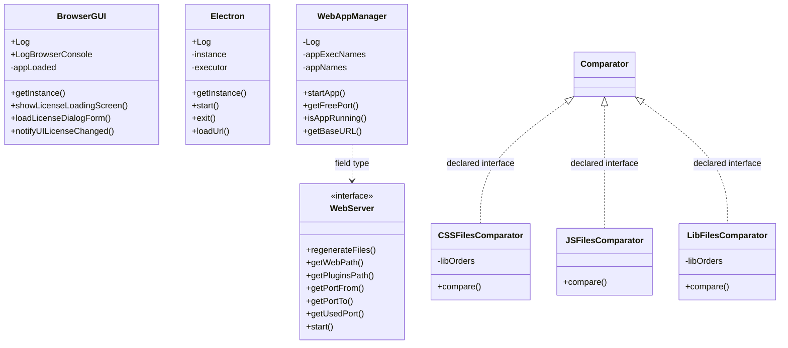
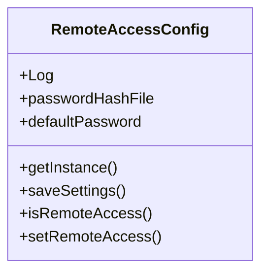
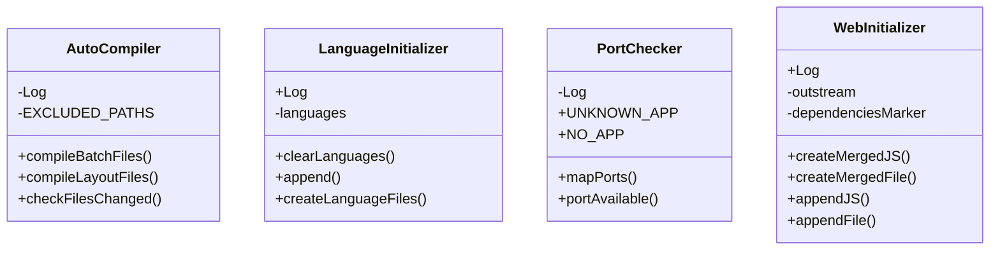
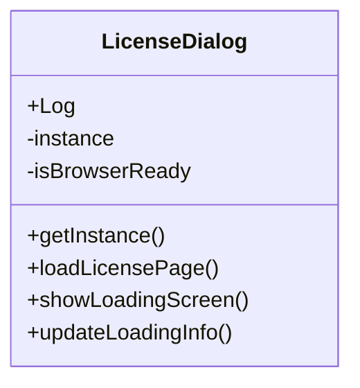
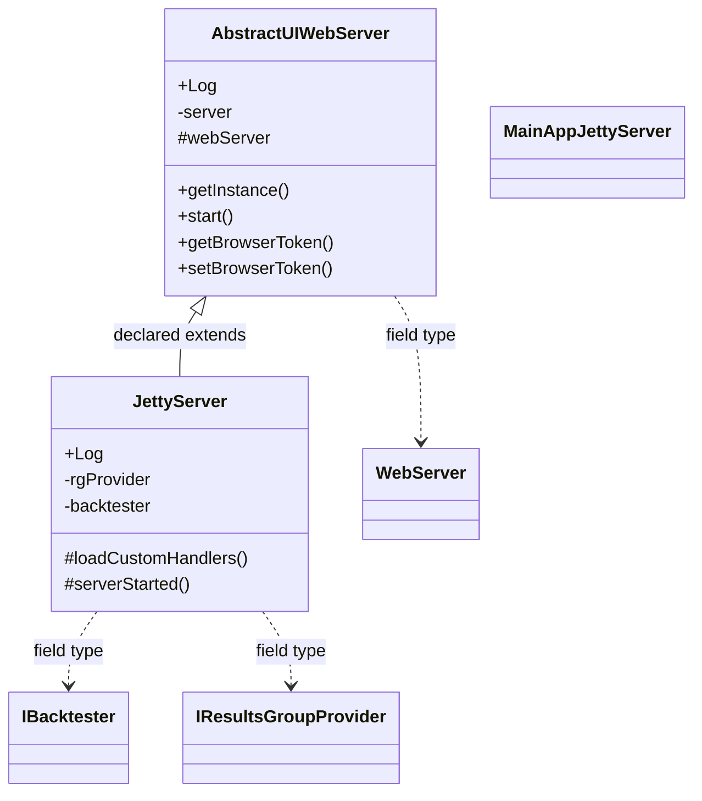
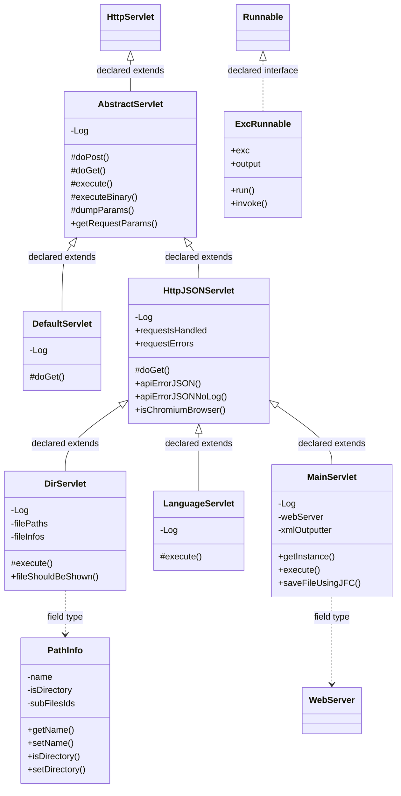
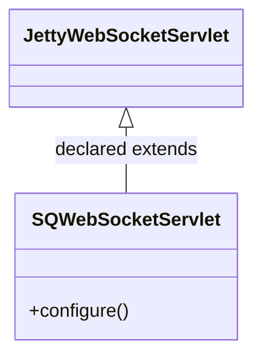

# SQWebGUILib.jar

[Workspace/group index](README.md)  |  [All workspaces](../README.md)

## Scope and provenance

- Artifact: `SQX_REFERENCE_ROOT/internal/libs/SQWebGUILib.jar`.
- SHA-256: `3a319dc358d46207a0e4520c6dacb694039a3d5c35b0069c08a7e869aa6fd0af`.
- Inspected: 2026-10-05; generation timestamp `2026-10-05T19:04:16.344170+00:00`.
- Archive class entries: **34**; non-nested: **25**; nested/anonymous: **9**.
- Inspection: ZIP entry/manifest enumeration and `javap -p` declarations for every listed class.
- Repository source HEAD: `8a92c705183a6702eaf62037ccb202ed028aa899`; review state: generated, pending owner review.
- Installed SQX build number is unverified. No method bodies are reproduced.
- Confidence: high for declared structure; workspace ownership inferred except where registration evidence is separately stated. Runtime reachability, call order, formulas and parity remain unverified.

Shared component: a single canonical document is linked from relevant workspace indexes. Its presence here does not establish which workspaces load it at runtime.

Target mapping: no verified owning HaruQuantAI feature/requirement/decision IDs are assigned by this document. Register or resolve ownership through the normal repository plan before implementation.

## Diagram reading guide

`Parent <|-- Child` means declared inheritance; `Interface <|.. Class` means declared implementation. Interface extension uses the inheritance arrow. `A ..> B : field type` is a declared type dependency, not composition, object ownership or a runtime call. External nodes are referenced types, not fabricated local implementations. Selected fields/method names aid navigation: `+` is public, `#` protected and `-` private. Diagram method names omit parameter/return types and collapse overloads; use the exact inspected declarations below before implementing an API.

Detailed graphs include non-nested classes in package-sized groups of at most 12. Nested/anonymous classes are inventoried and their declarations/relationships are retained below, but omitted from overview graphs. Relationships not drawn for readability remain in the complete declaration-relationship table. Constructors, synthetic bridges and overloads may be collapsed in diagram member lists only. Standard `java.lang.Object` inheritance is omitted from diagrams.

## UML class diagrams

### 1. `com.strategyquant.webguilib`



| Diagram identifier | Exact type | Location |
| --- | --- | --- |
| `Cf1deeff0de1b` | `com.strategyquant.webguilib.BrowserGUI` (this JAR) | this diagram |
| `C76c3a7f065ee` | `com.strategyquant.webguilib.CSSFilesComparator` (this JAR) | this diagram |
| `C73515d417f51` | `com.strategyquant.webguilib.Electron` (this JAR) | this diagram |
| `C092ca57bdeec` | `com.strategyquant.webguilib.JSFilesComparator` (this JAR) | this diagram |
| `C100a2d75b67a` | `com.strategyquant.webguilib.LibFilesComparator` (this JAR) | this diagram |
| `Cf0a160d1c297` | `com.strategyquant.webguilib.WebAppManager` (this JAR) | this diagram |
| `Cfeee57068a8b` | `com.strategyquant.webguilib.WebServer` (this JAR) | this diagram |
| `C702c79b2d89c` | `java.util.Comparator` (not resolved in scoped archives) | referenced external type |

### 2. `com.strategyquant.webguilib.config`



| Diagram identifier | Exact type | Location |
| --- | --- | --- |
| `C9bb3b61b1660` | `com.strategyquant.webguilib.config.RemoteAccessConfig` (this JAR) | this diagram |

### 3. `com.strategyquant.webguilib.init`



| Diagram identifier | Exact type | Location |
| --- | --- | --- |
| `C3a293dd2c82f` | `com.strategyquant.webguilib.init.AutoCompiler` (this JAR) | this diagram |
| `C24fcff23a9c6` | `com.strategyquant.webguilib.init.LanguageInitializer` (this JAR) | this diagram |
| `C28900b22322b` | `com.strategyquant.webguilib.init.PortChecker` (this JAR) | this diagram |
| `Cfacb84afd373` | `com.strategyquant.webguilib.init.WebInitializer` (this JAR) | this diagram |

### 4. `com.strategyquant.webguilib.license`



| Diagram identifier | Exact type | Location |
| --- | --- | --- |
| `C1b76e466392c` | `com.strategyquant.webguilib.license.LicenseDialog` (this JAR) | this diagram |

### 5. `com.strategyquant.webguilib.server`



| Diagram identifier | Exact type | Location |
| --- | --- | --- |
| `Cc90fa75a7032` | [`com.strategyquant.tradinglib.backtest.IBacktester`](SQTradingLib.md) | referenced external type |
| `C9ceba9ba4bac` | [`com.strategyquant.tradinglib.results.IResultsGroupProvider`](SQTradingLib.md) | referenced external type |
| `Cfeee57068a8b` | `com.strategyquant.webguilib.WebServer` (this JAR) | another group in this JAR |
| `Cf3887dad68f9` | `com.strategyquant.webguilib.server.AbstractUIWebServer` (this JAR) | this diagram |
| `Cfb5faab87ca0` | `com.strategyquant.webguilib.server.JettyServer` (this JAR) | this diagram |
| `Cb6ab324bffb5` | `com.strategyquant.webguilib.server.MainAppJettyServer` (this JAR) | this diagram |

### 6. `com.strategyquant.webguilib.servlet`



| Diagram identifier | Exact type | Location |
| --- | --- | --- |
| `Cfeee57068a8b` | `com.strategyquant.webguilib.WebServer` (this JAR) | another group in this JAR |
| `Ceb8e7fb9f31c` | `com.strategyquant.webguilib.servlet.AbstractServlet` (this JAR) | this diagram |
| `Cf996f4b15326` | `com.strategyquant.webguilib.servlet.DefaultServlet` (this JAR) | this diagram |
| `C9c444b801ab4` | `com.strategyquant.webguilib.servlet.DirServlet` (this JAR) | this diagram |
| `Cf036c78e3adf` | `com.strategyquant.webguilib.servlet.ExcRunnable` (this JAR) | this diagram |
| `C8900f90ae594` | `com.strategyquant.webguilib.servlet.HttpJSONServlet` (this JAR) | this diagram |
| `C1e5b64d04293` | `com.strategyquant.webguilib.servlet.LanguageServlet` (this JAR) | this diagram |
| `C84d007948347` | `com.strategyquant.webguilib.servlet.MainServlet` (this JAR) | this diagram |
| `Ca6b084d7b6b9` | `com.strategyquant.webguilib.servlet.PathInfo` (this JAR) | this diagram |
| `Ce7bd77251ee9` | `jakarta.servlet.http.HttpServlet` (not resolved in scoped archives) | referenced external type |
| `C4e7cd4755214` | `java.lang.Runnable` (not resolved in scoped archives) | referenced external type |

### 7. `com.strategyquant.webguilib.websocket`



| Diagram identifier | Exact type | Location |
| --- | --- | --- |
| `Cff5643b5b97c` | `com.strategyquant.webguilib.websocket.SQWebSocketServlet` (this JAR) | this diagram |
| `C64f58dd8237f` | `org.eclipse.jetty.websocket.server.JettyWebSocketServlet` (not resolved in scoped archives) | referenced external type |

## Complete class inventory

| Fully qualified class | Kind | Entry |
| --- | --- | --- |
| `com.strategyquant.webguilib.BrowserGUI` | class | non-nested |
| `com.strategyquant.webguilib.CSSFilesComparator` | class | non-nested |
| `com.strategyquant.webguilib.Electron` | class | non-nested |
| `com.strategyquant.webguilib.JSFilesComparator` | class | non-nested |
| `com.strategyquant.webguilib.LibFilesComparator` | class | non-nested |
| `com.strategyquant.webguilib.WebAppManager` | class | non-nested |
| `com.strategyquant.webguilib.WebServer` | interface | non-nested |
| `com.strategyquant.webguilib.config.RemoteAccessConfig` | class | non-nested |
| `com.strategyquant.webguilib.init.AutoCompiler` | class | non-nested |
| `com.strategyquant.webguilib.init.LanguageInitializer` | class | non-nested |
| `com.strategyquant.webguilib.init.PortChecker` | class | non-nested |
| `com.strategyquant.webguilib.init.WebInitializer` | class | non-nested |
| `com.strategyquant.webguilib.license.LicenseDialog` | class | non-nested |
| `com.strategyquant.webguilib.license.LicenseDialog$1` | class | nested/anonymous |
| `com.strategyquant.webguilib.server.AbstractUIWebServer` | class | non-nested |
| `com.strategyquant.webguilib.server.JettyServer` | class | non-nested |
| `com.strategyquant.webguilib.server.MainAppJettyServer` | class | non-nested |
| `com.strategyquant.webguilib.servlet.AbstractServlet` | class | non-nested |
| `com.strategyquant.webguilib.servlet.DefaultServlet` | class | non-nested |
| `com.strategyquant.webguilib.servlet.DirServlet` | class | non-nested |
| `com.strategyquant.webguilib.servlet.ExcRunnable` | class | non-nested |
| `com.strategyquant.webguilib.servlet.HttpJSONServlet` | class | non-nested |
| `com.strategyquant.webguilib.servlet.LanguageServlet` | class | non-nested |
| `com.strategyquant.webguilib.servlet.MainServlet` | class | non-nested |
| `com.strategyquant.webguilib.servlet.MainServlet$1` | class | nested/anonymous |
| `com.strategyquant.webguilib.servlet.MainServlet$2` | class | nested/anonymous |
| `com.strategyquant.webguilib.servlet.MainServlet$3` | class | nested/anonymous |
| `com.strategyquant.webguilib.servlet.MainServlet$4` | class | nested/anonymous |
| `com.strategyquant.webguilib.servlet.MainServlet$5` | class | nested/anonymous |
| `com.strategyquant.webguilib.servlet.MainServlet$6` | class | nested/anonymous |
| `com.strategyquant.webguilib.servlet.MainServlet$6$1` | class | nested/anonymous |
| `com.strategyquant.webguilib.servlet.MainServlet$7` | class | nested/anonymous |
| `com.strategyquant.webguilib.servlet.PathInfo` | class | non-nested |
| `com.strategyquant.webguilib.websocket.SQWebSocketServlet` | class | non-nested |

## Declared relationships and evidence locations

Every row is supported by the named class declaration/member in `javap -p`, inside the artifact recorded above. Signature dependencies may include return, parameter, generic-argument and throws types; they do not imply execution.

| Declaring class | Referenced type | Relationship | Narrow inspection location |
| --- | --- | --- | --- |
| `com.strategyquant.webguilib.BrowserGUI` | `org.slf4j.Logger` (not resolved in scoped archives) | type dependency | `com.strategyquant.webguilib.BrowserGUI` / field declaration: `public static final org.slf4j.Logger Log;`<br>`public static final org.slf4j.Logger LogBrowserConsole;` |
| `com.strategyquant.webguilib.BrowserGUI` | `java.lang.String` (not resolved in scoped archives) | type dependency | `com.strategyquant.webguilib.BrowserGUI` / method signature: `public com.strategyquant.webguilib.BrowserGUI(java.lang.String);`<br>`public void init(java.lang.String);`<br>`public java.lang.String getAppUrl();`<br>`public static void showErrorDialog(java.lang.String, java.lang.String);`<br>`public void setTitle(java.lang.String);` |
| `com.strategyquant.webguilib.BrowserGUI` | `java.lang.Boolean` (not resolved in scoped archives) | type dependency | `com.strategyquant.webguilib.BrowserGUI` / method signature: `public static void notifyUILicenseChanged(java.lang.Boolean);` |
| `com.strategyquant.webguilib.CSSFilesComparator` | `java.util.Comparator` (not resolved in scoped archives) | implements | `com.strategyquant.webguilib.CSSFilesComparator` / class declaration: `public class com.strategyquant.webguilib.CSSFilesComparator implements java.util.Comparator<java.lang.String>` |
| `com.strategyquant.webguilib.CSSFilesComparator` | `java.lang.String` (not resolved in scoped archives) | type dependency | `com.strategyquant.webguilib.CSSFilesComparator` / field declaration: `private final java.lang.String[] libOrders;` |
| `com.strategyquant.webguilib.CSSFilesComparator` | `java.lang.String` (not resolved in scoped archives) | type dependency | `com.strategyquant.webguilib.CSSFilesComparator` / method signature: `public int compare(java.lang.String, java.lang.String);`<br>`private int getIndex(java.lang.String);` |
| `com.strategyquant.webguilib.CSSFilesComparator` | `java.lang.Object` (not resolved in scoped archives) | type dependency | `com.strategyquant.webguilib.CSSFilesComparator` / method signature: `public int compare(java.lang.Object, java.lang.Object);` |
| `com.strategyquant.webguilib.Electron` | `org.slf4j.Logger` (not resolved in scoped archives) | type dependency | `com.strategyquant.webguilib.Electron` / field declaration: `public static final org.slf4j.Logger Log;` |
| `com.strategyquant.webguilib.Electron` | `org.apache.commons.exec.DefaultExecutor` (not resolved in scoped archives) | type dependency | `com.strategyquant.webguilib.Electron` / field declaration: `private org.apache.commons.exec.DefaultExecutor executor;` |
| `com.strategyquant.webguilib.Electron` | `java.lang.String` (not resolved in scoped archives) | type dependency | `com.strategyquant.webguilib.Electron` / method signature: `private java.lang.String getIcon(com.strategyquant.lib.hw.OperatingSystem);`<br>`public void loadUrl(java.lang.String);`<br>`public void loadFile(java.lang.String);`<br>`public void setTitle(java.lang.String);` |
| `com.strategyquant.webguilib.Electron` | `com.strategyquant.lib.hw.OperatingSystem` (not resolved in scoped archives) | type dependency | `com.strategyquant.webguilib.Electron` / method signature: `private java.lang.String getIcon(com.strategyquant.lib.hw.OperatingSystem);` |
| `com.strategyquant.webguilib.JSFilesComparator` | `java.util.Comparator` (not resolved in scoped archives) | implements | `com.strategyquant.webguilib.JSFilesComparator` / class declaration: `public class com.strategyquant.webguilib.JSFilesComparator implements java.util.Comparator<java.lang.String>` |
| `com.strategyquant.webguilib.JSFilesComparator` | `java.lang.String` (not resolved in scoped archives) | type dependency | `com.strategyquant.webguilib.JSFilesComparator` / method signature: `public int compare(java.lang.String, java.lang.String);`<br>`private int getValue(java.lang.String);` |
| `com.strategyquant.webguilib.JSFilesComparator` | `java.lang.Object` (not resolved in scoped archives) | type dependency | `com.strategyquant.webguilib.JSFilesComparator` / method signature: `public int compare(java.lang.Object, java.lang.Object);` |
| `com.strategyquant.webguilib.LibFilesComparator` | `java.util.Comparator` (not resolved in scoped archives) | implements | `com.strategyquant.webguilib.LibFilesComparator` / class declaration: `public class com.strategyquant.webguilib.LibFilesComparator implements java.util.Comparator<java.lang.String>` |
| `com.strategyquant.webguilib.LibFilesComparator` | `java.lang.String` (not resolved in scoped archives) | type dependency | `com.strategyquant.webguilib.LibFilesComparator` / field declaration: `private final java.lang.String[] libOrders;` |
| `com.strategyquant.webguilib.LibFilesComparator` | `java.lang.String` (not resolved in scoped archives) | type dependency | `com.strategyquant.webguilib.LibFilesComparator` / method signature: `public int compare(java.lang.String, java.lang.String);`<br>`private int getIndex(java.lang.String);` |
| `com.strategyquant.webguilib.LibFilesComparator` | `java.lang.Object` (not resolved in scoped archives) | type dependency | `com.strategyquant.webguilib.LibFilesComparator` / method signature: `public int compare(java.lang.Object, java.lang.Object);` |
| `com.strategyquant.webguilib.WebAppManager` | `org.slf4j.Logger` (not resolved in scoped archives) | type dependency | `com.strategyquant.webguilib.WebAppManager` / field declaration: `private static final org.slf4j.Logger Log;` |
| `com.strategyquant.webguilib.WebAppManager` | `java.util.Map` (not resolved in scoped archives) | type dependency | `com.strategyquant.webguilib.WebAppManager` / field declaration: `private static java.util.Map<java.lang.String, java.lang.String> appExecNames;`<br>`private static java.util.Map<java.lang.String, java.lang.String> appNames;`<br>`private static java.util.Map<java.lang.String, java.lang.Integer> appPorts;`<br>`private static java.util.Map<java.lang.String, java.lang.String> traderApps;`<br>`private static java.util.Map<java.lang.String, java.lang.String> quantApps;` |
| `com.strategyquant.webguilib.WebAppManager` | `java.util.Map` (not resolved in scoped archives) | type dependency | `com.strategyquant.webguilib.WebAppManager` / method signature: `public java.util.Map<java.lang.String, java.lang.String> getApps();`<br>`public static java.util.Map<java.lang.String, java.lang.Integer> getAppPorts();` |
| `com.strategyquant.webguilib.WebAppManager` | `java.lang.String` (not resolved in scoped archives) | type dependency | `com.strategyquant.webguilib.WebAppManager` / field declaration: `private static java.util.Map<java.lang.String, java.lang.String> appExecNames;`<br>`private static java.util.Map<java.lang.String, java.lang.String> appNames;`<br>`private static java.util.Map<java.lang.String, java.lang.Integer> appPorts;`<br>`private static java.util.Map<java.lang.String, java.lang.String> traderApps;`<br>`private static java.util.Map<java.lang.String, java.lang.String> quantApps;`<br>`private static java.util.LinkedHashMap<java.lang.Integer, java.lang.String> portMap;` |
| `com.strategyquant.webguilib.WebAppManager` | `java.lang.String` (not resolved in scoped archives) | type dependency | `com.strategyquant.webguilib.WebAppManager` / method signature: `public void startApp(java.lang.String) throws java.lang.Exception;`<br>`public boolean isAppRunning(java.lang.String);`<br>`public static java.lang.String getBaseURL(int);`<br>`public java.lang.String findActiveWebSocket();`<br>`public java.util.Map<java.lang.String, java.lang.String> getApps();`<br>`public java.lang.String getAppName();`<br>`public static java.util.Map<java.lang.String, java.lang.Integer> getAppPorts();` |
| `com.strategyquant.webguilib.WebAppManager` | `java.lang.Integer` (not resolved in scoped archives) | type dependency | `com.strategyquant.webguilib.WebAppManager` / field declaration: `private static java.util.Map<java.lang.String, java.lang.Integer> appPorts;`<br>`private static java.util.LinkedHashMap<java.lang.Integer, java.lang.String> portMap;` |
| `com.strategyquant.webguilib.WebAppManager` | `java.lang.Integer` (not resolved in scoped archives) | type dependency | `com.strategyquant.webguilib.WebAppManager` / method signature: `public static java.util.Map<java.lang.String, java.lang.Integer> getAppPorts();` |
| `com.strategyquant.webguilib.WebAppManager` | `java.util.LinkedHashMap` (not resolved in scoped archives) | type dependency | `com.strategyquant.webguilib.WebAppManager` / field declaration: `private static java.util.LinkedHashMap<java.lang.Integer, java.lang.String> portMap;` |
| `com.strategyquant.webguilib.WebAppManager` | `com.strategyquant.webguilib.WebServer` (this JAR) | type dependency | `com.strategyquant.webguilib.WebAppManager` / field declaration: `private com.strategyquant.webguilib.WebServer webServer;` |
| `com.strategyquant.webguilib.WebAppManager` | `com.strategyquant.webguilib.WebServer` (this JAR) | type dependency | `com.strategyquant.webguilib.WebAppManager` / method signature: `public com.strategyquant.webguilib.WebAppManager(com.strategyquant.webguilib.WebServer);` |
| `com.strategyquant.webguilib.WebAppManager` | `java.lang.Exception` (not resolved in scoped archives) | type dependency | `com.strategyquant.webguilib.WebAppManager` / method signature: `public void startApp(java.lang.String) throws java.lang.Exception;` |
| `com.strategyquant.webguilib.WebServer` | `java.lang.Exception` (not resolved in scoped archives) | type dependency | `com.strategyquant.webguilib.WebServer` / method signature: `public abstract void regenerateFiles() throws java.lang.Exception;`<br>`public abstract void start() throws java.lang.Exception;` |
| `com.strategyquant.webguilib.WebServer` | `java.lang.String` (not resolved in scoped archives) | type dependency | `com.strategyquant.webguilib.WebServer` / method signature: `public abstract java.lang.String getWebPath();`<br>`public abstract java.lang.String getPluginsPath();`<br>`public abstract void showErrorDialog(java.lang.String, java.lang.String);`<br>`public abstract java.lang.String getBaseURL();` |
| `com.strategyquant.webguilib.WebServer` | `com.strategyquant.webguilib.WebAppManager` (this JAR) | type dependency | `com.strategyquant.webguilib.WebServer` / method signature: `public abstract com.strategyquant.webguilib.WebAppManager getWebAppManager();` |
| `com.strategyquant.webguilib.config.RemoteAccessConfig` | `org.slf4j.Logger` (not resolved in scoped archives) | type dependency | `com.strategyquant.webguilib.config.RemoteAccessConfig` / field declaration: `public static final org.slf4j.Logger Log;` |
| `com.strategyquant.webguilib.config.RemoteAccessConfig` | `java.lang.String` (not resolved in scoped archives) | type dependency | `com.strategyquant.webguilib.config.RemoteAccessConfig` / field declaration: `public static final java.lang.String passwordHashFile;`<br>`public static final java.lang.String defaultPassword;`<br>`private java.lang.String password;` |
| `com.strategyquant.webguilib.config.RemoteAccessConfig` | `java.lang.String` (not resolved in scoped archives) | type dependency | `com.strategyquant.webguilib.config.RemoteAccessConfig` / method signature: `public java.lang.String getPassword();`<br>`public void setPassword(java.lang.String) throws java.lang.Exception;`<br>`private java.lang.String getMD5(java.lang.String) throws java.lang.Exception;`<br>`public boolean passwordValid(java.lang.String) throws java.lang.Exception;` |
| `com.strategyquant.webguilib.config.RemoteAccessConfig` | `org.jdom2.Element` (not resolved in scoped archives) | type dependency | `com.strategyquant.webguilib.config.RemoteAccessConfig` / method signature: `private org.jdom2.Element createSettings();` |
| `com.strategyquant.webguilib.config.RemoteAccessConfig` | `java.lang.Exception` (not resolved in scoped archives) | type dependency | `com.strategyquant.webguilib.config.RemoteAccessConfig` / method signature: `public void setPassword(java.lang.String) throws java.lang.Exception;`<br>`private java.lang.String getMD5(java.lang.String) throws java.lang.Exception;`<br>`public boolean passwordValid(java.lang.String) throws java.lang.Exception;` |
| `com.strategyquant.webguilib.init.AutoCompiler` | `org.slf4j.Logger` (not resolved in scoped archives) | type dependency | `com.strategyquant.webguilib.init.AutoCompiler` / field declaration: `private static final org.slf4j.Logger Log;` |
| `com.strategyquant.webguilib.init.AutoCompiler` | `java.lang.String` (not resolved in scoped archives) | type dependency | `com.strategyquant.webguilib.init.AutoCompiler` / field declaration: `private static final java.lang.String[] EXCLUDED_PATHS;` |
| `com.strategyquant.webguilib.init.AutoCompiler` | `java.lang.String` (not resolved in scoped archives) | type dependency | `com.strategyquant.webguilib.init.AutoCompiler` / method signature: `public static void compileLayoutFiles(com.strategyquant.webguilib.WebServer, java.lang.String) throws java.lang.Exception;`<br>`private static void compileBatch1(com.strategyquant.webguilib.WebServer, java.util.HashMap<java.lang.String, java.util.ArrayList<java.lang.String>>, java.lang.String, java.lang.String) throws java.lang.Exception;`<br>`private static void compileBatch2(java.util.HashMap<java.lang.String, java.util.ArrayList<java.lang.String>>, java.lang.String, java.lang.String) throws java.lang.Exception;`<br>`private static void compileBatch3(java.util.HashMap<java.lang.String, java.util.ArrayList<java.lang.String>>, java.lang.String, java.lang.String) throws java.lang.Exception;`<br>`private static void compileSQFiles(com.strategyquant.webguilib.WebServer, java.util.HashMap<java.lang.String, java.util.ArrayList<java.lang.String>>, java.lang.String, java.lang.String, java.lang.String, java.lang.String) throws java.lang.Exception;`<br>`private static void compileBatchLibs(java.util.HashMap<java.lang.String, java.util.ArrayList<java.lang.String>>, java.lang.String, java.lang.String, java.lang.String) throws java.lang.Exception;`<br>`private static void loadAllFiles(java.lang.String, java.util.HashMap<java.lang.String, java.util.ArrayList<java.lang.String>>) throws java.lang.Exception;`<br>`private static boolean isExcludedPath(java.lang.String);`<br>`private static java.lang.String normalizePath(java.lang.String);` |
| `com.strategyquant.webguilib.init.AutoCompiler` | `com.strategyquant.webguilib.WebServer` (this JAR) | type dependency | `com.strategyquant.webguilib.init.AutoCompiler` / method signature: `public static void compileBatchFiles(com.strategyquant.webguilib.WebServer) throws java.lang.Exception;`<br>`public static void compileLayoutFiles(com.strategyquant.webguilib.WebServer, java.lang.String) throws java.lang.Exception;`<br>`public static boolean checkFilesChanged(com.strategyquant.webguilib.WebServer);`<br>`private static void compileBatch1(com.strategyquant.webguilib.WebServer, java.util.HashMap<java.lang.String, java.util.ArrayList<java.lang.String>>, java.lang.String, java.lang.String) throws java.lang.Exception;`<br>`private static void compileSQFiles(com.strategyquant.webguilib.WebServer, java.util.HashMap<java.lang.String, java.util.ArrayList<java.lang.String>>, java.lang.String, java.lang.String, java.lang.String, java.lang.String) throws java.lang.Exception;` |
| `com.strategyquant.webguilib.init.AutoCompiler` | `java.lang.Exception` (not resolved in scoped archives) | type dependency | `com.strategyquant.webguilib.init.AutoCompiler` / method signature: `public static void compileBatchFiles(com.strategyquant.webguilib.WebServer) throws java.lang.Exception;`<br>`public static void compileLayoutFiles(com.strategyquant.webguilib.WebServer, java.lang.String) throws java.lang.Exception;`<br>`private static void compileBatch1(com.strategyquant.webguilib.WebServer, java.util.HashMap<java.lang.String, java.util.ArrayList<java.lang.String>>, java.lang.String, java.lang.String) throws java.lang.Exception;`<br>`private static void compileBatch2(java.util.HashMap<java.lang.String, java.util.ArrayList<java.lang.String>>, java.lang.String, java.lang.String) throws java.lang.Exception;`<br>`private static void compileBatch3(java.util.HashMap<java.lang.String, java.util.ArrayList<java.lang.String>>, java.lang.String, java.lang.String) throws java.lang.Exception;`<br>`private static void compileSQFiles(com.strategyquant.webguilib.WebServer, java.util.HashMap<java.lang.String, java.util.ArrayList<java.lang.String>>, java.lang.String, java.lang.String, java.lang.String, java.lang.String) throws java.lang.Exception;`<br>`private static void compileBatchLibs(java.util.HashMap<java.lang.String, java.util.ArrayList<java.lang.String>>, java.lang.String, java.lang.String, java.lang.String) throws java.lang.Exception;`<br>`private static void loadAllFiles(java.lang.String, java.util.HashMap<java.lang.String, java.util.ArrayList<java.lang.String>>) throws java.lang.Exception;` |
| `com.strategyquant.webguilib.init.AutoCompiler` | `java.util.HashMap` (not resolved in scoped archives) | type dependency | `com.strategyquant.webguilib.init.AutoCompiler` / method signature: `private static void compileBatch1(com.strategyquant.webguilib.WebServer, java.util.HashMap<java.lang.String, java.util.ArrayList<java.lang.String>>, java.lang.String, java.lang.String) throws java.lang.Exception;`<br>`private static void compileBatch2(java.util.HashMap<java.lang.String, java.util.ArrayList<java.lang.String>>, java.lang.String, java.lang.String) throws java.lang.Exception;`<br>`private static void compileBatch3(java.util.HashMap<java.lang.String, java.util.ArrayList<java.lang.String>>, java.lang.String, java.lang.String) throws java.lang.Exception;`<br>`private static void compileSQFiles(com.strategyquant.webguilib.WebServer, java.util.HashMap<java.lang.String, java.util.ArrayList<java.lang.String>>, java.lang.String, java.lang.String, java.lang.String, java.lang.String) throws java.lang.Exception;`<br>`private static void compileBatchLibs(java.util.HashMap<java.lang.String, java.util.ArrayList<java.lang.String>>, java.lang.String, java.lang.String, java.lang.String) throws java.lang.Exception;`<br>`private static void loadAllFiles(java.lang.String, java.util.HashMap<java.lang.String, java.util.ArrayList<java.lang.String>>) throws java.lang.Exception;` |
| `com.strategyquant.webguilib.init.AutoCompiler` | `java.util.ArrayList` (not resolved in scoped archives) | type dependency | `com.strategyquant.webguilib.init.AutoCompiler` / method signature: `private static void compileBatch1(com.strategyquant.webguilib.WebServer, java.util.HashMap<java.lang.String, java.util.ArrayList<java.lang.String>>, java.lang.String, java.lang.String) throws java.lang.Exception;`<br>`private static void compileBatch2(java.util.HashMap<java.lang.String, java.util.ArrayList<java.lang.String>>, java.lang.String, java.lang.String) throws java.lang.Exception;`<br>`private static void compileBatch3(java.util.HashMap<java.lang.String, java.util.ArrayList<java.lang.String>>, java.lang.String, java.lang.String) throws java.lang.Exception;`<br>`private static void compileSQFiles(com.strategyquant.webguilib.WebServer, java.util.HashMap<java.lang.String, java.util.ArrayList<java.lang.String>>, java.lang.String, java.lang.String, java.lang.String, java.lang.String) throws java.lang.Exception;`<br>`private static void compileBatchLibs(java.util.HashMap<java.lang.String, java.util.ArrayList<java.lang.String>>, java.lang.String, java.lang.String, java.lang.String) throws java.lang.Exception;`<br>`private static void loadAllFiles(java.lang.String, java.util.HashMap<java.lang.String, java.util.ArrayList<java.lang.String>>) throws java.lang.Exception;` |
| `com.strategyquant.webguilib.init.LanguageInitializer` | `org.slf4j.Logger` (not resolved in scoped archives) | type dependency | `com.strategyquant.webguilib.init.LanguageInitializer` / field declaration: `public static final org.slf4j.Logger Log;` |
| `com.strategyquant.webguilib.init.LanguageInitializer` | `java.util.Map` (not resolved in scoped archives) | type dependency | `com.strategyquant.webguilib.init.LanguageInitializer` / field declaration: `private static java.util.Map<java.lang.String, java.lang.String> languages;` |
| `com.strategyquant.webguilib.init.LanguageInitializer` | `java.lang.String` (not resolved in scoped archives) | type dependency | `com.strategyquant.webguilib.init.LanguageInitializer` / field declaration: `private static java.util.Map<java.lang.String, java.lang.String> languages;` |
| `com.strategyquant.webguilib.init.LanguageInitializer` | `java.lang.String` (not resolved in scoped archives) | type dependency | `com.strategyquant.webguilib.init.LanguageInitializer` / method signature: `public static void append(java.lang.String) throws java.lang.Exception;`<br>`public static void createLanguageFiles(java.lang.String) throws java.io.IOException;` |
| `com.strategyquant.webguilib.init.LanguageInitializer` | `java.lang.Exception` (not resolved in scoped archives) | type dependency | `com.strategyquant.webguilib.init.LanguageInitializer` / method signature: `public static void append(java.lang.String) throws java.lang.Exception;` |
| `com.strategyquant.webguilib.init.LanguageInitializer` | `java.io.IOException` (not resolved in scoped archives) | type dependency | `com.strategyquant.webguilib.init.LanguageInitializer` / method signature: `public static void createLanguageFiles(java.lang.String) throws java.io.IOException;` |
| `com.strategyquant.webguilib.init.PortChecker` | `org.slf4j.Logger` (not resolved in scoped archives) | type dependency | `com.strategyquant.webguilib.init.PortChecker` / field declaration: `private static final org.slf4j.Logger Log;` |
| `com.strategyquant.webguilib.init.PortChecker` | `java.lang.String` (not resolved in scoped archives) | type dependency | `com.strategyquant.webguilib.init.PortChecker` / field declaration: `public static final java.lang.String UNKNOWN_APP;`<br>`public static final java.lang.String NO_APP;` |
| `com.strategyquant.webguilib.init.PortChecker` | `java.lang.String` (not resolved in scoped archives) | type dependency | `com.strategyquant.webguilib.init.PortChecker` / method signature: `public static java.util.LinkedHashMap<java.lang.Integer, java.lang.String> mapPorts(int, int);`<br>`private static java.lang.String tryGetAppCode(int);` |
| `com.strategyquant.webguilib.init.PortChecker` | `java.util.LinkedHashMap` (not resolved in scoped archives) | type dependency | `com.strategyquant.webguilib.init.PortChecker` / method signature: `public static java.util.LinkedHashMap<java.lang.Integer, java.lang.String> mapPorts(int, int);` |
| `com.strategyquant.webguilib.init.PortChecker` | `java.lang.Integer` (not resolved in scoped archives) | type dependency | `com.strategyquant.webguilib.init.PortChecker` / method signature: `public static java.util.LinkedHashMap<java.lang.Integer, java.lang.String> mapPorts(int, int);` |
| `com.strategyquant.webguilib.init.WebInitializer` | `org.slf4j.Logger` (not resolved in scoped archives) | type dependency | `com.strategyquant.webguilib.init.WebInitializer` / field declaration: `public static final org.slf4j.Logger Log;` |
| `com.strategyquant.webguilib.init.WebInitializer` | `java.io.FileOutputStream` (not resolved in scoped archives) | type dependency | `com.strategyquant.webguilib.init.WebInitializer` / field declaration: `private static java.io.FileOutputStream outstream;` |
| `com.strategyquant.webguilib.init.WebInitializer` | `java.lang.String` (not resolved in scoped archives) | type dependency | `com.strategyquant.webguilib.init.WebInitializer` / field declaration: `private static final java.lang.String dependenciesMarker;`<br>`private static java.util.ArrayList<java.lang.String> moduleNames;` |
| `com.strategyquant.webguilib.init.WebInitializer` | `java.lang.String` (not resolved in scoped archives) | type dependency | `com.strategyquant.webguilib.init.WebInitializer` / method signature: `public static void createMergedJS(java.lang.String, boolean) throws java.lang.Exception;`<br>`public static void createMergedFile(java.lang.String, boolean) throws java.lang.Exception;`<br>`public static void appendJS(java.lang.String) throws java.lang.Exception;`<br>`private static void tryLoadModuleName(java.lang.String) throws java.lang.Exception;`<br>`public static void appendFile(java.lang.String) throws java.lang.Exception;`<br>`public static void appendHTMLTemplateFile(java.lang.String) throws java.lang.Exception;`<br>`private static java.lang.String getFileURLPath(java.lang.String);`<br>`public static void createAppJSFromTemplate(java.lang.String, java.lang.String) throws java.lang.Exception;`<br>`private static java.lang.String getDependencies();`<br>`public static void stringToFile(java.lang.String) throws java.lang.Exception;` |
| `com.strategyquant.webguilib.init.WebInitializer` | `java.util.ArrayList` (not resolved in scoped archives) | type dependency | `com.strategyquant.webguilib.init.WebInitializer` / field declaration: `private static java.util.ArrayList<java.lang.String> moduleNames;` |
| `com.strategyquant.webguilib.init.WebInitializer` | `java.lang.Exception` (not resolved in scoped archives) | type dependency | `com.strategyquant.webguilib.init.WebInitializer` / method signature: `public static void createMergedJS(java.lang.String, boolean) throws java.lang.Exception;`<br>`public static void createMergedFile(java.lang.String, boolean) throws java.lang.Exception;`<br>`public static void appendJS(java.lang.String) throws java.lang.Exception;`<br>`private static void tryLoadModuleName(java.lang.String) throws java.lang.Exception;`<br>`public static void appendFile(java.lang.String) throws java.lang.Exception;`<br>`public static void appendHTMLTemplateFile(java.lang.String) throws java.lang.Exception;`<br>`public static void createAppJSFromTemplate(java.lang.String, java.lang.String) throws java.lang.Exception;`<br>`public static void fileToFile(java.io.File) throws java.lang.Exception;`<br>`public static void stringToFile(java.lang.String) throws java.lang.Exception;` |
| `com.strategyquant.webguilib.init.WebInitializer` | `java.io.File` (not resolved in scoped archives) | type dependency | `com.strategyquant.webguilib.init.WebInitializer` / method signature: `public static void fileToFile(java.io.File) throws java.lang.Exception;` |
| `com.strategyquant.webguilib.license.LicenseDialog` | `org.slf4j.Logger` (not resolved in scoped archives) | type dependency | `com.strategyquant.webguilib.license.LicenseDialog` / field declaration: `public static final org.slf4j.Logger Log;` |
| `com.strategyquant.webguilib.license.LicenseDialog` | `java.lang.String` (not resolved in scoped archives) | type dependency | `com.strategyquant.webguilib.license.LicenseDialog` / method signature: `public void updateLoadingInfo(java.lang.String);`<br>`private java.lang.String getLoadingScreenHTMLPath();` |
| `com.strategyquant.webguilib.license.LicenseDialog$1` | `java.lang.Thread` (not resolved in scoped archives) | extends | `com.strategyquant.webguilib.license.LicenseDialog$1` / class declaration: `class com.strategyquant.webguilib.license.LicenseDialog$1 extends java.lang.Thread` |
| `com.strategyquant.webguilib.license.LicenseDialog$1` | `com.strategyquant.webguilib.license.LicenseDialog` (this JAR) | type dependency | `com.strategyquant.webguilib.license.LicenseDialog$1` / field declaration: `final com.strategyquant.webguilib.license.LicenseDialog this$0;` |
| `com.strategyquant.webguilib.license.LicenseDialog$1` | `com.strategyquant.webguilib.license.LicenseDialog` (this JAR) | type dependency | `com.strategyquant.webguilib.license.LicenseDialog$1` / method signature: `com.strategyquant.webguilib.license.LicenseDialog$1(com.strategyquant.webguilib.license.LicenseDialog);` |
| `com.strategyquant.webguilib.server.AbstractUIWebServer` | `org.slf4j.Logger` (not resolved in scoped archives) | type dependency | `com.strategyquant.webguilib.server.AbstractUIWebServer` / field declaration: `public static final org.slf4j.Logger Log;` |
| `com.strategyquant.webguilib.server.AbstractUIWebServer` | `org.eclipse.jetty.server.Server` (not resolved in scoped archives) | type dependency | `com.strategyquant.webguilib.server.AbstractUIWebServer` / field declaration: `private org.eclipse.jetty.server.Server server;` |
| `com.strategyquant.webguilib.server.AbstractUIWebServer` | `com.strategyquant.webguilib.WebServer` (this JAR) | type dependency | `com.strategyquant.webguilib.server.AbstractUIWebServer` / field declaration: `protected com.strategyquant.webguilib.WebServer webServer;` |
| `com.strategyquant.webguilib.server.AbstractUIWebServer` | `com.strategyquant.webguilib.WebServer` (this JAR) | type dependency | `com.strategyquant.webguilib.server.AbstractUIWebServer` / method signature: `public com.strategyquant.webguilib.server.AbstractUIWebServer(com.strategyquant.webguilib.WebServer);` |
| `com.strategyquant.webguilib.server.AbstractUIWebServer` | `org.eclipse.jetty.server.handler.HandlerList` (not resolved in scoped archives) | type dependency | `com.strategyquant.webguilib.server.AbstractUIWebServer` / field declaration: `private org.eclipse.jetty.server.handler.HandlerList handlers;` |
| `com.strategyquant.webguilib.server.AbstractUIWebServer` | `org.eclipse.jetty.server.handler.HandlerList` (not resolved in scoped archives) | type dependency | `com.strategyquant.webguilib.server.AbstractUIWebServer` / method signature: `public void startServer(int, org.eclipse.jetty.server.handler.HandlerList) throws java.lang.Exception;` |
| `com.strategyquant.webguilib.server.AbstractUIWebServer` | `java.lang.Exception` (not resolved in scoped archives) | type dependency | `com.strategyquant.webguilib.server.AbstractUIWebServer` / method signature: `public void start() throws java.lang.Exception;`<br>`public void restartServer() throws java.lang.Exception;`<br>`public void startServer(int, org.eclipse.jetty.server.handler.HandlerList) throws java.lang.Exception;`<br>`public void stop() throws java.lang.Exception;` |
| `com.strategyquant.webguilib.server.AbstractUIWebServer` | `org.eclipse.jetty.server.Handler` (not resolved in scoped archives) | type dependency | `com.strategyquant.webguilib.server.AbstractUIWebServer` / method signature: `private org.eclipse.jetty.server.Handler[] loadAllHandlers();`<br>`protected abstract void loadCustomHandlers(java.util.List<org.eclipse.jetty.server.Handler>);`<br>`protected org.eclipse.jetty.server.handler.gzip.GzipHandler getGzipHandler(org.eclipse.jetty.server.Handler);` |
| `com.strategyquant.webguilib.server.AbstractUIWebServer` | `java.util.List` (not resolved in scoped archives) | type dependency | `com.strategyquant.webguilib.server.AbstractUIWebServer` / method signature: `protected abstract void loadCustomHandlers(java.util.List<org.eclipse.jetty.server.Handler>);` |
| `com.strategyquant.webguilib.server.AbstractUIWebServer` | `org.eclipse.jetty.server.handler.gzip.GzipHandler` (not resolved in scoped archives) | type dependency | `com.strategyquant.webguilib.server.AbstractUIWebServer` / method signature: `protected org.eclipse.jetty.server.handler.gzip.GzipHandler getGzipHandler(org.eclipse.jetty.server.Handler);` |
| `com.strategyquant.webguilib.server.AbstractUIWebServer` | `java.lang.String` (not resolved in scoped archives) | type dependency | `com.strategyquant.webguilib.server.AbstractUIWebServer` / method signature: `public java.lang.String getState();` |
| `com.strategyquant.webguilib.server.JettyServer` | `com.strategyquant.webguilib.server.AbstractUIWebServer` (this JAR) | extends | `com.strategyquant.webguilib.server.JettyServer` / class declaration: `public class com.strategyquant.webguilib.server.JettyServer extends com.strategyquant.webguilib.server.AbstractUIWebServer` |
| `com.strategyquant.webguilib.server.JettyServer` | `org.slf4j.Logger` (not resolved in scoped archives) | type dependency | `com.strategyquant.webguilib.server.JettyServer` / field declaration: `public static final org.slf4j.Logger Log;` |
| `com.strategyquant.webguilib.server.JettyServer` | [`com.strategyquant.tradinglib.results.IResultsGroupProvider`](SQTradingLib.md) | type dependency | `com.strategyquant.webguilib.server.JettyServer` / field declaration: `private static com.strategyquant.tradinglib.results.IResultsGroupProvider rgProvider;` |
| `com.strategyquant.webguilib.server.JettyServer` | [`com.strategyquant.tradinglib.results.IResultsGroupProvider`](SQTradingLib.md) | type dependency | `com.strategyquant.webguilib.server.JettyServer` / method signature: `public com.strategyquant.webguilib.server.JettyServer(com.strategyquant.webguilib.WebServer, com.strategyquant.tradinglib.results.IResultsGroupProvider, com.strategyquant.tradinglib.backtest.IBacktester, org.eclipse.jetty.websocket.server.JettyWebSocketServlet);` |
| `com.strategyquant.webguilib.server.JettyServer` | [`com.strategyquant.tradinglib.backtest.IBacktester`](SQTradingLib.md) | type dependency | `com.strategyquant.webguilib.server.JettyServer` / field declaration: `private static com.strategyquant.tradinglib.backtest.IBacktester backtester;` |
| `com.strategyquant.webguilib.server.JettyServer` | [`com.strategyquant.tradinglib.backtest.IBacktester`](SQTradingLib.md) | type dependency | `com.strategyquant.webguilib.server.JettyServer` / method signature: `public com.strategyquant.webguilib.server.JettyServer(com.strategyquant.webguilib.WebServer, com.strategyquant.tradinglib.results.IResultsGroupProvider, com.strategyquant.tradinglib.backtest.IBacktester, org.eclipse.jetty.websocket.server.JettyWebSocketServlet);` |
| `com.strategyquant.webguilib.server.JettyServer` | `org.eclipse.jetty.websocket.server.JettyWebSocketServlet` (not resolved in scoped archives) | type dependency | `com.strategyquant.webguilib.server.JettyServer` / field declaration: `private static org.eclipse.jetty.websocket.server.JettyWebSocketServlet webSocketServlet;` |
| `com.strategyquant.webguilib.server.JettyServer` | `org.eclipse.jetty.websocket.server.JettyWebSocketServlet` (not resolved in scoped archives) | type dependency | `com.strategyquant.webguilib.server.JettyServer` / method signature: `public com.strategyquant.webguilib.server.JettyServer(com.strategyquant.webguilib.WebServer, com.strategyquant.tradinglib.results.IResultsGroupProvider, com.strategyquant.tradinglib.backtest.IBacktester, org.eclipse.jetty.websocket.server.JettyWebSocketServlet);` |
| `com.strategyquant.webguilib.server.JettyServer` | `com.strategyquant.webguilib.WebServer` (this JAR) | type dependency | `com.strategyquant.webguilib.server.JettyServer` / method signature: `public com.strategyquant.webguilib.server.JettyServer(com.strategyquant.webguilib.WebServer, com.strategyquant.tradinglib.results.IResultsGroupProvider, com.strategyquant.tradinglib.backtest.IBacktester, org.eclipse.jetty.websocket.server.JettyWebSocketServlet);` |
| `com.strategyquant.webguilib.server.JettyServer` | `java.util.List` (not resolved in scoped archives) | type dependency | `com.strategyquant.webguilib.server.JettyServer` / method signature: `protected void loadCustomHandlers(java.util.List<org.eclipse.jetty.server.Handler>);` |
| `com.strategyquant.webguilib.server.JettyServer` | `org.eclipse.jetty.server.Handler` (not resolved in scoped archives) | type dependency | `com.strategyquant.webguilib.server.JettyServer` / method signature: `protected void loadCustomHandlers(java.util.List<org.eclipse.jetty.server.Handler>);` |
| `com.strategyquant.webguilib.servlet.AbstractServlet` | `jakarta.servlet.http.HttpServlet` (not resolved in scoped archives) | extends | `com.strategyquant.webguilib.servlet.AbstractServlet` / class declaration: `public abstract class com.strategyquant.webguilib.servlet.AbstractServlet extends jakarta.servlet.http.HttpServlet` |
| `com.strategyquant.webguilib.servlet.AbstractServlet` | `org.slf4j.Logger` (not resolved in scoped archives) | type dependency | `com.strategyquant.webguilib.servlet.AbstractServlet` / field declaration: `private static final org.slf4j.Logger Log;` |
| `com.strategyquant.webguilib.servlet.AbstractServlet` | `jakarta.servlet.http.HttpServletRequest` (not resolved in scoped archives) | type dependency | `com.strategyquant.webguilib.servlet.AbstractServlet` / method signature: `protected void doPost(jakarta.servlet.http.HttpServletRequest, jakarta.servlet.http.HttpServletResponse) throws jakarta.servlet.ServletException, java.io.IOException;`<br>`protected void doGet(jakarta.servlet.http.HttpServletRequest, jakarta.servlet.http.HttpServletResponse) throws jakarta.servlet.ServletException, java.io.IOException;`<br>`public void getRequestParams(jakarta.servlet.http.HttpServletRequest, java.util.Map<java.lang.String, java.lang.String[]>);`<br>`protected boolean tryLoadFilePart(jakarta.servlet.http.HttpServletRequest, java.util.Map<java.lang.String, java.lang.String[]>);` |
| `com.strategyquant.webguilib.servlet.AbstractServlet` | `jakarta.servlet.http.HttpServletResponse` (not resolved in scoped archives) | type dependency | `com.strategyquant.webguilib.servlet.AbstractServlet` / method signature: `protected void doPost(jakarta.servlet.http.HttpServletRequest, jakarta.servlet.http.HttpServletResponse) throws jakarta.servlet.ServletException, java.io.IOException;`<br>`protected void doGet(jakarta.servlet.http.HttpServletRequest, jakarta.servlet.http.HttpServletResponse) throws jakarta.servlet.ServletException, java.io.IOException;` |
| `com.strategyquant.webguilib.servlet.AbstractServlet` | `jakarta.servlet.ServletException` (not resolved in scoped archives) | type dependency | `com.strategyquant.webguilib.servlet.AbstractServlet` / method signature: `protected void doPost(jakarta.servlet.http.HttpServletRequest, jakarta.servlet.http.HttpServletResponse) throws jakarta.servlet.ServletException, java.io.IOException;`<br>`protected void doGet(jakarta.servlet.http.HttpServletRequest, jakarta.servlet.http.HttpServletResponse) throws jakarta.servlet.ServletException, java.io.IOException;` |
| `com.strategyquant.webguilib.servlet.AbstractServlet` | `java.io.IOException` (not resolved in scoped archives) | type dependency | `com.strategyquant.webguilib.servlet.AbstractServlet` / method signature: `protected void doPost(jakarta.servlet.http.HttpServletRequest, jakarta.servlet.http.HttpServletResponse) throws jakarta.servlet.ServletException, java.io.IOException;`<br>`protected void doGet(jakarta.servlet.http.HttpServletRequest, jakarta.servlet.http.HttpServletResponse) throws jakarta.servlet.ServletException, java.io.IOException;` |
| `com.strategyquant.webguilib.servlet.AbstractServlet` | `java.lang.String` (not resolved in scoped archives) | type dependency | `com.strategyquant.webguilib.servlet.AbstractServlet` / method signature: `protected java.lang.String execute(java.lang.String, java.lang.String, java.util.Map<java.lang.String, java.lang.String[]>, java.lang.String) throws java.lang.Exception;`<br>`protected java.lang.String execute(java.lang.String, java.util.Map<java.lang.String, java.lang.String[]>, java.lang.String) throws java.lang.Exception;`<br>`protected byte[] executeBinary(java.lang.String, java.util.Map<java.lang.String, java.lang.String[]>, java.lang.String) throws java.lang.Exception;`<br>`protected void dumpParams(java.util.Map<java.lang.String, java.lang.String[]>);`<br>`public void getRequestParams(jakarta.servlet.http.HttpServletRequest, java.util.Map<java.lang.String, java.lang.String[]>);`<br>`protected java.lang.String getParam(java.util.Map<java.lang.String, java.lang.String[]>, java.lang.String, java.lang.String);`<br>`protected java.lang.String[] getParam(java.util.Map<java.lang.String, java.lang.String[]>, java.lang.String);`<br>`protected void checkParamExists(java.util.Map<java.lang.String, java.lang.String[]>, java.lang.String[]) throws java.lang.Exception;`<br>`protected java.lang.String[] tryGetParam(java.util.Map<java.lang.String, java.lang.String[]>, java.lang.String) throws java.lang.Exception;`<br>`protected java.lang.String tryGetParamValue(java.util.Map<java.lang.String, java.lang.String[]>, java.lang.String) throws java.lang.Exception;`<br>`protected org.json.JSONObject tryGetJsonObject(java.util.Map<java.lang.String, java.lang.String[]>, java.lang.String) throws java.lang.Exception;`<br>`protected org.json.JSONArray tryGetJsonArray(java.util.Map<java.lang.String, java.lang.String[]>, java.lang.String) throws java.lang.Exception;`<br>`protected boolean tryLoadFilePart(jakarta.servlet.http.HttpServletRequest, java.util.Map<java.lang.String, java.lang.String[]>);`<br>`private java.lang.String getFileName(jakarta.servlet.http.Part);` |
| `com.strategyquant.webguilib.servlet.AbstractServlet` | `java.util.Map` (not resolved in scoped archives) | type dependency | `com.strategyquant.webguilib.servlet.AbstractServlet` / method signature: `protected java.lang.String execute(java.lang.String, java.lang.String, java.util.Map<java.lang.String, java.lang.String[]>, java.lang.String) throws java.lang.Exception;`<br>`protected java.lang.String execute(java.lang.String, java.util.Map<java.lang.String, java.lang.String[]>, java.lang.String) throws java.lang.Exception;`<br>`protected byte[] executeBinary(java.lang.String, java.util.Map<java.lang.String, java.lang.String[]>, java.lang.String) throws java.lang.Exception;`<br>`protected void dumpParams(java.util.Map<java.lang.String, java.lang.String[]>);`<br>`public void getRequestParams(jakarta.servlet.http.HttpServletRequest, java.util.Map<java.lang.String, java.lang.String[]>);`<br>`protected java.lang.String getParam(java.util.Map<java.lang.String, java.lang.String[]>, java.lang.String, java.lang.String);`<br>`protected java.lang.String[] getParam(java.util.Map<java.lang.String, java.lang.String[]>, java.lang.String);`<br>`protected void checkParamExists(java.util.Map<java.lang.String, java.lang.String[]>, java.lang.String[]) throws java.lang.Exception;`<br>`protected java.lang.String[] tryGetParam(java.util.Map<java.lang.String, java.lang.String[]>, java.lang.String) throws java.lang.Exception;`<br>`protected java.lang.String tryGetParamValue(java.util.Map<java.lang.String, java.lang.String[]>, java.lang.String) throws java.lang.Exception;`<br>`protected org.json.JSONObject tryGetJsonObject(java.util.Map<java.lang.String, java.lang.String[]>, java.lang.String) throws java.lang.Exception;`<br>`protected org.json.JSONArray tryGetJsonArray(java.util.Map<java.lang.String, java.lang.String[]>, java.lang.String) throws java.lang.Exception;`<br>`protected boolean tryLoadFilePart(jakarta.servlet.http.HttpServletRequest, java.util.Map<java.lang.String, java.lang.String[]>);` |
| `com.strategyquant.webguilib.servlet.AbstractServlet` | `java.lang.Exception` (not resolved in scoped archives) | type dependency | `com.strategyquant.webguilib.servlet.AbstractServlet` / method signature: `protected java.lang.String execute(java.lang.String, java.lang.String, java.util.Map<java.lang.String, java.lang.String[]>, java.lang.String) throws java.lang.Exception;`<br>`protected java.lang.String execute(java.lang.String, java.util.Map<java.lang.String, java.lang.String[]>, java.lang.String) throws java.lang.Exception;`<br>`protected byte[] executeBinary(java.lang.String, java.util.Map<java.lang.String, java.lang.String[]>, java.lang.String) throws java.lang.Exception;`<br>`protected void checkParamExists(java.util.Map<java.lang.String, java.lang.String[]>, java.lang.String[]) throws java.lang.Exception;`<br>`protected java.lang.String[] tryGetParam(java.util.Map<java.lang.String, java.lang.String[]>, java.lang.String) throws java.lang.Exception;`<br>`protected java.lang.String tryGetParamValue(java.util.Map<java.lang.String, java.lang.String[]>, java.lang.String) throws java.lang.Exception;`<br>`protected org.json.JSONObject tryGetJsonObject(java.util.Map<java.lang.String, java.lang.String[]>, java.lang.String) throws java.lang.Exception;`<br>`protected org.json.JSONArray tryGetJsonArray(java.util.Map<java.lang.String, java.lang.String[]>, java.lang.String) throws java.lang.Exception;` |
| `com.strategyquant.webguilib.servlet.AbstractServlet` | `org.json.JSONObject` (not resolved in scoped archives) | type dependency | `com.strategyquant.webguilib.servlet.AbstractServlet` / method signature: `protected org.json.JSONObject tryGetJsonObject(java.util.Map<java.lang.String, java.lang.String[]>, java.lang.String) throws java.lang.Exception;` |
| `com.strategyquant.webguilib.servlet.AbstractServlet` | `org.json.JSONArray` (not resolved in scoped archives) | type dependency | `com.strategyquant.webguilib.servlet.AbstractServlet` / method signature: `protected org.json.JSONArray tryGetJsonArray(java.util.Map<java.lang.String, java.lang.String[]>, java.lang.String) throws java.lang.Exception;` |
| `com.strategyquant.webguilib.servlet.AbstractServlet` | `jakarta.servlet.http.Part` (not resolved in scoped archives) | type dependency | `com.strategyquant.webguilib.servlet.AbstractServlet` / method signature: `private java.lang.String getFileName(jakarta.servlet.http.Part);` |
| `com.strategyquant.webguilib.servlet.DefaultServlet` | `com.strategyquant.webguilib.servlet.AbstractServlet` (this JAR) | extends | `com.strategyquant.webguilib.servlet.DefaultServlet` / class declaration: `public class com.strategyquant.webguilib.servlet.DefaultServlet extends com.strategyquant.webguilib.servlet.AbstractServlet` |
| `com.strategyquant.webguilib.servlet.DefaultServlet` | `org.slf4j.Logger` (not resolved in scoped archives) | type dependency | `com.strategyquant.webguilib.servlet.DefaultServlet` / field declaration: `private static final org.slf4j.Logger Log;` |
| `com.strategyquant.webguilib.servlet.DefaultServlet` | `jakarta.servlet.http.HttpServletRequest` (not resolved in scoped archives) | type dependency | `com.strategyquant.webguilib.servlet.DefaultServlet` / method signature: `protected void doGet(jakarta.servlet.http.HttpServletRequest, jakarta.servlet.http.HttpServletResponse) throws jakarta.servlet.ServletException, java.io.IOException;` |
| `com.strategyquant.webguilib.servlet.DefaultServlet` | `jakarta.servlet.http.HttpServletResponse` (not resolved in scoped archives) | type dependency | `com.strategyquant.webguilib.servlet.DefaultServlet` / method signature: `protected void doGet(jakarta.servlet.http.HttpServletRequest, jakarta.servlet.http.HttpServletResponse) throws jakarta.servlet.ServletException, java.io.IOException;` |
| `com.strategyquant.webguilib.servlet.DefaultServlet` | `jakarta.servlet.ServletException` (not resolved in scoped archives) | type dependency | `com.strategyquant.webguilib.servlet.DefaultServlet` / method signature: `protected void doGet(jakarta.servlet.http.HttpServletRequest, jakarta.servlet.http.HttpServletResponse) throws jakarta.servlet.ServletException, java.io.IOException;` |
| `com.strategyquant.webguilib.servlet.DefaultServlet` | `java.io.IOException` (not resolved in scoped archives) | type dependency | `com.strategyquant.webguilib.servlet.DefaultServlet` / method signature: `protected void doGet(jakarta.servlet.http.HttpServletRequest, jakarta.servlet.http.HttpServletResponse) throws jakarta.servlet.ServletException, java.io.IOException;` |
| `com.strategyquant.webguilib.servlet.DirServlet` | `com.strategyquant.webguilib.servlet.HttpJSONServlet` (this JAR) | extends | `com.strategyquant.webguilib.servlet.DirServlet` / class declaration: `public class com.strategyquant.webguilib.servlet.DirServlet extends com.strategyquant.webguilib.servlet.HttpJSONServlet` |
| `com.strategyquant.webguilib.servlet.DirServlet` | `org.slf4j.Logger` (not resolved in scoped archives) | type dependency | `com.strategyquant.webguilib.servlet.DirServlet` / field declaration: `private static final org.slf4j.Logger Log;` |
| `com.strategyquant.webguilib.servlet.DirServlet` | `java.util.HashMap` (not resolved in scoped archives) | type dependency | `com.strategyquant.webguilib.servlet.DirServlet` / field declaration: `private java.util.HashMap<java.lang.Integer, java.lang.String> filePaths;`<br>`private java.util.HashMap<java.lang.Integer, com.strategyquant.webguilib.servlet.PathInfo> fileInfos;` |
| `com.strategyquant.webguilib.servlet.DirServlet` | `java.lang.Integer` (not resolved in scoped archives) | type dependency | `com.strategyquant.webguilib.servlet.DirServlet` / field declaration: `private java.util.HashMap<java.lang.Integer, java.lang.String> filePaths;`<br>`private java.util.HashMap<java.lang.Integer, com.strategyquant.webguilib.servlet.PathInfo> fileInfos;` |
| `com.strategyquant.webguilib.servlet.DirServlet` | `java.lang.String` (not resolved in scoped archives) | type dependency | `com.strategyquant.webguilib.servlet.DirServlet` / field declaration: `private java.util.HashMap<java.lang.Integer, java.lang.String> filePaths;`<br>`private java.lang.String extensions;` |
| `com.strategyquant.webguilib.servlet.DirServlet` | `java.lang.String` (not resolved in scoped archives) | type dependency | `com.strategyquant.webguilib.servlet.DirServlet` / method signature: `protected java.lang.String execute(java.lang.String, java.util.Map<java.lang.String, java.lang.String[]>, java.lang.String);`<br>`private java.lang.String onListDir(java.lang.String[], java.util.Map<java.lang.String, java.lang.String[]>);`<br>`public static boolean fileShouldBeShown(java.lang.String, java.lang.String);`<br>`private java.io.File[] listDir(java.lang.String);`<br>`private java.lang.String getFileId(java.util.Map<java.lang.String, java.lang.String[]>);`<br>`private java.lang.String getFilePath(java.util.Map<java.lang.String, java.lang.String[]>);`<br>`private java.lang.String getFilePaths(java.util.Map<java.lang.String, java.lang.String[]>);`<br>`private java.lang.String onSetLastFolderUsed(java.util.Map<java.lang.String, java.lang.String[]>);`<br>`private java.lang.String onGetLastFolderUsed(java.util.Map<java.lang.String, java.lang.String[]>);`<br>`private java.lang.String onCheckFolderExists(java.util.Map<java.lang.String, java.lang.String[]>);`<br>`private java.lang.String onSettings(java.util.Map<java.lang.String, java.lang.String[]>);` |
| `com.strategyquant.webguilib.servlet.DirServlet` | `com.strategyquant.webguilib.servlet.PathInfo` (this JAR) | type dependency | `com.strategyquant.webguilib.servlet.DirServlet` / field declaration: `private java.util.HashMap<java.lang.Integer, com.strategyquant.webguilib.servlet.PathInfo> fileInfos;` |
| `com.strategyquant.webguilib.servlet.DirServlet` | `com.strategyquant.webguilib.servlet.PathInfo` (this JAR) | type dependency | `com.strategyquant.webguilib.servlet.DirServlet` / method signature: `private com.strategyquant.webguilib.servlet.PathInfo getFileInfo(java.io.File[]);` |
| `com.strategyquant.webguilib.servlet.DirServlet` | `java.util.Map` (not resolved in scoped archives) | type dependency | `com.strategyquant.webguilib.servlet.DirServlet` / method signature: `protected java.lang.String execute(java.lang.String, java.util.Map<java.lang.String, java.lang.String[]>, java.lang.String);`<br>`private java.lang.String onListDir(java.lang.String[], java.util.Map<java.lang.String, java.lang.String[]>);`<br>`private java.lang.String getFileId(java.util.Map<java.lang.String, java.lang.String[]>);`<br>`private java.lang.String getFilePath(java.util.Map<java.lang.String, java.lang.String[]>);`<br>`private java.lang.String getFilePaths(java.util.Map<java.lang.String, java.lang.String[]>);`<br>`private java.lang.String onSetLastFolderUsed(java.util.Map<java.lang.String, java.lang.String[]>);`<br>`private java.lang.String onGetLastFolderUsed(java.util.Map<java.lang.String, java.lang.String[]>);`<br>`private java.lang.String onCheckFolderExists(java.util.Map<java.lang.String, java.lang.String[]>);`<br>`private java.lang.String onSettings(java.util.Map<java.lang.String, java.lang.String[]>);` |
| `com.strategyquant.webguilib.servlet.DirServlet` | `java.io.File` (not resolved in scoped archives) | type dependency | `com.strategyquant.webguilib.servlet.DirServlet` / method signature: `private com.strategyquant.webguilib.servlet.PathInfo getFileInfo(java.io.File[]);`<br>`private boolean isProjectFolder(java.io.File);`<br>`private java.io.File[] listDir(java.lang.String);` |
| `com.strategyquant.webguilib.servlet.ExcRunnable` | `java.lang.Runnable` (not resolved in scoped archives) | implements | `com.strategyquant.webguilib.servlet.ExcRunnable` / class declaration: `public class com.strategyquant.webguilib.servlet.ExcRunnable<T> implements java.lang.Runnable` |
| `com.strategyquant.webguilib.servlet.ExcRunnable` | `java.lang.Exception` (not resolved in scoped archives) | type dependency | `com.strategyquant.webguilib.servlet.ExcRunnable` / field declaration: `public java.lang.Exception exc;` |
| `com.strategyquant.webguilib.servlet.ExcRunnable` | `java.lang.Exception` (not resolved in scoped archives) | type dependency | `com.strategyquant.webguilib.servlet.ExcRunnable` / method signature: `public T invoke() throws java.lang.Exception;` |
| `com.strategyquant.webguilib.servlet.HttpJSONServlet` | `com.strategyquant.webguilib.servlet.AbstractServlet` (this JAR) | extends | `com.strategyquant.webguilib.servlet.HttpJSONServlet` / class declaration: `public class com.strategyquant.webguilib.servlet.HttpJSONServlet extends com.strategyquant.webguilib.servlet.AbstractServlet` |
| `com.strategyquant.webguilib.servlet.HttpJSONServlet` | `org.slf4j.Logger` (not resolved in scoped archives) | type dependency | `com.strategyquant.webguilib.servlet.HttpJSONServlet` / field declaration: `private static final org.slf4j.Logger Log;` |
| `com.strategyquant.webguilib.servlet.HttpJSONServlet` | `java.lang.Object` (not resolved in scoped archives) | type dependency | `com.strategyquant.webguilib.servlet.HttpJSONServlet` / field declaration: `public static final java.lang.Object lock;` |
| `com.strategyquant.webguilib.servlet.HttpJSONServlet` | `java.lang.Object` (not resolved in scoped archives) | type dependency | `com.strategyquant.webguilib.servlet.HttpJSONServlet` / method signature: `protected java.util.Map<java.lang.String, java.lang.Object> getParameters(java.lang.String[], java.util.Map<java.lang.String, java.lang.String[]>);`<br>`protected java.util.Map<java.lang.String, java.lang.String[]> getRgParams(java.util.Map<java.lang.String, java.lang.Object>);` |
| `com.strategyquant.webguilib.servlet.HttpJSONServlet` | `jakarta.servlet.http.HttpServletRequest` (not resolved in scoped archives) | type dependency | `com.strategyquant.webguilib.servlet.HttpJSONServlet` / method signature: `protected void doGet(jakarta.servlet.http.HttpServletRequest, jakarta.servlet.http.HttpServletResponse) throws jakarta.servlet.ServletException, java.io.IOException;` |
| `com.strategyquant.webguilib.servlet.HttpJSONServlet` | `jakarta.servlet.http.HttpServletResponse` (not resolved in scoped archives) | type dependency | `com.strategyquant.webguilib.servlet.HttpJSONServlet` / method signature: `protected void doGet(jakarta.servlet.http.HttpServletRequest, jakarta.servlet.http.HttpServletResponse) throws jakarta.servlet.ServletException, java.io.IOException;` |
| `com.strategyquant.webguilib.servlet.HttpJSONServlet` | `jakarta.servlet.ServletException` (not resolved in scoped archives) | type dependency | `com.strategyquant.webguilib.servlet.HttpJSONServlet` / method signature: `protected void doGet(jakarta.servlet.http.HttpServletRequest, jakarta.servlet.http.HttpServletResponse) throws jakarta.servlet.ServletException, java.io.IOException;` |
| `com.strategyquant.webguilib.servlet.HttpJSONServlet` | `java.io.IOException` (not resolved in scoped archives) | type dependency | `com.strategyquant.webguilib.servlet.HttpJSONServlet` / method signature: `protected void doGet(jakarta.servlet.http.HttpServletRequest, jakarta.servlet.http.HttpServletResponse) throws jakarta.servlet.ServletException, java.io.IOException;` |
| `com.strategyquant.webguilib.servlet.HttpJSONServlet` | `java.lang.String` (not resolved in scoped archives) | type dependency | `com.strategyquant.webguilib.servlet.HttpJSONServlet` / method signature: `private java.lang.String getBinaryContentType(java.lang.String);`<br>`private boolean isBinaryContentType(java.lang.String);`<br>`private void checkLicense(java.lang.String) throws java.lang.Exception;`<br>`public static java.lang.String apiErrorJSON(java.lang.String, java.lang.Throwable);`<br>`public static java.lang.String apiErrorJSONNoLog(java.lang.String, java.lang.Exception);`<br>`private void checkBrowser(java.lang.String);`<br>`protected java.util.Map<java.lang.String, java.lang.Object> getParameters(java.lang.String[], java.util.Map<java.lang.String, java.lang.String[]>);`<br>`protected java.util.Map<java.lang.String, java.lang.String[]> getRgParams(java.util.Map<java.lang.String, java.lang.Object>);` |
| `com.strategyquant.webguilib.servlet.HttpJSONServlet` | `java.lang.Exception` (not resolved in scoped archives) | type dependency | `com.strategyquant.webguilib.servlet.HttpJSONServlet` / method signature: `private void checkLicense(java.lang.String) throws java.lang.Exception;`<br>`public static java.lang.String apiErrorJSONNoLog(java.lang.String, java.lang.Exception);` |
| `com.strategyquant.webguilib.servlet.HttpJSONServlet` | `java.lang.Throwable` (not resolved in scoped archives) | type dependency | `com.strategyquant.webguilib.servlet.HttpJSONServlet` / method signature: `public static java.lang.String apiErrorJSON(java.lang.String, java.lang.Throwable);` |
| `com.strategyquant.webguilib.servlet.HttpJSONServlet` | `java.util.Map` (not resolved in scoped archives) | type dependency | `com.strategyquant.webguilib.servlet.HttpJSONServlet` / method signature: `protected java.util.Map<java.lang.String, java.lang.Object> getParameters(java.lang.String[], java.util.Map<java.lang.String, java.lang.String[]>);`<br>`protected java.util.Map<java.lang.String, java.lang.String[]> getRgParams(java.util.Map<java.lang.String, java.lang.Object>);` |
| `com.strategyquant.webguilib.servlet.LanguageServlet` | `com.strategyquant.webguilib.servlet.HttpJSONServlet` (this JAR) | extends | `com.strategyquant.webguilib.servlet.LanguageServlet` / class declaration: `public class com.strategyquant.webguilib.servlet.LanguageServlet extends com.strategyquant.webguilib.servlet.HttpJSONServlet` |
| `com.strategyquant.webguilib.servlet.LanguageServlet` | `org.slf4j.Logger` (not resolved in scoped archives) | type dependency | `com.strategyquant.webguilib.servlet.LanguageServlet` / field declaration: `private static final org.slf4j.Logger Log;` |
| `com.strategyquant.webguilib.servlet.LanguageServlet` | `java.lang.String` (not resolved in scoped archives) | type dependency | `com.strategyquant.webguilib.servlet.LanguageServlet` / method signature: `protected java.lang.String execute(java.lang.String, java.util.Map<java.lang.String, java.lang.String[]>, java.lang.String) throws java.lang.Exception;`<br>`private java.lang.String getLanguage(java.util.Map<java.lang.String, java.lang.String[]>) throws java.lang.Exception;`<br>`private java.lang.String getLanguages();` |
| `com.strategyquant.webguilib.servlet.LanguageServlet` | `java.util.Map` (not resolved in scoped archives) | type dependency | `com.strategyquant.webguilib.servlet.LanguageServlet` / method signature: `protected java.lang.String execute(java.lang.String, java.util.Map<java.lang.String, java.lang.String[]>, java.lang.String) throws java.lang.Exception;`<br>`private java.lang.String getLanguage(java.util.Map<java.lang.String, java.lang.String[]>) throws java.lang.Exception;` |
| `com.strategyquant.webguilib.servlet.LanguageServlet` | `java.lang.Exception` (not resolved in scoped archives) | type dependency | `com.strategyquant.webguilib.servlet.LanguageServlet` / method signature: `protected java.lang.String execute(java.lang.String, java.util.Map<java.lang.String, java.lang.String[]>, java.lang.String) throws java.lang.Exception;`<br>`private java.lang.String getLanguage(java.util.Map<java.lang.String, java.lang.String[]>) throws java.lang.Exception;` |
| `com.strategyquant.webguilib.servlet.MainServlet` | `com.strategyquant.webguilib.servlet.HttpJSONServlet` (this JAR) | extends | `com.strategyquant.webguilib.servlet.MainServlet` / class declaration: `public class com.strategyquant.webguilib.servlet.MainServlet extends com.strategyquant.webguilib.servlet.HttpJSONServlet` |
| `com.strategyquant.webguilib.servlet.MainServlet` | `org.slf4j.Logger` (not resolved in scoped archives) | type dependency | `com.strategyquant.webguilib.servlet.MainServlet` / field declaration: `private static final org.slf4j.Logger Log;` |
| `com.strategyquant.webguilib.servlet.MainServlet` | `org.slf4j.Logger` (not resolved in scoped archives) | type dependency | `com.strategyquant.webguilib.servlet.MainServlet` / method signature: `static org.slf4j.Logger access$000();` |
| `com.strategyquant.webguilib.servlet.MainServlet` | `com.strategyquant.webguilib.WebServer` (this JAR) | type dependency | `com.strategyquant.webguilib.servlet.MainServlet` / field declaration: `private com.strategyquant.webguilib.WebServer webServer;` |
| `com.strategyquant.webguilib.servlet.MainServlet` | `com.strategyquant.webguilib.WebServer` (this JAR) | type dependency | `com.strategyquant.webguilib.servlet.MainServlet` / method signature: `public com.strategyquant.webguilib.servlet.MainServlet(com.strategyquant.webguilib.WebServer);` |
| `com.strategyquant.webguilib.servlet.MainServlet` | `org.jdom2.output.XMLOutputter` (not resolved in scoped archives) | type dependency | `com.strategyquant.webguilib.servlet.MainServlet` / field declaration: `private org.jdom2.output.XMLOutputter xmlOutputter;` |
| `com.strategyquant.webguilib.servlet.MainServlet` | `java.lang.String` (not resolved in scoped archives) | type dependency | `com.strategyquant.webguilib.servlet.MainServlet` / field declaration: `public static java.lang.String getConfigsCache;`<br>`private static final java.lang.String VERSIONS_XML_BASE_URL;` |
| `com.strategyquant.webguilib.servlet.MainServlet` | `java.lang.String` (not resolved in scoped archives) | type dependency | `com.strategyquant.webguilib.servlet.MainServlet` / method signature: `public java.lang.String execute(java.lang.String, java.util.Map<java.lang.String, java.lang.String[]>, java.lang.String) throws java.lang.Exception;`<br>`private java.lang.String onGetData();`<br>`private java.lang.String onOpenHelpDialog() throws java.lang.Exception;`<br>`private java.lang.String onOpenDebugConsole() throws java.lang.Exception;`<br>`private java.lang.String onOpenPaymentDialog(java.util.Map<java.lang.String, java.lang.String[]>) throws java.lang.Exception;`<br>`private java.lang.String onLoadLicenceInfo();`<br>`private java.lang.String onCustomizations(java.util.Map<java.lang.String, java.lang.String[]>);`<br>`private static java.lang.String getVersionsXmlUrl();`<br>`private java.lang.String onVersions(java.util.Map<java.lang.String, java.lang.String[]>);`<br>`private java.lang.String onInstall(java.util.Map<java.lang.String, java.lang.String[]>);`<br>`private static long[] parseVersion(java.lang.String);`<br>`private java.lang.String onNews();`<br>`private static java.lang.String doHttpGet(java.lang.String) throws java.io.IOException;`<br>`private java.lang.String onOpenCodeEditor() throws java.lang.Exception;`<br>`private java.lang.String onLoadInitializationData();`<br>`private java.lang.String onAlive();`<br>`private java.lang.String onChooseFileJFC(java.util.Map<java.lang.String, java.lang.String[]>) throws java.lang.Exception;`<br>`private java.lang.String onSaveFile(java.util.Map<java.lang.String, java.lang.String[]>) throws java.lang.Exception;`<br>`public static java.io.File saveFileUsingJFC(java.lang.String, java.lang.String, java.lang.String[], java.lang.String[], java.lang.String, java.lang.String) throws java.lang.Exception;`<br>`private static java.lang.String correctFileExtension(java.lang.String, java.lang.String[]);`<br>`private java.lang.String onCommon(java.util.Map<java.lang.String, java.lang.String[]>);`<br>`private java.lang.String onRegenerate();`<br>`private java.lang.String onStartApp(java.util.Map<java.lang.String, java.lang.String[]>);`<br>`private java.lang.String onGetAppCode();`<br>`private java.lang.String onGetApps();`<br>`private java.lang.String onExit();`<br>`private java.lang.String onToFront();`<br>`private java.lang.String onMinimize();`<br>`private java.lang.String onMaximize();`<br>`private java.lang.String onToggleFullscreen();`<br>`private java.lang.String onSetRemoteAccess(java.util.Map<java.lang.String, java.lang.String[]>);`<br>`private java.lang.String onGetRemoteAccess();`<br>`private java.lang.String onLogin(java.util.Map<java.lang.String, java.lang.String[]>);`<br>`private java.lang.String onCheckAccess();`<br>`private java.lang.String onOpenFolder(java.util.Map<java.lang.String, java.lang.String[]>);`<br>`private java.lang.String onOpenBrowser(java.util.Map<java.lang.String, java.lang.String[]>);`<br>`private void openBrowser(java.lang.String) throws java.lang.Exception;`<br>`private java.lang.String onOpenHelp(java.util.Map<java.lang.String, java.lang.String[]>);`<br>`private java.lang.String onOpenDocument(java.util.Map<java.lang.String, java.lang.String[]>);`<br>`private java.lang.String fixHelpTopic(java.lang.String);`<br>`private java.lang.String onGetSettings();`<br>`private java.lang.String onSaveSetting(java.util.Map<java.lang.String, java.lang.String[]>);`<br>`private java.lang.String onSaveSMTPSettings(java.util.Map<java.lang.String, java.lang.String[]>);`<br>`private java.lang.String onGetSMTPSettings(java.util.Map<java.lang.String, java.lang.String[]>);`<br>`private java.lang.String onTestSMTP(java.util.Map<java.lang.String, java.lang.String[]>);`<br>`private java.lang.String onCreateFile(java.util.Map<java.lang.String, java.lang.String[]>);`<br>`private java.lang.String onLoadFile(java.util.Map<java.lang.String, java.lang.String[]>) throws java.lang.Exception;`<br>`private java.lang.String onCheckFileExists(java.util.Map<java.lang.String, java.lang.String[]>);`<br>`private java.lang.String onGetWebSocketPort();`<br>`private java.lang.String onSetPerformanceSettings(java.util.Map<java.lang.String, java.lang.String[]>) throws java.lang.Exception;`<br>`private java.lang.String onGetPerformanceSettings(java.util.Map<java.lang.String, java.lang.String[]>);`<br>`private java.lang.String onSetAutoSyncToAllDatabanks(java.util.Map<java.lang.String, java.lang.String[]>);`<br>`private java.lang.String onGetColumns();`<br>`private java.lang.String onGetConfigs();`<br>`private java.lang.String onOpenlink(java.util.Map<java.lang.String, java.lang.String[]>);`<br>`private java.lang.String onExitapp();`<br>`private java.lang.String onAppLoaded();`<br>`private java.lang.String onAppSwitched(java.util.Map<java.lang.String, java.lang.String[]>);`<br>`private java.lang.String onCopyToClipboard(java.util.Map<java.lang.String, java.lang.String[]>);`<br>`private java.lang.String onStartBenchmark();`<br>`private java.lang.String onSaveConditions(java.util.Map<java.lang.String, java.lang.String[]>);`<br>`private java.lang.String onLoadConditions(java.util.Map<java.lang.String, java.lang.String[]>);`<br>`private java.lang.String onStopStrategiesSaving();`<br>`static java.lang.String access$100(com.strategyquant.webguilib.servlet.MainServlet);` |
| `com.strategyquant.webguilib.servlet.MainServlet` | `java.util.Map` (not resolved in scoped archives) | type dependency | `com.strategyquant.webguilib.servlet.MainServlet` / method signature: `public java.lang.String execute(java.lang.String, java.util.Map<java.lang.String, java.lang.String[]>, java.lang.String) throws java.lang.Exception;`<br>`private java.lang.String onOpenPaymentDialog(java.util.Map<java.lang.String, java.lang.String[]>) throws java.lang.Exception;`<br>`private java.lang.String onCustomizations(java.util.Map<java.lang.String, java.lang.String[]>);`<br>`private java.lang.String onVersions(java.util.Map<java.lang.String, java.lang.String[]>);`<br>`private java.lang.String onInstall(java.util.Map<java.lang.String, java.lang.String[]>);`<br>`private java.lang.String onChooseFileJFC(java.util.Map<java.lang.String, java.lang.String[]>) throws java.lang.Exception;`<br>`private java.lang.String onSaveFile(java.util.Map<java.lang.String, java.lang.String[]>) throws java.lang.Exception;`<br>`private java.lang.String onCommon(java.util.Map<java.lang.String, java.lang.String[]>);`<br>`private java.lang.String onStartApp(java.util.Map<java.lang.String, java.lang.String[]>);`<br>`private java.lang.String onSetRemoteAccess(java.util.Map<java.lang.String, java.lang.String[]>);`<br>`private java.lang.String onLogin(java.util.Map<java.lang.String, java.lang.String[]>);`<br>`private java.lang.String onOpenFolder(java.util.Map<java.lang.String, java.lang.String[]>);`<br>`private java.lang.String onOpenBrowser(java.util.Map<java.lang.String, java.lang.String[]>);`<br>`private java.lang.String onOpenHelp(java.util.Map<java.lang.String, java.lang.String[]>);`<br>`private java.lang.String onOpenDocument(java.util.Map<java.lang.String, java.lang.String[]>);`<br>`private java.lang.String onSaveSetting(java.util.Map<java.lang.String, java.lang.String[]>);`<br>`private java.lang.String onSaveSMTPSettings(java.util.Map<java.lang.String, java.lang.String[]>);`<br>`private java.lang.String onGetSMTPSettings(java.util.Map<java.lang.String, java.lang.String[]>);`<br>`private java.lang.String onTestSMTP(java.util.Map<java.lang.String, java.lang.String[]>);`<br>`private java.lang.String onCreateFile(java.util.Map<java.lang.String, java.lang.String[]>);`<br>`private java.lang.String onLoadFile(java.util.Map<java.lang.String, java.lang.String[]>) throws java.lang.Exception;`<br>`private java.lang.String onCheckFileExists(java.util.Map<java.lang.String, java.lang.String[]>);`<br>`private java.lang.String onSetPerformanceSettings(java.util.Map<java.lang.String, java.lang.String[]>) throws java.lang.Exception;`<br>`private java.lang.String onGetPerformanceSettings(java.util.Map<java.lang.String, java.lang.String[]>);`<br>`private java.lang.String onSetAutoSyncToAllDatabanks(java.util.Map<java.lang.String, java.lang.String[]>);`<br>`private java.lang.String onOpenlink(java.util.Map<java.lang.String, java.lang.String[]>);`<br>`private java.lang.String onAppSwitched(java.util.Map<java.lang.String, java.lang.String[]>);`<br>`private java.lang.String onCopyToClipboard(java.util.Map<java.lang.String, java.lang.String[]>);`<br>`private java.lang.String onSaveConditions(java.util.Map<java.lang.String, java.lang.String[]>);`<br>`private java.lang.String onLoadConditions(java.util.Map<java.lang.String, java.lang.String[]>);` |
| `com.strategyquant.webguilib.servlet.MainServlet` | `java.lang.Exception` (not resolved in scoped archives) | type dependency | `com.strategyquant.webguilib.servlet.MainServlet` / method signature: `public java.lang.String execute(java.lang.String, java.util.Map<java.lang.String, java.lang.String[]>, java.lang.String) throws java.lang.Exception;`<br>`private java.lang.String onOpenHelpDialog() throws java.lang.Exception;`<br>`private java.lang.String onOpenDebugConsole() throws java.lang.Exception;`<br>`private java.lang.String onOpenPaymentDialog(java.util.Map<java.lang.String, java.lang.String[]>) throws java.lang.Exception;`<br>`private java.lang.String onOpenCodeEditor() throws java.lang.Exception;`<br>`private java.lang.String onChooseFileJFC(java.util.Map<java.lang.String, java.lang.String[]>) throws java.lang.Exception;`<br>`private java.lang.String onSaveFile(java.util.Map<java.lang.String, java.lang.String[]>) throws java.lang.Exception;`<br>`public static java.io.File saveFileUsingJFC(java.lang.String, java.lang.String, java.lang.String[], java.lang.String[], java.lang.String, java.lang.String) throws java.lang.Exception;`<br>`private void openBrowser(java.lang.String) throws java.lang.Exception;`<br>`private java.lang.String onLoadFile(java.util.Map<java.lang.String, java.lang.String[]>) throws java.lang.Exception;`<br>`private java.lang.String onSetPerformanceSettings(java.util.Map<java.lang.String, java.lang.String[]>) throws java.lang.Exception;`<br>`private void onFirstRunBrazilianEdition() throws java.lang.Exception;` |
| `com.strategyquant.webguilib.servlet.MainServlet` | `java.io.IOException` (not resolved in scoped archives) | type dependency | `com.strategyquant.webguilib.servlet.MainServlet` / method signature: `private static java.lang.String doHttpGet(java.lang.String) throws java.io.IOException;` |
| `com.strategyquant.webguilib.servlet.MainServlet` | `java.io.File` (not resolved in scoped archives) | type dependency | `com.strategyquant.webguilib.servlet.MainServlet` / method signature: `public static java.io.File saveFileUsingJFC(java.lang.String, java.lang.String, java.lang.String[], java.lang.String[], java.lang.String, java.lang.String) throws java.lang.Exception;` |
| `com.strategyquant.webguilib.servlet.MainServlet$1` | `java.lang.Thread` (not resolved in scoped archives) | extends | `com.strategyquant.webguilib.servlet.MainServlet$1` / class declaration: `class com.strategyquant.webguilib.servlet.MainServlet$1 extends java.lang.Thread` |
| `com.strategyquant.webguilib.servlet.MainServlet$1` | `java.lang.String` (not resolved in scoped archives) | type dependency | `com.strategyquant.webguilib.servlet.MainServlet$1` / field declaration: `final java.lang.String val$version;` |
| `com.strategyquant.webguilib.servlet.MainServlet$1` | `java.lang.String` (not resolved in scoped archives) | type dependency | `com.strategyquant.webguilib.servlet.MainServlet$1` / method signature: `com.strategyquant.webguilib.servlet.MainServlet$1(com.strategyquant.webguilib.servlet.MainServlet, java.lang.String);` |
| `com.strategyquant.webguilib.servlet.MainServlet$1` | `com.strategyquant.webguilib.servlet.MainServlet` (this JAR) | type dependency | `com.strategyquant.webguilib.servlet.MainServlet$1` / field declaration: `final com.strategyquant.webguilib.servlet.MainServlet this$0;` |
| `com.strategyquant.webguilib.servlet.MainServlet$1` | `com.strategyquant.webguilib.servlet.MainServlet` (this JAR) | type dependency | `com.strategyquant.webguilib.servlet.MainServlet$1` / method signature: `com.strategyquant.webguilib.servlet.MainServlet$1(com.strategyquant.webguilib.servlet.MainServlet, java.lang.String);` |
| `com.strategyquant.webguilib.servlet.MainServlet$2` | `java.lang.Thread` (not resolved in scoped archives) | extends | `com.strategyquant.webguilib.servlet.MainServlet$2` / class declaration: `class com.strategyquant.webguilib.servlet.MainServlet$2 extends java.lang.Thread` |
| `com.strategyquant.webguilib.servlet.MainServlet$2` | `com.strategyquant.webguilib.servlet.MainServlet` (this JAR) | type dependency | `com.strategyquant.webguilib.servlet.MainServlet$2` / field declaration: `final com.strategyquant.webguilib.servlet.MainServlet this$0;` |
| `com.strategyquant.webguilib.servlet.MainServlet$2` | `com.strategyquant.webguilib.servlet.MainServlet` (this JAR) | type dependency | `com.strategyquant.webguilib.servlet.MainServlet$2` / method signature: `com.strategyquant.webguilib.servlet.MainServlet$2(com.strategyquant.webguilib.servlet.MainServlet);` |
| `com.strategyquant.webguilib.servlet.MainServlet$3` | `java.lang.Thread` (not resolved in scoped archives) | extends | `com.strategyquant.webguilib.servlet.MainServlet$3` / class declaration: `class com.strategyquant.webguilib.servlet.MainServlet$3 extends java.lang.Thread` |
| `com.strategyquant.webguilib.servlet.MainServlet$3` | `com.strategyquant.webguilib.servlet.MainServlet` (this JAR) | type dependency | `com.strategyquant.webguilib.servlet.MainServlet$3` / field declaration: `final com.strategyquant.webguilib.servlet.MainServlet this$0;` |
| `com.strategyquant.webguilib.servlet.MainServlet$3` | `com.strategyquant.webguilib.servlet.MainServlet` (this JAR) | type dependency | `com.strategyquant.webguilib.servlet.MainServlet$3` / method signature: `com.strategyquant.webguilib.servlet.MainServlet$3(com.strategyquant.webguilib.servlet.MainServlet);` |
| `com.strategyquant.webguilib.servlet.MainServlet$4` | `java.lang.Runnable` (not resolved in scoped archives) | implements | `com.strategyquant.webguilib.servlet.MainServlet$4` / class declaration: `class com.strategyquant.webguilib.servlet.MainServlet$4 implements java.lang.Runnable` |
| `com.strategyquant.webguilib.servlet.MainServlet$4` | `com.strategyquant.webguilib.servlet.MainServlet` (this JAR) | type dependency | `com.strategyquant.webguilib.servlet.MainServlet$4` / field declaration: `final com.strategyquant.webguilib.servlet.MainServlet this$0;` |
| `com.strategyquant.webguilib.servlet.MainServlet$4` | `com.strategyquant.webguilib.servlet.MainServlet` (this JAR) | type dependency | `com.strategyquant.webguilib.servlet.MainServlet$4` / method signature: `com.strategyquant.webguilib.servlet.MainServlet$4(com.strategyquant.webguilib.servlet.MainServlet);` |
| `com.strategyquant.webguilib.servlet.MainServlet$5` | `java.lang.Runnable` (not resolved in scoped archives) | implements | `com.strategyquant.webguilib.servlet.MainServlet$5` / class declaration: `class com.strategyquant.webguilib.servlet.MainServlet$5 implements java.lang.Runnable` |
| `com.strategyquant.webguilib.servlet.MainServlet$5` | `com.strategyquant.webguilib.servlet.MainServlet` (this JAR) | type dependency | `com.strategyquant.webguilib.servlet.MainServlet$5` / field declaration: `final com.strategyquant.webguilib.servlet.MainServlet this$0;` |
| `com.strategyquant.webguilib.servlet.MainServlet$5` | `com.strategyquant.webguilib.servlet.MainServlet` (this JAR) | type dependency | `com.strategyquant.webguilib.servlet.MainServlet$5` / method signature: `com.strategyquant.webguilib.servlet.MainServlet$5(com.strategyquant.webguilib.servlet.MainServlet);` |
| `com.strategyquant.webguilib.servlet.MainServlet$6` | `java.lang.Thread` (not resolved in scoped archives) | extends | `com.strategyquant.webguilib.servlet.MainServlet$6` / class declaration: `class com.strategyquant.webguilib.servlet.MainServlet$6 extends java.lang.Thread` |
| `com.strategyquant.webguilib.servlet.MainServlet$6` | `com.strategyquant.webguilib.servlet.MainServlet` (this JAR) | type dependency | `com.strategyquant.webguilib.servlet.MainServlet$6` / field declaration: `final com.strategyquant.webguilib.servlet.MainServlet this$0;` |
| `com.strategyquant.webguilib.servlet.MainServlet$6` | `com.strategyquant.webguilib.servlet.MainServlet` (this JAR) | type dependency | `com.strategyquant.webguilib.servlet.MainServlet$6` / method signature: `com.strategyquant.webguilib.servlet.MainServlet$6(com.strategyquant.webguilib.servlet.MainServlet);` |
| `com.strategyquant.webguilib.servlet.MainServlet$6$1` | [`com.strategyquant.tradinglib.databank.IProgressListener`](SQTradingLib.md) | implements | `com.strategyquant.webguilib.servlet.MainServlet$6$1` / class declaration: `class com.strategyquant.webguilib.servlet.MainServlet$6$1 implements com.strategyquant.tradinglib.databank.IProgressListener` |
| `com.strategyquant.webguilib.servlet.MainServlet$6$1` | `com.strategyquant.webguilib.servlet.MainServlet$6` (this JAR) | type dependency | `com.strategyquant.webguilib.servlet.MainServlet$6$1` / field declaration: `final com.strategyquant.webguilib.servlet.MainServlet$6 this$1;` |
| `com.strategyquant.webguilib.servlet.MainServlet$6$1` | `com.strategyquant.webguilib.servlet.MainServlet$6` (this JAR) | type dependency | `com.strategyquant.webguilib.servlet.MainServlet$6$1` / method signature: `com.strategyquant.webguilib.servlet.MainServlet$6$1(com.strategyquant.webguilib.servlet.MainServlet$6);` |
| `com.strategyquant.webguilib.servlet.MainServlet$6$1` | `java.lang.String` (not resolved in scoped archives) | type dependency | `com.strategyquant.webguilib.servlet.MainServlet$6$1` / method signature: `public void onError(double, java.lang.String);` |
| `com.strategyquant.webguilib.servlet.MainServlet$7` | `java.lang.Thread` (not resolved in scoped archives) | extends | `com.strategyquant.webguilib.servlet.MainServlet$7` / class declaration: `class com.strategyquant.webguilib.servlet.MainServlet$7 extends java.lang.Thread` |
| `com.strategyquant.webguilib.servlet.MainServlet$7` | `com.strategyquant.webguilib.servlet.MainServlet` (this JAR) | type dependency | `com.strategyquant.webguilib.servlet.MainServlet$7` / field declaration: `final com.strategyquant.webguilib.servlet.MainServlet this$0;` |
| `com.strategyquant.webguilib.servlet.MainServlet$7` | `com.strategyquant.webguilib.servlet.MainServlet` (this JAR) | type dependency | `com.strategyquant.webguilib.servlet.MainServlet$7` / method signature: `com.strategyquant.webguilib.servlet.MainServlet$7(com.strategyquant.webguilib.servlet.MainServlet);` |
| `com.strategyquant.webguilib.servlet.PathInfo` | `java.lang.String` (not resolved in scoped archives) | type dependency | `com.strategyquant.webguilib.servlet.PathInfo` / field declaration: `java.lang.String name;`<br>`java.util.ArrayList<java.lang.String> subFilesNames;` |
| `com.strategyquant.webguilib.servlet.PathInfo` | `java.lang.String` (not resolved in scoped archives) | type dependency | `com.strategyquant.webguilib.servlet.PathInfo` / method signature: `public java.lang.String getName();`<br>`public void setName(java.lang.String);`<br>`public java.util.ArrayList<java.lang.String> getSubFilesNames();`<br>`public void setSubFilesNames(java.util.ArrayList<java.lang.String>);` |
| `com.strategyquant.webguilib.servlet.PathInfo` | `java.util.ArrayList` (not resolved in scoped archives) | type dependency | `com.strategyquant.webguilib.servlet.PathInfo` / field declaration: `java.util.ArrayList<java.lang.Integer> subFilesIds;`<br>`java.util.ArrayList<java.lang.String> subFilesNames;`<br>`java.util.ArrayList<java.lang.Boolean> subDirs;`<br>`java.util.ArrayList<java.lang.Boolean> projectSubDirs;` |
| `com.strategyquant.webguilib.servlet.PathInfo` | `java.util.ArrayList` (not resolved in scoped archives) | type dependency | `com.strategyquant.webguilib.servlet.PathInfo` / method signature: `public java.util.ArrayList<java.lang.Integer> getSubFilesIds();`<br>`public void setSubFilesIds(java.util.ArrayList<java.lang.Integer>);`<br>`public java.util.ArrayList<java.lang.String> getSubFilesNames();`<br>`public void setSubFilesNames(java.util.ArrayList<java.lang.String>);`<br>`public java.util.ArrayList<java.lang.Boolean> getSubDirs();`<br>`public void setSubDirs(java.util.ArrayList<java.lang.Boolean>);`<br>`public java.util.ArrayList<java.lang.Boolean> getProjectSubDirs();`<br>`public void setProjectSubDirs(java.util.ArrayList<java.lang.Boolean>);` |
| `com.strategyquant.webguilib.servlet.PathInfo` | `java.lang.Integer` (not resolved in scoped archives) | type dependency | `com.strategyquant.webguilib.servlet.PathInfo` / field declaration: `java.util.ArrayList<java.lang.Integer> subFilesIds;` |
| `com.strategyquant.webguilib.servlet.PathInfo` | `java.lang.Integer` (not resolved in scoped archives) | type dependency | `com.strategyquant.webguilib.servlet.PathInfo` / method signature: `public java.util.ArrayList<java.lang.Integer> getSubFilesIds();`<br>`public void setSubFilesIds(java.util.ArrayList<java.lang.Integer>);` |
| `com.strategyquant.webguilib.servlet.PathInfo` | `java.lang.Boolean` (not resolved in scoped archives) | type dependency | `com.strategyquant.webguilib.servlet.PathInfo` / field declaration: `java.util.ArrayList<java.lang.Boolean> subDirs;`<br>`java.util.ArrayList<java.lang.Boolean> projectSubDirs;` |
| `com.strategyquant.webguilib.servlet.PathInfo` | `java.lang.Boolean` (not resolved in scoped archives) | type dependency | `com.strategyquant.webguilib.servlet.PathInfo` / method signature: `public java.util.ArrayList<java.lang.Boolean> getSubDirs();`<br>`public void setSubDirs(java.util.ArrayList<java.lang.Boolean>);`<br>`public java.util.ArrayList<java.lang.Boolean> getProjectSubDirs();`<br>`public void setProjectSubDirs(java.util.ArrayList<java.lang.Boolean>);` |
| `com.strategyquant.webguilib.websocket.SQWebSocketServlet` | `org.eclipse.jetty.websocket.server.JettyWebSocketServlet` (not resolved in scoped archives) | extends | `com.strategyquant.webguilib.websocket.SQWebSocketServlet` / class declaration: `public class com.strategyquant.webguilib.websocket.SQWebSocketServlet extends org.eclipse.jetty.websocket.server.JettyWebSocketServlet` |
| `com.strategyquant.webguilib.websocket.SQWebSocketServlet` | `org.eclipse.jetty.websocket.server.JettyWebSocketServletFactory` (not resolved in scoped archives) | type dependency | `com.strategyquant.webguilib.websocket.SQWebSocketServlet` / method signature: `public void configure(org.eclipse.jetty.websocket.server.JettyWebSocketServletFactory);` |

## Inspected declaration reference

These are structural API/member declarations, not proprietary implementation bodies. Private members and nested classes are retained to make diagram omissions explicit; declarations do not prove behavior.

<details>
<summary>com.strategyquant.webguilib.BrowserGUI</summary>

```text
public class com.strategyquant.webguilib.BrowserGUI
    public static final org.slf4j.Logger Log;
    public static final org.slf4j.Logger LogBrowserConsole;
    private boolean appLoaded;
    private boolean fullscreen;
    private static com.strategyquant.webguilib.BrowserGUI instance;
    private boolean debugconsole;
    public static com.strategyquant.webguilib.BrowserGUI getInstance();
    public com.strategyquant.webguilib.BrowserGUI(java.lang.String);
    private void fixFullScreenSize();
    public void showLicenseLoadingScreen();
    public void loadLicenseDialogForm();
    public static void notifyUILicenseChanged(java.lang.Boolean);
    public void init(java.lang.String);
    private void onSaveAction();
    public void reload();
    public void onAppLoaded();
    public boolean isAppLoaded();
    public static void clearCache();
    public java.lang.String getAppUrl();
    private void setBounds();
    public void destroy();
    public static void showErrorDialog(java.lang.String, java.lang.String);
    public boolean isFullscreen();
    public void setTitle(java.lang.String);
```

</details>

<details>
<summary>com.strategyquant.webguilib.CSSFilesComparator</summary>

```text
public class com.strategyquant.webguilib.CSSFilesComparator implements java.util.Comparator<java.lang.String>
    private final java.lang.String[] libOrders;
    public com.strategyquant.webguilib.CSSFilesComparator();
    public int compare(java.lang.String, java.lang.String);
    private int getIndex(java.lang.String);
    public int compare(java.lang.Object, java.lang.Object);
```

</details>

<details>
<summary>com.strategyquant.webguilib.Electron</summary>

```text
public class com.strategyquant.webguilib.Electron
    public static final org.slf4j.Logger Log;
    private static com.strategyquant.webguilib.Electron instance;
    private org.apache.commons.exec.DefaultExecutor executor;
    public com.strategyquant.webguilib.Electron();
    public static synchronized com.strategyquant.webguilib.Electron getInstance();
    public void start();
    private java.lang.String getIcon(com.strategyquant.lib.hw.OperatingSystem);
    public void exit();
    public void loadUrl(java.lang.String);
    public void loadFile(java.lang.String);
    public void setTitle(java.lang.String);
    public void openDevTools(boolean);
    public void maximize();
    public void minimize();
    public boolean isReady();
    public boolean waitingForElectron();
```

</details>

<details>
<summary>com.strategyquant.webguilib.JSFilesComparator</summary>

```text
public class com.strategyquant.webguilib.JSFilesComparator implements java.util.Comparator<java.lang.String>
    public com.strategyquant.webguilib.JSFilesComparator();
    public int compare(java.lang.String, java.lang.String);
    private int getValue(java.lang.String);
    public int compare(java.lang.Object, java.lang.Object);
```

</details>

<details>
<summary>com.strategyquant.webguilib.LibFilesComparator</summary>

```text
public class com.strategyquant.webguilib.LibFilesComparator implements java.util.Comparator<java.lang.String>
    private final java.lang.String[] libOrders;
    public com.strategyquant.webguilib.LibFilesComparator();
    public int compare(java.lang.String, java.lang.String);
    private int getIndex(java.lang.String);
    public int compare(java.lang.Object, java.lang.Object);
```

</details>

<details>
<summary>com.strategyquant.webguilib.WebAppManager</summary>

```text
public class com.strategyquant.webguilib.WebAppManager
    private static final org.slf4j.Logger Log;
    private static java.util.Map<java.lang.String, java.lang.String> appExecNames;
    private static java.util.Map<java.lang.String, java.lang.String> appNames;
    private static java.util.Map<java.lang.String, java.lang.Integer> appPorts;
    private static java.util.Map<java.lang.String, java.lang.String> traderApps;
    private static java.util.Map<java.lang.String, java.lang.String> quantApps;
    private static java.util.LinkedHashMap<java.lang.Integer, java.lang.String> portMap;
    private static com.strategyquant.webguilib.WebAppManager instance;
    private com.strategyquant.webguilib.WebServer webServer;
    public com.strategyquant.webguilib.WebAppManager(com.strategyquant.webguilib.WebServer);
    public void startApp(java.lang.String) throws java.lang.Exception;
    private void mapPorts();
    public int getFreePort();
    public boolean isAppRunning(java.lang.String);
    public static java.lang.String getBaseURL(int);
    public java.lang.String findActiveWebSocket();
    public java.util.Map<java.lang.String, java.lang.String> getApps();
    public java.lang.String getAppName();
    public static java.util.Map<java.lang.String, java.lang.Integer> getAppPorts();
```

</details>

<details>
<summary>com.strategyquant.webguilib.WebServer</summary>

```text
public interface com.strategyquant.webguilib.WebServer
    public abstract void regenerateFiles() throws java.lang.Exception;
    public abstract java.lang.String getWebPath();
    public abstract java.lang.String getPluginsPath();
    public abstract int getPortFrom();
    public abstract int getPortTo();
    public abstract int getUsedPort();
    public abstract void start() throws java.lang.Exception;
    public abstract com.strategyquant.webguilib.WebAppManager getWebAppManager();
    public abstract void showErrorDialog(java.lang.String, java.lang.String);
    public abstract java.lang.String getBaseURL();
```

</details>

<details>
<summary>com.strategyquant.webguilib.config.RemoteAccessConfig</summary>

```text
public class com.strategyquant.webguilib.config.RemoteAccessConfig
    public static final org.slf4j.Logger Log;
    public static final java.lang.String passwordHashFile;
    public static final java.lang.String defaultPassword;
    private boolean remoteAccess;
    private boolean remoteAccessEnabled;
    private boolean requirePassword;
    private java.lang.String password;
    private int passwordLength;
    private boolean secureConnection;
    private int token;
    private static com.strategyquant.webguilib.config.RemoteAccessConfig instance;
    private com.strategyquant.webguilib.config.RemoteAccessConfig();
    public static com.strategyquant.webguilib.config.RemoteAccessConfig getInstance();
    private void loadSettings();
    public void saveSettings();
    private org.jdom2.Element createSettings();
    public boolean isRemoteAccess();
    public void setRemoteAccess(boolean);
    public boolean isPasswordRequired();
    public void setRequirePassword(boolean);
    public java.lang.String getPassword();
    public void setPassword(java.lang.String) throws java.lang.Exception;
    public boolean isSecureConnection();
    public void setSecureConnection(boolean);
    public int getToken();
    public void recreateToken();
    public int getPasswordLength();
    private java.lang.String getMD5(java.lang.String) throws java.lang.Exception;
    public boolean passwordValid(java.lang.String) throws java.lang.Exception;
    public void enableRemoteAccess();
    public void forceRemoteAccessEnabled();
```

</details>

<details>
<summary>com.strategyquant.webguilib.init.AutoCompiler</summary>

```text
public class com.strategyquant.webguilib.init.AutoCompiler
    private static final org.slf4j.Logger Log;
    private static final java.lang.String[] EXCLUDED_PATHS;
    public com.strategyquant.webguilib.init.AutoCompiler();
    public static void compileBatchFiles(com.strategyquant.webguilib.WebServer) throws java.lang.Exception;
    public static void compileLayoutFiles(com.strategyquant.webguilib.WebServer, java.lang.String) throws java.lang.Exception;
    public static boolean checkFilesChanged(com.strategyquant.webguilib.WebServer);
    private static void compileBatch1(com.strategyquant.webguilib.WebServer, java.util.HashMap<java.lang.String, java.util.ArrayList<java.lang.String>>, java.lang.String, java.lang.String) throws java.lang.Exception;
    private static void compileBatch2(java.util.HashMap<java.lang.String, java.util.ArrayList<java.lang.String>>, java.lang.String, java.lang.String) throws java.lang.Exception;
    private static void compileBatch3(java.util.HashMap<java.lang.String, java.util.ArrayList<java.lang.String>>, java.lang.String, java.lang.String) throws java.lang.Exception;
    private static void compileSQFiles(com.strategyquant.webguilib.WebServer, java.util.HashMap<java.lang.String, java.util.ArrayList<java.lang.String>>, java.lang.String, java.lang.String, java.lang.String, java.lang.String) throws java.lang.Exception;
    private static void compileBatchLibs(java.util.HashMap<java.lang.String, java.util.ArrayList<java.lang.String>>, java.lang.String, java.lang.String, java.lang.String) throws java.lang.Exception;
    private static void loadAllFiles(java.lang.String, java.util.HashMap<java.lang.String, java.util.ArrayList<java.lang.String>>) throws java.lang.Exception;
    private static boolean isExcludedPath(java.lang.String);
    private static java.lang.String normalizePath(java.lang.String);
```

</details>

<details>
<summary>com.strategyquant.webguilib.init.LanguageInitializer</summary>

```text
public class com.strategyquant.webguilib.init.LanguageInitializer
    public static final org.slf4j.Logger Log;
    private static java.util.Map<java.lang.String, java.lang.String> languages;
    public com.strategyquant.webguilib.init.LanguageInitializer();
    public static void clearLanguages();
    public static void append(java.lang.String) throws java.lang.Exception;
    public static void createLanguageFiles(java.lang.String) throws java.io.IOException;
```

</details>

<details>
<summary>com.strategyquant.webguilib.init.PortChecker</summary>

```text
public class com.strategyquant.webguilib.init.PortChecker
    private static final org.slf4j.Logger Log;
    public static final java.lang.String UNKNOWN_APP;
    public static final java.lang.String NO_APP;
    public com.strategyquant.webguilib.init.PortChecker();
    public static java.util.LinkedHashMap<java.lang.Integer, java.lang.String> mapPorts(int, int);
    public static boolean portAvailable(int);
    private static java.lang.String tryGetAppCode(int);
```

</details>

<details>
<summary>com.strategyquant.webguilib.init.WebInitializer</summary>

```text
public class com.strategyquant.webguilib.init.WebInitializer
    public static final org.slf4j.Logger Log;
    private static java.io.FileOutputStream outstream;
    private static final java.lang.String dependenciesMarker;
    private static java.util.ArrayList<java.lang.String> moduleNames;
    public com.strategyquant.webguilib.init.WebInitializer();
    public static void createMergedJS(java.lang.String, boolean) throws java.lang.Exception;
    public static void createMergedFile(java.lang.String, boolean) throws java.lang.Exception;
    public static void appendJS(java.lang.String) throws java.lang.Exception;
    private static void tryLoadModuleName(java.lang.String) throws java.lang.Exception;
    public static void appendFile(java.lang.String) throws java.lang.Exception;
    public static void appendHTMLTemplateFile(java.lang.String) throws java.lang.Exception;
    private static java.lang.String getFileURLPath(java.lang.String);
    public static void createAppJSFromTemplate(java.lang.String, java.lang.String) throws java.lang.Exception;
    private static java.lang.String getDependencies();
    public static void finishFile();
    public static void fileToFile(java.io.File) throws java.lang.Exception;
    public static void stringToFile(java.lang.String) throws java.lang.Exception;
```

</details>

<details>
<summary>com.strategyquant.webguilib.license.LicenseDialog</summary>

```text
public class com.strategyquant.webguilib.license.LicenseDialog
    public static final org.slf4j.Logger Log;
    private static com.strategyquant.webguilib.license.LicenseDialog instance;
    private boolean isBrowserReady;
    public com.strategyquant.webguilib.license.LicenseDialog();
    public static synchronized com.strategyquant.webguilib.license.LicenseDialog getInstance();
    public void loadLicensePage();
    public void showLoadingScreen();
    public void updateLoadingInfo(java.lang.String);
    public void waitUntilChecked();
    private java.lang.String getLoadingScreenHTMLPath();
```

</details>

<details>
<summary>com.strategyquant.webguilib.license.LicenseDialog$1</summary>

```text
class com.strategyquant.webguilib.license.LicenseDialog$1 extends java.lang.Thread
    final com.strategyquant.webguilib.license.LicenseDialog this$0;
    com.strategyquant.webguilib.license.LicenseDialog$1(com.strategyquant.webguilib.license.LicenseDialog);
    public void run();
```

</details>

<details>
<summary>com.strategyquant.webguilib.server.AbstractUIWebServer</summary>

```text
public abstract class com.strategyquant.webguilib.server.AbstractUIWebServer
    public static final org.slf4j.Logger Log;
    private org.eclipse.jetty.server.Server server;
    protected com.strategyquant.webguilib.WebServer webServer;
    public static boolean useHttps;
    public static final int portFrom;
    public static final int portTo;
    public static int port;
    private org.eclipse.jetty.server.handler.HandlerList handlers;
    private static int browserToken;
    protected static com.strategyquant.webguilib.server.AbstractUIWebServer instance;
    public com.strategyquant.webguilib.server.AbstractUIWebServer(com.strategyquant.webguilib.WebServer);
    public static com.strategyquant.webguilib.server.AbstractUIWebServer getInstance();
    public void start() throws java.lang.Exception;
    public static int getBrowserToken();
    public static void setBrowserToken(int);
    public void restartServer() throws java.lang.Exception;
    public void startServer(int, org.eclipse.jetty.server.handler.HandlerList) throws java.lang.Exception;
    private void configureWebSocket();
    private org.eclipse.jetty.server.Handler[] loadAllHandlers();
    protected abstract void loadCustomHandlers(java.util.List<org.eclipse.jetty.server.Handler>);
    protected abstract void serverStarted(int);
    protected org.eclipse.jetty.server.handler.gzip.GzipHandler getGzipHandler(org.eclipse.jetty.server.Handler);
    public void stop() throws java.lang.Exception;
    public java.lang.String getState();
```

</details>

<details>
<summary>com.strategyquant.webguilib.server.JettyServer</summary>

```text
public class com.strategyquant.webguilib.server.JettyServer extends com.strategyquant.webguilib.server.AbstractUIWebServer
    public static final org.slf4j.Logger Log;
    private static com.strategyquant.tradinglib.results.IResultsGroupProvider rgProvider;
    private static com.strategyquant.tradinglib.backtest.IBacktester backtester;
    private static org.eclipse.jetty.websocket.server.JettyWebSocketServlet webSocketServlet;
    public com.strategyquant.webguilib.server.JettyServer(com.strategyquant.webguilib.WebServer, com.strategyquant.tradinglib.results.IResultsGroupProvider, com.strategyquant.tradinglib.backtest.IBacktester, org.eclipse.jetty.websocket.server.JettyWebSocketServlet);
    protected void loadCustomHandlers(java.util.List<org.eclipse.jetty.server.Handler>);
    protected void serverStarted(int);
```

</details>

<details>
<summary>com.strategyquant.webguilib.server.MainAppJettyServer</summary>

```text
public class com.strategyquant.webguilib.server.MainAppJettyServer
    public com.strategyquant.webguilib.server.MainAppJettyServer();
```

</details>

<details>
<summary>com.strategyquant.webguilib.servlet.AbstractServlet</summary>

```text
public abstract class com.strategyquant.webguilib.servlet.AbstractServlet extends jakarta.servlet.http.HttpServlet
    private static final org.slf4j.Logger Log;
    public com.strategyquant.webguilib.servlet.AbstractServlet();
    protected void doPost(jakarta.servlet.http.HttpServletRequest, jakarta.servlet.http.HttpServletResponse) throws jakarta.servlet.ServletException, java.io.IOException;
    protected void doGet(jakarta.servlet.http.HttpServletRequest, jakarta.servlet.http.HttpServletResponse) throws jakarta.servlet.ServletException, java.io.IOException;
    protected java.lang.String execute(java.lang.String, java.lang.String, java.util.Map<java.lang.String, java.lang.String[]>, java.lang.String) throws java.lang.Exception;
    protected java.lang.String execute(java.lang.String, java.util.Map<java.lang.String, java.lang.String[]>, java.lang.String) throws java.lang.Exception;
    protected byte[] executeBinary(java.lang.String, java.util.Map<java.lang.String, java.lang.String[]>, java.lang.String) throws java.lang.Exception;
    protected void dumpParams(java.util.Map<java.lang.String, java.lang.String[]>);
    public void getRequestParams(jakarta.servlet.http.HttpServletRequest, java.util.Map<java.lang.String, java.lang.String[]>);
    protected java.lang.String getParam(java.util.Map<java.lang.String, java.lang.String[]>, java.lang.String, java.lang.String);
    protected java.lang.String[] getParam(java.util.Map<java.lang.String, java.lang.String[]>, java.lang.String);
    protected void checkParamExists(java.util.Map<java.lang.String, java.lang.String[]>, java.lang.String[]) throws java.lang.Exception;
    protected java.lang.String[] tryGetParam(java.util.Map<java.lang.String, java.lang.String[]>, java.lang.String) throws java.lang.Exception;
    protected java.lang.String tryGetParamValue(java.util.Map<java.lang.String, java.lang.String[]>, java.lang.String) throws java.lang.Exception;
    protected org.json.JSONObject tryGetJsonObject(java.util.Map<java.lang.String, java.lang.String[]>, java.lang.String) throws java.lang.Exception;
    protected org.json.JSONArray tryGetJsonArray(java.util.Map<java.lang.String, java.lang.String[]>, java.lang.String) throws java.lang.Exception;
    protected boolean tryLoadFilePart(jakarta.servlet.http.HttpServletRequest, java.util.Map<java.lang.String, java.lang.String[]>);
    private java.lang.String getFileName(jakarta.servlet.http.Part);
```

</details>

<details>
<summary>com.strategyquant.webguilib.servlet.DefaultServlet</summary>

```text
public class com.strategyquant.webguilib.servlet.DefaultServlet extends com.strategyquant.webguilib.servlet.AbstractServlet
    private static final org.slf4j.Logger Log;
    public com.strategyquant.webguilib.servlet.DefaultServlet();
    protected void doGet(jakarta.servlet.http.HttpServletRequest, jakarta.servlet.http.HttpServletResponse) throws jakarta.servlet.ServletException, java.io.IOException;
```

</details>

<details>
<summary>com.strategyquant.webguilib.servlet.DirServlet</summary>

```text
public class com.strategyquant.webguilib.servlet.DirServlet extends com.strategyquant.webguilib.servlet.HttpJSONServlet
    private static final org.slf4j.Logger Log;
    private java.util.HashMap<java.lang.Integer, java.lang.String> filePaths;
    private java.util.HashMap<java.lang.Integer, com.strategyquant.webguilib.servlet.PathInfo> fileInfos;
    private int id;
    private boolean showFiles;
    private java.lang.String extensions;
    public com.strategyquant.webguilib.servlet.DirServlet();
    protected java.lang.String execute(java.lang.String, java.util.Map<java.lang.String, java.lang.String[]>, java.lang.String);
    private java.lang.String onListDir(java.lang.String[], java.util.Map<java.lang.String, java.lang.String[]>);
    public static boolean fileShouldBeShown(java.lang.String, java.lang.String);
    private void loadFileInfo(int);
    private com.strategyquant.webguilib.servlet.PathInfo getFileInfo(java.io.File[]);
    private boolean isProjectFolder(java.io.File);
    private java.io.File[] listDir(java.lang.String);
    private java.lang.String getFileId(java.util.Map<java.lang.String, java.lang.String[]>);
    private java.lang.String getFilePath(java.util.Map<java.lang.String, java.lang.String[]>);
    private java.lang.String getFilePaths(java.util.Map<java.lang.String, java.lang.String[]>);
    private java.lang.String onSetLastFolderUsed(java.util.Map<java.lang.String, java.lang.String[]>);
    private java.lang.String onGetLastFolderUsed(java.util.Map<java.lang.String, java.lang.String[]>);
    private java.lang.String onCheckFolderExists(java.util.Map<java.lang.String, java.lang.String[]>);
    private java.lang.String onSettings(java.util.Map<java.lang.String, java.lang.String[]>);
```

</details>

<details>
<summary>com.strategyquant.webguilib.servlet.ExcRunnable</summary>

```text
public class com.strategyquant.webguilib.servlet.ExcRunnable<T> implements java.lang.Runnable
    public java.lang.Exception exc;
    public T output;
    public com.strategyquant.webguilib.servlet.ExcRunnable();
    public void run();
    public T invoke() throws java.lang.Exception;
```

</details>

<details>
<summary>com.strategyquant.webguilib.servlet.HttpJSONServlet</summary>

```text
public class com.strategyquant.webguilib.servlet.HttpJSONServlet extends com.strategyquant.webguilib.servlet.AbstractServlet
    private static final org.slf4j.Logger Log;
    public static long requestsHandled;
    public static long requestErrors;
    public static final java.lang.Object lock;
    public boolean IgnoreErrorMessage;
    private boolean chromiumBrowser;
    public com.strategyquant.webguilib.servlet.HttpJSONServlet();
    protected void doGet(jakarta.servlet.http.HttpServletRequest, jakarta.servlet.http.HttpServletResponse) throws jakarta.servlet.ServletException, java.io.IOException;
    private java.lang.String getBinaryContentType(java.lang.String);
    private boolean isBinaryContentType(java.lang.String);
    private void checkLicense(java.lang.String) throws java.lang.Exception;
    public static java.lang.String apiErrorJSON(java.lang.String, java.lang.Throwable);
    public static java.lang.String apiErrorJSONNoLog(java.lang.String, java.lang.Exception);
    private void checkBrowser(java.lang.String);
    public boolean isChromiumBrowser();
    protected java.util.Map<java.lang.String, java.lang.Object> getParameters(java.lang.String[], java.util.Map<java.lang.String, java.lang.String[]>);
    protected java.util.Map<java.lang.String, java.lang.String[]> getRgParams(java.util.Map<java.lang.String, java.lang.Object>);
```

</details>

<details>
<summary>com.strategyquant.webguilib.servlet.LanguageServlet</summary>

```text
public class com.strategyquant.webguilib.servlet.LanguageServlet extends com.strategyquant.webguilib.servlet.HttpJSONServlet
    private static final org.slf4j.Logger Log;
    public com.strategyquant.webguilib.servlet.LanguageServlet();
    protected java.lang.String execute(java.lang.String, java.util.Map<java.lang.String, java.lang.String[]>, java.lang.String) throws java.lang.Exception;
    private java.lang.String getLanguage(java.util.Map<java.lang.String, java.lang.String[]>) throws java.lang.Exception;
    private java.lang.String getLanguages();
```

</details>

<details>
<summary>com.strategyquant.webguilib.servlet.MainServlet</summary>

```text
public class com.strategyquant.webguilib.servlet.MainServlet extends com.strategyquant.webguilib.servlet.HttpJSONServlet
    private static final org.slf4j.Logger Log;
    private com.strategyquant.webguilib.WebServer webServer;
    private org.jdom2.output.XMLOutputter xmlOutputter;
    private boolean loadNotified;
    private static com.strategyquant.webguilib.servlet.MainServlet instance;
    public static java.lang.String getConfigsCache;
    private static final java.lang.String VERSIONS_XML_BASE_URL;
    public com.strategyquant.webguilib.servlet.MainServlet(com.strategyquant.webguilib.WebServer);
    public static com.strategyquant.webguilib.servlet.MainServlet getInstance();
    public java.lang.String execute(java.lang.String, java.util.Map<java.lang.String, java.lang.String[]>, java.lang.String) throws java.lang.Exception;
    private java.lang.String onGetData();
    private java.lang.String onOpenHelpDialog() throws java.lang.Exception;
    private java.lang.String onOpenDebugConsole() throws java.lang.Exception;
    private java.lang.String onOpenPaymentDialog(java.util.Map<java.lang.String, java.lang.String[]>) throws java.lang.Exception;
    private java.lang.String onLoadLicenceInfo();
    private java.lang.String onCustomizations(java.util.Map<java.lang.String, java.lang.String[]>);
    private static java.lang.String getVersionsXmlUrl();
    private java.lang.String onVersions(java.util.Map<java.lang.String, java.lang.String[]>);
    private java.lang.String onInstall(java.util.Map<java.lang.String, java.lang.String[]>);
    private static long[] parseVersion(java.lang.String);
    private java.lang.String onNews();
    private static java.lang.String doHttpGet(java.lang.String) throws java.io.IOException;
    private java.lang.String onOpenCodeEditor() throws java.lang.Exception;
    private java.lang.String onLoadInitializationData();
    private java.lang.String onAlive();
    private java.lang.String onChooseFileJFC(java.util.Map<java.lang.String, java.lang.String[]>) throws java.lang.Exception;
    private java.lang.String onSaveFile(java.util.Map<java.lang.String, java.lang.String[]>) throws java.lang.Exception;
    public static java.io.File saveFileUsingJFC(java.lang.String, java.lang.String, java.lang.String[], java.lang.String[], java.lang.String, java.lang.String) throws java.lang.Exception;
    private static java.lang.String correctFileExtension(java.lang.String, java.lang.String[]);
    private java.lang.String onCommon(java.util.Map<java.lang.String, java.lang.String[]>);
    private java.lang.String onRegenerate();
    private java.lang.String onStartApp(java.util.Map<java.lang.String, java.lang.String[]>);
    private java.lang.String onGetAppCode();
    private java.lang.String onGetApps();
    private java.lang.String onExit();
    private java.lang.String onToFront();
    private java.lang.String onMinimize();
    private java.lang.String onMaximize();
    private java.lang.String onToggleFullscreen();
    private java.lang.String onSetRemoteAccess(java.util.Map<java.lang.String, java.lang.String[]>);
    private java.lang.String onGetRemoteAccess();
    private java.lang.String onLogin(java.util.Map<java.lang.String, java.lang.String[]>);
    private java.lang.String onCheckAccess();
    private java.lang.String onOpenFolder(java.util.Map<java.lang.String, java.lang.String[]>);
    private java.lang.String onOpenBrowser(java.util.Map<java.lang.String, java.lang.String[]>);
    private void openBrowser(java.lang.String) throws java.lang.Exception;
    private java.lang.String onOpenHelp(java.util.Map<java.lang.String, java.lang.String[]>);
    private java.lang.String onOpenDocument(java.util.Map<java.lang.String, java.lang.String[]>);
    private java.lang.String fixHelpTopic(java.lang.String);
    private java.lang.String onGetSettings();
    private java.lang.String onSaveSetting(java.util.Map<java.lang.String, java.lang.String[]>);
    private java.lang.String onSaveSMTPSettings(java.util.Map<java.lang.String, java.lang.String[]>);
    private java.lang.String onGetSMTPSettings(java.util.Map<java.lang.String, java.lang.String[]>);
    private java.lang.String onTestSMTP(java.util.Map<java.lang.String, java.lang.String[]>);
    private java.lang.String onCreateFile(java.util.Map<java.lang.String, java.lang.String[]>);
    private java.lang.String onLoadFile(java.util.Map<java.lang.String, java.lang.String[]>) throws java.lang.Exception;
    private java.lang.String onCheckFileExists(java.util.Map<java.lang.String, java.lang.String[]>);
    private java.lang.String onGetWebSocketPort();
    private java.lang.String onSetPerformanceSettings(java.util.Map<java.lang.String, java.lang.String[]>) throws java.lang.Exception;
    private java.lang.String onGetPerformanceSettings(java.util.Map<java.lang.String, java.lang.String[]>);
    private java.lang.String onSetAutoSyncToAllDatabanks(java.util.Map<java.lang.String, java.lang.String[]>);
    private java.lang.String onGetColumns();
    private java.lang.String onGetConfigs();
    private java.lang.String onOpenlink(java.util.Map<java.lang.String, java.lang.String[]>);
    private java.lang.String onExitapp();
    private java.lang.String onAppLoaded();
    private void onFirstRunBrazilianEdition() throws java.lang.Exception;
    private void notifyUIIfSnippetsCompilationFailed();
    private void notifyUIAboutImportantUpdates();
    private java.lang.String onAppSwitched(java.util.Map<java.lang.String, java.lang.String[]>);
    private java.lang.String onCopyToClipboard(java.util.Map<java.lang.String, java.lang.String[]>);
    private java.lang.String onStartBenchmark();
    private java.lang.String onSaveConditions(java.util.Map<java.lang.String, java.lang.String[]>);
    private java.lang.String onLoadConditions(java.util.Map<java.lang.String, java.lang.String[]>);
    private java.lang.String onStopStrategiesSaving();
    private void preloadRequests();
    static org.slf4j.Logger access$000();
    static java.lang.String access$100(com.strategyquant.webguilib.servlet.MainServlet);
```

</details>

<details>
<summary>com.strategyquant.webguilib.servlet.MainServlet$1</summary>

```text
class com.strategyquant.webguilib.servlet.MainServlet$1 extends java.lang.Thread
    final java.lang.String val$version;
    final com.strategyquant.webguilib.servlet.MainServlet this$0;
    com.strategyquant.webguilib.servlet.MainServlet$1(com.strategyquant.webguilib.servlet.MainServlet, java.lang.String);
    public void run();
```

</details>

<details>
<summary>com.strategyquant.webguilib.servlet.MainServlet$2</summary>

```text
class com.strategyquant.webguilib.servlet.MainServlet$2 extends java.lang.Thread
    final com.strategyquant.webguilib.servlet.MainServlet this$0;
    com.strategyquant.webguilib.servlet.MainServlet$2(com.strategyquant.webguilib.servlet.MainServlet);
    public void run();
```

</details>

<details>
<summary>com.strategyquant.webguilib.servlet.MainServlet$3</summary>

```text
class com.strategyquant.webguilib.servlet.MainServlet$3 extends java.lang.Thread
    final com.strategyquant.webguilib.servlet.MainServlet this$0;
    com.strategyquant.webguilib.servlet.MainServlet$3(com.strategyquant.webguilib.servlet.MainServlet);
    public void run();
```

</details>

<details>
<summary>com.strategyquant.webguilib.servlet.MainServlet$4</summary>

```text
class com.strategyquant.webguilib.servlet.MainServlet$4 implements java.lang.Runnable
    final com.strategyquant.webguilib.servlet.MainServlet this$0;
    com.strategyquant.webguilib.servlet.MainServlet$4(com.strategyquant.webguilib.servlet.MainServlet);
    public void run();
```

</details>

<details>
<summary>com.strategyquant.webguilib.servlet.MainServlet$5</summary>

```text
class com.strategyquant.webguilib.servlet.MainServlet$5 implements java.lang.Runnable
    final com.strategyquant.webguilib.servlet.MainServlet this$0;
    com.strategyquant.webguilib.servlet.MainServlet$5(com.strategyquant.webguilib.servlet.MainServlet);
    public void run();
```

</details>

<details>
<summary>com.strategyquant.webguilib.servlet.MainServlet$6</summary>

```text
class com.strategyquant.webguilib.servlet.MainServlet$6 extends java.lang.Thread
    final com.strategyquant.webguilib.servlet.MainServlet this$0;
    com.strategyquant.webguilib.servlet.MainServlet$6(com.strategyquant.webguilib.servlet.MainServlet);
    public void run();
```

</details>

<details>
<summary>com.strategyquant.webguilib.servlet.MainServlet$6$1</summary>

```text
class com.strategyquant.webguilib.servlet.MainServlet$6$1 implements com.strategyquant.tradinglib.databank.IProgressListener
    final com.strategyquant.webguilib.servlet.MainServlet$6 this$1;
    com.strategyquant.webguilib.servlet.MainServlet$6$1(com.strategyquant.webguilib.servlet.MainServlet$6);
    public void onProgress(double);
    public void onError(double, java.lang.String);
    public void onDone();
```

</details>

<details>
<summary>com.strategyquant.webguilib.servlet.MainServlet$7</summary>

```text
class com.strategyquant.webguilib.servlet.MainServlet$7 extends java.lang.Thread
    final com.strategyquant.webguilib.servlet.MainServlet this$0;
    com.strategyquant.webguilib.servlet.MainServlet$7(com.strategyquant.webguilib.servlet.MainServlet);
    public void run();
```

</details>

<details>
<summary>com.strategyquant.webguilib.servlet.PathInfo</summary>

```text
public class com.strategyquant.webguilib.servlet.PathInfo
    java.lang.String name;
    boolean isDirectory;
    java.util.ArrayList<java.lang.Integer> subFilesIds;
    java.util.ArrayList<java.lang.String> subFilesNames;
    java.util.ArrayList<java.lang.Boolean> subDirs;
    java.util.ArrayList<java.lang.Boolean> projectSubDirs;
    public com.strategyquant.webguilib.servlet.PathInfo();
    public java.lang.String getName();
    public void setName(java.lang.String);
    public boolean isDirectory();
    public void setDirectory(boolean);
    public java.util.ArrayList<java.lang.Integer> getSubFilesIds();
    public void setSubFilesIds(java.util.ArrayList<java.lang.Integer>);
    public java.util.ArrayList<java.lang.String> getSubFilesNames();
    public void setSubFilesNames(java.util.ArrayList<java.lang.String>);
    public java.util.ArrayList<java.lang.Boolean> getSubDirs();
    public void setSubDirs(java.util.ArrayList<java.lang.Boolean>);
    public java.util.ArrayList<java.lang.Boolean> getProjectSubDirs();
    public void setProjectSubDirs(java.util.ArrayList<java.lang.Boolean>);
```

</details>

<details>
<summary>com.strategyquant.webguilib.websocket.SQWebSocketServlet</summary>

```text
public class com.strategyquant.webguilib.websocket.SQWebSocketServlet extends org.eclipse.jetty.websocket.server.JettyWebSocketServlet
    public com.strategyquant.webguilib.websocket.SQWebSocketServlet();
    public void configure(org.eclipse.jetty.websocket.server.JettyWebSocketServletFactory);
```

</details>

## Validation and unresolved gaps

Archive hash and complete class inventory were checked against the inspected local artifact. Declaration extraction accounts for every inventoried class. Documentation/link/diagram structural verification is recorded in the master index and task walkthrough; no SQX runtime validation was performed.

The canonical reimplementation ledger/schema are absent, so no evidence IDs or validation-passed ledger claims are created. This is a donor structural reference. Exact behavior, default values, failure semantics, algorithms, runtime calls and target architectural choices require separate research. No aggregation/composition or cardinalities are inferred.
